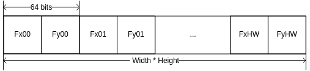
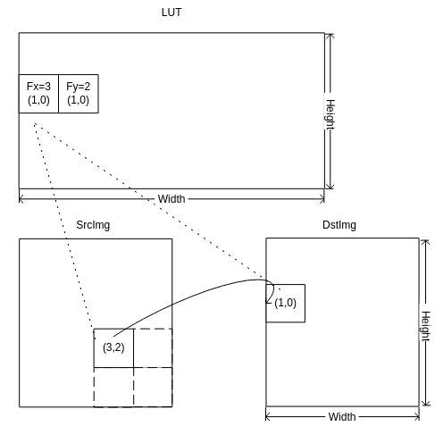

# 前言<a name="ZH-CN_TOPIC_0000002442023193"></a>

**概述<a name="section147695718814"></a>**

本文档为使用DPU进行双目立体视觉开发的程序员而写，目的是指导用户使用工具得到DPU相关功能所需要的满足要求的各项输入。

**产品版本<a name="section47722718813"></a>**

与本文档相对应的产品版本如下。

<a name="table6787671812"></a>
<table><thead align="left"><tr id="row138422718814"><th class="cellrowborder" valign="top" width="31.759999999999998%" id="mcps1.1.3.1.1"><p id="p1184214716812"><a name="p1184214716812"></a><a name="p1184214716812"></a>产品名称</p>
</th>
<th class="cellrowborder" valign="top" width="68.24%" id="mcps1.1.3.1.2"><p id="p4843271818"><a name="p4843271818"></a><a name="p4843271818"></a>产品版本</p>
</th>
</tr>
</thead>
<tbody><tr id="row138431571086"><td class="cellrowborder" valign="top" width="31.759999999999998%" headers="mcps1.1.3.1.1 "><p id="p11843137589"><a name="p11843137589"></a><a name="p11843137589"></a>SS928</p>
</td>
<td class="cellrowborder" valign="top" width="68.24%" headers="mcps1.1.3.1.2 "><p id="p584367389"><a name="p584367389"></a><a name="p584367389"></a>V100</p>
</td>
</tr>
<tr id="row1763104317574"><td class="cellrowborder" valign="top" width="31.759999999999998%" headers="mcps1.1.3.1.1 "><p id="p669464615720"><a name="p669464615720"></a><a name="p669464615720"></a>SS927</p>
</td>
<td class="cellrowborder" valign="top" width="68.24%" headers="mcps1.1.3.1.2 "><p id="p16694246125715"><a name="p16694246125715"></a><a name="p16694246125715"></a>V100</p>
</td>
</tr>
</tbody>
</table>

**读者对象<a name="section1578312716811"></a>**

本文档（本指南）主要适用于以下工程师：

-   技术支持工程师
-   软件开发工程师

**修改记录<a name="section2467512116410"></a>**

<a name="table1557726816410"></a>
<table><thead align="left"><tr id="row2942532716410"><th class="cellrowborder" valign="top" width="20.72%" id="mcps1.1.4.1.1"><p id="p3778275416410"><a name="p3778275416410"></a><a name="p3778275416410"></a><strong id="b5687322716410"><a name="b5687322716410"></a><a name="b5687322716410"></a>文档版本</strong></p>
</th>
<th class="cellrowborder" valign="top" width="26.119999999999997%" id="mcps1.1.4.1.2"><p id="p5627845516410"><a name="p5627845516410"></a><a name="p5627845516410"></a><strong id="b5800814916410"><a name="b5800814916410"></a><a name="b5800814916410"></a>发布日期</strong></p>
</th>
<th class="cellrowborder" valign="top" width="53.16%" id="mcps1.1.4.1.3"><p id="p2382284816410"><a name="p2382284816410"></a><a name="p2382284816410"></a><strong id="b3316380216410"><a name="b3316380216410"></a><a name="b3316380216410"></a>修改说明</strong></p>
</th>
</tr>
</thead>
<tbody><tr id="row5947359616410"><td class="cellrowborder" valign="top" width="20.72%" headers="mcps1.1.4.1.1 "><p id="p2149706016410"><a name="p2149706016410"></a><a name="p2149706016410"></a>00B01</p>
</td>
<td class="cellrowborder" valign="top" width="26.119999999999997%" headers="mcps1.1.4.1.2 "><p id="p648803616410"><a name="p648803616410"></a><a name="p648803616410"></a>2025-09-15</p>
</td>
<td class="cellrowborder" valign="top" width="53.16%" headers="mcps1.1.4.1.3 "><p id="p1946537916410"><a name="p1946537916410"></a><a name="p1946537916410"></a>第1次临时版本发布。</p>
</td>
</tr>
</tbody>
</table>

# DPU RECT查找表转换工具<a name="ZH-CN_TOPIC_0000002408583962"></a>


## 工具概述<a name="ZH-CN_TOPIC_0000002441983329"></a>

本文面向的读者是需要使用DPU中RECT功能的开发人员，目的在于帮助读者使用RECT查找表转换工具dpu\_tool\_rect。转换工具将查找表转换为满足RECT模块要求的查找表。

用户输入RECT模块的查找表需先经转换工具转换。RECT根据用户所提供查找表，通过插值算法对图像进行校正。

## 工具使用环境<a name="ZH-CN_TOPIC_0000002408424042"></a>

在windows 10系统中基于visual studio 2017 搭建，一般windows环境均可使用。

## 工具使用说明<a name="ZH-CN_TOPIC_0000002408424038"></a>


### 输入查找表格式说明<a name="ZH-CN_TOPIC_0000002408583966"></a>

工具输入查找表排布格式要求如[图1](#fig52461276114)所示。

**图 1**  输入查找表排布格式<a name="fig52461276114"></a>  


-   查找表大小为Width\*Height\*64 bits，Width为校正后图像宽度，Height为校正后图像高度。
-   Fxu，Fyu表示输出图像坐标为u的像素点对应输入图像中的像素坐标。Fx，Fy用单精度浮点表示。RECT根据每个像素提供的Fx，Fy进行插值。

例如，RECT输出图像Dst中坐标为（1,0）的点，在查找表中对应位置有Fx=3.2，Fy=2.8，则取RECT输入图像Src中坐标（3,2）的像素点与其周围（3,3）、（4,2）、（4,3）三个点，通过插值算法将计算结果放入Dst（1,0）中。

**图 2**  RECT校正方法<a name="fig18454101661314"></a>  


【注意】

-   Fx = 0表示第一列，Fy = 0 表示第一行。
-   若Fx、Fy超出原图像边界，Dst对应像素为0。

### 工具使用方法<a name="ZH-CN_TOPIC_0000002441983325"></a>

使用参照ot\_dpu\_tool\_sample工程中，main.c函数。

函数接口如下：

```
td_s32 ot_dpu_tool (ot_dpu_tool_mem_info  *src, ot_dpu_tool_mem_info *dst, td_u32 width, td_u32 height);
```

-   src：输入查找表，格式如上节所述，不能为空。
-   dst：输出转换后查找表，不能为空。
-   width：查找表宽度，即校正输出图像宽度，宽度范围\[128, 1920\]。
-   height：查找表高度，即校正输出图像高度，高度范围\[64, 1080\]。

