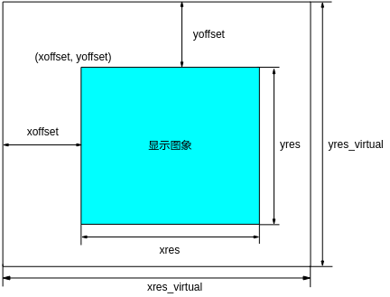
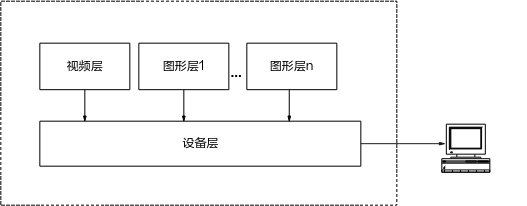

# 前言<a name="ZH-CN_TOPIC_0000002441694309"></a>

**概述<a name="section413mcpsimp"></a>**

本文档主要介绍GFBG的API和数据类型以及Proc调试信息。

> **说明：** 
>-   未有特殊说明，SS528V100、SS625V100、SS524V100、SS522V101与SS626V100内容一致。
>-   未有特殊说明，SS927V100与SS928V100，SS522V100与SS524V100内容完全一致。

**产品版本<a name="section418mcpsimp"></a>**

与本文档相对应的产品版本如下。

<a name="table421mcpsimp"></a>
<table><thead align="left"><tr id="row426mcpsimp"><th class="cellrowborder" valign="top" width="32%" id="mcps1.1.3.1.1"><p id="p428mcpsimp"><a name="p428mcpsimp"></a><a name="p428mcpsimp"></a>产品名称</p>
</th>
<th class="cellrowborder" valign="top" width="68%" id="mcps1.1.3.1.2"><p id="p430mcpsimp"><a name="p430mcpsimp"></a><a name="p430mcpsimp"></a>产品版本</p>
</th>
</tr>
</thead>
<tbody><tr id="row432mcpsimp"><td class="cellrowborder" valign="top" width="32%" headers="mcps1.1.3.1.1 "><p id="p434mcpsimp"><a name="p434mcpsimp"></a><a name="p434mcpsimp"></a>SS928</p>
</td>
<td class="cellrowborder" valign="top" width="68%" headers="mcps1.1.3.1.2 "><p id="p436mcpsimp"><a name="p436mcpsimp"></a><a name="p436mcpsimp"></a>V100</p>
</td>
</tr>
<tr id="row437mcpsimp"><td class="cellrowborder" valign="top" width="32%" headers="mcps1.1.3.1.1 "><p id="p439mcpsimp"><a name="p439mcpsimp"></a><a name="p439mcpsimp"></a>SS626</p>
</td>
<td class="cellrowborder" valign="top" width="68%" headers="mcps1.1.3.1.2 "><p id="p441mcpsimp"><a name="p441mcpsimp"></a><a name="p441mcpsimp"></a>V100</p>
</td>
</tr>
<tr id="row89351542115920"><td class="cellrowborder" valign="top" width="32%" headers="mcps1.1.3.1.1 "><p id="p881081984715"><a name="p881081984715"></a><a name="p881081984715"></a>SS524</p>
</td>
<td class="cellrowborder" valign="top" width="68%" headers="mcps1.1.3.1.2 "><p id="p34921898474"><a name="p34921898474"></a><a name="p34921898474"></a>V100</p>
</td>
</tr>
<tr id="row16608349131311"><td class="cellrowborder" valign="top" width="32%" headers="mcps1.1.3.1.1 "><p id="p1660820491132"><a name="p1660820491132"></a><a name="p1660820491132"></a>SS522</p>
</td>
<td class="cellrowborder" valign="top" width="68%" headers="mcps1.1.3.1.2 "><p id="p166081349121314"><a name="p166081349121314"></a><a name="p166081349121314"></a>V101</p>
</td>
</tr>
<tr id="row13496131121415"><td class="cellrowborder" valign="top" width="32%" headers="mcps1.1.3.1.1 "><p id="p415175181414"><a name="p415175181414"></a><a name="p415175181414"></a>SS522</p>
</td>
<td class="cellrowborder" valign="top" width="68%" headers="mcps1.1.3.1.2 "><p id="p215119511412"><a name="p215119511412"></a><a name="p215119511412"></a>V100</p>
</td>
</tr>
<tr id="row117250819588"><td class="cellrowborder" valign="top" width="32%" headers="mcps1.1.3.1.1 "><p id="p19820619133012"><a name="p19820619133012"></a><a name="p19820619133012"></a>SS528</p>
</td>
<td class="cellrowborder" valign="top" width="68%" headers="mcps1.1.3.1.2 "><p id="p982018196301"><a name="p982018196301"></a><a name="p982018196301"></a>V100</p>
</td>
</tr>
<tr id="row14475198109"><td class="cellrowborder" valign="top" width="32%" headers="mcps1.1.3.1.1 "><p id="p187350151849"><a name="p187350151849"></a><a name="p187350151849"></a>SS625</p>
</td>
<td class="cellrowborder" valign="top" width="68%" headers="mcps1.1.3.1.2 "><p id="p1147511911102"><a name="p1147511911102"></a><a name="p1147511911102"></a>V100</p>
</td>
</tr>
<tr id="row1834158659"><td class="cellrowborder" valign="top" width="32%" headers="mcps1.1.3.1.1 "><p id="p8622349102117"><a name="p8622349102117"></a><a name="p8622349102117"></a>SS927</p>
</td>
<td class="cellrowborder" valign="top" width="68%" headers="mcps1.1.3.1.2 "><p id="p9185184311112"><a name="p9185184311112"></a><a name="p9185184311112"></a>V100</p>
</td>
</tr>
</tbody>
</table>

**读者对象<a name="section442mcpsimp"></a>**

本文档（本指南）主要适用于以下工程师：

-   技术支持工程师
-   软件开发工程师

**符号约定<a name="section448mcpsimp"></a>**

在本文中可能出现下列标志，它们所代表的含义如下。

<a name="table451mcpsimp"></a>
<table><thead align="left"><tr id="row456mcpsimp"><th class="cellrowborder" valign="top" width="18%" id="mcps1.1.3.1.1"><p id="p458mcpsimp"><a name="p458mcpsimp"></a><a name="p458mcpsimp"></a>符号</p>
</th>
<th class="cellrowborder" valign="top" width="82%" id="mcps1.1.3.1.2"><p id="p460mcpsimp"><a name="p460mcpsimp"></a><a name="p460mcpsimp"></a>说明</p>
</th>
</tr>
</thead>
<tbody><tr id="row462mcpsimp"><td class="cellrowborder" valign="top" width="18%" headers="mcps1.1.3.1.1 "><p class="msonormal" id="p464mcpsimp"><a name="p464mcpsimp"></a><a name="p464mcpsimp"></a><a name="image109"></a><a name="image109"></a><span></span></p>
</td>
<td class="cellrowborder" valign="top" width="82%" headers="mcps1.1.3.1.2 "><p id="p466mcpsimp"><a name="p466mcpsimp"></a><a name="p466mcpsimp"></a>表示如不避免则将会导致死亡或严重伤害的具有高等级风险的危害。</p>
</td>
</tr>
<tr id="row467mcpsimp"><td class="cellrowborder" valign="top" width="18%" headers="mcps1.1.3.1.1 "><p class="msonormal" id="p469mcpsimp"><a name="p469mcpsimp"></a><a name="p469mcpsimp"></a><a name="image110"></a><a name="image110"></a><span></span></p>
</td>
<td class="cellrowborder" valign="top" width="82%" headers="mcps1.1.3.1.2 "><p id="p471mcpsimp"><a name="p471mcpsimp"></a><a name="p471mcpsimp"></a>表示如不避免则可能导致死亡或严重伤害的具有中等级风险的危害。</p>
</td>
</tr>
<tr id="row472mcpsimp"><td class="cellrowborder" valign="top" width="18%" headers="mcps1.1.3.1.1 "><p class="msonormal" id="p474mcpsimp"><a name="p474mcpsimp"></a><a name="p474mcpsimp"></a><a name="image111"></a><a name="image111"></a><span></span></p>
</td>
<td class="cellrowborder" valign="top" width="82%" headers="mcps1.1.3.1.2 "><p id="p476mcpsimp"><a name="p476mcpsimp"></a><a name="p476mcpsimp"></a>表示如不避免则可能导致轻微或中度伤害的具有低等级风险的危害。</p>
</td>
</tr>
<tr id="row477mcpsimp"><td class="cellrowborder" valign="top" width="18%" headers="mcps1.1.3.1.1 "><p class="msonormal" id="p479mcpsimp"><a name="p479mcpsimp"></a><a name="p479mcpsimp"></a><a name="image112"></a><a name="image112"></a><span></span></p>
</td>
<td class="cellrowborder" valign="top" width="82%" headers="mcps1.1.3.1.2 "><p id="p481mcpsimp"><a name="p481mcpsimp"></a><a name="p481mcpsimp"></a>用于传递设备或环境安全警示信息。如不避免则可能会导致设备损坏、数据丢失、设备性能降低或其它不可预知的结果。</p>
<p id="p482mcpsimp"><a name="p482mcpsimp"></a><a name="p482mcpsimp"></a>“须知”不涉及人身伤害。</p>
</td>
</tr>
<tr id="row483mcpsimp"><td class="cellrowborder" valign="top" width="18%" headers="mcps1.1.3.1.1 "><p class="msonormal" id="p485mcpsimp"><a name="p485mcpsimp"></a><a name="p485mcpsimp"></a><a name="image113"></a><a name="image113"></a><span></span></p>
</td>
<td class="cellrowborder" valign="top" width="82%" headers="mcps1.1.3.1.2 "><p id="p487mcpsimp"><a name="p487mcpsimp"></a><a name="p487mcpsimp"></a>对正文中重点信息的补充说明。</p>
<p id="p488mcpsimp"><a name="p488mcpsimp"></a><a name="p488mcpsimp"></a>“说明”不是安全警示信息，不涉及人身、设备及环境伤害信息。</p>
</td>
</tr>
</tbody>
</table>

**修订记录<a name="section489mcpsimp"></a>**

修订记录累积了每次文档更新的说明。最新版本的文档包含以前所有文档版本的更新内容。

<a name="table1557726816410"></a>
<table><thead align="left"><tr id="row2942532716410"><th class="cellrowborder" valign="top" width="20.72%" id="mcps1.1.4.1.1"><p id="p3778275416410"><a name="p3778275416410"></a><a name="p3778275416410"></a><strong id="b5687322716410"><a name="b5687322716410"></a><a name="b5687322716410"></a>文档版本</strong></p>
</th>
<th class="cellrowborder" valign="top" width="26.1%" id="mcps1.1.4.1.2"><p id="p5627845516410"><a name="p5627845516410"></a><a name="p5627845516410"></a><strong id="b5800814916410"><a name="b5800814916410"></a><a name="b5800814916410"></a>发布日期</strong></p>
</th>
<th class="cellrowborder" valign="top" width="53.18000000000001%" id="mcps1.1.4.1.3"><p id="p2382284816410"><a name="p2382284816410"></a><a name="p2382284816410"></a><strong id="b3316380216410"><a name="b3316380216410"></a><a name="b3316380216410"></a>修改说明</strong></p>
</th>
</tr>
</thead>
<tbody><tr id="row5947359616410"><td class="cellrowborder" valign="top" width="20.72%" headers="mcps1.1.4.1.1 "><p id="p2149706016410"><a name="p2149706016410"></a><a name="p2149706016410"></a>00B01</p>
</td>
<td class="cellrowborder" valign="top" width="26.1%" headers="mcps1.1.4.1.2 "><p id="p648803616410"><a name="p648803616410"></a><a name="p648803616410"></a>2025-09-15</p>
</td>
<td class="cellrowborder" valign="top" width="53.18000000000001%" headers="mcps1.1.4.1.3 "><p id="p1946537916410"><a name="p1946537916410"></a><a name="p1946537916410"></a>第1次临时版本发布。</p>
</td>
</tr>
</tbody>
</table>

# 概述<a name="ZH-CN_TOPIC_0000002441654473"></a>


## 概述<a name="ZH-CN_TOPIC_0000002408255058"></a>

Graphic Framebuffer Group（以下简称GFBG）是数字媒体处理平台提供的管理图像叠加层的模块，它基于Linux Framebuffer实现，在提供Linux Framebuffer基本功能的基础上，还扩展了一些图形层控制功能，如层间Alpha、设置原点、FB扩展模式等。

## 参考域说明<a name="ZH-CN_TOPIC_0000002441694349"></a>


### API参考域<a name="ZH-CN_TOPIC_0000002441654501"></a>

本手册使用9个参考域描述API的相关信息，它们的作用如[表1](#_Ref177443220)所示。

**表 1**  API参考域说明

<a name="_Ref177443220"></a>
<table><thead align="left"><tr id="row6358mcpsimp"><th class="cellrowborder" valign="top" width="27%" id="mcps1.2.3.1.1"><p id="p6360mcpsimp"><a name="p6360mcpsimp"></a><a name="p6360mcpsimp"></a>参考域</p>
</th>
<th class="cellrowborder" valign="top" width="73%" id="mcps1.2.3.1.2"><p id="p6362mcpsimp"><a name="p6362mcpsimp"></a><a name="p6362mcpsimp"></a>含义</p>
</th>
</tr>
</thead>
<tbody><tr id="row6364mcpsimp"><td class="cellrowborder" valign="top" width="27%" headers="mcps1.2.3.1.1 "><p id="p6366mcpsimp"><a name="p6366mcpsimp"></a><a name="p6366mcpsimp"></a>目的</p>
</td>
<td class="cellrowborder" valign="top" width="73%" headers="mcps1.2.3.1.2 "><p id="p6368mcpsimp"><a name="p6368mcpsimp"></a><a name="p6368mcpsimp"></a>简要描述API的主要功能。</p>
</td>
</tr>
<tr id="row6369mcpsimp"><td class="cellrowborder" valign="top" width="27%" headers="mcps1.2.3.1.1 "><p id="p6371mcpsimp"><a name="p6371mcpsimp"></a><a name="p6371mcpsimp"></a>语法</p>
</td>
<td class="cellrowborder" valign="top" width="73%" headers="mcps1.2.3.1.2 "><p id="p6373mcpsimp"><a name="p6373mcpsimp"></a><a name="p6373mcpsimp"></a>列出调用API应包括的头文件以及API的原型声明。</p>
</td>
</tr>
<tr id="row6374mcpsimp"><td class="cellrowborder" valign="top" width="27%" headers="mcps1.2.3.1.1 "><p id="p6376mcpsimp"><a name="p6376mcpsimp"></a><a name="p6376mcpsimp"></a>参数</p>
</td>
<td class="cellrowborder" valign="top" width="73%" headers="mcps1.2.3.1.2 "><p id="p6378mcpsimp"><a name="p6378mcpsimp"></a><a name="p6378mcpsimp"></a>列出API的参数、参数说明及参数属性。</p>
</td>
</tr>
<tr id="row6379mcpsimp"><td class="cellrowborder" valign="top" width="27%" headers="mcps1.2.3.1.1 "><p id="p6381mcpsimp"><a name="p6381mcpsimp"></a><a name="p6381mcpsimp"></a>描述</p>
</td>
<td class="cellrowborder" valign="top" width="73%" headers="mcps1.2.3.1.2 "><p id="p6383mcpsimp"><a name="p6383mcpsimp"></a><a name="p6383mcpsimp"></a>简要描述API的工作过程。</p>
</td>
</tr>
<tr id="row6384mcpsimp"><td class="cellrowborder" valign="top" width="27%" headers="mcps1.2.3.1.1 "><p id="p6386mcpsimp"><a name="p6386mcpsimp"></a><a name="p6386mcpsimp"></a>返回值</p>
</td>
<td class="cellrowborder" valign="top" width="73%" headers="mcps1.2.3.1.2 "><p id="p6388mcpsimp"><a name="p6388mcpsimp"></a><a name="p6388mcpsimp"></a>列出API所有可能的返回值及其含义。</p>
</td>
</tr>
<tr id="row6389mcpsimp"><td class="cellrowborder" valign="top" width="27%" headers="mcps1.2.3.1.1 "><p id="p6391mcpsimp"><a name="p6391mcpsimp"></a><a name="p6391mcpsimp"></a>需求</p>
</td>
<td class="cellrowborder" valign="top" width="73%" headers="mcps1.2.3.1.2 "><p id="p6393mcpsimp"><a name="p6393mcpsimp"></a><a name="p6393mcpsimp"></a>列出API包含的头文件和API编译时要链接的库文件。</p>
</td>
</tr>
<tr id="row6394mcpsimp"><td class="cellrowborder" valign="top" width="27%" headers="mcps1.2.3.1.1 "><p id="p6396mcpsimp"><a name="p6396mcpsimp"></a><a name="p6396mcpsimp"></a>注意</p>
</td>
<td class="cellrowborder" valign="top" width="73%" headers="mcps1.2.3.1.2 "><p id="p6398mcpsimp"><a name="p6398mcpsimp"></a><a name="p6398mcpsimp"></a>列出使用API时应注意的事项。</p>
</td>
</tr>
<tr id="row6399mcpsimp"><td class="cellrowborder" valign="top" width="27%" headers="mcps1.2.3.1.1 "><p id="p6401mcpsimp"><a name="p6401mcpsimp"></a><a name="p6401mcpsimp"></a>举例</p>
</td>
<td class="cellrowborder" valign="top" width="73%" headers="mcps1.2.3.1.2 "><p id="p6403mcpsimp"><a name="p6403mcpsimp"></a><a name="p6403mcpsimp"></a>列出使用API的实例。</p>
</td>
</tr>
<tr id="row6404mcpsimp"><td class="cellrowborder" valign="top" width="27%" headers="mcps1.2.3.1.1 "><p id="p6406mcpsimp"><a name="p6406mcpsimp"></a><a name="p6406mcpsimp"></a>相关接口</p>
</td>
<td class="cellrowborder" valign="top" width="73%" headers="mcps1.2.3.1.2 "><p id="p6408mcpsimp"><a name="p6408mcpsimp"></a><a name="p6408mcpsimp"></a>列出与本API相关联的其他接口。</p>
</td>
</tr>
</tbody>
</table>

### 数据类型参考域<a name="ZH-CN_TOPIC_0000002408255006"></a>

本手册使用5个参考域描述数据类型的相关信息，它们的作用如[表1](#_Ref177443225)所示。

**表 1**  数据类型参考域说明

<a name="_Ref177443225"></a>
<table><thead align="left"><tr id="row6554mcpsimp"><th class="cellrowborder" valign="top" width="27%" id="mcps1.2.3.1.1"><p id="p6556mcpsimp"><a name="p6556mcpsimp"></a><a name="p6556mcpsimp"></a>参考域</p>
</th>
<th class="cellrowborder" valign="top" width="73%" id="mcps1.2.3.1.2"><p id="p6558mcpsimp"><a name="p6558mcpsimp"></a><a name="p6558mcpsimp"></a>含义</p>
</th>
</tr>
</thead>
<tbody><tr id="row6560mcpsimp"><td class="cellrowborder" valign="top" width="27%" headers="mcps1.2.3.1.1 "><p id="p6562mcpsimp"><a name="p6562mcpsimp"></a><a name="p6562mcpsimp"></a>说明</p>
</td>
<td class="cellrowborder" valign="top" width="73%" headers="mcps1.2.3.1.2 "><p id="p6564mcpsimp"><a name="p6564mcpsimp"></a><a name="p6564mcpsimp"></a>简要描述数据类型的主要功能。</p>
</td>
</tr>
<tr id="row6565mcpsimp"><td class="cellrowborder" valign="top" width="27%" headers="mcps1.2.3.1.1 "><p id="p6567mcpsimp"><a name="p6567mcpsimp"></a><a name="p6567mcpsimp"></a>定义</p>
</td>
<td class="cellrowborder" valign="top" width="73%" headers="mcps1.2.3.1.2 "><p id="p6569mcpsimp"><a name="p6569mcpsimp"></a><a name="p6569mcpsimp"></a>列出数据类型的定义语句。</p>
</td>
</tr>
<tr id="row6570mcpsimp"><td class="cellrowborder" valign="top" width="27%" headers="mcps1.2.3.1.1 "><p id="p6572mcpsimp"><a name="p6572mcpsimp"></a><a name="p6572mcpsimp"></a>成员</p>
</td>
<td class="cellrowborder" valign="top" width="73%" headers="mcps1.2.3.1.2 "><p id="p6574mcpsimp"><a name="p6574mcpsimp"></a><a name="p6574mcpsimp"></a>列出数据结构的成员及含义。</p>
</td>
</tr>
<tr id="row6575mcpsimp"><td class="cellrowborder" valign="top" width="27%" headers="mcps1.2.3.1.1 "><p id="p6577mcpsimp"><a name="p6577mcpsimp"></a><a name="p6577mcpsimp"></a>注意事项</p>
</td>
<td class="cellrowborder" valign="top" width="73%" headers="mcps1.2.3.1.2 "><p id="p6579mcpsimp"><a name="p6579mcpsimp"></a><a name="p6579mcpsimp"></a>列出使用数据类型时应注意的事项。</p>
</td>
</tr>
<tr id="row6580mcpsimp"><td class="cellrowborder" valign="top" width="27%" headers="mcps1.2.3.1.1 "><p id="p6582mcpsimp"><a name="p6582mcpsimp"></a><a name="p6582mcpsimp"></a>相关数据类型和接口</p>
</td>
<td class="cellrowborder" valign="top" width="73%" headers="mcps1.2.3.1.2 "><p id="p6584mcpsimp"><a name="p6584mcpsimp"></a><a name="p6584mcpsimp"></a>列出与本数据类型相关联的其他数据类型和接口。</p>
</td>
</tr>
</tbody>
</table>

# API参考<a name="ZH-CN_TOPIC_0000002441654401"></a>


## API类别<a name="ZH-CN_TOPIC_0000002408255074"></a>

GFBG的API分为以下几类：

-   文件操作类

    提供操作GFBG的接口。通过调用这些接口，可以像操作文件一样操作叠加层。这些接口是Linux本身提供的标准接口，主要有open、close、write、read、lseek等。本文档不对这些标准接口进行描述。

-   显存映射类

    提供将物理显存映射到用户虚拟内存空间的接口。这些接口是Linux本身提供的标准接口，主要有mmap、munmap等。本文档不对这些标准接口进行描述。

-   显存控制和状态查询类

    允许设置像素格式和颜色深度等属性的接口。这些接口是Linux本身提供的标准接口，经常使用。本文档将对其进行简要描述。

-   层间效果控制和状态查询类

    GFBG可以管理多个图形叠加层，每层可以设置Alpha值和原点等。相对于Linux Framebuffer，这些是GFBG的新增功能。本文档将重点描述该部分。

## ioctl函数<a name="ZH-CN_TOPIC_0000002408255022"></a>

GFBG的用户态接口以ioctl形式体现，其形式如下：

```
int ioctl(int fd,
            unsigned long cmd, 
            ……
);
```

该函数是Linux标准接口，具备可变参数特性。但在GFBG中，实际只需要3个参数。因此，其语法形式等同于：

```
int ioctl (int fd, 
    unsigned long cmd, 
    CMD_DATA_TYPE *cmd_data);
```

其中，CMD\_DATA\_TYPE随参数cmd的变化而变化。这3个参数的详细描述如[表1](#_Ref175542234)所示。

**表 1**  ioctl函数的3个参数

<a name="_Ref175542234"></a>
<table><thead align="left"><tr id="row1729mcpsimp"><th class="cellrowborder" valign="top" width="14.000000000000002%" id="mcps1.2.4.1.1"><p id="p1731mcpsimp"><a name="p1731mcpsimp"></a><a name="p1731mcpsimp"></a>参数名称</p>
</th>
<th class="cellrowborder" valign="top" width="64.4%" id="mcps1.2.4.1.2"><p id="p1733mcpsimp"><a name="p1733mcpsimp"></a><a name="p1733mcpsimp"></a>描述</p>
</th>
<th class="cellrowborder" valign="top" width="21.6%" id="mcps1.2.4.1.3"><p id="p1735mcpsimp"><a name="p1735mcpsimp"></a><a name="p1735mcpsimp"></a>输入/输出</p>
</th>
</tr>
</thead>
<tbody><tr id="row1737mcpsimp"><td class="cellrowborder" valign="top" width="14.000000000000002%" headers="mcps1.2.4.1.1 "><p id="p1739mcpsimp"><a name="p1739mcpsimp"></a><a name="p1739mcpsimp"></a>fd</p>
</td>
<td class="cellrowborder" valign="top" width="64.4%" headers="mcps1.2.4.1.2 "><p id="p1741mcpsimp"><a name="p1741mcpsimp"></a><a name="p1741mcpsimp"></a>Framebuffer设备文件描述符，是调用open函数打开Framebuffer设备之后的返回值。</p>
</td>
<td class="cellrowborder" valign="top" width="21.6%" headers="mcps1.2.4.1.3 "><p id="p1743mcpsimp"><a name="p1743mcpsimp"></a><a name="p1743mcpsimp"></a>输入</p>
</td>
</tr>
<tr id="row1744mcpsimp"><td class="cellrowborder" valign="top" width="14.000000000000002%" headers="mcps1.2.4.1.1 "><p id="p1746mcpsimp"><a name="p1746mcpsimp"></a><a name="p1746mcpsimp"></a>cmd</p>
</td>
<td class="cellrowborder" valign="top" width="64.4%" headers="mcps1.2.4.1.2 "><p id="p1748mcpsimp"><a name="p1748mcpsimp"></a><a name="p1748mcpsimp"></a>主要的cmd（命令控制字）如下：</p>
<a name="ul1749mcpsimp"></a><a name="ul1749mcpsimp"></a><ul id="ul1749mcpsimp"><li><a href="#ZH-CN_TOPIC_0000002408255078">FBIOGET_VSCREENINFO</a>：获取屏幕可变信息</li><li><a href="#ZH-CN_TOPIC_0000002408255102">FBIOPUT_VSCREENINFO</a>：设置屏幕可变信息</li><li><a href="#ZH-CN_TOPIC_0000002441694273">FBIOGET_FSCREENINFO</a>：获取屏幕固定信息</li><li><a href="#ZH-CN_TOPIC_0000002408095106">FBIOPAN_DISPLAY</a>：设置PAN显示</li><li><a href="#ZH-CN_TOPIC_0000002441654445">FBIOGET_CAPABILITY_GFBG</a>：获取叠加层的支持能力</li><li><a href="#ZH-CN_TOPIC_0000002441694257">FBIOGET_SCREEN_ORIGIN_GFBG</a>：获取叠加层坐标原点</li><li><a href="#ZH-CN_TOPIC_0000002441654497">FBIOPUT_SCREEN_ORIGIN_GFBG</a>：设置叠加层坐标原点</li><li><a href="#ZH-CN_TOPIC_0000002441654505">FBIOGET_SHOW_GFBG</a>：获取叠加层显示状态</li><li><a href="#ZH-CN_TOPIC_0000002408255046">FBIOPUT_SHOW_GFBG</a>：设置叠加层显示状态</li><li><a href="#ZH-CN_TOPIC_0000002441654413">FBIOGET_ALPHA_GFBG</a>：获取叠加层Alpha</li><li><a href="#ZH-CN_TOPIC_0000002408095146">FBIOPUT_ALPHA_GFBG</a>：设置叠加层Alpha</li><li><a href="#ZH-CN_TOPIC_0000002408095110">FBIOGET_COLORKEY_GFBG</a>：获取叠加层的Colorkey属性</li><li><a href="#ZH-CN_TOPIC_0000002408095094">FBIOPUT_COLORKEY_GFBG</a>：设置叠加层的Colorkey属性</li><li><a href="#ZH-CN_TOPIC_0000002408255038">FBIOGET_MDDRDETECT_GFBG</a>：获取内存侦测属性</li><li><a href="#ZH-CN_TOPIC_0000002408095134">FBIOPUT_MDDRDETECT_GFBG</a>：设置内存侦测属性</li><li><a href="#ZH-CN_TOPIC_0000002408255002">FBIOPUT_DYNAMIC_RANGE_GFBG</a>：设置叠加层的目标图像动态范围</li><li><a href="#ZH-CN_TOPIC_0000002408095154">FBIOGET_DYNAMIC_RANGE_GFBG</a>：获取叠加层的目标图像动态范围</li><li><a href="#ZH-CN_TOPIC_0000002441654461">FBIOPUT_SCREEN_SIZE</a>：设置叠加层的屏幕输出分辨率</li><li><a href="#ZH-CN_TOPIC_0000002408255014">FBIOGET_SCREEN_SIZE</a>：获取叠加层的屏幕输出分辨率</li><li><a href="#ZH-CN_TOPIC_0000002441654425">FBIO_DRAW_SMART_RECT</a>：osb在线画框</li><li><a href="#ZH-CN_TOPIC_0000002408095078">FBIO_CREATE_LAYER</a>：使能硬件图形层</li><li><a href="#ZH-CN_TOPIC_0000002441654477">FBIO_DESTROY_LAYER</a>：去使能硬件图形层</li><li><a href="#ZH-CN_TOPIC_0000002441694329">FBIO_REFRESH</a>：硬件图形层刷新</li><li><a href="#ZH-CN_TOPIC_0000002441654409">FBIOPUT_ROTATE_MODE</a>：硬件图形层旋转</li></ul>
</td>
<td class="cellrowborder" valign="top" width="21.6%" headers="mcps1.2.4.1.3 "><p id="p1799mcpsimp"><a name="p1799mcpsimp"></a><a name="p1799mcpsimp"></a>输入</p>
</td>
</tr>
<tr id="row1800mcpsimp"><td class="cellrowborder" valign="top" width="14.000000000000002%" headers="mcps1.2.4.1.1 "><p id="p1802mcpsimp"><a name="p1802mcpsimp"></a><a name="p1802mcpsimp"></a>cmd_data</p>
</td>
<td class="cellrowborder" valign="top" width="64.4%" headers="mcps1.2.4.1.2 "><p id="p1804mcpsimp"><a name="p1804mcpsimp"></a><a name="p1804mcpsimp"></a>各cmd对应的数据类型分别是：</p>
<a name="ul1805mcpsimp"></a><a name="ul1805mcpsimp"></a><ul id="ul1805mcpsimp"><li>获取或设置屏幕可变信息：<a href="#ZH-CN_TOPIC_0000002441694265">fb_var_screeninfo</a>*类型</li><li>获取屏幕固定信息：<a href="#ZH-CN_TOPIC_0000002441694325">fb_fix_screeninfo</a> *类型</li><li>设置PAN显示：<a href="#ZH-CN_TOPIC_0000002441694265">fb_var_screeninfo</a> *类型</li><li>获取叠加层支持能力：<a href="#ZH-CN_TOPIC_0000002441654485">ot_fb_capability</a> *类型</li><li>获取或设置屏幕叠加层坐标原点：<a href="#ZH-CN_TOPIC_0000002441694301">ot_fb_point</a> *类型</li><li>获取或设置叠加层显示状态：td_bool *类型</li><li>获取或设置叠加层Alpha：<a href="#ZH-CN_TOPIC_0000002408255094">ot_fb_alpha</a> *类型</li><li>获取或设置内存侦测属性：<a href="#ZH-CN_TOPIC_0000002408095086">ot_fb_ddr_zone</a> *类型</li><li>获取或设置压缩开关状态：td_bool *类型</li><li>获取或设置图形层动态范围：<a href="#ZH-CN_TOPIC_0000002441654465">ot_fb_dynamic_range</a> * 类型</li></ul>
</td>
<td class="cellrowborder" valign="top" width="21.6%" headers="mcps1.2.4.1.3 "><p id="p1825mcpsimp"><a name="p1825mcpsimp"></a><a name="p1825mcpsimp"></a>输入</p>
<p id="p1826mcpsimp"><a name="p1826mcpsimp"></a><a name="p1826mcpsimp"></a>输出</p>
</td>
</tr>
</tbody>
</table>

## 标准功能<a name="ZH-CN_TOPIC_0000002408095170"></a>


### FBIOGET\_VSCREENINFO<a name="ZH-CN_TOPIC_0000002408255078"></a>

【目的】

获取屏幕的可变信息。

【语法】

```
int ioctl (int fd,
    FBIOGET_VSCREENINFO,
    fb_var_screeninfo *var);
```

【描述】

使用此接口获取屏幕的可变信息，主要包括分辨率和像素格式。信息的详细描述请参见[fb\_var\_screeninfo](#ZH-CN_TOPIC_0000002441694265)。

【参数】

<a name="table6597mcpsimp"></a>
<table><thead align="left"><tr id="row6603mcpsimp"><th class="cellrowborder" valign="top" width="35%" id="mcps1.1.4.1.1"><p id="p6605mcpsimp"><a name="p6605mcpsimp"></a><a name="p6605mcpsimp"></a>参数名称</p>
</th>
<th class="cellrowborder" valign="top" width="48%" id="mcps1.1.4.1.2"><p id="p6607mcpsimp"><a name="p6607mcpsimp"></a><a name="p6607mcpsimp"></a>描述</p>
</th>
<th class="cellrowborder" valign="top" width="17%" id="mcps1.1.4.1.3"><p id="p6609mcpsimp"><a name="p6609mcpsimp"></a><a name="p6609mcpsimp"></a>输入/输出</p>
</th>
</tr>
</thead>
<tbody><tr id="row6611mcpsimp"><td class="cellrowborder" valign="top" width="35%" headers="mcps1.1.4.1.1 "><p id="p6613mcpsimp"><a name="p6613mcpsimp"></a><a name="p6613mcpsimp"></a>fd</p>
</td>
<td class="cellrowborder" valign="top" width="48%" headers="mcps1.1.4.1.2 "><p id="p6615mcpsimp"><a name="p6615mcpsimp"></a><a name="p6615mcpsimp"></a>Framebuffer设备文件描述符</p>
</td>
<td class="cellrowborder" valign="top" width="17%" headers="mcps1.1.4.1.3 "><p id="p6617mcpsimp"><a name="p6617mcpsimp"></a><a name="p6617mcpsimp"></a>输入</p>
</td>
</tr>
<tr id="row6618mcpsimp"><td class="cellrowborder" valign="top" width="35%" headers="mcps1.1.4.1.1 "><p id="p6620mcpsimp"><a name="p6620mcpsimp"></a><a name="p6620mcpsimp"></a>FBIOGET_VSCREENINFO</p>
</td>
<td class="cellrowborder" valign="top" width="48%" headers="mcps1.1.4.1.2 "><p id="p6622mcpsimp"><a name="p6622mcpsimp"></a><a name="p6622mcpsimp"></a>ioctl号</p>
</td>
<td class="cellrowborder" valign="top" width="17%" headers="mcps1.1.4.1.3 "><p id="p6624mcpsimp"><a name="p6624mcpsimp"></a><a name="p6624mcpsimp"></a>输入</p>
</td>
</tr>
<tr id="row6625mcpsimp"><td class="cellrowborder" valign="top" width="35%" headers="mcps1.1.4.1.1 "><p id="p6627mcpsimp"><a name="p6627mcpsimp"></a><a name="p6627mcpsimp"></a>var</p>
</td>
<td class="cellrowborder" valign="top" width="48%" headers="mcps1.1.4.1.2 "><p id="p6629mcpsimp"><a name="p6629mcpsimp"></a><a name="p6629mcpsimp"></a>可变信息结构体指针</p>
</td>
<td class="cellrowborder" valign="top" width="17%" headers="mcps1.1.4.1.3 "><p id="p6631mcpsimp"><a name="p6631mcpsimp"></a><a name="p6631mcpsimp"></a>输出</p>
</td>
</tr>
</tbody>
</table>

【返回值】

<a name="table6633mcpsimp"></a>
<table><thead align="left"><tr id="row6638mcpsimp"><th class="cellrowborder" valign="top" width="50%" id="mcps1.1.3.1.1"><p id="p6640mcpsimp"><a name="p6640mcpsimp"></a><a name="p6640mcpsimp"></a>返回值</p>
</th>
<th class="cellrowborder" valign="top" width="50%" id="mcps1.1.3.1.2"><p id="p6642mcpsimp"><a name="p6642mcpsimp"></a><a name="p6642mcpsimp"></a>描述</p>
</th>
</tr>
</thead>
<tbody><tr id="row6643mcpsimp"><td class="cellrowborder" valign="top" width="50%" headers="mcps1.1.3.1.1 "><p id="p6645mcpsimp"><a name="p6645mcpsimp"></a><a name="p6645mcpsimp"></a>0</p>
</td>
<td class="cellrowborder" valign="top" width="50%" headers="mcps1.1.3.1.2 "><p id="p6647mcpsimp"><a name="p6647mcpsimp"></a><a name="p6647mcpsimp"></a>成功</p>
</td>
</tr>
<tr id="row6648mcpsimp"><td class="cellrowborder" valign="top" width="50%" headers="mcps1.1.3.1.1 "><p id="p6650mcpsimp"><a name="p6650mcpsimp"></a><a name="p6650mcpsimp"></a>–1</p>
</td>
<td class="cellrowborder" valign="top" width="50%" headers="mcps1.1.3.1.2 "><p id="p6652mcpsimp"><a name="p6652mcpsimp"></a><a name="p6652mcpsimp"></a>失败</p>
</td>
</tr>
</tbody>
</table>

【需求】

头文件：fb.h

【注意】

高清设备的图形层G0默认分辨率为3840x2160，G1默认分辨率为1920x1080，鼠标层的默认分辨率为256x256，标清设备的图形层的默认分辨率为720x576。

【举例】

```
struct fb_var_screeninfo vinfo;
if (ioctl(fd, FBIOGET_VSCREENINFO, &vinfo) < 0)
{
    return -1;
}
```

【相关接口】

[FBIOPUT\_VSCREENINFO](#FBIOPUT_VSCREENINFO)

### FBIOPUT\_VSCREENINFO<a name="ZH-CN_TOPIC_0000002408255102"></a>

【目的】

设置Framebuffer的屏幕分辨率和像素格式等。

【语法】

```
int ioctl (int fd,
    FBIOPUT_VSCREENINFO,
    fb_var_screeninfo *var);
```

【描述】

使用此接口设置屏幕分辨率、像素格式。

【参数】

<a name="table4080mcpsimp"></a>
<table><thead align="left"><tr id="row4086mcpsimp"><th class="cellrowborder" valign="top" width="34%" id="mcps1.1.4.1.1"><p id="p4088mcpsimp"><a name="p4088mcpsimp"></a><a name="p4088mcpsimp"></a>参数名称</p>
</th>
<th class="cellrowborder" valign="top" width="48%" id="mcps1.1.4.1.2"><p id="p4090mcpsimp"><a name="p4090mcpsimp"></a><a name="p4090mcpsimp"></a>描述</p>
</th>
<th class="cellrowborder" valign="top" width="18%" id="mcps1.1.4.1.3"><p id="p4092mcpsimp"><a name="p4092mcpsimp"></a><a name="p4092mcpsimp"></a>输入/输出</p>
</th>
</tr>
</thead>
<tbody><tr id="row4094mcpsimp"><td class="cellrowborder" valign="top" width="34%" headers="mcps1.1.4.1.1 "><p id="p4096mcpsimp"><a name="p4096mcpsimp"></a><a name="p4096mcpsimp"></a>fd</p>
</td>
<td class="cellrowborder" valign="top" width="48%" headers="mcps1.1.4.1.2 "><p id="p4098mcpsimp"><a name="p4098mcpsimp"></a><a name="p4098mcpsimp"></a>Framebuffer设备文件描述符</p>
</td>
<td class="cellrowborder" valign="top" width="18%" headers="mcps1.1.4.1.3 "><p id="p4100mcpsimp"><a name="p4100mcpsimp"></a><a name="p4100mcpsimp"></a>输入</p>
</td>
</tr>
<tr id="row4101mcpsimp"><td class="cellrowborder" valign="top" width="34%" headers="mcps1.1.4.1.1 "><p id="p4103mcpsimp"><a name="p4103mcpsimp"></a><a name="p4103mcpsimp"></a>FBIOPUT_VSCREENINFO</p>
</td>
<td class="cellrowborder" valign="top" width="48%" headers="mcps1.1.4.1.2 "><p id="p4105mcpsimp"><a name="p4105mcpsimp"></a><a name="p4105mcpsimp"></a>ioctl号</p>
</td>
<td class="cellrowborder" valign="top" width="18%" headers="mcps1.1.4.1.3 "><p id="p4107mcpsimp"><a name="p4107mcpsimp"></a><a name="p4107mcpsimp"></a>输入</p>
</td>
</tr>
<tr id="row4108mcpsimp"><td class="cellrowborder" valign="top" width="34%" headers="mcps1.1.4.1.1 "><p id="p4110mcpsimp"><a name="p4110mcpsimp"></a><a name="p4110mcpsimp"></a>var</p>
</td>
<td class="cellrowborder" valign="top" width="48%" headers="mcps1.1.4.1.2 "><p id="p4112mcpsimp"><a name="p4112mcpsimp"></a><a name="p4112mcpsimp"></a>可变信息结构体指针</p>
</td>
<td class="cellrowborder" valign="top" width="18%" headers="mcps1.1.4.1.3 "><p id="p4114mcpsimp"><a name="p4114mcpsimp"></a><a name="p4114mcpsimp"></a>输入</p>
</td>
</tr>
</tbody>
</table>

【返回值】

<a name="table4116mcpsimp"></a>
<table><thead align="left"><tr id="row4121mcpsimp"><th class="cellrowborder" valign="top" width="49.95%" id="mcps1.1.3.1.1"><p id="p4123mcpsimp"><a name="p4123mcpsimp"></a><a name="p4123mcpsimp"></a>返回值</p>
</th>
<th class="cellrowborder" valign="top" width="50.05%" id="mcps1.1.3.1.2"><p id="p4125mcpsimp"><a name="p4125mcpsimp"></a><a name="p4125mcpsimp"></a>描述</p>
</th>
</tr>
</thead>
<tbody><tr id="row4126mcpsimp"><td class="cellrowborder" valign="top" width="49.95%" headers="mcps1.1.3.1.1 "><p id="p4128mcpsimp"><a name="p4128mcpsimp"></a><a name="p4128mcpsimp"></a>0</p>
</td>
<td class="cellrowborder" valign="top" width="50.05%" headers="mcps1.1.3.1.2 "><p id="p4130mcpsimp"><a name="p4130mcpsimp"></a><a name="p4130mcpsimp"></a>成功</p>
</td>
</tr>
<tr id="row4131mcpsimp"><td class="cellrowborder" valign="top" width="49.95%" headers="mcps1.1.3.1.1 "><p id="p4133mcpsimp"><a name="p4133mcpsimp"></a><a name="p4133mcpsimp"></a>–1</p>
</td>
<td class="cellrowborder" valign="top" width="50.05%" headers="mcps1.1.3.1.2 "><p id="p4135mcpsimp"><a name="p4135mcpsimp"></a><a name="p4135mcpsimp"></a>失败</p>
</td>
</tr>
</tbody>
</table>

【需求】

头文件：fb.h

【注意】

-   分辨率的大小必须在各叠加层支持的分辨率范围内，各叠加层支持的最大分辨率和最小分辨率可通过[FBIOGET\_CAPABILITY\_GFBG](#ZH-CN_TOPIC_0000002441654445)获取。
-   必须保证实际分辨率与偏移的和在虚拟分辨率范围内，否则系统会自动调整实际分辨率的大小让其在虚拟分辨率范围内。
-   对于隔行显示设备，要求分辨率的高度必须为偶数。
-   如果图形层支持缩放，可以设置显示分辨率大于设备分辨率，这时候显示图像的一部分。
-   linux5.10版本在FBIOPUT\_VSCREENINFO接口中增加了xres和yres最小值的的检查，xres和yres均需要大于等8，否则该接口会返回失败。

【举例】

设置实际分辨率为720x576，虚拟分辨率为720x576，偏移为（0，0），像素格式为ARGB1555的示例代码如下：

```
struct fb_bitfield r16 = {10, 5, 0};
struct fb_bitfield g16 = {5, 5, 0};
struct fb_bitfield b16 = {0, 5, 0};
struct fb_bitfield a16 = {15, 1, 0};
struct fb_var_screeninfo vinfo;
if (ioctl(fd, FBIOGET_VSCREENINFO, &vinfo) < 0)
{
    return -1;
}
vinfo.xres_virtual = 720;
vinfo.yres_virtual = 576;
vinfo.xres = 720;
vinfo.yres = 576;
vinfo.activate = FB_ACTIVATE_NOW;
vinfo.bits_per_pixel = 16;
vinfo.xoffset = 0;
vinfo.yoffset = 0;
vinfo.red = r16;
vinfo.green = g16;
vinfo.blue = b16;
vinfo.transp= a16;
if (ioctl(fd, FBIOPUT_VSCREENINFO, &vinfo) < 0)
{
    return -1;
}
```

【相关接口】

[FBIOGET\_VSCREENINFO](#FBIOGET_VSCREENINFO)

### FBIOGET\_FSCREENINFO<a name="ZH-CN_TOPIC_0000002441694273"></a>

【目的】

获取Framebuffer的固定信息。

【语法】

```
int ioctl (int fd,
    FBIOGET_FSCREENINFO,
    fb_fix_screeninfo *fix);
```

【描述】

使用此接口获取Framebuffer固定信息，包括显存起始物理地址、显存大小和行间距等。信息的详细描述请参见[fb\_fix\_screeninfo](#ZH-CN_TOPIC_0000002441694325)。

【参数】

<a name="table2099mcpsimp"></a>
<table><thead align="left"><tr id="row2105mcpsimp"><th class="cellrowborder" valign="top" width="35%" id="mcps1.1.4.1.1"><p id="p2107mcpsimp"><a name="p2107mcpsimp"></a><a name="p2107mcpsimp"></a>参数名称</p>
</th>
<th class="cellrowborder" valign="top" width="46%" id="mcps1.1.4.1.2"><p id="p2109mcpsimp"><a name="p2109mcpsimp"></a><a name="p2109mcpsimp"></a>描述</p>
</th>
<th class="cellrowborder" valign="top" width="19%" id="mcps1.1.4.1.3"><p id="p2111mcpsimp"><a name="p2111mcpsimp"></a><a name="p2111mcpsimp"></a>输入/输出</p>
</th>
</tr>
</thead>
<tbody><tr id="row2113mcpsimp"><td class="cellrowborder" valign="top" width="35%" headers="mcps1.1.4.1.1 "><p id="p2115mcpsimp"><a name="p2115mcpsimp"></a><a name="p2115mcpsimp"></a>fd</p>
</td>
<td class="cellrowborder" valign="top" width="46%" headers="mcps1.1.4.1.2 "><p id="p2117mcpsimp"><a name="p2117mcpsimp"></a><a name="p2117mcpsimp"></a>Framebuffer设备文件描述符</p>
</td>
<td class="cellrowborder" valign="top" width="19%" headers="mcps1.1.4.1.3 "><p id="p2119mcpsimp"><a name="p2119mcpsimp"></a><a name="p2119mcpsimp"></a>输入</p>
</td>
</tr>
<tr id="row2120mcpsimp"><td class="cellrowborder" valign="top" width="35%" headers="mcps1.1.4.1.1 "><p id="p2122mcpsimp"><a name="p2122mcpsimp"></a><a name="p2122mcpsimp"></a>FBIOGET_FSCREENINFO</p>
</td>
<td class="cellrowborder" valign="top" width="46%" headers="mcps1.1.4.1.2 "><p id="p2124mcpsimp"><a name="p2124mcpsimp"></a><a name="p2124mcpsimp"></a>ioctl号</p>
</td>
<td class="cellrowborder" valign="top" width="19%" headers="mcps1.1.4.1.3 "><p id="p2126mcpsimp"><a name="p2126mcpsimp"></a><a name="p2126mcpsimp"></a>输入</p>
</td>
</tr>
<tr id="row2127mcpsimp"><td class="cellrowborder" valign="top" width="35%" headers="mcps1.1.4.1.1 "><p id="p2129mcpsimp"><a name="p2129mcpsimp"></a><a name="p2129mcpsimp"></a>fix</p>
</td>
<td class="cellrowborder" valign="top" width="46%" headers="mcps1.1.4.1.2 "><p id="p2131mcpsimp"><a name="p2131mcpsimp"></a><a name="p2131mcpsimp"></a>固定信息结构体指针</p>
</td>
<td class="cellrowborder" valign="top" width="19%" headers="mcps1.1.4.1.3 "><p id="p2133mcpsimp"><a name="p2133mcpsimp"></a><a name="p2133mcpsimp"></a>输出</p>
</td>
</tr>
</tbody>
</table>

【返回值】

<a name="table2135mcpsimp"></a>
<table><thead align="left"><tr id="row2140mcpsimp"><th class="cellrowborder" valign="top" width="50%" id="mcps1.1.3.1.1"><p id="p2142mcpsimp"><a name="p2142mcpsimp"></a><a name="p2142mcpsimp"></a>返回值</p>
</th>
<th class="cellrowborder" valign="top" width="50%" id="mcps1.1.3.1.2"><p id="p2144mcpsimp"><a name="p2144mcpsimp"></a><a name="p2144mcpsimp"></a>描述</p>
</th>
</tr>
</thead>
<tbody><tr id="row2145mcpsimp"><td class="cellrowborder" valign="top" width="50%" headers="mcps1.1.3.1.1 "><p id="p2147mcpsimp"><a name="p2147mcpsimp"></a><a name="p2147mcpsimp"></a>0</p>
</td>
<td class="cellrowborder" valign="top" width="50%" headers="mcps1.1.3.1.2 "><p id="p2149mcpsimp"><a name="p2149mcpsimp"></a><a name="p2149mcpsimp"></a>成功</p>
</td>
</tr>
<tr id="row2150mcpsimp"><td class="cellrowborder" valign="top" width="50%" headers="mcps1.1.3.1.1 "><p id="p2152mcpsimp"><a name="p2152mcpsimp"></a><a name="p2152mcpsimp"></a>–1</p>
</td>
<td class="cellrowborder" valign="top" width="50%" headers="mcps1.1.3.1.2 "><p id="p2154mcpsimp"><a name="p2154mcpsimp"></a><a name="p2154mcpsimp"></a>失败</p>
</td>
</tr>
</tbody>
</table>

【需求】

头文件：fb.h

【注意】

无。

【举例】

无。

【相关接口】

无。

### FBIOPAN\_DISPLAY<a name="ZH-CN_TOPIC_0000002408095106"></a>

【目的】

设置从虚拟分辨率中的不同偏移处开始显示。

【语法】

```
int ioctl (int fd,
    FBIOPAN_DISPLAY,
    fb_var_screeninfo *var);
```

【描述】

使用此接口设置从虚拟分辨率中的不同偏移处开始显示，实际的分辨率不变。如[图1](#fig884117126274)所示：（xres\_virtual, yres\_virtual）是虚拟分辨率，（xres, yres）是实际显示的分辨率，\(xoffset, yoffset\)是显示的偏移。

**图 1**  设置从虚拟分辨率中的不同偏移处开始显示<a name="fig884117126274"></a>  


【参数】

<a name="table525mcpsimp"></a>
<table><thead align="left"><tr id="row531mcpsimp"><th class="cellrowborder" valign="top" width="34%" id="mcps1.1.4.1.1"><p id="p533mcpsimp"><a name="p533mcpsimp"></a><a name="p533mcpsimp"></a>参数名称</p>
</th>
<th class="cellrowborder" valign="top" width="49%" id="mcps1.1.4.1.2"><p id="p535mcpsimp"><a name="p535mcpsimp"></a><a name="p535mcpsimp"></a>描述</p>
</th>
<th class="cellrowborder" valign="top" width="17%" id="mcps1.1.4.1.3"><p id="p537mcpsimp"><a name="p537mcpsimp"></a><a name="p537mcpsimp"></a>输入/输出</p>
</th>
</tr>
</thead>
<tbody><tr id="row539mcpsimp"><td class="cellrowborder" valign="top" width="34%" headers="mcps1.1.4.1.1 "><p id="p541mcpsimp"><a name="p541mcpsimp"></a><a name="p541mcpsimp"></a>fd</p>
</td>
<td class="cellrowborder" valign="top" width="49%" headers="mcps1.1.4.1.2 "><p id="p543mcpsimp"><a name="p543mcpsimp"></a><a name="p543mcpsimp"></a>Framebuffer设备文件描述符</p>
</td>
<td class="cellrowborder" valign="top" width="17%" headers="mcps1.1.4.1.3 "><p id="p545mcpsimp"><a name="p545mcpsimp"></a><a name="p545mcpsimp"></a>输入</p>
</td>
</tr>
<tr id="row546mcpsimp"><td class="cellrowborder" valign="top" width="34%" headers="mcps1.1.4.1.1 "><p id="p548mcpsimp"><a name="p548mcpsimp"></a><a name="p548mcpsimp"></a>FBIOPAN_DISPLAY</p>
</td>
<td class="cellrowborder" valign="top" width="49%" headers="mcps1.1.4.1.2 "><p id="p550mcpsimp"><a name="p550mcpsimp"></a><a name="p550mcpsimp"></a>ioctl号</p>
</td>
<td class="cellrowborder" valign="top" width="17%" headers="mcps1.1.4.1.3 "><p id="p552mcpsimp"><a name="p552mcpsimp"></a><a name="p552mcpsimp"></a>输入</p>
</td>
</tr>
<tr id="row553mcpsimp"><td class="cellrowborder" valign="top" width="34%" headers="mcps1.1.4.1.1 "><p id="p555mcpsimp"><a name="p555mcpsimp"></a><a name="p555mcpsimp"></a>var</p>
</td>
<td class="cellrowborder" valign="top" width="49%" headers="mcps1.1.4.1.2 "><p id="p557mcpsimp"><a name="p557mcpsimp"></a><a name="p557mcpsimp"></a>可变信息结构体指针</p>
</td>
<td class="cellrowborder" valign="top" width="17%" headers="mcps1.1.4.1.3 "><p id="p559mcpsimp"><a name="p559mcpsimp"></a><a name="p559mcpsimp"></a>输入</p>
</td>
</tr>
</tbody>
</table>

【返回值】

<a name="table561mcpsimp"></a>
<table><thead align="left"><tr id="row566mcpsimp"><th class="cellrowborder" valign="top" width="50%" id="mcps1.1.3.1.1"><p id="p568mcpsimp"><a name="p568mcpsimp"></a><a name="p568mcpsimp"></a>返回值</p>
</th>
<th class="cellrowborder" valign="top" width="50%" id="mcps1.1.3.1.2"><p id="p570mcpsimp"><a name="p570mcpsimp"></a><a name="p570mcpsimp"></a>描述</p>
</th>
</tr>
</thead>
<tbody><tr id="row572mcpsimp"><td class="cellrowborder" valign="top" width="50%" headers="mcps1.1.3.1.1 "><p id="p574mcpsimp"><a name="p574mcpsimp"></a><a name="p574mcpsimp"></a>0</p>
</td>
<td class="cellrowborder" valign="top" width="50%" headers="mcps1.1.3.1.2 "><p id="p576mcpsimp"><a name="p576mcpsimp"></a><a name="p576mcpsimp"></a>成功</p>
</td>
</tr>
<tr id="row577mcpsimp"><td class="cellrowborder" valign="top" width="50%" headers="mcps1.1.3.1.1 "><p id="p579mcpsimp"><a name="p579mcpsimp"></a><a name="p579mcpsimp"></a>–1</p>
</td>
<td class="cellrowborder" valign="top" width="50%" headers="mcps1.1.3.1.2 "><p id="p581mcpsimp"><a name="p581mcpsimp"></a><a name="p581mcpsimp"></a>失败</p>
</td>
</tr>
</tbody>
</table>

【需求】

头文件：fb.h

【注意】

-   此接口只应在FB标准模式中使用，它能把FB从扩展模式切换到标准模式。
-   必须保证实际分辨率与偏移的和在虚拟分辨率范围内，否则设置不成功。另外，最好保证xoffset与yoffset形成的偏移地址是16byte对齐的，否则会将xoffset的值减少到能使偏移地址是16byte对齐的位置。
-   对于隔行显示设备，要求分辨率的高度必须为偶数。

【举例】

设置实际分辨率为300x300，虚拟分辨率为720x576，起始偏移为（50，50），然后偏移到（300，0）处开始显示的PAN设置代码如下：

```
struct fb_bitfield r32 = {16, 8, 0};
struct fb_bitfield g32 = {8, 8, 0};
struct fb_bitfield b32 = {0, 8, 0};
struct fb_bitfield a32 = {24, 8, 0};
struct fb_var_screeninfo vinfo;
 
vinfo.xres_virtual = 720;
vinfo.yres_virtual = 576;
vinfo.xres = 300;
vinfo.yres = 300;
vinfo.activate = FB_ACTIVATE_NOW;
vinfo.bits_per_pixel = 32;
vinfo.xoffset = 50;
vinfo.yoffset = 50;
vinfo.red = r32;
vinfo.green = g32;
vinfo.blue = b32;
vinfo.transp= a32;
if (ioctl(fd, FBIOPUT_VSCREENINFO, &vinfo) < 0)
{
    return -1;
}
vinfo.xoffset = 300;
vinfo.yoffset = 0;
if (ioctl(fd, FBIOPAN_DISPLAY, &vinfo) < 0)
{
    return -1;
}
```

## 扩展功能<a name="ZH-CN_TOPIC_0000002408095098"></a>


### 通用功能<a name="ZH-CN_TOPIC_0000002441654493"></a>


#### FBIOGET\_CAPABILITY\_GFBG<a name="ZH-CN_TOPIC_0000002441654445"></a>

【目的】

获取叠加层的支持能力。

【语法】

```
int ioctl (int fd,
    FBIOGET_CAPABILITY_GFBG,
    ot_fb_capability *cap);
```

【描述】

在使用某些接口前，用户可以通过调用此接口查询该叠加层是否支持该功能。

【参数】

<a name="table4977mcpsimp"></a>
<table><thead align="left"><tr id="row4983mcpsimp"><th class="cellrowborder" valign="top" width="43.43434343434344%" id="mcps1.1.4.1.1"><p id="p4985mcpsimp"><a name="p4985mcpsimp"></a><a name="p4985mcpsimp"></a>参数名称</p>
</th>
<th class="cellrowborder" valign="top" width="39.39393939393939%" id="mcps1.1.4.1.2"><p id="p4987mcpsimp"><a name="p4987mcpsimp"></a><a name="p4987mcpsimp"></a>描述</p>
</th>
<th class="cellrowborder" valign="top" width="17.17171717171717%" id="mcps1.1.4.1.3"><p id="p4989mcpsimp"><a name="p4989mcpsimp"></a><a name="p4989mcpsimp"></a>输入/输出</p>
</th>
</tr>
</thead>
<tbody><tr id="row4991mcpsimp"><td class="cellrowborder" valign="top" width="43.43434343434344%" headers="mcps1.1.4.1.1 "><p id="p4993mcpsimp"><a name="p4993mcpsimp"></a><a name="p4993mcpsimp"></a>fd</p>
</td>
<td class="cellrowborder" valign="top" width="39.39393939393939%" headers="mcps1.1.4.1.2 "><p id="p4995mcpsimp"><a name="p4995mcpsimp"></a><a name="p4995mcpsimp"></a>Framebuffer设备文件描述符</p>
</td>
<td class="cellrowborder" valign="top" width="17.17171717171717%" headers="mcps1.1.4.1.3 "><p id="p4997mcpsimp"><a name="p4997mcpsimp"></a><a name="p4997mcpsimp"></a>输入</p>
</td>
</tr>
<tr id="row4998mcpsimp"><td class="cellrowborder" valign="top" width="43.43434343434344%" headers="mcps1.1.4.1.1 "><p id="p5000mcpsimp"><a name="p5000mcpsimp"></a><a name="p5000mcpsimp"></a>FBIOGET_CAPABILITY_GFBG</p>
</td>
<td class="cellrowborder" valign="top" width="39.39393939393939%" headers="mcps1.1.4.1.2 "><p id="p5002mcpsimp"><a name="p5002mcpsimp"></a><a name="p5002mcpsimp"></a>ioctl号</p>
</td>
<td class="cellrowborder" valign="top" width="17.17171717171717%" headers="mcps1.1.4.1.3 "><p id="p5004mcpsimp"><a name="p5004mcpsimp"></a><a name="p5004mcpsimp"></a>输入</p>
</td>
</tr>
<tr id="row5005mcpsimp"><td class="cellrowborder" valign="top" width="43.43434343434344%" headers="mcps1.1.4.1.1 "><p id="p5007mcpsimp"><a name="p5007mcpsimp"></a><a name="p5007mcpsimp"></a>cap</p>
</td>
<td class="cellrowborder" valign="top" width="39.39393939393939%" headers="mcps1.1.4.1.2 "><p id="p5009mcpsimp"><a name="p5009mcpsimp"></a><a name="p5009mcpsimp"></a>支持能力结构体指针</p>
</td>
<td class="cellrowborder" valign="top" width="17.17171717171717%" headers="mcps1.1.4.1.3 "><p id="p5011mcpsimp"><a name="p5011mcpsimp"></a><a name="p5011mcpsimp"></a>输出</p>
</td>
</tr>
</tbody>
</table>

【返回值】

<a name="table5013mcpsimp"></a>
<table><thead align="left"><tr id="row5018mcpsimp"><th class="cellrowborder" valign="top" width="50%" id="mcps1.1.3.1.1"><p id="p5020mcpsimp"><a name="p5020mcpsimp"></a><a name="p5020mcpsimp"></a>返回值</p>
</th>
<th class="cellrowborder" valign="top" width="50%" id="mcps1.1.3.1.2"><p id="p5022mcpsimp"><a name="p5022mcpsimp"></a><a name="p5022mcpsimp"></a>描述</p>
</th>
</tr>
</thead>
<tbody><tr id="row5023mcpsimp"><td class="cellrowborder" valign="top" width="50%" headers="mcps1.1.3.1.1 "><p id="p5025mcpsimp"><a name="p5025mcpsimp"></a><a name="p5025mcpsimp"></a>0</p>
</td>
<td class="cellrowborder" valign="top" width="50%" headers="mcps1.1.3.1.2 "><p id="p5027mcpsimp"><a name="p5027mcpsimp"></a><a name="p5027mcpsimp"></a>成功</p>
</td>
</tr>
<tr id="row5028mcpsimp"><td class="cellrowborder" valign="top" width="50%" headers="mcps1.1.3.1.1 "><p id="p5030mcpsimp"><a name="p5030mcpsimp"></a><a name="p5030mcpsimp"></a>–1</p>
</td>
<td class="cellrowborder" valign="top" width="50%" headers="mcps1.1.3.1.2 "><p id="p5032mcpsimp"><a name="p5032mcpsimp"></a><a name="p5032mcpsimp"></a>失败</p>
</td>
</tr>
</tbody>
</table>

【需求】

头文件：gfbg.h

【注意】

通过本接口获取的max\_width和max\_height为该图层用作高清、标清UI的最大值；如果该图层用于FBIO\_DRAW\_SMART\_RECT，无须关注本接口获取的max\_width和max\_height，默认FBIO\_DRAW\_SMART\_RECT支持最大分辨率3840\*2160。

【举例】

无。

【相关接口】

无。

#### FBIOGET\_SCREEN\_ORIGIN\_GFBG<a name="ZH-CN_TOPIC_0000002441694257"></a>

【目的】

获取叠加层在屏幕上显示的起始点坐标。

【语法】

```
int ioctl (int fd,
    FBIOGET_SCREEN_ORIGIN_GFBG,
    ot_fb_point *point);
```

【描述】

使用此接口获取叠加层在屏幕上显示的起始点坐标。

【参数】

<a name="table5741mcpsimp"></a>

<table><thead align="left"><tr id="row5747mcpsimp"><th class="cellrowborder" valign="top" width="43%" id="mcps1.1.4.1.1"><p id="p5749mcpsimp"><a name="p5749mcpsimp"></a><a name="p5749mcpsimp"></a>参数名称</p>
</th>
<th class="cellrowborder" valign="top" width="37%" id="mcps1.1.4.1.2"><p id="p5751mcpsimp"><a name="p5751mcpsimp"></a><a name="p5751mcpsimp"></a>描述</p>
</th>
<th class="cellrowborder" valign="top" width="20%" id="mcps1.1.4.1.3"><p id="p5753mcpsimp"><a name="p5753mcpsimp"></a><a name="p5753mcpsimp"></a>输入/输出</p>
</th>
</tr>
</thead>
<tbody><tr id="row5755mcpsimp"><td class="cellrowborder" valign="top" width="43%" headers="mcps1.1.4.1.1 "><p id="p5757mcpsimp"><a name="p5757mcpsimp"></a><a name="p5757mcpsimp"></a>fd</p>
</td>
<td class="cellrowborder" valign="top" width="37%" headers="mcps1.1.4.1.2 "><p id="p5759mcpsimp"><a name="p5759mcpsimp"></a><a name="p5759mcpsimp"></a>Framebuffer设备文件描述符</p>
</td>
<td class="cellrowborder" valign="top" width="20%" headers="mcps1.1.4.1.3 "><p id="p5761mcpsimp"><a name="p5761mcpsimp"></a><a name="p5761mcpsimp"></a>输入</p>
</td>
</tr>
<tr id="row5762mcpsimp"><td class="cellrowborder" valign="top" width="43%" headers="mcps1.1.4.1.1 "><p id="p5764mcpsimp"><a name="p5764mcpsimp"></a><a name="p5764mcpsimp"></a>FBIOGET_SCREEN_ORIGIN_GFBG</p>
</td>
<td class="cellrowborder" valign="top" width="37%" headers="mcps1.1.4.1.2 "><p id="p5766mcpsimp"><a name="p5766mcpsimp"></a><a name="p5766mcpsimp"></a>ioctl号</p>
</td>
<td class="cellrowborder" valign="top" width="20%" headers="mcps1.1.4.1.3 "><p id="p5768mcpsimp"><a name="p5768mcpsimp"></a><a name="p5768mcpsimp"></a>输入</p>
</td>
</tr>
<tr id="row5769mcpsimp"><td class="cellrowborder" valign="top" width="43%" headers="mcps1.1.4.1.1 "><p id="p5771mcpsimp"><a name="p5771mcpsimp"></a><a name="p5771mcpsimp"></a>point</p>
</td>
<td class="cellrowborder" valign="top" width="37%" headers="mcps1.1.4.1.2 "><p id="p5773mcpsimp"><a name="p5773mcpsimp"></a><a name="p5773mcpsimp"></a>坐标原点结构体指针</p>
</td>
<td class="cellrowborder" valign="top" width="20%" headers="mcps1.1.4.1.3 "><p id="p5775mcpsimp"><a name="p5775mcpsimp"></a><a name="p5775mcpsimp"></a>输出</p>
</td>
</tr>
</tbody>
</table>

【返回值】

<a name="table5777mcpsimp"></a>
<table><thead align="left"><tr id="row5782mcpsimp"><th class="cellrowborder" valign="top" width="50%" id="mcps1.1.3.1.1"><p id="p5784mcpsimp"><a name="p5784mcpsimp"></a><a name="p5784mcpsimp"></a>返回值</p>
</th>
<th class="cellrowborder" valign="top" width="50%" id="mcps1.1.3.1.2"><p id="p5786mcpsimp"><a name="p5786mcpsimp"></a><a name="p5786mcpsimp"></a>描述</p>
</th>
</tr>
</thead>
<tbody><tr id="row5788mcpsimp"><td class="cellrowborder" valign="top" width="50%" headers="mcps1.1.3.1.1 "><p id="p5790mcpsimp"><a name="p5790mcpsimp"></a><a name="p5790mcpsimp"></a>0</p>
</td>
<td class="cellrowborder" valign="top" width="50%" headers="mcps1.1.3.1.2 "><p id="p5792mcpsimp"><a name="p5792mcpsimp"></a><a name="p5792mcpsimp"></a>成功</p>
</td>
</tr>
<tr id="row5793mcpsimp"><td class="cellrowborder" valign="top" width="50%" headers="mcps1.1.3.1.1 "><p id="p5795mcpsimp"><a name="p5795mcpsimp"></a><a name="p5795mcpsimp"></a>–1</p>
</td>
<td class="cellrowborder" valign="top" width="50%" headers="mcps1.1.3.1.2 "><p id="p5797mcpsimp"><a name="p5797mcpsimp"></a><a name="p5797mcpsimp"></a>失败</p>
</td>
</tr>
</tbody>
</table>

【需求】

头文件：gfbg.h

【注意】

对软鼠标不适用。

【举例】

无。

【相关接口】

[FBIOPUT\_SCREEN\_ORIGIN\_GFBG](#FBIOPUT_SCREEN_ORIGIN_GFBG)

#### FBIOPUT\_SCREEN\_ORIGIN\_GFBG<a name="ZH-CN_TOPIC_0000002441654497"></a>

【目的】

设置叠加层在屏幕上显示的起始点坐标。

【语法】

```
int ioctl (int fd,
    FBIOPUT_SCREEN_ORIGIN_GFBG,
    ot_fb_point *point);
```

【描述】

使用此接口设置叠加层在屏幕上显示的起始点坐标，坐标范围从（0, 0）到该叠加层支持的最大分辨率减图形层支持的最小分辨率之间。

【参数】

<a name="table2576mcpsimp"></a>
<table><thead align="left"><tr id="row2582mcpsimp"><th class="cellrowborder" valign="top" width="44.554455445544555%" id="mcps1.1.4.1.1"><p id="p2584mcpsimp"><a name="p2584mcpsimp"></a><a name="p2584mcpsimp"></a>参数名称</p>
</th>
<th class="cellrowborder" valign="top" width="36.633663366336634%" id="mcps1.1.4.1.2"><p id="p2586mcpsimp"><a name="p2586mcpsimp"></a><a name="p2586mcpsimp"></a>描述</p>
</th>
<th class="cellrowborder" valign="top" width="18.81188118811881%" id="mcps1.1.4.1.3"><p id="p2588mcpsimp"><a name="p2588mcpsimp"></a><a name="p2588mcpsimp"></a>输入/输出</p>
</th>
</tr>
</thead>
<tbody><tr id="row2590mcpsimp"><td class="cellrowborder" valign="top" width="44.554455445544555%" headers="mcps1.1.4.1.1 "><p id="p2592mcpsimp"><a name="p2592mcpsimp"></a><a name="p2592mcpsimp"></a>fd</p>
</td>
<td class="cellrowborder" valign="top" width="36.633663366336634%" headers="mcps1.1.4.1.2 "><p id="p2594mcpsimp"><a name="p2594mcpsimp"></a><a name="p2594mcpsimp"></a>Framebuffer设备文件描述符</p>
</td>
<td class="cellrowborder" valign="top" width="18.81188118811881%" headers="mcps1.1.4.1.3 "><p id="p2596mcpsimp"><a name="p2596mcpsimp"></a><a name="p2596mcpsimp"></a>输入</p>
</td>
</tr>
<tr id="row2597mcpsimp"><td class="cellrowborder" valign="top" width="44.554455445544555%" headers="mcps1.1.4.1.1 "><p id="p2599mcpsimp"><a name="p2599mcpsimp"></a><a name="p2599mcpsimp"></a>FBIOPUT_SCREEN_ORIGIN_GFBG</p>
</td>
<td class="cellrowborder" valign="top" width="36.633663366336634%" headers="mcps1.1.4.1.2 "><p id="p2601mcpsimp"><a name="p2601mcpsimp"></a><a name="p2601mcpsimp"></a>ioctl号</p>
</td>
<td class="cellrowborder" valign="top" width="18.81188118811881%" headers="mcps1.1.4.1.3 "><p id="p2603mcpsimp"><a name="p2603mcpsimp"></a><a name="p2603mcpsimp"></a>输入</p>
</td>
</tr>
<tr id="row2604mcpsimp"><td class="cellrowborder" valign="top" width="44.554455445544555%" headers="mcps1.1.4.1.1 "><p id="p2606mcpsimp"><a name="p2606mcpsimp"></a><a name="p2606mcpsimp"></a>point</p>
</td>
<td class="cellrowborder" valign="top" width="36.633663366336634%" headers="mcps1.1.4.1.2 "><p id="p2608mcpsimp"><a name="p2608mcpsimp"></a><a name="p2608mcpsimp"></a>坐标原点结构体指针</p>
</td>
<td class="cellrowborder" valign="top" width="18.81188118811881%" headers="mcps1.1.4.1.3 "><p id="p2610mcpsimp"><a name="p2610mcpsimp"></a><a name="p2610mcpsimp"></a>输入</p>
</td>
</tr>
</tbody>
</table>

【返回值】

<a name="table2612mcpsimp"></a>
<table><thead align="left"><tr id="row2617mcpsimp"><th class="cellrowborder" valign="top" width="50%" id="mcps1.1.3.1.1"><p id="p2619mcpsimp"><a name="p2619mcpsimp"></a><a name="p2619mcpsimp"></a>返回值</p>
</th>
<th class="cellrowborder" valign="top" width="50%" id="mcps1.1.3.1.2"><p id="p2621mcpsimp"><a name="p2621mcpsimp"></a><a name="p2621mcpsimp"></a>描述</p>
</th>
</tr>
</thead>
<tbody><tr id="row2623mcpsimp"><td class="cellrowborder" valign="top" width="50%" headers="mcps1.1.3.1.1 "><p id="p2625mcpsimp"><a name="p2625mcpsimp"></a><a name="p2625mcpsimp"></a>0</p>
</td>
<td class="cellrowborder" valign="top" width="50%" headers="mcps1.1.3.1.2 "><p id="p2627mcpsimp"><a name="p2627mcpsimp"></a><a name="p2627mcpsimp"></a>成功</p>
</td>
</tr>
<tr id="row2628mcpsimp"><td class="cellrowborder" valign="top" width="50%" headers="mcps1.1.3.1.1 "><p id="p2630mcpsimp"><a name="p2630mcpsimp"></a><a name="p2630mcpsimp"></a>–1</p>
</td>
<td class="cellrowborder" valign="top" width="50%" headers="mcps1.1.3.1.2 "><p id="p2632mcpsimp"><a name="p2632mcpsimp"></a><a name="p2632mcpsimp"></a>失败</p>
</td>
</tr>
</tbody>
</table>

【需求】

头文件：gfbg.h

【注意】

-   如果叠加层坐标原点超出了范围（x\_pos \> \(max\_width-min\_width\) 或 y\_pos \> \(max\_height-min\_height\)），默认将坐标原点设置为（max\_width-min\_width，max\_height-min\_height），其中max\_width和max\_height的值是设备时序定义的最大宽高；min\_width和min\_height分别表示可加载的最小图像的宽和高，可通过[FBIOGET\_CAPABILITY\_GFBG](#ZH-CN_TOPIC_0000002441654445)接口中的min\_width和min\_height成员获取。
-   对于隔行显示设备，要求坐标原点的纵坐标值为偶数。

【举例】

无。

【相关接口】

[FBIOGET\_SCREEN\_ORIGIN\_GFBG](#FBIOGET_SCREEN_ORIGIN_GFBG)

#### FBIOGET\_SHOW\_GFBG<a name="ZH-CN_TOPIC_0000002441654505"></a>

【目的】

获取当前叠加层的显示状态。

【语法】

```
int ioctl (int fd,
    FBIOGET_SHOW_GFBG,
    td_bool *show);
```

【描述】

使用此接口获取当前叠加层显示状态。

【参数】

<a name="table2842mcpsimp"></a>
<table><thead align="left"><tr id="row2848mcpsimp"><th class="cellrowborder" valign="top" width="34%" id="mcps1.1.4.1.1"><p id="p2850mcpsimp"><a name="p2850mcpsimp"></a><a name="p2850mcpsimp"></a>参数名称</p>
</th>
<th class="cellrowborder" valign="top" width="50%" id="mcps1.1.4.1.2"><p id="p2852mcpsimp"><a name="p2852mcpsimp"></a><a name="p2852mcpsimp"></a>描述</p>
</th>
<th class="cellrowborder" valign="top" width="16%" id="mcps1.1.4.1.3"><p id="p2854mcpsimp"><a name="p2854mcpsimp"></a><a name="p2854mcpsimp"></a>输入/输出</p>
</th>
</tr>
</thead>
<tbody><tr id="row2856mcpsimp"><td class="cellrowborder" valign="top" width="34%" headers="mcps1.1.4.1.1 "><p id="p2858mcpsimp"><a name="p2858mcpsimp"></a><a name="p2858mcpsimp"></a>fd</p>
</td>
<td class="cellrowborder" valign="top" width="50%" headers="mcps1.1.4.1.2 "><p id="p2860mcpsimp"><a name="p2860mcpsimp"></a><a name="p2860mcpsimp"></a>Framebuffer设备文件描述符</p>
</td>
<td class="cellrowborder" valign="top" width="16%" headers="mcps1.1.4.1.3 "><p id="p2862mcpsimp"><a name="p2862mcpsimp"></a><a name="p2862mcpsimp"></a>输入</p>
</td>
</tr>
<tr id="row2863mcpsimp"><td class="cellrowborder" valign="top" width="34%" headers="mcps1.1.4.1.1 "><p id="p2865mcpsimp"><a name="p2865mcpsimp"></a><a name="p2865mcpsimp"></a>FBIOGET_SHOW_GFBG</p>
</td>
<td class="cellrowborder" valign="top" width="50%" headers="mcps1.1.4.1.2 "><p id="p2867mcpsimp"><a name="p2867mcpsimp"></a><a name="p2867mcpsimp"></a>ioctl号</p>
</td>
<td class="cellrowborder" valign="top" width="16%" headers="mcps1.1.4.1.3 "><p id="p2869mcpsimp"><a name="p2869mcpsimp"></a><a name="p2869mcpsimp"></a>输入</p>
</td>
</tr>
<tr id="row2870mcpsimp"><td class="cellrowborder" valign="top" width="34%" headers="mcps1.1.4.1.1 "><p id="p2872mcpsimp"><a name="p2872mcpsimp"></a><a name="p2872mcpsimp"></a>show</p>
</td>
<td class="cellrowborder" valign="top" width="50%" headers="mcps1.1.4.1.2 "><p id="p2874mcpsimp"><a name="p2874mcpsimp"></a><a name="p2874mcpsimp"></a>指示当前叠加层的状态：</p>
<a name="ul2875mcpsimp"></a><a name="ul2875mcpsimp"></a><ul id="ul2875mcpsimp"><li>*show = TD_TRUE：当前叠加层处于显示状态</li><li>*show = TD_FALSE：当前叠加层处于隐藏状态</li></ul>
</td>
<td class="cellrowborder" valign="top" width="16%" headers="mcps1.1.4.1.3 "><p id="p2879mcpsimp"><a name="p2879mcpsimp"></a><a name="p2879mcpsimp"></a>输出</p>
</td>
</tr>
</tbody>
</table>

【返回值】

<a name="table2881mcpsimp"></a>
<table><thead align="left"><tr id="row2886mcpsimp"><th class="cellrowborder" valign="top" width="50%" id="mcps1.1.3.1.1"><p id="p2888mcpsimp"><a name="p2888mcpsimp"></a><a name="p2888mcpsimp"></a>返回值</p>
</th>
<th class="cellrowborder" valign="top" width="50%" id="mcps1.1.3.1.2"><p id="p2890mcpsimp"><a name="p2890mcpsimp"></a><a name="p2890mcpsimp"></a>描述</p>
</th>
</tr>
</thead>
<tbody><tr id="row2892mcpsimp"><td class="cellrowborder" valign="top" width="50%" headers="mcps1.1.3.1.1 "><p id="p2894mcpsimp"><a name="p2894mcpsimp"></a><a name="p2894mcpsimp"></a>0</p>
</td>
<td class="cellrowborder" valign="top" width="50%" headers="mcps1.1.3.1.2 "><p id="p2896mcpsimp"><a name="p2896mcpsimp"></a><a name="p2896mcpsimp"></a>成功</p>
</td>
</tr>
<tr id="row2897mcpsimp"><td class="cellrowborder" valign="top" width="50%" headers="mcps1.1.3.1.1 "><p id="p2899mcpsimp"><a name="p2899mcpsimp"></a><a name="p2899mcpsimp"></a>–1</p>
</td>
<td class="cellrowborder" valign="top" width="50%" headers="mcps1.1.3.1.2 "><p id="p2901mcpsimp"><a name="p2901mcpsimp"></a><a name="p2901mcpsimp"></a>失败</p>
</td>
</tr>
</tbody>
</table>

【需求】

头文件：gfbg.h

【注意】

对软鼠标不适用。

【举例】

无。

【相关接口】

[FBIOPUT\_SHOW\_GFBG](#FBIOPUT_SHOW_GFBG)

#### FBIOPUT\_SHOW\_GFBG<a name="ZH-CN_TOPIC_0000002408255046"></a>

【目的】

显示或隐藏该叠加层。

【语法】

```
int ioctl (int fd,
    FBIOPUT_SHOW_GFBG,
    td_bool *show);
```

【描述】

使用此接口设置叠加层显示状态：显示或隐藏。

【参数】

<a name="table265mcpsimp"></a>
<table><thead align="left"><tr id="row271mcpsimp"><th class="cellrowborder" valign="top" width="34%" id="mcps1.1.4.1.1"><p id="p273mcpsimp"><a name="p273mcpsimp"></a><a name="p273mcpsimp"></a>参数名称</p>
</th>
<th class="cellrowborder" valign="top" width="50%" id="mcps1.1.4.1.2"><p id="p275mcpsimp"><a name="p275mcpsimp"></a><a name="p275mcpsimp"></a>描述</p>
</th>
<th class="cellrowborder" valign="top" width="16%" id="mcps1.1.4.1.3"><p id="p277mcpsimp"><a name="p277mcpsimp"></a><a name="p277mcpsimp"></a>输入/输出</p>
</th>
</tr>
</thead>
<tbody><tr id="row279mcpsimp"><td class="cellrowborder" valign="top" width="34%" headers="mcps1.1.4.1.1 "><p id="p281mcpsimp"><a name="p281mcpsimp"></a><a name="p281mcpsimp"></a>fd</p>
</td>
<td class="cellrowborder" valign="top" width="50%" headers="mcps1.1.4.1.2 "><p id="p283mcpsimp"><a name="p283mcpsimp"></a><a name="p283mcpsimp"></a>Framebuffer设备文件描述符</p>
</td>
<td class="cellrowborder" valign="top" width="16%" headers="mcps1.1.4.1.3 "><p id="p285mcpsimp"><a name="p285mcpsimp"></a><a name="p285mcpsimp"></a>输入</p>
</td>
</tr>
<tr id="row286mcpsimp"><td class="cellrowborder" valign="top" width="34%" headers="mcps1.1.4.1.1 "><p id="p288mcpsimp"><a name="p288mcpsimp"></a><a name="p288mcpsimp"></a>FBIOPUT_SHOW_GFBG</p>
</td>
<td class="cellrowborder" valign="top" width="50%" headers="mcps1.1.4.1.2 "><p id="p290mcpsimp"><a name="p290mcpsimp"></a><a name="p290mcpsimp"></a>ioctl号</p>
</td>
<td class="cellrowborder" valign="top" width="16%" headers="mcps1.1.4.1.3 "><p id="p292mcpsimp"><a name="p292mcpsimp"></a><a name="p292mcpsimp"></a>输入</p>
</td>
</tr>
<tr id="row293mcpsimp"><td class="cellrowborder" valign="top" width="34%" headers="mcps1.1.4.1.1 "><p id="p295mcpsimp"><a name="p295mcpsimp"></a><a name="p295mcpsimp"></a>show</p>
</td>
<td class="cellrowborder" valign="top" width="50%" headers="mcps1.1.4.1.2 "><p id="p297mcpsimp"><a name="p297mcpsimp"></a><a name="p297mcpsimp"></a>该叠加层的显示状态：</p>
<a name="ul298mcpsimp"></a><a name="ul298mcpsimp"></a><ul id="ul298mcpsimp"><li>*show = TD_TRUE：显示当前叠加层</li><li>*show = TD_FALSE：隐藏当前叠加层</li></ul>
</td>
<td class="cellrowborder" valign="top" width="16%" headers="mcps1.1.4.1.3 "><p id="p302mcpsimp"><a name="p302mcpsimp"></a><a name="p302mcpsimp"></a>输入</p>
</td>
</tr>
</tbody>
</table>

【返回值】

<a name="table304mcpsimp"></a>
<table><thead align="left"><tr id="row309mcpsimp"><th class="cellrowborder" valign="top" width="50%" id="mcps1.1.3.1.1"><p id="p311mcpsimp"><a name="p311mcpsimp"></a><a name="p311mcpsimp"></a>返回值</p>
</th>
<th class="cellrowborder" valign="top" width="50%" id="mcps1.1.3.1.2"><p id="p313mcpsimp"><a name="p313mcpsimp"></a><a name="p313mcpsimp"></a>描述</p>
</th>
</tr>
</thead>
<tbody><tr id="row314mcpsimp"><td class="cellrowborder" valign="top" width="50%" headers="mcps1.1.3.1.1 "><p id="p316mcpsimp"><a name="p316mcpsimp"></a><a name="p316mcpsimp"></a>0</p>
</td>
<td class="cellrowborder" valign="top" width="50%" headers="mcps1.1.3.1.2 "><p id="p318mcpsimp"><a name="p318mcpsimp"></a><a name="p318mcpsimp"></a>成功</p>
</td>
</tr>
<tr id="row319mcpsimp"><td class="cellrowborder" valign="top" width="50%" headers="mcps1.1.3.1.1 "><p id="p321mcpsimp"><a name="p321mcpsimp"></a><a name="p321mcpsimp"></a>–1</p>
</td>
<td class="cellrowborder" valign="top" width="50%" headers="mcps1.1.3.1.2 "><p id="p323mcpsimp"><a name="p323mcpsimp"></a><a name="p323mcpsimp"></a>失败</p>
</td>
</tr>
</tbody>
</table>

【需求】

头文件：gfbg.h

【注意】

-   为正常显示，在显示之前，应将show的值设为TD\_TRUE调用ioctl\(fd, FBIOPUT\_SHOW\_GFBG, &show\)，即使能对应图形层。
-   显示时应保证图形层的分辨率不超出设备分辨率。
-   保证显示设备的能力支持所要显示的分辨率。

【举例】

无。

【相关接口】

[FBIOGET\_SHOW\_GFBG](#FBIOGET_SHOW_GFBG)

#### FBIOGET\_MIRROR\_MODE<a name="ZH-CN_TOPIC_0000002441694297"></a>

【目的】

获取当前叠加层的镜像模式。

【语法】

```
int ioctl (int fd,
    FBIOGET_MIRROR_MODE,
    ot_fb_mirror_mode *mirror_mode);
```

【描述】

使用此接口获取当前叠加层镜像模式。

【参数】

<a name="table2024mcpsimp"></a>
<table><thead align="left"><tr id="row2030mcpsimp"><th class="cellrowborder" valign="top" width="36%" id="mcps1.1.4.1.1"><p id="p2032mcpsimp"><a name="p2032mcpsimp"></a><a name="p2032mcpsimp"></a>参数名称</p>
</th>
<th class="cellrowborder" valign="top" width="49%" id="mcps1.1.4.1.2"><p id="p2034mcpsimp"><a name="p2034mcpsimp"></a><a name="p2034mcpsimp"></a>描述</p>
</th>
<th class="cellrowborder" valign="top" width="15%" id="mcps1.1.4.1.3"><p id="p2036mcpsimp"><a name="p2036mcpsimp"></a><a name="p2036mcpsimp"></a>输入/输出</p>
</th>
</tr>
</thead>
<tbody><tr id="row2038mcpsimp"><td class="cellrowborder" valign="top" width="36%" headers="mcps1.1.4.1.1 "><p id="p2040mcpsimp"><a name="p2040mcpsimp"></a><a name="p2040mcpsimp"></a>fd</p>
</td>
<td class="cellrowborder" valign="top" width="49%" headers="mcps1.1.4.1.2 "><p id="p2042mcpsimp"><a name="p2042mcpsimp"></a><a name="p2042mcpsimp"></a>Framebuffer设备文件描述符</p>
</td>
<td class="cellrowborder" valign="top" width="15%" headers="mcps1.1.4.1.3 "><p id="p2044mcpsimp"><a name="p2044mcpsimp"></a><a name="p2044mcpsimp"></a>输入</p>
</td>
</tr>
<tr id="row2045mcpsimp"><td class="cellrowborder" valign="top" width="36%" headers="mcps1.1.4.1.1 "><p id="p2047mcpsimp"><a name="p2047mcpsimp"></a><a name="p2047mcpsimp"></a>FBIOGET_MIRROR_MODE</p>
</td>
<td class="cellrowborder" valign="top" width="49%" headers="mcps1.1.4.1.2 "><p id="p2049mcpsimp"><a name="p2049mcpsimp"></a><a name="p2049mcpsimp"></a>ioctl号</p>
</td>
<td class="cellrowborder" valign="top" width="15%" headers="mcps1.1.4.1.3 "><p id="p2051mcpsimp"><a name="p2051mcpsimp"></a><a name="p2051mcpsimp"></a>输入</p>
</td>
</tr>
<tr id="row2052mcpsimp"><td class="cellrowborder" valign="top" width="36%" headers="mcps1.1.4.1.1 "><p id="p2054mcpsimp"><a name="p2054mcpsimp"></a><a name="p2054mcpsimp"></a>mirror_mode</p>
</td>
<td class="cellrowborder" valign="top" width="49%" headers="mcps1.1.4.1.2 "><p id="p2056mcpsimp"><a name="p2056mcpsimp"></a><a name="p2056mcpsimp"></a>指示当前叠加层的镜像模式</p>
</td>
<td class="cellrowborder" valign="top" width="15%" headers="mcps1.1.4.1.3 "><p id="p2058mcpsimp"><a name="p2058mcpsimp"></a><a name="p2058mcpsimp"></a>输出</p>
</td>
</tr>
</tbody>
</table>

【返回值】

<a name="table2060mcpsimp"></a>
<table><thead align="left"><tr id="row2065mcpsimp"><th class="cellrowborder" valign="top" width="50%" id="mcps1.1.3.1.1"><p id="p2067mcpsimp"><a name="p2067mcpsimp"></a><a name="p2067mcpsimp"></a>返回值</p>
</th>
<th class="cellrowborder" valign="top" width="50%" id="mcps1.1.3.1.2"><p id="p2069mcpsimp"><a name="p2069mcpsimp"></a><a name="p2069mcpsimp"></a>描述</p>
</th>
</tr>
</thead>
<tbody><tr id="row2070mcpsimp"><td class="cellrowborder" valign="top" width="50%" headers="mcps1.1.3.1.1 "><p id="p2072mcpsimp"><a name="p2072mcpsimp"></a><a name="p2072mcpsimp"></a>0</p>
</td>
<td class="cellrowborder" valign="top" width="50%" headers="mcps1.1.3.1.2 "><p id="p2074mcpsimp"><a name="p2074mcpsimp"></a><a name="p2074mcpsimp"></a>成功</p>
</td>
</tr>
<tr id="row2075mcpsimp"><td class="cellrowborder" valign="top" width="50%" headers="mcps1.1.3.1.1 "><p id="p2077mcpsimp"><a name="p2077mcpsimp"></a><a name="p2077mcpsimp"></a>–1</p>
</td>
<td class="cellrowborder" valign="top" width="50%" headers="mcps1.1.3.1.2 "><p id="p2079mcpsimp"><a name="p2079mcpsimp"></a><a name="p2079mcpsimp"></a>失败</p>
</td>
</tr>
</tbody>
</table>

【需求】

头文件：gfbg.h

【注意】

只用于扩展模式下，OT\_FB\_LAYER\_BUF\_NONE模式不支持，对软鼠标不适用。

【举例】

无。

【相关接口】

无。

#### FBIOPUT\_MIRROR\_MODE<a name="ZH-CN_TOPIC_0000002408095118"></a>

【目的】

设置当前叠加层的镜像模式。

【语法】

```
int ioctl (int fd,
    FBIOPUT_MIRROR_MODE,
    ot_fb_mirror_mode *mirror_mode);
```

【描述】

使用此接口设置当前叠加层镜像模式。

【参数】

<a name="table3421mcpsimp"></a>
<table><thead align="left"><tr id="row3427mcpsimp"><th class="cellrowborder" valign="top" width="36%" id="mcps1.1.4.1.1"><p id="p3429mcpsimp"><a name="p3429mcpsimp"></a><a name="p3429mcpsimp"></a>参数名称</p>
</th>
<th class="cellrowborder" valign="top" width="49%" id="mcps1.1.4.1.2"><p id="p3431mcpsimp"><a name="p3431mcpsimp"></a><a name="p3431mcpsimp"></a>描述</p>
</th>
<th class="cellrowborder" valign="top" width="15%" id="mcps1.1.4.1.3"><p id="p3433mcpsimp"><a name="p3433mcpsimp"></a><a name="p3433mcpsimp"></a>输入/输出</p>
</th>
</tr>
</thead>
<tbody><tr id="row3435mcpsimp"><td class="cellrowborder" valign="top" width="36%" headers="mcps1.1.4.1.1 "><p id="p3437mcpsimp"><a name="p3437mcpsimp"></a><a name="p3437mcpsimp"></a>fd</p>
</td>
<td class="cellrowborder" valign="top" width="49%" headers="mcps1.1.4.1.2 "><p id="p3439mcpsimp"><a name="p3439mcpsimp"></a><a name="p3439mcpsimp"></a>Framebuffer设备文件描述符</p>
</td>
<td class="cellrowborder" valign="top" width="15%" headers="mcps1.1.4.1.3 "><p id="p3441mcpsimp"><a name="p3441mcpsimp"></a><a name="p3441mcpsimp"></a>输入</p>
</td>
</tr>
<tr id="row3442mcpsimp"><td class="cellrowborder" valign="top" width="36%" headers="mcps1.1.4.1.1 "><p id="p3444mcpsimp"><a name="p3444mcpsimp"></a><a name="p3444mcpsimp"></a>FBIOGET_MIRROR_MODE</p>
</td>
<td class="cellrowborder" valign="top" width="49%" headers="mcps1.1.4.1.2 "><p id="p3446mcpsimp"><a name="p3446mcpsimp"></a><a name="p3446mcpsimp"></a>ioctl号</p>
</td>
<td class="cellrowborder" valign="top" width="15%" headers="mcps1.1.4.1.3 "><p id="p3448mcpsimp"><a name="p3448mcpsimp"></a><a name="p3448mcpsimp"></a>输入</p>
</td>
</tr>
<tr id="row3449mcpsimp"><td class="cellrowborder" valign="top" width="36%" headers="mcps1.1.4.1.1 "><p id="p3451mcpsimp"><a name="p3451mcpsimp"></a><a name="p3451mcpsimp"></a>mirror_mode</p>
</td>
<td class="cellrowborder" valign="top" width="49%" headers="mcps1.1.4.1.2 "><p id="p3453mcpsimp"><a name="p3453mcpsimp"></a><a name="p3453mcpsimp"></a>叠加层的镜像模式</p>
</td>
<td class="cellrowborder" valign="top" width="15%" headers="mcps1.1.4.1.3 "><p id="p3455mcpsimp"><a name="p3455mcpsimp"></a><a name="p3455mcpsimp"></a>输入</p>
</td>
</tr>
</tbody>
</table>

【返回值】

<a name="table3457mcpsimp"></a>
<table><thead align="left"><tr id="row3462mcpsimp"><th class="cellrowborder" valign="top" width="50%" id="mcps1.1.3.1.1"><p id="p3464mcpsimp"><a name="p3464mcpsimp"></a><a name="p3464mcpsimp"></a>返回值</p>
</th>
<th class="cellrowborder" valign="top" width="50%" id="mcps1.1.3.1.2"><p id="p3466mcpsimp"><a name="p3466mcpsimp"></a><a name="p3466mcpsimp"></a>描述</p>
</th>
</tr>
</thead>
<tbody><tr id="row3467mcpsimp"><td class="cellrowborder" valign="top" width="50%" headers="mcps1.1.3.1.1 "><p id="p3469mcpsimp"><a name="p3469mcpsimp"></a><a name="p3469mcpsimp"></a>0</p>
</td>
<td class="cellrowborder" valign="top" width="50%" headers="mcps1.1.3.1.2 "><p id="p3471mcpsimp"><a name="p3471mcpsimp"></a><a name="p3471mcpsimp"></a>成功</p>
</td>
</tr>
<tr id="row3472mcpsimp"><td class="cellrowborder" valign="top" width="50%" headers="mcps1.1.3.1.1 "><p id="p3474mcpsimp"><a name="p3474mcpsimp"></a><a name="p3474mcpsimp"></a>–1</p>
</td>
<td class="cellrowborder" valign="top" width="50%" headers="mcps1.1.3.1.2 "><p id="p3476mcpsimp"><a name="p3476mcpsimp"></a><a name="p3476mcpsimp"></a>失败</p>
</td>
</tr>
</tbody>
</table>

【需求】

头文件：gfbg.h

【注意】

-   只用于扩展模式下，对软鼠标不适用。
-   不支持镜像模式和压缩同时做。
-   不支持镜像模式和旋转同时做。
-   在OT\_FB\_LAYER\_BUF\_NONE刷新模式下不支持镜像操作。

【举例】

无。

【相关接口】

无。

#### FBIOGET\_ALPHA\_GFBG<a name="ZH-CN_TOPIC_0000002441654413"></a>

【目的】

获取叠加层Alpha。

【语法】

```
int ioctl (int fd,
    FBIOGET_ALPHA_GFBG,
    ot_fb_alpha *alpha);
```

【描述】

使用此接口获取当前叠加层的Alpha设置。

【参数】

<a name="table4390mcpsimp"></a>
<table><thead align="left"><tr id="row4396mcpsimp"><th class="cellrowborder" valign="top" width="34%" id="mcps1.1.4.1.1"><p id="p4398mcpsimp"><a name="p4398mcpsimp"></a><a name="p4398mcpsimp"></a>参数名称</p>
</th>
<th class="cellrowborder" valign="top" width="47%" id="mcps1.1.4.1.2"><p id="p4400mcpsimp"><a name="p4400mcpsimp"></a><a name="p4400mcpsimp"></a>描述</p>
</th>
<th class="cellrowborder" valign="top" width="19%" id="mcps1.1.4.1.3"><p id="p4402mcpsimp"><a name="p4402mcpsimp"></a><a name="p4402mcpsimp"></a>输入/输出</p>
</th>
</tr>
</thead>
<tbody><tr id="row4404mcpsimp"><td class="cellrowborder" valign="top" width="34%" headers="mcps1.1.4.1.1 "><p id="p4406mcpsimp"><a name="p4406mcpsimp"></a><a name="p4406mcpsimp"></a>fd</p>
</td>
<td class="cellrowborder" valign="top" width="47%" headers="mcps1.1.4.1.2 "><p id="p4408mcpsimp"><a name="p4408mcpsimp"></a><a name="p4408mcpsimp"></a>Framebuffer设备文件描述符</p>
</td>
<td class="cellrowborder" valign="top" width="19%" headers="mcps1.1.4.1.3 "><p id="p4410mcpsimp"><a name="p4410mcpsimp"></a><a name="p4410mcpsimp"></a>输入</p>
</td>
</tr>
<tr id="row4411mcpsimp"><td class="cellrowborder" valign="top" width="34%" headers="mcps1.1.4.1.1 "><p id="p4413mcpsimp"><a name="p4413mcpsimp"></a><a name="p4413mcpsimp"></a>FBIOGET_ALPHA_GFBG</p>
</td>
<td class="cellrowborder" valign="top" width="47%" headers="mcps1.1.4.1.2 "><p id="p4415mcpsimp"><a name="p4415mcpsimp"></a><a name="p4415mcpsimp"></a>ioctl号</p>
</td>
<td class="cellrowborder" valign="top" width="19%" headers="mcps1.1.4.1.3 "><p id="p4417mcpsimp"><a name="p4417mcpsimp"></a><a name="p4417mcpsimp"></a>输入</p>
</td>
</tr>
<tr id="row4418mcpsimp"><td class="cellrowborder" valign="top" width="34%" headers="mcps1.1.4.1.1 "><p id="p4420mcpsimp"><a name="p4420mcpsimp"></a><a name="p4420mcpsimp"></a>alpha</p>
</td>
<td class="cellrowborder" valign="top" width="47%" headers="mcps1.1.4.1.2 "><p id="p4422mcpsimp"><a name="p4422mcpsimp"></a><a name="p4422mcpsimp"></a>Alpha结构体指针</p>
</td>
<td class="cellrowborder" valign="top" width="19%" headers="mcps1.1.4.1.3 "><p id="p4424mcpsimp"><a name="p4424mcpsimp"></a><a name="p4424mcpsimp"></a>输出</p>
</td>
</tr>
</tbody>
</table>

【返回值】

<a name="table4426mcpsimp"></a>
<table><thead align="left"><tr id="row4431mcpsimp"><th class="cellrowborder" valign="top" width="50%" id="mcps1.1.3.1.1"><p id="p4433mcpsimp"><a name="p4433mcpsimp"></a><a name="p4433mcpsimp"></a>返回值</p>
</th>
<th class="cellrowborder" valign="top" width="50%" id="mcps1.1.3.1.2"><p id="p4435mcpsimp"><a name="p4435mcpsimp"></a><a name="p4435mcpsimp"></a>描述</p>
</th>
</tr>
</thead>
<tbody><tr id="row4436mcpsimp"><td class="cellrowborder" valign="top" width="50%" headers="mcps1.1.3.1.1 "><p id="p4438mcpsimp"><a name="p4438mcpsimp"></a><a name="p4438mcpsimp"></a>0</p>
</td>
<td class="cellrowborder" valign="top" width="50%" headers="mcps1.1.3.1.2 "><p id="p4440mcpsimp"><a name="p4440mcpsimp"></a><a name="p4440mcpsimp"></a>成功</p>
</td>
</tr>
<tr id="row4441mcpsimp"><td class="cellrowborder" valign="top" width="50%" headers="mcps1.1.3.1.1 "><p id="p4443mcpsimp"><a name="p4443mcpsimp"></a><a name="p4443mcpsimp"></a>–1</p>
</td>
<td class="cellrowborder" valign="top" width="50%" headers="mcps1.1.3.1.2 "><p id="p4445mcpsimp"><a name="p4445mcpsimp"></a><a name="p4445mcpsimp"></a>失败</p>
</td>
</tr>
</tbody>
</table>

【需求】

头文件：gfbg.h

【注意】

请参见[ot\_fb\_alpha](#ZH-CN_TOPIC_0000002408255094)的说明。

【举例】

无。

【相关接口】

[FBIOPUT\_ALPHA\_GFBG](#FBIOPUT_ALPHA_GFBG)

#### FBIOPUT\_ALPHA\_GFBG<a name="ZH-CN_TOPIC_0000002408095146"></a>

【目的】

设置叠加层的Alpha。

【语法】

```
int ioctl (int fd,
    FBIOPUT_ALPHA_GFBG,
    ot_fb_alpha *alpha);
```

【描述】

使用此接口设置当前叠加层的Alpha功能。

【参数】

<a name="table5243mcpsimp"></a>
<table><thead align="left"><tr id="row5249mcpsimp"><th class="cellrowborder" valign="top" width="34%" id="mcps1.1.4.1.1"><p id="p5251mcpsimp"><a name="p5251mcpsimp"></a><a name="p5251mcpsimp"></a>参数名称</p>
</th>
<th class="cellrowborder" valign="top" width="47%" id="mcps1.1.4.1.2"><p id="p5253mcpsimp"><a name="p5253mcpsimp"></a><a name="p5253mcpsimp"></a>描述</p>
</th>
<th class="cellrowborder" valign="top" width="19%" id="mcps1.1.4.1.3"><p id="p5255mcpsimp"><a name="p5255mcpsimp"></a><a name="p5255mcpsimp"></a>输入/输出</p>
</th>
</tr>
</thead>
<tbody><tr id="row5257mcpsimp"><td class="cellrowborder" valign="top" width="34%" headers="mcps1.1.4.1.1 "><p id="p5259mcpsimp"><a name="p5259mcpsimp"></a><a name="p5259mcpsimp"></a>fd</p>
</td>
<td class="cellrowborder" valign="top" width="47%" headers="mcps1.1.4.1.2 "><p id="p5261mcpsimp"><a name="p5261mcpsimp"></a><a name="p5261mcpsimp"></a>Framebuffer设备文件描述符</p>
</td>
<td class="cellrowborder" valign="top" width="19%" headers="mcps1.1.4.1.3 "><p id="p5263mcpsimp"><a name="p5263mcpsimp"></a><a name="p5263mcpsimp"></a>输入</p>
</td>
</tr>
<tr id="row5264mcpsimp"><td class="cellrowborder" valign="top" width="34%" headers="mcps1.1.4.1.1 "><p id="p5266mcpsimp"><a name="p5266mcpsimp"></a><a name="p5266mcpsimp"></a>FBIOPUT_ALPHA_GFBG</p>
</td>
<td class="cellrowborder" valign="top" width="47%" headers="mcps1.1.4.1.2 "><p id="p5268mcpsimp"><a name="p5268mcpsimp"></a><a name="p5268mcpsimp"></a>ioctl号</p>
</td>
<td class="cellrowborder" valign="top" width="19%" headers="mcps1.1.4.1.3 "><p id="p5270mcpsimp"><a name="p5270mcpsimp"></a><a name="p5270mcpsimp"></a>输入</p>
</td>
</tr>
<tr id="row5271mcpsimp"><td class="cellrowborder" valign="top" width="34%" headers="mcps1.1.4.1.1 "><p id="p5273mcpsimp"><a name="p5273mcpsimp"></a><a name="p5273mcpsimp"></a>alpha</p>
</td>
<td class="cellrowborder" valign="top" width="47%" headers="mcps1.1.4.1.2 "><p id="p5275mcpsimp"><a name="p5275mcpsimp"></a><a name="p5275mcpsimp"></a>Alpha结构体指针</p>
</td>
<td class="cellrowborder" valign="top" width="19%" headers="mcps1.1.4.1.3 "><p id="p5277mcpsimp"><a name="p5277mcpsimp"></a><a name="p5277mcpsimp"></a>输入</p>
</td>
</tr>
</tbody>
</table>

【返回值】

<a name="table5279mcpsimp"></a>
<table><thead align="left"><tr id="row5284mcpsimp"><th class="cellrowborder" valign="top" width="50%" id="mcps1.1.3.1.1"><p id="p5286mcpsimp"><a name="p5286mcpsimp"></a><a name="p5286mcpsimp"></a>返回值</p>
</th>
<th class="cellrowborder" valign="top" width="50%" id="mcps1.1.3.1.2"><p id="p5288mcpsimp"><a name="p5288mcpsimp"></a><a name="p5288mcpsimp"></a>描述</p>
</th>
</tr>
</thead>
<tbody><tr id="row5289mcpsimp"><td class="cellrowborder" valign="top" width="50%" headers="mcps1.1.3.1.1 "><p id="p5291mcpsimp"><a name="p5291mcpsimp"></a><a name="p5291mcpsimp"></a>0</p>
</td>
<td class="cellrowborder" valign="top" width="50%" headers="mcps1.1.3.1.2 "><p id="p5293mcpsimp"><a name="p5293mcpsimp"></a><a name="p5293mcpsimp"></a>成功</p>
</td>
</tr>
<tr id="row5294mcpsimp"><td class="cellrowborder" valign="top" width="50%" headers="mcps1.1.3.1.1 "><p id="p5296mcpsimp"><a name="p5296mcpsimp"></a><a name="p5296mcpsimp"></a>–1</p>
</td>
<td class="cellrowborder" valign="top" width="50%" headers="mcps1.1.3.1.2 "><p id="p5298mcpsimp"><a name="p5298mcpsimp"></a><a name="p5298mcpsimp"></a>失败</p>
</td>
</tr>
</tbody>
</table>

【需求】

头文件：gfbg.h

【注意】

请参见[ot\_fb\_alpha](#ZH-CN_TOPIC_0000002408255094)的说明。

【举例】

无。

【相关接口】

[FBIOGET\_ALPHA\_GFBG](#FBIOGET_ALPHA_GFBG)

#### FBIOGET\_COLORKEY\_GFBG<a name="ZH-CN_TOPIC_0000002408095110"></a>

【目的】

获取叠加层的colorkey。

【语法】

```
int ioctl (int fd,
    FBIOGET_COLORKEY_GFBG,
    ot_fb_colorkey *colorkey);
```

【描述】

使用此接口获取叠加层的colorkey。

【参数】

<a name="table190mcpsimp"></a>
<table><thead align="left"><tr id="row196mcpsimp"><th class="cellrowborder" valign="top" width="39.39393939393939%" id="mcps1.1.4.1.1"><p id="p198mcpsimp"><a name="p198mcpsimp"></a><a name="p198mcpsimp"></a>参数名称</p>
</th>
<th class="cellrowborder" valign="top" width="41.41414141414141%" id="mcps1.1.4.1.2"><p id="p200mcpsimp"><a name="p200mcpsimp"></a><a name="p200mcpsimp"></a>描述</p>
</th>
<th class="cellrowborder" valign="top" width="19.19191919191919%" id="mcps1.1.4.1.3"><p id="p202mcpsimp"><a name="p202mcpsimp"></a><a name="p202mcpsimp"></a>输入/输出</p>
</th>
</tr>
</thead>
<tbody><tr id="row204mcpsimp"><td class="cellrowborder" valign="top" width="39.39393939393939%" headers="mcps1.1.4.1.1 "><p id="p206mcpsimp"><a name="p206mcpsimp"></a><a name="p206mcpsimp"></a>Fd</p>
</td>
<td class="cellrowborder" valign="top" width="41.41414141414141%" headers="mcps1.1.4.1.2 "><p id="p208mcpsimp"><a name="p208mcpsimp"></a><a name="p208mcpsimp"></a>Framebuffer设备文件描述符</p>
</td>
<td class="cellrowborder" valign="top" width="19.19191919191919%" headers="mcps1.1.4.1.3 "><p id="p210mcpsimp"><a name="p210mcpsimp"></a><a name="p210mcpsimp"></a>输入</p>
</td>
</tr>
<tr id="row211mcpsimp"><td class="cellrowborder" valign="top" width="39.39393939393939%" headers="mcps1.1.4.1.1 "><p id="p213mcpsimp"><a name="p213mcpsimp"></a><a name="p213mcpsimp"></a>FBIOGET_COLORKEY_GFBG</p>
</td>
<td class="cellrowborder" valign="top" width="41.41414141414141%" headers="mcps1.1.4.1.2 "><p id="p215mcpsimp"><a name="p215mcpsimp"></a><a name="p215mcpsimp"></a>ioctl号</p>
</td>
<td class="cellrowborder" valign="top" width="19.19191919191919%" headers="mcps1.1.4.1.3 "><p id="p217mcpsimp"><a name="p217mcpsimp"></a><a name="p217mcpsimp"></a>输入</p>
</td>
</tr>
<tr id="row218mcpsimp"><td class="cellrowborder" valign="top" width="39.39393939393939%" headers="mcps1.1.4.1.1 "><p id="p220mcpsimp"><a name="p220mcpsimp"></a><a name="p220mcpsimp"></a>colorkey</p>
</td>
<td class="cellrowborder" valign="top" width="41.41414141414141%" headers="mcps1.1.4.1.2 "><p id="p222mcpsimp"><a name="p222mcpsimp"></a><a name="p222mcpsimp"></a>colorkey结构体指针</p>
</td>
<td class="cellrowborder" valign="top" width="19.19191919191919%" headers="mcps1.1.4.1.3 "><p id="p224mcpsimp"><a name="p224mcpsimp"></a><a name="p224mcpsimp"></a>输出</p>
</td>
</tr>
</tbody>
</table>

【返回值】

<a name="table226mcpsimp"></a>
<table><thead align="left"><tr id="row231mcpsimp"><th class="cellrowborder" valign="top" width="50%" id="mcps1.1.3.1.1"><p id="p233mcpsimp"><a name="p233mcpsimp"></a><a name="p233mcpsimp"></a>返回值</p>
</th>
<th class="cellrowborder" valign="top" width="50%" id="mcps1.1.3.1.2"><p id="p235mcpsimp"><a name="p235mcpsimp"></a><a name="p235mcpsimp"></a>描述</p>
</th>
</tr>
</thead>
<tbody><tr id="row236mcpsimp"><td class="cellrowborder" valign="top" width="50%" headers="mcps1.1.3.1.1 "><p id="p238mcpsimp"><a name="p238mcpsimp"></a><a name="p238mcpsimp"></a>0</p>
</td>
<td class="cellrowborder" valign="top" width="50%" headers="mcps1.1.3.1.2 "><p id="p240mcpsimp"><a name="p240mcpsimp"></a><a name="p240mcpsimp"></a>成功</p>
</td>
</tr>
<tr id="row241mcpsimp"><td class="cellrowborder" valign="top" width="50%" headers="mcps1.1.3.1.1 "><p id="p243mcpsimp"><a name="p243mcpsimp"></a><a name="p243mcpsimp"></a>–1</p>
</td>
<td class="cellrowborder" valign="top" width="50%" headers="mcps1.1.3.1.2 "><p id="p245mcpsimp"><a name="p245mcpsimp"></a><a name="p245mcpsimp"></a>失败</p>
</td>
</tr>
</tbody>
</table>

【需求】

头文件：gfbg.h

【注意】

在预乘模式下不支持colorkey功能。

【举例】

无。

【相关接口】

[FBIOPUT\_COLORKEY\_GFBG](#FBIOPUT_COLORKEY_GFBG)

#### FBIOPUT\_COLORKEY\_GFBG<a name="ZH-CN_TOPIC_0000002408095094"></a>

【目的】

设置叠加层的colorkey。

【语法】

```
int ioctl (int fd,
    FBIOPUT_COLORKEY_GFBG,
    ot_fb_colorkey *colorkey);
```

【描述】

使用此接口设置当前叠加层的colorkey功能。

【参数】

<a name="table4466mcpsimp"></a>
<table><thead align="left"><tr id="row4472mcpsimp"><th class="cellrowborder" valign="top" width="38%" id="mcps1.1.4.1.1"><p id="p4474mcpsimp"><a name="p4474mcpsimp"></a><a name="p4474mcpsimp"></a>参数名称</p>
</th>
<th class="cellrowborder" valign="top" width="42%" id="mcps1.1.4.1.2"><p id="p4476mcpsimp"><a name="p4476mcpsimp"></a><a name="p4476mcpsimp"></a>描述</p>
</th>
<th class="cellrowborder" valign="top" width="20%" id="mcps1.1.4.1.3"><p id="p4478mcpsimp"><a name="p4478mcpsimp"></a><a name="p4478mcpsimp"></a>输入/输出</p>
</th>
</tr>
</thead>
<tbody><tr id="row4480mcpsimp"><td class="cellrowborder" valign="top" width="38%" headers="mcps1.1.4.1.1 "><p id="p4482mcpsimp"><a name="p4482mcpsimp"></a><a name="p4482mcpsimp"></a>fd</p>
</td>
<td class="cellrowborder" valign="top" width="42%" headers="mcps1.1.4.1.2 "><p id="p4484mcpsimp"><a name="p4484mcpsimp"></a><a name="p4484mcpsimp"></a>Framebuffer设备文件描述符</p>
</td>
<td class="cellrowborder" valign="top" width="20%" headers="mcps1.1.4.1.3 "><p id="p4486mcpsimp"><a name="p4486mcpsimp"></a><a name="p4486mcpsimp"></a>输入</p>
</td>
</tr>
<tr id="row4487mcpsimp"><td class="cellrowborder" valign="top" width="38%" headers="mcps1.1.4.1.1 "><p id="p4489mcpsimp"><a name="p4489mcpsimp"></a><a name="p4489mcpsimp"></a>FBIOPUT_COLORKEY_GFBG</p>
</td>
<td class="cellrowborder" valign="top" width="42%" headers="mcps1.1.4.1.2 "><p id="p4491mcpsimp"><a name="p4491mcpsimp"></a><a name="p4491mcpsimp"></a>ioctl号</p>
</td>
<td class="cellrowborder" valign="top" width="20%" headers="mcps1.1.4.1.3 "><p id="p4493mcpsimp"><a name="p4493mcpsimp"></a><a name="p4493mcpsimp"></a>输入</p>
</td>
</tr>
<tr id="row4494mcpsimp"><td class="cellrowborder" valign="top" width="38%" headers="mcps1.1.4.1.1 "><p id="p4496mcpsimp"><a name="p4496mcpsimp"></a><a name="p4496mcpsimp"></a>colorkey</p>
</td>
<td class="cellrowborder" valign="top" width="42%" headers="mcps1.1.4.1.2 "><p id="p4498mcpsimp"><a name="p4498mcpsimp"></a><a name="p4498mcpsimp"></a>colorkey结构体指针</p>
</td>
<td class="cellrowborder" valign="top" width="20%" headers="mcps1.1.4.1.3 "><p id="p4500mcpsimp"><a name="p4500mcpsimp"></a><a name="p4500mcpsimp"></a>输入</p>
</td>
</tr>
</tbody>
</table>

【返回值】

<a name="table4502mcpsimp"></a>
<table><thead align="left"><tr id="row4507mcpsimp"><th class="cellrowborder" valign="top" width="50%" id="mcps1.1.3.1.1"><p id="p4509mcpsimp"><a name="p4509mcpsimp"></a><a name="p4509mcpsimp"></a>返回值</p>
</th>
<th class="cellrowborder" valign="top" width="50%" id="mcps1.1.3.1.2"><p id="p4511mcpsimp"><a name="p4511mcpsimp"></a><a name="p4511mcpsimp"></a>描述</p>
</th>
</tr>
</thead>
<tbody><tr id="row4512mcpsimp"><td class="cellrowborder" valign="top" width="50%" headers="mcps1.1.3.1.1 "><p id="p4514mcpsimp"><a name="p4514mcpsimp"></a><a name="p4514mcpsimp"></a>0</p>
</td>
<td class="cellrowborder" valign="top" width="50%" headers="mcps1.1.3.1.2 "><p id="p4516mcpsimp"><a name="p4516mcpsimp"></a><a name="p4516mcpsimp"></a>成功</p>
</td>
</tr>
<tr id="row4517mcpsimp"><td class="cellrowborder" valign="top" width="50%" headers="mcps1.1.3.1.1 "><p id="p4519mcpsimp"><a name="p4519mcpsimp"></a><a name="p4519mcpsimp"></a>–1</p>
</td>
<td class="cellrowborder" valign="top" width="50%" headers="mcps1.1.3.1.2 "><p id="p4521mcpsimp"><a name="p4521mcpsimp"></a><a name="p4521mcpsimp"></a>失败</p>
</td>
</tr>
</tbody>
</table>

【需求】

头文件：gfbg.h

【注意】

在预乘模式下不支持colorkey功能。

【举例】

假设当前像素格式为ARGB8888，则要过滤掉红色分量为0x1F、绿色分量为0x2F、蓝色分量为0x3F的颜色值，具体设置如下：

```
ot_fb_colorkey colorkey;
 
colorkey. enable = TD_TRUE;
colorkey. value = 0x1F2F3F;
if (ioctl(fd, FBIOPUT_COLORKEY_GFBG, &colorkey) < 0)
{
    return -1;
}
```

【相关接口】

[FBIOGET\_COLORKEY\_GFBG](#FBIOGET_COLORKEY_GFBG)

#### FBIOGET\_DEFLICKER\_GFBG<a name="ZH-CN_TOPIC_0000002408095186"></a>

【目的】

获取叠加层的抗闪烁设置。

【语法】

```
int ioctl (int fd,
    FBIOGET_DEFLICKER_GFBG,
    ot_fb_deflicker *deflicker);
```

【描述】

使用此接口获取当前叠加层的抗闪烁设置。

【参数】

<a name="table4885mcpsimp"></a>
<table><thead align="left"><tr id="row4891mcpsimp"><th class="cellrowborder" valign="top" width="38%" id="mcps1.1.4.1.1"><p id="p4893mcpsimp"><a name="p4893mcpsimp"></a><a name="p4893mcpsimp"></a>参数名称</p>
</th>
<th class="cellrowborder" valign="top" width="42%" id="mcps1.1.4.1.2"><p id="p4895mcpsimp"><a name="p4895mcpsimp"></a><a name="p4895mcpsimp"></a>描述</p>
</th>
<th class="cellrowborder" valign="top" width="20%" id="mcps1.1.4.1.3"><p id="p4897mcpsimp"><a name="p4897mcpsimp"></a><a name="p4897mcpsimp"></a>输入/输出</p>
</th>
</tr>
</thead>
<tbody><tr id="row4898mcpsimp"><td class="cellrowborder" valign="top" width="38%" headers="mcps1.1.4.1.1 "><p id="p4900mcpsimp"><a name="p4900mcpsimp"></a><a name="p4900mcpsimp"></a>fd</p>
</td>
<td class="cellrowborder" valign="top" width="42%" headers="mcps1.1.4.1.2 "><p id="p4902mcpsimp"><a name="p4902mcpsimp"></a><a name="p4902mcpsimp"></a>Framebuffer设备文件描述符</p>
</td>
<td class="cellrowborder" valign="top" width="20%" headers="mcps1.1.4.1.3 "><p id="p4904mcpsimp"><a name="p4904mcpsimp"></a><a name="p4904mcpsimp"></a>输入</p>
</td>
</tr>
<tr id="row4905mcpsimp"><td class="cellrowborder" valign="top" width="38%" headers="mcps1.1.4.1.1 "><p id="p4907mcpsimp"><a name="p4907mcpsimp"></a><a name="p4907mcpsimp"></a>FBIOGET_DEFLICKER_GFBG</p>
</td>
<td class="cellrowborder" valign="top" width="42%" headers="mcps1.1.4.1.2 "><p id="p4909mcpsimp"><a name="p4909mcpsimp"></a><a name="p4909mcpsimp"></a>ioctl号</p>
</td>
<td class="cellrowborder" valign="top" width="20%" headers="mcps1.1.4.1.3 "><p id="p4911mcpsimp"><a name="p4911mcpsimp"></a><a name="p4911mcpsimp"></a>输入</p>
</td>
</tr>
<tr id="row4912mcpsimp"><td class="cellrowborder" valign="top" width="38%" headers="mcps1.1.4.1.1 "><p id="p4914mcpsimp"><a name="p4914mcpsimp"></a><a name="p4914mcpsimp"></a>deflicker</p>
</td>
<td class="cellrowborder" valign="top" width="42%" headers="mcps1.1.4.1.2 "><p id="p4916mcpsimp"><a name="p4916mcpsimp"></a><a name="p4916mcpsimp"></a>抗闪烁结构体指针</p>
</td>
<td class="cellrowborder" valign="top" width="20%" headers="mcps1.1.4.1.3 "><p id="p4918mcpsimp"><a name="p4918mcpsimp"></a><a name="p4918mcpsimp"></a>输出</p>
</td>
</tr>
</tbody>
</table>

【返回值】

<a name="table4920mcpsimp"></a>
<table><thead align="left"><tr id="row4925mcpsimp"><th class="cellrowborder" valign="top" width="50%" id="mcps1.1.3.1.1"><p id="p4927mcpsimp"><a name="p4927mcpsimp"></a><a name="p4927mcpsimp"></a>返回值</p>
</th>
<th class="cellrowborder" valign="top" width="50%" id="mcps1.1.3.1.2"><p id="p4929mcpsimp"><a name="p4929mcpsimp"></a><a name="p4929mcpsimp"></a>描述</p>
</th>
</tr>
</thead>
<tbody><tr id="row4930mcpsimp"><td class="cellrowborder" valign="top" width="50%" headers="mcps1.1.3.1.1 "><p id="p4932mcpsimp"><a name="p4932mcpsimp"></a><a name="p4932mcpsimp"></a>0</p>
</td>
<td class="cellrowborder" valign="top" width="50%" headers="mcps1.1.3.1.2 "><p id="p4934mcpsimp"><a name="p4934mcpsimp"></a><a name="p4934mcpsimp"></a>成功</p>
</td>
</tr>
<tr id="row4935mcpsimp"><td class="cellrowborder" valign="top" width="50%" headers="mcps1.1.3.1.1 "><p id="p4937mcpsimp"><a name="p4937mcpsimp"></a><a name="p4937mcpsimp"></a>非0</p>
</td>
<td class="cellrowborder" valign="top" width="50%" headers="mcps1.1.3.1.2 "><p id="p4939mcpsimp"><a name="p4939mcpsimp"></a><a name="p4939mcpsimp"></a>失败</p>
</td>
</tr>
</tbody>
</table>

【需求】

头文件：gfbg.h

【注意】

芯片不支持抗闪烁操作，所以调用该接口返回失败。

【举例】

无。

【相关接口】

[FBIOPUT\_DEFLICKER\_GFBG](#FBIOPUT_DEFLICKER_GFBG)

#### FBIOPUT\_DEFLICKER\_GFBG<a name="ZH-CN_TOPIC_0000002441654469"></a>

【目的】

设置叠加层的抗闪烁功能。

【语法】

```
int ioctl (int fd,
    FBIOPUT_DEFLICKER_GFBG,
    ot_fb_deflicker *deflicker);
```

【描述】

使用此接口设置当前叠加层的抗闪烁功能。

【参数】

<a name="table815mcpsimp"></a>
<table><thead align="left"><tr id="row821mcpsimp"><th class="cellrowborder" valign="top" width="38%" id="mcps1.1.4.1.1"><p id="p823mcpsimp"><a name="p823mcpsimp"></a><a name="p823mcpsimp"></a>参数名称</p>
</th>
<th class="cellrowborder" valign="top" width="43%" id="mcps1.1.4.1.2"><p id="p825mcpsimp"><a name="p825mcpsimp"></a><a name="p825mcpsimp"></a>描述</p>
</th>
<th class="cellrowborder" valign="top" width="19%" id="mcps1.1.4.1.3"><p id="p827mcpsimp"><a name="p827mcpsimp"></a><a name="p827mcpsimp"></a>输入/输出</p>
</th>
</tr>
</thead>
<tbody><tr id="row829mcpsimp"><td class="cellrowborder" valign="top" width="38%" headers="mcps1.1.4.1.1 "><p id="p831mcpsimp"><a name="p831mcpsimp"></a><a name="p831mcpsimp"></a>fd</p>
</td>
<td class="cellrowborder" valign="top" width="43%" headers="mcps1.1.4.1.2 "><p id="p833mcpsimp"><a name="p833mcpsimp"></a><a name="p833mcpsimp"></a>Framebuffer设备文件描述符</p>
</td>
<td class="cellrowborder" valign="top" width="19%" headers="mcps1.1.4.1.3 "><p id="p835mcpsimp"><a name="p835mcpsimp"></a><a name="p835mcpsimp"></a>输入</p>
</td>
</tr>
<tr id="row836mcpsimp"><td class="cellrowborder" valign="top" width="38%" headers="mcps1.1.4.1.1 "><p id="p838mcpsimp"><a name="p838mcpsimp"></a><a name="p838mcpsimp"></a>FBIOPUT_DEFLICKER_GFBG</p>
</td>
<td class="cellrowborder" valign="top" width="43%" headers="mcps1.1.4.1.2 "><p id="p840mcpsimp"><a name="p840mcpsimp"></a><a name="p840mcpsimp"></a>ioctl号</p>
</td>
<td class="cellrowborder" valign="top" width="19%" headers="mcps1.1.4.1.3 "><p id="p842mcpsimp"><a name="p842mcpsimp"></a><a name="p842mcpsimp"></a>输入</p>
</td>
</tr>
<tr id="row843mcpsimp"><td class="cellrowborder" valign="top" width="38%" headers="mcps1.1.4.1.1 "><p id="p845mcpsimp"><a name="p845mcpsimp"></a><a name="p845mcpsimp"></a>deflicker</p>
</td>
<td class="cellrowborder" valign="top" width="43%" headers="mcps1.1.4.1.2 "><p id="p847mcpsimp"><a name="p847mcpsimp"></a><a name="p847mcpsimp"></a>抗闪烁结构体指针</p>
</td>
<td class="cellrowborder" valign="top" width="19%" headers="mcps1.1.4.1.3 "><p id="p849mcpsimp"><a name="p849mcpsimp"></a><a name="p849mcpsimp"></a>输入</p>
</td>
</tr>
</tbody>
</table>

【返回值】

<a name="table851mcpsimp"></a>
<table><thead align="left"><tr id="row856mcpsimp"><th class="cellrowborder" valign="top" width="50%" id="mcps1.1.3.1.1"><p id="p858mcpsimp"><a name="p858mcpsimp"></a><a name="p858mcpsimp"></a>返回值</p>
</th>
<th class="cellrowborder" valign="top" width="50%" id="mcps1.1.3.1.2"><p id="p860mcpsimp"><a name="p860mcpsimp"></a><a name="p860mcpsimp"></a>描述</p>
</th>
</tr>
</thead>
<tbody><tr id="row862mcpsimp"><td class="cellrowborder" valign="top" width="50%" headers="mcps1.1.3.1.1 "><p id="p864mcpsimp"><a name="p864mcpsimp"></a><a name="p864mcpsimp"></a>0</p>
</td>
<td class="cellrowborder" valign="top" width="50%" headers="mcps1.1.3.1.2 "><p id="p866mcpsimp"><a name="p866mcpsimp"></a><a name="p866mcpsimp"></a>成功</p>
</td>
</tr>
<tr id="row867mcpsimp"><td class="cellrowborder" valign="top" width="50%" headers="mcps1.1.3.1.1 "><p id="p869mcpsimp"><a name="p869mcpsimp"></a><a name="p869mcpsimp"></a>–1</p>
</td>
<td class="cellrowborder" valign="top" width="50%" headers="mcps1.1.3.1.2 "><p id="p871mcpsimp"><a name="p871mcpsimp"></a><a name="p871mcpsimp"></a>失败</p>
</td>
</tr>
</tbody>
</table>

【需求】

头文件：gfbg.h

【注意】

芯片不支持抗闪烁操作，所以调用该接口返回失败。

【举例】

无。

【相关接口】

[FBIOGET\_DEFLICKER\_GFBG](#FBIOGET_DEFLICKER_GFBG)

#### FBIOGET\_VER\_BLANK\_GFBG<a name="ZH-CN_TOPIC_0000002441694317"></a>

【目的】

为了操作显存时不引起撕裂现象，建议在该叠加层的垂直消隐区对显存进行操作，通过该接口可以等待该叠加层垂直消隐区的到来。

【语法】

```
int ioctl (int fd, FBIOGET_VER_BLANK_GFBG);
```

【描述】

使用此接口获取当前叠加层的消隐区。

【参数】

<a name="table5176mcpsimp"></a>
<table><thead align="left"><tr id="row5182mcpsimp"><th class="cellrowborder" valign="top" width="34%" id="mcps1.1.4.1.1"><p id="p5184mcpsimp"><a name="p5184mcpsimp"></a><a name="p5184mcpsimp"></a>参数名称</p>
</th>
<th class="cellrowborder" valign="top" width="46%" id="mcps1.1.4.1.2"><p id="p5186mcpsimp"><a name="p5186mcpsimp"></a><a name="p5186mcpsimp"></a>描述</p>
</th>
<th class="cellrowborder" valign="top" width="20%" id="mcps1.1.4.1.3"><p id="p5188mcpsimp"><a name="p5188mcpsimp"></a><a name="p5188mcpsimp"></a>输入/输出</p>
</th>
</tr>
</thead>
<tbody><tr id="row5189mcpsimp"><td class="cellrowborder" valign="top" width="34%" headers="mcps1.1.4.1.1 "><p id="p5191mcpsimp"><a name="p5191mcpsimp"></a><a name="p5191mcpsimp"></a>fd</p>
</td>
<td class="cellrowborder" valign="top" width="46%" headers="mcps1.1.4.1.2 "><p id="p5193mcpsimp"><a name="p5193mcpsimp"></a><a name="p5193mcpsimp"></a>Framebuffer设备文件描述符</p>
</td>
<td class="cellrowborder" valign="top" width="20%" headers="mcps1.1.4.1.3 "><p id="p5195mcpsimp"><a name="p5195mcpsimp"></a><a name="p5195mcpsimp"></a>输入</p>
</td>
</tr>
<tr id="row5196mcpsimp"><td class="cellrowborder" valign="top" width="34%" headers="mcps1.1.4.1.1 "><p id="p5198mcpsimp"><a name="p5198mcpsimp"></a><a name="p5198mcpsimp"></a>FBIOGET_VER_BLANK_GFBG</p>
</td>
<td class="cellrowborder" valign="top" width="46%" headers="mcps1.1.4.1.2 "><p id="p5200mcpsimp"><a name="p5200mcpsimp"></a><a name="p5200mcpsimp"></a>ioctl号</p>
</td>
<td class="cellrowborder" valign="top" width="20%" headers="mcps1.1.4.1.3 "><p id="p5202mcpsimp"><a name="p5202mcpsimp"></a><a name="p5202mcpsimp"></a>输入</p>
</td>
</tr>
</tbody>
</table>

【返回值】

<a name="table5204mcpsimp"></a>
<table><thead align="left"><tr id="row5209mcpsimp"><th class="cellrowborder" valign="top" width="50%" id="mcps1.1.3.1.1"><p id="p5211mcpsimp"><a name="p5211mcpsimp"></a><a name="p5211mcpsimp"></a>返回值</p>
</th>
<th class="cellrowborder" valign="top" width="50%" id="mcps1.1.3.1.2"><p id="p5213mcpsimp"><a name="p5213mcpsimp"></a><a name="p5213mcpsimp"></a>描述</p>
</th>
</tr>
</thead>
<tbody><tr id="row5214mcpsimp"><td class="cellrowborder" valign="top" width="50%" headers="mcps1.1.3.1.1 "><p id="p5216mcpsimp"><a name="p5216mcpsimp"></a><a name="p5216mcpsimp"></a>0</p>
</td>
<td class="cellrowborder" valign="top" width="50%" headers="mcps1.1.3.1.2 "><p id="p5218mcpsimp"><a name="p5218mcpsimp"></a><a name="p5218mcpsimp"></a>成功</p>
</td>
</tr>
<tr id="row5219mcpsimp"><td class="cellrowborder" valign="top" width="50%" headers="mcps1.1.3.1.1 "><p id="p5221mcpsimp"><a name="p5221mcpsimp"></a><a name="p5221mcpsimp"></a>–1</p>
</td>
<td class="cellrowborder" valign="top" width="50%" headers="mcps1.1.3.1.2 "><p id="p5223mcpsimp"><a name="p5223mcpsimp"></a><a name="p5223mcpsimp"></a>失败</p>
</td>
</tr>
</tbody>
</table>

【需求】

头文件：gfbg.h

【注意】

垂直消隐间隔较短，一般在几十毫秒，建议操作时间尽量短，以保证在垂直消隐区结束前完成。

【举例】

无。

【相关接口】

无。

#### FBIOFLIP\_SURFACE<a name="ZH-CN_TOPIC_0000002408255062"></a>

【目的】

实现多个Surface交替显示，并设置alpha和colorkey属性。

【语法】

```
int ioctl (int fd,
    FBIOFLIP_SURFACE,
    ot_fb_surfaceex *surface);
```

【描述】

此接口是[FBIOPAN\_DISPLAY](#ZH-CN_TOPIC_0000002408095106)的扩展接口，用于实现多个Surface交替显示的同时设置alpha和colorkey属性。

【参数】

<a name="table4738mcpsimp"></a>
<table><thead align="left"><tr id="row4744mcpsimp"><th class="cellrowborder" valign="top" width="34%" id="mcps1.1.4.1.1"><p id="p4746mcpsimp"><a name="p4746mcpsimp"></a><a name="p4746mcpsimp"></a>参数名称</p>
</th>
<th class="cellrowborder" valign="top" width="46%" id="mcps1.1.4.1.2"><p id="p4748mcpsimp"><a name="p4748mcpsimp"></a><a name="p4748mcpsimp"></a>描述</p>
</th>
<th class="cellrowborder" valign="top" width="20%" id="mcps1.1.4.1.3"><p id="p4750mcpsimp"><a name="p4750mcpsimp"></a><a name="p4750mcpsimp"></a>输入/输出</p>
</th>
</tr>
</thead>
<tbody><tr id="row4752mcpsimp"><td class="cellrowborder" valign="top" width="34%" headers="mcps1.1.4.1.1 "><p id="p4754mcpsimp"><a name="p4754mcpsimp"></a><a name="p4754mcpsimp"></a>fd</p>
</td>
<td class="cellrowborder" valign="top" width="46%" headers="mcps1.1.4.1.2 "><p id="p4756mcpsimp"><a name="p4756mcpsimp"></a><a name="p4756mcpsimp"></a>Framebuffer设备文件描述符</p>
</td>
<td class="cellrowborder" valign="top" width="20%" headers="mcps1.1.4.1.3 "><p id="p4758mcpsimp"><a name="p4758mcpsimp"></a><a name="p4758mcpsimp"></a>输入</p>
</td>
</tr>
<tr id="row4759mcpsimp"><td class="cellrowborder" valign="top" width="34%" headers="mcps1.1.4.1.1 "><p id="p4761mcpsimp"><a name="p4761mcpsimp"></a><a name="p4761mcpsimp"></a>FBIOFLIP_SURFACE</p>
</td>
<td class="cellrowborder" valign="top" width="46%" headers="mcps1.1.4.1.2 "><p id="p4763mcpsimp"><a name="p4763mcpsimp"></a><a name="p4763mcpsimp"></a>ioctl号</p>
</td>
<td class="cellrowborder" valign="top" width="20%" headers="mcps1.1.4.1.3 "><p id="p4765mcpsimp"><a name="p4765mcpsimp"></a><a name="p4765mcpsimp"></a>输入</p>
</td>
</tr>
<tr id="row4766mcpsimp"><td class="cellrowborder" valign="top" width="34%" headers="mcps1.1.4.1.1 "><p id="p4768mcpsimp"><a name="p4768mcpsimp"></a><a name="p4768mcpsimp"></a>surface</p>
</td>
<td class="cellrowborder" valign="top" width="46%" headers="mcps1.1.4.1.2 "><p id="p4770mcpsimp"><a name="p4770mcpsimp"></a><a name="p4770mcpsimp"></a>Surface结构体指针</p>
</td>
<td class="cellrowborder" valign="top" width="20%" headers="mcps1.1.4.1.3 "><p id="p4772mcpsimp"><a name="p4772mcpsimp"></a><a name="p4772mcpsimp"></a>输入</p>
</td>
</tr>
</tbody>
</table>

【返回值】

<a name="table4774mcpsimp"></a>
<table><thead align="left"><tr id="row4779mcpsimp"><th class="cellrowborder" valign="top" width="50%" id="mcps1.1.3.1.1"><p id="p4781mcpsimp"><a name="p4781mcpsimp"></a><a name="p4781mcpsimp"></a>返回值</p>
</th>
<th class="cellrowborder" valign="top" width="50%" id="mcps1.1.3.1.2"><p id="p4783mcpsimp"><a name="p4783mcpsimp"></a><a name="p4783mcpsimp"></a>描述</p>
</th>
</tr>
</thead>
<tbody><tr id="row4784mcpsimp"><td class="cellrowborder" valign="top" width="50%" headers="mcps1.1.3.1.1 "><p id="p4786mcpsimp"><a name="p4786mcpsimp"></a><a name="p4786mcpsimp"></a>0</p>
</td>
<td class="cellrowborder" valign="top" width="50%" headers="mcps1.1.3.1.2 "><p id="p4788mcpsimp"><a name="p4788mcpsimp"></a><a name="p4788mcpsimp"></a>成功</p>
</td>
</tr>
<tr id="row4789mcpsimp"><td class="cellrowborder" valign="top" width="50%" headers="mcps1.1.3.1.1 "><p id="p4791mcpsimp"><a name="p4791mcpsimp"></a><a name="p4791mcpsimp"></a>–1</p>
</td>
<td class="cellrowborder" valign="top" width="50%" headers="mcps1.1.3.1.2 "><p id="p4793mcpsimp"><a name="p4793mcpsimp"></a><a name="p4793mcpsimp"></a>失败</p>
</td>
</tr>
</tbody>
</table>

【需求】

头文件：gfbg.h

【注意】

-   此接口只在FB标准模式中使用，用于把FB从扩展模式切换到标准模式。
-   Surface的物理地址必须在该叠加层配置的显存范围内；而且最好是16byte对齐，否则实际上显示的位置与所设置的位置值会有偏差。

【举例】

无。

【相关接口】

[FBIOPAN\_DISPLAY](#FBIOPAN_DISPLAY)

#### FBIOPUT\_COMPRESSION\_GFBG<a name="ZH-CN_TOPIC_0000002408255034"></a>

【目的】

设置图层启用压缩功能。

【语法】

```
int ioctl (int fd,
    FBIOPUT_COMPRESSION_GFBG,
    td_bool *is_compress);
```

【描述】

设置图层启动压缩功能。

【参数】

<a name="table5817mcpsimp"></a>
<table><thead align="left"><tr id="row5823mcpsimp"><th class="cellrowborder" valign="top" width="41.41414141414141%" id="mcps1.1.4.1.1"><p id="p5825mcpsimp"><a name="p5825mcpsimp"></a><a name="p5825mcpsimp"></a>参数名称</p>
</th>
<th class="cellrowborder" valign="top" width="39.39393939393939%" id="mcps1.1.4.1.2"><p id="p5827mcpsimp"><a name="p5827mcpsimp"></a><a name="p5827mcpsimp"></a>描述</p>
</th>
<th class="cellrowborder" valign="top" width="19.19191919191919%" id="mcps1.1.4.1.3"><p id="p5829mcpsimp"><a name="p5829mcpsimp"></a><a name="p5829mcpsimp"></a>输入/输出</p>
</th>
</tr>
</thead>
<tbody><tr id="row5830mcpsimp"><td class="cellrowborder" valign="top" width="41.41414141414141%" headers="mcps1.1.4.1.1 "><p id="p5832mcpsimp"><a name="p5832mcpsimp"></a><a name="p5832mcpsimp"></a>Fd</p>
</td>
<td class="cellrowborder" valign="top" width="39.39393939393939%" headers="mcps1.1.4.1.2 "><p id="p5834mcpsimp"><a name="p5834mcpsimp"></a><a name="p5834mcpsimp"></a>Framebuffer设备文件描述符</p>
</td>
<td class="cellrowborder" valign="top" width="19.19191919191919%" headers="mcps1.1.4.1.3 "><p id="p5836mcpsimp"><a name="p5836mcpsimp"></a><a name="p5836mcpsimp"></a>输入</p>
</td>
</tr>
<tr id="row5837mcpsimp"><td class="cellrowborder" valign="top" width="41.41414141414141%" headers="mcps1.1.4.1.1 "><p id="p5839mcpsimp"><a name="p5839mcpsimp"></a><a name="p5839mcpsimp"></a>FBIOPUT_COMPRESSION_GFBG</p>
</td>
<td class="cellrowborder" valign="top" width="39.39393939393939%" headers="mcps1.1.4.1.2 "><p id="p5841mcpsimp"><a name="p5841mcpsimp"></a><a name="p5841mcpsimp"></a>ioctl号</p>
</td>
<td class="cellrowborder" valign="top" width="19.19191919191919%" headers="mcps1.1.4.1.3 "><p id="p5843mcpsimp"><a name="p5843mcpsimp"></a><a name="p5843mcpsimp"></a>输入</p>
</td>
</tr>
<tr id="row5844mcpsimp"><td class="cellrowborder" valign="top" width="41.41414141414141%" headers="mcps1.1.4.1.1 "><p id="p5846mcpsimp"><a name="p5846mcpsimp"></a><a name="p5846mcpsimp"></a>is_compress</p>
</td>
<td class="cellrowborder" valign="top" width="39.39393939393939%" headers="mcps1.1.4.1.2 "><p id="p5848mcpsimp"><a name="p5848mcpsimp"></a><a name="p5848mcpsimp"></a>是否启动压缩功能标识的指针</p>
</td>
<td class="cellrowborder" valign="top" width="19.19191919191919%" headers="mcps1.1.4.1.3 "><p id="p5850mcpsimp"><a name="p5850mcpsimp"></a><a name="p5850mcpsimp"></a>输入</p>
</td>
</tr>
</tbody>
</table>

【返回值】

<a name="table5852mcpsimp"></a>
<table><thead align="left"><tr id="row5857mcpsimp"><th class="cellrowborder" valign="top" width="50%" id="mcps1.1.3.1.1"><p id="p5859mcpsimp"><a name="p5859mcpsimp"></a><a name="p5859mcpsimp"></a>返回值</p>
</th>
<th class="cellrowborder" valign="top" width="50%" id="mcps1.1.3.1.2"><p id="p5861mcpsimp"><a name="p5861mcpsimp"></a><a name="p5861mcpsimp"></a>描述</p>
</th>
</tr>
</thead>
<tbody><tr id="row5862mcpsimp"><td class="cellrowborder" valign="top" width="50%" headers="mcps1.1.3.1.1 "><p id="p5864mcpsimp"><a name="p5864mcpsimp"></a><a name="p5864mcpsimp"></a>0</p>
</td>
<td class="cellrowborder" valign="top" width="50%" headers="mcps1.1.3.1.2 "><p id="p5866mcpsimp"><a name="p5866mcpsimp"></a><a name="p5866mcpsimp"></a>成功</p>
</td>
</tr>
<tr id="row5867mcpsimp"><td class="cellrowborder" valign="top" width="50%" headers="mcps1.1.3.1.1 "><p id="p5869mcpsimp"><a name="p5869mcpsimp"></a><a name="p5869mcpsimp"></a>–1</p>
</td>
<td class="cellrowborder" valign="top" width="50%" headers="mcps1.1.3.1.2 "><p id="p5871mcpsimp"><a name="p5871mcpsimp"></a><a name="p5871mcpsimp"></a>失败</p>
</td>
</tr>
</tbody>
</table>

【需求】

头文件：gfbg.h

【注意】

-   对于启用压缩功能的情况，在绘制完内容后，要调用相应的刷新操作后内容才会真正得以显示出来。仅支持在扩展模式下OT\_FB\_LAYER\_BUF\_DOUBLE 或OT\_FB\_LAYER\_BUF\_DOUBLE\_IMMEDIATE 刷新显示。
-   对鼠标层不适用；在启用压缩功能的情况下，不建议使用软鼠标功能。
-   压缩功能默认关闭。
-   不支持压缩和镜像模式同时做。
-   不支持压缩和旋转同时做。
-   ARGB8888的情况下，压缩可以节省内存45%。具体使用方式可以在加载ko时按典型场景所需内存的55%计算并4K对齐。
-   压缩仅支持数据格式：ARGB8888、ARGB1555、ARGB4444。
-   压缩仅支持图层G0和G1，SS928V100 G1不支持该功能。
-   压缩仅支持全屏刷新，不支持随机刷新和局部刷新。
-   ARGB1555、ARGB4444 4k压缩时会存在膨胀的情况，因此需要比非压缩情况下分配更多内存。压缩场景内存计算公式如下：

    膨胀比 = 128/127 + \(128 \* 2 / \(frm\_wth \* pix\_depth\)\)；（除法运算的结果为小数）

    压缩场景应分内存 \>= 非压缩内存 \* 膨胀比

【举例】

无。

【相关接口】

[FBIOGET\_COMPRESSION\_GFBG](#FBIOGET_COMPRESSION_GFBG)

#### FBIOGET\_COMPRESSION\_GFBG<a name="ZH-CN_TOPIC_0000002441694353"></a>

【目的】

获取图层的压缩功能状态。

【语法】

```
int ioctl (int fd,
    FBIOGET_COMPRESSION_GFBG,
    td_bool *is_compress);
```

【描述】

设置图层是否启动压缩功能。

【参数】

<a name="table2500mcpsimp"></a>
<table><thead align="left"><tr id="row2506mcpsimp"><th class="cellrowborder" valign="top" width="43%" id="mcps1.1.4.1.1"><p id="p2508mcpsimp"><a name="p2508mcpsimp"></a><a name="p2508mcpsimp"></a>参数名称</p>
</th>
<th class="cellrowborder" valign="top" width="37%" id="mcps1.1.4.1.2"><p id="p2510mcpsimp"><a name="p2510mcpsimp"></a><a name="p2510mcpsimp"></a>描述</p>
</th>
<th class="cellrowborder" valign="top" width="20%" id="mcps1.1.4.1.3"><p id="p2512mcpsimp"><a name="p2512mcpsimp"></a><a name="p2512mcpsimp"></a>输入/输出</p>
</th>
</tr>
</thead>
<tbody><tr id="row2514mcpsimp"><td class="cellrowborder" valign="top" width="43%" headers="mcps1.1.4.1.1 "><p id="p2516mcpsimp"><a name="p2516mcpsimp"></a><a name="p2516mcpsimp"></a>fd</p>
</td>
<td class="cellrowborder" valign="top" width="37%" headers="mcps1.1.4.1.2 "><p id="p2518mcpsimp"><a name="p2518mcpsimp"></a><a name="p2518mcpsimp"></a>Framebuffer设备文件描述符</p>
</td>
<td class="cellrowborder" valign="top" width="20%" headers="mcps1.1.4.1.3 "><p id="p2520mcpsimp"><a name="p2520mcpsimp"></a><a name="p2520mcpsimp"></a>输入</p>
</td>
</tr>
<tr id="row2521mcpsimp"><td class="cellrowborder" valign="top" width="43%" headers="mcps1.1.4.1.1 "><p id="p2523mcpsimp"><a name="p2523mcpsimp"></a><a name="p2523mcpsimp"></a>FBIOGET_COMPRESSION_GFBG</p>
</td>
<td class="cellrowborder" valign="top" width="37%" headers="mcps1.1.4.1.2 "><p id="p2525mcpsimp"><a name="p2525mcpsimp"></a><a name="p2525mcpsimp"></a>ioctl号</p>
</td>
<td class="cellrowborder" valign="top" width="20%" headers="mcps1.1.4.1.3 "><p id="p2527mcpsimp"><a name="p2527mcpsimp"></a><a name="p2527mcpsimp"></a>输入</p>
</td>
</tr>
<tr id="row2528mcpsimp"><td class="cellrowborder" valign="top" width="43%" headers="mcps1.1.4.1.1 "><p id="p2530mcpsimp"><a name="p2530mcpsimp"></a><a name="p2530mcpsimp"></a>is_compress</p>
</td>
<td class="cellrowborder" valign="top" width="37%" headers="mcps1.1.4.1.2 "><p id="p2532mcpsimp"><a name="p2532mcpsimp"></a><a name="p2532mcpsimp"></a>获取状态的指针</p>
</td>
<td class="cellrowborder" valign="top" width="20%" headers="mcps1.1.4.1.3 "><p id="p2534mcpsimp"><a name="p2534mcpsimp"></a><a name="p2534mcpsimp"></a>-</p>
</td>
</tr>
</tbody>
</table>

【返回值】

<a name="table2536mcpsimp"></a>
<table><thead align="left"><tr id="row2541mcpsimp"><th class="cellrowborder" valign="top" width="50%" id="mcps1.1.3.1.1"><p id="p2543mcpsimp"><a name="p2543mcpsimp"></a><a name="p2543mcpsimp"></a>返回值</p>
</th>
<th class="cellrowborder" valign="top" width="50%" id="mcps1.1.3.1.2"><p id="p2545mcpsimp"><a name="p2545mcpsimp"></a><a name="p2545mcpsimp"></a>描述</p>
</th>
</tr>
</thead>
<tbody><tr id="row2546mcpsimp"><td class="cellrowborder" valign="top" width="50%" headers="mcps1.1.3.1.1 "><p id="p2548mcpsimp"><a name="p2548mcpsimp"></a><a name="p2548mcpsimp"></a>0</p>
</td>
<td class="cellrowborder" valign="top" width="50%" headers="mcps1.1.3.1.2 "><p id="p2550mcpsimp"><a name="p2550mcpsimp"></a><a name="p2550mcpsimp"></a>成功</p>
</td>
</tr>
<tr id="row2551mcpsimp"><td class="cellrowborder" valign="top" width="50%" headers="mcps1.1.3.1.1 "><p id="p2553mcpsimp"><a name="p2553mcpsimp"></a><a name="p2553mcpsimp"></a>–1</p>
</td>
<td class="cellrowborder" valign="top" width="50%" headers="mcps1.1.3.1.2 "><p id="p2555mcpsimp"><a name="p2555mcpsimp"></a><a name="p2555mcpsimp"></a>失败</p>
</td>
</tr>
</tbody>
</table>

【需求】

头文件：gfbg.h

【注意】

无。

【举例】

无。

【相关接口】

[FBIOPUT\_COMPRESSION\_GFBG](#FBIOPUT_COMPRESSION_GFBG)

#### FBIOPUT\_MDDRDETECT\_GFBG<a name="ZH-CN_TOPIC_0000002408095134"></a>

【目的】

设置图层内存检测属性。

【语法】

```
int ioctl (int fd,
    FBIOPUT_MDDRDETECT_GFBG,
    ot_fb_ddr_zone *ddr_zone);
```

【描述】

设置图层内存检测属性。

【参数】

<a name="table6817mcpsimp"></a>
<table><thead align="left"><tr id="row6823mcpsimp"><th class="cellrowborder" valign="top" width="41.41414141414141%" id="mcps1.1.4.1.1"><p id="p6825mcpsimp"><a name="p6825mcpsimp"></a><a name="p6825mcpsimp"></a>参数名称</p>
</th>
<th class="cellrowborder" valign="top" width="39.39393939393939%" id="mcps1.1.4.1.2"><p id="p6827mcpsimp"><a name="p6827mcpsimp"></a><a name="p6827mcpsimp"></a>描述</p>
</th>
<th class="cellrowborder" valign="top" width="19.19191919191919%" id="mcps1.1.4.1.3"><p id="p6829mcpsimp"><a name="p6829mcpsimp"></a><a name="p6829mcpsimp"></a>输入/输出</p>
</th>
</tr>
</thead>
<tbody><tr id="row6831mcpsimp"><td class="cellrowborder" valign="top" width="41.41414141414141%" headers="mcps1.1.4.1.1 "><p id="p6833mcpsimp"><a name="p6833mcpsimp"></a><a name="p6833mcpsimp"></a>Fd</p>
</td>
<td class="cellrowborder" valign="top" width="39.39393939393939%" headers="mcps1.1.4.1.2 "><p id="p6835mcpsimp"><a name="p6835mcpsimp"></a><a name="p6835mcpsimp"></a>Framebuffer设备文件描述符</p>
</td>
<td class="cellrowborder" valign="top" width="19.19191919191919%" headers="mcps1.1.4.1.3 "><p id="p6837mcpsimp"><a name="p6837mcpsimp"></a><a name="p6837mcpsimp"></a>输入</p>
</td>
</tr>
<tr id="row6838mcpsimp"><td class="cellrowborder" valign="top" width="41.41414141414141%" headers="mcps1.1.4.1.1 "><p id="p6840mcpsimp"><a name="p6840mcpsimp"></a><a name="p6840mcpsimp"></a>FBIOPUT_MDDRDETECT_GFBG</p>
</td>
<td class="cellrowborder" valign="top" width="39.39393939393939%" headers="mcps1.1.4.1.2 "><p id="p6842mcpsimp"><a name="p6842mcpsimp"></a><a name="p6842mcpsimp"></a>ioctl号</p>
</td>
<td class="cellrowborder" valign="top" width="19.19191919191919%" headers="mcps1.1.4.1.3 "><p id="p6844mcpsimp"><a name="p6844mcpsimp"></a><a name="p6844mcpsimp"></a>输入</p>
</td>
</tr>
<tr id="row6845mcpsimp"><td class="cellrowborder" valign="top" width="41.41414141414141%" headers="mcps1.1.4.1.1 "><p id="p6847mcpsimp"><a name="p6847mcpsimp"></a><a name="p6847mcpsimp"></a>ddr_zone</p>
</td>
<td class="cellrowborder" valign="top" width="39.39393939393939%" headers="mcps1.1.4.1.2 "><p id="p6849mcpsimp"><a name="p6849mcpsimp"></a><a name="p6849mcpsimp"></a>内存检测属性的指针</p>
</td>
<td class="cellrowborder" valign="top" width="19.19191919191919%" headers="mcps1.1.4.1.3 "><p id="p6851mcpsimp"><a name="p6851mcpsimp"></a><a name="p6851mcpsimp"></a>输入</p>
</td>
</tr>
</tbody>
</table>

【返回值】

<a name="table6853mcpsimp"></a>
<table><thead align="left"><tr id="row6858mcpsimp"><th class="cellrowborder" valign="top" width="50%" id="mcps1.1.3.1.1"><p id="p6860mcpsimp"><a name="p6860mcpsimp"></a><a name="p6860mcpsimp"></a>返回值</p>
</th>
<th class="cellrowborder" valign="top" width="50%" id="mcps1.1.3.1.2"><p id="p6862mcpsimp"><a name="p6862mcpsimp"></a><a name="p6862mcpsimp"></a>描述</p>
</th>
</tr>
</thead>
<tbody><tr id="row6863mcpsimp"><td class="cellrowborder" valign="top" width="50%" headers="mcps1.1.3.1.1 "><p id="p6865mcpsimp"><a name="p6865mcpsimp"></a><a name="p6865mcpsimp"></a>0</p>
</td>
<td class="cellrowborder" valign="top" width="50%" headers="mcps1.1.3.1.2 "><p id="p6867mcpsimp"><a name="p6867mcpsimp"></a><a name="p6867mcpsimp"></a>成功</p>
</td>
</tr>
<tr id="row6868mcpsimp"><td class="cellrowborder" valign="top" width="50%" headers="mcps1.1.3.1.1 "><p id="p6870mcpsimp"><a name="p6870mcpsimp"></a><a name="p6870mcpsimp"></a>–1</p>
</td>
<td class="cellrowborder" valign="top" width="50%" headers="mcps1.1.3.1.2 "><p id="p6872mcpsimp"><a name="p6872mcpsimp"></a><a name="p6872mcpsimp"></a>失败</p>
</td>
</tr>
</tbody>
</table>

【需求】

头文件：gfbg.h

【注意】

-   内存侦测功能只在0 buf模式和标准模式且压缩功能不使能条件下生效。
-   压缩功能使能条件下，内存侦测默认打开。内存侦测最多支持同时32个内存区域进行变化侦测，G0默认占用区域0至区域15，G1默认占用区域16至区域31。
-   内存侦测功能按照内存侦测的区域个数，对显示buffer按像素行进行均匀分割，进行内存侦测。
-   当用户设置内存侦测区域数为0时，内存侦测功能被关闭。
-   SS528V100/SS625V100/SS524V100/SS522V101/SS928V100/SS626V100不支持该功能。

【举例】

无。

【相关接口】

[FBIOGET\_COMPRESSION\_GFBG](#FBIOGET_COMPRESSION_GFBG)

#### FBIOGET\_MDDRDETECT\_GFBG<a name="ZH-CN_TOPIC_0000002408255038"></a>

【目的】

获取图层的内存侦测状态。

【语法】

```
int ioctl (int fd,
    FBIOGET_MDDRDETECT_GFBG,
    ot_fb_ddr_zone *ddr_zone);
```

【描述】

获取图层的内存侦测属性。

【参数】

<a name="table6214mcpsimp"></a>
<table><thead align="left"><tr id="row6220mcpsimp"><th class="cellrowborder" valign="top" width="43%" id="mcps1.1.4.1.1"><p id="p6222mcpsimp"><a name="p6222mcpsimp"></a><a name="p6222mcpsimp"></a>参数名称</p>
</th>
<th class="cellrowborder" valign="top" width="37%" id="mcps1.1.4.1.2"><p id="p6224mcpsimp"><a name="p6224mcpsimp"></a><a name="p6224mcpsimp"></a>描述</p>
</th>
<th class="cellrowborder" valign="top" width="20%" id="mcps1.1.4.1.3"><p id="p6226mcpsimp"><a name="p6226mcpsimp"></a><a name="p6226mcpsimp"></a>输入/输出</p>
</th>
</tr>
</thead>
<tbody><tr id="row6227mcpsimp"><td class="cellrowborder" valign="top" width="43%" headers="mcps1.1.4.1.1 "><p id="p6229mcpsimp"><a name="p6229mcpsimp"></a><a name="p6229mcpsimp"></a>fd</p>
</td>
<td class="cellrowborder" valign="top" width="37%" headers="mcps1.1.4.1.2 "><p id="p6231mcpsimp"><a name="p6231mcpsimp"></a><a name="p6231mcpsimp"></a>Framebuffer设备文件描述符</p>
</td>
<td class="cellrowborder" valign="top" width="20%" headers="mcps1.1.4.1.3 "><p id="p6233mcpsimp"><a name="p6233mcpsimp"></a><a name="p6233mcpsimp"></a>输入</p>
</td>
</tr>
<tr id="row6234mcpsimp"><td class="cellrowborder" valign="top" width="43%" headers="mcps1.1.4.1.1 "><p id="p6236mcpsimp"><a name="p6236mcpsimp"></a><a name="p6236mcpsimp"></a>FBIOGET_MDDRDETECT_GFBG</p>
</td>
<td class="cellrowborder" valign="top" width="37%" headers="mcps1.1.4.1.2 "><p id="p6238mcpsimp"><a name="p6238mcpsimp"></a><a name="p6238mcpsimp"></a>ioctl号</p>
</td>
<td class="cellrowborder" valign="top" width="20%" headers="mcps1.1.4.1.3 "><p id="p6240mcpsimp"><a name="p6240mcpsimp"></a><a name="p6240mcpsimp"></a>输入</p>
</td>
</tr>
<tr id="row6241mcpsimp"><td class="cellrowborder" valign="top" width="43%" headers="mcps1.1.4.1.1 "><p id="p6243mcpsimp"><a name="p6243mcpsimp"></a><a name="p6243mcpsimp"></a>ddr_zone</p>
</td>
<td class="cellrowborder" valign="top" width="37%" headers="mcps1.1.4.1.2 "><p id="p6245mcpsimp"><a name="p6245mcpsimp"></a><a name="p6245mcpsimp"></a>获取状态的指针</p>
</td>
<td class="cellrowborder" valign="top" width="20%" headers="mcps1.1.4.1.3 "><p id="p6247mcpsimp"><a name="p6247mcpsimp"></a><a name="p6247mcpsimp"></a>输出</p>
</td>
</tr>
</tbody>
</table>

【返回值】

<a name="table6249mcpsimp"></a>
<table><thead align="left"><tr id="row6254mcpsimp"><th class="cellrowborder" valign="top" width="50%" id="mcps1.1.3.1.1"><p id="p6256mcpsimp"><a name="p6256mcpsimp"></a><a name="p6256mcpsimp"></a>返回值</p>
</th>
<th class="cellrowborder" valign="top" width="50%" id="mcps1.1.3.1.2"><p id="p6258mcpsimp"><a name="p6258mcpsimp"></a><a name="p6258mcpsimp"></a>描述</p>
</th>
</tr>
</thead>
<tbody><tr id="row6259mcpsimp"><td class="cellrowborder" valign="top" width="50%" headers="mcps1.1.3.1.1 "><p id="p6261mcpsimp"><a name="p6261mcpsimp"></a><a name="p6261mcpsimp"></a>0</p>
</td>
<td class="cellrowborder" valign="top" width="50%" headers="mcps1.1.3.1.2 "><p id="p6263mcpsimp"><a name="p6263mcpsimp"></a><a name="p6263mcpsimp"></a>成功</p>
</td>
</tr>
<tr id="row6264mcpsimp"><td class="cellrowborder" valign="top" width="50%" headers="mcps1.1.3.1.1 "><p id="p6266mcpsimp"><a name="p6266mcpsimp"></a><a name="p6266mcpsimp"></a>–1</p>
</td>
<td class="cellrowborder" valign="top" width="50%" headers="mcps1.1.3.1.2 "><p id="p6268mcpsimp"><a name="p6268mcpsimp"></a><a name="p6268mcpsimp"></a>失败</p>
</td>
</tr>
</tbody>
</table>

【需求】

头文件：gfbg.h

【注意】

SS528V100/SS625V100/SS524V100/SS522V101/SS928V100/SS626V100不支持该功能。

【举例】

无。

【相关接口】

[FBIOPUT\_MDDRDETECT\_GFBG](#FBIOPUT_MDDRDETECT_GFBG)

#### FBIOPUT\_LAYER\_INFO<a name="ZH-CN_TOPIC_0000002441694341"></a>

【目的】

设置图层信息，用于完成从FB的标准模式到FB的扩展模式切换或是FB的扩展模式之间的切换，同时能设置扩展模式下的刷新信息。

【语法】

```
int ioctl (int fd,
    FBIOPUT_LAYER_INFO,
    ot_fb_layer_info * layer_info);
```

【描述】

此接口用于设置图层信息，包括刷新模式、抗闪烁级别、屏幕起始点位置、画布分辨率、显存分辨率、屏幕显示分辨率以及是否使能预乘。以上信息的更详细说明见[ot\_fb\_layer\_info](#ZH-CN_TOPIC_0000002441654457)以及[ot\_fb\_layer\_buf](#ZH-CN_TOPIC_0000002441694321)的描述。

【参数】

<a name="table2414mcpsimp"></a>
<table><thead align="left"><tr id="row2420mcpsimp"><th class="cellrowborder" valign="top" width="34%" id="mcps1.1.4.1.1"><p id="p2422mcpsimp"><a name="p2422mcpsimp"></a><a name="p2422mcpsimp"></a>参数名称</p>
</th>
<th class="cellrowborder" valign="top" width="46%" id="mcps1.1.4.1.2"><p id="p2424mcpsimp"><a name="p2424mcpsimp"></a><a name="p2424mcpsimp"></a>描述</p>
</th>
<th class="cellrowborder" valign="top" width="20%" id="mcps1.1.4.1.3"><p id="p2426mcpsimp"><a name="p2426mcpsimp"></a><a name="p2426mcpsimp"></a>输入/输出</p>
</th>
</tr>
</thead>
<tbody><tr id="row2427mcpsimp"><td class="cellrowborder" valign="top" width="34%" headers="mcps1.1.4.1.1 "><p id="p2429mcpsimp"><a name="p2429mcpsimp"></a><a name="p2429mcpsimp"></a>fd</p>
</td>
<td class="cellrowborder" valign="top" width="46%" headers="mcps1.1.4.1.2 "><p id="p2431mcpsimp"><a name="p2431mcpsimp"></a><a name="p2431mcpsimp"></a>Framebuffer设备文件描述符</p>
</td>
<td class="cellrowborder" valign="top" width="20%" headers="mcps1.1.4.1.3 "><p id="p2433mcpsimp"><a name="p2433mcpsimp"></a><a name="p2433mcpsimp"></a>输入</p>
</td>
</tr>
<tr id="row2434mcpsimp"><td class="cellrowborder" valign="top" width="34%" headers="mcps1.1.4.1.1 "><p id="p2436mcpsimp"><a name="p2436mcpsimp"></a><a name="p2436mcpsimp"></a>FBIOPUT_LAYER_INFO</p>
</td>
<td class="cellrowborder" valign="top" width="46%" headers="mcps1.1.4.1.2 "><p id="p2438mcpsimp"><a name="p2438mcpsimp"></a><a name="p2438mcpsimp"></a>ioctl号</p>
</td>
<td class="cellrowborder" valign="top" width="20%" headers="mcps1.1.4.1.3 "><p id="p2440mcpsimp"><a name="p2440mcpsimp"></a><a name="p2440mcpsimp"></a>输入</p>
</td>
</tr>
<tr id="row2441mcpsimp"><td class="cellrowborder" valign="top" width="34%" headers="mcps1.1.4.1.1 "><p id="p2443mcpsimp"><a name="p2443mcpsimp"></a><a name="p2443mcpsimp"></a>layer_info</p>
</td>
<td class="cellrowborder" valign="top" width="46%" headers="mcps1.1.4.1.2 "><p id="p2445mcpsimp"><a name="p2445mcpsimp"></a><a name="p2445mcpsimp"></a>图层信息结构体指针</p>
</td>
<td class="cellrowborder" valign="top" width="20%" headers="mcps1.1.4.1.3 "><p id="p2447mcpsimp"><a name="p2447mcpsimp"></a><a name="p2447mcpsimp"></a>输入</p>
</td>
</tr>
</tbody>
</table>

【返回值】

<a name="table2449mcpsimp"></a>
<table><thead align="left"><tr id="row2454mcpsimp"><th class="cellrowborder" valign="top" width="50%" id="mcps1.1.3.1.1"><p id="p2456mcpsimp"><a name="p2456mcpsimp"></a><a name="p2456mcpsimp"></a>返回值</p>
</th>
<th class="cellrowborder" valign="top" width="50%" id="mcps1.1.3.1.2"><p id="p2458mcpsimp"><a name="p2458mcpsimp"></a><a name="p2458mcpsimp"></a>描述</p>
</th>
</tr>
</thead>
<tbody><tr id="row2459mcpsimp"><td class="cellrowborder" valign="top" width="50%" headers="mcps1.1.3.1.1 "><p id="p2461mcpsimp"><a name="p2461mcpsimp"></a><a name="p2461mcpsimp"></a>0</p>
</td>
<td class="cellrowborder" valign="top" width="50%" headers="mcps1.1.3.1.2 "><p id="p2463mcpsimp"><a name="p2463mcpsimp"></a><a name="p2463mcpsimp"></a>成功</p>
</td>
</tr>
<tr id="row2464mcpsimp"><td class="cellrowborder" valign="top" width="50%" headers="mcps1.1.3.1.1 "><p id="p2466mcpsimp"><a name="p2466mcpsimp"></a><a name="p2466mcpsimp"></a>–1</p>
</td>
<td class="cellrowborder" valign="top" width="50%" headers="mcps1.1.3.1.2 "><p id="p2468mcpsimp"><a name="p2468mcpsimp"></a><a name="p2468mcpsimp"></a>失败</p>
</td>
</tr>
</tbody>
</table>

【需求】

头文件：gfbg.h

【注意】

-   在设置完某项属性后，必须通过设置layer\_info的mask设置相应的掩码，否则该项设置不会生效；
-   若芯片不支持图形层的缩放，则显存分辨率就是屏幕显示分辨率，改变它们其中之一都会改变最终的显示分辨率，另外要求它们不能大于设备分辨率。
-   对于隔行显示设备，要求显存分辨率与屏幕显示分辨率的高度都必须为偶数。
-   芯片中图层自带的缩放功能可以参考[FBIOPUT\_SCREEN\_SIZE](#ZH-CN_TOPIC_0000002441654461)。

【举例】

```
ot_fb_layer_info layer_info = {0};
layer_info. buf_mode = OT_FB_LAYER_BUF_ONE;
layer_info. mask = OT_FB_LAYER_MASK_BUF_MODE;
layer_info. display_width = 360;
layer_info. display_height = 320;
layer_info. x_pos = 16；
layer_info. y_pos = 16；
layer_info. mask |= OT_FB_LAYER_MASK_DISPLAY_SIZE | OT_FB_LAYER_MASK_POS;
ret = ioctl(s32Fd, FBIOPUT_LAYER_INFO, &layer_info);
```

【相关接口】

无。

#### FBIOGET\_LAYER\_INFO<a name="ZH-CN_TOPIC_0000002408095166"></a>

【目的】

获取图层信息。

【语法】

```
int ioctl (int fd,
    FBIOGET_LAYER_INFO
    ot_fb_layer_info * layer_info);
```

【描述】

用于获取图层信息，包括刷新模式、抗闪烁级别、屏幕起始点位置、画布分辨率、显存分辨率、屏幕显示分辨率以及是否使能预乘。

【参数】

<a name="table3341mcpsimp"></a>
<table><thead align="left"><tr id="row3347mcpsimp"><th class="cellrowborder" valign="top" width="34%" id="mcps1.1.4.1.1"><p id="p3349mcpsimp"><a name="p3349mcpsimp"></a><a name="p3349mcpsimp"></a>参数名称</p>
</th>
<th class="cellrowborder" valign="top" width="46%" id="mcps1.1.4.1.2"><p id="p3351mcpsimp"><a name="p3351mcpsimp"></a><a name="p3351mcpsimp"></a>描述</p>
</th>
<th class="cellrowborder" valign="top" width="20%" id="mcps1.1.4.1.3"><p id="p3353mcpsimp"><a name="p3353mcpsimp"></a><a name="p3353mcpsimp"></a>输入/输出</p>
</th>
</tr>
</thead>
<tbody><tr id="row3355mcpsimp"><td class="cellrowborder" valign="top" width="34%" headers="mcps1.1.4.1.1 "><p id="p3357mcpsimp"><a name="p3357mcpsimp"></a><a name="p3357mcpsimp"></a>fd</p>
</td>
<td class="cellrowborder" valign="top" width="46%" headers="mcps1.1.4.1.2 "><p id="p3359mcpsimp"><a name="p3359mcpsimp"></a><a name="p3359mcpsimp"></a>Framebuffer设备文件描述符</p>
</td>
<td class="cellrowborder" valign="top" width="20%" headers="mcps1.1.4.1.3 "><p id="p3361mcpsimp"><a name="p3361mcpsimp"></a><a name="p3361mcpsimp"></a>输入</p>
</td>
</tr>
<tr id="row3362mcpsimp"><td class="cellrowborder" valign="top" width="34%" headers="mcps1.1.4.1.1 "><p id="p3364mcpsimp"><a name="p3364mcpsimp"></a><a name="p3364mcpsimp"></a>FBIOGET_LAYER_INFO</p>
</td>
<td class="cellrowborder" valign="top" width="46%" headers="mcps1.1.4.1.2 "><p id="p3366mcpsimp"><a name="p3366mcpsimp"></a><a name="p3366mcpsimp"></a>ioctl号</p>
</td>
<td class="cellrowborder" valign="top" width="20%" headers="mcps1.1.4.1.3 "><p id="p3368mcpsimp"><a name="p3368mcpsimp"></a><a name="p3368mcpsimp"></a>输入</p>
</td>
</tr>
<tr id="row3369mcpsimp"><td class="cellrowborder" valign="top" width="34%" headers="mcps1.1.4.1.1 "><p id="p3371mcpsimp"><a name="p3371mcpsimp"></a><a name="p3371mcpsimp"></a>layer_info</p>
</td>
<td class="cellrowborder" valign="top" width="46%" headers="mcps1.1.4.1.2 "><p id="p3373mcpsimp"><a name="p3373mcpsimp"></a><a name="p3373mcpsimp"></a>图层信息结构体指针</p>
</td>
<td class="cellrowborder" valign="top" width="20%" headers="mcps1.1.4.1.3 "><p id="p3375mcpsimp"><a name="p3375mcpsimp"></a><a name="p3375mcpsimp"></a>输出</p>
</td>
</tr>
</tbody>
</table>

【返回值】

<a name="table3377mcpsimp"></a>
<table><thead align="left"><tr id="row3382mcpsimp"><th class="cellrowborder" valign="top" width="50%" id="mcps1.1.3.1.1"><p id="p3384mcpsimp"><a name="p3384mcpsimp"></a><a name="p3384mcpsimp"></a>返回值</p>
</th>
<th class="cellrowborder" valign="top" width="50%" id="mcps1.1.3.1.2"><p id="p3386mcpsimp"><a name="p3386mcpsimp"></a><a name="p3386mcpsimp"></a>描述</p>
</th>
</tr>
</thead>
<tbody><tr id="row3387mcpsimp"><td class="cellrowborder" valign="top" width="50%" headers="mcps1.1.3.1.1 "><p id="p3389mcpsimp"><a name="p3389mcpsimp"></a><a name="p3389mcpsimp"></a>0</p>
</td>
<td class="cellrowborder" valign="top" width="50%" headers="mcps1.1.3.1.2 "><p id="p3391mcpsimp"><a name="p3391mcpsimp"></a><a name="p3391mcpsimp"></a>成功</p>
</td>
</tr>
<tr id="row3392mcpsimp"><td class="cellrowborder" valign="top" width="50%" headers="mcps1.1.3.1.1 "><p id="p3394mcpsimp"><a name="p3394mcpsimp"></a><a name="p3394mcpsimp"></a>–1</p>
</td>
<td class="cellrowborder" valign="top" width="50%" headers="mcps1.1.3.1.2 "><p id="p3396mcpsimp"><a name="p3396mcpsimp"></a><a name="p3396mcpsimp"></a>失败</p>
</td>
</tr>
</tbody>
</table>

【需求】

头文件：gfbg.h

【注意】

该接口获取到的接口数据[ot\_fb\_layer\_info](#ZH-CN_TOPIC_0000002441654457)中，mask成员是没有意义的，始终被填充为OT\_FB\_LAYER\_MASK\_BUTT。

【举例】

无。

【相关接口】

无。

#### FBIOGET\_CANVAS\_BUF<a name="ZH-CN_TOPIC_0000002408255086"></a>

【目的】

用于获取画布信息。

【语法】

```
int ioctl (int fd, 
                      FBIOGET_CANVAS_BUF,
                      ot_fb_buf *canvas_buf)
```

【描述】

获取画布信息。

【参数】

<a name="table347mcpsimp"></a>
<table><thead align="left"><tr id="row353mcpsimp"><th class="cellrowborder" valign="top" width="39.39393939393939%" id="mcps1.1.4.1.1"><p id="p355mcpsimp"><a name="p355mcpsimp"></a><a name="p355mcpsimp"></a>参数名称</p>
</th>
<th class="cellrowborder" valign="top" width="40.40404040404041%" id="mcps1.1.4.1.2"><p id="p357mcpsimp"><a name="p357mcpsimp"></a><a name="p357mcpsimp"></a>描述</p>
</th>
<th class="cellrowborder" valign="top" width="20.202020202020204%" id="mcps1.1.4.1.3"><p id="p359mcpsimp"><a name="p359mcpsimp"></a><a name="p359mcpsimp"></a>输入/输出</p>
</th>
</tr>
</thead>
<tbody><tr id="row361mcpsimp"><td class="cellrowborder" valign="top" width="39.39393939393939%" headers="mcps1.1.4.1.1 "><p id="p363mcpsimp"><a name="p363mcpsimp"></a><a name="p363mcpsimp"></a>fd</p>
</td>
<td class="cellrowborder" valign="top" width="40.40404040404041%" headers="mcps1.1.4.1.2 "><p id="p365mcpsimp"><a name="p365mcpsimp"></a><a name="p365mcpsimp"></a>Framebuffer设备文件描述符</p>
</td>
<td class="cellrowborder" valign="top" width="20.202020202020204%" headers="mcps1.1.4.1.3 "><p id="p367mcpsimp"><a name="p367mcpsimp"></a><a name="p367mcpsimp"></a>输入</p>
</td>
</tr>
<tr id="row368mcpsimp"><td class="cellrowborder" valign="top" width="39.39393939393939%" headers="mcps1.1.4.1.1 "><p id="p370mcpsimp"><a name="p370mcpsimp"></a><a name="p370mcpsimp"></a>FBIOGET_CANVAS_BUF</p>
</td>
<td class="cellrowborder" valign="top" width="40.40404040404041%" headers="mcps1.1.4.1.2 "><p id="p372mcpsimp"><a name="p372mcpsimp"></a><a name="p372mcpsimp"></a>ioctl号</p>
</td>
<td class="cellrowborder" valign="top" width="20.202020202020204%" headers="mcps1.1.4.1.3 "><p id="p374mcpsimp"><a name="p374mcpsimp"></a><a name="p374mcpsimp"></a>输入</p>
</td>
</tr>
<tr id="row375mcpsimp"><td class="cellrowborder" valign="top" width="39.39393939393939%" headers="mcps1.1.4.1.1 "><p id="p377mcpsimp"><a name="p377mcpsimp"></a><a name="p377mcpsimp"></a>canvas_buf</p>
</td>
<td class="cellrowborder" valign="top" width="40.40404040404041%" headers="mcps1.1.4.1.2 "><p id="p379mcpsimp"><a name="p379mcpsimp"></a><a name="p379mcpsimp"></a>画布信息结构体指针</p>
</td>
<td class="cellrowborder" valign="top" width="20.202020202020204%" headers="mcps1.1.4.1.3 "><p id="p381mcpsimp"><a name="p381mcpsimp"></a><a name="p381mcpsimp"></a>输出</p>
</td>
</tr>
</tbody>
</table>

【返回值】

<a name="table383mcpsimp"></a>
<table><thead align="left"><tr id="row388mcpsimp"><th class="cellrowborder" valign="top" width="50%" id="mcps1.1.3.1.1"><p id="p390mcpsimp"><a name="p390mcpsimp"></a><a name="p390mcpsimp"></a>返回值</p>
</th>
<th class="cellrowborder" valign="top" width="50%" id="mcps1.1.3.1.2"><p id="p392mcpsimp"><a name="p392mcpsimp"></a><a name="p392mcpsimp"></a>描述</p>
</th>
</tr>
</thead>
<tbody><tr id="row394mcpsimp"><td class="cellrowborder" valign="top" width="50%" headers="mcps1.1.3.1.1 "><p id="p396mcpsimp"><a name="p396mcpsimp"></a><a name="p396mcpsimp"></a>0</p>
</td>
<td class="cellrowborder" valign="top" width="50%" headers="mcps1.1.3.1.2 "><p id="p398mcpsimp"><a name="p398mcpsimp"></a><a name="p398mcpsimp"></a>成功</p>
</td>
</tr>
<tr id="row399mcpsimp"><td class="cellrowborder" valign="top" width="50%" headers="mcps1.1.3.1.1 "><p id="p401mcpsimp"><a name="p401mcpsimp"></a><a name="p401mcpsimp"></a>–1</p>
</td>
<td class="cellrowborder" valign="top" width="50%" headers="mcps1.1.3.1.2 "><p id="p403mcpsimp"><a name="p403mcpsimp"></a><a name="p403mcpsimp"></a>失败</p>
</td>
</tr>
</tbody>
</table>

【需求】

头文件：gfbg.h

【注意】

对软鼠标不适用。

【举例】

无。

【相关接口】

无。

#### FBIO\_REFRESH<a name="ZH-CN_TOPIC_0000002441694329"></a>

【目的】

用于扩展模式下，刷新显示内容。

【语法】

```
int ioctl (int fd,
    FBIO_REFRESH, 
    ot_fb_buf * buf_info);
```

【描述】

扩展模式下，启动刷新操作。

【参数】

<a name="table2657mcpsimp"></a>
<table><thead align="left"><tr id="row2663mcpsimp"><th class="cellrowborder" valign="top" width="34%" id="mcps1.1.4.1.1"><p id="p2665mcpsimp"><a name="p2665mcpsimp"></a><a name="p2665mcpsimp"></a>参数名称</p>
</th>
<th class="cellrowborder" valign="top" width="46%" id="mcps1.1.4.1.2"><p id="p2667mcpsimp"><a name="p2667mcpsimp"></a><a name="p2667mcpsimp"></a>描述</p>
</th>
<th class="cellrowborder" valign="top" width="20%" id="mcps1.1.4.1.3"><p id="p2669mcpsimp"><a name="p2669mcpsimp"></a><a name="p2669mcpsimp"></a>输入/输出</p>
</th>
</tr>
</thead>
<tbody><tr id="row2670mcpsimp"><td class="cellrowborder" valign="top" width="34%" headers="mcps1.1.4.1.1 "><p id="p2672mcpsimp"><a name="p2672mcpsimp"></a><a name="p2672mcpsimp"></a>fd</p>
</td>
<td class="cellrowborder" valign="top" width="46%" headers="mcps1.1.4.1.2 "><p id="p2674mcpsimp"><a name="p2674mcpsimp"></a><a name="p2674mcpsimp"></a>Framebuffer设备文件描述符</p>
</td>
<td class="cellrowborder" valign="top" width="20%" headers="mcps1.1.4.1.3 "><p id="p2676mcpsimp"><a name="p2676mcpsimp"></a><a name="p2676mcpsimp"></a>输入</p>
</td>
</tr>
<tr id="row2677mcpsimp"><td class="cellrowborder" valign="top" width="34%" headers="mcps1.1.4.1.1 "><p id="p2679mcpsimp"><a name="p2679mcpsimp"></a><a name="p2679mcpsimp"></a>FBIO_REFRESH</p>
</td>
<td class="cellrowborder" valign="top" width="46%" headers="mcps1.1.4.1.2 "><p id="p2681mcpsimp"><a name="p2681mcpsimp"></a><a name="p2681mcpsimp"></a>ioctl号</p>
</td>
<td class="cellrowborder" valign="top" width="20%" headers="mcps1.1.4.1.3 "><p id="p2683mcpsimp"><a name="p2683mcpsimp"></a><a name="p2683mcpsimp"></a>输入</p>
</td>
</tr>
<tr id="row2684mcpsimp"><td class="cellrowborder" valign="top" width="34%" headers="mcps1.1.4.1.1 "><p id="p2686mcpsimp"><a name="p2686mcpsimp"></a><a name="p2686mcpsimp"></a>buf_info</p>
</td>
<td class="cellrowborder" valign="top" width="46%" headers="mcps1.1.4.1.2 "><p id="p2688mcpsimp"><a name="p2688mcpsimp"></a><a name="p2688mcpsimp"></a>ot_fb_buf结构体指针</p>
</td>
<td class="cellrowborder" valign="top" width="20%" headers="mcps1.1.4.1.3 "><p id="p2690mcpsimp"><a name="p2690mcpsimp"></a><a name="p2690mcpsimp"></a>输入</p>
</td>
</tr>
</tbody>
</table>

【返回值】

<a name="table2692mcpsimp"></a>
<table><thead align="left"><tr id="row2697mcpsimp"><th class="cellrowborder" valign="top" width="50%" id="mcps1.1.3.1.1"><p id="p2699mcpsimp"><a name="p2699mcpsimp"></a><a name="p2699mcpsimp"></a>返回值</p>
</th>
<th class="cellrowborder" valign="top" width="50%" id="mcps1.1.3.1.2"><p id="p2701mcpsimp"><a name="p2701mcpsimp"></a><a name="p2701mcpsimp"></a>描述</p>
</th>
</tr>
</thead>
<tbody><tr id="row2703mcpsimp"><td class="cellrowborder" valign="top" width="50%" headers="mcps1.1.3.1.1 "><p id="p2705mcpsimp"><a name="p2705mcpsimp"></a><a name="p2705mcpsimp"></a>0</p>
</td>
<td class="cellrowborder" valign="top" width="50%" headers="mcps1.1.3.1.2 "><p id="p2707mcpsimp"><a name="p2707mcpsimp"></a><a name="p2707mcpsimp"></a>成功</p>
</td>
</tr>
<tr id="row2708mcpsimp"><td class="cellrowborder" valign="top" width="50%" headers="mcps1.1.3.1.1 "><p id="p2710mcpsimp"><a name="p2710mcpsimp"></a><a name="p2710mcpsimp"></a>–1</p>
</td>
<td class="cellrowborder" valign="top" width="50%" headers="mcps1.1.3.1.2 "><p id="p2712mcpsimp"><a name="p2712mcpsimp"></a><a name="p2712mcpsimp"></a>失败</p>
</td>
</tr>
</tbody>
</table>

【需求】

头文件：gfbg.h

【注意】

-   只适用于扩展模式下，对软鼠标不适用。
-   画布（buf\_info）物理起始地址与行间距均要满足16字节对齐。

【举例】

无。

【相关接口】

无。

#### FBIO\_WAITFOR\_FREFRESH\_DONE<a name="ZH-CN_TOPIC_0000002408255054"></a>

【目的】

扩展模式下，等待此前启动的刷新操作完成，即刷新的内容显示出来。

【语法】

```
int ioctl (int fd, FBIO_WAITFOR_FREFRESH_DONE)
```

【描述】

等待刷新操作完成。

【参数】

<a name="table1444mcpsimp"></a>
<table><thead align="left"><tr id="row1450mcpsimp"><th class="cellrowborder" valign="top" width="43%" id="mcps1.1.4.1.1"><p id="p1452mcpsimp"><a name="p1452mcpsimp"></a><a name="p1452mcpsimp"></a>参数名称</p>
</th>
<th class="cellrowborder" valign="top" width="37%" id="mcps1.1.4.1.2"><p id="p1454mcpsimp"><a name="p1454mcpsimp"></a><a name="p1454mcpsimp"></a>描述</p>
</th>
<th class="cellrowborder" valign="top" width="20%" id="mcps1.1.4.1.3"><p id="p1456mcpsimp"><a name="p1456mcpsimp"></a><a name="p1456mcpsimp"></a>输入/输出</p>
</th>
</tr>
</thead>
<tbody><tr id="row1457mcpsimp"><td class="cellrowborder" valign="top" width="43%" headers="mcps1.1.4.1.1 "><p id="p1459mcpsimp"><a name="p1459mcpsimp"></a><a name="p1459mcpsimp"></a>fd</p>
</td>
<td class="cellrowborder" valign="top" width="37%" headers="mcps1.1.4.1.2 "><p id="p1461mcpsimp"><a name="p1461mcpsimp"></a><a name="p1461mcpsimp"></a>Framebuffer设备文件描述符</p>
</td>
<td class="cellrowborder" valign="top" width="20%" headers="mcps1.1.4.1.3 "><p id="p1463mcpsimp"><a name="p1463mcpsimp"></a><a name="p1463mcpsimp"></a>输入</p>
</td>
</tr>
<tr id="row1464mcpsimp"><td class="cellrowborder" valign="top" width="43%" headers="mcps1.1.4.1.1 "><p id="p1466mcpsimp"><a name="p1466mcpsimp"></a><a name="p1466mcpsimp"></a>FBIO_WAITFOR_FREFRESH_DONE</p>
</td>
<td class="cellrowborder" valign="top" width="37%" headers="mcps1.1.4.1.2 "><p id="p1468mcpsimp"><a name="p1468mcpsimp"></a><a name="p1468mcpsimp"></a>ioctl号</p>
</td>
<td class="cellrowborder" valign="top" width="20%" headers="mcps1.1.4.1.3 "><p id="p1470mcpsimp"><a name="p1470mcpsimp"></a><a name="p1470mcpsimp"></a>输入</p>
</td>
</tr>
</tbody>
</table>

【返回值】

<a name="table1472mcpsimp"></a>
<table><thead align="left"><tr id="row1477mcpsimp"><th class="cellrowborder" valign="top" width="50%" id="mcps1.1.3.1.1"><p id="p1479mcpsimp"><a name="p1479mcpsimp"></a><a name="p1479mcpsimp"></a>返回值</p>
</th>
<th class="cellrowborder" valign="top" width="50%" id="mcps1.1.3.1.2"><p id="p1481mcpsimp"><a name="p1481mcpsimp"></a><a name="p1481mcpsimp"></a>描述</p>
</th>
</tr>
</thead>
<tbody><tr id="row1483mcpsimp"><td class="cellrowborder" valign="top" width="50%" headers="mcps1.1.3.1.1 "><p id="p1485mcpsimp"><a name="p1485mcpsimp"></a><a name="p1485mcpsimp"></a>0</p>
</td>
<td class="cellrowborder" valign="top" width="50%" headers="mcps1.1.3.1.2 "><p id="p1487mcpsimp"><a name="p1487mcpsimp"></a><a name="p1487mcpsimp"></a>成功</p>
</td>
</tr>
<tr id="row1488mcpsimp"><td class="cellrowborder" valign="top" width="50%" headers="mcps1.1.3.1.1 "><p id="p1490mcpsimp"><a name="p1490mcpsimp"></a><a name="p1490mcpsimp"></a>–1</p>
</td>
<td class="cellrowborder" valign="top" width="50%" headers="mcps1.1.3.1.2 "><p id="p1492mcpsimp"><a name="p1492mcpsimp"></a><a name="p1492mcpsimp"></a>失败</p>
</td>
</tr>
</tbody>
</table>

【需求】

头文件：gfbg.h

【注意】

只适用于扩展模式下，OT\_FB\_LAYER\_BUF\_NONE模式不支持，对软鼠标不适用。

【举例】

无。

【相关接口】

无。

#### FBIOPUT\_DYNAMIC\_RANGE\_GFBG<a name="ZH-CN_TOPIC_0000002408255002"></a>

【目的】

扩展模式下，设置图层的目标显示动态范围。

【语法】

```
int ioctl (int fd, FBIOPUT_DYNAMIC_RANGE_GFBG, ot_fb_dynamic_range * dst_dynamic_range);
```

【描述】

设置图层的目标显示动态范围。

【参数】

<a name="table3497mcpsimp"></a>
<table><thead align="left"><tr id="row3503mcpsimp"><th class="cellrowborder" valign="top" width="34%" id="mcps1.1.4.1.1"><p id="p3505mcpsimp"><a name="p3505mcpsimp"></a><a name="p3505mcpsimp"></a>参数名称</p>
</th>
<th class="cellrowborder" valign="top" width="46%" id="mcps1.1.4.1.2"><p id="p3507mcpsimp"><a name="p3507mcpsimp"></a><a name="p3507mcpsimp"></a>描述</p>
</th>
<th class="cellrowborder" valign="top" width="20%" id="mcps1.1.4.1.3"><p id="p3509mcpsimp"><a name="p3509mcpsimp"></a><a name="p3509mcpsimp"></a>输入/输出</p>
</th>
</tr>
</thead>
<tbody><tr id="row3510mcpsimp"><td class="cellrowborder" valign="top" width="34%" headers="mcps1.1.4.1.1 "><p id="p3512mcpsimp"><a name="p3512mcpsimp"></a><a name="p3512mcpsimp"></a>fd</p>
</td>
<td class="cellrowborder" valign="top" width="46%" headers="mcps1.1.4.1.2 "><p id="p3514mcpsimp"><a name="p3514mcpsimp"></a><a name="p3514mcpsimp"></a>Framebuffer设备文件描述符</p>
</td>
<td class="cellrowborder" valign="top" width="20%" headers="mcps1.1.4.1.3 "><p id="p3516mcpsimp"><a name="p3516mcpsimp"></a><a name="p3516mcpsimp"></a>输入</p>
</td>
</tr>
<tr id="row3517mcpsimp"><td class="cellrowborder" valign="top" width="34%" headers="mcps1.1.4.1.1 "><p id="p3519mcpsimp"><a name="p3519mcpsimp"></a><a name="p3519mcpsimp"></a>FBIOPUT_DYNAMIC_RANGE_GFBG</p>
</td>
<td class="cellrowborder" valign="top" width="46%" headers="mcps1.1.4.1.2 "><p id="p3521mcpsimp"><a name="p3521mcpsimp"></a><a name="p3521mcpsimp"></a>ioctl号</p>
</td>
<td class="cellrowborder" valign="top" width="20%" headers="mcps1.1.4.1.3 "><p id="p3523mcpsimp"><a name="p3523mcpsimp"></a><a name="p3523mcpsimp"></a>输入</p>
</td>
</tr>
<tr id="row3524mcpsimp"><td class="cellrowborder" valign="top" width="34%" headers="mcps1.1.4.1.1 "><p id="p3526mcpsimp"><a name="p3526mcpsimp"></a><a name="p3526mcpsimp"></a>dst_dynamic_range</p>
</td>
<td class="cellrowborder" valign="top" width="46%" headers="mcps1.1.4.1.2 "><p id="p3528mcpsimp"><a name="p3528mcpsimp"></a><a name="p3528mcpsimp"></a>ot_fb_dynamic_range类型指针</p>
</td>
<td class="cellrowborder" valign="top" width="20%" headers="mcps1.1.4.1.3 "><p id="p3530mcpsimp"><a name="p3530mcpsimp"></a><a name="p3530mcpsimp"></a>输入</p>
</td>
</tr>
</tbody>
</table>

【返回值】

<a name="table3532mcpsimp"></a>
<table><thead align="left"><tr id="row3537mcpsimp"><th class="cellrowborder" valign="top" width="50%" id="mcps1.1.3.1.1"><p id="p3539mcpsimp"><a name="p3539mcpsimp"></a><a name="p3539mcpsimp"></a>返回值</p>
</th>
<th class="cellrowborder" valign="top" width="50%" id="mcps1.1.3.1.2"><p id="p3541mcpsimp"><a name="p3541mcpsimp"></a><a name="p3541mcpsimp"></a>描述</p>
</th>
</tr>
</thead>
<tbody><tr id="row3543mcpsimp"><td class="cellrowborder" valign="top" width="50%" headers="mcps1.1.3.1.1 "><p id="p3545mcpsimp"><a name="p3545mcpsimp"></a><a name="p3545mcpsimp"></a>0</p>
</td>
<td class="cellrowborder" valign="top" width="50%" headers="mcps1.1.3.1.2 "><p id="p3547mcpsimp"><a name="p3547mcpsimp"></a><a name="p3547mcpsimp"></a>成功</p>
</td>
</tr>
<tr id="row3548mcpsimp"><td class="cellrowborder" valign="top" width="50%" headers="mcps1.1.3.1.1 "><p id="p3550mcpsimp"><a name="p3550mcpsimp"></a><a name="p3550mcpsimp"></a>–1</p>
</td>
<td class="cellrowborder" valign="top" width="50%" headers="mcps1.1.3.1.2 "><p id="p3552mcpsimp"><a name="p3552mcpsimp"></a><a name="p3552mcpsimp"></a>失败</p>
</td>
</tr>
</tbody>
</table>

【需求】

头文件：gfbg.h

【注意】

不支持此接口。

【举例】

无。

【相关接口】

[FBIOGET\_DYNAMIC\_RANGE\_GFBG](#FBIOGET_DYNAMIC_RANGE_GFBG)

#### FBIOGET\_DYNAMIC\_RANGE\_GFBG<a name="ZH-CN_TOPIC_0000002408095154"></a>

【目的】

扩展模式下，获取图层的目标显示动态范围。

【语法】

```
int ioctl (int fd, FBIOGET_DYNAMIC_RANGE_GFBG, ot_fb_dynamic_range * dst_dynamic_range);
```

【描述】

获取图层的目标显示动态范围。

【参数】

<a name="table1836mcpsimp"></a>
<table><thead align="left"><tr id="row1842mcpsimp"><th class="cellrowborder" valign="top" width="34%" id="mcps1.1.4.1.1"><p id="p1844mcpsimp"><a name="p1844mcpsimp"></a><a name="p1844mcpsimp"></a>参数名称</p>
</th>
<th class="cellrowborder" valign="top" width="46%" id="mcps1.1.4.1.2"><p id="p1846mcpsimp"><a name="p1846mcpsimp"></a><a name="p1846mcpsimp"></a>描述</p>
</th>
<th class="cellrowborder" valign="top" width="20%" id="mcps1.1.4.1.3"><p id="p1848mcpsimp"><a name="p1848mcpsimp"></a><a name="p1848mcpsimp"></a>输入/输出</p>
</th>
</tr>
</thead>
<tbody><tr id="row1849mcpsimp"><td class="cellrowborder" valign="top" width="34%" headers="mcps1.1.4.1.1 "><p id="p1851mcpsimp"><a name="p1851mcpsimp"></a><a name="p1851mcpsimp"></a>fd</p>
</td>
<td class="cellrowborder" valign="top" width="46%" headers="mcps1.1.4.1.2 "><p id="p1853mcpsimp"><a name="p1853mcpsimp"></a><a name="p1853mcpsimp"></a>Framebuffer设备文件描述符</p>
</td>
<td class="cellrowborder" valign="top" width="20%" headers="mcps1.1.4.1.3 "><p id="p1855mcpsimp"><a name="p1855mcpsimp"></a><a name="p1855mcpsimp"></a>输入</p>
</td>
</tr>
<tr id="row1856mcpsimp"><td class="cellrowborder" valign="top" width="34%" headers="mcps1.1.4.1.1 "><p id="p1858mcpsimp"><a name="p1858mcpsimp"></a><a name="p1858mcpsimp"></a>FBIOGET_DYNAMIC_RANGE_GFBG</p>
</td>
<td class="cellrowborder" valign="top" width="46%" headers="mcps1.1.4.1.2 "><p id="p1860mcpsimp"><a name="p1860mcpsimp"></a><a name="p1860mcpsimp"></a>ioctl号</p>
</td>
<td class="cellrowborder" valign="top" width="20%" headers="mcps1.1.4.1.3 "><p id="p1862mcpsimp"><a name="p1862mcpsimp"></a><a name="p1862mcpsimp"></a>输入</p>
</td>
</tr>
<tr id="row1863mcpsimp"><td class="cellrowborder" valign="top" width="34%" headers="mcps1.1.4.1.1 "><p id="p1865mcpsimp"><a name="p1865mcpsimp"></a><a name="p1865mcpsimp"></a>dst_dynamic_range</p>
</td>
<td class="cellrowborder" valign="top" width="46%" headers="mcps1.1.4.1.2 "><p id="p1867mcpsimp"><a name="p1867mcpsimp"></a><a name="p1867mcpsimp"></a>ot_fb_dynamic_range类型指针</p>
</td>
<td class="cellrowborder" valign="top" width="20%" headers="mcps1.1.4.1.3 "><p id="p1869mcpsimp"><a name="p1869mcpsimp"></a><a name="p1869mcpsimp"></a>输出</p>
</td>
</tr>
</tbody>
</table>

【返回值】

<a name="table1871mcpsimp"></a>
<table><thead align="left"><tr id="row1876mcpsimp"><th class="cellrowborder" valign="top" width="50%" id="mcps1.1.3.1.1"><p id="p1878mcpsimp"><a name="p1878mcpsimp"></a><a name="p1878mcpsimp"></a>返回值</p>
</th>
<th class="cellrowborder" valign="top" width="50%" id="mcps1.1.3.1.2"><p id="p1880mcpsimp"><a name="p1880mcpsimp"></a><a name="p1880mcpsimp"></a>描述</p>
</th>
</tr>
</thead>
<tbody><tr id="row1882mcpsimp"><td class="cellrowborder" valign="top" width="50%" headers="mcps1.1.3.1.1 "><p id="p1884mcpsimp"><a name="p1884mcpsimp"></a><a name="p1884mcpsimp"></a>0</p>
</td>
<td class="cellrowborder" valign="top" width="50%" headers="mcps1.1.3.1.2 "><p id="p1886mcpsimp"><a name="p1886mcpsimp"></a><a name="p1886mcpsimp"></a>成功</p>
</td>
</tr>
<tr id="row1887mcpsimp"><td class="cellrowborder" valign="top" width="50%" headers="mcps1.1.3.1.1 "><p id="p1889mcpsimp"><a name="p1889mcpsimp"></a><a name="p1889mcpsimp"></a>–1</p>
</td>
<td class="cellrowborder" valign="top" width="50%" headers="mcps1.1.3.1.2 "><p id="p1891mcpsimp"><a name="p1891mcpsimp"></a><a name="p1891mcpsimp"></a>失败</p>
</td>
</tr>
</tbody>
</table>

【需求】

头文件：gfbg.h

【注意】

不支持此接口。

【举例】

无。

【相关接口】

[FBIOPUT\_DYNAMIC\_RANGE\_GFBG](#FBIOPUT_DYNAMIC_RANGE_GFBG)

#### FBIOPUT\_SCREEN\_SIZE<a name="ZH-CN_TOPIC_0000002441654461"></a>

【目的】

设置图层在屏幕上的显示大小。

【语法】

```
int ioctl (int fd, FBIOPUT_SCREEN_SIZE, ot_fb_size * ot_fb_size);
```

【描述】

设置图层在屏幕上的显示大小。

【参数】

<a name="table3066mcpsimp"></a>
<table><thead align="left"><tr id="row3072mcpsimp"><th class="cellrowborder" valign="top" width="34%" id="mcps1.1.4.1.1"><p id="p3074mcpsimp"><a name="p3074mcpsimp"></a><a name="p3074mcpsimp"></a>参数名称</p>
</th>
<th class="cellrowborder" valign="top" width="46%" id="mcps1.1.4.1.2"><p id="p3076mcpsimp"><a name="p3076mcpsimp"></a><a name="p3076mcpsimp"></a>描述</p>
</th>
<th class="cellrowborder" valign="top" width="20%" id="mcps1.1.4.1.3"><p id="p3078mcpsimp"><a name="p3078mcpsimp"></a><a name="p3078mcpsimp"></a>输入/输出</p>
</th>
</tr>
</thead>
<tbody><tr id="row3080mcpsimp"><td class="cellrowborder" valign="top" width="34%" headers="mcps1.1.4.1.1 "><p id="p3082mcpsimp"><a name="p3082mcpsimp"></a><a name="p3082mcpsimp"></a>fd</p>
</td>
<td class="cellrowborder" valign="top" width="46%" headers="mcps1.1.4.1.2 "><p id="p3084mcpsimp"><a name="p3084mcpsimp"></a><a name="p3084mcpsimp"></a>Framebuffer设备文件描述符</p>
</td>
<td class="cellrowborder" valign="top" width="20%" headers="mcps1.1.4.1.3 "><p id="p3086mcpsimp"><a name="p3086mcpsimp"></a><a name="p3086mcpsimp"></a>输入</p>
</td>
</tr>
<tr id="row3087mcpsimp"><td class="cellrowborder" valign="top" width="34%" headers="mcps1.1.4.1.1 "><p id="p3089mcpsimp"><a name="p3089mcpsimp"></a><a name="p3089mcpsimp"></a>FBIOPUT_SCREEN_SIZE</p>
</td>
<td class="cellrowborder" valign="top" width="46%" headers="mcps1.1.4.1.2 "><p id="p3091mcpsimp"><a name="p3091mcpsimp"></a><a name="p3091mcpsimp"></a>ioctl号</p>
</td>
<td class="cellrowborder" valign="top" width="20%" headers="mcps1.1.4.1.3 "><p id="p3093mcpsimp"><a name="p3093mcpsimp"></a><a name="p3093mcpsimp"></a>输入</p>
</td>
</tr>
<tr id="row3094mcpsimp"><td class="cellrowborder" valign="top" width="34%" headers="mcps1.1.4.1.1 "><p id="p3096mcpsimp"><a name="p3096mcpsimp"></a><a name="p3096mcpsimp"></a>ot_fb_size</p>
</td>
<td class="cellrowborder" valign="top" width="46%" headers="mcps1.1.4.1.2 "><p id="p3098mcpsimp"><a name="p3098mcpsimp"></a><a name="p3098mcpsimp"></a>ot_fb_size类型指针，宽高要求2对齐。</p>
</td>
<td class="cellrowborder" valign="top" width="20%" headers="mcps1.1.4.1.3 "><p id="p3100mcpsimp"><a name="p3100mcpsimp"></a><a name="p3100mcpsimp"></a>输入</p>
</td>
</tr>
</tbody>
</table>

【返回值】

<a name="table3102mcpsimp"></a>
<table><thead align="left"><tr id="row3107mcpsimp"><th class="cellrowborder" valign="top" width="50%" id="mcps1.1.3.1.1"><p id="p3109mcpsimp"><a name="p3109mcpsimp"></a><a name="p3109mcpsimp"></a>返回值</p>
</th>
<th class="cellrowborder" valign="top" width="50%" id="mcps1.1.3.1.2"><p id="p3111mcpsimp"><a name="p3111mcpsimp"></a><a name="p3111mcpsimp"></a>描述</p>
</th>
</tr>
</thead>
<tbody><tr id="row3113mcpsimp"><td class="cellrowborder" valign="top" width="50%" headers="mcps1.1.3.1.1 "><p id="p3115mcpsimp"><a name="p3115mcpsimp"></a><a name="p3115mcpsimp"></a>0</p>
</td>
<td class="cellrowborder" valign="top" width="50%" headers="mcps1.1.3.1.2 "><p id="p3117mcpsimp"><a name="p3117mcpsimp"></a><a name="p3117mcpsimp"></a>成功</p>
</td>
</tr>
<tr id="row3118mcpsimp"><td class="cellrowborder" valign="top" width="50%" headers="mcps1.1.3.1.1 "><p id="p3120mcpsimp"><a name="p3120mcpsimp"></a><a name="p3120mcpsimp"></a>–1</p>
</td>
<td class="cellrowborder" valign="top" width="50%" headers="mcps1.1.3.1.2 "><p id="p3122mcpsimp"><a name="p3122mcpsimp"></a><a name="p3122mcpsimp"></a>失败</p>
</td>
</tr>
</tbody>
</table>

【需求】

头文件：gfbg.h

【注意】

-   通过设置屏幕显示分辨率，可以对图像进行缩放。如图像大小为800x600，则设置屏幕显示大小为1280x720可将图像放大到1280x720显示。
-   图形层缩放限制：输入分辨率超过1920x1080，不支持放大。
-   支持缩放倍数1\~15倍。

【举例】

无。

【相关接口】

[FBIOGET\_SCREEN\_SIZE](#FBIOGET_SCREEN_SIZE)

#### FBIOGET\_SCREEN\_SIZE<a name="ZH-CN_TOPIC_0000002408255014"></a>

【目的】

获取图层在屏幕上的显示大小。

【语法】

```
int ioctl (int fd,
    FBIOGET_SCREEN_SIZE,
    ot_fb_size * ot_fb_size);
```

【描述】

获取图层在屏幕上的显示大小。

【参数】

<a name="table4001mcpsimp"></a>
<table><thead align="left"><tr id="row4007mcpsimp"><th class="cellrowborder" valign="top" width="34%" id="mcps1.1.4.1.1"><p id="p4009mcpsimp"><a name="p4009mcpsimp"></a><a name="p4009mcpsimp"></a>参数名称</p>
</th>
<th class="cellrowborder" valign="top" width="46%" id="mcps1.1.4.1.2"><p id="p4011mcpsimp"><a name="p4011mcpsimp"></a><a name="p4011mcpsimp"></a>描述</p>
</th>
<th class="cellrowborder" valign="top" width="20%" id="mcps1.1.4.1.3"><p id="p4013mcpsimp"><a name="p4013mcpsimp"></a><a name="p4013mcpsimp"></a>输入/输出</p>
</th>
</tr>
</thead>
<tbody><tr id="row4015mcpsimp"><td class="cellrowborder" valign="top" width="34%" headers="mcps1.1.4.1.1 "><p id="p4017mcpsimp"><a name="p4017mcpsimp"></a><a name="p4017mcpsimp"></a>fd</p>
</td>
<td class="cellrowborder" valign="top" width="46%" headers="mcps1.1.4.1.2 "><p id="p4019mcpsimp"><a name="p4019mcpsimp"></a><a name="p4019mcpsimp"></a>Framebuffer设备文件描述符</p>
</td>
<td class="cellrowborder" valign="top" width="20%" headers="mcps1.1.4.1.3 "><p id="p4021mcpsimp"><a name="p4021mcpsimp"></a><a name="p4021mcpsimp"></a>输入</p>
</td>
</tr>
<tr id="row4022mcpsimp"><td class="cellrowborder" valign="top" width="34%" headers="mcps1.1.4.1.1 "><p id="p4024mcpsimp"><a name="p4024mcpsimp"></a><a name="p4024mcpsimp"></a>FBIOGET_SCREEN_SIZE</p>
</td>
<td class="cellrowborder" valign="top" width="46%" headers="mcps1.1.4.1.2 "><p id="p4026mcpsimp"><a name="p4026mcpsimp"></a><a name="p4026mcpsimp"></a>ioctl号</p>
</td>
<td class="cellrowborder" valign="top" width="20%" headers="mcps1.1.4.1.3 "><p id="p4028mcpsimp"><a name="p4028mcpsimp"></a><a name="p4028mcpsimp"></a>输入</p>
</td>
</tr>
<tr id="row4029mcpsimp"><td class="cellrowborder" valign="top" width="34%" headers="mcps1.1.4.1.1 "><p id="p4031mcpsimp"><a name="p4031mcpsimp"></a><a name="p4031mcpsimp"></a>ot_fb_size</p>
</td>
<td class="cellrowborder" valign="top" width="46%" headers="mcps1.1.4.1.2 "><p id="p4033mcpsimp"><a name="p4033mcpsimp"></a><a name="p4033mcpsimp"></a>ot_fb_size类型指针</p>
</td>
<td class="cellrowborder" valign="top" width="20%" headers="mcps1.1.4.1.3 "><p id="p4035mcpsimp"><a name="p4035mcpsimp"></a><a name="p4035mcpsimp"></a>输出</p>
</td>
</tr>
</tbody>
</table>

【返回值】

<a name="table4037mcpsimp"></a>
<table><thead align="left"><tr id="row4042mcpsimp"><th class="cellrowborder" valign="top" width="50%" id="mcps1.1.3.1.1"><p id="p4044mcpsimp"><a name="p4044mcpsimp"></a><a name="p4044mcpsimp"></a>返回值</p>
</th>
<th class="cellrowborder" valign="top" width="50%" id="mcps1.1.3.1.2"><p id="p4046mcpsimp"><a name="p4046mcpsimp"></a><a name="p4046mcpsimp"></a>描述</p>
</th>
</tr>
</thead>
<tbody><tr id="row4048mcpsimp"><td class="cellrowborder" valign="top" width="50%" headers="mcps1.1.3.1.1 "><p id="p4050mcpsimp"><a name="p4050mcpsimp"></a><a name="p4050mcpsimp"></a>0</p>
</td>
<td class="cellrowborder" valign="top" width="50%" headers="mcps1.1.3.1.2 "><p id="p4052mcpsimp"><a name="p4052mcpsimp"></a><a name="p4052mcpsimp"></a>成功</p>
</td>
</tr>
<tr id="row4053mcpsimp"><td class="cellrowborder" valign="top" width="50%" headers="mcps1.1.3.1.1 "><p id="p4055mcpsimp"><a name="p4055mcpsimp"></a><a name="p4055mcpsimp"></a>–1</p>
</td>
<td class="cellrowborder" valign="top" width="50%" headers="mcps1.1.3.1.2 "><p id="p4057mcpsimp"><a name="p4057mcpsimp"></a><a name="p4057mcpsimp"></a>失败</p>
</td>
</tr>
</tbody>
</table>

【需求】

头文件：gfbg.h

【注意】

无。

【举例】

无。

【相关接口】

[FBIOPUT\_SCREEN\_SIZE](#FBIOPUT_SCREEN_SIZE)

#### FBIOGET\_ROTATE\_MODE<a name="ZH-CN_TOPIC_0000002408095082"></a>

【目的】

扩展模式下，获取图形层的旋转角度。

【语法】

```
int ioctl (int fd,
    FBIOGET_ROTATE_MODE,
    ot_fb_rotate_mode * ot_fb_rot_get);
```

【描述】

获取图层的旋转角度。

【参数】

<a name="table3573mcpsimp"></a>
<table><thead align="left"><tr id="row3579mcpsimp"><th class="cellrowborder" valign="top" width="36%" id="mcps1.1.4.1.1"><p id="p3581mcpsimp"><a name="p3581mcpsimp"></a><a name="p3581mcpsimp"></a>参数名称</p>
</th>
<th class="cellrowborder" valign="top" width="44%" id="mcps1.1.4.1.2"><p id="p3583mcpsimp"><a name="p3583mcpsimp"></a><a name="p3583mcpsimp"></a>描述</p>
</th>
<th class="cellrowborder" valign="top" width="20%" id="mcps1.1.4.1.3"><p id="p3585mcpsimp"><a name="p3585mcpsimp"></a><a name="p3585mcpsimp"></a>输入/输出</p>
</th>
</tr>
</thead>
<tbody><tr id="row3587mcpsimp"><td class="cellrowborder" valign="top" width="36%" headers="mcps1.1.4.1.1 "><p id="p3589mcpsimp"><a name="p3589mcpsimp"></a><a name="p3589mcpsimp"></a>fd</p>
</td>
<td class="cellrowborder" valign="top" width="44%" headers="mcps1.1.4.1.2 "><p id="p3591mcpsimp"><a name="p3591mcpsimp"></a><a name="p3591mcpsimp"></a>Framebuffer设备文件描述符</p>
</td>
<td class="cellrowborder" valign="top" width="20%" headers="mcps1.1.4.1.3 "><p id="p3593mcpsimp"><a name="p3593mcpsimp"></a><a name="p3593mcpsimp"></a>输入</p>
</td>
</tr>
<tr id="row3594mcpsimp"><td class="cellrowborder" valign="top" width="36%" headers="mcps1.1.4.1.1 "><p id="p3596mcpsimp"><a name="p3596mcpsimp"></a><a name="p3596mcpsimp"></a>FBIOGET_ROTATE_MODE</p>
</td>
<td class="cellrowborder" valign="top" width="44%" headers="mcps1.1.4.1.2 "><p id="p3598mcpsimp"><a name="p3598mcpsimp"></a><a name="p3598mcpsimp"></a>ioctl号</p>
</td>
<td class="cellrowborder" valign="top" width="20%" headers="mcps1.1.4.1.3 "><p id="p3600mcpsimp"><a name="p3600mcpsimp"></a><a name="p3600mcpsimp"></a>输入</p>
</td>
</tr>
<tr id="row3601mcpsimp"><td class="cellrowborder" valign="top" width="36%" headers="mcps1.1.4.1.1 "><p id="p3603mcpsimp"><a name="p3603mcpsimp"></a><a name="p3603mcpsimp"></a>ot_fb_rot_get</p>
</td>
<td class="cellrowborder" valign="top" width="44%" headers="mcps1.1.4.1.2 "><p id="p3605mcpsimp"><a name="p3605mcpsimp"></a><a name="p3605mcpsimp"></a>ot_fb_rotate_mode类型指针</p>
</td>
<td class="cellrowborder" valign="top" width="20%" headers="mcps1.1.4.1.3 "><p id="p3607mcpsimp"><a name="p3607mcpsimp"></a><a name="p3607mcpsimp"></a>输出</p>
</td>
</tr>
</tbody>
</table>

【返回值】

<a name="table3609mcpsimp"></a>
<table><thead align="left"><tr id="row3614mcpsimp"><th class="cellrowborder" valign="top" width="50%" id="mcps1.1.3.1.1"><p id="p3616mcpsimp"><a name="p3616mcpsimp"></a><a name="p3616mcpsimp"></a>返回值</p>
</th>
<th class="cellrowborder" valign="top" width="50%" id="mcps1.1.3.1.2"><p id="p3618mcpsimp"><a name="p3618mcpsimp"></a><a name="p3618mcpsimp"></a>描述</p>
</th>
</tr>
</thead>
<tbody><tr id="row3620mcpsimp"><td class="cellrowborder" valign="top" width="50%" headers="mcps1.1.3.1.1 "><p id="p3622mcpsimp"><a name="p3622mcpsimp"></a><a name="p3622mcpsimp"></a>0</p>
</td>
<td class="cellrowborder" valign="top" width="50%" headers="mcps1.1.3.1.2 "><p id="p3624mcpsimp"><a name="p3624mcpsimp"></a><a name="p3624mcpsimp"></a>成功</p>
</td>
</tr>
<tr id="row3625mcpsimp"><td class="cellrowborder" valign="top" width="50%" headers="mcps1.1.3.1.1 "><p id="p3627mcpsimp"><a name="p3627mcpsimp"></a><a name="p3627mcpsimp"></a>–1</p>
</td>
<td class="cellrowborder" valign="top" width="50%" headers="mcps1.1.3.1.2 "><p id="p3629mcpsimp"><a name="p3629mcpsimp"></a><a name="p3629mcpsimp"></a>失败</p>
</td>
</tr>
</tbody>
</table>

【需求】

头文件：gfbg.h

【注意】

-   只适用于扩展模式下，OT\_FB\_LAYER\_BUF\_NONE模式不支持。
-   旋转像素格式仅支持ARGB4444、ARGB1555。

【举例】

无。

【相关接口】

[FBIOPUT\_ROTATE\_MODE](#FBIOPUT_ROTATE_MODE)

#### FBIOPUT\_ROTATE\_MODE<a name="ZH-CN_TOPIC_0000002441654409"></a>

【目的】

扩展模式下，设置图层的旋转角度。

【语法】

```
int ioctl (int fd,
    FBIOPUT_ROTATE_MODE,
    ot_fb_rotate_mode * rot_set);
```

【描述】

设置图层的旋转角度。

【参数】

<a name="table6677mcpsimp"></a>
<table><thead align="left"><tr id="row6683mcpsimp"><th class="cellrowborder" valign="top" width="37.37373737373737%" id="mcps1.1.4.1.1"><p id="p6685mcpsimp"><a name="p6685mcpsimp"></a><a name="p6685mcpsimp"></a>参数名称</p>
</th>
<th class="cellrowborder" valign="top" width="42.42424242424242%" id="mcps1.1.4.1.2"><p id="p6687mcpsimp"><a name="p6687mcpsimp"></a><a name="p6687mcpsimp"></a>描述</p>
</th>
<th class="cellrowborder" valign="top" width="20.202020202020204%" id="mcps1.1.4.1.3"><p id="p6689mcpsimp"><a name="p6689mcpsimp"></a><a name="p6689mcpsimp"></a>输入/输出</p>
</th>
</tr>
</thead>
<tbody><tr id="row6690mcpsimp"><td class="cellrowborder" valign="top" width="37.37373737373737%" headers="mcps1.1.4.1.1 "><p id="p6692mcpsimp"><a name="p6692mcpsimp"></a><a name="p6692mcpsimp"></a>fd</p>
</td>
<td class="cellrowborder" valign="top" width="42.42424242424242%" headers="mcps1.1.4.1.2 "><p id="p6694mcpsimp"><a name="p6694mcpsimp"></a><a name="p6694mcpsimp"></a>Framebuffer设备文件描述符</p>
</td>
<td class="cellrowborder" valign="top" width="20.202020202020204%" headers="mcps1.1.4.1.3 "><p id="p6696mcpsimp"><a name="p6696mcpsimp"></a><a name="p6696mcpsimp"></a>输入</p>
</td>
</tr>
<tr id="row6697mcpsimp"><td class="cellrowborder" valign="top" width="37.37373737373737%" headers="mcps1.1.4.1.1 "><p id="p6699mcpsimp"><a name="p6699mcpsimp"></a><a name="p6699mcpsimp"></a>FBIOGET_ROTATE_MODE</p>
</td>
<td class="cellrowborder" valign="top" width="42.42424242424242%" headers="mcps1.1.4.1.2 "><p id="p6701mcpsimp"><a name="p6701mcpsimp"></a><a name="p6701mcpsimp"></a>ioctl号</p>
</td>
<td class="cellrowborder" valign="top" width="20.202020202020204%" headers="mcps1.1.4.1.3 "><p id="p6703mcpsimp"><a name="p6703mcpsimp"></a><a name="p6703mcpsimp"></a>输入</p>
</td>
</tr>
<tr id="row6704mcpsimp"><td class="cellrowborder" valign="top" width="37.37373737373737%" headers="mcps1.1.4.1.1 "><p id="p6706mcpsimp"><a name="p6706mcpsimp"></a><a name="p6706mcpsimp"></a>rot_set</p>
</td>
<td class="cellrowborder" valign="top" width="42.42424242424242%" headers="mcps1.1.4.1.2 "><p id="p6708mcpsimp"><a name="p6708mcpsimp"></a><a name="p6708mcpsimp"></a>ot_fb_rotate_mode类型指针</p>
</td>
<td class="cellrowborder" valign="top" width="20.202020202020204%" headers="mcps1.1.4.1.3 "><p id="p6710mcpsimp"><a name="p6710mcpsimp"></a><a name="p6710mcpsimp"></a>输入</p>
</td>
</tr>
</tbody>
</table>

【返回值】

<a name="table6712mcpsimp"></a>
<table><thead align="left"><tr id="row6717mcpsimp"><th class="cellrowborder" valign="top" width="50%" id="mcps1.1.3.1.1"><p id="p6719mcpsimp"><a name="p6719mcpsimp"></a><a name="p6719mcpsimp"></a>返回值</p>
</th>
<th class="cellrowborder" valign="top" width="50%" id="mcps1.1.3.1.2"><p id="p6721mcpsimp"><a name="p6721mcpsimp"></a><a name="p6721mcpsimp"></a>描述</p>
</th>
</tr>
</thead>
<tbody><tr id="row6723mcpsimp"><td class="cellrowborder" valign="top" width="50%" headers="mcps1.1.3.1.1 "><p id="p6725mcpsimp"><a name="p6725mcpsimp"></a><a name="p6725mcpsimp"></a>0</p>
</td>
<td class="cellrowborder" valign="top" width="50%" headers="mcps1.1.3.1.2 "><p id="p6727mcpsimp"><a name="p6727mcpsimp"></a><a name="p6727mcpsimp"></a>成功</p>
</td>
</tr>
<tr id="row6728mcpsimp"><td class="cellrowborder" valign="top" width="50%" headers="mcps1.1.3.1.1 "><p id="p6730mcpsimp"><a name="p6730mcpsimp"></a><a name="p6730mcpsimp"></a>–1</p>
</td>
<td class="cellrowborder" valign="top" width="50%" headers="mcps1.1.3.1.2 "><p id="p6732mcpsimp"><a name="p6732mcpsimp"></a><a name="p6732mcpsimp"></a>失败</p>
</td>
</tr>
</tbody>
</table>

【需求】

头文件：gfbg.h

【注意】

-   只适用于扩展模式下。
-   OT\_FB\_LAYER\_BUF\_NONE刷新模式下不支持旋转功能。
-   不支持压缩和旋转同时做。
-   旋转功能的用法：
    -   首先需要将[fb\_var\_screeninfo](#ZH-CN_TOPIC_0000002441694265)中成员xres、yres（以及xres\_virtual、yres\_virtual）分别设置为旋转后的图像的宽和高；
    -   然后调用ioctl \(int fd, FBIOPUT\_ROTATE\_MODE，ot\_fb\_rotate\_mode \* penGfbgRotSet\)接口即可；
    -   另外，该功能仅支持OT\_FB\_LAYER\_BUF\_ONE、OT\_FB\_LAYER\_BUF\_DOUBLE和OT\_FB\_LAYER\_BUF\_DOUBLE\_IMMEDIATE三种刷新模式下（见ot\_fb\_layer\_buf）特定角度（90度、180度、270度）的旋转。

-   SS528V100, SS625V100, SS524V100, SS522V101, SS626V100旋转像素格式仅支持ARGB4444、ARGB1555。
-   SS928V100支持ARGB1555, ARGB4444, ARGB8888。
-   不支持旋转模式与镜像同时做。

【举例】

无。

【相关接口】

[FBIOGET\_ROTATE\_MODE](#FBIOGET_ROTATE_MODE)

#### FBIO\_CREATE\_LAYER<a name="ZH-CN_TOPIC_0000002408095078"></a>

【目的】

创建图形层资源。

【语法】

```
int ioctl (int fd, FBIO_CREATE _LAYER)
```

【描述】

通过ioctl创建图形层资源，主要是使能图形层。

【参数】

<a name="table6485mcpsimp"></a>
<table><thead align="left"><tr id="row6491mcpsimp"><th class="cellrowborder" valign="top" width="34%" id="mcps1.1.4.1.1"><p id="p6493mcpsimp"><a name="p6493mcpsimp"></a><a name="p6493mcpsimp"></a>参数名称</p>
</th>
<th class="cellrowborder" valign="top" width="46%" id="mcps1.1.4.1.2"><p id="p6495mcpsimp"><a name="p6495mcpsimp"></a><a name="p6495mcpsimp"></a>描述</p>
</th>
<th class="cellrowborder" valign="top" width="20%" id="mcps1.1.4.1.3"><p id="p6497mcpsimp"><a name="p6497mcpsimp"></a><a name="p6497mcpsimp"></a>输入/输出</p>
</th>
</tr>
</thead>
<tbody><tr id="row6499mcpsimp"><td class="cellrowborder" valign="top" width="34%" headers="mcps1.1.4.1.1 "><p id="p6501mcpsimp"><a name="p6501mcpsimp"></a><a name="p6501mcpsimp"></a>fd</p>
</td>
<td class="cellrowborder" valign="top" width="46%" headers="mcps1.1.4.1.2 "><p id="p6503mcpsimp"><a name="p6503mcpsimp"></a><a name="p6503mcpsimp"></a>Framebuffer设备文件描述符</p>
</td>
<td class="cellrowborder" valign="top" width="20%" headers="mcps1.1.4.1.3 "><p id="p6505mcpsimp"><a name="p6505mcpsimp"></a><a name="p6505mcpsimp"></a>输入</p>
</td>
</tr>
<tr id="row6506mcpsimp"><td class="cellrowborder" valign="top" width="34%" headers="mcps1.1.4.1.1 "><p id="p6508mcpsimp"><a name="p6508mcpsimp"></a><a name="p6508mcpsimp"></a>FBIO_ CREATE _LAYER</p>
</td>
<td class="cellrowborder" valign="top" width="46%" headers="mcps1.1.4.1.2 "><p id="p6510mcpsimp"><a name="p6510mcpsimp"></a><a name="p6510mcpsimp"></a>ioctl号</p>
</td>
<td class="cellrowborder" valign="top" width="20%" headers="mcps1.1.4.1.3 "><p id="p6512mcpsimp"><a name="p6512mcpsimp"></a><a name="p6512mcpsimp"></a>输入</p>
</td>
</tr>
</tbody>
</table>

【返回值】

<a name="table6514mcpsimp"></a>
<table><thead align="left"><tr id="row6519mcpsimp"><th class="cellrowborder" valign="top" width="50%" id="mcps1.1.3.1.1"><p id="p6521mcpsimp"><a name="p6521mcpsimp"></a><a name="p6521mcpsimp"></a>返回值</p>
</th>
<th class="cellrowborder" valign="top" width="50%" id="mcps1.1.3.1.2"><p id="p6523mcpsimp"><a name="p6523mcpsimp"></a><a name="p6523mcpsimp"></a>描述</p>
</th>
</tr>
</thead>
<tbody><tr id="row6525mcpsimp"><td class="cellrowborder" valign="top" width="50%" headers="mcps1.1.3.1.1 "><p id="p6527mcpsimp"><a name="p6527mcpsimp"></a><a name="p6527mcpsimp"></a>0</p>
</td>
<td class="cellrowborder" valign="top" width="50%" headers="mcps1.1.3.1.2 "><p id="p6529mcpsimp"><a name="p6529mcpsimp"></a><a name="p6529mcpsimp"></a>成功</p>
</td>
</tr>
<tr id="row6530mcpsimp"><td class="cellrowborder" valign="top" width="50%" headers="mcps1.1.3.1.1 "><p id="p6532mcpsimp"><a name="p6532mcpsimp"></a><a name="p6532mcpsimp"></a>–1</p>
</td>
<td class="cellrowborder" valign="top" width="50%" headers="mcps1.1.3.1.2 "><p id="p6534mcpsimp"><a name="p6534mcpsimp"></a><a name="p6534mcpsimp"></a>失败</p>
</td>
</tr>
</tbody>
</table>

【需求】

头文件：gfbg.h

【注意】

-   与FBIO\_DESTROY\_LAYER成对使用。
-   推荐用法：open fbx（0\~4，支持的图层数根据芯片能力决定）后通过ioctl FBIO\_CREATE\_LAYER创建图形层硬件资源。

【举例】

无。

【相关接口】

无。

#### FBIO\_DESTROY\_LAYER<a name="ZH-CN_TOPIC_0000002441654477"></a>

【目的】

释放图形层资源。

【语法】

```
int ioctl (int fd, FBIO_DESTROY_LAYER)
```

【描述】

通过ioctl释放图形层资源。

【参数】

<a name="table943mcpsimp"></a>
<table><thead align="left"><tr id="row949mcpsimp"><th class="cellrowborder" valign="top" width="34%" id="mcps1.1.4.1.1"><p id="p951mcpsimp"><a name="p951mcpsimp"></a><a name="p951mcpsimp"></a>参数名称</p>
</th>
<th class="cellrowborder" valign="top" width="46%" id="mcps1.1.4.1.2"><p id="p953mcpsimp"><a name="p953mcpsimp"></a><a name="p953mcpsimp"></a>描述</p>
</th>
<th class="cellrowborder" valign="top" width="20%" id="mcps1.1.4.1.3"><p id="p955mcpsimp"><a name="p955mcpsimp"></a><a name="p955mcpsimp"></a>输入/输出</p>
</th>
</tr>
</thead>
<tbody><tr id="row957mcpsimp"><td class="cellrowborder" valign="top" width="34%" headers="mcps1.1.4.1.1 "><p id="p959mcpsimp"><a name="p959mcpsimp"></a><a name="p959mcpsimp"></a>fd</p>
</td>
<td class="cellrowborder" valign="top" width="46%" headers="mcps1.1.4.1.2 "><p id="p961mcpsimp"><a name="p961mcpsimp"></a><a name="p961mcpsimp"></a>Framebuffer设备文件描述符</p>
</td>
<td class="cellrowborder" valign="top" width="20%" headers="mcps1.1.4.1.3 "><p id="p963mcpsimp"><a name="p963mcpsimp"></a><a name="p963mcpsimp"></a>输入</p>
</td>
</tr>
<tr id="row964mcpsimp"><td class="cellrowborder" valign="top" width="34%" headers="mcps1.1.4.1.1 "><p id="p966mcpsimp"><a name="p966mcpsimp"></a><a name="p966mcpsimp"></a>FBIO_DESTROY_LAYER</p>
</td>
<td class="cellrowborder" valign="top" width="46%" headers="mcps1.1.4.1.2 "><p id="p968mcpsimp"><a name="p968mcpsimp"></a><a name="p968mcpsimp"></a>ioctl号</p>
</td>
<td class="cellrowborder" valign="top" width="20%" headers="mcps1.1.4.1.3 "><p id="p970mcpsimp"><a name="p970mcpsimp"></a><a name="p970mcpsimp"></a>输入</p>
</td>
</tr>
</tbody>
</table>

【返回值】

<a name="table972mcpsimp"></a>
<table><thead align="left"><tr id="row977mcpsimp"><th class="cellrowborder" valign="top" width="50%" id="mcps1.1.3.1.1"><p id="p979mcpsimp"><a name="p979mcpsimp"></a><a name="p979mcpsimp"></a>返回值</p>
</th>
<th class="cellrowborder" valign="top" width="50%" id="mcps1.1.3.1.2"><p id="p981mcpsimp"><a name="p981mcpsimp"></a><a name="p981mcpsimp"></a>描述</p>
</th>
</tr>
</thead>
<tbody><tr id="row983mcpsimp"><td class="cellrowborder" valign="top" width="50%" headers="mcps1.1.3.1.1 "><p id="p985mcpsimp"><a name="p985mcpsimp"></a><a name="p985mcpsimp"></a>0</p>
</td>
<td class="cellrowborder" valign="top" width="50%" headers="mcps1.1.3.1.2 "><p id="p987mcpsimp"><a name="p987mcpsimp"></a><a name="p987mcpsimp"></a>成功</p>
</td>
</tr>
<tr id="row988mcpsimp"><td class="cellrowborder" valign="top" width="50%" headers="mcps1.1.3.1.1 "><p id="p990mcpsimp"><a name="p990mcpsimp"></a><a name="p990mcpsimp"></a>–1</p>
</td>
<td class="cellrowborder" valign="top" width="50%" headers="mcps1.1.3.1.2 "><p id="p992mcpsimp"><a name="p992mcpsimp"></a><a name="p992mcpsimp"></a>失败</p>
</td>
</tr>
</tbody>
</table>

【需求】

头文件：gfbg.h

【注意】

-   与FBIO\_ CREATE \_LAYER成对使用。
-   由于linux 3.10以上的内核对close机制采用异步方式，这样可能在顺序执行图形层关闭和解绑定时驱动会出现颠倒执行顺序的情况，为确保关闭层和解绑定层能顺序执行，增加此接口，在调用close之前调用。
-   推荐用法：通过ioctl  [FBIO\_DESTROY\_LAYER](#ZH-CN_TOPIC_0000002441654477)释放图形层硬件资源后再close 设备，不建议单独调用[FBIO\_DESTROY\_LAYER](#ZH-CN_TOPIC_0000002441654477)关闭图形层。

【举例】

无。

【相关接口】

无。

#### FBIO\_DRAW\_SMART\_RECT<a name="ZH-CN_TOPIC_0000002441654425"></a>

【目的】

在线画框。

【语法】

```
int ioctl (int fd,
    FBIO_DRAW_SMART_RECT
    ot_fb_smart_rect_param * param);
```

【描述】

图形层G3上绘制矩形框（有实边，无实边）、角框。最多画128个框。

【参数】

<a name="table1158mcpsimp"></a>
<table><thead align="left"><tr id="row1164mcpsimp"><th class="cellrowborder" valign="top" width="41%" id="mcps1.1.4.1.1"><p id="p1166mcpsimp"><a name="p1166mcpsimp"></a><a name="p1166mcpsimp"></a>参数名称</p>
</th>
<th class="cellrowborder" valign="top" width="39%" id="mcps1.1.4.1.2"><p id="p1168mcpsimp"><a name="p1168mcpsimp"></a><a name="p1168mcpsimp"></a>描述</p>
</th>
<th class="cellrowborder" valign="top" width="20%" id="mcps1.1.4.1.3"><p id="p1170mcpsimp"><a name="p1170mcpsimp"></a><a name="p1170mcpsimp"></a>输入/输出</p>
</th>
</tr>
</thead>
<tbody><tr id="row1172mcpsimp"><td class="cellrowborder" valign="top" width="41%" headers="mcps1.1.4.1.1 "><p id="p1174mcpsimp"><a name="p1174mcpsimp"></a><a name="p1174mcpsimp"></a>fd</p>
</td>
<td class="cellrowborder" valign="top" width="39%" headers="mcps1.1.4.1.2 "><p id="p1176mcpsimp"><a name="p1176mcpsimp"></a><a name="p1176mcpsimp"></a>Framebuffer设备文件描述符</p>
</td>
<td class="cellrowborder" valign="top" width="20%" headers="mcps1.1.4.1.3 "><p id="p1178mcpsimp"><a name="p1178mcpsimp"></a><a name="p1178mcpsimp"></a>输入</p>
</td>
</tr>
<tr id="row1179mcpsimp"><td class="cellrowborder" valign="top" width="41%" headers="mcps1.1.4.1.1 "><p id="p1181mcpsimp"><a name="p1181mcpsimp"></a><a name="p1181mcpsimp"></a>FBIO_DRAW_SMART_RECT</p>
</td>
<td class="cellrowborder" valign="top" width="39%" headers="mcps1.1.4.1.2 "><p id="p1183mcpsimp"><a name="p1183mcpsimp"></a><a name="p1183mcpsimp"></a>ioctl号</p>
</td>
<td class="cellrowborder" valign="top" width="20%" headers="mcps1.1.4.1.3 "><p id="p1185mcpsimp"><a name="p1185mcpsimp"></a><a name="p1185mcpsimp"></a>输入</p>
</td>
</tr>
<tr id="row1186mcpsimp"><td class="cellrowborder" valign="top" width="41%" headers="mcps1.1.4.1.1 "><p id="p1188mcpsimp"><a name="p1188mcpsimp"></a><a name="p1188mcpsimp"></a>param</p>
</td>
<td class="cellrowborder" valign="top" width="39%" headers="mcps1.1.4.1.2 "><p id="p1190mcpsimp"><a name="p1190mcpsimp"></a><a name="p1190mcpsimp"></a>需绘制的框信息</p>
</td>
<td class="cellrowborder" valign="top" width="20%" headers="mcps1.1.4.1.3 "><p id="p1192mcpsimp"><a name="p1192mcpsimp"></a><a name="p1192mcpsimp"></a>输入</p>
</td>
</tr>
</tbody>
</table>

【返回值】

<a name="table1194mcpsimp"></a>
<table><thead align="left"><tr id="row1199mcpsimp"><th class="cellrowborder" valign="top" width="50%" id="mcps1.1.3.1.1"><p id="p1201mcpsimp"><a name="p1201mcpsimp"></a><a name="p1201mcpsimp"></a>返回值</p>
</th>
<th class="cellrowborder" valign="top" width="50%" id="mcps1.1.3.1.2"><p id="p1203mcpsimp"><a name="p1203mcpsimp"></a><a name="p1203mcpsimp"></a>描述</p>
</th>
</tr>
</thead>
<tbody><tr id="row1205mcpsimp"><td class="cellrowborder" valign="top" width="50%" headers="mcps1.1.3.1.1 "><p id="p1207mcpsimp"><a name="p1207mcpsimp"></a><a name="p1207mcpsimp"></a>0</p>
</td>
<td class="cellrowborder" valign="top" width="50%" headers="mcps1.1.3.1.2 "><p id="p1209mcpsimp"><a name="p1209mcpsimp"></a><a name="p1209mcpsimp"></a>成功</p>
</td>
</tr>
<tr id="row1210mcpsimp"><td class="cellrowborder" valign="top" width="50%" headers="mcps1.1.3.1.1 "><p id="p1212mcpsimp"><a name="p1212mcpsimp"></a><a name="p1212mcpsimp"></a>–1</p>
</td>
<td class="cellrowborder" valign="top" width="50%" headers="mcps1.1.3.1.2 "><p id="p1214mcpsimp"><a name="p1214mcpsimp"></a><a name="p1214mcpsimp"></a>失败</p>
</td>
</tr>
</tbody>
</table>

【需求】

头文件：gfbg.h

【注意】

-   SS528V100/SS625V100/SS928V100不支持。

-   按照clut4像素格式配置，最大支持分辨率3840\*2160。
-   图形层G3用作在线画框功能时，不可用于标清显示或离线画框显示。如果不再使用在线画框功能或误用了（即调用过FBIO\_DRAW\_SMART\_RECT），此时想用G3图形层做标清显示层或离线画框，需要close并重新open该图形层设备。
-   SS524V100支持G3可用作在线画框；SS626V100支持G3用作在线画框、显示层或离线画框，G4可用于在线画框、做标清层或离线画框。
-   在线画框使用标准步骤：（详见举例）
    1.  打开图形层设备fb3
    2.  设置虚拟分辨率
    3.  配置框的属性
    4.  调用ioctl实现画框显示（3,4步骤可以根据客户实际重复调用更新画框显示）
    5.  close 对应图形层设备（不再使用在线画框功能）。

【举例】

```
int ret;
int fd;
ot_vo_dev vo_dev = 0;
struct fb_var_screeninfo var;
ot_fb_smart_rect_param frame_param = {0};
ot_fb_smart_rect *smart_rect = NULL;
td_u32 num = 0;
    /* 1.open and bind device */
    ret = ss_mpi_vo_unbind_layer(OT_VO_LAYER_G3, vo_dev);
    if (ret != TD_SUCCESS) {
        return TD_FAILURE;
    }
    ret = ss_mpi_vo_bind_layer(OT_VO_LAYER_G3, vo_dev);
    if (ret != TD_SUCCESS) {
        return TD_FAILURE;
    }
fd = open("/dev/fb3", O_RDWR);
if (fd < 0) {
          return TD_FAILURE;
}
/* 2. put virscreen */
ret = ioctl (fd, FBIOGET_VSCREENINFO, &var);
if (ret != TD_SUCCESS) {
          return TD_FAILURE;
}
var.red    = g_clut4_field.r32;
var.green  = g_clut4_field.g32;
var.blue   = g_clut4_field.b32;
var.transp = g_clut4_field.a32;
var.bits_per_pixel = 4;
var.xres = WIDTH_3840;
var.yres = HEIGHT_2160;
var.activate = 0;
var.xres_virtual = WIDTH_3840;
var.yres_virtual = HEIGHT_2160;
var.xoffset=0;
var.yoffset=0;
ret = ioctl (fd, FBIOPUT_VSCREENINFO, &var);
if (ret != TD_SUCCESS) {
          return TD_FAILURE;
}
/* 3. prepare smart rect data */
num = 128; /* max number for smart_rect */
smart_rect = malloc(sizeof(ot_fb_smart_rect) * num);
if (smart_rect == NULL) {
    return TD_NULL;
}
/* config smart rect */
for (i = 0; i < num; i++) {
        smart_rect[i].mode = OT_FB_SMART_RECT_SOLID;
        smart_rect[i].rect.x = 0;
        smart_rect[i].rect.y = 0;
        smart_rect[i].rect.width = 3840 - 10 * i;
        smart_rect[i].rect.height = 2160 - 10 * i;
        smart_rect[i].thick = 10;
        smart_rect[i].color_value = 0xffff0000; /* red */
}
/* 4. ioctl FBIO_DRAW_SMART_RECT */
frame_param.num = num;
frame_param.rect_start = smart_rect;
ret = ioctl(fd, FBIO_DRAW_SMART_RECT, &frame_param);
if (ret != TD_SUCCESS) {
          return TD_FAILURE;
}
/* when no use for FBIO_DRAW_SMART_RECT, you can close fd */
free(smart_rect);
smart_rect = TD_NULL;
close(fd);
return TD_SUCCESS;
```

【相关数据类型与接口】

-   [ot\_fb\_smart\_rect\_mode](#ot_fb_smart_rect_mode)
-   [ot\_fb\_smart\_rect](#ot_fb_smart_rect)
-   [ot\_fb\_smart\_rect\_param](#ot_fb_smart_rect_param)

### 软鼠标功能<a name="ZH-CN_TOPIC_0000002441694337"></a>

本小节中描述的接口只有在软鼠标功能启用的情况下才真正生效。如果想启用软鼠标功能，则应在加载gfbg.ko时把参数softcursor置为“on”。在启用软鼠标功能的情况下，调用open函数打开/dev/fb0后，就可以调用下面的函数进行软鼠标的相关操作（建议只使用下面的函数来使用软鼠标，而不要使用之前介绍的函数）。

SS528V100/SS625V100/SS524V100/SS522V101/SS928V100/SS626V100均不支持软鼠标功能。


#### FBIOPUT\_CURSOR\_INFO<a name="ZH-CN_TOPIC_0000002441654481"></a>

【目的】

设置鼠标层的信息。

【语法】

```
int ioctl (int fd, FBIOPUT_CURSOR_INFO, ot_fb_cursor *pstCursor)
```

【描述】

设置鼠标层的信息，包括画布起始地址、大小、跨度以及像素格式。

【参数】

<a name="table1371mcpsimp"></a>
<table><thead align="left"><tr id="row1377mcpsimp"><th class="cellrowborder" valign="top" width="39.39393939393939%" id="mcps1.1.4.1.1"><p id="p1379mcpsimp"><a name="p1379mcpsimp"></a><a name="p1379mcpsimp"></a>参数名称</p>
</th>
<th class="cellrowborder" valign="top" width="40.40404040404041%" id="mcps1.1.4.1.2"><p id="p1381mcpsimp"><a name="p1381mcpsimp"></a><a name="p1381mcpsimp"></a>描述</p>
</th>
<th class="cellrowborder" valign="top" width="20.202020202020204%" id="mcps1.1.4.1.3"><p id="p1383mcpsimp"><a name="p1383mcpsimp"></a><a name="p1383mcpsimp"></a>输入/输出</p>
</th>
</tr>
</thead>
<tbody><tr id="row1384mcpsimp"><td class="cellrowborder" valign="top" width="39.39393939393939%" headers="mcps1.1.4.1.1 "><p id="p1386mcpsimp"><a name="p1386mcpsimp"></a><a name="p1386mcpsimp"></a>fd</p>
</td>
<td class="cellrowborder" valign="top" width="40.40404040404041%" headers="mcps1.1.4.1.2 "><p id="p1388mcpsimp"><a name="p1388mcpsimp"></a><a name="p1388mcpsimp"></a>Framebuffer设备文件描述符</p>
</td>
<td class="cellrowborder" valign="top" width="20.202020202020204%" headers="mcps1.1.4.1.3 "><p id="p1390mcpsimp"><a name="p1390mcpsimp"></a><a name="p1390mcpsimp"></a>输入</p>
</td>
</tr>
<tr id="row1391mcpsimp"><td class="cellrowborder" valign="top" width="39.39393939393939%" headers="mcps1.1.4.1.1 "><p id="p1393mcpsimp"><a name="p1393mcpsimp"></a><a name="p1393mcpsimp"></a>FBIOPUT_CURSOR_INFO</p>
</td>
<td class="cellrowborder" valign="top" width="40.40404040404041%" headers="mcps1.1.4.1.2 "><p id="p1395mcpsimp"><a name="p1395mcpsimp"></a><a name="p1395mcpsimp"></a>ioctl号</p>
</td>
<td class="cellrowborder" valign="top" width="20.202020202020204%" headers="mcps1.1.4.1.3 "><p id="p1397mcpsimp"><a name="p1397mcpsimp"></a><a name="p1397mcpsimp"></a>输入</p>
</td>
</tr>
<tr id="row1398mcpsimp"><td class="cellrowborder" valign="top" width="39.39393939393939%" headers="mcps1.1.4.1.1 "><p id="p1400mcpsimp"><a name="p1400mcpsimp"></a><a name="p1400mcpsimp"></a>pstCursor</p>
</td>
<td class="cellrowborder" valign="top" width="40.40404040404041%" headers="mcps1.1.4.1.2 "><p id="p1402mcpsimp"><a name="p1402mcpsimp"></a><a name="p1402mcpsimp"></a>软鼠标层的信息</p>
</td>
<td class="cellrowborder" valign="top" width="20.202020202020204%" headers="mcps1.1.4.1.3 "><p id="p1404mcpsimp"><a name="p1404mcpsimp"></a><a name="p1404mcpsimp"></a>输入</p>
</td>
</tr>
</tbody>
</table>

【返回值】

<a name="table1406mcpsimp"></a>
<table><thead align="left"><tr id="row1411mcpsimp"><th class="cellrowborder" valign="top" width="50%" id="mcps1.1.3.1.1"><p id="p1413mcpsimp"><a name="p1413mcpsimp"></a><a name="p1413mcpsimp"></a>返回值</p>
</th>
<th class="cellrowborder" valign="top" width="50%" id="mcps1.1.3.1.2"><p id="p1415mcpsimp"><a name="p1415mcpsimp"></a><a name="p1415mcpsimp"></a>描述</p>
</th>
</tr>
</thead>
<tbody><tr id="row1416mcpsimp"><td class="cellrowborder" valign="top" width="50%" headers="mcps1.1.3.1.1 "><p id="p1418mcpsimp"><a name="p1418mcpsimp"></a><a name="p1418mcpsimp"></a>0</p>
</td>
<td class="cellrowborder" valign="top" width="50%" headers="mcps1.1.3.1.2 "><p id="p1420mcpsimp"><a name="p1420mcpsimp"></a><a name="p1420mcpsimp"></a>成功</p>
</td>
</tr>
<tr id="row1421mcpsimp"><td class="cellrowborder" valign="top" width="50%" headers="mcps1.1.3.1.1 "><p id="p1423mcpsimp"><a name="p1423mcpsimp"></a><a name="p1423mcpsimp"></a>–1</p>
</td>
<td class="cellrowborder" valign="top" width="50%" headers="mcps1.1.3.1.2 "><p id="p1425mcpsimp"><a name="p1425mcpsimp"></a><a name="p1425mcpsimp"></a>失败</p>
</td>
</tr>
</tbody>
</table>

【需求】

头文件：gfbg.h

【注意】

-   软鼠标的宽与高取值范围为：（0, 128\]
-   软鼠标热点的横坐标与纵坐标都必须大于或等于0，但不能大于鼠标位图的宽与高。

【举例】

无。

【相关接口】

无。

#### FBIOGET\_CURSOR\_INFO<a name="ZH-CN_TOPIC_0000002408095114"></a>

【目的】

获取鼠标层的信息。

【语法】

```
int ioctl (int fd, FBIOGET_CURSOR_INFO, ot_fb_cursor *pstCursor)
```

【描述】

获取鼠标层的信息。

【参数】

<a name="table6896mcpsimp"></a>
<table><thead align="left"><tr id="row6902mcpsimp"><th class="cellrowborder" valign="top" width="39.39393939393939%" id="mcps1.1.4.1.1"><p id="p6904mcpsimp"><a name="p6904mcpsimp"></a><a name="p6904mcpsimp"></a>参数名称</p>
</th>
<th class="cellrowborder" valign="top" width="40.40404040404041%" id="mcps1.1.4.1.2"><p id="p6906mcpsimp"><a name="p6906mcpsimp"></a><a name="p6906mcpsimp"></a>描述</p>
</th>
<th class="cellrowborder" valign="top" width="20.202020202020204%" id="mcps1.1.4.1.3"><p id="p6908mcpsimp"><a name="p6908mcpsimp"></a><a name="p6908mcpsimp"></a>输入/输出</p>
</th>
</tr>
</thead>
<tbody><tr id="row6910mcpsimp"><td class="cellrowborder" valign="top" width="39.39393939393939%" headers="mcps1.1.4.1.1 "><p id="p6912mcpsimp"><a name="p6912mcpsimp"></a><a name="p6912mcpsimp"></a>fd</p>
</td>
<td class="cellrowborder" valign="top" width="40.40404040404041%" headers="mcps1.1.4.1.2 "><p id="p6914mcpsimp"><a name="p6914mcpsimp"></a><a name="p6914mcpsimp"></a>Framebuffer设备文件描述符</p>
</td>
<td class="cellrowborder" valign="top" width="20.202020202020204%" headers="mcps1.1.4.1.3 "><p id="p6916mcpsimp"><a name="p6916mcpsimp"></a><a name="p6916mcpsimp"></a>输入</p>
</td>
</tr>
<tr id="row6917mcpsimp"><td class="cellrowborder" valign="top" width="39.39393939393939%" headers="mcps1.1.4.1.1 "><p id="p6919mcpsimp"><a name="p6919mcpsimp"></a><a name="p6919mcpsimp"></a>FBIOGET_CURSOR_INFO</p>
</td>
<td class="cellrowborder" valign="top" width="40.40404040404041%" headers="mcps1.1.4.1.2 "><p id="p6921mcpsimp"><a name="p6921mcpsimp"></a><a name="p6921mcpsimp"></a>ioctl号</p>
</td>
<td class="cellrowborder" valign="top" width="20.202020202020204%" headers="mcps1.1.4.1.3 "><p id="p6923mcpsimp"><a name="p6923mcpsimp"></a><a name="p6923mcpsimp"></a>输入</p>
</td>
</tr>
<tr id="row6924mcpsimp"><td class="cellrowborder" valign="top" width="39.39393939393939%" headers="mcps1.1.4.1.1 "><p id="p6926mcpsimp"><a name="p6926mcpsimp"></a><a name="p6926mcpsimp"></a>pstCursor</p>
</td>
<td class="cellrowborder" valign="top" width="40.40404040404041%" headers="mcps1.1.4.1.2 "><p id="p6928mcpsimp"><a name="p6928mcpsimp"></a><a name="p6928mcpsimp"></a>软鼠标层的信息</p>
</td>
<td class="cellrowborder" valign="top" width="20.202020202020204%" headers="mcps1.1.4.1.3 "><p id="p6930mcpsimp"><a name="p6930mcpsimp"></a><a name="p6930mcpsimp"></a>输出</p>
</td>
</tr>
</tbody>
</table>

【返回值】

<a name="table6932mcpsimp"></a>
<table><thead align="left"><tr id="row6937mcpsimp"><th class="cellrowborder" valign="top" width="50%" id="mcps1.1.3.1.1"><p id="p6939mcpsimp"><a name="p6939mcpsimp"></a><a name="p6939mcpsimp"></a>返回值</p>
</th>
<th class="cellrowborder" valign="top" width="50%" id="mcps1.1.3.1.2"><p id="p6941mcpsimp"><a name="p6941mcpsimp"></a><a name="p6941mcpsimp"></a>描述</p>
</th>
</tr>
</thead>
<tbody><tr id="row6942mcpsimp"><td class="cellrowborder" valign="top" width="50%" headers="mcps1.1.3.1.1 "><p id="p6944mcpsimp"><a name="p6944mcpsimp"></a><a name="p6944mcpsimp"></a>0</p>
</td>
<td class="cellrowborder" valign="top" width="50%" headers="mcps1.1.3.1.2 "><p id="p6946mcpsimp"><a name="p6946mcpsimp"></a><a name="p6946mcpsimp"></a>成功</p>
</td>
</tr>
<tr id="row6947mcpsimp"><td class="cellrowborder" valign="top" width="50%" headers="mcps1.1.3.1.1 "><p id="p6949mcpsimp"><a name="p6949mcpsimp"></a><a name="p6949mcpsimp"></a>–1</p>
</td>
<td class="cellrowborder" valign="top" width="50%" headers="mcps1.1.3.1.2 "><p id="p6951mcpsimp"><a name="p6951mcpsimp"></a><a name="p6951mcpsimp"></a>失败</p>
</td>
</tr>
</tbody>
</table>

【需求】

头文件：gfbg.h

【注意】

无。

【举例】

无。

【相关接口】

无。

#### FBIOPUT\_CURSOR\_ATTCHCURSOR<a name="ZH-CN_TOPIC_0000002408255026"></a>

【目的】

将软鼠标与某一个图形层进行绑定。

【语法】

```
int ioctl (int fd,
    FBIOPUT_CURSOR_ATTCHCURSOR,
    td_u32 *pu32LayerId)
```

【描述】

软鼠标与某一个图形层绑定后，它的内容就通过该图形层显示。

【参数】

<a name="table1641mcpsimp"></a>
<table><thead align="left"><tr id="row1647mcpsimp"><th class="cellrowborder" valign="top" width="50%" id="mcps1.1.4.1.1"><p id="p1649mcpsimp"><a name="p1649mcpsimp"></a><a name="p1649mcpsimp"></a>参数名称</p>
</th>
<th class="cellrowborder" valign="top" width="32%" id="mcps1.1.4.1.2"><p id="p1651mcpsimp"><a name="p1651mcpsimp"></a><a name="p1651mcpsimp"></a>描述</p>
</th>
<th class="cellrowborder" valign="top" width="18%" id="mcps1.1.4.1.3"><p id="p1653mcpsimp"><a name="p1653mcpsimp"></a><a name="p1653mcpsimp"></a>输入/输出</p>
</th>
</tr>
</thead>
<tbody><tr id="row1655mcpsimp"><td class="cellrowborder" valign="top" width="50%" headers="mcps1.1.4.1.1 "><p id="p1657mcpsimp"><a name="p1657mcpsimp"></a><a name="p1657mcpsimp"></a>fd</p>
</td>
<td class="cellrowborder" valign="top" width="32%" headers="mcps1.1.4.1.2 "><p id="p1659mcpsimp"><a name="p1659mcpsimp"></a><a name="p1659mcpsimp"></a>FB设备文件描述符</p>
</td>
<td class="cellrowborder" valign="top" width="18%" headers="mcps1.1.4.1.3 "><p id="p1661mcpsimp"><a name="p1661mcpsimp"></a><a name="p1661mcpsimp"></a>输入</p>
</td>
</tr>
<tr id="row1662mcpsimp"><td class="cellrowborder" valign="top" width="50%" headers="mcps1.1.4.1.1 "><p id="p1664mcpsimp"><a name="p1664mcpsimp"></a><a name="p1664mcpsimp"></a>FBIOPUT_CURSOR_ATTCHCURSOR</p>
</td>
<td class="cellrowborder" valign="top" width="32%" headers="mcps1.1.4.1.2 "><p id="p1666mcpsimp"><a name="p1666mcpsimp"></a><a name="p1666mcpsimp"></a>ioctl号</p>
</td>
<td class="cellrowborder" valign="top" width="18%" headers="mcps1.1.4.1.3 "><p id="p1668mcpsimp"><a name="p1668mcpsimp"></a><a name="p1668mcpsimp"></a>输入</p>
</td>
</tr>
<tr id="row1669mcpsimp"><td class="cellrowborder" valign="top" width="50%" headers="mcps1.1.4.1.1 "><p id="p1671mcpsimp"><a name="p1671mcpsimp"></a><a name="p1671mcpsimp"></a>pu32LayerId</p>
</td>
<td class="cellrowborder" valign="top" width="32%" headers="mcps1.1.4.1.2 "><p id="p1673mcpsimp"><a name="p1673mcpsimp"></a><a name="p1673mcpsimp"></a>所要绑定到的图形层标识</p>
</td>
<td class="cellrowborder" valign="top" width="18%" headers="mcps1.1.4.1.3 "><p id="p1675mcpsimp"><a name="p1675mcpsimp"></a><a name="p1675mcpsimp"></a>输入</p>
</td>
</tr>
</tbody>
</table>

【返回值】

<a name="table1677mcpsimp"></a>
<table><thead align="left"><tr id="row1682mcpsimp"><th class="cellrowborder" valign="top" width="50%" id="mcps1.1.3.1.1"><p id="p1684mcpsimp"><a name="p1684mcpsimp"></a><a name="p1684mcpsimp"></a>返回值</p>
</th>
<th class="cellrowborder" valign="top" width="50%" id="mcps1.1.3.1.2"><p id="p1686mcpsimp"><a name="p1686mcpsimp"></a><a name="p1686mcpsimp"></a>描述</p>
</th>
</tr>
</thead>
<tbody><tr id="row1688mcpsimp"><td class="cellrowborder" valign="top" width="50%" headers="mcps1.1.3.1.1 "><p id="p1690mcpsimp"><a name="p1690mcpsimp"></a><a name="p1690mcpsimp"></a>0</p>
</td>
<td class="cellrowborder" valign="top" width="50%" headers="mcps1.1.3.1.2 "><p id="p1692mcpsimp"><a name="p1692mcpsimp"></a><a name="p1692mcpsimp"></a>成功</p>
</td>
</tr>
<tr id="row1693mcpsimp"><td class="cellrowborder" valign="top" width="50%" headers="mcps1.1.3.1.1 "><p id="p1695mcpsimp"><a name="p1695mcpsimp"></a><a name="p1695mcpsimp"></a>–1</p>
</td>
<td class="cellrowborder" valign="top" width="50%" headers="mcps1.1.3.1.2 "><p id="p1697mcpsimp"><a name="p1697mcpsimp"></a><a name="p1697mcpsimp"></a>失败</p>
</td>
</tr>
</tbody>
</table>

【需求】

头文件：gfbg.h

【注意】

-   待绑定的图形层必须处于已打开状态；
-   允许将同一个鼠标与某个图形层绑定多次，但不允许多个鼠标同时绑定到同一图形层；如果一个图形层已与一个鼠标绑定，但想绑定另一个鼠标层，则应先解除之前的绑定关系，否则出错；
-   绑定之前必须设置鼠标层的信息，另外不能将其绑定到其他鼠标层。

【举例】

无。

【相关接口】

无。

#### FBIOPUT\_CURSOR\_DETACHCURSOR<a name="ZH-CN_TOPIC_0000002441694277"></a>

【目的】

解除软鼠标与图形层的绑定关系。

【语法】

```
int ioctl (int fd,
    FBIOPUT_CURSOR_DETACHCURSOR,
    td_u32 *pu32LayerId)
```

【描述】

解除软鼠标与图形层的绑定关系后，该鼠标内容将不会显示。

【参数】

<a name="table4549mcpsimp"></a>
<table><thead align="left"><tr id="row4555mcpsimp"><th class="cellrowborder" valign="top" width="52%" id="mcps1.1.4.1.1"><p id="p4557mcpsimp"><a name="p4557mcpsimp"></a><a name="p4557mcpsimp"></a>参数名称</p>
</th>
<th class="cellrowborder" valign="top" width="32%" id="mcps1.1.4.1.2"><p id="p4559mcpsimp"><a name="p4559mcpsimp"></a><a name="p4559mcpsimp"></a>描述</p>
</th>
<th class="cellrowborder" valign="top" width="16%" id="mcps1.1.4.1.3"><p id="p4561mcpsimp"><a name="p4561mcpsimp"></a><a name="p4561mcpsimp"></a>输入/输出</p>
</th>
</tr>
</thead>
<tbody><tr id="row4562mcpsimp"><td class="cellrowborder" valign="top" width="52%" headers="mcps1.1.4.1.1 "><p id="p4564mcpsimp"><a name="p4564mcpsimp"></a><a name="p4564mcpsimp"></a>fd</p>
</td>
<td class="cellrowborder" valign="top" width="32%" headers="mcps1.1.4.1.2 "><p id="p4566mcpsimp"><a name="p4566mcpsimp"></a><a name="p4566mcpsimp"></a>FB设备文件描述符</p>
</td>
<td class="cellrowborder" valign="top" width="16%" headers="mcps1.1.4.1.3 "><p id="p4568mcpsimp"><a name="p4568mcpsimp"></a><a name="p4568mcpsimp"></a>输入</p>
</td>
</tr>
<tr id="row4569mcpsimp"><td class="cellrowborder" valign="top" width="52%" headers="mcps1.1.4.1.1 "><p id="p4571mcpsimp"><a name="p4571mcpsimp"></a><a name="p4571mcpsimp"></a>FBIOPUT_CURSOR_DETACHCURSOR</p>
</td>
<td class="cellrowborder" valign="top" width="32%" headers="mcps1.1.4.1.2 "><p id="p4573mcpsimp"><a name="p4573mcpsimp"></a><a name="p4573mcpsimp"></a>ioctl号</p>
</td>
<td class="cellrowborder" valign="top" width="16%" headers="mcps1.1.4.1.3 "><p id="p4575mcpsimp"><a name="p4575mcpsimp"></a><a name="p4575mcpsimp"></a>输入</p>
</td>
</tr>
<tr id="row4576mcpsimp"><td class="cellrowborder" valign="top" width="52%" headers="mcps1.1.4.1.1 "><p id="p4578mcpsimp"><a name="p4578mcpsimp"></a><a name="p4578mcpsimp"></a>pu32LayerId</p>
</td>
<td class="cellrowborder" valign="top" width="32%" headers="mcps1.1.4.1.2 "><p id="p4580mcpsimp"><a name="p4580mcpsimp"></a><a name="p4580mcpsimp"></a>图形层标识</p>
</td>
<td class="cellrowborder" valign="top" width="16%" headers="mcps1.1.4.1.3 "><p id="p4582mcpsimp"><a name="p4582mcpsimp"></a><a name="p4582mcpsimp"></a>输入</p>
</td>
</tr>
</tbody>
</table>

【返回值】

<a name="table4584mcpsimp"></a>
<table><thead align="left"><tr id="row4589mcpsimp"><th class="cellrowborder" valign="top" width="50%" id="mcps1.1.3.1.1"><p id="p4591mcpsimp"><a name="p4591mcpsimp"></a><a name="p4591mcpsimp"></a>返回值</p>
</th>
<th class="cellrowborder" valign="top" width="50%" id="mcps1.1.3.1.2"><p id="p4593mcpsimp"><a name="p4593mcpsimp"></a><a name="p4593mcpsimp"></a>描述</p>
</th>
</tr>
</thead>
<tbody><tr id="row4595mcpsimp"><td class="cellrowborder" valign="top" width="50%" headers="mcps1.1.3.1.1 "><p id="p4597mcpsimp"><a name="p4597mcpsimp"></a><a name="p4597mcpsimp"></a>0</p>
</td>
<td class="cellrowborder" valign="top" width="50%" headers="mcps1.1.3.1.2 "><p id="p4599mcpsimp"><a name="p4599mcpsimp"></a><a name="p4599mcpsimp"></a>成功</p>
</td>
</tr>
<tr id="row4600mcpsimp"><td class="cellrowborder" valign="top" width="50%" headers="mcps1.1.3.1.1 "><p id="p4602mcpsimp"><a name="p4602mcpsimp"></a><a name="p4602mcpsimp"></a>–1</p>
</td>
<td class="cellrowborder" valign="top" width="50%" headers="mcps1.1.3.1.2 "><p id="p4604mcpsimp"><a name="p4604mcpsimp"></a><a name="p4604mcpsimp"></a>失败</p>
</td>
</tr>
</tbody>
</table>

【需求】

头文件：gfbg.h

【注意】

无。

【举例】

无。

【相关接口】

无。

#### FBIOPUT\_CURSOR\_STATE<a name="ZH-CN_TOPIC_0000002441694269"></a>

【目的】

设置软鼠标的显示状态。

【语法】

```
int ioctl (int fd, FBIOPUT_CURSOR_STATE, td_bool *pbShow)
```

【描述】

设置软鼠标的显示状态。

【参数】

<a name="table3721mcpsimp"></a>
<table><thead align="left"><tr id="row3727mcpsimp"><th class="cellrowborder" valign="top" width="38%" id="mcps1.1.4.1.1"><p id="p3729mcpsimp"><a name="p3729mcpsimp"></a><a name="p3729mcpsimp"></a>参数名称</p>
</th>
<th class="cellrowborder" valign="top" width="42%" id="mcps1.1.4.1.2"><p id="p3731mcpsimp"><a name="p3731mcpsimp"></a><a name="p3731mcpsimp"></a>描述</p>
</th>
<th class="cellrowborder" valign="top" width="20%" id="mcps1.1.4.1.3"><p id="p3733mcpsimp"><a name="p3733mcpsimp"></a><a name="p3733mcpsimp"></a>输入/输出</p>
</th>
</tr>
</thead>
<tbody><tr id="row3734mcpsimp"><td class="cellrowborder" valign="top" width="38%" headers="mcps1.1.4.1.1 "><p id="p3736mcpsimp"><a name="p3736mcpsimp"></a><a name="p3736mcpsimp"></a>fd</p>
</td>
<td class="cellrowborder" valign="top" width="42%" headers="mcps1.1.4.1.2 "><p id="p3738mcpsimp"><a name="p3738mcpsimp"></a><a name="p3738mcpsimp"></a>Framebuffer设备文件描述符</p>
</td>
<td class="cellrowborder" valign="top" width="20%" headers="mcps1.1.4.1.3 "><p id="p3740mcpsimp"><a name="p3740mcpsimp"></a><a name="p3740mcpsimp"></a>输入</p>
</td>
</tr>
<tr id="row3741mcpsimp"><td class="cellrowborder" valign="top" width="38%" headers="mcps1.1.4.1.1 "><p id="p3743mcpsimp"><a name="p3743mcpsimp"></a><a name="p3743mcpsimp"></a>FBIOPUT_CURSOR_STATE</p>
</td>
<td class="cellrowborder" valign="top" width="42%" headers="mcps1.1.4.1.2 "><p id="p3745mcpsimp"><a name="p3745mcpsimp"></a><a name="p3745mcpsimp"></a>ioctl号</p>
</td>
<td class="cellrowborder" valign="top" width="20%" headers="mcps1.1.4.1.3 "><p id="p3747mcpsimp"><a name="p3747mcpsimp"></a><a name="p3747mcpsimp"></a>输入</p>
</td>
</tr>
<tr id="row3748mcpsimp"><td class="cellrowborder" valign="top" width="38%" headers="mcps1.1.4.1.1 "><p id="p3750mcpsimp"><a name="p3750mcpsimp"></a><a name="p3750mcpsimp"></a>pbShow</p>
</td>
<td class="cellrowborder" valign="top" width="42%" headers="mcps1.1.4.1.2 "><p id="p3752mcpsimp"><a name="p3752mcpsimp"></a><a name="p3752mcpsimp"></a>显示状态标识指针</p>
</td>
<td class="cellrowborder" valign="top" width="20%" headers="mcps1.1.4.1.3 "><p id="p3754mcpsimp"><a name="p3754mcpsimp"></a><a name="p3754mcpsimp"></a>输入</p>
</td>
</tr>
</tbody>
</table>

【返回值】

<a name="table3756mcpsimp"></a>
<table><thead align="left"><tr id="row3761mcpsimp"><th class="cellrowborder" valign="top" width="50%" id="mcps1.1.3.1.1"><p id="p3763mcpsimp"><a name="p3763mcpsimp"></a><a name="p3763mcpsimp"></a>返回值</p>
</th>
<th class="cellrowborder" valign="top" width="50%" id="mcps1.1.3.1.2"><p id="p3765mcpsimp"><a name="p3765mcpsimp"></a><a name="p3765mcpsimp"></a>描述</p>
</th>
</tr>
</thead>
<tbody><tr id="row3766mcpsimp"><td class="cellrowborder" valign="top" width="50%" headers="mcps1.1.3.1.1 "><p id="p3768mcpsimp"><a name="p3768mcpsimp"></a><a name="p3768mcpsimp"></a>0</p>
</td>
<td class="cellrowborder" valign="top" width="50%" headers="mcps1.1.3.1.2 "><p id="p3770mcpsimp"><a name="p3770mcpsimp"></a><a name="p3770mcpsimp"></a>成功</p>
</td>
</tr>
<tr id="row3771mcpsimp"><td class="cellrowborder" valign="top" width="50%" headers="mcps1.1.3.1.1 "><p id="p3773mcpsimp"><a name="p3773mcpsimp"></a><a name="p3773mcpsimp"></a>–1</p>
</td>
<td class="cellrowborder" valign="top" width="50%" headers="mcps1.1.3.1.2 "><p id="p3775mcpsimp"><a name="p3775mcpsimp"></a><a name="p3775mcpsimp"></a>失败</p>
</td>
</tr>
</tbody>
</table>

【需求】

头文件：gfbg.h

【注意】

软鼠标在绑定之后，默认是处于隐藏状态，所以必须要调用此接口将其置于显示状态它才能显示出来。

【举例】

无。

【相关接口】

无。

#### FBIOGET\_CURSOR\_STATE<a name="ZH-CN_TOPIC_0000002408095174"></a>

【目的】

获取软鼠标的显示状态。

【语法】

```
int ioctl (int fd, FBIOGET_CURSOR_STATE, td_bool *pbShow)
```

【描述】

获取软鼠标的显示状态。

【参数】

<a name="table3928mcpsimp"></a>
<table><thead align="left"><tr id="row3934mcpsimp"><th class="cellrowborder" valign="top" width="38%" id="mcps1.1.4.1.1"><p id="p3936mcpsimp"><a name="p3936mcpsimp"></a><a name="p3936mcpsimp"></a>参数名称</p>
</th>
<th class="cellrowborder" valign="top" width="42%" id="mcps1.1.4.1.2"><p id="p3938mcpsimp"><a name="p3938mcpsimp"></a><a name="p3938mcpsimp"></a>描述</p>
</th>
<th class="cellrowborder" valign="top" width="20%" id="mcps1.1.4.1.3"><p id="p3940mcpsimp"><a name="p3940mcpsimp"></a><a name="p3940mcpsimp"></a>输入/输出</p>
</th>
</tr>
</thead>
<tbody><tr id="row3941mcpsimp"><td class="cellrowborder" valign="top" width="38%" headers="mcps1.1.4.1.1 "><p id="p3943mcpsimp"><a name="p3943mcpsimp"></a><a name="p3943mcpsimp"></a>fd</p>
</td>
<td class="cellrowborder" valign="top" width="42%" headers="mcps1.1.4.1.2 "><p id="p3945mcpsimp"><a name="p3945mcpsimp"></a><a name="p3945mcpsimp"></a>Framebuffer设备文件描述符</p>
</td>
<td class="cellrowborder" valign="top" width="20%" headers="mcps1.1.4.1.3 "><p id="p3947mcpsimp"><a name="p3947mcpsimp"></a><a name="p3947mcpsimp"></a>输入</p>
</td>
</tr>
<tr id="row3948mcpsimp"><td class="cellrowborder" valign="top" width="38%" headers="mcps1.1.4.1.1 "><p id="p3950mcpsimp"><a name="p3950mcpsimp"></a><a name="p3950mcpsimp"></a>FBIOPUT_CURSOR_STATE</p>
</td>
<td class="cellrowborder" valign="top" width="42%" headers="mcps1.1.4.1.2 "><p id="p3952mcpsimp"><a name="p3952mcpsimp"></a><a name="p3952mcpsimp"></a>ioctl号</p>
</td>
<td class="cellrowborder" valign="top" width="20%" headers="mcps1.1.4.1.3 "><p id="p3954mcpsimp"><a name="p3954mcpsimp"></a><a name="p3954mcpsimp"></a>输入</p>
</td>
</tr>
<tr id="row3955mcpsimp"><td class="cellrowborder" valign="top" width="38%" headers="mcps1.1.4.1.1 "><p id="p3957mcpsimp"><a name="p3957mcpsimp"></a><a name="p3957mcpsimp"></a>pbShow</p>
</td>
<td class="cellrowborder" valign="top" width="42%" headers="mcps1.1.4.1.2 "><p id="p3959mcpsimp"><a name="p3959mcpsimp"></a><a name="p3959mcpsimp"></a>显示状态标识指针</p>
</td>
<td class="cellrowborder" valign="top" width="20%" headers="mcps1.1.4.1.3 "><p id="p3961mcpsimp"><a name="p3961mcpsimp"></a><a name="p3961mcpsimp"></a>输出</p>
</td>
</tr>
</tbody>
</table>

【返回值】

<a name="table3963mcpsimp"></a>
<table><thead align="left"><tr id="row3968mcpsimp"><th class="cellrowborder" valign="top" width="50%" id="mcps1.1.3.1.1"><p id="p3970mcpsimp"><a name="p3970mcpsimp"></a><a name="p3970mcpsimp"></a>返回值</p>
</th>
<th class="cellrowborder" valign="top" width="50%" id="mcps1.1.3.1.2"><p id="p3972mcpsimp"><a name="p3972mcpsimp"></a><a name="p3972mcpsimp"></a>描述</p>
</th>
</tr>
</thead>
<tbody><tr id="row3973mcpsimp"><td class="cellrowborder" valign="top" width="50%" headers="mcps1.1.3.1.1 "><p id="p3975mcpsimp"><a name="p3975mcpsimp"></a><a name="p3975mcpsimp"></a>0</p>
</td>
<td class="cellrowborder" valign="top" width="50%" headers="mcps1.1.3.1.2 "><p id="p3977mcpsimp"><a name="p3977mcpsimp"></a><a name="p3977mcpsimp"></a>成功</p>
</td>
</tr>
<tr id="row3978mcpsimp"><td class="cellrowborder" valign="top" width="50%" headers="mcps1.1.3.1.1 "><p id="p3980mcpsimp"><a name="p3980mcpsimp"></a><a name="p3980mcpsimp"></a>–1</p>
</td>
<td class="cellrowborder" valign="top" width="50%" headers="mcps1.1.3.1.2 "><p id="p3982mcpsimp"><a name="p3982mcpsimp"></a><a name="p3982mcpsimp"></a>失败</p>
</td>
</tr>
</tbody>
</table>

【需求】

头文件：gfbg.h

【注意】

软鼠标默认是处于隐藏状态。

【举例】

无。

【相关接口】

无。

#### FBIOPUT\_CURSOR\_POS<a name="ZH-CN_TOPIC_0000002408095122"></a>

【目的】

设置软鼠标在所绑定图形层上的显示位置。

【语法】

```
int ioctl (int fd, FBIOPUT_CURSOR_POS, ot_fb_point *pstPos)
```

【描述】

设置软鼠标在所绑定图形层上的显示位置。

【参数】

<a name="table4315mcpsimp"></a>
<table><thead align="left"><tr id="row4321mcpsimp"><th class="cellrowborder" valign="top" width="38%" id="mcps1.1.4.1.1"><p id="p4323mcpsimp"><a name="p4323mcpsimp"></a><a name="p4323mcpsimp"></a>参数名称</p>
</th>
<th class="cellrowborder" valign="top" width="42%" id="mcps1.1.4.1.2"><p id="p4325mcpsimp"><a name="p4325mcpsimp"></a><a name="p4325mcpsimp"></a>描述</p>
</th>
<th class="cellrowborder" valign="top" width="20%" id="mcps1.1.4.1.3"><p id="p4327mcpsimp"><a name="p4327mcpsimp"></a><a name="p4327mcpsimp"></a>输入/输出</p>
</th>
</tr>
</thead>
<tbody><tr id="row4329mcpsimp"><td class="cellrowborder" valign="top" width="38%" headers="mcps1.1.4.1.1 "><p id="p4331mcpsimp"><a name="p4331mcpsimp"></a><a name="p4331mcpsimp"></a>fd</p>
</td>
<td class="cellrowborder" valign="top" width="42%" headers="mcps1.1.4.1.2 "><p id="p4333mcpsimp"><a name="p4333mcpsimp"></a><a name="p4333mcpsimp"></a>Framebuffer设备文件描述符</p>
</td>
<td class="cellrowborder" valign="top" width="20%" headers="mcps1.1.4.1.3 "><p id="p4335mcpsimp"><a name="p4335mcpsimp"></a><a name="p4335mcpsimp"></a>输入</p>
</td>
</tr>
<tr id="row4336mcpsimp"><td class="cellrowborder" valign="top" width="38%" headers="mcps1.1.4.1.1 "><p id="p4338mcpsimp"><a name="p4338mcpsimp"></a><a name="p4338mcpsimp"></a>FBIOPUT_CURSOR_POS</p>
</td>
<td class="cellrowborder" valign="top" width="42%" headers="mcps1.1.4.1.2 "><p id="p4340mcpsimp"><a name="p4340mcpsimp"></a><a name="p4340mcpsimp"></a>ioctl号</p>
</td>
<td class="cellrowborder" valign="top" width="20%" headers="mcps1.1.4.1.3 "><p id="p4342mcpsimp"><a name="p4342mcpsimp"></a><a name="p4342mcpsimp"></a>输入</p>
</td>
</tr>
<tr id="row4343mcpsimp"><td class="cellrowborder" valign="top" width="38%" headers="mcps1.1.4.1.1 "><p id="p4345mcpsimp"><a name="p4345mcpsimp"></a><a name="p4345mcpsimp"></a>pstPos</p>
</td>
<td class="cellrowborder" valign="top" width="42%" headers="mcps1.1.4.1.2 "><p id="p4347mcpsimp"><a name="p4347mcpsimp"></a><a name="p4347mcpsimp"></a>显示位置信息</p>
</td>
<td class="cellrowborder" valign="top" width="20%" headers="mcps1.1.4.1.3 "><p id="p4349mcpsimp"><a name="p4349mcpsimp"></a><a name="p4349mcpsimp"></a>输入</p>
</td>
</tr>
</tbody>
</table>

【返回值】

<a name="table4351mcpsimp"></a>
<table><thead align="left"><tr id="row4356mcpsimp"><th class="cellrowborder" valign="top" width="50%" id="mcps1.1.3.1.1"><p id="p4358mcpsimp"><a name="p4358mcpsimp"></a><a name="p4358mcpsimp"></a>返回值</p>
</th>
<th class="cellrowborder" valign="top" width="50%" id="mcps1.1.3.1.2"><p id="p4360mcpsimp"><a name="p4360mcpsimp"></a><a name="p4360mcpsimp"></a>描述</p>
</th>
</tr>
</thead>
<tbody><tr id="row4361mcpsimp"><td class="cellrowborder" valign="top" width="50%" headers="mcps1.1.3.1.1 "><p id="p4363mcpsimp"><a name="p4363mcpsimp"></a><a name="p4363mcpsimp"></a>0</p>
</td>
<td class="cellrowborder" valign="top" width="50%" headers="mcps1.1.3.1.2 "><p id="p4365mcpsimp"><a name="p4365mcpsimp"></a><a name="p4365mcpsimp"></a>成功</p>
</td>
</tr>
<tr id="row4366mcpsimp"><td class="cellrowborder" valign="top" width="50%" headers="mcps1.1.3.1.1 "><p id="p4368mcpsimp"><a name="p4368mcpsimp"></a><a name="p4368mcpsimp"></a>–1</p>
</td>
<td class="cellrowborder" valign="top" width="50%" headers="mcps1.1.3.1.2 "><p id="p4370mcpsimp"><a name="p4370mcpsimp"></a><a name="p4370mcpsimp"></a>失败</p>
</td>
</tr>
</tbody>
</table>

【需求】

头文件：gfbg.h

【注意】

无。

【举例】

无。

【相关接口】

无。

#### FBIOGET\_CURSOR\_POS<a name="ZH-CN_TOPIC_0000002408255010"></a>

【目的】

获取软鼠标在所绑定图形层上的显示位置。

【语法】

```
int ioctl (int fd, FBIOGET_CURSOR_POS, ot_fb_point *pstPos)
```

【描述】

获取软鼠标在所绑定图形层上的显示位置。

【参数】

<a name="table3650mcpsimp"></a>
<table><thead align="left"><tr id="row3656mcpsimp"><th class="cellrowborder" valign="top" width="38%" id="mcps1.1.4.1.1"><p id="p3658mcpsimp"><a name="p3658mcpsimp"></a><a name="p3658mcpsimp"></a>参数名称</p>
</th>
<th class="cellrowborder" valign="top" width="42%" id="mcps1.1.4.1.2"><p id="p3660mcpsimp"><a name="p3660mcpsimp"></a><a name="p3660mcpsimp"></a>描述</p>
</th>
<th class="cellrowborder" valign="top" width="20%" id="mcps1.1.4.1.3"><p id="p3662mcpsimp"><a name="p3662mcpsimp"></a><a name="p3662mcpsimp"></a>输入/输出</p>
</th>
</tr>
</thead>
<tbody><tr id="row3663mcpsimp"><td class="cellrowborder" valign="top" width="38%" headers="mcps1.1.4.1.1 "><p id="p3665mcpsimp"><a name="p3665mcpsimp"></a><a name="p3665mcpsimp"></a>fd</p>
</td>
<td class="cellrowborder" valign="top" width="42%" headers="mcps1.1.4.1.2 "><p id="p3667mcpsimp"><a name="p3667mcpsimp"></a><a name="p3667mcpsimp"></a>Framebuffer设备文件描述符</p>
</td>
<td class="cellrowborder" valign="top" width="20%" headers="mcps1.1.4.1.3 "><p id="p3669mcpsimp"><a name="p3669mcpsimp"></a><a name="p3669mcpsimp"></a>输入</p>
</td>
</tr>
<tr id="row3670mcpsimp"><td class="cellrowborder" valign="top" width="38%" headers="mcps1.1.4.1.1 "><p id="p3672mcpsimp"><a name="p3672mcpsimp"></a><a name="p3672mcpsimp"></a>FBIOPUT_CURSOR_POS</p>
</td>
<td class="cellrowborder" valign="top" width="42%" headers="mcps1.1.4.1.2 "><p id="p3674mcpsimp"><a name="p3674mcpsimp"></a><a name="p3674mcpsimp"></a>ioctl号</p>
</td>
<td class="cellrowborder" valign="top" width="20%" headers="mcps1.1.4.1.3 "><p id="p3676mcpsimp"><a name="p3676mcpsimp"></a><a name="p3676mcpsimp"></a>输入</p>
</td>
</tr>
<tr id="row3677mcpsimp"><td class="cellrowborder" valign="top" width="38%" headers="mcps1.1.4.1.1 "><p id="p3679mcpsimp"><a name="p3679mcpsimp"></a><a name="p3679mcpsimp"></a>pstPos</p>
</td>
<td class="cellrowborder" valign="top" width="42%" headers="mcps1.1.4.1.2 "><p id="p3681mcpsimp"><a name="p3681mcpsimp"></a><a name="p3681mcpsimp"></a>显示位置信息</p>
</td>
<td class="cellrowborder" valign="top" width="20%" headers="mcps1.1.4.1.3 "><p id="p3683mcpsimp"><a name="p3683mcpsimp"></a><a name="p3683mcpsimp"></a>输出</p>
</td>
</tr>
</tbody>
</table>

【返回值】

<a name="table3685mcpsimp"></a>
<table><thead align="left"><tr id="row3690mcpsimp"><th class="cellrowborder" valign="top" width="50%" id="mcps1.1.3.1.1"><p id="p3692mcpsimp"><a name="p3692mcpsimp"></a><a name="p3692mcpsimp"></a>返回值</p>
</th>
<th class="cellrowborder" valign="top" width="50%" id="mcps1.1.3.1.2"><p id="p3694mcpsimp"><a name="p3694mcpsimp"></a><a name="p3694mcpsimp"></a>描述</p>
</th>
</tr>
</thead>
<tbody><tr id="row3695mcpsimp"><td class="cellrowborder" valign="top" width="50%" headers="mcps1.1.3.1.1 "><p id="p3697mcpsimp"><a name="p3697mcpsimp"></a><a name="p3697mcpsimp"></a>0</p>
</td>
<td class="cellrowborder" valign="top" width="50%" headers="mcps1.1.3.1.2 "><p id="p3699mcpsimp"><a name="p3699mcpsimp"></a><a name="p3699mcpsimp"></a>成功</p>
</td>
</tr>
<tr id="row3700mcpsimp"><td class="cellrowborder" valign="top" width="50%" headers="mcps1.1.3.1.1 "><p id="p3702mcpsimp"><a name="p3702mcpsimp"></a><a name="p3702mcpsimp"></a>–1</p>
</td>
<td class="cellrowborder" valign="top" width="50%" headers="mcps1.1.3.1.2 "><p id="p3704mcpsimp"><a name="p3704mcpsimp"></a><a name="p3704mcpsimp"></a>失败</p>
</td>
</tr>
</tbody>
</table>

【需求】

头文件：gfbg.h

【注意】

无。

【举例】

无。

【相关接口】

无。

#### FBIOPUT\_CURSOR\_COLORKEY<a name="ZH-CN_TOPIC_0000002408095178"></a>

【目的】

设置软鼠标的colorkey信息。

【语法】

```
int ioctl (int fd, FBIOPUT_CURSOR_COLORKEY, ot_fb_colorkey * pstColorKey)
```

【描述】

设置软鼠标的colorkey信息。

【参数】

<a name="table1950mcpsimp"></a>
<table><thead align="left"><tr id="row1956mcpsimp"><th class="cellrowborder" valign="top" width="43%" id="mcps1.1.4.1.1"><p id="p1958mcpsimp"><a name="p1958mcpsimp"></a><a name="p1958mcpsimp"></a>参数名称</p>
</th>
<th class="cellrowborder" valign="top" width="38%" id="mcps1.1.4.1.2"><p id="p1960mcpsimp"><a name="p1960mcpsimp"></a><a name="p1960mcpsimp"></a>描述</p>
</th>
<th class="cellrowborder" valign="top" width="19%" id="mcps1.1.4.1.3"><p id="p1962mcpsimp"><a name="p1962mcpsimp"></a><a name="p1962mcpsimp"></a>输入/输出</p>
</th>
</tr>
</thead>
<tbody><tr id="row1963mcpsimp"><td class="cellrowborder" valign="top" width="43%" headers="mcps1.1.4.1.1 "><p id="p1965mcpsimp"><a name="p1965mcpsimp"></a><a name="p1965mcpsimp"></a>fd</p>
</td>
<td class="cellrowborder" valign="top" width="38%" headers="mcps1.1.4.1.2 "><p id="p1967mcpsimp"><a name="p1967mcpsimp"></a><a name="p1967mcpsimp"></a>Framebuffer设备文件描述符</p>
</td>
<td class="cellrowborder" valign="top" width="19%" headers="mcps1.1.4.1.3 "><p id="p1969mcpsimp"><a name="p1969mcpsimp"></a><a name="p1969mcpsimp"></a>输入</p>
</td>
</tr>
<tr id="row1970mcpsimp"><td class="cellrowborder" valign="top" width="43%" headers="mcps1.1.4.1.1 "><p id="p1972mcpsimp"><a name="p1972mcpsimp"></a><a name="p1972mcpsimp"></a>FBIOPUT_CURSOR_ COLORKEY</p>
</td>
<td class="cellrowborder" valign="top" width="38%" headers="mcps1.1.4.1.2 "><p id="p1974mcpsimp"><a name="p1974mcpsimp"></a><a name="p1974mcpsimp"></a>ioctl号</p>
</td>
<td class="cellrowborder" valign="top" width="19%" headers="mcps1.1.4.1.3 "><p id="p1976mcpsimp"><a name="p1976mcpsimp"></a><a name="p1976mcpsimp"></a>输入</p>
</td>
</tr>
<tr id="row1977mcpsimp"><td class="cellrowborder" valign="top" width="43%" headers="mcps1.1.4.1.1 "><p id="p1979mcpsimp"><a name="p1979mcpsimp"></a><a name="p1979mcpsimp"></a>pstColorKey</p>
</td>
<td class="cellrowborder" valign="top" width="38%" headers="mcps1.1.4.1.2 "><p id="p1981mcpsimp"><a name="p1981mcpsimp"></a><a name="p1981mcpsimp"></a>colorkey结构体指针</p>
</td>
<td class="cellrowborder" valign="top" width="19%" headers="mcps1.1.4.1.3 "><p id="p1983mcpsimp"><a name="p1983mcpsimp"></a><a name="p1983mcpsimp"></a>输入</p>
</td>
</tr>
</tbody>
</table>

【返回值】

<a name="table1985mcpsimp"></a>
<table><thead align="left"><tr id="row1990mcpsimp"><th class="cellrowborder" valign="top" width="50%" id="mcps1.1.3.1.1"><p id="p1992mcpsimp"><a name="p1992mcpsimp"></a><a name="p1992mcpsimp"></a>返回值</p>
</th>
<th class="cellrowborder" valign="top" width="50%" id="mcps1.1.3.1.2"><p id="p1994mcpsimp"><a name="p1994mcpsimp"></a><a name="p1994mcpsimp"></a>描述</p>
</th>
</tr>
</thead>
<tbody><tr id="row1995mcpsimp"><td class="cellrowborder" valign="top" width="50%" headers="mcps1.1.3.1.1 "><p id="p1997mcpsimp"><a name="p1997mcpsimp"></a><a name="p1997mcpsimp"></a>0</p>
</td>
<td class="cellrowborder" valign="top" width="50%" headers="mcps1.1.3.1.2 "><p id="p1999mcpsimp"><a name="p1999mcpsimp"></a><a name="p1999mcpsimp"></a>成功</p>
</td>
</tr>
<tr id="row2000mcpsimp"><td class="cellrowborder" valign="top" width="50%" headers="mcps1.1.3.1.1 "><p id="p2002mcpsimp"><a name="p2002mcpsimp"></a><a name="p2002mcpsimp"></a>–1</p>
</td>
<td class="cellrowborder" valign="top" width="50%" headers="mcps1.1.3.1.2 "><p id="p2004mcpsimp"><a name="p2004mcpsimp"></a><a name="p2004mcpsimp"></a>失败</p>
</td>
</tr>
</tbody>
</table>

【需求】

头文件：gfbg.h

【注意】

无。

【举例】

无。

【相关接口】

无。

#### FBIOGET\_CURSOR\_COLORKEY<a name="ZH-CN_TOPIC_0000002408095138"></a>

【目的】

获取软鼠标的colorkey信息。

【语法】

```
int ioctl (int fd, FBIOGET_CURSOR_COLORKEY, ot_fb_colorkey * pstColorKey)
```

【描述】

获取软鼠标的colorkey信息。

【参数】

<a name="table1566mcpsimp"></a>
<table><thead align="left"><tr id="row1572mcpsimp"><th class="cellrowborder" valign="top" width="43%" id="mcps1.1.4.1.1"><p id="p1574mcpsimp"><a name="p1574mcpsimp"></a><a name="p1574mcpsimp"></a>参数名称</p>
</th>
<th class="cellrowborder" valign="top" width="38%" id="mcps1.1.4.1.2"><p id="p1576mcpsimp"><a name="p1576mcpsimp"></a><a name="p1576mcpsimp"></a>描述</p>
</th>
<th class="cellrowborder" valign="top" width="19%" id="mcps1.1.4.1.3"><p id="p1578mcpsimp"><a name="p1578mcpsimp"></a><a name="p1578mcpsimp"></a>输入/输出</p>
</th>
</tr>
</thead>
<tbody><tr id="row1580mcpsimp"><td class="cellrowborder" valign="top" width="43%" headers="mcps1.1.4.1.1 "><p id="p1582mcpsimp"><a name="p1582mcpsimp"></a><a name="p1582mcpsimp"></a>fd</p>
</td>
<td class="cellrowborder" valign="top" width="38%" headers="mcps1.1.4.1.2 "><p id="p1584mcpsimp"><a name="p1584mcpsimp"></a><a name="p1584mcpsimp"></a>Framebuffer设备文件描述符</p>
</td>
<td class="cellrowborder" valign="top" width="19%" headers="mcps1.1.4.1.3 "><p id="p1586mcpsimp"><a name="p1586mcpsimp"></a><a name="p1586mcpsimp"></a>输入</p>
</td>
</tr>
<tr id="row1587mcpsimp"><td class="cellrowborder" valign="top" width="43%" headers="mcps1.1.4.1.1 "><p id="p1589mcpsimp"><a name="p1589mcpsimp"></a><a name="p1589mcpsimp"></a>FBIOGET_CURSOR_ COLORKEY</p>
</td>
<td class="cellrowborder" valign="top" width="38%" headers="mcps1.1.4.1.2 "><p id="p1591mcpsimp"><a name="p1591mcpsimp"></a><a name="p1591mcpsimp"></a>ioctl号</p>
</td>
<td class="cellrowborder" valign="top" width="19%" headers="mcps1.1.4.1.3 "><p id="p1593mcpsimp"><a name="p1593mcpsimp"></a><a name="p1593mcpsimp"></a>输入</p>
</td>
</tr>
<tr id="row1594mcpsimp"><td class="cellrowborder" valign="top" width="43%" headers="mcps1.1.4.1.1 "><p id="p1596mcpsimp"><a name="p1596mcpsimp"></a><a name="p1596mcpsimp"></a>pstColorKey</p>
</td>
<td class="cellrowborder" valign="top" width="38%" headers="mcps1.1.4.1.2 "><p id="p1598mcpsimp"><a name="p1598mcpsimp"></a><a name="p1598mcpsimp"></a>colorkey结构体指针</p>
</td>
<td class="cellrowborder" valign="top" width="19%" headers="mcps1.1.4.1.3 "><p id="p1600mcpsimp"><a name="p1600mcpsimp"></a><a name="p1600mcpsimp"></a>输出</p>
</td>
</tr>
</tbody>
</table>

【返回值】

<a name="table1602mcpsimp"></a>
<table><thead align="left"><tr id="row1607mcpsimp"><th class="cellrowborder" valign="top" width="50%" id="mcps1.1.3.1.1"><p id="p1609mcpsimp"><a name="p1609mcpsimp"></a><a name="p1609mcpsimp"></a>返回值</p>
</th>
<th class="cellrowborder" valign="top" width="50%" id="mcps1.1.3.1.2"><p id="p1611mcpsimp"><a name="p1611mcpsimp"></a><a name="p1611mcpsimp"></a>描述</p>
</th>
</tr>
</thead>
<tbody><tr id="row1613mcpsimp"><td class="cellrowborder" valign="top" width="50%" headers="mcps1.1.3.1.1 "><p id="p1615mcpsimp"><a name="p1615mcpsimp"></a><a name="p1615mcpsimp"></a>0</p>
</td>
<td class="cellrowborder" valign="top" width="50%" headers="mcps1.1.3.1.2 "><p id="p1617mcpsimp"><a name="p1617mcpsimp"></a><a name="p1617mcpsimp"></a>成功</p>
</td>
</tr>
<tr id="row1618mcpsimp"><td class="cellrowborder" valign="top" width="50%" headers="mcps1.1.3.1.1 "><p id="p1620mcpsimp"><a name="p1620mcpsimp"></a><a name="p1620mcpsimp"></a>–1</p>
</td>
<td class="cellrowborder" valign="top" width="50%" headers="mcps1.1.3.1.2 "><p id="p1622mcpsimp"><a name="p1622mcpsimp"></a><a name="p1622mcpsimp"></a>失败</p>
</td>
</tr>
</tbody>
</table>

【需求】

头文件：gfbg.h

【注意】

无。

【举例】

无。

【相关接口】

无。

#### FBIOPUT\_CURSOR\_ALPHA<a name="ZH-CN_TOPIC_0000002441654449"></a>

【目的】

设置软鼠标的alpha叠加信息。

【语法】

```
int ioctl (int fd, FBIOPUT_CURSOR_ALPHA, ot_fb_alpha *pstAlphaInfo)
```

【描述】

设置软鼠标的alpha叠加信息。

【参数】

<a name="table627mcpsimp"></a>

<table><thead align="left"><tr id="row633mcpsimp"><th class="cellrowborder" valign="top" width="38%" id="mcps1.1.4.1.1"><p id="p635mcpsimp"><a name="p635mcpsimp"></a><a name="p635mcpsimp"></a>参数名称</p>
</th>
<th class="cellrowborder" valign="top" width="42%" id="mcps1.1.4.1.2"><p id="p637mcpsimp"><a name="p637mcpsimp"></a><a name="p637mcpsimp"></a>描述</p>
</th>
<th class="cellrowborder" valign="top" width="20%" id="mcps1.1.4.1.3"><p id="p639mcpsimp"><a name="p639mcpsimp"></a><a name="p639mcpsimp"></a>输入/输出</p>
</th>
</tr>
</thead>
<tbody><tr id="row640mcpsimp"><td class="cellrowborder" valign="top" width="38%" headers="mcps1.1.4.1.1 "><p id="p642mcpsimp"><a name="p642mcpsimp"></a><a name="p642mcpsimp"></a>fd</p>
</td>
<td class="cellrowborder" valign="top" width="42%" headers="mcps1.1.4.1.2 "><p id="p644mcpsimp"><a name="p644mcpsimp"></a><a name="p644mcpsimp"></a>Framebuffer设备文件描述符</p>
</td>
<td class="cellrowborder" valign="top" width="20%" headers="mcps1.1.4.1.3 "><p id="p646mcpsimp"><a name="p646mcpsimp"></a><a name="p646mcpsimp"></a>输入</p>
</td>
</tr>
<tr id="row647mcpsimp"><td class="cellrowborder" valign="top" width="38%" headers="mcps1.1.4.1.1 "><p id="p649mcpsimp"><a name="p649mcpsimp"></a><a name="p649mcpsimp"></a>FBIOPUT_CURSOR_ALPHA</p>
</td>
<td class="cellrowborder" valign="top" width="42%" headers="mcps1.1.4.1.2 "><p id="p651mcpsimp"><a name="p651mcpsimp"></a><a name="p651mcpsimp"></a>ioctl号</p>
</td>
<td class="cellrowborder" valign="top" width="20%" headers="mcps1.1.4.1.3 "><p id="p653mcpsimp"><a name="p653mcpsimp"></a><a name="p653mcpsimp"></a>输入</p>
</td>
</tr>
<tr id="row654mcpsimp"><td class="cellrowborder" valign="top" width="38%" headers="mcps1.1.4.1.1 "><p id="p656mcpsimp"><a name="p656mcpsimp"></a><a name="p656mcpsimp"></a>pstAlphaInfo</p>
</td>
<td class="cellrowborder" valign="top" width="42%" headers="mcps1.1.4.1.2 "><p id="p658mcpsimp"><a name="p658mcpsimp"></a><a name="p658mcpsimp"></a>alpha叠加信息</p>
</td>
<td class="cellrowborder" valign="top" width="20%" headers="mcps1.1.4.1.3 "><p id="p660mcpsimp"><a name="p660mcpsimp"></a><a name="p660mcpsimp"></a>输入</p>
</td>
</tr>
</tbody>
</table>

【返回值】

<a name="table662mcpsimp"></a>
<table><thead align="left"><tr id="row667mcpsimp"><th class="cellrowborder" valign="top" width="50%" id="mcps1.1.3.1.1"><p id="p669mcpsimp"><a name="p669mcpsimp"></a><a name="p669mcpsimp"></a>返回值</p>
</th>
<th class="cellrowborder" valign="top" width="50%" id="mcps1.1.3.1.2"><p id="p671mcpsimp"><a name="p671mcpsimp"></a><a name="p671mcpsimp"></a>描述</p>
</th>
</tr>
</thead>
<tbody><tr id="row672mcpsimp"><td class="cellrowborder" valign="top" width="50%" headers="mcps1.1.3.1.1 "><p id="p674mcpsimp"><a name="p674mcpsimp"></a><a name="p674mcpsimp"></a>0</p>
</td>
<td class="cellrowborder" valign="top" width="50%" headers="mcps1.1.3.1.2 "><p id="p676mcpsimp"><a name="p676mcpsimp"></a><a name="p676mcpsimp"></a>成功</p>
</td>
</tr>
<tr id="row677mcpsimp"><td class="cellrowborder" valign="top" width="50%" headers="mcps1.1.3.1.1 "><p id="p679mcpsimp"><a name="p679mcpsimp"></a><a name="p679mcpsimp"></a>–1</p>
</td>
<td class="cellrowborder" valign="top" width="50%" headers="mcps1.1.3.1.2 "><p id="p681mcpsimp"><a name="p681mcpsimp"></a><a name="p681mcpsimp"></a>失败</p>
</td>
</tr>
</tbody>
</table>

【需求】

头文件：gfbg.h

【注意】

无。

【举例】

无。

【相关接口】

无。

#### FBIOGET\_CURSOR\_ALPHA<a name="ZH-CN_TOPIC_0000002408255050"></a>

【目的】

获取软鼠标的alpha叠加信息。

【语法】

```
int ioctl (int fd, FBIOGET_CURSOR_ALPHA, ot_fb_alpha *pstAlphaInfo)
```

【描述】

获取软鼠标的alpha叠加信息。

【参数】

<a name="table4663mcpsimp"></a>
<table><thead align="left"><tr id="row4669mcpsimp"><th class="cellrowborder" valign="top" width="38%" id="mcps1.1.4.1.1"><p id="p4671mcpsimp"><a name="p4671mcpsimp"></a><a name="p4671mcpsimp"></a>参数名称</p>
</th>
<th class="cellrowborder" valign="top" width="42%" id="mcps1.1.4.1.2"><p id="p4673mcpsimp"><a name="p4673mcpsimp"></a><a name="p4673mcpsimp"></a>描述</p>
</th>
<th class="cellrowborder" valign="top" width="20%" id="mcps1.1.4.1.3"><p id="p4675mcpsimp"><a name="p4675mcpsimp"></a><a name="p4675mcpsimp"></a>输入/输出</p>
</th>
</tr>
</thead>
<tbody><tr id="row4676mcpsimp"><td class="cellrowborder" valign="top" width="38%" headers="mcps1.1.4.1.1 "><p id="p4678mcpsimp"><a name="p4678mcpsimp"></a><a name="p4678mcpsimp"></a>fd</p>
</td>
<td class="cellrowborder" valign="top" width="42%" headers="mcps1.1.4.1.2 "><p id="p4680mcpsimp"><a name="p4680mcpsimp"></a><a name="p4680mcpsimp"></a>Framebuffer设备文件描述符</p>
</td>
<td class="cellrowborder" valign="top" width="20%" headers="mcps1.1.4.1.3 "><p id="p4682mcpsimp"><a name="p4682mcpsimp"></a><a name="p4682mcpsimp"></a>输入</p>
</td>
</tr>
<tr id="row4683mcpsimp"><td class="cellrowborder" valign="top" width="38%" headers="mcps1.1.4.1.1 "><p id="p4685mcpsimp"><a name="p4685mcpsimp"></a><a name="p4685mcpsimp"></a>FBIOGET_CURSOR_ALPHA</p>
</td>
<td class="cellrowborder" valign="top" width="42%" headers="mcps1.1.4.1.2 "><p id="p4687mcpsimp"><a name="p4687mcpsimp"></a><a name="p4687mcpsimp"></a>ioctl号</p>
</td>
<td class="cellrowborder" valign="top" width="20%" headers="mcps1.1.4.1.3 "><p id="p4689mcpsimp"><a name="p4689mcpsimp"></a><a name="p4689mcpsimp"></a>输入</p>
</td>
</tr>
<tr id="row4690mcpsimp"><td class="cellrowborder" valign="top" width="38%" headers="mcps1.1.4.1.1 "><p id="p4692mcpsimp"><a name="p4692mcpsimp"></a><a name="p4692mcpsimp"></a>pstAlphaInfo</p>
</td>
<td class="cellrowborder" valign="top" width="42%" headers="mcps1.1.4.1.2 "><p id="p4694mcpsimp"><a name="p4694mcpsimp"></a><a name="p4694mcpsimp"></a>alpha叠加信息</p>
</td>
<td class="cellrowborder" valign="top" width="20%" headers="mcps1.1.4.1.3 "><p id="p4696mcpsimp"><a name="p4696mcpsimp"></a><a name="p4696mcpsimp"></a>输出</p>
</td>
</tr>
</tbody>
</table>

【返回值】

<a name="table4698mcpsimp"></a>
<table><thead align="left"><tr id="row4703mcpsimp"><th class="cellrowborder" valign="top" width="50%" id="mcps1.1.3.1.1"><p id="p4705mcpsimp"><a name="p4705mcpsimp"></a><a name="p4705mcpsimp"></a>返回值</p>
</th>
<th class="cellrowborder" valign="top" width="50%" id="mcps1.1.3.1.2"><p id="p4707mcpsimp"><a name="p4707mcpsimp"></a><a name="p4707mcpsimp"></a>描述</p>
</th>
</tr>
</thead>
<tbody><tr id="row4708mcpsimp"><td class="cellrowborder" valign="top" width="50%" headers="mcps1.1.3.1.1 "><p id="p4710mcpsimp"><a name="p4710mcpsimp"></a><a name="p4710mcpsimp"></a>0</p>
</td>
<td class="cellrowborder" valign="top" width="50%" headers="mcps1.1.3.1.2 "><p id="p4712mcpsimp"><a name="p4712mcpsimp"></a><a name="p4712mcpsimp"></a>成功</p>
</td>
</tr>
<tr id="row4713mcpsimp"><td class="cellrowborder" valign="top" width="50%" headers="mcps1.1.3.1.1 "><p id="p4715mcpsimp"><a name="p4715mcpsimp"></a><a name="p4715mcpsimp"></a>–1</p>
</td>
<td class="cellrowborder" valign="top" width="50%" headers="mcps1.1.3.1.2 "><p id="p4717mcpsimp"><a name="p4717mcpsimp"></a><a name="p4717mcpsimp"></a>失败</p>
</td>
</tr>
</tbody>
</table>

【需求】

头文件：gfbg.h

【注意】

无。

【举例】

无。

【相关接口】

无。

## 错误码<a name="ZH-CN_TOPIC_0000002441694289"></a>

[表1](#_Ref174765502)列出了当函数返回值小于0时有可能出现的所有错误码。这些错误码来自标准的linux错误码定义，详细内容请参见linux内核原码errno\_base.h。错误码可以通过打印Linux的标准错误码errno查看，或者用strerror\(errno\)打印错误信息。

**表 1**  错误码

<a name="_Ref174765502"></a>
<table><thead align="left"><tr id="row110mcpsimp"><th class="cellrowborder" valign="top" width="18%" id="mcps1.2.4.1.1"><p id="p112mcpsimp"><a name="p112mcpsimp"></a><a name="p112mcpsimp"></a>错误代码</p>
</th>
<th class="cellrowborder" valign="top" width="41%" id="mcps1.2.4.1.2"><p id="p114mcpsimp"><a name="p114mcpsimp"></a><a name="p114mcpsimp"></a>宏定义</p>
</th>
<th class="cellrowborder" valign="top" width="41%" id="mcps1.2.4.1.3"><p id="p116mcpsimp"><a name="p116mcpsimp"></a><a name="p116mcpsimp"></a>描述</p>
</th>
</tr>
</thead>
<tbody><tr id="row118mcpsimp"><td class="cellrowborder" valign="top" width="18%" headers="mcps1.2.4.1.1 "><p id="p120mcpsimp"><a name="p120mcpsimp"></a><a name="p120mcpsimp"></a>1</p>
</td>
<td class="cellrowborder" valign="top" width="41%" headers="mcps1.2.4.1.2 "><p id="p122mcpsimp"><a name="p122mcpsimp"></a><a name="p122mcpsimp"></a>EPERM</p>
</td>
<td class="cellrowborder" valign="top" width="41%" headers="mcps1.2.4.1.3 "><p id="p124mcpsimp"><a name="p124mcpsimp"></a><a name="p124mcpsimp"></a>不支持该操作</p>
</td>
</tr>
<tr id="row125mcpsimp"><td class="cellrowborder" valign="top" width="18%" headers="mcps1.2.4.1.1 "><p id="p127mcpsimp"><a name="p127mcpsimp"></a><a name="p127mcpsimp"></a>12</p>
</td>
<td class="cellrowborder" valign="top" width="41%" headers="mcps1.2.4.1.2 "><p id="p129mcpsimp"><a name="p129mcpsimp"></a><a name="p129mcpsimp"></a>ENOMEM</p>
</td>
<td class="cellrowborder" valign="top" width="41%" headers="mcps1.2.4.1.3 "><p id="p131mcpsimp"><a name="p131mcpsimp"></a><a name="p131mcpsimp"></a>内存不够</p>
</td>
</tr>
<tr id="row132mcpsimp"><td class="cellrowborder" valign="top" width="18%" headers="mcps1.2.4.1.1 "><p id="p134mcpsimp"><a name="p134mcpsimp"></a><a name="p134mcpsimp"></a>14</p>
</td>
<td class="cellrowborder" valign="top" width="41%" headers="mcps1.2.4.1.2 "><p id="p136mcpsimp"><a name="p136mcpsimp"></a><a name="p136mcpsimp"></a>EFAULT</p>
</td>
<td class="cellrowborder" valign="top" width="41%" headers="mcps1.2.4.1.3 "><p id="p138mcpsimp"><a name="p138mcpsimp"></a><a name="p138mcpsimp"></a>传入参数指针地址无效</p>
</td>
</tr>
<tr id="row139mcpsimp"><td class="cellrowborder" valign="top" width="18%" headers="mcps1.2.4.1.1 "><p id="p141mcpsimp"><a name="p141mcpsimp"></a><a name="p141mcpsimp"></a>22</p>
</td>
<td class="cellrowborder" valign="top" width="41%" headers="mcps1.2.4.1.2 "><p id="p143mcpsimp"><a name="p143mcpsimp"></a><a name="p143mcpsimp"></a>EINVAL</p>
</td>
<td class="cellrowborder" valign="top" width="41%" headers="mcps1.2.4.1.3 "><p id="p145mcpsimp"><a name="p145mcpsimp"></a><a name="p145mcpsimp"></a>传入参数无效</p>
</td>
</tr>
</tbody>
</table>

# 数据类型<a name="ZH-CN_TOPIC_0000002408095090"></a>


## 在标准中定义的数据类型<a name="ZH-CN_TOPIC_0000002441694313"></a>


### fb\_bitfield<a name="ZH-CN_TOPIC_0000002441694281"></a>

【说明】

位域信息，用于设置像素格式。

【定义】

```
struct fb_bitfield 
{
    __u32 offset;               /* beginning of bitfield */
    __u32 length;              /* length of bitfield */
    __u32 msb_right;       /* != 0: Most significant bit is right */
};
```

【成员】

<a name="table892mcpsimp"></a>
<table><thead align="left"><tr id="row898mcpsimp"><th class="cellrowborder" valign="top" width="25%" id="mcps1.1.4.1.1"><p id="p900mcpsimp"><a name="p900mcpsimp"></a><a name="p900mcpsimp"></a>成员名称</p>
</th>
<th class="cellrowborder" valign="top" width="43%" id="mcps1.1.4.1.2"><p id="p902mcpsimp"><a name="p902mcpsimp"></a><a name="p902mcpsimp"></a>描述</p>
</th>
<th class="cellrowborder" valign="top" width="32%" id="mcps1.1.4.1.3"><p id="p904mcpsimp"><a name="p904mcpsimp"></a><a name="p904mcpsimp"></a>支持情况</p>
</th>
</tr>
</thead>
<tbody><tr id="row906mcpsimp"><td class="cellrowborder" valign="top" width="25%" headers="mcps1.1.4.1.1 "><p id="p908mcpsimp"><a name="p908mcpsimp"></a><a name="p908mcpsimp"></a>offset</p>
</td>
<td class="cellrowborder" valign="top" width="43%" headers="mcps1.1.4.1.2 "><p id="p910mcpsimp"><a name="p910mcpsimp"></a><a name="p910mcpsimp"></a>颜色分量起始比特位。</p>
</td>
<td class="cellrowborder" valign="top" width="32%" headers="mcps1.1.4.1.3 "><p id="p912mcpsimp"><a name="p912mcpsimp"></a><a name="p912mcpsimp"></a>支持。</p>
</td>
</tr>
<tr id="row913mcpsimp"><td class="cellrowborder" valign="top" width="25%" headers="mcps1.1.4.1.1 "><p id="p915mcpsimp"><a name="p915mcpsimp"></a><a name="p915mcpsimp"></a>length</p>
</td>
<td class="cellrowborder" valign="top" width="43%" headers="mcps1.1.4.1.2 "><p id="p917mcpsimp"><a name="p917mcpsimp"></a><a name="p917mcpsimp"></a>颜色分量所占比特长度。</p>
</td>
<td class="cellrowborder" valign="top" width="32%" headers="mcps1.1.4.1.3 "><p id="p919mcpsimp"><a name="p919mcpsimp"></a><a name="p919mcpsimp"></a>支持。</p>
</td>
</tr>
<tr id="row920mcpsimp"><td class="cellrowborder" valign="top" width="25%" headers="mcps1.1.4.1.1 "><p id="p922mcpsimp"><a name="p922mcpsimp"></a><a name="p922mcpsimp"></a>msb_right</p>
</td>
<td class="cellrowborder" valign="top" width="43%" headers="mcps1.1.4.1.2 "><p id="p924mcpsimp"><a name="p924mcpsimp"></a><a name="p924mcpsimp"></a>右边的比特是否为最高有效位。</p>
</td>
<td class="cellrowborder" valign="top" width="32%" headers="mcps1.1.4.1.3 "><p id="p926mcpsimp"><a name="p926mcpsimp"></a><a name="p926mcpsimp"></a>只支持该位为0，即最左边的bit为最高有效位。</p>
</td>
</tr>
</tbody>
</table>

【注意】

例如ARGB1555格式，其位域信息的赋值如下：

```
struct fb_bitfield a16 = {15, 1, 0};
struct fb_bitfield r16 = {10, 5, 0};
struct fb_bitfield g16 = {5, 5, 0};
struct fb_bitfield b16 = {0, 5, 0};
```

【相关数据类型和接口】

无。

### fb\_var\_screeninfo<a name="ZH-CN_TOPIC_0000002441694265"></a>

【说明】

可变的屏幕信息。

【定义】

```
struct fb_var_screeninfo 
{
    __u32 xres;                   /* visible resolution */
    __u32 yres;
    __u32 xres_virtual;           /* virtual resolution */
    __u32 yres_virtual;
    __u32 xoffset;                /* offset from virtual to visible */
    __u32 yoffset;                /* resolution */
 
    __u32 bits_per_pixel;        /* guess what */
    __u32 grayscale;             /* != 0 Graylevels instead of colors */
    fb_bitfield red;		 /* bitfield in fb mem if true color, */
    fb_bitfield green;	         /* else only length is significant */
    fb_bitfield blue;
    fb_bitfield transp;	         /* transparency */
 
    __u32 nonstd;                 /* != 0 Non standard pixel format */
 
    __u32 activate;                /* see FB_ACTIVATE_* */
 
    __u32 height;                  /* height of picture in mm */
    __u32 width;                   /* width of picture in mm */
 
    __u32 accel_flags;             /* (OBSOLETE) see fb_info.flags */
 
    /* Timing: All values in pixclocks, except pixclock (of course) */
    __u32 pixclock;                 /* pixel clock in ps (pico seconds) */
    __u32 left_margin;              /* time from sync to picture */
    __u32 right_margin;             /* time from picture to sync */
    __u32 upper_margin;             /* time from sync to picture */
    __u32 lower_margin;
    __u32 hsync_len;                /* length of horizontal sync */
    __u32 vsync_len;                /* length of vertical sync */
    __u32 sync;                     /* see FB_SYNC_* */
    __u32 vmode;                    /* see FB_VMODE_* */
    __u32 rotate;                   /* angle we rotate counter clockwise */
    __u32 reserved[5];              /* Reserved for future compatibility */
};
```

【成员】

<a name="table5527mcpsimp"></a>
<table><thead align="left"><tr id="row5533mcpsimp"><th class="cellrowborder" valign="top" width="20%" id="mcps1.1.4.1.1"><p id="p5535mcpsimp"><a name="p5535mcpsimp"></a><a name="p5535mcpsimp"></a>成员名称</p>
</th>
<th class="cellrowborder" valign="top" width="41%" id="mcps1.1.4.1.2"><p id="p5537mcpsimp"><a name="p5537mcpsimp"></a><a name="p5537mcpsimp"></a>描述</p>
</th>
<th class="cellrowborder" valign="top" width="39%" id="mcps1.1.4.1.3"><p id="p5539mcpsimp"><a name="p5539mcpsimp"></a><a name="p5539mcpsimp"></a>支持情况</p>
</th>
</tr>
</thead>
<tbody><tr id="row5541mcpsimp"><td class="cellrowborder" valign="top" width="20%" headers="mcps1.1.4.1.1 "><p id="p5543mcpsimp"><a name="p5543mcpsimp"></a><a name="p5543mcpsimp"></a>xres</p>
</td>
<td class="cellrowborder" valign="top" width="41%" headers="mcps1.1.4.1.2 "><p id="p5545mcpsimp"><a name="p5545mcpsimp"></a><a name="p5545mcpsimp"></a>可见屏幕宽度（像素数）。</p>
</td>
<td class="cellrowborder" valign="top" width="39%" headers="mcps1.1.4.1.3 "><p id="p5547mcpsimp"><a name="p5547mcpsimp"></a><a name="p5547mcpsimp"></a>支持，fb0，fb1默认值图层支持最大分辨率；fb2默认256；fb3、fb4默认值为720。</p>
</td>
</tr>
<tr id="row5548mcpsimp"><td class="cellrowborder" valign="top" width="20%" headers="mcps1.1.4.1.1 "><p id="p5550mcpsimp"><a name="p5550mcpsimp"></a><a name="p5550mcpsimp"></a>yres</p>
</td>
<td class="cellrowborder" valign="top" width="41%" headers="mcps1.1.4.1.2 "><p id="p5552mcpsimp"><a name="p5552mcpsimp"></a><a name="p5552mcpsimp"></a>可见屏幕高度（像素数）。</p>
</td>
<td class="cellrowborder" valign="top" width="39%" headers="mcps1.1.4.1.3 "><p id="p5554mcpsimp"><a name="p5554mcpsimp"></a><a name="p5554mcpsimp"></a>支持。fb0，fb1默认为图层支持最大分辨率；fb2默认256；fb3、fb4默认值为576。</p>
</td>
</tr>
<tr id="row5555mcpsimp"><td class="cellrowborder" valign="top" width="20%" headers="mcps1.1.4.1.1 "><p id="p5557mcpsimp"><a name="p5557mcpsimp"></a><a name="p5557mcpsimp"></a>xres_virtual</p>
</td>
<td class="cellrowborder" valign="top" width="41%" headers="mcps1.1.4.1.2 "><p id="p5559mcpsimp"><a name="p5559mcpsimp"></a><a name="p5559mcpsimp"></a>虚拟屏幕宽度（显存中图像宽度），当该值小于xres时会修改xres，使xres值与该值相等。</p>
</td>
<td class="cellrowborder" valign="top" width="39%" headers="mcps1.1.4.1.3 "><p id="p5561mcpsimp"><a name="p5561mcpsimp"></a><a name="p5561mcpsimp"></a>支持，fb0，fb1默认值为图层支持最大分辨率；fb2默认256;fb3、fb4默认值为720。</p>
</td>
</tr>
<tr id="row5562mcpsimp"><td class="cellrowborder" valign="top" width="20%" headers="mcps1.1.4.1.1 "><p id="p5564mcpsimp"><a name="p5564mcpsimp"></a><a name="p5564mcpsimp"></a>yres_virtual</p>
</td>
<td class="cellrowborder" valign="top" width="41%" headers="mcps1.1.4.1.2 "><p id="p5566mcpsimp"><a name="p5566mcpsimp"></a><a name="p5566mcpsimp"></a>虚拟屏幕高度（显存中图像高度），当该值小于yres时会修改yres，使yres值与该值相等。结合xres_virtual，可以用来快速水平或垂直平移图像。</p>
</td>
<td class="cellrowborder" valign="top" width="39%" headers="mcps1.1.4.1.3 "><p id="p5568mcpsimp"><a name="p5568mcpsimp"></a><a name="p5568mcpsimp"></a>支持，fb0，fb1默认为图层支持最大分辨率；fb2默认256;fb3、fb4默认值为576。</p>
</td>
</tr>
<tr id="row5569mcpsimp"><td class="cellrowborder" valign="top" width="20%" headers="mcps1.1.4.1.1 "><p id="p5571mcpsimp"><a name="p5571mcpsimp"></a><a name="p5571mcpsimp"></a>xoffset</p>
</td>
<td class="cellrowborder" valign="top" width="41%" headers="mcps1.1.4.1.2 "><p id="p5573mcpsimp"><a name="p5573mcpsimp"></a><a name="p5573mcpsimp"></a>在x方向上的偏移像素数。</p>
</td>
<td class="cellrowborder" valign="top" width="39%" headers="mcps1.1.4.1.3 "><p id="p5575mcpsimp"><a name="p5575mcpsimp"></a><a name="p5575mcpsimp"></a>支持，默认为0。</p>
</td>
</tr>
<tr id="row5576mcpsimp"><td class="cellrowborder" valign="top" width="20%" headers="mcps1.1.4.1.1 "><p id="p5578mcpsimp"><a name="p5578mcpsimp"></a><a name="p5578mcpsimp"></a>yoffset</p>
</td>
<td class="cellrowborder" valign="top" width="41%" headers="mcps1.1.4.1.2 "><p id="p5580mcpsimp"><a name="p5580mcpsimp"></a><a name="p5580mcpsimp"></a>在y方向上的偏移像素数。</p>
</td>
<td class="cellrowborder" valign="top" width="39%" headers="mcps1.1.4.1.3 "><p id="p5582mcpsimp"><a name="p5582mcpsimp"></a><a name="p5582mcpsimp"></a>支持，默认为0。</p>
</td>
</tr>
<tr id="row5583mcpsimp"><td class="cellrowborder" valign="top" width="20%" headers="mcps1.1.4.1.1 "><p id="p5585mcpsimp"><a name="p5585mcpsimp"></a><a name="p5585mcpsimp"></a>bits_per_pixel</p>
</td>
<td class="cellrowborder" valign="top" width="41%" headers="mcps1.1.4.1.2 "><p id="p5587mcpsimp"><a name="p5587mcpsimp"></a><a name="p5587mcpsimp"></a>每个像素所占的比特数。</p>
</td>
<td class="cellrowborder" valign="top" width="39%" headers="mcps1.1.4.1.3 "><p id="p5589mcpsimp"><a name="p5589mcpsimp"></a><a name="p5589mcpsimp"></a>支持，默认为16。</p>
</td>
</tr>
<tr id="row5590mcpsimp"><td class="cellrowborder" valign="top" width="20%" headers="mcps1.1.4.1.1 "><p id="p5592mcpsimp"><a name="p5592mcpsimp"></a><a name="p5592mcpsimp"></a>grayscale</p>
</td>
<td class="cellrowborder" valign="top" width="41%" headers="mcps1.1.4.1.2 "><p id="p5594mcpsimp"><a name="p5594mcpsimp"></a><a name="p5594mcpsimp"></a>灰度级。</p>
</td>
<td class="cellrowborder" valign="top" width="39%" headers="mcps1.1.4.1.3 "><p id="p5596mcpsimp"><a name="p5596mcpsimp"></a><a name="p5596mcpsimp"></a>不支持，缺省值为0，表示彩色。</p>
</td>
</tr>
<tr id="row5597mcpsimp"><td class="cellrowborder" valign="top" width="20%" headers="mcps1.1.4.1.1 "><p id="p5599mcpsimp"><a name="p5599mcpsimp"></a><a name="p5599mcpsimp"></a>red</p>
</td>
<td class="cellrowborder" valign="top" width="41%" headers="mcps1.1.4.1.2 "><p id="p5601mcpsimp"><a name="p5601mcpsimp"></a><a name="p5601mcpsimp"></a>颜色分量中红色的位域信息。</p>
</td>
<td class="cellrowborder" valign="top" width="39%" headers="mcps1.1.4.1.3 "><p id="p5603mcpsimp"><a name="p5603mcpsimp"></a><a name="p5603mcpsimp"></a>支持，默认为（10，5，0）。</p>
</td>
</tr>
<tr id="row5604mcpsimp"><td class="cellrowborder" valign="top" width="20%" headers="mcps1.1.4.1.1 "><p id="p5606mcpsimp"><a name="p5606mcpsimp"></a><a name="p5606mcpsimp"></a>green</p>
</td>
<td class="cellrowborder" valign="top" width="41%" headers="mcps1.1.4.1.2 "><p id="p5608mcpsimp"><a name="p5608mcpsimp"></a><a name="p5608mcpsimp"></a>颜色分量中绿色的位域信息。</p>
</td>
<td class="cellrowborder" valign="top" width="39%" headers="mcps1.1.4.1.3 "><p id="p5610mcpsimp"><a name="p5610mcpsimp"></a><a name="p5610mcpsimp"></a>支持，默认为（5，5，0）。</p>
</td>
</tr>
<tr id="row5611mcpsimp"><td class="cellrowborder" valign="top" width="20%" headers="mcps1.1.4.1.1 "><p id="p5613mcpsimp"><a name="p5613mcpsimp"></a><a name="p5613mcpsimp"></a>blue</p>
</td>
<td class="cellrowborder" valign="top" width="41%" headers="mcps1.1.4.1.2 "><p id="p5615mcpsimp"><a name="p5615mcpsimp"></a><a name="p5615mcpsimp"></a>颜色分量中蓝色的位域信息。</p>
</td>
<td class="cellrowborder" valign="top" width="39%" headers="mcps1.1.4.1.3 "><p id="p5617mcpsimp"><a name="p5617mcpsimp"></a><a name="p5617mcpsimp"></a>支持，默认为（0，5，0）。</p>
</td>
</tr>
<tr id="row5618mcpsimp"><td class="cellrowborder" valign="top" width="20%" headers="mcps1.1.4.1.1 "><p id="p5620mcpsimp"><a name="p5620mcpsimp"></a><a name="p5620mcpsimp"></a>transp</p>
</td>
<td class="cellrowborder" valign="top" width="41%" headers="mcps1.1.4.1.2 "><p id="p5622mcpsimp"><a name="p5622mcpsimp"></a><a name="p5622mcpsimp"></a>颜色分量中alpha分量的位域信息。</p>
</td>
<td class="cellrowborder" valign="top" width="39%" headers="mcps1.1.4.1.3 "><p id="p5624mcpsimp"><a name="p5624mcpsimp"></a><a name="p5624mcpsimp"></a>支持，默认为（15，1，0）。</p>
</td>
</tr>
<tr id="row5625mcpsimp"><td class="cellrowborder" valign="top" width="20%" headers="mcps1.1.4.1.1 "><p id="p5627mcpsimp"><a name="p5627mcpsimp"></a><a name="p5627mcpsimp"></a>nonstd</p>
</td>
<td class="cellrowborder" valign="top" width="41%" headers="mcps1.1.4.1.2 "><p id="p5629mcpsimp"><a name="p5629mcpsimp"></a><a name="p5629mcpsimp"></a>是否为标准像素格式。</p>
</td>
<td class="cellrowborder" valign="top" width="39%" headers="mcps1.1.4.1.3 "><p id="p5631mcpsimp"><a name="p5631mcpsimp"></a><a name="p5631mcpsimp"></a>不支持，缺省值为0，表示支持标准像素格式。</p>
</td>
</tr>
<tr id="row5632mcpsimp"><td class="cellrowborder" valign="top" width="20%" headers="mcps1.1.4.1.1 "><p id="p5634mcpsimp"><a name="p5634mcpsimp"></a><a name="p5634mcpsimp"></a>activate</p>
</td>
<td class="cellrowborder" valign="top" width="41%" headers="mcps1.1.4.1.2 "><p id="p5636mcpsimp"><a name="p5636mcpsimp"></a><a name="p5636mcpsimp"></a>设置生效的时刻。</p>
</td>
<td class="cellrowborder" valign="top" width="39%" headers="mcps1.1.4.1.3 "><p id="p5638mcpsimp"><a name="p5638mcpsimp"></a><a name="p5638mcpsimp"></a>不支持，缺省值为FB_ACTIVATE_NOW，表示设置立刻生效。</p>
</td>
</tr>
<tr id="row5639mcpsimp"><td class="cellrowborder" valign="top" width="20%" headers="mcps1.1.4.1.1 "><p id="p5641mcpsimp"><a name="p5641mcpsimp"></a><a name="p5641mcpsimp"></a>height</p>
</td>
<td class="cellrowborder" valign="top" width="41%" headers="mcps1.1.4.1.2 "><p id="p5643mcpsimp"><a name="p5643mcpsimp"></a><a name="p5643mcpsimp"></a>屏幕高，单位为mm。</p>
</td>
<td class="cellrowborder" valign="top" width="39%" headers="mcps1.1.4.1.3 "><p id="p5645mcpsimp"><a name="p5645mcpsimp"></a><a name="p5645mcpsimp"></a>不支持，缺省值为–1。</p>
</td>
</tr>
<tr id="row5646mcpsimp"><td class="cellrowborder" valign="top" width="20%" headers="mcps1.1.4.1.1 "><p id="p5648mcpsimp"><a name="p5648mcpsimp"></a><a name="p5648mcpsimp"></a>width</p>
</td>
<td class="cellrowborder" valign="top" width="41%" headers="mcps1.1.4.1.2 "><p id="p5650mcpsimp"><a name="p5650mcpsimp"></a><a name="p5650mcpsimp"></a>屏幕宽，单位为mm。</p>
</td>
<td class="cellrowborder" valign="top" width="39%" headers="mcps1.1.4.1.3 "><p id="p5652mcpsimp"><a name="p5652mcpsimp"></a><a name="p5652mcpsimp"></a>不支持，缺省值为–1。</p>
</td>
</tr>
<tr id="row5653mcpsimp"><td class="cellrowborder" valign="top" width="20%" headers="mcps1.1.4.1.1 "><p id="p5655mcpsimp"><a name="p5655mcpsimp"></a><a name="p5655mcpsimp"></a>accel_flags</p>
</td>
<td class="cellrowborder" valign="top" width="41%" headers="mcps1.1.4.1.2 "><p id="p5657mcpsimp"><a name="p5657mcpsimp"></a><a name="p5657mcpsimp"></a>加速标志。</p>
</td>
<td class="cellrowborder" valign="top" width="39%" headers="mcps1.1.4.1.3 "><p id="p5659mcpsimp"><a name="p5659mcpsimp"></a><a name="p5659mcpsimp"></a>不支持，缺省值为–1。</p>
</td>
</tr>
<tr id="row5660mcpsimp"><td class="cellrowborder" valign="top" width="20%" headers="mcps1.1.4.1.1 "><p id="p5662mcpsimp"><a name="p5662mcpsimp"></a><a name="p5662mcpsimp"></a>pixclock</p>
</td>
<td class="cellrowborder" valign="top" width="41%" headers="mcps1.1.4.1.2 "><p id="p5664mcpsimp"><a name="p5664mcpsimp"></a><a name="p5664mcpsimp"></a>显示一个点需要的时间，单位为ns。</p>
</td>
<td class="cellrowborder" valign="top" width="39%" headers="mcps1.1.4.1.3 "><p id="p5666mcpsimp"><a name="p5666mcpsimp"></a><a name="p5666mcpsimp"></a>不支持，缺省值为–1。</p>
</td>
</tr>
<tr id="row5667mcpsimp"><td class="cellrowborder" valign="top" width="20%" headers="mcps1.1.4.1.1 "><p id="p5669mcpsimp"><a name="p5669mcpsimp"></a><a name="p5669mcpsimp"></a>left_margin</p>
</td>
<td class="cellrowborder" rowspan="3" valign="top" width="41%" headers="mcps1.1.4.1.2 "><p id="p5671mcpsimp"><a name="p5671mcpsimp"></a><a name="p5671mcpsimp"></a>分别是左消隐信号、右消隐信号、水平同步时长，这三个值之和等于水平回扫时间，单位为点时钟。</p>
</td>
<td class="cellrowborder" rowspan="3" valign="top" width="39%" headers="mcps1.1.4.1.3 "><p id="p5673mcpsimp"><a name="p5673mcpsimp"></a><a name="p5673mcpsimp"></a>不支持，缺省值为–1。</p>
</td>
</tr>
<tr id="row5674mcpsimp"><td class="cellrowborder" valign="top" headers="mcps1.1.4.1.1 "><p id="p5676mcpsimp"><a name="p5676mcpsimp"></a><a name="p5676mcpsimp"></a>right_margin</p>
</td>
</tr>
<tr id="row5677mcpsimp"><td class="cellrowborder" valign="top" headers="mcps1.1.4.1.1 "><p id="p5679mcpsimp"><a name="p5679mcpsimp"></a><a name="p5679mcpsimp"></a>hsync_len</p>
</td>
</tr>
<tr id="row5680mcpsimp"><td class="cellrowborder" valign="top" width="20%" headers="mcps1.1.4.1.1 "><p id="p5682mcpsimp"><a name="p5682mcpsimp"></a><a name="p5682mcpsimp"></a>upper_margin</p>
</td>
<td class="cellrowborder" rowspan="3" valign="top" width="41%" headers="mcps1.1.4.1.2 "><p id="p5684mcpsimp"><a name="p5684mcpsimp"></a><a name="p5684mcpsimp"></a>分别是上消隐信号、下消隐信号、垂直同步时长，这三个值之和等于垂直回扫时间，单位为点时钟。</p>
</td>
<td class="cellrowborder" rowspan="3" valign="top" width="39%" headers="mcps1.1.4.1.3 "><p id="p5686mcpsimp"><a name="p5686mcpsimp"></a><a name="p5686mcpsimp"></a>不支持，缺省值为–1。</p>
</td>
</tr>
<tr id="row5687mcpsimp"><td class="cellrowborder" valign="top" headers="mcps1.1.4.1.1 "><p id="p5689mcpsimp"><a name="p5689mcpsimp"></a><a name="p5689mcpsimp"></a>lower_margin</p>
</td>
</tr>
<tr id="row5690mcpsimp"><td class="cellrowborder" valign="top" headers="mcps1.1.4.1.1 "><p id="p5692mcpsimp"><a name="p5692mcpsimp"></a><a name="p5692mcpsimp"></a>vsync_len</p>
</td>
</tr>
<tr id="row5693mcpsimp"><td class="cellrowborder" valign="top" width="20%" headers="mcps1.1.4.1.1 "><p id="p5695mcpsimp"><a name="p5695mcpsimp"></a><a name="p5695mcpsimp"></a>sync</p>
</td>
<td class="cellrowborder" valign="top" width="41%" headers="mcps1.1.4.1.2 "><p id="p5697mcpsimp"><a name="p5697mcpsimp"></a><a name="p5697mcpsimp"></a>同步信号方式。</p>
</td>
<td class="cellrowborder" valign="top" width="39%" headers="mcps1.1.4.1.3 "><p id="p5699mcpsimp"><a name="p5699mcpsimp"></a><a name="p5699mcpsimp"></a>不支持，缺省值为–1。</p>
</td>
</tr>
<tr id="row5700mcpsimp"><td class="cellrowborder" valign="top" width="20%" headers="mcps1.1.4.1.1 "><p id="p5702mcpsimp"><a name="p5702mcpsimp"></a><a name="p5702mcpsimp"></a>vmode</p>
</td>
<td class="cellrowborder" valign="top" width="41%" headers="mcps1.1.4.1.2 "><p id="p5704mcpsimp"><a name="p5704mcpsimp"></a><a name="p5704mcpsimp"></a>扫描模式。</p>
</td>
<td class="cellrowborder" valign="top" width="39%" headers="mcps1.1.4.1.3 "><p id="p5706mcpsimp"><a name="p5706mcpsimp"></a><a name="p5706mcpsimp"></a>不支持，缺省值为–1。</p>
</td>
</tr>
<tr id="row5707mcpsimp"><td class="cellrowborder" valign="top" width="20%" headers="mcps1.1.4.1.1 "><p id="p5709mcpsimp"><a name="p5709mcpsimp"></a><a name="p5709mcpsimp"></a>rotate</p>
</td>
<td class="cellrowborder" valign="top" width="41%" headers="mcps1.1.4.1.2 "><p id="p5711mcpsimp"><a name="p5711mcpsimp"></a><a name="p5711mcpsimp"></a>顺时针旋转的角度。</p>
</td>
<td class="cellrowborder" valign="top" width="39%" headers="mcps1.1.4.1.3 "><p id="p5713mcpsimp"><a name="p5713mcpsimp"></a><a name="p5713mcpsimp"></a>不支持，缺省值为0，表示无旋转。</p>
</td>
</tr>
</tbody>
</table>

【注意】

-   高清设备图形层默认的分辩率为图层支持的最大分辨率；标清设备图形层默认的分辩率为720x576，鼠标层默认的分辩率为256x256。像素格式为ARGB1555。
-   特别说明：
    -   对于SS528V100，G0/G1分辨率最小32\*32，最大4096\*2160；G2：分辨率最小2\*2，最大256\*256；G3：最小32\*32，CLUT格式支持3840\*2160，其他格式720x576。
    -   对于SS524V100，G0：分辨率最小32\*32，最大3840\*2160；G1：分辨率最小32\*32，最大1920\*1080；G2：分辨率最小2\*2，最大256\*256；G3：最小32\*32，CLUT格式支持3840\*2160，其他格式720x576。
    -   对于SS522V101不支持G1，G0：分辨率最小32\*32，最大3840\*2160；G2：分辨率最小2\*2，最大256\*256；G3：最小32\*32，CLUT格式支持3840\*2160，其他格式720x576。
    -   对于SS625V100，G0：分辨率最小32\*32，最大4096\*2160；G1:分辨率最小32\*32，最大2560\*1600；G2：分辨率最小2\*2，最大256\*256；G3：最小32\*32，CLUT格式支持3840\*2160，其他格式720x576。
    -   对于SS626V100，G0: 分辨率最小32\*32，最大4096\*4320; G1: 分辨率最小32\*32，最大4096\*2160；G2：分辨率最小2\*2，最大256\*256；G3/G4：最小32\*32，CLUT格式支持3840\*2160，其他格式720x576。
    -   对于SS928V100不支持G2。G0分辨率最小32\*32，最大3840\*2160；G1：分辨率最小32\*32，最大1920\*1080；G3：最小2\*2，CLUT格式支持3840\*2160，其他格式960x576。

【相关数据类型及接口】

-   [fb\_bitfield](#fb_bitfield)
-   [FBIOGET\_VSCREENINFO](#FBIOGET_VSCREENINFO)
-   [FBIOPUT\_VSCREENINFO](#FBIOPUT_VSCREENINFO)

### fb\_fix\_screeninfo<a name="ZH-CN_TOPIC_0000002441694325"></a>

【说明】

固定的屏幕信息。

【定义】

```
struct fb_fix_screeninfo
{
    char id[16];               /* identification string eg "TT Builtin" */
    unsigned long smem_start;  /* Start of frame buffer mem (physical address) */
    __u32 smem_len;            /* Length of frame buffer mem */
    __u32 type;                /* see FB_TYPE_* */
    __u32 type_aux;            /* Interleave for interleaved Planes */
    __u32 visual;              /* see FB_VISUAL_* */ 
    __u16 xpanstep;            /* zero if no hardware panning */
    __u16 ypanstep;            /* zero if no hardware panning */
    __u16 ywrapstep;           /* zero if no hardware ywrap */
    __u32 line_length;         /* length of a line in bytes */
    unsigned long mmio_start;  /* Start of Memory Mapped I/O (physical address) */
    __u32 mmio_len;            /* Length of Memory Mapped I/O */
    __u32 accel;               /* Indicate to driver which specific chip/card we have */
    __u16 reserved[3];         /* Reserved for future compatibility */
};
```

【成员】

<a name="table2935mcpsimp"></a>
<table><thead align="left"><tr id="row2941mcpsimp"><th class="cellrowborder" valign="top" width="16.881688168816883%" id="mcps1.1.4.1.1"><p id="p2943mcpsimp"><a name="p2943mcpsimp"></a><a name="p2943mcpsimp"></a>成员名称</p>
</th>
<th class="cellrowborder" valign="top" width="49.984998499849986%" id="mcps1.1.4.1.2"><p id="p2945mcpsimp"><a name="p2945mcpsimp"></a><a name="p2945mcpsimp"></a>描述</p>
</th>
<th class="cellrowborder" valign="top" width="33.13331333133313%" id="mcps1.1.4.1.3"><p id="p2947mcpsimp"><a name="p2947mcpsimp"></a><a name="p2947mcpsimp"></a>支持情况</p>
</th>
</tr>
</thead>
<tbody><tr id="row2949mcpsimp"><td class="cellrowborder" valign="top" width="16.881688168816883%" headers="mcps1.1.4.1.1 "><p id="p2951mcpsimp"><a name="p2951mcpsimp"></a><a name="p2951mcpsimp"></a>id</p>
</td>
<td class="cellrowborder" valign="top" width="49.984998499849986%" headers="mcps1.1.4.1.2 "><p id="p2953mcpsimp"><a name="p2953mcpsimp"></a><a name="p2953mcpsimp"></a>设备驱动名称。</p>
</td>
<td class="cellrowborder" valign="top" width="33.13331333133313%" headers="mcps1.1.4.1.3 "><p id="p2955mcpsimp"><a name="p2955mcpsimp"></a><a name="p2955mcpsimp"></a>支持。</p>
</td>
</tr>
<tr id="row2956mcpsimp"><td class="cellrowborder" valign="top" width="16.881688168816883%" headers="mcps1.1.4.1.1 "><p id="p2958mcpsimp"><a name="p2958mcpsimp"></a><a name="p2958mcpsimp"></a>smem_start</p>
</td>
<td class="cellrowborder" valign="top" width="49.984998499849986%" headers="mcps1.1.4.1.2 "><p id="p2960mcpsimp"><a name="p2960mcpsimp"></a><a name="p2960mcpsimp"></a>显存起始物理地址。</p>
</td>
<td class="cellrowborder" valign="top" width="33.13331333133313%" headers="mcps1.1.4.1.3 "><p id="p2962mcpsimp"><a name="p2962mcpsimp"></a><a name="p2962mcpsimp"></a>支持。</p>
</td>
</tr>
<tr id="row2963mcpsimp"><td class="cellrowborder" valign="top" width="16.881688168816883%" headers="mcps1.1.4.1.1 "><p id="p2965mcpsimp"><a name="p2965mcpsimp"></a><a name="p2965mcpsimp"></a>smem_len</p>
</td>
<td class="cellrowborder" valign="top" width="49.984998499849986%" headers="mcps1.1.4.1.2 "><p id="p2967mcpsimp"><a name="p2967mcpsimp"></a><a name="p2967mcpsimp"></a>显存大小。</p>
</td>
<td class="cellrowborder" valign="top" width="33.13331333133313%" headers="mcps1.1.4.1.3 "><p id="p2969mcpsimp"><a name="p2969mcpsimp"></a><a name="p2969mcpsimp"></a>支持。</p>
</td>
</tr>
<tr id="row2970mcpsimp"><td class="cellrowborder" valign="top" width="16.881688168816883%" headers="mcps1.1.4.1.1 "><p id="p2972mcpsimp"><a name="p2972mcpsimp"></a><a name="p2972mcpsimp"></a>type</p>
</td>
<td class="cellrowborder" valign="top" width="49.984998499849986%" headers="mcps1.1.4.1.2 "><p id="p2974mcpsimp"><a name="p2974mcpsimp"></a><a name="p2974mcpsimp"></a>显卡类型。</p>
</td>
<td class="cellrowborder" valign="top" width="33.13331333133313%" headers="mcps1.1.4.1.3 "><p id="p2976mcpsimp"><a name="p2976mcpsimp"></a><a name="p2976mcpsimp"></a>固定为FB_TYPE_PACKED_PIXELS，表示像素值紧密排列。</p>
</td>
</tr>
<tr id="row2977mcpsimp"><td class="cellrowborder" valign="top" width="16.881688168816883%" headers="mcps1.1.4.1.1 "><p id="p2979mcpsimp"><a name="p2979mcpsimp"></a><a name="p2979mcpsimp"></a>type_aux</p>
</td>
<td class="cellrowborder" valign="top" width="49.984998499849986%" headers="mcps1.1.4.1.2 "><p id="p2981mcpsimp"><a name="p2981mcpsimp"></a><a name="p2981mcpsimp"></a>附加类型。</p>
</td>
<td class="cellrowborder" valign="top" width="33.13331333133313%" headers="mcps1.1.4.1.3 "><p id="p2983mcpsimp"><a name="p2983mcpsimp"></a><a name="p2983mcpsimp"></a>不支持，在FB_TYPE_PACKED_PIXELS显卡类型下无含义。</p>
</td>
</tr>
<tr id="row2984mcpsimp"><td class="cellrowborder" valign="top" width="16.881688168816883%" headers="mcps1.1.4.1.1 "><p id="p2986mcpsimp"><a name="p2986mcpsimp"></a><a name="p2986mcpsimp"></a>visual</p>
</td>
<td class="cellrowborder" valign="top" width="49.984998499849986%" headers="mcps1.1.4.1.2 "><p id="p2988mcpsimp"><a name="p2988mcpsimp"></a><a name="p2988mcpsimp"></a>色彩模式。</p>
</td>
<td class="cellrowborder" valign="top" width="33.13331333133313%" headers="mcps1.1.4.1.3 "><p id="p2990mcpsimp"><a name="p2990mcpsimp"></a><a name="p2990mcpsimp"></a>不支持，默认为FB_VISUAL_TRUECOLOR，真彩色。</p>
</td>
</tr>
<tr id="row2991mcpsimp"><td class="cellrowborder" valign="top" width="16.881688168816883%" headers="mcps1.1.4.1.1 "><p id="p2993mcpsimp"><a name="p2993mcpsimp"></a><a name="p2993mcpsimp"></a>xpanstep</p>
</td>
<td class="cellrowborder" valign="top" width="49.984998499849986%" headers="mcps1.1.4.1.2 "><p id="p2995mcpsimp"><a name="p2995mcpsimp"></a><a name="p2995mcpsimp"></a>支持水平方向上的PAN显示：</p>
<a name="ul2996mcpsimp"></a><a name="ul2996mcpsimp"></a><ul id="ul2996mcpsimp"><li>0：不支持。</li><li>非0：支持，此时该值用于表示在水平方向上每步进的像素值。</li></ul>
</td>
<td class="cellrowborder" valign="top" width="33.13331333133313%" headers="mcps1.1.4.1.3 "><p id="p3000mcpsimp"><a name="p3000mcpsimp"></a><a name="p3000mcpsimp"></a>固定为1。</p>
</td>
</tr>
<tr id="row3001mcpsimp"><td class="cellrowborder" valign="top" width="16.881688168816883%" headers="mcps1.1.4.1.1 "><p id="p3003mcpsimp"><a name="p3003mcpsimp"></a><a name="p3003mcpsimp"></a>ypanstep</p>
</td>
<td class="cellrowborder" valign="top" width="49.984998499849986%" headers="mcps1.1.4.1.2 "><p id="p3005mcpsimp"><a name="p3005mcpsimp"></a><a name="p3005mcpsimp"></a>支持垂直方向上的PAN显示：</p>
<a name="ul3006mcpsimp"></a><a name="ul3006mcpsimp"></a><ul id="ul3006mcpsimp"><li>0：不支持。</li><li>非0：支持，此时该值用于表示在垂直方向上每步进的像素值。</li></ul>
</td>
<td class="cellrowborder" valign="top" width="33.13331333133313%" headers="mcps1.1.4.1.3 "><p id="p3010mcpsimp"><a name="p3010mcpsimp"></a><a name="p3010mcpsimp"></a>固定为1。</p>
</td>
</tr>
<tr id="row3011mcpsimp"><td class="cellrowborder" valign="top" width="16.881688168816883%" headers="mcps1.1.4.1.1 "><p id="p3013mcpsimp"><a name="p3013mcpsimp"></a><a name="p3013mcpsimp"></a>ywrapstep</p>
</td>
<td class="cellrowborder" valign="top" width="49.984998499849986%" headers="mcps1.1.4.1.2 "><p id="p3015mcpsimp"><a name="p3015mcpsimp"></a><a name="p3015mcpsimp"></a>该方式类似于ypanstep，不同之处在于：当其显示到底部时，能回到显存的开始处进行显示。</p>
</td>
<td class="cellrowborder" valign="top" width="33.13331333133313%" headers="mcps1.1.4.1.3 "><p id="p3017mcpsimp"><a name="p3017mcpsimp"></a><a name="p3017mcpsimp"></a>不支持，默认为0。</p>
</td>
</tr>
<tr id="row3018mcpsimp"><td class="cellrowborder" valign="top" width="16.881688168816883%" headers="mcps1.1.4.1.1 "><p id="p3020mcpsimp"><a name="p3020mcpsimp"></a><a name="p3020mcpsimp"></a>line_length</p>
</td>
<td class="cellrowborder" valign="top" width="49.984998499849986%" headers="mcps1.1.4.1.2 "><p id="p3022mcpsimp"><a name="p3022mcpsimp"></a><a name="p3022mcpsimp"></a>每行字节数。</p>
</td>
<td class="cellrowborder" valign="top" width="33.13331333133313%" headers="mcps1.1.4.1.3 "><p id="p3024mcpsimp"><a name="p3024mcpsimp"></a><a name="p3024mcpsimp"></a>支持。</p>
</td>
</tr>
<tr id="row3025mcpsimp"><td class="cellrowborder" valign="top" width="16.881688168816883%" headers="mcps1.1.4.1.1 "><p id="p3027mcpsimp"><a name="p3027mcpsimp"></a><a name="p3027mcpsimp"></a>mmio_start</p>
</td>
<td class="cellrowborder" valign="top" width="49.984998499849986%" headers="mcps1.1.4.1.2 "><p id="p3029mcpsimp"><a name="p3029mcpsimp"></a><a name="p3029mcpsimp"></a>显存映射I/O首地址。</p>
</td>
<td class="cellrowborder" valign="top" width="33.13331333133313%" headers="mcps1.1.4.1.3 "><p id="p3031mcpsimp"><a name="p3031mcpsimp"></a><a name="p3031mcpsimp"></a>不支持，默认为0。</p>
</td>
</tr>
<tr id="row3032mcpsimp"><td class="cellrowborder" valign="top" width="16.881688168816883%" headers="mcps1.1.4.1.1 "><p id="p3034mcpsimp"><a name="p3034mcpsimp"></a><a name="p3034mcpsimp"></a>mmio_len</p>
</td>
<td class="cellrowborder" valign="top" width="49.984998499849986%" headers="mcps1.1.4.1.2 "><p id="p3036mcpsimp"><a name="p3036mcpsimp"></a><a name="p3036mcpsimp"></a>显存映射I/O长度。</p>
</td>
<td class="cellrowborder" valign="top" width="33.13331333133313%" headers="mcps1.1.4.1.3 "><p id="p3038mcpsimp"><a name="p3038mcpsimp"></a><a name="p3038mcpsimp"></a>不支持，默认为0。</p>
</td>
</tr>
<tr id="row3039mcpsimp"><td class="cellrowborder" valign="top" width="16.881688168816883%" headers="mcps1.1.4.1.1 "><p id="p3041mcpsimp"><a name="p3041mcpsimp"></a><a name="p3041mcpsimp"></a>accel</p>
</td>
<td class="cellrowborder" valign="top" width="49.984998499849986%" headers="mcps1.1.4.1.2 "><p id="p3043mcpsimp"><a name="p3043mcpsimp"></a><a name="p3043mcpsimp"></a>显示所支持的硬件加速设备。</p>
</td>
<td class="cellrowborder" valign="top" width="33.13331333133313%" headers="mcps1.1.4.1.3 "><p id="p3045mcpsimp"><a name="p3045mcpsimp"></a><a name="p3045mcpsimp"></a>不支持，默认为FB_ACCEL_NONE，无加速设备。</p>
</td>
</tr>
<tr id="row3046mcpsimp"><td class="cellrowborder" valign="top" width="16.881688168816883%" headers="mcps1.1.4.1.1 "><p id="p3048mcpsimp"><a name="p3048mcpsimp"></a><a name="p3048mcpsimp"></a>reserved</p>
</td>
<td class="cellrowborder" valign="top" width="49.984998499849986%" headers="mcps1.1.4.1.2 "><p id="p3050mcpsimp"><a name="p3050mcpsimp"></a><a name="p3050mcpsimp"></a>保留。</p>
</td>
<td class="cellrowborder" valign="top" width="33.13331333133313%" headers="mcps1.1.4.1.3 "><p id="p3052mcpsimp"><a name="p3052mcpsimp"></a><a name="p3052mcpsimp"></a>不支持，缺省值为0。</p>
</td>
</tr>
</tbody>
</table>

【注意】

无。

【相关数据类型及接口】

[FBIOGET\_FSCREENINFO](#FBIOGET_FSCREENINFO)

## 扩展的数据类型<a name="ZH-CN_TOPIC_0000002408095150"></a>


### ot\_fb\_rotate\_mode<a name="ZH-CN_TOPIC_0000002408255070"></a>

【说明】

GFBG支持的图形层旋转角度枚举。

【定义】

```
typedef enum
{
    OT_FB_ROTATE_NONE = 0x0,
    OT_FB_ROTATE_90 = 0x1,
    OT_FB_ROTATE_180 = 0x2,
    OT_FB_ROTATE_270= 0x3,          
    OT_FB_ROTATE_BUTT    
}ot_fb_rotate_mode;
```

【成员】

<a name="table3242mcpsimp"></a>
<table><thead align="left"><tr id="row3247mcpsimp"><th class="cellrowborder" valign="top" width="43%" id="mcps1.1.3.1.1"><p id="p3249mcpsimp"><a name="p3249mcpsimp"></a><a name="p3249mcpsimp"></a>成员名称</p>
</th>
<th class="cellrowborder" valign="top" width="56.99999999999999%" id="mcps1.1.3.1.2"><p id="p3251mcpsimp"><a name="p3251mcpsimp"></a><a name="p3251mcpsimp"></a>描述</p>
</th>
</tr>
</thead>
<tbody><tr id="row3253mcpsimp"><td class="cellrowborder" valign="top" width="43%" headers="mcps1.1.3.1.1 "><p id="p3255mcpsimp"><a name="p3255mcpsimp"></a><a name="p3255mcpsimp"></a>OT_FB_ROTATE_NONE</p>
</td>
<td class="cellrowborder" valign="top" width="56.99999999999999%" headers="mcps1.1.3.1.2 "><p id="p3257mcpsimp"><a name="p3257mcpsimp"></a><a name="p3257mcpsimp"></a>旋转角度：0度。</p>
</td>
</tr>
<tr id="row3258mcpsimp"><td class="cellrowborder" valign="top" width="43%" headers="mcps1.1.3.1.1 "><p id="p3260mcpsimp"><a name="p3260mcpsimp"></a><a name="p3260mcpsimp"></a>OT_FB_ROTATE_90</p>
</td>
<td class="cellrowborder" valign="top" width="56.99999999999999%" headers="mcps1.1.3.1.2 "><p id="p3262mcpsimp"><a name="p3262mcpsimp"></a><a name="p3262mcpsimp"></a>旋转角度：90度。</p>
</td>
</tr>
<tr id="row3263mcpsimp"><td class="cellrowborder" valign="top" width="43%" headers="mcps1.1.3.1.1 "><p id="p3265mcpsimp"><a name="p3265mcpsimp"></a><a name="p3265mcpsimp"></a>OT_FB_ROTATE_180</p>
</td>
<td class="cellrowborder" valign="top" width="56.99999999999999%" headers="mcps1.1.3.1.2 "><p id="p3267mcpsimp"><a name="p3267mcpsimp"></a><a name="p3267mcpsimp"></a>旋转角度：180度。</p>
</td>
</tr>
<tr id="row3268mcpsimp"><td class="cellrowborder" valign="top" width="43%" headers="mcps1.1.3.1.1 "><p id="p3270mcpsimp"><a name="p3270mcpsimp"></a><a name="p3270mcpsimp"></a>OT_FB_ROTATE_270</p>
</td>
<td class="cellrowborder" valign="top" width="56.99999999999999%" headers="mcps1.1.3.1.2 "><p id="p3272mcpsimp"><a name="p3272mcpsimp"></a><a name="p3272mcpsimp"></a>旋转角度：270度。</p>
</td>
</tr>
<tr id="row3273mcpsimp"><td class="cellrowborder" valign="top" width="43%" headers="mcps1.1.3.1.1 "><p id="p3275mcpsimp"><a name="p3275mcpsimp"></a><a name="p3275mcpsimp"></a>OT_FB_ROTATE_BUTT</p>
</td>
<td class="cellrowborder" valign="top" width="56.99999999999999%" headers="mcps1.1.3.1.2 "><p id="p3277mcpsimp"><a name="p3277mcpsimp"></a><a name="p3277mcpsimp"></a>非法旋转角度。</p>
</td>
</tr>
</tbody>
</table>

【注意】

无。

【相关数据类型及接口】

无。

### ot\_fb\_dynamic\_range<a name="ZH-CN_TOPIC_0000002441654465"></a>

【说明】

GFBG支持的图形层动态范围类型。

【定义】

```
typedef enum 
{
    OT_FB_DYNAMIC_RANGE_SDR8 = 0,
    OT_FB_DYNAMIC_RANGE_SDR10,
    OT_FB_DYNAMIC_RANGE_HDR10,
    OT_FB_DYNAMIC_RANGE_HLG,
    OT_FB_DYNAMIC_RANGE_SLF,
    OT_FB_DYNAMIC_RANGE_BUTT
} ot_fb_dynamic_range;
```

【成员】

<a name="table1322mcpsimp"></a>
<table><thead align="left"><tr id="row1327mcpsimp"><th class="cellrowborder" valign="top" width="46%" id="mcps1.1.3.1.1"><p id="p1329mcpsimp"><a name="p1329mcpsimp"></a><a name="p1329mcpsimp"></a>成员名称</p>
</th>
<th class="cellrowborder" valign="top" width="54%" id="mcps1.1.3.1.2"><p id="p1331mcpsimp"><a name="p1331mcpsimp"></a><a name="p1331mcpsimp"></a>描述</p>
</th>
</tr>
</thead>
<tbody><tr id="row1333mcpsimp"><td class="cellrowborder" valign="top" width="46%" headers="mcps1.1.3.1.1 "><p id="p1335mcpsimp"><a name="p1335mcpsimp"></a><a name="p1335mcpsimp"></a>OT_FB_DYNAMIC_RANGE_SDR8</p>
</td>
<td class="cellrowborder" valign="top" width="54%" headers="mcps1.1.3.1.2 "><p id="p1337mcpsimp"><a name="p1337mcpsimp"></a><a name="p1337mcpsimp"></a>动态范围类型：SDR8。</p>
</td>
</tr>
<tr id="row1338mcpsimp"><td class="cellrowborder" valign="top" width="46%" headers="mcps1.1.3.1.1 "><p id="p1340mcpsimp"><a name="p1340mcpsimp"></a><a name="p1340mcpsimp"></a>OT_FB_DYNAMIC_RANGE_SDR10</p>
</td>
<td class="cellrowborder" valign="top" width="54%" headers="mcps1.1.3.1.2 "><p id="p1342mcpsimp"><a name="p1342mcpsimp"></a><a name="p1342mcpsimp"></a>动态范围类型：SDR10。</p>
</td>
</tr>
<tr id="row1343mcpsimp"><td class="cellrowborder" valign="top" width="46%" headers="mcps1.1.3.1.1 "><p id="p1345mcpsimp"><a name="p1345mcpsimp"></a><a name="p1345mcpsimp"></a>OT_FB_DYNAMIC_RANGE_HDR10</p>
</td>
<td class="cellrowborder" valign="top" width="54%" headers="mcps1.1.3.1.2 "><p id="p1347mcpsimp"><a name="p1347mcpsimp"></a><a name="p1347mcpsimp"></a>动态范围类型：HDR10。</p>
</td>
</tr>
<tr id="row1348mcpsimp"><td class="cellrowborder" valign="top" width="46%" headers="mcps1.1.3.1.1 "><p id="p1350mcpsimp"><a name="p1350mcpsimp"></a><a name="p1350mcpsimp"></a>OT_FB_DYNAMIC_RANGE_HLG</p>
</td>
<td class="cellrowborder" valign="top" width="54%" headers="mcps1.1.3.1.2 "><p id="p1352mcpsimp"><a name="p1352mcpsimp"></a><a name="p1352mcpsimp"></a>动态范围类型：HLG。</p>
</td>
</tr>
<tr id="row1353mcpsimp"><td class="cellrowborder" valign="top" width="46%" headers="mcps1.1.3.1.1 "><p id="p1355mcpsimp"><a name="p1355mcpsimp"></a><a name="p1355mcpsimp"></a>OT_FB_DYNAMIC_RANGE_SLF</p>
</td>
<td class="cellrowborder" valign="top" width="54%" headers="mcps1.1.3.1.2 "><p id="p1357mcpsimp"><a name="p1357mcpsimp"></a><a name="p1357mcpsimp"></a>动态范围类型：SLF。</p>
</td>
</tr>
</tbody>
</table>

【注意】

图形层动态范围仅支持以下种类：SDR8、SDR10和HDR10。

【相关数据类型及接口】

无。

### ot\_fb\_color\_format<a name="ZH-CN_TOPIC_0000002441654437"></a>

【说明】

GFBG支持的像素格式集合。

【定义】

```
typedef enum
{
OT_FB_FORMAT_RGB565 = 0,
    OT_FB_FORMAT_RGB888,        /*  RGB888 24bpp */
 
    OT_FB_FORMAT_KRGB444,       /*  RGB444 16bpp */
    OT_FB_FORMAT_KRGB555,       /*  RGB555 16bpp */
    OT_FB_FORMAT_KRGB888,       /*  RGB888 32bpp */
 
    OT_FB_FORMAT_ARGB4444,      /* ARGB4444 */
    OT_FB_FORMAT_ARGB1555,      /* ARGB1555 */
    OT_FB_FORMAT_ARGB8888,      /* ARGB8888 */
    OT_FB_FORMAT_ARGB8565,      /* ARGB8565 */
 
    OT_FB_FORMAT_RGBA4444,      /* ARGB4444 */
    OT_FB_FORMAT_RGBA5551,      /* RGBA5551 */
    OT_FB_FORMAT_RGBA5658,      /* RGBA5658 */
    OT_FB_FORMAT_RGBA8888,      /* RGBA8888 */
 
    OT_FB_FORMAT_BGR565,        /* BGR565 */
    OT_FB_FORMAT_BGR888,        /* BGR888 */
    OT_FB_FORMAT_ABGR4444,      /* ABGR4444 */
    OT_FB_FORMAT_ABGR1555,      /* ABGR1555 */
    OT_FB_FORMAT_ABGR8888,      /* ABGR8888 */
    OT_FB_FORMAT_ABGR8565,      /* ABGR8565 */
    OT_FB_FORMAT_KBGR444,       /* BGR444 16bpp */
    OT_FB_FORMAT_KBGR555,       /* BGR555 16bpp */
    OT_FB_FORMAT_KBGR888,       /* BGR888 32bpp */
 
    OT_FB_FORMAT_1BPP,          /* clut1 */
    OT_FB_FORMAT_2BPP,          /* clut2 */
    OT_FB_FORMAT_4BPP,          /* clut4 */
    OT_FB_FORMAT_8BPP,          /* clut8 */
    OT_FB_FORMAT_ACLUT44,       /* AClUT44 */
    OT_FB_FORMAT_ACLUT88,         /* ACLUT88 */
    OT_FB_FORMAT_PUYVY,         /* UYVY */
    OT_FB_FORMAT_PYUYV,         /* YUYV */
    OT_FB_FORMAT_PYVYU,         /* YVYU */
    OT_FB_FORMAT_YUV888,        /* YUV888 */
    OT_FB_FORMAT_AYUV8888,      /* AYUV8888 */
    OT_FB_FORMAT_YUVA8888,      /* YUVA8888 */
OT_FB_FORMAT_BUTT
} ot_fb_color_format;
```

【成员】

<a name="table2206mcpsimp"></a>
<table><thead align="left"><tr id="row2211mcpsimp"><th class="cellrowborder" valign="top" width="65%" id="mcps1.1.3.1.1"><p id="p2213mcpsimp"><a name="p2213mcpsimp"></a><a name="p2213mcpsimp"></a>成员名称</p>
</th>
<th class="cellrowborder" valign="top" width="35%" id="mcps1.1.3.1.2"><p id="p2215mcpsimp"><a name="p2215mcpsimp"></a><a name="p2215mcpsimp"></a>描述</p>
</th>
</tr>
</thead>
<tbody><tr id="row2217mcpsimp"><td class="cellrowborder" valign="top" width="65%" headers="mcps1.1.3.1.1 "><p id="p2219mcpsimp"><a name="p2219mcpsimp"></a><a name="p2219mcpsimp"></a>OT_FB_FORMAT_RGB565</p>
</td>
<td class="cellrowborder" valign="top" width="35%" headers="mcps1.1.3.1.2 "><p id="p2221mcpsimp"><a name="p2221mcpsimp"></a><a name="p2221mcpsimp"></a>RGB565格式</p>
</td>
</tr>
<tr id="row2222mcpsimp"><td class="cellrowborder" valign="top" width="65%" headers="mcps1.1.3.1.1 "><p id="p2224mcpsimp"><a name="p2224mcpsimp"></a><a name="p2224mcpsimp"></a>OT_FB_FORMAT_RGB888</p>
</td>
<td class="cellrowborder" valign="top" width="35%" headers="mcps1.1.3.1.2 "><p id="p2226mcpsimp"><a name="p2226mcpsimp"></a><a name="p2226mcpsimp"></a>RGB888格式。</p>
</td>
</tr>
<tr id="row2227mcpsimp"><td class="cellrowborder" valign="top" width="65%" headers="mcps1.1.3.1.1 "><p id="p2229mcpsimp"><a name="p2229mcpsimp"></a><a name="p2229mcpsimp"></a>OT_FB_FORMAT_KRGB444</p>
</td>
<td class="cellrowborder" valign="top" width="35%" headers="mcps1.1.3.1.2 "><p id="p2231mcpsimp"><a name="p2231mcpsimp"></a><a name="p2231mcpsimp"></a>RGB444格式。</p>
</td>
</tr>
<tr id="row2232mcpsimp"><td class="cellrowborder" valign="top" width="65%" headers="mcps1.1.3.1.1 "><p id="p2234mcpsimp"><a name="p2234mcpsimp"></a><a name="p2234mcpsimp"></a>OT_FB_FORMAT_KRGB555</p>
</td>
<td class="cellrowborder" valign="top" width="35%" headers="mcps1.1.3.1.2 "><p id="p2236mcpsimp"><a name="p2236mcpsimp"></a><a name="p2236mcpsimp"></a>RGB555格式。</p>
</td>
</tr>
<tr id="row2237mcpsimp"><td class="cellrowborder" valign="top" width="65%" headers="mcps1.1.3.1.1 "><p id="p2239mcpsimp"><a name="p2239mcpsimp"></a><a name="p2239mcpsimp"></a>OT_FB_FORMAT_KRGB888</p>
</td>
<td class="cellrowborder" valign="top" width="35%" headers="mcps1.1.3.1.2 "><p id="p2241mcpsimp"><a name="p2241mcpsimp"></a><a name="p2241mcpsimp"></a>RGB888格式。</p>
</td>
</tr>
<tr id="row2242mcpsimp"><td class="cellrowborder" valign="top" width="65%" headers="mcps1.1.3.1.1 "><p id="p2244mcpsimp"><a name="p2244mcpsimp"></a><a name="p2244mcpsimp"></a>OT_FB_FORMAT_ARGB4444</p>
</td>
<td class="cellrowborder" valign="top" width="35%" headers="mcps1.1.3.1.2 "><p id="p2246mcpsimp"><a name="p2246mcpsimp"></a><a name="p2246mcpsimp"></a>ARGB4444格式。</p>
</td>
</tr>
<tr id="row2247mcpsimp"><td class="cellrowborder" valign="top" width="65%" headers="mcps1.1.3.1.1 "><p id="p2249mcpsimp"><a name="p2249mcpsimp"></a><a name="p2249mcpsimp"></a>OT_FB_FORMAT_ARGB1555</p>
</td>
<td class="cellrowborder" valign="top" width="35%" headers="mcps1.1.3.1.2 "><p id="p2251mcpsimp"><a name="p2251mcpsimp"></a><a name="p2251mcpsimp"></a>ARGB1555格式。</p>
</td>
</tr>
<tr id="row2252mcpsimp"><td class="cellrowborder" valign="top" width="65%" headers="mcps1.1.3.1.1 "><p id="p2254mcpsimp"><a name="p2254mcpsimp"></a><a name="p2254mcpsimp"></a>OT_FB_FORMAT_ARGB8888</p>
</td>
<td class="cellrowborder" valign="top" width="35%" headers="mcps1.1.3.1.2 "><p id="p2256mcpsimp"><a name="p2256mcpsimp"></a><a name="p2256mcpsimp"></a>ARGB8888格式。</p>
</td>
</tr>
<tr id="row2257mcpsimp"><td class="cellrowborder" valign="top" width="65%" headers="mcps1.1.3.1.1 "><p id="p2259mcpsimp"><a name="p2259mcpsimp"></a><a name="p2259mcpsimp"></a>OT_FB_FORMAT_ARGB8565</p>
</td>
<td class="cellrowborder" valign="top" width="35%" headers="mcps1.1.3.1.2 "><p id="p2261mcpsimp"><a name="p2261mcpsimp"></a><a name="p2261mcpsimp"></a>ARGB8565格式。</p>
</td>
</tr>
<tr id="row2262mcpsimp"><td class="cellrowborder" valign="top" width="65%" headers="mcps1.1.3.1.1 "><p id="p2264mcpsimp"><a name="p2264mcpsimp"></a><a name="p2264mcpsimp"></a>OT_FB_FORMAT_RGBA4444</p>
</td>
<td class="cellrowborder" valign="top" width="35%" headers="mcps1.1.3.1.2 "><p id="p2266mcpsimp"><a name="p2266mcpsimp"></a><a name="p2266mcpsimp"></a>RGBA4444格式。</p>
</td>
</tr>
<tr id="row2267mcpsimp"><td class="cellrowborder" valign="top" width="65%" headers="mcps1.1.3.1.1 "><p id="p2269mcpsimp"><a name="p2269mcpsimp"></a><a name="p2269mcpsimp"></a>OT_FB_FORMAT_RGBA5551</p>
</td>
<td class="cellrowborder" valign="top" width="35%" headers="mcps1.1.3.1.2 "><p id="p2271mcpsimp"><a name="p2271mcpsimp"></a><a name="p2271mcpsimp"></a>RGBA5551格式。</p>
</td>
</tr>
<tr id="row2272mcpsimp"><td class="cellrowborder" valign="top" width="65%" headers="mcps1.1.3.1.1 "><p id="p2274mcpsimp"><a name="p2274mcpsimp"></a><a name="p2274mcpsimp"></a>OT_FB_FORMAT_RGBA5658</p>
</td>
<td class="cellrowborder" valign="top" width="35%" headers="mcps1.1.3.1.2 "><p id="p2276mcpsimp"><a name="p2276mcpsimp"></a><a name="p2276mcpsimp"></a>RGBA5658格式。</p>
</td>
</tr>
<tr id="row2277mcpsimp"><td class="cellrowborder" valign="top" width="65%" headers="mcps1.1.3.1.1 "><p id="p2279mcpsimp"><a name="p2279mcpsimp"></a><a name="p2279mcpsimp"></a>OT_FB_FORMAT_RGBA8888</p>
</td>
<td class="cellrowborder" valign="top" width="35%" headers="mcps1.1.3.1.2 "><p id="p2281mcpsimp"><a name="p2281mcpsimp"></a><a name="p2281mcpsimp"></a>RGBA8888格式。</p>
</td>
</tr>
<tr id="row2282mcpsimp"><td class="cellrowborder" valign="top" width="65%" headers="mcps1.1.3.1.1 "><p id="p2284mcpsimp"><a name="p2284mcpsimp"></a><a name="p2284mcpsimp"></a>OT_FB_FORMAT_BGR565</p>
</td>
<td class="cellrowborder" valign="top" width="35%" headers="mcps1.1.3.1.2 "><p id="p2286mcpsimp"><a name="p2286mcpsimp"></a><a name="p2286mcpsimp"></a>BGR565格式。</p>
</td>
</tr>
<tr id="row2287mcpsimp"><td class="cellrowborder" valign="top" width="65%" headers="mcps1.1.3.1.1 "><p id="p2289mcpsimp"><a name="p2289mcpsimp"></a><a name="p2289mcpsimp"></a>OT_FB_FORMAT_BGR888</p>
</td>
<td class="cellrowborder" valign="top" width="35%" headers="mcps1.1.3.1.2 "><p id="p2291mcpsimp"><a name="p2291mcpsimp"></a><a name="p2291mcpsimp"></a>BGR888格式。</p>
</td>
</tr>
<tr id="row2292mcpsimp"><td class="cellrowborder" valign="top" width="65%" headers="mcps1.1.3.1.1 "><p id="p2294mcpsimp"><a name="p2294mcpsimp"></a><a name="p2294mcpsimp"></a>OT_FB_FORMAT_ABGR4444</p>
</td>
<td class="cellrowborder" valign="top" width="35%" headers="mcps1.1.3.1.2 "><p id="p2296mcpsimp"><a name="p2296mcpsimp"></a><a name="p2296mcpsimp"></a>ABGR4444格式。</p>
</td>
</tr>
<tr id="row2297mcpsimp"><td class="cellrowborder" valign="top" width="65%" headers="mcps1.1.3.1.1 "><p id="p2299mcpsimp"><a name="p2299mcpsimp"></a><a name="p2299mcpsimp"></a>OT_FB_FORMAT_ABGR1555</p>
</td>
<td class="cellrowborder" valign="top" width="35%" headers="mcps1.1.3.1.2 "><p id="p2301mcpsimp"><a name="p2301mcpsimp"></a><a name="p2301mcpsimp"></a>ABGR1555格式。</p>
</td>
</tr>
<tr id="row2302mcpsimp"><td class="cellrowborder" valign="top" width="65%" headers="mcps1.1.3.1.1 "><p id="p2304mcpsimp"><a name="p2304mcpsimp"></a><a name="p2304mcpsimp"></a>OT_FB_FORMAT_ABGR8888</p>
</td>
<td class="cellrowborder" valign="top" width="35%" headers="mcps1.1.3.1.2 "><p id="p2306mcpsimp"><a name="p2306mcpsimp"></a><a name="p2306mcpsimp"></a>ABGR8888格式。</p>
</td>
</tr>
<tr id="row2307mcpsimp"><td class="cellrowborder" valign="top" width="65%" headers="mcps1.1.3.1.1 "><p id="p2309mcpsimp"><a name="p2309mcpsimp"></a><a name="p2309mcpsimp"></a>OT_FB_FORMAT_ABGR8565</p>
</td>
<td class="cellrowborder" valign="top" width="35%" headers="mcps1.1.3.1.2 "><p id="p2311mcpsimp"><a name="p2311mcpsimp"></a><a name="p2311mcpsimp"></a>ABGR8565格式。</p>
</td>
</tr>
<tr id="row2312mcpsimp"><td class="cellrowborder" valign="top" width="65%" headers="mcps1.1.3.1.1 "><p id="p2314mcpsimp"><a name="p2314mcpsimp"></a><a name="p2314mcpsimp"></a>OT_FB_FORMAT_KBGR444</p>
</td>
<td class="cellrowborder" valign="top" width="35%" headers="mcps1.1.3.1.2 "><p id="p2316mcpsimp"><a name="p2316mcpsimp"></a><a name="p2316mcpsimp"></a>BGR444格式。</p>
</td>
</tr>
<tr id="row2317mcpsimp"><td class="cellrowborder" valign="top" width="65%" headers="mcps1.1.3.1.1 "><p id="p2319mcpsimp"><a name="p2319mcpsimp"></a><a name="p2319mcpsimp"></a>OT_FB_FORMAT_KBGR555</p>
</td>
<td class="cellrowborder" valign="top" width="35%" headers="mcps1.1.3.1.2 "><p id="p2321mcpsimp"><a name="p2321mcpsimp"></a><a name="p2321mcpsimp"></a>BGR555格式。</p>
</td>
</tr>
<tr id="row2322mcpsimp"><td class="cellrowborder" valign="top" width="65%" headers="mcps1.1.3.1.1 "><p id="p2324mcpsimp"><a name="p2324mcpsimp"></a><a name="p2324mcpsimp"></a>OT_FB_FORMAT_KBGR888</p>
</td>
<td class="cellrowborder" valign="top" width="35%" headers="mcps1.1.3.1.2 "><p id="p2326mcpsimp"><a name="p2326mcpsimp"></a><a name="p2326mcpsimp"></a>BGR888格式。</p>
</td>
</tr>
<tr id="row2327mcpsimp"><td class="cellrowborder" valign="top" width="65%" headers="mcps1.1.3.1.1 "><p id="p2329mcpsimp"><a name="p2329mcpsimp"></a><a name="p2329mcpsimp"></a>OT_FB_FORMAT_1BPP</p>
</td>
<td class="cellrowborder" valign="top" width="35%" headers="mcps1.1.3.1.2 "><p id="p2331mcpsimp"><a name="p2331mcpsimp"></a><a name="p2331mcpsimp"></a>索引格式1bpp。</p>
</td>
</tr>
<tr id="row2332mcpsimp"><td class="cellrowborder" valign="top" width="65%" headers="mcps1.1.3.1.1 "><p id="p2334mcpsimp"><a name="p2334mcpsimp"></a><a name="p2334mcpsimp"></a>OT_FB_FORMAT_2BPP</p>
</td>
<td class="cellrowborder" valign="top" width="35%" headers="mcps1.1.3.1.2 "><p id="p2336mcpsimp"><a name="p2336mcpsimp"></a><a name="p2336mcpsimp"></a>索引格式2bpp。</p>
</td>
</tr>
<tr id="row2337mcpsimp"><td class="cellrowborder" valign="top" width="65%" headers="mcps1.1.3.1.1 "><p id="p2339mcpsimp"><a name="p2339mcpsimp"></a><a name="p2339mcpsimp"></a>OT_FB_FORMAT_4BPP</p>
</td>
<td class="cellrowborder" valign="top" width="35%" headers="mcps1.1.3.1.2 "><p id="p2341mcpsimp"><a name="p2341mcpsimp"></a><a name="p2341mcpsimp"></a>索引格式4bpp。</p>
</td>
</tr>
<tr id="row2342mcpsimp"><td class="cellrowborder" valign="top" width="65%" headers="mcps1.1.3.1.1 "><p id="p2344mcpsimp"><a name="p2344mcpsimp"></a><a name="p2344mcpsimp"></a>OT_FB_FORMAT_8BPP</p>
</td>
<td class="cellrowborder" valign="top" width="35%" headers="mcps1.1.3.1.2 "><p id="p2346mcpsimp"><a name="p2346mcpsimp"></a><a name="p2346mcpsimp"></a>索引格式8bpp。</p>
</td>
</tr>
<tr id="row2347mcpsimp"><td class="cellrowborder" valign="top" width="65%" headers="mcps1.1.3.1.1 "><p id="p2349mcpsimp"><a name="p2349mcpsimp"></a><a name="p2349mcpsimp"></a>OT_FB_FORMAT_ACLUT44</p>
</td>
<td class="cellrowborder" valign="top" width="35%" headers="mcps1.1.3.1.2 "><p id="p2351mcpsimp"><a name="p2351mcpsimp"></a><a name="p2351mcpsimp"></a>ACLUT44格式。</p>
</td>
</tr>
<tr id="row2352mcpsimp"><td class="cellrowborder" valign="top" width="65%" headers="mcps1.1.3.1.1 "><p id="p2354mcpsimp"><a name="p2354mcpsimp"></a><a name="p2354mcpsimp"></a>OT_FB_FORMAT_ACLUT88</p>
</td>
<td class="cellrowborder" valign="top" width="35%" headers="mcps1.1.3.1.2 "><p id="p2356mcpsimp"><a name="p2356mcpsimp"></a><a name="p2356mcpsimp"></a>ACLUT88格式。</p>
</td>
</tr>
<tr id="row2357mcpsimp"><td class="cellrowborder" valign="top" width="65%" headers="mcps1.1.3.1.1 "><p id="p2359mcpsimp"><a name="p2359mcpsimp"></a><a name="p2359mcpsimp"></a>OT_FB_FORMAT_PUYVY</p>
</td>
<td class="cellrowborder" valign="top" width="35%" headers="mcps1.1.3.1.2 "><p id="p2361mcpsimp"><a name="p2361mcpsimp"></a><a name="p2361mcpsimp"></a>PUYVY格式。</p>
</td>
</tr>
<tr id="row2362mcpsimp"><td class="cellrowborder" valign="top" width="65%" headers="mcps1.1.3.1.1 "><p id="p2364mcpsimp"><a name="p2364mcpsimp"></a><a name="p2364mcpsimp"></a>OT_FB_FORMAT_PYUYV</p>
</td>
<td class="cellrowborder" valign="top" width="35%" headers="mcps1.1.3.1.2 "><p id="p2366mcpsimp"><a name="p2366mcpsimp"></a><a name="p2366mcpsimp"></a>PYUYV格式。</p>
</td>
</tr>
<tr id="row2367mcpsimp"><td class="cellrowborder" valign="top" width="65%" headers="mcps1.1.3.1.1 "><p id="p2369mcpsimp"><a name="p2369mcpsimp"></a><a name="p2369mcpsimp"></a>OT_FB_FORMAT_PYVYU</p>
</td>
<td class="cellrowborder" valign="top" width="35%" headers="mcps1.1.3.1.2 "><p id="p2371mcpsimp"><a name="p2371mcpsimp"></a><a name="p2371mcpsimp"></a>PYVYU格式。</p>
</td>
</tr>
<tr id="row2372mcpsimp"><td class="cellrowborder" valign="top" width="65%" headers="mcps1.1.3.1.1 "><p id="p2374mcpsimp"><a name="p2374mcpsimp"></a><a name="p2374mcpsimp"></a>OT_FB_FORMAT_YUV888</p>
</td>
<td class="cellrowborder" valign="top" width="35%" headers="mcps1.1.3.1.2 "><p id="p2376mcpsimp"><a name="p2376mcpsimp"></a><a name="p2376mcpsimp"></a>YUV888格式。</p>
</td>
</tr>
<tr id="row2377mcpsimp"><td class="cellrowborder" valign="top" width="65%" headers="mcps1.1.3.1.1 "><p id="p2379mcpsimp"><a name="p2379mcpsimp"></a><a name="p2379mcpsimp"></a>OT_FB_FORMAT_AYUV8888</p>
</td>
<td class="cellrowborder" valign="top" width="35%" headers="mcps1.1.3.1.2 "><p id="p2381mcpsimp"><a name="p2381mcpsimp"></a><a name="p2381mcpsimp"></a>AYUV8888格式。</p>
</td>
</tr>
<tr id="row2382mcpsimp"><td class="cellrowborder" valign="top" width="65%" headers="mcps1.1.3.1.1 "><p id="p2384mcpsimp"><a name="p2384mcpsimp"></a><a name="p2384mcpsimp"></a>OT_FB_FORMAT_YUVA8888</p>
</td>
<td class="cellrowborder" valign="top" width="35%" headers="mcps1.1.3.1.2 "><p id="p2386mcpsimp"><a name="p2386mcpsimp"></a><a name="p2386mcpsimp"></a>YUVA8888格式。</p>
</td>
</tr>
<tr id="row2387mcpsimp"><td class="cellrowborder" valign="top" width="65%" headers="mcps1.1.3.1.1 "><p id="p2389mcpsimp"><a name="p2389mcpsimp"></a><a name="p2389mcpsimp"></a>OT_FB_FORMAT_BUTT</p>
</td>
<td class="cellrowborder" valign="top" width="35%" headers="mcps1.1.3.1.2 "><p id="p2391mcpsimp"><a name="p2391mcpsimp"></a><a name="p2391mcpsimp"></a>非法像素格式。</p>
</td>
</tr>
</tbody>
</table>

【注意】

OT\_FB\_FORMAT\_ARGB4444、OT\_FB\_FORMAT\_ARGB1555、OT\_FB\_FORMAT\_ARGB8888、OT\_FB\_FORMAT\_2BPP、OT\_FB\_FORMAT\_4BPP均支持。

【相关数据类型及接口】

无。

### ot\_fb\_capability<a name="ZH-CN_TOPIC_0000002441654485"></a>

【说明】

各个叠加层的支持能力。

【定义】

```
typedef struct
{
    td_bool is_key_rgb;
    td_bool is_key_alpha;                 /* whether support colorkey alpha */
    td_bool is_global_alpha;             /* whether support global alpha */
    td_bool is_cmap;                          /* whether support color map */
    td_bool has_cmap_reg;         /* whether has color map register */
    td_bool is_color_format[OT_FB_FORMAT_BUTT]; /* support which color format */
    td_bool is_vo_scale;       /* support vo scale */
    td_bool is_layer_support;   /* whether support a certain layer */
    td_u32  max_width;                    /* the max pixels per line */
    td_u32  max_height;                  /* the max lines */
    td_u32  min_width;           /* the min pixels per line */
    td_u32  min_height;                   /* the min lines */ 
    td_u32  ver_deflicker_level;     /* vertical deflicker level, less than 2  means vertical deflicker is unsupported */
    td_u32  hor_deflicker_level;     /* horizontal deflicker level, less than 2   means horizontal deflicker is unsupported */
    td_bool  is_decompress;
    td_bool  is_premul;
    td_bool  is_ghdr         /* NEW Feature. Is GHDR supported. */
    td_bool  is_osb;   /* new feature. is smart rect supported */
}ot_fb_capability;
```

【成员】

<a name="table1030mcpsimp"></a>
<table><thead align="left"><tr id="row1035mcpsimp"><th class="cellrowborder" valign="top" width="28.999999999999996%" id="mcps1.1.3.1.1"><p id="p1037mcpsimp"><a name="p1037mcpsimp"></a><a name="p1037mcpsimp"></a>成员名称</p>
</th>
<th class="cellrowborder" valign="top" width="71%" id="mcps1.1.3.1.2"><p id="p1039mcpsimp"><a name="p1039mcpsimp"></a><a name="p1039mcpsimp"></a>描述</p>
</th>
</tr>
</thead>
<tbody><tr id="row1041mcpsimp"><td class="cellrowborder" valign="top" width="28.999999999999996%" headers="mcps1.1.3.1.1 "><p id="p1043mcpsimp"><a name="p1043mcpsimp"></a><a name="p1043mcpsimp"></a>is_key_rgb</p>
</td>
<td class="cellrowborder" valign="top" width="71%" headers="mcps1.1.3.1.2 "><p id="p1045mcpsimp"><a name="p1045mcpsimp"></a><a name="p1045mcpsimp"></a>颜色分量是否可进行colorkey操作。</p>
</td>
</tr>
<tr id="row1046mcpsimp"><td class="cellrowborder" valign="top" width="28.999999999999996%" headers="mcps1.1.3.1.1 "><p id="p1048mcpsimp"><a name="p1048mcpsimp"></a><a name="p1048mcpsimp"></a>is_key_alpha</p>
</td>
<td class="cellrowborder" valign="top" width="71%" headers="mcps1.1.3.1.2 "><p id="p1050mcpsimp"><a name="p1050mcpsimp"></a><a name="p1050mcpsimp"></a>是否支持带Alpha的colorkey。（此芯片不支持，默认为false）</p>
</td>
</tr>
<tr id="row1051mcpsimp"><td class="cellrowborder" valign="top" width="28.999999999999996%" headers="mcps1.1.3.1.1 "><p id="p1053mcpsimp"><a name="p1053mcpsimp"></a><a name="p1053mcpsimp"></a>is_global_alpha</p>
</td>
<td class="cellrowborder" valign="top" width="71%" headers="mcps1.1.3.1.2 "><p id="p1055mcpsimp"><a name="p1055mcpsimp"></a><a name="p1055mcpsimp"></a>是否支持全局Alpha和像素Alpha叠加。</p>
</td>
</tr>
<tr id="row1056mcpsimp"><td class="cellrowborder" valign="top" width="28.999999999999996%" headers="mcps1.1.3.1.1 "><p id="p1058mcpsimp"><a name="p1058mcpsimp"></a><a name="p1058mcpsimp"></a>has_cmap_reg</p>
</td>
<td class="cellrowborder" valign="top" width="71%" headers="mcps1.1.3.1.2 "><p id="p1060mcpsimp"><a name="p1060mcpsimp"></a><a name="p1060mcpsimp"></a>是否有color map寄存器。</p>
</td>
</tr>
<tr id="row1061mcpsimp"><td class="cellrowborder" valign="top" width="28.999999999999996%" headers="mcps1.1.3.1.1 "><p id="p1063mcpsimp"><a name="p1063mcpsimp"></a><a name="p1063mcpsimp"></a>is_cmap</p>
</td>
<td class="cellrowborder" valign="top" width="71%" headers="mcps1.1.3.1.2 "><p id="p1065mcpsimp"><a name="p1065mcpsimp"></a><a name="p1065mcpsimp"></a>是否支持调色板模式。</p>
</td>
</tr>
<tr id="row1066mcpsimp"><td class="cellrowborder" valign="top" width="28.999999999999996%" headers="mcps1.1.3.1.1 "><p id="p1068mcpsimp"><a name="p1068mcpsimp"></a><a name="p1068mcpsimp"></a>is_color_format</p>
</td>
<td class="cellrowborder" valign="top" width="71%" headers="mcps1.1.3.1.2 "><p id="p1070mcpsimp"><a name="p1070mcpsimp"></a><a name="p1070mcpsimp"></a>支持的像素格式。</p>
<p id="p1071mcpsimp"><a name="p1071mcpsimp"></a><a name="p1071mcpsimp"></a>例如：is_color_format [OT_FB_FORMAT_ARGB1555] = 1，表示支持ARGB1555格式。</p>
</td>
</tr>
<tr id="row1072mcpsimp"><td class="cellrowborder" valign="top" width="28.999999999999996%" headers="mcps1.1.3.1.1 "><p id="p1074mcpsimp"><a name="p1074mcpsimp"></a><a name="p1074mcpsimp"></a>is_vo_scale</p>
</td>
<td class="cellrowborder" valign="top" width="71%" headers="mcps1.1.3.1.2 "><p id="p1076mcpsimp"><a name="p1076mcpsimp"></a><a name="p1076mcpsimp"></a>是否支持vo scale</p>
</td>
</tr>
<tr id="row1077mcpsimp"><td class="cellrowborder" valign="top" width="28.999999999999996%" headers="mcps1.1.3.1.1 "><p id="p1079mcpsimp"><a name="p1079mcpsimp"></a><a name="p1079mcpsimp"></a>is_layer_support</p>
</td>
<td class="cellrowborder" valign="top" width="71%" headers="mcps1.1.3.1.2 "><p id="p1081mcpsimp"><a name="p1081mcpsimp"></a><a name="p1081mcpsimp"></a>是否支持a certain layer</p>
</td>
</tr>
<tr id="row1082mcpsimp"><td class="cellrowborder" valign="top" width="28.999999999999996%" headers="mcps1.1.3.1.1 "><p id="p1084mcpsimp"><a name="p1084mcpsimp"></a><a name="p1084mcpsimp"></a>max_width</p>
</td>
<td class="cellrowborder" valign="top" width="71%" headers="mcps1.1.3.1.2 "><p id="p1086mcpsimp"><a name="p1086mcpsimp"></a><a name="p1086mcpsimp"></a>图层支持最大分辨率的宽度。</p>
</td>
</tr>
<tr id="row1087mcpsimp"><td class="cellrowborder" valign="top" width="28.999999999999996%" headers="mcps1.1.3.1.1 "><p id="p1089mcpsimp"><a name="p1089mcpsimp"></a><a name="p1089mcpsimp"></a>max_height</p>
</td>
<td class="cellrowborder" valign="top" width="71%" headers="mcps1.1.3.1.2 "><p id="p1091mcpsimp"><a name="p1091mcpsimp"></a><a name="p1091mcpsimp"></a>图层支持最大分辨率的高度。</p>
</td>
</tr>
<tr id="row1092mcpsimp"><td class="cellrowborder" valign="top" width="28.999999999999996%" headers="mcps1.1.3.1.1 "><p id="p1094mcpsimp"><a name="p1094mcpsimp"></a><a name="p1094mcpsimp"></a>min_width</p>
</td>
<td class="cellrowborder" valign="top" width="71%" headers="mcps1.1.3.1.2 "><p id="p1096mcpsimp"><a name="p1096mcpsimp"></a><a name="p1096mcpsimp"></a>图层支持最小分辨率的宽度。</p>
</td>
</tr>
<tr id="row1097mcpsimp"><td class="cellrowborder" valign="top" width="28.999999999999996%" headers="mcps1.1.3.1.1 "><p id="p1099mcpsimp"><a name="p1099mcpsimp"></a><a name="p1099mcpsimp"></a>min_height</p>
</td>
<td class="cellrowborder" valign="top" width="71%" headers="mcps1.1.3.1.2 "><p id="p1101mcpsimp"><a name="p1101mcpsimp"></a><a name="p1101mcpsimp"></a>图层支持最小分辨率的高度。</p>
</td>
</tr>
<tr id="row1102mcpsimp"><td class="cellrowborder" valign="top" width="28.999999999999996%" headers="mcps1.1.3.1.1 "><p id="p1104mcpsimp"><a name="p1104mcpsimp"></a><a name="p1104mcpsimp"></a>ver_deflicker_level</p>
</td>
<td class="cellrowborder" valign="top" width="71%" headers="mcps1.1.3.1.2 "><p id="p1106mcpsimp"><a name="p1106mcpsimp"></a><a name="p1106mcpsimp"></a>支持的垂直抗闪烁最大级别，小于2为不支持。</p>
</td>
</tr>
<tr id="row1107mcpsimp"><td class="cellrowborder" valign="top" width="28.999999999999996%" headers="mcps1.1.3.1.1 "><p id="p1109mcpsimp"><a name="p1109mcpsimp"></a><a name="p1109mcpsimp"></a>hor_deflicker_level</p>
</td>
<td class="cellrowborder" valign="top" width="71%" headers="mcps1.1.3.1.2 "><p id="p1111mcpsimp"><a name="p1111mcpsimp"></a><a name="p1111mcpsimp"></a>支持的水平抗闪烁最大级别，小于2为不支持。</p>
</td>
</tr>
<tr id="row1112mcpsimp"><td class="cellrowborder" valign="top" width="28.999999999999996%" headers="mcps1.1.3.1.1 "><p id="p1114mcpsimp"><a name="p1114mcpsimp"></a><a name="p1114mcpsimp"></a>is_decompress</p>
</td>
<td class="cellrowborder" valign="top" width="71%" headers="mcps1.1.3.1.2 "><p id="p1116mcpsimp"><a name="p1116mcpsimp"></a><a name="p1116mcpsimp"></a>是否支持压缩模式。</p>
</td>
</tr>
<tr id="row1117mcpsimp"><td class="cellrowborder" valign="top" width="28.999999999999996%" headers="mcps1.1.3.1.1 "><p id="p1119mcpsimp"><a name="p1119mcpsimp"></a><a name="p1119mcpsimp"></a>is_premul</p>
</td>
<td class="cellrowborder" valign="top" width="71%" headers="mcps1.1.3.1.2 "><p id="p1121mcpsimp"><a name="p1121mcpsimp"></a><a name="p1121mcpsimp"></a>是否支持预乘模式。</p>
</td>
</tr>
<tr id="row1122mcpsimp"><td class="cellrowborder" valign="top" width="28.999999999999996%" headers="mcps1.1.3.1.1 "><p id="p1124mcpsimp"><a name="p1124mcpsimp"></a><a name="p1124mcpsimp"></a>is_ghdr</p>
</td>
<td class="cellrowborder" valign="top" width="71%" headers="mcps1.1.3.1.2 "><p id="p1126mcpsimp"><a name="p1126mcpsimp"></a><a name="p1126mcpsimp"></a>是否支持图形层高动态范围设置。</p>
</td>
</tr>
<tr id="row1127mcpsimp"><td class="cellrowborder" valign="top" width="28.999999999999996%" headers="mcps1.1.3.1.1 "><p id="p1129mcpsimp"><a name="p1129mcpsimp"></a><a name="p1129mcpsimp"></a>is_osb</p>
</td>
<td class="cellrowborder" valign="top" width="71%" headers="mcps1.1.3.1.2 "><p id="p1131mcpsimp"><a name="p1131mcpsimp"></a><a name="p1131mcpsimp"></a>是否支持smart rect。</p>
</td>
</tr>
</tbody>
</table>

【注意】

-   is\_global\_alpha = 1

    表示支持全局Alpha和像素Alpha叠加，当叠加层在处于Alpha通道模式时，叠加Alpha值来源于全局Alpha和像素Alpha的叠加。

-   is\_global\_alpha = 0

    表示不支持全局Alpha和像素Alpha叠加，当叠加层处于Alpha通道模式时，叠加Alpha值就等于全局Alpha。

-   max\_width/max\_height是用于基础图形层绘制UI时的最大分辨率，特殊情况在使用FBIO\_DRAW\_SMART\_RECT功能时，可以设置CLUT像素格式，最大分辨率支持3840\*2160。

【相关数据类型及接口】

-   [ot\_fb\_dynamic\_range](#ot_fb_dynamic_range)
-   [FBIOGET\_CAPABILITY\_GFBG](#FBIOGET_CAPABILITY_GFBG)

### ot\_fb\_point<a name="ZH-CN_TOPIC_0000002441694301"></a>

【说明】

坐标结构体。

【定义】

```
typedef struct
{
    td_u32 x_pos;                      /* horizontal position */
    td_u32 y_pos;                      /* vertical position */
}ot_fb_point;
```

【成员】

<a name="table4625mcpsimp"></a>
<table><thead align="left"><tr id="row4630mcpsimp"><th class="cellrowborder" valign="top" width="28.999999999999996%" id="mcps1.1.3.1.1"><p id="p4632mcpsimp"><a name="p4632mcpsimp"></a><a name="p4632mcpsimp"></a>成员名称</p>
</th>
<th class="cellrowborder" valign="top" width="71%" id="mcps1.1.3.1.2"><p id="p4634mcpsimp"><a name="p4634mcpsimp"></a><a name="p4634mcpsimp"></a>描述</p>
</th>
</tr>
</thead>
<tbody><tr id="row4636mcpsimp"><td class="cellrowborder" valign="top" width="28.999999999999996%" headers="mcps1.1.3.1.1 "><p id="p4638mcpsimp"><a name="p4638mcpsimp"></a><a name="p4638mcpsimp"></a>x_pos</p>
</td>
<td class="cellrowborder" valign="top" width="71%" headers="mcps1.1.3.1.2 "><p id="p4640mcpsimp"><a name="p4640mcpsimp"></a><a name="p4640mcpsimp"></a>水平坐标。</p>
</td>
</tr>
<tr id="row4641mcpsimp"><td class="cellrowborder" valign="top" width="28.999999999999996%" headers="mcps1.1.3.1.1 "><p id="p4643mcpsimp"><a name="p4643mcpsimp"></a><a name="p4643mcpsimp"></a>y_pos</p>
</td>
<td class="cellrowborder" valign="top" width="71%" headers="mcps1.1.3.1.2 "><p id="p4645mcpsimp"><a name="p4645mcpsimp"></a><a name="p4645mcpsimp"></a>垂直坐标。</p>
</td>
</tr>
</tbody>
</table>

【注意】

无。

【相关数据类型及接口】

-   [FBIOGET\_SCREEN\_ORIGIN\_GFBG](#FBIOGET_SCREEN_ORIGIN_GFBG)
-   [FBIOPUT\_SCREEN\_ORIGIN\_GFBG](#FBIOPUT_SCREEN_ORIGIN_GFBG)

### ot\_fb\_mirror\_mode<a name="ZH-CN_TOPIC_0000002441654441"></a>

【说明】

镜像模式枚举。

【定义】

```
typedef enum
{
    OT_FB_MIRROR_NONE = 0x0,
    OT_FB_MIRROR_HOR = 0x1,
    OT_FB_MIRROR_VER = 0x2,
    OT_FB_MIRROR_BOTH= 0x3,  
    OT_FB_MIRROR_BUTT    
}ot_fb_mirror_mode;
```

【成员】

<a name="table1514mcpsimp"></a>
<table><thead align="left"><tr id="row1519mcpsimp"><th class="cellrowborder" valign="top" width="43%" id="mcps1.1.3.1.1"><p id="p1521mcpsimp"><a name="p1521mcpsimp"></a><a name="p1521mcpsimp"></a>成员名称</p>
</th>
<th class="cellrowborder" valign="top" width="56.99999999999999%" id="mcps1.1.3.1.2"><p id="p1523mcpsimp"><a name="p1523mcpsimp"></a><a name="p1523mcpsimp"></a>描述</p>
</th>
</tr>
</thead>
<tbody><tr id="row1525mcpsimp"><td class="cellrowborder" valign="top" width="43%" headers="mcps1.1.3.1.1 "><p id="p1527mcpsimp"><a name="p1527mcpsimp"></a><a name="p1527mcpsimp"></a>OT_FB_MIRROR_NONE</p>
</td>
<td class="cellrowborder" valign="top" width="56.99999999999999%" headers="mcps1.1.3.1.2 "><p id="p1529mcpsimp"><a name="p1529mcpsimp"></a><a name="p1529mcpsimp"></a>不进行镜像操作。</p>
</td>
</tr>
<tr id="row1530mcpsimp"><td class="cellrowborder" valign="top" width="43%" headers="mcps1.1.3.1.1 "><p id="p1532mcpsimp"><a name="p1532mcpsimp"></a><a name="p1532mcpsimp"></a>OT_FB_MIRROR_HOR</p>
</td>
<td class="cellrowborder" valign="top" width="56.99999999999999%" headers="mcps1.1.3.1.2 "><p id="p1534mcpsimp"><a name="p1534mcpsimp"></a><a name="p1534mcpsimp"></a>水平方向镜像。</p>
</td>
</tr>
<tr id="row1535mcpsimp"><td class="cellrowborder" valign="top" width="43%" headers="mcps1.1.3.1.1 "><p id="p1537mcpsimp"><a name="p1537mcpsimp"></a><a name="p1537mcpsimp"></a>OT_FB_MIRROR_VER</p>
</td>
<td class="cellrowborder" valign="top" width="56.99999999999999%" headers="mcps1.1.3.1.2 "><p id="p1539mcpsimp"><a name="p1539mcpsimp"></a><a name="p1539mcpsimp"></a>垂直方向镜像。</p>
</td>
</tr>
<tr id="row1540mcpsimp"><td class="cellrowborder" valign="top" width="43%" headers="mcps1.1.3.1.1 "><p id="p1542mcpsimp"><a name="p1542mcpsimp"></a><a name="p1542mcpsimp"></a>OT_FB_MIRROR_BOTH</p>
</td>
<td class="cellrowborder" valign="top" width="56.99999999999999%" headers="mcps1.1.3.1.2 "><p id="p1544mcpsimp"><a name="p1544mcpsimp"></a><a name="p1544mcpsimp"></a>水平和垂直方向都做镜像操作。</p>
</td>
</tr>
<tr id="row1545mcpsimp"><td class="cellrowborder" valign="top" width="43%" headers="mcps1.1.3.1.1 "><p id="p1547mcpsimp"><a name="p1547mcpsimp"></a><a name="p1547mcpsimp"></a>OT_FB_MIRROR_BUTT</p>
</td>
<td class="cellrowborder" valign="top" width="56.99999999999999%" headers="mcps1.1.3.1.2 "><p id="p1549mcpsimp"><a name="p1549mcpsimp"></a><a name="p1549mcpsimp"></a>非法的镜像模式。</p>
</td>
</tr>
</tbody>
</table>

【注意】

-   不支持镜像模式和压缩同时做。
-   镜像模式只支持argb8888、argb1555、argb4444格式。

【相关数据类型及接口】

[FBIOGET\_MIRROR\_MODE](#FBIOGET_MIRROR_MODE)

### ot\_fb\_alpha<a name="ZH-CN_TOPIC_0000002408255094"></a>

【说明】

Alpha结构体。

【定义】

```
typedef struct
{
    td_bool alpha_en;               /* pixel alpha enable flag */
    td_bool alpha_chn_en;            /*global alpha enable flag */
    td_u8 alpha0;                    /* alpha0 value */
    td_u8 alpha1;                   /* alpha1 value */
    td_u8 global_alpha;            /* global alpha value */
    td_u8 reserved;
}ot_fb_alpha;
```

【成员】

<a name="table5323mcpsimp"></a>
<table><thead align="left"><tr id="row5328mcpsimp"><th class="cellrowborder" valign="top" width="28.999999999999996%" id="mcps1.1.3.1.1"><p id="p5330mcpsimp"><a name="p5330mcpsimp"></a><a name="p5330mcpsimp"></a>成员名称</p>
</th>
<th class="cellrowborder" valign="top" width="71%" id="mcps1.1.3.1.2"><p id="p5332mcpsimp"><a name="p5332mcpsimp"></a><a name="p5332mcpsimp"></a>描述</p>
</th>
</tr>
</thead>
<tbody><tr id="row5334mcpsimp"><td class="cellrowborder" valign="top" width="28.999999999999996%" headers="mcps1.1.3.1.1 "><p id="p5336mcpsimp"><a name="p5336mcpsimp"></a><a name="p5336mcpsimp"></a>alpha_en</p>
</td>
<td class="cellrowborder" valign="top" width="71%" headers="mcps1.1.3.1.2 "><p id="p5338mcpsimp"><a name="p5338mcpsimp"></a><a name="p5338mcpsimp"></a>像素Alpha使能，默认为1。</p>
</td>
</tr>
<tr id="row5339mcpsimp"><td class="cellrowborder" valign="top" width="28.999999999999996%" headers="mcps1.1.3.1.1 "><p id="p5341mcpsimp"><a name="p5341mcpsimp"></a><a name="p5341mcpsimp"></a>alpha_chn_en</p>
</td>
<td class="cellrowborder" valign="top" width="71%" headers="mcps1.1.3.1.2 "><p id="p5343mcpsimp"><a name="p5343mcpsimp"></a><a name="p5343mcpsimp"></a>全局Alpha使能，默认为0。</p>
</td>
</tr>
<tr id="row5344mcpsimp"><td class="cellrowborder" valign="top" width="28.999999999999996%" headers="mcps1.1.3.1.1 "><p xml:lang="es-ES" id="p5346mcpsimp"><a name="p5346mcpsimp"></a><a name="p5346mcpsimp"></a>alpha0</p>
</td>
<td class="cellrowborder" valign="top" width="71%" headers="mcps1.1.3.1.2 "><p id="p5348mcpsimp"><a name="p5348mcpsimp"></a><a name="p5348mcpsimp"></a>Alpha0值，范围：[0, 255]，默认为0。在RGB1:5:5:5格式下，当最高位为0时，选择该值作为Alpha叠加的Alpha值。</p>
</td>
</tr>
<tr id="row5349mcpsimp"><td class="cellrowborder" valign="top" width="28.999999999999996%" headers="mcps1.1.3.1.1 "><p xml:lang="es-ES" id="p5351mcpsimp"><a name="p5351mcpsimp"></a><a name="p5351mcpsimp"></a>alpha1</p>
</td>
<td class="cellrowborder" valign="top" width="71%" headers="mcps1.1.3.1.2 "><p id="p5353mcpsimp"><a name="p5353mcpsimp"></a><a name="p5353mcpsimp"></a>Alpha1值，范围：[0, 255]，默认为255。在RGB1:5:5:5格式下，当最高位为1时，选择该值作为Alpha叠加的Alpha值。</p>
</td>
</tr>
<tr id="row5354mcpsimp"><td class="cellrowborder" valign="top" width="28.999999999999996%" headers="mcps1.1.3.1.1 "><p xml:lang="es-ES" id="p5356mcpsimp"><a name="p5356mcpsimp"></a><a name="p5356mcpsimp"></a>global_alpha</p>
</td>
<td class="cellrowborder" valign="top" width="71%" headers="mcps1.1.3.1.2 "><p id="p5358mcpsimp"><a name="p5358mcpsimp"></a><a name="p5358mcpsimp"></a>全局Alpha值，范围：[0, 255]，默认为255。在Alpha通道使能时起作用。</p>
</td>
</tr>
<tr id="row5359mcpsimp"><td class="cellrowborder" valign="top" width="28.999999999999996%" headers="mcps1.1.3.1.1 "><p xml:lang="es-ES" id="p5361mcpsimp"><a name="p5361mcpsimp"></a><a name="p5361mcpsimp"></a>reserved</p>
</td>
<td class="cellrowborder" valign="top" width="71%" headers="mcps1.1.3.1.2 "><p id="p5363mcpsimp"><a name="p5363mcpsimp"></a><a name="p5363mcpsimp"></a>保留。</p>
</td>
</tr>
</tbody>
</table>

【注意】

Alpha值的计算公式有以下几种情况：

-   当像素Alpha和全局Alpha都使能时
    -   对于不支持全局Alpha和像素Alpha叠加的芯片，叠加Alpha值的计算公式如下所示：alpha = global\_alpha
    -   对于支持全局Alpha和像素Alpha叠加的芯片，叠加Alpha值的计算公式如下所示：alpha =  global\_alpha \* pixel\_alpha

-   当全局Alpha不使能时，Alpha值等于像素Alpha值，即：
-   当像素Alpha不使能时，Alpha值等于global\_alpha。

【相关数据类型及接口】

-   [FBIOGET\_ALPHA\_GFBG](#FBIOGET_ALPHA_GFBG)
-   [FBIOPUT\_ALPHA\_GFBG](#FBIOPUT_ALPHA_GFBG)

### ot\_fb\_colorkey<a name="ZH-CN_TOPIC_0000002441694333"></a>

【说明】

ot\_fb\_colorkey结构体，用于colorkey的属性设置。

【定义】

```
typedef struct
{
    td_bool enable;         /* colorkey 是否使能 */
    td_u32 value;
}ot_fb_colorkey; 
```

【成员】

<a name="table1911mcpsimp"></a>
<table><thead align="left"><tr id="row1916mcpsimp"><th class="cellrowborder" valign="top" width="28.999999999999996%" id="mcps1.1.3.1.1"><p id="p1918mcpsimp"><a name="p1918mcpsimp"></a><a name="p1918mcpsimp"></a>成员</p>
</th>
<th class="cellrowborder" valign="top" width="71%" id="mcps1.1.3.1.2"><p id="p1920mcpsimp"><a name="p1920mcpsimp"></a><a name="p1920mcpsimp"></a>描述</p>
</th>
</tr>
</thead>
<tbody><tr id="row1921mcpsimp"><td class="cellrowborder" valign="top" width="28.999999999999996%" headers="mcps1.1.3.1.1 "><p id="p1923mcpsimp"><a name="p1923mcpsimp"></a><a name="p1923mcpsimp"></a>enable</p>
</td>
<td class="cellrowborder" valign="top" width="71%" headers="mcps1.1.3.1.2 "><p id="p1925mcpsimp"><a name="p1925mcpsimp"></a><a name="p1925mcpsimp"></a>Colorkey是否使能标识。</p>
<p id="p1926mcpsimp"><a name="p1926mcpsimp"></a><a name="p1926mcpsimp"></a>TRUE：使能；</p>
<p id="p1927mcpsimp"><a name="p1927mcpsimp"></a><a name="p1927mcpsimp"></a>FALSE：不使能。</p>
</td>
</tr>
<tr id="row1928mcpsimp"><td class="cellrowborder" valign="top" width="28.999999999999996%" headers="mcps1.1.3.1.1 "><p id="p1930mcpsimp"><a name="p1930mcpsimp"></a><a name="p1930mcpsimp"></a>value</p>
</td>
<td class="cellrowborder" valign="top" width="71%" headers="mcps1.1.3.1.2 "><p id="p1932mcpsimp"><a name="p1932mcpsimp"></a><a name="p1932mcpsimp"></a>Colorkey的颜色值。</p>
</td>
</tr>
</tbody>
</table>

【注意】

无。

【相关数据类型及接口】

-   [FBIOGET\_COLORKEY\_GFBG](#FBIOGET_COLORKEY_GFBG)
-   [FBIOPUT\_COLORKEY\_GFBG](#FBIOPUT_COLORKEY_GFBG)

### ot\_fb\_deflicker<a name="ZH-CN_TOPIC_0000002441654489"></a>

【说明】

抗闪烁结构体，用于设置或获取叠加层的抗闪烁设置。

【定义】

```
typedef struct ot_fb_deflicker
{
    td_u32  hor_deflicker_level;    /* horizontal deflicker level */
    td_u32  ver_deflicker_level;    /* vertical deflicker level */
    td_u8   ATTRIBUTE * hor_deflicker_coef;    /* horizontal deflicker coefficient */
    td_u8   ATTRIBUTE * ver_deflicker_coef;    /* vertical deflicker coefficient */
}ot_fb_deflicker;
```

【成员】

<a name="table3838mcpsimp"></a>
<table><thead align="left"><tr id="row3843mcpsimp"><th class="cellrowborder" valign="top" width="28.999999999999996%" id="mcps1.1.3.1.1"><p id="p3845mcpsimp"><a name="p3845mcpsimp"></a><a name="p3845mcpsimp"></a>成员</p>
</th>
<th class="cellrowborder" valign="top" width="71%" id="mcps1.1.3.1.2"><p id="p3847mcpsimp"><a name="p3847mcpsimp"></a><a name="p3847mcpsimp"></a>描述</p>
</th>
</tr>
</thead>
<tbody><tr id="row3848mcpsimp"><td class="cellrowborder" valign="top" width="28.999999999999996%" headers="mcps1.1.3.1.1 "><p id="p3850mcpsimp"><a name="p3850mcpsimp"></a><a name="p3850mcpsimp"></a>hor_deflicker_level</p>
</td>
<td class="cellrowborder" valign="top" width="71%" headers="mcps1.1.3.1.2 "><p id="p3852mcpsimp"><a name="p3852mcpsimp"></a><a name="p3852mcpsimp"></a>水平抗闪烁阶数。</p>
</td>
</tr>
<tr id="row3853mcpsimp"><td class="cellrowborder" valign="top" width="28.999999999999996%" headers="mcps1.1.3.1.1 "><p id="p3855mcpsimp"><a name="p3855mcpsimp"></a><a name="p3855mcpsimp"></a>ver_deflicker_level</p>
</td>
<td class="cellrowborder" valign="top" width="71%" headers="mcps1.1.3.1.2 "><p id="p3857mcpsimp"><a name="p3857mcpsimp"></a><a name="p3857mcpsimp"></a>垂直抗闪烁阶数。</p>
</td>
</tr>
<tr id="row3858mcpsimp"><td class="cellrowborder" valign="top" width="28.999999999999996%" headers="mcps1.1.3.1.1 "><p xml:lang="fr-FR" id="p3860mcpsimp"><a name="p3860mcpsimp"></a><a name="p3860mcpsimp"></a>hor_deflicker_coef</p>
</td>
<td class="cellrowborder" valign="top" width="71%" headers="mcps1.1.3.1.2 "><p id="p3862mcpsimp"><a name="p3862mcpsimp"></a><a name="p3862mcpsimp"></a>水平抗闪烁系数，个数等于水平抗闪烁阶数减1。</p>
</td>
</tr>
<tr id="row3863mcpsimp"><td class="cellrowborder" valign="top" width="28.999999999999996%" headers="mcps1.1.3.1.1 "><p xml:lang="fr-FR" id="p3865mcpsimp"><a name="p3865mcpsimp"></a><a name="p3865mcpsimp"></a>ver_deflicker_coef</p>
</td>
<td class="cellrowborder" valign="top" width="71%" headers="mcps1.1.3.1.2 "><p id="p3867mcpsimp"><a name="p3867mcpsimp"></a><a name="p3867mcpsimp"></a>垂直抗闪烁系数，个数等于垂直抗闪烁阶数减1。</p>
</td>
</tr>
</tbody>
</table>

【注意】

阶数指得到每行（列）处理结果中参与运算的行（列）数。一般而言，抗闪烁阶数越高，得到的效果也越好，但是也会带来图像的模糊。

【相关数据类型及接口】

-   [FBIOGET\_DEFLICKER\_GFBG](#FBIOGET_DEFLICKER_GFBG)
-   [FBIOPUT\_DEFLICKER\_GFBG](#FBIOPUT_DEFLICKER_GFBG)

### ot\_fb\_surfaceex<a name="ZH-CN_TOPIC_0000002408255082"></a>

【说明】

Surface结构体，用于双缓冲时两块Surfcace的属性设置。

【定义】

```
typedef struct
{
    td_phys_addr_t phys_addr;
    ot_fb_alpha alpha;
    ot_fb_colorkey colorkey;
}ot_fb_surfaceex;
```

【成员】

<a name="table3197mcpsimp"></a>
<table><thead align="left"><tr id="row3202mcpsimp"><th class="cellrowborder" valign="top" width="28.999999999999996%" id="mcps1.1.3.1.1"><p id="p3204mcpsimp"><a name="p3204mcpsimp"></a><a name="p3204mcpsimp"></a>成员</p>
</th>
<th class="cellrowborder" valign="top" width="71%" id="mcps1.1.3.1.2"><p id="p3206mcpsimp"><a name="p3206mcpsimp"></a><a name="p3206mcpsimp"></a>描述</p>
</th>
</tr>
</thead>
<tbody><tr id="row3208mcpsimp"><td class="cellrowborder" valign="top" width="28.999999999999996%" headers="mcps1.1.3.1.1 "><p id="p3210mcpsimp"><a name="p3210mcpsimp"></a><a name="p3210mcpsimp"></a>phys_addr</p>
</td>
<td class="cellrowborder" valign="top" width="71%" headers="mcps1.1.3.1.2 "><p id="p3212mcpsimp"><a name="p3212mcpsimp"></a><a name="p3212mcpsimp"></a>Surface的物理地址。</p>
</td>
</tr>
<tr id="row3213mcpsimp"><td class="cellrowborder" valign="top" width="28.999999999999996%" headers="mcps1.1.3.1.1 "><p id="p3215mcpsimp"><a name="p3215mcpsimp"></a><a name="p3215mcpsimp"></a>alpha</p>
</td>
<td class="cellrowborder" valign="top" width="71%" headers="mcps1.1.3.1.2 "><p id="p3217mcpsimp"><a name="p3217mcpsimp"></a><a name="p3217mcpsimp"></a>Surface的alpha属性。</p>
</td>
</tr>
<tr id="row3218mcpsimp"><td class="cellrowborder" valign="top" width="28.999999999999996%" headers="mcps1.1.3.1.1 "><p id="p3220mcpsimp"><a name="p3220mcpsimp"></a><a name="p3220mcpsimp"></a>colorkey</p>
</td>
<td class="cellrowborder" valign="top" width="71%" headers="mcps1.1.3.1.2 "><p id="p3222mcpsimp"><a name="p3222mcpsimp"></a><a name="p3222mcpsimp"></a>Surface的colorkey属性。</p>
</td>
</tr>
</tbody>
</table>

【注意】

Surface的物理地址必须在该叠加层配置的显存范围内，而且最好保证是16byte对齐。

【相关数据类型及接口】

[FBIOFLIP\_SURFACE](#FBIOFLIP_SURFACE)

### ot\_fb\_layer\_info<a name="ZH-CN_TOPIC_0000002441654457"></a>

【说明】

图层信息结构体。

【定义】

```
typedef struct
{
    ot_fb_layer_buf buf_mode;
    ot_fb_layer_antiflicker_level antiflicker_level;
    td_s32 x_pos;           /**<  the x pos of origion point in screen */
    td_s32 y_pos;              /**<  the y pos of origion point in screen */
    td_u32 canvas_width;    /**<  the width of canvas buffer */
    td_u32 canvas_height;   /**<  the height of canvas buffer */
    td_u32 display_width;          /**<  the width of display buf in fb */
    td_u32 display_height;  /**<  the height of display buf in fb. */
    td_u32 screen_width;    /**<  the width of screen */
    td_u32 screen_height;   /**<  the height of screen */
    td_bool is_premul;          /**<  The data drawed in buf is premul data or not*/
    td_u32 mask;                          /**<  param modify mask bit*/
}ot_fb_layer_info;
```

【成员】

<a name="table4199mcpsimp"></a>
<table><thead align="left"><tr id="row4204mcpsimp"><th class="cellrowborder" valign="top" width="28.999999999999996%" id="mcps1.1.3.1.1"><p id="p4206mcpsimp"><a name="p4206mcpsimp"></a><a name="p4206mcpsimp"></a>成员</p>
</th>
<th class="cellrowborder" valign="top" width="71%" id="mcps1.1.3.1.2"><p id="p4208mcpsimp"><a name="p4208mcpsimp"></a><a name="p4208mcpsimp"></a>描述</p>
</th>
</tr>
</thead>
<tbody><tr id="row4210mcpsimp"><td class="cellrowborder" valign="top" width="28.999999999999996%" headers="mcps1.1.3.1.1 "><p xml:lang="fr-FR" id="p4212mcpsimp"><a name="p4212mcpsimp"></a><a name="p4212mcpsimp"></a>buf_mode</p>
</td>
<td class="cellrowborder" valign="top" width="71%" headers="mcps1.1.3.1.2 "><p id="p4214mcpsimp"><a name="p4214mcpsimp"></a><a name="p4214mcpsimp"></a>扩展模式下的刷新模式。</p>
</td>
</tr>
<tr id="row4215mcpsimp"><td class="cellrowborder" valign="top" width="28.999999999999996%" headers="mcps1.1.3.1.1 "><p xml:lang="fr-FR" id="p4217mcpsimp"><a name="p4217mcpsimp"></a><a name="p4217mcpsimp"></a>antiflicker_level</p>
</td>
<td class="cellrowborder" valign="top" width="71%" headers="mcps1.1.3.1.2 "><p id="p4219mcpsimp"><a name="p4219mcpsimp"></a><a name="p4219mcpsimp"></a>图层抗闪烁等级。</p>
</td>
</tr>
<tr id="row4220mcpsimp"><td class="cellrowborder" valign="top" width="28.999999999999996%" headers="mcps1.1.3.1.1 "><p xml:lang="fr-FR" id="p4222mcpsimp"><a name="p4222mcpsimp"></a><a name="p4222mcpsimp"></a>x_pos</p>
</td>
<td class="cellrowborder" valign="top" width="71%" headers="mcps1.1.3.1.2 "><p id="p4224mcpsimp"><a name="p4224mcpsimp"></a><a name="p4224mcpsimp"></a>图层在屏幕上的原点横坐标。</p>
</td>
</tr>
<tr id="row4225mcpsimp"><td class="cellrowborder" valign="top" width="28.999999999999996%" headers="mcps1.1.3.1.1 "><p xml:lang="fr-FR" id="p4227mcpsimp"><a name="p4227mcpsimp"></a><a name="p4227mcpsimp"></a>y_pos</p>
</td>
<td class="cellrowborder" valign="top" width="71%" headers="mcps1.1.3.1.2 "><p id="p4229mcpsimp"><a name="p4229mcpsimp"></a><a name="p4229mcpsimp"></a>图层在屏幕上的原点纵坐标。</p>
</td>
</tr>
<tr id="row4230mcpsimp"><td class="cellrowborder" valign="top" width="28.999999999999996%" headers="mcps1.1.3.1.1 "><p xml:lang="fr-FR" id="p4232mcpsimp"><a name="p4232mcpsimp"></a><a name="p4232mcpsimp"></a>canvas_width</p>
</td>
<td class="cellrowborder" valign="top" width="71%" headers="mcps1.1.3.1.2 "><p id="p4234mcpsimp"><a name="p4234mcpsimp"></a><a name="p4234mcpsimp"></a>画布buffer的宽。</p>
</td>
</tr>
<tr id="row4235mcpsimp"><td class="cellrowborder" valign="top" width="28.999999999999996%" headers="mcps1.1.3.1.1 "><p xml:lang="fr-FR" id="p4237mcpsimp"><a name="p4237mcpsimp"></a><a name="p4237mcpsimp"></a>canvas_height</p>
</td>
<td class="cellrowborder" valign="top" width="71%" headers="mcps1.1.3.1.2 "><p id="p4239mcpsimp"><a name="p4239mcpsimp"></a><a name="p4239mcpsimp"></a>画布buffer的高。</p>
</td>
</tr>
<tr id="row4240mcpsimp"><td class="cellrowborder" valign="top" width="28.999999999999996%" headers="mcps1.1.3.1.1 "><p xml:lang="fr-FR" id="p4242mcpsimp"><a name="p4242mcpsimp"></a><a name="p4242mcpsimp"></a>display_width</p>
</td>
<td class="cellrowborder" valign="top" width="71%" headers="mcps1.1.3.1.2 "><p id="p4244mcpsimp"><a name="p4244mcpsimp"></a><a name="p4244mcpsimp"></a>显存分辨率的宽。要求2对齐。</p>
</td>
</tr>
<tr id="row4245mcpsimp"><td class="cellrowborder" valign="top" width="28.999999999999996%" headers="mcps1.1.3.1.1 "><p xml:lang="fr-FR" id="p4247mcpsimp"><a name="p4247mcpsimp"></a><a name="p4247mcpsimp"></a>display_height</p>
</td>
<td class="cellrowborder" valign="top" width="71%" headers="mcps1.1.3.1.2 "><p id="p4249mcpsimp"><a name="p4249mcpsimp"></a><a name="p4249mcpsimp"></a>显存分辨率的高。要求2对齐。</p>
</td>
</tr>
<tr id="row4250mcpsimp"><td class="cellrowborder" valign="top" width="28.999999999999996%" headers="mcps1.1.3.1.1 "><p xml:lang="fr-FR" id="p4252mcpsimp"><a name="p4252mcpsimp"></a><a name="p4252mcpsimp"></a>screen_width</p>
</td>
<td class="cellrowborder" valign="top" width="71%" headers="mcps1.1.3.1.2 "><p id="p4254mcpsimp"><a name="p4254mcpsimp"></a><a name="p4254mcpsimp"></a>屏幕显示分辩率的宽。要求2对齐。</p>
</td>
</tr>
<tr id="row4255mcpsimp"><td class="cellrowborder" valign="top" width="28.999999999999996%" headers="mcps1.1.3.1.1 "><p xml:lang="fr-FR" id="p4257mcpsimp"><a name="p4257mcpsimp"></a><a name="p4257mcpsimp"></a>screen_height</p>
</td>
<td class="cellrowborder" valign="top" width="71%" headers="mcps1.1.3.1.2 "><p id="p4259mcpsimp"><a name="p4259mcpsimp"></a><a name="p4259mcpsimp"></a>屏幕显示分辩率的高。要求2对齐。</p>
</td>
</tr>
<tr id="row4260mcpsimp"><td class="cellrowborder" valign="top" width="28.999999999999996%" headers="mcps1.1.3.1.1 "><p xml:lang="fr-FR" id="p4262mcpsimp"><a name="p4262mcpsimp"></a><a name="p4262mcpsimp"></a>is_premul</p>
</td>
<td class="cellrowborder" valign="top" width="71%" headers="mcps1.1.3.1.2 "><p id="p4264mcpsimp"><a name="p4264mcpsimp"></a><a name="p4264mcpsimp"></a>FB中的数据是否为预乘数据。</p>
</td>
</tr>
<tr id="row4265mcpsimp"><td class="cellrowborder" valign="top" width="28.999999999999996%" headers="mcps1.1.3.1.1 "><p xml:lang="fr-FR" id="p4267mcpsimp"><a name="p4267mcpsimp"></a><a name="p4267mcpsimp"></a>mask</p>
</td>
<td class="cellrowborder" valign="top" width="71%" headers="mcps1.1.3.1.2 "><p id="p4269mcpsimp"><a name="p4269mcpsimp"></a><a name="p4269mcpsimp"></a>设置图层信息时参数修改掩码位。</p>
</td>
</tr>
</tbody>
</table>

【注意】

-   图形缩放功能的使用方法：上述Canvas宽高（canvas\_width, canvas\_height）、Display宽高（display\_width，display\_height）和Screen宽高（screen\_width，screen\_height）之间的关系：

    -   Canvas宽高表示实际要显示的内容的宽高，即未经缩放的图像的分辨率；
    -   Display宽高表示显示缓冲区的宽高；
    -   Screen宽高表示最终显示出来的宽高；
    -   从Canvas宽高到Display宽高使用TDE的搬移和缩放功能，将画布内容搬移并缩放到显存；
    -   从Canvas宽高到Display宽高且为放大时，需要将[fb\_var\_screeninfo](#ZH-CN_TOPIC_0000002441694265)中成员xres和yres（以及xres\_virtual和yres\_virtual）分别设置为放大后的图像的宽和高；
    -   从Display宽高到Screen宽高使用G0中的缩放功能（支持放大1\~15倍，不支持缩小），将显存内容缩放到Screen宽高显示。

    > **须知：** 
    >-   上述缩放功能中，TDE的缩放能力（放大倍数和缩小倍数）可参考文档《TDE API参考》。
    >    如果仅使用FBIOPAN\_DISPLAY接口进行显示，则不涉及TDE搬移，在使用G0的缩放功能时，GFBG内部以display宽高作为参考，此时需将display宽高设置成Canvas宽高。
    >-   上述缩放功能中，TDE的缩放能力（放大倍数和缩小倍数）可参考文档《TDE API参考》。
    >    如果仅使用FBIOPAN\_DISPLAY接口进行显示，则不涉及TDE搬移，在使用G0的缩放功能时，GFBG内部以display宽高作为参考，此时需将display宽高设置成Canvas宽高。

-   若设置了display\_width和mask（修改显示宽高的掩码设置参见[ot\_fb\_layer\_info\_maskbit](#ZH-CN_TOPIC_0000002408095142)  中的OT\_FB\_LAYER\_MASK\_DISPLAY\_SIZE项）且该宽度值比系统已存在的设置大，则该设置会修改固定屏幕信息[fb\_fix\_screeninfo](#ZH-CN_TOPIC_0000002441694325)中的line\_length项，修改后的大小为“设置的宽度值\*每像素字节数”的16字节对齐。
-   若设置了display\_width、display\_height和mask（修改显示宽高的掩码设置参见[ot\_fb\_layer\_info\_maskbit](#ZH-CN_TOPIC_0000002408095142)  中的OT\_FB\_LAYER\_MASK\_DISPLAY\_SIZE项），则该设置会同步修改  [fb\_var\_screeninfo](#ZH-CN_TOPIC_0000002441694265)中的xres和yres。
    -   如果display\_width大于xres\_virtual，则设置xres\_virtual为display\_width；
    -   如果display\_height大于yres\_virtual，则设置yres\_virtual为display\_height。

-   当图形层的像素格式为ARGB1555或ARGB4444时，不支持预乘模式。
-   当图形层全局alpha为1时，不支持预乘模式。
-   当colorkey使能时，不支持预乘模式。

【相关数据类型及接口】

-   [FBIOPUT\_LAYER\_INFO](#FBIOPUT_LAYER_INFO)
-   [FBIOGET\_LAYER\_INFO](#FBIOGET_LAYER_INFO)

### ot\_fb\_layer\_antiflicker\_level<a name="ZH-CN_TOPIC_0000002441654405"></a>

【说明】

图层抗闪等级。

【定义】

```
typedef enum
{
    OT_FB_LAYER_ANTIFLICKER_NONE = 0x0,   /**< no antiflicker*/
    OT_FB_LAYER_ANTIFLICKER_LOW = 0x1,     /**< low level*/
    OT_FB_LAYER_ANTIFLICKER_MID = 0x2,/**< middle level*/
    OT_FB_LAYER_ANTIFLICKER_HIGH = 0x3, /**< high level*/
    OT_FB_LAYER_ANTIFLICKER_AUTO = 0x4, /**< auto*/
    OT_FB_LAYER_ANTIFLICKER_BUTT
}ot_fb_layer_antiflicker_level;
```

【成员】

<a name="table4819mcpsimp"></a>
<table><thead align="left"><tr id="row4824mcpsimp"><th class="cellrowborder" valign="top" width="56.99999999999999%" id="mcps1.1.3.1.1"><p id="p4826mcpsimp"><a name="p4826mcpsimp"></a><a name="p4826mcpsimp"></a>成员</p>
</th>
<th class="cellrowborder" valign="top" width="43%" id="mcps1.1.3.1.2"><p id="p4828mcpsimp"><a name="p4828mcpsimp"></a><a name="p4828mcpsimp"></a>描述</p>
</th>
</tr>
</thead>
<tbody><tr id="row4829mcpsimp"><td class="cellrowborder" valign="top" width="56.99999999999999%" headers="mcps1.1.3.1.1 "><p id="p4831mcpsimp"><a name="p4831mcpsimp"></a><a name="p4831mcpsimp"></a>OT_FB_LAYER_ANTIFLICKER_NONE</p>
</td>
<td class="cellrowborder" valign="top" width="43%" headers="mcps1.1.3.1.2 "><p id="p4833mcpsimp"><a name="p4833mcpsimp"></a><a name="p4833mcpsimp"></a>不做抗闪</p>
</td>
</tr>
<tr id="row4834mcpsimp"><td class="cellrowborder" valign="top" width="56.99999999999999%" headers="mcps1.1.3.1.1 "><p id="p4836mcpsimp"><a name="p4836mcpsimp"></a><a name="p4836mcpsimp"></a>OT_FB_LAYER_ANTIFLICKER_LOW</p>
</td>
<td class="cellrowborder" valign="top" width="43%" headers="mcps1.1.3.1.2 "><p id="p4838mcpsimp"><a name="p4838mcpsimp"></a><a name="p4838mcpsimp"></a>低等级抗闪</p>
</td>
</tr>
<tr id="row4839mcpsimp"><td class="cellrowborder" valign="top" width="56.99999999999999%" headers="mcps1.1.3.1.1 "><p xml:lang="fr-FR" id="p4841mcpsimp"><a name="p4841mcpsimp"></a><a name="p4841mcpsimp"></a>OT_FB_LAYER_ANTIFLICKER_MID</p>
</td>
<td class="cellrowborder" valign="top" width="43%" headers="mcps1.1.3.1.2 "><p id="p4843mcpsimp"><a name="p4843mcpsimp"></a><a name="p4843mcpsimp"></a>中等级抗闪</p>
</td>
</tr>
<tr id="row4844mcpsimp"><td class="cellrowborder" valign="top" width="56.99999999999999%" headers="mcps1.1.3.1.1 "><p xml:lang="fr-FR" id="p4846mcpsimp"><a name="p4846mcpsimp"></a><a name="p4846mcpsimp"></a>OT_FB_LAYER_ANTIFLICKER_HIGH</p>
</td>
<td class="cellrowborder" valign="top" width="43%" headers="mcps1.1.3.1.2 "><p id="p4848mcpsimp"><a name="p4848mcpsimp"></a><a name="p4848mcpsimp"></a>高等级抗闪</p>
</td>
</tr>
<tr id="row4849mcpsimp"><td class="cellrowborder" valign="top" width="56.99999999999999%" headers="mcps1.1.3.1.1 "><p xml:lang="fr-FR" id="p4851mcpsimp"><a name="p4851mcpsimp"></a><a name="p4851mcpsimp"></a>OT_FB_LAYER_ANTIFLICKER_AUTO</p>
</td>
<td class="cellrowborder" valign="top" width="43%" headers="mcps1.1.3.1.2 "><p id="p4853mcpsimp"><a name="p4853mcpsimp"></a><a name="p4853mcpsimp"></a>自动抗闪</p>
</td>
</tr>
<tr id="row4854mcpsimp"><td class="cellrowborder" valign="top" width="56.99999999999999%" headers="mcps1.1.3.1.1 "><p xml:lang="fr-FR" id="p4856mcpsimp"><a name="p4856mcpsimp"></a><a name="p4856mcpsimp"></a>OT_FB_LAYER_ANTIFLICKER_BUTT</p>
</td>
<td class="cellrowborder" valign="top" width="43%" headers="mcps1.1.3.1.2 "><p id="p4858mcpsimp"><a name="p4858mcpsimp"></a><a name="p4858mcpsimp"></a>无效值</p>
</td>
</tr>
</tbody>
</table>

【注意】

如果不设置，则默认为自动抗闪。

【相关数据类型及接口】

-   [FBIOPUT\_LAYER\_INFO](#FBIOPUT_LAYER_INFO)
-   [FBIOGET\_LAYER\_INFO](#FBIOGET_LAYER_INFO)

### ot\_fb\_layer\_buf<a name="ZH-CN_TOPIC_0000002441694321"></a>

【说明】

图层刷新类型。

【定义】

```
typedef enum
{
    OT_FB_LAYER_BUF_DOUBLE = 0x0,
    OT_FB_LAYER_BUF_ONE    = 0x1,
    OT_FB_LAYER_BUF_NONE   = 0x2,
    OT_FB_LAYER_BUF_DOUBLE_IMMEDIATE=0x3,
    OT_FB_LAYER_BUF_BUTT
} ot_fb_layer_buf;
```

【成员】

<a name="table6292mcpsimp"></a>
<table><thead align="left"><tr id="row6297mcpsimp"><th class="cellrowborder" valign="top" width="56.99999999999999%" id="mcps1.1.3.1.1"><p id="p6299mcpsimp"><a name="p6299mcpsimp"></a><a name="p6299mcpsimp"></a>成员</p>
</th>
<th class="cellrowborder" valign="top" width="43%" id="mcps1.1.3.1.2"><p id="p6301mcpsimp"><a name="p6301mcpsimp"></a><a name="p6301mcpsimp"></a>描述</p>
</th>
</tr>
</thead>
<tbody><tr id="row6303mcpsimp"><td class="cellrowborder" valign="top" width="56.99999999999999%" headers="mcps1.1.3.1.1 "><p id="p6305mcpsimp"><a name="p6305mcpsimp"></a><a name="p6305mcpsimp"></a>OT_FB_LAYER_BUF_DOUBLE</p>
</td>
<td class="cellrowborder" valign="top" width="43%" headers="mcps1.1.3.1.2 "><p id="p6307mcpsimp"><a name="p6307mcpsimp"></a><a name="p6307mcpsimp"></a>2 buffer模式</p>
</td>
</tr>
<tr id="row6308mcpsimp"><td class="cellrowborder" valign="top" width="56.99999999999999%" headers="mcps1.1.3.1.1 "><p id="p6310mcpsimp"><a name="p6310mcpsimp"></a><a name="p6310mcpsimp"></a>OT_FB_LAYER_BUF_ONE</p>
</td>
<td class="cellrowborder" valign="top" width="43%" headers="mcps1.1.3.1.2 "><p id="p6312mcpsimp"><a name="p6312mcpsimp"></a><a name="p6312mcpsimp"></a>1 buffer模式</p>
</td>
</tr>
<tr id="row6313mcpsimp"><td class="cellrowborder" valign="top" width="56.99999999999999%" headers="mcps1.1.3.1.1 "><p id="OT_AYER_BUF_NONE"><a name="OT_AYER_BUF_NONE"></a><a name="OT_AYER_BUF_NONE"></a>OT_FB_LAYER_BUF_NONE</p>
</td>
<td class="cellrowborder" valign="top" width="43%" headers="mcps1.1.3.1.2 "><p id="p6316mcpsimp"><a name="p6316mcpsimp"></a><a name="p6316mcpsimp"></a>0 buffer模式</p>
</td>
</tr>
<tr id="row6317mcpsimp"><td class="cellrowborder" valign="top" width="56.99999999999999%" headers="mcps1.1.3.1.1 "><p id="p6319mcpsimp"><a name="p6319mcpsimp"></a><a name="p6319mcpsimp"></a>OT_FB_LAYER_BUF_DOUBLE_IMMEDIATE</p>
</td>
<td class="cellrowborder" valign="top" width="43%" headers="mcps1.1.3.1.2 "><p id="p6321mcpsimp"><a name="p6321mcpsimp"></a><a name="p6321mcpsimp"></a>2 buffer立即模式</p>
</td>
</tr>
<tr id="row6322mcpsimp"><td class="cellrowborder" valign="top" width="56.99999999999999%" headers="mcps1.1.3.1.1 "><p id="p6324mcpsimp"><a name="p6324mcpsimp"></a><a name="p6324mcpsimp"></a>OT_FB_LAYER_BUF_BUTT</p>
</td>
<td class="cellrowborder" valign="top" width="43%" headers="mcps1.1.3.1.2 "><p id="p6326mcpsimp"><a name="p6326mcpsimp"></a><a name="p6326mcpsimp"></a>无效值</p>
</td>
</tr>
</tbody>
</table>

注：各刷新类型的含义具体见《GFBG 开发指南》1.2中的“图形层刷新类型”小节。

【注意】

-   绘图内容从用户绘制buffer到显示buffer的过程用TDE进行搬移，因此是否支持缩放取决于TDE；而从显示buffer到显示设备的过程是否支持缩放取决于VO设备。
-   OT\_FB\_LAYER\_BUF\_DOUBLE与OT\_FB\_LAYER\_BUF\_DOUBLE\_IMMEDIATE的区别在于OT\_FB\_LAYER\_BUF\_DOUBLE\_IMMEDIATE方式的每一次刷新操作都要等到刷新内容真正显示出来之后才会返回，而OT\_FB\_LAYER\_BUF\_DOUBLE方式则不会等待。
-   OT\_FB\_LAYER\_BUF\_ONE刷新模式下默认使用TDE-VDP低延时功能，防止1buf天然裂屏现象，此功能仅SS524V100/SS522V101支持。

【相关数据类型及接口】

-   [FBIOPUT\_LAYER\_INFO](#FBIOPUT_LAYER_INFO)
-   [FBIOGET\_LAYER\_INFO](#FBIOGET_LAYER_INFO)

### ot\_fb\_layer\_info\_maskbit<a name="ZH-CN_TOPIC_0000002408095142"></a>

【说明】

标识ot\_fb\_layer\_info中哪些成员有更新。

【定义】

```
typedef enum
{
    OT_FB_LAYER_MASK_BUF_MODE = 0x1,          
    OT_FB_LAYER_MASK_ANTIFLICKER_MODE = 0x2,  
    OT_FB_LAYER_MASK_POS = 0x4,                  
    OT_FB_LAYER_MASK_CANVAS_SIZE = 0x8,     
    OT_FB_LAYER_MASK_DISPLAY_SIZE = 0x10, 
    OT_FB_LAYER_MASK_SCREEN_SIZE = 0x20,
    OT_FB_LAYER_MASK_MUL = 0x40,         
    OT_FB_LAYER_MASK_BUTT
}ot_fb_layer_info_maskbit;
```

【成员】

<a name="table5057mcpsimp"></a>
<table><thead align="left"><tr id="row5062mcpsimp"><th class="cellrowborder" valign="top" width="68%" id="mcps1.1.3.1.1"><p id="p5064mcpsimp"><a name="p5064mcpsimp"></a><a name="p5064mcpsimp"></a>成员</p>
</th>
<th class="cellrowborder" valign="top" width="32%" id="mcps1.1.3.1.2"><p id="p5066mcpsimp"><a name="p5066mcpsimp"></a><a name="p5066mcpsimp"></a>描述</p>
</th>
</tr>
</thead>
<tbody><tr id="row5068mcpsimp"><td class="cellrowborder" valign="top" width="68%" headers="mcps1.1.3.1.1 "><p xml:lang="fr-FR" id="p5070mcpsimp"><a name="p5070mcpsimp"></a><a name="p5070mcpsimp"></a>OT_FB_LAYER_MASK_BUF_MODE</p>
</td>
<td class="cellrowborder" valign="top" width="32%" headers="mcps1.1.3.1.2 "><p id="p5072mcpsimp"><a name="p5072mcpsimp"></a><a name="p5072mcpsimp"></a>ot_fb_layer_info中buf模式是否有效掩码</p>
</td>
</tr>
<tr id="row5073mcpsimp"><td class="cellrowborder" valign="top" width="68%" headers="mcps1.1.3.1.1 "><p xml:lang="fr-FR" id="p5075mcpsimp"><a name="p5075mcpsimp"></a><a name="p5075mcpsimp"></a>OT_FB_LAYER_MASK_ANTIFLICKER_MODE</p>
</td>
<td class="cellrowborder" valign="top" width="32%" headers="mcps1.1.3.1.2 "><p id="p5077mcpsimp"><a name="p5077mcpsimp"></a><a name="p5077mcpsimp"></a>抗闪烁模式是否有效掩码</p>
</td>
</tr>
<tr id="row5078mcpsimp"><td class="cellrowborder" valign="top" width="68%" headers="mcps1.1.3.1.1 "><p xml:lang="fr-FR" id="p5080mcpsimp"><a name="p5080mcpsimp"></a><a name="p5080mcpsimp"></a>OT_FB_LAYER_MASK_POS</p>
</td>
<td class="cellrowborder" valign="top" width="32%" headers="mcps1.1.3.1.2 "><p id="p5082mcpsimp"><a name="p5082mcpsimp"></a><a name="p5082mcpsimp"></a>图层位置是否有效掩码</p>
</td>
</tr>
<tr id="row5083mcpsimp"><td class="cellrowborder" valign="top" width="68%" headers="mcps1.1.3.1.1 "><p xml:lang="fr-FR" id="p5085mcpsimp"><a name="p5085mcpsimp"></a><a name="p5085mcpsimp"></a>OT_FB_LAYER_MASK_CANVAS_SIZE</p>
</td>
<td class="cellrowborder" valign="top" width="32%" headers="mcps1.1.3.1.2 "><p id="p5087mcpsimp"><a name="p5087mcpsimp"></a><a name="p5087mcpsimp"></a>canvassize是否有效掩码</p>
</td>
</tr>
<tr id="row5088mcpsimp"><td class="cellrowborder" valign="top" width="68%" headers="mcps1.1.3.1.1 "><p xml:lang="fr-FR" id="p5090mcpsimp"><a name="p5090mcpsimp"></a><a name="p5090mcpsimp"></a>OT_FB_LAYER_MASK_DISPLAY_SIZE</p>
</td>
<td class="cellrowborder" valign="top" width="32%" headers="mcps1.1.3.1.2 "><p id="p5092mcpsimp"><a name="p5092mcpsimp"></a><a name="p5092mcpsimp"></a>displaysize是否有效掩码</p>
</td>
</tr>
<tr id="row5093mcpsimp"><td class="cellrowborder" valign="top" width="68%" headers="mcps1.1.3.1.1 "><p xml:lang="fr-FR" id="p5095mcpsimp"><a name="p5095mcpsimp"></a><a name="p5095mcpsimp"></a>OT_FB_LAYER_MASK_SCREEN_SIZE</p>
</td>
<td class="cellrowborder" valign="top" width="32%" headers="mcps1.1.3.1.2 "><p id="p5097mcpsimp"><a name="p5097mcpsimp"></a><a name="p5097mcpsimp"></a>screensize是否有效掩码</p>
</td>
</tr>
<tr id="row5098mcpsimp"><td class="cellrowborder" valign="top" width="68%" headers="mcps1.1.3.1.1 "><p id="p5100mcpsimp"><a name="p5100mcpsimp"></a><a name="p5100mcpsimp"></a>OT_FB_LAYER_MASK_MUL</p>
</td>
<td class="cellrowborder" valign="top" width="32%" headers="mcps1.1.3.1.2 "><p id="p5102mcpsimp"><a name="p5102mcpsimp"></a><a name="p5102mcpsimp"></a>预乘是否有效掩码</p>
</td>
</tr>
<tr id="row5103mcpsimp"><td class="cellrowborder" valign="top" width="68%" headers="mcps1.1.3.1.1 "><p xml:lang="fr-FR" id="p5105mcpsimp"><a name="p5105mcpsimp"></a><a name="p5105mcpsimp"></a>OT_FB_LAYER_MASK_BUTT</p>
</td>
<td class="cellrowborder" valign="top" width="32%" headers="mcps1.1.3.1.2 "><p id="p5107mcpsimp"><a name="p5107mcpsimp"></a><a name="p5107mcpsimp"></a>无效值</p>
</td>
</tr>
</tbody>
</table>

【注意】

在设置完某项属性之后必须设置相应的掩码，否则该项设置不会生效。

【相关数据类型及接口】

-   [FBIOPUT\_LAYER\_INFO](#FBIOPUT_LAYER_INFO)
-   [FBIOGET\_LAYER\_INFO](#FBIOGET_LAYER_INFO)

### ot\_fb\_buf<a name="ZH-CN_TOPIC_0000002441654417"></a>

【说明】

图形层画布信息及更新区域，用于绘制与刷新。

【定义】

```
typedef struct
{
    ot_fb_surface canvas; 
    ot_fb_rect update_rect;       /* refresh region*/
}ot_fb_buf;
```

【成员】

<a name="table3798mcpsimp"></a>
<table><thead align="left"><tr id="row3803mcpsimp"><th class="cellrowborder" valign="top" width="28.999999999999996%" id="mcps1.1.3.1.1"><p id="p3805mcpsimp"><a name="p3805mcpsimp"></a><a name="p3805mcpsimp"></a>成员</p>
</th>
<th class="cellrowborder" valign="top" width="71%" id="mcps1.1.3.1.2"><p id="p3807mcpsimp"><a name="p3807mcpsimp"></a><a name="p3807mcpsimp"></a>描述</p>
</th>
</tr>
</thead>
<tbody><tr id="row3808mcpsimp"><td class="cellrowborder" valign="top" width="28.999999999999996%" headers="mcps1.1.3.1.1 "><p id="p3810mcpsimp"><a name="p3810mcpsimp"></a><a name="p3810mcpsimp"></a>canvas</p>
</td>
<td class="cellrowborder" valign="top" width="71%" headers="mcps1.1.3.1.2 "><p id="p3812mcpsimp"><a name="p3812mcpsimp"></a><a name="p3812mcpsimp"></a>图形层的画布信息。</p>
</td>
</tr>
<tr id="row3813mcpsimp"><td class="cellrowborder" valign="top" width="28.999999999999996%" headers="mcps1.1.3.1.1 "><p id="p3815mcpsimp"><a name="p3815mcpsimp"></a><a name="p3815mcpsimp"></a>update_rect</p>
</td>
<td class="cellrowborder" valign="top" width="71%" headers="mcps1.1.3.1.2 "><p id="p3817mcpsimp"><a name="p3817mcpsimp"></a><a name="p3817mcpsimp"></a>图形层的更新区域。</p>
</td>
</tr>
</tbody>
</table>

【注意】

【相关数据类型及接口】

-   [FBIO\_REFRESH](#FBIO_REFRESH)
-   [FBIOGET\_CANVAS\_BUF](#FBIOGET_CANVAS_BUF)

### ot\_fb\_surface<a name="ZH-CN_TOPIC_0000002441694253"></a>

【说明】

Surface结构体，设置双缓冲时两块Surfcace的属性。

【定义】

```
typedef struct
{
    td_phys_addr_t  phys_addr;     /**<  start physical address */
    td_u32  width;       /**<  width pixels */
    td_u32  height;      /**<  height pixels */   
    td_u32  pitch;       /**<  line pixels */         
    ot_fb_color_format format;  /**<  color format */
    ot_fb_dynamic_range dynamic_range;  /**< destination dynamic range. */
}ot_fb_surface;
```

【成员】

<a name="table5400mcpsimp"></a>
<table><thead align="left"><tr id="row5405mcpsimp"><th class="cellrowborder" valign="top" width="25%" id="mcps1.1.3.1.1"><p id="p5407mcpsimp"><a name="p5407mcpsimp"></a><a name="p5407mcpsimp"></a>成员</p>
</th>
<th class="cellrowborder" valign="top" width="75%" id="mcps1.1.3.1.2"><p id="p5409mcpsimp"><a name="p5409mcpsimp"></a><a name="p5409mcpsimp"></a>描述</p>
</th>
</tr>
</thead>
<tbody><tr id="row5410mcpsimp"><td class="cellrowborder" valign="top" width="25%" headers="mcps1.1.3.1.1 "><p id="p5412mcpsimp"><a name="p5412mcpsimp"></a><a name="p5412mcpsimp"></a>phys_addr</p>
</td>
<td class="cellrowborder" valign="top" width="75%" headers="mcps1.1.3.1.2 "><p id="p5414mcpsimp"><a name="p5414mcpsimp"></a><a name="p5414mcpsimp"></a>Surface的物理地址（非压缩数据时表示整块surface的物理地址，压缩数据时表示AR部分物理地址）。</p>
</td>
</tr>
<tr id="row5415mcpsimp"><td class="cellrowborder" valign="top" width="25%" headers="mcps1.1.3.1.1 "><p id="p5417mcpsimp"><a name="p5417mcpsimp"></a><a name="p5417mcpsimp"></a>width</p>
</td>
<td class="cellrowborder" valign="top" width="75%" headers="mcps1.1.3.1.2 "><p id="p5419mcpsimp"><a name="p5419mcpsimp"></a><a name="p5419mcpsimp"></a>Surface的宽度属性。</p>
</td>
</tr>
<tr id="row5420mcpsimp"><td class="cellrowborder" valign="top" width="25%" headers="mcps1.1.3.1.1 "><p id="p5422mcpsimp"><a name="p5422mcpsimp"></a><a name="p5422mcpsimp"></a>height</p>
</td>
<td class="cellrowborder" valign="top" width="75%" headers="mcps1.1.3.1.2 "><p id="p5424mcpsimp"><a name="p5424mcpsimp"></a><a name="p5424mcpsimp"></a>Surface的高度属性。</p>
</td>
</tr>
<tr id="row5425mcpsimp"><td class="cellrowborder" valign="top" width="25%" headers="mcps1.1.3.1.1 "><p id="p5427mcpsimp"><a name="p5427mcpsimp"></a><a name="p5427mcpsimp"></a>pitch</p>
</td>
<td class="cellrowborder" valign="top" width="75%" headers="mcps1.1.3.1.2 "><p id="p5429mcpsimp"><a name="p5429mcpsimp"></a><a name="p5429mcpsimp"></a>存储区域一行的跨度属性。</p>
</td>
</tr>
<tr id="row5430mcpsimp"><td class="cellrowborder" valign="top" width="25%" headers="mcps1.1.3.1.1 "><p id="p5432mcpsimp"><a name="p5432mcpsimp"></a><a name="p5432mcpsimp"></a>format</p>
</td>
<td class="cellrowborder" valign="top" width="75%" headers="mcps1.1.3.1.2 "><p id="p5434mcpsimp"><a name="p5434mcpsimp"></a><a name="p5434mcpsimp"></a>像素的格式属性。</p>
</td>
</tr>
<tr id="row5435mcpsimp"><td class="cellrowborder" valign="top" width="25%" headers="mcps1.1.3.1.1 "><p xml:lang="fr-FR" id="p5437mcpsimp"><a name="p5437mcpsimp"></a><a name="p5437mcpsimp"></a>dynamic_range</p>
</td>
<td class="cellrowborder" valign="top" width="75%" headers="mcps1.1.3.1.2 "><p id="p5439mcpsimp"><a name="p5439mcpsimp"></a><a name="p5439mcpsimp"></a>Surface的动态范围。</p>
</td>
</tr>
</tbody>
</table>

【注意】

无。

【相关数据类型及接口】

-   [ot\_fb\_buf](#ot_fb_buf)
-   [ot\_fb\_cursor](#ot_fb_cursor)

### ot\_fb\_cursor<a name="ZH-CN_TOPIC_0000002408255098"></a>

【说明】

Cursor结构体，包含软鼠标的信息。

【定义】

```
typedef struct
{
    ot_fb_surface cursor;
    ot_fb_point hot_pos;
} ot_fb_cursor;
```

【成员】

<a name="table5462mcpsimp"></a>
<table><thead align="left"><tr id="row5467mcpsimp"><th class="cellrowborder" valign="top" width="28.999999999999996%" id="mcps1.1.3.1.1"><p id="p5469mcpsimp"><a name="p5469mcpsimp"></a><a name="p5469mcpsimp"></a>成员</p>
</th>
<th class="cellrowborder" valign="top" width="71%" id="mcps1.1.3.1.2"><p id="p5471mcpsimp"><a name="p5471mcpsimp"></a><a name="p5471mcpsimp"></a>描述</p>
</th>
</tr>
</thead>
<tbody><tr id="row5472mcpsimp"><td class="cellrowborder" valign="top" width="28.999999999999996%" headers="mcps1.1.3.1.1 "><p id="p5474mcpsimp"><a name="p5474mcpsimp"></a><a name="p5474mcpsimp"></a>cursor</p>
</td>
<td class="cellrowborder" valign="top" width="71%" headers="mcps1.1.3.1.2 "><p id="p5476mcpsimp"><a name="p5476mcpsimp"></a><a name="p5476mcpsimp"></a>软鼠标的画布信息。</p>
</td>
</tr>
<tr id="row5477mcpsimp"><td class="cellrowborder" valign="top" width="28.999999999999996%" headers="mcps1.1.3.1.1 "><p id="p5479mcpsimp"><a name="p5479mcpsimp"></a><a name="p5479mcpsimp"></a>hot_pos</p>
</td>
<td class="cellrowborder" valign="top" width="71%" headers="mcps1.1.3.1.2 "><p id="p5481mcpsimp"><a name="p5481mcpsimp"></a><a name="p5481mcpsimp"></a>软鼠标的热点位置。</p>
</td>
</tr>
</tbody>
</table>

【注意】

SS528V100不支持软鼠标功能。

【相关数据类型及接口】

无。

### ot\_fb\_ddr\_zone<a name="ZH-CN_TOPIC_0000002408095086"></a>

【说明】

内存侦测结构体，包含内存侦测设置的开始区域和区域数信息。

【定义】

```
typedef struct
{
    td_u32 start_section;
    td_u32 zone_nums;
} ot_fb_ddr_zone;
```

【成员】

<a name="table2733mcpsimp"></a>
<table><thead align="left"><tr id="row2738mcpsimp"><th class="cellrowborder" valign="top" width="28.999999999999996%" id="mcps1.1.3.1.1"><p id="p2740mcpsimp"><a name="p2740mcpsimp"></a><a name="p2740mcpsimp"></a>成员</p>
</th>
<th class="cellrowborder" valign="top" width="71%" id="mcps1.1.3.1.2"><p id="p2742mcpsimp"><a name="p2742mcpsimp"></a><a name="p2742mcpsimp"></a>描述</p>
</th>
</tr>
</thead>
<tbody><tr id="row2743mcpsimp"><td class="cellrowborder" valign="top" width="28.999999999999996%" headers="mcps1.1.3.1.1 "><p id="p2745mcpsimp"><a name="p2745mcpsimp"></a><a name="p2745mcpsimp"></a>start_section</p>
</td>
<td class="cellrowborder" valign="top" width="71%" headers="mcps1.1.3.1.2 "><p id="p2747mcpsimp"><a name="p2747mcpsimp"></a><a name="p2747mcpsimp"></a>内存侦测开始区域。</p>
</td>
</tr>
<tr id="row2748mcpsimp"><td class="cellrowborder" valign="top" width="28.999999999999996%" headers="mcps1.1.3.1.1 "><p id="p2750mcpsimp"><a name="p2750mcpsimp"></a><a name="p2750mcpsimp"></a>zone_nums</p>
</td>
<td class="cellrowborder" valign="top" width="71%" headers="mcps1.1.3.1.2 "><p id="p2752mcpsimp"><a name="p2752mcpsimp"></a><a name="p2752mcpsimp"></a>内存侦测区域数。</p>
</td>
</tr>
</tbody>
</table>

【注意】

内存侦测区域数最大只有32个区域，设置的开始区域与区域数之和不能超过32。

【相关数据类型及接口】

-   [FBIOPUT\_MDDRDETECT\_GFBG](#FBIOPUT_MDDRDETECT_GFBG)
-   [FBIOGET\_MDDRDETECT\_GFBG](#FBIOGET_MDDRDETECT_GFBG)

### ot\_fb\_smart\_rect\_mode<a name="ZH-CN_TOPIC_0000002441694249"></a>

【说明】

GFBG支持的画框类型。

【定义】

```
typedef enum {
    OT_FB_SMART_RECT_NONE = 0x0,
    OT_FB_SMART_RECT_SOLID = 0x1,
    OT_FB_SMART_RECT_FILLED = 0x2,
    OT_FB_SMART_RECT_CORNER = 0x3,
    OT_FB_SMART_RECT_BUTT
} ot_fb_smart_rect_mode;
```

【成员】

<a name="table5128mcpsimp"></a>
<table><thead align="left"><tr id="row5133mcpsimp"><th class="cellrowborder" valign="top" width="45%" id="mcps1.1.3.1.1"><p id="p5135mcpsimp"><a name="p5135mcpsimp"></a><a name="p5135mcpsimp"></a>成员</p>
</th>
<th class="cellrowborder" valign="top" width="55.00000000000001%" id="mcps1.1.3.1.2"><p id="p5137mcpsimp"><a name="p5137mcpsimp"></a><a name="p5137mcpsimp"></a>描述</p>
</th>
</tr>
</thead>
<tbody><tr id="row5138mcpsimp"><td class="cellrowborder" valign="top" width="45%" headers="mcps1.1.3.1.1 "><p xml:lang="fr-FR" id="p5140mcpsimp"><a name="p5140mcpsimp"></a><a name="p5140mcpsimp"></a>OT_FB_SMART_RECT_NONE</p>
</td>
<td class="cellrowborder" valign="top" width="55.00000000000001%" headers="mcps1.1.3.1.2 "><p id="p5142mcpsimp"><a name="p5142mcpsimp"></a><a name="p5142mcpsimp"></a>不显示框。</p>
</td>
</tr>
<tr id="row5143mcpsimp"><td class="cellrowborder" valign="top" width="45%" headers="mcps1.1.3.1.1 "><p xml:lang="fr-FR" id="p5145mcpsimp"><a name="p5145mcpsimp"></a><a name="p5145mcpsimp"></a>OT_FB_SMART_RECT_SOLID</p>
</td>
<td class="cellrowborder" valign="top" width="55.00000000000001%" headers="mcps1.1.3.1.2 "><p id="p5147mcpsimp"><a name="p5147mcpsimp"></a><a name="p5147mcpsimp"></a>矩形实边框</p>
</td>
</tr>
<tr id="row5148mcpsimp"><td class="cellrowborder" valign="top" width="45%" headers="mcps1.1.3.1.1 "><p xml:lang="fr-FR" id="p5150mcpsimp"><a name="p5150mcpsimp"></a><a name="p5150mcpsimp"></a>OT_FB_SMART_RECT_FILLED</p>
</td>
<td class="cellrowborder" valign="top" width="55.00000000000001%" headers="mcps1.1.3.1.2 "><p id="p5152mcpsimp"><a name="p5152mcpsimp"></a><a name="p5152mcpsimp"></a>矩形填充。</p>
</td>
</tr>
<tr id="row5153mcpsimp"><td class="cellrowborder" valign="top" width="45%" headers="mcps1.1.3.1.1 "><p xml:lang="fr-FR" id="p5155mcpsimp"><a name="p5155mcpsimp"></a><a name="p5155mcpsimp"></a>OT_FB_SMART_RECT_CORNER</p>
</td>
<td class="cellrowborder" valign="top" width="55.00000000000001%" headers="mcps1.1.3.1.2 "><p id="p5157mcpsimp"><a name="p5157mcpsimp"></a><a name="p5157mcpsimp"></a>角框。</p>
</td>
</tr>
<tr id="row5158mcpsimp"><td class="cellrowborder" valign="top" width="45%" headers="mcps1.1.3.1.1 "><p xml:lang="fr-FR" id="p5160mcpsimp"><a name="p5160mcpsimp"></a><a name="p5160mcpsimp"></a>OT_FB_SMART_RECT_BUTT</p>
</td>
<td class="cellrowborder" valign="top" width="55.00000000000001%" headers="mcps1.1.3.1.2 "><p id="p5162mcpsimp"><a name="p5162mcpsimp"></a><a name="p5162mcpsimp"></a>非法类型。</p>
</td>
</tr>
</tbody>
</table>

【注意】

无。

【相关数据类型及接口】

[ot\_fb\_smart\_rect](#ot_fb_smart_rect)

### ot\_fb\_smart\_rect<a name="ZH-CN_TOPIC_0000002408095158"></a>

【说明】

画框配置参数信息。

【定义】

```
typedef struct {
    ot_fb_smart_rect_mode mode;
    ot_fb_rect rect;
    td_u32 corner_length;
    td_u32 thick;
    td_u32 color_value;
} ot_fb_smart_rect;
```

【成员】

<a name="table706mcpsimp"></a>
<table><thead align="left"><tr id="row711mcpsimp"><th class="cellrowborder" valign="top" width="28.999999999999996%" id="mcps1.1.3.1.1"><p id="p713mcpsimp"><a name="p713mcpsimp"></a><a name="p713mcpsimp"></a>成员</p>
</th>
<th class="cellrowborder" valign="top" width="71%" id="mcps1.1.3.1.2"><p id="p715mcpsimp"><a name="p715mcpsimp"></a><a name="p715mcpsimp"></a>描述</p>
</th>
</tr>
</thead>
<tbody><tr id="row716mcpsimp"><td class="cellrowborder" valign="top" width="28.999999999999996%" headers="mcps1.1.3.1.1 "><p xml:lang="fr-FR" id="p718mcpsimp"><a name="p718mcpsimp"></a><a name="p718mcpsimp"></a>mode</p>
</td>
<td class="cellrowborder" valign="top" width="71%" headers="mcps1.1.3.1.2 "><p id="p720mcpsimp"><a name="p720mcpsimp"></a><a name="p720mcpsimp"></a>画框类型。</p>
</td>
</tr>
<tr id="row721mcpsimp"><td class="cellrowborder" valign="top" width="28.999999999999996%" headers="mcps1.1.3.1.1 "><p xml:lang="fr-FR" id="p723mcpsimp"><a name="p723mcpsimp"></a><a name="p723mcpsimp"></a>rect</p>
</td>
<td class="cellrowborder" valign="top" width="71%" headers="mcps1.1.3.1.2 "><p id="p725mcpsimp"><a name="p725mcpsimp"></a><a name="p725mcpsimp"></a>画框坐标、宽高。</p>
</td>
</tr>
<tr id="row726mcpsimp"><td class="cellrowborder" valign="top" width="28.999999999999996%" headers="mcps1.1.3.1.1 "><p xml:lang="fr-FR" id="p728mcpsimp"><a name="p728mcpsimp"></a><a name="p728mcpsimp"></a>corner_length</p>
</td>
<td class="cellrowborder" valign="top" width="71%" headers="mcps1.1.3.1.2 "><p xml:lang="fr-FR" id="p730mcpsimp"><a name="p730mcpsimp"></a><a name="p730mcpsimp"></a>角框长度(当mode选择OT_FB_SMART_RECT_CORNER才有效)。</p>
</td>
</tr>
<tr id="row733mcpsimp"><td class="cellrowborder" valign="top" width="28.999999999999996%" headers="mcps1.1.3.1.1 "><p xml:lang="fr-FR" id="p735mcpsimp"><a name="p735mcpsimp"></a><a name="p735mcpsimp"></a>thick</p>
</td>
<td class="cellrowborder" valign="top" width="71%" headers="mcps1.1.3.1.2 "><p xml:lang="fr-FR" id="p737mcpsimp"><a name="p737mcpsimp"></a><a name="p737mcpsimp"></a>实边框/角框粗细(当mode选择OT_FB_SMART_RECT_SOLID或OT_FB_SMART_RECT_CORNER有效)。</p>
</td>
</tr>
<tr id="row743mcpsimp"><td class="cellrowborder" valign="top" width="28.999999999999996%" headers="mcps1.1.3.1.1 "><p xml:lang="fr-FR" id="p745mcpsimp"><a name="p745mcpsimp"></a><a name="p745mcpsimp"></a>color_value</p>
</td>
<td class="cellrowborder" valign="top" width="71%" headers="mcps1.1.3.1.2 "><p id="p747mcpsimp"><a name="p747mcpsimp"></a><a name="p747mcpsimp"></a>颜色值。</p>
</td>
</tr>
</tbody>
</table>

【注意】

-   SS524V100/SS522V101仅G3支持在线画框。
-   不支持在线画框与TDE CLUT画框同时生效，开启在线画框图层G3背景色固定为透明色（即除了框以外均为透明色）。
-   支持一次调用最多画框个数128个，图形层上最大画框数为128。
-   横坐标x需大于等于零，且小于等于图形层支持最大宽-1，如图形层支持3840\*2160分辨率，则0 <= x <= 3839。
-   纵坐标y需大于等于零，且小于等于图形层支持最大高-1，如图形层支持3840\*2160分辨率，则0 <= y <= 2159。
-   宽w需大于零，且x + w – 1 <= w\_max – 1；高h需大于零，且y + h – 1 <= h\_max – 1。如图形层支持3840\*2160分辨率，w\_max = 3840，h\_max = 2160。
-   corner\_length最大限制255。
-   thick最大限制32。
-   实边框限制thick的两倍需小于等于框的宽与高之间的小值。
-   角框限制thick的两倍需小于等于框的宽与高之间的小值，corner\_length的两倍需小于等于框的宽与高之间的小值。
-   color\_value按照argb8888配置，但考虑画框对颜色的需求及成本，颜色值有限制如下：

a,r,g,b四个分量均取各自8位的高4位左移4位后的数值作为新的分量值。所以会造成实际设置的各分量低四位无效。

【相关数据类型及接口】

[ot\_fb\_smart\_rect\_param](#ot_fb_smart_rect_param)

### ot\_fb\_smart\_rect\_param<a name="ZH-CN_TOPIC_0000002441654421"></a>

【说明】

画框参数，包括画框个数和画框配置。

【定义】

```
typedef struct {
    td_u32 num;
    ot_fb_smart_rect *rect_start;
} ot_fb_smart_rect_param;
```

【成员】

<a name="table777mcpsimp"></a>
<table><thead align="left"><tr id="row782mcpsimp"><th class="cellrowborder" valign="top" width="45%" id="mcps1.1.3.1.1"><p id="p784mcpsimp"><a name="p784mcpsimp"></a><a name="p784mcpsimp"></a>成员</p>
</th>
<th class="cellrowborder" valign="top" width="55.00000000000001%" id="mcps1.1.3.1.2"><p id="p786mcpsimp"><a name="p786mcpsimp"></a><a name="p786mcpsimp"></a>描述</p>
</th>
</tr>
</thead>
<tbody><tr id="row787mcpsimp"><td class="cellrowborder" valign="top" width="45%" headers="mcps1.1.3.1.1 "><p xml:lang="fr-FR" id="p789mcpsimp"><a name="p789mcpsimp"></a><a name="p789mcpsimp"></a>num</p>
</td>
<td class="cellrowborder" valign="top" width="55.00000000000001%" headers="mcps1.1.3.1.2 "><p id="p791mcpsimp"><a name="p791mcpsimp"></a><a name="p791mcpsimp"></a>画框个数。</p>
</td>
</tr>
<tr id="row792mcpsimp"><td class="cellrowborder" valign="top" width="45%" headers="mcps1.1.3.1.1 "><p xml:lang="fr-FR" id="p794mcpsimp"><a name="p794mcpsimp"></a><a name="p794mcpsimp"></a>rect_start</p>
</td>
<td class="cellrowborder" valign="top" width="55.00000000000001%" headers="mcps1.1.3.1.2 "><p id="p796mcpsimp"><a name="p796mcpsimp"></a><a name="p796mcpsimp"></a>画框的配置指针。</p>
</td>
</tr>
</tbody>
</table>

【注意】

num最大限制128。

【相关数据类型及接口】

[FBIO\_DRAW\_SMART\_RECT](#FBIO_DRAW_SMART_RECT)

### ot\_fb\_rect<a name="ZH-CN_TOPIC_0000002408095102"></a>

【说明】

操作区域的位置及大小。

【定义】

```
typedef struct {
    td_s32 x;
    td_s32 y;
    td_s32 width;
    td_s32 height;
} ot_fb_rect;
```

【成员】

<a name="table6772mcpsimp"></a>
<table><thead align="left"><tr id="row6777mcpsimp"><th class="cellrowborder" valign="top" width="45%" id="mcps1.1.3.1.1"><p id="p6779mcpsimp"><a name="p6779mcpsimp"></a><a name="p6779mcpsimp"></a>成员</p>
</th>
<th class="cellrowborder" valign="top" width="55.00000000000001%" id="mcps1.1.3.1.2"><p id="p6781mcpsimp"><a name="p6781mcpsimp"></a><a name="p6781mcpsimp"></a>描述</p>
</th>
</tr>
</thead>
<tbody><tr id="row6782mcpsimp"><td class="cellrowborder" valign="top" width="45%" headers="mcps1.1.3.1.1 "><p id="p6784mcpsimp"><a name="p6784mcpsimp"></a><a name="p6784mcpsimp"></a>x</p>
</td>
<td class="cellrowborder" valign="top" width="55.00000000000001%" headers="mcps1.1.3.1.2 "><p id="p6786mcpsimp"><a name="p6786mcpsimp"></a><a name="p6786mcpsimp"></a>起始横坐标。</p>
</td>
</tr>
<tr id="row6787mcpsimp"><td class="cellrowborder" valign="top" width="45%" headers="mcps1.1.3.1.1 "><p id="p6789mcpsimp"><a name="p6789mcpsimp"></a><a name="p6789mcpsimp"></a>y</p>
</td>
<td class="cellrowborder" valign="top" width="55.00000000000001%" headers="mcps1.1.3.1.2 "><p id="p6791mcpsimp"><a name="p6791mcpsimp"></a><a name="p6791mcpsimp"></a>起始纵坐标。</p>
</td>
</tr>
<tr id="row6792mcpsimp"><td class="cellrowborder" valign="top" width="45%" headers="mcps1.1.3.1.1 "><p id="p6794mcpsimp"><a name="p6794mcpsimp"></a><a name="p6794mcpsimp"></a>width</p>
</td>
<td class="cellrowborder" valign="top" width="55.00000000000001%" headers="mcps1.1.3.1.2 "><p id="p6796mcpsimp"><a name="p6796mcpsimp"></a><a name="p6796mcpsimp"></a>宽</p>
</td>
</tr>
<tr id="row6797mcpsimp"><td class="cellrowborder" valign="top" width="45%" headers="mcps1.1.3.1.1 "><p id="p6799mcpsimp"><a name="p6799mcpsimp"></a><a name="p6799mcpsimp"></a>height</p>
</td>
<td class="cellrowborder" valign="top" width="55.00000000000001%" headers="mcps1.1.3.1.2 "><p id="p6801mcpsimp"><a name="p6801mcpsimp"></a><a name="p6801mcpsimp"></a>高</p>
</td>
</tr>
</tbody>
</table>

【注意】

无

【相关数据类型及接口】

无

### ot\_fb\_size<a name="ZH-CN_TOPIC_0000002408255090"></a>

【说明】

宽高大小。

【定义】

```
typedef struct {
    td_u32  width;
    td_u32  height;
} ot_fb_size;
```

【成员】

<a name="table155mcpsimp"></a>
<table><thead align="left"><tr id="row160mcpsimp"><th class="cellrowborder" valign="top" width="45%" id="mcps1.1.3.1.1"><p id="p162mcpsimp"><a name="p162mcpsimp"></a><a name="p162mcpsimp"></a>成员</p>
</th>
<th class="cellrowborder" valign="top" width="55.00000000000001%" id="mcps1.1.3.1.2"><p id="p164mcpsimp"><a name="p164mcpsimp"></a><a name="p164mcpsimp"></a>描述</p>
</th>
</tr>
</thead>
<tbody><tr id="row165mcpsimp"><td class="cellrowborder" valign="top" width="45%" headers="mcps1.1.3.1.1 "><p id="p167mcpsimp"><a name="p167mcpsimp"></a><a name="p167mcpsimp"></a>width</p>
</td>
<td class="cellrowborder" valign="top" width="55.00000000000001%" headers="mcps1.1.3.1.2 "><p id="p169mcpsimp"><a name="p169mcpsimp"></a><a name="p169mcpsimp"></a>宽</p>
</td>
</tr>
<tr id="row170mcpsimp"><td class="cellrowborder" valign="top" width="45%" headers="mcps1.1.3.1.1 "><p id="p172mcpsimp"><a name="p172mcpsimp"></a><a name="p172mcpsimp"></a>height</p>
</td>
<td class="cellrowborder" valign="top" width="55.00000000000001%" headers="mcps1.1.3.1.2 "><p id="p174mcpsimp"><a name="p174mcpsimp"></a><a name="p174mcpsimp"></a>高</p>
</td>
</tr>
</tbody>
</table>

【注意】

无

【相关数据类型及接口】

无

# 图形开发辅助接口<a name="ZH-CN_TOPIC_0000002408095162"></a>


## 概述<a name="ZH-CN_TOPIC_0000002441694285"></a>


### 简介<a name="ZH-CN_TOPIC_0000002441654429"></a>

视频输出单元主要由设备层、视频层和图形层组成，如[图1](#fig1274380513)所示，具体关系如下：

-   设备层是基础，视频层和若干图形层基于设备层。设备层按照配置，输出一定的时序信号驱动与之相连的显示设备输出视频和图形，同时设备层决定了设备分辨率，即限制了视频层和图形层的显示分辨率。
-   基于以上架构，任何关于设备层的操作，都需要先关闭其上的视频层和所有图形层，再对设备层进行操作，这样才能正确显示视频和图形。例如：
    -   关闭设备层时，需要先关闭视频层和图形层，再关闭设备层。
    -   设备层属性变化时，如切换设备输出分辨率等，需要先关闭视频层和图形层，再关闭设备层，最后依次重新配置并开启设备层、视频层和图形层。

**图 1**  视频输出单元基本结构<a name="fig1274380513"></a>  


### 注意事项<a name="ZH-CN_TOPIC_0000002408255030"></a>

开发图形层时需要注意以下事项：

**如何看到图形层输出<a name="section379493512719"></a>**

图形层要在显示设备上正常显示，必须在open\(“/dev/fbn”\)之前先配置并开启设备层。

设备层关闭后，必须对已经执行fd=open\(“/dev/fbn”\)的节点，进行close\(fd\)操作，否则，如果设备分辨率发生变化，下一次open\(“/dev/fbn”\)时将不会更新设备分辨到gfbg而显示异常。

每个显示设备都支持若干种时序输出，SDK在此不提供默认的设备层配置，也不在GFBG模块插入时默认打开设备层。用户需要调用相关接口使能设备层，然后操作图形层，才能看到显示结果。

SDK使用VO模块控制设备层。SDK的VO模块提供设备层和视频层控制接口，其中操作设备层的接口包括：ss\_mpi\_vo\_enable/ss\_mpi\_vo\_disable/ ss\_mpi\_vo \_set\_pub\_attr/ ss\_mpi\_vo \_get\_pub\_attr。

**如何在不同设备间切换图形层<a name="section107961835673"></a>**

不同解决方案在不同设备间切换图形层如[表1](#table781613359719)所示。

> **说明：** 
>切换之前不需要关闭显示设备，但应先关闭相应的图形层并进行解绑定。

**表 1**  不同解决方案在不同设备间切换图形层

<a name="table781613359719"></a>
<table><thead align="left"><tr id="row1687453511718"><th class="cellrowborder" valign="top" width="25%" id="mcps1.2.3.1.1"><p id="p587413351076"><a name="p587413351076"></a><a name="p587413351076"></a>解决方案名称</p>
</th>
<th class="cellrowborder" valign="top" width="75%" id="mcps1.2.3.1.2"><p id="p28745354711"><a name="p28745354711"></a><a name="p28745354711"></a>描述</p>
</th>
</tr>
</thead>
<tbody><tr id="row38741735872"><td class="cellrowborder" valign="top" width="25%" headers="mcps1.2.3.1.1 "><p id="p3874163514716"><a name="p3874163514716"></a><a name="p3874163514716"></a>SS528V100/SS625V100/SS524V100</p>
</td>
<td class="cellrowborder" valign="top" width="75%" headers="mcps1.2.3.1.2 "><p id="p987433516716"><a name="p987433516716"></a><a name="p987433516716"></a>支持4个图形层：G0，G1，G2，G3</p>
<p id="p68741635374"><a name="p68741635374"></a><a name="p68741635374"></a>G0层固定绑定在设备DHD0上</p>
<p id="p38748351717"><a name="p38748351717"></a><a name="p38748351717"></a>G1层固定绑定在设备DHD1上</p>
<p id="p17874153517711"><a name="p17874153517711"></a><a name="p17874153517711"></a>G2、G3层动态绑定在设备DHD0或DHD1或DSD0上</p>
</td>
</tr>
<tr id="row12874735776"><td class="cellrowborder" valign="top" width="25%" headers="mcps1.2.3.1.1 "><p id="p187412351074"><a name="p187412351074"></a><a name="p187412351074"></a>SS522V101</p>
</td>
<td class="cellrowborder" valign="top" width="75%" headers="mcps1.2.3.1.2 "><p id="p887411351872"><a name="p887411351872"></a><a name="p887411351872"></a>支持3个图形层：G0，G2，G3</p>
<p id="p1287412351377"><a name="p1287412351377"></a><a name="p1287412351377"></a>G0层固定绑定在设备DHD0上</p>
<p id="p087403510717"><a name="p087403510717"></a><a name="p087403510717"></a>G2、G3层动态绑定在设备DHD0或DSD0上</p>
</td>
</tr>
<tr id="row587411359716"><td class="cellrowborder" valign="top" width="25%" headers="mcps1.2.3.1.1 "><p id="p1887416351771"><a name="p1887416351771"></a><a name="p1887416351771"></a>SS928V100</p>
</td>
<td class="cellrowborder" valign="top" width="75%" headers="mcps1.2.3.1.2 "><p id="p198741535173"><a name="p198741535173"></a><a name="p198741535173"></a>支持3个图形层：G0，G1，G3</p>
<p id="p4874173511718"><a name="p4874173511718"></a><a name="p4874173511718"></a>G0层固定绑定在设备DHD0上</p>
<p id="p138746351575"><a name="p138746351575"></a><a name="p138746351575"></a>G1层固定绑定在设备DHD1上</p>
<p id="p38741035576"><a name="p38741035576"></a><a name="p38741035576"></a>G3层动态绑定在设备DHD0或DHD1上</p>
</td>
</tr>
<tr id="row68743351471"><td class="cellrowborder" valign="top" width="25%" headers="mcps1.2.3.1.1 "><p id="p10874103515715"><a name="p10874103515715"></a><a name="p10874103515715"></a>SS626V100</p>
</td>
<td class="cellrowborder" valign="top" width="75%" headers="mcps1.2.3.1.2 "><p id="p1687413351776"><a name="p1687413351776"></a><a name="p1687413351776"></a>支持5个图形层：G0, G1, G2, G3, G4</p>
<p id="p38741035976"><a name="p38741035976"></a><a name="p38741035976"></a>G0层固定绑定在通道DHD0上</p>
<p id="p687453516716"><a name="p687453516716"></a><a name="p687453516716"></a>G1层固定绑定在通道DHD1上</p>
<p id="p1287416351271"><a name="p1287416351271"></a><a name="p1287416351271"></a>G2层可动态绑定在通道DHD0或DHD1或DSD上</p>
<p id="p787418351271"><a name="p787418351271"></a><a name="p787418351271"></a>G3层可动态绑定在通道DHD0或DHD1上</p>
<p id="p68741351973"><a name="p68741351973"></a><a name="p68741351973"></a>G4层可动态绑定在通道DHD1或DSD上</p>
</td>
</tr>
</tbody>
</table>

## API参考<a name="ZH-CN_TOPIC_0000002441694293"></a>


### ss\_mpi\_vo\_bind\_layer<a name="ZH-CN_TOPIC_0000002408095182"></a>

【目的】

设置图形层绑定关系。

【语法】

```
td_s32 ss_mpi_vo_bind_layer(ot_vo_layer layer, ot_vo_dev dev)
```

【描述】

此接口实现绑定图形层到指定的VO设备。

【参数】

<a name="table6417mcpsimp"></a>
<table><thead align="left"><tr id="row6423mcpsimp"><th class="cellrowborder" valign="top" width="19.8%" id="mcps1.1.4.1.1"><p id="p6425mcpsimp"><a name="p6425mcpsimp"></a><a name="p6425mcpsimp"></a>参数名称</p>
</th>
<th class="cellrowborder" valign="top" width="60.4%" id="mcps1.1.4.1.2"><p id="p6427mcpsimp"><a name="p6427mcpsimp"></a><a name="p6427mcpsimp"></a>描述</p>
</th>
<th class="cellrowborder" valign="top" width="19.8%" id="mcps1.1.4.1.3"><p id="p6429mcpsimp"><a name="p6429mcpsimp"></a><a name="p6429mcpsimp"></a>输入/输出</p>
</th>
</tr>
</thead>
<tbody><tr id="row6430mcpsimp"><td class="cellrowborder" valign="top" width="19.8%" headers="mcps1.1.4.1.1 "><p id="p6432mcpsimp"><a name="p6432mcpsimp"></a><a name="p6432mcpsimp"></a>layer</p>
</td>
<td class="cellrowborder" valign="top" width="60.4%" headers="mcps1.1.4.1.2 "><p id="p6434mcpsimp"><a name="p6434mcpsimp"></a><a name="p6434mcpsimp"></a>图形层标识</p>
<p id="p6435mcpsimp"><a name="p6435mcpsimp"></a><a name="p6435mcpsimp"></a>ot_vo_layer和ot_vo_dev 详情请参见《MPP 媒体处理软件V5.0 开发参考》“视频输出”章节。</p>
</td>
<td class="cellrowborder" valign="top" width="19.8%" headers="mcps1.1.4.1.3 "><p id="p6437mcpsimp"><a name="p6437mcpsimp"></a><a name="p6437mcpsimp"></a>输入</p>
</td>
</tr>
<tr id="row6438mcpsimp"><td class="cellrowborder" valign="top" width="19.8%" headers="mcps1.1.4.1.1 "><p id="p6440mcpsimp"><a name="p6440mcpsimp"></a><a name="p6440mcpsimp"></a>dev</p>
</td>
<td class="cellrowborder" valign="top" width="60.4%" headers="mcps1.1.4.1.2 "><p id="p6442mcpsimp"><a name="p6442mcpsimp"></a><a name="p6442mcpsimp"></a>VO设备号</p>
</td>
<td class="cellrowborder" valign="top" width="19.8%" headers="mcps1.1.4.1.3 "><p id="p6444mcpsimp"><a name="p6444mcpsimp"></a><a name="p6444mcpsimp"></a>输入</p>
</td>
</tr>
</tbody>
</table>

【返回值】

<a name="table6446mcpsimp"></a>
<table><thead align="left"><tr id="row6451mcpsimp"><th class="cellrowborder" valign="top" width="50%" id="mcps1.1.3.1.1"><p id="p6453mcpsimp"><a name="p6453mcpsimp"></a><a name="p6453mcpsimp"></a>返回值</p>
</th>
<th class="cellrowborder" valign="top" width="50%" id="mcps1.1.3.1.2"><p id="p6455mcpsimp"><a name="p6455mcpsimp"></a><a name="p6455mcpsimp"></a>描述</p>
</th>
</tr>
</thead>
<tbody><tr id="row6456mcpsimp"><td class="cellrowborder" valign="top" width="50%" headers="mcps1.1.3.1.1 "><p id="p6458mcpsimp"><a name="p6458mcpsimp"></a><a name="p6458mcpsimp"></a>0</p>
</td>
<td class="cellrowborder" valign="top" width="50%" headers="mcps1.1.3.1.2 "><p id="p6460mcpsimp"><a name="p6460mcpsimp"></a><a name="p6460mcpsimp"></a>成功</p>
</td>
</tr>
<tr id="row6461mcpsimp"><td class="cellrowborder" valign="top" width="50%" headers="mcps1.1.3.1.1 "><p id="p6463mcpsimp"><a name="p6463mcpsimp"></a><a name="p6463mcpsimp"></a>–1</p>
</td>
<td class="cellrowborder" valign="top" width="50%" headers="mcps1.1.3.1.2 "><p id="p6465mcpsimp"><a name="p6465mcpsimp"></a><a name="p6465mcpsimp"></a>失败</p>
</td>
</tr>
</tbody>
</table>

【需求】

-   头文件：ss\_mpi\_vo.h、ot\_common\_vo.h
-   库文件：libss\_mpi.a

【注意】

调用前需保证图形层未使能，而且应先解除之前的绑定关系。

【举例】

无。

【相关接口】

[ss\_mpi\_vo\_unbind\_layer](#ss_mpi_vo_unbind_layer)

### ss\_mpi\_vo\_unbind\_layer<a name="ZH-CN_TOPIC_0000002441694345"></a>

【目的】

将指定图形层与设备的绑定关系解除。

【语法】

```
td_s32 ss_mpi_vo_unbind_layer(ot_vo_layer layer, ot_vo_dev dev)
```

【描述】

将指定图形层与设备的绑定关系解除。

【参数】

<a name="table2769mcpsimp"></a>
<table><thead align="left"><tr id="row2775mcpsimp"><th class="cellrowborder" valign="top" width="25%" id="mcps1.1.4.1.1"><p id="p2777mcpsimp"><a name="p2777mcpsimp"></a><a name="p2777mcpsimp"></a>参数名称</p>
</th>
<th class="cellrowborder" valign="top" width="59%" id="mcps1.1.4.1.2"><p id="p2779mcpsimp"><a name="p2779mcpsimp"></a><a name="p2779mcpsimp"></a>描述</p>
</th>
<th class="cellrowborder" valign="top" width="16%" id="mcps1.1.4.1.3"><p id="p2781mcpsimp"><a name="p2781mcpsimp"></a><a name="p2781mcpsimp"></a>输入/输出</p>
</th>
</tr>
</thead>
<tbody><tr id="row2783mcpsimp"><td class="cellrowborder" valign="top" width="25%" headers="mcps1.1.4.1.1 "><p id="p2785mcpsimp"><a name="p2785mcpsimp"></a><a name="p2785mcpsimp"></a>layer</p>
</td>
<td class="cellrowborder" valign="top" width="59%" headers="mcps1.1.4.1.2 "><p id="p2787mcpsimp"><a name="p2787mcpsimp"></a><a name="p2787mcpsimp"></a>图形层号。</p>
<p id="p2788mcpsimp"><a name="p2788mcpsimp"></a><a name="p2788mcpsimp"></a>ot_vo_layer和ot_vo_dev详情请参见《MPP 媒体处理软件V5.0 开发参考》“视频输出”章节。</p>
</td>
<td class="cellrowborder" valign="top" width="16%" headers="mcps1.1.4.1.3 "><p id="p2790mcpsimp"><a name="p2790mcpsimp"></a><a name="p2790mcpsimp"></a>输入</p>
</td>
</tr>
<tr id="row2791mcpsimp"><td class="cellrowborder" valign="top" width="25%" headers="mcps1.1.4.1.1 "><p id="p2793mcpsimp"><a name="p2793mcpsimp"></a><a name="p2793mcpsimp"></a>dev</p>
</td>
<td class="cellrowborder" valign="top" width="59%" headers="mcps1.1.4.1.2 "><p id="p2795mcpsimp"><a name="p2795mcpsimp"></a><a name="p2795mcpsimp"></a>视频设备号。</p>
</td>
<td class="cellrowborder" valign="top" width="16%" headers="mcps1.1.4.1.3 "><p id="p2797mcpsimp"><a name="p2797mcpsimp"></a><a name="p2797mcpsimp"></a>输入</p>
</td>
</tr>
</tbody>
</table>

【返回值】

<a name="table2799mcpsimp"></a>
<table><thead align="left"><tr id="row2804mcpsimp"><th class="cellrowborder" valign="top" width="50%" id="mcps1.1.3.1.1"><p id="p2806mcpsimp"><a name="p2806mcpsimp"></a><a name="p2806mcpsimp"></a>返回值</p>
</th>
<th class="cellrowborder" valign="top" width="50%" id="mcps1.1.3.1.2"><p id="p2808mcpsimp"><a name="p2808mcpsimp"></a><a name="p2808mcpsimp"></a>描述</p>
</th>
</tr>
</thead>
<tbody><tr id="row2809mcpsimp"><td class="cellrowborder" valign="top" width="50%" headers="mcps1.1.3.1.1 "><p id="p2811mcpsimp"><a name="p2811mcpsimp"></a><a name="p2811mcpsimp"></a>0</p>
</td>
<td class="cellrowborder" valign="top" width="50%" headers="mcps1.1.3.1.2 "><p id="p2813mcpsimp"><a name="p2813mcpsimp"></a><a name="p2813mcpsimp"></a>成功</p>
</td>
</tr>
<tr id="row2814mcpsimp"><td class="cellrowborder" valign="top" width="50%" headers="mcps1.1.3.1.1 "><p id="p2816mcpsimp"><a name="p2816mcpsimp"></a><a name="p2816mcpsimp"></a>–1</p>
</td>
<td class="cellrowborder" valign="top" width="50%" headers="mcps1.1.3.1.2 "><p id="p2818mcpsimp"><a name="p2818mcpsimp"></a><a name="p2818mcpsimp"></a>失败</p>
</td>
</tr>
</tbody>
</table>

【需求】

-   头文件：ss\_mpi\_vo.h、ot\_common\_vo.h
-   库文件：libss\_mpi.a

【注意】

-   调用前需保证图形层处于关闭状态。
-   对未绑定的图形层进行解绑定亦会返回成功，即允许对同一个图形层解绑定多次。

【举例】

无。

【相关接口】

[ss\_mpi\_vo\_bind\_layer](#ss_mpi_vo_bind_layer)

### ss\_mpi\_vo\_set\_pub\_attr<a name="ZH-CN_TOPIC_0000002441694305"></a>

【目的】

设置视频输出设备的公共属性，指定接口类型、时序等配置。

【语法】

```
td_s32 ss_mpi_vo_set_pub_attr(ot_vo_dev dev, const ot_vo_pub_attr * pub_attr)
```

具体请参见《MPP 媒体处理软件V5.0 开发参考》“视频输出”章节。

### ss\_mpi\_vo\_get\_pub\_attr<a name="ZH-CN_TOPIC_0000002408095126"></a>

【目的】

获取视频输出设备的公共属性，包括接口类型、时序配置。

【语法】

```
td_s32 ss_mpi_vo_get_pub_attr(ot_vo_dev dev, ot_vo_pub_attr * pub_attr)
```

具体请参见《MPP 媒体处理软件V5.0 开发参考》“视频输出”章节。

### ss\_mpi\_vo\_enable<a name="ZH-CN_TOPIC_0000002441654453"></a>

【目的】

使能视频输出设备。

【语法】

```
td_s32 ss_mpi_vo_enable (ot_vo_dev dev)
```

【需求】

-   头文件：ss\_mpi\_vo.h、ot\_common\_vo.h
-   库文件：libss\_mpi.a

【注意】

图形层要在显示设备上正常显示，必须在open\(“/dev/fbn”\)之前先调用此接口使能视频输出设备。

【举例】

无

【相关接口】

无

### ss\_mpi\_vo\_disable<a name="ZH-CN_TOPIC_0000002408255042"></a>

【目的】

关闭视频输出设备。

【语法】

```
td_s32 ss_mpi_vo_disable (ot_vo_dev dev)
```

具体请参见《MPP 媒体处理软件V5.0 开发参考》“视频输出”章节。

# Proc调试信息<a name="ZH-CN_TOPIC_0000002441694261"></a>


## 图形层和fb设备号对应关系<a name="ZH-CN_TOPIC_0000002408255066"></a>

可通过命令cat /proc/umap/gfbgn（n为图形层号）查看各个图形层的状态。

## 单个图形层调试信息<a name="ZH-CN_TOPIC_0000002408255106"></a>

【调试信息】

```
# cat /proc/umap/gfbg0
layer_name                 	 :layer_0
open_count                 	 :0
show_state                 	 :OFF
graphic_enable                   :OFF
start_position             	 :(0, 0)
xres, yres                 	 :(1280, 720)
xres_virtual, yres_virtual 	 :(1280, 1440)
xoffset, yoffset           	 :(0, 720)
fix.line_length            	 :2560
mem_size:                  	 :8100 KB
layer_scale (hw):          	 :NO
color_format:               	 :ARGB1555
alpha_en                   	 :ON
alpha_channel_en         	 :OFF
alpha0, alpha1             	 :0, 255
alpha_global               	 :0
colorkey_en               	 :OFF
colorkey_value             	 :0xfc00
mirror_mode:                     :NONE
dynamic_range:                   :SDR8
deflicker_mode:            	 :NONE
rotation_mode:                   :0
deflicker_level:           	 :AUTO
gfbg_mode:                       :STANDARD
display_buffer_mode (+usr_buf)   :unkown
displaying_addr (register) 	 :0x841d2000
display_buffer[0] addr     	 :0x84010000
display_buffer[1] addr     	 :0x841d2000
is_premul_mode:                  :NO
display_rect                	 :(1280, 720)
screen_rect                 	 :(1280, 720)
device_max_resolution      	 :1280, 720
is_need_flip(2buf)               :NO
buf_index_displaying(2buf)	 :1
refresh_request_num(2buf)  	 :0
switch_buf_num(2buf)       	 :0
union_rect (2buf)          	 :(0,0,0,0)
canavas_updated_addr       	 :0x841d2000
canavas_updated (w, h)     	 :1280,720
canvas_width               	 :1280
canvas_height              	 :720
canvas_pitch               	 :2560
canvas_format              	 :ARGB1555
is_compress                 	 :NO
is_ddr_dettect                   :NO
ddr_detect_zones           	 :0
premul_enable                    :OFF
```

【调试信息分析】

记录当前设备对应的图形层的内存配置信息及显示信息。

【参数说明】

<a name="table5946mcpsimp"></a>
<table><thead align="left"><tr id="row5952mcpsimp"><th class="cellrowborder" colspan="2" valign="top" id="mcps1.1.4.1.1"><p id="p5954mcpsimp"><a name="p5954mcpsimp"></a><a name="p5954mcpsimp"></a>参数</p>
</th>
<th class="cellrowborder" valign="top" id="mcps1.1.4.1.2"><p id="p5956mcpsimp"><a name="p5956mcpsimp"></a><a name="p5956mcpsimp"></a>描述</p>
</th>
</tr>
</thead>
<tbody><tr id="row5958mcpsimp"><td class="cellrowborder" rowspan="49" valign="top" width="18%" headers="mcps1.1.4.1.1 "><p id="p5960mcpsimp"><a name="p5960mcpsimp"></a><a name="p5960mcpsimp"></a>图形层基本属性</p>
</td>
<td class="cellrowborder" valign="top" width="25%" headers="mcps1.1.4.1.1 "><p id="p5962mcpsimp"><a name="p5962mcpsimp"></a><a name="p5962mcpsimp"></a>layer_name</p>
</td>
<td class="cellrowborder" valign="top" width="56.99999999999999%" headers="mcps1.1.4.1.2 "><p id="p5964mcpsimp"><a name="p5964mcpsimp"></a><a name="p5964mcpsimp"></a>G0 ~ G4对应的名称依次为：layer_0、layer_1、layer_2、layer_3、layer_4</p>
</td>
</tr>
<tr id="row5965mcpsimp"><td class="cellrowborder" valign="top" headers="mcps1.1.4.1.1 "><p id="p5967mcpsimp"><a name="p5967mcpsimp"></a><a name="p5967mcpsimp"></a>open_count</p>
</td>
<td class="cellrowborder" valign="top" headers="mcps1.1.4.1.1 "><p id="p5969mcpsimp"><a name="p5969mcpsimp"></a><a name="p5969mcpsimp"></a>该图形层打开次数。</p>
<p id="p5970mcpsimp"><a name="p5970mcpsimp"></a><a name="p5970mcpsimp"></a>在用户调用open( )时增1；调用close( )时减1。在第一个用户open( )时实际打开VOU硬件图形层；在最后一个用户close( )时才实际关闭VOU硬件图形层。</p>
</td>
</tr>
<tr id="row5971mcpsimp"><td class="cellrowborder" valign="top" headers="mcps1.1.4.1.1 "><p id="p5973mcpsimp"><a name="p5973mcpsimp"></a><a name="p5973mcpsimp"></a>show_state</p>
</td>
<td class="cellrowborder" valign="top" headers="mcps1.1.4.1.1 "><p id="p5975mcpsimp"><a name="p5975mcpsimp"></a><a name="p5975mcpsimp"></a>该图像层显示状态。</p>
<p id="p5976mcpsimp"><a name="p5976mcpsimp"></a><a name="p5976mcpsimp"></a>取值：{OFF表示不显示；ON表示显示}。</p>
<p id="p5977mcpsimp"><a name="p5977mcpsimp"></a><a name="p5977mcpsimp"></a>在用户成功设置可变屏幕信息后，内部自动显示此图层，该状态为1；用户显式地调用FBIOPUT_SHOW_GFBG隐藏/显示该图形层时此状态相应变化。</p>
</td>
</tr>
<tr id="row5978mcpsimp"><td class="cellrowborder" valign="top" headers="mcps1.1.4.1.1 "><p xml:lang="es-ES" id="p5980mcpsimp"><a name="p5980mcpsimp"></a><a name="p5980mcpsimp"></a>graphic_enable</p>
</td>
<td class="cellrowborder" valign="top" headers="mcps1.1.4.1.1 "><p id="p5982mcpsimp"><a name="p5982mcpsimp"></a><a name="p5982mcpsimp"></a>图形层物理硬件层使能状态。</p>
<p id="p5983mcpsimp"><a name="p5983mcpsimp"></a><a name="p5983mcpsimp"></a>取值：{OFF表示不使能；ON表示使能}</p>
<p id="p5984mcpsimp"><a name="p5984mcpsimp"></a><a name="p5984mcpsimp"></a>在用户调用FBIO_CREATE_LAYER开启，调用FBIO_DESTROY_LAYER关闭。用于特殊场景动态解绑图形层。</p>
</td>
</tr>
<tr id="row5985mcpsimp"><td class="cellrowborder" valign="top" headers="mcps1.1.4.1.1 "><p id="p5987mcpsimp"><a name="p5987mcpsimp"></a><a name="p5987mcpsimp"></a>start_position</p>
</td>
<td class="cellrowborder" valign="top" headers="mcps1.1.4.1.1 "><p id="p5989mcpsimp"><a name="p5989mcpsimp"></a><a name="p5989mcpsimp"></a>图形层在显示设备上的起始显示位置，如（100, 50）表示起始显示位置x为100，y为50。</p>
<p id="p5990mcpsimp"><a name="p5990mcpsimp"></a><a name="p5990mcpsimp"></a>单位：像素。</p>
<p id="p5991mcpsimp"><a name="p5991mcpsimp"></a><a name="p5991mcpsimp"></a>默认为（0, 0），用户可调用FBIOPUT_SCREEN_ORIGIN_GFBG更新显示位置。</p>
</td>
</tr>
<tr id="row69311623103415"><td class="cellrowborder" valign="top" headers="mcps1.1.4.1.1 "><p id="p14723491216"><a name="p14723491216"></a><a name="p14723491216"></a>xres, yres</p>
</td>
<td class="cellrowborder" valign="top" headers="mcps1.1.4.1.1 "><p id="p3781111611353"><a name="p3781111611353"></a><a name="p3781111611353"></a>可见屏幕宽度和高度。</p>
</td>
</tr>
<tr id="row347213537343"><td class="cellrowborder" valign="top" headers="mcps1.1.4.1.1 "><p id="p1562312213355"><a name="p1562312213355"></a><a name="p1562312213355"></a>xres_virtual</p>
</td>
<td class="cellrowborder" valign="top" headers="mcps1.1.4.1.1 "><p id="p140918549211"><a name="p140918549211"></a><a name="p140918549211"></a>虚拟分辨率宽度（显存中图像宽度），当该值小于xres时会修改xres，使xres值与该值相等。</p>
</td>
</tr>
<tr id="row15745114303413"><td class="cellrowborder" valign="top" headers="mcps1.1.4.1.1 "><p id="p15822941193517"><a name="p15822941193517"></a><a name="p15822941193517"></a>yres_virtual</p>
</td>
<td class="cellrowborder" valign="top" headers="mcps1.1.4.1.1 "><p id="p25828464352"><a name="p25828464352"></a><a name="p25828464352"></a>虚拟分辨率高度（显存中图像高度），当该值小于yres时会修改yres，使yres值与该值相等。结合xres_virtual，可以用来快速水平或垂直平移图像。</p>
</td>
</tr>
<tr id="row199764405348"><td class="cellrowborder" valign="top" headers="mcps1.1.4.1.1 "><p id="p159081246568"><a name="p159081246568"></a><a name="p159081246568"></a>xoffset，yoffset</p>
</td>
<td class="cellrowborder" valign="top" headers="mcps1.1.4.1.1 "><p id="p1390814614617"><a name="p1390814614617"></a><a name="p1390814614617"></a>在x和y方向上的偏移像素数。</p>
</td>
</tr>
<tr id="row119921537153410"><td class="cellrowborder" valign="top" headers="mcps1.1.4.1.1 "><p id="p1217716417364"><a name="p1217716417364"></a><a name="p1217716417364"></a>fix.line_length</p>
</td>
<td class="cellrowborder" valign="top" headers="mcps1.1.4.1.1 "><p id="p11698121471511"><a name="p11698121471511"></a><a name="p11698121471511"></a>每行字节数。</p>
</td>
</tr>
<tr id="row1067453423411"><td class="cellrowborder" valign="top" headers="mcps1.1.4.1.1 "><p id="p046931821516"><a name="p046931821516"></a><a name="p046931821516"></a>mem_size</p>
</td>
<td class="cellrowborder" valign="top" headers="mcps1.1.4.1.1 "><p id="p154691818111512"><a name="p154691818111512"></a><a name="p154691818111512"></a>显存大小。</p>
</td>
</tr>
<tr id="row5992mcpsimp"><td class="cellrowborder" valign="top" headers="mcps1.1.4.1.1 "><p id="p5994mcpsimp"><a name="p5994mcpsimp"></a><a name="p5994mcpsimp"></a>layer_scale (hw)</p>
</td>
<td class="cellrowborder" valign="top" headers="mcps1.1.4.1.1 "><p id="p5996mcpsimp"><a name="p5996mcpsimp"></a><a name="p5996mcpsimp"></a>图形层是否支持硬件缩放功能。</p>
<p id="p5997mcpsimp"><a name="p5997mcpsimp"></a><a name="p5997mcpsimp"></a>取值：{NO表示不支持；YES表示支持}。</p>
</td>
</tr>
<tr id="row5998mcpsimp"><td class="cellrowborder" valign="top" headers="mcps1.1.4.1.1 "><p id="p6000mcpsimp"><a name="p6000mcpsimp"></a><a name="p6000mcpsimp"></a>color_format</p>
</td>
<td class="cellrowborder" valign="top" headers="mcps1.1.4.1.1 "><p id="p6002mcpsimp"><a name="p6002mcpsimp"></a><a name="p6002mcpsimp"></a>图形层格式。</p>
<p id="p6003mcpsimp"><a name="p6003mcpsimp"></a><a name="p6003mcpsimp"></a>系统加载后默认值ARGB1555。</p>
<p id="p6004mcpsimp"><a name="p6004mcpsimp"></a><a name="p6004mcpsimp"></a>用户设置可变屏幕信息中的格式项后更新。</p>
</td>
</tr>
<tr id="row6005mcpsimp"><td class="cellrowborder" valign="top" headers="mcps1.1.4.1.1 "><p id="p6007mcpsimp"><a name="p6007mcpsimp"></a><a name="p6007mcpsimp"></a>alpha_en</p>
</td>
<td class="cellrowborder" valign="top" headers="mcps1.1.4.1.1 "><p id="p6009mcpsimp"><a name="p6009mcpsimp"></a><a name="p6009mcpsimp"></a>像素alpha是否使能。</p>
<p id="p6010mcpsimp"><a name="p6010mcpsimp"></a><a name="p6010mcpsimp"></a>取值：{OFF表示否，ON表示是}，默认值为ON。</p>
<p id="p6011mcpsimp"><a name="p6011mcpsimp"></a><a name="p6011mcpsimp"></a>Proc中所有alpha相关信息在用户设置FBIOPUT_ALPHA_GFBG时更新。</p>
<p id="p6012mcpsimp"><a name="p6012mcpsimp"></a><a name="p6012mcpsimp"></a>该项关闭，则像素alpha配置不生效；</p>
<p id="p6013mcpsimp"><a name="p6013mcpsimp"></a><a name="p6013mcpsimp"></a>该项开启且AlphaChannel关闭，则仅像素alpha生效（对ARGB1555格式，即Alpha0和Alpha1生效），该项开启且AlphaChannel开启，则像素alpha和全局alpha(Alpha Global)都生效。</p>
</td>
</tr>
<tr id="row6014mcpsimp"><td class="cellrowborder" valign="top" headers="mcps1.1.4.1.1 "><p id="p6016mcpsimp"><a name="p6016mcpsimp"></a><a name="p6016mcpsimp"></a>alpha_channel _en</p>
</td>
<td class="cellrowborder" valign="top" headers="mcps1.1.4.1.1 "><p id="p6018mcpsimp"><a name="p6018mcpsimp"></a><a name="p6018mcpsimp"></a>全局alpha是否生效控制开关。</p>
<p id="p6019mcpsimp"><a name="p6019mcpsimp"></a><a name="p6019mcpsimp"></a>取值：{OFF表示否，ON表示是}，默认值为OFF。</p>
<p id="p6020mcpsimp"><a name="p6020mcpsimp"></a><a name="p6020mcpsimp"></a>AlphaChannel Enable使能，Alpha Global便生效。</p>
</td>
</tr>
<tr id="row6021mcpsimp"><td class="cellrowborder" valign="top" headers="mcps1.1.4.1.1 "><p id="p6023mcpsimp"><a name="p6023mcpsimp"></a><a name="p6023mcpsimp"></a>alpha0</p>
</td>
<td class="cellrowborder" valign="top" headers="mcps1.1.4.1.1 "><p id="p6025mcpsimp"><a name="p6025mcpsimp"></a><a name="p6025mcpsimp"></a>ARGB1555格式时，当最高位为0时，选择该值作为Alpha叠加的Alpha值。</p>
<p id="p6026mcpsimp"><a name="p6026mcpsimp"></a><a name="p6026mcpsimp"></a>取值：0～255，默认为0。</p>
</td>
</tr>
<tr id="row6027mcpsimp"><td class="cellrowborder" valign="top" headers="mcps1.1.4.1.1 "><p id="p6029mcpsimp"><a name="p6029mcpsimp"></a><a name="p6029mcpsimp"></a>alpha1</p>
</td>
<td class="cellrowborder" valign="top" headers="mcps1.1.4.1.1 "><p id="p6031mcpsimp"><a name="p6031mcpsimp"></a><a name="p6031mcpsimp"></a>ARGB1555格式时，当最高位为1时，选择该值作为Alpha叠加的Alpha值。</p>
<p id="p6032mcpsimp"><a name="p6032mcpsimp"></a><a name="p6032mcpsimp"></a>取值：0～255，默认为255。</p>
</td>
</tr>
<tr id="row6033mcpsimp"><td class="cellrowborder" valign="top" headers="mcps1.1.4.1.1 "><p id="p6035mcpsimp"><a name="p6035mcpsimp"></a><a name="p6035mcpsimp"></a>alpha_global</p>
</td>
<td class="cellrowborder" valign="top" headers="mcps1.1.4.1.1 "><p id="p6037mcpsimp"><a name="p6037mcpsimp"></a><a name="p6037mcpsimp"></a>全局alpha。</p>
<p id="p6038mcpsimp"><a name="p6038mcpsimp"></a><a name="p6038mcpsimp"></a>取值：0～255，默认为255。</p>
</td>
</tr>
<tr id="row6039mcpsimp"><td class="cellrowborder" valign="top" headers="mcps1.1.4.1.1 "><p id="p6041mcpsimp"><a name="p6041mcpsimp"></a><a name="p6041mcpsimp"></a>colorkey_en</p>
</td>
<td class="cellrowborder" valign="top" headers="mcps1.1.4.1.1 "><p id="p6043mcpsimp"><a name="p6043mcpsimp"></a><a name="p6043mcpsimp"></a>该图层colorkey功能是否使能。</p>
<p id="p6044mcpsimp"><a name="p6044mcpsimp"></a><a name="p6044mcpsimp"></a>取值：{OFF表示否，ON表示是}，默认值为OFF。</p>
</td>
</tr>
<tr id="row6045mcpsimp"><td class="cellrowborder" valign="top" headers="mcps1.1.4.1.1 "><p id="p6047mcpsimp"><a name="p6047mcpsimp"></a><a name="p6047mcpsimp"></a>colorkey_value</p>
</td>
<td class="cellrowborder" valign="top" headers="mcps1.1.4.1.1 "><p id="p6049mcpsimp"><a name="p6049mcpsimp"></a><a name="p6049mcpsimp"></a>被透明掉的像素值，与当前层设置的像素格式一致。</p>
</td>
</tr>
<tr id="row6050mcpsimp"><td class="cellrowborder" valign="top" headers="mcps1.1.4.1.1 "><p id="p6052mcpsimp"><a name="p6052mcpsimp"></a><a name="p6052mcpsimp"></a>mirror_mode</p>
</td>
<td class="cellrowborder" valign="top" headers="mcps1.1.4.1.1 "><p id="p6054mcpsimp"><a name="p6054mcpsimp"></a><a name="p6054mcpsimp"></a>镜像模式，无镜像(NONE)、水平(HORIZONTAL)镜像、垂直(VERTICAL)镜像、水平和垂直镜像(BOTH)。</p>
</td>
</tr>
<tr id="row6055mcpsimp"><td class="cellrowborder" valign="top" headers="mcps1.1.4.1.1 "><p id="p6057mcpsimp"><a name="p6057mcpsimp"></a><a name="p6057mcpsimp"></a>dynamic_range</p>
</td>
<td class="cellrowborder" valign="top" headers="mcps1.1.4.1.1 "><p id="p6059mcpsimp"><a name="p6059mcpsimp"></a><a name="p6059mcpsimp"></a>动态范围，SDR8，SDR10，HDR10，HLG，SLF</p>
</td>
</tr>
<tr id="row6060mcpsimp"><td class="cellrowborder" valign="top" headers="mcps1.1.4.1.1 "><p id="p6062mcpsimp"><a name="p6062mcpsimp"></a><a name="p6062mcpsimp"></a>deflicker_mode</p>
</td>
<td class="cellrowborder" valign="top" headers="mcps1.1.4.1.1 "><p id="p6064mcpsimp"><a name="p6064mcpsimp"></a><a name="p6064mcpsimp"></a>抗闪烁模式。</p>
</td>
</tr>
<tr id="row6065mcpsimp"><td class="cellrowborder" valign="top" headers="mcps1.1.4.1.1 "><p id="p6067mcpsimp"><a name="p6067mcpsimp"></a><a name="p6067mcpsimp"></a>rotation_mode</p>
</td>
<td class="cellrowborder" valign="top" headers="mcps1.1.4.1.1 "><p id="p6069mcpsimp"><a name="p6069mcpsimp"></a><a name="p6069mcpsimp"></a>旋转角度，0，90，180，270分别表示旋转0度，90度，180度，270度。</p>
</td>
</tr>
<tr id="row6070mcpsimp"><td class="cellrowborder" valign="top" headers="mcps1.1.4.1.1 "><p id="p6072mcpsimp"><a name="p6072mcpsimp"></a><a name="p6072mcpsimp"></a>deflicker_level</p>
</td>
<td class="cellrowborder" valign="top" headers="mcps1.1.4.1.1 "><p id="p6074mcpsimp"><a name="p6074mcpsimp"></a><a name="p6074mcpsimp"></a>抗闪烁级别。</p>
</td>
</tr>
<tr id="row6075mcpsimp"><td class="cellrowborder" valign="top" headers="mcps1.1.4.1.1 "><p id="p6077mcpsimp"><a name="p6077mcpsimp"></a><a name="p6077mcpsimp"></a>gfbg_mode</p>
</td>
<td class="cellrowborder" valign="top" headers="mcps1.1.4.1.1 "><p id="p6079mcpsimp"><a name="p6079mcpsimp"></a><a name="p6079mcpsimp"></a>STANDARD:标准模式</p>
<p id="p6080mcpsimp"><a name="p6080mcpsimp"></a><a name="p6080mcpsimp"></a>EXTEND:扩展模式</p>
</td>
</tr>
<tr id="row6081mcpsimp"><td class="cellrowborder" valign="top" headers="mcps1.1.4.1.1 "><p id="p6083mcpsimp"><a name="p6083mcpsimp"></a><a name="p6083mcpsimp"></a>display_buffer_mode(+usr_buf)</p>
</td>
<td class="cellrowborder" valign="top" headers="mcps1.1.4.1.1 "><p id="p6085mcpsimp"><a name="p6085mcpsimp"></a><a name="p6085mcpsimp"></a>刷新模式。各模式与对应显示的内容关系如下：</p>
<p id="p6086mcpsimp"><a name="p6086mcpsimp"></a><a name="p6086mcpsimp"></a>OT_FB_LAYER_BUF_DOUBLE —— triple，OT_FB_LAYER_BUF_ONE —— double，OT_FB_LAYER_BUF_NONE —— single， OT_FB_LAYER_BUF_DOUBLE_IMMEDIATE —— triple( no frame discarded)，OT_FB_LAYER_BUF_BUTT —— unkown</p>
<p id="p6087mcpsimp"><a name="p6087mcpsimp"></a><a name="p6087mcpsimp"></a>注：+usr_buf表示该项计数包含用户buffer。</p>
</td>
</tr>
<tr id="row6088mcpsimp"><td class="cellrowborder" valign="top" headers="mcps1.1.4.1.1 "><p id="p6090mcpsimp"><a name="p6090mcpsimp"></a><a name="p6090mcpsimp"></a>displaying_addr (register)</p>
</td>
<td class="cellrowborder" valign="top" headers="mcps1.1.4.1.1 "><p id="p6092mcpsimp"><a name="p6092mcpsimp"></a><a name="p6092mcpsimp"></a>送显物理地址。</p>
</td>
</tr>
<tr id="row6093mcpsimp"><td class="cellrowborder" valign="top" headers="mcps1.1.4.1.1 "><p id="p6095mcpsimp"><a name="p6095mcpsimp"></a><a name="p6095mcpsimp"></a>display_buffer[0] addr</p>
</td>
<td class="cellrowborder" valign="top" headers="mcps1.1.4.1.1 "><p id="p6097mcpsimp"><a name="p6097mcpsimp"></a><a name="p6097mcpsimp"></a>显示buf 0的物理地址。</p>
</td>
</tr>
<tr id="row6098mcpsimp"><td class="cellrowborder" valign="top" headers="mcps1.1.4.1.1 "><p id="p6100mcpsimp"><a name="p6100mcpsimp"></a><a name="p6100mcpsimp"></a>display_buffer[1] addr</p>
</td>
<td class="cellrowborder" valign="top" headers="mcps1.1.4.1.1 "><p id="p6102mcpsimp"><a name="p6102mcpsimp"></a><a name="p6102mcpsimp"></a>显示buf 1的物理地址</p>
</td>
</tr>
<tr id="row6103mcpsimp"><td class="cellrowborder" valign="top" headers="mcps1.1.4.1.1 "><p id="p6105mcpsimp"><a name="p6105mcpsimp"></a><a name="p6105mcpsimp"></a>is_premul_mode</p>
</td>
<td class="cellrowborder" valign="top" headers="mcps1.1.4.1.1 "><p id="p6107mcpsimp"><a name="p6107mcpsimp"></a><a name="p6107mcpsimp"></a>是否预乘模式。</p>
<p id="p6108mcpsimp"><a name="p6108mcpsimp"></a><a name="p6108mcpsimp"></a>YES：是；</p>
<p id="p6109mcpsimp"><a name="p6109mcpsimp"></a><a name="p6109mcpsimp"></a>NO：不是。</p>
<p id="p6110mcpsimp"><a name="p6110mcpsimp"></a><a name="p6110mcpsimp"></a>默认值：NO。</p>
</td>
</tr>
<tr id="row6111mcpsimp"><td class="cellrowborder" valign="top" headers="mcps1.1.4.1.1 "><p id="p6113mcpsimp"><a name="p6113mcpsimp"></a><a name="p6113mcpsimp"></a>display_rect</p>
</td>
<td class="cellrowborder" valign="top" headers="mcps1.1.4.1.1 "><p id="p6115mcpsimp"><a name="p6115mcpsimp"></a><a name="p6115mcpsimp"></a>显示buf的分辨率,(width, height)；默认(0, 0)。</p>
</td>
</tr>
<tr id="row6116mcpsimp"><td class="cellrowborder" valign="top" headers="mcps1.1.4.1.1 "><p id="p6118mcpsimp"><a name="p6118mcpsimp"></a><a name="p6118mcpsimp"></a>screen_rect</p>
</td>
<td class="cellrowborder" valign="top" headers="mcps1.1.4.1.1 "><p id="p6120mcpsimp"><a name="p6120mcpsimp"></a><a name="p6120mcpsimp"></a>屏幕的分辨率,(width, height)；默认(0, 0)。</p>
</td>
</tr>
<tr id="row6121mcpsimp"><td class="cellrowborder" valign="top" headers="mcps1.1.4.1.1 "><p id="p6123mcpsimp"><a name="p6123mcpsimp"></a><a name="p6123mcpsimp"></a>device_max_resolution</p>
</td>
<td class="cellrowborder" valign="top" headers="mcps1.1.4.1.1 "><p id="p6125mcpsimp"><a name="p6125mcpsimp"></a><a name="p6125mcpsimp"></a>该层所在的显示设备的当前显示分辨率。</p>
</td>
</tr>
<tr id="row6126mcpsimp"><td class="cellrowborder" valign="top" headers="mcps1.1.4.1.1 "><p id="p6128mcpsimp"><a name="p6128mcpsimp"></a><a name="p6128mcpsimp"></a>is_need_flip(2buf)</p>
</td>
<td class="cellrowborder" valign="top" headers="mcps1.1.4.1.1 "><p id="p6130mcpsimp"><a name="p6130mcpsimp"></a><a name="p6130mcpsimp"></a>显示buf是否需要翻转。</p>
</td>
</tr>
<tr id="row6131mcpsimp"><td class="cellrowborder" valign="top" headers="mcps1.1.4.1.1 "><p id="p6133mcpsimp"><a name="p6133mcpsimp"></a><a name="p6133mcpsimp"></a>buf_index_displaying(2buf)</p>
</td>
<td class="cellrowborder" valign="top" headers="mcps1.1.4.1.1 "><p id="p6135mcpsimp"><a name="p6135mcpsimp"></a><a name="p6135mcpsimp"></a>当前显示buf的下标 0 或 1。</p>
</td>
</tr>
<tr id="row6136mcpsimp"><td class="cellrowborder" valign="top" headers="mcps1.1.4.1.1 "><p id="p6138mcpsimp"><a name="p6138mcpsimp"></a><a name="p6138mcpsimp"></a>refresh_request_num(2buf)</p>
</td>
<td class="cellrowborder" valign="top" headers="mcps1.1.4.1.1 "><p id="p6140mcpsimp"><a name="p6140mcpsimp"></a><a name="p6140mcpsimp"></a>刷新次数。</p>
</td>
</tr>
<tr id="row6141mcpsimp"><td class="cellrowborder" valign="top" headers="mcps1.1.4.1.1 "><p id="p6143mcpsimp"><a name="p6143mcpsimp"></a><a name="p6143mcpsimp"></a>switch_buf_num(2buf)</p>
</td>
<td class="cellrowborder" valign="top" headers="mcps1.1.4.1.1 "><p id="p6145mcpsimp"><a name="p6145mcpsimp"></a><a name="p6145mcpsimp"></a>实际翻转buf次数。</p>
</td>
</tr>
<tr id="row6146mcpsimp"><td class="cellrowborder" valign="top" headers="mcps1.1.4.1.1 "><p id="p6148mcpsimp"><a name="p6148mcpsimp"></a><a name="p6148mcpsimp"></a>union_rect (2buf)</p>
</td>
<td class="cellrowborder" valign="top" headers="mcps1.1.4.1.1 "><p id="p6150mcpsimp"><a name="p6150mcpsimp"></a><a name="p6150mcpsimp"></a>合并后实际有效范围。</p>
</td>
</tr>
<tr id="row6151mcpsimp"><td class="cellrowborder" valign="top" headers="mcps1.1.4.1.1 "><p id="p6153mcpsimp"><a name="p6153mcpsimp"></a><a name="p6153mcpsimp"></a>canavas_updated_addr</p>
</td>
<td class="cellrowborder" valign="top" headers="mcps1.1.4.1.1 "><p id="p6155mcpsimp"><a name="p6155mcpsimp"></a><a name="p6155mcpsimp"></a>画布更新区域的起始地址。</p>
</td>
</tr>
<tr id="row6156mcpsimp"><td class="cellrowborder" valign="top" headers="mcps1.1.4.1.1 "><p id="p6158mcpsimp"><a name="p6158mcpsimp"></a><a name="p6158mcpsimp"></a>canavas_updated (w, h)</p>
</td>
<td class="cellrowborder" valign="top" headers="mcps1.1.4.1.1 "><p id="p6160mcpsimp"><a name="p6160mcpsimp"></a><a name="p6160mcpsimp"></a>画布更新区域的宽与高。</p>
</td>
</tr>
<tr id="row6161mcpsimp"><td class="cellrowborder" valign="top" headers="mcps1.1.4.1.1 "><p id="p6163mcpsimp"><a name="p6163mcpsimp"></a><a name="p6163mcpsimp"></a>canvas_width</p>
</td>
<td class="cellrowborder" valign="top" headers="mcps1.1.4.1.1 "><p id="p6165mcpsimp"><a name="p6165mcpsimp"></a><a name="p6165mcpsimp"></a>画布宽度。</p>
</td>
</tr>
<tr id="row6166mcpsimp"><td class="cellrowborder" valign="top" headers="mcps1.1.4.1.1 "><p id="p6168mcpsimp"><a name="p6168mcpsimp"></a><a name="p6168mcpsimp"></a>canvas_height</p>
</td>
<td class="cellrowborder" valign="top" headers="mcps1.1.4.1.1 "><p id="p6170mcpsimp"><a name="p6170mcpsimp"></a><a name="p6170mcpsimp"></a>画布高度。</p>
</td>
</tr>
<tr id="row6171mcpsimp"><td class="cellrowborder" valign="top" headers="mcps1.1.4.1.1 "><p id="p6173mcpsimp"><a name="p6173mcpsimp"></a><a name="p6173mcpsimp"></a>canvas_pitch</p>
</td>
<td class="cellrowborder" valign="top" headers="mcps1.1.4.1.1 "><p id="p6175mcpsimp"><a name="p6175mcpsimp"></a><a name="p6175mcpsimp"></a>画布行间距。</p>
</td>
</tr>
<tr id="row6176mcpsimp"><td class="cellrowborder" valign="top" headers="mcps1.1.4.1.1 "><p id="p6178mcpsimp"><a name="p6178mcpsimp"></a><a name="p6178mcpsimp"></a>canvas_format</p>
</td>
<td class="cellrowborder" valign="top" headers="mcps1.1.4.1.1 "><p id="p6180mcpsimp"><a name="p6180mcpsimp"></a><a name="p6180mcpsimp"></a>画布像素格式。</p>
</td>
</tr>
<tr id="row6181mcpsimp"><td class="cellrowborder" valign="top" headers="mcps1.1.4.1.1 "><p id="p6183mcpsimp"><a name="p6183mcpsimp"></a><a name="p6183mcpsimp"></a>is_compress</p>
</td>
<td class="cellrowborder" valign="top" headers="mcps1.1.4.1.1 "><p id="p6185mcpsimp"><a name="p6185mcpsimp"></a><a name="p6185mcpsimp"></a>是否启用压缩功能标识。</p>
</td>
</tr>
<tr id="row6186mcpsimp"><td class="cellrowborder" valign="top" headers="mcps1.1.4.1.1 "><p id="p6188mcpsimp"><a name="p6188mcpsimp"></a><a name="p6188mcpsimp"></a>is_ddr_dettect</p>
</td>
<td class="cellrowborder" valign="top" headers="mcps1.1.4.1.1 "><p id="p6190mcpsimp"><a name="p6190mcpsimp"></a><a name="p6190mcpsimp"></a>是否开始内存侦测。</p>
</td>
</tr>
<tr id="row6191mcpsimp"><td class="cellrowborder" valign="top" headers="mcps1.1.4.1.1 "><p xml:lang="es-ES" id="p6193mcpsimp"><a name="p6193mcpsimp"></a><a name="p6193mcpsimp"></a>ddr_detect_zones</p>
</td>
<td class="cellrowborder" valign="top" headers="mcps1.1.4.1.1 "><p id="p6195mcpsimp"><a name="p6195mcpsimp"></a><a name="p6195mcpsimp"></a>DDR侦测区域个数。</p>
</td>
</tr>
<tr id="row6196mcpsimp"><td class="cellrowborder" valign="top" headers="mcps1.1.4.1.1 "><p xml:lang="es-ES" id="p6198mcpsimp"><a name="p6198mcpsimp"></a><a name="p6198mcpsimp"></a>premul_enable</p>
</td>
<td class="cellrowborder" valign="top" headers="mcps1.1.4.1.1 "><p id="p6200mcpsimp"><a name="p6200mcpsimp"></a><a name="p6200mcpsimp"></a>预乘使能。</p>
</td>
</tr>
</tbody>
</table>

## 图形层的绑定关系<a name="ZH-CN_TOPIC_0000002408255018"></a>

-   固定绑定关系
    -   对于SS528V100，图形层与设备的绑定关系是固定不变的，G0固定绑定设备DHD0，G1固定绑定设备DHD1。

-   动态绑定关系
    -   对于SS528V100，部分图形层与设备的绑定关系是可动态调整的，G2,G3可动态绑定设备0、设备1、设备2。
    -   对于可动态绑定的图形层的绑定关系，可查看命令cat /proc/umap/vo输出的最后几行，内容如下：

```
---------------------------vo graphics layer bind info-----------------------------------------------------
layer_id  bind_dev  priority
```

【参数说明】

<a name="table3888mcpsimp"></a>
<table><thead align="left"><tr id="row3894mcpsimp"><th class="cellrowborder" colspan="2" valign="top" id="mcps1.1.4.1.1"><p id="p3896mcpsimp"><a name="p3896mcpsimp"></a><a name="p3896mcpsimp"></a>参数</p>
</th>
<th class="cellrowborder" valign="top" id="mcps1.1.4.1.2"><p id="p3898mcpsimp"><a name="p3898mcpsimp"></a><a name="p3898mcpsimp"></a>描述</p>
</th>
</tr>
</thead>
<tbody><tr id="row3900mcpsimp"><td class="cellrowborder" rowspan="3" valign="top" width="19.36%" headers="mcps1.1.4.1.1 "><p xml:lang="es-ES" id="p3902mcpsimp"><a name="p3902mcpsimp"></a><a name="p3902mcpsimp"></a>vo graphics layer bind info</p>
</td>
<td class="cellrowborder" valign="top" width="14.64%" headers="mcps1.1.4.1.1 "><p id="p3904mcpsimp"><a name="p3904mcpsimp"></a><a name="p3904mcpsimp"></a>Layer_id</p>
</td>
<td class="cellrowborder" valign="top" width="66%" headers="mcps1.1.4.1.2 "><p id="p3906mcpsimp"><a name="p3906mcpsimp"></a><a name="p3906mcpsimp"></a>可动态绑定的图形层</p>
</td>
</tr>
<tr id="row3907mcpsimp"><td class="cellrowborder" valign="top" headers="mcps1.1.4.1.1 "><p id="p3909mcpsimp"><a name="p3909mcpsimp"></a><a name="p3909mcpsimp"></a>bind_dev</p>
</td>
<td class="cellrowborder" valign="top" headers="mcps1.1.4.1.1 "><p id="p3911mcpsimp"><a name="p3911mcpsimp"></a><a name="p3911mcpsimp"></a>图形层所绑定的设备号</p>
</td>
</tr>
<tr id="row3912mcpsimp"><td class="cellrowborder" valign="top" headers="mcps1.1.4.1.1 "><p id="p3914mcpsimp"><a name="p3914mcpsimp"></a><a name="p3914mcpsimp"></a>priority</p>
</td>
<td class="cellrowborder" valign="top" headers="mcps1.1.4.1.1 "><p id="p3916mcpsimp"><a name="p3916mcpsimp"></a><a name="p3916mcpsimp"></a>优先级</p>
</td>
</tr>
</tbody>
</table>

注：异构系统vo在liteos侧，gfbg在linux侧，当关闭图形层后恢复默认CSC参数，vo的proc信息暂时无法获取图形层更新的数据。

