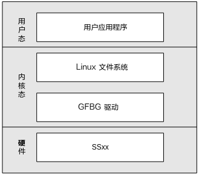
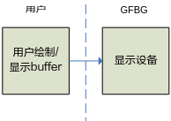
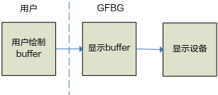
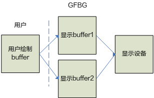

# 前言<a name="ZH-CN_TOPIC_0000002441694833"></a>

**概述<a name="section151mcpsimp"></a>**

Graphic Framebuffer Group（以下简称GFBG）是数字媒体处理平台提供的管理图像叠加层的模块，它基于Linux Framebuffer实现，在提供Linux Framebuffer基本功能的基础上，还扩展了一些图形层控制功能，如层间Alpha、设置原点等。本文档主要介绍GFBG模块加载和第一次如何开发应用。

> **说明：** 
>-   未有特殊说明，SS528V100、SS625V100、SS524V100、SS522V101、与SS626V100完全一致。
>-   未有特殊说明，SS927V100与SS928V100，SS522V100与SS524V100内容完全一致。

**产品版本<a name="section155mcpsimp"></a>**

与本文档相对应的产品版本如下。

<a name="table158mcpsimp"></a>
<table><thead align="left"><tr id="row163mcpsimp"><th class="cellrowborder" valign="top" width="32%" id="mcps1.1.3.1.1"><p id="p165mcpsimp"><a name="p165mcpsimp"></a><a name="p165mcpsimp"></a>产品名称</p>
</th>
<th class="cellrowborder" valign="top" width="68%" id="mcps1.1.3.1.2"><p id="p167mcpsimp"><a name="p167mcpsimp"></a><a name="p167mcpsimp"></a>产品版本</p>
</th>
</tr>
</thead>
<tbody><tr id="row169mcpsimp"><td class="cellrowborder" valign="top" width="32%" headers="mcps1.1.3.1.1 "><p id="p171mcpsimp"><a name="p171mcpsimp"></a><a name="p171mcpsimp"></a>SS928</p>
</td>
<td class="cellrowborder" valign="top" width="68%" headers="mcps1.1.3.1.2 "><p id="p173mcpsimp"><a name="p173mcpsimp"></a><a name="p173mcpsimp"></a>V100</p>
</td>
</tr>
<tr id="row174mcpsimp"><td class="cellrowborder" valign="top" width="32%" headers="mcps1.1.3.1.1 "><p id="p176mcpsimp"><a name="p176mcpsimp"></a><a name="p176mcpsimp"></a>SS626</p>
</td>
<td class="cellrowborder" valign="top" width="68%" headers="mcps1.1.3.1.2 "><p id="p178mcpsimp"><a name="p178mcpsimp"></a><a name="p178mcpsimp"></a>V100</p>
</td>
</tr>
<tr id="row195631257111317"><td class="cellrowborder" valign="top" width="32%" headers="mcps1.1.3.1.1 "><p id="p881081984715"><a name="p881081984715"></a><a name="p881081984715"></a>SS524</p>
</td>
<td class="cellrowborder" valign="top" width="68%" headers="mcps1.1.3.1.2 "><p id="p34921898474"><a name="p34921898474"></a><a name="p34921898474"></a>V100</p>
</td>
</tr>
<tr id="row1441161332614"><td class="cellrowborder" valign="top" width="32%" headers="mcps1.1.3.1.1 "><p id="p0583151714263"><a name="p0583151714263"></a><a name="p0583151714263"></a>SS522</p>
</td>
<td class="cellrowborder" valign="top" width="68%" headers="mcps1.1.3.1.2 "><p id="p165835179263"><a name="p165835179263"></a><a name="p165835179263"></a>V100</p>
</td>
</tr>
<tr id="row9572102672617"><td class="cellrowborder" valign="top" width="32%" headers="mcps1.1.3.1.1 "><p id="p11123113018268"><a name="p11123113018268"></a><a name="p11123113018268"></a>SS522</p>
</td>
<td class="cellrowborder" valign="top" width="68%" headers="mcps1.1.3.1.2 "><p id="p1212383017264"><a name="p1212383017264"></a><a name="p1212383017264"></a>V101</p>
</td>
</tr>
<tr id="row19621654135811"><td class="cellrowborder" valign="top" width="32%" headers="mcps1.1.3.1.1 "><p id="p19820619133012"><a name="p19820619133012"></a><a name="p19820619133012"></a>SS528</p>
</td>
<td class="cellrowborder" valign="top" width="68%" headers="mcps1.1.3.1.2 "><p id="p982018196301"><a name="p982018196301"></a><a name="p982018196301"></a>V100</p>
</td>
</tr>
<tr id="row48792312106"><td class="cellrowborder" valign="top" width="32%" headers="mcps1.1.3.1.1 "><p id="p187350151849"><a name="p187350151849"></a><a name="p187350151849"></a>SS625</p>
</td>
<td class="cellrowborder" valign="top" width="68%" headers="mcps1.1.3.1.2 "><p id="p9879931201010"><a name="p9879931201010"></a><a name="p9879931201010"></a>V100</p>
</td>
</tr>
<tr id="row621517317519"><td class="cellrowborder" valign="top" width="32%" headers="mcps1.1.3.1.1 "><p id="p8622349102117"><a name="p8622349102117"></a><a name="p8622349102117"></a>SS927</p>
</td>
<td class="cellrowborder" valign="top" width="68%" headers="mcps1.1.3.1.2 "><p id="p9185184311112"><a name="p9185184311112"></a><a name="p9185184311112"></a>V100</p>
</td>
</tr>
</tbody>
</table>

**读者对象<a name="section179mcpsimp"></a>**

本文档（本指南）主要适用于以下工程师：

-   技术支持工程师
-   软件开发工程师

**符号约定<a name="section185mcpsimp"></a>**

在本文中可能出现下列标志，它们所代表的含义如下。

<a name="table188mcpsimp"></a>
<table><thead align="left"><tr id="row193mcpsimp"><th class="cellrowborder" valign="top" width="18%" id="mcps1.1.3.1.1"><p id="p195mcpsimp"><a name="p195mcpsimp"></a><a name="p195mcpsimp"></a>符号</p>
</th>
<th class="cellrowborder" valign="top" width="82%" id="mcps1.1.3.1.2"><p id="p197mcpsimp"><a name="p197mcpsimp"></a><a name="p197mcpsimp"></a>说明</p>
</th>
</tr>
</thead>
<tbody><tr id="row199mcpsimp"><td class="cellrowborder" valign="top" width="18%" headers="mcps1.1.3.1.1 "><p class="msonormal" id="p201mcpsimp"><a name="p201mcpsimp"></a><a name="p201mcpsimp"></a><a name="image111"></a><a name="image111"></a><span></span></p>
</td>
<td class="cellrowborder" valign="top" width="82%" headers="mcps1.1.3.1.2 "><p id="p203mcpsimp"><a name="p203mcpsimp"></a><a name="p203mcpsimp"></a>表示如不避免则将会导致死亡或严重伤害的具有高等级风险的危害。</p>
</td>
</tr>
<tr id="row204mcpsimp"><td class="cellrowborder" valign="top" width="18%" headers="mcps1.1.3.1.1 "><p class="msonormal" id="p206mcpsimp"><a name="p206mcpsimp"></a><a name="p206mcpsimp"></a><a name="image112"></a><a name="image112"></a><span></span></p>
</td>
<td class="cellrowborder" valign="top" width="82%" headers="mcps1.1.3.1.2 "><p id="p208mcpsimp"><a name="p208mcpsimp"></a><a name="p208mcpsimp"></a>表示如不避免则可能导致死亡或严重伤害的具有中等级风险的危害。</p>
</td>
</tr>
<tr id="row209mcpsimp"><td class="cellrowborder" valign="top" width="18%" headers="mcps1.1.3.1.1 "><p class="msonormal" id="p211mcpsimp"><a name="p211mcpsimp"></a><a name="p211mcpsimp"></a><a name="image113"></a><a name="image113"></a><span></span></p>
</td>
<td class="cellrowborder" valign="top" width="82%" headers="mcps1.1.3.1.2 "><p id="p213mcpsimp"><a name="p213mcpsimp"></a><a name="p213mcpsimp"></a>表示如不避免则可能导致轻微或中度伤害的具有低等级风险的危害。</p>
</td>
</tr>
<tr id="row214mcpsimp"><td class="cellrowborder" valign="top" width="18%" headers="mcps1.1.3.1.1 "><p class="msonormal" id="p216mcpsimp"><a name="p216mcpsimp"></a><a name="p216mcpsimp"></a><a name="image114"></a><a name="image114"></a><span></span></p>
</td>
<td class="cellrowborder" valign="top" width="82%" headers="mcps1.1.3.1.2 "><p id="p218mcpsimp"><a name="p218mcpsimp"></a><a name="p218mcpsimp"></a>用于传递设备或环境安全警示信息。如不避免则可能会导致设备损坏、数据丢失、设备性能降低或其它不可预知的结果。</p>
<p id="p219mcpsimp"><a name="p219mcpsimp"></a><a name="p219mcpsimp"></a>“须知”不涉及人身伤害。</p>
</td>
</tr>
<tr id="row220mcpsimp"><td class="cellrowborder" valign="top" width="18%" headers="mcps1.1.3.1.1 "><p class="msonormal" id="p222mcpsimp"><a name="p222mcpsimp"></a><a name="p222mcpsimp"></a><a name="image115"></a><a name="image115"></a><span></span></p>
</td>
<td class="cellrowborder" valign="top" width="82%" headers="mcps1.1.3.1.2 "><p id="p224mcpsimp"><a name="p224mcpsimp"></a><a name="p224mcpsimp"></a>对正文中重点信息的补充说明。</p>
<p id="p225mcpsimp"><a name="p225mcpsimp"></a><a name="p225mcpsimp"></a>“说明”不是安全警示信息，不涉及人身、设备及环境伤害信息。</p>
</td>
</tr>
</tbody>
</table>

**修订记录<a name="section226mcpsimp"></a>**

修订记录累积了每次文档更新的说明。最新版本的文档包含以前所有文档版本的更新内容。

<a name="table2161mcpsimp"></a>
<table><thead align="left"><tr id="row2167mcpsimp"><th class="cellrowborder" valign="top" width="21%" id="mcps1.1.4.1.1"><p id="p2169mcpsimp"><a name="p2169mcpsimp"></a><a name="p2169mcpsimp"></a>文档版本</p>
</th>
<th class="cellrowborder" valign="top" width="26%" id="mcps1.1.4.1.2"><p id="p2171mcpsimp"><a name="p2171mcpsimp"></a><a name="p2171mcpsimp"></a>发布日期</p>
</th>
<th class="cellrowborder" valign="top" width="53%" id="mcps1.1.4.1.3"><p id="p2173mcpsimp"><a name="p2173mcpsimp"></a><a name="p2173mcpsimp"></a>修改说明</p>
</th>
</tr>
</thead>
<tbody><tr id="row2175mcpsimp"><td class="cellrowborder" valign="top" width="21%" headers="mcps1.1.4.1.1 "><p id="p2177mcpsimp"><a name="p2177mcpsimp"></a><a name="p2177mcpsimp"></a>00B01</p>
</td>
<td class="cellrowborder" valign="top" width="26%" headers="mcps1.1.4.1.2 "><p id="p2179mcpsimp"><a name="p2179mcpsimp"></a><a name="p2179mcpsimp"></a>2025-09-15</p>
</td>
<td class="cellrowborder" valign="top" width="53%" headers="mcps1.1.4.1.3 "><p id="p2181mcpsimp"><a name="p2181mcpsimp"></a><a name="p2181mcpsimp"></a>第1次临时版本发布。</p>
</td>
</tr>
</tbody>
</table>

# 概述<a name="ZH-CN_TOPIC_0000002441655005"></a>


## GFBG简介<a name="ZH-CN_TOPIC_0000002408095650"></a>

Framebuffer（以下简称GFBG）是数字媒体处理平台提供的用于管理叠加图形层的模块，它不仅提供Linux Framebuffer的基本功能，还在Linux Framebuffer的基础上增加层间colorkey、层间colorkey mask、层间Alpha、原点偏移等扩展功能。


### 体系结构<a name="ZH-CN_TOPIC_0000002408255614"></a>

应用程序基于Linux文件系统使用GFBG。GFBG的体系结构如[图1](#fig103731568718)所示。

**图 1**  GFBG体系结构<a name="fig103731568718"></a>  


### 应用场景<a name="ZH-CN_TOPIC_0000002441655009"></a>

GFBG可应用于以下场景：

-   MiniGUI窗口系统

    MiniGUI支持Linux Framebuffer。对MiniGUI做少量改动即可移植到芯片上，实现快速移植。

-   其他的基于Linux Framebuffer的应用程序

    对基于Linux Framebuffer的应用程序不做或做少量改动即可移植到芯片上，实现快速移植。

## GFBG与Linux Framebuffer对比<a name="ZH-CN_TOPIC_0000002441694837"></a>


### 叠加图形层管理<a name="ZH-CN_TOPIC_0000002441655017"></a>

Linux Framebuffer是一个子设备号对应一个显卡，GFBG则是一个子设备号对应一个叠加图形层，GFBG可以管理多个叠加图形层，具体个数和芯片相关。

> **说明：** 
>-   对于SS528V100/SS625V100/SS524V100，GFBG最多可以管理4个叠加图形层：图形层0～图形层3（G0\~G3），对应的设备文件依次为/dev/fb0 \~ /dev/fb3。
>    SS528V100/SS625V100/SS524V100支持3个输出设备上可以叠加图形层：高清输出设备0（简称HD0）、高清输出设备1（简称HD1）、标清输出设备0（简称SD0）。4个图形层与这3个输出设备的关系如[表1](#_Toc363726513)所示。
>-   对于SS522V101，GFBG最多可以管理3个叠加图形层：图形层0、2、3（G0、G2、G3），对应的设备文件依次为/dev/fb0/dev/fb1/dev/fb2。SS522V101支持2个输出设备上可以叠加图形层：高清输出设备0（简称HD0）、标清输出设备0（简称SD0）。3个图形层与输出设备的关系如[表2](#_Ref49523582)所示。
>-   对于SS928V100，GFBG最多可以管理3个叠加图形层：图形层0、1、3（G0、G1、G3），对应的设备文件依次为/dev/fb0/dev/fb1/dev/fb2。
>    SS928V100支持2个输出设备上可以叠加图形层：高清输出设备0（简称HD0）、标清输出设备0（简称SD0）。3个图形层与输出设备的关系如[表3](#_Ref49523598)所示。
>-   对于SS626V100, GFBG最多可以管理5个叠加图形层：图形层0、1、2、3、4（G0、G1、G2、G3、G4），对应的设备文件依次为/dev/fb0 \~ /dev/fb4。5个图形层与3个输出设备的关系如[表4](#_Ref57989656)所示。

**表 1**  FB设备文件、图形层以及输出设备的对应关系

<a name="_Toc363726513"></a>
<table><thead align="left"><tr id="row797mcpsimp"><th class="cellrowborder" valign="top" width="18%" id="mcps1.2.4.1.1"><p id="p799mcpsimp"><a name="p799mcpsimp"></a><a name="p799mcpsimp"></a>FB设备文件</p>
</th>
<th class="cellrowborder" valign="top" width="20%" id="mcps1.2.4.1.2"><p id="p801mcpsimp"><a name="p801mcpsimp"></a><a name="p801mcpsimp"></a>图形层</p>
</th>
<th class="cellrowborder" valign="top" width="62%" id="mcps1.2.4.1.3"><p id="p803mcpsimp"><a name="p803mcpsimp"></a><a name="p803mcpsimp"></a>对应显示设备</p>
</th>
</tr>
</thead>
<tbody><tr id="row805mcpsimp"><td class="cellrowborder" valign="top" width="18%" headers="mcps1.2.4.1.1 "><p id="p807mcpsimp"><a name="p807mcpsimp"></a><a name="p807mcpsimp"></a>/dev/fb0</p>
</td>
<td class="cellrowborder" valign="top" width="20%" headers="mcps1.2.4.1.2 "><p id="p809mcpsimp"><a name="p809mcpsimp"></a><a name="p809mcpsimp"></a>G0</p>
</td>
<td class="cellrowborder" valign="top" width="62%" headers="mcps1.2.4.1.3 "><p id="p811mcpsimp"><a name="p811mcpsimp"></a><a name="p811mcpsimp"></a>只能在HD0设备上显示。</p>
</td>
</tr>
<tr id="row812mcpsimp"><td class="cellrowborder" valign="top" width="18%" headers="mcps1.2.4.1.1 "><p id="p814mcpsimp"><a name="p814mcpsimp"></a><a name="p814mcpsimp"></a>/dev/fb1</p>
</td>
<td class="cellrowborder" valign="top" width="20%" headers="mcps1.2.4.1.2 "><p id="p816mcpsimp"><a name="p816mcpsimp"></a><a name="p816mcpsimp"></a>G1</p>
</td>
<td class="cellrowborder" valign="top" width="62%" headers="mcps1.2.4.1.3 "><p id="p818mcpsimp"><a name="p818mcpsimp"></a><a name="p818mcpsimp"></a>只能在HD1设备上显示。</p>
</td>
</tr>
<tr id="row819mcpsimp"><td class="cellrowborder" valign="top" width="18%" headers="mcps1.2.4.1.1 "><p id="p821mcpsimp"><a name="p821mcpsimp"></a><a name="p821mcpsimp"></a>/dev/fb2</p>
</td>
<td class="cellrowborder" valign="top" width="20%" headers="mcps1.2.4.1.2 "><p id="p823mcpsimp"><a name="p823mcpsimp"></a><a name="p823mcpsimp"></a>G2</p>
</td>
<td class="cellrowborder" valign="top" width="62%" headers="mcps1.2.4.1.3 "><p id="p825mcpsimp"><a name="p825mcpsimp"></a><a name="p825mcpsimp"></a>可动态绑定HD0、HD1、SD0显示，G2为硬件鼠标层，它们总是处在显示设备叠加层的最高层。如HD0上有视频层、G0、G2，则叠加顺序从下到上依次为：视频层、G0、G2。</p>
</td>
</tr>
<tr id="row826mcpsimp"><td class="cellrowborder" valign="top" width="18%" headers="mcps1.2.4.1.1 "><p id="p828mcpsimp"><a name="p828mcpsimp"></a><a name="p828mcpsimp"></a>/dev/fb3</p>
</td>
<td class="cellrowborder" valign="top" width="20%" headers="mcps1.2.4.1.2 "><p id="p830mcpsimp"><a name="p830mcpsimp"></a><a name="p830mcpsimp"></a>G3</p>
</td>
<td class="cellrowborder" valign="top" width="62%" headers="mcps1.2.4.1.3 "><p id="p832mcpsimp"><a name="p832mcpsimp"></a><a name="p832mcpsimp"></a>可动态绑定HD0、HD1、SD0显示，G3用作智能画框层。</p>
</td>
</tr>
</tbody>
</table>

**表 2**  FB设备文件、图形层以及输出设备的对应关系

<a name="_Ref49523582"></a>
<table><thead align="left"><tr id="row839mcpsimp"><th class="cellrowborder" valign="top" width="18%" id="mcps1.2.4.1.1"><p id="p841mcpsimp"><a name="p841mcpsimp"></a><a name="p841mcpsimp"></a>FB设备文件</p>
</th>
<th class="cellrowborder" valign="top" width="23%" id="mcps1.2.4.1.2"><p id="p843mcpsimp"><a name="p843mcpsimp"></a><a name="p843mcpsimp"></a>图形层</p>
</th>
<th class="cellrowborder" valign="top" width="59%" id="mcps1.2.4.1.3"><p id="p845mcpsimp"><a name="p845mcpsimp"></a><a name="p845mcpsimp"></a>对应显示设备</p>
</th>
</tr>
</thead>
<tbody><tr id="row846mcpsimp"><td class="cellrowborder" valign="top" width="18%" headers="mcps1.2.4.1.1 "><p id="p848mcpsimp"><a name="p848mcpsimp"></a><a name="p848mcpsimp"></a>/dev/fb0</p>
</td>
<td class="cellrowborder" valign="top" width="23%" headers="mcps1.2.4.1.2 "><p id="p850mcpsimp"><a name="p850mcpsimp"></a><a name="p850mcpsimp"></a>G0</p>
</td>
<td class="cellrowborder" valign="top" width="59%" headers="mcps1.2.4.1.3 "><p id="p852mcpsimp"><a name="p852mcpsimp"></a><a name="p852mcpsimp"></a>只能在HD0设备上显示。</p>
</td>
</tr>
<tr id="row853mcpsimp"><td class="cellrowborder" valign="top" width="18%" headers="mcps1.2.4.1.1 "><p id="p855mcpsimp"><a name="p855mcpsimp"></a><a name="p855mcpsimp"></a>/dev/fb1</p>
</td>
<td class="cellrowborder" valign="top" width="23%" headers="mcps1.2.4.1.2 "><p id="p857mcpsimp"><a name="p857mcpsimp"></a><a name="p857mcpsimp"></a>G2</p>
</td>
<td class="cellrowborder" valign="top" width="59%" headers="mcps1.2.4.1.3 "><p id="p859mcpsimp"><a name="p859mcpsimp"></a><a name="p859mcpsimp"></a>可动态绑定HD0、HD1、SD0显示，G2为硬件鼠标层，它们总是处在显示设备叠加层的最高层。如HD0上有视频层、G0、G2，则叠加顺序从下到上依次为：视频层、G0、G2。</p>
</td>
</tr>
<tr id="row860mcpsimp"><td class="cellrowborder" valign="top" width="18%" headers="mcps1.2.4.1.1 "><p id="p862mcpsimp"><a name="p862mcpsimp"></a><a name="p862mcpsimp"></a>/dev/fb2</p>
</td>
<td class="cellrowborder" valign="top" width="23%" headers="mcps1.2.4.1.2 "><p id="p864mcpsimp"><a name="p864mcpsimp"></a><a name="p864mcpsimp"></a>G3</p>
</td>
<td class="cellrowborder" valign="top" width="59%" headers="mcps1.2.4.1.3 "><p id="p866mcpsimp"><a name="p866mcpsimp"></a><a name="p866mcpsimp"></a>可动态绑定HD0、HD1、SD0显示， G3用作智能画框层。</p>
</td>
</tr>
</tbody>
</table>

**表 3**  FB设备文件、图形层以及输出设备的对应关系

<a name="_Ref49523598"></a>
<table><thead align="left"><tr id="row873mcpsimp"><th class="cellrowborder" valign="top" width="18%" id="mcps1.2.4.1.1"><p id="p875mcpsimp"><a name="p875mcpsimp"></a><a name="p875mcpsimp"></a>FB设备文件</p>
</th>
<th class="cellrowborder" valign="top" width="23%" id="mcps1.2.4.1.2"><p id="p877mcpsimp"><a name="p877mcpsimp"></a><a name="p877mcpsimp"></a>图形层</p>
</th>
<th class="cellrowborder" valign="top" width="59%" id="mcps1.2.4.1.3"><p id="p879mcpsimp"><a name="p879mcpsimp"></a><a name="p879mcpsimp"></a>对应显示设备</p>
</th>
</tr>
</thead>
<tbody><tr id="row880mcpsimp"><td class="cellrowborder" valign="top" width="18%" headers="mcps1.2.4.1.1 "><p id="p882mcpsimp"><a name="p882mcpsimp"></a><a name="p882mcpsimp"></a>/dev/fb0</p>
</td>
<td class="cellrowborder" valign="top" width="23%" headers="mcps1.2.4.1.2 "><p id="p884mcpsimp"><a name="p884mcpsimp"></a><a name="p884mcpsimp"></a>G0</p>
</td>
<td class="cellrowborder" valign="top" width="59%" headers="mcps1.2.4.1.3 "><p id="p886mcpsimp"><a name="p886mcpsimp"></a><a name="p886mcpsimp"></a>只能在HD0设备上显示。</p>
</td>
</tr>
<tr id="row887mcpsimp"><td class="cellrowborder" valign="top" width="18%" headers="mcps1.2.4.1.1 "><p id="p889mcpsimp"><a name="p889mcpsimp"></a><a name="p889mcpsimp"></a>/dev/fb1</p>
</td>
<td class="cellrowborder" valign="top" width="23%" headers="mcps1.2.4.1.2 "><p id="p891mcpsimp"><a name="p891mcpsimp"></a><a name="p891mcpsimp"></a>G1</p>
</td>
<td class="cellrowborder" valign="top" width="59%" headers="mcps1.2.4.1.3 "><p id="p893mcpsimp"><a name="p893mcpsimp"></a><a name="p893mcpsimp"></a>只能在HD1设备上显示。</p>
</td>
</tr>
<tr id="row894mcpsimp"><td class="cellrowborder" valign="top" width="18%" headers="mcps1.2.4.1.1 "><p id="p896mcpsimp"><a name="p896mcpsimp"></a><a name="p896mcpsimp"></a>/dev/fb2</p>
</td>
<td class="cellrowborder" valign="top" width="23%" headers="mcps1.2.4.1.2 "><p id="p898mcpsimp"><a name="p898mcpsimp"></a><a name="p898mcpsimp"></a>G3</p>
</td>
<td class="cellrowborder" valign="top" width="59%" headers="mcps1.2.4.1.3 "><p id="p900mcpsimp"><a name="p900mcpsimp"></a><a name="p900mcpsimp"></a>可动态绑定HD0、HD1、SD0显示，G3用作智能画框层。</p>
</td>
</tr>
</tbody>
</table>

**表 4**  FB设备文件、图形层以及输出设备的对应关系

<a name="_Ref57989656"></a>
<table><thead align="left"><tr id="row907mcpsimp"><th class="cellrowborder" valign="top" width="18%" id="mcps1.2.4.1.1"><p id="p909mcpsimp"><a name="p909mcpsimp"></a><a name="p909mcpsimp"></a>FB设备文件</p>
</th>
<th class="cellrowborder" valign="top" width="20%" id="mcps1.2.4.1.2"><p id="p911mcpsimp"><a name="p911mcpsimp"></a><a name="p911mcpsimp"></a>图形层</p>
</th>
<th class="cellrowborder" valign="top" width="62%" id="mcps1.2.4.1.3"><p id="p913mcpsimp"><a name="p913mcpsimp"></a><a name="p913mcpsimp"></a>对应显示设备</p>
</th>
</tr>
</thead>
<tbody><tr id="row915mcpsimp"><td class="cellrowborder" valign="top" width="18%" headers="mcps1.2.4.1.1 "><p id="p917mcpsimp"><a name="p917mcpsimp"></a><a name="p917mcpsimp"></a>/dev/fb0</p>
</td>
<td class="cellrowborder" valign="top" width="20%" headers="mcps1.2.4.1.2 "><p id="p919mcpsimp"><a name="p919mcpsimp"></a><a name="p919mcpsimp"></a>G0</p>
</td>
<td class="cellrowborder" valign="top" width="62%" headers="mcps1.2.4.1.3 "><p id="p921mcpsimp"><a name="p921mcpsimp"></a><a name="p921mcpsimp"></a>只能在HD0设备上显示。</p>
</td>
</tr>
<tr id="row922mcpsimp"><td class="cellrowborder" valign="top" width="18%" headers="mcps1.2.4.1.1 "><p id="p924mcpsimp"><a name="p924mcpsimp"></a><a name="p924mcpsimp"></a>/dev/fb1</p>
</td>
<td class="cellrowborder" valign="top" width="20%" headers="mcps1.2.4.1.2 "><p id="p926mcpsimp"><a name="p926mcpsimp"></a><a name="p926mcpsimp"></a>G1</p>
</td>
<td class="cellrowborder" valign="top" width="62%" headers="mcps1.2.4.1.3 "><p id="p928mcpsimp"><a name="p928mcpsimp"></a><a name="p928mcpsimp"></a>只能在HD1设备上显示。</p>
</td>
</tr>
<tr id="row929mcpsimp"><td class="cellrowborder" valign="top" width="18%" headers="mcps1.2.4.1.1 "><p id="p931mcpsimp"><a name="p931mcpsimp"></a><a name="p931mcpsimp"></a>/dev/fb2</p>
</td>
<td class="cellrowborder" valign="top" width="20%" headers="mcps1.2.4.1.2 "><p id="p933mcpsimp"><a name="p933mcpsimp"></a><a name="p933mcpsimp"></a>G2</p>
</td>
<td class="cellrowborder" valign="top" width="62%" headers="mcps1.2.4.1.3 "><p id="p935mcpsimp"><a name="p935mcpsimp"></a><a name="p935mcpsimp"></a>可动态绑定HD0、HD1、SD0显示，G2为硬件鼠标层，它们总是处在显示设备叠加层的最高层。如HD0上有视频层、G0、G2，则叠加顺序从下到上依次为：视频层、G0、G2。</p>
</td>
</tr>
<tr id="row936mcpsimp"><td class="cellrowborder" valign="top" width="18%" headers="mcps1.2.4.1.1 "><p id="p938mcpsimp"><a name="p938mcpsimp"></a><a name="p938mcpsimp"></a>/dev/fb3</p>
</td>
<td class="cellrowborder" valign="top" width="20%" headers="mcps1.2.4.1.2 "><p id="p940mcpsimp"><a name="p940mcpsimp"></a><a name="p940mcpsimp"></a>G3</p>
</td>
<td class="cellrowborder" valign="top" width="62%" headers="mcps1.2.4.1.3 "><p id="p942mcpsimp"><a name="p942mcpsimp"></a><a name="p942mcpsimp"></a>可动态绑定HD0、HD1显示，G3可用作智能画框层。</p>
</td>
</tr>
<tr id="row943mcpsimp"><td class="cellrowborder" valign="top" width="18%" headers="mcps1.2.4.1.1 "><p id="p945mcpsimp"><a name="p945mcpsimp"></a><a name="p945mcpsimp"></a>/dev/fb4</p>
</td>
<td class="cellrowborder" valign="top" width="20%" headers="mcps1.2.4.1.2 "><p id="p947mcpsimp"><a name="p947mcpsimp"></a><a name="p947mcpsimp"></a>G4</p>
</td>
<td class="cellrowborder" valign="top" width="62%" headers="mcps1.2.4.1.3 "><p id="p949mcpsimp"><a name="p949mcpsimp"></a><a name="p949mcpsimp"></a>可动态绑定HD1、SD0、G4可用作智能画框层，可用作标清层。</p>
</td>
</tr>
</tbody>
</table>

通过模块加载参数，可以控制GFBG管理其中的一个或多个叠加图形层，并像操作普通文件一样操作叠加图形层。

### 解决方案差异<a name="ZH-CN_TOPIC_0000002408255606"></a>

<a name="table261mcpsimp"></a>
<table><thead align="left"><tr id="row270mcpsimp"><th class="cellrowborder" valign="top" width="17.17171717171717%" id="mcps1.1.7.1.1"><p id="p272mcpsimp"><a name="p272mcpsimp"></a><a name="p272mcpsimp"></a>解决方案名称</p>
</th>
<th class="cellrowborder" valign="top" width="10.09100910091009%" id="mcps1.1.7.1.2"><p id="p274mcpsimp"><a name="p274mcpsimp"></a><a name="p274mcpsimp"></a>支持的图形层</p>
</th>
<th class="cellrowborder" valign="top" width="17.18171817181718%" id="mcps1.1.7.1.3"><p id="p276mcpsimp"><a name="p276mcpsimp"></a><a name="p276mcpsimp"></a>是否支持压缩</p>
</th>
<th class="cellrowborder" valign="top" width="14.14141414141414%" id="mcps1.1.7.1.4"><p id="p278mcpsimp"><a name="p278mcpsimp"></a><a name="p278mcpsimp"></a>是否支持缩放</p>
</th>
<th class="cellrowborder" valign="top" width="23.232323232323232%" id="mcps1.1.7.1.5"><p id="p280mcpsimp"><a name="p280mcpsimp"></a><a name="p280mcpsimp"></a>绑定关系</p>
</th>
<th class="cellrowborder" valign="top" width="18.18181818181818%" id="mcps1.1.7.1.6"><p id="p282mcpsimp"><a name="p282mcpsimp"></a><a name="p282mcpsimp"></a>软鼠标</p>
</th>
</tr>
</thead>
<tbody><tr id="row284mcpsimp"><td class="cellrowborder" rowspan="4" valign="top" width="17.17171717171717%" headers="mcps1.1.7.1.1 "><p id="p286mcpsimp"><a name="p286mcpsimp"></a><a name="p286mcpsimp"></a>SS528V100/SS625V100</p>
</td>
<td class="cellrowborder" valign="top" width="10.09100910091009%" headers="mcps1.1.7.1.2 "><p id="p288mcpsimp"><a name="p288mcpsimp"></a><a name="p288mcpsimp"></a>G0</p>
</td>
<td class="cellrowborder" valign="top" width="17.18171817181718%" headers="mcps1.1.7.1.3 "><p id="p290mcpsimp"><a name="p290mcpsimp"></a><a name="p290mcpsimp"></a>支持</p>
</td>
<td class="cellrowborder" valign="top" width="14.14141414141414%" headers="mcps1.1.7.1.4 "><p id="p292mcpsimp"><a name="p292mcpsimp"></a><a name="p292mcpsimp"></a>支持</p>
</td>
<td class="cellrowborder" valign="top" width="23.232323232323232%" headers="mcps1.1.7.1.5 "><p id="p294mcpsimp"><a name="p294mcpsimp"></a><a name="p294mcpsimp"></a>G0固定绑定到HD0上</p>
</td>
<td class="cellrowborder" valign="top" width="18.18181818181818%" headers="mcps1.1.7.1.6 "><p id="p296mcpsimp"><a name="p296mcpsimp"></a><a name="p296mcpsimp"></a>不支持</p>
</td>
</tr>
<tr id="row297mcpsimp"><td class="cellrowborder" valign="top" headers="mcps1.1.7.1.1 "><p id="p299mcpsimp"><a name="p299mcpsimp"></a><a name="p299mcpsimp"></a>G1</p>
</td>
<td class="cellrowborder" valign="top" headers="mcps1.1.7.1.2 "><p id="p301mcpsimp"><a name="p301mcpsimp"></a><a name="p301mcpsimp"></a>支持</p>
</td>
<td class="cellrowborder" valign="top" headers="mcps1.1.7.1.3 "><p id="p303mcpsimp"><a name="p303mcpsimp"></a><a name="p303mcpsimp"></a>不支持</p>
</td>
<td class="cellrowborder" valign="top" headers="mcps1.1.7.1.4 "><p id="p305mcpsimp"><a name="p305mcpsimp"></a><a name="p305mcpsimp"></a>G1固定绑定到HD1上</p>
</td>
<td class="cellrowborder" valign="top" headers="mcps1.1.7.1.5 "><p id="p307mcpsimp"><a name="p307mcpsimp"></a><a name="p307mcpsimp"></a>不支持</p>
</td>
</tr>
<tr id="row308mcpsimp"><td class="cellrowborder" valign="top" headers="mcps1.1.7.1.1 "><p id="p310mcpsimp"><a name="p310mcpsimp"></a><a name="p310mcpsimp"></a>G2</p>
</td>
<td class="cellrowborder" valign="top" headers="mcps1.1.7.1.2 "><p id="p312mcpsimp"><a name="p312mcpsimp"></a><a name="p312mcpsimp"></a>不支持</p>
</td>
<td class="cellrowborder" valign="top" headers="mcps1.1.7.1.3 "><p id="p314mcpsimp"><a name="p314mcpsimp"></a><a name="p314mcpsimp"></a>不支持</p>
</td>
<td class="cellrowborder" valign="top" headers="mcps1.1.7.1.4 "><p id="p316mcpsimp"><a name="p316mcpsimp"></a><a name="p316mcpsimp"></a>G2可动态绑定HD0、HD1、SD0</p>
</td>
<td class="cellrowborder" valign="top" headers="mcps1.1.7.1.5 "><p id="p318mcpsimp"><a name="p318mcpsimp"></a><a name="p318mcpsimp"></a>不支持</p>
</td>
</tr>
<tr id="row319mcpsimp"><td class="cellrowborder" valign="top" headers="mcps1.1.7.1.1 "><p id="p321mcpsimp"><a name="p321mcpsimp"></a><a name="p321mcpsimp"></a>G3</p>
</td>
<td class="cellrowborder" valign="top" headers="mcps1.1.7.1.2 "><p id="p323mcpsimp"><a name="p323mcpsimp"></a><a name="p323mcpsimp"></a>不支持</p>
</td>
<td class="cellrowborder" valign="top" headers="mcps1.1.7.1.3 "><p id="p325mcpsimp"><a name="p325mcpsimp"></a><a name="p325mcpsimp"></a>不支持</p>
</td>
<td class="cellrowborder" valign="top" headers="mcps1.1.7.1.4 "><p id="p327mcpsimp"><a name="p327mcpsimp"></a><a name="p327mcpsimp"></a>G3可动态绑定HD0、HD1、SD0</p>
</td>
<td class="cellrowborder" valign="top" headers="mcps1.1.7.1.5 "><p id="p329mcpsimp"><a name="p329mcpsimp"></a><a name="p329mcpsimp"></a>不支持</p>
</td>
</tr>
<tr id="row330mcpsimp"><td class="cellrowborder" rowspan="4" valign="top" width="17.17171717171717%" headers="mcps1.1.7.1.1 "><p id="p332mcpsimp"><a name="p332mcpsimp"></a><a name="p332mcpsimp"></a>SS524V100</p>
</td>
<td class="cellrowborder" valign="top" width="10.09100910091009%" headers="mcps1.1.7.1.2 "><p id="p334mcpsimp"><a name="p334mcpsimp"></a><a name="p334mcpsimp"></a>G0</p>
</td>
<td class="cellrowborder" valign="top" width="17.18171817181718%" headers="mcps1.1.7.1.3 "><p id="p336mcpsimp"><a name="p336mcpsimp"></a><a name="p336mcpsimp"></a>支持</p>
</td>
<td class="cellrowborder" valign="top" width="14.14141414141414%" headers="mcps1.1.7.1.4 "><p id="p338mcpsimp"><a name="p338mcpsimp"></a><a name="p338mcpsimp"></a>支持</p>
</td>
<td class="cellrowborder" valign="top" width="23.232323232323232%" headers="mcps1.1.7.1.5 "><p id="p340mcpsimp"><a name="p340mcpsimp"></a><a name="p340mcpsimp"></a>G0固定绑定到HD0上</p>
</td>
<td class="cellrowborder" valign="top" width="18.18181818181818%" headers="mcps1.1.7.1.6 "><p id="p342mcpsimp"><a name="p342mcpsimp"></a><a name="p342mcpsimp"></a>不支持</p>
</td>
</tr>
<tr id="row343mcpsimp"><td class="cellrowborder" valign="top" headers="mcps1.1.7.1.1 "><p id="p345mcpsimp"><a name="p345mcpsimp"></a><a name="p345mcpsimp"></a>G1</p>
</td>
<td class="cellrowborder" valign="top" headers="mcps1.1.7.1.2 "><p id="p347mcpsimp"><a name="p347mcpsimp"></a><a name="p347mcpsimp"></a>支持</p>
</td>
<td class="cellrowborder" valign="top" headers="mcps1.1.7.1.3 "><p id="p349mcpsimp"><a name="p349mcpsimp"></a><a name="p349mcpsimp"></a>不支持</p>
</td>
<td class="cellrowborder" valign="top" headers="mcps1.1.7.1.4 "><p id="p351mcpsimp"><a name="p351mcpsimp"></a><a name="p351mcpsimp"></a>G1固定绑定到HD1上</p>
</td>
<td class="cellrowborder" valign="top" headers="mcps1.1.7.1.5 "><p id="p353mcpsimp"><a name="p353mcpsimp"></a><a name="p353mcpsimp"></a>不支持</p>
</td>
</tr>
<tr id="row354mcpsimp"><td class="cellrowborder" valign="top" headers="mcps1.1.7.1.1 "><p id="p356mcpsimp"><a name="p356mcpsimp"></a><a name="p356mcpsimp"></a>G2</p>
</td>
<td class="cellrowborder" valign="top" headers="mcps1.1.7.1.2 "><p id="p358mcpsimp"><a name="p358mcpsimp"></a><a name="p358mcpsimp"></a>不支持</p>
</td>
<td class="cellrowborder" valign="top" headers="mcps1.1.7.1.3 "><p id="p360mcpsimp"><a name="p360mcpsimp"></a><a name="p360mcpsimp"></a>不支持</p>
</td>
<td class="cellrowborder" valign="top" headers="mcps1.1.7.1.4 "><p id="p362mcpsimp"><a name="p362mcpsimp"></a><a name="p362mcpsimp"></a>G2可动态绑定HD0、HD1、SD0</p>
</td>
<td class="cellrowborder" valign="top" headers="mcps1.1.7.1.5 "><p id="p364mcpsimp"><a name="p364mcpsimp"></a><a name="p364mcpsimp"></a>不支持</p>
</td>
</tr>
<tr id="row365mcpsimp"><td class="cellrowborder" valign="top" headers="mcps1.1.7.1.1 "><p id="p367mcpsimp"><a name="p367mcpsimp"></a><a name="p367mcpsimp"></a>G3</p>
</td>
<td class="cellrowborder" valign="top" headers="mcps1.1.7.1.2 "><p id="p369mcpsimp"><a name="p369mcpsimp"></a><a name="p369mcpsimp"></a>不支持</p>
</td>
<td class="cellrowborder" valign="top" headers="mcps1.1.7.1.3 "><p id="p371mcpsimp"><a name="p371mcpsimp"></a><a name="p371mcpsimp"></a>不支持</p>
</td>
<td class="cellrowborder" valign="top" headers="mcps1.1.7.1.4 "><p id="p373mcpsimp"><a name="p373mcpsimp"></a><a name="p373mcpsimp"></a>G3可动态绑定HD0、HD1、SD0</p>
</td>
<td class="cellrowborder" valign="top" headers="mcps1.1.7.1.5 "><p id="p375mcpsimp"><a name="p375mcpsimp"></a><a name="p375mcpsimp"></a>不支持</p>
</td>
</tr>
<tr id="row376mcpsimp"><td class="cellrowborder" rowspan="3" valign="top" width="17.17171717171717%" headers="mcps1.1.7.1.1 "><p id="p378mcpsimp"><a name="p378mcpsimp"></a><a name="p378mcpsimp"></a>SS522V101</p>
</td>
<td class="cellrowborder" valign="top" width="10.09100910091009%" headers="mcps1.1.7.1.2 "><p id="p380mcpsimp"><a name="p380mcpsimp"></a><a name="p380mcpsimp"></a>G0</p>
</td>
<td class="cellrowborder" valign="top" width="17.18171817181718%" headers="mcps1.1.7.1.3 "><p id="p382mcpsimp"><a name="p382mcpsimp"></a><a name="p382mcpsimp"></a>支持</p>
</td>
<td class="cellrowborder" valign="top" width="14.14141414141414%" headers="mcps1.1.7.1.4 "><p id="p384mcpsimp"><a name="p384mcpsimp"></a><a name="p384mcpsimp"></a>支持</p>
</td>
<td class="cellrowborder" valign="top" width="23.232323232323232%" headers="mcps1.1.7.1.5 "><p id="p386mcpsimp"><a name="p386mcpsimp"></a><a name="p386mcpsimp"></a>G0固定绑定到HD0上</p>
</td>
<td class="cellrowborder" valign="top" width="18.18181818181818%" headers="mcps1.1.7.1.6 "><p id="p388mcpsimp"><a name="p388mcpsimp"></a><a name="p388mcpsimp"></a>不支持</p>
</td>
</tr>
<tr id="row389mcpsimp"><td class="cellrowborder" valign="top" headers="mcps1.1.7.1.1 "><p id="p391mcpsimp"><a name="p391mcpsimp"></a><a name="p391mcpsimp"></a>G2</p>
</td>
<td class="cellrowborder" valign="top" headers="mcps1.1.7.1.2 "><p id="p393mcpsimp"><a name="p393mcpsimp"></a><a name="p393mcpsimp"></a>不支持</p>
</td>
<td class="cellrowborder" valign="top" headers="mcps1.1.7.1.3 "><p id="p395mcpsimp"><a name="p395mcpsimp"></a><a name="p395mcpsimp"></a>不支持</p>
</td>
<td class="cellrowborder" valign="top" headers="mcps1.1.7.1.4 "><p id="p397mcpsimp"><a name="p397mcpsimp"></a><a name="p397mcpsimp"></a>G2可动态绑定HD0、SD0</p>
</td>
<td class="cellrowborder" valign="top" headers="mcps1.1.7.1.5 "><p id="p399mcpsimp"><a name="p399mcpsimp"></a><a name="p399mcpsimp"></a>不支持</p>
</td>
</tr>
<tr id="row400mcpsimp"><td class="cellrowborder" valign="top" headers="mcps1.1.7.1.1 "><p id="p402mcpsimp"><a name="p402mcpsimp"></a><a name="p402mcpsimp"></a>G3</p>
</td>
<td class="cellrowborder" valign="top" headers="mcps1.1.7.1.2 "><p id="p404mcpsimp"><a name="p404mcpsimp"></a><a name="p404mcpsimp"></a>不支持</p>
</td>
<td class="cellrowborder" valign="top" headers="mcps1.1.7.1.3 "><p id="p406mcpsimp"><a name="p406mcpsimp"></a><a name="p406mcpsimp"></a>不支持</p>
</td>
<td class="cellrowborder" valign="top" headers="mcps1.1.7.1.4 "><p id="p408mcpsimp"><a name="p408mcpsimp"></a><a name="p408mcpsimp"></a>G3可动态绑定HD0、SD0</p>
</td>
<td class="cellrowborder" valign="top" headers="mcps1.1.7.1.5 "><p id="p410mcpsimp"><a name="p410mcpsimp"></a><a name="p410mcpsimp"></a>不支持</p>
</td>
</tr>
<tr id="row411mcpsimp"><td class="cellrowborder" rowspan="3" valign="top" width="17.17171717171717%" headers="mcps1.1.7.1.1 "><p id="p413mcpsimp"><a name="p413mcpsimp"></a><a name="p413mcpsimp"></a>SS928V100</p>
</td>
<td class="cellrowborder" valign="top" width="10.09100910091009%" headers="mcps1.1.7.1.2 "><p id="p415mcpsimp"><a name="p415mcpsimp"></a><a name="p415mcpsimp"></a>G0</p>
</td>
<td class="cellrowborder" valign="top" width="17.18171817181718%" headers="mcps1.1.7.1.3 "><p id="p417mcpsimp"><a name="p417mcpsimp"></a><a name="p417mcpsimp"></a>支持</p>
</td>
<td class="cellrowborder" valign="top" width="14.14141414141414%" headers="mcps1.1.7.1.4 "><p id="p419mcpsimp"><a name="p419mcpsimp"></a><a name="p419mcpsimp"></a>支持</p>
</td>
<td class="cellrowborder" valign="top" width="23.232323232323232%" headers="mcps1.1.7.1.5 "><p id="p421mcpsimp"><a name="p421mcpsimp"></a><a name="p421mcpsimp"></a>G0固定绑定到HD0上</p>
</td>
<td class="cellrowborder" valign="top" width="18.18181818181818%" headers="mcps1.1.7.1.6 "><p id="p423mcpsimp"><a name="p423mcpsimp"></a><a name="p423mcpsimp"></a>不支持</p>
</td>
</tr>
<tr id="row424mcpsimp"><td class="cellrowborder" valign="top" headers="mcps1.1.7.1.1 "><p id="p426mcpsimp"><a name="p426mcpsimp"></a><a name="p426mcpsimp"></a>G1</p>
</td>
<td class="cellrowborder" valign="top" headers="mcps1.1.7.1.2 "><p id="p428mcpsimp"><a name="p428mcpsimp"></a><a name="p428mcpsimp"></a>不支持</p>
</td>
<td class="cellrowborder" valign="top" headers="mcps1.1.7.1.3 "><p id="p430mcpsimp"><a name="p430mcpsimp"></a><a name="p430mcpsimp"></a>不支持</p>
</td>
<td class="cellrowborder" valign="top" headers="mcps1.1.7.1.4 "><p id="p432mcpsimp"><a name="p432mcpsimp"></a><a name="p432mcpsimp"></a>G1固定绑定到HD1上</p>
</td>
<td class="cellrowborder" valign="top" headers="mcps1.1.7.1.5 "><p id="p434mcpsimp"><a name="p434mcpsimp"></a><a name="p434mcpsimp"></a>不支持</p>
</td>
</tr>
<tr id="row435mcpsimp"><td class="cellrowborder" valign="top" headers="mcps1.1.7.1.1 "><p id="p437mcpsimp"><a name="p437mcpsimp"></a><a name="p437mcpsimp"></a>G3</p>
</td>
<td class="cellrowborder" valign="top" headers="mcps1.1.7.1.2 "><p id="p439mcpsimp"><a name="p439mcpsimp"></a><a name="p439mcpsimp"></a>不支持</p>
</td>
<td class="cellrowborder" valign="top" headers="mcps1.1.7.1.3 "><p id="p441mcpsimp"><a name="p441mcpsimp"></a><a name="p441mcpsimp"></a>不支持</p>
</td>
<td class="cellrowborder" valign="top" headers="mcps1.1.7.1.4 "><p id="p443mcpsimp"><a name="p443mcpsimp"></a><a name="p443mcpsimp"></a>G3可动态绑定HD0、SD0</p>
</td>
<td class="cellrowborder" valign="top" headers="mcps1.1.7.1.5 "><p id="p445mcpsimp"><a name="p445mcpsimp"></a><a name="p445mcpsimp"></a>不支持</p>
</td>
</tr>
<tr id="row446mcpsimp"><td class="cellrowborder" rowspan="5" valign="top" width="17.17171717171717%" headers="mcps1.1.7.1.1 "><p id="p448mcpsimp"><a name="p448mcpsimp"></a><a name="p448mcpsimp"></a>SS626V100</p>
</td>
<td class="cellrowborder" valign="top" width="10.09100910091009%" headers="mcps1.1.7.1.2 "><p id="p450mcpsimp"><a name="p450mcpsimp"></a><a name="p450mcpsimp"></a>G0</p>
</td>
<td class="cellrowborder" valign="top" width="17.18171817181718%" headers="mcps1.1.7.1.3 "><p id="p452mcpsimp"><a name="p452mcpsimp"></a><a name="p452mcpsimp"></a>支持</p>
</td>
<td class="cellrowborder" valign="top" width="14.14141414141414%" headers="mcps1.1.7.1.4 "><p id="p454mcpsimp"><a name="p454mcpsimp"></a><a name="p454mcpsimp"></a>支持</p>
</td>
<td class="cellrowborder" valign="top" width="23.232323232323232%" headers="mcps1.1.7.1.5 "><p id="p456mcpsimp"><a name="p456mcpsimp"></a><a name="p456mcpsimp"></a>G0固定绑定到HD0上</p>
</td>
<td class="cellrowborder" valign="top" width="18.18181818181818%" headers="mcps1.1.7.1.6 "><p id="p458mcpsimp"><a name="p458mcpsimp"></a><a name="p458mcpsimp"></a>不支持</p>
</td>
</tr>
<tr id="row459mcpsimp"><td class="cellrowborder" valign="top" headers="mcps1.1.7.1.1 "><p id="p461mcpsimp"><a name="p461mcpsimp"></a><a name="p461mcpsimp"></a>G1</p>
</td>
<td class="cellrowborder" valign="top" headers="mcps1.1.7.1.2 "><p id="p463mcpsimp"><a name="p463mcpsimp"></a><a name="p463mcpsimp"></a>支持</p>
</td>
<td class="cellrowborder" valign="top" headers="mcps1.1.7.1.3 "><p id="p465mcpsimp"><a name="p465mcpsimp"></a><a name="p465mcpsimp"></a>支持</p>
</td>
<td class="cellrowborder" valign="top" headers="mcps1.1.7.1.4 "><p id="p467mcpsimp"><a name="p467mcpsimp"></a><a name="p467mcpsimp"></a>G0固定绑定到HD1上</p>
</td>
<td class="cellrowborder" valign="top" headers="mcps1.1.7.1.5 "><p id="p469mcpsimp"><a name="p469mcpsimp"></a><a name="p469mcpsimp"></a>不支持</p>
</td>
</tr>
<tr id="row470mcpsimp"><td class="cellrowborder" valign="top" headers="mcps1.1.7.1.1 "><p id="p472mcpsimp"><a name="p472mcpsimp"></a><a name="p472mcpsimp"></a>G2</p>
</td>
<td class="cellrowborder" valign="top" headers="mcps1.1.7.1.2 "><p id="p474mcpsimp"><a name="p474mcpsimp"></a><a name="p474mcpsimp"></a>不支持</p>
</td>
<td class="cellrowborder" valign="top" headers="mcps1.1.7.1.3 "><p id="p476mcpsimp"><a name="p476mcpsimp"></a><a name="p476mcpsimp"></a>不支持</p>
</td>
<td class="cellrowborder" valign="top" headers="mcps1.1.7.1.4 "><p id="p478mcpsimp"><a name="p478mcpsimp"></a><a name="p478mcpsimp"></a>G2可动态绑定HD0、HD1、SD0</p>
</td>
<td class="cellrowborder" valign="top" headers="mcps1.1.7.1.5 "><p id="p480mcpsimp"><a name="p480mcpsimp"></a><a name="p480mcpsimp"></a>不支持</p>
</td>
</tr>
<tr id="row481mcpsimp"><td class="cellrowborder" valign="top" headers="mcps1.1.7.1.1 "><p id="p483mcpsimp"><a name="p483mcpsimp"></a><a name="p483mcpsimp"></a>G3</p>
</td>
<td class="cellrowborder" valign="top" headers="mcps1.1.7.1.2 "><p id="p485mcpsimp"><a name="p485mcpsimp"></a><a name="p485mcpsimp"></a>不支持</p>
</td>
<td class="cellrowborder" valign="top" headers="mcps1.1.7.1.3 "><p id="p487mcpsimp"><a name="p487mcpsimp"></a><a name="p487mcpsimp"></a>不支持</p>
</td>
<td class="cellrowborder" valign="top" headers="mcps1.1.7.1.4 "><p id="p489mcpsimp"><a name="p489mcpsimp"></a><a name="p489mcpsimp"></a>G3可动态绑定HD0、HD1</p>
</td>
<td class="cellrowborder" valign="top" headers="mcps1.1.7.1.5 "><p id="p491mcpsimp"><a name="p491mcpsimp"></a><a name="p491mcpsimp"></a>不支持</p>
</td>
</tr>
<tr id="row492mcpsimp"><td class="cellrowborder" valign="top" headers="mcps1.1.7.1.1 "><p id="p494mcpsimp"><a name="p494mcpsimp"></a><a name="p494mcpsimp"></a>G4</p>
</td>
<td class="cellrowborder" valign="top" headers="mcps1.1.7.1.2 "><p id="p496mcpsimp"><a name="p496mcpsimp"></a><a name="p496mcpsimp"></a>不支持</p>
</td>
<td class="cellrowborder" valign="top" headers="mcps1.1.7.1.3 "><p id="p498mcpsimp"><a name="p498mcpsimp"></a><a name="p498mcpsimp"></a>不支持</p>
</td>
<td class="cellrowborder" valign="top" headers="mcps1.1.7.1.4 "><p id="p500mcpsimp"><a name="p500mcpsimp"></a><a name="p500mcpsimp"></a>G4可动态绑定HD1、SD0</p>
</td>
<td class="cellrowborder" valign="top" headers="mcps1.1.7.1.5 "><p id="p502mcpsimp"><a name="p502mcpsimp"></a><a name="p502mcpsimp"></a>不支持</p>
</td>
</tr>
</tbody>
</table>

### 时序控制<a name="ZH-CN_TOPIC_0000002408095654"></a>

Linux Framebuffer提供同步时序、扫描方式、同步信号组织等控制方式（需要硬件支持），将物理显存的内容显示在不同的输出设备（如PC显示器、TV、LCD等）上。目前GFBG不支持同步时序、扫描方式、同步信号组织等控制方式。

### 标准功能与扩展功能<a name="ZH-CN_TOPIC_0000002408255602"></a>

GFBG支持以下的Linux Framebuffer标准功能：

-   将物理显存映射（或解除映射）到虚拟内存空间。
-   像操作普通文件一样操作物理显存。
-   设置硬件显示分辨率和像素格式，每个叠加图形层的支持的最大分辨率和像素格式可以通过支持能力接口获取。
-   从物理显存的任何位置进行读、写、显示等操作。
-   在叠加图形层支持索引格式的情况下，支持设置和获取256色的调色板。

GFBG增加以下的扩展功能：

-   设置和获取叠加图形层的Alpha值。
-   设置和获取叠加图形层的colorkey值。
-   设置当前叠加图形层的起始位置（相对于屏幕原点的偏移）。
-   设置和获取当前叠加图形层的显示状态（显示/隐藏）。
-   通过模块加载参数配置GFBG的物理显存大小和管理叠加图形层的数目。
-   设置和获取抗闪烁功能的状态。
-   设置和获取预乘模式。
-   设置和获取压缩模式的状态。
-   设置/获取图形层刷新类型（0 buffer、1 buffer与2 buffer）。

GFBG不支持以下的Linux Framebuffer标准功能：

-   设置和获取控制台对应的Linux Framebuffer。
-   获取硬件扫描的实时信息。
-   获取硬件相关信息。
-   设置硬件同步时序。
-   设置硬件同步信号机制。

### 图形层刷新类型——FB扩展模式<a name="ZH-CN_TOPIC_0000002441694841"></a>

GFBG为上层用户提供了一套完整的刷新方案，称为FB的扩展模式。在对系统性能、内存、图形显示效果各方面综合衡量的基础上，可根据需要选择合适的刷新方案。目前提供的刷新类型有：

-   0 buffer（即OT\_FB\_LAYER\_BUF\_NONE）

    上层用户的绘制buffer即为显示buffer。该刷新类型可以节省内存消耗，速度也最快，但是用户会看到图形的绘制过程。示意如[图1](#fig194946465118)所示。

-   1 buffer（即OT\_FB\_LAYER\_BUF\_ONE）

    显示buffer由GFBG提供，因此需要一定的内存。该刷新类型是对显示效果和内存需求的一种折中考虑。但是会有锯齿。示意如[图2](#fig76714267123)所示。

-   2 buffer

    显示buffer由GFBG提供。和前面的刷新类型相比，其要求内存最多，但图形显示效果最好。示意如[图3](#fig1270123631220)所示。包含以下：

    -   OT\_FB\_LAYER\_BUF\_DOUBLE
    -   OT\_FB\_LAYER\_BUF\_DOUBLE\_IMMEDIATE

    两者的区别在于后面的每次刷新操作都要等待到绘制的内容真正显示后才返回。

**图 1**  0 buffer示意图<a name="fig194946465118"></a>  


**图 2**  1 buffer示意图<a name="fig76714267123"></a>  


**图 3**  2 buffer示意图<a name="fig1270123631220"></a>  


> **说明：** 
>上文提到的三个分辨率：画布分辨率（即用户绘制buffer的分辩率）、显存分辨率、屏幕显示分辨率。绘图内容从用户绘制buffer到显示buffer的过程支持缩放，也支持抗闪烁；而从显示buffer到显示设备的过程支持缩放，不支持抗闪，显存分辨率与屏幕显示分辨率默认相同，可以通过FBIOPUT\_SCREEN\_SIZE接口设置屏幕分辨率。

### 图形层压缩<a name="ZH-CN_TOPIC_0000002441694853"></a>

图形层压缩功能，即图形层接收由TDE压缩的数据，然后基于压缩数据，进行解压显示。当显示buffer数据不发生变化时，图形层每次都会载入压缩之后的数据进行解压显示。对于开启压缩功能的图形层，能够有效降低总线载入带宽，但是却需要额外分配一帧压缩数据的内存空间。

典型的图形层压缩buffer示意图如[图1](#fig1764612121513)所示。

**图 1**  压缩 buffer示意图<a name="fig1764612121513"></a>  


压缩功能仅支持在FB扩展刷新模式下，OT\_FB\_LAYER\_BUF\_DOUBLE和OT\_FB\_LAYER\_BUF\_DOUBLE\_IMMEDIATE刷新模式下使用。

## 相关文档<a name="ZH-CN_TOPIC_0000002408255610"></a>

与本指南相关的文档：《GFBG API参考》

# 模块加载<a name="ZH-CN_TOPIC_0000002408095658"></a>


## 原理介绍<a name="ZH-CN_TOPIC_0000002408095666"></a>

某些Linux Framebuffer驱动（如versa）不支持在运行期间更改分辨率、颜色深度、时序等显示属性。对此，Linux系统提供一种机制，允许在内核启动或模块加载时，通过参数将相应选项传递给Linux Framebuffer。可以在内核加载器中配置内核启动参数。GFBG驱动在加载时只能设置物理显存的大小，不允许设置其它选项。

加载GFBG驱动gfbg.ko时必须保证内核中已经加载了标准的Framebuffer驱动fb.ko。如果没有加载，可以先用“modprobe fb”加载fb.ko，然后再加载gfbg.ko。

## 参数设置<a name="ZH-CN_TOPIC_0000002441694845"></a>

GFBG可配置其管理的叠加图形层物理显存的大小。物理显存大小决定了GFBG可使用的最大物理显存和系统的可设置虚拟分辨率。在加载GFBG驱动时通过参数传递设置物理显存大小，物理显存的大小一经设置就不会改变。


### 参数video<a name="ZH-CN_TOPIC_0000002408095662"></a>

```
video=“gfbg:vram0_size:xxx, vram1_size:xxx,…”
```

> **说明：** 
>-   选项之间用逗号“,”隔开。
>-   选项和选项值之间用冒号“:”隔开。
>-   如果某个图层不配置物理显存大小，则系统默认分配为0。
>-   vram0\_size \~ vram3\_size分别对应于叠加图形层0 \~ 叠加图形层3。

其中，vramn\_size:xxx表示对叠加图形层n配置xxx K字节的物理显存。

\(1\) 对于FB标准模式，vramn\_size和虚拟分辨率的关系如下：

```
Vramn_size * 1024 >= xres_virtual * yres_virtual * bpp;
```

其中：xres\_virtual \* yres\_virtual是虚拟分辨率，bpp是每个像素所占字节数。

\(2\) 对于FB扩展模式，各个图形层需要的内存大小取决于displaysize的大小、图层像素格式以及刷新模式，具体关系如下：

```
vramn_size * 1024 >= displaywidth * displayHeight * bpp * BufferMode;
```

如：图形层0在1280\*720 分辨率、ARGB8888格式的2 buffer模式下需要的内存vram0\_size = 1280\*720\*4\*2 = 7200 K。

> **说明：** 
>vramn\_size必须是PAGE\_SIZE（4K byte）的倍数，否则GFBG驱动强制将其设为PAGE\_SIZE的倍数，向上取整。

### 参数softcursor<a name="ZH-CN_TOPIC_0000002441655013"></a>

该参数决定是否启用软鼠标功能。当它的值为“off”时，则软鼠标功能为禁止状态（即硬件鼠标功能可用），否则软鼠标功能启用。模块一旦加载，是否启用软鼠标功能便确定。

> **说明：** 
>SS528V100/SS625V100/SS524V100/SS522V101/SS928V100不支持软鼠标。

### 参数g\_layer\_mmz\_names<a name="ZH-CN_TOPIC_0000002441655021"></a>

该参数决定各个图形层要用到的内存将从哪个mmz上进行分配。该参数为一个字符串数组，最多允许设置4个值，分别依次对应fb0\~fb3。模块一旦加载，各个图形层所要用到的内存在哪个mmz上分配便确定。如果不指定值，则系统默认相应层要用到的内存将在无名的mmz上分配。

-   insmod gfbg.ko g\_layer\_mmz\_names=xxxx,xxxx,xxxx,xxxx video="gfbg:vram0\_size:32400，vram1\_size:32400，vram2\_size:256，vram3\_size:4052"
-   以上4块xxxx字符串分别对应fb0\~fb3需要指定的mmz分区名。需要该分区名真实存在才生效，否则内存将在无名的mmz上分配。目前未有客户使用，保留该模块参数功能。

### 参数默认值<a name="ZH-CN_TOPIC_0000002408255598"></a>

如果加载GFBG驱动时不带任何参数，则系统默认配置的参数值如下。

-   SS528V100

    video="gfbg:vram0\_size: 32400，vram1\_size: 16200，vram2\_size:256，vram3\_size: 4052 "

-   SS524V100

    video="gfbg:vram0\_size: 32400，vram1\_size: 16200，vram2\_size:256，vram3\_size: 4052 "

-   SS928V100

    video="gfbg:vram0\_size: 32400，vram1\_size: 16200，vram3\_size: 3240 "

-   SS626V100

    video=" gfbg:vram0\_size:32400，vram1\_size:16200，vram2\_size:256,vram3\_size:4052，vram4\_size:4052 "

用户需要从全局的角度出发配置GFBG需要管理的叠加图形层以及相应的存储空间应从哪个mmz上分配，并且为每个叠加图形层分配适当的显存。

## 配置举例<a name="ZH-CN_TOPIC_0000002441694849"></a>

配置GFBG管理叠加图形层的示例如下：

> **说明：** 
>GFBG驱动的模块文件为gfbg.ko。

-   配置GFBG管理一个叠加图形层。

    如果只需要GFBG管理叠加图形层0，且最大虚拟分辨率为720 x 576，用到的像素格式为ARGB1555，则叠加图形层0需要的最小显存为720 x 576 x 2 = 829440 = 810K，配置参数如下：

    insmod gfbg.ko video="gfbg:vram0\_size:810, vram2\_size:0"。

    如果采用的是double buffer的方式，则需要乘以2，即：

    insmod gfbg.ko video="gfbg:vram0\_size:1620, vram2\_size:0"。

-   配置GFBG管理多个叠加图形层。

    如果需要GFBG管理叠加图形层0和叠加图形层1两个叠加层，且最大虚拟分辨率为720 x 576，用到的像素格式为ARGB1555，则两个叠加层需要的最小显存都为720 x 576 x 2 = 829440 = 810K，配置参数如下：

    insmod gfbg.ko video="gfbg:vram0\_size:810, vram1\_size: 810"

## 异常情况<a name="ZH-CN_TOPIC_0000002408255618"></a>

配置GFBG时可能出现以下异常情况：如果配置叠加图形层物理显存数据错误，则GFBG将不管理相应的叠加图形层。

# 第一次开发应用<a name="ZH-CN_TOPIC_0000002441655001"></a>


## 开发流程<a name="ZH-CN_TOPIC_0000002441655025"></a>

GFBG主要用于显示2D图形（以直接操作物理显存的方式）。

GFBG的开发流程如[图1](#fig031318474168)所示。

**图 1**  GFBG的开发流程<a name="fig031318474168"></a>  


GFBG的开发步骤如下：

1.  调用VO初始化接口打开VO设备。
2.  调用open函数打开指定的GFBG设备。
3.  调用ioctl函数设置GFBG的像素格式以及屏幕高宽等参数（详细内容请参见《GFBG API参考》）。
4.  调用ioctl函数获取GFBG所分配的物理显存大小、跨度等固定信息。调用ioctl函数也可以使用GFBG提供的层间colorkey、层间colorkey mask、层间alpha、原点偏移等功能。
5.  调用mmap函数将物理显存映射到虚拟内存空间。
6.  操作虚拟内存，完成具体的绘制任务。在此步骤可以使用GFBG提供的双缓冲页翻转等功能实现一些绘制效果。
7.  调用munmap解除显存映射。
8.  调用close函数关闭设备。

> **说明：** 
>由于修改虚拟分辨率将改变GFBG的固定信息fb\_fix\_screeninfo::line\_length（跨度），为保证绘制程序能够正确执行，推荐先设置GFBG的可变信息fb\_var\_screeninfo，再获取GFBG的固定信息fb\_fix\_screeninfo::line\_length。

GFBG各个开发各阶段完成的任务如[表1](#table3584165011503)所示。

**表 1**  GFBG的开发阶段任务表

<a name="table3584165011503"></a>
<table><thead align="left"><tr id="row11633165055016"><th class="cellrowborder" valign="top" width="32.769999999999996%" id="mcps1.2.3.1.1"><p id="p1633850195013"><a name="p1633850195013"></a><a name="p1633850195013"></a>阶段</p>
</th>
<th class="cellrowborder" valign="top" width="67.23%" id="mcps1.2.3.1.2"><p id="p13633145019505"><a name="p13633145019505"></a><a name="p13633145019505"></a>任务</p>
</th>
</tr>
</thead>
<tbody><tr id="row66341750185015"><td class="cellrowborder" valign="top" width="32.769999999999996%" headers="mcps1.2.3.1.1 "><p id="p106341050105012"><a name="p106341050105012"></a><a name="p106341050105012"></a>初始化阶段</p>
</td>
<td class="cellrowborder" valign="top" width="67.23%" headers="mcps1.2.3.1.2 "><p id="p563495055017"><a name="p563495055017"></a><a name="p563495055017"></a>完成显示属性的设置和物理显存的映射。</p>
</td>
</tr>
<tr id="row1163418504507"><td class="cellrowborder" valign="top" width="32.769999999999996%" headers="mcps1.2.3.1.1 "><p id="p7634150115015"><a name="p7634150115015"></a><a name="p7634150115015"></a>绘制阶段</p>
</td>
<td class="cellrowborder" valign="top" width="67.23%" headers="mcps1.2.3.1.2 "><p id="p26341750195014"><a name="p26341750195014"></a><a name="p26341750195014"></a>完成具体的绘制工作。</p>
</td>
</tr>
<tr id="row1563445095016"><td class="cellrowborder" valign="top" width="32.769999999999996%" headers="mcps1.2.3.1.1 "><p id="p563416504501"><a name="p563416504501"></a><a name="p563416504501"></a>终止阶段</p>
</td>
<td class="cellrowborder" valign="top" width="67.23%" headers="mcps1.2.3.1.2 "><p id="p19634750105020"><a name="p19634750105020"></a><a name="p19634750105020"></a>完成资源清理工作（步骤6、7）。</p>
<p id="p13634450115016"><a name="p13634450115016"></a><a name="p13634450115016"></a><strong id="b14634135045010"><a name="b14634135045010"></a><a name="b14634135045010"></a>注意：此操作必须在ss_mpi_sys_exit之前，因为fb依赖于sys的资源。</strong></p>
</td>
</tr>
</tbody>
</table>

## 实例介绍<a name="ZH-CN_TOPIC_0000002408095646"></a>

本实例利用PAN\_DISPLAY连续显示15幅分辨率为640×352的图片，以达到动态显示的效果。

每个文件存储的都是像素格式为ARGB1555的纯数据（不包含附加信息的图像数据）。

【参考代码】

```
#include <stdio.h>
#include <fcntl.h>
#include <sys/ioctl.h>
#include <sys/mman.h>
#include <linux/fb.h>
#include "gfbg.h"
 
#define IMAGE_WIDTH     640
#define IMAGE_HEIGHT    352
#define IMAGE_SIZE      (640*352*2)
#define IMAGE_NUM       14
#define IMAGE_PATH      "./res/%d.bits"
 
static struct fb_bitfield g_r16 = {10, 5, 0};
static struct fb_bitfield g_g16 = {5, 5, 0};
static struct fb_bitfield g_b16 = {0, 5, 0};
static struct fb_bitfield g_a16 = {15, 1, 0};
 
int main()
{
    int fd;
    int i;
    struct fb_fix_screeninfo fix;
    struct fb_var_screeninfo var;
    unsigned char *show_screen;
    unsigned char *hide_screen;
    ot_fb_point point = {40, 112};
FILE *fp;
ot_vo_pub_attr stPubAttr = {0};
    char image_name[128];
    
         /*0. open VO device 0 */
/* …… initialize the attributes for stPubAttr */
         ss_mpi_vo_set_pub_attr(0, &stPubAttr);
ss_mpi_vo_enable(0);
 
    /*1. open Framebuffer device overlay 0*/
    fd = open("/dev/fb0", O_RDWR);
    if(fd < 0) {
        printf("open fb0 failed!\n");
        return -1;
    }
 
    /*2. set the screen original position*/
    if (ioctl(fd, FBIOPUT_SCREEN_ORIGIN_GFBG, &point) < 0)
    {
        printf("set screen original show position failed!\n");
        return -1;
    }
 
    /*3. get the variable screen info*/
    if (ioctl(fd, FBIOGET_VSCREENINFO, &var) < 0)
    {
          printf("Get variable screen info failed!\n");
        close(fd);
        return -1;
    }
 
    /*4. modify the variable screen info
          the screen size: IMAGE_WIDTH*IMAGE_HEIGHT 
          the virtual screen size: IMAGE_WIDTH*(IMAGE_HEIGHT*2) 
          the pixel format: ARGB1555
    */
    var.xres = var.xres_virtual = IMAGE_WIDTH;
    var.yres = IMAGE_HEIGHT;
    var.yres_virtual = IMAGE_HEIGHT*2;
    
    var.transp= g_a16;
    var.red = g_r16;
    var.green = g_g16;
    var.blue = g_b16;
    var.bits_per_pixel = 16;
 
    /*5. set the variable screeninfo*/
    if (ioctl(fd, FBIOPUT_VSCREENINFO, &var) < 0)
    {
          printf("Put variable screen info failed!\n");
        close(fd);
        return -1;
    }
    
    /*6. get the fix screen info*/
    if (ioctl(fd, FBIOGET_FSCREENINFO, &fix) < 0)
    {
        printf("Get fix screen info failed!\n");
        close(fd);
        return -1;
    }
 
    /*7. map the physical video memory for user use*/
    show_screen = mmap(NULL, fix.smem_len, PROT_READ|PROT_WRITE, MAP_SHARED, fd, 0);
    hide_screen = show_screen + IMAGE_SIZE;
    memset(show_screen, 0, IMAGE_SIZE);
 
    /*8. load the bitmaps from file to hide screen and set pan display the hide screen*/
    for(i = 0; i < IMAGE_NUM; i++)
    {
        sprintf(image_name, IMAGE_PATH, i);
        fp = fopen(image_name, "rb");
        if(NULL == fp)
        {
            printf("Load %s failed!\n", image_name);
            close(fd);
            return -1;
        }
    
        fread(hide_screen, 1, IMAGE_SIZE, fp);
        fclose(fp);
        usleep(10);
        if(i%2)
        {
            var.yoffset = 0;
            hide_screen = show_screen + IMAGE_SIZE;
        }
        else
        {
            var.yoffset = IMAGE_HEIGHT;
            hide_screen = show_screen;
        }
        
        if (ioctl(fd, FBIOPAN_DISPLAY, &var) < 0)
        {
            printf("FBIOPAN_DISPLAY failed!\n");
            close(fd);
            return -1;
        }
    }
 
    printf("Enter to quit!\n");
getchar();
 
    /*9. close the devices*/
    close(fd);
ss_mpi_vo_disable(0);
 
    return 0;
```

