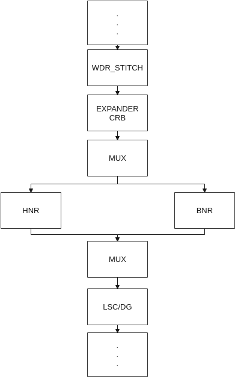
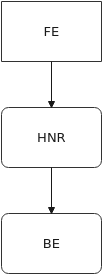
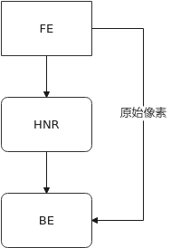
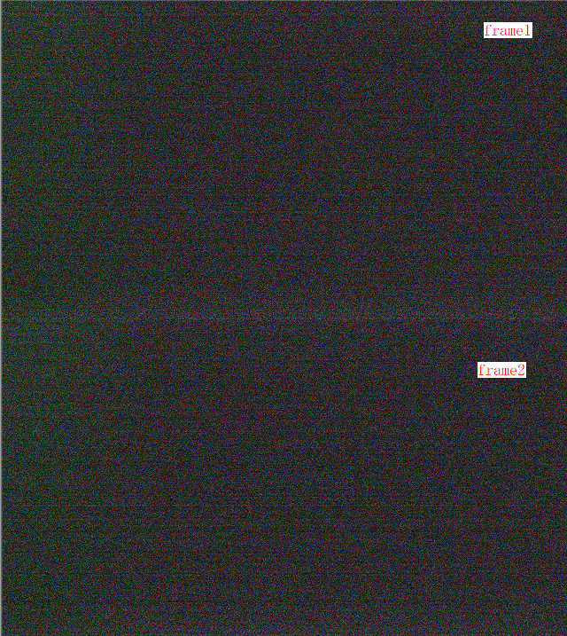

# 前言

**概述**

本文为使用HNR图像质量开发工程师而写，目的是为您在开发过程中遇到的问题提供解决办法和帮助。

> **说明：** 
>本文以SS928V100描述为例，未有特殊说明，SS927V100与SS928V100内容一致。

**产品版本**

与本文档相对应的产品版本如下。

<table><thead align="left"><tr id="row474mcpsimp"><th class="cellrowborder" valign="top" width="32%" id="mcps1.1.3.1.1">
产品名称

</th>
<th class="cellrowborder" valign="top" width="68%" id="mcps1.1.3.1.2">
产品版本

</th>
</tr>
</thead>
<tbody><tr id="row480mcpsimp"><td class="cellrowborder" valign="top" width="32%" headers="mcps1.1.3.1.1 ">
SS928

</td>
<td class="cellrowborder" valign="top" width="68%" headers="mcps1.1.3.1.2 ">
V100

</td>
</tr>
<tr id="row12306122581311"><td class="cellrowborder" valign="top" width="32%" headers="mcps1.1.3.1.1 ">
SS927

</td>
<td class="cellrowborder" valign="top" width="68%" headers="mcps1.1.3.1.2 ">
V100

</td>
</tr>
</tbody>
</table>

**读者对象**

本文档（本指南）主要适用于以下工程师：

-   技术支持工程师
-   图像质量开发工程师

**符号约定**

在本文中可能出现下列标志，它们所代表的含义如下。

<table><thead align="left"><tr id="row499mcpsimp"><th class="cellrowborder" valign="top" width="18%" id="mcps1.1.3.1.1">
符号

</th>
<th class="cellrowborder" valign="top" width="82%" id="mcps1.1.3.1.2">
说明

</th>
</tr>
</thead>
<tbody><tr id="row505mcpsimp"><td class="cellrowborder" valign="top" width="18%" headers="mcps1.1.3.1.1 ">

</td>
<td class="cellrowborder" valign="top" width="82%" headers="mcps1.1.3.1.2 ">
表示如不避免则将会导致死亡或严重伤害的具有高等级风险的危害。

</td>
</tr>
<tr id="row510mcpsimp"><td class="cellrowborder" valign="top" width="18%" headers="mcps1.1.3.1.1 ">

</td>
<td class="cellrowborder" valign="top" width="82%" headers="mcps1.1.3.1.2 ">
表示如不避免则可能导致死亡或严重伤害的具有中等级风险的危害。

</td>
</tr>
<tr id="row515mcpsimp"><td class="cellrowborder" valign="top" width="18%" headers="mcps1.1.3.1.1 ">

</td>
<td class="cellrowborder" valign="top" width="82%" headers="mcps1.1.3.1.2 ">
表示如不避免则可能导致轻微或中度伤害的具有低等级风险的危害。

</td>
</tr>
<tr id="row520mcpsimp"><td class="cellrowborder" valign="top" width="18%" headers="mcps1.1.3.1.1 ">

</td>
<td class="cellrowborder" valign="top" width="82%" headers="mcps1.1.3.1.2 ">
用于传递设备或环境安全警示信息。如不避免则可能会导致设备损坏、数据丢失、设备性能降低或其它不可预知的结果。

“须知”不涉及人身伤害。

</td>
</tr>
<tr id="row526mcpsimp"><td class="cellrowborder" valign="top" width="18%" headers="mcps1.1.3.1.1 ">

</td>
<td class="cellrowborder" valign="top" width="82%" headers="mcps1.1.3.1.2 ">
对正文中重点信息的补充说明。

“说明”不是安全警示信息，不涉及人身、设备及环境伤害信息。

</td>
</tr>
</tbody>
</table>

**修订记录**

修订记录累积了每次文档更新的说明。最新版本的文档包含以前所有文档版本的更新内容。

<table><thead align="left"><tr id="row264516207203"><th class="cellrowborder" valign="top" width="20.72%" id="mcps1.1.4.1.1">
<strong id="b8645172022010">文档版本</strong>

</th>
<th class="cellrowborder" valign="top" width="26.119999999999997%" id="mcps1.1.4.1.2">
<strong id="b1464512200200">发布日期</strong>

</th>
<th class="cellrowborder" valign="top" width="53.16%" id="mcps1.1.4.1.3">
<strong id="b156451420152010">修改说明</strong>

</th>
</tr>
</thead>
<tbody><tr id="row56451520182017"><td class="cellrowborder" valign="top" width="20.72%" headers="mcps1.1.4.1.1 ">
00B01

</td>
<td class="cellrowborder" valign="top" width="26.119999999999997%" headers="mcps1.1.4.1.2 ">
2025-09-15

</td>
<td class="cellrowborder" valign="top" width="53.16%" headers="mcps1.1.4.1.3 ">
第1次临时版本发布。

</td>
</tr>
</tbody>
</table>

# 概述

## 概述

HNR（hypersensitive noise reduction）是一种新型的去噪算法，它能使成像设备在更低照度时噪声去除更干净，细节保留更多，从而提高成像设备极低照度的感光能力。本文主要介绍HNR的调试方法和注意事项。

## 应用场景

HNR的主要特点：

-   高ISO时，去噪能力强，强边保留好。当前推荐的主要场景，在中高ISO下使用HNR；
-   低ISO时，没有BNR弱纹理细节保留好，当前推荐的主要场景，在低ISO下使用BNR。

## HNR数据流框图

**图 1**  HNR advance模式数据流框图  

Advance模式下，HNR在ISP pipe中，处于和BNR并列的位置，和BNR有相同的输入，输出结果经过MUX模块和BNR融合，通过参数可调不同融合比例。

**图 2**  HNR normal模式数据流框图  

normal模式，normal\_blend为false时，HNR在ISP pipe中，处于FE和BE的中间，和BNR之间没有融合操作，是两个完全独立的模块。

**图 3**  HNR normal\_blend模式数据流  

normal模式，normal\_blend为true时，数据通路上会从FE获取一帧原始帧送给BE，以实现HNR和BNR的融合，此模式下的融合调试参数和advance模式相同。

-   不同模式由于数据通路的差异，会导致一些功能和效果的差异。

    **表 1**  不同模式下DPC、CrossTalk、FPN功能和效果差异

    
    <table><thead align="left"><tr id="row427640181815"><th class="cellrowborder" rowspan="2" valign="top" id="mcps1.2.5.1.1">
isp algorithm

    </th>
    <th class="cellrowborder" rowspan="2" valign="top" id="mcps1.2.5.1.2">
advance

    </th>
    <th class="cellrowborder" colspan="2" valign="top" id="mcps1.2.5.1.3">
normal

    </th>
    </tr>
    <tr id="row7174828102411"><th class="cellrowborder" valign="top" id="mcps1.2.5.2.1">
normal_blend off

    </th>
    <th class="cellrowborder" valign="top" id="mcps1.2.5.2.2">
normal_blend on

    </th>
    </tr>
    </thead>
    <tbody><tr id="row102754011811"><td class="cellrowborder" valign="top" width="12.6%" headers="mcps1.2.5.1.1 mcps1.2.5.2.1 ">
DPC

    </td>
    <td class="cellrowborder" valign="top" width="29.32%" headers="mcps1.2.5.1.2 mcps1.2.5.2.2 ">
DPC在HNR前，要求必须关闭

    </td>
    <td class="cellrowborder" valign="top" width="27.26%" headers="mcps1.2.5.1.3 ">
DPC在HNR之后，可以根据需求开关

    </td>
    <td class="cellrowborder" valign="top" width="30.819999999999997%" headers="mcps1.2.5.1.3 ">
DPC在HNR之后，根据需求开关，可以优化advance融合BNR时域后坏点变多的问题。

    </td>
    </tr>
    <tr id="row82764061816"><td class="cellrowborder" valign="top" width="12.6%" headers="mcps1.2.5.1.1 mcps1.2.5.2.1 ">
CrossTalk

    </td>
    <td class="cellrowborder" valign="top" width="29.32%" headers="mcps1.2.5.1.2 mcps1.2.5.2.2 ">
CrossTalk在HNR前，要求必须关闭

    </td>
    <td class="cellrowborder" valign="top" width="27.26%" headers="mcps1.2.5.1.3 ">
CrossTalk在HNR之后，可以根据需求开关

    </td>
    <td class="cellrowborder" valign="top" width="30.819999999999997%" headers="mcps1.2.5.1.3 ">
CrossTalk在HNR之后，可以根据需求开关

    </td>
    </tr>
    <tr id="row19281406181"><td class="cellrowborder" valign="top" width="12.6%" headers="mcps1.2.5.1.1 mcps1.2.5.2.1 ">
FPN

    </td>
    <td class="cellrowborder" valign="top" width="29.32%" headers="mcps1.2.5.1.2 mcps1.2.5.2.2 ">
FPN在HNR之前生效，推荐使用原始raw标定

    </td>
    <td class="cellrowborder" valign="top" width="27.26%" headers="mcps1.2.5.1.3 ">
FPN在HNR之后生效，推荐使用HNR处理之后的raw标定

    </td>
    <td class="cellrowborder" valign="top" width="30.819999999999997%" headers="mcps1.2.5.1.3 ">
HNR和BNR时域融合时，HNR路FPN无效，因此不推荐开启FPN

    </td>
    </tr>
    </tbody>
    </table>

-   Advance和normal\_blend开启模式下，HNR和BNR时域可以做融合，normal\_blend关闭模式下，HNR和BNR完全独立，没有融合关系，此差异导致在切换场景下的调试方法有差异。

# 关键参数

## HNR参数

详细参数说明请参考《HNR开发参考》。

**表 1**  HNR图像效果参数

<table><thead align="left"><tr id="row238mcpsimp"><th class="cellrowborder" valign="top" width="23%" id="mcps1.2.3.1.1">
参数

</th>
<th class="cellrowborder" valign="top" width="77%" id="mcps1.2.3.1.2">
描述

</th>
</tr>
</thead>
<tbody><tr id="row244mcpsimp"><td class="cellrowborder" valign="top" width="23%" headers="mcps1.2.3.1.1 ">
enable

</td>
<td class="cellrowborder" valign="top" width="77%" headers="mcps1.2.3.1.2 ">
HNR算法使能。

取值范围：[0, 1]

</td>
</tr>
<tr id="row250mcpsimp"><td class="cellrowborder" valign="top" width="23%" headers="mcps1.2.3.1.1 ">
sfs

</td>
<td class="cellrowborder" valign="top" width="77%" headers="mcps1.2.3.1.2 ">
HNR空域去噪强度。值越大，去噪强度越强。

取值范围：[0, 31]

</td>
</tr>
<tr id="row256mcpsimp"><td class="cellrowborder" valign="top" width="23%" headers="mcps1.2.3.1.1 ">
tfs

</td>
<td class="cellrowborder" valign="top" width="77%" headers="mcps1.2.3.1.2 ">
HNR时域去噪强度。此参数暂时不支持。

取值范围：[0, 31]

</td>
</tr>
</tbody>
</table>

## BNR参数

使用ADVANCED模式，或者NORM模式时使能normal\_blend，BNR接口参数中有如下几个接口对HNR起作用，用于调节BNR的时域和HNR的融合比例，参数含义有重新定义，可以用来调试HNR模式下端到端效果和做HNR和BNR的效果过渡。注意MCF时，彩色通路使用HNR和BNR时，由于MCF预处理优先级更高，此时HNR和BNR无法做融合，下列参数含义参考《ISP图像调优指南》。

**表 1**  HNR与BNR复用的参数

<table><thead align="left"><tr id="row109mcpsimp"><th class="cellrowborder" valign="top" width="25%" id="mcps1.2.3.1.1">
参数

</th>
<th class="cellrowborder" valign="top" width="75%" id="mcps1.2.3.1.2">
描述

</th>
</tr>
</thead>
<tbody><tr id="row115mcpsimp"><td class="cellrowborder" valign="top" width="25%" headers="mcps1.2.3.1.1 ">
user_define_md

</td>
<td class="cellrowborder" valign="top" width="75%" headers="mcps1.2.3.1.2 ">
用户自定义模式选择使能。

取值范围：[0, 1]

</td>
</tr>
<tr id="row121mcpsimp"><td class="cellrowborder" valign="top" width="25%" headers="mcps1.2.3.1.1 ">
user_define_slope

</td>
<td class="cellrowborder" valign="top" width="75%" headers="mcps1.2.3.1.2 ">
用户自定义模式下，运动检测阈值随亮度变化率，值越大，亮区的时域越强。

取值范围：[-32768, 32767]

</td>
</tr>
<tr id="row127mcpsimp"><td class="cellrowborder" valign="top" width="25%" headers="mcps1.2.3.1.1 ">
user_define_dark_thresh

</td>
<td class="cellrowborder" valign="top" width="75%" headers="mcps1.2.3.1.2 ">
用户自定义模式下，暗区的运动检测阈值。值越大，暗区时域越强。

取值范围：[0, 65535]

</td>
</tr>
<tr id="row133mcpsimp"><td class="cellrowborder" valign="top" width="25%" headers="mcps1.2.3.1.1 ">
tss

</td>
<td class="cellrowborder" valign="top" width="75%" headers="mcps1.2.3.1.2 ">
静止区域的HNR混入比例，值越大，静止区域越倾向选HNR的结果，值越小，静止区域越倾向于BNR时域结果。

取值范围：[0, 128]

</td>
</tr>
<tr id="row139mcpsimp"><td class="cellrowborder" valign="top" width="25%" headers="mcps1.2.3.1.1 ">
sfr_g

</td>
<td class="cellrowborder" valign="top" width="75%" headers="mcps1.2.3.1.2 ">
BNR时域结果和HNR混入比例，值越大，去噪越倾向于HNR结果，值越小，去噪越倾向于BNR时域结果。

取值范围：[0, 128]

</td>
</tr>
<tr id="row145mcpsimp"><td class="cellrowborder" valign="top" width="25%" headers="mcps1.2.3.1.1 ">
fine_strength

</td>
<td class="cellrowborder" valign="top" width="75%" headers="mcps1.2.3.1.2 ">
原始像素和HNR去噪结果加权，值越大，越倾向选择HNR去噪效果。

取值范围：[0, 128]

</td>
</tr>
<tr id="row151mcpsimp"><td class="cellrowborder" valign="top" width="25%" headers="mcps1.2.3.1.1 ">
coring_wgt

</td>
<td class="cellrowborder" valign="top" width="75%" headers="mcps1.2.3.1.2 ">
原始像素回叠，值越大，回叠噪声越大，去噪效果越弱。

取值范围：[0, 3200]

</td>
</tr>
</tbody>
</table>

> **须知：** 
>-   HNR和BNR融合模式下，BNR的sfm空域滤波器相关的参数无效；
>-   HNR和BNR融合模式下，需要在打开BNR的时域下调优BNR的相关参数，时域关闭时通过fine\_strength调整HNR和原始像素的融合比例，coring\_wgt设为0；
>-   HNR和BNR融合模式下，需要配置user\_define\_md=1，开启用户自定义模式的运动检测，来调节BNR时域效果；
>-   HNR和BNR融合模式下，BNR的时域融合参数不合理时，可能出现噪声分层现象。
>-   HNR和BNR融合模式下，如果sfr\_r/sfr\_b调试过大，将sfr\_g设置为0不能全选BNR时域。
>-   由HNR/BNR融合模式切换到BNR模式时，为了整体切换效果的平滑，会在过渡的5帧时间内设置时域效果比较强，因此在切换的瞬间可能出现运动拖尾现象。
>-   OT\_HNR\_REF\_MODE\_NONE\_ADVANCED模式下，BNR时域不生效，只能通过fine\_strength调整HNR和原始像素的融合比例，且coring\_wgt设为0。
>-   OT\_HNR\_REF\_MODE\_NONE\_ADVANCED模式下，仅限ispDgain为1倍时能使用融合，当ispDgain非1倍时，越大融合效果越异常。
>-   OT\_HNR\_REF\_MODE\_NONE\_ADVANCED模式下，原始像素通路不经过FPN和DPC，因此融合太多原始像素会导致FPN和DPC现象明显。

## HNR自适应参数

scene\_auto中和HNR相关的重要参数。scene\_auto是图像调试的示例参考，HNR 自适应参数请参考scene\_auto中HNR部分修改使用。

**表 1**  自适应中动态HNR参数

<table><thead align="left"><tr id="row328mcpsimp"><th class="cellrowborder" valign="top" width="23%" id="mcps1.2.3.1.1">
参数

</th>
<th class="cellrowborder" valign="top" width="77%" id="mcps1.2.3.1.2">
描述

</th>
</tr>
</thead>
<tbody><tr id="row334mcpsimp"><td class="cellrowborder" valign="top" width="23%" headers="mcps1.2.3.1.1 ">
dpc_iso_thresh

</td>
<td class="cellrowborder" valign="top" width="77%" headers="mcps1.2.3.1.2 ">
DPC开关所依赖的双阈值。

<ul id="ul339mcpsimp"><li>dpc_iso_thresh[0]：ISO小于等于它DPC开启；</li><li>dpc_iso_thresh[1]：ISO大于等于它DPC关闭。</li></ul>
</td>
</tr>
<tr id="row342mcpsimp"><td class="cellrowborder" valign="top" width="23%" headers="mcps1.2.3.1.1 ">
hnr_iso_thresh

</td>
<td class="cellrowborder" valign="top" width="77%" headers="mcps1.2.3.1.2 ">
HNR开关所依赖的双阈值。

<ul id="ul347mcpsimp"><li>hnr_iso_thresh[0]：ISO小于等于它HNR关闭；</li><li>hnr_iso_thresh[1]：ISO大于等于它HNR开启。</li></ul>
</td>
</tr>
<tr id="row350mcpsimp"><td class="cellrowborder" valign="top" width="23%" headers="mcps1.2.3.1.1 ">
dpc_chg_en

</td>
<td class="cellrowborder" valign="top" width="77%" headers="mcps1.2.3.1.2 ">
根据dpc_iso_thresh阈值是否开关DPC。

<ul id="ul355mcpsimp"><li>0：不使能DPC开关；</li><li>1：使能DPC开关。</li></ul>
</td>
</tr>
<tr id="row358mcpsimp"><td class="cellrowborder" valign="top" width="23%" headers="mcps1.2.3.1.1 ">
hnr_chg_en

</td>
<td class="cellrowborder" valign="top" width="77%" headers="mcps1.2.3.1.2 ">
根据hnr_iso_thresh阈值是否开关HNR。

<ul id="ul363mcpsimp"><li>0：不使能HNR开关；</li><li>1：使能HNR开关。</li></ul>
</td>
</tr>
</tbody>
</table>

**表 2**  自适应中动态FPN参数

<table><thead align="left"><tr id="row372mcpsimp"><th class="cellrowborder" valign="top" width="25%" id="mcps1.2.3.1.1">
参数

</th>
<th class="cellrowborder" valign="top" width="75%" id="mcps1.2.3.1.2">
描述

</th>
</tr>
</thead>
<tbody><tr id="row378mcpsimp"><td class="cellrowborder" valign="top" width="25%" headers="mcps1.2.3.1.1 ">
iso_count

</td>
<td class="cellrowborder" valign="top" width="75%" headers="mcps1.2.3.1.2 ">
ISO阈值个数。

</td>
</tr>
<tr id="row383mcpsimp"><td class="cellrowborder" valign="top" width="25%" headers="mcps1.2.3.1.1 ">
fpn_iso_thresh

</td>
<td class="cellrowborder" valign="top" width="75%" headers="mcps1.2.3.1.2 ">
FPN功能开启的ISO阈值，大于这个ISO值FPN开启。

</td>
</tr>
<tr id="row388mcpsimp"><td class="cellrowborder" valign="top" width="25%" headers="mcps1.2.3.1.1 ">
iso_thresh

</td>
<td class="cellrowborder" valign="top" width="75%" headers="mcps1.2.3.1.2 ">
对应的黑帧切换阈值，当有多个ISO需要用到多个黑帧时，需要通过这个ISO分档区分黑帧。

</td>
</tr>
<tr id="row393mcpsimp"><td class="cellrowborder" valign="top" width="25%" headers="mcps1.2.3.1.1 ">
fpn_offset

</td>
<td class="cellrowborder" valign="top" width="75%" headers="mcps1.2.3.1.2 ">
对应iso_thresh里各ISO档黑帧的黑电平。

</td>
</tr>
</tbody>
</table>

# 调试步骤

## FPN矫正

由于HNR会在非常高的ISO下使用，sensor会工作在极限增益条件下，大多数sensor都会或多或少存在dark shading的问题，如[图1](#_Ref69199905)所示，在ISO200000时，sensor左边偏绿，底部有个亮带，这就需要使用FPN将dark shading去除。

**图 1**  sensor在高ISO时的dark shading现象  

如[图2](#_Ref69199888)所示，左图为没做FPN处理，右图为做过FPN处理。

**图 2**  未做与做过FPN处理对比图  

根据sensor dark shading的严重程度，采用不同的FPN方案如[表1](#_Ref69204090)所示。

**表 1**  不同情况对应的FPN方案

<table><thead align="left"><tr id="row277mcpsimp"><th class="cellrowborder" valign="top" width="25%" id="mcps1.2.4.1.1">
Dark shading 严重程度

</th>
<th class="cellrowborder" valign="top" width="25%" id="mcps1.2.4.1.2">
Sensor个体差异

</th>
<th class="cellrowborder" valign="top" width="50%" id="mcps1.2.4.1.3">
FPN方案

</th>
</tr>
</thead>
<tbody><tr id="row286mcpsimp"><td class="cellrowborder" valign="top" width="25%" headers="mcps1.2.4.1.1 ">
严重

</td>
<td class="cellrowborder" valign="top" width="25%" headers="mcps1.2.4.1.2 ">
大

</td>
<td class="cellrowborder" valign="top" width="50%" headers="mcps1.2.4.1.3 ">
使用FPN量产工具，每个sensor标定

</td>
</tr>
<tr id="row293mcpsimp"><td class="cellrowborder" valign="top" width="25%" headers="mcps1.2.4.1.1 ">
严重

</td>
<td class="cellrowborder" valign="top" width="25%" headers="mcps1.2.4.1.2 ">
小

</td>
<td class="cellrowborder" valign="top" width="50%" headers="mcps1.2.4.1.3 ">
使用FPN量产工具，只需研发阶段标定一次，黑帧所有sensor共用

</td>
</tr>
<tr id="row300mcpsimp"><td class="cellrowborder" valign="top" width="25%" headers="mcps1.2.4.1.1 ">
不严重

</td>
<td class="cellrowborder" valign="top" width="25%" headers="mcps1.2.4.1.2 ">
大

</td>
<td class="cellrowborder" valign="top" width="50%" headers="mcps1.2.4.1.3 ">
使用值为0的黑帧，黑帧所有sensor共用

</td>
</tr>
<tr id="row307mcpsimp"><td class="cellrowborder" valign="top" width="25%" headers="mcps1.2.4.1.1 ">
不严重

</td>
<td class="cellrowborder" valign="top" width="25%" headers="mcps1.2.4.1.2 ">
小

</td>
<td class="cellrowborder" valign="top" width="50%" headers="mcps1.2.4.1.3 ">
使用值为0的黑帧，黑帧所有sensor共用

</td>
</tr>
</tbody>
</table>

-   使用FPN时，要求关闭sensor dgain，使用ispdgain，这样只需在sensor again最大时，使用FPN量产标定工具标定出一组黑帧，当启用ispdgain且ISO较大时才开启FPN矫正。
-   FPN标定，参考sample\_vio，将FPN\_CALIB\_TIMES设置为至少8次，次数越多，标定的黑帧噪声越小，矫正效果越好，但是次数越多，标定时间越长，请根据实际情况设置。运行程序前，确保镜头完全堵住，不漏光，运行时选择“\(2\) fpn calibrate & correct”，执行完成后请根据打印信息记录黑帧对应的黑电平。
-   FPN矫正时，参考自适应中FPN用法。fpn\_offset应该配置为黑帧对应的黑电平。注意，fpn\_offset由于sensor输出噪声或者由于sensor黑电平设置过小有截断现象，导致统计的黑电平和真实的黑电平有偏差，因此，研发调试阶段此处fpn\_offset需要在实际场景做微调。
-   有时sensor输出图像会有类似格子状pattern，当噪声比较大时肉眼识别不出，经过HNR去噪后会比较明显，此时不管有没有明显的dark shading，都使用sample\_vio的FPN标定功能，对图像做下FPN矫正，会对sensor输出的固定pattern有优化作用。

## NP标定

-   NoiseProfile对于去噪模块至关重要，标定结果的精度直接影响去噪效果，标定具体操作细节请参考《图像质量调试工具使用指南》。
-   HNR模式下，要求使用Ispdgain代替sensor dgain，因此标定NoiseProfile的时候，只需要抓取不同again档的raw数据，标定时输入产品所需支持的最大ISO值。
-   如果sensor支持OB区输出，且sensor内部的黑电平矫正可以关闭，要求关闭sensor的黑电平矫正功能，使用ISP的动态黑电平矫正功能，可以参考imx485的配置。此时NP的标定数据建议每档都提供黑帧用于黑电平标定，否则要手动输入每档数据对应的黑电平值。如果sensor不支持OB区输出，不能使用ISP的动态黑电平功能，此时要保证每档数据输入的黑电平正确。
-   标定过程中需要注意亮帧raw数据上最亮的白色块亮度值达到像素最大值的百分之七十左右，其他色块均不过曝。暗帧raw数据黑色块亮度尽量接近黑电平。抓取黑帧时ISO和对应的亮、暗帧相同，堵住镜头保证不漏光。
-   注意抓取亮帧、暗帧、黑帧的过程中不能重启业务，因为重启业务有可能导致黑电平不一致。
-   标定数据中，每档亮帧、暗帧和黑帧的帧数要求每种最少16帧，不要求连续帧。如果sensor有dark shading问题需要减FPN时，则必须提供对应的黑帧数据。

## 系统调试

HNR功能使能后的图像效果调试方法，基本流程请参考《ISP图像调优指南》，按照线性sensor使用BNR调出基本参数，然后需要特别注意的只有上一章关键参数中描述的参数，再参考下列步骤进行调优。

-   通常情况，sensor again范围内，图像的信噪比都比较高，使用BNR和HNR效果差异不大，为了节省性能，推荐使用BNR。
-   当系统增益大于sensor again后，即开启ispdgain之后再使用HNR。
-   开启HNR之后，要确保DPC、CrossTalk模块必须关闭，黑电平接口中，user\_black\_level\_en需要使能，且user\_black\_level设置为1200。
-   在advance模式下BNR参数中fine\_strength建议设置为128，coring\_wgt建议设置为0，即全部选择HNR的结果。Normal模式下，BNR的输入是HNR的输出，coring\_wgt设置的越大，BNR会选择越多的HNR结果，如果设置为3200，则全选HNR的结果。高iso时可以关闭BNR以全选HNR结果。
-   在advance模式下BNR参数中tss和sfr\_g主要用于调整HNR和BNR时域效果的融合比例，只有在HNR和BNR切换的ISO档时，建议混入一些BNR的时域效果，用于保留一些细碎噪声，并且能够和BNR效果平滑过渡，其他时候因为HNR的去噪能力更强，建议全选HNR的效果。如果在高ISO下混入的BNR时域结果过多，由于HNR使能时一般不会开启DPC，会导致坏点去不干净。
-   HNR开启后3DNR参数调试，在使用BNR方案参数的基础上，注意时域tfs、tfr和math较BNR时都应该调弱，只需保持噪声安静，否则容易导致拖尾。空域强度也要调弱，建议可以从最弱逐步调强。
-   HNR开启后色噪方面高频噪声去除比较干净，但会残留一些低频色噪，因此3DNR去色噪建议使用5号滤波器，强度也不要太强，保持色彩和噪声的均衡。
-   根据产品风格要求，通过HNR的参数sfs调整整体噪声保留程度。

## HNR与BNR切换

如上一节所说，当系统增益大于sensor again后，即使用ispdgain之后才建议使用HNR，系统增益小于again最大值时，建议使用传统的BNR方式去噪。当HNR和BNR切换时，总的调试思路是尽量保证HNR开启前后效果接近。

Advance和normal\_blend开启模式下因可以和BNR时域做融合，可以优先调试好单独BNR的效果，然后开启HNR，通过调试HNR的sfs和与BNR的融合，使得开启HNR后效果尽量靠近单独开启BNR的效果。

融合模式请参考如下步骤。

1.  建议在again最大的ISO档做切换。
    -   当系统增益大于again最大值时，参数完全按照上一节调好的HNR参数设置。
    -   当系统增益小于等于again最大值时，参数完全按照BNR，不用HNR时的参数设置。

1.  先在静止场景下，调整tss和sfr\_g参数，并使能DPC功能，使得HNR开启和关闭后，噪声收敛状态下，图像噪声清晰度效果相当。调整时，先将tss固定为0，优先调整sfr\_g，使得整体噪声清晰度接近，然后再精调tss，使背景清晰度在HNR开关后效果相当。
2.  经过上一步的调试，动态开关HNR效果使能开关，很可能看到开关过程会有噪声跳变或者收敛的过程，这是由于两种去噪方法的时域处理有差异，导致不能完全无缝切换。此时建议通过将user\_define\_md使能，调整user\_define\_slope和user\_define\_dark\_thresh，将融合模式下BNR时域适当调强，使切换时噪声跳变幅度变小，但是这样可能使HNR开启时出现运动拖尾，因此需要权衡噪声跳动和拖尾。
3.  调完效果参数就可以在自适应中配置切换参数，即HNR开关采用双阈值切换方法。建议hnr\_iso\_thresh\[1\]设置为最大again对应的ISO值，hnr\_iso\_thresh\[0\]小于hnr\_iso\_thresh\[1\]，以免hnr\_iso\_thresh\[1\]临界场景HNR震荡。建议dpc\_chg\_en、hnr\_chg\_en两个参数都设置为1，即当ISO变化时根据双阈值同步切换HNR、DPC的开关状态，建议dpc\_iso\_thresh大于对应的hnr\_iso\_thresh，即DPC在较高的ISO档做切换。
    -   不使用HNR时，如果需要使用CrossTalk，CrossTalk也可以参考DPC进行操作。
    -   自适应中FPN的参数配置要注意，fpn\_iso\_thresh设置要小于HNR的hnr\_iso\_thresh\[0\]，即FPN要比HNR先开启，后关闭。

normal\_blend关闭模式下，由于没有了融合，很难保证开启HNR后效果与单独开启BNR的效果一致。这时需要调整一下单独开BNR时的效果，将背景噪声去除的更干净些（通常HNR的效果是平坦区更干净，但是细节更粗一些），使得单独开BNR的效果和单独开HNR时效果更接近。

normal\_blend关闭模式请参考如下步骤。

1.  在切换ISO档，关闭HNR，调整BNR参数到满意的效果。
2.  关闭BNR，开启HNR，调整HNR的参数sfs，使效果风格尽量接近BNR单独开启的效果。
3.  如果上两步后，单独开启BNR和HNR的效果差异仍然比较大，可以尝试重新调试BNR，加大BNR去噪强度，使得单独开启BNR的效果尽量接近HNR风格。
4.  BNR和HNR风格比较接近之后，在切换时，调用HNR的切换接口进行模式切换：HNR开BNR关，设置HNR的enable为true，bnr\_bypass为true，HNR关BNR开，设置为HNR的enable为false，bnr\_bypass为false。

# 注意事项

-   如果sensor内部黑电平矫正效果不准，精度不可控时，关闭sensor内部BLC，使用ISP的动态黑电平矫正，注意sensor的OB区域和像素感光区域黑电平有可能不一致，存在一个offset，请参考《图像质量调试工具使用指南》进行标定。
-   关闭sensor内部的DPC，sensor内部DPC会导致sensor输出噪声形态发生改变，不利于去噪效果。
-   如果在ispdgain大于1倍增益的时候动态关闭HNR，会有几帧噪声收敛过程，ispdgain越大，收敛过程越明显。
-   user\_black\_level和hnr不做同步，如果sensor blc小于1200，打开HNR算法之前要先打开user\_black\_level，并且user\_black\_level值要设置为1200。

# FAQ

**如何解决HNR开启后图像颜色异常**

【现象】

开启HNR后颜色异常，可能是什么原因？

【分析】

可能是由于sensor黑电平太小（如果小于1200，越小现象越明显），BLC模块的user\_black\_level\_en未使能，user\_black\_level未设置成1200。

【解决】

确保sensor黑电平比较小使用HNR时开启了user\_black\_level功能，且user\_black\_level设置为了1200。

**如何解决特殊场景下图像颜色异常**

【现象】

当板子重启、长时间运行后断电重启、增益变化后、sensor温度变化后等情况下颜色异常。

【分析】

当板子重启、长时间运行后断电重启、增益变化后、sensor温度变化后sensor的黑电平可能发生变化，需要sensor内部或者ISP动态黑电平矫正才能适应场景变化。

【解决】

为了保证HNR后效果最好，关闭了sensor内部的黑电平矫正功能，此时应该保证ISP的动态黑电平矫正功能开启。

**如何解决高ISO时噪声异常的问题**

【现象】

当ISO小于某个固定ISO值时，去噪效果正常，当噪声大于这个固定ISO后，去噪后噪声表现异常。

【分析】

很多sensor有HCG和LCG模式，这两种模式对噪声的影响是不同的，两种模式下的噪声形态是不同的。

【解决】

保证采集NP标定数据时不同ISO档下HCG和LCG的使用方法和实际应用时HCG和LCG的使用方法是一致的。

**抓拍模式下，如何快速输出统计信息**

【现象】

HNR流程开启之后，统计信息延迟输出。

【分析】

HNR流程开启，增加了HNR输入和输出队列，增加额外延时。

【解决】

HNR抓拍advanced模式，从FE获取raw之后，同一帧给BE送两次：第一次HNR流程关闭，VI不绑定后级模块，可快速输出ISP统计信息；第二次HNR流程开启，VI绑定后级模块输出。

**如何确认WDR模式下HNR生效的效果**

【现象】

wdr模式下hnr去噪效果不明显（hnr宽动态相比线性模式效果会弱一些），开关hnr模块，整体图像差异不大。

【分析】

1.  确认hnr软件通路是否正常，无报错信息，如查看cat /dev/logmpp；
2.  查看hnr模型文件加载是否正确，模块对应的使能是否打开；
3.  通过cat /proc/umap/pqp查看相关处理信息，重点关注proc信息是否有更新，具体参考《HNR开发参考》文档；
4.  通过抓取HNR前后的raw数据进行分析，确认hnr去噪效果，如果没有效果请检查[1](#li3775144972516)-[3](#li1977516494251)是否正确确认；
5.  以上4步确认之后，检查ISP模块中的DPC、BNR和3DNR等相关模块参数调试太强（建议关闭模块使能），从而导致开关hnr模块，效果不明显；
6.  确认历史版本是否存在该现象，如果不存在，建议做对比验证试验。

【解决】

参考[1](#li3775144972516)-[5](#li877519494251)依次确认，确认图像效果问题之前，重点将软件相关的环境确认正确之后再进行。

