# Hi3403V100环境搭建指南

- 开发平台：
  - 服务器：Ubuntu 22.04

## 1、搭建虚拟机环境

### 1.1、软件获取

<font color='RedOrange'>**（注意：以下软件包仅用于教学，未经允许不得转发用于商业用途）**</font>

| 工具名称    | 用途说明                          | 版本要求   | 获取渠道                                                     |
| ----------- | --------------------------------- | ---------- | ------------------------------------------------------------ |
| VirtualBox  | Windows安装Ubuntu系统所需的虚拟机 | 6.1.36版本 | [VirtualBox下载链接](https://download.virtualbox.org/virtualbox/6.1.36/VirtualBox-6.1.36-152435-Win.exe) |
| Ubuntu22.04 | 编译环境所需的Linux系统           | 22.04版本  | [Ubuntu22.04下载链接](https://releases.ubuntu.com/22.04/ubuntu-22.04.5-desktop-amd64.iso) |
| VScode      | 代码阅读和编辑所需的IDE工具       | 1.70.1版本 | [VScode下载链接](https://code.visualstudio.com/) |
| MobaXterm   | 终端调试工具                      | V22.1版本  | [MobaXterm下载链接](https://download.mobatek.net/2212022060563542/MobaXterm_Installer_v22.1.zip) |

### 1.2、安装VirtualBox虚拟机

- 双击在 **2.1.1、软件获取章节下载** 的VirtualBox-6.1.36-152435-Win.exe 安装包，点击下一步，安装VirtualBox。

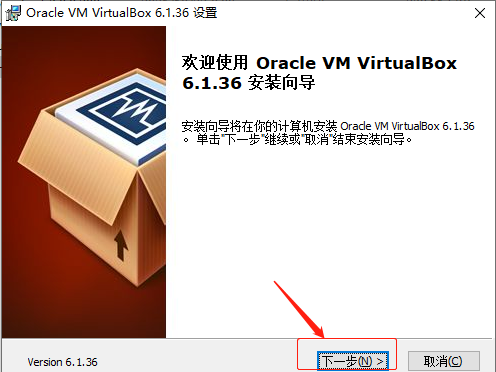

- 点击浏览按钮，修改VirtualBox的安装路径，然后点击确定按钮，再点击下一步。

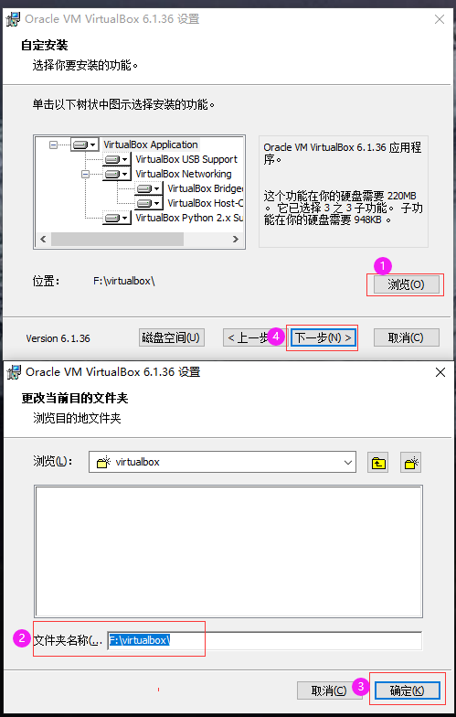

- 当出现下面的界面，点击下一步。


- 当出现下面的界面，点击是。


- 当出现下面的安装界面时，点击安装。


- 点击完成，即可完成VirtualBox的安装。

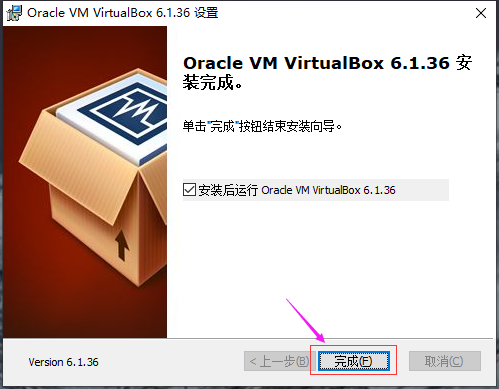

### 1.3、在VirtualBox中安装Ubuntu22.04

* 注意：本文以VirtualBox为例，开发者也可以使用其他虚拟机，以自己的开发习惯为准。

#### 步骤1：导入Ubuntu22.04镜像到VirtualBox

- 打开VirtualBox，点击新建


- 修改虚拟机的名称为hispark，然后修改Ubuntu系统的安装文件夹（因为软件默认安装在C盘，我们最好是把安装路径修改为其他磁盘），把类型配置为linux,然后版本选择 Ubuntu(64-bit)，然后再点击下一步。


- 修改Ubuntu的运行内存大小为4G，然后点击下一步。

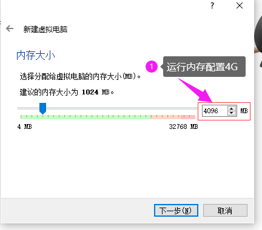

- 选择现在创建虚拟硬盘，然后点击创建按钮。


- 选择VDI（VirtualBox磁盘映像），然后点击下一步。


- 选择动态分配，然后点击下一步。

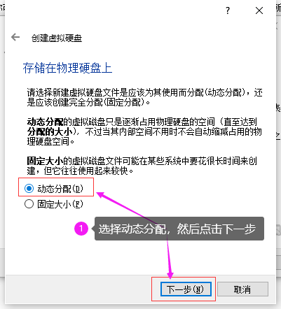

- 修改磁盘空间大小为100GB，然后点击创建按钮。请至少给Ubuntu分配100G的内存空间，否则后面的步骤会因为内存不足出现错误。

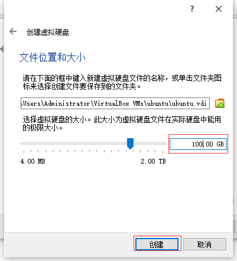

- 点击设置按钮，选择常规选项，在高级选项处，把共享粘贴板和拖放都设置为双向，然后点击OK按钮。


- 点击VirtualBox的设置，然后点击系统，选择处理器，把处理器的数量改为4。
- 注意：如果您的处理器小于等于4个的话，请把处理器数量改小一些。


- 点击网络，选择网卡2，勾选启动网络连接，选择仅主机网络，点击OK。

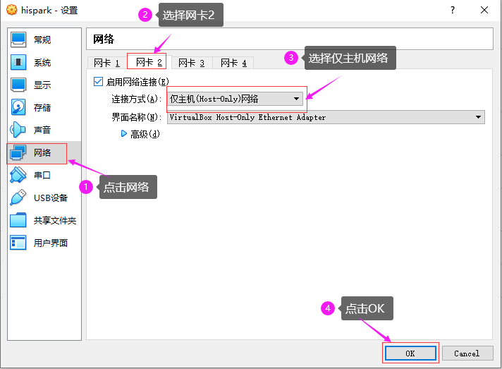

- 点击设置按钮，选择存储，然后选择没有盘片，点击光盘按钮，点击选择虚拟盘。


- 选择 **2.2.1、软件获取章节下载**的Ubuntu18.04的镜像文件，然后点击打开按钮。

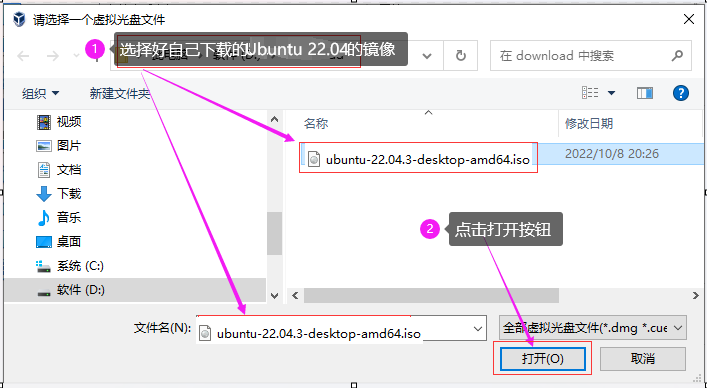

- 然后点击设置的OK按钮。

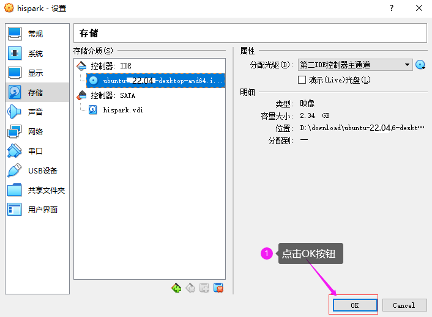

- 选择USB设备，把启动USB控制器的勾选去掉，禁用USB设备，然后点击OK（部分电脑可能无法进行这一步操作，可以先跳过）

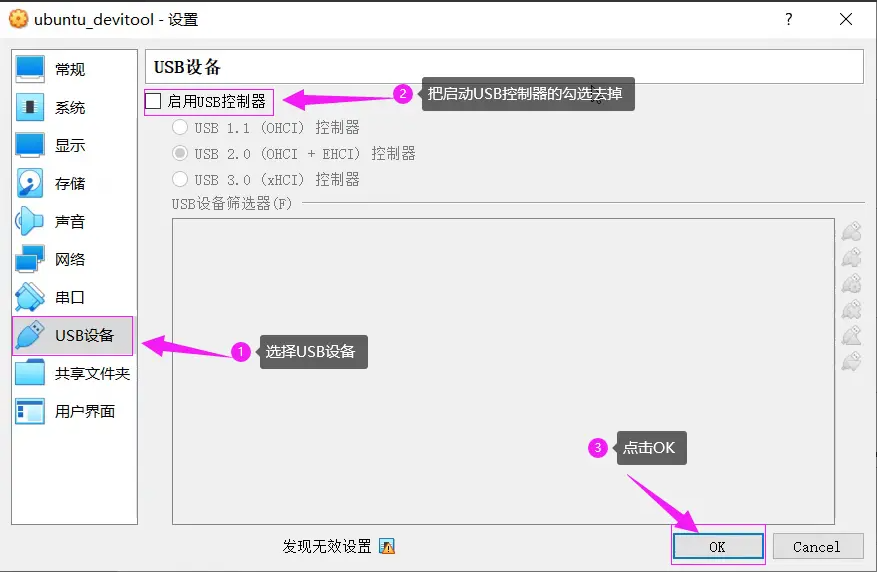

- 点击启动，启动Ubuntu系统


#### 步骤2：Ubuntu系统的安装

- 选择中文(简体)，然后点击安装Ubuntu。


- 如果您安装Ubuntu的时候和我一样，因为分辨率问题，导致界面显示不全，无法看到下面的按钮，您需要按住组合键 ``` Ctrl+Alt+t```打开终端面板，然后输入xrandr，查看一下支持的分辨率。

  

- 我们这边以1920x1200为例，输入 ```xrandr -s 1920x1200``` 后敲回车，修改Ubuntu的分辨率。


- 选择Chinese，然后点击继续按钮。


- 将安装Ubuntu时下载更新的勾选去掉，然后点击继续按钮。


- 点击现在安装。


- 点击继续按钮。


- 选择上海，然后点击继续按钮。

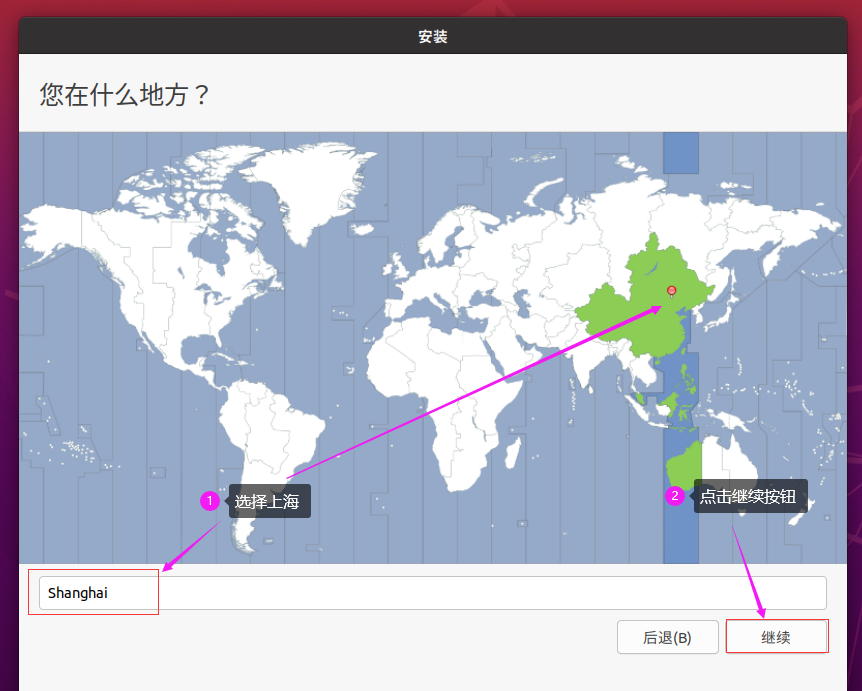

- 设置好账号和密码，点击继续按钮，此处的账号和密码即为您Ubuntu的登录所需的账号和密码。
- 请按照本文的配置来，账号为：hispark，密码为：hispark。


- 开始安装各种软件。


- Ubuntu安装完成后，点击现在重启按钮。

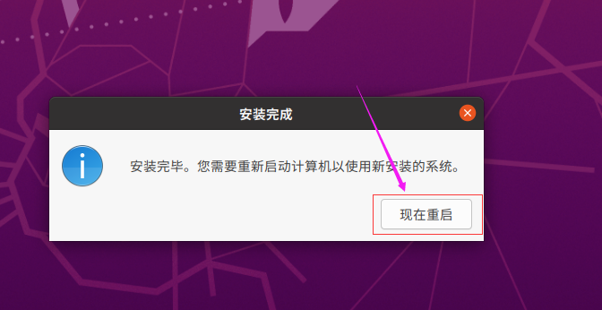

- 如果在重启的过程中出现提示**please remove the installation medium**，可以直接点击关闭按钮，选择强制退出，点击OK即可。


- 点击virtualbox的设备，点击安装增强功能


- 当弹出 弹窗询问是否运行自启动软件时，点击取消。

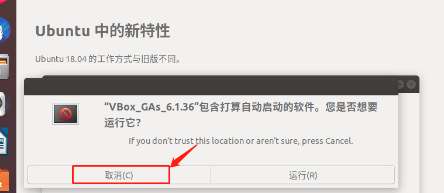

- 此时左边任务栏会多出一个光盘一样的图标，点击并打开光盘图标，进入该文件夹内。

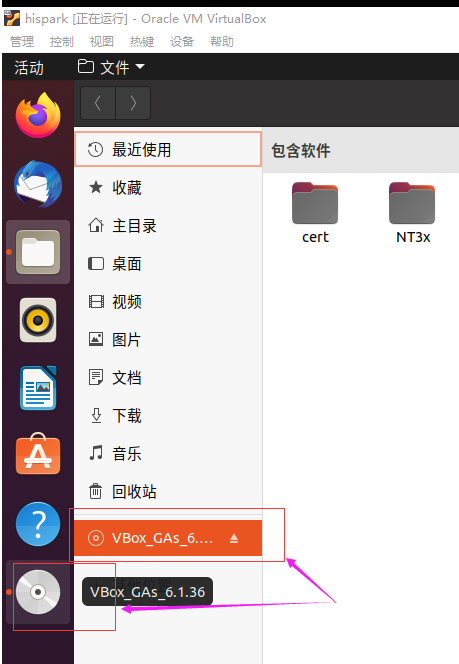

- 在光盘文件夹的空白处，鼠标右键，点击在终端打开。

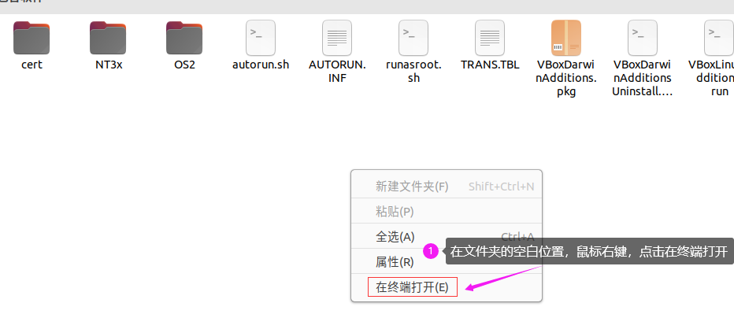

- 执行下面的命令，进行增强功能的安装。

```
sudo apt-get install  gcc make perl -y

sudo ./VBoxLinuxAdditions.run
```

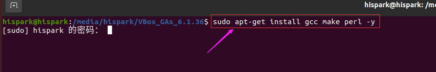

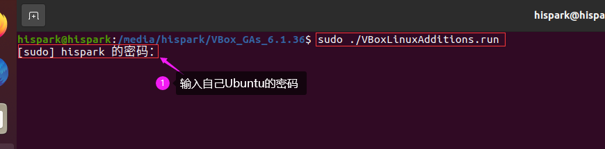

- 安装成功后，在终端执行 reboot命令，重启一下Ubuntu

```
reboot
```


#### 步骤3：更新软件

- 当Ubuntu重启之后，点击Ubuntu桌面左下角九个点图标，然后打开软件和更新图标。


- 点击Ubuntu软件，在**下载自**处点击下拉框，选择其他站点。


- 在**中国**下方选择**阿里云**，然后点击选择服务器。


- 此时弹出认证对话框，输入您的Ubuntu登录密码，本文为hispark。


- 点击关闭按钮，然后有对话框时，点击重新载入，此时会有一段时间的软件更新，耐心等待即可。


- 更新完成后，在Ubuntu的桌面，点击鼠标右键，点击在终端打开，打开终端窗口。


- 在终端输入下面两条命令，进行软件更新

```
sudo apt-get update
sudo apt-get upgrade -y
```


#### 步骤4：配置Ubuntu的SSH服务

- 执行下面的命令，下载SSH-server

```
sudo apt-get install openssh-server -y
```


- 执行下面的命令，启动Ubuntu ssh服务

```
sudo systemctl start ssh
```


#### 步骤5：安装MobaXterm并连接到Ubuntu

- 在Windows 主机，解压在 **2.1.1、软件获取章节下载** 的MobaXterm_Installer_v22.1.zip 压缩包，然后双击解压后的MobaXterm_installer_22.1.msi，进行MobaXterm的安装。
- 一直点击下一步，即可安装成功。


- 执行下面的命令，安装net-tools工具

```
sudo apt install net-tools  -y
```


- 执行下面的命令，查看Ubuntu的IP地址，本文Ubuntu的IP地址是 192.168.56.106

```
ifconfig
```

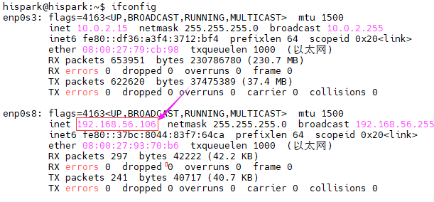

- 打开刚在Windows上安装好的MobaXterm，点击左上角的Session图标，当弹出新的对话框时，点击左上角的SSH图标，然后输入你自己Ubuntu的IP地址，勾选上 Specify username，并填写好你Ubuntu的用户名，点击OK即可。


- 点击OK之后，若需要您输入登录密码，直接输入您Ubuntu的用户登录密码即可进入Ubuntu的终端界面。

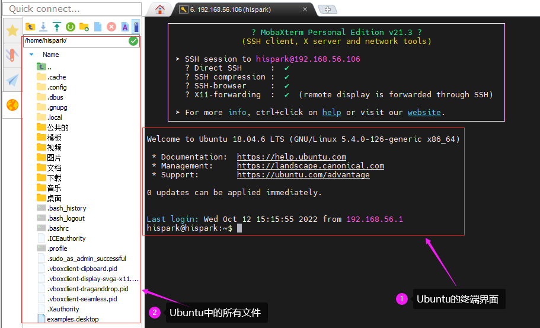

#### 步骤6：配置Ubuntu的Samba服务

- 在Ubuntu终端执行下面命令，安装Samba服务。

```
sudo apt-get install vim samba samba-common
```

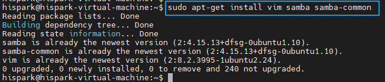

- 在Ubuntu终端执行下面命令，添加Samba共享文件读写权限。

```
sudo chmod 777  /
```

- 在Ubuntu终端执行下面命令，创建Samba账户，后续终端会要求输入Samba账号密码。

```
sudo smbpasswd -a hispark
```


- 在Ubuntu终端执行下面命令，修改sambe的配置文件。

```
sudo vim /etc/samba/smb.conf
```

- 在文件末尾添加如下Samba账号内容。

```
[hispark]
        comment = share folder
        browseable = yes
        path = /
        public = yes
        available = yes
        guest ok = no
        writable = yes
        valid users = hispark
        create mask = 0777
        directory mask = 0777
```


- 在Ubuntu终端执行下面命令，重启samba 服务器生效。

```
sudo service smbd restart
```

#### 步骤7：映射网络驱动器

- 点击Windows的此电脑，鼠标右键，选择映射网络驱动器

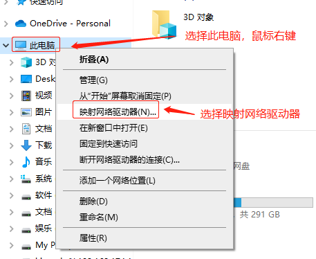

- 输入<font color='RedOrange '>\\\Ubuntu的IP地址</font>，然后点击完成，输入账号(hispark)和密码 (配置Samba服务设置的密码）

```
\\192.168.56.106\hispark
```

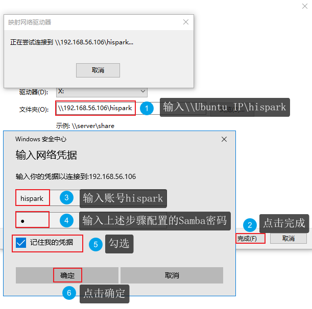

- 这样docker的根目录就能够在Windows的磁盘下面显示了。这样您就可以方便的进行Windows和docker之间的文件共享了

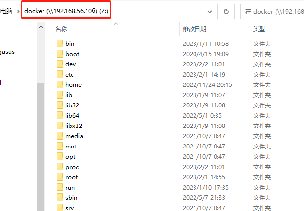

## 2、搭建SDK环境

- 该章节部分内容与搭建OpenHarmony Small型系统编译环境是重复的，详细请参见<a href="../OpenHarmony Small版本使用指南/OpenHarmony Small版本使用指南.md">《OpenHarmony Small 版本使用指南》</a>的开发环境章节。
- Hi3403V100有两套SDK，支持`clang`和`gcc`两种工具链，分别对应`ss928v100_clang`和`ss928v100_gcc`。<a id="section1"></a>

|                   | 编译器       | 运行时库          |
| ----------------- | ------------ | ----------------- |
| `ss928v100_clang` | `llvm 15.04` | `musl libc 1.2.5` |
| `ss928v100_gcc`   | `gcc 12.3.0` | `glibc 2.38`      |

- `ss928v100_clang`和`ss928v100_gcc`的uboot都是使用`gcc`进行编译的，所以`ss928v100_clang`的整编同时依赖`clang`和`gcc`工具链，而`ss928v100_gcc`整编只依赖`gcc`工具链，建议同时安装`clang`和`gcc`工具链。

### 2.1、搭建基础环境

- 安装deb软件包， 如果是ubuntu20.04系统请直接安装python3.9，如果是ubuntu18.04请改为安装python3.8，这里是ubuntu22.04下面直接安装python3即可。

```
sudo apt-get update -y
sudo apt-get install -y  

sudo apt-get install -y apt-utils binutils bison flex bc build-essential make mtd-utils gcc-arm-linux-gnueabi u-boot-tools python3 python3-pip git zip unzip curl wget gcc g++ ruby dosfstools mtools default-jre default-jdk scons python3-distutils perl openssl libssl-dev cpio git-lfs m4 ccache zlib1g-dev tar rsync liblz4-tool genext2fs binutils-dev device-tree-compiler e2fsprogs git-core gnupg gnutls-bin gperf lib32ncurses5-dev libffi-dev zlib* libelf-dev libx11-dev libgl1-mesa-dev lib32z1-dev xsltproc x11proto-core-dev libc6-dev-i386 libxml2-dev lib32z-dev libdwarf-dev

sudo apt-get install -y grsync xxd libglib2.0-dev libpixman-1-dev kmod jfsutils reiserfsprogs xfsprogs squashfs-tools  pcmciautils quota ppp libtinfo-dev libtinfo5 libncurses5 libncurses5-dev libncursesw5 libstdc++6  gcc-arm-none-eabi vim ssh locales doxygen

sudo apt-get install -y libxinerama-dev libxcursor-dev libxrandr-dev libxi-dev
```

- 下载repo文件。

```
curl -s https://gitee.com/oschina/repo/raw/fork_flow/repo-py3 >repo
sudo cp repo /usr/bin/repo
sudo chmod +x /usr/bin/repo
```

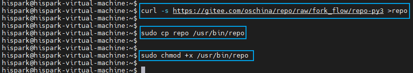

- 安装python模块。

```
pip3 install --trusted-host https://repo.huaweicloud.com -i https://repo.huaweicloud.com/repository/pypi/simple requests setuptools pymongo kconfiglib pycryptodome ecdsa ohos-build pyyaml prompt_toolkit==1.0.14 redis json2html yagmail python-jenkins

pip3 install esdk-obs-python --trusted-host pypi.org -i https://repo.huaweicloud.com/repository/pypi/simple

pip3 install six --upgrade --ignore-installed six -i https://repo.huaweicloud.com/repository/pypi/simple
```

- 创建python软连接。

```
sudo ln -s /usr/bin/python3 /usr/bin/python
```

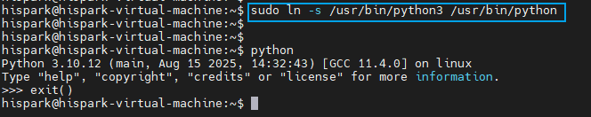

- 切换shell类型。

```
sudo rm -rf /bin/sh
sudo ln -s /bin/bash /bin/sh
```

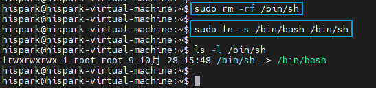

### 2.2、下载代码仓

- 下载Pegasus主仓。

```
cd ~
git clone https://gitee.com/HiSpark/pegasus.git
```

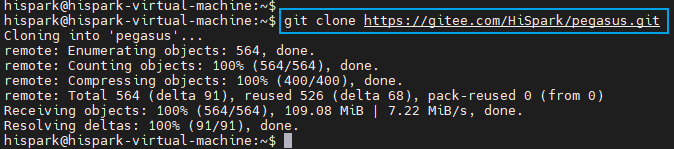

- 下载ss928v100_clang、ss928v100_gcc两个子仓。

```
cd pegasus
git submodule init
git submodule update platform/ss928v100_clang platform/ss928v100_gcc
```


### 2.3、下载开源软件

- 编译uboot/kernel或驱动ko会依赖部分开源软件，需要从各个开源软件的官方源提供的路径进行下载，需要根据指导从各个软件的官方链接下手动下载。
- 请按照下表将开源软件下载并拷贝至相应的拷贝路径下，下面每个开源软件需要分别拷贝到两个不同的路径，在国内镜像源下载速度相较于开源软件官方源下载有显著提升，建议有提供镜像源的直接使用镜像源下载。

| 开源软件官方源下载                                           | 镜像源下载                                                   | 拷贝路径                                                     |
| ------------------------------------------------------------ | ------------------------------------------------------------ | ------------------------------------------------------------ |
| [linux](https://www.kernel.org/pub/linux/kernel/v6.x/linux-6.6.86.tar.gz) | [阿里云](https://mirrors.aliyun.com/linux-kernel/v6.x/linux-6.6.86.tar.gz) | 1、~/pegasus/platform/ss928v100_clang/open_source/linux<br />2、~/pegasus/platform/ss928v100_gcc/open_source/linux |
| [mbedtls](https://github.com/ARMmbed/mbedtls/archive/refs/tags/v2.16.10.tar.gz) | \                                                            | 1、~/pegasus/platform/ss928v100_clang/open_source/mbedtls<br />2、~/pegasus/platform/ss928v100_gcc/open_source/mbedtls |
| [trusted-firmware-a](https://github.com/ARM-software/arm-trusted-firmware/archive/v2.2.tar.gz) | \                                                            | 1、~/pegasus/platform/ss928v100_clang/open_source/trusted-firmware-a<br />2、~/pegasus/platform/ss928v100_gcc/open_source/trusted-firmware-a |
| [u-boot](https://ftp.denx.de/pub/u-boot/u-boot-2020.01.tar.bz2) | \                                                            | 1、~/pegasus/platform/ss928v100_clang/open_source/u-boot<br />2、~/pegasus/platform/ss928v100_gcc/open_source/u-boot |


### 2.4、安装交叉编译器

- 支持`clang`和`gcc`两种工具链，工具链对应SDK关系请参见[上述说明](#section1)，此处同时安装`clang`和`gcc`工具链。

#### 2.4.1、安装clang交叉编译器

- 进入`os/OpenHarmony`目录，使用repo工具初始化并同步OpenHarmony代码。repo清单文件`devboard_hispark_aifly_5.1.0.xml`已针对Small型系统优化，剔除了非必要的代码仓。

```
cd os/OpenHarmony
repo init -u https://gitee.com/HiSpark/pegasus.git -m os/OpenHarmony/manifest/devboard_hispark_aifly_5.1.0.xml
repo sync -c
repo forall -c 'git lfs pull'
```

通过以上步骤，得到Hi3403V100和Hi3519AV200芯片集成开源鸿蒙OpenHarmony-v5.1.0-release源码环境。

- 执行`os/OpenHarmony/manifest/prebuilts_setup.sh`脚本，完成预编译环境准备。该脚本主要完成以下任务：
    - 修复`system_util.py`和`patch_process.py`脚本中的已知问题
    - 将`platform/ss928v100_clang`目录拷贝至SDK目标路径
    - 下载mbedtls v2.16.10源码包（存放至`os/OpenHarmony/device/soc/hisilicon/hi3403v100/sdk_linux/open_source/mbedtls/`目录）
    - 下载arm-trusted-firmware v2.2源码包（存放至`os/OpenHarmony/device/soc/hisilicon/hi3403v100/sdk_linux/open_source/trusted-firmware-a/`目录）
    - 调用`build/prebuilts_download.sh`下载OpenHarmony编译工具链（clang、gn、ninja、cmake、nodejs等）
    - 通过sparse-checkout从kernel_linux_patches仓库下载`prebuilts`目录
    - 通过sparse-checkout从pegasus仓库下载`device/soc/hisilicon/common/platform`目录
    - 配置SDK工具链环境变量，将`os/OpenHarmony/prebuilts/clang/ohos/linux-x86_64/llvm/bin`添加到PATH，执行`command -v clang`验证是否生效，并写入`~/.bashrc`持久化配置

```
./os/OpenHarmony/manifest/prebuilts_setup.sh
```

- ss928v100_clang SDK sample编译部分依赖OpenHarmony编译生成的sysroot，所以在这里需要执行OpenHarmony编译命令。

#### 初次编译

初次编译需要打补丁，添加编译参数`--patch`，编译命令：

```
cd os/OpenHarmony
./build.sh --product-name=ipcamera_hispark_aifly_linux --ccache --no-prebuilt-sdk --patch --gn-args build_xts=true
```

> **说明：**
> - patch配置见：`os/OpenHarmony/vendor/hisilicon/hispark_aifly_linux/patch.yml` 文件。
> - 如需撤销patch.yml中所有patch，执行`os/OpenHarmony/vendor/hisilicon/hispark_aifly_linux`下的`patch_revert.py`脚本：
>   ```
>   cd os/OpenHarmony/vendor/hisilicon/hispark_aifly_linux
>   python3 patch_revert.py
>   ```
> - 也可手动撤销单个patch，例如撤销build仓patch，可在build目录下执行：
>   ```
>   patch -p1 -R < ../../device/soc/hisilicon/patches/build/build_001.patch
>   ```

#### 后续编译

后续编译（打完patch后）跳过打patch环节，去掉编译参数`--patch`，执行命令：

```
cd os/OpenHarmony
./build.sh --product-name=ipcamera_hispark_aifly_linux --ccache --no-prebuilt-sdk --gn-args build_xts=true
```

- `prebuilts_setup.sh`脚本已将clang工具链添加到环境变量，此处只需根据实际项目目录配置sysroot路径。执行下面命令打开`~/.bashrc`文件，将`export SYSROOT_PATH=<你的pegasus目录>/os/OpenHarmony/out/hispark_aifly/ipcamera_hispark_aifly_linux/sysroot`添加到文件末尾。

```
vim ~/.bashrc
```

- 执行下面命令生效环境。

```shell
source ~/.bashrc
```

- 检查交叉编译器环境变量是否生效。

```
which clang
echo $SYSROOT_PATH
```

#### 2.4.2、安装gcc交叉编译器

- 点击[这里](https://gitee.com/openeuler/yocto-meta-openeuler/releases)，按照下图下载0.1.8的arm64版本的所有压缩包。

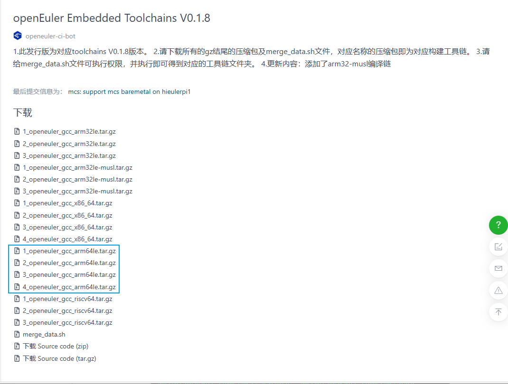

- 将arm64版本的所有压缩包拷贝至Ubuntu hispark用户主目录下，执行下面命令合成交叉工具链压缩包并解压。

```shell
cat 1_openeuler_gcc_arm64le.tar.gz 2_openeuler_gcc_arm64le.tar.gz 3_openeuler_gcc_arm64le.tar.gz 4_openeuler_gcc_arm64le.tar.gz > openeuler_gcc_arm64le.tar.gz

rm 1_openeuler_gcc_arm64le.tar.gz 2_openeuler_gcc_arm64le.tar.gz 3_openeuler_gcc_arm64le.tar.gz 4_openeuler_gcc_arm64le.tar.gz

tar -xzvf openeuler_gcc_arm64le.tar.gz
rm -rf openeuler_gcc_arm64le.tar.gz
```

- 此时交叉编译工具链的可执行文件在`openeuler_gcc_arm64le/bin/`下。

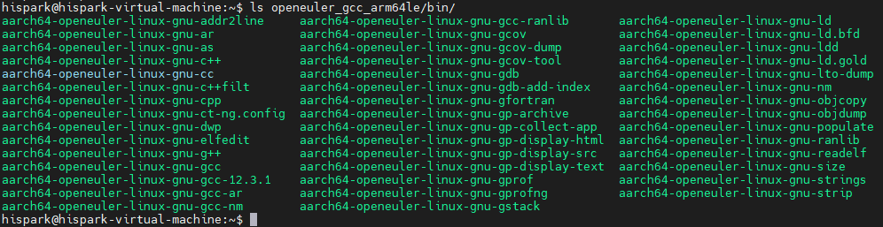

- 执行下面命令打开`~/.bashrc`文件，将`export PATH="/home/hispark/openeuler_gcc_arm64le/bin:$PATH"`添加到文件末尾。

```shell
vim ~/.bashrc
```

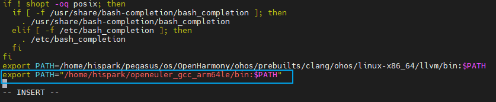

- 执行下面命令生效环境。

```shell
source ~/.bashrc
```

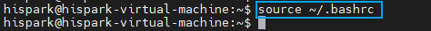

- 检查交叉编译工具链是否生效。

```shell
aarch64-openeuler-linux-gnu-gcc -v
```

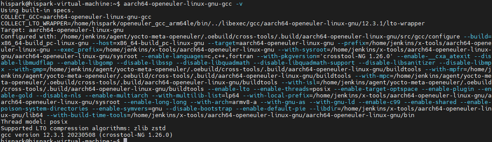

## 3、编译

- `ss928v100_clang`和`ss928v100_gcc`编译大致相同，编译命令主要是LLVM参数的不同，整编和单编详细内容请参见`~/pegasus/platform/ss928v100_clang/osdrv/readme_cn.txt`或`~/pegasus/platform/ss928v100_gcc/osdrv/readme_cn.txt`。

### 3.1、编译ss928v100_clang

- 该编译方式同时依赖clang交叉编译器和gcc交叉编译器，具体安装请参见[2.4小节安装交叉编译器](#2.4、安装交叉编译器)。

#### 3.1.1、整编

- 进入`~/pegasus/platform/ss928v100_clang/osdrv`，执行编译命令。

```
cd ~/pegasus/platform/ss928v100_clang/osdrv
make LLVM=1 BOOT_MEDIA=emmc CHIP=ss928v100 all
```

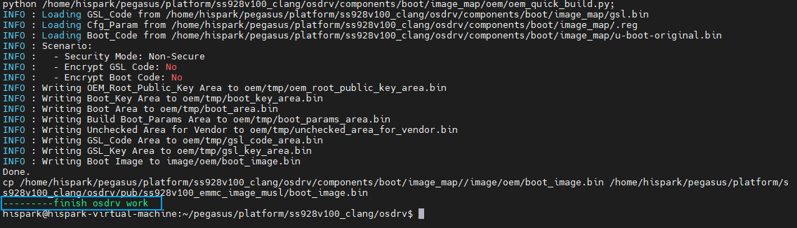

- 编译生成的镜像位于 osdrv/pub/xxx 目录，包括：
  - boot_image.bin 为 bootloader 镜像。
  - u-boot-ss928v100.bin 为 u-boot 镜像（OTP 使能快速启动时使用）。
  - uImage_ss928v100 为 Linux 内核镜像。

#### 3.1.2、单编

##### 3.1.2.1、编译uboot

- 进入`~/pegasus/platform/ss928v100_clang/osdrv`，执行编译命令，编译生成的镜像位于 osdrv/pub/xxx 目录下。

```
make BOOT_MEDIA=emmc gslboot_build -j 20
```

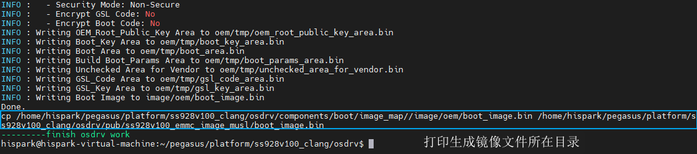

##### 3.1.2.2、编译kernel

- 进入`~/pegasus/platform/ss928v100_clang/osdrv`，执行编译命令，编译生成的镜像位于 osdrv/pub/xxx 目录下。

```
make LLVM=1 BOOT_MEDIA=emmc atf -j 20
```

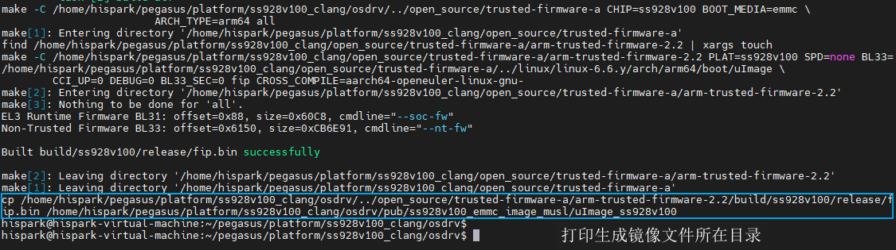

#### 3.1.3、编译sample

- 进入`~/pegasus/platform/ss928v100_clang/smp/a55_linux/mpp/sample`，执行编译命令，生成的可执行文件在各个sample目录下。

```shell
cd ~/pegasus/platform/ss928v100_clang/smp/a55_linux/mpp/sample
make
```

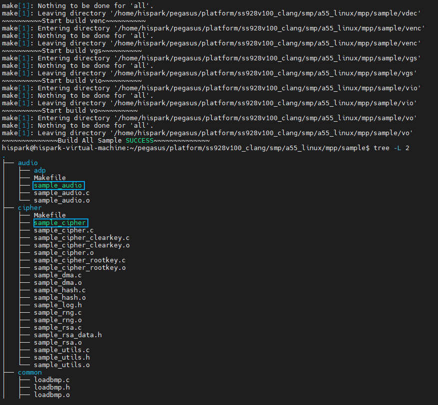

#### 3.1.4、编译ko

- 进入`~/pegasus/platform/ss928v100_clang/smp/a55_linux/mpp/out/obj`，执行编译命令，生成的ko文件在`~/pegasus/platform/ss928v100_clang/smp/a55_linux/mpp/out/ko`目录下。

```shell
cd ~/pegasus/platform/ss928v100_clang/smp/a55_linux/mpp/out/obj
make
```

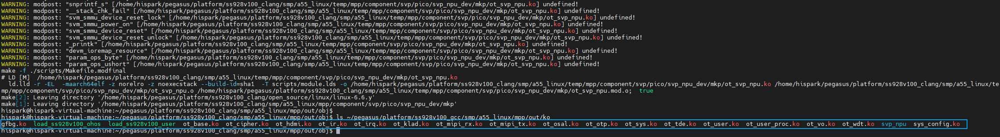

### 3.2、编译ss928v100_gcc

- 该编译方式只依赖gcc交叉编译器，具体安装请参见[2.4.2小节安装gcc交叉编译器](#2.4.2、安装gcc交叉编译器)。

#### 3.2.1、整编

- 进入`~/pegasus/platform/ss928v100_gcc/osdrv`，执行编译命令。

```
cd ~/pegasus/platform/ss928v100_gcc/osdrv
make LLVM=0 BOOT_MEDIA=emmc CHIP=ss928v100 all
```

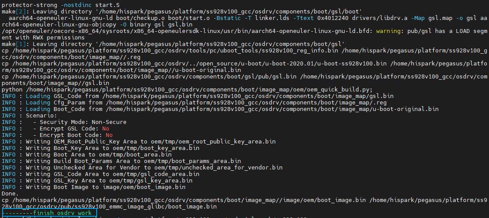

- 编译生成的镜像位于 osdrv/pub/xxx 目录，包括：
  - boot_image.bin 为 bootloader 镜像。
  -  u-boot-ss928v100.bin 为 u-boot 镜像（OTP 使能快速启动时使用）。
  -  uImage_ss928v100 为 Linux 内核镜像。

#### 3.2.2、单编

##### 3.2.2.1、编译uboot

- 进入`~/pegasus/platform/ss928v100_gcc/osdrv`，执行编译命令，编译生成的镜像位于 osdrv/pub/xxx 目录下。

```
make BOOT_MEDIA=emmc gslboot_build -j 20
```

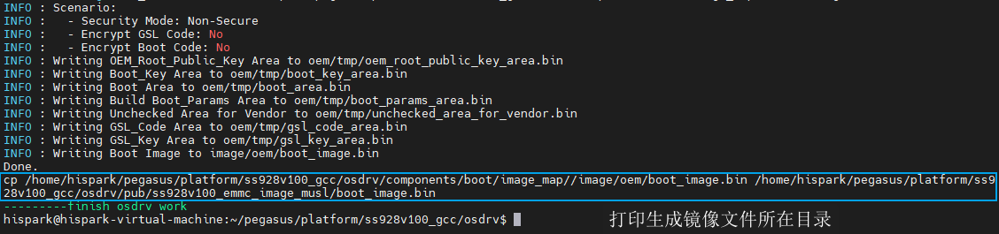

##### 3.2.2.2、编译kernel

- 进入`~/pegasus/platform/ss928v100_gcc/osdrv`，执行编译命令，编译生成的镜像位于 osdrv/pub/xxx 目录下。

```
make LLVM=0 BOOT_MEDIA=emmc atf -j 20
```

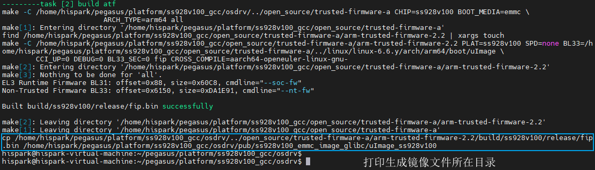

#### 3.2.3、编译sample

- 进入`~/pegasus/platform/ss928v100_gcc/smp/a55_linux/mpp/sample`，执行编译命令，生成的可执行文件在各个sample目录下。

```shell
cd ~/pegasus/platform/ss928v100_gcc/smp/a55_linux/mpp/sample
make
```

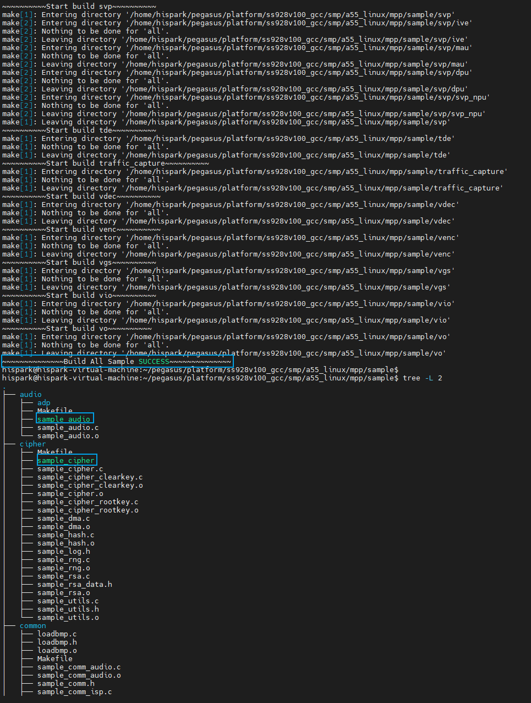

#### 3.2.4、编译ko

- 进入`~/pegasus/platform/ss928v100_gcc/smp/a55_linux/mpp/out/obj`，执行编译命令，生成的ko文件在`~/pegasus/platform/ss928v100_gcc/smp/a55_linux/mpp/out/ko`目录下。

```shell
cd ~/pegasus/platform/ss928v100_gcc/smp/a55_linux/mpp/out/obj
make
```


## 4、安装VSCode

- 如果您电脑上已经安装过VScode，可以跳过此步骤。
- 双击在**2.2.1 软件获取章节下载**的VScode安装包，点击下一步进行安装。


- 点击浏览按钮，选择VScode的安装路径，然后点击下一步。

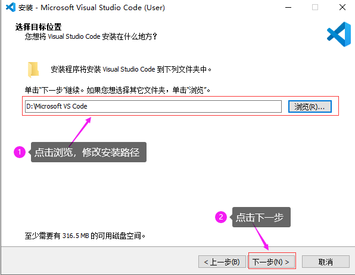

- 出现下方界面，点击下一步。


- 出现下方界面，点击下一步。


- 出现下方界面，点击安装。

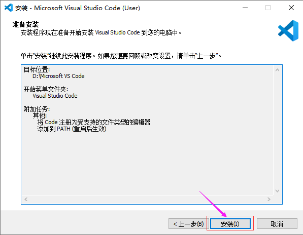

- 出现下方界面，点击完成。

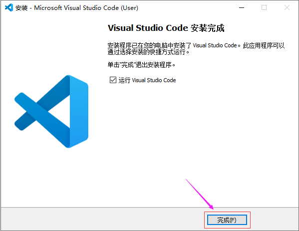

## 5、将代码导入到VScode

- 点击VScode 左上角的File，然后点击Open Folder


- 选择/home/hispark/pegasus，如下图所示，选择好后，点击选择文件夹。

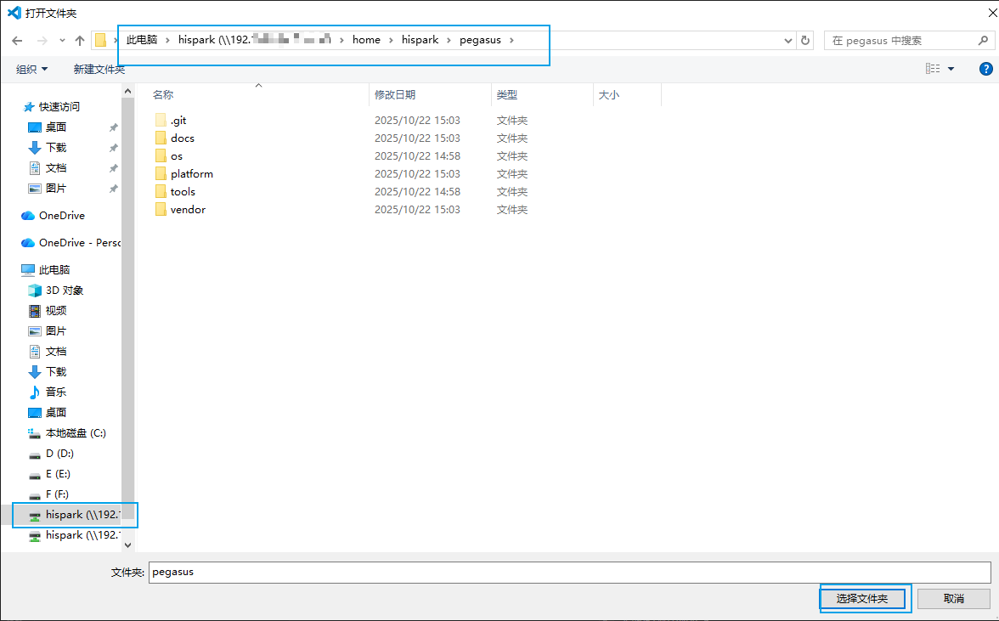

- 代码导入成功后，会弹出下面的对话框，请勾选trust，然后点击 Yes，I trust 。

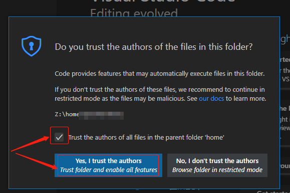

- 这样我们就已经把代码成功导入进来了。