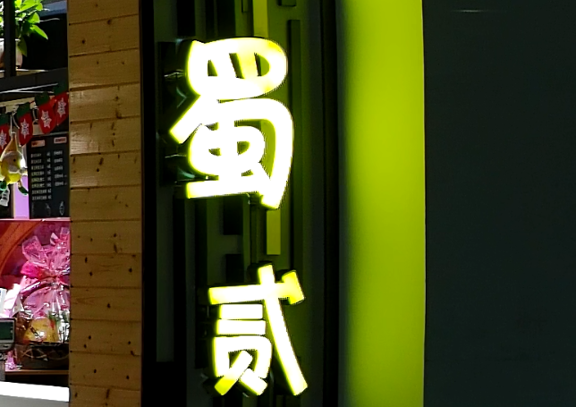
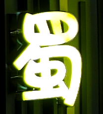
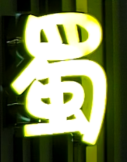
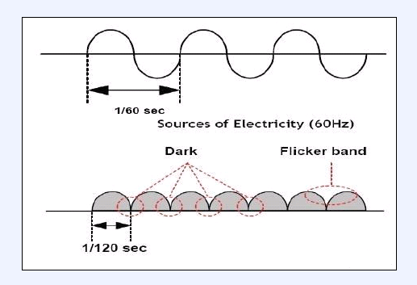
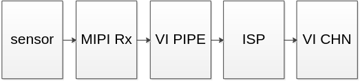

# 前言<a name="ZH-CN_TOPIC_0000002441723769"></a>

**概述<a name="section143mcpsimp"></a>**

本文为使用ISP开发的程序员而写，目的是为您在开发过程中遇到的问题提供解决办法和帮助。

> **说明：** 
>本文以SS928V100描述为例，未有特殊说明，SS927V100与SS928V100内容一致。

**产品版本<a name="section146mcpsimp"></a>**

与本文档相对应的产品版本如下。

<a name="table149mcpsimp"></a>
<table><thead align="left"><tr id="row154mcpsimp"><th class="cellrowborder" valign="top" width="32%" id="mcps1.1.3.1.1"><p id="p156mcpsimp"><a name="p156mcpsimp"></a><a name="p156mcpsimp"></a>产品名称</p>
</th>
<th class="cellrowborder" valign="top" width="68%" id="mcps1.1.3.1.2"><p id="p158mcpsimp"><a name="p158mcpsimp"></a><a name="p158mcpsimp"></a>产品版本</p>
</th>
</tr>
</thead>
<tbody><tr id="row160mcpsimp"><td class="cellrowborder" valign="top" width="32%" headers="mcps1.1.3.1.1 "><p id="p162mcpsimp"><a name="p162mcpsimp"></a><a name="p162mcpsimp"></a>SS928</p>
</td>
<td class="cellrowborder" valign="top" width="68%" headers="mcps1.1.3.1.2 "><p id="p164mcpsimp"><a name="p164mcpsimp"></a><a name="p164mcpsimp"></a>V100</p>
</td>
</tr>
<tr id="row3890144411453"><td class="cellrowborder" valign="top" width="32%" headers="mcps1.1.3.1.1 "><p id="p17589247164514"><a name="p17589247164514"></a><a name="p17589247164514"></a>SS927</p>
</td>
<td class="cellrowborder" valign="top" width="68%" headers="mcps1.1.3.1.2 "><p id="p7589247134510"><a name="p7589247134510"></a><a name="p7589247134510"></a>V100</p>
</td>
</tr>
</tbody>
</table>

**读者对象<a name="section165mcpsimp"></a>**

本文档（本指南）主要适用于以下工程师：

-   技术支持工程师
-   软件开发工程师

**修订记录<a name="section171mcpsimp"></a>**

修订记录累积了每次文档更新的说明。最新版本的文档包含以前所有文档版本的更新内容。

<a name="table126443203200"></a>
<table><thead align="left"><tr id="row264516207203"><th class="cellrowborder" valign="top" width="20.72%" id="mcps1.1.4.1.1"><p id="p146456203200"><a name="p146456203200"></a><a name="p146456203200"></a><strong id="b8645172022010"><a name="b8645172022010"></a><a name="b8645172022010"></a>文档版本</strong></p>
</th>
<th class="cellrowborder" valign="top" width="26.119999999999997%" id="mcps1.1.4.1.2"><p id="p364512062019"><a name="p364512062019"></a><a name="p364512062019"></a><strong id="b1464512200200"><a name="b1464512200200"></a><a name="b1464512200200"></a>发布日期</strong></p>
</th>
<th class="cellrowborder" valign="top" width="53.16%" id="mcps1.1.4.1.3"><p id="p664522018206"><a name="p664522018206"></a><a name="p664522018206"></a><strong id="b156451420152010"><a name="b156451420152010"></a><a name="b156451420152010"></a>修改说明</strong></p>
</th>
</tr>
</thead>
<tbody><tr id="row56451520182017"><td class="cellrowborder" valign="top" width="20.72%" headers="mcps1.1.4.1.1 "><p id="p1564572014209"><a name="p1564572014209"></a><a name="p1564572014209"></a>00B01</p>
</td>
<td class="cellrowborder" valign="top" width="26.119999999999997%" headers="mcps1.1.4.1.2 "><p id="p126451920132014"><a name="p126451920132014"></a><a name="p126451920132014"></a>2025-09-15</p>
</td>
<td class="cellrowborder" valign="top" width="53.16%" headers="mcps1.1.4.1.3 "><p id="p1664582017209"><a name="p1664582017209"></a><a name="p1664582017209"></a>第1次临时版本发布。</p>
</td>
</tr>
</tbody>
</table>

# FAQ<a name="ZH-CN_TOPIC_0000002408124626"></a>


## ISP<a name="ZH-CN_TOPIC_0000002441723797"></a>


### 如何解决整体锐度不足<a name="ZH-CN_TOPIC_0000002441683949"></a>

【现象】

图像边缘细节不清，与失焦效果类似。或者对比标杆，大边和纹理的锐度不如标杆。

【分析】

影响图像锐度的维度有整体图像亮度和对比度（AE、WB、GAMMA和DCI）、锐化强度（sharpen）、Demosaic、去噪强度（2DNR和3DNR）和编码码率等。所以当图像的整体清晰度风格跟客户的需求偏差较大时，优先考虑调整GAMMA等影响图像全局亮度和局部对比度的模块，然后再调整Demosaic和sharpen。

【解决】

需要逐步排除定位图像锐度不足的原因：

-   查看sensor表面，镜头表面是否整洁，是否贴膜没有去掉，是否单边模糊，确认镜头光圈开到最大，对焦清晰。
-   检查图像亮度是否合理，通过ae\_compensation参数调整亮度到满意。
-   校正WB，使得图像的白平衡正常。
-   调整GAMMA，让图像整体的风格和对比度达到客户需求。
-   设置编码码率为高码率，观察是否有效果改善。
-   调整Demosaic的相关参数，避免Demosaic插值的图像过于模糊和边缘不清晰。
-   通过PQtools读取当前的sharpen强度信息，或手动设置sharpen强度到最大，观察是否有改善。
    -   首先将texture\_str和edge\_strength都调到最大；
    -   其次将over\_shoot和under\_shoot调到最大；
    -   再次将detail\_ctrl设置为128，同时，将luma\_wgt都设置为127；
    -   最后根据图像的黑边白边的情况适当的调整under\_shoot和over\_shoot以及shoot\_sup\_strength。如果图像的锐度太高，再适当降低texture\_str和edge\_strength，重复上述三步即可调到客户想要的清晰度风格。

-   关闭或者减弱2DNR/3DNR去噪模块，观察是否有改善。

### 如何解决图像发蒙问题，提高通透性<a name="ZH-CN_TOPIC_0000002408284530"></a>

【现象】

图像发蒙，通透性不好。

【分析】

通透性由两大因素决定：清晰度和对比度。

-   若清晰度不够，或对比度不高，会让人感觉通透性比较差。
-   若出现通透性不好，应检查是否有漏光现象。

【解决】

-   遮住漏光的地方，注意sensor板背面也有可能漏光。
-   提高对比度，通过设置更高对比度的Gamma实现。
-   调整LDCI，进一步提升图像的对比度。
-   如果是有雾的场景，或者是类似于有雾的场景，可以尝试调试Dehaze来减弱图像发蒙的问题。
-   提高清晰度，请参见[如何解决整体锐度不足](#ZH-CN_TOPIC_0000002441683949)和[如何解决低照度清晰度差](#ZH-CN_TOPIC_0000002441723789)。

### 如何解决低照度清晰度差<a name="ZH-CN_TOPIC_0000002441723789"></a>

【现象】

低照度时清晰度比较差。

【分析】

-   原因1：清晰度与镜头关系最大。焦距与物距均影响景深（焦距小，景深大；物距远，景深大），导致整体清晰度差异。
-   原因2：ISP软件内部有默认的联动机制。噪声大时，自动降低锐化强度，并加强去噪强度。该策略会导致低照度时，画面清晰度下降。

【解决】

-   针对原因1，选用同样的镜头（同一个厂家，同一个型号）进行对比。
-   针对原因2，联动机制已开放参数，用户可以按照自己的喜好，在清晰度和去噪之间平衡。在低照度时，可以增加2DNR/3DNR去噪的强度，以减小噪声。可以适当提高sharpen的锐化，以增强大边的锐度。还可以调整一下Demosaic的参数，防止图像插值出来的边缘过于模糊。

### 如何解决图像清晰度与物体边缘白边和黑边问题<a name="ZH-CN_TOPIC_0000002408124638"></a>

【现象】

图像清晰度不足或物体边缘（如字体或树叶或者楼宇大边缘）有白边黑边。

【分析】

在图像已经聚焦的情况下，图像清晰度是由两方面决定：

-   去噪强度越大，图像越模糊；
-   sharpen锐化强度，锐化强度越大，图像越清晰，反之越模糊。

物体边缘的黑边白边一般是由于锐化强度过大造成。然而，锐化后产生的黑边白边，是Sharpen锐化不可避免的副作用，尤其在sharpen锐化很强的情况下，黑边白边尤为明显，适当的黑边和白边能让人眼感觉锐度更高。

【解决】

图像清晰度和黑边白边的控制主要通过两种途径进行调节，包括去噪和图像锐化。

-   如果图像的清晰度不足，可以适当降低2DNR的强度，适当提高sharpen的锐化强度。
-   在图像的清晰度达到要求的情况下：
    -   首先，通过调大shoot\_sup\_strength来减弱图像的黑白边。调大shoot\_sup\_strength，可以在不明显降低图像的清晰度的前提下，收窄黑边白边的宽度、压低黑边白边的幅度，但是shoot\_sup\_strength调的过大，也会导致图像的清晰度降低，并会导致图像出现微弱的油画副作用，以及加重锯齿的副作用。
    -   其次，如果调节shoot\_sup\_strength也不能将图像的黑边白边调到满意，则可以单独调小overshoot来减弱白边，或者单独调小undershoot来减弱黑边，但是，调小overshoot或者undershoot都会明显的降低图像的清晰度。

### 如何解决图像的锯齿严重的问题<a name="ZH-CN_TOPIC_0000002408124646"></a>

【现象】

锐化后的图像在小角度倾斜的高对比度的大边缘会产生锯齿。

【分析】

图像中的小角度倾斜的高对比度的大边缘，在sharpen锐化前一般都会有锯齿，只是不太明显。sharpen锐化后，原本不太明显的锯齿也被增强，导致锯齿变得明显。锯齿的产生跟高对比度的大边缘的倾斜角度有很强的关联，不同的倾斜角度，锯齿的严重程度也差别很大。

【解决】

需要逐步排除定位图像产生锯齿的原因：

-   确认产生锯齿的边缘的视角和倾斜的角度跟标杆一致。跟标杆对比锯齿问题，需要两者在同样的视角和边缘倾斜度的情况下对比。
-   关闭sharpen后，看图像是否已经有了明显的锯齿。
    -   如果关闭sharpen后，图像的大边缘就有明显锯齿，那就需要调整demosaic和2DNR。一般情况下，适当的调大demosaic的detail\_smooth\_str参数，就可以明显的减弱边缘锯齿，但是，demosaic的参数不能调的太极端，否则，边缘会变的过于模糊。
    -   如果关闭sharpen后，图像的锯齿不明显。开启sharpen后，图像的锯齿变得明显或者加重。那就需要调整sharpen参数，在保持清晰度不明显的降低的前提下减弱锯齿。

        适当的调节edge\_str可以明显的减弱锯齿，而不明显的降低图像清晰度。edge\_str参数是一个长度为32的数组，通过减小坐标最大的一段的edge\_str的值，可以明显的减弱锯齿。比如，减弱edge\_str \[20\]、edge\_str \[21\]、edge\_str \[22\]到edge\_str \[31\]这12个下坐标最大的一段的edge\_str的值，而同时保持剩下下坐标较小的一段（0\~19）的edge\_str的值不变，则可以在不明显降低图像清晰度的前提下减弱锯齿。同时，edge\_str强度曲线的调节要尽量平滑。此外，如果shoot\_sup\_strength过大，也会导致边缘锯齿加重，此时，可以在黑白边可以接受的前提下，调小shot\_sup\_strength，以减弱边缘锯齿。最后，适当的调大edge\_filt\_str，也可以减弱边缘锯齿。

### 如何解决图像暗角格子问题<a name="ZH-CN_TOPIC_0000002441723785"></a>

【现象】

图像四个暗角随机出现规则横线或者竖线。

【分析】

当采用镜头CRA角度跟sensor不匹配时，光线通过镜头入射会导致Gr/Gb不平衡从而产生crosstalk现象，由于demosaic模块处理会随机进行水平方向或垂直方向插值，因此产生格子现象。

【解决】

首先确认采用的sensor跟镜头CRA角度是否匹配，如果不匹配的话建议按照sensor厂家提供的文档更换CRA角度匹配的sensor或者镜头；

### 如何解决AE工作异常，如严重过曝或曝光不足<a name="ZH-CN_TOPIC_0000002408284518"></a>

【现象】

AE严重过曝或曝光不足，调整目标亮度参数无改善。

【分析】

通过ot\_mpi\_isp\_query\_inner\_state\_info接口获取当前状态下的曝光时间和增益信息。

> **说明：**  ot\_mpi\_isp\_query\_inner\_state\_info接口请参考《ISP开发参考》文档。

【解决】

基于查询到的当前状态下的曝光时间和增益信息，可做如下处理。

-   如果曝光信息与当前亮度不一致\(曝光时间和增益已达到较大值，图像仍然曝光不足或者曝光时间和增益偏小，图像仍然过曝\)，需要确认硬件电路。
-   如果曝光信息与当前亮度一致，查询AE的直方图统计信息，如果出现灰阶分布过于密集，某些段统计数据为0，请确认图像宽高设置是否合理，VI掩码是否与硬件相符。
-   如果曝光信息与当前亮度不一致，确认AE计算的相关sensor寄存器是否正确配置生效，可以通过I2C/SPI直接读取sensor的shutter、gain相关的寄存器是否正确。

### 如何解决红外场景亮度和对比度差的问题<a name="ZH-CN_TOPIC_0000002441683909"></a>

【现象】

低照度下，打开红外灯，画面四周亮度偏暗，画面中间亮度过高，出现过曝导致细节损失，并且，高亮区域的对比度差，画面发蒙。

【分析】

红外灯一般照射在画面的中间位置，灯光照射的地方亮度很高，容易出现过曝情况和对比度差的情况，四周缺乏灯光照射，亮度偏暗。

【解决】

-   确保IR-Cut切换为夜模式。
-   AE收光，AE的Compensation适当调小，ae\_strategy\_mode设置为AE\_EXP\_HIGHTLIGHT\_PRIOR模式，hist\_ratio\_slope和max\_hist\_offset都设大，就可以实现AE无过曝。
-   因为AE收光，画面亮度降低，需要提升亮度。使能DRC，调节DRC的强度和DRC曲线，使得画面亮度提升，但是亮度提升会引入对比度差的问题，所以需要联调去雾和DCI模块。
-   使能去雾模块，调整去雾自定义曲线，根据亮度局部调整去雾的强度。可以不把暗区拉黑的同时把高亮区域的区域对比度提升，从而细节增加。同时调试DCI，调整画面的对比度。
-   画面还是会有四周暗的问题，这个时候可以利用shading来实现把四周亮度提升。可以不改变或者轻微改变中间区域，把四周围区域的亮度提起来。

### 如何调整红外模式AE，AWB和CCM参数<a name="ZH-CN_TOPIC_0000002441683913"></a>

【现象】

红外模式下，AE统计信息不稳定，经常跳变。或者红外下AE收敛会收敛成不同亮度，比如用手捂一下，再拿开亮度就变了。

【分析】

这些现象和AE，AWB的配置有关系。开了AWB后，RB分量异常，导致AE大面积单色判断错误，引起震荡。

【解决】

-   红外场景下，使用SDK提供的AE库需要把大面积单色功能\(hist\_stat\_adjust\)使能关闭。如果在红外场景下使能wb\_gain，会导致图像亮度偏亮，这时建议根据sensor bayer pattern类型配置跳点方式\(hist\_config\)，同时统计R与G分量，使得图像亮度更合理。
-   红外模式推荐关闭AWB，并把饱和度调成0，这种情况下，G通道和R通道占比较大的值，CCM矩阵的配置应该为R,G通道的权重大一些比较合理。
-   红外灯应用时如果需要使能AWB，建议设置zone\_sel=0，也就是使用全局的AWB统计信息。这种情况下，AWB会把R，B通道乘比较大的系数，R,B通道相对噪声比较大，建议CCM矩阵设置为只用G通道权重大，R,B通道权重小比较合理。

### 如何解决低照度情况下图像出现竖条纹的问题<a name="ZH-CN_TOPIC_0000002408124654"></a>

【现象】

部分sensor低照度时，图像出现竖条纹。

【分析】

竖条纹是sensor的FPN\(Fixed Pattern Noise\)，它会随sensor数字增益变大，而变得更明显。目前，软件对sensor的数字增益没有做限制，低照度时数字增益比较大，因此竖条纹严重。

【解决】

使用FPN算法模块，对FPN进行去除或减弱。

### 如何实现背光补偿<a name="ZH-CN_TOPIC_0000002408124658"></a>

【现象】

在背光场景下，目标物体比较暗。

【分析】

背光场景下，可以通过提高图像整体的曝光亮度来进行背光补偿。

【解决】

加强指定区域的AE权重；

SS919V100自动曝光的静态统计信息分为15x17个区域，可通过设定权重表改变每个区域的权重，使最终的亮度相应改变。

可通过MPI接口增加指定区域的权重，使最终曝光按照指定区域的亮度曝光，达到背光补偿的效果。当把目标物体权重加的很大时，这种方式可能导致周围亮的区域过曝。

### 如何实现手动曝光时间，增益自动控制，或者手动增益，曝光时间自动控制<a name="ZH-CN_TOPIC_0000002441683929"></a>

【实现】

如果有需求实现手动曝光时间，增益自动控制，或者手动增益，曝光时间自动控制的功能。

这种功能，最方便的是仍使用AE模式，把曝光时间上、下限设置为相同值，即可实现手动控制曝光的功能。此时如果设置ae\_mode为AE\_MODE\_SLOW\_SHUTTER，曝光时间超出一帧上限后，会自动降帧。增益同理，设置sys\_gain上下限相同即可。

### 如何正确设置最大增益<a name="ZH-CN_TOPIC_0000002441723793"></a>

【现象】

低照度时，有时需要限制最大增益获得更好的图像效果。但限制dgain、isp\_dgain后，出现AE闪烁问题。

【分析】

大部分sensor的Again精度比较低，如果限制了高精度的dgain、isp\_dgain，亮度无法按AE要求精确控制，出现闪烁。

【解决】

不分别限制again、dgain、isp\_dgain最大值，而是限制system\_gain\_max，系统增益最大值。即again\*dgain\*isp\_dgain的最大值。不用关心AE如何分配增益。

### 如何解决AWB易受干扰问题<a name="ZH-CN_TOPIC_0000002408284534"></a>

【现象】

手在镜头前挥过时或占视野面积大的车开过时，AWB易受干扰而变色。

【分析】

肤色或部分车的颜色对AWB影响比较大，会使AWB出现误差。

【解决】

-   设置AWB属性speed，降低收敛速度会使这个现象明显改善。
-   设置AWB算法为高级算法，会对这种现象有改善。如果环境光源不会出现渐变，即不受到阳光影响。只有室内光源，提高AWB高级算法属性tolerance，也会对AWB易受干扰问题有好处。

### 如何解决高温下黑电平漂移对颜色的影响<a name="ZH-CN_TOPIC_0000002441723781"></a>

【现象】

在过高或过低温度下，AWB校正后图像仍然偏色。

【分析】

在过高或过低温度下，sensor采集图像的稳定性会受影响。在高温下，sensor的黑电平会产生漂移，真实的黑电平可能是正常温度下的几倍。这时，AWB校正后图像偏色。理想情况下，sensor对不同亮度的灰色点颜色表现是相同的，R = K \* G。常温下sensor的offset是F0，高温下sensor的offset是F1，F0<F1。

-   常温下计算R通道增益为：Normal\_R/G = \(K \* G + F0 – F0\) /\(G + F0 – F0\) = K
-   高温下计算R通道增益为：High\_ R/G = \(K \* G + F1– F0\) /\(G + F1 – F0\)

    F0 < F1（高温下黑电平漂移）；

从sensor的光谱图可以看到，多数sensor的绿色感光强于RB两个颜色，K<1;High\_ R/G - Normal\_ R/G= \(1 - K\) \* \(F1 – F0\) /\(G + F1 – F0\)\>0, High\_ R/G \> Normal\_ R/G。红色通道增益Rgain =G/R= 1/\(R/G\)，因此High\_Rgain < Normal\_Rgain，红色通道增益偏小。同样可推出高温下蓝色通道增益偏小，因此高温下图像偏绿是必然的。

【解决】

High\_R/G - Normal\_ R/G= \(1 - K\) \* \(F1 – F0\) /\(G + F1 – F0\)，G体现了亮度信息，G越大，High\_R/G与Normal\_R/G的偏差越小。物理含义是：亮度越高，对黑电平的偏移越不敏感。因此，推荐增大AWB参数的black\_level\(前默认值为0x40\)，降低黑电平漂移对增益的干扰。

### 如何解决低照度亮度、对比度偏低<a name="ZH-CN_TOPIC_0000002441683921"></a>

【现象】

低照度时，发现亮度、对比度不如对比标杆。

【分析】

-   原因1：镜头光圈不同。F值越小，光圈越大，到达sensor的光通量更多。
-   原因2：sensor不同。sensor的光电转换效率不同，决定了低照度表现。
-   原因3：整体亮度不同。因为图像亮度值比较低，一些产品通过修改亮度、对比度的方式，提高人眼可见度。
-   原因4：一些产品在低照度时，会降帧率，曝光时间会加大，因此画面显得更亮些。
-   原因5：低照度下经过降噪算法处理之后，可能降低对比度。低照度环境下，椒盐噪声较多，当降噪算法过多处理了椒噪声之后留下盐噪声，这样会使整体图像发白现象。

【解决】

-   针对原因1：选用同样的镜头（同一个厂家，同一个型号）进行对比。
-   针对原因2：尽量采用同样的sensor进行对比。
-   针对原因3：通过调整AE相关参数，使其整体亮度与标杆相当。
-   针对原因4：在demo中，可以手动降低帧率，但产品实际应用中并不推荐这样做。
-   针对原因5：可以调整降噪策略，或调整Gamma、LDCI算法模块参数，增加其整体对比度。

### 如何解决光源字体附近出现方向性的毛刺<a name="ZH-CN_TOPIC_0000002408284522"></a>

【现象】

正常照度下，光源字体附近出现方向性的毛刺。如[图1](#_Ref508268875)所示：

**图 1**  光源字体附近出现方向性的毛刺效果图<a name="_Ref508268875"></a>  


【分析】

原因：光源字体出现方向性的毛刺，该问题主要是由于Global CAC模块中的参数标定不合理而导致。

【解决】

针对该问题，首先检查Global CAC标定的静态系数是否合理，如果不合理进行重新标定；如果不想标定Global CAC的静态系数，默认需要将Global CAC的使能关闭。[图2](#_Ref508268896)所示为Global CAC静态系数不合理，开关Global CAC对比图。

**图 2**  Global CAC静态系数不合理情况下，开关Global CAC对比图<a name="_Ref508268896"></a>  

 

### 如何解决AE无法控制Piris光圈<a name="ZH-CN_TOPIC_0000002408124662"></a>

【现象】

Piris光圈接好后，驱动对接成功，可以通过手动的方式配置光圈开关，但用AE无法控制。

【分析】

AE没有配置正确相关的光圈参数。

【解决】

-   需要配置AE route，否则默认曝光时间到最小值才会动光圈，但实际使用中很难达到最小值。所以需要通过配置AE route，使光圈在曝光时间未到最小值时就动作。
-   在xxx\_cmos.c文件中，没有配置ae\_sns\_dft-\>max\_iris\_fno和ae\_sns\_dft-\>min\_iris\_fno。请注意不是min\_iris\_fno\_target。有Target的参数是指通过MPI接口配置的最大最小值。没有Target的是光圈实际支持的最大最小值。如果未设置，会导致AE认为Piris光圈最大最小值都为0，就不调了。可以将这两个参数直接设置为最小和最大。

### DCIris光圈手动控制可以开关，但自动模式不会关闭原因<a name="ZH-CN_TOPIC_0000002408124630"></a>

【分析】

-   DCIris光圈手动控制可以开关，说明硬件连接没有问题。
-   DCIris一般用于规避工频闪的问题。AE抗闪需要曝光时间为电源能量周期的倍数。比如50Hz为10ms倍数。在高亮环境下，最大光圈时曝光时间小于10ms，想要实现抗闪，要用到DCIris，关小光圈来实现。
-   SDK提供的AE DCIris算法，当曝光时间到最小值以后才会关闭光圈。但默认最小值一般为2行，相当于几十微秒，实际场景几乎无法达到这么小的曝光时间，所以看不到光圈关闭。可以手动设置曝光时间最小值为10ms来实现抗闪。或者不设置曝光时间最小值，设置抗闪模式为Normal模式，曝光时间降到抗闪最小曝光时间后，会维持曝光时间不变。此时相当于已达到曝光时间最小值，也会关闭光圈。

### 如何解决AE闪烁<a name="ZH-CN_TOPIC_0000002408124650"></a>

【现象】

同步问题：具体表现为某一帧或两帧突然比其他帧亮很多或暗很多，然后恢复正常。精度问题：具体表现为画面亮度持续变化，变化程度或小或大；或AE偶尔出现震荡。

【分析】

AE闪烁问题最常见的为两类：同步问题和精度问题。

【解决】

-   同步问题：是因为很多sensor，配置增益，会在下一帧生效，配置曝光时间，会在下下帧生效。isp\_dgain同样是当前帧配置，下一帧生效。这样如果同步设置不正确，在增益曝光时间相对变化大时，就会出现闪烁。常见于高亮场景和开启抗闪时。

    xxx\_cmos.c中有同步配置cmos\_get\_sns\_regs\_info ，其中有sensor 寄存器的同步配置。cfg2\_valid\_delay\_max控制isp\_dgain同步。可以尝试修改曝光时间、增益、isp\_dgain同步配置来解决该问题。

-   精度问题：AE算法计算的亮度值，具体配置到sensor的时候，因为可控制的增益精度有限，不能够完全达到AE算出的亮度值。

    如果精度低，亮度就有可能在相邻的两个可以达到的亮度间来回跳变，始终无法收敛到正确的亮度。表现为震荡、闪烁。因为isp\_dgain精度很高，保留至少2倍的isp\_dgain可以很好的解决精度问题。

    限制增益不建议分别限制again、dgain、isp\_dgain的增益，这样容易带来精度问题，可以通过限制system gain来实现，AE会自动分配3个增益。

### 如何解决鱼眼校正放在VI模块引起的边缘噪声大的问题<a name="ZH-CN_TOPIC_0000002441723801"></a>

【现象】

当前鱼眼校正放在VI模块时，也就是在3DNR之前，由于鱼眼校正会引起边缘噪声大，中间噪声小的问题。从而造成画面的噪声和位置相关。

【分析】

鱼眼校正引起的噪声不均匀，且和位置强相关，当前只能通过BayerNR+NrLsc使能进行优化，当前只有SS813V100/SS812V100 Shading模块单独针对BayerNR的降噪有bnr\_lsc\_gain\_lut.r\_gain/ bnr\_lsc\_gain\_lut.gr\_gain/ bnr\_lsc\_gain\_lut.gb\_gain/ bnr\_lsc\_gain\_lut.b\_gain，bnr\_lsc\_gain\_lut表的调试与Shading的亮度校正解耦。

【解决】

调试BayerNR中的NrLsc模块，使能nr\_lsc\_enable，并调试Mesh-shading的中bnr\_lsc\_gain\_lut. r\_gain/bnr\_lsc\_gain\_lut.gr\_gain/bnr\_lsc\_gain\_lut.gb\_gain/bnr\_lsc\_gain\_lut.b\_gain。

注意bnr\_lsc\_gain\_lut.r\_gain表4096表示一倍，8192表示2倍，可以将画面的边缘处的Gain调试大一点，这样BayerNR使能NrLsc，可以针对边缘处去噪强一些。将画面中心出的Gain调试小一点，BayerNR针对中心区去噪弱一些。此时BayerNR去噪强度需要调试coarse\_str而不是fine\_str。

### 如何解决开启抗闪后较亮场景仍然闪烁的问题<a name="ZH-CN_TOPIC_0000002441683945"></a>

【现象】

在自适应中，设置了默认的AE route，此时再设置对应频率的抗闪，当环境光较亮，但是所需曝光量已经大于抗闪的最小曝光量时，仍然有闪烁现象。

【分析】

自动抗闪功能受到了AE route的限制，如果AE route设置了优先分配增益，那么会导致总的曝光量大于最小抗闪曝光量时，曝光时间仍然小于最小抗闪曝光时间，那么此时如果设置的是自动抗闪模式，那么此时达不到抗闪效果。

【解决】

设置AE route为曝光时间优先分配，即增益在1倍，或者最小期望值之后，优先让曝光时间达到最小抗闪时间，此时开启自动抗闪才能起到抗闪效果。

### 如何解决软光敏方案频繁切换IR\_cut的问题与使用建议<a name="ZH-CN_TOPIC_0000002441683941"></a>

【现象】

在实验室全黑场景（没有或少量可见光），红外灯开启，当红外光的反射距离在4m以内，软光敏方案（ir\_auto sample）频繁切换IR\_cut的问题。

【标定条件】

-   红外灯打开，设备切换到IR模式，并切换滤光片到全通。
-   Raw的亮度合适，大约到最高亮度的70%\~80%，如12bit对应像素值4095， 80%是像素值3276。
-   执行sample的标定程序，获取IR模式下的最大和最小阈值用于场景判断条件。

【使用建议】

-   需要满足场景亮度适宜，不过曝或过暗，否则不宜使用软光敏功能。
-   设备与物体IR反射距离不宜太近或太远，否则导致标定参数不适用的问题。
-   红外切换可见光时，如果红外光太强，比如ISO100，此时需要关闭ISO联动判断条件。

### DynamicBLC使用注意事项<a name="ZH-CN_TOPIC_0000002441723805"></a>

要先确保mipi数据中包含OB区，才能打开DynamicBLC模式对OB区进行统计。数据处理流程如[图1](#fig6558124065118)所示。

**图 1**  数据处理流程<a name="fig6558124065118"></a>  


因此若要使用Dynamic BLC模块基于OB区统计得到合理的黑电平值，整个数据处理通路的配置说明如下：

-   sensor驱动配置：在驱动中添加可以读出ob区的sensor序列。若启动Dynamic BLC模块一定要关闭sensor中的BLC校正功能。
-   mipi配置：确保mipi的裁剪区域包含OB区。若OB区的datatype与可见光区域图像的datatype不一样，则需要修改mipi的datatype配置，可通过调用OT\_MIPI\_SET\_EXT\_DATA\_TYPE接口实现，接口的具体信息请参见《MIPI 使用指南》，使得mipi输出的数据包含OB区。若Dynamic BLC模块异常要检查mipi检测到的分辨率是否为包含OB区的分辨率。
-   VI dev配置：宽高与mipi输出宽高保持一致。
-   pub attr配置：配置wnd\_rect中的起始坐标和宽高信息，使用ISP裁剪功能裁剪掉OB区，保证ISP FE和BE处理的数据为不带OB区的raw数据。

VI pipe attr和chn info中的宽高配置为ISP裁剪后的宽高。

由于sensor gain值较大时，动态黑电平会严重飘移，所以calibration\_black\_level的标定值不够准确。但是不会影响开关灯这种极限场景的图像效果。

### 采集FE raw数据送到BE时黑电平配置注意事项<a name="ZH-CN_TOPIC_0000002408284550"></a>

采集FE的raw数据送到BE时，并且FE使用了动态黑电平，这时候建议FE使能user\_black\_level，使run BE的时候不用考虑黑电平的同步。使用user\_black\_level要注意保证sensor黑电平要小于user\_black\_level。如果sensor的黑电平超过user\_black\_level，需要关闭sensor\_dgain减小sensor的黑电平，或者增大user\_black\_level。BE所在pipe，需要设manual\_black\_level的值和user\_black\_level一样。

### AE增益分开配置使用说明<a name="ZH-CN_TOPIC_0000002408124634"></a>

【说明】

sensor支持长短帧增益分开配置，需要在sensor驱动中做相应的适配。

1.  驱动需要适配相应的增益和曝光时间配置函数，需要交替配置长短帧，AE算法会回调这个函数对sensor进行曝光参数配置。
2.  驱动需要通过cmos\_get\_ae\_default接口传递相应的参数到AE算法内部。
    -   ae\_gain\_sep\_cfg： 需要设置为True，使能增益分开配置模式。
    -   diff\_gain\_support：用于长短帧配置不同的增益，需将该模式打开。
    -   lhcg\_support： 如果是单快门双增益的sensor，需要将该配置打开。
    -   lhcg\_ratio： 单快门双增益sensor，需要将sensor内部的长短帧增益比例的配置给AE。AE在配置曝光比的时候会将lhcg\_ratio考虑进去，即长帧曝光量/短帧曝光量\*lhcg\_ratio等于最终的曝光比。

【注意事项】

当前单快门双增益模式，只支持长帧优先，非扩展的AE Route。

【案例】

```
cmos_get_ae_comm_default() {
    ae_sns_dft->diff_gain_support = TRUE;
    ae_sns_dft->lhcg_support = TRUE;
    ae_sns_dft->sns_lhcg_exp_ratio = 64; / 6bit 精度/
    ...
}
cmos_gains_regs_set(gain)
{
    static bool first_gain = 1;
    if (first_gain == TRUE) {
        deploy_long_gain_to_sensor(gain);
        first_gain = FALSE;
    } else {
        deploy_short_gain_to_sensor(gain);
        first_gain = TRUE;
    }
    return;
}
cmos_inttime_update(int_time)
{
    static bool first_time = 1;
    if (first_time == TRUE) {
        deploy_long_time_to_sensor(int_time);
        first_time = FALSE;
    } else {
        deploy_short_time_to_sensor(int_time);
        first_time = TRUE;
    }
    return;
}
```

## Sensor相关<a name="ZH-CN_TOPIC_0000002441723777"></a>


### 如何解决对接sensor时，环境亮度变化引起图像出现裂屏<a name="ZH-CN_TOPIC_0000002408284546"></a>

【现象】

SS919V100对接sensor，环境亮度变化时，AE刷新sensor的曝光时间和增益，图像上出现亮线或图像裂屏。

【分析】

Slave模式sensor的模拟增益寄存器生效机制是实时生效的，当环境亮度变化时，AE刷新相关sensor寄存器，并对相关寄存器进行配置，当在图像数据的有效区（非消隐区）对其模拟增益进行配置时，模拟增益实时生效不在垂直消隐区，将会出现亮线或裂屏问题。

多数slave模式的sensor都存在模拟增益实时生效的问题，这就要求配置模拟增益的时间需要满足一定在垂直消隐区内完成。如保证了寄存器在消隐区生效，不会出现坏帧。

【解决】

使用ISP的寄存器配置机制（或客户设计相关配置机制），通过中断对寄存器进行配置，使其满足模拟增益实际生效在垂直消隐区内。而当客户应用程序业务量比较大时，可能导致中断响应不及时，从而导致配置不满足消隐区内，可能还是会导致上述问题，此时需要优化中断处理业务，尽量确保中断处理的及时性。

### 如何解决不同的sensor器件实现50Hz/60Hz抗闪<a name="ZH-CN_TOPIC_0000002408284514"></a>

【现象】

采用发布SDK的默认参数，打开抗闪，该功能不生效。

【分析】

交流电波形如[图1](#_Ref464811362)所示。

**图 1**  交流电波形<a name="_Ref464811362"></a>  


sensor不同行的曝光起始时间不同，如果曝光时间较短，就会有的像素行处在比较亮的时候曝光，有的处在比较暗的时候曝光，可见sensor各行即使保持相同的曝光时间，累积的能量是有明显差异的，导致了图像前后帧的同一行，同一帧内的不同行亮暗差异，从而出现了闪烁。

如果控制曝光时间为频闪周期的整数倍，则每一帧图像的整体亮度基本一致。如下：

-   在50Hz环境下，要求曝光时间为1/100s的整数倍；
-   在60Hz环境，要求曝光时间为1/120s的整数倍。

【解决】

SS919V100 ISP内部实现了抗闪，sensor的曝光时间以行为单位，不同sensor行与秒之间的转换比不同，用户需要根据自己的硬件环境，合理配置lines\_per\_500ms参数以实现抗闪。lines\_per\_500ms是行频的1/2，计算公式如下:

lines\_per\_500ms = 像素时钟频率/\(图像宽度+水平消隐区宽度\)/2。

### 如何解决sensor输出图像中间有黄圈问题<a name="ZH-CN_TOPIC_0000002408284510"></a>

【现象】

图像中间出现同心圆状的偏色，一般表现为黄圈。

【分析】

sensor的CRA与采用的镜头不匹配，导致偏色。

【解决】

-   通过ISP中镜头阴影校正模块解决。默认的参数不能完美匹配每一款镜头，还需要用自己的镜头重新校正。在镜头的参数中，后焦长度与光圈大小影响最大。
-   当照度较低时，正常照度下正常的校正参数，会导致四周有较大的噪声，亮度也更高一些。所以在低照度时，可以换用限制最高增益的校正表，或关闭镜头阴影校正功能。

### 如何规避Sensor Built-in模式亮暗区域出现黄绿色彩问题<a name="ZH-CN_TOPIC_0000002441683933"></a>

【现象】

Built-in sensor图像亮暗区域出现黄绿色彩、以及运动区域紫边明显。

【分析】

长短帧数据在sensor内部合成后（sensor内部做合成并分段压缩），其结果在拐点处会出现颜色不够线性，这是raw数据带来的问题。

【规避措施】

-   考虑采用帧合成WDR模式。
-   降低图像亮度，使颜色异常区域不落在关注区域。

### 如何实现图像裁剪<a name="ZH-CN_TOPIC_0000002441683937"></a>

【说明】

**图 1**  可裁剪模块的图示说明<a name="fig145621869587"></a>  


【实现】

-   Sensor内部一般可以做裁剪，但切换裁剪大小速度较慢。
-   MIPI Rx模块，MIPI和LVDS均可以裁剪，并配置起始点。
-   VI PIPE上可以裁剪。
-   ISP模块可以裁剪。图像到这个位置，裁剪后必须只剩有效图像，否则会有一些不是正常图像的数据进入ISP，影响图像处理。
-   VI CHN模块也可以裁剪，一般不会在此处裁剪。

### 如何理解接入性能<a name="ZH-CN_TOPIC_0000002441683925"></a>

【说明】

1.  串行（MIPI/LVDS/SLVS-EC）接入性能主要有两点限制：（1）单lane速率；（2）VI/ISP工作频率。

    芯片MIPI单lane速率（bps）可以通过手册查询，sensor单lane速率（bps）可以在sensor序列里直接获取到。

    VI/ISP频率可以等效为并口时的Pclk，单位为Pixel/s。因为sensor序列一般只提供单lane速率，可以通过单lane速率换算。假设一个sensor单lane为1.14Gbps，共4lane，数据为12bit数据。

    总数据量为1.14Gbps \* 4 = 4.56Gbps

    总像素频率为4.56 \* 1000 Mbps / 12 bit/Pixel = 380 M Pixel/s

1.  并行接口（DC）请参考芯片手册。

