# 前言

**概述**

本文为ISP图像质量调试而写，内部详细介绍了ISP各模块调试方法，目的是为您在开发过程中遇到的问题提供解决办法和帮助。

> **说明：** 
>本文以SS928V100描述为例，未有特殊说明，SS927V100与SS928V100内容一致。

**产品版本**

与本文档相对应的产品版本如下。

<table><thead align="left"><tr id="row3099mcpsimp"><th class="cellrowborder" valign="top" width="32%" id="mcps1.1.3.1.1">
产品名称

</th>
<th class="cellrowborder" valign="top" width="68%" id="mcps1.1.3.1.2">
产品版本

</th>
</tr>
</thead>
<tbody><tr id="row3105mcpsimp"><td class="cellrowborder" valign="top" width="32%" headers="mcps1.1.3.1.1 ">
SS928

</td>
<td class="cellrowborder" valign="top" width="68%" headers="mcps1.1.3.1.2 ">
V100

</td>
</tr>
<tr id="row185704453169"><td class="cellrowborder" valign="top" width="32%" headers="mcps1.1.3.1.1 ">
SS927

</td>
<td class="cellrowborder" valign="top" width="68%" headers="mcps1.1.3.1.2 ">
V100

</td>
</tr>
</tbody>
</table>

**读者对象**

本文档（本指南）主要适用于以下工程师：

-   技术支持工程师
-   软件开发工程师

**符号约定**

在本文中可能出现下列标志，它们所代表的含义如下。

<table><thead align="left"><tr id="row1530720816410"><th class="cellrowborder" valign="top" width="20.580000000000002%" id="mcps1.1.3.1.1">
<strong id="b2136615816410">符号</strong>

</th>
<th class="cellrowborder" valign="top" width="79.42%" id="mcps1.1.3.1.2">
<strong id="b5941558116410">说明</strong>

</th>
</tr>
</thead>
<tbody><tr id="row1372280416410"><td class="cellrowborder" valign="top" width="20.580000000000002%" headers="mcps1.1.3.1.1 ">

</td>
<td class="cellrowborder" valign="top" width="79.42%" headers="mcps1.1.3.1.2 ">
表示如不避免则将会导致死亡或严重伤害的具有高等级风险的危害。

</td>
</tr>
<tr id="row466863216410"><td class="cellrowborder" valign="top" width="20.580000000000002%" headers="mcps1.1.3.1.1 ">

</td>
<td class="cellrowborder" valign="top" width="79.42%" headers="mcps1.1.3.1.2 ">
表示如不避免则可能导致死亡或严重伤害的具有中等级风险的危害。

</td>
</tr>
<tr id="row123863216410"><td class="cellrowborder" valign="top" width="20.580000000000002%" headers="mcps1.1.3.1.1 ">

</td>
<td class="cellrowborder" valign="top" width="79.42%" headers="mcps1.1.3.1.2 ">
表示如不避免则可能导致轻微或中度伤害的具有低等级风险的危害。

</td>
</tr>
<tr id="row5786682116410"><td class="cellrowborder" valign="top" width="20.580000000000002%" headers="mcps1.1.3.1.1 ">

</td>
<td class="cellrowborder" valign="top" width="79.42%" headers="mcps1.1.3.1.2 ">
用于传递设备或环境安全警示信息。如不避免则可能会导致设备损坏、数据丢失、设备性能降低或其它不可预知的结果。

“须知”不涉及人身伤害。

</td>
</tr>
<tr id="row2856923116410"><td class="cellrowborder" valign="top" width="20.580000000000002%" headers="mcps1.1.3.1.1 ">

</td>
<td class="cellrowborder" valign="top" width="79.42%" headers="mcps1.1.3.1.2 ">
对正文中重点信息的补充说明。

“说明”不是安全警示信息，不涉及人身、设备及环境伤害信息。

</td>
</tr>
</tbody>
</table>

**修改记录**

修订记录累积了每次文档更新的说明。最新版本的文档包含以前所有文档版本的更新内容。

<table><thead align="left"><tr id="row264516207203"><th class="cellrowborder" valign="top" width="20.72%" id="mcps1.1.4.1.1">
<strong id="b8645172022010">文档版本</strong>

</th>
<th class="cellrowborder" valign="top" width="26.119999999999997%" id="mcps1.1.4.1.2">
<strong id="b1464512200200">发布日期</strong>

</th>
<th class="cellrowborder" valign="top" width="53.16%" id="mcps1.1.4.1.3">
<strong id="b156451420152010">修改说明</strong>

</th>
</tr>
</thead>
<tbody><tr id="row56451520182017"><td class="cellrowborder" valign="top" width="20.72%" headers="mcps1.1.4.1.1 ">
00B01

</td>
<td class="cellrowborder" valign="top" width="26.119999999999997%" headers="mcps1.1.4.1.2 ">
2025-09-15

</td>
<td class="cellrowborder" valign="top" width="53.16%" headers="mcps1.1.4.1.3 ">
第1次临时版本发布。

</td>
</tr>
</tbody>
</table>

# PQ调优文档关系说明

ISP图像调优指南是一个指导用户进行图像调优的文档。本篇文档的使用过程中与以下文档有相关性，特此概要介绍如下：

-   《ISP 开发参考》：对用户接口及其结构体进行相应的说明，描述使用方法及各结构体成员表示的意义；
-   《ISP 颜色调优说明》：对颜色调优的详细说明；
-   《图像质量调试工具使用指南》：对调优图像过程中使用的工具PQTools的详细说明；
-   芯片手册：对寄存器级别的模块说明；
-   《SS928V100/SS927V100 3DNR参数配置说明》：对3DNR接口参数进行相应的说明，描述每个参数代表的意义及调试对应的效果趋势；
-   《Sensor 调试指南》：开发3A算法时需要参考的说明文档。

图像调优指南涉及到的文档关系图如[图1](#fig3895711632)所示。

**图 1**  图像调优指南及其他文档的关系  
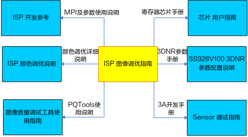

本文档的第一章主要讲解了PQ调优过程中涉及的文档关系说明，第二章对ISP进行了系统概述，包括ISP的功能框图及各模块简介；第三章主要介绍了整个图像调优过程的操作步骤及注意事项；第四章之后开始分模块介绍各子模块的调试方法。

# ISP系统概述

## 功能简介

ISP 模块支持标准的Sensor图像数据处理，包括自动白平衡、自动曝光、Demosaic、坏点矫正及镜头阴影矫正等基本功能，也支持WDR、DRC、降噪等高级处理功能。ISP主要支持的图像处理功能如下：

-   支持黑电平校正
-   支持静态以及动态坏点校正，坏点簇矫正
-   支持bayer降噪
-   支持固定噪声消除
-   支持demosaic处理
-   支持紫边校正（CAC）
-   支持gamma校正
-   支持动态范围压缩（DRC）
-   支持Sensor内部合成宽动态功能（Sensor Built-in WDR）
-   SS928V100最大支持3合1 宽动态功能\(WDR\)
-   支持自动白平衡 
-   支持自动曝光 
-   支持自动对焦
-   支持3A相关统计信息输出
-   支持镜头阴影校正
-   支持图像锐化
-   支持自动去雾处理
-   支持颜色三维查找表增强
-   支持局部对比度增强
-   支持色彩自适应
-   支持3D降噪

## ISP功能框图

ISP SS928V100的功能结构图如[图1](#fig19340125514231)、[图2](#fig1829272832518)、[图3](#fig474713442299)所示。此图与本文中提到的ISP\_FE均代指ISP pipeline中FPN（不包含）之前的部分，ISP\_BE均代指ISP pipeline中FPN（包含）之后的部分。

> **说明：** 
>本文中ISP采用\*.\*、S\*.\*表示无符号数和有符号数。如：U8.8表示数据类型为无符号数，整数部分8bit，小数部分8bit；同理，S8.8表示数据类型为有符号数，整数部分8bit（包括1bit符号位），小数部分8bit。

本文档的以下章节将会介绍各模块的简要原理及图像质量调试方法。

**图 1**  ISP 整体结构图（SS928V100）  
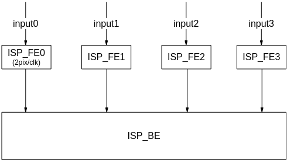

**图 2**  ISP\_FE 结构图（SS928V100）  
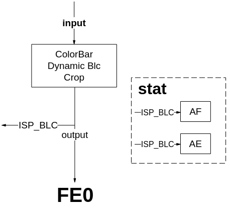

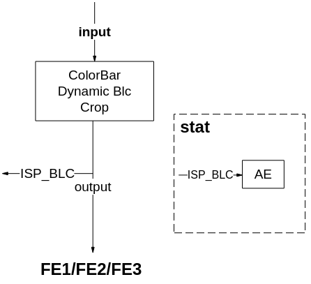

**图 3**  ISP\_BE 结构图（SS928V100）  
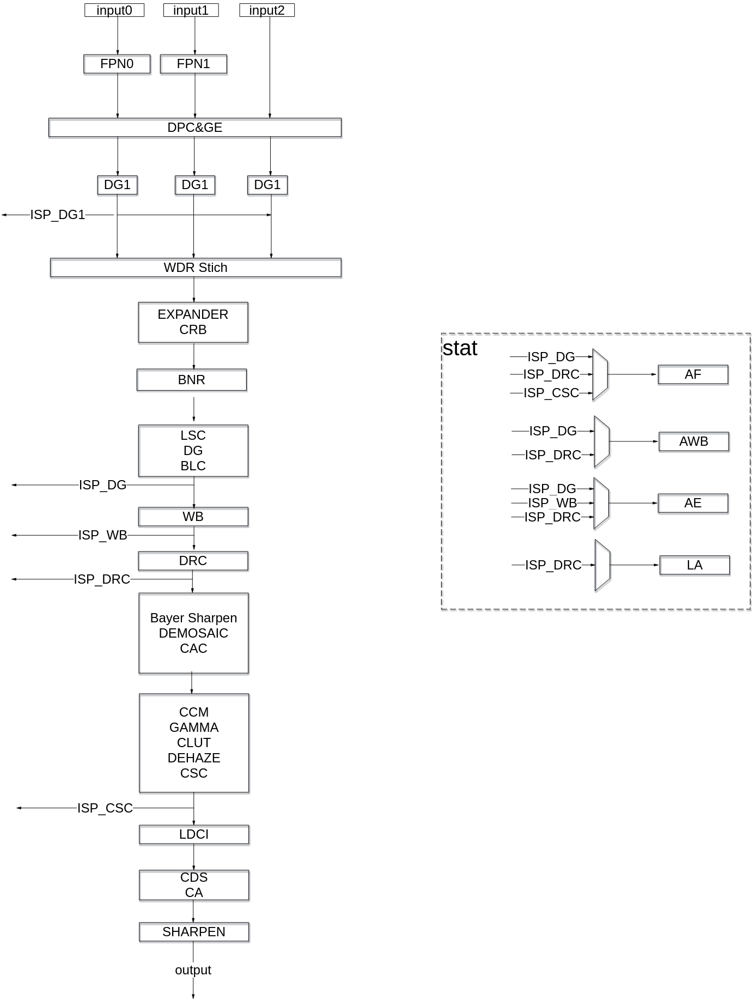

> **说明：** 
>\*图中DG1功能和DG一致。

## 各模块简介

ISP 各模块功能简介如[表1](#_Ref500230610)所示。

**表 1**  ISP 各模块功能

<table><thead align="left"><tr id="row109mcpsimp"><th class="cellrowborder" valign="top" width="27%" id="mcps1.2.3.1.1">
模块名称

</th>
<th class="cellrowborder" valign="top" width="73%" id="mcps1.2.3.1.2">
描述

</th>
</tr>
</thead>
<tbody><tr id="row115mcpsimp"><td class="cellrowborder" valign="top" width="27%" headers="mcps1.2.3.1.1 ">
Color_Bar

</td>
<td class="cellrowborder" valign="top" width="73%" headers="mcps1.2.3.1.2 ">
支持产生五种类型的图像，纯色背景，水平彩条，垂直彩色条纹，在纯色背景上产生矩形纯色目标等。

</td>
</tr>
<tr id="row120mcpsimp"><td class="cellrowborder" valign="top" width="27%" headers="mcps1.2.3.1.1 ">
Dynamic BLC

</td>
<td class="cellrowborder" valign="top" width="73%" headers="mcps1.2.3.1.2 ">
通过读取OB区的值来配置黑电平。

</td>
</tr>
<tr id="row125mcpsimp"><td class="cellrowborder" valign="top" width="27%" headers="mcps1.2.3.1.1 ">
Crop

</td>
<td class="cellrowborder" valign="top" width="73%" headers="mcps1.2.3.1.2 ">
实现对输入图像裁剪的功能。

</td>
</tr>
<tr id="row130mcpsimp"><td class="cellrowborder" valign="top" width="27%" headers="mcps1.2.3.1.1 ">
FPN

</td>
<td class="cellrowborder" valign="top" width="73%" headers="mcps1.2.3.1.2 ">
通过标定的黑帧或黑行对Sensor输入的图像进行校正，达到去除Sensor FPN的目的。

</td>
</tr>
<tr id="row135mcpsimp"><td class="cellrowborder" valign="top" width="27%" headers="mcps1.2.3.1.1 ">
BLC

</td>
<td class="cellrowborder" valign="top" width="73%" headers="mcps1.2.3.1.2 ">
提供Sensor相关的黑电平校正。

</td>
</tr>
<tr id="row140mcpsimp"><td class="cellrowborder" valign="top" width="27%" headers="mcps1.2.3.1.1 ">
DPC

</td>
<td class="cellrowborder" valign="top" width="73%" headers="mcps1.2.3.1.2 ">
提供对静态坏点和动态坏点的检测和校正功能。

</td>
</tr>
<tr id="row145mcpsimp"><td class="cellrowborder" valign="top" width="27%" headers="mcps1.2.3.1.1 ">
GE

</td>
<td class="cellrowborder" valign="top" width="73%" headers="mcps1.2.3.1.2 ">
校正Gr与Gb两个通道的失衡，提高部分场景的图像质量。

</td>
</tr>
<tr id="row150mcpsimp"><td class="cellrowborder" valign="top" width="27%" headers="mcps1.2.3.1.1 ">
WDR

</td>
<td class="cellrowborder" valign="top" width="73%" headers="mcps1.2.3.1.2 ">
提供多帧合成宽动态功能。

</td>
</tr>
<tr id="row155mcpsimp"><td class="cellrowborder" valign="top" width="27%" headers="mcps1.2.3.1.1 ">
Expander

</td>
<td class="cellrowborder" valign="top" width="73%" headers="mcps1.2.3.1.2 ">
将sensor内部压缩的数据，进行解压缩。

</td>
</tr>
<tr id="row160mcpsimp"><td class="cellrowborder" valign="top" width="27%" headers="mcps1.2.3.1.1 ">
CRB

</td>
<td class="cellrowborder" valign="top" width="73%" headers="mcps1.2.3.1.2 ">
减弱WDR模式下暗区偏红的现象。

</td>
</tr>
<tr id="row165mcpsimp"><td class="cellrowborder" valign="top" width="27%" headers="mcps1.2.3.1.1 ">
BNR

</td>
<td class="cellrowborder" valign="top" width="73%" headers="mcps1.2.3.1.2 ">
提供在Bayer domain中实现对图像的去噪，目的是去除噪声的同时，保留细节。

</td>
</tr>
<tr id="row170mcpsimp"><td class="cellrowborder" valign="top" width="27%" headers="mcps1.2.3.1.1 ">
LSC

</td>
<td class="cellrowborder" valign="top" width="73%" headers="mcps1.2.3.1.2 ">
用于镜头阴影校正。SS928V100只有mesh shading。

</td>
</tr>
<tr id="row175mcpsimp"><td class="cellrowborder" valign="top" width="27%" headers="mcps1.2.3.1.1 ">
DG

</td>
<td class="cellrowborder" valign="top" width="73%" headers="mcps1.2.3.1.2 ">
提供分通道的数字增益功能。

</td>
</tr>
<tr id="row180mcpsimp"><td class="cellrowborder" valign="top" width="27%" headers="mcps1.2.3.1.1 ">
AE

</td>
<td class="cellrowborder" valign="top" width="73%" headers="mcps1.2.3.1.2 ">
该模块输出自动曝光信息的统计，软件根据统计信息调节Sensor可实现自动曝光的功能。

</td>
</tr>
<tr id="row185mcpsimp"><td class="cellrowborder" valign="top" width="27%" headers="mcps1.2.3.1.1 ">
MG

</td>
<td class="cellrowborder" valign="top" width="73%" headers="mcps1.2.3.1.2 ">
MG模块统计DRC后分块均值，与AE统计分块均值相比，可以得出分块均值增益最大值。MG统计信息包含8bit精度分块R/Gr/Gb/B均值统计，分块最大支持17*15

</td>
</tr>
<tr id="row190mcpsimp"><td class="cellrowborder" valign="top" width="27%" headers="mcps1.2.3.1.1 ">
AF统计信息

</td>
<td class="cellrowborder" valign="top" width="73%" headers="mcps1.2.3.1.2 ">
支持图像清晰度评价信息统计，用于完成支持自动对焦功能。

</td>
</tr>
<tr id="row195mcpsimp"><td class="cellrowborder" valign="top" width="27%" headers="mcps1.2.3.1.1 ">
AWB

</td>
<td class="cellrowborder" valign="top" width="73%" headers="mcps1.2.3.1.2 ">
该模块输出全局统计信息和区域统计信息，软件基于统计信息完成自动白平衡功能。

</td>
</tr>
<tr id="row200mcpsimp"><td class="cellrowborder" valign="top" width="27%" headers="mcps1.2.3.1.1 ">
DRC

</td>
<td class="cellrowborder" valign="top" width="73%" headers="mcps1.2.3.1.2 ">
调整图像的显示动态范围，使之在显示设备上的显示效果与人眼感知一致。

</td>
</tr>
<tr id="row205mcpsimp"><td class="cellrowborder" valign="top" width="27%" headers="mcps1.2.3.1.1 ">
Bayer Sharpen

</td>
<td class="cellrowborder" valign="top" width="73%" headers="mcps1.2.3.1.2 ">
BayerSharpen模块用于增强图像的清晰度，可以实现对图像的带方向的边缘和无方向的细节纹理的单独锐化增强。

</td>
</tr>
<tr id="row210mcpsimp"><td class="cellrowborder" valign="top" width="27%" headers="mcps1.2.3.1.1 ">
CAC

</td>
<td class="cellrowborder" valign="top" width="73%" headers="mcps1.2.3.1.2 ">
用来校正由镜头引入的轴向色差（紫边）与横向色差（物体相对两侧带有不同颜色的彩色边缘）。

</td>
</tr>
<tr id="row215mcpsimp"><td class="cellrowborder" valign="top" width="27%" headers="mcps1.2.3.1.1 ">
DEMOSAIC

</td>
<td class="cellrowborder" valign="top" width="73%" headers="mcps1.2.3.1.2 ">
将Bayer格式的Raw图像转换到RGB图像。

</td>
</tr>
<tr id="row220mcpsimp"><td class="cellrowborder" valign="top" width="27%" headers="mcps1.2.3.1.1 ">
CCM

</td>
<td class="cellrowborder" valign="top" width="73%" headers="mcps1.2.3.1.2 ">
通过标准3×3的矩阵和矢量偏移量可完成颜色空间的线性校正。

</td>
</tr>
<tr id="row225mcpsimp"><td class="cellrowborder" valign="top" width="27%" headers="mcps1.2.3.1.1 ">
GAMMA

</td>
<td class="cellrowborder" valign="top" width="73%" headers="mcps1.2.3.1.2 ">
该模块根据伽马曲线分（R，G，B）三个颜色通道调整亮度。

</td>
</tr>
<tr id="row230mcpsimp"><td class="cellrowborder" valign="top" width="27%" headers="mcps1.2.3.1.1 ">
DEHAZE

</td>
<td class="cellrowborder" valign="top" width="73%" headers="mcps1.2.3.1.2 ">
提供强大的分区域去雾能力以改善雾霾场景下视频的对比度和清晰度。

</td>
</tr>
<tr id="row235mcpsimp"><td class="cellrowborder" valign="top" width="27%" headers="mcps1.2.3.1.1 ">
CSC

</td>
<td class="cellrowborder" valign="top" width="73%" headers="mcps1.2.3.1.2 ">
通过标准3×3的矩阵和矢量偏移量将输入{R，G，B}转换为{Y，U，V}。

</td>
</tr>
<tr id="row240mcpsimp"><td class="cellrowborder" valign="top" width="27%" headers="mcps1.2.3.1.1 ">
SHARPEN

</td>
<td class="cellrowborder" valign="top" width="73%" headers="mcps1.2.3.1.2 ">
实现图像的锐化，提高图像的清晰度。

</td>
</tr>
<tr id="row245mcpsimp"><td class="cellrowborder" valign="top" width="27%" headers="mcps1.2.3.1.1 ">
CA

</td>
<td class="cellrowborder" valign="top" width="73%" headers="mcps1.2.3.1.2 ">
饱和度调整及热成像上色

</td>
</tr>
<tr id="row250mcpsimp"><td class="cellrowborder" valign="top" width="27%" headers="mcps1.2.3.1.1 ">
CLUT

</td>
<td class="cellrowborder" valign="top" width="73%" headers="mcps1.2.3.1.2 ">
利用17x17x17大小的3D LUT实现复杂的颜色调整操作，比如亮度的调整，饱和度的调整，阴影区域，中间亮度区域，高亮区域分别调整。

</td>
</tr>
<tr id="row255mcpsimp"><td class="cellrowborder" valign="top" width="27%" headers="mcps1.2.3.1.1 ">
LDCI

</td>
<td class="cellrowborder" valign="top" width="73%" headers="mcps1.2.3.1.2 ">
基于局域直方图均衡的方法来增强局部的对比度，提升暗区细节，同时对图像中高频进行一定的增强，提升对比度。

</td>
</tr>
<tr id="row260mcpsimp"><td class="cellrowborder" valign="top" width="27%" headers="mcps1.2.3.1.1 ">
3DNR

</td>
<td class="cellrowborder" valign="top" width="73%" headers="mcps1.2.3.1.2 ">
通过参数配置，把图像中的高斯噪声去除，使得图像变得平滑，同时降低了编码码率。

</td>
</tr>
</tbody>
</table>

# 图像质量调优总体概述

当前SS928V100主要面向两大应用场景，即录像机公共安全应用场景和消费类应用场景，其中录像机公共安全应用场景包括线性模式和WDR模式；消费类应用场景主要包括运动DV、行车记录仪以及抓拍等产品形态。录像机公共安全应用场景由于具有视频采集行业特殊需求，对图像质量的关注点与消费类应用场景会不同。

## 录像机应用图像调优概述

当前SS928V100针对录像机应用场景主要包括线性模式和WDR模式两种典型应用。线性模式的图像质量关注维度主要包括图像亮度合理性，色彩还原准确、图像整体清晰度锐利以及图像的整体通透性等；WDR模式的图像质量关注维度主要包括图像整体的动态范围合理，即亮区不过曝，暗区细节能够看得见，色彩还原尽量准确、图像整体清晰度锐利以及图像整体通透性等维度。以下针对线性模式和WDR模式的图像质量调优分别介绍调试步骤以及ISP单点算法调试的注意事项。

### 线性模式图像质量调优

针对线性模式，图像质量主要关注以下维度：亮度、清晰度和噪声、通透性、色彩还原等方面，其中亮度涉及的模块有自动曝光\(AE\)、DRC、Shading校正等；清晰度和噪声主要涉及的模块有Demosaic、YUV Sharpen、Bayersharpen、NR、DPC、3DNR等；通透性涉及的模块主要有Gamma、LDCI、Dehaze、DRC等；色彩还原涉及的模块主要有AWB、CCM、CLUT以及CA等；录像机应用场景线性模式图像调优的整个架构图如[图1](#fig10361143815417)所示。

**图 1**  录像机应用场景线性模式图像调优架构图  
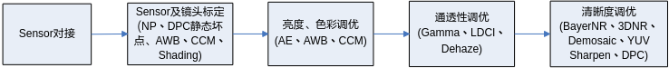

在进行图像质量调优前需要开展的工作主要如下。

****Sensor对接****

-   Sensor对接：主要包括在SS928V100对接所需要调优的Sensor。

    主要包括1080p@30fps Linear、1080p@30fps 3合1 WDR、1080p@30fps 2合1 WDR等模式，根据Sensor厂商提供的DataSheet挖掘出各个模式的初始化寄存器序列，将初始化寄存器序列适配SS928V100的MIPI配置，这样可以在SS928V100下调通该Sensor。Sensor对接的完成标准主要如下：对接模式的基本通路正常且各个模式之间能够正常切换，AE基本功能正常包括降低帧率无闪烁、自动长曝光正常以及Sensor驱动各个模块的默认参数合理，详细请参考《Sensor 调试指南》。

-   Sensor和镜头的标定工作

    标定工作主要涉及黑电平标定、NR的NoiseProfile标定、静态坏点标定、镜头的Shading标定、AWB静态白平衡系数的标定、饱和度CCM的标定等。Sensor和镜头的标定步骤需要严格按照[图2](#fig1589155619710)所示的流程进行开展。

    **图 2**  Sensor和镜头标定的流程图  
    

    -   黑电平标定：黑电平标定是整个ISP标定的第一步，因此正确的标定出黑电平对后续的标定会产生积极的影响。黑电平的具体标定方法可以参考《图像质量调试工具使用指南》。需要注意的是不同的Sensor在低照度下\(高增益\)，黑电平会产生漂移，从而带来低照度下整个画面的颜色偏色，因此如果Sensor的黑电平随着增益的增加，漂移比较大，建议黑电平的标定需要根据ISO进行联动；
    -   NR的NoiseProfile标定：在黑电平标定正确的基础上，接下来就需要标定NR模块的NoiseProfile。NR模块降噪需要参考噪声标定NoiseProfile，不同iso下得到一个拟合系数，具体标定NoiseProfile需要参考《图像质量调试工具使用指南》。
    -   Sensor的静态坏点标定：Sensor的静态坏点主要受Sensor的工艺有关，其中包括亮点和暗点，静态坏点的标定受Sensor的分辨率影响，例如消费者Sensor 包括多个分辨率，如4K@30fps、1080p@120fps、720p@240fps，不同的分辨率的静态坏点表需要重新标定；标定的过程需要分别针对亮点和暗点进行标定，得到亮点表和暗点表，再将亮点表和暗点表进行合并，可以得到整个坏点表，具体标定的流程方法请参考“[DPC](#ZH-CN_TOPIC_0000002457881037)“章节。
    -   镜头的Shading标定：镜头的Shading标定这里主要是指Mesh-Shading的标定，Shading主要是由于镜头光学折射不均匀导致的画面暗角，因此Shading校正的目的就是为了消除由镜头光学折射不均匀导致的画面暗角。Mesh-Shading的标定的具体流程可以参考《图像质量调试工具使用指南》。需要注意的是在低照度下，由于Shading会引起画面暗角的噪声不均匀，因此Shading的校正的强度与根据ISO进行联动，从低ISO到高ISO下，逐步将Shading校正的强度衰减到画面暗角不出现噪声为合适。
    -   AWB静态白平衡系数标定：AWB的静态白平衡系数与Sensor和镜头的滤光片强相关，Sensor固定下，如果更换镜头和滤光片，AWB的镜头白平衡系数也需要重新标定。标定的基本原理为：提取sensor在多个标准光源下的白点特征\(R/G，B/G\)，计算普朗克拟合曲线和色温拟合曲线。具体的标定流程请参考《ISP 颜色调优说明》。
    -   CCM标定：CCM标定的基本原理是使用sensor抓拍到的24色卡场景下前18个色块的实际颜色信息和其期望值，计算3x3的CCM矩阵。输入颜色经CCM矩阵处理得到的颜色与其期望值差距越小，则CCM矩阵就越理想。标定CCM一般需要采集三种光源的raw\(D50、TL84、A\)，具体标定的方法和流程需要参考《ISP 颜色调优说明》。

在完成Sensor对接和Sensor镜头标定的工作之后，就可以进入ISP各个模块联合调优阶段，线性图像质量调优包括多组ISO照度下图像质量优化。由于某sensor属于星光级的Sensor，因此需要调试的ISO包括ISO 100、200、400、800、1600、3200、6400、12800、25600、51200、102400、204800等，当然不同的Sensor，由于感光性的差异，所需要调节的最高ISO也会有差异,详细请参考《图像质量调试工具使用指南》。跟ISO联动的BayerNR、Demosaic和Sharpen等算法模块除了开放出来的MPI接口参数会跟ISO联动以外，内部都还有默认的参数也会跟ISO联动变化。

线性模式调试的场景主要包括实验室静物场景和室外实际场景，一般需要在实验室静物场景下模拟所调试的Sensor涵盖的不同照度的场景，包括照度比较好的场景和照度比较低的场景。在实验室静物场景下需要将不同照度下亮度、色彩、通透性、清晰度和噪声等调试合理。在实验室静物场景ISP各个模块调试合理的基础上，需要在实际场景中根据录像机的不同应用场景进行微调，需要覆盖交通路口的白天场景和夜晚场景、室外夜晚低照度场景、室外白天纹理细节丰富场景包括晴天与阴天天气、室外傍晚夕阳纹理细节丰富场景等。这样线性模式图像效果的自适应可以覆盖不同ISO、不同应用场景的需求。线性模式具体的调优场景顺序如[图3](#fig14254231111219)所示。

**图 3**  线性模式图像调优的场景图  
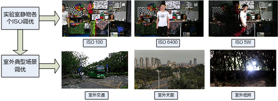

线性模式ISP各个模块的调试的基本顺序流程如[图4](#fig1190512651416)所示。

**图 4**  图像质量关注维度调试的顺序图  

结合线性模式典型的调试场景实验室静物和实验室标准光源灯箱环境介绍图像质量关注的主要维度的调试方法，[图5](#_Ref500231242)所示为实验室静物调试场景图。

**图 5**  实验室静物场景图  
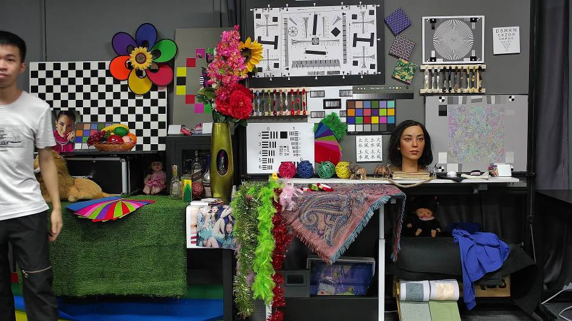

****亮度维度****

亮度维度的主要调试的模块为AE，主要包括AE的目标值的调优、AE Route的调优、AE的权重表的调优、AE收敛速度和平滑性的优化等。

调整AE前需要准备的环境：黑电平标定正确、Shading标定完成、AWB和CCM标定正确、不同照度预设一组Gamma参数等。

1.  AE调节的第一步就是确定AE的权重表，AE的权重表决定AE曝光的感兴趣区域，不同的应用需求，AE的权重表也会有差异，一般针对录像机应用场景，场景关注的主体为画面的中间部分，建议将画面中间部分的AE权重表设置高于周边部分。[图6](#fig1561512325171)为AE权重表的示例：

    **图 6**  AE权重表的示例  
    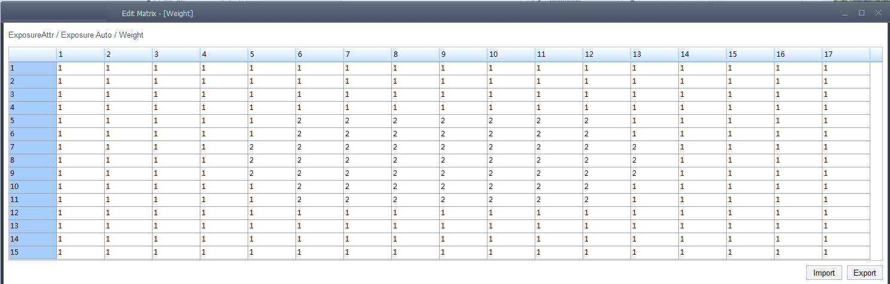

1.  在确定AE的权重表的基础上，接下来需要确定AE的Route，AE Route主要决定曝光量的分配方式即曝光时间和增益的分配。不同应用场景需要设置不同的AE Route，如需要关注快速运动物体，需要优先使用增益和限制曝光时间，如白天场景交通抓拍车牌，一般需要将曝光时间限制为2-4ms，此时曝光量优先分配在增益上面，如夜晚低照度场景，此时需要为了平衡画面的噪声表现，需要将曝光量适当优先分配在曝光时间上面，然后再分配到增益上面。
2.  在确定AE权重表和AE Route基础上，接下来就是根据不同的曝光量下调节AE的目标值，针对实验室静物场景，AE目标值的调试标准是亮区视力表和星图卡无明显过曝，暗区的人脸图亮度表现合理。AE的目标值调节主要涉及到AE Compensation、AE offset调节以及AE高光优先和低光优先模式的选择，一般正常调试应用中，建议选择高光优先模式，这样可以避免亮区过曝。
3.  最后需要调节AE的收敛速度和AE平滑性，AE的收敛速度和AE平滑性是一对平衡点，在防止AE出现震荡的前提下，可以适当得提高AE的收敛速度，包括AE能够根据光线变化的过程中快速收敛。尤其针对行车记录仪和运动DV应用场景，需要适当提高AE收敛速度来适应场景的剧烈变化。AE的收敛速度和收敛稳定性一般可以通过实验室静物场景开关灯进行测试。

    AE模块的具体参数调节和介绍可以参考《ISP 开发参考》中关于AE的描述章节。DRC模块在线性模式的调优环节，一般不推荐使用，如果在线性模式调试整体亮度利用DRC模块，需要注意DRC模块对图像对比度的影响。Shading模块也会影响图像的整体亮度，Shading调节的强度，建议根据ISO进行联动衰减，来避免在照度稍低的情况下会带来图像暗角的噪声变大。

****色彩维度****

在AE调节合理的基础上面，接下来主要调整色彩维度，主要涉及到的模块有AWB和CCM。

调整颜色前需要准备的环境：黑电平校正准确、Lens-Shading标定完成、AE模块参数调试合理。

1.  需要在实验室灯箱场景抓取八组不同色温下24色卡的raw\(D50、D75、A、TL84、10K、3500、CWF、D65\) 以及室外场景抓取D50色温24色卡的raw标定获取AWB静态白平衡系数。标定获取的AWB静态白平衡系数需要观察Planckian Curve，是否光源分布在曲线两侧，是否有光源点距离普朗克曲线较远，估计的色温是否准确。如果某些光源的误差较大，可调整其权重值，再次进行标定。当然也可以用3A分析工具的AWB功能在线验证标定的准确性，多个光源下灰色块都落在Planckian曲线的附近，说明标定是可靠的。在实际静物场景下，确定AWB的准确性，主要关注24色卡的灰色块是否还原准确，可以通过Imatest测试24色卡的色彩还原指标。下图所示为标定获取的AWB静态白平衡系数的示例。

    **Figure  7**  AWB标定的静态白平衡系数示例  
    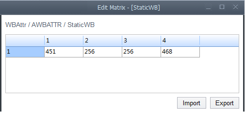

    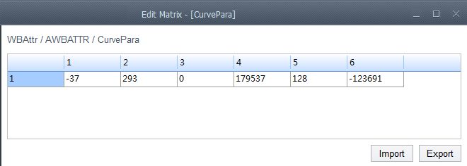

2.  在实验室灯箱场景抓取D50、TL84、A光源三组24色卡的raw通过标定工具生成CCM饱和度矩阵。在标定CCM的过程中需要注意用户自定义ISP Gamma值时，需注意匹配相对应的LAB参考值，防止由于ISP Gamma和LAB Reference不匹配，导致作为线性变化的AWB和CCM共同作用无法达到目标图片的效果。标定获取的CCM参数，如果在实际应用场景发现图像的饱和度效果不理想的情况下，需要根据实际场景出现的颜色的问题手动调整饱和度。[图8](#_Ref500253148)所示为标定CCM得到的三组色温\(D50、TL84、A\)的饱和度矩阵的示例。

    **图 8**  CCM标定的三组色温\(D50、TL84、A\)的饱和度矩阵示例  
    的饱和度矩阵示例.png "CCM标定的三组色温(D50-TL84-A)的饱和度矩阵示例")

3.  在AWB静态白平衡系数和CCM饱和度矩阵标定之后，需要将AWB静态白平衡系数和CCM饱和度矩阵配置到Sensor驱动中，在实验室灯箱场景中抓取八种不同光源24色卡的图片，用Imatest工具测试24色卡测试颜色指标。如果24色卡的指标的满足需求，可以初步确定标定得到AWB静态白平衡系数和CCM饱和度矩阵满足需求。图 D50色温抓取的24色卡图和图 通过Imatest得到的色彩还原指标为D50光源下抓取的24色卡图片和对应的Imatest得到的色彩还原指标的示例。

    **Figure  9**  D50色温抓取的24色卡图  
    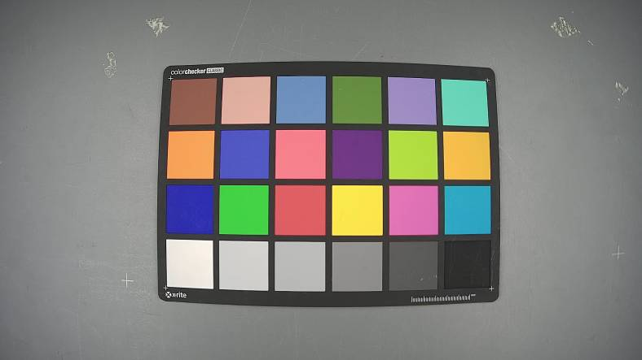

    **Figure  10**  通过Imatest得到的色彩还原指标  
    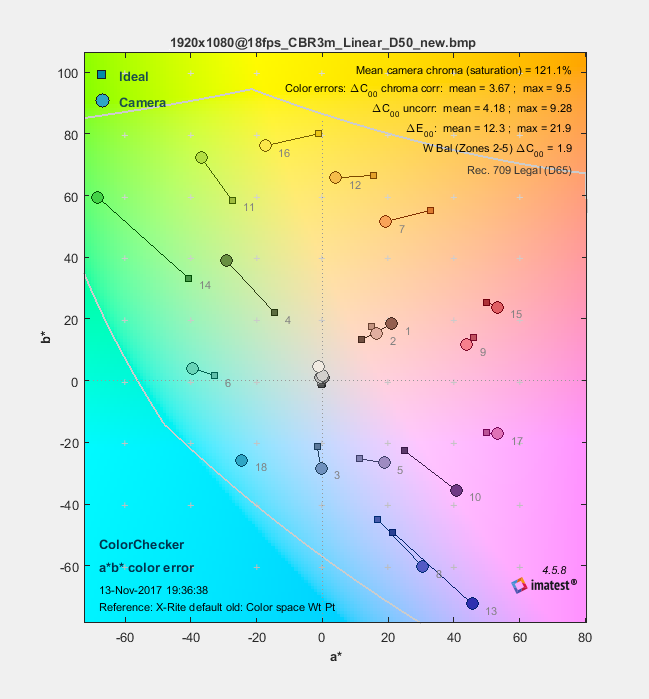

    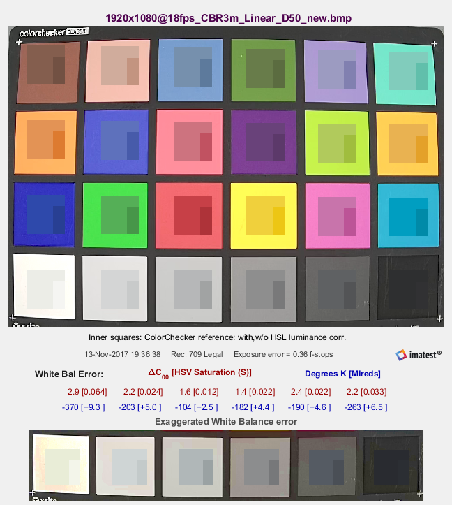

4.  AWB和CCM模块的参数的合理性，还需要大量依赖于实际应用场景的大量测试和调试。通常实际应用场景包括典型室外场景，包括顺光、背光、阴天、夕阳、以及混合光源等场景。如果场景中的灰色块还原不准确，需要调整AWB参数，场景中出现个别颜色过饱和或者偏色，建议调试CCM参数。针对混合光源应用场景，需要调节AWB中室内外检测的参数；针对实际场景中人物肤色还原不准确，需要调整CCM参数。

    AWB和CCM模块的具体调优需要参考《ISP 颜色调优说明》。

****对比度维度****

在亮度维度和颜色维度调试合理的基础上，接下来主要调节图像的对比度维度。影响对比度的维度主要包括Gamma、Dehaze、LDCI等，一般重点还是在不同照度下调节Gamma参数，Dehaze和LDCI为调节对比度的辅助模块；

调整对比度前准备的环境：黑电平校正正确、Lens-Shading标定完成、AE曝光调整合理、AWB和CCM参数标定合理。

1.  调整Gamma参数，Gamma参数是影响图像对比度的基本模块，以实际静物场景为例，通过调整Gamma参数达到画面亮区部分的解析率卡和暗区部分的玩偶细节都不发生损失，且画面获得比较好的对比度；[图11](#_Ref515959136)中红色框图部分为Gamma曲线所影响的暗区细节和亮区细节。

    **图 11**  静物场景Gamma曲线影响的区域示例  
    

2.  在调整好Gamma参数基础上，如果对图像的对比度有更加精细化的需求，建议以LDCI为主，Dehaze为辅；LDCI属于局部的对比度增强，可以改善画面局部亮区和暗区细节的表现，Dehaze只能作为辅助使用，Dehaze调整过大，会带来画面暗区细节损失和画面颜色偏色；关于LDCI和Dehaze的具体单点调优说明请参考"[LDCI](#ZH-CN_TOPIC_0000002424362134)”和"[Dehaze](#ZH-CN_TOPIC_0000002457840893)”章节。
3.  在优化后的Gamma参数、LDCI参数和Dehaze参数的基础上，需要在实验室灯箱D50光源环境下测试灰阶卡的灰阶，观察灰阶数能否满足要求，一般要求灰阶数至少达到18阶及其以上，否则表明当前图像的对比度过高，损失了暗区的细节。[图12](#_Ref515959139)为实验室灯箱D50光源环境下的灰阶卡的示例。

    **图 12**  实验室灯箱D50光源环境下的灰阶卡示例图  
    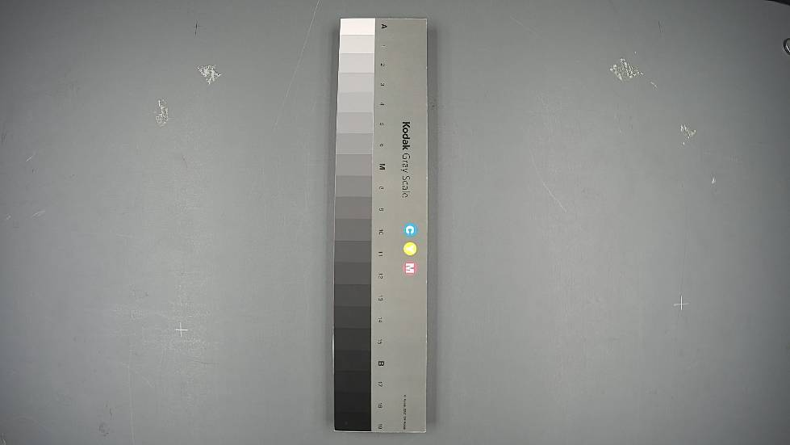

4.  在实际静物场景，需要根据场景的不同的照度下，调整Gamma、LDCI以及去雾模块，以达到场景的各个照度下，图像的对比度不会出现过高和过朦。当前正常照度环境下和低照度环境下，图像的对比度调试风格也会有一定的差异，比如在低照度下，Gamma需要适当的压低暗区来减轻暗区噪声的负担。

****清晰度和噪声维度****

清晰度和噪声这两个维度为一对平衡点的维度，且由于照度的不同，图像的噪声也表现不一样，随着照度的变低，图像的噪声增大，此时为了抑制画面的噪声，对图像的清晰度的要求会低于正常照度场景的清晰度，因此清晰度和噪声模块的相关的参数要根据不同的ISO进行联动。清晰度和噪声维度的调试，建议先以清晰度优先，即需要在降噪前\(BayerNR、3DNR\)将该锐化的细节锐化出来，如果在实际点播环境下调试，建议先把编码的码率设高且将3DNR的时域设置到最强和空域设置到最弱，观察静止画面的细节有没有锐化出来。在清晰度满足要求的前提下，接下来需要调试降噪模块，最终目标达到清晰度和噪声满足要求。

调整清晰度和噪声前准备的环境：黑电平校正准确、NoiseProfile标定正确、Lens-Shading标定完成、AE曝光调整合理、AWB和CCM参数调整合理、Gamma参数调整合理。

影响图像的清晰度和噪声模块主要包括NR、Demosaic、DPC的去动态坏点、3DNR、Bayersharpen以及YUV Sharpen等。

1.  图像的基本纹理细节的第一道关口就是Demosaic。调试Demosaic参数的入口条件为：黑电平标定准确、NoiseProfile标定合理、AWB和CCM标定参数合理。

    调试Demosaic参数需要结合实验室静物高频细节需要插值出来如静物场景的视力表、星条卡和实验室灯箱环境下解析率卡的解析度指标满足要求。首先需要在实验室灯箱环境D50光源下ISO100 下对着解析度卡调试Demosaic参数，使得解析度卡的解析率满足客观指标要求，然后将该组Demosaic参数导入到工具观看实验室静物场景ISO 100环境下的高频细节如视力表和星条卡能否插值出来，以此进行来回迭代。在ISO100环境下Demosaic参数调整合理情况下，接下来需要在实验室静物场景下不同照度下调整Demosaic参数，以平衡高频噪声和插值出来的噪声和合适。[图13](#_Ref500347400)所示为D50光源环境下的解析率卡的示意图。Demosaic的具体调试方法请参考"[Demosaic](#ZH-CN_TOPIC_0000002457841009)”章节。

    **图 13**  实验室灯箱D50光源环境下的解析率卡示例图  
    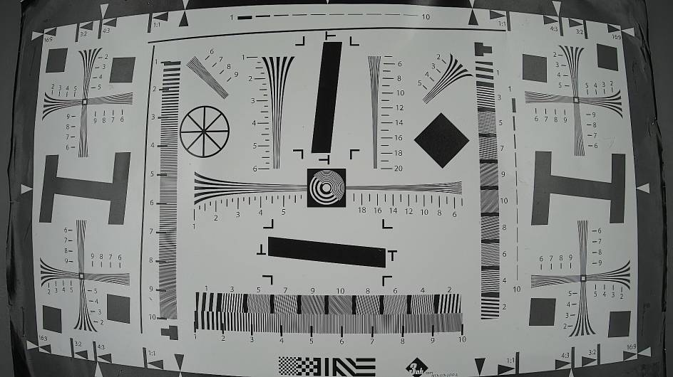

2.  在Demosaic的参数调试合理之后，接下来重点联调NR，Bayersharpen、3DNR、YUV Sharpen以及DPC去动态坏点。

    调试NR模块的入口条件为：黑电平校正准确、NoiseProfile标定合理、AWB和CCM标定参数合理。

    SS928V100 NR包括时域和空域，当前调试NR的准则，尽量将一部分静止区域的时域强度分担到NR上面，运动空域区域主要采用NR的空域。主要做的好处是NR的时域相对于3DNR的时域动静判决更准，同时图像过完NR的时域再经过Sharpen，可以更好的提升图像整体的清晰度。NR的具体调优方法请参考"[NR](#ZH-CN_TOPIC_0000002457841025)”章节。

3.  Bayersharpen的调试准则主要将图像的暗区弱纹理调试到合适，当前需要注意的Bayersharpen不能调试过强，且Bayersharpen的调试效果主要以中频为主，调试过强会导致画面整体比较粗。Bayersharpen的调试具体参考"[BayerSharpen](#ZH-CN_TOPIC_0000002424362250)”章节；
4.  YUV Sharpen的调试准则主要将图像的纹理细节和边缘锐度调到合适，以实验室静物场景为例，YUV Sharpen需要将图像在经过3DNR之前将静物场景的草垫子、狮子等纹理细节锐化出来，[图14](#_Ref500231916)中红色框图部分为YUV Sharpen锐化出来的纹理细节。同时还需要将桌子和斜方格等大边锐化出来，[图15](#_Ref500231919)中红色框图部分YUV Sharpen锐化出来的大边。YUV Sharpen的参数需要根据ISO进行联动，确保在实验室静物场景中不同照度下，YUV Sharpen参数调试合理。

    **图 14**  静物场景ISO100  YUV Sharpen锐化出来的纹理细节  
    

    **图 15**  静物场景ISO100  YUV Sharpen锐化出来的大边  
    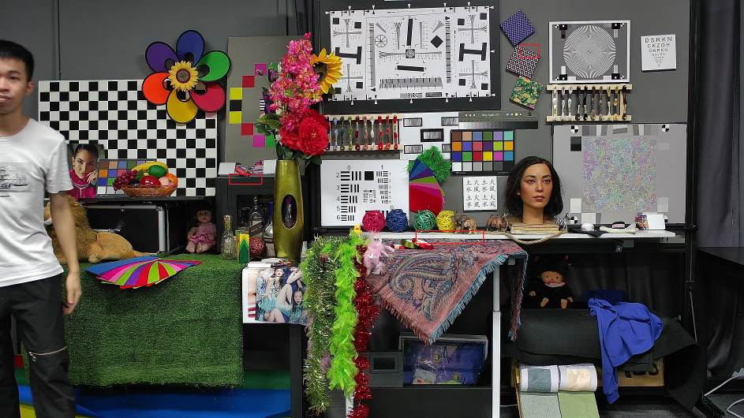

    因此，Bayesharpen、YUV Sharpen以及3DNR三者需要在实验室静物场景根据不同的ISO进行反复联合调试，最终达到噪声和清晰度的平衡为合理，YUV Sharpen的具体调试方法请参考"[Sharpen](#ZH-CN_TOPIC_0000002457881141)”章节；

5.  DPC去动态坏点强度只需要在照度稍低下以去除动态坏点为准，照度稍好的情况下，建议DPC去动态坏点的强度调试为0，DPC的具体调试方法请参考"[DPC](#ZH-CN_TOPIC_0000002457881037)”章节；
6.  3DNR作为整个清晰度的调优的关键环节，主要包括时域滤波器的调优和空域滤波器的调优，优先调节时域的动静判决的阈值即将雨点噪声抑制为合适和时域的绝对强度保证画面静止区域安静，再调节动静判决的空域滤波器来抑制画面运动区域的跟随噪声，最后调节纯空域滤波器抑制画面的整体颗粒感，3DNR调试的标准是达到静止画面噪声安静且清晰度满足要求，运动区域的噪声得到比较好的抑制且运动拖尾能够达到合理控制，[图16](#_Ref500232007)为某sensor 典型低照度的3DNR去噪效果图，其中红框圈出来的关注维度包括车辆的跟随噪声抑制维度、人物身后的运动拖尾维度以及静止画面的亮噪声和色噪声的抑制维度。3DNR具体调试方法请参考《SSxxxVxxx 3DNR参数配置说明》。

    **图 16**  某sensor典型低照度的3DNR去噪效果图  
    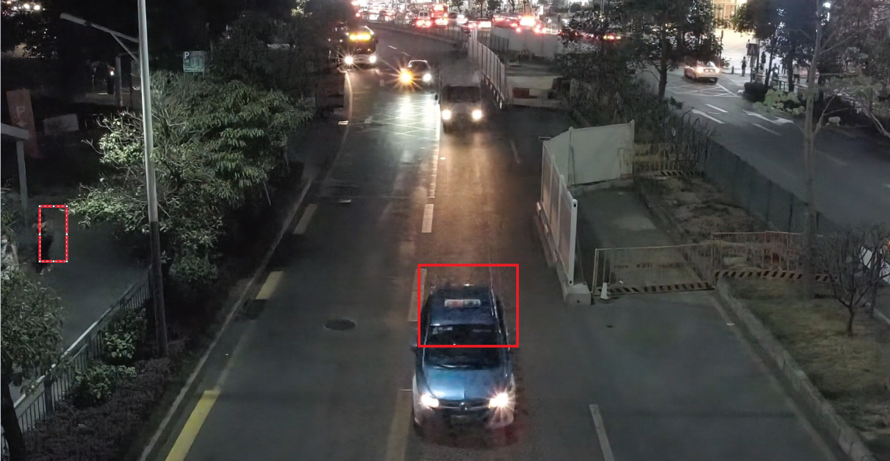

7.  Bayersharpen、YUV Sharpen、Demosaic、NR、3DNR等模块需要根据不同照度进行迭代联合调试，最终以图像的整体清晰度和噪声水平平衡为合适。

### WDR模式图像质量调优

针对WDR模式，图像质量主要关注以下维度：图像的动态范围、亮度、清晰度和噪声、通透性、色彩还原以及合成区域运动拖尾的表现等方面；其中亮度涉及的模块主要有AE、DRC、Shading校正；图像的动态范围主要涉及有场景的曝光比、DRC；清晰度和噪声主要涉及的模块有Demosaic、Bayersharpen、YUV Sharpen、NR、DPC、3DNR等；通透性涉及的模块主要有Gamma、LDCI、Dehaze、DRC等；色彩还原涉及的模块主要有AWB、CCM、CA、CLUT以及CRB等；合成区域运动拖尾的表现主要涉及的模块是WDR和曝光比。WDR模式典型的应用场景包括在背光的场景下视频采集人物和在强光场景下视频采集车牌，因此WDR针对背光场景下视频采集人物，希望能够看得清楚小脸，在强光场景下视频采集车牌，希望能够压住车灯的光晕，看得清楚车牌；录像机应用场景WDR模式图像调优的整个架构图如[图1](#fig12293141163118)所示。

**图 1**  录像机应用场景WDR模式图像调优架构图  
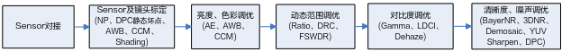

WDR模式图像质量调优前，需要进行Sensor对接和Sensor镜头的标定，其中WDR模式Sensor对接步骤可以参考[线性模式图像质量调优](#ZH-CN_TOPIC_0000002457840933)小节中关于Sensor对接的阐述；Sensor镜头的标定中AWB、Shading、NoiseProfile、DPC静态坏点可以参考线性模式标定的参数，由于CCM在DRC之后，而DRC会使得数据非线性，故在WDR模式下标定CCM需要注意以下3点：

-   在标准光源下\(一般是三组光源，分别是D50，TL84，A光源\)拍标准24色卡，曝光比手动最大，同时也要调整亮度值，避免长帧过曝，采集长帧的Raw数据进行CCM标定。标定的过程可以适当降低饱和度。
-   适当减少DRC曲线对亮度的大幅度提升，这样DRC对颜色的影响会较弱，此时画面的亮度会有所降低达不到想要的亮度，此时，可以用Gamma对亮度进行适当的提升，这样联调DRC和Gamma模块，可以让整体的颜色还原更准确一些。
-   对于WDR模式，由于大多场景是混合光源场景，容易出现亮处颜色偏色，人脸肤色偏红等问题，除了降低饱和度值以外，还可以使用CA模块对这些区域适当的降低饱和度。CRB模块可以减弱高亮区域附近暗区偏红的现象。

在完成Sensor对接和Sensor镜头标定之后，接下来主要针对WDR模式图像质量关注维度进行图像调优。

WDR模式图像质量调优主要包括两种典型应用需求的调优即：照度稍高的情况下背光场景下小脸提亮和夜晚场景下交通场景强光抑制。由于背光场景下需要将小脸提亮，夜晚交通场景需要将车灯压制，因此这两种是属于不同的调试风格，对DRC模块调试的方向也是相反的。因此WDR模式的场景图像质量调优需要分别针对背光情况下提升小脸和交通场景下压制车灯进行开展。

#### WDR背光场景提升小脸亮度应用场景调试指南

针对背光情况下提升小脸亮度的应用需求，调试步骤如下：

在实验室搭建典型WDR场景，场景中应该包括亮区和暗区以及背光下的小脸，具体如[图1](#_Ref500232236)所示，其中红色框图部分包括暗区、室外天空亮区以及背光下人脸贴图。

**图 1**  录像机应用场景WDR室内典型应用场景  
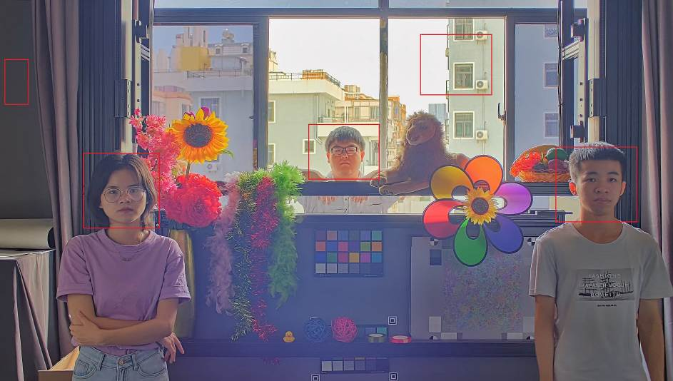

****亮度维度****

WDR的亮度维度，这里主要是指AE曝光的合理性，主要还是通过调试AE模块。AE模块调试的入口条件和AE调试的相关的参数，WDR模式和线性模式总体相同，但差异部分在于调整AE的曝光比来决定长帧和短帧的曝光时间。这里重点介绍AE曝光比的调试，AE其他参数包括AE的权重表、AE Route、AE目标值以及AE的收敛速度和平滑性具体可以参考"[线性模式图像质量调优](#ZH-CN_TOPIC_0000002457840933)”的亮度维度小节。针对WDR模式的AE Route设置，这里需要补充一点的就是为了避免长帧过曝下WDR模块选择短帧，导致画面出现工频闪，曝光量在增益的分配方式上，可以优先使用ISPDgain，然后是Sensor的Again和Dgain，因为ISPDgain在WDR模块之后，ISPDgain的使用不会影响进入WDR模块的长帧过曝，且对最后的画面的整体亮度不会发生变化。

AE的曝光比决定WDR模式图像的动态范围，因此不同的场景动态范围使用WDR模式，AE的曝光比需要自适应调节。通常WDR模式，AE的曝光比的模式使用AE的自动曝光比模式，所谓的自动曝光比，就是AE会根据场景的直方图自动计算场景的动态范围而得到一个合理的曝光比，曝光比的合理性体现在亮区细节不过曝且长帧亮度合理。

****合成区的运动拖尾维度****

WDR模式影响合成区域的运动拖尾主要包括WDR模块和AE的曝光比，曝光比越大，合成区域出现拖尾的概率也就越高，但在典型WDR背光场景下，WDR 2合1模式下，曝光比通常为16-32倍，此时影响合成区域的运动拖尾主要就是WDR模块。当前在SS928V100下，由于WDR模块算法的限制，很难区分暗区和亮区人物运动，在保证暗区人物运动尽量不选择短帧的前提下，亮区人物挥手的手臂容易出现断裂的平衡，一般在调试过程，将合成模块的运动权重md\_thr\_low\_gain和md\_thr\_hig\_gain调试到暗区人物运动尽量选择长帧，此时观察亮区人物挥手的表现，WDR合成模块调试具体可以参考"[WDR](#ZH-CN_TOPIC_0000002424362078)" 模块的描述。

****场景的动态范围维度****

WDR模式影响场景的动态范围包括：AE的曝光比、DRC模块以及Gamma模块。

调试DRC模块的入口条件：黑电平标定正确、Shading标定完成、AE模块调试合理、AWB和CCM标定完成、预设一组Gamma参数。

当前为了提升背光下小脸亮度和局部对比度，当前SS928V100 DRC包括Filter和FilterX，针对背光小脸的提升，当前建议倾向使用FilterX滤波器，而非背光小脸区域倾向使用Filter滤波器。这样融合的原则主要是由于背光小脸的细节提升，当前通过FilterX滤波器可以更好的保留和增强，而Filter滤波器更多的是提升大尺度的细节。DRC模块的调试具体可以参考参考"[DRC](#ZH-CN_TOPIC_0000002457881045)”模块的描述。

当前WDR模式中的DRC算法由于为了提升小脸的局部亮度而采用滤波窗口偏小，从而导致亮暗交界区域对比度拉伸差异比较大，从而形成边线。当前DRC算法中的GradRevMax和GradRevThr调大可以改善亮度交界区域的边线表现，但同时会带来小脸的对比度发朦，影响小脸的识别，因此亮暗交界区域的边线与小脸亮度存在权衡。

**图 2**  背光人脸手电筒效应效果图  
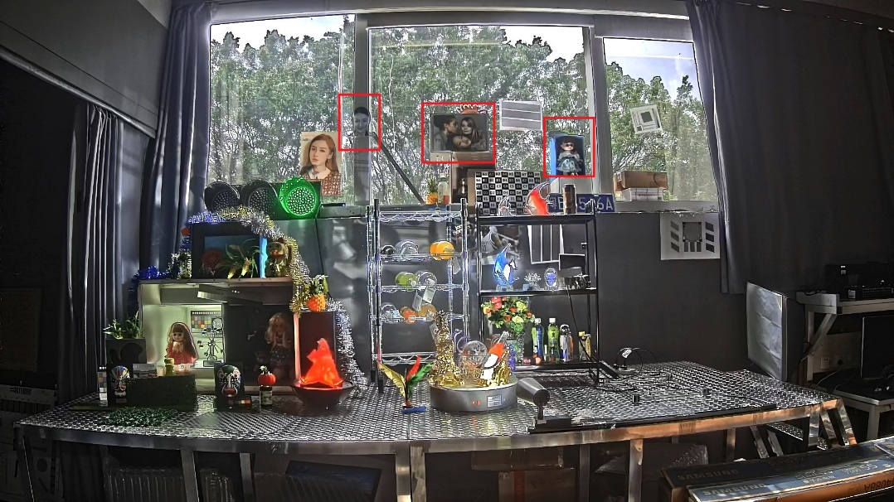

DRC ToneMapping曲线的调试的策略需要和Gamma曲线进行配合，Gamma曲线的调试策略是在自定义Gamma = 0.8的曲线基础上进行调试，如[图3](#_Ref500232764)所示。

**图 3**  Gamma=0.8曲线  
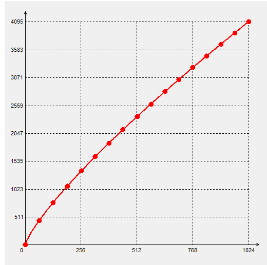

将人脸部分的亮度提升，同时将暗区压暗来保证提升小脸的亮度同时保证场景的对比度，得到[图4](#_Ref500232799)的Gamma曲线。

**图 4**  Gamma=0.8基础上提升小脸亮度的曲线  
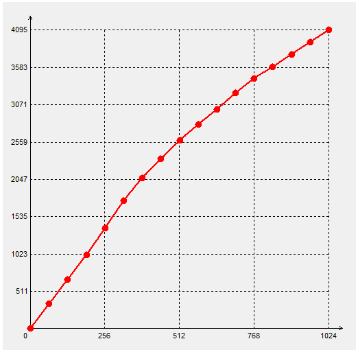

在得到Gamma曲线的基础上，调试DRC的Asmmetry曲线，为了提升小脸的亮区，Asmmetry曲线需要提升背光的亮度，具体调试的曲线如[图5](#_Ref500232856)所示。

**图 5**  提升小脸亮度的Asmmetry曲线形状  
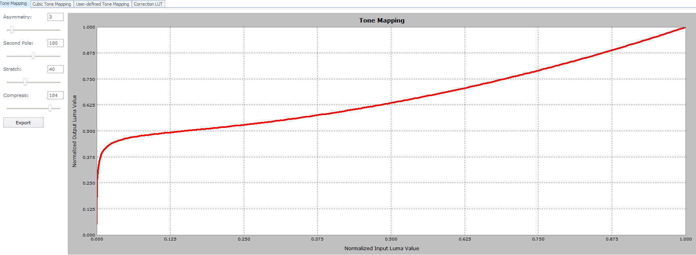

DRC Asmmetry曲线需要和Gamma曲线需要根据实际的宽动态场景反复迭代调优，以得到背光情况下的小脸亮度得到提升为合适。WDR 背光下人脸效果的优化，DRC曲线，客户也可以采用自定义曲线，获得比较灵活的调试方式。

需要注意：DRC自定义曲线的形状和曝光比密切相关，不同的曝光比，需要采用不同的DRC自定义曲线形状。关于DRC模块的具体调试方法请参考“[DRC](#ZH-CN_TOPIC_0000002457881045)”章节。

****色彩维度****

WDR模式影响图像的色彩维度主要是AWB、CCM、CRB、CA、CLUT等模块：

调试AWB、CCM和CA模块的入口条件：黑电平校正正确、AE曝光合理、DRC调试合理、Shading完成标定、预设一组Gamma参数。

WDR模式整体调试的色彩策略与线性模式一致的，但需要考虑DRC对颜色的影响，因此CCM标定的方法与线性模式存在差异，具体可以参考上文中关于CCM的注意事项，ISP的CA模块可以根据不同亮度降低饱和度，可以减轻DRC曲线提升暗区带来饱和度过高的现象。CRB模块可以减弱高亮区域附近暗区偏红的现象，如果暗区偏红严重，可以适当调小r\_gain\_limit增益。

****对比度维度****

影响对比度的维度模块包括Gamma、LDCI、Dehaze等。

WDR模式下关于对比度的调试方法整体上和线性模式是一致的，即主要还是Gamma模块，LDCI和Dehaze，区别在于WDR模式背光场景首先关注的是背光小脸的亮度和辨识度，DRC与Gamma需要配合来提升背光小脸的亮度，但同时会带来画面整体对比度的损失，需要通过LDCI和Dehaze进行弥补。

****清晰度和噪声维度****

WDR 模式关于清晰度和噪声的调试方法整体上和线性模式是一致的，即主要调试NR、3DNR、DPC去动态坏点、Demosaic、Bayersharpen、YUV Sharpen；其中NR、3DNR、DPC去动态坏点、Demosaic、Bayersharpen、YUV Sharpen等模块的调试方法和调试步骤与线性模式基本一致，具体可以参考线性模式关于此的阐述。NR模式的当前可以区分长帧和短帧分别降噪，可以调试NR模式的短帧降噪来去除合成区域采用短帧的噪声。

#### WDR交通强光抑制应用场景调试指南

针对交通抓拍应用的强光抑制场景需求，这里重点是指夜晚交通应用场景，其调试步骤如下：

在夜晚交通应用场景搭建调试环境，一般建议在交通十字路口场景或者闸口场景，具体如[图1](#_Ref504553341)所示。

**图 1**  夜晚交通应用场景示例图  
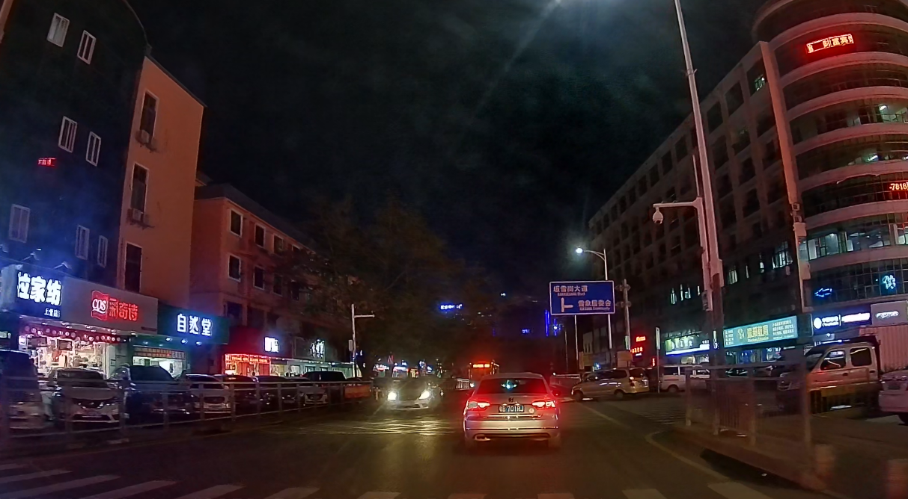

交通的强光抑制场景的整体调试步骤与背光下WDR典型应用场景类似，这里重点介绍强光抑制场景相对于背光下WDR典型应用场景各个图像质量维度调试的差异化方面。

****亮度维度****

强光抑制场景AE模块的调试步骤与线性模式类似，其差异在于重点关注AE对车灯光晕的影响以及曝光时间对车辆运动模糊的影响。

-   AE权重表：强光抑制场景的AE权重表的调试思路为将中心区靠近车灯附近的权重设大，天空区域和画面两边的区域权重设小。具体可以参考[图2](#_Ref504553359)所示的AE权重表示例：

    **图 2**  强光抑制场景AE权重表的示例  
    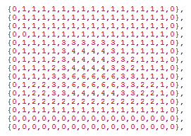

-   在确定AE权重表的基础上，接下来调试AE的目标值。调试AE目标值之前，建议将DRC、Gamma、LDCI、Dehaze、FSWDR等模块Bypass，单独观察长帧和短帧车灯的光晕表现，一般情况下，车灯里面过曝区域会倾向于选择短帧，车灯外围的光晕区可能会落在长帧和短帧融合区，具体还需要视FSWDR短帧和长帧的阈值而定。因此调试AE的目标值尽量避免短帧的车灯光晕过大。同时也要兼顾画面的整体亮度和噪声的平衡。
-   确定AE目标值合理的基础上，需要设置合理的AE Route，一般需要限制曝光时间，优先使用增益，来避免曝光时间过大加重运动车牌的模糊。在夜晚交通应用场景下，一般需要将曝光时间限制为10ms左右，曝光时间和增益的分配，具体还需要看实际应用需求。

****合成区的运动拖尾维度****

强光抑制场景的合成区运动拖尾的影响模块依然为FSWDR模块，其调试的思路和WDR背光场景类似。FSWDR模块的调试具体可以参考上述WDR背光应用场景关于合成区的运动拖尾的描述。

****场景的动态范围维度****

影响强光抑制场景的动态范围主要包括AE曝光比、DRC模块等。其调试的入口条件与WDR背光人脸场景一致。这里的差异在于AE曝光比和DRC的调试策略会有不同。

-   针对AE的曝光比，在夜晚交通应用场景，一般建议设置为8-16倍左右，来使得长帧和短帧的曝光时间合理。AE的曝光比设置过大，如大于16倍，会导致短帧的时间过短，从而会带来画面选择短帧的区域噪声过大，AE的曝光比设置过小，如小于8倍，会带来画面选择短帧的区域光晕比较大。
-   针对DRC在强光抑制场景的调试，这里建议DRC的ToneMapping曲线使用自定义曲线，不选择Asmmetry曲线的原因是由于Asmmetry曲线的调试灵活性不够，很难满足在强光抑制模式下，除了少部分过曝的区域采用短帧外，其他大部分区域通过DRC模块还原出长帧。

    例如当前AE的曝光比为16倍，DRC自定义曲线的调试原则为在横坐标为0-0.0625，纵坐标为0-0.8左右，曲线的形状应该近似为直线，这样可以将长帧进行很好的还原；横坐标0.0625-1，纵坐标0.8-1，这段曲线影响的是图像过曝区采用短帧的表现，由于强光抑制场景，过曝区主要集中在车灯和路灯等区域，可以调节该段来压制过曝区的亮度；0.0625附近的曲线会影响车灯周边的一圈光晕的表现，也是重点调节的对象。具体如[图3](#_Ref504553393)所示。

**图 3**  曝光比为16倍，DRC自定义曲线的示例图  
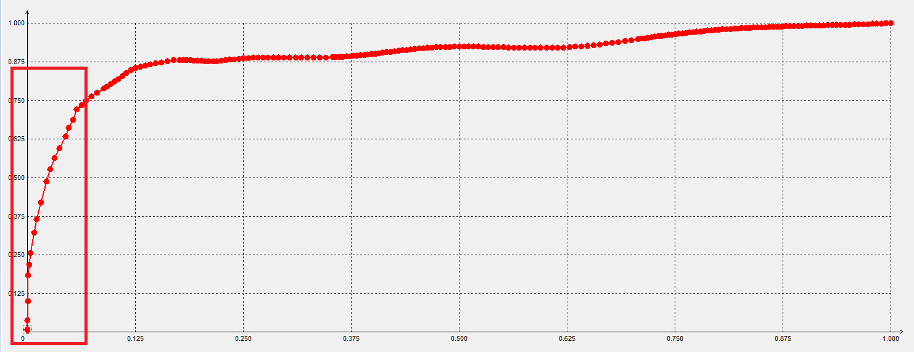

DRC模块的其他参数，如细节层的正向和负向增强以及窗口的大小的选择可以参考背光场景的调试方向。

****色彩维度****

强光抑制模式的色彩调试的维度影响模块和入口条件和WDR背光模式一致，具体可以参考WDR背光模式下色彩维度章节，这里需要注意的是针对信号灯和红色车灯由于DRC的影响，来带来红色过饱和，因此需要降低红色的饱和度，可以考虑利用CCM和CA模块降低红色的饱和度。

****对比度维度****

强光抑制模式的对比度维度影响模块和入口调节和WDR背光模式一致，具体可以参考WDR背光模式下对比度维度章节。

-   GAMMA模块调试的整体方向与WDR背光场景相同，也是基于Gamma = 0.8进行微调，当然这里不需要针对小脸的亮度的需求进行局部拉伸，可以适当针对暗区进行压制，来减轻噪声的负担，增加图像的整体的对比度。
-   Dehaze模块建议选择自定义曲线，具体自定义曲线的形状如[图4](#_Ref504567603)所示。这样做的主要目的就是为了通过去雾来压制车灯的光晕，同时对暗区的亮度损失也比较小。

**图 4**  去雾自定义曲线的示例图  
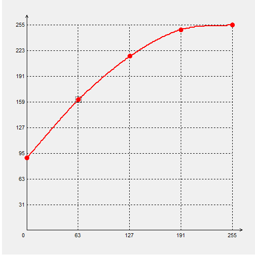

-   LDCI在强光抑制场景的调试思路主要就是提升车牌的局部对比度，一般建议将LDCI调试的局部一些，但同时需要注意：在夜晚场景下，LDCI的调试会带来车灯光晕的加大，需要平衡车灯光晕的大小和车牌局部对比度的表现。

****清晰度和噪声维度****

清晰度和噪声维度的影响模块和入口条件与WDR背光模式一致，具体可以参考WDR背光模式下清晰度和噪声维度章节。但这里针对强光抑制场景需要注意以下原则：

-   调节Demosaic模块的主要原则是确保在夜晚场景下，避免Demosaic插值出十字噪声。由于BayerNR模块当前的位置在Demosaic之前，可以先通过BayerNR将Demosiac插值前的一些噪声滤波一下，可以减轻Demosaic插值带来十字噪声的负担。
-   调节YUV Sharpen和3DNR IE增强的主要原则是提升大边缘的表现，可以适当降低纹理的锐化强度，来获得夜晚车牌的表现，同时避免锐化纹理带来噪声的加剧。
-   调节3DNR和BayerNR模块，需要注意是需要兼顾运动区域拖尾和整体噪声的表现，避免为了追求整体画面噪声干净而带来车子运动拖尾严重，影响车牌的识别。

# 模块介绍

## Sharpen

### 功能描述

Sharpen模块用于增强图像的清晰度，可以实现对图像的带方向的边缘和无方向的细节纹理的单独锐化增强，而且，通过调节所要增强的频段，可以实现多种清晰度风格的增强效果。此外，还能控制锐化后的图像的overshoot（白边白点）和undershoot（黑边黑点）。增强图像的清晰度的同时，不可避免的会增强噪声，通过调节sharpen模块的相关参数，也可以抑制噪声的增强。

如[图1](#fig2506236456)所示，为Sharpen模块的系统框图，其中黑色字体的部分是sharpen模块的数据流图，红色字体为sharpen开放给用户的调节参数接口。

**图 1**  Sharpen模块的系统框图  
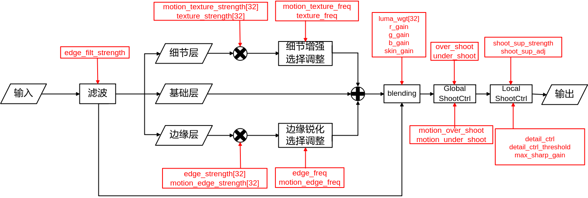

### 关键参数

**表 1**  Sharpen关键参数

<table><thead align="left"><tr id="row3746mcpsimp"><th class="cellrowborder" valign="top" width="34%" id="mcps1.2.3.1.1">
参数名称

</th>
<th class="cellrowborder" valign="top" width="66%" id="mcps1.2.3.1.2">
描述

</th>
</tr>
</thead>
<tbody><tr id="row3752mcpsimp"><td class="cellrowborder" valign="top" width="34%" headers="mcps1.2.3.1.1 ">
en

</td>
<td class="cellrowborder" valign="top" width="66%" headers="mcps1.2.3.1.2 ">
Sharpen增强功能的使能。

0：关闭；

1：使能。默认值为1。

</td>
</tr>
<tr id="row3759mcpsimp"><td class="cellrowborder" valign="top" width="34%" headers="mcps1.2.3.1.1 ">
motion_en

</td>
<td class="cellrowborder" valign="top" width="66%" headers="mcps1.2.3.1.2 ">
运动区域单独增强使能。

TD_FALSE：关闭；

TD_TRUE：使能。

默认值为TD_FALSE。

</td>
</tr>
<tr id="row3767mcpsimp"><td class="cellrowborder" valign="top" width="34%" headers="mcps1.2.3.1.1 ">
motion_threshold0

</td>
<td class="cellrowborder" valign="top" width="66%" headers="mcps1.2.3.1.2 ">
运动区域判断阈值，小于此值，认为是完全运动。取值范围：[0, 15]。

</td>
</tr>
<tr id="row3772mcpsimp"><td class="cellrowborder" valign="top" width="34%" headers="mcps1.2.3.1.1 ">
motion_threshold1

</td>
<td class="cellrowborder" valign="top" width="66%" headers="mcps1.2.3.1.2 ">
运动区域判断阈值，大于此值，认为是完全静止。取值范围：[0, 15]。

motion_threshold0必须小于motion_threshold1。

</td>
</tr>
<tr id="row3778mcpsimp"><td class="cellrowborder" valign="top" width="34%" headers="mcps1.2.3.1.1 ">
motion_gain0

</td>
<td class="cellrowborder" valign="top" width="66%" headers="mcps1.2.3.1.2 ">
运动区域对应motion_threshold0参数强度，0表示全部使用运动参数，256表示全部使用静止参数。取值范围：[0, 256]。

</td>
</tr>
<tr id="row3783mcpsimp"><td class="cellrowborder" valign="top" width="34%" headers="mcps1.2.3.1.1 ">
motion_gain1

</td>
<td class="cellrowborder" valign="top" width="66%" headers="mcps1.2.3.1.2 ">
运动区域对应motion_threshold1参数强度，0表示全部使用运动参数，256表示全部使用静止参数。

</td>
</tr>
<tr id="row3788mcpsimp"><td class="cellrowborder" valign="top" width="34%" headers="mcps1.2.3.1.1 ">
skin_umin

</td>
<td class="cellrowborder" valign="top" width="66%" headers="mcps1.2.3.1.2 ">
肤色区域范围矩形窗的左下角的最小坐标的U值

</td>
</tr>
<tr id="row3793mcpsimp"><td class="cellrowborder" valign="top" width="34%" headers="mcps1.2.3.1.1 ">
skin_vmin

</td>
<td class="cellrowborder" valign="top" width="66%" headers="mcps1.2.3.1.2 ">
肤色区域范围矩形窗的左下角的最小坐标的V值

</td>
</tr>
<tr id="row3798mcpsimp"><td class="cellrowborder" valign="top" width="34%" headers="mcps1.2.3.1.1 ">
skin_umax

</td>
<td class="cellrowborder" valign="top" width="66%" headers="mcps1.2.3.1.2 ">
肤色区域范围矩形窗的右上角的最大坐标的U值

</td>
</tr>
<tr id="row3803mcpsimp"><td class="cellrowborder" valign="top" width="34%" headers="mcps1.2.3.1.1 ">
skin_vmax

</td>
<td class="cellrowborder" valign="top" width="66%" headers="mcps1.2.3.1.2 ">
肤色区域范围矩形窗的右上角的最大坐标的V值

</td>
</tr>
<tr id="row3808mcpsimp"><td class="cellrowborder" valign="top" width="34%" headers="mcps1.2.3.1.1 ">
op_type

</td>
<td class="cellrowborder" valign="top" width="66%" headers="mcps1.2.3.1.2 ">
Sharpen工作类型。

<ul id="ul3813mcpsimp"><li>OT_OP_MODE_AUTO：自动模式；</li><li>OT_OP_MODE_MANUAL：手动模式。默认值为OT_OP_MODE_AUTO。</li></ul>
</td>
</tr>
<tr id="row3816mcpsimp"><td class="cellrowborder" valign="top" width="34%" headers="mcps1.2.3.1.1 ">
detail_map

</td>
<td class="cellrowborder" valign="top" width="66%" headers="mcps1.2.3.1.2 ">
细节图显示类型。

OT_ISP_SHARPEN_NORMAL：显示正常图像。

OT_ISP_SHARPEN_DETAIL：显示图像细节灰度图，细节越强，像素值越大。

</td>
</tr>
<tr id="row3823mcpsimp"><td class="cellrowborder" valign="top" width="34%" headers="mcps1.2.3.1.1 ">
luma_wgt

</td>
<td class="cellrowborder" valign="top" width="66%" headers="mcps1.2.3.1.2 ">
亮度锐化权重。该参数是一个32的数组，满量程0-255的亮度被32个等分点平均分为32段亮度区间，每一段亮度区间对应一个亮度权重。该值越小，对应亮度区间的像素点的锐化越弱。如图 demosaic功能所示。

</td>
</tr>
<tr id="row3833mcpsimp"><td class="cellrowborder" valign="top" width="34%" headers="mcps1.2.3.1.1 ">
texture_strength

</td>
<td class="cellrowborder" valign="top" width="66%" headers="mcps1.2.3.1.2 ">
无方向的细节纹理的锐化强度。

该值越大，无方向细节纹理的清晰度越高。该参数是一个32的数组，表现为一段连续的强度曲线，见《ISP开发参考》的图6-2所示。

</td>
</tr>
<tr id="row3840mcpsimp"><td class="cellrowborder" valign="top" width="34%" headers="mcps1.2.3.1.1 ">
edge_strength

</td>
<td class="cellrowborder" valign="top" width="66%" headers="mcps1.2.3.1.2 ">
带方向的边缘的锐化强度

该值越大，带方向的边缘的锐度越高。该参数是一个32的数组，表现为一个32段的连续的强度曲线，见《ISP开发参考》的图6-3所示。

</td>
</tr>
<tr id="row3846mcpsimp"><td class="cellrowborder" valign="top" width="34%" headers="mcps1.2.3.1.1 ">
texture_freq

</td>
<td class="cellrowborder" valign="top" width="66%" headers="mcps1.2.3.1.2 ">
图像的无方向细节纹理的增强频段控制该值越大，细节纹理的增强就越偏向于高频增强，细节纹理就越细碎。反之，该值越小，细节纹理就越粗越圆润。

</td>
</tr>
<tr id="row3851mcpsimp"><td class="cellrowborder" valign="top" width="34%" headers="mcps1.2.3.1.1 ">
edge_freq

</td>
<td class="cellrowborder" valign="top" width="66%" headers="mcps1.2.3.1.2 ">
图像的带方向的边缘的增强频段控制。该值越大，边缘的增强就越偏向于高频增强，图像的边缘就越纤薄越窄。反之，该值越小，边缘就越粗越圆润。

</td>
</tr>
<tr id="row3857mcpsimp"><td class="cellrowborder" valign="top" width="34%" headers="mcps1.2.3.1.1 ">
over_shoot

</td>
<td class="cellrowborder" valign="top" width="66%" headers="mcps1.2.3.1.2 ">
设置图像的overshoot（锐化后的白边白点）的强度。

该值越小，锐化后的白边白点越弱，清晰度也会下降。该值过小，会导致图像呈油画效果。

</td>
</tr>
<tr id="row3863mcpsimp"><td class="cellrowborder" valign="top" width="34%" headers="mcps1.2.3.1.1 ">
under_shoot

</td>
<td class="cellrowborder" valign="top" width="66%" headers="mcps1.2.3.1.2 ">
设置图像的undershoot（锐化后的黑边黑点）的强度。

该值越小，锐化后的黑边黑点越弱，清晰度也会下降。该值过小，会导致图像呈油画效果。

</td>
</tr>
<tr id="row3869mcpsimp"><td class="cellrowborder" valign="top" width="34%" headers="mcps1.2.3.1.1 ">
motion_texture_strength

</td>
<td class="cellrowborder" valign="top" width="66%" headers="mcps1.2.3.1.2 ">
运动区域无方向的细节纹理的锐化强度。

该值越大，无方向细节纹理的清晰度越高。该参数是一个32的数组，表现为一段连续的强度曲线，见《ISP开发参考》的图6-1所示。

</td>
</tr>
<tr id="row3876mcpsimp"><td class="cellrowborder" valign="top" width="34%" headers="mcps1.2.3.1.1 ">
motion_edge_strength

</td>
<td class="cellrowborder" valign="top" width="66%" headers="mcps1.2.3.1.2 ">
运动区域带方向的边缘的锐化强度

该值越大，带方向的边缘的锐度越高。该参数是一个32的数组，表现为一个32段的连续的强度曲线，见《ISP开发参考》的图6-2所示。

</td>
</tr>
<tr id="row3883mcpsimp"><td class="cellrowborder" valign="top" width="34%" headers="mcps1.2.3.1.1 ">
motion_texture_freq

</td>
<td class="cellrowborder" valign="top" width="66%" headers="mcps1.2.3.1.2 ">
运动区域图像的无方向细节纹理的增强频段控制该值越大，细节纹理的增强就越偏向于高频增强，细节纹理就越细碎。反之，该值越小，细节纹理就越粗越圆润。

</td>
</tr>
<tr id="row3888mcpsimp"><td class="cellrowborder" valign="top" width="34%" headers="mcps1.2.3.1.1 ">
motion_edge_freq

</td>
<td class="cellrowborder" valign="top" width="66%" headers="mcps1.2.3.1.2 ">
运动区域图像的带方向的边缘的增强频段控制。该值越大，边缘的增强就越偏向于高频增强，图像的边缘就越纤薄越窄。反之，该值越小，边缘就越粗越圆润。

</td>
</tr>
<tr id="row3894mcpsimp"><td class="cellrowborder" valign="top" width="34%" headers="mcps1.2.3.1.1 ">
motion_over_shoot

</td>
<td class="cellrowborder" valign="top" width="66%" headers="mcps1.2.3.1.2 ">
设置运动区域图像的overshoot（锐化后的白边白点）的强度。

该值越小，锐化后的白边白点越弱，清晰度也会下降。该值过小，会导致图像呈油画效果。

</td>
</tr>
<tr id="row3901mcpsimp"><td class="cellrowborder" valign="top" width="34%" headers="mcps1.2.3.1.1 ">
motion_under_shoot

</td>
<td class="cellrowborder" valign="top" width="66%" headers="mcps1.2.3.1.2 ">
设置运动区域图像的undershoot（锐化后的黑边黑点）的强度。

该值越小，锐化后的黑边黑点越弱，清晰度也会下降。该值过小，会导致图像呈油画效果。

</td>
</tr>
<tr id="row3908mcpsimp"><td class="cellrowborder" valign="top" width="34%" headers="mcps1.2.3.1.1 ">
shoot_sup_strength

</td>
<td class="cellrowborder" valign="top" width="66%" headers="mcps1.2.3.1.2 ">
图像锐化后的overshoot和undershoot的局部抑制强度。用于在保证清晰度不明显下降的前提下，抑制锐化后的图像的overshoot和undershoot的宽度和幅度。

该值越大，锐化后的图像的overshoot和undershoot的宽度越窄、shoot的强度越小，图像的锐度不会明显下降。

</td>
</tr>
<tr id="row3914mcpsimp"><td class="cellrowborder" valign="top" width="34%" headers="mcps1.2.3.1.1 ">
shoot_sup_adj

</td>
<td class="cellrowborder" valign="top" width="66%" headers="mcps1.2.3.1.2 ">
图像锐化后的overshoot和undershoot的抑制强度的调节。该参数配合shoot_sup_strength使用，用于调节shoot_sup_strength作用的区域范围。该值越小，则越多的纹理区域的shoot会被shoot_sup_strength抑制；该值越大，则只有很强的边缘的shoot会被shoot_sup_strength抑制，纹理区域的shoot不会被抑制，而且shoot_sup_adj越大，对边缘的黑白边的抑制强度也越大。

</td>
</tr>
<tr id="row3920mcpsimp"><td class="cellrowborder" valign="top" width="34%" headers="mcps1.2.3.1.1 ">
edge_filt_strength

</td>
<td class="cellrowborder" valign="top" width="66%" headers="mcps1.2.3.1.2 ">
边缘滤波强度的调试参数：控制图像锐化边缘的宽度范围和边缘平滑强度。

该值越大，判为边缘的区域越多、也越宽，edge_strength起作用的图像区域边缘就越多，而且，该值越大，沿着边缘方向的平滑滤波强度也越大，边缘就越平滑。该值过大，可能加剧轮廓的油画感。

反之，判为边缘的区域越少、也越窄，edge_strength起作用的图像区域越少，边缘平滑就越弱。

该值等于0，则图像所有区域均被当成无方向纹理增强，edge_strength基本不起作用。随着该值的增大，判断为边缘的区域越多，edge_strength起作用的就越多，锐化后边缘越平滑、过渡带越宽。

</td>
</tr>
<tr id="row3928mcpsimp"><td class="cellrowborder" valign="top" width="34%" headers="mcps1.2.3.1.1 ">
edge_filt_max_cap

</td>
<td class="cellrowborder" valign="top" width="66%" headers="mcps1.2.3.1.2 ">
边缘滤波强度范围的调试参数：该值越大，边缘滤波的最大强度也最大，edge_filt_strength的可调试范围也越大；一般建议该值大小控制30以内。

</td>
</tr>
<tr id="row3934mcpsimp"><td class="cellrowborder" valign="top" width="34%" headers="mcps1.2.3.1.1 ">
detail_ctrl

</td>
<td class="cellrowborder" valign="top" width="66%" headers="mcps1.2.3.1.2 ">
图像的细节纹理区的shoot强度的控制。用于控制图像的细节纹理区域的shoot强度，shoot越大，细节纹理区的清晰度越高。

</td>
</tr>
<tr id="row3939mcpsimp"><td class="cellrowborder" valign="top" width="34%" headers="mcps1.2.3.1.1 ">
detail_ctrl_threshold

</td>
<td class="cellrowborder" valign="top" width="66%" headers="mcps1.2.3.1.2 ">
图像的细节纹理区的shoot强度的控制阈值。该值配合detail_ctrl使用，用于区分detail_ctrl所控制shoot的纹理区和边缘，也即纹理区和边缘的区分阈值。小于该值的区域为纹理区，该纹理区域的shoot会被detail_ctrl单独控制，而大于该阈值的边缘区域的shoot依然等于over_shoot和under_shoot。

</td>
</tr>
<tr id="row3944mcpsimp"><td class="cellrowborder" valign="top" width="34%" headers="mcps1.2.3.1.1 ">
r_gain

</td>
<td class="cellrowborder" valign="top" width="66%" headers="mcps1.2.3.1.2 ">
深红色区域的锐化增益控制。该值越大，则深红色区域的锐化强度越大。

</td>
</tr>
<tr id="row3949mcpsimp"><td class="cellrowborder" valign="top" width="34%" headers="mcps1.2.3.1.1 ">
g_gain

</td>
<td class="cellrowborder" valign="top" width="66%" headers="mcps1.2.3.1.2 ">
绿色区域的锐化增益控制。该值越大，则绿色区域的锐化锐化强度越大。

</td>
</tr>
<tr id="row3954mcpsimp"><td class="cellrowborder" valign="top" width="34%" headers="mcps1.2.3.1.1 ">
b_gain

</td>
<td class="cellrowborder" valign="top" width="66%" headers="mcps1.2.3.1.2 ">
深蓝色区域的锐化增益控制。该值越大，则深蓝色区域的锐化强度越大。

</td>
</tr>
<tr id="row3959mcpsimp"><td class="cellrowborder" valign="top" width="34%" headers="mcps1.2.3.1.1 ">
skin_gain

</td>
<td class="cellrowborder" valign="top" width="66%" headers="mcps1.2.3.1.2 ">
肤色区域的锐化增益控制。该值越大，则肤色区域的锐化强度越大。

</td>
</tr>
<tr id="row3964mcpsimp"><td class="cellrowborder" valign="top" width="34%" headers="mcps1.2.3.1.1 ">
max_sharp_gain

</td>
<td class="cellrowborder" valign="top" width="66%" headers="mcps1.2.3.1.2 ">
图像锐化的最大增益限制值。该值越大，则图像的锐化幅度越大，反之越小。适当的调小该参数，可以减少图像的过锐化，可以减少图像锐化后的黑白点。

</td>
</tr>
</tbody>
</table>

### 调试步骤

在auto档时，Sharpen的所有参数都会跟ISO联动，也即ISO变化，Sharpen各参数的强度也会随之改变。Sharpen在auto档的参数都根据ISO分了16档，两档ISO之间的Sharpen强度是线性插值计算得到。ISO越大，图像的噪声越大，图像的细节纹理越不清晰，对图像增强就会增强噪声，也更容易产生黑白点的shoot（冲激噪声）。因此，不同的ISO场景下，sharpen的各个调试参数设置都会有差别。

Sharpen的调试步骤如下：

1.  调试图像的整体锐度：通过调节texture\_strength和edge\_strength来设置图像整体的锐度。texture\_strength决定了图像的无方向细节纹理区域的锐度，增大texture\_strength能够增强无方向的细节纹理的清晰度，比如提高草地毛发等细节纹理的清晰度。edge\_strength决定了图像的带方向的边缘的锐度。
2.  单独调节平坦区域和纹理区域的锐度：如《ISP开发参考》的图6-2所示，通过调节texture\_strength的32段连续强度曲线，可以分别调节弱纹理区域、纹理区域和强纹理区域的锐化强度，以及抑制平坦区域的噪声的增强，32段曲线形状的不同也决定了不同的纹理区域的锐度风格的不同。
3.  单独调节弱边缘和强边缘的锐度：如《ISP开发参考》的图6-3所示，通过调节edge\_strength的32段连续强度曲线，可以分别调节弱边缘和强边缘的锐度。可以将弱边缘的edge\_strength调大，而将强边缘的edge\_strength调小，从而可以让图像的边缘清晰的同时，避免锐化出锯齿。
4.  调试细节纹理区域的细碎度风格：调节texture\_freq可以调节图像的无方向细节纹理的细碎度风格。texture\_freq越大，图像的细节纹理就越细碎，否则细节纹理就越粗越圆润，但是texture\_freq过大，图像的细节纹理会过于细碎而不自然，图像的细节纹理过于细碎会给人眼造成图像模糊的感觉。同时，TextureFreq调大后，图像的清晰度也会提高。如[图1](#_Ref504569639)所示，为texture\_freq的调节效果示意图。左图是texture\_freq =64的效果图，右图是texture\_freq =256的效果图，由图可见，右图的草地毛发彩带熊毛的细节都比左图细碎。

    **图 1**  texture\_freq的调节效果示意图  
    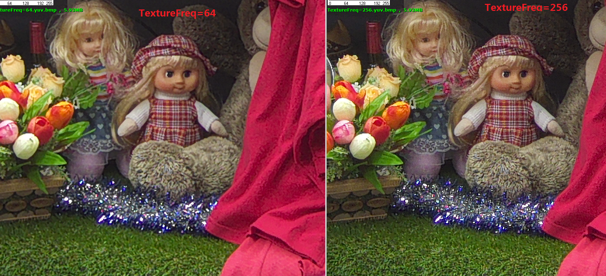

5.  调试边缘的纤薄圆润风格：调节edge\_freq可以调节图像的带方向的边缘和细节的纤薄或者圆润的风格。

    edge\_freq越大，图像的边缘就越锐利越纤薄、边缘的过渡更加细窄，分辨率线数也更高更清晰。edge\_freq越小，图像的边缘就越粗越圆润。但是edge\_freq过大，图像的边缘会因为过于纤薄而出现虚边现象，图像会不自然。如[图2](#fig54163116538)所示，为edge\_freq的调节效果示意图。左图是edge\_freq =64的效果图，右图是edge\_freq =128的效果图，由图可见，右图中的横线都比左边更加细窄，右图的分辨率线数也更清晰。

    **图 2**  edge\_freq的调节效果示意图  
    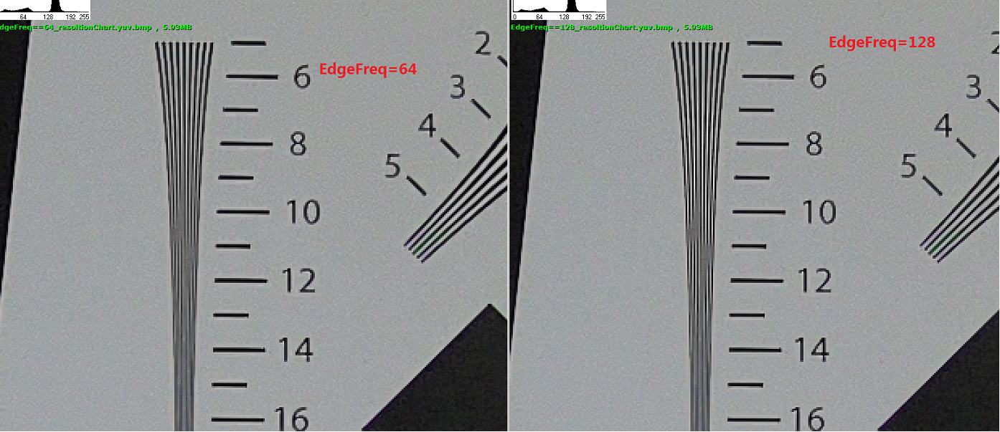

1.  控制锐化后图像的整体的shoot强度：通过调节over\_shoot可以控制锐化后的图像整体的边缘的白边和细节纹理区的白点噪声的大小。通过调节under\_shoot可以控制锐化后的图像整体的边缘的黑边和细节纹理区的黑点噪声的大小。

    减小over\_shoot可以减弱锐化后的图像的白边和白点噪声，减小under\_shoot可以减弱锐化后的图像的黑边和黑点噪声。但是，减小over\_shoot和under\_shoot，图像的锐度也会减弱，over\_shoot和under\_shoot的值过小，会导致图像出现油画效果。

    此外，还可以通过调节max\_sharp\_gain来限制图像的过锐化，max\_sharp\_gain限制了图像被锐化的最大幅度，也即限制了图像锐化前后的最大变化量。该值越大，则图像能被锐化的幅度越大，该值越小，图像能被锐化的幅度越小。适当的调小该参数，可以减少图像的过锐化，可以减少图像锐化后的黑白点（shoot）。

2.  锐度不明显下降的情况下根据局部特征抑制边缘的黑白边：调节shoot\_sup\_strength和shoot\_sup\_adj参数可以在保证图像的清晰度不明显下降的情况下，根据图像的局部特征来减弱锐化后的边缘的黑边白边。

    shoot\_sup\_strength和shoot\_sup\_adj两个参数需要配合调试才能发挥出边缘的黑白边局部抑制功能的最佳效果。增大shoot\_sup\_strength并合理的调节shoot\_sup\_adj，可以在图像清晰度不明显下降的情况下，使锐化后的图像边缘的黑边白边的强度（幅度）减弱、宽度变窄。

    调大shoot\_sup\_strength可以收窄边缘的黑白边的宽度，此时，为了避免细节纹理区的shoot被shoot\_sup\_strength抑制而影响细节纹理区的清晰度，应当适当调大shoot\_sup\_adj。

    shoot\_sup\_adj设置较小时，草地毛发等细节纹理的shoot也会被shoot\_sup\_strength抑制而导致细节纹理的清晰度被减弱，此时可以调大shoot\_sup\_adj来避免草地毛发等细节纹理的清晰度的损失，一般shoot\_sup\_adj大于6就可以避免草地毛发等细节纹理的清晰度的损失，shoot\_sup\_adj越大，对边缘的黑白边的抑制强度也越大。

    shoot\_sup\_strength和shoot\_sup\_adj太大，会导致图像边缘的shoot都被抑制，从而明显地降低图像的锐度。视频模式下，保留一定的黑边白边可以提升图像的清晰度，因为黑白边的存在能让人眼感觉锐度更高，所以，视频模式下，shoot\_sup\_strength不需要设的太大，shoot\_sup\_adj应该设置一个中间值。

    如[图3](#_Ref504570091)所示，为shoot\_sup\_strength和shoot\_sup\_adj配合调试的效果示意图。左图是shoot\_sup\_strength =0和shoot\_sup\_adj =0的效果图，右图是shoot\_sup\_strength =8和shoot\_sup\_adj =9的效果图，由图可见，右图的边缘上的黑白边都比左图的黑白边宽度窄，幅度也低，清晰度没有明显下降。此外，通过shoot\_sup\_strength收窄黑白边后，可能会导致图像的斜边缘的锯齿感加重。

    **图 3**  shoot\_sup\_strength的调节效果示意图  
    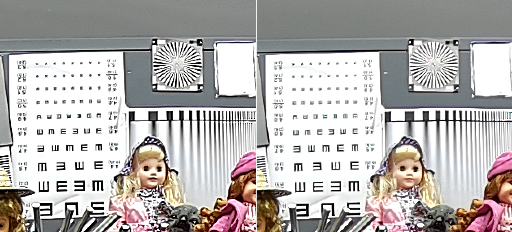

3.  细节纹理区和大边缘的shoot的单独调试：在图像的整体清晰度和shoot都调到合适后，可以调节detail\_ctrl和detail\_ctrl\_threshold来单独调节细节纹理区和大边缘的shoot强度。

    detail\_ctrl\_threshold用于区分detail\_ctrl所控制shoot的纹理区和边缘，也即纹理区和边缘的区分阈值。小于该值的区域为纹理区，该纹理区域的shoot就会被detail\_ctrl单独控制，而大于该阈值的边缘区域的shoot依然等于over\_shoot和under\_shoot。

    detail\_ctrl等于128，则图像的细节纹理区域的shoot强度和大边缘的shoot强度一致，都分别等于over\_shoot和under\_shoot所设置的值。

    该值大于128，则图像的细节纹理的shoot强度大于大边缘，大边缘的shoot强度分别等于over\_shoot和under\_shoot所设置的值。

    该值小于128，则图像的细节纹理的shoot强度小于大边缘，大边缘的shoot强度分别等于over\_shoot和under\_shoot所设置的值。一般情况下，建议detail\_ctrl设为128。

    在正常照度噪声小时，可以将detail\_ctrl调的比128大，但不要大太多，这样，可以使细节纹理的清晰度很高，而大边缘的黑白边不至于太重。在低照度噪声大时，可以将detail\_ctrl调的比128小，这样，可以使大边缘很锐利，但不增强细节纹理区的噪声。通过调节detail\_ctrl\_threshold来合理的区分出细节纹理区和边缘。

4.  边缘锐化后的平滑度调节：通过调节edge\_filt\_strength可以调节图像锐化后的边缘的平滑度。
    -   edge\_filt\_strength比较小时，图像的边缘都会更多的被当成无方向纹理增强，主要是texture\_strength起作用，edge\_strength参数基本不起作用，边缘较锐、同时锯齿和边缘噪声会比较大。
    -   edge\_filt\_strength比较大时，图像的边缘会更多的被判断成为有方向的边缘来增强，此时，图像的边缘的锐化主要就是edge\_strength起作用，图像的边缘就会越平滑，边缘噪声就越小。edge\_filt\_strength越大，边缘越平滑，边缘过渡带也相对越宽。

5.  根据局部亮度调节其锐化强度：一般情况下，暗区的噪声都会比亮区大，所以，可以通过调小暗区的luma\_wgt来降低暗区的锐化，从而避免暗区的噪声被放大。
6.  单独调节运动区域的锐度：一般情况下，由于运动区域不能使用时域降噪，所以噪声较大，所以可以通过适当调小运动区域参数motion\_texture\_strength\\motion\_edge\_strength\\motion\_texture\_freq\\motion\_edge\_freq\\motion\_over\_shoot\\motion\_under\_shoot使得过渡更平滑，避免运动区域噪声变大。运动区域判定采用BNR运动检测模块上一帧结果，因此只有当BNR运动检测使能时，此功能方可生效；生效时存在一帧图像延迟，因此建议运动区域与静止区域参数不要差异太大，否则容易出现运动与静止区域图像分层。
7.  单独调节高饱和度颜色区域和肤色区域的锐度：根据深红色区域、深蓝色区域、绿色区域和人脸皮肤区域的噪声大小来单独调节r\_gain、g\_gain、b\_gain和skin\_gain，以让深红色区域、深蓝色区域、绿色区域和人脸皮肤区域的噪声和细节轮廓达到最佳的平衡效果。其中，由skin\_umin，skin\_vmin，skin\_umax和skin\_vmax这4个坐标所圈定的矩形窗范围即为肤色区域的范围，可以根据实际的图像的肤色范围，重新设置skin\_umin，skin\_vmin，skin\_umax和skin\_vmax这4个值，从而重新定义肤色范围。如[图4](#_Ref533581415)所示，为skin\_umin，skin\_vmin，skin\_umax和skin\_vmax这4个值决定的肤色区域范围示意图。skin\_umin和skin\_vmin是肤色范围矩形窗的左下最小坐标的UV值，skin\_umax和skin\_vmax是肤色范围矩形窗的右上最大坐标的UV值。可以通过图像取色软件读出实际图像的肤色的UV值，然后根据实际图像的肤色UV值范围来重新设置这4个矩形窗范围值。然后再合理的调节skin\_gain的值，来单独调节肤色区域的锐化强度。

    **图 4**  skin\_umin/ skin\_vmin /skin\_umax和skin\_vmax决定的肤色矩形窗区域范围示意图  
    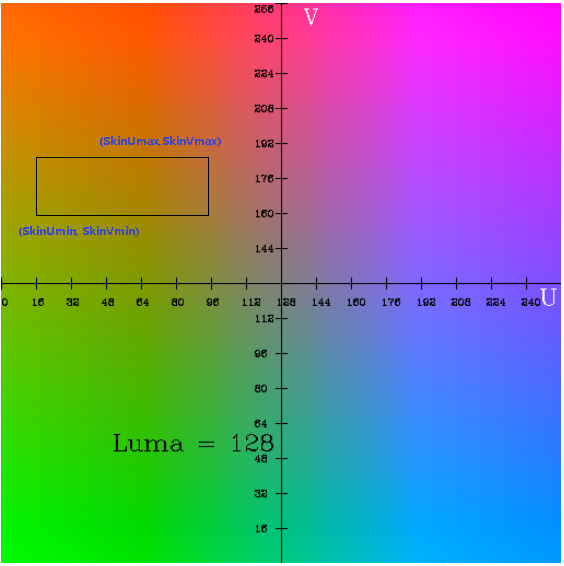

> **须知：** 
>-   over\_shoot和under\_shoot决定了图像整体的overshoot（白边白点）和undershoot（黑边黑点）的强度，而且，over\_shoot和under\_shoot的大小会直接影响图像的锐度（texture\_strength和edge\_strength两个参数是决定图像锐度的直接参数和根本因素）。shoot\_sup\_strength基于over\_shoot和under\_shoot的强度可以再次独立压低边缘的黑边白边的强度、收窄黑边白边的宽度，并且可以使图像的清晰度不明显下降。detail\_ctrl是通过单独调节纹理细节区的overshoot和undershoot的强度来单独调节细节纹理的清晰度，使得细节纹理区的shoot和边缘的shoot不一样。
>-   texture\_freq是一个12bit 6.6的带小数点精度的数，高6bit是整数部分，低6bit是小数部分，texture\_freq对应于texture\_strength，texture\_freq的调节效果和texture\_strength相关联。texture\_strength较大时，texture\_freq调大到一定值后（小于满量程4095的值），texture\_freq继续增大，图像可能就不会再有明显的变化。
>-   edge\_freq是一个12bit 的6.6的带小数点精度的数，高6bit是整数部分，低6bit是小数部分，edge\_freq对应于edge\_strength，edge\_freq的调节效果和edge\_strength关联。edge\_strength较大时，edge\_freq调大到一定值后（小于满量程4095的值），edge\_freq继续增大，图像可能就不会再有明显的变化。

## Demosaic

### 功能描述

由于大部分彩色相机均采用单传感器获取图像信息，且每个传感器表面覆盖有一个CFA（Color Filter Array，色彩滤波阵列），使得每一个像素只能获得R、G、B三基色中的一种彩色分量（如[图1](#_Ref457638430)所示）。

**图 1**  单传感器获取图像信息  
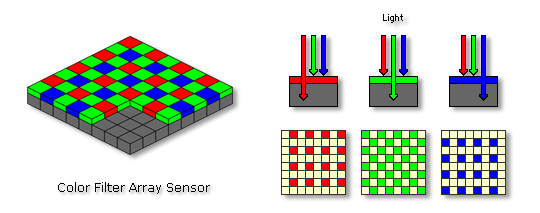

Demosaic模块实现的功能就是将输入的Bayer数据转化成RGB数据。为获得彩色图像，需要利用当前像素及周围像素的色彩分量值，估计出当前点缺失的其他两个分量值（如[图2](#fig118124712595)所示）。

**图 2**  demosaic功能  
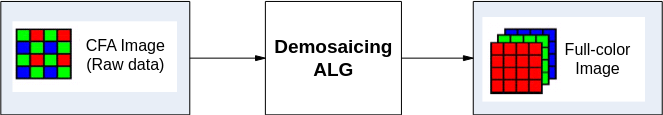

### 关键参数

**表 1**  Demosaic关键参数

<table><thead align="left"><tr id="row1563mcpsimp"><th class="cellrowborder" valign="top" width="32%" id="mcps1.2.3.1.1">
参数名称

</th>
<th class="cellrowborder" valign="top" width="68%" id="mcps1.2.3.1.2">
描述

</th>
</tr>
</thead>
<tbody><tr id="row1569mcpsimp"><td class="cellrowborder" valign="top" width="32%" headers="mcps1.2.3.1.1 ">
en

</td>
<td class="cellrowborder" valign="top" width="68%" headers="mcps1.2.3.1.2 ">
Demosaic模块使能。

0：关闭；

1：使能。

</td>
</tr>
<tr id="row1576mcpsimp"><td class="cellrowborder" valign="top" width="32%" headers="mcps1.2.3.1.1 ">
detail_smooth_range

</td>
<td class="cellrowborder" valign="top" width="68%" headers="mcps1.2.3.1.2 ">
细节平滑范围，值越大，做平滑处理的细节范围越大，能够抑制更多伪细节。

</td>
</tr>
<tr id="row1581mcpsimp"><td class="cellrowborder" valign="top" width="32%" headers="mcps1.2.3.1.1 ">
nddm_strength

</td>
<td class="cellrowborder" valign="top" width="68%" headers="mcps1.2.3.1.2 ">
无方向插值强度，值越大，无方向插值所占比重越大。

</td>
</tr>
<tr id="row1586mcpsimp"><td class="cellrowborder" valign="top" width="32%" headers="mcps1.2.3.1.1 ">
nddm_mf_detail_strength

</td>
<td class="cellrowborder" valign="top" width="68%" headers="mcps1.2.3.1.2 ">
无方向中频纹理增强强度，值越大，无方向中频纹理细节增强越强，对噪声同样有增强。

</td>
</tr>
<tr id="row1591mcpsimp"><td class="cellrowborder" valign="top" width="32%" headers="mcps1.2.3.1.1 ">
nddm_hf_detail_strength

</td>
<td class="cellrowborder" valign="top" width="68%" headers="mcps1.2.3.1.2 ">
无方向高频纹理增强强度，值越大，无方向纹理细节增强越强，对噪声均匀性有提升。

</td>
</tr>
<tr id="row1596mcpsimp"><td class="cellrowborder" valign="top" width="32%" headers="mcps1.2.3.1.1 ">
color_noise_f_threshold

</td>
<td class="cellrowborder" valign="top" width="68%" headers="mcps1.2.3.1.2 ">
根据画面平坦程度降低颜色噪声，值越大，则越容易在平坦区域进行去色噪功能。值越小，则影响的像素越少。

</td>
</tr>
<tr id="row1601mcpsimp"><td class="cellrowborder" valign="top" width="32%" headers="mcps1.2.3.1.1 ">
color_noise_f_strength

</td>
<td class="cellrowborder" valign="top" width="68%" headers="mcps1.2.3.1.2 ">
根据画面平坦程度降低颜色噪声的强度，值越大，则降饱和度强度越高。默认值为8。

</td>
</tr>
<tr id="row1606mcpsimp"><td class="cellrowborder" valign="top" width="32%" headers="mcps1.2.3.1.1 ">
color_noise_y_threshold

</td>
<td class="cellrowborder" valign="top" width="68%" headers="mcps1.2.3.1.2 ">
根据亮度和饱和度降低颜色噪声，值越大，对暗处影响越大，对饱和度高的像素影响越大。值越小，影响的像素越少。

在color_noise_y_strength从0到1开始递增时，建议保持color_noise_y_threshold设定在比较小的值，避免对画面产生大的影响。

</td>
</tr>
<tr id="row1612mcpsimp"><td class="cellrowborder" valign="top" width="32%" headers="mcps1.2.3.1.1 ">
color_noise_y_strength

</td>
<td class="cellrowborder" valign="top" width="68%" headers="mcps1.2.3.1.2 ">
根据亮度和饱和度降低颜色噪声的强度，值越大，对影响的像素降饱和度越多，值越小，降饱和度程度越少。

建议在低照度噪声水平很大的时候才将color_noise_y_strength值调大，以免在降饱和度区域和正常区域间产生明显的分层现象。

</td>
</tr>
</tbody>
</table>

### 调试步骤

Demosaic在进行插值及方向判断时，由于sensor感光特性及受噪声等影响，会出现不属于原始图像的细节，影响主观感受，称之为“伪细节”。伪细节抑制功能可以较好地平滑细节边缘，使细节等表现更加自然。伪细节与清晰度及细碎度存在平衡，若细节区域追求较高清晰度，可根据主观感受减少伪细节抑制功能，即减少细节平滑功能。

detail\_smooth\_range表示细节平滑范围，值越大，做平滑处理的细节范围由极高频区域扩大到高频区域，能够抑制更多区域的伪细节，并使边缘较为平滑。

**图 1**  detail\_smooth\_range作用范围示意图  
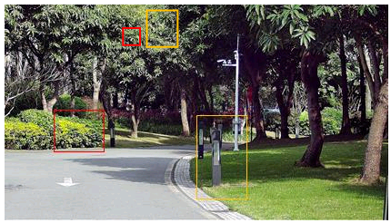

 

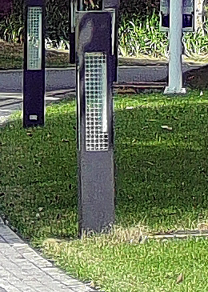 

detail\_smooth\_range=1（左）与detail\_smooth\_range=7（右）效果对比

**图 2**  nddm\_strength与nddm\_mf\_detail\_strength（包含MF和HF两个调节维度）调试效果  
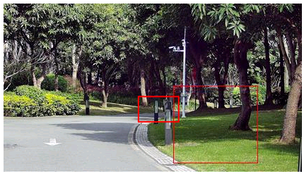

**图 3**  nddm\_mf\_detail\_strength调节  

 

nddm\_strength= 64，nddm\_mf\_detail\_strength= 0（左），nddm\_strength= 64，nddm\_mf\_detail\_strength= 127（右）作用范围示意图

nddm\_strength与nddm\_mf\_detail\_strength、nddm\_hf\_detail\_strength需配合调试，具体调试步骤如下：

1.  无方向插值对平坦区域及草地等弱纹理区域平滑性作用较大，对于需提升弱细节区域，首先确定nddm\_strength无方向插值整体强度。正常照度信噪比较大，nddm\_strength可配置较小数值，保持整体清晰度；较低照度，受噪声影响，应更多采用无方向插值，防止方向性pattern出现。
2.  通过调试nddm\_mf\_detail\_strength及nddm\_hf\_detail\_strength确定不同频率细节提升强度。

    nddm\_mf\_detail\_strength主要对中频细节有增强作用，对暗区细节有一定的增强效果，但增强过多会导致细节加粗，同时噪声也会在一定程度上被放大；

    nddm\_hf\_detail\_strength对无方向高频细节有提升，例如草地等区域（尤其对暗区有一定提升），需要注意，无方向高频幅值相对较低，增强程度有限，对平坦区域噪声均匀性有一定帮助，但增强的同时对噪声也有一定的放大作用。

    在高ISO情况的Demosaic插值算法设计为保强边，抑制平坦区域的噪声表现，因此在高ISO情况下，单独设置nddm\_strength，图像平坦区域的噪声变化不会有低ISO情况下那么明显。

## BayerSharpen

### 功能描述

BayerSharpen模块用于增强图像的清晰度，可以实现对图像的带方向的边缘和无方向的细节纹理的单独锐化增强，而且，通过调节所要增强的频段，可以实现多种清晰度风格的增强效果。

ISP系统中有两个Sharpen，一个是YUV Sharpen，一个是Bayersharpen。

YUV Sharpen和Bayer Sharpen两者的目的和定位不一样，两者的定位和目的分别如下：

-   Bayer  sharpen作用在Bayer域，所以主要用于增强图像的弱纹理，不建议用于增大边缘，否则图像的边缘会变得有点粗糙。
-   YUV Sharpen是系统中主要调节的图像清晰度增强模块，纹理细节和边缘都可以增强，而且调试的灵活性更加强大，图像的清晰度增强主要靠YUV Sharpen。大多数情况下，只需要调节YUV Sharpen就够了。

### 关键参数

**表 1**  BayerSharpen关键参数

<table><thead align="left"><tr id="row2200mcpsimp"><th class="cellrowborder" valign="top" width="25%" id="mcps1.2.3.1.1">
参数名称

</th>
<th class="cellrowborder" valign="top" width="75%" id="mcps1.2.3.1.2">
描述

</th>
</tr>
</thead>
<tbody><tr id="row2206mcpsimp"><td class="cellrowborder" valign="top" width="25%" headers="mcps1.2.3.1.1 ">
en

</td>
<td class="cellrowborder" valign="top" width="75%" headers="mcps1.2.3.1.2 ">
Sharpen增强功能的使能。

0：关闭；

1：使能。默认值为1。

</td>
</tr>
<tr id="row2213mcpsimp"><td class="cellrowborder" valign="top" width="25%" headers="mcps1.2.3.1.1 ">
op_type

</td>
<td class="cellrowborder" valign="top" width="75%" headers="mcps1.2.3.1.2 ">
Sharpen工作类型。

<ul id="ul2218mcpsimp"><li>OT_OP_MODE_AUTO：自动模式；</li><li>OT_OP_MODE_MANUAL：手动模式。默认值为OT_OP_MODE_AUTO。</li></ul>
</td>
</tr>
<tr id="row2221mcpsimp"><td class="cellrowborder" valign="top" width="25%" headers="mcps1.2.3.1.1 ">
luma_wgt

</td>
<td class="cellrowborder" valign="top" width="75%" headers="mcps1.2.3.1.2 ">
根据亮度锐化强度。亮度分为32段。每一段可以分别配置不同的强度实现差异化锐化。

</td>
</tr>
<tr id="row2226mcpsimp"><td class="cellrowborder" valign="top" width="25%" headers="mcps1.2.3.1.1 ">
edge_mf_strength

</td>
<td class="cellrowborder" valign="top" width="75%" headers="mcps1.2.3.1.2 ">
边缘中频增强强度，它是根据边缘强弱程度配置不同的锐化强度的。值越大，边缘越锐，但是会有点粗。分为32段。每一段可以分别配置不同的强度实现差异化锐化。

</td>
</tr>
<tr id="row2231mcpsimp"><td class="cellrowborder" valign="top" width="25%" headers="mcps1.2.3.1.1 ">
texture_mf_strength

</td>
<td class="cellrowborder" valign="top" width="75%" headers="mcps1.2.3.1.2 ">
纹理中频增强强度，它是根据纹理强弱程度配置不同的锐化强度的。值越大，纹理越多。分为32段。每一段可以分别配置不同的强度实现差异化锐化。

</td>
</tr>
<tr id="row2236mcpsimp"><td class="cellrowborder" valign="top" width="25%" headers="mcps1.2.3.1.1 ">
edge_hf_strength

</td>
<td class="cellrowborder" valign="top" width="75%" headers="mcps1.2.3.1.2 ">
边缘高频增强强度，它是根据边缘强弱程度配置不同的锐化强度的。值越大，边缘会更锐，也会更加细腻。分为32段。每一段可以分别配置不同的强度实现差异化锐化。

</td>
</tr>
<tr id="row2244mcpsimp"><td class="cellrowborder" valign="top" width="25%" headers="mcps1.2.3.1.1 ">
texture_hf_strength

</td>
<td class="cellrowborder" valign="top" width="75%" headers="mcps1.2.3.1.2 ">
纹理高频增强强度，它是根据纹理强弱程度配置不同的锐化强度的。值越大，纹理会更锐，会更加细腻。分为32段。每一段可以分别配置不同的强度实现差异化锐化。

</td>
</tr>
<tr id="row2252mcpsimp"><td class="cellrowborder" valign="top" width="25%" headers="mcps1.2.3.1.1 ">
edge_filt_strength

</td>
<td class="cellrowborder" valign="top" width="75%" headers="mcps1.2.3.1.2 ">
边缘平滑强度。该参数值越大，边缘越平滑干净，但也会出现细节连成线条的可能。

</td>
</tr>
<tr id="row2257mcpsimp"><td class="cellrowborder" valign="top" width="25%" headers="mcps1.2.3.1.1 ">
texture_max_gain

</td>
<td class="cellrowborder" valign="top" width="75%" headers="mcps1.2.3.1.2 ">
纹理增强限制阈值，它会限制住纹理增强的强度，不让纹理太锐显得不自然。值越小，纹理增强被限制的越大。

</td>
</tr>
<tr id="row2262mcpsimp"><td class="cellrowborder" valign="top" width="25%" headers="mcps1.2.3.1.1 ">
edge_max_gain

</td>
<td class="cellrowborder" valign="top" width="75%" headers="mcps1.2.3.1.2 ">
边缘增强限制阈值，它会限制住边缘增强的强度，不让边缘太锐显得不自然。值越小，边缘增强被限制的越大。

</td>
</tr>
<tr id="row2267mcpsimp"><td class="cellrowborder" valign="top" width="25%" headers="mcps1.2.3.1.1 ">
overshoot

</td>
<td class="cellrowborder" valign="top" width="75%" headers="mcps1.2.3.1.2 ">
整体图像增强的白边控制强度。值越大，白边越重。

</td>
</tr>
<tr id="row2272mcpsimp"><td class="cellrowborder" valign="top" width="25%" headers="mcps1.2.3.1.1 ">
undershoot

</td>
<td class="cellrowborder" valign="top" width="75%" headers="mcps1.2.3.1.2 ">
整体图像增强的黑边控制强度。值越大，黑边越重。

</td>
</tr>
<tr id="row2277mcpsimp"><td class="cellrowborder" valign="top" width="25%" headers="mcps1.2.3.1.1 ">
g_chn_gain

</td>
<td class="cellrowborder" valign="top" width="75%" headers="mcps1.2.3.1.2 ">
对G通道比例小的区域增强的强度。值越大，G通道比例小的区域锐化强度越大。

</td>
</tr>
</tbody>
</table>

### 调试步骤

在auto档时，Bayer Sharpen的所有参数都会跟ISO联动，也即ISO变化，Sharpen各参数的强度也会随之改变。Sharpen在auto档的参数都根据ISO分了16档，两档ISO之间的Sharpen强度是线性插值计算得到。ISO越大，图像的噪声越大，图像的细节纹理越不清晰，对图像增强就会增强噪声，也更容易产生黑白点的shoot（冲激噪声）。因此，不同的ISO场景下，sharpen的各个调试参数设置都会有差别。

Sharpen的调试步骤如下：

1.  **调试图像的整体锐度**：通过调节edge\_mf\_strength和texture\_mf\_strength来设置图像整体的锐度。texture\_mf\_strength决定了图像的无方向细节纹理区域的锐度，增大texture\_mf\_strength能够增强无方向的细节纹理的清晰度，比如提高草地毛发等细节纹理的清晰度。edge\_mf\_strength决定了图像的带方向的边缘的锐度。
2.  **单独调节平坦区域和纹理区域的锐度**：通过调节texture\_mf\_strength的32段连续强度曲线，可以分别调节弱纹理区域、纹理区域和强纹理区域的锐化强度，以及抑制平坦区域的噪声的增强，32段曲线形状的不同也决定了不同的纹理区域的锐度风格的不同。
3.  **单独调节弱边缘和强边缘的锐度**：通过调节edge\_mf\_strength的32段连续强度曲线，可以分别调节弱边缘和强边缘的锐度。可以将弱边缘的edge\_mf\_strength调大，而将强边缘的edge\_mf\_strength调小，从而可以让图像的边缘清晰的同时，避免锐化出锯齿。
4.  **调试细节纹理区域的细碎度风格**：调节texture\_hf\_strength可以调节图像的无方向细节纹理的细碎度风格。texture\_hf\_strength越大，图像的细节纹理就越细碎，否则细节纹理就越粗越圆润，但是texture\_hf\_strength过大，图像的细节纹理会过于细碎而不自然，图像的细节纹理过于细碎会给人眼造成图像模糊的感觉。同时，texture\_hf\_strength调大后，图像的清晰度也会提高。
5.  **控制锐化后图像的整体的shoot强度**：通过调节overshoot可以控制锐化后的图像整体的边缘的白边和细节纹理区的白点噪声的大小。通过调节undershoot可以控制锐化后的图像整体的边缘的黑边和细节纹理区的黑点噪声的大小。

    减小overshoot可以减弱锐化后的图像的白边和白点噪声，减小undershoot可以减弱锐化后的图像的黑边和黑点噪声。但是，减小overshoot和undershoot，图像的锐度也会减弱，overshoot和undershoot的值过小，会导致图像出现油画效果。

    此外，还可以通过调节edge\_max\_gain和texture\_max\_gain来限制图像的过锐化，edge\_max\_gain，texture\_max\_gain限制了图像被锐化的最大幅度，也即限制了图像锐化前后的最大变化量。该值越大，则图像能被锐化的幅度越大，该值越小，图像能被锐化的幅度越小。适当的调小该参数，可以减少图像的过锐化，可以减少图像锐化后的黑白点（shoot）。

6.  **边缘锐化后的平滑度调节**：通过调节edge\_filt\_strength可以调节图像锐化后的边缘的平滑度。
    -   edge\_filt\_strength比较小时，图像的边缘都会更多的被当成无方向纹理增强，主要是Texture类的参数起作用，Edge类的参数基本不起作用，边缘较锐、同时锯齿和边缘噪声会比较大。
    -   edge\_filt\_strength比较大时，图像的边缘会更多的被判断成为有方向的边缘来增强，此时，图像的边缘的锐化主要就是Edge类的参数起作用，图像的边缘就会越平滑，边缘噪声就越小。edge\_filt\_strength越大，边缘越平滑，边缘过渡带也相对越宽。

7.  **根据局部亮度调节其锐化强度**：一般情况下，暗区的噪声都会比亮区大，所以，可以通过调小暗区的luma\_wgt来降低暗区的锐化，从而避免暗区的噪声被放大。

## NR

### 功能描述

图像去噪是数字图像处理中的重要环节和步骤，去噪效果将对后续图像处理产生影响。该去噪模块基于噪声标定结果，建立更符合噪声特性的去噪模型，且可根据不同sensor做标定模型定制化。NR在Bayer域进行空域去噪处理和时域去噪处理。利用动静检测机制，对图像分前景和背景分别处理，来抑制噪声，提高整体图像信噪比及均匀度（如[图1](#_Ref500231359)所示）。

**图 1**  NR功能原理图  
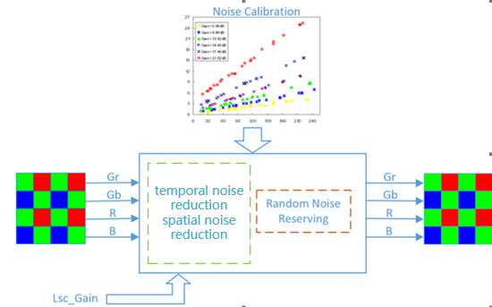

### 关键参数

**表 1**  NR关键参数

<table><thead align="left"><tr id="row2345mcpsimp"><th class="cellrowborder" valign="top" width="25%" id="mcps1.2.3.1.1">
参数名称

</th>
<th class="cellrowborder" valign="top" width="75%" id="mcps1.2.3.1.2">
描述

</th>
</tr>
</thead>
<tbody><tr id="row2351mcpsimp"><td class="cellrowborder" valign="top" width="25%" headers="mcps1.2.3.1.1 ">
en

</td>
<td class="cellrowborder" valign="top" width="75%" headers="mcps1.2.3.1.2 ">
NR功能的使能。

0：关闭；

1：使能。默认值为1。

</td>
</tr>
<tr id="row2358mcpsimp"><td class="cellrowborder" valign="top" width="25%" headers="mcps1.2.3.1.1 ">
op_type

</td>
<td class="cellrowborder" valign="top" width="75%" headers="mcps1.2.3.1.2 ">
NR工作类型。

</td>
</tr>
<tr id="row2363mcpsimp"><td class="cellrowborder" valign="top" width="25%" headers="mcps1.2.3.1.1 ">
tnr_en

</td>
<td class="cellrowborder" valign="top" width="75%" headers="mcps1.2.3.1.2 ">
NR时域滤波使能：

0：NR时域滤波关闭。

1：NR时域滤波打开。

</td>
</tr>
<tr id="row2370mcpsimp"><td class="cellrowborder" valign="top" width="25%" headers="mcps1.2.3.1.1 ">
lsc_nr_en

</td>
<td class="cellrowborder" valign="top" width="75%" headers="mcps1.2.3.1.2 ">
NR参考lsc降噪使能:

0：NR参考lsc降噪关闭。

1：NR参考lsc降噪打开。

</td>
</tr>
<tr id="row2377mcpsimp"><td class="cellrowborder" valign="top" width="25%" headers="mcps1.2.3.1.1 ">
lsc_ratio1

</td>
<td class="cellrowborder" valign="top" width="75%" headers="mcps1.2.3.1.2 ">
NR参考lsc去噪强度，值越大，空域去噪越强，需要在时域打开下使用。

</td>
</tr>
<tr id="row2382mcpsimp"><td class="cellrowborder" valign="top" width="25%" headers="mcps1.2.3.1.1 ">
lsc_ratio2

</td>
<td class="cellrowborder" valign="top" width="75%" headers="mcps1.2.3.1.2 ">
NR参考lsc去噪强度，值越大，去噪越强。

</td>
</tr>
<tr id="row2387mcpsimp"><td class="cellrowborder" valign="top" width="25%" headers="mcps1.2.3.1.1 ">
coring_ratio

</td>
<td class="cellrowborder" valign="top" width="75%" headers="mcps1.2.3.1.2 ">
噪声回叠亮度控制表，控制各个亮度区间下的回叠强度，值越大，回叠越强。

</td>
</tr>
<tr id="row2392mcpsimp"><td class="cellrowborder" valign="top" width="25%" headers="mcps1.2.3.1.1 ">
sfm_threshold

</td>
<td class="cellrowborder" valign="top" width="75%" headers="mcps1.2.3.1.2 ">
空域滤波模式：

255：选择sfm0滤波器。

0：选择sfm1滤波器。

0~255: sfm0滤波器和sfm1滤波器融合，值越大，sfm0的比例越高。

</td>
</tr>
<tr id="row2400mcpsimp"><td class="cellrowborder" valign="top" width="25%" headers="mcps1.2.3.1.1 ">
sfm0_mode

</td>
<td class="cellrowborder" valign="top" width="75%" headers="mcps1.2.3.1.2 ">
sfm0滤波模式：

EXT：扩展模式适用于噪声水平较大的场景，去噪强度较大，减轻pattern问题。

NORMAL：normal模式适用于噪声水平一般的场景，这个时候滤波器去噪更倾向于保边，保护细节。

</td>
</tr>
<tr id="row2407mcpsimp"><td class="cellrowborder" valign="top" width="25%" headers="mcps1.2.3.1.1 ">
sfm0_coarse_strength[OT_ISP_BAYER_CHN_NUM]

</td>
<td class="cellrowborder" valign="top" width="75%" headers="mcps1.2.3.1.2 ">
sfm0滤波器的整体强度控制，分成RGGB四个通道分开独立控制，值越大，滤波强度越大。

</td>
</tr>
<tr id="row2412mcpsimp"><td class="cellrowborder" valign="top" width="25%" headers="mcps1.2.3.1.1 ">
sfm0_ex_strength

</td>
<td class="cellrowborder" valign="top" width="75%" headers="mcps1.2.3.1.2 ">
sfm0滤波器在ext模式下的精细强度控制，值越大，滤波强度越大。

</td>
</tr>
<tr id="row2417mcpsimp"><td class="cellrowborder" valign="top" width="25%" headers="mcps1.2.3.1.1 ">
sfm0_ex_detail_prot

</td>
<td class="cellrowborder" valign="top" width="75%" headers="mcps1.2.3.1.2 ">
sfm0在ext模式下，细节保留的比例，值越大，细节保留越多。

</td>
</tr>
<tr id="row2422mcpsimp"><td class="cellrowborder" valign="top" width="25%" headers="mcps1.2.3.1.1 ">
sfm0_norm_edge_strength

</td>
<td class="cellrowborder" valign="top" width="75%" headers="mcps1.2.3.1.2 ">
sfm0在normal模式下，边缘滤波的强度，值越大，边缘滤波越强。

</td>
</tr>
<tr id="row2427mcpsimp"><td class="cellrowborder" valign="top" width="25%" headers="mcps1.2.3.1.1 ">
sfm1_detail_prot

</td>
<td class="cellrowborder" valign="top" width="75%" headers="mcps1.2.3.1.2 ">
sfm1边缘纹理保留的比例，值越大，边缘纹理越清晰。

</td>
</tr>
<tr id="row2432mcpsimp"><td class="cellrowborder" valign="top" width="25%" headers="mcps1.2.3.1.1 ">
sfm1_coarse_strength

</td>
<td class="cellrowborder" valign="top" width="75%" headers="mcps1.2.3.1.2 ">
sfm1滤波器整体强度控制，值越大，滤波强度越大。

</td>
</tr>
<tr id="row2437mcpsimp"><td class="cellrowborder" valign="top" width="25%" headers="mcps1.2.3.1.1 ">
fine_strength

</td>
<td class="cellrowborder" valign="top" width="75%" headers="mcps1.2.3.1.2 ">
原始像素和去噪结果加权，值越大，去噪效果越强。

</td>
</tr>
<tr id="row2442mcpsimp"><td class="cellrowborder" valign="top" width="25%" headers="mcps1.2.3.1.1 ">
coring_wgt

</td>
<td class="cellrowborder" valign="top" width="75%" headers="mcps1.2.3.1.2 ">
原始像素回叠，值越大，回叠噪声越大，去噪效果越弱。

</td>
</tr>
<tr id="row2447mcpsimp"><td class="cellrowborder" valign="top" width="25%" headers="mcps1.2.3.1.1 ">
coring_mot_thresh

</td>
<td class="cellrowborder" valign="top" width="75%" headers="mcps1.2.3.1.2 ">
运动区域回叠阈值，值越大，运动回叠区域越少

</td>
</tr>
<tr id="row2452mcpsimp"><td class="cellrowborder" valign="top" width="25%" headers="mcps1.2.3.1.1 ">
md_mode

</td>
<td class="cellrowborder" valign="top" width="75%" headers="mcps1.2.3.1.2 ">
运动检测类型：

0：运动检测对小运动更敏感。

1：运动检测对大运动判断更加准确。

</td>
</tr>
<tr id="row2459mcpsimp"><td class="cellrowborder" valign="top" width="25%" headers="mcps1.2.3.1.1 ">
md_static_ratio

</td>
<td class="cellrowborder" valign="top" width="75%" headers="mcps1.2.3.1.2 ">
运动检测，静止和运动区域的比例调节，值越大，判断为静止区域的部分越多。

</td>
</tr>
<tr id="row2464mcpsimp"><td class="cellrowborder" valign="top" width="25%" headers="mcps1.2.3.1.1 ">
md_static_fine_strength

</td>
<td class="cellrowborder" valign="top" width="75%" headers="mcps1.2.3.1.2 ">
运动检测，静止和运动区域的精细比例调节，值越大，判断为静止区域的部分越多。

</td>
</tr>
<tr id="row2469mcpsimp"><td class="cellrowborder" valign="top" width="25%" headers="mcps1.2.3.1.1 ">
tss

</td>
<td class="cellrowborder" valign="top" width="75%" headers="mcps1.2.3.1.2 ">
值越大，静止区域越光滑。

</td>
</tr>
<tr id="row2474mcpsimp"><td class="cellrowborder" valign="top" width="25%" headers="mcps1.2.3.1.1 ">
tfr

</td>
<td class="cellrowborder" valign="top" width="75%" headers="mcps1.2.3.1.2 ">
静止平坦区域时域强度控制，值越大，静止平坦区域时域越强。

</td>
</tr>
<tr id="row2479mcpsimp"><td class="cellrowborder" valign="top" width="25%" headers="mcps1.2.3.1.1 ">
tfs

</td>
<td class="cellrowborder" valign="top" width="75%" headers="mcps1.2.3.1.2 ">
静止区域时域强度控制，值越大，时域越强。

</td>
</tr>
<tr id="row2484mcpsimp"><td class="cellrowborder" valign="top" width="25%" headers="mcps1.2.3.1.1 ">
sfr_r

</td>
<td class="cellrowborder" valign="top" width="75%" headers="mcps1.2.3.1.2 ">
控制R分量的去噪风格倾向，值越大，越倾向于空域效果，值越小，越倾向于时域效果。

</td>
</tr>
<tr id="row2489mcpsimp"><td class="cellrowborder" valign="top" width="25%" headers="mcps1.2.3.1.1 ">
sfr_g

</td>
<td class="cellrowborder" valign="top" width="75%" headers="mcps1.2.3.1.2 ">
控制G分量的去噪风格倾向，值越大，越倾向于空域效果，值越小，越倾向于时域效果。

</td>
</tr>
<tr id="row2494mcpsimp"><td class="cellrowborder" valign="top" width="25%" headers="mcps1.2.3.1.1 ">
sfr_b

</td>
<td class="cellrowborder" valign="top" width="75%" headers="mcps1.2.3.1.2 ">
控制B分量的去噪风格倾向，值越大，越倾向于空域效果，值越小，越倾向于时域效果。

</td>
</tr>
<tr id="row2499mcpsimp"><td class="cellrowborder" valign="top" width="25%" headers="mcps1.2.3.1.1 ">
snr_sfm0_wdr_strength [OT_ISP_WDR_MAX_FRAME_NUM]

</td>
<td class="cellrowborder" valign="top" width="75%" headers="mcps1.2.3.1.2 ">
WDR模式下各个区域的sfm0的去噪强度:

2合1模式：

0：短帧去噪强度，值越大，去噪越强。

1：长帧去噪强度，值越大，去噪越强。

3：融合区去噪强度，值越大，去噪越强。

3合1模式：

0：短帧去噪强度，值越大，去噪越强。

1：中帧去噪强度，值越大，去噪越强。

2：长帧去噪强度，值越大，去噪越强。

3：融合区去噪强度，值越大，去噪越强。

</td>
</tr>
<tr id="row2513mcpsimp"><td class="cellrowborder" valign="top" width="25%" headers="mcps1.2.3.1.1 ">
snr_sfm0_fusion_strength[OT_ISP_WDR_MAX_FRAME_NUM]

</td>
<td class="cellrowborder" valign="top" width="75%" headers="mcps1.2.3.1.2 ">
fusion模式下各个区域的sfm0的去噪强度:

2合1模式：

0：短帧去噪强度，值越大，去噪越强。

1：长帧去噪强度，值越大，去噪越强。

3合1模式：

0：短帧去噪强度，值越大，去噪越强。

1：中帧去噪强度，值越大，去噪越强。

2：长帧去噪强度，值越大，去噪越强。

</td>
</tr>
<tr id="row2525mcpsimp"><td class="cellrowborder" valign="top" width="25%" headers="mcps1.2.3.1.1 ">
snr_sfm1_wdr_strength

</td>
<td class="cellrowborder" valign="top" width="75%" headers="mcps1.2.3.1.2 ">
Wdr模式下，sfm1滤波器短帧区域相对于长帧区域的去噪强度。值越大，去噪强度越大。

取值范围：[0,255]

</td>
</tr>
<tr id="row2531mcpsimp"><td class="cellrowborder" valign="top" width="25%" headers="mcps1.2.3.1.1 ">
snr_sfm1_fusion_strength

</td>
<td class="cellrowborder" valign="top" width="75%" headers="mcps1.2.3.1.2 ">
fusion模式下，sfm1滤波器短帧区域相对于长帧区域的去噪强度。值越大，去噪强度越大。

取值范围：[0,255]

</td>
</tr>
<tr id="row2537mcpsimp"><td class="cellrowborder" valign="top" width="25%" headers="mcps1.2.3.1.1 ">
md_wdr_strength[OT_ISP_WDR_MAX_FRAME_NUM]

</td>
<td class="cellrowborder" valign="top" width="75%" headers="mcps1.2.3.1.2 ">
wdr模式下各个区域的时域强度

2合1模式下：

0：短帧区域的相对时域去噪强度，值越大，去噪越强。

1：图像整体时域去噪强度。

3合1模式下：

0：短帧区域的相对时域去噪强度，值越大，去噪越强。

1：中帧、短帧区域的相对时域去噪强度，值越大，去噪越强。

2：长帧、中帧区域的时域去噪强度。

</td>
</tr>
<tr id="row2549mcpsimp"><td class="cellrowborder" valign="top" width="25%" headers="mcps1.2.3.1.1 ">
md_fusion_strength[OT_ISP_WDR_MAX_FRAME_NUM]

</td>
<td class="cellrowborder" valign="top" width="75%" headers="mcps1.2.3.1.2 ">
fusion模式下各个区域的时域强度

2合1模式下：

0：短帧区域的相对时域去噪强度，值越大，去噪越强。

1：图像整体时域去噪强度。

3合1模式下：

0：短帧区域的相对时域去噪强度，值越大，去噪越强。

1：中帧、短帧区域的相对时域去噪强度，值越大，去噪越强。

2：长帧、中帧区域的时域去噪强度。

</td>
</tr>
<tr id="row2561mcpsimp"><td class="cellrowborder" valign="top" width="25%" headers="mcps1.2.3.1.1 ">
user_define_md

</td>
<td class="cellrowborder" valign="top" width="75%" headers="mcps1.2.3.1.2 ">
用户自定义模式下的运动检测模式，一般用于黑白双光融合模式的彩色通路。

取值范围：[0,1]

</td>
</tr>
<tr id="row2567mcpsimp"><td class="cellrowborder" valign="top" width="25%" headers="mcps1.2.3.1.1 ">
user_define_slope

</td>
<td class="cellrowborder" valign="top" width="75%" headers="mcps1.2.3.1.2 ">
用户自定义模式下，运动检测阈值随亮度变化率，值越大，亮区的时域越强。

取值范围：[-32768,32767]

</td>
</tr>
<tr id="row2573mcpsimp"><td class="cellrowborder" valign="top" width="25%" headers="mcps1.2.3.1.1 ">
user_define_dark_thresh

</td>
<td class="cellrowborder" valign="top" width="75%" headers="mcps1.2.3.1.2 ">
用户自定义模式下，暗区的运动检测阈值。

取值范围：[0,65535]

</td>
</tr>
<tr id="row2579mcpsimp"><td class="cellrowborder" valign="top" width="25%" headers="mcps1.2.3.1.1 ">
user_define_color_thresh

</td>
<td class="cellrowborder" valign="top" width="75%" headers="mcps1.2.3.1.2 ">
用户自定义模式下，颜色区域的运动检测阈值。

取值范围：[0,64]

</td>
</tr>
</tbody>
</table>

### 调试步骤

NR算法的调试分为线性模式和WDR模式。

****线性模式****

**图 1**  线性/WDR模式NR处理流程图及关键参数  
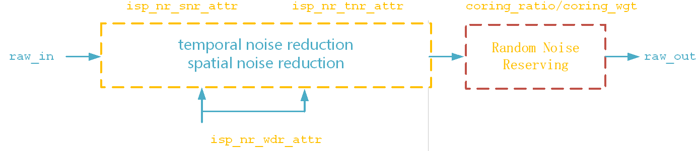

1.  调节空域去噪滤波器。主要针对运动区域噪声进行处理，通过sfm\_thresh可以选择不同的滤波器：当sfm\_thresh=0的时候，选择sfm1滤波器处理，当sfm\_thresh=255的时候，选择sfm0滤波器处理，其他值则是sfm0和sfm1滤波器融合的模式。

    sfm0和sfm1滤波器分别有各自的特点，sfm0滤波器的去噪能力更强，sfm1滤波器的细节和噪声形态更加均匀，通常大部分情况下建议选择sfm0滤波器进行处理，即sfm\_thresh=255。

    选择sfm0滤波器下，可以根据噪声水平再确定sfm0滤波器的模式sfm0\_mode, 一般而言，在中等照度以内，可以选择NORMAL模式，这个时候滤波器保边性更好，整体清晰度更高，低照度下，噪声水平较大，这个时候可以选择EXT模式，这个时候不容易出现pattern，噪声形态较好。确定滤波器以后，可以通过实际的的噪声水平来控制滤波器去噪强度。相关参数包括四通道的sfm0去噪强度sfm0\_coarse\_strength\[4\]，EXT模式下细节保留比例sfm0\_ex\_detail\_prot 等。

    > **注意：** 
    >-   若对功耗要求较高，空域中尽量设置sfm\_thresh=255，这个时候只打开sfm0滤波器，关闭sfm1滤波器，可以满足绝大部分场景的PQ要求，同时功耗较低。
    >-   WDR模式下，sfm1滤波器长短帧区分能力不如sfm0，且空域效果可能受到时域参数影响，所以wdr模式建议直接选择sfm0滤波器，即配置sfm\_thresh=255。
    >-   在调试过程中，为了保持不同iso间的效果平滑过渡，对sfm0\_mode和sfm0\_coarse\_strength两个参数做了内部联动，当sfm0\_mode参数改变时，在过渡的iso区间内，sfm0\_coarse\_strength不做插值，和sfm0\_mode保持同步切换。
    >-   将sfm0\_mode调整为ext模式的时候，bnr的基础空域强度会偏大，所以需要将bnr的对应强度sfm0\_coarse\_strength调小，来保持整体降噪强度的平衡，否则容易出现bnr空域强度过大的导致的pattern问题等副作用。
    >-   调节时需注意噪声和细节之间的平衡，既调整去噪强度时，需要同时关注噪声和细节的表现（如[图2](#fig1044215178346)所示）。为避免由于去噪强度过大导致的副作用（如边缘虚化、噪声成pattern状，通道不平衡造成的错误颜色，偏色等），不可将sfm0\_coarse\_strength调得过大；
    >-   当空域选择sfm1滤波器时，对应参数sfm1\_detail\_prot可以主要用来调节对大边缘和强纹理的保护，对于微弱纹理的效果可能不明显。
    >-   在黑白双光模式下，使用user\_define\_md模式来调试运动检测时，注意user\_define\_slope一般调试为-1，user\_define\_color\_thresh调试一般小于32，如果user\_define\_slope参数过小，同时user\_define\_color\_thresh过大，有可能导致时域效果突变。

    **图 2**  NR空域去噪效果比对  
    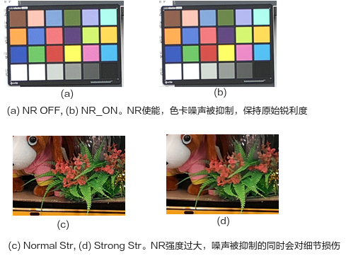

2.  调节画面整体噪声水平，通过sfr\_r，sfr\_g，sfr\_b分通道控制画面的噪声水平，值越大，整体画面越光滑。
3.  调节运动判决阈值md\_static\_ratio和md\_static\_fine\_strength。需要兼顾时域去噪效果和画面运动的拖尾，被运动检测单元判定为“静止”的像素越多，因而被实施时域滤波的像素也越多，画面当然也越安静如果画面出现时域的副作用较强时，比如拖尾现象或者背景渗透现象，这个时候可以调小md\_static\_ratio，减小静止区域划分，避免出现拖尾等时域副作用，在此基础上，如果背景不够安静，可以通过适当调大md\_static\_fine\_strength，来压制背景噪声。
4.  调节静止背景区域去噪强度。可以通过tfs，tss，tfr三个参数来控制背景去噪的强度。通过tss来控制背景区域的光滑程度，值越大背景越光滑；tfs控制时域滤波强度，值越大时域滤波强度越大；tfr控制在平坦区域的时域去噪强度，值越大时域滤波强度越大。

    **注意**：将nr的时域调强，有时候会导致背景颗粒感比较重，这个时候可以通过tfs和tfr来将bnr的时域放弱，再通过yuv3dnr的时域进行背景噪声压制，这样背景颗粒感可以得到改善。

5.  调节随机噪声保留功能。通常情况下，为提高噪声的均匀性和随机性，避免因为去噪强度不均匀导致的画面不自然的问题，在去噪以后，会保留小部分随机噪声，在改善噪声形态的同时，使得画面整体更加自然。参数coring\_wgt与iso相关，表示全局随机噪声保留强度，参数coring\_ratio\[33\]与raw数据亮度有关，不同亮度下对应一个随机噪声保留强度，通过调整该表，可以调整不同亮度的噪声保留强度。建议随着照度增加，随机噪声保留强度适当增大，改善冲击噪声及pattern噪声，使全图噪声均匀分布。参数coring\_mot\_thresh可以在回叠噪声的时候区分运动和静止，单独在运动区域回叠，值越大，叠加的区域越小。

    **注意**：该功能仅在去噪的基础上保留部分原始图像的随机噪声，不是制造噪声，因此强度与图像原始噪声大小相关，不会超过原始图像噪声大小无限叠加。

6.  调节去噪强度参考 Lens-Shading增益。由于LSC增益会改变原始图像的信噪比及噪声表现，因此去噪强度参考 Lens-Shading增益进行相应调整，使得Lens-Shading增益越大的区域，去噪强度会较大于其他区域，从而使得去噪之后，全图的噪声分布及表现尽可能均匀。通过lsc\_nr\_en控制去噪强度是否参考LSC增益，调整lsc\_ratio1和lcs\_ratio2来控制参考LSC增益的比例或权重，值越大，去噪强度越多的考虑LSC增益。

    **注意**：如果Lens-Shading模块本身关闭，这时打开BNR参考LSC使能lsc\_nr\_en后不生效。

****WDR模式****

1.  调节空域去噪功能。调节时需注意噪声和细节之间的平衡，因此调整去噪强度时，需要同时关注噪声和细节的表现。通过调节每一融合帧去噪强度snr\_sfm0\_wdr\_strength\[4\]\(fusion模式下为snr\_sfm0\_fusion\_strength\[4\]\)来单独控制各个融合帧的噪声水平，是的全画面的各个融合帧区域的噪声水平达到均匀一致，然后再配合滤波器其他强度参数进行调试。

    > **注意：** 
    >-   snr\_sfm0\_wdr\_strength分别对应每一融合帧强度，以三合一为例，对应关系为： snr\_sfm0\_wdr\_strength\[0\]对应短帧去噪强度，snr\_sfm0\_wdr\_strength\[1\]对应中帧去噪强度，snr\_sfm0\_wdr\_strength\[2\]对应长帧去噪强度。可根据长短帧特性调整去噪强度，使融合后的图像噪声分布具有均匀性， snr\_sfm0\_wdr\_strength\[3\]对应运动区域去噪强度，能够去除运动物体上的噪声颗粒。
    >-   md\_wdr\_strength控制每一融合帧的时域强度，需要根据不同融合区域的时域表现进行调节，如果调试值过大，容易在运动物体上出现拖尾，竖线等时域副作用。
    >-   三合一模式下，如果时域调节过强，可能影响AE，出现画面轻微闪烁现象。
    >-   其余参数调节参数与线性模式相同。

2.  调节运动检测功能，通过调节md\_wdr\_strength来控制不同融合帧的运动检测的参数，使得全画面的各个融合帧区域的动静判决一致。以三合一为例，md\_wdr\_strength\[0\]控制短帧的运动检测，md\_wdr\_strength\[1\]控制中帧的运动检测。md\_wdr\_strength\[2\]控制长帧的运动检测，值越大，化为时域的区域越大，时域效果越明显。

    其余参数调节参数与线性模式相同。

### 噪声标定方法

降噪模块需要参考噪声标定结果，不同iso下得到一个拟合系数。具体标定方法请参考噪声标定文档《图像质量调试工具使用指南》。

## DPC

### 功能描述

受限于sensor的制造工艺，对于几百万像素的sensor，不可能做到所有的像元都是完好的，尤其是对于低成本的sensor来说，坏点数为100或者1000ppm（parts per million，百万分之一）是正常的。若sensor中存在坏点，经过图像的插值（如demosaic）和滤波过程，坏点的尺寸会变大（坏点扩散），而且由于色彩校正和串扰补偿，坏点处颜色的强度和饱和度也会明显提高，因此需要在插值等过程之前对坏点进行校正。

坏点可以分为如下的类型：

-   静态坏点：
    -   亮点：一般来说像素点的亮度值是正比于入射光的，而亮点的亮度值明显大于入射光乘以相应比例，并且随着曝光时间的增加，该点的亮度会显著增加。
    -   暗点：无论在什么入射光下，该点的值接近于0。

-   动态坏点：在一定像素范围内，该点表现正常，而超过这一范围，该点表现的比周围像素要亮。与sensor温度、增益有关，sensor温度升高或者gain值增大时，动态坏点会变的更加明显。

静态和动态坏点校正模块主要基于5×5的窗口检测和校正sensor中的单个坏点或者坏点簇。坏点簇定义为相同颜色通道中相邻的坏点，不同的颜色通道的处理是相互独立的。

DPC模块所能校正的坏点类型为：

-   单个坏点；
-   small clusters：kernel中包含2个坏点；
-   big clusters：每个颜色通道最多有2个相邻的坏点

DPC不支持校正的坏点类型：

-   整行/整列都是坏点
-   3×3阵列中包含3个同色坏点的坏点簇

### 坏点类型

#### 可以校正的坏点类型

若Bayer图像中出现[图1](#fig72087194418)所示的坏点类型，则DPC可以对其校正。其中表示某一颜色通道（R/G/B）上的坏点，用该色块表示坏点处于同一颜色通道上；、、则表示不同颜色通道上的坏点，DPC可以校正的坏点类型如[图1](#fig72087194418)\~[图4](#fig15926164116530)所示。

**图 1**  单个坏点  
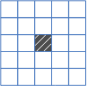

**图 2**  Kernel中包含2个坏点  
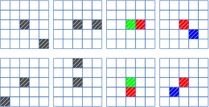

**图 3**  3个坏点  
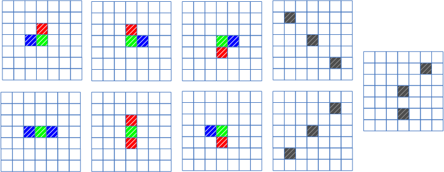

**图 4**  多个坏点  
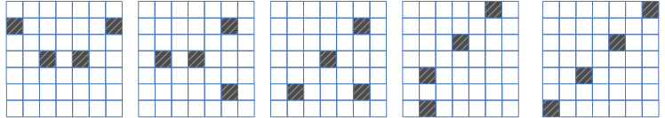

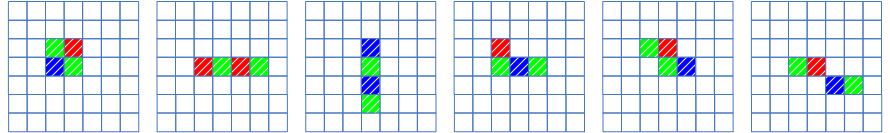

> **须知：** 
>-   动态坏点校正和静态坏点校正是两个相互独立的过程，可以分别控制二者的使能与否。
>-   由于存储坏点信息的memory有限，静态坏点校正有可能无法完全校正sensor中的坏点，因此静态坏点校正应当校正对图像质量影响最大的坏点，而动态坏点校正方法则校正其余的坏点。
>-   静态坏点校正所支持校正的静态坏点个数与业务场景有关系。最多可以校正\(OT\_ISP\_STATIC\_DP\_COUNT\_NORMAL \* 当前场景下ISP BE的分块数目\)个静态坏点。OT\_ISP\_STATIC\_DP\_COUNT\_NORMAL为每一路ISP BE所支持处理的静态坏点数目。
>-   静态DPC与动态DPC的坏点校正规格是相同的。

### 关键参数

DPC算法框图以及关键参数示意图如[图1](#_Ref500234100)所示。

**图 1**  DPC算法框图及关键参数示意图  
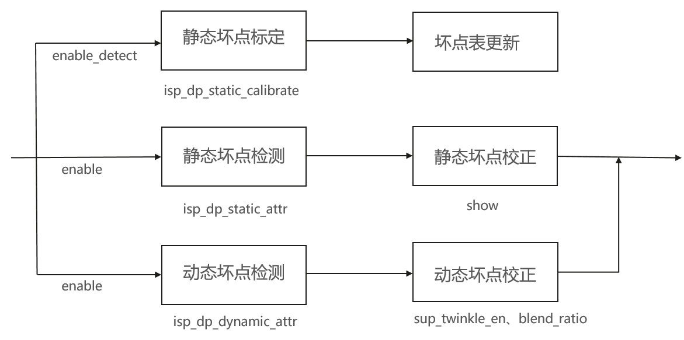

**表 1**  动态坏点校正属性关键参数

<table><thead align="left"><tr id="row2601mcpsimp"><th class="cellrowborder" colspan="2" valign="top" id="mcps1.2.4.1.1">
参数

</th>
<th class="cellrowborder" valign="top" id="mcps1.2.4.1.2">
描述

</th>
</tr>
</thead>
<tbody><tr id="row2607mcpsimp"><td class="cellrowborder" rowspan="7" valign="top" width="24.75%" headers="mcps1.2.4.1.1 ">
ot_isp_dp_dynamic_attr

</td>
<td class="cellrowborder" valign="top" width="22.770000000000003%" headers="mcps1.2.4.1.1 ">
enable

</td>
<td class="cellrowborder" valign="top" width="52.480000000000004%" headers="mcps1.2.4.1.2 ">
动态坏点校正的使能。

取值范围：[0, 1]

</td>
</tr>
<tr id="row2615mcpsimp"><td class="cellrowborder" valign="top" headers="mcps1.2.4.1.1 ">
op_type

</td>
<td class="cellrowborder" valign="top" headers="mcps1.2.4.1.1 ">
动态坏点校正工作模式。

取值范围：[0, 1]

</td>
</tr>
<tr id="row2621mcpsimp"><td class="cellrowborder" valign="top" headers="mcps1.2.4.1.1 ">
strength

</td>
<td class="cellrowborder" valign="top" headers="mcps1.2.4.1.1 ">
DPC的处理强度，值越大，对应的处理强度越大

取值范围：[0, 255]

</td>
</tr>
<tr id="row2627mcpsimp"><td class="cellrowborder" valign="top" headers="mcps1.2.4.1.1 ">
blend_ratio

</td>
<td class="cellrowborder" valign="top" headers="mcps1.2.4.1.1 ">
融合比率，值越大，图像越偏绿

取值范围：[0, 0x80]

</td>
</tr>
<tr id="row2633mcpsimp"><td class="cellrowborder" valign="top" headers="mcps1.2.4.1.1 ">
sup_twinkle_en

</td>
<td class="cellrowborder" valign="top" headers="mcps1.2.4.1.1 ">
闪烁抑制使能

取值范围：[0, 1]

</td>
</tr>
<tr id="row2639mcpsimp"><td class="cellrowborder" valign="top" headers="mcps1.2.4.1.1 ">
soft_thr

</td>
<td class="cellrowborder" valign="top" headers="mcps1.2.4.1.1 ">
闪烁抑制的阈值，值越小，所能处理的像素点越多，图像会越模糊

取值范围：[0,127]

</td>
</tr>
<tr id="row2645mcpsimp"><td class="cellrowborder" valign="top" headers="mcps1.2.4.1.1 ">
soft_slope

</td>
<td class="cellrowborder" valign="top" headers="mcps1.2.4.1.1 ">
闪烁抑制模块中，控制偏差小于soft_thr的像素点的校正情况。值越大，参与校正处理的像素点越多，图像会越模糊

取值范围：[0,255]

</td>
</tr>
</tbody>
</table>

**表 2**  静态坏点标定和校正属性关键参数

<table><thead align="left"><tr id="row2659mcpsimp"><th class="cellrowborder" colspan="2" valign="top" id="mcps1.2.4.1.1">
参数

</th>
<th class="cellrowborder" valign="top" id="mcps1.2.4.1.2">
描述

</th>
</tr>
</thead>
<tbody><tr id="row2665mcpsimp"><td class="cellrowborder" rowspan="10" valign="top" width="17.82%" headers="mcps1.2.4.1.1 ">
ot_isp_dp_static_calibrate

</td>
<td class="cellrowborder" valign="top" width="24.75%" headers="mcps1.2.4.1.1 ">
enable_detect

</td>
<td class="cellrowborder" valign="top" width="57.43000000000001%" headers="mcps1.2.4.1.2 ">
静态坏点标定使能

取值范围：[0, 1]

</td>
</tr>
<tr id="row2673mcpsimp"><td class="cellrowborder" valign="top" headers="mcps1.2.4.1.1 ">
static_dp_type

</td>
<td class="cellrowborder" valign="top" headers="mcps1.2.4.1.1 ">
坏点类型选择

取值范围：[0, 1]，0：亮点；1：暗点

</td>
</tr>
<tr id="row2679mcpsimp"><td class="cellrowborder" valign="top" headers="mcps1.2.4.1.1 ">
start_thresh

</td>
<td class="cellrowborder" valign="top" headers="mcps1.2.4.1.1 ">
静态坏点标定的起始阈值

取值范围：[0x1, 0xFF]

</td>
</tr>
<tr id="row2685mcpsimp"><td class="cellrowborder" valign="top" headers="mcps1.2.4.1.1 ">
count_max

</td>
<td class="cellrowborder" valign="top" headers="mcps1.2.4.1.1 ">
标定坏点数目的最大值

取值范围：[0x0, OT_ISP_STATIC_DP_COUNT_MAX]

</td>
</tr>
<tr id="row2691mcpsimp"><td class="cellrowborder" valign="top" headers="mcps1.2.4.1.1 ">
count_min

</td>
<td class="cellrowborder" valign="top" headers="mcps1.2.4.1.1 ">
标定坏点数目的最小值

取值范围：[0x0, count_max]

</td>
</tr>
<tr id="row2697mcpsimp"><td class="cellrowborder" valign="top" headers="mcps1.2.4.1.1 ">
time_limit

</td>
<td class="cellrowborder" valign="top" headers="mcps1.2.4.1.1 ">
坏点校正的时间限制

取值范围：[0x0, 0x640]

</td>
</tr>
<tr id="row2703mcpsimp"><td class="cellrowborder" valign="top" headers="mcps1.2.4.1.1 ">
table[OT_ISP_STATIC_DP_COUNT_MAX]

</td>
<td class="cellrowborder" valign="top" headers="mcps1.2.4.1.1 ">
静态坏点表，12~0 bit为水平坐标，28~16bit为垂直坐标

对于每个坐标来说，取值范围: [0, 0x1FFF1FFF]

</td>
</tr>
<tr id="row2709mcpsimp"><td class="cellrowborder" valign="top" headers="mcps1.2.4.1.1 ">
finish_thresh

</td>
<td class="cellrowborder" valign="top" headers="mcps1.2.4.1.1 ">
标定结束时对应的检测阈值

取值范围：[0x0, 0xFF]

</td>
</tr>
<tr id="row2715mcpsimp"><td class="cellrowborder" valign="top" headers="mcps1.2.4.1.1 ">
count

</td>
<td class="cellrowborder" valign="top" headers="mcps1.2.4.1.1 ">
标定出的坏点数目

取值范围：[0, OT_ISP_STATIC_DP_COUNT_MAX]

</td>
</tr>
<tr id="row2721mcpsimp"><td class="cellrowborder" valign="top" headers="mcps1.2.4.1.1 ">
status

</td>
<td class="cellrowborder" valign="top" headers="mcps1.2.4.1.1 ">
标定结束时的状态

取值范围：[0, 2]

</td>
</tr>
<tr id="row2727mcpsimp"><td class="cellrowborder" rowspan="6" valign="top" width="17.82%" headers="mcps1.2.4.1.1 ">
ot_isp_dp_static_attr

</td>
<td class="cellrowborder" valign="top" width="24.75%" headers="mcps1.2.4.1.1 ">
enable

</td>
<td class="cellrowborder" valign="top" width="57.43000000000001%" headers="mcps1.2.4.1.2 ">
静态坏点校正使能

取值范围：[0, 1]

</td>
</tr>
<tr id="row2735mcpsimp"><td class="cellrowborder" valign="top" headers="mcps1.2.4.1.1 ">
bright_count

</td>
<td class="cellrowborder" valign="top" headers="mcps1.2.4.1.1 ">
W时，表示亮坏点的数目；R时，表示所有坏点的数目

取值范围：[0, OT_ISP_STATIC_DP_COUNT_MAX]

</td>
</tr>
<tr id="row2741mcpsimp"><td class="cellrowborder" valign="top" headers="mcps1.2.4.1.1 ">
dark_count

</td>
<td class="cellrowborder" valign="top" headers="mcps1.2.4.1.1 ">
W时，表示暗坏点的数目；R时，为0

取值范围：[0, OT_ISP_STATIC_DP_COUNT_MAX]

</td>
</tr>
<tr id="row2747mcpsimp"><td class="cellrowborder" valign="top" headers="mcps1.2.4.1.1 ">
bright_table[OT_ISP_STATIC_DP_COUNT_MAX]

</td>
<td class="cellrowborder" valign="top" headers="mcps1.2.4.1.1 ">
W时，表示亮坏点的坐标信息；R时，表示所有坏点坐标信息

取值范围：[0, 0x1FFF1FFF]

</td>
</tr>
<tr id="row2753mcpsimp"><td class="cellrowborder" valign="top" headers="mcps1.2.4.1.1 ">
dark_table[OT_ISP_STATIC_DP_COUNT_MAX]

</td>
<td class="cellrowborder" valign="top" headers="mcps1.2.4.1.1 ">
W时，表示暗坏点的坐标信息；R时，无效

取值范围：[0, 0x1FFF1FFF]

</td>
</tr>
<tr id="row2759mcpsimp"><td class="cellrowborder" valign="top" headers="mcps1.2.4.1.1 ">
show

</td>
<td class="cellrowborder" valign="top" headers="mcps1.2.4.1.1 ">
静态坏点显示使能

取值范围：[0, 1]

</td>
</tr>
</tbody>
</table>

### 动态坏点校正模块

动态坏点校正可以实时的检测和校正sensor的亮点与暗点，并且校正的坏点个数不受限制。动态坏点校正相对静态坏点校正具有更大的不确定性，但是在低照度情况下强烈推荐使用动态坏点校正功能，可以校正更多的随着iso值增加而变得明显的动态坏点，此外可以改善图像偏色的问题。

#### 动态坏点检测

动态坏点检测模块基于当前像素点与其周围像素点的差异，输出每个像素点为坏点的可能性α，如[图1](#fig9720941328)所示。

**图 1**  动态坏点检测示意图  
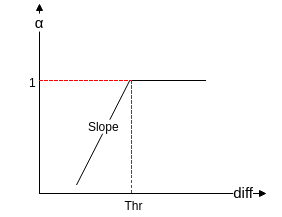

如果闪烁抑制不使能，Thr与Slope的值均等价为0，并且不可外部进行配置；反之闪烁抑制使能之后，可以配置Thr与slope的值来减弱DPC前后帧检测结果不一致带来的闪烁现象。

动态坏点检测的强度可以通过strength这个值进行配置，strength的值越大，动态坏点检测的强度越大（即diff值越大），检测出的坏点数目越多。strength值的选择与iso有很大的关系，随着iso值的增大，strength的值也应随之增大（具体在某个iso下strength配置哪个值可以遵循“[调试步骤](#ZH-CN_TOPIC_0000002424362122)”进行调试）。

#### 坏点校正

坏点检测模块的输入是动态检测输出的α。对于不同颜色通道的像素点，采用中值滤波的方法来得到滤波结果MedianFilterValue，通过blend\_ratio这个配置值对MedianFilterValue进行修正得到ReplacementValue，引入此机制是为了改善在低照度图像偏红的现象，并使得图像颜色随iso变化时过渡平缓。因此在正常照度下，blend\_ratio应配置为0，避免引起图像的模糊与偏色。而最终的校正结果为：outputValue = \(1-α\)×InputValue +α × ReplacementValue。

#### 调试步骤

DPC处理强度的选择是和iso值有很大的关系，iso越高，对应的DPC的处理强度越强。正常场景下将强度值设置较小值（如150左右），即可得到较好的图像质量。随着iso值的不断增加，图像中的坏点、色噪也随之增多，增大DPC的处理强度可以去除更多的坏点以及一些红蓝色噪，改善图像质量。但强度开到太大之后也会导致图像暗处偏绿以及图像模糊（slope设置为250及以上，有可能会影响到图像的清晰度），需要结合具体sensor、具体场景进行不同iso下DPC强度值的设置，以期达到用户认可的图像质量。

在自动模式下，iso共分为了如下的\{100, 200, 400, 800, 1600, 3200, 6400, 12800, 25600, 51200, 102400,204800,409600,819200,1638400,3276800\}16档。在对应sensor的cmoc.c文件中可以设置不同iso档下strength与blend\_ratio的默认值。若连续两档iso的对应的strength、blend\_ratio不相等，则通过线性插值的方法确定两档中间的某个iso所对应的校正强度和融合比率。

若感觉自动模式时某些iso下图像质量不够理想，则依照如下的步骤进行调试：

1.  使能动态坏点校正，并且不使能闪烁抑制。
2.  将DPC动态坏点校正的工作模式选择为OT\_OP\_MODE\_MANUAL，即手动模式配置参数。
3.  若在当前的iso下，图像中有很多的动态坏点没有被校正，此时可以增大DPC的处理强度，在图像中坏点校正的比较好的同时，若图像会偏红，此时可以配置blend\_ratio。
4.  调试出某些iso下的理想strength和blend\_ratio的值之后，可以将其写入到cmos.c中，注意写入的值需要与之前所说的16档iso相对应。
5.  若在调试出一组参数之后，图像中坏点校正较好，并且没有闪烁问题存在，则用非闪烁抑制模式下的这组参数就可以，若图像中出现了不能忍受的频繁密集的白点闪烁，则打开闪烁抑制使能，调整soft\_thr直至坏点消失，然后调整soft\_slope来减弱闪烁。

    为了确认调试结果生效，在调试之后，在使能与禁止dpc的情况下，分别采图进行比对。

> **须知：** 
>闪烁抑制功能与strength存在联动关系，soft\_thr和soft\_slope取值不合理时，调节strength，有可能在strength的某些档位之间存在校正效果的突变，因此建议在保证soft\_thr和soft\_slope的配置值不明显影响图像的清晰度的前提下，调节strength，看坏点的校正以及闪烁抑制的效果。

### 静态坏点标定

静态坏点的校正是基于已有的静态坏点表，比较当前点的坐标是否与静态坏点表中的某个坐标一致，若一致则判定为坏点，然后再采用中值滤波的方法对其进行校正。一般来说，需要sensor制造商给出sensor的坏点信息，方便客户的检测和校正，但对于低成本的sensor来说，由于成本和时间的限制，sensor制造商没有检测sensor的坏点信息，即对于用户来说，静态坏点表是不可得的，需要用户自行对静态坏点进行标定，得到静态坏点表。

#### 标定原理

在标定过程中，将当前像素点和与其颜色相同的邻域像素的均值进行比较，二者的差距到达某一程度则将其判断为坏点，将其坐标信息记录到内部存储器中。标定时，如果标定出的坏点数目不满足要求\(\[count\_min,count\_max\]\)，则系统会自动调整start\_thresh的值，重新进入标定过程，直到坏点数目满足要求或者标定超时（即标定时间大于time\_limit）。这样可以保证即使坏点数目很多，超过所允许的坏点个数的限制，能够标定出对图像影响更大的坏点（更亮的亮坏点/更暗的暗坏点）。在标定完成后可以从内存中读取坏点信息存储到外部非易失的存储器中；在系统上电之后，也可以将坏点表写入系统内存，用户可以通过调用MPI接口来读写内存中的坏点，具体如何操作请参考《ISP开发参考》中DPC MPI部分的举例。

下面将从亮点、暗点这两种静态坏点的标定角度来说明静态坏点标定流程。

#### 亮点标定

在标定亮点的时候，需要尽量延长曝光时间是的来能亮点更加明显，还需降低sensor的增益，以减少噪声的干扰，这些过程会在系统内部自动实现，用户所需要做的如下：

1.  关闭光圈，使 sensor 处于完全黑暗环境；
2.  将标定的坏点类型设置为亮点，即static\_dp\_type为OT\_ISP\_STATIC\_DP\_BRIGHT；
3.  根据sensor特性设置start\_thresh（start\_thresh的理论可取值范围为（0, 255），注意static\_dp\_thresh不要取到0）；
4.  设定标定时间限制time\_limit；
5.  设定需要标定的亮坏点的最大值count\_max与最小值count\_min；
6.  启动亮坏点标定，即使能enable\_detect；
7.  等待亮坏点结束，标定结束后enable\_detect自动设置为0；标定出的亮坏点信息记录在了 table\[OT\_ISP\_STATIC\_DP\_COUNT\_MAX\]，可以将其转存在亮坏点表 bright\_table\[OT\_ISP\_STATIC\_DP\_COUNT\_MAX\]中。
8.  记录标定出的坏点数目。

> **须知：** 
>假定当前的业务场景下，DPC支持处理的最大静态坏点数目为static\_dp\_count，若sensor本身的坏点超过static\_dp\_count，在标定亮点的时候start\_thresh的值设定的比较小，同时将count\_max设置为static\_dp\_count，则DPC在标定出前static\_dp\_count个坏点就结束标定过程，这样只能校正前static\_dp\_count个坏点，而不能保证标定和校正对于图像质量影响更大的坏点，因此这种情况下，需要将count\_max设置为比static\_dp\_count小的数。

#### 暗点标定

在进行暗点标定时，需要平坦的背景，建议使用辉度箱固定光源。

1.  在光圈开启的状态下拍摄灰卡。调整光照强度使raw数据的像素值在像素最大值的一半（2^（n－1））左右（n代表位宽，以12bits位宽为例，该值为 2^（12－1） = 2048），不需要很精确，但是最好使得像素的灰度值大于像素最大值的20%；
2.  将标定的坏点类型设置为暗点，即static\_dp\_type为OT\_ISP\_STATIC\_DP\_DARK；
3.  根据sensor特性设置start\_thresh；
4.  设定标定时间限制time\_limit；
5.  设定需要标定的亮坏点的最大值count\_max与最小值count\_min；
6.  启动暗坏点标定，即使能enable\_detect；
7.  等待暗坏点结束；标定结束后enable\_detect自动设置为0；
8.  标定出的亮坏点信息记录在了 table\[OT\_ISP\_STATIC\_DP\_COUNT\_MAX\]，可以将其转存在暗坏点表 dark\_table\[OT\_ISP\_STATIC\_DP\_COUNT\_MAX\]中；
9.  记录标定出的坏点数目dark\_count。

> **须知：** 
>-   标定坏点时是不使能坏点校正的，即动态坏点校正和静态坏点校正会被系统置为disable。
>-   start\_thresh为标定的起始值，标定结束得到的finish\_thresh才是有意义的，实际中为加速标定过程，可以在标定一台设配成功后，将读到的finish\_thresh赋给start\_thresh，用于其他多台设配的标定；同时依据此台设备的坏点数目合理设置同类设备的count\_max与count\_min。
>-   标定结束时status有两种状态：标定成功（OT\_ISP\_STATE\_SUCCESS）、标定超时（OT\_ISP\_STATE\_TIMEOUT）。标定超时时读出此时的坏点个数count与标定结束是阈值finish\_thresh，如果finish\_thresh与start\_thresh的差距较大，则可以适当改变一下start\_thresh的值使其接近finish\_thresh，从而可以加速标定的过程；同时也可以依据此时的count适当修改一下坏点个数的上下限：count\_max与count\_min。

#### 合并坏点表

由于亮点与暗点与各自独立进行标定的，所得的坏点信息分别保存在两个坏点表中，要得到最终的坏点信息，需要将这两个坏点表进行合并。在合并的时候，要按照坐标递增的顺序，剔除相同的坐标点，得到全部的坏点信息保存在亮坏点表 bright\_table\[OT\_ISP\_STATIC\_DP\_COUNT\_MAX\]中，并写入ISP memory。此过程中，需要用户的进行的操作如下：

-   设置亮坏点数目bright\_count与暗坏点数目dark\_count（假定当前所支持校正的坏点个数为m（m = OT\_ISP\_STATIC\_DP\_COUNT\_NORMAL \* 当前ISP BE分块数目），注意bright\_count<=m、dark\_count<=m，假定亮、暗坏点表中有same个相同的坐标，则bright\_count+dark\_count-same<m）
-   将合并的亮暗坏点信息分别配置进 bright\_table\[OT\_ISP\_STATIC\_DP\_COUNT\_NORMAL\]、 dark\_table\[OT\_ISP\_STATIC\_DP\_COUNT\_NORMAL\]，稍等一段时间以使坏点表合并，并将合并的坏点数目与坏点坐标写入ISP memory
-   合并完成后，同时使能静态坏点校正和静态坏点Show功能，sensor静态坏点将高亮显示。

> **须知：** 
>-   如果只标定了一种坏点，也需要进行坏点表合并这个过程，因为需要将坏点数目写入坏点数目寄存器。
>-   坏点显示的优先级要高于动态坏点校正，静态坏点高亮时，同时会自动禁止动态坏点校正功能。

## DRC

### 功能描述

动态范围是指场景中最亮物体与最暗物体之间的亮度比值，动态范围越大，通常表示场景中的亮度层次越丰富。真实场景中的动态范围达到109:1，人类视觉系统能感知的动态范围大约是105:1，而一般图像传感器的动态范围大约是103:1。因此如果用传统的图像传感器拍摄高动态范围的场景，就会要么亮处过曝，丢失了很多细节；要么暗处曝光不足，细节难以分辨。

为了能记录高动态范围场景的每一个细节，需要使用更高动态范围的图像传感器或者多次曝光图像合成技术，以获取宽动态范围的图像。然而，当前主流显示设备的动态范围仅有102:1左右，无法完整表现所获取的宽动态图像中细节。为了解决这一问题，需要使用DRC算法在保留细节的同时对图像的动态范围进行压缩。DRC算法的最终目的，是使真实场景的观察者和显示设备的观察者都能获得相同的视觉感受。它的一般模型如[图1](#fig193791815162718)所示。

**图 1**  DRC的一般模型  
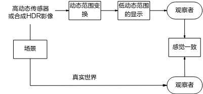

### 关键参数

**表 1**  DRC关键参数

<table><thead align="left"><tr id="row1662mcpsimp"><th class="cellrowborder" valign="top" width="33%" id="mcps1.2.3.1.1">
参数名称

</th>
<th class="cellrowborder" valign="top" width="67%" id="mcps1.2.3.1.2">
描述

</th>
</tr>
</thead>
<tbody><tr id="row1668mcpsimp"><td class="cellrowborder" valign="top" width="33%" headers="mcps1.2.3.1.1 ">
enable

</td>
<td class="cellrowborder" valign="top" width="67%" headers="mcps1.2.3.1.2 ">
DRC动态范围压缩使能。取值范围：[0x0, 0x1]

0：关闭；

1：使能。

</td>
</tr>
<tr id="row1675mcpsimp"><td class="cellrowborder" valign="top" width="33%" headers="mcps1.2.3.1.1 ">
curve_select

</td>
<td class="cellrowborder" valign="top" width="67%" headers="mcps1.2.3.1.2 ">
DRC Tone mapping曲线选择；取值范围：[0x0, 0x1]

0：Asymmetry curve；

1：用户自定义曲线

</td>
</tr>
<tr id="row1682mcpsimp"><td class="cellrowborder" valign="top" width="33%" headers="mcps1.2.3.1.1 ">
purple_reduction_strength

</td>
<td class="cellrowborder" valign="top" width="67%" headers="mcps1.2.3.1.2 ">
紫边校正强度，值越大，紫边校正强度越大；取值范围：[0x0, 0x80]

</td>
</tr>
<tr id="row1687mcpsimp"><td class="cellrowborder" valign="top" width="33%" headers="mcps1.2.3.1.1 ">
bright_gain_limit

</td>
<td class="cellrowborder" valign="top" width="67%" headers="mcps1.2.3.1.2 ">
亮区亮度增益限制目标值；值越大，限制越大；取值范围：[0x0, 0xF]

</td>
</tr>
<tr id="row1692mcpsimp"><td class="cellrowborder" valign="top" width="33%" headers="mcps1.2.3.1.1 ">
bright_gain_limit_step

</td>
<td class="cellrowborder" valign="top" width="67%" headers="mcps1.2.3.1.2 ">
亮区亮度增益限制自适应步长；值越小，限制越大；取值范围：[0x0, 0xF]

</td>
</tr>
<tr id="row1697mcpsimp"><td class="cellrowborder" valign="top" width="33%" headers="mcps1.2.3.1.1 ">
dark_gain_limit_luma

</td>
<td class="cellrowborder" valign="top" width="67%" headers="mcps1.2.3.1.2 ">
暗区亮度增益限制；值越大，限制越大；取值范围：[0x0, 0x85]

</td>
</tr>
<tr id="row1702mcpsimp"><td class="cellrowborder" valign="top" width="33%" headers="mcps1.2.3.1.1 ">
dark_gain_limit_chroma

</td>
<td class="cellrowborder" valign="top" width="67%" headers="mcps1.2.3.1.2 ">
暗区色度增益限制；值越大，限制越大；取值范围：[0x0, 0x85]

</td>
</tr>
<tr id="row1707mcpsimp"><td class="cellrowborder" valign="top" width="33%" headers="mcps1.2.3.1.1 ">
contrast_ctrl

</td>
<td class="cellrowborder" valign="top" width="67%" headers="mcps1.2.3.1.2 ">
局部对比度控制，取值范围：[0x0, 0xF]，参数效果与图像亮度分布相关，一般场景下建议值为6到10之间。

</td>
</tr>
<tr id="row1712mcpsimp"><td class="cellrowborder" valign="top" width="33%" headers="mcps1.2.3.1.1 ">
rim_reduction_strength

</td>
<td class="cellrowborder" valign="top" width="67%" headers="mcps1.2.3.1.2 ">
去边线强度。值越大，边线减弱越明显，但是可能会带来细节损失。取值范围：[0x0, 0x40]

</td>
</tr>
<tr id="row1717mcpsimp"><td class="cellrowborder" valign="top" width="33%" headers="mcps1.2.3.1.1 ">
rim_reduction_threshold

</td>
<td class="cellrowborder" valign="top" width="67%" headers="mcps1.2.3.1.2 ">
边线检测阈值。值越大，边线减弱越明显，但是可能会带来细节损失。取值范围：[0x0, 0x80]

</td>
</tr>
<tr id="row1722mcpsimp"><td class="cellrowborder" valign="top" width="33%" headers="mcps1.2.3.1.1 ">
color_correction_lut[OT_ISP_DRC_CC_NODE_NUM]

</td>
<td class="cellrowborder" valign="top" width="67%" headers="mcps1.2.3.1.2 ">
颜色校正系数LUT，值越小，饱和度越低。取值范围：[0x0, 0x400]

</td>
</tr>
<tr id="row1727mcpsimp"><td class="cellrowborder" valign="top" width="33%" headers="mcps1.2.3.1.1 ">
tone_mapping_value[OT_ISP_DRC_TM_NODE_NUM]

</td>
<td class="cellrowborder" valign="top" width="67%" headers="mcps1.2.3.1.2 ">
用户自定义Tone Mapping曲线LUT。取值范围：[0x0, 0xFFFF]

</td>
</tr>
<tr id="row1732mcpsimp"><td class="cellrowborder" valign="top" width="33%" headers="mcps1.2.3.1.1 ">
spatial_filter_coef

</td>
<td class="cellrowborder" valign="top" width="67%" headers="mcps1.2.3.1.2 ">
Filter空域滤波系数。值越大，运动halo越不明显，细节越少，值越小，细节表现越好，运动halo越明显。取值范围：[0x0, 0x5]

</td>
</tr>
<tr id="row1737mcpsimp"><td class="cellrowborder" valign="top" width="33%" headers="mcps1.2.3.1.1 ">
range_filter_coef

</td>
<td class="cellrowborder" valign="top" width="67%" headers="mcps1.2.3.1.2 ">
Filter值域滤波系数。值越大，halo越明显；值越小，halo表现越好，但是在强边缘处可能会出现描边现象。取值范围：[0x0, 0xA]

</td>
</tr>
<tr id="row1742mcpsimp"><td class="cellrowborder" valign="top" width="33%" headers="mcps1.2.3.1.1 ">
detail_adjust_coef

</td>
<td class="cellrowborder" valign="top" width="67%" headers="mcps1.2.3.1.2 ">
Filter细节微调系数。值越大，整体细节越强。取值范围：[0x0, 0xF]

</td>
</tr>
<tr id="row1747mcpsimp"><td class="cellrowborder" valign="top" width="33%" headers="mcps1.2.3.1.1 ">
local_mixing_bright[OT_ISP_DRC_LMIX_NODE_NUM]

</td>
<td class="cellrowborder" valign="top" width="67%" headers="mcps1.2.3.1.2 ">
Filter对应的正向细节增强系数，索引为亮度值。取值范围：[0x0, 0x80]

</td>
</tr>
<tr id="row1752mcpsimp"><td class="cellrowborder" valign="top" width="33%" headers="mcps1.2.3.1.1 ">
local_mixing_dark[OT_ISP_DRC_LMIX_NODE_NUM]

</td>
<td class="cellrowborder" valign="top" width="67%" headers="mcps1.2.3.1.2 ">
Filter对应的负向细节增强系数，索引为亮度值。取值范围：[0x0, 0x80]

</td>
</tr>
<tr id="row1757mcpsimp"><td class="cellrowborder" valign="top" width="33%" headers="mcps1.2.3.1.1 ">
filter_coef_x[OT_ISP_DRC_FLTX_NODE_NUM]

</td>
<td class="cellrowborder" valign="top" width="67%" headers="mcps1.2.3.1.2 ">
FilterX滤波系数，值越大，细节越强。取值范围：[0x0, 0xF]，建议值为3~9之间。

</td>
</tr>
<tr id="row1762mcpsimp"><td class="cellrowborder" valign="top" width="33%" headers="mcps1.2.3.1.1 ">
filter_low_threshold_x[OT_ISP_DRC_FLTX_NODE_NUM]

</td>
<td class="cellrowborder" valign="top" width="67%" headers="mcps1.2.3.1.2 ">
FilterX滤波低阈值，用于控制噪声；值越大，对噪声的增强越不明显，但会损失一些弱细节。取值范围：[0x0, 0xF]

</td>
</tr>
<tr id="row1767mcpsimp"><td class="cellrowborder" valign="top" width="33%" headers="mcps1.2.3.1.1 ">
filter_high_threshold_x[OT_ISP_DRC_FLTX_NODE_NUM]

</td>
<td class="cellrowborder" valign="top" width="67%" headers="mcps1.2.3.1.2 ">
FilterX滤波高阈值，用于控制保边程度，值越大整体细节越强，但是强边缘处可能出现halo。取值范围：[0x0, 0xF]

</td>
</tr>
<tr id="row1772mcpsimp"><td class="cellrowborder" valign="top" width="33%" headers="mcps1.2.3.1.1 ">
detail_adjust_coef_x

</td>
<td class="cellrowborder" valign="top" width="67%" headers="mcps1.2.3.1.2 ">
FilterX细节微调系数，值越大，整体细节越强。取值范围：[0x0, 0xF]

</td>
</tr>
<tr id="row1777mcpsimp"><td class="cellrowborder" valign="top" width="33%" headers="mcps1.2.3.1.1 ">
local_mixing_bright_x[OT_ISP_DRC_LMIX_NODE_NUM]

</td>
<td class="cellrowborder" valign="top" width="67%" headers="mcps1.2.3.1.2 ">
FilterX对应的正向细节增强系数，索引为亮度值。取值范围：[0x0, 0x80]

</td>
</tr>
<tr id="row1782mcpsimp"><td class="cellrowborder" valign="top" width="33%" headers="mcps1.2.3.1.1 ">
local_mixing_dark_x[OT_ISP_DRC_LMIX_NODE_NUM]

</td>
<td class="cellrowborder" valign="top" width="67%" headers="mcps1.2.3.1.2 ">
FilterX对应的负向细节增强系数，索引为亮度值。取值范围：[0x0, 0x80]

</td>
</tr>
<tr id="row1787mcpsimp"><td class="cellrowborder" valign="top" width="33%" headers="mcps1.2.3.1.1 ">
blend_luma_max

</td>
<td class="cellrowborder" valign="top" width="67%" headers="mcps1.2.3.1.2 ">
Filter和FilterX基于亮度的融合权重的最大值（全局）。取值范围：[0x0, 0xFF]，融合权重0xFF代表完全选择Filter，0x0代表完全选择FilterX。

</td>
</tr>
<tr id="row1792mcpsimp"><td class="cellrowborder" valign="top" width="33%" headers="mcps1.2.3.1.1 ">
blend_luma_bright_min

</td>
<td class="cellrowborder" valign="top" width="67%" headers="mcps1.2.3.1.2 ">
Filter和FilterX基于亮度的融合权重的最小值（亮区）。取值范围：[0x0, 0xFF]

</td>
</tr>
<tr id="row1797mcpsimp"><td class="cellrowborder" valign="top" width="33%" headers="mcps1.2.3.1.1 ">
blend_luma_bright_threshold

</td>
<td class="cellrowborder" valign="top" width="67%" headers="mcps1.2.3.1.2 ">
Filter和FilterX基于亮度的融合权重的自适应阈值（亮区）。取值范围：[0x0, 0xFF]

</td>
</tr>
<tr id="row1802mcpsimp"><td class="cellrowborder" valign="top" width="33%" headers="mcps1.2.3.1.1 ">
blend_luma_bright_slope

</td>
<td class="cellrowborder" valign="top" width="67%" headers="mcps1.2.3.1.2 ">
Filter和FilterX基于亮度的融合权重的自适应斜率（亮区）。取值范围：[0x0, 0xF]

</td>
</tr>
<tr id="row1807mcpsimp"><td class="cellrowborder" valign="top" width="33%" headers="mcps1.2.3.1.1 ">
blend_luma_dark_min

</td>
<td class="cellrowborder" valign="top" width="67%" headers="mcps1.2.3.1.2 ">
Filter和FilterX基于亮度的融合权重的最小值（暗区）。取值范围：[0x0, 0xFF]

</td>
</tr>
<tr id="row1812mcpsimp"><td class="cellrowborder" valign="top" width="33%" headers="mcps1.2.3.1.1 ">
blend_luma_dark_threshold

</td>
<td class="cellrowborder" valign="top" width="67%" headers="mcps1.2.3.1.2 ">
Filter和FilterX基于亮度的融合权重的自适应阈值（暗区）。取值范围：[0x0, 0xFF]

</td>
</tr>
<tr id="row1817mcpsimp"><td class="cellrowborder" valign="top" width="33%" headers="mcps1.2.3.1.1 ">
blend_luma_dark_slope

</td>
<td class="cellrowborder" valign="top" width="67%" headers="mcps1.2.3.1.2 ">
Filter和FilterX基于亮度的融合权重的自适应斜率（暗区）。取值范围：[0x0, 0xF]

</td>
</tr>
<tr id="row1822mcpsimp"><td class="cellrowborder" valign="top" width="33%" headers="mcps1.2.3.1.1 ">
blend_detail_max

</td>
<td class="cellrowborder" valign="top" width="67%" headers="mcps1.2.3.1.2 ">
Filter和FilterX基于细节的融合权重的最大值（全局）。取值范围：[0x0, 0xFF]

</td>
</tr>
<tr id="row1827mcpsimp"><td class="cellrowborder" valign="top" width="33%" headers="mcps1.2.3.1.1 ">
blend_detail_bright_min

</td>
<td class="cellrowborder" valign="top" width="67%" headers="mcps1.2.3.1.2 ">
Filter和FilterX基于细节的融合权重的最小值（亮区）；取值范围：[0x0, 0xFF]

</td>
</tr>
<tr id="row1832mcpsimp"><td class="cellrowborder" valign="top" width="33%" headers="mcps1.2.3.1.1 ">
blend_detail_bright_threshold

</td>
<td class="cellrowborder" valign="top" width="67%" headers="mcps1.2.3.1.2 ">
Filter和FilterX基于细节的融合权重的自适应阈值（亮区）；取值范围：[0x0, 0xFF]

</td>
</tr>
<tr id="row1837mcpsimp"><td class="cellrowborder" valign="top" width="33%" headers="mcps1.2.3.1.1 ">
blend_detail_bright_slope

</td>
<td class="cellrowborder" valign="top" width="67%" headers="mcps1.2.3.1.2 ">
Filter和FilterX基于细节的融合权重的自适应斜率（亮区）；取值范围：[0x0, 0xF]

</td>
</tr>
<tr id="row1842mcpsimp"><td class="cellrowborder" valign="top" width="33%" headers="mcps1.2.3.1.1 ">
blend_detail_dark_min

</td>
<td class="cellrowborder" valign="top" width="67%" headers="mcps1.2.3.1.2 ">
Filter和FilterX基于细节的融合权重的最小值（暗区）；取值范围：[0x0, 0xFF]

</td>
</tr>
<tr id="row1847mcpsimp"><td class="cellrowborder" valign="top" width="33%" headers="mcps1.2.3.1.1 ">
blend_detail_dark_threshold

</td>
<td class="cellrowborder" valign="top" width="67%" headers="mcps1.2.3.1.2 ">
Filter和FilterX基于细节的融合权重的自适应阈值（暗区）；取值范围：[0x0, 0xFF]

</td>
</tr>
<tr id="row1852mcpsimp"><td class="cellrowborder" valign="top" width="33%" headers="mcps1.2.3.1.1 ">
blend_detail_dark_slope

</td>
<td class="cellrowborder" valign="top" width="67%" headers="mcps1.2.3.1.2 ">
Filter和FilterX基于细节的融合权重的自适应斜率（暗区）；取值范围：[0x0, 0xF]

</td>
</tr>
<tr id="row1857mcpsimp"><td class="cellrowborder" valign="top" width="33%" headers="mcps1.2.3.1.1 ">
detail_adjust_coef_blend

</td>
<td class="cellrowborder" valign="top" width="67%" headers="mcps1.2.3.1.2 ">
Filter和FilterX融合区的FilterX细节微调系数；取值范围：[0x0, 0xF]

</td>
</tr>
<tr id="row1862mcpsimp"><td class="cellrowborder" valign="top" width="33%" headers="mcps1.2.3.1.1 ">
low_saturation_color_ctrl

</td>
<td class="cellrowborder" valign="top" width="67%" headers="mcps1.2.3.1.2 ">
低饱和区域的颜色控制；主要用于改善暗区灰色区域偏红问题，值越大偏红改善越明显，副作用是部分场景可能导致肤色变灰；取值范围：[0x0, 0xF]

</td>
</tr>
<tr id="row1867mcpsimp"><td class="cellrowborder" valign="top" width="33%" headers="mcps1.2.3.1.1 ">
high_saturation_color_ctrl

</td>
<td class="cellrowborder" valign="top" width="67%" headers="mcps1.2.3.1.2 ">
高饱和区域颜色控制；主要用于改善强边缘描边现象，值越小描边越不明显，副作用是部分场景可能加重紫边；取值范围：[0x0, 0xF]

</td>
</tr>
<tr id="row1872mcpsimp"><td class="cellrowborder" valign="top" width="33%" headers="mcps1.2.3.1.1 ">
color_correction_ctrl

</td>
<td class="cellrowborder" valign="top" width="67%" headers="mcps1.2.3.1.2 ">
控制颜色校正模式；取值范围：[0x0, 0x1]

0：对所有像素降饱和度；

1：对G通道较大的区域，关闭所有降饱和度操作，以保护高频细节。

</td>
</tr>
<tr id="row1879mcpsimp"><td class="cellrowborder" valign="top" width="33%" headers="mcps1.2.3.1.1 ">
op_type

</td>
<td class="cellrowborder" valign="top" width="67%" headers="mcps1.2.3.1.2 ">
DRC工作模式选择：

OT_OP_MODE_AUTO：自动模式；

OT_OP_MODE_MANUAL：手动模式。

</td>
</tr>
<tr id="row1886mcpsimp"><td class="cellrowborder" valign="top" width="33%" headers="mcps1.2.3.1.1 ">
manual_attr.strength

</td>
<td class="cellrowborder" valign="top" width="67%" headers="mcps1.2.3.1.2 ">
DRC手动模式下强度

</td>
</tr>
<tr id="row1891mcpsimp"><td class="cellrowborder" valign="top" width="33%" headers="mcps1.2.3.1.1 ">
auto_attr.strength

auto_attr.strength_min

auto_attr.strength_max

</td>
<td class="cellrowborder" valign="top" width="67%" headers="mcps1.2.3.1.2 ">
DRC自动模式属性：strength, strength_min, strength_max分别为强度控制系数，强度下限和上限值。实际生效的DRC强度为：MAX(strength_min, MIN(strength_max, 算法AUTO模式计算出的强度 * strength / 512))

</td>
</tr>
<tr id="row1898mcpsimp"><td class="cellrowborder" valign="top" width="33%" headers="mcps1.2.3.1.1 ">
asymmetry_curve

</td>
<td class="cellrowborder" valign="top" width="67%" headers="mcps1.2.3.1.2 ">
DRC Asymmetry Curve属性，具体参见<a href="#section1954183895811">Tone Mapping曲线调节</a>中的”Tone Mapping曲线调节”部分。

</td>
</tr>
</tbody>
</table>

**图 1**  DRC算法流程及各关键参数示意图  
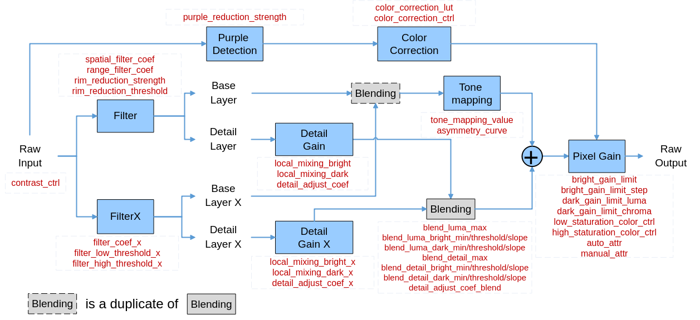

### 调试步骤

DRC的一般调试步骤如下：

-   调整DRC强度：DRC的强度直接影响画面的整体亮度，通常DRC强度越大，画面的整体越亮，反之越暗。如果画面整体太暗或太亮，可以先通过调节DRC强度来进行调整。具体调试方法请见“[DRC强度调整](#section46109135816)”一节。
-   调整Tone Mapping曲线：如果图像的整体亮度达到预期，但是部分区域的亮度不合理（比如暗区太暗，亮区过曝），可以通过进一步调整DRC的Tone Mapping曲线来改变某些区域的亮度。具体调试方法请见“[Tone mapping 曲线调整](#section1954183895811)”一节。
-   调整细节和对比度：当图像的亮度大致符合预期，下一步可以通过调整DRC的细节增强，滤波系数等参数对画面的整体和局部对比度进行调节。具体调试方法请见“[细节和对比度调整](#section45750571725)”一节。
-   调整颜色校正与边线抑制：DRC模块在部分场景会导致颜色过饱和以及背光物体周围描边的现象。通过调整DRC的颜色校正与边线抑制参数，可以一定程度上改善这些问题。具体调试方法请见“[颜色校正调整](#section18485491037)”和“[边线抑制调整](#section1654014421318)”两节。

****DRC强度调整****

DRC的强度决定了其对于图像动态范围的压缩程度。压缩程度越大，意味着图像的亮度被更大程度的拉升至高位，因此画面整体会越亮，暗区细节更清楚，但是同时噪声也会越明显。DRC支持自动（Auto）和手动（Manual）两种运行模式，在两种模式下的强度调整方式如下：

-   Auto模式下，DRC模块会根据当前环境中暗区占的比例以及AE计算的曝光比自适应地确定强度，但用户仍可以在此基础上进行一定调整。首先，DRC内部计算出的强度会进一步乘以auto\_attr.strength/512得到最终生效的强度。因此用户可通过此参数来调整Auto模式下的DRC强度。此外，用户还可以通过auto\_attr.strength\_min和auto\_attr.strength\_max来设置Auto模式下强度自适应的区间。在WDR模式下，建议的强度自适应区间为\[0, 1023\]，而在线性模式下，由于图像动态范围本身较窄，不需要进行很大程度的压缩，因此建议的强度自适应区间为 \[0, 512\]。
-   Manual模式下，用户可以直接通过参数manual\_attr.strength来调整强度。此模式下DRC强度的取值范围固定为\[0, 1023\]，与当前ISP模式（线性或WDR）无关。

****Tone mapping 曲线调整****

Tone mapping 曲线的本质是一个亮度映射函数，即横坐标（X轴）是输入亮度，纵坐标（Y轴）是输出亮度。其作用是将输入图像的亮度映射到一个更窄的亮度范围，从而实现动态范围的压缩。DRC模块支持三种Tone Mapping曲线： Asymmetry曲线， Cubic曲线，和自定义曲线。用户可通过curve\_select来选择曲线，当curve\_select = 0时，选择Asymmetry曲线，当curve\_select=1时，选择自定义曲线。

-   Asymmetry 曲线的调试方法
-   Asymmetry曲线的形状通过4个参数来决定，即asymmetry，second\_pole，stretch，和compress。其中，asymmetry的值越小，暗区提升的越亮；second\_pole的值越小，亮区亮度压制越强，可以保留更多高亮细节；stretch的值越小，整体图像越亮，compress的作用和stretch类似，值越小，整体亮度越亮。
-   Asymmetry曲线如[图1](#_Toc47522595)所示。

**图 1**  Asymmetry 曲线示意图  
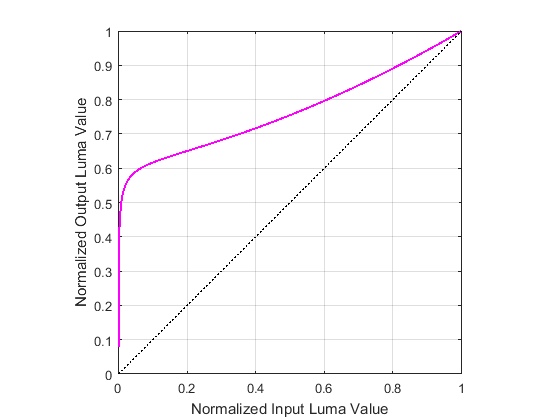

调整asymmetry，second\_pole，stretch和compress对曲线的变化趋势如下：

设定：

Curve1 \(asymmetry, second\_pole, stretch, compress\)

Curve2 \(asymmetry, second\_pole, stretch, compress\)

CASE 1: Curve1 \(2, 180, 54, 180\); Curve2 \(5, 180, 54, 180\)

**图 2**  参数asymmetry的变化对曲线的影响趋势  
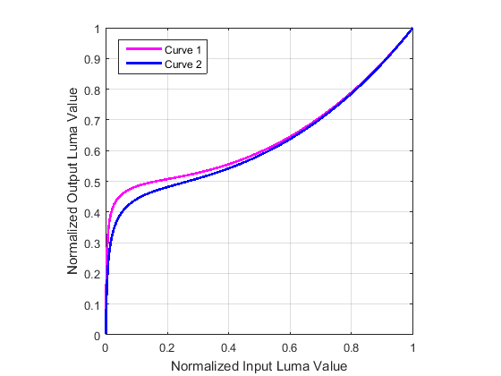

CASE 2: Curve1 \(2, 180, 54, 180\); Curve2 \(2, 200, 54, 180\)

**图 3**  参数second\_pole的变化对曲线的影响趋势  
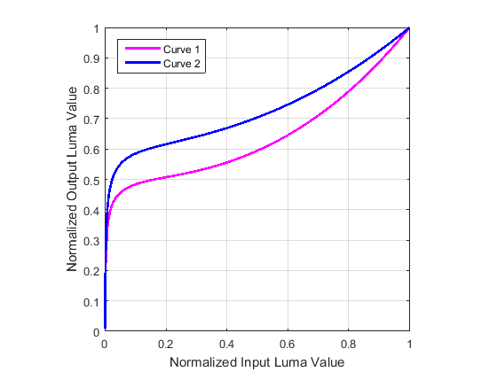

CASE 3: Curve1 \(2, 180, 40, 180\); Curve2 \(2, 180, 60, 180\)

**图 4**  参数stretch的变化对曲线的影响趋势  
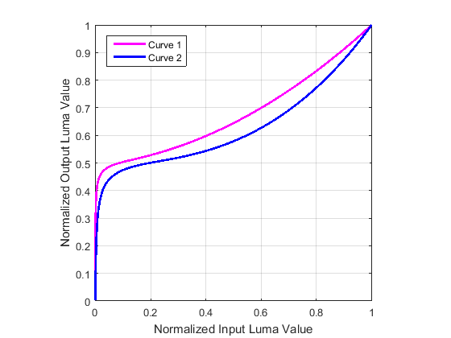

CASE4: Curve1 \(2, 180, 50, 180\); Curve2 \(2, 180, 50, 100\)

**图 5**  参数compress的变化对曲线的影响趋势  
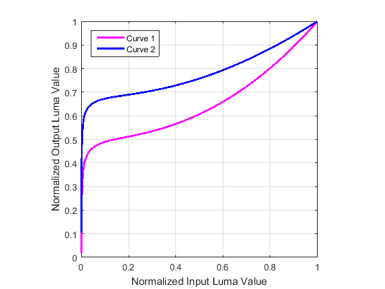

> **说明：** 
>Asymmetry曲线必须是单调非递减的。当配置的参数使得到的曲线上某点的值小于其前一点的值时，该点的值将被自动置为其前一点的值，以使最终曲线符合单调非递减的条件。

-   用户自定义曲线调试方法

    当选择自定义曲线时，用户可以通过tone\_mapping\_value这个LUT来直接配置DRC的Tone Mapping曲线。相比于前两种曲线，自定义曲线的灵活度高，调试也比较方便。建议的调试方式：先通过Asymmetry Curve将画面亮度调到大致符合预期，再通过PQ工具将Asymmetry Curve导出，再导入作为自定义曲线的初始LUT，并以此为基础再进行适当微调。

> **说明：** 
>自定义曲线同样要求是单调非递减的。如果配置的LUT中某点的值小于其前一点的值，该点的值将被自动置为其前一点的值，以使最终曲线符合单调非递减的条件。另外，自定义曲线实际生效的LUT比tone\_maping\_value多一个采样点，即最大值点，其坐标固定为\(1, 1\)，不可调节，目的是强制最大亮度值在映射后仍为最大亮度值。

-   亮度增益抑制参数调试方法

    除了调整Tone Mapping曲线本身，用户还可以通过调整亮度增益抑制参数实现更灵活的亮度调整。如果亮处太亮甚至过曝，可以通过bright\_gain\_limit和bright\_gain\_limit\_step参数来限制亮区增益。如果暗区被提亮后噪声太大，可以通过dark\_gain\_limit\_luma参数来限制暗区增益。

> **说明：** 
>当bright\_gain\_limit较大，bright\_gain\_limit\_step较小时，会导致亮区的层次感变差，某些场景甚至可能出现亮度分层。参数dark\_gain\_limit\_luma在限制亮度增益的同时，会使得暗区色度和亮度分量的比例增大，因此饱和度也会相应变高，调试过程中应根据实际场景权衡。

****细节和对比度调整****

DRC模块的细节和对比度调整主要通过调节滤波器Fliter和FilterX的滤波参数，相应的细节增强参数，以及两者的融合权重来实现。具体调试方式如下：

-   滤波参数调试

    DRC模块中有两个并行处理的滤波器，分别为DRC Filter和FilterX。两个滤波器的特性存在一定差异：Filter主要提取中低频细节，使用Filter时，画面整体通透性好，细节比较自然；FilterX主要提取中高频细节，使用FilterX时逆光物体细节更好，描边现象更弱，没有运动物体周围halo现象，且在DRC输入亮度突变时不容易出现闪烁。

    Filter的滤波参数包括空域滤波系数spatial\_filter\_coef和值域滤波系数range\_flt\_coef。一般情况下，滤波系数越大，画面的整体对比度和通透性更好，但逆光物体的细节会变差，高亮区域（如光源）向外扩散的光晕也会更明显。

    FilterX本身又分为3个子滤波器，从子滤波器0到2，其对应的细节频率依次变低。每个子滤波器i \(0<=i<=2\)都有3个滤波参数：1\) 滤波系数filter\_coef\_x\[i\], 其值越大，提取到的细节越强；2\) 滤波低阈值filter\_low\_threshold\[i\]，其值越大，对弱细节的提取越少，可以改善噪声被增强的问题，但是同时也会损失一部分细节; 3\) 滤波高阈值filter\_high\_threshold\[i\]，其值越大，整体的细节会越强，但对于强边缘的保边效果会变差，可能导致强边缘处出现halo现象。

-   细节增强系数调试

    DRC Filter和FilterX提取的细节，会乘上一个增益（增强系数）再回叠到图像上。对于Filter，这个增益由以下参数控制：local\_mixing\_bright，local\_mixing\_dark，和detail\_adjust\_coef；其中前两者为LUT，分别对应正向细节和负向细节的增强系数表，DRC根据每个像素的亮度作为索引查找对应的增强系数，最后一个参数detail\_adjust\_coef为全局的增益，不区分亮度和正负细节，其调试效果更明显，但灵活性不如local\_mixing\_bright，local\_mixing\_dark。相应地，FilterX的细节增益参数同样由3个参数控制，即local\_mixing\_bright\_x，local\_mixing\_dark\_x，和detail\_adjust\_coef\_x，这些参数的含义和对应的Filter细节增强系数参数一致。

-   滤波器融合权重调试

    如前所述，DRC Filter和FilterX这两个滤波器特性不同，效果各有优劣。为了结合两者的优势，DRC会将两者的输出进行融合。融合机制分为基于局部亮度的融合以及基于两者提取的细节差异的融合，最终融合权重由两种机制共同决定。

    基于局部亮度的融合的原理，是对于局部较亮的区域（如光源）或较暗的区域（如逆光人物），倾向选择FilterX，以达到收窄光晕，提升逆光细节的效果。DRC内部会计算一个衡量局部亮暗的值（其大于0时，代表当前像素属于局部较亮像素，反之则代表属于局部较暗像素，其绝对值代表亮度差异的程度），再根据该值和blend\_luma\_max, blend\_luma\_bright\_min/threshold/slope, blend\_luma\_dark\_min/threshold/slope参数，计算出Filter对应的权重，具体计算方式请参考[图6](#_Ref46995312)。

**图 6**  基于局部亮度的融合权重参数（x轴为DRC内部计算的局部亮度度量值，y轴为Filter对应的权重）  
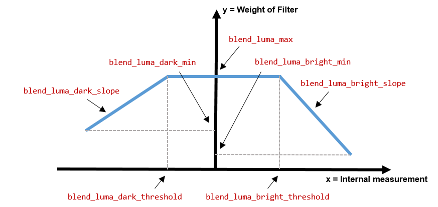

基于细节差异的融合的原理，是考虑到Filter在前后帧存在运动的情况下，容易提取到异常强的细节（细节幅值显著大于相同位置上FilterX提取的细节），引起运动物体周围halo的现象。因此，在Filter和Filter X提取的细节有较大差异的情况下，DRC会倾向于选择FilterX的结果；融合过程由DRC内部计算的Filter和FilterX之间的细节差异（作为上图x轴internal measurement的值），和参数blend\_detail\_max，blend\_detail\_bright\_min/threshold/slope，blend\_detail\_dark\_min/threshold/slope决定，其计算方式和基于亮度的融合类似。

> **说明：** 
>当blend\_luma\_max，blend\_luma\_bright\_min，blend\_luma\_dark\_min，blend\_detail\_max，blend\_detail\_bright\_min，blend\_detail\_dark\_min这6个参数均配置为255时，融合权重即固定为255，融合完全选择Filter，相应地，这些参数均配置为0时，融合完全选择FilterX。
>当FilterX参数较强时，会导致细节整体变粗，噪声变大，halo变重；建议filter\_coef\_x\[i\]的值不超过9，并且detail\_adjust\_coef\_x不超过8。另外，由于功耗限制，线性模式和WDR长帧模式下，FilterX不生效，因此所有FilterX相关的滤波参数，细节增强参数，和融合参数均不生效。

-   全局对比度微调

    DRC支持通过contrast\_ctrl来微调全局的对比度，该参数的效果与图像的亮度分布相关，其取值范围为 \[0, 15\]。在典型的宽动态场景下，该参数取较小值时，室外亮区对比度较好，但是室内暗区尤其是背光物体的细节可能变差；取中间值时（6到10之间），室外亮区对比度稍有下降，但是背光物体细节会明显改善，此时画面整体对比度最好；取较大值时，各个区域的对比度均倾向于下降。因此，该参数的建议取值范围为\[6, 10\]。

> **说明：** 
>对contrast\_ctrl参数进行调整时，图像需要经过2帧才达到稳定状态。另外，当该参数调整幅度较大时（尤其是从较大值改为较小值时）或者调整的同时AE参数发生改变，画面会出现较明显闪烁，因此不建议对该参数进行动态调节。

****颜色校正调整****

DRC可能导致画面部分区域颜色过饱和，用户可以通过调节color\_correction\_lut中的颜色校正系数来校正颜色。DRC根据每个像素Tone Mapping后亮度查找此LUT，确定其对应的颜色校正系数。颜色校正系数越小，饱和度下降越明显。DRC也支持通过dark\_gain\_limit\_chroma专门对暗区降饱和度，但该参数的调试精度不高，调大时容易使整个画面饱和度下降，因此建议优先使用color\_correction\_lut。

DRC还支持专门针对紫边的颜色校正，即紫边校正。DRC会对画面中的紫边进行检测，并降低被检测为紫边区域的饱和度。用户可通过purple\_reduction\_strength来调试DRC紫边校正强度，purple\_reduction\_strength值越大，紫边校正越强。此外，参数high\_saturation\_color\_ctrl同样也可以改善紫边，但其作用不限于紫边区域，而是对所有饱和度较高区域都有饱和度抑制作用。

针对部分宽动态场景下暗区偏红的问题，DRC支持通过low\_saturation\_color\_ctrl参数对暗区灰色区域降饱和度。该参数值越大，降饱和度的效果越显著，其副作用是部分场景下会导致暗区肤色发灰。

DRC提供的降饱和度功能，都会带来一定的高频细节损失。为了改善这个问题，DRC提供了color\_correction\_ctrl功能来控制是否对G分量较大的区域降饱和度（如室外树叶草地）。当该参数设置为0时，降饱和度操作可以作用于所有像素，而其为1时，所有降饱和度操作将对G分量较大的区域不起作用，从而起到保护高频细节的作用。但是当降饱和度参数较强时，该功能会导致画面整体偏绿，因此建议仅在降饱和度参数不强的情况下才将该参数设置为1。

> **说明：** 
>-   如前所述，DRC颜色校正强度太强会导致高频细节损失，因此不建议将DRC颜色校正调太强，而是主要通过CA模块来调整颜色。
>-   如果将purple\_reduction\_strength设置过大，容易使紫边检测出现误判，可能导致蓝色区域变灰，边缘锯齿等现象，另外，当purple\_reduction\_strength设置过大且Bayer域NR强度也很大时，可能导致暗区的蓝色区域出现黑块，在调试过程中应根据实际场景做权衡。
>-   如果将high\_saturation\_color\_ctrl设置太大，可能导致紫边变成接近白色的亮边，也可能导致高亮红色区域偏黄，在调试过程中也应根据实际场景做权衡。

****边线抑制调整****

针对DRC Filter导致强边缘描边的问题，DRC提供了边线抑制功能，其通过rim\_reduction\_strength和 rim\_reduction\_threshold来控制，前者控制边线抑制的强度，后者控制DRC检测边线的阈值；强度越大，边线抑制程度越强；阈值越大，被检测为边线的像素越多，边线抑制的效果通常更明显。

> **说明：** 
>参数rim\_reduction\_threshold的值变大时，边线检测出现误检的概率会增大，由此可能导致细节损失和边缘锯齿，在调试过程中应根据实际场景做权衡。此外，边线抑制功能只针对DRC Filter，因此如果滤波融合时完全选择DRC FilterX，那么此功能不生效。

****相对上一代DRC的调试策略差异****

DRC模块相对上一代的改动主要在以下两方面。

1.  算法升级：新增FilterX，提升了暗区逆光物体以及高亮区域细节，改善了运动halo问题；

    算法升级的影响：在图像风格上，新增的FilterX更加突出局部细节，而原有的Filter更侧重整体对比度，[图7](#_Toc84931287)展示了两者的风格差异。由于FilterX在局部细节上的优势通常在较极端的宽动态场景更明显，因此建议在较高曝光比（如16倍以上）的场景下更多地融合FilterX；而在低曝光比场景适当增加Filter的权重。另外，在可能出现场景亮度剧烈变化的应用中，也建议尽量使用FilterX，以规避时域突变可能带来的画面异常。除了全局的调整，DRC也支持局部自适应调整两种滤波器的融合权重，实现各取所长，具体请参考“[细节和对比度调整](#section45750571725)”中滤波器融合权重调试内容。

2.  接口调整：修改了strength和local\_mixing相关接口的生效机制和精度。相应地，调试策略上也有所不同。

    接口变动影响：上一代DRC模块的strength接口在WDR模式下只影响画面亮度，效果类似Tone Mapping强度；因此即使strength=0，DRC的细节增强和颜色校正等功能仍然生效，这和strength的直观预期效果不一致。当前平台上，strength调整为控制DRC对图像作用的整体强度，即衰减strength会同时衰减DRC在亮度，细节，和颜色等各维度的效果。所以当配置相同的strength，且strength较小时，当前DRC的细节表现会弱于上一代DRC。如果仅希望调节画面亮度而不影响其他维度效果，建议直接通过调试Tone Mapping曲线实现。除strength外，细节增强相关的local\_mixing接口在当前平台上扩展为LUT（基于亮度查表），增加了调试灵活性，同时参数精度也有所提升。

    **图 7** DRC FilterX（上）相对Filter（下）的风格差异  
    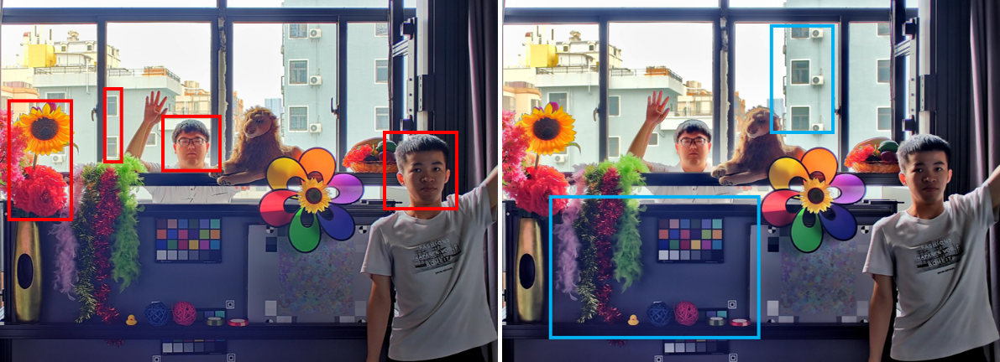

    注：红框为FilterX局部细节更好的区域，蓝框为Filter对比度和通透性更好的区域。

考虑到上述改动的影响，如需要在当前平台调试出接近上一代DRC的效果，建议采用以下策略：

1.  将滤波融合权重调至最大值，即完全选择Filter；
2.  保持strength为最大值，通过调节Tone Mapping曲线，实现上一代DRC中strength的亮度调节作用；
3.  将local\_mixing参数配置为上一代对应参数值的2倍左右（由于参数精度提升）。在此基础上，再根据实际场景将当前平台DRC的算法升级引入，实现进一步效果提升。

### 注意事项及相关问题

由于DRC算法处理过程依赖从前一帧获取的统计信息，因此，DRC在使能的第一帧只打开负责生成统计信息的子模块（用于生成后一帧所需的统计信息），而负责计算的子模块将延迟一帧才打开。即从图像效果上看，DRC使能时会延迟一帧生效。

另外，由于DRC内部计算的时域相关性，当DRC输入亮度发生剧烈改变时（比如在场景中光照突然变化），DRC输出可能出现闪烁。类似地，正常WDR模式和长帧模式相互切换也可能引起DRC闪烁。

## WDR

### 功能描述

动态范围是指场景中最亮物体与最暗物体之间的亮度比值，动态范围越大，所能表示的层次越丰富。真实场景中的动态范围达到109:1，人类视觉系统能感知的动态范围大约是105:1，而一般图像传感器的动态范围大约是102:1。因此如果用传统的图像传感器拍摄高动态范围的场景，就会要么亮处过曝，丢失了很多细节；要么暗处曝光不足，细节难以分辨。

为了能记录高动态范围场景的每一个细节，人们会用特殊的图像传感器或者用多次曝光图像合成。但由于特殊传感器价格偏高，且对硬件要求较高。所以限制了其大面积的使用。我们目前用的大部分还是一般传感器，因此常见的HDRI的生成都是用一般传感器获得若干帧不同曝光的固定场景图像，再用WDR算法来合成一幅高动态范围图像。

以二合一WDR为例，短曝光数据、长曝光数据和WDR合成后数据如[图1](#_Ref504571808)所示。短曝光数据用来捕获场景中的亮区信息，长曝光用来捕获场景中的暗区信息，经过WDR合成后获得高动态范围的图像。

**图 1**  短曝光数据，长曝光数据和WDR合成后数据  

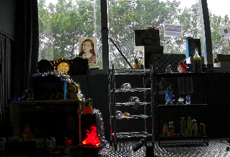 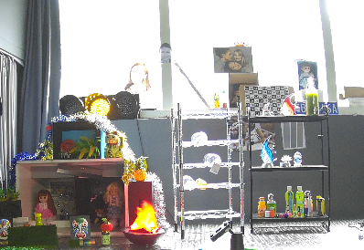 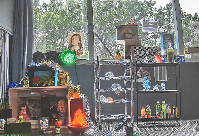

WDR模块的算法框图以及关键参数的对应模块如[图2](#_Ref504557023)所示。

**图 2**  WDR算法框图  
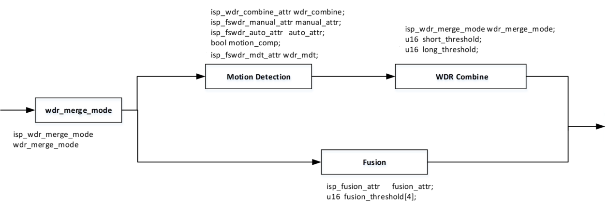

WDR模块中包括WDR模式和Fusion模式，WDR模式中包括运动检测和WDR融合，推荐在正常宽动态场景中使用WDR模式。Fusion模式中没有运动检测，噪声较小，推荐夜晚行车场景使用Fusion模式。

### 关键参数

**表 1**  WDR关键参数

<table><thead align="left"><tr id="row3170mcpsimp"><th class="cellrowborder" valign="top" width="27%" id="mcps1.2.3.1.1">
参数名称

</th>
<th class="cellrowborder" valign="top" width="73%" id="mcps1.2.3.1.2">
描述

</th>
</tr>
</thead>
<tbody><tr id="row3176mcpsimp"><td class="cellrowborder" valign="top" width="27%" headers="mcps1.2.3.1.1 ">
wdr_merge_mode

</td>
<td class="cellrowborder" valign="top" width="73%" headers="mcps1.2.3.1.2 ">
合成方式。

0：传统的WDR合成；

1：Fusion合成。

在室内正常照度下存在工频闪时或者夜晚场景，建议采用Fusion合成。

</td>
</tr>
<tr id="row3184mcpsimp"><td class="cellrowborder" valign="top" width="27%" headers="mcps1.2.3.1.1 ">
motion_comp

</td>
<td class="cellrowborder" valign="top" width="73%" headers="mcps1.2.3.1.2 ">
WDR运动补偿使能开关。

0：关闭；

1：使能。

</td>
</tr>
<tr id="row3190mcpsimp"><td class="cellrowborder" valign="top" width="27%" headers="mcps1.2.3.1.1 ">
short_expo_chk

</td>
<td class="cellrowborder" valign="top" width="73%" headers="mcps1.2.3.1.2 ">
控制运动检测时否检查短帧数据大小。

0：WDR融合时不检查短帧数据大小；

1：WDR融合时检查短帧数据大小。

</td>
</tr>
<tr id="row3197mcpsimp"><td class="cellrowborder" valign="top" width="27%" headers="mcps1.2.3.1.1 ">
short_check_threshold

</td>
<td class="cellrowborder" valign="top" width="73%" headers="mcps1.2.3.1.2 ">
短帧检查阈值。

当短帧亮度小于该阈值时，WDR强制输出长帧。

取值范围：[0, 0xFFF]

</td>
</tr>
<tr id="row3204mcpsimp"><td class="cellrowborder" valign="top" width="27%" headers="mcps1.2.3.1.1 ">
md_ref_flicker

</td>
<td class="cellrowborder" valign="top" width="73%" headers="mcps1.2.3.1.2 ">
控制运动判断是否参考Flicker检测结果。

0：做运动检测时不参考Flicker检测结果；

1：做运动检测时参考Flicker检测结果。

</td>
</tr>
<tr id="row3211mcpsimp"><td class="cellrowborder" valign="top" width="27%" headers="mcps1.2.3.1.1 ">
mdt_still_threshold

</td>
<td class="cellrowborder" valign="top" width="73%" headers="mcps1.2.3.1.2 ">
运动检测中判断为静止的阈值。

取值范围：[0,0xFE]

</td>
</tr>
<tr id="row3217mcpsimp"><td class="cellrowborder" valign="top" width="27%" headers="mcps1.2.3.1.1 ">
mdt_full_threshold

</td>
<td class="cellrowborder" valign="top" width="73%" headers="mcps1.2.3.1.2 ">
运动检测中判断为全运动的阈值。

取值范围：[0,0xFE]

WDR两帧合成不支持该参数。

</td>
</tr>
<tr id="row3224mcpsimp"><td class="cellrowborder" valign="top" width="27%" headers="mcps1.2.3.1.1 ">
mdt_long_blend

</td>
<td class="cellrowborder" valign="top" width="73%" headers="mcps1.2.3.1.2 ">
运动区域叠加长帧的权重。

取值范围：[0,0xFE]

</td>
</tr>
<tr id="row3230mcpsimp"><td class="cellrowborder" valign="top" width="27%" headers="mcps1.2.3.1.1 ">
short_threshold

</td>
<td class="cellrowborder" valign="top" width="73%" headers="mcps1.2.3.1.2 ">
短曝光门限值，超过门限值的图像数据将只选择短曝光数据。默认值为0xFC0。

取值范围：[0x0, 0xFFF]

</td>
</tr>
<tr id="row3236mcpsimp"><td class="cellrowborder" valign="top" width="27%" headers="mcps1.2.3.1.1 ">
long_threshold

</td>
<td class="cellrowborder" valign="top" width="73%" headers="mcps1.2.3.1.2 ">
长曝光门限值，低于门限值的图像数据将只选择长曝光数据。默认值为0xBC0。

取值范围：[0x0, short_threshold]

</td>
</tr>
<tr id="row3242mcpsimp"><td class="cellrowborder" valign="top" width="27%" headers="mcps1.2.3.1.1 ">
force_long

</td>
<td class="cellrowborder" valign="top" width="73%" headers="mcps1.2.3.1.2 ">
强制输出长帧使能。

取值范围：[0, 0x1]

0：禁止

1：使能

</td>
</tr>
<tr id="row3250mcpsimp"><td class="cellrowborder" valign="top" width="27%" headers="mcps1.2.3.1.1 ">
force_long_low_threshold

</td>
<td class="cellrowborder" valign="top" width="73%" headers="mcps1.2.3.1.2 ">
强制输出长帧的低阈值，基于像素点的亮度来决定该区域是否输出长帧，亮度低于该阈值的运动区域强制输出长帧。

取值范围：[0x0, force_long_hig_threshold]

</td>
</tr>
<tr id="row3256mcpsimp"><td class="cellrowborder" valign="top" width="27%" headers="mcps1.2.3.1.1 ">
force_long_hig_threshold

</td>
<td class="cellrowborder" valign="top" width="73%" headers="mcps1.2.3.1.2 ">
强制输出长帧的高阈值，基于像素点的亮度来决定该区域是否输出长帧，亮度大于该阈值的运动区域不强制输出长帧。

取值范围：[0x0,0xFFF]

</td>
</tr>
<tr id="row3263mcpsimp"><td class="cellrowborder" valign="top" width="27%" headers="mcps1.2.3.1.1 ">
fusion_threshold[4]

</td>
<td class="cellrowborder" valign="top" width="73%" headers="mcps1.2.3.1.2 ">
Fusion模式下超短帧，短帧，中帧，长帧的阈值，将输入数据限制在阈值以下。

取值范围：[0,0x3FFF]

</td>
</tr>
<tr id="row3270mcpsimp"><td class="cellrowborder" valign="top" width="27%" headers="mcps1.2.3.1.1 ">
op_type

</td>
<td class="cellrowborder" valign="top" width="73%" headers="mcps1.2.3.1.2 ">
WDR工作类型。OT_OP_MODE_AUTO：自动模式；OT_OP_MODE_MANUAL：手动模式。默认值为OT_OP_MODE_AUTO。

</td>
</tr>
<tr id="row3275mcpsimp"><td class="cellrowborder" valign="top" width="27%" headers="mcps1.2.3.1.1 ">
md_thr_low_gain

</td>
<td class="cellrowborder" valign="top" width="73%" headers="mcps1.2.3.1.2 ">
手动模式下判断是否运动的低阈值系数。值越大，运动程度越小。

取值范围：[0x0, 0xFF]

</td>
</tr>
<tr id="row3281mcpsimp"><td class="cellrowborder" valign="top" width="27%" headers="mcps1.2.3.1.1 ">
md_thr_hig_gain

</td>
<td class="cellrowborder" valign="top" width="73%" headers="mcps1.2.3.1.2 ">
手动模式下判断是否运动的高阈值系数。值越大，运动程度越小。

取值范围：[0x0, 0xFF]

</td>
</tr>
<tr id="row3287mcpsimp"><td class="cellrowborder" valign="top" width="27%" headers="mcps1.2.3.1.1 ">
md_thr_low_gain[OT_ISP_WDR_RATIO_NUM][OT_ISP_AUTO_ISO_NUM]

</td>
<td class="cellrowborder" valign="top" width="73%" headers="mcps1.2.3.1.2 ">
自动模式下判断是否运动的低阈值系数。值越大，运动程度越小。

取值范围：[0x0, 0xFF]

</td>
</tr>
<tr id="row3294mcpsimp"><td class="cellrowborder" valign="top" width="27%" headers="mcps1.2.3.1.1 ">
md_thr_hig_gain[OT_ISP_WDR_RATIO_NUM][OT_ISP_AUTO_ISO_NUM]

</td>
<td class="cellrowborder" valign="top" width="73%" headers="mcps1.2.3.1.2 ">
自动模式下判断是否运动的高阈值系数。值越大，运动程度越小。

取值范围：[0x0, 0xFF]

</td>
</tr>
<tr id="row3301mcpsimp"><td class="cellrowborder" valign="top" width="27%" headers="mcps1.2.3.1.1 ">
forcelong_coarse

</td>
<td class="cellrowborder" valign="top" width="73%" headers="mcps1.2.3.1.2 ">
强制输出长帧粗调使能。

取值范围：[0, 0x1]

0：禁止

1：使能

</td>
</tr>
<tr id="row3309mcpsimp"><td class="cellrowborder" valign="top" width="27%" headers="mcps1.2.3.1.1 ">
forcelong_coarse_low_threshold

</td>
<td class="cellrowborder" valign="top" width="73%" headers="mcps1.2.3.1.2 ">
强制输出长帧粗调的低阈值，亮度低于该阈值的运动区域强制输出长帧。

取值范围：[0x0, forcelong_coarse_high_threshold]

</td>
</tr>
<tr id="row3315mcpsimp"><td class="cellrowborder" valign="top" width="27%" headers="mcps1.2.3.1.1 ">
forcelong_coarse_high_threshold

</td>
<td class="cellrowborder" valign="top" width="73%" headers="mcps1.2.3.1.2 ">
强制输出长帧粗调的高阈值，亮度大于该阈值的运动区域不强制输出长帧。

取值范围：[0x1,0x3FFF]

</td>
</tr>
</tbody>
</table>

### WDR调试

WDR算法调试步骤如下：

1.  调试长短帧融合阈值，调试long\_threshold和short\_threshold，保证画面亮区不过曝，暗区噪声不会太大。详细的调试步骤参考“[长短帧融合阈值调试](#ZH-CN_TOPIC_0000002424362146)”。
2.  调试运动检测参数，调试运动检测阈值md\_thr\_low\_gain和md\_thr\_hig\_gain，尽量保持背光亮区手臂完整。当场景中出现工频闪时，打开md\_ref\_flicker，避免工频闪被检测为运动。当暗区噪声较大时，打开short\_expo\_chk，防止暗区噪声被误检为运动，同时调节short\_check\_threshold来调试短帧检查的范围。

#### 长短帧融合阈值调试

参数long\_threshold和short\_threshold用来调整选择长短帧的阈值。其中，long\_threshold为长曝光门限值，低于该门限值的像素将只选择长曝光数据。short\_threshold为短曝光门限值，高于该门限值的像素将只选择短曝光数据。对于在两者之间的像素则采用长短帧融合的方式进行合成。

这两个参数的变化趋势如[图1](#fig46583711529)所示。short\_threshold变小，比较多的像素选择短帧，噪声会变大；short\_threshold变大，对于亮区会有一部分像素选择长帧，导致过曝。long\_threshold变小，比较多的像素选择长短帧混合，暗区噪声会变大；long\_threshold变大，比较多的像素选择长帧，可能会导致过曝。

这两个参数要联合调整，即要保证亮区不过曝，又要压制暗区的噪声。

**图 1**  长短帧阈值的选择  
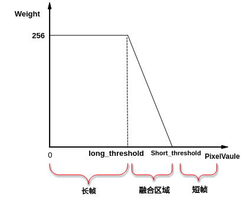

另外，当这两个阈值都达到最大值0xFFF。会出现亮区偏色的现象，在曝光比自动时，还可能出现图像亮度反复震荡的现象，这是因为本该选择短帧的亮区选择了长帧过曝导致。

注意通过调整长短帧阈值单独输出长帧时，请按以下步骤操作：

1.  关闭运动检测
2.  长短帧阈值都配置为最大值0xFFF
3.  固定AE增益和曝光比

#### 运动检测参数调试

-   运动判断是否参考Flicker检测结果
    -   当md\_ref\_flicker为1时，表示运动判断参考Flicker检测结果；当Flicker检测到工频闪时，WDR内部会调整运动检测检测阈值，运动检测条件更严格，防止将工频闪检测为运动。注意在长帧未过曝且无工频闪，短帧有工频闪的场景，调试该参数才能看到效果。
    -   当md\_ref\_flicker为0时，表示运动判断不参考Flicker检测结果。

-   运动判断是否检查短帧数据大小
    -   当short\_expo\_chk为1时，表示运动检测时检查短帧数值，当短帧数值接近0时，WDR内部会强制选择长帧。该功能主要用于夜间行车场景，当出现短帧数值接近0时，WDR内部强制选择长帧，防止选择短帧出现黑色块。
    -   当short\_expo\_chk为0时，表示运动检测时不检查短帧数值。默认short\_expo\_chk为0，不打开该功能。

-   运动检测阈值

    帧间差值与运动程度之间的关系如[图3](#fig07301849183011)所示。md\_thr\_low\_gain与md\_thr\_hig\_gain表示判断是否运动的高低阈值系数。当md\_thr\_low\_gain变小，像素点被检测为运动的可能性变大；反之，md\_thr\_low\_gain变大，像素点被检测为运动的可能性变小。当md\_thr\_hig\_gain变小，像素点被检测为运动的可能性变大；反之，md\_thr\_hig\_gain变大，像素点被检测为运动的可能性变小。这两个参数要联合调整。

-   强制输出长帧参数调试

    force\_long\_ratio与force\_long\_low\_threshold,force\_long\_high\_threshold之间的关系如[图2](#fig17401455653)所示，force\_long\_ratio表示运动Mask的衰减程度，当长帧的像素值小于force\_long\_low\_threshold时，force\_long\_ratio为0，即表示Mask衰减为0；当长帧的像素值大于force\_long\_high\_threshold时，Force\_long\_ratio为1023，即表示Mask不做衰减。

    该参数主要用于调试暗区运动，当物体在暗区运动时，检测为运动，WDR选择短帧，会导致运动物体噪声大。通过强制输出长帧参数调试，可以强制暗区运动选择长帧，改善暗区噪声大的问题。

-   其他运动检测参数调试

    mdt\_still\_threshold表示判断为静止的阈值，为了防止噪声被误判为运动，当运动mask小于mdt\_still\_threshold时，该像素点判断为静止。mdt\_still\_threshold值越大，判断为静止的像素点越多。

    mdt\_full\_threshold表示判断为全运动的阈值，当运动mask大于mdt\_full\_threshold时，该像素点判断为全运动，调试mdt\_still\_threshold/mdt\_full\_threshold和运动mask的关系如[图1](#fig672765510310)所示。

**图 1**  mdt\_still\_threshold/mdt\_full\_threshold和运动mask的关系  

mdt\_long\_blend表示运动区域叠加长帧的权重，该值越大，运动区域选择长帧的比重越大。注意该值调大后，会影响亮区的运动表现，可能会出现运动断裂。

当mdt\_long\_blend设为最大值0xFE时，运动区域全部选择长帧，即运动检测失效，开关运动检测运动不受影响。

**图 2**  force\_long\_ratio与force\_long\_low\_threshold, force\_long\_high\_threshold之间的关系  

**图 3**  帧间差值与运动程度之间的关系  
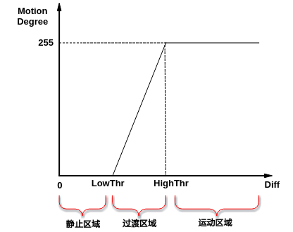

#### Fusion模式阈值调试

参数fusion\_threshold\[4\] 用来调节超短帧，短帧，中帧，长帧的阈值，将对应帧的输入数据限制在阈值以下。如2合1WDR中，fusion\_threshold\[0\]为短帧门限值，短帧内超过该门限值的像素将被截断到该门限值，低于该门限值的像素仍使用真实值。fusion\_threshold\[1\]为长帧门限值，长帧内超过该门限值的像素将被截断到该门限值，低于该门限值的像素仍使用真实值。在融合时，fusion\_threshold\[1\]变小，比较多的像素会选择短帧，噪声会变大；fusion\_threshold\[1\]变大，对于亮区会有一部分像素选择长帧，导致过曝。并且fusion\_threshold\[1\]接近最大值时，由于受黑电平影响，会导致融合时像素选择不合理，进而出现图像偏色的问题。建议各帧阈值不超过3FFF-黑电平（14bit）。

此参数要联合调整，即要保证亮区不过曝偏色，又要压制暗区的噪声。

### WDR模式常见现象的调试方法

#### AE调节时画面闪烁

1.  确认长短曝光时间，增益之间是否同步。若不同步，需要调整cmos.c中各寄存器的delay关系。
2.  确认AE每帧更新结果，必须保证AE调节的过程中，每帧的曝光量单调递增或递减，不能出现两帧的曝光量一样（由于DRC采用上一帧的图像信息对当前帧进行处理）。

#### 图像整体偏暗或偏亮

1.  确认曝光是否合理。曝光合理时，长帧图像的暗区应清晰可见，噪声小；短帧图像的亮区应不过曝。若二者不可兼得，则说明当前曝光比大于或小于实际场景动态范围，可以适当减少或增加曝光比（但曝光比越大，亮暗过渡区的噪声越大，也越容易出运动拖影）。若曝光比调到最大时仍不可兼得，则说明实际场景动态范围超出WDR处理能力（由sensor本身动态范围+曝光比增加的动态范围决定），需要做出取舍：优先保证暗区效果（亮区过曝）或优先保证亮区效果（暗区噪声大）。若使用固定曝光比，也需要做出取舍。
2.  确认DRC参数是否合理。当曝光策略为优先保证暗区效果时，WDR图像暗区应与长帧图像暗区表现相近；优先保证亮区效果时，WDR图像亮区应与短帧图像亮区表现相近。DRC模块参数调节参考 “[调试步骤](#ZH-CN_TOPIC_0000002424362122)”。
3.  确认gamma曲线是否合理。
4.  若低照度场景图像整体偏暗，可切换到长帧模式。

#### 图像亮区过曝或亮区细节不好

1.  确认曝光是否合理。
2.  调整DRC的曲线，或者调节DRC滤波参数来增强细节。
3.  调整gamma曲线，用更多的灰阶表示亮区。此时图像其他亮度的层次会变差。
4.  适当降低DCI强度。

#### 图像对比度差

1.  确认曝光是否合理。
2.  适当降低DRC强度，但图像整体会变暗。
3.  选择合适的gamma曲线。
4.  使能Dehaze，并选择合适的强度。
5.  使能LDCI，并选择合适的强度。

#### 图像噪声大

1.  确认曝光是否合理。
2.  确认gamma曲线是否合理。
3.  若图像整体噪声大，可适当降低sharpen锐化强度，并增加2DNR和3DNR去噪强度。
4.  若图像仅暗区噪声大，需要确认是否DRC将暗区提升太多导致，此时需要调整DRC参数。另外可适当调整Sharpen参数luma\_wgt降低图像暗区的锐化强度，并适当增加3DNR暗区空域去噪强度。

#### 室内场景出现工频闪烁

1.  适当降低AE目标值，确保合成时尽可能多的采用长帧数据。此时图像偏暗可适当增加DRC强度。
2.  设置合理的AE route，确保合成前长帧亮度较小，用合成后的ISP Dgain提升全局亮度。AE route的设置需权衡图像暗区噪声与工频闪表现。
3.  弱宽动态场景关闭FSWDR模块的运动补偿功能，避免FSWDR将工频闪误认为是运动，采用短帧数据。

#### 亮背景下小脸偏暗偏朦

1.  适当增加曝光目标值，使长帧图像中小脸的亮度尽可能高。
2.  确认去噪参数是否合理，2DNR和3DNR中的空域去噪强度太大，会使小脸细节损失。
3.  适当调节DRC滤波参数，来增强小脸的细节。
4.  调节gamma，使小脸亮度值对应的gamma输出值尽可能高，且斜率尽可能大。

#### 交通场景车灯光晕大

1.  适当降低曝光目标值，采用合适曝光比。
2.  适当降低DRC强度。
3.  适当调节gamma。

#### 图像偏色

1.  若图像仅暗区偏绿或偏紫，需要确认黑电平是否有偏差，此时可以微调黑电平。
2.  若场景是混合光源，可适当降低饱和度减轻偏色。

### 注意事项及相关问题

-   WDR测试跟场景有关，如果要看运动补偿的效果，尽量在宽动态场景下测试。且运动补偿的参数和帧率关系很大。帧率较小的时候，运动检测的参数要设置的比较严格。
-   2合1 Fusion模式中长帧阈值设置为0，低曝光比时仍输出长帧，仅在高曝光比（曝光比大于9倍）时输出短帧。
-   WDR模式下，为了避免出现融合区域过度不平滑问题，要求short\_threshold值比long\_threshold值大256。

## Crosstalk Removal

### 功能描述

Crosstalk  模块的主要功能是为了平衡raw数据之间临近像素Gr和Gb之间的差异，能够有效防止demosaic插值算法产生的方格或其他类似pattern。由于sensor可能会因为特殊角度的光线入射而产生Crosstalk，形成这些pattern的根本原因就是因为临近像素值之间Gr和Gb值不一致。

如图 Crosstalk 门限所示，横坐标表示Gr与Gb之间的差值，即|Gr-Gb|，纵坐标表示处理的强度值。图中的Threshold，slope与参数中的threshold，slope不完全对应，只是计算方法的大致示意。

-   当Gr与Gb之间的差值小于Threshold值时，都按照最大的强度值0.5进行处理，Threshold值越大，图像整体被处理的强度越大；
-   当Gr与Gb之间的差值大于Threshold值时，由slope控制处理的强度，当slope值越大，整体处理强度衰减得越慢，也就是处理的强度越大。

**图 1**  Crosstalk 门限  
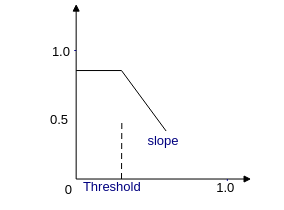

### Crosstalk参数

**表 1**  Crosstalk参数

<table><thead align="left"><tr id="row2014mcpsimp"><th class="cellrowborder" valign="top" width="25%" id="mcps1.2.3.1.1">
参数名称

</th>
<th class="cellrowborder" valign="top" width="75%" id="mcps1.2.3.1.2">
描述

</th>
</tr>
</thead>
<tbody><tr id="row2020mcpsimp"><td class="cellrowborder" valign="top" width="25%" headers="mcps1.2.3.1.1 ">
en

</td>
<td class="cellrowborder" valign="top" width="75%" headers="mcps1.2.3.1.2 ">
使能Crosstalk 功能。

</td>
</tr>
<tr id="row2025mcpsimp"><td class="cellrowborder" valign="top" width="25%" headers="mcps1.2.3.1.1 ">
np_offset[OT_ISP_AUTO_ISO_NUM]

</td>
<td class="cellrowborder" valign="top" width="75%" headers="mcps1.2.3.1.2 ">
设置Noise Profile值。值越大，表示抗噪能力越大。默认值1024。该数组的16个值分别对应的sensor在不同增益情况下不同的设置值。

取值范围：[512, 4095]

</td>
</tr>
<tr id="row2031mcpsimp"><td class="cellrowborder" valign="top" width="25%" headers="mcps1.2.3.1.1 ">
threshold[OT_ISP_AUTO_ISO_NUM]

</td>
<td class="cellrowborder" valign="top" width="75%" headers="mcps1.2.3.1.2 ">
设置Crosstalk门限值。值越大，表示整体处理的强度越大。默认值300。该数组的16个值分别对应的sensor在不同增益情况下不同的设置值。

取值范围：[0, 4095]

</td>
</tr>
<tr id="row2037mcpsimp"><td class="cellrowborder" valign="top" width="25%" headers="mcps1.2.3.1.1 ">
slope

</td>
<td class="cellrowborder" valign="top" width="75%" headers="mcps1.2.3.1.2 ">
设置Crosstalk门限之上的处理强度。值越大，表示在门限值threshold之上整体处理强度衰减得越慢。默认值9。取值范围：[0, 12]

</td>
</tr>
<tr id="row2045mcpsimp"><td class="cellrowborder" valign="top" width="25%" headers="mcps1.2.3.1.1 ">
sensi_slope

</td>
<td class="cellrowborder" valign="top" width="75%" headers="mcps1.2.3.1.2 ">
设置Crosstalk敏感度值。默认值9。值越大，表示在门限值sensi_threshold之上，边沿上的处理强度衰减得越慢。取值范围：[0, 12]

</td>
</tr>
<tr id="row2055mcpsimp"><td class="cellrowborder" valign="top" width="25%" headers="mcps1.2.3.1.1 ">
sensi_threshold

</td>
<td class="cellrowborder" valign="top" width="75%" headers="mcps1.2.3.1.2 ">
设置Crosstalk敏感度门限值。值越大，表示在更强的边沿上也会有绿平衡处理。默认值300。

取值范围：[0, 4095]

</td>
</tr>
<tr id="row2061mcpsimp"><td class="cellrowborder" valign="top" width="25%" headers="mcps1.2.3.1.1 ">
strength[OT_ISP_AUTO_ISO_NUM]

</td>
<td class="cellrowborder" valign="top" width="75%" headers="mcps1.2.3.1.2 ">
设置Crosstalk强度值。值越大，处理强度越大。取值范围：[0, 256]。默认值128。该数组的16个值分别对应的sensor在不同增益情况下不同的设置值。

</td>
</tr>
</tbody>
</table>

### 调试过程

建议采用默认值。有兴趣的用户建议在默认值附近作微调。

除np\_offset\[\]外，各寄存器值增大后，均会导致Crosstalk的处理强度倾向于变大。

-   Tuning np\_offset\[\]

    取值范围：\[512, 4095\]。默认值1024。建议在1024附近微调。

    -   np\_offset\[\]值较大时，Crosstalk处理的抗噪能力会变大；
    -   np\_offset\[\]值较小时，Crosstalk处理的抗噪能力会减弱。

    效果：一般情况下，随着np\_offset\[\]值变化，图像上看不出什么变化。

-   Tuning threshold\[\]

    取值范围：\[0, 4095\]。默认值300。建议在300附近微调。

    -   threshold值较大时，Crosstalk的整体处理强度倾向于增大；
    -   threshold值为0时，Crosstalk的整体处理强度变小。

    效果：threshold值极大时，纹理边缘上会变模糊。

-   Tuning slope

    -   slope值较大时，在门限值threshold之上整体处理强度衰减得较慢；
    -   slope值较小时，在门限值threshold之上整体处理强度衰减得较快。

    效果：slope值较大时，纹理边缘上会变模糊。

-   Tuning sensi\_threshold

    -   sensi\_threshold值较大时，Crosstalk在边沿上的处理强度倾向于增大；
    -   sensi\_threshold值为0时，Crosstalk在边沿上的处理强度变小。

    效果：sensi\_threshold值较小时，纹理边缘上会变清晰。

-   Tuning sensi\_slope

    -   sensi\_slope值较大时，在门限值sensi\_threshold之上，边沿上的处理强度衰减得较慢；
    -   sensi\_slope值较小时，在门限值sensi\_threshold之上，边沿上的处理强度衰减得较快。

    效果：sensi\_slope值较小时，纹理边缘上会变清晰。

-   Tuning strength\[\]

    -   strength\[\]值越大，处理强度越大；
    -   strength\[\]值越小，处理强度越小。

    效果：strength\[\]值较小时，会残留微弱的格状噪声。

sensi\_threshold参数变化会影响threshold参数的表现，建议先调节sensi\_threshold，再调节threshold，参数调节不当可能会在边缘或细节处产生伪彩或者变模糊。对于具有Crosstalk产生的格子状噪声的图像，可参考如下的调节步骤（仅供参考，具体调节方法根据实际情况而定）：

-   首先将threshold\[\]调至最大；
-   调节sensi\_threshold，达到刚好能将Crosstalk产生的格子噪声消除的程度，同时又保证尽量小的伪彩或边缘变模糊；
-   调节threshold\[\]，能够使画面伪彩或变模糊的作用减弱，同时又能保持Crosstalk Removal算法的校正能力。

## AntiFase Color

### 功能描述

高频分量在图像插值时易引起高频混叠。用镜头对准一个分辨率测试卡，当sensor表面没有OLPF时，在分辨率的高频部分容易出现伪彩。

去伪彩主要是指去除高频部分因插值错误所导致的伪彩现象。增大去伪彩强度值会减弱伪彩现象，但可能导致正常的颜色灰度化。

该模块原理是基于方差计算出一个细节度量作为去伪彩强度基值，通过可配去伪彩强度寄存器值去缩放此去伪彩强度基值，用缩放后的去伪彩强度值将RGB三个通道值灰度化，从而达到减弱伪彩现象的目的。

### Anti False Color参数

**表 1**  Anti False Color参数

<table><thead align="left"><tr id="row1055mcpsimp"><th class="cellrowborder" valign="top" width="36%" id="mcps1.2.3.1.1">
参数名称

</th>
<th class="cellrowborder" valign="top" width="64%" id="mcps1.2.3.1.2">
描述

</th>
</tr>
</thead>
<tbody><tr id="row1060mcpsimp"><td class="cellrowborder" valign="top" width="36%" headers="mcps1.2.3.1.1 ">
en

</td>
<td class="cellrowborder" valign="top" width="64%" headers="mcps1.2.3.1.2 ">
AntiFalseColor模块使能。0：关闭；1：使能。

</td>
</tr>
<tr id="row1065mcpsimp"><td class="cellrowborder" valign="top" width="36%" headers="mcps1.2.3.1.1 ">
op_type

</td>
<td class="cellrowborder" valign="top" width="64%" headers="mcps1.2.3.1.2 ">
AntiFalseColor工作类型。

<ul id="ul1070mcpsimp"><li>OT_OP_MODE_AUTO：自动模式；</li><li>OT_OP_MODE_MANUAL：手动模式。</li></ul>

默认值为OT_OP_MODE_AUTO。

</td>
</tr>
<tr id="row1074mcpsimp"><td class="cellrowborder" valign="top" width="36%" headers="mcps1.2.3.1.1 ">
threshold

</td>
<td class="cellrowborder" valign="top" width="64%" headers="mcps1.2.3.1.2 ">
去伪彩阈值，值越大，伪彩去除的区域越多。

取值范围：[0x0, 0x20]

</td>
</tr>
<tr id="row1081mcpsimp"><td class="cellrowborder" valign="top" width="36%" headers="mcps1.2.3.1.1 ">
strength

</td>
<td class="cellrowborder" valign="top" width="64%" headers="mcps1.2.3.1.2 ">
去伪彩强度，值越大，去伪彩强度越大，伪彩现象消除越好，但可能导致正常颜色的改变。

取值范围：[0x0, 0x1F]

</td>
</tr>
</tbody>
</table>

### 调试过程

AntiFalseColor算法的调试主要有以下几个部分：

-   调整去伪彩阈值

    通过调制threshold，可以调整伪彩去除的区域范围，值越大，但需注意部分区域的颜色被当做伪彩被错误去除。

-   调整去伪彩强度
-   strength是伪彩去除强度的控制参数，值越大，去伪彩强度越大，伪彩被越好地消除，但可能会导致正常颜色的改变。

### 注意事项及相关问题

搭建分辨率卡场景/有高频细节及伪彩的典型场景

搭建如下场景，并调节环境灯光照度到不同ISO档。

-   场景1：搭建分辨率卡场景，将镜头调焦至最佳，即分辨率卡高频线数达到人眼能分辨的最高线数，将伪彩表现调到最佳。
-   场景2：搭建有高频细节及伪彩的典型场景或自然场景，将镜头调焦至最佳，将伪彩表现调到最佳。

## Mesh Lens Shading

### 功能描述

本模块使用Mesh Shading的矫正方式来处理由于镜头光学折射不均匀导致的画面暗角现象。

在SS928V100中 Mesh Shading算法使用Mesh（网格）方式对画面进行标定/矫正，算法会将整个Bayer域画面分割成32\*32个子区域，这32\*32个区域大小大致相等。

在数据处理过程中，算法将分别对RAW域中的每个通道进行处理。

### 关键参数

**表 1**  Mesh Lens Shading关键参数

<table><thead align="left"><tr id="row593mcpsimp"><th class="cellrowborder" colspan="2" valign="top" id="mcps1.2.4.1.1">
参数名称

</th>
<th class="cellrowborder" valign="top" id="mcps1.2.4.1.2">
描述

</th>
</tr>
</thead>
<tbody><tr id="row599mcpsimp"><td class="cellrowborder" rowspan="4" valign="top" width="18%" headers="mcps1.2.4.1.1 ">
ot_isp_shading_attr

</td>
<td class="cellrowborder" valign="top" width="22%" headers="mcps1.2.4.1.1 ">
en

</td>
<td class="cellrowborder" valign="top" width="60%" headers="mcps1.2.4.1.2 ">
表示LSC使能。

取值范围：[0, 1]

</td>
</tr>
<tr id="row607mcpsimp"><td class="cellrowborder" valign="top" headers="mcps1.2.4.1.1 ">
mesh_strength

</td>
<td class="cellrowborder" valign="top" headers="mcps1.2.4.1.1 ">
用来全局纠正LSC标定后的强度。当镜头shading很严重的时候，画面四个角补偿的增益很大，容易导致噪声很大，而且画面有格子现象。这个调整mesh_strength小于一倍强度，可以减少LSC的补偿值，让四个角的补偿增益较小一些，达到优化噪声和画面格子问题。

取值范围：[0, 65535]

</td>
</tr>
<tr id="row614mcpsimp"><td class="cellrowborder" valign="top" headers="mcps1.2.4.1.1 ">
blend_ratio

</td>
<td class="cellrowborder" valign="top" headers="mcps1.2.4.1.1 ">
两张增益表的融合比例

取值范围：[0, 256]

</td>
</tr>
<tr id="row621mcpsimp"><td class="cellrowborder" valign="top" headers="mcps1.2.4.1.1 ">
bnr_lsc_auto_en

</td>
<td class="cellrowborder" valign="top" headers="mcps1.2.4.1.1 ">
BNR LSC的表参考Mesh LSC表的使能。默认关，使用用户配置的bnr_lsc_gain_lut表；开启后参考会lsc_gain_lut的表，自动刷新bnr_lsc_gain_lut。

取值范围：[0,1]

</td>
</tr>
<tr id="row627mcpsimp"><td class="cellrowborder" rowspan="5" valign="top" width="18%" headers="mcps1.2.4.1.1 ">
ot_isp_shading_lut_attr

</td>
<td class="cellrowborder" valign="top" width="22%" headers="mcps1.2.4.1.1 ">
mesh_scale

</td>
<td class="cellrowborder" valign="top" width="60%" headers="mcps1.2.4.1.2 ">
增益表精度控制参数

取值范围：[0, 7]

</td>
</tr>
<tr id="row636mcpsimp"><td class="cellrowborder" valign="top" headers="mcps1.2.4.1.1 ">
x_grid_width [(OT_ISP_LSC_GRID_COL - 1)/2]

</td>
<td class="cellrowborder" valign="top" headers="mcps1.2.4.1.1 ">
用来储存各GRID分区宽度大小信息。该接口各分量最小值为4，总和应为原画面宽度的四分之一。（例如原画面大小为1080p，则该接口各参数总和应为480）

取值范围：[4, width/4 - 60]，width为原画面的宽度

</td>
</tr>
<tr id="row643mcpsimp"><td class="cellrowborder" valign="top" headers="mcps1.2.4.1.1 ">
y_grid_width[(OT_ISP_LSC_GRID_ROW - 1)/2]

</td>
<td class="cellrowborder" valign="top" headers="mcps1.2.4.1.1 ">
用来储存各GRID分区高度大小信息。该接口各分量最小值为4，总和应为原画面高度的四分之一。（例如原画面大小为1080p，则该接口各参数总和应为270）

取值范围：[4,height/4 - 60]，height为原画面的高度

</td>
</tr>
<tr id="row650mcpsimp"><td class="cellrowborder" valign="top" headers="mcps1.2.4.1.1 ">
lsc_gain_lut[2]

</td>
<td class="cellrowborder" valign="top" headers="mcps1.2.4.1.1 ">
两组色温下的增益表配置。硬件基于这两组表以及blend_ratio进行当前色温下校正增益表的计算

取值范围：[0, 1023]

</td>
</tr>
<tr id="row657mcpsimp"><td class="cellrowborder" valign="top" headers="mcps1.2.4.1.1 ">
bnr_lsc_gain_lut

</td>
<td class="cellrowborder" valign="top" headers="mcps1.2.4.1.1 ">
用于BNR LSC参考所用的增益表。

取值范围：[0, 65535]

</td>
</tr>
</tbody>
</table>

### 调试步骤

Shading是与一种镜头有关的缺陷，对于每个镜头都需按照《图像质量调试工具使用指南》LSC部分所描述的步骤进行数据的采集与标定，将获取的标定结果写入cmos\_ex.h文件中或直接导入到PQTools上。具体每个参数的作用和对图像的影响可参考上表中的描述。

> **须知：** 
>-   增益表的默认配置与ot\_isp\_cmos\_alg\_key中的bit1\_lsc 标志位有关，如果bit1\_lsc=1\)，则采用cmos\_ex.h中的配置值作为默认值；否则默认配置为1倍增益。具体请参考《ISP开发参考》。
>-   在标定时，如果看到“Please set Mesh scale to \*”说明所标定图像的增益超过了所设定的mesh\_scale的增益范围，应当把mesh\_scale设定为推荐的数值，重新进行Mesh Shading的标定。

## Gamma

### 功能描述

Gamma模块对图像进行亮度空间非线性转换以适配输出设备。Gamma模块校正R、G、B时调用同一组Gamma表，Gamma表各节点之间的间距相同，节点之间的图像像素值使用线性插值生成。

### 关键参数

**表 1**  Gamma关键参数

<table><thead align="left"><tr id="row1395mcpsimp"><th class="cellrowborder" valign="top" width="36%" id="mcps1.2.3.1.1">
参数名称

</th>
<th class="cellrowborder" valign="top" width="64%" id="mcps1.2.3.1.2">
描述

</th>
</tr>
</thead>
<tbody><tr id="row1401mcpsimp"><td class="cellrowborder" valign="top" width="36%" headers="mcps1.2.3.1.1 ">
enable

</td>
<td class="cellrowborder" valign="top" width="64%" headers="mcps1.2.3.1.2 ">
Gamma校正功能使能。

TD_FALSE：关闭；

TD_TRUE：使能。

默认值为TD_TRUE。

</td>
</tr>
<tr id="row1413mcpsimp"><td class="cellrowborder" valign="top" width="36%" headers="mcps1.2.3.1.1 ">
curve_type

</td>
<td class="cellrowborder" valign="top" width="64%" headers="mcps1.2.3.1.2 ">
Gamma曲线选择。

默认值为OT_ISP_GAMMA_CURVE_DEFAULT。

SDR模式为 OT_ISP_GAMMA_CURVE_SRGB

HDR模式为 OT_ISP_GAMMA_CURVE_HDR，不支持该选项

用户自定义模式为OT_ISP_GAMMA_CURVE_USER_DEFINE

</td>
</tr>
<tr id="row1424mcpsimp"><td class="cellrowborder" valign="top" width="36%" headers="mcps1.2.3.1.1 ">
table[OT_ISP_GAMMA_NODE_NUM]

</td>
<td class="cellrowborder" valign="top" width="64%" headers="mcps1.2.3.1.2 ">
Gamma表。

取值范围：[0, 0xFFF]

</td>
</tr>
</tbody>
</table>

### 调试步骤

用户自定义Gamma曲线时，必须确保Gamma表配置正确。WDR模式下的Gamma曲线与线性模式不一样，WDR模式下Gamma应配置为线性模式（Y=X）。

HDR模式下应配置为OT\_ISP\_GAMMA\_CURVE\_HDR模式。

不同场景下Gamma曲线配置不同，按关注点进行相应的曲线调整。

### Gamma参数

如果使用用户自定义Gamma曲线时，也可以通过PQ工具上，Curve区域的相关参数进行配置并生成Gamma曲线。

**图 1**  Gamma参数配置选项Curve区域  

Curve区域由两个参数组成，Gamma COEFFI和Slope at zero。其中Gamma COEFFI用来控制Gamma生成的形状，Slope at zero用来控制Gamma曲线的零点斜率大小。

两个参数对曲线形状的影响具体如下：

如果Slope at zero的值一致，则曲线起始阶段斜率一致，值也基本相同，曲线由于Gamma COEFFI参数的不同而形状不同，变化趋势如下。

**图 2**  Gamma COEFFI对Gamma曲线的影响  

-   如果是COEFFI不变，而只是Slope at zero有变化，则曲线整体形状不变，只是在0点斜率处发生变化（会导致整体曲线发生轻微位移）。

**图 3**  Gamma COEFFI对Gamma曲线的影响  

**图 4**  Gamma COEFFI对Gamma曲线的影响（零点斜率处放大）  
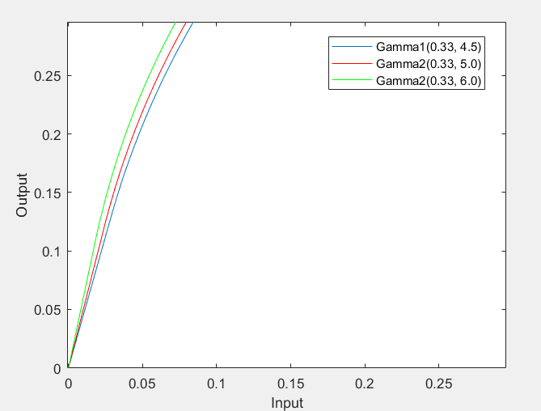

## White Balance

### 功能描述

同一物体在不同光源照射下呈现的颜色是不同的，受光源色温的影响。低色温光源下，白色物体偏红，高色温光源下，白色物体偏蓝。人眼可根据大脑的记忆判断，识别物体的真实颜色。AWB（Auto White Balance）算法的功能是降低外界光源对物体真实颜色的影响，使得我们采集的颜色信息转变为在理想日光光源下的无偏色信息。

AWB算法的基本原理是，根据场景内灰色物体的颜色信息，计算R, G, B颜色通道的增益，乘以增益后，RGB三个通道达到平衡。

AWB的增益是全局的，因此，在混合光源下，不能达到所有灰色区域的RGB三通道平衡。

目前我们提供两种AWB算法，分别为AWB与SPECAWB。SPECAWB应用了机器学习算法, 通过学习大量场景内的Wb Gain值获得不同亮度下的光源分布概率，结合实际场景内的白点来还原颜色。当场景内缺乏灰色参考,或者大面积肤色时SPECAWB算法可以获得更好的性能。相比AWB算法的主要效果提升如[图1](#fig13215624131819)所示。

**图 1**  AWB和SPECAWB算法  

### 关键参数\(AWB\)

**表 1**  AWB标定参数

<table><thead align="left"><tr id="row738mcpsimp"><th class="cellrowborder" valign="top" width="26%" id="mcps1.2.3.1.1">
参数名称

</th>
<th class="cellrowborder" valign="top" width="74%" id="mcps1.2.3.1.2">
描述

</th>
</tr>
</thead>
<tbody><tr id="row744mcpsimp"><td class="cellrowborder" valign="top" width="26%" headers="mcps1.2.3.1.1 ">
ref_color_temp

</td>
<td class="cellrowborder" valign="top" width="74%" headers="mcps1.2.3.1.2 ">
静态白平衡系数标定的环境色温，单位Kelvin。推荐在Macbeth D50标准光源环境或室外晴天环境捕获24色卡Raw数据进行标定。

取值范围：[0x0, 0xFFFF]

</td>
</tr>
<tr id="row750mcpsimp"><td class="cellrowborder" valign="top" width="26%" headers="mcps1.2.3.1.1 ">
static_wb[4]

</td>
<td class="cellrowborder" valign="top" width="74%" headers="mcps1.2.3.1.2 ">
静态白平衡系数，由AWB标定工具给出。

取值范围：[0x0, 0xFFF]

</td>
</tr>
<tr id="row756mcpsimp"><td class="cellrowborder" valign="top" width="26%" headers="mcps1.2.3.1.1 ">
curve_para[0-2]

</td>
<td class="cellrowborder" valign="top" width="74%" headers="mcps1.2.3.1.2 ">
普朗克曲线系数，由AWB标定工具给出。普朗克曲线描绘白色块在不同色温的标准光源下的颜色表现。

</td>
</tr>
<tr id="row762mcpsimp"><td class="cellrowborder" valign="top" width="26%" headers="mcps1.2.3.1.1 ">
curve_para[3-5]

</td>
<td class="cellrowborder" valign="top" width="74%" headers="mcps1.2.3.1.2 ">
色温曲线系数，由AWB标定工具给出。色温曲线描绘白色块的颜色表现与色温的对应关系。

</td>
</tr>
</tbody>
</table>

**表 2**  AWB参数

<table><thead align="left"><tr id="row774mcpsimp"><th class="cellrowborder" valign="top" width="26%" id="mcps1.2.3.1.1">
参数名称

</th>
<th class="cellrowborder" valign="top" width="74%" id="mcps1.2.3.1.2">
描述

</th>
</tr>
</thead>
<tbody><tr id="row780mcpsimp"><td class="cellrowborder" valign="top" width="26%" headers="mcps1.2.3.1.1 ">
alg_type

</td>
<td class="cellrowborder" valign="top" width="74%" headers="mcps1.2.3.1.2 ">
白平衡的算法类型属性，支持OT_ISP_AWB_ALG_LOWCOST和OT_ISP_AWB_ALG_ADVANCE可选。OT_ISP_AWB_ALG_LOWCOST CPU占用较少，对光源的适应性较好。OT_ISP_AWB_ALG_ADVANCE提升了AWB精度。

</td>
</tr>
<tr id="row785mcpsimp"><td class="cellrowborder" valign="top" width="26%" headers="mcps1.2.3.1.1 ">
speed

</td>
<td class="cellrowborder" valign="top" width="74%" headers="mcps1.2.3.1.2 ">
AWB收敛速度，值越大，AWB收敛越快。

取值范围：[0x0, 0xFFF]

</td>
</tr>
<tr id="row791mcpsimp"><td class="cellrowborder" valign="top" width="26%" headers="mcps1.2.3.1.1 ">
high_color_temp

</td>
<td class="cellrowborder" valign="top" width="74%" headers="mcps1.2.3.1.2 ">
AWB支持的色温上限，推荐取值在[10000, 15000]。

色温上限越大，蓝色物体对AWB的干扰越大。

</td>
</tr>
<tr id="row797mcpsimp"><td class="cellrowborder" valign="top" width="26%" headers="mcps1.2.3.1.1 ">
low_color_temp

</td>
<td class="cellrowborder" valign="top" width="74%" headers="mcps1.2.3.1.2 ">
AWB支持的色温下限，推荐取值在[1500, 2500]。

色温下限越小，橙色、红色物体对AWB的干扰越大。

</td>
</tr>
<tr id="row803mcpsimp"><td class="cellrowborder" valign="top" width="26%" headers="mcps1.2.3.1.1 ">
ct_limit

</td>
<td class="cellrowborder" valign="top" width="74%" headers="mcps1.2.3.1.2 ">
检测色温超出色温范围时，AWB算法的动作。检测色温在色温范围内时，该模块不生效。

支持Manual和Auto两种方式，Manual模式下，由用户定义色温超限时AWB的增益；Auto模式下，根据AWB标定参数，确定色温超限时AWB的增益。

</td>
</tr>
<tr id="row809mcpsimp"><td class="cellrowborder" valign="top" width="26%" headers="mcps1.2.3.1.1 ">
shift_limit

</td>
<td class="cellrowborder" valign="top" width="74%" headers="mcps1.2.3.1.2 ">
以普朗克曲线为中心点，shift_limit为半径确定AWB支持的光源范围。取值越大，对特殊光源的支持越广，影响特定场景下AWB精度。推荐取值0x30-0x50。

</td>
</tr>
<tr id="row814mcpsimp"><td class="cellrowborder" valign="top" width="26%" headers="mcps1.2.3.1.1 ">
gain_norm_en

</td>
<td class="cellrowborder" valign="top" width="74%" headers="mcps1.2.3.1.2 ">
AWB最终增益是否做归一化，使能后，可提高低照、低色温下的信噪比。

</td>
</tr>
<tr id="row819mcpsimp"><td class="cellrowborder" valign="top" width="26%" headers="mcps1.2.3.1.1 ">
rg_strength

bg_strength

</td>
<td class="cellrowborder" valign="top" width="74%" headers="mcps1.2.3.1.2 ">
AWB校正强度，推荐rg_strength= bg_strength，且设置值&lt;=0x80。

rg_strength=0x80时，白色恢复为白色；

rg_strength&gt;0x80时，白色与光源反向，低色温偏蓝，高色温偏红；

rg_strength&lt;0x80时，白色与光源同向，低色温偏红，高色温偏蓝。

</td>
</tr>
<tr id="row840mcpsimp"><td class="cellrowborder" valign="top" width="26%" headers="mcps1.2.3.1.1 ">
cb_cr_track

</td>
<td class="cellrowborder" valign="top" width="74%" headers="mcps1.2.3.1.2 ">
不同ISO下白点条件，cr_max, cr_min, cb_max, cb_min等四组查找表。

推荐用户针对sensor调整以上参数，可优化低照度效果。

</td>
</tr>
</tbody>
</table>

**表 3**  AWB Ext扩展参数

<table><thead align="left"><tr id="row852mcpsimp"><th class="cellrowborder" valign="top" width="25%" id="mcps1.2.3.1.1">
参数名称

</th>
<th class="cellrowborder" valign="top" width="75%" id="mcps1.2.3.1.2">
描述

</th>
</tr>
</thead>
<tbody><tr id="row858mcpsimp"><td class="cellrowborder" valign="top" width="25%" headers="mcps1.2.3.1.1 ">
tolerance

</td>
<td class="cellrowborder" valign="top" width="75%" headers="mcps1.2.3.1.2 ">
帧间相关的容忍度。设置为0时，AWB每2帧刷新一次增益系数；设置为非0值时，AWB判断场景是否有变化，仅在变化时刷新增益系数。

</td>
</tr>
<tr id="row863mcpsimp"><td class="cellrowborder" valign="top" width="25%" headers="mcps1.2.3.1.1 ">
zone_radius

</td>
<td class="cellrowborder" valign="top" width="75%" headers="mcps1.2.3.1.2 ">
分块统计信息分类的半径。不同亮度灰色块感光一致性较差时，可适当放大该参数。WDR模式下，可适当放大该参数。

</td>
</tr>
<tr id="row868mcpsimp"><td class="cellrowborder" valign="top" width="25%" headers="mcps1.2.3.1.1 ">
light_info

</td>
<td class="cellrowborder" valign="top" width="75%" headers="mcps1.2.3.1.2 ">
支持特殊光源点。

</td>
</tr>
<tr id="row873mcpsimp"><td class="cellrowborder" valign="top" width="25%" headers="mcps1.2.3.1.1 ">
in_or_out

</td>
<td class="cellrowborder" valign="top" width="75%" headers="mcps1.2.3.1.2 ">
室内外检测参数。推荐客户根据sensor感光调整out_thresh参数。感光较弱的sensor，可适当放大该参数。

</td>
</tr>
</tbody>
</table>

### 关键参数\(SPECAWB\)

**表 1**  SPECAWB标定参数

<table><thead align="left"><tr id="row3352mcpsimp"><th class="cellrowborder" valign="top" width="25%" id="mcps1.2.3.1.1">
参数名称

</th>
<th class="cellrowborder" valign="top" width="75%" id="mcps1.2.3.1.2">
描述

</th>
</tr>
</thead>
<tbody><tr id="row3358mcpsimp"><td class="cellrowborder" valign="top" width="25%" headers="mcps1.2.3.1.1 ">
wb_center

</td>
<td class="cellrowborder" valign="top" width="75%" headers="mcps1.2.3.1.2 ">
光源权重分布表坐标系中心位置，由标定得到

</td>
</tr>
<tr id="row3363mcpsimp"><td class="cellrowborder" valign="top" width="25%" headers="mcps1.2.3.1.1 ">
black_body_tbl

</td>
<td class="cellrowborder" valign="top" width="75%" headers="mcps1.2.3.1.2 ">
普朗克曲线坐标(WB Gain值描述),由标定得到

</td>
</tr>
<tr id="row3368mcpsimp"><td class="cellrowborder" valign="top" width="25%" headers="mcps1.2.3.1.1 ">
fact_element

</td>
<td class="cellrowborder" valign="top" width="75%" headers="mcps1.2.3.1.2 ">
光源权重分布表，由标定得到

</td>
</tr>
<tr id="row3373mcpsimp"><td class="cellrowborder" valign="top" width="25%" headers="mcps1.2.3.1.1 ">
fono

</td>
<td class="cellrowborder" valign="top" width="75%" headers="mcps1.2.3.1.2 ">
镜头光圈大小F1.4=14,F2.8=28,F36 =360...，该值需要根据具体使用的镜头光圈大小来设定。

</td>
</tr>
</tbody>
</table>

**表 2**  SPECAWB参数

<table><thead align="left"><tr id="row3384mcpsimp"><th class="cellrowborder" valign="top" width="25%" id="mcps1.2.3.1.1">
参数名称

</th>
<th class="cellrowborder" valign="top" width="75%" id="mcps1.2.3.1.2">
描述

</th>
</tr>
</thead>
<tbody><tr id="row3390mcpsimp"><td class="cellrowborder" valign="top" width="25%" headers="mcps1.2.3.1.1 ">
kelvin_con

</td>
<td class="cellrowborder" valign="top" width="75%" headers="mcps1.2.3.1.2 ">
色温转换表，支持根据不同bv值配置最多8组原色温与目的色温，当结果色温落入转换表覆盖范围内，会以线性差值的方式将色温转换为用户设定的目的色温

原色温与目的色温的取值范围[2000,15000]。

</td>
</tr>
<tr id="row3396mcpsimp"><td class="cellrowborder" valign="top" width="25%" headers="mcps1.2.3.1.1 ">
wb_cnv_tbl

</td>
<td class="cellrowborder" valign="top" width="75%" headers="mcps1.2.3.1.2 ">
Firmware中实际使用的色温转换lut,用户需要使用PQ工具结合学习库与标定结果来生成。

</td>
</tr>
</tbody>
</table>

### 调试步骤

准确的标定系数，是AWB正常工作的前提。确认镜头、滤光片等器件正常后，按照《图像质量调试工具使用指南》完成AWB标定工作。

标定完成后，测试标准光源下AWB精度，评估客观指标。出现偏色后，需要检查以下参数配置是否合理。

AWB:

-   检测色温是否在\[low\_color\_temp、 high\_color\_temp\]范围内，如果不在，调整色温上下限。
-   室内外检测是否正确，如果检测错误，调整out\_thresh参数。
-   打开PQ Tools的AWB分析界面，观察白色点是否在当前参数划定的白色区域内，如果不在，调整参数，扩大白色区域，将其概括进来。对特殊的光源，可通过添加独立光源点的方式支持。
-   场景内是否有敏感色\(肤色、暗绿色、浅黄色、浅蓝色等\)干扰了AWB表现。
-   低照度下出现了偏色，需要调整cb\_cr\_track的cr\_max, cr\_min, cb\_max, cb\_min等四组查找表。

SPECAWB:

-   检查统计信息配置，SPECAWB将统计信息cr\_max，cb\_max设定为4095； cr\_min，cb\_min设定为0。WhiteLevel设定为61000。该统计信息配置为SPECAWB算法需要，若被修改为不同值，需要将其复原。
-   检查色温转换表配置，打开PQ Tools的WB info界面获取当前色温及环境bv值。然后进入SpecAwb色温转换曲线设定界面找到该bv所属的色温转换曲线，观察当前环境色温是否被色温转换曲线进行了较大的shift。
-   参考《ISP 颜色调优说明》中关于SPECAWB调试步骤的说明。

## CCM

### 功能描述

Sensor RGB三分量对光谱的响应，与人眼对光谱的响应通常是有偏差的，可通过一个色彩校正矩阵校正光谱响应的交叉效应和响应强度，使前端捕获的图片与人眼视觉在色彩上保持一致。

CCM标定工具支持对24色卡进行3x3 Color Correction Matrix的预校正。SS928V100支持多组不同色温的CCM，在ISP运行时，FW根据当前的光照强度，调整饱和度，实现CCM（Color Correction Matrix）矩阵系数的动态调整。

### 关键参数

**表 1**  CCM关键参数

<table><thead align="left"><tr id="row960mcpsimp"><th class="cellrowborder" valign="top" width="46%" id="mcps1.2.3.1.1">
参数名称

</th>
<th class="cellrowborder" valign="top" width="54%" id="mcps1.2.3.1.2">
描述

</th>
</tr>
</thead>
<tbody><tr id="row966mcpsimp"><td class="cellrowborder" valign="top" width="46%" headers="mcps1.2.3.1.1 ">
iso_act_en

</td>
<td class="cellrowborder" valign="top" width="54%" headers="mcps1.2.3.1.2 ">
是否使能低照度下CCM Bypass功能。

</td>
</tr>
<tr id="row971mcpsimp"><td class="cellrowborder" valign="top" width="46%" headers="mcps1.2.3.1.1 ">
temp_act_en

</td>
<td class="cellrowborder" valign="top" width="54%" headers="mcps1.2.3.1.2 ">
是否使能高、低色温下CCM Bypass功能。

</td>
</tr>
<tr id="row976mcpsimp"><td class="cellrowborder" valign="top" width="46%" headers="mcps1.2.3.1.1 ">
color_temp

</td>
<td class="cellrowborder" valign="top" width="54%" headers="mcps1.2.3.1.2 ">
当前配置的CCM对应的色温。

取值范围：[500, 30000]

</td>
</tr>
<tr id="row982mcpsimp"><td class="cellrowborder" valign="top" width="46%" headers="mcps1.2.3.1.1 ">
ccm[OT_ISP_CCM_MATRIX_SIZE]

</td>
<td class="cellrowborder" valign="top" width="54%" headers="mcps1.2.3.1.2 ">
不同色温下的颜色校正矩阵，8bit小数精度。bit 15是符号位，0表示正数，1表示负数，例如0x8010表示-16。

取值范围：[0x0, 0xFFFF]

</td>
</tr>
<tr id="row989mcpsimp"><td class="cellrowborder" valign="top" width="46%" headers="mcps1.2.3.1.1 ">
ccm_tab_num

</td>
<td class="cellrowborder" valign="top" width="54%" headers="mcps1.2.3.1.2 ">
当前配置的CCM的组数。

取值范围：[3, 7]

</td>
</tr>
<tr id="row995mcpsimp"><td class="cellrowborder" valign="top" width="46%" headers="mcps1.2.3.1.1 ">
ccm_tab[OT_ISP_CCM_MATRIX_NUM]

</td>
<td class="cellrowborder" valign="top" width="54%" headers="mcps1.2.3.1.2 ">
不同色温下的颜色校正矩阵和对应的色温值。

</td>
</tr>
<tr id="row1000mcpsimp"><td class="cellrowborder" valign="top" width="46%" headers="mcps1.2.3.1.1 ">
sat_en

</td>
<td class="cellrowborder" valign="top" width="54%" headers="mcps1.2.3.1.2 ">
手动CCM模式下，饱和度是否生效。

</td>
</tr>
<tr id="row1005mcpsimp"><td class="cellrowborder" valign="top" width="46%" headers="mcps1.2.3.1.1 ">
ccm[OT_ISP_CCM_MATRIX_SIZE]

</td>
<td class="cellrowborder" valign="top" width="54%" headers="mcps1.2.3.1.2 ">
手动颜色校正矩阵，8bit小数精度。bit 15是符号位，0表示正数，1表示负数，例如0x8010表示-16。

取值范围：[0x0, 0xFFFF]

</td>
</tr>
<tr id="row1012mcpsimp"><td class="cellrowborder" valign="top" width="46%" headers="mcps1.2.3.1.1 ">
sat[OT_ISP_AUTO_ISO_NUM]

</td>
<td class="cellrowborder" valign="top" width="54%" headers="mcps1.2.3.1.2 ">
自动饱和度值。

</td>
</tr>
</tbody>
</table>

### 调试步骤

按照《图像质量调试工具使用指南》完成CCM标定工作。

在标准D50光源下，调整光源亮度，确定sat 自动饱和度联动数组取值。

## CAC

### 功能概述

色差\(Chromatic Aberration\)是指光学上透镜无法将各种波长的光聚焦在同一点上的现象，是一种与镜头有关的缺陷，它产生的主要原因是不同波长的光具有不同的折射率（色散现象）。

**图 1**  色差图解  
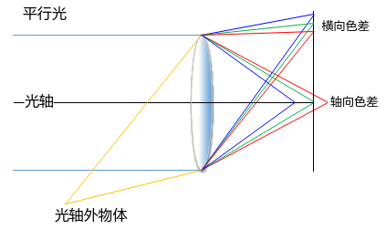

如[图1](#fig253220313565)所示，色差可以分为两类：

-   轴向色差（Axial Chromatic Aberration）
    -   不同波长的光经由光学系统之后聚焦在不同的焦平面上，大口径镜头容易产生这种色差，缩小光圈可以减弱轴向色差
    -   人眼对于G通道更敏感，一般G通道可以正确对焦，从而引起R、B的模糊，造成高光区与低光区交界处出现明显的紫边表现
    -   轴向色差具有明显的局部特性，因此在校正时采用Local CAC对其进行校正

-   横向色差\(Lateral Chromatic Aberration\)
    -   透镜的放大倍数也与折射率有关，它使得不同波长光线的像高不同，即不同波长的光会聚焦在焦平面上不同的位置，会造成R、G、B 3通道具有不同的影像高度，在影像上产生色的错位，横向色差严重时，会使得物体的像带有彩色的边缘
    -   越偏离图像中心，横向色差越明显，一般横向色差表现为物体相对两侧边缘出现不同的颜色，但具体表现为什么颜色与镜头组密切相关，不同的镜头组会表现出不同种类的颜色边缘
    -   具有全局特性，在校正时采用ACAC

### Local CAC

Local CAC主要用来消除图像中出现的紫边问题。

#### 关键参数

**表 1**  Local CAC关键参数

<table><thead align="left"><tr id="row1123mcpsimp"><th class="cellrowborder" valign="top" width="32%" id="mcps1.2.3.1.1">
参数名称

</th>
<th class="cellrowborder" valign="top" width="68%" id="mcps1.2.3.1.2">
描述

</th>
</tr>
</thead>
<tbody><tr id="row1129mcpsimp"><td class="cellrowborder" valign="top" width="32%" headers="mcps1.2.3.1.1 ">
en

</td>
<td class="cellrowborder" valign="top" width="68%" headers="mcps1.2.3.1.2 ">
紫边校正使能。

取值范围：[0, 1]

</td>
</tr>
<tr id="row1135mcpsimp"><td class="cellrowborder" valign="top" width="32%" headers="mcps1.2.3.1.1 ">
purple_detect_range

</td>
<td class="cellrowborder" valign="top" width="68%" headers="mcps1.2.3.1.2 ">
紫色检测的范围

值越大，越多非高亮区域的紫色被界定为紫边区域

取值范围：[0, 410]

</td>
</tr>
<tr id="row1142mcpsimp"><td class="cellrowborder" valign="top" width="32%" headers="mcps1.2.3.1.1 ">
var_threshold

</td>
<td class="cellrowborder" valign="top" width="68%" headers="mcps1.2.3.1.2 ">
边缘检测阈值

取值范围：[0, 4095]

</td>
</tr>
<tr id="row1148mcpsimp"><td class="cellrowborder" valign="top" width="32%" headers="mcps1.2.3.1.1 ">
r_detect_threshold [3]

</td>
<td class="cellrowborder" valign="top" width="68%" headers="mcps1.2.3.1.2 ">
高亮区域检测R分量阈值

取值范围：[0, 4095]

</td>
</tr>
<tr id="row1154mcpsimp"><td class="cellrowborder" valign="top" width="32%" headers="mcps1.2.3.1.1 ">
g_detect_threshold [3]

</td>
<td class="cellrowborder" valign="top" width="68%" headers="mcps1.2.3.1.2 ">
高亮区域检测G分量阈值

取值范围：[0, 4095]

</td>
</tr>
<tr id="row1160mcpsimp"><td class="cellrowborder" valign="top" width="32%" headers="mcps1.2.3.1.1 ">
b_detect_threshold [3]

</td>
<td class="cellrowborder" valign="top" width="68%" headers="mcps1.2.3.1.2 ">
高亮区域检测B分量阈值

取值范围：[0, 4095]

</td>
</tr>
<tr id="row1166mcpsimp"><td class="cellrowborder" valign="top" width="32%" headers="mcps1.2.3.1.1 ">
l_detect_threshold [3]

</td>
<td class="cellrowborder" valign="top" width="68%" headers="mcps1.2.3.1.2 ">
高亮区域检测亮度阈值

取值范围：[0, 4095]

</td>
</tr>
<tr id="row1172mcpsimp"><td class="cellrowborder" valign="top" width="32%" headers="mcps1.2.3.1.1 ">
cb_cr_ratio [3]

</td>
<td class="cellrowborder" valign="top" width="68%" headers="mcps1.2.3.1.2 ">
紫边检测，区域颜色配置下限

取值范围：[-2048, 2047]

</td>
</tr>
<tr id="row1178mcpsimp"><td class="cellrowborder" valign="top" width="32%" headers="mcps1.2.3.1.1 ">
op_type

</td>
<td class="cellrowborder" valign="top" width="68%" headers="mcps1.2.3.1.2 ">
紫边校正工作模式

取值范围：[0, 1]

</td>
</tr>
<tr id="row1184mcpsimp"><td class="cellrowborder" valign="top" width="32%" headers="mcps1.2.3.1.1 ">
de_purple_cr_strength

</td>
<td class="cellrowborder" valign="top" width="68%" headers="mcps1.2.3.1.2 ">
R通道的校正强度

取值范围：[0, 8]

</td>
</tr>
<tr id="row1190mcpsimp"><td class="cellrowborder" valign="top" width="32%" headers="mcps1.2.3.1.1 ">
de_purple_cb_strength

</td>
<td class="cellrowborder" valign="top" width="68%" headers="mcps1.2.3.1.2 ">
B通道的校正强度

取值范围：[0, 8]

</td>
</tr>
</tbody>
</table>

#### 调试步骤

紫边表现与镜头特性有直接关系，有些镜头的紫边会扩散至十多个像素，受限于算法能力，很难在不引入副作用的情况下对其完全的校正，可以遵循如下的步骤进行调试，以期减弱紫边的表现：

-   r\_detect\_threshold、g\_detect\_threshold、b\_detect\_threshold、l\_detect\_threshold、cb\_cr\_ratio均有可调节的3个节点，其实际生效值由purple\_detect\_range的大小决定，purple\_detect\_range的值越大，越多非高亮区域的紫色被界定为紫边区域。
-   首先依据场景中的紫边表现以及校正需求，来调整purple\_detect\_range：如果采用默认值，高亮处有明显紫边没有被检测出来校正掉，需要适当增大purple\_detect\_range使得更多的区域被检测为紫边区域；相反的如果图像中有正常非明显高亮处的紫色被校正掉，则需要减小purple\_detect\_range的值，来保护正常区域的紫色表现。
-   [图1](#fig1513620551827)展示了purple\_detect\_range取不同值时图像的紫边效果，为0时检测范围最小，图像中的紫边基本上没有被检测到；为60时灯管上的紫边被检测出来，并且风车紫色叶片没有出现误检；继续增大purple\_detect\_range的值，比如为410时，可以看到风车紫色叶片出现明显灰度化。

**图 1**  purple\_detect\_range效果图  
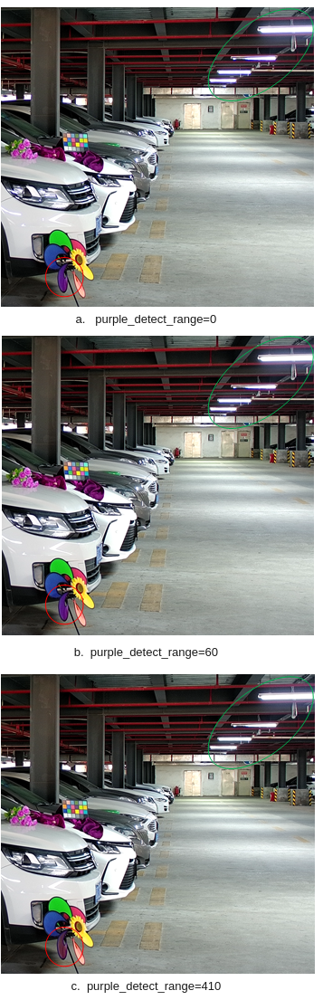

-   若只需要校正强边缘处的紫色，则可以增加var\_threshold的值；var\_threshold的值越小，所能校正的紫边的范围越大，如[图2](#fig133951171378)所示，var\_threshold=0时所能检测的紫边范围不受强边缘条件的现在，所能检测校正的范围较宽，而当var\_threshold=200时，只能检测靠近灯管边缘的几个紫边像素能被检测校正掉。

**图 2**  var\_threshold效果图  

-   在配置完上述的检测参数之后，可以调整de\_purple\_cr\_strength、de\_purple\_cb\_strength来确定R、B通道的校正强度，校正强度调节的太大，可能会造成紫边处明显的灰度化，如[图3](#fig4334816181020)所示，调节至可接受的紫边校正强度即可。一般紫边的颜色表现为蓝紫色，即在高光区过渡到低光区时，B通道的衰减更慢，对于紫边出现的贡献更大，这个时候就需要将de\_purple\_cb\_strength的值调整的更大一些。

**图 3**  de\_purple\_cb\_strength效果图  

#### 注意事项

紫边表现与镜头特性有直接关系，有些镜头的紫边会扩散至十多个像素，受限于算法能力，在紫边很宽的时候，CAC容易引入锯齿问题和紫色块和蓝色块噪声跳动问题。其中，锯齿问题是因为紫边太宽导致部分紫边去除，部分紫边残留而形成锯齿。紫色块和蓝色块噪声跳动问题是因为CAC调试太强，导致紫色块和蓝色块的部分颜色去除，部分没有去除而形成噪声跳动。所以在WDR模式下调节CAC要注意var\_threshold的调节：

-   var\_threshold 是指区域方差的阈值，在非宽动态场景，曝光比比较小的情况下，此时短帧上的噪声较小，var\_threshold可以调比较小，可以去除比较多的紫边，降低锯齿的风险。
-   在曝光比较大的情况下，短帧上的噪声大，var\_threshold要相应的调高，才能区分边缘和平坦区域。从而解决因为CAC误判断导致蓝色块和紫色块噪声跳动问题。
-   有一些紫边比较严重的场景，R或者B容易出现饱和的情况，这时，b\_detect\_threshold或者r\_detect\_threshold在最大值附近有去除紫边不平滑的现象。需要跟de\_purple\_cr\_strength和de\_purple\_cb\_strength联合调整，比如把de\_purple\_cr\_strength和de\_purple\_cb\_strength调小。

### ACAC

ACAC不仅可以对纵向色差校正，还可以对横向色差校正。

#### 关键参数

**表 1**  ACAC关键参数

<table><thead align="left"><tr id="row2783mcpsimp"><th class="cellrowborder" valign="top" width="27%" id="mcps1.2.3.1.1">
参数名称

</th>
<th class="cellrowborder" valign="top" width="73%" id="mcps1.2.3.1.2">
描述

</th>
</tr>
</thead>
<tbody><tr id="row2789mcpsimp"><td class="cellrowborder" valign="top" width="27%" headers="mcps1.2.3.1.1 ">
en

</td>
<td class="cellrowborder" valign="top" width="73%" headers="mcps1.2.3.1.2 ">
色差校正使能。

取值范围：[0,1]

</td>
</tr>
<tr id="row2795mcpsimp"><td class="cellrowborder" valign="top" width="27%" headers="mcps1.2.3.1.1 ">
detect_mode

</td>
<td class="cellrowborder" valign="top" width="73%" headers="mcps1.2.3.1.2 ">
边缘检测的模式，它有2种模式。

0：普通模式。

1：宽紫边模式。

默认为0.不建议调试。

</td>
</tr>
<tr id="row2803mcpsimp"><td class="cellrowborder" valign="top" width="27%" headers="mcps1.2.3.1.1 ">
op_type

</td>
<td class="cellrowborder" valign="top" width="73%" headers="mcps1.2.3.1.2 ">
ACAC的工作模式：

<ul id="ul2808mcpsimp"><li>OT_OP_MODE_AUTO：自动；</li><li>OT_OP_MODE_MANUAL：手动。</li></ul>

默认值为OT_OP_MODE_AUTO。

</td>
</tr>
<tr id="row2812mcpsimp"><td class="cellrowborder" valign="top" width="27%" headers="mcps1.2.3.1.1 ">
edge_threshold[OT_ISP_ACAC_THR_NUM]

</td>
<td class="cellrowborder" valign="top" width="73%" headers="mcps1.2.3.1.2 ">
ACAC的边缘检测阈值，两个阈值分别代表高低阈值，小于edge_thd[0]的为平坦区域，大于edge_thd[1]的是强边缘。

取值范围：[0,4095]

</td>
</tr>
<tr id="row2818mcpsimp"><td class="cellrowborder" valign="top" width="27%" headers="mcps1.2.3.1.1 ">
edge_gain

</td>
<td class="cellrowborder" valign="top" width="73%" headers="mcps1.2.3.1.2 ">
ACAC的边缘检测强度，该值越大，检测的边缘越多。

取值范围：[0,1023]

</td>
</tr>
<tr id="row2824mcpsimp"><td class="cellrowborder" valign="top" width="27%" headers="mcps1.2.3.1.1 ">
purple_upper_limit

</td>
<td class="cellrowborder" valign="top" width="73%" headers="mcps1.2.3.1.2 ">
ACAC的紫色检测范围上限，具体见下图示意。其中purple_upper_limit必须大于purple_lower_limit。

取值范围：[-511,511]

</td>
</tr>
<tr id="row2830mcpsimp"><td class="cellrowborder" valign="top" width="27%" headers="mcps1.2.3.1.1 ">
purple_lower_limit

</td>
<td class="cellrowborder" valign="top" width="73%" headers="mcps1.2.3.1.2 ">
ACAC的紫色检测范围下限，具体见下图示意。

取值范围：[-511,511]

</td>
</tr>
<tr id="row2836mcpsimp"><td class="cellrowborder" valign="top" width="27%" headers="mcps1.2.3.1.1 ">
purple_sat_threshold

</td>
<td class="cellrowborder" valign="top" width="73%" headers="mcps1.2.3.1.2 ">
ACAC的紫色检测饱和度阈值。大于该阈值的方为紫色的区域。

取值范围：[0, 2047]

</td>
</tr>
<tr id="row2842mcpsimp"><td class="cellrowborder" valign="top" width="27%" headers="mcps1.2.3.1.1 ">
purple_alpha

</td>
<td class="cellrowborder" valign="top" width="73%" headers="mcps1.2.3.1.2 ">
ACAC参考紫色的权重。该值越大，表示ACAC参考紫色进行校正色差的越多。

取值范围：[0, 63]

</td>
</tr>
<tr id="row2848mcpsimp"><td class="cellrowborder" valign="top" width="27%" headers="mcps1.2.3.1.1 ">
edge_alpha

</td>
<td class="cellrowborder" valign="top" width="73%" headers="mcps1.2.3.1.2 ">
ACAC参考边缘的权重。该值越大，表示ACAC参考边缘进行校正色差的越多。

取值范围：[0, 63]

</td>
</tr>
<tr id="row2854mcpsimp"><td class="cellrowborder" valign="top" width="27%" headers="mcps1.2.3.1.1 ">
fcc_y_strength

</td>
<td class="cellrowborder" valign="top" width="73%" headers="mcps1.2.3.1.2 ">
ACAC根据亮度进行校正的强度，该值越大，表示ACAC校正越强。

取值范围：[0, 4095]

</td>
</tr>
<tr id="row2860mcpsimp"><td class="cellrowborder" valign="top" width="27%" headers="mcps1.2.3.1.1 ">
fcc_rb_strength

</td>
<td class="cellrowborder" valign="top" width="73%" headers="mcps1.2.3.1.2 ">
ACAC根据R,B通道强弱进行校正的强度，该值越大，表示ACAC校正越强。

取值范围：[0, 511]

</td>
</tr>
</tbody>
</table>

#### 调试步骤

紫边表现与镜头特性有直接关系，有些镜头的紫边会扩散至十多个像素，受限于算法能力，很难在不引入副作用的情况下对其完全的校正，可以遵循如下的步骤进行调试，以期减弱紫边的表现：

1.  紫色判断机制是在色度平面上根据Cr和Cb的比值将蓝紫色的区域划分出，依据场景中的紫边的颜色，一般有偏紫红色的，也有偏蓝色的，这时候可以调整purple\_upper\_limit和purple\_lower\_limit，一般建议，偏紫红的紫边，把purple\_upper\_limit调大一点，识别区域包含更多紫红色，偏蓝色的情况，把purple\_lower\_limit调小一点，识别区域包含更多蓝色。
2.  根据紫边的严重程度调整fcc\_y\_strength，fcc\_rb\_strength以及purple\_alpha。这四个参数的效果都是调试越大，去除越干净。他们的调试步骤可以这样，purple\_alpha调最大，然后再慢慢调大fcc\_y\_strength，fcc\_rb\_strength。
3.  如果图像出现纵向色差引入的非紫色的边缘，这时候，需要调整edge\_gain和edge\_alpha以及fcc\_y\_strength，fcc\_rb\_strength去实现色差校正。调整的步骤可以如下：先把edge\_alpha为63，保持步骤2中fcc\_y\_strength，fcc\_rb\_strength的值，看色差校正情况，如果去除过多引入了副作用，则慢慢减少edge\_alpha的值，如果去除还不够，则慢慢增大edge\_gain的值，再增大fcc\_y\_strength，fcc\_rb\_strength的值。
4.  如果紫边很严重，步骤2.3都去除不了，则需要结合LCAC一起去除。具体LCAC的调试方法参考LCAC的调试步骤。

    **图 1**  紫色检测范围示意图  
    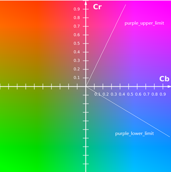

#### 注意事项

-   若场景中有一些较严重的紫边，需要加强去除紫边能力，将fcc\_y\_strength，fcc\_rb\_strength的值设置得较大，且edge\_alpha也设置得较大，注意这种情况下容易导致正常的物体边缘颜色呈灰色。
-   当fcc\_y\_strength调节不足时可能出现紫边分层的现象。
-   detect\_mode建议调试为0模式，1模式下只针对紫边做了扩充，对其他颜色的边，如红边，黄边，绿边作用可能减弱，若要去除镜头色差产生其他颜色的边建议采用0模式。

## CA

### 功能概述

颜色调整模块支持在YUV空间进行色域调整的操作，这个模块下有两个模式，一个是CA模式，另外一个是CP模式（热成像上色），工作的时候，两者只能二选一。

在CA模式下，通过下面的公式可以将一个像素点（Y，U，V）映射到另一个像素点（Y', U', V'）。

Y'=Y;  U'=aU;  V'=aV;

其中a是转换系数，采用这组公式可以在一定程度上保持亮度和色调的恒定，对像素点的饱和度做一个调整。转换系数a和像素点亮度Y联系，就可以根据亮度的变化来调整饱和度，达到局部调整饱和度的目的，亮处的颜色更鲜艳，暗处的色噪不明显。同时在CP模式下，热成像的图像只有亮度信息，该模式下通过亮度信息Y查找上色的色板，查找对应的YUV的值作为输出的值。其中，色板是通过YUV格式存储的，转换系数a和ISP的ISO值联系，达到降低低照度下的暗处色噪的目的。

### 关键参数

**表 1**  CA关键参数

<table><thead align="left"><tr id="row393mcpsimp"><th class="cellrowborder" valign="top" width="16%" id="mcps1.2.3.1.1">
参数名称

</th>
<th class="cellrowborder" valign="top" width="84%" id="mcps1.2.3.1.2">
描述

</th>
</tr>
</thead>
<tbody><tr id="row399mcpsimp"><td class="cellrowborder" valign="top" width="16%" headers="mcps1.2.3.1.1 ">
y_ratio_lut

</td>
<td class="cellrowborder" valign="top" width="84%" headers="mcps1.2.3.1.2 ">
CA模式，根据亮度Y查找的调整色度UV的增益。意思是将亮度划分成256等分，对应的设定256个调整系数A，用于调整UV的值。建议调整的时候Y值越小（也就是比较暗的地方）对应的增益A越小，这样可以有效的抑制暗区的色噪。亮度的增益设置大一些，亮区的颜色会鲜艳一些。

取值范围：[0, 2047]

</td>
</tr>
<tr id="row405mcpsimp"><td class="cellrowborder" valign="top" width="16%" headers="mcps1.2.3.1.1 ">
iso_ratio

</td>
<td class="cellrowborder" valign="top" width="84%" headers="mcps1.2.3.1.2 ">
CA模式，根据ISO值查找的调整色度UV的增益B。这是一个全局的增益，也就是ISO固定，图像所有像素点的UV的调整增益都是B。建议在低ISO的时候对应的增益B可以设置大一些，高ISO（低照度）对应的增益B可以设置小一些，可以降低低照度下的暗处色噪的目的。

取值范围：[0, 2047]

</td>
</tr>
<tr id="row411mcpsimp"><td class="cellrowborder" valign="top" width="16%" headers="mcps1.2.3.1.1 ">
cp_lut_y

</td>
<td class="cellrowborder" valign="top" width="84%" headers="mcps1.2.3.1.2 ">
CP模式，根据亮度Y查找色板中的Y值，色板有256个YUV值，一般来说，色板有固定的模板，可以参考色板的颜色转换成YUV填写对应的Y值。

取值范围：[0,255]

</td>
</tr>
<tr id="row417mcpsimp"><td class="cellrowborder" valign="top" width="16%" headers="mcps1.2.3.1.1 ">
cp_lut_u

</td>
<td class="cellrowborder" valign="top" width="84%" headers="mcps1.2.3.1.2 ">
CP模式，根据亮度Y查找色板中的U值，色板有256个YUV值，一般来说，色板有固定的模板，可以参考色板的颜色转换成YUV填写对应的U值。

取值范围：[0,255]

</td>
</tr>
<tr id="row423mcpsimp"><td class="cellrowborder" valign="top" width="16%" headers="mcps1.2.3.1.1 ">
cp_lut_v

</td>
<td class="cellrowborder" valign="top" width="84%" headers="mcps1.2.3.1.2 ">
CP模式，根据亮度Y查找色板中的V值，色板有256个YUV值，一般来说，色板有固定的模板，可以参考色板的颜色转换成YUV填写对应的V值。

取值范围：[0,255]

</td>
</tr>
</tbody>
</table>

### 注意事项

CA和CP只能开其中的一个，并不能同时打开。

## Expander

### 功能描述

部分sensor内部会做多帧曝光的融合，融合后数据位宽会增大，导致输出成本增大。为减少输出的成本，sensor内部会做数据分段压缩，将数据压缩到一个比较小的位宽。在ISP中为了将数据还原，需要将sensor内部压缩的数据，进行解压缩。

### 关键参数

**表 1**  Expander关键参数

<table><thead align="left"><tr id="row3410mcpsimp"><th class="cellrowborder" valign="top" width="28.000000000000004%" id="mcps1.2.3.1.1">
参数名称

</th>
<th class="cellrowborder" valign="top" width="72%" id="mcps1.2.3.1.2">
描述

</th>
</tr>
</thead>
<tbody><tr id="row3416mcpsimp"><td class="cellrowborder" valign="top" width="28.000000000000004%" headers="mcps1.2.3.1.1 ">
enable

</td>
<td class="cellrowborder" valign="top" width="72%" headers="mcps1.2.3.1.2 ">
Expander功能使能。

0：关闭；

1：开启；

</td>
</tr>
<tr id="row3423mcpsimp"><td class="cellrowborder" valign="top" width="28.000000000000004%" headers="mcps1.2.3.1.1 ">
bit_depth_in

</td>
<td class="cellrowborder" valign="top" width="72%" headers="mcps1.2.3.1.2 ">
输入数据位宽，取值范围：[0xC,0x14]

</td>
</tr>
<tr id="row3428mcpsimp"><td class="cellrowborder" valign="top" width="28.000000000000004%" headers="mcps1.2.3.1.1 ">
bit_depth_out

</td>
<td class="cellrowborder" valign="top" width="72%" headers="mcps1.2.3.1.2 ">
输出数据位宽。取值范围：[0xC,0x14]

</td>
</tr>
<tr id="row3433mcpsimp"><td class="cellrowborder" valign="top" width="28.000000000000004%" headers="mcps1.2.3.1.1 ">
knee_point_num

</td>
<td class="cellrowborder" valign="top" width="72%" headers="mcps1.2.3.1.2 ">
拐点坐标的数目。取值范围：[1,256]

</td>
</tr>
<tr id="row3438mcpsimp"><td class="cellrowborder" valign="top" width="28.000000000000004%" headers="mcps1.2.3.1.1 ">
knee_point_coord[256]

</td>
<td class="cellrowborder" valign="top" width="72%" headers="mcps1.2.3.1.2 ">
解压的拐点（包括横纵坐标）

</td>
</tr>
</tbody>
</table>

### 调试过程

在sensor手册中会给出sensor内部压缩时使用的拐点，Expander的配置需要将这几个拐点进行转换，然后配置到cmos\_ex.h中即可。

转换原则如下：

-   knee\_point\_coord的横坐标x需要根据sensor压缩曲线转换到0\~256之间（8bit），例如sensor压缩输出的后有效数据位宽是12bit，则需要将sensor压缩曲线拐点的纵坐标右移4bit得到knee\_point\_coord的横坐标x；
-   knee\_point\_coord的纵坐标y需要根据sensor压缩曲线转换到0\~1048576之间（20bit），例如sensor合成有效数据未压缩之前有效位宽是16bit，则需要将sensor压缩曲线的拐点的横坐标左移4bit，得到knee\_point\_coord的纵坐标y。

## Radial Crop

### 功能描述

SS928V100是在YUV域对图像进行radial crop操作，将设定半径之外的地方直接拉黑掉。

### 关键参数

**表 1**  Radial Crop关键参数

<table><thead align="left"><tr id="row888mcpsimp"><th class="cellrowborder" valign="top" width="20%" id="mcps1.2.3.1.1">
参数名称

</th>
<th class="cellrowborder" valign="top" width="80%" id="mcps1.2.3.1.2">
描述

</th>
</tr>
</thead>
<tbody><tr id="row894mcpsimp"><td class="cellrowborder" valign="top" width="20%" headers="mcps1.2.3.1.1 ">
en

</td>
<td class="cellrowborder" valign="top" width="80%" headers="mcps1.2.3.1.2 ">
使能Radial Crop 功能。

取值范围：[0,1]

0：禁止；1：使能。默认值0

</td>
</tr>
<tr id="row901mcpsimp"><td class="cellrowborder" valign="top" width="20%" headers="mcps1.2.3.1.1 ">
center_coord

</td>
<td class="cellrowborder" valign="top" width="80%" headers="mcps1.2.3.1.2 ">
中心点的坐标配置信息。

x取值范围：[0, width - 1]

y取值范围：[0, height - 1]

x默认为：width/2

y默认为：height/2

</td>
</tr>
<tr id="row910mcpsimp"><td class="cellrowborder" valign="top" width="20%" headers="mcps1.2.3.1.1 ">
radius

</td>
<td class="cellrowborder" valign="top" width="80%" headers="mcps1.2.3.1.2 ">
拉黑的半径，到中心点的距离大于半径的区域直接拉黑。

取值范围：[0, ]

默认值

</td>
</tr>
</tbody>
</table>

### 调试过程

中心点的坐标以及半径的配置值可以直接采用fisheye算法的标定结果，分辨率切换之后，对应的中心点左边与半径也要随之更新，以避免图像的不正常。

## LDCI

### 功能描述

相对于绝对亮度，人眼对对比度更加敏感，而图像经过捕获、处理然后显示的过程中，容易造成图像对比度不足，并且可能丢失暗区或者亮区的细节。LDCI基于局域直方图均衡（HE）的方法来增强局部的对比度，同时提升亮暗区细节。

-   LDCI会对分块统计的局部直方图信息进行平滑滤波，滤波系数越局限，则基于的直方图信息越局域，因此该模块可以通过调整滤波系数，来控制局部对比度增强的局域程度；
-   同时LDCI可以对对比度增强后亮度提升和亮度降低的区域进行区别控制，且其控制的强度可以依据输入图像的亮度进行适当调整，例如，对于LDCI增强后亮度提升的区域，通常希望输入图像亮度较低的区域提升程度更大，而输入图像亮度较高的区域则保持原状，对亮度降低区域则刚好相反；
-   LDCI还可以在对比度增强的基础上适当的对暗区增强程度进行抑制，防止噪声被过度增强。

**图 1**  LDCI 结构框图  
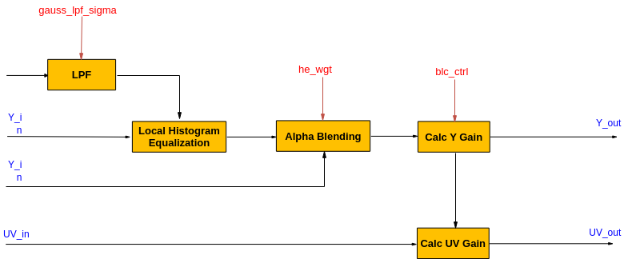

### 关键参数

**表 1**  LDCI关键参数

<table><thead align="left"><tr id="row437mcpsimp"><th class="cellrowborder" colspan="2" valign="top" id="mcps1.2.5.1.1">
参数名称

</th>
<th class="cellrowborder" colspan="2" valign="top" id="mcps1.2.5.1.2">
描述

</th>
</tr>
</thead>
<tbody><tr id="row443mcpsimp"><td class="cellrowborder" colspan="2" valign="top" headers="mcps1.2.5.1.1 ">
en

</td>
<td class="cellrowborder" colspan="2" valign="top" headers="mcps1.2.5.1.2 ">
LDCI功能使能。

0：关闭；

1：使能。

线性模式下默认为1，WDR模式下默认为0。

</td>
</tr>
<tr id="row451mcpsimp"><td class="cellrowborder" colspan="2" valign="top" headers="mcps1.2.5.1.1 ">
gauss_lpf_sigma

</td>
<td class="cellrowborder" colspan="2" valign="top" headers="mcps1.2.5.1.2 ">
LPF滤波局域程度，其值越小说明LDCI作用越局域，取值范围：[0x1, 0xFF]

</td>
</tr>
<tr id="row458mcpsimp"><td class="cellrowborder" colspan="2" valign="top" headers="mcps1.2.5.1.1 ">
op_type

</td>
<td class="cellrowborder" colspan="2" valign="top" headers="mcps1.2.5.1.2 ">
LDCI工作类型。

<ul id="ul463mcpsimp"><li>OT_OP_MODE_AUTO：自动模式；</li><li>OT_OP_MODE_MANUAL：手动模式。</li></ul>

默认值为OT_OP_MODE_AUTO。

</td>
</tr>
<tr id="row467mcpsimp"><td class="cellrowborder" rowspan="6" valign="top" width="16%" headers="mcps1.2.5.1.1 ">
he_wgt

</td>
<td class="cellrowborder" rowspan="3" valign="top" width="15%" headers="mcps1.2.5.1.1 ">
he_pos_wgt

</td>
<td class="cellrowborder" valign="top" width="18%" headers="mcps1.2.5.1.2 ">
wgt

</td>
<td class="cellrowborder" valign="top" width="51%" headers="mcps1.2.5.1.2 ">
局域直方图均衡结果与原图融合权重曲线，根据亮度控制提亮程度，曲线呈GAUSS分布，该参数为GAUSS分布最大值。

取值范围：[0, 0xFF]

</td>
</tr>
<tr id="row481mcpsimp"><td class="cellrowborder" valign="top" headers="mcps1.2.5.1.1 ">
sigma

</td>
<td class="cellrowborder" valign="top" headers="mcps1.2.5.1.1 ">
局域直方图均衡结果与原图融合权重曲线，根据亮度控制提亮程度，曲线呈GAUSS分布，该参数为GAUSS分布均方差。

取值范围：[0x1, 0xFF]

</td>
</tr>
<tr id="row493mcpsimp"><td class="cellrowborder" valign="top" headers="mcps1.2.5.1.1 ">
mean

</td>
<td class="cellrowborder" valign="top" headers="mcps1.2.5.1.1 ">
局域直方图均衡结果与原图融合权重曲线，根据亮度控制提亮程度，曲线呈GAUSS分布，该参数为GAUSS分布数学期望。

取值范围：[0x0, 0xFF]

</td>
</tr>
<tr id="row504mcpsimp"><td class="cellrowborder" rowspan="3" valign="top" headers="mcps1.2.5.1.1 ">
he_neg_wgt

</td>
<td class="cellrowborder" valign="top" headers="mcps1.2.5.1.1 ">
wgt

</td>
<td class="cellrowborder" valign="top" headers="mcps1.2.5.1.2 ">
局域直方图均衡结果与原图融合权重曲线，根据亮度控制变暗程度，曲线呈GAUSS分布，该参数为GAUSS分布最大值。

取值范围：[0, 0xFF]

</td>
</tr>
<tr id="row516mcpsimp"><td class="cellrowborder" valign="top" headers="mcps1.2.5.1.1 ">
sigma

</td>
<td class="cellrowborder" valign="top" headers="mcps1.2.5.1.1 ">
局域直方图均衡结果与原图融合权重曲线，根据亮度控制变暗程度，曲线呈GAUSS分布，该参数为GAUSS分布均方差。

取值范围：[0x1, 0xFF]

</td>
</tr>
<tr id="row528mcpsimp"><td class="cellrowborder" valign="top" headers="mcps1.2.5.1.1 ">
mean

</td>
<td class="cellrowborder" valign="top" headers="mcps1.2.5.1.1 ">
局域直方图均衡结果与原图融合权重曲线，根据亮度控制变暗程度，曲线呈GAUSS分布，该参数为GAUSS分布数学期望。取值范围：[0x0, 0xFF]

</td>
</tr>
<tr id="row539mcpsimp"><td class="cellrowborder" colspan="2" valign="top" headers="mcps1.2.5.1.1 ">
blc_ctrl

</td>
<td class="cellrowborder" colspan="2" valign="top" headers="mcps1.2.5.1.2 ">
暗区增益控制强度，用于抑制暗区噪声。

取值范围：[0x0, 0x1FF]

</td>
</tr>
<tr id="row547mcpsimp"><td class="cellrowborder" colspan="2" valign="top" headers="mcps1.2.5.1.1 ">
tpr_incr_coef

</td>
<td class="cellrowborder" colspan="2" valign="top" headers="mcps1.2.5.1.2 ">
画面由暗到亮变化时域滤波系数，值越大，当前帧像素比重越大，取值范围：[0x0, 0x100]

</td>
</tr>
<tr id="row553mcpsimp"><td class="cellrowborder" colspan="2" valign="top" headers="mcps1.2.5.1.1 ">
tpr_decr_coef

</td>
<td class="cellrowborder" colspan="2" valign="top" headers="mcps1.2.5.1.2 ">
画面由亮到暗变化时域滤波系数，值越大，当前帧像素比重越大，取值范围：[0x0, 0x100]

</td>
</tr>
</tbody>
</table>

### 调试过程

LDCI可以通过接口参数gauss\_lpf\_sigma调整LPF的滤波系数形状，从而来控制局部对比度增强的局域程度；同时其还可以通过接口参数he\_wgt对对比度增强后亮度提升和亮度降低的区域进行区别控制；LDCI还可以在对比度增强的基础上通过接口参数blc\_ctrl适当的对暗区增强程度进行抑制，防止暗区噪声被过度增强。

#### 对比度增强的局域程度调试

LDCI可以通过调节统计信息的滤波系数来控制局部对比度增强的窗口大小，窗口大小为9\*9，滤波器系数为GAUSS型，配置参数gauss\_lpf\_sigma为高斯的方差参数，滤波器系数形状随着gauss\_lpf\_sigma变化趋势如[图1](#_Ref479254911)所示。

**图 1**  LPF滤波系数随着参数gauss\_lpf\_sigma的变化趋势  
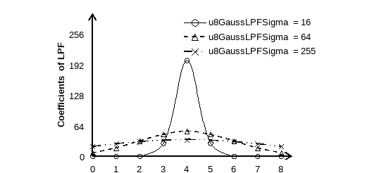

由[图1](#_Ref479254911)可知，当减小gauss\_lpf\_sigma会减小滤波窗口的尺度，这样会使算法效果更加局域化。通常对于真实应用场景中纹理细节丰富的场景趋向于配置一个较小的sigma值来减小滤波窗口的尺度，从而来提升纹理对比度增强的程度，[图2](#_Ref479254969)为gauss\_lpf\_sigma取不同值时的效果。

-   当gauss\_lpf\_sigma取值为16时滤波尺度较小，算法效果更加局域化，此时图中区域对比度、层次感明显优于gauss\_lpf\_sigma取值为255的图像效果，暗区细节相对于gauss\_lpf\_sigma取值为255时更容易保留；
-   当gauss\_lpf\_sigma取值为255时滤波尺度较大，算法效果更加全局化，此时图像整体对比度要强于gauss\_lpf\_sigma取值为16。因此用户可根据自己喜好风格设置gauss\_lpf\_sigma来控制对比度增强的局域程度。相应的，对图像平坦区域丰富的场景，趋向于配置一个较大的sigma值来增加滤波窗口的尺度，避免在平坦区域出现图像不平滑的副作用。

**图 2**  gauss\_lpf\_sigma取值不同时图像效果  
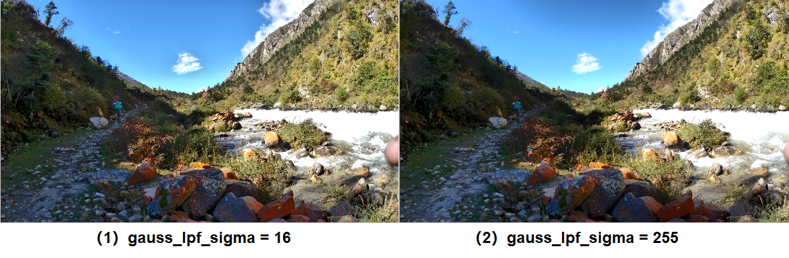

> **须知：** 
>增大gauss\_lpf\_sigma滤波系数，滤波结果可能变大，可能变小，亮度上不是单调变化的。

#### 局域直方图均衡权重调试

LDCI可以对对比度增强后亮度提升和亮度降低的区域进行区别控制，同时其控制的强度可以依据输入图像像素的亮度进行调整。LDCI采用高斯曲线来控制其提升程度，曲线的横坐标代表输入像素的亮度，精度为5bit，纵坐标代表对比度增强后与原图融合的权重，精度为7bit。其形状由高斯曲线的峰值wgt、均方差sigma以及中心值mean三者确定，其变化趋势如[图1](#_Ref479255102)至[图3](#_Ref481739937)所示。

**图 1**  权重曲线随wgt变化趋势  
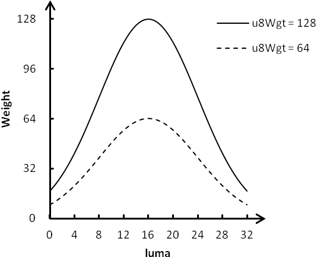

**图 2**  权重曲线随sigma变化趋势  
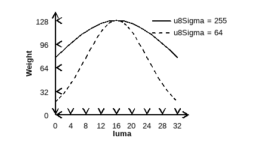

**图 3**  权重曲线随mean变化趋势  
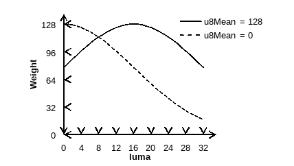

LDCI增强之后亮度提升的区域，可采用参数he\_pos\_wgt.wgt、he\_pos\_wgt.sigma、he\_pos\_wgt.mean来控制融合权重曲线形状从而控制其提亮程度，通常策略是先设定曲线的中心he\_pos\_wgt.mean，多数情况下，暗区需要提升的程度更大，就可以设定he\_pos\_wgt.mean在一个较低的亮度，然后控制曲线的峰值he\_pos\_wgt.wgt和均方差he\_pos\_wgt.sigma来调整提亮的程度，he\_pos\_wgt.mean、he\_pos\_wgt.wgt、he\_pos\_wgt.sigma取值不同时效果如[图4](#_Ref479255227)所示，暗区对比度改善明显。

**图 4**  he\_pos\_wgt取值不同时效果  
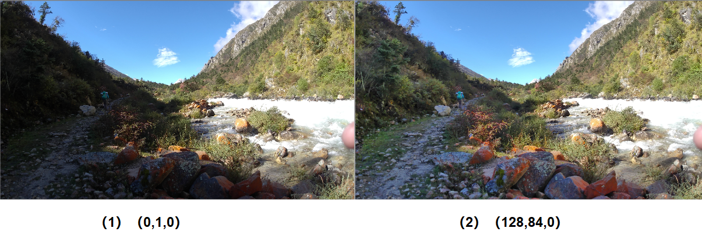

对经过LDCI增强之后亮度降低的区域，控制方法与提升区域相似，可采用参数he\_neg\_wgt.wgt、he\_neg\_wgt.sigma、he\_neg\_wgt.mean来控制融合权重曲线形状从而控制其变暗程度。而曲线的中心值he\_neg\_wgt.mean，均方差he\_neg\_wgt.sigma和峰值he\_neg\_wgt.wgt则可以根据实际场景中哪些区域亮度需要降低来进行调节，he\_neg\_wgt.mean、tHeNegWgt.wgt、he\_neg\_wgt.sigma取值不同时效果如[图5](#_Ref479255366)所示，亮区对比度改善明显。

**图 5**  he\_neg\_wgt取值不同时效果  
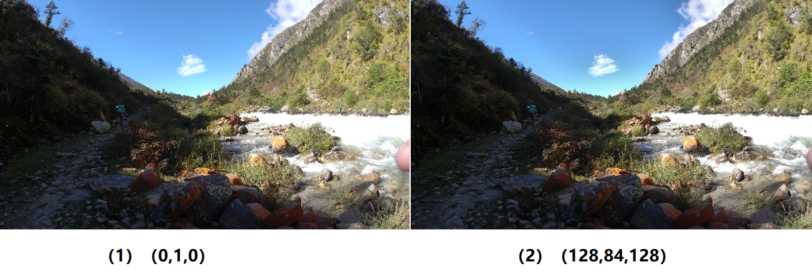

> **须知：** 
>当he\_neg\_wgt.sigma或者he\_pos\_wgt.sigma 设置较小时，调节mean，可能会出现LUT跳变的情况或者过渡不平滑的现象，不建议将sigma设置为15以下。

#### 暗区抑制参数调试

LDCI还可以在对比度增强的基础上适当的对暗区增强程度进行抑制，防止噪声被过度增强，其通过配置参数blc\_ctrl来实现，当图像像素值小于blc\_ctrl时，其原本通过he\_wgt曲线计算出来的对比度增益将会被急剧衰减，暗区增强作用将会明显减弱，其衰减系数趋势曲线如[图1](#_Ref479255444)所示，不同参数下图像效果如[图2](#_Ref479255490)所示。

**图 1**  不同blc\_ctrl参数下对比度增强增益衰减系数趋势  
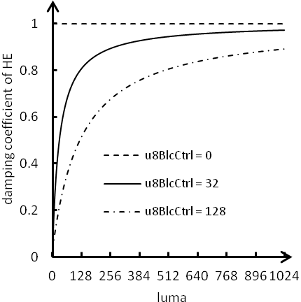

**图 2**  blc\_ctrl取值不同时效果  
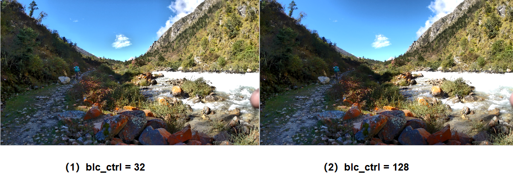

#### 时域参数调试

为了避免亮度发生突变时，LDCI出现闪烁问题，LDCI内部增加了对统计信息的时域滤波处理，保持统计信息平滑变化，接口tpr\_incr\_coef用来调节画面由暗到亮变化时域滤波系数，接口tpr\_decr\_coef用来调节画面由亮到暗变化时域滤波系数，值越大，参考当前帧比重越大，当tpr\_incr\_coef=256或tpr\_decr\_coef=256时完全使用当前帧统计值，不再参考历史帧统计信息。当tpr\_incr\_coef=0或tpr\_decr\_coef=0时完全使用历史帧统计值，不再参考当前帧统计，建议时域滤波系数不要调试过大，防止出现闪烁问题。

注意开启LDCI时域滤波功能后，LDCI延迟四帧生效。

### 注意事项及相关问题

由于LDCI为时域相关局部对比度增强算法，因此其效果高度依赖前一帧统计信息，当在开启LDCI前面其他对亮度影响较大算法时可能导致LDCI统计信息出现较大差异，导致LDCI出现一帧闪烁。

在曝光变化的情况下，LDCI会根据AE曝光量对统计信息做相应调整，以提升画面亮度稳定性；为了实现和AE曝光的同步，LDCI要求AE算法返回曝光信息和曝光实际生效之间至少间隔2帧，请用户使用自有AE算法时特别注意此限制。

LDCI在强度过大时可能导致低频噪声被增强，推荐在噪声过大时适当降低LDCI强度；

LDCI仅增强局部对比度，不会增强锐度。当过暗区域增强较大时，可能出现暗区清晰度相对亮度清晰度偏低的现象，需要适当通过sharpen配合调试增加锐度。

## Dehaze

### 功能描述

去雾算法主要用在有雾场景中做去雾处理，调整图像的对比度，使有雾的图像更加清晰可见。去雾算法根据图像的统计值，估计出雾的浓度，自适应调整去雾的强度。

### 关键参数

**表 1**  Dehaze关键参数

<table><thead align="left"><tr id="row271mcpsimp"><th class="cellrowborder" valign="top" width="39%" id="mcps1.2.3.1.1">
参数名称

</th>
<th class="cellrowborder" valign="top" width="61%" id="mcps1.2.3.1.2">
描述

</th>
</tr>
</thead>
<tbody><tr id="row277mcpsimp"><td class="cellrowborder" valign="top" width="39%" headers="mcps1.2.3.1.1 ">
en

</td>
<td class="cellrowborder" valign="top" width="61%" headers="mcps1.2.3.1.2 ">
DEHAZE功能使能。

0：关闭；

1：使能。

DEFOG默认关闭

</td>
</tr>
<tr id="row285mcpsimp"><td class="cellrowborder" valign="top" width="39%" headers="mcps1.2.3.1.1 ">
op_type

</td>
<td class="cellrowborder" valign="top" width="61%" headers="mcps1.2.3.1.2 ">
DEHAZE工作类型。

<ul id="ul290mcpsimp"><li>OT_OP_MODE_AUTO：自动模式；</li><li>OT_OP_MODE_MANUAL：手动模式。</li></ul>

默认值为OT_OP_MODE_AUTO。

</td>
</tr>
<tr id="row294mcpsimp"><td class="cellrowborder" valign="top" width="39%" headers="mcps1.2.3.1.1 ">
auto_attr.strength

</td>
<td class="cellrowborder" valign="top" width="61%" headers="mcps1.2.3.1.2 ">
用来控制自动模式下DEHAZE的强度,值越大，去雾强度越大。

取值范围：[0, 0xFF]

</td>
</tr>
<tr id="row301mcpsimp"><td class="cellrowborder" valign="top" width="39%" headers="mcps1.2.3.1.1 ">
manual_attr.strength

</td>
<td class="cellrowborder" valign="top" width="61%" headers="mcps1.2.3.1.2 ">
用来控制手动模式下DEHAZE的强度,值越大，去雾强度越大。

取值范围：[0, 0xFF]

</td>
</tr>
<tr id="row308mcpsimp"><td class="cellrowborder" valign="top" width="39%" headers="mcps1.2.3.1.1 ">
user_lut_en

</td>
<td class="cellrowborder" valign="top" width="61%" headers="mcps1.2.3.1.2 ">
用户自定义去雾曲线的使能。

</td>
</tr>
<tr id="row313mcpsimp"><td class="cellrowborder" valign="top" width="39%" headers="mcps1.2.3.1.1 ">
dehaze_lut[256]

</td>
<td class="cellrowborder" valign="top" width="61%" headers="mcps1.2.3.1.2 ">
用户使用自定义的曲线参数，曲线是根据亮度做去雾的强度，一共有256个点，也就是亮度区分256阶，取值范围是[0, 255]

</td>
</tr>
<tr id="row318mcpsimp"><td class="cellrowborder" valign="top" width="39%" headers="mcps1.2.3.1.1 ">
tmprflt_incr_coef

</td>
<td class="cellrowborder" valign="top" width="61%" headers="mcps1.2.3.1.2 ">
时域滤波递增系数，值越大，画面由暗到亮收敛速度越快，取值范围：[0x0, 0x80]

</td>
</tr>
<tr id="row323mcpsimp"><td class="cellrowborder" valign="top" width="39%" headers="mcps1.2.3.1.1 ">
tmprflt_decr_coef

</td>
<td class="cellrowborder" valign="top" width="61%" headers="mcps1.2.3.1.2 ">
时域滤波递减系数，值越大，画面由亮到暗收敛速度越快，取值范围：[0x0, 0x80]

</td>
</tr>
</tbody>
</table>

### 调试过程

Dehaze算法支持手动和自动模式。

-   在自动模式下，用户可以配置auto\_attr.strength值，注意用户配置的强度值为去雾强度的权重系数，最终生效的强度值为去雾算法自动计算出的强度值乘以权重系数。
-   在手动模式下，生效的强度值即为用户配置的manual\_attr.strength值。
-   当tmprflt\_incr\_coef和tmprflt\_decr\_coef为0时，表示完全使用历史帧信息，不使用当前帧信息。
-   当tmprflt\_incr\_coef和tmprflt\_decr\_coef为128时，表示完全使用当前帧信息，不参考历史帧信息；同时，画面可能会出现概率性闪烁，不建议将该值设置到最大。

> **说明：** 
>-   去雾强度越大，整体图像对比度越高，可能会带来暗区细节的损失，在调试过程中应根据实际场景做权衡。
>-   SS928V100的DEHAZE算法在ISP运行4次后生效，即使能后第4帧生效。
>-   注意在分辨率切换或者模式切换时，DEHAZE生效时间晚于其他算法。
>-   当场景出现剧烈变化，比如强光灯照射镜头后拿开，tmprflt\_incr\_coef和tmprflt\_decr\_coef 从0调到1，可能会出现一帧亮度跳变，不建议将滤波系数调为0。

### Dehaze参数

Dehaze算法同样支持使用PQ工具里的Dehaze COEFFI进行调节，曲线调节原理与Gamma类似，具体效果影响如下。

-   Dehaze COEFFI为0.45时的情况，如[图1](#_Ref521483310)所示。

**图 1**  Dehaze COEFFI为0.45时的情况  
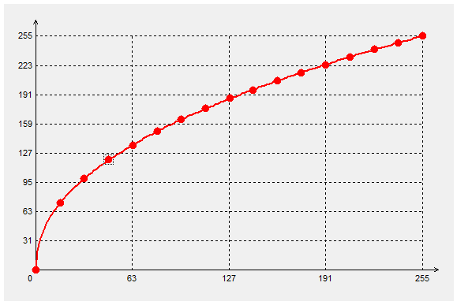

-   Dehaze COEFFI为1.3时的情况，如[图2](#_Ref521483398)所示。

**图 2**  Dehaze COEFFI为1.3时的情况  
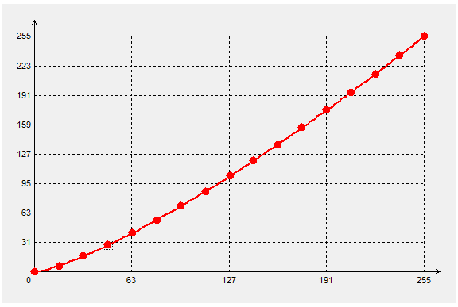

## CLUT

### 功能描述

CLUT是利用线性RGB空间17x17x17分格的3D LUT实现复杂的颜色调整操作，比如亮度，饱和度，色调的调整。可以对阴影，中间亮度，高亮区域分别调整。

### 关键参数

**表 1**  CLUT关键参数

<table><thead align="left"><tr id="row3010mcpsimp"><th class="cellrowborder" valign="top" width="47%" id="mcps1.2.3.1.1">
参数名称

</th>
<th class="cellrowborder" valign="top" width="53%" id="mcps1.2.3.1.2">
描述

</th>
</tr>
</thead>
<tbody><tr id="row3016mcpsimp"><td class="cellrowborder" valign="top" width="47%" headers="mcps1.2.3.1.1 ">
en

</td>
<td class="cellrowborder" valign="top" width="53%" headers="mcps1.2.3.1.2 ">
CLUT使能，取值范围：[0,1]

</td>
</tr>
<tr id="row3021mcpsimp"><td class="cellrowborder" valign="top" width="47%" headers="mcps1.2.3.1.1 ">
gain_r

</td>
<td class="cellrowborder" valign="top" width="53%" headers="mcps1.2.3.1.2 ">
R通道增益，取值范围：[0,4095]

</td>
</tr>
<tr id="row3026mcpsimp"><td class="cellrowborder" valign="top" width="47%" headers="mcps1.2.3.1.1 ">
gain_g

</td>
<td class="cellrowborder" valign="top" width="53%" headers="mcps1.2.3.1.2 ">
G通道增益，取值范围：[0,4095]

</td>
</tr>
<tr id="row3031mcpsimp"><td class="cellrowborder" valign="top" width="47%" headers="mcps1.2.3.1.1 ">
gain_b

</td>
<td class="cellrowborder" valign="top" width="53%" headers="mcps1.2.3.1.2 ">
B通道增益，取值范围：[0,4095]

</td>
</tr>
<tr id="row3036mcpsimp"><td class="cellrowborder" valign="top" width="47%" headers="mcps1.2.3.1.1 ">
lut[OT_ISP_CLUT_LUT_LENGTH]

</td>
<td class="cellrowborder" valign="top" width="53%" headers="mcps1.2.3.1.2 ">
查找表，取值范围：[0, 1073741823]

</td>
</tr>
</tbody>
</table>

### 调试步骤

按照《图像质量调试工具使用指南》完成CLUT标定工作。

ISP系统的颜色调优请参考《ISP 颜色调优说明》。

## RGBIR

### 功能描述

RGBIR分为RGBIR4X4模式及RGBIR Normal模式。RGBIR4X4模式支持输入RGB-IR4x4单通道信号，输出正常Bayer格式raw信号及IR raw信号供其他应用；RGBIR Normal模式支持输入Bayer raw及IR raw双通道信号，输出Bayer格式信号。非RGB-IR4x4信号可通过软件（如DSP）拆分为Bayer raw及IR raw，并使用RGBIR Normal模式实现减IR串扰处理。

RGBIR模块的算法框图以及关键参数的对应模块如[图1](#fig16523192519472)所示。

**图 1**  RGBIR算法框图  
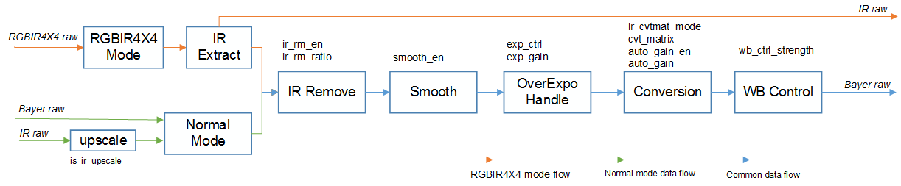

### 关键参数

**表 1**  RGBIR关键参数

<table><thead align="left"><tr id="row2875mcpsimp"><th class="cellrowborder" valign="top" width="37%" id="mcps1.2.3.1.1">
参数名称

</th>
<th class="cellrowborder" valign="top" width="63%" id="mcps1.2.3.1.2">
描述

</th>
</tr>
</thead>
<tbody><tr id="row2881mcpsimp"><td class="cellrowborder" valign="top" width="37%" headers="mcps1.2.3.1.1 ">
rgbir_en

</td>
<td class="cellrowborder" valign="top" width="63%" headers="mcps1.2.3.1.2 ">
RGB-IR功能使能。

0：关闭；

1：使能。

</td>
</tr>
<tr id="row2888mcpsimp"><td class="cellrowborder" valign="top" width="37%" headers="mcps1.2.3.1.1 ">
mode mode

</td>
<td class="cellrowborder" valign="top" width="63%" headers="mcps1.2.3.1.2 ">
RGBIR模式选择。

0：RGBIR4X4模式；

1：Normal模式。

当前通路暂不支持Normal模式。

</td>
</tr>
<tr id="row2896mcpsimp"><td class="cellrowborder" valign="top" width="37%" headers="mcps1.2.3.1.1 ">
in_rgbir_pattern

</td>
<td class="cellrowborder" valign="top" width="63%" headers="mcps1.2.3.1.2 ">
RGB-IR模块在RGBIR4X4模式下输入RGBIR Pattern选择，用户可以根据sensor本身排列进行选择。

取值范围：[0x0, 0x7]

</td>
</tr>
<tr id="row2902mcpsimp"><td class="cellrowborder" valign="top" width="37%" headers="mcps1.2.3.1.1 ">
in_bayer_pattern

</td>
<td class="cellrowborder" valign="top" width="63%" headers="mcps1.2.3.1.2 ">
RGB-IR模块在Normal模式下，输入Bayer Pattern格式选择。

取值范围：[0x0,0x3]

</td>
</tr>
<tr id="row2910mcpsimp"><td class="cellrowborder" valign="top" width="37%" headers="mcps1.2.3.1.1 ">
out_pattern

</td>
<td class="cellrowborder" valign="top" width="63%" headers="mcps1.2.3.1.2 ">
RGBIR模块输出格式选择，与普通Bayer Pattern一致。

取值范围：[0x0,0x3]

</td>
</tr>
<tr id="row2917mcpsimp"><td class="cellrowborder" valign="top" width="37%" headers="mcps1.2.3.1.1 ">
is_ir_upscale

</td>
<td class="cellrowborder" valign="top" width="63%" headers="mcps1.2.3.1.2 ">
RGB-IR模块在Normal模式下，输入IR通路是否需要上采样配置。

当输入的IR raw为Bayer raw的1/4分辨率（宽高都为1/2）时该值需配置为1；当输入的IR raw与Bayer raw分辨率相同时该值配置为false。

</td>
</tr>
<tr id="row2924mcpsimp"><td class="cellrowborder" valign="top" width="37%" headers="mcps1.2.3.1.1 ">
exp_ctrl [2]

</td>
<td class="cellrowborder" valign="top" width="63%" headers="mcps1.2.3.1.2 ">
过曝处理控制参数，调节曝光亮度区间。

取值范围：[0, 2047]

默认参数为 exp_ctrl [0]=1500，exp_ctrl [1]=75。

具体设定方法请参考【注意事项】。

</td>
</tr>
<tr id="row2932mcpsimp"><td class="cellrowborder" valign="top" width="37%" headers="mcps1.2.3.1.1 ">
exp_gain[2]

</td>
<td class="cellrowborder" valign="top" width="63%" headers="mcps1.2.3.1.2 ">
过曝处理控制参数，在通过exp_ctrl 确定了区间后，使用本参数进行数据的过曝处理。

取值范围：[0, 511]

默认参数为exp_gain [0]=256，exp_gain[1]=256。

具体设定方法请参考【注意事项】。

</td>
</tr>
<tr id="row2940mcpsimp"><td class="cellrowborder" valign="top" width="37%" headers="mcps1.2.3.1.1 ">
auto_gain_en

</td>
<td class="cellrowborder" valign="top" width="63%" headers="mcps1.2.3.1.2 ">
自动增益使能配置。当为true时，RGBIR模块将自动计算并乘以RGBIR处理前后的亮度增益，使RGBIR输入输出亮度保持一致；当为false时，将使用auto_gain值作为手动增益配置。

</td>
</tr>
<tr id="row2945mcpsimp"><td class="cellrowborder" valign="top" width="37%" headers="mcps1.2.3.1.1 ">
auto_gain

</td>
<td class="cellrowborder" valign="top" width="63%" headers="mcps1.2.3.1.2 ">
自动增益值参数配置，当auto_gain_en为false时起作用，256为1倍增益。

取值范围：[0, 1023]，默认为256。

</td>
</tr>
<tr id="row2951mcpsimp"><td class="cellrowborder" valign="top" width="37%" headers="mcps1.2.3.1.1 ">
smooth_en

</td>
<td class="cellrowborder" valign="top" width="63%" headers="mcps1.2.3.1.2 ">
平滑功能使能，开启时可减弱伪彩，但同时清晰度也有所下降。默认为0。

</td>
</tr>
<tr id="row2956mcpsimp"><td class="cellrowborder" valign="top" width="37%" headers="mcps1.2.3.1.1 ">
ir_rm_en

</td>
<td class="cellrowborder" valign="top" width="63%" headers="mcps1.2.3.1.2 ">
IR remove使能，可实现减IR串扰或IR渗透。默认为false。

</td>
</tr>
<tr id="row2961mcpsimp"><td class="cellrowborder" valign="top" width="37%" headers="mcps1.2.3.1.1 ">
ir_rm_ratio[3]

</td>
<td class="cellrowborder" valign="top" width="63%" headers="mcps1.2.3.1.2 ">
IR串扰率配置，当ir_rm_en为true时起作用，可分别配置R/G/B三通道IR串扰率。取值范围：[0, 1000]，精度为0.1%。

</td>
</tr>
<tr id="row2966mcpsimp"><td class="cellrowborder" valign="top" width="37%" headers="mcps1.2.3.1.1 ">
cvtmat_mode

</td>
<td class="cellrowborder" valign="top" width="63%" headers="mcps1.2.3.1.2 ">
RGB-IR模块转换矩阵功能选择，分Normal模式、Mono模式和User模式。默认选择为Normal模式。

</td>
</tr>
<tr id="row2971mcpsimp"><td class="cellrowborder" valign="top" width="37%" headers="mcps1.2.3.1.1 ">
cvt_matrix[12]

</td>
<td class="cellrowborder" valign="top" width="63%" headers="mcps1.2.3.1.2 ">
RGB-IR模块转换矩阵参数配置。在Normal模式和Mono模式下使用FW默认参数进行配置。本矩阵参数配置仅在User模式下生效。

</td>
</tr>
<tr id="row2976mcpsimp"><td class="cellrowborder" valign="top" width="37%" headers="mcps1.2.3.1.1 ">
wb_ctrl_strength[2]

</td>
<td class="cellrowborder" valign="top" width="63%" headers="mcps1.2.3.1.2 ">
调节白平衡控制强度参数，可分别调节R/B通道，调节画面部分区域偏绿或者偏红现象。

取值范围：[0,1024]，默认值：1024。

</td>
</tr>
</tbody>
</table>

【注意事项】

1.  RGBIR 4x4 pattern排列如[图1](#fig17861757175418)所示。

    **图 1**  RGBIR 4x4 pattern  
    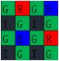

2.  过曝处理模块相关说明：

    exp\_ctrl \[0\]和exp\_ctrl \[1\]的设置相对独立，但是需要满足exp\_ctrl \[1\]小于exp\_ctrl \[0\]。

    exp\_ctrl 和过曝处理时使用的Threshold的关系为：

    Threshold0 = MaxValue – \(BLC + exp\_ctrl \[0\]\);

    Threshold1 = MaxValue – \(BLC + exp\_ctrl \[1\]\);

    MaxValue的值固定为4095（12 bit最大值）。

    在进行过曝处理时，需要考虑当前点的IR强度和RGB亮度强度。过曝处理仅在RGB亮度强度高于Threshold1的区域内生效。

    而通过比较IR强度和Threshold0、Threshold1这两个阈值，目标区域被分为三部分分别进行处理。

    -   第一部分：IR强度高于Threshold1，此时不进行IR分量的剥离，同时保持RGB亮度强度不变。
    -   第二部分：IR强度处于Threshold0和Threshold1之间。此时不进行IR分量的剥离，RGB的亮度强度通过exp\_gain\[1\]参数进行控制。
    -   第三部分：IR强度小于Threshold0。此时IR分量的剥离强度为渐变强度（越靠近Threshold0剥离强度越小），RGB的亮度强度通过exp\_gain\[0\]进行控制。

    RGB-IR算法需要进行过曝处理的原因是对于过曝区域，由于RGB信号和IR信号的相互之间关系与非过曝区域的变化是不同的，所以需要对过曝区域进行特殊处理。

    一般建议exp\_ctrl \[2\]的设置参数分别为\[1500, 300\]。exp\_gain\[2\]的设置参数分别为\[256, 256\]。

3.  cvt\_matrix 的参数，在Normal模式和Mono模式的时候，由FW自动配置，此时cvt\_matrix 的参数无效。User模式的参数可以通过标定算法得到。
4.  IR减串扰可在前侧IR Remove中配置ir\_rm\_ratio完成，也可以在后侧Conversion中配置cvt\_matrix矩阵参数实现，一般建议通过标定工具得到cvt\_matrix矩阵参数完成。

### 参数设置注意事项

本RGBIR模块在参数设置过程中需要注意以下几点：

-   在使用RGBIR 4x4 sensor通路对接成功后，用Normal模式打开RGBIR算法，如果是正常室内照度和色温（D50，TL84等）情况下，图像颜色和亮度表现可正常表现。
-   在过曝区域，通过调整exp\_ctrl和esp\_gain的值，使得过曝区域的亮度和颜色表现变得平滑。其中exp\_ctrl\[0\]的值设定的越小，过曝区域的颜色差异会越小，exp\_ctrl\[1\]的值设定越大，过曝区域和非过曝区域的差异化会越小。
-   如果是A光源或者是室外光源，由于IR分量较大，如果只使用Normal模式，会出现画面亮度大幅度降低的情况。此时需要将模式转成User模式，并使用在A光源下的cvt\_matrix标定参数，即可得到正常颜色和亮度表现的图像。
-   标定参数方法请参考《图像质量调试工具使用指南》的2.2.4节内容。
-   由于RGBIR sensor上少了一半的R和B分量（留给了IR分量），因此在高频区域的色彩混叠方面，RGBIR sensor的效果没有普通RGB sensor的效果好。同时由于RGBIR sensor的色彩信号的信噪比比普通RGB sensor的信噪比低，因此在调试RGBIR sensor时，去噪和sharpen模块需要重新适配。

### 其他注意事项及相关问题

-   RGBIR sensor的启动序列配置方法和普通Bayer sensor的配置方法完全一致。用户可参考普通Bayer sensor的配置方法将通路启动，然后打开RGBIR模块，即可得到颜色和亮度表现正常的图像。
-   在对接RGBIR sensor时，请使用双通滤光片，否则IR分量错误，会导致画面出错。
-   在对接RGBIR sensor时，AE策略需要重新考虑。SS928V100支持在FE和BE均获得AE统计信息。其中FE的AE统计信息为IR剥离前的统计结果（原始数据统计结果），BE的统计信息为IR剥离后的统计结果。用户可以使用这两个统计信息进行AE策略的修改。

## CRB

### 功能描述

Color Rebalance \(CRB\)算法是局部的红蓝增益调节，该算法在WDR模式下，能够根据场景自适应地调节，从而能够减轻或消除WDR场景下的高亮区域附近暗区偏红的问题。该算法在线性模式下不生效。

### 关键参数

**表 1**  CRB关键参数

<table><thead align="left"><tr id="row1025mcpsimp"><th class="cellrowborder" valign="top" width="46%" id="mcps1.2.3.1.1">
参数名称

</th>
<th class="cellrowborder" valign="top" width="54%" id="mcps1.2.3.1.2">
描述

</th>
</tr>
</thead>
<tbody><tr id="row1031mcpsimp"><td class="cellrowborder" valign="top" width="46%" headers="mcps1.2.3.1.1 ">
r_gain_limit

</td>
<td class="cellrowborder" valign="top" width="54%" headers="mcps1.2.3.1.2 ">
CRB自动红色通道增益。

取值范围：[0x1FF, 0x7FF]

</td>
</tr>
<tr id="row1037mcpsimp"><td class="cellrowborder" valign="top" width="46%" headers="mcps1.2.3.1.1 ">
b_gain_limit

</td>
<td class="cellrowborder" valign="top" width="54%" headers="mcps1.2.3.1.2 ">
CRB自动蓝色通道增益。

取值范围：[0x1FF, 0x7FF]

</td>
</tr>
</tbody>
</table>

### 调试步骤

在WDR模式下，高亮区域附近的暗区会发生偏红的现象，如需减弱这种现象，可以调节r\_gain\_limit来减弱红色。1024为1.0倍增益，建议根据偏红的程度来调节，r\_gain\_limit最大不超过0.9倍增益，b\_gain\_limit在1.0倍附近调节。

在WDR模式下，暗区偏红的问题一般会随着曝光比的增大而变严重。可以调节好各个曝光比下需要的r\_gain\_limit，b\_gain\_limit。自动参数对应的10挡曝光比分别为：128, 256, 512, 1024, 1536, 2048, 2560, 3072, 3584, 4096。

