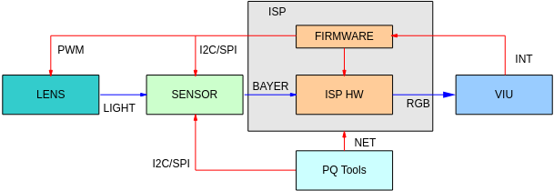
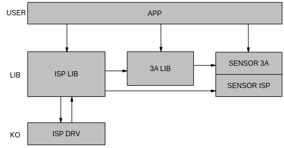
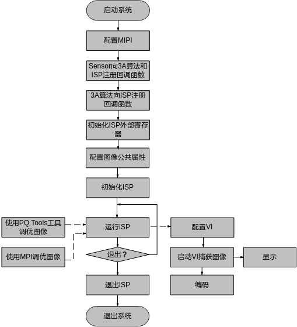
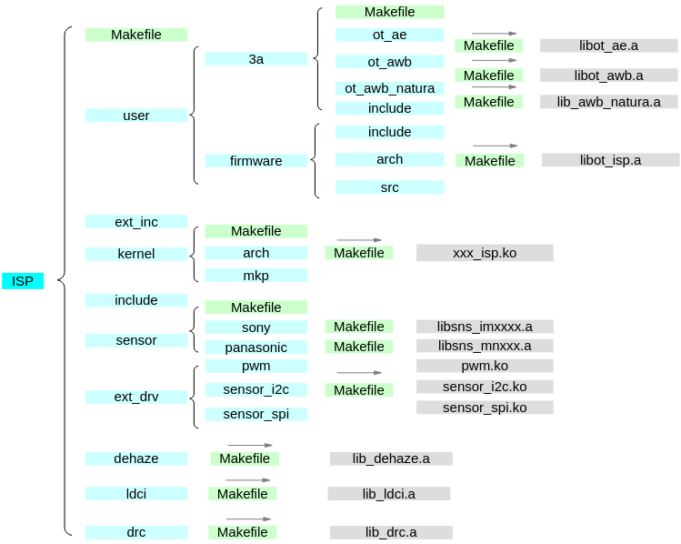
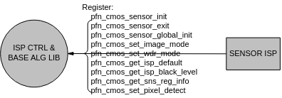

# 前言<a name="ZH-CN_TOPIC_0000002506567571"></a>

**概述<a name="section102mcpsimp"></a>**

本文为使用ISP开发的程序员而写，目的是为您在开发过程中遇到的问题提供解决办法和帮助。

> **说明：** 
>本文以SS928V100描述为例，未有特殊说明，SS927V100与SS928V100内容一致。

**产品版本<a name="section105mcpsimp"></a>**

与本文档相对应的产品版本如下。

<a name="table108mcpsimp"></a>
<table><thead align="left"><tr id="row113mcpsimp"><th class="cellrowborder" valign="top" width="32%" id="mcps1.1.3.1.1"><p id="p115mcpsimp"><a name="p115mcpsimp"></a><a name="p115mcpsimp"></a>产品名称</p>
</th>
<th class="cellrowborder" valign="top" width="68%" id="mcps1.1.3.1.2"><p id="p117mcpsimp"><a name="p117mcpsimp"></a><a name="p117mcpsimp"></a>产品版本</p>
</th>
</tr>
</thead>
<tbody><tr id="row119mcpsimp"><td class="cellrowborder" valign="top" width="32%" headers="mcps1.1.3.1.1 "><p id="p121mcpsimp"><a name="p121mcpsimp"></a><a name="p121mcpsimp"></a>SS928</p>
</td>
<td class="cellrowborder" valign="top" width="68%" headers="mcps1.1.3.1.2 "><p id="p123mcpsimp"><a name="p123mcpsimp"></a><a name="p123mcpsimp"></a>V100</p>
</td>
</tr>
<tr id="row5694533162316"><td class="cellrowborder" valign="top" width="32%" headers="mcps1.1.3.1.1 "><p id="p36535379232"><a name="p36535379232"></a><a name="p36535379232"></a>SS927</p>
</td>
<td class="cellrowborder" valign="top" width="68%" headers="mcps1.1.3.1.2 "><p id="p14653537142315"><a name="p14653537142315"></a><a name="p14653537142315"></a>V100</p>
</td>
</tr>
</tbody>
</table>

**读者对象<a name="section124mcpsimp"></a>**

本文档（本指南）主要适用于以下工程师：

-   技术支持工程师
-   软件开发工程师

**符号约定<a name="section130mcpsimp"></a>**

在本文中可能出现下列标志，它们所代表的含义如下。

<a name="table133mcpsimp"></a>
<table><thead align="left"><tr id="row138mcpsimp"><th class="cellrowborder" valign="top" width="20%" id="mcps1.1.3.1.1"><p id="p140mcpsimp"><a name="p140mcpsimp"></a><a name="p140mcpsimp"></a>符号</p>
</th>
<th class="cellrowborder" valign="top" width="80%" id="mcps1.1.3.1.2"><p id="p142mcpsimp"><a name="p142mcpsimp"></a><a name="p142mcpsimp"></a>说明</p>
</th>
</tr>
</thead>
<tbody><tr id="row144mcpsimp"><td class="cellrowborder" valign="top" width="20%" headers="mcps1.1.3.1.1 "><p class="msonormal" id="p146mcpsimp"><a name="p146mcpsimp"></a><a name="p146mcpsimp"></a><a name="image102"></a><a name="image102"></a><span></span></p>
</td>
<td class="cellrowborder" valign="top" width="80%" headers="mcps1.1.3.1.2 "><p id="p148mcpsimp"><a name="p148mcpsimp"></a><a name="p148mcpsimp"></a>表示如不避免则将会导致死亡或严重伤害的具有高等级风险的危害。</p>
</td>
</tr>
<tr id="row149mcpsimp"><td class="cellrowborder" valign="top" width="20%" headers="mcps1.1.3.1.1 "><p class="msonormal" id="p151mcpsimp"><a name="p151mcpsimp"></a><a name="p151mcpsimp"></a><a name="image103"></a><a name="image103"></a><span></span></p>
</td>
<td class="cellrowborder" valign="top" width="80%" headers="mcps1.1.3.1.2 "><p id="p153mcpsimp"><a name="p153mcpsimp"></a><a name="p153mcpsimp"></a>表示如不避免则可能导致死亡或严重伤害的具有中等级风险的危害。</p>
</td>
</tr>
<tr id="row154mcpsimp"><td class="cellrowborder" valign="top" width="20%" headers="mcps1.1.3.1.1 "><p class="msonormal" id="p156mcpsimp"><a name="p156mcpsimp"></a><a name="p156mcpsimp"></a><a name="image104"></a><a name="image104"></a><span></span></p>
</td>
<td class="cellrowborder" valign="top" width="80%" headers="mcps1.1.3.1.2 "><p id="p158mcpsimp"><a name="p158mcpsimp"></a><a name="p158mcpsimp"></a>表示如不避免则可能导致轻微或中度伤害的具有低等级风险的危害。</p>
</td>
</tr>
<tr id="row159mcpsimp"><td class="cellrowborder" valign="top" width="20%" headers="mcps1.1.3.1.1 "><p class="msonormal" id="p161mcpsimp"><a name="p161mcpsimp"></a><a name="p161mcpsimp"></a><a name="image105"></a><a name="image105"></a><span></span></p>
</td>
<td class="cellrowborder" valign="top" width="80%" headers="mcps1.1.3.1.2 "><p id="p163mcpsimp"><a name="p163mcpsimp"></a><a name="p163mcpsimp"></a>用于传递设备或环境安全警示信息。如不避免则可能会导致设备损坏、数据丢失、设备性能降低或其它不可预知的结果。</p>
<p id="p164mcpsimp"><a name="p164mcpsimp"></a><a name="p164mcpsimp"></a>“须知”不涉及人身伤害。</p>
</td>
</tr>
<tr id="row165mcpsimp"><td class="cellrowborder" valign="top" width="20%" headers="mcps1.1.3.1.1 "><p class="msonormal" id="p167mcpsimp"><a name="p167mcpsimp"></a><a name="p167mcpsimp"></a><a name="image106"></a><a name="image106"></a><span></span></p>
</td>
<td class="cellrowborder" valign="top" width="80%" headers="mcps1.1.3.1.2 "><p id="p169mcpsimp"><a name="p169mcpsimp"></a><a name="p169mcpsimp"></a>对正文中重点信息的补充说明。</p>
<p id="p170mcpsimp"><a name="p170mcpsimp"></a><a name="p170mcpsimp"></a>“说明”不是安全警示信息，不涉及人身、设备及环境伤害信息。</p>
</td>
</tr>
</tbody>
</table>

**修订记录<a name="section171mcpsimp"></a>**

修订记录累积了每次文档更新的说明。最新版本的文档包含以前所有文档版本的更新内容。

<a name="table126443203200"></a>
<table><thead align="left"><tr id="row264516207203"><th class="cellrowborder" valign="top" width="20.72%" id="mcps1.1.4.1.1"><p id="p146456203200"><a name="p146456203200"></a><a name="p146456203200"></a><strong id="b8645172022010"><a name="b8645172022010"></a><a name="b8645172022010"></a>文档版本</strong></p>
</th>
<th class="cellrowborder" valign="top" width="26.119999999999997%" id="mcps1.1.4.1.2"><p id="p364512062019"><a name="p364512062019"></a><a name="p364512062019"></a><strong id="b1464512200200"><a name="b1464512200200"></a><a name="b1464512200200"></a>发布日期</strong></p>
</th>
<th class="cellrowborder" valign="top" width="53.16%" id="mcps1.1.4.1.3"><p id="p664522018206"><a name="p664522018206"></a><a name="p664522018206"></a><strong id="b156451420152010"><a name="b156451420152010"></a><a name="b156451420152010"></a>修改说明</strong></p>
</th>
</tr>
</thead>
<tbody><tr id="row56451520182017"><td class="cellrowborder" valign="top" width="20.72%" headers="mcps1.1.4.1.1 "><p id="p1564572014209"><a name="p1564572014209"></a><a name="p1564572014209"></a>00B01</p>
</td>
<td class="cellrowborder" valign="top" width="26.119999999999997%" headers="mcps1.1.4.1.2 "><p id="p126451920132014"><a name="p126451920132014"></a><a name="p126451920132014"></a>2025-09-15</p>
</td>
<td class="cellrowborder" valign="top" width="53.16%" headers="mcps1.1.4.1.3 "><p id="p1664582017209"><a name="p1664582017209"></a><a name="p1664582017209"></a>第1次临时版本发布。</p>
</td>
</tr>
</tbody>
</table>

# 概述<a name="ZH-CN_TOPIC_0000002470924880"></a>


## 概述<a name="ZH-CN_TOPIC_0000002470925178"></a>

ISP通过一系列数字图像处理算法完成对数字图像的效果处理。主要包括3A、坏点校正、去噪、强光抑制、背光补偿、色彩增强、镜头阴影校正等处理。ISP包括逻辑部分以及运行在其上的firmware。这里主要介绍ISP的用户接口。

## 功能描述<a name="ZH-CN_TOPIC_0000002503964849"></a>

ISP的控制结构如[图1](#fig19534124782113)所示，lens将光信号投射到sensor的感光区域后，sensor经过光电转换，将Bayer格式的原始图像送给ISP，ISP经过算法处理，输出RGB空间域的图像给后端的视频采集单元。在这个过程中，ISP通过运行在其上的firmware对ISP逻辑，lens和sensor进行相应控制，进而完成自动光圈、自动曝光、自动白平衡等功能。其中，firmware的运转靠视频采集单元的中断驱动。PQ Tools工具通过网口或者串口完成对ISP的在线图像质量调节。

ISP由ISP逻辑及运行在其上的Firmware组成，逻辑单元除了完成一部分算法处理外，还可以统计出当前图像的实时信息。Firmware通过获取ISP逻辑的图像统计信息，重新计算，反馈控制lens、sensor和ISP逻辑，以达到自动调节图像质量的目的。

**图 1**  ISP控制结构示意图<a name="fig19534124782113"></a>  


ISP逻辑主要流程、具体概念和功能点请参见芯片手册。


### 架构<a name="ZH-CN_TOPIC_0000002471084980"></a>

ISP的Firmware包含三部分，一部分是ISP控制单元和基础算法库，一部分是AE/AWB算法库，一部分是sensor库。Firmware设计的基本思想是单独提供3A算法库，由ISP控制单元调度基础算法库和3A算法库，同时sensor库分别向ISP基础算法库和3A算法库注册函数回调，以实现差异化的sensor适配。ISP firmware架构如[图1](#fig1959110622411)所示。

**图 1**  ISP firmware 架构<a name="fig1959110622411"></a>  


不同的sensor都以回调函数的形式，向ISP算法库注册控制函数。ISP控制单元调度基础算法库和3A算法库时，将通过这些回调函数获取初始化参数，并控制sensor，如调节曝光时间、模拟增益、数字增益，控制lens步进聚焦或旋转光圈等。

### 开发模式<a name="ZH-CN_TOPIC_0000002470924924"></a>

SDK支持用户使用多种开发模式：

1.  用户使用SDK的3A算法库。这时用户需要根据ISP基础算法库和3A算法库给出的sensor适配接口去适配不同的sensor。每款sensor对应一个文件夹，文件夹中包含两个主要文件：
    -   sensor\_cmos.c

        该文件中主要实现ISP需要的回调函数，这些回调函数中包含了sensor的适配算法，不同的sensor可能有所不同。

    -   sensor\_ctrl.c

        sensor的底层控制驱动，主要实现sensor的读写和初始化动作。用户可以根据sensor的datasheet进行这两个文件的开发，必要的时候可以向sensor厂家寻求支持。

2.  用户根据ISP库提供的3A算法注册接口，实现自己的3A算法库开发。这时用户需要根据ISP基础算法库和用户的3A算法库给出的sensor适配接口去适配不同的sensor。
3.  用户部分使用SDK中3A算法库，部分实现自己的3A算法库。例如AE使用libot\_ae.a，AWB使用自己的3A算法库。SDK提供了灵活多变的支持方式。

### 内部流程<a name="ZH-CN_TOPIC_0000002471085172"></a>

Firmware内部流程分两部分，如[图1](#fig39021449132613)所示。一部分是初始化任务，主要完成ISP控制单元的初始化、ISP基础算法库的初始化、3A算法库的初始化，包括调用sensor的回调获取sensor差异化的初始化参数；另一部分是动态调节过程，在这个过程中，firmware中的ISP控制单元调度ISP基础算法库和3A算法库，实时计算并进行相应控制。Firmware的软件结构如[图2](#fig81434122714)所示。

**图 1**  ISP firmware 内部流程<a name="fig39021449132613"></a>  


**图 2**  ISP firmware 软件结构<a name="fig81434122714"></a>  


### 软件流程<a name="ZH-CN_TOPIC_0000002504084739"></a>

ISP作为前端采集部分，需要和视频采集单元（VIU）协同工作。ISP初始化和基本配置完成后，需要VIU进行接口时序匹配。一是为了匹配不同sensor的输入时序，二是为ISP配置正确的输入时序。待时序配置完成后，ISP就可以启动Run来进行动态图像质量调节。此时输出的图像被VIU采集，进而送去显示或编码。软件使用流程如[图1](#fig796617213110)所示。

PQ Tools工具主要完成在PC端进行动态图像质量调节，可以调节多个影响图像质量的因子，如去噪强度、色彩转换矩阵、饱和度等。

**图 1**  ISP firmware使用流程<a name="fig796617213110"></a>  


如果用户调试好图像效果后，可以使用PQ Tools工具提供的配置文件保存功能进行配置参数保存。在下次启动时系统可以使用PQ Tools工具提供的配置文件加载功能加载已经调节好的图像参数。

代码示例：

```
td_s32 ret;
ot_isp_3a_alg_lib ae_lib;
ot_isp_3a_alg_lib awb_lib;
ot_isp_pub_attr pub_attr;
pthread_t isp_pid;
ot_vi_pipe vi_pipe = 0;
/* 注册sensor库 */
ret = sensor_register_callback(vi_pipe, &ae_lib, &awb_lib);
if (ret != TD_SUCCESS)    {
printf(”register sensor failed!\n”);
return ret;
}
 
/* 注册AE算法库 */
ae_lib.id = 0;
strncpy(ae_lib.lib_name, OT_AE_LIB_NAME, sizeof(OT_AE_LIB_NAME));
ret = ss_mpi_ae_register(isp_dev, &ae_lib);
if (ret != TD_SUCCESS) {
    printf("ss_mpi_ae_register failed with %#x!\n", ret);
    return ret;
}
 
/* 注册AWB算法库 */
awb_lib.id = isp_dev;
strncpy(awb_lib.lib_name, OT_AWB_LIB_NAME, sizeof(OT_AWB_LIB_NAME));
 
ret = ss_mpi_awb_register(isp_dev, &awb_lib);
if (ret != TD_SUCCESS) {
    printf("ss_mpi_awb_register failed with %#x!\n", ret);
    return ret;
}
     /* 初始化ISP外部寄存器 */
     ret = ss_mpi_isp_mem_init(vi_pipe);
     if (ret != TD_SUCCESS) {
        printf("ss_mpi_isp_mem_init failed with %#x!\n", ret);         
return ret;
     }
 
/* 配置图像公共属性 */
     ret = ss_mpi_isp_set_pub_attr (vi_pipe, & pub_attr);
     if (ret != TD_SUCCESS) {
printf("ss_mpi_isp_set_pub_attr failed with %#x!\n", ret);
         return ret;
     }
/* 初始化ISP Firmware */
ret = ss_mpi_isp_init(vi_pipe);
if (ret != TD_SUCCESS) {
printf(”isp init failed!\n”);
return ret;
}
 
/* ss_mpi_isp_run单独启动线程运行 */
if (0 != pthread_create(&isp_pid, 0, ISP_Run, NULL))
{
    printf("create isp running thread failed!\n");
    return TD_FAILURE;
}
 
/* 启动VI/VO等业务 */
 
……
 
/* 停止VI/VO等业务 */
ret = ss_mpi_isp_exit (vi_pipe);
if (TD_SUCCESS != ret) {
printf(”isp exit failed!\n”);
return ret;
}
 
pthread_join(isp_pid, 0);
return TD_SUCCESS; 
```

> **说明：** 
>AE库有用到标准C库的数学库，请使用者在Makefile中增加 –lm 编译条件。

### 文件组织<a name="ZH-CN_TOPIC_0000002470925206"></a>

ISP Firmware的文件组织结构如[图1](#fig142122515335)所示，ISP库和3A库、sensor库、dehaze库、ldci库、drc库分别独立。Firmware中的drv生成的驱动程序向用户态上报ISP中断，并以该中断驱动Firmware的ISP控制单元运转。ISP控制单元从驱动程序中获取统计信息，并调度基础算法单元和3A算法库，最后通过驱动程序配置寄存器。

Src文件夹中包含ISP控制单元和基础算法单元，编译后生成libss\_isp.a、libot\_isp.a，即ISP库。3a文件夹中包含AE/AWB算法库，用户也可以基于统一的接口界面开发自己的3a算法。Sensor文件夹中包含了各个sensor的驱动程序，该部分代码开源。dehaze文件夹对应去雾算法程序，ldci文件夹对应局域自动对比度增强算法程序，drc文件夹对应动态范围压缩算法程序，该部分代码不开源。

**图 1**  ISP firmware 文件组织<a name="fig142122515335"></a>  


# 系统控制<a name="ZH-CN_TOPIC_0000002503964873"></a>


## 功能概述<a name="ZH-CN_TOPIC_0000002471084924"></a>

系统控制部分包含了ISP公共属性配置，初始化ISP Firmware、运行ISP firmware、退出ISP firmware，设置ISP各模块等功能。

## API参考<a name="ZH-CN_TOPIC_0000002503965063"></a>

本文档中接口，如无特殊说明，支持多进程。

-   [ss\_mpi\_isp\_mem\_init](#ZH-CN_TOPIC_0000002471084920)：初始化ISP外部寄存器。
-   [ss\_mpi\_isp\_init](#ZH-CN_TOPIC_0000002471085190)：初始化ISP firmware。
-   [ss\_mpi\_isp\_run](#ZH-CN_TOPIC_0000002470925164)：运行ISP firmware。
-   [ss\_mpi\_isp\_run\_once](#ZH-CN_TOPIC_0000002470925158)：运行ISP firmware 一次。
-   [ss\_mpi\_isp\_exit](#ZH-CN_TOPIC_0000002503964923)：退出ISP firmware。
-   [ss\_mpi\_isp\_set\_pub\_attr](#ZH-CN_TOPIC_0000002503964829)：设置ISP公共属性。
-   [ss\_mpi\_isp\_get\_pub\_attr](#ZH-CN_TOPIC_0000002504085055)：获取ISP公共属性。
-   [ss\_mpi\_isp\_set\_fmw\_state](#ZH-CN_TOPIC_0000002503964889)：设置ISP firmware状态。
-   [ss\_mpi\_isp\_get\_fmw\_state](#ZH-CN_TOPIC_0000002503965107)：获取 ISP firmware状态。
-   [ss\_mpi\_isp\_set\_sns\_slave\_attr](#ZH-CN_TOPIC_0000002503965133)：设置从模式sensor行场同步信号。
-   [ss\_mpi\_isp\_get\_sns\_slave\_attr](#ZH-CN_TOPIC_0000002503964929)：获取从模式sensor行场同步信号。
-   [ss\_mpi\_isp\_set\_module\_ctrl](#ZH-CN_TOPIC_0000002504084719)：设定ISP功能模块的控制。
-   [ss\_mpi\_isp\_get\_module\_ctrl](#ZH-CN_TOPIC_0000002503964897)：获取ISP功能模块的控制。
-   [ss\_mpi\_isp\_get\_vd\_time\_out](#ZH-CN_TOPIC_0000002504085017)：获取ISP中断信息。
-   [ss\_mpi\_isp\_sensor\_reg\_callback](#ZH-CN_TOPIC_0000002503964973)：ISP提供的sensor注册的回调接口。
-   [ss\_mpi\_isp\_sensor\_unreg\_callback](#ZH-CN_TOPIC_0000002504084971)：ISP提供的sensor反注册的回调接口。
-   [ss\_mpi\_isp\_ae\_lib\_reg\_callback](#ZH-CN_TOPIC_0000002470925170)：ISP提供的AE库注册的回调接口。
-   [ss\_mpi\_isp\_ae\_lib\_unreg\_callback](#ZH-CN_TOPIC_0000002504085045)：ISP提供的AE库反注册的回调接口。
-   [ss\_mpi\_isp\_awb\_lib\_reg\_callback](#ZH-CN_TOPIC_0000002471084946)：ISP提供的AWB库注册的回调接口。
-   [ss\_mpi\_isp\_awb\_lib\_unreg\_callback](#ZH-CN_TOPIC_0000002470924890)：ISP提供的AWB库反注册的回调接口。
-   [ss\_mpi\_isp\_set\_bind\_attr](#ZH-CN_TOPIC_0000002503964869)：设置ISP库与3A库、sensor的绑定关系。
-   [ss\_mpi\_isp\_get\_bind\_attr](#ZH-CN_TOPIC_0000002504085091)：获取ISP库与3A库、sensor的绑定关系。
-   [ss\_mpi\_isp\_set\_dcf\_info](#ZH-CN_TOPIC_0000002471084974)：设置DCF参数。
-   [ss\_mpi\_isp\_get\_dcf\_info](#ZH-CN_TOPIC_0000002504085077)：获取DCF参数。
-   [ss\_mpi\_isp\_set\_pipe\_differ\_attr](#ZH-CN_TOPIC_0000002504084755)：设置多路ISP Pipe差异属性。
-   [ss\_mpi\_isp\_get\_pipe\_differ\_attr](#ZH-CN_TOPIC_0000002503964909)：获取多路ISP Pipe差异属性。
-   [ss\_mpi\_isp\_set\_ctrl\_param](#ZH-CN_TOPIC_0000002504084839)：设置ISP的控制参数。
-   [ss\_mpi\_isp\_get\_ctrl\_param](#ZH-CN_TOPIC_0000002471085186)：获取ISP的控制参数。
-   [ss\_mpi\_isp\_set\_mod\_param](#ZH-CN_TOPIC_0000002503965069)：设置ISP模块参数。
-   [ss\_mpi\_isp\_get\_mod\_param](#ZH-CN_TOPIC_0000002503964891)：获取ISP模块参数。
-   [ss\_mpi\_isp\_set\_smart\_info](#ZH-CN_TOPIC_0000002470924926)：设置ISP模块智能信息。
-   [ss\_mpi\_isp\_get\_smart\_info](#ZH-CN_TOPIC_0000002503964955)：获取ISP模块智能信息。
-   [ss\_mpi\_isp\_get\_lightbox\_gain](#ZH-CN_TOPIC_0000002470924968)：获取AWB在线标定得到的增益结构体。
-   [ss\_mpi\_isp\_ir\_auto\_run\_once](#ZH-CN_TOPIC_0000002470925130)：运行红外自动切换功能。
-   [ss\_mpi\_isp\_set\_be\_frame\_attr](#ZH-CN_TOPIC_0000002470924938)：设置ISP BE frame属性。
-   [ss\_mpi\_isp\_get\_be\_frame\_attr](#ZH-CN_TOPIC_0000002470924858)：获取ISP BE frame属性。
-   [ss\_mpi\_isp\_get\_noise\_calibration](#ZH-CN_TOPIC_0000002503964825)：获取噪声模型标定参数。
-   [ss\_mpi\_isp\_set\_frame\_info](#ZH-CN_TOPIC_0000002471085032)：设置ISP实时信息。
-   [ss\_mpi\_isp\_get\_frame\_info](#ZH-CN_TOPIC_0000002503965017)：获取ISP实时信息。
-   [ss\_mpi\_isp\_mem\_share](#ZH-CN_TOPIC_0000002504084749)：将ISP相关mmz buffer共享给特定的进程id。
-   [ss\_mpi\_isp\_mem\_unshare](#ZH-CN_TOPIC_0000002470925018)：解除ISP相关mmz buffer对进程id的共享。
-   [ss\_mpi\_isp\_mem\_share\_all](#ZH-CN_TOPIC_0000002470924996)：共享ISP相关mmz buffer以不限进程id的方式共享给所有进程。
-   [ss\_mpi\_isp\_mem\_unshare\_all](#ZH-CN_TOPIC_0000002470924886)：取消共享ISP相关mmz buffer对所有进程的共享。


### ss\_mpi\_isp\_mem\_init<a name="ZH-CN_TOPIC_0000002471084920"></a>

【描述】

初始化ISP外部寄存器。

【语法】

```
td_s32 ss_mpi_isp_mem_init(ot_vi_pipe vi_pipe);
```

【参数】

<a name="table395mcpsimp"></a>
<table><thead align="left"><tr id="row401mcpsimp"><th class="cellrowborder" valign="top" width="23%" id="mcps1.1.4.1.1"><p id="p403mcpsimp"><a name="p403mcpsimp"></a><a name="p403mcpsimp"></a>参数名称</p>
</th>
<th class="cellrowborder" valign="top" width="61%" id="mcps1.1.4.1.2"><p id="p405mcpsimp"><a name="p405mcpsimp"></a><a name="p405mcpsimp"></a>描述</p>
</th>
<th class="cellrowborder" valign="top" width="16%" id="mcps1.1.4.1.3"><p id="p407mcpsimp"><a name="p407mcpsimp"></a><a name="p407mcpsimp"></a>输入/输出</p>
</th>
</tr>
</thead>
<tbody><tr id="row408mcpsimp"><td class="cellrowborder" valign="top" width="23%" headers="mcps1.1.4.1.1 "><p id="p410mcpsimp"><a name="p410mcpsimp"></a><a name="p410mcpsimp"></a>vi_pipe</p>
</td>
<td class="cellrowborder" valign="top" width="61%" headers="mcps1.1.4.1.2 "><p id="p412mcpsimp"><a name="p412mcpsimp"></a><a name="p412mcpsimp"></a>vi_pipe号。</p>
</td>
<td class="cellrowborder" valign="top" width="16%" headers="mcps1.1.4.1.3 "><p id="p414mcpsimp"><a name="p414mcpsimp"></a><a name="p414mcpsimp"></a>输入</p>
</td>
</tr>
</tbody>
</table>

【返回值】

<a name="table417mcpsimp"></a>
<table><thead align="left"><tr id="row422mcpsimp"><th class="cellrowborder" valign="top" width="27%" id="mcps1.1.3.1.1"><p id="p424mcpsimp"><a name="p424mcpsimp"></a><a name="p424mcpsimp"></a>返回值</p>
</th>
<th class="cellrowborder" valign="top" width="73%" id="mcps1.1.3.1.2"><p id="p426mcpsimp"><a name="p426mcpsimp"></a><a name="p426mcpsimp"></a>描述</p>
</th>
</tr>
</thead>
<tbody><tr id="row427mcpsimp"><td class="cellrowborder" valign="top" width="27%" headers="mcps1.1.3.1.1 "><p id="p429mcpsimp"><a name="p429mcpsimp"></a><a name="p429mcpsimp"></a>0</p>
</td>
<td class="cellrowborder" valign="top" width="73%" headers="mcps1.1.3.1.2 "><p id="p431mcpsimp"><a name="p431mcpsimp"></a><a name="p431mcpsimp"></a>成功。</p>
</td>
</tr>
<tr id="row432mcpsimp"><td class="cellrowborder" valign="top" width="27%" headers="mcps1.1.3.1.1 "><p id="p434mcpsimp"><a name="p434mcpsimp"></a><a name="p434mcpsimp"></a>非0</p>
</td>
<td class="cellrowborder" valign="top" width="73%" headers="mcps1.1.3.1.2 "><p id="p436mcpsimp"><a name="p436mcpsimp"></a><a name="p436mcpsimp"></a>失败，其值为<span xml:lang="sv-SE" id="ph5133152619495"><a name="ph5133152619495"></a><a name="ph5133152619495"></a>错误码</span>。</p>
</td>
</tr>
</tbody>
</table>

【需求】

-   头文件：ot\_common\_isp.h、ss\_mpi\_isp.h
-   库文件：libss\_isp.a、libot\_isp.a

【注意】

-   外部寄存器初始化前需要确保ko已加载，sensor向ISP注册了回调函数。
-   调用本接口后，才能调用[ss\_mpi\_isp\_set\_pub\_attr](#ZH-CN_TOPIC_0000002503964829)图像公共属性。
-   不支持多进程，必须要与sensor\_register\_callback、ss\_mpi\_ae\_register、ss\_mpi\_awb\_register、[ss\_mpi\_isp\_init](#ZH-CN_TOPIC_0000002471085190)、[ss\_mpi\_isp\_run](#ZH-CN_TOPIC_0000002470925164)、[ss\_mpi\_isp\_exit](#ZH-CN_TOPIC_0000002503964923)接口在同一个进程调用。
-   当前业务正在运行[ss\_mpi\_isp\_run](#ZH-CN_TOPIC_0000002470925164)时，不能调用本接口。
-   推荐调用[ss\_mpi\_isp\_exit](#ZH-CN_TOPIC_0000002503964923)后，再调用本接口重新初始化。
-   LiteOS没有内核模块加载概念，Linux load ko过程对应LiteOS  release/ko下sdk\_init.c中执行的相关过程。
-   不支持相同vi\_pipe时，多线程执行ISP创建和销毁（多线程同时调用sensor\_register\_callback、ss\_mpi\_ae\_register、ss\_mpi\_awb\_register、[ss\_mpi\_isp\_mem\_init](#ZH-CN_TOPIC_0000001174819160)、[ss\_mpi\_isp\_init](#ZH-CN_TOPIC_0000002471085190)、[ss\_mpi\_isp\_exit](#ZH-CN_TOPIC_0000002503964923)）
-   ISP初始化后，需要一帧时间给硬件读取算法系数表。所以[ss\_mpi\_isp\_init](#ZH-CN_TOPIC_0000002471085190)后一帧时间内，不能调用[ss\_mpi\_vi\_stop\_pipe](#ss_mpi_vi_stop_pipe)接口停止pipe。

    ss\_mpi\_vi\_stop\_pipe请参考《MPP媒体处理软件V5.0开发参考》的“视频输入”章节）

【举例】

无

【相关主题】

[ss\_mpi\_isp\_exit](#ss_mpi_isp_exit)

### ss\_mpi\_isp\_init<a name="ZH-CN_TOPIC_0000002471085190"></a>

【描述】

初始化ISP firmware。

【语法】

```
td_s32 ss_mpi_isp_init(ot_vi_pipe vi_pipe);
```

【参数】

<a name="table482mcpsimp"></a>
<table><thead align="left"><tr id="row488mcpsimp"><th class="cellrowborder" valign="top" width="23%" id="mcps1.1.4.1.1"><p id="p490mcpsimp"><a name="p490mcpsimp"></a><a name="p490mcpsimp"></a>参数名称</p>
</th>
<th class="cellrowborder" valign="top" width="61%" id="mcps1.1.4.1.2"><p id="p492mcpsimp"><a name="p492mcpsimp"></a><a name="p492mcpsimp"></a>描述</p>
</th>
<th class="cellrowborder" valign="top" width="16%" id="mcps1.1.4.1.3"><p id="p494mcpsimp"><a name="p494mcpsimp"></a><a name="p494mcpsimp"></a>输入/输出</p>
</th>
</tr>
</thead>
<tbody><tr id="row495mcpsimp"><td class="cellrowborder" valign="top" width="23%" headers="mcps1.1.4.1.1 "><p id="p497mcpsimp"><a name="p497mcpsimp"></a><a name="p497mcpsimp"></a>vi_pipe</p>
</td>
<td class="cellrowborder" valign="top" width="61%" headers="mcps1.1.4.1.2 "><p id="p499mcpsimp"><a name="p499mcpsimp"></a><a name="p499mcpsimp"></a>vi_pipe号。</p>
</td>
<td class="cellrowborder" valign="top" width="16%" headers="mcps1.1.4.1.3 "><p id="p501mcpsimp"><a name="p501mcpsimp"></a><a name="p501mcpsimp"></a>输入</p>
</td>
</tr>
</tbody>
</table>

【返回值】

<a name="table504mcpsimp"></a>
<table><thead align="left"><tr id="row509mcpsimp"><th class="cellrowborder" valign="top" width="27%" id="mcps1.1.3.1.1"><p id="p511mcpsimp"><a name="p511mcpsimp"></a><a name="p511mcpsimp"></a>返回值</p>
</th>
<th class="cellrowborder" valign="top" width="73%" id="mcps1.1.3.1.2"><p id="p513mcpsimp"><a name="p513mcpsimp"></a><a name="p513mcpsimp"></a>描述</p>
</th>
</tr>
</thead>
<tbody><tr id="row514mcpsimp"><td class="cellrowborder" valign="top" width="27%" headers="mcps1.1.3.1.1 "><p id="p516mcpsimp"><a name="p516mcpsimp"></a><a name="p516mcpsimp"></a>0</p>
</td>
<td class="cellrowborder" valign="top" width="73%" headers="mcps1.1.3.1.2 "><p id="p518mcpsimp"><a name="p518mcpsimp"></a><a name="p518mcpsimp"></a>成功。</p>
</td>
</tr>
<tr id="row519mcpsimp"><td class="cellrowborder" valign="top" width="27%" headers="mcps1.1.3.1.1 "><p id="p521mcpsimp"><a name="p521mcpsimp"></a><a name="p521mcpsimp"></a>非0</p>
</td>
<td class="cellrowborder" valign="top" width="73%" headers="mcps1.1.3.1.2 "><p id="p523mcpsimp"><a name="p523mcpsimp"></a><a name="p523mcpsimp"></a>失败，其值为<span xml:lang="sv-SE" id="ph5133152619495"><a name="ph5133152619495"></a><a name="ph5133152619495"></a>错误码</span>。</p>
</td>
</tr>
</tbody>
</table>

【需求】

-   头文件：ot\_common\_isp.h、ss\_mpi\_isp.h
-   库文件：libss\_isp.a、libot\_isp.a

【注意】

-   初始化前需要确保ko已加载，sensor向ISP注册了回调函数。
-   初始化前需要确保已调用[ss\_mpi\_isp\_mem\_init](#ZH-CN_TOPIC_0000002471084920)初始化ISP外部寄存器。
-   初始化前需要确保已调用[ss\_mpi\_isp\_set\_pub\_attr](#ZH-CN_TOPIC_0000002503964829)图像公共属性。
-   不支持多进程，必须要与sensor\_register\_callback、ss\_mpi\_ae\_register、ss\_mpi\_awb\_register、[ss\_mpi\_isp\_mem\_init](#ZH-CN_TOPIC_0000002471084920)、[ss\_mpi\_isp\_run](#ZH-CN_TOPIC_0000002470925164)、[ss\_mpi\_isp\_exit](#ZH-CN_TOPIC_0000002503964923)接口在同一个进程调用。
-   不支持重复调用本接口。
-   推荐调用[ss\_mpi\_isp\_exit](#ZH-CN_TOPIC_0000002503964923)后，再调用本接口重新初始化。
-   LiteOS没内核模块加载概念，Linux load ko过程对应LiteOS  release/ko下sdk\_init.c中执行的相关过程。
-   不支持相同vi\_pipe时，多线程执行ISP创建和销毁（多线程同时调用sensor\_register\_callback、ss\_mpi\_ae\_register、ss\_mpi\_awb\_register、[ss\_mpi\_isp\_mem\_init](#ZH-CN_TOPIC_0000002471084920)、[ss\_mpi\_isp\_init](#ZH-CN_TOPIC_0000002471085190)、[ss\_mpi\_isp\_exit](#ZH-CN_TOPIC_0000002503964923)）
-   ISP初始化后，需要一帧时间给硬件读取算法系数表。所以[ss\_mpi\_isp\_init](#ZH-CN_TOPIC_0000002471085190)后一帧时间内，不能调用ss\_mpi\_vi\_stop\_pipe接口停止pipe。

    ss\_mpi\_vi\_stop\_pipe请参考《MPP媒体处理软件V5.0开发参考》的“视频输入”章节。

【举例】

无

【相关主题】

[ss\_mpi\_isp\_exit](#ss_mpi_isp_exit)

### ss\_mpi\_isp\_run<a name="ZH-CN_TOPIC_0000002470925164"></a>

【描述】

运行ISP firmware。

【语法】

```
td_s32 ss_mpi_isp_run(ot_vi_pipe vi_pipe);
```

【参数】

<a name="table568mcpsimp"></a>
<table><thead align="left"><tr id="row574mcpsimp"><th class="cellrowborder" valign="top" width="23%" id="mcps1.1.4.1.1"><p id="p576mcpsimp"><a name="p576mcpsimp"></a><a name="p576mcpsimp"></a>参数名称</p>
</th>
<th class="cellrowborder" valign="top" width="61%" id="mcps1.1.4.1.2"><p id="p578mcpsimp"><a name="p578mcpsimp"></a><a name="p578mcpsimp"></a>描述</p>
</th>
<th class="cellrowborder" valign="top" width="16%" id="mcps1.1.4.1.3"><p id="p580mcpsimp"><a name="p580mcpsimp"></a><a name="p580mcpsimp"></a>输入/输出</p>
</th>
</tr>
</thead>
<tbody><tr id="row581mcpsimp"><td class="cellrowborder" valign="top" width="23%" headers="mcps1.1.4.1.1 "><p id="p583mcpsimp"><a name="p583mcpsimp"></a><a name="p583mcpsimp"></a>vi_pipe</p>
</td>
<td class="cellrowborder" valign="top" width="61%" headers="mcps1.1.4.1.2 "><p id="p585mcpsimp"><a name="p585mcpsimp"></a><a name="p585mcpsimp"></a>vi_pipe号。</p>
</td>
<td class="cellrowborder" valign="top" width="16%" headers="mcps1.1.4.1.3 "><p id="p587mcpsimp"><a name="p587mcpsimp"></a><a name="p587mcpsimp"></a>输入</p>
</td>
</tr>
</tbody>
</table>

【返回值】

<a name="table590mcpsimp"></a>
<table><thead align="left"><tr id="row595mcpsimp"><th class="cellrowborder" valign="top" width="27%" id="mcps1.1.3.1.1"><p id="p597mcpsimp"><a name="p597mcpsimp"></a><a name="p597mcpsimp"></a>返回值</p>
</th>
<th class="cellrowborder" valign="top" width="73%" id="mcps1.1.3.1.2"><p id="p599mcpsimp"><a name="p599mcpsimp"></a><a name="p599mcpsimp"></a>描述</p>
</th>
</tr>
</thead>
<tbody><tr id="row600mcpsimp"><td class="cellrowborder" valign="top" width="27%" headers="mcps1.1.3.1.1 "><p id="p602mcpsimp"><a name="p602mcpsimp"></a><a name="p602mcpsimp"></a>0</p>
</td>
<td class="cellrowborder" valign="top" width="73%" headers="mcps1.1.3.1.2 "><p id="p604mcpsimp"><a name="p604mcpsimp"></a><a name="p604mcpsimp"></a>成功。</p>
</td>
</tr>
<tr id="row605mcpsimp"><td class="cellrowborder" valign="top" width="27%" headers="mcps1.1.3.1.1 "><p id="p607mcpsimp"><a name="p607mcpsimp"></a><a name="p607mcpsimp"></a>非0</p>
</td>
<td class="cellrowborder" valign="top" width="73%" headers="mcps1.1.3.1.2 "><p id="p609mcpsimp"><a name="p609mcpsimp"></a><a name="p609mcpsimp"></a>失败，其值为<span xml:lang="sv-SE" id="ph5133152619495"><a name="ph5133152619495"></a><a name="ph5133152619495"></a>错误码</span>。</p>
</td>
</tr>
</tbody>
</table>

【需求】

-   头文件：ot\_common\_isp.h、ss\_mpi\_isp.h
-   库文件：libss\_isp.a、libot\_isp.a

【注意】

-   运行前需要确保sensor已经初始化，并且向ISP注册了回调函数。
-   运行前需要确保已调用[ss\_mpi\_isp\_init](#ZH-CN_TOPIC_0000002471085190)初始化ISP。
-   不支持多进程，必须要与sensor\_register\_callback、ss\_mpi\_ae\_register、ss\_mpi\_awb\_register、[ss\_mpi\_isp\_mem\_init](#ZH-CN_TOPIC_0000002471084920)、[ss\_mpi\_isp\_init](#ZH-CN_TOPIC_0000002471085190)、[ss\_mpi\_isp\_exit](#ZH-CN_TOPIC_0000002503964923)接口在同一个进程调用。
-   该接口是阻塞接口，建议用户采用实时线程处理。

【举例】

无

【相关主题】

[ss\_mpi\_isp\_init](#ss_mpi_isp_init)

### ss\_mpi\_isp\_run\_once<a name="ZH-CN_TOPIC_0000002470925158"></a>

【描述】

运行ISP firmware 一次。

【语法】

```
td_s32 ss_mpi_isp_run_once(ot_vi_pipe vi_pipe);
```

【参数】

<a name="table640mcpsimp"></a>
<table><thead align="left"><tr id="row646mcpsimp"><th class="cellrowborder" valign="top" width="23%" id="mcps1.1.4.1.1"><p id="p648mcpsimp"><a name="p648mcpsimp"></a><a name="p648mcpsimp"></a>参数名称</p>
</th>
<th class="cellrowborder" valign="top" width="61%" id="mcps1.1.4.1.2"><p id="p650mcpsimp"><a name="p650mcpsimp"></a><a name="p650mcpsimp"></a>描述</p>
</th>
<th class="cellrowborder" valign="top" width="16%" id="mcps1.1.4.1.3"><p id="p652mcpsimp"><a name="p652mcpsimp"></a><a name="p652mcpsimp"></a>输入/输出</p>
</th>
</tr>
</thead>
<tbody><tr id="row653mcpsimp"><td class="cellrowborder" valign="top" width="23%" headers="mcps1.1.4.1.1 "><p id="p655mcpsimp"><a name="p655mcpsimp"></a><a name="p655mcpsimp"></a>vi_pipe</p>
</td>
<td class="cellrowborder" valign="top" width="61%" headers="mcps1.1.4.1.2 "><p id="p657mcpsimp"><a name="p657mcpsimp"></a><a name="p657mcpsimp"></a>vi_pipe号。</p>
</td>
<td class="cellrowborder" valign="top" width="16%" headers="mcps1.1.4.1.3 "><p id="p659mcpsimp"><a name="p659mcpsimp"></a><a name="p659mcpsimp"></a>输入</p>
</td>
</tr>
</tbody>
</table>

【返回值】

<a name="table662mcpsimp"></a>
<table><thead align="left"><tr id="row667mcpsimp"><th class="cellrowborder" valign="top" width="27%" id="mcps1.1.3.1.1"><p id="p669mcpsimp"><a name="p669mcpsimp"></a><a name="p669mcpsimp"></a>返回值</p>
</th>
<th class="cellrowborder" valign="top" width="73%" id="mcps1.1.3.1.2"><p id="p671mcpsimp"><a name="p671mcpsimp"></a><a name="p671mcpsimp"></a>描述</p>
</th>
</tr>
</thead>
<tbody><tr id="row673mcpsimp"><td class="cellrowborder" valign="top" width="27%" headers="mcps1.1.3.1.1 "><p id="p675mcpsimp"><a name="p675mcpsimp"></a><a name="p675mcpsimp"></a>0</p>
</td>
<td class="cellrowborder" valign="top" width="73%" headers="mcps1.1.3.1.2 "><p id="p677mcpsimp"><a name="p677mcpsimp"></a><a name="p677mcpsimp"></a>成功。</p>
</td>
</tr>
<tr id="row678mcpsimp"><td class="cellrowborder" valign="top" width="27%" headers="mcps1.1.3.1.1 "><p id="p680mcpsimp"><a name="p680mcpsimp"></a><a name="p680mcpsimp"></a>非0</p>
</td>
<td class="cellrowborder" valign="top" width="73%" headers="mcps1.1.3.1.2 "><p id="p682mcpsimp"><a name="p682mcpsimp"></a><a name="p682mcpsimp"></a>失败，其值为<span xml:lang="sv-SE" id="ph5133152619495"><a name="ph5133152619495"></a><a name="ph5133152619495"></a>错误码</span>。</p>
</td>
</tr>
</tbody>
</table>

【需求】

-   头文件：ot\_common\_isp.h、ss\_mpi\_isp.h
-   库文件：libss\_isp.a、libot\_isp.a

【注意】

-   运行前需要确保sensor已经初始化，并且向ISP注册了回调函数。
-   运行前需要确保已调用[ss\_mpi\_isp\_init](#ZH-CN_TOPIC_0000002471085190)初始化ISP。
-   不支持多进程，必须要与sensor\_register\_callback、ss\_mpi\_ae\_register、ss\_mpi\_awb\_register、[ss\_mpi\_isp\_mem\_init](#ZH-CN_TOPIC_0000002471084920)、[ss\_mpi\_isp\_init](#ZH-CN_TOPIC_0000002471085190)、[ss\_mpi\_isp\_exit](#ZH-CN_TOPIC_0000002503964923)接口在同一个进程调用。
-   该接口是阻塞接口，建议用户采用实时线程处理。
-   该接口工作在离线时用户给BE灌RAW场景。在使用时，要等待上一次发送的RAW数据处理完成之后才能进行下一次的[ss\_mpi\_isp\_run\_once](#ZH-CN_TOPIC_0000001219938931)接口调用+发送RAW数据（可通过在ss\_mpi\_vi\_send\_pipe\_raw后调用接口ss\_mpi\_vi\_get\_chn\_frame实现，接口具体信息请参见《MPP 媒体处理软件V5.0 开发参考》的VI章节\)，具体参考【举例】中的伪代码。
-   使用[ss\_mpi\_isp\_run\_once](#ZH-CN_TOPIC_0000001219938931)模式时处理视频流时，支持模式切换及分辨率切换，切换流程与使用[ss\_mpi\_isp\_run](#ZH-CN_TOPIC_0000002470925164)处理视频流类似：即切换过程中ISP模块无需退出，VI模块需要销毁重建。区别在于：使用[ss\_mpi\_isp\_run\_once](#ZH-CN_TOPIC_0000001219938931)处理视频流时需要用户创建一个线程，参考示例中伪代码。
-   [ss\_mpi\_isp\_run](#ZH-CN_TOPIC_0000002470925164)和[ss\_mpi\_isp\_run\_once](#ZH-CN_TOPIC_0000001219938931)对同一个vi\_pipe不能同时使用。
-   该接口不支持帧合成wdr模式。
-   该接口配置sensor时间为调用该接口后才配置sensor。与[ss\_mpi\_isp\_run](#ZH-CN_TOPIC_0000002470925164)接口在帧起始或者帧结束配置sensor 有差异。
-   使用该接口的pipe，使用[ss\_mpi\_isp\_get\_vd\_time\_out](#ZH-CN_TOPIC_0000002504085017)  接口时，[ot\_isp\_vd\_type](#ZH-CN_TOPIC_0000002470925008)  变量仅支持OT\_ISP\_VD\_BE\_END类型。
-   该接口不支持拼接模式。

【举例】

1. 上一次发送的raw数据处理完，才能继续调用[ss\_mpi\_isp\_run\_once](#ZH-CN_TOPIC_0000001219938931):

```
……
ret = ss_mpi_isp_run_once(vi_pipe);
    if (TD_SUCCESS != ret) {
        SAMPLE_PRT("ss_mpi_isp_run_once failed with %#x\n", ret);
        return ret;
    }
 
    ret = ss_mpi_vi_send_pipe_raw(vi_pipe, frame_info, frame_num, milli_sec);
    if (TD_SUCCESS != ret) {
        SAMPLE_PRT("ss_mpi_vi_send_pipe_raw failed with %#x\n", ret);
        return ret;
    }
 
    ret = ss_mpi_vi_get_chn_frame(vi_pipe, vi_chn, &yuv_frame_info, milli_sec);
    if (TD_SUCCESS != ret) {
        SAMPLE_PRT("ss_mpi_vi_get_chn_frame failed with %#x\n", ret);
        return ret;
}
 
    ret = ss_mpi_vi_release_chn_frame(vi_pipe, vi_chn, &yuv_frame_info);
    if (TD_SUCCESS != ret) {
        SAMPLE_PRT("ss_mpi_vi_release_chn_frame failed with %#x\n", ret);
        return ret;
}
```

2. 使用[ss\_mpi\_isp\_run\_once](#ZH-CN_TOPIC_0000001219938931)处理视频流时需要用户创建一个线程：

```
…
stViConfig.astViInfo[s32SnsId].stSnsInfo.enSnsType =  SENSOR_NAME_MIPI_8M_30FPS_12BIT,
   stViConfig.astViInfo[s32SnsId].stDevInfo.enWDRMode = WDR_MODE_3To1_LINE;
…
 
   pthread_t thread;
    ret = pthread_create(&thread, NULL, Ot_Vi_SendWDRFrameProc, (ot_void*)&stSendRawThreadInfo);
 
    if (0 == ret)
    {
        pthread_detach(thread);
    }
   
    SAMPLE_COMM_VI_SwitchMode_StopVI(&stViConfig);
    g_u32RunOnceSwitch =1;
   g_enWDRMode = WDR_MODE_NONE;
   
    stViConfig.astViInfo[s32SnsId].stSnsInfo.enSnsType = SENSOR_NAME_MIPI_8M_30FPS_12BIT;
    stViConfig.astViInfo[s32SnsId].stDevInfo.enWDRMode = WDR_MODE_NONE;
    
    stViConfig.astViInfo[0].stPipeInfo.aPipe[0]          = ViRawOutPipe;
    stViConfig.astViInfo[0].stPipeInfo.aPipe[1]          = -1;
    stViConfig.astViInfo[0].stPipeInfo.aPipe[2]          = -1;
    stViConfig.astViInfo[0].stPipeInfo.aPipe[3]          = -1;
    SAMPLE_RunonceSwitch_StartVi(&stViConfig);
    SAMPLE_COMM_VI_SwitcotSPMode(&stViConfig);
 
    g_u32RunOnceSwitch =0;
 
static void *Ot_Vi_SendWDRFrameProc(void *pArgs)
{
……
while(1)
    {
        td_s32 s32MilliSec = 100;
       i++;
         if(g_u32RunOnceSwitch ==1)
         {
      ss_mpi_isp_run_once(ViRawOutPipe);            
         }
   if ( g_enWDRMode == WDR_MODE_3To1_LINE ) {
            ret = SS_MPI_VI_GetPipeFrame(ViRawOutPipe, &stRawInfo[0], s32MilliSec);
            if (TD_SUCCESS != ret) {
                SAMPLE_PRT("SS_MPI_VI_GetPipeFrame failed with %#x\n", ret);
                continue;
            }
            ret = SAMPLE_Capture_VideoWDRFrameProc(ViRawOutPipe,  &stRawInfo[0], &stRawInfo[1], &stRawInfo[2]);
            if (TD_SUCCESS != ret) {
                break;
            }
            ret = SS_MPI_VI_ReleasePipeFrame(ViRawOutPipe, &stRawInfo[0]);
            if (TD_SUCCESS != ret) {
                SAMPLE_PRT("SS_MPI_VI_ReleasePipeFrame failed with %#x\n", ret);
                goto EXIT5;
            }
         }
 
      if ( g_enWDRMode == WDR_MODE_NONE )
            {
 
             ret = SS_MPI_VI_GetPipeFrame(ViRawOutPipe, &stRawInfo[0], s32MilliSec);
            if (TD_SUCCESS != ret) {
                SAMPLE_PRT("SS_MPI_VI_GetPipeFrame failed with %#x\n", ret);
                continue;
            }
 
            ret = SAMPLE_Capture_VideoFrameProc(ViRawOutPipe,  &stRawInfo[0]);
            if (TD_SUCCESS != ret) {
                break;
            }
            ret = SS_MPI_VI_ReleasePipeFrame(ViRawOutPipe, &stRawInfo[0]);
            if (TD_SUCCESS != ret) {
                SAMPLE_PRT("SS_MPI_VI_ReleasePipeFrame failed with %#x\n", ret);
                goto EXIT5;
            }
           }
EXIT5:
    stDumpAttr.bEnable = TD_FALSE;
    stDumpAttr.u32Depth = 0;
    SS_MPI_VI_SetPipeDumpAttr(ViRawOutPipe, &stDumpAttr);
          return NULL;
}
```

【相关主题】

[ss\_mpi\_isp\_init](#ss_mpi_isp_init)

### ss\_mpi\_isp\_exit<a name="ZH-CN_TOPIC_0000002503964923"></a>

【描述】

退出ISP firmware。

【语法】

```
td_s32 ss_mpi_isp_exit(ot_vi_pipe vi_pipe);
```

【参数】

<a name="table824mcpsimp"></a>
<table><thead align="left"><tr id="row830mcpsimp"><th class="cellrowborder" valign="top" width="23%" id="mcps1.1.4.1.1"><p id="p832mcpsimp"><a name="p832mcpsimp"></a><a name="p832mcpsimp"></a>参数名称</p>
</th>
<th class="cellrowborder" valign="top" width="61%" id="mcps1.1.4.1.2"><p id="p834mcpsimp"><a name="p834mcpsimp"></a><a name="p834mcpsimp"></a>描述</p>
</th>
<th class="cellrowborder" valign="top" width="16%" id="mcps1.1.4.1.3"><p id="p836mcpsimp"><a name="p836mcpsimp"></a><a name="p836mcpsimp"></a>输入/输出</p>
</th>
</tr>
</thead>
<tbody><tr id="row837mcpsimp"><td class="cellrowborder" valign="top" width="23%" headers="mcps1.1.4.1.1 "><p id="p839mcpsimp"><a name="p839mcpsimp"></a><a name="p839mcpsimp"></a>vi_pipe</p>
</td>
<td class="cellrowborder" valign="top" width="61%" headers="mcps1.1.4.1.2 "><p id="p841mcpsimp"><a name="p841mcpsimp"></a><a name="p841mcpsimp"></a>vi_pipe号。</p>
</td>
<td class="cellrowborder" valign="top" width="16%" headers="mcps1.1.4.1.3 "><p id="p843mcpsimp"><a name="p843mcpsimp"></a><a name="p843mcpsimp"></a>输入</p>
</td>
</tr>
</tbody>
</table>

【返回值】

<a name="table846mcpsimp"></a>
<table><thead align="left"><tr id="row851mcpsimp"><th class="cellrowborder" valign="top" width="23%" id="mcps1.1.3.1.1"><p id="p853mcpsimp"><a name="p853mcpsimp"></a><a name="p853mcpsimp"></a>返回值</p>
</th>
<th class="cellrowborder" valign="top" width="77%" id="mcps1.1.3.1.2"><p id="p855mcpsimp"><a name="p855mcpsimp"></a><a name="p855mcpsimp"></a>描述</p>
</th>
</tr>
</thead>
<tbody><tr id="row857mcpsimp"><td class="cellrowborder" valign="top" width="23%" headers="mcps1.1.3.1.1 "><p id="p859mcpsimp"><a name="p859mcpsimp"></a><a name="p859mcpsimp"></a>0</p>
</td>
<td class="cellrowborder" valign="top" width="77%" headers="mcps1.1.3.1.2 "><p id="p861mcpsimp"><a name="p861mcpsimp"></a><a name="p861mcpsimp"></a>成功。</p>
</td>
</tr>
<tr id="row862mcpsimp"><td class="cellrowborder" valign="top" width="23%" headers="mcps1.1.3.1.1 "><p id="p864mcpsimp"><a name="p864mcpsimp"></a><a name="p864mcpsimp"></a>非0</p>
</td>
<td class="cellrowborder" valign="top" width="77%" headers="mcps1.1.3.1.2 "><p id="p866mcpsimp"><a name="p866mcpsimp"></a><a name="p866mcpsimp"></a>失败，其值为<span xml:lang="sv-SE" id="ph5133152619495"><a name="ph5133152619495"></a><a name="ph5133152619495"></a>错误码</span>。</p>
</td>
</tr>
</tbody>
</table>

【需求】

-   头文件：ot\_common\_isp.h、ss\_mpi\_isp.h
-   库文件：libss\_isp.a、libot\_isp.a

【注意】

-   调用[ss\_mpi\_isp\_init](#ZH-CN_TOPIC_0000002471085190)和[ss\_mpi\_isp\_run](#ZH-CN_TOPIC_0000002470925164)之后，再调用本接口退出ISP firmware。
-   不支持多进程，必须要与sensor\_register\_callback、ss\_mpi\_ae\_register、ss\_mpi\_awb\_register、[ss\_mpi\_isp\_mem\_init](#ZH-CN_TOPIC_0000002471084920)、[ss\_mpi\_isp\_init](#ZH-CN_TOPIC_0000002471085190)、[ss\_mpi\_isp\_run](#ZH-CN_TOPIC_0000002470925164)接口在同一个进程调用。
-   支持重复调用本接口。
-   在拼接模式时，必须先退出主pipe，后退出其他pipe。
-   不支持相同vi\_pipe时，多线程执行ISP创建和销毁（多线程同时调用sensor\_register\_callback、ss\_mpi\_ae\_register、ss\_mpi\_awb\_register、[ss\_mpi\_isp\_mem\_init](#ZH-CN_TOPIC_0000002471084920)、[ss\_mpi\_isp\_init](#ZH-CN_TOPIC_0000002471085190)、[ss\_mpi\_isp\_exit](#ZH-CN_TOPIC_0000001220218983)）
-   推荐调用[ss\_mpi\_isp\_init](#ZH-CN_TOPIC_0000002471085190)之后，在调用本接口。

【举例】

无

【相关主题】

[ss\_mpi\_isp\_init](#ss_mpi_isp_init)

### ss\_mpi\_isp\_set\_pub\_attr<a name="ZH-CN_TOPIC_0000002503964829"></a>

【描述】

设置ISP公共属性。

【语法】

```
td_s32 ss_mpi_isp_set_pub_attr(ot_vi_pipe vi_pipe, const ot_isp_pub_attr *pub_attr);
```

【参数】

<a name="table906mcpsimp"></a>
<table><thead align="left"><tr id="row912mcpsimp"><th class="cellrowborder" valign="top" width="27%" id="mcps1.1.4.1.1"><p id="p914mcpsimp"><a name="p914mcpsimp"></a><a name="p914mcpsimp"></a>参数名称</p>
</th>
<th class="cellrowborder" valign="top" width="56.99999999999999%" id="mcps1.1.4.1.2"><p id="p916mcpsimp"><a name="p916mcpsimp"></a><a name="p916mcpsimp"></a>描述</p>
</th>
<th class="cellrowborder" valign="top" width="16%" id="mcps1.1.4.1.3"><p id="p918mcpsimp"><a name="p918mcpsimp"></a><a name="p918mcpsimp"></a>输入/输出</p>
</th>
</tr>
</thead>
<tbody><tr id="row919mcpsimp"><td class="cellrowborder" valign="top" width="27%" headers="mcps1.1.4.1.1 "><p id="p921mcpsimp"><a name="p921mcpsimp"></a><a name="p921mcpsimp"></a>vi_pipe</p>
</td>
<td class="cellrowborder" valign="top" width="56.99999999999999%" headers="mcps1.1.4.1.2 "><p id="p923mcpsimp"><a name="p923mcpsimp"></a><a name="p923mcpsimp"></a>vi_pipe号。</p>
</td>
<td class="cellrowborder" valign="top" width="16%" headers="mcps1.1.4.1.3 "><p id="p925mcpsimp"><a name="p925mcpsimp"></a><a name="p925mcpsimp"></a>输入</p>
</td>
</tr>
<tr id="row926mcpsimp"><td class="cellrowborder" valign="top" width="27%" headers="mcps1.1.4.1.1 "><p id="p928mcpsimp"><a name="p928mcpsimp"></a><a name="p928mcpsimp"></a>pub_attr</p>
</td>
<td class="cellrowborder" valign="top" width="56.99999999999999%" headers="mcps1.1.4.1.2 "><p id="p930mcpsimp"><a name="p930mcpsimp"></a><a name="p930mcpsimp"></a>ISP公共属性。</p>
</td>
<td class="cellrowborder" valign="top" width="16%" headers="mcps1.1.4.1.3 "><p id="p932mcpsimp"><a name="p932mcpsimp"></a><a name="p932mcpsimp"></a>输入</p>
</td>
</tr>
</tbody>
</table>

【返回值】

<a name="table935mcpsimp"></a>
<table><thead align="left"><tr id="row940mcpsimp"><th class="cellrowborder" valign="top" width="27%" id="mcps1.1.3.1.1"><p id="p942mcpsimp"><a name="p942mcpsimp"></a><a name="p942mcpsimp"></a>返回值</p>
</th>
<th class="cellrowborder" valign="top" width="73%" id="mcps1.1.3.1.2"><p id="p944mcpsimp"><a name="p944mcpsimp"></a><a name="p944mcpsimp"></a>描述</p>
</th>
</tr>
</thead>
<tbody><tr id="row945mcpsimp"><td class="cellrowborder" valign="top" width="27%" headers="mcps1.1.3.1.1 "><p id="p947mcpsimp"><a name="p947mcpsimp"></a><a name="p947mcpsimp"></a>0</p>
</td>
<td class="cellrowborder" valign="top" width="73%" headers="mcps1.1.3.1.2 "><p id="p949mcpsimp"><a name="p949mcpsimp"></a><a name="p949mcpsimp"></a>成功。</p>
</td>
</tr>
<tr id="row950mcpsimp"><td class="cellrowborder" valign="top" width="27%" headers="mcps1.1.3.1.1 "><p id="p952mcpsimp"><a name="p952mcpsimp"></a><a name="p952mcpsimp"></a>非0</p>
</td>
<td class="cellrowborder" valign="top" width="73%" headers="mcps1.1.3.1.2 "><p id="p954mcpsimp"><a name="p954mcpsimp"></a><a name="p954mcpsimp"></a>失败，其值为<span xml:lang="sv-SE" id="ph5133152619495"><a name="ph5133152619495"></a><a name="ph5133152619495"></a>错误码</span>。</p>
</td>
</tr>
</tbody>
</table>

【需求】

-   头文件：ot\_common\_isp.h、ss\_mpi\_isp.h
-   库文件：libss\_isp.a、libot\_isp.a

【注意】

-   图像属性即对应的sensor的采集属性。
-   ISP启动时，需要确保已调用[ss\_mpi\_isp\_mem\_init](#ZH-CN_TOPIC_0000002471084920)初始化ISP外部寄存器。
-   ISP支持运行过程中动态裁剪图像的起始位置。
-   调用本接口后ISP内的处理流程：
    -   ISP firmware判断图像WDR模式、分辨率、帧率是否变化，若都不变则直接返回；否则，ISP firmware会调用sensor cmos.c里面的cmos\_set\_wdr\_mode、cmos\_set\_image\_mode函数改变sensor模式；
    -   若sensor模式不改变（返回值-2），判断ISP的裁剪宽高是否变化，若有变化，ISP firmware切换分辨率，并调用sensor\_init函数重新配置sensor；
    -   若sensor模式改变（返回值为0），则ISP firmware会调用sensor\_init函数重新配置sensor；
    -   ISP firmware将帧率信息传给AE库，并决定是否更改帧率。

-   若调用本接口实现动态分辨率和帧率切换时sensor模式发生了改变，请参照sample提供的切换流程操作（先停掉Vi设备，再创建Vi设备，然后设置[ss\_mpi\_isp\_set\_pub\_attr](#ZH-CN_TOPIC_0000001220057509)进行切换）。当前系统不支持在VI并行模式下切换帧率。另外，动态分辨率和帧率切换时，切换的分辨率和帧率必须有一项要不同（即不能切换到自己本身），否则，sensor可能不会重新初始化而导致异常，模式切换时也不能切换到自己本身。对于ISP输入同样分辨率和帧率但需要采用不同初始化序列的情况，可以利用不同的sns\_mode来实现模式切换。
-   使用ISP提供的裁剪功能时，需要注意：

    动态裁剪图像的宽高时会重新初始化sensor，切换流程参照sample提供的切换流程（先停掉Vi设备，再创建Vi设备，然后设置[ss\_mpi\_isp\_set\_pub\_attr](#ZH-CN_TOPIC_0000001220057509)进行切换）。在线WDR模式下不支持ISP的裁剪功能。

    当输入为YUV时，裁剪不生效。

-   用户可以更改sensor cmos.c里面的cmos\_set\_image\_mode函数调整sensor模式切换的顺序。如只提供了5M30fps和1080P60fps初始化序列的sensor，若要运行1080P30fps，可以从5M30fps裁剪得到，也可以从1080P60fps降帧得到，修改cmos\_set\_image\_mode函数实现即可。
-   通过[ss\_mpi\_isp\_set\_pub\_attr](#ZH-CN_TOPIC_0000001220057509)接口配置超过sensor帧率范围的帧率时，该帧率值能配置到ISP中，但是sensor\_cmos.c检测该帧率值超出范围而不做改变帧率的动作。此时应用层如果做模式切换（如：线性模式切WDR模式），sensor重新初始化，并从ISP中读取帧率，由于ISP中存的是前一个模式配置的超出范围的帧率，sensor重新配置帧率失败，会造成切换后的模式出现帧率异常，画面异常的现象。所以使用该接口配置帧率时不要配置超过sensor帧率范围的帧率值。
-   该接口不支持的情况：在不同的工作模式下从WDR切换到线性或在不同的工作模式下的分辨率或帧率的切换\(例如不支持从OT\_VI\_ONLINE\_VPSS\_OFFLINE的WDR模式切换到OT\_VI\_PARALLEL\_VPSS\_OFFLINE 线性模式）。
-   切换线性模式和帧WDR模式时，同样会判断cmos\_set\_image\_mode的返回值，因此线性模式和帧WDR模式应该采用不同的image\_mode，才能保证切换成功。
-   在线模式切换线性模式和WDR模式时，会关闭bnr的时域滤波\(不需要用户手动关闭\)，模式切换后需要延迟4帧，时域滤波才能重新生效，否则会导致图像异常。用户可在模式切换后的延迟4帧内预配置时域滤波状态，若无预配置，延迟结束后会重新生效模式切换前的时域滤波状态。

【举例】

无

【相关主题】

[ss\_mpi\_isp\_get\_pub\_attr](#ss_mpi_isp_get_pub_attr)

### ss\_mpi\_isp\_get\_pub\_attr<a name="ZH-CN_TOPIC_0000002504085055"></a>

【描述】

获取ISP公共属性。

【语法】

```
td_s32 ss_mpi_isp_get_pub_attr(ot_vi_pipe vi_pipe, ot_isp_pub_attr *pub_attr);
```

【参数】

<a name="table999mcpsimp"></a>
<table><thead align="left"><tr id="row1005mcpsimp"><th class="cellrowborder" valign="top" width="27%" id="mcps1.1.4.1.1"><p id="p1007mcpsimp"><a name="p1007mcpsimp"></a><a name="p1007mcpsimp"></a>参数名称</p>
</th>
<th class="cellrowborder" valign="top" width="56.99999999999999%" id="mcps1.1.4.1.2"><p id="p1009mcpsimp"><a name="p1009mcpsimp"></a><a name="p1009mcpsimp"></a>描述</p>
</th>
<th class="cellrowborder" valign="top" width="16%" id="mcps1.1.4.1.3"><p id="p1011mcpsimp"><a name="p1011mcpsimp"></a><a name="p1011mcpsimp"></a>输入/输出</p>
</th>
</tr>
</thead>
<tbody><tr id="row1012mcpsimp"><td class="cellrowborder" valign="top" width="27%" headers="mcps1.1.4.1.1 "><p id="p1014mcpsimp"><a name="p1014mcpsimp"></a><a name="p1014mcpsimp"></a>vi_pipe</p>
</td>
<td class="cellrowborder" valign="top" width="56.99999999999999%" headers="mcps1.1.4.1.2 "><p id="p1016mcpsimp"><a name="p1016mcpsimp"></a><a name="p1016mcpsimp"></a>vi_pipe号。</p>
</td>
<td class="cellrowborder" valign="top" width="16%" headers="mcps1.1.4.1.3 "><p id="p1018mcpsimp"><a name="p1018mcpsimp"></a><a name="p1018mcpsimp"></a>输入</p>
</td>
</tr>
<tr id="row1019mcpsimp"><td class="cellrowborder" valign="top" width="27%" headers="mcps1.1.4.1.1 "><p id="p1021mcpsimp"><a name="p1021mcpsimp"></a><a name="p1021mcpsimp"></a>pub_attr</p>
</td>
<td class="cellrowborder" valign="top" width="56.99999999999999%" headers="mcps1.1.4.1.2 "><p id="p1023mcpsimp"><a name="p1023mcpsimp"></a><a name="p1023mcpsimp"></a>ISP公共属性。</p>
</td>
<td class="cellrowborder" valign="top" width="16%" headers="mcps1.1.4.1.3 "><p id="p1025mcpsimp"><a name="p1025mcpsimp"></a><a name="p1025mcpsimp"></a>输出</p>
</td>
</tr>
</tbody>
</table>

【返回值】

<a name="table1028mcpsimp"></a>
<table><thead align="left"><tr id="row1033mcpsimp"><th class="cellrowborder" valign="top" width="27%" id="mcps1.1.3.1.1"><p id="p1035mcpsimp"><a name="p1035mcpsimp"></a><a name="p1035mcpsimp"></a>返回值</p>
</th>
<th class="cellrowborder" valign="top" width="73%" id="mcps1.1.3.1.2"><p id="p1037mcpsimp"><a name="p1037mcpsimp"></a><a name="p1037mcpsimp"></a>描述</p>
</th>
</tr>
</thead>
<tbody><tr id="row1038mcpsimp"><td class="cellrowborder" valign="top" width="27%" headers="mcps1.1.3.1.1 "><p id="p1040mcpsimp"><a name="p1040mcpsimp"></a><a name="p1040mcpsimp"></a>0</p>
</td>
<td class="cellrowborder" valign="top" width="73%" headers="mcps1.1.3.1.2 "><p id="p1042mcpsimp"><a name="p1042mcpsimp"></a><a name="p1042mcpsimp"></a>成功。</p>
</td>
</tr>
<tr id="row1043mcpsimp"><td class="cellrowborder" valign="top" width="27%" headers="mcps1.1.3.1.1 "><p id="p1045mcpsimp"><a name="p1045mcpsimp"></a><a name="p1045mcpsimp"></a>非0</p>
</td>
<td class="cellrowborder" valign="top" width="73%" headers="mcps1.1.3.1.2 "><p id="p1047mcpsimp"><a name="p1047mcpsimp"></a><a name="p1047mcpsimp"></a>失败，其值为<span xml:lang="sv-SE" id="ph5133152619495"><a name="ph5133152619495"></a><a name="ph5133152619495"></a>错误码</span>。</p>
</td>
</tr>
</tbody>
</table>

【需求】

-   头文件：ot\_common\_isp.h、ss\_mpi\_isp.h
-   库文件：libss\_isp.a、libot\_isp.a

【注意】

无

【举例】

无

【相关主题】

[ss\_mpi\_isp\_set\_pub\_attr](#ss_mpi_isp_set_pub_attr)

### ss\_mpi\_isp\_set\_fmw\_state<a name="ZH-CN_TOPIC_0000002503964889"></a>

【描述】

设置ISP firmware状态。

【语法】

```
td_s32 ss_mpi_isp_set_fmw_state(ot_vi_pipe vi_pipe, const ot_isp_fmw_state state);
```

【参数】

<a name="table1071mcpsimp"></a>
<table><thead align="left"><tr id="row1077mcpsimp"><th class="cellrowborder" valign="top" width="23%" id="mcps1.1.4.1.1"><p id="p1079mcpsimp"><a name="p1079mcpsimp"></a><a name="p1079mcpsimp"></a>参数名称</p>
</th>
<th class="cellrowborder" valign="top" width="61%" id="mcps1.1.4.1.2"><p id="p1081mcpsimp"><a name="p1081mcpsimp"></a><a name="p1081mcpsimp"></a>描述</p>
</th>
<th class="cellrowborder" valign="top" width="16%" id="mcps1.1.4.1.3"><p id="p1083mcpsimp"><a name="p1083mcpsimp"></a><a name="p1083mcpsimp"></a>输入/输出</p>
</th>
</tr>
</thead>
<tbody><tr id="row1084mcpsimp"><td class="cellrowborder" valign="top" width="23%" headers="mcps1.1.4.1.1 "><p id="p1086mcpsimp"><a name="p1086mcpsimp"></a><a name="p1086mcpsimp"></a>vi_pipe</p>
</td>
<td class="cellrowborder" valign="top" width="61%" headers="mcps1.1.4.1.2 "><p id="p1088mcpsimp"><a name="p1088mcpsimp"></a><a name="p1088mcpsimp"></a>vi_pipe号。</p>
</td>
<td class="cellrowborder" valign="top" width="16%" headers="mcps1.1.4.1.3 "><p id="p1090mcpsimp"><a name="p1090mcpsimp"></a><a name="p1090mcpsimp"></a>输入</p>
</td>
</tr>
<tr id="row1091mcpsimp"><td class="cellrowborder" valign="top" width="23%" headers="mcps1.1.4.1.1 "><p id="p1093mcpsimp"><a name="p1093mcpsimp"></a><a name="p1093mcpsimp"></a>state</p>
</td>
<td class="cellrowborder" valign="top" width="61%" headers="mcps1.1.4.1.2 "><p id="p1095mcpsimp"><a name="p1095mcpsimp"></a><a name="p1095mcpsimp"></a>ISP firmware状态。</p>
</td>
<td class="cellrowborder" valign="top" width="16%" headers="mcps1.1.4.1.3 "><p id="p1097mcpsimp"><a name="p1097mcpsimp"></a><a name="p1097mcpsimp"></a>输入</p>
</td>
</tr>
</tbody>
</table>

【返回值】

<a name="table1100mcpsimp"></a>
<table><thead align="left"><tr id="row1105mcpsimp"><th class="cellrowborder" valign="top" width="23%" id="mcps1.1.3.1.1"><p id="p1107mcpsimp"><a name="p1107mcpsimp"></a><a name="p1107mcpsimp"></a>返回值</p>
</th>
<th class="cellrowborder" valign="top" width="77%" id="mcps1.1.3.1.2"><p id="p1109mcpsimp"><a name="p1109mcpsimp"></a><a name="p1109mcpsimp"></a>描述</p>
</th>
</tr>
</thead>
<tbody><tr id="row1110mcpsimp"><td class="cellrowborder" valign="top" width="23%" headers="mcps1.1.3.1.1 "><p id="p1112mcpsimp"><a name="p1112mcpsimp"></a><a name="p1112mcpsimp"></a>0</p>
</td>
<td class="cellrowborder" valign="top" width="77%" headers="mcps1.1.3.1.2 "><p id="p1114mcpsimp"><a name="p1114mcpsimp"></a><a name="p1114mcpsimp"></a>成功。</p>
</td>
</tr>
<tr id="row1115mcpsimp"><td class="cellrowborder" valign="top" width="23%" headers="mcps1.1.3.1.1 "><p id="p1117mcpsimp"><a name="p1117mcpsimp"></a><a name="p1117mcpsimp"></a>非0</p>
</td>
<td class="cellrowborder" valign="top" width="77%" headers="mcps1.1.3.1.2 "><p id="p1119mcpsimp"><a name="p1119mcpsimp"></a><a name="p1119mcpsimp"></a>失败，其值为<span xml:lang="sv-SE" id="ph5133152619495"><a name="ph5133152619495"></a><a name="ph5133152619495"></a>错误码</span>。</p>
</td>
</tr>
</tbody>
</table>

【需求】

-   头文件：ot\_common\_isp.h、ss\_mpi\_isp.h
-   库文件：libss\_isp.a、libot\_isp.a

【注意】

当state值为OT\_ISP\_FMW\_STATE\_FREEZE后，ISP Firmware的3A算法，Sharpen算法，DRC算法，Crosstalk removal算法，NR算法，去雾算法，去马赛克算法，黑电平算法，去FPN算法，ACM算法，WDR算法等会冻结，Sensor的寄存器也会停止配置，并保持冻结前的值。当state值为OT\_ISP\_FMW\_STATE\_RUN后，ISP firmware正常运行。

【举例】

无

【相关主题】

[ss\_mpi\_isp\_get\_fmw\_state](#ss_mpi_isp_get_fmw_state)

### ss\_mpi\_isp\_get\_fmw\_state<a name="ZH-CN_TOPIC_0000002503965107"></a>

【描述】

获取ISP firmware状态。

【语法】

```
td_s32 ss_mpi_isp_get_fmw_state(ot_vi_pipe vi_pipe, ot_isp_fmw_state *state);
```

【参数】

<a name="table1142mcpsimp"></a>
<table><thead align="left"><tr id="row1148mcpsimp"><th class="cellrowborder" valign="top" width="25%" id="mcps1.1.4.1.1"><p id="p1150mcpsimp"><a name="p1150mcpsimp"></a><a name="p1150mcpsimp"></a>参数名称</p>
</th>
<th class="cellrowborder" valign="top" width="59%" id="mcps1.1.4.1.2"><p id="p1152mcpsimp"><a name="p1152mcpsimp"></a><a name="p1152mcpsimp"></a>描述</p>
</th>
<th class="cellrowborder" valign="top" width="16%" id="mcps1.1.4.1.3"><p id="p1154mcpsimp"><a name="p1154mcpsimp"></a><a name="p1154mcpsimp"></a>输入/输出</p>
</th>
</tr>
</thead>
<tbody><tr id="row1155mcpsimp"><td class="cellrowborder" valign="top" width="25%" headers="mcps1.1.4.1.1 "><p id="p1157mcpsimp"><a name="p1157mcpsimp"></a><a name="p1157mcpsimp"></a>vi_pipe</p>
</td>
<td class="cellrowborder" valign="top" width="59%" headers="mcps1.1.4.1.2 "><p id="p1159mcpsimp"><a name="p1159mcpsimp"></a><a name="p1159mcpsimp"></a>vi_pipe号。</p>
</td>
<td class="cellrowborder" valign="top" width="16%" headers="mcps1.1.4.1.3 "><p id="p1161mcpsimp"><a name="p1161mcpsimp"></a><a name="p1161mcpsimp"></a>输入</p>
</td>
</tr>
<tr id="row1162mcpsimp"><td class="cellrowborder" valign="top" width="25%" headers="mcps1.1.4.1.1 "><p id="p1164mcpsimp"><a name="p1164mcpsimp"></a><a name="p1164mcpsimp"></a>state</p>
</td>
<td class="cellrowborder" valign="top" width="59%" headers="mcps1.1.4.1.2 "><p id="p1166mcpsimp"><a name="p1166mcpsimp"></a><a name="p1166mcpsimp"></a>ISP firmware状态。</p>
</td>
<td class="cellrowborder" valign="top" width="16%" headers="mcps1.1.4.1.3 "><p id="p1168mcpsimp"><a name="p1168mcpsimp"></a><a name="p1168mcpsimp"></a>输出</p>
</td>
</tr>
</tbody>
</table>

【返回值】

<a name="table1171mcpsimp"></a>
<table><thead align="left"><tr id="row1176mcpsimp"><th class="cellrowborder" valign="top" width="25%" id="mcps1.1.3.1.1"><p id="p1178mcpsimp"><a name="p1178mcpsimp"></a><a name="p1178mcpsimp"></a>返回值</p>
</th>
<th class="cellrowborder" valign="top" width="75%" id="mcps1.1.3.1.2"><p id="p1180mcpsimp"><a name="p1180mcpsimp"></a><a name="p1180mcpsimp"></a>描述</p>
</th>
</tr>
</thead>
<tbody><tr id="row1182mcpsimp"><td class="cellrowborder" valign="top" width="25%" headers="mcps1.1.3.1.1 "><p id="p1184mcpsimp"><a name="p1184mcpsimp"></a><a name="p1184mcpsimp"></a>0</p>
</td>
<td class="cellrowborder" valign="top" width="75%" headers="mcps1.1.3.1.2 "><p id="p1186mcpsimp"><a name="p1186mcpsimp"></a><a name="p1186mcpsimp"></a>成功。</p>
</td>
</tr>
<tr id="row1187mcpsimp"><td class="cellrowborder" valign="top" width="25%" headers="mcps1.1.3.1.1 "><p id="p1189mcpsimp"><a name="p1189mcpsimp"></a><a name="p1189mcpsimp"></a>非0</p>
</td>
<td class="cellrowborder" valign="top" width="75%" headers="mcps1.1.3.1.2 "><p id="p1191mcpsimp"><a name="p1191mcpsimp"></a><a name="p1191mcpsimp"></a>失败，其值为<span xml:lang="sv-SE" id="ph5133152619495"><a name="ph5133152619495"></a><a name="ph5133152619495"></a>错误码</span>。</p>
</td>
</tr>
</tbody>
</table>

【需求】

-   头文件：ot\_common\_isp.h、ss\_mpi\_isp.h
-   库文件：libss\_isp.a、libot\_isp.a

【注意】

无

【举例】

无

【相关主题】

[ss\_mpi\_isp\_set\_fmw\_state](#ss_mpi_isp_set_fmw_state)

### ss\_mpi\_isp\_set\_sns\_slave\_attr<a name="ZH-CN_TOPIC_0000002503965133"></a>

【描述】

设置从模式sensor行场同步信号。

【语法】

```
td_s32 ss_mpi_isp_set_sns_slave_attr (ot_slave_dev slave_dev, const ot_isp_slave_sns_sync *sns_sync);
```

【参数】

<a name="table1212mcpsimp"></a>
<table><thead align="left"><tr id="row1218mcpsimp"><th class="cellrowborder" valign="top" width="27%" id="mcps1.1.4.1.1"><p id="p1220mcpsimp"><a name="p1220mcpsimp"></a><a name="p1220mcpsimp"></a>参数名称</p>
</th>
<th class="cellrowborder" valign="top" width="56.99999999999999%" id="mcps1.1.4.1.2"><p id="p1222mcpsimp"><a name="p1222mcpsimp"></a><a name="p1222mcpsimp"></a>描述</p>
</th>
<th class="cellrowborder" valign="top" width="16%" id="mcps1.1.4.1.3"><p id="p1224mcpsimp"><a name="p1224mcpsimp"></a><a name="p1224mcpsimp"></a>输入/输出</p>
</th>
</tr>
</thead>
<tbody><tr id="row1225mcpsimp"><td class="cellrowborder" valign="top" width="27%" headers="mcps1.1.4.1.1 "><p id="p1227mcpsimp"><a name="p1227mcpsimp"></a><a name="p1227mcpsimp"></a>slave_dev</p>
</td>
<td class="cellrowborder" valign="top" width="56.99999999999999%" headers="mcps1.1.4.1.2 "><p id="p1229mcpsimp"><a name="p1229mcpsimp"></a><a name="p1229mcpsimp"></a>Slave设备号。</p>
</td>
<td class="cellrowborder" valign="top" width="16%" headers="mcps1.1.4.1.3 "><p id="p1231mcpsimp"><a name="p1231mcpsimp"></a><a name="p1231mcpsimp"></a>输入</p>
</td>
</tr>
<tr id="row1232mcpsimp"><td class="cellrowborder" valign="top" width="27%" headers="mcps1.1.4.1.1 "><p id="p1234mcpsimp"><a name="p1234mcpsimp"></a><a name="p1234mcpsimp"></a>sns_sync</p>
</td>
<td class="cellrowborder" valign="top" width="56.99999999999999%" headers="mcps1.1.4.1.2 "><p id="p1236mcpsimp"><a name="p1236mcpsimp"></a><a name="p1236mcpsimp"></a>同步信号配置。</p>
</td>
<td class="cellrowborder" valign="top" width="16%" headers="mcps1.1.4.1.3 "><p id="p1238mcpsimp"><a name="p1238mcpsimp"></a><a name="p1238mcpsimp"></a>输入</p>
</td>
</tr>
</tbody>
</table>

【返回值】

<a name="table1241mcpsimp"></a>
<table><thead align="left"><tr id="row1246mcpsimp"><th class="cellrowborder" valign="top" width="27%" id="mcps1.1.3.1.1"><p id="p1248mcpsimp"><a name="p1248mcpsimp"></a><a name="p1248mcpsimp"></a>返回值</p>
</th>
<th class="cellrowborder" valign="top" width="73%" id="mcps1.1.3.1.2"><p id="p1250mcpsimp"><a name="p1250mcpsimp"></a><a name="p1250mcpsimp"></a>描述</p>
</th>
</tr>
</thead>
<tbody><tr id="row1251mcpsimp"><td class="cellrowborder" valign="top" width="27%" headers="mcps1.1.3.1.1 "><p id="p1253mcpsimp"><a name="p1253mcpsimp"></a><a name="p1253mcpsimp"></a>0</p>
</td>
<td class="cellrowborder" valign="top" width="73%" headers="mcps1.1.3.1.2 "><p id="p1255mcpsimp"><a name="p1255mcpsimp"></a><a name="p1255mcpsimp"></a>成功。</p>
</td>
</tr>
<tr id="row1256mcpsimp"><td class="cellrowborder" valign="top" width="27%" headers="mcps1.1.3.1.1 "><p id="p1258mcpsimp"><a name="p1258mcpsimp"></a><a name="p1258mcpsimp"></a>非0</p>
</td>
<td class="cellrowborder" valign="top" width="73%" headers="mcps1.1.3.1.2 "><p id="p1260mcpsimp"><a name="p1260mcpsimp"></a><a name="p1260mcpsimp"></a>失败，其值为<span xml:lang="sv-SE" id="ph5133152619495"><a name="ph5133152619495"></a><a name="ph5133152619495"></a>错误码</span>。</p>
</td>
</tr>
</tbody>
</table>

【需求】

-   头文件：ot\_common\_isp.h、ss\_mpi\_isp.h
-   库文件：libss\_isp.a、libot\_isp.a

【注意】

-   从模式sensor需要其提供行同步XHS和场同步信号XVS，在这两个信号的控制下进行曝光与数据读出，这个接口主要配置同步信号发生模块，使其输出sensor要求的行场时序。此接口一般在sensor库里调用。
-   支持从模式sensor设置不同的时序配置，当前在xxx\_cmos.c/xxx\_sensor\_ctl.c文件中设定当前sensor的时序配置。
-   从信号有两组绑定关系，首先pipe和vsync之间有绑定关系，其次vsync内部还可选择不同的信号源slave，即不同pipe可以选择不同的从信号设备vsync，不同的从信号设备vsync又可以选择不同的信号源slave。
-   通常拼接模式，如果是两路拼接，最好选择同一个从信号设备，如果大于2路拼接，那么不同sensor必然会连接到不同的从信号设备上，这时不同的从信号设备要选择相同的信号源，这样才能保证不同sensor之间的同步。
-   通常如果多路从sensor，不使用拼接模式而独立操作，那么这时不同的sensor要连接到不同的从信号设备上，并且从信号设备还要选择不同的信号源。

【举例】

4路 slave sensor拼接模式时，使用pipe的id分别是0/2/4/6，他们分别绑定在从信号vsync0、vsync0、vsync1、vsync1，因为是拼接模式，所以他们要选择相同的从信号源slave，假设是slave0，那么驱动中设置可以用如下方式进行赋值：

```
td_s32 g_SlaveBindDev[ISP_MAX_PIPE_NUM] = {0, x, 0, x, 1, x, 1, x};
td_u32 g_SlaveSensorModeTime[ISP_MAX_PIPE_NUM] = {0, x, 0, x, 0, x, 0, x};
```

4路slave sensor非拼接模式时，使用pipe的id分别是0/2/4/6，他们需要分别绑定不同的从信号vsync0、vsync1、vsync2、vsync3，因为是非拼接模式，所以他们要选择不同的从信号源slave0、slave1、slave2、slave3，那么驱动中设置可以用如下方式进行赋值：

```
td_s32 g_SlaveBindDev[ISP_MAX_PIPE_NUM] = {0, x, 1, x, 2, x, 3, x};
td_u32 g_SlaveSensorModeTime[ISP_MAX_PIPE_NUM] = {0, x, 1, x, 2, x, 3, x};
```

这里x代表满足接口的任意值，无需关注。

【相关主题】

[ss\_mpi\_isp\_get\_sns\_slave\_attr](#ss_mpi_isp_get_sns_slave_attr)

### ss\_mpi\_isp\_get\_sns\_slave\_attr<a name="ZH-CN_TOPIC_0000002503964929"></a>

【描述】

获取从模式sensor行场同步信号。

【语法】

```
td_s32 ss_mpi_isp_get_sns_slave_attr(ot_slave_dev slave_dev, ot_isp_slave_sns_sync *sns_sync);
```

【参数】

<a name="table1294mcpsimp"></a>
<table><thead align="left"><tr id="row1300mcpsimp"><th class="cellrowborder" valign="top" width="27%" id="mcps1.1.4.1.1"><p id="p1302mcpsimp"><a name="p1302mcpsimp"></a><a name="p1302mcpsimp"></a>参数名称</p>
</th>
<th class="cellrowborder" valign="top" width="56.99999999999999%" id="mcps1.1.4.1.2"><p id="p1304mcpsimp"><a name="p1304mcpsimp"></a><a name="p1304mcpsimp"></a>描述</p>
</th>
<th class="cellrowborder" valign="top" width="16%" id="mcps1.1.4.1.3"><p id="p1306mcpsimp"><a name="p1306mcpsimp"></a><a name="p1306mcpsimp"></a>输入/输出</p>
</th>
</tr>
</thead>
<tbody><tr id="row1307mcpsimp"><td class="cellrowborder" valign="top" width="27%" headers="mcps1.1.4.1.1 "><p id="p1309mcpsimp"><a name="p1309mcpsimp"></a><a name="p1309mcpsimp"></a>slave_dev</p>
</td>
<td class="cellrowborder" valign="top" width="56.99999999999999%" headers="mcps1.1.4.1.2 "><p id="p1311mcpsimp"><a name="p1311mcpsimp"></a><a name="p1311mcpsimp"></a>Slave设备号。</p>
</td>
<td class="cellrowborder" valign="top" width="16%" headers="mcps1.1.4.1.3 "><p id="p1313mcpsimp"><a name="p1313mcpsimp"></a><a name="p1313mcpsimp"></a>输入</p>
</td>
</tr>
<tr id="row1314mcpsimp"><td class="cellrowborder" valign="top" width="27%" headers="mcps1.1.4.1.1 "><p id="p1316mcpsimp"><a name="p1316mcpsimp"></a><a name="p1316mcpsimp"></a>sns_sync</p>
</td>
<td class="cellrowborder" valign="top" width="56.99999999999999%" headers="mcps1.1.4.1.2 "><p id="p1318mcpsimp"><a name="p1318mcpsimp"></a><a name="p1318mcpsimp"></a>同步信号配置。</p>
</td>
<td class="cellrowborder" valign="top" width="16%" headers="mcps1.1.4.1.3 "><p id="p1320mcpsimp"><a name="p1320mcpsimp"></a><a name="p1320mcpsimp"></a>输出</p>
</td>
</tr>
</tbody>
</table>

【返回值】

<a name="table1323mcpsimp"></a>
<table><thead align="left"><tr id="row1328mcpsimp"><th class="cellrowborder" valign="top" width="27%" id="mcps1.1.3.1.1"><p id="p1330mcpsimp"><a name="p1330mcpsimp"></a><a name="p1330mcpsimp"></a>返回值</p>
</th>
<th class="cellrowborder" valign="top" width="73%" id="mcps1.1.3.1.2"><p id="p1332mcpsimp"><a name="p1332mcpsimp"></a><a name="p1332mcpsimp"></a>描述</p>
</th>
</tr>
</thead>
<tbody><tr id="row1334mcpsimp"><td class="cellrowborder" valign="top" width="27%" headers="mcps1.1.3.1.1 "><p id="p1336mcpsimp"><a name="p1336mcpsimp"></a><a name="p1336mcpsimp"></a>0</p>
</td>
<td class="cellrowborder" valign="top" width="73%" headers="mcps1.1.3.1.2 "><p id="p1338mcpsimp"><a name="p1338mcpsimp"></a><a name="p1338mcpsimp"></a>成功。</p>
</td>
</tr>
<tr id="row1339mcpsimp"><td class="cellrowborder" valign="top" width="27%" headers="mcps1.1.3.1.1 "><p id="p1341mcpsimp"><a name="p1341mcpsimp"></a><a name="p1341mcpsimp"></a>非0</p>
</td>
<td class="cellrowborder" valign="top" width="73%" headers="mcps1.1.3.1.2 "><p id="p1343mcpsimp"><a name="p1343mcpsimp"></a><a name="p1343mcpsimp"></a>失败，其值为<span xml:lang="sv-SE" id="ph5133152619495"><a name="ph5133152619495"></a><a name="ph5133152619495"></a>错误码</span>。</p>
</td>
</tr>
</tbody>
</table>

【需求】

-   头文件：ot\_common\_isp.h、ss\_mpi\_isp.h
-   库文件：libss\_isp.a、libot\_isp.a

【注意】

无

【举例】

无

【相关主题】

[ss\_mpi\_isp\_set\_sns\_slave\_attr](#ss_mpi_isp_set_sns_slave_attr)

### ss\_mpi\_isp\_set\_module\_ctrl<a name="ZH-CN_TOPIC_0000002504084719"></a>

【描述】

设定ISP功能模块的控制。

【语法】

```
td_s32 ss_mpi_isp_set_module_ctrl(ot_vi_pipe vi_pipe, const ot_isp_module_ctrl *mod_ctrl);
```

【参数】

<a name="table1364mcpsimp"></a>
<table><thead align="left"><tr id="row1370mcpsimp"><th class="cellrowborder" valign="top" width="23.23%" id="mcps1.1.4.1.1"><p id="p1372mcpsimp"><a name="p1372mcpsimp"></a><a name="p1372mcpsimp"></a>参数名称</p>
</th>
<th class="cellrowborder" valign="top" width="55.559999999999995%" id="mcps1.1.4.1.2"><p id="p1374mcpsimp"><a name="p1374mcpsimp"></a><a name="p1374mcpsimp"></a>描述</p>
</th>
<th class="cellrowborder" valign="top" width="21.21%" id="mcps1.1.4.1.3"><p id="p1376mcpsimp"><a name="p1376mcpsimp"></a><a name="p1376mcpsimp"></a>输入/输出</p>
</th>
</tr>
</thead>
<tbody><tr id="row1377mcpsimp"><td class="cellrowborder" valign="top" width="23.23%" headers="mcps1.1.4.1.1 "><p id="p1379mcpsimp"><a name="p1379mcpsimp"></a><a name="p1379mcpsimp"></a>vi_pipe</p>
</td>
<td class="cellrowborder" valign="top" width="55.559999999999995%" headers="mcps1.1.4.1.2 "><p id="p1381mcpsimp"><a name="p1381mcpsimp"></a><a name="p1381mcpsimp"></a>vi_pipe号。</p>
</td>
<td class="cellrowborder" valign="top" width="21.21%" headers="mcps1.1.4.1.3 "><p id="p1383mcpsimp"><a name="p1383mcpsimp"></a><a name="p1383mcpsimp"></a>输入</p>
</td>
</tr>
<tr id="row1384mcpsimp"><td class="cellrowborder" valign="top" width="23.23%" headers="mcps1.1.4.1.1 "><p id="p1386mcpsimp"><a name="p1386mcpsimp"></a><a name="p1386mcpsimp"></a>mod_ctrl</p>
</td>
<td class="cellrowborder" valign="top" width="55.559999999999995%" headers="mcps1.1.4.1.2 "><p xml:lang="sv-SE" id="p1388mcpsimp"><a name="p1388mcpsimp"></a><a name="p1388mcpsimp"></a><span xml:lang="en-US" id="ph1389mcpsimp"><a name="ph1389mcpsimp"></a><a name="ph1389mcpsimp"></a>模块控制值。</span>每个比特位控制着ISP中的一个功能模块的使能。</p>
<p xml:lang="sv-SE" id="p1390mcpsimp"><a name="p1390mcpsimp"></a><a name="p1390mcpsimp"></a>0：开启该模块；</p>
<p xml:lang="sv-SE" id="p1391mcpsimp"><a name="p1391mcpsimp"></a><a name="p1391mcpsimp"></a>1：关闭该模块。</p>
</td>
<td class="cellrowborder" valign="top" width="21.21%" headers="mcps1.1.4.1.3 "><p id="p1393mcpsimp"><a name="p1393mcpsimp"></a><a name="p1393mcpsimp"></a>输入</p>
</td>
</tr>
</tbody>
</table>

【返回值】

<a name="table1396mcpsimp"></a>
<table><thead align="left"><tr id="row1401mcpsimp"><th class="cellrowborder" valign="top" width="27%" id="mcps1.1.3.1.1"><p id="p1403mcpsimp"><a name="p1403mcpsimp"></a><a name="p1403mcpsimp"></a>返回值</p>
</th>
<th class="cellrowborder" valign="top" width="73%" id="mcps1.1.3.1.2"><p id="p1405mcpsimp"><a name="p1405mcpsimp"></a><a name="p1405mcpsimp"></a>描述</p>
</th>
</tr>
</thead>
<tbody><tr id="row1406mcpsimp"><td class="cellrowborder" valign="top" width="27%" headers="mcps1.1.3.1.1 "><p id="p1408mcpsimp"><a name="p1408mcpsimp"></a><a name="p1408mcpsimp"></a>0</p>
</td>
<td class="cellrowborder" valign="top" width="73%" headers="mcps1.1.3.1.2 "><p id="p1410mcpsimp"><a name="p1410mcpsimp"></a><a name="p1410mcpsimp"></a>成功。</p>
</td>
</tr>
<tr id="row1411mcpsimp"><td class="cellrowborder" valign="top" width="27%" headers="mcps1.1.3.1.1 "><p id="p1413mcpsimp"><a name="p1413mcpsimp"></a><a name="p1413mcpsimp"></a>非0</p>
</td>
<td class="cellrowborder" valign="top" width="73%" headers="mcps1.1.3.1.2 "><p id="p1415mcpsimp"><a name="p1415mcpsimp"></a><a name="p1415mcpsimp"></a>失败，其值为<span xml:lang="sv-SE" id="ph5133152619495"><a name="ph5133152619495"></a><a name="ph5133152619495"></a>错误码</span>。</p>
</td>
</tr>
</tbody>
</table>

【需求】

-   头文件：ot\_common\_isp.h、ss\_mpi\_isp.h
-   库文件：libss\_isp.a、libot\_isp.a

【注意】

-   该接口可控制ISP各功能模块的使能。
-   该接口对应的寄存器与各模块的使能寄存器复用。

【举例】

无

【相关主题】

[ss\_mpi\_isp\_get\_module\_ctrl](#ss_mpi_isp_get_module_ctrl)

### ss\_mpi\_isp\_get\_module\_ctrl<a name="ZH-CN_TOPIC_0000002503964897"></a>

【描述】

获取ISP功能模块的控制。

【语法】

```
td_s32 ss_mpi_isp_get_module_ctrl(ot_vi_pipe vi_pipe, ot_isp_module_ctrl *mod_ctrl);
```

【参数】

<a name="table1438mcpsimp"></a>
<table><thead align="left"><tr id="row1444mcpsimp"><th class="cellrowborder" valign="top" width="21%" id="mcps1.1.4.1.1"><p id="p1446mcpsimp"><a name="p1446mcpsimp"></a><a name="p1446mcpsimp"></a>参数名称</p>
</th>
<th class="cellrowborder" valign="top" width="63%" id="mcps1.1.4.1.2"><p id="p1448mcpsimp"><a name="p1448mcpsimp"></a><a name="p1448mcpsimp"></a>描述</p>
</th>
<th class="cellrowborder" valign="top" width="16%" id="mcps1.1.4.1.3"><p id="p1450mcpsimp"><a name="p1450mcpsimp"></a><a name="p1450mcpsimp"></a>输入/输出</p>
</th>
</tr>
</thead>
<tbody><tr id="row1451mcpsimp"><td class="cellrowborder" valign="top" width="21%" headers="mcps1.1.4.1.1 "><p id="p1453mcpsimp"><a name="p1453mcpsimp"></a><a name="p1453mcpsimp"></a>vi_pipe</p>
</td>
<td class="cellrowborder" valign="top" width="63%" headers="mcps1.1.4.1.2 "><p id="p1455mcpsimp"><a name="p1455mcpsimp"></a><a name="p1455mcpsimp"></a>vi_pipe号。</p>
</td>
<td class="cellrowborder" valign="top" width="16%" headers="mcps1.1.4.1.3 "><p id="p1457mcpsimp"><a name="p1457mcpsimp"></a><a name="p1457mcpsimp"></a>输入</p>
</td>
</tr>
<tr id="row1458mcpsimp"><td class="cellrowborder" valign="top" width="21%" headers="mcps1.1.4.1.1 "><p id="p1460mcpsimp"><a name="p1460mcpsimp"></a><a name="p1460mcpsimp"></a>mod_ctrl</p>
</td>
<td class="cellrowborder" valign="top" width="63%" headers="mcps1.1.4.1.2 "><p id="p1462mcpsimp"><a name="p1462mcpsimp"></a><a name="p1462mcpsimp"></a>模块控制值。</p>
</td>
<td class="cellrowborder" valign="top" width="16%" headers="mcps1.1.4.1.3 "><p id="p1464mcpsimp"><a name="p1464mcpsimp"></a><a name="p1464mcpsimp"></a>输出</p>
</td>
</tr>
</tbody>
</table>

【返回值】

<a name="table1467mcpsimp"></a>
<table><thead align="left"><tr id="row1472mcpsimp"><th class="cellrowborder" valign="top" width="27%" id="mcps1.1.3.1.1"><p id="p1474mcpsimp"><a name="p1474mcpsimp"></a><a name="p1474mcpsimp"></a>返回值</p>
</th>
<th class="cellrowborder" valign="top" width="73%" id="mcps1.1.3.1.2"><p id="p1476mcpsimp"><a name="p1476mcpsimp"></a><a name="p1476mcpsimp"></a>描述</p>
</th>
</tr>
</thead>
<tbody><tr id="row1478mcpsimp"><td class="cellrowborder" valign="top" width="27%" headers="mcps1.1.3.1.1 "><p id="p1480mcpsimp"><a name="p1480mcpsimp"></a><a name="p1480mcpsimp"></a>0</p>
</td>
<td class="cellrowborder" valign="top" width="73%" headers="mcps1.1.3.1.2 "><p id="p1482mcpsimp"><a name="p1482mcpsimp"></a><a name="p1482mcpsimp"></a>成功。</p>
</td>
</tr>
<tr id="row1483mcpsimp"><td class="cellrowborder" valign="top" width="27%" headers="mcps1.1.3.1.1 "><p id="p1485mcpsimp"><a name="p1485mcpsimp"></a><a name="p1485mcpsimp"></a>非0</p>
</td>
<td class="cellrowborder" valign="top" width="73%" headers="mcps1.1.3.1.2 "><p id="p1487mcpsimp"><a name="p1487mcpsimp"></a><a name="p1487mcpsimp"></a>失败，其值为<span xml:lang="sv-SE" id="ph5133152619495"><a name="ph5133152619495"></a><a name="ph5133152619495"></a>错误码</span>。</p>
</td>
</tr>
</tbody>
</table>

【需求】

-   头文件：ot\_common\_isp.h、ss\_mpi\_isp.h
-   库文件：libss\_isp.a、libot\_isp.a

【注意】

无

【举例】

无

【相关主题】

[ss\_mpi\_isp\_set\_module\_ctrl](#ss_mpi_isp_set_module_ctrl)

### ss\_mpi\_isp\_get\_vd\_time\_out<a name="ZH-CN_TOPIC_0000002504085017"></a>

【描述】

获取ISP中断信息。

【语法】

```
td_s32 ss_mpi_isp_get_vd_time_out(ot_vi_pipe vi_pipe, ot_isp_vd_type isp_vd_type, td_u32 milli_sec);
```

【参数】

<a name="table1507mcpsimp"></a>
<table><thead align="left"><tr id="row1513mcpsimp"><th class="cellrowborder" valign="top" width="21%" id="mcps1.1.4.1.1"><p id="p1515mcpsimp"><a name="p1515mcpsimp"></a><a name="p1515mcpsimp"></a>参数名称</p>
</th>
<th class="cellrowborder" valign="top" width="63%" id="mcps1.1.4.1.2"><p id="p1517mcpsimp"><a name="p1517mcpsimp"></a><a name="p1517mcpsimp"></a>描述</p>
</th>
<th class="cellrowborder" valign="top" width="16%" id="mcps1.1.4.1.3"><p id="p1519mcpsimp"><a name="p1519mcpsimp"></a><a name="p1519mcpsimp"></a>输入/输出</p>
</th>
</tr>
</thead>
<tbody><tr id="row1521mcpsimp"><td class="cellrowborder" valign="top" width="21%" headers="mcps1.1.4.1.1 "><p id="p1523mcpsimp"><a name="p1523mcpsimp"></a><a name="p1523mcpsimp"></a>vi_pipe</p>
</td>
<td class="cellrowborder" valign="top" width="63%" headers="mcps1.1.4.1.2 "><p id="p1525mcpsimp"><a name="p1525mcpsimp"></a><a name="p1525mcpsimp"></a>vi_pipe号。</p>
</td>
<td class="cellrowborder" valign="top" width="16%" headers="mcps1.1.4.1.3 "><p id="p1527mcpsimp"><a name="p1527mcpsimp"></a><a name="p1527mcpsimp"></a>输入</p>
</td>
</tr>
<tr id="row1528mcpsimp"><td class="cellrowborder" valign="top" width="21%" headers="mcps1.1.4.1.1 "><p id="p1530mcpsimp"><a name="p1530mcpsimp"></a><a name="p1530mcpsimp"></a>isp_vd_type</p>
</td>
<td class="cellrowborder" valign="top" width="63%" headers="mcps1.1.4.1.2 "><p id="p1532mcpsimp"><a name="p1532mcpsimp"></a><a name="p1532mcpsimp"></a>场同步信号。</p>
</td>
<td class="cellrowborder" valign="top" width="16%" headers="mcps1.1.4.1.3 "><p id="p1534mcpsimp"><a name="p1534mcpsimp"></a><a name="p1534mcpsimp"></a>输入</p>
</td>
</tr>
<tr id="row1535mcpsimp"><td class="cellrowborder" valign="top" width="21%" headers="mcps1.1.4.1.1 "><p id="p1537mcpsimp"><a name="p1537mcpsimp"></a><a name="p1537mcpsimp"></a>milli_sec</p>
</td>
<td class="cellrowborder" valign="top" width="63%" headers="mcps1.1.4.1.2 "><p id="p1539mcpsimp"><a name="p1539mcpsimp"></a><a name="p1539mcpsimp"></a>超时时间，单位ms</p>
</td>
<td class="cellrowborder" valign="top" width="16%" headers="mcps1.1.4.1.3 "><p id="p1541mcpsimp"><a name="p1541mcpsimp"></a><a name="p1541mcpsimp"></a>输入</p>
</td>
</tr>
</tbody>
</table>

【返回值】

<a name="table1543mcpsimp"></a>
<table><thead align="left"><tr id="row1548mcpsimp"><th class="cellrowborder" valign="top" width="27%" id="mcps1.1.3.1.1"><p id="p1550mcpsimp"><a name="p1550mcpsimp"></a><a name="p1550mcpsimp"></a>返回值</p>
</th>
<th class="cellrowborder" valign="top" width="73%" id="mcps1.1.3.1.2"><p id="p1552mcpsimp"><a name="p1552mcpsimp"></a><a name="p1552mcpsimp"></a>描述</p>
</th>
</tr>
</thead>
<tbody><tr id="row1554mcpsimp"><td class="cellrowborder" valign="top" width="27%" headers="mcps1.1.3.1.1 "><p id="p1556mcpsimp"><a name="p1556mcpsimp"></a><a name="p1556mcpsimp"></a>0</p>
</td>
<td class="cellrowborder" valign="top" width="73%" headers="mcps1.1.3.1.2 "><p id="p1558mcpsimp"><a name="p1558mcpsimp"></a><a name="p1558mcpsimp"></a>成功。</p>
</td>
</tr>
<tr id="row1559mcpsimp"><td class="cellrowborder" valign="top" width="27%" headers="mcps1.1.3.1.1 "><p id="p1561mcpsimp"><a name="p1561mcpsimp"></a><a name="p1561mcpsimp"></a>非0</p>
</td>
<td class="cellrowborder" valign="top" width="73%" headers="mcps1.1.3.1.2 "><p id="p1563mcpsimp"><a name="p1563mcpsimp"></a><a name="p1563mcpsimp"></a>失败，其值为<span xml:lang="sv-SE" id="ph5133152619495"><a name="ph5133152619495"></a><a name="ph5133152619495"></a>错误码</span>。</p>
</td>
</tr>
</tbody>
</table>

【需求】

-   头文件：ot\_common\_isp.h、ss\_mpi\_isp.h
-   库文件：libss\_isp.a、libot\_isp.a

【注意】

-   该接口表示获取ISP产生中断的相关信息，包括是否产生了中断，中断产生时的当前ISP帧信息，中断是采用的帧开始中断。
-   milli\_sec参数的单位是毫秒，指超时时间。即在milli\_sec毫秒内，如果获取不到ISP中断，则函数返回。当milli\_sec设为0时，表示阻塞模式，程序一直等待，直到获取到ISP中断才返回。
-   使用[OT\_ISP\_VD\_FE\_END](#OT_ISP_VD_FE_END)方式获取ISP中断信息并读取统计信息。在极端情况下（cpu占用率高等），会出现读取统计信息不及时情况。建议使用[OT\_ISP\_VD\_FE\_START](#OT_ISP_VD_FE_START)方式获取ISP中断来读取统计信息。
-   N个进程同时调用该接口获取同样的isp\_vd\_type时，每个进程获取到的中断信息为实际中断信息的\(1/N\)，比如在灌raw场景中会使用[OT\_ISP\_VD\_FE\_START](#OT_ISP_VD_FE_START)的方式来发送raw数据，如果此时其他进程再使用[OT\_ISP\_VD\_FE\_START](#OT_ISP_VD_FE_START)运行业务，会导致灌raw业务的帧率减半。

【举例】

无

【相关主题】

无

### ss\_mpi\_isp\_sensor\_reg\_callback<a name="ZH-CN_TOPIC_0000002503964973"></a>

【描述】

ISP提供的sensor注册的回调接口。

【语法】

```
td_s32 ss_mpi_isp_sensor_reg_callback(ot_vi_pipe vi_pipe, ot_isp_sns_attr_info *sns_attr_info , ot_isp_sensor_register *sns_register);
```

【参数】

<a name="table1594mcpsimp"></a>
<table><thead align="left"><tr id="row1600mcpsimp"><th class="cellrowborder" valign="top" width="27%" id="mcps1.1.4.1.1"><p id="p1602mcpsimp"><a name="p1602mcpsimp"></a><a name="p1602mcpsimp"></a>参数名称</p>
</th>
<th class="cellrowborder" valign="top" width="56.99999999999999%" id="mcps1.1.4.1.2"><p id="p1604mcpsimp"><a name="p1604mcpsimp"></a><a name="p1604mcpsimp"></a>描述</p>
</th>
<th class="cellrowborder" valign="top" width="16%" id="mcps1.1.4.1.3"><p id="p1606mcpsimp"><a name="p1606mcpsimp"></a><a name="p1606mcpsimp"></a>输入/输出</p>
</th>
</tr>
</thead>
<tbody><tr id="row1608mcpsimp"><td class="cellrowborder" valign="top" width="27%" headers="mcps1.1.4.1.1 "><p id="p1610mcpsimp"><a name="p1610mcpsimp"></a><a name="p1610mcpsimp"></a>vi_pipe</p>
</td>
<td class="cellrowborder" valign="top" width="56.99999999999999%" headers="mcps1.1.4.1.2 "><p id="p1612mcpsimp"><a name="p1612mcpsimp"></a><a name="p1612mcpsimp"></a>vi_pipe号。</p>
</td>
<td class="cellrowborder" valign="top" width="16%" headers="mcps1.1.4.1.3 "><p id="p1614mcpsimp"><a name="p1614mcpsimp"></a><a name="p1614mcpsimp"></a>输入</p>
</td>
</tr>
<tr id="row1615mcpsimp"><td class="cellrowborder" valign="top" width="27%" headers="mcps1.1.4.1.1 "><p id="p1617mcpsimp"><a name="p1617mcpsimp"></a><a name="p1617mcpsimp"></a>sns_attr_info</p>
</td>
<td class="cellrowborder" valign="top" width="56.99999999999999%" headers="mcps1.1.4.1.2 "><p id="p1619mcpsimp"><a name="p1619mcpsimp"></a><a name="p1619mcpsimp"></a>向ISP注册的Sensor的属性。</p>
</td>
<td class="cellrowborder" valign="top" width="16%" headers="mcps1.1.4.1.3 "><p id="p1621mcpsimp"><a name="p1621mcpsimp"></a><a name="p1621mcpsimp"></a>输入</p>
</td>
</tr>
<tr id="row1622mcpsimp"><td class="cellrowborder" valign="top" width="27%" headers="mcps1.1.4.1.1 "><p id="p1624mcpsimp"><a name="p1624mcpsimp"></a><a name="p1624mcpsimp"></a>sns_register</p>
</td>
<td class="cellrowborder" valign="top" width="56.99999999999999%" headers="mcps1.1.4.1.2 "><p id="p1626mcpsimp"><a name="p1626mcpsimp"></a><a name="p1626mcpsimp"></a>Sensor注册结构体指针。</p>
</td>
<td class="cellrowborder" valign="top" width="16%" headers="mcps1.1.4.1.3 "><p id="p1628mcpsimp"><a name="p1628mcpsimp"></a><a name="p1628mcpsimp"></a>输入</p>
</td>
</tr>
</tbody>
</table>

【返回值】

<a name="table1630mcpsimp"></a>
<table><thead align="left"><tr id="row1635mcpsimp"><th class="cellrowborder" valign="top" width="27%" id="mcps1.1.3.1.1"><p id="p1637mcpsimp"><a name="p1637mcpsimp"></a><a name="p1637mcpsimp"></a>返回值</p>
</th>
<th class="cellrowborder" valign="top" width="73%" id="mcps1.1.3.1.2"><p id="p1639mcpsimp"><a name="p1639mcpsimp"></a><a name="p1639mcpsimp"></a>描述</p>
</th>
</tr>
</thead>
<tbody><tr id="row1640mcpsimp"><td class="cellrowborder" valign="top" width="27%" headers="mcps1.1.3.1.1 "><p id="p1642mcpsimp"><a name="p1642mcpsimp"></a><a name="p1642mcpsimp"></a>0</p>
</td>
<td class="cellrowborder" valign="top" width="73%" headers="mcps1.1.3.1.2 "><p id="p1644mcpsimp"><a name="p1644mcpsimp"></a><a name="p1644mcpsimp"></a>成功。</p>
</td>
</tr>
<tr id="row1645mcpsimp"><td class="cellrowborder" valign="top" width="27%" headers="mcps1.1.3.1.1 "><p id="p1647mcpsimp"><a name="p1647mcpsimp"></a><a name="p1647mcpsimp"></a>非0</p>
</td>
<td class="cellrowborder" valign="top" width="73%" headers="mcps1.1.3.1.2 "><p id="p1649mcpsimp"><a name="p1649mcpsimp"></a><a name="p1649mcpsimp"></a>失败，其值为<span xml:lang="sv-SE" id="ph5133152619495"><a name="ph5133152619495"></a><a name="ph5133152619495"></a>错误码</span>。</p>
</td>
</tr>
</tbody>
</table>

【需求】

-   头文件：ot\_common\_isp.h、ss\_mpi\_isp.h
-   库文件：libss\_isp.a、libot\_isp.a

【注意】

-   sensor\_id是sensor库中自定义的值，主要用于校对向ISP注册的sensor和向3A注册的sensor是否为同一个sensor。
-   ISP通过sensor注册的一系列回调接口，获取差异化的初始化参数，并控制sensor。
-   此接口不支持多进程操作。

**图 1**  ISP库与sensor库间的接口<a name="fig19561149142511"></a>  


【举例】

```
ot_vi_pipe vi_pipe = 0;
td_s32 ret;
ot_isp_sensor_register isp_register;
ot_isp_sns_attr_info    sns_attr_info;
ot_isp_sensor_exp_func * sensor_exp_func = &isp_register.sns_exp;
(ot_void)memset_s(sensor_exp_func, sizeof(ot_isp_sensor_exp_func), 0, sizeof(ot_isp_sensor_exp_func)); sensor_exp_func->pfn_cmos_sensor_init         = sensor_init;
sensor_exp_func->pfn_cmos_sensor_exit         = sensor_exit;
sensor_exp_func->pfn_cmos_sensor_global_init   = sensor_global_init;
sensor_exp_func->pfn_cmos_set_image_mode      = cmos_set_image_mode;
sensor_exp_func->pfn_cmos_set_wdr_mode        = cmos_set_wdr_mode;
sensor_exp_func->pfn_cmos_get_isp_default     = cmos_get_isp_default;
sensor_exp_func->pfn_cmos_get_isp_black_level = cmos_get_isp_black_level;
sensor_exp_func->pfn_cmos_set_pixel_detect    = cmos_set_pixel_detect;
sensor_exp_func->pfn_cmos_get_sns_reg_info    = cmos_get_sns_regs_info; 
sns_attr_info.sensor_id= SENSOR_NAME_ID;
ret = ss_mpi_isp_sensor_reg_callback(vi_pipe, &sensor_id, &isp_register);
if (ret) {
printf("sensor register callback function failed!\n");
return ret;
}
```

【相关主题】

[ss\_mpi\_isp\_sensor\_unreg\_callback](#ss_mpi_isp_sensor_unreg_callback)

### ss\_mpi\_isp\_sensor\_unreg\_callback<a name="ZH-CN_TOPIC_0000002504084971"></a>

【描述】

ISP提供的sensor反注册的回调接口。

【语法】

```
td_s32 ss_mpi_isp_sensor_unreg_callback(ot_vi_pipe vi_pipe, ot_sensor_id sensor_id);
```

【参数】

<a name="table1694mcpsimp"></a>
<table><thead align="left"><tr id="row1700mcpsimp"><th class="cellrowborder" valign="top" width="15%" id="mcps1.1.4.1.1"><p id="p1702mcpsimp"><a name="p1702mcpsimp"></a><a name="p1702mcpsimp"></a>参数名称</p>
</th>
<th class="cellrowborder" valign="top" width="69%" id="mcps1.1.4.1.2"><p id="p1704mcpsimp"><a name="p1704mcpsimp"></a><a name="p1704mcpsimp"></a>描述</p>
</th>
<th class="cellrowborder" valign="top" width="16%" id="mcps1.1.4.1.3"><p id="p1706mcpsimp"><a name="p1706mcpsimp"></a><a name="p1706mcpsimp"></a>输入/输出</p>
</th>
</tr>
</thead>
<tbody><tr id="row1707mcpsimp"><td class="cellrowborder" valign="top" width="15%" headers="mcps1.1.4.1.1 "><p id="p1709mcpsimp"><a name="p1709mcpsimp"></a><a name="p1709mcpsimp"></a>vi_pipe</p>
</td>
<td class="cellrowborder" valign="top" width="69%" headers="mcps1.1.4.1.2 "><p id="p1711mcpsimp"><a name="p1711mcpsimp"></a><a name="p1711mcpsimp"></a>vi_pipe号。</p>
</td>
<td class="cellrowborder" valign="top" width="16%" headers="mcps1.1.4.1.3 "><p id="p1713mcpsimp"><a name="p1713mcpsimp"></a><a name="p1713mcpsimp"></a>输入</p>
</td>
</tr>
<tr id="row1714mcpsimp"><td class="cellrowborder" valign="top" width="15%" headers="mcps1.1.4.1.1 "><p id="p1716mcpsimp"><a name="p1716mcpsimp"></a><a name="p1716mcpsimp"></a>sensor_id</p>
</td>
<td class="cellrowborder" valign="top" width="69%" headers="mcps1.1.4.1.2 "><p id="p1718mcpsimp"><a name="p1718mcpsimp"></a><a name="p1718mcpsimp"></a>向ISP注册的Sensor的Id。</p>
</td>
<td class="cellrowborder" valign="top" width="16%" headers="mcps1.1.4.1.3 "><p id="p1720mcpsimp"><a name="p1720mcpsimp"></a><a name="p1720mcpsimp"></a>输入</p>
</td>
</tr>
</tbody>
</table>

【返回值】

<a name="table1723mcpsimp"></a>
<table><thead align="left"><tr id="row1728mcpsimp"><th class="cellrowborder" valign="top" width="27%" id="mcps1.1.3.1.1"><p id="p1730mcpsimp"><a name="p1730mcpsimp"></a><a name="p1730mcpsimp"></a>返回值</p>
</th>
<th class="cellrowborder" valign="top" width="73%" id="mcps1.1.3.1.2"><p id="p1732mcpsimp"><a name="p1732mcpsimp"></a><a name="p1732mcpsimp"></a>描述</p>
</th>
</tr>
</thead>
<tbody><tr id="row1733mcpsimp"><td class="cellrowborder" valign="top" width="27%" headers="mcps1.1.3.1.1 "><p id="p1735mcpsimp"><a name="p1735mcpsimp"></a><a name="p1735mcpsimp"></a>0</p>
</td>
<td class="cellrowborder" valign="top" width="73%" headers="mcps1.1.3.1.2 "><p id="p1737mcpsimp"><a name="p1737mcpsimp"></a><a name="p1737mcpsimp"></a>成功。</p>
</td>
</tr>
<tr id="row1738mcpsimp"><td class="cellrowborder" valign="top" width="27%" headers="mcps1.1.3.1.1 "><p id="p1740mcpsimp"><a name="p1740mcpsimp"></a><a name="p1740mcpsimp"></a>非0</p>
</td>
<td class="cellrowborder" valign="top" width="73%" headers="mcps1.1.3.1.2 "><p id="p1742mcpsimp"><a name="p1742mcpsimp"></a><a name="p1742mcpsimp"></a>失败，其值为<span xml:lang="sv-SE" id="ph5133152619495"><a name="ph5133152619495"></a><a name="ph5133152619495"></a>错误码</span>。</p>
</td>
</tr>
</tbody>
</table>

【需求】

-   头文件：ot\_common\_isp.h、ss\_mpi\_isp.h
-   库文件：libss\_isp.a、libot\_isp.a

【注意】

-   sensor\_id是sensor库中自定义的值，主要用于校对向ISP反注册的sensor和向3A反注册的sensor是否为同一个sensor。
-   此接口不支持多进程操作。

【举例】

```
ot_vi_pipe vi_pipe = 0;
     ret = ss_mpi_isp_sensor_unreg_callback(vi_pipe, SENSOR_NAME_ID);
     if (ret)
     {
         printf("sensor unregister callback function failed!\n");
         return ret;
     }
```

【相关主题】

[ss\_mpi\_isp\_sensor\_reg\_callback](#ss_mpi_isp_sensor_reg_callback)

### ss\_mpi\_isp\_ae\_lib\_reg\_callback<a name="ZH-CN_TOPIC_0000002470925170"></a>

【描述】

ISP提供的AE库注册的回调接口。

【语法】

```
td_s32 ss_mpi_isp_ae_lib_reg_callback(ot_vi_pipe vi_pipe, const ot_isp_3a_alg_lib *ae_lib, const ot_isp_ae_register *ae_register);
```

【参数】

<a name="table1772mcpsimp"></a>
<table><thead align="left"><tr id="row1778mcpsimp"><th class="cellrowborder" valign="top" width="20%" id="mcps1.1.4.1.1"><p id="p1780mcpsimp"><a name="p1780mcpsimp"></a><a name="p1780mcpsimp"></a>参数名称</p>
</th>
<th class="cellrowborder" valign="top" width="64%" id="mcps1.1.4.1.2"><p id="p1782mcpsimp"><a name="p1782mcpsimp"></a><a name="p1782mcpsimp"></a>描述</p>
</th>
<th class="cellrowborder" valign="top" width="16%" id="mcps1.1.4.1.3"><p id="p1784mcpsimp"><a name="p1784mcpsimp"></a><a name="p1784mcpsimp"></a>输入/输出</p>
</th>
</tr>
</thead>
<tbody><tr id="row1785mcpsimp"><td class="cellrowborder" valign="top" width="20%" headers="mcps1.1.4.1.1 "><p id="p1787mcpsimp"><a name="p1787mcpsimp"></a><a name="p1787mcpsimp"></a>vi_pipe</p>
</td>
<td class="cellrowborder" valign="top" width="64%" headers="mcps1.1.4.1.2 "><p id="p1789mcpsimp"><a name="p1789mcpsimp"></a><a name="p1789mcpsimp"></a>vi_pipe号。</p>
</td>
<td class="cellrowborder" valign="top" width="16%" headers="mcps1.1.4.1.3 "><p id="p1791mcpsimp"><a name="p1791mcpsimp"></a><a name="p1791mcpsimp"></a>输入</p>
</td>
</tr>
<tr id="row1792mcpsimp"><td class="cellrowborder" valign="top" width="20%" headers="mcps1.1.4.1.1 "><p id="p1794mcpsimp"><a name="p1794mcpsimp"></a><a name="p1794mcpsimp"></a>ae_lib</p>
</td>
<td class="cellrowborder" valign="top" width="64%" headers="mcps1.1.4.1.2 "><p id="p1796mcpsimp"><a name="p1796mcpsimp"></a><a name="p1796mcpsimp"></a>AE库结构体指针。</p>
</td>
<td class="cellrowborder" valign="top" width="16%" headers="mcps1.1.4.1.3 "><p id="p1798mcpsimp"><a name="p1798mcpsimp"></a><a name="p1798mcpsimp"></a>输入</p>
</td>
</tr>
<tr id="row1799mcpsimp"><td class="cellrowborder" valign="top" width="20%" headers="mcps1.1.4.1.1 "><p id="p1801mcpsimp"><a name="p1801mcpsimp"></a><a name="p1801mcpsimp"></a>ae_register</p>
</td>
<td class="cellrowborder" valign="top" width="64%" headers="mcps1.1.4.1.2 "><p id="p1803mcpsimp"><a name="p1803mcpsimp"></a><a name="p1803mcpsimp"></a>AE库注册结构体指针。</p>
</td>
<td class="cellrowborder" valign="top" width="16%" headers="mcps1.1.4.1.3 "><p id="p1805mcpsimp"><a name="p1805mcpsimp"></a><a name="p1805mcpsimp"></a>输入</p>
</td>
</tr>
</tbody>
</table>

【返回值】

<a name="table1808mcpsimp"></a>
<table><thead align="left"><tr id="row1813mcpsimp"><th class="cellrowborder" valign="top" width="27%" id="mcps1.1.3.1.1"><p id="p1815mcpsimp"><a name="p1815mcpsimp"></a><a name="p1815mcpsimp"></a>返回值</p>
</th>
<th class="cellrowborder" valign="top" width="73%" id="mcps1.1.3.1.2"><p id="p1817mcpsimp"><a name="p1817mcpsimp"></a><a name="p1817mcpsimp"></a>描述</p>
</th>
</tr>
</thead>
<tbody><tr id="row1819mcpsimp"><td class="cellrowborder" valign="top" width="27%" headers="mcps1.1.3.1.1 "><p id="p1821mcpsimp"><a name="p1821mcpsimp"></a><a name="p1821mcpsimp"></a>0</p>
</td>
<td class="cellrowborder" valign="top" width="73%" headers="mcps1.1.3.1.2 "><p id="p1823mcpsimp"><a name="p1823mcpsimp"></a><a name="p1823mcpsimp"></a>成功。</p>
</td>
</tr>
<tr id="row1824mcpsimp"><td class="cellrowborder" valign="top" width="27%" headers="mcps1.1.3.1.1 "><p id="p1826mcpsimp"><a name="p1826mcpsimp"></a><a name="p1826mcpsimp"></a>非0</p>
</td>
<td class="cellrowborder" valign="top" width="73%" headers="mcps1.1.3.1.2 "><p id="p1828mcpsimp"><a name="p1828mcpsimp"></a><a name="p1828mcpsimp"></a>失败，其值为<span xml:lang="sv-SE" id="ph5133152619495"><a name="ph5133152619495"></a><a name="ph5133152619495"></a>错误码</span>。</p>
</td>
</tr>
</tbody>
</table>

【需求】

-   头文件：ot\_common\_isp.h、ss\_mpi\_isp.h
-   库文件：libss\_isp.a、libot\_isp.a

【注意】

-   ISP提供统一的AE算法库接口，初始化、运行、控制、销毁AE算法库。使用SDK提供的AE算法库时，不需要关注此接口；使用用户自己的AE算法库时，需要调用此接口向ISP注册回调函数。
-   此接口不支持多进程操作。
-   最大支持2个AE库注册。

**图 1**  ISP库与AE库间的接口<a name="fig7744142162816"></a>  


【举例】

```
ot_isp_ae_register ae_register;
td_s32 ret = TD_SUCCESS;
ae_register.ae_exp_func.pfn_ae_init  = ae_init;
ae_register.ae_exp_func.pfn_ae_run   = ae_run;
ae_register.ae_exp_func.pfn_ae_ctrl  = ae_ctrl;
ae_register.ae_exp_func.pfn_ae_exit  = ae_exit;
ret = ss_mpi_isp_ae_lib_reg_callback(vi_pipe, ae_lib, &ae_register);
if (TD_SUCCESS != ret) {
printf("Ot_ae register failed!\n");
}
```

【相关主题】

[ss\_mpi\_isp\_ae\_lib\_unreg\_callback](#ss_mpi_isp_ae_lib_unreg_callback)

### ss\_mpi\_isp\_ae\_lib\_unreg\_callback<a name="ZH-CN_TOPIC_0000002504085045"></a>

【描述】

ISP提供的AE库反注册的回调接口。

【语法】

```
td_s32 ss_mpi_isp_ae_lib_unreg_callback(ot_vi_pipe vi_pipe, ot_isp_3a_alg_lib *ae_lib);
```

【参数】

<a name="table1862mcpsimp"></a>
<table><thead align="left"><tr id="row1868mcpsimp"><th class="cellrowborder" valign="top" width="21%" id="mcps1.1.4.1.1"><p id="p1870mcpsimp"><a name="p1870mcpsimp"></a><a name="p1870mcpsimp"></a>参数名称</p>
</th>
<th class="cellrowborder" valign="top" width="63%" id="mcps1.1.4.1.2"><p id="p1872mcpsimp"><a name="p1872mcpsimp"></a><a name="p1872mcpsimp"></a>描述</p>
</th>
<th class="cellrowborder" valign="top" width="16%" id="mcps1.1.4.1.3"><p id="p1874mcpsimp"><a name="p1874mcpsimp"></a><a name="p1874mcpsimp"></a>输入/输出</p>
</th>
</tr>
</thead>
<tbody><tr id="row1876mcpsimp"><td class="cellrowborder" valign="top" width="21%" headers="mcps1.1.4.1.1 "><p id="p1878mcpsimp"><a name="p1878mcpsimp"></a><a name="p1878mcpsimp"></a>vi_pipe</p>
</td>
<td class="cellrowborder" valign="top" width="63%" headers="mcps1.1.4.1.2 "><p id="p1880mcpsimp"><a name="p1880mcpsimp"></a><a name="p1880mcpsimp"></a>vi_pipe号。</p>
</td>
<td class="cellrowborder" valign="top" width="16%" headers="mcps1.1.4.1.3 "><p id="p1882mcpsimp"><a name="p1882mcpsimp"></a><a name="p1882mcpsimp"></a>输入</p>
</td>
</tr>
<tr id="row1883mcpsimp"><td class="cellrowborder" valign="top" width="21%" headers="mcps1.1.4.1.1 "><p id="p1885mcpsimp"><a name="p1885mcpsimp"></a><a name="p1885mcpsimp"></a>ae_lib</p>
</td>
<td class="cellrowborder" valign="top" width="63%" headers="mcps1.1.4.1.2 "><p id="p1887mcpsimp"><a name="p1887mcpsimp"></a><a name="p1887mcpsimp"></a>AE库结构体指针。</p>
</td>
<td class="cellrowborder" valign="top" width="16%" headers="mcps1.1.4.1.3 "><p id="p1889mcpsimp"><a name="p1889mcpsimp"></a><a name="p1889mcpsimp"></a>输入</p>
</td>
</tr>
</tbody>
</table>

【返回值】

<a name="table1891mcpsimp"></a>
<table><thead align="left"><tr id="row1896mcpsimp"><th class="cellrowborder" valign="top" width="27%" id="mcps1.1.3.1.1"><p id="p1898mcpsimp"><a name="p1898mcpsimp"></a><a name="p1898mcpsimp"></a>返回值</p>
</th>
<th class="cellrowborder" valign="top" width="73%" id="mcps1.1.3.1.2"><p id="p1900mcpsimp"><a name="p1900mcpsimp"></a><a name="p1900mcpsimp"></a>描述</p>
</th>
</tr>
</thead>
<tbody><tr id="row1902mcpsimp"><td class="cellrowborder" valign="top" width="27%" headers="mcps1.1.3.1.1 "><p id="p1904mcpsimp"><a name="p1904mcpsimp"></a><a name="p1904mcpsimp"></a>0</p>
</td>
<td class="cellrowborder" valign="top" width="73%" headers="mcps1.1.3.1.2 "><p id="p1906mcpsimp"><a name="p1906mcpsimp"></a><a name="p1906mcpsimp"></a>成功。</p>
</td>
</tr>
<tr id="row1907mcpsimp"><td class="cellrowborder" valign="top" width="27%" headers="mcps1.1.3.1.1 "><p id="p1909mcpsimp"><a name="p1909mcpsimp"></a><a name="p1909mcpsimp"></a>非0</p>
</td>
<td class="cellrowborder" valign="top" width="73%" headers="mcps1.1.3.1.2 "><p id="p1911mcpsimp"><a name="p1911mcpsimp"></a><a name="p1911mcpsimp"></a>失败，其值为<span xml:lang="sv-SE" id="ph5133152619495"><a name="ph5133152619495"></a><a name="ph5133152619495"></a>错误码</span>。</p>
</td>
</tr>
</tbody>
</table>

【需求】

-   头文件：ot\_common\_isp.h、ss\_mpi\_isp.h
-   库文件：libss\_isp.a、libot\_isp.a

【注意】

-   使用SDK提供的AE算法库时，不需要关注此接口；使用用户自己的AE算法库时，需要调用此接口向ISP反注册回调函数。
-   此接口不支持多进程操作。

【举例】

```
td_s32 ret = TD_SUCCESS;
ret = ss_mpi_isp_ae_lib_unreg_callback(vi_pipe, ae_lib);
if (TD_SUCCESS != ret) {
printf("Ot_ae unregister failed!\n");
}
return ret;
```

【相关主题】

[ss\_mpi\_isp\_ae\_lib\_reg\_callback](#ss_mpi_isp_ae_lib_reg_callback)

### ss\_mpi\_isp\_awb\_lib\_reg\_callback<a name="ZH-CN_TOPIC_0000002471084946"></a>

【描述】

ISP提供的AWB库注册的回调接口。

【语法】

```
td_s32 ss_mpi_isp_awb_lib_reg_callback(ot_vi_pipe vi_pipe, ot_isp_3a_alg_lib *awb_lib, ot_isp_awb_register *awb_register);
```

【参数】

<a name="table1941mcpsimp"></a>
<table><thead align="left"><tr id="row1947mcpsimp"><th class="cellrowborder" valign="top" width="20%" id="mcps1.1.4.1.1"><p id="p1949mcpsimp"><a name="p1949mcpsimp"></a><a name="p1949mcpsimp"></a>参数名称</p>
</th>
<th class="cellrowborder" valign="top" width="64%" id="mcps1.1.4.1.2"><p id="p1951mcpsimp"><a name="p1951mcpsimp"></a><a name="p1951mcpsimp"></a>描述</p>
</th>
<th class="cellrowborder" valign="top" width="16%" id="mcps1.1.4.1.3"><p id="p1953mcpsimp"><a name="p1953mcpsimp"></a><a name="p1953mcpsimp"></a>输入/输出</p>
</th>
</tr>
</thead>
<tbody><tr id="row1954mcpsimp"><td class="cellrowborder" valign="top" width="20%" headers="mcps1.1.4.1.1 "><p id="p1956mcpsimp"><a name="p1956mcpsimp"></a><a name="p1956mcpsimp"></a>vi_pipe</p>
</td>
<td class="cellrowborder" valign="top" width="64%" headers="mcps1.1.4.1.2 "><p id="p1958mcpsimp"><a name="p1958mcpsimp"></a><a name="p1958mcpsimp"></a>vi_pipe号。</p>
</td>
<td class="cellrowborder" valign="top" width="16%" headers="mcps1.1.4.1.3 "><p id="p1960mcpsimp"><a name="p1960mcpsimp"></a><a name="p1960mcpsimp"></a>输入</p>
</td>
</tr>
<tr id="row1961mcpsimp"><td class="cellrowborder" valign="top" width="20%" headers="mcps1.1.4.1.1 "><p id="p1963mcpsimp"><a name="p1963mcpsimp"></a><a name="p1963mcpsimp"></a>awb_lib</p>
</td>
<td class="cellrowborder" valign="top" width="64%" headers="mcps1.1.4.1.2 "><p id="p1965mcpsimp"><a name="p1965mcpsimp"></a><a name="p1965mcpsimp"></a>AWB库结构体指针。</p>
</td>
<td class="cellrowborder" valign="top" width="16%" headers="mcps1.1.4.1.3 "><p id="p1967mcpsimp"><a name="p1967mcpsimp"></a><a name="p1967mcpsimp"></a>输入</p>
</td>
</tr>
<tr id="row1968mcpsimp"><td class="cellrowborder" valign="top" width="20%" headers="mcps1.1.4.1.1 "><p id="p1970mcpsimp"><a name="p1970mcpsimp"></a><a name="p1970mcpsimp"></a>awb_register</p>
</td>
<td class="cellrowborder" valign="top" width="64%" headers="mcps1.1.4.1.2 "><p id="p1972mcpsimp"><a name="p1972mcpsimp"></a><a name="p1972mcpsimp"></a>AWB库注册结构体指针。</p>
</td>
<td class="cellrowborder" valign="top" width="16%" headers="mcps1.1.4.1.3 "><p id="p1974mcpsimp"><a name="p1974mcpsimp"></a><a name="p1974mcpsimp"></a>输入</p>
</td>
</tr>
</tbody>
</table>

【返回值】

<a name="table1977mcpsimp"></a>
<table><thead align="left"><tr id="row1982mcpsimp"><th class="cellrowborder" valign="top" width="27%" id="mcps1.1.3.1.1"><p id="p1984mcpsimp"><a name="p1984mcpsimp"></a><a name="p1984mcpsimp"></a>返回值</p>
</th>
<th class="cellrowborder" valign="top" width="73%" id="mcps1.1.3.1.2"><p id="p1986mcpsimp"><a name="p1986mcpsimp"></a><a name="p1986mcpsimp"></a>描述</p>
</th>
</tr>
</thead>
<tbody><tr id="row1988mcpsimp"><td class="cellrowborder" valign="top" width="27%" headers="mcps1.1.3.1.1 "><p id="p1990mcpsimp"><a name="p1990mcpsimp"></a><a name="p1990mcpsimp"></a>0</p>
</td>
<td class="cellrowborder" valign="top" width="73%" headers="mcps1.1.3.1.2 "><p id="p1992mcpsimp"><a name="p1992mcpsimp"></a><a name="p1992mcpsimp"></a>成功。</p>
</td>
</tr>
<tr id="row1993mcpsimp"><td class="cellrowborder" valign="top" width="27%" headers="mcps1.1.3.1.1 "><p id="p1995mcpsimp"><a name="p1995mcpsimp"></a><a name="p1995mcpsimp"></a>非0</p>
</td>
<td class="cellrowborder" valign="top" width="73%" headers="mcps1.1.3.1.2 "><p id="p1997mcpsimp"><a name="p1997mcpsimp"></a><a name="p1997mcpsimp"></a>失败，其值为<span xml:lang="sv-SE" id="ph5133152619495"><a name="ph5133152619495"></a><a name="ph5133152619495"></a>错误码</span>。</p>
</td>
</tr>
</tbody>
</table>

【需求】

-   头文件：ot\_common\_isp.h、ss\_mpi\_isp.h
-   库文件：libss\_isp.a、libot\_isp.a

【注意】

-   ISP提供统一的AWB算法库接口，初始化、运行、控制、销毁AWB算法库。使用AWB算法库时，不需要关注此接口；使用用户自己的AWB算法库时，需要调用此接口向ISP注册回调函数。
-   此接口不支持多进程操作。
-   最大支持2个AWB库注册。

**图 1**  ISP库与AWB库间的接口<a name="fig2137158318"></a>  


【举例】

无

【相关主题】

[ss\_mpi\_isp\_awb\_lib\_unreg\_callback](#ss_mpi_isp_awb_lib_unreg_callback)

### ss\_mpi\_isp\_awb\_lib\_unreg\_callback<a name="ZH-CN_TOPIC_0000002470924890"></a>

【描述】

ISP提供的AWB库反注册的回调接口。

【语法】

```
td_s32 ss_mpi_isp_awb_lib_unreg_callback(ot_vi_pipe vi_pipe, ot_isp_3a_alg_lib *awb_lib);
```

【参数】

<a name="table2023mcpsimp"></a>
<table><thead align="left"><tr id="row2029mcpsimp"><th class="cellrowborder" valign="top" width="15%" id="mcps1.1.4.1.1"><p id="p2031mcpsimp"><a name="p2031mcpsimp"></a><a name="p2031mcpsimp"></a>参数名称</p>
</th>
<th class="cellrowborder" valign="top" width="69%" id="mcps1.1.4.1.2"><p id="p2033mcpsimp"><a name="p2033mcpsimp"></a><a name="p2033mcpsimp"></a>描述</p>
</th>
<th class="cellrowborder" valign="top" width="16%" id="mcps1.1.4.1.3"><p id="p2035mcpsimp"><a name="p2035mcpsimp"></a><a name="p2035mcpsimp"></a>输入/输出</p>
</th>
</tr>
</thead>
<tbody><tr id="row2036mcpsimp"><td class="cellrowborder" valign="top" width="15%" headers="mcps1.1.4.1.1 "><p id="p2038mcpsimp"><a name="p2038mcpsimp"></a><a name="p2038mcpsimp"></a>vi_pipe</p>
</td>
<td class="cellrowborder" valign="top" width="69%" headers="mcps1.1.4.1.2 "><p id="p2040mcpsimp"><a name="p2040mcpsimp"></a><a name="p2040mcpsimp"></a>vi_pipe号。</p>
</td>
<td class="cellrowborder" valign="top" width="16%" headers="mcps1.1.4.1.3 "><p id="p2042mcpsimp"><a name="p2042mcpsimp"></a><a name="p2042mcpsimp"></a>输入</p>
</td>
</tr>
<tr id="row2043mcpsimp"><td class="cellrowborder" valign="top" width="15%" headers="mcps1.1.4.1.1 "><p id="p2045mcpsimp"><a name="p2045mcpsimp"></a><a name="p2045mcpsimp"></a>awb_lib</p>
</td>
<td class="cellrowborder" valign="top" width="69%" headers="mcps1.1.4.1.2 "><p id="p2047mcpsimp"><a name="p2047mcpsimp"></a><a name="p2047mcpsimp"></a>AWB库结构体指针。</p>
</td>
<td class="cellrowborder" valign="top" width="16%" headers="mcps1.1.4.1.3 "><p id="p2049mcpsimp"><a name="p2049mcpsimp"></a><a name="p2049mcpsimp"></a>输入</p>
</td>
</tr>
</tbody>
</table>

【返回值】

<a name="table2052mcpsimp"></a>
<table><thead align="left"><tr id="row2057mcpsimp"><th class="cellrowborder" valign="top" width="27%" id="mcps1.1.3.1.1"><p id="p2059mcpsimp"><a name="p2059mcpsimp"></a><a name="p2059mcpsimp"></a>返回值</p>
</th>
<th class="cellrowborder" valign="top" width="73%" id="mcps1.1.3.1.2"><p id="p2061mcpsimp"><a name="p2061mcpsimp"></a><a name="p2061mcpsimp"></a>描述</p>
</th>
</tr>
</thead>
<tbody><tr id="row2062mcpsimp"><td class="cellrowborder" valign="top" width="27%" headers="mcps1.1.3.1.1 "><p id="p2064mcpsimp"><a name="p2064mcpsimp"></a><a name="p2064mcpsimp"></a>0</p>
</td>
<td class="cellrowborder" valign="top" width="73%" headers="mcps1.1.3.1.2 "><p id="p2066mcpsimp"><a name="p2066mcpsimp"></a><a name="p2066mcpsimp"></a>成功。</p>
</td>
</tr>
<tr id="row2067mcpsimp"><td class="cellrowborder" valign="top" width="27%" headers="mcps1.1.3.1.1 "><p id="p2069mcpsimp"><a name="p2069mcpsimp"></a><a name="p2069mcpsimp"></a>非0</p>
</td>
<td class="cellrowborder" valign="top" width="73%" headers="mcps1.1.3.1.2 "><p id="p2071mcpsimp"><a name="p2071mcpsimp"></a><a name="p2071mcpsimp"></a>失败，其值为<span xml:lang="sv-SE" id="ph5133152619495"><a name="ph5133152619495"></a><a name="ph5133152619495"></a>错误码</span>。</p>
</td>
</tr>
</tbody>
</table>

【需求】

-   头文件：ot\_common\_isp.h、ss\_mpi\_isp.h
-   库文件：libss\_isp.a、libot\_isp.a

【注意】

无

【举例】

-   使用SDK提供的AWB算法库时，不需要关注此接口；使用用户自己的AWB算法库时，需要调用此接口向ISP反注册回调函数。
-   此接口不支持多进程操作。

【相关主题】

[ss\_mpi\_isp\_awb\_lib\_reg\_callback](#ss_mpi_isp_awb_lib_reg_callback)

### ss\_mpi\_isp\_set\_bind\_attr<a name="ZH-CN_TOPIC_0000002503964869"></a>

【描述】

设置ISP库与3A库、sensor的绑定关系。

【语法】

```
td_s32 ss_mpi_isp_set_bind_attr(ot_vi_pipe vi_pipe, const ot_isp_bind_attr *bind_attr);
```

【参数】

<a name="table2094mcpsimp"></a>
<table><thead align="left"><tr id="row2100mcpsimp"><th class="cellrowborder" valign="top" width="20%" id="mcps1.1.4.1.1"><p id="p2102mcpsimp"><a name="p2102mcpsimp"></a><a name="p2102mcpsimp"></a>参数名称</p>
</th>
<th class="cellrowborder" valign="top" width="64%" id="mcps1.1.4.1.2"><p id="p2104mcpsimp"><a name="p2104mcpsimp"></a><a name="p2104mcpsimp"></a>描述</p>
</th>
<th class="cellrowborder" valign="top" width="16%" id="mcps1.1.4.1.3"><p id="p2106mcpsimp"><a name="p2106mcpsimp"></a><a name="p2106mcpsimp"></a>输入/输出</p>
</th>
</tr>
</thead>
<tbody><tr id="row2108mcpsimp"><td class="cellrowborder" valign="top" width="20%" headers="mcps1.1.4.1.1 "><p id="p2110mcpsimp"><a name="p2110mcpsimp"></a><a name="p2110mcpsimp"></a>vi_pipe</p>
</td>
<td class="cellrowborder" valign="top" width="64%" headers="mcps1.1.4.1.2 "><p id="p2112mcpsimp"><a name="p2112mcpsimp"></a><a name="p2112mcpsimp"></a>vi_pipe号。</p>
</td>
<td class="cellrowborder" valign="top" width="16%" headers="mcps1.1.4.1.3 "><p id="p2114mcpsimp"><a name="p2114mcpsimp"></a><a name="p2114mcpsimp"></a>输入</p>
</td>
</tr>
<tr id="row2115mcpsimp"><td class="cellrowborder" valign="top" width="20%" headers="mcps1.1.4.1.1 "><p id="p2117mcpsimp"><a name="p2117mcpsimp"></a><a name="p2117mcpsimp"></a>bind_attr</p>
</td>
<td class="cellrowborder" valign="top" width="64%" headers="mcps1.1.4.1.2 "><p id="p2119mcpsimp"><a name="p2119mcpsimp"></a><a name="p2119mcpsimp"></a>绑定结构体指针。</p>
</td>
<td class="cellrowborder" valign="top" width="16%" headers="mcps1.1.4.1.3 "><p id="p2121mcpsimp"><a name="p2121mcpsimp"></a><a name="p2121mcpsimp"></a>输入</p>
</td>
</tr>
</tbody>
</table>

【返回值】

<a name="table2123mcpsimp"></a>
<table><thead align="left"><tr id="row2128mcpsimp"><th class="cellrowborder" valign="top" width="27%" id="mcps1.1.3.1.1"><p id="p2130mcpsimp"><a name="p2130mcpsimp"></a><a name="p2130mcpsimp"></a>返回值</p>
</th>
<th class="cellrowborder" valign="top" width="73%" id="mcps1.1.3.1.2"><p id="p2132mcpsimp"><a name="p2132mcpsimp"></a><a name="p2132mcpsimp"></a>描述</p>
</th>
</tr>
</thead>
<tbody><tr id="row2133mcpsimp"><td class="cellrowborder" valign="top" width="27%" headers="mcps1.1.3.1.1 "><p id="p2135mcpsimp"><a name="p2135mcpsimp"></a><a name="p2135mcpsimp"></a>0</p>
</td>
<td class="cellrowborder" valign="top" width="73%" headers="mcps1.1.3.1.2 "><p id="p2137mcpsimp"><a name="p2137mcpsimp"></a><a name="p2137mcpsimp"></a>成功。</p>
</td>
</tr>
<tr id="row2138mcpsimp"><td class="cellrowborder" valign="top" width="27%" headers="mcps1.1.3.1.1 "><p id="p2140mcpsimp"><a name="p2140mcpsimp"></a><a name="p2140mcpsimp"></a>非0</p>
</td>
<td class="cellrowborder" valign="top" width="73%" headers="mcps1.1.3.1.2 "><p id="p2142mcpsimp"><a name="p2142mcpsimp"></a><a name="p2142mcpsimp"></a>失败，其值为<span xml:lang="sv-SE" id="ph5133152619495"><a name="ph5133152619495"></a><a name="ph5133152619495"></a>错误码</span>。</p>
</td>
</tr>
</tbody>
</table>

【需求】

-   头文件：ot\_common\_isp.h、ss\_mpi\_isp.h
-   库文件：libss\_isp.a、libot\_isp.a

【注意】

-   不是必须调用的接口，仅当注册多个AE/AWB库，并希望切换算法库时才需要调用。当注册多个AE/AWB库时，默认绑定的为最后一个注册的AE库和AWB库。
-   此接口不支持多进程操作。

【举例】

无

【相关主题】

[ss\_mpi\_isp\_get\_bind\_attr](#ss_mpi_isp_get_bind_attr)

### ss\_mpi\_isp\_get\_bind\_attr<a name="ZH-CN_TOPIC_0000002504085091"></a>

【描述】

获取ISP库与3A库、sensor的绑定关系。

【语法】

```
td_s32 ss_mpi_isp_get_bind_attr(ot_vi_pipe vi_pipe, ot_isp_bind_attr *bind_attr);
```

【参数】

<a name="table2165mcpsimp"></a>
<table><thead align="left"><tr id="row2171mcpsimp"><th class="cellrowborder" valign="top" width="21%" id="mcps1.1.4.1.1"><p id="p2173mcpsimp"><a name="p2173mcpsimp"></a><a name="p2173mcpsimp"></a>参数名称</p>
</th>
<th class="cellrowborder" valign="top" width="63%" id="mcps1.1.4.1.2"><p id="p2175mcpsimp"><a name="p2175mcpsimp"></a><a name="p2175mcpsimp"></a>描述</p>
</th>
<th class="cellrowborder" valign="top" width="16%" id="mcps1.1.4.1.3"><p id="p2177mcpsimp"><a name="p2177mcpsimp"></a><a name="p2177mcpsimp"></a>输入/输出</p>
</th>
</tr>
</thead>
<tbody><tr id="row2178mcpsimp"><td class="cellrowborder" valign="top" width="21%" headers="mcps1.1.4.1.1 "><p id="p2180mcpsimp"><a name="p2180mcpsimp"></a><a name="p2180mcpsimp"></a>vi_pipe</p>
</td>
<td class="cellrowborder" valign="top" width="63%" headers="mcps1.1.4.1.2 "><p id="p2182mcpsimp"><a name="p2182mcpsimp"></a><a name="p2182mcpsimp"></a>vi_pipe号。</p>
</td>
<td class="cellrowborder" valign="top" width="16%" headers="mcps1.1.4.1.3 "><p id="p2184mcpsimp"><a name="p2184mcpsimp"></a><a name="p2184mcpsimp"></a>输入</p>
</td>
</tr>
<tr id="row2185mcpsimp"><td class="cellrowborder" valign="top" width="21%" headers="mcps1.1.4.1.1 "><p id="p2187mcpsimp"><a name="p2187mcpsimp"></a><a name="p2187mcpsimp"></a>bind_attr</p>
</td>
<td class="cellrowborder" valign="top" width="63%" headers="mcps1.1.4.1.2 "><p id="p2189mcpsimp"><a name="p2189mcpsimp"></a><a name="p2189mcpsimp"></a>绑定结构体指针。</p>
</td>
<td class="cellrowborder" valign="top" width="16%" headers="mcps1.1.4.1.3 "><p id="p2191mcpsimp"><a name="p2191mcpsimp"></a><a name="p2191mcpsimp"></a>输出</p>
</td>
</tr>
</tbody>
</table>

【返回值】

<a name="table2194mcpsimp"></a>
<table><thead align="left"><tr id="row2199mcpsimp"><th class="cellrowborder" valign="top" width="27%" id="mcps1.1.3.1.1"><p id="p2201mcpsimp"><a name="p2201mcpsimp"></a><a name="p2201mcpsimp"></a>返回值</p>
</th>
<th class="cellrowborder" valign="top" width="73%" id="mcps1.1.3.1.2"><p id="p2203mcpsimp"><a name="p2203mcpsimp"></a><a name="p2203mcpsimp"></a>描述</p>
</th>
</tr>
</thead>
<tbody><tr id="row2204mcpsimp"><td class="cellrowborder" valign="top" width="27%" headers="mcps1.1.3.1.1 "><p id="p2206mcpsimp"><a name="p2206mcpsimp"></a><a name="p2206mcpsimp"></a>0</p>
</td>
<td class="cellrowborder" valign="top" width="73%" headers="mcps1.1.3.1.2 "><p id="p2208mcpsimp"><a name="p2208mcpsimp"></a><a name="p2208mcpsimp"></a>成功。</p>
</td>
</tr>
<tr id="row2209mcpsimp"><td class="cellrowborder" valign="top" width="27%" headers="mcps1.1.3.1.1 "><p id="p2211mcpsimp"><a name="p2211mcpsimp"></a><a name="p2211mcpsimp"></a>非0</p>
</td>
<td class="cellrowborder" valign="top" width="73%" headers="mcps1.1.3.1.2 "><p id="p2213mcpsimp"><a name="p2213mcpsimp"></a><a name="p2213mcpsimp"></a>失败，其值为<span xml:lang="sv-SE" id="ph5133152619495"><a name="ph5133152619495"></a><a name="ph5133152619495"></a>错误码</span>。</p>
</td>
</tr>
</tbody>
</table>

【需求】

-   头文件：ot\_common\_isp.h、ss\_mpi\_isp.h
-   库文件：libss\_isp.a、libot\_isp.a

【注意】

此接口不支持多进程操作。

【举例】

无

【相关主题】

[ss\_mpi\_isp\_set\_bind\_attr](#ss_mpi_isp_set_bind_attr)

### ss\_mpi\_isp\_set\_dcf\_info<a name="ZH-CN_TOPIC_0000002471084974"></a>

【描述】

设置DCF参数。

【语法】

```
td_s32 ss_mpi_isp_set_dcf_info(ot_vi_pipe vi_pipe, const ot_isp_dcf_info *isp_dcf);
```

【参数】

<a name="table2234mcpsimp"></a>
<table><thead align="left"><tr id="row2240mcpsimp"><th class="cellrowborder" valign="top" width="30%" id="mcps1.1.4.1.1"><p id="p2242mcpsimp"><a name="p2242mcpsimp"></a><a name="p2242mcpsimp"></a>参数名称</p>
</th>
<th class="cellrowborder" valign="top" width="54%" id="mcps1.1.4.1.2"><p id="p2244mcpsimp"><a name="p2244mcpsimp"></a><a name="p2244mcpsimp"></a>描述</p>
</th>
<th class="cellrowborder" valign="top" width="16%" id="mcps1.1.4.1.3"><p id="p2246mcpsimp"><a name="p2246mcpsimp"></a><a name="p2246mcpsimp"></a>输入/输出</p>
</th>
</tr>
</thead>
<tbody><tr id="row2247mcpsimp"><td class="cellrowborder" valign="top" width="30%" headers="mcps1.1.4.1.1 "><p id="p2249mcpsimp"><a name="p2249mcpsimp"></a><a name="p2249mcpsimp"></a>vi_pipe</p>
</td>
<td class="cellrowborder" valign="top" width="54%" headers="mcps1.1.4.1.2 "><p id="p2251mcpsimp"><a name="p2251mcpsimp"></a><a name="p2251mcpsimp"></a>vi_pipe号。</p>
</td>
<td class="cellrowborder" valign="top" width="16%" headers="mcps1.1.4.1.3 "><p id="p2253mcpsimp"><a name="p2253mcpsimp"></a><a name="p2253mcpsimp"></a>输入</p>
</td>
</tr>
<tr id="row2254mcpsimp"><td class="cellrowborder" valign="top" width="30%" headers="mcps1.1.4.1.1 "><p id="p2256mcpsimp"><a name="p2256mcpsimp"></a><a name="p2256mcpsimp"></a>isp_dcf</p>
</td>
<td class="cellrowborder" valign="top" width="54%" headers="mcps1.1.4.1.2 "><p id="p2258mcpsimp"><a name="p2258mcpsimp"></a><a name="p2258mcpsimp"></a>DCF参数结构体指针。</p>
</td>
<td class="cellrowborder" valign="top" width="16%" headers="mcps1.1.4.1.3 "><p id="p2260mcpsimp"><a name="p2260mcpsimp"></a><a name="p2260mcpsimp"></a>输入</p>
</td>
</tr>
</tbody>
</table>

【返回值】

<a name="table2263mcpsimp"></a>
<table><thead align="left"><tr id="row2268mcpsimp"><th class="cellrowborder" valign="top" width="27%" id="mcps1.1.3.1.1"><p id="p2270mcpsimp"><a name="p2270mcpsimp"></a><a name="p2270mcpsimp"></a>返回值</p>
</th>
<th class="cellrowborder" valign="top" width="73%" id="mcps1.1.3.1.2"><p id="p2272mcpsimp"><a name="p2272mcpsimp"></a><a name="p2272mcpsimp"></a>描述</p>
</th>
</tr>
</thead>
<tbody><tr id="row2273mcpsimp"><td class="cellrowborder" valign="top" width="27%" headers="mcps1.1.3.1.1 "><p id="p2275mcpsimp"><a name="p2275mcpsimp"></a><a name="p2275mcpsimp"></a>0</p>
</td>
<td class="cellrowborder" valign="top" width="73%" headers="mcps1.1.3.1.2 "><p id="p2277mcpsimp"><a name="p2277mcpsimp"></a><a name="p2277mcpsimp"></a>成功。</p>
</td>
</tr>
<tr id="row2278mcpsimp"><td class="cellrowborder" valign="top" width="27%" headers="mcps1.1.3.1.1 "><p id="p2280mcpsimp"><a name="p2280mcpsimp"></a><a name="p2280mcpsimp"></a>非0</p>
</td>
<td class="cellrowborder" valign="top" width="73%" headers="mcps1.1.3.1.2 "><p id="p2282mcpsimp"><a name="p2282mcpsimp"></a><a name="p2282mcpsimp"></a>失败，其值为<span xml:lang="sv-SE" id="ph5133152619495"><a name="ph5133152619495"></a><a name="ph5133152619495"></a>错误码</span>。</p>
</td>
</tr>
</tbody>
</table>

【需求】

-   头文件：ot\_common\_isp.h、ss\_mpi\_isp.h
-   库文件：libss\_isp.a、libot\_isp.a

【注意】

调用该接口前须调用ss\_mpi\_vb\_set\_supplement\_cfg\(请参考《MPP媒体处理软件V5.0开发参考》的“系统控制”小节\), 将supplement\_cfg配置为OT\_VB\_SUPPLEMENT\_JPEG\_MASK。

【举例】

```
ot_vb_supplement_cfg supplement_conf = {0};
 
supplement_conf.supplement_cfg = OT_VB_SUPPLEMENT_JPEG_MASK;
ret=ss_mpi_vb_set_supplement_cfg(&supplement_conf); 
if(ret != TD_SUCCESS) {
         printf("ss_mpi_vb_set_supplement_conf err 0x%x\n",ret);
}
 
......
         
ret=ss_mpi_vb_init();        
if(ret != TD_SUCCESS) {
         printf("ss_mpi_vb_init err 0x%x\n",ret);
}
 
......
         
ot_vi_pipe vi_pipe;
ret=ss_mpi_isp_init(vi_pipe);
 
......
         
ot_isp_dcf_info isp_dcf;
//will:119 105 108 108
isp_dcf.isp_dcf_const_info.image_description[0]=119;
isp_dcf.isp_dcf_const_info.image_description[1]=105;
isp_dcf.isp_dcf_const_info.image_description[2]=108;
isp_dcf.isp_dcf_const_info.image_description[3]=108;
isp_dcf.isp_dcf_const_info.image_description[4]=0;
//otsi: 104 105 115 105
isp_dcf.isp_dcf_const_info.make[0]=104;
isp_dcf.isp_dcf_const_info.make[1]=105;
isp_dcf.isp_dcf_const_info.make[2]=115;
isp_dcf.isp_dcf_const_info.make[3]=105;
isp_dcf.isp_dcf_const_info.make[4]=0;
//funy：102 117 110 121
isp_dcf.isp_dcf_const_info.model[0]=102;
isp_dcf.isp_dcf_const_info.model[1]=117;
isp_dcf.isp_dcf_const_info.model[2]=110;
isp_dcf.isp_dcf_const_info.model[3]=121;
isp_dcf.isp_dcf_const_info.model[4]=0;
//v.1.1.0: 118 46 49 46 49 46 48
isp_dcf.isp_dcf_const_info.software[0] = 118;
isp_dcf.isp_dcf_const_info.software[1] = 46;
isp_dcf.isp_dcf_const_info.software[2] = 49;
isp_dcf.isp_dcf_const_info.software[3] = 46;
isp_dcf.isp_dcf_const_info.software[4] = 49;
isp_dcf.isp_dcf_const_info.software[5] = 46;
isp_dcf.isp_dcf_const_info.software[6] = 48;
isp_dcf.isp_dcf_const_info.software[7] = 0;
 
isp_dcf.isp_dcf_update_info.iso_speed_ratings = 500;
isp_dcf.isp_dcf_update_info.exposure_bias_value = 5;
isp_dcf.isp_dcf_update_info.exposure_time       = 0x00010004;
isp_dcf.isp_dcf_update_info.f_number            = 0x0001000f;
isp_dcf.isp_dcf_const_info.focal_length     = 0x00640001;
isp_dcf.isp_dcf_update_info.max_aperture_value = 0x00010001;
isp_dcf.isp_dcf_const_info.contrast        =5;
isp_dcf.isp_dcf_const_info.custom_rendered      = 0;
isp_dcf.isp_dcf_update_info.exposure_mode    = 0;
isp_dcf.isp_dcf_const_info.focal_length_in35mm_film = 0;
isp_dcf.isp_dcf_const_info.gain_control = 1;
isp_dcf.isp_dcf_const_info.light_source = 1;
isp_dcf.isp_dcf_const_info.metering_mode = 1;
isp_dcf.isp_dcf_const_info.saturation    = 1;
isp_dcf.isp_dcf_const_info.scene_capture_type = 1;
isp_dcf.isp_dcf_const_info.scene_type = 0;
isp_dcf.isp_dcf_const_info.sharpness =5;
isp_dcf.isp_dcf_update_info.white_balance = 0;
ss_mpi_isp_set_dcf_info(vi_pipe,&isp_dcf);
```

【相关主题】

[ss\_mpi\_isp\_get\_dcf\_info](#ss_mpi_isp_get_dcf_info)

### ss\_mpi\_isp\_get\_dcf\_info<a name="ZH-CN_TOPIC_0000002504085077"></a>

【描述】

获取DCF参数。

【语法】

```
td_s32 ss_mpi_isp_get_dcf_info(ot_vi_pipe vi_pipe, ot_isp_dcf_info *isp_dcf)
```

【参数】

<a name="table2364mcpsimp"></a>
<table><thead align="left"><tr id="row2370mcpsimp"><th class="cellrowborder" valign="top" width="30%" id="mcps1.1.4.1.1"><p id="p2372mcpsimp"><a name="p2372mcpsimp"></a><a name="p2372mcpsimp"></a>参数名称</p>
</th>
<th class="cellrowborder" valign="top" width="54%" id="mcps1.1.4.1.2"><p id="p2374mcpsimp"><a name="p2374mcpsimp"></a><a name="p2374mcpsimp"></a>描述</p>
</th>
<th class="cellrowborder" valign="top" width="16%" id="mcps1.1.4.1.3"><p id="p2376mcpsimp"><a name="p2376mcpsimp"></a><a name="p2376mcpsimp"></a>输入/输出</p>
</th>
</tr>
</thead>
<tbody><tr id="row2377mcpsimp"><td class="cellrowborder" valign="top" width="30%" headers="mcps1.1.4.1.1 "><p id="p2379mcpsimp"><a name="p2379mcpsimp"></a><a name="p2379mcpsimp"></a>vi_pipe</p>
</td>
<td class="cellrowborder" valign="top" width="54%" headers="mcps1.1.4.1.2 "><p id="p2381mcpsimp"><a name="p2381mcpsimp"></a><a name="p2381mcpsimp"></a>vi_pipe号。</p>
</td>
<td class="cellrowborder" valign="top" width="16%" headers="mcps1.1.4.1.3 "><p id="p2383mcpsimp"><a name="p2383mcpsimp"></a><a name="p2383mcpsimp"></a>输入</p>
</td>
</tr>
<tr id="row2384mcpsimp"><td class="cellrowborder" valign="top" width="30%" headers="mcps1.1.4.1.1 "><p id="p2386mcpsimp"><a name="p2386mcpsimp"></a><a name="p2386mcpsimp"></a>isp_dcf</p>
</td>
<td class="cellrowborder" valign="top" width="54%" headers="mcps1.1.4.1.2 "><p id="p2388mcpsimp"><a name="p2388mcpsimp"></a><a name="p2388mcpsimp"></a>DCF参数结构体指针。</p>
</td>
<td class="cellrowborder" valign="top" width="16%" headers="mcps1.1.4.1.3 "><p id="p2390mcpsimp"><a name="p2390mcpsimp"></a><a name="p2390mcpsimp"></a>输出</p>
</td>
</tr>
</tbody>
</table>

【返回值】

<a name="table2393mcpsimp"></a>
<table><thead align="left"><tr id="row2398mcpsimp"><th class="cellrowborder" valign="top" width="27%" id="mcps1.1.3.1.1"><p id="p2400mcpsimp"><a name="p2400mcpsimp"></a><a name="p2400mcpsimp"></a>返回值</p>
</th>
<th class="cellrowborder" valign="top" width="73%" id="mcps1.1.3.1.2"><p id="p2402mcpsimp"><a name="p2402mcpsimp"></a><a name="p2402mcpsimp"></a>描述</p>
</th>
</tr>
</thead>
<tbody><tr id="row2403mcpsimp"><td class="cellrowborder" valign="top" width="27%" headers="mcps1.1.3.1.1 "><p id="p2405mcpsimp"><a name="p2405mcpsimp"></a><a name="p2405mcpsimp"></a>0</p>
</td>
<td class="cellrowborder" valign="top" width="73%" headers="mcps1.1.3.1.2 "><p id="p2407mcpsimp"><a name="p2407mcpsimp"></a><a name="p2407mcpsimp"></a>成功。</p>
</td>
</tr>
<tr id="row2408mcpsimp"><td class="cellrowborder" valign="top" width="27%" headers="mcps1.1.3.1.1 "><p id="p2410mcpsimp"><a name="p2410mcpsimp"></a><a name="p2410mcpsimp"></a>非0</p>
</td>
<td class="cellrowborder" valign="top" width="73%" headers="mcps1.1.3.1.2 "><p id="p2412mcpsimp"><a name="p2412mcpsimp"></a><a name="p2412mcpsimp"></a>失败，其值为<span xml:lang="sv-SE" id="ph5133152619495"><a name="ph5133152619495"></a><a name="ph5133152619495"></a>错误码</span>。</p>
</td>
</tr>
</tbody>
</table>

【需求】

-   头文件：ot\_common\_isp.h、ss\_mpi\_isp.h
-   库文件：libss\_isp.a、libot\_isp.a

【注意】

无

【举例】

无

【相关主题】

[ss\_mpi\_isp\_set\_dcf\_info](#ss_mpi_isp_set_dcf_info)

### ss\_mpi\_isp\_set\_pipe\_differ\_attr<a name="ZH-CN_TOPIC_0000002504084755"></a>

【描述】

设置多路ISP Pipe差异属性。

【语法】

```
td_s32 ss_mpi_isp_set_pipe_differ_attr(ot_vi_pipe vi_pipe, const ot_isp_pipe_diff_attr *pipe_differ);
```

【参数】

<a name="table2434mcpsimp"></a>
<table><thead align="left"><tr id="row2440mcpsimp"><th class="cellrowborder" valign="top" width="30%" id="mcps1.1.4.1.1"><p id="p2442mcpsimp"><a name="p2442mcpsimp"></a><a name="p2442mcpsimp"></a>参数名称</p>
</th>
<th class="cellrowborder" valign="top" width="50%" id="mcps1.1.4.1.2"><p id="p2444mcpsimp"><a name="p2444mcpsimp"></a><a name="p2444mcpsimp"></a>描述</p>
</th>
<th class="cellrowborder" valign="top" width="20%" id="mcps1.1.4.1.3"><p id="p2446mcpsimp"><a name="p2446mcpsimp"></a><a name="p2446mcpsimp"></a>输入/输出</p>
</th>
</tr>
</thead>
<tbody><tr id="row2447mcpsimp"><td class="cellrowborder" valign="top" width="30%" headers="mcps1.1.4.1.1 "><p id="p2449mcpsimp"><a name="p2449mcpsimp"></a><a name="p2449mcpsimp"></a>vi_pipe</p>
</td>
<td class="cellrowborder" valign="top" width="50%" headers="mcps1.1.4.1.2 "><p id="p2451mcpsimp"><a name="p2451mcpsimp"></a><a name="p2451mcpsimp"></a>vi_pipe号。</p>
</td>
<td class="cellrowborder" valign="top" width="20%" headers="mcps1.1.4.1.3 "><p id="p2453mcpsimp"><a name="p2453mcpsimp"></a><a name="p2453mcpsimp"></a>输入</p>
</td>
</tr>
<tr id="row2454mcpsimp"><td class="cellrowborder" valign="top" width="30%" headers="mcps1.1.4.1.1 "><p id="p2456mcpsimp"><a name="p2456mcpsimp"></a><a name="p2456mcpsimp"></a>pipe_differ</p>
</td>
<td class="cellrowborder" valign="top" width="50%" headers="mcps1.1.4.1.2 "><p id="p2458mcpsimp"><a name="p2458mcpsimp"></a><a name="p2458mcpsimp"></a>多路ISP差异属性结构体指针。</p>
</td>
<td class="cellrowborder" valign="top" width="20%" headers="mcps1.1.4.1.3 "><p id="p2460mcpsimp"><a name="p2460mcpsimp"></a><a name="p2460mcpsimp"></a>输入</p>
</td>
</tr>
</tbody>
</table>

【返回值】

<a name="table2463mcpsimp"></a>
<table><thead align="left"><tr id="row2468mcpsimp"><th class="cellrowborder" valign="top" width="27%" id="mcps1.1.3.1.1"><p id="p2470mcpsimp"><a name="p2470mcpsimp"></a><a name="p2470mcpsimp"></a>返回值</p>
</th>
<th class="cellrowborder" valign="top" width="73%" id="mcps1.1.3.1.2"><p id="p2472mcpsimp"><a name="p2472mcpsimp"></a><a name="p2472mcpsimp"></a>描述</p>
</th>
</tr>
</thead>
<tbody><tr id="row2473mcpsimp"><td class="cellrowborder" valign="top" width="27%" headers="mcps1.1.3.1.1 "><p id="p2475mcpsimp"><a name="p2475mcpsimp"></a><a name="p2475mcpsimp"></a>0</p>
</td>
<td class="cellrowborder" valign="top" width="73%" headers="mcps1.1.3.1.2 "><p id="p2477mcpsimp"><a name="p2477mcpsimp"></a><a name="p2477mcpsimp"></a>成功。</p>
</td>
</tr>
<tr id="row2478mcpsimp"><td class="cellrowborder" valign="top" width="27%" headers="mcps1.1.3.1.1 "><p id="p2480mcpsimp"><a name="p2480mcpsimp"></a><a name="p2480mcpsimp"></a>非0</p>
</td>
<td class="cellrowborder" valign="top" width="73%" headers="mcps1.1.3.1.2 "><p id="p2482mcpsimp"><a name="p2482mcpsimp"></a><a name="p2482mcpsimp"></a>失败，其值为<span xml:lang="sv-SE" id="ph5133152619495"><a name="ph5133152619495"></a><a name="ph5133152619495"></a>错误码</span>。</p>
</td>
</tr>
</tbody>
</table>

【需求】

-   头文件：ot\_common\_isp.h、ss\_mpi\_isp.h
-   库文件：libss\_isp.a、libot\_isp.a

【注意】

该接口不是必调接口，用于多路ISP拼接模式，对拼接效果要求更高时，可以通过标定工具（PQ\_Stitching\_Tool）标定出多路ISP的亮度、颜色等差异，通过此接口配置减少多路ISP输出图像的差异。该接口必须在[ss\_mpi\_isp\_init](#ZH-CN_TOPIC_0000002471085190)之后调用。

【举例】

无

【相关主题】

[ss\_mpi\_isp\_get\_pipe\_differ\_attr](#ss_mpi_isp_get_pipe_differ_attr)

### ss\_mpi\_isp\_get\_pipe\_differ\_attr<a name="ZH-CN_TOPIC_0000002503964909"></a>

【描述】

获取多路ISP Pipe差异属性。

【语法】

```
td_s32 ss_mpi_isp_get_pipe_differ_attr(ot_vi_pipe vi_pipe, ot_isp_pipe_diff_attr *pipe_differ);
```

【参数】

<a name="table2506mcpsimp"></a>
<table><thead align="left"><tr id="row2512mcpsimp"><th class="cellrowborder" valign="top" width="30%" id="mcps1.1.4.1.1"><p id="p2514mcpsimp"><a name="p2514mcpsimp"></a><a name="p2514mcpsimp"></a>参数名称</p>
</th>
<th class="cellrowborder" valign="top" width="54%" id="mcps1.1.4.1.2"><p id="p2516mcpsimp"><a name="p2516mcpsimp"></a><a name="p2516mcpsimp"></a>描述</p>
</th>
<th class="cellrowborder" valign="top" width="16%" id="mcps1.1.4.1.3"><p id="p2518mcpsimp"><a name="p2518mcpsimp"></a><a name="p2518mcpsimp"></a>输入/输出</p>
</th>
</tr>
</thead>
<tbody><tr id="row2519mcpsimp"><td class="cellrowborder" valign="top" width="30%" headers="mcps1.1.4.1.1 "><p id="p2521mcpsimp"><a name="p2521mcpsimp"></a><a name="p2521mcpsimp"></a>vi_pipe</p>
</td>
<td class="cellrowborder" valign="top" width="54%" headers="mcps1.1.4.1.2 "><p id="p2523mcpsimp"><a name="p2523mcpsimp"></a><a name="p2523mcpsimp"></a>vi_pipe号。</p>
</td>
<td class="cellrowborder" valign="top" width="16%" headers="mcps1.1.4.1.3 "><p id="p2525mcpsimp"><a name="p2525mcpsimp"></a><a name="p2525mcpsimp"></a>输入</p>
</td>
</tr>
<tr id="row2526mcpsimp"><td class="cellrowborder" valign="top" width="30%" headers="mcps1.1.4.1.1 "><p id="p2528mcpsimp"><a name="p2528mcpsimp"></a><a name="p2528mcpsimp"></a>pipe_differ</p>
</td>
<td class="cellrowborder" valign="top" width="54%" headers="mcps1.1.4.1.2 "><p id="p2530mcpsimp"><a name="p2530mcpsimp"></a><a name="p2530mcpsimp"></a>多路ISP差异属性结构体指针。</p>
</td>
<td class="cellrowborder" valign="top" width="16%" headers="mcps1.1.4.1.3 "><p id="p2532mcpsimp"><a name="p2532mcpsimp"></a><a name="p2532mcpsimp"></a>输出</p>
</td>
</tr>
</tbody>
</table>

【返回值】

<a name="table2535mcpsimp"></a>
<table><thead align="left"><tr id="row2540mcpsimp"><th class="cellrowborder" valign="top" width="27%" id="mcps1.1.3.1.1"><p id="p2542mcpsimp"><a name="p2542mcpsimp"></a><a name="p2542mcpsimp"></a>返回值</p>
</th>
<th class="cellrowborder" valign="top" width="73%" id="mcps1.1.3.1.2"><p id="p2544mcpsimp"><a name="p2544mcpsimp"></a><a name="p2544mcpsimp"></a>描述</p>
</th>
</tr>
</thead>
<tbody><tr id="row2545mcpsimp"><td class="cellrowborder" valign="top" width="27%" headers="mcps1.1.3.1.1 "><p id="p2547mcpsimp"><a name="p2547mcpsimp"></a><a name="p2547mcpsimp"></a>0</p>
</td>
<td class="cellrowborder" valign="top" width="73%" headers="mcps1.1.3.1.2 "><p id="p2549mcpsimp"><a name="p2549mcpsimp"></a><a name="p2549mcpsimp"></a>成功。</p>
</td>
</tr>
<tr id="row2550mcpsimp"><td class="cellrowborder" valign="top" width="27%" headers="mcps1.1.3.1.1 "><p id="p2552mcpsimp"><a name="p2552mcpsimp"></a><a name="p2552mcpsimp"></a>非0</p>
</td>
<td class="cellrowborder" valign="top" width="73%" headers="mcps1.1.3.1.2 "><p id="p2554mcpsimp"><a name="p2554mcpsimp"></a><a name="p2554mcpsimp"></a>失败，其值为<span xml:lang="sv-SE" id="ph5133152619495"><a name="ph5133152619495"></a><a name="ph5133152619495"></a>错误码</span>。</p>
</td>
</tr>
</tbody>
</table>

【需求】

-   头文件：ot\_common\_isp.h、ss\_mpi\_isp.h
-   库文件：libss\_isp.a、libot\_isp.a

【注意】

该接口不是必调接口，与[ss\_mpi\_isp\_set\_pipe\_differ\_attr](#ZH-CN_TOPIC_0000002504084755)配套使用，可以获取对应配置的多路ISP差异参数。

【举例】

无

【相关主题】

[ss\_mpi\_isp\_set\_pipe\_differ\_attr](#ss_mpi_isp_set_pipe_differ_attr)

### ss\_mpi\_isp\_set\_ctrl\_param<a name="ZH-CN_TOPIC_0000002504084839"></a>

【描述】

设置ISP控制参数。

【语法】

```
td_s32 ss_mpi_isp_set_ctrl_param(ot_vi_pipe vi_pipe, const ot_isp_ctrl_param *isp_ctrl_param);
```

【参数】

<a name="table2578mcpsimp"></a>
<table><thead align="left"><tr id="row2584mcpsimp"><th class="cellrowborder" valign="top" width="27%" id="mcps1.1.4.1.1"><p id="p2586mcpsimp"><a name="p2586mcpsimp"></a><a name="p2586mcpsimp"></a>参数名称</p>
</th>
<th class="cellrowborder" valign="top" width="56.99999999999999%" id="mcps1.1.4.1.2"><p id="p2588mcpsimp"><a name="p2588mcpsimp"></a><a name="p2588mcpsimp"></a>描述</p>
</th>
<th class="cellrowborder" valign="top" width="16%" id="mcps1.1.4.1.3"><p id="p2590mcpsimp"><a name="p2590mcpsimp"></a><a name="p2590mcpsimp"></a>输入/输出</p>
</th>
</tr>
</thead>
<tbody><tr id="row2591mcpsimp"><td class="cellrowborder" valign="top" width="27%" headers="mcps1.1.4.1.1 "><p id="p2593mcpsimp"><a name="p2593mcpsimp"></a><a name="p2593mcpsimp"></a>vi_pipe</p>
</td>
<td class="cellrowborder" valign="top" width="56.99999999999999%" headers="mcps1.1.4.1.2 "><p id="p2595mcpsimp"><a name="p2595mcpsimp"></a><a name="p2595mcpsimp"></a>vi_pipe号</p>
</td>
<td class="cellrowborder" valign="top" width="16%" headers="mcps1.1.4.1.3 "><p id="p2597mcpsimp"><a name="p2597mcpsimp"></a><a name="p2597mcpsimp"></a>输入</p>
</td>
</tr>
<tr id="row2598mcpsimp"><td class="cellrowborder" valign="top" width="27%" headers="mcps1.1.4.1.1 "><p id="p2600mcpsimp"><a name="p2600mcpsimp"></a><a name="p2600mcpsimp"></a>isp_ctrl_param</p>
</td>
<td class="cellrowborder" valign="top" width="56.99999999999999%" headers="mcps1.1.4.1.2 "><p id="p2602mcpsimp"><a name="p2602mcpsimp"></a><a name="p2602mcpsimp"></a>ISP控制参数结构体指针。</p>
</td>
<td class="cellrowborder" valign="top" width="16%" headers="mcps1.1.4.1.3 "><p id="p2604mcpsimp"><a name="p2604mcpsimp"></a><a name="p2604mcpsimp"></a>输入</p>
</td>
</tr>
</tbody>
</table>

【返回值】

<a name="table2607mcpsimp"></a>
<table><thead align="left"><tr id="row2612mcpsimp"><th class="cellrowborder" valign="top" width="27%" id="mcps1.1.3.1.1"><p id="p2614mcpsimp"><a name="p2614mcpsimp"></a><a name="p2614mcpsimp"></a>返回值</p>
</th>
<th class="cellrowborder" valign="top" width="73%" id="mcps1.1.3.1.2"><p id="p2616mcpsimp"><a name="p2616mcpsimp"></a><a name="p2616mcpsimp"></a>描述</p>
</th>
</tr>
</thead>
<tbody><tr id="row2617mcpsimp"><td class="cellrowborder" valign="top" width="27%" headers="mcps1.1.3.1.1 "><p id="p2619mcpsimp"><a name="p2619mcpsimp"></a><a name="p2619mcpsimp"></a>0</p>
</td>
<td class="cellrowborder" valign="top" width="73%" headers="mcps1.1.3.1.2 "><p id="p2621mcpsimp"><a name="p2621mcpsimp"></a><a name="p2621mcpsimp"></a>成功。</p>
</td>
</tr>
<tr id="row2622mcpsimp"><td class="cellrowborder" valign="top" width="27%" headers="mcps1.1.3.1.1 "><p id="p2624mcpsimp"><a name="p2624mcpsimp"></a><a name="p2624mcpsimp"></a>非0</p>
</td>
<td class="cellrowborder" valign="top" width="73%" headers="mcps1.1.3.1.2 "><p id="p2626mcpsimp"><a name="p2626mcpsimp"></a><a name="p2626mcpsimp"></a>失败，其值为<span xml:lang="sv-SE" id="ph5133152619495"><a name="ph5133152619495"></a><a name="ph5133152619495"></a>错误码</span>。</p>
</td>
</tr>
</tbody>
</table>

【需求】

-   头文件：ot\_common\_isp.h、ss\_mpi\_isp.h
-   库文件：libss\_isp.a、libot\_isp.a

【注意】

接口使用限制详见[ot\_isp\_ctrl\_param](#ZH-CN_TOPIC_0000002503964837)中的注意事项。

【举例】

无

【相关主题】

[ss\_mpi\_isp\_get\_ctrl\_param](#ss_mpi_isp_get_ctrl_param)

### ss\_mpi\_isp\_get\_ctrl\_param<a name="ZH-CN_TOPIC_0000002471085186"></a>

【描述】

获取ISP控制参数。

【语法】

```
td_s32 ss_mpi_isp_get_ctrl_param(ot_vi_pipe vi_pipe, ot_isp_ctrl_param *isp_ctrl_param);
```

【参数】

<a name="table2651mcpsimp"></a>
<table><thead align="left"><tr id="row2657mcpsimp"><th class="cellrowborder" valign="top" width="27%" id="mcps1.1.4.1.1"><p id="p2659mcpsimp"><a name="p2659mcpsimp"></a><a name="p2659mcpsimp"></a>参数名称</p>
</th>
<th class="cellrowborder" valign="top" width="56.99999999999999%" id="mcps1.1.4.1.2"><p id="p2661mcpsimp"><a name="p2661mcpsimp"></a><a name="p2661mcpsimp"></a>描述</p>
</th>
<th class="cellrowborder" valign="top" width="16%" id="mcps1.1.4.1.3"><p id="p2663mcpsimp"><a name="p2663mcpsimp"></a><a name="p2663mcpsimp"></a>输入/输出</p>
</th>
</tr>
</thead>
<tbody><tr id="row2665mcpsimp"><td class="cellrowborder" valign="top" width="27%" headers="mcps1.1.4.1.1 "><p id="p2667mcpsimp"><a name="p2667mcpsimp"></a><a name="p2667mcpsimp"></a>vi_pipe</p>
</td>
<td class="cellrowborder" valign="top" width="56.99999999999999%" headers="mcps1.1.4.1.2 "><p id="p2669mcpsimp"><a name="p2669mcpsimp"></a><a name="p2669mcpsimp"></a>vi_pipe号</p>
</td>
<td class="cellrowborder" valign="top" width="16%" headers="mcps1.1.4.1.3 "><p id="p2671mcpsimp"><a name="p2671mcpsimp"></a><a name="p2671mcpsimp"></a>输入</p>
</td>
</tr>
<tr id="row2672mcpsimp"><td class="cellrowborder" valign="top" width="27%" headers="mcps1.1.4.1.1 "><p id="p2674mcpsimp"><a name="p2674mcpsimp"></a><a name="p2674mcpsimp"></a>isp_ctrl_param</p>
</td>
<td class="cellrowborder" valign="top" width="56.99999999999999%" headers="mcps1.1.4.1.2 "><p id="p2676mcpsimp"><a name="p2676mcpsimp"></a><a name="p2676mcpsimp"></a>ISP控制参数结构体指针。</p>
</td>
<td class="cellrowborder" valign="top" width="16%" headers="mcps1.1.4.1.3 "><p id="p2678mcpsimp"><a name="p2678mcpsimp"></a><a name="p2678mcpsimp"></a>输出</p>
</td>
</tr>
</tbody>
</table>

【返回值】

<a name="table2680mcpsimp"></a>
<table><thead align="left"><tr id="row2685mcpsimp"><th class="cellrowborder" valign="top" width="27%" id="mcps1.1.3.1.1"><p id="p2687mcpsimp"><a name="p2687mcpsimp"></a><a name="p2687mcpsimp"></a>返回值</p>
</th>
<th class="cellrowborder" valign="top" width="73%" id="mcps1.1.3.1.2"><p id="p2689mcpsimp"><a name="p2689mcpsimp"></a><a name="p2689mcpsimp"></a>描述</p>
</th>
</tr>
</thead>
<tbody><tr id="row2690mcpsimp"><td class="cellrowborder" valign="top" width="27%" headers="mcps1.1.3.1.1 "><p id="p2692mcpsimp"><a name="p2692mcpsimp"></a><a name="p2692mcpsimp"></a>0</p>
</td>
<td class="cellrowborder" valign="top" width="73%" headers="mcps1.1.3.1.2 "><p id="p2694mcpsimp"><a name="p2694mcpsimp"></a><a name="p2694mcpsimp"></a>成功。</p>
</td>
</tr>
<tr id="row2695mcpsimp"><td class="cellrowborder" valign="top" width="27%" headers="mcps1.1.3.1.1 "><p id="p2697mcpsimp"><a name="p2697mcpsimp"></a><a name="p2697mcpsimp"></a>非0</p>
</td>
<td class="cellrowborder" valign="top" width="73%" headers="mcps1.1.3.1.2 "><p id="p2699mcpsimp"><a name="p2699mcpsimp"></a><a name="p2699mcpsimp"></a>失败，其值为<span xml:lang="sv-SE" id="ph5133152619495"><a name="ph5133152619495"></a><a name="ph5133152619495"></a>错误码</span>。</p>
</td>
</tr>
</tbody>
</table>

【需求】

-   头文件：ot\_common\_isp.h、ss\_mpi\_isp.h
-   库文件：libss\_isp.a、libot\_isp.a

【注意】

无

【举例】

无

【相关主题】

[ss\_mpi\_isp\_set\_ctrl\_param](#ss_mpi_isp_set_ctrl_param)

### ss\_mpi\_isp\_set\_mod\_param<a name="ZH-CN_TOPIC_0000002503965069"></a>

【描述】

设置ISP模块参数。

【语法】

```
td_s32 ss_mpi_isp_set_mod_param(const ot_isp_mod_param *mod_param);
```

【参数】

<a name="table2722mcpsimp"></a>
<table><thead align="left"><tr id="row2728mcpsimp"><th class="cellrowborder" valign="top" width="27%" id="mcps1.1.4.1.1"><p id="p2730mcpsimp"><a name="p2730mcpsimp"></a><a name="p2730mcpsimp"></a>参数名称</p>
</th>
<th class="cellrowborder" valign="top" width="56.99999999999999%" id="mcps1.1.4.1.2"><p id="p2732mcpsimp"><a name="p2732mcpsimp"></a><a name="p2732mcpsimp"></a>描述</p>
</th>
<th class="cellrowborder" valign="top" width="16%" id="mcps1.1.4.1.3"><p id="p2734mcpsimp"><a name="p2734mcpsimp"></a><a name="p2734mcpsimp"></a>输入/输出</p>
</th>
</tr>
</thead>
<tbody><tr id="row2735mcpsimp"><td class="cellrowborder" valign="top" width="27%" headers="mcps1.1.4.1.1 "><p id="p2737mcpsimp"><a name="p2737mcpsimp"></a><a name="p2737mcpsimp"></a>mod_param</p>
</td>
<td class="cellrowborder" valign="top" width="56.99999999999999%" headers="mcps1.1.4.1.2 "><p id="p2739mcpsimp"><a name="p2739mcpsimp"></a><a name="p2739mcpsimp"></a>ISP模块参数结构体指针。</p>
</td>
<td class="cellrowborder" valign="top" width="16%" headers="mcps1.1.4.1.3 "><p id="p2741mcpsimp"><a name="p2741mcpsimp"></a><a name="p2741mcpsimp"></a>输入</p>
</td>
</tr>
</tbody>
</table>

【返回值】

<a name="table2744mcpsimp"></a>
<table><thead align="left"><tr id="row2749mcpsimp"><th class="cellrowborder" valign="top" width="27%" id="mcps1.1.3.1.1"><p id="p2751mcpsimp"><a name="p2751mcpsimp"></a><a name="p2751mcpsimp"></a>返回值</p>
</th>
<th class="cellrowborder" valign="top" width="73%" id="mcps1.1.3.1.2"><p id="p2753mcpsimp"><a name="p2753mcpsimp"></a><a name="p2753mcpsimp"></a>描述</p>
</th>
</tr>
</thead>
<tbody><tr id="row2754mcpsimp"><td class="cellrowborder" valign="top" width="27%" headers="mcps1.1.3.1.1 "><p id="p2756mcpsimp"><a name="p2756mcpsimp"></a><a name="p2756mcpsimp"></a>0</p>
</td>
<td class="cellrowborder" valign="top" width="73%" headers="mcps1.1.3.1.2 "><p id="p2758mcpsimp"><a name="p2758mcpsimp"></a><a name="p2758mcpsimp"></a>成功。</p>
</td>
</tr>
<tr id="row2759mcpsimp"><td class="cellrowborder" valign="top" width="27%" headers="mcps1.1.3.1.1 "><p id="p2761mcpsimp"><a name="p2761mcpsimp"></a><a name="p2761mcpsimp"></a>非0</p>
</td>
<td class="cellrowborder" valign="top" width="73%" headers="mcps1.1.3.1.2 "><p id="p2763mcpsimp"><a name="p2763mcpsimp"></a><a name="p2763mcpsimp"></a>失败，其值为<span xml:lang="sv-SE" id="ph5133152619495"><a name="ph5133152619495"></a><a name="ph5133152619495"></a>错误码</span>。</p>
</td>
</tr>
</tbody>
</table>

【需求】

-   头文件：ot\_common\_isp.h、ss\_mpi\_isp.h
-   库文件：libss\_isp.a、libot\_isp.a

【注意】

接口使用限制详见[ot\_isp\_mod\_param](#ZH-CN_TOPIC_0000002470925030)中的注意事项。

【举例】

无

【相关主题】

[ss\_mpi\_isp\_get\_mod\_param](#ss_mpi_isp_get_mod_param)

### ss\_mpi\_isp\_get\_mod\_param<a name="ZH-CN_TOPIC_0000002503964891"></a>

【描述】

获取ISP模块参数。

【语法】

```
td_s32 ss_mpi_isp_get_mod_param(ot_isp_mod_param *mod_param);
```

【参数】

<a name="table2787mcpsimp"></a>
<table><thead align="left"><tr id="row2793mcpsimp"><th class="cellrowborder" valign="top" width="27%" id="mcps1.1.4.1.1"><p id="p2795mcpsimp"><a name="p2795mcpsimp"></a><a name="p2795mcpsimp"></a>参数名称</p>
</th>
<th class="cellrowborder" valign="top" width="56.99999999999999%" id="mcps1.1.4.1.2"><p id="p2797mcpsimp"><a name="p2797mcpsimp"></a><a name="p2797mcpsimp"></a>描述</p>
</th>
<th class="cellrowborder" valign="top" width="16%" id="mcps1.1.4.1.3"><p id="p2799mcpsimp"><a name="p2799mcpsimp"></a><a name="p2799mcpsimp"></a>输入/输出</p>
</th>
</tr>
</thead>
<tbody><tr id="row2801mcpsimp"><td class="cellrowborder" valign="top" width="27%" headers="mcps1.1.4.1.1 "><p id="p2803mcpsimp"><a name="p2803mcpsimp"></a><a name="p2803mcpsimp"></a>mod_param</p>
</td>
<td class="cellrowborder" valign="top" width="56.99999999999999%" headers="mcps1.1.4.1.2 "><p id="p2805mcpsimp"><a name="p2805mcpsimp"></a><a name="p2805mcpsimp"></a>ISP模块参数结构体指针。</p>
</td>
<td class="cellrowborder" valign="top" width="16%" headers="mcps1.1.4.1.3 "><p id="p2807mcpsimp"><a name="p2807mcpsimp"></a><a name="p2807mcpsimp"></a>输出</p>
</td>
</tr>
</tbody>
</table>

【返回值】

<a name="table2809mcpsimp"></a>
<table><thead align="left"><tr id="row2814mcpsimp"><th class="cellrowborder" valign="top" width="27%" id="mcps1.1.3.1.1"><p id="p2816mcpsimp"><a name="p2816mcpsimp"></a><a name="p2816mcpsimp"></a>返回值</p>
</th>
<th class="cellrowborder" valign="top" width="73%" id="mcps1.1.3.1.2"><p id="p2818mcpsimp"><a name="p2818mcpsimp"></a><a name="p2818mcpsimp"></a>描述</p>
</th>
</tr>
</thead>
<tbody><tr id="row2819mcpsimp"><td class="cellrowborder" valign="top" width="27%" headers="mcps1.1.3.1.1 "><p id="p2821mcpsimp"><a name="p2821mcpsimp"></a><a name="p2821mcpsimp"></a>0</p>
</td>
<td class="cellrowborder" valign="top" width="73%" headers="mcps1.1.3.1.2 "><p id="p2823mcpsimp"><a name="p2823mcpsimp"></a><a name="p2823mcpsimp"></a>成功。</p>
</td>
</tr>
<tr id="row2824mcpsimp"><td class="cellrowborder" valign="top" width="27%" headers="mcps1.1.3.1.1 "><p id="p2826mcpsimp"><a name="p2826mcpsimp"></a><a name="p2826mcpsimp"></a>非0</p>
</td>
<td class="cellrowborder" valign="top" width="73%" headers="mcps1.1.3.1.2 "><p id="p2828mcpsimp"><a name="p2828mcpsimp"></a><a name="p2828mcpsimp"></a>失败，其值为<span xml:lang="sv-SE" id="ph5133152619495"><a name="ph5133152619495"></a><a name="ph5133152619495"></a>错误码</span>。</p>
</td>
</tr>
</tbody>
</table>

【需求】

-   头文件：ot\_common\_isp.h、ss\_mpi\_isp.h
-   库文件：libss\_isp.a、libot\_isp.a

【注意】

无

【举例】

无

【相关主题】

[ss\_mpi\_isp\_set\_mod\_param](#ss_mpi_isp_set_mod_param)

### ss\_mpi\_isp\_set\_smart\_info<a name="ZH-CN_TOPIC_0000002470924926"></a>

【描述】

设置ISP模块智能信息。

【语法】

```
td_s32 ss_mpi_isp_set_smart_info(ot_vi_pipe vi_pipe, const ot_isp_smart_info *smart_info);
```

【参数】

<a name="table2850mcpsimp"></a>
<table><thead align="left"><tr id="row2856mcpsimp"><th class="cellrowborder" valign="top" width="30%" id="mcps1.1.4.1.1"><p id="p2858mcpsimp"><a name="p2858mcpsimp"></a><a name="p2858mcpsimp"></a>参数名称</p>
</th>
<th class="cellrowborder" valign="top" width="54%" id="mcps1.1.4.1.2"><p id="p2860mcpsimp"><a name="p2860mcpsimp"></a><a name="p2860mcpsimp"></a>描述</p>
</th>
<th class="cellrowborder" valign="top" width="16%" id="mcps1.1.4.1.3"><p id="p2862mcpsimp"><a name="p2862mcpsimp"></a><a name="p2862mcpsimp"></a>输入/输出</p>
</th>
</tr>
</thead>
<tbody><tr id="row2864mcpsimp"><td class="cellrowborder" valign="top" width="30%" headers="mcps1.1.4.1.1 "><p id="p2866mcpsimp"><a name="p2866mcpsimp"></a><a name="p2866mcpsimp"></a>vi_pipe</p>
</td>
<td class="cellrowborder" valign="top" width="54%" headers="mcps1.1.4.1.2 "><p id="p2868mcpsimp"><a name="p2868mcpsimp"></a><a name="p2868mcpsimp"></a>vi_pipe号。</p>
</td>
<td class="cellrowborder" valign="top" width="16%" headers="mcps1.1.4.1.3 "><p id="p2870mcpsimp"><a name="p2870mcpsimp"></a><a name="p2870mcpsimp"></a>输入</p>
</td>
</tr>
<tr id="row2871mcpsimp"><td class="cellrowborder" valign="top" width="30%" headers="mcps1.1.4.1.1 "><p id="p2873mcpsimp"><a name="p2873mcpsimp"></a><a name="p2873mcpsimp"></a>smart_info</p>
</td>
<td class="cellrowborder" valign="top" width="54%" headers="mcps1.1.4.1.2 "><p id="p2875mcpsimp"><a name="p2875mcpsimp"></a><a name="p2875mcpsimp"></a>智能信息，包括人脸、人形信息。</p>
</td>
<td class="cellrowborder" valign="top" width="16%" headers="mcps1.1.4.1.3 "><p id="p2877mcpsimp"><a name="p2877mcpsimp"></a><a name="p2877mcpsimp"></a>输入</p>
</td>
</tr>
</tbody>
</table>

【返回值】

<a name="table2879mcpsimp"></a>
<table><thead align="left"><tr id="row2884mcpsimp"><th class="cellrowborder" valign="top" width="27%" id="mcps1.1.3.1.1"><p id="p2886mcpsimp"><a name="p2886mcpsimp"></a><a name="p2886mcpsimp"></a>返回值</p>
</th>
<th class="cellrowborder" valign="top" width="73%" id="mcps1.1.3.1.2"><p id="p2888mcpsimp"><a name="p2888mcpsimp"></a><a name="p2888mcpsimp"></a>描述</p>
</th>
</tr>
</thead>
<tbody><tr id="row2889mcpsimp"><td class="cellrowborder" valign="top" width="27%" headers="mcps1.1.3.1.1 "><p id="p2891mcpsimp"><a name="p2891mcpsimp"></a><a name="p2891mcpsimp"></a>0</p>
</td>
<td class="cellrowborder" valign="top" width="73%" headers="mcps1.1.3.1.2 "><p id="p2893mcpsimp"><a name="p2893mcpsimp"></a><a name="p2893mcpsimp"></a>成功。</p>
</td>
</tr>
<tr id="row2894mcpsimp"><td class="cellrowborder" valign="top" width="27%" headers="mcps1.1.3.1.1 "><p id="p2896mcpsimp"><a name="p2896mcpsimp"></a><a name="p2896mcpsimp"></a>非0</p>
</td>
<td class="cellrowborder" valign="top" width="73%" headers="mcps1.1.3.1.2 "><p id="p2898mcpsimp"><a name="p2898mcpsimp"></a><a name="p2898mcpsimp"></a>失败，其值为<span xml:lang="sv-SE" id="ph5133152619495"><a name="ph5133152619495"></a><a name="ph5133152619495"></a>错误码</span>。</p>
</td>
</tr>
</tbody>
</table>

【需求】

-   头文件：ot\_common\_isp.h、ss\_mpi\_isp.h
-   库文件：libss\_isp.a、libot\_isp.a

【注意】

接口使用详见[ot\_isp\_smart\_info](#ZH-CN_TOPIC_0000002503964975)说明。

【举例】

无

【相关主题】

[ss\_mpi\_isp\_get\_smart\_info](#ss_mpi_isp_get_smart_info)

### ss\_mpi\_isp\_get\_smart\_info<a name="ZH-CN_TOPIC_0000002503964955"></a>

【描述】

获取ISP模块智能信息。

【语法】

```
td_s32 ss_mpi_isp_get_smart_info(ot_vi_pipe vi_pipe, ot_isp_smart_info *smart_info);
```

【参数】

<a name="table2923mcpsimp"></a>
<table><thead align="left"><tr id="row2929mcpsimp"><th class="cellrowborder" valign="top" width="30%" id="mcps1.1.4.1.1"><p id="p2931mcpsimp"><a name="p2931mcpsimp"></a><a name="p2931mcpsimp"></a>参数名称</p>
</th>
<th class="cellrowborder" valign="top" width="54%" id="mcps1.1.4.1.2"><p id="p2933mcpsimp"><a name="p2933mcpsimp"></a><a name="p2933mcpsimp"></a>描述</p>
</th>
<th class="cellrowborder" valign="top" width="16%" id="mcps1.1.4.1.3"><p id="p2935mcpsimp"><a name="p2935mcpsimp"></a><a name="p2935mcpsimp"></a>输入/输出</p>
</th>
</tr>
</thead>
<tbody><tr id="row2937mcpsimp"><td class="cellrowborder" valign="top" width="30%" headers="mcps1.1.4.1.1 "><p id="p2939mcpsimp"><a name="p2939mcpsimp"></a><a name="p2939mcpsimp"></a>vi_pipe</p>
</td>
<td class="cellrowborder" valign="top" width="54%" headers="mcps1.1.4.1.2 "><p id="p2941mcpsimp"><a name="p2941mcpsimp"></a><a name="p2941mcpsimp"></a>vi_pipe号。</p>
</td>
<td class="cellrowborder" valign="top" width="16%" headers="mcps1.1.4.1.3 "><p id="p2943mcpsimp"><a name="p2943mcpsimp"></a><a name="p2943mcpsimp"></a>输入</p>
</td>
</tr>
<tr id="row2944mcpsimp"><td class="cellrowborder" valign="top" width="30%" headers="mcps1.1.4.1.1 "><p id="p2946mcpsimp"><a name="p2946mcpsimp"></a><a name="p2946mcpsimp"></a>smart_info</p>
</td>
<td class="cellrowborder" valign="top" width="54%" headers="mcps1.1.4.1.2 "><p id="p2948mcpsimp"><a name="p2948mcpsimp"></a><a name="p2948mcpsimp"></a>智能信息，包括人脸、人形信息。</p>
</td>
<td class="cellrowborder" valign="top" width="16%" headers="mcps1.1.4.1.3 "><p id="p2950mcpsimp"><a name="p2950mcpsimp"></a><a name="p2950mcpsimp"></a>输出</p>
</td>
</tr>
</tbody>
</table>

【返回值】

<a name="table2952mcpsimp"></a>
<table><thead align="left"><tr id="row2957mcpsimp"><th class="cellrowborder" valign="top" width="27%" id="mcps1.1.3.1.1"><p id="p2959mcpsimp"><a name="p2959mcpsimp"></a><a name="p2959mcpsimp"></a>返回值</p>
</th>
<th class="cellrowborder" valign="top" width="73%" id="mcps1.1.3.1.2"><p id="p2961mcpsimp"><a name="p2961mcpsimp"></a><a name="p2961mcpsimp"></a>描述</p>
</th>
</tr>
</thead>
<tbody><tr id="row2962mcpsimp"><td class="cellrowborder" valign="top" width="27%" headers="mcps1.1.3.1.1 "><p id="p2964mcpsimp"><a name="p2964mcpsimp"></a><a name="p2964mcpsimp"></a>0</p>
</td>
<td class="cellrowborder" valign="top" width="73%" headers="mcps1.1.3.1.2 "><p id="p2966mcpsimp"><a name="p2966mcpsimp"></a><a name="p2966mcpsimp"></a>成功。</p>
</td>
</tr>
<tr id="row2967mcpsimp"><td class="cellrowborder" valign="top" width="27%" headers="mcps1.1.3.1.1 "><p id="p2969mcpsimp"><a name="p2969mcpsimp"></a><a name="p2969mcpsimp"></a>非0</p>
</td>
<td class="cellrowborder" valign="top" width="73%" headers="mcps1.1.3.1.2 "><p id="p2971mcpsimp"><a name="p2971mcpsimp"></a><a name="p2971mcpsimp"></a>失败，其值为<span xml:lang="sv-SE" id="ph5133152619495"><a name="ph5133152619495"></a><a name="ph5133152619495"></a>错误码</span>。</p>
</td>
</tr>
</tbody>
</table>

【需求】

-   头文件：ot\_common\_isp.h、ss\_mpi\_isp.h
-   库文件：libss\_isp.a、libot\_isp.a

【注意】

无

【举例】

无

【相关主题】

[ss\_mpi\_isp\_set\_smart\_info](#ss_mpi_isp_set_smart_info)

### ss\_mpi\_isp\_get\_lightbox\_gain<a name="ZH-CN_TOPIC_0000002470924968"></a>

【描述】

获取AWB在线标定得到的增益结构体。

【语法】

```
td_s32 ss_mpi_isp_get_lightbox_gain(ot_vi_pipe vi_pipe, ot_isp_awb_calibration_gain *awb_calibration_gain);
```

【参数】

<a name="table2993mcpsimp"></a>
<table><thead align="left"><tr id="row2999mcpsimp"><th class="cellrowborder" valign="top" width="32%" id="mcps1.1.4.1.1"><p id="p3001mcpsimp"><a name="p3001mcpsimp"></a><a name="p3001mcpsimp"></a>参数名称</p>
</th>
<th class="cellrowborder" valign="top" width="52%" id="mcps1.1.4.1.2"><p id="p3003mcpsimp"><a name="p3003mcpsimp"></a><a name="p3003mcpsimp"></a>描述</p>
</th>
<th class="cellrowborder" valign="top" width="16%" id="mcps1.1.4.1.3"><p id="p3005mcpsimp"><a name="p3005mcpsimp"></a><a name="p3005mcpsimp"></a>输入/输出</p>
</th>
</tr>
</thead>
<tbody><tr id="row3007mcpsimp"><td class="cellrowborder" valign="top" width="32%" headers="mcps1.1.4.1.1 "><p id="p3009mcpsimp"><a name="p3009mcpsimp"></a><a name="p3009mcpsimp"></a>vi_pipe</p>
</td>
<td class="cellrowborder" valign="top" width="52%" headers="mcps1.1.4.1.2 "><p id="p3011mcpsimp"><a name="p3011mcpsimp"></a><a name="p3011mcpsimp"></a>vi_pipe号。</p>
</td>
<td class="cellrowborder" valign="top" width="16%" headers="mcps1.1.4.1.3 "><p id="p3013mcpsimp"><a name="p3013mcpsimp"></a><a name="p3013mcpsimp"></a>输入</p>
</td>
</tr>
<tr id="row3014mcpsimp"><td class="cellrowborder" valign="top" width="32%" headers="mcps1.1.4.1.1 "><p id="p3016mcpsimp"><a name="p3016mcpsimp"></a><a name="p3016mcpsimp"></a>awb_calibration_gain</p>
</td>
<td class="cellrowborder" valign="top" width="52%" headers="mcps1.1.4.1.2 "><p id="p3018mcpsimp"><a name="p3018mcpsimp"></a><a name="p3018mcpsimp"></a>AWB在线标定输出的增益结构体。</p>
</td>
<td class="cellrowborder" valign="top" width="16%" headers="mcps1.1.4.1.3 "><p id="p3020mcpsimp"><a name="p3020mcpsimp"></a><a name="p3020mcpsimp"></a>输出</p>
</td>
</tr>
</tbody>
</table>

【返回值】

<a name="table3022mcpsimp"></a>
<table><thead align="left"><tr id="row3027mcpsimp"><th class="cellrowborder" valign="top" width="27%" id="mcps1.1.3.1.1"><p id="p3029mcpsimp"><a name="p3029mcpsimp"></a><a name="p3029mcpsimp"></a>返回值</p>
</th>
<th class="cellrowborder" valign="top" width="73%" id="mcps1.1.3.1.2"><p id="p3031mcpsimp"><a name="p3031mcpsimp"></a><a name="p3031mcpsimp"></a>描述</p>
</th>
</tr>
</thead>
<tbody><tr id="row3032mcpsimp"><td class="cellrowborder" valign="top" width="27%" headers="mcps1.1.3.1.1 "><p id="p3034mcpsimp"><a name="p3034mcpsimp"></a><a name="p3034mcpsimp"></a>0</p>
</td>
<td class="cellrowborder" valign="top" width="73%" headers="mcps1.1.3.1.2 "><p id="p3036mcpsimp"><a name="p3036mcpsimp"></a><a name="p3036mcpsimp"></a>成功。</p>
</td>
</tr>
<tr id="row3037mcpsimp"><td class="cellrowborder" valign="top" width="27%" headers="mcps1.1.3.1.1 "><p id="p3039mcpsimp"><a name="p3039mcpsimp"></a><a name="p3039mcpsimp"></a>非0</p>
</td>
<td class="cellrowborder" valign="top" width="73%" headers="mcps1.1.3.1.2 "><p id="p3041mcpsimp"><a name="p3041mcpsimp"></a><a name="p3041mcpsimp"></a>失败，其值为<span xml:lang="sv-SE" id="ph5133152619495"><a name="ph5133152619495"></a><a name="ph5133152619495"></a>错误码</span>。</p>
</td>
</tr>
</tbody>
</table>

【需求】

-   头文件：ot\_common\_isp.h、ss\_mpi\_isp.h
-   库文件：libss\_isp.a、libot\_isp.a

【注意】

AWB参数在线标定的接口主要为了支撑消费类客户对运动DV量产时产线上的AWB参数的校正。该接口的调用环境限于均匀光源下的均匀背景，且色温范围限于4500K到6500K。

【举例】

无

【相关主题】

无

### ss\_mpi\_isp\_ir\_auto\_run\_once<a name="ZH-CN_TOPIC_0000002470925130"></a>

【描述】

运行红外自动切换功能。

【语法】

```
td_s32 ss_mpi_isp_ir_auto_run_once(ot_vi_pipe vi_pipe, ot_isp_ir_auto_attr *ir_attr);
```

【参数】

<a name="table3062mcpsimp"></a>
<table><thead align="left"><tr id="row3068mcpsimp"><th class="cellrowborder" valign="top" width="32%" id="mcps1.1.4.1.1"><p id="p3070mcpsimp"><a name="p3070mcpsimp"></a><a name="p3070mcpsimp"></a>参数名称</p>
</th>
<th class="cellrowborder" valign="top" width="52%" id="mcps1.1.4.1.2"><p id="p3072mcpsimp"><a name="p3072mcpsimp"></a><a name="p3072mcpsimp"></a>描述</p>
</th>
<th class="cellrowborder" valign="top" width="16%" id="mcps1.1.4.1.3"><p id="p3074mcpsimp"><a name="p3074mcpsimp"></a><a name="p3074mcpsimp"></a>输入/输出</p>
</th>
</tr>
</thead>
<tbody><tr id="row3075mcpsimp"><td class="cellrowborder" valign="top" width="32%" headers="mcps1.1.4.1.1 "><p id="p3077mcpsimp"><a name="p3077mcpsimp"></a><a name="p3077mcpsimp"></a>vi_pipe</p>
</td>
<td class="cellrowborder" valign="top" width="52%" headers="mcps1.1.4.1.2 "><p id="p3079mcpsimp"><a name="p3079mcpsimp"></a><a name="p3079mcpsimp"></a>vi_pipe号。</p>
</td>
<td class="cellrowborder" valign="top" width="16%" headers="mcps1.1.4.1.3 "><p id="p3081mcpsimp"><a name="p3081mcpsimp"></a><a name="p3081mcpsimp"></a>输入</p>
</td>
</tr>
<tr id="row3082mcpsimp"><td class="cellrowborder" valign="top" width="32%" headers="mcps1.1.4.1.1 "><p id="p3084mcpsimp"><a name="p3084mcpsimp"></a><a name="p3084mcpsimp"></a>ir_attr</p>
</td>
<td class="cellrowborder" valign="top" width="52%" headers="mcps1.1.4.1.2 "><p id="p3086mcpsimp"><a name="p3086mcpsimp"></a><a name="p3086mcpsimp"></a>红外自动切换属性。</p>
</td>
<td class="cellrowborder" valign="top" width="16%" headers="mcps1.1.4.1.3 "><p id="p3088mcpsimp"><a name="p3088mcpsimp"></a><a name="p3088mcpsimp"></a>输入/输出</p>
</td>
</tr>
</tbody>
</table>

【返回值】

<a name="table3091mcpsimp"></a>
<table><thead align="left"><tr id="row3096mcpsimp"><th class="cellrowborder" valign="top" width="27%" id="mcps1.1.3.1.1"><p id="p3098mcpsimp"><a name="p3098mcpsimp"></a><a name="p3098mcpsimp"></a>返回值</p>
</th>
<th class="cellrowborder" valign="top" width="73%" id="mcps1.1.3.1.2"><p id="p3100mcpsimp"><a name="p3100mcpsimp"></a><a name="p3100mcpsimp"></a>描述</p>
</th>
</tr>
</thead>
<tbody><tr id="row3101mcpsimp"><td class="cellrowborder" valign="top" width="27%" headers="mcps1.1.3.1.1 "><p id="p3103mcpsimp"><a name="p3103mcpsimp"></a><a name="p3103mcpsimp"></a>0</p>
</td>
<td class="cellrowborder" valign="top" width="73%" headers="mcps1.1.3.1.2 "><p id="p3105mcpsimp"><a name="p3105mcpsimp"></a><a name="p3105mcpsimp"></a>成功。</p>
</td>
</tr>
<tr id="row3106mcpsimp"><td class="cellrowborder" valign="top" width="27%" headers="mcps1.1.3.1.1 "><p id="p3108mcpsimp"><a name="p3108mcpsimp"></a><a name="p3108mcpsimp"></a>非0</p>
</td>
<td class="cellrowborder" valign="top" width="73%" headers="mcps1.1.3.1.2 "><p id="p3110mcpsimp"><a name="p3110mcpsimp"></a><a name="p3110mcpsimp"></a>失败，其值为<span xml:lang="sv-SE" id="ph5133152619495"><a name="ph5133152619495"></a><a name="ph5133152619495"></a>错误码</span>。</p>
</td>
</tr>
</tbody>
</table>

【需求】

-   头文件：ot\_common\_isp.h、ss\_mpi\_isp.h
-   库文件：libss\_isp.a、libot\_isp.a、libot\_ir\_auto.a

【注意】

使用此接口时需要包含libot\_ir\_auto.a，该功能SS928V100不支持。

【举例】

无

【相关主题】

无

### ss\_mpi\_isp\_set\_be\_frame\_attr<a name="ZH-CN_TOPIC_0000002470924938"></a>

【描述】

设置be frame属性。

【语法】

```
td_s32 ss_mpi_isp_set_be_frame_attr(ot_vi_pipe vi_pipe, const ot_isp_be_frame_attr *be_frame_attr);
```

【参数】

<a name="table3131mcpsimp"></a>
<table><thead align="left"><tr id="row3137mcpsimp"><th class="cellrowborder" valign="top" width="32%" id="mcps1.1.4.1.1"><p id="p3139mcpsimp"><a name="p3139mcpsimp"></a><a name="p3139mcpsimp"></a>参数名称</p>
</th>
<th class="cellrowborder" valign="top" width="52%" id="mcps1.1.4.1.2"><p id="p3141mcpsimp"><a name="p3141mcpsimp"></a><a name="p3141mcpsimp"></a>描述</p>
</th>
<th class="cellrowborder" valign="top" width="16%" id="mcps1.1.4.1.3"><p id="p3143mcpsimp"><a name="p3143mcpsimp"></a><a name="p3143mcpsimp"></a>输入/输出</p>
</th>
</tr>
</thead>
<tbody><tr id="row3144mcpsimp"><td class="cellrowborder" valign="top" width="32%" headers="mcps1.1.4.1.1 "><p id="p3146mcpsimp"><a name="p3146mcpsimp"></a><a name="p3146mcpsimp"></a>vi_pipe</p>
</td>
<td class="cellrowborder" valign="top" width="52%" headers="mcps1.1.4.1.2 "><p id="p3148mcpsimp"><a name="p3148mcpsimp"></a><a name="p3148mcpsimp"></a>vi_pipe号。</p>
</td>
<td class="cellrowborder" valign="top" width="16%" headers="mcps1.1.4.1.3 "><p id="p3150mcpsimp"><a name="p3150mcpsimp"></a><a name="p3150mcpsimp"></a>输入</p>
</td>
</tr>
<tr id="row3151mcpsimp"><td class="cellrowborder" valign="top" width="32%" headers="mcps1.1.4.1.1 "><p id="p3153mcpsimp"><a name="p3153mcpsimp"></a><a name="p3153mcpsimp"></a>be_frame_attr</p>
</td>
<td class="cellrowborder" valign="top" width="52%" headers="mcps1.1.4.1.2 "><p id="p3155mcpsimp"><a name="p3155mcpsimp"></a><a name="p3155mcpsimp"></a>Be frame属性。</p>
</td>
<td class="cellrowborder" valign="top" width="16%" headers="mcps1.1.4.1.3 "><p id="p3157mcpsimp"><a name="p3157mcpsimp"></a><a name="p3157mcpsimp"></a>输入</p>
</td>
</tr>
</tbody>
</table>

【返回值】

<a name="table3160mcpsimp"></a>
<table><thead align="left"><tr id="row3165mcpsimp"><th class="cellrowborder" valign="top" width="27%" id="mcps1.1.3.1.1"><p id="p3167mcpsimp"><a name="p3167mcpsimp"></a><a name="p3167mcpsimp"></a>返回值</p>
</th>
<th class="cellrowborder" valign="top" width="73%" id="mcps1.1.3.1.2"><p id="p3169mcpsimp"><a name="p3169mcpsimp"></a><a name="p3169mcpsimp"></a>描述</p>
</th>
</tr>
</thead>
<tbody><tr id="row3170mcpsimp"><td class="cellrowborder" valign="top" width="27%" headers="mcps1.1.3.1.1 "><p id="p3172mcpsimp"><a name="p3172mcpsimp"></a><a name="p3172mcpsimp"></a>0</p>
</td>
<td class="cellrowborder" valign="top" width="73%" headers="mcps1.1.3.1.2 "><p id="p3174mcpsimp"><a name="p3174mcpsimp"></a><a name="p3174mcpsimp"></a>成功。</p>
</td>
</tr>
<tr id="row3175mcpsimp"><td class="cellrowborder" valign="top" width="27%" headers="mcps1.1.3.1.1 "><p id="p3177mcpsimp"><a name="p3177mcpsimp"></a><a name="p3177mcpsimp"></a>非0</p>
</td>
<td class="cellrowborder" valign="top" width="73%" headers="mcps1.1.3.1.2 "><p id="p3179mcpsimp"><a name="p3179mcpsimp"></a><a name="p3179mcpsimp"></a>失败，其值为<span xml:lang="sv-SE" id="ph5133152619495"><a name="ph5133152619495"></a><a name="ph5133152619495"></a>错误码</span>。</p>
</td>
</tr>
</tbody>
</table>

【需求】

-   头文件：ot\_common\_isp.h、ss\_mpi\_isp.h
-   库文件：libss\_isp.a、libot\_isp.a

【注意】

配置该接口获取WDR合成后的raw数据时，WDR模块之后的ISP BE所有模块都被bypass；需要联合配置vi chn的相关属性才能从vi的通道中写出raw（会导致视频流的中断），具体参考举例中的伪代码。ss\_mpi\_vi\_set\_chn\_attr/ss\_mpi\_vi\_get\_chn\_frame/ss\_mpi\_vi\_release\_chn\_frame具体请参考《MPP 媒体处理软件 V5.0 开发参考》“视频输入2”章节。

【举例】

```
ot_pixel_format  ori_pix_format;
ot_compress_mode ori_compress_mode;
ot_vi_chn_attr     chn_attr;
ot_isp_be_frame_attr be_frame_attr;
 
/* 设置 vi chn_attr 为16bit raw数据写出*/
ss_mpi_vi_get_chn_attr(vi_pipe, vi_chn, &chn_attr);
 
ori_pix_format    = chn_attr.pixel_format;
ori_compress_mode = chn_attr.compress_mode;
chn_attr.compress_mode = OT_COMPRESS_MODE_NONE;
chn_attr.pixel_format  = OT_PIXEL_FORMAT_RGB_BAYER_16BPP;
ss_mpi_vi_set_chn_attr(vi_pipe, vi_chn, &chn_attr);
 
/* 设置dump frame的位置*/
be_frame_attr.frame_pos = OT_ISP_DUMP_FRAME_POS_AFTER_WDR;
ss_mpi_isp_set_be_frame_attr(vi_pipe, &be_frame_attr);
 
/* dump frame */
td_s32           milli_sec = 5000;
ot_video_frame_info frame_info;
ss_mpi_vi_get_chn_frame(vi_pipe, vi_chn, &frame_info, milli_sec);
 
/* save frame data */
……
/* release dump frame */
ss_mpi_vi_release_chn_frame(vi_pipe, vi_chn, &frame_info);
 
/* dump 完成后恢复正常输出状态*/
chn_attr.compress_mode = ori_compress_mode;
chn_attr.pixel_format  = ori_pix_format;
ss_mpi_vi_set_chn_attr(vi_pipe, vi_chn, &chn_attr);
be_frame_attr.frame_pos = OT_ISP_DUMP_FRAME_POS_NORMAL;
ss_mpi_isp_set_be_frame_attr(vi_pipe, &be_frame_attr);
```

【相关主题】

[ss\_mpi\_isp\_get\_be\_frame\_attr](#ss_mpi_isp_get_be_frame_attr)

### ss\_mpi\_isp\_get\_be\_frame\_attr<a name="ZH-CN_TOPIC_0000002470924858"></a>

【描述】

获取be frame 属性。

【语法】

```
td_s32 ss_mpi_isp_get_be_frame_attr(ot_vi_pipe vi_pipe, ot_isp_be_frame_attr *be_frame_attr);
```

【参数】

<a name="table3228mcpsimp"></a>
<table><thead align="left"><tr id="row3234mcpsimp"><th class="cellrowborder" valign="top" width="32%" id="mcps1.1.4.1.1"><p id="p3236mcpsimp"><a name="p3236mcpsimp"></a><a name="p3236mcpsimp"></a>参数名称</p>
</th>
<th class="cellrowborder" valign="top" width="52%" id="mcps1.1.4.1.2"><p id="p3238mcpsimp"><a name="p3238mcpsimp"></a><a name="p3238mcpsimp"></a>描述</p>
</th>
<th class="cellrowborder" valign="top" width="16%" id="mcps1.1.4.1.3"><p id="p3240mcpsimp"><a name="p3240mcpsimp"></a><a name="p3240mcpsimp"></a>输入/输出</p>
</th>
</tr>
</thead>
<tbody><tr id="row3241mcpsimp"><td class="cellrowborder" valign="top" width="32%" headers="mcps1.1.4.1.1 "><p id="p3243mcpsimp"><a name="p3243mcpsimp"></a><a name="p3243mcpsimp"></a>vi_pipe</p>
</td>
<td class="cellrowborder" valign="top" width="52%" headers="mcps1.1.4.1.2 "><p id="p3245mcpsimp"><a name="p3245mcpsimp"></a><a name="p3245mcpsimp"></a>vi_pipe号。</p>
</td>
<td class="cellrowborder" valign="top" width="16%" headers="mcps1.1.4.1.3 "><p id="p3247mcpsimp"><a name="p3247mcpsimp"></a><a name="p3247mcpsimp"></a>输入</p>
</td>
</tr>
<tr id="row3248mcpsimp"><td class="cellrowborder" valign="top" width="32%" headers="mcps1.1.4.1.1 "><p id="p3250mcpsimp"><a name="p3250mcpsimp"></a><a name="p3250mcpsimp"></a>be_frame_attr</p>
</td>
<td class="cellrowborder" valign="top" width="52%" headers="mcps1.1.4.1.2 "><p id="p3252mcpsimp"><a name="p3252mcpsimp"></a><a name="p3252mcpsimp"></a>Be frame属性。</p>
</td>
<td class="cellrowborder" valign="top" width="16%" headers="mcps1.1.4.1.3 "><p id="p3254mcpsimp"><a name="p3254mcpsimp"></a><a name="p3254mcpsimp"></a>输出</p>
</td>
</tr>
</tbody>
</table>

【返回值】

<a name="table3257mcpsimp"></a>
<table><thead align="left"><tr id="row3262mcpsimp"><th class="cellrowborder" valign="top" width="27%" id="mcps1.1.3.1.1"><p id="p3264mcpsimp"><a name="p3264mcpsimp"></a><a name="p3264mcpsimp"></a>返回值</p>
</th>
<th class="cellrowborder" valign="top" width="73%" id="mcps1.1.3.1.2"><p id="p3266mcpsimp"><a name="p3266mcpsimp"></a><a name="p3266mcpsimp"></a>描述</p>
</th>
</tr>
</thead>
<tbody><tr id="row3267mcpsimp"><td class="cellrowborder" valign="top" width="27%" headers="mcps1.1.3.1.1 "><p id="p3269mcpsimp"><a name="p3269mcpsimp"></a><a name="p3269mcpsimp"></a>0</p>
</td>
<td class="cellrowborder" valign="top" width="73%" headers="mcps1.1.3.1.2 "><p id="p3271mcpsimp"><a name="p3271mcpsimp"></a><a name="p3271mcpsimp"></a>成功。</p>
</td>
</tr>
<tr id="row3272mcpsimp"><td class="cellrowborder" valign="top" width="27%" headers="mcps1.1.3.1.1 "><p id="p3274mcpsimp"><a name="p3274mcpsimp"></a><a name="p3274mcpsimp"></a>非0</p>
</td>
<td class="cellrowborder" valign="top" width="73%" headers="mcps1.1.3.1.2 "><p id="p3276mcpsimp"><a name="p3276mcpsimp"></a><a name="p3276mcpsimp"></a>失败，其值为<span xml:lang="sv-SE" id="ph5133152619495"><a name="ph5133152619495"></a><a name="ph5133152619495"></a>错误码</span>。</p>
</td>
</tr>
</tbody>
</table>

【需求】

-   头文件：ot\_common\_isp.h、ss\_mpi\_isp.h
-   库文件：libss\_isp.a、libot\_isp.a

【注意】

无

【举例】

无

【相关主题】

[ss\_mpi\_isp\_set\_be\_frame\_attr](#ss_mpi_isp_set_be_frame_attr)

### ss\_mpi\_isp\_get\_noise\_calibration<a name="ZH-CN_TOPIC_0000002503964825"></a>

【描述】

获取噪声模型标定参数。

【语法】

```
td_s32 ss_mpi_isp_get_noise_calibration(ot_vi_pipe vi_pipe, ot_isp_noise_calibration *noise_calibration);
```

【参数】

<a name="table3297mcpsimp"></a>
<table><thead align="left"><tr id="row3303mcpsimp"><th class="cellrowborder" valign="top" width="32%" id="mcps1.1.4.1.1"><p id="p3305mcpsimp"><a name="p3305mcpsimp"></a><a name="p3305mcpsimp"></a>参数名称</p>
</th>
<th class="cellrowborder" valign="top" width="52%" id="mcps1.1.4.1.2"><p id="p3307mcpsimp"><a name="p3307mcpsimp"></a><a name="p3307mcpsimp"></a>描述</p>
</th>
<th class="cellrowborder" valign="top" width="16%" id="mcps1.1.4.1.3"><p id="p3309mcpsimp"><a name="p3309mcpsimp"></a><a name="p3309mcpsimp"></a>输入/输出</p>
</th>
</tr>
</thead>
<tbody><tr id="row3310mcpsimp"><td class="cellrowborder" valign="top" width="32%" headers="mcps1.1.4.1.1 "><p id="p3312mcpsimp"><a name="p3312mcpsimp"></a><a name="p3312mcpsimp"></a>vi_pipe</p>
</td>
<td class="cellrowborder" valign="top" width="52%" headers="mcps1.1.4.1.2 "><p id="p3314mcpsimp"><a name="p3314mcpsimp"></a><a name="p3314mcpsimp"></a>vi_pipe号。</p>
</td>
<td class="cellrowborder" valign="top" width="16%" headers="mcps1.1.4.1.3 "><p id="p3316mcpsimp"><a name="p3316mcpsimp"></a><a name="p3316mcpsimp"></a>输入</p>
</td>
</tr>
<tr id="row3317mcpsimp"><td class="cellrowborder" valign="top" width="32%" headers="mcps1.1.4.1.1 "><p xml:lang="sv-SE" id="p3319mcpsimp"><a name="p3319mcpsimp"></a><a name="p3319mcpsimp"></a>noise_calibration</p>
</td>
<td class="cellrowborder" valign="top" width="52%" headers="mcps1.1.4.1.2 "><p id="p3321mcpsimp"><a name="p3321mcpsimp"></a><a name="p3321mcpsimp"></a>噪声模型标定参数。</p>
</td>
<td class="cellrowborder" valign="top" width="16%" headers="mcps1.1.4.1.3 "><p id="p3323mcpsimp"><a name="p3323mcpsimp"></a><a name="p3323mcpsimp"></a>输出</p>
</td>
</tr>
</tbody>
</table>

【返回值】

<a name="table3326mcpsimp"></a>
<table><thead align="left"><tr id="row3331mcpsimp"><th class="cellrowborder" valign="top" width="27%" id="mcps1.1.3.1.1"><p id="p3333mcpsimp"><a name="p3333mcpsimp"></a><a name="p3333mcpsimp"></a>返回值</p>
</th>
<th class="cellrowborder" valign="top" width="73%" id="mcps1.1.3.1.2"><p id="p3335mcpsimp"><a name="p3335mcpsimp"></a><a name="p3335mcpsimp"></a>描述</p>
</th>
</tr>
</thead>
<tbody><tr id="row3336mcpsimp"><td class="cellrowborder" valign="top" width="27%" headers="mcps1.1.3.1.1 "><p id="p3338mcpsimp"><a name="p3338mcpsimp"></a><a name="p3338mcpsimp"></a>0</p>
</td>
<td class="cellrowborder" valign="top" width="73%" headers="mcps1.1.3.1.2 "><p id="p3340mcpsimp"><a name="p3340mcpsimp"></a><a name="p3340mcpsimp"></a>成功。</p>
</td>
</tr>
<tr id="row3341mcpsimp"><td class="cellrowborder" valign="top" width="27%" headers="mcps1.1.3.1.1 "><p id="p3343mcpsimp"><a name="p3343mcpsimp"></a><a name="p3343mcpsimp"></a>非0</p>
</td>
<td class="cellrowborder" valign="top" width="73%" headers="mcps1.1.3.1.2 "><p id="p3345mcpsimp"><a name="p3345mcpsimp"></a><a name="p3345mcpsimp"></a>失败，其值为<span xml:lang="sv-SE" id="ph5133152619495"><a name="ph5133152619495"></a><a name="ph5133152619495"></a>错误码</span>。</p>
</td>
</tr>
</tbody>
</table>

【需求】

-   头文件：ot\_common\_isp.h、ss\_mpi\_isp.h
-   库文件：libss\_isp.a、libot\_isp.a

【注意】

无

【举例】

无

【相关主题】

无

### ss\_mpi\_isp\_set\_frame\_info<a name="ZH-CN_TOPIC_0000002471085032"></a>

【描述】

设置ISP实时信息。

【语法】

```
td_s32 ss_mpi_isp_set_frame_info(ot_vi_pipe vi_pipe, const ot_isp_frame_info *isp_frame);
```

【参数】

<a name="table3297mcpsimp"></a>
<table><thead align="left"><tr id="row3303mcpsimp"><th class="cellrowborder" valign="top" width="23.06%" id="mcps1.1.4.1.1"><p id="p3305mcpsimp"><a name="p3305mcpsimp"></a><a name="p3305mcpsimp"></a>参数名称</p>
</th>
<th class="cellrowborder" valign="top" width="60.940000000000005%" id="mcps1.1.4.1.2"><p id="p3307mcpsimp"><a name="p3307mcpsimp"></a><a name="p3307mcpsimp"></a>描述</p>
</th>
<th class="cellrowborder" valign="top" width="16%" id="mcps1.1.4.1.3"><p id="p3309mcpsimp"><a name="p3309mcpsimp"></a><a name="p3309mcpsimp"></a>输入/输出</p>
</th>
</tr>
</thead>
<tbody><tr id="row3310mcpsimp"><td class="cellrowborder" valign="top" width="23.06%" headers="mcps1.1.4.1.1 "><p id="p3312mcpsimp"><a name="p3312mcpsimp"></a><a name="p3312mcpsimp"></a>vi_pipe</p>
</td>
<td class="cellrowborder" valign="top" width="60.940000000000005%" headers="mcps1.1.4.1.2 "><p id="p3314mcpsimp"><a name="p3314mcpsimp"></a><a name="p3314mcpsimp"></a>vi_pipe号。</p>
</td>
<td class="cellrowborder" valign="top" width="16%" headers="mcps1.1.4.1.3 "><p id="p3316mcpsimp"><a name="p3316mcpsimp"></a><a name="p3316mcpsimp"></a>输入</p>
</td>
</tr>
<tr id="row3317mcpsimp"><td class="cellrowborder" valign="top" width="23.06%" headers="mcps1.1.4.1.1 "><p id="p783692494819"><a name="p783692494819"></a><a name="p783692494819"></a>isp_frame</p>
</td>
<td class="cellrowborder" valign="top" width="60.940000000000005%" headers="mcps1.1.4.1.2 "><p id="p11601939154813"><a name="p11601939154813"></a><a name="p11601939154813"></a>ISP实时信息。ot_isp_frame_info详情请参见《MPP 媒体处理软件 Vx.x 开发参考》"系统控制”章节。</p>
</td>
<td class="cellrowborder" valign="top" width="16%" headers="mcps1.1.4.1.3 "><p id="p3323mcpsimp"><a name="p3323mcpsimp"></a><a name="p3323mcpsimp"></a>输入</p>
</td>
</tr>
</tbody>
</table>

【返回值】

<a name="table3326mcpsimp"></a>
<table><thead align="left"><tr id="row3331mcpsimp"><th class="cellrowborder" valign="top" width="27%" id="mcps1.1.3.1.1"><p id="p3333mcpsimp"><a name="p3333mcpsimp"></a><a name="p3333mcpsimp"></a>返回值</p>
</th>
<th class="cellrowborder" valign="top" width="73%" id="mcps1.1.3.1.2"><p id="p3335mcpsimp"><a name="p3335mcpsimp"></a><a name="p3335mcpsimp"></a>描述</p>
</th>
</tr>
</thead>
<tbody><tr id="row3336mcpsimp"><td class="cellrowborder" valign="top" width="27%" headers="mcps1.1.3.1.1 "><p id="p3338mcpsimp"><a name="p3338mcpsimp"></a><a name="p3338mcpsimp"></a>0</p>
</td>
<td class="cellrowborder" valign="top" width="73%" headers="mcps1.1.3.1.2 "><p id="p3340mcpsimp"><a name="p3340mcpsimp"></a><a name="p3340mcpsimp"></a>成功。</p>
</td>
</tr>
<tr id="row3341mcpsimp"><td class="cellrowborder" valign="top" width="27%" headers="mcps1.1.3.1.1 "><p id="p3343mcpsimp"><a name="p3343mcpsimp"></a><a name="p3343mcpsimp"></a>非0</p>
</td>
<td class="cellrowborder" valign="top" width="73%" headers="mcps1.1.3.1.2 "><p id="p3345mcpsimp"><a name="p3345mcpsimp"></a><a name="p3345mcpsimp"></a>失败，其值为<span xml:lang="sv-SE" id="ph5133152619495"><a name="ph5133152619495"></a><a name="ph5133152619495"></a>错误码</span>。</p>
</td>
</tr>
</tbody>
</table>

【需求】

-   头文件：ot\_common\_isp.h、ss\_mpi\_isp.h
-   库文件：libss\_isp.a、libot\_isp.a

【注意】

无

【举例】

无

【相关主题】

无

### ss\_mpi\_isp\_get\_frame\_info<a name="ZH-CN_TOPIC_0000002503965017"></a>

【描述】

获取ISP实时信息。

【语法】

```
td_s32 ss_mpi_isp_get_frame_info(ot_vi_pipe vi_pipe, ot_isp_frame_info *isp_frame);
```

【参数】

<a name="table3297mcpsimp"></a>
<table><thead align="left"><tr id="row3303mcpsimp"><th class="cellrowborder" valign="top" width="25.180000000000003%" id="mcps1.1.4.1.1"><p id="p3305mcpsimp"><a name="p3305mcpsimp"></a><a name="p3305mcpsimp"></a>参数名称</p>
</th>
<th class="cellrowborder" valign="top" width="58.81999999999999%" id="mcps1.1.4.1.2"><p id="p3307mcpsimp"><a name="p3307mcpsimp"></a><a name="p3307mcpsimp"></a>描述</p>
</th>
<th class="cellrowborder" valign="top" width="16%" id="mcps1.1.4.1.3"><p id="p3309mcpsimp"><a name="p3309mcpsimp"></a><a name="p3309mcpsimp"></a>输入/输出</p>
</th>
</tr>
</thead>
<tbody><tr id="row3310mcpsimp"><td class="cellrowborder" valign="top" width="25.180000000000003%" headers="mcps1.1.4.1.1 "><p id="p3312mcpsimp"><a name="p3312mcpsimp"></a><a name="p3312mcpsimp"></a>vi_pipe</p>
</td>
<td class="cellrowborder" valign="top" width="58.81999999999999%" headers="mcps1.1.4.1.2 "><p id="p3314mcpsimp"><a name="p3314mcpsimp"></a><a name="p3314mcpsimp"></a>vi_pipe号。</p>
</td>
<td class="cellrowborder" valign="top" width="16%" headers="mcps1.1.4.1.3 "><p id="p3316mcpsimp"><a name="p3316mcpsimp"></a><a name="p3316mcpsimp"></a>输入</p>
</td>
</tr>
<tr id="row3317mcpsimp"><td class="cellrowborder" valign="top" width="25.180000000000003%" headers="mcps1.1.4.1.1 "><p id="p783692494819"><a name="p783692494819"></a><a name="p783692494819"></a>isp_frame</p>
</td>
<td class="cellrowborder" valign="top" width="58.81999999999999%" headers="mcps1.1.4.1.2 "><p id="p11601939154813"><a name="p11601939154813"></a><a name="p11601939154813"></a>ISP实时信息。ot_isp_frame_info详情请参见《MPP 媒体处理软件 Vx.x 开发参考》"系统控制”章节。</p>
</td>
<td class="cellrowborder" valign="top" width="16%" headers="mcps1.1.4.1.3 "><p id="p3323mcpsimp"><a name="p3323mcpsimp"></a><a name="p3323mcpsimp"></a>输出</p>
</td>
</tr>
</tbody>
</table>

【返回值】

<a name="table3326mcpsimp"></a>
<table><thead align="left"><tr id="row3331mcpsimp"><th class="cellrowborder" valign="top" width="27%" id="mcps1.1.3.1.1"><p id="p3333mcpsimp"><a name="p3333mcpsimp"></a><a name="p3333mcpsimp"></a>返回值</p>
</th>
<th class="cellrowborder" valign="top" width="73%" id="mcps1.1.3.1.2"><p id="p3335mcpsimp"><a name="p3335mcpsimp"></a><a name="p3335mcpsimp"></a>描述</p>
</th>
</tr>
</thead>
<tbody><tr id="row3336mcpsimp"><td class="cellrowborder" valign="top" width="27%" headers="mcps1.1.3.1.1 "><p id="p3338mcpsimp"><a name="p3338mcpsimp"></a><a name="p3338mcpsimp"></a>0</p>
</td>
<td class="cellrowborder" valign="top" width="73%" headers="mcps1.1.3.1.2 "><p id="p3340mcpsimp"><a name="p3340mcpsimp"></a><a name="p3340mcpsimp"></a>成功。</p>
</td>
</tr>
<tr id="row3341mcpsimp"><td class="cellrowborder" valign="top" width="27%" headers="mcps1.1.3.1.1 "><p id="p3343mcpsimp"><a name="p3343mcpsimp"></a><a name="p3343mcpsimp"></a>非0</p>
</td>
<td class="cellrowborder" valign="top" width="73%" headers="mcps1.1.3.1.2 "><p id="p3345mcpsimp"><a name="p3345mcpsimp"></a><a name="p3345mcpsimp"></a>失败，其值为<span xml:lang="sv-SE" id="ph5133152619495"><a name="ph5133152619495"></a><a name="ph5133152619495"></a>错误码</span>。</p>
</td>
</tr>
</tbody>
</table>

【需求】

-   头文件：ot\_common\_isp.h、ss\_mpi\_isp.h
-   库文件：libss\_isp.a、libot\_isp.a

【注意】

无

【举例】

无

【相关主题】

无

### ss\_mpi\_isp\_mem\_share<a name="ZH-CN_TOPIC_0000002504084749"></a>

【描述】

将ISP相关mmz buffer共享给特定的进程id。

【语法】

```
td_s32 ss_mpi_isp_mem_share(ot_vi_pipe vi_pipe, td_s32 pid)
```

【参数】

<a name="table941691341"></a>
<table><thead align="left"><tr id="row104171717416"><th class="cellrowborder" valign="top" width="25.180000000000003%" id="mcps1.1.4.1.1"><p id="p141721240"><a name="p141721240"></a><a name="p141721240"></a>参数名称</p>
</th>
<th class="cellrowborder" valign="top" width="58.81999999999999%" id="mcps1.1.4.1.2"><p id="p1641731944"><a name="p1641731944"></a><a name="p1641731944"></a>描述</p>
</th>
<th class="cellrowborder" valign="top" width="16%" id="mcps1.1.4.1.3"><p id="p19417613414"><a name="p19417613414"></a><a name="p19417613414"></a>输入/输出</p>
</th>
</tr>
</thead>
<tbody><tr id="row04171311941"><td class="cellrowborder" valign="top" width="25.180000000000003%" headers="mcps1.1.4.1.1 "><p id="p1041718111414"><a name="p1041718111414"></a><a name="p1041718111414"></a>vi_pipe</p>
</td>
<td class="cellrowborder" valign="top" width="58.81999999999999%" headers="mcps1.1.4.1.2 "><p id="p64171011149"><a name="p64171011149"></a><a name="p64171011149"></a>vi_pipe号。</p>
</td>
<td class="cellrowborder" valign="top" width="16%" headers="mcps1.1.4.1.3 "><p id="p17417114417"><a name="p17417114417"></a><a name="p17417114417"></a>输入</p>
</td>
</tr>
<tr id="row1841715117415"><td class="cellrowborder" valign="top" width="25.180000000000003%" headers="mcps1.1.4.1.1 "><p id="p54171312418"><a name="p54171312418"></a><a name="p54171312418"></a>pid</p>
</td>
<td class="cellrowborder" valign="top" width="58.81999999999999%" headers="mcps1.1.4.1.2 "><p id="p1641713112415"><a name="p1641713112415"></a><a name="p1641713112415"></a>需要共享的进程id。</p>
</td>
<td class="cellrowborder" valign="top" width="16%" headers="mcps1.1.4.1.3 "><p id="p44178114413"><a name="p44178114413"></a><a name="p44178114413"></a>输入</p>
</td>
</tr>
</tbody>
</table>

【返回值】

<a name="table316952417545"></a>
<table><thead align="left"><tr id="row14169924115418"><th class="cellrowborder" valign="top" width="27%" id="mcps1.1.3.1.1"><p id="p1916982475419"><a name="p1916982475419"></a><a name="p1916982475419"></a>返回值</p>
</th>
<th class="cellrowborder" valign="top" width="73%" id="mcps1.1.3.1.2"><p id="p6169122416541"><a name="p6169122416541"></a><a name="p6169122416541"></a>描述</p>
</th>
</tr>
</thead>
<tbody><tr id="row16169122417547"><td class="cellrowborder" valign="top" width="27%" headers="mcps1.1.3.1.1 "><p id="p417042419549"><a name="p417042419549"></a><a name="p417042419549"></a>0</p>
</td>
<td class="cellrowborder" valign="top" width="73%" headers="mcps1.1.3.1.2 "><p id="p9170192495410"><a name="p9170192495410"></a><a name="p9170192495410"></a>成功。</p>
</td>
</tr>
<tr id="row9170924165411"><td class="cellrowborder" valign="top" width="27%" headers="mcps1.1.3.1.1 "><p id="p1517032465412"><a name="p1517032465412"></a><a name="p1517032465412"></a>非0</p>
</td>
<td class="cellrowborder" valign="top" width="73%" headers="mcps1.1.3.1.2 "><p id="p8170112413540"><a name="p8170112413540"></a><a name="p8170112413540"></a>失败，其值为<span xml:lang="sv-SE" id="ph1317032495413"><a name="ph1317032495413"></a><a name="ph1317032495413"></a>错误码</span>。</p>
</td>
</tr>
</tbody>
</table>

【需求】

-   头文件：ot\_common\_isp.h、ss\_mpi\_isp.h
-   库文件：libss\_isp.a、libot\_isp.a

【注意】

-   只有分配mmz buffer的进程能注册共享，其它进程注册共享返回失败。
-   分配mmz buffer的进程不需要被共享，如果pid参数是分配mmz buffer的进程id，接口返回失败。
-   如果mmz buffer已经是全进程共享的状态，接口返回失败。
-   1个mmz buffer最多可以允许5个进程id共享（包含分配该mmz buffer的进程id）。
-   重复共享给同一个进程id，接口返回成功。
-   如果设置MMZ模块参数mem\_process\_isolation=0，此接口返回成功了也不会生效。
-   需要在[ss\_mpi\_isp\_init](#ZH-CN_TOPIC_0000002471085190)之后调用，并且其他非分配mmz buffer的进程在调用相关接口前调用，否则会导致非分配mmz buffer的进程调用相关接口时mmap失败，相关接口只要涉及到读写ISP内核态分配的mmz buffer，则需要进行共享，例如访问外部寄存器、读取统计信息和获取dcf info，debug接口等。
-   ss\_mpi\_isp\_set\_debug接口访问时也需要进行共享，并且需要互相共享，共享后才允许将debug信息写出到相应进程分配的mmz buffer中。例如，进程B调用ss\_mpi\_isp\_set\_debug接口将其分配的MMZ提供给ISP主进程A写出debug信息步骤：
    1.  ISP主进程A调用[ss\_mpi\_isp\_mem\_share](#ZH-CN_TOPIC_0000002504084749)/[ss\_mpi\_isp\_mem\_share\_all](#ZH-CN_TOPIC_0000002470924996), 允许ISP主进程写出debug信息到进程B；
    2.  进程B调用ss\_mpi\_sys\_mem\_share/ss\_mpi\_sys\_mem\_share\_all，将进程B分配的debug mmz访问权限授予ISP主进程A；
    3.  进程B调用ss\_mpi\_isp\_set\_debug接口将debug mmz信息传递给ISP主进程A。

【举例】

无

【相关主题】

无

### ss\_mpi\_isp\_mem\_unshare<a name="ZH-CN_TOPIC_0000002470925018"></a>

【描述】

解除ISP相关mmz buffer对进程id的共享。

【语法】

```
td_s32 ss_mpi_isp_mem_unshare(ot_vi_pipe vi_pipe, td_s32 pid)
```

【参数】

<a name="table245172415311"></a>
<table><thead align="left"><tr id="row11458241536"><th class="cellrowborder" valign="top" width="25.180000000000003%" id="mcps1.1.4.1.1"><p id="p24519243537"><a name="p24519243537"></a><a name="p24519243537"></a>参数名称</p>
</th>
<th class="cellrowborder" valign="top" width="58.81999999999999%" id="mcps1.1.4.1.2"><p id="p1445122415315"><a name="p1445122415315"></a><a name="p1445122415315"></a>描述</p>
</th>
<th class="cellrowborder" valign="top" width="16%" id="mcps1.1.4.1.3"><p id="p9456246531"><a name="p9456246531"></a><a name="p9456246531"></a>输入/输出</p>
</th>
</tr>
</thead>
<tbody><tr id="row04532455310"><td class="cellrowborder" valign="top" width="25.180000000000003%" headers="mcps1.1.4.1.1 "><p id="p104513245537"><a name="p104513245537"></a><a name="p104513245537"></a>vi_pipe</p>
</td>
<td class="cellrowborder" valign="top" width="58.81999999999999%" headers="mcps1.1.4.1.2 "><p id="p10451824175313"><a name="p10451824175313"></a><a name="p10451824175313"></a>vi_pipe号。</p>
</td>
<td class="cellrowborder" valign="top" width="16%" headers="mcps1.1.4.1.3 "><p id="p1545424115310"><a name="p1545424115310"></a><a name="p1545424115310"></a>输入</p>
</td>
</tr>
<tr id="row6452243534"><td class="cellrowborder" valign="top" width="25.180000000000003%" headers="mcps1.1.4.1.1 "><p id="p14512249538"><a name="p14512249538"></a><a name="p14512249538"></a>pid</p>
</td>
<td class="cellrowborder" valign="top" width="58.81999999999999%" headers="mcps1.1.4.1.2 "><p id="p104552415539"><a name="p104552415539"></a><a name="p104552415539"></a>需要取消共享的进程id。</p>
</td>
<td class="cellrowborder" valign="top" width="16%" headers="mcps1.1.4.1.3 "><p id="p3458247532"><a name="p3458247532"></a><a name="p3458247532"></a>输入</p>
</td>
</tr>
</tbody>
</table>

【返回值】

<a name="table164519245531"></a>
<table><thead align="left"><tr id="row345524105312"><th class="cellrowborder" valign="top" width="27%" id="mcps1.1.3.1.1"><p id="p94632495317"><a name="p94632495317"></a><a name="p94632495317"></a>返回值</p>
</th>
<th class="cellrowborder" valign="top" width="73%" id="mcps1.1.3.1.2"><p id="p1146202410534"><a name="p1146202410534"></a><a name="p1146202410534"></a>描述</p>
</th>
</tr>
</thead>
<tbody><tr id="row946162415539"><td class="cellrowborder" valign="top" width="27%" headers="mcps1.1.3.1.1 "><p id="p114602411533"><a name="p114602411533"></a><a name="p114602411533"></a>0</p>
</td>
<td class="cellrowborder" valign="top" width="73%" headers="mcps1.1.3.1.2 "><p id="p15461624175317"><a name="p15461624175317"></a><a name="p15461624175317"></a>成功。</p>
</td>
</tr>
<tr id="row5461524155320"><td class="cellrowborder" valign="top" width="27%" headers="mcps1.1.3.1.1 "><p id="p446122411531"><a name="p446122411531"></a><a name="p446122411531"></a>非0</p>
</td>
<td class="cellrowborder" valign="top" width="73%" headers="mcps1.1.3.1.2 "><p id="p15461124145320"><a name="p15461124145320"></a><a name="p15461124145320"></a>失败，其值为错误码。</p>
</td>
</tr>
</tbody>
</table>

【需求】

-   头文件：ot\_common\_isp.h、ss\_mpi\_isp.h
-   库文件：libss\_isp.a、libot\_isp.a

【注意】

-   分配mmz buffer的进程可以解除对非分配mmz buffer的进程id的共享。
-   被共享的进程只能解除对本进程id的共享。
-   如果mmz buffer已经是全进程共享的状态，接口返回失败。
-   重复解除对进程id的共享，接口返回失败。
-   与[ss\_mpi\_isp\_mem\_share](#ZH-CN_TOPIC_0000002504084749)接口配对使用。
-   如果设置MMZ模块参数mem\_process\_isolation=0，此接口返回成功了也不会生效。

【举例】

无

【相关主题】

无

### ss\_mpi\_isp\_mem\_share\_all<a name="ZH-CN_TOPIC_0000002470924996"></a>

【描述】

共享ISP相关mmz buffer以不限进程id的方式共享给所有进程。

【语法】

```
td_s32 ss_mpi_isp_mem_share_all(ot_vi_pipe vi_pipe)
```

【参数】

<a name="table1462822915618"></a>
<table><thead align="left"><tr id="row362832913564"><th class="cellrowborder" valign="top" width="25.180000000000003%" id="mcps1.1.4.1.1"><p id="p156281829105612"><a name="p156281829105612"></a><a name="p156281829105612"></a>参数名称</p>
</th>
<th class="cellrowborder" valign="top" width="58.81999999999999%" id="mcps1.1.4.1.2"><p id="p5628122955617"><a name="p5628122955617"></a><a name="p5628122955617"></a>描述</p>
</th>
<th class="cellrowborder" valign="top" width="16%" id="mcps1.1.4.1.3"><p id="p1462812912561"><a name="p1462812912561"></a><a name="p1462812912561"></a>输入/输出</p>
</th>
</tr>
</thead>
<tbody><tr id="row9628329115616"><td class="cellrowborder" valign="top" width="25.180000000000003%" headers="mcps1.1.4.1.1 "><p id="p3628182911562"><a name="p3628182911562"></a><a name="p3628182911562"></a>vi_pipe</p>
</td>
<td class="cellrowborder" valign="top" width="58.81999999999999%" headers="mcps1.1.4.1.2 "><p id="p162816296568"><a name="p162816296568"></a><a name="p162816296568"></a>vi_pipe号。</p>
</td>
<td class="cellrowborder" valign="top" width="16%" headers="mcps1.1.4.1.3 "><p id="p16628122914567"><a name="p16628122914567"></a><a name="p16628122914567"></a>输入</p>
</td>
</tr>
</tbody>
</table>

【返回值】

<a name="table146281829205617"></a>
<table><thead align="left"><tr id="row1629729115611"><th class="cellrowborder" valign="top" width="27%" id="mcps1.1.3.1.1"><p id="p862972910566"><a name="p862972910566"></a><a name="p862972910566"></a>返回值</p>
</th>
<th class="cellrowborder" valign="top" width="73%" id="mcps1.1.3.1.2"><p id="p1629729115619"><a name="p1629729115619"></a><a name="p1629729115619"></a>描述</p>
</th>
</tr>
</thead>
<tbody><tr id="row86297296568"><td class="cellrowborder" valign="top" width="27%" headers="mcps1.1.3.1.1 "><p id="p1962922913563"><a name="p1962922913563"></a><a name="p1962922913563"></a>0</p>
</td>
<td class="cellrowborder" valign="top" width="73%" headers="mcps1.1.3.1.2 "><p id="p18629202995617"><a name="p18629202995617"></a><a name="p18629202995617"></a>成功。</p>
</td>
</tr>
<tr id="row10629132925618"><td class="cellrowborder" valign="top" width="27%" headers="mcps1.1.3.1.1 "><p id="p206299292564"><a name="p206299292564"></a><a name="p206299292564"></a>非0</p>
</td>
<td class="cellrowborder" valign="top" width="73%" headers="mcps1.1.3.1.2 "><p id="p11629182916567"><a name="p11629182916567"></a><a name="p11629182916567"></a>失败，其值为错误码。</p>
</td>
</tr>
</tbody>
</table>

【需求】

-   头文件：ot\_common\_isp.h、ss\_mpi\_isp.h
-   库文件：libss\_isp.a、libot\_isp.a

【注意】

-   只有分配mmz buffer的进程能注册共享，其它进程注册共享返回失败。
-   重复共享给所有进程，接口返回成功。
-   如果设置MMZ模块参数mem\_process\_isolation=0，此接口返回成功了也不会生效。
-   需要在[ss\_mpi\_isp\_init](#ZH-CN_TOPIC_0000002471085190)之后调用，并且其他非分配mmz buffer的进程在调用相关接口前调用，否则会导致非分配mmz buffer的进程调用相关接口时mmap失败，相关接口只要涉及到读写ISP内核态分配的mmz buffer，则需要进行共享，例如访问外部寄存器、读取统计信息和获取dcf info，debug接口等。
-   ss\_mpi\_isp\_set\_debug接口访问时也需要进行共享，并且需要互相共享，共享后才允许将debug信息写出到相应进程分配的mmz buffer中。例如，进程B调用ss\_mpi\_isp\_set\_debug接口将其分配的MMZ提供给ISP主进程A写出debug信息步骤：
    1.  ISP主进程A调用[ss\_mpi\_isp\_mem\_share](#ZH-CN_TOPIC_0000002504084749)/[ss\_mpi\_isp\_mem\_share\_all](#ZH-CN_TOPIC_0000002470924996), 允许ISP主进程A写出debug信息到进程B；
    2.  进程B调用ss\_mpi\_sys\_mem\_share/ss\_mpi\_sys\_mem\_share\_all，将进程B分配的debug mmz访问权限授予ISP主进程A；
    3.  进程B调用ss\_mpi\_isp\_set\_debug接口将debug mmz信息传递给ISP主进程A。

【举例】

无

【相关主题】

无

### ss\_mpi\_isp\_mem\_unshare\_all<a name="ZH-CN_TOPIC_0000002470924886"></a>

【描述】

取消共享ISP相关mmz buffer对所有进程的共享。

【语法】

```
td_s32 ss_mpi_isp_mem_unshare_all(ot_vi_pipe vi_pipe)
```

【参数】

<a name="table4352050155711"></a>
<table><thead align="left"><tr id="row8352175019578"><th class="cellrowborder" valign="top" width="25.180000000000003%" id="mcps1.1.4.1.1"><p id="p1635245010570"><a name="p1635245010570"></a><a name="p1635245010570"></a>参数名称</p>
</th>
<th class="cellrowborder" valign="top" width="58.81999999999999%" id="mcps1.1.4.1.2"><p id="p335205015714"><a name="p335205015714"></a><a name="p335205015714"></a>描述</p>
</th>
<th class="cellrowborder" valign="top" width="16%" id="mcps1.1.4.1.3"><p id="p1735255045711"><a name="p1735255045711"></a><a name="p1735255045711"></a>输入/输出</p>
</th>
</tr>
</thead>
<tbody><tr id="row23531950175712"><td class="cellrowborder" valign="top" width="25.180000000000003%" headers="mcps1.1.4.1.1 "><p id="p1935315075719"><a name="p1935315075719"></a><a name="p1935315075719"></a>vi_pipe</p>
</td>
<td class="cellrowborder" valign="top" width="58.81999999999999%" headers="mcps1.1.4.1.2 "><p id="p2035335015576"><a name="p2035335015576"></a><a name="p2035335015576"></a>vi_pipe号。</p>
</td>
<td class="cellrowborder" valign="top" width="16%" headers="mcps1.1.4.1.3 "><p id="p435317508572"><a name="p435317508572"></a><a name="p435317508572"></a>输入</p>
</td>
</tr>
</tbody>
</table>

【返回值】

<a name="table133535503579"></a>
<table><thead align="left"><tr id="row173531150175719"><th class="cellrowborder" valign="top" width="27%" id="mcps1.1.3.1.1"><p id="p93531350185716"><a name="p93531350185716"></a><a name="p93531350185716"></a>返回值</p>
</th>
<th class="cellrowborder" valign="top" width="73%" id="mcps1.1.3.1.2"><p id="p735315011576"><a name="p735315011576"></a><a name="p735315011576"></a>描述</p>
</th>
</tr>
</thead>
<tbody><tr id="row9353050185710"><td class="cellrowborder" valign="top" width="27%" headers="mcps1.1.3.1.1 "><p id="p123531450205719"><a name="p123531450205719"></a><a name="p123531450205719"></a>0</p>
</td>
<td class="cellrowborder" valign="top" width="73%" headers="mcps1.1.3.1.2 "><p id="p4353205075710"><a name="p4353205075710"></a><a name="p4353205075710"></a>成功。</p>
</td>
</tr>
<tr id="row3353650125710"><td class="cellrowborder" valign="top" width="27%" headers="mcps1.1.3.1.1 "><p id="p1353450135712"><a name="p1353450135712"></a><a name="p1353450135712"></a>非0</p>
</td>
<td class="cellrowborder" valign="top" width="73%" headers="mcps1.1.3.1.2 "><p id="p8353105011571"><a name="p8353105011571"></a><a name="p8353105011571"></a>失败，其值为错误码。</p>
</td>
</tr>
</tbody>
</table>

【需求】

-   头文件：ot\_common\_isp.h、ss\_mpi\_isp.h
-   库文件：libss\_isp.a、libot\_isp.a

【注意】

-   只有分配mmz buffer的进程可以解除对所有进程的共享。
-   重复解除对所有进程的共享，接口返回成功。
-   与[ss\_mpi\_isp\_mem\_share\_all](#ZH-CN_TOPIC_0000002470924996)接口配对使用。
-   调用此接口解除对所有进程共享的状态之后，仍然保留原有对进程id的共享状态。
-   如果设置MMZ模块参数mem\_process\_isolation=0，此接口返回成功了也不会生效。

【举例】

无

【相关主题】

无

## 数据类型<a name="ZH-CN_TOPIC_0000002504085089"></a>

本文档中变量，如未明确指定取值范围，则默认是数据类型对应的取值范围。例如td\_u8数据类型的变量取值范围为\[0, 255\]。本文档中变量，如未明确指定数据精度，则默认是1。

-   [OT\_ISP\_BAYER\_CHN\_NUM](#ZH-CN_TOPIC_0000002470925096)：定义bayer数据的通道数目。
-   [OT\_ISP\_MAX\_PIPE\_NUM](#ZH-CN_TOPIC_0000002503965125)：定义ISP 支持的PIPE数目的最大值。
-   [OT\_ISP\_WDR\_MAX\_FRAME\_NUM](#ZH-CN_TOPIC_0000002471084934)：定义WDR合成的最大帧数。
-   [OT\_ISP\_EXP\_RATIO\_NUM](#ZH-CN_TOPIC_0000002471085142)：定义WDR曝光比的数目。
-   [OT\_ISP\_AUTO\_ISO\_NUM](#ZH-CN_TOPIC_0000002504084769)：定义ISO档位数。
-   [OT\_ISP\_STRIPING\_MAX\_NUM](#ZH-CN_TOPIC_0000002471084874)：定义ISP BE离线分块数目的最大值。
-   [OT\_ISP\_MAX\_STITCH\_NUM](#ZH-CN_TOPIC_0000002471085118)：定义ISP拼接组的最大个数。
-   [ALG\_LIB\_NAME\_SIZE\_MAX](#ZH-CN_TOPIC_0000002503965005)：定义3A算法库名称的最大字符数。
-   [OT\_ISP\_MAX\_SNS\_REGS](#ZH-CN_TOPIC_0000002470925146)：曝光结果写到sensor时需要配置的寄存器个数的最大值。
-   [OT\_ISP\_PEOPLE\_CLASS\_MAX](#ZH-CN_TOPIC_0000002504084879)：定义人形、人脸检测类型的最大数目。
-   [OT\_ISP\_TUNNEL\_CLASS\_MAX](#ZH-CN_TOPIC_0000002470924904)：定义隧道检测类型的最大数目。
-   [OT\_ISP\_AE\_ZONE\_ROW](#ZH-CN_TOPIC_0000002504084767)：AE水平方向的分区间数目。
-   [OT\_ISP\_AE\_ZONE\_COLUMN](#ZH-CN_TOPIC_0000002503964985)：AE垂直方向的分区间数目。
-   [OT\_ISP\_MG\_ZONE\_ROW](#ZH-CN_TOPIC_0000002470925212)：MG水平方向的分区间数目。
-   [OT\_ISP\_MG\_ZONE\_COLUMN](#ZH-CN_TOPIC_0000002503965087)：MG垂直方向的分区间数目。
-   [OT\_ISP\_AE\_ROUTE\_MAX\_NODES](#ZH-CN_TOPIC_0000002504084699)：AE ROUTE节点的最大数目。
-   [OT\_ISP\_AE\_ROUTE\_EX\_MAX\_NODES](#ZH-CN_TOPIC_0000002471085072)：扩展AE ROUTE节点的最大数目。
-   [OT\_ISP\_BAYER\_CALIBTAION\_MAX\_NUM](#ZH-CN_TOPIC_0000002504084815)：定义标定噪声模型参数的iso档位个数的最大值。
-   [OT\_BAYER\_CALIBRATION\_PARA\_NUM\_NEW](#ZH-CN_TOPIC_0000002471084890)：定义标定噪声模型参数的最大个数。
-   [OT\_ISP\_CCM\_MATRIX\_SIZE](#ZH-CN_TOPIC_0000002470924922)：CCM矩阵参数个数。
-   [OT\_DCF\_DRSCRIPTION\_LENGTH](#ZH-CN_TOPIC_0000002503965029)：定义DCF描述信息的深度。
-   [ISP\_SNS\_SAVE\_INFO\_MAX](#ZH-CN_TOPIC_0000002503964809)：定义记录sensor info的最大帧数。
-   [OT\_ISP\_LSC\_GRID\_COL](#ZH-CN_TOPIC_0000002471084870)：Mesh Shading在x方向上划分的分块所需点的数量。
-   [OT\_ISP\_LSC\_GRID\_ROW](#ZH-CN_TOPIC_0000002504085075)：Mesh Shading在y方向上划分的分块所需点的数量。
-   [OT\_ISP\_LSC\_GRID\_POINTS](#ZH-CN_TOPIC_0000002504084759)：Mesh Shading LUT表增益点的数量。
-   [OT\_ISP\_ACS\_LIGHT\_NUM](#ZH-CN_TOPIC_0000002504084891)：ACS划分的光源数量。
-   [OT\_ISP\_ACS\_CHN\_NUM](#ZH-CN_TOPIC_0000002504084885)：ACS标定的R和B通道分量。
-   [OT\_ISP\_PRO\_MAX\_FRAME\_NUM](#ZH-CN_TOPIC_0000002503964967):  表示拍照pro模式下最大支持的帧数。
-   [ot\_rect](#ZH-CN_TOPIC_0000002470925086)：定义裁剪窗口起始位置和图像宽高。
-   [ot\_point](#ZH-CN_TOPIC_0000002470924882)：定义坐标信息。
-   [ot\_isp\_bayer\_format](#ZH-CN_TOPIC_0000002503964903)：定义输入Bayer图像数据格式。
-   [ot\_mipi\_crop\_attr](#ZH-CN_TOPIC_0000002503964885)：mipi裁剪参数。
-   [ot\_isp\_bayer\_raw\_bit](#ZH-CN_TOPIC_0000002470925010)：定义输入Bayer图像数据位宽。
-   [ot\_size](#ZH-CN_TOPIC_0000002504084877)：定义sensor输出的宽高
-   [ot\_color\_gamut](#ZH-CN_TOPIC_0000002504084785)：定义通道色域属性。
-   [ot\_isp\_pub\_attr](#ZH-CN_TOPIC_0000002471085026)：定义ISP公共属性。
-   [ot\_op\_mode](#ZH-CN_TOPIC_0000002471084900)：定义模块运行状态。
-   [ot\_isp\_fmw\_state](#ZH-CN_TOPIC_0000002471084930)：定义ISPfirmware状态。
-   [ot\_isp\_slave\_sns\_sync](#ZH-CN_TOPIC_0000002471085028)：定义从模式sensor同步信号配置。
-   [ot\_isp\_wdr\_mode](#ZH-CN_TOPIC_0000002504085073)：定义ISP宽动态模式。
-   [ot\_wdr\_mode](#ZH-CN_TOPIC_0000002504084745)：定义宽动态模式。
-   [ot\_isp\_module\_ctrl](#ZH-CN_TOPIC_0000002504085031)：定义ISP功能模块的控制。
-   [ot\_isp\_dump\_frame\_pos](#ZH-CN_TOPIC_0000002504084887)：定义dump be frame的位置信息。
-   [ot\_isp\_be\_frame\_attr](#ZH-CN_TOPIC_0000002504085027)：定义be frame的相关配置信息。
-   [ot\_isp\_vd\_type](#ZH-CN_TOPIC_0000002470925008)：定义场同步信号。
-   [ot\_isp\_sns\_attr\_info](#ZH-CN_TOPIC_0000002504084741)：定义sensor属性。
-   [ot\_isp\_sensor\_register](#ZH-CN_TOPIC_0000002504084795)：定义sensor注册结构体。
-   [ot\_isp\_sensor\_exp\_func](#ZH-CN_TOPIC_0000002503964953)：定义sensor回调函数结构体。
-   [ot\_isp\_cmos\_sensor\_image\_mode](#ZH-CN_TOPIC_0000002503965049)：定义sensor输出的宽高和帧率属性。
-   [ot\_isp\_cmos\_lsc](#ZH-CN_TOPIC_0000002504084813)：定义LSC 参数。
-   [ot\_isp\_acs\_y\_shading\_lut](#ZH-CN_TOPIC_0000002503964887)：定义Auto Color Shading亮度分量上的校正强度表。
-   [ot\_isp\_acs\_color\_shading\_lut](#ZH-CN_TOPIC_0000002504084969)：定义Auto Color Shading颜色分量上的Lut表。
-   [ot\_isp\_acs\_calib\_param](#ZH-CN_TOPIC_0000002471085078)：定义Auto Color Shading的标定参数，用标定工具生成。
-   [ot\_isp\_cmos\_acs](#ZH-CN_TOPIC_0000002471085168)：定义Auto Color Shading的CMOS参数。
-   [ot\_isp\_noise\_calibration](#ZH-CN_TOPIC_0000002471085224)：定义NOISE校正参数。
-   [ot\_isp\_cmos\_sensor\_max\_resolution](#ZH-CN_TOPIC_0000002470924998)：定义sensor最大分辨率结构体。
-   [ot\_isp\_cmos\_clut](#ZH-CN_TOPIC_0000002470924898)：定义CLUT结构体。
-   [ot\_isp\_cmos\_sensor\_mode](#ZH-CN_TOPIC_0000002471085226)：定义sensor模式寄存器。
-   [ot\_isp\_cmos\_dng\_color\_param](#ZH-CN_TOPIC_0000002503964927)：定义DNG白平衡校正系数。
-   [ot\_isp\_cmos\_wdr\_switch\_attr](#ZH-CN_TOPIC_0000002471084926)：定义WDR切换属性。
-   [ot\_isp\_cmos\_alg\_key](#ZH-CN_TOPIC_0000002471084994)：定义ISP的各算法是否采用cmos中的默认配置的标志位。
-   [ot\_isp\_cmos\_default](#ZH-CN_TOPIC_0000002503964879)：定义ISP基础算法库的初始化参数结构体。
-   [ot\_isp\_sensor\_total\_size\_attr](#ZH-CN_TOPIC_0000002471085128)：定义sensor写出数据的实际宽高。
-   [ot\_isp\_cmos\_black\_level](#ZH-CN_TOPIC_0000002503965035)：定义sensor的黑电平结构体。
-   [ot\_isp\_sns\_regs\_info](#ZH-CN_TOPIC_0000002471085112)：定义sensor的寄存器信息。
-   [ot\_isp\_3a\_alg\_lib](#ZH-CN_TOPIC_0000002503965039)：定义AE/AWB算法库结构体。
-   [ot\_isp\_bind\_attr](#ZH-CN_TOPIC_0000002503965055)：定义ISP库与Sensor、3A库之间绑定关系的结构体。
-   [ot\_isp\_ctrl\_proc\_write](#ZH-CN_TOPIC_0000002503964981)：定义ISP的PROC信息。
-   [ot\_isp\_ctrl\_cmd](#ZH-CN_TOPIC_0000002470924852)：定义ISP对3A的控制命令。
-   [ot\_isp\_stitch\_attr](#ZH-CN_TOPIC_0000002503964881)：定义ISP拼接结构体。
-   [ot\_isp\_ae\_register](#ZH-CN_TOPIC_0000002471085212)：定义AE注册结构体。
-   [ot\_isp\_ae\_exp\_func](#ZH-CN_TOPIC_0000002503964939)：定义AE回调函数结构体。
-   [ot\_isp\_ae\_param](#ZH-CN_TOPIC_0000002471085106)：定义ISP提供给AE的初始化参数结构体。
-   [ot\_isp\_people\_roi](#ZH-CN_TOPIC_0000002470924960)：定义ISP提供给AE的人形、人脸统计信息结构体。
-   [ot\_isp\_tunnel\_roi](#ZH-CN_TOPIC_0000002471084876)：定义ISP提供给AE的隧道统计信息结构体。
-   [ot\_isp\_face\_roi](#ZH-CN_TOPIC_0000002503965171): 定义ISP提供给AE的人脸快速收敛算法的结构体。
-   [ot\_isp\_people\_type](#ZH-CN_TOPIC_0000002503965021)：定义ISP提供给AE的人形、人脸统计信息枚举类型。
-   [ot\_isp\_tunnel\_type](#ZH-CN_TOPIC_0000002471084928)：定义ISP提供给AE的隧道统计信息枚举类型。
-   [ot\_isp\_smart\_info](#ZH-CN_TOPIC_0000002503964975)：定义ISP提供给AE的人形、人脸统计信息结构体。
-   [ot\_isp\_fe\_ae\_stat\_1](#ZH-CN_TOPIC_0000002471084964)：定义ISP FE中AE统计属性。
-   [ot\_isp\_be\_ae\_stat\_1](#ZH-CN_TOPIC_0000002470925108)：定义ISP BE中AE统计属性。
-   [ot\_isp\_ae\_info](#ZH-CN_TOPIC_0000002470925126)：定义ISP提供给AE的统计信息结构体。
-   [ot\_isp\_ae\_stat\_attr](#ZH-CN_TOPIC_0000002504084881)：定义AE库返回给ISP的配置寄存器结构体。
-   [ot\_isp\_ae\_result](#ZH-CN_TOPIC_0000002503965167)：定义AE库返回给ISP的配置寄存器结构体。
-   [ot\_isp\_awb\_register](#ZH-CN_TOPIC_0000002470924932)：定义AWB注册结构体。
-   [ot\_isp\_awb\_exp\_func](#ZH-CN_TOPIC_0000002471084978)：定义AWB回调函数结构体。
-   [ot\_isp\_awb\_param](#ZH-CN_TOPIC_0000002503965117)：定义ISP提供给AWB的初始化参数结构体。
-   [ot\_isp\_awb\_stat\_1](#ZH-CN_TOPIC_0000002470924906)：定义AWB统计信息结构体。
-   [ot\_isp\_awb\_stat\_result](#ZH-CN_TOPIC_0000002503965071)：定义AWB统计信息结构体。
-   [ot\_isp\_awb\_info](#ZH-CN_TOPIC_0000002471084884)：定义ISP提供给AWB的统计信息结构体。
-   [ot\_isp\_awb\_raw\_stat\_attr](#ZH-CN_TOPIC_0000002503965033)：定义AWB Bayer域统计信息结构体。
-   [ot\_isp\_awb\_result](#ZH-CN_TOPIC_0000002503964823)：定义AWB库返回给ISP的配置寄存器结构体。
-   [ot\_isp\_awb\_calibration\_gain](#ZH-CN_TOPIC_0000002504084773)：定义AWB在线标定输出的增益结构体。
-   [ot\_isp\_dcf\_const\_info](#ZH-CN_TOPIC_0000002470925020)：定义DCF信息中用户配置参数。
-   [ot\_isp\_dcf\_update\_info](#ZH-CN_TOPIC_0000002503964901)：定义DCF信息中ISP实时更新参数
-   [ot\_isp\_dcf\_info](#ZH-CN_TOPIC_0000002471085014)：定义DCF信息参数结构体。
-   [ot\_isp\_pipe\_diff\_mode](#ZH-CN_TOPIC_0000002470925038)：定义pipe diff的模式。
-   [ot\_isp\_pipe\_diff\_param](#ZH-CN_TOPIC_0000002470925120)：定义两路ISP差异参数结构体。
-   [ot\_isp\_pipe\_diff\_attr](#ZH-CN_TOPIC_0000002504085003)：定义两路ISP差异属性结构体。
-   [ot\_isp\_ob\_stats\_update\_pos](#ZH-CN_TOPIC_0000002470924884)：定义读取ob区统计信息的位置。
-   [ot\_isp\_alg\_run\_select](#ZH-CN_TOPIC_0000002503964913)：定义是否屏蔽isp be中的算法模块。
-   [ot\_isp\_run\_wakeup\_select](#ZH-CN_TOPIC_0000002503965109)：定义唤醒isp的中断类型。
-   [ot\_isp\_ctrl\_param](#ZH-CN_TOPIC_0000002503964837)：定义ISP控制参数结构体。
-   [ot\_isp\_mod\_param](#ZH-CN_TOPIC_0000002470925030)：定义ISP模块参数结构体。
-   [ot\_isp\_init\_attr](#ZH-CN_TOPIC_0000002504084951)：定义ISP第一次启动时AE/AWB的初始化参数结构体。
-   [ot\_isp\_sns\_mirrorflip\_type](#ZH-CN_TOPIC_0000002503964807)：定义sensor mirror-flip枚举。
-   [ot\_isp\_sns\_blc\_clamp](#ZH-CN_TOPIC_0000002504084893)：定义sensor黑电平矫正开关。
-   [ot\_isp\_sns\_bus\_ex](#ZH-CN_TOPIC_0000002504085065)：定义sensor通讯协议的扩展结构体。
-   [ot\_isp\_sns\_obj](#ZH-CN_TOPIC_0000002471085122)：定义指向sensor的对象。
-   [ot\_isp\_sns\_state](#ZH-CN_TOPIC_0000002470925066)：定义sensor相关全局变量参数结构体。
-   [ot\_isp\_awb\_alg](#ZH-CN_TOPIC_0000002471084970)：定义AWB算法类型。

以下数据类型为暂不支持的功能：

-   [ot\_isp\_ir\_status](#ZH-CN_TOPIC_0000002503964999)：定义设备当前的红外状态。
-   [ot\_isp\_ir\_switch\_status](#ZH-CN_TOPIC_0000002471085082)：定义设备的红外切换状态。
-   [ot\_isp\_ir\_auto\_attr](#ZH-CN_TOPIC_0000002470924864)：定义红外自动切换属性。


### OT\_ISP\_BAYER\_CHN\_NUM<a name="ZH-CN_TOPIC_0000002470925096"></a>

【说明】

定义bayer数据的通道数目。

【定义】

```
#define OT_ISP_BAYER_CHN_NUM            4
```

【注意事项】

无。

【相关数据类型及接口】

-   [ot\_isp\_awb\_info](#ot_isp_awb_info)
-   [ot\_isp\_awb\_result](#ot_isp_awb_result)
-   ot\_isp\_awb\_sensor\_default
-   [ot\_isp\_pipe\_diff\_attr](#ot_isp_pipe_diff_attr)
-   ot\_isp\_nr\_snr\_auto\_attr
-   ot\_isp\_nr\_snr\_manual\_attr
-   ot\_isp\_black\_level\_manual\_attr
-   ot\_isp\_inner\_state\_info
-   ot\_isp\_ae\_stats
-   ot\_isp\_ae\_stitch\_stats
-   ot\_isp\_mg\_stats
-   ot\_isp\_awb\_attr
-   ot\_isp\_dng\_raw\_format
-   [ot\_isp\_sns\_state](#ot_isp_sns_state)

### OT\_ISP\_MAX\_PIPE\_NUM<a name="ZH-CN_TOPIC_0000002503965125"></a>

【说明】

定义ISP 支持的PIPE数目的最大值。

【定义】

```
#define OT_ISP_MAX_PHY_PIPE_NUM                   4
#define OT_ISP_MAX_VIR_PIPE_NUM                    8
#define OT_ISP_MAX_PIPE_NUM       (OT_ISP_MAX_PHY_PIPE_NUM + OT_ISP_MAX_VIR_PIPE_NUM)
```

【注意事项】

无

【相关数据类型及接口】

ot\_isp\_ae\_stitch\_stats

### OT\_ISP\_WDR\_MAX\_FRAME\_NUM<a name="ZH-CN_TOPIC_0000002471084934"></a>

【说明】

定义WDR合成的最大帧数。

【定义】

```
#define OT_ISP_WDR_MAX_FRAME_NUM        4
```

【注意事项】

无。

【相关数据类型及接口】

-   [ot\_isp\_ae\_result](#ot_isp_ae_result)
-   ot\_isp\_ae\_sensor\_default
-   ot\_isp\_fusion\_attr
-   ot\_isp\_nr\_wdr\_attr
-   ot\_isp\_black\_level\_manual\_attr
-   ot\_isp\_inner\_state\_info
-   ot\_isp\_ae\_stats
-   ot\_isp\_ae\_stitch\_stats
-   ot\_isp\_fe\_focus\_stats
-   [ot\_isp\_sns\_state](#ot_isp_sns_state)

### OT\_ISP\_EXP\_RATIO\_NUM<a name="ZH-CN_TOPIC_0000002471085142"></a>

【说明】

定义WDR曝光比的数目。

【定义】

```
#define OT_ISP_EXP_RATIO_NUM                             3
```

【注意事项】

无。

【相关数据类型及接口】

-   ot\_isp\_ae\_sensor\_default
-   ot\_isp\_wdr\_exposure\_attr
-   [ot\_isp\_cmos\_wdr\_switch\_attr](#ot_isp_cmos_wdr_switch_attr)

### OT\_ISP\_AUTO\_ISO\_NUM<a name="ZH-CN_TOPIC_0000002504084769"></a>

【说明】

定义ISO档位数。

【定义】

```
#define OT_ISP_AUTO_ISO_NUM             16
```

【注意事项】

无。

【相关数据类型及接口】

-   ot\_isp\_fswdr\_auto\_attr
-   ot\_isp\_ldci\_auto\_attr
-   ot\_isp\_ca\_lut
-   ot\_isp\_dp\_dynamic\_auto\_attr
-   ot\_isp\_nr\_snr\_auto\_attr
-   ot\_isp\_nr\_tnr\_auto\_attr
-   ot\_isp\_sharpen\_auto\_attr
-   ot\_isp\_cr\_attr
-   ot\_isp\_anti\_false\_color\_auto\_attr
-   ot\_isp\_demosaic\_auto\_attr
-   ot\_isp\_acac\_auto\_attr
-   ot\_isp\_bayershp\_auto\_attr
-   ot\_isp\_awb\_cbcr\_track\_attr
-   ot\_isp\_saturation\_auto

### OT\_ISP\_STRIPING\_MAX\_NUM<a name="ZH-CN_TOPIC_0000002471084874"></a>

【说明】

定义ISP BE离线分块数目的最大值。

【定义】

```
#define OT_ISP_STRIPING_MAX_NUM                   3
```

【注意事项】

无。

【相关数据类型及接口】

-   ot\_isp\_fpn\_frame\_info
-   ot\_isp\_dp\_static\_calibrate
-   ot\_isp\_dp\_static\_attr

### OT\_ISP\_MAX\_STITCH\_NUM<a name="ZH-CN_TOPIC_0000002471085118"></a>

【说明】

定义ISP拼接组的最大个数。

【定义】

```
#define OT_ISP_MAX_STITCH_NUM                   4
```

【注意事项】

无。

【相关数据类型及接口】

ot\_isp\_wb\_stitch\_stats

### ALG\_LIB\_NAME\_SIZE\_MAX<a name="ZH-CN_TOPIC_0000002503965005"></a>

【说明】

定义3A算法库名称的最大字符数。

【定义】

```
#define ALG_LIB_NAME_SIZE_MAX    20
```

【注意事项】

无。

【相关数据类型及接口】

[ot\_isp\_3a\_alg\_lib](#ot_isp_3a_alg_lib)

### OT\_ISP\_MAX\_SNS\_REGS<a name="ZH-CN_TOPIC_0000002470925146"></a>

【说明】

曝光结果写到sensor时需要配置的寄存器个数的最大值。

【定义】

```
#define OT_ISP_MAX_SNS_REGS             32
```

【注意事项】

无。

【相关数据类型及接口】

[ot\_isp\_sns\_regs\_info](#ot_isp_sns_regs_info)

### OT\_ISP\_PEOPLE\_CLASS\_MAX<a name="ZH-CN_TOPIC_0000002504084879"></a>

【说明】

定义人形、人脸检测类型的最大数目。

【定义】

```
#define OT_ISP_PEOPLE_CLASS_MAX   2
```

【注意事项】

无。

【相关数据类型及接口】

[ot\_isp\_smart\_info](#ot_isp_smart_info)

### OT\_ISP\_TUNNEL\_CLASS\_MAX<a name="ZH-CN_TOPIC_0000002470924904"></a>

【说明】

定义隧道检测类型的最大数目。

【定义】

```
#define OT_ISP_TUNNEL_CLASS_MAX   2
```

【注意事项】

无。

【相关数据类型及接口】

[ot\_isp\_smart\_info](#ot_isp_smart_info)

### OT\_ISP\_AE\_ZONE\_ROW<a name="ZH-CN_TOPIC_0000002504084767"></a>

【说明】

AE水平方向的分区间数目。

【定义】

```
#define OT_ISP_AE_ZONE_ROW              15
```

【注意事项】

无。

【相关数据类型及接口】

-   [ot\_isp\_ae\_stat\_attr](#ot_isp_ae_stat_attr)
-   ot\_isp\_ae\_stats\_cfg
-   ot\_isp\_ae\_grid\_info
-   ot\_isp\_ae\_stats
-   ot\_isp\_ae\_stitch\_stats

### OT\_ISP\_AE\_ZONE\_COLUMN<a name="ZH-CN_TOPIC_0000002503964985"></a>

【说明】

AE垂直方向的分区间数目。

【定义】

```
#define OT_ISP_AE_ZONE_COLUMN              17
```

【注意事项】

无。

【相关数据类型及接口】

-   [ot\_isp\_ae\_stat\_attr](#ot_isp_ae_stat_attr)
-   ot\_isp\_ae\_stats\_cfg
-   ot\_isp\_ae\_grid\_info
-   ot\_isp\_ae\_stats
-   ot\_isp\_ae\_stitch\_stats

### OT\_ISP\_MG\_ZONE\_ROW<a name="ZH-CN_TOPIC_0000002470925212"></a>

【说明】

MG水平方向的分区间数目。

【定义】

```
#define OT_ISP_MG_ZONE_ROW              15
```

【注意事项】

无。

【相关数据类型及接口】

-   ot\_isp\_mg\_grid\_info
-   ot\_isp\_mg\_stats

### OT\_ISP\_MG\_ZONE\_COLUMN<a name="ZH-CN_TOPIC_0000002503965087"></a>

【说明】

MG垂直方向的分区间数目。

【定义】

```
#define OT_ISP_MG_ZONE_COLUMN              17
```

【注意事项】

无。

【相关数据类型及接口】

-   ot\_isp\_mg\_grid\_info
-   ot\_isp\_mg\_stats

### OT\_ISP\_AE\_ROUTE\_MAX\_NODES<a name="ZH-CN_TOPIC_0000002504084699"></a>

【说明】

AE ROUTE节点的最大数目。

【定义】

```
#define OT_ISP_AE_ROUTE_MAX_NODES                    16
```

【注意事项】

无。

【相关数据类型及接口】

ot\_isp\_ae\_route

### OT\_ISP\_AE\_ROUTE\_EX\_MAX\_NODES<a name="ZH-CN_TOPIC_0000002471085072"></a>

【说明】

扩展AE ROUTE节点的最大数目。

【定义】

```
#define OT_ISP_AE_ROUTE_EX_MAX_NODES                    16
```

【注意事项】

无。

【相关数据类型及接口】

ot\_isp\_ae\_route\_ex

### OT\_ISP\_BAYER\_CALIBTAION\_MAX\_NUM<a name="ZH-CN_TOPIC_0000002504084815"></a>

【说明】

定义标定噪声模型参数的iso档位个数的最大值。

【定义】

```
#define OT_ISP_BAYER_CALIBTAION_MAX_NUM    50
```

【注意事项】

无。

【相关数据类型及接口】

[ot\_isp\_noise\_calibration](#ot_isp_noise_calibration)

### OT\_BAYER\_CALIBRATION\_PARA\_NUM\_NEW<a name="ZH-CN_TOPIC_0000002471084890"></a>

【说明】

定义标定噪声模型参数的最大个数。

【定义】

```
#define OT_BAYER_CALIBRATION_PARA_NUM_NEW  16
```

【注意事项】

无。

【相关数据类型及接口】

[ot\_isp\_noise\_calibration](#ot_isp_noise_calibration)

### OT\_ISP\_CCM\_MATRIX\_SIZE<a name="ZH-CN_TOPIC_0000002470924922"></a>

【说明】

CCM矩阵参数个数。

【定义】

```
#define OT_ISP_CCM_MATRIX_SIZE        9
```

【注意事项】

无。

【相关数据类型及接口】

-   [ot\_isp\_awb\_result](#ot_isp_awb_result)
-   ot\_isp\_awb\_ccm\_tab
-   ot\_isp\_awb\_sensor\_default
-   [ot\_isp\_pipe\_diff\_attr](#ot_isp_pipe_diff_attr)
-   ot\_isp\_color\_matrix\_manual
-   ot\_isp\_color\_matrix\_param
-   ot\_isp\_wb\_info
-   [ot\_isp\_init\_attr](#ot_isp_init_attr)
-   ot\_isp\_dng\_image\_static\_info

### OT\_DCF\_DRSCRIPTION\_LENGTH<a name="ZH-CN_TOPIC_0000002503965029"></a>

【说明】

定义DCF描述信息的深度。

【定义】

```
#define OT_DCF_DRSCRIPTION_LENGTH   32
```

【注意事项】

无。

【相关数据类型及接口】

[ot\_isp\_dcf\_const\_info](#ot_isp_dcf_const_info)

### ISP\_SNS\_SAVE\_INFO\_MAX<a name="ZH-CN_TOPIC_0000002503964809"></a>

【说明】

定义记录sensor info的最大帧数。

【定义】

```
#define ISP_SNS_SAVE_INFO_MAX   2
```

【注意事项】

无。

【相关数据类型及接口】

[ot\_isp\_sns\_state](#ot_isp_sns_state)

### OT\_ISP\_LSC\_GRID\_COL<a name="ZH-CN_TOPIC_0000002471084870"></a>

【说明】

Mesh Shading在x方向上划分的分块所需点的数量。

【定义】

```
#define OT_ISP_LSC_GRID_COL                       33
```

【注意事项】

无。

【相关数据类型及接口】

-   ot\_isp\_shading\_gain\_lut
-   [ot\_isp\_acs\_y\_shading\_lut](#ot_isp_acs_y_shading_lut)
-   [ot\_isp\_acs\_color\_shading\_lut](#ot_isp_acs_color_shading_lut)

### OT\_ISP\_LSC\_GRID\_ROW<a name="ZH-CN_TOPIC_0000002504085075"></a>

【说明】

Mesh Shading在y方向上划分的分块所需点的数量。

【定义】

```
#define OT_ISP_LSC_GRID_ROW                       33
```

【注意事项】

无。

【相关数据类型及接口】

-   ot\_isp\_shading\_gain\_lut
-   [ot\_isp\_acs\_y\_shading\_lut](#ot_isp_acs_y_shading_lut)
-   [ot\_isp\_acs\_color\_shading\_lut](#ot_isp_acs_color_shading_lut)

### OT\_ISP\_LSC\_GRID\_POINTS<a name="ZH-CN_TOPIC_0000002504084759"></a>

【说明】

Mesh Shading LUT表增益点的数量。

【定义】

```
#define OT_ISP_LSC_GRID_POINTS         (OT_ISP_LSC_GRID_COL * OT_ISP_LSC_GRID_ROW)
```

【注意事项】

无。

【相关数据类型及接口】

-   ot\_isp\_shading\_gain\_lut
-   [ot\_isp\_acs\_y\_shading\_lut](#ot_isp_acs_y_shading_lut)
-   [ot\_isp\_acs\_color\_shading\_lut](#ot_isp_acs_color_shading_lut)

### OT\_ISP\_ACS\_LIGHT\_NUM<a name="ZH-CN_TOPIC_0000002504084891"></a>

【说明】

ACS划分的光源数量。

【定义】

```
#define OT_ISP_ACS_LIGHT_NUM              32
```

【注意事项】

无。

【相关数据类型及接口】

[ot\_isp\_acs\_calib\_param](#ot_isp_acs_calib_param)

### OT\_ISP\_ACS\_CHN\_NUM<a name="ZH-CN_TOPIC_0000002504084885"></a>

【说明】

表示ACS标定的R和B通道分量。

【定义】

```
#define OT_ISP_ACS_CHN_NUM              2
```

【注意事项】

无。

【相关数据类型及接口】

[ot\_isp\_acs\_calib\_param](#ot_isp_acs_calib_param)

### OT\_ISP\_PRO\_MAX\_FRAME\_NUM<a name="ZH-CN_TOPIC_0000002503964967"></a>

【说明】

表示拍照pro模式下最大支持的帧数。

【定义】

```
#define OT_ISP_PRO_MAX_FRAME_NUM   8
```

【注意事项】

无。

【相关数据类型及接口】

ss\_mpi\_snap\_set\_pipe\_attr

### ot\_rect<a name="ZH-CN_TOPIC_0000002470925086"></a>

【说明】

定义裁剪窗口起始位置和图像宽高。

【定义】

```
typedef struct {
    td_s32 x;
    td_s32 y;
    td_u32 width;
    td_u32 height;
} ot_rect;
```

【成员】

<a name="table4129mcpsimp"></a>
<table><thead align="left"><tr id="row4134mcpsimp"><th class="cellrowborder" valign="top" width="16%" id="mcps1.1.3.1.1"><p id="p4136mcpsimp"><a name="p4136mcpsimp"></a><a name="p4136mcpsimp"></a>成员名称</p>
</th>
<th class="cellrowborder" valign="top" width="84%" id="mcps1.1.3.1.2"><p id="p4138mcpsimp"><a name="p4138mcpsimp"></a><a name="p4138mcpsimp"></a>描述</p>
</th>
</tr>
</thead>
<tbody><tr id="row4140mcpsimp"><td class="cellrowborder" valign="top" width="16%" headers="mcps1.1.3.1.1 "><p id="p4142mcpsimp"><a name="p4142mcpsimp"></a><a name="p4142mcpsimp"></a>x</p>
</td>
<td class="cellrowborder" valign="top" width="84%" headers="mcps1.1.3.1.2 "><p id="p4144mcpsimp"><a name="p4144mcpsimp"></a><a name="p4144mcpsimp"></a>水平方向起始位置, 取值范围：[0, 8072]</p>
</td>
</tr>
<tr id="row4145mcpsimp"><td class="cellrowborder" valign="top" width="16%" headers="mcps1.1.3.1.1 "><p id="p4147mcpsimp"><a name="p4147mcpsimp"></a><a name="p4147mcpsimp"></a>y</p>
</td>
<td class="cellrowborder" valign="top" width="84%" headers="mcps1.1.3.1.2 "><p id="p4149mcpsimp"><a name="p4149mcpsimp"></a><a name="p4149mcpsimp"></a>垂直方向起始位置，取值范围：[0, 8072]</p>
</td>
</tr>
<tr id="row4150mcpsimp"><td class="cellrowborder" valign="top" width="16%" headers="mcps1.1.3.1.1 "><p id="p4152mcpsimp"><a name="p4152mcpsimp"></a><a name="p4152mcpsimp"></a>width</p>
</td>
<td class="cellrowborder" valign="top" width="84%" headers="mcps1.1.3.1.2 "><p id="p4154mcpsimp"><a name="p4154mcpsimp"></a><a name="p4154mcpsimp"></a>图像宽度，4对齐。使用shading功能时4对齐，否则shading功能会不正常。取值范围：[120, 8192]</p>
</td>
</tr>
<tr id="row4155mcpsimp"><td class="cellrowborder" valign="top" width="16%" headers="mcps1.1.3.1.1 "><p id="p4157mcpsimp"><a name="p4157mcpsimp"></a><a name="p4157mcpsimp"></a>height</p>
</td>
<td class="cellrowborder" valign="top" width="84%" headers="mcps1.1.3.1.2 "><p id="p4159mcpsimp"><a name="p4159mcpsimp"></a><a name="p4159mcpsimp"></a>图像高度，4对齐。使用shading功能时4对齐，否则shading功能会不正常。取值范围：[120, 8192]</p>
</td>
</tr>
</tbody>
</table>

【注意事项】

-   水平方向起始位置与图像宽度之和应小于sensor输出的图像宽度。
-   垂直方向起始位置与图像高度之和应小于sensor输出的图像高度，由于无法检测sensor实际输出的宽高，当不满足该条件时MPI不报错。
-   使能AF模块时，要求图像的最小宽度为256。
-   SS928V100不同vi\_pipe AE支持的分辨率不同，vi\_pipe0支持的最大分辨率为8192\*8192，vi\_pipe1/vi\_pipe2/vi\_pipe3支持的最大分辨率为4096\*4096。当vi\_pipe1/vi\_pipe2/vi\_pipe3这三路的分辨率超过4096时，对应路ae统计信息使能关闭。

【相关数据类型及接口】

无

### ot\_point<a name="ZH-CN_TOPIC_0000002470924882"></a>

【说明】

定义坐标信息。

【定义】

```
typedef struct {
    td_s32 x;
    td_s32 y;
} ot_point;
```

【成员】

<a name="table4178mcpsimp"></a>
<table><thead align="left"><tr id="row4183mcpsimp"><th class="cellrowborder" valign="top" width="42%" id="mcps1.1.3.1.1"><p id="p4185mcpsimp"><a name="p4185mcpsimp"></a><a name="p4185mcpsimp"></a>成员名称</p>
</th>
<th class="cellrowborder" valign="top" width="57.99999999999999%" id="mcps1.1.3.1.2"><p id="p4187mcpsimp"><a name="p4187mcpsimp"></a><a name="p4187mcpsimp"></a>描述</p>
</th>
</tr>
</thead>
<tbody><tr id="row4189mcpsimp"><td class="cellrowborder" valign="top" width="42%" headers="mcps1.1.3.1.1 "><p id="p4191mcpsimp"><a name="p4191mcpsimp"></a><a name="p4191mcpsimp"></a>x</p>
</td>
<td class="cellrowborder" valign="top" width="57.99999999999999%" headers="mcps1.1.3.1.2 "><p id="p4193mcpsimp"><a name="p4193mcpsimp"></a><a name="p4193mcpsimp"></a>横坐标信息。</p>
</td>
</tr>
<tr id="row4194mcpsimp"><td class="cellrowborder" valign="top" width="42%" headers="mcps1.1.3.1.1 "><p id="p4196mcpsimp"><a name="p4196mcpsimp"></a><a name="p4196mcpsimp"></a>y</p>
</td>
<td class="cellrowborder" valign="top" width="57.99999999999999%" headers="mcps1.1.3.1.2 "><p id="p4198mcpsimp"><a name="p4198mcpsimp"></a><a name="p4198mcpsimp"></a>纵坐标信息。</p>
</td>
</tr>
</tbody>
</table>

【注意事项】

无。

【相关数据类型及接口】

无

### ot\_isp\_bayer\_format<a name="ZH-CN_TOPIC_0000002503964903"></a>

【说明】

定义输入Bayer图像数据格式。

【定义】

```
typedef enum {
    OT_ISP_BAYER_RGGB    = 0,
    OT_ISP_BAYER_GRBG    = 1,
    OT_ISP_BAYER_GBRG    = 2,
    OT_ISP_BAYER_BGGR    = 3,
    OT_ISP_BAYER_BUTT
} ot_isp_bayer_format;
```

【成员】

<a name="table4216mcpsimp"></a>
<table><thead align="left"><tr id="row4221mcpsimp"><th class="cellrowborder" valign="top" width="56.99999999999999%" id="mcps1.1.3.1.1"><p id="p4223mcpsimp"><a name="p4223mcpsimp"></a><a name="p4223mcpsimp"></a>成员名称</p>
</th>
<th class="cellrowborder" valign="top" width="43%" id="mcps1.1.3.1.2"><p id="p4225mcpsimp"><a name="p4225mcpsimp"></a><a name="p4225mcpsimp"></a>描述</p>
</th>
</tr>
</thead>
<tbody><tr id="row4227mcpsimp"><td class="cellrowborder" valign="top" width="56.99999999999999%" headers="mcps1.1.3.1.1 "><p id="p4229mcpsimp"><a name="p4229mcpsimp"></a><a name="p4229mcpsimp"></a>OT_ISP_BAYER_RGGB</p>
</td>
<td class="cellrowborder" valign="top" width="43%" headers="mcps1.1.3.1.2 "><p id="p4231mcpsimp"><a name="p4231mcpsimp"></a><a name="p4231mcpsimp"></a>RGGB排列方式。</p>
</td>
</tr>
<tr id="row4232mcpsimp"><td class="cellrowborder" valign="top" width="56.99999999999999%" headers="mcps1.1.3.1.1 "><p id="p4234mcpsimp"><a name="p4234mcpsimp"></a><a name="p4234mcpsimp"></a>OT_ISP_BAYER_GRBG</p>
</td>
<td class="cellrowborder" valign="top" width="43%" headers="mcps1.1.3.1.2 "><p id="p4236mcpsimp"><a name="p4236mcpsimp"></a><a name="p4236mcpsimp"></a>GRGB排列方式。</p>
</td>
</tr>
<tr id="row4237mcpsimp"><td class="cellrowborder" valign="top" width="56.99999999999999%" headers="mcps1.1.3.1.1 "><p id="p4239mcpsimp"><a name="p4239mcpsimp"></a><a name="p4239mcpsimp"></a>OT_ISP_BAYER_GBRG</p>
</td>
<td class="cellrowborder" valign="top" width="43%" headers="mcps1.1.3.1.2 "><p id="p4241mcpsimp"><a name="p4241mcpsimp"></a><a name="p4241mcpsimp"></a>GBRG排列方式。</p>
</td>
</tr>
<tr id="row4242mcpsimp"><td class="cellrowborder" valign="top" width="56.99999999999999%" headers="mcps1.1.3.1.1 "><p id="p4244mcpsimp"><a name="p4244mcpsimp"></a><a name="p4244mcpsimp"></a>OT_ISP_BAYER_BGGR</p>
</td>
<td class="cellrowborder" valign="top" width="43%" headers="mcps1.1.3.1.2 "><p id="p4246mcpsimp"><a name="p4246mcpsimp"></a><a name="p4246mcpsimp"></a>BGGR排列方式。</p>
</td>
</tr>
</tbody>
</table>

【注意事项】

该格式可以从所使用sensor的DataSheet上获取，并和裁剪起始位置相关。

【相关数据类型及接口】

无

### ot\_mipi\_crop\_attr<a name="ZH-CN_TOPIC_0000002503964885"></a>

【说明】

mipi裁剪参数。

【定义】

```
typedef struct {
    td_bool     mipi_crop_en;
    ot_rect     mipi_crop_offset;
} ot_mipi_crop_attr;
```

【成员】

<a name="table4261mcpsimp"></a>
<table><thead align="left"><tr id="row4266mcpsimp"><th class="cellrowborder" valign="top" width="43%" id="mcps1.1.3.1.1"><p id="p4268mcpsimp"><a name="p4268mcpsimp"></a><a name="p4268mcpsimp"></a>成员名称</p>
</th>
<th class="cellrowborder" valign="top" width="56.99999999999999%" id="mcps1.1.3.1.2"><p id="p4270mcpsimp"><a name="p4270mcpsimp"></a><a name="p4270mcpsimp"></a>描述</p>
</th>
</tr>
</thead>
<tbody><tr id="row4272mcpsimp"><td class="cellrowborder" valign="top" width="43%" headers="mcps1.1.3.1.1 "><p id="p4274mcpsimp"><a name="p4274mcpsimp"></a><a name="p4274mcpsimp"></a>mipi_crop_en</p>
</td>
<td class="cellrowborder" valign="top" width="56.99999999999999%" headers="mcps1.1.3.1.2 "><p id="p4276mcpsimp"><a name="p4276mcpsimp"></a><a name="p4276mcpsimp"></a>mipi裁剪使能。</p>
</td>
</tr>
<tr id="row4277mcpsimp"><td class="cellrowborder" valign="top" width="43%" headers="mcps1.1.3.1.1 "><p id="p4279mcpsimp"><a name="p4279mcpsimp"></a><a name="p4279mcpsimp"></a>mipi_crop_offset</p>
</td>
<td class="cellrowborder" valign="top" width="56.99999999999999%" headers="mcps1.1.3.1.2 "><p id="p4281mcpsimp"><a name="p4281mcpsimp"></a><a name="p4281mcpsimp"></a>mipi裁剪的范围，宽，高需要4对齐。</p>
</td>
</tr>
</tbody>
</table>

【注意事项】

PUB\_ATTR中的mipi参数配置用于指导DynamicBlc模块修改ob区统计范围。该参数配置需要与mipi裁剪的实际配置参数一致。

【相关数据类型及接口】

无

### ot\_isp\_bayer\_raw\_bit<a name="ZH-CN_TOPIC_0000002470925010"></a>

【说明】

定义输入Bayer图像数据位宽。

【定义】

```
typedef enum {
    OT_ISP_BAYER_RAW_BIT_8BIT    = 8,
    OT_ISP_BAYER_RAW_BIT_10BIT   = 10,
    OT_ISP_BAYER_RAW_BIT_12BIT   = 12,
    OT_ISP_BAYER_RAW_BIT_14BIT   = 14,
    OT_ISP_BAYER_RAW_BIT_16BIT   = 16,
    OT_ISP_BAYER_RAW_BIT_BUTT
} ot_isp_bayer_raw_bit;
```

【成员】

<a name="table4300mcpsimp"></a>
<table><thead align="left"><tr id="row4305mcpsimp"><th class="cellrowborder" valign="top" width="56.99999999999999%" id="mcps1.1.3.1.1"><p id="p4307mcpsimp"><a name="p4307mcpsimp"></a><a name="p4307mcpsimp"></a>成员名称</p>
</th>
<th class="cellrowborder" valign="top" width="43%" id="mcps1.1.3.1.2"><p id="p4309mcpsimp"><a name="p4309mcpsimp"></a><a name="p4309mcpsimp"></a>描述</p>
</th>
</tr>
</thead>
<tbody><tr id="row4311mcpsimp"><td class="cellrowborder" valign="top" width="56.99999999999999%" headers="mcps1.1.3.1.1 "><p id="p4313mcpsimp"><a name="p4313mcpsimp"></a><a name="p4313mcpsimp"></a>OT_ISP_BAYER_RAW_BIT_8BIT</p>
</td>
<td class="cellrowborder" valign="top" width="43%" headers="mcps1.1.3.1.2 "><p id="p4315mcpsimp"><a name="p4315mcpsimp"></a><a name="p4315mcpsimp"></a>Bayer数据位宽：8bit。</p>
</td>
</tr>
<tr id="row4316mcpsimp"><td class="cellrowborder" valign="top" width="56.99999999999999%" headers="mcps1.1.3.1.1 "><p id="p4318mcpsimp"><a name="p4318mcpsimp"></a><a name="p4318mcpsimp"></a>OT_ISP_BAYER_RAW_BIT_10BIT</p>
</td>
<td class="cellrowborder" valign="top" width="43%" headers="mcps1.1.3.1.2 "><p id="p4320mcpsimp"><a name="p4320mcpsimp"></a><a name="p4320mcpsimp"></a>Bayer数据位宽：10bit。</p>
</td>
</tr>
<tr id="row4321mcpsimp"><td class="cellrowborder" valign="top" width="56.99999999999999%" headers="mcps1.1.3.1.1 "><p id="p4323mcpsimp"><a name="p4323mcpsimp"></a><a name="p4323mcpsimp"></a>OT_ISP_BAYER_RAW_BIT_12BIT</p>
</td>
<td class="cellrowborder" valign="top" width="43%" headers="mcps1.1.3.1.2 "><p id="p4325mcpsimp"><a name="p4325mcpsimp"></a><a name="p4325mcpsimp"></a>Bayer数据位宽：12bit。</p>
</td>
</tr>
<tr id="row4326mcpsimp"><td class="cellrowborder" valign="top" width="56.99999999999999%" headers="mcps1.1.3.1.1 "><p id="p4328mcpsimp"><a name="p4328mcpsimp"></a><a name="p4328mcpsimp"></a>OT_ISP_BAYER_RAW_BIT_14BIT</p>
</td>
<td class="cellrowborder" valign="top" width="43%" headers="mcps1.1.3.1.2 "><p id="p4330mcpsimp"><a name="p4330mcpsimp"></a><a name="p4330mcpsimp"></a>Bayer数据位宽：14bit。</p>
</td>
</tr>
<tr id="row4331mcpsimp"><td class="cellrowborder" valign="top" width="56.99999999999999%" headers="mcps1.1.3.1.1 "><p id="p4333mcpsimp"><a name="p4333mcpsimp"></a><a name="p4333mcpsimp"></a>OT_ISP_BAYER_RAW_BIT_16BIT</p>
</td>
<td class="cellrowborder" valign="top" width="43%" headers="mcps1.1.3.1.2 "><p id="p4335mcpsimp"><a name="p4335mcpsimp"></a><a name="p4335mcpsimp"></a>Bayer数据位宽：16bit。</p>
</td>
</tr>
</tbody>
</table>

【注意事项】

该格式可以从所使用sensor的DataSheet上获取，并和裁剪起始位置相关。

【相关数据类型及接口】

无

### ot\_size<a name="ZH-CN_TOPIC_0000002504084877"></a>

【说明】

定义sensor输出的宽高。

【定义】

```
typedef struct {
    td_u32 width;
    td_u32 height;
} ot_size;
```

【成员】

<a name="table4351mcpsimp"></a>
<table><thead align="left"><tr id="row4356mcpsimp"><th class="cellrowborder" valign="top" width="22%" id="mcps1.1.3.1.1"><p id="p4358mcpsimp"><a name="p4358mcpsimp"></a><a name="p4358mcpsimp"></a>成员名称</p>
</th>
<th class="cellrowborder" valign="top" width="78%" id="mcps1.1.3.1.2"><p id="p4360mcpsimp"><a name="p4360mcpsimp"></a><a name="p4360mcpsimp"></a>描述</p>
</th>
</tr>
</thead>
<tbody><tr id="row4362mcpsimp"><td class="cellrowborder" valign="top" width="22%" headers="mcps1.1.3.1.1 "><p id="p4364mcpsimp"><a name="p4364mcpsimp"></a><a name="p4364mcpsimp"></a>width</p>
</td>
<td class="cellrowborder" valign="top" width="78%" headers="mcps1.1.3.1.2 "><p id="p4366mcpsimp"><a name="p4366mcpsimp"></a><a name="p4366mcpsimp"></a>Sensor输出宽度。</p>
<p id="p4367mcpsimp"><a name="p4367mcpsimp"></a><a name="p4367mcpsimp"></a>SS928V100取值范围：[120, 8192]</p>
</td>
</tr>
<tr id="row4368mcpsimp"><td class="cellrowborder" valign="top" width="22%" headers="mcps1.1.3.1.1 "><p id="p4370mcpsimp"><a name="p4370mcpsimp"></a><a name="p4370mcpsimp"></a>height</p>
</td>
<td class="cellrowborder" valign="top" width="78%" headers="mcps1.1.3.1.2 "><p id="p4372mcpsimp"><a name="p4372mcpsimp"></a><a name="p4372mcpsimp"></a>Sensor输出高度。</p>
<p id="p4373mcpsimp"><a name="p4373mcpsimp"></a><a name="p4373mcpsimp"></a>SS928V100取值范围：[120, 8192]</p>
</td>
</tr>
</tbody>
</table>

【注意事项】

图像宽度应小于sensor输出的图像宽度；图像高度应小于sensor输出的图像高度。

【相关数据类型及接口】

无

### ot\_color\_gamut<a name="ZH-CN_TOPIC_0000002504084785"></a>

【说明】

定义通道色域属性。

【定义】

```
typedef enum  {
    OT_COLOR_GAMUT_BT601 = 0,
    OT_COLOR_GAMUT_BT709,
    OT_COLOR_GAMUT_BT2020,
    OT_COLOR_GAMUT_USER,
    OT_COLOR_GAMUT_BUTT
} ot_color_gamut;
```

【成员】

<a name="table4391mcpsimp"></a>
<table><thead align="left"><tr id="row4396mcpsimp"><th class="cellrowborder" valign="top" width="56.99999999999999%" id="mcps1.1.3.1.1"><p id="p4398mcpsimp"><a name="p4398mcpsimp"></a><a name="p4398mcpsimp"></a>成员名称</p>
</th>
<th class="cellrowborder" valign="top" width="43%" id="mcps1.1.3.1.2"><p id="p4400mcpsimp"><a name="p4400mcpsimp"></a><a name="p4400mcpsimp"></a>描述</p>
</th>
</tr>
</thead>
<tbody><tr id="row4402mcpsimp"><td class="cellrowborder" valign="top" width="56.99999999999999%" headers="mcps1.1.3.1.1 "><p id="p4404mcpsimp"><a name="p4404mcpsimp"></a><a name="p4404mcpsimp"></a>OT_COLOR_GAMUT_BT601</p>
</td>
<td class="cellrowborder" valign="top" width="43%" headers="mcps1.1.3.1.2 "><p id="p4406mcpsimp"><a name="p4406mcpsimp"></a><a name="p4406mcpsimp"></a>色域范围为BT.601。</p>
</td>
</tr>
<tr id="row4407mcpsimp"><td class="cellrowborder" valign="top" width="56.99999999999999%" headers="mcps1.1.3.1.1 "><p id="p4409mcpsimp"><a name="p4409mcpsimp"></a><a name="p4409mcpsimp"></a>OT_COLOR_GAMUT_BT709</p>
</td>
<td class="cellrowborder" valign="top" width="43%" headers="mcps1.1.3.1.2 "><p id="p4411mcpsimp"><a name="p4411mcpsimp"></a><a name="p4411mcpsimp"></a>色域范围为BT.709。</p>
</td>
</tr>
<tr id="row4412mcpsimp"><td class="cellrowborder" valign="top" width="56.99999999999999%" headers="mcps1.1.3.1.1 "><p id="p4414mcpsimp"><a name="p4414mcpsimp"></a><a name="p4414mcpsimp"></a>OT_COLOR_GAMUT_BT2020</p>
</td>
<td class="cellrowborder" valign="top" width="43%" headers="mcps1.1.3.1.2 "><p id="p4416mcpsimp"><a name="p4416mcpsimp"></a><a name="p4416mcpsimp"></a>色域范围为BT.2020。</p>
</td>
</tr>
<tr id="row4417mcpsimp"><td class="cellrowborder" valign="top" width="56.99999999999999%" headers="mcps1.1.3.1.1 "><p id="p4419mcpsimp"><a name="p4419mcpsimp"></a><a name="p4419mcpsimp"></a>OT_COLOR_GAMUT_USER</p>
</td>
<td class="cellrowborder" valign="top" width="43%" headers="mcps1.1.3.1.2 "><p id="p4421mcpsimp"><a name="p4421mcpsimp"></a><a name="p4421mcpsimp"></a>用户自定义色域范围。</p>
</td>
</tr>
</tbody>
</table>

【注意事项】

无。

【相关数据类型及接口】

[ot\_isp\_pub\_attr](#ot_isp_pub_attr)

### ot\_isp\_pub\_attr<a name="ZH-CN_TOPIC_0000002471085026"></a>

【说明】

定义ISP公共属性。

【定义】

```
typedef struct {
    ot_rect              wnd_rect;
    ot_size              sns_size;
    ot_float             frame_rate;
    ot_isp_bayer_format  bayer_format;
    ot_wdr_mode         wdr_mode;
    td_u8                sns_mode;
    td_bool              sensor_flip_en;
    td_bool              sensor_mirror_en;
    ot_mipi_crop_attr      mipi_crop_attr;
} ot_isp_pub_attr;
```

【成员】

<a name="table4447mcpsimp"></a>
<table><thead align="left"><tr id="row4452mcpsimp"><th class="cellrowborder" valign="top" width="25%" id="mcps1.1.3.1.1"><p id="p4454mcpsimp"><a name="p4454mcpsimp"></a><a name="p4454mcpsimp"></a>成员名称</p>
</th>
<th class="cellrowborder" valign="top" width="75%" id="mcps1.1.3.1.2"><p id="p4456mcpsimp"><a name="p4456mcpsimp"></a><a name="p4456mcpsimp"></a>描述</p>
</th>
</tr>
</thead>
<tbody><tr id="row4458mcpsimp"><td class="cellrowborder" valign="top" width="25%" headers="mcps1.1.3.1.1 "><p id="p4460mcpsimp"><a name="p4460mcpsimp"></a><a name="p4460mcpsimp"></a>wnd_rect</p>
</td>
<td class="cellrowborder" valign="top" width="75%" headers="mcps1.1.3.1.2 "><p id="p4462mcpsimp"><a name="p4462mcpsimp"></a><a name="p4462mcpsimp"></a>裁剪窗口起始位置和图像宽高。wnd_rect里的水平方向起始位置值x和垂直方向起始位置值y需要2对齐。</p>
</td>
</tr>
<tr id="row4463mcpsimp"><td class="cellrowborder" valign="top" width="25%" headers="mcps1.1.3.1.1 "><p id="p4465mcpsimp"><a name="p4465mcpsimp"></a><a name="p4465mcpsimp"></a>sns_size</p>
</td>
<td class="cellrowborder" valign="top" width="75%" headers="mcps1.1.3.1.2 "><p id="p4467mcpsimp"><a name="p4467mcpsimp"></a><a name="p4467mcpsimp"></a>Sensor输出的图像宽高。</p>
</td>
</tr>
<tr id="row4468mcpsimp"><td class="cellrowborder" valign="top" width="25%" headers="mcps1.1.3.1.1 "><p id="p4470mcpsimp"><a name="p4470mcpsimp"></a><a name="p4470mcpsimp"></a>frame_rate</p>
</td>
<td class="cellrowborder" valign="top" width="75%" headers="mcps1.1.3.1.2 "><p id="p4472mcpsimp"><a name="p4472mcpsimp"></a><a name="p4472mcpsimp"></a>输入图像帧率，取值范围：(0.00, 65535.00]</p>
</td>
</tr>
<tr id="row4473mcpsimp"><td class="cellrowborder" valign="top" width="25%" headers="mcps1.1.3.1.1 "><p id="p4475mcpsimp"><a name="p4475mcpsimp"></a><a name="p4475mcpsimp"></a>bayer_format</p>
</td>
<td class="cellrowborder" valign="top" width="75%" headers="mcps1.1.3.1.2 "><p id="p4477mcpsimp"><a name="p4477mcpsimp"></a><a name="p4477mcpsimp"></a>Bayer数据格式。</p>
</td>
</tr>
<tr id="row4478mcpsimp"><td class="cellrowborder" valign="top" width="25%" headers="mcps1.1.3.1.1 "><p id="p4480mcpsimp"><a name="p4480mcpsimp"></a><a name="p4480mcpsimp"></a>wdr_mode</p>
</td>
<td class="cellrowborder" valign="top" width="75%" headers="mcps1.1.3.1.2 "><p id="p4482mcpsimp"><a name="p4482mcpsimp"></a><a name="p4482mcpsimp"></a>WDR模式选择。</p>
</td>
</tr>
<tr id="row4483mcpsimp"><td class="cellrowborder" valign="top" width="25%" headers="mcps1.1.3.1.1 "><p id="p4485mcpsimp"><a name="p4485mcpsimp"></a><a name="p4485mcpsimp"></a>sns_mode</p>
</td>
<td class="cellrowborder" valign="top" width="75%" headers="mcps1.1.3.1.2 "><p id="p4487mcpsimp"><a name="p4487mcpsimp"></a><a name="p4487mcpsimp"></a>用于进行Sensor初始化序列的选择，在分辨率和帧率相同时，配置不同的sns_mode对应不同的初始化序列；其他情况，sns_mode默认配置为0，可通过sns_size和frame_rate进行初始化序列的选择。</p>
</td>
</tr>
<tr id="row4488mcpsimp"><td class="cellrowborder" valign="top" width="25%" headers="mcps1.1.3.1.1 "><p id="p4490mcpsimp"><a name="p4490mcpsimp"></a><a name="p4490mcpsimp"></a>sensor_flip_en</p>
</td>
<td class="cellrowborder" valign="top" width="75%" headers="mcps1.1.3.1.2 "><p id="p4492mcpsimp"><a name="p4492mcpsimp"></a><a name="p4492mcpsimp"></a>用于指导DynamicBlc模块修改ob区统计范围。Sensor内部翻转开启且OB区被转移到下方，将该参数设置为1。Sensor内部翻转关闭，将该参数设置为0。</p>
</td>
</tr>
<tr id="row4493mcpsimp"><td class="cellrowborder" valign="top" width="25%" headers="mcps1.1.3.1.1 "><p id="p4495mcpsimp"><a name="p4495mcpsimp"></a><a name="p4495mcpsimp"></a>sensor_mirror_en</p>
</td>
<td class="cellrowborder" valign="top" width="75%" headers="mcps1.1.3.1.2 "><p id="p4497mcpsimp"><a name="p4497mcpsimp"></a><a name="p4497mcpsimp"></a>用于指导DynamicBlc模块修改ob区统计范围。Sensor内部镜像映射开启且OB区从左方被映射到右方，将该参数设置为1。Sensor内部镜像映射关闭，将该参数设置为0。</p>
</td>
</tr>
<tr id="row4498mcpsimp"><td class="cellrowborder" valign="top" width="25%" headers="mcps1.1.3.1.1 "><p id="p4500mcpsimp"><a name="p4500mcpsimp"></a><a name="p4500mcpsimp"></a>mipi_crop_attr</p>
</td>
<td class="cellrowborder" valign="top" width="75%" headers="mcps1.1.3.1.2 "><p id="p4502mcpsimp"><a name="p4502mcpsimp"></a><a name="p4502mcpsimp"></a>用于指导DynamicBlc模块修改ob区统计范围。该参数配置需要与mipi裁剪的参数一致。</p>
</td>
</tr>
</tbody>
</table>

【注意事项】

-   若sensor\_flip\_en为0时，mipi\_crop\_attr.y应设为0.
-   若sensor\_flip\_en为1时，mipi\_crop\_attr.y加mipi\_crop\_attr.height应等于sensor输出高度。

【相关数据类型及接口】

无

### ot\_op\_mode<a name="ZH-CN_TOPIC_0000002471084900"></a>

【说明】

定义模块运行状态。

【定义】

```
typedef enum  {
    OT_OP_MODE_AUTO   = 0,
    OT_OP_MODE_MANUAL = 1,
    OT_OP_MODE_BUTT
} ot_op_mode;
```

【成员】

<a name="table4519mcpsimp"></a>
<table><thead align="left"><tr id="row4524mcpsimp"><th class="cellrowborder" valign="top" width="56.00000000000001%" id="mcps1.1.3.1.1"><p id="p4526mcpsimp"><a name="p4526mcpsimp"></a><a name="p4526mcpsimp"></a>成员名称</p>
</th>
<th class="cellrowborder" valign="top" width="44%" id="mcps1.1.3.1.2"><p id="p4528mcpsimp"><a name="p4528mcpsimp"></a><a name="p4528mcpsimp"></a>描述</p>
</th>
</tr>
</thead>
<tbody><tr id="row4530mcpsimp"><td class="cellrowborder" valign="top" width="56.00000000000001%" headers="mcps1.1.3.1.1 "><p id="p4532mcpsimp"><a name="p4532mcpsimp"></a><a name="p4532mcpsimp"></a>OT_OP_MODE_AUTO</p>
</td>
<td class="cellrowborder" valign="top" width="44%" headers="mcps1.1.3.1.2 "><p id="p4534mcpsimp"><a name="p4534mcpsimp"></a><a name="p4534mcpsimp"></a>运行在自动模式下。</p>
</td>
</tr>
<tr id="row4535mcpsimp"><td class="cellrowborder" valign="top" width="56.00000000000001%" headers="mcps1.1.3.1.1 "><p id="p4537mcpsimp"><a name="p4537mcpsimp"></a><a name="p4537mcpsimp"></a>OT_OP_MODE_MANUAL</p>
</td>
<td class="cellrowborder" valign="top" width="44%" headers="mcps1.1.3.1.2 "><p id="p4539mcpsimp"><a name="p4539mcpsimp"></a><a name="p4539mcpsimp"></a>运行在手动模式下。</p>
</td>
</tr>
</tbody>
</table>

【注意事项】

无

【相关数据类型及接口】

-   ot\_isp\_fswdr\_mdt\_attr
-   ot\_isp\_drc\_attr
-   ot\_isp\_ldci\_attr
-   ot\_isp\_crb\_attr
-   ot\_isp\_dp\_dynamic\_attr
-   ot\_isp\_nr\_attr
-   ot\_isp\_sharpen\_attr
-   ot\_isp\_anti\_false\_color\_attr
-   ot\_isp\_demosaic\_attr
-   ot\_isp\_fpn\_attr
-   ot\_isp\_dehaze\_attr
-   ot\_isp\_local\_cac\_attr
-   ot\_isp\_acac\_attr
-   ot\_isp\_bayershp\_attr
-   ot\_isp\_iris\_attr
-   ot\_isp\_me\_attr
-   ot\_isp\_exposure\_attr
-   ot\_isp\_wdr\_exposure\_attr
-   ot\_isp\_hdr\_exposure\_attr
-   ot\_isp\_smart\_exposure\_attr
-   ot\_isp\_awb\_ct\_limit\_attr
-   ot\_isp\_awb\_in\_out\_attr
-   ot\_isp\_awb\_lum\_histgram\_attr
-   ot\_isp\_wb\_attr
-   ot\_isp\_color\_matrix\_attr
-   ot\_isp\_saturation\_attr

### ot\_isp\_fmw\_state<a name="ZH-CN_TOPIC_0000002471084930"></a>

【说明】

定义ISPfirmware状态。

【定义】

```
typedef enum {
    OT_ISP_FMW_STATE_RUN = 0,
    OT_ISP_FMW_STATE_FREEZE,
    OT_ISP_FMW_STATE_BUTT
} ot_isp_fmw_state;
```

【成员】

<a name="table4607mcpsimp"></a>
<table><thead align="left"><tr id="row4612mcpsimp"><th class="cellrowborder" valign="top" width="56.00000000000001%" id="mcps1.1.3.1.1"><p id="p4614mcpsimp"><a name="p4614mcpsimp"></a><a name="p4614mcpsimp"></a>成员名称</p>
</th>
<th class="cellrowborder" valign="top" width="44%" id="mcps1.1.3.1.2"><p id="p4616mcpsimp"><a name="p4616mcpsimp"></a><a name="p4616mcpsimp"></a>描述</p>
</th>
</tr>
</thead>
<tbody><tr id="row4617mcpsimp"><td class="cellrowborder" valign="top" width="56.00000000000001%" headers="mcps1.1.3.1.1 "><p id="p4619mcpsimp"><a name="p4619mcpsimp"></a><a name="p4619mcpsimp"></a>OT_ISP_FMW_STATE_RUN</p>
</td>
<td class="cellrowborder" valign="top" width="44%" headers="mcps1.1.3.1.2 "><p id="p4621mcpsimp"><a name="p4621mcpsimp"></a><a name="p4621mcpsimp"></a>Firmware正常运行状态。</p>
</td>
</tr>
<tr id="row4622mcpsimp"><td class="cellrowborder" valign="top" width="56.00000000000001%" headers="mcps1.1.3.1.1 "><p id="p4624mcpsimp"><a name="p4624mcpsimp"></a><a name="p4624mcpsimp"></a>OT_ISP_FMW_STATE_FREEZE</p>
</td>
<td class="cellrowborder" valign="top" width="44%" headers="mcps1.1.3.1.2 "><p id="p4626mcpsimp"><a name="p4626mcpsimp"></a><a name="p4626mcpsimp"></a>Firmware冻结状态。</p>
</td>
</tr>
</tbody>
</table>

【注意事项】

无

【相关数据类型及接口】

无

### ot\_isp\_slave\_sns\_sync<a name="ZH-CN_TOPIC_0000002471085028"></a>

【说明】

定义从模式sensor同步信号配置。

【定义】

```
typedef struct {
    union {
        struct {
            td_u32  bit16_reserved      :  16;
            td_u32  bit_h_inv           :  1;
            td_u32  bit_v_inv           :  1;
            td_u32  bit12_reserved      :  12;
            td_u32  bit_h_enable        :  1;
            td_u32  bit_v_enable        :  1;
        } bits;
        td_u32 bytes;
    } cfg;
    td_u32  vs_time;
    td_u32  hs_time;
    td_u32  vs_cyc;
    td_u32  hs_cyc;
    td_u32  hs_dly_cyc;
    td_u32  slave_mode_time;
} ot_isp_slave_sns_sync;
```

【成员】

<a name="table4657mcpsimp"></a>
<table><thead align="left"><tr id="row4662mcpsimp"><th class="cellrowborder" valign="top" width="24%" id="mcps1.1.3.1.1"><p id="p4664mcpsimp"><a name="p4664mcpsimp"></a><a name="p4664mcpsimp"></a>成员名称</p>
</th>
<th class="cellrowborder" valign="top" width="76%" id="mcps1.1.3.1.2"><p id="p4666mcpsimp"><a name="p4666mcpsimp"></a><a name="p4666mcpsimp"></a>描述</p>
</th>
</tr>
</thead>
<tbody><tr id="row4668mcpsimp"><td class="cellrowborder" valign="top" width="24%" headers="mcps1.1.3.1.1 "><p id="p4670mcpsimp"><a name="p4670mcpsimp"></a><a name="p4670mcpsimp"></a>bit16_reserved</p>
</td>
<td class="cellrowborder" valign="top" width="76%" headers="mcps1.1.3.1.2 "><p id="p4672mcpsimp"><a name="p4672mcpsimp"></a><a name="p4672mcpsimp"></a>保留字段。</p>
</td>
</tr>
<tr id="row4673mcpsimp"><td class="cellrowborder" valign="top" width="24%" headers="mcps1.1.3.1.1 "><p id="p4675mcpsimp"><a name="p4675mcpsimp"></a><a name="p4675mcpsimp"></a>bit_h_inv</p>
</td>
<td class="cellrowborder" valign="top" width="76%" headers="mcps1.1.3.1.2 "><p id="p4677mcpsimp"><a name="p4677mcpsimp"></a><a name="p4677mcpsimp"></a>XHS极性配置。</p>
<a name="ul4678mcpsimp"></a><a name="ul4678mcpsimp"></a><ul id="ul4678mcpsimp"><li>0表示正极；</li><li>1表示负极。</li></ul>
</td>
</tr>
<tr id="row4681mcpsimp"><td class="cellrowborder" valign="top" width="24%" headers="mcps1.1.3.1.1 "><p id="p4683mcpsimp"><a name="p4683mcpsimp"></a><a name="p4683mcpsimp"></a>bit_v_inv</p>
</td>
<td class="cellrowborder" valign="top" width="76%" headers="mcps1.1.3.1.2 "><p id="p4685mcpsimp"><a name="p4685mcpsimp"></a><a name="p4685mcpsimp"></a>XVS极性配置。</p>
</td>
</tr>
<tr id="row4686mcpsimp"><td class="cellrowborder" valign="top" width="24%" headers="mcps1.1.3.1.1 "><p id="p4688mcpsimp"><a name="p4688mcpsimp"></a><a name="p4688mcpsimp"></a>bit12_reserved</p>
</td>
<td class="cellrowborder" valign="top" width="76%" headers="mcps1.1.3.1.2 "><p id="p4690mcpsimp"><a name="p4690mcpsimp"></a><a name="p4690mcpsimp"></a>保留字段。</p>
</td>
</tr>
<tr id="row4691mcpsimp"><td class="cellrowborder" valign="top" width="24%" headers="mcps1.1.3.1.1 "><p id="p4693mcpsimp"><a name="p4693mcpsimp"></a><a name="p4693mcpsimp"></a>bit_h_enable</p>
</td>
<td class="cellrowborder" valign="top" width="76%" headers="mcps1.1.3.1.2 "><p id="p4695mcpsimp"><a name="p4695mcpsimp"></a><a name="p4695mcpsimp"></a>XHS输出使能。</p>
</td>
</tr>
<tr id="row4696mcpsimp"><td class="cellrowborder" valign="top" width="24%" headers="mcps1.1.3.1.1 "><p id="p4698mcpsimp"><a name="p4698mcpsimp"></a><a name="p4698mcpsimp"></a>bit_v_enable</p>
</td>
<td class="cellrowborder" valign="top" width="76%" headers="mcps1.1.3.1.2 "><p id="p4700mcpsimp"><a name="p4700mcpsimp"></a><a name="p4700mcpsimp"></a>XVS输出使能。</p>
</td>
</tr>
<tr id="row4701mcpsimp"><td class="cellrowborder" valign="top" width="24%" headers="mcps1.1.3.1.1 "><p id="p4703mcpsimp"><a name="p4703mcpsimp"></a><a name="p4703mcpsimp"></a>vs_time</p>
</td>
<td class="cellrowborder" valign="top" width="76%" headers="mcps1.1.3.1.2 "><p id="p4705mcpsimp"><a name="p4705mcpsimp"></a><a name="p4705mcpsimp"></a>XVS信号周期，单位：sensor输入时钟周期。</p>
</td>
</tr>
<tr id="row4706mcpsimp"><td class="cellrowborder" valign="top" width="24%" headers="mcps1.1.3.1.1 "><p id="p4708mcpsimp"><a name="p4708mcpsimp"></a><a name="p4708mcpsimp"></a>hs_time</p>
</td>
<td class="cellrowborder" valign="top" width="76%" headers="mcps1.1.3.1.2 "><p id="p4710mcpsimp"><a name="p4710mcpsimp"></a><a name="p4710mcpsimp"></a>XHS信号周期，单位：sensor输入时钟周期。</p>
</td>
</tr>
<tr id="row4711mcpsimp"><td class="cellrowborder" valign="top" width="24%" headers="mcps1.1.3.1.1 "><p id="p4713mcpsimp"><a name="p4713mcpsimp"></a><a name="p4713mcpsimp"></a>vs_cyc</p>
</td>
<td class="cellrowborder" valign="top" width="76%" headers="mcps1.1.3.1.2 "><p id="p4715mcpsimp"><a name="p4715mcpsimp"></a><a name="p4715mcpsimp"></a>XVS有效电平宽度，单位：sensor输入时钟周期。</p>
</td>
</tr>
<tr id="row4716mcpsimp"><td class="cellrowborder" valign="top" width="24%" headers="mcps1.1.3.1.1 "><p id="p4718mcpsimp"><a name="p4718mcpsimp"></a><a name="p4718mcpsimp"></a>hs_cyc</p>
</td>
<td class="cellrowborder" valign="top" width="76%" headers="mcps1.1.3.1.2 "><p id="p4720mcpsimp"><a name="p4720mcpsimp"></a><a name="p4720mcpsimp"></a>XHS有效电平宽度，单位：sensor输入时钟周期。</p>
</td>
</tr>
<tr id="row4721mcpsimp"><td class="cellrowborder" valign="top" width="24%" headers="mcps1.1.3.1.1 "><p id="p4723mcpsimp"><a name="p4723mcpsimp"></a><a name="p4723mcpsimp"></a>hs_dly_cyc</p>
</td>
<td class="cellrowborder" valign="top" width="76%" headers="mcps1.1.3.1.2 "><p id="p4725mcpsimp"><a name="p4725mcpsimp"></a><a name="p4725mcpsimp"></a>XHS脉冲输出相对XVS脉冲的延迟周期配置，单位：sensor输入时钟周期。</p>
</td>
</tr>
<tr id="row4726mcpsimp"><td class="cellrowborder" valign="top" width="24%" headers="mcps1.1.3.1.1 "><p id="p4728mcpsimp"><a name="p4728mcpsimp"></a><a name="p4728mcpsimp"></a>slave_mode_time</p>
</td>
<td class="cellrowborder" valign="top" width="76%" headers="mcps1.1.3.1.2 "><p id="p4730mcpsimp"><a name="p4730mcpsimp"></a><a name="p4730mcpsimp"></a>Sensor从模式时序配置选择寄存器：</p>
<p id="p4731mcpsimp"><a name="p4731mcpsimp"></a><a name="p4731mcpsimp"></a>0：选择SENSOR0 timing 配置；</p>
<p id="p4732mcpsimp"><a name="p4732mcpsimp"></a><a name="p4732mcpsimp"></a>1：选择SENSOR1 timing 配置；</p>
<p id="p4733mcpsimp"><a name="p4733mcpsimp"></a><a name="p4733mcpsimp"></a>2：选择SENSOR2 timing 配置；</p>
<p id="p4734mcpsimp"><a name="p4734mcpsimp"></a><a name="p4734mcpsimp"></a>3：选择SENSOR3 timing 配置。</p>
</td>
</tr>
</tbody>
</table>

【注意事项】

如[图1](#_Ref440016125)\~[图3](#_Ref440016130)所示，说明了同步信号发生模块配置参数的含义。

**图 1**  同步信号配置时序图<a name="_Ref440016125"></a>  


**图 2**  同步信号极性翻转<a name="fig4740mcpsimp"></a>  


**图 3**  同步信号使能<a name="_Ref440016130"></a>  


【相关数据类型及接口】

无

### ot\_isp\_wdr\_mode<a name="ZH-CN_TOPIC_0000002504085073"></a>

【说明】

定义ISP宽动态模式。

【定义】

```
typedef struct {
    ot_wdr_mode  wdr_mode;
} ot_isp_wdr_mode;
```

【成员】

<a name="table4755mcpsimp"></a>
<table><thead align="left"><tr id="row4760mcpsimp"><th class="cellrowborder" valign="top" width="45%" id="mcps1.1.3.1.1"><p id="p4762mcpsimp"><a name="p4762mcpsimp"></a><a name="p4762mcpsimp"></a>成员名称</p>
</th>
<th class="cellrowborder" valign="top" width="55.00000000000001%" id="mcps1.1.3.1.2"><p id="p4764mcpsimp"><a name="p4764mcpsimp"></a><a name="p4764mcpsimp"></a>描述</p>
</th>
</tr>
</thead>
<tbody><tr id="row4765mcpsimp"><td class="cellrowborder" valign="top" width="45%" headers="mcps1.1.3.1.1 "><p id="p4767mcpsimp"><a name="p4767mcpsimp"></a><a name="p4767mcpsimp"></a>wdr_mode</p>
</td>
<td class="cellrowborder" valign="top" width="55.00000000000001%" headers="mcps1.1.3.1.2 "><p id="p4769mcpsimp"><a name="p4769mcpsimp"></a><a name="p4769mcpsimp"></a>宽动态模式。</p>
</td>
</tr>
</tbody>
</table>

【注意事项】

无

【相关数据类型及接口】

无

### ot\_wdr\_mode<a name="ZH-CN_TOPIC_0000002504084745"></a>

【说明】

定义宽动态模式。

【定义】

```
typedef enum {
    OT_WDR_MODE_NONE = 0,
    OT_WDR_MODE_BUILT_IN,
    OT_WDR_MODE_QUDRA,
    OT_WDR_MODE_2To1_LINE,
    OT_WDR_MODE_2To1_FRAME,
    OT_WDR_MODE_3To1_LINE,
    OT_WDR_MODE_3To1_FRAME,
    OT_WDR_MODE_4To1_LINE,
    OT_WDR_MODE_4To1_FRAME,
    OT_WDR_MODE_BUTT,
} ot_wdr_mode;
```

【成员】

<a name="table4794mcpsimp"></a>
<table><thead align="left"><tr id="row4799mcpsimp"><th class="cellrowborder" valign="top" width="56.00000000000001%" id="mcps1.1.3.1.1"><p id="p4801mcpsimp"><a name="p4801mcpsimp"></a><a name="p4801mcpsimp"></a>成员名称</p>
</th>
<th class="cellrowborder" valign="top" width="44%" id="mcps1.1.3.1.2"><p id="p4803mcpsimp"><a name="p4803mcpsimp"></a><a name="p4803mcpsimp"></a>描述</p>
</th>
</tr>
</thead>
<tbody><tr id="row4805mcpsimp"><td class="cellrowborder" valign="top" width="56.00000000000001%" headers="mcps1.1.3.1.1 "><p id="p4807mcpsimp"><a name="p4807mcpsimp"></a><a name="p4807mcpsimp"></a>OT_WDR_MODE_NONE</p>
</td>
<td class="cellrowborder" valign="top" width="44%" headers="mcps1.1.3.1.2 "><p id="p4809mcpsimp"><a name="p4809mcpsimp"></a><a name="p4809mcpsimp"></a>线性模式。</p>
</td>
</tr>
<tr id="row4810mcpsimp"><td class="cellrowborder" valign="top" width="56.00000000000001%" headers="mcps1.1.3.1.1 "><p id="p4812mcpsimp"><a name="p4812mcpsimp"></a><a name="p4812mcpsimp"></a>OT_WDR_MODE_BUILT_IN</p>
</td>
<td class="cellrowborder" valign="top" width="44%" headers="mcps1.1.3.1.2 "><p id="p4814mcpsimp"><a name="p4814mcpsimp"></a><a name="p4814mcpsimp"></a>Sensor合成WDR模式。</p>
</td>
</tr>
<tr id="row4815mcpsimp"><td class="cellrowborder" valign="top" width="56.00000000000001%" headers="mcps1.1.3.1.1 "><p id="p4817mcpsimp"><a name="p4817mcpsimp"></a><a name="p4817mcpsimp"></a>OT_WDR_MODE_QUDRA</p>
</td>
<td class="cellrowborder" valign="top" width="44%" headers="mcps1.1.3.1.2 "><p id="p4819mcpsimp"><a name="p4819mcpsimp"></a><a name="p4819mcpsimp"></a>Qudra模式</p>
</td>
</tr>
<tr id="row4820mcpsimp"><td class="cellrowborder" valign="top" width="56.00000000000001%" headers="mcps1.1.3.1.1 "><p id="p4822mcpsimp"><a name="p4822mcpsimp"></a><a name="p4822mcpsimp"></a>OT_WDR_MODE_2To1_LINE</p>
</td>
<td class="cellrowborder" valign="top" width="44%" headers="mcps1.1.3.1.2 "><p id="p4824mcpsimp"><a name="p4824mcpsimp"></a><a name="p4824mcpsimp"></a>2帧合成行WDR模式。</p>
</td>
</tr>
<tr id="row4825mcpsimp"><td class="cellrowborder" valign="top" width="56.00000000000001%" headers="mcps1.1.3.1.1 "><p id="p4827mcpsimp"><a name="p4827mcpsimp"></a><a name="p4827mcpsimp"></a>OT_WDR_MODE_2To1_FRAME</p>
</td>
<td class="cellrowborder" valign="top" width="44%" headers="mcps1.1.3.1.2 "><p id="p4829mcpsimp"><a name="p4829mcpsimp"></a><a name="p4829mcpsimp"></a>2帧合成帧WDR模式。</p>
</td>
</tr>
<tr id="row4830mcpsimp"><td class="cellrowborder" valign="top" width="56.00000000000001%" headers="mcps1.1.3.1.1 "><p id="p4832mcpsimp"><a name="p4832mcpsimp"></a><a name="p4832mcpsimp"></a>OT_WDR_MODE_3To1_LINE</p>
</td>
<td class="cellrowborder" valign="top" width="44%" headers="mcps1.1.3.1.2 "><p id="p4834mcpsimp"><a name="p4834mcpsimp"></a><a name="p4834mcpsimp"></a>3帧合成行WDR模式。</p>
</td>
</tr>
<tr id="row4835mcpsimp"><td class="cellrowborder" valign="top" width="56.00000000000001%" headers="mcps1.1.3.1.1 "><p id="p4837mcpsimp"><a name="p4837mcpsimp"></a><a name="p4837mcpsimp"></a>OT_WDR_MODE_3To1_FRAME</p>
</td>
<td class="cellrowborder" valign="top" width="44%" headers="mcps1.1.3.1.2 "><p id="p4839mcpsimp"><a name="p4839mcpsimp"></a><a name="p4839mcpsimp"></a>3帧合成帧WDR模式。</p>
</td>
</tr>
<tr id="row4840mcpsimp"><td class="cellrowborder" valign="top" width="56.00000000000001%" headers="mcps1.1.3.1.1 "><p id="p4842mcpsimp"><a name="p4842mcpsimp"></a><a name="p4842mcpsimp"></a>OT_WDR_MODE_4To1_LINE</p>
</td>
<td class="cellrowborder" valign="top" width="44%" headers="mcps1.1.3.1.2 "><p id="p4844mcpsimp"><a name="p4844mcpsimp"></a><a name="p4844mcpsimp"></a>4帧合成行WDR模式。</p>
</td>
</tr>
<tr id="row4845mcpsimp"><td class="cellrowborder" valign="top" width="56.00000000000001%" headers="mcps1.1.3.1.1 "><p id="p4847mcpsimp"><a name="p4847mcpsimp"></a><a name="p4847mcpsimp"></a>OT_WDR_MODE_4To1_FRAME</p>
</td>
<td class="cellrowborder" valign="top" width="44%" headers="mcps1.1.3.1.2 "><p id="p4849mcpsimp"><a name="p4849mcpsimp"></a><a name="p4849mcpsimp"></a>4帧合成帧WDR模式。</p>
</td>
</tr>
</tbody>
</table>

【注意事项】

OT\_WDR\_MODE\_BUILT\_IN需要sensor支持。

【相关数据类型及接口】

无

### ot\_isp\_module\_ctrl<a name="ZH-CN_TOPIC_0000002504085031"></a>

【说明】

定义ISP功能模块的控制。

【定义】

```
typedef union {
    td_u64  key;
    struct {
        td_u64  bit_bypass_isp_d_gain        : 1;   /* RW;[0] */
        td_u64  bit_bypass_anti_false_color  : 1;   /* RW;[1] */
        td_u64  bit_bypass_crosstalk_removal : 1;   /* RW;[2] */
        td_u64  bit_bypass_dpc            : 1;   /* RW;[3] */
        td_u64  bit_bypass_nr             : 1;   /* RW;[4] */
       td_u64  bit_bypass_dehaze         : 1;   /* RW;[5] */
        td_u64  bit_bypass_wb_gain        : 1;   /* RW;[6] */
        td_u64  bit_bypass_mesh_shading   : 1;   /* RW;[7] */
        td_u64  bit_bypass_drc            : 1;   /* RW;[8] */
        td_u64  bit_bypass_demosaic       : 1;   /* RW;[9] */
        td_u64  bit_bypass_color_matrix   : 1;   /* RW;[10] */
        td_u64  bit_bypass_gamma          : 1;   /* RW;[11] */
        td_u64  bit_bypass_fswdr          : 1;   /* RW;[12] */
        td_u64  bit_bypass_ca             : 1;   /* RW;[13] */
        td_u64  bit_bypass_csc            : 1;   /* RW;[14] */
        td_u64  bit_bypass_radial_crop    : 1;   /* RW;[15] */
        td_u64  bit_bypass_sharpen        : 1;   /* RW;[16] */
        td_u64  bit_bypass_local_cac      : 1;   /* RW;[17] */
        td_u64  bit_bypass_acac           : 1;   /* RW;[18]; */
        td_u64  bit2_chn_select           : 2;   /* RW;[19:20] */
        td_u64  bit_bypass_ldci           : 1;   /* RW;[21] */
        td_u64  bit_bypass_pregamma       : 1;   /* RW;[22] */
        td_u64  bit_bypass_ae_stat_fe     : 1;   /* RW;[23] */
        td_u64  bit_bypass_ae_stat_be     : 1;   /* RW;[24] */
        td_u64  bit_bypass_mg_stat        : 1;   /* RW;[25] */
        td_u64  bit_bypass_af_stat_fe     : 1;   /* RW;[26] */
        td_u64  bit_bypass_af_stat_be     : 1;   /* RW;[27] */
        td_u64  bit_bypass_awb_stat       : 1;   /* RW;[28] */
        td_u64  bit_bypass_clut           : 1;   /* RW;[29] */
        td_u64  bit_bypass_rgbir          : 1;   /* RW;[30]  */
        td_u64  bit_bypass_agamma         : 1;   /* RW;[31]  */
        td_u64  bit_bypass_adgamma        : 1;   /* RW;[32]  */
        td_u64  bit_bypass_crb            : 1;   /* RW [33]  */
        td_u64  bit_reserved30            : 30;  /* H; [34:63] */    };
} ot_isp_module_ctrl;
```

【成员】

<a name="table4900mcpsimp"></a>
<table><thead align="left"><tr id="row4905mcpsimp"><th class="cellrowborder" valign="top" width="37%" id="mcps1.1.3.1.1"><p id="p4907mcpsimp"><a name="p4907mcpsimp"></a><a name="p4907mcpsimp"></a>成员名称</p>
</th>
<th class="cellrowborder" valign="top" width="63%" id="mcps1.1.3.1.2"><p id="p4909mcpsimp"><a name="p4909mcpsimp"></a><a name="p4909mcpsimp"></a>描述</p>
</th>
</tr>
</thead>
<tbody><tr id="row4911mcpsimp"><td class="cellrowborder" valign="top" width="37%" headers="mcps1.1.3.1.1 "><p id="p4913mcpsimp"><a name="p4913mcpsimp"></a><a name="p4913mcpsimp"></a>key</p>
</td>
<td class="cellrowborder" valign="top" width="63%" headers="mcps1.1.3.1.2 "><p id="p4915mcpsimp"><a name="p4915mcpsimp"></a><a name="p4915mcpsimp"></a>结构体枚举的整型值。</p>
</td>
</tr>
<tr id="row4916mcpsimp"><td class="cellrowborder" valign="top" width="37%" headers="mcps1.1.3.1.1 "><p id="p4918mcpsimp"><a name="p4918mcpsimp"></a><a name="p4918mcpsimp"></a>bit_bypass_isp_d_gain</p>
</td>
<td class="cellrowborder" valign="top" width="63%" headers="mcps1.1.3.1.2 "><p id="p4920mcpsimp"><a name="p4920mcpsimp"></a><a name="p4920mcpsimp"></a>旁路数字增益。</p>
</td>
</tr>
<tr id="row4921mcpsimp"><td class="cellrowborder" valign="top" width="37%" headers="mcps1.1.3.1.1 "><p id="p4923mcpsimp"><a name="p4923mcpsimp"></a><a name="p4923mcpsimp"></a>bit_bypass_anti_false_color</p>
</td>
<td class="cellrowborder" valign="top" width="63%" headers="mcps1.1.3.1.2 "><p id="p4925mcpsimp"><a name="p4925mcpsimp"></a><a name="p4925mcpsimp"></a>旁路去伪彩功能。</p>
</td>
</tr>
<tr id="row4926mcpsimp"><td class="cellrowborder" valign="top" width="37%" headers="mcps1.1.3.1.1 "><p id="p4928mcpsimp"><a name="p4928mcpsimp"></a><a name="p4928mcpsimp"></a>bit_bypass_crosstalk_removal</p>
</td>
<td class="cellrowborder" valign="top" width="63%" headers="mcps1.1.3.1.2 "><p id="p4930mcpsimp"><a name="p4930mcpsimp"></a><a name="p4930mcpsimp"></a>旁路Crosstalk Removal。</p>
</td>
</tr>
<tr id="row4931mcpsimp"><td class="cellrowborder" valign="top" width="37%" headers="mcps1.1.3.1.1 "><p id="p4933mcpsimp"><a name="p4933mcpsimp"></a><a name="p4933mcpsimp"></a>bit_bypass_dpc</p>
</td>
<td class="cellrowborder" valign="top" width="63%" headers="mcps1.1.3.1.2 "><p id="p4935mcpsimp"><a name="p4935mcpsimp"></a><a name="p4935mcpsimp"></a>旁路坏点校正。</p>
</td>
</tr>
<tr id="row4936mcpsimp"><td class="cellrowborder" valign="top" width="37%" headers="mcps1.1.3.1.1 "><p id="p4938mcpsimp"><a name="p4938mcpsimp"></a><a name="p4938mcpsimp"></a>bit_bypass_nr</p>
</td>
<td class="cellrowborder" valign="top" width="63%" headers="mcps1.1.3.1.2 "><p id="p4940mcpsimp"><a name="p4940mcpsimp"></a><a name="p4940mcpsimp"></a>旁路去噪。</p>
</td>
</tr>
<tr id="row4941mcpsimp"><td class="cellrowborder" valign="top" width="37%" headers="mcps1.1.3.1.1 "><p id="p4943mcpsimp"><a name="p4943mcpsimp"></a><a name="p4943mcpsimp"></a>bit_bypass_dehaze</p>
</td>
<td class="cellrowborder" valign="top" width="63%" headers="mcps1.1.3.1.2 "><p id="p4945mcpsimp"><a name="p4945mcpsimp"></a><a name="p4945mcpsimp"></a>旁路去雾。</p>
</td>
</tr>
<tr id="row4946mcpsimp"><td class="cellrowborder" valign="top" width="37%" headers="mcps1.1.3.1.1 "><p id="p4948mcpsimp"><a name="p4948mcpsimp"></a><a name="p4948mcpsimp"></a>bit_bypass_wb_gain</p>
</td>
<td class="cellrowborder" valign="top" width="63%" headers="mcps1.1.3.1.2 "><p id="p4950mcpsimp"><a name="p4950mcpsimp"></a><a name="p4950mcpsimp"></a>旁路白平衡增益和偏移量。</p>
</td>
</tr>
<tr id="row4951mcpsimp"><td class="cellrowborder" valign="top" width="37%" headers="mcps1.1.3.1.1 "><p id="p4953mcpsimp"><a name="p4953mcpsimp"></a><a name="p4953mcpsimp"></a>bit_bypass_mesh_shading</p>
</td>
<td class="cellrowborder" valign="top" width="63%" headers="mcps1.1.3.1.2 "><p id="p4955mcpsimp"><a name="p4955mcpsimp"></a><a name="p4955mcpsimp"></a>旁路镜头阴影校正。</p>
</td>
</tr>
<tr id="row4956mcpsimp"><td class="cellrowborder" valign="top" width="37%" headers="mcps1.1.3.1.1 "><p id="p4958mcpsimp"><a name="p4958mcpsimp"></a><a name="p4958mcpsimp"></a>bit_bypass_drc</p>
</td>
<td class="cellrowborder" valign="top" width="63%" headers="mcps1.1.3.1.2 "><p id="p4960mcpsimp"><a name="p4960mcpsimp"></a><a name="p4960mcpsimp"></a>旁路DRC。</p>
</td>
</tr>
<tr id="row4961mcpsimp"><td class="cellrowborder" valign="top" width="37%" headers="mcps1.1.3.1.1 "><p id="p4963mcpsimp"><a name="p4963mcpsimp"></a><a name="p4963mcpsimp"></a>bit_bypass_demosaic</p>
</td>
<td class="cellrowborder" valign="top" width="63%" headers="mcps1.1.3.1.2 "><p id="p4965mcpsimp"><a name="p4965mcpsimp"></a><a name="p4965mcpsimp"></a>旁路去马赛克模块。</p>
</td>
</tr>
<tr id="row4966mcpsimp"><td class="cellrowborder" valign="top" width="37%" headers="mcps1.1.3.1.1 "><p id="p4968mcpsimp"><a name="p4968mcpsimp"></a><a name="p4968mcpsimp"></a>bit_bypass_color_matrix</p>
</td>
<td class="cellrowborder" valign="top" width="63%" headers="mcps1.1.3.1.2 "><p id="p4970mcpsimp"><a name="p4970mcpsimp"></a><a name="p4970mcpsimp"></a>旁路颜色矩阵。</p>
</td>
</tr>
<tr id="row4971mcpsimp"><td class="cellrowborder" valign="top" width="37%" headers="mcps1.1.3.1.1 "><p id="p4973mcpsimp"><a name="p4973mcpsimp"></a><a name="p4973mcpsimp"></a>bit_bypass_gamma</p>
</td>
<td class="cellrowborder" valign="top" width="63%" headers="mcps1.1.3.1.2 "><p id="p4975mcpsimp"><a name="p4975mcpsimp"></a><a name="p4975mcpsimp"></a>旁路Gamma表。</p>
</td>
</tr>
<tr id="row4976mcpsimp"><td class="cellrowborder" valign="top" width="37%" headers="mcps1.1.3.1.1 "><p id="p4978mcpsimp"><a name="p4978mcpsimp"></a><a name="p4978mcpsimp"></a>bit_bypass_fswdr</p>
</td>
<td class="cellrowborder" valign="top" width="63%" headers="mcps1.1.3.1.2 "><p id="p4980mcpsimp"><a name="p4980mcpsimp"></a><a name="p4980mcpsimp"></a>旁路多帧合成WDR。</p>
</td>
</tr>
<tr id="row4981mcpsimp"><td class="cellrowborder" valign="top" width="37%" headers="mcps1.1.3.1.1 "><p id="p4983mcpsimp"><a name="p4983mcpsimp"></a><a name="p4983mcpsimp"></a>bit_bypass_ca</p>
</td>
<td class="cellrowborder" valign="top" width="63%" headers="mcps1.1.3.1.2 "><p id="p4985mcpsimp"><a name="p4985mcpsimp"></a><a name="p4985mcpsimp"></a>旁路CA。</p>
</td>
</tr>
<tr id="row4986mcpsimp"><td class="cellrowborder" valign="top" width="37%" headers="mcps1.1.3.1.1 "><p id="p4988mcpsimp"><a name="p4988mcpsimp"></a><a name="p4988mcpsimp"></a>bit_bypass_csc</p>
</td>
<td class="cellrowborder" valign="top" width="63%" headers="mcps1.1.3.1.2 "><p id="p4990mcpsimp"><a name="p4990mcpsimp"></a><a name="p4990mcpsimp"></a>旁路CSC转换。</p>
</td>
</tr>
<tr id="row4991mcpsimp"><td class="cellrowborder" valign="top" width="37%" headers="mcps1.1.3.1.1 "><p id="p4993mcpsimp"><a name="p4993mcpsimp"></a><a name="p4993mcpsimp"></a>bit_bypass_radial_crop</p>
</td>
<td class="cellrowborder" valign="top" width="63%" headers="mcps1.1.3.1.2 "><p id="p4995mcpsimp"><a name="p4995mcpsimp"></a><a name="p4995mcpsimp"></a>旁路RadialCrop</p>
</td>
</tr>
<tr id="row4996mcpsimp"><td class="cellrowborder" valign="top" width="37%" headers="mcps1.1.3.1.1 "><p id="p4998mcpsimp"><a name="p4998mcpsimp"></a><a name="p4998mcpsimp"></a>bit_bypass_sharpen</p>
</td>
<td class="cellrowborder" valign="top" width="63%" headers="mcps1.1.3.1.2 "><p id="p5000mcpsimp"><a name="p5000mcpsimp"></a><a name="p5000mcpsimp"></a>旁路Sharpen。</p>
</td>
</tr>
<tr id="row5001mcpsimp"><td class="cellrowborder" valign="top" width="37%" headers="mcps1.1.3.1.1 "><p id="p5003mcpsimp"><a name="p5003mcpsimp"></a><a name="p5003mcpsimp"></a>bit_bypass_local_cac</p>
</td>
<td class="cellrowborder" valign="top" width="63%" headers="mcps1.1.3.1.2 "><p id="p5005mcpsimp"><a name="p5005mcpsimp"></a><a name="p5005mcpsimp"></a>旁路Local CAC。</p>
</td>
</tr>
<tr id="row5006mcpsimp"><td class="cellrowborder" valign="top" width="37%" headers="mcps1.1.3.1.1 "><p id="p5008mcpsimp"><a name="p5008mcpsimp"></a><a name="p5008mcpsimp"></a>bit_bypass_acac</p>
</td>
<td class="cellrowborder" valign="top" width="63%" headers="mcps1.1.3.1.2 "><p id="p5010mcpsimp"><a name="p5010mcpsimp"></a><a name="p5010mcpsimp"></a>旁路ACAC</p>
</td>
</tr>
<tr id="row5011mcpsimp"><td class="cellrowborder" valign="top" width="37%" headers="mcps1.1.3.1.1 "><p id="p5013mcpsimp"><a name="p5013mcpsimp"></a><a name="p5013mcpsimp"></a>bit2_chn_select</p>
</td>
<td class="cellrowborder" valign="top" width="63%" headers="mcps1.1.3.1.2 "><p id="p5015mcpsimp"><a name="p5015mcpsimp"></a><a name="p5015mcpsimp"></a>WDR模式主路数据来源，一般在旁路多帧合成WDR模块后用于debug。</p>
<p id="p5016mcpsimp"><a name="p5016mcpsimp"></a><a name="p5016mcpsimp"></a>0：主路数据来源于超短帧；</p>
<p id="p5017mcpsimp"><a name="p5017mcpsimp"></a><a name="p5017mcpsimp"></a>1：主路数据来源于短帧；</p>
<p id="p5018mcpsimp"><a name="p5018mcpsimp"></a><a name="p5018mcpsimp"></a>2：主路数据来源于中帧；</p>
<p id="p5019mcpsimp"><a name="p5019mcpsimp"></a><a name="p5019mcpsimp"></a>3：主路数据来源于长帧。</p>
</td>
</tr>
<tr id="row5020mcpsimp"><td class="cellrowborder" valign="top" width="37%" headers="mcps1.1.3.1.1 "><p id="p5022mcpsimp"><a name="p5022mcpsimp"></a><a name="p5022mcpsimp"></a>bit_bypass_ldci</p>
</td>
<td class="cellrowborder" valign="top" width="63%" headers="mcps1.1.3.1.2 "><p id="p5024mcpsimp"><a name="p5024mcpsimp"></a><a name="p5024mcpsimp"></a>旁路Local DCI。</p>
</td>
</tr>
<tr id="row5025mcpsimp"><td class="cellrowborder" valign="top" width="37%" headers="mcps1.1.3.1.1 "><p id="p5027mcpsimp"><a name="p5027mcpsimp"></a><a name="p5027mcpsimp"></a>bit_bypass_pregamma</p>
</td>
<td class="cellrowborder" valign="top" width="63%" headers="mcps1.1.3.1.2 "><p id="p5029mcpsimp"><a name="p5029mcpsimp"></a><a name="p5029mcpsimp"></a>旁路PreGamma。</p>
</td>
</tr>
<tr id="row5030mcpsimp"><td class="cellrowborder" valign="top" width="37%" headers="mcps1.1.3.1.1 "><p id="p5032mcpsimp"><a name="p5032mcpsimp"></a><a name="p5032mcpsimp"></a>bit_bypass_ae_stat_fe</p>
</td>
<td class="cellrowborder" valign="top" width="63%" headers="mcps1.1.3.1.2 "><p id="p5034mcpsimp"><a name="p5034mcpsimp"></a><a name="p5034mcpsimp"></a>旁路位于FE的AE统计信息。</p>
</td>
</tr>
<tr id="row5035mcpsimp"><td class="cellrowborder" valign="top" width="37%" headers="mcps1.1.3.1.1 "><p id="p5037mcpsimp"><a name="p5037mcpsimp"></a><a name="p5037mcpsimp"></a>bit_bypass_ae_stat_be</p>
</td>
<td class="cellrowborder" valign="top" width="63%" headers="mcps1.1.3.1.2 "><p id="p5039mcpsimp"><a name="p5039mcpsimp"></a><a name="p5039mcpsimp"></a>旁路位于BE的AE统计信息。</p>
</td>
</tr>
<tr id="row5040mcpsimp"><td class="cellrowborder" valign="top" width="37%" headers="mcps1.1.3.1.1 "><p id="p5042mcpsimp"><a name="p5042mcpsimp"></a><a name="p5042mcpsimp"></a>bit_bypass_mg_stat</p>
</td>
<td class="cellrowborder" valign="top" width="63%" headers="mcps1.1.3.1.2 "><p id="p5044mcpsimp"><a name="p5044mcpsimp"></a><a name="p5044mcpsimp"></a>旁路MG统计信息。</p>
</td>
</tr>
<tr id="row5045mcpsimp"><td class="cellrowborder" valign="top" width="37%" headers="mcps1.1.3.1.1 "><p id="p5047mcpsimp"><a name="p5047mcpsimp"></a><a name="p5047mcpsimp"></a>bit_bypass_af_stat_fe</p>
</td>
<td class="cellrowborder" valign="top" width="63%" headers="mcps1.1.3.1.2 "><p id="p5049mcpsimp"><a name="p5049mcpsimp"></a><a name="p5049mcpsimp"></a>旁路位于FE的AF统计信息。</p>
</td>
</tr>
<tr id="row5050mcpsimp"><td class="cellrowborder" valign="top" width="37%" headers="mcps1.1.3.1.1 "><p id="p5052mcpsimp"><a name="p5052mcpsimp"></a><a name="p5052mcpsimp"></a>bit_bypass_af_stat_be</p>
</td>
<td class="cellrowborder" valign="top" width="63%" headers="mcps1.1.3.1.2 "><p id="p5054mcpsimp"><a name="p5054mcpsimp"></a><a name="p5054mcpsimp"></a>旁路位于BE的AF统计信息。</p>
</td>
</tr>
<tr id="row5055mcpsimp"><td class="cellrowborder" valign="top" width="37%" headers="mcps1.1.3.1.1 "><p id="p5057mcpsimp"><a name="p5057mcpsimp"></a><a name="p5057mcpsimp"></a>bit_bypass_awb_stat</p>
</td>
<td class="cellrowborder" valign="top" width="63%" headers="mcps1.1.3.1.2 "><p id="p5059mcpsimp"><a name="p5059mcpsimp"></a><a name="p5059mcpsimp"></a>旁路AWB统计信息。</p>
</td>
</tr>
<tr id="row5060mcpsimp"><td class="cellrowborder" valign="top" width="37%" headers="mcps1.1.3.1.1 "><p id="p5062mcpsimp"><a name="p5062mcpsimp"></a><a name="p5062mcpsimp"></a>bit_bypass_clut</p>
</td>
<td class="cellrowborder" valign="top" width="63%" headers="mcps1.1.3.1.2 "><p id="p5064mcpsimp"><a name="p5064mcpsimp"></a><a name="p5064mcpsimp"></a>旁路CLUT。</p>
</td>
</tr>
<tr id="row5065mcpsimp"><td class="cellrowborder" valign="top" width="37%" headers="mcps1.1.3.1.1 "><p id="p5067mcpsimp"><a name="p5067mcpsimp"></a><a name="p5067mcpsimp"></a>bit_bypass_rgbir</p>
</td>
<td class="cellrowborder" valign="top" width="63%" headers="mcps1.1.3.1.2 "><p id="p5069mcpsimp"><a name="p5069mcpsimp"></a><a name="p5069mcpsimp"></a>旁路RGBIR。</p>
</td>
</tr>
<tr id="row5075mcpsimp"><td class="cellrowborder" valign="top" width="37%" headers="mcps1.1.3.1.1 "><p id="p5077mcpsimp"><a name="p5077mcpsimp"></a><a name="p5077mcpsimp"></a>bit_bypass_agamma</p>
</td>
<td class="cellrowborder" valign="top" width="63%" headers="mcps1.1.3.1.2 "><p id="p5079mcpsimp"><a name="p5079mcpsimp"></a><a name="p5079mcpsimp"></a>旁路aGamma，不支持</p>
</td>
</tr>
<tr id="row5080mcpsimp"><td class="cellrowborder" valign="top" width="37%" headers="mcps1.1.3.1.1 "><p id="p5082mcpsimp"><a name="p5082mcpsimp"></a><a name="p5082mcpsimp"></a>bit_bypass_adgamma</p>
</td>
<td class="cellrowborder" valign="top" width="63%" headers="mcps1.1.3.1.2 "><p id="p5084mcpsimp"><a name="p5084mcpsimp"></a><a name="p5084mcpsimp"></a>旁路aDgamma，不支持</p>
</td>
</tr>
<tr id="row5085mcpsimp"><td class="cellrowborder" valign="top" width="37%" headers="mcps1.1.3.1.1 "><p id="p5087mcpsimp"><a name="p5087mcpsimp"></a><a name="p5087mcpsimp"></a>bit_bypass_crb</p>
</td>
<td class="cellrowborder" valign="top" width="63%" headers="mcps1.1.3.1.2 "><p id="p5089mcpsimp"><a name="p5089mcpsimp"></a><a name="p5089mcpsimp"></a>旁路CRB</p>
</td>
</tr>
<tr id="row5090mcpsimp"><td class="cellrowborder" valign="top" width="37%" headers="mcps1.1.3.1.1 "><p id="p5092mcpsimp"><a name="p5092mcpsimp"></a><a name="p5092mcpsimp"></a>bit_reserved30</p>
</td>
<td class="cellrowborder" valign="top" width="63%" headers="mcps1.1.3.1.2 "><p id="p5094mcpsimp"><a name="p5094mcpsimp"></a><a name="p5094mcpsimp"></a>保留位。</p>
</td>
</tr>
</tbody>
</table>

【注意事项】

WDR模式下，开关WDR模块的使能，图像会有几帧颜色表现异常。

【相关数据类型及接口】

无

### ot\_isp\_dump\_frame\_pos<a name="ZH-CN_TOPIC_0000002504084887"></a>

【说明】

定义获取的帧数据在ISP BE中的位置。

【定义】

```
typedef enum {
    OT_ISP_DUMP_FRAME_POS_NORMAL    = 0,
    OT_ISP_DUMP_FRAME_POS_AFTER_WDR = 1,
    OT_ISP_DUMP_FRAME_POS_BUTT
} ot_isp_dump_frame_pos;
```

【成员】

<a name="table5109mcpsimp"></a>
<table><thead align="left"><tr id="row5114mcpsimp"><th class="cellrowborder" valign="top" width="56.99999999999999%" id="mcps1.1.3.1.1"><p id="p5116mcpsimp"><a name="p5116mcpsimp"></a><a name="p5116mcpsimp"></a>成员名称</p>
</th>
<th class="cellrowborder" valign="top" width="43%" id="mcps1.1.3.1.2"><p id="p5118mcpsimp"><a name="p5118mcpsimp"></a><a name="p5118mcpsimp"></a>描述</p>
</th>
</tr>
</thead>
<tbody><tr id="row5119mcpsimp"><td class="cellrowborder" valign="top" width="56.99999999999999%" headers="mcps1.1.3.1.1 "><p id="p5121mcpsimp"><a name="p5121mcpsimp"></a><a name="p5121mcpsimp"></a>OT_ISP_DUMP_FRAME_POS_NORMAL</p>
</td>
<td class="cellrowborder" valign="top" width="43%" headers="mcps1.1.3.1.2 "><p id="p5123mcpsimp"><a name="p5123mcpsimp"></a><a name="p5123mcpsimp"></a>获取经过ISP BE所有模块处理后的数据</p>
</td>
</tr>
<tr id="row5124mcpsimp"><td class="cellrowborder" valign="top" width="56.99999999999999%" headers="mcps1.1.3.1.1 "><p id="p5126mcpsimp"><a name="p5126mcpsimp"></a><a name="p5126mcpsimp"></a>OT_ISP_DUMP_FRAME_POS_AFTER_WDR</p>
</td>
<td class="cellrowborder" valign="top" width="43%" headers="mcps1.1.3.1.2 "><p id="p5128mcpsimp"><a name="p5128mcpsimp"></a><a name="p5128mcpsimp"></a>获取WDR合成后的raw数据</p>
</td>
</tr>
</tbody>
</table>

【注意事项】

无

【相关数据类型及接口】

[ot\_isp\_be\_frame\_attr](#ot_isp_be_frame_attr)

### ot\_isp\_be\_frame\_attr<a name="ZH-CN_TOPIC_0000002504085027"></a>

【说明】

定义be frame的相关配置信息。

【定义】

```
typedef struct {
    ot_isp_dump_frame_pos frame_pos;
} ot_isp_be_frame_attr;
```

【成员】

<a name="table5144mcpsimp"></a>
<table><thead align="left"><tr id="row5149mcpsimp"><th class="cellrowborder" valign="top" width="26%" id="mcps1.1.3.1.1"><p id="p5151mcpsimp"><a name="p5151mcpsimp"></a><a name="p5151mcpsimp"></a>成员名称</p>
</th>
<th class="cellrowborder" valign="top" width="74%" id="mcps1.1.3.1.2"><p id="p5153mcpsimp"><a name="p5153mcpsimp"></a><a name="p5153mcpsimp"></a>描述</p>
</th>
</tr>
</thead>
<tbody><tr id="row5154mcpsimp"><td class="cellrowborder" valign="top" width="26%" headers="mcps1.1.3.1.1 "><p id="p5156mcpsimp"><a name="p5156mcpsimp"></a><a name="p5156mcpsimp"></a>frame_pos</p>
</td>
<td class="cellrowborder" valign="top" width="74%" headers="mcps1.1.3.1.2 "><p xml:lang="sv-SE" id="p5158mcpsimp"><a name="p5158mcpsimp"></a><a name="p5158mcpsimp"></a>获取的帧数据在ISP BE中的位置。</p>
</td>
</tr>
</tbody>
</table>

【注意事项】

无

【相关数据类型及接口】

[ot\_isp\_dump\_frame\_pos](#ot_isp_dump_frame_pos)

### ot\_isp\_vd\_type<a name="ZH-CN_TOPIC_0000002470925008"></a>

【说明】

定义ISP场同步信号。

【定义】

```
typedef enum {
    OT_ISP_VD_FE_START   = 0,
    OT_ISP_VD_FE_END,
    OT_ISP_VD_BE_END,
    OT_ISP_VD_BUTT
} ot_isp_vd_type;
```

【成员】

<a name="table5177mcpsimp"></a>
<table><thead align="left"><tr id="row5182mcpsimp"><th class="cellrowborder" valign="top" width="65%" id="mcps1.1.3.1.1"><p id="p5184mcpsimp"><a name="p5184mcpsimp"></a><a name="p5184mcpsimp"></a>成员名称</p>
</th>
<th class="cellrowborder" valign="top" width="35%" id="mcps1.1.3.1.2"><p id="p5186mcpsimp"><a name="p5186mcpsimp"></a><a name="p5186mcpsimp"></a>描述</p>
</th>
</tr>
</thead>
<tbody><tr id="row5188mcpsimp"><td class="cellrowborder" valign="top" width="65%" headers="mcps1.1.3.1.1 "><p id="OT_ISP_VD_FE_START"><a name="OT_ISP_VD_FE_START"></a><a name="OT_ISP_VD_FE_START"></a>OT_ISP_VD_FE_START</p>
</td>
<td class="cellrowborder" valign="top" width="35%" headers="mcps1.1.3.1.2 "><p id="p5191mcpsimp"><a name="p5191mcpsimp"></a><a name="p5191mcpsimp"></a>FE帧起始。</p>
</td>
</tr>
<tr id="row5192mcpsimp"><td class="cellrowborder" valign="top" width="65%" headers="mcps1.1.3.1.1 "><p id="OT_ISP_VD_FE_END"><a name="OT_ISP_VD_FE_END"></a><a name="OT_ISP_VD_FE_END"></a>OT_ISP_VD_FE_END</p>
</td>
<td class="cellrowborder" valign="top" width="35%" headers="mcps1.1.3.1.2 "><p id="p5195mcpsimp"><a name="p5195mcpsimp"></a><a name="p5195mcpsimp"></a>FE帧结束。</p>
</td>
</tr>
<tr id="row5196mcpsimp"><td class="cellrowborder" valign="top" width="65%" headers="mcps1.1.3.1.1 "><p id="OT_ISP_VD_BE_END"><a name="OT_ISP_VD_BE_END"></a><a name="OT_ISP_VD_BE_END"></a>OT_ISP_VD_BE_END</p>
</td>
<td class="cellrowborder" valign="top" width="35%" headers="mcps1.1.3.1.2 "><p id="p5199mcpsimp"><a name="p5199mcpsimp"></a><a name="p5199mcpsimp"></a>BE帧结束。</p>
</td>
</tr>
</tbody>
</table>

【注意事项】

在线和并行模式下不支持[OT\_ISP\_VD\_BE\_END](#OT_ISP_VD_BE_END)方式。

【相关数据类型及接口】

无

### ot\_isp\_sns\_attr\_info<a name="ZH-CN_TOPIC_0000002504084741"></a>

【说明】

定义ISP sensor属性。

【定义】

```
typedef struct {
    ot_sensor_id            sensor_id;
} ot_isp_sns_attr_info;
```

【成员】

<a name="table5214mcpsimp"></a>
<table><thead align="left"><tr id="row5219mcpsimp"><th class="cellrowborder" valign="top" width="40%" id="mcps1.1.3.1.1"><p id="p5221mcpsimp"><a name="p5221mcpsimp"></a><a name="p5221mcpsimp"></a>成员名称</p>
</th>
<th class="cellrowborder" valign="top" width="60%" id="mcps1.1.3.1.2"><p id="p5223mcpsimp"><a name="p5223mcpsimp"></a><a name="p5223mcpsimp"></a>描述</p>
</th>
</tr>
</thead>
<tbody><tr id="row5224mcpsimp"><td class="cellrowborder" valign="top" width="40%" headers="mcps1.1.3.1.1 "><p id="p5226mcpsimp"><a name="p5226mcpsimp"></a><a name="p5226mcpsimp"></a>sensor_id</p>
</td>
<td class="cellrowborder" valign="top" width="60%" headers="mcps1.1.3.1.2 "><p id="p5228mcpsimp"><a name="p5228mcpsimp"></a><a name="p5228mcpsimp"></a>Sensor ID 号。</p>
</td>
</tr>
</tbody>
</table>

【注意事项】

无。

【相关数据类型及接口】

无

### ot\_isp\_sensor\_register<a name="ZH-CN_TOPIC_0000002504084795"></a>

【说明】

定义sensor注册结构体。

【定义】

```
typedef struct {
    ot_isp_sensor_exp_func  sns_exp;
} ot_isp_sensor_register;
```

【成员】

<a name="table5244mcpsimp"></a>
<table><thead align="left"><tr id="row5249mcpsimp"><th class="cellrowborder" valign="top" width="25%" id="mcps1.1.3.1.1"><p id="p5251mcpsimp"><a name="p5251mcpsimp"></a><a name="p5251mcpsimp"></a>成员名称</p>
</th>
<th class="cellrowborder" valign="top" width="75%" id="mcps1.1.3.1.2"><p id="p5253mcpsimp"><a name="p5253mcpsimp"></a><a name="p5253mcpsimp"></a>描述</p>
</th>
</tr>
</thead>
<tbody><tr id="row5254mcpsimp"><td class="cellrowborder" valign="top" width="25%" headers="mcps1.1.3.1.1 "><p id="p5256mcpsimp"><a name="p5256mcpsimp"></a><a name="p5256mcpsimp"></a>sns_exp</p>
</td>
<td class="cellrowborder" valign="top" width="75%" headers="mcps1.1.3.1.2 "><p id="p5258mcpsimp"><a name="p5258mcpsimp"></a><a name="p5258mcpsimp"></a>Sensor注册的回调函数结构体。</p>
</td>
</tr>
</tbody>
</table>

【注意事项】

封装的目的是为了扩展。

【相关数据类型及接口】

[ot\_isp\_sensor\_exp\_func](#ot_isp_sensor_exp_func)

### ot\_isp\_sensor\_exp\_func<a name="ZH-CN_TOPIC_0000002503964953"></a>

【说明】

定义sensor回调函数结构体。

【定义】

```
typedef struct {
    ot_void (*pfn_cmos_sensor_init)(ot_vi_pipe vi_pipe);
    ot_void (*pfn_cmos_sensor_exit)(ot_vi_pipe vi_pipe);
    ot_void (*pfn_cmos_sensor_global_init)(ot_vi_pipe vi_pipe);
    td_s32 (*pfn_cmos_set_image_mode)(ot_vi_pipe vi_pipe, ot_isp_cmos_sensor_image_mode *sensor_image_mode);
    td_s32 (*pfn_cmos_set_wdr_mode)(ot_vi_pipe vi_pipe, td_u8 mode);
 
    td_s32 (*pfn_cmos_get_isp_default)(ot_vi_pipe vi_pipe, ot_isp_cmos_default *def);
    td_s32 (*pfn_cmos_get_isp_black_level)(ot_vi_pipe vi_pipe, ot_isp_cmos_black_level *black_level);
    td_s32 (*pfn_cmos_get_blc_clamp_info)(ot_vi_pipe vi_pipe, td_bool *clamp_en);
    td_s32 (*pfn_cmos_get_sns_reg_info)(ot_vi_pipe vi_pipe, ot_isp_sns_regs_info *sns_regs_info);
 
    ot_void (*pfn_cmos_set_pixel_detect)(ot_vi_pipe vi_pipe, td_bool enable);
    td_s32 (*pfn_cmos_get_awb_gains)(ot_vi_pipe vi_pipe, td_u32 *sensor_awb_gain);
} ot_isp_sensor_exp_func;
```

【成员】

<a name="table5284mcpsimp"></a>
<table><thead align="left"><tr id="row5289mcpsimp"><th class="cellrowborder" valign="top" width="39%" id="mcps1.1.3.1.1"><p id="p5291mcpsimp"><a name="p5291mcpsimp"></a><a name="p5291mcpsimp"></a>成员名称</p>
</th>
<th class="cellrowborder" valign="top" width="61%" id="mcps1.1.3.1.2"><p id="p5293mcpsimp"><a name="p5293mcpsimp"></a><a name="p5293mcpsimp"></a>描述</p>
</th>
</tr>
</thead>
<tbody><tr id="row5295mcpsimp"><td class="cellrowborder" valign="top" width="39%" headers="mcps1.1.3.1.1 "><p id="p5297mcpsimp"><a name="p5297mcpsimp"></a><a name="p5297mcpsimp"></a>pfn_cmos_sensor_init</p>
</td>
<td class="cellrowborder" valign="top" width="61%" headers="mcps1.1.3.1.2 "><p id="p5299mcpsimp"><a name="p5299mcpsimp"></a><a name="p5299mcpsimp"></a>初始化sensor的回调函数指针。</p>
</td>
</tr>
<tr id="row5300mcpsimp"><td class="cellrowborder" valign="top" width="39%" headers="mcps1.1.3.1.1 "><p id="p5302mcpsimp"><a name="p5302mcpsimp"></a><a name="p5302mcpsimp"></a>pfn_cmos_sensor_exit</p>
</td>
<td class="cellrowborder" valign="top" width="61%" headers="mcps1.1.3.1.2 "><p id="p5304mcpsimp"><a name="p5304mcpsimp"></a><a name="p5304mcpsimp"></a>sensor的回调退出函数指针。</p>
</td>
</tr>
<tr id="row5305mcpsimp"><td class="cellrowborder" valign="top" width="39%" headers="mcps1.1.3.1.1 "><p id="p5307mcpsimp"><a name="p5307mcpsimp"></a><a name="p5307mcpsimp"></a>pfn_cmos_sensor_global_init</p>
</td>
<td class="cellrowborder" valign="top" width="61%" headers="mcps1.1.3.1.2 "><p id="p5309mcpsimp"><a name="p5309mcpsimp"></a><a name="p5309mcpsimp"></a>初始化全局变量的回调函数指针。</p>
</td>
</tr>
<tr id="row5310mcpsimp"><td class="cellrowborder" valign="top" width="39%" headers="mcps1.1.3.1.1 "><p id="p5312mcpsimp"><a name="p5312mcpsimp"></a><a name="p5312mcpsimp"></a>pfn_cmos_set_image_mode</p>
</td>
<td class="cellrowborder" valign="top" width="61%" headers="mcps1.1.3.1.2 "><p id="p5314mcpsimp"><a name="p5314mcpsimp"></a><a name="p5314mcpsimp"></a>设置分辨率和帧率切换的回调函数指针。返回值0表示sensor模式发生改变，ISP会调用pfn_cmos_sensor_init重新配置sensor；返回值为-2 sensor模式没有变化，ISP不会重新配置sensor。</p>
</td>
</tr>
<tr id="row5315mcpsimp"><td class="cellrowborder" valign="top" width="39%" headers="mcps1.1.3.1.1 "><p id="p5317mcpsimp"><a name="p5317mcpsimp"></a><a name="p5317mcpsimp"></a>pfn_cmos_set_wdr_mode</p>
</td>
<td class="cellrowborder" valign="top" width="61%" headers="mcps1.1.3.1.2 "><p id="p5319mcpsimp"><a name="p5319mcpsimp"></a><a name="p5319mcpsimp"></a>设置wdr模式的回调函数指针。</p>
</td>
</tr>
<tr id="row5320mcpsimp"><td class="cellrowborder" valign="top" width="39%" headers="mcps1.1.3.1.1 "><p id="p5322mcpsimp"><a name="p5322mcpsimp"></a><a name="p5322mcpsimp"></a>pfn_cmos_get_isp_default</p>
</td>
<td class="cellrowborder" valign="top" width="61%" headers="mcps1.1.3.1.2 "><p id="p5324mcpsimp"><a name="p5324mcpsimp"></a><a name="p5324mcpsimp"></a>获取ISP基础算法的初始值的回调函数指针。</p>
</td>
</tr>
<tr id="row5325mcpsimp"><td class="cellrowborder" valign="top" width="39%" headers="mcps1.1.3.1.1 "><p id="p5327mcpsimp"><a name="p5327mcpsimp"></a><a name="p5327mcpsimp"></a>pfn_cmos_get_isp_black_level</p>
</td>
<td class="cellrowborder" valign="top" width="61%" headers="mcps1.1.3.1.2 "><p id="p5329mcpsimp"><a name="p5329mcpsimp"></a><a name="p5329mcpsimp"></a>获取sensor的黑电平值的回调函数指针，支持根据sensor增益动态调整黑电平值。若此处动态调整黑电平值，则外部只能通过接口<span xml:lang="sv-SE" id="ph207571616101715"><a name="ph207571616101715"></a><a name="ph207571616101715"></a>ss_mpi_isp_set_black_level_attr</span>的手动模式设置黑电平。</p>
</td>
</tr>
<tr id="row5332mcpsimp"><td class="cellrowborder" valign="top" width="39%" headers="mcps1.1.3.1.1 "><p xml:lang="sv-SE" id="p5334mcpsimp"><a name="p5334mcpsimp"></a><a name="p5334mcpsimp"></a>pfn_cmos_get_blc_clamp_info</p>
</td>
<td class="cellrowborder" valign="top" width="61%" headers="mcps1.1.3.1.2 "><p id="p5336mcpsimp"><a name="p5336mcpsimp"></a><a name="p5336mcpsimp"></a>获取sensor内部黑电平开关信息的回调函数指针。</p>
</td>
</tr>
<tr id="row5337mcpsimp"><td class="cellrowborder" valign="top" width="39%" headers="mcps1.1.3.1.1 "><p id="p5339mcpsimp"><a name="p5339mcpsimp"></a><a name="p5339mcpsimp"></a>pfn_cmos_get_sns_reg_info</p>
</td>
<td class="cellrowborder" valign="top" width="61%" headers="mcps1.1.3.1.2 "><p id="p5341mcpsimp"><a name="p5341mcpsimp"></a><a name="p5341mcpsimp"></a>获取sensor寄存器信息的回调函数指针，用于实现内核态配置AE信息。</p>
</td>
</tr>
<tr id="row5342mcpsimp"><td class="cellrowborder" valign="top" width="39%" headers="mcps1.1.3.1.1 "><p id="p5344mcpsimp"><a name="p5344mcpsimp"></a><a name="p5344mcpsimp"></a>pfn_cmos_set_pixel_detect</p>
</td>
<td class="cellrowborder" valign="top" width="61%" headers="mcps1.1.3.1.2 "><p id="p5346mcpsimp"><a name="p5346mcpsimp"></a><a name="p5346mcpsimp"></a>设置坏点校正开关的回调函数指针。</p>
</td>
</tr>
<tr id="row5347mcpsimp"><td class="cellrowborder" valign="top" width="39%" headers="mcps1.1.3.1.1 "><p id="p5349mcpsimp"><a name="p5349mcpsimp"></a><a name="p5349mcpsimp"></a>pfn_cmos_get_awb_gains</p>
</td>
<td class="cellrowborder" valign="top" width="61%" headers="mcps1.1.3.1.2 "><p id="p5351mcpsimp"><a name="p5351mcpsimp"></a><a name="p5351mcpsimp"></a>获取AWB增益的回调函数指针。</p>
</td>
</tr>
</tbody>
</table>

【注意事项】

-   pfn\_cmos\_sensor\_init, pfn\_cmos\_get\_isp\_default, pfn\_cmos\_get\_isp\_black\_level, pfn\_cmos\_set\_pixel\_detect和pfn\_cmos\_get\_sns\_reg\_info必须赋值，其他回调函数指针如果不需要赋值，应置为NULL。例如有的sensor不支持切换分辨率，那么pfn\_cmos\_set\_image\_mode需要置为NULL。
-   SS928V100不支持AWB增益在sensor配置，仅支持sensor侧获取当前AWB增益。
-   不支持切换AWB增益配置位置。

【相关数据类型及接口】

-   [ot\_isp\_sensor\_register](#ot_isp_sensor_register)
-   [ot\_isp\_sns\_state](#ot_isp_sns_state)
-   [ot\_isp\_cmos\_default](#ot_isp_cmos_default)

### ot\_isp\_cmos\_sensor\_image\_mode<a name="ZH-CN_TOPIC_0000002503965049"></a>

【说明】

定义sensor输出的宽高和帧率属性。

【定义】

```
typedef struct {
    td_u16   width;
    td_u16   height;
    ot_float fps;
    td_u8    sns_mode;
} ot_isp_cmos_sensor_image_mode;
```

【成员】

<a name="table5383mcpsimp"></a>
<table><thead align="left"><tr id="row5388mcpsimp"><th class="cellrowborder" valign="top" width="15%" id="mcps1.1.3.1.1"><p id="p5390mcpsimp"><a name="p5390mcpsimp"></a><a name="p5390mcpsimp"></a>成员名称</p>
</th>
<th class="cellrowborder" valign="top" width="85%" id="mcps1.1.3.1.2"><p id="p5392mcpsimp"><a name="p5392mcpsimp"></a><a name="p5392mcpsimp"></a>描述</p>
</th>
</tr>
</thead>
<tbody><tr id="row5393mcpsimp"><td class="cellrowborder" valign="top" width="15%" headers="mcps1.1.3.1.1 "><p id="p5395mcpsimp"><a name="p5395mcpsimp"></a><a name="p5395mcpsimp"></a>width</p>
</td>
<td class="cellrowborder" valign="top" width="85%" headers="mcps1.1.3.1.2 "><p id="p5397mcpsimp"><a name="p5397mcpsimp"></a><a name="p5397mcpsimp"></a>Sensor输出的宽度。</p>
</td>
</tr>
<tr id="row5398mcpsimp"><td class="cellrowborder" valign="top" width="15%" headers="mcps1.1.3.1.1 "><p id="p5400mcpsimp"><a name="p5400mcpsimp"></a><a name="p5400mcpsimp"></a>height</p>
</td>
<td class="cellrowborder" valign="top" width="85%" headers="mcps1.1.3.1.2 "><p id="p5402mcpsimp"><a name="p5402mcpsimp"></a><a name="p5402mcpsimp"></a>Sensor输出的高度。</p>
</td>
</tr>
<tr id="row5403mcpsimp"><td class="cellrowborder" valign="top" width="15%" headers="mcps1.1.3.1.1 "><p id="p5405mcpsimp"><a name="p5405mcpsimp"></a><a name="p5405mcpsimp"></a>fps</p>
</td>
<td class="cellrowborder" valign="top" width="85%" headers="mcps1.1.3.1.2 "><p id="p5407mcpsimp"><a name="p5407mcpsimp"></a><a name="p5407mcpsimp"></a>Sensor输出的帧率。</p>
</td>
</tr>
<tr id="row5408mcpsimp"><td class="cellrowborder" valign="top" width="15%" headers="mcps1.1.3.1.1 "><p id="p5410mcpsimp"><a name="p5410mcpsimp"></a><a name="p5410mcpsimp"></a>sns_mode</p>
</td>
<td class="cellrowborder" valign="top" width="85%" headers="mcps1.1.3.1.2 "><p id="p5412mcpsimp"><a name="p5412mcpsimp"></a><a name="p5412mcpsimp"></a>用于进行Sensor初始化序列的选择，在分辨率和帧率相同时，配置不同的sns_mode对应不同的初始化序列；其他情况，sns_mode默认为0。</p>
</td>
</tr>
</tbody>
</table>

【注意事项】

无

【相关数据类型及接口】

[ot\_isp\_sensor\_exp\_func](#ot_isp_sensor_exp_func)

### ot\_isp\_cmos\_lsc<a name="ZH-CN_TOPIC_0000002504084813"></a>

【说明】

定义LSC 参数。

【定义】

```
typedef struct {
    ot_isp_shading_attr     lsc_attr;
    ot_isp_shading_lut_attr  lsc_lut;
} ot_isp_cmos_lsc;
```

【成员】

<a name="table5432mcpsimp"></a>
<table><thead align="left"><tr id="row5437mcpsimp"><th class="cellrowborder" valign="top" width="26%" id="mcps1.1.3.1.1"><p id="p5439mcpsimp"><a name="p5439mcpsimp"></a><a name="p5439mcpsimp"></a>成员名称</p>
</th>
<th class="cellrowborder" valign="top" width="74%" id="mcps1.1.3.1.2"><p id="p5441mcpsimp"><a name="p5441mcpsimp"></a><a name="p5441mcpsimp"></a>描述</p>
</th>
</tr>
</thead>
<tbody><tr id="row5442mcpsimp"><td class="cellrowborder" valign="top" width="26%" headers="mcps1.1.3.1.1 "><p id="p5444mcpsimp"><a name="p5444mcpsimp"></a><a name="p5444mcpsimp"></a>lsc_attr</p>
</td>
<td class="cellrowborder" valign="top" width="74%" headers="mcps1.1.3.1.2 "><p id="p5446mcpsimp"><a name="p5446mcpsimp"></a><a name="p5446mcpsimp"></a>Mesh Shading<span xml:lang="sv-SE" id="ph5447mcpsimp"><a name="ph5447mcpsimp"></a><a name="ph5447mcpsimp"></a>算法参数。</span></p>
</td>
</tr>
<tr id="row5448mcpsimp"><td class="cellrowborder" valign="top" width="26%" headers="mcps1.1.3.1.1 "><p id="p5450mcpsimp"><a name="p5450mcpsimp"></a><a name="p5450mcpsimp"></a>lsc_lut</p>
</td>
<td class="cellrowborder" valign="top" width="74%" headers="mcps1.1.3.1.2 "><p id="p5452mcpsimp"><a name="p5452mcpsimp"></a><a name="p5452mcpsimp"></a>Mesh Shading<span xml:lang="sv-SE" id="ph5453mcpsimp"><a name="ph5453mcpsimp"></a><a name="ph5453mcpsimp"></a>增益表属性。</span></p>
</td>
</tr>
</tbody>
</table>

【注意事项】

无

【相关数据类型及接口】

[ot\_isp\_cmos\_default](#ot_isp_cmos_default)

### ot\_isp\_acs\_y\_shading\_lut<a name="ZH-CN_TOPIC_0000002503964887"></a>

【说明】

定义Auto Color Shading亮度分量上的校正强度表，也就是Gr/Gb分量的校正强度，用标定工具生成。

【定义】

```
typedef struct {
    td_u16 g_param_high_ct[OT_ISP_LSC_GRID_POINTS];
    td_u16 g_param_low_ct[OT_ISP_LSC_GRID_POINTS];
} ot_isp_acs_y_shading_lut;
```

【成员】

<a name="table5478mcpsimp"></a>
<table><thead align="left"><tr id="row5483mcpsimp"><th class="cellrowborder" valign="top" width="28.999999999999996%" id="mcps1.1.3.1.1"><p id="p5485mcpsimp"><a name="p5485mcpsimp"></a><a name="p5485mcpsimp"></a>成员名称</p>
</th>
<th class="cellrowborder" valign="top" width="71%" id="mcps1.1.3.1.2"><p id="p5487mcpsimp"><a name="p5487mcpsimp"></a><a name="p5487mcpsimp"></a>描述</p>
</th>
</tr>
</thead>
<tbody><tr id="row5489mcpsimp"><td class="cellrowborder" valign="top" width="28.999999999999996%" headers="mcps1.1.3.1.1 "><p id="p5491mcpsimp"><a name="p5491mcpsimp"></a><a name="p5491mcpsimp"></a>g_param_high_ct</p>
</td>
<td class="cellrowborder" valign="top" width="71%" headers="mcps1.1.3.1.2 "><p id="p5493mcpsimp"><a name="p5493mcpsimp"></a><a name="p5493mcpsimp"></a>Gr/Gb分量上的校正强度表，校正强度较大。</p>
</td>
</tr>
<tr id="row5494mcpsimp"><td class="cellrowborder" valign="top" width="28.999999999999996%" headers="mcps1.1.3.1.1 "><p id="p5496mcpsimp"><a name="p5496mcpsimp"></a><a name="p5496mcpsimp"></a>g_param_low_ct</p>
</td>
<td class="cellrowborder" valign="top" width="71%" headers="mcps1.1.3.1.2 "><p id="p5498mcpsimp"><a name="p5498mcpsimp"></a><a name="p5498mcpsimp"></a>Gr/Gb分量上的校正强度表，校正强度较小。</p>
</td>
</tr>
</tbody>
</table>

【注意事项】

算法根据场景从g\_param\_high\_ct和g\_param\_low\_ct两张表中进行插值。

【相关数据类型及接口】

[ot\_isp\_cmos\_acs](#ot_isp_cmos_acs)

### ot\_isp\_acs\_color\_shading\_lut<a name="ZH-CN_TOPIC_0000002504084969"></a>

【说明】

定义Auto Color Shading颜色分量上的Lut表，用标定工具生成，算法会根据R/B分量上的Lut表，动态生成适合当前场景的Lut表。

【定义】

```
typedef struct {
    ot_float avg_rg_map[OT_ISP_LSC_GRID_POINTS];
    ot_float avg_bg_map[OT_ISP_LSC_GRID_POINTS];
    ot_float prof_rg_map[OT_ISP_LSC_GRID_POINTS];
    ot_float prof_bg_map[OT_ISP_LSC_GRID_POINTS];
} ot_isp_acs_color_shading_lut;
```

【成员】

<a name="table5535mcpsimp"></a>
<table><thead align="left"><tr id="row5540mcpsimp"><th class="cellrowborder" valign="top" width="32%" id="mcps1.1.3.1.1"><p id="p5542mcpsimp"><a name="p5542mcpsimp"></a><a name="p5542mcpsimp"></a>成员名称</p>
</th>
<th class="cellrowborder" valign="top" width="68%" id="mcps1.1.3.1.2"><p id="p5544mcpsimp"><a name="p5544mcpsimp"></a><a name="p5544mcpsimp"></a>描述</p>
</th>
</tr>
</thead>
<tbody><tr id="row5546mcpsimp"><td class="cellrowborder" valign="top" width="32%" headers="mcps1.1.3.1.1 "><p id="p5548mcpsimp"><a name="p5548mcpsimp"></a><a name="p5548mcpsimp"></a>avg_rg_map</p>
</td>
<td class="cellrowborder" valign="top" width="68%" headers="mcps1.1.3.1.2 "><p id="p5550mcpsimp"><a name="p5550mcpsimp"></a><a name="p5550mcpsimp"></a>R分量上的Color Shading表。</p>
</td>
</tr>
<tr id="row5551mcpsimp"><td class="cellrowborder" valign="top" width="32%" headers="mcps1.1.3.1.1 "><p id="p5553mcpsimp"><a name="p5553mcpsimp"></a><a name="p5553mcpsimp"></a>avg_bg_map</p>
</td>
<td class="cellrowborder" valign="top" width="68%" headers="mcps1.1.3.1.2 "><p id="p5555mcpsimp"><a name="p5555mcpsimp"></a><a name="p5555mcpsimp"></a>B分量上的Color Shading表。</p>
</td>
</tr>
<tr id="row5556mcpsimp"><td class="cellrowborder" valign="top" width="32%" headers="mcps1.1.3.1.1 "><p id="p5558mcpsimp"><a name="p5558mcpsimp"></a><a name="p5558mcpsimp"></a>prof_rg_map</p>
</td>
<td class="cellrowborder" valign="top" width="68%" headers="mcps1.1.3.1.2 "><p id="p5560mcpsimp"><a name="p5560mcpsimp"></a><a name="p5560mcpsimp"></a>R分量上的Color Shading表。</p>
</td>
</tr>
<tr id="row5561mcpsimp"><td class="cellrowborder" valign="top" width="32%" headers="mcps1.1.3.1.1 "><p id="p5563mcpsimp"><a name="p5563mcpsimp"></a><a name="p5563mcpsimp"></a>prof_bg_map</p>
</td>
<td class="cellrowborder" valign="top" width="68%" headers="mcps1.1.3.1.2 "><p id="p5565mcpsimp"><a name="p5565mcpsimp"></a><a name="p5565mcpsimp"></a>B分量上的Color Shading表。</p>
</td>
</tr>
</tbody>
</table>

【注意事项】

无

【相关数据类型及接口】

[ot\_isp\_cmos\_acs](#ot_isp_cmos_acs)

### ot\_isp\_acs\_calib\_param<a name="ZH-CN_TOPIC_0000002471085078"></a>

【说明】

定义Auto Color Shading的标定参数，用标定工具生成。

【定义】

```
typedef struct {
    td_s16   light_index[OT_ISP_ACS_LIGHT_NUM * OT_ISP_ACS_CHN_NUM];
    ot_float  model_ar_min;
    ot_float  model_ar_step;
    ot_float  model_ab_min;
    ot_float  model_ab_step;
    td_s16   light_type_g_high;
    td_s16   light_type_g_low;
} ot_isp_acs_calib_param;
```

【成员】

<a name="table5594mcpsimp"></a>
<table><thead align="left"><tr id="row5599mcpsimp"><th class="cellrowborder" valign="top" width="30%" id="mcps1.1.3.1.1"><p id="p5601mcpsimp"><a name="p5601mcpsimp"></a><a name="p5601mcpsimp"></a>成员名称</p>
</th>
<th class="cellrowborder" valign="top" width="70%" id="mcps1.1.3.1.2"><p id="p5603mcpsimp"><a name="p5603mcpsimp"></a><a name="p5603mcpsimp"></a>描述</p>
</th>
</tr>
</thead>
<tbody><tr id="row5605mcpsimp"><td class="cellrowborder" valign="top" width="30%" headers="mcps1.1.3.1.1 "><p id="p5607mcpsimp"><a name="p5607mcpsimp"></a><a name="p5607mcpsimp"></a>light_index</p>
</td>
<td class="cellrowborder" valign="top" width="70%" headers="mcps1.1.3.1.2 "><p id="p5609mcpsimp"><a name="p5609mcpsimp"></a><a name="p5609mcpsimp"></a>标定的光源在算法模型当中的光源坐标。</p>
</td>
</tr>
<tr id="row5610mcpsimp"><td class="cellrowborder" valign="top" width="30%" headers="mcps1.1.3.1.1 "><p id="p5612mcpsimp"><a name="p5612mcpsimp"></a><a name="p5612mcpsimp"></a>model_ar_min</p>
</td>
<td class="cellrowborder" valign="top" width="70%" headers="mcps1.1.3.1.2 "><p id="p5614mcpsimp"><a name="p5614mcpsimp"></a><a name="p5614mcpsimp"></a>标定得到的算法模型参数。</p>
</td>
</tr>
<tr id="row5615mcpsimp"><td class="cellrowborder" valign="top" width="30%" headers="mcps1.1.3.1.1 "><p xml:lang="sv-SE" id="p5617mcpsimp"><a name="p5617mcpsimp"></a><a name="p5617mcpsimp"></a>model_ar_step</p>
</td>
<td class="cellrowborder" valign="top" width="70%" headers="mcps1.1.3.1.2 "><p id="p5619mcpsimp"><a name="p5619mcpsimp"></a><a name="p5619mcpsimp"></a>标定得到的算法模型参数。</p>
</td>
</tr>
<tr id="row5620mcpsimp"><td class="cellrowborder" valign="top" width="30%" headers="mcps1.1.3.1.1 "><p id="p5622mcpsimp"><a name="p5622mcpsimp"></a><a name="p5622mcpsimp"></a>model_ab_min</p>
</td>
<td class="cellrowborder" valign="top" width="70%" headers="mcps1.1.3.1.2 "><p id="p5624mcpsimp"><a name="p5624mcpsimp"></a><a name="p5624mcpsimp"></a>标定得到的算法模型参数。</p>
</td>
</tr>
<tr id="row5625mcpsimp"><td class="cellrowborder" valign="top" width="30%" headers="mcps1.1.3.1.1 "><p id="p5627mcpsimp"><a name="p5627mcpsimp"></a><a name="p5627mcpsimp"></a>model_ab_step</p>
</td>
<td class="cellrowborder" valign="top" width="70%" headers="mcps1.1.3.1.2 "><p id="p5629mcpsimp"><a name="p5629mcpsimp"></a><a name="p5629mcpsimp"></a>标定得到的算法模型参数。</p>
</td>
</tr>
<tr id="row5630mcpsimp"><td class="cellrowborder" valign="top" width="30%" headers="mcps1.1.3.1.1 "><p id="p5632mcpsimp"><a name="p5632mcpsimp"></a><a name="p5632mcpsimp"></a>light_type_g_high</p>
</td>
<td class="cellrowborder" valign="top" width="70%" headers="mcps1.1.3.1.2 "><p id="p5634mcpsimp"><a name="p5634mcpsimp"></a><a name="p5634mcpsimp"></a>对于g_param_high_ct表对应的光源坐标。</p>
</td>
</tr>
<tr id="row5635mcpsimp"><td class="cellrowborder" valign="top" width="30%" headers="mcps1.1.3.1.1 "><p id="p5637mcpsimp"><a name="p5637mcpsimp"></a><a name="p5637mcpsimp"></a>light_type_g_low</p>
</td>
<td class="cellrowborder" valign="top" width="70%" headers="mcps1.1.3.1.2 "><p id="p5639mcpsimp"><a name="p5639mcpsimp"></a><a name="p5639mcpsimp"></a>对于g_param_low_ct表对应的光源坐标。</p>
</td>
</tr>
</tbody>
</table>

【注意事项】

无

【相关数据类型及接口】

[ot\_isp\_cmos\_acs](#ot_isp_cmos_acs)

### ot\_isp\_cmos\_acs<a name="ZH-CN_TOPIC_0000002471085168"></a>

【说明】

定义Auto Color Shading的CMOS参数。

【定义】

```
typedef struct {
    ot_isp_acs_attr               acs_attr;
    ot_isp_acs_calib_param        acs_calib_param;
    ot_isp_acs_y_shading_lut      acs_y_shading_lut;
    ot_isp_acs_color_shading_lut  acs_color_shading_lut;
} ot_isp_cmos_acs;
```

【成员】

<a name="table5664mcpsimp"></a>
<table><thead align="left"><tr id="row5669mcpsimp"><th class="cellrowborder" valign="top" width="40%" id="mcps1.1.3.1.1"><p id="p5671mcpsimp"><a name="p5671mcpsimp"></a><a name="p5671mcpsimp"></a>成员名称</p>
</th>
<th class="cellrowborder" valign="top" width="60%" id="mcps1.1.3.1.2"><p id="p5673mcpsimp"><a name="p5673mcpsimp"></a><a name="p5673mcpsimp"></a>描述</p>
</th>
</tr>
</thead>
<tbody><tr id="row5675mcpsimp"><td class="cellrowborder" valign="top" width="40%" headers="mcps1.1.3.1.1 "><p id="p5677mcpsimp"><a name="p5677mcpsimp"></a><a name="p5677mcpsimp"></a>acs_attr</p>
</td>
<td class="cellrowborder" valign="top" width="60%" headers="mcps1.1.3.1.2 "><p id="p5679mcpsimp"><a name="p5679mcpsimp"></a><a name="p5679mcpsimp"></a>参考ot_isp_acs_attr</p>
</td>
</tr>
<tr id="row5681mcpsimp"><td class="cellrowborder" valign="top" width="40%" headers="mcps1.1.3.1.1 "><p id="p5683mcpsimp"><a name="p5683mcpsimp"></a><a name="p5683mcpsimp"></a>acs_calib_param</p>
</td>
<td class="cellrowborder" valign="top" width="60%" headers="mcps1.1.3.1.2 "><p xml:lang="sv-SE" id="p5685mcpsimp"><a name="p5685mcpsimp"></a><a name="p5685mcpsimp"></a><span xml:lang="en-US" id="ph5686mcpsimp"><a name="ph5686mcpsimp"></a><a name="ph5686mcpsimp"></a>参考</span><a href="#ZH-CN_TOPIC_0000002471085078">ot_isp_acs_calib_param</a></p>
</td>
</tr>
<tr id="row5688mcpsimp"><td class="cellrowborder" valign="top" width="40%" headers="mcps1.1.3.1.1 "><p id="p5690mcpsimp"><a name="p5690mcpsimp"></a><a name="p5690mcpsimp"></a>acs_y_shading_lut</p>
</td>
<td class="cellrowborder" valign="top" width="60%" headers="mcps1.1.3.1.2 "><p xml:lang="sv-SE" id="p5692mcpsimp"><a name="p5692mcpsimp"></a><a name="p5692mcpsimp"></a><span xml:lang="en-US" id="ph5693mcpsimp"><a name="ph5693mcpsimp"></a><a name="ph5693mcpsimp"></a>参考</span><a href="#ot_isp_acs_y_shading_lut">ot_isp_acs_y_shading_lut</a></p>
</td>
</tr>
<tr id="row5695mcpsimp"><td class="cellrowborder" valign="top" width="40%" headers="mcps1.1.3.1.1 "><p id="p5697mcpsimp"><a name="p5697mcpsimp"></a><a name="p5697mcpsimp"></a>acs_color_shading_lut</p>
</td>
<td class="cellrowborder" valign="top" width="60%" headers="mcps1.1.3.1.2 "><p xml:lang="sv-SE" id="p5699mcpsimp"><a name="p5699mcpsimp"></a><a name="p5699mcpsimp"></a><span xml:lang="en-US" id="ph5700mcpsimp"><a name="ph5700mcpsimp"></a><a name="ph5700mcpsimp"></a>参考</span><a href="#ot_isp_acs_color_shading_lut">ot_isp_acs_color_shading_lut</a></p>
</td>
</tr>
</tbody>
</table>

【注意事项】

-   增益表的默认配置与[ot\_isp\_cmos\_alg\_key](#ZH-CN_TOPIC_0000002471084994)中的bit1\_acs标志位有关，如果bit1\_acs=1，则采用cmos\_ex.h中的配置值作为默认值；否则默认配置都为0。
-   ACS模块的otp通过[ot\_isp\_cmos\_lsc](#ZH-CN_TOPIC_0000002504084813)中的lsc\_lut.lsc\_gain\_lut接口实现，其中lsc\_lut.lsc\_gain\_lut\[0\]配置为golden sample在D50下标定的表，lsc\_lut.lsc\_gain\_lut\[1\[配置为当前镜头模组在D50下标定的表，可以解决镜头的一致性问题，模组与golden之间的差异越小，校正的效果越好。也可以在ISP启动后配置接口ss\_mpi\_isp\_set\_mesh\_shading\_gain\_lut\_attr中的lsc\_gain\_lut\[0\]和lsc\_gain\_lut\[1\]，用法与上面描述一致。

【相关数据类型及接口】

-   [ot\_isp\_cmos\_default](#ot_isp_cmos_default)
-   [ot\_isp\_acs\_y\_shading\_lut](#ot_isp_acs_y_shading_lut)
-   [ot\_isp\_acs\_color\_shading\_lut](#ot_isp_acs_color_shading_lut)
-   [ot\_isp\_acs\_calib\_param](#ot_isp_acs_calib_param)

### ot\_isp\_noise\_calibration<a name="ZH-CN_TOPIC_0000002471085224"></a>

【说明】

定义NOISE 校正参数。

【定义】

```
typedef struct {
    td_double calibration_coef[OT_BAYER_CALIBRATION_PARA_NUM_NEW];
} ot_isp_noise_calibration;
```

【成员】

<a name="table5742mcpsimp"></a>
<table><thead align="left"><tr id="row5747mcpsimp"><th class="cellrowborder" valign="top" width="48%" id="mcps1.1.3.1.1"><p id="p5749mcpsimp"><a name="p5749mcpsimp"></a><a name="p5749mcpsimp"></a>成员名称</p>
</th>
<th class="cellrowborder" valign="top" width="52%" id="mcps1.1.3.1.2"><p id="p5751mcpsimp"><a name="p5751mcpsimp"></a><a name="p5751mcpsimp"></a>描述</p>
</th>
</tr>
</thead>
<tbody><tr id="row5752mcpsimp"><td class="cellrowborder" valign="top" width="48%" headers="mcps1.1.3.1.1 "><p id="p5754mcpsimp"><a name="p5754mcpsimp"></a><a name="p5754mcpsimp"></a>calibration_coef[<a href="#OT_BAYER_CALIBRATION_PARA_NUM_NEW">OT_BAYER_CALIBRATION_PARA_NUM_NEW</a>]</p>
</td>
<td class="cellrowborder" valign="top" width="52%" headers="mcps1.1.3.1.2 "><p id="p5757mcpsimp"><a name="p5757mcpsimp"></a><a name="p5757mcpsimp"></a>噪声标定表。</p>
</td>
</tr>
</tbody>
</table>

【注意事项】

无

【相关数据类型及接口】

[ss\_mpi\_isp\_get\_noise\_calibration](#ss_mpi_isp_get_noise_calibration)

### ot\_isp\_cmos\_sensor\_max\_resolution<a name="ZH-CN_TOPIC_0000002470924998"></a>

【说明】

定义sensor最大分辨率结构体。

【定义】

```
typedef struct {
    td_u32  max_width;
    td_u32  max_height;
} ot_isp_cmos_sensor_max_resolution;
```

【成员】

<a name="table5773mcpsimp"></a>
<table><thead align="left"><tr id="row5778mcpsimp"><th class="cellrowborder" valign="top" width="51%" id="mcps1.1.3.1.1"><p id="p5780mcpsimp"><a name="p5780mcpsimp"></a><a name="p5780mcpsimp"></a>成员名称</p>
</th>
<th class="cellrowborder" valign="top" width="49%" id="mcps1.1.3.1.2"><p id="p5782mcpsimp"><a name="p5782mcpsimp"></a><a name="p5782mcpsimp"></a>描述</p>
</th>
</tr>
</thead>
<tbody><tr id="row5783mcpsimp"><td class="cellrowborder" valign="top" width="51%" headers="mcps1.1.3.1.1 "><p id="p5785mcpsimp"><a name="p5785mcpsimp"></a><a name="p5785mcpsimp"></a>max_width</p>
</td>
<td class="cellrowborder" valign="top" width="49%" headers="mcps1.1.3.1.2 "><p id="p5787mcpsimp"><a name="p5787mcpsimp"></a><a name="p5787mcpsimp"></a>最大宽度。</p>
</td>
</tr>
<tr id="row5788mcpsimp"><td class="cellrowborder" valign="top" width="51%" headers="mcps1.1.3.1.1 "><p id="p5790mcpsimp"><a name="p5790mcpsimp"></a><a name="p5790mcpsimp"></a>max_height</p>
</td>
<td class="cellrowborder" valign="top" width="49%" headers="mcps1.1.3.1.2 "><p id="p5792mcpsimp"><a name="p5792mcpsimp"></a><a name="p5792mcpsimp"></a>最大高度。</p>
</td>
</tr>
</tbody>
</table>

【注意事项】

无

【相关数据类型及接口】

[ot\_isp\_cmos\_default](#ot_isp_cmos_default)

### ot\_isp\_cmos\_clut<a name="ZH-CN_TOPIC_0000002470924898"></a>

【说明】

定义CLUT结构体。

【定义】

```
typedef struct {
    ot_isp_clut_attr clut_attr;
    ot_isp_clut_lut clut_lut;
} ot_isp_cmos_clut;
```

【成员】

<a name="table5812mcpsimp"></a>
<table><thead align="left"><tr id="row5817mcpsimp"><th class="cellrowborder" valign="top" width="43%" id="mcps1.1.3.1.1"><p id="p5819mcpsimp"><a name="p5819mcpsimp"></a><a name="p5819mcpsimp"></a>成员名称</p>
</th>
<th class="cellrowborder" valign="top" width="56.99999999999999%" id="mcps1.1.3.1.2"><p id="p5821mcpsimp"><a name="p5821mcpsimp"></a><a name="p5821mcpsimp"></a>描述</p>
</th>
</tr>
</thead>
<tbody><tr id="row5822mcpsimp"><td class="cellrowborder" valign="top" width="43%" headers="mcps1.1.3.1.1 "><p id="p5824mcpsimp"><a name="p5824mcpsimp"></a><a name="p5824mcpsimp"></a>clut_attr</p>
</td>
<td class="cellrowborder" valign="top" width="56.99999999999999%" headers="mcps1.1.3.1.2 "><p id="p5826mcpsimp"><a name="p5826mcpsimp"></a><a name="p5826mcpsimp"></a>定义clut的增益。</p>
</td>
</tr>
<tr id="row5827mcpsimp"><td class="cellrowborder" valign="top" width="43%" headers="mcps1.1.3.1.1 "><p id="p5829mcpsimp"><a name="p5829mcpsimp"></a><a name="p5829mcpsimp"></a>clut_lut</p>
</td>
<td class="cellrowborder" valign="top" width="56.99999999999999%" headers="mcps1.1.3.1.2 "><p id="p5831mcpsimp"><a name="p5831mcpsimp"></a><a name="p5831mcpsimp"></a>定义clut的查找表。</p>
</td>
</tr>
</tbody>
</table>

【注意事项】

无

【相关数据类型及接口】

[ot\_isp\_cmos\_default](#ot_isp_cmos_default)

### ot\_isp\_cmos\_sensor\_mode<a name="ZH-CN_TOPIC_0000002471085226"></a>

【说明】

定义sensor模式寄存器。

【定义】

```
typedef struct {
    td_u32  sensor_id;
    td_u8   sensor_mode;
    td_bool  valid_dng_raw_format;
    ot_isp_dng_raw_format dng_raw_format;
} ot_isp_cmos_sensor_mode;
```

【成员】

<a name="table5850mcpsimp"></a>
<table><thead align="left"><tr id="row5855mcpsimp"><th class="cellrowborder" valign="top" width="28.999999999999996%" id="mcps1.1.3.1.1"><p id="p5857mcpsimp"><a name="p5857mcpsimp"></a><a name="p5857mcpsimp"></a>成员名称</p>
</th>
<th class="cellrowborder" valign="top" width="71%" id="mcps1.1.3.1.2"><p id="p5859mcpsimp"><a name="p5859mcpsimp"></a><a name="p5859mcpsimp"></a>描述</p>
</th>
</tr>
</thead>
<tbody><tr id="row5860mcpsimp"><td class="cellrowborder" valign="top" width="28.999999999999996%" headers="mcps1.1.3.1.1 "><p id="p5862mcpsimp"><a name="p5862mcpsimp"></a><a name="p5862mcpsimp"></a>sensor_id</p>
</td>
<td class="cellrowborder" valign="top" width="71%" headers="mcps1.1.3.1.2 "><p id="p5864mcpsimp"><a name="p5864mcpsimp"></a><a name="p5864mcpsimp"></a>Sensor id号。</p>
</td>
</tr>
<tr id="row5865mcpsimp"><td class="cellrowborder" valign="top" width="28.999999999999996%" headers="mcps1.1.3.1.1 "><p id="p5867mcpsimp"><a name="p5867mcpsimp"></a><a name="p5867mcpsimp"></a>sensor_mode</p>
</td>
<td class="cellrowborder" valign="top" width="71%" headers="mcps1.1.3.1.2 "><p id="p5869mcpsimp"><a name="p5869mcpsimp"></a><a name="p5869mcpsimp"></a>Sensor自定义工作模式，不同分辨率与帧率对应不同的工作模式。</p>
</td>
</tr>
<tr id="row5870mcpsimp"><td class="cellrowborder" valign="top" width="28.999999999999996%" headers="mcps1.1.3.1.1 "><p id="p5872mcpsimp"><a name="p5872mcpsimp"></a><a name="p5872mcpsimp"></a>valid_dng_raw_format</p>
</td>
<td class="cellrowborder" valign="top" width="71%" headers="mcps1.1.3.1.2 "><p id="p5874mcpsimp"><a name="p5874mcpsimp"></a><a name="p5874mcpsimp"></a>有效的DNG raw格式。</p>
</td>
</tr>
<tr id="row5875mcpsimp"><td class="cellrowborder" valign="top" width="28.999999999999996%" headers="mcps1.1.3.1.1 "><p id="p5877mcpsimp"><a name="p5877mcpsimp"></a><a name="p5877mcpsimp"></a>dng_raw_format</p>
</td>
<td class="cellrowborder" valign="top" width="71%" headers="mcps1.1.3.1.2 "><p id="p5879mcpsimp"><a name="p5879mcpsimp"></a><a name="p5879mcpsimp"></a>DNG Raw格式。</p>
</td>
</tr>
</tbody>
</table>

【注意事项】

无

【相关数据类型及接口】

[ot\_isp\_cmos\_default](#ot_isp_cmos_default)

### ot\_isp\_cmos\_dng\_color\_param<a name="ZH-CN_TOPIC_0000002503964927"></a>

【说明】

定义DNG白平衡校正系数。

【定义】

```
typedef struct {
    ot_isp_dng_wb_gain wb_gain1;
    ot_isp_dng_wb_gain wb_gain2;
} ot_isp_cmos_dng_color_param;
```

【成员】

<a name="table5897mcpsimp"></a>
<table><thead align="left"><tr id="row5902mcpsimp"><th class="cellrowborder" valign="top" width="30%" id="mcps1.1.3.1.1"><p id="p5904mcpsimp"><a name="p5904mcpsimp"></a><a name="p5904mcpsimp"></a>成员名称</p>
</th>
<th class="cellrowborder" valign="top" width="70%" id="mcps1.1.3.1.2"><p id="p5906mcpsimp"><a name="p5906mcpsimp"></a><a name="p5906mcpsimp"></a>描述</p>
</th>
</tr>
</thead>
<tbody><tr id="row5907mcpsimp"><td class="cellrowborder" valign="top" width="30%" headers="mcps1.1.3.1.1 "><p id="p5909mcpsimp"><a name="p5909mcpsimp"></a><a name="p5909mcpsimp"></a>wb_gain1</p>
</td>
<td class="cellrowborder" valign="top" width="70%" headers="mcps1.1.3.1.2 "><p id="p5911mcpsimp"><a name="p5911mcpsimp"></a><a name="p5911mcpsimp"></a>DNG白平衡校正系数1。</p>
</td>
</tr>
<tr id="row5912mcpsimp"><td class="cellrowborder" valign="top" width="30%" headers="mcps1.1.3.1.1 "><p id="p5914mcpsimp"><a name="p5914mcpsimp"></a><a name="p5914mcpsimp"></a>wb_gain2</p>
</td>
<td class="cellrowborder" valign="top" width="70%" headers="mcps1.1.3.1.2 "><p id="p5916mcpsimp"><a name="p5916mcpsimp"></a><a name="p5916mcpsimp"></a>DNG白平衡校正系数2。</p>
</td>
</tr>
</tbody>
</table>

【注意事项】

无

【相关数据类型及接口】

[ot\_isp\_cmos\_default](#ot_isp_cmos_default)

### ot\_isp\_cmos\_wdr\_switch\_attr<a name="ZH-CN_TOPIC_0000002471084926"></a>

【说明】

定义WDR切换属性。

【定义】

```
typedef struct {
    td_u32   exp_ratio[OT_ISP_EXP_RATIO_NUM];
} ot_isp_cmos_wdr_switch_attr;
```

【成员】

<a name="table5932mcpsimp"></a>
<table><thead align="left"><tr id="row5937mcpsimp"><th class="cellrowborder" valign="top" width="42%" id="mcps1.1.3.1.1"><p id="p5939mcpsimp"><a name="p5939mcpsimp"></a><a name="p5939mcpsimp"></a>成员名称</p>
</th>
<th class="cellrowborder" valign="top" width="57.99999999999999%" id="mcps1.1.3.1.2"><p id="p5941mcpsimp"><a name="p5941mcpsimp"></a><a name="p5941mcpsimp"></a>描述</p>
</th>
</tr>
</thead>
<tbody><tr id="row5942mcpsimp"><td class="cellrowborder" valign="top" width="42%" headers="mcps1.1.3.1.1 "><p id="p5944mcpsimp"><a name="p5944mcpsimp"></a><a name="p5944mcpsimp"></a>exp_ratio</p>
</td>
<td class="cellrowborder" valign="top" width="57.99999999999999%" headers="mcps1.1.3.1.2 "><p id="p5946mcpsimp"><a name="p5946mcpsimp"></a><a name="p5946mcpsimp"></a>曝光比期望值</p>
</td>
</tr>
</tbody>
</table>

【注意事项】

在cmos\_get\_isp\_default函数里根据WDR模式给exp\_ratio赋默认值，所赋值要与cmos\_get\_ae\_default中AE初始化的曝光比保持一致性：

-   若ae\_sns\_dft-\>man\_ratio\_enable为TRUE，exp\_ratio与ae\_sns\_dft-\>arr\_ratio的值相同；
-   若ae\_sns\_dft-\>man\_ratio\_enable为FALSE，exp\_ratio为0x40。

【相关数据类型及接口】

[ot\_isp\_cmos\_default](#ot_isp_cmos_default)

### ot\_isp\_cmos\_alg\_key<a name="ZH-CN_TOPIC_0000002471084994"></a>

【说明】

定义ISP的各算法是否采用cmos中的默认配置的标志位。

【定义】

SS928V100中定义：

```
typedef union {
    td_u64  key;
    struct {
        td_u64  bit1_drc              : 1 ;   /* [0] */
        td_u64  bit1_demosaic         : 1 ;   /* [1] */
        td_u64  bit1_pregamma         : 1 ;   /* [2] */
        td_u64  bit1_gamma            : 1 ;   /* [3] */
        td_u64  bit1_sharpen          : 1 ;   /* [4] */
        td_u64  bit1_ldci             : 1 ;   /* [5] */
        td_u64  bit1_dpc              : 1 ;   /* [6] */
        td_u64  bit1_lsc              : 1 ;   /* [7] */
        td_u64  bit1_ge               : 1 ;   /* [8] */
        td_u64  bit1_anti_false_color : 1 ;   /* [9] */
        td_u64  bit1_bayer_nr         : 1 ;   /* [10] */
        td_u64  bit1_ca               : 1 ;   /* [11] */
        td_u64  bit1_expander         : 1 ;   /* [12] */
        td_u64  bit1_clut             : 1 ;   /* [13] */
        td_u64  bit1_wdr              : 1 ;   /* [14] */
        td_u64  bit1_dehaze           : 1 ;   /* [15] */
        td_u64  bit1_lcac             : 1 ;   /* [16] */
        td_u64  bit1_acs              : 1 ;   /* [17] */
        td_u64  bit1_rgbir            : 1 ;   /* [18] */
        td_u64  bit1_bshp             : 1 ;   /* [19] */
        td_u64  bit1_acac             : 1 ;   /* [20] */
        td_u64  bit1_crb              : 1 ;   /* [21] */
        td_u64  bit42_reserved        : 42;   /* [22:63] */
    };
} ot_isp_cmos_alg_key;
```

【成员】

<a name="table5990mcpsimp"></a>
<table><thead align="left"><tr id="row5995mcpsimp"><th class="cellrowborder" valign="top" width="30%" id="mcps1.1.3.1.1"><p id="p5997mcpsimp"><a name="p5997mcpsimp"></a><a name="p5997mcpsimp"></a>成员名称</p>
</th>
<th class="cellrowborder" valign="top" width="70%" id="mcps1.1.3.1.2"><p id="p5999mcpsimp"><a name="p5999mcpsimp"></a><a name="p5999mcpsimp"></a>描述</p>
</th>
</tr>
</thead>
<tbody><tr id="row6001mcpsimp"><td class="cellrowborder" valign="top" width="30%" headers="mcps1.1.3.1.1 "><p id="p6003mcpsimp"><a name="p6003mcpsimp"></a><a name="p6003mcpsimp"></a>bit1_drc</p>
</td>
<td class="cellrowborder" valign="top" width="70%" headers="mcps1.1.3.1.2 "><p id="p6005mcpsimp"><a name="p6005mcpsimp"></a><a name="p6005mcpsimp"></a>drc模块是否采用cmos默认配置的标志位。</p>
</td>
</tr>
<tr id="row6006mcpsimp"><td class="cellrowborder" valign="top" width="30%" headers="mcps1.1.3.1.1 "><p id="p6008mcpsimp"><a name="p6008mcpsimp"></a><a name="p6008mcpsimp"></a>bit1_demosaic</p>
</td>
<td class="cellrowborder" valign="top" width="70%" headers="mcps1.1.3.1.2 "><p id="p6010mcpsimp"><a name="p6010mcpsimp"></a><a name="p6010mcpsimp"></a>demosaic模块是否采用cmos默认配置的标志位。</p>
</td>
</tr>
<tr id="row6011mcpsimp"><td class="cellrowborder" valign="top" width="30%" headers="mcps1.1.3.1.1 "><p id="p6013mcpsimp"><a name="p6013mcpsimp"></a><a name="p6013mcpsimp"></a>bit1_pregamma</p>
</td>
<td class="cellrowborder" valign="top" width="70%" headers="mcps1.1.3.1.2 "><p id="p6015mcpsimp"><a name="p6015mcpsimp"></a><a name="p6015mcpsimp"></a>pregamma模块是否采用cmos默认配置的标志位。</p>
</td>
</tr>
<tr id="row6016mcpsimp"><td class="cellrowborder" valign="top" width="30%" headers="mcps1.1.3.1.1 "><p id="p6018mcpsimp"><a name="p6018mcpsimp"></a><a name="p6018mcpsimp"></a>bit1_gamma</p>
</td>
<td class="cellrowborder" valign="top" width="70%" headers="mcps1.1.3.1.2 "><p id="p6020mcpsimp"><a name="p6020mcpsimp"></a><a name="p6020mcpsimp"></a>gamma模块是否采用cmos默认配置的标志位。</p>
</td>
</tr>
<tr id="row6021mcpsimp"><td class="cellrowborder" valign="top" width="30%" headers="mcps1.1.3.1.1 "><p id="p6023mcpsimp"><a name="p6023mcpsimp"></a><a name="p6023mcpsimp"></a>bit1_sharpen</p>
</td>
<td class="cellrowborder" valign="top" width="70%" headers="mcps1.1.3.1.2 "><p id="p6025mcpsimp"><a name="p6025mcpsimp"></a><a name="p6025mcpsimp"></a>sharpen模块是否采用cmos默认配置的标志位。</p>
</td>
</tr>
<tr id="row6026mcpsimp"><td class="cellrowborder" valign="top" width="30%" headers="mcps1.1.3.1.1 "><p id="p6028mcpsimp"><a name="p6028mcpsimp"></a><a name="p6028mcpsimp"></a>bit1_ldci</p>
</td>
<td class="cellrowborder" valign="top" width="70%" headers="mcps1.1.3.1.2 "><p id="p6030mcpsimp"><a name="p6030mcpsimp"></a><a name="p6030mcpsimp"></a>ldci模块是否采用cmos默认配置的标志位。</p>
</td>
</tr>
<tr id="row6031mcpsimp"><td class="cellrowborder" valign="top" width="30%" headers="mcps1.1.3.1.1 "><p id="p6033mcpsimp"><a name="p6033mcpsimp"></a><a name="p6033mcpsimp"></a>bit1_dpc</p>
</td>
<td class="cellrowborder" valign="top" width="70%" headers="mcps1.1.3.1.2 "><p id="p6035mcpsimp"><a name="p6035mcpsimp"></a><a name="p6035mcpsimp"></a>dpc模块是否采用cmos默认配置的标志位。</p>
</td>
</tr>
<tr id="row6036mcpsimp"><td class="cellrowborder" valign="top" width="30%" headers="mcps1.1.3.1.1 "><p id="p6038mcpsimp"><a name="p6038mcpsimp"></a><a name="p6038mcpsimp"></a>bit1_lsc</p>
</td>
<td class="cellrowborder" valign="top" width="70%" headers="mcps1.1.3.1.2 "><p id="p6040mcpsimp"><a name="p6040mcpsimp"></a><a name="p6040mcpsimp"></a>lsc模块是否采用cmos默认配置的标志位。</p>
</td>
</tr>
<tr id="row6041mcpsimp"><td class="cellrowborder" valign="top" width="30%" headers="mcps1.1.3.1.1 "><p id="p6043mcpsimp"><a name="p6043mcpsimp"></a><a name="p6043mcpsimp"></a>bit1_ge</p>
</td>
<td class="cellrowborder" valign="top" width="70%" headers="mcps1.1.3.1.2 "><p id="p6045mcpsimp"><a name="p6045mcpsimp"></a><a name="p6045mcpsimp"></a>ge模块是否采用cmos默认配置的标志位。</p>
</td>
</tr>
<tr id="row6046mcpsimp"><td class="cellrowborder" valign="top" width="30%" headers="mcps1.1.3.1.1 "><p id="p6048mcpsimp"><a name="p6048mcpsimp"></a><a name="p6048mcpsimp"></a>bit1_anti_false_color</p>
</td>
<td class="cellrowborder" valign="top" width="70%" headers="mcps1.1.3.1.2 "><p id="p6050mcpsimp"><a name="p6050mcpsimp"></a><a name="p6050mcpsimp"></a>anti false color模块是否采用cmos默认配置的标志位。</p>
</td>
</tr>
<tr id="row6051mcpsimp"><td class="cellrowborder" valign="top" width="30%" headers="mcps1.1.3.1.1 "><p id="p6053mcpsimp"><a name="p6053mcpsimp"></a><a name="p6053mcpsimp"></a>bit1_bayer_nr</p>
</td>
<td class="cellrowborder" valign="top" width="70%" headers="mcps1.1.3.1.2 "><p id="p6055mcpsimp"><a name="p6055mcpsimp"></a><a name="p6055mcpsimp"></a>bayer nr模块是否采用cmos默认配置的标志位。</p>
</td>
</tr>
<tr id="row6056mcpsimp"><td class="cellrowborder" valign="top" width="30%" headers="mcps1.1.3.1.1 "><p id="p6058mcpsimp"><a name="p6058mcpsimp"></a><a name="p6058mcpsimp"></a>bit1_ca</p>
</td>
<td class="cellrowborder" valign="top" width="70%" headers="mcps1.1.3.1.2 "><p id="p6060mcpsimp"><a name="p6060mcpsimp"></a><a name="p6060mcpsimp"></a>ca模块是否采用cmos默认配置的标志位。</p>
</td>
</tr>
<tr id="row6061mcpsimp"><td class="cellrowborder" valign="top" width="30%" headers="mcps1.1.3.1.1 "><p id="p6063mcpsimp"><a name="p6063mcpsimp"></a><a name="p6063mcpsimp"></a>bit1_expander</p>
</td>
<td class="cellrowborder" valign="top" width="70%" headers="mcps1.1.3.1.2 "><p id="p6065mcpsimp"><a name="p6065mcpsimp"></a><a name="p6065mcpsimp"></a>expander模块是否采用cmos默认配置的标志位。</p>
<p id="p6066mcpsimp"><a name="p6066mcpsimp"></a><a name="p6066mcpsimp"></a>仅sensor built-in模式有效。</p>
</td>
</tr>
<tr id="row6067mcpsimp"><td class="cellrowborder" valign="top" width="30%" headers="mcps1.1.3.1.1 "><p id="p6069mcpsimp"><a name="p6069mcpsimp"></a><a name="p6069mcpsimp"></a>bit1_clut</p>
</td>
<td class="cellrowborder" valign="top" width="70%" headers="mcps1.1.3.1.2 "><p id="p6071mcpsimp"><a name="p6071mcpsimp"></a><a name="p6071mcpsimp"></a>clut模块是否采用cmos默认配置的标志位。</p>
</td>
</tr>
<tr id="row6072mcpsimp"><td class="cellrowborder" valign="top" width="30%" headers="mcps1.1.3.1.1 "><p id="p6074mcpsimp"><a name="p6074mcpsimp"></a><a name="p6074mcpsimp"></a>bit1_wdr</p>
</td>
<td class="cellrowborder" valign="top" width="70%" headers="mcps1.1.3.1.2 "><p id="p6076mcpsimp"><a name="p6076mcpsimp"></a><a name="p6076mcpsimp"></a>wdr模块是否采用cmos默认配置的标志位。</p>
</td>
</tr>
<tr id="row6077mcpsimp"><td class="cellrowborder" valign="top" width="30%" headers="mcps1.1.3.1.1 "><p id="p6079mcpsimp"><a name="p6079mcpsimp"></a><a name="p6079mcpsimp"></a>bit1_dehaze</p>
</td>
<td class="cellrowborder" valign="top" width="70%" headers="mcps1.1.3.1.2 "><p id="p6081mcpsimp"><a name="p6081mcpsimp"></a><a name="p6081mcpsimp"></a>dehaze模块是否采用cmos默认配置的标志位。</p>
</td>
</tr>
<tr id="row6082mcpsimp"><td class="cellrowborder" valign="top" width="30%" headers="mcps1.1.3.1.1 "><p id="p6084mcpsimp"><a name="p6084mcpsimp"></a><a name="p6084mcpsimp"></a>bit1_lcac</p>
</td>
<td class="cellrowborder" valign="top" width="70%" headers="mcps1.1.3.1.2 "><p id="p6086mcpsimp"><a name="p6086mcpsimp"></a><a name="p6086mcpsimp"></a>Local cac模块是否采用cmos默认配置的标志位。</p>
</td>
</tr>
<tr id="row6087mcpsimp"><td class="cellrowborder" valign="top" width="30%" headers="mcps1.1.3.1.1 "><p id="p6089mcpsimp"><a name="p6089mcpsimp"></a><a name="p6089mcpsimp"></a>bit1_acs</p>
</td>
<td class="cellrowborder" valign="top" width="70%" headers="mcps1.1.3.1.2 "><p id="p6091mcpsimp"><a name="p6091mcpsimp"></a><a name="p6091mcpsimp"></a>acs模块是否采用cmos默认配置的标志位。</p>
</td>
</tr>
<tr id="row6092mcpsimp"><td class="cellrowborder" valign="top" width="30%" headers="mcps1.1.3.1.1 "><p id="p6094mcpsimp"><a name="p6094mcpsimp"></a><a name="p6094mcpsimp"></a>bit1_rgbir</p>
</td>
<td class="cellrowborder" valign="top" width="70%" headers="mcps1.1.3.1.2 "><p id="p6096mcpsimp"><a name="p6096mcpsimp"></a><a name="p6096mcpsimp"></a>RGBIR 模块是否采用cmos默认配置标志位。</p>
<p id="p6097mcpsimp"><a name="p6097mcpsimp"></a><a name="p6097mcpsimp"></a>仅线性模式有效。</p>
</td>
</tr>
<tr id="row6098mcpsimp"><td class="cellrowborder" valign="top" width="30%" headers="mcps1.1.3.1.1 "><p id="p6100mcpsimp"><a name="p6100mcpsimp"></a><a name="p6100mcpsimp"></a>bit1_bshp</p>
</td>
<td class="cellrowborder" valign="top" width="70%" headers="mcps1.1.3.1.2 "><p id="p6102mcpsimp"><a name="p6102mcpsimp"></a><a name="p6102mcpsimp"></a>Bayer sharpen模块是否采用cmos默认配置标志位。</p>
</td>
</tr>
<tr id="row6103mcpsimp"><td class="cellrowborder" valign="top" width="30%" headers="mcps1.1.3.1.1 "><p id="p6105mcpsimp"><a name="p6105mcpsimp"></a><a name="p6105mcpsimp"></a>bit1_acac</p>
</td>
<td class="cellrowborder" valign="top" width="70%" headers="mcps1.1.3.1.2 "><p id="p6107mcpsimp"><a name="p6107mcpsimp"></a><a name="p6107mcpsimp"></a>acac模块是否采用cmos默认配置的标志位。</p>
</td>
</tr>
<tr id="row6108mcpsimp"><td class="cellrowborder" valign="top" width="30%" headers="mcps1.1.3.1.1 "><p id="p6110mcpsimp"><a name="p6110mcpsimp"></a><a name="p6110mcpsimp"></a>bit1_crb</p>
</td>
<td class="cellrowborder" valign="top" width="70%" headers="mcps1.1.3.1.2 "><p id="p6112mcpsimp"><a name="p6112mcpsimp"></a><a name="p6112mcpsimp"></a>crb模块是否采用cmos默认配置的标志位。</p>
<p id="p6113mcpsimp"><a name="p6113mcpsimp"></a><a name="p6113mcpsimp"></a>仅WDR模式有效。</p>
</td>
</tr>
</tbody>
</table>

【注意事项】

如果ISP的某个算法模块要使用cmos中的配置，要将对应的标志位置为1，否则采用的是算法内部的默认配置。

【相关数据类型及接口】

[ot\_isp\_cmos\_default](#ot_isp_cmos_default)

### ot\_isp\_cmos\_default<a name="ZH-CN_TOPIC_0000002503964879"></a>

【说明】

定义ISP基础算法库的初始化参数结构体。

【定义】

SS928V100定义：

```
typedef struct {
    ot_isp_cmos_alg_key                key;
    const ot_isp_drc_attr              *drc;
    const ot_isp_demosaic_attr         *demosaic;
    const ot_isp_pregamma_attr         *pregamma;
    const ot_isp_gamma_attr            *gamma;
    const ot_isp_sharpen_attr          *sharpen;
    const ot_isp_ldci_attr             *ldci;
    const ot_isp_dp_dynamic_auto_attr  *dpc;
    const ot_isp_cmos_lsc              *lsc;
    const ot_isp_cr_attr               *ge;
    const ot_isp_anti_false_color_attr *anti_false_color;
    const ot_isp_nr_attr               *bayer_nr;
    const ot_isp_ca_attr               *ca;
    const ot_isp_expander_attr         *expander;
    const ot_isp_cmos_clut             *clut;
    const ot_isp_wdr_fs_attr           *wdr;
    const ot_isp_dehaze_attr           *dehaze;
    const ot_isp_local_cac_attr        *lcac;
    const ot_isp_acac_attr             *acac;
    const ot_isp_bayershp_attr         *bshp;
    const ot_isp_cmos_acs              *acs;
    const ot_isp_rgbir_attr            *rgbir;
    const ot_isp_crb_attr              *crb;
    ot_isp_noise_calibration     noise_calibration;
    ot_isp_cmos_sensor_max_resolution sensor_max_resolution;
    ot_isp_cmos_sensor_mode          sensor_mode;
    ot_isp_cmos_dng_color_param       dng_color_param;
    ot_isp_cmos_wdr_switch_attr       wdr_switch_attr;
} ot_isp_cmos_default;
```

【成员】

<a name="table6206mcpsimp"></a>
<table><thead align="left"><tr id="row6211mcpsimp"><th class="cellrowborder" valign="top" width="31%" id="mcps1.1.3.1.1"><p id="p6213mcpsimp"><a name="p6213mcpsimp"></a><a name="p6213mcpsimp"></a>成员名称</p>
</th>
<th class="cellrowborder" valign="top" width="69%" id="mcps1.1.3.1.2"><p id="p6215mcpsimp"><a name="p6215mcpsimp"></a><a name="p6215mcpsimp"></a>描述</p>
</th>
</tr>
</thead>
<tbody><tr id="row6217mcpsimp"><td class="cellrowborder" valign="top" width="31%" headers="mcps1.1.3.1.1 "><p id="p6219mcpsimp"><a name="p6219mcpsimp"></a><a name="p6219mcpsimp"></a>key</p>
</td>
<td class="cellrowborder" valign="top" width="69%" headers="mcps1.1.3.1.2 "><p id="p6221mcpsimp"><a name="p6221mcpsimp"></a><a name="p6221mcpsimp"></a>标识各算法是否采用cmos中默认配置的key。</p>
</td>
</tr>
<tr id="row6222mcpsimp"><td class="cellrowborder" valign="top" width="31%" headers="mcps1.1.3.1.1 "><p id="p6224mcpsimp"><a name="p6224mcpsimp"></a><a name="p6224mcpsimp"></a>*drc</p>
</td>
<td class="cellrowborder" valign="top" width="69%" headers="mcps1.1.3.1.2 "><p id="p6226mcpsimp"><a name="p6226mcpsimp"></a><a name="p6226mcpsimp"></a>DRC结构体指针。</p>
</td>
</tr>
<tr id="row6227mcpsimp"><td class="cellrowborder" valign="top" width="31%" headers="mcps1.1.3.1.1 "><p id="p6229mcpsimp"><a name="p6229mcpsimp"></a><a name="p6229mcpsimp"></a>*demosaic</p>
</td>
<td class="cellrowborder" valign="top" width="69%" headers="mcps1.1.3.1.2 "><p id="p6231mcpsimp"><a name="p6231mcpsimp"></a><a name="p6231mcpsimp"></a>Demosaic结构体指针。</p>
</td>
</tr>
<tr id="row6232mcpsimp"><td class="cellrowborder" valign="top" width="31%" headers="mcps1.1.3.1.1 "><p id="p6234mcpsimp"><a name="p6234mcpsimp"></a><a name="p6234mcpsimp"></a>*pregamma</p>
</td>
<td class="cellrowborder" valign="top" width="69%" headers="mcps1.1.3.1.2 "><p id="p6236mcpsimp"><a name="p6236mcpsimp"></a><a name="p6236mcpsimp"></a>PreGamma结构体指针。</p>
</td>
</tr>
<tr id="row6237mcpsimp"><td class="cellrowborder" valign="top" width="31%" headers="mcps1.1.3.1.1 "><p id="p6239mcpsimp"><a name="p6239mcpsimp"></a><a name="p6239mcpsimp"></a>*gamma</p>
</td>
<td class="cellrowborder" valign="top" width="69%" headers="mcps1.1.3.1.2 "><p id="p6241mcpsimp"><a name="p6241mcpsimp"></a><a name="p6241mcpsimp"></a>Gamma结构体指针。</p>
</td>
</tr>
<tr id="row6242mcpsimp"><td class="cellrowborder" valign="top" width="31%" headers="mcps1.1.3.1.1 "><p id="p6244mcpsimp"><a name="p6244mcpsimp"></a><a name="p6244mcpsimp"></a>*sharpen</p>
</td>
<td class="cellrowborder" valign="top" width="69%" headers="mcps1.1.3.1.2 "><p id="p6246mcpsimp"><a name="p6246mcpsimp"></a><a name="p6246mcpsimp"></a>Sharpen结构体指针。</p>
</td>
</tr>
<tr id="row6247mcpsimp"><td class="cellrowborder" valign="top" width="31%" headers="mcps1.1.3.1.1 "><p id="p6249mcpsimp"><a name="p6249mcpsimp"></a><a name="p6249mcpsimp"></a>*ldci</p>
</td>
<td class="cellrowborder" valign="top" width="69%" headers="mcps1.1.3.1.2 "><p id="p6251mcpsimp"><a name="p6251mcpsimp"></a><a name="p6251mcpsimp"></a>LDCI结构体指针。</p>
</td>
</tr>
<tr id="row6252mcpsimp"><td class="cellrowborder" valign="top" width="31%" headers="mcps1.1.3.1.1 "><p id="p6254mcpsimp"><a name="p6254mcpsimp"></a><a name="p6254mcpsimp"></a>*dpc</p>
</td>
<td class="cellrowborder" valign="top" width="69%" headers="mcps1.1.3.1.2 "><p id="p6256mcpsimp"><a name="p6256mcpsimp"></a><a name="p6256mcpsimp"></a>DPC结构体指针。</p>
</td>
</tr>
<tr id="row6257mcpsimp"><td class="cellrowborder" valign="top" width="31%" headers="mcps1.1.3.1.1 "><p id="p6259mcpsimp"><a name="p6259mcpsimp"></a><a name="p6259mcpsimp"></a>*lsc</p>
</td>
<td class="cellrowborder" valign="top" width="69%" headers="mcps1.1.3.1.2 "><p id="p6261mcpsimp"><a name="p6261mcpsimp"></a><a name="p6261mcpsimp"></a>LSC结构体指针。</p>
</td>
</tr>
<tr id="row6262mcpsimp"><td class="cellrowborder" valign="top" width="31%" headers="mcps1.1.3.1.1 "><p id="p6264mcpsimp"><a name="p6264mcpsimp"></a><a name="p6264mcpsimp"></a>*ge</p>
</td>
<td class="cellrowborder" valign="top" width="69%" headers="mcps1.1.3.1.2 "><p id="p6266mcpsimp"><a name="p6266mcpsimp"></a><a name="p6266mcpsimp"></a>GE模块结构体指针。</p>
</td>
</tr>
<tr id="row6267mcpsimp"><td class="cellrowborder" valign="top" width="31%" headers="mcps1.1.3.1.1 "><p id="p6269mcpsimp"><a name="p6269mcpsimp"></a><a name="p6269mcpsimp"></a>*anti_false_color</p>
</td>
<td class="cellrowborder" valign="top" width="69%" headers="mcps1.1.3.1.2 "><p id="p6271mcpsimp"><a name="p6271mcpsimp"></a><a name="p6271mcpsimp"></a>AntiFalse结构体指针。</p>
</td>
</tr>
<tr id="row6272mcpsimp"><td class="cellrowborder" valign="top" width="31%" headers="mcps1.1.3.1.1 "><p id="p6274mcpsimp"><a name="p6274mcpsimp"></a><a name="p6274mcpsimp"></a>*bayer_nr</p>
</td>
<td class="cellrowborder" valign="top" width="69%" headers="mcps1.1.3.1.2 "><p id="p6276mcpsimp"><a name="p6276mcpsimp"></a><a name="p6276mcpsimp"></a>BayerNR结构体指针。</p>
</td>
</tr>
<tr id="row6277mcpsimp"><td class="cellrowborder" valign="top" width="31%" headers="mcps1.1.3.1.1 "><p id="p6279mcpsimp"><a name="p6279mcpsimp"></a><a name="p6279mcpsimp"></a>*ca</p>
</td>
<td class="cellrowborder" valign="top" width="69%" headers="mcps1.1.3.1.2 "><p id="p6281mcpsimp"><a name="p6281mcpsimp"></a><a name="p6281mcpsimp"></a>CA模块结构体指针。</p>
</td>
</tr>
<tr id="row6282mcpsimp"><td class="cellrowborder" valign="top" width="31%" headers="mcps1.1.3.1.1 "><p id="p6284mcpsimp"><a name="p6284mcpsimp"></a><a name="p6284mcpsimp"></a>*expander</p>
</td>
<td class="cellrowborder" valign="top" width="69%" headers="mcps1.1.3.1.2 "><p id="p6286mcpsimp"><a name="p6286mcpsimp"></a><a name="p6286mcpsimp"></a>Expander结构体指针。</p>
<p id="p6287mcpsimp"><a name="p6287mcpsimp"></a><a name="p6287mcpsimp"></a>仅sensor built-in模式有效。</p>
</td>
</tr>
<tr id="row6288mcpsimp"><td class="cellrowborder" valign="top" width="31%" headers="mcps1.1.3.1.1 "><p id="p6290mcpsimp"><a name="p6290mcpsimp"></a><a name="p6290mcpsimp"></a>*clut</p>
</td>
<td class="cellrowborder" valign="top" width="69%" headers="mcps1.1.3.1.2 "><p id="p6292mcpsimp"><a name="p6292mcpsimp"></a><a name="p6292mcpsimp"></a>Clut结构体指针。</p>
</td>
</tr>
<tr id="row6293mcpsimp"><td class="cellrowborder" valign="top" width="31%" headers="mcps1.1.3.1.1 "><p id="p6295mcpsimp"><a name="p6295mcpsimp"></a><a name="p6295mcpsimp"></a>*wdr</p>
</td>
<td class="cellrowborder" valign="top" width="69%" headers="mcps1.1.3.1.2 "><p id="p6297mcpsimp"><a name="p6297mcpsimp"></a><a name="p6297mcpsimp"></a>WDR模式结构体指针。</p>
</td>
</tr>
<tr id="row6298mcpsimp"><td class="cellrowborder" valign="top" width="31%" headers="mcps1.1.3.1.1 "><p id="p6300mcpsimp"><a name="p6300mcpsimp"></a><a name="p6300mcpsimp"></a>*dehaze</p>
</td>
<td class="cellrowborder" valign="top" width="69%" headers="mcps1.1.3.1.2 "><p id="p6302mcpsimp"><a name="p6302mcpsimp"></a><a name="p6302mcpsimp"></a>Dehaze结构体指针。</p>
</td>
</tr>
<tr id="row6303mcpsimp"><td class="cellrowborder" valign="top" width="31%" headers="mcps1.1.3.1.1 "><p id="p6305mcpsimp"><a name="p6305mcpsimp"></a><a name="p6305mcpsimp"></a>*lcac</p>
</td>
<td class="cellrowborder" valign="top" width="69%" headers="mcps1.1.3.1.2 "><p id="p6307mcpsimp"><a name="p6307mcpsimp"></a><a name="p6307mcpsimp"></a>Local cac结构体指针。</p>
</td>
</tr>
<tr id="row6308mcpsimp"><td class="cellrowborder" valign="top" width="31%" headers="mcps1.1.3.1.1 "><p id="p6310mcpsimp"><a name="p6310mcpsimp"></a><a name="p6310mcpsimp"></a>*acac</p>
</td>
<td class="cellrowborder" valign="top" width="69%" headers="mcps1.1.3.1.2 "><p id="p6312mcpsimp"><a name="p6312mcpsimp"></a><a name="p6312mcpsimp"></a>acac结构体指针。</p>
</td>
</tr>
<tr id="row6313mcpsimp"><td class="cellrowborder" valign="top" width="31%" headers="mcps1.1.3.1.1 "><p id="p6315mcpsimp"><a name="p6315mcpsimp"></a><a name="p6315mcpsimp"></a>*bshp</p>
</td>
<td class="cellrowborder" valign="top" width="69%" headers="mcps1.1.3.1.2 "><p id="p6317mcpsimp"><a name="p6317mcpsimp"></a><a name="p6317mcpsimp"></a>Bayer sharpen结构体指针。</p>
</td>
</tr>
<tr id="row6318mcpsimp"><td class="cellrowborder" valign="top" width="31%" headers="mcps1.1.3.1.1 "><p id="p6320mcpsimp"><a name="p6320mcpsimp"></a><a name="p6320mcpsimp"></a>*acs</p>
</td>
<td class="cellrowborder" valign="top" width="69%" headers="mcps1.1.3.1.2 "><p id="p6322mcpsimp"><a name="p6322mcpsimp"></a><a name="p6322mcpsimp"></a>ACS结构体指针。</p>
</td>
</tr>
<tr id="row6323mcpsimp"><td class="cellrowborder" valign="top" width="31%" headers="mcps1.1.3.1.1 "><p id="p6325mcpsimp"><a name="p6325mcpsimp"></a><a name="p6325mcpsimp"></a>*rgbir</p>
</td>
<td class="cellrowborder" valign="top" width="69%" headers="mcps1.1.3.1.2 "><p id="p6327mcpsimp"><a name="p6327mcpsimp"></a><a name="p6327mcpsimp"></a>RGBIR模式结构体指针。</p>
<p id="p6328mcpsimp"><a name="p6328mcpsimp"></a><a name="p6328mcpsimp"></a>仅线性模式有效。</p>
</td>
</tr>
<tr id="row6329mcpsimp"><td class="cellrowborder" valign="top" width="31%" headers="mcps1.1.3.1.1 "><p id="p6331mcpsimp"><a name="p6331mcpsimp"></a><a name="p6331mcpsimp"></a>*crb</p>
</td>
<td class="cellrowborder" valign="top" width="69%" headers="mcps1.1.3.1.2 "><p id="p6333mcpsimp"><a name="p6333mcpsimp"></a><a name="p6333mcpsimp"></a>CRB结构体指针。</p>
<p id="p6334mcpsimp"><a name="p6334mcpsimp"></a><a name="p6334mcpsimp"></a>仅WDR模式有效。</p>
</td>
</tr>
<tr id="row6335mcpsimp"><td class="cellrowborder" valign="top" width="31%" headers="mcps1.1.3.1.1 "><p id="p6337mcpsimp"><a name="p6337mcpsimp"></a><a name="p6337mcpsimp"></a>noise_calibration</p>
</td>
<td class="cellrowborder" valign="top" width="69%" headers="mcps1.1.3.1.2 "><p id="p6339mcpsimp"><a name="p6339mcpsimp"></a><a name="p6339mcpsimp"></a>Noise校正结构体。</p>
</td>
</tr>
<tr id="row6340mcpsimp"><td class="cellrowborder" valign="top" width="31%" headers="mcps1.1.3.1.1 "><p id="p6342mcpsimp"><a name="p6342mcpsimp"></a><a name="p6342mcpsimp"></a>sensor_max_resolution</p>
</td>
<td class="cellrowborder" valign="top" width="69%" headers="mcps1.1.3.1.2 "><p id="p6344mcpsimp"><a name="p6344mcpsimp"></a><a name="p6344mcpsimp"></a>Sensor最大宽高结构体。</p>
</td>
</tr>
<tr id="row6345mcpsimp"><td class="cellrowborder" valign="top" width="31%" headers="mcps1.1.3.1.1 "><p id="p6347mcpsimp"><a name="p6347mcpsimp"></a><a name="p6347mcpsimp"></a>sensor_mode</p>
</td>
<td class="cellrowborder" valign="top" width="69%" headers="mcps1.1.3.1.2 "><p id="p6349mcpsimp"><a name="p6349mcpsimp"></a><a name="p6349mcpsimp"></a>Sensor模式结构体。</p>
</td>
</tr>
<tr id="row6350mcpsimp"><td class="cellrowborder" valign="top" width="31%" headers="mcps1.1.3.1.1 "><p id="p6352mcpsimp"><a name="p6352mcpsimp"></a><a name="p6352mcpsimp"></a>dng_color_param</p>
</td>
<td class="cellrowborder" valign="top" width="69%" headers="mcps1.1.3.1.2 "><p id="p6354mcpsimp"><a name="p6354mcpsimp"></a><a name="p6354mcpsimp"></a>DNG结构体。</p>
</td>
</tr>
<tr id="row6355mcpsimp"><td class="cellrowborder" valign="top" width="31%" headers="mcps1.1.3.1.1 "><p id="p6357mcpsimp"><a name="p6357mcpsimp"></a><a name="p6357mcpsimp"></a>wdr_switch_attr</p>
</td>
<td class="cellrowborder" valign="top" width="69%" headers="mcps1.1.3.1.2 "><p id="p6359mcpsimp"><a name="p6359mcpsimp"></a><a name="p6359mcpsimp"></a>WDR切换属性。</p>
</td>
</tr>
</tbody>
</table>

【注意事项】

-   sensor\_max\_resolution、sensor\_mode、dng\_color\_param的默认值在cmos.c中，其他ISP基础算法的默认值均在cmos\_ex.h中，如果用户需要修改默认值，请修改相应参数，如果用户需要对接新的sensor，请参考已经提供的其他sensor的默认值。
-   ISP的各算法模块如果要采用cmos的默认配置，要在cmos\_get\_isp\_default函数中将对应的标志位置1，并给该算法模块的cmos结构体指针赋值。如果cmos默认值配置的不合法，会导致算法初始化失败，同时run起来之后算法不能正常调节（调用算法的MPI接口会返回错误码0xa01c8047，同时logmpp中会有算法初始化失败的提示）。

【相关数据类型及接口】

[ot\_isp\_sensor\_exp\_func](#ot_isp_sensor_exp_func)

### ot\_isp\_black\_level\_auto\_attr<a name="ZH-CN_TOPIC_0000002504084889"></a>

【说明】

定义黑电平auto模式结构体。

【定义】

```
typedef struct {
    td_bool update;
    td_u16  black_level[OT_ISP_WDR_MAX_FRAME_NUM][OT_ISP_BAYER_CHN_NUM];
} ot_isp_black_level_auto_attr;
```

【成员】

<a name="table6380mcpsimp"></a>
<table><thead align="left"><tr id="row6385mcpsimp"><th class="cellrowborder" valign="top" width="16%" id="mcps1.1.3.1.1"><p id="p6387mcpsimp"><a name="p6387mcpsimp"></a><a name="p6387mcpsimp"></a>成员名称</p>
</th>
<th class="cellrowborder" valign="top" width="84%" id="mcps1.1.3.1.2"><p id="p6389mcpsimp"><a name="p6389mcpsimp"></a><a name="p6389mcpsimp"></a>描述</p>
</th>
</tr>
</thead>
<tbody><tr id="row6390mcpsimp"><td class="cellrowborder" valign="top" width="16%" headers="mcps1.1.3.1.1 "><p id="p6392mcpsimp"><a name="p6392mcpsimp"></a><a name="p6392mcpsimp"></a>update</p>
</td>
<td class="cellrowborder" valign="top" width="84%" headers="mcps1.1.3.1.2 "><p id="p6394mcpsimp"><a name="p6394mcpsimp"></a><a name="p6394mcpsimp"></a>Sensor的黑电平是否会动态根据增益改变，取值范围：[0,1]。若设置为TD_TRUE，ISP内部始终使用cmos.c内联动的黑电平配置；此时若需要手动改变ISP的黑电平，则设置<span xml:lang="sv-SE" id="ph711615391712"><a name="ph711615391712"></a><a name="ph711615391712"></a>ss_mpi_isp_set_black_level_attr</span>为手动模式。</p>
</td>
</tr>
<tr id="row6397mcpsimp"><td class="cellrowborder" valign="top" width="16%" headers="mcps1.1.3.1.1 "><p id="p6399mcpsimp"><a name="p6399mcpsimp"></a><a name="p6399mcpsimp"></a>black_level</p>
</td>
<td class="cellrowborder" valign="top" width="84%" headers="mcps1.1.3.1.2 "><p id="p6401mcpsimp"><a name="p6401mcpsimp"></a><a name="p6401mcpsimp"></a>Sensor的黑电平数组，取值范围：[0, 0x3FFF]</p>
<p id="p6402mcpsimp"><a name="p6402mcpsimp"></a><a name="p6402mcpsimp"></a>black_level为14bit raw数据的黑电平。</p>
</td>
</tr>
</tbody>
</table>

【注意事项】

如果sensor的黑电平不会动态根据增益改变，update配置为TD\_FALSE即可。

【相关数据类型及接口】

[ot\_isp\_sensor\_exp\_func](#ot_isp_sensor_exp_func)

### ot\_isp\_sensor\_total\_size\_attr<a name="ZH-CN_TOPIC_0000002471085128"></a>

【说明】

定义sensor写出数据的实际宽高。

【定义】

```
typedef struct {
    ot_size    ob_sensor_size;
} ot_isp_sensor_total_size_attr;
```

【成员】

<a name="table6418mcpsimp"></a>
<table><thead align="left"><tr id="row6423mcpsimp"><th class="cellrowborder" valign="top" width="21%" id="mcps1.1.3.1.1"><p id="p6425mcpsimp"><a name="p6425mcpsimp"></a><a name="p6425mcpsimp"></a>成员名称</p>
</th>
<th class="cellrowborder" valign="top" width="79%" id="mcps1.1.3.1.2"><p id="p6427mcpsimp"><a name="p6427mcpsimp"></a><a name="p6427mcpsimp"></a>描述</p>
</th>
</tr>
</thead>
<tbody><tr id="row6428mcpsimp"><td class="cellrowborder" valign="top" width="21%" headers="mcps1.1.3.1.1 "><p id="p6430mcpsimp"><a name="p6430mcpsimp"></a><a name="p6430mcpsimp"></a>ob_sensor_size</p>
</td>
<td class="cellrowborder" valign="top" width="79%" headers="mcps1.1.3.1.2 "><p id="p6432mcpsimp"><a name="p6432mcpsimp"></a><a name="p6432mcpsimp"></a>sensor写出数据的实际宽高。</p>
<p xml:lang="sv-SE" id="p6433mcpsimp"><a name="p6433mcpsimp"></a><a name="p6433mcpsimp"></a><span xml:lang="en-US" id="ph6434mcpsimp"><a name="ph6434mcpsimp"></a><a name="ph6434mcpsimp"></a>若sensor写出的数据中包含ob区，</span>ob_sensor_size应为包含ob区的宽高。</p>
</td>
</tr>
</tbody>
</table>

【注意事项】

若sensor写出的数据中包含ob区，为保证dynamic blc功能的正常，mipi的输出宽高要与ob\_sensor\_size一致。

【相关数据类型及接口】

[ot\_isp\_cmos\_black\_level](#ot_isp_cmos_black_level)

### ot\_isp\_cmos\_black\_level<a name="ZH-CN_TOPIC_0000002503965035"></a>

【说明】

定义sensor的黑电平结构体。

【定义】

```
typedef struct {
    td_bool  user_black_level_en;
    td_u16   user_black_level[OT_ISP_WDR_MAX_FRAME_NUM][OT_ISP_BAYER_CHN_NUM];
    ot_isp_black_level_mode         black_level_mode;
    ot_isp_black_level_manual_attr  manual_attr;
    ot_isp_black_level_dynamic_attr dynamic_attr;
    ot_isp_black_level_auto_attr    auto_attr;
    ot_isp_sensor_total_size_attr   sensor_with_ob_attr;
} ot_isp_cmos_black_level;
```

【成员】

<a name="table6466mcpsimp"></a>
<table><thead align="left"><tr id="row6471mcpsimp"><th class="cellrowborder" valign="top" width="27%" id="mcps1.1.3.1.1"><p id="p6473mcpsimp"><a name="p6473mcpsimp"></a><a name="p6473mcpsimp"></a>成员名称</p>
</th>
<th class="cellrowborder" valign="top" width="73%" id="mcps1.1.3.1.2"><p id="p6475mcpsimp"><a name="p6475mcpsimp"></a><a name="p6475mcpsimp"></a>描述</p>
</th>
</tr>
</thead>
<tbody><tr id="row6476mcpsimp"><td class="cellrowborder" valign="top" width="27%" headers="mcps1.1.3.1.1 "><p id="p6478mcpsimp"><a name="p6478mcpsimp"></a><a name="p6478mcpsimp"></a>user_black_level_en</p>
</td>
<td class="cellrowborder" valign="top" width="73%" headers="mcps1.1.3.1.2 "><p id="p6480mcpsimp"><a name="p6480mcpsimp"></a><a name="p6480mcpsimp"></a>自定义黑电平的使能。</p>
</td>
</tr>
<tr id="row6481mcpsimp"><td class="cellrowborder" valign="top" width="27%" headers="mcps1.1.3.1.1 "><p id="p6483mcpsimp"><a name="p6483mcpsimp"></a><a name="p6483mcpsimp"></a>user_black_level</p>
</td>
<td class="cellrowborder" valign="top" width="73%" headers="mcps1.1.3.1.2 "><p id="p6485mcpsimp"><a name="p6485mcpsimp"></a><a name="p6485mcpsimp"></a>自定义的黑电平值。</p>
</td>
</tr>
<tr id="row6487mcpsimp"><td class="cellrowborder" valign="top" width="27%" headers="mcps1.1.3.1.1 "><p id="p6489mcpsimp"><a name="p6489mcpsimp"></a><a name="p6489mcpsimp"></a>black_level_mode</p>
</td>
<td class="cellrowborder" valign="top" width="73%" headers="mcps1.1.3.1.2 "><p id="p6491mcpsimp"><a name="p6491mcpsimp"></a><a name="p6491mcpsimp"></a>黑电平的模式选择。</p>
</td>
</tr>
<tr id="row6492mcpsimp"><td class="cellrowborder" valign="top" width="27%" headers="mcps1.1.3.1.1 "><p id="p6494mcpsimp"><a name="p6494mcpsimp"></a><a name="p6494mcpsimp"></a>manual_attr</p>
</td>
<td class="cellrowborder" valign="top" width="73%" headers="mcps1.1.3.1.2 "><p id="p6496mcpsimp"><a name="p6496mcpsimp"></a><a name="p6496mcpsimp"></a>手动模式下黑电平配置属性。</p>
</td>
</tr>
<tr id="row6497mcpsimp"><td class="cellrowborder" valign="top" width="27%" headers="mcps1.1.3.1.1 "><p id="p6499mcpsimp"><a name="p6499mcpsimp"></a><a name="p6499mcpsimp"></a>dynamic_attr</p>
</td>
<td class="cellrowborder" valign="top" width="73%" headers="mcps1.1.3.1.2 "><p id="p6501mcpsimp"><a name="p6501mcpsimp"></a><a name="p6501mcpsimp"></a>Dynamic模式下黑电平配置属性。</p>
</td>
</tr>
<tr id="row6502mcpsimp"><td class="cellrowborder" valign="top" width="27%" headers="mcps1.1.3.1.1 "><p id="p6504mcpsimp"><a name="p6504mcpsimp"></a><a name="p6504mcpsimp"></a>auto_attr</p>
</td>
<td class="cellrowborder" valign="top" width="73%" headers="mcps1.1.3.1.2 "><p id="p6506mcpsimp"><a name="p6506mcpsimp"></a><a name="p6506mcpsimp"></a>Auto模式下黑电平配置属性。</p>
</td>
</tr>
<tr id="row6507mcpsimp"><td class="cellrowborder" valign="top" width="27%" headers="mcps1.1.3.1.1 "><p id="p6509mcpsimp"><a name="p6509mcpsimp"></a><a name="p6509mcpsimp"></a>sensor_with_ob_attr</p>
</td>
<td class="cellrowborder" valign="top" width="73%" headers="mcps1.1.3.1.2 "><p id="p6511mcpsimp"><a name="p6511mcpsimp"></a><a name="p6511mcpsimp"></a>带ob区的sensor输出宽高，用于指导DynamicBlc修改ob区统计范围。</p>
</td>
</tr>
</tbody>
</table>

【注意事项】

-   如果black\_level\_mode配置为OT\_ISP\_BLACK\_LEVEL\_MODE\_AUTO模式：若cmos.c里面的[ot\_isp\_black\_level\_auto\_attr](#ZH-CN_TOPIC_0000002504084889)结构体成员update设置为TD\_TRUE，则表示始终使用cmos.c内联动的黑电平配置，而update设置为TD\_FALSE，则表示使用cmos.c非联动的黑电平配置；
-   如果black\_level\_mode配置为OT\_ISP\_BLACK\_LEVEL\_MODE\_MANUAL模式：此时cmos\_ex.h文件中配置的手动黑电平配置会生效；
-   如果black\_level\_mode配置为OT\_ISP\_BLACK\_LEVEL\_MODE\_DYNAMIC，则采用dynamic blc算法统计OB区得到的黑电平配置值。
-   如果使用虚拟pipe，即vi\_pipe\>=4时，不支持将black\_level\_mode配置为OT\_ISP\_BLACK\_LEVEL\_MODE\_DYNAMIC。Sensor built-in模式下不支持将black\_level\_mode配置为OT\_ISP\_BLACK\_LEVEL\_MODE\_DYNAMIC。
-   如果使能user\_black\_level\_en，ISP的所有模块所使用的黑电平均为user\_black\_level。
-   如果使用虚拟pipe，即vi\_pipe\>=4时，不支持使能user\_black\_level\_en；Sensor built-in模式下不支持使能user\_black\_level\_en。

【相关数据类型及接口】

[ot\_isp\_sensor\_exp\_func](#ot_isp_sensor_exp_func)

### ot\_isp\_sns\_regs\_info<a name="ZH-CN_TOPIC_0000002471085112"></a>

【说明】

定义sensor的寄存器信息。

【定义】

```
typedef struct {
    ot_isp_sns_type sns_type;
    td_u32  reg_num;
    td_u8   cfg2_valid_delay_max;
    td_u32  exp_distance[OT_ISP_WDR_MAX_FRAME_NUM - 1];
    ot_isp_sns_commbus  com_bus;
    union {
        ot_isp_i2c_data i2c_data[OT_ISP_MAX_SNS_REGS];
        ot_isp_ssp_data ssp_data[OT_ISP_MAX_SNS_REGS];
    };
    struct {
        td_bool update;
        td_u8   delay_frame_num;
        td_u32  slave_vs_time;
        td_u32  slave_bind_dev;
    } slv_sync;
    td_bool config;
} ot_isp_sns_regs_info;
```

【成员】

<a name="table6567mcpsimp"></a>
<table><thead align="left"><tr id="row6574mcpsimp"><th class="cellrowborder" valign="top" id="mcps1.1.5.1.1"><p id="p6576mcpsimp"><a name="p6576mcpsimp"></a><a name="p6576mcpsimp"></a>成员名称</p>
</th>
<th class="cellrowborder" valign="top" id="mcps1.1.5.1.2"><p id="p6578mcpsimp"><a name="p6578mcpsimp"></a><a name="p6578mcpsimp"></a>子成员名称</p>
</th>
<th class="cellrowborder" colspan="2" valign="top" id="mcps1.1.5.1.3"><p id="p6580mcpsimp"><a name="p6580mcpsimp"></a><a name="p6580mcpsimp"></a>描述</p>
</th>
</tr>
</thead>
<tbody><tr id="row6582mcpsimp"><td class="cellrowborder" rowspan="2" valign="top" headers="mcps1.1.5.1.1 "><p id="p6584mcpsimp"><a name="p6584mcpsimp"></a><a name="p6584mcpsimp"></a>sns_type</p>
</td>
<td class="cellrowborder" valign="top" headers="mcps1.1.5.1.2 "><p id="p6586mcpsimp"><a name="p6586mcpsimp"></a><a name="p6586mcpsimp"></a>OT_ISP_SNS_I2C_TYPE</p>
</td>
<td class="cellrowborder" colspan="2" valign="top" headers="mcps1.1.5.1.3 "><p id="p6588mcpsimp"><a name="p6588mcpsimp"></a><a name="p6588mcpsimp"></a>Sensor与ISP使用I2C接口通信。</p>
</td>
</tr>
<tr id="row6589mcpsimp"><td class="cellrowborder" valign="top" headers="mcps1.1.5.1.1 "><p id="p6591mcpsimp"><a name="p6591mcpsimp"></a><a name="p6591mcpsimp"></a>OT_ISP_SNS_SSP_TYPE</p>
</td>
<td class="cellrowborder" colspan="2" valign="top" headers="mcps1.1.5.1.2 mcps1.1.5.1.3 "><p id="p6593mcpsimp"><a name="p6593mcpsimp"></a><a name="p6593mcpsimp"></a>Sensor与ISP使用SSP接口通信。</p>
</td>
</tr>
<tr id="row6594mcpsimp"><td class="cellrowborder" valign="top" headers="mcps1.1.5.1.1 "><p id="p6596mcpsimp"><a name="p6596mcpsimp"></a><a name="p6596mcpsimp"></a>reg_num</p>
</td>
<td class="cellrowborder" valign="top" headers="mcps1.1.5.1.2 "><p id="p6598mcpsimp"><a name="p6598mcpsimp"></a><a name="p6598mcpsimp"></a>-</p>
</td>
<td class="cellrowborder" colspan="2" valign="top" headers="mcps1.1.5.1.3 "><p id="p6600mcpsimp"><a name="p6600mcpsimp"></a><a name="p6600mcpsimp"></a>曝光结果写到sensor时需要配置的寄存器个数，不支持动态修改。</p>
</td>
</tr>
<tr id="row6601mcpsimp"><td class="cellrowborder" valign="top" headers="mcps1.1.5.1.1 "><p id="p6603mcpsimp"><a name="p6603mcpsimp"></a><a name="p6603mcpsimp"></a>cfg2_valid_delay_max</p>
</td>
<td class="cellrowborder" valign="top" headers="mcps1.1.5.1.2 "><p id="p6605mcpsimp"><a name="p6605mcpsimp"></a><a name="p6605mcpsimp"></a>-</p>
</td>
<td class="cellrowborder" colspan="2" valign="top" headers="mcps1.1.5.1.3 "><p id="p6607mcpsimp"><a name="p6607mcpsimp"></a><a name="p6607mcpsimp"></a>所有Sensor寄存器从配置到生效延迟的帧数的最大值，单位为帧，用于保证sensor寄存器和ISP寄存器的同步。一般情况下，cmos sensor的曝光时间寄存器的延迟最大，为1~2帧，因此配置一般为1或2。</p>
</td>
</tr>
<tr id="row6608mcpsimp"><td class="cellrowborder" valign="top" headers="mcps1.1.5.1.1 "><p xml:lang="sv-SE" id="p6610mcpsimp"><a name="p6610mcpsimp"></a><a name="p6610mcpsimp"></a>exp_distance</p>
</td>
<td class="cellrowborder" valign="top" headers="mcps1.1.5.1.2 "><p id="p6612mcpsimp"><a name="p6612mcpsimp"></a><a name="p6612mcpsimp"></a>-</p>
</td>
<td class="cellrowborder" colspan="2" valign="top" headers="mcps1.1.5.1.3 "><p id="p6614mcpsimp"><a name="p6614mcpsimp"></a><a name="p6614mcpsimp"></a>Sensor在wdr模式下曝光长帧与中帧的行差，中帧与短帧的行差，短帧与短短帧的行差。</p>
</td>
</tr>
<tr id="row6615mcpsimp"><td class="cellrowborder" rowspan="4" valign="top" headers="mcps1.1.5.1.1 "><p id="p6617mcpsimp"><a name="p6617mcpsimp"></a><a name="p6617mcpsimp"></a>com_bus</p>
</td>
<td class="cellrowborder" valign="top" headers="mcps1.1.5.1.2 "><p id="p6619mcpsimp"><a name="p6619mcpsimp"></a><a name="p6619mcpsimp"></a>i2c_dev</p>
</td>
<td class="cellrowborder" colspan="2" valign="top" headers="mcps1.1.5.1.3 "><p id="p6621mcpsimp"><a name="p6621mcpsimp"></a><a name="p6621mcpsimp"></a>Sensor绑定的I2C设备号</p>
</td>
</tr>
<tr id="row6622mcpsimp"><td class="cellrowborder" rowspan="3" valign="top" headers="mcps1.1.5.1.1 "><p id="p6624mcpsimp"><a name="p6624mcpsimp"></a><a name="p6624mcpsimp"></a>ssp_dev</p>
</td>
<td class="cellrowborder" colspan="2" valign="top" headers="mcps1.1.5.1.2 mcps1.1.5.1.3 "><p id="p6626mcpsimp"><a name="p6626mcpsimp"></a><a name="p6626mcpsimp"></a>Sensor绑定SPI设备号结构体</p>
</td>
</tr>
<tr id="row6627mcpsimp"><td class="cellrowborder" valign="top" headers="mcps1.1.5.1.1 "><p id="p6629mcpsimp"><a name="p6629mcpsimp"></a><a name="p6629mcpsimp"></a>bit4_ssp_dev</p>
</td>
<td class="cellrowborder" valign="top" headers="mcps1.1.5.1.2 "><p id="p6631mcpsimp"><a name="p6631mcpsimp"></a><a name="p6631mcpsimp"></a>Sensor绑定的SPI设备号</p>
</td>
</tr>
<tr id="row6632mcpsimp"><td class="cellrowborder" valign="top" headers="mcps1.1.5.1.1 "><p id="p6634mcpsimp"><a name="p6634mcpsimp"></a><a name="p6634mcpsimp"></a>bit4_ssp_cs</p>
</td>
<td class="cellrowborder" valign="top" headers="mcps1.1.5.1.2 "><p id="p6636mcpsimp"><a name="p6636mcpsimp"></a><a name="p6636mcpsimp"></a>Sensor绑定的SPI片选信号</p>
</td>
</tr>
<tr id="row6637mcpsimp"><td class="cellrowborder" rowspan="8" valign="top" headers="mcps1.1.5.1.1 "><p id="p6639mcpsimp"><a name="p6639mcpsimp"></a><a name="p6639mcpsimp"></a>i2c_data</p>
</td>
<td class="cellrowborder" valign="top" headers="mcps1.1.5.1.2 "><p id="p6641mcpsimp"><a name="p6641mcpsimp"></a><a name="p6641mcpsimp"></a>update</p>
</td>
<td class="cellrowborder" colspan="2" valign="top" headers="mcps1.1.5.1.3 "><p id="p6643mcpsimp"><a name="p6643mcpsimp"></a><a name="p6643mcpsimp"></a>TD_TRUE：数据会配置sensor寄存器；</p>
<p id="p6644mcpsimp"><a name="p6644mcpsimp"></a><a name="p6644mcpsimp"></a>TD_FALSE：数据不会配置sensor寄存器。</p>
</td>
</tr>
<tr id="row6645mcpsimp"><td class="cellrowborder" valign="top" headers="mcps1.1.5.1.1 "><p id="p6647mcpsimp"><a name="p6647mcpsimp"></a><a name="p6647mcpsimp"></a>delay_frame_num</p>
</td>
<td class="cellrowborder" colspan="2" valign="top" headers="mcps1.1.5.1.2 mcps1.1.5.1.3 "><p id="p6649mcpsimp"><a name="p6649mcpsimp"></a><a name="p6649mcpsimp"></a>Sensor寄存器延迟配置的帧数。此变量的目的是保证曝光时间和增益同时生效。</p>
</td>
</tr>
<tr id="row6650mcpsimp"><td class="cellrowborder" valign="top" headers="mcps1.1.5.1.1 "><p id="p6652mcpsimp"><a name="p6652mcpsimp"></a><a name="p6652mcpsimp"></a>interrupt_pos</p>
</td>
<td class="cellrowborder" colspan="2" valign="top" headers="mcps1.1.5.1.2 mcps1.1.5.1.3 "><p id="p6654mcpsimp"><a name="p6654mcpsimp"></a><a name="p6654mcpsimp"></a>Sensor寄存器的配置生效的位置。</p>
<a name="ul6655mcpsimp"></a><a name="ul6655mcpsimp"></a><ul id="ul6655mcpsimp"><li>设置为0x0时表示寄存器在超短帧起始中断配置生效，设置为0x1时表示寄存器在超短帧结束中断配置生效。</li><li>设置为0x10时表示寄存器在短帧起始中断配置生效，设置为0x11时表示寄存器在短帧结束中断配置生效。</li><li>设置为0x20时表示寄存器在中帧起始中断配置生效，设置为0x21时表示寄存器在中帧结束中断配置生效。</li><li>设置为0x30时表示寄存器在长帧起始中断配置生效，设置为0x31时表示寄存器在长帧结束中断配置生效。</li></ul>
</td>
</tr>
<tr id="row6660mcpsimp"><td class="cellrowborder" valign="top" headers="mcps1.1.5.1.1 "><p id="p6662mcpsimp"><a name="p6662mcpsimp"></a><a name="p6662mcpsimp"></a>dev_addr</p>
</td>
<td class="cellrowborder" colspan="2" valign="top" headers="mcps1.1.5.1.2 mcps1.1.5.1.3 "><p id="p6664mcpsimp"><a name="p6664mcpsimp"></a><a name="p6664mcpsimp"></a>Sensor设备地址。</p>
</td>
</tr>
<tr id="row6665mcpsimp"><td class="cellrowborder" valign="top" headers="mcps1.1.5.1.1 "><p id="p6667mcpsimp"><a name="p6667mcpsimp"></a><a name="p6667mcpsimp"></a>reg_addr</p>
</td>
<td class="cellrowborder" colspan="2" valign="top" headers="mcps1.1.5.1.2 mcps1.1.5.1.3 "><p id="p6669mcpsimp"><a name="p6669mcpsimp"></a><a name="p6669mcpsimp"></a>Sensor寄存器地址。</p>
</td>
</tr>
<tr id="row6670mcpsimp"><td class="cellrowborder" valign="top" headers="mcps1.1.5.1.1 "><p id="p6672mcpsimp"><a name="p6672mcpsimp"></a><a name="p6672mcpsimp"></a>addr_byte_num</p>
</td>
<td class="cellrowborder" colspan="2" valign="top" headers="mcps1.1.5.1.2 mcps1.1.5.1.3 "><p id="p6674mcpsimp"><a name="p6674mcpsimp"></a><a name="p6674mcpsimp"></a>Sensor寄存器地址位宽。</p>
</td>
</tr>
<tr id="row6675mcpsimp"><td class="cellrowborder" valign="top" headers="mcps1.1.5.1.1 "><p id="p6677mcpsimp"><a name="p6677mcpsimp"></a><a name="p6677mcpsimp"></a>data</p>
</td>
<td class="cellrowborder" colspan="2" valign="top" headers="mcps1.1.5.1.2 mcps1.1.5.1.3 "><p id="p6679mcpsimp"><a name="p6679mcpsimp"></a><a name="p6679mcpsimp"></a>Sensor寄存器数据。</p>
</td>
</tr>
<tr id="row6680mcpsimp"><td class="cellrowborder" valign="top" headers="mcps1.1.5.1.1 "><p id="p6682mcpsimp"><a name="p6682mcpsimp"></a><a name="p6682mcpsimp"></a>data_byte_num</p>
</td>
<td class="cellrowborder" colspan="2" valign="top" headers="mcps1.1.5.1.2 mcps1.1.5.1.3 "><p id="p6684mcpsimp"><a name="p6684mcpsimp"></a><a name="p6684mcpsimp"></a>Sensor寄存器数据位宽。</p>
</td>
</tr>
<tr id="row6685mcpsimp"><td class="cellrowborder" rowspan="9" valign="top" headers="mcps1.1.5.1.1 "><p id="p6687mcpsimp"><a name="p6687mcpsimp"></a><a name="p6687mcpsimp"></a>ssp_data</p>
</td>
<td class="cellrowborder" valign="top" headers="mcps1.1.5.1.2 "><p id="p6689mcpsimp"><a name="p6689mcpsimp"></a><a name="p6689mcpsimp"></a>update</p>
</td>
<td class="cellrowborder" colspan="2" valign="top" headers="mcps1.1.5.1.3 "><p id="p6691mcpsimp"><a name="p6691mcpsimp"></a><a name="p6691mcpsimp"></a>TD_TRUE：数据会配置sensor寄存器；TD_FALSE：数据不会配置sensor寄存器。</p>
</td>
</tr>
<tr id="row6692mcpsimp"><td class="cellrowborder" valign="top" headers="mcps1.1.5.1.1 "><p id="p6694mcpsimp"><a name="p6694mcpsimp"></a><a name="p6694mcpsimp"></a>delay_frame_num</p>
</td>
<td class="cellrowborder" colspan="2" valign="top" headers="mcps1.1.5.1.2 mcps1.1.5.1.3 "><p id="p6696mcpsimp"><a name="p6696mcpsimp"></a><a name="p6696mcpsimp"></a>sensor寄存器延迟配置的帧数。此变量的目的是保证曝光时间和增益同时生效。</p>
</td>
</tr>
<tr id="row6697mcpsimp"><td class="cellrowborder" valign="top" headers="mcps1.1.5.1.1 "><p id="p6699mcpsimp"><a name="p6699mcpsimp"></a><a name="p6699mcpsimp"></a>interrupt_pos</p>
</td>
<td class="cellrowborder" colspan="2" valign="top" headers="mcps1.1.5.1.2 mcps1.1.5.1.3 "><p id="p6701mcpsimp"><a name="p6701mcpsimp"></a><a name="p6701mcpsimp"></a>Sensor寄存器的配置生效的位置。</p>
<a name="ul6702mcpsimp"></a><a name="ul6702mcpsimp"></a><ul id="ul6702mcpsimp"><li>设置为0x0时表示寄存器在帧起始中断配置生效，设置为1时表示寄存器在AF中断配置生效。</li><li>设置为0x10时表示寄存器在短帧起始中断配置生效，设置为0x11时表示寄存器在短帧结束中断配置生效。</li><li>设置为0x20时表示寄存器在中帧起始中断配置生效，设置为0x21时表示寄存器在中帧结束中断配置生效。</li><li>设置为0x30时表示寄存器在长帧起始中断配置生效，设置为0x31时表示寄存器在长帧结束中断配置生效。</li></ul>
</td>
</tr>
<tr id="row6707mcpsimp"><td class="cellrowborder" valign="top" headers="mcps1.1.5.1.1 "><p id="p6709mcpsimp"><a name="p6709mcpsimp"></a><a name="p6709mcpsimp"></a>dev_addr</p>
</td>
<td class="cellrowborder" colspan="2" valign="top" headers="mcps1.1.5.1.2 mcps1.1.5.1.3 "><p id="p6711mcpsimp"><a name="p6711mcpsimp"></a><a name="p6711mcpsimp"></a>Sensor设备地址。</p>
</td>
</tr>
<tr id="row6712mcpsimp"><td class="cellrowborder" valign="top" headers="mcps1.1.5.1.1 "><p id="p6714mcpsimp"><a name="p6714mcpsimp"></a><a name="p6714mcpsimp"></a>dev_addr_byte_num</p>
</td>
<td class="cellrowborder" colspan="2" valign="top" headers="mcps1.1.5.1.2 mcps1.1.5.1.3 "><p id="p6716mcpsimp"><a name="p6716mcpsimp"></a><a name="p6716mcpsimp"></a>Sensor设备地址位宽。</p>
</td>
</tr>
<tr id="row6717mcpsimp"><td class="cellrowborder" valign="top" headers="mcps1.1.5.1.1 "><p id="p6719mcpsimp"><a name="p6719mcpsimp"></a><a name="p6719mcpsimp"></a>reg_addr</p>
</td>
<td class="cellrowborder" colspan="2" valign="top" headers="mcps1.1.5.1.2 mcps1.1.5.1.3 "><p id="p6721mcpsimp"><a name="p6721mcpsimp"></a><a name="p6721mcpsimp"></a>Sensor寄存器地址。</p>
</td>
</tr>
<tr id="row6722mcpsimp"><td class="cellrowborder" valign="top" headers="mcps1.1.5.1.1 "><p id="p6724mcpsimp"><a name="p6724mcpsimp"></a><a name="p6724mcpsimp"></a>reg_addr_byte_num</p>
</td>
<td class="cellrowborder" colspan="2" valign="top" headers="mcps1.1.5.1.2 mcps1.1.5.1.3 "><p id="p6726mcpsimp"><a name="p6726mcpsimp"></a><a name="p6726mcpsimp"></a>Sensor寄存器地址位宽。</p>
</td>
</tr>
<tr id="row6727mcpsimp"><td class="cellrowborder" valign="top" headers="mcps1.1.5.1.1 "><p id="p6729mcpsimp"><a name="p6729mcpsimp"></a><a name="p6729mcpsimp"></a>data</p>
</td>
<td class="cellrowborder" colspan="2" valign="top" headers="mcps1.1.5.1.2 mcps1.1.5.1.3 "><p id="p6731mcpsimp"><a name="p6731mcpsimp"></a><a name="p6731mcpsimp"></a>Sensor寄存器数据。</p>
</td>
</tr>
<tr id="row6732mcpsimp"><td class="cellrowborder" valign="top" headers="mcps1.1.5.1.1 "><p id="p6734mcpsimp"><a name="p6734mcpsimp"></a><a name="p6734mcpsimp"></a>data_byte_num</p>
</td>
<td class="cellrowborder" colspan="2" valign="top" headers="mcps1.1.5.1.2 mcps1.1.5.1.3 "><p id="p6736mcpsimp"><a name="p6736mcpsimp"></a><a name="p6736mcpsimp"></a>Sensor寄存器数据位宽。</p>
</td>
</tr>
<tr id="row6737mcpsimp"><td class="cellrowborder" rowspan="4" valign="top" headers="mcps1.1.5.1.1 "><p id="p6739mcpsimp"><a name="p6739mcpsimp"></a><a name="p6739mcpsimp"></a>slv_sync</p>
</td>
<td class="cellrowborder" valign="top" headers="mcps1.1.5.1.2 "><p id="p6741mcpsimp"><a name="p6741mcpsimp"></a><a name="p6741mcpsimp"></a>update</p>
</td>
<td class="cellrowborder" colspan="2" valign="top" headers="mcps1.1.5.1.3 "><p id="p6743mcpsimp"><a name="p6743mcpsimp"></a><a name="p6743mcpsimp"></a>TD_TRUE：数据会配置sensor寄存器；</p>
<p id="p6744mcpsimp"><a name="p6744mcpsimp"></a><a name="p6744mcpsimp"></a>TD_FALSE：数据不会配置sensor寄存器。</p>
</td>
</tr>
<tr id="row6745mcpsimp"><td class="cellrowborder" valign="top" headers="mcps1.1.5.1.1 "><p id="p6747mcpsimp"><a name="p6747mcpsimp"></a><a name="p6747mcpsimp"></a>delay_frame_num</p>
</td>
<td class="cellrowborder" colspan="2" valign="top" headers="mcps1.1.5.1.2 mcps1.1.5.1.3 "><p id="p6749mcpsimp"><a name="p6749mcpsimp"></a><a name="p6749mcpsimp"></a>sensor寄存器延迟配置的帧数。此变量的目的是保证曝光时间和增益同时生效。</p>
</td>
</tr>
<tr id="row6750mcpsimp"><td class="cellrowborder" valign="top" headers="mcps1.1.5.1.1 "><p id="p6752mcpsimp"><a name="p6752mcpsimp"></a><a name="p6752mcpsimp"></a>slave_vs_time</p>
</td>
<td class="cellrowborder" colspan="2" valign="top" headers="mcps1.1.5.1.2 mcps1.1.5.1.3 "><p id="p6754mcpsimp"><a name="p6754mcpsimp"></a><a name="p6754mcpsimp"></a>XVS信号周期，单位：sensor输入时钟周期。</p>
</td>
</tr>
<tr id="row6755mcpsimp"><td class="cellrowborder" valign="top" headers="mcps1.1.5.1.1 "><p id="p6757mcpsimp"><a name="p6757mcpsimp"></a><a name="p6757mcpsimp"></a>slave_bind_dev</p>
</td>
<td class="cellrowborder" colspan="2" valign="top" headers="mcps1.1.5.1.2 mcps1.1.5.1.3 "><p id="p6759mcpsimp"><a name="p6759mcpsimp"></a><a name="p6759mcpsimp"></a>Slave设备号与vi_pipe绑定关系。</p>
</td>
</tr>
<tr id="row6760mcpsimp"><td class="cellrowborder" valign="top" headers="mcps1.1.5.1.1 "><p id="p6762mcpsimp"><a name="p6762mcpsimp"></a><a name="p6762mcpsimp"></a>config</p>
</td>
<td class="cellrowborder" valign="top" headers="mcps1.1.5.1.2 "><p id="p6764mcpsimp"><a name="p6764mcpsimp"></a><a name="p6764mcpsimp"></a>--</p>
</td>
<td class="cellrowborder" colspan="2" valign="top" headers="mcps1.1.5.1.3 "><p id="p6766mcpsimp"><a name="p6766mcpsimp"></a><a name="p6766mcpsimp"></a>Sensor寄存器数据配置完成标志。</p>
<a name="ul6767mcpsimp"></a><a name="ul6767mcpsimp"></a><ul id="ul6767mcpsimp"><li xml:lang="sv-SE">TD_TRUE：完成配置。</li><li xml:lang="sv-SE">TD_FALSE：还未配置。</li></ul>
</td>
</tr>
</tbody>
</table>

【注意事项】

无

【相关数据类型及接口】

[ot\_isp\_sensor\_exp\_func](#ot_isp_sensor_exp_func)

### ot\_isp\_3a\_alg\_lib<a name="ZH-CN_TOPIC_0000002503965039"></a>

【说明】

定义AE/AWB算法库结构体。

【定义】

```
typedef struct {
    td_s32  id;
    ot_char lib_name[ALG_LIB_NAME_SIZE_MAX];
} ot_isp_3a_alg_lib;
```

【成员】

<a name="table6786mcpsimp"></a>
<table><thead align="left"><tr id="row6791mcpsimp"><th class="cellrowborder" valign="top" width="27%" id="mcps1.1.3.1.1"><p id="p6793mcpsimp"><a name="p6793mcpsimp"></a><a name="p6793mcpsimp"></a>成员名称</p>
</th>
<th class="cellrowborder" valign="top" width="73%" id="mcps1.1.3.1.2"><p id="p6795mcpsimp"><a name="p6795mcpsimp"></a><a name="p6795mcpsimp"></a>描述</p>
</th>
</tr>
</thead>
<tbody><tr id="row6796mcpsimp"><td class="cellrowborder" valign="top" width="27%" headers="mcps1.1.3.1.1 "><p id="p6798mcpsimp"><a name="p6798mcpsimp"></a><a name="p6798mcpsimp"></a>id</p>
</td>
<td class="cellrowborder" valign="top" width="73%" headers="mcps1.1.3.1.2 "><p id="p6800mcpsimp"><a name="p6800mcpsimp"></a><a name="p6800mcpsimp"></a>算法库实例的Id。</p>
</td>
</tr>
<tr id="row6801mcpsimp"><td class="cellrowborder" valign="top" width="27%" headers="mcps1.1.3.1.1 "><p id="p6803mcpsimp"><a name="p6803mcpsimp"></a><a name="p6803mcpsimp"></a>lib_name</p>
</td>
<td class="cellrowborder" valign="top" width="73%" headers="mcps1.1.3.1.2 "><p id="p6805mcpsimp"><a name="p6805mcpsimp"></a><a name="p6805mcpsimp"></a>标识算法库名称的字符数组。</p>
</td>
</tr>
</tbody>
</table>

【注意事项】

库的名字lib\_name，用以区分不同的算法库；库的id，用以支持运行同一个算法库的多个实例。

【相关数据类型及接口】

无

### ot\_isp\_bind\_attr<a name="ZH-CN_TOPIC_0000002503965055"></a>

【说明】

定义ISP库与Sensor、3A库之间绑定关系的结构体。

【定义】

```
typedef struct {
    ot_sensor_id       sensor_id;
    ot_isp_3a_alg_lib  ae_lib;
    ot_isp_3a_alg_lib  af_lib;
    ot_isp_3a_alg_lib  awb_lib;
} ot_isp_bind_attr;
```

【成员】

<a name="table6827mcpsimp"></a>
<table><thead align="left"><tr id="row6832mcpsimp"><th class="cellrowborder" valign="top" width="39%" id="mcps1.1.3.1.1"><p id="p6834mcpsimp"><a name="p6834mcpsimp"></a><a name="p6834mcpsimp"></a>成员名称</p>
</th>
<th class="cellrowborder" valign="top" width="61%" id="mcps1.1.3.1.2"><p id="p6836mcpsimp"><a name="p6836mcpsimp"></a><a name="p6836mcpsimp"></a>描述</p>
</th>
</tr>
</thead>
<tbody><tr id="row6838mcpsimp"><td class="cellrowborder" valign="top" width="39%" headers="mcps1.1.3.1.1 "><p id="p6840mcpsimp"><a name="p6840mcpsimp"></a><a name="p6840mcpsimp"></a>sensor_id</p>
</td>
<td class="cellrowborder" valign="top" width="61%" headers="mcps1.1.3.1.2 "><p id="p6842mcpsimp"><a name="p6842mcpsimp"></a><a name="p6842mcpsimp"></a>Sensor的Id。</p>
</td>
</tr>
<tr id="row6843mcpsimp"><td class="cellrowborder" valign="top" width="39%" headers="mcps1.1.3.1.1 "><p id="p6845mcpsimp"><a name="p6845mcpsimp"></a><a name="p6845mcpsimp"></a>ae_lib</p>
</td>
<td class="cellrowborder" valign="top" width="61%" headers="mcps1.1.3.1.2 "><p id="p6847mcpsimp"><a name="p6847mcpsimp"></a><a name="p6847mcpsimp"></a>AE库结构体。</p>
</td>
</tr>
<tr id="row6848mcpsimp"><td class="cellrowborder" valign="top" width="39%" headers="mcps1.1.3.1.1 "><p id="p6850mcpsimp"><a name="p6850mcpsimp"></a><a name="p6850mcpsimp"></a>af_lib</p>
</td>
<td class="cellrowborder" valign="top" width="61%" headers="mcps1.1.3.1.2 "><p id="p6852mcpsimp"><a name="p6852mcpsimp"></a><a name="p6852mcpsimp"></a>AF库结构体。</p>
</td>
</tr>
<tr id="row6853mcpsimp"><td class="cellrowborder" valign="top" width="39%" headers="mcps1.1.3.1.1 "><p id="p6855mcpsimp"><a name="p6855mcpsimp"></a><a name="p6855mcpsimp"></a>awb_lib</p>
</td>
<td class="cellrowborder" valign="top" width="61%" headers="mcps1.1.3.1.2 "><p id="p6857mcpsimp"><a name="p6857mcpsimp"></a><a name="p6857mcpsimp"></a>AWB库结构体。</p>
</td>
</tr>
</tbody>
</table>

【注意事项】

无

【相关数据类型及接口】

无

### ot\_isp\_ctrl\_proc\_write<a name="ZH-CN_TOPIC_0000002503964981"></a>

【说明】

定义ISP的PROC信息。

【定义】

```
typedef struct {
    ot_char *proc_buff;
    td_u32   buff_len;
    td_u32   write_len;
} ot_isp_ctrl_proc_write;
```

【成员】

<a name="table6873mcpsimp"></a>
<table><thead align="left"><tr id="row6878mcpsimp"><th class="cellrowborder" valign="top" width="34%" id="mcps1.1.3.1.1"><p id="p6880mcpsimp"><a name="p6880mcpsimp"></a><a name="p6880mcpsimp"></a>成员名称</p>
</th>
<th class="cellrowborder" valign="top" width="66%" id="mcps1.1.3.1.2"><p id="p6882mcpsimp"><a name="p6882mcpsimp"></a><a name="p6882mcpsimp"></a>描述</p>
</th>
</tr>
</thead>
<tbody><tr id="row6883mcpsimp"><td class="cellrowborder" valign="top" width="34%" headers="mcps1.1.3.1.1 "><p id="p6885mcpsimp"><a name="p6885mcpsimp"></a><a name="p6885mcpsimp"></a>proc_buff</p>
</td>
<td class="cellrowborder" valign="top" width="66%" headers="mcps1.1.3.1.2 "><p id="p6887mcpsimp"><a name="p6887mcpsimp"></a><a name="p6887mcpsimp"></a>ISP传给当前算法的Proc信息Buffer指针。</p>
</td>
</tr>
<tr id="row6888mcpsimp"><td class="cellrowborder" valign="top" width="34%" headers="mcps1.1.3.1.1 "><p id="p6890mcpsimp"><a name="p6890mcpsimp"></a><a name="p6890mcpsimp"></a>buff_len</p>
</td>
<td class="cellrowborder" valign="top" width="66%" headers="mcps1.1.3.1.2 "><p id="p6892mcpsimp"><a name="p6892mcpsimp"></a><a name="p6892mcpsimp"></a>ISP传给当前算法的Proc信息Buffer当前剩余字节数。Buffer总大小为8K字节。</p>
</td>
</tr>
<tr id="row6893mcpsimp"><td class="cellrowborder" valign="top" width="34%" headers="mcps1.1.3.1.1 "><p id="p6895mcpsimp"><a name="p6895mcpsimp"></a><a name="p6895mcpsimp"></a>write_len</p>
</td>
<td class="cellrowborder" valign="top" width="66%" headers="mcps1.1.3.1.2 "><p id="p6897mcpsimp"><a name="p6897mcpsimp"></a><a name="p6897mcpsimp"></a>当前算法传给ISP的Proc信息字节数。</p>
</td>
</tr>
</tbody>
</table>

【注意事项】

用户使用自己的3A算法，并需要支持3A算法的proc信息功能时，才需要关注此接口。

【相关数据类型及接口】

无

### ot\_isp\_ctrl\_cmd<a name="ZH-CN_TOPIC_0000002470924852"></a>

【说明】

定义ISP对3A的控制命令。

【定义】

```
typedef enum {
    OT_ISP_WDR_MODE_SET = 8000,
    OT_ISP_PROC_WRITE,
    OT_ISP_AE_FPS_BASE_SET,
    OT_ISP_AE_BLC_SET,
    OT_ISP_AE_RC_SET,
    OT_ISP_AE_BAYER_FORMAT_SET,
    OT_ISP_AE_INIT_INFO_GET,
    OT_ISP_AWB_ISO_SET,
    OT_ISP_CHANGE_IMAGE_MODE_SET,
    OT_ISP_UPDATE_INFO_GET,
    OT_ISP_FRAMEINFO_GET,
    OT_ISP_ATTACHINFO_GET,
    OT_ISP_COLORGAMUTINFO_GET,
    OT_ISP_AWB_INTTIME_SET,
    OT_ISP_BAS_MODE_SET,
    OT_ISP_PROTRIGGER_SET,
    OT_ISP_AWB_PIRIS_SET,
    OT_ISP_AWB_SNAP_MODE_SET,
    OT_ISP_AWB_ZONE_ROW_SET,
    OT_ISP_AWB_ZONE_COL_SET,
    OT_ISP_AWB_ZONE_BIN_SET,
    OT_ISP_AWB_ERR_GET,
    OT_ISP_CTRL_CMD_BUTT,
} ot_isp_ctrl_cmd;
```

【成员】

<a name="table6933mcpsimp"></a>
<table><thead align="left"><tr id="row6938mcpsimp"><th class="cellrowborder" valign="top" width="43%" id="mcps1.1.3.1.1"><p id="p6940mcpsimp"><a name="p6940mcpsimp"></a><a name="p6940mcpsimp"></a>成员名称</p>
</th>
<th class="cellrowborder" valign="top" width="56.99999999999999%" id="mcps1.1.3.1.2"><p id="p6942mcpsimp"><a name="p6942mcpsimp"></a><a name="p6942mcpsimp"></a>描述</p>
</th>
</tr>
</thead>
<tbody><tr id="row6944mcpsimp"><td class="cellrowborder" valign="top" width="43%" headers="mcps1.1.3.1.1 "><p id="p6946mcpsimp"><a name="p6946mcpsimp"></a><a name="p6946mcpsimp"></a>OT_ISP_WDR_MODE_SET</p>
</td>
<td class="cellrowborder" valign="top" width="56.99999999999999%" headers="mcps1.1.3.1.2 "><p id="p6948mcpsimp"><a name="p6948mcpsimp"></a><a name="p6948mcpsimp"></a>设置WDR 模式，将ISP控制单元的WDR模式配置到算法模块，此命令对应的参数数据类型是<a href="#ot_wdr_mode"><span xml:lang="sv-SE" id="ph6950mcpsimp"><a name="ph6950mcpsimp"></a><a name="ph6950mcpsimp"></a>ot_wdr_mode</span></a>。</p>
</td>
</tr>
<tr id="row6951mcpsimp"><td class="cellrowborder" valign="top" width="43%" headers="mcps1.1.3.1.1 "><p id="p6953mcpsimp"><a name="p6953mcpsimp"></a><a name="p6953mcpsimp"></a>OT_ISP_PROC_WRITE</p>
</td>
<td class="cellrowborder" valign="top" width="56.99999999999999%" headers="mcps1.1.3.1.2 "><p id="p6955mcpsimp"><a name="p6955mcpsimp"></a><a name="p6955mcpsimp"></a>设置写PROC信息，将算法模块的PROC信息配置到ISP控制单元，此命令对应的参数数据类型是<a href="#ot_isp_ctrl_proc_write"><span xml:lang="sv-SE" id="ph6957mcpsimp"><a name="ph6957mcpsimp"></a><a name="ph6957mcpsimp"></a>ot_isp_ctrl_proc_write</span></a>。</p>
</td>
</tr>
<tr id="row6958mcpsimp"><td class="cellrowborder" valign="top" width="43%" headers="mcps1.1.3.1.1 "><p id="p6960mcpsimp"><a name="p6960mcpsimp"></a><a name="p6960mcpsimp"></a>OT_ISP_AE_FPS_BASE_SET</p>
</td>
<td class="cellrowborder" valign="top" width="56.99999999999999%" headers="mcps1.1.3.1.2 "><p id="p6962mcpsimp"><a name="p6962mcpsimp"></a><a name="p6962mcpsimp"></a>设置帧率，将ISP控制单元的帧率信息配置到AE算法模块，此命令对应的参数与<a href="#ot_isp_pub_attr"><span xml:lang="sv-SE" id="ph6964mcpsimp"><a name="ph6964mcpsimp"></a><a name="ph6964mcpsimp"></a>ot_isp_pub_attr</span></a>里面的frame_rate一样。</p>
</td>
</tr>
<tr id="row6965mcpsimp"><td class="cellrowborder" valign="top" width="43%" headers="mcps1.1.3.1.1 "><p id="p6967mcpsimp"><a name="p6967mcpsimp"></a><a name="p6967mcpsimp"></a>OT_ISP_AE_BLC_SET</p>
</td>
<td class="cellrowborder" valign="top" width="56.99999999999999%" headers="mcps1.1.3.1.2 "><p id="p6969mcpsimp"><a name="p6969mcpsimp"></a><a name="p6969mcpsimp"></a>设置黑电平，将黑电平信息配置到AE算法模块。</p>
</td>
</tr>
<tr id="row6970mcpsimp"><td class="cellrowborder" valign="top" width="43%" headers="mcps1.1.3.1.1 "><p id="p6972mcpsimp"><a name="p6972mcpsimp"></a><a name="p6972mcpsimp"></a>OT_ISP_AE_RC_SET</p>
</td>
<td class="cellrowborder" valign="top" width="56.99999999999999%" headers="mcps1.1.3.1.2 "><p id="p6974mcpsimp"><a name="p6974mcpsimp"></a><a name="p6974mcpsimp"></a>设置RC模块使能，将Radial Crop模块是否使能信息传入AE算法模块。</p>
</td>
</tr>
<tr id="row6975mcpsimp"><td class="cellrowborder" valign="top" width="43%" headers="mcps1.1.3.1.1 "><p id="p6977mcpsimp"><a name="p6977mcpsimp"></a><a name="p6977mcpsimp"></a>OT_ISP_AE_BAYER_FORMAT_SET</p>
</td>
<td class="cellrowborder" valign="top" width="56.99999999999999%" headers="mcps1.1.3.1.2 "><p id="p6979mcpsimp"><a name="p6979mcpsimp"></a><a name="p6979mcpsimp"></a>设置Bayer图像数据格式，将Bayer图像数据格式信息传入AE算法模块。</p>
</td>
</tr>
<tr id="row6980mcpsimp"><td class="cellrowborder" valign="top" width="43%" headers="mcps1.1.3.1.1 "><p id="p6982mcpsimp"><a name="p6982mcpsimp"></a><a name="p6982mcpsimp"></a>OT_ISP_AWB_ISO_SET</p>
</td>
<td class="cellrowborder" valign="top" width="56.99999999999999%" headers="mcps1.1.3.1.2 "><p id="p6984mcpsimp"><a name="p6984mcpsimp"></a><a name="p6984mcpsimp"></a>设置ISO值，将AE当前的ISO值配置到AWB模块，用于自动调整饱和度，此命令对应的参数与<a href="#ot_isp_ae_result"><span xml:lang="sv-SE" id="ph6986mcpsimp"><a name="ph6986mcpsimp"></a><a name="ph6986mcpsimp"></a>ot_isp_ae_result</span></a>里面的iso一样。</p>
</td>
</tr>
<tr id="row6987mcpsimp"><td class="cellrowborder" valign="top" width="43%" headers="mcps1.1.3.1.1 "><p id="p6989mcpsimp"><a name="p6989mcpsimp"></a><a name="p6989mcpsimp"></a>OT_ISP_CHANGE_IMAGE_MODE_SET</p>
</td>
<td class="cellrowborder" valign="top" width="56.99999999999999%" headers="mcps1.1.3.1.2 "><p id="p6991mcpsimp"><a name="p6991mcpsimp"></a><a name="p6991mcpsimp"></a>设置图像分辨率切换标识，将ISP控制单元的图像分辨率标识配置到算法模块，此命令对应的参数数据类型为td_u8，参数值为0表示图像分辨率未切换，其他值表示图像分辨率已切换。</p>
</td>
</tr>
<tr id="row6992mcpsimp"><td class="cellrowborder" valign="top" width="43%" headers="mcps1.1.3.1.1 "><p id="p6994mcpsimp"><a name="p6994mcpsimp"></a><a name="p6994mcpsimp"></a>OT_ISP_UPDATE_INFO_GET</p>
</td>
<td class="cellrowborder" valign="top" width="56.99999999999999%" headers="mcps1.1.3.1.2 "><p id="p6996mcpsimp"><a name="p6996mcpsimp"></a><a name="p6996mcpsimp"></a>AE，AWB状态信息更新，将算法获取运行过程中的状态信息，包括AE，AWB的状态信息。</p>
</td>
</tr>
<tr id="row6997mcpsimp"><td class="cellrowborder" valign="top" width="43%" headers="mcps1.1.3.1.1 "><p id="p6999mcpsimp"><a name="p6999mcpsimp"></a><a name="p6999mcpsimp"></a>OT_ISP_FRAMEINFO_GET</p>
</td>
<td class="cellrowborder" valign="top" width="56.99999999999999%" headers="mcps1.1.3.1.2 "><p id="p7001mcpsimp"><a name="p7001mcpsimp"></a><a name="p7001mcpsimp"></a>获取ISP帧信息，包括ISO、去噪强度，与编码模块配合使用。</p>
</td>
</tr>
<tr id="row7002mcpsimp"><td class="cellrowborder" valign="top" width="43%" headers="mcps1.1.3.1.1 "><p id="p7004mcpsimp"><a name="p7004mcpsimp"></a><a name="p7004mcpsimp"></a>OT_ISP_ATTACOTNFO_GET</p>
</td>
<td class="cellrowborder" valign="top" width="56.99999999999999%" headers="mcps1.1.3.1.2 "><p id="p7006mcpsimp"><a name="p7006mcpsimp"></a><a name="p7006mcpsimp"></a>获取ISP帧额外信息，包括ISO、各个模块的算法参数等。</p>
</td>
</tr>
<tr id="row7007mcpsimp"><td class="cellrowborder" valign="top" width="43%" headers="mcps1.1.3.1.1 "><p id="p7009mcpsimp"><a name="p7009mcpsimp"></a><a name="p7009mcpsimp"></a>OT_ISP_COLORGAMUTINFO_GET</p>
</td>
<td class="cellrowborder" valign="top" width="56.99999999999999%" headers="mcps1.1.3.1.2 "><p id="p7011mcpsimp"><a name="p7011mcpsimp"></a><a name="p7011mcpsimp"></a>获取通道色域属性。</p>
</td>
</tr>
<tr id="row7012mcpsimp"><td class="cellrowborder" valign="top" width="43%" headers="mcps1.1.3.1.1 "><p id="p7014mcpsimp"><a name="p7014mcpsimp"></a><a name="p7014mcpsimp"></a>OT_ISP_AWB_INTTIME_SET</p>
</td>
<td class="cellrowborder" valign="top" width="56.99999999999999%" headers="mcps1.1.3.1.2 "><p id="p7016mcpsimp"><a name="p7016mcpsimp"></a><a name="p7016mcpsimp"></a>设置曝光量值，将AE当前的曝光量值配置到AWB模块，用于室内外检测，此命令对应的参数与<a href="#ot_isp_ae_result"><span xml:lang="sv-SE" id="ph7018mcpsimp"><a name="ph7018mcpsimp"></a><a name="ph7018mcpsimp"></a>ot_isp_ae_result</span></a>里面的int_time一样。</p>
</td>
</tr>
<tr id="row7019mcpsimp"><td class="cellrowborder" valign="top" width="43%" headers="mcps1.1.3.1.1 "><p id="p7021mcpsimp"><a name="p7021mcpsimp"></a><a name="p7021mcpsimp"></a>OT_ISP_BAS_MODE_SET</p>
</td>
<td class="cellrowborder" valign="top" width="56.99999999999999%" headers="mcps1.1.3.1.2 "><p id="p7023mcpsimp"><a name="p7023mcpsimp"></a><a name="p7023mcpsimp"></a>设置BAS模式。</p>
</td>
</tr>
<tr id="row7024mcpsimp"><td class="cellrowborder" valign="top" width="43%" headers="mcps1.1.3.1.1 "><p id="p7026mcpsimp"><a name="p7026mcpsimp"></a><a name="p7026mcpsimp"></a>OT_ISP_PROTRIGGER_SET</p>
</td>
<td class="cellrowborder" valign="top" width="56.99999999999999%" headers="mcps1.1.3.1.2 "><p id="p7028mcpsimp"><a name="p7028mcpsimp"></a><a name="p7028mcpsimp"></a>专业拍照触发信号设置，当用户触发一次专业拍照时，ISP将此信号设置给AE，AE启动专业曝光控制。注：该版本不支持。</p>
</td>
</tr>
<tr id="row7029mcpsimp"><td class="cellrowborder" valign="top" width="43%" headers="mcps1.1.3.1.1 "><p id="p7031mcpsimp"><a name="p7031mcpsimp"></a><a name="p7031mcpsimp"></a>OT_ISP_AWB_PIRIS_SET</p>
</td>
<td class="cellrowborder" valign="top" width="56.99999999999999%" headers="mcps1.1.3.1.2 "><p id="p7033mcpsimp"><a name="p7033mcpsimp"></a><a name="p7033mcpsimp"></a>设置piris运行的增益信息，用于获取当前piris实际的状态信息。</p>
</td>
</tr>
<tr id="row7034mcpsimp"><td class="cellrowborder" valign="top" width="43%" headers="mcps1.1.3.1.1 "><p id="p7036mcpsimp"><a name="p7036mcpsimp"></a><a name="p7036mcpsimp"></a>OT_ISP_AWB_SNAP_MODE_SET</p>
</td>
<td class="cellrowborder" valign="top" width="56.99999999999999%" headers="mcps1.1.3.1.2 "><p id="p7038mcpsimp"><a name="p7038mcpsimp"></a><a name="p7038mcpsimp"></a>设置是否为抓拍模式，将ISP当前是否为抓拍模式的信息配置到AWB模块。</p>
</td>
</tr>
<tr id="row7039mcpsimp"><td class="cellrowborder" valign="top" width="43%" headers="mcps1.1.3.1.1 "><p id="p7041mcpsimp"><a name="p7041mcpsimp"></a><a name="p7041mcpsimp"></a>OT_ISP_AWB_ZONE_ROW_SET</p>
</td>
<td class="cellrowborder" valign="top" width="56.99999999999999%" headers="mcps1.1.3.1.2 "><p id="p7043mcpsimp"><a name="p7043mcpsimp"></a><a name="p7043mcpsimp"></a>设置AWB分块统计信息的行数。拼接、Crop等处理导致AWB统计信息的行数不固定，需要将行数配置到AWB模块。</p>
</td>
</tr>
<tr id="row7044mcpsimp"><td class="cellrowborder" valign="top" width="43%" headers="mcps1.1.3.1.1 "><p id="p7046mcpsimp"><a name="p7046mcpsimp"></a><a name="p7046mcpsimp"></a>OT_ISP_AWB_ZONE_COL_SET</p>
</td>
<td class="cellrowborder" valign="top" width="56.99999999999999%" headers="mcps1.1.3.1.2 "><p id="p7048mcpsimp"><a name="p7048mcpsimp"></a><a name="p7048mcpsimp"></a>设置AWB分块统计信息的列数。拼接、Crop等处理导致AWB统计信息的列数不固定，需要将列数配置到AWB模块。</p>
</td>
</tr>
<tr id="row7049mcpsimp"><td class="cellrowborder" valign="top" width="43%" headers="mcps1.1.3.1.1 "><p id="p7051mcpsimp"><a name="p7051mcpsimp"></a><a name="p7051mcpsimp"></a>OT_ISP_AWB_ZONE_BIN_SET</p>
</td>
<td class="cellrowborder" valign="top" width="56.99999999999999%" headers="mcps1.1.3.1.2 "><p id="p7053mcpsimp"><a name="p7053mcpsimp"></a><a name="p7053mcpsimp"></a>设置AWB分块统计信息的亮度分组数。</p>
</td>
</tr>
</tbody>
</table>

【注意事项】

无

【相关数据类型及接口】

无

### ot\_isp\_stitch\_attr<a name="ZH-CN_TOPIC_0000002503964881"></a>

【说明】

定义ISP拼接结构体。

【定义】

```
typedef struct {
    td_bool stitch_enable;
    td_bool main_pipe;
    td_u8   stitch_pipe_num;
    td_s8   stitch_bind_id[OT_VI_MAX_PIPE_NUM];
} ot_isp_stitch_attr;
```

【成员】

<a name="table7069mcpsimp"></a>
<table><thead align="left"><tr id="row7074mcpsimp"><th class="cellrowborder" valign="top" width="39%" id="mcps1.1.3.1.1"><p id="p7076mcpsimp"><a name="p7076mcpsimp"></a><a name="p7076mcpsimp"></a>成员名称</p>
</th>
<th class="cellrowborder" valign="top" width="61%" id="mcps1.1.3.1.2"><p id="p7078mcpsimp"><a name="p7078mcpsimp"></a><a name="p7078mcpsimp"></a>描述</p>
</th>
</tr>
</thead>
<tbody><tr id="row7080mcpsimp"><td class="cellrowborder" valign="top" width="39%" headers="mcps1.1.3.1.1 "><p id="p7082mcpsimp"><a name="p7082mcpsimp"></a><a name="p7082mcpsimp"></a>stitch_enable</p>
</td>
<td class="cellrowborder" valign="top" width="61%" headers="mcps1.1.3.1.2 "><p id="p7084mcpsimp"><a name="p7084mcpsimp"></a><a name="p7084mcpsimp"></a>拼接使能</p>
</td>
</tr>
<tr id="row7085mcpsimp"><td class="cellrowborder" valign="top" width="39%" headers="mcps1.1.3.1.1 "><p id="p7087mcpsimp"><a name="p7087mcpsimp"></a><a name="p7087mcpsimp"></a>main_pipe</p>
</td>
<td class="cellrowborder" valign="top" width="61%" headers="mcps1.1.3.1.2 "><p id="p7089mcpsimp"><a name="p7089mcpsimp"></a><a name="p7089mcpsimp"></a>是否为主Pipe</p>
</td>
</tr>
<tr id="row7090mcpsimp"><td class="cellrowborder" valign="top" width="39%" headers="mcps1.1.3.1.1 "><p id="p7092mcpsimp"><a name="p7092mcpsimp"></a><a name="p7092mcpsimp"></a>stitch_pipe_num</p>
</td>
<td class="cellrowborder" valign="top" width="61%" headers="mcps1.1.3.1.2 "><p id="p7094mcpsimp"><a name="p7094mcpsimp"></a><a name="p7094mcpsimp"></a>拼接总路数</p>
</td>
</tr>
<tr id="row7095mcpsimp"><td class="cellrowborder" valign="top" width="39%" headers="mcps1.1.3.1.1 "><p id="p7097mcpsimp"><a name="p7097mcpsimp"></a><a name="p7097mcpsimp"></a>stitch_bind_id</p>
</td>
<td class="cellrowborder" valign="top" width="61%" headers="mcps1.1.3.1.2 "><p id="p7099mcpsimp"><a name="p7099mcpsimp"></a><a name="p7099mcpsimp"></a>拼接绑定的pipe的号</p>
<p id="p7100mcpsimp"><a name="p7100mcpsimp"></a><a name="p7100mcpsimp"></a>OT_VI_MAX_PIPE_NUM详情请见《MPP 媒体处理软件 V5.0 开发参考》“视频输入”章节。</p>
</td>
</tr>
</tbody>
</table>

【注意事项】

无。

【相关数据类型及接口】

无。

### ot\_isp\_ae\_register<a name="ZH-CN_TOPIC_0000002471085212"></a>

【说明】

定义AE注册结构体。

【定义】

```
typedef struct {
    ot_isp_ae_exp_func ae_exp_func;
} ot_isp_ae_register;
```

【成员】

<a name="table7115mcpsimp"></a>
<table><thead align="left"><tr id="row7120mcpsimp"><th class="cellrowborder" valign="top" width="33%" id="mcps1.1.3.1.1"><p id="p7122mcpsimp"><a name="p7122mcpsimp"></a><a name="p7122mcpsimp"></a>成员名称</p>
</th>
<th class="cellrowborder" valign="top" width="67%" id="mcps1.1.3.1.2"><p id="p7124mcpsimp"><a name="p7124mcpsimp"></a><a name="p7124mcpsimp"></a>描述</p>
</th>
</tr>
</thead>
<tbody><tr id="row7125mcpsimp"><td class="cellrowborder" valign="top" width="33%" headers="mcps1.1.3.1.1 "><p id="p7127mcpsimp"><a name="p7127mcpsimp"></a><a name="p7127mcpsimp"></a>ae_exp_func</p>
</td>
<td class="cellrowborder" valign="top" width="67%" headers="mcps1.1.3.1.2 "><p id="p7129mcpsimp"><a name="p7129mcpsimp"></a><a name="p7129mcpsimp"></a>AE注册的回调函数结构体。</p>
</td>
</tr>
</tbody>
</table>

【注意事项】

封装的目的是为了扩展。

【相关数据类型及接口】

无

### ot\_isp\_ae\_exp\_func<a name="ZH-CN_TOPIC_0000002503964939"></a>

【说明】

定义AE回调函数结构体。

【定义】

```
typedef struct {
    td_s32 (*pfn_ae_init)(td_s32 handle, const ot_isp_ae_param *ae_param);
    td_s32 (*pfn_ae_run)(td_s32 handle,
                         const ot_isp_ae_info *ae_info,
                         ot_isp_ae_result *ae_result,
                         td_s32 reserved);
    td_s32 (*pfn_ae_ctrl)(td_s32 handle, td_u32 cmd, ot_void *value);
    td_s32 (*pfn_ae_exit)(td_s32 handle);
} ot_isp_ae_exp_func;
```

【成员】

<a name="table7153mcpsimp"></a>
<table><thead align="left"><tr id="row7158mcpsimp"><th class="cellrowborder" valign="top" width="27%" id="mcps1.1.3.1.1"><p id="p7160mcpsimp"><a name="p7160mcpsimp"></a><a name="p7160mcpsimp"></a>成员名称</p>
</th>
<th class="cellrowborder" valign="top" width="73%" id="mcps1.1.3.1.2"><p id="p7162mcpsimp"><a name="p7162mcpsimp"></a><a name="p7162mcpsimp"></a>描述</p>
</th>
</tr>
</thead>
<tbody><tr id="row7164mcpsimp"><td class="cellrowborder" valign="top" width="27%" headers="mcps1.1.3.1.1 "><p id="p7166mcpsimp"><a name="p7166mcpsimp"></a><a name="p7166mcpsimp"></a>pfn_ae_init</p>
</td>
<td class="cellrowborder" valign="top" width="73%" headers="mcps1.1.3.1.2 "><p id="p7168mcpsimp"><a name="p7168mcpsimp"></a><a name="p7168mcpsimp"></a>初始化AE的回调函数指针。</p>
</td>
</tr>
<tr id="row7169mcpsimp"><td class="cellrowborder" valign="top" width="27%" headers="mcps1.1.3.1.1 "><p id="p7171mcpsimp"><a name="p7171mcpsimp"></a><a name="p7171mcpsimp"></a>pfn_ae_run</p>
</td>
<td class="cellrowborder" valign="top" width="73%" headers="mcps1.1.3.1.2 "><p id="p7173mcpsimp"><a name="p7173mcpsimp"></a><a name="p7173mcpsimp"></a>运行AE的回调函数指针。</p>
</td>
</tr>
<tr id="row7174mcpsimp"><td class="cellrowborder" valign="top" width="27%" headers="mcps1.1.3.1.1 "><p id="p7176mcpsimp"><a name="p7176mcpsimp"></a><a name="p7176mcpsimp"></a>pfn_ae_ctrl</p>
</td>
<td class="cellrowborder" valign="top" width="73%" headers="mcps1.1.3.1.2 "><p id="p7178mcpsimp"><a name="p7178mcpsimp"></a><a name="p7178mcpsimp"></a>控制AE内部状态的回调函数指针。</p>
</td>
</tr>
<tr id="row7179mcpsimp"><td class="cellrowborder" valign="top" width="27%" headers="mcps1.1.3.1.1 "><p id="p7181mcpsimp"><a name="p7181mcpsimp"></a><a name="p7181mcpsimp"></a>pfn_ae_exit</p>
</td>
<td class="cellrowborder" valign="top" width="73%" headers="mcps1.1.3.1.2 "><p id="p7183mcpsimp"><a name="p7183mcpsimp"></a><a name="p7183mcpsimp"></a>销毁AE的回调函数指针。</p>
</td>
</tr>
</tbody>
</table>

【注意事项】

-   调用[ss\_mpi\_isp\_init](#ZH-CN_TOPIC_0000002471085190)时将调用pfn\_ae\_init回调函数，以初始化AE算法库。
-   调用[ss\_mpi\_isp\_run](#ZH-CN_TOPIC_0000002470925164)时将调用pfn\_ae\_run回调函数，以运行AE算法库，计算得到sensor的曝光时间和增益、ISP的数字增益。
-   设计思路中，算法库实现ctrl接口用以改变内部运行状态，ctrl接口提供一个参数传输命令，提供一个VOID类型的指针传输数据。ctrl接口一方面以回调函数指针的形式注册给ISP库，ISP控制单元隐式调用一些命令控制算法库内部运行状态，另一方面，以算法库的用户接口的形式，从而用户可以改变算法库内部运行状态。示例：

    ```
    td_s32 ae_ctrl_cmd(td_s32 handle, td_u32 cmd, ot_void *value)
    {
        ae_check_pointer_return(value); 
        switch (cmd) {
            case OT_ISP_WDR_MODE_SET:
                ……
                break;
            …… 
        }
        return TD_SUCCESS;
    }
    ```

    运行时ISP控制单元会隐式调用pfn\_ae\_ctrl回调函数，通知AE算法库切换WDR和线性模式、设置FPS、通知配置sensor。

    当前Firmware定义的ctrl命令详参[ot\_isp\_ctrl\_cmd](#ZH-CN_TOPIC_0000002470924852)。

-   调用[ss\_mpi\_isp\_exit](#ZH-CN_TOPIC_0000002503964923)时将调用pfn\_ae\_exit回调函数，以销毁AE算法库。
-   一个算法库支持初始化和运行多个实例，参数handle以区分不同的算法库实例。如果需要支持多个实例，可以用不同的alg\_lib. id注册多次算法库。例如：

    ```
    ot_isp_3a_alg_lib ae_lib;
    ae_lib.id = 0;
    ot_vi_pipe vi_pipe = 0;
    strncpy(ae_lib.lib_name, OT_AE_LIB_NAME, sizeof(OT_AE_LIB_NAME)); 
    ss_mpi_ae_register(vi_pipe,&ae_lib);
    ae_lib.id = 1;
    ss_mpi_ae_register(vi_pipe,&ae_lib);
    ```

【相关数据类型及接口】

[ot\_isp\_ae\_register](#ot_isp_ae_register)

### ot\_isp\_ae\_param<a name="ZH-CN_TOPIC_0000002471085106"></a>

【说明】

定义ISP提供给AE的初始化参数结构体。

【定义】

```
typedef struct {
    ot_sensor_id sensor_id;
    td_u8  wdr_mode;
    td_u8  hdr_mode;
    td_u16 black_level;
    ot_float fps;
    ot_isp_bayer_format bayer;
    ot_isp_stitch_attr stitch_attr;
    td_s32 reserved;
} ot_isp_ae_param;
```

【成员】

<a name="table7241mcpsimp"></a>
<table><thead align="left"><tr id="row7246mcpsimp"><th class="cellrowborder" valign="top" width="20%" id="mcps1.1.3.1.1"><p id="p7248mcpsimp"><a name="p7248mcpsimp"></a><a name="p7248mcpsimp"></a>成员名称</p>
</th>
<th class="cellrowborder" valign="top" width="80%" id="mcps1.1.3.1.2"><p id="p7250mcpsimp"><a name="p7250mcpsimp"></a><a name="p7250mcpsimp"></a>描述</p>
</th>
</tr>
</thead>
<tbody><tr id="row7252mcpsimp"><td class="cellrowborder" valign="top" width="20%" headers="mcps1.1.3.1.1 "><p id="p7254mcpsimp"><a name="p7254mcpsimp"></a><a name="p7254mcpsimp"></a>sensor_id</p>
</td>
<td class="cellrowborder" valign="top" width="80%" headers="mcps1.1.3.1.2 "><p id="p7256mcpsimp"><a name="p7256mcpsimp"></a><a name="p7256mcpsimp"></a>向ISP注册的sensor的id，用以检查向ISP注册的sensor和向AE注册的sensor是否一致。</p>
</td>
</tr>
<tr id="row7257mcpsimp"><td class="cellrowborder" valign="top" width="20%" headers="mcps1.1.3.1.1 "><p id="p7259mcpsimp"><a name="p7259mcpsimp"></a><a name="p7259mcpsimp"></a>wdr_mode</p>
</td>
<td class="cellrowborder" valign="top" width="80%" headers="mcps1.1.3.1.2 "><p id="p7261mcpsimp"><a name="p7261mcpsimp"></a><a name="p7261mcpsimp"></a>宽动态模式，ISP向AE提供宽动态模式信息。</p>
</td>
</tr>
<tr id="row7262mcpsimp"><td class="cellrowborder" valign="top" width="20%" headers="mcps1.1.3.1.1 "><p id="p7264mcpsimp"><a name="p7264mcpsimp"></a><a name="p7264mcpsimp"></a>hdr_mode</p>
</td>
<td class="cellrowborder" valign="top" width="80%" headers="mcps1.1.3.1.2 "><p id="p7266mcpsimp"><a name="p7266mcpsimp"></a><a name="p7266mcpsimp"></a>HDR模式，ISP向AE提供HDR模式信息。</p>
<p id="p7267mcpsimp"><a name="p7267mcpsimp"></a><a name="p7267mcpsimp"></a>不支持。</p>
</td>
</tr>
<tr id="row7268mcpsimp"><td class="cellrowborder" valign="top" width="20%" headers="mcps1.1.3.1.1 "><p id="p7270mcpsimp"><a name="p7270mcpsimp"></a><a name="p7270mcpsimp"></a>black_level</p>
</td>
<td class="cellrowborder" valign="top" width="80%" headers="mcps1.1.3.1.2 "><p id="p7272mcpsimp"><a name="p7272mcpsimp"></a><a name="p7272mcpsimp"></a>黑电平值，12bit精度，ISP向AE提供黑电平信息。</p>
</td>
</tr>
<tr id="row7273mcpsimp"><td class="cellrowborder" valign="top" width="20%" headers="mcps1.1.3.1.1 "><p id="p7275mcpsimp"><a name="p7275mcpsimp"></a><a name="p7275mcpsimp"></a>fps</p>
</td>
<td class="cellrowborder" valign="top" width="80%" headers="mcps1.1.3.1.2 "><p id="p7277mcpsimp"><a name="p7277mcpsimp"></a><a name="p7277mcpsimp"></a>帧率，ISP向AE提供帧率信息。</p>
</td>
</tr>
<tr id="row7278mcpsimp"><td class="cellrowborder" valign="top" width="20%" headers="mcps1.1.3.1.1 "><p id="p7280mcpsimp"><a name="p7280mcpsimp"></a><a name="p7280mcpsimp"></a>bayer</p>
</td>
<td class="cellrowborder" valign="top" width="80%" headers="mcps1.1.3.1.2 "><p id="p7282mcpsimp"><a name="p7282mcpsimp"></a><a name="p7282mcpsimp"></a>Sensor Bayer Pattern，包括RGGB、GRBG、GBRG、BGGR四种格式。</p>
</td>
</tr>
<tr id="row7283mcpsimp"><td class="cellrowborder" valign="top" width="20%" headers="mcps1.1.3.1.1 "><p id="p7285mcpsimp"><a name="p7285mcpsimp"></a><a name="p7285mcpsimp"></a>stitch_attr</p>
</td>
<td class="cellrowborder" valign="top" width="80%" headers="mcps1.1.3.1.2 "><p id="p7287mcpsimp"><a name="p7287mcpsimp"></a><a name="p7287mcpsimp"></a>拼接模式，ISP向AE提供拼接模式信息。</p>
</td>
</tr>
</tbody>
</table>

【注意事项】

无

【相关数据类型及接口】

[ot\_isp\_ae\_exp\_func](#ot_isp_ae_exp_func)

### ot\_isp\_people\_roi<a name="ZH-CN_TOPIC_0000002470924960"></a>

【说明】

定义ISP提供给AE的人形、人脸统计信息结构体。

【定义】

```
typedef struct {
    td_bool  enable;
    td_bool  available;
    td_u8    luma ;
} ot_isp_people_roi;
```

【成员】

<a name="table7304mcpsimp"></a>
<table><thead align="left"><tr id="row7309mcpsimp"><th class="cellrowborder" valign="top" width="31%" id="mcps1.1.3.1.1"><p id="p7311mcpsimp"><a name="p7311mcpsimp"></a><a name="p7311mcpsimp"></a>成员名称</p>
</th>
<th class="cellrowborder" valign="top" width="69%" id="mcps1.1.3.1.2"><p id="p7313mcpsimp"><a name="p7313mcpsimp"></a><a name="p7313mcpsimp"></a>描述</p>
</th>
</tr>
</thead>
<tbody><tr id="row7315mcpsimp"><td class="cellrowborder" valign="top" width="31%" headers="mcps1.1.3.1.1 "><p id="p7317mcpsimp"><a name="p7317mcpsimp"></a><a name="p7317mcpsimp"></a>enable</p>
</td>
<td class="cellrowborder" valign="top" width="69%" headers="mcps1.1.3.1.2 "><p id="p7319mcpsimp"><a name="p7319mcpsimp"></a><a name="p7319mcpsimp"></a>模型是否使能。</p>
</td>
</tr>
<tr id="row7320mcpsimp"><td class="cellrowborder" valign="top" width="31%" headers="mcps1.1.3.1.1 "><p id="p7322mcpsimp"><a name="p7322mcpsimp"></a><a name="p7322mcpsimp"></a>available</p>
</td>
<td class="cellrowborder" valign="top" width="69%" headers="mcps1.1.3.1.2 "><p id="p7324mcpsimp"><a name="p7324mcpsimp"></a><a name="p7324mcpsimp"></a>模型是否有可用的检测结果。</p>
</td>
</tr>
<tr id="row7325mcpsimp"><td class="cellrowborder" valign="top" width="31%" headers="mcps1.1.3.1.1 "><p id="p7327mcpsimp"><a name="p7327mcpsimp"></a><a name="p7327mcpsimp"></a>luma</p>
</td>
<td class="cellrowborder" valign="top" width="69%" headers="mcps1.1.3.1.2 "><p id="p7329mcpsimp"><a name="p7329mcpsimp"></a><a name="p7329mcpsimp"></a>模型检测结果的整体亮度。取值范围：[0x0, 0xFF]</p>
</td>
</tr>
</tbody>
</table>

【注意事项】

-   当仅由人形模型可用时，会根据人形检测结果估算出一个人脸亮度，此亮度可靠性会低于人脸检测结果。
-   luma采用的是YUV图像中检测到的人脸或人形框内Y分量的亮度平均值。客户在使用自己的智能信息时，当存在多个人脸或人形检测结果，建议取多个检测结果的整体亮度平均值。

【相关数据类型及接口】

[ot\_isp\_ae\_info](#ot_isp_ae_info)

### ot\_isp\_tunnel\_roi<a name="ZH-CN_TOPIC_0000002471084876"></a>

【说明】

定义ISP提供给AE的隧道统计信息结构体。

【定义】

```
typedef struct {
    td_bool  enable;
    td_bool  available;
    td_u32   tunnel_area_ratio;
    td_u32   tunnel_exp_perf;
} ot_isp_tunnel_roi;
```

【成员】

<a name="table7350mcpsimp"></a>
<table><thead align="left"><tr id="row7355mcpsimp"><th class="cellrowborder" valign="top" width="31%" id="mcps1.1.3.1.1"><p id="p7357mcpsimp"><a name="p7357mcpsimp"></a><a name="p7357mcpsimp"></a>成员名称</p>
</th>
<th class="cellrowborder" valign="top" width="69%" id="mcps1.1.3.1.2"><p id="p7359mcpsimp"><a name="p7359mcpsimp"></a><a name="p7359mcpsimp"></a>描述</p>
</th>
</tr>
</thead>
<tbody><tr id="row7361mcpsimp"><td class="cellrowborder" valign="top" width="31%" headers="mcps1.1.3.1.1 "><p id="p7363mcpsimp"><a name="p7363mcpsimp"></a><a name="p7363mcpsimp"></a>enable</p>
</td>
<td class="cellrowborder" valign="top" width="69%" headers="mcps1.1.3.1.2 "><p id="p7365mcpsimp"><a name="p7365mcpsimp"></a><a name="p7365mcpsimp"></a>模型是否使能。</p>
</td>
</tr>
<tr id="row7366mcpsimp"><td class="cellrowborder" valign="top" width="31%" headers="mcps1.1.3.1.1 "><p id="p7368mcpsimp"><a name="p7368mcpsimp"></a><a name="p7368mcpsimp"></a>available</p>
</td>
<td class="cellrowborder" valign="top" width="69%" headers="mcps1.1.3.1.2 "><p id="p7370mcpsimp"><a name="p7370mcpsimp"></a><a name="p7370mcpsimp"></a>模型是否有可用的检测结果。</p>
</td>
</tr>
<tr id="row7371mcpsimp"><td class="cellrowborder" valign="top" width="31%" headers="mcps1.1.3.1.1 "><p id="p7373mcpsimp"><a name="p7373mcpsimp"></a><a name="p7373mcpsimp"></a>tunnel_area_ratio</p>
</td>
<td class="cellrowborder" valign="top" width="69%" headers="mcps1.1.3.1.2 "><p id="p7375mcpsimp"><a name="p7375mcpsimp"></a><a name="p7375mcpsimp"></a>模型检测结果占画面的面积比例。取值范围：[0, 10000]</p>
</td>
</tr>
<tr id="row7376mcpsimp"><td class="cellrowborder" valign="top" width="31%" headers="mcps1.1.3.1.1 "><p id="p7378mcpsimp"><a name="p7378mcpsimp"></a><a name="p7378mcpsimp"></a>tunnel_exp_perf</p>
</td>
<td class="cellrowborder" valign="top" width="69%" headers="mcps1.1.3.1.2 "><p id="p7380mcpsimp"><a name="p7380mcpsimp"></a><a name="p7380mcpsimp"></a>模型检测结果的曝光表现。取值范围：[0, 10000]</p>
</td>
</tr>
</tbody>
</table>

【注意事项】

-   tunnel\_exp\_perf当前仅隧道出口使用，采用的是YUV图像中检测到的隧道出口框内过曝区域占整个检测框的比例。
-   向AE传递隧道检测结果信息，可实现行车使用场景中出入隧道时的极限收光。此功能仅支持在WDR模式下使用，同时需要设置曝光比为自动模式。在线性模式下不建议使用，否则效果不保证。

【相关数据类型及接口】

[ot\_isp\_ae\_info](#ot_isp_ae_info)

### ot\_isp\_face\_roi<a name="ZH-CN_TOPIC_0000002503965171"></a>

【说明】

定义ISP提供给AE的人脸快速收敛算法的结构体。

【定义】

```
typedef struct {
    td_bool  enable;
    td_bool  available;
    td_u64   frame_pts;
    ot_rect face_rect[OT_ISP_FACE_NUM];
} ot_isp_face_roi;
```

【成员】

<a name="table1702910478"></a>
<table><thead align="left"><tr id="row275920101073"><th class="cellrowborder" valign="top" width="41.02%" id="mcps1.1.3.1.1"><p id="p575919101573"><a name="p575919101573"></a><a name="p575919101573"></a>成员名称</p>
</th>
<th class="cellrowborder" valign="top" width="58.98%" id="mcps1.1.3.1.2"><p id="p975917108714"><a name="p975917108714"></a><a name="p975917108714"></a>描述</p>
</th>
</tr>
</thead>
<tbody><tr id="row13759101013714"><td class="cellrowborder" valign="top" width="41.02%" headers="mcps1.1.3.1.1 "><p id="p197599101177"><a name="p197599101177"></a><a name="p197599101177"></a>enable</p>
</td>
<td class="cellrowborder" valign="top" width="58.98%" headers="mcps1.1.3.1.2 "><p id="p775916106715"><a name="p775916106715"></a><a name="p775916106715"></a>是否使能人脸快速收敛算法。</p>
</td>
</tr>
<tr id="row137596101277"><td class="cellrowborder" valign="top" width="41.02%" headers="mcps1.1.3.1.1 "><p id="p2075991015719"><a name="p2075991015719"></a><a name="p2075991015719"></a>available</p>
</td>
<td class="cellrowborder" valign="top" width="58.98%" headers="mcps1.1.3.1.2 "><p id="p12759171015715"><a name="p12759171015715"></a><a name="p12759171015715"></a>是否检测到人脸。</p>
</td>
</tr>
<tr id="row10759910373"><td class="cellrowborder" valign="top" width="41.02%" headers="mcps1.1.3.1.1 "><p id="p137594101874"><a name="p137594101874"></a><a name="p137594101874"></a>frame_pts</p>
</td>
<td class="cellrowborder" valign="top" width="58.98%" headers="mcps1.1.3.1.2 "><p id="p207593101971"><a name="p207593101971"></a><a name="p207593101971"></a>检测到人脸时对应帧的时间戳。</p>
</td>
</tr>
<tr id="row107598102075"><td class="cellrowborder" valign="top" width="41.02%" headers="mcps1.1.3.1.1 "><p id="p12759171015712"><a name="p12759171015712"></a><a name="p12759171015712"></a>face_rect</p>
</td>
<td class="cellrowborder" valign="top" width="58.98%" headers="mcps1.1.3.1.2 "><p id="p197591110575"><a name="p197591110575"></a><a name="p197591110575"></a>人脸的坐标信息数组，最多支持5个人脸坐标，具体坐标信息参考<a href="#ot_rect">ot_rect</a>描述。</p>
</td>
</tr>
</tbody>
</table>

【注意事项】

-   ot\_isp\_face\_roi支持人脸模型检测坐标的传入，face\_rect中的宽度和高度不要求4对齐。AE算法通过人脸坐标以及对应帧的pts进行快速收敛。需要enable和ot\_isp\_fast\_face\_ae\_attr中的enable同时使能算法才能生效。
-   当前最多支持传入5个人脸信息，当人脸数量不足5个时，需要将face\_rect数组中其他坐标设置为0。

-   人脸快速收敛算法仅支持在近距离使用，要求人脸在图像中占比较大。如果人脸占比较小，可能画面导致闪烁。建议传入的人脸坐标占画面的面积以上。

【相关数据类型及接口】

[ot\_isp\_ae\_info](#ot_isp_ae_info)

### ot\_isp\_people\_type<a name="ZH-CN_TOPIC_0000002503965021"></a>

【说明】

定义ISP提供给AE的人形、人脸统计信息枚举类型。

【定义】

```
typedef enum {
    OT_ISP_FACE_INDEX = 0,
    OT_ISP_PEOPLE_INDEX = 1,
    OT_ISP_PEOPLE_BUTT
} ot_isp_people_type;
```

【成员】

<a name="table7400mcpsimp"></a>
<table><thead align="left"><tr id="row7405mcpsimp"><th class="cellrowborder" valign="top" width="31%" id="mcps1.1.3.1.1"><p id="p7407mcpsimp"><a name="p7407mcpsimp"></a><a name="p7407mcpsimp"></a>成员名称</p>
</th>
<th class="cellrowborder" valign="top" width="69%" id="mcps1.1.3.1.2"><p id="p7409mcpsimp"><a name="p7409mcpsimp"></a><a name="p7409mcpsimp"></a>描述</p>
</th>
</tr>
</thead>
<tbody><tr id="row7411mcpsimp"><td class="cellrowborder" valign="top" width="31%" headers="mcps1.1.3.1.1 "><p xml:lang="sv-SE" id="p7413mcpsimp"><a name="p7413mcpsimp"></a><a name="p7413mcpsimp"></a>OT_ISP_FACE_INDEX</p>
</td>
<td class="cellrowborder" valign="top" width="69%" headers="mcps1.1.3.1.2 "><p id="p7415mcpsimp"><a name="p7415mcpsimp"></a><a name="p7415mcpsimp"></a>人脸类型。</p>
</td>
</tr>
<tr id="row7416mcpsimp"><td class="cellrowborder" valign="top" width="31%" headers="mcps1.1.3.1.1 "><p xml:lang="sv-SE" id="p7418mcpsimp"><a name="p7418mcpsimp"></a><a name="p7418mcpsimp"></a>OT_ISP_PEOPLE_INDEX</p>
</td>
<td class="cellrowborder" valign="top" width="69%" headers="mcps1.1.3.1.2 "><p id="p7420mcpsimp"><a name="p7420mcpsimp"></a><a name="p7420mcpsimp"></a>人形类型。</p>
</td>
</tr>
</tbody>
</table>

【注意事项】

无

【相关数据类型及接口】

[ot\_isp\_ae\_info](#ot_isp_ae_info)

### ot\_isp\_tunnel\_type<a name="ZH-CN_TOPIC_0000002471084928"></a>

【说明】

定义ISP提供给AE的隧道统计信息枚举类型。

【定义】

```
typedef enum {
    OT_ISP_TUNNEL_IN_INDEX = 0,
    OT_ISP_TUNNEL_OUT_INDEX = 1,
    OT_ISP_TUNNEL_BUTT
} ot_isp_tunnel_type;
```

【成员】

<a name="table7437mcpsimp"></a>
<table><thead align="left"><tr id="row7442mcpsimp"><th class="cellrowborder" valign="top" width="41%" id="mcps1.1.3.1.1"><p id="p7444mcpsimp"><a name="p7444mcpsimp"></a><a name="p7444mcpsimp"></a>成员名称</p>
</th>
<th class="cellrowborder" valign="top" width="59%" id="mcps1.1.3.1.2"><p id="p7446mcpsimp"><a name="p7446mcpsimp"></a><a name="p7446mcpsimp"></a>描述</p>
</th>
</tr>
</thead>
<tbody><tr id="row7448mcpsimp"><td class="cellrowborder" valign="top" width="41%" headers="mcps1.1.3.1.1 "><p xml:lang="sv-SE" id="p7450mcpsimp"><a name="p7450mcpsimp"></a><a name="p7450mcpsimp"></a>OT_ISP_TUNNEL_IN_INDEX</p>
</td>
<td class="cellrowborder" valign="top" width="59%" headers="mcps1.1.3.1.2 "><p id="p7452mcpsimp"><a name="p7452mcpsimp"></a><a name="p7452mcpsimp"></a>隧道入口类型。</p>
</td>
</tr>
<tr id="row7453mcpsimp"><td class="cellrowborder" valign="top" width="41%" headers="mcps1.1.3.1.1 "><p xml:lang="sv-SE" id="p7455mcpsimp"><a name="p7455mcpsimp"></a><a name="p7455mcpsimp"></a>OT_ISP_TUNNEL_OUT_INDEX</p>
</td>
<td class="cellrowborder" valign="top" width="59%" headers="mcps1.1.3.1.2 "><p id="p7457mcpsimp"><a name="p7457mcpsimp"></a><a name="p7457mcpsimp"></a>隧道出口类型。</p>
</td>
</tr>
</tbody>
</table>

【注意事项】

无

【相关数据类型及接口】

[ot\_isp\_ae\_info](#ot_isp_ae_info)

### ot\_isp\_smart\_info<a name="ZH-CN_TOPIC_0000002503964975"></a>

【说明】

定义ISP提供给AE的智能信息结构体。

【定义】

```
typedef struct {
    ot_isp_people_roi  people_roi[OT_ISP_PEOPLE_CLASS_MAX];
    ot_isp_tunnel_roi  tunnel_roi[OT_ISP_TUNNEL_CLASS_MAX];
    ot_isp_face_roi    face_roi;
} ot_isp_smart_info;
```

【成员】

<a name="table7476mcpsimp"></a>
<table><thead align="left"><tr id="row7481mcpsimp"><th class="cellrowborder" valign="top" width="31%" id="mcps1.1.3.1.1"><p id="p7483mcpsimp"><a name="p7483mcpsimp"></a><a name="p7483mcpsimp"></a>成员名称</p>
</th>
<th class="cellrowborder" valign="top" width="69%" id="mcps1.1.3.1.2"><p id="p7485mcpsimp"><a name="p7485mcpsimp"></a><a name="p7485mcpsimp"></a>描述</p>
</th>
</tr>
</thead>
<tbody><tr id="row7487mcpsimp"><td class="cellrowborder" valign="top" width="31%" headers="mcps1.1.3.1.1 "><p id="p7489mcpsimp"><a name="p7489mcpsimp"></a><a name="p7489mcpsimp"></a>people_roi</p>
</td>
<td class="cellrowborder" valign="top" width="69%" headers="mcps1.1.3.1.2 "><p id="p7491mcpsimp"><a name="p7491mcpsimp"></a><a name="p7491mcpsimp"></a>人形人脸的模型检测结果。</p>
</td>
</tr>
<tr id="row7492mcpsimp"><td class="cellrowborder" valign="top" width="31%" headers="mcps1.1.3.1.1 "><p id="p7494mcpsimp"><a name="p7494mcpsimp"></a><a name="p7494mcpsimp"></a>tunnel_roi</p>
</td>
<td class="cellrowborder" valign="top" width="69%" headers="mcps1.1.3.1.2 "><p id="p7496mcpsimp"><a name="p7496mcpsimp"></a><a name="p7496mcpsimp"></a>隧道出入口的模型检测结果。</p>
</td>
</tr>
<tr id="row1082795816910"><td class="cellrowborder" valign="top" width="31%" headers="mcps1.1.3.1.1 "><p id="p134129315109"><a name="p134129315109"></a><a name="p134129315109"></a>face_roi</p>
</td>
<td class="cellrowborder" valign="top" width="69%" headers="mcps1.1.3.1.2 "><p id="p141216391018"><a name="p141216391018"></a><a name="p141216391018"></a>人脸的坐标信息，以及对应pts信息。</p>
</td>
</tr>
</tbody>
</table>

【注意事项】

-   people\_roi仅支持人脸模型与人形模型检测结果，people\_roi下标为0时为人脸检测结果，下标为1时为人形检测结果。
-   tunnel\_roi当前支持隧道入口、出口模型检测结果，tunnel\_roi下标为0时为隧道入口检测结果，下标为1时为隧道出口检测结果。

【相关数据类型及接口】

[ot\_isp\_ae\_info](#ot_isp_ae_info)

### ot\_isp\_fe\_ae\_stat\_1<a name="ZH-CN_TOPIC_0000002471084964"></a>

【说明】

定义ISP FE中AE统计属性。

【定义】

```
typedef struct {
    td_u32 pixel_count[OT_ISP_WDR_MAX_FRAME_NUM];
    td_u32 pixel_weight[OT_ISP_WDR_MAX_FRAME_NUM];
    td_u32 histogram_mem_array[OT_ISP_WDR_MAX_FRAME_NUM][OT_ISP_HIST_NUM];
    td_u32 histogram_mem_array_ir[OT_ISP_HIST_NUM]; /* only support fe0 */ 
}ot_isp_fe_ae_stat_1;
```

【成员】

无

【注意事项】

无，详情请见[ot\_isp\_ae\_info](#ZH-CN_TOPIC_0000002470925126)。

【相关数据类型及接口】

无

### ot\_isp\_be\_ae\_stat\_1<a name="ZH-CN_TOPIC_0000002470925108"></a>

【说明】

定义ISP BE中AE统计属性。

【定义】

```
typedef struct {
    td_u32 pixel_count;
    td_u32 pixel_weight;
    td_u32 histogram_mem_array[OT_ISP_HIST_NUM];
    td_u32 estimate_histogram_mem_array[OT_ISP_HIST_NUM];
} ot_isp_be_ae_stat_1;
```

【成员】

无

【注意事项】

无，详情请见[ot\_isp\_ae\_info](#ZH-CN_TOPIC_0000002470925126)。

【相关数据类型及接口】

无

### ot\_isp\_ae\_info<a name="ZH-CN_TOPIC_0000002470925126"></a>

【说明】

定义ISP提供给AE的统计信息结构体。

【定义】

```
typedef struct {
    td_u32  frame_cnt;    /* the counting of frame */
    td_u64 frame_pts;
    td_u16 frame_width;
    td_u16 frame_height;
    ot_isp_smart_info smart_info;  /* not support */
    ot_isp_fe_ae_stat_1 *fe_ae_stat1;
    ot_isp_fe_ae_stat_2 *fe_ae_stat2;
    ot_isp_fe_ae_stat_3 *fe_ae_stat3;
    ot_isp_fe_ae_stitch_stat_3 *fe_ae_sti_stat;
    ot_isp_be_ae_stat_1 *be_ae_stat1;
    ot_isp_be_ae_stat_2 *be_ae_stat2;
    ot_isp_be_ae_stat_3 *be_ae_stat3;
    ot_isp_be_ae_stitch_stat_3 *be_ae_sti_stat;
} ot_isp_ae_info;
```

【成员】

<a name="table7561mcpsimp"></a>
<table><thead align="left"><tr id="row7567mcpsimp"><th class="cellrowborder" valign="top" width="18%" id="mcps1.1.4.1.1"><p id="p7569mcpsimp"><a name="p7569mcpsimp"></a><a name="p7569mcpsimp"></a>成员名称</p>
</th>
<th class="cellrowborder" valign="top" width="31%" id="mcps1.1.4.1.2"><p id="p7571mcpsimp"><a name="p7571mcpsimp"></a><a name="p7571mcpsimp"></a>子成员名称</p>
</th>
<th class="cellrowborder" valign="top" width="51%" id="mcps1.1.4.1.3"><p id="p7573mcpsimp"><a name="p7573mcpsimp"></a><a name="p7573mcpsimp"></a>描述</p>
</th>
</tr>
</thead>
<tbody><tr id="row7575mcpsimp"><td class="cellrowborder" valign="top" width="18%" headers="mcps1.1.4.1.1 "><p id="p7577mcpsimp"><a name="p7577mcpsimp"></a><a name="p7577mcpsimp"></a>frame_cnt</p>
</td>
<td class="cellrowborder" valign="top" width="31%" headers="mcps1.1.4.1.2 "><p id="p7579mcpsimp"><a name="p7579mcpsimp"></a><a name="p7579mcpsimp"></a>-</p>
</td>
<td class="cellrowborder" valign="top" width="51%" headers="mcps1.1.4.1.3 "><p id="p7581mcpsimp"><a name="p7581mcpsimp"></a><a name="p7581mcpsimp"></a>帧的累加计数，取值范围：[0, 0xFFFFFFFF]</p>
</td>
</tr>
<tr id="row6705134092218"><td class="cellrowborder" valign="top" width="18%" headers="mcps1.1.4.1.1 "><p id="p16705144013225"><a name="p16705144013225"></a><a name="p16705144013225"></a>frame_pts</p>
</td>
<td class="cellrowborder" valign="top" width="31%" headers="mcps1.1.4.1.2 "><p id="p1670510401227"><a name="p1670510401227"></a><a name="p1670510401227"></a>-</p>
</td>
<td class="cellrowborder" valign="top" width="51%" headers="mcps1.1.4.1.3 "><p id="p12705164019225"><a name="p12705164019225"></a><a name="p12705164019225"></a>当前raw的时间戳</p>
</td>
</tr>
<tr id="row633794417223"><td class="cellrowborder" valign="top" width="18%" headers="mcps1.1.4.1.1 "><p id="p1733744413226"><a name="p1733744413226"></a><a name="p1733744413226"></a>frame_width</p>
</td>
<td class="cellrowborder" valign="top" width="31%" headers="mcps1.1.4.1.2 "><p id="p1333744418225"><a name="p1333744418225"></a><a name="p1333744418225"></a>-</p>
</td>
<td class="cellrowborder" valign="top" width="51%" headers="mcps1.1.4.1.3 "><p id="p2337744182212"><a name="p2337744182212"></a><a name="p2337744182212"></a>画面宽度</p>
</td>
</tr>
<tr id="row15987123022220"><td class="cellrowborder" valign="top" width="18%" headers="mcps1.1.4.1.1 "><p id="p8987183082211"><a name="p8987183082211"></a><a name="p8987183082211"></a>frame_height</p>
</td>
<td class="cellrowborder" valign="top" width="31%" headers="mcps1.1.4.1.2 "><p id="p598743015222"><a name="p598743015222"></a><a name="p598743015222"></a>-</p>
</td>
<td class="cellrowborder" valign="top" width="51%" headers="mcps1.1.4.1.3 "><p id="p179871830192211"><a name="p179871830192211"></a><a name="p179871830192211"></a>画面高度</p>
</td>
</tr>
<tr id="row7582mcpsimp"><td class="cellrowborder" valign="top" width="18%" headers="mcps1.1.4.1.1 "><p id="p7584mcpsimp"><a name="p7584mcpsimp"></a><a name="p7584mcpsimp"></a>smart_info</p>
</td>
<td class="cellrowborder" valign="top" width="31%" headers="mcps1.1.4.1.2 "><p id="p7586mcpsimp"><a name="p7586mcpsimp"></a><a name="p7586mcpsimp"></a>-</p>
</td>
<td class="cellrowborder" valign="top" width="51%" headers="mcps1.1.4.1.3 "><p id="p7588mcpsimp"><a name="p7588mcpsimp"></a><a name="p7588mcpsimp"></a>请参考ot_isp_smart_info接口说明。</p>
</td>
</tr>
<tr id="row7589mcpsimp"><td class="cellrowborder" rowspan="4" valign="top" width="18%" headers="mcps1.1.4.1.1 "><p id="p7591mcpsimp"><a name="p7591mcpsimp"></a><a name="p7591mcpsimp"></a>fe_ae_stat1</p>
</td>
<td class="cellrowborder" valign="top" width="31%" headers="mcps1.1.4.1.2 "><p id="p7593mcpsimp"><a name="p7593mcpsimp"></a><a name="p7593mcpsimp"></a>pixel_count</p>
</td>
<td class="cellrowborder" valign="top" width="51%" headers="mcps1.1.4.1.3 "><p id="p7595mcpsimp"><a name="p7595mcpsimp"></a><a name="p7595mcpsimp"></a>统计的像素点总个数。</p>
</td>
</tr>
<tr id="row7596mcpsimp"><td class="cellrowborder" valign="top" headers="mcps1.1.4.1.1 "><p id="p7598mcpsimp"><a name="p7598mcpsimp"></a><a name="p7598mcpsimp"></a>pixel_weight</p>
</td>
<td class="cellrowborder" valign="top" headers="mcps1.1.4.1.2 "><p id="p7600mcpsimp"><a name="p7600mcpsimp"></a><a name="p7600mcpsimp"></a>带权重统计的像素点总个数。</p>
</td>
</tr>
<tr id="row7601mcpsimp"><td class="cellrowborder" valign="top" headers="mcps1.1.4.1.1 "><p id="p7603mcpsimp"><a name="p7603mcpsimp"></a><a name="p7603mcpsimp"></a>histogram_mem_array</p>
</td>
<td class="cellrowborder" valign="top" headers="mcps1.1.4.1.2 "><p id="p7605mcpsimp"><a name="p7605mcpsimp"></a><a name="p7605mcpsimp"></a>1024段直方图的统计信息数组，取值范围：[0, 0xFFFFFFFF]</p>
</td>
</tr>
<tr id="row7606mcpsimp"><td class="cellrowborder" valign="top" headers="mcps1.1.4.1.1 "><p id="p7608mcpsimp"><a name="p7608mcpsimp"></a><a name="p7608mcpsimp"></a>histogram_mem_array_ir</p>
</td>
<td class="cellrowborder" valign="top" headers="mcps1.1.4.1.2 "><p id="p7610mcpsimp"><a name="p7610mcpsimp"></a><a name="p7610mcpsimp"></a>仅FE0支持</p>
</td>
</tr>
<tr id="row7611mcpsimp"><td class="cellrowborder" rowspan="5" valign="top" width="18%" headers="mcps1.1.4.1.1 "><p id="p7613mcpsimp"><a name="p7613mcpsimp"></a><a name="p7613mcpsimp"></a>fe_ae_stat2</p>
</td>
<td class="cellrowborder" valign="top" width="31%" headers="mcps1.1.4.1.2 "><p id="p7615mcpsimp"><a name="p7615mcpsimp"></a><a name="p7615mcpsimp"></a>global_avg_r</p>
</td>
<td class="cellrowborder" valign="top" width="51%" headers="mcps1.1.4.1.3 "><p id="p7617mcpsimp"><a name="p7617mcpsimp"></a><a name="p7617mcpsimp"></a>全局R分量平均值，取值范围：[0, 0xFFFF]</p>
</td>
</tr>
<tr id="row7618mcpsimp"><td class="cellrowborder" valign="top" headers="mcps1.1.4.1.1 "><p id="p7620mcpsimp"><a name="p7620mcpsimp"></a><a name="p7620mcpsimp"></a>global_avg_gr</p>
</td>
<td class="cellrowborder" valign="top" headers="mcps1.1.4.1.2 "><p id="p7622mcpsimp"><a name="p7622mcpsimp"></a><a name="p7622mcpsimp"></a>全局Gr分量平均值，取值范围：[0, 0xFFFF]</p>
</td>
</tr>
<tr id="row7623mcpsimp"><td class="cellrowborder" valign="top" headers="mcps1.1.4.1.1 "><p id="p7625mcpsimp"><a name="p7625mcpsimp"></a><a name="p7625mcpsimp"></a>global_avg_gb</p>
</td>
<td class="cellrowborder" valign="top" headers="mcps1.1.4.1.2 "><p id="p7627mcpsimp"><a name="p7627mcpsimp"></a><a name="p7627mcpsimp"></a>全局Gb分量平均值，取值范围：[0, 0xFFFF]</p>
</td>
</tr>
<tr id="row7628mcpsimp"><td class="cellrowborder" valign="top" headers="mcps1.1.4.1.1 "><p id="p7630mcpsimp"><a name="p7630mcpsimp"></a><a name="p7630mcpsimp"></a>global_avg_b</p>
</td>
<td class="cellrowborder" valign="top" headers="mcps1.1.4.1.2 "><p id="p7632mcpsimp"><a name="p7632mcpsimp"></a><a name="p7632mcpsimp"></a>全局B分量平均值，取值范围：[0, 0xFFFF]</p>
</td>
</tr>
<tr id="row7633mcpsimp"><td class="cellrowborder" valign="top" headers="mcps1.1.4.1.1 "><p id="p7635mcpsimp"><a name="p7635mcpsimp"></a><a name="p7635mcpsimp"></a>global_avg_ir</p>
</td>
<td class="cellrowborder" valign="top" headers="mcps1.1.4.1.2 "><p id="p7637mcpsimp"><a name="p7637mcpsimp"></a><a name="p7637mcpsimp"></a>仅FE0支持</p>
</td>
</tr>
<tr id="row7638mcpsimp"><td class="cellrowborder" rowspan="2" valign="top" width="18%" headers="mcps1.1.4.1.1 "><p id="p7640mcpsimp"><a name="p7640mcpsimp"></a><a name="p7640mcpsimp"></a>fe_ae_stat3</p>
</td>
<td class="cellrowborder" valign="top" width="31%" headers="mcps1.1.4.1.2 "><p id="p7642mcpsimp"><a name="p7642mcpsimp"></a><a name="p7642mcpsimp"></a>zone_avg</p>
</td>
<td class="cellrowborder" valign="top" width="51%" headers="mcps1.1.4.1.3 "><p id="p7644mcpsimp"><a name="p7644mcpsimp"></a><a name="p7644mcpsimp"></a>分区间R、Gr、Gb、B分量平均值，取值范围：[0, 0xFFFF]</p>
</td>
</tr>
<tr id="row7645mcpsimp"><td class="cellrowborder" valign="top" headers="mcps1.1.4.1.1 "><p id="p7647mcpsimp"><a name="p7647mcpsimp"></a><a name="p7647mcpsimp"></a>zone_avg_ir</p>
</td>
<td class="cellrowborder" valign="top" headers="mcps1.1.4.1.2 "><p id="p7649mcpsimp"><a name="p7649mcpsimp"></a><a name="p7649mcpsimp"></a>仅FE0支持</p>
</td>
</tr>
<tr id="row7650mcpsimp"><td class="cellrowborder" valign="top" width="18%" headers="mcps1.1.4.1.1 "><p id="p7652mcpsimp"><a name="p7652mcpsimp"></a><a name="p7652mcpsimp"></a>fe_ae_sti_stat</p>
</td>
<td class="cellrowborder" valign="top" width="31%" headers="mcps1.1.4.1.2 "><p id="p7654mcpsimp"><a name="p7654mcpsimp"></a><a name="p7654mcpsimp"></a>zone_avg</p>
</td>
<td class="cellrowborder" valign="top" width="51%" headers="mcps1.1.4.1.3 "><p id="p7656mcpsimp"><a name="p7656mcpsimp"></a><a name="p7656mcpsimp"></a>拼接模式下拼接后分区间R、Gr、Gb、B分量平均值，取值范围：[0, 0xFFFF]</p>
<p id="p7657mcpsimp"><a name="p7657mcpsimp"></a><a name="p7657mcpsimp"></a>只有参与拼接的Pipe分区间均值有效，其余Pipe的均值无效。</p>
</td>
</tr>
<tr id="row7658mcpsimp"><td class="cellrowborder" rowspan="4" valign="top" width="18%" headers="mcps1.1.4.1.1 "><p id="p7660mcpsimp"><a name="p7660mcpsimp"></a><a name="p7660mcpsimp"></a>be_ae_stat1</p>
</td>
<td class="cellrowborder" valign="top" width="31%" headers="mcps1.1.4.1.2 "><p id="p7662mcpsimp"><a name="p7662mcpsimp"></a><a name="p7662mcpsimp"></a>pixel_count</p>
</td>
<td class="cellrowborder" valign="top" width="51%" headers="mcps1.1.4.1.3 "><p id="p7664mcpsimp"><a name="p7664mcpsimp"></a><a name="p7664mcpsimp"></a>统计的像素点总个数。</p>
</td>
</tr>
<tr id="row7665mcpsimp"><td class="cellrowborder" valign="top" headers="mcps1.1.4.1.1 "><p id="p7667mcpsimp"><a name="p7667mcpsimp"></a><a name="p7667mcpsimp"></a>pixel_weight</p>
</td>
<td class="cellrowborder" valign="top" headers="mcps1.1.4.1.2 "><p id="p7669mcpsimp"><a name="p7669mcpsimp"></a><a name="p7669mcpsimp"></a>带权重统计的像素点总个数。</p>
</td>
</tr>
<tr id="row7670mcpsimp"><td class="cellrowborder" valign="top" headers="mcps1.1.4.1.1 "><p id="p7672mcpsimp"><a name="p7672mcpsimp"></a><a name="p7672mcpsimp"></a>histogram_mem_array</p>
</td>
<td class="cellrowborder" valign="top" headers="mcps1.1.4.1.2 "><p id="p7674mcpsimp"><a name="p7674mcpsimp"></a><a name="p7674mcpsimp"></a>1024段直方图的统计信息数组，取值范围：[0, 0xFFFFFFFF]</p>
</td>
</tr>
<tr id="row98911547202714"><td class="cellrowborder" valign="top" headers="mcps1.1.4.1.1 "><p id="p1989274712272"><a name="p1989274712272"></a><a name="p1989274712272"></a>estimate_histogram_mem_array</p>
</td>
<td class="cellrowborder" valign="top" headers="mcps1.1.4.1.2 "><p id="p19892447182720"><a name="p19892447182720"></a><a name="p19892447182720"></a>使用fe统计信息估算be统计信息，在be统计信息延迟较大且需要使用be统计信息的场景使用。</p>
</td>
</tr>
<tr id="row7675mcpsimp"><td class="cellrowborder" rowspan="4" valign="top" width="18%" headers="mcps1.1.4.1.1 "><p id="p7677mcpsimp"><a name="p7677mcpsimp"></a><a name="p7677mcpsimp"></a>be_ae_stat2</p>
</td>
<td class="cellrowborder" valign="top" width="31%" headers="mcps1.1.4.1.2 "><p id="p7679mcpsimp"><a name="p7679mcpsimp"></a><a name="p7679mcpsimp"></a>global_avg_r</p>
</td>
<td class="cellrowborder" valign="top" width="51%" headers="mcps1.1.4.1.3 "><p id="p7681mcpsimp"><a name="p7681mcpsimp"></a><a name="p7681mcpsimp"></a>全局R分量平均值，取值范围：[0, 0xFFFF]</p>
</td>
</tr>
<tr id="row7682mcpsimp"><td class="cellrowborder" valign="top" headers="mcps1.1.4.1.1 "><p id="p7684mcpsimp"><a name="p7684mcpsimp"></a><a name="p7684mcpsimp"></a>global_avg_gr</p>
</td>
<td class="cellrowborder" valign="top" headers="mcps1.1.4.1.2 "><p id="p7686mcpsimp"><a name="p7686mcpsimp"></a><a name="p7686mcpsimp"></a>全局Gr分量平均值，取值范围：[0, 0xFFFF]</p>
</td>
</tr>
<tr id="row7687mcpsimp"><td class="cellrowborder" valign="top" headers="mcps1.1.4.1.1 "><p id="p7689mcpsimp"><a name="p7689mcpsimp"></a><a name="p7689mcpsimp"></a>global_avg_gb</p>
</td>
<td class="cellrowborder" valign="top" headers="mcps1.1.4.1.2 "><p id="p7691mcpsimp"><a name="p7691mcpsimp"></a><a name="p7691mcpsimp"></a>全局Gb分量平均值，取值范围：[0, 0xFFFF]</p>
</td>
</tr>
<tr id="row7692mcpsimp"><td class="cellrowborder" valign="top" headers="mcps1.1.4.1.1 "><p id="p7694mcpsimp"><a name="p7694mcpsimp"></a><a name="p7694mcpsimp"></a>global_avg_b</p>
</td>
<td class="cellrowborder" valign="top" headers="mcps1.1.4.1.2 "><p id="p7696mcpsimp"><a name="p7696mcpsimp"></a><a name="p7696mcpsimp"></a>全局B分量平均值，取值范围：[0, 0xFFFF]</p>
</td>
</tr>
<tr id="row7697mcpsimp"><td class="cellrowborder" valign="top" width="18%" headers="mcps1.1.4.1.1 "><p id="p7699mcpsimp"><a name="p7699mcpsimp"></a><a name="p7699mcpsimp"></a>be_ae_stat3</p>
</td>
<td class="cellrowborder" valign="top" width="31%" headers="mcps1.1.4.1.2 "><p id="p7701mcpsimp"><a name="p7701mcpsimp"></a><a name="p7701mcpsimp"></a>zone_avg</p>
</td>
<td class="cellrowborder" valign="top" width="51%" headers="mcps1.1.4.1.3 "><p id="p7703mcpsimp"><a name="p7703mcpsimp"></a><a name="p7703mcpsimp"></a>分区间R、Gr、Gb、B分量平均值，取值范围：[0, 0xFFFF]</p>
</td>
</tr>
<tr id="row7704mcpsimp"><td class="cellrowborder" valign="top" width="18%" headers="mcps1.1.4.1.1 "><p id="p7706mcpsimp"><a name="p7706mcpsimp"></a><a name="p7706mcpsimp"></a>be_ae_sti_stat</p>
</td>
<td class="cellrowborder" valign="top" width="31%" headers="mcps1.1.4.1.2 "><p id="p7708mcpsimp"><a name="p7708mcpsimp"></a><a name="p7708mcpsimp"></a>zone_avg</p>
</td>
<td class="cellrowborder" valign="top" width="51%" headers="mcps1.1.4.1.3 "><p id="p7710mcpsimp"><a name="p7710mcpsimp"></a><a name="p7710mcpsimp"></a>拼接模式下拼接后分区间R、Gr、Gb、B分量平均值，取值范围：[0, 0xFFFF]</p>
<p id="p7711mcpsimp"><a name="p7711mcpsimp"></a><a name="p7711mcpsimp"></a>只有进行拼接对应Pipe的分区间均值有效，其余Pipe的均值无效。</p>
</td>
</tr>
</tbody>
</table>

【注意事项】

-   AE库可以根据frame\_cnt控制运算频率，例如两帧运算一次。
-   fe\_ae\_stat1、be\_ae\_stat1分别表示位于FE及BE的全局1024段直方图统计信息。该统计信息是取输入数据流中的高10bit数据统计得到的，每个bin中数据表示该灰度值对应的像素个数。全局1024段直方图会受到分区间权重的影响，1024个bin的数据之和即为带权重参与统计的像素点个数。目前，AE算法默认只用了Gr通道的统计信息，在大面积红色时，会采用R和Gb通道的统计信息，在大面积蓝色时，会采用B和Gr通道的统计信息。
-   当MIPI、VI DEV的data\_rate配置为DATA\_RATE\_X2时，fe\_ae\_stat1中的pixel\_count、pixel\_weight数目会减半。
-   fe\_ae\_stat2、be\_ae\_stat2分别表示位于FE及BE的全局R/Gr/Gb/B 4分量取高16bit统计得到的均值，取值范围：\[0, 0xFFFF\]。全局4分量平均值会受分区间权重影响。
-   fe\_ae\_stat3、be\_ae\_stat3分别表示位于FE及BE的15\*17区间每个区间R/Gr/Gb/B 4分量取高16bit统计得到的均值，取值范围：\[0, 0xFFFF\]
-   AE统计模块可将输入数据开方后再进行统计。所谓数据开方，指的是对输入数据归一化至1后做开方处理。以1024段直方图统计为例，若输入数据为12bit，某个像素值为2048，若数据开方关闭，直接取高10bit数据进行统计，为灰度值512对应的bin像素个数加1；若数据开方使能，像素值2048归一化至1后为0.5，0.5开方为0.707，用10bit表示0.707为724，此时在直方图上表现为灰度值724对应的bin像素个数加1。由此可见，像素值较小的数据开方处理后像素值明显变大，相当于统计信息通过压缩亮区的统计精度来提升了暗区的统计精度。建议在WDR模式下数据开方使能，线性模式下数据开方关闭。在开方模式下，统计精度为11bit，低5bit值为0，因此16bit最大值为0xFFE0。此外，AE统计模块在ISP pipeline的位置可以变化，具体可参考“统计信息”章节部分相关描述。

**表 1**  统计信息ot\_isp\_ae\_info的成员变量默认配置说明

<a name="table7736mcpsimp"></a>
<table><thead align="left"><tr id="row7745mcpsimp"><th class="cellrowborder" valign="top" width="17.821782178217823%" id="mcps1.2.6.1.1"><p id="p7747mcpsimp"><a name="p7747mcpsimp"></a><a name="p7747mcpsimp"></a>成员名称</p>
</th>
<th class="cellrowborder" valign="top" width="35.64356435643565%" id="mcps1.2.6.1.2"><p id="p7749mcpsimp"><a name="p7749mcpsimp"></a><a name="p7749mcpsimp"></a>主要统计信息</p>
</th>
<th class="cellrowborder" valign="top" width="19.801980198019805%" id="mcps1.2.6.1.3"><p id="p7751mcpsimp"><a name="p7751mcpsimp"></a><a name="p7751mcpsimp"></a>默认位置</p>
</th>
<th class="cellrowborder" valign="top" width="10.891089108910892%" id="mcps1.2.6.1.4"><p id="p7753mcpsimp"><a name="p7753mcpsimp"></a><a name="p7753mcpsimp"></a>黑电平</p>
</th>
<th class="cellrowborder" valign="top" width="15.841584158415845%" id="mcps1.2.6.1.5"><p id="p7755mcpsimp"><a name="p7755mcpsimp"></a><a name="p7755mcpsimp"></a>权重表影响</p>
</th>
</tr>
</thead>
<tbody><tr id="row7757mcpsimp"><td class="cellrowborder" valign="top" width="17.821782178217823%" headers="mcps1.2.6.1.1 "><p id="p7759mcpsimp"><a name="p7759mcpsimp"></a><a name="p7759mcpsimp"></a>fe_ae_stat1</p>
</td>
<td class="cellrowborder" valign="top" width="35.64356435643565%" headers="mcps1.2.6.1.2 "><p id="p7761mcpsimp"><a name="p7761mcpsimp"></a><a name="p7761mcpsimp"></a>WDR合成前1024段直方图</p>
</td>
<td class="cellrowborder" valign="top" width="19.801980198019805%" headers="mcps1.2.6.1.3 "><p id="p7763mcpsimp"><a name="p7763mcpsimp"></a><a name="p7763mcpsimp"></a>FE-WB之后</p>
</td>
<td class="cellrowborder" valign="top" width="10.891089108910892%" headers="mcps1.2.6.1.4 "><p id="p7765mcpsimp"><a name="p7765mcpsimp"></a><a name="p7765mcpsimp"></a>未减</p>
</td>
<td class="cellrowborder" valign="top" width="15.841584158415845%" headers="mcps1.2.6.1.5 "><p id="p7767mcpsimp"><a name="p7767mcpsimp"></a><a name="p7767mcpsimp"></a>是</p>
</td>
</tr>
<tr id="row7768mcpsimp"><td class="cellrowborder" valign="top" width="17.821782178217823%" headers="mcps1.2.6.1.1 "><p id="p7770mcpsimp"><a name="p7770mcpsimp"></a><a name="p7770mcpsimp"></a>fe_ae_stat2</p>
</td>
<td class="cellrowborder" valign="top" width="35.64356435643565%" headers="mcps1.2.6.1.2 "><p id="p7772mcpsimp"><a name="p7772mcpsimp"></a><a name="p7772mcpsimp"></a>WDR合成前全局均值</p>
</td>
<td class="cellrowborder" valign="top" width="19.801980198019805%" headers="mcps1.2.6.1.3 "><p id="p7774mcpsimp"><a name="p7774mcpsimp"></a><a name="p7774mcpsimp"></a>FE-WB之后</p>
</td>
<td class="cellrowborder" valign="top" width="10.891089108910892%" headers="mcps1.2.6.1.4 "><p id="p7776mcpsimp"><a name="p7776mcpsimp"></a><a name="p7776mcpsimp"></a>未减</p>
</td>
<td class="cellrowborder" valign="top" width="15.841584158415845%" headers="mcps1.2.6.1.5 "><p id="p7778mcpsimp"><a name="p7778mcpsimp"></a><a name="p7778mcpsimp"></a>是</p>
</td>
</tr>
<tr id="row7779mcpsimp"><td class="cellrowborder" valign="top" width="17.821782178217823%" headers="mcps1.2.6.1.1 "><p id="p7781mcpsimp"><a name="p7781mcpsimp"></a><a name="p7781mcpsimp"></a>fe_ae_stat3</p>
</td>
<td class="cellrowborder" valign="top" width="35.64356435643565%" headers="mcps1.2.6.1.2 "><p id="p7783mcpsimp"><a name="p7783mcpsimp"></a><a name="p7783mcpsimp"></a>WDR合成前分块均值</p>
</td>
<td class="cellrowborder" valign="top" width="19.801980198019805%" headers="mcps1.2.6.1.3 "><p id="p7785mcpsimp"><a name="p7785mcpsimp"></a><a name="p7785mcpsimp"></a>FE-WB之后</p>
</td>
<td class="cellrowborder" valign="top" width="10.891089108910892%" headers="mcps1.2.6.1.4 "><p id="p7787mcpsimp"><a name="p7787mcpsimp"></a><a name="p7787mcpsimp"></a>未减</p>
</td>
<td class="cellrowborder" valign="top" width="15.841584158415845%" headers="mcps1.2.6.1.5 "><p id="p7789mcpsimp"><a name="p7789mcpsimp"></a><a name="p7789mcpsimp"></a>否</p>
</td>
</tr>
<tr id="row7790mcpsimp"><td class="cellrowborder" valign="top" width="17.821782178217823%" headers="mcps1.2.6.1.1 "><p id="p7792mcpsimp"><a name="p7792mcpsimp"></a><a name="p7792mcpsimp"></a>be_ae_stat1</p>
</td>
<td class="cellrowborder" valign="top" width="35.64356435643565%" headers="mcps1.2.6.1.2 "><p id="p7794mcpsimp"><a name="p7794mcpsimp"></a><a name="p7794mcpsimp"></a>WDR合成后1024段直方图</p>
</td>
<td class="cellrowborder" valign="top" width="19.801980198019805%" headers="mcps1.2.6.1.3 "><p id="p7796mcpsimp"><a name="p7796mcpsimp"></a><a name="p7796mcpsimp"></a>BE-WB之后</p>
</td>
<td class="cellrowborder" valign="top" width="10.891089108910892%" headers="mcps1.2.6.1.4 "><p id="p7798mcpsimp"><a name="p7798mcpsimp"></a><a name="p7798mcpsimp"></a>已减</p>
</td>
<td class="cellrowborder" valign="top" width="15.841584158415845%" headers="mcps1.2.6.1.5 "><p id="p7800mcpsimp"><a name="p7800mcpsimp"></a><a name="p7800mcpsimp"></a>是</p>
</td>
</tr>
<tr id="row7801mcpsimp"><td class="cellrowborder" valign="top" width="17.821782178217823%" headers="mcps1.2.6.1.1 "><p id="p7803mcpsimp"><a name="p7803mcpsimp"></a><a name="p7803mcpsimp"></a>be_ae_stat2</p>
</td>
<td class="cellrowborder" valign="top" width="35.64356435643565%" headers="mcps1.2.6.1.2 "><p id="p7805mcpsimp"><a name="p7805mcpsimp"></a><a name="p7805mcpsimp"></a>WDR合成后全局均值</p>
</td>
<td class="cellrowborder" valign="top" width="19.801980198019805%" headers="mcps1.2.6.1.3 "><p id="p7807mcpsimp"><a name="p7807mcpsimp"></a><a name="p7807mcpsimp"></a>BE-WB之后</p>
</td>
<td class="cellrowborder" valign="top" width="10.891089108910892%" headers="mcps1.2.6.1.4 "><p id="p7809mcpsimp"><a name="p7809mcpsimp"></a><a name="p7809mcpsimp"></a>已减</p>
</td>
<td class="cellrowborder" valign="top" width="15.841584158415845%" headers="mcps1.2.6.1.5 "><p id="p7811mcpsimp"><a name="p7811mcpsimp"></a><a name="p7811mcpsimp"></a>是</p>
</td>
</tr>
<tr id="row7812mcpsimp"><td class="cellrowborder" valign="top" width="17.821782178217823%" headers="mcps1.2.6.1.1 "><p id="p7814mcpsimp"><a name="p7814mcpsimp"></a><a name="p7814mcpsimp"></a>be_ae_stat3</p>
</td>
<td class="cellrowborder" valign="top" width="35.64356435643565%" headers="mcps1.2.6.1.2 "><p id="p7816mcpsimp"><a name="p7816mcpsimp"></a><a name="p7816mcpsimp"></a>WDR合成后分块均值</p>
</td>
<td class="cellrowborder" valign="top" width="19.801980198019805%" headers="mcps1.2.6.1.3 "><p id="p7818mcpsimp"><a name="p7818mcpsimp"></a><a name="p7818mcpsimp"></a>BE-WB之后</p>
</td>
<td class="cellrowborder" valign="top" width="10.891089108910892%" headers="mcps1.2.6.1.4 "><p id="p7820mcpsimp"><a name="p7820mcpsimp"></a><a name="p7820mcpsimp"></a>已减</p>
</td>
<td class="cellrowborder" valign="top" width="15.841584158415845%" headers="mcps1.2.6.1.5 "><p id="p7822mcpsimp"><a name="p7822mcpsimp"></a><a name="p7822mcpsimp"></a>否</p>
</td>
</tr>
</tbody>
</table>

> **说明：** 
>-   表中说明仅在ISP默认配置下生效，实际会受到黑电平配置及AE统计信息位置的影响。
>-   WDR合成前（FE）统计信息为固定在WB模块之后，不可配置。使用FE统计信息时需要减去黑电平，直方图应减去10bit黑电平，均值应减去16bit黑电平。WDR合成前\(FE\)统计信息受到位于FE AE之前处理模块（在SS928V100中，FE AE之前的处理模块有DG/WB）增益影响，这些模块的FE增益值由算法内部保证与BE保持一致，无需单独配置。
>-   在SS928V100中第0路FE统计信息会经过水平下采样，因此点数减半。
>-   线性模式推荐使用WDR合成前\(FE\)1024段直方图。WDR模式推荐使用WDR合成前\(FE\)1024段直方图，或者使用WDR合成后\(BE\)开方模式的1024段直方图。离线模式下业务压力大时，WDR合成前\(FE\)实时性更好，因此离线模式下推荐使用FE统计信息。SDK提供的AE算法在如果采用的是BE统计信息，默认在线性模式下使用（BE）不开方模式的统计信息，在WDR模式下使用（BE）开方模式的统计信息。如果线性模式下使用（BE）开方模式的统计信息，或者WDR模式下使用（BE）不开方模式的统计信息，会导致SDK提供AE算法的出现异常。

【相关数据类型及接口】

[ot\_isp\_ae\_exp\_func](#ot_isp_ae_exp_func)

### ot\_isp\_ae\_stat\_attr<a name="ZH-CN_TOPIC_0000002504084881"></a>

【说明】

定义AE库返回给ISP的配置寄存器结构体。

【定义】

```
typedef struct {
    td_bool change;
    td_bool hist_adjust;
    td_u8 ae_be_sel;
    td_u8 four_plane_mode;
    td_u8 hist_offset_x;
    td_u8 hist_offset_y;
    td_u8 hist_skip_x;
    td_u8 hist_skip_y;
    td_bool mode_update;
    td_u8 hist_mode;
    td_u8 aver_mode;
    td_u8 max_gain_mode;
    td_bool wight_table_update;
    td_u8 weight_table[OT_ISP_MAX_PIPE_NUM][OT_ISP_AE_ZONE_ROW][OT_ISP_AE_ZONE_COLUMN];
} ot_isp_ae_stat_attr;
```

【成员】

<a name="table7869mcpsimp"></a>
<table><thead align="left"><tr id="row7874mcpsimp"><th class="cellrowborder" valign="top" width="20%" id="mcps1.1.3.1.1"><p id="p7876mcpsimp"><a name="p7876mcpsimp"></a><a name="p7876mcpsimp"></a>子成员名称</p>
</th>
<th class="cellrowborder" valign="top" width="80%" id="mcps1.1.3.1.2"><p id="p7878mcpsimp"><a name="p7878mcpsimp"></a><a name="p7878mcpsimp"></a>描述</p>
</th>
</tr>
</thead>
<tbody><tr id="row7880mcpsimp"><td class="cellrowborder" valign="top" width="20%" headers="mcps1.1.3.1.1 "><p id="p7882mcpsimp"><a name="p7882mcpsimp"></a><a name="p7882mcpsimp"></a>change</p>
</td>
<td class="cellrowborder" valign="top" width="80%" headers="mcps1.1.3.1.2 "><p id="p7884mcpsimp"><a name="p7884mcpsimp"></a><a name="p7884mcpsimp"></a>该结构体中的值是否需要配置寄存器。</p>
</td>
</tr>
<tr id="row7885mcpsimp"><td class="cellrowborder" valign="top" width="20%" headers="mcps1.1.3.1.1 "><p id="p7887mcpsimp"><a name="p7887mcpsimp"></a><a name="p7887mcpsimp"></a>hist_adjust</p>
</td>
<td class="cellrowborder" valign="top" width="80%" headers="mcps1.1.3.1.2 "><p id="p7889mcpsimp"><a name="p7889mcpsimp"></a><a name="p7889mcpsimp"></a>AE算法直方图调整使能，影响ae_be_sel/four_plane_mode/hist_offset_x/ hist_offset_y/hist_skip_x/hist_skip_y六个参数的配置。</p>
<p id="p7890mcpsimp"><a name="p7890mcpsimp"></a><a name="p7890mcpsimp"></a>hist_adjust使能时，以上六个参数以<a href="#ot_isp_ae_result"><span xml:lang="sv-SE" id="ph7892mcpsimp"><a name="ph7892mcpsimp"></a><a name="ph7892mcpsimp"></a>ot_isp_ae_result</span></a>中的值为准配置芯片寄存器；</p>
<p id="p7893mcpsimp"><a name="p7893mcpsimp"></a><a name="p7893mcpsimp"></a>hist_adjust不使能时，以上六个参数以外部寄存器的值(MPI配置)为准配置芯片寄存器。</p>
</td>
</tr>
<tr id="row7894mcpsimp"><td class="cellrowborder" valign="top" width="20%" headers="mcps1.1.3.1.1 "><p id="p7896mcpsimp"><a name="p7896mcpsimp"></a><a name="p7896mcpsimp"></a>ae_be_sel</p>
</td>
<td class="cellrowborder" valign="top" width="80%" headers="mcps1.1.3.1.2 "><p id="p7898mcpsimp"><a name="p7898mcpsimp"></a><a name="p7898mcpsimp"></a>BE中AE统计模块在ISP pipeline的位置，默认值为1。FE中AE统计模块固定在WB之后，位置不可移动。</p>
<p id="p7899mcpsimp"><a name="p7899mcpsimp"></a><a name="p7899mcpsimp"></a>0：After ISP digital gain；</p>
<p id="p7900mcpsimp"><a name="p7900mcpsimp"></a><a name="p7900mcpsimp"></a>1：After static WB；</p>
<p id="p7901mcpsimp"><a name="p7901mcpsimp"></a><a name="p7901mcpsimp"></a>2：After DRC。</p>
</td>
</tr>
<tr id="row7902mcpsimp"><td class="cellrowborder" valign="top" width="20%" headers="mcps1.1.3.1.1 "><p id="p7904mcpsimp"><a name="p7904mcpsimp"></a><a name="p7904mcpsimp"></a>four_plane_mode</p>
</td>
<td class="cellrowborder" valign="top" width="80%" headers="mcps1.1.3.1.2 "><p id="p7906mcpsimp"><a name="p7906mcpsimp"></a><a name="p7906mcpsimp"></a>FourPlaneMode使能，默认值为0，使能时1024段直方图为BGGR四通道256段直方图。</p>
<p id="p7907mcpsimp"><a name="p7907mcpsimp"></a><a name="p7907mcpsimp"></a>0：不使能；</p>
<p id="p7908mcpsimp"><a name="p7908mcpsimp"></a><a name="p7908mcpsimp"></a>1：使能。</p>
</td>
</tr>
<tr id="row7909mcpsimp"><td class="cellrowborder" valign="top" width="20%" headers="mcps1.1.3.1.1 "><p id="p7911mcpsimp"><a name="p7911mcpsimp"></a><a name="p7911mcpsimp"></a>hist_skip_x</p>
</td>
<td class="cellrowborder" valign="top" width="80%" headers="mcps1.1.3.1.2 "><p id="p7913mcpsimp"><a name="p7913mcpsimp"></a><a name="p7913mcpsimp"></a>直方图统计时水平方向采样点设置，0=every pixel; 1=every 2nd pixel; 2=every 3rd pixel; 3=every 4th pixel; 4=every 5th pixel; 5=every 8th pixel; 6+=every 9th pixel。</p>
<p id="p7914mcpsimp"><a name="p7914mcpsimp"></a><a name="p7914mcpsimp"></a>即取值为0时表示每1个像素采样一个进行统计；</p>
<p id="p7915mcpsimp"><a name="p7915mcpsimp"></a><a name="p7915mcpsimp"></a>取值为1时表示每2个像素采样一个进行统计，以此类推。</p>
<p id="p7916mcpsimp"><a name="p7916mcpsimp"></a><a name="p7916mcpsimp"></a>0仅支持FourPlaneMode使能时配置。</p>
</td>
</tr>
<tr id="row7917mcpsimp"><td class="cellrowborder" valign="top" width="20%" headers="mcps1.1.3.1.1 "><p id="p7919mcpsimp"><a name="p7919mcpsimp"></a><a name="p7919mcpsimp"></a>hist_skip_y</p>
</td>
<td class="cellrowborder" valign="top" width="80%" headers="mcps1.1.3.1.2 "><p id="p7921mcpsimp"><a name="p7921mcpsimp"></a><a name="p7921mcpsimp"></a>直方图统计时垂直方向采样点设置，0=every pixel; 1=every 2nd pixel; 2=every 3rd pixel; 3=every 4th pixel; 4=every 5th pixel; 5=every 8th pixel; 6+=every 9th pixel。</p>
</td>
</tr>
<tr id="row7922mcpsimp"><td class="cellrowborder" valign="top" width="20%" headers="mcps1.1.3.1.1 "><p id="p7924mcpsimp"><a name="p7924mcpsimp"></a><a name="p7924mcpsimp"></a>hist_offset_x</p>
</td>
<td class="cellrowborder" valign="top" width="80%" headers="mcps1.1.3.1.2 "><p id="p7926mcpsimp"><a name="p7926mcpsimp"></a><a name="p7926mcpsimp"></a>直方图统计时水平方向起始点设置。</p>
<p id="p7927mcpsimp"><a name="p7927mcpsimp"></a><a name="p7927mcpsimp"></a>0表示从第一列开始统计；</p>
<p id="p7928mcpsimp"><a name="p7928mcpsimp"></a><a name="p7928mcpsimp"></a>1表示从第二列开始统计。</p>
</td>
</tr>
<tr id="row7929mcpsimp"><td class="cellrowborder" valign="top" width="20%" headers="mcps1.1.3.1.1 "><p id="p7931mcpsimp"><a name="p7931mcpsimp"></a><a name="p7931mcpsimp"></a>hist_offset_y</p>
</td>
<td class="cellrowborder" valign="top" width="80%" headers="mcps1.1.3.1.2 "><p id="p7933mcpsimp"><a name="p7933mcpsimp"></a><a name="p7933mcpsimp"></a>直方图统计时垂直方向起始点设置。</p>
<p id="p7934mcpsimp"><a name="p7934mcpsimp"></a><a name="p7934mcpsimp"></a>0表示从第一行开始统计；</p>
<p id="p7935mcpsimp"><a name="p7935mcpsimp"></a><a name="p7935mcpsimp"></a>1表示从第二行开始统计。</p>
</td>
</tr>
<tr id="row7936mcpsimp"><td class="cellrowborder" valign="top" width="20%" headers="mcps1.1.3.1.1 "><p id="p7938mcpsimp"><a name="p7938mcpsimp"></a><a name="p7938mcpsimp"></a>mode_update</p>
</td>
<td class="cellrowborder" valign="top" width="80%" headers="mcps1.1.3.1.2 "><p id="p7940mcpsimp"><a name="p7940mcpsimp"></a><a name="p7940mcpsimp"></a>AE算法开方模式配置使能，影响hist_mode/ aver_mode/ max_gain_mode三个参数的配置。</p>
<p id="p7941mcpsimp"><a name="p7941mcpsimp"></a><a name="p7941mcpsimp"></a>mode_update不为0时，以上三个参数以<a href="#ot_isp_ae_result"><span xml:lang="sv-SE" id="ph7943mcpsimp"><a name="ph7943mcpsimp"></a><a name="ph7943mcpsimp"></a>ot_isp_ae_result</span></a>中的值为准配置逻辑寄存器；</p>
<p id="p7944mcpsimp"><a name="p7944mcpsimp"></a><a name="p7944mcpsimp"></a>mode_update为0时，以上三个参数以外部寄存器的值(MPI配置)为准配置逻辑寄存器。</p>
</td>
</tr>
<tr id="row7945mcpsimp"><td class="cellrowborder" valign="top" width="20%" headers="mcps1.1.3.1.1 "><p id="p7947mcpsimp"><a name="p7947mcpsimp"></a><a name="p7947mcpsimp"></a>hist_mode</p>
</td>
<td class="cellrowborder" valign="top" width="80%" headers="mcps1.1.3.1.2 "><p id="p7949mcpsimp"><a name="p7949mcpsimp"></a><a name="p7949mcpsimp"></a>全局1024段直方图开方模式。</p>
<p id="p7950mcpsimp"><a name="p7950mcpsimp"></a><a name="p7950mcpsimp"></a>0为不开方；</p>
<p id="p7951mcpsimp"><a name="p7951mcpsimp"></a><a name="p7951mcpsimp"></a>1为开方。</p>
<p id="p7952mcpsimp"><a name="p7952mcpsimp"></a><a name="p7952mcpsimp"></a>仅影响BE直方图统计信息。</p>
</td>
</tr>
<tr id="row7953mcpsimp"><td class="cellrowborder" valign="top" width="20%" headers="mcps1.1.3.1.1 "><p id="p7955mcpsimp"><a name="p7955mcpsimp"></a><a name="p7955mcpsimp"></a>aver_mode</p>
</td>
<td class="cellrowborder" valign="top" width="80%" headers="mcps1.1.3.1.2 "><p id="p7957mcpsimp"><a name="p7957mcpsimp"></a><a name="p7957mcpsimp"></a>均值开方模式。</p>
<p id="p7958mcpsimp"><a name="p7958mcpsimp"></a><a name="p7958mcpsimp"></a>0为不开方；</p>
<p id="p7959mcpsimp"><a name="p7959mcpsimp"></a><a name="p7959mcpsimp"></a>1为开方。</p>
<p id="p7960mcpsimp"><a name="p7960mcpsimp"></a><a name="p7960mcpsimp"></a>仅影响BE均值统计信息。</p>
</td>
</tr>
<tr id="row7961mcpsimp"><td class="cellrowborder" valign="top" width="20%" headers="mcps1.1.3.1.1 "><p id="p7963mcpsimp"><a name="p7963mcpsimp"></a><a name="p7963mcpsimp"></a>max_gain_mode</p>
</td>
<td class="cellrowborder" valign="top" width="80%" headers="mcps1.1.3.1.2 "><p id="p7965mcpsimp"><a name="p7965mcpsimp"></a><a name="p7965mcpsimp"></a>MG模块开方模式。</p>
<p id="p7966mcpsimp"><a name="p7966mcpsimp"></a><a name="p7966mcpsimp"></a>0为不开方；</p>
<p id="p7967mcpsimp"><a name="p7967mcpsimp"></a><a name="p7967mcpsimp"></a>1为开方。</p>
<p id="p7968mcpsimp"><a name="p7968mcpsimp"></a><a name="p7968mcpsimp"></a>仅影响MG模块统计信息。为了与AE分块统计信息进行比较，建议与<span xml:lang="fr-FR" id="ph7969mcpsimp"><a name="ph7969mcpsimp"></a><a name="ph7969mcpsimp"></a>aver_mode配置为同一模式。</span></p>
</td>
</tr>
<tr id="row7970mcpsimp"><td class="cellrowborder" valign="top" width="20%" headers="mcps1.1.3.1.1 "><p id="p7972mcpsimp"><a name="p7972mcpsimp"></a><a name="p7972mcpsimp"></a>wight_table_update</p>
</td>
<td class="cellrowborder" valign="top" width="80%" headers="mcps1.1.3.1.2 "><p id="p7974mcpsimp"><a name="p7974mcpsimp"></a><a name="p7974mcpsimp"></a>AE算法权重表配置使能，影响weight_table的配置。</p>
<a name="ul7975mcpsimp"></a><a name="ul7975mcpsimp"></a><ul id="ul7975mcpsimp"><li>wight_table_update不为0时，权重表以<a href="#ot_isp_ae_result"><span xml:lang="sv-SE" id="ph7978mcpsimp"><a name="ph7978mcpsimp"></a><a name="ph7978mcpsimp"></a>ot_isp_ae_result</span></a>中的值为准配置芯片寄存器；</li><li>wight_table_update为0时，权重表以外部寄存器的值(MPI配置)为准配置芯片寄存器。</li></ul>
</td>
</tr>
<tr id="row7980mcpsimp"><td class="cellrowborder" valign="top" width="20%" headers="mcps1.1.3.1.1 "><p id="p7982mcpsimp"><a name="p7982mcpsimp"></a><a name="p7982mcpsimp"></a>weight_table</p>
</td>
<td class="cellrowborder" valign="top" width="80%" headers="mcps1.1.3.1.2 "><p id="p7984mcpsimp"><a name="p7984mcpsimp"></a><a name="p7984mcpsimp"></a>15x17个区间的AE权重表。取值范围：[0, 15]</p>
</td>
</tr>
</tbody>
</table>

【注意事项】

-   weight\_table支持拼接模式下在主路配置多路权重，在主路对所有支路对应Pipe下标的权重表进行赋值即可。在非拼接模式下，只有对应Pipe下标的权重表生效。
-   SDK提供的AE算法只支持1024段直方图，在使用AE算法情况下使能four\_plane\_mode会导致AE算法异常。

【相关数据类型及接口】

[ot\_isp\_ae\_result](#ot_isp_ae_result)

### ot\_isp\_ae\_result<a name="ZH-CN_TOPIC_0000002503965167"></a>

【说明】

定义AE库返回给ISP的配置寄存器结构体。

【定义】

```
typedef struct {
    td_u32  int_time[4];
    td_u32  isp_dgain;
    td_u32  again;
    td_u32  dgain;
    td_u32  iso;
    td_u32  isp_dgain_sf;
    td_u32  again_sf;
    td_u32  dgain_sf;
    td_u32  iso_sf;
    td_u8   ae_run_interval;
    td_bool  piris_valid;
    td_s32  piris_pos;
    td_u32  piris_gain;
    td_u32  sns_lhcg_exp_ratio;
    ot_isp_fswdr_mode fswdr_mode;
    td_u32  wdr_gain[OT_ISP_WDR_MAX_FRAME_NUM];
    td_u32  hmax_times;
    td_u32  vmax;
    ot_isp_ae_stat_attr stat_attr;
    ot_isp_dcf_update_info update_info;
} ot_isp_ae_result;
```

【成员】

<a name="table8026mcpsimp"></a>
<table><thead align="left"><tr id="row8031mcpsimp"><th class="cellrowborder" valign="top" width="20%" id="mcps1.1.3.1.1"><p id="p8033mcpsimp"><a name="p8033mcpsimp"></a><a name="p8033mcpsimp"></a>成员名称</p>
</th>
<th class="cellrowborder" valign="top" width="80%" id="mcps1.1.3.1.2"><p id="p8035mcpsimp"><a name="p8035mcpsimp"></a><a name="p8035mcpsimp"></a>描述</p>
</th>
</tr>
</thead>
<tbody><tr id="row8037mcpsimp"><td class="cellrowborder" valign="top" width="20%" headers="mcps1.1.3.1.1 "><p id="p8039mcpsimp"><a name="p8039mcpsimp"></a><a name="p8039mcpsimp"></a>int_time</p>
</td>
<td class="cellrowborder" valign="top" width="80%" headers="mcps1.1.3.1.2 "><p id="p8041mcpsimp"><a name="p8041mcpsimp"></a><a name="p8041mcpsimp"></a>AE计算得出的曝光时间，以1/16 us为单位，将曝光时间由行数转换成us时需要考虑cmos.c中offset的影响。</p>
<p id="p8042mcpsimp"><a name="p8042mcpsimp"></a><a name="p8042mcpsimp"></a>线性模式和sensor built-in WDR模式下，只有int_time[0]有效，int_time[1:3]建议配置等于int_time[0]；N帧合成WDR模式下，int_time[0:(N-1)]有效，配置值由小到大，依次表示最短到最长的曝光时间，用于计算长短帧曝光比，int_time[(N-1):3]建议配置等于int_time[(N-1)]。int_time[0]还需传递至其他模块用于与曝光时间相关的联动控制，会影响SDK提供的AWB效果。使用AWB算法和多帧WDR模式时必须配置该结构体。</p>
</td>
</tr>
<tr id="row8043mcpsimp"><td class="cellrowborder" valign="top" width="20%" headers="mcps1.1.3.1.1 "><p id="p8045mcpsimp"><a name="p8045mcpsimp"></a><a name="p8045mcpsimp"></a>isp_dgain</p>
</td>
<td class="cellrowborder" valign="top" width="80%" headers="mcps1.1.3.1.2 "><p id="p8047mcpsimp"><a name="p8047mcpsimp"></a><a name="p8047mcpsimp"></a>ISP的数字增益，8bit精度。使用ISP数字增益时必须配置；不使用时配置为0x100。</p>
</td>
</tr>
<tr id="row8048mcpsimp"><td class="cellrowborder" valign="top" width="20%" headers="mcps1.1.3.1.1 "><p id="p8050mcpsimp"><a name="p8050mcpsimp"></a><a name="p8050mcpsimp"></a>again</p>
</td>
<td class="cellrowborder" valign="top" width="80%" headers="mcps1.1.3.1.2 "><p id="p8052mcpsimp"><a name="p8052mcpsimp"></a><a name="p8052mcpsimp"></a>Sensor的模拟增益，10bit精度。使用多帧WDR算法时必须配置；不使用时配置为0x400。</p>
</td>
</tr>
<tr id="row8053mcpsimp"><td class="cellrowborder" valign="top" width="20%" headers="mcps1.1.3.1.1 "><p id="p8055mcpsimp"><a name="p8055mcpsimp"></a><a name="p8055mcpsimp"></a>dgain</p>
</td>
<td class="cellrowborder" valign="top" width="80%" headers="mcps1.1.3.1.2 "><p id="p8057mcpsimp"><a name="p8057mcpsimp"></a><a name="p8057mcpsimp"></a>Sensor的数字增益，10bit精度。使用多帧WDR算法时必须配置；不使用时配置为0x400。</p>
</td>
</tr>
<tr id="row8058mcpsimp"><td class="cellrowborder" valign="top" width="20%" headers="mcps1.1.3.1.1 "><p id="p8060mcpsimp"><a name="p8060mcpsimp"></a><a name="p8060mcpsimp"></a>iso</p>
</td>
<td class="cellrowborder" valign="top" width="80%" headers="mcps1.1.3.1.2 "><p id="p8062mcpsimp"><a name="p8062mcpsimp"></a><a name="p8062mcpsimp"></a>AE计算得出的总增益值，ISO表示系统增益，以常数100乘以倍数为单位,例如系统中sensor的增益为2倍，ISP的增益为1倍，那么整个系统的ISO值计算方式为：2*1*100=200，即系统ISO为200，本文档中涉及到的ISO都是采用这种计算方法。此变量影响ISP的去噪，sharpen等自适应效果，必须配置。在2合1WDR模式下，ISO计算包含WDRGain。</p>
</td>
</tr>
<tr id="row8063mcpsimp"><td class="cellrowborder" valign="top" width="20%" headers="mcps1.1.3.1.1 "><p id="p8065mcpsimp"><a name="p8065mcpsimp"></a><a name="p8065mcpsimp"></a>isp_dgain_sf</p>
</td>
<td class="cellrowborder" valign="top" width="80%" headers="mcps1.1.3.1.2 "><p id="p8067mcpsimp"><a name="p8067mcpsimp"></a><a name="p8067mcpsimp"></a>短帧的ISP的数字增益，8bit精度。使用WDR算法时必须配置；不使用时配置为0x400。</p>
</td>
</tr>
<tr id="row8068mcpsimp"><td class="cellrowborder" valign="top" width="20%" headers="mcps1.1.3.1.1 "><p id="p8070mcpsimp"><a name="p8070mcpsimp"></a><a name="p8070mcpsimp"></a>again_sf</p>
</td>
<td class="cellrowborder" valign="top" width="80%" headers="mcps1.1.3.1.2 "><p id="p8072mcpsimp"><a name="p8072mcpsimp"></a><a name="p8072mcpsimp"></a>短帧的Sensor的模拟增益，10bit精度。使用WDR算法时必须配置；不使用时配置为0x400。</p>
</td>
</tr>
<tr id="row8073mcpsimp"><td class="cellrowborder" valign="top" width="20%" headers="mcps1.1.3.1.1 "><p id="p8075mcpsimp"><a name="p8075mcpsimp"></a><a name="p8075mcpsimp"></a>dgain_sf</p>
</td>
<td class="cellrowborder" valign="top" width="80%" headers="mcps1.1.3.1.2 "><p id="p8077mcpsimp"><a name="p8077mcpsimp"></a><a name="p8077mcpsimp"></a>短帧的Sensor的数字增益，10bit精度。使用WDR算法时必须配置；不使用时配置为0x400。</p>
</td>
</tr>
<tr id="row8078mcpsimp"><td class="cellrowborder" valign="top" width="20%" headers="mcps1.1.3.1.1 "><p id="p8080mcpsimp"><a name="p8080mcpsimp"></a><a name="p8080mcpsimp"></a>iso_sf</p>
</td>
<td class="cellrowborder" valign="top" width="80%" headers="mcps1.1.3.1.2 "><p id="p8082mcpsimp"><a name="p8082mcpsimp"></a><a name="p8082mcpsimp"></a>AE计算得出的短帧的总增益值。在2合1WDR模式下，ISO计算包含WDRGain。</p>
</td>
</tr>
<tr id="row8083mcpsimp"><td class="cellrowborder" valign="top" width="20%" headers="mcps1.1.3.1.1 "><p id="p8085mcpsimp"><a name="p8085mcpsimp"></a><a name="p8085mcpsimp"></a>ae_run_interval</p>
</td>
<td class="cellrowborder" valign="top" width="80%" headers="mcps1.1.3.1.2 "><p id="p8087mcpsimp"><a name="p8087mcpsimp"></a><a name="p8087mcpsimp"></a>AE算法运行的间隔。取值范围：[1, 255]</p>
<p id="p8088mcpsimp"><a name="p8088mcpsimp"></a><a name="p8088mcpsimp"></a>取值为1时表示每帧都运行AE算法；</p>
<p id="p8089mcpsimp"><a name="p8089mcpsimp"></a><a name="p8089mcpsimp"></a>取值为2时表示每2帧运行1次AE算法，依此类推。</p>
<p id="p8090mcpsimp"><a name="p8090mcpsimp"></a><a name="p8090mcpsimp"></a>建议该值设置不要大于2，否则AE调节速度会受到影响。WDR模式时，该值建议设置为1，这样AE收敛会更加平滑。此变量决定AE计算结果配置到sensor和ISP寄存器的间隔帧数，必须配置。</p>
</td>
</tr>
<tr id="row8091mcpsimp"><td class="cellrowborder" valign="top" width="20%" headers="mcps1.1.3.1.1 "><p id="p8093mcpsimp"><a name="p8093mcpsimp"></a><a name="p8093mcpsimp"></a>piris_valid</p>
</td>
<td class="cellrowborder" valign="top" width="80%" headers="mcps1.1.3.1.2 "><p id="p8095mcpsimp"><a name="p8095mcpsimp"></a><a name="p8095mcpsimp"></a>Piris是否有效的标志。</p>
<a name="ul8096mcpsimp"></a><a name="ul8096mcpsimp"></a><ul id="ul8096mcpsimp"><li>取值为TD_TRUE时在内核态回调Piris驱动配置步进电机的位置。</li><li>取值为TD_FALSE时不回调。</li><li>使用AE算法和Piris驱动对接Piris镜头时，该值须置为TD_TRUE，对接非Piris镜头时该值须置为TD_FALSE。</li></ul>
</td>
</tr>
<tr id="row8100mcpsimp"><td class="cellrowborder" valign="top" width="20%" headers="mcps1.1.3.1.1 "><p id="p8102mcpsimp"><a name="p8102mcpsimp"></a><a name="p8102mcpsimp"></a>piris_pos</p>
</td>
<td class="cellrowborder" valign="top" width="80%" headers="mcps1.1.3.1.2 "><p id="p8104mcpsimp"><a name="p8104mcpsimp"></a><a name="p8104mcpsimp"></a>Piris步进电机的位置，取值范围与具体Piris镜头相关。使用Piris驱动对接Piris镜头时，该值必须配置。</p>
</td>
</tr>
<tr id="row8105mcpsimp"><td class="cellrowborder" valign="top" width="20%" headers="mcps1.1.3.1.1 "><p id="p8107mcpsimp"><a name="p8107mcpsimp"></a><a name="p8107mcpsimp"></a>piris_gain</p>
</td>
<td class="cellrowborder" valign="top" width="80%" headers="mcps1.1.3.1.2 "><p id="p8109mcpsimp"><a name="p8109mcpsimp"></a><a name="p8109mcpsimp"></a>Piris光圈等效增益，取值范围与具体Piris镜头相关。可用于计算Piris工作时的等效曝光量，供其他模块参考。对接非Piris镜头时建议将该值配置为512。</p>
<p id="p820053518115"><a name="p820053518115"></a><a name="p820053518115"></a>取值范围：[0, 1024]</p>
</td>
</tr>
<tr id="row8110mcpsimp"><td class="cellrowborder" valign="top" width="20%" headers="mcps1.1.3.1.1 "><p id="p8112mcpsimp"><a name="p8112mcpsimp"></a><a name="p8112mcpsimp"></a>sns_lhcg_exp_ratio</p>
</td>
<td class="cellrowborder" valign="top" width="80%" headers="mcps1.1.3.1.2 "><p id="p8114mcpsimp"><a name="p8114mcpsimp"></a><a name="p8114mcpsimp"></a>LCG+HCG模式的基础曝光比，仅Sensor支持LCG+HCG模式时生效，不使用时需将该值配置为64。</p>
</td>
</tr>
<tr id="row8115mcpsimp"><td class="cellrowborder" valign="top" width="20%" headers="mcps1.1.3.1.1 "><p id="p8117mcpsimp"><a name="p8117mcpsimp"></a><a name="p8117mcpsimp"></a>fswdr_mode</p>
</td>
<td class="cellrowborder" valign="top" width="80%" headers="mcps1.1.3.1.2 "><p id="p8119mcpsimp"><a name="p8119mcpsimp"></a><a name="p8119mcpsimp"></a>WDR合成模式。</p>
<p id="p8120mcpsimp"><a name="p8120mcpsimp"></a><a name="p8120mcpsimp"></a>0表示普通多帧合成WDR模式；</p>
<p id="p8121mcpsimp"><a name="p8121mcpsimp"></a><a name="p8121mcpsimp"></a>1表示长帧模式；</p>
<p id="p8122mcpsimp"><a name="p8122mcpsimp"></a><a name="p8122mcpsimp"></a>2表示自动长帧模式。</p>
</td>
</tr>
<tr id="row8123mcpsimp"><td class="cellrowborder" valign="top" width="20%" headers="mcps1.1.3.1.1 "><p id="p8125mcpsimp"><a name="p8125mcpsimp"></a><a name="p8125mcpsimp"></a>wdr_gain</p>
</td>
<td class="cellrowborder" valign="top" width="80%" headers="mcps1.1.3.1.2 "><p id="p8127mcpsimp"><a name="p8127mcpsimp"></a><a name="p8127mcpsimp"></a>WDR合成前多路的数字增益，8bit精度。使用WDR合成前多路数字ISP数字增益时必须配置；不使用时配置为0x100。</p>
</td>
</tr>
<tr id="row8128mcpsimp"><td class="cellrowborder" valign="top" width="20%" headers="mcps1.1.3.1.1 "><p id="p8130mcpsimp"><a name="p8130mcpsimp"></a><a name="p8130mcpsimp"></a>hmax_times</p>
</td>
<td class="cellrowborder" valign="top" width="80%" headers="mcps1.1.3.1.2 "><p id="p8132mcpsimp"><a name="p8132mcpsimp"></a><a name="p8132mcpsimp"></a>Sensor对应读出一行的时间，单位：ns。</p>
</td>
</tr>
<tr id="row8133mcpsimp"><td class="cellrowborder" valign="top" width="20%" headers="mcps1.1.3.1.1 "><p id="p8135mcpsimp"><a name="p8135mcpsimp"></a><a name="p8135mcpsimp"></a>vmax</p>
</td>
<td class="cellrowborder" valign="top" width="80%" headers="mcps1.1.3.1.2 "><p id="p8137mcpsimp"><a name="p8137mcpsimp"></a><a name="p8137mcpsimp"></a>Sensor每帧实际生效的总行数，单位：行。</p>
</td>
</tr>
<tr id="row8138mcpsimp"><td class="cellrowborder" valign="top" width="20%" headers="mcps1.1.3.1.1 "><p id="p8140mcpsimp"><a name="p8140mcpsimp"></a><a name="p8140mcpsimp"></a>stat_attr</p>
</td>
<td class="cellrowborder" valign="top" width="80%" headers="mcps1.1.3.1.2 "><p id="p8142mcpsimp"><a name="p8142mcpsimp"></a><a name="p8142mcpsimp"></a>AE库返回给ISP的配置寄存器结构体</p>
</td>
</tr>
<tr id="row8143mcpsimp"><td class="cellrowborder" valign="top" width="20%" headers="mcps1.1.3.1.1 "><p id="p8145mcpsimp"><a name="p8145mcpsimp"></a><a name="p8145mcpsimp"></a>update_info</p>
</td>
<td class="cellrowborder" valign="top" width="80%" headers="mcps1.1.3.1.2 "><p id="p8147mcpsimp"><a name="p8147mcpsimp"></a><a name="p8147mcpsimp"></a>用于传递AE相关DCF信息，仅曝光相关参数生效。</p>
</td>
</tr>
</tbody>
</table>

【注意事项】

-   ISP基本算法模块将会根据AE计算得出的总增益值调节配置参数，例如锐化、去噪等。
-   weight\_table支持拼接模式下在主路配置多路权重，在主路对所有支路对应Pipe下标的权重表进行赋值即可。在非拼接模式下，只有对应Pipe下标的权重表生效。
-   将曝光时间int\_time由行转换成us时，可以通过cmos.c中的lines\_per500ms进行，转换关系如下：

    int\_time\[0\] =\(\(\(td\_u64\)int\_time\_rst\[0\] \* 1024 - offset\) \* 500000 / ae\_sns\_dft-\>lines\_per500ms\) \>\> 10

    上式中int\_time\_rst\[0\]是以行数为单位的曝光时间，offset=offset\* 1024，offset即为曝光时间的偏移量，详见ot\_isp\_ae\_accuracy的描述。

-   为了保证计算曝光比的精度，int\_time中曝光时间精度为1/16us，计算曝光时间时需要保证在us的基础上左移四位，否则曝光比计算可能会有误差，其他模块获取的曝光时间也会偏小。
-   客户在使用非AE算法时，参数int\_time、isp\_dgain、again、dgain、iso、hmax\_times、vmax必须配置，否则会影响其他模块的联动控制，其余参数则可根据需要选择性配置。

【相关数据类型及接口】

[ot\_isp\_ae\_exp\_func](#ot_isp_ae_exp_func)

### ot\_isp\_awb\_register<a name="ZH-CN_TOPIC_0000002470924932"></a>

【说明】

定义AWB注册结构体。

【定义】

```
typedef struct {
    ot_isp_awb_exp_func awb_exp_func;
} ot_isp_awb_register;
```

【成员】

<a name="table8174mcpsimp"></a>
<table><thead align="left"><tr id="row8179mcpsimp"><th class="cellrowborder" valign="top" width="34%" id="mcps1.1.3.1.1"><p id="p8181mcpsimp"><a name="p8181mcpsimp"></a><a name="p8181mcpsimp"></a>成员名称</p>
</th>
<th class="cellrowborder" valign="top" width="66%" id="mcps1.1.3.1.2"><p id="p8183mcpsimp"><a name="p8183mcpsimp"></a><a name="p8183mcpsimp"></a>描述</p>
</th>
</tr>
</thead>
<tbody><tr id="row8184mcpsimp"><td class="cellrowborder" valign="top" width="34%" headers="mcps1.1.3.1.1 "><p id="p8186mcpsimp"><a name="p8186mcpsimp"></a><a name="p8186mcpsimp"></a>awb_exp_func</p>
</td>
<td class="cellrowborder" valign="top" width="66%" headers="mcps1.1.3.1.2 "><p id="p8188mcpsimp"><a name="p8188mcpsimp"></a><a name="p8188mcpsimp"></a>AWB注册的回调函数结构体。</p>
</td>
</tr>
</tbody>
</table>

【注意事项】

封装的目的是为了扩展。

【相关数据类型及接口】

[ot\_isp\_awb\_exp\_func](#ot_isp_awb_exp_func)

### ot\_isp\_awb\_exp\_func<a name="ZH-CN_TOPIC_0000002471084978"></a>

【说明】

定义AWB回调函数结构体。

【定义】

```
typedef struct {
    td_s32 (*pfn_awb_init)(td_s32 handle, const ot_isp_awb_param *awb_param, ot_isp_awb_result *awb_result);
    td_s32 (*pfn_awb_run)(td_s32 handle,
    const ot_isp_awb_info *awb_info,
    ot_isp_awb_result *awb_result,
    td_s32 reserved);
    td_s32 (*pfn_awb_ctrl)(td_s32 handle, td_u32 cmd, ot_void *value);
    td_s32 (*pfn_awb_exit)(td_s32 handle);
} ot_isp_awb_exp_func;
```

【成员】

<a name="table8214mcpsimp"></a>
<table><thead align="left"><tr id="row8219mcpsimp"><th class="cellrowborder" valign="top" width="28.000000000000004%" id="mcps1.1.3.1.1"><p id="p8221mcpsimp"><a name="p8221mcpsimp"></a><a name="p8221mcpsimp"></a>成员名称</p>
</th>
<th class="cellrowborder" valign="top" width="72%" id="mcps1.1.3.1.2"><p id="p8223mcpsimp"><a name="p8223mcpsimp"></a><a name="p8223mcpsimp"></a>描述</p>
</th>
</tr>
</thead>
<tbody><tr id="row8225mcpsimp"><td class="cellrowborder" valign="top" width="28.000000000000004%" headers="mcps1.1.3.1.1 "><p id="p8227mcpsimp"><a name="p8227mcpsimp"></a><a name="p8227mcpsimp"></a>pfn_awb_init</p>
</td>
<td class="cellrowborder" valign="top" width="72%" headers="mcps1.1.3.1.2 "><p id="p8229mcpsimp"><a name="p8229mcpsimp"></a><a name="p8229mcpsimp"></a>初始化AWB的回调函数指针。</p>
</td>
</tr>
<tr id="row8230mcpsimp"><td class="cellrowborder" valign="top" width="28.000000000000004%" headers="mcps1.1.3.1.1 "><p id="p8232mcpsimp"><a name="p8232mcpsimp"></a><a name="p8232mcpsimp"></a>pfn_awb_run</p>
</td>
<td class="cellrowborder" valign="top" width="72%" headers="mcps1.1.3.1.2 "><p id="p8234mcpsimp"><a name="p8234mcpsimp"></a><a name="p8234mcpsimp"></a>运行AWB的回调函数指针。</p>
</td>
</tr>
<tr id="row8235mcpsimp"><td class="cellrowborder" valign="top" width="28.000000000000004%" headers="mcps1.1.3.1.1 "><p id="p8237mcpsimp"><a name="p8237mcpsimp"></a><a name="p8237mcpsimp"></a>pfn_awb_ctrl</p>
</td>
<td class="cellrowborder" valign="top" width="72%" headers="mcps1.1.3.1.2 "><p id="p8239mcpsimp"><a name="p8239mcpsimp"></a><a name="p8239mcpsimp"></a>控制AWB内部状态的回调函数指针。</p>
</td>
</tr>
<tr id="row8240mcpsimp"><td class="cellrowborder" valign="top" width="28.000000000000004%" headers="mcps1.1.3.1.1 "><p id="p8242mcpsimp"><a name="p8242mcpsimp"></a><a name="p8242mcpsimp"></a>pfn_awb_exit</p>
</td>
<td class="cellrowborder" valign="top" width="72%" headers="mcps1.1.3.1.2 "><p id="p8244mcpsimp"><a name="p8244mcpsimp"></a><a name="p8244mcpsimp"></a>销毁AWB的回调函数指针。</p>
</td>
</tr>
</tbody>
</table>

【注意事项】

-   调用[ss\_mpi\_isp\_init](#ZH-CN_TOPIC_0000002471085190)时将调用pfn\_awb\_init回调函数，以初始化AWB算法库。
-   pfn\_awb\_init回调函数的[ot\_isp\_awb\_result](#ZH-CN_TOPIC_0000002503964823)参数返回ISP启动时的初始AWB增益和初始色彩校正矩阵。
-   调用[ss\_mpi\_isp\_run](#ZH-CN_TOPIC_0000002470925164)时将调用pfn\_awb\_run回调函数，以运行AWB算法库，计算得到白平衡增益、色彩校正矩阵。
-   运行时ISP控制单元会隐式调用pfn\_awb\_ctrl回调函数，通知AWB算法库切换WDR和线性模式、设置ISO和曝光时间（曝光时间单位是us）。设置ISO的目的是为了实现ISO与饱和度的联动，增益大时色度噪声也会比较大，所以需要调节饱和度。设置曝光时间是为了辅助室内外判断。

    当前Firmware定义的ctrl命令详细描述参见[ot\_isp\_ctrl\_cmd](#ZH-CN_TOPIC_0000002470924852)。

-   调用[ss\_mpi\_isp\_exit](#ZH-CN_TOPIC_0000002503964923)时将调用pfn\_awb\_exit回调函数，以销毁AWB算法库。

【相关数据类型及接口】

[ot\_isp\_awb\_register](#ot_isp_awb_register)

### ot\_isp\_awb\_param<a name="ZH-CN_TOPIC_0000002503965117"></a>

【说明】

定义ISP提供给AWB的初始化参数结构体。

【定义】

```
typedef struct {
    ot_sensor_id sensor_id;
    td_u8 wdr_mode;
    td_u8 awb_zone_row;
    td_u8 awb_zone_col;
    td_u8 awb_zone_bin;
    ot_isp_stitch_attr stitch_attr;
    td_u16 awb_width;
    td_u16 awb_height;
    td_u32 init_iso;
    td_s8 reserved;
} ot_isp_awb_param;
```

【成员】

<a name="table8283mcpsimp"></a>
<table><thead align="left"><tr id="row8288mcpsimp"><th class="cellrowborder" valign="top" width="22%" id="mcps1.1.3.1.1"><p id="p8290mcpsimp"><a name="p8290mcpsimp"></a><a name="p8290mcpsimp"></a>成员名称</p>
</th>
<th class="cellrowborder" valign="top" width="78%" id="mcps1.1.3.1.2"><p id="p8292mcpsimp"><a name="p8292mcpsimp"></a><a name="p8292mcpsimp"></a>描述</p>
</th>
</tr>
</thead>
<tbody><tr id="row8294mcpsimp"><td class="cellrowborder" valign="top" width="22%" headers="mcps1.1.3.1.1 "><p id="p8296mcpsimp"><a name="p8296mcpsimp"></a><a name="p8296mcpsimp"></a>sensor_id</p>
</td>
<td class="cellrowborder" valign="top" width="78%" headers="mcps1.1.3.1.2 "><p id="p8298mcpsimp"><a name="p8298mcpsimp"></a><a name="p8298mcpsimp"></a>向ISP注册的sensor的id，用以检查向ISP注册的sensor和向AWB注册的sensor是否一致。</p>
</td>
</tr>
<tr id="row8299mcpsimp"><td class="cellrowborder" valign="top" width="22%" headers="mcps1.1.3.1.1 "><p id="p8301mcpsimp"><a name="p8301mcpsimp"></a><a name="p8301mcpsimp"></a>wdr_mode</p>
</td>
<td class="cellrowborder" valign="top" width="78%" headers="mcps1.1.3.1.2 "><p id="p8303mcpsimp"><a name="p8303mcpsimp"></a><a name="p8303mcpsimp"></a>宽动态模式，ISP向AWB提供宽动态模式信息。</p>
</td>
</tr>
<tr id="row8304mcpsimp"><td class="cellrowborder" valign="top" width="22%" headers="mcps1.1.3.1.1 "><p id="p8306mcpsimp"><a name="p8306mcpsimp"></a><a name="p8306mcpsimp"></a>awb_zone_row</p>
</td>
<td class="cellrowborder" valign="top" width="78%" headers="mcps1.1.3.1.2 "><p id="p8308mcpsimp"><a name="p8308mcpsimp"></a><a name="p8308mcpsimp"></a>AWB统计结果行数。</p>
</td>
</tr>
<tr id="row8309mcpsimp"><td class="cellrowborder" valign="top" width="22%" headers="mcps1.1.3.1.1 "><p id="p8311mcpsimp"><a name="p8311mcpsimp"></a><a name="p8311mcpsimp"></a>awb_zone_col</p>
</td>
<td class="cellrowborder" valign="top" width="78%" headers="mcps1.1.3.1.2 "><p id="p8313mcpsimp"><a name="p8313mcpsimp"></a><a name="p8313mcpsimp"></a>AWB统计结果列数。</p>
</td>
</tr>
<tr id="row8314mcpsimp"><td class="cellrowborder" valign="top" width="22%" headers="mcps1.1.3.1.1 "><p id="p8316mcpsimp"><a name="p8316mcpsimp"></a><a name="p8316mcpsimp"></a>awb_zone_bin</p>
</td>
<td class="cellrowborder" valign="top" width="78%" headers="mcps1.1.3.1.2 "><p id="p8318mcpsimp"><a name="p8318mcpsimp"></a><a name="p8318mcpsimp"></a>AWB统计结果亮度分组个数。</p>
</td>
</tr>
<tr id="row8319mcpsimp"><td class="cellrowborder" valign="top" width="22%" headers="mcps1.1.3.1.1 "><p id="p8321mcpsimp"><a name="p8321mcpsimp"></a><a name="p8321mcpsimp"></a>stitch_attr</p>
</td>
<td class="cellrowborder" valign="top" width="78%" headers="mcps1.1.3.1.2 "><p id="p8323mcpsimp"><a name="p8323mcpsimp"></a><a name="p8323mcpsimp"></a>拼接信息结构体</p>
</td>
</tr>
<tr id="row8324mcpsimp"><td class="cellrowborder" valign="top" width="22%" headers="mcps1.1.3.1.1 "><p id="p8326mcpsimp"><a name="p8326mcpsimp"></a><a name="p8326mcpsimp"></a>awb_width</p>
</td>
<td class="cellrowborder" valign="top" width="78%" headers="mcps1.1.3.1.2 "><p id="p8328mcpsimp"><a name="p8328mcpsimp"></a><a name="p8328mcpsimp"></a>Firmware传递给AWB算法库的图像宽度。</p>
</td>
</tr>
<tr id="row8329mcpsimp"><td class="cellrowborder" valign="top" width="22%" headers="mcps1.1.3.1.1 "><p id="p8331mcpsimp"><a name="p8331mcpsimp"></a><a name="p8331mcpsimp"></a>awb_height</p>
</td>
<td class="cellrowborder" valign="top" width="78%" headers="mcps1.1.3.1.2 "><p id="p8333mcpsimp"><a name="p8333mcpsimp"></a><a name="p8333mcpsimp"></a>Firmware传递给AWB算法库的图像高度。</p>
</td>
</tr>
<tr id="row8334mcpsimp"><td class="cellrowborder" valign="top" width="22%" headers="mcps1.1.3.1.1 "><p id="p8336mcpsimp"><a name="p8336mcpsimp"></a><a name="p8336mcpsimp"></a>init_iso</p>
</td>
<td class="cellrowborder" valign="top" width="78%" headers="mcps1.1.3.1.2 "><p id="p8338mcpsimp"><a name="p8338mcpsimp"></a><a name="p8338mcpsimp"></a>Firmware传递给AWB算法库的AE曝光ISO值。</p>
</td>
</tr>
<tr id="row8339mcpsimp"><td class="cellrowborder" valign="top" width="22%" headers="mcps1.1.3.1.1 "><p id="p8341mcpsimp"><a name="p8341mcpsimp"></a><a name="p8341mcpsimp"></a>reserved</p>
</td>
<td class="cellrowborder" valign="top" width="78%" headers="mcps1.1.3.1.2 "><p id="p8343mcpsimp"><a name="p8343mcpsimp"></a><a name="p8343mcpsimp"></a>保留参数。</p>
</td>
</tr>
</tbody>
</table>

【注意事项】

无

【相关数据类型及接口】

[ot\_isp\_awb\_exp\_func](#ot_isp_awb_exp_func)

### ot\_isp\_awb\_stat\_1<a name="ZH-CN_TOPIC_0000002470924906"></a>

【说明】

定义AWB统计信息结构体。

【定义】

```
typedef struct {
    td_u16  metering_awb_avg_r;
    td_u16  metering_awb_avg_g;
    td_u16  metering_awb_avg_b;
    td_u16  metering_awb_count_all;
} ot_isp_awb_stat_1;
```

【成员】

<a name="table8361mcpsimp"></a>
<table><thead align="left"><tr id="row8366mcpsimp"><th class="cellrowborder" valign="top" width="33%" id="mcps1.1.3.1.1"><p id="p8368mcpsimp"><a name="p8368mcpsimp"></a><a name="p8368mcpsimp"></a>成员名称</p>
</th>
<th class="cellrowborder" valign="top" width="67%" id="mcps1.1.3.1.2"><p id="p8370mcpsimp"><a name="p8370mcpsimp"></a><a name="p8370mcpsimp"></a>描述</p>
</th>
</tr>
</thead>
<tbody><tr id="row8372mcpsimp"><td class="cellrowborder" valign="top" width="33%" headers="mcps1.1.3.1.1 "><p id="p8374mcpsimp"><a name="p8374mcpsimp"></a><a name="p8374mcpsimp"></a>metering_awb_avg_r</p>
</td>
<td class="cellrowborder" valign="top" width="67%" headers="mcps1.1.3.1.2 "><p id="p8376mcpsimp"><a name="p8376mcpsimp"></a><a name="p8376mcpsimp"></a>Bayer域全局统计信息中白点的R分量平均值。</p>
<p id="p8377mcpsimp"><a name="p8377mcpsimp"></a><a name="p8377mcpsimp"></a>R分量均值取值范围为[0, 0xFFFF]。</p>
</td>
</tr>
<tr id="row8378mcpsimp"><td class="cellrowborder" valign="top" width="33%" headers="mcps1.1.3.1.1 "><p id="p8380mcpsimp"><a name="p8380mcpsimp"></a><a name="p8380mcpsimp"></a>metering_awb_avg_g</p>
</td>
<td class="cellrowborder" valign="top" width="67%" headers="mcps1.1.3.1.2 "><p id="p8382mcpsimp"><a name="p8382mcpsimp"></a><a name="p8382mcpsimp"></a>Bayer域全局统计信息中白点的G分量平均值。</p>
<p id="p8383mcpsimp"><a name="p8383mcpsimp"></a><a name="p8383mcpsimp"></a>G分量均值取值范围为[0, 0xFFFF]。</p>
</td>
</tr>
<tr id="row8384mcpsimp"><td class="cellrowborder" valign="top" width="33%" headers="mcps1.1.3.1.1 "><p id="p8386mcpsimp"><a name="p8386mcpsimp"></a><a name="p8386mcpsimp"></a>metering_awb_avg_b</p>
</td>
<td class="cellrowborder" valign="top" width="67%" headers="mcps1.1.3.1.2 "><p id="p8388mcpsimp"><a name="p8388mcpsimp"></a><a name="p8388mcpsimp"></a>Bayer域全局统计信息中白点的B分量平均值。</p>
<p id="p8389mcpsimp"><a name="p8389mcpsimp"></a><a name="p8389mcpsimp"></a>B分量均值取值范围为[0, 0xFFFF]。</p>
</td>
</tr>
<tr id="row8390mcpsimp"><td class="cellrowborder" valign="top" width="33%" headers="mcps1.1.3.1.1 "><p id="p8392mcpsimp"><a name="p8392mcpsimp"></a><a name="p8392mcpsimp"></a>metering_awb_count_all</p>
</td>
<td class="cellrowborder" valign="top" width="67%" headers="mcps1.1.3.1.2 "><p id="p8394mcpsimp"><a name="p8394mcpsimp"></a><a name="p8394mcpsimp"></a>Bayer域全局统计信息中白点的个数。已做归一化。</p>
<p id="p8395mcpsimp"><a name="p8395mcpsimp"></a><a name="p8395mcpsimp"></a>白点个数取值范围为[0, 0xFFFF]。</p>
</td>
</tr>
</tbody>
</table>

【注意事项】

无

【相关数据类型及接口】

[ot\_isp\_awb\_info](#ot_isp_awb_info)

### ot\_isp\_awb\_stat\_result<a name="ZH-CN_TOPIC_0000002503965071"></a>

【说明】

定义AWB统计信息结构体。

【定义】

```
typedef struct {
    td_u16 *zone_avg_r;
    td_u16 *zone_avg_g;
    td_u16 *zone_avg_b;
    td_u16 *zone_count;
} ot_isp_awb_stat_result;
```

【成员】

<a name="table8412mcpsimp"></a>
<table><thead align="left"><tr id="row8417mcpsimp"><th class="cellrowborder" valign="top" width="21%" id="mcps1.1.3.1.1"><p id="p8419mcpsimp"><a name="p8419mcpsimp"></a><a name="p8419mcpsimp"></a>成员名称</p>
</th>
<th class="cellrowborder" valign="top" width="79%" id="mcps1.1.3.1.2"><p id="p8421mcpsimp"><a name="p8421mcpsimp"></a><a name="p8421mcpsimp"></a>描述</p>
</th>
</tr>
</thead>
<tbody><tr id="row8423mcpsimp"><td class="cellrowborder" valign="top" width="21%" headers="mcps1.1.3.1.1 "><p id="p8425mcpsimp"><a name="p8425mcpsimp"></a><a name="p8425mcpsimp"></a>*zone_avg_r</p>
</td>
<td class="cellrowborder" valign="top" width="79%" headers="mcps1.1.3.1.2 "><p id="p8427mcpsimp"><a name="p8427mcpsimp"></a><a name="p8427mcpsimp"></a>Bayer域分区间统计信息中白点的R分量平均值数组起始地址。</p>
<p id="p8428mcpsimp"><a name="p8428mcpsimp"></a><a name="p8428mcpsimp"></a>R分量均值取值范围为[0, 0xFFFF]。</p>
</td>
</tr>
<tr id="row8429mcpsimp"><td class="cellrowborder" valign="top" width="21%" headers="mcps1.1.3.1.1 "><p id="p8431mcpsimp"><a name="p8431mcpsimp"></a><a name="p8431mcpsimp"></a>*zone_avg_g</p>
</td>
<td class="cellrowborder" valign="top" width="79%" headers="mcps1.1.3.1.2 "><p id="p8433mcpsimp"><a name="p8433mcpsimp"></a><a name="p8433mcpsimp"></a>Bayer域分区间统计信息中白点的G分量平均值数组起始地址。</p>
<p id="p8434mcpsimp"><a name="p8434mcpsimp"></a><a name="p8434mcpsimp"></a>G分量均值取值范围为[0, 0xFFFF]。</p>
</td>
</tr>
<tr id="row8435mcpsimp"><td class="cellrowborder" valign="top" width="21%" headers="mcps1.1.3.1.1 "><p id="p8437mcpsimp"><a name="p8437mcpsimp"></a><a name="p8437mcpsimp"></a>*zone_avg_b</p>
</td>
<td class="cellrowborder" valign="top" width="79%" headers="mcps1.1.3.1.2 "><p id="p8439mcpsimp"><a name="p8439mcpsimp"></a><a name="p8439mcpsimp"></a>Bayer域分区间统计信息中白点的B分量平均值数组起始地址。</p>
<p id="p8440mcpsimp"><a name="p8440mcpsimp"></a><a name="p8440mcpsimp"></a>B分量均值取值范围为[0, 0xFFFF]。</p>
</td>
</tr>
<tr id="row8441mcpsimp"><td class="cellrowborder" valign="top" width="21%" headers="mcps1.1.3.1.1 "><p id="p8443mcpsimp"><a name="p8443mcpsimp"></a><a name="p8443mcpsimp"></a>*zone_count</p>
</td>
<td class="cellrowborder" valign="top" width="79%" headers="mcps1.1.3.1.2 "><p id="p8445mcpsimp"><a name="p8445mcpsimp"></a><a name="p8445mcpsimp"></a>Bayer域分区间统计信息中白点的个数数组起始地址。已做归一化。</p>
<p id="p8446mcpsimp"><a name="p8446mcpsimp"></a><a name="p8446mcpsimp"></a>白点个数取值范围为[0, 0xFFFF]。</p>
</td>
</tr>
</tbody>
</table>

【注意事项】

无

【相关数据类型及接口】

[ot\_isp\_awb\_info](#ot_isp_awb_info)

### ot\_isp\_awb\_info<a name="ZH-CN_TOPIC_0000002471084884"></a>

【说明】

定义ISP提供给AWB的统计信息结构体。

【定义】

```
typedef struct {
    td_u32  frame_cnt;
    ot_isp_awb_stat_1 *awb_stat1;
    ot_isp_awb_stat_result awb_stat2;
    td_u8  awb_gain_switch;
    td_u8  awb_stat_switch;
    td_bool wb_gain_in_sensor;
    td_u32 wdr_wb_gain[OT_ISP_BAYER_CHN_NUM];
} ot_isp_awb_info;
```

【成员】

<a name="table8472mcpsimp"></a>
<table><thead align="left"><tr id="row8477mcpsimp"><th class="cellrowborder" valign="top" width="26%" id="mcps1.1.3.1.1"><p id="p8479mcpsimp"><a name="p8479mcpsimp"></a><a name="p8479mcpsimp"></a>成员名称</p>
</th>
<th class="cellrowborder" valign="top" width="74%" id="mcps1.1.3.1.2"><p id="p8481mcpsimp"><a name="p8481mcpsimp"></a><a name="p8481mcpsimp"></a>描述</p>
</th>
</tr>
</thead>
<tbody><tr id="row8483mcpsimp"><td class="cellrowborder" valign="top" width="26%" headers="mcps1.1.3.1.1 "><p id="p8485mcpsimp"><a name="p8485mcpsimp"></a><a name="p8485mcpsimp"></a>frame_cnt</p>
</td>
<td class="cellrowborder" valign="top" width="74%" headers="mcps1.1.3.1.2 "><p id="p8487mcpsimp"><a name="p8487mcpsimp"></a><a name="p8487mcpsimp"></a>帧的累加计数。</p>
<p id="p8488mcpsimp"><a name="p8488mcpsimp"></a><a name="p8488mcpsimp"></a>取值范围：[0, 0xFFFFFFFF]</p>
</td>
</tr>
<tr id="row8489mcpsimp"><td class="cellrowborder" valign="top" width="26%" headers="mcps1.1.3.1.1 "><p id="p8491mcpsimp"><a name="p8491mcpsimp"></a><a name="p8491mcpsimp"></a>*awb_stat1</p>
</td>
<td class="cellrowborder" valign="top" width="74%" headers="mcps1.1.3.1.2 "><p id="p8493mcpsimp"><a name="p8493mcpsimp"></a><a name="p8493mcpsimp"></a>Awb统计信息1</p>
</td>
</tr>
<tr id="row8494mcpsimp"><td class="cellrowborder" valign="top" width="26%" headers="mcps1.1.3.1.1 "><p id="p8496mcpsimp"><a name="p8496mcpsimp"></a><a name="p8496mcpsimp"></a>awb_stat2</p>
</td>
<td class="cellrowborder" valign="top" width="74%" headers="mcps1.1.3.1.2 "><p id="p8498mcpsimp"><a name="p8498mcpsimp"></a><a name="p8498mcpsimp"></a>Awb统计信息2</p>
</td>
</tr>
<tr id="row8499mcpsimp"><td class="cellrowborder" valign="top" width="26%" headers="mcps1.1.3.1.1 "><p id="p8501mcpsimp"><a name="p8501mcpsimp"></a><a name="p8501mcpsimp"></a>awb_gain_switch</p>
</td>
<td class="cellrowborder" valign="top" width="74%" headers="mcps1.1.3.1.2 "><p id="p8503mcpsimp"><a name="p8503mcpsimp"></a><a name="p8503mcpsimp"></a>白平衡增益在ISP的位置。取值范围：[0,1]</p>
<p id="p8504mcpsimp"><a name="p8504mcpsimp"></a><a name="p8504mcpsimp"></a>0：白平衡增益配置在WDR合成前的DG1处。</p>
<p id="p8505mcpsimp"><a name="p8505mcpsimp"></a><a name="p8505mcpsimp"></a>1：白平衡增益配置在WB处。</p>
<p id="p8506mcpsimp"><a name="p8506mcpsimp"></a><a name="p8506mcpsimp"></a>SS928V100暂不支持白平衡增益配置在DG1处。</p>
</td>
</tr>
<tr id="row8507mcpsimp"><td class="cellrowborder" valign="top" width="26%" headers="mcps1.1.3.1.1 "><p id="p8509mcpsimp"><a name="p8509mcpsimp"></a><a name="p8509mcpsimp"></a>awb_stat_switch</p>
</td>
<td class="cellrowborder" valign="top" width="74%" headers="mcps1.1.3.1.2 "><p id="p8511mcpsimp"><a name="p8511mcpsimp"></a><a name="p8511mcpsimp"></a>白平衡统计模块在ISP的位置。取值范围：[0, 1, 2]</p>
<p id="p8512mcpsimp"><a name="p8512mcpsimp"></a><a name="p8512mcpsimp"></a>0：白平衡统计模块在DG后。</p>
<p id="p8513mcpsimp"><a name="p8513mcpsimp"></a><a name="p8513mcpsimp"></a>1：白平衡统计模块在EXPANDER后。</p>
<p id="p8514mcpsimp"><a name="p8514mcpsimp"></a><a name="p8514mcpsimp"></a>2：白平衡统计模块在DRC后。</p>
<p id="p8515mcpsimp"><a name="p8515mcpsimp"></a><a name="p8515mcpsimp"></a>SS928V100暂不支持配置白平衡统计模块在EXPANDER后。</p>
</td>
</tr>
<tr id="row8516mcpsimp"><td class="cellrowborder" valign="top" width="26%" headers="mcps1.1.3.1.1 "><p id="p8518mcpsimp"><a name="p8518mcpsimp"></a><a name="p8518mcpsimp"></a>wb_gain_in_sensor</p>
</td>
<td class="cellrowborder" valign="top" width="74%" headers="mcps1.1.3.1.2 "><p id="p8520mcpsimp"><a name="p8520mcpsimp"></a><a name="p8520mcpsimp"></a>白平衡增益是否在sensor配置。取值范围：[0, 1]</p>
<p id="p8521mcpsimp"><a name="p8521mcpsimp"></a><a name="p8521mcpsimp"></a>0：白平衡增益在ISP配置。</p>
<p id="p8522mcpsimp"><a name="p8522mcpsimp"></a><a name="p8522mcpsimp"></a>1：白平衡增益在sensor配置。</p>
<p id="p8523mcpsimp"><a name="p8523mcpsimp"></a><a name="p8523mcpsimp"></a>SS928V100暂不支持白平衡增益在sensor配置。</p>
</td>
</tr>
<tr id="row8524mcpsimp"><td class="cellrowborder" valign="top" width="26%" headers="mcps1.1.3.1.1 "><p id="p8526mcpsimp"><a name="p8526mcpsimp"></a><a name="p8526mcpsimp"></a>wdr_wb_gain[-]</p>
</td>
<td class="cellrowborder" valign="top" width="74%" headers="mcps1.1.3.1.2 "><p id="p8528mcpsimp"><a name="p8528mcpsimp"></a><a name="p8528mcpsimp"></a>在WDR合成前的DG1处配置的白平衡增益值。</p>
</td>
</tr>
</tbody>
</table>

【注意事项】

-   AWB库可以根据frame\_cnt控制运算频率，例如两帧运算一次。
-   [ot\_isp\_awb\_info](#ZH-CN_TOPIC_0000001175137694)提供了全局统计信息和分块统计信息，不同模式下水平、垂直分块个数不固定，可通过[ot\_isp\_awb\_param](#ZH-CN_TOPIC_0000002503965117)的awb\_zone\_row、awb\_zone\_col两个参数获取。AWB分块个数 = awb\_zone\_row\* awb\_zone\_col。
-   切换白平衡统计模块位置，会导致2帧统计信息错误，建议在启动时配置合理值，避免切换。如果必须进行位置切换，建议切换后，AWB算法冻结2帧以上，待统计信息正确后，再重新计算。
-   非拼接模式下，通过ss\_mpi\_isp\_set\_stats\_cfg接口配置白平衡统计模块位置在DRC后，通过ss\_mpi\_isp\_set\_wb\_attr接口关闭亮度对白平衡权重的影响，可以优化WDR模式下暗区偏红问题。拼接模式下不支持统计模块位置调整，建议固定统计模块位置在DG后。

【相关数据类型及接口】

[ot\_isp\_awb\_exp\_func](#ot_isp_awb_exp_func)

### ot\_isp\_awb\_raw\_stat\_attr<a name="ZH-CN_TOPIC_0000002503965033"></a>

【说明】

定义AWB Bayer域统计信息结构体。

【定义】

```
typedef struct {
    td_bool stat_cfg_update;
    td_u16  metering_white_level_awb;
    td_u16  metering_black_level_awb;
    td_u16  metering_cr_ref_max_awb;
    td_u16  metering_cb_ref_max_awb;
    td_u16  metering_cr_ref_min_awb;
    td_u16  metering_cb_ref_min_awb;
} ot_isp_awb_raw_stat_attr;
```

【成员】

<a name="table8560mcpsimp"></a>
<table><thead align="left"><tr id="row8566mcpsimp"><th class="cellrowborder" valign="top" width="35%" id="mcps1.1.3.1.1"><p id="p8568mcpsimp"><a name="p8568mcpsimp"></a><a name="p8568mcpsimp"></a>成员名称</p>
</th>
<th class="cellrowborder" valign="top" width="65%" id="mcps1.1.3.1.2"><p id="p8570mcpsimp"><a name="p8570mcpsimp"></a><a name="p8570mcpsimp"></a>描述</p>
</th>
</tr>
</thead>
<tbody><tr id="row8572mcpsimp"><td class="cellrowborder" valign="top" width="35%" headers="mcps1.1.3.1.1 "><p id="p8574mcpsimp"><a name="p8574mcpsimp"></a><a name="p8574mcpsimp"></a>stat_cfg_update</p>
</td>
<td class="cellrowborder" valign="top" width="65%" headers="mcps1.1.3.1.2 "><p id="p8576mcpsimp"><a name="p8576mcpsimp"></a><a name="p8576mcpsimp"></a>该结构体中的值是否需要配置寄存器。</p>
</td>
</tr>
<tr id="row8577mcpsimp"><td class="cellrowborder" valign="top" width="35%" headers="mcps1.1.3.1.1 "><p id="p8579mcpsimp"><a name="p8579mcpsimp"></a><a name="p8579mcpsimp"></a>metering_white_level_awb</p>
</td>
<td class="cellrowborder" valign="top" width="65%" headers="mcps1.1.3.1.2 "><p id="p8581mcpsimp"><a name="p8581mcpsimp"></a><a name="p8581mcpsimp"></a>Bayer域统计白点信息时，找白点的亮度上限。</p>
<p id="p8582mcpsimp"><a name="p8582mcpsimp"></a><a name="p8582mcpsimp"></a>取值范围：[0x0, 0xFFFF]，默认值0xFFFF。</p>
</td>
</tr>
<tr id="row8583mcpsimp"><td class="cellrowborder" valign="top" width="35%" headers="mcps1.1.3.1.1 "><p id="p8585mcpsimp"><a name="p8585mcpsimp"></a><a name="p8585mcpsimp"></a>metering_black_level_awb</p>
</td>
<td class="cellrowborder" valign="top" width="65%" headers="mcps1.1.3.1.2 "><p id="p8587mcpsimp"><a name="p8587mcpsimp"></a><a name="p8587mcpsimp"></a>Bayer域统计白点信息时，找白点的亮度下限。</p>
<p id="p8588mcpsimp"><a name="p8588mcpsimp"></a><a name="p8588mcpsimp"></a>取值范围：[0x0, metering_white_level_awb]，默认值0x0。</p>
</td>
</tr>
<tr id="row8589mcpsimp"><td class="cellrowborder" valign="top" width="35%" headers="mcps1.1.3.1.1 "><p id="p8591mcpsimp"><a name="p8591mcpsimp"></a><a name="p8591mcpsimp"></a>metering_cr_ref_max_awb</p>
</td>
<td class="cellrowborder" valign="top" width="65%" headers="mcps1.1.3.1.2 "><p id="p8593mcpsimp"><a name="p8593mcpsimp"></a><a name="p8593mcpsimp"></a>Bayer域统计白点信息时，色差R/G的最大值，8bit精度，取值范围：[0x0, 0xFFF]，默认值512。</p>
</td>
</tr>
<tr id="row8594mcpsimp"><td class="cellrowborder" valign="top" width="35%" headers="mcps1.1.3.1.1 "><p id="p8596mcpsimp"><a name="p8596mcpsimp"></a><a name="p8596mcpsimp"></a>metering_cb_ref_max_awb</p>
</td>
<td class="cellrowborder" valign="top" width="65%" headers="mcps1.1.3.1.2 "><p id="p8598mcpsimp"><a name="p8598mcpsimp"></a><a name="p8598mcpsimp"></a>Bayer域统计白点信息时，色差B/G的最大值，8bit精度，取值范围：[0x0, 0xFFF]，默认值512。</p>
</td>
</tr>
<tr id="row8599mcpsimp"><td class="cellrowborder" valign="top" width="35%" headers="mcps1.1.3.1.1 "><p id="p8601mcpsimp"><a name="p8601mcpsimp"></a><a name="p8601mcpsimp"></a>metering_cr_ref_min_awb</p>
</td>
<td class="cellrowborder" valign="top" width="65%" headers="mcps1.1.3.1.2 "><p id="p8603mcpsimp"><a name="p8603mcpsimp"></a><a name="p8603mcpsimp"></a>Bayer域统计白点信息时，色差R/G的最小值，8bit精度，取值范围：[0x0, metering_cr_ref_max_awb]，默认值128。</p>
</td>
</tr>
<tr id="row8604mcpsimp"><td class="cellrowborder" valign="top" width="35%" headers="mcps1.1.3.1.1 "><p id="p8606mcpsimp"><a name="p8606mcpsimp"></a><a name="p8606mcpsimp"></a>metering_cb_ref_min_awb</p>
</td>
<td class="cellrowborder" valign="top" width="65%" headers="mcps1.1.3.1.2 "><p id="p8608mcpsimp"><a name="p8608mcpsimp"></a><a name="p8608mcpsimp"></a>Bayer域统计白点信息时，色差B/G的最小值，8bit精度，取值范围：[0x0, metering_cb_ref_max_awb]，默认值128。</p>
</td>
</tr>
</tbody>
</table>

**图 1**  白色区域选择相关参数<a name="fig645810198416"></a>  


【注意事项】

-   [ot\_isp\_awb\_raw\_stat\_attr](#ZH-CN_TOPIC_0000001174819192)结构体中的信息决定什么样的像素点被认为是白点，从而参与统计。用户开发新的AWB算法时可以使用默认值，也可以自定义配置，stat\_cfg\_update标识表明运行时当前帧是否需要配置stat\_attr结构体中的值到寄存器。
-   只支持Bayer域统计信息。

【相关数据类型及接口】

无

### ot\_isp\_awb\_result<a name="ZH-CN_TOPIC_0000002503964823"></a>

【说明】

定义AWB库返回给ISP的配置寄存器结构体。

【定义】

```
typedef struct {
    td_u32  white_balance_gain[OT_ISP_BAYER_CHN_NUM];
    td_u16  color_matrix[OT_ISP_CCM_MATRIX_SIZE];
    td_u32  color_temp;
    td_u8   saturation;
    ot_isp_awb_raw_stat_attr raw_stat_attr;
} ot_isp_awb_result;
```

【成员】

<a name="table8634mcpsimp"></a>
<table><thead align="left"><tr id="row8639mcpsimp"><th class="cellrowborder" valign="top" width="62%" id="mcps1.1.3.1.1"><p id="p8641mcpsimp"><a name="p8641mcpsimp"></a><a name="p8641mcpsimp"></a>成员名称</p>
</th>
<th class="cellrowborder" valign="top" width="38%" id="mcps1.1.3.1.2"><p id="p8643mcpsimp"><a name="p8643mcpsimp"></a><a name="p8643mcpsimp"></a>描述</p>
</th>
</tr>
</thead>
<tbody><tr id="row8645mcpsimp"><td class="cellrowborder" valign="top" width="62%" headers="mcps1.1.3.1.1 "><p id="p8647mcpsimp"><a name="p8647mcpsimp"></a><a name="p8647mcpsimp"></a>white_balance_gain[<a href="#OT_ISP_BAYER_CHN_NUM">OT_ISP_BAYER_CHN_NUM</a>]</p>
</td>
<td class="cellrowborder" valign="top" width="38%" headers="mcps1.1.3.1.2 "><p id="p8650mcpsimp"><a name="p8650mcpsimp"></a><a name="p8650mcpsimp"></a>白平衡算法得出的R、Gr、Gb、B颜色通道的增益，16bit精度表示。</p>
<p id="p19870101575516"><a name="p19870101575516"></a><a name="p19870101575516"></a>取值范围：[0x10000, 0xFFF00]</p>
</td>
</tr>
<tr id="row8651mcpsimp"><td class="cellrowborder" valign="top" width="62%" headers="mcps1.1.3.1.1 "><p id="p8653mcpsimp"><a name="p8653mcpsimp"></a><a name="p8653mcpsimp"></a>color_matrix[<a href="#OT_ISP_CCM_MATRIX_SIZE">OT_ISP_CCM_MATRIX_SIZE</a>]</p>
</td>
<td class="cellrowborder" valign="top" width="38%" headers="mcps1.1.3.1.2 "><p id="p8656mcpsimp"><a name="p8656mcpsimp"></a><a name="p8656mcpsimp"></a>色彩还原矩阵，8bit精度表示。</p>
</td>
</tr>
<tr id="row8657mcpsimp"><td class="cellrowborder" valign="top" width="62%" headers="mcps1.1.3.1.1 "><p id="p8659mcpsimp"><a name="p8659mcpsimp"></a><a name="p8659mcpsimp"></a>color_temp</p>
</td>
<td class="cellrowborder" valign="top" width="38%" headers="mcps1.1.3.1.2 "><p id="p8661mcpsimp"><a name="p8661mcpsimp"></a><a name="p8661mcpsimp"></a>AWB当前的色温。</p>
</td>
</tr>
<tr id="row8662mcpsimp"><td class="cellrowborder" valign="top" width="62%" headers="mcps1.1.3.1.1 "><p id="p8664mcpsimp"><a name="p8664mcpsimp"></a><a name="p8664mcpsimp"></a>saturation</p>
</td>
<td class="cellrowborder" valign="top" width="38%" headers="mcps1.1.3.1.2 "><p id="p8666mcpsimp"><a name="p8666mcpsimp"></a><a name="p8666mcpsimp"></a>当前的饱和度。</p>
</td>
</tr>
<tr id="row8667mcpsimp"><td class="cellrowborder" valign="top" width="62%" headers="mcps1.1.3.1.1 "><p id="p8669mcpsimp"><a name="p8669mcpsimp"></a><a name="p8669mcpsimp"></a>raw_stat_attr</p>
</td>
<td class="cellrowborder" valign="top" width="38%" headers="mcps1.1.3.1.2 "><p id="p8671mcpsimp"><a name="p8671mcpsimp"></a><a name="p8671mcpsimp"></a>定义AWB Bayer域统计信息结构体。</p>
</td>
</tr>
</tbody>
</table>

【注意事项】

-   AWB算法首先将会计算出R、Gr、Gb、B颜色通道的增益，以校正出白色，16bit精度表明最后16位为小数。
-   WDR模式，AWB统计结果和增益不需要做特别处理，和Linear模式一致。
-   AWB算法其次会计算一个3x3的颜色校正矩阵，以还原出真实的色彩，8bit精度表明最后8位为小数。

【相关数据类型及接口】

[ot\_isp\_awb\_exp\_func](#ot_isp_awb_exp_func)

### ot\_isp\_awb\_calibration\_gain<a name="ZH-CN_TOPIC_0000002504084773"></a>

【说明】

定义AWB在线标定输出的增益结构体。

【定义】

```
typedef struct {
    td_u16 avg_r_gain;
    td_u16 avg_b_gain;
} ot_isp_awb_calibration_gain;
```

【成员】

<a name="table8690mcpsimp"></a>
<table><thead align="left"><tr id="row8695mcpsimp"><th class="cellrowborder" valign="top" width="27%" id="mcps1.1.3.1.1"><p id="p8697mcpsimp"><a name="p8697mcpsimp"></a><a name="p8697mcpsimp"></a>成员名称</p>
</th>
<th class="cellrowborder" valign="top" width="73%" id="mcps1.1.3.1.2"><p id="p8699mcpsimp"><a name="p8699mcpsimp"></a><a name="p8699mcpsimp"></a>描述</p>
</th>
</tr>
</thead>
<tbody><tr id="row8701mcpsimp"><td class="cellrowborder" valign="top" width="27%" headers="mcps1.1.3.1.1 "><p id="p8703mcpsimp"><a name="p8703mcpsimp"></a><a name="p8703mcpsimp"></a>avg_r_gain</p>
</td>
<td class="cellrowborder" valign="top" width="73%" headers="mcps1.1.3.1.2 "><p id="p8705mcpsimp"><a name="p8705mcpsimp"></a><a name="p8705mcpsimp"></a>AWB在线标定输出的Rgain的值。</p>
</td>
</tr>
<tr id="row8706mcpsimp"><td class="cellrowborder" valign="top" width="27%" headers="mcps1.1.3.1.1 "><p id="p8708mcpsimp"><a name="p8708mcpsimp"></a><a name="p8708mcpsimp"></a>avg_b_gain</p>
</td>
<td class="cellrowborder" valign="top" width="73%" headers="mcps1.1.3.1.2 "><p id="p8710mcpsimp"><a name="p8710mcpsimp"></a><a name="p8710mcpsimp"></a>AWB在线标定输出的Bgain的值。</p>
</td>
</tr>
</tbody>
</table>

【注意事项】

Rgain和Bgain值为图像中心位置若干个块的Rgain和Bgain的均值。

【相关数据类型及接口】

无

### ot\_isp\_dcf\_const\_info<a name="ZH-CN_TOPIC_0000002470925020"></a>

【说明】

定义DCF信息中用户配置参数。

【定义】

```
typedef struct {
    td_u8 image_description[OT_DCF_DRSCRIPTION_LENGTH];
    td_u8 make[OT_DCF_DRSCRIPTION_LENGTH];
    td_u8 model[OT_DCF_DRSCRIPTION_LENGTH];
    td_u8 software[OT_DCF_DRSCRIPTION_LENGTH];
    td_u8 light_source;
    td_u32 focal_length;
    td_u8 scene_type;
    td_u8 custom_rendered;
    td_u8 focal_length_in35mm_film;
    td_u8 scene_capture_type;
    td_u8 gain_control;
    td_u8 contrast;
    td_u8 saturation;
    td_u8 sharpness;
    td_u8 metering_mode;
} ot_isp_dcf_const_info;
```

【成员】

<a name="table8744mcpsimp"></a>
<table><thead align="left"><tr id="row8749mcpsimp"><th class="cellrowborder" valign="top" width="39%" id="mcps1.1.3.1.1"><p id="p8751mcpsimp"><a name="p8751mcpsimp"></a><a name="p8751mcpsimp"></a>成员名称</p>
</th>
<th class="cellrowborder" valign="top" width="61%" id="mcps1.1.3.1.2"><p id="p8753mcpsimp"><a name="p8753mcpsimp"></a><a name="p8753mcpsimp"></a>描述</p>
</th>
</tr>
</thead>
<tbody><tr id="row8755mcpsimp"><td class="cellrowborder" valign="top" width="39%" headers="mcps1.1.3.1.1 "><p id="p8757mcpsimp"><a name="p8757mcpsimp"></a><a name="p8757mcpsimp"></a>image_description</p>
</td>
<td class="cellrowborder" valign="top" width="61%" headers="mcps1.1.3.1.2 "><p id="p8759mcpsimp"><a name="p8759mcpsimp"></a><a name="p8759mcpsimp"></a>图像描述、来源，指生成图像的工具。</p>
<p id="p8760mcpsimp"><a name="p8760mcpsimp"></a><a name="p8760mcpsimp"></a>数据格式：ascii strings，长度最大32。</p>
</td>
</tr>
<tr id="row8761mcpsimp"><td class="cellrowborder" valign="top" width="39%" headers="mcps1.1.3.1.1 "><p id="p8763mcpsimp"><a name="p8763mcpsimp"></a><a name="p8763mcpsimp"></a>make</p>
</td>
<td class="cellrowborder" valign="top" width="61%" headers="mcps1.1.3.1.2 "><p id="p8765mcpsimp"><a name="p8765mcpsimp"></a><a name="p8765mcpsimp"></a>生产者，指产品生产厂家。</p>
<p id="p8766mcpsimp"><a name="p8766mcpsimp"></a><a name="p8766mcpsimp"></a>数据格式：ascii strings，长度最大32。</p>
</td>
</tr>
<tr id="row8767mcpsimp"><td class="cellrowborder" valign="top" width="39%" headers="mcps1.1.3.1.1 "><p id="p8769mcpsimp"><a name="p8769mcpsimp"></a><a name="p8769mcpsimp"></a>model</p>
</td>
<td class="cellrowborder" valign="top" width="61%" headers="mcps1.1.3.1.2 "><p id="p8771mcpsimp"><a name="p8771mcpsimp"></a><a name="p8771mcpsimp"></a>型号，指设备型号。</p>
<p id="p8772mcpsimp"><a name="p8772mcpsimp"></a><a name="p8772mcpsimp"></a>数据格式：ascii strings，长度最大32。</p>
</td>
</tr>
<tr id="row8773mcpsimp"><td class="cellrowborder" valign="top" width="39%" headers="mcps1.1.3.1.1 "><p xml:lang="sv-SE" id="p8775mcpsimp"><a name="p8775mcpsimp"></a><a name="p8775mcpsimp"></a>software</p>
</td>
<td class="cellrowborder" valign="top" width="61%" headers="mcps1.1.3.1.2 "><p id="p8777mcpsimp"><a name="p8777mcpsimp"></a><a name="p8777mcpsimp"></a>软件，显示固件Firmware版本。</p>
<p id="p8778mcpsimp"><a name="p8778mcpsimp"></a><a name="p8778mcpsimp"></a>数据格式：ascii strings，长度最大32。</p>
</td>
</tr>
<tr id="row8779mcpsimp"><td class="cellrowborder" valign="top" width="39%" headers="mcps1.1.3.1.1 "><p id="p8781mcpsimp"><a name="p8781mcpsimp"></a><a name="p8781mcpsimp"></a>light_source</p>
</td>
<td class="cellrowborder" valign="top" width="61%" headers="mcps1.1.3.1.2 "><p id="p8783mcpsimp"><a name="p8783mcpsimp"></a><a name="p8783mcpsimp"></a>光源，表示白平衡设置。</p>
<p id="p8784mcpsimp"><a name="p8784mcpsimp"></a><a name="p8784mcpsimp"></a>0：未知。</p>
<p id="p8785mcpsimp"><a name="p8785mcpsimp"></a><a name="p8785mcpsimp"></a>1：日光；</p>
<p id="p8786mcpsimp"><a name="p8786mcpsimp"></a><a name="p8786mcpsimp"></a>2：荧光灯；</p>
<p id="p8787mcpsimp"><a name="p8787mcpsimp"></a><a name="p8787mcpsimp"></a>3：白炽灯(钨丝)；</p>
<p id="p8788mcpsimp"><a name="p8788mcpsimp"></a><a name="p8788mcpsimp"></a>4：闪光灯；</p>
<p id="p8789mcpsimp"><a name="p8789mcpsimp"></a><a name="p8789mcpsimp"></a>10：阴天；</p>
<p id="p8790mcpsimp"><a name="p8790mcpsimp"></a><a name="p8790mcpsimp"></a>17：标准光A；</p>
<p id="p8791mcpsimp"><a name="p8791mcpsimp"></a><a name="p8791mcpsimp"></a>18：标准光B；</p>
<p id="p8792mcpsimp"><a name="p8792mcpsimp"></a><a name="p8792mcpsimp"></a>19：标准光C；</p>
<p id="p8793mcpsimp"><a name="p8793mcpsimp"></a><a name="p8793mcpsimp"></a>20：D55；</p>
<p id="p8794mcpsimp"><a name="p8794mcpsimp"></a><a name="p8794mcpsimp"></a>21：D65；</p>
<p id="p8795mcpsimp"><a name="p8795mcpsimp"></a><a name="p8795mcpsimp"></a>22：D75；</p>
<p id="p8796mcpsimp"><a name="p8796mcpsimp"></a><a name="p8796mcpsimp"></a>255：其他。</p>
</td>
</tr>
<tr id="row8797mcpsimp"><td class="cellrowborder" valign="top" width="39%" headers="mcps1.1.3.1.1 "><p id="p8799mcpsimp"><a name="p8799mcpsimp"></a><a name="p8799mcpsimp"></a>focal_length</p>
</td>
<td class="cellrowborder" valign="top" width="61%" headers="mcps1.1.3.1.2 "><p id="p8801mcpsimp"><a name="p8801mcpsimp"></a><a name="p8801mcpsimp"></a>拍摄照片时的镜头的焦距长度，单位是毫米。高16位为分子，低16位为分母。</p>
</td>
</tr>
<tr id="row8802mcpsimp"><td class="cellrowborder" valign="top" width="39%" headers="mcps1.1.3.1.1 "><p id="p8804mcpsimp"><a name="p8804mcpsimp"></a><a name="p8804mcpsimp"></a>scene_type</p>
</td>
<td class="cellrowborder" valign="top" width="61%" headers="mcps1.1.3.1.2 "><p id="p8806mcpsimp"><a name="p8806mcpsimp"></a><a name="p8806mcpsimp"></a>表示拍摄场景的类型，值 '0x01' 表示图像是指通过相机直接拍摄。</p>
<p id="p8807mcpsimp"><a name="p8807mcpsimp"></a><a name="p8807mcpsimp"></a>暂不支持。</p>
</td>
</tr>
<tr id="row8808mcpsimp"><td class="cellrowborder" valign="top" width="39%" headers="mcps1.1.3.1.1 "><p id="p8810mcpsimp"><a name="p8810mcpsimp"></a><a name="p8810mcpsimp"></a>custom_rendered</p>
</td>
<td class="cellrowborder" valign="top" width="61%" headers="mcps1.1.3.1.2 "><p id="p8812mcpsimp"><a name="p8812mcpsimp"></a><a name="p8812mcpsimp"></a>自定义图像处理。0：标准；1：自定义。</p>
</td>
</tr>
<tr id="row8813mcpsimp"><td class="cellrowborder" valign="top" width="39%" headers="mcps1.1.3.1.1 "><p id="p8815mcpsimp"><a name="p8815mcpsimp"></a><a name="p8815mcpsimp"></a>focal_length_in35mm_film</p>
</td>
<td class="cellrowborder" valign="top" width="61%" headers="mcps1.1.3.1.2 "><p id="p8817mcpsimp"><a name="p8817mcpsimp"></a><a name="p8817mcpsimp"></a>35毫米胶片焦距，0：表示这个焦距不存在。</p>
</td>
</tr>
<tr id="row8818mcpsimp"><td class="cellrowborder" valign="top" width="39%" headers="mcps1.1.3.1.1 "><p id="p8820mcpsimp"><a name="p8820mcpsimp"></a><a name="p8820mcpsimp"></a>scene_capture_type</p>
</td>
<td class="cellrowborder" valign="top" width="61%" headers="mcps1.1.3.1.2 "><p id="p8822mcpsimp"><a name="p8822mcpsimp"></a><a name="p8822mcpsimp"></a>场景拍摄类型。</p>
<p id="p8823mcpsimp"><a name="p8823mcpsimp"></a><a name="p8823mcpsimp"></a>0：标准；</p>
<p id="p8824mcpsimp"><a name="p8824mcpsimp"></a><a name="p8824mcpsimp"></a>1：风景模式；</p>
<p id="p8825mcpsimp"><a name="p8825mcpsimp"></a><a name="p8825mcpsimp"></a>2：肖像模式；</p>
<p id="p8826mcpsimp"><a name="p8826mcpsimp"></a><a name="p8826mcpsimp"></a>3：夜间模式。</p>
</td>
</tr>
<tr id="row8827mcpsimp"><td class="cellrowborder" valign="top" width="39%" headers="mcps1.1.3.1.1 "><p id="p8829mcpsimp"><a name="p8829mcpsimp"></a><a name="p8829mcpsimp"></a>gain_control</p>
</td>
<td class="cellrowborder" valign="top" width="61%" headers="mcps1.1.3.1.2 "><p id="p8831mcpsimp"><a name="p8831mcpsimp"></a><a name="p8831mcpsimp"></a>增益控制。</p>
<p id="p8832mcpsimp"><a name="p8832mcpsimp"></a><a name="p8832mcpsimp"></a>0：None；</p>
<p id="p8833mcpsimp"><a name="p8833mcpsimp"></a><a name="p8833mcpsimp"></a>1：Low gain up；</p>
<p id="p8834mcpsimp"><a name="p8834mcpsimp"></a><a name="p8834mcpsimp"></a>2 ：High gain up；</p>
<p id="p8835mcpsimp"><a name="p8835mcpsimp"></a><a name="p8835mcpsimp"></a>3：Low gain down；</p>
<p id="p8836mcpsimp"><a name="p8836mcpsimp"></a><a name="p8836mcpsimp"></a>4：High gain down。</p>
</td>
</tr>
<tr id="row8837mcpsimp"><td class="cellrowborder" valign="top" width="39%" headers="mcps1.1.3.1.1 "><p id="p8839mcpsimp"><a name="p8839mcpsimp"></a><a name="p8839mcpsimp"></a>contrast</p>
</td>
<td class="cellrowborder" valign="top" width="61%" headers="mcps1.1.3.1.2 "><p id="p8841mcpsimp"><a name="p8841mcpsimp"></a><a name="p8841mcpsimp"></a>对比度。</p>
</td>
</tr>
<tr id="row8842mcpsimp"><td class="cellrowborder" valign="top" width="39%" headers="mcps1.1.3.1.1 "><p id="p8844mcpsimp"><a name="p8844mcpsimp"></a><a name="p8844mcpsimp"></a>saturation</p>
</td>
<td class="cellrowborder" valign="top" width="61%" headers="mcps1.1.3.1.2 "><p id="p8846mcpsimp"><a name="p8846mcpsimp"></a><a name="p8846mcpsimp"></a>饱和度。</p>
<p id="p8847mcpsimp"><a name="p8847mcpsimp"></a><a name="p8847mcpsimp"></a>0：无；</p>
<p id="p8848mcpsimp"><a name="p8848mcpsimp"></a><a name="p8848mcpsimp"></a>1：低；</p>
<p id="p8849mcpsimp"><a name="p8849mcpsimp"></a><a name="p8849mcpsimp"></a>2：高。</p>
</td>
</tr>
<tr id="row8850mcpsimp"><td class="cellrowborder" valign="top" width="39%" headers="mcps1.1.3.1.1 "><p id="p8852mcpsimp"><a name="p8852mcpsimp"></a><a name="p8852mcpsimp"></a>sharpness</p>
</td>
<td class="cellrowborder" valign="top" width="61%" headers="mcps1.1.3.1.2 "><p id="p8854mcpsimp"><a name="p8854mcpsimp"></a><a name="p8854mcpsimp"></a>锐度。</p>
</td>
</tr>
<tr id="row8855mcpsimp"><td class="cellrowborder" valign="top" width="39%" headers="mcps1.1.3.1.1 "><p xml:lang="sv-SE" id="p8857mcpsimp"><a name="p8857mcpsimp"></a><a name="p8857mcpsimp"></a>metering_mode</p>
</td>
<td class="cellrowborder" valign="top" width="61%" headers="mcps1.1.3.1.2 "><p id="p8859mcpsimp"><a name="p8859mcpsimp"></a><a name="p8859mcpsimp"></a>测光模式，用户可设置。</p>
</td>
</tr>
</tbody>
</table>

【注意事项】

无

【相关数据类型及接口】

-   [ss\_mpi\_isp\_set\_dcf\_info](#ss_mpi_isp_set_dcf_info)
-   [ss\_mpi\_isp\_get\_dcf\_info](#ss_mpi_isp_get_dcf_info)

### ot\_isp\_dcf\_update\_info<a name="ZH-CN_TOPIC_0000002503964901"></a>

【说明】

定义DCF信息中ISP实时更新配置参数。

【定义】

```
typedef struct {
    td_u32 iso_speed_ratings;
    td_u32 exposure_time;
    td_u32 exposure_bias_value;
    td_u8 exposure_program;
    td_u32 f_number;
    td_u32 max_aperture_value;
    td_u8 exposure_mode;
     td_u8 white_balance;
} ot_isp_dcf_update_info;
```

【成员】

<a name="table8884mcpsimp"></a>
<table><thead align="left"><tr id="row8889mcpsimp"><th class="cellrowborder" valign="top" width="39%" id="mcps1.1.3.1.1"><p id="p8891mcpsimp"><a name="p8891mcpsimp"></a><a name="p8891mcpsimp"></a>成员名称</p>
</th>
<th class="cellrowborder" valign="top" width="61%" id="mcps1.1.3.1.2"><p id="p8893mcpsimp"><a name="p8893mcpsimp"></a><a name="p8893mcpsimp"></a>描述</p>
</th>
</tr>
</thead>
<tbody><tr id="row8895mcpsimp"><td class="cellrowborder" valign="top" width="39%" headers="mcps1.1.3.1.1 "><p id="p8897mcpsimp"><a name="p8897mcpsimp"></a><a name="p8897mcpsimp"></a>iso_speed_ratings</p>
</td>
<td class="cellrowborder" valign="top" width="61%" headers="mcps1.1.3.1.2 "><p id="p8899mcpsimp"><a name="p8899mcpsimp"></a><a name="p8899mcpsimp"></a>感光度。</p>
<p id="p8900mcpsimp"><a name="p8900mcpsimp"></a><a name="p8900mcpsimp"></a>只读。</p>
</td>
</tr>
<tr id="row8901mcpsimp"><td class="cellrowborder" valign="top" width="39%" headers="mcps1.1.3.1.1 "><p id="p8903mcpsimp"><a name="p8903mcpsimp"></a><a name="p8903mcpsimp"></a>exposure_time</p>
</td>
<td class="cellrowborder" valign="top" width="61%" headers="mcps1.1.3.1.2 "><p id="p8905mcpsimp"><a name="p8905mcpsimp"></a><a name="p8905mcpsimp"></a>曝光时间 (快门速度的倒数)，单位是秒。</p>
<p id="p8906mcpsimp"><a name="p8906mcpsimp"></a><a name="p8906mcpsimp"></a>高16位为分子，低16位为分母。</p>
<p id="p8907mcpsimp"><a name="p8907mcpsimp"></a><a name="p8907mcpsimp"></a>只读。</p>
</td>
</tr>
<tr id="row8908mcpsimp"><td class="cellrowborder" valign="top" width="39%" headers="mcps1.1.3.1.1 "><p id="p8910mcpsimp"><a name="p8910mcpsimp"></a><a name="p8910mcpsimp"></a>exposure_bias_value</p>
</td>
<td class="cellrowborder" valign="top" width="61%" headers="mcps1.1.3.1.2 "><p id="p8912mcpsimp"><a name="p8912mcpsimp"></a><a name="p8912mcpsimp"></a>照片拍摄时的曝光补偿.，单位是APEX(EV)。</p>
<p id="p8913mcpsimp"><a name="p8913mcpsimp"></a><a name="p8913mcpsimp"></a>高16位为分子，低16位为分母。</p>
<p id="p8914mcpsimp"><a name="p8914mcpsimp"></a><a name="p8914mcpsimp"></a>只读。</p>
</td>
</tr>
<tr id="row8915mcpsimp"><td class="cellrowborder" valign="top" width="39%" headers="mcps1.1.3.1.1 "><p id="p8917mcpsimp"><a name="p8917mcpsimp"></a><a name="p8917mcpsimp"></a>exposure_program</p>
</td>
<td class="cellrowborder" valign="top" width="61%" headers="mcps1.1.3.1.2 "><p id="p8919mcpsimp"><a name="p8919mcpsimp"></a><a name="p8919mcpsimp"></a>拍照时相机使用的曝光程序。</p>
<p id="p8920mcpsimp"><a name="p8920mcpsimp"></a><a name="p8920mcpsimp"></a>1：手动曝光；</p>
<p id="p8921mcpsimp"><a name="p8921mcpsimp"></a><a name="p8921mcpsimp"></a>2：正常程序曝光；</p>
<p id="p8922mcpsimp"><a name="p8922mcpsimp"></a><a name="p8922mcpsimp"></a>3：光圈优先曝光；</p>
<p id="p8923mcpsimp"><a name="p8923mcpsimp"></a><a name="p8923mcpsimp"></a>4：快门优先曝光；</p>
<p id="p8924mcpsimp"><a name="p8924mcpsimp"></a><a name="p8924mcpsimp"></a>5：创意程序(慢速程序)；</p>
<p id="p8925mcpsimp"><a name="p8925mcpsimp"></a><a name="p8925mcpsimp"></a>6：动作程序(高速程序)；</p>
<p id="p8926mcpsimp"><a name="p8926mcpsimp"></a><a name="p8926mcpsimp"></a>7：肖像模式；</p>
<p id="p8927mcpsimp"><a name="p8927mcpsimp"></a><a name="p8927mcpsimp"></a>8：风景模式。</p>
<p id="p8928mcpsimp"><a name="p8928mcpsimp"></a><a name="p8928mcpsimp"></a>只读。</p>
</td>
</tr>
<tr id="row8929mcpsimp"><td class="cellrowborder" valign="top" width="39%" headers="mcps1.1.3.1.1 "><p id="p8931mcpsimp"><a name="p8931mcpsimp"></a><a name="p8931mcpsimp"></a>f_number</p>
</td>
<td class="cellrowborder" valign="top" width="61%" headers="mcps1.1.3.1.2 "><p id="p8933mcpsimp"><a name="p8933mcpsimp"></a><a name="p8933mcpsimp"></a>光圈系数。</p>
<p id="p8934mcpsimp"><a name="p8934mcpsimp"></a><a name="p8934mcpsimp"></a>高16位为分子，低16位为分母。</p>
<p id="p8935mcpsimp"><a name="p8935mcpsimp"></a><a name="p8935mcpsimp"></a>只读。</p>
</td>
</tr>
<tr id="row8936mcpsimp"><td class="cellrowborder" valign="top" width="39%" headers="mcps1.1.3.1.1 "><p id="p8938mcpsimp"><a name="p8938mcpsimp"></a><a name="p8938mcpsimp"></a>max_aperture_value</p>
</td>
<td class="cellrowborder" valign="top" width="61%" headers="mcps1.1.3.1.2 "><p id="p8940mcpsimp"><a name="p8940mcpsimp"></a><a name="p8940mcpsimp"></a>镜头的最大光圈值。</p>
<p id="p8941mcpsimp"><a name="p8941mcpsimp"></a><a name="p8941mcpsimp"></a>高16位为分子，低16位为分母。</p>
<p id="p8942mcpsimp"><a name="p8942mcpsimp"></a><a name="p8942mcpsimp"></a>只读。</p>
</td>
</tr>
<tr id="row8943mcpsimp"><td class="cellrowborder" valign="top" width="39%" headers="mcps1.1.3.1.1 "><p id="p8945mcpsimp"><a name="p8945mcpsimp"></a><a name="p8945mcpsimp"></a>exposure_mode</p>
</td>
<td class="cellrowborder" valign="top" width="61%" headers="mcps1.1.3.1.2 "><p id="p8947mcpsimp"><a name="p8947mcpsimp"></a><a name="p8947mcpsimp"></a>曝光模式。</p>
<p id="p8948mcpsimp"><a name="p8948mcpsimp"></a><a name="p8948mcpsimp"></a>0：自动曝光；</p>
<p id="p8949mcpsimp"><a name="p8949mcpsimp"></a><a name="p8949mcpsimp"></a>1：手动曝光；</p>
<p id="p8950mcpsimp"><a name="p8950mcpsimp"></a><a name="p8950mcpsimp"></a>2：自动包围曝光。</p>
<p id="p8951mcpsimp"><a name="p8951mcpsimp"></a><a name="p8951mcpsimp"></a>只读。</p>
</td>
</tr>
<tr id="row8952mcpsimp"><td class="cellrowborder" valign="top" width="39%" headers="mcps1.1.3.1.1 "><p id="p8954mcpsimp"><a name="p8954mcpsimp"></a><a name="p8954mcpsimp"></a>white_balance</p>
</td>
<td class="cellrowborder" valign="top" width="61%" headers="mcps1.1.3.1.2 "><p id="p8956mcpsimp"><a name="p8956mcpsimp"></a><a name="p8956mcpsimp"></a>白平衡。</p>
<p id="p8957mcpsimp"><a name="p8957mcpsimp"></a><a name="p8957mcpsimp"></a>0：自动白平衡；</p>
<p id="p8958mcpsimp"><a name="p8958mcpsimp"></a><a name="p8958mcpsimp"></a>1：手动白平衡。</p>
<p id="p8959mcpsimp"><a name="p8959mcpsimp"></a><a name="p8959mcpsimp"></a>只读。</p>
</td>
</tr>
</tbody>
</table>

【注意事项】

无

【相关数据类型及接口】

-   [ss\_mpi\_isp\_set\_dcf\_info](#ss_mpi_isp_set_dcf_info)
-   [ss\_mpi\_isp\_get\_dcf\_info](#ss_mpi_isp_get_dcf_info)

### ot\_isp\_dcf\_info<a name="ZH-CN_TOPIC_0000002471085014"></a>

【说明】

定义DCF信息参数结构体。

【定义】

```
typedef struct {
    ot_isp_dcf_const_info  isp_dcf_const_info;
    ot_isp_dcf_update_info isp_dcf_update_info;
} ot_isp_dcf_info;
```

【成员】

<a name="table8980mcpsimp"></a>
<table><thead align="left"><tr id="row8985mcpsimp"><th class="cellrowborder" valign="top" width="46%" id="mcps1.1.3.1.1"><p id="p8987mcpsimp"><a name="p8987mcpsimp"></a><a name="p8987mcpsimp"></a>成员名称</p>
</th>
<th class="cellrowborder" valign="top" width="54%" id="mcps1.1.3.1.2"><p id="p8989mcpsimp"><a name="p8989mcpsimp"></a><a name="p8989mcpsimp"></a>描述</p>
</th>
</tr>
</thead>
<tbody><tr id="row8991mcpsimp"><td class="cellrowborder" valign="top" width="46%" headers="mcps1.1.3.1.1 "><p id="p8993mcpsimp"><a name="p8993mcpsimp"></a><a name="p8993mcpsimp"></a>isp_dcf_const_info</p>
</td>
<td class="cellrowborder" valign="top" width="54%" headers="mcps1.1.3.1.2 "><p id="p8995mcpsimp"><a name="p8995mcpsimp"></a><a name="p8995mcpsimp"></a>DCF信息中用户配置参数。</p>
</td>
</tr>
<tr id="row8996mcpsimp"><td class="cellrowborder" valign="top" width="46%" headers="mcps1.1.3.1.1 "><p id="p8998mcpsimp"><a name="p8998mcpsimp"></a><a name="p8998mcpsimp"></a>isp_dcf_update_info</p>
</td>
<td class="cellrowborder" valign="top" width="54%" headers="mcps1.1.3.1.2 "><p id="p9000mcpsimp"><a name="p9000mcpsimp"></a><a name="p9000mcpsimp"></a>DCF信息中ISP实时更新参数。</p>
</td>
</tr>
</tbody>
</table>

【注意事项】

无

【相关数据类型及接口】

-   [ss\_mpi\_isp\_set\_dcf\_info](#ss_mpi_isp_set_dcf_info)
-   [ss\_mpi\_isp\_get\_dcf\_info](#ss_mpi_isp_get_dcf_info)

### ot\_isp\_pipe\_diff\_mode<a name="ZH-CN_TOPIC_0000002470925038"></a>

【说明】

定义pipe diff的模式。

【定义】

```
typedef enum {
    OT_ISP_PIPE_DIFF_CALIBRATION_MODE = 0,
    OT_ISP_PIPE_DIFF_USER_MODE        = 1,
    OT_ISP_PIPE_DIFF_MODE_BUTT
} ot_isp_pipe_diff_mode;
```

【成员】

<a name="table9019mcpsimp"></a>
<table><thead align="left"><tr id="row9024mcpsimp"><th class="cellrowborder" valign="top" width="59%" id="mcps1.1.3.1.1"><p id="p9026mcpsimp"><a name="p9026mcpsimp"></a><a name="p9026mcpsimp"></a>成员名称</p>
</th>
<th class="cellrowborder" valign="top" width="41%" id="mcps1.1.3.1.2"><p id="p9028mcpsimp"><a name="p9028mcpsimp"></a><a name="p9028mcpsimp"></a>描述</p>
</th>
</tr>
</thead>
<tbody><tr id="row9030mcpsimp"><td class="cellrowborder" valign="top" width="59%" headers="mcps1.1.3.1.1 "><p id="p9032mcpsimp"><a name="p9032mcpsimp"></a><a name="p9032mcpsimp"></a>OT_ISP_PIPE_DIFF_CALIBRATION_MODE</p>
</td>
<td class="cellrowborder" valign="top" width="41%" headers="mcps1.1.3.1.2 "><p id="p9034mcpsimp"><a name="p9034mcpsimp"></a><a name="p9034mcpsimp"></a>标定模式。配置为标定模式时，请使用PQ_Stitching_Tool标定工具得到的标定结果配置pipe_diff_param，该模式下配置gain值会影响BE统计信息。</p>
</td>
</tr>
<tr id="row9035mcpsimp"><td class="cellrowborder" valign="top" width="59%" headers="mcps1.1.3.1.1 "><p id="p9037mcpsimp"><a name="p9037mcpsimp"></a><a name="p9037mcpsimp"></a>OT_ISP_PIPE_DIFF_USER_MODE</p>
</td>
<td class="cellrowborder" valign="top" width="41%" headers="mcps1.1.3.1.2 "><p id="p9039mcpsimp"><a name="p9039mcpsimp"></a><a name="p9039mcpsimp"></a>自定义模式。如果选择自定义模式，pipe_diff_param各参数的条件互不影响。配置gain值不会影响ISP Dgain模块后AE/AWB/AF的统计信息。</p>
</td>
</tr>
</tbody>
</table>

【注意事项】

如果未标定pipe\_diff\_param，建议配置为OT\_ISP\_PIPE\_DIFF\_USER\_MODE，根据实际场景，手动修改offset、gain、color\_matrix的值，达到拼接多路间颜色的一致性。

【相关数据类型及接口】

[ot\_isp\_pipe\_diff\_attr](#ot_isp_pipe_diff_attr)

### ot\_isp\_pipe\_diff\_param<a name="ZH-CN_TOPIC_0000002470925120"></a>

【说明】

定义两路ISP差异参数结构体。

【定义】

```
typedef struct {
    td_s32 offset[OT_ISP_BAYER_CHN_NUM]
    td_u32 gain[OT_ISP_BAYER_CHN_NUM];
    td_u16 color_matrix[OT_ISP_CCM_MATRIX_SIZE];
} ot_isp_pipe_diff_param;
```

【成员】

<a name="table9058mcpsimp"></a>
<table><thead align="left"><tr id="row9063mcpsimp"><th class="cellrowborder" valign="top" width="54%" id="mcps1.1.3.1.1"><p id="p9065mcpsimp"><a name="p9065mcpsimp"></a><a name="p9065mcpsimp"></a>成员名称</p>
</th>
<th class="cellrowborder" valign="top" width="46%" id="mcps1.1.3.1.2"><p id="p9067mcpsimp"><a name="p9067mcpsimp"></a><a name="p9067mcpsimp"></a>描述</p>
</th>
</tr>
</thead>
<tbody><tr id="row9069mcpsimp"><td class="cellrowborder" valign="top" width="54%" headers="mcps1.1.3.1.1 "><p id="p9071mcpsimp"><a name="p9071mcpsimp"></a><a name="p9071mcpsimp"></a>offset[<a href="#OT_ISP_BAYER_CHN_NUM">OT_ISP_BAYER_CHN_NUM</a>]</p>
</td>
<td class="cellrowborder" valign="top" width="46%" headers="mcps1.1.3.1.2 "><p id="p9074mcpsimp"><a name="p9074mcpsimp"></a><a name="p9074mcpsimp"></a>多路黑电平差异偏移值。</p>
<p id="p9075mcpsimp"><a name="p9075mcpsimp"></a><a name="p9075mcpsimp"></a>取值范围：[-0x3FFF, 0x3FFF]</p>
<p id="p9076mcpsimp"><a name="p9076mcpsimp"></a><a name="p9076mcpsimp"></a>该数组4个值分别对应R、Gr、Gb、B四个通道。</p>
<p id="p9077mcpsimp"><a name="p9077mcpsimp"></a><a name="p9077mcpsimp"></a>基于14bit raw数据进行配置。</p>
</td>
</tr>
<tr id="row9078mcpsimp"><td class="cellrowborder" valign="top" width="54%" headers="mcps1.1.3.1.1 "><p id="p9080mcpsimp"><a name="p9080mcpsimp"></a><a name="p9080mcpsimp"></a>gain[<a href="#OT_ISP_BAYER_CHN_NUM">OT_ISP_BAYER_CHN_NUM</a>]</p>
</td>
<td class="cellrowborder" valign="top" width="46%" headers="mcps1.1.3.1.2 "><p id="p9083mcpsimp"><a name="p9083mcpsimp"></a><a name="p9083mcpsimp"></a>多路增益差异比值，8bit小数精度。</p>
<p id="p9084mcpsimp"><a name="p9084mcpsimp"></a><a name="p9084mcpsimp"></a>取值范围：[0x80, 0x400]</p>
<p id="p9085mcpsimp"><a name="p9085mcpsimp"></a><a name="p9085mcpsimp"></a>该数组4个值分别对应R、Gr、Gb、B四个通道。</p>
</td>
</tr>
<tr id="row9086mcpsimp"><td class="cellrowborder" valign="top" width="54%" headers="mcps1.1.3.1.1 "><p id="p9088mcpsimp"><a name="p9088mcpsimp"></a><a name="p9088mcpsimp"></a>color_matrix[<a href="#OT_ISP_CCM_MATRIX_SIZE">OT_ISP_CCM_MATRIX_SIZE</a>]</p>
</td>
<td class="cellrowborder" valign="top" width="46%" headers="mcps1.1.3.1.2 "><p id="p9091mcpsimp"><a name="p9091mcpsimp"></a><a name="p9091mcpsimp"></a>多路颜色校正矩阵差异比值，8bit小数精度。</p>
<p id="p9092mcpsimp"><a name="p9092mcpsimp"></a><a name="p9092mcpsimp"></a>bit 15是符号位，0表示正数，1表示负数，例如0x8010表示-16。</p>
<p id="p9093mcpsimp"><a name="p9093mcpsimp"></a><a name="p9093mcpsimp"></a>取值范围：[0x0, 0xFFFF]</p>
</td>
</tr>
</tbody>
</table>

【注意事项】

仅ot\_isp\_black\_level\_mode配置为OT\_ISP\_BLACK\_LEVEL\_MODE\_AUTO模式时，offset才有效。

【相关数据类型及接口】

[ot\_isp\_pipe\_diff\_attr](#ot_isp_pipe_diff_attr)

### ot\_isp\_pipe\_diff\_attr<a name="ZH-CN_TOPIC_0000002504085003"></a>

【说明】

定义两路ISP差异属性结构体。

【定义】

```
typedef struct {
    ot_isp_pipe_diff_mode  mode;
    ot_isp_pipe_diff_param  param;
} ot_isp_pipe_diff_attr;
```

【成员】

<a name="table9113mcpsimp"></a>
<table><thead align="left"><tr id="row9118mcpsimp"><th class="cellrowborder" valign="top" width="33%" id="mcps1.1.3.1.1"><p id="p9120mcpsimp"><a name="p9120mcpsimp"></a><a name="p9120mcpsimp"></a>成员名称</p>
</th>
<th class="cellrowborder" valign="top" width="67%" id="mcps1.1.3.1.2"><p id="p9122mcpsimp"><a name="p9122mcpsimp"></a><a name="p9122mcpsimp"></a>描述</p>
</th>
</tr>
</thead>
<tbody><tr id="row9124mcpsimp"><td class="cellrowborder" valign="top" width="33%" headers="mcps1.1.3.1.1 "><p id="p9126mcpsimp"><a name="p9126mcpsimp"></a><a name="p9126mcpsimp"></a>mode</p>
</td>
<td class="cellrowborder" valign="top" width="67%" headers="mcps1.1.3.1.2 "><p id="p9128mcpsimp"><a name="p9128mcpsimp"></a><a name="p9128mcpsimp"></a>pipe diff的模式。</p>
</td>
</tr>
<tr id="row9129mcpsimp"><td class="cellrowborder" valign="top" width="33%" headers="mcps1.1.3.1.1 "><p id="p9131mcpsimp"><a name="p9131mcpsimp"></a><a name="p9131mcpsimp"></a>param</p>
</td>
<td class="cellrowborder" valign="top" width="67%" headers="mcps1.1.3.1.2 "><p id="p9133mcpsimp"><a name="p9133mcpsimp"></a><a name="p9133mcpsimp"></a>两路ISP差异参数。</p>
</td>
</tr>
</tbody>
</table>

【注意事项】

[ot\_isp\_pipe\_diff\_attr](#ZH-CN_TOPIC_0000001174819194)主要用于拼接模式下，配置多路图像的亮度和颜色的差异，用于校正多路的图像的差异，从而使得拼接画面融合区域过渡平滑。

【相关数据类型及接口】

无

### ot\_isp\_ob\_stats\_update\_pos<a name="ZH-CN_TOPIC_0000002470924884"></a>

【说明】

定义读取ob区统计信息的位置。

【定义】

```
typedef enum {
    OT_ISP_UPDATE_OB_STATS_FE_FRAME_END   = 0,
    OT_ISP_UPDATE_OB_STATS_FE_FRAME_START = 1,
    OT_ISP_UPDATE_OB_STATS_BUTT,
} ot_isp_ob_stats_update_pos;
```

【成员】

<a name="table9151mcpsimp"></a>
<table><thead align="left"><tr id="row9156mcpsimp"><th class="cellrowborder" valign="top" width="65%" id="mcps1.1.3.1.1"><p id="p9158mcpsimp"><a name="p9158mcpsimp"></a><a name="p9158mcpsimp"></a>成员名称</p>
</th>
<th class="cellrowborder" valign="top" width="35%" id="mcps1.1.3.1.2"><p id="p9160mcpsimp"><a name="p9160mcpsimp"></a><a name="p9160mcpsimp"></a>描述</p>
</th>
</tr>
</thead>
<tbody><tr id="row9162mcpsimp"><td class="cellrowborder" valign="top" width="65%" headers="mcps1.1.3.1.1 "><p id="p9164mcpsimp"><a name="p9164mcpsimp"></a><a name="p9164mcpsimp"></a>OT_ISP_UPDATE_OB_STATS_FE_FRAME_END</p>
</td>
<td class="cellrowborder" valign="top" width="35%" headers="mcps1.1.3.1.2 "><p id="p9166mcpsimp"><a name="p9166mcpsimp"></a><a name="p9166mcpsimp"></a>在FE的帧结束读取当前帧ob区统计信息</p>
</td>
</tr>
<tr id="row9167mcpsimp"><td class="cellrowborder" valign="top" width="65%" headers="mcps1.1.3.1.1 "><p id="p9169mcpsimp"><a name="p9169mcpsimp"></a><a name="p9169mcpsimp"></a>OT_ISP_UPDATE_OB_STATS_FE_FRAME_START</p>
</td>
<td class="cellrowborder" valign="top" width="35%" headers="mcps1.1.3.1.2 "><p id="p9171mcpsimp"><a name="p9171mcpsimp"></a><a name="p9171mcpsimp"></a>在FE的帧起始读取上一帧ob区统计信息</p>
</td>
</tr>
</tbody>
</table>

【注意事项】

-   OT\_ISP\_UPDATE\_OB\_STATS\_FE\_FRAME\_END是在帧结束读取当前帧dynamic blc统计信息并进行ISP中各模块黑电平的配置，对应配置值在下一帧即可生效，即dynamic blc的结果生效较AE调节有一帧的延迟。
-   OT\_ISP\_UPDATE\_OB\_STATS\_FE\_FRAME\_START是在帧起始读取上一帧dynamic blc统计信息并进行ISP中各模块黑电平的配置，对应配置值在下一帧生效，即dynamic blc的结果生效较AE调节有两帧的延迟
-   帧结束与下一帧帧起始的时间间隔不可控，因此在帧结束中读取dynamic blc并配置ISP黑电平寄存器时，有可能会因为计算配置不及时导致不同步的问题出现。

【相关数据类型及接口】

[ot\_isp\_ctrl\_param](#ot_isp_ctrl_param)

### ot\_isp\_alg\_run\_select<a name="ZH-CN_TOPIC_0000002503964913"></a>

【说明】

定义是否屏蔽isp be中的算法模块。

【定义】

```
typedef enum {
    OT_ISP_ALG_RUN_NORM = 0,
    OT_ISP_ALG_RUN_FE_ONLY = 1,
    OT_ISP_ALG_RUN_BUTT,
}ot_isp_alg_run_select;
```

【成员】

<a name="table18999195045420"></a>
<table><thead align="left"><tr id="row12999165017544"><th class="cellrowborder" valign="top" width="50%" id="mcps1.1.3.1.1"><p id="p1999125010540"><a name="p1999125010540"></a><a name="p1999125010540"></a>成员名称</p>
</th>
<th class="cellrowborder" valign="top" width="50%" id="mcps1.1.3.1.2"><p id="p2999175012540"><a name="p2999175012540"></a><a name="p2999175012540"></a>描述</p>
</th>
</tr>
</thead>
<tbody><tr id="row1099911501549"><td class="cellrowborder" valign="top" width="50%" headers="mcps1.1.3.1.1 "><p id="p1299911505540"><a name="p1299911505540"></a><a name="p1299911505540"></a>OT_ISP_ALG_RUN_NORM</p>
</td>
<td class="cellrowborder" valign="top" width="50%" headers="mcps1.1.3.1.2 "><p id="p13999750105410"><a name="p13999750105410"></a><a name="p13999750105410"></a>运行ISP所有算法模块</p>
</td>
</tr>
<tr id="row18999185015541"><td class="cellrowborder" valign="top" width="50%" headers="mcps1.1.3.1.1 "><p id="p5999175025416"><a name="p5999175025416"></a><a name="p5999175025416"></a>OT_ISP_ALG_RUN_FE_ONLY</p>
</td>
<td class="cellrowborder" valign="top" width="50%" headers="mcps1.1.3.1.2 "><p id="p9602468578"><a name="p9602468578"></a><a name="p9602468578"></a>只运行FE算法模块</p>
</td>
</tr>
</tbody>
</table>

【注意事项】

1.  只支持在调用isp\_mem\_init前修改，不支持isp\_mem\_init后动态修改。
2.  只支持在物理pipe配置为OT\_ISP\_ALG\_RUN\_FE\_ONLY。

【相关数据类型及接口】

无

### ot\_isp\_run\_wakeup\_select<a name="ZH-CN_TOPIC_0000002503965109"></a>

【说明】

run模式下定义唤醒isp的中断类型。

【定义】

```
typedef enum {
    OT_ISP_RUN_WAKEUP_FE_START = 0,
    OT_ISP_RUN_WAKEUP_BE_END = 1,
    OT_ISP_RUN_WAKEUP_BUTT,
}ot_isp_run_wakeup_select;
```

【成员】

<a name="table191144682517"></a>
<table><thead align="left"><tr id="row129116465252"><th class="cellrowborder" valign="top" width="50%" id="mcps1.1.3.1.1"><p id="p1091546112513"><a name="p1091546112513"></a><a name="p1091546112513"></a>成员名称</p>
</th>
<th class="cellrowborder" valign="top" width="50%" id="mcps1.1.3.1.2"><p id="p11911346162513"><a name="p11911346162513"></a><a name="p11911346162513"></a>描述</p>
</th>
</tr>
</thead>
<tbody><tr id="row13911846102511"><td class="cellrowborder" valign="top" width="50%" headers="mcps1.1.3.1.1 "><p id="p129113467252"><a name="p129113467252"></a><a name="p129113467252"></a>OT_ISP_RUN_WAKEUP_FE_START</p>
</td>
<td class="cellrowborder" valign="top" width="50%" headers="mcps1.1.3.1.2 "><p id="p2187172135610"><a name="p2187172135610"></a><a name="p2187172135610"></a>ISP被FE帧起始中断唤醒;</p>
</td>
</tr>
<tr id="row691154622510"><td class="cellrowborder" valign="top" width="50%" headers="mcps1.1.3.1.1 "><p id="p13911446132518"><a name="p13911446132518"></a><a name="p13911446132518"></a>OT_ISP_RUN_WAKEUP_BE_END</p>
</td>
<td class="cellrowborder" valign="top" width="50%" headers="mcps1.1.3.1.2 "><p id="p1692134617256"><a name="p1692134617256"></a><a name="p1692134617256"></a>ISP被BE帧结束中断唤醒。</p>
</td>
</tr>
</tbody>
</table>

【注意事项】

1.  只支持在调用[ss\_mpi\_isp\_mem\_init](#ZH-CN_TOPIC_0000002471084920)前修改，不支持[ss\_mpi\_isp\_mem\_init](#ZH-CN_TOPIC_0000002471084920)动态修改。
2.  ot\_isp\_run\_wakeup\_select默认配置为OT\_ISP\_RUN\_WAKEUP\_FE\_START，可匹配ss\_mpi\_isp\_run接口使用，推荐调用流程如[图1](#fig86541627175814)。

    **图 1**  接口调用流程\(1\)<a name="fig86541627175814"></a>  
    .png "接口调用流程(1)")

1.  如需要从VI捞帧再送raw处理，则可将 ot\_isp\_run\_wakeup\_select配置为OT\_ISP\_RUN\_WAKEUP\_BE\_END，可匹配ss\_mpi\_isp\_run接口使用，推荐调用流程如[图2](#fig1140172181212)所示。这种配置的软件通路为run\_be通路。客户自行调ss\_mpi\_vi\_send\_pipe\_raw接口送raw时，应尽量保证送帧间隔均匀，如送raw持续不均匀，会对曝光比切换、模式切换等场景图像效果产生一定影响。

    run\_be相比于run和runonce的方案差异点和优劣势：

    -   run\_be相比于run支持自主送帧操作，但在送帧延迟时间过长时可能出现同步异常。
    -   run\_be和runonce都支持自主送帧操作，run\_be支持多路拼接模式送帧操作，runonce不支持多路拼接。runonce软件通路与硬件是串行处理，run\_be软件通路与硬件是并行处理，可以将逻辑性能最优化。因此，在追求性能效果的视频处理场景，更推荐使用run\_be方案；在抓拍场景更推荐使用runonce方案。

    **图 2**  接口调用流程\(2\)<a name="fig1140172181212"></a>  
    .png "接口调用流程(2)")

【相关数据类型及接口】

无

### ot\_isp\_ctrl\_param<a name="ZH-CN_TOPIC_0000002503964837"></a>

【说明】

定义ISP控制参数结构体。

【定义】

```
typedef struct {
    td_u8   be_buf_num;
    td_u32  proc_param;
    td_u32  stat_interval; 
    td_u32  update_pos; 
    td_u32  interrupt_time_out;
    td_u32  pwm_num;
    td_u32  port_interrupt_delay;
    td_bool ldci_tpr_flt_en; 
    ot_isp_ob_stats_update_pos ob_stats_update_pos;
    ot_isp_alg_run_select alg_run_select;
    ot_isp_run_wakeup_select isp_run_wakeup_select;
} ot_isp_ctrl_param;
```

【成员】

<a name="table9216mcpsimp"></a>
<table><thead align="left"><tr id="row9221mcpsimp"><th class="cellrowborder" valign="top" width="28.000000000000004%" id="mcps1.1.3.1.1"><p id="p9223mcpsimp"><a name="p9223mcpsimp"></a><a name="p9223mcpsimp"></a>成员名称</p>
</th>
<th class="cellrowborder" valign="top" width="72%" id="mcps1.1.3.1.2"><p id="p9225mcpsimp"><a name="p9225mcpsimp"></a><a name="p9225mcpsimp"></a>描述</p>
</th>
</tr>
</thead>
<tbody><tr id="row9227mcpsimp"><td class="cellrowborder" valign="top" width="28.000000000000004%" headers="mcps1.1.3.1.1 "><p id="p9229mcpsimp"><a name="p9229mcpsimp"></a><a name="p9229mcpsimp"></a>be_buf_num</p>
</td>
<td class="cellrowborder" valign="top" width="72%" headers="mcps1.1.3.1.2 "><p id="p9231mcpsimp"><a name="p9231mcpsimp"></a><a name="p9231mcpsimp"></a>离线模式下，ISP BE config buffer的数目。仅离线模式有效取值范围：[2, 20]，SS928V100默认值为8</p>
</td>
</tr>
<tr id="row9232mcpsimp"><td class="cellrowborder" valign="top" width="28.000000000000004%" headers="mcps1.1.3.1.1 "><p id="p9234mcpsimp"><a name="p9234mcpsimp"></a><a name="p9234mcpsimp"></a>proc_param</p>
</td>
<td class="cellrowborder" valign="top" width="72%" headers="mcps1.1.3.1.2 "><p id="p9236mcpsimp"><a name="p9236mcpsimp"></a><a name="p9236mcpsimp"></a>ISP的PROC信息更新频率。默认值30</p>
<p id="p9237mcpsimp"><a name="p9237mcpsimp"></a><a name="p9237mcpsimp"></a>最小值为1，无上限。proc_param为n表示每隔n帧更新一次ISP的PROC信息。</p>
</td>
</tr>
<tr id="row9238mcpsimp"><td class="cellrowborder" valign="top" width="28.000000000000004%" headers="mcps1.1.3.1.1 "><p id="p9240mcpsimp"><a name="p9240mcpsimp"></a><a name="p9240mcpsimp"></a>stat_interval</p>
</td>
<td class="cellrowborder" valign="top" width="72%" headers="mcps1.1.3.1.2 "><p id="p9242mcpsimp"><a name="p9242mcpsimp"></a><a name="p9242mcpsimp"></a>ISP统计信息更新频率。注意：在高帧率业务时，如120fps及其以上帧率，可通过参数stat_interval设置其ISP统计信息更新频率，从而可降低ISP的CPU占用率，同时降低性能消耗。</p>
<p id="p9243mcpsimp"><a name="p9243mcpsimp"></a><a name="p9243mcpsimp"></a>取值范围：(0,0xffffffff]。默认值为1</p>
</td>
</tr>
<tr id="row9244mcpsimp"><td class="cellrowborder" valign="top" width="28.000000000000004%" headers="mcps1.1.3.1.1 "><p id="p9246mcpsimp"><a name="p9246mcpsimp"></a><a name="p9246mcpsimp"></a>update_pos</p>
</td>
<td class="cellrowborder" valign="top" width="72%" headers="mcps1.1.3.1.2 "><p id="p9248mcpsimp"><a name="p9248mcpsimp"></a><a name="p9248mcpsimp"></a>默认值为0。</p>
<p id="p9249mcpsimp"><a name="p9249mcpsimp"></a><a name="p9249mcpsimp"></a>0：根据<a href="#ot_isp_sns_regs_info"><span xml:lang="sv-SE" id="ph9251mcpsimp"><a name="ph9251mcpsimp"></a><a name="ph9251mcpsimp"></a>ot_isp_sns_regs_info</span></a>结构体中u8IntPos变量的配置值，sensor寄存器在帧起始中断或帧结束中断配置；</p>
<p id="p9252mcpsimp"><a name="p9252mcpsimp"></a><a name="p9252mcpsimp"></a>其他值：sensor寄存器在帧结束中断配置。</p>
<p id="p9253mcpsimp"><a name="p9253mcpsimp"></a><a name="p9253mcpsimp"></a>取值范围：[0,1]</p>
</td>
</tr>
<tr id="row9254mcpsimp"><td class="cellrowborder" valign="top" width="28.000000000000004%" headers="mcps1.1.3.1.1 "><p id="p9256mcpsimp"><a name="p9256mcpsimp"></a><a name="p9256mcpsimp"></a>interrupt_time_out</p>
</td>
<td class="cellrowborder" valign="top" width="72%" headers="mcps1.1.3.1.2 "><p id="p9258mcpsimp"><a name="p9258mcpsimp"></a><a name="p9258mcpsimp"></a>表示中断超时的时间（ms）。默认值为200</p>
</td>
</tr>
<tr id="row9259mcpsimp"><td class="cellrowborder" valign="top" width="28.000000000000004%" headers="mcps1.1.3.1.1 "><p id="p9261mcpsimp"><a name="p9261mcpsimp"></a><a name="p9261mcpsimp"></a>pwm_num</p>
</td>
<td class="cellrowborder" valign="top" width="72%" headers="mcps1.1.3.1.2 "><p id="p9263mcpsimp"><a name="p9263mcpsimp"></a><a name="p9263mcpsimp"></a>表示PWM号。默认值3</p>
</td>
</tr>
<tr id="row9264mcpsimp"><td class="cellrowborder" valign="top" width="28.000000000000004%" headers="mcps1.1.3.1.1 "><p id="p9266mcpsimp"><a name="p9266mcpsimp"></a><a name="p9266mcpsimp"></a>port_interrupt_delay</p>
</td>
<td class="cellrowborder" valign="top" width="72%" headers="mcps1.1.3.1.2 "><p id="p9268mcpsimp"><a name="p9268mcpsimp"></a><a name="p9268mcpsimp"></a>表示Port 中断延时时间，默认值为0。</p>
<p id="p9269mcpsimp"><a name="p9269mcpsimp"></a><a name="p9269mcpsimp"></a>解决部分sensor Half WDR模式下，在前面几行配置sensor寄存器会出现闪烁，需要延时。</p>
<p id="p9270mcpsimp"><a name="p9270mcpsimp"></a><a name="p9270mcpsimp"></a>port_interrupt_delay是按照VI的工作时钟频率计算，以时钟为单位。如：VI时钟是300MHz。延时1ms，port_interrupt_delay的计算如下：</p>
<p id="p9271mcpsimp"><a name="p9271mcpsimp"></a><a name="p9271mcpsimp"></a>port_interrupt_delay（1ms）= 300M/1000ms = 300000</p>
<p id="p9272mcpsimp"><a name="p9272mcpsimp"></a><a name="p9272mcpsimp"></a>注意：port_interrupt_delay仅在Half WDR模式下生效，因为其他模式配置sensor不用Port中断。</p>
</td>
</tr>
<tr id="row9273mcpsimp"><td class="cellrowborder" valign="top" width="28.000000000000004%" headers="mcps1.1.3.1.1 "><p id="p9275mcpsimp"><a name="p9275mcpsimp"></a><a name="p9275mcpsimp"></a>ldci_tpr_flt_en</p>
</td>
<td class="cellrowborder" valign="top" width="72%" headers="mcps1.1.3.1.2 "><p id="p9277mcpsimp"><a name="p9277mcpsimp"></a><a name="p9277mcpsimp"></a>表示LDCI是否使能时域滤波，默认值为0。</p>
</td>
</tr>
<tr id="row9278mcpsimp"><td class="cellrowborder" valign="top" width="28.000000000000004%" headers="mcps1.1.3.1.1 "><p xml:lang="sv-SE" id="p9280mcpsimp"><a name="p9280mcpsimp"></a><a name="p9280mcpsimp"></a>ob_stats_update_pos</p>
</td>
<td class="cellrowborder" valign="top" width="72%" headers="mcps1.1.3.1.2 "><p xml:lang="sv-SE" id="p9282mcpsimp"><a name="p9282mcpsimp"></a><a name="p9282mcpsimp"></a><span xml:lang="en-US" id="ph9283mcpsimp"><a name="ph9283mcpsimp"></a><a name="ph9283mcpsimp"></a>表示</span>读取ob区统计信息的位置。默认值为0。</p>
</td>
</tr>
<tr id="row9284mcpsimp"><td class="cellrowborder" valign="top" width="28.000000000000004%" headers="mcps1.1.3.1.1 "><p xml:lang="sv-SE" id="p9286mcpsimp"><a name="p9286mcpsimp"></a><a name="p9286mcpsimp"></a>alg_run_select</p>
</td>
<td class="cellrowborder" valign="top" width="72%" headers="mcps1.1.3.1.2 "><p id="p9288mcpsimp"><a name="p9288mcpsimp"></a><a name="p9288mcpsimp"></a>ISP算法运行的选择。</p>
<p id="p9289mcpsimp"><a name="p9289mcpsimp"></a><a name="p9289mcpsimp"></a>0：运行ISP的所有算法；</p>
<p id="p9290mcpsimp"><a name="p9290mcpsimp"></a><a name="p9290mcpsimp"></a>1：仅运行ISP FE中的算法。</p>
<p id="p9291mcpsimp"><a name="p9291mcpsimp"></a><a name="p9291mcpsimp"></a>默认值为0。</p>
</td>
</tr>
<tr id="row18230135116541"><td class="cellrowborder" valign="top" width="28.000000000000004%" headers="mcps1.1.3.1.1 "><p id="p1423015185413"><a name="p1423015185413"></a><a name="p1423015185413"></a>isp_run_wakeup_select</p>
</td>
<td class="cellrowborder" valign="top" width="72%" headers="mcps1.1.3.1.2 "><p id="p2230105195414"><a name="p2230105195414"></a><a name="p2230105195414"></a>唤醒ISP中断源的选择。</p>
<p id="p2187172135610"><a name="p2187172135610"></a><a name="p2187172135610"></a>0：ISP被FE帧起始中断唤醒;</p>
<p id="p193561553155718"><a name="p193561553155718"></a><a name="p193561553155718"></a>1：ISP被BE帧结束中断唤醒。</p>
<p id="p398524175815"><a name="p398524175815"></a><a name="p398524175815"></a>默认值为0。</p>
</td>
</tr>
</tbody>
</table>

【注意事项】

-   proc\_param的默认值为30，即每30帧更新一次ISP Proc信息，如果要关闭ISP Proc信息，则在[ss\_mpi\_isp\_mem\_init](#ZH-CN_TOPIC_0000002471084920)之前通过接口[ss\_mpi\_isp\_set\_ctrl\_param](#ZH-CN_TOPIC_0000002504084839)设置ISP控制参数proc\_param为0，不分配存储ISP Proc信息的内存，而且后续不能将proc\_param设置为非0值。
-   通过接口[ss\_mpi\_isp\_set\_ctrl\_param](#ZH-CN_TOPIC_0000002504084839)第一次设置proc\_param为非0时，必需在[ss\_mpi\_isp\_mem\_init](#ZH-CN_TOPIC_0000002471084920)接口调用之前，因为需要分配Proc信息存储的内存，后续设置只能在非0值之间动态切换。
-   ISP Proc信息频繁更新会消耗CPU资源。推荐设为30帧更新一次，或仅Debug时开启。
-   只能在[ss\_mpi\_isp\_mem\_init](#ZH-CN_TOPIC_0000002471084920)之前通过接口[ss\_mpi\_isp\_set\_ctrl\_param](#ZH-CN_TOPIC_0000002504084839)设置update\_pos、pwm\_num、port\_interrupt\_delay、ldci\_tpr\_flt\_en、be\_buf\_num、ob\_stats\_update\_pos和alg\_run\_select，在[ss\_mpi\_isp\_mem\_init](#ZH-CN_TOPIC_0000002471084920)之后不可再更改上述7个参数的配置值；而[ss\_mpi\_isp\_get\_ctrl\_param](#ZH-CN_TOPIC_0000002471085186)接口调用顺序没有限制。
-   可通过接口[ss\_mpi\_isp\_set\_ctrl\_param](#ZH-CN_TOPIC_0000002504084839)动态更改proc\_param、stat\_interval、interrupt\_time\_out的配置值。
-   不支持加载ko时设置ISP控制参数。
-   离线模式下，若业务量较大时，采用默认的be\_buf\_num，有可能会出现不丢帧但是ISP中有“get FreeBeBuf is fail”错误打印的问题，此时可以增大be\_buf\_num的配置值，缓解此问题；另外对于业务量不繁重、并且对于内存占用要求较高的应用场景，可以适当的减小be\_buf\_num的配置值。
-   只能在物理pipe配置alg\_run\_select为OT\_ISP\_ALG\_RUN\_FE\_ONLY。
-   OT\_ISP\_ALG\_RUN\_FE\_ONLY一般应用在只需要获取FE AE/AF的统计信息而不需要运行BE这种场景下。配置为OT\_ISP\_ALG\_RUN\_FE\_ONLY后ISP只注册和运行FE中的算法模块（blc、FE AE、FE AF、HRS、FE isp\_dgain），不再运行BE的算法、不配置BE的寄存器、不读取BE的统计信息，节省CPU运行时间，与bypass be逻辑效果不一致，建议搭配ss\_mpi\_vi\_set\_pipe\_frame\_source\(vi\_pipe, OT\_VI\_PIPE\_FRAME\_SOURCE\_USER\)一起使用来bypass viproc的处理，ss\_mpi\_vi\_set\_pipe\_frame\_source接口具体信息请参见《MPP 媒体处理软件V5.0 开发参考》的VI章节。
-   BE 输入为YUV数据时，OT\_ISP\_ALG\_RUN\_FE\_ONLY配置无效
-   只有在从VI捞帧再灌raw处理的场景下，ISP 需要把中断源选择isp\_run\_wakeup\_select 配置为BE帧结束中断，其他场景下只支持配置为帧起始中断唤醒。
-   当中断源选择isp\_run\_wakeup\_select 配置为BE帧结束中断时，有如下限制：

    1）不支持帧模式wdr。

    2）执行静态坏点标定时，如果灌raw延时较大且时间不均匀，有可能会导致静态坏点标定失败。

    3\)  不支持叠加配置中断底半部使用。

    4）不支持输入YUV格式的处理

【相关数据类型及接口】

-   [ss\_mpi\_isp\_set\_ctrl\_param](#ss_mpi_isp_set_ctrl_param)
-   [ss\_mpi\_isp\_get\_ctrl\_param](#ss_mpi_isp_get_ctrl_param)

### ot\_isp\_mod\_param<a name="ZH-CN_TOPIC_0000002470925030"></a>

【说明】

定义ISP模块参数结构体。

【定义】

```
typedef struct {
    td_u32 interrupt_bottom_half;
    td_u32 quick_start;           
    td_bool long_frame_interrupt_en;
} ot_isp_mod_param;
```

【成员】

<a name="table9338mcpsimp"></a>
<table><thead align="left"><tr id="row9343mcpsimp"><th class="cellrowborder" valign="top" width="32%" id="mcps1.1.3.1.1"><p id="p9345mcpsimp"><a name="p9345mcpsimp"></a><a name="p9345mcpsimp"></a>成员名称</p>
</th>
<th class="cellrowborder" valign="top" width="68%" id="mcps1.1.3.1.2"><p id="p9347mcpsimp"><a name="p9347mcpsimp"></a><a name="p9347mcpsimp"></a>描述</p>
</th>
</tr>
</thead>
<tbody><tr id="row9349mcpsimp"><td class="cellrowborder" valign="top" width="32%" headers="mcps1.1.3.1.1 "><p id="p9351mcpsimp"><a name="p9351mcpsimp"></a><a name="p9351mcpsimp"></a>interrupt_bottom_half</p>
</td>
<td class="cellrowborder" valign="top" width="68%" headers="mcps1.1.3.1.2 "><p id="p9353mcpsimp"><a name="p9353mcpsimp"></a><a name="p9353mcpsimp"></a>表示ISP中断处理是否采用底半部机制，默认值为0。</p>
<a name="ul9354mcpsimp"></a><a name="ul9354mcpsimp"></a><ul id="ul9354mcpsimp"><li>interrupt_bottom_half =0：ISP内核态处理（读统计信息和配置sensor和ISP同步寄存器）在中断服务程序中完成；</li><li>interrupt_bottom_half =1：ISP内核态处理（读统计信息和配置sensor和ISP同步寄存器）在中断下半部完成。</li></ul>
</td>
</tr>
<tr id="row9357mcpsimp"><td class="cellrowborder" valign="top" width="32%" headers="mcps1.1.3.1.1 "><p id="p9359mcpsimp"><a name="p9359mcpsimp"></a><a name="p9359mcpsimp"></a>quick_start</p>
</td>
<td class="cellrowborder" valign="top" width="68%" headers="mcps1.1.3.1.2 "><p id="p9361mcpsimp"><a name="p9361mcpsimp"></a><a name="p9361mcpsimp"></a>表示ISP是否采用快速启动，默认值为0。</p>
<a name="ul9362mcpsimp"></a><a name="ul9362mcpsimp"></a><ul id="ul9362mcpsimp"><li>quick_start=0：ISP初始化时配置sensor序列</li><li>quick_start=1：ISP初始化时不配置sensor序列。SS928V100不支持。</li></ul>
</td>
</tr>
<tr id="row9365mcpsimp"><td class="cellrowborder" valign="top" width="32%" headers="mcps1.1.3.1.1 "><p id="p9367mcpsimp"><a name="p9367mcpsimp"></a><a name="p9367mcpsimp"></a>long_frame_interrupt_en</p>
</td>
<td class="cellrowborder" valign="top" width="68%" headers="mcps1.1.3.1.2 "><p id="p9369mcpsimp"><a name="p9369mcpsimp"></a><a name="p9369mcpsimp"></a>表示WDR 时，ISP是否响应长帧中断，默认值为0。</p>
<p id="p9370mcpsimp"><a name="p9370mcpsimp"></a><a name="p9370mcpsimp"></a>0：不使能；</p>
<p id="p9371mcpsimp"><a name="p9371mcpsimp"></a><a name="p9371mcpsimp"></a>1：使能。</p>
</td>
</tr>
</tbody>
</table>

【注意事项】

-   不支持设置中断底半部；而[ss\_mpi\_isp\_get\_mod\_param](#ZH-CN_TOPIC_0000002503964891)接口调用顺序没有限制，可查询当前状态。
-   通过接口[ss\_mpi\_isp\_set\_mod\_param](#ZH-CN_TOPIC_0000002503965069)设置quick\_start快速启动时，接口调用需要在ISP起主业务之前（如：起多路PIPE场景业务时，需要在将接口调用顺序放在起多路主业务之前），且ISP KO已经加载；而[ss\_mpi\_isp\_get\_mod\_param](#ZH-CN_TOPIC_0000002503964891)接口调用顺序没有限制，可查询当前状态。
-   不支持加载ko时设置ISP模块参数。
-   long\_frame\_interrupt\_en设置为1时，WDR模式时，ISP响应中断次数会增加，会影响ISP中断响应时间。增加cpu负载。
-   中断底半部开启，四路拼接模式、线性模式（1080p,120fps）、寄存器固定在消隐区配置的sensor会出现同步异常的问题。

【相关数据类型及接口】

-   [ss\_mpi\_isp\_set\_mod\_param](#ss_mpi_isp_set_mod_param)
-   [ss\_mpi\_isp\_get\_mod\_param](#ss_mpi_isp_get_mod_param)

### ot\_isp\_quick\_start\_param<a name="ZH-CN_TOPIC_0000002504084913"></a>

【说明】

设定不带光敏AE快速启动参数结构体。

【定义】

```
typedef struct {
    td_bool quick_start_enable;
    td_u8 black_frame_num;
    td_bool ir_mode_en;
    td_u32 init_exposure_ir;
    td_u32 iso_thr_ir;
    td_u16 ir_cut_delay_time;
} ot_isp_quick_start_param;
```

【成员】

<a name="table9408mcpsimp"></a>
<table><thead align="left"><tr id="row9413mcpsimp"><th class="cellrowborder" valign="top" width="27%" id="mcps1.1.3.1.1"><p id="p9415mcpsimp"><a name="p9415mcpsimp"></a><a name="p9415mcpsimp"></a>成员名称</p>
</th>
<th class="cellrowborder" valign="top" width="73%" id="mcps1.1.3.1.2"><p id="p9417mcpsimp"><a name="p9417mcpsimp"></a><a name="p9417mcpsimp"></a>描述</p>
</th>
</tr>
</thead>
<tbody><tr id="row9419mcpsimp"><td class="cellrowborder" valign="top" width="27%" headers="mcps1.1.3.1.1 "><p id="p9421mcpsimp"><a name="p9421mcpsimp"></a><a name="p9421mcpsimp"></a>quick_start_enable</p>
</td>
<td class="cellrowborder" valign="top" width="73%" headers="mcps1.1.3.1.2 "><p id="p9423mcpsimp"><a name="p9423mcpsimp"></a><a name="p9423mcpsimp"></a>设置是否打开AE启动快速收敛模式。该值为TD_TRUE时，打开AE开机快速收敛模式，AE启动时会以最快速度进行收敛（对于大部分场景可在10帧内收敛完成）。此模式可以在没有光敏的时候达到启动AE快速收敛的需求。</p>
</td>
</tr>
<tr id="row9424mcpsimp"><td class="cellrowborder" valign="top" width="27%" headers="mcps1.1.3.1.1 "><p id="p9426mcpsimp"><a name="p9426mcpsimp"></a><a name="p9426mcpsimp"></a>black_frame_num</p>
</td>
<td class="cellrowborder" valign="top" width="73%" headers="mcps1.1.3.1.2 "><p id="p9428mcpsimp"><a name="p9428mcpsimp"></a><a name="p9428mcpsimp"></a>Sensor初始输出的坏帧数。此参数在quick_start_enable为TD_TRUE的情况下生效。</p>
</td>
</tr>
<tr id="row9429mcpsimp"><td class="cellrowborder" valign="top" width="27%" headers="mcps1.1.3.1.1 "><p id="p9431mcpsimp"><a name="p9431mcpsimp"></a><a name="p9431mcpsimp"></a>ir_mode_en</p>
</td>
<td class="cellrowborder" valign="top" width="73%" headers="mcps1.1.3.1.2 "><p id="p9433mcpsimp"><a name="p9433mcpsimp"></a><a name="p9433mcpsimp"></a>AE快速收敛模式下，支持红外模式开关。该值为TD_TRUE时，AE快速收敛支持红外模式。此参数在quick_start_enable为TD_TRUE的情况下生效。</p>
</td>
</tr>
<tr id="row9434mcpsimp"><td class="cellrowborder" valign="top" width="27%" headers="mcps1.1.3.1.1 "><p id="p9436mcpsimp"><a name="p9436mcpsimp"></a><a name="p9436mcpsimp"></a>init_exposure_ir</p>
</td>
<td class="cellrowborder" valign="top" width="73%" headers="mcps1.1.3.1.2 "><p id="p9438mcpsimp"><a name="p9438mcpsimp"></a><a name="p9438mcpsimp"></a>红外模式下的初始曝光量，等于曝光时间与曝光增益的乘积，其中曝光时间的单位为微秒(us)。此参数在quick_start_enable和ir_mode_en都为TD_TRUE的情况下生效。</p>
</td>
</tr>
<tr id="row9439mcpsimp"><td class="cellrowborder" valign="top" width="27%" headers="mcps1.1.3.1.1 "><p id="p9441mcpsimp"><a name="p9441mcpsimp"></a><a name="p9441mcpsimp"></a>iso_thr_ir</p>
</td>
<td class="cellrowborder" valign="top" width="73%" headers="mcps1.1.3.1.2 "><p id="p9443mcpsimp"><a name="p9443mcpsimp"></a><a name="p9443mcpsimp"></a>在AE快速收敛模式下，设定切换到红外模式（打开IR CUT、IR LED）的ISO阈值，此参数在quick_start_enable为TD_TRUE的情况下生效。</p>
</td>
</tr>
<tr id="row9444mcpsimp"><td class="cellrowborder" valign="top" width="27%" headers="mcps1.1.3.1.1 "><p id="p9446mcpsimp"><a name="p9446mcpsimp"></a><a name="p9446mcpsimp"></a>ir_cut_delay_time</p>
</td>
<td class="cellrowborder" valign="top" width="73%" headers="mcps1.1.3.1.2 "><p id="p9448mcpsimp"><a name="p9448mcpsimp"></a><a name="p9448mcpsimp"></a>设置打开IR CUT物理上需要的时间。单位为ms。此参数在quick_start_enable为TD_TRUE的情况下生效。</p>
</td>
</tr>
</tbody>
</table>

【注意事项】

-   black\_frame\_num填入Sensor初始输出的坏帧数。因部分Sensor在启动时，会输出若干坏帧。启动时没有坏帧的Sensor则填入值为0。
-   打开AE快速收敛模式状态下，如果外部硬件上没有IR CUT和IR LED，建议将ir\_mode\_en设定为TD\_FALSE。此时AE启动快速收敛模式，不会进行相应的IR快速收敛模式。
-   在打开IR CUT过程中，对Sensor会产生较大的亮度变化，此时AE算法内部会等待IR CUT切换完成。为了保证AE收敛的速度，加快快速收敛的速度，ir\_cut\_delay\_time的值要设定合适，不能远大于实际IR CUT切换的时间。

【相关数据类型及接口】

无。

### ot\_isp\_init\_attr<a name="ZH-CN_TOPIC_0000002504084951"></a>

【说明】

定义ISP第一次启动时AE/AWB的初始化参数结构体。

【定义】

```
typedef struct {
    td_bool is_ir_mode;
    td_u32  ae_comp;
    td_u32 exp_time;
    td_float int_time_accu;
    td_u32 a_gain;
    td_float again_accu;
    td_u32 d_gain;
    td_float dgain_accu;
    td_u32 ispd_gain;
    td_u32 exposure;
    td_u32 init_iso;
    td_u32 lines_per500ms;
    td_u32 piris_fno;
    td_u16 wb_r_gain;
    td_u16 wb_g_gain;
    td_u16 wb_b_gain;
    td_u16 sample_r_gain;
    td_u16 sample_b_gain;
    td_u16 init_ccm[OT_ISP_CCM_MATRIX_SIZE];
    td_bool ae_route_ex_valid;
    td_bool quick_start_en;
    ot_isp_ae_route ae_route;
    ot_isp_ae_route_ex ae_route_ex;
    ot_isp_ae_route ae_route_sf;
    ot_isp_ae_route_ex ae_route_sf_ex;
} ot_isp_init_attr;
```

【成员】

<a name="table9494mcpsimp"></a>
<table><thead align="left"><tr id="row9499mcpsimp"><th class="cellrowborder" valign="top" width="27%" id="mcps1.1.3.1.1"><p id="p9501mcpsimp"><a name="p9501mcpsimp"></a><a name="p9501mcpsimp"></a>成员名称</p>
</th>
<th class="cellrowborder" valign="top" width="73%" id="mcps1.1.3.1.2"><p id="p9503mcpsimp"><a name="p9503mcpsimp"></a><a name="p9503mcpsimp"></a>描述</p>
</th>
</tr>
</thead>
<tbody><tr id="row9505mcpsimp"><td class="cellrowborder" valign="top" width="27%" headers="mcps1.1.3.1.1 "><p id="p9507mcpsimp"><a name="p9507mcpsimp"></a><a name="p9507mcpsimp"></a>is_ir_mode</p>
</td>
<td class="cellrowborder" valign="top" width="73%" headers="mcps1.1.3.1.2 "><p id="p9509mcpsimp"><a name="p9509mcpsimp"></a><a name="p9509mcpsimp"></a>设置ISP启动状态是否红外模式。</p>
</td>
</tr>
<tr id="row1054020132267"><td class="cellrowborder" valign="top" width="27%" headers="mcps1.1.3.1.1 "><p id="p1554061316263"><a name="p1554061316263"></a><a name="p1554061316263"></a>ae_comp</p>
</td>
<td class="cellrowborder" valign="top" width="73%" headers="mcps1.1.3.1.2 "><p id="p11541121316261"><a name="p11541121316261"></a><a name="p11541121316261"></a>设置ISP启动后AE的目标亮度。</p>
</td>
</tr>
<tr id="row9510mcpsimp"><td class="cellrowborder" valign="top" width="27%" headers="mcps1.1.3.1.1 "><p id="p9512mcpsimp"><a name="p9512mcpsimp"></a><a name="p9512mcpsimp"></a>exp_time</p>
</td>
<td class="cellrowborder" valign="top" width="73%" headers="mcps1.1.3.1.2 "><p id="p9514mcpsimp"><a name="p9514mcpsimp"></a><a name="p9514mcpsimp"></a>设置ISP第一次启动时AE初始曝光时间，单位为us，FSWDR模式下，表示当前最短帧(VS)曝光时间。不支持。</p>
</td>
</tr>
<tr id="row281343518283"><td class="cellrowborder" valign="top" width="27%" headers="mcps1.1.3.1.1 "><p id="p581373562815"><a name="p581373562815"></a><a name="p581373562815"></a>int_time_accu</p>
</td>
<td class="cellrowborder" valign="top" width="73%" headers="mcps1.1.3.1.2 "><p id="p381323592819"><a name="p381323592819"></a><a name="p381323592819"></a>设置ISP启动后曝光时间的精度。</p>
</td>
</tr>
<tr id="row9515mcpsimp"><td class="cellrowborder" valign="top" width="27%" headers="mcps1.1.3.1.1 "><p id="p9517mcpsimp"><a name="p9517mcpsimp"></a><a name="p9517mcpsimp"></a>a_gain</p>
</td>
<td class="cellrowborder" valign="top" width="73%" headers="mcps1.1.3.1.2 "><p id="p9519mcpsimp"><a name="p9519mcpsimp"></a><a name="p9519mcpsimp"></a>设置ISP第一次启动时AE初始sensor模拟增益，精度为10bit，不支持。</p>
</td>
</tr>
<tr id="row5744949172616"><td class="cellrowborder" valign="top" width="27%" headers="mcps1.1.3.1.1 "><p id="p374494916261"><a name="p374494916261"></a><a name="p374494916261"></a>again_accu</p>
</td>
<td class="cellrowborder" valign="top" width="73%" headers="mcps1.1.3.1.2 "><p id="p1074410491265"><a name="p1074410491265"></a><a name="p1074410491265"></a>设置ISP启动后sensor模拟增益的精度。</p>
</td>
</tr>
<tr id="row9520mcpsimp"><td class="cellrowborder" valign="top" width="27%" headers="mcps1.1.3.1.1 "><p id="p9522mcpsimp"><a name="p9522mcpsimp"></a><a name="p9522mcpsimp"></a>d_gain</p>
</td>
<td class="cellrowborder" valign="top" width="73%" headers="mcps1.1.3.1.2 "><p id="p9524mcpsimp"><a name="p9524mcpsimp"></a><a name="p9524mcpsimp"></a>设置ISP第一次启动时AE初始sensor数字增益，精度为10bit，不支持。</p>
</td>
</tr>
<tr id="row113909307287"><td class="cellrowborder" valign="top" width="27%" headers="mcps1.1.3.1.1 "><p id="p1439113010283"><a name="p1439113010283"></a><a name="p1439113010283"></a>dgain_accu</p>
</td>
<td class="cellrowborder" valign="top" width="73%" headers="mcps1.1.3.1.2 "><p id="p439173014288"><a name="p439173014288"></a><a name="p439173014288"></a>设置ISP启动后sensor数字增益的精度。</p>
</td>
</tr>
<tr id="row9525mcpsimp"><td class="cellrowborder" valign="top" width="27%" headers="mcps1.1.3.1.1 "><p id="p9527mcpsimp"><a name="p9527mcpsimp"></a><a name="p9527mcpsimp"></a>ispd_gain</p>
</td>
<td class="cellrowborder" valign="top" width="73%" headers="mcps1.1.3.1.2 "><p id="p9529mcpsimp"><a name="p9529mcpsimp"></a><a name="p9529mcpsimp"></a>设置ISP第一次启动时AE初始ISP数字增益，精度为10bit，不支持。</p>
</td>
</tr>
<tr id="row9530mcpsimp"><td class="cellrowborder" valign="top" width="27%" headers="mcps1.1.3.1.1 "><p id="p9532mcpsimp"><a name="p9532mcpsimp"></a><a name="p9532mcpsimp"></a>exposure</p>
</td>
<td class="cellrowborder" valign="top" width="73%" headers="mcps1.1.3.1.2 "><p id="p9534mcpsimp"><a name="p9534mcpsimp"></a><a name="p9534mcpsimp"></a>设置ISP第一次启动时AE初始曝光量，等于曝光时间与曝光增益的乘积，其中曝光时间的单位为微秒(us)。</p>
</td>
</tr>
<tr id="row9535mcpsimp"><td class="cellrowborder" valign="top" width="27%" headers="mcps1.1.3.1.1 "><p id="p9537mcpsimp"><a name="p9537mcpsimp"></a><a name="p9537mcpsimp"></a>init_iso</p>
</td>
<td class="cellrowborder" valign="top" width="73%" headers="mcps1.1.3.1.2 "><p id="p9539mcpsimp"><a name="p9539mcpsimp"></a><a name="p9539mcpsimp"></a>设置ISP第一次启动时AE初始ISO值。</p>
</td>
</tr>
<tr id="row9540mcpsimp"><td class="cellrowborder" valign="top" width="27%" headers="mcps1.1.3.1.1 "><p id="p9542mcpsimp"><a name="p9542mcpsimp"></a><a name="p9542mcpsimp"></a>lines_per500ms</p>
</td>
<td class="cellrowborder" valign="top" width="73%" headers="mcps1.1.3.1.2 "><p id="p9544mcpsimp"><a name="p9544mcpsimp"></a><a name="p9544mcpsimp"></a>设置每500ms对应的曝光行数，用于计算AE初始曝光量。</p>
</td>
</tr>
<tr id="row9545mcpsimp"><td class="cellrowborder" valign="top" width="27%" headers="mcps1.1.3.1.1 "><p id="p9547mcpsimp"><a name="p9547mcpsimp"></a><a name="p9547mcpsimp"></a>piris_fno</p>
</td>
<td class="cellrowborder" valign="top" width="73%" headers="mcps1.1.3.1.2 "><p id="p9549mcpsimp"><a name="p9549mcpsimp"></a><a name="p9549mcpsimp"></a>P-Iris光圈F值对应的等效增益，不支持。</p>
</td>
</tr>
<tr id="row9550mcpsimp"><td class="cellrowborder" valign="top" width="27%" headers="mcps1.1.3.1.1 "><p id="p9552mcpsimp"><a name="p9552mcpsimp"></a><a name="p9552mcpsimp"></a>wb_r_gain</p>
</td>
<td class="cellrowborder" valign="top" width="73%" headers="mcps1.1.3.1.2 "><p id="p9554mcpsimp"><a name="p9554mcpsimp"></a><a name="p9554mcpsimp"></a>设置ISP第一次启动时AWB的R通道增益。</p>
</td>
</tr>
<tr id="row9555mcpsimp"><td class="cellrowborder" valign="top" width="27%" headers="mcps1.1.3.1.1 "><p id="p9557mcpsimp"><a name="p9557mcpsimp"></a><a name="p9557mcpsimp"></a>wb_g_gain</p>
</td>
<td class="cellrowborder" valign="top" width="73%" headers="mcps1.1.3.1.2 "><p id="p9559mcpsimp"><a name="p9559mcpsimp"></a><a name="p9559mcpsimp"></a>设置ISP第一次启动时AWB的G通道增益。</p>
</td>
</tr>
<tr id="row9560mcpsimp"><td class="cellrowborder" valign="top" width="27%" headers="mcps1.1.3.1.1 "><p id="p9562mcpsimp"><a name="p9562mcpsimp"></a><a name="p9562mcpsimp"></a>wb_b_gain</p>
</td>
<td class="cellrowborder" valign="top" width="73%" headers="mcps1.1.3.1.2 "><p id="p9564mcpsimp"><a name="p9564mcpsimp"></a><a name="p9564mcpsimp"></a>设置ISP第一次启动时AWB的B通道增益。</p>
</td>
</tr>
<tr id="row9565mcpsimp"><td class="cellrowborder" valign="top" width="27%" headers="mcps1.1.3.1.1 "><p id="p9567mcpsimp"><a name="p9567mcpsimp"></a><a name="p9567mcpsimp"></a>sample_r_gain</p>
</td>
<td class="cellrowborder" valign="top" width="73%" headers="mcps1.1.3.1.2 "><p id="p9569mcpsimp"><a name="p9569mcpsimp"></a><a name="p9569mcpsimp"></a>设置当前样机AWB在线标定的G/R的值。</p>
</td>
</tr>
<tr id="row9570mcpsimp"><td class="cellrowborder" valign="top" width="27%" headers="mcps1.1.3.1.1 "><p id="p9572mcpsimp"><a name="p9572mcpsimp"></a><a name="p9572mcpsimp"></a>sample_b_gain</p>
</td>
<td class="cellrowborder" valign="top" width="73%" headers="mcps1.1.3.1.2 "><p id="p9574mcpsimp"><a name="p9574mcpsimp"></a><a name="p9574mcpsimp"></a>设置当前样机AWB在线标定的G/B的值。</p>
</td>
</tr>
<tr id="row9575mcpsimp"><td class="cellrowborder" valign="top" width="27%" headers="mcps1.1.3.1.1 "><p id="p9577mcpsimp"><a name="p9577mcpsimp"></a><a name="p9577mcpsimp"></a>init_ccm</p>
</td>
<td class="cellrowborder" valign="top" width="73%" headers="mcps1.1.3.1.2 "><p id="p9579mcpsimp"><a name="p9579mcpsimp"></a><a name="p9579mcpsimp"></a>设置ISP第一次启动时CCM值。</p>
</td>
</tr>
<tr id="row9580mcpsimp"><td class="cellrowborder" valign="top" width="27%" headers="mcps1.1.3.1.1 "><p id="p9582mcpsimp"><a name="p9582mcpsimp"></a><a name="p9582mcpsimp"></a>ae_route_ex_valid</p>
</td>
<td class="cellrowborder" valign="top" width="73%" headers="mcps1.1.3.1.2 "><p id="p9584mcpsimp"><a name="p9584mcpsimp"></a><a name="p9584mcpsimp"></a>设置ISP第一次启动时AE扩展分配路线生效开关, 该值为TD_TRUE时使用扩展分配路线，否则使用普通分配路线。</p>
</td>
</tr>
<tr id="row9585mcpsimp"><td class="cellrowborder" valign="top" width="27%" headers="mcps1.1.3.1.1 "><p id="p9587mcpsimp"><a name="p9587mcpsimp"></a><a name="p9587mcpsimp"></a>quick_start_en</p>
</td>
<td class="cellrowborder" valign="top" width="73%" headers="mcps1.1.3.1.2 "><p id="p9589mcpsimp"><a name="p9589mcpsimp"></a><a name="p9589mcpsimp"></a>设置不带光敏快启相关参数。</p>
</td>
</tr>
<tr id="row9590mcpsimp"><td class="cellrowborder" valign="top" width="27%" headers="mcps1.1.3.1.1 "><p id="p9592mcpsimp"><a name="p9592mcpsimp"></a><a name="p9592mcpsimp"></a>ae_route</p>
</td>
<td class="cellrowborder" valign="top" width="73%" headers="mcps1.1.3.1.2 "><p id="p9594mcpsimp"><a name="p9594mcpsimp"></a><a name="p9594mcpsimp"></a>设置ISP第一次启动时AE的曝光分配路线。</p>
</td>
</tr>
<tr id="row9595mcpsimp"><td class="cellrowborder" valign="top" width="27%" headers="mcps1.1.3.1.1 "><p id="p9597mcpsimp"><a name="p9597mcpsimp"></a><a name="p9597mcpsimp"></a>ae_route_ex</p>
</td>
<td class="cellrowborder" valign="top" width="73%" headers="mcps1.1.3.1.2 "><p id="p9599mcpsimp"><a name="p9599mcpsimp"></a><a name="p9599mcpsimp"></a>设置ISP第一次启动时AE的扩展曝光分配路线。</p>
</td>
</tr>
<tr id="row9600mcpsimp"><td class="cellrowborder" valign="top" width="27%" headers="mcps1.1.3.1.1 "><p id="p9602mcpsimp"><a name="p9602mcpsimp"></a><a name="p9602mcpsimp"></a>ae_route_sf</p>
</td>
<td class="cellrowborder" valign="top" width="73%" headers="mcps1.1.3.1.2 "><p id="p9604mcpsimp"><a name="p9604mcpsimp"></a><a name="p9604mcpsimp"></a>设置ISP第一次启动时AE短帧的曝光分配路线，仅在WDR模式下使用。</p>
</td>
</tr>
<tr id="row9605mcpsimp"><td class="cellrowborder" valign="top" width="27%" headers="mcps1.1.3.1.1 "><p id="p9607mcpsimp"><a name="p9607mcpsimp"></a><a name="p9607mcpsimp"></a>ae_route_sf_ex</p>
</td>
<td class="cellrowborder" valign="top" width="73%" headers="mcps1.1.3.1.2 "><p id="p9609mcpsimp"><a name="p9609mcpsimp"></a><a name="p9609mcpsimp"></a>设置ISP第一次启动时AE短帧的扩展曝光分配路线，仅在WDR模式下使用。</p>
</td>
</tr>
</tbody>
</table>

【注意事项】

-   在ISP启动前，设置初始AWB增益和CCM系数，可改善前后帧颜色的一致性。
-   在ISP启动前，设置初始的AE曝光路线，可以实现帧率改变后，AE算法能够将初始设置的AE route保留并自动生效。

【相关数据类型及接口】

-   [ot\_isp\_sns\_obj](#ot_isp_sns_obj)
-   [ot\_isp\_quick\_start\_param](#ot_isp_quick_start_param)

### ot\_isp\_sns\_mirrorflip\_type<a name="ZH-CN_TOPIC_0000002503964807"></a>

【说明】

定义sensor mirror-flip枚举。

【定义】

```
typedef enum {
    ISP_SNS_NORMAL      = 0,
    ISP_SNS_MIRROR      = 1,
    ISP_SNS_FLIP        = 2,
    ISP_SNS_MIRROR_FLIP = 3,
    ISP_SNS_BUTT
} ot_isp_sns_mirrorflip_type;
```

【成员】

<a name="table9633mcpsimp"></a>
<table><thead align="left"><tr id="row9638mcpsimp"><th class="cellrowborder" valign="top" width="39%" id="mcps1.1.3.1.1"><p id="p9640mcpsimp"><a name="p9640mcpsimp"></a><a name="p9640mcpsimp"></a>成员名称</p>
</th>
<th class="cellrowborder" valign="top" width="61%" id="mcps1.1.3.1.2"><p id="p9642mcpsimp"><a name="p9642mcpsimp"></a><a name="p9642mcpsimp"></a>描述</p>
</th>
</tr>
</thead>
<tbody><tr id="row9644mcpsimp"><td class="cellrowborder" valign="top" width="39%" headers="mcps1.1.3.1.1 "><p id="p9646mcpsimp"><a name="p9646mcpsimp"></a><a name="p9646mcpsimp"></a>ISP_SNS_NORMAL</p>
</td>
<td class="cellrowborder" valign="top" width="61%" headers="mcps1.1.3.1.2 "><p id="p9648mcpsimp"><a name="p9648mcpsimp"></a><a name="p9648mcpsimp"></a>sensor正常输出</p>
</td>
</tr>
<tr id="row9649mcpsimp"><td class="cellrowborder" valign="top" width="39%" headers="mcps1.1.3.1.1 "><p id="p9651mcpsimp"><a name="p9651mcpsimp"></a><a name="p9651mcpsimp"></a>ISP_SNS_MIRROR</p>
</td>
<td class="cellrowborder" valign="top" width="61%" headers="mcps1.1.3.1.2 "><p id="p9653mcpsimp"><a name="p9653mcpsimp"></a><a name="p9653mcpsimp"></a>sensor mirror输出</p>
</td>
</tr>
<tr id="row9654mcpsimp"><td class="cellrowborder" valign="top" width="39%" headers="mcps1.1.3.1.1 "><p id="p9656mcpsimp"><a name="p9656mcpsimp"></a><a name="p9656mcpsimp"></a>ISP_SNS_FLIP</p>
</td>
<td class="cellrowborder" valign="top" width="61%" headers="mcps1.1.3.1.2 "><p id="p9658mcpsimp"><a name="p9658mcpsimp"></a><a name="p9658mcpsimp"></a>sensor flip输出</p>
</td>
</tr>
<tr id="row9659mcpsimp"><td class="cellrowborder" valign="top" width="39%" headers="mcps1.1.3.1.1 "><p id="p9661mcpsimp"><a name="p9661mcpsimp"></a><a name="p9661mcpsimp"></a>ISP_SNS_MIRROR_FLIP</p>
</td>
<td class="cellrowborder" valign="top" width="61%" headers="mcps1.1.3.1.2 "><p id="p9663mcpsimp"><a name="p9663mcpsimp"></a><a name="p9663mcpsimp"></a>Sensor mirror-flip输出</p>
</td>
</tr>
</tbody>
</table>

【注意事项】

无。

【相关数据类型及接口】

[ot\_isp\_sns\_obj](#ot_isp_sns_obj)

### ot\_isp\_sns\_blc\_clamp<a name="ZH-CN_TOPIC_0000002504084893"></a>

【说明】

定义sensor 黑电平矫正开关。

【定义】

```
typedef struct {
    td_bool blc_clamp_en;
} ot_isp_sns_blc_clamp;
```

【成员】

<a name="table9679mcpsimp"></a>
<table><thead align="left"><tr id="row9684mcpsimp"><th class="cellrowborder" valign="top" width="32%" id="mcps1.1.3.1.1"><p id="p9686mcpsimp"><a name="p9686mcpsimp"></a><a name="p9686mcpsimp"></a>成员名称</p>
</th>
<th class="cellrowborder" valign="top" width="68%" id="mcps1.1.3.1.2"><p id="p9688mcpsimp"><a name="p9688mcpsimp"></a><a name="p9688mcpsimp"></a>描述</p>
</th>
</tr>
</thead>
<tbody><tr id="row9690mcpsimp"><td class="cellrowborder" valign="top" width="32%" headers="mcps1.1.3.1.1 "><p xml:lang="sv-SE" id="p9692mcpsimp"><a name="p9692mcpsimp"></a><a name="p9692mcpsimp"></a>blc_clamp_en</p>
</td>
<td class="cellrowborder" valign="top" width="68%" headers="mcps1.1.3.1.2 "><p id="p9694mcpsimp"><a name="p9694mcpsimp"></a><a name="p9694mcpsimp"></a>Sensor黑电平矫正开关，该值为TD_TRUE时，sensor内部黑电平矫正使能，该值为TD_FALSE时，sensor内部黑电平矫正关闭。</p>
</td>
</tr>
</tbody>
</table>

【注意事项】

有些sensor内部黑电平校正打开和关闭时输出的ob区行数不一样，使用此接口需要检查ob区的行数变化。ob区行数变化若影响到其他算法功能要修改相应算法的配置。

【相关数据类型及接口】

[ot\_isp\_sns\_obj](#ot_isp_sns_obj)

### ot\_isp\_sns\_bus\_ex<a name="ZH-CN_TOPIC_0000002504085065"></a>

【说明】

定义sensor通讯协议的扩展结构体。

【定义】

```
typedef struct {
    char bus_addr;
} ot_isp_sns_bus_ex;
```

【成员】

<a name="table9711mcpsimp"></a>
<table><thead align="left"><tr id="row9716mcpsimp"><th class="cellrowborder" valign="top" width="27%" id="mcps1.1.3.1.1"><p id="p9718mcpsimp"><a name="p9718mcpsimp"></a><a name="p9718mcpsimp"></a>成员名称</p>
</th>
<th class="cellrowborder" valign="top" width="73%" id="mcps1.1.3.1.2"><p id="p9720mcpsimp"><a name="p9720mcpsimp"></a><a name="p9720mcpsimp"></a>描述</p>
</th>
</tr>
</thead>
<tbody><tr id="row9722mcpsimp"><td class="cellrowborder" valign="top" width="27%" headers="mcps1.1.3.1.1 "><p id="p9724mcpsimp"><a name="p9724mcpsimp"></a><a name="p9724mcpsimp"></a>bus_addr</p>
</td>
<td class="cellrowborder" valign="top" width="73%" headers="mcps1.1.3.1.2 "><p id="p9726mcpsimp"><a name="p9726mcpsimp"></a><a name="p9726mcpsimp"></a>指定该pipe绑定的sensor对应到serdes的设备地址。</p>
</td>
</tr>
</tbody>
</table>

【注意事项】

无。

【相关数据类型及接口】

[ot\_isp\_sns\_obj](#ot_isp_sns_obj)

### ot\_isp\_sns\_obj<a name="ZH-CN_TOPIC_0000002471085122"></a>

【说明】

定义指向sensor的对象。

【定义】

```
typedef struct {
    td_s32  (*pfn_register_callback)(ot_vi_pipe vi_pipe, ot_isp_3a_alg_lib *ae_lib, ot_isp_3a_alg_lib *awb_lib);
    td_s32  (*pfn_un_register_callback)(ot_vi_pipe vi_pipe, ot_isp_3a_alg_lib *ae_lib, ot_isp_3a_alg_lib *awb_lib);
    td_s32  (*pfn_set_bus_info)(ot_vi_pipe vi_pipe, ot_isp_sns_commbus sns_bus_info);
    td_s32  (*pfn_set_bus_ex_info)(ot_vi_pipe vi_pipe, ot_isp_sns_bus_ex *serdes_info);
    ot_void (*pfn_standby)(ot_vi_pipe vi_pipe);
    ot_void (*pfn_restart)(ot_vi_pipe vi_pipe);
    ot_void (*pfn_mirror_flip)(ot_vi_pipe vi_pipe, ot_isp_sns_mirrorflip_type sns_mirror_flip);
    ot_void (*pfn_set_blc_clamp)(ot_vi_pipe vi_pipe, ot_isp_sns_blc_clamp sns_blc_clamp);
    td_s32  (*pfn_write_reg)(ot_vi_pipe vi_pipe, td_u32 addr, td_u32 data);
    td_s32  (*pfn_read_reg)(ot_vi_pipe vi_pipe, td_u32 addr);
    td_s32  (*pfn_set_init)(ot_vi_pipe vi_pipe, ot_isp_init_attr *init_attr);
} ot_isp_sns_obj;
```

【成员】

<a name="table9759mcpsimp"></a>
<table><thead align="left"><tr id="row9764mcpsimp"><th class="cellrowborder" valign="top" width="34%" id="mcps1.1.3.1.1"><p id="p9766mcpsimp"><a name="p9766mcpsimp"></a><a name="p9766mcpsimp"></a>成员名称</p>
</th>
<th class="cellrowborder" valign="top" width="66%" id="mcps1.1.3.1.2"><p id="p9768mcpsimp"><a name="p9768mcpsimp"></a><a name="p9768mcpsimp"></a>描述</p>
</th>
</tr>
</thead>
<tbody><tr id="row9770mcpsimp"><td class="cellrowborder" valign="top" width="34%" headers="mcps1.1.3.1.1 "><p id="p9772mcpsimp"><a name="p9772mcpsimp"></a><a name="p9772mcpsimp"></a>pfn_register_callback</p>
</td>
<td class="cellrowborder" valign="top" width="66%" headers="mcps1.1.3.1.2 "><p id="p9774mcpsimp"><a name="p9774mcpsimp"></a><a name="p9774mcpsimp"></a>指向sensor注册函数的指针</p>
</td>
</tr>
<tr id="row9775mcpsimp"><td class="cellrowborder" valign="top" width="34%" headers="mcps1.1.3.1.1 "><p id="p9777mcpsimp"><a name="p9777mcpsimp"></a><a name="p9777mcpsimp"></a>pfn_un_register_callback</p>
</td>
<td class="cellrowborder" valign="top" width="66%" headers="mcps1.1.3.1.2 "><p id="p9779mcpsimp"><a name="p9779mcpsimp"></a><a name="p9779mcpsimp"></a>指向sensor反注册函数的指针</p>
</td>
</tr>
<tr id="row9780mcpsimp"><td class="cellrowborder" valign="top" width="34%" headers="mcps1.1.3.1.1 "><p id="p9782mcpsimp"><a name="p9782mcpsimp"></a><a name="p9782mcpsimp"></a>pfn_set_bus_info</p>
</td>
<td class="cellrowborder" valign="top" width="66%" headers="mcps1.1.3.1.2 "><p id="p9784mcpsimp"><a name="p9784mcpsimp"></a><a name="p9784mcpsimp"></a>指向sensor与I2C/SPI的绑定关系函数的指针</p>
</td>
</tr>
<tr id="row9785mcpsimp"><td class="cellrowborder" valign="top" width="34%" headers="mcps1.1.3.1.1 "><p id="p9787mcpsimp"><a name="p9787mcpsimp"></a><a name="p9787mcpsimp"></a>pfn_set_bus_ex_info</p>
</td>
<td class="cellrowborder" valign="top" width="66%" headers="mcps1.1.3.1.2 "><p id="p9789mcpsimp"><a name="p9789mcpsimp"></a><a name="p9789mcpsimp"></a>指向sensor扩展通讯函数的指针</p>
</td>
</tr>
<tr id="row9790mcpsimp"><td class="cellrowborder" valign="top" width="34%" headers="mcps1.1.3.1.1 "><p id="p9792mcpsimp"><a name="p9792mcpsimp"></a><a name="p9792mcpsimp"></a>pfn_standby</p>
</td>
<td class="cellrowborder" valign="top" width="66%" headers="mcps1.1.3.1.2 "><p id="p9794mcpsimp"><a name="p9794mcpsimp"></a><a name="p9794mcpsimp"></a>指向sensor standby的函数指针</p>
</td>
</tr>
<tr id="row9795mcpsimp"><td class="cellrowborder" valign="top" width="34%" headers="mcps1.1.3.1.1 "><p id="p9797mcpsimp"><a name="p9797mcpsimp"></a><a name="p9797mcpsimp"></a>pfn_restart</p>
</td>
<td class="cellrowborder" valign="top" width="66%" headers="mcps1.1.3.1.2 "><p id="p9799mcpsimp"><a name="p9799mcpsimp"></a><a name="p9799mcpsimp"></a>指向sensor Restart的函数指针</p>
</td>
</tr>
<tr id="row9800mcpsimp"><td class="cellrowborder" valign="top" width="34%" headers="mcps1.1.3.1.1 "><p id="p9802mcpsimp"><a name="p9802mcpsimp"></a><a name="p9802mcpsimp"></a>pfn_mirror_flip</p>
</td>
<td class="cellrowborder" valign="top" width="66%" headers="mcps1.1.3.1.2 "><p id="p9804mcpsimp"><a name="p9804mcpsimp"></a><a name="p9804mcpsimp"></a>指向sensor Mirror Flip的函数指针</p>
</td>
</tr>
<tr id="row9805mcpsimp"><td class="cellrowborder" valign="top" width="34%" headers="mcps1.1.3.1.1 "><p id="p9807mcpsimp"><a name="p9807mcpsimp"></a><a name="p9807mcpsimp"></a>pfn_set_blc_clamp</p>
</td>
<td class="cellrowborder" valign="top" width="66%" headers="mcps1.1.3.1.2 "><p id="p9809mcpsimp"><a name="p9809mcpsimp"></a><a name="p9809mcpsimp"></a>指向sensor黑电平矫正的函数指针</p>
</td>
</tr>
<tr id="row9810mcpsimp"><td class="cellrowborder" valign="top" width="34%" headers="mcps1.1.3.1.1 "><p id="p9812mcpsimp"><a name="p9812mcpsimp"></a><a name="p9812mcpsimp"></a>pfn_write_reg</p>
</td>
<td class="cellrowborder" valign="top" width="66%" headers="mcps1.1.3.1.2 "><p id="p9814mcpsimp"><a name="p9814mcpsimp"></a><a name="p9814mcpsimp"></a>指向sensor写寄存器函数的指针</p>
</td>
</tr>
<tr id="row9815mcpsimp"><td class="cellrowborder" valign="top" width="34%" headers="mcps1.1.3.1.1 "><p id="p9817mcpsimp"><a name="p9817mcpsimp"></a><a name="p9817mcpsimp"></a>pfn_read_reg</p>
</td>
<td class="cellrowborder" valign="top" width="66%" headers="mcps1.1.3.1.2 "><p id="p9819mcpsimp"><a name="p9819mcpsimp"></a><a name="p9819mcpsimp"></a>指向sensor读寄存器函数的指针</p>
</td>
</tr>
<tr id="row9820mcpsimp"><td class="cellrowborder" valign="top" width="34%" headers="mcps1.1.3.1.1 "><p id="p9822mcpsimp"><a name="p9822mcpsimp"></a><a name="p9822mcpsimp"></a>pfn_set_init</p>
</td>
<td class="cellrowborder" valign="top" width="66%" headers="mcps1.1.3.1.2 "><p id="p9824mcpsimp"><a name="p9824mcpsimp"></a><a name="p9824mcpsimp"></a>指向sensor设置AW/AWB初始化参数函数的指针</p>
</td>
</tr>
</tbody>
</table>

【注意事项】

ot\_isp\_sns\_obj是为了区分不同sensor库新增的结构体，用法如下：

```
ot_isp_sns_obj g_sns_xxx_obj = {
    .pfn_register_callback     = sensor_register_callback,
    .pfn_un_register_callback  = sensor_unregister_callback,
    .pfn_standby             = xxx_standby,
    .pfn_restart               = xxx_restart,
    .pfn_mirror_flip           = xxx_mirror_flip,
    .pfn_set_blc_clamp         = xxx_blc_clamp,
    .pfn_read_reg              = xxx_read_register,
    .pfn_set_bus_info          = xxx_set_bus_info,
    .pfn_set_init              = sensor_set_init
};
```

【相关数据类型及接口】

无

### ot\_isp\_sns\_state<a name="ZH-CN_TOPIC_0000002470925066"></a>

【说明】

定义sensor相关全局变量参数结构体。

【定义】

```
typedef struct {
    td_bool      init;
    td_bool      sync_init;
    td_u8        img_mode;
    td_u8        hdr;
    ot_wdr_mode  wdr_mode;
    ot_isp_sns_regs_info regs_info[ISP_SNS_SAVE_INFO_MAX];
    td_u32      fl[ISP_SNS_SAVE_INFO_MAX]; 
    td_u32      fl_std;
    td_u32      wdr_int_time[OT_ISP_WDR_MAX_FRAME_NUM];
    td_u32      sensor_wb_gain[OT_ISP_BAYER_CHN_NUM];
} ot_isp_sns_state;
```

【成员】

<a name="table9870mcpsimp"></a>
<table><thead align="left"><tr id="row9875mcpsimp"><th class="cellrowborder" valign="top" width="39%" id="mcps1.1.3.1.1"><p id="p9877mcpsimp"><a name="p9877mcpsimp"></a><a name="p9877mcpsimp"></a>成员名称</p>
</th>
<th class="cellrowborder" valign="top" width="61%" id="mcps1.1.3.1.2"><p id="p9879mcpsimp"><a name="p9879mcpsimp"></a><a name="p9879mcpsimp"></a>描述</p>
</th>
</tr>
</thead>
<tbody><tr id="row9881mcpsimp"><td class="cellrowborder" valign="top" width="39%" headers="mcps1.1.3.1.1 "><p id="p9883mcpsimp"><a name="p9883mcpsimp"></a><a name="p9883mcpsimp"></a>init</p>
</td>
<td class="cellrowborder" valign="top" width="61%" headers="mcps1.1.3.1.2 "><p id="p9885mcpsimp"><a name="p9885mcpsimp"></a><a name="p9885mcpsimp"></a>Sensor初始化状态标记。</p>
</td>
</tr>
<tr id="row9886mcpsimp"><td class="cellrowborder" valign="top" width="39%" headers="mcps1.1.3.1.1 "><p id="p9888mcpsimp"><a name="p9888mcpsimp"></a><a name="p9888mcpsimp"></a>sync_init</p>
</td>
<td class="cellrowborder" valign="top" width="61%" headers="mcps1.1.3.1.2 "><p id="p9890mcpsimp"><a name="p9890mcpsimp"></a><a name="p9890mcpsimp"></a>Sensor寄存器同步初始化状态标记。</p>
</td>
</tr>
<tr id="row9891mcpsimp"><td class="cellrowborder" valign="top" width="39%" headers="mcps1.1.3.1.1 "><p id="p9893mcpsimp"><a name="p9893mcpsimp"></a><a name="p9893mcpsimp"></a>img_mode</p>
</td>
<td class="cellrowborder" valign="top" width="61%" headers="mcps1.1.3.1.2 "><p id="p9895mcpsimp"><a name="p9895mcpsimp"></a><a name="p9895mcpsimp"></a>Sensor 分辨率模式设置。</p>
</td>
</tr>
<tr id="row9896mcpsimp"><td class="cellrowborder" valign="top" width="39%" headers="mcps1.1.3.1.1 "><p id="p9898mcpsimp"><a name="p9898mcpsimp"></a><a name="p9898mcpsimp"></a>hdr</p>
</td>
<td class="cellrowborder" valign="top" width="61%" headers="mcps1.1.3.1.2 "><p id="p9900mcpsimp"><a name="p9900mcpsimp"></a><a name="p9900mcpsimp"></a>记录是否为HDR模式，不支持。</p>
</td>
</tr>
<tr id="row9901mcpsimp"><td class="cellrowborder" valign="top" width="39%" headers="mcps1.1.3.1.1 "><p id="p9903mcpsimp"><a name="p9903mcpsimp"></a><a name="p9903mcpsimp"></a>wdr_mode</p>
</td>
<td class="cellrowborder" valign="top" width="61%" headers="mcps1.1.3.1.2 "><p id="p9905mcpsimp"><a name="p9905mcpsimp"></a><a name="p9905mcpsimp"></a>Sensor WDR模式设置。</p>
</td>
</tr>
<tr id="row9906mcpsimp"><td class="cellrowborder" valign="top" width="39%" headers="mcps1.1.3.1.1 "><p id="p9908mcpsimp"><a name="p9908mcpsimp"></a><a name="p9908mcpsimp"></a>regs_info[<a href="#ISP_SNS_SAVE_INFO_MAX">ISP_SNS_SAVE_INFO_MAX</a>]</p>
</td>
<td class="cellrowborder" valign="top" width="61%" headers="mcps1.1.3.1.2 "><p id="p9911mcpsimp"><a name="p9911mcpsimp"></a><a name="p9911mcpsimp"></a>Sensor寄存器状态，regs_info[0]表示当前帧sensor寄存器状态，regs_info[1]表示上一帧sensor寄存器状态。</p>
</td>
</tr>
<tr id="row9912mcpsimp"><td class="cellrowborder" valign="top" width="39%" headers="mcps1.1.3.1.1 "><p id="p9914mcpsimp"><a name="p9914mcpsimp"></a><a name="p9914mcpsimp"></a>fl[<a href="#ISP_SNS_SAVE_INFO_MAX">ISP_SNS_SAVE_INFO_MAX</a>]</p>
</td>
<td class="cellrowborder" valign="top" width="61%" headers="mcps1.1.3.1.2 "><p id="p9917mcpsimp"><a name="p9917mcpsimp"></a><a name="p9917mcpsimp"></a>记录实际生效的一帧的总行数，fl[0]表示当前帧的行数，fl[1]表示上一帧的行数。</p>
</td>
</tr>
<tr id="row9918mcpsimp"><td class="cellrowborder" valign="top" width="39%" headers="mcps1.1.3.1.1 "><p id="p9920mcpsimp"><a name="p9920mcpsimp"></a><a name="p9920mcpsimp"></a>fl_std</p>
</td>
<td class="cellrowborder" valign="top" width="61%" headers="mcps1.1.3.1.2 "><p id="p9922mcpsimp"><a name="p9922mcpsimp"></a><a name="p9922mcpsimp"></a>基准帧率下的一帧的总行数。</p>
</td>
</tr>
<tr id="row9923mcpsimp"><td class="cellrowborder" valign="top" width="39%" headers="mcps1.1.3.1.1 "><p id="p9925mcpsimp"><a name="p9925mcpsimp"></a><a name="p9925mcpsimp"></a>wdr_int_time[<a href="#OT_ISP_WDR_MAX_FRAME_NUM">OT_ISP_WDR_MAX_FRAME_NUM</a>]</p>
</td>
<td class="cellrowborder" valign="top" width="61%" headers="mcps1.1.3.1.2 "><p id="p9928mcpsimp"><a name="p9928mcpsimp"></a><a name="p9928mcpsimp"></a>WDR模式下曝光时间，wdr_int_time[0]表示VS帧曝光时间，wdr_int_time[1]表示S帧曝光时间，wdr_int_time[2]表示M帧曝光时间，wdr_int_time[3]表示L帧曝光时间。</p>
</td>
</tr>
<tr id="row9929mcpsimp"><td class="cellrowborder" valign="top" width="39%" headers="mcps1.1.3.1.1 "><p id="p9931mcpsimp"><a name="p9931mcpsimp"></a><a name="p9931mcpsimp"></a>sensor_wb_gain</p>
</td>
<td class="cellrowborder" valign="top" width="61%" headers="mcps1.1.3.1.2 "><p id="p9933mcpsimp"><a name="p9933mcpsimp"></a><a name="p9933mcpsimp"></a>Sensor应配置的AWB增益。8bit小数精度，取值范围：[0x0, 0xFFF]，增益按照RGGB顺序排列。</p>
</td>
</tr>
</tbody>
</table>

【注意事项】

-   ot\_isp\_sns\_state是保存cmos.c中全局变量而新增的结构体，多路ISP同时加载sensor库，sensor状态相关的全局变量以vi\_pipe进行区别。
-   默认AWB增益在ISP配置，用户不需要关注sensor\_wb\_gain参数。
-   实现AWB增益在Sensor配置，需要对回调函数pfn\_cmos\_get\_awb\_gains赋值，且将sensor\_wb\_gain参数的AWB增益值配置到对应的Sensor寄存器。

【相关数据类型及接口】

无

### ot\_isp\_awb\_alg<a name="ZH-CN_TOPIC_0000002471084970"></a>

【说明】

定义AWB算法类型。

【定义】

```
typedef enum {
    OT_ISP_ALG_AWB_GW      = 0,
    OT_ISP_ALG_AWB_SPEC    = 1,
    OT_ISP_ALG_BUTT
} ot_isp_awb_alg;
```

【成员】

<a name="table9963mcpsimp"></a>
<table><thead align="left"><tr id="row9968mcpsimp"><th class="cellrowborder" valign="top" width="56.99999999999999%" id="mcps1.1.3.1.1"><p id="p9970mcpsimp"><a name="p9970mcpsimp"></a><a name="p9970mcpsimp"></a>成员名称</p>
</th>
<th class="cellrowborder" valign="top" width="43%" id="mcps1.1.3.1.2"><p id="p9972mcpsimp"><a name="p9972mcpsimp"></a><a name="p9972mcpsimp"></a>描述</p>
</th>
</tr>
</thead>
<tbody><tr id="row9974mcpsimp"><td class="cellrowborder" valign="top" width="56.99999999999999%" headers="mcps1.1.3.1.1 "><p id="p9976mcpsimp"><a name="p9976mcpsimp"></a><a name="p9976mcpsimp"></a>OT_ISP_ALG_AWB_GW</p>
</td>
<td class="cellrowborder" valign="top" width="43%" headers="mcps1.1.3.1.2 "><p id="p9978mcpsimp"><a name="p9978mcpsimp"></a><a name="p9978mcpsimp"></a>灰度世界AWB算法</p>
</td>
</tr>
<tr id="row9979mcpsimp"><td class="cellrowborder" valign="top" width="56.99999999999999%" headers="mcps1.1.3.1.1 "><p id="p9981mcpsimp"><a name="p9981mcpsimp"></a><a name="p9981mcpsimp"></a>OT_ISP_ALG_AWB_SPEC</p>
</td>
<td class="cellrowborder" valign="top" width="43%" headers="mcps1.1.3.1.2 "><p id="p9983mcpsimp"><a name="p9983mcpsimp"></a><a name="p9983mcpsimp"></a>机器学习AWB算法</p>
</td>
</tr>
</tbody>
</table>

【注意事项】

SS928V100不支持机器学习AWB。

【相关数据类型及接口】

ot\_isp\_wb\_attr

### ot\_isp\_ir\_status<a name="ZH-CN_TOPIC_0000002503964999"></a>

【说明】

定义设备当前的红外状态。

【定义】

```
typedef enum {
    OT_ISP_IR_STATUS_NORMAL = 0,
    OT_ISP_IR_STATUS_IR     = 1,
    OT_ISP_IR_BUTT
} ot_isp_ir_status;
```

【成员】

<a name="table9999mcpsimp"></a>
<table><thead align="left"><tr id="row10004mcpsimp"><th class="cellrowborder" valign="top" width="46%" id="mcps1.1.3.1.1"><p id="p10006mcpsimp"><a name="p10006mcpsimp"></a><a name="p10006mcpsimp"></a>成员名称</p>
</th>
<th class="cellrowborder" valign="top" width="54%" id="mcps1.1.3.1.2"><p id="p10008mcpsimp"><a name="p10008mcpsimp"></a><a name="p10008mcpsimp"></a>描述</p>
</th>
</tr>
</thead>
<tbody><tr id="row10010mcpsimp"><td class="cellrowborder" valign="top" width="46%" headers="mcps1.1.3.1.1 "><p id="p10012mcpsimp"><a name="p10012mcpsimp"></a><a name="p10012mcpsimp"></a>OT_ISP_IR_STATUS_NORMAL</p>
</td>
<td class="cellrowborder" valign="top" width="54%" headers="mcps1.1.3.1.2 "><p id="p10014mcpsimp"><a name="p10014mcpsimp"></a><a name="p10014mcpsimp"></a>设备当前为普通状态（非红外状态）。</p>
</td>
</tr>
<tr id="row10015mcpsimp"><td class="cellrowborder" valign="top" width="46%" headers="mcps1.1.3.1.1 "><p id="p10017mcpsimp"><a name="p10017mcpsimp"></a><a name="p10017mcpsimp"></a>OT_ISP_IR_STATUS_IR</p>
</td>
<td class="cellrowborder" valign="top" width="54%" headers="mcps1.1.3.1.2 "><p id="p10019mcpsimp"><a name="p10019mcpsimp"></a><a name="p10019mcpsimp"></a>设备当前为红外状态。</p>
</td>
</tr>
</tbody>
</table>

【注意事项】

无

【相关数据类型及接口】

无

### ot\_isp\_ir\_switch\_status<a name="ZH-CN_TOPIC_0000002471085082"></a>

【说明】

定义设备的红外切换状态。

【定义】

```
typedef enum {
    OT_ISP_IR_SWITCH_NONE      = 0,
    OT_ISP_IR_SWITCH_TO_NORMAL = 1,
    OT_ISP_IR_SWITCH_TO_IR     = 2,
    OT_ISP_IR_SWITCH_BUTT
} ot_isp_ir_switch_status;
```

【成员】

<a name="table10035mcpsimp"></a>
<table><thead align="left"><tr id="row10040mcpsimp"><th class="cellrowborder" valign="top" width="49%" id="mcps1.1.3.1.1"><p id="p10042mcpsimp"><a name="p10042mcpsimp"></a><a name="p10042mcpsimp"></a>成员名称</p>
</th>
<th class="cellrowborder" valign="top" width="51%" id="mcps1.1.3.1.2"><p id="p10044mcpsimp"><a name="p10044mcpsimp"></a><a name="p10044mcpsimp"></a>描述</p>
</th>
</tr>
</thead>
<tbody><tr id="row10046mcpsimp"><td class="cellrowborder" valign="top" width="49%" headers="mcps1.1.3.1.1 "><p id="p10048mcpsimp"><a name="p10048mcpsimp"></a><a name="p10048mcpsimp"></a>OT_ISP_IR_SWITCH_NONE</p>
</td>
<td class="cellrowborder" valign="top" width="51%" headers="mcps1.1.3.1.2 "><p id="p10050mcpsimp"><a name="p10050mcpsimp"></a><a name="p10050mcpsimp"></a>设备不切换红外状态。</p>
</td>
</tr>
<tr id="row10051mcpsimp"><td class="cellrowborder" valign="top" width="49%" headers="mcps1.1.3.1.1 "><p id="p10053mcpsimp"><a name="p10053mcpsimp"></a><a name="p10053mcpsimp"></a>OT_ISP_IR_SWITCH_TO_NORMAL</p>
</td>
<td class="cellrowborder" valign="top" width="51%" headers="mcps1.1.3.1.2 "><p id="p10055mcpsimp"><a name="p10055mcpsimp"></a><a name="p10055mcpsimp"></a>设备切换为普通状态（非红外状态）。</p>
</td>
</tr>
<tr id="row10056mcpsimp"><td class="cellrowborder" valign="top" width="49%" headers="mcps1.1.3.1.1 "><p id="p10058mcpsimp"><a name="p10058mcpsimp"></a><a name="p10058mcpsimp"></a>OT_ISP_IR_SWITCH_TO_IR</p>
</td>
<td class="cellrowborder" valign="top" width="51%" headers="mcps1.1.3.1.2 "><p id="p10060mcpsimp"><a name="p10060mcpsimp"></a><a name="p10060mcpsimp"></a>设备切换为红外状态。</p>
</td>
</tr>
</tbody>
</table>

【注意事项】

无

【相关数据类型及接口】

无

### ot\_isp\_ir\_auto\_attr<a name="ZH-CN_TOPIC_0000002470924864"></a>

【说明】

定义红外自动切换属性。

【定义】

```
typedef struct {
    td_bool en;
    td_u32  normal_to_ir_iso_threshold;
    td_u32  ir_to_normal_iso_threshold;
    td_u32  rg_max;
    td_u32  rg_min;
    td_u32  bg_max;
    td_u32  bg_min;
    ot_isp_ir_status ir_status;
    ot_isp_ir_switch_status ir_switch;
} ot_isp_ir_auto_attr;
```

【成员】

<a name="table10083mcpsimp"></a>
<table><thead align="left"><tr id="row10088mcpsimp"><th class="cellrowborder" valign="top" width="36%" id="mcps1.1.3.1.1"><p id="p10090mcpsimp"><a name="p10090mcpsimp"></a><a name="p10090mcpsimp"></a>成员名称</p>
</th>
<th class="cellrowborder" valign="top" width="64%" id="mcps1.1.3.1.2"><p id="p10092mcpsimp"><a name="p10092mcpsimp"></a><a name="p10092mcpsimp"></a>描述</p>
</th>
</tr>
</thead>
<tbody><tr id="row10094mcpsimp"><td class="cellrowborder" valign="top" width="36%" headers="mcps1.1.3.1.1 "><p id="p10096mcpsimp"><a name="p10096mcpsimp"></a><a name="p10096mcpsimp"></a>en</p>
</td>
<td class="cellrowborder" valign="top" width="64%" headers="mcps1.1.3.1.2 "><p id="p10098mcpsimp"><a name="p10098mcpsimp"></a><a name="p10098mcpsimp"></a>红外自动切换使能。</p>
<p id="p10099mcpsimp"><a name="p10099mcpsimp"></a><a name="p10099mcpsimp"></a>TD_FALSE：关闭；</p>
<p id="p10100mcpsimp"><a name="p10100mcpsimp"></a><a name="p10100mcpsimp"></a>TD_TRUE：使能。</p>
</td>
</tr>
<tr id="row10101mcpsimp"><td class="cellrowborder" valign="top" width="36%" headers="mcps1.1.3.1.1 "><p id="p10103mcpsimp"><a name="p10103mcpsimp"></a><a name="p10103mcpsimp"></a>normal_to_ir_iso_threshold</p>
</td>
<td class="cellrowborder" valign="top" width="64%" headers="mcps1.1.3.1.2 "><p id="p10105mcpsimp"><a name="p10105mcpsimp"></a><a name="p10105mcpsimp"></a>从普通状态切换到红外状态的ISO阈值。当实际生效的ISO大于此阈值时，系统需要切换到红外状态。</p>
<p id="p10106mcpsimp"><a name="p10106mcpsimp"></a><a name="p10106mcpsimp"></a>取值范围：[0, 0xFFFFFFFF]</p>
</td>
</tr>
<tr id="row10107mcpsimp"><td class="cellrowborder" valign="top" width="36%" headers="mcps1.1.3.1.1 "><p id="p10109mcpsimp"><a name="p10109mcpsimp"></a><a name="p10109mcpsimp"></a>ir_to_normal_iso_threshold</p>
</td>
<td class="cellrowborder" valign="top" width="64%" headers="mcps1.1.3.1.2 "><p id="p10111mcpsimp"><a name="p10111mcpsimp"></a><a name="p10111mcpsimp"></a>从红外状态切换到普通状态的ISO阈值。当实际生效的ISO小于此阈值时，系统需要切换到普通状态。</p>
<p id="p10112mcpsimp"><a name="p10112mcpsimp"></a><a name="p10112mcpsimp"></a>取值范围：[0, 0xFFFFFFFF]</p>
</td>
</tr>
<tr id="row10113mcpsimp"><td class="cellrowborder" valign="top" width="36%" headers="mcps1.1.3.1.1 "><p id="p10115mcpsimp"><a name="p10115mcpsimp"></a><a name="p10115mcpsimp"></a>rg_max</p>
</td>
<td class="cellrowborder" valign="top" width="64%" headers="mcps1.1.3.1.2 "><p id="p10117mcpsimp"><a name="p10117mcpsimp"></a><a name="p10117mcpsimp"></a>红外状态下的R/G最大值。实际图像的R/G大于此参数时，系统需要切换到普通状态。4.8格式。</p>
<p id="p10118mcpsimp"><a name="p10118mcpsimp"></a><a name="p10118mcpsimp"></a>取值范围：[0, 0xFFF]</p>
</td>
</tr>
<tr id="row10119mcpsimp"><td class="cellrowborder" valign="top" width="36%" headers="mcps1.1.3.1.1 "><p id="p10121mcpsimp"><a name="p10121mcpsimp"></a><a name="p10121mcpsimp"></a>rg_min</p>
</td>
<td class="cellrowborder" valign="top" width="64%" headers="mcps1.1.3.1.2 "><p id="p10123mcpsimp"><a name="p10123mcpsimp"></a><a name="p10123mcpsimp"></a>红外状态下的R/G最小值。实际图像的R/G小于此参数时，系统需要切换到普通状态。4.8格式。</p>
<p id="p10124mcpsimp"><a name="p10124mcpsimp"></a><a name="p10124mcpsimp"></a>取值范围：[0, rg_max]</p>
</td>
</tr>
<tr id="row10125mcpsimp"><td class="cellrowborder" valign="top" width="36%" headers="mcps1.1.3.1.1 "><p id="p10127mcpsimp"><a name="p10127mcpsimp"></a><a name="p10127mcpsimp"></a>bg_max</p>
</td>
<td class="cellrowborder" valign="top" width="64%" headers="mcps1.1.3.1.2 "><p id="p10129mcpsimp"><a name="p10129mcpsimp"></a><a name="p10129mcpsimp"></a>红外状态下的B/G最大值。实际图像的B/G大于此参数时，系统需要切换到普通状态。4.8格式。取值范围：[0, 0xFFF]</p>
</td>
</tr>
<tr id="row10130mcpsimp"><td class="cellrowborder" valign="top" width="36%" headers="mcps1.1.3.1.1 "><p id="p10132mcpsimp"><a name="p10132mcpsimp"></a><a name="p10132mcpsimp"></a>bg_min</p>
</td>
<td class="cellrowborder" valign="top" width="64%" headers="mcps1.1.3.1.2 "><p id="p10134mcpsimp"><a name="p10134mcpsimp"></a><a name="p10134mcpsimp"></a>红外状态下的B/G最小值。实际图像的B/G小于此参数时，系统需要切换到普通状态。4.8格式。</p>
<p id="p10135mcpsimp"><a name="p10135mcpsimp"></a><a name="p10135mcpsimp"></a>取值范围：[0, bg_max]</p>
</td>
</tr>
<tr id="row10136mcpsimp"><td class="cellrowborder" valign="top" width="36%" headers="mcps1.1.3.1.1 "><p id="p10138mcpsimp"><a name="p10138mcpsimp"></a><a name="p10138mcpsimp"></a>ir_status</p>
</td>
<td class="cellrowborder" valign="top" width="64%" headers="mcps1.1.3.1.2 "><p id="p10140mcpsimp"><a name="p10140mcpsimp"></a><a name="p10140mcpsimp"></a>设备当前的红外状态。应配置为设备实际的红外状态，需要用户保证状态的正确性。</p>
</td>
</tr>
<tr id="row10141mcpsimp"><td class="cellrowborder" valign="top" width="36%" headers="mcps1.1.3.1.1 "><p id="p10143mcpsimp"><a name="p10143mcpsimp"></a><a name="p10143mcpsimp"></a>ir_switch</p>
</td>
<td class="cellrowborder" valign="top" width="64%" headers="mcps1.1.3.1.2 "><p id="p10145mcpsimp"><a name="p10145mcpsimp"></a><a name="p10145mcpsimp"></a>设备的红外切换状态，为只读。</p>
</td>
</tr>
</tbody>
</table>

【注意事项】

-   normal\_to\_ir\_iso\_threshold/ir\_to\_normal\_iso\_threshold/rg\_max/rg\_min/bg\_max/bg\_min的配置值和sensor/镜头/滤光片/红外灯相关。
-   rg\_max/rg\_min/bg\_max/bg\_min的配置值可参考mpp/sample/ir\_auto/sample\_ir\_auto.c中标定流程生成。

【相关数据类型及接口】

无

