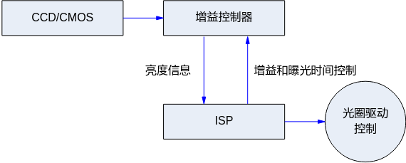
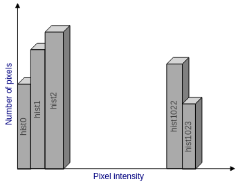
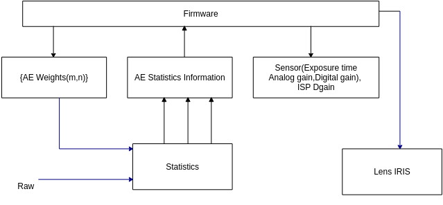
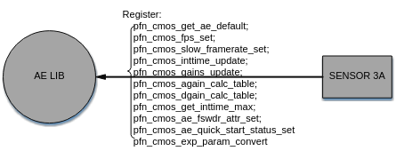
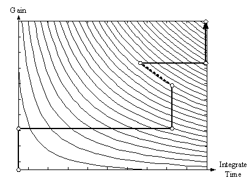
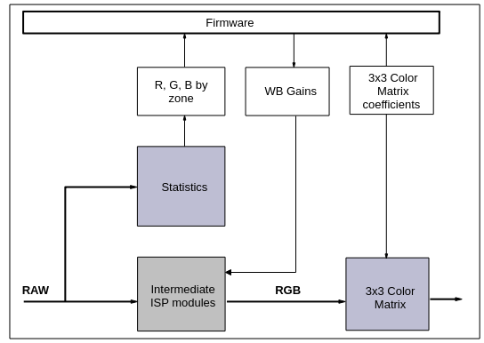
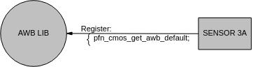
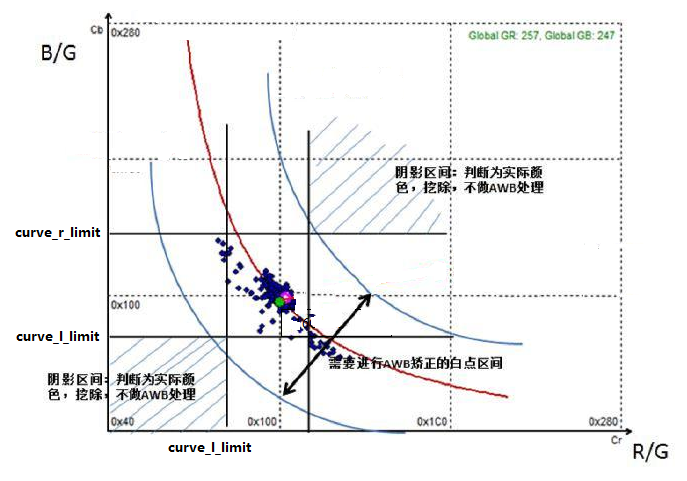
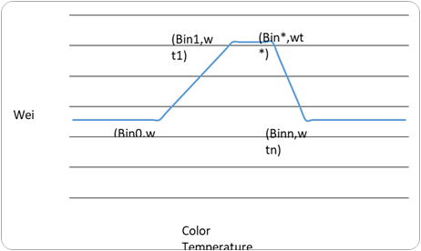
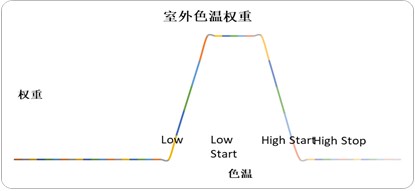

# AE<a name="ZH-CN_TOPIC_0000002471085148"></a>


## 概述<a name="ZH-CN_TOPIC_0000002504084725"></a>

ISP AE模块实现的功能是：根据自动测光系统获得当前图像的曝光量，再自动配置镜头光圈、sensor快门及增益来获得最佳的图像质量。自动曝光的算法主要分光圈优先、快门优先、增益优先。光圈优先时算法会优先调整光圈到合适的位置，再分配曝光时间和增益，只适合p-iris镜头，这样能均衡噪声和景深。快门优先时算法会优先分配曝光时间，再分配sensor增益和ISP增益，这样拍摄的图像噪声会比较小。增益优先则是优先分配sensor增益和ISP增益，再分配曝光时间，适合拍摄运动物体的场景。当前AE算法也支持客户设定更灵活的曝光分配策略，AE模块的工作流程如[图1](#fig78111144161318)所示。

**图 1**  AE模块工作流程图<a name="fig78111144161318"></a>  


## 重要概念<a name="ZH-CN_TOPIC_0000002471084834"></a>

-   曝光时间：sensor积累电荷的时间，是sensor pixel从开始曝光到电荷被读出的这段时间。
-   曝光增益：对sensor的输出电荷的总的放大系数，一般有数字增益和模拟增益，模拟增益引入的噪声会稍小，所以一般优先用模拟增益。
-   光圈：光圈是镜头中可以改变光圈孔径大小的机械装置。
-   抗闪烁：由于电灯的电源工频与sensor的帧率不匹配而导致的画面闪烁，一般通过限定曝光时间和修改sensor的帧率来达到抗闪烁的效果。

## 功能描述<a name="ZH-CN_TOPIC_0000002470924948"></a>

AE模块由ISP的AE统计信息模块及AE控制策略的AE算法Firmware两部分组成。ISP的AE统计信息模块主要是提供sensor输入数据的亮度信息统计。其提供的统计信息包括直方图和平均值，可同时提供整幅图像的1024段的直方图和R/Gr/Gb/B四分量平均值统计信息，还可提供将整幅图像分成MxN区块的每个区块的R/Gr/Gb/B四分量平均值统计信息，具体如[图1](#fig1568813224314)所示。

**图 1**  AE 1024段统计信息直方图<a name="fig1568813224314"></a>  


AE算法的主要工作原理是实时获取输入图像的统计信息并与设定目标亮度进行比较，而动态调节sensor的曝光时间和增益以及镜头光圈大小以达到实际亮度与设定目标亮度接近。其工作原理如[图2](#fig85992506321)所示。

**图 2**  AE工作原理图<a name="fig85992506321"></a>  


## API参考<a name="ZH-CN_TOPIC_0000002504084819"></a>


### AE库接口<a name="ZH-CN_TOPIC_0000002471084986"></a>

所有AE库接口都只是针对SDK提供的AE库，如果客户自己实现AE库，不需要关注这些接口，且无法使用这些接口。

-   [ss\_mpi\_ae\_register](#ZH-CN_TOPIC_0000002470925134)：向ISP注册AE库。
-   [ss\_mpi\_ae\_unregister](#ZH-CN_TOPIC_0000002471084866)：向ISP反注册AE库。
-   [ss\_mpi\_ae\_sensor\_reg\_callback](#ZH-CN_TOPIC_0000002470924952)：AE库提供的sensor注册的回调接口。
-   [ss\_mpi\_ae\_sensor\_unreg\_callback](#ZH-CN_TOPIC_0000002471084858)：AE库提供的sensor反注册的回调接口。


#### ss\_mpi\_ae\_register<a name="ZH-CN_TOPIC_0000002470925134"></a>

【描述】

向ISP注册AE库。

【语法】

```
td_s32 ss_mpi_ae_register(ot_vi_pipe vi_pipe, const ot_isp_3a_alg_lib *ae_lib);
```

【参数】

<a name="table10192mcpsimp"></a>
<table><thead align="left"><tr id="row10198mcpsimp"><th class="cellrowborder" valign="top" width="15%" id="mcps1.1.4.1.1"><p id="p10200mcpsimp"><a name="p10200mcpsimp"></a><a name="p10200mcpsimp"></a>参数名称</p>
</th>
<th class="cellrowborder" valign="top" width="69%" id="mcps1.1.4.1.2"><p id="p10202mcpsimp"><a name="p10202mcpsimp"></a><a name="p10202mcpsimp"></a>描述</p>
</th>
<th class="cellrowborder" valign="top" width="16%" id="mcps1.1.4.1.3"><p id="p10204mcpsimp"><a name="p10204mcpsimp"></a><a name="p10204mcpsimp"></a>输入/输出</p>
</th>
</tr>
</thead>
<tbody><tr id="row10206mcpsimp"><td class="cellrowborder" valign="top" width="15%" headers="mcps1.1.4.1.1 "><p id="p10208mcpsimp"><a name="p10208mcpsimp"></a><a name="p10208mcpsimp"></a>vi_pipe</p>
</td>
<td class="cellrowborder" valign="top" width="69%" headers="mcps1.1.4.1.2 "><p id="p10210mcpsimp"><a name="p10210mcpsimp"></a><a name="p10210mcpsimp"></a>vi_pipe号。</p>
</td>
<td class="cellrowborder" valign="top" width="16%" headers="mcps1.1.4.1.3 "><p id="p10212mcpsimp"><a name="p10212mcpsimp"></a><a name="p10212mcpsimp"></a>输入</p>
</td>
</tr>
<tr id="row10213mcpsimp"><td class="cellrowborder" valign="top" width="15%" headers="mcps1.1.4.1.1 "><p id="p10215mcpsimp"><a name="p10215mcpsimp"></a><a name="p10215mcpsimp"></a>ae_lib</p>
</td>
<td class="cellrowborder" valign="top" width="69%" headers="mcps1.1.4.1.2 "><p id="p10217mcpsimp"><a name="p10217mcpsimp"></a><a name="p10217mcpsimp"></a>AE算法库结构体指针。</p>
</td>
<td class="cellrowborder" valign="top" width="16%" headers="mcps1.1.4.1.3 "><p id="p10219mcpsimp"><a name="p10219mcpsimp"></a><a name="p10219mcpsimp"></a>输入</p>
</td>
</tr>
</tbody>
</table>

【返回值】

<a name="table10221mcpsimp"></a>
<table><thead align="left"><tr id="row10226mcpsimp"><th class="cellrowborder" valign="top" width="27%" id="mcps1.1.3.1.1"><p id="p10228mcpsimp"><a name="p10228mcpsimp"></a><a name="p10228mcpsimp"></a>返回值</p>
</th>
<th class="cellrowborder" valign="top" width="73%" id="mcps1.1.3.1.2"><p id="p10230mcpsimp"><a name="p10230mcpsimp"></a><a name="p10230mcpsimp"></a>描述</p>
</th>
</tr>
</thead>
<tbody><tr id="row10231mcpsimp"><td class="cellrowborder" valign="top" width="27%" headers="mcps1.1.3.1.1 "><p id="p10233mcpsimp"><a name="p10233mcpsimp"></a><a name="p10233mcpsimp"></a>0</p>
</td>
<td class="cellrowborder" valign="top" width="73%" headers="mcps1.1.3.1.2 "><p id="p10235mcpsimp"><a name="p10235mcpsimp"></a><a name="p10235mcpsimp"></a>成功。</p>
</td>
</tr>
<tr id="row10236mcpsimp"><td class="cellrowborder" valign="top" width="27%" headers="mcps1.1.3.1.1 "><p id="p10238mcpsimp"><a name="p10238mcpsimp"></a><a name="p10238mcpsimp"></a>非0</p>
</td>
<td class="cellrowborder" valign="top" width="73%" headers="mcps1.1.3.1.2 "><p id="p10240mcpsimp"><a name="p10240mcpsimp"></a><a name="p10240mcpsimp"></a>失败，其值为错误码。</p>
</td>
</tr>
</tbody>
</table>

【需求】

-   头文件：ot\_common\_isp.h、ss\_mpi\_ae.h
-   库文件：libss\_isp.a、libot\_isp.a、libot\_ae.a

【注意】

-   该接口调用了ISP库提供的AE注册回调接口ss\_mpi\_isp\_ae\_lib\_reg\_callback，以实现SDK提供的AE库向ISP库注册的功能。
-   AE库可以注册多个实例。
-   此接口不支持多进程操作。

【举例】

```
ot_vi_pipe vi_pipe = 0;
ae_lib.id = 0;
strcpy(ae_lib.lib_name, OT_AE_LIB_NAME); 
ss_mpi_ae_register(vi_pipe, &ae_lib);
ae_lib.id  = 1; 
ss_mpi_ae_register(vi_pipe, &ae_lib);
```

【相关主题】

无

#### ss\_mpi\_ae\_unregister<a name="ZH-CN_TOPIC_0000002471084866"></a>

【描述】

向ISP反注册AE库。

【语法】

```
td_s32 ss_mpi_ae_unregister(ot_vi_pipe vi_pipe, ot_isp_3a_alg_lib *ae_lib);
```

【参数】

<a name="table10270mcpsimp"></a>
<table><thead align="left"><tr id="row10276mcpsimp"><th class="cellrowborder" valign="top" width="15%" id="mcps1.1.4.1.1"><p id="p10278mcpsimp"><a name="p10278mcpsimp"></a><a name="p10278mcpsimp"></a>参数名称</p>
</th>
<th class="cellrowborder" valign="top" width="69%" id="mcps1.1.4.1.2"><p id="p10280mcpsimp"><a name="p10280mcpsimp"></a><a name="p10280mcpsimp"></a>描述</p>
</th>
<th class="cellrowborder" valign="top" width="16%" id="mcps1.1.4.1.3"><p id="p10282mcpsimp"><a name="p10282mcpsimp"></a><a name="p10282mcpsimp"></a>输入/输出</p>
</th>
</tr>
</thead>
<tbody><tr id="row10283mcpsimp"><td class="cellrowborder" valign="top" width="15%" headers="mcps1.1.4.1.1 "><p id="p10285mcpsimp"><a name="p10285mcpsimp"></a><a name="p10285mcpsimp"></a>vi_pipe</p>
</td>
<td class="cellrowborder" valign="top" width="69%" headers="mcps1.1.4.1.2 "><p id="p10287mcpsimp"><a name="p10287mcpsimp"></a><a name="p10287mcpsimp"></a>vi_pipe号。</p>
</td>
<td class="cellrowborder" valign="top" width="16%" headers="mcps1.1.4.1.3 "><p id="p10289mcpsimp"><a name="p10289mcpsimp"></a><a name="p10289mcpsimp"></a>输入</p>
</td>
</tr>
<tr id="row10290mcpsimp"><td class="cellrowborder" valign="top" width="15%" headers="mcps1.1.4.1.1 "><p id="p10292mcpsimp"><a name="p10292mcpsimp"></a><a name="p10292mcpsimp"></a>ae_lib</p>
</td>
<td class="cellrowborder" valign="top" width="69%" headers="mcps1.1.4.1.2 "><p id="p10294mcpsimp"><a name="p10294mcpsimp"></a><a name="p10294mcpsimp"></a>AE算法库结构体指针。</p>
</td>
<td class="cellrowborder" valign="top" width="16%" headers="mcps1.1.4.1.3 "><p id="p10296mcpsimp"><a name="p10296mcpsimp"></a><a name="p10296mcpsimp"></a>输入</p>
</td>
</tr>
</tbody>
</table>

【返回值】

<a name="table10299mcpsimp"></a>
<table><thead align="left"><tr id="row10304mcpsimp"><th class="cellrowborder" valign="top" width="27%" id="mcps1.1.3.1.1"><p id="p10306mcpsimp"><a name="p10306mcpsimp"></a><a name="p10306mcpsimp"></a>返回值</p>
</th>
<th class="cellrowborder" valign="top" width="73%" id="mcps1.1.3.1.2"><p id="p10308mcpsimp"><a name="p10308mcpsimp"></a><a name="p10308mcpsimp"></a>描述</p>
</th>
</tr>
</thead>
<tbody><tr id="row10309mcpsimp"><td class="cellrowborder" valign="top" width="27%" headers="mcps1.1.3.1.1 "><p id="p10311mcpsimp"><a name="p10311mcpsimp"></a><a name="p10311mcpsimp"></a>0</p>
</td>
<td class="cellrowborder" valign="top" width="73%" headers="mcps1.1.3.1.2 "><p id="p10313mcpsimp"><a name="p10313mcpsimp"></a><a name="p10313mcpsimp"></a>成功。</p>
</td>
</tr>
<tr id="row10314mcpsimp"><td class="cellrowborder" valign="top" width="27%" headers="mcps1.1.3.1.1 "><p id="p10316mcpsimp"><a name="p10316mcpsimp"></a><a name="p10316mcpsimp"></a>非0</p>
</td>
<td class="cellrowborder" valign="top" width="73%" headers="mcps1.1.3.1.2 "><p id="p10318mcpsimp"><a name="p10318mcpsimp"></a><a name="p10318mcpsimp"></a>失败，其值为错误码。</p>
</td>
</tr>
</tbody>
</table>

【需求】

-   头文件：ot\_common\_isp.h、ss\_mpi\_ae.h
-   库文件：libss\_isp.a、libot\_isp.a、libot\_ae.a

【注意】

-   该接口调用了ISP库提供的AE反注册回调接口ss\_mpi\_isp\_ae\_lib\_unreg\_callback，以实现AE向ISP库反注册的功能。
-   此接口不支持多进程操作。

【举例】

```
ot_vi_pipe vi_pipe = 0;
ae_lib.id = 0;strcpy(ae_lib.lib_name, OT_AE_LIB_NAME); 
ss_mpi_ae_unregister(vi_pipe, & ae_lib);
ae_lib.id = 1; 
ss_mpi_ae_unregister(vi_pipe, & ae_lib);
```

【相关主题】

无

#### ss\_mpi\_ae\_sensor\_reg\_callback<a name="ZH-CN_TOPIC_0000002470924952"></a>

【描述】

AE库提供的sensor注册的回调接口。

【语法】

```
td_s32 ss_mpi_ae_sensor_reg_callback(ot_vi_pipe vi_pipe, ot_isp_3a_alg_lib *ae_lib, ot_isp_sns_attr_info *sns_attr_info, ot_isp_ae_sensor_register *pregister);
```

【参数】

<a name="table10349mcpsimp"></a>
<table><thead align="left"><tr id="row10355mcpsimp"><th class="cellrowborder" valign="top" width="23%" id="mcps1.1.4.1.1"><p id="p10357mcpsimp"><a name="p10357mcpsimp"></a><a name="p10357mcpsimp"></a>参数名称</p>
</th>
<th class="cellrowborder" valign="top" width="56.99999999999999%" id="mcps1.1.4.1.2"><p id="p10359mcpsimp"><a name="p10359mcpsimp"></a><a name="p10359mcpsimp"></a>描述</p>
</th>
<th class="cellrowborder" valign="top" width="20%" id="mcps1.1.4.1.3"><p id="p10361mcpsimp"><a name="p10361mcpsimp"></a><a name="p10361mcpsimp"></a>输入/输出</p>
</th>
</tr>
</thead>
<tbody><tr id="row10362mcpsimp"><td class="cellrowborder" valign="top" width="23%" headers="mcps1.1.4.1.1 "><p id="p10364mcpsimp"><a name="p10364mcpsimp"></a><a name="p10364mcpsimp"></a>vi_pipe</p>
</td>
<td class="cellrowborder" valign="top" width="56.99999999999999%" headers="mcps1.1.4.1.2 "><p id="p10366mcpsimp"><a name="p10366mcpsimp"></a><a name="p10366mcpsimp"></a>vi_pipe号。</p>
</td>
<td class="cellrowborder" valign="top" width="20%" headers="mcps1.1.4.1.3 "><p id="p10368mcpsimp"><a name="p10368mcpsimp"></a><a name="p10368mcpsimp"></a>输入</p>
</td>
</tr>
<tr id="row10369mcpsimp"><td class="cellrowborder" valign="top" width="23%" headers="mcps1.1.4.1.1 "><p id="p10371mcpsimp"><a name="p10371mcpsimp"></a><a name="p10371mcpsimp"></a>ae_lib</p>
</td>
<td class="cellrowborder" valign="top" width="56.99999999999999%" headers="mcps1.1.4.1.2 "><p id="p10373mcpsimp"><a name="p10373mcpsimp"></a><a name="p10373mcpsimp"></a>AE算法库结构体指针。</p>
</td>
<td class="cellrowborder" valign="top" width="20%" headers="mcps1.1.4.1.3 "><p id="p10375mcpsimp"><a name="p10375mcpsimp"></a><a name="p10375mcpsimp"></a>输入</p>
</td>
</tr>
<tr id="row10376mcpsimp"><td class="cellrowborder" valign="top" width="23%" headers="mcps1.1.4.1.1 "><p id="p10378mcpsimp"><a name="p10378mcpsimp"></a><a name="p10378mcpsimp"></a>sns_attr_info</p>
</td>
<td class="cellrowborder" valign="top" width="56.99999999999999%" headers="mcps1.1.4.1.2 "><p id="p10380mcpsimp"><a name="p10380mcpsimp"></a><a name="p10380mcpsimp"></a>向AE注册的Sensor的属性。</p>
</td>
<td class="cellrowborder" valign="top" width="20%" headers="mcps1.1.4.1.3 "><p id="p10382mcpsimp"><a name="p10382mcpsimp"></a><a name="p10382mcpsimp"></a>输入</p>
</td>
</tr>
<tr id="row10383mcpsimp"><td class="cellrowborder" valign="top" width="23%" headers="mcps1.1.4.1.1 "><p id="p10385mcpsimp"><a name="p10385mcpsimp"></a><a name="p10385mcpsimp"></a>pregister</p>
</td>
<td class="cellrowborder" valign="top" width="56.99999999999999%" headers="mcps1.1.4.1.2 "><p id="p10387mcpsimp"><a name="p10387mcpsimp"></a><a name="p10387mcpsimp"></a>Sensor注册结构体指针。</p>
</td>
<td class="cellrowborder" valign="top" width="20%" headers="mcps1.1.4.1.3 "><p id="p10389mcpsimp"><a name="p10389mcpsimp"></a><a name="p10389mcpsimp"></a>输入</p>
</td>
</tr>
</tbody>
</table>

【返回值】

<a name="table10392mcpsimp"></a>
<table><thead align="left"><tr id="row10397mcpsimp"><th class="cellrowborder" valign="top" width="27%" id="mcps1.1.3.1.1"><p id="p10399mcpsimp"><a name="p10399mcpsimp"></a><a name="p10399mcpsimp"></a>返回值</p>
</th>
<th class="cellrowborder" valign="top" width="73%" id="mcps1.1.3.1.2"><p id="p10401mcpsimp"><a name="p10401mcpsimp"></a><a name="p10401mcpsimp"></a>描述</p>
</th>
</tr>
</thead>
<tbody><tr id="row10402mcpsimp"><td class="cellrowborder" valign="top" width="27%" headers="mcps1.1.3.1.1 "><p id="p10404mcpsimp"><a name="p10404mcpsimp"></a><a name="p10404mcpsimp"></a>0</p>
</td>
<td class="cellrowborder" valign="top" width="73%" headers="mcps1.1.3.1.2 "><p id="p10406mcpsimp"><a name="p10406mcpsimp"></a><a name="p10406mcpsimp"></a>成功。</p>
</td>
</tr>
<tr id="row10407mcpsimp"><td class="cellrowborder" valign="top" width="27%" headers="mcps1.1.3.1.1 "><p id="p10409mcpsimp"><a name="p10409mcpsimp"></a><a name="p10409mcpsimp"></a>非0</p>
</td>
<td class="cellrowborder" valign="top" width="73%" headers="mcps1.1.3.1.2 "><p id="p10411mcpsimp"><a name="p10411mcpsimp"></a><a name="p10411mcpsimp"></a>失败，其值为错误码。</p>
</td>
</tr>
</tbody>
</table>

【需求】

-   头文件：ot\_common\_isp.h、ss\_mpi\_ae.h
-   库文件：libss\_isp.a、libot\_isp.a、libot\_ae.a

【注意】

-   SensorId是sensor库中自定义的值，主要用于校对向ISP注册的sensor和向3A注册的sensor是否为同一个sensor。
-   AE通过sensor注册的一系列回调接口，获取差异化的初始化参数，并控制sensor。
-   此接口不支持多进程操作。

**图 1**  AE库与sensor库间的接口<a name="fig192824551518"></a>  


【举例】

```
ot_isp_3a_alg_lib ae_lib;
ot_isp_ae_sensor_register  ae_register;
ot_isp_sns_attr_info   sns_attr_info;
ot_isp_ae_sensor_exp_func *exp_func = &ae_register.sns_exp;
(ot_void)memset_s(exp_func, sizeof(ot_isp_ae_sensor_exp_func), 0, sizeof(ot_isp_ae_sensor_exp_func));
exp_func->pfn_cmos_get_ae_default    = cmos_get_ae_default;
exp_func->pfn_cmos_fps_set           = cmos_fps_set;
exp_func->pfn_cmos_slow_framerate_set= cmos_slow_framerate_set;    
exp_func->pfn_cmos_inttime_update    = cmos_inttime_update;
exp_func->pfn_cmos_gains_update      = cmos_gains_update;
exp_func->pfn_cmos_again_calc_table  = cmos_again_calc_table;
exp_func->pfn_cmos_dgain_calc_table  = cmos_dgain_calc_table;
exp_func->pfn_cmos_get_inttime_max   = cmos_get_inttime_max;
exp_func->pfn_cmos_ae_fswdr_attr_set = cmos_ae_fswdr_attr_set;
exp_func->pfn_cmos_ae_quick_start_status_set = cmos_ae_quick_start_status_set;
 
ot_vi_pipe vi_pipe = 0;
ae_lib.id = 0;
sns_attr_info.sensor_id = SENSOR_NAME_ID;
strncpy(ae_lib.lib_name, OT_AE_LIB_NAME, sizeof(OT_AE_LIB_NAME));
ret = ss_mpi_ae_sensor_reg_callback(vi_pipe, &ae_lib, &sns_attr_info, &ae_register);
if (ret != TD_SUCCESS) {
    printf("sensor register callback function to ae lib failed!\n");
    return ret;
}
```

【相关主题】

无

#### ss\_mpi\_ae\_sensor\_unreg\_callback<a name="ZH-CN_TOPIC_0000002471084858"></a>

【描述】

AE库提供的sensor反注册的回调接口。

【语法】

```
td_s32 ss_mpi_ae_sensor_unreg_callback(ot_vi_pipe vi_pipe, ot_isp_3a_alg_lib *ae_lib, ot_sensor_id sensor_id);
```

【参数】

<a name="table10464mcpsimp"></a>
<table><thead align="left"><tr id="row10470mcpsimp"><th class="cellrowborder" valign="top" width="15%" id="mcps1.1.4.1.1"><p id="p10472mcpsimp"><a name="p10472mcpsimp"></a><a name="p10472mcpsimp"></a>参数名称</p>
</th>
<th class="cellrowborder" valign="top" width="69%" id="mcps1.1.4.1.2"><p id="p10474mcpsimp"><a name="p10474mcpsimp"></a><a name="p10474mcpsimp"></a>描述</p>
</th>
<th class="cellrowborder" valign="top" width="16%" id="mcps1.1.4.1.3"><p id="p10476mcpsimp"><a name="p10476mcpsimp"></a><a name="p10476mcpsimp"></a>输入/输出</p>
</th>
</tr>
</thead>
<tbody><tr id="row10477mcpsimp"><td class="cellrowborder" valign="top" width="15%" headers="mcps1.1.4.1.1 "><p id="p10479mcpsimp"><a name="p10479mcpsimp"></a><a name="p10479mcpsimp"></a>vi_pipe</p>
</td>
<td class="cellrowborder" valign="top" width="69%" headers="mcps1.1.4.1.2 "><p id="p10481mcpsimp"><a name="p10481mcpsimp"></a><a name="p10481mcpsimp"></a>vi_pipe号。</p>
</td>
<td class="cellrowborder" valign="top" width="16%" headers="mcps1.1.4.1.3 "><p id="p10483mcpsimp"><a name="p10483mcpsimp"></a><a name="p10483mcpsimp"></a>输入</p>
</td>
</tr>
<tr id="row10484mcpsimp"><td class="cellrowborder" valign="top" width="15%" headers="mcps1.1.4.1.1 "><p id="p10486mcpsimp"><a name="p10486mcpsimp"></a><a name="p10486mcpsimp"></a>ae_lib</p>
</td>
<td class="cellrowborder" valign="top" width="69%" headers="mcps1.1.4.1.2 "><p id="p10488mcpsimp"><a name="p10488mcpsimp"></a><a name="p10488mcpsimp"></a>AE算法库结构体指针。</p>
</td>
<td class="cellrowborder" valign="top" width="16%" headers="mcps1.1.4.1.3 "><p id="p10490mcpsimp"><a name="p10490mcpsimp"></a><a name="p10490mcpsimp"></a>输入</p>
</td>
</tr>
<tr id="row10491mcpsimp"><td class="cellrowborder" valign="top" width="15%" headers="mcps1.1.4.1.1 "><p id="p10493mcpsimp"><a name="p10493mcpsimp"></a><a name="p10493mcpsimp"></a>sensor_id</p>
</td>
<td class="cellrowborder" valign="top" width="69%" headers="mcps1.1.4.1.2 "><p id="p10495mcpsimp"><a name="p10495mcpsimp"></a><a name="p10495mcpsimp"></a>向AE反注册的Sensor的Id。</p>
</td>
<td class="cellrowborder" valign="top" width="16%" headers="mcps1.1.4.1.3 "><p id="p10497mcpsimp"><a name="p10497mcpsimp"></a><a name="p10497mcpsimp"></a>输入</p>
</td>
</tr>
</tbody>
</table>

【返回值】

<a name="table10500mcpsimp"></a>
<table><thead align="left"><tr id="row10505mcpsimp"><th class="cellrowborder" valign="top" width="27%" id="mcps1.1.3.1.1"><p id="p10507mcpsimp"><a name="p10507mcpsimp"></a><a name="p10507mcpsimp"></a>返回值</p>
</th>
<th class="cellrowborder" valign="top" width="73%" id="mcps1.1.3.1.2"><p id="p10509mcpsimp"><a name="p10509mcpsimp"></a><a name="p10509mcpsimp"></a>描述</p>
</th>
</tr>
</thead>
<tbody><tr id="row10511mcpsimp"><td class="cellrowborder" valign="top" width="27%" headers="mcps1.1.3.1.1 "><p id="p10513mcpsimp"><a name="p10513mcpsimp"></a><a name="p10513mcpsimp"></a>0</p>
</td>
<td class="cellrowborder" valign="top" width="73%" headers="mcps1.1.3.1.2 "><p id="p10515mcpsimp"><a name="p10515mcpsimp"></a><a name="p10515mcpsimp"></a>成功。</p>
</td>
</tr>
<tr id="row10516mcpsimp"><td class="cellrowborder" valign="top" width="27%" headers="mcps1.1.3.1.1 "><p id="p10518mcpsimp"><a name="p10518mcpsimp"></a><a name="p10518mcpsimp"></a>非0</p>
</td>
<td class="cellrowborder" valign="top" width="73%" headers="mcps1.1.3.1.2 "><p id="p10520mcpsimp"><a name="p10520mcpsimp"></a><a name="p10520mcpsimp"></a>失败，其值为错误码。</p>
</td>
</tr>
</tbody>
</table>

【需求】

-   头文件：ot\_common\_isp.h、ss\_mpi\_ae.h
-   库文件：libss\_isp.a、libot\_isp.a、libot\_ae.a

【注意】

-   SensorId是sensor库中自定义的值，主要用于校对向ISP反注册的sensor和向3A反注册的sensor是否为同一个sensor。
-   此接口不支持多进程操作。

【举例】

```
ot_isp_3a_alg_lib ae_lib;
ot_vi_pipe vi_pipe = 0;
ae_lib.id = 0;
strncpy(ae_lib.lib_name, OT_AE_LIB_NAME, sizeof(OT_AE_LIB_NAME));
ret = ss_mpi_ae_sensor_unreg_callback(vi_pipe, &ae_lib, SENSOR_NAME_ID);
if (ret != TD_SUCCESS) {
    printf("sensor register callback function to ae lib failed!\n");
    return ret;
}
```

【相关主题】

无

### AE控制模块<a name="ZH-CN_TOPIC_0000002504084901"></a>

曝光控制接口：

-   [ss\_mpi\_isp\_set\_exposure\_attr](#ZH-CN_TOPIC_0000002503964781)：设置AE曝光属性。
-   [ss\_mpi\_isp\_get\_exposure\_attr](#ZH-CN_TOPIC_0000002504084835)：获取AE曝光属性。
-   [ss\_mpi\_isp\_set\_wdr\_exposure\_attr](#ZH-CN_TOPIC_0000002504084905)：设置WDR模式下的AE曝光属性。
-   [ss\_mpi\_isp\_get\_wdr\_exposure\_attr](#ZH-CN_TOPIC_0000002470924854)：获取WDR模式下的AE曝光属性。
-   [ss\_mpi\_isp\_set\_hdr\_exposure\_attr](#ZH-CN_TOPIC_0000002504084737)：设置HDR模式下的AE曝光属性。
-   [ss\_mpi\_isp\_get\_hdr\_exposure\_attr](#ZH-CN_TOPIC_0000002504084897)：获取HDR模式下的AE曝光属性。
-   [ss\_mpi\_isp\_set\_smart\_exposure\_attr](#ZH-CN_TOPIC_0000002471084856)：设置智能模式下的AE曝光属性。
-   [ss\_mpi\_isp\_get\_smart\_exposure\_attr](#ZH-CN_TOPIC_0000002504084961)：获取智能模式下的AE曝光属性。
-   [ss\_mpi\_isp\_set\_fast\_face\_ae\_attr](#ZH-CN_TOPIC_0000002503964919)：设置人脸快速收敛模式下的AE曝光属性。
-   [ss\_mpi\_isp\_get\_fast\_face\_ae\_attr](#ZH-CN_TOPIC_0000002504084751)：获取人脸快速收敛模式下的AE曝光属性。
-   [ss\_mpi\_isp\_set\_ae\_route\_attr](#ZH-CN_TOPIC_0000002504084821)：设置AE曝光分配策略属性。
-   [ss\_mpi\_isp\_get\_ae\_route\_attr](#ZH-CN_TOPIC_0000002471084932)：获取AE曝光分配策略属性。
-   [ss\_mpi\_isp\_set\_ae\_route\_attr\_ex](#ZH-CN_TOPIC_0000002503965045)：设置AE曝光分配扩展属性，支持分别设置AE分配策略中的sensor模拟增益，sensor数字增益和ISP数字增益。
-   [ss\_mpi\_isp\_get\_ae\_route\_attr\_ex](#ZH-CN_TOPIC_0000002471084852)：获取AE曝光分配策略扩展属性。
-   [ss\_mpi\_isp\_set\_ae\_route\_sf\_attr](#ZH-CN_TOPIC_0000002503964803)：WDR模式下，设置AE短帧的曝光分配策略属性。
-   [ss\_mpi\_isp\_get\_ae\_route\_sf\_attr](#ZH-CN_TOPIC_0000002471085052)：获取AE短帧曝光分配策略属性。
-   [ss\_mpi\_isp\_set\_ae\_route\_sf\_attr\_ex](#ZH-CN_TOPIC_0000002503964835)：WDR模式下，设置AE短帧的曝光分配策略扩展属性。
-   [ss\_mpi\_isp\_get\_ae\_route\_sf\_attr\_ex](#ZH-CN_TOPIC_0000002470925156)：获取AE短帧曝光分配策略扩展属性。
-   [ss\_mpi\_isp\_query\_exposure\_info](#ZH-CN_TOPIC_0000002503964993)：获取AE内部状态信息。
-   [ss\_mpi\_isp\_set\_exp\_convert](#ZH-CN_TOPIC_0000002470925022)：设置不同帧率下等曝光量转换的相关属性。
-   [ss\_mpi\_isp\_get\_exp\_convert](#ZH-CN_TOPIC_0000002504084753)：获取不同帧率下等曝光量转换结果相关的曝光参数属性。


#### ss\_mpi\_isp\_set\_exposure\_attr<a name="ZH-CN_TOPIC_0000002503964781"></a>

【描述】

设定AE曝光属性。

【语法】

```
td_s32 ss_mpi_isp_set_exposure_attr (ot_vi_pipe vi_pipe, const ot_isp_exposure_attr *exp_attr);
```

【参数】

<a name="table10602mcpsimp"></a>
<table><thead align="left"><tr id="row10608mcpsimp"><th class="cellrowborder" valign="top" width="18%" id="mcps1.1.4.1.1"><p id="p10610mcpsimp"><a name="p10610mcpsimp"></a><a name="p10610mcpsimp"></a>参数名称</p>
</th>
<th class="cellrowborder" valign="top" width="66%" id="mcps1.1.4.1.2"><p id="p10612mcpsimp"><a name="p10612mcpsimp"></a><a name="p10612mcpsimp"></a>描述</p>
</th>
<th class="cellrowborder" valign="top" width="16%" id="mcps1.1.4.1.3"><p id="p10614mcpsimp"><a name="p10614mcpsimp"></a><a name="p10614mcpsimp"></a>输入/输出</p>
</th>
</tr>
</thead>
<tbody><tr id="row10616mcpsimp"><td class="cellrowborder" valign="top" width="18%" headers="mcps1.1.4.1.1 "><p id="p10618mcpsimp"><a name="p10618mcpsimp"></a><a name="p10618mcpsimp"></a>vi_pipe</p>
</td>
<td class="cellrowborder" valign="top" width="66%" headers="mcps1.1.4.1.2 "><p id="p10620mcpsimp"><a name="p10620mcpsimp"></a><a name="p10620mcpsimp"></a>vi_pipe号。</p>
</td>
<td class="cellrowborder" valign="top" width="16%" headers="mcps1.1.4.1.3 "><p id="p10622mcpsimp"><a name="p10622mcpsimp"></a><a name="p10622mcpsimp"></a>输入</p>
</td>
</tr>
<tr id="row10623mcpsimp"><td class="cellrowborder" valign="top" width="18%" headers="mcps1.1.4.1.1 "><p id="p10625mcpsimp"><a name="p10625mcpsimp"></a><a name="p10625mcpsimp"></a>exp_attr</p>
</td>
<td class="cellrowborder" valign="top" width="66%" headers="mcps1.1.4.1.2 "><p id="p10627mcpsimp"><a name="p10627mcpsimp"></a><a name="p10627mcpsimp"></a>AE曝光属性结构体指针。</p>
</td>
<td class="cellrowborder" valign="top" width="16%" headers="mcps1.1.4.1.3 "><p id="p10629mcpsimp"><a name="p10629mcpsimp"></a><a name="p10629mcpsimp"></a>输入</p>
</td>
</tr>
</tbody>
</table>

【返回值】

<a name="table10631mcpsimp"></a>
<table><thead align="left"><tr id="row10636mcpsimp"><th class="cellrowborder" valign="top" width="27%" id="mcps1.1.3.1.1"><p id="p10638mcpsimp"><a name="p10638mcpsimp"></a><a name="p10638mcpsimp"></a>返回值</p>
</th>
<th class="cellrowborder" valign="top" width="73%" id="mcps1.1.3.1.2"><p id="p10640mcpsimp"><a name="p10640mcpsimp"></a><a name="p10640mcpsimp"></a>描述</p>
</th>
</tr>
</thead>
<tbody><tr id="row10641mcpsimp"><td class="cellrowborder" valign="top" width="27%" headers="mcps1.1.3.1.1 "><p id="p10643mcpsimp"><a name="p10643mcpsimp"></a><a name="p10643mcpsimp"></a>0</p>
</td>
<td class="cellrowborder" valign="top" width="73%" headers="mcps1.1.3.1.2 "><p id="p10645mcpsimp"><a name="p10645mcpsimp"></a><a name="p10645mcpsimp"></a>成功。</p>
</td>
</tr>
<tr id="row10646mcpsimp"><td class="cellrowborder" valign="top" width="27%" headers="mcps1.1.3.1.1 "><p id="p10648mcpsimp"><a name="p10648mcpsimp"></a><a name="p10648mcpsimp"></a>非0</p>
</td>
<td class="cellrowborder" valign="top" width="73%" headers="mcps1.1.3.1.2 "><p id="p10650mcpsimp"><a name="p10650mcpsimp"></a><a name="p10650mcpsimp"></a>失败，其值为错误码。</p>
</td>
</tr>
</tbody>
</table>

【需求】

-   头文件：ot\_common\_isp.h、ss\_mpi\_isp.h、ss\_mpi\_ae.h
-   库文件：libss\_isp.a、libot\_isp.a、libot\_ae.a

【注意】

-   AE曝光控制类型为自动时，曝光时间，曝光增益都由AE算法自动控制，可以通过配置自动曝光属性结构体[ot\_isp\_ae\_attr](#ZH-CN_TOPIC_0000002470924872)里面的参数得到不同的曝光效果。
-   AE曝光控制类型为手动时，可以通过配置手动曝光属性结构体manual\_attr控制使能类型（曝光时间使能、sensor模拟增益使能、sensor数字增益使能、ISP数字增益使能）及相应的曝光参数（曝光时间、sensor模拟增益、sensor数字增益、ISP数字增益）。
-   AE曝光控制类型为自动时，配置手动曝光属性的参数无效。同理，AE曝光控制类型为手动时，配置自动曝光属性的参数无效。
-   AE曝光控制类型为手动时，若曝光参数设置超出最大（小）值，将使用sensor支持的最大（小）值代替。
-   无论是自动曝光还是手动曝光，曝光时间的单位为微秒\(us\)，曝光增益的单位为10bit精度的倍数，即1024代表1倍，2048代表2倍等。
-   WDR模式下，优先帧设置为长帧时，优先根据长帧的曝光路线进行曝光，其中2合1WDR模式下当增益分开配置时，短帧曝光路线根据长帧的曝光参数进行调整；优先帧设置为短帧时，优先根据短帧的曝光路线进行曝光，其中2合1WDR模式下当增益分开配置时，长帧曝光路线根据短帧的曝光参数进行调整。
-   2合1WDR模式下，设置增益分开配置，若sensor支持长短帧不同增益，可实现长短帧不同的sensor模拟增益、sensor数字增益、WDR增益，若sensor不支持长短帧不同增益，可实现长短帧不同的WDR增益。

【举例】

自动曝光属性设置：

```
ot_vi_pipe vi_pipe = 0;
ot_isp_exposure_attr exp_attr; 
 
ss_mpi_isp_get_exposure_attr(vi_pipe, &exp_attr);
exp_attr.  bypass = TD_FALSE;   
exp_attr. prior_frame= OT_ISP_LONG_FRAME;
exp_attr.  ae_gain_sep_cfg= TD_FALSE; 
exp_attr. op_type= OT_OP_MODE_AUTO;       
exp_attr. auto_attr. exp_time_range.max = 40000;
exp_attr. auto_attr. exp_time_range.min = 10;       
ss_mpi_isp_get_exposure_attr(vi_pipe, &exp_attr);
exp_attr. auto_attr.speed = 0x80;      
ss_mpi_isp_get_exposure_attr(vi_pipe, &exp_attr);
exp_attr. auto_attr. exp_attr =OT_ISP_AE_EXP_HIGHLIGHT_PRIOR;   
exp_attr. auto_attr. hist_ratio_slope= 0x100;
exp_attr. auto_attr. max_hist_offset= 0x40;
ss_mpi_isp_get_exposure_attr(vi_pipe, &exp_attr);
exp_attr. auto_attr. antiflicker. enable= TD_TRUE;
exp_attr. auto_attr. antiflicker. frequency= 50;
exp_attr. auto_attr. antiflicker. mode= OT_ISP_ANTIFLICKER_NORMAL_MODE;
ss_mpi_isp_get_exposure_attr(vi_pipe, &exp_attr);
exp_attr. auto_attr. ae_delay_attr. black_delay_frame = 10;
exp_attr. auto_attr. ae_delay_attr. white_delay_frame = 0;
ss_mpi_isp_get_exposure_attr(vi_pipe, &exp_attr);     
```

手动曝光属性设置：

```
ot_vi_pipe vi_pipe = 0;
ot_isp_exposure_attr exp_attr;  
ss_mpi_isp_get_exposure_attr(vi_pipe, &exp_attr);exp_attr. bypass= TD_FALSE;   
exp_attr. op_type= OT_OP_MODE_MANUAL;       
exp_attr. manual_attr. a_gain_op_type = OT_OP_MODE_MANUAL;
exp_attr. manual_attr. d_gain_op_type = OT_OP_MODE_MANUAL
exp_attr. manual_attr. ispd_gain_op_type = OT_OP_MODE_MANUAL;
exp_attr. manual_attr. exp_time_op_type = OT_OP_MODE_MANUAL;
exp_attr. manual_attr. a_gain = 0x400;
exp_attr. manual_attr. d_gain = 0x400;
exp_attr. manual_attr. isp_d_gain = 0x400;
exp_attr. manual_attr. exp_time = 0x40000;     
ss_mpi_isp_get_exposure_attr(vi_pipe, &exp_attr);
```

【相关主题】

[ss\_mpi\_isp\_get\_exposure\_attr](#ss_mpi_isp_get_exposure_attr)

#### ss\_mpi\_isp\_get\_exposure\_attr<a name="ZH-CN_TOPIC_0000002504084835"></a>

【描述】

获取AE曝光属性。

【语法】

```
td_s32 ss_mpi_isp_get_exposure_attr(ot_vi_pipe vi_pipe, ot_isp_exposure_attr *exp_attr);
```

【参数】

<a name="table10718mcpsimp"></a>
<table><thead align="left"><tr id="row10724mcpsimp"><th class="cellrowborder" valign="top" width="18%" id="mcps1.1.4.1.1"><p id="p10726mcpsimp"><a name="p10726mcpsimp"></a><a name="p10726mcpsimp"></a>参数名称</p>
</th>
<th class="cellrowborder" valign="top" width="66%" id="mcps1.1.4.1.2"><p id="p10728mcpsimp"><a name="p10728mcpsimp"></a><a name="p10728mcpsimp"></a>描述</p>
</th>
<th class="cellrowborder" valign="top" width="16%" id="mcps1.1.4.1.3"><p id="p10730mcpsimp"><a name="p10730mcpsimp"></a><a name="p10730mcpsimp"></a>输入/输出</p>
</th>
</tr>
</thead>
<tbody><tr id="row10731mcpsimp"><td class="cellrowborder" valign="top" width="18%" headers="mcps1.1.4.1.1 "><p id="p10733mcpsimp"><a name="p10733mcpsimp"></a><a name="p10733mcpsimp"></a>vi_pipe</p>
</td>
<td class="cellrowborder" valign="top" width="66%" headers="mcps1.1.4.1.2 "><p id="p10735mcpsimp"><a name="p10735mcpsimp"></a><a name="p10735mcpsimp"></a>vi_pipe号。</p>
</td>
<td class="cellrowborder" valign="top" width="16%" headers="mcps1.1.4.1.3 "><p id="p10737mcpsimp"><a name="p10737mcpsimp"></a><a name="p10737mcpsimp"></a>输入</p>
</td>
</tr>
<tr id="row10738mcpsimp"><td class="cellrowborder" valign="top" width="18%" headers="mcps1.1.4.1.1 "><p id="p10740mcpsimp"><a name="p10740mcpsimp"></a><a name="p10740mcpsimp"></a>exp_attr</p>
</td>
<td class="cellrowborder" valign="top" width="66%" headers="mcps1.1.4.1.2 "><p id="p10742mcpsimp"><a name="p10742mcpsimp"></a><a name="p10742mcpsimp"></a>AE曝光属性结构体指针。</p>
</td>
<td class="cellrowborder" valign="top" width="16%" headers="mcps1.1.4.1.3 "><p id="p10744mcpsimp"><a name="p10744mcpsimp"></a><a name="p10744mcpsimp"></a>输出</p>
</td>
</tr>
</tbody>
</table>

【返回值】

<a name="table10747mcpsimp"></a>
<table><thead align="left"><tr id="row10752mcpsimp"><th class="cellrowborder" valign="top" width="27%" id="mcps1.1.3.1.1"><p id="p10754mcpsimp"><a name="p10754mcpsimp"></a><a name="p10754mcpsimp"></a>返回值</p>
</th>
<th class="cellrowborder" valign="top" width="73%" id="mcps1.1.3.1.2"><p id="p10756mcpsimp"><a name="p10756mcpsimp"></a><a name="p10756mcpsimp"></a>描述</p>
</th>
</tr>
</thead>
<tbody><tr id="row10758mcpsimp"><td class="cellrowborder" valign="top" width="27%" headers="mcps1.1.3.1.1 "><p id="p10760mcpsimp"><a name="p10760mcpsimp"></a><a name="p10760mcpsimp"></a>0</p>
</td>
<td class="cellrowborder" valign="top" width="73%" headers="mcps1.1.3.1.2 "><p id="p10762mcpsimp"><a name="p10762mcpsimp"></a><a name="p10762mcpsimp"></a>成功。</p>
</td>
</tr>
<tr id="row10763mcpsimp"><td class="cellrowborder" valign="top" width="27%" headers="mcps1.1.3.1.1 "><p id="p10765mcpsimp"><a name="p10765mcpsimp"></a><a name="p10765mcpsimp"></a>非0</p>
</td>
<td class="cellrowborder" valign="top" width="73%" headers="mcps1.1.3.1.2 "><p id="p10767mcpsimp"><a name="p10767mcpsimp"></a><a name="p10767mcpsimp"></a>失败，其值为错误码。</p>
</td>
</tr>
</tbody>
</table>

【需求】

-   头文件：ot\_common\_isp.h、ss\_mpi\_isp.h、ss\_mpi\_ae.h
-   库文件：libss\_isp.a、libot\_isp.a、libot\_ae.a

【注意】

无

【举例】

无

【相关主题】

[ss\_mpi\_isp\_set\_exposure\_attr](#ss_mpi_isp_set_exposure_attr)

#### ss\_mpi\_isp\_set\_wdr\_exposure\_attr<a name="ZH-CN_TOPIC_0000002504084905"></a>

【描述】

设置WDR模式下的AE曝光属性。

【语法】

```
td_s32 ss_mpi_isp_set_wdr_exposure_attr(ot_vi_pipe vi_pipe, const ot_isp_wdr_exposure_attr *wdr_exp_attr);
```

【参数】

<a name="table10788mcpsimp"></a>
<table><thead align="left"><tr id="row10794mcpsimp"><th class="cellrowborder" valign="top" width="21%" id="mcps1.1.4.1.1"><p id="p10796mcpsimp"><a name="p10796mcpsimp"></a><a name="p10796mcpsimp"></a>参数名称</p>
</th>
<th class="cellrowborder" valign="top" width="54%" id="mcps1.1.4.1.2"><p id="p10798mcpsimp"><a name="p10798mcpsimp"></a><a name="p10798mcpsimp"></a>描述</p>
</th>
<th class="cellrowborder" valign="top" width="25%" id="mcps1.1.4.1.3"><p id="p10800mcpsimp"><a name="p10800mcpsimp"></a><a name="p10800mcpsimp"></a>输入/输出</p>
</th>
</tr>
</thead>
<tbody><tr id="row10801mcpsimp"><td class="cellrowborder" valign="top" width="21%" headers="mcps1.1.4.1.1 "><p id="p10803mcpsimp"><a name="p10803mcpsimp"></a><a name="p10803mcpsimp"></a>vi_pipe</p>
</td>
<td class="cellrowborder" valign="top" width="54%" headers="mcps1.1.4.1.2 "><p id="p10805mcpsimp"><a name="p10805mcpsimp"></a><a name="p10805mcpsimp"></a>vi_pipe号。</p>
</td>
<td class="cellrowborder" valign="top" width="25%" headers="mcps1.1.4.1.3 "><p id="p10807mcpsimp"><a name="p10807mcpsimp"></a><a name="p10807mcpsimp"></a>输入</p>
</td>
</tr>
<tr id="row10808mcpsimp"><td class="cellrowborder" valign="top" width="21%" headers="mcps1.1.4.1.1 "><p id="p10810mcpsimp"><a name="p10810mcpsimp"></a><a name="p10810mcpsimp"></a>wdr_exp_attr</p>
</td>
<td class="cellrowborder" valign="top" width="54%" headers="mcps1.1.4.1.2 "><p id="p10812mcpsimp"><a name="p10812mcpsimp"></a><a name="p10812mcpsimp"></a>WDR模式下的AE曝光属性结构体指针。</p>
</td>
<td class="cellrowborder" valign="top" width="25%" headers="mcps1.1.4.1.3 "><p id="p10814mcpsimp"><a name="p10814mcpsimp"></a><a name="p10814mcpsimp"></a>输入</p>
</td>
</tr>
</tbody>
</table>

【返回值】

<a name="table10817mcpsimp"></a>
<table><thead align="left"><tr id="row10822mcpsimp"><th class="cellrowborder" valign="top" width="27%" id="mcps1.1.3.1.1"><p id="p10824mcpsimp"><a name="p10824mcpsimp"></a><a name="p10824mcpsimp"></a>返回值</p>
</th>
<th class="cellrowborder" valign="top" width="73%" id="mcps1.1.3.1.2"><p id="p10826mcpsimp"><a name="p10826mcpsimp"></a><a name="p10826mcpsimp"></a>描述</p>
</th>
</tr>
</thead>
<tbody><tr id="row10828mcpsimp"><td class="cellrowborder" valign="top" width="27%" headers="mcps1.1.3.1.1 "><p id="p10830mcpsimp"><a name="p10830mcpsimp"></a><a name="p10830mcpsimp"></a>0</p>
</td>
<td class="cellrowborder" valign="top" width="73%" headers="mcps1.1.3.1.2 "><p id="p10832mcpsimp"><a name="p10832mcpsimp"></a><a name="p10832mcpsimp"></a>成功。</p>
</td>
</tr>
<tr id="row10833mcpsimp"><td class="cellrowborder" valign="top" width="27%" headers="mcps1.1.3.1.1 "><p id="p10835mcpsimp"><a name="p10835mcpsimp"></a><a name="p10835mcpsimp"></a>非0</p>
</td>
<td class="cellrowborder" valign="top" width="73%" headers="mcps1.1.3.1.2 "><p id="p10837mcpsimp"><a name="p10837mcpsimp"></a><a name="p10837mcpsimp"></a>失败，其值为错误码。</p>
</td>
</tr>
</tbody>
</table>

【需求】

-   头文件：ot\_common\_isp.h、ss\_mpi\_isp.h、ss\_mpi\_ae.h
-   库文件：libss\_isp.a、libot\_isp.a、libot\_ae.a

【注意】

无

【举例】

无

【相关主题】

[ss\_mpi\_isp\_get\_wdr\_exposure\_attr](#ss_mpi_isp_get_wdr_exposure_attr)

#### ss\_mpi\_isp\_get\_wdr\_exposure\_attr<a name="ZH-CN_TOPIC_0000002470924854"></a>

【描述】

获取WDR模式下的AE曝光属性。

【语法】

```
td_s32 ss_mpi_isp_get_wdr_exposure_attr(ot_vi_pipe vi_pipe, ot_isp_wdr_exposure_attr *wdr_exp_attr);
```

【参数】

<a name="table10858mcpsimp"></a>
<table><thead align="left"><tr id="row10864mcpsimp"><th class="cellrowborder" valign="top" width="21%" id="mcps1.1.4.1.1"><p id="p10866mcpsimp"><a name="p10866mcpsimp"></a><a name="p10866mcpsimp"></a>参数名称</p>
</th>
<th class="cellrowborder" valign="top" width="54%" id="mcps1.1.4.1.2"><p id="p10868mcpsimp"><a name="p10868mcpsimp"></a><a name="p10868mcpsimp"></a>描述</p>
</th>
<th class="cellrowborder" valign="top" width="25%" id="mcps1.1.4.1.3"><p id="p10870mcpsimp"><a name="p10870mcpsimp"></a><a name="p10870mcpsimp"></a>输入/输出</p>
</th>
</tr>
</thead>
<tbody><tr id="row10871mcpsimp"><td class="cellrowborder" valign="top" width="21%" headers="mcps1.1.4.1.1 "><p id="p10873mcpsimp"><a name="p10873mcpsimp"></a><a name="p10873mcpsimp"></a>vi_pipe</p>
</td>
<td class="cellrowborder" valign="top" width="54%" headers="mcps1.1.4.1.2 "><p id="p10875mcpsimp"><a name="p10875mcpsimp"></a><a name="p10875mcpsimp"></a>vi_pipe号。</p>
</td>
<td class="cellrowborder" valign="top" width="25%" headers="mcps1.1.4.1.3 "><p id="p10877mcpsimp"><a name="p10877mcpsimp"></a><a name="p10877mcpsimp"></a>输入</p>
</td>
</tr>
<tr id="row10878mcpsimp"><td class="cellrowborder" valign="top" width="21%" headers="mcps1.1.4.1.1 "><p id="p10880mcpsimp"><a name="p10880mcpsimp"></a><a name="p10880mcpsimp"></a>wdr_exp_attr</p>
</td>
<td class="cellrowborder" valign="top" width="54%" headers="mcps1.1.4.1.2 "><p id="p10882mcpsimp"><a name="p10882mcpsimp"></a><a name="p10882mcpsimp"></a>WDR模式下的AE曝光属性结构体指针。</p>
</td>
<td class="cellrowborder" valign="top" width="25%" headers="mcps1.1.4.1.3 "><p id="p10884mcpsimp"><a name="p10884mcpsimp"></a><a name="p10884mcpsimp"></a>输出</p>
</td>
</tr>
</tbody>
</table>

【返回值】

<a name="table10887mcpsimp"></a>
<table><thead align="left"><tr id="row10892mcpsimp"><th class="cellrowborder" valign="top" width="27%" id="mcps1.1.3.1.1"><p id="p10894mcpsimp"><a name="p10894mcpsimp"></a><a name="p10894mcpsimp"></a>返回值</p>
</th>
<th class="cellrowborder" valign="top" width="73%" id="mcps1.1.3.1.2"><p id="p10896mcpsimp"><a name="p10896mcpsimp"></a><a name="p10896mcpsimp"></a>描述</p>
</th>
</tr>
</thead>
<tbody><tr id="row10898mcpsimp"><td class="cellrowborder" valign="top" width="27%" headers="mcps1.1.3.1.1 "><p id="p10900mcpsimp"><a name="p10900mcpsimp"></a><a name="p10900mcpsimp"></a>0</p>
</td>
<td class="cellrowborder" valign="top" width="73%" headers="mcps1.1.3.1.2 "><p id="p10902mcpsimp"><a name="p10902mcpsimp"></a><a name="p10902mcpsimp"></a>成功。</p>
</td>
</tr>
<tr id="row10903mcpsimp"><td class="cellrowborder" valign="top" width="27%" headers="mcps1.1.3.1.1 "><p id="p10905mcpsimp"><a name="p10905mcpsimp"></a><a name="p10905mcpsimp"></a>非0</p>
</td>
<td class="cellrowborder" valign="top" width="73%" headers="mcps1.1.3.1.2 "><p id="p10907mcpsimp"><a name="p10907mcpsimp"></a><a name="p10907mcpsimp"></a>失败，其值为错误码。</p>
</td>
</tr>
</tbody>
</table>

【需求】

-   头文件：ot\_common\_isp.h、ss\_mpi\_isp.h、ss\_mpi\_ae.h
-   库文件：libss\_isp.a、libot\_isp.a、libot\_ae.a

【注意】

无

【举例】

无

【相关主题】

[ss\_mpi\_isp\_set\_wdr\_exposure\_attr](#ss_mpi_isp_set_wdr_exposure_attr)

#### ss\_mpi\_isp\_set\_hdr\_exposure\_attr<a name="ZH-CN_TOPIC_0000002504084737"></a>

【描述】

设置HDR模式下的AE曝光属性。

【语法】

```
td_s32 ss_mpi_isp_set_hdr_exposure_attr(ot_vi_pipe vi_pipe, const ot_isp_hdr_exposure_attr *hdr_exp_attr);
```

【参数】

<a name="table10929mcpsimp"></a>
<table><thead align="left"><tr id="row10935mcpsimp"><th class="cellrowborder" valign="top" width="21%" id="mcps1.1.4.1.1"><p id="p10937mcpsimp"><a name="p10937mcpsimp"></a><a name="p10937mcpsimp"></a>参数名称</p>
</th>
<th class="cellrowborder" valign="top" width="54%" id="mcps1.1.4.1.2"><p id="p10939mcpsimp"><a name="p10939mcpsimp"></a><a name="p10939mcpsimp"></a>描述</p>
</th>
<th class="cellrowborder" valign="top" width="25%" id="mcps1.1.4.1.3"><p id="p10941mcpsimp"><a name="p10941mcpsimp"></a><a name="p10941mcpsimp"></a>输入/输出</p>
</th>
</tr>
</thead>
<tbody><tr id="row10942mcpsimp"><td class="cellrowborder" valign="top" width="21%" headers="mcps1.1.4.1.1 "><p id="p10944mcpsimp"><a name="p10944mcpsimp"></a><a name="p10944mcpsimp"></a>vi_pipe</p>
</td>
<td class="cellrowborder" valign="top" width="54%" headers="mcps1.1.4.1.2 "><p id="p10946mcpsimp"><a name="p10946mcpsimp"></a><a name="p10946mcpsimp"></a>vi_pipe号。</p>
</td>
<td class="cellrowborder" valign="top" width="25%" headers="mcps1.1.4.1.3 "><p id="p10948mcpsimp"><a name="p10948mcpsimp"></a><a name="p10948mcpsimp"></a>输入</p>
</td>
</tr>
<tr id="row10949mcpsimp"><td class="cellrowborder" valign="top" width="21%" headers="mcps1.1.4.1.1 "><p id="p10951mcpsimp"><a name="p10951mcpsimp"></a><a name="p10951mcpsimp"></a>hdr_exp_attr</p>
</td>
<td class="cellrowborder" valign="top" width="54%" headers="mcps1.1.4.1.2 "><p id="p10953mcpsimp"><a name="p10953mcpsimp"></a><a name="p10953mcpsimp"></a>HDR模式下的AE曝光属性结构体指针。</p>
</td>
<td class="cellrowborder" valign="top" width="25%" headers="mcps1.1.4.1.3 "><p id="p10955mcpsimp"><a name="p10955mcpsimp"></a><a name="p10955mcpsimp"></a>输入</p>
</td>
</tr>
</tbody>
</table>

【返回值】

<a name="table10958mcpsimp"></a>
<table><thead align="left"><tr id="row10963mcpsimp"><th class="cellrowborder" valign="top" width="27%" id="mcps1.1.3.1.1"><p id="p10965mcpsimp"><a name="p10965mcpsimp"></a><a name="p10965mcpsimp"></a>返回值</p>
</th>
<th class="cellrowborder" valign="top" width="73%" id="mcps1.1.3.1.2"><p id="p10967mcpsimp"><a name="p10967mcpsimp"></a><a name="p10967mcpsimp"></a>描述</p>
</th>
</tr>
</thead>
<tbody><tr id="row10969mcpsimp"><td class="cellrowborder" valign="top" width="27%" headers="mcps1.1.3.1.1 "><p id="p10971mcpsimp"><a name="p10971mcpsimp"></a><a name="p10971mcpsimp"></a>0</p>
</td>
<td class="cellrowborder" valign="top" width="73%" headers="mcps1.1.3.1.2 "><p id="p10973mcpsimp"><a name="p10973mcpsimp"></a><a name="p10973mcpsimp"></a>成功。</p>
</td>
</tr>
<tr id="row10974mcpsimp"><td class="cellrowborder" valign="top" width="27%" headers="mcps1.1.3.1.1 "><p id="p10976mcpsimp"><a name="p10976mcpsimp"></a><a name="p10976mcpsimp"></a>非0</p>
</td>
<td class="cellrowborder" valign="top" width="73%" headers="mcps1.1.3.1.2 "><p id="p10978mcpsimp"><a name="p10978mcpsimp"></a><a name="p10978mcpsimp"></a>失败，其值为错误码。</p>
</td>
</tr>
</tbody>
</table>

【需求】

-   头文件：ot\_common\_isp.h、ss\_mpi\_isp.h、ss\_mpi\_ae.h
-   库文件：libot\_isp.a、libss\_isp.a、libot\_ae.a

【注意】

SS928V100不支持HDR模式。

【举例】

无

【相关主题】

[ss\_mpi\_isp\_get\_hdr\_exposure\_attr](#ss_mpi_isp_get_hdr_exposure_attr)

#### ss\_mpi\_isp\_get\_hdr\_exposure\_attr<a name="ZH-CN_TOPIC_0000002504084897"></a>

【描述】

获取HDR模式下的AE曝光属性。

【语法】

```
td_s32 ss_mpi_isp_get_hdr_exposure_attr(ot_vi_pipe vi_pipe, ot_isp_hdr_exposure_attr *hdr_exp_attr);
```

【参数】

<a name="table11000mcpsimp"></a>
<table><thead align="left"><tr id="row11006mcpsimp"><th class="cellrowborder" valign="top" width="21%" id="mcps1.1.4.1.1"><p id="p11008mcpsimp"><a name="p11008mcpsimp"></a><a name="p11008mcpsimp"></a>参数名称</p>
</th>
<th class="cellrowborder" valign="top" width="54%" id="mcps1.1.4.1.2"><p id="p11010mcpsimp"><a name="p11010mcpsimp"></a><a name="p11010mcpsimp"></a>描述</p>
</th>
<th class="cellrowborder" valign="top" width="25%" id="mcps1.1.4.1.3"><p id="p11012mcpsimp"><a name="p11012mcpsimp"></a><a name="p11012mcpsimp"></a>输入/输出</p>
</th>
</tr>
</thead>
<tbody><tr id="row11013mcpsimp"><td class="cellrowborder" valign="top" width="21%" headers="mcps1.1.4.1.1 "><p id="p11015mcpsimp"><a name="p11015mcpsimp"></a><a name="p11015mcpsimp"></a>vi_pipe</p>
</td>
<td class="cellrowborder" valign="top" width="54%" headers="mcps1.1.4.1.2 "><p id="p11017mcpsimp"><a name="p11017mcpsimp"></a><a name="p11017mcpsimp"></a>vi_pipe号。</p>
</td>
<td class="cellrowborder" valign="top" width="25%" headers="mcps1.1.4.1.3 "><p id="p11019mcpsimp"><a name="p11019mcpsimp"></a><a name="p11019mcpsimp"></a>输入</p>
</td>
</tr>
<tr id="row11020mcpsimp"><td class="cellrowborder" valign="top" width="21%" headers="mcps1.1.4.1.1 "><p id="p11022mcpsimp"><a name="p11022mcpsimp"></a><a name="p11022mcpsimp"></a>hdr_exp_attr</p>
</td>
<td class="cellrowborder" valign="top" width="54%" headers="mcps1.1.4.1.2 "><p id="p11024mcpsimp"><a name="p11024mcpsimp"></a><a name="p11024mcpsimp"></a>HDR模式下的AE曝光属性结构体指针。</p>
</td>
<td class="cellrowborder" valign="top" width="25%" headers="mcps1.1.4.1.3 "><p id="p11026mcpsimp"><a name="p11026mcpsimp"></a><a name="p11026mcpsimp"></a>输出</p>
</td>
</tr>
</tbody>
</table>

【返回值】

<a name="table11029mcpsimp"></a>
<table><thead align="left"><tr id="row11034mcpsimp"><th class="cellrowborder" valign="top" width="27%" id="mcps1.1.3.1.1"><p id="p11036mcpsimp"><a name="p11036mcpsimp"></a><a name="p11036mcpsimp"></a>返回值</p>
</th>
<th class="cellrowborder" valign="top" width="73%" id="mcps1.1.3.1.2"><p id="p11038mcpsimp"><a name="p11038mcpsimp"></a><a name="p11038mcpsimp"></a>描述</p>
</th>
</tr>
</thead>
<tbody><tr id="row11040mcpsimp"><td class="cellrowborder" valign="top" width="27%" headers="mcps1.1.3.1.1 "><p id="p11042mcpsimp"><a name="p11042mcpsimp"></a><a name="p11042mcpsimp"></a>0</p>
</td>
<td class="cellrowborder" valign="top" width="73%" headers="mcps1.1.3.1.2 "><p id="p11044mcpsimp"><a name="p11044mcpsimp"></a><a name="p11044mcpsimp"></a>成功。</p>
</td>
</tr>
<tr id="row11045mcpsimp"><td class="cellrowborder" valign="top" width="27%" headers="mcps1.1.3.1.1 "><p id="p11047mcpsimp"><a name="p11047mcpsimp"></a><a name="p11047mcpsimp"></a>非0</p>
</td>
<td class="cellrowborder" valign="top" width="73%" headers="mcps1.1.3.1.2 "><p id="p11049mcpsimp"><a name="p11049mcpsimp"></a><a name="p11049mcpsimp"></a>失败，其值为错误码。</p>
</td>
</tr>
</tbody>
</table>

【需求】

-   头文件：ot\_common\_isp.h、ss\_mpi\_isp.h、ss\_mpi\_ae.h
-   库文件：libot\_isp.a、libss\_isp.a、libot\_ae.a

【注意】

SS928V100不支持HDR模式。

【举例】

无

【相关主题】

[ss\_mpi\_isp\_set\_hdr\_exposure\_attr](#ss_mpi_isp_set_hdr_exposure_attr)

#### ss\_mpi\_isp\_set\_smart\_exposure\_attr<a name="ZH-CN_TOPIC_0000002471084856"></a>

【描述】

设置智能模式下的AE曝光属性。仅在有智能信息时生效。

【语法】

```
td_s32 ss_mpi_isp_set_smart_exposure_attr(ot_vi_pipe vi_pipe, const ot_isp_smart_exposure_attr *smart_exp_attr);
```

【参数】

<a name="table11070mcpsimp"></a>
<table><thead align="left"><tr id="row11076mcpsimp"><th class="cellrowborder" valign="top" width="21%" id="mcps1.1.4.1.1"><p id="p11078mcpsimp"><a name="p11078mcpsimp"></a><a name="p11078mcpsimp"></a>参数名称</p>
</th>
<th class="cellrowborder" valign="top" width="54%" id="mcps1.1.4.1.2"><p id="p11080mcpsimp"><a name="p11080mcpsimp"></a><a name="p11080mcpsimp"></a>描述</p>
</th>
<th class="cellrowborder" valign="top" width="25%" id="mcps1.1.4.1.3"><p id="p11082mcpsimp"><a name="p11082mcpsimp"></a><a name="p11082mcpsimp"></a>输入/输出</p>
</th>
</tr>
</thead>
<tbody><tr id="row11083mcpsimp"><td class="cellrowborder" valign="top" width="21%" headers="mcps1.1.4.1.1 "><p id="p11085mcpsimp"><a name="p11085mcpsimp"></a><a name="p11085mcpsimp"></a>vi_pipe</p>
</td>
<td class="cellrowborder" valign="top" width="54%" headers="mcps1.1.4.1.2 "><p id="p11087mcpsimp"><a name="p11087mcpsimp"></a><a name="p11087mcpsimp"></a>vi_pipe号。</p>
</td>
<td class="cellrowborder" valign="top" width="25%" headers="mcps1.1.4.1.3 "><p id="p11089mcpsimp"><a name="p11089mcpsimp"></a><a name="p11089mcpsimp"></a>输入</p>
</td>
</tr>
<tr id="row11090mcpsimp"><td class="cellrowborder" valign="top" width="21%" headers="mcps1.1.4.1.1 "><p id="p11092mcpsimp"><a name="p11092mcpsimp"></a><a name="p11092mcpsimp"></a>smart_exp_attr</p>
</td>
<td class="cellrowborder" valign="top" width="54%" headers="mcps1.1.4.1.2 "><p id="p11094mcpsimp"><a name="p11094mcpsimp"></a><a name="p11094mcpsimp"></a>智能模式下的AE曝光属性结构体指针。</p>
</td>
<td class="cellrowborder" valign="top" width="25%" headers="mcps1.1.4.1.3 "><p id="p11096mcpsimp"><a name="p11096mcpsimp"></a><a name="p11096mcpsimp"></a>输入</p>
</td>
</tr>
</tbody>
</table>

【返回值】

<a name="table11099mcpsimp"></a>
<table><thead align="left"><tr id="row11104mcpsimp"><th class="cellrowborder" valign="top" width="27%" id="mcps1.1.3.1.1"><p id="p11106mcpsimp"><a name="p11106mcpsimp"></a><a name="p11106mcpsimp"></a>返回值</p>
</th>
<th class="cellrowborder" valign="top" width="73%" id="mcps1.1.3.1.2"><p id="p11108mcpsimp"><a name="p11108mcpsimp"></a><a name="p11108mcpsimp"></a>描述</p>
</th>
</tr>
</thead>
<tbody><tr id="row11110mcpsimp"><td class="cellrowborder" valign="top" width="27%" headers="mcps1.1.3.1.1 "><p id="p11112mcpsimp"><a name="p11112mcpsimp"></a><a name="p11112mcpsimp"></a>0</p>
</td>
<td class="cellrowborder" valign="top" width="73%" headers="mcps1.1.3.1.2 "><p id="p11114mcpsimp"><a name="p11114mcpsimp"></a><a name="p11114mcpsimp"></a>成功。</p>
</td>
</tr>
<tr id="row11115mcpsimp"><td class="cellrowborder" valign="top" width="27%" headers="mcps1.1.3.1.1 "><p id="p11117mcpsimp"><a name="p11117mcpsimp"></a><a name="p11117mcpsimp"></a>非0</p>
</td>
<td class="cellrowborder" valign="top" width="73%" headers="mcps1.1.3.1.2 "><p id="p11119mcpsimp"><a name="p11119mcpsimp"></a><a name="p11119mcpsimp"></a>失败，其值为错误码。</p>
</td>
</tr>
</tbody>
</table>

【需求】

-   头文件：ot\_common\_isp.h、ss\_mpi\_isp.h、ss\_mpi\_ae.h
-   库文件：libot\_isp.a、libss\_isp.a、libot\_ae.a

【注意】

-   客户使用此功能时可通过自己的智能模块得到相应智能信息并传递给ISP，传递方式可参考ss\_mpi\_isp\_set\_smart\_info接口，ISP得到人脸或人形的亮度信息后，会针对性地调节曝光，以使人脸或人形亮度达到设定的目标值。
-   接口使用详见[ot\_isp\_smart\_exposure\_attr](#ZH-CN_TOPIC_0000002503964907)说明。

【举例】

无

【相关主题】

[ss\_mpi\_isp\_get\_smart\_exposure\_attr](#ss_mpi_isp_get_smart_exposure_attr)

#### ss\_mpi\_isp\_get\_smart\_exposure\_attr<a name="ZH-CN_TOPIC_0000002504084961"></a>

【描述】

获取智能模式下的AE曝光属性。仅在有智能信息时生效。

【语法】

```
td_s32 ss_mpi_isp_get_smart_exposure_attr(ot_vi_pipe vi_pipe, ot_isp_smart_exposure_attr *smart_exp_attr);
```

【参数】

<a name="table11147mcpsimp"></a>
<table><thead align="left"><tr id="row11153mcpsimp"><th class="cellrowborder" valign="top" width="21%" id="mcps1.1.4.1.1"><p id="p11155mcpsimp"><a name="p11155mcpsimp"></a><a name="p11155mcpsimp"></a>参数名称</p>
</th>
<th class="cellrowborder" valign="top" width="54%" id="mcps1.1.4.1.2"><p id="p11157mcpsimp"><a name="p11157mcpsimp"></a><a name="p11157mcpsimp"></a>描述</p>
</th>
<th class="cellrowborder" valign="top" width="25%" id="mcps1.1.4.1.3"><p id="p11159mcpsimp"><a name="p11159mcpsimp"></a><a name="p11159mcpsimp"></a>输入/输出</p>
</th>
</tr>
</thead>
<tbody><tr id="row11160mcpsimp"><td class="cellrowborder" valign="top" width="21%" headers="mcps1.1.4.1.1 "><p id="p11162mcpsimp"><a name="p11162mcpsimp"></a><a name="p11162mcpsimp"></a>vi_pipe</p>
</td>
<td class="cellrowborder" valign="top" width="54%" headers="mcps1.1.4.1.2 "><p id="p11164mcpsimp"><a name="p11164mcpsimp"></a><a name="p11164mcpsimp"></a>vi_pipe号。</p>
</td>
<td class="cellrowborder" valign="top" width="25%" headers="mcps1.1.4.1.3 "><p id="p11166mcpsimp"><a name="p11166mcpsimp"></a><a name="p11166mcpsimp"></a>输入</p>
</td>
</tr>
<tr id="row11167mcpsimp"><td class="cellrowborder" valign="top" width="21%" headers="mcps1.1.4.1.1 "><p id="p11169mcpsimp"><a name="p11169mcpsimp"></a><a name="p11169mcpsimp"></a>smart_exp_attr</p>
</td>
<td class="cellrowborder" valign="top" width="54%" headers="mcps1.1.4.1.2 "><p id="p11171mcpsimp"><a name="p11171mcpsimp"></a><a name="p11171mcpsimp"></a>智能模式下的AE曝光属性结构体指针。</p>
</td>
<td class="cellrowborder" valign="top" width="25%" headers="mcps1.1.4.1.3 "><p id="p11173mcpsimp"><a name="p11173mcpsimp"></a><a name="p11173mcpsimp"></a>输出</p>
</td>
</tr>
</tbody>
</table>

【返回值】

<a name="table11176mcpsimp"></a>
<table><thead align="left"><tr id="row11181mcpsimp"><th class="cellrowborder" valign="top" width="27%" id="mcps1.1.3.1.1"><p id="p11183mcpsimp"><a name="p11183mcpsimp"></a><a name="p11183mcpsimp"></a>返回值</p>
</th>
<th class="cellrowborder" valign="top" width="73%" id="mcps1.1.3.1.2"><p id="p11185mcpsimp"><a name="p11185mcpsimp"></a><a name="p11185mcpsimp"></a>描述</p>
</th>
</tr>
</thead>
<tbody><tr id="row11187mcpsimp"><td class="cellrowborder" valign="top" width="27%" headers="mcps1.1.3.1.1 "><p id="p11189mcpsimp"><a name="p11189mcpsimp"></a><a name="p11189mcpsimp"></a>0</p>
</td>
<td class="cellrowborder" valign="top" width="73%" headers="mcps1.1.3.1.2 "><p id="p11191mcpsimp"><a name="p11191mcpsimp"></a><a name="p11191mcpsimp"></a>成功。</p>
</td>
</tr>
<tr id="row11192mcpsimp"><td class="cellrowborder" valign="top" width="27%" headers="mcps1.1.3.1.1 "><p id="p11194mcpsimp"><a name="p11194mcpsimp"></a><a name="p11194mcpsimp"></a>非0</p>
</td>
<td class="cellrowborder" valign="top" width="73%" headers="mcps1.1.3.1.2 "><p id="p11196mcpsimp"><a name="p11196mcpsimp"></a><a name="p11196mcpsimp"></a>失败，其值为错误码。</p>
</td>
</tr>
</tbody>
</table>

【需求】

-   头文件：ot\_common\_isp.h、ss\_mpi\_isp.h、ss\_mpi\_ae.h
-   库文件：libot\_isp.a、libss\_isp.a、libot\_ae.a

【注意】

无

【举例】

无

【相关主题】

[ss\_mpi\_isp\_set\_smart\_exposure\_attr](#ss_mpi_isp_set_smart_exposure_attr)

#### ss\_mpi\_isp\_set\_fast\_face\_ae\_attr<a name="ZH-CN_TOPIC_0000002503964919"></a>

【描述】

设置人脸快速收敛模式下的AE曝光属性。仅在有人脸坐标信息时生效。

【语法】

```
td_s32 ot_mpi_isp_set_fast_face_ae_attr(ot_vi_pipe vi_pipe, const ot_isp_fast_face_ae_attr *fast_face_attr);
```

【参数】

<a name="table8703741161318"></a>
<table><thead align="left"><tr id="row117491941131311"><th class="cellrowborder" valign="top" width="21.36%" id="mcps1.1.4.1.1"><p id="p774974118139"><a name="p774974118139"></a><a name="p774974118139"></a>参数名称</p>
</th>
<th class="cellrowborder" valign="top" width="62.57%" id="mcps1.1.4.1.2"><p id="p1474911417133"><a name="p1474911417133"></a><a name="p1474911417133"></a>描述</p>
</th>
<th class="cellrowborder" valign="top" width="16.07%" id="mcps1.1.4.1.3"><p id="p474919411138"><a name="p474919411138"></a><a name="p474919411138"></a>输入/输出</p>
</th>
</tr>
</thead>
<tbody><tr id="row8749174161313"><td class="cellrowborder" valign="top" width="21.36%" headers="mcps1.1.4.1.1 "><p id="p14749164111313"><a name="p14749164111313"></a><a name="p14749164111313"></a>vi_pipe</p>
</td>
<td class="cellrowborder" valign="top" width="62.57%" headers="mcps1.1.4.1.2 "><p id="p19749134101317"><a name="p19749134101317"></a><a name="p19749134101317"></a>vi_pipe号。</p>
</td>
<td class="cellrowborder" valign="top" width="16.07%" headers="mcps1.1.4.1.3 "><p id="p1474924119136"><a name="p1474924119136"></a><a name="p1474924119136"></a>输入</p>
</td>
</tr>
<tr id="row474944111136"><td class="cellrowborder" valign="top" width="21.36%" headers="mcps1.1.4.1.1 "><p id="p1874984114135"><a name="p1874984114135"></a><a name="p1874984114135"></a>fast_face_attr</p>
</td>
<td class="cellrowborder" valign="top" width="62.57%" headers="mcps1.1.4.1.2 "><p id="p157491041101310"><a name="p157491041101310"></a><a name="p157491041101310"></a>人脸快速收敛模式下的AE曝光属性结构体指针。</p>
</td>
<td class="cellrowborder" valign="top" width="16.07%" headers="mcps1.1.4.1.3 "><p id="p13749114171311"><a name="p13749114171311"></a><a name="p13749114171311"></a>输入</p>
</td>
</tr>
</tbody>
</table>

【返回值】

<a name="table1571215419134"></a>
<table><thead align="left"><tr id="row11749154114139"><th class="cellrowborder" valign="top" width="50%" id="mcps1.1.3.1.1"><p id="p10749164116132"><a name="p10749164116132"></a><a name="p10749164116132"></a>返回值</p>
</th>
<th class="cellrowborder" valign="top" width="50%" id="mcps1.1.3.1.2"><p id="p9749134121318"><a name="p9749134121318"></a><a name="p9749134121318"></a>描述</p>
</th>
</tr>
</thead>
<tbody><tr id="row274912411137"><td class="cellrowborder" valign="top" width="50%" headers="mcps1.1.3.1.1 "><p id="p1774994114136"><a name="p1774994114136"></a><a name="p1774994114136"></a>0</p>
</td>
<td class="cellrowborder" valign="top" width="50%" headers="mcps1.1.3.1.2 "><p id="p1474914110137"><a name="p1474914110137"></a><a name="p1474914110137"></a>成功。</p>
</td>
</tr>
<tr id="row16750341141313"><td class="cellrowborder" valign="top" width="50%" headers="mcps1.1.3.1.1 "><p id="p19750144120137"><a name="p19750144120137"></a><a name="p19750144120137"></a>非0</p>
</td>
<td class="cellrowborder" valign="top" width="50%" headers="mcps1.1.3.1.2 "><p id="p137505411139"><a name="p137505411139"></a><a name="p137505411139"></a>失败，其值为错误码。</p>
</td>
</tr>
</tbody>
</table>

【需求】

-   头文件：ot\_common\_isp.h、ss\_mpi\_isp.h、ss\_mpi\_ae.h
-   库文件：libot\_isp.a、libss\_isp.a、libot\_ae.a

【举例】

```
ot_vi_pipe vi_pipe = 0;
ot_isp_fast_face_ae_attr fast_face_attr;
ss_mpi_isp_get_fast_face_ae_attr (vi_pipe, &fast_face_attr);
fast_face_attr. enable = TD_TRUE;
ss_mpi_isp_set_fast_face_ae_attr (vi_pipe, &fast_face_attr);
```

【相关主题】

-   [ss\_mpi\_isp\_get\_fast\_face\_ae\_attr](#ss_mpi_isp_set_fast_face_ae_attr)
-   [ot\_isp\_fast\_face\_ae\_attr](#ot_isp_fast_face_ae_attr)

#### ss\_mpi\_isp\_get\_fast\_face\_ae\_attr<a name="ZH-CN_TOPIC_0000002504084751"></a>

【描述】

获取人脸快速收敛模式下的AE曝光属性。仅在有人脸坐标信息时生效。

【语法】

```
td_s32 ss_mpi_isp_get_fast_face_ae_attr(ot_vi_pipe vi_pipe, ot_isp_fast_face_ae_attr *fast_face_attr);
```

【参数】

<a name="table18594592169"></a>
<table><thead align="left"><tr id="row1911615901613"><th class="cellrowborder" valign="top" width="21.36%" id="mcps1.1.4.1.1"><p id="p211675921611"><a name="p211675921611"></a><a name="p211675921611"></a>参数名称</p>
</th>
<th class="cellrowborder" valign="top" width="62.57%" id="mcps1.1.4.1.2"><p id="p6116115913161"><a name="p6116115913161"></a><a name="p6116115913161"></a>描述</p>
</th>
<th class="cellrowborder" valign="top" width="16.07%" id="mcps1.1.4.1.3"><p id="p711616593168"><a name="p711616593168"></a><a name="p711616593168"></a>输入/输出</p>
</th>
</tr>
</thead>
<tbody><tr id="row191161059131614"><td class="cellrowborder" valign="top" width="21.36%" headers="mcps1.1.4.1.1 "><p id="p181162599167"><a name="p181162599167"></a><a name="p181162599167"></a>vi_pipe</p>
</td>
<td class="cellrowborder" valign="top" width="62.57%" headers="mcps1.1.4.1.2 "><p id="p911619599168"><a name="p911619599168"></a><a name="p911619599168"></a>vi_pipe号。</p>
</td>
<td class="cellrowborder" valign="top" width="16.07%" headers="mcps1.1.4.1.3 "><p id="p711675917169"><a name="p711675917169"></a><a name="p711675917169"></a>输入</p>
</td>
</tr>
<tr id="row611655913166"><td class="cellrowborder" valign="top" width="21.36%" headers="mcps1.1.4.1.1 "><p id="p1611675918163"><a name="p1611675918163"></a><a name="p1611675918163"></a>fast_face_attr</p>
</td>
<td class="cellrowborder" valign="top" width="62.57%" headers="mcps1.1.4.1.2 "><p id="p611619597168"><a name="p611619597168"></a><a name="p611619597168"></a>人脸快速收敛模式下的AE曝光属性结构体指针。</p>
</td>
<td class="cellrowborder" valign="top" width="16.07%" headers="mcps1.1.4.1.3 "><p id="p1111695917166"><a name="p1111695917166"></a><a name="p1111695917166"></a>输出</p>
</td>
</tr>
</tbody>
</table>

【返回值】

<a name="table157095917166"></a>
<table><thead align="left"><tr id="row4116135918168"><th class="cellrowborder" valign="top" width="50%" id="mcps1.1.3.1.1"><p id="p10116145921619"><a name="p10116145921619"></a><a name="p10116145921619"></a>返回值</p>
</th>
<th class="cellrowborder" valign="top" width="50%" id="mcps1.1.3.1.2"><p id="p14116859121620"><a name="p14116859121620"></a><a name="p14116859121620"></a>描述</p>
</th>
</tr>
</thead>
<tbody><tr id="row3116125917165"><td class="cellrowborder" valign="top" width="50%" headers="mcps1.1.3.1.1 "><p id="p31161459141614"><a name="p31161459141614"></a><a name="p31161459141614"></a>0</p>
</td>
<td class="cellrowborder" valign="top" width="50%" headers="mcps1.1.3.1.2 "><p id="p1311765911610"><a name="p1311765911610"></a><a name="p1311765911610"></a>成功。</p>
</td>
</tr>
<tr id="row1311735941618"><td class="cellrowborder" valign="top" width="50%" headers="mcps1.1.3.1.1 "><p id="p11117135918164"><a name="p11117135918164"></a><a name="p11117135918164"></a>非0</p>
</td>
<td class="cellrowborder" valign="top" width="50%" headers="mcps1.1.3.1.2 "><p id="p81171859181611"><a name="p81171859181611"></a><a name="p81171859181611"></a>失败，其值为错误码。</p>
</td>
</tr>
</tbody>
</table>

【需求】

-   头文件：ot\_common\_isp.h、ss\_mpi\_isp.h、ss\_mpi\_ae.h
-   库文件：libot\_isp.a、libss\_isp.a、libot\_ae.a

【举例】

```
ot_vi_pipe vi_pipe = 0;
ot_isp_fast_face_ae_attr fast_face_attr;
ss_mpi_isp_get_fast_face_ae_attr (vi_pipe, &fast_face_attr);
fast_face_attr. enable = TD_TRUE;
ss_mpi_isp_set_fast_face_ae_attr (vi_pipe, &fast_face_attr);
```

【相关主题】

-   [ss\_mpi\_isp\_set\_fast\_face\_ae\_attr](#ss_mpi_isp_get_fast_face_ae_attr)
-   [ot\_isp\_fast\_face\_ae\_attr](#ot_isp_fast_face_ae_attr)

#### ss\_mpi\_isp\_set\_ae\_route\_attr<a name="ZH-CN_TOPIC_0000002504084821"></a>

【描述】

设置AE曝光分配策略属性。

【语法】

```
td_s32 ss_mpi_isp_set_ae_route_attr(ot_vi_pipe vi_pipe, const ot_isp_ae_route *ae_route_attr);
```

【参数】

<a name="table11217mcpsimp"></a>
<table><thead align="left"><tr id="row11223mcpsimp"><th class="cellrowborder" valign="top" width="21%" id="mcps1.1.4.1.1"><p id="p11225mcpsimp"><a name="p11225mcpsimp"></a><a name="p11225mcpsimp"></a>参数名称</p>
</th>
<th class="cellrowborder" valign="top" width="63%" id="mcps1.1.4.1.2"><p id="p11227mcpsimp"><a name="p11227mcpsimp"></a><a name="p11227mcpsimp"></a>描述</p>
</th>
<th class="cellrowborder" valign="top" width="16%" id="mcps1.1.4.1.3"><p id="p11229mcpsimp"><a name="p11229mcpsimp"></a><a name="p11229mcpsimp"></a>输入/输出</p>
</th>
</tr>
</thead>
<tbody><tr id="row11230mcpsimp"><td class="cellrowborder" valign="top" width="21%" headers="mcps1.1.4.1.1 "><p id="p11232mcpsimp"><a name="p11232mcpsimp"></a><a name="p11232mcpsimp"></a>vi_pipe</p>
</td>
<td class="cellrowborder" valign="top" width="63%" headers="mcps1.1.4.1.2 "><p id="p11234mcpsimp"><a name="p11234mcpsimp"></a><a name="p11234mcpsimp"></a>vi_pipe号。</p>
</td>
<td class="cellrowborder" valign="top" width="16%" headers="mcps1.1.4.1.3 "><p id="p11236mcpsimp"><a name="p11236mcpsimp"></a><a name="p11236mcpsimp"></a>输入</p>
</td>
</tr>
<tr id="row11237mcpsimp"><td class="cellrowborder" valign="top" width="21%" headers="mcps1.1.4.1.1 "><p id="p11239mcpsimp"><a name="p11239mcpsimp"></a><a name="p11239mcpsimp"></a>ae_route_attr</p>
</td>
<td class="cellrowborder" valign="top" width="63%" headers="mcps1.1.4.1.2 "><p id="p11241mcpsimp"><a name="p11241mcpsimp"></a><a name="p11241mcpsimp"></a>AE曝光分配策略结构体指针。</p>
</td>
<td class="cellrowborder" valign="top" width="16%" headers="mcps1.1.4.1.3 "><p id="p11243mcpsimp"><a name="p11243mcpsimp"></a><a name="p11243mcpsimp"></a>输入</p>
</td>
</tr>
</tbody>
</table>

【返回值】

<a name="table11246mcpsimp"></a>
<table><thead align="left"><tr id="row11251mcpsimp"><th class="cellrowborder" valign="top" width="27%" id="mcps1.1.3.1.1"><p id="p11253mcpsimp"><a name="p11253mcpsimp"></a><a name="p11253mcpsimp"></a>返回值</p>
</th>
<th class="cellrowborder" valign="top" width="73%" id="mcps1.1.3.1.2"><p id="p11255mcpsimp"><a name="p11255mcpsimp"></a><a name="p11255mcpsimp"></a>描述</p>
</th>
</tr>
</thead>
<tbody><tr id="row11256mcpsimp"><td class="cellrowborder" valign="top" width="27%" headers="mcps1.1.3.1.1 "><p id="p11258mcpsimp"><a name="p11258mcpsimp"></a><a name="p11258mcpsimp"></a>0</p>
</td>
<td class="cellrowborder" valign="top" width="73%" headers="mcps1.1.3.1.2 "><p id="p11260mcpsimp"><a name="p11260mcpsimp"></a><a name="p11260mcpsimp"></a>成功。</p>
</td>
</tr>
<tr id="row11261mcpsimp"><td class="cellrowborder" valign="top" width="27%" headers="mcps1.1.3.1.1 "><p id="p11263mcpsimp"><a name="p11263mcpsimp"></a><a name="p11263mcpsimp"></a>非0</p>
</td>
<td class="cellrowborder" valign="top" width="73%" headers="mcps1.1.3.1.2 "><p id="p11265mcpsimp"><a name="p11265mcpsimp"></a><a name="p11265mcpsimp"></a>失败，其值为错误码。</p>
</td>
</tr>
</tbody>
</table>

【需求】

-   头文件：ot\_common\_isp.h、ss\_mpi\_isp.h、ss\_mpi\_ae.h
-   库文件：libot\_isp.a、libss\_isp.a、libot\_ae.a

【注意】

-   此接口用于设定AE曝光分配路线，AE计算得到的曝光量将按照设定的路线进行分配，用户可以根据自己的需求设定曝光优先、增益优先、光圈优先。
-   AE分配路线示意图如[图1](#_Ref376180242)所示。AE分配路线遵循以下限定：
    -   最大支持16个节点，每个节点有曝光时间、增益、光圈三个分量，增益包含模拟增益、数字增益、ISP数字增益。
    -   节点中曝光时间的单位为us，不能设置为0，也不能设置太小导致实际对应的曝光行数为0，否则可能产生异常。
    -   光圈分量仅支持P-Iris，不支持DC-Iris，因为DC-Iris无法精确控制，所以DC-Iris和手动光圈镜头光圈分量是无效的。即光圈类型为DC-Iris时，节点光圈分量不会对曝光量分配产生任何影响。
    -   节点的曝光量是曝光时间、增益和光圈的乘积，节点曝光量单调递增，后一个节点的曝光量大于或等于前一个节点的曝光量，第一个节点的曝光量最小，最后一个节点的曝光量最大。
    -   如果相邻节点的曝光量增加，那么应该有一个分量增加，其他分量固定，增加的分量决定该段路线的分配策略。例如增益分量增加，那么该段路线的分配策略是增益优先。
    -   不支持设置等曝光量节点。
    -   用户可以根据不同的场景设置不同的路线，分配路线支持动态切换。
    -   AE分配路线不能用于限制曝光参数的最大值和最小值。如果当前曝光量不在用户设定的路线范围当中，即曝光量超出了第一个节点或最后一个节点，曝光参数分配会超出节点限制，但不超过参数本身范围限制。
    -   针对DC-Iris和手动光圈镜头，默认AE分配策略是首先分配曝光时间，其次分配增益。针对P-Iris镜头，默认AE分配策略是首先调节光圈，将光圈调至最大后调节曝光时间，最后再分配增益。如果当前曝光量不在用户设定的路线范围当中，按默认策略分配。
    -   在线进行DC-Iris和P-Iris切换，AE route会重置为与光圈类型相匹配的默认分配策略，用户可以根据需要在切换光圈类型时自行设置AE route。
    -   2合1WDR模式下，优先帧为短帧且增益分开配置不使能时，AE route不生效。
    -   自动降帧时，若cmos.c里面设置了AE route，则在切换后会采用cmos.c中的AE route，否则采用已生效的AE route。同时，最大曝光时间的改变会更新到AE route中。
    -   线性模式与WDR模式切换时，若cmos.c里面设置了AE route，则在切换后会采用cmos.c中的route，否则采用默认的AE route。
    -   帧率或分辨率切换时，若用户设置的最大曝光目标时间大于切换后1帧所允许的最大曝光时间，那么分配路线的最大曝光时间会更新为切换后1帧所允许的最大曝光时间。
    -   发生自动降帧、线性与WDR模式切换、帧率或分辨率切换、优先帧切换、增益分开配置切换、限制曝光时间或增益的最大最小值等情况时，实际生效的AE route可能与MPI设置的不一致，此时可以通过[ss\_mpi\_isp\_query\_exposure\_info](#ZH-CN_TOPIC_0000002503964993)获取实际生效的AE route。

**图 1**  AE分配路线示意图<a name="_Ref376180242"></a>  


【举例】

```
ot_vi_pipe vi_pipe = 0;
ot_isp_ae_route ae_route;
td_u32 route_node[3][3]
         = {{100,1024,1},{40000,1024,1},{40000,16384,1}};
 
ss_mpi_isp_get_ae_route_attr(vi_pipe, &ae_route);ae_route.total_num = 3;
memcpy(ae_route. route_node, route_node, sizeof(route_node));
ss_mpi_isp_set_ae_route_attr(vi_pipe, &ae_route);
```

【相关主题】

-   [ss\_mpi\_isp\_get\_ae\_route\_attr](#ss_mpi_isp_get_ae_route_attr)
-   [ot\_isp\_ae\_route](#ot_isp_ae_route)

#### ss\_mpi\_isp\_get\_ae\_route\_attr<a name="ZH-CN_TOPIC_0000002471084932"></a>

【描述】

获取AE曝光分配策略属性。

【语法】

```
td_s32 ss_mpi_isp_get_ae_route_attr(ot_vi_pipe vi_pipe, ot_isp_ae_route *ae_route_attr);
```

【参数】

<a name="table11317mcpsimp"></a>
<table><thead align="left"><tr id="row11323mcpsimp"><th class="cellrowborder" valign="top" width="21%" id="mcps1.1.4.1.1"><p id="p11325mcpsimp"><a name="p11325mcpsimp"></a><a name="p11325mcpsimp"></a>参数名称</p>
</th>
<th class="cellrowborder" valign="top" width="63%" id="mcps1.1.4.1.2"><p id="p11327mcpsimp"><a name="p11327mcpsimp"></a><a name="p11327mcpsimp"></a>描述</p>
</th>
<th class="cellrowborder" valign="top" width="16%" id="mcps1.1.4.1.3"><p id="p11329mcpsimp"><a name="p11329mcpsimp"></a><a name="p11329mcpsimp"></a>输入/输出</p>
</th>
</tr>
</thead>
<tbody><tr id="row11330mcpsimp"><td class="cellrowborder" valign="top" width="21%" headers="mcps1.1.4.1.1 "><p id="p11332mcpsimp"><a name="p11332mcpsimp"></a><a name="p11332mcpsimp"></a>vi_pipe</p>
</td>
<td class="cellrowborder" valign="top" width="63%" headers="mcps1.1.4.1.2 "><p id="p11334mcpsimp"><a name="p11334mcpsimp"></a><a name="p11334mcpsimp"></a>vi_pipe号。</p>
</td>
<td class="cellrowborder" valign="top" width="16%" headers="mcps1.1.4.1.3 "><p id="p11336mcpsimp"><a name="p11336mcpsimp"></a><a name="p11336mcpsimp"></a>输入</p>
</td>
</tr>
<tr id="row11337mcpsimp"><td class="cellrowborder" valign="top" width="21%" headers="mcps1.1.4.1.1 "><p id="p11339mcpsimp"><a name="p11339mcpsimp"></a><a name="p11339mcpsimp"></a>ae_route_attr</p>
</td>
<td class="cellrowborder" valign="top" width="63%" headers="mcps1.1.4.1.2 "><p id="p11341mcpsimp"><a name="p11341mcpsimp"></a><a name="p11341mcpsimp"></a>AE曝光分配策略结构体指针。</p>
</td>
<td class="cellrowborder" valign="top" width="16%" headers="mcps1.1.4.1.3 "><p id="p11343mcpsimp"><a name="p11343mcpsimp"></a><a name="p11343mcpsimp"></a>输出</p>
</td>
</tr>
</tbody>
</table>

【返回值】

<a name="table11346mcpsimp"></a>
<table><thead align="left"><tr id="row11351mcpsimp"><th class="cellrowborder" valign="top" width="27%" id="mcps1.1.3.1.1"><p id="p11353mcpsimp"><a name="p11353mcpsimp"></a><a name="p11353mcpsimp"></a>返回值</p>
</th>
<th class="cellrowborder" valign="top" width="73%" id="mcps1.1.3.1.2"><p id="p11355mcpsimp"><a name="p11355mcpsimp"></a><a name="p11355mcpsimp"></a>描述</p>
</th>
</tr>
</thead>
<tbody><tr id="row11356mcpsimp"><td class="cellrowborder" valign="top" width="27%" headers="mcps1.1.3.1.1 "><p id="p11358mcpsimp"><a name="p11358mcpsimp"></a><a name="p11358mcpsimp"></a>0</p>
</td>
<td class="cellrowborder" valign="top" width="73%" headers="mcps1.1.3.1.2 "><p id="p11360mcpsimp"><a name="p11360mcpsimp"></a><a name="p11360mcpsimp"></a>成功。</p>
</td>
</tr>
<tr id="row11361mcpsimp"><td class="cellrowborder" valign="top" width="27%" headers="mcps1.1.3.1.1 "><p id="p11363mcpsimp"><a name="p11363mcpsimp"></a><a name="p11363mcpsimp"></a>非0</p>
</td>
<td class="cellrowborder" valign="top" width="73%" headers="mcps1.1.3.1.2 "><p id="p11365mcpsimp"><a name="p11365mcpsimp"></a><a name="p11365mcpsimp"></a>失败，其值为错误码。</p>
</td>
</tr>
</tbody>
</table>

【需求】

-   头文件：ot\_common\_isp.h、ss\_mpi\_isp.h、ss\_mpi\_ae.h
-   库文件：libot\_isp.a、libss\_isp.a、libot\_ae.a

【注意】

无

【举例】

无

【相关主题】

[ss\_mpi\_isp\_set\_ae\_route\_attr](#ss_mpi_isp_set_ae_route_attr)

#### ss\_mpi\_isp\_set\_ae\_route\_attr\_ex<a name="ZH-CN_TOPIC_0000002503965045"></a>

【描述】

设置AE曝光分配扩展属性，支持分别设置AE分配策略中的sensor模拟增益，sensor数字增益和ISP数字增益。

【语法】

```
td_s32 ss_mpi_isp_set_ae_route_attr_ex(ot_vi_pipe vi_pipe, const ot_isp_ae_route_ex *ae_route_attr_ex);
```

【参数】

<a name="table11387mcpsimp"></a>
<table><thead align="left"><tr id="row11393mcpsimp"><th class="cellrowborder" valign="top" width="23%" id="mcps1.1.4.1.1"><p id="p11395mcpsimp"><a name="p11395mcpsimp"></a><a name="p11395mcpsimp"></a>参数名称</p>
</th>
<th class="cellrowborder" valign="top" width="61%" id="mcps1.1.4.1.2"><p id="p11397mcpsimp"><a name="p11397mcpsimp"></a><a name="p11397mcpsimp"></a>描述</p>
</th>
<th class="cellrowborder" valign="top" width="16%" id="mcps1.1.4.1.3"><p id="p11399mcpsimp"><a name="p11399mcpsimp"></a><a name="p11399mcpsimp"></a>输入/输出</p>
</th>
</tr>
</thead>
<tbody><tr id="row11401mcpsimp"><td class="cellrowborder" valign="top" width="23%" headers="mcps1.1.4.1.1 "><p id="p11403mcpsimp"><a name="p11403mcpsimp"></a><a name="p11403mcpsimp"></a>vi_pipe</p>
</td>
<td class="cellrowborder" valign="top" width="61%" headers="mcps1.1.4.1.2 "><p id="p11405mcpsimp"><a name="p11405mcpsimp"></a><a name="p11405mcpsimp"></a>vi_pipe号。</p>
</td>
<td class="cellrowborder" valign="top" width="16%" headers="mcps1.1.4.1.3 "><p id="p11407mcpsimp"><a name="p11407mcpsimp"></a><a name="p11407mcpsimp"></a>输入</p>
</td>
</tr>
<tr id="row11408mcpsimp"><td class="cellrowborder" valign="top" width="23%" headers="mcps1.1.4.1.1 "><p id="p11410mcpsimp"><a name="p11410mcpsimp"></a><a name="p11410mcpsimp"></a>ae_route_attr_ex</p>
</td>
<td class="cellrowborder" valign="top" width="61%" headers="mcps1.1.4.1.2 "><p id="p11412mcpsimp"><a name="p11412mcpsimp"></a><a name="p11412mcpsimp"></a>AE曝光分配策略扩展属性结构体指针。</p>
</td>
<td class="cellrowborder" valign="top" width="16%" headers="mcps1.1.4.1.3 "><p id="p11414mcpsimp"><a name="p11414mcpsimp"></a><a name="p11414mcpsimp"></a>输入</p>
</td>
</tr>
</tbody>
</table>

【返回值】

<a name="table11416mcpsimp"></a>
<table><thead align="left"><tr id="row11421mcpsimp"><th class="cellrowborder" valign="top" width="27%" id="mcps1.1.3.1.1"><p id="p11423mcpsimp"><a name="p11423mcpsimp"></a><a name="p11423mcpsimp"></a>返回值</p>
</th>
<th class="cellrowborder" valign="top" width="73%" id="mcps1.1.3.1.2"><p id="p11425mcpsimp"><a name="p11425mcpsimp"></a><a name="p11425mcpsimp"></a>描述</p>
</th>
</tr>
</thead>
<tbody><tr id="row11426mcpsimp"><td class="cellrowborder" valign="top" width="27%" headers="mcps1.1.3.1.1 "><p id="p11428mcpsimp"><a name="p11428mcpsimp"></a><a name="p11428mcpsimp"></a>0</p>
</td>
<td class="cellrowborder" valign="top" width="73%" headers="mcps1.1.3.1.2 "><p id="p11430mcpsimp"><a name="p11430mcpsimp"></a><a name="p11430mcpsimp"></a>成功。</p>
</td>
</tr>
<tr id="row11431mcpsimp"><td class="cellrowborder" valign="top" width="27%" headers="mcps1.1.3.1.1 "><p id="p11433mcpsimp"><a name="p11433mcpsimp"></a><a name="p11433mcpsimp"></a>非0</p>
</td>
<td class="cellrowborder" valign="top" width="73%" headers="mcps1.1.3.1.2 "><p id="p11435mcpsimp"><a name="p11435mcpsimp"></a><a name="p11435mcpsimp"></a>失败，其值为错误码。</p>
</td>
</tr>
</tbody>
</table>

【需求】

-   头文件：ot\_common\_isp.h、ss\_mpi\_isp.h、ss\_mpi\_ae.h
-   库文件：libot\_isp.a、libss\_isp.a、libot\_ae.a

【注意】

-   此接口用于设定AE曝光分配扩展属性，AE计算得到的曝光量将按照设定的路线进行分配，用户可以根据自己的需求设定曝光时间优先、sensor模拟增益优先、sensor数字增益优先、ISP数字增益优先和光圈优先。该接口可用于设置WDR模式下的曝光分配路线，减轻正常室内照度多帧合成WDR产生的工频闪现象，优化WDR模式图像效果。
-   AE曝光分配扩展属性是否生效可通过配置[ss\_mpi\_isp\_set\_exposure\_attr](#ZH-CN_TOPIC_0000002503964781)接口中的ae\_route\_ex\_valid来实现。ae\_route\_ex\_valid为TD\_TRUE时使用扩展AE route，否则使用正常AE route。
-   AE扩展分配路线遵循以下限定：
    -   最大支持16个节点，每个节点有曝光时间、sensor模拟增益、sensor数字增益、ISP数字增益和光圈五个分量。
    -   节点中曝光时间的单位为us，不能设置为0，也不能设置太小导致实际对应的曝光行数为0，否则可能产生异常。
    -   光圈分量仅支持P-Iris，不支持DC-Iris，因为DC-Iris无法精确控制，所以DC-Iris和手动光圈镜头光圈分量是无效的。即光圈类型为DC-Iris时，节点光圈分量不会对曝光量分配产生任何影响。
    -   节点的曝光量是曝光时间、sensor模拟增益、sensor数字增益、ISP数字增益和光圈的乘积，节点曝光量单调递增，后一个节点的曝光量大于或等于前一个节点的曝光量，第一个节点的曝光量最小，最后一个节点的曝光量最大。
    -   如果相邻节点的曝光量增加，那么应该有一个分量增加，其他分量固定，增加的分量决定该段路线的分配策略。例如sensor模拟增益分量增加，那么该段路线的分配策略是sensor模拟增益优先。
    -   不支持设置等曝光量节点。
    -   用户可以根据不同的场景设置不同的路线，分配路线支持动态切换。
    -   AE分配路线不能用于限制曝光参数的最大值和最小值。如果当前曝光量不在用户设定的路线范围当中，即曝光量超出了第一个节点或最后一个节点，曝光参数分配会超出节点限制，但不超过参数本身范围限制。
    -   针对DC-Iris和手动光圈镜头，默认AE扩展分配策略是先分配曝光时间，再分配sensor模拟增益、sensor数字增益，最后分配ISP数字增益。针对P-Iris镜头，默认AE扩展分配策略是先调节光圈，将光圈调至最大后调节曝光时间，最后再分配sensor模拟增益、sensor数字增益和ISP数字增益。如果当前曝光量不在用户设定的路线范围当中，按默认策略分配。
    -   在线进行DC-Iris和P-Iris切换，扩展AE route会重置为与光圈类型相匹配的默认分配策略，用户可以根据需要在切换光圈类型时自行设置扩展AE route。
    -   2合1WDR模式下，优先帧为短帧且增益分开配置不使能时，扩展AE route不生效。
    -   自动降帧时，最大曝光时间的改变会更新到分配路线中。
    -   线性模式与WDR模式切换时，若cmos.c里面设置了扩展AE route，且cmos.c中的扩展AE route标识符ae\_route\_ex\_valid为TD\_TRUE，则在切换后会采用cmos.c中的扩展AE route，否则采用默认的AE route。
    -   帧率或分辨率切换时，若用户设置的最大曝光目标时间大于切换后1帧所允许的最大曝光时间，那么分配路线的最大曝光时间会更新为切换后1帧所允许的最大曝光时间。
    -   发生自动降帧、线性与WDR模式切换、帧率或分辨率切换、优先帧切换、增益分开配置切换、限制曝光时间或增益的最大最小值等情况时，实际生效的扩展AE route可能与MPI设置的不一致，此时可以通过[ss\_mpi\_isp\_query\_exposure\_info](#ZH-CN_TOPIC_0000002503964993)获取实际生效的扩展AE route。

【举例】

```
ot_vi_pipe vi_pipe = 0;
ot_isp_exposure_attr exp_attr;
ot_isp_ae_route_ex ae_route_attr_ex;
td_u32  route_ex_node [6][5]
        = {{   30,  1024,  1024, 1024, 0},
           {   30,  1024,  1024, 1024, 10},
           {   30, 16384,  1024, 1024, 10},
           {1000000, 16384,  1024, 1024, 10},
           {1000000, 16384, 16384, 1024, 10},
           {1000000, 16384, 16384, 4096, 10}};
ss_mpi_isp_get_ae_route_attr_ex(vi_pipe, &ae_route_attr_ex);ss_mpi_isp_get_exposure_attr(vi_pipe, &exp_attr); 
exp_attr. ae_route_ex_valid = TD_TRUE;
ae_route_attr_ex. total_num = 6;
memcpy(ae_route_attr_ex. route_ex_node, route_ex_node, sizeof(route_ex_node));
ss_mpi_isp_set_ae_route_attr_ex (vi_pipe, & ae_route_attr_ex);
ss_mpi_isp_set_exposure_attr (vi_pipe, &exp_attr);
```

【相关主题】

-   [ss\_mpi\_isp\_get\_ae\_route\_attr\_ex](#ss_mpi_isp_get_ae_route_attr_ex)
-   [ss\_mpi\_isp\_set\_exposure\_attr](#ss_mpi_isp_set_exposure_attr)
-   [ot\_isp\_ae\_route\_ex](#ot_isp_ae_route_ex)

#### ss\_mpi\_isp\_get\_ae\_route\_attr\_ex<a name="ZH-CN_TOPIC_0000002471084852"></a>

【描述】

获取AE曝光分配策略扩展属性。

【语法】

```
td_s32 ss_mpi_isp_get_ae_route_attr_ex(ot_vi_pipe vi_pipe, ot_isp_ae_route_ex *ae_route_attr_ex);
```

【参数】

<a name="table11498mcpsimp"></a>
<table><thead align="left"><tr id="row11504mcpsimp"><th class="cellrowborder" valign="top" width="27%" id="mcps1.1.4.1.1"><p id="p11506mcpsimp"><a name="p11506mcpsimp"></a><a name="p11506mcpsimp"></a>参数名称</p>
</th>
<th class="cellrowborder" valign="top" width="56.99999999999999%" id="mcps1.1.4.1.2"><p id="p11508mcpsimp"><a name="p11508mcpsimp"></a><a name="p11508mcpsimp"></a>描述</p>
</th>
<th class="cellrowborder" valign="top" width="16%" id="mcps1.1.4.1.3"><p id="p11510mcpsimp"><a name="p11510mcpsimp"></a><a name="p11510mcpsimp"></a>输入/输出</p>
</th>
</tr>
</thead>
<tbody><tr id="row11511mcpsimp"><td class="cellrowborder" valign="top" width="27%" headers="mcps1.1.4.1.1 "><p id="p11513mcpsimp"><a name="p11513mcpsimp"></a><a name="p11513mcpsimp"></a>vi_pipe</p>
</td>
<td class="cellrowborder" valign="top" width="56.99999999999999%" headers="mcps1.1.4.1.2 "><p id="p11515mcpsimp"><a name="p11515mcpsimp"></a><a name="p11515mcpsimp"></a>vi_pipe号。</p>
</td>
<td class="cellrowborder" valign="top" width="16%" headers="mcps1.1.4.1.3 "><p id="p11517mcpsimp"><a name="p11517mcpsimp"></a><a name="p11517mcpsimp"></a>输入</p>
</td>
</tr>
<tr id="row11518mcpsimp"><td class="cellrowborder" valign="top" width="27%" headers="mcps1.1.4.1.1 "><p id="p11520mcpsimp"><a name="p11520mcpsimp"></a><a name="p11520mcpsimp"></a>ae_route_attr_ex</p>
</td>
<td class="cellrowborder" valign="top" width="56.99999999999999%" headers="mcps1.1.4.1.2 "><p id="p11522mcpsimp"><a name="p11522mcpsimp"></a><a name="p11522mcpsimp"></a>AE曝光分配策略扩展属性结构体指针。</p>
</td>
<td class="cellrowborder" valign="top" width="16%" headers="mcps1.1.4.1.3 "><p id="p11524mcpsimp"><a name="p11524mcpsimp"></a><a name="p11524mcpsimp"></a>输出</p>
</td>
</tr>
</tbody>
</table>

【返回值】

<a name="table11527mcpsimp"></a>
<table><thead align="left"><tr id="row11532mcpsimp"><th class="cellrowborder" valign="top" width="27%" id="mcps1.1.3.1.1"><p id="p11534mcpsimp"><a name="p11534mcpsimp"></a><a name="p11534mcpsimp"></a>返回值</p>
</th>
<th class="cellrowborder" valign="top" width="73%" id="mcps1.1.3.1.2"><p id="p11536mcpsimp"><a name="p11536mcpsimp"></a><a name="p11536mcpsimp"></a>描述</p>
</th>
</tr>
</thead>
<tbody><tr id="row11538mcpsimp"><td class="cellrowborder" valign="top" width="27%" headers="mcps1.1.3.1.1 "><p id="p11540mcpsimp"><a name="p11540mcpsimp"></a><a name="p11540mcpsimp"></a>0</p>
</td>
<td class="cellrowborder" valign="top" width="73%" headers="mcps1.1.3.1.2 "><p id="p11542mcpsimp"><a name="p11542mcpsimp"></a><a name="p11542mcpsimp"></a>成功。</p>
</td>
</tr>
<tr id="row11543mcpsimp"><td class="cellrowborder" valign="top" width="27%" headers="mcps1.1.3.1.1 "><p id="p11545mcpsimp"><a name="p11545mcpsimp"></a><a name="p11545mcpsimp"></a>非0</p>
</td>
<td class="cellrowborder" valign="top" width="73%" headers="mcps1.1.3.1.2 "><p id="p11547mcpsimp"><a name="p11547mcpsimp"></a><a name="p11547mcpsimp"></a>失败，其值为错误码。</p>
</td>
</tr>
</tbody>
</table>

【需求】

-   头文件：ot\_common\_isp.h、ss\_mpi\_isp.h、ss\_mpi\_ae.h
-   库文件：libot\_isp.a、libss\_isp.a、libot\_ae.a

【注意】

无。

【举例】

无。

【相关主题】

[ss\_mpi\_isp\_set\_ae\_route\_attr\_ex](#ss_mpi_isp_set_ae_route_attr_ex)

#### ss\_mpi\_isp\_set\_ae\_route\_sf\_attr<a name="ZH-CN_TOPIC_0000002503964803"></a>

【描述】

WDR模式下，设置AE短帧的曝光分配策略属性。

【语法】

```
td_s32 ss_mpi_isp_set_ae_route_sf_attr(ot_vi_pipe vi_pipe, const ot_isp_ae_route *ae_route_sf_attr);
```

【参数】

<a name="table11571mcpsimp"></a>
<table><thead align="left"><tr id="row11577mcpsimp"><th class="cellrowborder" valign="top" width="23%" id="mcps1.1.4.1.1"><p id="p11579mcpsimp"><a name="p11579mcpsimp"></a><a name="p11579mcpsimp"></a>参数名称</p>
</th>
<th class="cellrowborder" valign="top" width="61%" id="mcps1.1.4.1.2"><p id="p11581mcpsimp"><a name="p11581mcpsimp"></a><a name="p11581mcpsimp"></a>描述</p>
</th>
<th class="cellrowborder" valign="top" width="16%" id="mcps1.1.4.1.3"><p id="p11583mcpsimp"><a name="p11583mcpsimp"></a><a name="p11583mcpsimp"></a>输入/输出</p>
</th>
</tr>
</thead>
<tbody><tr id="row11584mcpsimp"><td class="cellrowborder" valign="top" width="23%" headers="mcps1.1.4.1.1 "><p id="p11586mcpsimp"><a name="p11586mcpsimp"></a><a name="p11586mcpsimp"></a>vi_pipe</p>
</td>
<td class="cellrowborder" valign="top" width="61%" headers="mcps1.1.4.1.2 "><p id="p11588mcpsimp"><a name="p11588mcpsimp"></a><a name="p11588mcpsimp"></a>vi_pipe号。</p>
</td>
<td class="cellrowborder" valign="top" width="16%" headers="mcps1.1.4.1.3 "><p id="p11590mcpsimp"><a name="p11590mcpsimp"></a><a name="p11590mcpsimp"></a>输入</p>
</td>
</tr>
<tr id="row11591mcpsimp"><td class="cellrowborder" valign="top" width="23%" headers="mcps1.1.4.1.1 "><p id="p11593mcpsimp"><a name="p11593mcpsimp"></a><a name="p11593mcpsimp"></a>ae_route_sf_attr</p>
</td>
<td class="cellrowborder" valign="top" width="61%" headers="mcps1.1.4.1.2 "><p id="p11595mcpsimp"><a name="p11595mcpsimp"></a><a name="p11595mcpsimp"></a>AE短帧的曝光分配策略结构体指针。</p>
</td>
<td class="cellrowborder" valign="top" width="16%" headers="mcps1.1.4.1.3 "><p id="p11597mcpsimp"><a name="p11597mcpsimp"></a><a name="p11597mcpsimp"></a>输入</p>
</td>
</tr>
</tbody>
</table>

【返回值】

<a name="table11600mcpsimp"></a>
<table><thead align="left"><tr id="row11605mcpsimp"><th class="cellrowborder" valign="top" width="27%" id="mcps1.1.3.1.1"><p id="p11607mcpsimp"><a name="p11607mcpsimp"></a><a name="p11607mcpsimp"></a>返回值</p>
</th>
<th class="cellrowborder" valign="top" width="73%" id="mcps1.1.3.1.2"><p id="p11609mcpsimp"><a name="p11609mcpsimp"></a><a name="p11609mcpsimp"></a>描述</p>
</th>
</tr>
</thead>
<tbody><tr id="row11610mcpsimp"><td class="cellrowborder" valign="top" width="27%" headers="mcps1.1.3.1.1 "><p id="p11612mcpsimp"><a name="p11612mcpsimp"></a><a name="p11612mcpsimp"></a>0</p>
</td>
<td class="cellrowborder" valign="top" width="73%" headers="mcps1.1.3.1.2 "><p id="p11614mcpsimp"><a name="p11614mcpsimp"></a><a name="p11614mcpsimp"></a>成功。</p>
</td>
</tr>
<tr id="row11615mcpsimp"><td class="cellrowborder" valign="top" width="27%" headers="mcps1.1.3.1.1 "><p id="p11617mcpsimp"><a name="p11617mcpsimp"></a><a name="p11617mcpsimp"></a>非0</p>
</td>
<td class="cellrowborder" valign="top" width="73%" headers="mcps1.1.3.1.2 "><p id="p11619mcpsimp"><a name="p11619mcpsimp"></a><a name="p11619mcpsimp"></a>失败，其值为错误码。</p>
</td>
</tr>
</tbody>
</table>

【需求】

-   头文件：ot\_common\_isp.h、ss\_mpi\_isp.h、ss\_mpi\_ae.h
-   库文件：libot\_isp.a、libss\_isp.a、libot\_ae.a

【注意】

-   此接口用于WDR模式下设定AE短帧的曝光分配路线，AE计算得到的短帧的曝光量将按照设定的路线进行分配，用户可以根据自己的需求设定曝光优先、增益优先、光圈优先。
-   AE分配路线遵循以下限定：
    -   最大支持16个节点，每个节点有曝光时间、增益、光圈三个分量，增益包含模拟增益、数字增益、ISP数字增益。
    -   节点中曝光时间的单位为us，不能设置为0，也不能设置太小导致实际对应的曝光行数为0，否则可能产生异常。
    -   光圈分量仅支持P-Iris，不支持DC-Iris，因为DC-Iris无法精确控制，所以DC-Iris和手动光圈镜头光圈分量是无效的。即光圈类型为DC-Iris时，节点光圈分量不会对曝光量分配产生任何影响。光圈分量仅在优先帧为短帧时可控。
    -   节点的曝光量是曝光时间、增益和光圈的乘积，节点曝光量单调递增，后一个节点的曝光量大于或等于前一个节点的曝光量，第一个节点的曝光量最小，最后一个节点的曝光量最大。
    -   如果相邻节点的曝光量增加，那么应该有一个分量增加，其他分量固定，增加的分量决定该段路线的分配策略。例如增益分量增加，那么该段路线的分配策略是增益优先。
    -   不支持设置等曝光量节点。
    -   用户可以根据不同的场景设置不同的路线，分配路线支持动态切换。
    -   AE分配路线不能用于限制曝光参数的最大值和最小值。如果当前曝光量不在用户设定的路线范围当中，即曝光量超出了第一个节点或最后一个节点，曝光参数分配会超出节点限制，但不超过参数本身范围限制。
    -   针对DC-Iris和手动光圈镜头，默认AE分配策略是首先分配曝光时间，其次分配增益。针对P-Iris镜头，默认AE分配策略是首先调节光圈，将光圈调至最大后调节曝光时间，最后再分配增益。如果当前曝光量不在用户设定的路线范围当中，按默认策略分配。
    -   在线进行DC-Iris和P-Iris切换，短帧AE route会重置为与光圈类型相匹配的默认分配策略，用户可以根据需要在切换光圈类型时自行设置短帧AE route。
    -   优先帧为长帧且增益分开配置不使能、以及线性模式下，短帧AE route不生效。
    -   自动降帧时，最大曝光时间的改变会更新到分配路线中。
    -   线性模式与WDR模式切换时，若cmos.c里面设置了短帧AE route，则在切换后会采用cmos.c中的route，否则采用默认的短帧AE route。
    -   2合1WDR模式下，帧率或分辨率切换时，若用户设置的最大曝光目标时间大于切换后1帧所允许的最大曝光时间的一半，那么分配路线的最大曝光时间会更新为切换后1帧所允许的最大曝光时间的一半。
    -   发生自动降帧、线性与2合1WDR模式切换、帧率或分辨率切换、优先帧切换、增益分开配置切换、限制曝光时间或增益的最大最小值等情况时，实际生效的AE route可能与MPI设置的不一致，此时可以通过[ss\_mpi\_isp\_query\_exposure\_info](#ZH-CN_TOPIC_0000002503964993)获取实际生效的短帧AE route。

【举例】

```
ot_vi_pipe vi_pipe = 0;
ot_isp_ae_route ae_route_sf_attr;
td_u32 route_node [3][3]
         = {{100,1024,1},{20000,1024,1},{20000,16384,1}};
 
ss_mpi_isp_get_ae_route_sf_attr (vi_pipe, &ae_route_sf_attr);
ae_route_sf_attr.total_num = 3;
memcpy(ae_route_sf_attr.route_node, route_node, sizeof(route_node));
ss_mpi_isp_set_ae_route_sf_attr (vi_pipe, &ae_route_sf_attr);
```

【相关主题】

-   [ss\_mpi\_isp\_get\_ae\_route\_sf\_attr](#ss_mpi_isp_get_ae_route_sf_attr)
-   [ot\_isp\_ae\_route](#ot_isp_ae_route)

#### ss\_mpi\_isp\_get\_ae\_route\_sf\_attr<a name="ZH-CN_TOPIC_0000002471085052"></a>

【描述】

获取AE短帧曝光分配策略属性。

【语法】

```
td_s32 ss_mpi_isp_get_ae_route_sf_attr(ot_vi_pipe vi_pipe, ot_isp_ae_route *ae_route_sf_attr);
```

【参数】

<a name="table11670mcpsimp"></a>
<table><thead align="left"><tr id="row11676mcpsimp"><th class="cellrowborder" valign="top" width="25%" id="mcps1.1.4.1.1"><p id="p11678mcpsimp"><a name="p11678mcpsimp"></a><a name="p11678mcpsimp"></a>参数名称</p>
</th>
<th class="cellrowborder" valign="top" width="59%" id="mcps1.1.4.1.2"><p id="p11680mcpsimp"><a name="p11680mcpsimp"></a><a name="p11680mcpsimp"></a>描述</p>
</th>
<th class="cellrowborder" valign="top" width="16%" id="mcps1.1.4.1.3"><p id="p11682mcpsimp"><a name="p11682mcpsimp"></a><a name="p11682mcpsimp"></a>输入/输出</p>
</th>
</tr>
</thead>
<tbody><tr id="row11683mcpsimp"><td class="cellrowborder" valign="top" width="25%" headers="mcps1.1.4.1.1 "><p id="p11685mcpsimp"><a name="p11685mcpsimp"></a><a name="p11685mcpsimp"></a>vi_pipe</p>
</td>
<td class="cellrowborder" valign="top" width="59%" headers="mcps1.1.4.1.2 "><p id="p11687mcpsimp"><a name="p11687mcpsimp"></a><a name="p11687mcpsimp"></a>vi_pipe号。</p>
</td>
<td class="cellrowborder" valign="top" width="16%" headers="mcps1.1.4.1.3 "><p id="p11689mcpsimp"><a name="p11689mcpsimp"></a><a name="p11689mcpsimp"></a>输入</p>
</td>
</tr>
<tr id="row11690mcpsimp"><td class="cellrowborder" valign="top" width="25%" headers="mcps1.1.4.1.1 "><p id="p11692mcpsimp"><a name="p11692mcpsimp"></a><a name="p11692mcpsimp"></a>ae_route_sf_attr</p>
</td>
<td class="cellrowborder" valign="top" width="59%" headers="mcps1.1.4.1.2 "><p id="p11694mcpsimp"><a name="p11694mcpsimp"></a><a name="p11694mcpsimp"></a>AE短帧的曝光分配策略结构体指针。</p>
</td>
<td class="cellrowborder" valign="top" width="16%" headers="mcps1.1.4.1.3 "><p id="p11696mcpsimp"><a name="p11696mcpsimp"></a><a name="p11696mcpsimp"></a>输出</p>
</td>
</tr>
</tbody>
</table>

【返回值】

<a name="table11699mcpsimp"></a>
<table><thead align="left"><tr id="row11704mcpsimp"><th class="cellrowborder" valign="top" width="27%" id="mcps1.1.3.1.1"><p id="p11706mcpsimp"><a name="p11706mcpsimp"></a><a name="p11706mcpsimp"></a>返回值</p>
</th>
<th class="cellrowborder" valign="top" width="73%" id="mcps1.1.3.1.2"><p id="p11708mcpsimp"><a name="p11708mcpsimp"></a><a name="p11708mcpsimp"></a>描述</p>
</th>
</tr>
</thead>
<tbody><tr id="row11709mcpsimp"><td class="cellrowborder" valign="top" width="27%" headers="mcps1.1.3.1.1 "><p id="p11711mcpsimp"><a name="p11711mcpsimp"></a><a name="p11711mcpsimp"></a>0</p>
</td>
<td class="cellrowborder" valign="top" width="73%" headers="mcps1.1.3.1.2 "><p id="p11713mcpsimp"><a name="p11713mcpsimp"></a><a name="p11713mcpsimp"></a>成功。</p>
</td>
</tr>
<tr id="row11714mcpsimp"><td class="cellrowborder" valign="top" width="27%" headers="mcps1.1.3.1.1 "><p id="p11716mcpsimp"><a name="p11716mcpsimp"></a><a name="p11716mcpsimp"></a>非0</p>
</td>
<td class="cellrowborder" valign="top" width="73%" headers="mcps1.1.3.1.2 "><p id="p11718mcpsimp"><a name="p11718mcpsimp"></a><a name="p11718mcpsimp"></a>失败，其值为错误码。</p>
</td>
</tr>
</tbody>
</table>

【需求】

-   头文件：ot\_common\_isp.h、ss\_mpi\_isp.h、ss\_mpi\_ae.h
-   库文件：libot\_isp.a、libss\_isp.a、libot\_ae.a

【注意】

无

【举例】

无

【相关主题】

[ss\_mpi\_isp\_set\_ae\_route\_sf\_attr](#ss_mpi_isp_set_ae_route_sf_attr)

#### ss\_mpi\_isp\_set\_ae\_route\_sf\_attr\_ex<a name="ZH-CN_TOPIC_0000002503964835"></a>

【描述】

WDR模式下，设置AE短帧的曝光分配策略扩展属性。

【语法】

```
td_s32 ss_mpi_isp_set_ae_route_sf_attr_ex(ot_vi_pipe vi_pipe, const ot_isp_ae_route_ex *ae_route_sf_attr_ex);
```

【参数】

<a name="table11740mcpsimp"></a>
<table><thead align="left"><tr id="row11746mcpsimp"><th class="cellrowborder" valign="top" width="27%" id="mcps1.1.4.1.1"><p id="p11748mcpsimp"><a name="p11748mcpsimp"></a><a name="p11748mcpsimp"></a>参数名称</p>
</th>
<th class="cellrowborder" valign="top" width="56.99999999999999%" id="mcps1.1.4.1.2"><p id="p11750mcpsimp"><a name="p11750mcpsimp"></a><a name="p11750mcpsimp"></a>描述</p>
</th>
<th class="cellrowborder" valign="top" width="16%" id="mcps1.1.4.1.3"><p id="p11752mcpsimp"><a name="p11752mcpsimp"></a><a name="p11752mcpsimp"></a>输入/输出</p>
</th>
</tr>
</thead>
<tbody><tr id="row11754mcpsimp"><td class="cellrowborder" valign="top" width="27%" headers="mcps1.1.4.1.1 "><p id="p11756mcpsimp"><a name="p11756mcpsimp"></a><a name="p11756mcpsimp"></a>vi_pipe</p>
</td>
<td class="cellrowborder" valign="top" width="56.99999999999999%" headers="mcps1.1.4.1.2 "><p id="p11758mcpsimp"><a name="p11758mcpsimp"></a><a name="p11758mcpsimp"></a>vi_pipe号。</p>
</td>
<td class="cellrowborder" valign="top" width="16%" headers="mcps1.1.4.1.3 "><p id="p11760mcpsimp"><a name="p11760mcpsimp"></a><a name="p11760mcpsimp"></a>输入</p>
</td>
</tr>
<tr id="row11761mcpsimp"><td class="cellrowborder" valign="top" width="27%" headers="mcps1.1.4.1.1 "><p id="p11763mcpsimp"><a name="p11763mcpsimp"></a><a name="p11763mcpsimp"></a>ae_route_sf_attr_ex</p>
</td>
<td class="cellrowborder" valign="top" width="56.99999999999999%" headers="mcps1.1.4.1.2 "><p id="p11765mcpsimp"><a name="p11765mcpsimp"></a><a name="p11765mcpsimp"></a>AE短帧的曝光分配策略扩展属性结构体指针。</p>
</td>
<td class="cellrowborder" valign="top" width="16%" headers="mcps1.1.4.1.3 "><p id="p11767mcpsimp"><a name="p11767mcpsimp"></a><a name="p11767mcpsimp"></a>输入</p>
</td>
</tr>
</tbody>
</table>

【返回值】

<a name="table11769mcpsimp"></a>
<table><thead align="left"><tr id="row11774mcpsimp"><th class="cellrowborder" valign="top" width="27%" id="mcps1.1.3.1.1"><p id="p11776mcpsimp"><a name="p11776mcpsimp"></a><a name="p11776mcpsimp"></a>返回值</p>
</th>
<th class="cellrowborder" valign="top" width="73%" id="mcps1.1.3.1.2"><p id="p11778mcpsimp"><a name="p11778mcpsimp"></a><a name="p11778mcpsimp"></a>描述</p>
</th>
</tr>
</thead>
<tbody><tr id="row11779mcpsimp"><td class="cellrowborder" valign="top" width="27%" headers="mcps1.1.3.1.1 "><p id="p11781mcpsimp"><a name="p11781mcpsimp"></a><a name="p11781mcpsimp"></a>0</p>
</td>
<td class="cellrowborder" valign="top" width="73%" headers="mcps1.1.3.1.2 "><p id="p11783mcpsimp"><a name="p11783mcpsimp"></a><a name="p11783mcpsimp"></a>成功。</p>
</td>
</tr>
<tr id="row11784mcpsimp"><td class="cellrowborder" valign="top" width="27%" headers="mcps1.1.3.1.1 "><p id="p11786mcpsimp"><a name="p11786mcpsimp"></a><a name="p11786mcpsimp"></a>非0</p>
</td>
<td class="cellrowborder" valign="top" width="73%" headers="mcps1.1.3.1.2 "><p id="p11788mcpsimp"><a name="p11788mcpsimp"></a><a name="p11788mcpsimp"></a>失败，其值为错误码。</p>
</td>
</tr>
</tbody>
</table>

【需求】

-   头文件：ot\_common\_isp.h、ss\_mpi\_isp.h、ss\_mpi\_ae.h
-   库文件：libot\_isp.a、libss\_isp.a、libot\_ae.a

【注意】

-   此接口用于WDR模式下设定AE短帧的曝光分配扩展属性，AE计算得到的短帧的曝光量将按照设定的路线进行分配，用户可以根据自己的需求设定曝光时间优先、sensor模拟增益优先、sensor数字增益优先、ISP数字增益优先和光圈优先。
-   AE曝光分配扩展属性是否生效可通过配置[ss\_mpi\_isp\_set\_exposure\_attr](#ZH-CN_TOPIC_0000002503964781)接口中的ae\_route\_ex\_valid来实现。ae\_route\_ex\_valid为TD\_TRUE时使用扩展AE route，否则使用正常AE route。
-   AE扩展分配路线遵循以下限定：
    -   最大支持16个节点，每个节点有曝光时间、sensor模拟增益、sensor数字增益、ISP数字增益和光圈五个分量。
    -   节点中曝光时间的单位为us，不能设置为0，也不能设置太小导致实际对应的曝光行数为0，否则可能产生异常。节点曝光时间应设置不超过sensor最大曝光时间的一半。
    -   光圈分量仅支持P-Iris，不支持DC-Iris，因为DC-Iris无法精确控制，所以DC-Iris和手动光圈镜头光圈分量是无效的。即光圈类型为DC-Iris时，节点光圈分量不会对曝光量分配产生任何影响。光圈分量仅在优先帧为短帧时可控。
    -   节点的曝光量是曝光时间、sensor模拟增益、sensor数字增益、ISP数字增益和光圈的乘积，节点曝光量单调递增，后一个节点的曝光量大于或等于前一个节点的曝光量，第一个节点的曝光量最小，最后一个节点的曝光量最大。
    -   如果相邻节点的曝光量增加，那么应该有一个分量增加，其他分量固定，增加的分量决定该段路线的分配策略。例如sensor模拟增益分量增加，那么该段路线的分配策略是sensor模拟增益优先。
    -   不支持设置等曝光量节点。
    -   用户可以根据不同的场景设置不同的路线，分配路线支持动态切换。
    -   AE分配路线不能用于限制曝光参数的最大值和最小值。如果当前曝光量不在用户设定的路线范围当中，即曝光量超出了第一个节点或最后一个节点，曝光参数分配会超出节点限制，但不超过参数本身范围限制。
    -   针对DC-Iris和手动光圈镜头，默认AE扩展分配策略是先分配曝光时间，再分配sensor模拟增益、sensor数字增益，最后分配ISP数字增益。针对P-Iris镜头，默认AE扩展分配策略是先调节光圈，将光圈调至最大后调节曝光时间，最后再分配sensor模拟增益、sensor数字增益和ISP数字增益。如果当前曝光量不在用户设定的路线范围当中，按默认策略分配。
    -   在线进行DC-Iris和P-Iris切换，扩展AE route会重置为与光圈类型相匹配的默认分配策略，用户可以根据需要在切换光圈类型时自行设置短帧扩展AE route。
    -   优先帧为长帧且增益分开配置不使能、以及线性模式下，短帧扩展AE route不生效。
    -   自动降帧时，最大曝光时间的改变会更新到分配路线中。
    -   线性模式与WDR模式切换时，若cmos.c里面设置了短帧扩展AE route，且cmos.c中的扩展AE route标识符ae\_route\_ex\_valid为TD\_TRUE，则在切换后会采用cmos.c中的短帧扩展AE route，否则采用默认的短帧AE route。
    -   2合1WDR模式下，帧率或分辨率切换时，若用户设置的最大曝光目标时间大于切换后1帧所允许的最大曝光时间，那么分配路线的最大曝光时间会更新为切换后1帧所允许的最大曝光时间。
    -   发生自动降帧、线性与WDR模式切换、帧率或分辨率切换、优先帧切换、增益分开配置切换、限制曝光时间或增益的最大最小值等情况时，实际生效的扩展AE route可能与MPI设置的不一致，此时可以通过[ss\_mpi\_isp\_query\_exposure\_info](#ZH-CN_TOPIC_0000002503964993)获取实际生效的短帧扩展AE route。

【举例】

```
ot_vi_pipe vi_pipe = 0;
ot_isp_exposure_attr exp_attr;
ot_isp_ae_route_ex ae_route_sf_attr_ex;
td_u32 route_ex_node [6][5]
        = {{   30,  1024,  1024, 1024, 0},
           {   30,  1024,  1024, 1024, 10},
           {   30, 16384,  1024, 1024, 10},
           {20000, 16384,  1024, 1024, 10},
           {20000, 16384, 16384, 1024, 10},
           {20000, 16384, 16384, 4096, 10}};
ss_mpi_isp_get_ae_route_sf_attr_ex (vi_pipe, & ae_route_sf_attr_ex);
ss_mpi_isp_get_exposure_attr (vi_pipe, &exp_attr);    
exp_attr. ae_route_ex_valid= TD_TRUE;
ae_route_sf_attr_ex. total_num= 6;
memcpy(ae_route_sf_attr_ex. route_ex_node, route_ex_node, sizeof(route_ex_node));
ss_mpi_isp_get_ae_route_sf_attr_ex (vi_pipe, & ae_route_sf_attr_ex);
ss_mpi_isp_set_exposure_attr (vi_pipe, &exp_attr);
```

【相关主题】

-   [ss\_mpi\_isp\_get\_ae\_route\_sf\_attr\_ex](#ss_mpi_isp_get_ae_route_sf_attr_ex)
-   [ss\_mpi\_isp\_set\_exposure\_attr](#ss_mpi_isp_set_exposure_attr)
-   [ot\_isp\_ae\_route\_ex](#ot_isp_ae_route_ex)

#### ss\_mpi\_isp\_get\_ae\_route\_sf\_attr\_ex<a name="ZH-CN_TOPIC_0000002470925156"></a>

【描述】

获取AE短帧曝光分配策略扩展属性。

【语法】

```
td_s32 ss_mpi_isp_get_ae_route_sf_attr_ex(ot_vi_pipe vi_pipe, ot_isp_ae_route_ex *ae_route_sf_attr_ex);
```

【参数】

<a name="table11852mcpsimp"></a>
<table><thead align="left"><tr id="row11858mcpsimp"><th class="cellrowborder" valign="top" width="27%" id="mcps1.1.4.1.1"><p id="p11860mcpsimp"><a name="p11860mcpsimp"></a><a name="p11860mcpsimp"></a>参数名称</p>
</th>
<th class="cellrowborder" valign="top" width="56.99999999999999%" id="mcps1.1.4.1.2"><p id="p11862mcpsimp"><a name="p11862mcpsimp"></a><a name="p11862mcpsimp"></a>描述</p>
</th>
<th class="cellrowborder" valign="top" width="16%" id="mcps1.1.4.1.3"><p id="p11864mcpsimp"><a name="p11864mcpsimp"></a><a name="p11864mcpsimp"></a>输入/输出</p>
</th>
</tr>
</thead>
<tbody><tr id="row11865mcpsimp"><td class="cellrowborder" valign="top" width="27%" headers="mcps1.1.4.1.1 "><p id="p11867mcpsimp"><a name="p11867mcpsimp"></a><a name="p11867mcpsimp"></a>vi_pipe</p>
</td>
<td class="cellrowborder" valign="top" width="56.99999999999999%" headers="mcps1.1.4.1.2 "><p id="p11869mcpsimp"><a name="p11869mcpsimp"></a><a name="p11869mcpsimp"></a>vi_pipe号。</p>
</td>
<td class="cellrowborder" valign="top" width="16%" headers="mcps1.1.4.1.3 "><p id="p11871mcpsimp"><a name="p11871mcpsimp"></a><a name="p11871mcpsimp"></a>输入</p>
</td>
</tr>
<tr id="row11872mcpsimp"><td class="cellrowborder" valign="top" width="27%" headers="mcps1.1.4.1.1 "><p id="p11874mcpsimp"><a name="p11874mcpsimp"></a><a name="p11874mcpsimp"></a>ae_route_sf_attr_ex</p>
</td>
<td class="cellrowborder" valign="top" width="56.99999999999999%" headers="mcps1.1.4.1.2 "><p id="p11876mcpsimp"><a name="p11876mcpsimp"></a><a name="p11876mcpsimp"></a>AE曝光分配策略扩展属性结构体指针。</p>
</td>
<td class="cellrowborder" valign="top" width="16%" headers="mcps1.1.4.1.3 "><p id="p11878mcpsimp"><a name="p11878mcpsimp"></a><a name="p11878mcpsimp"></a>输出</p>
</td>
</tr>
</tbody>
</table>

【返回值】

<a name="table11881mcpsimp"></a>
<table><thead align="left"><tr id="row11886mcpsimp"><th class="cellrowborder" valign="top" width="27%" id="mcps1.1.3.1.1"><p id="p11888mcpsimp"><a name="p11888mcpsimp"></a><a name="p11888mcpsimp"></a>返回值</p>
</th>
<th class="cellrowborder" valign="top" width="73%" id="mcps1.1.3.1.2"><p id="p11890mcpsimp"><a name="p11890mcpsimp"></a><a name="p11890mcpsimp"></a>描述</p>
</th>
</tr>
</thead>
<tbody><tr id="row11891mcpsimp"><td class="cellrowborder" valign="top" width="27%" headers="mcps1.1.3.1.1 "><p id="p11893mcpsimp"><a name="p11893mcpsimp"></a><a name="p11893mcpsimp"></a>0</p>
</td>
<td class="cellrowborder" valign="top" width="73%" headers="mcps1.1.3.1.2 "><p id="p11895mcpsimp"><a name="p11895mcpsimp"></a><a name="p11895mcpsimp"></a>成功。</p>
</td>
</tr>
<tr id="row11896mcpsimp"><td class="cellrowborder" valign="top" width="27%" headers="mcps1.1.3.1.1 "><p id="p11898mcpsimp"><a name="p11898mcpsimp"></a><a name="p11898mcpsimp"></a>非0</p>
</td>
<td class="cellrowborder" valign="top" width="73%" headers="mcps1.1.3.1.2 "><p id="p11900mcpsimp"><a name="p11900mcpsimp"></a><a name="p11900mcpsimp"></a>失败，其值为错误码。</p>
</td>
</tr>
</tbody>
</table>

【需求】

-   头文件：ot\_common\_isp.h、ss\_mpi\_isp.h、ss\_mpi\_ae.h
-   库文件：libot\_isp.a、libss\_isp.a、libot\_ae.a

【注意】

无。

【举例】

无。

【相关主题】

[ss\_mpi\_isp\_set\_ae\_route\_sf\_attr\_ex](#ss_mpi_isp_set_ae_route_sf_attr_ex)

#### ss\_mpi\_isp\_query\_exposure\_info<a name="ZH-CN_TOPIC_0000002503964993"></a>

【描述】

获取AE内部状态信息，包括全局5段直方图、1024段直方图和平均亮度等统计信息，同时还可获取AE运行状态中的曝光时间、增益、曝光量和实际生效的AE route等信息。

【语法】

```
td_s32 ss_mpi_isp_query_exposure_info(ot_vi_pipe vi_pipe, ot_isp_exp_info *exp_info);
```

【参数】

<a name="table11922mcpsimp"></a>
<table><thead align="left"><tr id="row11928mcpsimp"><th class="cellrowborder" valign="top" width="20%" id="mcps1.1.4.1.1"><p id="p11930mcpsimp"><a name="p11930mcpsimp"></a><a name="p11930mcpsimp"></a>参数名称</p>
</th>
<th class="cellrowborder" valign="top" width="55.00000000000001%" id="mcps1.1.4.1.2"><p id="p11932mcpsimp"><a name="p11932mcpsimp"></a><a name="p11932mcpsimp"></a>描述</p>
</th>
<th class="cellrowborder" valign="top" width="25%" id="mcps1.1.4.1.3"><p id="p11934mcpsimp"><a name="p11934mcpsimp"></a><a name="p11934mcpsimp"></a>输入/输出</p>
</th>
</tr>
</thead>
<tbody><tr id="row11935mcpsimp"><td class="cellrowborder" valign="top" width="20%" headers="mcps1.1.4.1.1 "><p id="p11937mcpsimp"><a name="p11937mcpsimp"></a><a name="p11937mcpsimp"></a>vi_pipe</p>
</td>
<td class="cellrowborder" valign="top" width="55.00000000000001%" headers="mcps1.1.4.1.2 "><p id="p11939mcpsimp"><a name="p11939mcpsimp"></a><a name="p11939mcpsimp"></a>vi_pipe号。</p>
</td>
<td class="cellrowborder" valign="top" width="25%" headers="mcps1.1.4.1.3 "><p id="p11941mcpsimp"><a name="p11941mcpsimp"></a><a name="p11941mcpsimp"></a>输入</p>
</td>
</tr>
<tr id="row11942mcpsimp"><td class="cellrowborder" valign="top" width="20%" headers="mcps1.1.4.1.1 "><p id="p11944mcpsimp"><a name="p11944mcpsimp"></a><a name="p11944mcpsimp"></a>exp_info</p>
</td>
<td class="cellrowborder" valign="top" width="55.00000000000001%" headers="mcps1.1.4.1.2 "><p id="p11946mcpsimp"><a name="p11946mcpsimp"></a><a name="p11946mcpsimp"></a>曝光内部状态信息结构体指针。</p>
</td>
<td class="cellrowborder" valign="top" width="25%" headers="mcps1.1.4.1.3 "><p id="p11948mcpsimp"><a name="p11948mcpsimp"></a><a name="p11948mcpsimp"></a>输出</p>
</td>
</tr>
</tbody>
</table>

【返回值】

<a name="table11951mcpsimp"></a>
<table><thead align="left"><tr id="row11956mcpsimp"><th class="cellrowborder" valign="top" width="27%" id="mcps1.1.3.1.1"><p id="p11958mcpsimp"><a name="p11958mcpsimp"></a><a name="p11958mcpsimp"></a>返回值</p>
</th>
<th class="cellrowborder" valign="top" width="73%" id="mcps1.1.3.1.2"><p id="p11960mcpsimp"><a name="p11960mcpsimp"></a><a name="p11960mcpsimp"></a>描述</p>
</th>
</tr>
</thead>
<tbody><tr id="row11961mcpsimp"><td class="cellrowborder" valign="top" width="27%" headers="mcps1.1.3.1.1 "><p id="p11963mcpsimp"><a name="p11963mcpsimp"></a><a name="p11963mcpsimp"></a>0</p>
</td>
<td class="cellrowborder" valign="top" width="73%" headers="mcps1.1.3.1.2 "><p id="p11965mcpsimp"><a name="p11965mcpsimp"></a><a name="p11965mcpsimp"></a>成功。</p>
</td>
</tr>
<tr id="row11966mcpsimp"><td class="cellrowborder" valign="top" width="27%" headers="mcps1.1.3.1.1 "><p id="p11968mcpsimp"><a name="p11968mcpsimp"></a><a name="p11968mcpsimp"></a>非0</p>
</td>
<td class="cellrowborder" valign="top" width="73%" headers="mcps1.1.3.1.2 "><p id="p11970mcpsimp"><a name="p11970mcpsimp"></a><a name="p11970mcpsimp"></a>失败，其值为错误码。</p>
</td>
</tr>
</tbody>
</table>

【需求】

-   头文件：ot\_common\_isp.h、ss\_mpi\_isp.h、ss\_mpi\_ae.h
-   库文件：libot\_isp.a、libss\_isp.a、libot\_ae.a

【注意】

-   获取的曝光时间以微秒\(us\)为单位，获取的sensor模拟增益、sensor数字增益和ISP数字增益以倍数为单位，精度是10bit。
-   获取的曝光量=\(曝光时间 \* 曝光增益\)，未考虑光圈状态，其中曝光时间以行数为单位，曝光增益包括sensor模拟增益、sensor数字增益和ISP数字增益，以倍数为单位，6bit小数精度。若该值的精度不足以满足需求，可以根据上面高精度的曝光时间\(us\)和增益\(10bit小数精度\)重新计算一个曝光量。
-   可通过查询hist\_error来获取AE是否稳定的信息，若hist\_error的绝对值小于曝光容忍偏差值，意味着当前AE不会动作。
-   通过该接口获取的AE route与Proc信息中的AE route都是实际生效的值。只不过该接口的节点曝光时间以us为单位，而Proc信息中的曝光时间以行数为单位；该接口的光圈分量为F值大小，取值范围为\[0,10\]，而Proc信息中的光圈分量为F值等效增益，大小为\(1<<F值\)。扩展AE route以及短帧AE route和短帧扩展AE route也是同样的对应关系。
-   若用户使用非SDK提供的AE算法，则该接口需要自己实现并且需要同步修改PQTOOLS的xml文件，具体修改方式请参考《图像质量调试工具使用指南》第2.1.3.7小节。
-   调用该接口需要确保系统已经运行起来并且统计信息已经生成；当系统刚运行起来第一帧，AE内部还没有统计信息时，调用该接口统计信息会返回全0，这时候系统内存是足够的。

【举例】

```
ot_vi_pipe vi_pipe = 0;
ot_isp_exp_info exp_info;
ss_mpi_isp_query_exposure_info (vi_pipe, &exp_info);
 
printf("Sensor exposure time: %d\n",exp_info.exp_time);
printf("Analog Gain: %d\n",exp_info. a_gain);
printf("Digital Gain: %d\n",exp_info. d_gain);
printf("ISP Gain: %d\n",exp_info. isp_d_gain);
printf("Exposure: %d\n",exp_info. exposure);
printf("Average Luminance: %d\n",exp_info. ave_lum);
printf("Hist error: %d\n",exp_info. hist_error);
exp_info. exposure_is_max? printf("Exposure is MAX!\n") : printf("Exposure is NOT MAX!\n");
for(i = 0; i < 1024; i++)
{
     printf("Hist1024Value[%d]: %d\n",i, exp_info. ae_hist1024_value [i]);
}
```

【相关主题】

无

#### ss\_mpi\_isp\_set\_exp\_convert<a name="ZH-CN_TOPIC_0000002470925022"></a>

【描述】

设定等曝光量转换的曝光参数相关属性。

【语法】

```
td_s32 ss_mpi_isp_set_exp_convert(ot_vi_pipe vi_pipe, ot_isp_exp_conv_param *conv_param);
```

【参数】

<a name="table12026mcpsimp"></a>
<table><thead align="left"><tr id="row12032mcpsimp"><th class="cellrowborder" valign="top" width="25%" id="mcps1.1.4.1.1"><p id="p12034mcpsimp"><a name="p12034mcpsimp"></a><a name="p12034mcpsimp"></a>参数名称</p>
</th>
<th class="cellrowborder" valign="top" width="50%" id="mcps1.1.4.1.2"><p id="p12036mcpsimp"><a name="p12036mcpsimp"></a><a name="p12036mcpsimp"></a>描述</p>
</th>
<th class="cellrowborder" valign="top" width="25%" id="mcps1.1.4.1.3"><p id="p12038mcpsimp"><a name="p12038mcpsimp"></a><a name="p12038mcpsimp"></a>输入/输出</p>
</th>
</tr>
</thead>
<tbody><tr id="row12039mcpsimp"><td class="cellrowborder" valign="top" width="25%" headers="mcps1.1.4.1.1 "><p id="p12041mcpsimp"><a name="p12041mcpsimp"></a><a name="p12041mcpsimp"></a>vi_pipe</p>
</td>
<td class="cellrowborder" valign="top" width="50%" headers="mcps1.1.4.1.2 "><p id="p12043mcpsimp"><a name="p12043mcpsimp"></a><a name="p12043mcpsimp"></a>vi_pipe号。</p>
</td>
<td class="cellrowborder" valign="top" width="25%" headers="mcps1.1.4.1.3 "><p id="p12045mcpsimp"><a name="p12045mcpsimp"></a><a name="p12045mcpsimp"></a>输入</p>
</td>
</tr>
<tr id="row12046mcpsimp"><td class="cellrowborder" valign="top" width="25%" headers="mcps1.1.4.1.1 "><p id="p12048mcpsimp"><a name="p12048mcpsimp"></a><a name="p12048mcpsimp"></a>conv_param</p>
</td>
<td class="cellrowborder" valign="top" width="50%" headers="mcps1.1.4.1.2 "><p id="p12050mcpsimp"><a name="p12050mcpsimp"></a><a name="p12050mcpsimp"></a>等曝光量转换相关曝光量属性指针。</p>
</td>
<td class="cellrowborder" valign="top" width="25%" headers="mcps1.1.4.1.3 "><p id="p12052mcpsimp"><a name="p12052mcpsimp"></a><a name="p12052mcpsimp"></a>输入</p>
</td>
</tr>
</tbody>
</table>

【返回值】

<a name="table12055mcpsimp"></a>
<table><thead align="left"><tr id="row12060mcpsimp"><th class="cellrowborder" valign="top" width="27%" id="mcps1.1.3.1.1"><p id="p12062mcpsimp"><a name="p12062mcpsimp"></a><a name="p12062mcpsimp"></a>返回值</p>
</th>
<th class="cellrowborder" valign="top" width="73%" id="mcps1.1.3.1.2"><p id="p12064mcpsimp"><a name="p12064mcpsimp"></a><a name="p12064mcpsimp"></a>描述</p>
</th>
</tr>
</thead>
<tbody><tr id="row12065mcpsimp"><td class="cellrowborder" valign="top" width="27%" headers="mcps1.1.3.1.1 "><p id="p12067mcpsimp"><a name="p12067mcpsimp"></a><a name="p12067mcpsimp"></a>0</p>
</td>
<td class="cellrowborder" valign="top" width="73%" headers="mcps1.1.3.1.2 "><p id="p12069mcpsimp"><a name="p12069mcpsimp"></a><a name="p12069mcpsimp"></a>成功。</p>
</td>
</tr>
<tr id="row12070mcpsimp"><td class="cellrowborder" valign="top" width="27%" headers="mcps1.1.3.1.1 "><p id="p12072mcpsimp"><a name="p12072mcpsimp"></a><a name="p12072mcpsimp"></a>非0</p>
</td>
<td class="cellrowborder" valign="top" width="73%" headers="mcps1.1.3.1.2 "><p id="p12074mcpsimp"><a name="p12074mcpsimp"></a><a name="p12074mcpsimp"></a>失败，其值为错误码。</p>
</td>
</tr>
</tbody>
</table>

【需求】

-   头文件：ot\_common\_isp.h、ss\_mpi\_isp.h、ss\_mpi\_ae.h
-   库文件：libot\_isp.a、libss\_isp.a、libot\_ae.a

【注意】

作为输入的值，除了值要设定输入的vi\_pipe号，还需对conv\_param中的成员变量tar\_fps进行设置目标帧率即可。

【举例】

```
ot_vi_pipe vi_pipe = 0;
    td_s32 i;
    ot_isp_exp_conv_param conv_param;
 
    conv_param. tar_fps= 3000;
 
    ss_mpi_isp_set_exp_convert (vi_pipe, &conv_param);
    ss_mpi_isp_get_vd_time_out(vi_pipe, OT_ISP_VD_FE_START, 50);
    ss_mpi_isp_get_exp_convert (vi_pipe, &conv_param);
    for (i = 0; i < 4; i++) {
        printf("time_reg. reg_addr [%d]: 0x%x, time_reg. reg_value [%d]: 0x%x\n", i, conv_param. time_reg [i]. reg_addr, i, conv_param. time_reg [i]. reg_value);
 
        printf("again_reg. reg_addr [%d]: 0x%x, again_reg. reg_value [%d]: 0x%x\n", i, conv_param. again_reg [i]. reg_addr, i, conv_param. again_reg [i]. reg_value);
        printf("dgain_reg. reg_addr [%d]: 0x%x, dgain_reg. reg_value [%d]: 0x%x\n", i, conv_param. dgain_reg [i]. reg_addr, i, conv_param. dgain_reg [i]. reg_value);
    }
```

【相关主题】

无

#### ss\_mpi\_isp\_get\_exp\_convert<a name="ZH-CN_TOPIC_0000002504084753"></a>

【描述】

获取等曝光量转换的曝光参数相关属性。

【语法】

```
td_s32 ss_mpi_isp_get_exp_convert(ot_vi_pipe vi_pipe, ot_isp_exp_conv_param *conv_param);
```

【参数】

<a name="table12106mcpsimp"></a>
<table><thead align="left"><tr id="row12112mcpsimp"><th class="cellrowborder" valign="top" width="25%" id="mcps1.1.4.1.1"><p id="p12114mcpsimp"><a name="p12114mcpsimp"></a><a name="p12114mcpsimp"></a>参数名称</p>
</th>
<th class="cellrowborder" valign="top" width="50%" id="mcps1.1.4.1.2"><p id="p12116mcpsimp"><a name="p12116mcpsimp"></a><a name="p12116mcpsimp"></a>描述</p>
</th>
<th class="cellrowborder" valign="top" width="25%" id="mcps1.1.4.1.3"><p id="p12118mcpsimp"><a name="p12118mcpsimp"></a><a name="p12118mcpsimp"></a>输入/输出</p>
</th>
</tr>
</thead>
<tbody><tr id="row12119mcpsimp"><td class="cellrowborder" valign="top" width="25%" headers="mcps1.1.4.1.1 "><p id="p12121mcpsimp"><a name="p12121mcpsimp"></a><a name="p12121mcpsimp"></a>vi_pipe</p>
</td>
<td class="cellrowborder" valign="top" width="50%" headers="mcps1.1.4.1.2 "><p id="p12123mcpsimp"><a name="p12123mcpsimp"></a><a name="p12123mcpsimp"></a>vi_pipe号。</p>
</td>
<td class="cellrowborder" valign="top" width="25%" headers="mcps1.1.4.1.3 "><p id="p12125mcpsimp"><a name="p12125mcpsimp"></a><a name="p12125mcpsimp"></a>输入</p>
</td>
</tr>
<tr id="row12126mcpsimp"><td class="cellrowborder" valign="top" width="25%" headers="mcps1.1.4.1.1 "><p id="p12128mcpsimp"><a name="p12128mcpsimp"></a><a name="p12128mcpsimp"></a>conv_param</p>
</td>
<td class="cellrowborder" valign="top" width="50%" headers="mcps1.1.4.1.2 "><p id="p12130mcpsimp"><a name="p12130mcpsimp"></a><a name="p12130mcpsimp"></a>等曝光量转换相关曝光量属性指针。</p>
</td>
<td class="cellrowborder" valign="top" width="25%" headers="mcps1.1.4.1.3 "><p id="p12132mcpsimp"><a name="p12132mcpsimp"></a><a name="p12132mcpsimp"></a>输出</p>
</td>
</tr>
</tbody>
</table>

【返回值】

<a name="table12135mcpsimp"></a>
<table><thead align="left"><tr id="row12140mcpsimp"><th class="cellrowborder" valign="top" width="27%" id="mcps1.1.3.1.1"><p id="p12142mcpsimp"><a name="p12142mcpsimp"></a><a name="p12142mcpsimp"></a>返回值</p>
</th>
<th class="cellrowborder" valign="top" width="73%" id="mcps1.1.3.1.2"><p id="p12144mcpsimp"><a name="p12144mcpsimp"></a><a name="p12144mcpsimp"></a>描述</p>
</th>
</tr>
</thead>
<tbody><tr id="row12146mcpsimp"><td class="cellrowborder" valign="top" width="27%" headers="mcps1.1.3.1.1 "><p id="p12148mcpsimp"><a name="p12148mcpsimp"></a><a name="p12148mcpsimp"></a>0</p>
</td>
<td class="cellrowborder" valign="top" width="73%" headers="mcps1.1.3.1.2 "><p id="p12150mcpsimp"><a name="p12150mcpsimp"></a><a name="p12150mcpsimp"></a>成功。</p>
</td>
</tr>
<tr id="row12151mcpsimp"><td class="cellrowborder" valign="top" width="27%" headers="mcps1.1.3.1.1 "><p id="p12153mcpsimp"><a name="p12153mcpsimp"></a><a name="p12153mcpsimp"></a>非0</p>
</td>
<td class="cellrowborder" valign="top" width="73%" headers="mcps1.1.3.1.2 "><p id="p12155mcpsimp"><a name="p12155mcpsimp"></a><a name="p12155mcpsimp"></a>失败，其值为错误码。</p>
</td>
</tr>
</tbody>
</table>

【需求】

-   头文件：ot\_common\_isp.h、ss\_mpi\_isp.h、ss\_mpi\_ae.h
-   库文件：libot\_isp.a、libss\_isp.a、libot\_ae.a

【注意】

-   转换出来的Sensor曝光时间、模拟增益、数字增益均为Sensor寄存器的值并有对应的寄存器地址，可以直接配给Sensor寄存器使用。转换出来的ISP数字增益以倍数为单位，精度是10bit。
-   转换出来的Sensor曝光时间、模拟增益、数字增益分别最多为10个寄存器值和10个寄存器地址。

【举例】

无

【相关主题】

无

### AI控制模块<a name="ZH-CN_TOPIC_0000002471084878"></a>

光圈控制接口：

-   [ss\_mpi\_isp\_set\_iris\_attr](#ZH-CN_TOPIC_0000002503964851)：设置光圈的控制属性。
-   [ss\_mpi\_isp\_get\_iris\_attr](#ZH-CN_TOPIC_0000002503964783)：获取光圈的控制属性。
-   [ss\_mpi\_isp\_set\_dciris\_attr](#ZH-CN_TOPIC_0000002470924940)：设置DC-Iris自动光圈控制属性。
-   [ss\_mpi\_isp\_get\_dciris\_attr](#ZH-CN_TOPIC_0000002504084869)：获取DC-Iris自动光圈控制属性。
-   [ss\_mpi\_isp\_set\_piris\_attr](#ZH-CN_TOPIC_0000002503964847)：设置P-Iris自动光圈控制属性。
-   [ss\_mpi\_isp\_get\_piris\_attr](#ZH-CN_TOPIC_0000002471084962)：获取P-Iris自动光圈控制属性。


#### ss\_mpi\_isp\_set\_iris\_attr<a name="ZH-CN_TOPIC_0000002503964851"></a>

【描述】

设定光圈的控制属性，该函数可实现手动光圈属性和光圈类型等参数的设置。

【语法】

```
td_s32 ss_mpi_isp_set_iris_attr(ot_vi_pipe vi_pipe, const ot_isp_iris_attr *iris_attr);
```

【参数】

<a name="table12177mcpsimp"></a>
<table><thead align="left"><tr id="row12183mcpsimp"><th class="cellrowborder" valign="top" width="23%" id="mcps1.1.4.1.1"><p id="p12185mcpsimp"><a name="p12185mcpsimp"></a><a name="p12185mcpsimp"></a>参数名称</p>
</th>
<th class="cellrowborder" valign="top" width="61%" id="mcps1.1.4.1.2"><p id="p12187mcpsimp"><a name="p12187mcpsimp"></a><a name="p12187mcpsimp"></a>描述</p>
</th>
<th class="cellrowborder" valign="top" width="16%" id="mcps1.1.4.1.3"><p id="p12189mcpsimp"><a name="p12189mcpsimp"></a><a name="p12189mcpsimp"></a>输入/输出</p>
</th>
</tr>
</thead>
<tbody><tr id="row12190mcpsimp"><td class="cellrowborder" valign="top" width="23%" headers="mcps1.1.4.1.1 "><p id="p12192mcpsimp"><a name="p12192mcpsimp"></a><a name="p12192mcpsimp"></a>vi_pipe</p>
</td>
<td class="cellrowborder" valign="top" width="61%" headers="mcps1.1.4.1.2 "><p id="p12194mcpsimp"><a name="p12194mcpsimp"></a><a name="p12194mcpsimp"></a>vi_pipe号。</p>
</td>
<td class="cellrowborder" valign="top" width="16%" headers="mcps1.1.4.1.3 "><p id="p12196mcpsimp"><a name="p12196mcpsimp"></a><a name="p12196mcpsimp"></a>输入</p>
</td>
</tr>
<tr id="row12197mcpsimp"><td class="cellrowborder" valign="top" width="23%" headers="mcps1.1.4.1.1 "><p id="p12199mcpsimp"><a name="p12199mcpsimp"></a><a name="p12199mcpsimp"></a>iris_attr</p>
</td>
<td class="cellrowborder" valign="top" width="61%" headers="mcps1.1.4.1.2 "><p id="p12201mcpsimp"><a name="p12201mcpsimp"></a><a name="p12201mcpsimp"></a>光圈控制属性结构体指针。</p>
</td>
<td class="cellrowborder" valign="top" width="16%" headers="mcps1.1.4.1.3 "><p id="p12203mcpsimp"><a name="p12203mcpsimp"></a><a name="p12203mcpsimp"></a>输入</p>
</td>
</tr>
</tbody>
</table>

【返回值】

<a name="table12206mcpsimp"></a>
<table><thead align="left"><tr id="row12211mcpsimp"><th class="cellrowborder" valign="top" width="27%" id="mcps1.1.3.1.1"><p id="p12213mcpsimp"><a name="p12213mcpsimp"></a><a name="p12213mcpsimp"></a>返回值</p>
</th>
<th class="cellrowborder" valign="top" width="73%" id="mcps1.1.3.1.2"><p id="p12215mcpsimp"><a name="p12215mcpsimp"></a><a name="p12215mcpsimp"></a>描述</p>
</th>
</tr>
</thead>
<tbody><tr id="row12216mcpsimp"><td class="cellrowborder" valign="top" width="27%" headers="mcps1.1.3.1.1 "><p id="p12218mcpsimp"><a name="p12218mcpsimp"></a><a name="p12218mcpsimp"></a>0</p>
</td>
<td class="cellrowborder" valign="top" width="73%" headers="mcps1.1.3.1.2 "><p id="p12220mcpsimp"><a name="p12220mcpsimp"></a><a name="p12220mcpsimp"></a>成功。</p>
</td>
</tr>
<tr id="row12221mcpsimp"><td class="cellrowborder" valign="top" width="27%" headers="mcps1.1.3.1.1 "><p id="p12223mcpsimp"><a name="p12223mcpsimp"></a><a name="p12223mcpsimp"></a>非0</p>
</td>
<td class="cellrowborder" valign="top" width="73%" headers="mcps1.1.3.1.2 "><p id="p12225mcpsimp"><a name="p12225mcpsimp"></a><a name="p12225mcpsimp"></a>失败，其值为错误码。</p>
</td>
</tr>
</tbody>
</table>

【需求】

-   头文件：ot\_common\_isp.h、ss\_mpi\_isp.h、ss\_mpi\_ae.h
-   库文件：libot\_isp.a、libss\_isp.a、libot\_ae.a

【注意】

-   进行AI算法测试前，建议确认AI电路特性是否符合_录像机_要求。
-   根据实际对接镜头光圈类型，设置正确的光圈类型属性，由此再去设置相关的DC-Iris/P-Iris控制属性。若对接的是手动光圈镜头，可将光圈类型设置为OT\_ISP\_IRIS\_DC\_TYPE，建议此时关闭AI使能。
-   手动光圈属性主要用于调试，可通过该MPI进行设置。对于P-Iris镜头，手动iris\_fno值会受到最大、最小光圈目标值的影响。自动光圈属性的更多参数需要调用[ss\_mpi\_isp\_set\_dciris\_attr](#ZH-CN_TOPIC_0000002470924940)和[ss\_mpi\_isp\_get\_piris\_attr](#ZH-CN_TOPIC_0000002471084962)进行设置。

【举例】

无

【相关主题】

-   [ot\_isp\_iris\_attr](#ot_isp_iris_attr)
-   [ss\_mpi\_isp\_set\_dciris\_attr](#ss_mpi_isp_set_dciris_attr)
-   [ss\_mpi\_isp\_set\_piris\_attr](#ss_mpi_isp_set_piris_attr)

#### ss\_mpi\_isp\_get\_iris\_attr<a name="ZH-CN_TOPIC_0000002503964783"></a>

【描述】

获取光圈的控制属性。

【语法】

```
td_s32 ss_mpi_isp_get_iris_attr(ot_vi_pipe vi_pipe, ot_isp_iris_attr *iris_attr);
```

【参数】

<a name="table12260mcpsimp"></a>
<table><thead align="left"><tr id="row12266mcpsimp"><th class="cellrowborder" valign="top" width="23%" id="mcps1.1.4.1.1"><p id="p12268mcpsimp"><a name="p12268mcpsimp"></a><a name="p12268mcpsimp"></a>参数名称</p>
</th>
<th class="cellrowborder" valign="top" width="61%" id="mcps1.1.4.1.2"><p id="p12270mcpsimp"><a name="p12270mcpsimp"></a><a name="p12270mcpsimp"></a>描述</p>
</th>
<th class="cellrowborder" valign="top" width="16%" id="mcps1.1.4.1.3"><p id="p12272mcpsimp"><a name="p12272mcpsimp"></a><a name="p12272mcpsimp"></a>输入/输出</p>
</th>
</tr>
</thead>
<tbody><tr id="row12274mcpsimp"><td class="cellrowborder" valign="top" width="23%" headers="mcps1.1.4.1.1 "><p id="p12276mcpsimp"><a name="p12276mcpsimp"></a><a name="p12276mcpsimp"></a>vi_pipe</p>
</td>
<td class="cellrowborder" valign="top" width="61%" headers="mcps1.1.4.1.2 "><p id="p12278mcpsimp"><a name="p12278mcpsimp"></a><a name="p12278mcpsimp"></a>vi_pipe号。</p>
</td>
<td class="cellrowborder" valign="top" width="16%" headers="mcps1.1.4.1.3 "><p id="p12280mcpsimp"><a name="p12280mcpsimp"></a><a name="p12280mcpsimp"></a>输入</p>
</td>
</tr>
<tr id="row12281mcpsimp"><td class="cellrowborder" valign="top" width="23%" headers="mcps1.1.4.1.1 "><p id="p12283mcpsimp"><a name="p12283mcpsimp"></a><a name="p12283mcpsimp"></a>iris_attr</p>
</td>
<td class="cellrowborder" valign="top" width="61%" headers="mcps1.1.4.1.2 "><p id="p12285mcpsimp"><a name="p12285mcpsimp"></a><a name="p12285mcpsimp"></a>光圈控制属性结构体指针。</p>
</td>
<td class="cellrowborder" valign="top" width="16%" headers="mcps1.1.4.1.3 "><p id="p12287mcpsimp"><a name="p12287mcpsimp"></a><a name="p12287mcpsimp"></a>输出</p>
</td>
</tr>
</tbody>
</table>

【返回值】

<a name="table12289mcpsimp"></a>
<table><thead align="left"><tr id="row12294mcpsimp"><th class="cellrowborder" valign="top" width="27%" id="mcps1.1.3.1.1"><p id="p12296mcpsimp"><a name="p12296mcpsimp"></a><a name="p12296mcpsimp"></a>返回值</p>
</th>
<th class="cellrowborder" valign="top" width="73%" id="mcps1.1.3.1.2"><p id="p12298mcpsimp"><a name="p12298mcpsimp"></a><a name="p12298mcpsimp"></a>描述</p>
</th>
</tr>
</thead>
<tbody><tr id="row12299mcpsimp"><td class="cellrowborder" valign="top" width="27%" headers="mcps1.1.3.1.1 "><p id="p12301mcpsimp"><a name="p12301mcpsimp"></a><a name="p12301mcpsimp"></a>0</p>
</td>
<td class="cellrowborder" valign="top" width="73%" headers="mcps1.1.3.1.2 "><p id="p12303mcpsimp"><a name="p12303mcpsimp"></a><a name="p12303mcpsimp"></a>成功。</p>
</td>
</tr>
<tr id="row12304mcpsimp"><td class="cellrowborder" valign="top" width="27%" headers="mcps1.1.3.1.1 "><p id="p12306mcpsimp"><a name="p12306mcpsimp"></a><a name="p12306mcpsimp"></a>非0</p>
</td>
<td class="cellrowborder" valign="top" width="73%" headers="mcps1.1.3.1.2 "><p id="p12308mcpsimp"><a name="p12308mcpsimp"></a><a name="p12308mcpsimp"></a>失败，其值为错误码。</p>
</td>
</tr>
</tbody>
</table>

【需求】

-   头文件：ot\_common\_isp.h、ss\_mpi\_isp.h、ss\_mpi\_ae.h
-   库文件：libot\_isp.a、libss\_isp.a、libot\_ae.a

【注意】

无

【举例】

无

【相关主题】

无

#### ss\_mpi\_isp\_set\_dciris\_attr<a name="ZH-CN_TOPIC_0000002470924940"></a>

【描述】

设定DC-Iris AI算法的控制属性，该函数可实现DC-Iris自动光圈的参数设置。

【语法】

```
td_s32 ss_mpi_isp_set_dciris_attr(ot_vi_pipe vi_pipe, const ot_isp_dciris_attr *dciris_attr);
```

【参数】

<a name="table12329mcpsimp"></a>
<table><thead align="left"><tr id="row12335mcpsimp"><th class="cellrowborder" valign="top" width="23%" id="mcps1.1.4.1.1"><p id="p12337mcpsimp"><a name="p12337mcpsimp"></a><a name="p12337mcpsimp"></a>参数名称</p>
</th>
<th class="cellrowborder" valign="top" width="61%" id="mcps1.1.4.1.2"><p id="p12339mcpsimp"><a name="p12339mcpsimp"></a><a name="p12339mcpsimp"></a>描述</p>
</th>
<th class="cellrowborder" valign="top" width="16%" id="mcps1.1.4.1.3"><p id="p12341mcpsimp"><a name="p12341mcpsimp"></a><a name="p12341mcpsimp"></a>输入/输出</p>
</th>
</tr>
</thead>
<tbody><tr id="row12342mcpsimp"><td class="cellrowborder" valign="top" width="23%" headers="mcps1.1.4.1.1 "><p id="p12344mcpsimp"><a name="p12344mcpsimp"></a><a name="p12344mcpsimp"></a>vi_pipe</p>
</td>
<td class="cellrowborder" valign="top" width="61%" headers="mcps1.1.4.1.2 "><p id="p12346mcpsimp"><a name="p12346mcpsimp"></a><a name="p12346mcpsimp"></a>vi_pipe号。</p>
</td>
<td class="cellrowborder" valign="top" width="16%" headers="mcps1.1.4.1.3 "><p id="p12348mcpsimp"><a name="p12348mcpsimp"></a><a name="p12348mcpsimp"></a>输入</p>
</td>
</tr>
<tr id="row12349mcpsimp"><td class="cellrowborder" valign="top" width="23%" headers="mcps1.1.4.1.1 "><p id="p12351mcpsimp"><a name="p12351mcpsimp"></a><a name="p12351mcpsimp"></a>dciris_attr</p>
</td>
<td class="cellrowborder" valign="top" width="61%" headers="mcps1.1.4.1.2 "><p id="p12353mcpsimp"><a name="p12353mcpsimp"></a><a name="p12353mcpsimp"></a>DC-Iris自动光圈控制属性结构体指针。</p>
</td>
<td class="cellrowborder" valign="top" width="16%" headers="mcps1.1.4.1.3 "><p id="p12355mcpsimp"><a name="p12355mcpsimp"></a><a name="p12355mcpsimp"></a>输入</p>
</td>
</tr>
</tbody>
</table>

【返回值】

<a name="table12358mcpsimp"></a>
<table><thead align="left"><tr id="row12363mcpsimp"><th class="cellrowborder" valign="top" width="27%" id="mcps1.1.3.1.1"><p id="p12365mcpsimp"><a name="p12365mcpsimp"></a><a name="p12365mcpsimp"></a>返回值</p>
</th>
<th class="cellrowborder" valign="top" width="73%" id="mcps1.1.3.1.2"><p id="p12367mcpsimp"><a name="p12367mcpsimp"></a><a name="p12367mcpsimp"></a>描述</p>
</th>
</tr>
</thead>
<tbody><tr id="row12368mcpsimp"><td class="cellrowborder" valign="top" width="27%" headers="mcps1.1.3.1.1 "><p id="p12370mcpsimp"><a name="p12370mcpsimp"></a><a name="p12370mcpsimp"></a>0</p>
</td>
<td class="cellrowborder" valign="top" width="73%" headers="mcps1.1.3.1.2 "><p id="p12372mcpsimp"><a name="p12372mcpsimp"></a><a name="p12372mcpsimp"></a>成功。</p>
</td>
</tr>
<tr id="row12373mcpsimp"><td class="cellrowborder" valign="top" width="27%" headers="mcps1.1.3.1.1 "><p id="p12375mcpsimp"><a name="p12375mcpsimp"></a><a name="p12375mcpsimp"></a>非0</p>
</td>
<td class="cellrowborder" valign="top" width="73%" headers="mcps1.1.3.1.2 "><p id="p12377mcpsimp"><a name="p12377mcpsimp"></a><a name="p12377mcpsimp"></a>失败，其值为错误码。</p>
</td>
</tr>
</tbody>
</table>

【需求】

-   头文件：ot\_common\_isp.h、ss\_mpi\_isp.h、ss\_mpi\_ae.h
-   库文件：libot\_isp.a、libss\_isp.a、libot\_ae.a

【注意】

-   DC-Iris光圈控制采用PID算法，算法根据画面亮度，调节PWM占空比对光圈大小进行控制。当曝光时间和增益达到最小目标值之后，会进入光圈控制区域。当光圈控制能满足目标亮度的要求时，AE直接返回，保持曝光时间和增益不变。当画面亮度稳定且PWM占空比维持在打开值一段时间后，AI算法会认为光圈已经打开至最大，退出光圈控制区，将控制权交还给AE。处于光圈控制区时，更改AE算法参数，如最大/最小曝光时间、最大/最小增益和抗闪等需要即时生效的参数，AE会即时响应，根据新设定的参数和环境亮度，AI算法重新决定是否要进入光圈控制区。由于进入光圈控制区域和退出光圈控制区域需要短暂时间，针对手动光圈镜头建议关闭AI功能，否则AE的调节速度会受到一点影响。针对DC-Iris镜头建议一直打开AI功能，随意开关AI容易导致光圈控制出现异常。针对某些长焦的DC-Iris镜头，默认参数可能会导致光圈打开/关闭速度过快，此时可以调节相关参数来解决，详见[ot\_isp\_dciris\_attr](#ZH-CN_TOPIC_0000002503964925)部分描述。
-   关闭AI功能，对于DC-Iris镜头，光圈会打开到最大。

【举例】

无

【相关主题】

-   [ot\_isp\_iris\_attr](#ot_isp_iris_attr)
-   [ot\_isp\_dciris\_attr](#ot_isp_dciris_attr)

#### ss\_mpi\_isp\_get\_dciris\_attr<a name="ZH-CN_TOPIC_0000002504084869"></a>

【描述】

获取DC-Iris自动光圈的控制属性。

【语法】

```
td_s32 ss_mpi_isp_get_dciris_attr(ot_vi_pipe vi_pipe, ot_isp_dciris_attr *dciris_attr);
```

【参数】

<a name="table12406mcpsimp"></a>
<table><thead align="left"><tr id="row12412mcpsimp"><th class="cellrowborder" valign="top" width="23%" id="mcps1.1.4.1.1"><p id="p12414mcpsimp"><a name="p12414mcpsimp"></a><a name="p12414mcpsimp"></a>参数名称</p>
</th>
<th class="cellrowborder" valign="top" width="61%" id="mcps1.1.4.1.2"><p id="p12416mcpsimp"><a name="p12416mcpsimp"></a><a name="p12416mcpsimp"></a>描述</p>
</th>
<th class="cellrowborder" valign="top" width="16%" id="mcps1.1.4.1.3"><p id="p12418mcpsimp"><a name="p12418mcpsimp"></a><a name="p12418mcpsimp"></a>输入/输出</p>
</th>
</tr>
</thead>
<tbody><tr id="row12419mcpsimp"><td class="cellrowborder" valign="top" width="23%" headers="mcps1.1.4.1.1 "><p id="p12421mcpsimp"><a name="p12421mcpsimp"></a><a name="p12421mcpsimp"></a>vi_pipe</p>
</td>
<td class="cellrowborder" valign="top" width="61%" headers="mcps1.1.4.1.2 "><p id="p12423mcpsimp"><a name="p12423mcpsimp"></a><a name="p12423mcpsimp"></a>vi_pipe号。</p>
</td>
<td class="cellrowborder" valign="top" width="16%" headers="mcps1.1.4.1.3 "><p id="p12425mcpsimp"><a name="p12425mcpsimp"></a><a name="p12425mcpsimp"></a>输入</p>
</td>
</tr>
<tr id="row12426mcpsimp"><td class="cellrowborder" valign="top" width="23%" headers="mcps1.1.4.1.1 "><p id="p12428mcpsimp"><a name="p12428mcpsimp"></a><a name="p12428mcpsimp"></a>dciris_attr</p>
</td>
<td class="cellrowborder" valign="top" width="61%" headers="mcps1.1.4.1.2 "><p id="p12430mcpsimp"><a name="p12430mcpsimp"></a><a name="p12430mcpsimp"></a>DC-Iris自动光圈控制属性结构体指针。</p>
</td>
<td class="cellrowborder" valign="top" width="16%" headers="mcps1.1.4.1.3 "><p id="p12432mcpsimp"><a name="p12432mcpsimp"></a><a name="p12432mcpsimp"></a>输出</p>
</td>
</tr>
</tbody>
</table>

【返回值】

<a name="table12435mcpsimp"></a>
<table><thead align="left"><tr id="row12440mcpsimp"><th class="cellrowborder" valign="top" width="27%" id="mcps1.1.3.1.1"><p id="p12442mcpsimp"><a name="p12442mcpsimp"></a><a name="p12442mcpsimp"></a>返回值</p>
</th>
<th class="cellrowborder" valign="top" width="73%" id="mcps1.1.3.1.2"><p id="p12444mcpsimp"><a name="p12444mcpsimp"></a><a name="p12444mcpsimp"></a>描述</p>
</th>
</tr>
</thead>
<tbody><tr id="row12445mcpsimp"><td class="cellrowborder" valign="top" width="27%" headers="mcps1.1.3.1.1 "><p id="p12447mcpsimp"><a name="p12447mcpsimp"></a><a name="p12447mcpsimp"></a>0</p>
</td>
<td class="cellrowborder" valign="top" width="73%" headers="mcps1.1.3.1.2 "><p id="p12449mcpsimp"><a name="p12449mcpsimp"></a><a name="p12449mcpsimp"></a>成功。</p>
</td>
</tr>
<tr id="row12450mcpsimp"><td class="cellrowborder" valign="top" width="27%" headers="mcps1.1.3.1.1 "><p id="p12452mcpsimp"><a name="p12452mcpsimp"></a><a name="p12452mcpsimp"></a>非0</p>
</td>
<td class="cellrowborder" valign="top" width="73%" headers="mcps1.1.3.1.2 "><p id="p12454mcpsimp"><a name="p12454mcpsimp"></a><a name="p12454mcpsimp"></a>失败，其值为错误码。</p>
</td>
</tr>
</tbody>
</table>

【需求】

-   头文件：ot\_common\_isp.h、ss\_mpi\_isp.h、ss\_mpi\_ae.h
-   库文件：libot\_isp.a、libss\_isp.a、libot\_ae.a

【注意】

无

【举例】

无

【相关主题】

无

#### ss\_mpi\_isp\_set\_piris\_attr<a name="ZH-CN_TOPIC_0000002503964847"></a>

【描述】

设定P-Iris自动光圈的控制属性。

【语法】

```
td_s32 ss_mpi_isp_set_piris_attr(ot_vi_pipe vi_pipe, const ot_isp_piris_attr *piris_attr);
```

【参数】

<a name="table12475mcpsimp"></a>
<table><thead align="left"><tr id="row12481mcpsimp"><th class="cellrowborder" valign="top" width="23%" id="mcps1.1.4.1.1"><p id="p12483mcpsimp"><a name="p12483mcpsimp"></a><a name="p12483mcpsimp"></a>参数名称</p>
</th>
<th class="cellrowborder" valign="top" width="61%" id="mcps1.1.4.1.2"><p id="p12485mcpsimp"><a name="p12485mcpsimp"></a><a name="p12485mcpsimp"></a>描述</p>
</th>
<th class="cellrowborder" valign="top" width="16%" id="mcps1.1.4.1.3"><p id="p12487mcpsimp"><a name="p12487mcpsimp"></a><a name="p12487mcpsimp"></a>输入/输出</p>
</th>
</tr>
</thead>
<tbody><tr id="row12488mcpsimp"><td class="cellrowborder" valign="top" width="23%" headers="mcps1.1.4.1.1 "><p id="p12490mcpsimp"><a name="p12490mcpsimp"></a><a name="p12490mcpsimp"></a>vi_pipe</p>
</td>
<td class="cellrowborder" valign="top" width="61%" headers="mcps1.1.4.1.2 "><p id="p12492mcpsimp"><a name="p12492mcpsimp"></a><a name="p12492mcpsimp"></a>vi_pipe号。</p>
</td>
<td class="cellrowborder" valign="top" width="16%" headers="mcps1.1.4.1.3 "><p id="p12494mcpsimp"><a name="p12494mcpsimp"></a><a name="p12494mcpsimp"></a>输入</p>
</td>
</tr>
<tr id="row12495mcpsimp"><td class="cellrowborder" valign="top" width="23%" headers="mcps1.1.4.1.1 "><p id="p12497mcpsimp"><a name="p12497mcpsimp"></a><a name="p12497mcpsimp"></a>piris_attr</p>
</td>
<td class="cellrowborder" valign="top" width="61%" headers="mcps1.1.4.1.2 "><p id="p12499mcpsimp"><a name="p12499mcpsimp"></a><a name="p12499mcpsimp"></a>P-Iris自动光圈控制属性结构体指针。</p>
</td>
<td class="cellrowborder" valign="top" width="16%" headers="mcps1.1.4.1.3 "><p id="p12501mcpsimp"><a name="p12501mcpsimp"></a><a name="p12501mcpsimp"></a>输入</p>
</td>
</tr>
</tbody>
</table>

【返回值】

<a name="table12504mcpsimp"></a>
<table><thead align="left"><tr id="row12509mcpsimp"><th class="cellrowborder" valign="top" width="27%" id="mcps1.1.3.1.1"><p id="p12511mcpsimp"><a name="p12511mcpsimp"></a><a name="p12511mcpsimp"></a>返回值</p>
</th>
<th class="cellrowborder" valign="top" width="73%" id="mcps1.1.3.1.2"><p id="p12513mcpsimp"><a name="p12513mcpsimp"></a><a name="p12513mcpsimp"></a>描述</p>
</th>
</tr>
</thead>
<tbody><tr id="row12514mcpsimp"><td class="cellrowborder" valign="top" width="27%" headers="mcps1.1.3.1.1 "><p id="p12516mcpsimp"><a name="p12516mcpsimp"></a><a name="p12516mcpsimp"></a>0</p>
</td>
<td class="cellrowborder" valign="top" width="73%" headers="mcps1.1.3.1.2 "><p id="p12518mcpsimp"><a name="p12518mcpsimp"></a><a name="p12518mcpsimp"></a>成功。</p>
</td>
</tr>
<tr id="row12519mcpsimp"><td class="cellrowborder" valign="top" width="27%" headers="mcps1.1.3.1.1 "><p id="p12521mcpsimp"><a name="p12521mcpsimp"></a><a name="p12521mcpsimp"></a>非0</p>
</td>
<td class="cellrowborder" valign="top" width="73%" headers="mcps1.1.3.1.2 "><p id="p12523mcpsimp"><a name="p12523mcpsimp"></a><a name="p12523mcpsimp"></a>失败，其值为错误码。</p>
</td>
</tr>
</tbody>
</table>

【需求】

-   头文件：ot\_common\_isp.h、ss\_mpi\_isp.h、ss\_mpi\_ae.h
-   库文件：libot\_isp.a、libss\_isp.a、libot\_ae.a

【注意】

-   P-Iris自动光圈控制属性包含一个只写参数step\_fno\_table\_change，建议先对该结构体赋值，set MPI接口一次之后再get MPI 接口，直接get再set MPI可能会报错。
-   P-Iris镜头光圈控制通过AE分配路线进行。P-Iris对接重点在于正确设置镜头相关参数和合理设置AE分配路线，详见[ot\_isp\_piris\_attr](#ZH-CN_TOPIC_0000002504084801)和[ss\_mpi\_isp\_set\_ae\_route\_attr](#ZH-CN_TOPIC_0000002504084821)部分描述，才能保证P-Iris正常工作。由于不同P-Iris的驱动方式可能会有差别，用户可以自行修改P-Iris驱动以适配不同镜头。
-   关闭AI功能，对于P-Iris镜头，光圈会打开到最大光圈目标值对应步进电机位置。
-   单光圈多pipe时，只能有一个pipe的AE控制光圈，其余pipe不能控制光圈，即当一路pipe enable光圈控制，其余路应设置为disable。

【举例】

```
ot_vi_pipe vi_pipe = 0;
    ot_isp_piris_attr  piris_attr, piris_attr_def;
    td_u16 total_step_def = 93;
    td_u16 step_count_def = 62;
    td_u16 step_fno_table_def[1024] = {30,35,40,45,50,56,61,67,73,79,85,92,98,105,112,120,127,135,143,150,158,166,174,183,191,200,208,217,225,234,243,252,261,270,279,289,298,307,316,325,335,344,353,362,372,381,390,399,408,417,426,435,444,453,462,470,478,486,493,500,506,512};
    ot_isp_iris_f_no  max_iris_fno_target_def = 9;
    ot_isp_iris_f_no  min_iris_fno_target_def = 5;
    piris_attr_def. step_fno_table_change= TD_TRUE;
    piris_attr_def. zero_is_max= TD_TRUE;
    piris_attr_def. step_count= step_count_def;
    piris_attr_def. total_step= total_step_def;
    piris_attr_def. max_iris_fno_target = max_iris_fno_target_def;
    piris_attr_def. min_iris_fno_target = min_iris_fno_target_def;
    memcpy(piris_attr_def. step_fno_table, step_fno_table_def, sizeof(piris_attr_def. step_fno_table));
    ss_mpi_isp_set_piris_attr (vi_pipe, &piris_attr_def);
    ss_mpi_isp_get_piris_attr (vi_pipe, &piris_attr);
```

【相关主题】

-   [ot\_isp\_iris\_attr](#ot_isp_iris_attr)
-   [ot\_isp\_piris\_attr](#ot_isp_piris_attr)

#### ss\_mpi\_isp\_get\_piris\_attr<a name="ZH-CN_TOPIC_0000002471084962"></a>

【描述】

获取P-Iris自动光圈的控制属性。

【语法】

```
td_s32 ss_mpi_isp_get_piris_attr(ot_vi_pipe vi_pipe, ot_isp_piris_attr *piris_attr);
```

【参数】

<a name="table12571mcpsimp"></a>
<table><thead align="left"><tr id="row12577mcpsimp"><th class="cellrowborder" valign="top" width="23%" id="mcps1.1.4.1.1"><p id="p12579mcpsimp"><a name="p12579mcpsimp"></a><a name="p12579mcpsimp"></a>参数名称</p>
</th>
<th class="cellrowborder" valign="top" width="61%" id="mcps1.1.4.1.2"><p id="p12581mcpsimp"><a name="p12581mcpsimp"></a><a name="p12581mcpsimp"></a>描述</p>
</th>
<th class="cellrowborder" valign="top" width="16%" id="mcps1.1.4.1.3"><p id="p12583mcpsimp"><a name="p12583mcpsimp"></a><a name="p12583mcpsimp"></a>输入/输出</p>
</th>
</tr>
</thead>
<tbody><tr id="row12584mcpsimp"><td class="cellrowborder" valign="top" width="23%" headers="mcps1.1.4.1.1 "><p id="p12586mcpsimp"><a name="p12586mcpsimp"></a><a name="p12586mcpsimp"></a>vi_pipe</p>
</td>
<td class="cellrowborder" valign="top" width="61%" headers="mcps1.1.4.1.2 "><p id="p12588mcpsimp"><a name="p12588mcpsimp"></a><a name="p12588mcpsimp"></a>vi_pipe号。</p>
</td>
<td class="cellrowborder" valign="top" width="16%" headers="mcps1.1.4.1.3 "><p id="p12590mcpsimp"><a name="p12590mcpsimp"></a><a name="p12590mcpsimp"></a>输入</p>
</td>
</tr>
<tr id="row12591mcpsimp"><td class="cellrowborder" valign="top" width="23%" headers="mcps1.1.4.1.1 "><p id="p12593mcpsimp"><a name="p12593mcpsimp"></a><a name="p12593mcpsimp"></a>piris_attr</p>
</td>
<td class="cellrowborder" valign="top" width="61%" headers="mcps1.1.4.1.2 "><p id="p12595mcpsimp"><a name="p12595mcpsimp"></a><a name="p12595mcpsimp"></a>P-Iris自动光圈控制属性结构体指针。</p>
</td>
<td class="cellrowborder" valign="top" width="16%" headers="mcps1.1.4.1.3 "><p id="p12597mcpsimp"><a name="p12597mcpsimp"></a><a name="p12597mcpsimp"></a>输出</p>
</td>
</tr>
</tbody>
</table>

【返回值】

<a name="table12600mcpsimp"></a>
<table><thead align="left"><tr id="row12605mcpsimp"><th class="cellrowborder" valign="top" width="27%" id="mcps1.1.3.1.1"><p id="p12607mcpsimp"><a name="p12607mcpsimp"></a><a name="p12607mcpsimp"></a>返回值</p>
</th>
<th class="cellrowborder" valign="top" width="73%" id="mcps1.1.3.1.2"><p id="p12609mcpsimp"><a name="p12609mcpsimp"></a><a name="p12609mcpsimp"></a>描述</p>
</th>
</tr>
</thead>
<tbody><tr id="row12610mcpsimp"><td class="cellrowborder" valign="top" width="27%" headers="mcps1.1.3.1.1 "><p id="p12612mcpsimp"><a name="p12612mcpsimp"></a><a name="p12612mcpsimp"></a>0</p>
</td>
<td class="cellrowborder" valign="top" width="73%" headers="mcps1.1.3.1.2 "><p id="p12614mcpsimp"><a name="p12614mcpsimp"></a><a name="p12614mcpsimp"></a>成功。</p>
</td>
</tr>
<tr id="row12615mcpsimp"><td class="cellrowborder" valign="top" width="27%" headers="mcps1.1.3.1.1 "><p id="p12617mcpsimp"><a name="p12617mcpsimp"></a><a name="p12617mcpsimp"></a>非0</p>
</td>
<td class="cellrowborder" valign="top" width="73%" headers="mcps1.1.3.1.2 "><p id="p12619mcpsimp"><a name="p12619mcpsimp"></a><a name="p12619mcpsimp"></a>失败，其值为错误码。</p>
</td>
</tr>
</tbody>
</table>

【需求】

-   头文件：ot\_common\_isp.h、ss\_mpi\_isp.h、ss\_mpi\_ae.h
-   库文件：libot\_isp.a、libss\_isp.a、libot\_ae.a

【注意】

无

【举例】

无

【相关主题】

无

## 数据类型<a name="ZH-CN_TOPIC_0000002470925014"></a>


### Register<a name="ZH-CN_TOPIC_0000002470925128"></a>

-   [OT\_ISP\_HIST\_NUM](#ZH-CN_TOPIC_0000002470924896): 定义直方图bin的数目。
-   [OT\_ISP\_AI\_MAX\_STEP\_FNO\_NUM](#ZH-CN_TOPIC_0000002470924950):定义光圈的最大步数。
-   [ot\_isp\_ae\_sensor\_register](#ZH-CN_TOPIC_0000002504084731)：定义sensor注册结构体。
-   [ot\_isp\_ae\_sensor\_exp\_func](#ZH-CN_TOPIC_0000002504084949)：定义sensor回调函数结构体。
-   [ot\_isp\_ae\_sensor\_default](#ZH-CN_TOPIC_0000002470924862)：定义AE算法库的初始化参数结构体。
-   [ot\_isp\_ae\_accuracy\_type](#ZH-CN_TOPIC_0000002470924972)：定义曝光时间、增益的精度类型的枚举。
-   [ot\_isp\_ae\_accuracy](#ZH-CN_TOPIC_0000002503964839)：定义曝光时间、增益的精度的结构体。


#### OT\_ISP\_HIST\_NUM<a name="ZH-CN_TOPIC_0000002470924896"></a>

【说明】

定义直方图bin的数目。

【定义】

```
#define OT_ISP_HIST_NUM  1024
```

【注意事项】

无。

【相关数据类型及接口】

-   ot\_isp\_fe\_ae\_stat\_1
-   ot\_isp\_be\_ae\_stat\_1
-   ot\_isp\_ae\_stats
-   ot\_isp\_ae\_stitch\_stats
-   [ot\_isp\_exp\_info](#ot_isp_exp_info)

#### OT\_ISP\_AI\_MAX\_STEP\_FNO\_NUM<a name="ZH-CN_TOPIC_0000002470924950"></a>

【说明】

定义光圈的最大步数。

【定义】

```
#define OT_ISP_AI_MAX_STEP_FNO_NUM      1024
```

【注意事项】

无。

【相关数据类型及接口】

[ot\_isp\_piris\_attr](#ot_isp_piris_attr)

#### ot\_isp\_ae\_sensor\_register<a name="ZH-CN_TOPIC_0000002504084731"></a>

【说明】

定义sensor注册结构体。

【定义】

```
typedef struct {
    ot_isp_ae_sensor_exp_func sns_exp;
} ot_isp_ae_sensor_register;
```

【成员】

<a name="table12691mcpsimp"></a>
<table><thead align="left"><tr id="row12696mcpsimp"><th class="cellrowborder" valign="top" width="25%" id="mcps1.1.3.1.1"><p id="p12698mcpsimp"><a name="p12698mcpsimp"></a><a name="p12698mcpsimp"></a>成员名称</p>
</th>
<th class="cellrowborder" valign="top" width="75%" id="mcps1.1.3.1.2"><p id="p12700mcpsimp"><a name="p12700mcpsimp"></a><a name="p12700mcpsimp"></a>描述</p>
</th>
</tr>
</thead>
<tbody><tr id="row12701mcpsimp"><td class="cellrowborder" valign="top" width="25%" headers="mcps1.1.3.1.1 "><p id="p12703mcpsimp"><a name="p12703mcpsimp"></a><a name="p12703mcpsimp"></a>sns_exp</p>
</td>
<td class="cellrowborder" valign="top" width="75%" headers="mcps1.1.3.1.2 "><p id="p12705mcpsimp"><a name="p12705mcpsimp"></a><a name="p12705mcpsimp"></a>Sensor注册的回调函数结构体。</p>
</td>
</tr>
</tbody>
</table>

【注意事项】

封装的目的是为了扩展。

【相关数据类型及接口】

[ot\_isp\_ae\_sensor\_exp\_func](#ot_isp_ae_sensor_exp_func)

#### ot\_isp\_ae\_sensor\_exp\_func<a name="ZH-CN_TOPIC_0000002504084949"></a>

【说明】

定义sensor回调函数结构体。

【定义】

```
typedef struct {
    td_s32 (*pfn_cmos_get_ae_default)(ot_vi_pipe vi_pipe, ot_isp_ae_sensor_default *ae_sns_dft);
 
    /* the function of sensor set fps */
    ot_void (*pfn_cmos_fps_set)(ot_vi_pipe vi_pipe, ot_float f32_fps, ot_isp_ae_sensor_default *ae_sns_dft);
    ot_void (*pfn_cmos_slow_framerate_set)(ot_vi_pipe vi_pipe, td_u32 full_lines, ot_isp_ae_sensor_default *ae_sns_dft);
 
    /* while isp notify ae to update sensor regs, ae call these funcs. */
    ot_void (*pfn_cmos_inttime_update)(ot_vi_pipe vi_pipe, td_u32 int_time);
    ot_void (*pfn_cmos_gains_update)(ot_vi_pipe vi_pipe, td_u32 again, td_u32 dgain);
 
    ot_void (*pfn_cmos_again_calc_table)(ot_vi_pipe vi_pipe, td_u32 *again_lin, td_u32 *again_db);
    ot_void (*pfn_cmos_dgain_calc_table)(ot_vi_pipe vi_pipe, td_u32 *dgain_lin, td_u32 *dgain_db);
 
    ot_void (*pfn_cmos_get_inttime_max)(ot_vi_pipe vi_pipe, td_u16 man_ratio_enable, td_u32 *ratio,
                                        ot_isp_ae_int_time_range *int_time, td_u32 *lf_max_int_time);
 
    /* long frame mode set */
    ot_void (*pfn_cmos_ae_fswdr_attr_set)(ot_vi_pipe vi_pipe, ot_isp_ae_fswdr_attr *ae_fswdr_attr);
    ot_void (*pfn_cmos_ae_quick_start_status_set)(ot_vi_pipe vi_pipe, td_bool quick_start_status);
    ot_void (*pfn_cmos_exp_param_convert)(ot_vi_pipe vi_pipe, ot_isp_ae_convert_param *exp_param);
} ot_isp_ae_sensor_exp_func;
```

【成员】

<a name="table12734mcpsimp"></a>
<table><thead align="left"><tr id="row12739mcpsimp"><th class="cellrowborder" valign="top" width="46%" id="mcps1.1.3.1.1"><p id="p12741mcpsimp"><a name="p12741mcpsimp"></a><a name="p12741mcpsimp"></a>成员名称</p>
</th>
<th class="cellrowborder" valign="top" width="54%" id="mcps1.1.3.1.2"><p id="p12743mcpsimp"><a name="p12743mcpsimp"></a><a name="p12743mcpsimp"></a>描述</p>
</th>
</tr>
</thead>
<tbody><tr id="row12745mcpsimp"><td class="cellrowborder" valign="top" width="46%" headers="mcps1.1.3.1.1 "><p id="p12747mcpsimp"><a name="p12747mcpsimp"></a><a name="p12747mcpsimp"></a>pfn_cmos_get_ae_default</p>
</td>
<td class="cellrowborder" valign="top" width="54%" headers="mcps1.1.3.1.2 "><p id="p12749mcpsimp"><a name="p12749mcpsimp"></a><a name="p12749mcpsimp"></a>获取AE算法库的初始值的回调函数指针。</p>
</td>
</tr>
<tr id="row12750mcpsimp"><td class="cellrowborder" valign="top" width="46%" headers="mcps1.1.3.1.1 "><p id="p12752mcpsimp"><a name="p12752mcpsimp"></a><a name="p12752mcpsimp"></a>pfn_cmos_fps_set</p>
</td>
<td class="cellrowborder" valign="top" width="54%" headers="mcps1.1.3.1.2 "><p id="p12754mcpsimp"><a name="p12754mcpsimp"></a><a name="p12754mcpsimp"></a>设置sensor的帧率。</p>
</td>
</tr>
<tr id="row12755mcpsimp"><td class="cellrowborder" valign="top" width="46%" headers="mcps1.1.3.1.1 "><p id="p12757mcpsimp"><a name="p12757mcpsimp"></a><a name="p12757mcpsimp"></a>pfn_cmos_slow_framerate_set</p>
</td>
<td class="cellrowborder" valign="top" width="54%" headers="mcps1.1.3.1.2 "><p id="p12759mcpsimp"><a name="p12759mcpsimp"></a><a name="p12759mcpsimp"></a>设置sensor的降帧。</p>
</td>
</tr>
<tr id="row12760mcpsimp"><td class="cellrowborder" valign="top" width="46%" headers="mcps1.1.3.1.1 "><p id="p12762mcpsimp"><a name="p12762mcpsimp"></a><a name="p12762mcpsimp"></a>pfn_cmos_inttime_update</p>
</td>
<td class="cellrowborder" valign="top" width="54%" headers="mcps1.1.3.1.2 "><p id="p12764mcpsimp"><a name="p12764mcpsimp"></a><a name="p12764mcpsimp"></a>设置sensor的曝光时间。</p>
</td>
</tr>
<tr id="row12765mcpsimp"><td class="cellrowborder" valign="top" width="46%" headers="mcps1.1.3.1.1 "><p id="p12767mcpsimp"><a name="p12767mcpsimp"></a><a name="p12767mcpsimp"></a>pfn_cmos_gains_update</p>
</td>
<td class="cellrowborder" valign="top" width="54%" headers="mcps1.1.3.1.2 "><p id="p12769mcpsimp"><a name="p12769mcpsimp"></a><a name="p12769mcpsimp"></a>设置sensor的模拟增益和数字增益。</p>
</td>
</tr>
<tr id="row12770mcpsimp"><td class="cellrowborder" valign="top" width="46%" headers="mcps1.1.3.1.1 "><p id="p12772mcpsimp"><a name="p12772mcpsimp"></a><a name="p12772mcpsimp"></a>pfn_cmos_again_calc_table</p>
</td>
<td class="cellrowborder" valign="top" width="54%" headers="mcps1.1.3.1.2 "><p id="p12774mcpsimp"><a name="p12774mcpsimp"></a><a name="p12774mcpsimp"></a>计算TABLE类型sensor模拟增益。</p>
</td>
</tr>
<tr id="row12775mcpsimp"><td class="cellrowborder" valign="top" width="46%" headers="mcps1.1.3.1.1 "><p id="p12777mcpsimp"><a name="p12777mcpsimp"></a><a name="p12777mcpsimp"></a>pfn_cmos_dgain_calc_table</p>
</td>
<td class="cellrowborder" valign="top" width="54%" headers="mcps1.1.3.1.2 "><p id="p12779mcpsimp"><a name="p12779mcpsimp"></a><a name="p12779mcpsimp"></a>计算TABLE类型sensor数字增益。</p>
</td>
</tr>
<tr id="row12780mcpsimp"><td class="cellrowborder" valign="top" width="46%" headers="mcps1.1.3.1.1 "><p id="p12782mcpsimp"><a name="p12782mcpsimp"></a><a name="p12782mcpsimp"></a>pfn_cmos_get_inttime_max</p>
</td>
<td class="cellrowborder" valign="top" width="54%" headers="mcps1.1.3.1.2 "><p id="p12784mcpsimp"><a name="p12784mcpsimp"></a><a name="p12784mcpsimp"></a>WDR模式下，计算短帧最大曝光时间的回调函数指针，与sensor强相关。</p>
</td>
</tr>
<tr id="row12785mcpsimp"><td class="cellrowborder" valign="top" width="46%" headers="mcps1.1.3.1.1 "><p id="p12787mcpsimp"><a name="p12787mcpsimp"></a><a name="p12787mcpsimp"></a>pfn_cmos_ae_fswdr_attr_set</p>
</td>
<td class="cellrowborder" valign="top" width="54%" headers="mcps1.1.3.1.2 "><p id="p12789mcpsimp"><a name="p12789mcpsimp"></a><a name="p12789mcpsimp"></a>LineWDR模式下，设置长帧模式。</p>
</td>
</tr>
<tr id="row12790mcpsimp"><td class="cellrowborder" valign="top" width="46%" headers="mcps1.1.3.1.1 "><p id="p12792mcpsimp"><a name="p12792mcpsimp"></a><a name="p12792mcpsimp"></a>pfn_cmos_ae_quick_start_status_set</p>
</td>
<td class="cellrowborder" valign="top" width="54%" headers="mcps1.1.3.1.2 "><p id="p12794mcpsimp"><a name="p12794mcpsimp"></a><a name="p12794mcpsimp"></a>设置AE无光敏快启收敛状态。</p>
</td>
</tr>
</tbody>
</table>

【注意事项】

-   如果回调函数指针不需要赋值，需要置为NULL。
-   在[ot\_isp\_ae\_sensor\_default](#ZH-CN_TOPIC_0000002470924862)中定义了曝光时间和增益的精度，pfn\_cmos\_inttime\_update和pfn\_cmos\_gains\_update中设置的曝光时间和增益都是带精度的值，如何转换成sensor的配置值与sensor强相关，请参阅sensor手册。
-   不使用无光敏快启功能时，pfn\_cmos\_ae\_quick\_start\_status\_set需要设置为NULL。
-   quick\_start\_status是AE无光敏快启收敛状态的标志位。该值为TD\_TRUE时，无光敏快启收敛完成。

【相关数据类型及接口】

ot\_isp\_sensor\_register

#### ot\_isp\_ae\_sensor\_default<a name="ZH-CN_TOPIC_0000002470924862"></a>

【说明】

定义AE算法库的初始化参数结构体。

【定义】

```
typedef struct {
    td_u8   ae_compensation;
    td_u32  lines_per500ms;
    td_u32  flicker_freq;
    ot_float fps;
    td_u32  hmax_times;
    td_u32  init_exposure;
    td_u32  init_int_time;
    td_u32  init_again;
    td_u32  init_dgain;
    td_u32  init_isp_dgain;
    td_u32  init_ae_speed;
    td_u32  init_ae_tolerance;
    td_u32  full_lines_std;
    td_u32  full_lines_max;
    td_u32  full_lines;
    td_u32  binning_full_lines;
    td_u32  max_int_time;
    td_u32  min_int_time;
    td_u32  max_int_time_target;
    td_u32  min_int_time_target;
    ot_isp_ae_accuracy int_time_accu;
    td_u32  max_again;
    td_u32  min_again;
    td_u32  max_again_target;
    td_u32  min_again_target;
    ot_isp_ae_accuracy again_accu;
    td_u32  max_dgain;
    td_u32  min_dgain;
    td_u32  max_dgain_target;
    td_u32  min_dgain_target;
    ot_isp_ae_accuracy dgain_accu;
    td_u32  max_isp_dgain_target;
    td_u32  min_isp_dgain_target;
    td_u32  isp_dgain_shift;
    td_u32  max_int_time_step;
    td_bool  max_time_step_enable;
    td_u32  max_inc_time_step[OT_ISP_WDR_MAX_FRAME_NUM];
    td_u32  max_dec_time_step[OT_ISP_WDR_MAX_FRAME_NUM];
    td_u32  lf_max_short_time;
    td_u32  lf_min_exposure;
    ot_isp_ae_route ae_route_attr;
    td_bool ae_route_ex_valid;
    ot_isp_ae_route_ex ae_route_attr_ex;
    ot_isp_ae_route ae_route_sf_attr;
    ot_isp_ae_route_ex ae_route_sf_attr_ex;
    td_u16 man_ratio_enable;
    td_u32 arr_ratio[OT_ISP_EXP_RATIO_NUM];
    ot_isp_iris_type  iris_type;
    ot_isp_piris_attr piris_attr;
    ot_isp_iris_f_no  max_iris_fno;
    ot_isp_iris_f_no  min_iris_fno;
    ot_isp_ae_strategy ae_exp_mode;
    td_u16 iso_cal_coef;
    td_u8  ae_run_interval;
    td_u32 exp_ratio_max;
    td_u32 exp_ratio_min;
    td_bool diff_gain_support;
    ot_isp_quick_start_param quick_start;
    ot_isp_prior_frame prior_frame;
    td_bool ae_gain_sep_cfg;
    td_bool lhcg_support;
    td_u32 sns_lhcg_exp_ratio;
} ot_isp_ae_sensor_default;
```

【成员】

<a name="table12895mcpsimp"></a>
<table><thead align="left"><tr id="row12900mcpsimp"><th class="cellrowborder" valign="top" width="30%" id="mcps1.1.3.1.1"><p id="p12902mcpsimp"><a name="p12902mcpsimp"></a><a name="p12902mcpsimp"></a>成员名称</p>
</th>
<th class="cellrowborder" valign="top" width="70%" id="mcps1.1.3.1.2"><p id="p12904mcpsimp"><a name="p12904mcpsimp"></a><a name="p12904mcpsimp"></a>描述</p>
</th>
</tr>
</thead>
<tbody><tr id="row12906mcpsimp"><td class="cellrowborder" valign="top" width="30%" headers="mcps1.1.3.1.1 "><p id="p12908mcpsimp"><a name="p12908mcpsimp"></a><a name="p12908mcpsimp"></a>ae_compensation</p>
</td>
<td class="cellrowborder" valign="top" width="70%" headers="mcps1.1.3.1.2 "><p id="p12910mcpsimp"><a name="p12910mcpsimp"></a><a name="p12910mcpsimp"></a>AE亮度目标值，取值范围为[0,255]，建议用0x38~0x40。</p>
</td>
</tr>
<tr id="row12911mcpsimp"><td class="cellrowborder" valign="top" width="30%" headers="mcps1.1.3.1.1 "><p id="p12913mcpsimp"><a name="p12913mcpsimp"></a><a name="p12913mcpsimp"></a>lines_per500ms</p>
</td>
<td class="cellrowborder" valign="top" width="70%" headers="mcps1.1.3.1.2 "><p id="p12915mcpsimp"><a name="p12915mcpsimp"></a><a name="p12915mcpsimp"></a>每500ms的总行数。</p>
</td>
</tr>
<tr id="row12916mcpsimp"><td class="cellrowborder" valign="top" width="30%" headers="mcps1.1.3.1.1 "><p id="p12918mcpsimp"><a name="p12918mcpsimp"></a><a name="p12918mcpsimp"></a>flicker_freq</p>
</td>
<td class="cellrowborder" valign="top" width="70%" headers="mcps1.1.3.1.2 "><p id="p12920mcpsimp"><a name="p12920mcpsimp"></a><a name="p12920mcpsimp"></a>抗闪频率，数值为当前电源频率的256倍。</p>
</td>
</tr>
<tr id="row12921mcpsimp"><td class="cellrowborder" valign="top" width="30%" headers="mcps1.1.3.1.1 "><p id="p12923mcpsimp"><a name="p12923mcpsimp"></a><a name="p12923mcpsimp"></a>fps</p>
</td>
<td class="cellrowborder" valign="top" width="70%" headers="mcps1.1.3.1.2 "><p id="p12925mcpsimp"><a name="p12925mcpsimp"></a><a name="p12925mcpsimp"></a>基准帧率。</p>
</td>
</tr>
<tr id="row12926mcpsimp"><td class="cellrowborder" valign="top" width="30%" headers="mcps1.1.3.1.1 "><p id="p12928mcpsimp"><a name="p12928mcpsimp"></a><a name="p12928mcpsimp"></a>hmax_times</p>
</td>
<td class="cellrowborder" valign="top" width="70%" headers="mcps1.1.3.1.2 "><p id="p12930mcpsimp"><a name="p12930mcpsimp"></a><a name="p12930mcpsimp"></a>Sensor读出一行的时间，单位：ns。</p>
</td>
</tr>
<tr id="row12931mcpsimp"><td class="cellrowborder" valign="top" width="30%" headers="mcps1.1.3.1.1 "><p id="p12933mcpsimp"><a name="p12933mcpsimp"></a><a name="p12933mcpsimp"></a>init_exposure</p>
</td>
<td class="cellrowborder" valign="top" width="70%" headers="mcps1.1.3.1.2 "><p id="p12935mcpsimp"><a name="p12935mcpsimp"></a><a name="p12935mcpsimp"></a>默认初始曝光量，等于曝光时间与曝光增益的乘积，其中曝光时间的单位为微秒(us)。AE算法采用该值作为初始5帧的曝光量，可用于运动DV加速启动。</p>
<p id="p12936mcpsimp"><a name="p12936mcpsimp"></a><a name="p12936mcpsimp"></a>建议关注快速启动的产品形态根据常用场景配置一个合适的初始曝光量，以达到AE快速收敛。线性/WDR模式切换时，也会采用该值作为切换后第一帧的曝光量。合理修改sensor初始化序列的曝光时间和增益，将曝光时间(行数)*增益(6bit小数精度)计算得到曝光量，并赋值给该变量，可使得切换更加平滑。若不设置，该值默认为0。</p>
</td>
</tr>
<tr id="row11670111141715"><td class="cellrowborder" valign="top" width="30%" headers="mcps1.1.3.1.1 "><p id="p7670011151719"><a name="p7670011151719"></a><a name="p7670011151719"></a>init_int_time</p>
</td>
<td class="cellrowborder" valign="top" width="70%" headers="mcps1.1.3.1.2 "><p id="p10670101171713"><a name="p10670101171713"></a><a name="p10670101171713"></a>初始化曝光时间</p>
</td>
</tr>
<tr id="row660015175174"><td class="cellrowborder" valign="top" width="30%" headers="mcps1.1.3.1.1 "><p id="p1160091721714"><a name="p1160091721714"></a><a name="p1160091721714"></a>init_again</p>
</td>
<td class="cellrowborder" valign="top" width="70%" headers="mcps1.1.3.1.2 "><p id="p15600117101714"><a name="p15600117101714"></a><a name="p15600117101714"></a>初始化模拟增益</p>
</td>
</tr>
<tr id="row2271822161710"><td class="cellrowborder" valign="top" width="30%" headers="mcps1.1.3.1.1 "><p id="p22772261718"><a name="p22772261718"></a><a name="p22772261718"></a>init_dgain</p>
</td>
<td class="cellrowborder" valign="top" width="70%" headers="mcps1.1.3.1.2 "><p id="p8271422171717"><a name="p8271422171717"></a><a name="p8271422171717"></a>初始化数字增益</p>
</td>
</tr>
<tr id="row883615296172"><td class="cellrowborder" valign="top" width="30%" headers="mcps1.1.3.1.1 "><p id="p1836172961718"><a name="p1836172961718"></a><a name="p1836172961718"></a>init_isp_dgain</p>
</td>
<td class="cellrowborder" valign="top" width="70%" headers="mcps1.1.3.1.2 "><p id="p383614291172"><a name="p383614291172"></a><a name="p383614291172"></a>初始化ISP数字增益</p>
</td>
</tr>
<tr id="row12937mcpsimp"><td class="cellrowborder" valign="top" width="30%" headers="mcps1.1.3.1.1 "><p id="p12939mcpsimp"><a name="p12939mcpsimp"></a><a name="p12939mcpsimp"></a>init_ae_speed</p>
</td>
<td class="cellrowborder" valign="top" width="70%" headers="mcps1.1.3.1.2 "><p id="p12941mcpsimp"><a name="p12941mcpsimp"></a><a name="p12941mcpsimp"></a>默认初始AE调节速度，AE算法采用该值作为初始100帧的调节速度，可用于运动DV加速启动。</p>
<p id="p12942mcpsimp"><a name="p12942mcpsimp"></a><a name="p12942mcpsimp"></a>建议关注快速启动的产品形态可将该值配置为128。若不设置，该值默认为0。AE算法内部会将该值钳位至[64, 255]。</p>
</td>
</tr>
<tr id="row12943mcpsimp"><td class="cellrowborder" valign="top" width="30%" headers="mcps1.1.3.1.1 "><p id="p12945mcpsimp"><a name="p12945mcpsimp"></a><a name="p12945mcpsimp"></a>init_ae_tolerance</p>
</td>
<td class="cellrowborder" valign="top" width="70%" headers="mcps1.1.3.1.2 "><p id="p12947mcpsimp"><a name="p12947mcpsimp"></a><a name="p12947mcpsimp"></a>默认初始AE曝光容忍偏差，AE算法采用该值作为初始100帧的曝光容忍偏差值，可用于设置得到首次AE收敛稳定标志的亮度范围。AE统计亮度第一次落在[目标亮度- init_ae_tolerance，目标亮度+ init_ae_tolerance]范围内时，得到首次AE收敛稳定标志。若不设置，该值默认为0。若在cmos.c不对该值赋值或赋值为0，则AE算法内部将其置为ae_compensation /10。AE算法内部会将该值钳位至(0, 255]。</p>
</td>
</tr>
<tr id="row12948mcpsimp"><td class="cellrowborder" valign="top" width="30%" headers="mcps1.1.3.1.1 "><p id="p12950mcpsimp"><a name="p12950mcpsimp"></a><a name="p12950mcpsimp"></a>full_lines_std</p>
</td>
<td class="cellrowborder" valign="top" width="70%" headers="mcps1.1.3.1.2 "><p id="p12952mcpsimp"><a name="p12952mcpsimp"></a><a name="p12952mcpsimp"></a>基准帧率时1帧的有效行数。</p>
</td>
</tr>
<tr id="row12953mcpsimp"><td class="cellrowborder" valign="top" width="30%" headers="mcps1.1.3.1.1 "><p id="p12955mcpsimp"><a name="p12955mcpsimp"></a><a name="p12955mcpsimp"></a>full_lines_max</p>
</td>
<td class="cellrowborder" valign="top" width="70%" headers="mcps1.1.3.1.2 "><p id="p12957mcpsimp"><a name="p12957mcpsimp"></a><a name="p12957mcpsimp"></a>sensor降帧后1帧所能达到的最大行数，一般设为sensor所支持的最大行数。</p>
</td>
</tr>
<tr id="row12958mcpsimp"><td class="cellrowborder" valign="top" width="30%" headers="mcps1.1.3.1.1 "><p id="p12960mcpsimp"><a name="p12960mcpsimp"></a><a name="p12960mcpsimp"></a>full_lines</p>
</td>
<td class="cellrowborder" valign="top" width="70%" headers="mcps1.1.3.1.2 "><p id="p12962mcpsimp"><a name="p12962mcpsimp"></a><a name="p12962mcpsimp"></a>sensor每帧实际生效的总行数。使用AE算法时，回调cmos_fps_set和cmos_slow_framerate_set时必须给该值赋值，用于返回每帧实际生效的总行数。</p>
</td>
</tr>
<tr id="row12963mcpsimp"><td class="cellrowborder" valign="top" width="30%" headers="mcps1.1.3.1.1 "><p id="p12965mcpsimp"><a name="p12965mcpsimp"></a><a name="p12965mcpsimp"></a>binning_full_lines</p>
</td>
<td class="cellrowborder" valign="top" width="70%" headers="mcps1.1.3.1.2 "><p id="p12967mcpsimp"><a name="p12967mcpsimp"></a><a name="p12967mcpsimp"></a>sensor在binning模式下的等效曝光总行数，以行为单位。</p>
</td>
</tr>
<tr id="row12968mcpsimp"><td class="cellrowborder" valign="top" width="30%" headers="mcps1.1.3.1.1 "><p id="p12970mcpsimp"><a name="p12970mcpsimp"></a><a name="p12970mcpsimp"></a>max_int_time</p>
</td>
<td class="cellrowborder" valign="top" width="70%" headers="mcps1.1.3.1.2 "><p id="p12972mcpsimp"><a name="p12972mcpsimp"></a><a name="p12972mcpsimp"></a>最大曝光时间，以行为单位。</p>
</td>
</tr>
<tr id="row12973mcpsimp"><td class="cellrowborder" valign="top" width="30%" headers="mcps1.1.3.1.1 "><p id="p12975mcpsimp"><a name="p12975mcpsimp"></a><a name="p12975mcpsimp"></a>min_int_time</p>
</td>
<td class="cellrowborder" valign="top" width="70%" headers="mcps1.1.3.1.2 "><p id="p12977mcpsimp"><a name="p12977mcpsimp"></a><a name="p12977mcpsimp"></a>最小曝光时间，以行为单位。</p>
</td>
</tr>
<tr id="row12978mcpsimp"><td class="cellrowborder" valign="top" width="30%" headers="mcps1.1.3.1.1 "><p id="p12980mcpsimp"><a name="p12980mcpsimp"></a><a name="p12980mcpsimp"></a>max_int_time_target</p>
</td>
<td class="cellrowborder" valign="top" width="70%" headers="mcps1.1.3.1.2 "><p id="p12982mcpsimp"><a name="p12982mcpsimp"></a><a name="p12982mcpsimp"></a>最大曝光时间目标值，以行为单位。</p>
</td>
</tr>
<tr id="row12983mcpsimp"><td class="cellrowborder" valign="top" width="30%" headers="mcps1.1.3.1.1 "><p id="p12985mcpsimp"><a name="p12985mcpsimp"></a><a name="p12985mcpsimp"></a>min_int_time_target</p>
</td>
<td class="cellrowborder" valign="top" width="70%" headers="mcps1.1.3.1.2 "><p id="p12987mcpsimp"><a name="p12987mcpsimp"></a><a name="p12987mcpsimp"></a>最小曝光时间目标值，以行为单位。</p>
</td>
</tr>
<tr id="row12988mcpsimp"><td class="cellrowborder" valign="top" width="30%" headers="mcps1.1.3.1.1 "><p id="p12990mcpsimp"><a name="p12990mcpsimp"></a><a name="p12990mcpsimp"></a>int_time_accu</p>
</td>
<td class="cellrowborder" valign="top" width="70%" headers="mcps1.1.3.1.2 "><p id="p12992mcpsimp"><a name="p12992mcpsimp"></a><a name="p12992mcpsimp"></a>曝光时间精度。</p>
</td>
</tr>
<tr id="row12993mcpsimp"><td class="cellrowborder" valign="top" width="30%" headers="mcps1.1.3.1.1 "><p id="p12995mcpsimp"><a name="p12995mcpsimp"></a><a name="p12995mcpsimp"></a>max_again</p>
</td>
<td class="cellrowborder" valign="top" width="70%" headers="mcps1.1.3.1.2 "><p id="p12997mcpsimp"><a name="p12997mcpsimp"></a><a name="p12997mcpsimp"></a>最大模拟增益，以倍为单位。</p>
</td>
</tr>
<tr id="row12998mcpsimp"><td class="cellrowborder" valign="top" width="30%" headers="mcps1.1.3.1.1 "><p id="p13000mcpsimp"><a name="p13000mcpsimp"></a><a name="p13000mcpsimp"></a>min_again</p>
</td>
<td class="cellrowborder" valign="top" width="70%" headers="mcps1.1.3.1.2 "><p id="p13002mcpsimp"><a name="p13002mcpsimp"></a><a name="p13002mcpsimp"></a>最小模拟增益，以倍为单位。</p>
</td>
</tr>
<tr id="row13003mcpsimp"><td class="cellrowborder" valign="top" width="30%" headers="mcps1.1.3.1.1 "><p id="p13005mcpsimp"><a name="p13005mcpsimp"></a><a name="p13005mcpsimp"></a>max_again_target</p>
</td>
<td class="cellrowborder" valign="top" width="70%" headers="mcps1.1.3.1.2 "><p id="p13007mcpsimp"><a name="p13007mcpsimp"></a><a name="p13007mcpsimp"></a>最大模拟增益目标值，以倍为单位。</p>
</td>
</tr>
<tr id="row13008mcpsimp"><td class="cellrowborder" valign="top" width="30%" headers="mcps1.1.3.1.1 "><p id="p13010mcpsimp"><a name="p13010mcpsimp"></a><a name="p13010mcpsimp"></a>min_again_target</p>
</td>
<td class="cellrowborder" valign="top" width="70%" headers="mcps1.1.3.1.2 "><p id="p13012mcpsimp"><a name="p13012mcpsimp"></a><a name="p13012mcpsimp"></a>最小模拟增益目标值，以倍为单位。</p>
</td>
</tr>
<tr id="row13013mcpsimp"><td class="cellrowborder" valign="top" width="30%" headers="mcps1.1.3.1.1 "><p id="p13015mcpsimp"><a name="p13015mcpsimp"></a><a name="p13015mcpsimp"></a>again_accu</p>
</td>
<td class="cellrowborder" valign="top" width="70%" headers="mcps1.1.3.1.2 "><p id="p13017mcpsimp"><a name="p13017mcpsimp"></a><a name="p13017mcpsimp"></a>模拟增益精度。</p>
</td>
</tr>
<tr id="row13018mcpsimp"><td class="cellrowborder" valign="top" width="30%" headers="mcps1.1.3.1.1 "><p id="p13020mcpsimp"><a name="p13020mcpsimp"></a><a name="p13020mcpsimp"></a>max_dgain</p>
</td>
<td class="cellrowborder" valign="top" width="70%" headers="mcps1.1.3.1.2 "><p id="p13022mcpsimp"><a name="p13022mcpsimp"></a><a name="p13022mcpsimp"></a>最大数字增益，以倍为单位。</p>
</td>
</tr>
<tr id="row13023mcpsimp"><td class="cellrowborder" valign="top" width="30%" headers="mcps1.1.3.1.1 "><p id="p13025mcpsimp"><a name="p13025mcpsimp"></a><a name="p13025mcpsimp"></a>min_dgain</p>
</td>
<td class="cellrowborder" valign="top" width="70%" headers="mcps1.1.3.1.2 "><p id="p13027mcpsimp"><a name="p13027mcpsimp"></a><a name="p13027mcpsimp"></a>最小数字增益，以倍为单位。</p>
</td>
</tr>
<tr id="row13028mcpsimp"><td class="cellrowborder" valign="top" width="30%" headers="mcps1.1.3.1.1 "><p id="p13030mcpsimp"><a name="p13030mcpsimp"></a><a name="p13030mcpsimp"></a>max_dgain_target</p>
</td>
<td class="cellrowborder" valign="top" width="70%" headers="mcps1.1.3.1.2 "><p id="p13032mcpsimp"><a name="p13032mcpsimp"></a><a name="p13032mcpsimp"></a>最大数字增益目标值，以倍为单位。</p>
</td>
</tr>
<tr id="row13033mcpsimp"><td class="cellrowborder" valign="top" width="30%" headers="mcps1.1.3.1.1 "><p id="p13035mcpsimp"><a name="p13035mcpsimp"></a><a name="p13035mcpsimp"></a>min_dgain_target</p>
</td>
<td class="cellrowborder" valign="top" width="70%" headers="mcps1.1.3.1.2 "><p id="p13037mcpsimp"><a name="p13037mcpsimp"></a><a name="p13037mcpsimp"></a>最小数字增益目标值，以倍为单位。</p>
</td>
</tr>
<tr id="row13038mcpsimp"><td class="cellrowborder" valign="top" width="30%" headers="mcps1.1.3.1.1 "><p id="p13040mcpsimp"><a name="p13040mcpsimp"></a><a name="p13040mcpsimp"></a>dgain_accu</p>
</td>
<td class="cellrowborder" valign="top" width="70%" headers="mcps1.1.3.1.2 "><p id="p13042mcpsimp"><a name="p13042mcpsimp"></a><a name="p13042mcpsimp"></a>数字增益精度。</p>
</td>
</tr>
<tr id="row13043mcpsimp"><td class="cellrowborder" valign="top" width="30%" headers="mcps1.1.3.1.1 "><p id="p13045mcpsimp"><a name="p13045mcpsimp"></a><a name="p13045mcpsimp"></a>max_isp_dgain_target</p>
</td>
<td class="cellrowborder" valign="top" width="70%" headers="mcps1.1.3.1.2 "><p id="p13047mcpsimp"><a name="p13047mcpsimp"></a><a name="p13047mcpsimp"></a>最大ISP数字增益目标值，以倍为单位。</p>
</td>
</tr>
<tr id="row13048mcpsimp"><td class="cellrowborder" valign="top" width="30%" headers="mcps1.1.3.1.1 "><p id="p13050mcpsimp"><a name="p13050mcpsimp"></a><a name="p13050mcpsimp"></a>min_isp_dgain_target</p>
</td>
<td class="cellrowborder" valign="top" width="70%" headers="mcps1.1.3.1.2 "><p id="p13052mcpsimp"><a name="p13052mcpsimp"></a><a name="p13052mcpsimp"></a>最小ISP数字增益目标值，以倍为单位。</p>
</td>
</tr>
<tr id="row13053mcpsimp"><td class="cellrowborder" valign="top" width="30%" headers="mcps1.1.3.1.1 "><p id="p13055mcpsimp"><a name="p13055mcpsimp"></a><a name="p13055mcpsimp"></a>isp_dgain_shift</p>
</td>
<td class="cellrowborder" valign="top" width="70%" headers="mcps1.1.3.1.2 "><p id="p13057mcpsimp"><a name="p13057mcpsimp"></a><a name="p13057mcpsimp"></a>ISP数字增益精度。</p>
</td>
</tr>
<tr id="row13058mcpsimp"><td class="cellrowborder" valign="top" width="30%" headers="mcps1.1.3.1.1 "><p id="p13060mcpsimp"><a name="p13060mcpsimp"></a><a name="p13060mcpsimp"></a>max_int_time_step</p>
</td>
<td class="cellrowborder" valign="top" width="70%" headers="mcps1.1.3.1.2 "><p id="p13062mcpsimp"><a name="p13062mcpsimp"></a><a name="p13062mcpsimp"></a>自动长帧模式下普通模式和长帧模式切换过程中，对短帧曝光时间减小的最大调整步长，以行数为单位。仅在自动长帧模式下有效。</p>
</td>
</tr>
<tr id="row13063mcpsimp"><td class="cellrowborder" valign="top" width="30%" headers="mcps1.1.3.1.1 "><p id="p13065mcpsimp"><a name="p13065mcpsimp"></a><a name="p13065mcpsimp"></a>max_time_step_enable</p>
</td>
<td class="cellrowborder" valign="top" width="70%" headers="mcps1.1.3.1.2 "><p id="p13067mcpsimp"><a name="p13067mcpsimp"></a><a name="p13067mcpsimp"></a>短帧曝光时间最大步长限定开关，该值为TD_TRUE时，短帧曝光时间最大步长限制功能生效。仅在2帧行合成WDR模式下生效。</p>
</td>
</tr>
<tr id="row13068mcpsimp"><td class="cellrowborder" valign="top" width="30%" headers="mcps1.1.3.1.1 "><p id="p13070mcpsimp"><a name="p13070mcpsimp"></a><a name="p13070mcpsimp"></a>max_inc_time_step [4]</p>
</td>
<td class="cellrowborder" valign="top" width="70%" headers="mcps1.1.3.1.2 "><p id="p13072mcpsimp"><a name="p13072mcpsimp"></a><a name="p13072mcpsimp"></a>目前只开放max_inc_time_step [0]，max_inc_time_step [0]为短帧曝光时间增加的最大步长，以行为单位。即下一帧的曝光行数相比当前帧增加的最大曝光行数不超过max_inc_time_step [0]。仅在2帧行合成WDR模式下max_time_step_enable开关使能后生效。</p>
</td>
</tr>
<tr id="row13073mcpsimp"><td class="cellrowborder" valign="top" width="30%" headers="mcps1.1.3.1.1 "><p id="p13075mcpsimp"><a name="p13075mcpsimp"></a><a name="p13075mcpsimp"></a>max_dec_time_step [4]</p>
</td>
<td class="cellrowborder" valign="top" width="70%" headers="mcps1.1.3.1.2 "><p id="p13077mcpsimp"><a name="p13077mcpsimp"></a><a name="p13077mcpsimp"></a>目前只开放max_dec_time_step [0]，max_dec_time_step [0]为短帧曝光时间减少的最大步长，以行为单位。即下一帧的曝光行数相比当前帧减少的最大曝光行数不超过max_dec_time_step [0]。仅在2帧行合成WDR模式下max_time_step_enable开关使能后生效。</p>
</td>
</tr>
<tr id="row13078mcpsimp"><td class="cellrowborder" valign="top" width="30%" headers="mcps1.1.3.1.1 "><p id="p13080mcpsimp"><a name="p13080mcpsimp"></a><a name="p13080mcpsimp"></a>lf_max_short_time</p>
</td>
<td class="cellrowborder" valign="top" width="70%" headers="mcps1.1.3.1.2 "><p id="p13082mcpsimp"><a name="p13082mcpsimp"></a><a name="p13082mcpsimp"></a>自动长帧模式下短帧最大曝光时间。</p>
</td>
</tr>
<tr id="row13083mcpsimp"><td class="cellrowborder" valign="top" width="30%" headers="mcps1.1.3.1.1 "><p id="p13085mcpsimp"><a name="p13085mcpsimp"></a><a name="p13085mcpsimp"></a>lf_min_exposure</p>
</td>
<td class="cellrowborder" valign="top" width="70%" headers="mcps1.1.3.1.2 "><p id="p13087mcpsimp"><a name="p13087mcpsimp"></a><a name="p13087mcpsimp"></a>自动长帧模式下强制输出长帧的最小曝光量。</p>
</td>
</tr>
<tr id="row13088mcpsimp"><td class="cellrowborder" valign="top" width="30%" headers="mcps1.1.3.1.1 "><p id="p13090mcpsimp"><a name="p13090mcpsimp"></a><a name="p13090mcpsimp"></a>ae_route_attr</p>
</td>
<td class="cellrowborder" valign="top" width="70%" headers="mcps1.1.3.1.2 "><p id="p13092mcpsimp"><a name="p13092mcpsimp"></a><a name="p13092mcpsimp"></a>AE默认分配路线。</p>
</td>
</tr>
<tr id="row13093mcpsimp"><td class="cellrowborder" valign="top" width="30%" headers="mcps1.1.3.1.1 "><p id="p13095mcpsimp"><a name="p13095mcpsimp"></a><a name="p13095mcpsimp"></a>ae_route_ex_valid</p>
</td>
<td class="cellrowborder" valign="top" width="70%" headers="mcps1.1.3.1.2 "><p id="p13097mcpsimp"><a name="p13097mcpsimp"></a><a name="p13097mcpsimp"></a>AE扩展分配路线是否生效开关，该值为TD_TRUE时使用扩展分配路线，否则使用普通AE分配路线。</p>
</td>
</tr>
<tr id="row13098mcpsimp"><td class="cellrowborder" valign="top" width="30%" headers="mcps1.1.3.1.1 "><p id="p13100mcpsimp"><a name="p13100mcpsimp"></a><a name="p13100mcpsimp"></a>ae_route_attr_ex</p>
</td>
<td class="cellrowborder" valign="top" width="70%" headers="mcps1.1.3.1.2 "><p id="p13102mcpsimp"><a name="p13102mcpsimp"></a><a name="p13102mcpsimp"></a>AE默认扩展分配路线，合理配置可用于优化WDR模式图像效果。</p>
</td>
</tr>
<tr id="row13103mcpsimp"><td class="cellrowborder" valign="top" width="30%" headers="mcps1.1.3.1.1 "><p id="p13105mcpsimp"><a name="p13105mcpsimp"></a><a name="p13105mcpsimp"></a>ae_route_sf_attr</p>
</td>
<td class="cellrowborder" valign="top" width="70%" headers="mcps1.1.3.1.2 "><p id="p13107mcpsimp"><a name="p13107mcpsimp"></a><a name="p13107mcpsimp"></a>AE短帧默认分配路线。</p>
</td>
</tr>
<tr id="row13108mcpsimp"><td class="cellrowborder" valign="top" width="30%" headers="mcps1.1.3.1.1 "><p id="p13110mcpsimp"><a name="p13110mcpsimp"></a><a name="p13110mcpsimp"></a>ae_route_sf_attr_ex</p>
</td>
<td class="cellrowborder" valign="top" width="70%" headers="mcps1.1.3.1.2 "><p id="p13112mcpsimp"><a name="p13112mcpsimp"></a><a name="p13112mcpsimp"></a>AE短帧默认扩展分配路线，合理配置可用于优化WDR模式图像效果。</p>
</td>
</tr>
<tr id="row13113mcpsimp"><td class="cellrowborder" valign="top" width="30%" headers="mcps1.1.3.1.1 "><p id="p13115mcpsimp"><a name="p13115mcpsimp"></a><a name="p13115mcpsimp"></a>man_ratio_enable</p>
</td>
<td class="cellrowborder" valign="top" width="70%" headers="mcps1.1.3.1.2 "><p id="p13117mcpsimp"><a name="p13117mcpsimp"></a><a name="p13117mcpsimp"></a>多帧合成WDR手动曝光比使能，该值为TD_TRUE时，曝光比固定，不会根据场景自动更新。</p>
</td>
</tr>
<tr id="row13118mcpsimp"><td class="cellrowborder" valign="top" width="30%" headers="mcps1.1.3.1.1 "><p id="p13120mcpsimp"><a name="p13120mcpsimp"></a><a name="p13120mcpsimp"></a>arr_ratio [3]</p>
</td>
<td class="cellrowborder" valign="top" width="70%" headers="mcps1.1.3.1.2 "><p id="p13122mcpsimp"><a name="p13122mcpsimp"></a><a name="p13122mcpsimp"></a>多帧合成WDR相邻2帧默认曝光比。当man_ratio_enable为TD_TRUE时，采用arr_ratio [0]作为S/VS默认曝光比，arr_ratio [1]作为M/S默认曝光比，arr_ratio [2]作为L/M默认曝光比。上述VS，S，M，L分别表示极短帧，短帧，中帧和长帧的曝光时间，2帧合成时只有VS和S；3帧合成时采用VS，S和M；4帧合成时采用VS，S，M和L。6bit小数精度。</p>
<p id="p13123mcpsimp"><a name="p13123mcpsimp"></a><a name="p13123mcpsimp"></a>取值范围：[0x40, 0xFFF]</p>
</td>
</tr>
<tr id="row13124mcpsimp"><td class="cellrowborder" valign="top" width="30%" headers="mcps1.1.3.1.1 "><p id="p13126mcpsimp"><a name="p13126mcpsimp"></a><a name="p13126mcpsimp"></a>iris_type</p>
</td>
<td class="cellrowborder" valign="top" width="70%" headers="mcps1.1.3.1.2 "><p id="p13128mcpsimp"><a name="p13128mcpsimp"></a><a name="p13128mcpsimp"></a>默认镜头类型，DC-Iris或P-Iris。默认镜头类型与实际对接镜头类型不一致时，AI算法无法正常工作。</p>
</td>
</tr>
<tr id="row13129mcpsimp"><td class="cellrowborder" valign="top" width="30%" headers="mcps1.1.3.1.1 "><p id="p13131mcpsimp"><a name="p13131mcpsimp"></a><a name="p13131mcpsimp"></a>piris_attr</p>
</td>
<td class="cellrowborder" valign="top" width="70%" headers="mcps1.1.3.1.2 "><p id="p13133mcpsimp"><a name="p13133mcpsimp"></a><a name="p13133mcpsimp"></a>P-Iris参数，与具体镜头相关。只有默认镜头类型是P-Iris时，才需要用该结构体参数。</p>
</td>
</tr>
<tr id="row13134mcpsimp"><td class="cellrowborder" valign="top" width="30%" headers="mcps1.1.3.1.1 "><p id="p13136mcpsimp"><a name="p13136mcpsimp"></a><a name="p13136mcpsimp"></a>max_iris_fno</p>
</td>
<td class="cellrowborder" valign="top" width="70%" headers="mcps1.1.3.1.2 "><p id="p13138mcpsimp"><a name="p13138mcpsimp"></a><a name="p13138mcpsimp"></a>P-Iris可用的最大F值，与具体使用镜头相关，使用P-Iris时必须设置，用于限制实际生效的max_iris_fno_target和min_iris_fno_target，避免光圈目标值落到不合理的范围导致AE分配异常。</p>
<p id="p13139mcpsimp"><a name="p13139mcpsimp"></a><a name="p13139mcpsimp"></a>取值范围为[OT_ISP_IRIS_F_NO_32_0, OT_ISP_IRIS_F_NO_1_0]。</p>
</td>
</tr>
<tr id="row13140mcpsimp"><td class="cellrowborder" valign="top" width="30%" headers="mcps1.1.3.1.1 "><p id="p13142mcpsimp"><a name="p13142mcpsimp"></a><a name="p13142mcpsimp"></a>min_iris_fno</p>
</td>
<td class="cellrowborder" valign="top" width="70%" headers="mcps1.1.3.1.2 "><p id="p13144mcpsimp"><a name="p13144mcpsimp"></a><a name="p13144mcpsimp"></a>P-Iris可用的最小F值，与具体使用镜头相关，使用P-Iris时必须设置，用于限制实际生效的max_iris_fno_target和min_iris_fno_target，避免光圈目标值落到不合理的范围导致AE分配异常。</p>
<p id="p13145mcpsimp"><a name="p13145mcpsimp"></a><a name="p13145mcpsimp"></a>取值范围为[OT_ISP_IRIS_F_NO_32_0, OT_ISP_IRIS_F_NO_1_0]。</p>
</td>
</tr>
<tr id="row13146mcpsimp"><td class="cellrowborder" valign="top" width="30%" headers="mcps1.1.3.1.1 "><p id="p13148mcpsimp"><a name="p13148mcpsimp"></a><a name="p13148mcpsimp"></a>ae_exp_mode</p>
</td>
<td class="cellrowborder" valign="top" width="70%" headers="mcps1.1.3.1.2 "><p id="p13150mcpsimp"><a name="p13150mcpsimp"></a><a name="p13150mcpsimp"></a>默认曝光策略，高光优先或低光优先。建议FSWDR模式设置为低光优先，线性模式及BuiltIn WDR设置为高光优先。若不设置该值，默认为高光优先。</p>
</td>
</tr>
<tr id="row13151mcpsimp"><td class="cellrowborder" valign="top" width="30%" headers="mcps1.1.3.1.1 "><p id="p13153mcpsimp"><a name="p13153mcpsimp"></a><a name="p13153mcpsimp"></a>iso_cal_coef</p>
</td>
<td class="cellrowborder" valign="top" width="70%" headers="mcps1.1.3.1.2 "><p id="p13155mcpsimp"><a name="p13155mcpsimp"></a><a name="p13155mcpsimp"></a>ISO标定系数，用于保证拍照所需DCF信息中显示的ISO是标准的，8bit精度。</p>
<p id="p13156mcpsimp"><a name="p13156mcpsimp"></a><a name="p13156mcpsimp"></a>取值范围：[0x0, 0xFFFF]，默认值为0x100。</p>
</td>
</tr>
<tr id="row13157mcpsimp"><td class="cellrowborder" valign="top" width="30%" headers="mcps1.1.3.1.1 "><p id="p13159mcpsimp"><a name="p13159mcpsimp"></a><a name="p13159mcpsimp"></a>ae_run_interval</p>
</td>
<td class="cellrowborder" valign="top" width="70%" headers="mcps1.1.3.1.2 "><p id="p13161mcpsimp"><a name="p13161mcpsimp"></a><a name="p13161mcpsimp"></a>默认AE算法运行间隔，以帧为单位。若不设置，则默认AE每帧执行一次。</p>
<p id="p13162mcpsimp"><a name="p13162mcpsimp"></a><a name="p13162mcpsimp"></a>取值范围：(0x0, 0xFF]</p>
</td>
</tr>
<tr id="row13163mcpsimp"><td class="cellrowborder" valign="top" width="30%" headers="mcps1.1.3.1.1 "><p id="p13165mcpsimp"><a name="p13165mcpsimp"></a><a name="p13165mcpsimp"></a>exp_ratio_max</p>
</td>
<td class="cellrowborder" valign="top" width="70%" headers="mcps1.1.3.1.2 "><p id="p13167mcpsimp"><a name="p13167mcpsimp"></a><a name="p13167mcpsimp"></a>默认最大曝光比，仅在多帧合成WDR模式下有效。</p>
<a name="ul13168mcpsimp"></a><a name="ul13168mcpsimp"></a><ul id="ul13168mcpsimp"><li>当man_ratio_enable为TD_FALSE时，exp_ratio_max表示最长帧与最短帧曝光时间比值的最大值。即2帧合成时表示S/VS曝光比的最大值，3帧合成时表示M/VS曝光比的最大值，4帧合成时表示L/VS曝光比的最大值。</li><li>当man_ratio_enable为TD_TRUE时，exp_ratio_max无效。 6bit小数精度，0x40表示曝光比为1倍。</li></ul>
<p id="p13171mcpsimp"><a name="p13171mcpsimp"></a><a name="p13171mcpsimp"></a>取值范围：[0x40, 0x4000]</p>
</td>
</tr>
<tr id="row13172mcpsimp"><td class="cellrowborder" valign="top" width="30%" headers="mcps1.1.3.1.1 "><p id="p13174mcpsimp"><a name="p13174mcpsimp"></a><a name="p13174mcpsimp"></a>exp_ratio_min</p>
</td>
<td class="cellrowborder" valign="top" width="70%" headers="mcps1.1.3.1.2 "><p id="p13176mcpsimp"><a name="p13176mcpsimp"></a><a name="p13176mcpsimp"></a>默认最小曝光比，仅在多帧合成WDR模式下有效。</p>
<a name="ul13177mcpsimp"></a><a name="ul13177mcpsimp"></a><ul id="ul13177mcpsimp"><li xml:lang="sv-SE"><span xml:lang="en-US" id="ph13179mcpsimp"><a name="ph13179mcpsimp"></a><a name="ph13179mcpsimp"></a>当</span>man_ratio_enable为TD_FALSE时，exp_ratio_min表示<span xml:lang="en-US" id="ph13180mcpsimp"><a name="ph13180mcpsimp"></a><a name="ph13180mcpsimp"></a>长帧曝光时间与短帧曝光时间比值的最小值。</span></li><li>当man_ratio_enable为TD_TRUE时，exp_ratio_min无效。 6bit小数精度，0x40表示曝光比为1倍。</li></ul>
<p id="p13182mcpsimp"><a name="p13182mcpsimp"></a><a name="p13182mcpsimp"></a>取值范围：[0x40, exp_ratio_max]</p>
</td>
</tr>
<tr id="row13183mcpsimp"><td class="cellrowborder" valign="top" width="30%" headers="mcps1.1.3.1.1 "><p id="p13185mcpsimp"><a name="p13185mcpsimp"></a><a name="p13185mcpsimp"></a>diff_gain_support</p>
</td>
<td class="cellrowborder" valign="top" width="70%" headers="mcps1.1.3.1.2 "><p id="p13187mcpsimp"><a name="p13187mcpsimp"></a><a name="p13187mcpsimp"></a>在打开ae_gain_sep_cfg的情况下，该值为TD_TRUE，AE能够对sensor长短帧配置不同增益，该值为TD_FALSE时，AE对sensor长短帧配置的增益相同。</p>
</td>
</tr>
<tr id="row13188mcpsimp"><td class="cellrowborder" valign="top" width="30%" headers="mcps1.1.3.1.1 "><p id="p13190mcpsimp"><a name="p13190mcpsimp"></a><a name="p13190mcpsimp"></a>quick_start</p>
</td>
<td class="cellrowborder" valign="top" width="70%" headers="mcps1.1.3.1.2 "><p id="p13192mcpsimp"><a name="p13192mcpsimp"></a><a name="p13192mcpsimp"></a>设置不带光敏快启相关参数。</p>
</td>
</tr>
<tr id="row13193mcpsimp"><td class="cellrowborder" valign="top" width="30%" headers="mcps1.1.3.1.1 "><p id="p13195mcpsimp"><a name="p13195mcpsimp"></a><a name="p13195mcpsimp"></a>prior_frame</p>
</td>
<td class="cellrowborder" valign="top" width="70%" headers="mcps1.1.3.1.2 "><p id="p13197mcpsimp"><a name="p13197mcpsimp"></a><a name="p13197mcpsimp"></a>WDR模式下曝光路线生效的优先帧, 线性模式下此参数需配置为LONG_FRAME。</p>
</td>
</tr>
<tr id="row13198mcpsimp"><td class="cellrowborder" valign="top" width="30%" headers="mcps1.1.3.1.1 "><p id="p13200mcpsimp"><a name="p13200mcpsimp"></a><a name="p13200mcpsimp"></a>ae_gain_sep_cfg</p>
</td>
<td class="cellrowborder" valign="top" width="70%" headers="mcps1.1.3.1.2 "><p id="p13202mcpsimp"><a name="p13202mcpsimp"></a><a name="p13202mcpsimp"></a>长短帧增益是否分开分配。</p>
</td>
</tr>
<tr id="row13203mcpsimp"><td class="cellrowborder" valign="top" width="30%" headers="mcps1.1.3.1.1 "><p id="p13205mcpsimp"><a name="p13205mcpsimp"></a><a name="p13205mcpsimp"></a>lhcg_support</p>
</td>
<td class="cellrowborder" valign="top" width="70%" headers="mcps1.1.3.1.2 "><p id="p13207mcpsimp"><a name="p13207mcpsimp"></a><a name="p13207mcpsimp"></a>Sensor是否使用LCG+HCG模式，该值为TD_TRUE时，Sensor使用LCG+HCG模式，该值为TD_FALSE时，Sensor使用普通模式。</p>
</td>
</tr>
<tr id="row13208mcpsimp"><td class="cellrowborder" valign="top" width="30%" headers="mcps1.1.3.1.1 "><p id="p13210mcpsimp"><a name="p13210mcpsimp"></a><a name="p13210mcpsimp"></a>sns_lhcg_exp_ratio</p>
</td>
<td class="cellrowborder" valign="top" width="70%" headers="mcps1.1.3.1.2 "><p id="p13212mcpsimp"><a name="p13212mcpsimp"></a><a name="p13212mcpsimp"></a>LCG+HCG模式的基础曝光比。</p>
</td>
</tr>
</tbody>
</table>

【注意事项】

-   线性/WDR模式切换时，会回调pfn\_cmos\_get\_ae\_default函数更新AE相关默认参数。若WDR模式要使用AE扩展分配路线而线性模式不需要，建议在cmos\_get\_ae\_default函数里面先对AE路线清零：ae\_route\_ex\_valid= TD\_FALSE，ae\_route\_attr.  total\_num= 0，ae\_route\_attr\_ex. total\_num= 0，然后视需要在WDR分支赋值。
-   SDK提供的AE算法采用init\_exposure作为初始5帧的曝光量，可用于运动DV加速启动。建议关注快速启动的产品形态根据常用场景配置一个合适的初始曝光量，以达到AE快速收敛。FSWDR模式该值对应的是长帧曝光量，FSWDR模式若要快速启动，最好在cmos.c设置为固定曝光比，以减少曝光比调整的时间，待AE稳定后再根据需要设置为自动曝光比。若在cmos.c未给init\_exposure赋值或将init\_exposure赋值为0，则AE算法内部按起始曝光量为1024开始计算。WDR模式切换时，SDK提供的AE算法内部会计算切换曝光量以保证切换平滑，如果希望在WDR模式切换时init\_exposure生效，可以通过配置init\_ae\_speed为0xFFFFFFFF实现。
-   对于特定Sensor，内部仅支持固定曝光比，需要配置man\_ratio\_enable= TD\_TRUE，并把ratio配置为Sensor支持的固定曝光比，如果使用自动曝光比或手动配置为不支持的曝光比，会使图像效果不正常。
-   max\_int\_time\_step自动长帧模式下普通模式和长帧模式之前切换过程中, 对短帧曝光时间减小的最大调整步长，以行数为单位。仅在自动长帧模式下有效。此参数针对短帧曝光时间减小过快会出现坏帧的sensor开放，一般sensor可以设定为较大值，则可以受此参数限制。
-   max\_time\_step\_enable，max\_inc\_time\_step \[0\]，max\_dec\_time\_step \[0\]，这部分参数针对2合1行合成WDR模式下，短帧曝光时间前后2帧之间增加或者减少有限制的sensor开放。
-   lf\_max\_short\_time为自动长帧模式下短帧曝光时间的最大值，如果此参数设置过小会导致自动长帧模式下亮区噪声表现变差。
-   对于支持LCG+HCG模式的Sensor，如OV2775，如果使用该模式，需正确配置基础曝光比sns\_lhcg\_exp\_ratio，并且必须配置prior\_frame= OT\_ISP\_LONG\_FRAME，ae\_gain\_sep\_cfg= TD\_TRUE，否则会使图像效果不正常。

【相关数据类型及接口】

ot\_isp\_sensor\_exp\_func

#### ot\_isp\_ae\_accuracy\_type<a name="ZH-CN_TOPIC_0000002470924972"></a>

【说明】

定义曝光时间、增益的精度类型的枚举。

【定义】

```
typedef enum {
    OT_ISP_AE_ACCURACY_DB = 0,
    OT_ISP_AE_ACCURACY_LINEAR,
    OT_ISP_AE_ACCURACY_TABLE,
    OT_ISP_AE_ACCURACY_BUTT,
} ot_isp_ae_accuracy_type;
```

【成员】

<a name="table13245mcpsimp"></a>
<table><thead align="left"><tr id="row13250mcpsimp"><th class="cellrowborder" valign="top" width="68%" id="mcps1.1.3.1.1"><p id="p13252mcpsimp"><a name="p13252mcpsimp"></a><a name="p13252mcpsimp"></a>成员名称</p>
</th>
<th class="cellrowborder" valign="top" width="32%" id="mcps1.1.3.1.2"><p id="p13254mcpsimp"><a name="p13254mcpsimp"></a><a name="p13254mcpsimp"></a>描述</p>
</th>
</tr>
</thead>
<tbody><tr id="row13256mcpsimp"><td class="cellrowborder" valign="top" width="68%" headers="mcps1.1.3.1.1 "><p id="p13258mcpsimp"><a name="p13258mcpsimp"></a><a name="p13258mcpsimp"></a>OT_ISP_AE_ACCURACY_DB</p>
</td>
<td class="cellrowborder" valign="top" width="32%" headers="mcps1.1.3.1.2 "><p id="p13260mcpsimp"><a name="p13260mcpsimp"></a><a name="p13260mcpsimp"></a>DB精度类型。</p>
</td>
</tr>
<tr id="row13261mcpsimp"><td class="cellrowborder" valign="top" width="68%" headers="mcps1.1.3.1.1 "><p id="p13263mcpsimp"><a name="p13263mcpsimp"></a><a name="p13263mcpsimp"></a>OT_ISP_AE_ACCURACY_LINEAR</p>
</td>
<td class="cellrowborder" valign="top" width="32%" headers="mcps1.1.3.1.2 "><p id="p13265mcpsimp"><a name="p13265mcpsimp"></a><a name="p13265mcpsimp"></a>线性精度类型。</p>
</td>
</tr>
<tr id="row13266mcpsimp"><td class="cellrowborder" valign="top" width="68%" headers="mcps1.1.3.1.1 "><p id="p13268mcpsimp"><a name="p13268mcpsimp"></a><a name="p13268mcpsimp"></a>OT_ISP_AE_ACCURACY_TABLE</p>
</td>
<td class="cellrowborder" valign="top" width="32%" headers="mcps1.1.3.1.2 "><p id="p13270mcpsimp"><a name="p13270mcpsimp"></a><a name="p13270mcpsimp"></a>表格类型。</p>
</td>
</tr>
</tbody>
</table>

【注意事项】

无

【相关数据类型及接口】

-   ot\_isp\_ae\_accuracy
-   ot\_isp\_quick\_start\_param

#### ot\_isp\_ae\_accuracy<a name="ZH-CN_TOPIC_0000002503964839"></a>

【说明】

定义曝光时间、增益的精度的结构体。

【定义】

```
typedef struct {
    ot_isp_ae_accuracy_type accu_type;
    float   accuracy;
    float   offset;
} ot_isp_ae_accuracy;
```

【成员】

<a name="table13291mcpsimp"></a>
<table><thead align="left"><tr id="row13296mcpsimp"><th class="cellrowborder" valign="top" width="15%" id="mcps1.1.3.1.1"><p id="p13298mcpsimp"><a name="p13298mcpsimp"></a><a name="p13298mcpsimp"></a>成员名称</p>
</th>
<th class="cellrowborder" valign="top" width="85%" id="mcps1.1.3.1.2"><p id="p13300mcpsimp"><a name="p13300mcpsimp"></a><a name="p13300mcpsimp"></a>描述</p>
</th>
</tr>
</thead>
<tbody><tr id="row13302mcpsimp"><td class="cellrowborder" valign="top" width="15%" headers="mcps1.1.3.1.1 "><p id="p13304mcpsimp"><a name="p13304mcpsimp"></a><a name="p13304mcpsimp"></a>accu_type</p>
</td>
<td class="cellrowborder" valign="top" width="85%" headers="mcps1.1.3.1.2 "><p id="p13306mcpsimp"><a name="p13306mcpsimp"></a><a name="p13306mcpsimp"></a>精度类型，包括线性类型、DB类型和TABLE类型。</p>
</td>
</tr>
<tr id="row13307mcpsimp"><td class="cellrowborder" valign="top" width="15%" headers="mcps1.1.3.1.1 "><p id="p13309mcpsimp"><a name="p13309mcpsimp"></a><a name="p13309mcpsimp"></a>accuracy</p>
</td>
<td class="cellrowborder" valign="top" width="85%" headers="mcps1.1.3.1.2 "><p id="p13311mcpsimp"><a name="p13311mcpsimp"></a><a name="p13311mcpsimp"></a>精度值。</p>
</td>
</tr>
<tr id="row13312mcpsimp"><td class="cellrowborder" valign="top" width="15%" headers="mcps1.1.3.1.1 "><p id="p13314mcpsimp"><a name="p13314mcpsimp"></a><a name="p13314mcpsimp"></a>offset</p>
</td>
<td class="cellrowborder" valign="top" width="85%" headers="mcps1.1.3.1.2 "><p id="p13316mcpsimp"><a name="p13316mcpsimp"></a><a name="p13316mcpsimp"></a>曝光时间的偏移量，支持正负偏移量设置，以行为单位，该值配置与sensor强相关。</p>
</td>
</tr>
</tbody>
</table>

【注意事项】

-   大部分增益的精度均可归结为线性精度、DB精度和TABLE精度这几类。
-   线性精度指的是增益的倍数均匀增加。例如sensor能支持的again为1倍，1\(1+1/16\)倍，1\(1+2/16\)倍……这种情况下，精度类型可以设定为OT\_ISP\_AE\_ACCURACY\_LINEAR，精度值设置为0.0625，在这种精度下，again为32则表示32\*0.0625= 2倍增益。
-   DB精度指的是增益的倍数以倍增的形式增加。例如sensor的芯片手册说明能支持的again为0db，0.3db，0.6db……这种情况下，精度类型可以设定为OT\_ISP\_AE\_ACCURACY\_DB，精度值设置为0.3，在这种精度下，again为80则表示80\*0.3db=24db，24db是16倍增益。再例如sensor能支持的again为1倍，2倍，4倍，8倍……这种情况下，对应为db则为0db，6db，12db，18db，所以精度类型设定为OT\_ISP\_AE\_ACCURACY\_DB，精度值设置为6。由于AE算法内部实现线性转DB时计算精度存在误差，当DB精度较高\(小于1\)时，建议采用TABLE精度来实现。
-   TABLE精度指增益的倍数是通过查表的形式获得，表格统一使用10bit精度，即1024表示1倍增益。当某些sensor的增益值的增加规律不线性或者DB精度较高时，可以使用TABLE方式，AE算法计算出需要的模拟增益/数字增益的数值，用查询sensor增益表格中最接近的值作为数字增益/模拟增益的值。
-   使用TABLE模式时，需要相应的初始化回调结构体[ot\_isp\_ae\_sensor\_exp\_func](#ZH-CN_TOPIC_0000002504084949)中的回调函数。
-   曝光时间的精度通常都是线性的，都是以行为单位。若曝光时间为线性精度，精度accuracy为大于1的整数，则意味着AE计算出来的曝光行数只能为最小曝光时间加上accuracy的整数倍。该功能可用于计算某些sensor WDR模式下的长/短帧曝光时间，如某些sensor曝光行数必须为2n+1，则可以配置最小曝光时间为1或3，配置accuracy为2。
-   曝光时间与sensor增益保持线性关系是AE曝光量分配的前提，即认为曝光量一定的情况下，曝光时间和sensor增益可以相互转换而保持图像亮度基本不变。比如说曝光量为4096，那么分配为曝光时间\(2\)\*增益\(2048\)，也可以分配为曝光时间\(4\)\*增益\(1024\)，这2种情况下图像亮度应该基本不变。若不满足这种线性关系，在高亮环境下，由于曝光时间很短，1行曝光时间的变化也容易使画面发生闪烁。某些sensor采用1080p@30fps的初始化序列配置时，曝光时间必须偏移0.8018行之后才与sensor增益有线性关系，因此增加了offset这个变量，它为float型变量，以行为单位，将offset设置成0.8018，AE算法内部即可完成偏移处理。一般sensor的曝光时间和增益不存在这种偏移关系，需在cmos.c中将该值配为0。
-   规定这3种精度类型，可以以统一的接口形式对接绝大部分sensor。

【相关数据类型及接口】

ot\_isp\_sensor\_register

### AE<a name="ZH-CN_TOPIC_0000002504084791"></a>

-   [ot\_isp\_ae\_mode](#ZH-CN_TOPIC_0000002504084733)：定义自动曝光的模式。
-   [ot\_isp\_ae\_strategy](#ZH-CN_TOPIC_0000002471085056)：定义AE曝光策略模式。
-   [ot\_isp\_ae\_delay](#ZH-CN_TOPIC_0000002504084723)：定义AE延时属性。
-   [ot\_isp\_ae\_range](#ZH-CN_TOPIC_0000002470925080)：定义曝光时间或增益的最大值和最小值。
-   [ot\_isp\_antiflicker\_mode](#ZH-CN_TOPIC_0000002504084707)：定义抗闪模式。
-   [ot\_isp\_antiflicker](#ZH-CN_TOPIC_0000002503965075)：定义抗闪属性。
-   [ot\_isp\_subflicker](#ZH-CN_TOPIC_0000002504084863)：定义ISP图像亚抗闪属性。
-   [ot\_isp\_fswdr\_mode](#ZH-CN_TOPIC_0000002503965115)：定义ISP FSWDR运行模式。
-   [ot\_isp\_ae\_attr](#ZH-CN_TOPIC_0000002470924872)：定义自动曝光属性。
-   [ot\_isp\_me\_attr](#ZH-CN_TOPIC_0000002470925000)：定义手动曝光属性。
-   [ot\_isp\_exposure\_attr](#ZH-CN_TOPIC_0000002470924918)：定义ISP曝光属性。
-   [ot\_isp\_wdr\_exposure\_attr](#ZH-CN_TOPIC_0000002471084990)：定义WDR模式下的曝光属性。
-   [ot\_isp\_hdr\_exposure\_attr](#ZH-CN_TOPIC_0000002503964801)：定义HDR模式下的曝光属性。
-   [ot\_isp\_smart\_exposure\_attr](#ZH-CN_TOPIC_0000002503964907)：定义智能模式下的曝光属性。
-   [ot\_isp\_fast\_face\_ae\_attr](#ZH-CN_TOPIC_0000002503964961): 定义人脸快速收敛算法的曝光属性。
-   [ot\_isp\_ae\_route\_node](#ZH-CN_TOPIC_0000002471085080)：定义AE分配路线节点属性。
-   [ot\_isp\_ae\_route](#ZH-CN_TOPIC_0000002504084703)：定义AE曝光分配策略属性。
-   [ot\_isp\_ae\_route\_ex\_node](#ZH-CN_TOPIC_0000002504085035)：定义AE扩展分配路线节点属性。
-   [ot\_isp\_ae\_route\_ex](#ZH-CN_TOPIC_0000002470924848)：定义AE曝光分配策略扩展属性。
-   [ot\_isp\_exp\_info](#ZH-CN_TOPIC_0000002470924900)：定义ISP曝光内部状态信息。
-   [ot\_isp\_prior\_frame](#ZH-CN_TOPIC_0000002503965047)：定义WDR模式下的优先帧。


#### ot\_isp\_ae\_mode<a name="ZH-CN_TOPIC_0000002504084733"></a>

【说明】

定义自动曝光的模式。

【定义】

```
typedef enum {
    OT_ISP_AE_MODE_SLOW_SHUTTER = 0,
    OT_ISP_AE_MODE_FIX_FRAME_RATE  = 1,
    OT_ISP_AE_MODE_BUTT
} ot_isp_ae_mode;
```

【成员】

<a name="table13413mcpsimp"></a>
<table><thead align="left"><tr id="row13418mcpsimp"><th class="cellrowborder" valign="top" width="51%" id="mcps1.1.3.1.1"><p id="p13420mcpsimp"><a name="p13420mcpsimp"></a><a name="p13420mcpsimp"></a>成员名称</p>
</th>
<th class="cellrowborder" valign="top" width="49%" id="mcps1.1.3.1.2"><p id="p13422mcpsimp"><a name="p13422mcpsimp"></a><a name="p13422mcpsimp"></a>描述</p>
</th>
</tr>
</thead>
<tbody><tr id="row13423mcpsimp"><td class="cellrowborder" valign="top" width="51%" headers="mcps1.1.3.1.1 "><p xml:lang="sv-SE" id="p13425mcpsimp"><a name="p13425mcpsimp"></a><a name="p13425mcpsimp"></a>OT_ISP_AE_MODE_SLOW_SHUTTER</p>
</td>
<td class="cellrowborder" valign="top" width="49%" headers="mcps1.1.3.1.2 "><p xml:lang="sv-SE" id="p13427mcpsimp"><a name="p13427mcpsimp"></a><a name="p13427mcpsimp"></a><span xml:lang="en-US" id="ph13428mcpsimp"><a name="ph13428mcpsimp"></a><a name="ph13428mcpsimp"></a>自动降帧模式，即</span>SLOW_SHUTTER模式<span xml:lang="en-US" id="ph13429mcpsimp"><a name="ph13429mcpsimp"></a><a name="ph13429mcpsimp"></a>。</span></p>
</td>
</tr>
<tr id="row13430mcpsimp"><td class="cellrowborder" valign="top" width="51%" headers="mcps1.1.3.1.1 "><p xml:lang="sv-SE" id="p13432mcpsimp"><a name="p13432mcpsimp"></a><a name="p13432mcpsimp"></a>OT_ISP_AE_MODE_FIX_FRAME_RATE</p>
</td>
<td class="cellrowborder" valign="top" width="49%" headers="mcps1.1.3.1.2 "><p id="p13434mcpsimp"><a name="p13434mcpsimp"></a><a name="p13434mcpsimp"></a>固定帧率模式。</p>
</td>
</tr>
</tbody>
</table>

【注意事项】

-   自动降帧模式是指自动曝光调节时会优先增大曝光时间来尽量减小增益。当sensor增益达到用户设置的最大值时，自动曝光调节会逐渐降帧率并延长曝光时间，持续到曝光时间等于自动曝光的最大时间为止。低照度环境下噪声较小但帧率会降低。
-   固定帧率模式是指自动曝光调节时保持帧率不变，低照度环境下噪声会较大。
-   Built-In WDR模式和多帧合成WDR模式支持降帧。若是客户自己对接的Line-WDR sensor，支持自动降帧处理需要修改cmos.c。

【相关数据类型及接口】

无

#### ot\_isp\_ae\_strategy<a name="ZH-CN_TOPIC_0000002471085056"></a>

【说明】

定义AE曝光策略模式。

【定义】

```
typedef enum {
    OT_ISP_AE_EXP_HIGHLIGHT_PRIOR = 0,
    OT_ISP_AE_EXP_LOWLIGHT_PRIOR  = 1,
    OT_ISP_AE_STRATEGY_MODE_BUTT
} ot_isp_ae_strategy;
```

【成员】

<a name="table13454mcpsimp"></a>
<table><thead align="left"><tr id="row13459mcpsimp"><th class="cellrowborder" valign="top" width="65%" id="mcps1.1.3.1.1"><p id="p13461mcpsimp"><a name="p13461mcpsimp"></a><a name="p13461mcpsimp"></a>成员名称</p>
</th>
<th class="cellrowborder" valign="top" width="35%" id="mcps1.1.3.1.2"><p id="p13463mcpsimp"><a name="p13463mcpsimp"></a><a name="p13463mcpsimp"></a>描述</p>
</th>
</tr>
</thead>
<tbody><tr id="row13464mcpsimp"><td class="cellrowborder" valign="top" width="65%" headers="mcps1.1.3.1.1 "><p xml:lang="sv-SE" id="p13466mcpsimp"><a name="p13466mcpsimp"></a><a name="p13466mcpsimp"></a>OT_ISP_AE_EXP_HIGHLIGHT_PRIOR</p>
</td>
<td class="cellrowborder" valign="top" width="35%" headers="mcps1.1.3.1.2 "><p id="p13468mcpsimp"><a name="p13468mcpsimp"></a><a name="p13468mcpsimp"></a>高光优先曝光模式。</p>
</td>
</tr>
<tr id="row13469mcpsimp"><td class="cellrowborder" valign="top" width="65%" headers="mcps1.1.3.1.1 "><p xml:lang="sv-SE" id="p13471mcpsimp"><a name="p13471mcpsimp"></a><a name="p13471mcpsimp"></a>OT_ISP_AE_EXP_LOWLIGHT_PRIOR</p>
</td>
<td class="cellrowborder" valign="top" width="35%" headers="mcps1.1.3.1.2 "><p id="p13473mcpsimp"><a name="p13473mcpsimp"></a><a name="p13473mcpsimp"></a>低光优先曝光模式。</p>
</td>
</tr>
</tbody>
</table>

【注意事项】

-   线性模式下，AE算法默认曝光策略为高光优先，尽量避免画面过曝，但在宽动态场景时，暗处亮度较低。此时若主要关注暗处区域，可采用低光优先模式，但亮处容易过曝。
-   WDR模式下，AE算法默认使用低光优先模式。在低光优先模式和高光优先模式都是控制长帧曝光，手动模式曝光时间、最大最小曝光时间、AE\_Route、AE\_Route\_Ex中曝光时间参数影响长帧曝光时间。

【相关数据类型及接口】

无

#### ot\_isp\_ae\_delay<a name="ZH-CN_TOPIC_0000002504084723"></a>

【说明】

定义AE延时属性。

【定义】

```
typedef struct {
    td_u16 black_delay_frame; 
    td_u16 white_delay_frame; 
} ot_isp_ae_delay;
```

【成员】

<a name="table13491mcpsimp"></a>
<table><thead align="left"><tr id="row13496mcpsimp"><th class="cellrowborder" valign="top" width="25%" id="mcps1.1.3.1.1"><p id="p13498mcpsimp"><a name="p13498mcpsimp"></a><a name="p13498mcpsimp"></a>成员名称</p>
</th>
<th class="cellrowborder" valign="top" width="75%" id="mcps1.1.3.1.2"><p id="p13500mcpsimp"><a name="p13500mcpsimp"></a><a name="p13500mcpsimp"></a>描述</p>
</th>
</tr>
</thead>
<tbody><tr id="row13502mcpsimp"><td class="cellrowborder" valign="top" width="25%" headers="mcps1.1.3.1.1 "><p id="p13504mcpsimp"><a name="p13504mcpsimp"></a><a name="p13504mcpsimp"></a>black_delay_frame</p>
</td>
<td class="cellrowborder" valign="top" width="75%" headers="mcps1.1.3.1.2 "><p id="p13506mcpsimp"><a name="p13506mcpsimp"></a><a name="p13506mcpsimp"></a>图像亮度小于目标亮度时间超过black_delay_frame帧时，AE开始调节。</p>
</td>
</tr>
<tr id="row13507mcpsimp"><td class="cellrowborder" valign="top" width="25%" headers="mcps1.1.3.1.1 "><p id="p13509mcpsimp"><a name="p13509mcpsimp"></a><a name="p13509mcpsimp"></a>white_delay_frame</p>
</td>
<td class="cellrowborder" valign="top" width="75%" headers="mcps1.1.3.1.2 "><p id="p13511mcpsimp"><a name="p13511mcpsimp"></a><a name="p13511mcpsimp"></a>图像亮度大于目标亮度时间超过white_delay_frame帧时，AE开始调节。</p>
</td>
</tr>
</tbody>
</table>

【注意事项】

-   black\_delay\_frame/white\_delay\_frame设置越大，在AE调节步长相同的情况下，调节至目标亮度需要越长时间。
-   人眼对于过曝比较敏感，建议white\_delay\_frame要设置得比black\_delay\_frame小一些。
-   固定降帧时，若帧率较低，black\_delay\_frame/white\_delay\_frame要做出相应调整，建议不要设置过大，否则AE收敛时间会较长。

【相关数据类型及接口】

无

#### ot\_isp\_ae\_range<a name="ZH-CN_TOPIC_0000002470925080"></a>

【说明】

定义曝光时间或增益的最大值和最小值。

【定义】

```
typedef struct {
    td_u32 max;
    td_u32 min; 
} ot_isp_ae_range;
```

【成员】

<a name="table13528mcpsimp"></a>
<table><thead align="left"><tr id="row13533mcpsimp"><th class="cellrowborder" valign="top" width="50%" id="mcps1.1.3.1.1"><p id="p13535mcpsimp"><a name="p13535mcpsimp"></a><a name="p13535mcpsimp"></a>成员名称</p>
</th>
<th class="cellrowborder" valign="top" width="50%" id="mcps1.1.3.1.2"><p id="p13537mcpsimp"><a name="p13537mcpsimp"></a><a name="p13537mcpsimp"></a>描述</p>
</th>
</tr>
</thead>
<tbody><tr id="row13539mcpsimp"><td class="cellrowborder" valign="top" width="50%" headers="mcps1.1.3.1.1 "><p xml:lang="sv-SE" id="p13541mcpsimp"><a name="p13541mcpsimp"></a><a name="p13541mcpsimp"></a>max</p>
</td>
<td class="cellrowborder" valign="top" width="50%" headers="mcps1.1.3.1.2 "><p id="p13543mcpsimp"><a name="p13543mcpsimp"></a><a name="p13543mcpsimp"></a>最大值。</p>
</td>
</tr>
<tr id="row13544mcpsimp"><td class="cellrowborder" valign="top" width="50%" headers="mcps1.1.3.1.1 "><p xml:lang="sv-SE" id="p13546mcpsimp"><a name="p13546mcpsimp"></a><a name="p13546mcpsimp"></a>min</p>
</td>
<td class="cellrowborder" valign="top" width="50%" headers="mcps1.1.3.1.2 "><p id="p13548mcpsimp"><a name="p13548mcpsimp"></a><a name="p13548mcpsimp"></a>最小值。</p>
</td>
</tr>
</tbody>
</table>

【注意事项】

最小值不能大于最大值。

【相关数据类型及接口】

无

#### ot\_isp\_antiflicker\_mode<a name="ZH-CN_TOPIC_0000002504084707"></a>

【说明】

定义抗闪模式。

【定义】

```
typedef enum {
    OT_ISP_ANTIFLICKER_NORMAL_MODE = 0x0,
    OT_ISP_ANTIFLICKER_AUTO_MODE   = 0x1,
    OT_ISP_ANTIFLICKER_MODE_BUTT
} ot_isp_antiflicker_mode;
```

【成员】

<a name="table13564mcpsimp"></a>
<table><thead align="left"><tr id="row13569mcpsimp"><th class="cellrowborder" valign="top" width="71%" id="mcps1.1.3.1.1"><p id="p13571mcpsimp"><a name="p13571mcpsimp"></a><a name="p13571mcpsimp"></a>成员名称</p>
</th>
<th class="cellrowborder" valign="top" width="28.999999999999996%" id="mcps1.1.3.1.2"><p id="p13573mcpsimp"><a name="p13573mcpsimp"></a><a name="p13573mcpsimp"></a>描述</p>
</th>
</tr>
</thead>
<tbody><tr id="row13575mcpsimp"><td class="cellrowborder" valign="top" width="71%" headers="mcps1.1.3.1.1 "><p xml:lang="sv-SE" id="p13577mcpsimp"><a name="p13577mcpsimp"></a><a name="p13577mcpsimp"></a>OT_ISP_ANTIFLICKER_NORMAL_MODE</p>
</td>
<td class="cellrowborder" valign="top" width="28.999999999999996%" headers="mcps1.1.3.1.2 "><p id="p13579mcpsimp"><a name="p13579mcpsimp"></a><a name="p13579mcpsimp"></a>普通抗闪模式。</p>
</td>
</tr>
<tr id="row13580mcpsimp"><td class="cellrowborder" valign="top" width="71%" headers="mcps1.1.3.1.1 "><p xml:lang="sv-SE" id="p13582mcpsimp"><a name="p13582mcpsimp"></a><a name="p13582mcpsimp"></a>OT_ISP_ANTIFLICKER_AUTO_MODE</p>
</td>
<td class="cellrowborder" valign="top" width="28.999999999999996%" headers="mcps1.1.3.1.2 "><p id="p13584mcpsimp"><a name="p13584mcpsimp"></a><a name="p13584mcpsimp"></a>自动抗闪模式。</p>
</td>
</tr>
</tbody>
</table>

【注意事项】

-   OT\_ISP\_ANTIFLICKER\_NORMAL\_MODE为普通抗闪模式，曝光时间可以根据亮度进行调节，最小曝光时间固定为1/120 sec（60Hz）或1/100 sec\(50Hz\)，不受曝光时间最小值的限制。
    -   有灯光的环境：曝光时间可与光源频率相匹配，能够防止图像闪烁。
    -   高亮度的环境：亮度越高，要求曝光时间就最短。而普通抗闪模式的最小曝光时间不能匹配光源频率，产生过曝。

-   OT\_ISP\_ANTIFLICKER\_AUTO\_MODE为自动抗闪模式，曝光时间可以根据亮度进行调节，最小曝光时间可达到sensor的最小曝光时间。与普通抗闪模式的差别主要在高亮度的环境体现。

    高亮度的环境：最小曝光时间可以达到sensor的最小曝光时间，能够有效抑制过曝，但此时抗闪失效。

【相关数据类型及接口】

无

#### ot\_isp\_antiflicker<a name="ZH-CN_TOPIC_0000002503965075"></a>

【说明】

定义抗闪属性。

【定义】

```
typedef struct {
    td_bool enable;
    td_u8   frequency;
    ot_isp_antiflicker_mode  mode;
} ot_isp_antiflicker;
```

【成员】

<a name="table13607mcpsimp"></a>
<table><thead align="left"><tr id="row13612mcpsimp"><th class="cellrowborder" valign="top" width="14.000000000000002%" id="mcps1.1.3.1.1"><p id="p13614mcpsimp"><a name="p13614mcpsimp"></a><a name="p13614mcpsimp"></a>成员名称</p>
</th>
<th class="cellrowborder" valign="top" width="86%" id="mcps1.1.3.1.2"><p id="p13616mcpsimp"><a name="p13616mcpsimp"></a><a name="p13616mcpsimp"></a>描述</p>
</th>
</tr>
</thead>
<tbody><tr id="row13618mcpsimp"><td class="cellrowborder" valign="top" width="14.000000000000002%" headers="mcps1.1.3.1.1 "><p xml:lang="sv-SE" id="p13620mcpsimp"><a name="p13620mcpsimp"></a><a name="p13620mcpsimp"></a>enable</p>
</td>
<td class="cellrowborder" valign="top" width="86%" headers="mcps1.1.3.1.2 "><p xml:lang="sv-SE" id="p13622mcpsimp"><a name="p13622mcpsimp"></a><a name="p13622mcpsimp"></a>enable<span xml:lang="en-US" id="ph13623mcpsimp"><a name="ph13623mcpsimp"></a><a name="ph13623mcpsimp"></a>为</span>TD_TRUE<span xml:lang="en-US" id="ph13624mcpsimp"><a name="ph13624mcpsimp"></a><a name="ph13624mcpsimp"></a>时使能图像抗闪</span>，<span xml:lang="en-US" id="ph13625mcpsimp"><a name="ph13625mcpsimp"></a><a name="ph13625mcpsimp"></a>为</span>TD_FALSE<span xml:lang="en-US" id="ph13626mcpsimp"><a name="ph13626mcpsimp"></a><a name="ph13626mcpsimp"></a>时不使能图像抗闪。</span></p>
</td>
</tr>
<tr id="row13627mcpsimp"><td class="cellrowborder" valign="top" width="14.000000000000002%" headers="mcps1.1.3.1.1 "><p id="p13629mcpsimp"><a name="p13629mcpsimp"></a><a name="p13629mcpsimp"></a>frequency</p>
</td>
<td class="cellrowborder" valign="top" width="86%" headers="mcps1.1.3.1.2 "><p id="p13631mcpsimp"><a name="p13631mcpsimp"></a><a name="p13631mcpsimp"></a>抗闪频率值。</p>
<p id="p13632mcpsimp"><a name="p13632mcpsimp"></a><a name="p13632mcpsimp"></a>取值范围：[0x0, 0xFF]，默认值为0x0。</p>
</td>
</tr>
<tr id="row13633mcpsimp"><td class="cellrowborder" valign="top" width="14.000000000000002%" headers="mcps1.1.3.1.1 "><p id="p13635mcpsimp"><a name="p13635mcpsimp"></a><a name="p13635mcpsimp"></a>mode</p>
</td>
<td class="cellrowborder" valign="top" width="86%" headers="mcps1.1.3.1.2 "><p id="p13637mcpsimp"><a name="p13637mcpsimp"></a><a name="p13637mcpsimp"></a>抗闪模式，普通抗闪或自动抗闪。</p>
</td>
</tr>
</tbody>
</table>

【注意事项】

抗闪开启后曝光时间会受到最大/最小曝光时间的限制，若最小抗闪时间大于最大曝光时间，那么开启抗闪后曝光时间将被限制为最大曝光时间。开启抗闪时，AE Route中各节点的Again、DGain、ISPDGain参数至少有一个需小于对应参数范围的上限，避免特定场景下无法进行补偿导致图像闪烁。

【相关数据类型及接口】

[ot\_isp\_antiflicker\_mode](#ot_isp_antiflicker_mode)

#### ot\_isp\_subflicker<a name="ZH-CN_TOPIC_0000002504084863"></a>

【说明】

定义ISP图像亚抗闪属性。

【定义】

```
typedef struct {
    td_bool enable;
    td_u8   luma_diff; /
} ot_isp_subflicker;
```

【成员】

<a name="table13653mcpsimp"></a>
<table><thead align="left"><tr id="row13658mcpsimp"><th class="cellrowborder" valign="top" width="37%" id="mcps1.1.3.1.1"><p id="p13660mcpsimp"><a name="p13660mcpsimp"></a><a name="p13660mcpsimp"></a>成员名称</p>
</th>
<th class="cellrowborder" valign="top" width="63%" id="mcps1.1.3.1.2"><p id="p13662mcpsimp"><a name="p13662mcpsimp"></a><a name="p13662mcpsimp"></a>描述</p>
</th>
</tr>
</thead>
<tbody><tr id="row13663mcpsimp"><td class="cellrowborder" valign="top" width="37%" headers="mcps1.1.3.1.1 "><p xml:lang="sv-SE" id="p13665mcpsimp"><a name="p13665mcpsimp"></a><a name="p13665mcpsimp"></a>enable</p>
</td>
<td class="cellrowborder" valign="top" width="63%" headers="mcps1.1.3.1.2 "><p id="p13667mcpsimp"><a name="p13667mcpsimp"></a><a name="p13667mcpsimp"></a><span xml:lang="sv-SE" id="ph13668mcpsimp"><a name="ph13668mcpsimp"></a><a name="ph13668mcpsimp"></a>enable</span>为<span xml:lang="sv-SE" id="ph13669mcpsimp"><a name="ph13669mcpsimp"></a><a name="ph13669mcpsimp"></a>TD_TRUE</span>时使能图像亚抗闪功能<span xml:lang="sv-SE" id="ph13670mcpsimp"><a name="ph13670mcpsimp"></a><a name="ph13670mcpsimp"></a>，</span>为<span xml:lang="sv-SE" id="ph13671mcpsimp"><a name="ph13671mcpsimp"></a><a name="ph13671mcpsimp"></a>TD_FALSE</span>时不使能图像亚抗闪。</p>
</td>
</tr>
<tr id="row13672mcpsimp"><td class="cellrowborder" valign="top" width="37%" headers="mcps1.1.3.1.1 "><p xml:lang="sv-SE" id="p13674mcpsimp"><a name="p13674mcpsimp"></a><a name="p13674mcpsimp"></a>luma_diff</p>
</td>
<td class="cellrowborder" valign="top" width="63%" headers="mcps1.1.3.1.2 "><p id="p13676mcpsimp"><a name="p13676mcpsimp"></a><a name="p13676mcpsimp"></a>抗闪程度设置，范围 [0x0, 0x64]。亚抗闪功能生效时，该值越大越接近于抗闪。</p>
</td>
</tr>
</tbody>
</table>

【注意事项】

-   强制抗闪模式时，最小曝光时间固定为1/120 s\(60Hz）或1/100 s\(50Hz\)，在某些场景（如室内对准室外窗户的背光场景）画面可能会过曝严重，但不抗闪画面工频闪又比较厉害。在这种情况下引入亚抗闪模式是为了取得过曝与闪烁之间的平衡。在强制抗闪模式下，当亚抗闪功能生效时，若画面亮度小于\(ae\_compensation + luma\_diff\)，那么曝光时间仍会固定为最小抗闪时间1/120 s \(60Hz）或1/100 s \(50Hz\)以防止图像闪烁。若画面亮度大于\(ae\_compensation + luma\_diff\)，则取消抗闪，调整画面目标亮度为\(ae\_compensation + luma\_diff\)，通过引入一定程度的画面闪烁来避免画面过曝严重。

    注意：非背光场景luma\_diff较小时（如小于10）可能会导致曝光时间在最小抗闪点左右来回变化，导致画面轻微闪烁，建议设置该值不小于20。实际上，若luma\_diff设置较小，背光场景下相当于取消了抗闪功能，与自动抗闪模式下的效果相近，达不到亚抗闪的目的，因此该值只有设置一个稍大些的值才有意义。

-   只有在满足打开抗闪、强制抗闪模式且抗闪频率值不等于0的前提下，亚抗闪功能才能生效。
-   自动抗闪模式不支持亚抗闪。在自动抗闪模式下打开亚抗闪，再将其切换到抗闪模式时，在极亮场景时可能有一帧过曝。

【相关数据类型及接口】

无

#### ot\_isp\_fswdr\_mode<a name="ZH-CN_TOPIC_0000002503965115"></a>

【说明】

定义ISP FSWDR运行模式。

【定义】

```
typedef enum {
    OT_ISP_FSWDR_NORMAL_MODE          = 0x0,
    OT_ISP_FSWDR_LONG_FRAME_MODE      = 0x1,
    OT_ISP_FSWDR_AUTO_LONG_FRAME_MODE = 0x2, 
    OT_ISP_FSWDR_MODE_BUTT
} ot_isp_fswdr_mode;
```

【成员】

<a name="table13697mcpsimp"></a>
<table><thead align="left"><tr id="row13702mcpsimp"><th class="cellrowborder" valign="top" width="45%" id="mcps1.1.3.1.1"><p id="p13704mcpsimp"><a name="p13704mcpsimp"></a><a name="p13704mcpsimp"></a>成员名称</p>
</th>
<th class="cellrowborder" valign="top" width="55.00000000000001%" id="mcps1.1.3.1.2"><p id="p13706mcpsimp"><a name="p13706mcpsimp"></a><a name="p13706mcpsimp"></a>描述</p>
</th>
</tr>
</thead>
<tbody><tr id="row13708mcpsimp"><td class="cellrowborder" valign="top" width="45%" headers="mcps1.1.3.1.1 "><p xml:lang="sv-SE" id="p13710mcpsimp"><a name="p13710mcpsimp"></a><a name="p13710mcpsimp"></a>OT_ISP_FSWDR_NORMAL_MODE</p>
</td>
<td class="cellrowborder" valign="top" width="55.00000000000001%" headers="mcps1.1.3.1.2 "><p xml:lang="sv-SE" id="p13712mcpsimp"><a name="p13712mcpsimp"></a><a name="p13712mcpsimp"></a>正常FSWDR模式，此时AE和合成模块按照自动/手动曝光比进行工作。</p>
</td>
</tr>
<tr id="row13713mcpsimp"><td class="cellrowborder" valign="top" width="45%" headers="mcps1.1.3.1.1 "><p xml:lang="sv-SE" id="p13715mcpsimp"><a name="p13715mcpsimp"></a><a name="p13715mcpsimp"></a>OT_ISP_FSWDR_LONG_FRAME_MODE</p>
</td>
<td class="cellrowborder" valign="top" width="55.00000000000001%" headers="mcps1.1.3.1.2 "><p id="p13717mcpsimp"><a name="p13717mcpsimp"></a><a name="p13717mcpsimp"></a>长帧模式，此时AE将短帧曝光时间设置为最小值，长帧曝光时间接近1帧所允许的最大值，合成模块只输出长帧数据，可用于优化弱宽动态场景或低照度时的图像质量。</p>
</td>
</tr>
<tr id="row13718mcpsimp"><td class="cellrowborder" valign="top" width="45%" headers="mcps1.1.3.1.1 "><p xml:lang="sv-SE" id="p13720mcpsimp"><a name="p13720mcpsimp"></a><a name="p13720mcpsimp"></a>OT_ISP_FSWDR_AUTO_LONG_FRAME_MODE</p>
</td>
<td class="cellrowborder" valign="top" width="55.00000000000001%" headers="mcps1.1.3.1.2 "><p xml:lang="sv-SE" id="p13722mcpsimp"><a name="p13722mcpsimp"></a><a name="p13722mcpsimp"></a>自动长帧模式，此时AE短帧曝光时间不会超过sensor限制的长帧模式下短帧最大曝光时间，在曝光量超过sensor设置的阈值时，自动切换为长帧模式，合成模块只输出长帧数据。</p>
</td>
</tr>
</tbody>
</table>

【注意事项】

-   长帧模式及自动长帧模式仅在行模式WDR长帧优先模式下有效，并且为了保证图像质量，WDR模块的运动检测及长短帧融合阈值均为自动配置，不支持手动配置。在线将模式切换到WDR模式，默认为正常FSWDR模式。
-   长帧模式下，如果WDR模块开启FUSION模式，可能会导致亮区颜色偏粉或变灰，因此不推荐长帧模式与WDR模块FUSION模式同时开启。
-   长帧模式和自动长帧模式仅支持在优先帧为长帧且增益分开配置不使能的情况下使用。
-   长帧模式和WDR模式切换时，如果打开dehaze，由于画面亮度变化，dehaze使用前一帧统计信息，可能会导致切换时画面呈现由暗变亮的过渡过程。
-   长帧模式和WDR模式切换时，在目前WDR合成模块的框架下，画面会出现亮度变化（长帧模式切换到WDR模式时画面会变暗，反之变亮），曝光比越大现象越明显。此外，ISP中存在时域依赖的模块（如DRC，LDCI, Dehaze），有可能因此引起画面闪烁，所以不建议在大曝光比时进行长帧模式和WDR模式的切换。

【相关数据类型及接口】

无

#### ot\_isp\_ae\_attr<a name="ZH-CN_TOPIC_0000002470924872"></a>

【说明】

定义自动曝光属性。

【定义】

```
typedef struct {
    /* base parameter */
    ot_isp_ae_range exp_time_range;
    ot_isp_ae_range a_gain_range;
    ot_isp_ae_range d_gain_range;
    ot_isp_ae_range ispd_gain_range;
    ot_isp_ae_range sys_gain_range;
    td_u32 gain_threshold;
    td_u8   speed;
    td_u16  black_speed_bias;
    td_u8   tolerance;
    td_u8   compensation;
    td_u16  ev_bias;
    ot_isp_ae_strategy ae_strategy_mode;
    td_u16  hist_ratio_slope;
    td_u8   max_hist_offset;
    ot_isp_ae_mode     ae_mode;
    ot_isp_antiflicker antiflicker;
    ot_isp_subflicker  subflicker;
    ot_isp_ae_delay    ae_delay_attr;
    td_bool manual_exp_value;
    td_u32  exp_value;
    ot_isp_fswdr_mode fswdr_mode;
    td_bool wdr_quick;
    td_u16  iso_cal_coef;
} ot_isp_ae_attr;
```

【成员】

<a name="table13776mcpsimp"></a>
<table><thead align="left"><tr id="row13781mcpsimp"><th class="cellrowborder" valign="top" width="25%" id="mcps1.1.3.1.1"><p id="p13783mcpsimp"><a name="p13783mcpsimp"></a><a name="p13783mcpsimp"></a>成员名称</p>
</th>
<th class="cellrowborder" valign="top" width="75%" id="mcps1.1.3.1.2"><p id="p13785mcpsimp"><a name="p13785mcpsimp"></a><a name="p13785mcpsimp"></a>描述</p>
</th>
</tr>
</thead>
<tbody><tr id="row13787mcpsimp"><td class="cellrowborder" valign="top" width="25%" headers="mcps1.1.3.1.1 "><p xml:lang="sv-SE" id="p13789mcpsimp"><a name="p13789mcpsimp"></a><a name="p13789mcpsimp"></a>exp_time_range</p>
</td>
<td class="cellrowborder" valign="top" width="75%" headers="mcps1.1.3.1.2 "><p id="p13791mcpsimp"><a name="p13791mcpsimp"></a><a name="p13791mcpsimp"></a>曝光时间范围，设置最大值和最小值，以微秒(us)为单位。</p>
<p id="p13792mcpsimp"><a name="p13792mcpsimp"></a><a name="p13792mcpsimp"></a>取值范围：[0x0, 0xFFFFFFFF]，具体范围与sensor相关。</p>
</td>
</tr>
<tr id="row13793mcpsimp"><td class="cellrowborder" valign="top" width="25%" headers="mcps1.1.3.1.1 "><p xml:lang="sv-SE" id="p13795mcpsimp"><a name="p13795mcpsimp"></a><a name="p13795mcpsimp"></a>a_gain_range</p>
</td>
<td class="cellrowborder" valign="top" width="75%" headers="mcps1.1.3.1.2 "><p id="p13797mcpsimp"><a name="p13797mcpsimp"></a><a name="p13797mcpsimp"></a><span xml:lang="sv-SE" id="ph13798mcpsimp"><a name="ph13798mcpsimp"></a><a name="ph13798mcpsimp"></a>Sensor</span>模拟增益范围<span xml:lang="sv-SE" id="ph13799mcpsimp"><a name="ph13799mcpsimp"></a><a name="ph13799mcpsimp"></a>，</span>设置最大值和最小值<span xml:lang="sv-SE" id="ph13800mcpsimp"><a name="ph13800mcpsimp"></a><a name="ph13800mcpsimp"></a>，10bit</span>小数精度。</p>
<p xml:lang="sv-SE" id="p13801mcpsimp"><a name="p13801mcpsimp"></a><a name="p13801mcpsimp"></a><span xml:lang="en-US" id="ph13802mcpsimp"><a name="ph13802mcpsimp"></a><a name="ph13802mcpsimp"></a>取值范围</span>：[0x400, 0xFFFFFFFF]，<span xml:lang="en-US" id="ph13803mcpsimp"><a name="ph13803mcpsimp"></a><a name="ph13803mcpsimp"></a>具体范围与</span>sensor<span xml:lang="en-US" id="ph13804mcpsimp"><a name="ph13804mcpsimp"></a><a name="ph13804mcpsimp"></a>相关。</span></p>
</td>
</tr>
<tr id="row13805mcpsimp"><td class="cellrowborder" valign="top" width="25%" headers="mcps1.1.3.1.1 "><p xml:lang="sv-SE" id="p13807mcpsimp"><a name="p13807mcpsimp"></a><a name="p13807mcpsimp"></a>d_gain_range</p>
</td>
<td class="cellrowborder" valign="top" width="75%" headers="mcps1.1.3.1.2 "><p id="p13809mcpsimp"><a name="p13809mcpsimp"></a><a name="p13809mcpsimp"></a><span xml:lang="sv-SE" id="ph13810mcpsimp"><a name="ph13810mcpsimp"></a><a name="ph13810mcpsimp"></a>Sensor</span>数字增益范围<span xml:lang="sv-SE" id="ph13811mcpsimp"><a name="ph13811mcpsimp"></a><a name="ph13811mcpsimp"></a>，</span>设置最大值和最小值<span xml:lang="sv-SE" id="ph13812mcpsimp"><a name="ph13812mcpsimp"></a><a name="ph13812mcpsimp"></a>，10bit</span>小数精度。</p>
<p xml:lang="sv-SE" id="p13813mcpsimp"><a name="p13813mcpsimp"></a><a name="p13813mcpsimp"></a><span xml:lang="en-US" id="ph13814mcpsimp"><a name="ph13814mcpsimp"></a><a name="ph13814mcpsimp"></a>取值范围</span>：[0x400, 0xFFFFFFFF]，<span xml:lang="en-US" id="ph13815mcpsimp"><a name="ph13815mcpsimp"></a><a name="ph13815mcpsimp"></a>具体范围与</span>sensor<span xml:lang="en-US" id="ph13816mcpsimp"><a name="ph13816mcpsimp"></a><a name="ph13816mcpsimp"></a>相关。</span></p>
</td>
</tr>
<tr id="row13817mcpsimp"><td class="cellrowborder" valign="top" width="25%" headers="mcps1.1.3.1.1 "><p xml:lang="sv-SE" id="p13819mcpsimp"><a name="p13819mcpsimp"></a><a name="p13819mcpsimp"></a>ispd_gain_range</p>
</td>
<td class="cellrowborder" valign="top" width="75%" headers="mcps1.1.3.1.2 "><p id="p13821mcpsimp"><a name="p13821mcpsimp"></a><a name="p13821mcpsimp"></a><span xml:lang="sv-SE" id="ph13822mcpsimp"><a name="ph13822mcpsimp"></a><a name="ph13822mcpsimp"></a>ISP</span>数字增益范围<span xml:lang="sv-SE" id="ph13823mcpsimp"><a name="ph13823mcpsimp"></a><a name="ph13823mcpsimp"></a>，</span>设置最大值和最小值<span xml:lang="sv-SE" id="ph13824mcpsimp"><a name="ph13824mcpsimp"></a><a name="ph13824mcpsimp"></a>，10bit</span>小数精度。</p>
<p xml:lang="sv-SE" id="p13825mcpsimp"><a name="p13825mcpsimp"></a><a name="p13825mcpsimp"></a><span xml:lang="en-US" id="ph13826mcpsimp"><a name="ph13826mcpsimp"></a><a name="ph13826mcpsimp"></a>取值范围</span>：[0x400, 0x40000]</p>
</td>
</tr>
<tr id="row13828mcpsimp"><td class="cellrowborder" valign="top" width="25%" headers="mcps1.1.3.1.1 "><p xml:lang="sv-SE" id="p13830mcpsimp"><a name="p13830mcpsimp"></a><a name="p13830mcpsimp"></a>sys_gain_range</p>
</td>
<td class="cellrowborder" valign="top" width="75%" headers="mcps1.1.3.1.2 "><p id="p13832mcpsimp"><a name="p13832mcpsimp"></a><a name="p13832mcpsimp"></a>系统增益范围<span xml:lang="sv-SE" id="ph13833mcpsimp"><a name="ph13833mcpsimp"></a><a name="ph13833mcpsimp"></a>，</span>设置最大值和最小值<span xml:lang="sv-SE" id="ph13834mcpsimp"><a name="ph13834mcpsimp"></a><a name="ph13834mcpsimp"></a>，10bit</span>小数精度。</p>
<p xml:lang="sv-SE" id="p13835mcpsimp"><a name="p13835mcpsimp"></a><a name="p13835mcpsimp"></a><span xml:lang="en-US" id="ph13836mcpsimp"><a name="ph13836mcpsimp"></a><a name="ph13836mcpsimp"></a>取值范围</span>：[0x400, 0xFFFFFFFF]，<span xml:lang="en-US" id="ph13837mcpsimp"><a name="ph13837mcpsimp"></a><a name="ph13837mcpsimp"></a>具体范围与</span>sensor<span xml:lang="en-US" id="ph13838mcpsimp"><a name="ph13838mcpsimp"></a><a name="ph13838mcpsimp"></a>相关。</span></p>
</td>
</tr>
<tr id="row13839mcpsimp"><td class="cellrowborder" valign="top" width="25%" headers="mcps1.1.3.1.1 "><p xml:lang="sv-SE" id="p13841mcpsimp"><a name="p13841mcpsimp"></a><a name="p13841mcpsimp"></a>gain_threshold</p>
</td>
<td class="cellrowborder" valign="top" width="75%" headers="mcps1.1.3.1.2 "><p id="p13843mcpsimp"><a name="p13843mcpsimp"></a><a name="p13843mcpsimp"></a>自动降帧时的系统增益门限值<span xml:lang="sv-SE" id="ph13844mcpsimp"><a name="ph13844mcpsimp"></a><a name="ph13844mcpsimp"></a>，10bit</span>小数精度。</p>
<p id="p13845mcpsimp"><a name="p13845mcpsimp"></a><a name="p13845mcpsimp"></a>取值范围：[0x400, 0xFFFFFFFF]</p>
</td>
</tr>
<tr id="row13846mcpsimp"><td class="cellrowborder" valign="top" width="25%" headers="mcps1.1.3.1.1 "><p xml:lang="sv-SE" id="p13848mcpsimp"><a name="p13848mcpsimp"></a><a name="p13848mcpsimp"></a>speed</p>
</td>
<td class="cellrowborder" valign="top" width="75%" headers="mcps1.1.3.1.2 "><p id="p13850mcpsimp"><a name="p13850mcpsimp"></a><a name="p13850mcpsimp"></a>自动曝光调整时的速度。</p>
<p id="p13851mcpsimp"><a name="p13851mcpsimp"></a><a name="p13851mcpsimp"></a>取值范围：[0x0, 0xFF]，默认值为0x40。</p>
</td>
</tr>
<tr id="row13852mcpsimp"><td class="cellrowborder" valign="top" width="25%" headers="mcps1.1.3.1.1 "><p xml:lang="sv-SE" id="p13854mcpsimp"><a name="p13854mcpsimp"></a><a name="p13854mcpsimp"></a>black_speed_bias</p>
</td>
<td class="cellrowborder" valign="top" width="75%" headers="mcps1.1.3.1.2 "><p id="p13856mcpsimp"><a name="p13856mcpsimp"></a><a name="p13856mcpsimp"></a>画面由暗到亮AE调节速度的偏差值，该值越大，画面从暗到亮的速度越快。</p>
<p id="p13857mcpsimp"><a name="p13857mcpsimp"></a><a name="p13857mcpsimp"></a>取值范围：[0x0, 0xFFFF]，默认值为0x90。</p>
</td>
</tr>
<tr id="row13858mcpsimp"><td class="cellrowborder" valign="top" width="25%" headers="mcps1.1.3.1.1 "><p xml:lang="sv-SE" id="p13860mcpsimp"><a name="p13860mcpsimp"></a><a name="p13860mcpsimp"></a>tolerance</p>
</td>
<td class="cellrowborder" valign="top" width="75%" headers="mcps1.1.3.1.2 "><p id="p13862mcpsimp"><a name="p13862mcpsimp"></a><a name="p13862mcpsimp"></a>自动曝光调整时对画面亮度的容忍偏差。</p>
<p id="p13863mcpsimp"><a name="p13863mcpsimp"></a><a name="p13863mcpsimp"></a>取值范围：[0x0, 0xFF]，默认值为0x2。</p>
</td>
</tr>
<tr id="row13864mcpsimp"><td class="cellrowborder" valign="top" width="25%" headers="mcps1.1.3.1.1 "><p xml:lang="sv-SE" id="p13866mcpsimp"><a name="p13866mcpsimp"></a><a name="p13866mcpsimp"></a>compensation</p>
</td>
<td class="cellrowborder" valign="top" width="75%" headers="mcps1.1.3.1.2 "><p id="p13868mcpsimp"><a name="p13868mcpsimp"></a><a name="p13868mcpsimp"></a>自动曝光调整时的目标亮度。</p>
<p id="p13869mcpsimp"><a name="p13869mcpsimp"></a><a name="p13869mcpsimp"></a>取值范围：[0x0, 0xFF]，默认值为0x38。</p>
</td>
</tr>
<tr id="row13870mcpsimp"><td class="cellrowborder" valign="top" width="25%" headers="mcps1.1.3.1.1 "><p xml:lang="sv-SE" id="p13872mcpsimp"><a name="p13872mcpsimp"></a><a name="p13872mcpsimp"></a>ev_bias</p>
</td>
<td class="cellrowborder" valign="top" width="75%" headers="mcps1.1.3.1.2 "><p id="p13874mcpsimp"><a name="p13874mcpsimp"></a><a name="p13874mcpsimp"></a>自动曝光调整时的目标亮度偏差值<span xml:lang="sv-SE" id="ph13875mcpsimp"><a name="ph13875mcpsimp"></a><a name="ph13875mcpsimp"></a>，10bit</span>小数精度。</p>
<p id="p13876mcpsimp"><a name="p13876mcpsimp"></a><a name="p13876mcpsimp"></a>取值范围：[0x0, 0xFFFF]，默认值为0x400。</p>
</td>
</tr>
<tr id="row13877mcpsimp"><td class="cellrowborder" valign="top" width="25%" headers="mcps1.1.3.1.1 "><p xml:lang="sv-SE" id="p13879mcpsimp"><a name="p13879mcpsimp"></a><a name="p13879mcpsimp"></a>ae_strategy_mode</p>
</td>
<td class="cellrowborder" valign="top" width="75%" headers="mcps1.1.3.1.2 "><p id="p13881mcpsimp"><a name="p13881mcpsimp"></a><a name="p13881mcpsimp"></a>自动曝光策略，高光优先或低光优先。</p>
</td>
</tr>
<tr id="row13882mcpsimp"><td class="cellrowborder" valign="top" width="25%" headers="mcps1.1.3.1.1 "><p xml:lang="sv-SE" id="p13884mcpsimp"><a name="p13884mcpsimp"></a><a name="p13884mcpsimp"></a>hist_ratio_slope</p>
</td>
<td class="cellrowborder" valign="top" width="75%" headers="mcps1.1.3.1.2 "><p id="p13886mcpsimp"><a name="p13886mcpsimp"></a><a name="p13886mcpsimp"></a>感兴趣区域的权重。</p>
<p id="p13887mcpsimp"><a name="p13887mcpsimp"></a><a name="p13887mcpsimp"></a>取值范围：[0x0, 0xFFFF]，默认值为0x80。</p>
</td>
</tr>
<tr id="row13888mcpsimp"><td class="cellrowborder" valign="top" width="25%" headers="mcps1.1.3.1.1 "><p xml:lang="sv-SE" id="p13890mcpsimp"><a name="p13890mcpsimp"></a><a name="p13890mcpsimp"></a>max_hist_offset</p>
</td>
<td class="cellrowborder" valign="top" width="75%" headers="mcps1.1.3.1.2 "><p id="p13892mcpsimp"><a name="p13892mcpsimp"></a><a name="p13892mcpsimp"></a>感兴趣区域对统计平均值影响的最大程度。</p>
<p id="p13893mcpsimp"><a name="p13893mcpsimp"></a><a name="p13893mcpsimp"></a>取值范围：[0x0, 0xFF]，默认值为0x10。</p>
</td>
</tr>
<tr id="row13894mcpsimp"><td class="cellrowborder" valign="top" width="25%" headers="mcps1.1.3.1.1 "><p xml:lang="sv-SE" id="p13896mcpsimp"><a name="p13896mcpsimp"></a><a name="p13896mcpsimp"></a>ae_mode</p>
</td>
<td class="cellrowborder" valign="top" width="75%" headers="mcps1.1.3.1.2 "><p id="p13898mcpsimp"><a name="p13898mcpsimp"></a><a name="p13898mcpsimp"></a>自动曝光模式，自动降帧模式或固定帧率模式。</p>
</td>
</tr>
<tr id="row13899mcpsimp"><td class="cellrowborder" valign="top" width="25%" headers="mcps1.1.3.1.1 "><p xml:lang="sv-SE" id="p13901mcpsimp"><a name="p13901mcpsimp"></a><a name="p13901mcpsimp"></a>antiflicker</p>
</td>
<td class="cellrowborder" valign="top" width="75%" headers="mcps1.1.3.1.2 "><p id="p13903mcpsimp"><a name="p13903mcpsimp"></a><a name="p13903mcpsimp"></a>抗闪属性设置。默认抗闪不使能。</p>
</td>
</tr>
<tr id="row13904mcpsimp"><td class="cellrowborder" valign="top" width="25%" headers="mcps1.1.3.1.1 "><p xml:lang="sv-SE" id="p13906mcpsimp"><a name="p13906mcpsimp"></a><a name="p13906mcpsimp"></a>subflicker</p>
</td>
<td class="cellrowborder" valign="top" width="75%" headers="mcps1.1.3.1.2 "><p id="p13908mcpsimp"><a name="p13908mcpsimp"></a><a name="p13908mcpsimp"></a>亚抗闪属性设置。默认亚抗闪不使能。</p>
</td>
</tr>
<tr id="row13909mcpsimp"><td class="cellrowborder" valign="top" width="25%" headers="mcps1.1.3.1.1 "><p xml:lang="sv-SE" id="p13911mcpsimp"><a name="p13911mcpsimp"></a><a name="p13911mcpsimp"></a>ae_delay_attr</p>
</td>
<td class="cellrowborder" valign="top" width="75%" headers="mcps1.1.3.1.2 "><p id="p13913mcpsimp"><a name="p13913mcpsimp"></a><a name="p13913mcpsimp"></a>延时属性设置。默认black_delay_frame=8，white_delay_frame=0。</p>
</td>
</tr>
<tr id="row13914mcpsimp"><td class="cellrowborder" valign="top" width="25%" headers="mcps1.1.3.1.1 "><p xml:lang="sv-SE" id="p13916mcpsimp"><a name="p13916mcpsimp"></a><a name="p13916mcpsimp"></a>manual_exp_value</p>
</td>
<td class="cellrowborder" valign="top" width="75%" headers="mcps1.1.3.1.2 "><p xml:lang="sv-SE" id="p13918mcpsimp"><a name="p13918mcpsimp"></a><a name="p13918mcpsimp"></a><span xml:lang="en-US" id="ph13919mcpsimp"><a name="ph13919mcpsimp"></a><a name="ph13919mcpsimp"></a>手动曝光量使能</span>，<span xml:lang="en-US" id="ph13920mcpsimp"><a name="ph13920mcpsimp"></a><a name="ph13920mcpsimp"></a>该值为</span>TD_TRUE<span xml:lang="en-US" id="ph13921mcpsimp"><a name="ph13921mcpsimp"></a><a name="ph13921mcpsimp"></a>时</span>，AE<span xml:lang="en-US" id="ph13922mcpsimp"><a name="ph13922mcpsimp"></a><a name="ph13922mcpsimp"></a>算法采用</span>exp_value作为当前曝光量进行曝光时间和增益等的分配，为TD_FALSE时采用自动计算的曝光量进行分配。默认为TD_FALSE。</p>
</td>
</tr>
<tr id="row13923mcpsimp"><td class="cellrowborder" valign="top" width="25%" headers="mcps1.1.3.1.1 "><p xml:lang="sv-SE" id="p13925mcpsimp"><a name="p13925mcpsimp"></a><a name="p13925mcpsimp"></a>exp_value</p>
</td>
<td class="cellrowborder" valign="top" width="75%" headers="mcps1.1.3.1.2 "><p id="p13927mcpsimp"><a name="p13927mcpsimp"></a><a name="p13927mcpsimp"></a>手动曝光量值，等于曝光时间*系统增益，其中曝光时间的单位为微秒(us)。</p>
<p id="p13928mcpsimp"><a name="p13928mcpsimp"></a><a name="p13928mcpsimp"></a>取值范围：(0x0, 0xFFFFFFFF]</p>
</td>
</tr>
<tr id="row13929mcpsimp"><td class="cellrowborder" valign="top" width="25%" headers="mcps1.1.3.1.1 "><p xml:lang="sv-SE" id="p13931mcpsimp"><a name="p13931mcpsimp"></a><a name="p13931mcpsimp"></a>fswdr_mode</p>
</td>
<td class="cellrowborder" valign="top" width="75%" headers="mcps1.1.3.1.2 "><p id="p13933mcpsimp"><a name="p13933mcpsimp"></a><a name="p13933mcpsimp"></a>FSWDR运行模式。</p>
<p id="p13934mcpsimp"><a name="p13934mcpsimp"></a><a name="p13934mcpsimp"></a>默认为OT_ISP_FSWDR_NORMAL_MODE<span xml:lang="sv-SE" id="ph13935mcpsimp"><a name="ph13935mcpsimp"></a><a name="ph13935mcpsimp"></a>。</span></p>
</td>
</tr>
<tr id="row13936mcpsimp"><td class="cellrowborder" valign="top" width="25%" headers="mcps1.1.3.1.1 "><p xml:lang="sv-SE" id="p13938mcpsimp"><a name="p13938mcpsimp"></a><a name="p13938mcpsimp"></a>wdr_quick</p>
</td>
<td class="cellrowborder" valign="top" width="75%" headers="mcps1.1.3.1.2 "><p xml:lang="sv-SE" id="p13940mcpsimp"><a name="p13940mcpsimp"></a><a name="p13940mcpsimp"></a>WDR<span xml:lang="en-US" id="ph13941mcpsimp"><a name="ph13941mcpsimp"></a><a name="ph13941mcpsimp"></a>模式下</span>，AE算法从稳定状态（亮度误差小于等于<span xml:lang="en-US" id="ph13942mcpsimp"><a name="ph13942mcpsimp"></a><a name="ph13942mcpsimp"></a>容忍偏差值tolerance）</span>重新调整时，默认前50帧调整会进行时域滤波，以调整更加平滑。<span xml:lang="en-US" id="ph13943mcpsimp"><a name="ph13943mcpsimp"></a><a name="ph13943mcpsimp"></a>该值为</span>TD_TRUE<span xml:lang="en-US" id="ph13944mcpsimp"><a name="ph13944mcpsimp"></a><a name="ph13944mcpsimp"></a>时</span>，取消50帧时域滤波，使AE<span xml:lang="en-US" id="ph13945mcpsimp"><a name="ph13945mcpsimp"></a><a name="ph13945mcpsimp"></a>收敛速度更快。默认为</span>TD_FALSE。</p>
</td>
</tr>
<tr id="row13946mcpsimp"><td class="cellrowborder" valign="top" width="25%" headers="mcps1.1.3.1.1 "><p xml:lang="sv-SE" id="p13948mcpsimp"><a name="p13948mcpsimp"></a><a name="p13948mcpsimp"></a>iso_cal_coef</p>
</td>
<td class="cellrowborder" valign="top" width="75%" headers="mcps1.1.3.1.2 "><p xml:lang="sv-SE" id="p13950mcpsimp"><a name="p13950mcpsimp"></a><a name="p13950mcpsimp"></a>ISO标定系数，用于保证拍照所需DCF信息中显示的ISO是标准的，8bit精度。</p>
<p xml:lang="sv-SE" id="p13951mcpsimp"><a name="p13951mcpsimp"></a><a name="p13951mcpsimp"></a>取值范围：[0x0, 0xFFFF]，默认值为0x100。</p>
</td>
</tr>
</tbody>
</table>

【注意事项】

-   自动模式下，更改手动曝光属性的值不会生效。
-   自动曝光的最大最小时间及增益。

    可根据不同的场景对曝光时间及增益进行限定，如有高速运动物体场景可限定最大曝光时间值为较小值，这样可减轻运动物体拖影现象。

    **注意**：

    为了防止图像过曝区域颜色不饱和，ISP内部会根据sensor黑电平自动修正Isp\_dgain值，因此即使限制Isp\_dgain最大值为1024，Isp\_dgain实际生效值仍会大于1024。

-   自动曝光的系统增益

    非扩展路径下，若\(sensor模拟增益最小值\*sensor数字增益最小值\*ISP数字增益最小值\)小于系统增益最小值，则AE算法内部计算时最小增益会被限制到系统增益的最小值。若\(sensor模拟增益最大值\*sensor数字增益最大值\*ISP数字增益最大值\)大于系统增益最大值，则AE算法内部计算时最大增益会被限制到系统增益的最大值。推荐通过设置系统增益的最大、最小值进行增益限制，分别限制sensor模拟增益、sensor数字增益和ISP数字增益时，若把较高精度的ISP数字增益限制到1倍，容易导致闪烁。

    扩展路径下，采用系统增益的最大/最小值结合曝光时间的范围来限制曝光量的范围，sensor模拟增益、sensor数字增益及ISP数字增益不直接受系统增益的影响。实际上，AE算法内部利用系统增益来计算最大/最小曝光量，而并不是直接限制某项增益的值。比如说系统增益最大值限制为1倍，但sensor模拟增益的最小值限制为2倍，则实际生效的结果以sensor模拟增益的限制为准，sensor数字增益及ISP数字增益的限制也同理。手动模式下，系统增益不起作用，不对某项增益的值进行限制。

-   自动降帧时的系统增益门限值

    在SLOW\_SHUTTER模式下，当系统增益达到所设置的门限值时，系统将自动进入SLOW\_SHUTTER模式。

-   speed用于设定自动曝光时的收敛速度，该值越大曝光的收敛速度越快，但也会导致收敛过程中出现反复震荡。
-   black\_speed\_bias用于设定画面由暗到亮AE调节速度的偏差值。默认speed下，画面从亮到暗的速度会快于画面从暗到亮的速度，若想双方向的AE调节速度差不多，可以调高black\_speed\_bias。
-   亮度补偿属性compensation用于调节曝光的目标亮度。曝光亮度补偿值越大则图像亮度越高。
-   曝光偏差属性ev\_bias用于在特殊场景下对画面的目标亮度进行微调，也可认为是更高精度的亮度补偿值，通过调节该值来改变画面目标亮度，真实生效的AE目标亮度为 compensation \* ev\_bias /1024。compensation不变时，该值越大则图像亮度越高。
-   曝光容忍偏差属性tolerance用于调节曝光对环境的灵敏度，曝光容忍偏差值越大则曝光越不敏感，且可能导致同一目标亮度值多次调节得到的亮度差异越大，所以该属性推荐不能设定过大。尤其当目标亮度较低时，tolerance较大，最终画面收敛亮度可能会有明显差异。通过改变Ev\_bias对画面目标亮度进行微调时，若tolerance较大，过小的Ev\_bias变化量可能会看不出调整效果。
-   曝光策略属性ae\_strategy\_mode用于选择对高光优先或低光优先的曝光策略。高光优先意味着对高光敏感，尽量避免画面过曝。低光优先意味着对低光敏感，尽量看清楚暗处区域，不管画面是否过曝。默认的曝光策略是高光优先，用户可根据场景需要进行调整。
-   hist\_ratio\_slope用于设定感兴趣区域的权重。若是高光优先曝光模式，则该值设置的是高光区域的权重，该值越大，则意味着对高光区域越敏感。反之，若是低光优先模式，则该值设置的是低光区域的权重，该值越大，则意味着对暗处区域越敏感，建议hist\_ratio\_slope的值设置不要超过0x100。高光优先曝光模式下，如果该值过大，只要画面中有一小部分过曝区域，AE算法就会认为画面亮度远大于目标亮度，这样曝光量就会不断往下调，导致画面变得很黑，同时画面中的过曝区域也在快速变小，达到某个程度的话AE算法又会认为画面亮度比目标亮度小了，曝光量又会往上调，如此反复出现来回调的现象，看起来像是画面闪烁。类似的，在低光优先模式下，如果AE目标亮度设置得比较低，若画面中有黑色物体来回移动，对画面亮度也会有较大影响，此时调低曝光调整速度和提高容忍偏差tolerance能够缓解该问题。
-   自动曝光时，可设定感兴趣区域对统计平均值影响的最大程度max\_hist\_offset。该值相当于对提高hist\_ratio\_slope时增加的权重做限制，若该值为0，无论hist\_ratio\_slope多大，也不会对高光或低光区域做特殊处理，此时的统计平均值就是原始值。通过合理设置该值，可以保证任何场景AE稳定后画面平均亮度都在一定范围内，在高光优先曝光模式下，如果该值设置较大，在对比度稍高一些的场景，如睛天室外场景，有天空有树木，则可能导致整体画面亮度偏低，因为此时优先保证了亮区天空的效果，通过限制该值从而限制对亮区的倾斜程度可以解决该问题。
-   曝光策略切换时，最好同时更新hist\_ratio\_slope和max\_hist\_offset的值，否则这2个值会采用默认配置，效果可能与预期不符。
-   在做强光抑制方案时，例如在RGBIR模式下，建议设置成高光优先曝光，通过降低AE目标亮度，同时适当设置hist\_ratio\_slope和max\_hist\_offset为较大值来抑制强光，暗区则可以通过使能DRC来看清楚。低光优先则可以用于实现非指定区域的背光补偿。
-   AE曝光控制类型为自动时，可设定曝光模式ae\_mode。该值可设定为慢快门模式\(SLOW\_SHUTTER\)或固定帧率模式。慢快门模式通常用于低照度场景下进行自动降帧，以减少画面噪声。
-   抗闪属性结构体antiflicker可用于设定抗闪使能，抗闪频率和抗闪模式等属性。FSWDR模式下，长帧抗闪有效，在优先帧为短帧且增益分开配置时，长短帧抗闪都有效。由于随着曝光比的变化，短帧曝光时间的最大值会受到限制，建议FSWDR模式使用自动抗闪模式。

    **注意**：部分sensor WDR模式下只曝光一次，曝光时间只有短帧有效，因此抗闪及亚抗闪效果并不能达到预期。

-   亚抗闪属性结构体subflicker可用于设定亚抗闪使能及抗闪程度属性。若有自动光圈，建议关闭亚抗闪功能。
-   AE曝光控制类型为自动时，可设定AE延时生效属性结构体ae\_delay\_attr。该值的合理设置可提高画面亮度的稳定性，防止快速运动物体经过导致画面亮度发生变化。低码率设置时可适当增加该值，以避免AE调节时出现块效应。
-   用户可以通过将manual\_exp\_value置为TD\_TRUE，手动设置曝光量exp\_value来屏蔽AE算法的曝光量调整部分，只用到曝光量分配部分。exp\_value的值会受到最大、最小曝光量的限制。最大、最小曝光量分别对应最大、最小曝光时间与增益的乘积。
-   WDR模式下，优先帧为长帧时，exp\_time\_range设置的是长帧的曝光时间范围，优先帧为短帧时，exp\_time\_range设置的是短帧的曝光时间范围。
-   FSWDR运行模式改变时，需要相应修改cmos.c中的以下回调函数：cmos\_long\_frame\_mode\_set，cmos\_get\_ae\_default，cmos\_fps\_set，cmos\_get\_inttime\_max，以保证长、短帧曝光时间在合理范围内。正常WDR和长帧模式切换时，会回调cmos\_get\_ae\_default，更新曝光时间最大/最小值，增益最大/最小值，光圈最大/最小值和compensation等参数，同时，AE内部会将hist\_ratio\_slope和max\_hist\_offset更新为算法默认值。需要注意的是，此时曝光比相关设置不会更新，仍会保持上一次的值。另外，长帧模式打开时，DRC强度会逐渐收敛至Auto目标值。客户可以根据需要，在切换完成后调用MPI接口修改参数。

    **注意**：平滑切换的前提是切换前/后短帧曝光量与长帧曝光量相等。当曝光比较大时，由于正常WDR模式会限制增益，而长帧模式为了保证低照度效果会放开增益限制，可能会导致切换前/后短帧曝光量与长帧曝光量不等，这样切换就会有几帧突然之间变亮或者变暗，属于正常现象。若要避免这种现象，可以在切换完成之后再放开增益限制。

    -   长帧模式仅在行模式WDR下才有效，帧模式WDR把曝光比设置为1：1，关闭运动检测，即可达到与行模式WDR长帧模式一样的效果。建议非行模式WDR统一将fswdr\_mode设置为OT\_ISP\_FSWDR\_NORMAL\_MODE。
    -   行模式WDR只曝光一次的sensor不支持长帧模式。

【相关数据类型及接口】

[ss\_mpi\_isp\_set\_exposure\_attr](#ss_mpi_isp_set_exposure_attr)

#### ot\_isp\_me\_attr<a name="ZH-CN_TOPIC_0000002470925000"></a>

【说明】

定义手动曝光属性。

【定义】

```
typedef struct {
    ot_op_mode exp_time_op_type;
    ot_op_mode a_gain_op_type;
    ot_op_mode d_gain_op_type;
    ot_op_mode ispd_gain_op_type;
    td_u32 exp_time;
    td_u32 a_gain;
    td_u32 d_gain;
    td_u32 isp_d_gain;
} ot_isp_me_attr;
```

【成员】

<a name="table14026mcpsimp"></a>
<table><thead align="left"><tr id="row14031mcpsimp"><th class="cellrowborder" valign="top" width="25%" id="mcps1.1.3.1.1"><p id="p14033mcpsimp"><a name="p14033mcpsimp"></a><a name="p14033mcpsimp"></a>成员名称</p>
</th>
<th class="cellrowborder" valign="top" width="75%" id="mcps1.1.3.1.2"><p id="p14035mcpsimp"><a name="p14035mcpsimp"></a><a name="p14035mcpsimp"></a>描述</p>
</th>
</tr>
</thead>
<tbody><tr id="row14037mcpsimp"><td class="cellrowborder" valign="top" width="25%" headers="mcps1.1.3.1.1 "><p xml:lang="sv-SE" id="p14039mcpsimp"><a name="p14039mcpsimp"></a><a name="p14039mcpsimp"></a>exp_time_op_type</p>
</td>
<td class="cellrowborder" valign="top" width="75%" headers="mcps1.1.3.1.2 "><p id="p14041mcpsimp"><a name="p14041mcpsimp"></a><a name="p14041mcpsimp"></a>手动曝光时间使能，默认值为OT_OP_MODE_AUTO</p>
</td>
</tr>
<tr id="row14042mcpsimp"><td class="cellrowborder" valign="top" width="25%" headers="mcps1.1.3.1.1 "><p xml:lang="sv-SE" id="p14044mcpsimp"><a name="p14044mcpsimp"></a><a name="p14044mcpsimp"></a>a_gain_op_type</p>
</td>
<td class="cellrowborder" valign="top" width="75%" headers="mcps1.1.3.1.2 "><p id="p14046mcpsimp"><a name="p14046mcpsimp"></a><a name="p14046mcpsimp"></a>手动sensor模拟增益使能，默认值为OT_OP_MODE_AUTO</p>
</td>
</tr>
<tr id="row14047mcpsimp"><td class="cellrowborder" valign="top" width="25%" headers="mcps1.1.3.1.1 "><p xml:lang="sv-SE" id="p14049mcpsimp"><a name="p14049mcpsimp"></a><a name="p14049mcpsimp"></a>d_gain_op_type</p>
</td>
<td class="cellrowborder" valign="top" width="75%" headers="mcps1.1.3.1.2 "><p id="p14051mcpsimp"><a name="p14051mcpsimp"></a><a name="p14051mcpsimp"></a>手动sensor数字增益使能，默认值为OT_OP_MODE_AUTO</p>
</td>
</tr>
<tr id="row14052mcpsimp"><td class="cellrowborder" valign="top" width="25%" headers="mcps1.1.3.1.1 "><p xml:lang="sv-SE" id="p14054mcpsimp"><a name="p14054mcpsimp"></a><a name="p14054mcpsimp"></a>ispd_gain_op_type</p>
</td>
<td class="cellrowborder" valign="top" width="75%" headers="mcps1.1.3.1.2 "><p id="p14056mcpsimp"><a name="p14056mcpsimp"></a><a name="p14056mcpsimp"></a>手动ISP数字增益使能，默认值为OT_OP_MODE_AUTO</p>
</td>
</tr>
<tr id="row14057mcpsimp"><td class="cellrowborder" valign="top" width="25%" headers="mcps1.1.3.1.1 "><p xml:lang="sv-SE" id="p14059mcpsimp"><a name="p14059mcpsimp"></a><a name="p14059mcpsimp"></a>exp_time</p>
</td>
<td class="cellrowborder" valign="top" width="75%" headers="mcps1.1.3.1.2 "><p id="p14061mcpsimp"><a name="p14061mcpsimp"></a><a name="p14061mcpsimp"></a>手动曝光时间，以微秒(us)为单位，默认值为0x4000。</p>
<p id="p14062mcpsimp"><a name="p14062mcpsimp"></a><a name="p14062mcpsimp"></a>取值范围：[0x0, 0xFFFFFFFF]，具体范围与sensor相关。</p>
</td>
</tr>
<tr id="row14063mcpsimp"><td class="cellrowborder" valign="top" width="25%" headers="mcps1.1.3.1.1 "><p xml:lang="sv-SE" id="p14065mcpsimp"><a name="p14065mcpsimp"></a><a name="p14065mcpsimp"></a>a_gain</p>
</td>
<td class="cellrowborder" valign="top" width="75%" headers="mcps1.1.3.1.2 "><p id="p14067mcpsimp"><a name="p14067mcpsimp"></a><a name="p14067mcpsimp"></a>手动sensor模拟增益，<span xml:lang="sv-SE" id="ph14068mcpsimp"><a name="ph14068mcpsimp"></a><a name="ph14068mcpsimp"></a>10bit</span>小数精度，默认值为0x400。</p>
<p xml:lang="sv-SE" id="p14069mcpsimp"><a name="p14069mcpsimp"></a><a name="p14069mcpsimp"></a><span xml:lang="en-US" id="ph14070mcpsimp"><a name="ph14070mcpsimp"></a><a name="ph14070mcpsimp"></a>取值范围</span>：[0x400, 0xFFFFFFFF]，<span xml:lang="en-US" id="ph14071mcpsimp"><a name="ph14071mcpsimp"></a><a name="ph14071mcpsimp"></a>具体范围与</span>sensor<span xml:lang="en-US" id="ph14072mcpsimp"><a name="ph14072mcpsimp"></a><a name="ph14072mcpsimp"></a>相关。</span></p>
</td>
</tr>
<tr id="row14073mcpsimp"><td class="cellrowborder" valign="top" width="25%" headers="mcps1.1.3.1.1 "><p xml:lang="sv-SE" id="p14075mcpsimp"><a name="p14075mcpsimp"></a><a name="p14075mcpsimp"></a>d_gain</p>
</td>
<td class="cellrowborder" valign="top" width="75%" headers="mcps1.1.3.1.2 "><p id="p14077mcpsimp"><a name="p14077mcpsimp"></a><a name="p14077mcpsimp"></a>手动<span xml:lang="sv-SE" id="ph14078mcpsimp"><a name="ph14078mcpsimp"></a><a name="ph14078mcpsimp"></a>sensor</span>数字增益<span xml:lang="sv-SE" id="ph14079mcpsimp"><a name="ph14079mcpsimp"></a><a name="ph14079mcpsimp"></a>，10bit</span>小数精度，默认值为0x400。</p>
<p xml:lang="sv-SE" id="p14080mcpsimp"><a name="p14080mcpsimp"></a><a name="p14080mcpsimp"></a><span xml:lang="en-US" id="ph14081mcpsimp"><a name="ph14081mcpsimp"></a><a name="ph14081mcpsimp"></a>取值范围</span>：[0x400, 0xFFFFFFFF]，<span xml:lang="en-US" id="ph14082mcpsimp"><a name="ph14082mcpsimp"></a><a name="ph14082mcpsimp"></a>具体范围与</span>sensor<span xml:lang="en-US" id="ph14083mcpsimp"><a name="ph14083mcpsimp"></a><a name="ph14083mcpsimp"></a>相关。</span></p>
</td>
</tr>
<tr id="row14084mcpsimp"><td class="cellrowborder" valign="top" width="25%" headers="mcps1.1.3.1.1 "><p xml:lang="sv-SE" id="p14086mcpsimp"><a name="p14086mcpsimp"></a><a name="p14086mcpsimp"></a>isp_d_gain</p>
</td>
<td class="cellrowborder" valign="top" width="75%" headers="mcps1.1.3.1.2 "><p id="p14088mcpsimp"><a name="p14088mcpsimp"></a><a name="p14088mcpsimp"></a>手动<span xml:lang="sv-SE" id="ph14089mcpsimp"><a name="ph14089mcpsimp"></a><a name="ph14089mcpsimp"></a>ISP</span>数字增益<span xml:lang="sv-SE" id="ph14090mcpsimp"><a name="ph14090mcpsimp"></a><a name="ph14090mcpsimp"></a>，10bit</span>小数精度，默认值为0x400。</p>
<p xml:lang="sv-SE" id="p14091mcpsimp"><a name="p14091mcpsimp"></a><a name="p14091mcpsimp"></a><span xml:lang="en-US" id="ph14092mcpsimp"><a name="ph14092mcpsimp"></a><a name="ph14092mcpsimp"></a>取值范围</span>：[0x400, 0x40000]，<span xml:lang="en-US" id="ph14093mcpsimp"><a name="ph14093mcpsimp"></a><a name="ph14093mcpsimp"></a>具体范围与</span>sensor<span xml:lang="en-US" id="ph14094mcpsimp"><a name="ph14094mcpsimp"></a><a name="ph14094mcpsimp"></a>相关。</span></p>
</td>
</tr>
</tbody>
</table>

【注意事项】

-   手动模式下，手动曝光时间和增益的值会受到自动模式下最大/最小曝光时间和增益的限制。
-   手动曝光使能参数有效时，必须设置相应的手动曝光参数，若不设置，则采用系统默认值。
-   增益单位为10bit小数精度的倍数，即1024代表1倍。
-   若曝光参数设置超出最大（小）值，将使用sensor支持的最大（小）值代替。

【相关数据类型及接口】

[ss\_mpi\_isp\_set\_exposure\_attr](#ss_mpi_isp_set_exposure_attr)

#### ot\_isp\_exposure\_attr<a name="ZH-CN_TOPIC_0000002470924918"></a>

【说明】

定义ISP曝光属性。

【定义】

```
typedef struct {
    td_bool    bypass;
    ot_op_mode op_type;
    td_u8     ae_run_interval;
    td_bool   hist_stat_adjust;
    td_bool   ae_route_ex_valid;
    ot_isp_me_attr   manual_attr;
    ot_isp_ae_attr   auto_attr;
    ot_isp_prior_frame prior_frame;
    td_bool ae_gain_sep_cfg;
    td_bool advance_ae;
} ot_isp_exposure_attr;
```

【成员】

<a name="table14125mcpsimp"></a>
<table><thead align="left"><tr id="row14130mcpsimp"><th class="cellrowborder" valign="top" width="24%" id="mcps1.1.3.1.1"><p id="p14132mcpsimp"><a name="p14132mcpsimp"></a><a name="p14132mcpsimp"></a>成员名称</p>
</th>
<th class="cellrowborder" valign="top" width="76%" id="mcps1.1.3.1.2"><p id="p14134mcpsimp"><a name="p14134mcpsimp"></a><a name="p14134mcpsimp"></a>描述</p>
</th>
</tr>
</thead>
<tbody><tr id="row14136mcpsimp"><td class="cellrowborder" valign="top" width="24%" headers="mcps1.1.3.1.1 "><p xml:lang="sv-SE" id="p14138mcpsimp"><a name="p14138mcpsimp"></a><a name="p14138mcpsimp"></a>bypass</p>
</td>
<td class="cellrowborder" valign="top" width="76%" headers="mcps1.1.3.1.2 "><p id="p14140mcpsimp"><a name="p14140mcpsimp"></a><a name="p14140mcpsimp"></a>AE模块bypass功能使能，默认为TD_FALSE。</p>
</td>
</tr>
<tr id="row14141mcpsimp"><td class="cellrowborder" valign="top" width="24%" headers="mcps1.1.3.1.1 "><p xml:lang="sv-SE" id="p14143mcpsimp"><a name="p14143mcpsimp"></a><a name="p14143mcpsimp"></a>op_type</p>
</td>
<td class="cellrowborder" valign="top" width="76%" headers="mcps1.1.3.1.2 "><p id="p14145mcpsimp"><a name="p14145mcpsimp"></a><a name="p14145mcpsimp"></a>自动曝光或手动曝光开关，默认为OT_OP_MODE_AUTO。</p>
</td>
</tr>
<tr id="row14146mcpsimp"><td class="cellrowborder" valign="top" width="24%" headers="mcps1.1.3.1.1 "><p xml:lang="sv-SE" id="p14148mcpsimp"><a name="p14148mcpsimp"></a><a name="p14148mcpsimp"></a>ae_run_interval</p>
</td>
<td class="cellrowborder" valign="top" width="76%" headers="mcps1.1.3.1.2 "><p id="p14150mcpsimp"><a name="p14150mcpsimp"></a><a name="p14150mcpsimp"></a>AE算法运行的间隔，取值范围：[1, 255]</p>
<a name="ul14151mcpsimp"></a><a name="ul14151mcpsimp"></a><ul id="ul14151mcpsimp"><li>取值为1时表示每帧都运行AE算法；</li><li>取值为2时表示每2帧运行1次AE算法，依此类推。</li></ul>
<p id="p14154mcpsimp"><a name="p14154mcpsimp"></a><a name="p14154mcpsimp"></a>建议该值设置不要大于2，否则AE调节速度会受到影响。WDR模式时，该值建议设置为1，这样AE收敛会更加平滑。该值默认为1。</p>
</td>
</tr>
<tr id="row14155mcpsimp"><td class="cellrowborder" valign="top" width="24%" headers="mcps1.1.3.1.1 "><p xml:lang="sv-SE" id="p14157mcpsimp"><a name="p14157mcpsimp"></a><a name="p14157mcpsimp"></a>hist_stat_adjust</p>
</td>
<td class="cellrowborder" valign="top" width="76%" headers="mcps1.1.3.1.2 "><p id="p14159mcpsimp"><a name="p14159mcpsimp"></a><a name="p14159mcpsimp"></a>1024段直方图统计方式是否根据场景进行调整开关，默认为TD_TRUE。</p>
</td>
</tr>
<tr id="row14160mcpsimp"><td class="cellrowborder" valign="top" width="24%" headers="mcps1.1.3.1.1 "><p xml:lang="sv-SE" id="p14162mcpsimp"><a name="p14162mcpsimp"></a><a name="p14162mcpsimp"></a>ae_route_ex_valid</p>
</td>
<td class="cellrowborder" valign="top" width="76%" headers="mcps1.1.3.1.2 "><p id="p14164mcpsimp"><a name="p14164mcpsimp"></a><a name="p14164mcpsimp"></a>AE扩展分配路线是否生效开关，TD_TRUE时使用AE扩展分配路线，否则使用普通AE分配路线。默认为TD_FALSE。</p>
</td>
</tr>
<tr id="row14165mcpsimp"><td class="cellrowborder" valign="top" width="24%" headers="mcps1.1.3.1.1 "><p xml:lang="sv-SE" id="p14167mcpsimp"><a name="p14167mcpsimp"></a><a name="p14167mcpsimp"></a>manual_attr</p>
</td>
<td class="cellrowborder" valign="top" width="76%" headers="mcps1.1.3.1.2 "><p id="p14169mcpsimp"><a name="p14169mcpsimp"></a><a name="p14169mcpsimp"></a>手动曝光属性结构体。</p>
</td>
</tr>
<tr id="row14170mcpsimp"><td class="cellrowborder" valign="top" width="24%" headers="mcps1.1.3.1.1 "><p xml:lang="sv-SE" id="p14172mcpsimp"><a name="p14172mcpsimp"></a><a name="p14172mcpsimp"></a>auto_attr</p>
</td>
<td class="cellrowborder" valign="top" width="76%" headers="mcps1.1.3.1.2 "><p id="p14174mcpsimp"><a name="p14174mcpsimp"></a><a name="p14174mcpsimp"></a>自动曝光属性结构体。</p>
</td>
</tr>
<tr id="row14175mcpsimp"><td class="cellrowborder" valign="top" width="24%" headers="mcps1.1.3.1.1 "><p xml:lang="sv-SE" id="p14177mcpsimp"><a name="p14177mcpsimp"></a><a name="p14177mcpsimp"></a>prior_frame</p>
</td>
<td class="cellrowborder" valign="top" width="76%" headers="mcps1.1.3.1.2 "><p xml:lang="sv-SE" id="p14179mcpsimp"><a name="p14179mcpsimp"></a><a name="p14179mcpsimp"></a>WDR模式下曝光路线生效的优先帧, 线性模式下此参数需配置为LONG_FRAME。</p>
</td>
</tr>
<tr id="row14180mcpsimp"><td class="cellrowborder" valign="top" width="24%" headers="mcps1.1.3.1.1 "><p xml:lang="sv-SE" id="p14182mcpsimp"><a name="p14182mcpsimp"></a><a name="p14182mcpsimp"></a>ae_gain_sep_cfg</p>
</td>
<td class="cellrowborder" valign="top" width="76%" headers="mcps1.1.3.1.2 "><p id="p14184mcpsimp"><a name="p14184mcpsimp"></a><a name="p14184mcpsimp"></a>长短帧增益是否分开分配。</p>
</td>
</tr>
<tr id="row14185mcpsimp"><td class="cellrowborder" valign="top" width="24%" headers="mcps1.1.3.1.1 "><p xml:lang="sv-SE" id="p14187mcpsimp"><a name="p14187mcpsimp"></a><a name="p14187mcpsimp"></a>advance_ae</p>
</td>
<td class="cellrowborder" valign="top" width="76%" headers="mcps1.1.3.1.2 "><p id="p14189mcpsimp"><a name="p14189mcpsimp"></a><a name="p14189mcpsimp"></a>是否使能advance AE。</p>
</td>
</tr>
</tbody>
</table>

【注意事项】

-   AE  bypass为TD\_TRUE时，AE模块被bypass，任何AE配置都不会对图像亮度产生影响。ot\_isp\_ae\_result保持为AE bypass前一帧的值。
-   SDK提供的AE主要基于全局1024段直方图信息进行亮度调整，正常场景1024段直方图只统计Gb或Gr分量。hist\_stat\_adjust为TD\_TRUE时，若进入了大面积单色场景（如大面积红色或蓝色），AE算法会根据全局平均值信息对1024段直方图统计方式进行调整，把R分量或B分量也考虑进来，如此可以防止大面积红色或蓝色场景画面亮度偏高。hist\_stat\_adjust为TD\_FALSE时，AE算法不会调整1024段直方图统计方式。红外场景建议将hist\_stat\_adjust设置为TD\_FALSE。
-   WDR/线性模式切换时，ae\_run\_interval会重置为1，用户可以在切换完成后，根据需要修改该值。
-   ae\_gain\_sep\_cfg仅在2to1WDR模式下配置生效。
-   手动模式不支持长短帧增益分开分配。
-   Advance AE目前可在正常FSWDR模式下生效（长帧模式不生效），使能advance\_ae，可使图像暗区和亮区的曝光更加合理、准确，当场景发生亮暗比例变化时，图像亮暗区曝光更加稳定。

【相关数据类型及接口】

-   [ss\_mpi\_isp\_set\_exposure\_attr](#ss_mpi_isp_set_exposure_attr)
-   [ss\_mpi\_isp\_get\_exposure\_attr](#ss_mpi_isp_get_exposure_attr)

#### ot\_isp\_wdr\_exposure\_attr<a name="ZH-CN_TOPIC_0000002471084990"></a>

【说明】

定义WDR模式下的曝光属性。

【定义】

```
typedef struct { ot_op_mode  exp_ratio_type;
    td_u32 exp_ratio[OT_ISP_EXP_RATIO_NUM];
    td_u32 exp_ratio_max;
    td_u32 exp_ratio_min;
    td_u16 tolerance;
    td_u16 speed;
    td_u16 ratio_bias;
    td_u16 high_light_target;
    td_u16 exp_coef_min;
} ot_isp_wdr_exposure_attr;
```

【成员】

<a name="table14229mcpsimp"></a>
<table><thead align="left"><tr id="row14234mcpsimp"><th class="cellrowborder" valign="top" width="22%" id="mcps1.1.3.1.1"><p id="p14236mcpsimp"><a name="p14236mcpsimp"></a><a name="p14236mcpsimp"></a>成员名称</p>
</th>
<th class="cellrowborder" valign="top" width="78%" id="mcps1.1.3.1.2"><p id="p14238mcpsimp"><a name="p14238mcpsimp"></a><a name="p14238mcpsimp"></a>描述</p>
</th>
</tr>
</thead>
<tbody><tr id="row14240mcpsimp"><td class="cellrowborder" valign="top" width="22%" headers="mcps1.1.3.1.1 "><p xml:lang="sv-SE" id="p14242mcpsimp"><a name="p14242mcpsimp"></a><a name="p14242mcpsimp"></a>exp_ratio_type</p>
</td>
<td class="cellrowborder" valign="top" width="78%" headers="mcps1.1.3.1.2 "><p id="p14244mcpsimp"><a name="p14244mcpsimp"></a><a name="p14244mcpsimp"></a>仅在多帧合成WDR模式下有效。</p>
<p id="p14245mcpsimp"><a name="p14245mcpsimp"></a><a name="p14245mcpsimp"></a>OT_OP_MODE_AUTO：根据场景自动计算长短帧曝光比；</p>
<p id="p14246mcpsimp"><a name="p14246mcpsimp"></a><a name="p14246mcpsimp"></a>OP_TYPE_MANUAL：手动配置长短帧曝光比。</p>
</td>
</tr>
<tr id="row14247mcpsimp"><td class="cellrowborder" valign="top" width="22%" headers="mcps1.1.3.1.1 "><p xml:lang="sv-SE" id="p14249mcpsimp"><a name="p14249mcpsimp"></a><a name="p14249mcpsimp"></a>exp_ratio</p>
</td>
<td class="cellrowborder" valign="top" width="78%" headers="mcps1.1.3.1.2 "><p id="p14251mcpsimp"><a name="p14251mcpsimp"></a><a name="p14251mcpsimp"></a>仅在多帧合成WDR模式下有效。</p>
<a name="ul14252mcpsimp"></a><a name="ul14252mcpsimp"></a><ul id="ul14252mcpsimp"><li>当exp_ratio_type为OT_OP_MODE_AUTO时，au32ExpRatio无效。</li><li>当exp_ratio_type为OT_OP_MODE_MANUAL时，exp_ratio为可读写，表示多帧合成WDR相邻2帧曝光比期望值。其中exp_ratio[0]作为S/VS曝光比，exp_ratio[1]作为M/S曝光比，exp_ratio[2]作为L/M曝光比。</li></ul>
<p id="p14255mcpsimp"><a name="p14255mcpsimp"></a><a name="p14255mcpsimp"></a>上述VS，S，M，L分别表示极短帧，短帧，中帧和长帧的曝光时间，2帧合成时只有VS和S；3帧合成时采用VS，S和M；4帧合成时采用VS，S，M和L。6bit小数精度，0x40表示曝光比为1倍。</p>
<p id="p14256mcpsimp"><a name="p14256mcpsimp"></a><a name="p14256mcpsimp"></a>取值范围：[0x40, 0xFFF]</p>
</td>
</tr>
<tr id="row14257mcpsimp"><td class="cellrowborder" valign="top" width="22%" headers="mcps1.1.3.1.1 "><p xml:lang="sv-SE" id="p14259mcpsimp"><a name="p14259mcpsimp"></a><a name="p14259mcpsimp"></a>exp_ratio_max</p>
</td>
<td class="cellrowborder" valign="top" width="78%" headers="mcps1.1.3.1.2 "><p id="p14261mcpsimp"><a name="p14261mcpsimp"></a><a name="p14261mcpsimp"></a>仅在多帧合成WDR模式下有效。</p>
<a name="ul14262mcpsimp"></a><a name="ul14262mcpsimp"></a><ul id="ul14262mcpsimp"><li>当exp_ratio_type为OT_OP_MODE_AUTO时，exp_ratio_max表示最长帧与最短帧曝光时间比值的最大值。即2帧合成时表示S/VS曝光比的最大值，3帧合成时表示M/VS曝光比的最大值，4帧合成时表示L/VS曝光比的最大值。</li><li>当exp_ratio_type为OT_OP_MODE_MANUAL时，exp_ratio_max无效。</li></ul>
<p id="p14265mcpsimp"><a name="p14265mcpsimp"></a><a name="p14265mcpsimp"></a>6bit小数精度，0x40表示曝光比为1倍。</p>
<p id="p14266mcpsimp"><a name="p14266mcpsimp"></a><a name="p14266mcpsimp"></a>取值范围：[0x40, 0x4000]</p>
</td>
</tr>
<tr id="row14267mcpsimp"><td class="cellrowborder" valign="top" width="22%" headers="mcps1.1.3.1.1 "><p xml:lang="sv-SE" id="p14269mcpsimp"><a name="p14269mcpsimp"></a><a name="p14269mcpsimp"></a>exp_ratio_min</p>
</td>
<td class="cellrowborder" valign="top" width="78%" headers="mcps1.1.3.1.2 "><p id="p14271mcpsimp"><a name="p14271mcpsimp"></a><a name="p14271mcpsimp"></a>仅在多帧合成WDR模式下有效。</p>
<a name="ul14272mcpsimp"></a><a name="ul14272mcpsimp"></a><ul id="ul14272mcpsimp"><li>当exp_ratio_type为OT_OP_MODE_AUTO时，<span xml:lang="sv-SE" id="ph14274mcpsimp"><a name="ph14274mcpsimp"></a><a name="ph14274mcpsimp"></a>exp_ratio_min表示</span>长帧曝光时间与短帧曝光时间比值的最小值。</li><li>当exp_ratio_type为OT_OP_MODE_MANUAL时，<span xml:lang="sv-SE" id="ph14276mcpsimp"><a name="ph14276mcpsimp"></a><a name="ph14276mcpsimp"></a>exp_ratio_min无效</span>。</li></ul>
<p id="p14277mcpsimp"><a name="p14277mcpsimp"></a><a name="p14277mcpsimp"></a>格式为无符号6.6bit定点，0x40表示长帧曝光时间与短帧曝光时间的比值为1倍。默认值为0x40。</p>
<p xml:lang="sv-SE" id="p14278mcpsimp"><a name="p14278mcpsimp"></a><a name="p14278mcpsimp"></a><span xml:lang="en-US" id="ph14279mcpsimp"><a name="ph14279mcpsimp"></a><a name="ph14279mcpsimp"></a>取值范围：[0x40, </span>exp_ratio_max<span xml:lang="en-US" id="ph14280mcpsimp"><a name="ph14280mcpsimp"></a><a name="ph14280mcpsimp"></a>]</span></p>
</td>
</tr>
<tr id="row14281mcpsimp"><td class="cellrowborder" valign="top" width="22%" headers="mcps1.1.3.1.1 "><p xml:lang="sv-SE" id="p14283mcpsimp"><a name="p14283mcpsimp"></a><a name="p14283mcpsimp"></a>tolerance</p>
</td>
<td class="cellrowborder" valign="top" width="78%" headers="mcps1.1.3.1.2 "><p id="p14285mcpsimp"><a name="p14285mcpsimp"></a><a name="p14285mcpsimp"></a>曝光比容忍值，仅在多帧合成WDR模式下有效。</p>
<p id="p14286mcpsimp"><a name="p14286mcpsimp"></a><a name="p14286mcpsimp"></a>当exp_ratio_type为OT_OP_MODE_AUTO时，该值越大，表示场景动态范围变化在一定范围内时，曝光比保持不变。默认值为0xC。</p>
<p id="p14287mcpsimp"><a name="p14287mcpsimp"></a><a name="p14287mcpsimp"></a>取值范围：[0x0, 0xFF]</p>
</td>
</tr>
<tr id="row14288mcpsimp"><td class="cellrowborder" valign="top" width="22%" headers="mcps1.1.3.1.1 "><p xml:lang="sv-SE" id="p14290mcpsimp"><a name="p14290mcpsimp"></a><a name="p14290mcpsimp"></a>speed</p>
</td>
<td class="cellrowborder" valign="top" width="78%" headers="mcps1.1.3.1.2 "><p id="p14292mcpsimp"><a name="p14292mcpsimp"></a><a name="p14292mcpsimp"></a>自动曝光比调节速度，仅在多帧合成WDR模式下有效。</p>
<p id="p14293mcpsimp"><a name="p14293mcpsimp"></a><a name="p14293mcpsimp"></a>当exp_ratio_type为OT_OP_MODE_AUTO时，该值越大，自动曝光比调节速度越快。默认值为0x20。</p>
<p id="p14294mcpsimp"><a name="p14294mcpsimp"></a><a name="p14294mcpsimp"></a>取值范围：[0x0, 0xFF]</p>
</td>
</tr>
<tr id="row14295mcpsimp"><td class="cellrowborder" valign="top" width="22%" headers="mcps1.1.3.1.1 "><p xml:lang="sv-SE" id="p14297mcpsimp"><a name="p14297mcpsimp"></a><a name="p14297mcpsimp"></a>ratio_bias</p>
</td>
<td class="cellrowborder" valign="top" width="78%" headers="mcps1.1.3.1.2 "><p id="p14299mcpsimp"><a name="p14299mcpsimp"></a><a name="p14299mcpsimp"></a>曝光比偏差值，仅在多帧合成WDR模式下有效。</p>
<p id="p14300mcpsimp"><a name="p14300mcpsimp"></a><a name="p14300mcpsimp"></a>当exp_ratio_type为OT_OP_MODE_AUTO时，该值越大，自动曝光比越大。默认值为0x400，表示不对自动曝光比算法的计算结果进行调整。经过该值调整的曝光比会受到曝光比最大/最小值的限制。</p>
<p id="p14301mcpsimp"><a name="p14301mcpsimp"></a><a name="p14301mcpsimp"></a>取值范围：[0x0, 0xFFFF]</p>
</td>
</tr>
<tr id="row14302mcpsimp"><td class="cellrowborder" valign="top" width="22%" headers="mcps1.1.3.1.1 "><p id="p14304mcpsimp"><a name="p14304mcpsimp"></a><a name="p14304mcpsimp"></a>high_light_target</p>
</td>
<td class="cellrowborder" valign="top" width="78%" headers="mcps1.1.3.1.2 "><p id="p14306mcpsimp"><a name="p14306mcpsimp"></a><a name="p14306mcpsimp"></a>图像过曝程度的目标值，仅在使能Advance ae时有效。该值越大，图像过曝程度越大。默认值为0x30。</p>
<p id="p14307mcpsimp"><a name="p14307mcpsimp"></a><a name="p14307mcpsimp"></a>取值范围：[0x0, 0x400]</p>
</td>
</tr>
<tr id="row14308mcpsimp"><td class="cellrowborder" valign="top" width="22%" headers="mcps1.1.3.1.1 "><p id="p14310mcpsimp"><a name="p14310mcpsimp"></a><a name="p14310mcpsimp"></a>exp_coef_min</p>
</td>
<td class="cellrowborder" valign="top" width="78%" headers="mcps1.1.3.1.2 "><p id="p14312mcpsimp"><a name="p14312mcpsimp"></a><a name="p14312mcpsimp"></a>曝光系数最小值<span xml:lang="sv-SE" id="ph14313mcpsimp"><a name="ph14313mcpsimp"></a><a name="ph14313mcpsimp"></a>，</span>仅在使能<span xml:lang="sv-SE" id="ph14314mcpsimp"><a name="ph14314mcpsimp"></a><a name="ph14314mcpsimp"></a>advance ae</span>时有效。</p>
<p id="p14315mcpsimp"><a name="p14315mcpsimp"></a><a name="p14315mcpsimp"></a><span xml:lang="sv-SE" id="ph14316mcpsimp"><a name="ph14316mcpsimp"></a><a name="ph14316mcpsimp"></a>10bit</span>小数精度<span xml:lang="sv-SE" id="ph14317mcpsimp"><a name="ph14317mcpsimp"></a><a name="ph14317mcpsimp"></a>，0x400</span>表示曝光系数最小值为<span xml:lang="sv-SE" id="ph14318mcpsimp"><a name="ph14318mcpsimp"></a><a name="ph14318mcpsimp"></a>1</span>倍<span xml:lang="sv-SE" id="ph14319mcpsimp"><a name="ph14319mcpsimp"></a><a name="ph14319mcpsimp"></a>，</span>默认值为<span xml:lang="sv-SE" id="ph14320mcpsimp"><a name="ph14320mcpsimp"></a><a name="ph14320mcpsimp"></a>0x400</span>。</p>
<p id="p14321mcpsimp"><a name="p14321mcpsimp"></a><a name="p14321mcpsimp"></a>取值范围：[0x0, 0x400]</p>
</td>
</tr>
</tbody>
</table>

【注意事项】

-   建议tolerance不要设置为太大的值，避免曝光比不能正确的反映场景动态范围变化。
-   针对某些对短帧最大曝光时间有限制的sensor，曝光比较小时，长帧最大曝光时间较短，图像动态范围及噪声表现较差，导致自动曝光比计算不准确，此时建议限制最小曝光比，保证长帧最大曝光时间至少达到3ms。
-   建议speed不要设置小于0x8，避免某些场景由于计算精度不足导致曝光比调节太慢甚至不调。speed过大可能导致曝光比变化太快，造成画面亮度出现振荡。
-   建议手动模式下exp\_ratio不要设置大于0x400。如果曝光比大于0x400，在较亮的超宽动态场景，适当调高曝光比会优化长帧图像噪声表现。但是在较暗或低宽动态场景，如果曝光比过大，由于短帧最大曝光时间会被压缩，导致图像噪声表现会变差，而且会出现明显的噪声不连续，运动表现也会变差。
-   使能Advance ae，当曝光比达到设置的最大曝光比，图像过曝程度仍未达到目标值时，会适当降低AE亮度目标值，以换取图像整体过曝程度的降低。通过合理设置exp\_coef\_min，可使 AE亮度目标值最多可以下降到compensation \* exp\_coef\_min/1024。

【相关数据类型及接口】

-   [ss\_mpi\_isp\_set\_wdr\_exposure\_attr](#ss_mpi_isp_set_wdr_exposure_attr)
-   [ss\_mpi\_isp\_get\_wdr\_exposure\_attr](#ss_mpi_isp_get_wdr_exposure_attr)

#### ot\_isp\_hdr\_exposure\_attr<a name="ZH-CN_TOPIC_0000002503964801"></a>

【说明】

定义HDR模式下的曝光属性。

【定义】

```
typedef struct {
    ot_op_mode  exp_hdr_lv_type;  
    td_u32 exp_hdr_lv; 
    td_u32 exp_hdr_lv_max; 
    td_u32 exp_hdr_lv_min; 
    td_u32 exp_hdr_lv_weight; 
} ot_isp_hdr_exposure_attr;
```

【成员】

<a name="table14353mcpsimp"></a>
<table><thead align="left"><tr id="row14358mcpsimp"><th class="cellrowborder" valign="top" width="25%" id="mcps1.1.3.1.1"><p id="p14360mcpsimp"><a name="p14360mcpsimp"></a><a name="p14360mcpsimp"></a>成员名称</p>
</th>
<th class="cellrowborder" valign="top" width="75%" id="mcps1.1.3.1.2"><p id="p14362mcpsimp"><a name="p14362mcpsimp"></a><a name="p14362mcpsimp"></a>描述</p>
</th>
</tr>
</thead>
<tbody><tr id="row14364mcpsimp"><td class="cellrowborder" valign="top" width="25%" headers="mcps1.1.3.1.1 "><p xml:lang="sv-SE" id="p14366mcpsimp"><a name="p14366mcpsimp"></a><a name="p14366mcpsimp"></a>exp_hdr_lv_type</p>
</td>
<td class="cellrowborder" valign="top" width="75%" headers="mcps1.1.3.1.2 "><p xml:lang="sv-SE" id="p14368mcpsimp"><a name="p14368mcpsimp"></a><a name="p14368mcpsimp"></a><span xml:lang="en-US" id="ph14369mcpsimp"><a name="ph14369mcpsimp"></a><a name="ph14369mcpsimp"></a>仅在</span>WDR-HDR<span xml:lang="en-US" id="ph14370mcpsimp"><a name="ph14370mcpsimp"></a><a name="ph14370mcpsimp"></a>模式下有效</span>，<span xml:lang="en-US" id="ph14371mcpsimp"><a name="ph14371mcpsimp"></a><a name="ph14371mcpsimp"></a>在</span>linear-HDR<span xml:lang="en-US" id="ph14372mcpsimp"><a name="ph14372mcpsimp"></a><a name="ph14372mcpsimp"></a>模式下不生效。</span></p>
<a name="ul14373mcpsimp"></a><a name="ul14373mcpsimp"></a><ul id="ul14373mcpsimp"><li xml:lang="sv-SE">OT_OP_MODE_AUTO：<span xml:lang="en-US" id="ph14375mcpsimp"><a name="ph14375mcpsimp"></a><a name="ph14375mcpsimp"></a>根据场景自动计算曝光等级</span>；</li><li xml:lang="sv-SE">OP_TYPE_MANUAL：<span xml:lang="en-US" id="ph14377mcpsimp"><a name="ph14377mcpsimp"></a><a name="ph14377mcpsimp"></a>手动配置曝光等级。</span></li></ul>
</td>
</tr>
<tr id="row14378mcpsimp"><td class="cellrowborder" valign="top" width="25%" headers="mcps1.1.3.1.1 "><p xml:lang="sv-SE" id="p14380mcpsimp"><a name="p14380mcpsimp"></a><a name="p14380mcpsimp"></a>exp_hdr_lv</p>
</td>
<td class="cellrowborder" valign="top" width="75%" headers="mcps1.1.3.1.2 "><p xml:lang="x-NONE" id="p14382mcpsimp"><a name="p14382mcpsimp"></a><a name="p14382mcpsimp"></a>仅在HDR模式下有效。</p>
<a name="ul14383mcpsimp"></a><a name="ul14383mcpsimp"></a><ul id="ul14383mcpsimp"><li>当<span xml:lang="sv-SE" id="ph14385mcpsimp"><a name="ph14385mcpsimp"></a><a name="ph14385mcpsimp"></a>exp_hdr_lv_type</span>为OT_OP_MODE_AUTO时，<span xml:lang="sv-SE" id="ph14386mcpsimp"><a name="ph14386mcpsimp"></a><a name="ph14386mcpsimp"></a>exp_hdr_lv</span>为AE算法根据场景自动计算的曝光等级。</li><li>当<span xml:lang="sv-SE" id="ph14388mcpsimp"><a name="ph14388mcpsimp"></a><a name="ph14388mcpsimp"></a>exp_hdr_lv_type</span>为OP_TYPE_MANUAL时，<span xml:lang="sv-SE" id="ph14389mcpsimp"><a name="ph14389mcpsimp"></a><a name="ph14389mcpsimp"></a>exp_hdr_lv</span>为手动配置的曝光等级，值越大，同样的场景，AE曝光量越大。6bit小数精度，0x40表示曝光等级为1倍。</li></ul>
<p xml:lang="x-NONE" id="p14390mcpsimp"><a name="p14390mcpsimp"></a><a name="p14390mcpsimp"></a>取值范围：[0x40, 0x400]</p>
</td>
</tr>
<tr id="row14391mcpsimp"><td class="cellrowborder" valign="top" width="25%" headers="mcps1.1.3.1.1 "><p xml:lang="sv-SE" id="p14393mcpsimp"><a name="p14393mcpsimp"></a><a name="p14393mcpsimp"></a>exp_hdr_lv_max</p>
</td>
<td class="cellrowborder" valign="top" width="75%" headers="mcps1.1.3.1.2 "><p xml:lang="sv-SE" id="p14395mcpsimp"><a name="p14395mcpsimp"></a><a name="p14395mcpsimp"></a><span xml:lang="en-US" id="ph14396mcpsimp"><a name="ph14396mcpsimp"></a><a name="ph14396mcpsimp"></a>仅在</span>WDR-HDR<span xml:lang="en-US" id="ph14397mcpsimp"><a name="ph14397mcpsimp"></a><a name="ph14397mcpsimp"></a>模式下有效</span>,<span xml:lang="en-US" id="ph14398mcpsimp"><a name="ph14398mcpsimp"></a><a name="ph14398mcpsimp"></a>在</span>linear-HDR<span xml:lang="en-US" id="ph14399mcpsimp"><a name="ph14399mcpsimp"></a><a name="ph14399mcpsimp"></a>模式下不生效。</span></p>
<p id="p14400mcpsimp"><a name="p14400mcpsimp"></a><a name="p14400mcpsimp"></a>exp_hdr_lv_max表示曝光等级最大值。在exp_hdr_lv_type为OT_OP_MODE_AUTO或OP_TYPE_MANUAL时均生效。6bit小数精度，0x40表示曝光比为1倍。</p>
<p xml:lang="x-NONE" id="p14401mcpsimp"><a name="p14401mcpsimp"></a><a name="p14401mcpsimp"></a>取值范围：[0x40, 0x400]</p>
</td>
</tr>
<tr id="row14402mcpsimp"><td class="cellrowborder" valign="top" width="25%" headers="mcps1.1.3.1.1 "><p xml:lang="sv-SE" id="p14404mcpsimp"><a name="p14404mcpsimp"></a><a name="p14404mcpsimp"></a>exp_hdr_lv_min</p>
</td>
<td class="cellrowborder" valign="top" width="75%" headers="mcps1.1.3.1.2 "><p xml:lang="sv-SE" id="p14406mcpsimp"><a name="p14406mcpsimp"></a><a name="p14406mcpsimp"></a><span xml:lang="en-US" id="ph14407mcpsimp"><a name="ph14407mcpsimp"></a><a name="ph14407mcpsimp"></a>仅在</span>WDR-HDR<span xml:lang="en-US" id="ph14408mcpsimp"><a name="ph14408mcpsimp"></a><a name="ph14408mcpsimp"></a>模式下有效</span>,<span xml:lang="en-US" id="ph14409mcpsimp"><a name="ph14409mcpsimp"></a><a name="ph14409mcpsimp"></a>在</span>linear-HDR<span xml:lang="en-US" id="ph14410mcpsimp"><a name="ph14410mcpsimp"></a><a name="ph14410mcpsimp"></a>模式下不生效。</span></p>
<p id="p14411mcpsimp"><a name="p14411mcpsimp"></a><a name="p14411mcpsimp"></a><span xml:lang="sv-SE" id="ph14412mcpsimp"><a name="ph14412mcpsimp"></a><a name="ph14412mcpsimp"></a>exp_hdr_lv_min</span>表示曝光等级最小值。在exp_hdr_lv_type为OT_OP_MODE_AUTO或OP_TYPE_MANUAL时均生效。6bit小数精度，0x40表示曝光比为1倍。</p>
<p xml:lang="sv-SE" id="p14413mcpsimp"><a name="p14413mcpsimp"></a><a name="p14413mcpsimp"></a><span xml:lang="en-US" id="ph14414mcpsimp"><a name="ph14414mcpsimp"></a><a name="ph14414mcpsimp"></a>取值范围：[0x40, </span>exp_hdr_lv_max<span xml:lang="en-US" id="ph14415mcpsimp"><a name="ph14415mcpsimp"></a><a name="ph14415mcpsimp"></a>]</span></p>
</td>
</tr>
<tr id="row14416mcpsimp"><td class="cellrowborder" valign="top" width="25%" headers="mcps1.1.3.1.1 "><p xml:lang="sv-SE" id="p14418mcpsimp"><a name="p14418mcpsimp"></a><a name="p14418mcpsimp"></a>exp_hdr_lv_weight</p>
</td>
<td class="cellrowborder" valign="top" width="75%" headers="mcps1.1.3.1.2 "><p id="p14420mcpsimp"><a name="p14420mcpsimp"></a><a name="p14420mcpsimp"></a>曝光等级计算权重<span xml:lang="sv-SE" id="ph14421mcpsimp"><a name="ph14421mcpsimp"></a><a name="ph14421mcpsimp"></a>，</span>仅在<span xml:lang="sv-SE" id="ph14422mcpsimp"><a name="ph14422mcpsimp"></a><a name="ph14422mcpsimp"></a>WDR-HDR</span>模式下有效<span xml:lang="sv-SE" id="ph14423mcpsimp"><a name="ph14423mcpsimp"></a><a name="ph14423mcpsimp"></a>,</span>在<span xml:lang="sv-SE" id="ph14424mcpsimp"><a name="ph14424mcpsimp"></a><a name="ph14424mcpsimp"></a>linear-HDR</span>模式下不生效。</p>
<p xml:lang="sv-SE" id="p14425mcpsimp"><a name="p14425mcpsimp"></a><a name="p14425mcpsimp"></a><span xml:lang="en-US" id="ph14426mcpsimp"><a name="ph14426mcpsimp"></a><a name="ph14426mcpsimp"></a>当exp_hdr_lv_type</span><span xml:lang="en-US" id="ph14427mcpsimp"><a name="ph14427mcpsimp"></a><a name="ph14427mcpsimp"></a>为</span>OT_OP_MODE_AUTO<span xml:lang="en-US" id="ph14428mcpsimp"><a name="ph14428mcpsimp"></a><a name="ph14428mcpsimp"></a>时</span>，<span xml:lang="en-US" id="ph14429mcpsimp"><a name="ph14429mcpsimp"></a><a name="ph14429mcpsimp"></a>该值越大</span>，<span xml:lang="en-US" id="ph14430mcpsimp"><a name="ph14430mcpsimp"></a><a name="ph14430mcpsimp"></a>曝光等级越大。默认值为0xA0。</span></p>
<p id="p14431mcpsimp"><a name="p14431mcpsimp"></a><a name="p14431mcpsimp"></a>取值范围：[0x0, 0x400]</p>
</td>
</tr>
</tbody>
</table>

【相关数据类型及接口】

-   [ss\_mpi\_isp\_set\_hdr\_exposure\_attr](#ss_mpi_isp_set_hdr_exposure_attr)
-   [ss\_mpi\_isp\_get\_hdr\_exposure\_attr](#ss_mpi_isp_get_hdr_exposure_attr)

【注意事项】

WDR-HDR模式是指前端ISP配置使用WDR多帧融合模式进行数据生成，linear-HDR模式是指前端ISP配置使用线性模式进行数据生成。

#### ot\_isp\_smart\_exposure\_attr<a name="ZH-CN_TOPIC_0000002503964907"></a>

【说明】

定义智能模式下的曝光属性。

【定义】

```
typedef struct {
    td_bool enable;
    td_bool ir_mode;
    ot_op_mode   smart_exp_type; 
    td_u16  exp_coef; 
    td_u8   luma_target; 
    td_u16  exp_coef_max; 
    td_u16  exp_coef_min;
    td_u8   smart_interval; 
    td_u8   smart_speed; 
    td_u16  smart_delay_num;
} ot_isp_smart_exposure_attr;
```

【成员】

<a name="table14465mcpsimp"></a>
<table><thead align="left"><tr id="row14470mcpsimp"><th class="cellrowborder" valign="top" width="24%" id="mcps1.1.3.1.1"><p id="p14472mcpsimp"><a name="p14472mcpsimp"></a><a name="p14472mcpsimp"></a>成员名称</p>
</th>
<th class="cellrowborder" valign="top" width="76%" id="mcps1.1.3.1.2"><p id="p14474mcpsimp"><a name="p14474mcpsimp"></a><a name="p14474mcpsimp"></a>描述</p>
</th>
</tr>
</thead>
<tbody><tr id="row14476mcpsimp"><td class="cellrowborder" valign="top" width="24%" headers="mcps1.1.3.1.1 "><p xml:lang="sv-SE" id="p14478mcpsimp"><a name="p14478mcpsimp"></a><a name="p14478mcpsimp"></a>enable</p>
</td>
<td class="cellrowborder" valign="top" width="76%" headers="mcps1.1.3.1.2 "><p id="p14480mcpsimp"><a name="p14480mcpsimp"></a><a name="p14480mcpsimp"></a>智能AE是否使能，默认为TD_FALSE。</p>
</td>
</tr>
<tr id="row14481mcpsimp"><td class="cellrowborder" valign="top" width="24%" headers="mcps1.1.3.1.1 "><p xml:lang="sv-SE" id="p14483mcpsimp"><a name="p14483mcpsimp"></a><a name="p14483mcpsimp"></a>ir_mode</p>
</td>
<td class="cellrowborder" valign="top" width="76%" headers="mcps1.1.3.1.2 "><p id="p14485mcpsimp"><a name="p14485mcpsimp"></a><a name="p14485mcpsimp"></a>是否为红外模式<span xml:lang="sv-SE" id="ph14486mcpsimp"><a name="ph14486mcpsimp"></a><a name="ph14486mcpsimp"></a>，</span>默认为<span xml:lang="sv-SE" id="ph14487mcpsimp"><a name="ph14487mcpsimp"></a><a name="ph14487mcpsimp"></a>TD_FALSE</span>。</p>
<p xml:lang="sv-SE" id="p14488mcpsimp"><a name="p14488mcpsimp"></a><a name="p14488mcpsimp"></a>TD_TRUE<span xml:lang="en-US" id="ph14489mcpsimp"><a name="ph14489mcpsimp"></a><a name="ph14489mcpsimp"></a>为红外模式</span>；</p>
<p xml:lang="sv-SE" id="p14490mcpsimp"><a name="p14490mcpsimp"></a><a name="p14490mcpsimp"></a>TD_FALSE<span xml:lang="en-US" id="ph14491mcpsimp"><a name="ph14491mcpsimp"></a><a name="ph14491mcpsimp"></a>为普通模式。</span></p>
</td>
</tr>
<tr id="row14492mcpsimp"><td class="cellrowborder" valign="top" width="24%" headers="mcps1.1.3.1.1 "><p xml:lang="sv-SE" id="p14494mcpsimp"><a name="p14494mcpsimp"></a><a name="p14494mcpsimp"></a>smart_exp_type</p>
</td>
<td class="cellrowborder" valign="top" width="76%" headers="mcps1.1.3.1.2 "><p xml:lang="sv-SE" id="p14496mcpsimp"><a name="p14496mcpsimp"></a><a name="p14496mcpsimp"></a>OT_OP_MODE_AUTO：<span xml:lang="en-US" id="ph14497mcpsimp"><a name="ph14497mcpsimp"></a><a name="ph14497mcpsimp"></a>根据目标检测结果自动调整曝光系数</span>；</p>
<p xml:lang="sv-SE" id="p14498mcpsimp"><a name="p14498mcpsimp"></a><a name="p14498mcpsimp"></a>OT_OP_MODE_MANUAL：<span xml:lang="en-US" id="ph14499mcpsimp"><a name="ph14499mcpsimp"></a><a name="ph14499mcpsimp"></a>手动配置曝光系数。</span></p>
</td>
</tr>
<tr id="row14500mcpsimp"><td class="cellrowborder" valign="top" width="24%" headers="mcps1.1.3.1.1 "><p xml:lang="sv-SE" id="p14502mcpsimp"><a name="p14502mcpsimp"></a><a name="p14502mcpsimp"></a>luma_target</p>
</td>
<td class="cellrowborder" valign="top" width="76%" headers="mcps1.1.3.1.2 "><p id="p14504mcpsimp"><a name="p14504mcpsimp"></a><a name="p14504mcpsimp"></a>人脸目标亮度，此亮度为YUV图像中人脸区域Y分量均值。</p>
<p id="p14505mcpsimp"><a name="p14505mcpsimp"></a><a name="p14505mcpsimp"></a>取值范围：[0x0, 0xFF]</p>
</td>
</tr>
<tr id="row14506mcpsimp"><td class="cellrowborder" valign="top" width="24%" headers="mcps1.1.3.1.1 "><p xml:lang="sv-SE" id="p14508mcpsimp"><a name="p14508mcpsimp"></a><a name="p14508mcpsimp"></a>exp_coef</p>
</td>
<td class="cellrowborder" valign="top" width="76%" headers="mcps1.1.3.1.2 "><p id="p14510mcpsimp"><a name="p14510mcpsimp"></a><a name="p14510mcpsimp"></a>基于原始曝光调整的曝光系数，值越大，图像整体亮度越高；值越小，图像整体亮度越低。</p>
<a name="ul14511mcpsimp"></a><a name="ul14511mcpsimp"></a><ul id="ul14511mcpsimp"><li>当smart_exp_type为OT_OP_MODE_AUTO时，exp_coef为AE算法根据目标检测结果计算的曝光系数。</li><li>当exp_ratio_type为OT_OP_MODE_MANUAL时，exp_coef为手动配置的曝光系数。</li></ul>
<p id="p14514mcpsimp"><a name="p14514mcpsimp"></a><a name="p14514mcpsimp"></a>10bit小数精度，0x400表示曝光系数为1倍。</p>
<p id="p14515mcpsimp"><a name="p14515mcpsimp"></a><a name="p14515mcpsimp"></a>取值范围：[0x0, 0xFFFF]</p>
</td>
</tr>
<tr id="row14516mcpsimp"><td class="cellrowborder" valign="top" width="24%" headers="mcps1.1.3.1.1 "><p xml:lang="sv-SE" id="p14518mcpsimp"><a name="p14518mcpsimp"></a><a name="p14518mcpsimp"></a>exp_coef_max</p>
</td>
<td class="cellrowborder" valign="top" width="76%" headers="mcps1.1.3.1.2 "><p id="p14520mcpsimp"><a name="p14520mcpsimp"></a><a name="p14520mcpsimp"></a>智能曝光系数最大值。</p>
<a name="ul14521mcpsimp"></a><a name="ul14521mcpsimp"></a><ul id="ul14521mcpsimp"><li>当smart_exp_type为OT_OP_MODE_AUTO时，exp_coef_max表示智能曝光系数最大值。</li><li>当smart_exp_type为OT_OP_MODE_MANUAL时，exp_coef_max无效。</li></ul>
<p id="p14524mcpsimp"><a name="p14524mcpsimp"></a><a name="p14524mcpsimp"></a>10bit小数精度，0x400表示曝光系数最大值为1倍。</p>
<p id="p14525mcpsimp"><a name="p14525mcpsimp"></a><a name="p14525mcpsimp"></a>取值范围：[0x0, 0xFFFF]</p>
</td>
</tr>
<tr id="row14526mcpsimp"><td class="cellrowborder" valign="top" width="24%" headers="mcps1.1.3.1.1 "><p xml:lang="sv-SE" id="p14528mcpsimp"><a name="p14528mcpsimp"></a><a name="p14528mcpsimp"></a>exp_coef_min</p>
</td>
<td class="cellrowborder" valign="top" width="76%" headers="mcps1.1.3.1.2 "><p id="p14530mcpsimp"><a name="p14530mcpsimp"></a><a name="p14530mcpsimp"></a>智能曝光系数最小值。</p>
<a name="ul14531mcpsimp"></a><a name="ul14531mcpsimp"></a><ul id="ul14531mcpsimp"><li xml:lang="sv-SE"><span xml:lang="en-US" id="ph14533mcpsimp"><a name="ph14533mcpsimp"></a><a name="ph14533mcpsimp"></a>当</span>smart_exp_type<span xml:lang="en-US" id="ph14534mcpsimp"><a name="ph14534mcpsimp"></a><a name="ph14534mcpsimp"></a>为</span>OT_OP_MODE_AUTO<span xml:lang="en-US" id="ph14535mcpsimp"><a name="ph14535mcpsimp"></a><a name="ph14535mcpsimp"></a>时</span>，exp_coef_min<span xml:lang="en-US" id="ph14536mcpsimp"><a name="ph14536mcpsimp"></a><a name="ph14536mcpsimp"></a>表示智能曝光系数最小值。</span></li><li xml:lang="sv-SE"><span xml:lang="en-US" id="ph14538mcpsimp"><a name="ph14538mcpsimp"></a><a name="ph14538mcpsimp"></a>当</span>smart_exp_type<span xml:lang="en-US" id="ph14539mcpsimp"><a name="ph14539mcpsimp"></a><a name="ph14539mcpsimp"></a>为</span>OT_OP_MODE_MANUAL<span xml:lang="en-US" id="ph14540mcpsimp"><a name="ph14540mcpsimp"></a><a name="ph14540mcpsimp"></a>时</span>，exp_coef_min<span xml:lang="en-US" id="ph14541mcpsimp"><a name="ph14541mcpsimp"></a><a name="ph14541mcpsimp"></a>无效。</span></li></ul>
<p xml:lang="sv-SE" id="p14542mcpsimp"><a name="p14542mcpsimp"></a><a name="p14542mcpsimp"></a>10bit小数精度，0x400<span xml:lang="en-US" id="ph14543mcpsimp"><a name="ph14543mcpsimp"></a><a name="ph14543mcpsimp"></a>表示曝光系数最小值为</span>1<span xml:lang="en-US" id="ph14544mcpsimp"><a name="ph14544mcpsimp"></a><a name="ph14544mcpsimp"></a>倍。</span></p>
<p id="p14545mcpsimp"><a name="p14545mcpsimp"></a><a name="p14545mcpsimp"></a>取值范围：[0x0, 0xFFFF]</p>
</td>
</tr>
<tr id="row14546mcpsimp"><td class="cellrowborder" valign="top" width="24%" headers="mcps1.1.3.1.1 "><p id="p14548mcpsimp"><a name="p14548mcpsimp"></a><a name="p14548mcpsimp"></a>smart_interval</p>
</td>
<td class="cellrowborder" valign="top" width="76%" headers="mcps1.1.3.1.2 "><p id="p14550mcpsimp"><a name="p14550mcpsimp"></a><a name="p14550mcpsimp"></a>智能AE运行间隔。</p>
<p id="p14551mcpsimp"><a name="p14551mcpsimp"></a><a name="p14551mcpsimp"></a>取值为1时表示每帧运行，取值为n时，表示每n帧运行一次。</p>
<p id="p14552mcpsimp"><a name="p14552mcpsimp"></a><a name="p14552mcpsimp"></a>取值范围：[0x1, 0xFF]</p>
</td>
</tr>
<tr id="row14553mcpsimp"><td class="cellrowborder" valign="top" width="24%" headers="mcps1.1.3.1.1 "><p id="p14555mcpsimp"><a name="p14555mcpsimp"></a><a name="p14555mcpsimp"></a>smart_speed</p>
</td>
<td class="cellrowborder" valign="top" width="76%" headers="mcps1.1.3.1.2 "><p id="p14557mcpsimp"><a name="p14557mcpsimp"></a><a name="p14557mcpsimp"></a>智能AE调整速度。</p>
<p id="p14558mcpsimp"><a name="p14558mcpsimp"></a><a name="p14558mcpsimp"></a>默认值为0x40，值越小，调整速度越慢；值越大，调整速度越快，也越容易出现震荡。</p>
<p id="p14559mcpsimp"><a name="p14559mcpsimp"></a><a name="p14559mcpsimp"></a>取值范围：[0x0, 0xFF]</p>
</td>
</tr>
<tr id="row14560mcpsimp"><td class="cellrowborder" valign="top" width="24%" headers="mcps1.1.3.1.1 "><p id="p14562mcpsimp"><a name="p14562mcpsimp"></a><a name="p14562mcpsimp"></a>smart_delay_num</p>
</td>
<td class="cellrowborder" valign="top" width="76%" headers="mcps1.1.3.1.2 "><p id="p14564mcpsimp"><a name="p14564mcpsimp"></a><a name="p14564mcpsimp"></a>智能AE延迟恢复帧数。</p>
<p id="p14565mcpsimp"><a name="p14565mcpsimp"></a><a name="p14565mcpsimp"></a>默认值为0xB4，值越小，人离开场景后的曝光恢复时间越短，值越大，人离开场景后的曝光恢复时间越长。</p>
<p id="p14566mcpsimp"><a name="p14566mcpsimp"></a><a name="p14566mcpsimp"></a>取值范围：[0x0, 0x400]</p>
</td>
</tr>
</tbody>
</table>

【注意事项】

-   建议luma\_target设置范围为\[90,130\]，如果设置的值过于不合理，会导致曝光调整结果与智能检测结果相互影响，出现图像亮度振荡。
-   建议exp\_coef\_max值不超过0x1000,否则在人脸很暗的场景亮区会出现大面积过曝，而损失过多亮区细节。建议exp\_coef\_min值不超过0x100,否则在人脸很亮的场景亮区会出现暗区过黑，而损失过多暗区细节。
-   智能AE运行间隔smart\_interval受到AE自身运行间隔ae\_run\_interval影响，如ae\_run\_interval为2，smart\_interval为3，则智能AE间隔实际为两者乘积，每六帧运行一次。
-   智能AE运行间隔smart\_interval建议与智能检测结果保持一致，如当前Sensor帧率为25帧，智能检测结果帧率为8帧，则建议运行间隔为3。
-   ss\_mpi\_isp\_set\_smart\_info接口调用需要和智能检测帧率保持一致，如智能检测结果帧率为8帧，则每秒调用8次ss\_mpi\_isp\_set\_smart\_info。
-   调整智能运行间隔smart\_interval与智能调整速度smart\_speed均可以调整收敛速度，当运行间隔较小，调整速度过大时，图像可能会出现亮度震荡，此时可适当降低运行速度。
-   智能AE延迟恢复帧数smart\_delay\_num可以调整人离开场景后的曝光恢复时间，该值设置过小时在人形人脸信息出现漏检的情况可能会导致图像亮度震荡，另外，适当设置较大值可以避免人连续进出的场景下图像亮度反复调节。
-   当人脸模型不可用，只有人形模型可用时，普通模式下计算的曝光系数不会低于1倍，红外模式下计算的曝光系数不会高于1倍。
-   场景中过曝比例很大的时候可能会导致人脸检测模型不准，算法此时会自适应的关掉smart ae功能，如果需要常开smart ae功能，人脸模型需要使能且常开ir mode。

【相关数据类型及接口】

-   [ss\_mpi\_isp\_set\_smart\_exposure\_attr](#ss_mpi_isp_set_smart_exposure_attr)
-   [ss\_mpi\_isp\_get\_smart\_exposure\_attr](#ss_mpi_isp_get_smart_exposure_attr)

#### ot\_isp\_fast\_face\_ae\_attr<a name="ZH-CN_TOPIC_0000002503964961"></a>

【说明】

定义人脸快速收敛算法的曝光属性。

【定义】

```
typedef struct {
    td_bool enable;
    td_u8 face_tolerance;
    td_u8 face_comp;
    td_u8 stat_delay_num;
    td_u8 speed;
    td_u16 face_delay_num;
} ot_isp_fast_face_ae_attr;
```

【成员】

<a name="table34318150255"></a>
<table><thead align="left"><tr id="row14922158254"><th class="cellrowborder" valign="top" width="45.050000000000004%" id="mcps1.1.3.1.1"><p id="p12492415192511"><a name="p12492415192511"></a><a name="p12492415192511"></a>成员名称</p>
</th>
<th class="cellrowborder" valign="top" width="54.949999999999996%" id="mcps1.1.3.1.2"><p id="p9492181516253"><a name="p9492181516253"></a><a name="p9492181516253"></a>描述</p>
</th>
</tr>
</thead>
<tbody><tr id="row1449241510257"><td class="cellrowborder" valign="top" width="45.050000000000004%" headers="mcps1.1.3.1.1 "><p id="p449231512517"><a name="p449231512517"></a><a name="p449231512517"></a>enable</p>
</td>
<td class="cellrowborder" valign="top" width="54.949999999999996%" headers="mcps1.1.3.1.2 "><p id="p24921115122514"><a name="p24921115122514"></a><a name="p24921115122514"></a>人脸快速收敛算法是否使能，默认为TD_FALSE。</p>
</td>
</tr>
<tr id="row1149217153253"><td class="cellrowborder" valign="top" width="45.050000000000004%" headers="mcps1.1.3.1.1 "><p id="p144921815122520"><a name="p144921815122520"></a><a name="p144921815122520"></a>face_tolerance</p>
</td>
<td class="cellrowborder" valign="top" width="54.949999999999996%" headers="mcps1.1.3.1.2 "><p id="p649271512252"><a name="p649271512252"></a><a name="p649271512252"></a>人脸快速收敛算法调整时对人脸亮度的容忍偏差。</p>
<p id="p9492121512515"><a name="p9492121512515"></a><a name="p9492121512515"></a>取值范围：[0x0, 0xFF]， 默认值为20。</p>
</td>
</tr>
<tr id="row194921015102514"><td class="cellrowborder" valign="top" width="45.050000000000004%" headers="mcps1.1.3.1.1 "><p id="p15492715202518"><a name="p15492715202518"></a><a name="p15492715202518"></a>face_comp</p>
</td>
<td class="cellrowborder" valign="top" width="54.949999999999996%" headers="mcps1.1.3.1.2 "><p id="p649261522516"><a name="p649261522516"></a><a name="p649261522516"></a>人脸快速收敛算法调整时的人脸目标亮度。</p>
<p id="p1249214151256"><a name="p1249214151256"></a><a name="p1249214151256"></a>取值范围：[0x0, 0xFF]，默认值为80。</p>
</td>
</tr>
<tr id="row54923157253"><td class="cellrowborder" valign="top" width="45.050000000000004%" headers="mcps1.1.3.1.1 "><p id="p1949231518252"><a name="p1949231518252"></a><a name="p1949231518252"></a>stat_delay_num</p>
</td>
<td class="cellrowborder" valign="top" width="54.949999999999996%" headers="mcps1.1.3.1.2 "><p id="p6492715172513"><a name="p6492715172513"></a><a name="p6492715172513"></a>人脸快速收敛算法统计信息延迟帧数。</p>
<p id="p949211511251"><a name="p949211511251"></a><a name="p949211511251"></a>取值范围：[0x0, 0xA]，默认值为3。</p>
</td>
</tr>
<tr id="row7492131514258"><td class="cellrowborder" valign="top" width="45.050000000000004%" headers="mcps1.1.3.1.1 "><p id="p1949231592520"><a name="p1949231592520"></a><a name="p1949231592520"></a>speed</p>
</td>
<td class="cellrowborder" valign="top" width="54.949999999999996%" headers="mcps1.1.3.1.2 "><p id="p3492151542516"><a name="p3492151542516"></a><a name="p3492151542516"></a>人脸快速收敛算法调整的速度，最大速度为100。</p>
<p id="p949261512259"><a name="p949261512259"></a><a name="p949261512259"></a>取值范围：[0x0, 0x64]，默认值为80。</p>
</td>
</tr>
<tr id="row11492215122511"><td class="cellrowborder" valign="top" width="45.050000000000004%" headers="mcps1.1.3.1.1 "><p id="p1249261511251"><a name="p1249261511251"></a><a name="p1249261511251"></a>face_delay_num</p>
</td>
<td class="cellrowborder" valign="top" width="54.949999999999996%" headers="mcps1.1.3.1.2 "><p id="p5492201516258"><a name="p5492201516258"></a><a name="p5492201516258"></a>人脸快速收敛算法延迟恢复帧数。</p>
<p id="p1449241582517"><a name="p1449241582517"></a><a name="p1449241582517"></a>默认值为0x48，值越小，人脸离开场景后的曝光恢复时间越短，值越大，人脸离开场景后的曝光恢复时间越长。</p>
<p id="p84921415162514"><a name="p84921415162514"></a><a name="p84921415162514"></a>取值范围：[0x0, 0x400]</p>
</td>
</tr>
</tbody>
</table>

【注意事项】

-   由于快速人脸收敛算法调节导致曝光量变化较大可能引起后端模块闪烁。建议在使用该算法时将DRC、LDCI模块关闭。
-   画面亮度出现震荡时建议将tolerance放大。
-   enable只有当该值与传入的人脸框信息中的enable同时使能时人脸快速收敛AE算法才能生效。
-   AE算法在配置sensor时一般会延后几帧生效，大多数sensor的延时都是帧。该值与sensor驱动中的delay时间相对应。
-   人脸快速收敛算法延迟恢复帧数face\_delay\_num可以调整人离开场景后的曝光恢复时间，该值设置过小时在人脸信息出现漏检的情况可能会导致图像亮度震荡，另外，适当设置较大值可以避免人连续进出的场景下图像亮度反复调节。

【相关数据类型及接口】

-   [ss\_mpi\_isp\_set\_fast\_face\_ae\_attr](#ss_mpi_isp_set_fast_face_ae_attr)
-   [ss\_mpi\_isp\_get\_fast\_face\_ae\_attr](#ss_mpi_isp_get_fast_face_ae_attr)

#### ot\_isp\_ae\_route\_node<a name="ZH-CN_TOPIC_0000002471085080"></a>

【说明】

定义AE分配路线节点属性。

【定义】

```
typedef struct {
    td_u32  int_time;
    td_u32  sys_gain;
    ot_isp_iris_f_no iris_fno;
    td_u32  iris_fno_lin;
} ot_isp_ae_route_node;
```

【成员】

<a name="table14598mcpsimp"></a>
<table><thead align="left"><tr id="row14603mcpsimp"><th class="cellrowborder" valign="top" width="20%" id="mcps1.1.3.1.1"><p id="p14605mcpsimp"><a name="p14605mcpsimp"></a><a name="p14605mcpsimp"></a>成员名称</p>
</th>
<th class="cellrowborder" valign="top" width="80%" id="mcps1.1.3.1.2"><p id="p14607mcpsimp"><a name="p14607mcpsimp"></a><a name="p14607mcpsimp"></a>描述</p>
</th>
</tr>
</thead>
<tbody><tr id="row14609mcpsimp"><td class="cellrowborder" valign="top" width="20%" headers="mcps1.1.3.1.1 "><p xml:lang="sv-SE" id="p14611mcpsimp"><a name="p14611mcpsimp"></a><a name="p14611mcpsimp"></a>int_time</p>
</td>
<td class="cellrowborder" valign="top" width="80%" headers="mcps1.1.3.1.2 "><p id="p14613mcpsimp"><a name="p14613mcpsimp"></a><a name="p14613mcpsimp"></a>节点曝光时间，单位为微秒(us)。</p>
<p id="p14614mcpsimp"><a name="p14614mcpsimp"></a><a name="p14614mcpsimp"></a>取值范围：(0x0, 0xFFFFFFFF]</p>
</td>
</tr>
<tr id="row14615mcpsimp"><td class="cellrowborder" valign="top" width="20%" headers="mcps1.1.3.1.1 "><p xml:lang="sv-SE" id="p14617mcpsimp"><a name="p14617mcpsimp"></a><a name="p14617mcpsimp"></a>sys_gain</p>
</td>
<td class="cellrowborder" valign="top" width="80%" headers="mcps1.1.3.1.2 "><p xml:lang="sv-SE" id="p14619mcpsimp"><a name="p14619mcpsimp"></a><a name="p14619mcpsimp"></a><span xml:lang="en-US" id="ph14620mcpsimp"><a name="ph14620mcpsimp"></a><a name="ph14620mcpsimp"></a>节点增益</span>，<span xml:lang="en-US" id="ph14621mcpsimp"><a name="ph14621mcpsimp"></a><a name="ph14621mcpsimp"></a>包括</span>sensor<span xml:lang="en-US" id="ph14622mcpsimp"><a name="ph14622mcpsimp"></a><a name="ph14622mcpsimp"></a>模拟增益</span>，sensor<span xml:lang="en-US" id="ph14623mcpsimp"><a name="ph14623mcpsimp"></a><a name="ph14623mcpsimp"></a>数字增益和</span>ISP<span xml:lang="en-US" id="ph14624mcpsimp"><a name="ph14624mcpsimp"></a><a name="ph14624mcpsimp"></a>数字增益</span>，10bit精度。</p>
<p xml:lang="sv-SE" id="p14625mcpsimp"><a name="p14625mcpsimp"></a><a name="p14625mcpsimp"></a>取值范围：[0x400, 0xFFFFFFFF]</p>
</td>
</tr>
<tr id="row14626mcpsimp"><td class="cellrowborder" valign="top" width="20%" headers="mcps1.1.3.1.1 "><p xml:lang="sv-SE" id="p14628mcpsimp"><a name="p14628mcpsimp"></a><a name="p14628mcpsimp"></a>iris_fno</p>
</td>
<td class="cellrowborder" valign="top" width="80%" headers="mcps1.1.3.1.2 "><p xml:lang="sv-SE" id="p14630mcpsimp"><a name="p14630mcpsimp"></a><a name="p14630mcpsimp"></a><span xml:lang="en-US" id="ph14631mcpsimp"><a name="ph14631mcpsimp"></a><a name="ph14631mcpsimp"></a>节点光圈</span>F<span xml:lang="en-US" id="ph14632mcpsimp"><a name="ph14632mcpsimp"></a><a name="ph14632mcpsimp"></a>值大小</span>，<span xml:lang="en-US" id="ph14633mcpsimp"><a name="ph14633mcpsimp"></a><a name="ph14633mcpsimp"></a>仅支持</span>P-Iris，<span xml:lang="en-US" id="ph14634mcpsimp"><a name="ph14634mcpsimp"></a><a name="ph14634mcpsimp"></a>不支持</span>DC-Iris<span xml:lang="en-US" id="ph14635mcpsimp"><a name="ph14635mcpsimp"></a><a name="ph14635mcpsimp"></a>。</span></p>
<p xml:lang="sv-SE" id="p14636mcpsimp"><a name="p14636mcpsimp"></a><a name="p14636mcpsimp"></a>取值范围：[OT_ISP_IRIS_F_NO_32_0, OT_ISP_IRIS_F_NO_1_0]</p>
</td>
</tr>
<tr id="row14637mcpsimp"><td class="cellrowborder" valign="top" width="20%" headers="mcps1.1.3.1.1 "><p id="p14639mcpsimp"><a name="p14639mcpsimp"></a><a name="p14639mcpsimp"></a>iris_fno_lin</p>
</td>
<td class="cellrowborder" valign="top" width="80%" headers="mcps1.1.3.1.2 "><p id="p14641mcpsimp"><a name="p14641mcpsimp"></a><a name="p14641mcpsimp"></a>节点光圈F值等效增益大小，仅支持P-Iris，不支持DC-Iris。</p>
<p id="p14642mcpsimp"><a name="p14642mcpsimp"></a><a name="p14642mcpsimp"></a>取值范围：[1, 1024]</p>
</td>
</tr>
</tbody>
</table>

【注意事项】

-   节点的曝光量是曝光时间、增益和光圈的乘积，节点曝光量必须单调递增，即后一个节点的曝光量大于或等于前一个节点的曝光量，第一个节点的曝光量最小，最后一个节点的曝光量最大。在计算曝光量时，光圈F值要等效成一个增益，公式如下：等效增益FNO = 1 <<OT\_ISP\_IRIS\_F\_NO\_XX\_XX。由此可知F32.0对应增益1，F22.0对应增益2，F16.0对应增益4，以此类推，F1.0对应增益1024。
-   可以通过设置结构体[ot\_isp\_piris\_attr](#ZH-CN_TOPIC_0000002504084801)中的fno\_ex\_valid来决定实际生效的AE route节点光圈值采用iris\_fno或iris\_fno\_lin。fno\_ex\_valid为TD\_TRUE时采用高精度的iris\_fno\_lin，默认采用iris\_fno。iris\_fno会受到[ot\_isp\_piris\_attr](#ZH-CN_TOPIC_0000002504084801)中max\_iris\_fno\_target / min\_iris\_fno\_target的限制，iris\_fno\_lin会受到[ot\_isp\_piris\_attr](#ZH-CN_TOPIC_0000002504084801)中max\_iris\_fno\_target\_linear / min\_iris\_fno\_target\_linear的限制。另外，iris\_fno和iris\_fno\_lin还会受到[ot\_isp\_ae\_sensor\_default](#ZH-CN_TOPIC_0000002470924862)中max\_iris\_fno / min\_iris\_fno的限制，所以对接P-Iris时要在cmos.c中给max\_iris\_fno / min\_iris\_fno赋合适的值。
-   不支持设置等曝光量节点。
-   为了保证曝光节点的曝光量，曝光节点的一个分量发生限制时，会对其他未达到最大值的分量进行调整，实际生效路径可能与设定路径不一致。为了防止曝光量溢出，如果光圈分量使能，则同一节点的曝光时间与增益的乘积最大值不能超过0x1FFFFFFFFFFFFF，如果光圈分量不使能，则同一节点的曝光时间与10bit精度系统增益的乘积最大值不能超过0x7FFFFFFFFFFFFFFF。
-   如果相邻节点的曝光量增加，则应该有一个分量增加，其他分量固定，增加的分量决定该段路线的分配策略。例如增益分量增加，那么该段路线的分配策略是增益优先。
-   光圈分量仅支持P-Iris，不支持DC-Iris，因为DC-Iris无法精确控制。
-   针对P-Iris，建议将第一个节点的曝光时间、增益和光圈F值都设置为相应的最小目标值，最后一个节点的曝光时间、增益和光圈F值都设置为相应的最大目标值。

【相关数据类型及接口】

[ss\_mpi\_isp\_set\_ae\_route\_attr](#ss_mpi_isp_set_ae_route_attr)

#### ot\_isp\_ae\_route<a name="ZH-CN_TOPIC_0000002504084703"></a>

【说明】

定义AE曝光分配策略属性。

【定义】

```
typedef struct {
    td_u32 total_num;
    ot_isp_ae_route_node  route_node[OT_ISP_AE_ROUTE_MAX_NODES];
} ot_isp_ae_route;
```

【成员】

<a name="table14673mcpsimp"></a>
<table><thead align="left"><tr id="row14678mcpsimp"><th class="cellrowborder" valign="top" width="48%" id="mcps1.1.3.1.1"><p id="p14680mcpsimp"><a name="p14680mcpsimp"></a><a name="p14680mcpsimp"></a>成员名称</p>
</th>
<th class="cellrowborder" valign="top" width="52%" id="mcps1.1.3.1.2"><p id="p14682mcpsimp"><a name="p14682mcpsimp"></a><a name="p14682mcpsimp"></a>描述</p>
</th>
</tr>
</thead>
<tbody><tr id="row14684mcpsimp"><td class="cellrowborder" valign="top" width="48%" headers="mcps1.1.3.1.1 "><p id="p14686mcpsimp"><a name="p14686mcpsimp"></a><a name="p14686mcpsimp"></a>total_num</p>
</td>
<td class="cellrowborder" valign="top" width="52%" headers="mcps1.1.3.1.2 "><p id="p14688mcpsimp"><a name="p14688mcpsimp"></a><a name="p14688mcpsimp"></a>曝光分配路线节点数目，目前最大为16。</p>
</td>
</tr>
<tr id="row14689mcpsimp"><td class="cellrowborder" valign="top" width="48%" headers="mcps1.1.3.1.1 "><p id="p14691mcpsimp"><a name="p14691mcpsimp"></a><a name="p14691mcpsimp"></a>route_node [OT_ISP_AE_ROUTE_MAX_NODES]</p>
</td>
<td class="cellrowborder" valign="top" width="52%" headers="mcps1.1.3.1.2 "><p id="p14694mcpsimp"><a name="p14694mcpsimp"></a><a name="p14694mcpsimp"></a>曝光分配路线节点属性。</p>
</td>
</tr>
</tbody>
</table>

【注意事项】

-   最大支持16个节点，每个节点有曝光时间、增益、光圈三个分量，增益包含sensor模拟增益、sensor数字增益、ISP数字增益。
-   用户可以根据不同的场景设置不同的路线，分配路线支持动态切换。
-   针对DC-Iris和手动光圈镜头，默认AE分配策略是曝光时间优先，其次分配增益。如果当前曝光量不在用户设定的路线范围当中，按默认策略分配。在DC\_Iris调节时，曝光量调节并不会参考AE\_ROUTE，因此实际生效的AE\_ROUTE不会更新。
-   针对P-Iris，默认AE分配策略是首先调节光圈，将光圈调至最大后调节曝光时间，最后再分配增益。如果当前曝光量不在用户设定的路线范围当中，按默认策略分配。
-   在线进行DC-Iris和P-Iris切换，AE route会重置为与光圈类型相匹配的默认分配策略，用户可以根据需要在切换光圈类型时自行设置AE route。默认分配策略的AE route参数与切换时的AE曝光时间最小/最大值，增益最大/最小值和光圈分量最大/最小值相对应。注意：由于cmos.c也可以设置AE分配路线，若要在线进行DC-Iris和P-Iris切换，请不要在cmos.c中给iris\_type赋值，这样AE算法设置的光圈类型就会传递到cmos.c中，此时回调cmos\_get\_ae\_default或cmos\_fps\_set等函数，才能得到与光圈类型相匹配的AE route。

【相关数据类型及接口】

[ss\_mpi\_isp\_set\_ae\_route\_attr](#ss_mpi_isp_set_ae_route_attr)

#### ot\_isp\_ae\_route\_ex\_node<a name="ZH-CN_TOPIC_0000002504085035"></a>

【说明】

定义AE扩展分配路线节点属性。

【定义】

```
typedef struct {
    td_u32  int_time; 
    td_u32  a_gain; 
    td_u32  d_gain; 
    td_u32  isp_d_gain; 
    ot_isp_iris_f_no  iris_fno;
    td_u32  iris_fno_lin; 
} ot_isp_ae_route_ex_node;
```

【成员】

<a name="table14720mcpsimp"></a>
<table><thead align="left"><tr id="row14725mcpsimp"><th class="cellrowborder" valign="top" width="16%" id="mcps1.1.3.1.1"><p id="p14727mcpsimp"><a name="p14727mcpsimp"></a><a name="p14727mcpsimp"></a>成员名称</p>
</th>
<th class="cellrowborder" valign="top" width="84%" id="mcps1.1.3.1.2"><p id="p14729mcpsimp"><a name="p14729mcpsimp"></a><a name="p14729mcpsimp"></a>描述</p>
</th>
</tr>
</thead>
<tbody><tr id="row14731mcpsimp"><td class="cellrowborder" valign="top" width="16%" headers="mcps1.1.3.1.1 "><p xml:lang="sv-SE" id="p14733mcpsimp"><a name="p14733mcpsimp"></a><a name="p14733mcpsimp"></a>int_time</p>
</td>
<td class="cellrowborder" valign="top" width="84%" headers="mcps1.1.3.1.2 "><p id="p14735mcpsimp"><a name="p14735mcpsimp"></a><a name="p14735mcpsimp"></a>节点曝光时间，单位为微秒(us)。</p>
<p id="p14736mcpsimp"><a name="p14736mcpsimp"></a><a name="p14736mcpsimp"></a>取值范围：(0x0, 0xFFFFFFFF]</p>
</td>
</tr>
<tr id="row14737mcpsimp"><td class="cellrowborder" valign="top" width="16%" headers="mcps1.1.3.1.1 "><p xml:lang="sv-SE" id="p14739mcpsimp"><a name="p14739mcpsimp"></a><a name="p14739mcpsimp"></a>a_gain</p>
</td>
<td class="cellrowborder" valign="top" width="84%" headers="mcps1.1.3.1.2 "><p xml:lang="sv-SE" id="p14741mcpsimp"><a name="p14741mcpsimp"></a><a name="p14741mcpsimp"></a>sensor<span xml:lang="en-US" id="ph14742mcpsimp"><a name="ph14742mcpsimp"></a><a name="ph14742mcpsimp"></a>模拟增益</span>，10bit精度。</p>
<p xml:lang="sv-SE" id="p14743mcpsimp"><a name="p14743mcpsimp"></a><a name="p14743mcpsimp"></a>取值范围：[0x400, 0x3FFFFF]</p>
</td>
</tr>
<tr id="row14744mcpsimp"><td class="cellrowborder" valign="top" width="16%" headers="mcps1.1.3.1.1 "><p xml:lang="sv-SE" id="p14746mcpsimp"><a name="p14746mcpsimp"></a><a name="p14746mcpsimp"></a>d_gain</p>
</td>
<td class="cellrowborder" valign="top" width="84%" headers="mcps1.1.3.1.2 "><p xml:lang="sv-SE" id="p14748mcpsimp"><a name="p14748mcpsimp"></a><a name="p14748mcpsimp"></a>sensor<span xml:lang="en-US" id="ph14749mcpsimp"><a name="ph14749mcpsimp"></a><a name="ph14749mcpsimp"></a>数字增益</span>，10bit精度。</p>
<p xml:lang="sv-SE" id="p14750mcpsimp"><a name="p14750mcpsimp"></a><a name="p14750mcpsimp"></a>取值范围：[0x400, 0x3FFFFF]</p>
</td>
</tr>
<tr id="row14751mcpsimp"><td class="cellrowborder" valign="top" width="16%" headers="mcps1.1.3.1.1 "><p xml:lang="sv-SE" id="p14753mcpsimp"><a name="p14753mcpsimp"></a><a name="p14753mcpsimp"></a>isp_d_gain</p>
</td>
<td class="cellrowborder" valign="top" width="84%" headers="mcps1.1.3.1.2 "><p xml:lang="sv-SE" id="p14755mcpsimp"><a name="p14755mcpsimp"></a><a name="p14755mcpsimp"></a><span xml:lang="en-US" id="ph14756mcpsimp"><a name="ph14756mcpsimp"></a><a name="ph14756mcpsimp"></a>ISP数字增益</span>，10bit精度。</p>
<p xml:lang="sv-SE" id="p14757mcpsimp"><a name="p14757mcpsimp"></a><a name="p14757mcpsimp"></a>取值范围：[0x400, 0x40000]</p>
</td>
</tr>
<tr id="row14758mcpsimp"><td class="cellrowborder" valign="top" width="16%" headers="mcps1.1.3.1.1 "><p xml:lang="sv-SE" id="p14760mcpsimp"><a name="p14760mcpsimp"></a><a name="p14760mcpsimp"></a>iris_fno</p>
</td>
<td class="cellrowborder" valign="top" width="84%" headers="mcps1.1.3.1.2 "><p xml:lang="sv-SE" id="p14762mcpsimp"><a name="p14762mcpsimp"></a><a name="p14762mcpsimp"></a><span xml:lang="en-US" id="ph14763mcpsimp"><a name="ph14763mcpsimp"></a><a name="ph14763mcpsimp"></a>节点光圈</span>F<span xml:lang="en-US" id="ph14764mcpsimp"><a name="ph14764mcpsimp"></a><a name="ph14764mcpsimp"></a>值大小</span>，<span xml:lang="en-US" id="ph14765mcpsimp"><a name="ph14765mcpsimp"></a><a name="ph14765mcpsimp"></a>仅支持</span>P-Iris，<span xml:lang="en-US" id="ph14766mcpsimp"><a name="ph14766mcpsimp"></a><a name="ph14766mcpsimp"></a>不支持</span>DC-Iris<span xml:lang="en-US" id="ph14767mcpsimp"><a name="ph14767mcpsimp"></a><a name="ph14767mcpsimp"></a>。</span></p>
<p xml:lang="sv-SE" id="p14768mcpsimp"><a name="p14768mcpsimp"></a><a name="p14768mcpsimp"></a>取值范围：[OT_ISP_IRIS_F_NO_32_0, OT_ISP_IRIS_F_NO_1_0]</p>
</td>
</tr>
<tr id="row14769mcpsimp"><td class="cellrowborder" valign="top" width="16%" headers="mcps1.1.3.1.1 "><p xml:lang="sv-SE" id="p14771mcpsimp"><a name="p14771mcpsimp"></a><a name="p14771mcpsimp"></a>iris_fno_lin</p>
</td>
<td class="cellrowborder" valign="top" width="84%" headers="mcps1.1.3.1.2 "><p id="p14773mcpsimp"><a name="p14773mcpsimp"></a><a name="p14773mcpsimp"></a>节点光圈<span xml:lang="sv-SE" id="ph14774mcpsimp"><a name="ph14774mcpsimp"></a><a name="ph14774mcpsimp"></a>F</span>值等效增益大小<span xml:lang="sv-SE" id="ph14775mcpsimp"><a name="ph14775mcpsimp"></a><a name="ph14775mcpsimp"></a>，</span>仅支持<span xml:lang="sv-SE" id="ph14776mcpsimp"><a name="ph14776mcpsimp"></a><a name="ph14776mcpsimp"></a>P-Iris，</span>不支持<span xml:lang="sv-SE" id="ph14777mcpsimp"><a name="ph14777mcpsimp"></a><a name="ph14777mcpsimp"></a>DC-Iris</span>。</p>
<p xml:lang="sv-SE" id="p14778mcpsimp"><a name="p14778mcpsimp"></a><a name="p14778mcpsimp"></a>取值范围：[1, 1024]</p>
</td>
</tr>
</tbody>
</table>

【注意事项】

-   节点的曝光量是曝光时间、sensor模拟增益、sensor数字增益、ISP数字增益和光圈的乘积，节点曝光量必须单调递增，即后一个节点的曝光量大于或等于前一个节点的曝光量，第一个节点的曝光量最小，最后一个节点的曝光量最大。在计算曝光量时，光圈F值要等效成一个增益，公式如下：等效增益FNO = 1 << OT\_ISP\_IRIS\_F\_NO\_XX\_XX。由此可知F32.0对应增益1，F22.0对应增益2，F16.0对应增益4，以此类推，F1.0对应增益1024。
-   可以通过设置结构体[ot\_isp\_piris\_attr](#ZH-CN_TOPIC_0000002504084801)中的fno\_ex\_valid来决定实际生效的扩展AE route节点光圈值采用iris\_fno或iris\_fno\_lin。fno\_ex\_valid为TD\_TRUE时采用高精度的iris\_fno\_lin，默认采用iris\_fno。iris\_fno会受到[ot\_isp\_piris\_attr](#ZH-CN_TOPIC_0000002504084801)中max\_iris\_fno\_target/ min\_iris\_fno\_target的限制，iris\_fno\_lin会受到[ot\_isp\_piris\_attr](#ZH-CN_TOPIC_0000002504084801)中max\_iris\_fno\_target/ min\_iris\_fno\_target的限制。另外，iris\_fno和iris\_fno\_lin还会受到[ot\_isp\_ae\_sensor\_default](#ZH-CN_TOPIC_0000002470924862)中max\_iris\_fno/ min\_iris\_fno的限制，所以对接P-Iris时要在cmos.c中给max\_iris\_fno/ min\_iris\_fno赋合适的值。
-   不支持设置等曝光量节点。
-   为了保证曝光节点的曝光量，曝光节点的一个分量发生限制时，会对其他未达到最大值的分量进行调整，实际生效路径可能与设定路径不一致。
-   如果相邻节点的曝光量增加，则应该有一个分量增加，其他分量固定，增加的分量决定该段路线的分配策略。例如sensor模拟增益分量增加，那么该段路线的分配策略是sensor模拟增益优先。
-   光圈分量仅支持P-Iris，不支持DC-Iris，因为DC-Iris无法精确控制。
-   针对P-Iris，建议将第一个节点的曝光时间、增益和光圈F值都设置为相应的最小目标值，最后一个节点的曝光时间、增益和光圈F值都设置为相应的最大目标值。
-   节点的曝光时间不能设置为0，也不能设置过小，导致以us为单位的曝光时间对应的曝光行数为0，否则可能产生异常。
-   节点增益的范围相比非扩展AE route有所缩小。此外，为防止曝光量溢出，sensor模拟增益、sensor数字增益和ISP数字增益的乘积等效为的10bit精度系统增益不能大于0xFFFFFFFF。如果光圈分量使能，则同一节点的曝光时间与10bit精度系统增益的乘积最大值不能超过0x1FFFFFFFFFFFFF，如果光圈分量不使能，则同一节点的曝光时间与10bit精度系统增益的乘积最大值不能超过0x7FFFFFFFFFFFFFFF。
-   若某段路线需要设置ISP数字增益优先，请注意不要把ISP数字增益用满，因为ISP数字增益还有弥补分配精度的作用，建议至少留下2倍ISP数字增益的余量，供弥补精度使用，即分配路线中节点的Isp\_d\_gain不要大于max\_Isp\_d\_gain/2。
-   开启增益分开配置功能时，曝光节点中的ISP数字增益在实际分配时可能有部分被分配到WDRGain。

【相关数据类型及接口】

[ss\_mpi\_isp\_set\_ae\_route\_attr\_ex](#ss_mpi_isp_set_ae_route_attr_ex)

#### ot\_isp\_ae\_route\_ex<a name="ZH-CN_TOPIC_0000002470924848"></a>

【说明】

定义AE曝光分配策略扩展属性。

【定义】

```
typedef struct {
    td_u32 total_num;
    ot_isp_ae_route_ex_node route_ex_node[OT_ISP_AE_ROUTE_EX_MAX_NODES];
} ot_isp_ae_route_ex;
```

【成员】

<a name="table14819mcpsimp"></a>
<table><thead align="left"><tr id="row14824mcpsimp"><th class="cellrowborder" valign="top" width="50%" id="mcps1.1.3.1.1"><p id="p14826mcpsimp"><a name="p14826mcpsimp"></a><a name="p14826mcpsimp"></a>成员名称</p>
</th>
<th class="cellrowborder" valign="top" width="50%" id="mcps1.1.3.1.2"><p id="p14828mcpsimp"><a name="p14828mcpsimp"></a><a name="p14828mcpsimp"></a>描述</p>
</th>
</tr>
</thead>
<tbody><tr id="row14829mcpsimp"><td class="cellrowborder" valign="top" width="50%" headers="mcps1.1.3.1.1 "><p id="p14831mcpsimp"><a name="p14831mcpsimp"></a><a name="p14831mcpsimp"></a>total_num</p>
</td>
<td class="cellrowborder" valign="top" width="50%" headers="mcps1.1.3.1.2 "><p id="p14833mcpsimp"><a name="p14833mcpsimp"></a><a name="p14833mcpsimp"></a>曝光扩展分配路线节点数目，目前最大为16。</p>
</td>
</tr>
<tr id="row14834mcpsimp"><td class="cellrowborder" valign="top" width="50%" headers="mcps1.1.3.1.1 "><p id="p14836mcpsimp"><a name="p14836mcpsimp"></a><a name="p14836mcpsimp"></a>route_ex_node</p>
<p id="p14837mcpsimp"><a name="p14837mcpsimp"></a><a name="p14837mcpsimp"></a>[OT_ISP_AE_ROUTE_EX_MAX_NODES]</p>
</td>
<td class="cellrowborder" valign="top" width="50%" headers="mcps1.1.3.1.2 "><p id="p14840mcpsimp"><a name="p14840mcpsimp"></a><a name="p14840mcpsimp"></a>曝光扩展分配路线节点属性。</p>
</td>
</tr>
</tbody>
</table>

【注意事项】

-   最大支持16个节点，每个节点有曝光时间、sensor模拟增益、sensor数字增益、ISP数字增益和光圈五个分量。
-   用户可以根据不同的场景设置不同的路线，分配路线支持动态切换。
-   针对DC-Iris和手动光圈镜头，默认AE扩展分配策略是曝光时间优先，再分配sensor模拟增益、sensor数字增益、最后分配ISP数字增益。如果当前曝光量不在用户设定的路线范围当中，按默认策略分配。在DC\_Iris调节时，曝光量调节并不会参考AE\_ROUTE\_EX，因此实际生效的AE\_ROUTE\_EX不会更新。
-   针对P-Iris，默认AE扩展分配策略是首先调节光圈，将光圈调至最大后调节曝光时间，最后再分配sensor模拟增益、sensor数字增益和ISP数字增益。如果当前曝光量不在用户设定的路线范围当中，按默认策略分配。
-   在线进行DC-Iris和P-Iris切换，扩展AE route会重置为与光圈类型相匹配的默认分配策略，用户可以根据需要在切换光圈类型时自行设置扩展AE route。默认分配策略的AE route参数与切换时的AE曝光时间最小/最大值，增益最大/最小值和光圈分量最大/最小值相对应。注意：由于cmos.c也可以设置AE分配路线，若要在线进行DC-Iris和P-Iris切换，请不要在cmos.c中给iris\_type赋值，这样AE算法设置的光圈类型就会传递到cmos.c中，此时回调cmos\_get\_ae\_default或cmos\_fps\_set等函数，才能得到与光圈类型相匹配的扩展AE route。

【相关数据类型及接口】

[ss\_mpi\_isp\_set\_ae\_route\_attr\_ex](#ss_mpi_isp_set_ae_route_attr_ex)

#### ot\_isp\_exp\_info<a name="ZH-CN_TOPIC_0000002470924900"></a>

【说明】

定义ISP曝光内部状态信息。

【定义】

```
typedef struct {
    td_u32  exp_time; 
    td_u32  short_exp_time;
    td_u32  median_exp_time; 
    td_u32  long_exp_time;
    td_u32  a_gain; 
    td_u32  d_gain; 
    td_u32  a_gain_sf; 
    td_u32  d_gain_sf; 
    td_u32  isp_d_gain;   
    td_u32  exposure;  
    td_bool exposure_is_max; 
    td_s16  hist_error; 
    td_u32  ae_hist1024_value[OT_ISP_HIST_NUM]; 
    td_u8  ave_lum;
    td_u32 lines_per500ms;
    td_u32 piris_fno; 
    td_u32 fps;
    td_u32 iso; 
    td_u32 isosf; 
    td_u32 iso_calibrate;
    td_u32 ref_exp_ratio;
    td_u32 wdr_exp_coef;
    td_u32 first_stable_time; 
    td_u32 quick_star_iso; 
    ot_isp_ae_route ae_route;
    ot_isp_ae_route_ex ae_route_ex;
    ot_isp_ae_route ae_route_sf;
    ot_isp_ae_route_ex ae_route_sf_ex; 
} ot_isp_exp_info;
```

【成员】

<a name="table14894mcpsimp"></a>
<table><thead align="left"><tr id="row14899mcpsimp"><th class="cellrowborder" valign="top" width="28.999999999999996%" id="mcps1.1.3.1.1"><p id="p14901mcpsimp"><a name="p14901mcpsimp"></a><a name="p14901mcpsimp"></a>成员名称</p>
</th>
<th class="cellrowborder" valign="top" width="71%" id="mcps1.1.3.1.2"><p id="p14903mcpsimp"><a name="p14903mcpsimp"></a><a name="p14903mcpsimp"></a>描述</p>
</th>
</tr>
</thead>
<tbody><tr id="row14905mcpsimp"><td class="cellrowborder" valign="top" width="28.999999999999996%" headers="mcps1.1.3.1.1 "><p xml:lang="sv-SE" id="p14907mcpsimp"><a name="p14907mcpsimp"></a><a name="p14907mcpsimp"></a>exp_time</p>
</td>
<td class="cellrowborder" valign="top" width="71%" headers="mcps1.1.3.1.2 "><p id="p14909mcpsimp"><a name="p14909mcpsimp"></a><a name="p14909mcpsimp"></a><span xml:lang="sv-SE" id="ph14910mcpsimp"><a name="ph14910mcpsimp"></a><a name="ph14910mcpsimp"></a>当前曝光时间</span>，单位为微秒(us)。</p>
<p id="p14911mcpsimp"><a name="p14911mcpsimp"></a><a name="p14911mcpsimp"></a>取值范围：[0x0, 0xFFFFFFFF]</p>
</td>
</tr>
<tr id="row14912mcpsimp"><td class="cellrowborder" valign="top" width="28.999999999999996%" headers="mcps1.1.3.1.1 "><p xml:lang="sv-SE" id="p14914mcpsimp"><a name="p14914mcpsimp"></a><a name="p14914mcpsimp"></a>short_exp_time</p>
</td>
<td class="cellrowborder" valign="top" width="71%" headers="mcps1.1.3.1.2 "><p id="p14916mcpsimp"><a name="p14916mcpsimp"></a><a name="p14916mcpsimp"></a>FSWDR模式下，表示当前短帧(S)曝光时间，单位为微秒(us)。线性模式不用关注该值。</p>
<p id="p14917mcpsimp"><a name="p14917mcpsimp"></a><a name="p14917mcpsimp"></a>取值范围：[0x0, 0xFFFFFFFF]</p>
</td>
</tr>
<tr id="row14918mcpsimp"><td class="cellrowborder" valign="top" width="28.999999999999996%" headers="mcps1.1.3.1.1 "><p xml:lang="sv-SE" id="p14920mcpsimp"><a name="p14920mcpsimp"></a><a name="p14920mcpsimp"></a>median_exp_time</p>
</td>
<td class="cellrowborder" valign="top" width="71%" headers="mcps1.1.3.1.2 "><p id="p14922mcpsimp"><a name="p14922mcpsimp"></a><a name="p14922mcpsimp"></a>FSWDR模式下，表示当前中帧(M)曝光时间，单位为微秒(us)。线性模式不用关注该值。</p>
<p id="p14923mcpsimp"><a name="p14923mcpsimp"></a><a name="p14923mcpsimp"></a>取值范围：[0x0, 0xFFFFFFFF]</p>
</td>
</tr>
<tr id="row14924mcpsimp"><td class="cellrowborder" valign="top" width="28.999999999999996%" headers="mcps1.1.3.1.1 "><p xml:lang="sv-SE" id="p14926mcpsimp"><a name="p14926mcpsimp"></a><a name="p14926mcpsimp"></a>long_exp_time</p>
</td>
<td class="cellrowborder" valign="top" width="71%" headers="mcps1.1.3.1.2 "><p xml:lang="sv-SE" id="p14928mcpsimp"><a name="p14928mcpsimp"></a><a name="p14928mcpsimp"></a>FSWDR模式下，表示当前长帧曝光时间<span xml:lang="en-US" id="ph14929mcpsimp"><a name="ph14929mcpsimp"></a><a name="ph14929mcpsimp"></a>，单位为微秒(us)。</span></p>
<p id="p14930mcpsimp"><a name="p14930mcpsimp"></a><a name="p14930mcpsimp"></a>取值范围：[0x0, 0xFFFFFFFF]</p>
</td>
</tr>
<tr id="row14931mcpsimp"><td class="cellrowborder" valign="top" width="28.999999999999996%" headers="mcps1.1.3.1.1 "><p xml:lang="sv-SE" id="p14933mcpsimp"><a name="p14933mcpsimp"></a><a name="p14933mcpsimp"></a>a_gain</p>
</td>
<td class="cellrowborder" valign="top" width="71%" headers="mcps1.1.3.1.2 "><p id="p14935mcpsimp"><a name="p14935mcpsimp"></a><a name="p14935mcpsimp"></a><span xml:lang="sv-SE" id="ph14936mcpsimp"><a name="ph14936mcpsimp"></a><a name="ph14936mcpsimp"></a>当前</span>sensor模拟增益，<span xml:lang="sv-SE" id="ph14937mcpsimp"><a name="ph14937mcpsimp"></a><a name="ph14937mcpsimp"></a>10bit</span>小数精度。</p>
<p id="p14938mcpsimp"><a name="p14938mcpsimp"></a><a name="p14938mcpsimp"></a>取值范围：[0x400, 0xFFFFFFFF]</p>
</td>
</tr>
<tr id="row14939mcpsimp"><td class="cellrowborder" valign="top" width="28.999999999999996%" headers="mcps1.1.3.1.1 "><p xml:lang="sv-SE" id="p14941mcpsimp"><a name="p14941mcpsimp"></a><a name="p14941mcpsimp"></a>d_gain</p>
</td>
<td class="cellrowborder" valign="top" width="71%" headers="mcps1.1.3.1.2 "><p id="p14943mcpsimp"><a name="p14943mcpsimp"></a><a name="p14943mcpsimp"></a><span xml:lang="sv-SE" id="ph14944mcpsimp"><a name="ph14944mcpsimp"></a><a name="ph14944mcpsimp"></a>当前</span>sensor数字增益，<span xml:lang="sv-SE" id="ph14945mcpsimp"><a name="ph14945mcpsimp"></a><a name="ph14945mcpsimp"></a>10bit</span>小数精度。</p>
<p id="p14946mcpsimp"><a name="p14946mcpsimp"></a><a name="p14946mcpsimp"></a>取值范围：[0x400, 0xFFFFFFFF]</p>
</td>
</tr>
<tr id="row14947mcpsimp"><td class="cellrowborder" valign="top" width="28.999999999999996%" headers="mcps1.1.3.1.1 "><p xml:lang="sv-SE" id="p14949mcpsimp"><a name="p14949mcpsimp"></a><a name="p14949mcpsimp"></a>a_gain_sf</p>
</td>
<td class="cellrowborder" valign="top" width="71%" headers="mcps1.1.3.1.2 "><p id="p14951mcpsimp"><a name="p14951mcpsimp"></a><a name="p14951mcpsimp"></a><span xml:lang="sv-SE" id="ph14952mcpsimp"><a name="ph14952mcpsimp"></a><a name="ph14952mcpsimp"></a>当前</span>sensor短帧模拟增益，<span xml:lang="sv-SE" id="ph14953mcpsimp"><a name="ph14953mcpsimp"></a><a name="ph14953mcpsimp"></a>10bit</span>小数精度。</p>
<p id="p14954mcpsimp"><a name="p14954mcpsimp"></a><a name="p14954mcpsimp"></a>取值范围：[0x400, 0xFFFFFFFF]</p>
</td>
</tr>
<tr id="row14955mcpsimp"><td class="cellrowborder" valign="top" width="28.999999999999996%" headers="mcps1.1.3.1.1 "><p xml:lang="sv-SE" id="p14957mcpsimp"><a name="p14957mcpsimp"></a><a name="p14957mcpsimp"></a>d_gain_sf</p>
</td>
<td class="cellrowborder" valign="top" width="71%" headers="mcps1.1.3.1.2 "><p id="p14959mcpsimp"><a name="p14959mcpsimp"></a><a name="p14959mcpsimp"></a><span xml:lang="sv-SE" id="ph14960mcpsimp"><a name="ph14960mcpsimp"></a><a name="ph14960mcpsimp"></a>当前</span>sensor短帧数字增益，<span xml:lang="sv-SE" id="ph14961mcpsimp"><a name="ph14961mcpsimp"></a><a name="ph14961mcpsimp"></a>10bit</span>小数精度。</p>
<p id="p14962mcpsimp"><a name="p14962mcpsimp"></a><a name="p14962mcpsimp"></a>取值范围：[0x400, 0xFFFFFFFF]</p>
</td>
</tr>
<tr id="row14963mcpsimp"><td class="cellrowborder" valign="top" width="28.999999999999996%" headers="mcps1.1.3.1.1 "><p xml:lang="sv-SE" id="p14965mcpsimp"><a name="p14965mcpsimp"></a><a name="p14965mcpsimp"></a>isp_d_gain</p>
</td>
<td class="cellrowborder" valign="top" width="71%" headers="mcps1.1.3.1.2 "><p id="p14967mcpsimp"><a name="p14967mcpsimp"></a><a name="p14967mcpsimp"></a><span xml:lang="sv-SE" id="ph14968mcpsimp"><a name="ph14968mcpsimp"></a><a name="ph14968mcpsimp"></a>当前</span>ISP数字增益，<span xml:lang="sv-SE" id="ph14969mcpsimp"><a name="ph14969mcpsimp"></a><a name="ph14969mcpsimp"></a>10bit</span>小数精度。</p>
<p id="p14970mcpsimp"><a name="p14970mcpsimp"></a><a name="p14970mcpsimp"></a>取值范围：[0x400, 0xFFFFFFFF]</p>
</td>
</tr>
<tr id="row14971mcpsimp"><td class="cellrowborder" valign="top" width="28.999999999999996%" headers="mcps1.1.3.1.1 "><p xml:lang="sv-SE" id="p14973mcpsimp"><a name="p14973mcpsimp"></a><a name="p14973mcpsimp"></a>exposure</p>
</td>
<td class="cellrowborder" valign="top" width="71%" headers="mcps1.1.3.1.2 "><p id="p14975mcpsimp"><a name="p14975mcpsimp"></a><a name="p14975mcpsimp"></a>当前曝光量，等于曝光时间与曝光增益的乘积，其中曝光时间的单位为微秒(us)。</p>
<p id="p14976mcpsimp"><a name="p14976mcpsimp"></a><a name="p14976mcpsimp"></a>取值范围：[0x0, 0xFFFFFFFF]</p>
</td>
</tr>
<tr id="row14977mcpsimp"><td class="cellrowborder" valign="top" width="28.999999999999996%" headers="mcps1.1.3.1.1 "><p xml:lang="sv-SE" id="p14979mcpsimp"><a name="p14979mcpsimp"></a><a name="p14979mcpsimp"></a>exposure_is_max</p>
</td>
<td class="cellrowborder" valign="top" width="71%" headers="mcps1.1.3.1.2 "><p xml:lang="sv-SE" id="p14981mcpsimp"><a name="p14981mcpsimp"></a><a name="p14981mcpsimp"></a>0：ISP未达到最大曝光水平；</p>
<p xml:lang="sv-SE" id="p14982mcpsimp"><a name="p14982mcpsimp"></a><a name="p14982mcpsimp"></a>1：ISP达到最大曝光水平。</p>
</td>
</tr>
<tr id="row14983mcpsimp"><td class="cellrowborder" valign="top" width="28.999999999999996%" headers="mcps1.1.3.1.1 "><p xml:lang="sv-SE" id="p14985mcpsimp"><a name="p14985mcpsimp"></a><a name="p14985mcpsimp"></a>hist_error</p>
</td>
<td class="cellrowborder" valign="top" width="71%" headers="mcps1.1.3.1.2 "><p id="p14987mcpsimp"><a name="p14987mcpsimp"></a><a name="p14987mcpsimp"></a>统计信息，AE的目标亮度值与实际值的差，该值为正表示当前期望的亮度信息大于实际的亮度信息，该值为负表示期望的亮度信息小于实际的亮度信息。</p>
<p id="p14988mcpsimp"><a name="p14988mcpsimp"></a><a name="p14988mcpsimp"></a>取值范围：[-0x8000, 0x7FFF]</p>
</td>
</tr>
<tr id="row14989mcpsimp"><td class="cellrowborder" valign="top" width="28.999999999999996%" headers="mcps1.1.3.1.1 "><p xml:lang="sv-SE" id="p14991mcpsimp"><a name="p14991mcpsimp"></a><a name="p14991mcpsimp"></a>ae_hist1024_value [<a href="#OT_ISP_HIST_NUM"><span xml:lang="en-US" id="ph14993mcpsimp"><a name="ph14993mcpsimp"></a><a name="ph14993mcpsimp"></a>OT_ISP_HIST_NUM</span></a>]</p>
</td>
<td class="cellrowborder" valign="top" width="71%" headers="mcps1.1.3.1.2 "><p id="p14995mcpsimp"><a name="p14995mcpsimp"></a><a name="p14995mcpsimp"></a>全局1024段直方图统计信息</p>
<p id="p14996mcpsimp"><a name="p14996mcpsimp"></a><a name="p14996mcpsimp"></a>取值范围：[0x0, 0xFFFFFFFF]</p>
</td>
</tr>
<tr id="row14997mcpsimp"><td class="cellrowborder" valign="top" width="28.999999999999996%" headers="mcps1.1.3.1.1 "><p xml:lang="sv-SE" id="p14999mcpsimp"><a name="p14999mcpsimp"></a><a name="p14999mcpsimp"></a>ave_lum</p>
</td>
<td class="cellrowborder" valign="top" width="71%" headers="mcps1.1.3.1.2 "><p id="p15001mcpsimp"><a name="p15001mcpsimp"></a><a name="p15001mcpsimp"></a>平均亮度信息</p>
<p id="p15002mcpsimp"><a name="p15002mcpsimp"></a><a name="p15002mcpsimp"></a>取值范围：[0x0, 0xFF]</p>
</td>
</tr>
<tr id="row15003mcpsimp"><td class="cellrowborder" valign="top" width="28.999999999999996%" headers="mcps1.1.3.1.1 "><p xml:lang="sv-SE" id="p15005mcpsimp"><a name="p15005mcpsimp"></a><a name="p15005mcpsimp"></a>lines_per500ms</p>
</td>
<td class="cellrowborder" valign="top" width="71%" headers="mcps1.1.3.1.2 "><p id="p15007mcpsimp"><a name="p15007mcpsimp"></a><a name="p15007mcpsimp"></a>当前每500ms对应的曝光行数，可用于将曝光时间的单位由us转换成行数。</p>
<p id="p15008mcpsimp"><a name="p15008mcpsimp"></a><a name="p15008mcpsimp"></a>取值范围：[0x0, 0xFFFFFFFF]</p>
</td>
</tr>
<tr id="row15009mcpsimp"><td class="cellrowborder" valign="top" width="28.999999999999996%" headers="mcps1.1.3.1.1 "><p xml:lang="sv-SE" id="p15011mcpsimp"><a name="p15011mcpsimp"></a><a name="p15011mcpsimp"></a>piris_fno</p>
</td>
<td class="cellrowborder" valign="top" width="71%" headers="mcps1.1.3.1.2 "><p id="p15013mcpsimp"><a name="p15013mcpsimp"></a><a name="p15013mcpsimp"></a>当前P-Iris光圈F值对应的等效增益。</p>
<p id="p15014mcpsimp"><a name="p15014mcpsimp"></a><a name="p15014mcpsimp"></a>取值范围：[0x0, 0x400]</p>
</td>
</tr>
<tr id="row15015mcpsimp"><td class="cellrowborder" valign="top" width="28.999999999999996%" headers="mcps1.1.3.1.1 "><p xml:lang="sv-SE" id="p15017mcpsimp"><a name="p15017mcpsimp"></a><a name="p15017mcpsimp"></a>fps</p>
</td>
<td class="cellrowborder" valign="top" width="71%" headers="mcps1.1.3.1.2 "><p id="p15019mcpsimp"><a name="p15019mcpsimp"></a><a name="p15019mcpsimp"></a>实际图像帧率 * 100。</p>
<p id="p15020mcpsimp"><a name="p15020mcpsimp"></a><a name="p15020mcpsimp"></a>取值范围：[0x0, 0xFFFFFFFF]</p>
</td>
</tr>
<tr id="row15021mcpsimp"><td class="cellrowborder" valign="top" width="28.999999999999996%" headers="mcps1.1.3.1.1 "><p xml:lang="sv-SE" id="p15023mcpsimp"><a name="p15023mcpsimp"></a><a name="p15023mcpsimp"></a>iso</p>
</td>
<td class="cellrowborder" valign="top" width="71%" headers="mcps1.1.3.1.2 "><p xml:lang="sv-SE" id="p15025mcpsimp"><a name="p15025mcpsimp"></a><a name="p15025mcpsimp"></a><span xml:lang="en-US" id="ph15026mcpsimp"><a name="ph15026mcpsimp"></a><a name="ph15026mcpsimp"></a>当前</span>sensor<span xml:lang="en-US" id="ph15027mcpsimp"><a name="ph15027mcpsimp"></a><a name="ph15027mcpsimp"></a>模拟增益</span>*sensor<span xml:lang="en-US" id="ph15028mcpsimp"><a name="ph15028mcpsimp"></a><a name="ph15028mcpsimp"></a>数字增益</span>*ISP<span xml:lang="en-US" id="ph15029mcpsimp"><a name="ph15029mcpsimp"></a><a name="ph15029mcpsimp"></a>数字增益</span>*100，<span xml:lang="en-US" id="ph15030mcpsimp"><a name="ph15030mcpsimp"></a><a name="ph15030mcpsimp"></a>其中增益的精度都为</span>10bit<span xml:lang="en-US" id="ph15031mcpsimp"><a name="ph15031mcpsimp"></a><a name="ph15031mcpsimp"></a>。</span></p>
<p xml:lang="sv-SE" id="p15032mcpsimp"><a name="p15032mcpsimp"></a><a name="p15032mcpsimp"></a><span xml:lang="en-US" id="ph15033mcpsimp"><a name="ph15033mcpsimp"></a><a name="ph15033mcpsimp"></a>取值范围</span>：[0x64, 0xFFFFFFFF]</p>
</td>
</tr>
<tr id="row15034mcpsimp"><td class="cellrowborder" valign="top" width="28.999999999999996%" headers="mcps1.1.3.1.1 "><p xml:lang="sv-SE" id="p15036mcpsimp"><a name="p15036mcpsimp"></a><a name="p15036mcpsimp"></a>isosf</p>
</td>
<td class="cellrowborder" valign="top" width="71%" headers="mcps1.1.3.1.2 "><p xml:lang="sv-SE" id="p15038mcpsimp"><a name="p15038mcpsimp"></a><a name="p15038mcpsimp"></a><span xml:lang="en-US" id="ph15039mcpsimp"><a name="ph15039mcpsimp"></a><a name="ph15039mcpsimp"></a>当前</span>sensor短帧<span xml:lang="en-US" id="ph15040mcpsimp"><a name="ph15040mcpsimp"></a><a name="ph15040mcpsimp"></a>模拟增益</span>*sensor短帧<span xml:lang="en-US" id="ph15041mcpsimp"><a name="ph15041mcpsimp"></a><a name="ph15041mcpsimp"></a>数字增益</span>*ISP短帧<span xml:lang="en-US" id="ph15042mcpsimp"><a name="ph15042mcpsimp"></a><a name="ph15042mcpsimp"></a>数字增益</span>*100，<span xml:lang="en-US" id="ph15043mcpsimp"><a name="ph15043mcpsimp"></a><a name="ph15043mcpsimp"></a>其中增益的精度都为</span>10bit<span xml:lang="en-US" id="ph15044mcpsimp"><a name="ph15044mcpsimp"></a><a name="ph15044mcpsimp"></a>。</span></p>
<p xml:lang="sv-SE" id="p15045mcpsimp"><a name="p15045mcpsimp"></a><a name="p15045mcpsimp"></a><span xml:lang="en-US" id="ph15046mcpsimp"><a name="ph15046mcpsimp"></a><a name="ph15046mcpsimp"></a>取值范围</span>：[0x64, 0xFFFFFFFF]</p>
</td>
</tr>
<tr id="row15047mcpsimp"><td class="cellrowborder" valign="top" width="28.999999999999996%" headers="mcps1.1.3.1.1 "><p xml:lang="sv-SE" id="p15049mcpsimp"><a name="p15049mcpsimp"></a><a name="p15049mcpsimp"></a>iso_calibrate</p>
</td>
<td class="cellrowborder" valign="top" width="71%" headers="mcps1.1.3.1.2 "><p id="p15051mcpsimp"><a name="p15051mcpsimp"></a><a name="p15051mcpsimp"></a>标准ISO， 用于拍照DCF信息显示。</p>
<p id="p15052mcpsimp"><a name="p15052mcpsimp"></a><a name="p15052mcpsimp"></a>iso_calibrate = iso * 256 / iso_cal_coef。</p>
<p id="p15053mcpsimp"><a name="p15053mcpsimp"></a><a name="p15053mcpsimp"></a>取值范围：[0x0,0xFFFFFFFF]</p>
</td>
</tr>
<tr id="row15054mcpsimp"><td class="cellrowborder" valign="top" width="28.999999999999996%" headers="mcps1.1.3.1.1 "><p xml:lang="sv-SE" id="p15056mcpsimp"><a name="p15056mcpsimp"></a><a name="p15056mcpsimp"></a>ref_exp_ratio</p>
</td>
<td class="cellrowborder" valign="top" width="71%" headers="mcps1.1.3.1.2 "><p xml:lang="sv-SE" id="p15058mcpsimp"><a name="p15058mcpsimp"></a><a name="p15058mcpsimp"></a><span xml:lang="en-US" id="ph15059mcpsimp"><a name="ph15059mcpsimp"></a><a name="ph15059mcpsimp"></a>参考曝光比</span>，<span xml:lang="en-US" id="ph15060mcpsimp"><a name="ph15060mcpsimp"></a><a name="ph15060mcpsimp"></a>用于估计当前场景的动态范围</span>，<span xml:lang="en-US" id="ph15061mcpsimp"><a name="ph15061mcpsimp"></a><a name="ph15061mcpsimp"></a>会受到</span><a href="#ZH-CN_TOPIC_0000002471084990">ot_isp_wdr_exposure_attr</a><span xml:lang="en-US" id="ph15063mcpsimp"><a name="ph15063mcpsimp"></a><a name="ph15063mcpsimp"></a>中</span>tolerance和speed等值<span xml:lang="en-US" id="ph15064mcpsimp"><a name="ph15064mcpsimp"></a><a name="ph15064mcpsimp"></a>的影响。</span></p>
<p xml:lang="sv-SE" id="p15065mcpsimp"><a name="p15065mcpsimp"></a><a name="p15065mcpsimp"></a><span xml:lang="en-US" id="ph15066mcpsimp"><a name="ph15066mcpsimp"></a><a name="ph15066mcpsimp"></a>取值范围</span>：[0x40, 0x4000]</p>
</td>
</tr>
<tr id="row15067mcpsimp"><td class="cellrowborder" valign="top" width="28.999999999999996%" headers="mcps1.1.3.1.1 "><p id="p15069mcpsimp"><a name="p15069mcpsimp"></a><a name="p15069mcpsimp"></a>wdr_exp_coef</p>
</td>
<td class="cellrowborder" valign="top" width="71%" headers="mcps1.1.3.1.2 "><p id="p15071mcpsimp"><a name="p15071mcpsimp"></a><a name="p15071mcpsimp"></a>基于原始亮度目标值调整的曝光系数<span xml:lang="sv-SE" id="ph15072mcpsimp"><a name="ph15072mcpsimp"></a><a name="ph15072mcpsimp"></a>，</span>仅在使能<span xml:lang="sv-SE" id="ph15073mcpsimp"><a name="ph15073mcpsimp"></a><a name="ph15073mcpsimp"></a>advance ae</span>时有效<span xml:lang="sv-SE" id="ph15074mcpsimp"><a name="ph15074mcpsimp"></a><a name="ph15074mcpsimp"></a>，</span>值越小<span xml:lang="sv-SE" id="ph15075mcpsimp"><a name="ph15075mcpsimp"></a><a name="ph15075mcpsimp"></a>，</span>图像整体亮度越低。<span xml:lang="sv-SE" id="ph15076mcpsimp"><a name="ph15076mcpsimp"></a><a name="ph15076mcpsimp"></a>AE</span>实际亮度目标值为<span xml:lang="sv-SE" id="ph15077mcpsimp"><a name="ph15077mcpsimp"></a><a name="ph15077mcpsimp"></a>compensation * </span>wdr_exp_coef <span xml:lang="sv-SE" id="ph15078mcpsimp"><a name="ph15078mcpsimp"></a><a name="ph15078mcpsimp"></a>/1024。</span></p>
<p xml:lang="sv-SE" id="p15079mcpsimp"><a name="p15079mcpsimp"></a><a name="p15079mcpsimp"></a><span xml:lang="en-US" id="ph15080mcpsimp"><a name="ph15080mcpsimp"></a><a name="ph15080mcpsimp"></a>取值范围</span>：[0x0, 0x400]</p>
</td>
</tr>
<tr id="row15081mcpsimp"><td class="cellrowborder" valign="top" width="28.999999999999996%" headers="mcps1.1.3.1.1 "><p xml:lang="sv-SE" id="p15083mcpsimp"><a name="p15083mcpsimp"></a><a name="p15083mcpsimp"></a>quick_star_iso</p>
</td>
<td class="cellrowborder" valign="top" width="71%" headers="mcps1.1.3.1.2 "><p id="p15085mcpsimp"><a name="p15085mcpsimp"></a><a name="p15085mcpsimp"></a>不带光敏AE启动快速收敛模式下，AE快速计算出当前亮度环境下，收敛完成后大致的ISO值，用户可根据此ISO值决定是否要打开IR CUT和IR LED。</p>
</td>
</tr>
<tr id="row15086mcpsimp"><td class="cellrowborder" valign="top" width="28.999999999999996%" headers="mcps1.1.3.1.1 "><p xml:lang="sv-SE" id="p15088mcpsimp"><a name="p15088mcpsimp"></a><a name="p15088mcpsimp"></a>first_stable_time</p>
</td>
<td class="cellrowborder" valign="top" width="71%" headers="mcps1.1.3.1.2 "><p id="p15090mcpsimp"><a name="p15090mcpsimp"></a><a name="p15090mcpsimp"></a>首次AE收敛稳定的时间，单位为微秒(us)。</p>
<p id="p15091mcpsimp"><a name="p15091mcpsimp"></a><a name="p15091mcpsimp"></a>取值范围：[0x0, 0xFFFFFFFF]</p>
</td>
</tr>
<tr id="row15092mcpsimp"><td class="cellrowborder" valign="top" width="28.999999999999996%" headers="mcps1.1.3.1.1 "><p xml:lang="sv-SE" id="p15094mcpsimp"><a name="p15094mcpsimp"></a><a name="p15094mcpsimp"></a>ae_route</p>
</td>
<td class="cellrowborder" valign="top" width="71%" headers="mcps1.1.3.1.2 "><p xml:lang="sv-SE" id="p15096mcpsimp"><a name="p15096mcpsimp"></a><a name="p15096mcpsimp"></a><span xml:lang="en-US" id="ph15097mcpsimp"><a name="ph15097mcpsimp"></a><a name="ph15097mcpsimp"></a>实际生效的</span>AE route，<span xml:lang="en-US" id="ph15098mcpsimp"><a name="ph15098mcpsimp"></a><a name="ph15098mcpsimp"></a>各个节点中的曝光时间以</span>us<span xml:lang="en-US" id="ph15099mcpsimp"><a name="ph15099mcpsimp"></a><a name="ph15099mcpsimp"></a>为单位</span>，<span xml:lang="en-US" id="ph15100mcpsimp"><a name="ph15100mcpsimp"></a><a name="ph15100mcpsimp"></a>增益为</span>10bit精度，光圈取值范围为[OT_ISP_IRIS_F_NO_32_0, OT_ISP_IRIS_F_NO_1_0]。光圈类型为DC-Iris时，节点光圈值不会对曝光量分配产生影响。</p>
</td>
</tr>
<tr id="row15101mcpsimp"><td class="cellrowborder" valign="top" width="28.999999999999996%" headers="mcps1.1.3.1.1 "><p xml:lang="sv-SE" id="p15103mcpsimp"><a name="p15103mcpsimp"></a><a name="p15103mcpsimp"></a>ae_route_ex</p>
</td>
<td class="cellrowborder" valign="top" width="71%" headers="mcps1.1.3.1.2 "><p xml:lang="sv-SE" id="p15105mcpsimp"><a name="p15105mcpsimp"></a><a name="p15105mcpsimp"></a><span xml:lang="en-US" id="ph15106mcpsimp"><a name="ph15106mcpsimp"></a><a name="ph15106mcpsimp"></a>实际生效的扩展</span>AE route，<span xml:lang="en-US" id="ph15107mcpsimp"><a name="ph15107mcpsimp"></a><a name="ph15107mcpsimp"></a>各个节点中的曝光时间以</span>us<span xml:lang="en-US" id="ph15108mcpsimp"><a name="ph15108mcpsimp"></a><a name="ph15108mcpsimp"></a>为单位</span>，<span xml:lang="en-US" id="ph15109mcpsimp"><a name="ph15109mcpsimp"></a><a name="ph15109mcpsimp"></a>增益为</span>10bit精度，光圈取值范围为[OT_ISP_IRIS_F_NO_32_0, OT_ISP_IRIS_F_NO_1_0]。光圈类型为DC-Iris时，节点光圈值不会对曝光量分配产生影响。</p>
</td>
</tr>
<tr id="row15110mcpsimp"><td class="cellrowborder" valign="top" width="28.999999999999996%" headers="mcps1.1.3.1.1 "><p xml:lang="sv-SE" id="p15112mcpsimp"><a name="p15112mcpsimp"></a><a name="p15112mcpsimp"></a>ae_route_sf</p>
</td>
<td class="cellrowborder" valign="top" width="71%" headers="mcps1.1.3.1.2 "><p xml:lang="sv-SE" id="p15114mcpsimp"><a name="p15114mcpsimp"></a><a name="p15114mcpsimp"></a><span xml:lang="en-US" id="ph15115mcpsimp"><a name="ph15115mcpsimp"></a><a name="ph15115mcpsimp"></a>实际生效的短帧</span>AE route，<span xml:lang="en-US" id="ph15116mcpsimp"><a name="ph15116mcpsimp"></a><a name="ph15116mcpsimp"></a>各个节点中的曝光时间以</span>us<span xml:lang="en-US" id="ph15117mcpsimp"><a name="ph15117mcpsimp"></a><a name="ph15117mcpsimp"></a>为单位</span>，<span xml:lang="en-US" id="ph15118mcpsimp"><a name="ph15118mcpsimp"></a><a name="ph15118mcpsimp"></a>增益为</span>10bit精度，光圈取值范围为[OT_ISP_IRIS_F_NO_32_0, OT_ISP_IRIS_F_NO_1_0]。光圈类型为DC-Iris时，节点光圈值不会对曝光量分配产生影响。</p>
</td>
</tr>
<tr id="row15119mcpsimp"><td class="cellrowborder" valign="top" width="28.999999999999996%" headers="mcps1.1.3.1.1 "><p xml:lang="sv-SE" id="p15121mcpsimp"><a name="p15121mcpsimp"></a><a name="p15121mcpsimp"></a>ae_route_sf_ex</p>
</td>
<td class="cellrowborder" valign="top" width="71%" headers="mcps1.1.3.1.2 "><p xml:lang="sv-SE" id="p15123mcpsimp"><a name="p15123mcpsimp"></a><a name="p15123mcpsimp"></a><span xml:lang="en-US" id="ph15124mcpsimp"><a name="ph15124mcpsimp"></a><a name="ph15124mcpsimp"></a>实际生效的短帧扩展</span>AE route，<span xml:lang="en-US" id="ph15125mcpsimp"><a name="ph15125mcpsimp"></a><a name="ph15125mcpsimp"></a>各个节点中的曝光时间以</span>us<span xml:lang="en-US" id="ph15126mcpsimp"><a name="ph15126mcpsimp"></a><a name="ph15126mcpsimp"></a>为单位</span>，<span xml:lang="en-US" id="ph15127mcpsimp"><a name="ph15127mcpsimp"></a><a name="ph15127mcpsimp"></a>增益为</span>10bit精度，光圈取值范围为[OT_ISP_IRIS_F_NO_32_0, OT_ISP_IRIS_F_NO_1_0]。光圈类型为DC-Iris时，节点光圈值不会对曝光量分配产生影响。</p>
</td>
</tr>
</tbody>
</table>

【注意事项】

-   曝光量的计算未考虑光圈状态，为曝光时间、sensor模拟增益、sensor数字增益、ISP数字增益4者乘积，其中曝光时间的单位为曝光行数，曝光增益为6bit小数精度。若该值的精度不足以满足需求，可以根据高精度的曝光时间\(us\)和增益\(10bit小数精度\)重新计算一个曝光量。
-   ISP是否达到最大曝光水平的计算未考虑光圈状态。如果当前曝光时间大于等于最大目标曝光时间，当前增益大于等于最大目标增益，那么就认为ISP达到最大曝光水平，否则就未达到最大曝光水平。
-   图像平均亮度经过归一化处理，取值范围：\[0, 255\]
-   ispdgain有亮度补偿作用如果bypass ispdgain可能会导致画面闪烁。
-   fps可用于查询自动降帧状态下的实际帧率。
-   iso和ref\_exp\_ratio都可作为FSWDR模式下切换到长帧模式的参考量。不过需要注意的是，若以iso作为参考量，需要考虑到曝光比对于切换阈值的影响，避免来回在长帧模式和正常WDR模式之间切换；若以ref\_exp\_ratio作为参考量，长帧模式下亮区可能是过曝的，ref\_exp\_ratio已不能正确表示场景动态范围，这会影响到长帧模式切换回正常WDR模式的判别。线性模式下ref\_exp\_ratio值可作为场景动态范围参考，当前场景动态范围越小，ref\_exp\_ratio越小；当前场景动态范围越大，ref\_exp\_ratio越大。
-   a\_gain\_sf、d\_gain\_sf、isosf在线性模式下默认为1024、1024、100，但从其他模式切换到线性模式时保留上一次的值不更新。
-   当长短帧增益分开配置时，iso、isosf的结果还包含对应帧的WDRGain。
-   WDR模式下，优先帧为长帧时，exposure\_is\_max表示长帧是否达到最大曝光量，优先帧为短帧时，exposure\_is\_max表示短帧是否达到最大曝光量。
-   在增益分开配置使能时，isp\_d\_gain显示为两帧中的最小值。

【相关数据类型及接口】

[ss\_mpi\_isp\_query\_exposure\_info](#ss_mpi_isp_query_exposure_info)

#### ot\_isp\_prior\_frame<a name="ZH-CN_TOPIC_0000002503965047"></a>

【说明】

WDR模式下的优先帧。

【定义】

```
typedef enum {
    OT_ISP_LONG_FRAME      = 0,
    OT_ISP_SHORT_FRAME     = 1,
    OT_ISP_PRIOR_FRAME_BUTT
} ot_isp_prior_frame;
```

【成员】

<a name="table15152mcpsimp"></a>
<table><thead align="left"><tr id="row15157mcpsimp"><th class="cellrowborder" valign="top" width="61%" id="mcps1.1.3.1.1"><p id="p15159mcpsimp"><a name="p15159mcpsimp"></a><a name="p15159mcpsimp"></a>成员名称</p>
</th>
<th class="cellrowborder" valign="top" width="39%" id="mcps1.1.3.1.2"><p id="p15161mcpsimp"><a name="p15161mcpsimp"></a><a name="p15161mcpsimp"></a>描述</p>
</th>
</tr>
</thead>
<tbody><tr id="row15163mcpsimp"><td class="cellrowborder" valign="top" width="61%" headers="mcps1.1.3.1.1 "><p xml:lang="sv-SE" id="p15165mcpsimp"><a name="p15165mcpsimp"></a><a name="p15165mcpsimp"></a>OT_ISP_LONG_FRAME</p>
</td>
<td class="cellrowborder" valign="top" width="39%" headers="mcps1.1.3.1.2 "><p id="p15167mcpsimp"><a name="p15167mcpsimp"></a><a name="p15167mcpsimp"></a>优先帧为长帧。</p>
</td>
</tr>
<tr id="row15168mcpsimp"><td class="cellrowborder" valign="top" width="61%" headers="mcps1.1.3.1.1 "><p xml:lang="sv-SE" id="p15170mcpsimp"><a name="p15170mcpsimp"></a><a name="p15170mcpsimp"></a>OT_ISP_SHORT_FRAME</p>
</td>
<td class="cellrowborder" valign="top" width="39%" headers="mcps1.1.3.1.2 "><p id="p15172mcpsimp"><a name="p15172mcpsimp"></a><a name="p15172mcpsimp"></a>优先帧为短帧。</p>
</td>
</tr>
</tbody>
</table>

【注意事项】

-   优先帧为长帧时，优先根据长帧的曝光路线设置长帧的曝光参数，其中2合1WDR模式下当增益分开配置时，短帧的曝光路线会根据长帧的曝光参数进行调整，优先帧为短帧时同理。默认优先帧为长帧。
-   优先帧切换时，会回调cmos\_get\_ae\_default，更新曝光时间最大/最小值，增益最大/最小值，光圈最大/最小值和AE compensation等参数，同时，AE内部会将hist\_ratio\_slope和max\_hist\_offset更新为算法默认值。客户可以根据需要，在切换完成后调用MPI接口修改参数。
-   线性模式下优先帧设置无效。

【相关数据类型及接口】

无

### AI<a name="ZH-CN_TOPIC_0000002504084715"></a>

-   [ot\_isp\_iris\_status](#ZH-CN_TOPIC_0000002470925224)：定义ISP光圈状态。
-   [ot\_isp\_iris\_type](#ZH-CN_TOPIC_0000002471084912)：定义ISP光圈类型。
-   [ot\_isp\_iris\_f\_no](#ZH-CN_TOPIC_0000002471084864)：定义ISP光圈F值。
-   [ot\_isp\_mi\_attr](#ZH-CN_TOPIC_0000002470924946)：定义手动光圈属性。
-   [ot\_isp\_dciris\_attr](#ZH-CN_TOPIC_0000002503964925)：定义DC-Iris AI算法属性。
-   [ot\_isp\_piris\_attr](#ZH-CN_TOPIC_0000002504084801)：定义P-Iris属性。
-   [ot\_isp\_iris\_attr](#ZH-CN_TOPIC_0000002471085086)：定义ISP光圈属性。
-   [ot\_isp\_exp\_conv\_param](#ZH-CN_TOPIC_0000002471085202)：定义不同帧率等曝光量转换相关曝光参数属性。
-   [ot\_isp\_exp\_param\_reg](#ZH-CN_TOPIC_0000002470924964)：定义寄存器状态。


#### ot\_isp\_iris\_status<a name="ZH-CN_TOPIC_0000002470925224"></a>

【说明】

定义ISP光圈状态。

【定义】

```
typedef enum {
    OT_ISP_IRIS_KEEP  = 0,
    OT_ISP_IRIS_OPEN  = 1,
    OT_ISP_IRIS_CLOSE = 2,
    OT_ISP_IRIS_BUTT
} ot_isp_iris_status;
```

【成员】

<a name="table15220mcpsimp"></a>
<table><thead align="left"><tr id="row15225mcpsimp"><th class="cellrowborder" valign="top" width="52%" id="mcps1.1.3.1.1"><p id="p15227mcpsimp"><a name="p15227mcpsimp"></a><a name="p15227mcpsimp"></a>成员名称</p>
</th>
<th class="cellrowborder" valign="top" width="48%" id="mcps1.1.3.1.2"><p id="p15229mcpsimp"><a name="p15229mcpsimp"></a><a name="p15229mcpsimp"></a>描述</p>
</th>
</tr>
</thead>
<tbody><tr id="row15230mcpsimp"><td class="cellrowborder" valign="top" width="52%" headers="mcps1.1.3.1.1 "><p id="p15232mcpsimp"><a name="p15232mcpsimp"></a><a name="p15232mcpsimp"></a>OT_ISP_IRIS_KEEP</p>
</td>
<td class="cellrowborder" valign="top" width="48%" headers="mcps1.1.3.1.2 "><p id="p15234mcpsimp"><a name="p15234mcpsimp"></a><a name="p15234mcpsimp"></a>光圈保持当前状态。</p>
</td>
</tr>
<tr id="row15235mcpsimp"><td class="cellrowborder" valign="top" width="52%" headers="mcps1.1.3.1.1 "><p id="p15237mcpsimp"><a name="p15237mcpsimp"></a><a name="p15237mcpsimp"></a>OT_ISP_IRIS_OPEN</p>
</td>
<td class="cellrowborder" valign="top" width="48%" headers="mcps1.1.3.1.2 "><p id="p15239mcpsimp"><a name="p15239mcpsimp"></a><a name="p15239mcpsimp"></a>光圈全开。</p>
</td>
</tr>
<tr id="row15240mcpsimp"><td class="cellrowborder" valign="top" width="52%" headers="mcps1.1.3.1.1 "><p id="p15242mcpsimp"><a name="p15242mcpsimp"></a><a name="p15242mcpsimp"></a>OT_ISP_IRIS_CLOSE</p>
</td>
<td class="cellrowborder" valign="top" width="48%" headers="mcps1.1.3.1.2 "><p id="p15244mcpsimp"><a name="p15244mcpsimp"></a><a name="p15244mcpsimp"></a>光圈全关。</p>
</td>
</tr>
</tbody>
</table>

【注意事项】

该值设置为OT\_ISP\_IRIS\_OPEN或OT\_ISP\_IRIS\_CLOSE时，光圈处于全开或全关的状态，可用于测试AI电路和驱动是否正确。OPEN和CLOSE的优先级高于AI使能和手动/自动模式，AI算法运行时，为保证其能够正常工作，需将该值设置为OT\_ISP\_IRIS\_KEEP。

【相关数据类型及接口】

无

#### ot\_isp\_iris\_type<a name="ZH-CN_TOPIC_0000002471084912"></a>

【说明】

定义ISP光圈类型。

【定义】

```
typedef enum {
    OT_ISP_IRIS_DC_TYPE = 0,
    OT_ISP_IRIS_P_TYPE,
    OT_ISP_IRIS_TYPE_BUTT,
} ot_isp_iris_type;
```

【成员】

<a name="table15264mcpsimp"></a>
<table><thead align="left"><tr id="row15269mcpsimp"><th class="cellrowborder" valign="top" width="62%" id="mcps1.1.3.1.1"><p id="p15271mcpsimp"><a name="p15271mcpsimp"></a><a name="p15271mcpsimp"></a>成员名称</p>
</th>
<th class="cellrowborder" valign="top" width="38%" id="mcps1.1.3.1.2"><p id="p15273mcpsimp"><a name="p15273mcpsimp"></a><a name="p15273mcpsimp"></a>描述</p>
</th>
</tr>
</thead>
<tbody><tr id="row15274mcpsimp"><td class="cellrowborder" valign="top" width="62%" headers="mcps1.1.3.1.1 "><p id="p15276mcpsimp"><a name="p15276mcpsimp"></a><a name="p15276mcpsimp"></a>OT_ISP_IRIS_DC_TYPE</p>
</td>
<td class="cellrowborder" valign="top" width="38%" headers="mcps1.1.3.1.2 "><p id="p15278mcpsimp"><a name="p15278mcpsimp"></a><a name="p15278mcpsimp"></a>DC-Iris光圈。</p>
</td>
</tr>
<tr id="row15279mcpsimp"><td class="cellrowborder" valign="top" width="62%" headers="mcps1.1.3.1.1 "><p id="p15281mcpsimp"><a name="p15281mcpsimp"></a><a name="p15281mcpsimp"></a>OT_ISP_IRIS_P_TYPE</p>
</td>
<td class="cellrowborder" valign="top" width="38%" headers="mcps1.1.3.1.2 "><p id="p15283mcpsimp"><a name="p15283mcpsimp"></a><a name="p15283mcpsimp"></a>P-Iris光圈。</p>
</td>
</tr>
</tbody>
</table>

【注意事项】

-   必须设置正确的光圈类型，AI算法才能正常工作。
-   若对接的是手动光圈镜头，可将该值设置为OT\_ISP\_IRIS\_DC\_TYPE，建议此时关闭AI使能。
-   由DC-Iris切换至P-Iris，需提前设置好P-Iris镜头相关参数，并且将光圈状态设置为OT\_ISP\_IRIS\_KEEP，再进行切换。

【相关数据类型及接口】

无

#### ot\_isp\_iris\_f\_no<a name="ZH-CN_TOPIC_0000002471084864"></a>

【说明】

定义ISP光圈F值。

【定义】

```
typedef enum {
    OT_ISP_IRIS_F_NO_32_0 = 0,
    OT_ISP_IRIS_F_NO_22_0,
    OT_ISP_IRIS_F_NO_16_0,
    OT_ISP_IRIS_F_NO_11_0,
    OT_ISP_IRIS_F_NO_8_0,
    OT_ISP_IRIS_F_NO_5_6,
    OT_ISP_IRIS_F_NO_4_0,
    OT_ISP_IRIS_F_NO_2_8,
    OT_ISP_IRIS_F_NO_2_0,
    OT_ISP_IRIS_F_NO_1_4,
    OT_ISP_IRIS_F_NO_1_0,
    OT_ISP_IRIS_F_NO_BUTT,
} ot_isp_iris_f_no;
```

【成员】

<a name="table15315mcpsimp"></a>
<table><thead align="left"><tr id="row15321mcpsimp"><th class="cellrowborder" valign="top" width="34.65346534653465%" id="mcps1.1.4.1.1"><p id="p15323mcpsimp"><a name="p15323mcpsimp"></a><a name="p15323mcpsimp"></a>成员名称</p>
</th>
<th class="cellrowborder" valign="top" width="29.7029702970297%" id="mcps1.1.4.1.2"><p id="p15325mcpsimp"><a name="p15325mcpsimp"></a><a name="p15325mcpsimp"></a>描述</p>
</th>
<th class="cellrowborder" valign="top" width="35.64356435643564%" id="mcps1.1.4.1.3"><p id="p15327mcpsimp"><a name="p15327mcpsimp"></a><a name="p15327mcpsimp"></a>等效增益</p>
</th>
</tr>
</thead>
<tbody><tr id="row15329mcpsimp"><td class="cellrowborder" valign="top" width="34.65346534653465%" headers="mcps1.1.4.1.1 "><p id="p15331mcpsimp"><a name="p15331mcpsimp"></a><a name="p15331mcpsimp"></a>OT_ISP_IRIS_F_NO_32_0</p>
</td>
<td class="cellrowborder" valign="top" width="29.7029702970297%" headers="mcps1.1.4.1.2 "><p id="p15333mcpsimp"><a name="p15333mcpsimp"></a><a name="p15333mcpsimp"></a>光圈F32.0。</p>
</td>
<td class="cellrowborder" valign="top" width="35.64356435643564%" headers="mcps1.1.4.1.3 "><p id="p15335mcpsimp"><a name="p15335mcpsimp"></a><a name="p15335mcpsimp"></a>1</p>
</td>
</tr>
<tr id="row15336mcpsimp"><td class="cellrowborder" valign="top" width="34.65346534653465%" headers="mcps1.1.4.1.1 "><p id="p15338mcpsimp"><a name="p15338mcpsimp"></a><a name="p15338mcpsimp"></a>OT_ISP_IRIS_F_NO_22_0</p>
</td>
<td class="cellrowborder" valign="top" width="29.7029702970297%" headers="mcps1.1.4.1.2 "><p id="p15340mcpsimp"><a name="p15340mcpsimp"></a><a name="p15340mcpsimp"></a>光圈F22.0。</p>
</td>
<td class="cellrowborder" valign="top" width="35.64356435643564%" headers="mcps1.1.4.1.3 "><p id="p15342mcpsimp"><a name="p15342mcpsimp"></a><a name="p15342mcpsimp"></a>2</p>
</td>
</tr>
<tr id="row15343mcpsimp"><td class="cellrowborder" valign="top" width="34.65346534653465%" headers="mcps1.1.4.1.1 "><p id="p15345mcpsimp"><a name="p15345mcpsimp"></a><a name="p15345mcpsimp"></a>OT_ISP_IRIS_F_NO_16_0</p>
</td>
<td class="cellrowborder" valign="top" width="29.7029702970297%" headers="mcps1.1.4.1.2 "><p id="p15347mcpsimp"><a name="p15347mcpsimp"></a><a name="p15347mcpsimp"></a>光圈F16.0。</p>
</td>
<td class="cellrowborder" valign="top" width="35.64356435643564%" headers="mcps1.1.4.1.3 "><p id="p15349mcpsimp"><a name="p15349mcpsimp"></a><a name="p15349mcpsimp"></a>4</p>
</td>
</tr>
<tr id="row15350mcpsimp"><td class="cellrowborder" valign="top" width="34.65346534653465%" headers="mcps1.1.4.1.1 "><p id="p15352mcpsimp"><a name="p15352mcpsimp"></a><a name="p15352mcpsimp"></a>OT_ISP_IRIS_F_NO_11_0</p>
</td>
<td class="cellrowborder" valign="top" width="29.7029702970297%" headers="mcps1.1.4.1.2 "><p id="p15354mcpsimp"><a name="p15354mcpsimp"></a><a name="p15354mcpsimp"></a>光圈F11.0。</p>
</td>
<td class="cellrowborder" valign="top" width="35.64356435643564%" headers="mcps1.1.4.1.3 "><p id="p15356mcpsimp"><a name="p15356mcpsimp"></a><a name="p15356mcpsimp"></a>8</p>
</td>
</tr>
<tr id="row15357mcpsimp"><td class="cellrowborder" valign="top" width="34.65346534653465%" headers="mcps1.1.4.1.1 "><p id="p15359mcpsimp"><a name="p15359mcpsimp"></a><a name="p15359mcpsimp"></a>OT_ISP_IRIS_F_NO_8_0</p>
</td>
<td class="cellrowborder" valign="top" width="29.7029702970297%" headers="mcps1.1.4.1.2 "><p id="p15361mcpsimp"><a name="p15361mcpsimp"></a><a name="p15361mcpsimp"></a>光圈F8.0。</p>
</td>
<td class="cellrowborder" valign="top" width="35.64356435643564%" headers="mcps1.1.4.1.3 "><p id="p15363mcpsimp"><a name="p15363mcpsimp"></a><a name="p15363mcpsimp"></a>16</p>
</td>
</tr>
<tr id="row15364mcpsimp"><td class="cellrowborder" valign="top" width="34.65346534653465%" headers="mcps1.1.4.1.1 "><p id="p15366mcpsimp"><a name="p15366mcpsimp"></a><a name="p15366mcpsimp"></a>OT_ISP_IRIS_F_NO_5_6</p>
</td>
<td class="cellrowborder" valign="top" width="29.7029702970297%" headers="mcps1.1.4.1.2 "><p id="p15368mcpsimp"><a name="p15368mcpsimp"></a><a name="p15368mcpsimp"></a>光圈F5.6。</p>
</td>
<td class="cellrowborder" valign="top" width="35.64356435643564%" headers="mcps1.1.4.1.3 "><p id="p15370mcpsimp"><a name="p15370mcpsimp"></a><a name="p15370mcpsimp"></a>32</p>
</td>
</tr>
<tr id="row15371mcpsimp"><td class="cellrowborder" valign="top" width="34.65346534653465%" headers="mcps1.1.4.1.1 "><p id="p15373mcpsimp"><a name="p15373mcpsimp"></a><a name="p15373mcpsimp"></a>OT_ISP_IRIS_F_NO_4_0</p>
</td>
<td class="cellrowborder" valign="top" width="29.7029702970297%" headers="mcps1.1.4.1.2 "><p id="p15375mcpsimp"><a name="p15375mcpsimp"></a><a name="p15375mcpsimp"></a>光圈F4.0。</p>
</td>
<td class="cellrowborder" valign="top" width="35.64356435643564%" headers="mcps1.1.4.1.3 "><p id="p15377mcpsimp"><a name="p15377mcpsimp"></a><a name="p15377mcpsimp"></a>64</p>
</td>
</tr>
<tr id="row15378mcpsimp"><td class="cellrowborder" valign="top" width="34.65346534653465%" headers="mcps1.1.4.1.1 "><p id="p15380mcpsimp"><a name="p15380mcpsimp"></a><a name="p15380mcpsimp"></a>OT_ISP_IRIS_F_NO_2_8</p>
</td>
<td class="cellrowborder" valign="top" width="29.7029702970297%" headers="mcps1.1.4.1.2 "><p id="p15382mcpsimp"><a name="p15382mcpsimp"></a><a name="p15382mcpsimp"></a>光圈F2.8。</p>
</td>
<td class="cellrowborder" valign="top" width="35.64356435643564%" headers="mcps1.1.4.1.3 "><p id="p15384mcpsimp"><a name="p15384mcpsimp"></a><a name="p15384mcpsimp"></a>128</p>
</td>
</tr>
<tr id="row15385mcpsimp"><td class="cellrowborder" valign="top" width="34.65346534653465%" headers="mcps1.1.4.1.1 "><p id="p15387mcpsimp"><a name="p15387mcpsimp"></a><a name="p15387mcpsimp"></a>OT_ISP_IRIS_F_NO_2_0</p>
</td>
<td class="cellrowborder" valign="top" width="29.7029702970297%" headers="mcps1.1.4.1.2 "><p id="p15389mcpsimp"><a name="p15389mcpsimp"></a><a name="p15389mcpsimp"></a>光圈F2.0。</p>
</td>
<td class="cellrowborder" valign="top" width="35.64356435643564%" headers="mcps1.1.4.1.3 "><p id="p15391mcpsimp"><a name="p15391mcpsimp"></a><a name="p15391mcpsimp"></a>256</p>
</td>
</tr>
<tr id="row15392mcpsimp"><td class="cellrowborder" valign="top" width="34.65346534653465%" headers="mcps1.1.4.1.1 "><p id="p15394mcpsimp"><a name="p15394mcpsimp"></a><a name="p15394mcpsimp"></a>OT_ISP_IRIS_F_NO_1_4</p>
</td>
<td class="cellrowborder" valign="top" width="29.7029702970297%" headers="mcps1.1.4.1.2 "><p id="p15396mcpsimp"><a name="p15396mcpsimp"></a><a name="p15396mcpsimp"></a>光圈F1.4。</p>
</td>
<td class="cellrowborder" valign="top" width="35.64356435643564%" headers="mcps1.1.4.1.3 "><p id="p15398mcpsimp"><a name="p15398mcpsimp"></a><a name="p15398mcpsimp"></a>512</p>
</td>
</tr>
<tr id="row15399mcpsimp"><td class="cellrowborder" valign="top" width="34.65346534653465%" headers="mcps1.1.4.1.1 "><p id="p15401mcpsimp"><a name="p15401mcpsimp"></a><a name="p15401mcpsimp"></a>OT_ISP_IRIS_F_NO_1_0</p>
</td>
<td class="cellrowborder" valign="top" width="29.7029702970297%" headers="mcps1.1.4.1.2 "><p id="p15403mcpsimp"><a name="p15403mcpsimp"></a><a name="p15403mcpsimp"></a>光圈F1.0。</p>
</td>
<td class="cellrowborder" valign="top" width="35.64356435643564%" headers="mcps1.1.4.1.3 "><p id="p15405mcpsimp"><a name="p15405mcpsimp"></a><a name="p15405mcpsimp"></a>1024</p>
</td>
</tr>
</tbody>
</table>

【注意事项】

针对P-Iris，AE算法根据分配路线计算曝光量时，光圈F值要等效成一个增益，公式如下：等效增益FNO = 1 << OT\_ISP\_IRIS\_F\_NO\_XX\_XX。由此可知F32.0对应增益1，F22.0对应增益2，F16.0对应增益4，以此类推，F1.0对应增益1024。

【相关数据类型及接口】

无

#### ot\_isp\_mi\_attr<a name="ZH-CN_TOPIC_0000002470924946"></a>

【说明】

定义手动光圈属性。

【定义】

```
typedef struct {
    td_u32  hold_value;
    ot_isp_iris_f_no  iris_fno;
} ot_isp_mi_attr;
```

【成员】

<a name="table15423mcpsimp"></a>
<table><thead align="left"><tr id="row15428mcpsimp"><th class="cellrowborder" valign="top" width="27%" id="mcps1.1.3.1.1"><p id="p15430mcpsimp"><a name="p15430mcpsimp"></a><a name="p15430mcpsimp"></a>成员名称</p>
</th>
<th class="cellrowborder" valign="top" width="73%" id="mcps1.1.3.1.2"><p id="p15432mcpsimp"><a name="p15432mcpsimp"></a><a name="p15432mcpsimp"></a>描述</p>
</th>
</tr>
</thead>
<tbody><tr id="row15434mcpsimp"><td class="cellrowborder" valign="top" width="27%" headers="mcps1.1.3.1.1 "><p id="p15436mcpsimp"><a name="p15436mcpsimp"></a><a name="p15436mcpsimp"></a>hold_value</p>
</td>
<td class="cellrowborder" valign="top" width="73%" headers="mcps1.1.3.1.2 "><p id="p15438mcpsimp"><a name="p15438mcpsimp"></a><a name="p15438mcpsimp"></a>AI校正值，用于DC-Iris的调试。</p>
<p id="p15439mcpsimp"><a name="p15439mcpsimp"></a><a name="p15439mcpsimp"></a>取值范围：[0x0, 0x3E8]</p>
</td>
</tr>
<tr id="row15440mcpsimp"><td class="cellrowborder" valign="top" width="27%" headers="mcps1.1.3.1.1 "><p id="p15442mcpsimp"><a name="p15442mcpsimp"></a><a name="p15442mcpsimp"></a>iris_fno</p>
</td>
<td class="cellrowborder" valign="top" width="73%" headers="mcps1.1.3.1.2 "><p id="p15444mcpsimp"><a name="p15444mcpsimp"></a><a name="p15444mcpsimp"></a>手动光圈大小，根据光圈F值进行区分，仅支持P-Iris，不支持DC-Iris。</p>
</td>
</tr>
</tbody>
</table>

【注意事项】

-   对接DC-Iris镜头时，若[ot\_isp\_iris\_status](#ZH-CN_TOPIC_0000002470925224)设置为OT\_ISP\_IRIS\_KEEP，手动光圈使能，hold\_value可用于DC-Iris的调试，此时PWM的占空比即为hold\_value。
-   对接P-Iris镜头时，若[ot\_isp\_iris\_status](#ZH-CN_TOPIC_0000002470925224)设置为OT\_ISP\_IRIS\_KEEP，手动光圈使能，iris\_fno可用于P-Iris的调试，此时会控制P-Iris步进电机走到光圈F值与iris\_fno最接近的位置。自动曝光模式下，P-Iris手动光圈不生效，此时若要固定光圈为某个F值，可以将max\_iris\_fno\_target/ min\_iris\_fno\_target设置为相同值来实现。

【相关数据类型及接口】

无

#### ot\_isp\_dciris\_attr<a name="ZH-CN_TOPIC_0000002503964925"></a>

【说明】

定义DC-Iris AI算法属性。

【定义】

```
typedef struct {
    td_s32 kp; 
    td_s32 ki;
    td_s32 kd;
    td_u32 min_pwm_duty; 
    td_u32 max_pwm_duty; 
    td_u32 open_pwm_duty; 
} ot_isp_dciris_attr;
```

【成员】

<a name="table15475mcpsimp"></a>
<table><thead align="left"><tr id="row15480mcpsimp"><th class="cellrowborder" valign="top" width="34%" id="mcps1.1.3.1.1"><p id="p15482mcpsimp"><a name="p15482mcpsimp"></a><a name="p15482mcpsimp"></a>成员名称</p>
</th>
<th class="cellrowborder" valign="top" width="66%" id="mcps1.1.3.1.2"><p id="p15484mcpsimp"><a name="p15484mcpsimp"></a><a name="p15484mcpsimp"></a>描述</p>
</th>
</tr>
</thead>
<tbody><tr id="row15486mcpsimp"><td class="cellrowborder" valign="top" width="34%" headers="mcps1.1.3.1.1 "><p id="p15488mcpsimp"><a name="p15488mcpsimp"></a><a name="p15488mcpsimp"></a>kp</p>
</td>
<td class="cellrowborder" valign="top" width="66%" headers="mcps1.1.3.1.2 "><p id="p15490mcpsimp"><a name="p15490mcpsimp"></a><a name="p15490mcpsimp"></a>比例增益，用于调节光圈的开关速度，该值越大光圈打开和关闭的速度越快。该值过小光线剧烈变化收敛过程中容易出现振荡，该值过大容易出现超调，也会导致振荡。该值的合理设置与电路特性和镜头相关。建议值为7000。</p>
<p id="p15491mcpsimp"><a name="p15491mcpsimp"></a><a name="p15491mcpsimp"></a>取值范围：[0, 100000]</p>
</td>
</tr>
<tr id="row15492mcpsimp"><td class="cellrowborder" valign="top" width="34%" headers="mcps1.1.3.1.1 "><p id="p15494mcpsimp"><a name="p15494mcpsimp"></a><a name="p15494mcpsimp"></a>ki</p>
</td>
<td class="cellrowborder" valign="top" width="66%" headers="mcps1.1.3.1.2 "><p id="p15496mcpsimp"><a name="p15496mcpsimp"></a><a name="p15496mcpsimp"></a>积分增益，用于调节光圈的开关速度，该值越大光圈打开和关闭的速度越快。该值较小时，碰到强光收敛后画面会稳定在一个比较低的亮度上；该值较大时可能会导致强光场景光圈无法关闭。该值的合理设置与电路特性和镜头相关。建议值为100，该值一般不需要修改。</p>
<p id="p15497mcpsimp"><a name="p15497mcpsimp"></a><a name="p15497mcpsimp"></a>取值范围：[0, 1000]</p>
</td>
</tr>
<tr id="row15498mcpsimp"><td class="cellrowborder" valign="top" width="34%" headers="mcps1.1.3.1.1 "><p id="p15500mcpsimp"><a name="p15500mcpsimp"></a><a name="p15500mcpsimp"></a>kd</p>
</td>
<td class="cellrowborder" valign="top" width="66%" headers="mcps1.1.3.1.2 "><p id="p15502mcpsimp"><a name="p15502mcpsimp"></a><a name="p15502mcpsimp"></a>微分增益，用于限制光线剧烈变化时光圈的开关速度，该值越大光线剧烈变化时光圈打开和关闭的速度越慢。该值过大对于瞬间变化的亮度过于敏感，会导致场景亮度快速变化时画面出现振荡。该值的合理设置与电路特性和镜头相关。建议值为3000。</p>
<p id="p15503mcpsimp"><a name="p15503mcpsimp"></a><a name="p15503mcpsimp"></a>取值范围：[0, 100000]</p>
</td>
</tr>
<tr id="row15504mcpsimp"><td class="cellrowborder" valign="top" width="34%" headers="mcps1.1.3.1.1 "><p id="p15506mcpsimp"><a name="p15506mcpsimp"></a><a name="p15506mcpsimp"></a>min_pwm_duty</p>
</td>
<td class="cellrowborder" valign="top" width="66%" headers="mcps1.1.3.1.2 "><p id="p15508mcpsimp"><a name="p15508mcpsimp"></a><a name="p15508mcpsimp"></a>最小PWM占空比。该值越小过曝时光圈关闭速度越快，但容易导致光圈来回震荡。该值的合理设置与电路特性和镜头相关。建议值为250。</p>
<p id="p15509mcpsimp"><a name="p15509mcpsimp"></a><a name="p15509mcpsimp"></a>取值范围：[0, 1000]</p>
</td>
</tr>
<tr id="row15510mcpsimp"><td class="cellrowborder" valign="top" width="34%" headers="mcps1.1.3.1.1 "><p id="p15512mcpsimp"><a name="p15512mcpsimp"></a><a name="p15512mcpsimp"></a>max_pwm_duty</p>
</td>
<td class="cellrowborder" valign="top" width="66%" headers="mcps1.1.3.1.2 "><p id="p15514mcpsimp"><a name="p15514mcpsimp"></a><a name="p15514mcpsimp"></a>最大PWM占空比。该值越大画面全黑时光圈打开速度越快，该值过小则可能导致退出光圈控制区域时光圈仍未达到最大，造成画面噪声严重。该值的合理设置与电路特性和镜头相关。建议值为950。</p>
<p id="p15515mcpsimp"><a name="p15515mcpsimp"></a><a name="p15515mcpsimp"></a>取值范围：[0, 1000]</p>
</td>
</tr>
<tr id="row15516mcpsimp"><td class="cellrowborder" valign="top" width="34%" headers="mcps1.1.3.1.1 "><p id="p15518mcpsimp"><a name="p15518mcpsimp"></a><a name="p15518mcpsimp"></a>open_pwm_duty</p>
</td>
<td class="cellrowborder" valign="top" width="66%" headers="mcps1.1.3.1.2 "><p id="p15520mcpsimp"><a name="p15520mcpsimp"></a><a name="p15520mcpsimp"></a>光圈打开时的PWM占空比。当画面亮度稳定并且PWM占空比大于该值一段时间后，退出光圈控制区域。所以该值不能太小，否则容易导致光圈未达到最大就退出了光圈控制区域，造成画面噪声严重。该值的合理设置与电路特性和镜头相关。建议值为800。</p>
<p id="p15521mcpsimp"><a name="p15521mcpsimp"></a><a name="p15521mcpsimp"></a>取值范围：[0, 1000]</p>
</td>
</tr>
</tbody>
</table>

【注意事项】

-   当光圈关闭出现振荡时，一般意味着光圈关闭速度太快了，可以通过适当减小kp和增大min\_pwm\_duty来解决。
-   open\_pwm\_duty的取值要求在min\_pwm\_duty和max\_pwm\_duty之间，必须确保该值能将光圈较快的打开。

【相关数据类型及接口】

-   [ss\_mpi\_isp\_set\_dciris\_attr](#ss_mpi_isp_set_dciris_attr)
-   [ss\_mpi\_isp\_get\_dciris\_attr](#ss_mpi_isp_get_dciris_attr)

#### ot\_isp\_piris\_attr<a name="ZH-CN_TOPIC_0000002504084801"></a>

【说明】

定义P-Iris 属性。

【定义】

```
typedef struct {
    td_bool step_fno_table_change;
    td_bool zero_is_max;
    td_u16  total_step;
    td_u16  step_count;
    td_u16 step_fno_table[OT_ISP_AI_MAX_STEP_FNO_NUM];
    ot_isp_iris_f_no  max_iris_fno_target;
    ot_isp_iris_f_no  min_iris_fno_target;
    td_bool fno_ex_valid;
    td_u32  max_iris_fno_target_linear;
    td_u32  min_iris_fno_target_linear;
} ot_isp_piris_attr;
```

【成员】

<a name="table15554mcpsimp"></a>
<table><thead align="left"><tr id="row15559mcpsimp"><th class="cellrowborder" valign="top" width="34%" id="mcps1.1.3.1.1"><p id="p15561mcpsimp"><a name="p15561mcpsimp"></a><a name="p15561mcpsimp"></a>成员名称</p>
</th>
<th class="cellrowborder" valign="top" width="66%" id="mcps1.1.3.1.2"><p id="p15563mcpsimp"><a name="p15563mcpsimp"></a><a name="p15563mcpsimp"></a>描述</p>
</th>
</tr>
</thead>
<tbody><tr id="row15565mcpsimp"><td class="cellrowborder" valign="top" width="34%" headers="mcps1.1.3.1.1 "><p id="p15567mcpsimp"><a name="p15567mcpsimp"></a><a name="p15567mcpsimp"></a>step_fno_table_change</p>
</td>
<td class="cellrowborder" valign="top" width="66%" headers="mcps1.1.3.1.2 "><p id="p15569mcpsimp"><a name="p15569mcpsimp"></a><a name="p15569mcpsimp"></a>P-Iris步进电机位置与光圈F值映射表是否更新标志。该值为TD_TRUE时会更新P-Iris步进电机位置与F值映射表，为TD_FALSE时不更新。</p>
</td>
</tr>
<tr id="row15570mcpsimp"><td class="cellrowborder" valign="top" width="34%" headers="mcps1.1.3.1.1 "><p id="p15572mcpsimp"><a name="p15572mcpsimp"></a><a name="p15572mcpsimp"></a>zero_is_max</p>
</td>
<td class="cellrowborder" valign="top" width="66%" headers="mcps1.1.3.1.2 "><p id="p15574mcpsimp"><a name="p15574mcpsimp"></a><a name="p15574mcpsimp"></a>P-Iris步进电机Step 0是否对应最大光圈位置标志，取值与P-Iris镜头相关。该值为TD_TRUE时表示步进电机处于位置0时，光圈打开至最大，为TD_FALSE时表示步进电机处于位置0时光圈关闭。</p>
</td>
</tr>
<tr id="row15575mcpsimp"><td class="cellrowborder" valign="top" width="34%" headers="mcps1.1.3.1.1 "><p id="p15577mcpsimp"><a name="p15577mcpsimp"></a><a name="p15577mcpsimp"></a>total_step</p>
</td>
<td class="cellrowborder" valign="top" width="66%" headers="mcps1.1.3.1.2 "><p id="p15579mcpsimp"><a name="p15579mcpsimp"></a><a name="p15579mcpsimp"></a>P-Iris步进电机的总步数，具体大小与P-Iris镜头相关。</p>
<p id="p15580mcpsimp"><a name="p15580mcpsimp"></a><a name="p15580mcpsimp"></a>取值范围：[1, 1024]</p>
</td>
</tr>
<tr id="row15581mcpsimp"><td class="cellrowborder" valign="top" width="34%" headers="mcps1.1.3.1.1 "><p id="p15583mcpsimp"><a name="p15583mcpsimp"></a><a name="p15583mcpsimp"></a>step_count</p>
</td>
<td class="cellrowborder" valign="top" width="66%" headers="mcps1.1.3.1.2 "><p id="p15585mcpsimp"><a name="p15585mcpsimp"></a><a name="p15585mcpsimp"></a>P-Iris步进电机的可用步数，具体大小与P-Iris镜头相关。</p>
<p id="p15586mcpsimp"><a name="p15586mcpsimp"></a><a name="p15586mcpsimp"></a>取值范围：[1, 1024]</p>
</td>
</tr>
<tr id="row15587mcpsimp"><td class="cellrowborder" valign="top" width="34%" headers="mcps1.1.3.1.1 "><p id="p15589mcpsimp"><a name="p15589mcpsimp"></a><a name="p15589mcpsimp"></a>step_fno_table</p>
</td>
<td class="cellrowborder" valign="top" width="66%" headers="mcps1.1.3.1.2 "><p id="p15591mcpsimp"><a name="p15591mcpsimp"></a><a name="p15591mcpsimp"></a>P-Iris步进电机位置与F值映射表，具体数据与P-Iris镜头相关。</p>
<p id="p15592mcpsimp"><a name="p15592mcpsimp"></a><a name="p15592mcpsimp"></a>取值范围：[1, 1024]</p>
</td>
</tr>
<tr id="row15593mcpsimp"><td class="cellrowborder" valign="top" width="34%" headers="mcps1.1.3.1.1 "><p id="p15595mcpsimp"><a name="p15595mcpsimp"></a><a name="p15595mcpsimp"></a>max_iris_fno_target</p>
</td>
<td class="cellrowborder" valign="top" width="66%" headers="mcps1.1.3.1.2 "><p id="p15597mcpsimp"><a name="p15597mcpsimp"></a><a name="p15597mcpsimp"></a>最大光圈目标值，可用于控制AE分配路线，实际生效光圈大小与P-Iris镜头相关。</p>
<p id="p15598mcpsimp"><a name="p15598mcpsimp"></a><a name="p15598mcpsimp"></a>取值范围：[OT_ISP_IRIS_F_NO_32_0, OT_ISP_IRIS_F_NO_1_0]</p>
</td>
</tr>
<tr id="row15599mcpsimp"><td class="cellrowborder" valign="top" width="34%" headers="mcps1.1.3.1.1 "><p id="p15601mcpsimp"><a name="p15601mcpsimp"></a><a name="p15601mcpsimp"></a>min_iris_fno_target</p>
</td>
<td class="cellrowborder" valign="top" width="66%" headers="mcps1.1.3.1.2 "><p id="p15603mcpsimp"><a name="p15603mcpsimp"></a><a name="p15603mcpsimp"></a>最小光圈目标值，可用于控制AE分配路线，实际生效光圈大小与P-Iris镜头相关。</p>
<p id="p15604mcpsimp"><a name="p15604mcpsimp"></a><a name="p15604mcpsimp"></a>取值范围：[OT_ISP_IRIS_F_NO_32_0, OT_ISP_IRIS_F_NO_1_0]</p>
</td>
</tr>
<tr id="row15605mcpsimp"><td class="cellrowborder" valign="top" width="34%" headers="mcps1.1.3.1.1 "><p id="p15607mcpsimp"><a name="p15607mcpsimp"></a><a name="p15607mcpsimp"></a>fno_ex_valid</p>
</td>
<td class="cellrowborder" valign="top" width="66%" headers="mcps1.1.3.1.2 "><p id="p15609mcpsimp"><a name="p15609mcpsimp"></a><a name="p15609mcpsimp"></a>对接P-Iris时，AE分配路线是否采用更高精度的光圈F值等效增益标志。该值为TD_TRUE时表示AE分配路线采用高精度的光圈F值等效增益。默认为TD_FALSE。</p>
</td>
</tr>
<tr id="row15610mcpsimp"><td class="cellrowborder" valign="top" width="34%" headers="mcps1.1.3.1.1 "><p id="p15612mcpsimp"><a name="p15612mcpsimp"></a><a name="p15612mcpsimp"></a>max_iris_fno_target_linear</p>
</td>
<td class="cellrowborder" valign="top" width="66%" headers="mcps1.1.3.1.2 "><p id="p15614mcpsimp"><a name="p15614mcpsimp"></a><a name="p15614mcpsimp"></a>最大光圈F值等效增益目标值，可用于控制AE分配路线，实际生效光圈大小与P-Iris镜头相关。</p>
<p id="p15615mcpsimp"><a name="p15615mcpsimp"></a><a name="p15615mcpsimp"></a>取值范围：[1, 1024]</p>
</td>
</tr>
<tr id="row15616mcpsimp"><td class="cellrowborder" valign="top" width="34%" headers="mcps1.1.3.1.1 "><p id="p15618mcpsimp"><a name="p15618mcpsimp"></a><a name="p15618mcpsimp"></a>min_iris_fno_target_linear</p>
</td>
<td class="cellrowborder" valign="top" width="66%" headers="mcps1.1.3.1.2 "><p id="p15620mcpsimp"><a name="p15620mcpsimp"></a><a name="p15620mcpsimp"></a>最小光圈F值等效增益目标值，可用于控制AE分配路线，实际生效光圈大小与P-Iris镜头相关。</p>
<p id="p15621mcpsimp"><a name="p15621mcpsimp"></a><a name="p15621mcpsimp"></a>取值范围：[1, 1024]</p>
</td>
</tr>
</tbody>
</table>

【注意事项】

-   在线更换P-Iris镜头时，可以通过MPI设置该结构体，将新镜头的参数传递给AE算法和P-Iris驱动。
-   step\_fno\_table\_change为只写寄存器，通过MPI获取该参数的值始终为TD\_FALSE。
-   total\_step表示P-Iris步进电机的总步数，可用于标定光圈的起始位置。step\_count表示P-Iris步进电机的可用步数，一般小于total\_step，因为靠近光圈关闭端的位置在将光圈孔径转换为F值时误差较大，光圈调节过程中容易出现振荡，所以通常不会利用光圈关闭端附近的那些位置。当前最多支持1024步的P-Iris镜头，若P-Iris镜头的精度很高，可调节步数超过1024，建议舍去光圈关闭端附近的那些位置。
-   P-Iris步进电机位置与光圈F值映射表step\_fno\_table一般根据镜头原厂提供的步进电机位置与光圈孔径对应关系制作。由于P-Iris的控制通过AE分配路线进行，这就要求光圈F值与曝光时间和增益有较好的线性关系，因此映射表需要较高的精度。这里用1024表示F1.0，512表示F1.4，以此类推，1表示F32.0。制作映射表时，可以根据最大光圈孔径对应的实际F值来规定映射表的最大值，也可以不用管光圈达到最大时的实际F值是多少，统一将最大光圈孔径映射为1024。同一款镜头处于不同焦距时，step\_fno\_table可能需要修改。
-   [Tabell 1](#_Ref417716615)中步进电机位置与孔径面积对应关系是镜头原厂提供的。该款镜头步进电机总步数为93，步进电机位置为0时，光圈孔径面积最大，标称最大相对孔径为F1.4，据此规定映射表F值最大值为512。规定好最大值后，就可以计算出其他孔径面积对应的F值，因为孔径面积与F值成线性关系。比如说步进电机位置1对应的孔径面积为48.835，得到F值为\(48.835/49.366\)\*512=506，以此类推，可以得到所有有效步进电机位置对应的F值。由下表可以看到，当镜头靠近关闭端时，孔径面积很小，与最大孔径面积相差上万倍，映射表F值精度已不足以表现出孔径面积的变化，得到的F值都为0。实际上，哪怕提高映射表精度，由于镜头关闭端附近标称孔径面积与实际孔径面积一般相差较大，得到的F值也是不正确的，建议不要使用，否则在光圈调节过程中容易出现振荡。对于该款镜头，建议制作映射表时只取前62步，因此得到镜头相关的参数如[Tabell 2](#_Ref417716778)所示。
-   步进电机位置与光圈F值映射表step\_fno\_table的前step\_count个元素才是有效的，会被AE算法计算时用到，需要保证数组座标小于step\_count时，值单调递增，当数组座标为\(step\_count-1\)时，达到光圈最大F值。通过MPI设置step\_fno\_table时，只有前step\_count个元素才会被写入寄存器保存；通过MPI获取step\_fno\_table时，只有前step\_count个元素才会读出有效数值，其他值为0。
-   光圈类型为P-Iris时，AE算法计算最大/最小曝光量会参考max\_iris\_fno\_target/min\_iris\_fno\_target\(若fno\_ex\_valid为true，则参考max\_iris\_fno\_target\_linear/min\_iris\_fno\_target\_linear\)的值，因此这几个值要与step\_fno\_table的值相匹配，即最大/最小值都在step\_fno\_table有效数据范围内。
-   在手动配置DCF光圈相关信息时，需要关闭AI。如果需要配置的最大及实际光圈值为[ot\_isp\_iris\_f\_no](#ZH-CN_TOPIC_0000002471084864)中定义的10个标准值，配置max\_iris\_fno\_target为最大光圈值，配置min\_iris\_fno\_target为实际光圈值即可。如果光圈不为10个标准值，则需要配置fno\_ex\_valid为TD\_TRUE，以F32.0等效增益为1倍为基数计算实际光圈及最大光圈等效增益，并配置max\_iris\_fno\_target\_linear为最大光圈等效增益，配置min\_iris\_fno\_target\_linear为实际光圈等效增益。如果AI使能，则根据实际光圈生效的大小计算光圈值，并更新DCF信息。光圈最小可支持到F32.0。
-   当P-Iris步进电机0为最大光圈位置时，更改step\_count，会影响它的最小值生效的大小。

**表 1**  P-Iris步进电机位置与F值映射表

<a name="_Ref417716615"></a>
<table><thead align="left"><tr id="row15651mcpsimp"><th class="cellrowborder" valign="top" width="11.000000000000002%" id="mcps1.2.10.1.1"><p xml:lang="sv-SE" id="p15653mcpsimp"><a name="p15653mcpsimp"></a><a name="p15653mcpsimp"></a>步进电机位置</p>
</th>
<th class="cellrowborder" valign="top" width="12.000000000000002%" id="mcps1.2.10.1.2"><p xml:lang="sv-SE" id="p15655mcpsimp"><a name="p15655mcpsimp"></a><a name="p15655mcpsimp"></a>孔径面积</p>
</th>
<th class="cellrowborder" valign="top" width="11.000000000000002%" id="mcps1.2.10.1.3"><p xml:lang="sv-SE" id="p15657mcpsimp"><a name="p15657mcpsimp"></a><a name="p15657mcpsimp"></a>映射表F值</p>
</th>
<th class="cellrowborder" valign="top" width="11.000000000000002%" id="mcps1.2.10.1.4"><p xml:lang="sv-SE" id="p15659mcpsimp"><a name="p15659mcpsimp"></a><a name="p15659mcpsimp"></a>步进电机位置</p>
</th>
<th class="cellrowborder" valign="top" width="12.000000000000002%" id="mcps1.2.10.1.5"><p xml:lang="sv-SE" id="p15661mcpsimp"><a name="p15661mcpsimp"></a><a name="p15661mcpsimp"></a>孔径面积</p>
</th>
<th class="cellrowborder" valign="top" width="11.000000000000002%" id="mcps1.2.10.1.6"><p xml:lang="sv-SE" id="p15663mcpsimp"><a name="p15663mcpsimp"></a><a name="p15663mcpsimp"></a>映射表F值</p>
</th>
<th class="cellrowborder" valign="top" width="11.000000000000002%" id="mcps1.2.10.1.7"><p xml:lang="sv-SE" id="p15665mcpsimp"><a name="p15665mcpsimp"></a><a name="p15665mcpsimp"></a>步进电机位置</p>
</th>
<th class="cellrowborder" valign="top" width="10.000000000000002%" id="mcps1.2.10.1.8"><p xml:lang="sv-SE" id="p15667mcpsimp"><a name="p15667mcpsimp"></a><a name="p15667mcpsimp"></a>孔径面积</p>
</th>
<th class="cellrowborder" valign="top" width="11.000000000000002%" id="mcps1.2.10.1.9"><p xml:lang="sv-SE" id="p15669mcpsimp"><a name="p15669mcpsimp"></a><a name="p15669mcpsimp"></a>映射表F值</p>
</th>
</tr>
</thead>
<tbody><tr id="row15671mcpsimp"><td class="cellrowborder" valign="top" width="11.000000000000002%" headers="mcps1.2.10.1.1 "><p id="p15673mcpsimp"><a name="p15673mcpsimp"></a><a name="p15673mcpsimp"></a>0</p>
</td>
<td class="cellrowborder" valign="top" width="12.000000000000002%" headers="mcps1.2.10.1.2 "><p id="p15675mcpsimp"><a name="p15675mcpsimp"></a><a name="p15675mcpsimp"></a>49.366</p>
</td>
<td class="cellrowborder" valign="top" width="11.000000000000002%" headers="mcps1.2.10.1.3 "><p id="p15677mcpsimp"><a name="p15677mcpsimp"></a><a name="p15677mcpsimp"></a>512</p>
</td>
<td class="cellrowborder" valign="top" width="11.000000000000002%" headers="mcps1.2.10.1.4 "><p id="p15679mcpsimp"><a name="p15679mcpsimp"></a><a name="p15679mcpsimp"></a>35</p>
</td>
<td class="cellrowborder" valign="top" width="12.000000000000002%" headers="mcps1.2.10.1.5 "><p id="p15681mcpsimp"><a name="p15681mcpsimp"></a><a name="p15681mcpsimp"></a>20.07</p>
</td>
<td class="cellrowborder" valign="top" width="11.000000000000002%" headers="mcps1.2.10.1.6 "><p id="p15683mcpsimp"><a name="p15683mcpsimp"></a><a name="p15683mcpsimp"></a>208</p>
</td>
<td class="cellrowborder" valign="top" width="11.000000000000002%" headers="mcps1.2.10.1.7 "><p id="p15685mcpsimp"><a name="p15685mcpsimp"></a><a name="p15685mcpsimp"></a>70</p>
</td>
<td class="cellrowborder" valign="top" width="10.000000000000002%" headers="mcps1.2.10.1.8 "><p id="p15687mcpsimp"><a name="p15687mcpsimp"></a><a name="p15687mcpsimp"></a>0.136</p>
</td>
<td class="cellrowborder" valign="top" width="11.000000000000002%" headers="mcps1.2.10.1.9 "><p id="p15689mcpsimp"><a name="p15689mcpsimp"></a><a name="p15689mcpsimp"></a>1</p>
</td>
</tr>
<tr id="row15690mcpsimp"><td class="cellrowborder" valign="top" width="11.000000000000002%" headers="mcps1.2.10.1.1 "><p id="p15692mcpsimp"><a name="p15692mcpsimp"></a><a name="p15692mcpsimp"></a>1</p>
</td>
<td class="cellrowborder" valign="top" width="12.000000000000002%" headers="mcps1.2.10.1.2 "><p id="p15694mcpsimp"><a name="p15694mcpsimp"></a><a name="p15694mcpsimp"></a>48.835</p>
</td>
<td class="cellrowborder" valign="top" width="11.000000000000002%" headers="mcps1.2.10.1.3 "><p id="p15696mcpsimp"><a name="p15696mcpsimp"></a><a name="p15696mcpsimp"></a>506</p>
</td>
<td class="cellrowborder" valign="top" width="11.000000000000002%" headers="mcps1.2.10.1.4 "><p id="p15698mcpsimp"><a name="p15698mcpsimp"></a><a name="p15698mcpsimp"></a>36</p>
</td>
<td class="cellrowborder" valign="top" width="12.000000000000002%" headers="mcps1.2.10.1.5 "><p id="p15700mcpsimp"><a name="p15700mcpsimp"></a><a name="p15700mcpsimp"></a>19.241</p>
</td>
<td class="cellrowborder" valign="top" width="11.000000000000002%" headers="mcps1.2.10.1.6 "><p id="p15702mcpsimp"><a name="p15702mcpsimp"></a><a name="p15702mcpsimp"></a>200</p>
</td>
<td class="cellrowborder" valign="top" width="11.000000000000002%" headers="mcps1.2.10.1.7 "><p id="p15704mcpsimp"><a name="p15704mcpsimp"></a><a name="p15704mcpsimp"></a>71</p>
</td>
<td class="cellrowborder" valign="top" width="10.000000000000002%" headers="mcps1.2.10.1.8 "><p id="p15706mcpsimp"><a name="p15706mcpsimp"></a><a name="p15706mcpsimp"></a>0.095</p>
</td>
<td class="cellrowborder" valign="top" width="11.000000000000002%" headers="mcps1.2.10.1.9 "><p id="p15708mcpsimp"><a name="p15708mcpsimp"></a><a name="p15708mcpsimp"></a>1</p>
</td>
</tr>
<tr id="row15709mcpsimp"><td class="cellrowborder" valign="top" width="11.000000000000002%" headers="mcps1.2.10.1.1 "><p id="p15711mcpsimp"><a name="p15711mcpsimp"></a><a name="p15711mcpsimp"></a>2</p>
</td>
<td class="cellrowborder" valign="top" width="12.000000000000002%" headers="mcps1.2.10.1.2 "><p id="p15713mcpsimp"><a name="p15713mcpsimp"></a><a name="p15713mcpsimp"></a>48.234</p>
</td>
<td class="cellrowborder" valign="top" width="11.000000000000002%" headers="mcps1.2.10.1.3 "><p id="p15715mcpsimp"><a name="p15715mcpsimp"></a><a name="p15715mcpsimp"></a>500</p>
</td>
<td class="cellrowborder" valign="top" width="11.000000000000002%" headers="mcps1.2.10.1.4 "><p id="p15717mcpsimp"><a name="p15717mcpsimp"></a><a name="p15717mcpsimp"></a>37</p>
</td>
<td class="cellrowborder" valign="top" width="12.000000000000002%" headers="mcps1.2.10.1.5 "><p id="p15719mcpsimp"><a name="p15719mcpsimp"></a><a name="p15719mcpsimp"></a>18.42</p>
</td>
<td class="cellrowborder" valign="top" width="11.000000000000002%" headers="mcps1.2.10.1.6 "><p id="p15721mcpsimp"><a name="p15721mcpsimp"></a><a name="p15721mcpsimp"></a>191</p>
</td>
<td class="cellrowborder" valign="top" width="11.000000000000002%" headers="mcps1.2.10.1.7 "><p id="p15723mcpsimp"><a name="p15723mcpsimp"></a><a name="p15723mcpsimp"></a>72</p>
</td>
<td class="cellrowborder" valign="top" width="10.000000000000002%" headers="mcps1.2.10.1.8 "><p id="p15725mcpsimp"><a name="p15725mcpsimp"></a><a name="p15725mcpsimp"></a>0.067</p>
</td>
<td class="cellrowborder" valign="top" width="11.000000000000002%" headers="mcps1.2.10.1.9 "><p id="p15727mcpsimp"><a name="p15727mcpsimp"></a><a name="p15727mcpsimp"></a>1</p>
</td>
</tr>
<tr id="row15728mcpsimp"><td class="cellrowborder" valign="top" width="11.000000000000002%" headers="mcps1.2.10.1.1 "><p id="p15730mcpsimp"><a name="p15730mcpsimp"></a><a name="p15730mcpsimp"></a>3</p>
</td>
<td class="cellrowborder" valign="top" width="12.000000000000002%" headers="mcps1.2.10.1.2 "><p id="p15732mcpsimp"><a name="p15732mcpsimp"></a><a name="p15732mcpsimp"></a>47.571</p>
</td>
<td class="cellrowborder" valign="top" width="11.000000000000002%" headers="mcps1.2.10.1.3 "><p id="p15734mcpsimp"><a name="p15734mcpsimp"></a><a name="p15734mcpsimp"></a>493</p>
</td>
<td class="cellrowborder" valign="top" width="11.000000000000002%" headers="mcps1.2.10.1.4 "><p id="p15736mcpsimp"><a name="p15736mcpsimp"></a><a name="p15736mcpsimp"></a>38</p>
</td>
<td class="cellrowborder" valign="top" width="12.000000000000002%" headers="mcps1.2.10.1.5 "><p id="p15738mcpsimp"><a name="p15738mcpsimp"></a><a name="p15738mcpsimp"></a>17.609</p>
</td>
<td class="cellrowborder" valign="top" width="11.000000000000002%" headers="mcps1.2.10.1.6 "><p id="p15740mcpsimp"><a name="p15740mcpsimp"></a><a name="p15740mcpsimp"></a>183</p>
</td>
<td class="cellrowborder" valign="top" width="11.000000000000002%" headers="mcps1.2.10.1.7 "><p id="p15742mcpsimp"><a name="p15742mcpsimp"></a><a name="p15742mcpsimp"></a>73</p>
</td>
<td class="cellrowborder" valign="top" width="10.000000000000002%" headers="mcps1.2.10.1.8 "><p id="p15744mcpsimp"><a name="p15744mcpsimp"></a><a name="p15744mcpsimp"></a>0.045</p>
</td>
<td class="cellrowborder" valign="top" width="11.000000000000002%" headers="mcps1.2.10.1.9 "><p id="p15746mcpsimp"><a name="p15746mcpsimp"></a><a name="p15746mcpsimp"></a>0</p>
</td>
</tr>
<tr id="row15747mcpsimp"><td class="cellrowborder" valign="top" width="11.000000000000002%" headers="mcps1.2.10.1.1 "><p id="p15749mcpsimp"><a name="p15749mcpsimp"></a><a name="p15749mcpsimp"></a>4</p>
</td>
<td class="cellrowborder" valign="top" width="12.000000000000002%" headers="mcps1.2.10.1.2 "><p id="p15751mcpsimp"><a name="p15751mcpsimp"></a><a name="p15751mcpsimp"></a>46.856</p>
</td>
<td class="cellrowborder" valign="top" width="11.000000000000002%" headers="mcps1.2.10.1.3 "><p id="p15753mcpsimp"><a name="p15753mcpsimp"></a><a name="p15753mcpsimp"></a>486</p>
</td>
<td class="cellrowborder" valign="top" width="11.000000000000002%" headers="mcps1.2.10.1.4 "><p id="p15755mcpsimp"><a name="p15755mcpsimp"></a><a name="p15755mcpsimp"></a>39</p>
</td>
<td class="cellrowborder" valign="top" width="12.000000000000002%" headers="mcps1.2.10.1.5 "><p id="p15757mcpsimp"><a name="p15757mcpsimp"></a><a name="p15757mcpsimp"></a>16.808</p>
</td>
<td class="cellrowborder" valign="top" width="11.000000000000002%" headers="mcps1.2.10.1.6 "><p id="p15759mcpsimp"><a name="p15759mcpsimp"></a><a name="p15759mcpsimp"></a>174</p>
</td>
<td class="cellrowborder" valign="top" width="11.000000000000002%" headers="mcps1.2.10.1.7 "><p id="p15761mcpsimp"><a name="p15761mcpsimp"></a><a name="p15761mcpsimp"></a>74</p>
</td>
<td class="cellrowborder" valign="top" width="10.000000000000002%" headers="mcps1.2.10.1.8 "><p id="p15763mcpsimp"><a name="p15763mcpsimp"></a><a name="p15763mcpsimp"></a>0.028</p>
</td>
<td class="cellrowborder" valign="top" width="11.000000000000002%" headers="mcps1.2.10.1.9 "><p id="p15765mcpsimp"><a name="p15765mcpsimp"></a><a name="p15765mcpsimp"></a>0</p>
</td>
</tr>
<tr id="row15766mcpsimp"><td class="cellrowborder" valign="top" width="11.000000000000002%" headers="mcps1.2.10.1.1 "><p id="p15768mcpsimp"><a name="p15768mcpsimp"></a><a name="p15768mcpsimp"></a>5</p>
</td>
<td class="cellrowborder" valign="top" width="12.000000000000002%" headers="mcps1.2.10.1.2 "><p id="p15770mcpsimp"><a name="p15770mcpsimp"></a><a name="p15770mcpsimp"></a>46.11</p>
</td>
<td class="cellrowborder" valign="top" width="11.000000000000002%" headers="mcps1.2.10.1.3 "><p id="p15772mcpsimp"><a name="p15772mcpsimp"></a><a name="p15772mcpsimp"></a>478</p>
</td>
<td class="cellrowborder" valign="top" width="11.000000000000002%" headers="mcps1.2.10.1.4 "><p id="p15774mcpsimp"><a name="p15774mcpsimp"></a><a name="p15774mcpsimp"></a>40</p>
</td>
<td class="cellrowborder" valign="top" width="12.000000000000002%" headers="mcps1.2.10.1.5 "><p id="p15776mcpsimp"><a name="p15776mcpsimp"></a><a name="p15776mcpsimp"></a>16.017</p>
</td>
<td class="cellrowborder" valign="top" width="11.000000000000002%" headers="mcps1.2.10.1.6 "><p id="p15778mcpsimp"><a name="p15778mcpsimp"></a><a name="p15778mcpsimp"></a>166</p>
</td>
<td class="cellrowborder" valign="top" width="11.000000000000002%" headers="mcps1.2.10.1.7 "><p id="p15780mcpsimp"><a name="p15780mcpsimp"></a><a name="p15780mcpsimp"></a>75</p>
</td>
<td class="cellrowborder" valign="top" width="10.000000000000002%" headers="mcps1.2.10.1.8 "><p id="p15782mcpsimp"><a name="p15782mcpsimp"></a><a name="p15782mcpsimp"></a>0.016</p>
</td>
<td class="cellrowborder" valign="top" width="11.000000000000002%" headers="mcps1.2.10.1.9 "><p id="p15784mcpsimp"><a name="p15784mcpsimp"></a><a name="p15784mcpsimp"></a>0</p>
</td>
</tr>
<tr id="row15785mcpsimp"><td class="cellrowborder" valign="top" width="11.000000000000002%" headers="mcps1.2.10.1.1 "><p id="p15787mcpsimp"><a name="p15787mcpsimp"></a><a name="p15787mcpsimp"></a>6</p>
</td>
<td class="cellrowborder" valign="top" width="12.000000000000002%" headers="mcps1.2.10.1.2 "><p id="p15789mcpsimp"><a name="p15789mcpsimp"></a><a name="p15789mcpsimp"></a>45.324</p>
</td>
<td class="cellrowborder" valign="top" width="11.000000000000002%" headers="mcps1.2.10.1.3 "><p id="p15791mcpsimp"><a name="p15791mcpsimp"></a><a name="p15791mcpsimp"></a>470</p>
</td>
<td class="cellrowborder" valign="top" width="11.000000000000002%" headers="mcps1.2.10.1.4 "><p id="p15793mcpsimp"><a name="p15793mcpsimp"></a><a name="p15793mcpsimp"></a>41</p>
</td>
<td class="cellrowborder" valign="top" width="12.000000000000002%" headers="mcps1.2.10.1.5 "><p id="p15795mcpsimp"><a name="p15795mcpsimp"></a><a name="p15795mcpsimp"></a>15.237</p>
</td>
<td class="cellrowborder" valign="top" width="11.000000000000002%" headers="mcps1.2.10.1.6 "><p id="p15797mcpsimp"><a name="p15797mcpsimp"></a><a name="p15797mcpsimp"></a>158</p>
</td>
<td class="cellrowborder" valign="top" width="11.000000000000002%" headers="mcps1.2.10.1.7 "><p id="p15799mcpsimp"><a name="p15799mcpsimp"></a><a name="p15799mcpsimp"></a>76</p>
</td>
<td class="cellrowborder" valign="top" width="10.000000000000002%" headers="mcps1.2.10.1.8 "><p id="p15801mcpsimp"><a name="p15801mcpsimp"></a><a name="p15801mcpsimp"></a>0.008</p>
</td>
<td class="cellrowborder" valign="top" width="11.000000000000002%" headers="mcps1.2.10.1.9 "><p id="p15803mcpsimp"><a name="p15803mcpsimp"></a><a name="p15803mcpsimp"></a>0</p>
</td>
</tr>
<tr id="row15804mcpsimp"><td class="cellrowborder" valign="top" width="11.000000000000002%" headers="mcps1.2.10.1.1 "><p id="p15806mcpsimp"><a name="p15806mcpsimp"></a><a name="p15806mcpsimp"></a>7</p>
</td>
<td class="cellrowborder" valign="top" width="12.000000000000002%" headers="mcps1.2.10.1.2 "><p id="p15808mcpsimp"><a name="p15808mcpsimp"></a><a name="p15808mcpsimp"></a>44.511</p>
</td>
<td class="cellrowborder" valign="top" width="11.000000000000002%" headers="mcps1.2.10.1.3 "><p id="p15810mcpsimp"><a name="p15810mcpsimp"></a><a name="p15810mcpsimp"></a>462</p>
</td>
<td class="cellrowborder" valign="top" width="11.000000000000002%" headers="mcps1.2.10.1.4 "><p id="p15812mcpsimp"><a name="p15812mcpsimp"></a><a name="p15812mcpsimp"></a>42</p>
</td>
<td class="cellrowborder" valign="top" width="12.000000000000002%" headers="mcps1.2.10.1.5 "><p id="p15814mcpsimp"><a name="p15814mcpsimp"></a><a name="p15814mcpsimp"></a>14.469</p>
</td>
<td class="cellrowborder" valign="top" width="11.000000000000002%" headers="mcps1.2.10.1.6 "><p id="p15816mcpsimp"><a name="p15816mcpsimp"></a><a name="p15816mcpsimp"></a>150</p>
</td>
<td class="cellrowborder" valign="top" width="11.000000000000002%" headers="mcps1.2.10.1.7 "><p id="p15818mcpsimp"><a name="p15818mcpsimp"></a><a name="p15818mcpsimp"></a>77</p>
</td>
<td class="cellrowborder" valign="top" width="10.000000000000002%" headers="mcps1.2.10.1.8 "><p id="p15820mcpsimp"><a name="p15820mcpsimp"></a><a name="p15820mcpsimp"></a>0.004</p>
</td>
<td class="cellrowborder" valign="top" width="11.000000000000002%" headers="mcps1.2.10.1.9 "><p id="p15822mcpsimp"><a name="p15822mcpsimp"></a><a name="p15822mcpsimp"></a>0</p>
</td>
</tr>
<tr id="row15823mcpsimp"><td class="cellrowborder" valign="top" width="11.000000000000002%" headers="mcps1.2.10.1.1 "><p id="p15825mcpsimp"><a name="p15825mcpsimp"></a><a name="p15825mcpsimp"></a>8</p>
</td>
<td class="cellrowborder" valign="top" width="12.000000000000002%" headers="mcps1.2.10.1.2 "><p id="p15827mcpsimp"><a name="p15827mcpsimp"></a><a name="p15827mcpsimp"></a>43.674</p>
</td>
<td class="cellrowborder" valign="top" width="11.000000000000002%" headers="mcps1.2.10.1.3 "><p id="p15829mcpsimp"><a name="p15829mcpsimp"></a><a name="p15829mcpsimp"></a>453</p>
</td>
<td class="cellrowborder" valign="top" width="11.000000000000002%" headers="mcps1.2.10.1.4 "><p id="p15831mcpsimp"><a name="p15831mcpsimp"></a><a name="p15831mcpsimp"></a>43</p>
</td>
<td class="cellrowborder" valign="top" width="12.000000000000002%" headers="mcps1.2.10.1.5 "><p id="p15833mcpsimp"><a name="p15833mcpsimp"></a><a name="p15833mcpsimp"></a>13.788</p>
</td>
<td class="cellrowborder" valign="top" width="11.000000000000002%" headers="mcps1.2.10.1.6 "><p id="p15835mcpsimp"><a name="p15835mcpsimp"></a><a name="p15835mcpsimp"></a>143</p>
</td>
<td class="cellrowborder" valign="top" width="11.000000000000002%" headers="mcps1.2.10.1.7 "><p id="p15837mcpsimp"><a name="p15837mcpsimp"></a><a name="p15837mcpsimp"></a>78</p>
</td>
<td class="cellrowborder" valign="top" width="10.000000000000002%" headers="mcps1.2.10.1.8 "><p id="p15839mcpsimp"><a name="p15839mcpsimp"></a><a name="p15839mcpsimp"></a>0.003</p>
</td>
<td class="cellrowborder" valign="top" width="11.000000000000002%" headers="mcps1.2.10.1.9 "><p id="p15841mcpsimp"><a name="p15841mcpsimp"></a><a name="p15841mcpsimp"></a>0</p>
</td>
</tr>
<tr id="row15842mcpsimp"><td class="cellrowborder" valign="top" width="11.000000000000002%" headers="mcps1.2.10.1.1 "><p id="p15844mcpsimp"><a name="p15844mcpsimp"></a><a name="p15844mcpsimp"></a>9</p>
</td>
<td class="cellrowborder" valign="top" width="12.000000000000002%" headers="mcps1.2.10.1.2 "><p id="p15846mcpsimp"><a name="p15846mcpsimp"></a><a name="p15846mcpsimp"></a>42.822</p>
</td>
<td class="cellrowborder" valign="top" width="11.000000000000002%" headers="mcps1.2.10.1.3 "><p id="p15848mcpsimp"><a name="p15848mcpsimp"></a><a name="p15848mcpsimp"></a>444</p>
</td>
<td class="cellrowborder" valign="top" width="11.000000000000002%" headers="mcps1.2.10.1.4 "><p id="p15850mcpsimp"><a name="p15850mcpsimp"></a><a name="p15850mcpsimp"></a>44</p>
</td>
<td class="cellrowborder" valign="top" width="12.000000000000002%" headers="mcps1.2.10.1.5 "><p id="p15852mcpsimp"><a name="p15852mcpsimp"></a><a name="p15852mcpsimp"></a>12.972</p>
</td>
<td class="cellrowborder" valign="top" width="11.000000000000002%" headers="mcps1.2.10.1.6 "><p id="p15854mcpsimp"><a name="p15854mcpsimp"></a><a name="p15854mcpsimp"></a>135</p>
</td>
<td class="cellrowborder" valign="top" width="11.000000000000002%" headers="mcps1.2.10.1.7 "><p id="p15856mcpsimp"><a name="p15856mcpsimp"></a><a name="p15856mcpsimp"></a>79</p>
</td>
<td class="cellrowborder" valign="top" width="10.000000000000002%" headers="mcps1.2.10.1.8 "><p id="p15858mcpsimp"><a name="p15858mcpsimp"></a><a name="p15858mcpsimp"></a>0.003</p>
</td>
<td class="cellrowborder" valign="top" width="11.000000000000002%" headers="mcps1.2.10.1.9 "><p id="p15860mcpsimp"><a name="p15860mcpsimp"></a><a name="p15860mcpsimp"></a>0</p>
</td>
</tr>
<tr id="row15861mcpsimp"><td class="cellrowborder" valign="top" width="11.000000000000002%" headers="mcps1.2.10.1.1 "><p id="p15863mcpsimp"><a name="p15863mcpsimp"></a><a name="p15863mcpsimp"></a>10</p>
</td>
<td class="cellrowborder" valign="top" width="12.000000000000002%" headers="mcps1.2.10.1.2 "><p id="p15865mcpsimp"><a name="p15865mcpsimp"></a><a name="p15865mcpsimp"></a>41.963</p>
</td>
<td class="cellrowborder" valign="top" width="11.000000000000002%" headers="mcps1.2.10.1.3 "><p id="p15867mcpsimp"><a name="p15867mcpsimp"></a><a name="p15867mcpsimp"></a>435</p>
</td>
<td class="cellrowborder" valign="top" width="11.000000000000002%" headers="mcps1.2.10.1.4 "><p id="p15869mcpsimp"><a name="p15869mcpsimp"></a><a name="p15869mcpsimp"></a>45</p>
</td>
<td class="cellrowborder" valign="top" width="12.000000000000002%" headers="mcps1.2.10.1.5 "><p id="p15871mcpsimp"><a name="p15871mcpsimp"></a><a name="p15871mcpsimp"></a>12.254</p>
</td>
<td class="cellrowborder" valign="top" width="11.000000000000002%" headers="mcps1.2.10.1.6 "><p id="p15873mcpsimp"><a name="p15873mcpsimp"></a><a name="p15873mcpsimp"></a>127</p>
</td>
<td class="cellrowborder" valign="top" width="11.000000000000002%" headers="mcps1.2.10.1.7 "><p id="p15875mcpsimp"><a name="p15875mcpsimp"></a><a name="p15875mcpsimp"></a>80</p>
</td>
<td class="cellrowborder" valign="top" width="10.000000000000002%" headers="mcps1.2.10.1.8 "><p id="p15877mcpsimp"><a name="p15877mcpsimp"></a><a name="p15877mcpsimp"></a>0.002</p>
</td>
<td class="cellrowborder" valign="top" width="11.000000000000002%" headers="mcps1.2.10.1.9 "><p id="p15879mcpsimp"><a name="p15879mcpsimp"></a><a name="p15879mcpsimp"></a>0</p>
</td>
</tr>
<tr id="row15880mcpsimp"><td class="cellrowborder" valign="top" width="11.000000000000002%" headers="mcps1.2.10.1.1 "><p id="p15882mcpsimp"><a name="p15882mcpsimp"></a><a name="p15882mcpsimp"></a>11</p>
</td>
<td class="cellrowborder" valign="top" width="12.000000000000002%" headers="mcps1.2.10.1.2 "><p id="p15884mcpsimp"><a name="p15884mcpsimp"></a><a name="p15884mcpsimp"></a>41.099</p>
</td>
<td class="cellrowborder" valign="top" width="11.000000000000002%" headers="mcps1.2.10.1.3 "><p id="p15886mcpsimp"><a name="p15886mcpsimp"></a><a name="p15886mcpsimp"></a>426</p>
</td>
<td class="cellrowborder" valign="top" width="11.000000000000002%" headers="mcps1.2.10.1.4 "><p id="p15888mcpsimp"><a name="p15888mcpsimp"></a><a name="p15888mcpsimp"></a>46</p>
</td>
<td class="cellrowborder" valign="top" width="12.000000000000002%" headers="mcps1.2.10.1.5 "><p id="p15890mcpsimp"><a name="p15890mcpsimp"></a><a name="p15890mcpsimp"></a>11.541</p>
</td>
<td class="cellrowborder" valign="top" width="11.000000000000002%" headers="mcps1.2.10.1.6 "><p id="p15892mcpsimp"><a name="p15892mcpsimp"></a><a name="p15892mcpsimp"></a>120</p>
</td>
<td class="cellrowborder" valign="top" width="11.000000000000002%" headers="mcps1.2.10.1.7 "><p id="p15894mcpsimp"><a name="p15894mcpsimp"></a><a name="p15894mcpsimp"></a>81</p>
</td>
<td class="cellrowborder" valign="top" width="10.000000000000002%" headers="mcps1.2.10.1.8 "><p id="p15896mcpsimp"><a name="p15896mcpsimp"></a><a name="p15896mcpsimp"></a>0.002</p>
</td>
<td class="cellrowborder" valign="top" width="11.000000000000002%" headers="mcps1.2.10.1.9 "><p id="p15898mcpsimp"><a name="p15898mcpsimp"></a><a name="p15898mcpsimp"></a>0</p>
</td>
</tr>
<tr id="row15899mcpsimp"><td class="cellrowborder" valign="top" width="11.000000000000002%" headers="mcps1.2.10.1.1 "><p id="p15901mcpsimp"><a name="p15901mcpsimp"></a><a name="p15901mcpsimp"></a>12</p>
</td>
<td class="cellrowborder" valign="top" width="12.000000000000002%" headers="mcps1.2.10.1.2 "><p id="p15903mcpsimp"><a name="p15903mcpsimp"></a><a name="p15903mcpsimp"></a>40.231</p>
</td>
<td class="cellrowborder" valign="top" width="11.000000000000002%" headers="mcps1.2.10.1.3 "><p id="p15905mcpsimp"><a name="p15905mcpsimp"></a><a name="p15905mcpsimp"></a>417</p>
</td>
<td class="cellrowborder" valign="top" width="11.000000000000002%" headers="mcps1.2.10.1.4 "><p id="p15907mcpsimp"><a name="p15907mcpsimp"></a><a name="p15907mcpsimp"></a>47</p>
</td>
<td class="cellrowborder" valign="top" width="12.000000000000002%" headers="mcps1.2.10.1.5 "><p id="p15909mcpsimp"><a name="p15909mcpsimp"></a><a name="p15909mcpsimp"></a>10.843</p>
</td>
<td class="cellrowborder" valign="top" width="11.000000000000002%" headers="mcps1.2.10.1.6 "><p id="p15911mcpsimp"><a name="p15911mcpsimp"></a><a name="p15911mcpsimp"></a>112</p>
</td>
<td class="cellrowborder" valign="top" width="11.000000000000002%" headers="mcps1.2.10.1.7 "><p id="p15913mcpsimp"><a name="p15913mcpsimp"></a><a name="p15913mcpsimp"></a>82</p>
</td>
<td class="cellrowborder" valign="top" width="10.000000000000002%" headers="mcps1.2.10.1.8 "><p id="p15915mcpsimp"><a name="p15915mcpsimp"></a><a name="p15915mcpsimp"></a>0.001</p>
</td>
<td class="cellrowborder" valign="top" width="11.000000000000002%" headers="mcps1.2.10.1.9 "><p id="p15917mcpsimp"><a name="p15917mcpsimp"></a><a name="p15917mcpsimp"></a>0</p>
</td>
</tr>
<tr id="row15918mcpsimp"><td class="cellrowborder" valign="top" width="11.000000000000002%" headers="mcps1.2.10.1.1 "><p id="p15920mcpsimp"><a name="p15920mcpsimp"></a><a name="p15920mcpsimp"></a>13</p>
</td>
<td class="cellrowborder" valign="top" width="12.000000000000002%" headers="mcps1.2.10.1.2 "><p id="p15922mcpsimp"><a name="p15922mcpsimp"></a><a name="p15922mcpsimp"></a>39.357</p>
</td>
<td class="cellrowborder" valign="top" width="11.000000000000002%" headers="mcps1.2.10.1.3 "><p id="p15924mcpsimp"><a name="p15924mcpsimp"></a><a name="p15924mcpsimp"></a>408</p>
</td>
<td class="cellrowborder" valign="top" width="11.000000000000002%" headers="mcps1.2.10.1.4 "><p id="p15926mcpsimp"><a name="p15926mcpsimp"></a><a name="p15926mcpsimp"></a>48</p>
</td>
<td class="cellrowborder" valign="top" width="12.000000000000002%" headers="mcps1.2.10.1.5 "><p id="p15928mcpsimp"><a name="p15928mcpsimp"></a><a name="p15928mcpsimp"></a>10.162</p>
</td>
<td class="cellrowborder" valign="top" width="11.000000000000002%" headers="mcps1.2.10.1.6 "><p id="p15930mcpsimp"><a name="p15930mcpsimp"></a><a name="p15930mcpsimp"></a>105</p>
</td>
<td class="cellrowborder" valign="top" width="11.000000000000002%" headers="mcps1.2.10.1.7 "><p id="p15932mcpsimp"><a name="p15932mcpsimp"></a><a name="p15932mcpsimp"></a>83</p>
</td>
<td class="cellrowborder" valign="top" width="10.000000000000002%" headers="mcps1.2.10.1.8 "><p id="p15934mcpsimp"><a name="p15934mcpsimp"></a><a name="p15934mcpsimp"></a>0.001</p>
</td>
<td class="cellrowborder" valign="top" width="11.000000000000002%" headers="mcps1.2.10.1.9 "><p id="p15936mcpsimp"><a name="p15936mcpsimp"></a><a name="p15936mcpsimp"></a>0</p>
</td>
</tr>
<tr id="row15937mcpsimp"><td class="cellrowborder" valign="top" width="11.000000000000002%" headers="mcps1.2.10.1.1 "><p id="p15939mcpsimp"><a name="p15939mcpsimp"></a><a name="p15939mcpsimp"></a>14</p>
</td>
<td class="cellrowborder" valign="top" width="12.000000000000002%" headers="mcps1.2.10.1.2 "><p id="p15941mcpsimp"><a name="p15941mcpsimp"></a><a name="p15941mcpsimp"></a>38.478</p>
</td>
<td class="cellrowborder" valign="top" width="11.000000000000002%" headers="mcps1.2.10.1.3 "><p id="p15943mcpsimp"><a name="p15943mcpsimp"></a><a name="p15943mcpsimp"></a>399</p>
</td>
<td class="cellrowborder" valign="top" width="11.000000000000002%" headers="mcps1.2.10.1.4 "><p id="p15945mcpsimp"><a name="p15945mcpsimp"></a><a name="p15945mcpsimp"></a>49</p>
</td>
<td class="cellrowborder" valign="top" width="12.000000000000002%" headers="mcps1.2.10.1.5 "><p id="p15947mcpsimp"><a name="p15947mcpsimp"></a><a name="p15947mcpsimp"></a>9.497</p>
</td>
<td class="cellrowborder" valign="top" width="11.000000000000002%" headers="mcps1.2.10.1.6 "><p id="p15949mcpsimp"><a name="p15949mcpsimp"></a><a name="p15949mcpsimp"></a>98</p>
</td>
<td class="cellrowborder" valign="top" width="11.000000000000002%" headers="mcps1.2.10.1.7 "><p id="p15951mcpsimp"><a name="p15951mcpsimp"></a><a name="p15951mcpsimp"></a>84</p>
</td>
<td class="cellrowborder" valign="top" width="10.000000000000002%" headers="mcps1.2.10.1.8 "><p id="p15953mcpsimp"><a name="p15953mcpsimp"></a><a name="p15953mcpsimp"></a>0.001</p>
</td>
<td class="cellrowborder" valign="top" width="11.000000000000002%" headers="mcps1.2.10.1.9 "><p id="p15955mcpsimp"><a name="p15955mcpsimp"></a><a name="p15955mcpsimp"></a>0</p>
</td>
</tr>
<tr id="row15956mcpsimp"><td class="cellrowborder" valign="top" width="11.000000000000002%" headers="mcps1.2.10.1.1 "><p id="p15958mcpsimp"><a name="p15958mcpsimp"></a><a name="p15958mcpsimp"></a>15</p>
</td>
<td class="cellrowborder" valign="top" width="12.000000000000002%" headers="mcps1.2.10.1.2 "><p id="p15960mcpsimp"><a name="p15960mcpsimp"></a><a name="p15960mcpsimp"></a>37.608</p>
</td>
<td class="cellrowborder" valign="top" width="11.000000000000002%" headers="mcps1.2.10.1.3 "><p id="p15962mcpsimp"><a name="p15962mcpsimp"></a><a name="p15962mcpsimp"></a>390</p>
</td>
<td class="cellrowborder" valign="top" width="11.000000000000002%" headers="mcps1.2.10.1.4 "><p id="p15964mcpsimp"><a name="p15964mcpsimp"></a><a name="p15964mcpsimp"></a>50</p>
</td>
<td class="cellrowborder" valign="top" width="12.000000000000002%" headers="mcps1.2.10.1.5 "><p id="p15966mcpsimp"><a name="p15966mcpsimp"></a><a name="p15966mcpsimp"></a>8.851</p>
</td>
<td class="cellrowborder" valign="top" width="11.000000000000002%" headers="mcps1.2.10.1.6 "><p id="p15968mcpsimp"><a name="p15968mcpsimp"></a><a name="p15968mcpsimp"></a>92</p>
</td>
<td class="cellrowborder" valign="top" width="11.000000000000002%" headers="mcps1.2.10.1.7 "><p id="p15970mcpsimp"><a name="p15970mcpsimp"></a><a name="p15970mcpsimp"></a>85</p>
</td>
<td class="cellrowborder" valign="top" width="10.000000000000002%" headers="mcps1.2.10.1.8 "><p id="p15972mcpsimp"><a name="p15972mcpsimp"></a><a name="p15972mcpsimp"></a>close</p>
</td>
<td class="cellrowborder" valign="top" width="11.000000000000002%" headers="mcps1.2.10.1.9 "><p id="p15974mcpsimp"><a name="p15974mcpsimp"></a><a name="p15974mcpsimp"></a>0</p>
</td>
</tr>
<tr id="row15975mcpsimp"><td class="cellrowborder" valign="top" width="11.000000000000002%" headers="mcps1.2.10.1.1 "><p id="p15977mcpsimp"><a name="p15977mcpsimp"></a><a name="p15977mcpsimp"></a>16</p>
</td>
<td class="cellrowborder" valign="top" width="12.000000000000002%" headers="mcps1.2.10.1.2 "><p id="p15979mcpsimp"><a name="p15979mcpsimp"></a><a name="p15979mcpsimp"></a>36.721</p>
</td>
<td class="cellrowborder" valign="top" width="11.000000000000002%" headers="mcps1.2.10.1.3 "><p id="p15981mcpsimp"><a name="p15981mcpsimp"></a><a name="p15981mcpsimp"></a>381</p>
</td>
<td class="cellrowborder" valign="top" width="11.000000000000002%" headers="mcps1.2.10.1.4 "><p id="p15983mcpsimp"><a name="p15983mcpsimp"></a><a name="p15983mcpsimp"></a>51</p>
</td>
<td class="cellrowborder" valign="top" width="12.000000000000002%" headers="mcps1.2.10.1.5 "><p id="p15985mcpsimp"><a name="p15985mcpsimp"></a><a name="p15985mcpsimp"></a>8.222</p>
</td>
<td class="cellrowborder" valign="top" width="11.000000000000002%" headers="mcps1.2.10.1.6 "><p id="p15987mcpsimp"><a name="p15987mcpsimp"></a><a name="p15987mcpsimp"></a>85</p>
</td>
<td class="cellrowborder" valign="top" width="11.000000000000002%" headers="mcps1.2.10.1.7 "><p id="p15989mcpsimp"><a name="p15989mcpsimp"></a><a name="p15989mcpsimp"></a>86</p>
</td>
<td class="cellrowborder" valign="top" width="10.000000000000002%" headers="mcps1.2.10.1.8 "><p id="p15991mcpsimp"><a name="p15991mcpsimp"></a><a name="p15991mcpsimp"></a>close</p>
</td>
<td class="cellrowborder" valign="top" width="11.000000000000002%" headers="mcps1.2.10.1.9 "><p id="p15993mcpsimp"><a name="p15993mcpsimp"></a><a name="p15993mcpsimp"></a>0</p>
</td>
</tr>
<tr id="row15994mcpsimp"><td class="cellrowborder" valign="top" width="11.000000000000002%" headers="mcps1.2.10.1.1 "><p id="p15996mcpsimp"><a name="p15996mcpsimp"></a><a name="p15996mcpsimp"></a>17</p>
</td>
<td class="cellrowborder" valign="top" width="12.000000000000002%" headers="mcps1.2.10.1.2 "><p id="p15998mcpsimp"><a name="p15998mcpsimp"></a><a name="p15998mcpsimp"></a>35.832</p>
</td>
<td class="cellrowborder" valign="top" width="11.000000000000002%" headers="mcps1.2.10.1.3 "><p id="p16000mcpsimp"><a name="p16000mcpsimp"></a><a name="p16000mcpsimp"></a>372</p>
</td>
<td class="cellrowborder" valign="top" width="11.000000000000002%" headers="mcps1.2.10.1.4 "><p id="p16002mcpsimp"><a name="p16002mcpsimp"></a><a name="p16002mcpsimp"></a>52</p>
</td>
<td class="cellrowborder" valign="top" width="12.000000000000002%" headers="mcps1.2.10.1.5 "><p id="p16004mcpsimp"><a name="p16004mcpsimp"></a><a name="p16004mcpsimp"></a>7.611</p>
</td>
<td class="cellrowborder" valign="top" width="11.000000000000002%" headers="mcps1.2.10.1.6 "><p id="p16006mcpsimp"><a name="p16006mcpsimp"></a><a name="p16006mcpsimp"></a>79</p>
</td>
<td class="cellrowborder" valign="top" width="11.000000000000002%" headers="mcps1.2.10.1.7 "><p id="p16008mcpsimp"><a name="p16008mcpsimp"></a><a name="p16008mcpsimp"></a>87</p>
</td>
<td class="cellrowborder" valign="top" width="10.000000000000002%" headers="mcps1.2.10.1.8 "><p id="p16010mcpsimp"><a name="p16010mcpsimp"></a><a name="p16010mcpsimp"></a>close</p>
</td>
<td class="cellrowborder" valign="top" width="11.000000000000002%" headers="mcps1.2.10.1.9 "><p id="p16012mcpsimp"><a name="p16012mcpsimp"></a><a name="p16012mcpsimp"></a>0</p>
</td>
</tr>
<tr id="row16013mcpsimp"><td class="cellrowborder" valign="top" width="11.000000000000002%" headers="mcps1.2.10.1.1 "><p id="p16015mcpsimp"><a name="p16015mcpsimp"></a><a name="p16015mcpsimp"></a>18</p>
</td>
<td class="cellrowborder" valign="top" width="12.000000000000002%" headers="mcps1.2.10.1.2 "><p id="p16017mcpsimp"><a name="p16017mcpsimp"></a><a name="p16017mcpsimp"></a>34.94</p>
</td>
<td class="cellrowborder" valign="top" width="11.000000000000002%" headers="mcps1.2.10.1.3 "><p id="p16019mcpsimp"><a name="p16019mcpsimp"></a><a name="p16019mcpsimp"></a>362</p>
</td>
<td class="cellrowborder" valign="top" width="11.000000000000002%" headers="mcps1.2.10.1.4 "><p id="p16021mcpsimp"><a name="p16021mcpsimp"></a><a name="p16021mcpsimp"></a>53</p>
</td>
<td class="cellrowborder" valign="top" width="12.000000000000002%" headers="mcps1.2.10.1.5 "><p id="p16023mcpsimp"><a name="p16023mcpsimp"></a><a name="p16023mcpsimp"></a>7.018</p>
</td>
<td class="cellrowborder" valign="top" width="11.000000000000002%" headers="mcps1.2.10.1.6 "><p id="p16025mcpsimp"><a name="p16025mcpsimp"></a><a name="p16025mcpsimp"></a>73</p>
</td>
<td class="cellrowborder" valign="top" width="11.000000000000002%" headers="mcps1.2.10.1.7 "><p id="p16027mcpsimp"><a name="p16027mcpsimp"></a><a name="p16027mcpsimp"></a>88</p>
</td>
<td class="cellrowborder" valign="top" width="10.000000000000002%" headers="mcps1.2.10.1.8 "><p id="p16029mcpsimp"><a name="p16029mcpsimp"></a><a name="p16029mcpsimp"></a>close</p>
</td>
<td class="cellrowborder" valign="top" width="11.000000000000002%" headers="mcps1.2.10.1.9 "><p id="p16031mcpsimp"><a name="p16031mcpsimp"></a><a name="p16031mcpsimp"></a>0</p>
</td>
</tr>
<tr id="row16032mcpsimp"><td class="cellrowborder" valign="top" width="11.000000000000002%" headers="mcps1.2.10.1.1 "><p id="p16034mcpsimp"><a name="p16034mcpsimp"></a><a name="p16034mcpsimp"></a>19</p>
</td>
<td class="cellrowborder" valign="top" width="12.000000000000002%" headers="mcps1.2.10.1.2 "><p id="p16036mcpsimp"><a name="p16036mcpsimp"></a><a name="p16036mcpsimp"></a>34.047</p>
</td>
<td class="cellrowborder" valign="top" width="11.000000000000002%" headers="mcps1.2.10.1.3 "><p id="p16038mcpsimp"><a name="p16038mcpsimp"></a><a name="p16038mcpsimp"></a>353</p>
</td>
<td class="cellrowborder" valign="top" width="11.000000000000002%" headers="mcps1.2.10.1.4 "><p id="p16040mcpsimp"><a name="p16040mcpsimp"></a><a name="p16040mcpsimp"></a>54</p>
</td>
<td class="cellrowborder" valign="top" width="12.000000000000002%" headers="mcps1.2.10.1.5 "><p id="p16042mcpsimp"><a name="p16042mcpsimp"></a><a name="p16042mcpsimp"></a>6.443</p>
</td>
<td class="cellrowborder" valign="top" width="11.000000000000002%" headers="mcps1.2.10.1.6 "><p id="p16044mcpsimp"><a name="p16044mcpsimp"></a><a name="p16044mcpsimp"></a>67</p>
</td>
<td class="cellrowborder" valign="top" width="11.000000000000002%" headers="mcps1.2.10.1.7 "><p id="p16046mcpsimp"><a name="p16046mcpsimp"></a><a name="p16046mcpsimp"></a>89</p>
</td>
<td class="cellrowborder" valign="top" width="10.000000000000002%" headers="mcps1.2.10.1.8 "><p id="p16048mcpsimp"><a name="p16048mcpsimp"></a><a name="p16048mcpsimp"></a>close</p>
</td>
<td class="cellrowborder" valign="top" width="11.000000000000002%" headers="mcps1.2.10.1.9 "><p id="p16050mcpsimp"><a name="p16050mcpsimp"></a><a name="p16050mcpsimp"></a>0</p>
</td>
</tr>
<tr id="row16051mcpsimp"><td class="cellrowborder" valign="top" width="11.000000000000002%" headers="mcps1.2.10.1.1 "><p id="p16053mcpsimp"><a name="p16053mcpsimp"></a><a name="p16053mcpsimp"></a>20</p>
</td>
<td class="cellrowborder" valign="top" width="12.000000000000002%" headers="mcps1.2.10.1.2 "><p id="p16055mcpsimp"><a name="p16055mcpsimp"></a><a name="p16055mcpsimp"></a>33.153</p>
</td>
<td class="cellrowborder" valign="top" width="11.000000000000002%" headers="mcps1.2.10.1.3 "><p id="p16057mcpsimp"><a name="p16057mcpsimp"></a><a name="p16057mcpsimp"></a>344</p>
</td>
<td class="cellrowborder" valign="top" width="11.000000000000002%" headers="mcps1.2.10.1.4 "><p id="p16059mcpsimp"><a name="p16059mcpsimp"></a><a name="p16059mcpsimp"></a>55</p>
</td>
<td class="cellrowborder" valign="top" width="12.000000000000002%" headers="mcps1.2.10.1.5 "><p id="p16061mcpsimp"><a name="p16061mcpsimp"></a><a name="p16061mcpsimp"></a>5.893</p>
</td>
<td class="cellrowborder" valign="top" width="11.000000000000002%" headers="mcps1.2.10.1.6 "><p id="p16063mcpsimp"><a name="p16063mcpsimp"></a><a name="p16063mcpsimp"></a>61</p>
</td>
<td class="cellrowborder" valign="top" width="11.000000000000002%" headers="mcps1.2.10.1.7 "><p id="p16065mcpsimp"><a name="p16065mcpsimp"></a><a name="p16065mcpsimp"></a>90</p>
</td>
<td class="cellrowborder" valign="top" width="10.000000000000002%" headers="mcps1.2.10.1.8 "><p id="p16067mcpsimp"><a name="p16067mcpsimp"></a><a name="p16067mcpsimp"></a>close</p>
</td>
<td class="cellrowborder" valign="top" width="11.000000000000002%" headers="mcps1.2.10.1.9 "><p id="p16069mcpsimp"><a name="p16069mcpsimp"></a><a name="p16069mcpsimp"></a>0</p>
</td>
</tr>
<tr id="row16070mcpsimp"><td class="cellrowborder" valign="top" width="11.000000000000002%" headers="mcps1.2.10.1.1 "><p id="p16072mcpsimp"><a name="p16072mcpsimp"></a><a name="p16072mcpsimp"></a>21</p>
</td>
<td class="cellrowborder" valign="top" width="12.000000000000002%" headers="mcps1.2.10.1.2 "><p id="p16074mcpsimp"><a name="p16074mcpsimp"></a><a name="p16074mcpsimp"></a>32.259</p>
</td>
<td class="cellrowborder" valign="top" width="11.000000000000002%" headers="mcps1.2.10.1.3 "><p id="p16076mcpsimp"><a name="p16076mcpsimp"></a><a name="p16076mcpsimp"></a>335</p>
</td>
<td class="cellrowborder" valign="top" width="11.000000000000002%" headers="mcps1.2.10.1.4 "><p id="p16078mcpsimp"><a name="p16078mcpsimp"></a><a name="p16078mcpsimp"></a>56</p>
</td>
<td class="cellrowborder" valign="top" width="12.000000000000002%" headers="mcps1.2.10.1.5 "><p id="p16080mcpsimp"><a name="p16080mcpsimp"></a><a name="p16080mcpsimp"></a>5.354</p>
</td>
<td class="cellrowborder" valign="top" width="11.000000000000002%" headers="mcps1.2.10.1.6 "><p id="p16082mcpsimp"><a name="p16082mcpsimp"></a><a name="p16082mcpsimp"></a>56</p>
</td>
<td class="cellrowborder" valign="top" width="11.000000000000002%" headers="mcps1.2.10.1.7 "><p id="p16084mcpsimp"><a name="p16084mcpsimp"></a><a name="p16084mcpsimp"></a>91</p>
</td>
<td class="cellrowborder" valign="top" width="10.000000000000002%" headers="mcps1.2.10.1.8 "><p id="p16086mcpsimp"><a name="p16086mcpsimp"></a><a name="p16086mcpsimp"></a>close</p>
</td>
<td class="cellrowborder" valign="top" width="11.000000000000002%" headers="mcps1.2.10.1.9 "><p id="p16088mcpsimp"><a name="p16088mcpsimp"></a><a name="p16088mcpsimp"></a>0</p>
</td>
</tr>
<tr id="row16089mcpsimp"><td class="cellrowborder" valign="top" width="11.000000000000002%" headers="mcps1.2.10.1.1 "><p id="p16091mcpsimp"><a name="p16091mcpsimp"></a><a name="p16091mcpsimp"></a>22</p>
</td>
<td class="cellrowborder" valign="top" width="12.000000000000002%" headers="mcps1.2.10.1.2 "><p id="p16093mcpsimp"><a name="p16093mcpsimp"></a><a name="p16093mcpsimp"></a>31.365</p>
</td>
<td class="cellrowborder" valign="top" width="11.000000000000002%" headers="mcps1.2.10.1.3 "><p id="p16095mcpsimp"><a name="p16095mcpsimp"></a><a name="p16095mcpsimp"></a>325</p>
</td>
<td class="cellrowborder" valign="top" width="11.000000000000002%" headers="mcps1.2.10.1.4 "><p id="p16097mcpsimp"><a name="p16097mcpsimp"></a><a name="p16097mcpsimp"></a>57</p>
</td>
<td class="cellrowborder" valign="top" width="12.000000000000002%" headers="mcps1.2.10.1.5 "><p id="p16099mcpsimp"><a name="p16099mcpsimp"></a><a name="p16099mcpsimp"></a>4.832</p>
</td>
<td class="cellrowborder" valign="top" width="11.000000000000002%" headers="mcps1.2.10.1.6 "><p id="p16101mcpsimp"><a name="p16101mcpsimp"></a><a name="p16101mcpsimp"></a>50</p>
</td>
<td class="cellrowborder" valign="top" width="11.000000000000002%" headers="mcps1.2.10.1.7 "><p id="p16103mcpsimp"><a name="p16103mcpsimp"></a><a name="p16103mcpsimp"></a>92</p>
</td>
<td class="cellrowborder" valign="top" width="10.000000000000002%" headers="mcps1.2.10.1.8 "><p id="p16105mcpsimp"><a name="p16105mcpsimp"></a><a name="p16105mcpsimp"></a>close</p>
</td>
<td class="cellrowborder" valign="top" width="11.000000000000002%" headers="mcps1.2.10.1.9 "><p id="p16107mcpsimp"><a name="p16107mcpsimp"></a><a name="p16107mcpsimp"></a>0</p>
</td>
</tr>
<tr id="row16108mcpsimp"><td class="cellrowborder" valign="top" width="11.000000000000002%" headers="mcps1.2.10.1.1 "><p id="p16110mcpsimp"><a name="p16110mcpsimp"></a><a name="p16110mcpsimp"></a>23</p>
</td>
<td class="cellrowborder" valign="top" width="12.000000000000002%" headers="mcps1.2.10.1.2 "><p id="p16112mcpsimp"><a name="p16112mcpsimp"></a><a name="p16112mcpsimp"></a>30.473</p>
</td>
<td class="cellrowborder" valign="top" width="11.000000000000002%" headers="mcps1.2.10.1.3 "><p id="p16114mcpsimp"><a name="p16114mcpsimp"></a><a name="p16114mcpsimp"></a>316</p>
</td>
<td class="cellrowborder" valign="top" width="11.000000000000002%" headers="mcps1.2.10.1.4 "><p id="p16116mcpsimp"><a name="p16116mcpsimp"></a><a name="p16116mcpsimp"></a>58</p>
</td>
<td class="cellrowborder" valign="top" width="12.000000000000002%" headers="mcps1.2.10.1.5 "><p id="p16118mcpsimp"><a name="p16118mcpsimp"></a><a name="p16118mcpsimp"></a>4.329</p>
</td>
<td class="cellrowborder" valign="top" width="11.000000000000002%" headers="mcps1.2.10.1.6 "><p id="p16120mcpsimp"><a name="p16120mcpsimp"></a><a name="p16120mcpsimp"></a>45</p>
</td>
<td class="cellrowborder" valign="top" width="11.000000000000002%" headers="mcps1.2.10.1.7 "><p id="p16122mcpsimp"><a name="p16122mcpsimp"></a><a name="p16122mcpsimp"></a>93</p>
</td>
<td class="cellrowborder" valign="top" width="10.000000000000002%" headers="mcps1.2.10.1.8 "><p id="p16124mcpsimp"><a name="p16124mcpsimp"></a><a name="p16124mcpsimp"></a>M-stop</p>
</td>
<td class="cellrowborder" valign="top" width="11.000000000000002%" headers="mcps1.2.10.1.9 "><p id="p16126mcpsimp"><a name="p16126mcpsimp"></a><a name="p16126mcpsimp"></a>0</p>
</td>
</tr>
<tr id="row16127mcpsimp"><td class="cellrowborder" valign="top" width="11.000000000000002%" headers="mcps1.2.10.1.1 "><p id="p16129mcpsimp"><a name="p16129mcpsimp"></a><a name="p16129mcpsimp"></a>24</p>
</td>
<td class="cellrowborder" valign="top" width="12.000000000000002%" headers="mcps1.2.10.1.2 "><p id="p16131mcpsimp"><a name="p16131mcpsimp"></a><a name="p16131mcpsimp"></a>29.582</p>
</td>
<td class="cellrowborder" valign="top" width="11.000000000000002%" headers="mcps1.2.10.1.3 "><p id="p16133mcpsimp"><a name="p16133mcpsimp"></a><a name="p16133mcpsimp"></a>307</p>
</td>
<td class="cellrowborder" valign="top" width="11.000000000000002%" headers="mcps1.2.10.1.4 "><p id="p16135mcpsimp"><a name="p16135mcpsimp"></a><a name="p16135mcpsimp"></a>59</p>
</td>
<td class="cellrowborder" valign="top" width="12.000000000000002%" headers="mcps1.2.10.1.5 "><p id="p16137mcpsimp"><a name="p16137mcpsimp"></a><a name="p16137mcpsimp"></a>3.843</p>
</td>
<td class="cellrowborder" valign="top" width="11.000000000000002%" headers="mcps1.2.10.1.6 "><p id="p16139mcpsimp"><a name="p16139mcpsimp"></a><a name="p16139mcpsimp"></a>40</p>
</td>
<td class="cellrowborder" valign="top" width="11.000000000000002%" headers="mcps1.2.10.1.7 "><p id="entry16140mcpsimpp0"><a name="entry16140mcpsimpp0"></a><a name="entry16140mcpsimpp0"></a>-</p>
</td>
<td class="cellrowborder" valign="top" width="10.000000000000002%" headers="mcps1.2.10.1.8 "><p id="entry16141mcpsimpp0"><a name="entry16141mcpsimpp0"></a><a name="entry16141mcpsimpp0"></a>-</p>
</td>
<td class="cellrowborder" valign="top" width="11.000000000000002%" headers="mcps1.2.10.1.9 "><p id="entry16142mcpsimpp0"><a name="entry16142mcpsimpp0"></a><a name="entry16142mcpsimpp0"></a>-</p>
</td>
</tr>
<tr id="row16143mcpsimp"><td class="cellrowborder" valign="top" width="11.000000000000002%" headers="mcps1.2.10.1.1 "><p id="p16145mcpsimp"><a name="p16145mcpsimp"></a><a name="p16145mcpsimp"></a>25</p>
</td>
<td class="cellrowborder" valign="top" width="12.000000000000002%" headers="mcps1.2.10.1.2 "><p id="p16147mcpsimp"><a name="p16147mcpsimp"></a><a name="p16147mcpsimp"></a>28.706</p>
</td>
<td class="cellrowborder" valign="top" width="11.000000000000002%" headers="mcps1.2.10.1.3 "><p id="p16149mcpsimp"><a name="p16149mcpsimp"></a><a name="p16149mcpsimp"></a>298</p>
</td>
<td class="cellrowborder" valign="top" width="11.000000000000002%" headers="mcps1.2.10.1.4 "><p id="p16151mcpsimp"><a name="p16151mcpsimp"></a><a name="p16151mcpsimp"></a>60</p>
</td>
<td class="cellrowborder" valign="top" width="12.000000000000002%" headers="mcps1.2.10.1.5 "><p id="p16153mcpsimp"><a name="p16153mcpsimp"></a><a name="p16153mcpsimp"></a>3.376</p>
</td>
<td class="cellrowborder" valign="top" width="11.000000000000002%" headers="mcps1.2.10.1.6 "><p id="p16155mcpsimp"><a name="p16155mcpsimp"></a><a name="p16155mcpsimp"></a>35</p>
</td>
<td class="cellrowborder" valign="top" width="11.000000000000002%" headers="mcps1.2.10.1.7 "><p id="p63672047151015"><a name="p63672047151015"></a><a name="p63672047151015"></a>-</p>
</td>
<td class="cellrowborder" valign="top" width="10.000000000000002%" headers="mcps1.2.10.1.8 "><p id="p1336710473101"><a name="p1336710473101"></a><a name="p1336710473101"></a>-</p>
</td>
<td class="cellrowborder" valign="top" width="11.000000000000002%" headers="mcps1.2.10.1.9 "><p id="p5367204721019"><a name="p5367204721019"></a><a name="p5367204721019"></a>-</p>
</td>
</tr>
<tr id="row16159mcpsimp"><td class="cellrowborder" valign="top" width="11.000000000000002%" headers="mcps1.2.10.1.1 "><p id="p16161mcpsimp"><a name="p16161mcpsimp"></a><a name="p16161mcpsimp"></a>26</p>
</td>
<td class="cellrowborder" valign="top" width="12.000000000000002%" headers="mcps1.2.10.1.2 "><p id="p16163mcpsimp"><a name="p16163mcpsimp"></a><a name="p16163mcpsimp"></a>27.82</p>
</td>
<td class="cellrowborder" valign="top" width="11.000000000000002%" headers="mcps1.2.10.1.3 "><p id="p16165mcpsimp"><a name="p16165mcpsimp"></a><a name="p16165mcpsimp"></a>289</p>
</td>
<td class="cellrowborder" valign="top" width="11.000000000000002%" headers="mcps1.2.10.1.4 "><p id="p16167mcpsimp"><a name="p16167mcpsimp"></a><a name="p16167mcpsimp"></a>61</p>
</td>
<td class="cellrowborder" valign="top" width="12.000000000000002%" headers="mcps1.2.10.1.5 "><p id="p16169mcpsimp"><a name="p16169mcpsimp"></a><a name="p16169mcpsimp"></a>2.926</p>
</td>
<td class="cellrowborder" valign="top" width="11.000000000000002%" headers="mcps1.2.10.1.6 "><p id="p16171mcpsimp"><a name="p16171mcpsimp"></a><a name="p16171mcpsimp"></a>30</p>
</td>
<td class="cellrowborder" valign="top" width="11.000000000000002%" headers="mcps1.2.10.1.7 "><p id="p924574813109"><a name="p924574813109"></a><a name="p924574813109"></a>-</p>
</td>
<td class="cellrowborder" valign="top" width="10.000000000000002%" headers="mcps1.2.10.1.8 "><p id="p142451483100"><a name="p142451483100"></a><a name="p142451483100"></a>-</p>
</td>
<td class="cellrowborder" valign="top" width="11.000000000000002%" headers="mcps1.2.10.1.9 "><p id="p192451948111017"><a name="p192451948111017"></a><a name="p192451948111017"></a>-</p>
</td>
</tr>
<tr id="row16175mcpsimp"><td class="cellrowborder" valign="top" width="11.000000000000002%" headers="mcps1.2.10.1.1 "><p id="p16177mcpsimp"><a name="p16177mcpsimp"></a><a name="p16177mcpsimp"></a>27</p>
</td>
<td class="cellrowborder" valign="top" width="12.000000000000002%" headers="mcps1.2.10.1.2 "><p id="p16179mcpsimp"><a name="p16179mcpsimp"></a><a name="p16179mcpsimp"></a>26.937</p>
</td>
<td class="cellrowborder" valign="top" width="11.000000000000002%" headers="mcps1.2.10.1.3 "><p id="p16181mcpsimp"><a name="p16181mcpsimp"></a><a name="p16181mcpsimp"></a>279</p>
</td>
<td class="cellrowborder" valign="top" width="11.000000000000002%" headers="mcps1.2.10.1.4 "><p id="p16183mcpsimp"><a name="p16183mcpsimp"></a><a name="p16183mcpsimp"></a>62</p>
</td>
<td class="cellrowborder" valign="top" width="12.000000000000002%" headers="mcps1.2.10.1.5 "><p id="p16185mcpsimp"><a name="p16185mcpsimp"></a><a name="p16185mcpsimp"></a>2.494</p>
</td>
<td class="cellrowborder" valign="top" width="11.000000000000002%" headers="mcps1.2.10.1.6 "><p id="p16187mcpsimp"><a name="p16187mcpsimp"></a><a name="p16187mcpsimp"></a>26</p>
</td>
<td class="cellrowborder" valign="top" width="11.000000000000002%" headers="mcps1.2.10.1.7 "><p id="p18297194911107"><a name="p18297194911107"></a><a name="p18297194911107"></a>-</p>
</td>
<td class="cellrowborder" valign="top" width="10.000000000000002%" headers="mcps1.2.10.1.8 "><p id="p1529764931016"><a name="p1529764931016"></a><a name="p1529764931016"></a>-</p>
</td>
<td class="cellrowborder" valign="top" width="11.000000000000002%" headers="mcps1.2.10.1.9 "><p id="p129734951015"><a name="p129734951015"></a><a name="p129734951015"></a>-</p>
</td>
</tr>
<tr id="row16191mcpsimp"><td class="cellrowborder" valign="top" width="11.000000000000002%" headers="mcps1.2.10.1.1 "><p id="p16193mcpsimp"><a name="p16193mcpsimp"></a><a name="p16193mcpsimp"></a>28</p>
</td>
<td class="cellrowborder" valign="top" width="12.000000000000002%" headers="mcps1.2.10.1.2 "><p id="p16195mcpsimp"><a name="p16195mcpsimp"></a><a name="p16195mcpsimp"></a>26.059</p>
</td>
<td class="cellrowborder" valign="top" width="11.000000000000002%" headers="mcps1.2.10.1.3 "><p id="p16197mcpsimp"><a name="p16197mcpsimp"></a><a name="p16197mcpsimp"></a>270</p>
</td>
<td class="cellrowborder" valign="top" width="11.000000000000002%" headers="mcps1.2.10.1.4 "><p id="p16199mcpsimp"><a name="p16199mcpsimp"></a><a name="p16199mcpsimp"></a>63</p>
</td>
<td class="cellrowborder" valign="top" width="12.000000000000002%" headers="mcps1.2.10.1.5 "><p id="p16201mcpsimp"><a name="p16201mcpsimp"></a><a name="p16201mcpsimp"></a>2.08</p>
</td>
<td class="cellrowborder" valign="top" width="11.000000000000002%" headers="mcps1.2.10.1.6 "><p id="p16203mcpsimp"><a name="p16203mcpsimp"></a><a name="p16203mcpsimp"></a>22</p>
</td>
<td class="cellrowborder" valign="top" width="11.000000000000002%" headers="mcps1.2.10.1.7 "><p id="p17158850111010"><a name="p17158850111010"></a><a name="p17158850111010"></a>-</p>
</td>
<td class="cellrowborder" valign="top" width="10.000000000000002%" headers="mcps1.2.10.1.8 "><p id="p1315816507105"><a name="p1315816507105"></a><a name="p1315816507105"></a>-</p>
</td>
<td class="cellrowborder" valign="top" width="11.000000000000002%" headers="mcps1.2.10.1.9 "><p id="p1015845001012"><a name="p1015845001012"></a><a name="p1015845001012"></a>-</p>
</td>
</tr>
<tr id="row16207mcpsimp"><td class="cellrowborder" valign="top" width="11.000000000000002%" headers="mcps1.2.10.1.1 "><p id="p16209mcpsimp"><a name="p16209mcpsimp"></a><a name="p16209mcpsimp"></a>29</p>
</td>
<td class="cellrowborder" valign="top" width="12.000000000000002%" headers="mcps1.2.10.1.2 "><p id="p16211mcpsimp"><a name="p16211mcpsimp"></a><a name="p16211mcpsimp"></a>25.184</p>
</td>
<td class="cellrowborder" valign="top" width="11.000000000000002%" headers="mcps1.2.10.1.3 "><p id="p16213mcpsimp"><a name="p16213mcpsimp"></a><a name="p16213mcpsimp"></a>261</p>
</td>
<td class="cellrowborder" valign="top" width="11.000000000000002%" headers="mcps1.2.10.1.4 "><p id="p16215mcpsimp"><a name="p16215mcpsimp"></a><a name="p16215mcpsimp"></a>64</p>
</td>
<td class="cellrowborder" valign="top" width="12.000000000000002%" headers="mcps1.2.10.1.5 "><p id="p16217mcpsimp"><a name="p16217mcpsimp"></a><a name="p16217mcpsimp"></a>1.684</p>
</td>
<td class="cellrowborder" valign="top" width="11.000000000000002%" headers="mcps1.2.10.1.6 "><p id="p16219mcpsimp"><a name="p16219mcpsimp"></a><a name="p16219mcpsimp"></a>17</p>
</td>
<td class="cellrowborder" valign="top" width="11.000000000000002%" headers="mcps1.2.10.1.7 "><p id="p8916105031015"><a name="p8916105031015"></a><a name="p8916105031015"></a>-</p>
</td>
<td class="cellrowborder" valign="top" width="10.000000000000002%" headers="mcps1.2.10.1.8 "><p id="p491645016109"><a name="p491645016109"></a><a name="p491645016109"></a>-</p>
</td>
<td class="cellrowborder" valign="top" width="11.000000000000002%" headers="mcps1.2.10.1.9 "><p id="p09171650171012"><a name="p09171650171012"></a><a name="p09171650171012"></a>-</p>
</td>
</tr>
<tr id="row16223mcpsimp"><td class="cellrowborder" valign="top" width="11.000000000000002%" headers="mcps1.2.10.1.1 "><p id="p16225mcpsimp"><a name="p16225mcpsimp"></a><a name="p16225mcpsimp"></a>30</p>
</td>
<td class="cellrowborder" valign="top" width="12.000000000000002%" headers="mcps1.2.10.1.2 "><p id="p16227mcpsimp"><a name="p16227mcpsimp"></a><a name="p16227mcpsimp"></a>24.315</p>
</td>
<td class="cellrowborder" valign="top" width="11.000000000000002%" headers="mcps1.2.10.1.3 "><p id="p16229mcpsimp"><a name="p16229mcpsimp"></a><a name="p16229mcpsimp"></a>252</p>
</td>
<td class="cellrowborder" valign="top" width="11.000000000000002%" headers="mcps1.2.10.1.4 "><p id="p16231mcpsimp"><a name="p16231mcpsimp"></a><a name="p16231mcpsimp"></a>65</p>
</td>
<td class="cellrowborder" valign="top" width="12.000000000000002%" headers="mcps1.2.10.1.5 "><p id="p16233mcpsimp"><a name="p16233mcpsimp"></a><a name="p16233mcpsimp"></a>1.305</p>
</td>
<td class="cellrowborder" valign="top" width="11.000000000000002%" headers="mcps1.2.10.1.6 "><p id="p16235mcpsimp"><a name="p16235mcpsimp"></a><a name="p16235mcpsimp"></a>14</p>
</td>
<td class="cellrowborder" valign="top" width="11.000000000000002%" headers="mcps1.2.10.1.7 "><p id="p9738125110109"><a name="p9738125110109"></a><a name="p9738125110109"></a>-</p>
</td>
<td class="cellrowborder" valign="top" width="10.000000000000002%" headers="mcps1.2.10.1.8 "><p id="p9738651161018"><a name="p9738651161018"></a><a name="p9738651161018"></a>-</p>
</td>
<td class="cellrowborder" valign="top" width="11.000000000000002%" headers="mcps1.2.10.1.9 "><p id="p5738951151013"><a name="p5738951151013"></a><a name="p5738951151013"></a>-</p>
</td>
</tr>
<tr id="row16239mcpsimp"><td class="cellrowborder" valign="top" width="11.000000000000002%" headers="mcps1.2.10.1.1 "><p id="p16241mcpsimp"><a name="p16241mcpsimp"></a><a name="p16241mcpsimp"></a>31</p>
</td>
<td class="cellrowborder" valign="top" width="12.000000000000002%" headers="mcps1.2.10.1.2 "><p id="p16243mcpsimp"><a name="p16243mcpsimp"></a><a name="p16243mcpsimp"></a>23.451</p>
</td>
<td class="cellrowborder" valign="top" width="11.000000000000002%" headers="mcps1.2.10.1.3 "><p id="p16245mcpsimp"><a name="p16245mcpsimp"></a><a name="p16245mcpsimp"></a>243</p>
</td>
<td class="cellrowborder" valign="top" width="11.000000000000002%" headers="mcps1.2.10.1.4 "><p id="p16247mcpsimp"><a name="p16247mcpsimp"></a><a name="p16247mcpsimp"></a>66</p>
</td>
<td class="cellrowborder" valign="top" width="12.000000000000002%" headers="mcps1.2.10.1.5 "><p id="p16249mcpsimp"><a name="p16249mcpsimp"></a><a name="p16249mcpsimp"></a>0.949</p>
</td>
<td class="cellrowborder" valign="top" width="11.000000000000002%" headers="mcps1.2.10.1.6 "><p id="p16251mcpsimp"><a name="p16251mcpsimp"></a><a name="p16251mcpsimp"></a>10</p>
</td>
<td class="cellrowborder" valign="top" width="11.000000000000002%" headers="mcps1.2.10.1.7 "><p id="p1859816528109"><a name="p1859816528109"></a><a name="p1859816528109"></a>-</p>
</td>
<td class="cellrowborder" valign="top" width="10.000000000000002%" headers="mcps1.2.10.1.8 "><p id="p14598185251011"><a name="p14598185251011"></a><a name="p14598185251011"></a>-</p>
</td>
<td class="cellrowborder" valign="top" width="11.000000000000002%" headers="mcps1.2.10.1.9 "><p id="p45984529104"><a name="p45984529104"></a><a name="p45984529104"></a>-</p>
</td>
</tr>
<tr id="row16255mcpsimp"><td class="cellrowborder" valign="top" width="11.000000000000002%" headers="mcps1.2.10.1.1 "><p id="p16257mcpsimp"><a name="p16257mcpsimp"></a><a name="p16257mcpsimp"></a>32</p>
</td>
<td class="cellrowborder" valign="top" width="12.000000000000002%" headers="mcps1.2.10.1.2 "><p id="p16259mcpsimp"><a name="p16259mcpsimp"></a><a name="p16259mcpsimp"></a>22.593</p>
</td>
<td class="cellrowborder" valign="top" width="11.000000000000002%" headers="mcps1.2.10.1.3 "><p id="p16261mcpsimp"><a name="p16261mcpsimp"></a><a name="p16261mcpsimp"></a>234</p>
</td>
<td class="cellrowborder" valign="top" width="11.000000000000002%" headers="mcps1.2.10.1.4 "><p id="p16263mcpsimp"><a name="p16263mcpsimp"></a><a name="p16263mcpsimp"></a>67</p>
</td>
<td class="cellrowborder" valign="top" width="12.000000000000002%" headers="mcps1.2.10.1.5 "><p id="p16265mcpsimp"><a name="p16265mcpsimp"></a><a name="p16265mcpsimp"></a>0.607</p>
</td>
<td class="cellrowborder" valign="top" width="11.000000000000002%" headers="mcps1.2.10.1.6 "><p id="p16267mcpsimp"><a name="p16267mcpsimp"></a><a name="p16267mcpsimp"></a>6</p>
</td>
<td class="cellrowborder" valign="top" width="11.000000000000002%" headers="mcps1.2.10.1.7 "><p id="p1655785319104"><a name="p1655785319104"></a><a name="p1655785319104"></a>-</p>
</td>
<td class="cellrowborder" valign="top" width="10.000000000000002%" headers="mcps1.2.10.1.8 "><p id="p125571530107"><a name="p125571530107"></a><a name="p125571530107"></a>-</p>
</td>
<td class="cellrowborder" valign="top" width="11.000000000000002%" headers="mcps1.2.10.1.9 "><p id="p2557353191015"><a name="p2557353191015"></a><a name="p2557353191015"></a>-</p>
</td>
</tr>
<tr id="row16271mcpsimp"><td class="cellrowborder" valign="top" width="11.000000000000002%" headers="mcps1.2.10.1.1 "><p id="p16273mcpsimp"><a name="p16273mcpsimp"></a><a name="p16273mcpsimp"></a>33</p>
</td>
<td class="cellrowborder" valign="top" width="12.000000000000002%" headers="mcps1.2.10.1.2 "><p id="p16275mcpsimp"><a name="p16275mcpsimp"></a><a name="p16275mcpsimp"></a>21.741</p>
</td>
<td class="cellrowborder" valign="top" width="11.000000000000002%" headers="mcps1.2.10.1.3 "><p id="p16277mcpsimp"><a name="p16277mcpsimp"></a><a name="p16277mcpsimp"></a>225</p>
</td>
<td class="cellrowborder" valign="top" width="11.000000000000002%" headers="mcps1.2.10.1.4 "><p id="p16279mcpsimp"><a name="p16279mcpsimp"></a><a name="p16279mcpsimp"></a>68</p>
</td>
<td class="cellrowborder" valign="top" width="12.000000000000002%" headers="mcps1.2.10.1.5 "><p id="p16281mcpsimp"><a name="p16281mcpsimp"></a><a name="p16281mcpsimp"></a>0.374</p>
</td>
<td class="cellrowborder" valign="top" width="11.000000000000002%" headers="mcps1.2.10.1.6 "><p id="p16283mcpsimp"><a name="p16283mcpsimp"></a><a name="p16283mcpsimp"></a>4</p>
</td>
<td class="cellrowborder" valign="top" width="11.000000000000002%" headers="mcps1.2.10.1.7 "><p id="p1544215410104"><a name="p1544215410104"></a><a name="p1544215410104"></a>-</p>
</td>
<td class="cellrowborder" valign="top" width="10.000000000000002%" headers="mcps1.2.10.1.8 "><p id="p944245410102"><a name="p944245410102"></a><a name="p944245410102"></a>-</p>
</td>
<td class="cellrowborder" valign="top" width="11.000000000000002%" headers="mcps1.2.10.1.9 "><p id="p1044219547102"><a name="p1044219547102"></a><a name="p1044219547102"></a>-</p>
</td>
</tr>
<tr id="row16287mcpsimp"><td class="cellrowborder" valign="top" width="11.000000000000002%" headers="mcps1.2.10.1.1 "><p id="p16289mcpsimp"><a name="p16289mcpsimp"></a><a name="p16289mcpsimp"></a>34</p>
</td>
<td class="cellrowborder" valign="top" width="12.000000000000002%" headers="mcps1.2.10.1.2 "><p id="p16291mcpsimp"><a name="p16291mcpsimp"></a><a name="p16291mcpsimp"></a>20.896</p>
</td>
<td class="cellrowborder" valign="top" width="11.000000000000002%" headers="mcps1.2.10.1.3 "><p id="p16293mcpsimp"><a name="p16293mcpsimp"></a><a name="p16293mcpsimp"></a>217</p>
</td>
<td class="cellrowborder" valign="top" width="11.000000000000002%" headers="mcps1.2.10.1.4 "><p id="p16295mcpsimp"><a name="p16295mcpsimp"></a><a name="p16295mcpsimp"></a>69</p>
</td>
<td class="cellrowborder" valign="top" width="12.000000000000002%" headers="mcps1.2.10.1.5 "><p id="p16297mcpsimp"><a name="p16297mcpsimp"></a><a name="p16297mcpsimp"></a>0.225</p>
</td>
<td class="cellrowborder" valign="top" width="11.000000000000002%" headers="mcps1.2.10.1.6 "><p id="p16299mcpsimp"><a name="p16299mcpsimp"></a><a name="p16299mcpsimp"></a>2</p>
</td>
<td class="cellrowborder" valign="top" width="11.000000000000002%" headers="mcps1.2.10.1.7 "><p id="p12443185521014"><a name="p12443185521014"></a><a name="p12443185521014"></a>-</p>
</td>
<td class="cellrowborder" valign="top" width="10.000000000000002%" headers="mcps1.2.10.1.8 "><p id="p1244325511010"><a name="p1244325511010"></a><a name="p1244325511010"></a>-</p>
</td>
<td class="cellrowborder" valign="top" width="11.000000000000002%" headers="mcps1.2.10.1.9 "><p id="p1544345516103"><a name="p1544345516103"></a><a name="p1544345516103"></a>-</p>
</td>
</tr>
</tbody>
</table>

**表 2**  P-Iris镜头相关参数

<a name="_Ref417716778"></a>
<table><thead align="left"><tr id="row16310mcpsimp"><th class="cellrowborder" valign="top" width="27.722772277227726%" id="mcps1.2.4.1.1"><p xml:lang="sv-SE" id="p16312mcpsimp"><a name="p16312mcpsimp"></a><a name="p16312mcpsimp"></a>参数名</p>
</th>
<th class="cellrowborder" valign="top" width="36.633663366336634%" id="mcps1.2.4.1.2"><p xml:lang="sv-SE" id="p16314mcpsimp"><a name="p16314mcpsimp"></a><a name="p16314mcpsimp"></a>参数值</p>
</th>
<th class="cellrowborder" valign="top" width="35.64356435643564%" id="mcps1.2.4.1.3"><p xml:lang="sv-SE" id="p16316mcpsimp"><a name="p16316mcpsimp"></a><a name="p16316mcpsimp"></a>备注</p>
</th>
</tr>
</thead>
<tbody><tr id="row16318mcpsimp"><td class="cellrowborder" valign="top" width="27.722772277227726%" headers="mcps1.2.4.1.1 "><p id="p16320mcpsimp"><a name="p16320mcpsimp"></a><a name="p16320mcpsimp"></a>zero_is_max</p>
</td>
<td class="cellrowborder" valign="top" width="36.633663366336634%" headers="mcps1.2.4.1.2 "><p id="p16322mcpsimp"><a name="p16322mcpsimp"></a><a name="p16322mcpsimp"></a>TD_TRUE</p>
</td>
<td class="cellrowborder" valign="top" width="35.64356435643564%" headers="mcps1.2.4.1.3 "><p id="p16324mcpsimp"><a name="p16324mcpsimp"></a><a name="p16324mcpsimp"></a>步进电机位置0对应光圈最大孔径，因此该值为TD_TRUE</p>
</td>
</tr>
<tr id="row16325mcpsimp"><td class="cellrowborder" valign="top" width="27.722772277227726%" headers="mcps1.2.4.1.1 "><p id="p16327mcpsimp"><a name="p16327mcpsimp"></a><a name="p16327mcpsimp"></a>total_step</p>
</td>
<td class="cellrowborder" valign="top" width="36.633663366336634%" headers="mcps1.2.4.1.2 "><p id="p16329mcpsimp"><a name="p16329mcpsimp"></a><a name="p16329mcpsimp"></a>93</p>
</td>
<td class="cellrowborder" valign="top" width="35.64356435643564%" headers="mcps1.2.4.1.3 "><p id="p16331mcpsimp"><a name="p16331mcpsimp"></a><a name="p16331mcpsimp"></a>步进电机总步数为93</p>
</td>
</tr>
<tr id="row16332mcpsimp"><td class="cellrowborder" valign="top" width="27.722772277227726%" headers="mcps1.2.4.1.1 "><p id="p16334mcpsimp"><a name="p16334mcpsimp"></a><a name="p16334mcpsimp"></a>step_count</p>
</td>
<td class="cellrowborder" valign="top" width="36.633663366336634%" headers="mcps1.2.4.1.2 "><p id="p16336mcpsimp"><a name="p16336mcpsimp"></a><a name="p16336mcpsimp"></a>62</p>
</td>
<td class="cellrowborder" valign="top" width="35.64356435643564%" headers="mcps1.2.4.1.3 "><p id="p16338mcpsimp"><a name="p16338mcpsimp"></a><a name="p16338mcpsimp"></a>步进电机可用步数为62</p>
</td>
</tr>
<tr id="row16339mcpsimp"><td class="cellrowborder" valign="top" width="27.722772277227726%" headers="mcps1.2.4.1.1 "><p id="p16341mcpsimp"><a name="p16341mcpsimp"></a><a name="p16341mcpsimp"></a>step_fno_table</p>
</td>
<td class="cellrowborder" valign="top" width="36.633663366336634%" headers="mcps1.2.4.1.2 "><p id="p16343mcpsimp"><a name="p16343mcpsimp"></a><a name="p16343mcpsimp"></a>{30,35,40,45,50,56,61,67,73,79,85,92,98,105,112,120,127,135,143,150,158,166,174,183,191,200,208,217,225,234,243,252,261,270,279,289,298,307,316,325,335,344,353,362,372,381,390,399,408,417,426,435,444,453,462,470,478,486,493,500,506,512}</p>
</td>
<td class="cellrowborder" valign="top" width="35.64356435643564%" headers="mcps1.2.4.1.3 "><p id="p16345mcpsimp"><a name="p16345mcpsimp"></a><a name="p16345mcpsimp"></a>根据<a href="#_Ref417716615">表1</a>，取步进电机前62步对应的F值，按照从小到大的排列顺序，制作映射表。AE算法计算时，只会用到step_fno_table数组中的前step_count个元素。当数组座标小于step_count时，值必须保证是单调递增的。当数组座标为(step_count-1)时，达到光圈最大F值512。</p>
</td>
</tr>
<tr id="row16347mcpsimp"><td class="cellrowborder" valign="top" width="27.722772277227726%" headers="mcps1.2.4.1.1 "><p id="p16349mcpsimp"><a name="p16349mcpsimp"></a><a name="p16349mcpsimp"></a>max_iris_fno_target</p>
</td>
<td class="cellrowborder" valign="top" width="36.633663366336634%" headers="mcps1.2.4.1.2 "><p id="p16351mcpsimp"><a name="p16351mcpsimp"></a><a name="p16351mcpsimp"></a>OT_ISP_IRIS_F_NO_1_4</p>
</td>
<td class="cellrowborder" valign="top" width="35.64356435643564%" headers="mcps1.2.4.1.3 "><p id="p16353mcpsimp"><a name="p16353mcpsimp"></a><a name="p16353mcpsimp"></a>映射表最大值512对应F1.4</p>
</td>
</tr>
<tr id="row16354mcpsimp"><td class="cellrowborder" valign="top" width="27.722772277227726%" headers="mcps1.2.4.1.1 "><p id="p16356mcpsimp"><a name="p16356mcpsimp"></a><a name="p16356mcpsimp"></a>min_iris_fno_target</p>
</td>
<td class="cellrowborder" valign="top" width="36.633663366336634%" headers="mcps1.2.4.1.2 "><p id="p16358mcpsimp"><a name="p16358mcpsimp"></a><a name="p16358mcpsimp"></a>OT_ISP_IRIS_F_NO_5_6</p>
</td>
<td class="cellrowborder" valign="top" width="35.64356435643564%" headers="mcps1.2.4.1.3 "><p id="p16360mcpsimp"><a name="p16360mcpsimp"></a><a name="p16360mcpsimp"></a>映射表最小值30接近对应F5.6</p>
</td>
</tr>
<tr id="row16361mcpsimp"><td class="cellrowborder" valign="top" width="27.722772277227726%" headers="mcps1.2.4.1.1 "><p id="p16363mcpsimp"><a name="p16363mcpsimp"></a><a name="p16363mcpsimp"></a>fno_ex_valid</p>
</td>
<td class="cellrowborder" valign="top" width="36.633663366336634%" headers="mcps1.2.4.1.2 "><p id="p16365mcpsimp"><a name="p16365mcpsimp"></a><a name="p16365mcpsimp"></a>TD_FALSE</p>
</td>
<td class="cellrowborder" valign="top" width="35.64356435643564%" headers="mcps1.2.4.1.3 "><p id="p16367mcpsimp"><a name="p16367mcpsimp"></a><a name="p16367mcpsimp"></a>默认不采用高精度的光圈F值等效增益</p>
</td>
</tr>
<tr id="row16368mcpsimp"><td class="cellrowborder" valign="top" width="27.722772277227726%" headers="mcps1.2.4.1.1 "><p id="p16370mcpsimp"><a name="p16370mcpsimp"></a><a name="p16370mcpsimp"></a>max_iris_fno_target_linear</p>
</td>
<td class="cellrowborder" valign="top" width="36.633663366336634%" headers="mcps1.2.4.1.2 "><p id="p16372mcpsimp"><a name="p16372mcpsimp"></a><a name="p16372mcpsimp"></a>512</p>
</td>
<td class="cellrowborder" valign="top" width="35.64356435643564%" headers="mcps1.2.4.1.3 "><p id="p16374mcpsimp"><a name="p16374mcpsimp"></a><a name="p16374mcpsimp"></a>取step_fno_table有效数据范围内的最大值512</p>
</td>
</tr>
<tr id="row16375mcpsimp"><td class="cellrowborder" valign="top" width="27.722772277227726%" headers="mcps1.2.4.1.1 "><p id="p16377mcpsimp"><a name="p16377mcpsimp"></a><a name="p16377mcpsimp"></a>min_iris_fno_target_linear</p>
</td>
<td class="cellrowborder" valign="top" width="36.633663366336634%" headers="mcps1.2.4.1.2 "><p id="p16379mcpsimp"><a name="p16379mcpsimp"></a><a name="p16379mcpsimp"></a>30</p>
</td>
<td class="cellrowborder" valign="top" width="35.64356435643564%" headers="mcps1.2.4.1.3 "><p id="p16381mcpsimp"><a name="p16381mcpsimp"></a><a name="p16381mcpsimp"></a>取step_fno_table有效数据范围内的最小值30</p>
</td>
</tr>
</tbody>
</table>

【相关数据类型及接口】

-   [ss\_mpi\_isp\_set\_piris\_attr](#ss_mpi_isp_set_piris_attr)
-   [ss\_mpi\_isp\_get\_piris\_attr](#ss_mpi_isp_get_piris_attr)
-   [ss\_mpi\_isp\_set\_ae\_route\_attr](#ss_mpi_isp_set_ae_route_attr)
-   [ss\_mpi\_isp\_set\_ae\_route\_attr\_ex](#ss_mpi_isp_set_ae_route_attr_ex)

#### ot\_isp\_iris\_attr<a name="ZH-CN_TOPIC_0000002471085086"></a>

【说明】

定义ISP光圈属性。

【定义】

```
typedef struct {
    td_bool enable;
    ot_op_mode     op_type;
    ot_isp_iris_type   iris_type;
    ot_isp_iris_status iris_status;
    ot_isp_mi_attr     mi_attr;
} ot_isp_iris_attr;
```

【成员】

<a name="table16408mcpsimp"></a>
<table><thead align="left"><tr id="row16413mcpsimp"><th class="cellrowborder" valign="top" width="27%" id="mcps1.1.3.1.1"><p id="p16415mcpsimp"><a name="p16415mcpsimp"></a><a name="p16415mcpsimp"></a>成员名称</p>
</th>
<th class="cellrowborder" valign="top" width="73%" id="mcps1.1.3.1.2"><p id="p16417mcpsimp"><a name="p16417mcpsimp"></a><a name="p16417mcpsimp"></a>描述</p>
</th>
</tr>
</thead>
<tbody><tr id="row16419mcpsimp"><td class="cellrowborder" valign="top" width="27%" headers="mcps1.1.3.1.1 "><p xml:lang="sv-SE" id="p16421mcpsimp"><a name="p16421mcpsimp"></a><a name="p16421mcpsimp"></a>enable</p>
</td>
<td class="cellrowborder" valign="top" width="73%" headers="mcps1.1.3.1.2 "><p id="p16423mcpsimp"><a name="p16423mcpsimp"></a><a name="p16423mcpsimp"></a>自动光圈使能。</p>
</td>
</tr>
<tr id="row16424mcpsimp"><td class="cellrowborder" valign="top" width="27%" headers="mcps1.1.3.1.1 "><p id="p16426mcpsimp"><a name="p16426mcpsimp"></a><a name="p16426mcpsimp"></a>op_type</p>
</td>
<td class="cellrowborder" valign="top" width="73%" headers="mcps1.1.3.1.2 "><p id="p16428mcpsimp"><a name="p16428mcpsimp"></a><a name="p16428mcpsimp"></a>自动光圈或手动光圈模式选择。</p>
</td>
</tr>
<tr id="row16429mcpsimp"><td class="cellrowborder" valign="top" width="27%" headers="mcps1.1.3.1.1 "><p id="p16431mcpsimp"><a name="p16431mcpsimp"></a><a name="p16431mcpsimp"></a>iris_type</p>
</td>
<td class="cellrowborder" valign="top" width="73%" headers="mcps1.1.3.1.2 "><p id="p16433mcpsimp"><a name="p16433mcpsimp"></a><a name="p16433mcpsimp"></a>光圈类型，DC-Iris或P-Iris。</p>
</td>
</tr>
<tr id="row16434mcpsimp"><td class="cellrowborder" valign="top" width="27%" headers="mcps1.1.3.1.1 "><p id="p16436mcpsimp"><a name="p16436mcpsimp"></a><a name="p16436mcpsimp"></a>iris_status</p>
</td>
<td class="cellrowborder" valign="top" width="73%" headers="mcps1.1.3.1.2 "><p id="p16438mcpsimp"><a name="p16438mcpsimp"></a><a name="p16438mcpsimp"></a>光圈状态。</p>
</td>
</tr>
<tr id="row16439mcpsimp"><td class="cellrowborder" valign="top" width="27%" headers="mcps1.1.3.1.1 "><p id="p16441mcpsimp"><a name="p16441mcpsimp"></a><a name="p16441mcpsimp"></a>mi_attr</p>
</td>
<td class="cellrowborder" valign="top" width="73%" headers="mcps1.1.3.1.2 "><p id="p16443mcpsimp"><a name="p16443mcpsimp"></a><a name="p16443mcpsimp"></a>手动光圈属性设置结构体。</p>
</td>
</tr>
</tbody>
</table>

【注意事项】

-   进行AI算法测试前，建议确认AI电路特性是否符合_录像机_要求。
-   针对DC-Iris镜头，AI算法会根据画面亮度，调节PWM占空比对光圈进行控制。当曝光时间和增益达到最小目标值之后，会进入光圈控制区域。当光圈控制能满足目标亮度的要求时，AE直接返回，保持曝光时间和增益不变。当画面亮度稳定且PWM占空比维持在打开值一段时间后，AI算法会认为光圈已经打开至最大，退出光圈控制区，将控制权交还给AE。处于光圈控制区时，更改AE算法参数，如最大/最小曝光时间、最大/最小增益和抗闪等需要即时生效的参数，AE会即时响应，根据新设定的参数和环境亮度，AI算法重新决定是否要进入光圈控制区。由于进入光圈控制区域和退出光圈控制区域需要短暂时间，针对手动光圈镜头建议关闭AI功能，否则AE的调节速度会受到一点影响。针对DC-Iris镜头建议一直打开AI功能，随意开关AI容易导致光圈控制出现异常。针对某些长焦的DC-Iris镜头，默认参数可能会导致光圈打开/关闭速度过快，此时可以调节相关参数来解决，详见[ot\_isp\_dciris\_attr](#ZH-CN_TOPIC_0000002503964925)部分描述。
-   针对P-Iris镜头，光圈控制通过AE分配路线进行。P-Iris对接重点在于正确设置镜头相关参数和合理设置AE分配路线，详见[ot\_isp\_piris\_attr](#ZH-CN_TOPIC_0000002504084801)和[ss\_mpi\_isp\_set\_ae\_route\_attr](#ZH-CN_TOPIC_0000002504084821)部分描述，才能保证P-Iris正常工作。由于不同P-Iris的驱动方式可能会有差别，用户可以自行修改P-Iris驱动以适配不同镜头。
-   关闭AI功能，对于DC-Iris镜头，光圈会打开到最大；对于P-Iris镜头，光圈会打开到最大光圈目标值对应步进电机位置，但此时曝光分配仍会参考AE路线，可能导致画面亮度异常，因此对接P-Iris镜头时，若不想使能AI，为保证曝光正常，需要把光圈类型切换至OT\_ISP\_IRIS\_DC\_TYPE。
-   由DC-Iris切换至P-Iris，需提前设置好P-Iris镜头相关参数，并且将光圈状态设置为OT\_ISP\_IRIS\_KEEP，再进行切换。
-   利用Demo板或Ref板进行DC-Iris测试时，load ko时要配置以下2个寄存器，用于配置管脚复用和时钟：bspmm 0x102F0078 0x12F5；bspmm 0x11014590 0x0010。
-   利用Demo板或Ref板进行P-Iris测试时，load ko时要配置以下1个寄存器，用于配置管脚复用和时钟：bspmm 0x102F0108 0x1101。

    注意：采用SDK提供的AE库时，AE\_init会打开一次默认的PWM3信号，若客户需要采用PWM3做其他处理，需要指定AI对应的PWM Number为其他值。

【相关数据类型及接口】

-   [ss\_mpi\_isp\_set\_iris\_attr](#ss_mpi_isp_set_iris_attr)
-   [ss\_mpi\_isp\_get\_iris\_attr](#ss_mpi_isp_get_iris_attr)

#### ot\_isp\_exp\_conv\_param<a name="ZH-CN_TOPIC_0000002471085202"></a>

【说明】

定义不同帧率等曝光量转换相关曝光参数属性。

【定义】

```
typedef struct {
    td_u32 tar_fps;
    td_u32 tar_isp_dgain; /* 10 bit */
    ot_isp_exp_param_reg time_reg[10];
    ot_isp_exp_param_reg again_reg[10]; 
    ot_isp_exp_param_reg dgain_reg[10]; 
} ot_isp_exp_conv_param;
```

【成员】

<a name="table16485mcpsimp"></a>
<table><thead align="left"><tr id="row16490mcpsimp"><th class="cellrowborder" valign="top" width="34%" id="mcps1.1.3.1.1"><p id="p16492mcpsimp"><a name="p16492mcpsimp"></a><a name="p16492mcpsimp"></a>成员名称</p>
</th>
<th class="cellrowborder" valign="top" width="66%" id="mcps1.1.3.1.2"><p id="p16494mcpsimp"><a name="p16494mcpsimp"></a><a name="p16494mcpsimp"></a>描述</p>
</th>
</tr>
</thead>
<tbody><tr id="row16496mcpsimp"><td class="cellrowborder" valign="top" width="34%" headers="mcps1.1.3.1.1 "><p id="p16498mcpsimp"><a name="p16498mcpsimp"></a><a name="p16498mcpsimp"></a>tar_fps</p>
</td>
<td class="cellrowborder" valign="top" width="66%" headers="mcps1.1.3.1.2 "><p id="p16500mcpsimp"><a name="p16500mcpsimp"></a><a name="p16500mcpsimp"></a>输入参数，等曝光量转换目标帧率 * 100。</p>
<p id="p16501mcpsimp"><a name="p16501mcpsimp"></a><a name="p16501mcpsimp"></a>取值范围：[0x0, 0xFFFFFFFF]</p>
</td>
</tr>
<tr id="row16502mcpsimp"><td class="cellrowborder" valign="top" width="34%" headers="mcps1.1.3.1.1 "><p id="p16504mcpsimp"><a name="p16504mcpsimp"></a><a name="p16504mcpsimp"></a>tar_isp_dgain</p>
</td>
<td class="cellrowborder" valign="top" width="66%" headers="mcps1.1.3.1.2 "><p id="p16506mcpsimp"><a name="p16506mcpsimp"></a><a name="p16506mcpsimp"></a>等曝光量转换后的ISP数字增益，精度10bit。</p>
</td>
</tr>
<tr id="row16507mcpsimp"><td class="cellrowborder" valign="top" width="34%" headers="mcps1.1.3.1.1 "><p id="p16509mcpsimp"><a name="p16509mcpsimp"></a><a name="p16509mcpsimp"></a>time_reg [10]</p>
</td>
<td class="cellrowborder" valign="top" width="66%" headers="mcps1.1.3.1.2 "><p id="p16511mcpsimp"><a name="p16511mcpsimp"></a><a name="p16511mcpsimp"></a>等曝光量转换后的Sensor曝光时间的寄存器值和寄存器地址。其成员变量reg_addr为Sensor寄存器的地址，reg_value为寄存器的值。最大可转换输出10个寄存器值和地址。</p>
</td>
</tr>
<tr id="row16512mcpsimp"><td class="cellrowborder" valign="top" width="34%" headers="mcps1.1.3.1.1 "><p id="p16514mcpsimp"><a name="p16514mcpsimp"></a><a name="p16514mcpsimp"></a>again_reg [10]</p>
</td>
<td class="cellrowborder" valign="top" width="66%" headers="mcps1.1.3.1.2 "><p id="p16516mcpsimp"><a name="p16516mcpsimp"></a><a name="p16516mcpsimp"></a>等曝光量转换后的Sensor 模拟增益的寄存器值和寄存器地址。其成员变量reg_addr为Sensor寄存器的地址，reg_value为寄存器的值。最大可转换输出10个寄存器值和地址。</p>
</td>
</tr>
<tr id="row16517mcpsimp"><td class="cellrowborder" valign="top" width="34%" headers="mcps1.1.3.1.1 "><p id="p16519mcpsimp"><a name="p16519mcpsimp"></a><a name="p16519mcpsimp"></a>dgain_reg [10]</p>
</td>
<td class="cellrowborder" valign="top" width="66%" headers="mcps1.1.3.1.2 "><p id="p16521mcpsimp"><a name="p16521mcpsimp"></a><a name="p16521mcpsimp"></a>等曝光量转换后的Sensor 数字增益的寄存器值和寄存器地址。其成员变量reg_addr为Sensor寄存器的地址，reg_value为寄存器的值。最大可转换输出10个寄存器值和地址。</p>
</td>
</tr>
</tbody>
</table>

【注意事项】

无。

【相关数据类型及接口】

-   [ss\_mpi\_isp\_set\_exp\_convert](#ss_mpi_isp_set_exp_convert)
-   [ss\_mpi\_isp\_set\_exp\_convert](#ss_mpi_isp_set_exp_convert)

#### ot\_isp\_exp\_param\_reg<a name="ZH-CN_TOPIC_0000002470924964"></a>

【说明】

定义寄存器状态。

【定义】

```
typedef struct {
    td_u32 reg_addr;
    td_u32 reg_value;
} ot_isp_exp_param_reg;
```

【成员】

<a name="table16538mcpsimp"></a>
<table><thead align="left"><tr id="row16543mcpsimp"><th class="cellrowborder" valign="top" width="34%" id="mcps1.1.3.1.1"><p id="p16545mcpsimp"><a name="p16545mcpsimp"></a><a name="p16545mcpsimp"></a>成员名称</p>
</th>
<th class="cellrowborder" valign="top" width="66%" id="mcps1.1.3.1.2"><p id="p16547mcpsimp"><a name="p16547mcpsimp"></a><a name="p16547mcpsimp"></a>描述</p>
</th>
</tr>
</thead>
<tbody><tr id="row16549mcpsimp"><td class="cellrowborder" valign="top" width="34%" headers="mcps1.1.3.1.1 "><p id="p16551mcpsimp"><a name="p16551mcpsimp"></a><a name="p16551mcpsimp"></a>reg_addr</p>
</td>
<td class="cellrowborder" valign="top" width="66%" headers="mcps1.1.3.1.2 "><p id="p16553mcpsimp"><a name="p16553mcpsimp"></a><a name="p16553mcpsimp"></a>寄存器的地址。</p>
</td>
</tr>
<tr id="row16554mcpsimp"><td class="cellrowborder" valign="top" width="34%" headers="mcps1.1.3.1.1 "><p id="p16556mcpsimp"><a name="p16556mcpsimp"></a><a name="p16556mcpsimp"></a>reg_value</p>
</td>
<td class="cellrowborder" valign="top" width="66%" headers="mcps1.1.3.1.2 "><p id="p16558mcpsimp"><a name="p16558mcpsimp"></a><a name="p16558mcpsimp"></a>寄存器的值。</p>
</td>
</tr>
</tbody>
</table>

【注意事项】

无。

【相关数据类型及接口】

[ot\_isp\_exp\_conv\_param](#ot_isp_exp_conv_param)

# AWB<a name="ZH-CN_TOPIC_0000002503965009"></a>


## 概述<a name="ZH-CN_TOPIC_0000002471084836"></a>

色温随可见光的光谱成分变化而变化，在低色温光源下，白色物体偏红，在高色温光源下，白色物体偏蓝。人眼可根据大脑的记忆判断，识别物体的真实颜色，AWB算法的功能是降低外界光源对物体真实颜色的影响，使得我们采集的颜色信息转变为在理想日光光源下的无偏色信息。

## 重要概念<a name="ZH-CN_TOPIC_0000002504084709"></a>

-   色温：色温是按绝对黑体来定义的，光源的辐射在可见区和绝对黑体的辐射完全相同时，此时黑体的温度就称为此光源的色温。
-   白平衡：在不同色温的光源下，白色在传感器中的响应会偏蓝或偏红。白平衡算法通过调整R, G, B三个颜色通道的强度，使白色真实呈现。

## 功能描述<a name="ZH-CN_TOPIC_0000002471085004"></a>

AWB模块由硬件的WB信息统计模块及AWB策略控制算法firmware两部分组成。ISP的WB信息统计模块判断sensor输出的每个像素是否满足用户设定的白点条件，计算所有满足条件的像素的R、G、B三个颜色通道平均值。

支持将图像分成M\*N（M行N列）区域，统计每个区域的R、G、B均值以及参与统计的白点个数。

支持输出整幅图像的R、G、B均值以及参与统计的白点个数。

AWB策略控制算法firmware在libot\_awb.a和libot\_awb\_natura.a两个库中，这两个库的功能相同，针对不同应用场景做了相应的优化，使用的时候选择一个加载，不能同时加载。

AWB工作原理如[图1](#fig149281848203012)所示。

**图 1**  AWB工作原理图<a name="fig149281848203012"></a>  


## API参考<a name="ZH-CN_TOPIC_0000002470924994"></a>


### AWB库接口<a name="ZH-CN_TOPIC_0000002504084793"></a>

所有AWB库接口都只是针对SDK提供的AWB库，如果客户自己实现AWB库，不需要关注这些接口，且无法使用这些接口。

-   [ss\_mpi\_awb\_register](#ZH-CN_TOPIC_0000002470924870)：向ISP注册AWB库。
-   [ss\_mpi\_awb\_unregister](#ZH-CN_TOPIC_0000002470925240)：向ISP注销AWB库。
-   [ss\_mpi\_awb\_sensor\_reg\_callback](#ZH-CN_TOPIC_0000002503965011)：AWB库提供的sensor注册的回调接口。
-   [ss\_mpi\_awb\_sensor\_unreg\_callback](#ZH-CN_TOPIC_0000002504085059)：AWB库提供的sensor注销的回调接口。


#### ss\_mpi\_awb\_register<a name="ZH-CN_TOPIC_0000002470924870"></a>

【描述】

向ISP注册AWB库。

【语法】

```
td_s32 ss_mpi_awb_register(ot_vi_pipe vi_pipe, const ot_isp_3a_alg_lib *awb_lib);
```

【参数】

<a name="table16602mcpsimp"></a>
<table><thead align="left"><tr id="row16608mcpsimp"><th class="cellrowborder" valign="top" width="15%" id="mcps1.1.4.1.1"><p id="p16610mcpsimp"><a name="p16610mcpsimp"></a><a name="p16610mcpsimp"></a>参数名称</p>
</th>
<th class="cellrowborder" valign="top" width="69%" id="mcps1.1.4.1.2"><p id="p16612mcpsimp"><a name="p16612mcpsimp"></a><a name="p16612mcpsimp"></a>描述</p>
</th>
<th class="cellrowborder" valign="top" width="16%" id="mcps1.1.4.1.3"><p id="p16614mcpsimp"><a name="p16614mcpsimp"></a><a name="p16614mcpsimp"></a>输入/输出</p>
</th>
</tr>
</thead>
<tbody><tr id="row16615mcpsimp"><td class="cellrowborder" valign="top" width="15%" headers="mcps1.1.4.1.1 "><p id="p16617mcpsimp"><a name="p16617mcpsimp"></a><a name="p16617mcpsimp"></a>vi_pipe</p>
</td>
<td class="cellrowborder" valign="top" width="69%" headers="mcps1.1.4.1.2 "><p id="p16619mcpsimp"><a name="p16619mcpsimp"></a><a name="p16619mcpsimp"></a>Vi PIPE号。</p>
</td>
<td class="cellrowborder" valign="top" width="16%" headers="mcps1.1.4.1.3 "><p id="p16621mcpsimp"><a name="p16621mcpsimp"></a><a name="p16621mcpsimp"></a>输入</p>
</td>
</tr>
<tr id="row16622mcpsimp"><td class="cellrowborder" valign="top" width="15%" headers="mcps1.1.4.1.1 "><p id="p16624mcpsimp"><a name="p16624mcpsimp"></a><a name="p16624mcpsimp"></a>*awb_lib</p>
</td>
<td class="cellrowborder" valign="top" width="69%" headers="mcps1.1.4.1.2 "><p id="p16626mcpsimp"><a name="p16626mcpsimp"></a><a name="p16626mcpsimp"></a>AWB算法库结构体指针。</p>
</td>
<td class="cellrowborder" valign="top" width="16%" headers="mcps1.1.4.1.3 "><p id="p16628mcpsimp"><a name="p16628mcpsimp"></a><a name="p16628mcpsimp"></a>输入</p>
</td>
</tr>
</tbody>
</table>

【返回值】

<a name="table16631mcpsimp"></a>
<table><thead align="left"><tr id="row16636mcpsimp"><th class="cellrowborder" valign="top" width="27%" id="mcps1.1.3.1.1"><p id="p16638mcpsimp"><a name="p16638mcpsimp"></a><a name="p16638mcpsimp"></a>返回值</p>
</th>
<th class="cellrowborder" valign="top" width="73%" id="mcps1.1.3.1.2"><p id="p16640mcpsimp"><a name="p16640mcpsimp"></a><a name="p16640mcpsimp"></a>描述</p>
</th>
</tr>
</thead>
<tbody><tr id="row16641mcpsimp"><td class="cellrowborder" valign="top" width="27%" headers="mcps1.1.3.1.1 "><p id="p16643mcpsimp"><a name="p16643mcpsimp"></a><a name="p16643mcpsimp"></a>0</p>
</td>
<td class="cellrowborder" valign="top" width="73%" headers="mcps1.1.3.1.2 "><p id="p16645mcpsimp"><a name="p16645mcpsimp"></a><a name="p16645mcpsimp"></a>成功。</p>
</td>
</tr>
<tr id="row16646mcpsimp"><td class="cellrowborder" valign="top" width="27%" headers="mcps1.1.3.1.1 "><p id="p16648mcpsimp"><a name="p16648mcpsimp"></a><a name="p16648mcpsimp"></a>非0</p>
</td>
<td class="cellrowborder" valign="top" width="73%" headers="mcps1.1.3.1.2 "><p id="p16650mcpsimp"><a name="p16650mcpsimp"></a><a name="p16650mcpsimp"></a>失败，其值为错误码。</p>
</td>
</tr>
</tbody>
</table>

【需求】

-   头文件：ot\_common\_isp.h、ss\_mpi\_awb.h
-   库文件：libot\_isp.a、libss\_isp.a、libot\_awb.a

【注意】

-   该接口调用了ISP库提供的AWB注册回调接口。ss\_mpi\_isp\_awb\_lib\_reg\_callback，以实现向ISP库注册的功能。
-   用户调用此接口完成AWB库向ISP库注册。
-   AWB库可以注册多个实例。
-   此接口不支持多进程操作。

【举例】

无

【相关主题】

ss\_mpi\_isp\_awb\_lib\_reg\_callback

#### ss\_mpi\_awb\_unregister<a name="ZH-CN_TOPIC_0000002470925240"></a>

【描述】

向ISP注销AWB库。

【语法】

```
td_s32 ss_mpi_awb_unregister (ot_vi_pipe vi_pipe, ot_isp_3a_alg_lib *awb_lib);
```

【参数】

<a name="table16677mcpsimp"></a>
<table><thead align="left"><tr id="row16683mcpsimp"><th class="cellrowborder" valign="top" width="15%" id="mcps1.1.4.1.1"><p id="p16685mcpsimp"><a name="p16685mcpsimp"></a><a name="p16685mcpsimp"></a>参数名称</p>
</th>
<th class="cellrowborder" valign="top" width="69%" id="mcps1.1.4.1.2"><p id="p16687mcpsimp"><a name="p16687mcpsimp"></a><a name="p16687mcpsimp"></a>描述</p>
</th>
<th class="cellrowborder" valign="top" width="16%" id="mcps1.1.4.1.3"><p id="p16689mcpsimp"><a name="p16689mcpsimp"></a><a name="p16689mcpsimp"></a>输入/输出</p>
</th>
</tr>
</thead>
<tbody><tr id="row16690mcpsimp"><td class="cellrowborder" valign="top" width="15%" headers="mcps1.1.4.1.1 "><p id="p16692mcpsimp"><a name="p16692mcpsimp"></a><a name="p16692mcpsimp"></a>vi_pipe</p>
</td>
<td class="cellrowborder" valign="top" width="69%" headers="mcps1.1.4.1.2 "><p id="p16694mcpsimp"><a name="p16694mcpsimp"></a><a name="p16694mcpsimp"></a>Vi PIPE号。</p>
</td>
<td class="cellrowborder" valign="top" width="16%" headers="mcps1.1.4.1.3 "><p id="p16696mcpsimp"><a name="p16696mcpsimp"></a><a name="p16696mcpsimp"></a>输入</p>
</td>
</tr>
<tr id="row16697mcpsimp"><td class="cellrowborder" valign="top" width="15%" headers="mcps1.1.4.1.1 "><p id="p16699mcpsimp"><a name="p16699mcpsimp"></a><a name="p16699mcpsimp"></a>*awb_lib</p>
</td>
<td class="cellrowborder" valign="top" width="69%" headers="mcps1.1.4.1.2 "><p id="p16701mcpsimp"><a name="p16701mcpsimp"></a><a name="p16701mcpsimp"></a>AWB算法库结构体指针。</p>
</td>
<td class="cellrowborder" valign="top" width="16%" headers="mcps1.1.4.1.3 "><p id="p16703mcpsimp"><a name="p16703mcpsimp"></a><a name="p16703mcpsimp"></a>输入</p>
</td>
</tr>
</tbody>
</table>

【返回值】

<a name="table16706mcpsimp"></a>
<table><thead align="left"><tr id="row16711mcpsimp"><th class="cellrowborder" valign="top" width="27%" id="mcps1.1.3.1.1"><p id="p16713mcpsimp"><a name="p16713mcpsimp"></a><a name="p16713mcpsimp"></a>返回值</p>
</th>
<th class="cellrowborder" valign="top" width="73%" id="mcps1.1.3.1.2"><p id="p16715mcpsimp"><a name="p16715mcpsimp"></a><a name="p16715mcpsimp"></a>描述</p>
</th>
</tr>
</thead>
<tbody><tr id="row16716mcpsimp"><td class="cellrowborder" valign="top" width="27%" headers="mcps1.1.3.1.1 "><p id="p16718mcpsimp"><a name="p16718mcpsimp"></a><a name="p16718mcpsimp"></a>0</p>
</td>
<td class="cellrowborder" valign="top" width="73%" headers="mcps1.1.3.1.2 "><p id="p16720mcpsimp"><a name="p16720mcpsimp"></a><a name="p16720mcpsimp"></a>成功。</p>
</td>
</tr>
<tr id="row16721mcpsimp"><td class="cellrowborder" valign="top" width="27%" headers="mcps1.1.3.1.1 "><p id="p16723mcpsimp"><a name="p16723mcpsimp"></a><a name="p16723mcpsimp"></a>非0</p>
</td>
<td class="cellrowborder" valign="top" width="73%" headers="mcps1.1.3.1.2 "><p id="p16725mcpsimp"><a name="p16725mcpsimp"></a><a name="p16725mcpsimp"></a>失败，其值为错误码。</p>
</td>
</tr>
</tbody>
</table>

【需求】

-   头文件：ot\_common\_isp.h、ss\_mpi\_awb.h
-   库文件：libot\_isp.a、libss\_isp.a、libot\_awb.a

【注意】

-   该接口调用了ISP库提供的AWB反注册回调接口。ss\_mpi\_isp\_awb\_lib\_reg\_callback，以实现AWB向ISP库反注册的功能。
-   用户调用此接口完成AWB库向ISP库反注册。
-   此接口不支持多进程操作。

【举例】

无

【相关主题】

ss\_mpi\_isp\_awb\_lib\_reg\_callback

#### ss\_mpi\_awb\_sensor\_reg\_callback<a name="ZH-CN_TOPIC_0000002503965011"></a>

【描述】

AWB库提供的sensor注册的回调接口。

【语法】

```
td_s32 ss_mpi_awb_sensor_reg_callback (ot_vi_pipe vi_pipe, ot_isp_3a_alg_lib *awb_lib, ot_isp_sns_attr_info *sns_attr_info, ot_isp_awb_sensor_register * awb_sns_register);
```

【参数】

<a name="table16754mcpsimp"></a>
<table><thead align="left"><tr id="row16760mcpsimp"><th class="cellrowborder" valign="top" width="25%" id="mcps1.1.4.1.1"><p id="p16762mcpsimp"><a name="p16762mcpsimp"></a><a name="p16762mcpsimp"></a>参数名称</p>
</th>
<th class="cellrowborder" valign="top" width="59%" id="mcps1.1.4.1.2"><p id="p16764mcpsimp"><a name="p16764mcpsimp"></a><a name="p16764mcpsimp"></a>描述</p>
</th>
<th class="cellrowborder" valign="top" width="16%" id="mcps1.1.4.1.3"><p id="p16766mcpsimp"><a name="p16766mcpsimp"></a><a name="p16766mcpsimp"></a>输入/输出</p>
</th>
</tr>
</thead>
<tbody><tr id="row16767mcpsimp"><td class="cellrowborder" valign="top" width="25%" headers="mcps1.1.4.1.1 "><p id="p16769mcpsimp"><a name="p16769mcpsimp"></a><a name="p16769mcpsimp"></a>vi_pipe</p>
</td>
<td class="cellrowborder" valign="top" width="59%" headers="mcps1.1.4.1.2 "><p id="p16771mcpsimp"><a name="p16771mcpsimp"></a><a name="p16771mcpsimp"></a>Vi PIPE号。</p>
</td>
<td class="cellrowborder" valign="top" width="16%" headers="mcps1.1.4.1.3 "><p id="p16773mcpsimp"><a name="p16773mcpsimp"></a><a name="p16773mcpsimp"></a>输入</p>
</td>
</tr>
<tr id="row16774mcpsimp"><td class="cellrowborder" valign="top" width="25%" headers="mcps1.1.4.1.1 "><p id="p16776mcpsimp"><a name="p16776mcpsimp"></a><a name="p16776mcpsimp"></a>*awb_lib</p>
</td>
<td class="cellrowborder" valign="top" width="59%" headers="mcps1.1.4.1.2 "><p id="p16778mcpsimp"><a name="p16778mcpsimp"></a><a name="p16778mcpsimp"></a>AWB算法库结构体指针</p>
</td>
<td class="cellrowborder" valign="top" width="16%" headers="mcps1.1.4.1.3 "><p id="p16780mcpsimp"><a name="p16780mcpsimp"></a><a name="p16780mcpsimp"></a>输入</p>
</td>
</tr>
<tr id="row16781mcpsimp"><td class="cellrowborder" valign="top" width="25%" headers="mcps1.1.4.1.1 "><p id="p16783mcpsimp"><a name="p16783mcpsimp"></a><a name="p16783mcpsimp"></a>*sns_attr_info</p>
</td>
<td class="cellrowborder" valign="top" width="59%" headers="mcps1.1.4.1.2 "><p id="p16785mcpsimp"><a name="p16785mcpsimp"></a><a name="p16785mcpsimp"></a>向AWB注册的sensor的属性。</p>
</td>
<td class="cellrowborder" valign="top" width="16%" headers="mcps1.1.4.1.3 "><p id="p16787mcpsimp"><a name="p16787mcpsimp"></a><a name="p16787mcpsimp"></a>输入</p>
</td>
</tr>
<tr id="row16788mcpsimp"><td class="cellrowborder" valign="top" width="25%" headers="mcps1.1.4.1.1 "><p id="p16790mcpsimp"><a name="p16790mcpsimp"></a><a name="p16790mcpsimp"></a>*awb_sns_register</p>
</td>
<td class="cellrowborder" valign="top" width="59%" headers="mcps1.1.4.1.2 "><p id="p16792mcpsimp"><a name="p16792mcpsimp"></a><a name="p16792mcpsimp"></a>sensor注册结构体指针。</p>
</td>
<td class="cellrowborder" valign="top" width="16%" headers="mcps1.1.4.1.3 "><p id="p16794mcpsimp"><a name="p16794mcpsimp"></a><a name="p16794mcpsimp"></a>输入</p>
</td>
</tr>
</tbody>
</table>

【返回值】

<a name="table16797mcpsimp"></a>
<table><thead align="left"><tr id="row16802mcpsimp"><th class="cellrowborder" valign="top" width="27%" id="mcps1.1.3.1.1"><p id="p16804mcpsimp"><a name="p16804mcpsimp"></a><a name="p16804mcpsimp"></a>返回值</p>
</th>
<th class="cellrowborder" valign="top" width="73%" id="mcps1.1.3.1.2"><p id="p16806mcpsimp"><a name="p16806mcpsimp"></a><a name="p16806mcpsimp"></a>描述</p>
</th>
</tr>
</thead>
<tbody><tr id="row16807mcpsimp"><td class="cellrowborder" valign="top" width="27%" headers="mcps1.1.3.1.1 "><p id="p16809mcpsimp"><a name="p16809mcpsimp"></a><a name="p16809mcpsimp"></a>0</p>
</td>
<td class="cellrowborder" valign="top" width="73%" headers="mcps1.1.3.1.2 "><p id="p16811mcpsimp"><a name="p16811mcpsimp"></a><a name="p16811mcpsimp"></a>成功。</p>
</td>
</tr>
<tr id="row16812mcpsimp"><td class="cellrowborder" valign="top" width="27%" headers="mcps1.1.3.1.1 "><p id="p16814mcpsimp"><a name="p16814mcpsimp"></a><a name="p16814mcpsimp"></a>非0</p>
</td>
<td class="cellrowborder" valign="top" width="73%" headers="mcps1.1.3.1.2 "><p id="p16816mcpsimp"><a name="p16816mcpsimp"></a><a name="p16816mcpsimp"></a>失败，其值为错误码。</p>
</td>
</tr>
</tbody>
</table>

【需求】

-   头文件：ot\_common\_isp.h、ss\_mpi\_awb.h
-   库文件：libot\_isp.a、libss\_isp.a、libot\_awb.a

【需求】

-   sensor\_id是sensor库中自定义的值，主要用于校对向ISP注册的sensor和向3A注册的sensor是否为同一个sensor。
-   AWB通过sensor注册的一系列回调接口，获取差异化的初始化参数，并控制sensor。
-   此接口不支持多进程操作。

**图 1**  AWB库 与sensor库间的接口<a name="fig867110558331"></a>  


【举例】

```
ot_isp_3a_alg_lib awb_lib;
ot_isp_awb_sensor_register  awb_register;
ot_isp_sns_attr_info    sns_attr_info;
ot_isp_awb_sensor_exp_func *exp_funcs = &awb_register.sns_exp;
memset(exp_funcs, 0, sizeof(ot_isp_awb_sensor_exp_func));
exp_funcs-> pfn_cmos_get_awb_default = cmos_get_awb_default;
ot_vi_pipe vi_pipe = 0;
awb_lib.id = 0;
sns_attr_info. sensor_id = SENSOR_NAME_ID;
strcpy(awb_lib. lib_name, OT_AWB_LIB_NAME);
ret = ss_mpi_awb_sensor_reg_callback(vi_pipe, &awb_lib, &sns_attr_info, &awb_register);
if (ret) {
    printf("sensor register callback function to awb lib failed!\n");
    return ret;
}
```

【相关主题】

无

#### ss\_mpi\_awb\_sensor\_unreg\_callback<a name="ZH-CN_TOPIC_0000002504085059"></a>

【描述】

AWB库提供的sensor注消的回调接口。

【语法】

```
td_s32 ss_mpi_awb_sensor_unreg_callback (ot_vi_pipe vi_pipe, ot_isp_3a_alg_lib *awb_lib, ot_sensor_id sensor_id);
```

【参数】

<a name="table16861mcpsimp"></a>
<table><thead align="left"><tr id="row16867mcpsimp"><th class="cellrowborder" valign="top" width="15%" id="mcps1.1.4.1.1"><p id="p16869mcpsimp"><a name="p16869mcpsimp"></a><a name="p16869mcpsimp"></a>参数名称</p>
</th>
<th class="cellrowborder" valign="top" width="69%" id="mcps1.1.4.1.2"><p id="p16871mcpsimp"><a name="p16871mcpsimp"></a><a name="p16871mcpsimp"></a>描述</p>
</th>
<th class="cellrowborder" valign="top" width="16%" id="mcps1.1.4.1.3"><p id="p16873mcpsimp"><a name="p16873mcpsimp"></a><a name="p16873mcpsimp"></a>输入/输出</p>
</th>
</tr>
</thead>
<tbody><tr id="row16875mcpsimp"><td class="cellrowborder" valign="top" width="15%" headers="mcps1.1.4.1.1 "><p id="p16877mcpsimp"><a name="p16877mcpsimp"></a><a name="p16877mcpsimp"></a>vi_pipe</p>
</td>
<td class="cellrowborder" valign="top" width="69%" headers="mcps1.1.4.1.2 "><p id="p16879mcpsimp"><a name="p16879mcpsimp"></a><a name="p16879mcpsimp"></a>Vi PIPE号</p>
</td>
<td class="cellrowborder" valign="top" width="16%" headers="mcps1.1.4.1.3 "><p id="p16881mcpsimp"><a name="p16881mcpsimp"></a><a name="p16881mcpsimp"></a>输入</p>
</td>
</tr>
<tr id="row16882mcpsimp"><td class="cellrowborder" valign="top" width="15%" headers="mcps1.1.4.1.1 "><p id="p16884mcpsimp"><a name="p16884mcpsimp"></a><a name="p16884mcpsimp"></a>*awb_lib</p>
</td>
<td class="cellrowborder" valign="top" width="69%" headers="mcps1.1.4.1.2 "><p id="p16886mcpsimp"><a name="p16886mcpsimp"></a><a name="p16886mcpsimp"></a>AWB算法库结构体指针</p>
</td>
<td class="cellrowborder" valign="top" width="16%" headers="mcps1.1.4.1.3 "><p id="p16888mcpsimp"><a name="p16888mcpsimp"></a><a name="p16888mcpsimp"></a>输入</p>
</td>
</tr>
<tr id="row16889mcpsimp"><td class="cellrowborder" valign="top" width="15%" headers="mcps1.1.4.1.1 "><p id="p16891mcpsimp"><a name="p16891mcpsimp"></a><a name="p16891mcpsimp"></a>sensor_id</p>
</td>
<td class="cellrowborder" valign="top" width="69%" headers="mcps1.1.4.1.2 "><p id="p16893mcpsimp"><a name="p16893mcpsimp"></a><a name="p16893mcpsimp"></a>向AWB注册的sensor的Id。</p>
</td>
<td class="cellrowborder" valign="top" width="16%" headers="mcps1.1.4.1.3 "><p id="p16895mcpsimp"><a name="p16895mcpsimp"></a><a name="p16895mcpsimp"></a>输入</p>
</td>
</tr>
</tbody>
</table>

【返回值】

<a name="table16897mcpsimp"></a>
<table><thead align="left"><tr id="row16902mcpsimp"><th class="cellrowborder" valign="top" width="27%" id="mcps1.1.3.1.1"><p id="p16904mcpsimp"><a name="p16904mcpsimp"></a><a name="p16904mcpsimp"></a>返回值</p>
</th>
<th class="cellrowborder" valign="top" width="73%" id="mcps1.1.3.1.2"><p id="p16906mcpsimp"><a name="p16906mcpsimp"></a><a name="p16906mcpsimp"></a>描述</p>
</th>
</tr>
</thead>
<tbody><tr id="row16907mcpsimp"><td class="cellrowborder" valign="top" width="27%" headers="mcps1.1.3.1.1 "><p id="p16909mcpsimp"><a name="p16909mcpsimp"></a><a name="p16909mcpsimp"></a>0</p>
</td>
<td class="cellrowborder" valign="top" width="73%" headers="mcps1.1.3.1.2 "><p id="p16911mcpsimp"><a name="p16911mcpsimp"></a><a name="p16911mcpsimp"></a>成功。</p>
</td>
</tr>
<tr id="row16912mcpsimp"><td class="cellrowborder" valign="top" width="27%" headers="mcps1.1.3.1.1 "><p id="p16914mcpsimp"><a name="p16914mcpsimp"></a><a name="p16914mcpsimp"></a>非0</p>
</td>
<td class="cellrowborder" valign="top" width="73%" headers="mcps1.1.3.1.2 "><p id="p16916mcpsimp"><a name="p16916mcpsimp"></a><a name="p16916mcpsimp"></a>失败，其值为错误码。</p>
</td>
</tr>
</tbody>
</table>

【需求】

-   头文件：ot\_common\_isp.h、ss\_mpi\_awb.h
-   库文件：libot\_isp.a、libss\_isp.a、libot\_awb.a

【注意】

此接口不支持多进程操作。

【相关主题】

无

### AWB控制模块<a name="ZH-CN_TOPIC_0000002470925116"></a>

-   [ss\_mpi\_isp\_set\_wb\_attr](#ZH-CN_TOPIC_0000002471084842)：设置白平衡属性。
-   [ss\_mpi\_isp\_get\_wb\_attr](#ZH-CN_TOPIC_0000002470925188)：获取白平衡属性。
-   [ss\_mpi\_isp\_set\_awb\_attr\_ex](#ZH-CN_TOPIC_0000002471085100)：设置自动白平衡扩展属性。
-   [ss\_mpi\_isp\_get\_awb\_attr\_ex](#ZH-CN_TOPIC_0000002471085124)：获取自动白平衡扩展属性。
-   [ss\_mpi\_isp\_query\_wb\_info](#ZH-CN_TOPIC_0000002503964977)：获取当前白平衡增益系数，检测色温，饱和度值，颜色校正矩阵系数等信息。
-   [ss\_mpi\_isp\_cal\_gain\_by\_temp](#ZH-CN_TOPIC_0000002503965093)：计算特定色温下的白平衡增益系数。


#### ss\_mpi\_isp\_set\_wb\_attr<a name="ZH-CN_TOPIC_0000002471084842"></a>

【描述】

设置白平衡属性。

【语法】

```
td_s32 ss_mpi_isp_set_wb_attr(ot_vi_pipe vi_pipe, const ot_isp_wb_attr * wb_attr);
```

【参数】

<a name="table16950mcpsimp"></a>
<table><thead align="left"><tr id="row16956mcpsimp"><th class="cellrowborder" valign="top" width="15%" id="mcps1.1.4.1.1"><p id="p16958mcpsimp"><a name="p16958mcpsimp"></a><a name="p16958mcpsimp"></a>参数名称</p>
</th>
<th class="cellrowborder" valign="top" width="69%" id="mcps1.1.4.1.2"><p id="p16960mcpsimp"><a name="p16960mcpsimp"></a><a name="p16960mcpsimp"></a>描述</p>
</th>
<th class="cellrowborder" valign="top" width="16%" id="mcps1.1.4.1.3"><p id="p16962mcpsimp"><a name="p16962mcpsimp"></a><a name="p16962mcpsimp"></a>输入/输出</p>
</th>
</tr>
</thead>
<tbody><tr id="row16964mcpsimp"><td class="cellrowborder" valign="top" width="15%" headers="mcps1.1.4.1.1 "><p id="p16966mcpsimp"><a name="p16966mcpsimp"></a><a name="p16966mcpsimp"></a>vi_pipe</p>
</td>
<td class="cellrowborder" valign="top" width="69%" headers="mcps1.1.4.1.2 "><p id="p16968mcpsimp"><a name="p16968mcpsimp"></a><a name="p16968mcpsimp"></a>vi_pipe号</p>
</td>
<td class="cellrowborder" valign="top" width="16%" headers="mcps1.1.4.1.3 "><p id="p16970mcpsimp"><a name="p16970mcpsimp"></a><a name="p16970mcpsimp"></a>输入</p>
</td>
</tr>
<tr id="row16971mcpsimp"><td class="cellrowborder" valign="top" width="15%" headers="mcps1.1.4.1.1 "><p id="p16973mcpsimp"><a name="p16973mcpsimp"></a><a name="p16973mcpsimp"></a>*wb_attr</p>
</td>
<td class="cellrowborder" valign="top" width="69%" headers="mcps1.1.4.1.2 "><p id="p16975mcpsimp"><a name="p16975mcpsimp"></a><a name="p16975mcpsimp"></a>白平衡的参数属性</p>
</td>
<td class="cellrowborder" valign="top" width="16%" headers="mcps1.1.4.1.3 "><p id="p16977mcpsimp"><a name="p16977mcpsimp"></a><a name="p16977mcpsimp"></a>输入</p>
</td>
</tr>
</tbody>
</table>

【返回值】

<a name="table16979mcpsimp"></a>
<table><thead align="left"><tr id="row16984mcpsimp"><th class="cellrowborder" valign="top" width="27%" id="mcps1.1.3.1.1"><p id="p16986mcpsimp"><a name="p16986mcpsimp"></a><a name="p16986mcpsimp"></a>返回值</p>
</th>
<th class="cellrowborder" valign="top" width="73%" id="mcps1.1.3.1.2"><p id="p16988mcpsimp"><a name="p16988mcpsimp"></a><a name="p16988mcpsimp"></a>描述</p>
</th>
</tr>
</thead>
<tbody><tr id="row16989mcpsimp"><td class="cellrowborder" valign="top" width="27%" headers="mcps1.1.3.1.1 "><p id="p16991mcpsimp"><a name="p16991mcpsimp"></a><a name="p16991mcpsimp"></a>0</p>
</td>
<td class="cellrowborder" valign="top" width="73%" headers="mcps1.1.3.1.2 "><p id="p16993mcpsimp"><a name="p16993mcpsimp"></a><a name="p16993mcpsimp"></a>成功。</p>
</td>
</tr>
<tr id="row16994mcpsimp"><td class="cellrowborder" valign="top" width="27%" headers="mcps1.1.3.1.1 "><p id="p16996mcpsimp"><a name="p16996mcpsimp"></a><a name="p16996mcpsimp"></a>非0</p>
</td>
<td class="cellrowborder" valign="top" width="73%" headers="mcps1.1.3.1.2 "><p id="p16998mcpsimp"><a name="p16998mcpsimp"></a><a name="p16998mcpsimp"></a>失败，其值为错误码。</p>
</td>
</tr>
</tbody>
</table>

【需求】

-   头文件：ot\_common\_awb.h、ss\_mpi\_awb.h
-   库文件：libot\_isp.a、libss\_isp.a、libot\_awb.a

【注意】

-   白平衡控制类型为自动时，AWB算法自动调节白平衡系数。
-   白平衡控制类型为手动时，AWB算法失效，需自行设定Rgain、Ggain、Bgain。
-   环境色温、照度会影响白点的分布范围，SDK提供的AWB算法在运行过程中，会根据环境参数自动刷新AWB Bayer域统计信息的白点参数。用户希望在AWB算法运行时修改AWB统计参数，需要调用ss\_mpi\_isp\_set\_wb\_attr接口，关闭统计参数自动刷新功能。用户关闭统计参数自动刷新功能，到ISP收到配置并响应，有2帧的延时。因此，用户设置后需要等待2帧时间再修改AWB统计参数。

【举例】

无

【相关主题】

[ss\_mpi\_isp\_get\_wb\_attr](#ss_mpi_isp_get_wb_attr)

#### ss\_mpi\_isp\_get\_wb\_attr<a name="ZH-CN_TOPIC_0000002470925188"></a>

【描述】

获取白平衡属性。

【语法】

```
td_s32 ss_mpi_isp_get_wb_attr (ot_vi_pipe vi_pipe, ot_isp_wb_attr *wb_attr);
```

【参数】

<a name="table17023mcpsimp"></a>
<table><thead align="left"><tr id="row17029mcpsimp"><th class="cellrowborder" valign="top" width="21%" id="mcps1.1.4.1.1"><p id="p17031mcpsimp"><a name="p17031mcpsimp"></a><a name="p17031mcpsimp"></a>参数名称</p>
</th>
<th class="cellrowborder" valign="top" width="63%" id="mcps1.1.4.1.2"><p id="p17033mcpsimp"><a name="p17033mcpsimp"></a><a name="p17033mcpsimp"></a>描述</p>
</th>
<th class="cellrowborder" valign="top" width="16%" id="mcps1.1.4.1.3"><p id="p17035mcpsimp"><a name="p17035mcpsimp"></a><a name="p17035mcpsimp"></a>输入/输出</p>
</th>
</tr>
</thead>
<tbody><tr id="row17037mcpsimp"><td class="cellrowborder" valign="top" width="21%" headers="mcps1.1.4.1.1 "><p id="p17039mcpsimp"><a name="p17039mcpsimp"></a><a name="p17039mcpsimp"></a>vi_pipe</p>
</td>
<td class="cellrowborder" valign="top" width="63%" headers="mcps1.1.4.1.2 "><p id="p17041mcpsimp"><a name="p17041mcpsimp"></a><a name="p17041mcpsimp"></a>Vi PIPE号。</p>
</td>
<td class="cellrowborder" valign="top" width="16%" headers="mcps1.1.4.1.3 "><p id="p17043mcpsimp"><a name="p17043mcpsimp"></a><a name="p17043mcpsimp"></a>输入</p>
</td>
</tr>
<tr id="row17044mcpsimp"><td class="cellrowborder" valign="top" width="21%" headers="mcps1.1.4.1.1 "><p id="p17046mcpsimp"><a name="p17046mcpsimp"></a><a name="p17046mcpsimp"></a>*wb_attr</p>
</td>
<td class="cellrowborder" valign="top" width="63%" headers="mcps1.1.4.1.2 "><p id="p17048mcpsimp"><a name="p17048mcpsimp"></a><a name="p17048mcpsimp"></a>白平衡的参数属性。</p>
</td>
<td class="cellrowborder" valign="top" width="16%" headers="mcps1.1.4.1.3 "><p id="p17050mcpsimp"><a name="p17050mcpsimp"></a><a name="p17050mcpsimp"></a>输出</p>
</td>
</tr>
</tbody>
</table>

【返回值】

<a name="table17052mcpsimp"></a>
<table><thead align="left"><tr id="row17057mcpsimp"><th class="cellrowborder" valign="top" width="27%" id="mcps1.1.3.1.1"><p id="p17059mcpsimp"><a name="p17059mcpsimp"></a><a name="p17059mcpsimp"></a>返回值</p>
</th>
<th class="cellrowborder" valign="top" width="73%" id="mcps1.1.3.1.2"><p id="p17061mcpsimp"><a name="p17061mcpsimp"></a><a name="p17061mcpsimp"></a>描述</p>
</th>
</tr>
</thead>
<tbody><tr id="row17063mcpsimp"><td class="cellrowborder" valign="top" width="27%" headers="mcps1.1.3.1.1 "><p id="p17065mcpsimp"><a name="p17065mcpsimp"></a><a name="p17065mcpsimp"></a>0</p>
</td>
<td class="cellrowborder" valign="top" width="73%" headers="mcps1.1.3.1.2 "><p id="p17067mcpsimp"><a name="p17067mcpsimp"></a><a name="p17067mcpsimp"></a>成功。</p>
</td>
</tr>
<tr id="row17068mcpsimp"><td class="cellrowborder" valign="top" width="27%" headers="mcps1.1.3.1.1 "><p id="p17070mcpsimp"><a name="p17070mcpsimp"></a><a name="p17070mcpsimp"></a>非0</p>
</td>
<td class="cellrowborder" valign="top" width="73%" headers="mcps1.1.3.1.2 "><p id="p17072mcpsimp"><a name="p17072mcpsimp"></a><a name="p17072mcpsimp"></a>失败，其值为错误码。</p>
</td>
</tr>
</tbody>
</table>

【需求】

-   头文件：ot\_common\_awb.h、ss\_mpi\_awb.h
-   库文件：libot\_isp.a、libss\_isp.a、libot\_awb.a

【注意】

无

【举例】

无

【相关主题】

[ss\_mpi\_isp\_set\_wb\_attr](#ss_mpi_isp_set_wb_attr)

#### ss\_mpi\_isp\_set\_awb\_attr\_ex<a name="ZH-CN_TOPIC_0000002471085100"></a>

【描述】

设置自动白平衡扩展属性。

【语法】

```
td_s32 ss_mpi_isp_set_awb_attr_ex (ot_vi_pipe vi_pipe, ot_isp_awb_attr_ex *awb_attr_ex);
```

【参数】

<a name="table17093mcpsimp"></a>
<table><thead align="left"><tr id="row17099mcpsimp"><th class="cellrowborder" valign="top" width="23%" id="mcps1.1.4.1.1"><p id="p17101mcpsimp"><a name="p17101mcpsimp"></a><a name="p17101mcpsimp"></a>参数名称</p>
</th>
<th class="cellrowborder" valign="top" width="61%" id="mcps1.1.4.1.2"><p id="p17103mcpsimp"><a name="p17103mcpsimp"></a><a name="p17103mcpsimp"></a>描述</p>
</th>
<th class="cellrowborder" valign="top" width="16%" id="mcps1.1.4.1.3"><p id="p17105mcpsimp"><a name="p17105mcpsimp"></a><a name="p17105mcpsimp"></a>输入/输出</p>
</th>
</tr>
</thead>
<tbody><tr id="row17106mcpsimp"><td class="cellrowborder" valign="top" width="23%" headers="mcps1.1.4.1.1 "><p id="p17108mcpsimp"><a name="p17108mcpsimp"></a><a name="p17108mcpsimp"></a>vi_pipe</p>
</td>
<td class="cellrowborder" valign="top" width="61%" headers="mcps1.1.4.1.2 "><p id="p17110mcpsimp"><a name="p17110mcpsimp"></a><a name="p17110mcpsimp"></a>Vi PIPE号。</p>
</td>
<td class="cellrowborder" valign="top" width="16%" headers="mcps1.1.4.1.3 "><p id="p17112mcpsimp"><a name="p17112mcpsimp"></a><a name="p17112mcpsimp"></a>输入</p>
</td>
</tr>
<tr id="row17113mcpsimp"><td class="cellrowborder" valign="top" width="23%" headers="mcps1.1.4.1.1 "><p id="p17115mcpsimp"><a name="p17115mcpsimp"></a><a name="p17115mcpsimp"></a>*awb_attr_ex</p>
</td>
<td class="cellrowborder" valign="top" width="61%" headers="mcps1.1.4.1.2 "><p id="p17117mcpsimp"><a name="p17117mcpsimp"></a><a name="p17117mcpsimp"></a>自动白平衡扩展属性。</p>
</td>
<td class="cellrowborder" valign="top" width="16%" headers="mcps1.1.4.1.3 "><p id="p17119mcpsimp"><a name="p17119mcpsimp"></a><a name="p17119mcpsimp"></a>输入</p>
</td>
</tr>
</tbody>
</table>

【返回值】

<a name="table17122mcpsimp"></a>
<table><thead align="left"><tr id="row17127mcpsimp"><th class="cellrowborder" valign="top" width="27%" id="mcps1.1.3.1.1"><p id="p17129mcpsimp"><a name="p17129mcpsimp"></a><a name="p17129mcpsimp"></a>返回值</p>
</th>
<th class="cellrowborder" valign="top" width="73%" id="mcps1.1.3.1.2"><p id="p17131mcpsimp"><a name="p17131mcpsimp"></a><a name="p17131mcpsimp"></a>描述</p>
</th>
</tr>
</thead>
<tbody><tr id="row17133mcpsimp"><td class="cellrowborder" valign="top" width="27%" headers="mcps1.1.3.1.1 "><p id="p17135mcpsimp"><a name="p17135mcpsimp"></a><a name="p17135mcpsimp"></a>0</p>
</td>
<td class="cellrowborder" valign="top" width="73%" headers="mcps1.1.3.1.2 "><p id="p17137mcpsimp"><a name="p17137mcpsimp"></a><a name="p17137mcpsimp"></a>成功。</p>
</td>
</tr>
<tr id="row17138mcpsimp"><td class="cellrowborder" valign="top" width="27%" headers="mcps1.1.3.1.1 "><p id="p17140mcpsimp"><a name="p17140mcpsimp"></a><a name="p17140mcpsimp"></a>非0</p>
</td>
<td class="cellrowborder" valign="top" width="73%" headers="mcps1.1.3.1.2 "><p id="p17142mcpsimp"><a name="p17142mcpsimp"></a><a name="p17142mcpsimp"></a>失败，其值为错误码。</p>
</td>
</tr>
</tbody>
</table>

【需求】

-   头文件：ot\_common\_awb.h、ss\_mpi\_awb.h
-   库文件：libot\_isp.a、libss\_isp.a、libot\_awb.a

【注意】

当[ss\_mpi\_isp\_set\_wb\_attr](#ZH-CN_TOPIC_0000002471084842)接口成员wb\_attr. auto\_attr. alg\_type为 OT\_ISP\_AWB\_ALG\_ADVANCE时，此接口才有效。

【举例】

无

【相关主题】

[ss\_mpi\_isp\_get\_awb\_attr\_ex](#ss_mpi_isp_get_awb_attr_ex)

#### ss\_mpi\_isp\_get\_awb\_attr\_ex<a name="ZH-CN_TOPIC_0000002471085124"></a>

【描述】

获取自动白平衡扩展属性。

【语法】

```
td_s32 ss_mpi_isp_get_awb_attr_ex (ot_vi_pipe vi_pipe, ot_isp_awb_attr_ex *awb_attr_ex);
```

【参数】

<a name="table17166mcpsimp"></a>
<table><thead align="left"><tr id="row17172mcpsimp"><th class="cellrowborder" valign="top" width="21%" id="mcps1.1.4.1.1"><p id="p17174mcpsimp"><a name="p17174mcpsimp"></a><a name="p17174mcpsimp"></a>参数名称</p>
</th>
<th class="cellrowborder" valign="top" width="63%" id="mcps1.1.4.1.2"><p id="p17176mcpsimp"><a name="p17176mcpsimp"></a><a name="p17176mcpsimp"></a>描述</p>
</th>
<th class="cellrowborder" valign="top" width="16%" id="mcps1.1.4.1.3"><p id="p17178mcpsimp"><a name="p17178mcpsimp"></a><a name="p17178mcpsimp"></a>输入/输出</p>
</th>
</tr>
</thead>
<tbody><tr id="row17179mcpsimp"><td class="cellrowborder" valign="top" width="21%" headers="mcps1.1.4.1.1 "><p id="p17181mcpsimp"><a name="p17181mcpsimp"></a><a name="p17181mcpsimp"></a>vi_pipe</p>
</td>
<td class="cellrowborder" valign="top" width="63%" headers="mcps1.1.4.1.2 "><p id="p17183mcpsimp"><a name="p17183mcpsimp"></a><a name="p17183mcpsimp"></a>Vi PIPE号。</p>
</td>
<td class="cellrowborder" valign="top" width="16%" headers="mcps1.1.4.1.3 "><p id="p17185mcpsimp"><a name="p17185mcpsimp"></a><a name="p17185mcpsimp"></a>输入</p>
</td>
</tr>
<tr id="row17186mcpsimp"><td class="cellrowborder" valign="top" width="21%" headers="mcps1.1.4.1.1 "><p id="p17188mcpsimp"><a name="p17188mcpsimp"></a><a name="p17188mcpsimp"></a>*awb_attr_ex</p>
</td>
<td class="cellrowborder" valign="top" width="63%" headers="mcps1.1.4.1.2 "><p id="p17190mcpsimp"><a name="p17190mcpsimp"></a><a name="p17190mcpsimp"></a>自动白平衡扩展属性。</p>
</td>
<td class="cellrowborder" valign="top" width="16%" headers="mcps1.1.4.1.3 "><p id="p17192mcpsimp"><a name="p17192mcpsimp"></a><a name="p17192mcpsimp"></a>输出</p>
</td>
</tr>
</tbody>
</table>

【返回值】

<a name="table17195mcpsimp"></a>
<table><thead align="left"><tr id="row17200mcpsimp"><th class="cellrowborder" valign="top" width="27%" id="mcps1.1.3.1.1"><p id="p17202mcpsimp"><a name="p17202mcpsimp"></a><a name="p17202mcpsimp"></a>返回值</p>
</th>
<th class="cellrowborder" valign="top" width="73%" id="mcps1.1.3.1.2"><p id="p17204mcpsimp"><a name="p17204mcpsimp"></a><a name="p17204mcpsimp"></a>描述</p>
</th>
</tr>
</thead>
<tbody><tr id="row17205mcpsimp"><td class="cellrowborder" valign="top" width="27%" headers="mcps1.1.3.1.1 "><p id="p17207mcpsimp"><a name="p17207mcpsimp"></a><a name="p17207mcpsimp"></a>0</p>
</td>
<td class="cellrowborder" valign="top" width="73%" headers="mcps1.1.3.1.2 "><p id="p17209mcpsimp"><a name="p17209mcpsimp"></a><a name="p17209mcpsimp"></a>成功。</p>
</td>
</tr>
<tr id="row17210mcpsimp"><td class="cellrowborder" valign="top" width="27%" headers="mcps1.1.3.1.1 "><p id="p17212mcpsimp"><a name="p17212mcpsimp"></a><a name="p17212mcpsimp"></a>非0</p>
</td>
<td class="cellrowborder" valign="top" width="73%" headers="mcps1.1.3.1.2 "><p id="p17214mcpsimp"><a name="p17214mcpsimp"></a><a name="p17214mcpsimp"></a>失败，其值为错误码。</p>
</td>
</tr>
</tbody>
</table>

【需求】

-   头文件：ot\_common\_awb.h、ss\_mpi\_awb.h
-   库文件：libot\_isp.a、libss\_isp.a、libot\_awb.a

【注意】

无

【举例】

无

【相关主题】

[ss\_mpi\_isp\_set\_awb\_attr\_ex](#ss_mpi_isp_set_awb_attr_ex)

#### ss\_mpi\_isp\_query\_wb\_info<a name="ZH-CN_TOPIC_0000002503964977"></a>

【描述】

获取当前白平衡增益系数，检测色温，饱和度值，颜色校正矩阵系数等信息。

【语法】

```
td_s32 ss_mpi_isp_query_wb_info(ot_vi_pipe vi_pipe, ot_isp_wb_info *wb_info);
```

【参数】

<a name="table17237mcpsimp"></a>
<table><thead align="left"><tr id="row17243mcpsimp"><th class="cellrowborder" valign="top" width="23%" id="mcps1.1.4.1.1"><p id="p17245mcpsimp"><a name="p17245mcpsimp"></a><a name="p17245mcpsimp"></a>参数名称</p>
</th>
<th class="cellrowborder" valign="top" width="61%" id="mcps1.1.4.1.2"><p id="p17247mcpsimp"><a name="p17247mcpsimp"></a><a name="p17247mcpsimp"></a>描述</p>
</th>
<th class="cellrowborder" valign="top" width="16%" id="mcps1.1.4.1.3"><p id="p17249mcpsimp"><a name="p17249mcpsimp"></a><a name="p17249mcpsimp"></a>输入/输出</p>
</th>
</tr>
</thead>
<tbody><tr id="row17250mcpsimp"><td class="cellrowborder" valign="top" width="23%" headers="mcps1.1.4.1.1 "><p id="p17252mcpsimp"><a name="p17252mcpsimp"></a><a name="p17252mcpsimp"></a>vi_pipe</p>
</td>
<td class="cellrowborder" valign="top" width="61%" headers="mcps1.1.4.1.2 "><p id="p17254mcpsimp"><a name="p17254mcpsimp"></a><a name="p17254mcpsimp"></a>Vi PIPE号。</p>
</td>
<td class="cellrowborder" valign="top" width="16%" headers="mcps1.1.4.1.3 "><p id="p17256mcpsimp"><a name="p17256mcpsimp"></a><a name="p17256mcpsimp"></a>输入</p>
</td>
</tr>
<tr id="row17257mcpsimp"><td class="cellrowborder" valign="top" width="23%" headers="mcps1.1.4.1.1 "><p id="p17259mcpsimp"><a name="p17259mcpsimp"></a><a name="p17259mcpsimp"></a>*wb_info</p>
</td>
<td class="cellrowborder" valign="top" width="61%" headers="mcps1.1.4.1.2 "><p id="p17261mcpsimp"><a name="p17261mcpsimp"></a><a name="p17261mcpsimp"></a>颜色相关状态参数。</p>
</td>
<td class="cellrowborder" valign="top" width="16%" headers="mcps1.1.4.1.3 "><p id="p17263mcpsimp"><a name="p17263mcpsimp"></a><a name="p17263mcpsimp"></a>输出</p>
</td>
</tr>
</tbody>
</table>

【返回值】

<a name="table17266mcpsimp"></a>
<table><thead align="left"><tr id="row17271mcpsimp"><th class="cellrowborder" valign="top" width="27%" id="mcps1.1.3.1.1"><p id="p17273mcpsimp"><a name="p17273mcpsimp"></a><a name="p17273mcpsimp"></a>返回值</p>
</th>
<th class="cellrowborder" valign="top" width="73%" id="mcps1.1.3.1.2"><p id="p17275mcpsimp"><a name="p17275mcpsimp"></a><a name="p17275mcpsimp"></a>描述</p>
</th>
</tr>
</thead>
<tbody><tr id="row17276mcpsimp"><td class="cellrowborder" valign="top" width="27%" headers="mcps1.1.3.1.1 "><p id="p17278mcpsimp"><a name="p17278mcpsimp"></a><a name="p17278mcpsimp"></a>0</p>
</td>
<td class="cellrowborder" valign="top" width="73%" headers="mcps1.1.3.1.2 "><p id="p17280mcpsimp"><a name="p17280mcpsimp"></a><a name="p17280mcpsimp"></a>成功。</p>
</td>
</tr>
<tr id="row17281mcpsimp"><td class="cellrowborder" valign="top" width="27%" headers="mcps1.1.3.1.1 "><p id="p17283mcpsimp"><a name="p17283mcpsimp"></a><a name="p17283mcpsimp"></a>非0</p>
</td>
<td class="cellrowborder" valign="top" width="73%" headers="mcps1.1.3.1.2 "><p id="p17285mcpsimp"><a name="p17285mcpsimp"></a><a name="p17285mcpsimp"></a>失败，其值为错误码。</p>
</td>
</tr>
</tbody>
</table>

【需求】

-   头文件：ot\_common\_awb.h、ss\_mpi\_awb.h
-   库文件：libot\_isp.a、libss\_isp.a、libot\_awb.a

【注意】

若用户使用非AWB算法，则该接口需要自己实现并且需要同步修改PQTOOLS的xml文件，具体修改方式请参考《图像质量调试工具使用指南》第2.1.3.7小节。

【举例】

无

【相关主题】

无

#### ss\_mpi\_isp\_cal\_gain\_by\_temp<a name="ZH-CN_TOPIC_0000002503965093"></a>

【描述】

计算特定色温下的白平衡增益系数。

【语法】

```
td_s32 ss_mpi_isp_cal_gain_by_temp(ot_vi_pipe vi_pipe, const ot_isp_wb_attr *wb_attr, td_u16 color_temp, td_s16 shift, td_u16 *awb_gain);
```

【参数】

<a name="table17307mcpsimp"></a>
<table><thead align="left"><tr id="row17313mcpsimp"><th class="cellrowborder" valign="top" width="23%" id="mcps1.1.4.1.1"><p id="p17315mcpsimp"><a name="p17315mcpsimp"></a><a name="p17315mcpsimp"></a>参数名称</p>
</th>
<th class="cellrowborder" valign="top" width="61%" id="mcps1.1.4.1.2"><p id="p17317mcpsimp"><a name="p17317mcpsimp"></a><a name="p17317mcpsimp"></a>描述</p>
</th>
<th class="cellrowborder" valign="top" width="16%" id="mcps1.1.4.1.3"><p id="p17319mcpsimp"><a name="p17319mcpsimp"></a><a name="p17319mcpsimp"></a>输入/输出</p>
</th>
</tr>
</thead>
<tbody><tr id="row17321mcpsimp"><td class="cellrowborder" valign="top" width="23%" headers="mcps1.1.4.1.1 "><p id="p17323mcpsimp"><a name="p17323mcpsimp"></a><a name="p17323mcpsimp"></a>vi_pipe</p>
</td>
<td class="cellrowborder" valign="top" width="61%" headers="mcps1.1.4.1.2 "><p id="p17325mcpsimp"><a name="p17325mcpsimp"></a><a name="p17325mcpsimp"></a>vi_pipe号。</p>
</td>
<td class="cellrowborder" valign="top" width="16%" headers="mcps1.1.4.1.3 "><p id="p17327mcpsimp"><a name="p17327mcpsimp"></a><a name="p17327mcpsimp"></a>输入</p>
</td>
</tr>
<tr id="row17328mcpsimp"><td class="cellrowborder" valign="top" width="23%" headers="mcps1.1.4.1.1 "><p id="p17330mcpsimp"><a name="p17330mcpsimp"></a><a name="p17330mcpsimp"></a>*wb_attr</p>
</td>
<td class="cellrowborder" valign="top" width="61%" headers="mcps1.1.4.1.2 "><p id="p17332mcpsimp"><a name="p17332mcpsimp"></a><a name="p17332mcpsimp"></a>白平衡的参数属性。需要用到<a href="#ot_isp_awb_attr"><span xml:lang="sv-SE" id="ph17334mcpsimp"><a name="ph17334mcpsimp"></a><a name="ph17334mcpsimp"></a>ot_isp_awb_attr</span></a>中的static_wb，curve_para两组标定参数。</p>
</td>
<td class="cellrowborder" valign="top" width="16%" headers="mcps1.1.4.1.3 "><p id="p17336mcpsimp"><a name="p17336mcpsimp"></a><a name="p17336mcpsimp"></a>输入</p>
</td>
</tr>
<tr id="row17337mcpsimp"><td class="cellrowborder" valign="top" width="23%" headers="mcps1.1.4.1.1 "><p id="p17339mcpsimp"><a name="p17339mcpsimp"></a><a name="p17339mcpsimp"></a>color_temp</p>
</td>
<td class="cellrowborder" valign="top" width="61%" headers="mcps1.1.4.1.2 "><p id="p17341mcpsimp"><a name="p17341mcpsimp"></a><a name="p17341mcpsimp"></a>色温值，单位为Kelvin。</p>
<p id="p17342mcpsimp"><a name="p17342mcpsimp"></a><a name="p17342mcpsimp"></a>取值范围：[1500, 15000]</p>
</td>
<td class="cellrowborder" valign="top" width="16%" headers="mcps1.1.4.1.3 "><p id="p17344mcpsimp"><a name="p17344mcpsimp"></a><a name="p17344mcpsimp"></a>输入</p>
</td>
</tr>
<tr id="row17345mcpsimp"><td class="cellrowborder" valign="top" width="23%" headers="mcps1.1.4.1.1 "><p id="p17347mcpsimp"><a name="p17347mcpsimp"></a><a name="p17347mcpsimp"></a>shift</p>
</td>
<td class="cellrowborder" valign="top" width="61%" headers="mcps1.1.4.1.2 "><p id="p17349mcpsimp"><a name="p17349mcpsimp"></a><a name="p17349mcpsimp"></a>白点与Planckian曲线的位置和距离。</p>
<p id="p17350mcpsimp"><a name="p17350mcpsimp"></a><a name="p17350mcpsimp"></a>取值范围：[-64, 64]</p>
</td>
<td class="cellrowborder" valign="top" width="16%" headers="mcps1.1.4.1.3 "><p id="p17352mcpsimp"><a name="p17352mcpsimp"></a><a name="p17352mcpsimp"></a>输入</p>
</td>
</tr>
<tr id="row17353mcpsimp"><td class="cellrowborder" valign="top" width="23%" headers="mcps1.1.4.1.1 "><p id="p17355mcpsimp"><a name="p17355mcpsimp"></a><a name="p17355mcpsimp"></a>*awb_gain</p>
</td>
<td class="cellrowborder" valign="top" width="61%" headers="mcps1.1.4.1.2 "><p id="p17357mcpsimp"><a name="p17357mcpsimp"></a><a name="p17357mcpsimp"></a>预设色温下的R, Gr, Gb, B四个通道增益。</p>
</td>
<td class="cellrowborder" valign="top" width="16%" headers="mcps1.1.4.1.3 "><p id="p17359mcpsimp"><a name="p17359mcpsimp"></a><a name="p17359mcpsimp"></a>输出</p>
</td>
</tr>
</tbody>
</table>

【返回值】

<a name="table17361mcpsimp"></a>
<table><thead align="left"><tr id="row17366mcpsimp"><th class="cellrowborder" valign="top" width="27%" id="mcps1.1.3.1.1"><p id="p17368mcpsimp"><a name="p17368mcpsimp"></a><a name="p17368mcpsimp"></a>返回值</p>
</th>
<th class="cellrowborder" valign="top" width="73%" id="mcps1.1.3.1.2"><p id="p17370mcpsimp"><a name="p17370mcpsimp"></a><a name="p17370mcpsimp"></a>描述</p>
</th>
</tr>
</thead>
<tbody><tr id="row17371mcpsimp"><td class="cellrowborder" valign="top" width="27%" headers="mcps1.1.3.1.1 "><p id="p17373mcpsimp"><a name="p17373mcpsimp"></a><a name="p17373mcpsimp"></a>0</p>
</td>
<td class="cellrowborder" valign="top" width="73%" headers="mcps1.1.3.1.2 "><p id="p17375mcpsimp"><a name="p17375mcpsimp"></a><a name="p17375mcpsimp"></a>成功。</p>
</td>
</tr>
<tr id="row17376mcpsimp"><td class="cellrowborder" valign="top" width="27%" headers="mcps1.1.3.1.1 "><p id="p17378mcpsimp"><a name="p17378mcpsimp"></a><a name="p17378mcpsimp"></a>非0</p>
</td>
<td class="cellrowborder" valign="top" width="73%" headers="mcps1.1.3.1.2 "><p id="p17380mcpsimp"><a name="p17380mcpsimp"></a><a name="p17380mcpsimp"></a>失败，其值为错误码。</p>
</td>
</tr>
</tbody>
</table>

【需求】

-   头文件：ot\_common\_awb.h、ss\_mpi\_awb.h
-   库文件：libot\_isp.a、libss\_isp.a、libot\_awb.a

【注意】

-   白平衡标定参数决定预设色温增益计算的准确性，因此，在调用该接口前，必须完成标定，且标定参数配置到ISP。用户先通过[ss\_mpi\_isp\_set\_wb\_attr](#ZH-CN_TOPIC_0000002471084842)接口设置标定结果，再调用[ss\_mpi\_isp\_cal\_gain\_by\_temp](#ZH-CN_TOPIC_0000001220057571)接口计算预设色温的增益，过程中不能再修改标定结果。
-   [ss\_mpi\_isp\_cal\_gain\_by\_temp](#ZH-CN_TOPIC_0000001220057571)功能基于AWB标定参数实现，因此，该接口仅对[ot\_isp\_awb\_attr](#ZH-CN_TOPIC_0000002471085116)结构体的标定参数static\_wb，curve\_para 做有效范围检查，不对其他参数做约束。
-   shift参数决定光源点与Planckian曲线的位置关系，shift为负数时，光源点位于Planckian曲线左侧，计算的白平衡增益在预设色温下会稍微偏红；shift为正数时，光源点位于Planckian曲线右侧，计算的白平衡增益在预设色温下会稍微偏绿。

【举例】

无

【相关主题】

[ss\_mpi\_isp\_get\_wb\_attr](#ss_mpi_isp_get_wb_attr)

## 数据类型<a name="ZH-CN_TOPIC_0000002504084957"></a>


### Register<a name="ZH-CN_TOPIC_0000002503964787"></a>

-   [OT\_ISP\_CCM\_MATRIX\_NUM](#ZH-CN_TOPIC_0000002503965169)：定义AWB可配置的CCM矩阵组数。
-   [OT\_ISP\_AWB\_CURVE\_PARA\_NUM](#ZH-CN_TOPIC_0000002503964883)：定义AWB标定的Plank曲线参数个数。
-   [OT\_ISP\_AWB\_ZONE\_ORIG\_ROW](#ZH-CN_TOPIC_0000002470925114)：定义AWB水平方向分区间数目。
-   [OT\_ISP\_AWB\_ZONE\_ORIG\_COLUMN](#ZH-CN_TOPIC_0000002503964921)：定义AWB垂直方向分区间数目。
-   [OT\_ISP\_AWB\_ZONE\_NUM](#ZH-CN_TOPIC_0000002470925182)：定义AWB分区间数目。
-   [OT\_ISP\_AWB\_ZONE\_STITCH\_MAX](#ZH-CN_TOPIC_0000002470925102)：定义拼接模式下AWB分区间数目最大值。
-   [OT\_ISP\_AWB\_LUM\_HIST\_NUM](#ZH-CN_TOPIC_0000002503965149)：定义AWB的亮度分组数目。
-   [OT\_ISP\_AWB\_LS\_NUM](#ZH-CN_TOPIC_0000002470924888)：定义AWB的独立光源点数目。
-   [OT\_ISP\_AWB\_MULTI\_CT\_NUM](#ZH-CN_TOPIC_0000002470924846)：定义AWB的色温分组数目。
-   [ot\_isp\_awb\_sensor\_register](#ZH-CN_TOPIC_0000002471085008)：定义sensor注册结构体。
-   [ot\_isp\_awb\_sensor\_exp\_func](#ZH-CN_TOPIC_0000002470925180)：定义sensor回调函数结构体。
-   [ot\_isp\_awb\_sensor\_default](#ZH-CN_TOPIC_0000002471084944)：定义AWB算法库的初始化参数结构体。
-   [ot\_isp\_awb\_agc\_table](#ZH-CN_TOPIC_0000002470925034)：定义饱和度初始化参数结构体。
-   [ot\_isp\_awb\_ccm\_tab](#ZH-CN_TOPIC_0000002504084989)：定义不同色温下自动颜色校正矩阵系数。
-   [ot\_isp\_awb\_ccm](#ZH-CN_TOPIC_0000002471084862)：定义CCM颜色校正矩阵属性。


#### OT\_ISP\_CCM\_MATRIX\_NUM<a name="ZH-CN_TOPIC_0000002503965169"></a>

【说明】

定义AWB可配置的CCM矩阵组数。

【定义】

```
#define OT_ISP_CCM_MATRIX_NUM                     7
```

【注意事项】

无。

【相关数据类型及接口】

-   [ot\_isp\_awb\_ccm](#ot_isp_awb_ccm)
-   [ot\_isp\_color\_matrix\_auto](#ot_isp_color_matrix_auto)

#### OT\_ISP\_AWB\_CURVE\_PARA\_NUM<a name="ZH-CN_TOPIC_0000002503964883"></a>

【说明】

定义AWB标定的Plank曲线参数个数。

【定义】

```
#define OT_ISP_AWB_CURVE_PARA_NUM                        6
```

【注意事项】

无。

【相关数据类型及接口】

-   [ot\_isp\_awb\_sensor\_default](#ot_isp_awb_sensor_default)
-   [ot\_isp\_awb\_attr](#ot_isp_awb_attr)

#### OT\_ISP\_AWB\_ZONE\_ORIG\_ROW<a name="ZH-CN_TOPIC_0000002470925114"></a>

【说明】

定义AWB水平方向分区间数目。

【定义】

```
#define OT_ISP_AWB_ZONE_ORIG_ROW        32
```

【注意事项】

无。

【相关数据类型及接口】

-   ot\_isp\_awb\_grid\_info
-   [ot\_isp\_awb\_attr](#ot_isp_awb_attr)

#### OT\_ISP\_AWB\_ZONE\_ORIG\_COLUMN<a name="ZH-CN_TOPIC_0000002503964921"></a>

【说明】

定义AWB垂直方向分区间数目。

【定义】

```
#define OT_ISP_AWB_ZONE_ORIG_COLUMN        32
```

【注意事项】

无。

【相关数据类型及接口】

-   ot\_isp\_awb\_grid\_info
-   [ot\_isp\_awb\_attr](#ot_isp_awb_attr)

#### OT\_ISP\_AWB\_ZONE\_NUM<a name="ZH-CN_TOPIC_0000002470925182"></a>

【说明】

定义AWB分区间数目。

【定义】

```
#define OT_ISP_AWB_ZONE_NUM  (OT_ISP_AWB_ZONE_ORIG_ROW * OT_ISP_AWB_ZONE_ORIG_COLUMN)
```

【注意事项】

无。

【相关数据类型及接口】

ot\_isp\_wb\_stats

#### OT\_ISP\_AWB\_ZONE\_STITCH\_MAX<a name="ZH-CN_TOPIC_0000002470925102"></a>

【说明】

定义拼接模式下AWB分区间数目最大值。

【定义】

```
#define OT_ISP_AWB_ZONE_STITCH_MAX  (OT_ISP_AWB_ZONE_NUM * OT_ISP_MAX_STITCH_NUM)
```

【注意事项】

无。

【相关数据类型及接口】

ot\_isp\_wb\_stitch\_stats

#### OT\_ISP\_AWB\_LUM\_HIST\_NUM<a name="ZH-CN_TOPIC_0000002503965149"></a>

【说明】

定义AWB的亮度分组数目。

【定义】

```
#define OT_ISP_AWB_LUM_HIST_NUM                          6
```

【注意事项】

无。

【相关数据类型及接口】

[ot\_isp\_awb\_lum\_histgram\_attr](#ot_isp_awb_lum_histgram_attr)

#### OT\_ISP\_AWB\_LS\_NUM<a name="ZH-CN_TOPIC_0000002470924888"></a>

【说明】

定义AWB的独立光源点数目。

【定义】

```
#define OT_ISP_AWB_LS_NUM                                4
```

【注意事项】

无。

【相关数据类型及接口】

[ot\_isp\_awb\_attr\_ex](#ot_isp_awb_attr_ex)

#### OT\_ISP\_AWB\_MULTI\_CT\_NUM<a name="ZH-CN_TOPIC_0000002470924846"></a>

【说明】

定义AWB的色温分组数目。

【定义】

```
#define OT_ISP_AWB_MULTI_CT_NUM                          8
```

【注意事项】

无。

【相关数据类型及接口】

[ot\_isp\_awb\_attr\_ex](#ot_isp_awb_attr_ex)

#### ot\_isp\_awb\_sensor\_register<a name="ZH-CN_TOPIC_0000002471085008"></a>

【说明】

定义sensor注册结构体。

【定义】

```
typedef struct {
    ot_isp_awb_sensor_exp_func sns_exp;
} ot_isp_awb_sensor_register;
```

【成员】

<a name="table17571mcpsimp"></a>
<table><thead align="left"><tr id="row17576mcpsimp"><th class="cellrowborder" valign="top" width="25%" id="mcps1.1.3.1.1"><p id="p17578mcpsimp"><a name="p17578mcpsimp"></a><a name="p17578mcpsimp"></a>成员名称</p>
</th>
<th class="cellrowborder" valign="top" width="75%" id="mcps1.1.3.1.2"><p id="p17580mcpsimp"><a name="p17580mcpsimp"></a><a name="p17580mcpsimp"></a>描述</p>
</th>
</tr>
</thead>
<tbody><tr id="row17581mcpsimp"><td class="cellrowborder" valign="top" width="25%" headers="mcps1.1.3.1.1 "><p id="p17583mcpsimp"><a name="p17583mcpsimp"></a><a name="p17583mcpsimp"></a>sns_exp</p>
</td>
<td class="cellrowborder" valign="top" width="75%" headers="mcps1.1.3.1.2 "><p id="p17585mcpsimp"><a name="p17585mcpsimp"></a><a name="p17585mcpsimp"></a>sensor注册的回调函数结构体。</p>
</td>
</tr>
</tbody>
</table>

【注意事项】

封装的目的是为了扩展。

【相关数据类型及接口】

[ot\_isp\_awb\_sensor\_exp\_func](#ot_isp_awb_sensor_exp_func)

#### ot\_isp\_awb\_sensor\_exp\_func<a name="ZH-CN_TOPIC_0000002470925180"></a>

【说明】

定义sensor回调函数结构体。

【定义】

```
typedef struct {
    td_s32 (*pfn_cmos_get_awb_default)(ot_vi_pipe vi_pipe, ot_isp_awb_sensor_default *awb_sns_dft);
} ot_isp_awb_sensor_exp_func;
```

【成员】

<a name="table17602mcpsimp"></a>
<table><thead align="left"><tr id="row17607mcpsimp"><th class="cellrowborder" valign="top" width="39%" id="mcps1.1.3.1.1"><p id="p17609mcpsimp"><a name="p17609mcpsimp"></a><a name="p17609mcpsimp"></a>成员名称</p>
</th>
<th class="cellrowborder" valign="top" width="61%" id="mcps1.1.3.1.2"><p id="p17611mcpsimp"><a name="p17611mcpsimp"></a><a name="p17611mcpsimp"></a>描述</p>
</th>
</tr>
</thead>
<tbody><tr id="row17612mcpsimp"><td class="cellrowborder" valign="top" width="39%" headers="mcps1.1.3.1.1 "><p id="p17614mcpsimp"><a name="p17614mcpsimp"></a><a name="p17614mcpsimp"></a>vi_pipe</p>
</td>
<td class="cellrowborder" valign="top" width="61%" headers="mcps1.1.3.1.2 "><p id="p17616mcpsimp"><a name="p17616mcpsimp"></a><a name="p17616mcpsimp"></a>vi_pipe号。</p>
</td>
</tr>
<tr id="row17617mcpsimp"><td class="cellrowborder" valign="top" width="39%" headers="mcps1.1.3.1.1 "><p id="p17619mcpsimp"><a name="p17619mcpsimp"></a><a name="p17619mcpsimp"></a>pfn_cmos_get_awb_default</p>
</td>
<td class="cellrowborder" valign="top" width="61%" headers="mcps1.1.3.1.2 "><p id="p17621mcpsimp"><a name="p17621mcpsimp"></a><a name="p17621mcpsimp"></a>获取AWB算法库的初始值的回调函数指针。</p>
</td>
</tr>
</tbody>
</table>

【注意事项】

无

【相关数据类型及接口】

ot\_isp\_sensor\_register

#### ot\_isp\_awb\_sensor\_default<a name="ZH-CN_TOPIC_0000002471084944"></a>

【说明】

定义AWB算法库的初始化参数结构体。

【定义】

```
typedef struct {
    td_u16  wb_ref_temp;
    td_u16  gain_offset[OT_ISP_BAYER_CHN_NUM];
    td_s32  wb_para[OT_ISP_AWB_CURVE_PARA_NUM];
    td_u16  golden_rgain;
    td_u16  golden_bgain;
    td_u16  sample_rgain;
    td_u16  sample_bgain;
    ot_isp_awb_agc_table agc_tbl;
    ot_isp_awb_ccm ccm;
    td_u16    init_rgain;
    td_u16    init_ggain;
    td_u16    init_bgain;
    td_u8     awb_run_interval;
    td_u16    init_ccm[OT_ISP_CCM_MATRIX_SIZE];
} ot_isp_awb_sensor_default;
```

【成员】

<a name="table17661mcpsimp"></a>
<table><thead align="left"><tr id="row17667mcpsimp"><th class="cellrowborder" valign="top" width="24%" id="mcps1.1.4.1.1"><p id="p17669mcpsimp"><a name="p17669mcpsimp"></a><a name="p17669mcpsimp"></a>成员名称</p>
</th>
<th class="cellrowborder" valign="top" width="24%" id="mcps1.1.4.1.2"><p id="p17671mcpsimp"><a name="p17671mcpsimp"></a><a name="p17671mcpsimp"></a>子成员名称</p>
</th>
<th class="cellrowborder" valign="top" width="52%" id="mcps1.1.4.1.3"><p id="p17673mcpsimp"><a name="p17673mcpsimp"></a><a name="p17673mcpsimp"></a>描述</p>
</th>
</tr>
</thead>
<tbody><tr id="row17675mcpsimp"><td class="cellrowborder" valign="top" width="24%" headers="mcps1.1.4.1.1 "><p id="p17677mcpsimp"><a name="p17677mcpsimp"></a><a name="p17677mcpsimp"></a>wb_ref_temp</p>
</td>
<td class="cellrowborder" valign="top" width="24%" headers="mcps1.1.4.1.2 "><p id="p17679mcpsimp"><a name="p17679mcpsimp"></a><a name="p17679mcpsimp"></a>-</p>
</td>
<td class="cellrowborder" valign="top" width="52%" headers="mcps1.1.4.1.3 "><p id="p17681mcpsimp"><a name="p17681mcpsimp"></a><a name="p17681mcpsimp"></a>静态白平衡校正色温，取值范围：[0, 0xFFFF]</p>
</td>
</tr>
<tr id="row17682mcpsimp"><td class="cellrowborder" valign="top" width="24%" headers="mcps1.1.4.1.1 "><p id="p17684mcpsimp"><a name="p17684mcpsimp"></a><a name="p17684mcpsimp"></a>gain_offset</p>
</td>
<td class="cellrowborder" valign="top" width="24%" headers="mcps1.1.4.1.2 "><p id="p17686mcpsimp"><a name="p17686mcpsimp"></a><a name="p17686mcpsimp"></a>-</p>
</td>
<td class="cellrowborder" valign="top" width="52%" headers="mcps1.1.4.1.3 "><p id="p17688mcpsimp"><a name="p17688mcpsimp"></a><a name="p17688mcpsimp"></a>静态白平衡的R、Gr、Gb、B颜色通道的增益，取值范围：[0, 0xFFFF]</p>
</td>
</tr>
<tr id="row17689mcpsimp"><td class="cellrowborder" valign="top" width="24%" headers="mcps1.1.4.1.1 "><p id="p17691mcpsimp"><a name="p17691mcpsimp"></a><a name="p17691mcpsimp"></a>wb_para</p>
</td>
<td class="cellrowborder" valign="top" width="24%" headers="mcps1.1.4.1.2 "><p id="p17693mcpsimp"><a name="p17693mcpsimp"></a><a name="p17693mcpsimp"></a>-</p>
</td>
<td class="cellrowborder" valign="top" width="52%" headers="mcps1.1.4.1.3 "><p id="p17695mcpsimp"><a name="p17695mcpsimp"></a><a name="p17695mcpsimp"></a>校正工具给出的白平衡参数，取值范围：[0, 0xFFFFFFFF]</p>
</td>
</tr>
<tr id="row17696mcpsimp"><td class="cellrowborder" valign="top" width="24%" headers="mcps1.1.4.1.1 "><p id="p17698mcpsimp"><a name="p17698mcpsimp"></a><a name="p17698mcpsimp"></a>golden_rgain</p>
</td>
<td class="cellrowborder" valign="top" width="24%" headers="mcps1.1.4.1.2 "><p id="p17700mcpsimp"><a name="p17700mcpsimp"></a><a name="p17700mcpsimp"></a>-</p>
</td>
<td class="cellrowborder" valign="top" width="52%" headers="mcps1.1.4.1.3 "><p id="p17702mcpsimp"><a name="p17702mcpsimp"></a><a name="p17702mcpsimp"></a>Golden样机在线标定得到的G/R值。</p>
</td>
</tr>
<tr id="row17703mcpsimp"><td class="cellrowborder" valign="top" width="24%" headers="mcps1.1.4.1.1 "><p id="p17705mcpsimp"><a name="p17705mcpsimp"></a><a name="p17705mcpsimp"></a>golden_bgain</p>
</td>
<td class="cellrowborder" valign="top" width="24%" headers="mcps1.1.4.1.2 "><p id="p17707mcpsimp"><a name="p17707mcpsimp"></a><a name="p17707mcpsimp"></a>-</p>
</td>
<td class="cellrowborder" valign="top" width="52%" headers="mcps1.1.4.1.3 "><p id="p17709mcpsimp"><a name="p17709mcpsimp"></a><a name="p17709mcpsimp"></a>Golden样机在线标定得到的G/B值。</p>
</td>
</tr>
<tr id="row17710mcpsimp"><td class="cellrowborder" valign="top" width="24%" headers="mcps1.1.4.1.1 "><p id="p17712mcpsimp"><a name="p17712mcpsimp"></a><a name="p17712mcpsimp"></a>sample_rgain</p>
</td>
<td class="cellrowborder" valign="top" width="24%" headers="mcps1.1.4.1.2 "><p id="p17714mcpsimp"><a name="p17714mcpsimp"></a><a name="p17714mcpsimp"></a>-</p>
</td>
<td class="cellrowborder" valign="top" width="52%" headers="mcps1.1.4.1.3 "><p id="p17716mcpsimp"><a name="p17716mcpsimp"></a><a name="p17716mcpsimp"></a>当前样机在线标定得到的G/R值。</p>
</td>
</tr>
<tr id="row17717mcpsimp"><td class="cellrowborder" valign="top" width="24%" headers="mcps1.1.4.1.1 "><p id="p17719mcpsimp"><a name="p17719mcpsimp"></a><a name="p17719mcpsimp"></a>sample_bgain</p>
</td>
<td class="cellrowborder" valign="top" width="24%" headers="mcps1.1.4.1.2 "><p id="p17721mcpsimp"><a name="p17721mcpsimp"></a><a name="p17721mcpsimp"></a>-</p>
</td>
<td class="cellrowborder" valign="top" width="52%" headers="mcps1.1.4.1.3 "><p id="p17723mcpsimp"><a name="p17723mcpsimp"></a><a name="p17723mcpsimp"></a>当前样机在线标定得到的G/B值。</p>
</td>
</tr>
<tr id="row17724mcpsimp"><td class="cellrowborder" rowspan="2" valign="top" width="24%" headers="mcps1.1.4.1.1 "><p id="p17726mcpsimp"><a name="p17726mcpsimp"></a><a name="p17726mcpsimp"></a>agc_tbl</p>
</td>
<td class="cellrowborder" valign="top" width="24%" headers="mcps1.1.4.1.2 "><p id="p17728mcpsimp"><a name="p17728mcpsimp"></a><a name="p17728mcpsimp"></a>valid</p>
</td>
<td class="cellrowborder" valign="top" width="52%" headers="mcps1.1.4.1.3 "><p id="p17730mcpsimp"><a name="p17730mcpsimp"></a><a name="p17730mcpsimp"></a>该结构体的数据是否有效，取值范围：[0, 1]</p>
</td>
</tr>
<tr id="row17731mcpsimp"><td class="cellrowborder" valign="top" headers="mcps1.1.4.1.1 "><p id="p17733mcpsimp"><a name="p17733mcpsimp"></a><a name="p17733mcpsimp"></a>saturation [-]</p>
</td>
<td class="cellrowborder" valign="top" headers="mcps1.1.4.1.2 "><p id="p17735mcpsimp"><a name="p17735mcpsimp"></a><a name="p17735mcpsimp"></a>根据增益动态调节饱和度的插值数组，取值范围：[0, 255]</p>
</td>
</tr>
<tr id="row17736mcpsimp"><td class="cellrowborder" rowspan="2" valign="top" width="24%" headers="mcps1.1.4.1.1 "><p id="p17738mcpsimp"><a name="p17738mcpsimp"></a><a name="p17738mcpsimp"></a>ccm</p>
</td>
<td class="cellrowborder" valign="top" width="24%" headers="mcps1.1.4.1.2 "><p id="p17740mcpsimp"><a name="p17740mcpsimp"></a><a name="p17740mcpsimp"></a>ccm_tab_num</p>
</td>
<td class="cellrowborder" valign="top" width="52%" headers="mcps1.1.4.1.3 "><p id="p17742mcpsimp"><a name="p17742mcpsimp"></a><a name="p17742mcpsimp"></a>当前配置的CCM的组数。</p>
<p id="p17743mcpsimp"><a name="p17743mcpsimp"></a><a name="p17743mcpsimp"></a>取值范围：[3, 7]</p>
</td>
</tr>
<tr id="row17744mcpsimp"><td class="cellrowborder" valign="top" headers="mcps1.1.4.1.1 "><p id="p17746mcpsimp"><a name="p17746mcpsimp"></a><a name="p17746mcpsimp"></a>ccm_tab [ -]</p>
</td>
<td class="cellrowborder" valign="top" headers="mcps1.1.4.1.2 "><p id="p17748mcpsimp"><a name="p17748mcpsimp"></a><a name="p17748mcpsimp"></a>不同色温下的颜色校正矩阵和对应的色温值。</p>
</td>
</tr>
<tr id="row17749mcpsimp"><td class="cellrowborder" valign="top" width="24%" headers="mcps1.1.4.1.1 "><p id="p17751mcpsimp"><a name="p17751mcpsimp"></a><a name="p17751mcpsimp"></a>init_rgain</p>
</td>
<td class="cellrowborder" valign="top" width="24%" headers="mcps1.1.4.1.2 "><p id="p17753mcpsimp"><a name="p17753mcpsimp"></a><a name="p17753mcpsimp"></a>-</p>
</td>
<td class="cellrowborder" valign="top" width="52%" headers="mcps1.1.4.1.3 "><p id="p17755mcpsimp"><a name="p17755mcpsimp"></a><a name="p17755mcpsimp"></a>ISP启动时R通道白平衡增益初始值。</p>
</td>
</tr>
<tr id="row17756mcpsimp"><td class="cellrowborder" valign="top" width="24%" headers="mcps1.1.4.1.1 "><p id="p17758mcpsimp"><a name="p17758mcpsimp"></a><a name="p17758mcpsimp"></a>init_ggain</p>
</td>
<td class="cellrowborder" valign="top" width="24%" headers="mcps1.1.4.1.2 "><p id="p17760mcpsimp"><a name="p17760mcpsimp"></a><a name="p17760mcpsimp"></a>-</p>
</td>
<td class="cellrowborder" valign="top" width="52%" headers="mcps1.1.4.1.3 "><p id="p17762mcpsimp"><a name="p17762mcpsimp"></a><a name="p17762mcpsimp"></a>ISP启动时G通道白平衡增益初始值。</p>
</td>
</tr>
<tr id="row17763mcpsimp"><td class="cellrowborder" valign="top" width="24%" headers="mcps1.1.4.1.1 "><p id="p17765mcpsimp"><a name="p17765mcpsimp"></a><a name="p17765mcpsimp"></a>init_bgain</p>
</td>
<td class="cellrowborder" valign="top" width="24%" headers="mcps1.1.4.1.2 "><p id="p17767mcpsimp"><a name="p17767mcpsimp"></a><a name="p17767mcpsimp"></a>-</p>
</td>
<td class="cellrowborder" valign="top" width="52%" headers="mcps1.1.4.1.3 "><p id="p17769mcpsimp"><a name="p17769mcpsimp"></a><a name="p17769mcpsimp"></a>ISP启动时B通道白平衡增益初始值。</p>
</td>
</tr>
<tr id="row17770mcpsimp"><td class="cellrowborder" valign="top" width="24%" headers="mcps1.1.4.1.1 "><p id="p17772mcpsimp"><a name="p17772mcpsimp"></a><a name="p17772mcpsimp"></a>awb_run_interval</p>
</td>
<td class="cellrowborder" valign="top" width="24%" headers="mcps1.1.4.1.2 "><p id="p17774mcpsimp"><a name="p17774mcpsimp"></a><a name="p17774mcpsimp"></a>-</p>
</td>
<td class="cellrowborder" valign="top" width="52%" headers="mcps1.1.4.1.3 "><p id="p17776mcpsimp"><a name="p17776mcpsimp"></a><a name="p17776mcpsimp"></a>ISP启动时AWB工作频率。</p>
<p id="p17777mcpsimp"><a name="p17777mcpsimp"></a><a name="p17777mcpsimp"></a>取值范围：[0x1, 0xFF]</p>
</td>
</tr>
<tr id="row17778mcpsimp"><td class="cellrowborder" valign="top" width="24%" headers="mcps1.1.4.1.1 "><p id="p17780mcpsimp"><a name="p17780mcpsimp"></a><a name="p17780mcpsimp"></a>init_ccm</p>
</td>
<td class="cellrowborder" valign="top" width="24%" headers="mcps1.1.4.1.2 "><p id="p17782mcpsimp"><a name="p17782mcpsimp"></a><a name="p17782mcpsimp"></a>-</p>
</td>
<td class="cellrowborder" valign="top" width="52%" headers="mcps1.1.4.1.3 "><p id="p17784mcpsimp"><a name="p17784mcpsimp"></a><a name="p17784mcpsimp"></a>ISP启动时CCM初始值。</p>
</td>
</tr>
</tbody>
</table>

【注意事项】

参考色温即静态白平衡校正的环境色温，需要提供色度计测量的实际值。

【相关数据类型及接口】

ot\_isp\_sensor\_exp\_func

#### ot\_isp\_awb\_agc\_table<a name="ZH-CN_TOPIC_0000002470925034"></a>

【说明】

定义饱和度初始化参数结构体。

【定义】

```
typedef struct {
    td_bool valid;
    td_u8  saturation[OT_ISP_AUTO_ISO_NUM]; 
} ot_isp_awb_agc_table;
```

【成员】

<a name="table17803mcpsimp"></a>
<table><thead align="left"><tr id="row17808mcpsimp"><th class="cellrowborder" valign="top" width="25%" id="mcps1.1.3.1.1"><p id="p17810mcpsimp"><a name="p17810mcpsimp"></a><a name="p17810mcpsimp"></a>成员名称</p>
</th>
<th class="cellrowborder" valign="top" width="75%" id="mcps1.1.3.1.2"><p id="p17812mcpsimp"><a name="p17812mcpsimp"></a><a name="p17812mcpsimp"></a>描述</p>
</th>
</tr>
</thead>
<tbody><tr id="row17814mcpsimp"><td class="cellrowborder" valign="top" width="25%" headers="mcps1.1.3.1.1 "><p id="p17816mcpsimp"><a name="p17816mcpsimp"></a><a name="p17816mcpsimp"></a>valid</p>
</td>
<td class="cellrowborder" valign="top" width="75%" headers="mcps1.1.3.1.2 "><p id="p17818mcpsimp"><a name="p17818mcpsimp"></a><a name="p17818mcpsimp"></a>该结构体的数据是否有效，取值为0或1。</p>
</td>
</tr>
<tr id="row17819mcpsimp"><td class="cellrowborder" valign="top" width="25%" headers="mcps1.1.3.1.1 "><p id="p17821mcpsimp"><a name="p17821mcpsimp"></a><a name="p17821mcpsimp"></a>saturation[OT_ISP_AUTO_ISO_NUM]</p>
</td>
<td class="cellrowborder" valign="top" width="75%" headers="mcps1.1.3.1.2 "><p id="p17824mcpsimp"><a name="p17824mcpsimp"></a><a name="p17824mcpsimp"></a>根据增益动态调节饱和度的插值数组，取值范围：[0, 255]</p>
</td>
</tr>
</tbody>
</table>

【注意事项】

saturation  为非单调递减序列。

【相关数据类型及接口】

[ot\_isp\_awb\_sensor\_default](#ot_isp_awb_sensor_default)

#### ot\_isp\_awb\_ccm\_tab<a name="ZH-CN_TOPIC_0000002504084989"></a>

【说明】

定义不同色温下自动颜色校正矩阵系数。

【定义】

```
typedef struct {
    td_u16 color_temp;
    td_u16 ccm[OT_ISP_CCM_MATRIX_SIZE];
} ot_isp_awb_ccm_tab;
```

【成员】

<a name="table17841mcpsimp"></a>
<table><thead align="left"><tr id="row17846mcpsimp"><th class="cellrowborder" valign="top" width="20%" id="mcps1.1.3.1.1"><p id="p17848mcpsimp"><a name="p17848mcpsimp"></a><a name="p17848mcpsimp"></a>成员名称</p>
</th>
<th class="cellrowborder" valign="top" width="80%" id="mcps1.1.3.1.2"><p id="p17850mcpsimp"><a name="p17850mcpsimp"></a><a name="p17850mcpsimp"></a>描述</p>
</th>
</tr>
</thead>
<tbody><tr id="row17852mcpsimp"><td class="cellrowborder" valign="top" width="20%" headers="mcps1.1.3.1.1 "><p id="p17854mcpsimp"><a name="p17854mcpsimp"></a><a name="p17854mcpsimp"></a>color_temp</p>
</td>
<td class="cellrowborder" valign="top" width="80%" headers="mcps1.1.3.1.2 "><p id="p17856mcpsimp"><a name="p17856mcpsimp"></a><a name="p17856mcpsimp"></a>当前配置的CCM对应的色温。</p>
<p id="p17857mcpsimp"><a name="p17857mcpsimp"></a><a name="p17857mcpsimp"></a>取值范围：[2000, 10000]</p>
</td>
</tr>
<tr id="row17858mcpsimp"><td class="cellrowborder" valign="top" width="20%" headers="mcps1.1.3.1.1 "><p id="p17860mcpsimp"><a name="p17860mcpsimp"></a><a name="p17860mcpsimp"></a>ccm[OT_ISP_CCM_MATRIX_SIZE]</p>
</td>
<td class="cellrowborder" valign="top" width="80%" headers="mcps1.1.3.1.2 "><p id="p17863mcpsimp"><a name="p17863mcpsimp"></a><a name="p17863mcpsimp"></a>不同色温下的颜色校正矩阵，8bit小数精度。Bit [15]是符号位，0表示正数，1表示负数，例如0x8010表示-16。Bit[12],Bit[13],Bit[14]是无效的，即正数从0x0000到0x0FFF，负数从0x8000到0x8FFF，是CCM的合理参数。</p>
<p id="p17864mcpsimp"><a name="p17864mcpsimp"></a><a name="p17864mcpsimp"></a>取值范围：[0x0, 0xFFFF]</p>
</td>
</tr>
</tbody>
</table>

【注意事项】

不同色温下的自动颜色校正矩阵，应满足灰色数据不变的约束条件，即矩阵中每行参数的和为0x100。请通过[ot\_isp\_wb\_info](#ZH-CN_TOPIC_0000002470925190)查询当前生效的颜色校正矩阵的值，确认每行参数的和为0x100。

【相关数据类型及接口】

[ot\_isp\_awb\_ccm](#ot_isp_awb_ccm)

#### ot\_isp\_awb\_ccm<a name="ZH-CN_TOPIC_0000002471084862"></a>

【说明】

定义CCM颜色校正矩阵属性。

【定义】

```
typedef struct {
    td_u16  ccm_tab_num;
    ot_isp_awb_ccm_tab ccm_tab[OT_ISP_CCM_MATRIX_NUM];
} ot_isp_awb_ccm;
```

【成员】

<a name="table17884mcpsimp"></a>
<table><thead align="left"><tr id="row17889mcpsimp"><th class="cellrowborder" valign="top" width="36%" id="mcps1.1.3.1.1"><p id="p17891mcpsimp"><a name="p17891mcpsimp"></a><a name="p17891mcpsimp"></a>成员名称</p>
</th>
<th class="cellrowborder" valign="top" width="64%" id="mcps1.1.3.1.2"><p id="p17893mcpsimp"><a name="p17893mcpsimp"></a><a name="p17893mcpsimp"></a>描述</p>
</th>
</tr>
</thead>
<tbody><tr id="row17895mcpsimp"><td class="cellrowborder" valign="top" width="36%" headers="mcps1.1.3.1.1 "><p id="p17897mcpsimp"><a name="p17897mcpsimp"></a><a name="p17897mcpsimp"></a>ccm_tab_num</p>
</td>
<td class="cellrowborder" valign="top" width="64%" headers="mcps1.1.3.1.2 "><p id="p17899mcpsimp"><a name="p17899mcpsimp"></a><a name="p17899mcpsimp"></a>当前配置的CCM的组数。</p>
<p id="p17900mcpsimp"><a name="p17900mcpsimp"></a><a name="p17900mcpsimp"></a>取值范围：[3, 7]</p>
</td>
</tr>
<tr id="row17901mcpsimp"><td class="cellrowborder" valign="top" width="36%" headers="mcps1.1.3.1.1 "><p id="p17903mcpsimp"><a name="p17903mcpsimp"></a><a name="p17903mcpsimp"></a>ccm_tab[<a href="#OT_ISP_CCM_MATRIX_NUM">OT_ISP_CCM_MATRIX_NUM</a>]</p>
</td>
<td class="cellrowborder" valign="top" width="64%" headers="mcps1.1.3.1.2 "><p id="p17906mcpsimp"><a name="p17906mcpsimp"></a><a name="p17906mcpsimp"></a>不同色温下的颜色校正矩阵和对应的色温值。</p>
</td>
</tr>
</tbody>
</table>

【注意事项】

如果选择三组CCM，推荐高色温CCM在D50光源标定，中色温CCM在TL84光源标定，低色温CCM在A光源标定。

【相关数据类型及接口】

-   [ot\_isp\_awb\_ccm\_tab](#ot_isp_awb_ccm_tab)
-   [ot\_isp\_awb\_sensor\_default](#ot_isp_awb_sensor_default)

### AWB<a name="ZH-CN_TOPIC_0000002504085083"></a>

-   [ot\_isp\_awb\_attr](#ZH-CN_TOPIC_0000002471085116)：定义ISP自动白平衡属性。
-   [ot\_isp\_awb\_cbcr\_track\_attr](#ZH-CN_TOPIC_0000002503964959)：定义Bayer域统计信息的联动参数。
-   [ot\_isp\_awb\_lum\_histgram\_attr](#ZH-CN_TOPIC_0000002503965121)：定义白平衡的亮度直方图统计参数。
-   [ot\_isp\_awb\_alg\_type](#ZH-CN_TOPIC_0000002504084807)：定义GW白平衡的计算方式属性。
-   [ot\_isp\_awb\_ct\_limit\_attr](#ZH-CN_TOPIC_0000002503964905)：定义白平衡的增益范围限制属性。
-   [ot\_isp\_mwb\_attr](#ZH-CN_TOPIC_0000002471084832)：定义ISP手动白平衡属性。
-   [ot\_isp\_wb\_attr](#ZH-CN_TOPIC_0000002471084898)：定义白平衡属性。
-   [ot\_isp\_awb\_multi\_ls\_type](#ZH-CN_TOPIC_0000002470925136)：定义混合光源下的白平衡策略。
-   [ot\_isp\_awb\_indoor\_outdoor\_status](#ZH-CN_TOPIC_0000002470925202)：定义室内外状态。
-   [ot\_isp\_awb\_attr\_ex](#ZH-CN_TOPIC_0000002470925006)：定义自动白平衡扩展属性。
-   [ot\_isp\_awb\_extra\_light\_source\_info](#ZH-CN_TOPIC_0000002471084850)：定义独立光源点的信息。
-   [ot\_isp\_awb\_in\_out\_attr](#ZH-CN_TOPIC_0000002470924916)：定义对场景做室内外判断的参数。
-   [ot\_isp\_wb\_info](#ZH-CN_TOPIC_0000002470925190)：定义白平衡，饱和度，颜色校正信息。


#### ot\_isp\_awb\_attr<a name="ZH-CN_TOPIC_0000002471085116"></a>

【说明】

定义ISP自动白平衡属性。

【定义】

```
typedef struct {
    td_bool enable;
    td_u16 ref_color_temp;
    td_u16 static_wb[OT_ISP_BAYER_CHN_NUM];
    td_s32 curve_para[OT_ISP_AWB_CURVE_PARA_NUM];
    ot_isp_awb_alg_type       alg_type;
    td_u8  rg_strength;
    td_u8  bg_strength;
    td_u16 speed;
    td_u16 zone_sel;
    td_u16 high_color_temp;
    td_u16 low_color_temp;
    ot_isp_awb_ct_limit_attr ct_limit;
    td_bool shift_limit_en;
    td_u8  shift_limit;
    td_bool gain_norm_en;
    td_bool natural_cast_en;
    ot_isp_awb_cbcr_track_attr cb_cr_track;
    ot_isp_awb_lum_histgram_attr luma_hist;
    td_bool awb_zone_wt_en;
    td_u8  zone_wt[OT_ISP_AWB_ZONE_NUM];
} ot_isp_awb_attr;
```

【成员】

<a name="table17987mcpsimp"></a>
<table><thead align="left"><tr id="row17992mcpsimp"><th class="cellrowborder" valign="top" width="32%" id="mcps1.1.3.1.1"><p id="p17994mcpsimp"><a name="p17994mcpsimp"></a><a name="p17994mcpsimp"></a>成员名称</p>
</th>
<th class="cellrowborder" valign="top" width="68%" id="mcps1.1.3.1.2"><p id="p17996mcpsimp"><a name="p17996mcpsimp"></a><a name="p17996mcpsimp"></a>描述</p>
</th>
</tr>
</thead>
<tbody><tr id="row17998mcpsimp"><td class="cellrowborder" valign="top" width="32%" headers="mcps1.1.3.1.1 "><p id="p18000mcpsimp"><a name="p18000mcpsimp"></a><a name="p18000mcpsimp"></a>enable</p>
</td>
<td class="cellrowborder" valign="top" width="68%" headers="mcps1.1.3.1.2 "><p id="p18002mcpsimp"><a name="p18002mcpsimp"></a><a name="p18002mcpsimp"></a>自动白平衡使能，默认TD_TRUE。</p>
</td>
</tr>
<tr id="row18003mcpsimp"><td class="cellrowborder" valign="top" width="32%" headers="mcps1.1.3.1.1 "><p id="p18005mcpsimp"><a name="p18005mcpsimp"></a><a name="p18005mcpsimp"></a>ref_color_temp</p>
</td>
<td class="cellrowborder" valign="top" width="68%" headers="mcps1.1.3.1.2 "><p id="p18007mcpsimp"><a name="p18007mcpsimp"></a><a name="p18007mcpsimp"></a>校正静态白平衡系数的光源色温值。</p>
<p id="p18008mcpsimp"><a name="p18008mcpsimp"></a><a name="p18008mcpsimp"></a>推荐选用5000K附近光源进行静态白平衡校正。</p>
</td>
</tr>
<tr id="row18009mcpsimp"><td class="cellrowborder" valign="top" width="32%" headers="mcps1.1.3.1.1 "><p id="p18011mcpsimp"><a name="p18011mcpsimp"></a><a name="p18011mcpsimp"></a>static_wb[OT_ISP_BAYER_CHN_NUM]</p>
</td>
<td class="cellrowborder" valign="top" width="68%" headers="mcps1.1.3.1.2 "><p id="p18014mcpsimp"><a name="p18014mcpsimp"></a><a name="p18014mcpsimp"></a>静态白平衡系数。</p>
<p id="p18015mcpsimp"><a name="p18015mcpsimp"></a><a name="p18015mcpsimp"></a>取值范围：[0x0, 0xFFF]</p>
</td>
</tr>
<tr id="row18016mcpsimp"><td class="cellrowborder" valign="top" width="32%" headers="mcps1.1.3.1.1 "><p xml:lang="fr-FR" id="p18018mcpsimp"><a name="p18018mcpsimp"></a><a name="p18018mcpsimp"></a><span xml:lang="en-US" id="ph18019mcpsimp"><a name="ph18019mcpsimp"></a><a name="ph18019mcpsimp"></a>curve_para[</span><a href="#OT_ISP_AWB_CURVE_PARA_NUM">OT_ISP_AWB_CURVE_PARA_NUM</a><span xml:lang="en-US" id="ph18021mcpsimp"><a name="ph18021mcpsimp"></a><a name="ph18021mcpsimp"></a>]</span></p>
</td>
<td class="cellrowborder" valign="top" width="68%" headers="mcps1.1.3.1.2 "><p id="p18023mcpsimp"><a name="p18023mcpsimp"></a><a name="p18023mcpsimp"></a>校准曲线的系数。</p>
<p id="p18024mcpsimp"><a name="p18024mcpsimp"></a><a name="p18024mcpsimp"></a>取值范围：curve_para [3]!=0; curve_para [4]=128。</p>
</td>
</tr>
<tr id="row18025mcpsimp"><td class="cellrowborder" valign="top" width="32%" headers="mcps1.1.3.1.1 "><p id="p18027mcpsimp"><a name="p18027mcpsimp"></a><a name="p18027mcpsimp"></a>alg_type</p>
</td>
<td class="cellrowborder" valign="top" width="68%" headers="mcps1.1.3.1.2 "><p id="p18029mcpsimp"><a name="p18029mcpsimp"></a><a name="p18029mcpsimp"></a>自动白平衡算法类型选择。</p>
<p id="p18030mcpsimp"><a name="p18030mcpsimp"></a><a name="p18030mcpsimp"></a>取值范围：OT_ISP_AWB_ALG_LOWCOST、OT_ISP_AWB_ALG_ADVANCE。</p>
</td>
</tr>
<tr id="row18031mcpsimp"><td class="cellrowborder" valign="top" width="32%" headers="mcps1.1.3.1.1 "><p id="p18033mcpsimp"><a name="p18033mcpsimp"></a><a name="p18033mcpsimp"></a>rg_strength</p>
</td>
<td class="cellrowborder" valign="top" width="68%" headers="mcps1.1.3.1.2 "><p id="p18035mcpsimp"><a name="p18035mcpsimp"></a><a name="p18035mcpsimp"></a>自动白平衡R通道校准强度。</p>
<p id="p18036mcpsimp"><a name="p18036mcpsimp"></a><a name="p18036mcpsimp"></a>取值范围：[0x0, 0xFF]</p>
</td>
</tr>
<tr id="row18037mcpsimp"><td class="cellrowborder" valign="top" width="32%" headers="mcps1.1.3.1.1 "><p id="p18039mcpsimp"><a name="p18039mcpsimp"></a><a name="p18039mcpsimp"></a>bg_strength</p>
</td>
<td class="cellrowborder" valign="top" width="68%" headers="mcps1.1.3.1.2 "><p id="p18041mcpsimp"><a name="p18041mcpsimp"></a><a name="p18041mcpsimp"></a>自动白平衡B通道校准强度。</p>
<p id="p18042mcpsimp"><a name="p18042mcpsimp"></a><a name="p18042mcpsimp"></a>取值范围：[0x0, 0xFF]</p>
</td>
</tr>
<tr id="row18043mcpsimp"><td class="cellrowborder" valign="top" width="32%" headers="mcps1.1.3.1.1 "><p id="p18045mcpsimp"><a name="p18045mcpsimp"></a><a name="p18045mcpsimp"></a>speed</p>
</td>
<td class="cellrowborder" valign="top" width="68%" headers="mcps1.1.3.1.2 "><p id="p18047mcpsimp"><a name="p18047mcpsimp"></a><a name="p18047mcpsimp"></a>自动白平衡算法收敛速度。</p>
<p id="p18048mcpsimp"><a name="p18048mcpsimp"></a><a name="p18048mcpsimp"></a>取值范围：[0x0, 0xFFF]</p>
</td>
</tr>
<tr id="row18049mcpsimp"><td class="cellrowborder" valign="top" width="32%" headers="mcps1.1.3.1.1 "><p id="p18051mcpsimp"><a name="p18051mcpsimp"></a><a name="p18051mcpsimp"></a>zone_sel</p>
</td>
<td class="cellrowborder" valign="top" width="68%" headers="mcps1.1.3.1.2 "><p id="p18053mcpsimp"><a name="p18053mcpsimp"></a><a name="p18053mcpsimp"></a>自动白平衡算法全局或分区域计算的选择，取值范围：[0, 255]</p>
</td>
</tr>
<tr id="row18054mcpsimp"><td class="cellrowborder" valign="top" width="32%" headers="mcps1.1.3.1.1 "><p id="p18056mcpsimp"><a name="p18056mcpsimp"></a><a name="p18056mcpsimp"></a>high_color_temp</p>
</td>
<td class="cellrowborder" valign="top" width="68%" headers="mcps1.1.3.1.2 "><p id="p18058mcpsimp"><a name="p18058mcpsimp"></a><a name="p18058mcpsimp"></a>自动白平衡算法的色温上限。</p>
<p id="p18059mcpsimp"><a name="p18059mcpsimp"></a><a name="p18059mcpsimp"></a>推荐范围：[8500, 10000]</p>
</td>
</tr>
<tr id="row18060mcpsimp"><td class="cellrowborder" valign="top" width="32%" headers="mcps1.1.3.1.1 "><p id="p18062mcpsimp"><a name="p18062mcpsimp"></a><a name="p18062mcpsimp"></a>low_color_temp</p>
</td>
<td class="cellrowborder" valign="top" width="68%" headers="mcps1.1.3.1.2 "><p id="p18064mcpsimp"><a name="p18064mcpsimp"></a><a name="p18064mcpsimp"></a>自动白平衡算法的色温下限。</p>
<p id="p18065mcpsimp"><a name="p18065mcpsimp"></a><a name="p18065mcpsimp"></a>取值范围：[0x0, high_color_temp)。</p>
</td>
</tr>
<tr id="row18066mcpsimp"><td class="cellrowborder" valign="top" width="32%" headers="mcps1.1.3.1.1 "><p id="p18068mcpsimp"><a name="p18068mcpsimp"></a><a name="p18068mcpsimp"></a>ct_limit</p>
</td>
<td class="cellrowborder" valign="top" width="68%" headers="mcps1.1.3.1.2 "><p id="p18070mcpsimp"><a name="p18070mcpsimp"></a><a name="p18070mcpsimp"></a>白平衡算法环境色温超过预设色温范围后，增益计算模式及手动增益值设定。</p>
</td>
</tr>
<tr id="row18071mcpsimp"><td class="cellrowborder" valign="top" width="32%" headers="mcps1.1.3.1.1 "><p id="p18073mcpsimp"><a name="p18073mcpsimp"></a><a name="p18073mcpsimp"></a>shift_limit_en</p>
</td>
<td class="cellrowborder" valign="top" width="68%" headers="mcps1.1.3.1.2 "><p id="p18075mcpsimp"><a name="p18075mcpsimp"></a><a name="p18075mcpsimp"></a>自动白平衡算法的将超出白点范围的增益映射回白点范围内的开关。</p>
</td>
</tr>
<tr id="row18076mcpsimp"><td class="cellrowborder" valign="top" width="32%" headers="mcps1.1.3.1.1 "><p id="p18078mcpsimp"><a name="p18078mcpsimp"></a><a name="p18078mcpsimp"></a>shift_limit</p>
</td>
<td class="cellrowborder" valign="top" width="68%" headers="mcps1.1.3.1.2 "><p id="p18080mcpsimp"><a name="p18080mcpsimp"></a><a name="p18080mcpsimp"></a>室内场景或室内外检测关闭时，自动白平衡的白点范围参数。</p>
<p id="p18081mcpsimp"><a name="p18081mcpsimp"></a><a name="p18081mcpsimp"></a>取值范围：[0x0, 0xFF]</p>
</td>
</tr>
<tr id="row18082mcpsimp"><td class="cellrowborder" valign="top" width="32%" headers="mcps1.1.3.1.1 "><p id="p18084mcpsimp"><a name="p18084mcpsimp"></a><a name="p18084mcpsimp"></a>gain_norm_en</p>
</td>
<td class="cellrowborder" valign="top" width="68%" headers="mcps1.1.3.1.2 "><p id="p18086mcpsimp"><a name="p18086mcpsimp"></a><a name="p18086mcpsimp"></a>自动白平衡算法的增益归一化的开关。</p>
</td>
</tr>
<tr id="row18087mcpsimp"><td class="cellrowborder" valign="top" width="32%" headers="mcps1.1.3.1.1 "><p id="p18089mcpsimp"><a name="p18089mcpsimp"></a><a name="p18089mcpsimp"></a>natural_cast_en</p>
</td>
<td class="cellrowborder" valign="top" width="68%" headers="mcps1.1.3.1.2 "><p id="p18091mcpsimp"><a name="p18091mcpsimp"></a><a name="p18091mcpsimp"></a>低色温下AWB风格喜好开关。</p>
</td>
</tr>
<tr id="row18092mcpsimp"><td class="cellrowborder" valign="top" width="32%" headers="mcps1.1.3.1.1 "><p id="p18094mcpsimp"><a name="p18094mcpsimp"></a><a name="p18094mcpsimp"></a>cb_cr_track</p>
</td>
<td class="cellrowborder" valign="top" width="68%" headers="mcps1.1.3.1.2 "><p id="p18096mcpsimp"><a name="p18096mcpsimp"></a><a name="p18096mcpsimp"></a>Bayer域统计信息与ISO的联动参数。</p>
</td>
</tr>
<tr id="row18097mcpsimp"><td class="cellrowborder" valign="top" width="32%" headers="mcps1.1.3.1.1 "><p id="p18099mcpsimp"><a name="p18099mcpsimp"></a><a name="p18099mcpsimp"></a>luma_hist</p>
</td>
<td class="cellrowborder" valign="top" width="68%" headers="mcps1.1.3.1.2 "><p id="p18101mcpsimp"><a name="p18101mcpsimp"></a><a name="p18101mcpsimp"></a>白平衡的亮度直方图统计参数。</p>
</td>
</tr>
<tr id="row18102mcpsimp"><td class="cellrowborder" valign="top" width="32%" headers="mcps1.1.3.1.1 "><p id="p18104mcpsimp"><a name="p18104mcpsimp"></a><a name="p18104mcpsimp"></a>awb_zone_wt_en</p>
</td>
<td class="cellrowborder" valign="top" width="68%" headers="mcps1.1.3.1.2 "><p id="p18106mcpsimp"><a name="p18106mcpsimp"></a><a name="p18106mcpsimp"></a>白平衡的分块权重使能开关，默认TD_FALSE。</p>
</td>
</tr>
<tr id="row18107mcpsimp"><td class="cellrowborder" valign="top" width="32%" headers="mcps1.1.3.1.1 "><p xml:lang="fr-FR" id="p18109mcpsimp"><a name="p18109mcpsimp"></a><a name="p18109mcpsimp"></a><span xml:lang="en-US" id="ph18110mcpsimp"><a name="ph18110mcpsimp"></a><a name="ph18110mcpsimp"></a>zone_wt[</span><a href="#OT_ISP_AWB_ZONE_NUM">OT_ISP_AWB_ZONE_NUM</a><span xml:lang="en-US" id="ph18112mcpsimp"><a name="ph18112mcpsimp"></a><a name="ph18112mcpsimp"></a>]</span></p>
</td>
<td class="cellrowborder" valign="top" width="68%" headers="mcps1.1.3.1.2 "><p id="p18114mcpsimp"><a name="p18114mcpsimp"></a><a name="p18114mcpsimp"></a>白平衡的1024分块权重表，取值范围：[0x0, 0xFF]</p>
</td>
</tr>
</tbody>
</table>

【差异说明】

无

【注意事项】

-   enable为TD\_TRUE时，AWB正常工作，RGB通道增益系数由AWB根据环境色温计算；enable为TD\_FALSE时，AWB不工作，RGB通道增益系数固定，为校正的静态白平衡系数。
-   ref\_color\_temp、static\_wb、curve\_para是用户通过校正工具得到的AWB参数，是AWB准确的前提。更换光学器件后，建议重新校正这三组参数。ref\_color\_temp是进行静态白平衡校正光源的真实色温，推荐在D50光源下做静态白平衡校正。curve\_para\[0\]，curve\_para\[1\]，curve\_para\[2\]三个参数确定Planckian曲线，curve\_para\[3\]，curve\_para\[4\]，curve\_para\[5\]三个参数确定色温曲线，curve\_para\[4\]取值固定为128。
-   自动白平衡通过curve\_para等标定参数计算环境色温。在\[2500K, 10000K\]范围内，色温计算准确度较高，超出以上范围后，色温计算误差较大。
-   自动白平衡R/B通道校准强度，一般情况不建议调整。

    可通过调整R/B通道校准强度使AWB校准偏强或者偏弱，0x80表示标准强度。建议rg\_strength、bg\_strength两个参数取相同值，且小于等于0x80。在低色温场景，校准强度小于0x80时图像偏红，大于0x80时图像偏蓝；在高色温场景，校准强度小于0x80时图像偏蓝，大于0x80时图像偏红。

-   speed控制AWB增益的收敛速度。speed越大，切换光源时，AWB收敛的速度越快，但帧间的波动幅度也变大；speed越小，切换光源时，AWB收敛的速度越慢，但帧间的波动幅度变小，稳定性提高。
-   zone\_sel参数为0或255时，采用了近似灰度世界的算法；zone\_sel为其他值时，AWB算法会对所有统计块进行分类筛选，提高AWB精度。
-   自动白平衡算法的色温上限/下限，以Kelvin为单位。

    AWB算法支持的最高/最低色温。若实际场景中的色温大于色温上限或小于色温下限，则AWB不能完全恢复，图像会偏向光源色，低色温下偏黄，高色温下偏蓝。

    **注意：色温计算在高、低色温段误差较大，设置色温上限小于1000K时，可能出现随参数值递增或递减，颜色表现不平滑的现象。**

-   shift\_limit\_en决定AWB增益是否向Planckian曲线做映射。shift\_limit控制白色块的范围，取值较小时，对光源的支持范围较窄，精度较高；取值较大时，支持更多的光源，精度降低。shift\_limit\_en仅控制AWB增益是否向Planckian曲线做映射，无论shift\_limit\_en打开或关闭，shift\_limit取值的改变都会影响AWB结果。校正静态白平衡系数的光源色温值，要求在AWB算法设置的色温上下限范围内。
-   gain\_norm\_en使能，对RGB通道增益进行限制，可以改善低色温、低照度场景的信噪比。
-   natural\_cast\_en使能，低色温下AWB保留光源色，图像颜色更自然。
-   权重表与AWB统计分块的对应顺序如下：
    -   非拼接模式下，AWB统计信息分块个数是32x32，zone\_wt\[0\]对应第一行第一列，zone\_wt\[1\]对应第一行第二列，zone\_wt\[31\]对应第一行第32列，zone\_wt\[32\]对应第二行第一列，依次类推。
    -   不支持拼接模式下配置AWB统计信息权重。

-   特定应用产品，客户使能awb\_zone\_wt\_en后，可通过设置权重表改变每个区域的权重，优化AWB表现。在shading较严重时，可加大中心区域的权重，保证中间区域AWB准确还原，降低shading对AWB的影响。在行车记录仪应用，感兴趣区域一般在画面的中心偏下区域，可加大此区域的权重，降低天空、树木等区域对AWB的干扰。

【相关数据类型及接口】

-   [ot\_isp\_wb\_attr](#ot_isp_wb_attr)
-   [ot\_isp\_awb\_cbcr\_track\_attr](#ot_isp_awb_cbcr_track_attr)
-   [ot\_isp\_awb\_lum\_histgram\_attr](#ot_isp_awb_lum_histgram_attr)

#### ot\_isp\_awb\_cbcr\_track\_attr<a name="ZH-CN_TOPIC_0000002503964959"></a>

【说明】

定义Bayer域统计信息的联动参数。

【定义】

```
typedef struct {
    td_bool enable;
    td_u16  cr_max[OT_ISP_AUTO_ISO_NUM];
    td_u16  cr_min[OT_ISP_AUTO_ISO_NUM];
    td_u16  cb_max[OT_ISP_AUTO_ISO_NUM];
    td_u16  cb_min[OT_ISP_AUTO_ISO_NUM];
} ot_isp_awb_cbcr_track_attr;
```

【成员】

<a name="table18173mcpsimp"></a>
<table><thead align="left"><tr id="row18178mcpsimp"><th class="cellrowborder" valign="top" width="45%" id="mcps1.1.3.1.1"><p id="p18180mcpsimp"><a name="p18180mcpsimp"></a><a name="p18180mcpsimp"></a>成员名称</p>
</th>
<th class="cellrowborder" valign="top" width="55.00000000000001%" id="mcps1.1.3.1.2"><p id="p18182mcpsimp"><a name="p18182mcpsimp"></a><a name="p18182mcpsimp"></a>描述</p>
</th>
</tr>
</thead>
<tbody><tr id="row18184mcpsimp"><td class="cellrowborder" valign="top" width="45%" headers="mcps1.1.3.1.1 "><p id="p18186mcpsimp"><a name="p18186mcpsimp"></a><a name="p18186mcpsimp"></a>enable</p>
</td>
<td class="cellrowborder" valign="top" width="55.00000000000001%" headers="mcps1.1.3.1.2 "><p id="p18188mcpsimp"><a name="p18188mcpsimp"></a><a name="p18188mcpsimp"></a>Bayer域统计信息参数与环境照度、色温的联动使能开关。</p>
</td>
</tr>
<tr id="row18189mcpsimp"><td class="cellrowborder" valign="top" width="45%" headers="mcps1.1.3.1.1 "><p id="p18191mcpsimp"><a name="p18191mcpsimp"></a><a name="p18191mcpsimp"></a>cr_max[OT_ISP_AUTO_ISO_NUM]</p>
</td>
<td class="cellrowborder" valign="top" width="55.00000000000001%" headers="mcps1.1.3.1.2 "><p id="p18194mcpsimp"><a name="p18194mcpsimp"></a><a name="p18194mcpsimp"></a>不同照度下的cr_max取值，取值范围：[0x0, 0xFFF]</p>
</td>
</tr>
<tr id="row18195mcpsimp"><td class="cellrowborder" valign="top" width="45%" headers="mcps1.1.3.1.1 "><p id="p18197mcpsimp"><a name="p18197mcpsimp"></a><a name="p18197mcpsimp"></a>cr_min[OT_ISP_AUTO_ISO_NUM]</p>
</td>
<td class="cellrowborder" valign="top" width="55.00000000000001%" headers="mcps1.1.3.1.2 "><p id="p18200mcpsimp"><a name="p18200mcpsimp"></a><a name="p18200mcpsimp"></a>不同照度下的cr_min取值，取值范围：[0x0, cr_max]</p>
</td>
</tr>
<tr id="row18201mcpsimp"><td class="cellrowborder" valign="top" width="45%" headers="mcps1.1.3.1.1 "><p id="p18203mcpsimp"><a name="p18203mcpsimp"></a><a name="p18203mcpsimp"></a>cb_max[OT_ISP_AUTO_ISO_NUM]</p>
</td>
<td class="cellrowborder" valign="top" width="55.00000000000001%" headers="mcps1.1.3.1.2 "><p id="p18206mcpsimp"><a name="p18206mcpsimp"></a><a name="p18206mcpsimp"></a>不同照度下的cb_max取值，取值范围：[0x0, 0xFFF]</p>
</td>
</tr>
<tr id="row18207mcpsimp"><td class="cellrowborder" valign="top" width="45%" headers="mcps1.1.3.1.1 "><p id="p18209mcpsimp"><a name="p18209mcpsimp"></a><a name="p18209mcpsimp"></a>cb_min[OT_ISP_AUTO_ISO_NUM]</p>
</td>
<td class="cellrowborder" valign="top" width="55.00000000000001%" headers="mcps1.1.3.1.2 "><p id="p18212mcpsimp"><a name="p18212mcpsimp"></a><a name="p18212mcpsimp"></a>不同照度下的cb_min取值，取值范围：[0x0, cb_max]</p>
</td>
</tr>
</tbody>
</table>

【注意事项】

-   统计参数联动使能后，AWB算法会根据环境照度、色温、用户设置的 cr\_max数组等实时计算cr\_max、cr\_min、cb\_max和cb\_min四个参数，并配置相应的逻辑寄存器，此时用户通过PQ Tools设置以上四个统计参数不生效。
-   统计参数联动使能，AWB算法计算的cr\_max等统计参数在根据ISO插值的基础上还和环境色温相关。低色温时，白点范围较宽；中高色温时，白点范围较窄。
-   用户手动配置cr\_max、cr\_min、cb\_max、cb\_min四个参数时，需要先关闭联动功能。
-   cr\_max\[0\]、cr\_min\[0\]、cb\_max\[0\]、cb\_min\[0\]的取值可在AWB参数标定时确定。用户确定了支持的色温范围后，捕获高低色温的RAW图片，计算白色区域的R/G、B/G值。cr\_max\[0\]和cb\_min\[0\]分别对应低色温的R/G、B/G；cr\_min\[0\]和cb\_max\[0\]分别对应高色温的R/G、B/G。推荐用户设置的Cr、Cb范围稍大于RAW图统计的R/G、B/G取值范围。
-   AWB算法计算的cr\_max等统计参数在根据ISO插值的时候，会基于cr\_max\[0\]、cr\_min\[0\]、cb\_max\[0\]、cb\_min\[0\]的值。所以不同ISO下的取值设定应以ISO100的值为基础，单调递增或递减。
-   建议在低色温\(钠灯\)环境标定cr\_max、cb\_min数组。用户统计不同照度下白色区域的R/G、B/G值，设置cr\_max、cb\_min数组。推荐用户设置的Cr、Cb范围稍大于RAW图片统计的R/G、B/G取值范围。
-   因低照度下环境色温多在5000K以下，cr\_min、cb\_max两个数组的取值可设为常数。
-   当AWB统计信息配置在DRC后的时候，[ot\_isp\_awb\_cbcr\_track\_attr](#ZH-CN_TOPIC_0000001220137511)参数不生效，cr\_min、cb\_min固定为128，cr\_max、cb\_max固定为512。

**表 1** cr\_max  \[16\]在不同的增益情况下的设置值（仅供参考）

<a name="table18235mcpsimp"></a>
<table><thead align="left"><tr id="row18243mcpsimp"><th class="cellrowborder" valign="top" width="35%" id="mcps1.2.4.1.1"><p xml:lang="sv-SE" id="p18245mcpsimp"><a name="p18245mcpsimp"></a><a name="p18245mcpsimp"></a>cr_max</p>
</th>
<th class="cellrowborder" valign="top" width="39%" id="mcps1.2.4.1.2"><p id="p18247mcpsimp"><a name="p18247mcpsimp"></a><a name="p18247mcpsimp"></a>Again*Dgain*ISPDgain(倍数)</p>
</th>
<th class="cellrowborder" valign="top" width="26%" id="mcps1.2.4.1.3"><p id="p18249mcpsimp"><a name="p18249mcpsimp"></a><a name="p18249mcpsimp"></a>设置值</p>
</th>
</tr>
</thead>
<tbody><tr id="row18251mcpsimp"><td class="cellrowborder" valign="top" width="35%" headers="mcps1.2.4.1.1 "><p id="p18253mcpsimp"><a name="p18253mcpsimp"></a><a name="p18253mcpsimp"></a>cr_max [0]</p>
</td>
<td class="cellrowborder" valign="top" width="39%" headers="mcps1.2.4.1.2 "><p id="p18255mcpsimp"><a name="p18255mcpsimp"></a><a name="p18255mcpsimp"></a>1</p>
</td>
<td class="cellrowborder" valign="top" width="26%" headers="mcps1.2.4.1.3 "><p id="p18257mcpsimp"><a name="p18257mcpsimp"></a><a name="p18257mcpsimp"></a>0x150</p>
</td>
</tr>
<tr id="row18258mcpsimp"><td class="cellrowborder" valign="top" width="35%" headers="mcps1.2.4.1.1 "><p id="p18260mcpsimp"><a name="p18260mcpsimp"></a><a name="p18260mcpsimp"></a>cr_max [1]</p>
</td>
<td class="cellrowborder" valign="top" width="39%" headers="mcps1.2.4.1.2 "><p id="p18262mcpsimp"><a name="p18262mcpsimp"></a><a name="p18262mcpsimp"></a>2</p>
</td>
<td class="cellrowborder" valign="top" width="26%" headers="mcps1.2.4.1.3 "><p id="p18264mcpsimp"><a name="p18264mcpsimp"></a><a name="p18264mcpsimp"></a>0x150</p>
</td>
</tr>
<tr id="row18265mcpsimp"><td class="cellrowborder" valign="top" width="35%" headers="mcps1.2.4.1.1 "><p id="p18267mcpsimp"><a name="p18267mcpsimp"></a><a name="p18267mcpsimp"></a>cr_max [2]</p>
</td>
<td class="cellrowborder" valign="top" width="39%" headers="mcps1.2.4.1.2 "><p id="p18269mcpsimp"><a name="p18269mcpsimp"></a><a name="p18269mcpsimp"></a>4</p>
</td>
<td class="cellrowborder" valign="top" width="26%" headers="mcps1.2.4.1.3 "><p id="p18271mcpsimp"><a name="p18271mcpsimp"></a><a name="p18271mcpsimp"></a>0x150</p>
</td>
</tr>
<tr id="row18272mcpsimp"><td class="cellrowborder" valign="top" width="35%" headers="mcps1.2.4.1.1 "><p id="p18274mcpsimp"><a name="p18274mcpsimp"></a><a name="p18274mcpsimp"></a>cr_max [3]</p>
</td>
<td class="cellrowborder" valign="top" width="39%" headers="mcps1.2.4.1.2 "><p id="p18276mcpsimp"><a name="p18276mcpsimp"></a><a name="p18276mcpsimp"></a>8</p>
</td>
<td class="cellrowborder" valign="top" width="26%" headers="mcps1.2.4.1.3 "><p id="p18278mcpsimp"><a name="p18278mcpsimp"></a><a name="p18278mcpsimp"></a>0x160</p>
</td>
</tr>
<tr id="row18279mcpsimp"><td class="cellrowborder" valign="top" width="35%" headers="mcps1.2.4.1.1 "><p id="p18281mcpsimp"><a name="p18281mcpsimp"></a><a name="p18281mcpsimp"></a>cr_max [4]</p>
</td>
<td class="cellrowborder" valign="top" width="39%" headers="mcps1.2.4.1.2 "><p id="p18283mcpsimp"><a name="p18283mcpsimp"></a><a name="p18283mcpsimp"></a>16</p>
</td>
<td class="cellrowborder" valign="top" width="26%" headers="mcps1.2.4.1.3 "><p id="p18285mcpsimp"><a name="p18285mcpsimp"></a><a name="p18285mcpsimp"></a>0x170</p>
</td>
</tr>
<tr id="row18286mcpsimp"><td class="cellrowborder" valign="top" width="35%" headers="mcps1.2.4.1.1 "><p id="p18288mcpsimp"><a name="p18288mcpsimp"></a><a name="p18288mcpsimp"></a>cr_max [5]</p>
</td>
<td class="cellrowborder" valign="top" width="39%" headers="mcps1.2.4.1.2 "><p id="p18290mcpsimp"><a name="p18290mcpsimp"></a><a name="p18290mcpsimp"></a>32</p>
</td>
<td class="cellrowborder" valign="top" width="26%" headers="mcps1.2.4.1.3 "><p id="p18292mcpsimp"><a name="p18292mcpsimp"></a><a name="p18292mcpsimp"></a>0x180</p>
</td>
</tr>
<tr id="row18293mcpsimp"><td class="cellrowborder" valign="top" width="35%" headers="mcps1.2.4.1.1 "><p id="p18295mcpsimp"><a name="p18295mcpsimp"></a><a name="p18295mcpsimp"></a>cr_max [6]</p>
</td>
<td class="cellrowborder" valign="top" width="39%" headers="mcps1.2.4.1.2 "><p id="p18297mcpsimp"><a name="p18297mcpsimp"></a><a name="p18297mcpsimp"></a>64</p>
</td>
<td class="cellrowborder" valign="top" width="26%" headers="mcps1.2.4.1.3 "><p id="p18299mcpsimp"><a name="p18299mcpsimp"></a><a name="p18299mcpsimp"></a>0x190</p>
</td>
</tr>
<tr id="row18300mcpsimp"><td class="cellrowborder" valign="top" width="35%" headers="mcps1.2.4.1.1 "><p id="p18302mcpsimp"><a name="p18302mcpsimp"></a><a name="p18302mcpsimp"></a>cr_max [7]</p>
</td>
<td class="cellrowborder" valign="top" width="39%" headers="mcps1.2.4.1.2 "><p id="p18304mcpsimp"><a name="p18304mcpsimp"></a><a name="p18304mcpsimp"></a>128</p>
</td>
<td class="cellrowborder" valign="top" width="26%" headers="mcps1.2.4.1.3 "><p id="p18306mcpsimp"><a name="p18306mcpsimp"></a><a name="p18306mcpsimp"></a>0x1A0</p>
</td>
</tr>
<tr id="row18307mcpsimp"><td class="cellrowborder" valign="top" width="35%" headers="mcps1.2.4.1.1 "><p id="p18309mcpsimp"><a name="p18309mcpsimp"></a><a name="p18309mcpsimp"></a>cr_max [8]</p>
</td>
<td class="cellrowborder" valign="top" width="39%" headers="mcps1.2.4.1.2 "><p id="p18311mcpsimp"><a name="p18311mcpsimp"></a><a name="p18311mcpsimp"></a>256</p>
</td>
<td class="cellrowborder" valign="top" width="26%" headers="mcps1.2.4.1.3 "><p id="p18313mcpsimp"><a name="p18313mcpsimp"></a><a name="p18313mcpsimp"></a>0x1B0</p>
</td>
</tr>
<tr id="row18314mcpsimp"><td class="cellrowborder" valign="top" width="35%" headers="mcps1.2.4.1.1 "><p id="p18316mcpsimp"><a name="p18316mcpsimp"></a><a name="p18316mcpsimp"></a>cr_max [9]</p>
</td>
<td class="cellrowborder" valign="top" width="39%" headers="mcps1.2.4.1.2 "><p id="p18318mcpsimp"><a name="p18318mcpsimp"></a><a name="p18318mcpsimp"></a>512</p>
</td>
<td class="cellrowborder" valign="top" width="26%" headers="mcps1.2.4.1.3 "><p id="p18320mcpsimp"><a name="p18320mcpsimp"></a><a name="p18320mcpsimp"></a>0x1C0</p>
</td>
</tr>
<tr id="row18321mcpsimp"><td class="cellrowborder" valign="top" width="35%" headers="mcps1.2.4.1.1 "><p id="p18323mcpsimp"><a name="p18323mcpsimp"></a><a name="p18323mcpsimp"></a>cr_max [10]</p>
</td>
<td class="cellrowborder" valign="top" width="39%" headers="mcps1.2.4.1.2 "><p id="p18325mcpsimp"><a name="p18325mcpsimp"></a><a name="p18325mcpsimp"></a>1024</p>
</td>
<td class="cellrowborder" valign="top" width="26%" headers="mcps1.2.4.1.3 "><p id="p18327mcpsimp"><a name="p18327mcpsimp"></a><a name="p18327mcpsimp"></a>0x1D0</p>
</td>
</tr>
<tr id="row18328mcpsimp"><td class="cellrowborder" valign="top" width="35%" headers="mcps1.2.4.1.1 "><p id="p18330mcpsimp"><a name="p18330mcpsimp"></a><a name="p18330mcpsimp"></a>cr_max [11]</p>
</td>
<td class="cellrowborder" valign="top" width="39%" headers="mcps1.2.4.1.2 "><p id="p18332mcpsimp"><a name="p18332mcpsimp"></a><a name="p18332mcpsimp"></a>2048</p>
</td>
<td class="cellrowborder" valign="top" width="26%" headers="mcps1.2.4.1.3 "><p id="p18334mcpsimp"><a name="p18334mcpsimp"></a><a name="p18334mcpsimp"></a>0x1E0</p>
</td>
</tr>
<tr id="row18335mcpsimp"><td class="cellrowborder" valign="top" width="35%" headers="mcps1.2.4.1.1 "><p id="p18337mcpsimp"><a name="p18337mcpsimp"></a><a name="p18337mcpsimp"></a>cr_max [12]</p>
</td>
<td class="cellrowborder" valign="top" width="39%" headers="mcps1.2.4.1.2 "><p id="p18339mcpsimp"><a name="p18339mcpsimp"></a><a name="p18339mcpsimp"></a>4096</p>
</td>
<td class="cellrowborder" valign="top" width="26%" headers="mcps1.2.4.1.3 "><p id="p18341mcpsimp"><a name="p18341mcpsimp"></a><a name="p18341mcpsimp"></a>0x1F0</p>
</td>
</tr>
<tr id="row18342mcpsimp"><td class="cellrowborder" valign="top" width="35%" headers="mcps1.2.4.1.1 "><p id="p18344mcpsimp"><a name="p18344mcpsimp"></a><a name="p18344mcpsimp"></a>cr_max [13]</p>
</td>
<td class="cellrowborder" valign="top" width="39%" headers="mcps1.2.4.1.2 "><p id="p18346mcpsimp"><a name="p18346mcpsimp"></a><a name="p18346mcpsimp"></a>8192</p>
</td>
<td class="cellrowborder" valign="top" width="26%" headers="mcps1.2.4.1.3 "><p id="p18348mcpsimp"><a name="p18348mcpsimp"></a><a name="p18348mcpsimp"></a>0x1F0</p>
</td>
</tr>
<tr id="row18349mcpsimp"><td class="cellrowborder" valign="top" width="35%" headers="mcps1.2.4.1.1 "><p id="p18351mcpsimp"><a name="p18351mcpsimp"></a><a name="p18351mcpsimp"></a>cr_max [14]</p>
</td>
<td class="cellrowborder" valign="top" width="39%" headers="mcps1.2.4.1.2 "><p id="p18353mcpsimp"><a name="p18353mcpsimp"></a><a name="p18353mcpsimp"></a>16384</p>
</td>
<td class="cellrowborder" valign="top" width="26%" headers="mcps1.2.4.1.3 "><p id="p18355mcpsimp"><a name="p18355mcpsimp"></a><a name="p18355mcpsimp"></a>0x1F0</p>
</td>
</tr>
<tr id="row18356mcpsimp"><td class="cellrowborder" valign="top" width="35%" headers="mcps1.2.4.1.1 "><p id="p18358mcpsimp"><a name="p18358mcpsimp"></a><a name="p18358mcpsimp"></a>cr_max [15]</p>
</td>
<td class="cellrowborder" valign="top" width="39%" headers="mcps1.2.4.1.2 "><p id="p18360mcpsimp"><a name="p18360mcpsimp"></a><a name="p18360mcpsimp"></a>32768</p>
</td>
<td class="cellrowborder" valign="top" width="26%" headers="mcps1.2.4.1.3 "><p id="p18362mcpsimp"><a name="p18362mcpsimp"></a><a name="p18362mcpsimp"></a>0x1F0</p>
</td>
</tr>
</tbody>
</table>

**表 2** cr\_min  \[16\]在不同的增益情况下的设置值（仅供参考）

<a name="table18363mcpsimp"></a>
<table><thead align="left"><tr id="row18371mcpsimp"><th class="cellrowborder" valign="top" width="35%" id="mcps1.2.4.1.1"><p xml:lang="sv-SE" id="p18373mcpsimp"><a name="p18373mcpsimp"></a><a name="p18373mcpsimp"></a>cr_min</p>
</th>
<th class="cellrowborder" valign="top" width="39%" id="mcps1.2.4.1.2"><p id="p18375mcpsimp"><a name="p18375mcpsimp"></a><a name="p18375mcpsimp"></a>Again*Dgain*ISPDgain(倍数)</p>
</th>
<th class="cellrowborder" valign="top" width="26%" id="mcps1.2.4.1.3"><p id="p18377mcpsimp"><a name="p18377mcpsimp"></a><a name="p18377mcpsimp"></a>设置值</p>
</th>
</tr>
</thead>
<tbody><tr id="row18379mcpsimp"><td class="cellrowborder" valign="top" width="35%" headers="mcps1.2.4.1.1 "><p id="p18381mcpsimp"><a name="p18381mcpsimp"></a><a name="p18381mcpsimp"></a>cr_min [0]</p>
</td>
<td class="cellrowborder" valign="top" width="39%" headers="mcps1.2.4.1.2 "><p id="p18383mcpsimp"><a name="p18383mcpsimp"></a><a name="p18383mcpsimp"></a>1</p>
</td>
<td class="cellrowborder" valign="top" width="26%" headers="mcps1.2.4.1.3 "><p id="p18385mcpsimp"><a name="p18385mcpsimp"></a><a name="p18385mcpsimp"></a>0x30</p>
</td>
</tr>
<tr id="row18386mcpsimp"><td class="cellrowborder" valign="top" width="35%" headers="mcps1.2.4.1.1 "><p id="p18388mcpsimp"><a name="p18388mcpsimp"></a><a name="p18388mcpsimp"></a>cr_min [1]</p>
</td>
<td class="cellrowborder" valign="top" width="39%" headers="mcps1.2.4.1.2 "><p id="p18390mcpsimp"><a name="p18390mcpsimp"></a><a name="p18390mcpsimp"></a>2</p>
</td>
<td class="cellrowborder" valign="top" width="26%" headers="mcps1.2.4.1.3 "><p id="p18392mcpsimp"><a name="p18392mcpsimp"></a><a name="p18392mcpsimp"></a>0x30</p>
</td>
</tr>
<tr id="row18393mcpsimp"><td class="cellrowborder" valign="top" width="35%" headers="mcps1.2.4.1.1 "><p id="p18395mcpsimp"><a name="p18395mcpsimp"></a><a name="p18395mcpsimp"></a>cr_min [2]</p>
</td>
<td class="cellrowborder" valign="top" width="39%" headers="mcps1.2.4.1.2 "><p id="p18397mcpsimp"><a name="p18397mcpsimp"></a><a name="p18397mcpsimp"></a>4</p>
</td>
<td class="cellrowborder" valign="top" width="26%" headers="mcps1.2.4.1.3 "><p id="p18399mcpsimp"><a name="p18399mcpsimp"></a><a name="p18399mcpsimp"></a>0x30</p>
</td>
</tr>
<tr id="row18400mcpsimp"><td class="cellrowborder" valign="top" width="35%" headers="mcps1.2.4.1.1 "><p id="p18402mcpsimp"><a name="p18402mcpsimp"></a><a name="p18402mcpsimp"></a>cr_min [3]</p>
</td>
<td class="cellrowborder" valign="top" width="39%" headers="mcps1.2.4.1.2 "><p id="p18404mcpsimp"><a name="p18404mcpsimp"></a><a name="p18404mcpsimp"></a>8</p>
</td>
<td class="cellrowborder" valign="top" width="26%" headers="mcps1.2.4.1.3 "><p id="p18406mcpsimp"><a name="p18406mcpsimp"></a><a name="p18406mcpsimp"></a>0x30</p>
</td>
</tr>
<tr id="row18407mcpsimp"><td class="cellrowborder" valign="top" width="35%" headers="mcps1.2.4.1.1 "><p id="p18409mcpsimp"><a name="p18409mcpsimp"></a><a name="p18409mcpsimp"></a>cr_min [4]</p>
</td>
<td class="cellrowborder" valign="top" width="39%" headers="mcps1.2.4.1.2 "><p id="p18411mcpsimp"><a name="p18411mcpsimp"></a><a name="p18411mcpsimp"></a>16</p>
</td>
<td class="cellrowborder" valign="top" width="26%" headers="mcps1.2.4.1.3 "><p id="p18413mcpsimp"><a name="p18413mcpsimp"></a><a name="p18413mcpsimp"></a>0x30</p>
</td>
</tr>
<tr id="row18414mcpsimp"><td class="cellrowborder" valign="top" width="35%" headers="mcps1.2.4.1.1 "><p id="p18416mcpsimp"><a name="p18416mcpsimp"></a><a name="p18416mcpsimp"></a>cr_min [5]</p>
</td>
<td class="cellrowborder" valign="top" width="39%" headers="mcps1.2.4.1.2 "><p id="p18418mcpsimp"><a name="p18418mcpsimp"></a><a name="p18418mcpsimp"></a>32</p>
</td>
<td class="cellrowborder" valign="top" width="26%" headers="mcps1.2.4.1.3 "><p id="p18420mcpsimp"><a name="p18420mcpsimp"></a><a name="p18420mcpsimp"></a>0x2C</p>
</td>
</tr>
<tr id="row18421mcpsimp"><td class="cellrowborder" valign="top" width="35%" headers="mcps1.2.4.1.1 "><p id="p18423mcpsimp"><a name="p18423mcpsimp"></a><a name="p18423mcpsimp"></a>cr_min [6]</p>
</td>
<td class="cellrowborder" valign="top" width="39%" headers="mcps1.2.4.1.2 "><p id="p18425mcpsimp"><a name="p18425mcpsimp"></a><a name="p18425mcpsimp"></a>64</p>
</td>
<td class="cellrowborder" valign="top" width="26%" headers="mcps1.2.4.1.3 "><p id="p18427mcpsimp"><a name="p18427mcpsimp"></a><a name="p18427mcpsimp"></a>0x2A</p>
</td>
</tr>
<tr id="row18428mcpsimp"><td class="cellrowborder" valign="top" width="35%" headers="mcps1.2.4.1.1 "><p id="p18430mcpsimp"><a name="p18430mcpsimp"></a><a name="p18430mcpsimp"></a>cr_min [7]</p>
</td>
<td class="cellrowborder" valign="top" width="39%" headers="mcps1.2.4.1.2 "><p id="p18432mcpsimp"><a name="p18432mcpsimp"></a><a name="p18432mcpsimp"></a>128</p>
</td>
<td class="cellrowborder" valign="top" width="26%" headers="mcps1.2.4.1.3 "><p id="p18434mcpsimp"><a name="p18434mcpsimp"></a><a name="p18434mcpsimp"></a>0x28</p>
</td>
</tr>
<tr id="row18435mcpsimp"><td class="cellrowborder" valign="top" width="35%" headers="mcps1.2.4.1.1 "><p id="p18437mcpsimp"><a name="p18437mcpsimp"></a><a name="p18437mcpsimp"></a>cr_min [8]</p>
</td>
<td class="cellrowborder" valign="top" width="39%" headers="mcps1.2.4.1.2 "><p id="p18439mcpsimp"><a name="p18439mcpsimp"></a><a name="p18439mcpsimp"></a>256</p>
</td>
<td class="cellrowborder" valign="top" width="26%" headers="mcps1.2.4.1.3 "><p id="p18441mcpsimp"><a name="p18441mcpsimp"></a><a name="p18441mcpsimp"></a>0x26</p>
</td>
</tr>
<tr id="row18442mcpsimp"><td class="cellrowborder" valign="top" width="35%" headers="mcps1.2.4.1.1 "><p id="p18444mcpsimp"><a name="p18444mcpsimp"></a><a name="p18444mcpsimp"></a>cr_min [9]</p>
</td>
<td class="cellrowborder" valign="top" width="39%" headers="mcps1.2.4.1.2 "><p id="p18446mcpsimp"><a name="p18446mcpsimp"></a><a name="p18446mcpsimp"></a>512</p>
</td>
<td class="cellrowborder" valign="top" width="26%" headers="mcps1.2.4.1.3 "><p id="p18448mcpsimp"><a name="p18448mcpsimp"></a><a name="p18448mcpsimp"></a>0x24</p>
</td>
</tr>
<tr id="row18449mcpsimp"><td class="cellrowborder" valign="top" width="35%" headers="mcps1.2.4.1.1 "><p id="p18451mcpsimp"><a name="p18451mcpsimp"></a><a name="p18451mcpsimp"></a>cr_min [10]</p>
</td>
<td class="cellrowborder" valign="top" width="39%" headers="mcps1.2.4.1.2 "><p id="p18453mcpsimp"><a name="p18453mcpsimp"></a><a name="p18453mcpsimp"></a>1024</p>
</td>
<td class="cellrowborder" valign="top" width="26%" headers="mcps1.2.4.1.3 "><p id="p18455mcpsimp"><a name="p18455mcpsimp"></a><a name="p18455mcpsimp"></a>0x22</p>
</td>
</tr>
<tr id="row18456mcpsimp"><td class="cellrowborder" valign="top" width="35%" headers="mcps1.2.4.1.1 "><p id="p18458mcpsimp"><a name="p18458mcpsimp"></a><a name="p18458mcpsimp"></a>cr_min [11]</p>
</td>
<td class="cellrowborder" valign="top" width="39%" headers="mcps1.2.4.1.2 "><p id="p18460mcpsimp"><a name="p18460mcpsimp"></a><a name="p18460mcpsimp"></a>2048</p>
</td>
<td class="cellrowborder" valign="top" width="26%" headers="mcps1.2.4.1.3 "><p id="p18462mcpsimp"><a name="p18462mcpsimp"></a><a name="p18462mcpsimp"></a>0x20</p>
</td>
</tr>
<tr id="row18463mcpsimp"><td class="cellrowborder" valign="top" width="35%" headers="mcps1.2.4.1.1 "><p id="p18465mcpsimp"><a name="p18465mcpsimp"></a><a name="p18465mcpsimp"></a>cr_min [12]</p>
</td>
<td class="cellrowborder" valign="top" width="39%" headers="mcps1.2.4.1.2 "><p id="p18467mcpsimp"><a name="p18467mcpsimp"></a><a name="p18467mcpsimp"></a>4096</p>
</td>
<td class="cellrowborder" valign="top" width="26%" headers="mcps1.2.4.1.3 "><p id="p18469mcpsimp"><a name="p18469mcpsimp"></a><a name="p18469mcpsimp"></a>0x1F</p>
</td>
</tr>
<tr id="row18470mcpsimp"><td class="cellrowborder" valign="top" width="35%" headers="mcps1.2.4.1.1 "><p id="p18472mcpsimp"><a name="p18472mcpsimp"></a><a name="p18472mcpsimp"></a>cr_min [13]</p>
</td>
<td class="cellrowborder" valign="top" width="39%" headers="mcps1.2.4.1.2 "><p id="p18474mcpsimp"><a name="p18474mcpsimp"></a><a name="p18474mcpsimp"></a>8192</p>
</td>
<td class="cellrowborder" valign="top" width="26%" headers="mcps1.2.4.1.3 "><p id="p18476mcpsimp"><a name="p18476mcpsimp"></a><a name="p18476mcpsimp"></a>0x1E</p>
</td>
</tr>
<tr id="row18477mcpsimp"><td class="cellrowborder" valign="top" width="35%" headers="mcps1.2.4.1.1 "><p id="p18479mcpsimp"><a name="p18479mcpsimp"></a><a name="p18479mcpsimp"></a>cr_min [14]</p>
</td>
<td class="cellrowborder" valign="top" width="39%" headers="mcps1.2.4.1.2 "><p id="p18481mcpsimp"><a name="p18481mcpsimp"></a><a name="p18481mcpsimp"></a>16384</p>
</td>
<td class="cellrowborder" valign="top" width="26%" headers="mcps1.2.4.1.3 "><p id="p18483mcpsimp"><a name="p18483mcpsimp"></a><a name="p18483mcpsimp"></a>0x1D</p>
</td>
</tr>
<tr id="row18484mcpsimp"><td class="cellrowborder" valign="top" width="35%" headers="mcps1.2.4.1.1 "><p id="p18486mcpsimp"><a name="p18486mcpsimp"></a><a name="p18486mcpsimp"></a>cr_min [15]</p>
</td>
<td class="cellrowborder" valign="top" width="39%" headers="mcps1.2.4.1.2 "><p id="p18488mcpsimp"><a name="p18488mcpsimp"></a><a name="p18488mcpsimp"></a>32768</p>
</td>
<td class="cellrowborder" valign="top" width="26%" headers="mcps1.2.4.1.3 "><p id="p18490mcpsimp"><a name="p18490mcpsimp"></a><a name="p18490mcpsimp"></a>0x1C</p>
</td>
</tr>
</tbody>
</table>

**表 3** cb\_max  \[16\]在不同的增益情况下的设置值（仅供参考）

<a name="table18491mcpsimp"></a>
<table><thead align="left"><tr id="row18499mcpsimp"><th class="cellrowborder" valign="top" width="34%" id="mcps1.2.4.1.1"><p xml:lang="sv-SE" id="p18501mcpsimp"><a name="p18501mcpsimp"></a><a name="p18501mcpsimp"></a>cb_max</p>
</th>
<th class="cellrowborder" valign="top" width="40%" id="mcps1.2.4.1.2"><p id="p18503mcpsimp"><a name="p18503mcpsimp"></a><a name="p18503mcpsimp"></a>Again*Dgain*ISPDgain(倍数)</p>
</th>
<th class="cellrowborder" valign="top" width="26%" id="mcps1.2.4.1.3"><p id="p18505mcpsimp"><a name="p18505mcpsimp"></a><a name="p18505mcpsimp"></a>设置值</p>
</th>
</tr>
</thead>
<tbody><tr id="row18507mcpsimp"><td class="cellrowborder" valign="top" width="34%" headers="mcps1.2.4.1.1 "><p id="p18509mcpsimp"><a name="p18509mcpsimp"></a><a name="p18509mcpsimp"></a>cb_max [0]</p>
</td>
<td class="cellrowborder" valign="top" width="40%" headers="mcps1.2.4.1.2 "><p id="p18511mcpsimp"><a name="p18511mcpsimp"></a><a name="p18511mcpsimp"></a>1</p>
</td>
<td class="cellrowborder" valign="top" width="26%" headers="mcps1.2.4.1.3 "><p id="p18513mcpsimp"><a name="p18513mcpsimp"></a><a name="p18513mcpsimp"></a>0x130</p>
</td>
</tr>
<tr id="row18514mcpsimp"><td class="cellrowborder" valign="top" width="34%" headers="mcps1.2.4.1.1 "><p id="p18516mcpsimp"><a name="p18516mcpsimp"></a><a name="p18516mcpsimp"></a>cb_max [1]</p>
</td>
<td class="cellrowborder" valign="top" width="40%" headers="mcps1.2.4.1.2 "><p id="p18518mcpsimp"><a name="p18518mcpsimp"></a><a name="p18518mcpsimp"></a>2</p>
</td>
<td class="cellrowborder" valign="top" width="26%" headers="mcps1.2.4.1.3 "><p id="p18520mcpsimp"><a name="p18520mcpsimp"></a><a name="p18520mcpsimp"></a>0x130</p>
</td>
</tr>
<tr id="row18521mcpsimp"><td class="cellrowborder" valign="top" width="34%" headers="mcps1.2.4.1.1 "><p id="p18523mcpsimp"><a name="p18523mcpsimp"></a><a name="p18523mcpsimp"></a>cb_max [2]</p>
</td>
<td class="cellrowborder" valign="top" width="40%" headers="mcps1.2.4.1.2 "><p id="p18525mcpsimp"><a name="p18525mcpsimp"></a><a name="p18525mcpsimp"></a>4</p>
</td>
<td class="cellrowborder" valign="top" width="26%" headers="mcps1.2.4.1.3 "><p id="p18527mcpsimp"><a name="p18527mcpsimp"></a><a name="p18527mcpsimp"></a>0x130</p>
</td>
</tr>
<tr id="row18528mcpsimp"><td class="cellrowborder" valign="top" width="34%" headers="mcps1.2.4.1.1 "><p id="p18530mcpsimp"><a name="p18530mcpsimp"></a><a name="p18530mcpsimp"></a>cb_max [3]</p>
</td>
<td class="cellrowborder" valign="top" width="40%" headers="mcps1.2.4.1.2 "><p id="p18532mcpsimp"><a name="p18532mcpsimp"></a><a name="p18532mcpsimp"></a>8</p>
</td>
<td class="cellrowborder" valign="top" width="26%" headers="mcps1.2.4.1.3 "><p id="p18534mcpsimp"><a name="p18534mcpsimp"></a><a name="p18534mcpsimp"></a>0x130</p>
</td>
</tr>
<tr id="row18535mcpsimp"><td class="cellrowborder" valign="top" width="34%" headers="mcps1.2.4.1.1 "><p id="p18537mcpsimp"><a name="p18537mcpsimp"></a><a name="p18537mcpsimp"></a>cb_max [4]</p>
</td>
<td class="cellrowborder" valign="top" width="40%" headers="mcps1.2.4.1.2 "><p id="p18539mcpsimp"><a name="p18539mcpsimp"></a><a name="p18539mcpsimp"></a>16</p>
</td>
<td class="cellrowborder" valign="top" width="26%" headers="mcps1.2.4.1.3 "><p id="p18541mcpsimp"><a name="p18541mcpsimp"></a><a name="p18541mcpsimp"></a>0x140</p>
</td>
</tr>
<tr id="row18542mcpsimp"><td class="cellrowborder" valign="top" width="34%" headers="mcps1.2.4.1.1 "><p id="p18544mcpsimp"><a name="p18544mcpsimp"></a><a name="p18544mcpsimp"></a>cb_max [5]</p>
</td>
<td class="cellrowborder" valign="top" width="40%" headers="mcps1.2.4.1.2 "><p id="p18546mcpsimp"><a name="p18546mcpsimp"></a><a name="p18546mcpsimp"></a>32</p>
</td>
<td class="cellrowborder" valign="top" width="26%" headers="mcps1.2.4.1.3 "><p id="p18548mcpsimp"><a name="p18548mcpsimp"></a><a name="p18548mcpsimp"></a>0x150</p>
</td>
</tr>
<tr id="row18549mcpsimp"><td class="cellrowborder" valign="top" width="34%" headers="mcps1.2.4.1.1 "><p id="p18551mcpsimp"><a name="p18551mcpsimp"></a><a name="p18551mcpsimp"></a>cb_max [6]</p>
</td>
<td class="cellrowborder" valign="top" width="40%" headers="mcps1.2.4.1.2 "><p id="p18553mcpsimp"><a name="p18553mcpsimp"></a><a name="p18553mcpsimp"></a>64</p>
</td>
<td class="cellrowborder" valign="top" width="26%" headers="mcps1.2.4.1.3 "><p id="p18555mcpsimp"><a name="p18555mcpsimp"></a><a name="p18555mcpsimp"></a>0x160</p>
</td>
</tr>
<tr id="row18556mcpsimp"><td class="cellrowborder" valign="top" width="34%" headers="mcps1.2.4.1.1 "><p id="p18558mcpsimp"><a name="p18558mcpsimp"></a><a name="p18558mcpsimp"></a>cb_max [7]</p>
</td>
<td class="cellrowborder" valign="top" width="40%" headers="mcps1.2.4.1.2 "><p id="p18560mcpsimp"><a name="p18560mcpsimp"></a><a name="p18560mcpsimp"></a>128</p>
</td>
<td class="cellrowborder" valign="top" width="26%" headers="mcps1.2.4.1.3 "><p id="p18562mcpsimp"><a name="p18562mcpsimp"></a><a name="p18562mcpsimp"></a>0x170</p>
</td>
</tr>
<tr id="row18563mcpsimp"><td class="cellrowborder" valign="top" width="34%" headers="mcps1.2.4.1.1 "><p id="p18565mcpsimp"><a name="p18565mcpsimp"></a><a name="p18565mcpsimp"></a>cb_max [8]</p>
</td>
<td class="cellrowborder" valign="top" width="40%" headers="mcps1.2.4.1.2 "><p id="p18567mcpsimp"><a name="p18567mcpsimp"></a><a name="p18567mcpsimp"></a>256</p>
</td>
<td class="cellrowborder" valign="top" width="26%" headers="mcps1.2.4.1.3 "><p id="p18569mcpsimp"><a name="p18569mcpsimp"></a><a name="p18569mcpsimp"></a>0x180</p>
</td>
</tr>
<tr id="row18570mcpsimp"><td class="cellrowborder" valign="top" width="34%" headers="mcps1.2.4.1.1 "><p id="p18572mcpsimp"><a name="p18572mcpsimp"></a><a name="p18572mcpsimp"></a>cb_max [9]</p>
</td>
<td class="cellrowborder" valign="top" width="40%" headers="mcps1.2.4.1.2 "><p id="p18574mcpsimp"><a name="p18574mcpsimp"></a><a name="p18574mcpsimp"></a>512</p>
</td>
<td class="cellrowborder" valign="top" width="26%" headers="mcps1.2.4.1.3 "><p id="p18576mcpsimp"><a name="p18576mcpsimp"></a><a name="p18576mcpsimp"></a>0x190</p>
</td>
</tr>
<tr id="row18577mcpsimp"><td class="cellrowborder" valign="top" width="34%" headers="mcps1.2.4.1.1 "><p id="p18579mcpsimp"><a name="p18579mcpsimp"></a><a name="p18579mcpsimp"></a>cb_max [10]</p>
</td>
<td class="cellrowborder" valign="top" width="40%" headers="mcps1.2.4.1.2 "><p id="p18581mcpsimp"><a name="p18581mcpsimp"></a><a name="p18581mcpsimp"></a>1024</p>
</td>
<td class="cellrowborder" valign="top" width="26%" headers="mcps1.2.4.1.3 "><p id="p18583mcpsimp"><a name="p18583mcpsimp"></a><a name="p18583mcpsimp"></a>0x1A0</p>
</td>
</tr>
<tr id="row18584mcpsimp"><td class="cellrowborder" valign="top" width="34%" headers="mcps1.2.4.1.1 "><p id="p18586mcpsimp"><a name="p18586mcpsimp"></a><a name="p18586mcpsimp"></a>cb_max [11]</p>
</td>
<td class="cellrowborder" valign="top" width="40%" headers="mcps1.2.4.1.2 "><p id="p18588mcpsimp"><a name="p18588mcpsimp"></a><a name="p18588mcpsimp"></a>2048</p>
</td>
<td class="cellrowborder" valign="top" width="26%" headers="mcps1.2.4.1.3 "><p id="p18590mcpsimp"><a name="p18590mcpsimp"></a><a name="p18590mcpsimp"></a>0x1B0</p>
</td>
</tr>
<tr id="row18591mcpsimp"><td class="cellrowborder" valign="top" width="34%" headers="mcps1.2.4.1.1 "><p id="p18593mcpsimp"><a name="p18593mcpsimp"></a><a name="p18593mcpsimp"></a>cb_max [12]</p>
</td>
<td class="cellrowborder" valign="top" width="40%" headers="mcps1.2.4.1.2 "><p id="p18595mcpsimp"><a name="p18595mcpsimp"></a><a name="p18595mcpsimp"></a>4096</p>
</td>
<td class="cellrowborder" valign="top" width="26%" headers="mcps1.2.4.1.3 "><p id="p18597mcpsimp"><a name="p18597mcpsimp"></a><a name="p18597mcpsimp"></a>0x1B0</p>
</td>
</tr>
<tr id="row18598mcpsimp"><td class="cellrowborder" valign="top" width="34%" headers="mcps1.2.4.1.1 "><p id="p18600mcpsimp"><a name="p18600mcpsimp"></a><a name="p18600mcpsimp"></a>cb_max [13]</p>
</td>
<td class="cellrowborder" valign="top" width="40%" headers="mcps1.2.4.1.2 "><p id="p18602mcpsimp"><a name="p18602mcpsimp"></a><a name="p18602mcpsimp"></a>8192</p>
</td>
<td class="cellrowborder" valign="top" width="26%" headers="mcps1.2.4.1.3 "><p id="p18604mcpsimp"><a name="p18604mcpsimp"></a><a name="p18604mcpsimp"></a>0x1B0</p>
</td>
</tr>
<tr id="row18605mcpsimp"><td class="cellrowborder" valign="top" width="34%" headers="mcps1.2.4.1.1 "><p id="p18607mcpsimp"><a name="p18607mcpsimp"></a><a name="p18607mcpsimp"></a>cb_max [14]</p>
</td>
<td class="cellrowborder" valign="top" width="40%" headers="mcps1.2.4.1.2 "><p id="p18609mcpsimp"><a name="p18609mcpsimp"></a><a name="p18609mcpsimp"></a>16384</p>
</td>
<td class="cellrowborder" valign="top" width="26%" headers="mcps1.2.4.1.3 "><p id="p18611mcpsimp"><a name="p18611mcpsimp"></a><a name="p18611mcpsimp"></a>0x1B0</p>
</td>
</tr>
<tr id="row18612mcpsimp"><td class="cellrowborder" valign="top" width="34%" headers="mcps1.2.4.1.1 "><p id="p18614mcpsimp"><a name="p18614mcpsimp"></a><a name="p18614mcpsimp"></a>cb_max [15]</p>
</td>
<td class="cellrowborder" valign="top" width="40%" headers="mcps1.2.4.1.2 "><p id="p18616mcpsimp"><a name="p18616mcpsimp"></a><a name="p18616mcpsimp"></a>32768</p>
</td>
<td class="cellrowborder" valign="top" width="26%" headers="mcps1.2.4.1.3 "><p id="p18618mcpsimp"><a name="p18618mcpsimp"></a><a name="p18618mcpsimp"></a>0x1B0</p>
</td>
</tr>
</tbody>
</table>

**表 4** cb\_min  \[16\]在不同的增益情况下的设置值（仅供参考）

<a name="table18619mcpsimp"></a>
<table><thead align="left"><tr id="row18627mcpsimp"><th class="cellrowborder" valign="top" width="35%" id="mcps1.2.4.1.1"><p xml:lang="sv-SE" id="p18629mcpsimp"><a name="p18629mcpsimp"></a><a name="p18629mcpsimp"></a>cb_min</p>
</th>
<th class="cellrowborder" valign="top" width="39%" id="mcps1.2.4.1.2"><p id="p18631mcpsimp"><a name="p18631mcpsimp"></a><a name="p18631mcpsimp"></a>Again*Dgain*ISPDgain(倍数)</p>
</th>
<th class="cellrowborder" valign="top" width="26%" id="mcps1.2.4.1.3"><p id="p18633mcpsimp"><a name="p18633mcpsimp"></a><a name="p18633mcpsimp"></a>设置值</p>
</th>
</tr>
</thead>
<tbody><tr id="row18635mcpsimp"><td class="cellrowborder" valign="top" width="35%" headers="mcps1.2.4.1.1 "><p id="p18637mcpsimp"><a name="p18637mcpsimp"></a><a name="p18637mcpsimp"></a>cb_min [0]</p>
</td>
<td class="cellrowborder" valign="top" width="39%" headers="mcps1.2.4.1.2 "><p id="p18639mcpsimp"><a name="p18639mcpsimp"></a><a name="p18639mcpsimp"></a>1</p>
</td>
<td class="cellrowborder" valign="top" width="26%" headers="mcps1.2.4.1.3 "><p id="p18641mcpsimp"><a name="p18641mcpsimp"></a><a name="p18641mcpsimp"></a>0x30</p>
</td>
</tr>
<tr id="row18642mcpsimp"><td class="cellrowborder" valign="top" width="35%" headers="mcps1.2.4.1.1 "><p id="p18644mcpsimp"><a name="p18644mcpsimp"></a><a name="p18644mcpsimp"></a>cb_min [1]</p>
</td>
<td class="cellrowborder" valign="top" width="39%" headers="mcps1.2.4.1.2 "><p id="p18646mcpsimp"><a name="p18646mcpsimp"></a><a name="p18646mcpsimp"></a>2</p>
</td>
<td class="cellrowborder" valign="top" width="26%" headers="mcps1.2.4.1.3 "><p id="p18648mcpsimp"><a name="p18648mcpsimp"></a><a name="p18648mcpsimp"></a>0x30</p>
</td>
</tr>
<tr id="row18649mcpsimp"><td class="cellrowborder" valign="top" width="35%" headers="mcps1.2.4.1.1 "><p id="p18651mcpsimp"><a name="p18651mcpsimp"></a><a name="p18651mcpsimp"></a>cb_min [2]</p>
</td>
<td class="cellrowborder" valign="top" width="39%" headers="mcps1.2.4.1.2 "><p id="p18653mcpsimp"><a name="p18653mcpsimp"></a><a name="p18653mcpsimp"></a>4</p>
</td>
<td class="cellrowborder" valign="top" width="26%" headers="mcps1.2.4.1.3 "><p id="p18655mcpsimp"><a name="p18655mcpsimp"></a><a name="p18655mcpsimp"></a>0x30</p>
</td>
</tr>
<tr id="row18656mcpsimp"><td class="cellrowborder" valign="top" width="35%" headers="mcps1.2.4.1.1 "><p id="p18658mcpsimp"><a name="p18658mcpsimp"></a><a name="p18658mcpsimp"></a>cb_min [3]</p>
</td>
<td class="cellrowborder" valign="top" width="39%" headers="mcps1.2.4.1.2 "><p id="p18660mcpsimp"><a name="p18660mcpsimp"></a><a name="p18660mcpsimp"></a>8</p>
</td>
<td class="cellrowborder" valign="top" width="26%" headers="mcps1.2.4.1.3 "><p id="p18662mcpsimp"><a name="p18662mcpsimp"></a><a name="p18662mcpsimp"></a>0x30</p>
</td>
</tr>
<tr id="row18663mcpsimp"><td class="cellrowborder" valign="top" width="35%" headers="mcps1.2.4.1.1 "><p id="p18665mcpsimp"><a name="p18665mcpsimp"></a><a name="p18665mcpsimp"></a>cb_min [4]</p>
</td>
<td class="cellrowborder" valign="top" width="39%" headers="mcps1.2.4.1.2 "><p id="p18667mcpsimp"><a name="p18667mcpsimp"></a><a name="p18667mcpsimp"></a>16</p>
</td>
<td class="cellrowborder" valign="top" width="26%" headers="mcps1.2.4.1.3 "><p id="p18669mcpsimp"><a name="p18669mcpsimp"></a><a name="p18669mcpsimp"></a>0x30</p>
</td>
</tr>
<tr id="row18670mcpsimp"><td class="cellrowborder" valign="top" width="35%" headers="mcps1.2.4.1.1 "><p id="p18672mcpsimp"><a name="p18672mcpsimp"></a><a name="p18672mcpsimp"></a>cb_min [5]</p>
</td>
<td class="cellrowborder" valign="top" width="39%" headers="mcps1.2.4.1.2 "><p id="p18674mcpsimp"><a name="p18674mcpsimp"></a><a name="p18674mcpsimp"></a>32</p>
</td>
<td class="cellrowborder" valign="top" width="26%" headers="mcps1.2.4.1.3 "><p id="p18676mcpsimp"><a name="p18676mcpsimp"></a><a name="p18676mcpsimp"></a>0x2C</p>
</td>
</tr>
<tr id="row18677mcpsimp"><td class="cellrowborder" valign="top" width="35%" headers="mcps1.2.4.1.1 "><p id="p18679mcpsimp"><a name="p18679mcpsimp"></a><a name="p18679mcpsimp"></a>cb_min [6]</p>
</td>
<td class="cellrowborder" valign="top" width="39%" headers="mcps1.2.4.1.2 "><p id="p18681mcpsimp"><a name="p18681mcpsimp"></a><a name="p18681mcpsimp"></a>64</p>
</td>
<td class="cellrowborder" valign="top" width="26%" headers="mcps1.2.4.1.3 "><p id="p18683mcpsimp"><a name="p18683mcpsimp"></a><a name="p18683mcpsimp"></a>0x2A</p>
</td>
</tr>
<tr id="row18684mcpsimp"><td class="cellrowborder" valign="top" width="35%" headers="mcps1.2.4.1.1 "><p id="p18686mcpsimp"><a name="p18686mcpsimp"></a><a name="p18686mcpsimp"></a>cb_min [7]</p>
</td>
<td class="cellrowborder" valign="top" width="39%" headers="mcps1.2.4.1.2 "><p id="p18688mcpsimp"><a name="p18688mcpsimp"></a><a name="p18688mcpsimp"></a>128</p>
</td>
<td class="cellrowborder" valign="top" width="26%" headers="mcps1.2.4.1.3 "><p id="p18690mcpsimp"><a name="p18690mcpsimp"></a><a name="p18690mcpsimp"></a>0x28</p>
</td>
</tr>
<tr id="row18691mcpsimp"><td class="cellrowborder" valign="top" width="35%" headers="mcps1.2.4.1.1 "><p id="p18693mcpsimp"><a name="p18693mcpsimp"></a><a name="p18693mcpsimp"></a>cb_min [8]</p>
</td>
<td class="cellrowborder" valign="top" width="39%" headers="mcps1.2.4.1.2 "><p id="p18695mcpsimp"><a name="p18695mcpsimp"></a><a name="p18695mcpsimp"></a>256</p>
</td>
<td class="cellrowborder" valign="top" width="26%" headers="mcps1.2.4.1.3 "><p id="p18697mcpsimp"><a name="p18697mcpsimp"></a><a name="p18697mcpsimp"></a>0x26</p>
</td>
</tr>
<tr id="row18698mcpsimp"><td class="cellrowborder" valign="top" width="35%" headers="mcps1.2.4.1.1 "><p id="p18700mcpsimp"><a name="p18700mcpsimp"></a><a name="p18700mcpsimp"></a>cb_min [9]</p>
</td>
<td class="cellrowborder" valign="top" width="39%" headers="mcps1.2.4.1.2 "><p id="p18702mcpsimp"><a name="p18702mcpsimp"></a><a name="p18702mcpsimp"></a>512</p>
</td>
<td class="cellrowborder" valign="top" width="26%" headers="mcps1.2.4.1.3 "><p id="p18704mcpsimp"><a name="p18704mcpsimp"></a><a name="p18704mcpsimp"></a>0x24</p>
</td>
</tr>
<tr id="row18705mcpsimp"><td class="cellrowborder" valign="top" width="35%" headers="mcps1.2.4.1.1 "><p id="p18707mcpsimp"><a name="p18707mcpsimp"></a><a name="p18707mcpsimp"></a>cb_min [10]</p>
</td>
<td class="cellrowborder" valign="top" width="39%" headers="mcps1.2.4.1.2 "><p id="p18709mcpsimp"><a name="p18709mcpsimp"></a><a name="p18709mcpsimp"></a>1024</p>
</td>
<td class="cellrowborder" valign="top" width="26%" headers="mcps1.2.4.1.3 "><p id="p18711mcpsimp"><a name="p18711mcpsimp"></a><a name="p18711mcpsimp"></a>0x22</p>
</td>
</tr>
<tr id="row18712mcpsimp"><td class="cellrowborder" valign="top" width="35%" headers="mcps1.2.4.1.1 "><p id="p18714mcpsimp"><a name="p18714mcpsimp"></a><a name="p18714mcpsimp"></a>cb_min [11]</p>
</td>
<td class="cellrowborder" valign="top" width="39%" headers="mcps1.2.4.1.2 "><p id="p18716mcpsimp"><a name="p18716mcpsimp"></a><a name="p18716mcpsimp"></a>2048</p>
</td>
<td class="cellrowborder" valign="top" width="26%" headers="mcps1.2.4.1.3 "><p id="p18718mcpsimp"><a name="p18718mcpsimp"></a><a name="p18718mcpsimp"></a>0x20</p>
</td>
</tr>
<tr id="row18719mcpsimp"><td class="cellrowborder" valign="top" width="35%" headers="mcps1.2.4.1.1 "><p id="p18721mcpsimp"><a name="p18721mcpsimp"></a><a name="p18721mcpsimp"></a>cb_min [12]</p>
</td>
<td class="cellrowborder" valign="top" width="39%" headers="mcps1.2.4.1.2 "><p id="p18723mcpsimp"><a name="p18723mcpsimp"></a><a name="p18723mcpsimp"></a>4096</p>
</td>
<td class="cellrowborder" valign="top" width="26%" headers="mcps1.2.4.1.3 "><p id="p18725mcpsimp"><a name="p18725mcpsimp"></a><a name="p18725mcpsimp"></a>0x1F</p>
</td>
</tr>
<tr id="row18726mcpsimp"><td class="cellrowborder" valign="top" width="35%" headers="mcps1.2.4.1.1 "><p id="p18728mcpsimp"><a name="p18728mcpsimp"></a><a name="p18728mcpsimp"></a>cb_min [13]</p>
</td>
<td class="cellrowborder" valign="top" width="39%" headers="mcps1.2.4.1.2 "><p id="p18730mcpsimp"><a name="p18730mcpsimp"></a><a name="p18730mcpsimp"></a>8192</p>
</td>
<td class="cellrowborder" valign="top" width="26%" headers="mcps1.2.4.1.3 "><p id="p18732mcpsimp"><a name="p18732mcpsimp"></a><a name="p18732mcpsimp"></a>0x1E</p>
</td>
</tr>
<tr id="row18733mcpsimp"><td class="cellrowborder" valign="top" width="35%" headers="mcps1.2.4.1.1 "><p id="p18735mcpsimp"><a name="p18735mcpsimp"></a><a name="p18735mcpsimp"></a>cb_min [14]</p>
</td>
<td class="cellrowborder" valign="top" width="39%" headers="mcps1.2.4.1.2 "><p id="p18737mcpsimp"><a name="p18737mcpsimp"></a><a name="p18737mcpsimp"></a>16384</p>
</td>
<td class="cellrowborder" valign="top" width="26%" headers="mcps1.2.4.1.3 "><p id="p18739mcpsimp"><a name="p18739mcpsimp"></a><a name="p18739mcpsimp"></a>0x1D</p>
</td>
</tr>
<tr id="row18740mcpsimp"><td class="cellrowborder" valign="top" width="35%" headers="mcps1.2.4.1.1 "><p id="p18742mcpsimp"><a name="p18742mcpsimp"></a><a name="p18742mcpsimp"></a>cb_min [15]</p>
</td>
<td class="cellrowborder" valign="top" width="39%" headers="mcps1.2.4.1.2 "><p id="p18744mcpsimp"><a name="p18744mcpsimp"></a><a name="p18744mcpsimp"></a>32768</p>
</td>
<td class="cellrowborder" valign="top" width="26%" headers="mcps1.2.4.1.3 "><p id="p18746mcpsimp"><a name="p18746mcpsimp"></a><a name="p18746mcpsimp"></a>0x1C</p>
</td>
</tr>
</tbody>
</table>

【相关数据类型及接口】

[ot\_isp\_awb\_attr](#ot_isp_awb_attr)

#### ot\_isp\_awb\_lum\_histgram\_attr<a name="ZH-CN_TOPIC_0000002503965121"></a>

【说明】

定义白平衡的亮度直方图统计参数。

【定义】

```
typedef struct {
    td_bool enable;
    ot_op_mode   op_type;
    td_u8   hist_thresh[OT_ISP_AWB_LUM_HIST_NUM];
    td_u16  hist_wt[OT_ISP_AWB_LUM_HIST_NUM];
} ot_isp_awb_lum_histgram_attr;
```

【成员】

<a name="table18771mcpsimp"></a>
<table><thead align="left"><tr id="row18776mcpsimp"><th class="cellrowborder" valign="top" width="56.00000000000001%" id="mcps1.1.3.1.1"><p id="p18778mcpsimp"><a name="p18778mcpsimp"></a><a name="p18778mcpsimp"></a>成员名称</p>
</th>
<th class="cellrowborder" valign="top" width="44%" id="mcps1.1.3.1.2"><p id="p18780mcpsimp"><a name="p18780mcpsimp"></a><a name="p18780mcpsimp"></a>描述</p>
</th>
</tr>
</thead>
<tbody><tr id="row18782mcpsimp"><td class="cellrowborder" valign="top" width="56.00000000000001%" headers="mcps1.1.3.1.1 "><p id="p18784mcpsimp"><a name="p18784mcpsimp"></a><a name="p18784mcpsimp"></a>enable</p>
</td>
<td class="cellrowborder" valign="top" width="44%" headers="mcps1.1.3.1.2 "><p id="p18786mcpsimp"><a name="p18786mcpsimp"></a><a name="p18786mcpsimp"></a>亮度是否影响分块的权重。</p>
</td>
</tr>
<tr id="row18787mcpsimp"><td class="cellrowborder" valign="top" width="56.00000000000001%" headers="mcps1.1.3.1.1 "><p id="p18789mcpsimp"><a name="p18789mcpsimp"></a><a name="p18789mcpsimp"></a>op_type</p>
</td>
<td class="cellrowborder" valign="top" width="44%" headers="mcps1.1.3.1.2 "><p id="p18791mcpsimp"><a name="p18791mcpsimp"></a><a name="p18791mcpsimp"></a>自动模式下，AWB算法对分块统计结果做亮度直方图统计，自动分配亮度权重。手动模式下，用户设置亮度直方图的门限和权重。</p>
</td>
</tr>
<tr id="row18792mcpsimp"><td class="cellrowborder" valign="top" width="56.00000000000001%" headers="mcps1.1.3.1.1 "><p xml:lang="fr-FR" id="p18794mcpsimp"><a name="p18794mcpsimp"></a><a name="p18794mcpsimp"></a><span xml:lang="en-US" id="ph18795mcpsimp"><a name="ph18795mcpsimp"></a><a name="ph18795mcpsimp"></a>hist_thresh[</span><a href="#OT_ISP_AWB_LUM_HIST_NUM">OT_ISP_AWB_LUM_HIST_NUM</a><span xml:lang="en-US" id="ph18797mcpsimp"><a name="ph18797mcpsimp"></a><a name="ph18797mcpsimp"></a>]</span></p>
</td>
<td class="cellrowborder" valign="top" width="44%" headers="mcps1.1.3.1.2 "><p id="p18799mcpsimp"><a name="p18799mcpsimp"></a><a name="p18799mcpsimp"></a>用户设置亮度直方图的门限，仅手动模式有效。</p>
</td>
</tr>
<tr id="row18800mcpsimp"><td class="cellrowborder" valign="top" width="56.00000000000001%" headers="mcps1.1.3.1.1 "><p xml:lang="fr-FR" id="p18802mcpsimp"><a name="p18802mcpsimp"></a><a name="p18802mcpsimp"></a><span xml:lang="en-US" id="ph18803mcpsimp"><a name="ph18803mcpsimp"></a><a name="ph18803mcpsimp"></a>hist_wt[</span><a href="#OT_ISP_AWB_LUM_HIST_NUM">OT_ISP_AWB_LUM_HIST_NUM</a><span xml:lang="en-US" id="ph18805mcpsimp"><a name="ph18805mcpsimp"></a><a name="ph18805mcpsimp"></a>]</span></p>
</td>
<td class="cellrowborder" valign="top" width="44%" headers="mcps1.1.3.1.2 "><p id="p18807mcpsimp"><a name="p18807mcpsimp"></a><a name="p18807mcpsimp"></a>用户设置亮度直方图的权重，自动模式和手动模式下均有效。8bit小数精度。</p>
</td>
</tr>
</tbody>
</table>

【注意事项】

-   hist\_thresh\[0\]固定为0，hist\_thresh\[5\]固定为0xFF。hist\_thresh应严格单调递增。
-   hist\_wt参数用来设置hist\_thresh 的权重。对应用户可通过hist\_wt设置实现亮区优先、暗区优先。

【相关数据类型及接口】

[ot\_isp\_awb\_attr](#ot_isp_awb_attr)

#### ot\_isp\_awb\_alg\_type<a name="ZH-CN_TOPIC_0000002504084807"></a>

【说明】

定义白平衡的算法类型属性。

【定义】

```
typedef enum {
    OT_ISP_AWB_ALG_LOWCOST = 0,
    OT_ISP_AWB_ALG_ADVANCE = 1,
    OT_ISP_AWB_ALG_NATURA  = 2,
    OT_ISP_AWB_ALG_BUTT
} ot_isp_awb_alg_type;
```

【成员】

<a name="table18827mcpsimp"></a>
<table><thead align="left"><tr id="row18832mcpsimp"><th class="cellrowborder" valign="top" width="39%" id="mcps1.1.3.1.1"><p id="p18834mcpsimp"><a name="p18834mcpsimp"></a><a name="p18834mcpsimp"></a>成员名称</p>
</th>
<th class="cellrowborder" valign="top" width="61%" id="mcps1.1.3.1.2"><p id="p18836mcpsimp"><a name="p18836mcpsimp"></a><a name="p18836mcpsimp"></a>描述</p>
</th>
</tr>
</thead>
<tbody><tr id="row18837mcpsimp"><td class="cellrowborder" valign="top" width="39%" headers="mcps1.1.3.1.1 "><p id="p18839mcpsimp"><a name="p18839mcpsimp"></a><a name="p18839mcpsimp"></a>OT_ISP_AWB_ALG_LOWCOST</p>
</td>
<td class="cellrowborder" valign="top" width="61%" headers="mcps1.1.3.1.2 "><p id="p18841mcpsimp"><a name="p18841mcpsimp"></a><a name="p18841mcpsimp"></a>改进的灰度世界算法，根据统计信息自动计算区间权重的AWB算法。</p>
</td>
</tr>
<tr id="row18842mcpsimp"><td class="cellrowborder" valign="top" width="39%" headers="mcps1.1.3.1.1 "><p id="p18844mcpsimp"><a name="p18844mcpsimp"></a><a name="p18844mcpsimp"></a>OT_ISP_AWB_ALG_ADVANCE</p>
</td>
<td class="cellrowborder" valign="top" width="61%" headers="mcps1.1.3.1.2 "><p id="p18846mcpsimp"><a name="p18846mcpsimp"></a><a name="p18846mcpsimp"></a>对统计信息分类，再次筛选白色块的AWB算法。</p>
</td>
</tr>
<tr id="row18847mcpsimp"><td class="cellrowborder" valign="top" width="39%" headers="mcps1.1.3.1.1 "><p xml:lang="sv-SE" id="p18849mcpsimp"><a name="p18849mcpsimp"></a><a name="p18849mcpsimp"></a>OT_ISP_AWB_ALG_NATURA</p>
</td>
<td class="cellrowborder" valign="top" width="61%" headers="mcps1.1.3.1.2 "><p id="p18851mcpsimp"><a name="p18851mcpsimp"></a><a name="p18851mcpsimp"></a>针对室外自然光源应用，优化大面积单色表现。</p>
</td>
</tr>
<tr id="row18852mcpsimp"><td class="cellrowborder" valign="top" width="39%" headers="mcps1.1.3.1.1 "><p id="p18854mcpsimp"><a name="p18854mcpsimp"></a><a name="p18854mcpsimp"></a>OT_ISP_AWB_ALG_BUTT</p>
</td>
<td class="cellrowborder" valign="top" width="61%" headers="mcps1.1.3.1.2 "><p id="p18856mcpsimp"><a name="p18856mcpsimp"></a><a name="p18856mcpsimp"></a>无效。</p>
</td>
</tr>
</tbody>
</table>

【注意事项】

-   OT\_ISP\_AWB\_ALG\_LOWCOST  CPU占用低，AWB不同照度的稳定性较好，对光源的适应性稍好。
-   OT\_ISP\_AWB\_ALG\_ADVANCE  CPU占用高，高低色温的极低照度情况下，保留轻微光源色；提高了大面积纯色场景（室外大面积绿色、室内大面积肤色等）AWB算法准确度。
-   OT\_ISP\_AWB\_ALG\_NATURA 推荐无人机、运动DV等主要在自然光源应用的设备选择该配置。优化大面积绿色、土地等场景表现，提升快速运动时的颜色稳定性。

【相关数据类型及接口】

[ot\_isp\_awb\_attr](#ot_isp_awb_attr)

#### ot\_isp\_awb\_ct\_limit\_attr<a name="ZH-CN_TOPIC_0000002503964905"></a>

【说明】

定义白平衡的增益范围限制属性。

【定义】

```
typedef struct {
    td_bool enable;
    ot_op_mode   op_type;
    td_u16 high_rg_limit;
    td_u16 high_bg_limit;
    td_u16 low_rg_limit;
    td_u16 low_bg_limit;
} ot_isp_awb_ct_limit_attr;
```

【成员】

<a name="table18883mcpsimp"></a>
<table><thead align="left"><tr id="row18888mcpsimp"><th class="cellrowborder" valign="top" width="25%" id="mcps1.1.3.1.1"><p id="p18890mcpsimp"><a name="p18890mcpsimp"></a><a name="p18890mcpsimp"></a>成员名称</p>
</th>
<th class="cellrowborder" valign="top" width="75%" id="mcps1.1.3.1.2"><p id="p18892mcpsimp"><a name="p18892mcpsimp"></a><a name="p18892mcpsimp"></a>描述</p>
</th>
</tr>
</thead>
<tbody><tr id="row18894mcpsimp"><td class="cellrowborder" valign="top" width="25%" headers="mcps1.1.3.1.1 "><p id="p18896mcpsimp"><a name="p18896mcpsimp"></a><a name="p18896mcpsimp"></a>enable</p>
</td>
<td class="cellrowborder" valign="top" width="75%" headers="mcps1.1.3.1.2 "><p id="p18898mcpsimp"><a name="p18898mcpsimp"></a><a name="p18898mcpsimp"></a>白平衡的增益范围限制开关。</p>
</td>
</tr>
<tr id="row18899mcpsimp"><td class="cellrowborder" valign="top" width="25%" headers="mcps1.1.3.1.1 "><p id="p18901mcpsimp"><a name="p18901mcpsimp"></a><a name="p18901mcpsimp"></a>op_type</p>
</td>
<td class="cellrowborder" valign="top" width="75%" headers="mcps1.1.3.1.2 "><p id="p18903mcpsimp"><a name="p18903mcpsimp"></a><a name="p18903mcpsimp"></a>自动或手动设定白平衡的增益限制。</p>
</td>
</tr>
<tr id="row18904mcpsimp"><td class="cellrowborder" valign="top" width="25%" headers="mcps1.1.3.1.1 "><p id="p18906mcpsimp"><a name="p18906mcpsimp"></a><a name="p18906mcpsimp"></a>high_rg_limit</p>
</td>
<td class="cellrowborder" valign="top" width="75%" headers="mcps1.1.3.1.2 "><p id="p18908mcpsimp"><a name="p18908mcpsimp"></a><a name="p18908mcpsimp"></a>手动模式下用户设定高色温下的最大R增益，8bit小数精度，取值范围：[0x0, 0xFFF]</p>
</td>
</tr>
<tr id="row18909mcpsimp"><td class="cellrowborder" valign="top" width="25%" headers="mcps1.1.3.1.1 "><p id="p18911mcpsimp"><a name="p18911mcpsimp"></a><a name="p18911mcpsimp"></a>high_bg_limit</p>
</td>
<td class="cellrowborder" valign="top" width="75%" headers="mcps1.1.3.1.2 "><p id="p18913mcpsimp"><a name="p18913mcpsimp"></a><a name="p18913mcpsimp"></a>手动模式下用户设定高色温下的最小B增益，8bit小数精度，取值范围：[0x0, 0xFFF]</p>
</td>
</tr>
<tr id="row18914mcpsimp"><td class="cellrowborder" valign="top" width="25%" headers="mcps1.1.3.1.1 "><p id="p18916mcpsimp"><a name="p18916mcpsimp"></a><a name="p18916mcpsimp"></a>low_rg_limit</p>
</td>
<td class="cellrowborder" valign="top" width="75%" headers="mcps1.1.3.1.2 "><p id="p18918mcpsimp"><a name="p18918mcpsimp"></a><a name="p18918mcpsimp"></a>手动模式下用户设定低色温下的最小R增益，8bit小数精度，</p>
<p id="p18919mcpsimp"><a name="p18919mcpsimp"></a><a name="p18919mcpsimp"></a>取值范围：[0x0, high_rg_limit)。</p>
</td>
</tr>
<tr id="row18920mcpsimp"><td class="cellrowborder" valign="top" width="25%" headers="mcps1.1.3.1.1 "><p id="p18922mcpsimp"><a name="p18922mcpsimp"></a><a name="p18922mcpsimp"></a>low_bg_limit</p>
</td>
<td class="cellrowborder" valign="top" width="75%" headers="mcps1.1.3.1.2 "><p id="p18924mcpsimp"><a name="p18924mcpsimp"></a><a name="p18924mcpsimp"></a>手动模式下用户设定低色温下的最大B增益，8bit小数精度，</p>
<p id="p18925mcpsimp"><a name="p18925mcpsimp"></a><a name="p18925mcpsimp"></a>取值范围：(high_bg_limit, 0xFFF]</p>
</td>
</tr>
</tbody>
</table>

【注意事项】

-   [ot\_isp\_awb\_ct\_limit\_attr](#ZH-CN_TOPIC_0000001220219051)结构体定义环境色温超过用户设定的色温范围时，AWB应采取的动作。AWB检测到环境色温超过用户设置的上下限时，相关参数才会生效。
-   支持自动模式和手动模式选择。自动模式下，AWB根据用户校正的色温曲线计算色温上下限色温的AWB增益，以限制R, B通道增益；手动模式下，高色温时，AWB调用high\_rg\_limit、high\_bg\_limit参数限制R, B通道增益，低色温时，AWB调用low\_rg\_limit、low\_bg\_limit参数限制R,B通道增益。
-   建议用户在进行AWB色温曲线校正时，确定了AWB工作的色温范围后，再确定high\_rg\_limit、high\_bg\_limit、low\_rg\_limit、low\_bg\_limit四个参数取值。Rg对应Planckian曲线的横坐标值，Bg对应Planckian曲线的纵坐标值。

【相关数据类型及接口】

[ot\_isp\_awb\_attr](#ot_isp_awb_attr)

#### ot\_isp\_mwb\_attr<a name="ZH-CN_TOPIC_0000002471084832"></a>

【说明】

定义ISP手动白平衡属性。

【定义】

```
typedef struct {
    td_u16 r_gain;
    td_u16 gr_gain;
    td_u16 gb_gain;
    td_u16 b_gain;
} ot_isp_mwb_attr;
```

【成员】

<a name="table18952mcpsimp"></a>
<table><thead align="left"><tr id="row18957mcpsimp"><th class="cellrowborder" valign="top" width="42%" id="mcps1.1.3.1.1"><p id="p18959mcpsimp"><a name="p18959mcpsimp"></a><a name="p18959mcpsimp"></a>成员名称</p>
</th>
<th class="cellrowborder" valign="top" width="57.99999999999999%" id="mcps1.1.3.1.2"><p id="p18961mcpsimp"><a name="p18961mcpsimp"></a><a name="p18961mcpsimp"></a>描述</p>
</th>
</tr>
</thead>
<tbody><tr id="row18962mcpsimp"><td class="cellrowborder" valign="top" width="42%" headers="mcps1.1.3.1.1 "><p id="p18964mcpsimp"><a name="p18964mcpsimp"></a><a name="p18964mcpsimp"></a>r_gain</p>
</td>
<td class="cellrowborder" valign="top" width="57.99999999999999%" headers="mcps1.1.3.1.2 "><p id="p18966mcpsimp"><a name="p18966mcpsimp"></a><a name="p18966mcpsimp"></a>手动白平衡红色通道增益，8bit小数精度。</p>
<p id="p18967mcpsimp"><a name="p18967mcpsimp"></a><a name="p18967mcpsimp"></a>取值范围：[0x0,0xFFF]</p>
</td>
</tr>
<tr id="row18968mcpsimp"><td class="cellrowborder" valign="top" width="42%" headers="mcps1.1.3.1.1 "><p id="p18970mcpsimp"><a name="p18970mcpsimp"></a><a name="p18970mcpsimp"></a>gr_gain</p>
</td>
<td class="cellrowborder" valign="top" width="57.99999999999999%" headers="mcps1.1.3.1.2 "><p id="p18972mcpsimp"><a name="p18972mcpsimp"></a><a name="p18972mcpsimp"></a>手动白平衡绿色通道增益，8bit小数精度。</p>
<p id="p18973mcpsimp"><a name="p18973mcpsimp"></a><a name="p18973mcpsimp"></a>取值范围：[0x0,0xFFF]</p>
</td>
</tr>
<tr id="row18974mcpsimp"><td class="cellrowborder" valign="top" width="42%" headers="mcps1.1.3.1.1 "><p id="p18976mcpsimp"><a name="p18976mcpsimp"></a><a name="p18976mcpsimp"></a>gb_gain</p>
</td>
<td class="cellrowborder" valign="top" width="57.99999999999999%" headers="mcps1.1.3.1.2 "><p id="p18978mcpsimp"><a name="p18978mcpsimp"></a><a name="p18978mcpsimp"></a>手动白平衡绿色通道增益，8bit小数精度。</p>
<p id="p18979mcpsimp"><a name="p18979mcpsimp"></a><a name="p18979mcpsimp"></a>取值范围：[0x0,0xFFF]</p>
</td>
</tr>
<tr id="row18980mcpsimp"><td class="cellrowborder" valign="top" width="42%" headers="mcps1.1.3.1.1 "><p id="p18982mcpsimp"><a name="p18982mcpsimp"></a><a name="p18982mcpsimp"></a>b_gain</p>
</td>
<td class="cellrowborder" valign="top" width="57.99999999999999%" headers="mcps1.1.3.1.2 "><p id="p18984mcpsimp"><a name="p18984mcpsimp"></a><a name="p18984mcpsimp"></a>手动白平衡蓝色通道增益，8bit小数精度。</p>
<p id="p18985mcpsimp"><a name="p18985mcpsimp"></a><a name="p18985mcpsimp"></a>取值范围：[0x0,0xFFF]</p>
</td>
</tr>
</tbody>
</table>

【注意事项】

无

【相关数据类型及接口】

[ot\_isp\_wb\_attr](#ot_isp_wb_attr)

#### ot\_isp\_wb\_attr<a name="ZH-CN_TOPIC_0000002471084898"></a>

【说明】

定义白平衡属性。

【定义】

```
typedef struct {
    td_bool bypass;
    td_u8  awb_run_interval;
    ot_op_mode   op_type;
    ot_isp_mwb_attr  manual_attr;
    ot_isp_awb_attr  auto_attr;
    ot_isp_awb_alg   alg_type;
} ot_isp_wb_attr;
```

【成员】

<a name="table19009mcpsimp"></a>
<table><thead align="left"><tr id="row19014mcpsimp"><th class="cellrowborder" valign="top" width="36%" id="mcps1.1.3.1.1"><p id="p19016mcpsimp"><a name="p19016mcpsimp"></a><a name="p19016mcpsimp"></a>成员名称</p>
</th>
<th class="cellrowborder" valign="top" width="64%" id="mcps1.1.3.1.2"><p id="p19018mcpsimp"><a name="p19018mcpsimp"></a><a name="p19018mcpsimp"></a>描述</p>
</th>
</tr>
</thead>
<tbody><tr id="row19020mcpsimp"><td class="cellrowborder" valign="top" width="36%" headers="mcps1.1.3.1.1 "><p id="p19022mcpsimp"><a name="p19022mcpsimp"></a><a name="p19022mcpsimp"></a>bypass</p>
</td>
<td class="cellrowborder" valign="top" width="64%" headers="mcps1.1.3.1.2 "><p id="p19024mcpsimp"><a name="p19024mcpsimp"></a><a name="p19024mcpsimp"></a>白平衡模块Bypass使能，默认值TD_FALSE。</p>
</td>
</tr>
<tr id="row19025mcpsimp"><td class="cellrowborder" valign="top" width="36%" headers="mcps1.1.3.1.1 "><p id="p19027mcpsimp"><a name="p19027mcpsimp"></a><a name="p19027mcpsimp"></a>awb_run_interval</p>
</td>
<td class="cellrowborder" valign="top" width="64%" headers="mcps1.1.3.1.2 "><p id="p19029mcpsimp"><a name="p19029mcpsimp"></a><a name="p19029mcpsimp"></a>白平衡模块工作频率。取值范围：[0x1, 0xFF]</p>
</td>
</tr>
<tr id="row19030mcpsimp"><td class="cellrowborder" valign="top" width="36%" headers="mcps1.1.3.1.1 "><p id="p19032mcpsimp"><a name="p19032mcpsimp"></a><a name="p19032mcpsimp"></a>op_type</p>
</td>
<td class="cellrowborder" valign="top" width="64%" headers="mcps1.1.3.1.2 "><p id="p19034mcpsimp"><a name="p19034mcpsimp"></a><a name="p19034mcpsimp"></a>自动白平衡和手动白平衡切换。</p>
</td>
</tr>
<tr id="row19035mcpsimp"><td class="cellrowborder" valign="top" width="36%" headers="mcps1.1.3.1.1 "><p id="p19037mcpsimp"><a name="p19037mcpsimp"></a><a name="p19037mcpsimp"></a>manual_attr</p>
</td>
<td class="cellrowborder" valign="top" width="64%" headers="mcps1.1.3.1.2 "><p id="p19039mcpsimp"><a name="p19039mcpsimp"></a><a name="p19039mcpsimp"></a>手动白平衡参数。</p>
</td>
</tr>
<tr id="row19040mcpsimp"><td class="cellrowborder" valign="top" width="36%" headers="mcps1.1.3.1.1 "><p id="p19042mcpsimp"><a name="p19042mcpsimp"></a><a name="p19042mcpsimp"></a>auto_attr</p>
</td>
<td class="cellrowborder" valign="top" width="64%" headers="mcps1.1.3.1.2 "><p id="p19044mcpsimp"><a name="p19044mcpsimp"></a><a name="p19044mcpsimp"></a>自动白平衡参数。</p>
</td>
</tr>
<tr id="row19045mcpsimp"><td class="cellrowborder" valign="top" width="36%" headers="mcps1.1.3.1.1 "><p id="p19047mcpsimp"><a name="p19047mcpsimp"></a><a name="p19047mcpsimp"></a>alg_type</p>
</td>
<td class="cellrowborder" valign="top" width="64%" headers="mcps1.1.3.1.2 "><p id="p19049mcpsimp"><a name="p19049mcpsimp"></a><a name="p19049mcpsimp"></a>GW AWB或SpecAWB(机器学习)算法类型选择。</p>
</td>
</tr>
</tbody>
</table>

【注意事项】

-   bypass 为TD\_TRUE时，WB的其它参数设置不生效，RGB通道增益系数固定为0x100。
-   awb\_run\_interval默认为2，表示每2帧运行一次AWB。客户可根据业务需求降低AWB的运行频率。
-   SS928V100仅支持GW AWB。

【相关数据类型及接口】

-   [ot\_isp\_mwb\_attr](#ot_isp_mwb_attr)
-   [ot\_isp\_awb\_attr](#ot_isp_awb_attr)

#### ot\_isp\_awb\_multi\_ls\_type<a name="ZH-CN_TOPIC_0000002470925136"></a>

【说明】

定义混合光源下的AWB策略。

【定义】

```
typedef enum {
    OT_ISP_AWB_MULTI_LS_SAT = 0,
    OT_ISP_AWB_MULTI_LS_CCM = 1,
    OT_ISP_AWB_MULTI_LS_BUTT
} ot_isp_awb_multi_ls_type; 
```

【成员】

<a name="table19077mcpsimp"></a>
<table><thead align="left"><tr id="row19082mcpsimp"><th class="cellrowborder" valign="top" width="46%" id="mcps1.1.3.1.1"><p id="p19084mcpsimp"><a name="p19084mcpsimp"></a><a name="p19084mcpsimp"></a>成员名称</p>
</th>
<th class="cellrowborder" valign="top" width="54%" id="mcps1.1.3.1.2"><p id="p19086mcpsimp"><a name="p19086mcpsimp"></a><a name="p19086mcpsimp"></a>描述</p>
</th>
</tr>
</thead>
<tbody><tr id="row19087mcpsimp"><td class="cellrowborder" valign="top" width="46%" headers="mcps1.1.3.1.1 "><p id="p19089mcpsimp"><a name="p19089mcpsimp"></a><a name="p19089mcpsimp"></a>OT_ISP_AWB_MULTI_LS_SAT</p>
</td>
<td class="cellrowborder" valign="top" width="54%" headers="mcps1.1.3.1.2 "><p id="p19091mcpsimp"><a name="p19091mcpsimp"></a><a name="p19091mcpsimp"></a>混合光源下自动调整饱和度。</p>
</td>
</tr>
<tr id="row19092mcpsimp"><td class="cellrowborder" valign="top" width="46%" headers="mcps1.1.3.1.1 "><p id="p19094mcpsimp"><a name="p19094mcpsimp"></a><a name="p19094mcpsimp"></a>OT_ISP_AWB_MULTI_LS_CCM</p>
</td>
<td class="cellrowborder" valign="top" width="54%" headers="mcps1.1.3.1.2 "><p id="p19096mcpsimp"><a name="p19096mcpsimp"></a><a name="p19096mcpsimp"></a>混合光源下自动调整CCM。</p>
</td>
</tr>
<tr id="row19097mcpsimp"><td class="cellrowborder" valign="top" width="46%" headers="mcps1.1.3.1.1 "><p id="p19099mcpsimp"><a name="p19099mcpsimp"></a><a name="p19099mcpsimp"></a>OT_ISP_AWB_MULTI_LS_BUTT</p>
</td>
<td class="cellrowborder" valign="top" width="54%" headers="mcps1.1.3.1.2 "><p id="p19101mcpsimp"><a name="p19101mcpsimp"></a><a name="p19101mcpsimp"></a>无效。</p>
</td>
</tr>
</tbody>
</table>

【注意事项】

-   OT\_ISP\_AWB\_MULTI\_LS\_CCM对图像饱和度损失较少，但会改变颜色的色调。
-   OT\_ISP\_AWB\_MULTI\_LS\_SAT方式降低图像整体饱和度，改善混合光源下的偏色程度。

【相关数据类型及接口】

[ot\_isp\_awb\_attr](#ot_isp_awb_attr)

#### ot\_isp\_awb\_indoor\_outdoor\_status<a name="ZH-CN_TOPIC_0000002470925202"></a>

【说明】

定义AWB室内外状态。

【定义】

```
typedef enum {
    OT_ISP_AWB_INDOOR_MODE = 0,
    OT_ISP_AWB_OUTDOOR_MODE = 1,
    OT_ISP_AWB_INDOOR_OUTDOOR_BUTT
} ot_isp_awb_indoor_outdoor_status;
```

【成员】

<a name="table19121mcpsimp"></a>
<table><thead align="left"><tr id="row19126mcpsimp"><th class="cellrowborder" valign="top" width="59%" id="mcps1.1.3.1.1"><p id="p19128mcpsimp"><a name="p19128mcpsimp"></a><a name="p19128mcpsimp"></a>成员名称</p>
</th>
<th class="cellrowborder" valign="top" width="41%" id="mcps1.1.3.1.2"><p id="p19130mcpsimp"><a name="p19130mcpsimp"></a><a name="p19130mcpsimp"></a>描述</p>
</th>
</tr>
</thead>
<tbody><tr id="row19131mcpsimp"><td class="cellrowborder" valign="top" width="59%" headers="mcps1.1.3.1.1 "><p id="p19133mcpsimp"><a name="p19133mcpsimp"></a><a name="p19133mcpsimp"></a>OT_ISP_AWB_INDOOR_MODE</p>
</td>
<td class="cellrowborder" valign="top" width="41%" headers="mcps1.1.3.1.2 "><p id="p19135mcpsimp"><a name="p19135mcpsimp"></a><a name="p19135mcpsimp"></a>室内模式。</p>
</td>
</tr>
<tr id="row19136mcpsimp"><td class="cellrowborder" valign="top" width="59%" headers="mcps1.1.3.1.1 "><p id="p19138mcpsimp"><a name="p19138mcpsimp"></a><a name="p19138mcpsimp"></a>OT_ISP_AWB_OUTDOOR_MODE</p>
</td>
<td class="cellrowborder" valign="top" width="41%" headers="mcps1.1.3.1.2 "><p id="p19140mcpsimp"><a name="p19140mcpsimp"></a><a name="p19140mcpsimp"></a>室外模式。</p>
</td>
</tr>
<tr id="row19141mcpsimp"><td class="cellrowborder" valign="top" width="59%" headers="mcps1.1.3.1.1 "><p id="p19143mcpsimp"><a name="p19143mcpsimp"></a><a name="p19143mcpsimp"></a>OT_ISP_AWB_INDOOR_OUTDOOR_BUTT</p>
</td>
<td class="cellrowborder" valign="top" width="41%" headers="mcps1.1.3.1.2 "><p id="p19145mcpsimp"><a name="p19145mcpsimp"></a><a name="p19145mcpsimp"></a>无效。</p>
</td>
</tr>
</tbody>
</table>

【注意事项】

无

【相关数据类型及接口】

[ot\_isp\_awb\_in\_out\_attr](#ot_isp_awb_in_out_attr)

#### ot\_isp\_awb\_attr\_ex<a name="ZH-CN_TOPIC_0000002470925006"></a>

【说明】

定义自动白平衡扩展属性。

【定义】

```
typedef struct {
    td_u8  tolerance;
    td_u8  zone_radius;
    td_u16 curve_l_limit;
    td_u16 curve_r_limit;
    td_bool  extra_light_en;
    ot_isp_awb_extra_light_source_info  light_info[OT_ISP_AWB_LS_NUM];
    ot_isp_awb_in_out_attr  in_or_out;
    td_bool multi_light_source_en;
    ot_isp_awb_multi_ls_type multi_ls_type;
    td_u16  multi_ls_scaler;
    td_u16  multi_ct_bin[OT_ISP_AWB_MULTI_CT_NUM];  
    td_u16  multi_ct_wt[OT_ISP_AWB_MULTI_CT_NUM];  
    td_bool fine_tun_en;
    td_u8   fine_tun_strength;
} ot_isp_awb_attr_ex;
```

【成员】

<a name="_Ref47971074"></a>
<table><thead align="left"><tr id="row19189mcpsimp"><th class="cellrowborder" valign="top" width="32%" id="mcps1.1.3.1.1"><p id="p19191mcpsimp"><a name="p19191mcpsimp"></a><a name="p19191mcpsimp"></a>成员名称</p>
</th>
<th class="cellrowborder" valign="top" width="68%" id="mcps1.1.3.1.2"><p id="p19193mcpsimp"><a name="p19193mcpsimp"></a><a name="p19193mcpsimp"></a>描述</p>
</th>
</tr>
</thead>
<tbody><tr id="row19195mcpsimp"><td class="cellrowborder" valign="top" width="32%" headers="mcps1.1.3.1.1 "><p id="p19197mcpsimp"><a name="p19197mcpsimp"></a><a name="p19197mcpsimp"></a>tolerance</p>
</td>
<td class="cellrowborder" valign="top" width="68%" headers="mcps1.1.3.1.2 "><p id="p19199mcpsimp"><a name="p19199mcpsimp"></a><a name="p19199mcpsimp"></a>自动白平衡调整的偏差范围，检测误差在门限范围内时，AWB不动作。</p>
</td>
</tr>
<tr id="row19200mcpsimp"><td class="cellrowborder" valign="top" width="32%" headers="mcps1.1.3.1.1 "><p id="p19202mcpsimp"><a name="p19202mcpsimp"></a><a name="p19202mcpsimp"></a>zone_radius</p>
</td>
<td class="cellrowborder" valign="top" width="68%" headers="mcps1.1.3.1.2 "><p id="p19204mcpsimp"><a name="p19204mcpsimp"></a><a name="p19204mcpsimp"></a>自动白平衡统计中对像素分类时用的距离范围。该值越小，AWB精度越高，但会降低AWB算法稳定性。</p>
</td>
</tr>
<tr id="row19205mcpsimp"><td class="cellrowborder" valign="top" width="32%" headers="mcps1.1.3.1.1 "><p id="p19207mcpsimp"><a name="p19207mcpsimp"></a><a name="p19207mcpsimp"></a>curve_l_limit</p>
</td>
<td class="cellrowborder" valign="top" width="68%" headers="mcps1.1.3.1.2 "><p id="p19209mcpsimp"><a name="p19209mcpsimp"></a><a name="p19209mcpsimp"></a>自动白平衡色温曲线的左边界限。取值范围：[0x0, 0x100]</p>
</td>
</tr>
<tr id="row19210mcpsimp"><td class="cellrowborder" valign="top" width="32%" headers="mcps1.1.3.1.1 "><p id="p19212mcpsimp"><a name="p19212mcpsimp"></a><a name="p19212mcpsimp"></a>curve_r_limit</p>
</td>
<td class="cellrowborder" valign="top" width="68%" headers="mcps1.1.3.1.2 "><p id="p19214mcpsimp"><a name="p19214mcpsimp"></a><a name="p19214mcpsimp"></a>自动白平衡色温曲线的右边界限。取值范围：[0x100, 0xFFF]</p>
</td>
</tr>
<tr id="row19215mcpsimp"><td class="cellrowborder" valign="top" width="32%" headers="mcps1.1.3.1.1 "><p id="p19217mcpsimp"><a name="p19217mcpsimp"></a><a name="p19217mcpsimp"></a>extra_light_en</p>
</td>
<td class="cellrowborder" valign="top" width="68%" headers="mcps1.1.3.1.2 "><p id="p19219mcpsimp"><a name="p19219mcpsimp"></a><a name="p19219mcpsimp"></a>自动白平衡计算时是否考虑色温曲线外的独立光源点。</p>
</td>
</tr>
<tr id="row19220mcpsimp"><td class="cellrowborder" valign="top" width="32%" headers="mcps1.1.3.1.1 "><p xml:lang="fr-FR" id="p19222mcpsimp"><a name="p19222mcpsimp"></a><a name="p19222mcpsimp"></a><span xml:lang="en-US" id="ph19223mcpsimp"><a name="ph19223mcpsimp"></a><a name="ph19223mcpsimp"></a>light_info[</span><a href="#OT_ISP_AWB_LS_NUM">OT_ISP_AWB_LS_NUM</a><span xml:lang="en-US" id="ph19225mcpsimp"><a name="ph19225mcpsimp"></a><a name="ph19225mcpsimp"></a>]</span></p>
</td>
<td class="cellrowborder" valign="top" width="68%" headers="mcps1.1.3.1.2 "><p id="p19227mcpsimp"><a name="p19227mcpsimp"></a><a name="p19227mcpsimp"></a>色温曲线外的独立光源点的信息, 最多可以添加4个。</p>
</td>
</tr>
<tr id="row19228mcpsimp"><td class="cellrowborder" valign="top" width="32%" headers="mcps1.1.3.1.1 "><p id="p19230mcpsimp"><a name="p19230mcpsimp"></a><a name="p19230mcpsimp"></a>in_or_out</p>
</td>
<td class="cellrowborder" valign="top" width="68%" headers="mcps1.1.3.1.2 "><p id="p19232mcpsimp"><a name="p19232mcpsimp"></a><a name="p19232mcpsimp"></a>自动白平衡对场景做室内外判断的参数。</p>
</td>
</tr>
<tr id="row19233mcpsimp"><td class="cellrowborder" valign="top" width="32%" headers="mcps1.1.3.1.1 "><p id="p19235mcpsimp"><a name="p19235mcpsimp"></a><a name="p19235mcpsimp"></a>multi_light_source_en</p>
</td>
<td class="cellrowborder" valign="top" width="68%" headers="mcps1.1.3.1.2 "><p id="p19237mcpsimp"><a name="p19237mcpsimp"></a><a name="p19237mcpsimp"></a>自动白平衡检测当前场景是否为混合光源，根据混合光源程度调整饱和度或CCM。</p>
</td>
</tr>
<tr id="row19238mcpsimp"><td class="cellrowborder" valign="top" width="32%" headers="mcps1.1.3.1.1 "><p id="p19240mcpsimp"><a name="p19240mcpsimp"></a><a name="p19240mcpsimp"></a>multi_ls_type</p>
</td>
<td class="cellrowborder" valign="top" width="68%" headers="mcps1.1.3.1.2 "><p id="p19242mcpsimp"><a name="p19242mcpsimp"></a><a name="p19242mcpsimp"></a>混合光源调整策略选择，支持调整饱和度或CCM。</p>
</td>
</tr>
<tr id="row19243mcpsimp"><td class="cellrowborder" valign="top" width="32%" headers="mcps1.1.3.1.1 "><p id="p19245mcpsimp"><a name="p19245mcpsimp"></a><a name="p19245mcpsimp"></a>multi_ls_scaler</p>
</td>
<td class="cellrowborder" valign="top" width="68%" headers="mcps1.1.3.1.2 "><p id="p19247mcpsimp"><a name="p19247mcpsimp"></a><a name="p19247mcpsimp"></a>混合光源下，饱和度或CCM最大调整幅度。实际调整幅度还和场景混合光源程度有关。</p>
<p id="p19248mcpsimp"><a name="p19248mcpsimp"></a><a name="p19248mcpsimp"></a>取值范围：[0x0, 0x100]</p>
</td>
</tr>
<tr id="row19249mcpsimp"><td class="cellrowborder" valign="top" width="32%" headers="mcps1.1.3.1.1 "><p xml:lang="fr-FR" id="p19251mcpsimp"><a name="p19251mcpsimp"></a><a name="p19251mcpsimp"></a><span xml:lang="en-US" id="ph19252mcpsimp"><a name="ph19252mcpsimp"></a><a name="ph19252mcpsimp"></a>multi_ct_bin[</span><a href="#OT_ISP_AWB_MULTI_CT_NUM">OT_ISP_AWB_MULTI_CT_NUM</a><span xml:lang="en-US" id="ph19254mcpsimp"><a name="ph19254mcpsimp"></a><a name="ph19254mcpsimp"></a>]</span></p>
</td>
<td class="cellrowborder" valign="top" width="68%" headers="mcps1.1.3.1.2 "><p id="p19256mcpsimp"><a name="p19256mcpsimp"></a><a name="p19256mcpsimp"></a>混合光源下的色温分段参数。</p>
<p id="p19257mcpsimp"><a name="p19257mcpsimp"></a><a name="p19257mcpsimp"></a>取值范围：要求为单调递增序列。</p>
</td>
</tr>
<tr id="row19258mcpsimp"><td class="cellrowborder" valign="top" width="32%" headers="mcps1.1.3.1.1 "><p xml:lang="fr-FR" id="p19260mcpsimp"><a name="p19260mcpsimp"></a><a name="p19260mcpsimp"></a><span xml:lang="en-US" id="ph19261mcpsimp"><a name="ph19261mcpsimp"></a><a name="ph19261mcpsimp"></a>multi_ct_wt[</span><a href="#OT_ISP_AWB_MULTI_CT_NUM">OT_ISP_AWB_MULTI_CT_NUM</a><span xml:lang="en-US" id="ph19263mcpsimp"><a name="ph19263mcpsimp"></a><a name="ph19263mcpsimp"></a>]</span></p>
</td>
<td class="cellrowborder" valign="top" width="68%" headers="mcps1.1.3.1.2 "><p id="p19265mcpsimp"><a name="p19265mcpsimp"></a><a name="p19265mcpsimp"></a>混合光源下的色温权重参数。</p>
<p id="p19266mcpsimp"><a name="p19266mcpsimp"></a><a name="p19266mcpsimp"></a>取值范围：[0x0, 0x400]</p>
</td>
</tr>
<tr id="row19267mcpsimp"><td class="cellrowborder" valign="top" width="32%" headers="mcps1.1.3.1.1 "><p id="p19269mcpsimp"><a name="p19269mcpsimp"></a><a name="p19269mcpsimp"></a>fine_tun_en</p>
</td>
<td class="cellrowborder" valign="top" width="68%" headers="mcps1.1.3.1.2 "><p id="p19271mcpsimp"><a name="p19271mcpsimp"></a><a name="p19271mcpsimp"></a>自动白平衡特殊色检测开关，包括肤色检测等。</p>
</td>
</tr>
<tr id="row19272mcpsimp"><td class="cellrowborder" valign="top" width="32%" headers="mcps1.1.3.1.1 "><p id="p19274mcpsimp"><a name="p19274mcpsimp"></a><a name="p19274mcpsimp"></a>fine_tun_strength</p>
</td>
<td class="cellrowborder" valign="top" width="68%" headers="mcps1.1.3.1.2 "><p id="p19276mcpsimp"><a name="p19276mcpsimp"></a><a name="p19276mcpsimp"></a>肤色、蓝色等单色检测的强度。仅在fine_tun_en使能时有效。取值范围：[0x0, 0xFF]</p>
</td>
</tr>
</tbody>
</table>

**图 1**  色温曲线的参数示意<a name="fig1646832616142"></a>  


**图 2**  混合光源场景色温权重设置示例说明（n为色温分段点个数）<a name="fig1918912561146"></a>  


【注意事项】

-   tolerance是AWB的灵敏度参数。该值为0时，AWB系数实时更新，CPU占用较高；该值较大时，AWB在检测到环境色温变化时再更新AWB系数，CPU占用较低，但在环境色温微调时，AWB可能出现轻微的偏色。推荐室外应用时tolerance置为0，室内应用时置为2。
-   zone\_radius是选择光源环境白色块的色差半径。zone\_radius越大，白色块的限制条件越宽，找到的白色块较多，稳定性稍好，精度稍低；zone\_radius越小，白色块的限制条件越严格，找到的白色块较少，AWB精度更高。在混合光源的应用场景，推荐zone\_radius比普通场景稍大。
-   curve\_l\_limit取值<=0x100, curve\_r\_limit取值\>=0x100。curve\_l\_limit和curve\_r\_limit两个参数用来排除颜色块。如色温曲线的参数示意图所示，curve\_l\_limit排除了左侧的阴影区域，curve\_r\_limit排除了右侧的阴影区域。
-   AWB算法支持在色温曲线外，再增加独立光源点信息，提升特殊光源下的AWB表现。
-   multi\_light\_source\_en使能后，AWB算法判断场景是否混合光源，在混合光源场景，自动降低饱和度或调整CCM，以减弱偏色程度。最大调整幅度由multi\_ls\_scaler决定。调整CCM方式会改变色调。
-   multi\_ls\_type= OT\_ISP\_AWB\_MULTI\_LS\_SAT时，调整饱和度来改善混合光源场景的偏色。multi\_ls\_scaler/0x100表示饱和度增益系数的下限。multi\_ls\_scaler=0xC0，表示饱和度的增益系数下限是0xC0/0x100 = 0.75，图像饱和度的波动范围是\[0.75, 1.0\]\( 1.0表示关闭multi\_light\_source\_en功能的图像饱和度\)； multi\_ls\_scaler=0x0，表示饱和度的增益系数下限是0x0/0x100 =0，图像饱和度的波动范围是\[0, 1\]，在混合光源下图像可能变黑白。multi\_ls\_scaler取值越小，图像饱和度的波动范围越大，颜色稳定性下降。
-   multi\_ls\_type= OT\_ISP\_AWB\_MULTI\_LS\_CCM时，调整CCM来改善混合光源场景的偏色。multi\_ls\_scaler/0x100表示CCM的调整幅度，取值越大，图像饱和度越低。multi\_ls\_scaler=0xC0，表示CCM的最大调整幅度为0xC0; multi\_ls\_scaler=0x0，表示CCM的最大调整幅度为0，等效于multi\_light\_source\_en=0。
-   multi\_ct\_bin、multi\_ct\_wt两组参数的合理配置，可以改善混合光源高色温或低色温区域颜色表现。AWB配置为OT\_ISP\_AWB\_ALG\_LOWCOST、OT\_ISP\_AWB\_ALG\_ADVANCE时，在非混合光源场景，这2组参数配置不生效。AWB配置为OT\_ISP\_AWB\_ALG\_NATURA 时，这2组参数在非混合光源场景也有效，客户可通过色温权重参数调整图像风格偏冷或偏暖。色温曲线的参数示意图说明色温和权重配置的映射关系。
-   如果混合光源场景希望使能色温权重来改善AWB表现，但不做饱和度或CCM调解，可配置如下：multi\_light\_source\_en=TD\_TRUE，multi\_ls\_type=OT\_ISP\_AWB\_MULTI\_LS\_SAT，multi\_ls\_scaler=0x100。
-   fine\_tun\_en打开，AWB会自动检测肤色等特殊色，改善肤色场景AWB表现，提高AWB精度。但可能在蓝色背景+3500K光源时发生误判，导致图像轻微偏黄。
-   fine\_tun\_strength调整肤色检测的强度，取值越大，肤色场景AWB表现越好，但肤色误判时的副作用越明显。推荐采用默认值0x80。

【相关数据类型及接口】

-   [ot\_isp\_awb\_extra\_light\_source\_info](#ot_isp_awb_extra_light_source_info)
-   [ot\_isp\_awb\_in\_out\_attr](#ot_isp_awb_in_out_attr)

#### ot\_isp\_awb\_extra\_light\_source\_info<a name="ZH-CN_TOPIC_0000002471084850"></a>

【说明】

定义独立光源点的信息。

【定义】

```
typedef struct {
    td_u16 white_r_gain;
    td_u16 white_b_gain;
    td_u16 exp_quant;
    td_u8  light_status;
    td_u8  radius;
} ot_isp_awb_extra_light_source_info;
```

【成员】

<a name="table19314mcpsimp"></a>
<table><thead align="left"><tr id="row19319mcpsimp"><th class="cellrowborder" valign="top" width="32%" id="mcps1.1.3.1.1"><p id="p19321mcpsimp"><a name="p19321mcpsimp"></a><a name="p19321mcpsimp"></a>成员名称</p>
</th>
<th class="cellrowborder" valign="top" width="68%" id="mcps1.1.3.1.2"><p id="p19323mcpsimp"><a name="p19323mcpsimp"></a><a name="p19323mcpsimp"></a>描述</p>
</th>
</tr>
</thead>
<tbody><tr id="row19325mcpsimp"><td class="cellrowborder" valign="top" width="32%" headers="mcps1.1.3.1.1 "><p id="p19327mcpsimp"><a name="p19327mcpsimp"></a><a name="p19327mcpsimp"></a>white_r_gain</p>
</td>
<td class="cellrowborder" valign="top" width="68%" headers="mcps1.1.3.1.2 "><p id="p19329mcpsimp"><a name="p19329mcpsimp"></a><a name="p19329mcpsimp"></a>增加或删除区域的中心Cr坐标，8bit小数精度。</p>
<p id="p19330mcpsimp"><a name="p19330mcpsimp"></a><a name="p19330mcpsimp"></a>取值范围：[0x0, 0xFFF]</p>
</td>
</tr>
<tr id="row19331mcpsimp"><td class="cellrowborder" valign="top" width="32%" headers="mcps1.1.3.1.1 "><p id="p19333mcpsimp"><a name="p19333mcpsimp"></a><a name="p19333mcpsimp"></a>white_b_gain</p>
</td>
<td class="cellrowborder" valign="top" width="68%" headers="mcps1.1.3.1.2 "><p id="p19335mcpsimp"><a name="p19335mcpsimp"></a><a name="p19335mcpsimp"></a>增加或删除区域的中心Cb坐标，8bit小数精度。</p>
<p id="p19336mcpsimp"><a name="p19336mcpsimp"></a><a name="p19336mcpsimp"></a>取值范围：[0x0, 0xFFF]</p>
</td>
</tr>
<tr id="row19337mcpsimp"><td class="cellrowborder" valign="top" width="32%" headers="mcps1.1.3.1.1 "><p id="p19339mcpsimp"><a name="p19339mcpsimp"></a><a name="p19339mcpsimp"></a>exp_quant</p>
</td>
<td class="cellrowborder" valign="top" width="68%" headers="mcps1.1.3.1.2 "><p id="p19341mcpsimp"><a name="p19341mcpsimp"></a><a name="p19341mcpsimp"></a>对外界环境亮度做判断，暂不支持，不需要配置。</p>
</td>
</tr>
<tr id="row19342mcpsimp"><td class="cellrowborder" valign="top" width="32%" headers="mcps1.1.3.1.1 "><p id="p19344mcpsimp"><a name="p19344mcpsimp"></a><a name="p19344mcpsimp"></a>light_status</p>
</td>
<td class="cellrowborder" valign="top" width="68%" headers="mcps1.1.3.1.2 "><p id="p19346mcpsimp"><a name="p19346mcpsimp"></a><a name="p19346mcpsimp"></a>光源点状态。</p>
<p id="p19347mcpsimp"><a name="p19347mcpsimp"></a><a name="p19347mcpsimp"></a>0：不使能；</p>
<p id="p19348mcpsimp"><a name="p19348mcpsimp"></a><a name="p19348mcpsimp"></a>1：增加光源点；</p>
<p id="p19349mcpsimp"><a name="p19349mcpsimp"></a><a name="p19349mcpsimp"></a>2：删除干扰色；</p>
</td>
</tr>
<tr id="row19350mcpsimp"><td class="cellrowborder" valign="top" width="32%" headers="mcps1.1.3.1.1 "><p id="p19352mcpsimp"><a name="p19352mcpsimp"></a><a name="p19352mcpsimp"></a>radius</p>
</td>
<td class="cellrowborder" valign="top" width="68%" headers="mcps1.1.3.1.2 "><p id="p19354mcpsimp"><a name="p19354mcpsimp"></a><a name="p19354mcpsimp"></a>增加或删除区域的半径。</p>
<p id="p19355mcpsimp"><a name="p19355mcpsimp"></a><a name="p19355mcpsimp"></a>取值范围：[0x0, 0xFF]</p>
</td>
</tr>
</tbody>
</table>

【注意事项】

-   独立光源点实现以下功能：用户设定CbCr坐标的某个区域，指定该区域为特殊光源下的白色表现，增加为独立光源点；或指定该区域为特定光源下的干扰色，进行删除。
-   通过light\_status参数的设置实现功能选择。light\_status设置为1时，在用户校正的Plankcian曲线外，增加特殊光源点，以优化该光源下颜色表现，不影响设备在其它光源下的表现；light\_status设置为2时，支持用户删除特定光源的某个干扰色\(肤色、绿色、蓝天等\)。
-   建议删除干扰色仅用来优化特定环境的颜色表现，否则会影响其它光源的表现。在CbCr坐标，5500K光源下的肤色与3500K光源的白色重合度很高，在5500K环境删除肤色的干扰，会导致3500K光源下偏色。
-   white\_r\_gain、white\_b\_gain的取值。在该光源下捕获ColorChecker Raw数据，通过Calibration Tool Staitic WB选项校准得到的Rgain、Bgain即white\_r\_gain、white\_b\_gain坐标值。删除干扰色，可选择干扰色区域进行静态白平衡校正，来确定white\_r\_gain、white\_b\_gain坐标值。
-   radius取值由用户设置，增加光源点，建议取值在\[0x8, 0x10\]范围内，删除干扰色，尽量避免\[white\_r\_gain、white\_b\_gain\]为中心，radius为半径的圆形区域与Plankcian曲线重合。增加光源点或删除干扰色，设置radius半径太大时\(覆盖场景内大多数统计块\)，会导致功能失效，甚至起反作用。
-   当前支持定义最多4个光源色，4个相互独立。4个光源点需要避免交集，特别需要避免以下情况：CbCr坐标的单个点，既指定为增加的独立光源点，又指定为删除的干扰色。

【相关数据类型及接口】

[ot\_isp\_awb\_attr\_ex](#ot_isp_awb_attr_ex)

#### ot\_isp\_awb\_in\_out\_attr<a name="ZH-CN_TOPIC_0000002470924916"></a>

【说明】

定义对场景做室内外判断的参数。

【定义】

```
typedef struct {
    td_bool enable;
    ot_op_mode   op_type;
    ot_isp_awb_indoor_outdoor_status outdoor_status;
    td_u32 out_thresh;
    td_u16 low_start;
    td_u16 low_stop;
    td_u16 high_start;
    td_u16 high_stop;
    td_bool green_enhance_en;
    td_u8   out_shift_limit;
} ot_isp_awb_in_out_attr;
```

【成员】

<a name="table19398mcpsimp"></a>
<table><thead align="left"><tr id="row19403mcpsimp"><th class="cellrowborder" valign="top" width="28.999999999999996%" id="mcps1.1.3.1.1"><p id="p19405mcpsimp"><a name="p19405mcpsimp"></a><a name="p19405mcpsimp"></a>成员名称</p>
</th>
<th class="cellrowborder" valign="top" width="71%" id="mcps1.1.3.1.2"><p id="p19407mcpsimp"><a name="p19407mcpsimp"></a><a name="p19407mcpsimp"></a>描述</p>
</th>
</tr>
</thead>
<tbody><tr id="row19409mcpsimp"><td class="cellrowborder" valign="top" width="28.999999999999996%" headers="mcps1.1.3.1.1 "><p id="p19411mcpsimp"><a name="p19411mcpsimp"></a><a name="p19411mcpsimp"></a>enable</p>
</td>
<td class="cellrowborder" valign="top" width="71%" headers="mcps1.1.3.1.2 "><p id="p19413mcpsimp"><a name="p19413mcpsimp"></a><a name="p19413mcpsimp"></a>对场景做室内外判断开关。</p>
</td>
</tr>
<tr id="row19414mcpsimp"><td class="cellrowborder" valign="top" width="28.999999999999996%" headers="mcps1.1.3.1.1 "><p id="p19416mcpsimp"><a name="p19416mcpsimp"></a><a name="p19416mcpsimp"></a>op_type</p>
</td>
<td class="cellrowborder" valign="top" width="71%" headers="mcps1.1.3.1.2 "><p id="p19418mcpsimp"><a name="p19418mcpsimp"></a><a name="p19418mcpsimp"></a>对场景做室内外判断类型(自动或手动)。</p>
</td>
</tr>
<tr id="row19419mcpsimp"><td class="cellrowborder" valign="top" width="28.999999999999996%" headers="mcps1.1.3.1.1 "><p id="p19421mcpsimp"><a name="p19421mcpsimp"></a><a name="p19421mcpsimp"></a>outdoor_status</p>
</td>
<td class="cellrowborder" valign="top" width="71%" headers="mcps1.1.3.1.2 "><p id="p19423mcpsimp"><a name="p19423mcpsimp"></a><a name="p19423mcpsimp"></a>手动模式下，用户输入室内外状态信息。</p>
</td>
</tr>
<tr id="row19424mcpsimp"><td class="cellrowborder" valign="top" width="28.999999999999996%" headers="mcps1.1.3.1.1 "><p id="p19426mcpsimp"><a name="p19426mcpsimp"></a><a name="p19426mcpsimp"></a>out_thresh</p>
</td>
<td class="cellrowborder" valign="top" width="71%" headers="mcps1.1.3.1.2 "><p id="p19428mcpsimp"><a name="p19428mcpsimp"></a><a name="p19428mcpsimp"></a>室内外场景判定设置的阈值，以单位为us的曝光时间，小于该阈值则认为是室外。</p>
</td>
</tr>
<tr id="row19429mcpsimp"><td class="cellrowborder" valign="top" width="28.999999999999996%" headers="mcps1.1.3.1.1 "><p id="p19431mcpsimp"><a name="p19431mcpsimp"></a><a name="p19431mcpsimp"></a>low_start</p>
</td>
<td class="cellrowborder" valign="top" width="71%" headers="mcps1.1.3.1.2 "><p id="p19433mcpsimp"><a name="p19433mcpsimp"></a><a name="p19433mcpsimp"></a>将位于低色温范围内的像素权重调低，低色温区起始值，建议5000K。</p>
</td>
</tr>
<tr id="row19434mcpsimp"><td class="cellrowborder" valign="top" width="28.999999999999996%" headers="mcps1.1.3.1.1 "><p id="p19436mcpsimp"><a name="p19436mcpsimp"></a><a name="p19436mcpsimp"></a>low_stop</p>
</td>
<td class="cellrowborder" valign="top" width="71%" headers="mcps1.1.3.1.2 "><p id="p19438mcpsimp"><a name="p19438mcpsimp"></a><a name="p19438mcpsimp"></a>将位于低色温范围内的像素权重调低，低色温区终止值，建议4500K。</p>
<p id="p19439mcpsimp"><a name="p19439mcpsimp"></a><a name="p19439mcpsimp"></a>取值范围：(0, low_start)</p>
</td>
</tr>
<tr id="row19440mcpsimp"><td class="cellrowborder" valign="top" width="28.999999999999996%" headers="mcps1.1.3.1.1 "><p id="p19442mcpsimp"><a name="p19442mcpsimp"></a><a name="p19442mcpsimp"></a>high_start</p>
</td>
<td class="cellrowborder" valign="top" width="71%" headers="mcps1.1.3.1.2 "><p id="p19444mcpsimp"><a name="p19444mcpsimp"></a><a name="p19444mcpsimp"></a>将位于高色温范围内的像素权重调低，高色温区起始值，建议6500K。</p>
<p id="p19445mcpsimp"><a name="p19445mcpsimp"></a><a name="p19445mcpsimp"></a>取值范围：(low_start, 0xFFFF]</p>
</td>
</tr>
<tr id="row19446mcpsimp"><td class="cellrowborder" valign="top" width="28.999999999999996%" headers="mcps1.1.3.1.1 "><p id="p19448mcpsimp"><a name="p19448mcpsimp"></a><a name="p19448mcpsimp"></a>high_stop</p>
</td>
<td class="cellrowborder" valign="top" width="71%" headers="mcps1.1.3.1.2 "><p id="p19450mcpsimp"><a name="p19450mcpsimp"></a><a name="p19450mcpsimp"></a>将位于高色温范围内的像素权重调低，高色温区终止值，建议8000K。</p>
<p id="p19451mcpsimp"><a name="p19451mcpsimp"></a><a name="p19451mcpsimp"></a>取值范围：(high_start, 0xFFFF]</p>
</td>
</tr>
<tr id="row19452mcpsimp"><td class="cellrowborder" valign="top" width="28.999999999999996%" headers="mcps1.1.3.1.1 "><p id="p19454mcpsimp"><a name="p19454mcpsimp"></a><a name="p19454mcpsimp"></a>green_enhance_en</p>
</td>
<td class="cellrowborder" valign="top" width="71%" headers="mcps1.1.3.1.2 "><p id="p19456mcpsimp"><a name="p19456mcpsimp"></a><a name="p19456mcpsimp"></a>在绿色植物场景下是否对绿色通道增强。</p>
</td>
</tr>
<tr id="row19457mcpsimp"><td class="cellrowborder" valign="top" width="28.999999999999996%" headers="mcps1.1.3.1.1 "><p id="p19459mcpsimp"><a name="p19459mcpsimp"></a><a name="p19459mcpsimp"></a>out_shift_limit</p>
</td>
<td class="cellrowborder" valign="top" width="71%" headers="mcps1.1.3.1.2 "><p id="p19461mcpsimp"><a name="p19461mcpsimp"></a><a name="p19461mcpsimp"></a>判断为室外场景时，AWB算法的白点范围限制shift= out_shift_limit。</p>
<p id="p19462mcpsimp"><a name="p19462mcpsimp"></a><a name="p19462mcpsimp"></a>取值范围：[0x0, 0xFF]</p>
</td>
</tr>
</tbody>
</table>

【注意事项】

-   out\_thresh需要根据sensor的感光特性进行调整。等效曝光时间=曝光时间\*模拟增益\*数字增益\*ISP数字增益。
-   用户调用自己的AE库，且室内外判断类型为自动时，请务必将当前曝光时间和ISO传递给AWB库。
-   设置色温范围的low\_start、low\_stop、high\_start、high\_stop等 4个参数，和sensor校正相关，建议用户针对sensor做微调。四个参数的取值范围要求：low\_stop<low\_start<high\_start<high\_stop。如果设置的室外色温范围\[low\_start, high\_start\]较宽，室外的大面积纯色场景颜色表现可能会稍差；如果设置的室外色温范围\[low\_start, high\_start\]较窄，在日落前等高低色温场景，AWB不能完全恢复，低色温下稍微偏黄，高色温下稍微偏蓝。
-   AWB校正参数调整后，low\_start、low\_stop、high\_start、high\_stop等 4个参数要再次进行调整，以达到最佳效果。
-   shift取值影响AWB算法表现。普通场景shift\_limit、out\_shift\_limit两个参数的取值大小对AWB结果影响不大。特殊光源、大面积单色场景，shift\_limit、out\_shift\_limit两个参数的取值大小对AWB结果影响较大。
    -   两个Shift参数取值较小时，单色表现好，但特殊光源下容易偏色；
    -   两个shift参数取值较大时，AWB表现稳定性好，但大面积绿色、黄色等场景可能偏色。

**图 1**  室外色温范围参数的意义<a name="fig1087031242210"></a>  


【相关数据类型及接口】

[ot\_isp\_awb\_attr\_ex](#ot_isp_awb_attr_ex)

#### ot\_isp\_wb\_info<a name="ZH-CN_TOPIC_0000002470925190"></a>

【说明】

定义白平衡，饱和度，颜色校正信息。

【定义】

```
typedef struct {
    td_u16 r_gain;
    td_u16 gr_gain;
    td_u16 gb_gain;
    td_u16 b_gain;
    td_u16 saturation;
    td_u16 color_temp;
    td_u16 ccm[OT_ISP_CCM_MATRIX_SIZE]; 
    td_u16 ls0_ct;
    td_u16 ls1_ct;
    td_u16 ls0_area;
    td_u16 ls1_area;
    td_u8  multi_degree;
    td_u16 active_shift;
    td_u32 first_stable_time;
    ot_isp_awb_indoor_outdoor_status in_out_status;
    td_s16 bv;
} ot_isp_wb_info;
```

【成员】

<a name="table19512mcpsimp"></a>
<table><thead align="left"><tr id="row19517mcpsimp"><th class="cellrowborder" valign="top" width="45%" id="mcps1.1.3.1.1"><p id="p19519mcpsimp"><a name="p19519mcpsimp"></a><a name="p19519mcpsimp"></a>成员名称</p>
</th>
<th class="cellrowborder" valign="top" width="55.00000000000001%" id="mcps1.1.3.1.2"><p id="p19521mcpsimp"><a name="p19521mcpsimp"></a><a name="p19521mcpsimp"></a>描述</p>
</th>
</tr>
</thead>
<tbody><tr id="row19523mcpsimp"><td class="cellrowborder" valign="top" width="45%" headers="mcps1.1.3.1.1 "><p id="p19525mcpsimp"><a name="p19525mcpsimp"></a><a name="p19525mcpsimp"></a>r_gain</p>
</td>
<td class="cellrowborder" valign="top" width="55.00000000000001%" headers="mcps1.1.3.1.2 "><p id="p19527mcpsimp"><a name="p19527mcpsimp"></a><a name="p19527mcpsimp"></a>当前R通道增益值，8bit小数精度。</p>
</td>
</tr>
<tr id="row19528mcpsimp"><td class="cellrowborder" valign="top" width="45%" headers="mcps1.1.3.1.1 "><p id="p19530mcpsimp"><a name="p19530mcpsimp"></a><a name="p19530mcpsimp"></a>gr_gain</p>
</td>
<td class="cellrowborder" valign="top" width="55.00000000000001%" headers="mcps1.1.3.1.2 "><p id="p19532mcpsimp"><a name="p19532mcpsimp"></a><a name="p19532mcpsimp"></a>当前Gr通道增益值，8bit小数精度。</p>
</td>
</tr>
<tr id="row19533mcpsimp"><td class="cellrowborder" valign="top" width="45%" headers="mcps1.1.3.1.1 "><p id="p19535mcpsimp"><a name="p19535mcpsimp"></a><a name="p19535mcpsimp"></a>gb_gain</p>
</td>
<td class="cellrowborder" valign="top" width="55.00000000000001%" headers="mcps1.1.3.1.2 "><p id="p19537mcpsimp"><a name="p19537mcpsimp"></a><a name="p19537mcpsimp"></a>当前Gb通道增益值，8bit小数精度。</p>
</td>
</tr>
<tr id="row19538mcpsimp"><td class="cellrowborder" valign="top" width="45%" headers="mcps1.1.3.1.1 "><p id="p19540mcpsimp"><a name="p19540mcpsimp"></a><a name="p19540mcpsimp"></a>b_gain</p>
</td>
<td class="cellrowborder" valign="top" width="55.00000000000001%" headers="mcps1.1.3.1.2 "><p id="p19542mcpsimp"><a name="p19542mcpsimp"></a><a name="p19542mcpsimp"></a>当前B通道增益值，8bit小数精度。</p>
</td>
</tr>
<tr id="row19543mcpsimp"><td class="cellrowborder" valign="top" width="45%" headers="mcps1.1.3.1.1 "><p id="p19545mcpsimp"><a name="p19545mcpsimp"></a><a name="p19545mcpsimp"></a>saturation</p>
</td>
<td class="cellrowborder" valign="top" width="55.00000000000001%" headers="mcps1.1.3.1.2 "><p id="p19547mcpsimp"><a name="p19547mcpsimp"></a><a name="p19547mcpsimp"></a>当前饱和度值，有效范围：[0, 255]</p>
</td>
</tr>
<tr id="row19548mcpsimp"><td class="cellrowborder" valign="top" width="45%" headers="mcps1.1.3.1.1 "><p id="p19550mcpsimp"><a name="p19550mcpsimp"></a><a name="p19550mcpsimp"></a>color_temp</p>
</td>
<td class="cellrowborder" valign="top" width="55.00000000000001%" headers="mcps1.1.3.1.2 "><p id="p19552mcpsimp"><a name="p19552mcpsimp"></a><a name="p19552mcpsimp"></a>当前色温值。</p>
</td>
</tr>
<tr id="row19553mcpsimp"><td class="cellrowborder" valign="top" width="45%" headers="mcps1.1.3.1.1 "><p id="p19555mcpsimp"><a name="p19555mcpsimp"></a><a name="p19555mcpsimp"></a>ccm[OT_ISP_CCM_MATRIX_SIZE]</p>
</td>
<td class="cellrowborder" valign="top" width="55.00000000000001%" headers="mcps1.1.3.1.2 "><p id="p19558mcpsimp"><a name="p19558mcpsimp"></a><a name="p19558mcpsimp"></a>当前颜色校正矩阵值，8bit小数精度。bit 15是符号位，0表示正数，1表示负数，例如0x8010表示-16。</p>
</td>
</tr>
<tr id="row19559mcpsimp"><td class="cellrowborder" valign="top" width="45%" headers="mcps1.1.3.1.1 "><p id="p19561mcpsimp"><a name="p19561mcpsimp"></a><a name="p19561mcpsimp"></a>ls0_ct</p>
</td>
<td class="cellrowborder" valign="top" width="55.00000000000001%" headers="mcps1.1.3.1.2 "><p id="p19563mcpsimp"><a name="p19563mcpsimp"></a><a name="p19563mcpsimp"></a>混合光源场景，主光源色温。</p>
</td>
</tr>
<tr id="row19564mcpsimp"><td class="cellrowborder" valign="top" width="45%" headers="mcps1.1.3.1.1 "><p id="p19566mcpsimp"><a name="p19566mcpsimp"></a><a name="p19566mcpsimp"></a>ls1_ct</p>
</td>
<td class="cellrowborder" valign="top" width="55.00000000000001%" headers="mcps1.1.3.1.2 "><p id="p19568mcpsimp"><a name="p19568mcpsimp"></a><a name="p19568mcpsimp"></a>混合光源场景，次要光源色温。</p>
</td>
</tr>
<tr id="row19569mcpsimp"><td class="cellrowborder" valign="top" width="45%" headers="mcps1.1.3.1.1 "><p id="p19571mcpsimp"><a name="p19571mcpsimp"></a><a name="p19571mcpsimp"></a>ls0_area</p>
</td>
<td class="cellrowborder" valign="top" width="55.00000000000001%" headers="mcps1.1.3.1.2 "><p id="p19573mcpsimp"><a name="p19573mcpsimp"></a><a name="p19573mcpsimp"></a>混合光源场景，主光源面积。取值范围：[0x0, 0xFF]</p>
</td>
</tr>
<tr id="row19574mcpsimp"><td class="cellrowborder" valign="top" width="45%" headers="mcps1.1.3.1.1 "><p id="p19576mcpsimp"><a name="p19576mcpsimp"></a><a name="p19576mcpsimp"></a>ls1_area</p>
</td>
<td class="cellrowborder" valign="top" width="55.00000000000001%" headers="mcps1.1.3.1.2 "><p id="p19578mcpsimp"><a name="p19578mcpsimp"></a><a name="p19578mcpsimp"></a>混合光源场景，次要光源面积。取值范围：[0x0, 0xFF]</p>
</td>
</tr>
<tr id="row19579mcpsimp"><td class="cellrowborder" valign="top" width="45%" headers="mcps1.1.3.1.1 "><p id="p19581mcpsimp"><a name="p19581mcpsimp"></a><a name="p19581mcpsimp"></a>multi_degree</p>
</td>
<td class="cellrowborder" valign="top" width="55.00000000000001%" headers="mcps1.1.3.1.2 "><p id="p19583mcpsimp"><a name="p19583mcpsimp"></a><a name="p19583mcpsimp"></a>当前场景是混合光源的概率。</p>
</td>
</tr>
<tr id="row19584mcpsimp"><td class="cellrowborder" valign="top" width="45%" headers="mcps1.1.3.1.1 "><p id="p19586mcpsimp"><a name="p19586mcpsimp"></a><a name="p19586mcpsimp"></a>first_stable_time</p>
</td>
<td class="cellrowborder" valign="top" width="55.00000000000001%" headers="mcps1.1.3.1.2 "><p id="p19588mcpsimp"><a name="p19588mcpsimp"></a><a name="p19588mcpsimp"></a>首次AWB收敛稳定的时间，以帧为计数单位。</p>
</td>
</tr>
<tr id="row19589mcpsimp"><td class="cellrowborder" valign="top" width="45%" headers="mcps1.1.3.1.1 "><p id="p19591mcpsimp"><a name="p19591mcpsimp"></a><a name="p19591mcpsimp"></a>active_shift</p>
</td>
<td class="cellrowborder" valign="top" width="55.00000000000001%" headers="mcps1.1.3.1.2 "><p id="p19593mcpsimp"><a name="p19593mcpsimp"></a><a name="p19593mcpsimp"></a>当前场景最终生效的白点范围限制shift值。取值范围：[0x0, 0xFF]</p>
</td>
</tr>
<tr id="row19594mcpsimp"><td class="cellrowborder" valign="top" width="45%" headers="mcps1.1.3.1.1 "><p id="p19596mcpsimp"><a name="p19596mcpsimp"></a><a name="p19596mcpsimp"></a>in_out_status</p>
</td>
<td class="cellrowborder" valign="top" width="55.00000000000001%" headers="mcps1.1.3.1.2 "><p id="p19598mcpsimp"><a name="p19598mcpsimp"></a><a name="p19598mcpsimp"></a>室内外检测结果。</p>
</td>
</tr>
<tr id="row19599mcpsimp"><td class="cellrowborder" valign="top" width="45%" headers="mcps1.1.3.1.1 "><p id="p19601mcpsimp"><a name="p19601mcpsimp"></a><a name="p19601mcpsimp"></a>bv</p>
</td>
<td class="cellrowborder" valign="top" width="55.00000000000001%" headers="mcps1.1.3.1.2 "><p id="p19603mcpsimp"><a name="p19603mcpsimp"></a><a name="p19603mcpsimp"></a>当前环境bv值。</p>
</td>
</tr>
</tbody>
</table>

【注意事项】

-   multi\_degree 非0时，表示场景是混合光源。该值越大，场景为混合光源的概率越大。
-   ls0\_ct、ls1\_ct、ls0\_area、ls1\_area等查询结果仅在 multi\_degree非0时有效。
-   混合光源检测仅在室内场景打开，AWB判断为室外场景后，逐渐减弱混合光源检测的强度，以避免饱和度降低。
-   混合光源概率说明：主光源和次要光源的亮度、色温差等条件影响混合光源的概率计算。检测到场景内存在主光源和次要光源两种光源后，主光源和次要光源的色温差异越大、亮度差异越小，混合光源概率越大。
-   ls0\_area和ls1\_area之和有可能大于白平衡分区个数，原因是部分区域可能受到两种光源的影响，算法不将重叠区域严格识别，会叠加到主光源、次要光源。
-   SS928V100不支持bv值输出，查询结果固定为0。
-   first\_stable\_time是AWB首次收敛稳定后所对应的帧数，非0表示AWB已稳定。ISP系统启动后，1-64帧AWB固定每帧执行一次，以加速AWB收敛。

【相关数据类型及接口】

无

# CCM<a name="ZH-CN_TOPIC_0000002503964791"></a>


## 概述<a name="ZH-CN_TOPIC_0000002470925198"></a>

sensor对光谱的响应，在RGB各分量上与人眼对光谱的响应通常是有偏差的，通常通过一个色彩校正矩阵校正光谱响应的交叉效应和响应强度，使前端捕获的图片与人眼视觉在色彩上保持一致。

## 重要概念<a name="ZH-CN_TOPIC_0000002470925132"></a>

-   色彩还原：通常通过一个色彩校正矩阵校正光谱响应的交叉效应和响应强度，使ISP处理后的图片与人眼视觉在色彩上保持一致。
-   饱和度：也称色彩的纯度。取决于该色中含色成分和消色成分\(灰色\)的比例。含色成分越大，饱和度越大；消色成分越大，饱和度越小。

## 功能描述<a name="ZH-CN_TOPIC_0000002471084846"></a>

离线校准工具Calibration Tool支持3x3 Color Correction Matrix的预校正。在ISP运行时，FW根据当前的光照强度，调整饱和度，实现CCM（Color Correction Matrix）矩阵系数的动态调整。CCM矩阵如[图1](#fig9505180102916)所示。

**图 1**  CCM矩阵<a name="fig9505180102916"></a>  


## API参考<a name="ZH-CN_TOPIC_0000002504084919"></a>

饱和度、色调和CCM接口只是针对SDK提供的AWB库，如果客户自己实现AWB库，不需要关注这些接口，且无法使用这些接口。

-   [ss\_mpi\_isp\_set\_saturation\_attr](#ZH-CN_TOPIC_0000002503965061)：设置颜色饱和度属性。
-   [ss\_mpi\_isp\_get\_saturation\_attr](#ZH-CN_TOPIC_0000002504085053)：获取颜色饱和度属性。
-   [ss\_mpi\_isp\_set\_ccm\_attr](#ZH-CN_TOPIC_0000002471084958)：设置颜色校正基础矩阵。
-   [ss\_mpi\_isp\_get\_ccm\_attr](#ZH-CN_TOPIC_0000002503964997)：获取颜色校正基础矩阵。


### ss\_mpi\_isp\_set\_saturation\_attr<a name="ZH-CN_TOPIC_0000002503965061"></a>

【描述】

设置颜色饱和度属性。

【语法】

```
td_s32 ss_mpi_isp_set_saturation_attr (ot_vi_pipe vi_pipe, const ot_isp_saturation_attr *sat_attr);
```

【参数】

<a name="table19646mcpsimp"></a>
<table><thead align="left"><tr id="row19652mcpsimp"><th class="cellrowborder" valign="top" width="37.37373737373737%" id="mcps1.1.4.1.1"><p id="p19654mcpsimp"><a name="p19654mcpsimp"></a><a name="p19654mcpsimp"></a>参数名称</p>
</th>
<th class="cellrowborder" valign="top" width="46.464646464646464%" id="mcps1.1.4.1.2"><p id="p19656mcpsimp"><a name="p19656mcpsimp"></a><a name="p19656mcpsimp"></a>描述</p>
</th>
<th class="cellrowborder" valign="top" width="16.16161616161616%" id="mcps1.1.4.1.3"><p id="p19658mcpsimp"><a name="p19658mcpsimp"></a><a name="p19658mcpsimp"></a>输入/输出</p>
</th>
</tr>
</thead>
<tbody><tr id="row19659mcpsimp"><td class="cellrowborder" valign="top" width="37.37373737373737%" headers="mcps1.1.4.1.1 "><p id="p19661mcpsimp"><a name="p19661mcpsimp"></a><a name="p19661mcpsimp"></a>vi_pipe</p>
</td>
<td class="cellrowborder" valign="top" width="46.464646464646464%" headers="mcps1.1.4.1.2 "><p id="p19663mcpsimp"><a name="p19663mcpsimp"></a><a name="p19663mcpsimp"></a>Vi PIPE号</p>
</td>
<td class="cellrowborder" valign="top" width="16.16161616161616%" headers="mcps1.1.4.1.3 "><p id="p19665mcpsimp"><a name="p19665mcpsimp"></a><a name="p19665mcpsimp"></a>输入</p>
</td>
</tr>
<tr id="row19666mcpsimp"><td class="cellrowborder" valign="top" width="37.37373737373737%" headers="mcps1.1.4.1.1 "><p id="p19668mcpsimp"><a name="p19668mcpsimp"></a><a name="p19668mcpsimp"></a>sat_attr</p>
</td>
<td class="cellrowborder" valign="top" width="46.464646464646464%" headers="mcps1.1.4.1.2 "><p id="p19670mcpsimp"><a name="p19670mcpsimp"></a><a name="p19670mcpsimp"></a>颜色饱和度属性。</p>
</td>
<td class="cellrowborder" valign="top" width="16.16161616161616%" headers="mcps1.1.4.1.3 "><p id="p19672mcpsimp"><a name="p19672mcpsimp"></a><a name="p19672mcpsimp"></a>输入</p>
</td>
</tr>
</tbody>
</table>

【返回值】

<a name="table19675mcpsimp"></a>
<table><thead align="left"><tr id="row19680mcpsimp"><th class="cellrowborder" valign="top" width="27%" id="mcps1.1.3.1.1"><p id="p19682mcpsimp"><a name="p19682mcpsimp"></a><a name="p19682mcpsimp"></a>返回值</p>
</th>
<th class="cellrowborder" valign="top" width="73%" id="mcps1.1.3.1.2"><p id="p19684mcpsimp"><a name="p19684mcpsimp"></a><a name="p19684mcpsimp"></a>描述</p>
</th>
</tr>
</thead>
<tbody><tr id="row19685mcpsimp"><td class="cellrowborder" valign="top" width="27%" headers="mcps1.1.3.1.1 "><p id="p19687mcpsimp"><a name="p19687mcpsimp"></a><a name="p19687mcpsimp"></a>0</p>
</td>
<td class="cellrowborder" valign="top" width="73%" headers="mcps1.1.3.1.2 "><p id="p19689mcpsimp"><a name="p19689mcpsimp"></a><a name="p19689mcpsimp"></a>成功。</p>
</td>
</tr>
<tr id="row19690mcpsimp"><td class="cellrowborder" valign="top" width="27%" headers="mcps1.1.3.1.1 "><p id="p19692mcpsimp"><a name="p19692mcpsimp"></a><a name="p19692mcpsimp"></a>非0</p>
</td>
<td class="cellrowborder" valign="top" width="73%" headers="mcps1.1.3.1.2 "><p id="p19694mcpsimp"><a name="p19694mcpsimp"></a><a name="p19694mcpsimp"></a>失败，其值为<span xml:lang="sv-SE" id="ph10195517299"><a name="ph10195517299"></a><a name="ph10195517299"></a>错误码</span>。</p>
</td>
</tr>
</tbody>
</table>

【需求】

-   头文件：ot\_common\_awb.h、ss\_mpi\_awb.h
-   库文件：libot\_isp.a、libss\_isp.a、libot\_awb.a

【注意】

无

【举例】

无

【相关主题】

[ss\_mpi\_isp\_get\_saturation\_attr](#ss_mpi_isp_get_saturation_attr)

### ss\_mpi\_isp\_get\_saturation\_attr<a name="ZH-CN_TOPIC_0000002504085053"></a>

【描述】

获取颜色饱和度属性。

【语法】

```
td_s32 ss_mpi_isp_get_saturation_attr (ot_vi_pipe vi_pipe, ot_isp_saturation_attr *sat_attr);
```

【参数】

<a name="table19717mcpsimp"></a>
<table><thead align="left"><tr id="row19723mcpsimp"><th class="cellrowborder" valign="top" width="39%" id="mcps1.1.4.1.1"><p id="p19725mcpsimp"><a name="p19725mcpsimp"></a><a name="p19725mcpsimp"></a>参数名称</p>
</th>
<th class="cellrowborder" valign="top" width="45%" id="mcps1.1.4.1.2"><p id="p19727mcpsimp"><a name="p19727mcpsimp"></a><a name="p19727mcpsimp"></a>描述</p>
</th>
<th class="cellrowborder" valign="top" width="16%" id="mcps1.1.4.1.3"><p id="p19729mcpsimp"><a name="p19729mcpsimp"></a><a name="p19729mcpsimp"></a>输入/输出</p>
</th>
</tr>
</thead>
<tbody><tr id="row19730mcpsimp"><td class="cellrowborder" valign="top" width="39%" headers="mcps1.1.4.1.1 "><p id="p19732mcpsimp"><a name="p19732mcpsimp"></a><a name="p19732mcpsimp"></a>vi_pipe</p>
</td>
<td class="cellrowborder" valign="top" width="45%" headers="mcps1.1.4.1.2 "><p id="p19734mcpsimp"><a name="p19734mcpsimp"></a><a name="p19734mcpsimp"></a>Vi PIPE号</p>
</td>
<td class="cellrowborder" valign="top" width="16%" headers="mcps1.1.4.1.3 "><p id="p19736mcpsimp"><a name="p19736mcpsimp"></a><a name="p19736mcpsimp"></a>输入</p>
</td>
</tr>
<tr id="row19737mcpsimp"><td class="cellrowborder" valign="top" width="39%" headers="mcps1.1.4.1.1 "><p id="p19739mcpsimp"><a name="p19739mcpsimp"></a><a name="p19739mcpsimp"></a>sat_attr</p>
</td>
<td class="cellrowborder" valign="top" width="45%" headers="mcps1.1.4.1.2 "><p id="p19741mcpsimp"><a name="p19741mcpsimp"></a><a name="p19741mcpsimp"></a>颜色饱和度属性。</p>
</td>
<td class="cellrowborder" valign="top" width="16%" headers="mcps1.1.4.1.3 "><p id="p19743mcpsimp"><a name="p19743mcpsimp"></a><a name="p19743mcpsimp"></a>输出</p>
</td>
</tr>
</tbody>
</table>

【返回值】

<a name="table19746mcpsimp"></a>
<table><thead align="left"><tr id="row19751mcpsimp"><th class="cellrowborder" valign="top" width="39%" id="mcps1.1.3.1.1"><p id="p19753mcpsimp"><a name="p19753mcpsimp"></a><a name="p19753mcpsimp"></a>返回值</p>
</th>
<th class="cellrowborder" valign="top" width="61%" id="mcps1.1.3.1.2"><p id="p19755mcpsimp"><a name="p19755mcpsimp"></a><a name="p19755mcpsimp"></a>描述</p>
</th>
</tr>
</thead>
<tbody><tr id="row19756mcpsimp"><td class="cellrowborder" valign="top" width="39%" headers="mcps1.1.3.1.1 "><p id="p19758mcpsimp"><a name="p19758mcpsimp"></a><a name="p19758mcpsimp"></a>0</p>
</td>
<td class="cellrowborder" valign="top" width="61%" headers="mcps1.1.3.1.2 "><p id="p19760mcpsimp"><a name="p19760mcpsimp"></a><a name="p19760mcpsimp"></a>成功。</p>
</td>
</tr>
<tr id="row19761mcpsimp"><td class="cellrowborder" valign="top" width="39%" headers="mcps1.1.3.1.1 "><p id="p19763mcpsimp"><a name="p19763mcpsimp"></a><a name="p19763mcpsimp"></a>非0</p>
</td>
<td class="cellrowborder" valign="top" width="61%" headers="mcps1.1.3.1.2 "><p id="p19765mcpsimp"><a name="p19765mcpsimp"></a><a name="p19765mcpsimp"></a>失败，其值为<span xml:lang="sv-SE" id="ph10195517299"><a name="ph10195517299"></a><a name="ph10195517299"></a>错误码</span>。</p>
</td>
</tr>
</tbody>
</table>

【需求】

-   头文件：ot\_common\_awb.h、ss\_mpi\_awb.h
-   库文件：libot\_isp.a、libss\_isp.a、libot\_awb.a

【注意】

无

【举例】

无

【相关主题】

[ss\_mpi\_isp\_set\_saturation\_attr](#ss_mpi_isp_set_saturation_attr)

### ss\_mpi\_isp\_set\_ccm\_attr<a name="ZH-CN_TOPIC_0000002471084958"></a>

【描述】

设置颜色矩阵。

【语法】

```
td_s32 ss_mpi_isp_set_ccm_attr (ot_vi_pipe vi_pipe, const ot_isp_color_matrix_attr *ccm_attr);
```

【参数】

<a name="table19788mcpsimp"></a>
<table><thead align="left"><tr id="row19794mcpsimp"><th class="cellrowborder" valign="top" width="25%" id="mcps1.1.4.1.1"><p id="p19796mcpsimp"><a name="p19796mcpsimp"></a><a name="p19796mcpsimp"></a>参数名称</p>
</th>
<th class="cellrowborder" valign="top" width="55.00000000000001%" id="mcps1.1.4.1.2"><p id="p19798mcpsimp"><a name="p19798mcpsimp"></a><a name="p19798mcpsimp"></a>描述</p>
</th>
<th class="cellrowborder" valign="top" width="20%" id="mcps1.1.4.1.3"><p id="p19800mcpsimp"><a name="p19800mcpsimp"></a><a name="p19800mcpsimp"></a>输入/输出</p>
</th>
</tr>
</thead>
<tbody><tr id="row19801mcpsimp"><td class="cellrowborder" valign="top" width="25%" headers="mcps1.1.4.1.1 "><p id="p19803mcpsimp"><a name="p19803mcpsimp"></a><a name="p19803mcpsimp"></a>vi_pipe</p>
</td>
<td class="cellrowborder" valign="top" width="55.00000000000001%" headers="mcps1.1.4.1.2 "><p id="p19805mcpsimp"><a name="p19805mcpsimp"></a><a name="p19805mcpsimp"></a>Vi PIPE号</p>
</td>
<td class="cellrowborder" valign="top" width="20%" headers="mcps1.1.4.1.3 "><p id="p19807mcpsimp"><a name="p19807mcpsimp"></a><a name="p19807mcpsimp"></a>输入</p>
</td>
</tr>
<tr id="row19808mcpsimp"><td class="cellrowborder" valign="top" width="25%" headers="mcps1.1.4.1.1 "><p id="p19810mcpsimp"><a name="p19810mcpsimp"></a><a name="p19810mcpsimp"></a>ccm_attr</p>
</td>
<td class="cellrowborder" valign="top" width="55.00000000000001%" headers="mcps1.1.4.1.2 "><p id="p19812mcpsimp"><a name="p19812mcpsimp"></a><a name="p19812mcpsimp"></a>颜色矩阵。</p>
</td>
<td class="cellrowborder" valign="top" width="20%" headers="mcps1.1.4.1.3 "><p id="p19814mcpsimp"><a name="p19814mcpsimp"></a><a name="p19814mcpsimp"></a>输入</p>
</td>
</tr>
</tbody>
</table>

【返回值】

<a name="table19817mcpsimp"></a>
<table><thead align="left"><tr id="row19822mcpsimp"><th class="cellrowborder" valign="top" width="27%" id="mcps1.1.3.1.1"><p id="p19824mcpsimp"><a name="p19824mcpsimp"></a><a name="p19824mcpsimp"></a>返回值</p>
</th>
<th class="cellrowborder" valign="top" width="73%" id="mcps1.1.3.1.2"><p id="p19826mcpsimp"><a name="p19826mcpsimp"></a><a name="p19826mcpsimp"></a>描述</p>
</th>
</tr>
</thead>
<tbody><tr id="row19827mcpsimp"><td class="cellrowborder" valign="top" width="27%" headers="mcps1.1.3.1.1 "><p id="p19829mcpsimp"><a name="p19829mcpsimp"></a><a name="p19829mcpsimp"></a>0</p>
</td>
<td class="cellrowborder" valign="top" width="73%" headers="mcps1.1.3.1.2 "><p id="p19831mcpsimp"><a name="p19831mcpsimp"></a><a name="p19831mcpsimp"></a>成功。</p>
</td>
</tr>
<tr id="row19832mcpsimp"><td class="cellrowborder" valign="top" width="27%" headers="mcps1.1.3.1.1 "><p id="p19834mcpsimp"><a name="p19834mcpsimp"></a><a name="p19834mcpsimp"></a>非0</p>
</td>
<td class="cellrowborder" valign="top" width="73%" headers="mcps1.1.3.1.2 "><p id="p19836mcpsimp"><a name="p19836mcpsimp"></a><a name="p19836mcpsimp"></a>失败，其值为<span xml:lang="sv-SE" id="ph10195517299"><a name="ph10195517299"></a><a name="ph10195517299"></a>错误码</span>。</p>
</td>
</tr>
</tbody>
</table>

【需求】

-   头文件：ot\_common\_awb.h、ss\_mpi\_awb.h
-   库文件：libot\_isp.a、libss\_isp.a、libot\_awb.a

【注意】

-   颜色校正矩阵的数据格式，应与校正工具提供的保持一致。
-   可根据当前色温，设置不同的CCM，从而在高低色温下都达到较好的颜色还原。
-   该MPI支持最大七个最小三个不同色温下的色彩还原矩阵，要按照色温递减的方式配置CCM，即0-6组CCM矩阵由高色温到低色温。典型的三组CCM为D50，TL84，A三个光源下的CCM。典型的五组CCM为10K，D65，D50，TL84，A五个光源下的CCM。前一组的色温值与后一组的色温值需符合如下规则：Tpre \* \(100 – 6.25\) \> Tpost \* \(100 + 6.25\)。
-   手动模式下，ISP系统生效的CCM即用户手动配置的CCM，有利于CCM精调，因此建议在手动模式下校正不同色温光源下的CCM矩阵，得到多组CCM矩阵后再通过MPI写入，验证多个光源下的CCM组和效果。手动CCM模式下，饱和度调整有效。在特定光源下做CCM精调时，需要先确认饱和度是否期望值。

【举例】

无

【相关主题】

[ss\_mpi\_isp\_get\_ccm\_attr](#ss_mpi_isp_get_ccm_attr)

### ss\_mpi\_isp\_get\_ccm\_attr<a name="ZH-CN_TOPIC_0000002503964997"></a>

【描述】

获取颜色矩阵。

【语法】

```
td_s32 ss_mpi_isp_get_ccm_attr (ot_vi_pipe vi_pipe, ot_isp_color_matrix_attr *ccm_attr);
```

【参数】

<a name="table19863mcpsimp"></a>
<table><thead align="left"><tr id="row19869mcpsimp"><th class="cellrowborder" valign="top" width="25%" id="mcps1.1.4.1.1"><p id="p19871mcpsimp"><a name="p19871mcpsimp"></a><a name="p19871mcpsimp"></a>参数名称</p>
</th>
<th class="cellrowborder" valign="top" width="59%" id="mcps1.1.4.1.2"><p id="p19873mcpsimp"><a name="p19873mcpsimp"></a><a name="p19873mcpsimp"></a>描述</p>
</th>
<th class="cellrowborder" valign="top" width="16%" id="mcps1.1.4.1.3"><p id="p19875mcpsimp"><a name="p19875mcpsimp"></a><a name="p19875mcpsimp"></a>输入/输出</p>
</th>
</tr>
</thead>
<tbody><tr id="row19876mcpsimp"><td class="cellrowborder" valign="top" width="25%" headers="mcps1.1.4.1.1 "><p id="p19878mcpsimp"><a name="p19878mcpsimp"></a><a name="p19878mcpsimp"></a>vi_pipe</p>
</td>
<td class="cellrowborder" valign="top" width="59%" headers="mcps1.1.4.1.2 "><p id="p19880mcpsimp"><a name="p19880mcpsimp"></a><a name="p19880mcpsimp"></a>Vi PIPE号</p>
</td>
<td class="cellrowborder" valign="top" width="16%" headers="mcps1.1.4.1.3 "><p id="p19882mcpsimp"><a name="p19882mcpsimp"></a><a name="p19882mcpsimp"></a>输入</p>
</td>
</tr>
<tr id="row19883mcpsimp"><td class="cellrowborder" valign="top" width="25%" headers="mcps1.1.4.1.1 "><p id="p19885mcpsimp"><a name="p19885mcpsimp"></a><a name="p19885mcpsimp"></a>ccm_attr</p>
</td>
<td class="cellrowborder" valign="top" width="59%" headers="mcps1.1.4.1.2 "><p id="p19887mcpsimp"><a name="p19887mcpsimp"></a><a name="p19887mcpsimp"></a>颜色矩阵。</p>
</td>
<td class="cellrowborder" valign="top" width="16%" headers="mcps1.1.4.1.3 "><p id="p19889mcpsimp"><a name="p19889mcpsimp"></a><a name="p19889mcpsimp"></a>输出</p>
</td>
</tr>
</tbody>
</table>

【返回值】

<a name="table19892mcpsimp"></a>
<table><thead align="left"><tr id="row19897mcpsimp"><th class="cellrowborder" valign="top" width="27%" id="mcps1.1.3.1.1"><p id="p19899mcpsimp"><a name="p19899mcpsimp"></a><a name="p19899mcpsimp"></a>返回值</p>
</th>
<th class="cellrowborder" valign="top" width="73%" id="mcps1.1.3.1.2"><p id="p19901mcpsimp"><a name="p19901mcpsimp"></a><a name="p19901mcpsimp"></a>描述</p>
</th>
</tr>
</thead>
<tbody><tr id="row19902mcpsimp"><td class="cellrowborder" valign="top" width="27%" headers="mcps1.1.3.1.1 "><p id="p19904mcpsimp"><a name="p19904mcpsimp"></a><a name="p19904mcpsimp"></a>0</p>
</td>
<td class="cellrowborder" valign="top" width="73%" headers="mcps1.1.3.1.2 "><p id="p19906mcpsimp"><a name="p19906mcpsimp"></a><a name="p19906mcpsimp"></a>成功。</p>
</td>
</tr>
<tr id="row19907mcpsimp"><td class="cellrowborder" valign="top" width="27%" headers="mcps1.1.3.1.1 "><p id="p19909mcpsimp"><a name="p19909mcpsimp"></a><a name="p19909mcpsimp"></a>非0</p>
</td>
<td class="cellrowborder" valign="top" width="73%" headers="mcps1.1.3.1.2 "><p id="p19911mcpsimp"><a name="p19911mcpsimp"></a><a name="p19911mcpsimp"></a>失败，其值为<span xml:lang="sv-SE" id="ph10195517299"><a name="ph10195517299"></a><a name="ph10195517299"></a>错误码</span>。</p>
</td>
</tr>
</tbody>
</table>

【需求】

-   头文件：ot\_common\_awb.h、ss\_mpi\_awb.h
-   库文件：libot\_isp.a、libss\_isp.a、libot\_awb.a

【注意】

无

【举例】

无

【相关主题】

[ss\_mpi\_isp\_set\_ccm\_attr](#ss_mpi_isp_set_ccm_attr)

## 数据类型<a name="ZH-CN_TOPIC_0000002503964799"></a>

-   [ot\_isp\_saturation\_attr](#ZH-CN_TOPIC_0000002470925216)：定义ISP颜色饱和度属性。
-   [ot\_isp\_saturation\_manual](#ZH-CN_TOPIC_0000002504085025)：定义手动饱和度属性。
-   [ot\_isp\_saturation\_auto](#ZH-CN_TOPIC_0000002470925012)：定义自动饱和度属性。
-   [ot\_isp\_color\_matrix\_attr](#ZH-CN_TOPIC_0000002470924866)：定义ISP颜色矩阵属性。
-   [ot\_isp\_color\_matrix\_auto](#ZH-CN_TOPIC_0000002471084956)：定义自动颜色校正矩阵属性。
-   [ot\_isp\_color\_matrix\_manual](#ZH-CN_TOPIC_0000002471085002)：定义手动颜色校正矩阵属性。
-   [ot\_isp\_color\_matrix\_param](#ZH-CN_TOPIC_0000002504084943)：定义多组颜色矫正矩阵系数


### ot\_isp\_saturation\_attr<a name="ZH-CN_TOPIC_0000002470925216"></a>

【说明】

定义ISP颜色饱和度属性。

【定义】

```
typedef struct {
    ot_op_mode op_type;
    ot_isp_saturation_manual manual_attr;
    ot_isp_saturation_auto   auto_attr;
} ot_isp_saturation_attr;
```

【成员】

<a name="table19962mcpsimp"></a>
<table><thead align="left"><tr id="row19967mcpsimp"><th class="cellrowborder" valign="top" width="30%" id="mcps1.1.3.1.1"><p id="p19969mcpsimp"><a name="p19969mcpsimp"></a><a name="p19969mcpsimp"></a>成员名称</p>
</th>
<th class="cellrowborder" valign="top" width="70%" id="mcps1.1.3.1.2"><p id="p19971mcpsimp"><a name="p19971mcpsimp"></a><a name="p19971mcpsimp"></a>描述</p>
</th>
</tr>
</thead>
<tbody><tr id="row19972mcpsimp"><td class="cellrowborder" valign="top" width="30%" headers="mcps1.1.3.1.1 "><p id="p19974mcpsimp"><a name="p19974mcpsimp"></a><a name="p19974mcpsimp"></a>op_type</p>
</td>
<td class="cellrowborder" valign="top" width="70%" headers="mcps1.1.3.1.2 "><p id="p19976mcpsimp"><a name="p19976mcpsimp"></a><a name="p19976mcpsimp"></a>设置饱和度类型(手动或自动)。</p>
</td>
</tr>
<tr id="row19977mcpsimp"><td class="cellrowborder" valign="top" width="30%" headers="mcps1.1.3.1.1 "><p id="p19979mcpsimp"><a name="p19979mcpsimp"></a><a name="p19979mcpsimp"></a>manual_attr</p>
</td>
<td class="cellrowborder" valign="top" width="70%" headers="mcps1.1.3.1.2 "><p id="p19981mcpsimp"><a name="p19981mcpsimp"></a><a name="p19981mcpsimp"></a>手动饱和度参数。</p>
</td>
</tr>
<tr id="row19982mcpsimp"><td class="cellrowborder" valign="top" width="30%" headers="mcps1.1.3.1.1 "><p id="p19984mcpsimp"><a name="p19984mcpsimp"></a><a name="p19984mcpsimp"></a>auto_attr</p>
</td>
<td class="cellrowborder" valign="top" width="70%" headers="mcps1.1.3.1.2 "><p id="p19986mcpsimp"><a name="p19986mcpsimp"></a><a name="p19986mcpsimp"></a>自动饱和度参数。</p>
</td>
</tr>
</tbody>
</table>

【注意事项】

-   设置饱和度功能分为自动和手动：
    -   op\_type为OT\_OP\_MODE\_AUTO，使用自动饱和度调节功能。

        此时饱和度值会根据系统增益自动调节，饱和度与系统增益的关系请参见成员变量sat \[16\]的描述。

        在自动饱和度模式下，系统最终的饱和度由系统增益对应的sat  \[16\]变量，AWB控制的混合光源下自动调节饱和度multi\_ls\_scaler，极低照度下CCM Bypass功能iso\_act\_en ，高、低色温下CCM Bypass功能temp\_act\_en，几个因素共同决定。

    -   op\_type为OT\_OP\_MODE\_MANUAL，使用手动饱和度调节功能。

        此时变量sat\[16\]无效。

        在手动饱和度模式下，系统最终的饱和度由用户完全控制。

-   调节饱和度参数不能保证图像亮度不改变，在目标饱和度相对标准值128偏离较大时，会在改变饱和度的同时伴随有亮度的改变。

【相关数据类型及接口】

-   [ot\_isp\_saturation\_auto](#ot_isp_saturation_auto)
-   [ot\_isp\_saturation\_manual](#ot_isp_saturation_manual)

### ot\_isp\_saturation\_manual<a name="ZH-CN_TOPIC_0000002504085025"></a>

【说明】

定义手动饱和度属性。

【定义】

```
typedef struct {
    td_u8 saturation;           /* RW; Range: [0, 0xFF]; Format:8.0; set the manual saturation of CCM */
} ot_isp_saturation_manual;
```

【成员】

<a name="table20023mcpsimp"></a>
<table><thead align="left"><tr id="row20028mcpsimp"><th class="cellrowborder" valign="top" width="33%" id="mcps1.1.3.1.1"><p id="p20030mcpsimp"><a name="p20030mcpsimp"></a><a name="p20030mcpsimp"></a>成员名称</p>
</th>
<th class="cellrowborder" valign="top" width="67%" id="mcps1.1.3.1.2"><p id="p20032mcpsimp"><a name="p20032mcpsimp"></a><a name="p20032mcpsimp"></a>描述</p>
</th>
</tr>
</thead>
<tbody><tr id="row20033mcpsimp"><td class="cellrowborder" valign="top" width="33%" headers="mcps1.1.3.1.1 "><p id="p20035mcpsimp"><a name="p20035mcpsimp"></a><a name="p20035mcpsimp"></a>saturation</p>
</td>
<td class="cellrowborder" valign="top" width="67%" headers="mcps1.1.3.1.2 "><p id="p20037mcpsimp"><a name="p20037mcpsimp"></a><a name="p20037mcpsimp"></a>手动饱和度值。</p>
<p id="p20038mcpsimp"><a name="p20038mcpsimp"></a><a name="p20038mcpsimp"></a>取值范围：[0x0, 0xFF]</p>
</td>
</tr>
</tbody>
</table>

【注意事项】

无

【相关数据类型及接口】

[ot\_isp\_saturation\_auto](#ot_isp_saturation_auto)

### ot\_isp\_saturation\_auto<a name="ZH-CN_TOPIC_0000002470925012"></a>

【说明】

定义自动饱和度属性。

【定义】

```
typedef struct {
    td_u8 sat[OT_ISP_AUTO_ISO_NUM];           /* RW; Range: [0, 0xFF]; should be decreased with increasing ISO */
} ot_isp_saturation_auto;
```

【成员】

<a name="table20056mcpsimp"></a>
<table><thead align="left"><tr id="row20063mcpsimp"><th class="cellrowborder" valign="top" width="50%" id="mcps1.1.3.1.1"><p id="p20065mcpsimp"><a name="p20065mcpsimp"></a><a name="p20065mcpsimp"></a>成员名称</p>
</th>
<th class="cellrowborder" valign="top" width="50%" id="mcps1.1.3.1.2"><p id="p20067mcpsimp"><a name="p20067mcpsimp"></a><a name="p20067mcpsimp"></a>描述</p>
</th>
</tr>
</thead>
<tbody><tr id="row20068mcpsimp"><td class="cellrowborder" valign="top" width="50%" headers="mcps1.1.3.1.1 "><p id="p20070mcpsimp"><a name="p20070mcpsimp"></a><a name="p20070mcpsimp"></a>sat[OT_ISP_AUTO_ISO_NUM]</p>
</td>
<td class="cellrowborder" valign="top" width="50%" headers="mcps1.1.3.1.2 "><p id="p20072mcpsimp"><a name="p20072mcpsimp"></a><a name="p20072mcpsimp"></a>自动饱和度值。</p>
<p id="p20073mcpsimp"><a name="p20073mcpsimp"></a><a name="p20073mcpsimp"></a>推荐配置为递减序列。</p>
</td>
</tr>
</tbody>
</table>

**表 1**  sat\[16\]在不同的增益情况下的设置值

<a name="table20075mcpsimp"></a>
<table><thead align="left"><tr id="row20081mcpsimp"><th class="cellrowborder" valign="top" width="26.26262626262626%" id="mcps1.2.4.1.1"><p id="p20083mcpsimp"><a name="p20083mcpsimp"></a><a name="p20083mcpsimp"></a>sat</p>
</th>
<th class="cellrowborder" valign="top" width="38.38383838383838%" id="mcps1.2.4.1.2"><p id="p20085mcpsimp"><a name="p20085mcpsimp"></a><a name="p20085mcpsimp"></a>Again*Dgain*ISPDgain(倍数)</p>
</th>
<th class="cellrowborder" valign="top" width="35.35353535353536%" id="mcps1.2.4.1.3"><p id="p20087mcpsimp"><a name="p20087mcpsimp"></a><a name="p20087mcpsimp"></a>推荐设置值</p>
</th>
</tr>
</thead>
<tbody><tr id="row20089mcpsimp"><td class="cellrowborder" valign="top" width="26.26262626262626%" headers="mcps1.2.4.1.1 "><p id="p20091mcpsimp"><a name="p20091mcpsimp"></a><a name="p20091mcpsimp"></a>sat [0]</p>
</td>
<td class="cellrowborder" valign="top" width="38.38383838383838%" headers="mcps1.2.4.1.2 "><p id="p20093mcpsimp"><a name="p20093mcpsimp"></a><a name="p20093mcpsimp"></a>1</p>
</td>
<td class="cellrowborder" valign="top" width="35.35353535353536%" headers="mcps1.2.4.1.3 "><p id="p20095mcpsimp"><a name="p20095mcpsimp"></a><a name="p20095mcpsimp"></a>0x74</p>
</td>
</tr>
<tr id="row20096mcpsimp"><td class="cellrowborder" valign="top" width="26.26262626262626%" headers="mcps1.2.4.1.1 "><p id="p20098mcpsimp"><a name="p20098mcpsimp"></a><a name="p20098mcpsimp"></a>sat [1]</p>
</td>
<td class="cellrowborder" valign="top" width="38.38383838383838%" headers="mcps1.2.4.1.2 "><p id="p20100mcpsimp"><a name="p20100mcpsimp"></a><a name="p20100mcpsimp"></a>2</p>
</td>
<td class="cellrowborder" valign="top" width="35.35353535353536%" headers="mcps1.2.4.1.3 "><p id="p20102mcpsimp"><a name="p20102mcpsimp"></a><a name="p20102mcpsimp"></a>0x74</p>
</td>
</tr>
<tr id="row20103mcpsimp"><td class="cellrowborder" valign="top" width="26.26262626262626%" headers="mcps1.2.4.1.1 "><p id="p20105mcpsimp"><a name="p20105mcpsimp"></a><a name="p20105mcpsimp"></a>sat [2]</p>
</td>
<td class="cellrowborder" valign="top" width="38.38383838383838%" headers="mcps1.2.4.1.2 "><p id="p20107mcpsimp"><a name="p20107mcpsimp"></a><a name="p20107mcpsimp"></a>4</p>
</td>
<td class="cellrowborder" valign="top" width="35.35353535353536%" headers="mcps1.2.4.1.3 "><p id="p20109mcpsimp"><a name="p20109mcpsimp"></a><a name="p20109mcpsimp"></a>0x70</p>
</td>
</tr>
<tr id="row20110mcpsimp"><td class="cellrowborder" valign="top" width="26.26262626262626%" headers="mcps1.2.4.1.1 "><p id="p20112mcpsimp"><a name="p20112mcpsimp"></a><a name="p20112mcpsimp"></a>sat [3]</p>
</td>
<td class="cellrowborder" valign="top" width="38.38383838383838%" headers="mcps1.2.4.1.2 "><p id="p20114mcpsimp"><a name="p20114mcpsimp"></a><a name="p20114mcpsimp"></a>8</p>
</td>
<td class="cellrowborder" valign="top" width="35.35353535353536%" headers="mcps1.2.4.1.3 "><p id="p20116mcpsimp"><a name="p20116mcpsimp"></a><a name="p20116mcpsimp"></a>0x6b</p>
</td>
</tr>
<tr id="row20117mcpsimp"><td class="cellrowborder" valign="top" width="26.26262626262626%" headers="mcps1.2.4.1.1 "><p id="p20119mcpsimp"><a name="p20119mcpsimp"></a><a name="p20119mcpsimp"></a>sat [4]</p>
</td>
<td class="cellrowborder" valign="top" width="38.38383838383838%" headers="mcps1.2.4.1.2 "><p id="p20121mcpsimp"><a name="p20121mcpsimp"></a><a name="p20121mcpsimp"></a>16</p>
</td>
<td class="cellrowborder" valign="top" width="35.35353535353536%" headers="mcps1.2.4.1.3 "><p id="p20123mcpsimp"><a name="p20123mcpsimp"></a><a name="p20123mcpsimp"></a>0x64</p>
</td>
</tr>
<tr id="row20124mcpsimp"><td class="cellrowborder" valign="top" width="26.26262626262626%" headers="mcps1.2.4.1.1 "><p id="p20126mcpsimp"><a name="p20126mcpsimp"></a><a name="p20126mcpsimp"></a>sat [5]</p>
</td>
<td class="cellrowborder" valign="top" width="38.38383838383838%" headers="mcps1.2.4.1.2 "><p id="p20128mcpsimp"><a name="p20128mcpsimp"></a><a name="p20128mcpsimp"></a>32</p>
</td>
<td class="cellrowborder" valign="top" width="35.35353535353536%" headers="mcps1.2.4.1.3 "><p id="p20130mcpsimp"><a name="p20130mcpsimp"></a><a name="p20130mcpsimp"></a>0x5b</p>
</td>
</tr>
<tr id="row20131mcpsimp"><td class="cellrowborder" valign="top" width="26.26262626262626%" headers="mcps1.2.4.1.1 "><p id="p20133mcpsimp"><a name="p20133mcpsimp"></a><a name="p20133mcpsimp"></a>sat [6]</p>
</td>
<td class="cellrowborder" valign="top" width="38.38383838383838%" headers="mcps1.2.4.1.2 "><p id="p20135mcpsimp"><a name="p20135mcpsimp"></a><a name="p20135mcpsimp"></a>64</p>
</td>
<td class="cellrowborder" valign="top" width="35.35353535353536%" headers="mcps1.2.4.1.3 "><p id="p20137mcpsimp"><a name="p20137mcpsimp"></a><a name="p20137mcpsimp"></a>0x52</p>
</td>
</tr>
<tr id="row20138mcpsimp"><td class="cellrowborder" valign="top" width="26.26262626262626%" headers="mcps1.2.4.1.1 "><p id="p20140mcpsimp"><a name="p20140mcpsimp"></a><a name="p20140mcpsimp"></a>sat [7]</p>
</td>
<td class="cellrowborder" valign="top" width="38.38383838383838%" headers="mcps1.2.4.1.2 "><p id="p20142mcpsimp"><a name="p20142mcpsimp"></a><a name="p20142mcpsimp"></a>128</p>
</td>
<td class="cellrowborder" valign="top" width="35.35353535353536%" headers="mcps1.2.4.1.3 "><p id="p20144mcpsimp"><a name="p20144mcpsimp"></a><a name="p20144mcpsimp"></a>0x44</p>
</td>
</tr>
<tr id="row20145mcpsimp"><td class="cellrowborder" valign="top" width="26.26262626262626%" headers="mcps1.2.4.1.1 "><p id="p20147mcpsimp"><a name="p20147mcpsimp"></a><a name="p20147mcpsimp"></a>sat [8]</p>
</td>
<td class="cellrowborder" valign="top" width="38.38383838383838%" headers="mcps1.2.4.1.2 "><p id="p20149mcpsimp"><a name="p20149mcpsimp"></a><a name="p20149mcpsimp"></a>256</p>
</td>
<td class="cellrowborder" valign="top" width="35.35353535353536%" headers="mcps1.2.4.1.3 "><p id="p20151mcpsimp"><a name="p20151mcpsimp"></a><a name="p20151mcpsimp"></a>0x3b</p>
</td>
</tr>
<tr id="row20152mcpsimp"><td class="cellrowborder" valign="top" width="26.26262626262626%" headers="mcps1.2.4.1.1 "><p id="p20154mcpsimp"><a name="p20154mcpsimp"></a><a name="p20154mcpsimp"></a>sat [9]</p>
</td>
<td class="cellrowborder" valign="top" width="38.38383838383838%" headers="mcps1.2.4.1.2 "><p id="p20156mcpsimp"><a name="p20156mcpsimp"></a><a name="p20156mcpsimp"></a>512</p>
</td>
<td class="cellrowborder" valign="top" width="35.35353535353536%" headers="mcps1.2.4.1.3 "><p id="p20158mcpsimp"><a name="p20158mcpsimp"></a><a name="p20158mcpsimp"></a>0x38</p>
</td>
</tr>
<tr id="row20159mcpsimp"><td class="cellrowborder" valign="top" width="26.26262626262626%" headers="mcps1.2.4.1.1 "><p id="p20161mcpsimp"><a name="p20161mcpsimp"></a><a name="p20161mcpsimp"></a>sat [10]</p>
</td>
<td class="cellrowborder" valign="top" width="38.38383838383838%" headers="mcps1.2.4.1.2 "><p id="p20163mcpsimp"><a name="p20163mcpsimp"></a><a name="p20163mcpsimp"></a>1024</p>
</td>
<td class="cellrowborder" valign="top" width="35.35353535353536%" headers="mcps1.2.4.1.3 "><p id="p20165mcpsimp"><a name="p20165mcpsimp"></a><a name="p20165mcpsimp"></a>0x38</p>
</td>
</tr>
<tr id="row20166mcpsimp"><td class="cellrowborder" valign="top" width="26.26262626262626%" headers="mcps1.2.4.1.1 "><p id="p20168mcpsimp"><a name="p20168mcpsimp"></a><a name="p20168mcpsimp"></a>sat [11]</p>
</td>
<td class="cellrowborder" valign="top" width="38.38383838383838%" headers="mcps1.2.4.1.2 "><p id="p20170mcpsimp"><a name="p20170mcpsimp"></a><a name="p20170mcpsimp"></a>2048</p>
</td>
<td class="cellrowborder" valign="top" width="35.35353535353536%" headers="mcps1.2.4.1.3 "><p id="p20172mcpsimp"><a name="p20172mcpsimp"></a><a name="p20172mcpsimp"></a>0x38</p>
</td>
</tr>
<tr id="row20173mcpsimp"><td class="cellrowborder" valign="top" width="26.26262626262626%" headers="mcps1.2.4.1.1 "><p id="p20175mcpsimp"><a name="p20175mcpsimp"></a><a name="p20175mcpsimp"></a>sat [12]</p>
</td>
<td class="cellrowborder" valign="top" width="38.38383838383838%" headers="mcps1.2.4.1.2 "><p id="p20177mcpsimp"><a name="p20177mcpsimp"></a><a name="p20177mcpsimp"></a>4096</p>
</td>
<td class="cellrowborder" valign="top" width="35.35353535353536%" headers="mcps1.2.4.1.3 "><p id="p20179mcpsimp"><a name="p20179mcpsimp"></a><a name="p20179mcpsimp"></a>0x38</p>
</td>
</tr>
<tr id="row20180mcpsimp"><td class="cellrowborder" valign="top" width="26.26262626262626%" headers="mcps1.2.4.1.1 "><p id="p20182mcpsimp"><a name="p20182mcpsimp"></a><a name="p20182mcpsimp"></a>sat [13]</p>
</td>
<td class="cellrowborder" valign="top" width="38.38383838383838%" headers="mcps1.2.4.1.2 "><p id="p20184mcpsimp"><a name="p20184mcpsimp"></a><a name="p20184mcpsimp"></a>8192</p>
</td>
<td class="cellrowborder" valign="top" width="35.35353535353536%" headers="mcps1.2.4.1.3 "><p id="p20186mcpsimp"><a name="p20186mcpsimp"></a><a name="p20186mcpsimp"></a>0x38</p>
</td>
</tr>
<tr id="row20187mcpsimp"><td class="cellrowborder" valign="top" width="26.26262626262626%" headers="mcps1.2.4.1.1 "><p id="p20189mcpsimp"><a name="p20189mcpsimp"></a><a name="p20189mcpsimp"></a>sat [14]</p>
</td>
<td class="cellrowborder" valign="top" width="38.38383838383838%" headers="mcps1.2.4.1.2 "><p id="p20191mcpsimp"><a name="p20191mcpsimp"></a><a name="p20191mcpsimp"></a>16384</p>
</td>
<td class="cellrowborder" valign="top" width="35.35353535353536%" headers="mcps1.2.4.1.3 "><p id="p20193mcpsimp"><a name="p20193mcpsimp"></a><a name="p20193mcpsimp"></a>0x38</p>
</td>
</tr>
<tr id="row20194mcpsimp"><td class="cellrowborder" valign="top" width="26.26262626262626%" headers="mcps1.2.4.1.1 "><p id="p20196mcpsimp"><a name="p20196mcpsimp"></a><a name="p20196mcpsimp"></a>sat [15]</p>
</td>
<td class="cellrowborder" valign="top" width="38.38383838383838%" headers="mcps1.2.4.1.2 "><p id="p20198mcpsimp"><a name="p20198mcpsimp"></a><a name="p20198mcpsimp"></a>32768</p>
</td>
<td class="cellrowborder" valign="top" width="35.35353535353536%" headers="mcps1.2.4.1.3 "><p id="p20200mcpsimp"><a name="p20200mcpsimp"></a><a name="p20200mcpsimp"></a>0x38</p>
</td>
</tr>
</tbody>
</table>

【注意事项】

无

【相关数据类型及接口】

[ot\_isp\_saturation\_manual](#ot_isp_saturation_manual)

### ot\_isp\_color\_matrix\_attr<a name="ZH-CN_TOPIC_0000002470924866"></a>

【说明】

定义ISP颜色矩阵属性。

【定义】

```
typedef struct {
    ot_op_mode op_type;
    ot_isp_color_matrix_manual manual_attr;
    ot_isp_color_matrix_auto   auto_attr;
} ot_isp_color_matrix_attr;
```

【成员】

<a name="table20220mcpsimp"></a>
<table><thead align="left"><tr id="row20225mcpsimp"><th class="cellrowborder" valign="top" width="28.999999999999996%" id="mcps1.1.3.1.1"><p id="p20227mcpsimp"><a name="p20227mcpsimp"></a><a name="p20227mcpsimp"></a>成员名称</p>
</th>
<th class="cellrowborder" valign="top" width="71%" id="mcps1.1.3.1.2"><p id="p20229mcpsimp"><a name="p20229mcpsimp"></a><a name="p20229mcpsimp"></a>描述</p>
</th>
</tr>
</thead>
<tbody><tr id="row20230mcpsimp"><td class="cellrowborder" valign="top" width="28.999999999999996%" headers="mcps1.1.3.1.1 "><p id="p20232mcpsimp"><a name="p20232mcpsimp"></a><a name="p20232mcpsimp"></a>op_type</p>
</td>
<td class="cellrowborder" valign="top" width="71%" headers="mcps1.1.3.1.2 "><p id="p20234mcpsimp"><a name="p20234mcpsimp"></a><a name="p20234mcpsimp"></a>颜色校正矩阵类型(手动或自动)。</p>
</td>
</tr>
<tr id="row20235mcpsimp"><td class="cellrowborder" valign="top" width="28.999999999999996%" headers="mcps1.1.3.1.1 "><p id="p20237mcpsimp"><a name="p20237mcpsimp"></a><a name="p20237mcpsimp"></a>manual_attr</p>
</td>
<td class="cellrowborder" valign="top" width="71%" headers="mcps1.1.3.1.2 "><p id="p20239mcpsimp"><a name="p20239mcpsimp"></a><a name="p20239mcpsimp"></a>手动颜色校正矩阵。</p>
</td>
</tr>
<tr id="row20240mcpsimp"><td class="cellrowborder" valign="top" width="28.999999999999996%" headers="mcps1.1.3.1.1 "><p id="p20242mcpsimp"><a name="p20242mcpsimp"></a><a name="p20242mcpsimp"></a>auto_attr</p>
</td>
<td class="cellrowborder" valign="top" width="71%" headers="mcps1.1.3.1.2 "><p id="p20244mcpsimp"><a name="p20244mcpsimp"></a><a name="p20244mcpsimp"></a>自动颜色校正矩阵。</p>
</td>
</tr>
</tbody>
</table>

【注意事项】

无

【相关数据类型及接口】

-   [ot\_isp\_color\_matrix\_auto](#ot_isp_color_matrix_auto)
-   [ot\_isp\_color\_matrix\_manual](#ot_isp_color_matrix_manual)

### ot\_isp\_color\_matrix\_auto<a name="ZH-CN_TOPIC_0000002471084956"></a>

【说明】

定义自动颜色校正矩阵属性。

【定义】

```
typedef struct {
    td_bool iso_act_en;    /* RW; Range: [0, 1]; Format:1.0; if enabled, CCM will bypass in low light */
    td_bool temp_act_en;   /* RW; Range: [0, 1]; Format:1.0; if enabled, CCM will bypass when color temperature is larger than 8000K or less than 2500K */
    td_u16  ccm_tab_num;  /* RW; Range: [0x3, 0x7]; Format:16.0; The number of CCM matrixes */
    ot_isp_color_matrix_param  ccm_tab[OT_ISP_CCM_MATRIX_NUM];
} ot_isp_color_matrix_auto;
```

【成员】

<a name="table20269mcpsimp"></a>
<table><thead align="left"><tr id="row20274mcpsimp"><th class="cellrowborder" valign="top" width="43%" id="mcps1.1.3.1.1"><p id="p20276mcpsimp"><a name="p20276mcpsimp"></a><a name="p20276mcpsimp"></a>成员名称</p>
</th>
<th class="cellrowborder" valign="top" width="56.99999999999999%" id="mcps1.1.3.1.2"><p id="p20278mcpsimp"><a name="p20278mcpsimp"></a><a name="p20278mcpsimp"></a>描述</p>
</th>
</tr>
</thead>
<tbody><tr id="row20280mcpsimp"><td class="cellrowborder" valign="top" width="43%" headers="mcps1.1.3.1.1 "><p id="p20282mcpsimp"><a name="p20282mcpsimp"></a><a name="p20282mcpsimp"></a>iso_act_en</p>
</td>
<td class="cellrowborder" valign="top" width="56.99999999999999%" headers="mcps1.1.3.1.2 "><p id="p20284mcpsimp"><a name="p20284mcpsimp"></a><a name="p20284mcpsimp"></a>是否使能低照度下CCM Bypass功能。</p>
<p id="p20285mcpsimp"><a name="p20285mcpsimp"></a><a name="p20285mcpsimp"></a>取值范围：[0,1]</p>
</td>
</tr>
<tr id="row20286mcpsimp"><td class="cellrowborder" valign="top" width="43%" headers="mcps1.1.3.1.1 "><p id="p20288mcpsimp"><a name="p20288mcpsimp"></a><a name="p20288mcpsimp"></a>temp_act_en</p>
</td>
<td class="cellrowborder" valign="top" width="56.99999999999999%" headers="mcps1.1.3.1.2 "><p id="p20290mcpsimp"><a name="p20290mcpsimp"></a><a name="p20290mcpsimp"></a>是否使能高、低色温下CCM Bypass功能。</p>
<p id="p20291mcpsimp"><a name="p20291mcpsimp"></a><a name="p20291mcpsimp"></a>取值范围：[0,1]</p>
</td>
</tr>
<tr id="row20292mcpsimp"><td class="cellrowborder" valign="top" width="43%" headers="mcps1.1.3.1.1 "><p id="p20294mcpsimp"><a name="p20294mcpsimp"></a><a name="p20294mcpsimp"></a>ccm_tab_num</p>
</td>
<td class="cellrowborder" valign="top" width="56.99999999999999%" headers="mcps1.1.3.1.2 "><p id="p20296mcpsimp"><a name="p20296mcpsimp"></a><a name="p20296mcpsimp"></a>当前配置的CCM的组数。</p>
<p id="p20297mcpsimp"><a name="p20297mcpsimp"></a><a name="p20297mcpsimp"></a>取值范围：[3,7]</p>
</td>
</tr>
<tr id="row20298mcpsimp"><td class="cellrowborder" valign="top" width="43%" headers="mcps1.1.3.1.1 "><p id="p20300mcpsimp"><a name="p20300mcpsimp"></a><a name="p20300mcpsimp"></a>ccm_tab[<a href="#OT_ISP_CCM_MATRIX_NUM">OT_ISP_CCM_MATRIX_NUM</a>]</p>
</td>
<td class="cellrowborder" valign="top" width="56.99999999999999%" headers="mcps1.1.3.1.2 "><p id="p20303mcpsimp"><a name="p20303mcpsimp"></a><a name="p20303mcpsimp"></a>不同色温下的颜色校正矩阵和对应的色温值。</p>
</td>
</tr>
</tbody>
</table>

【注意事项】

-   当[ot\_isp\_saturation\_attr](#ZH-CN_TOPIC_0000002470925216)中的op\_type  为  OT\_OP\_MODE\_AUTO，使用自动饱和度调节功能时，iso\_act\_en 和 temp\_act\_en功能生效。当op\_type为OT\_OP\_MODE\_MANUAL，使用手动饱和度调节功能时，iso\_act\_en 和temp\_act\_en功能不生效。
-   iso\_act\_en 功能指的是极低照度下（ISO大于12800）逐渐Bypass CCM，将由饱和度数组sat\[16\]控制得到的CCM矩阵逐渐调向接近单位阵，这时CCM的实际饱和度会和饱和度数组中设定的不一致。用户关闭该功能后，极低照度下，饱和度数组仍生效。
-   temp\_act\_en功能指的是在高色温\(大于8000K\)和低色温场景\(小于2500K\)，AWB可能未完全恢复，此时采用高饱和度CCM矩阵，会加剧AWB的偏色程度。比如钠灯场景，AWB校正后白色区域蓝色稍有不足，采用高饱和度CCM矩阵，白色区域的蓝色分量可能为0，图像整体偏黄。使能temp\_act\_en，在高低色温下逐渐BypassCCM，将由饱和度数组sat\[16\]控制得到的CCM矩阵逐渐调向接近单位阵，优化类似场景颜色表现。
-   颜色校正矩阵的数据格式，应与校正工具提供的保持一致。

【相关数据类型及接口】

-   [ot\_isp\_color\_matrix\_attr](#ot_isp_color_matrix_attr)
-   [ot\_isp\_color\_matrix\_param](#ot_isp_color_matrix_param)

### ot\_isp\_color\_matrix\_param<a name="ZH-CN_TOPIC_0000002504084943"></a>

【说明】

定义不同色温下自动颜色校正矩阵系数。

【定义】

```
typedef struct {
    td_u16 color_temp;           /* RW; Range: [500, 30000]; Format:16.0; the current color temperature */
    td_u16 ccm[OT_ISP_CCM_MATRIX_SIZE]; /* RW; Range: [0x0, 0xFFFF]; Format:8.8;CCM matrixes for different color temperature */
} ot_isp_color_matrix_param;
```

【成员】

<a name="table20340mcpsimp"></a>
<table><thead align="left"><tr id="row20345mcpsimp"><th class="cellrowborder" valign="top" width="41%" id="mcps1.1.3.1.1"><p id="p20347mcpsimp"><a name="p20347mcpsimp"></a><a name="p20347mcpsimp"></a>成员名称</p>
</th>
<th class="cellrowborder" valign="top" width="59%" id="mcps1.1.3.1.2"><p id="p20349mcpsimp"><a name="p20349mcpsimp"></a><a name="p20349mcpsimp"></a>描述</p>
</th>
</tr>
</thead>
<tbody><tr id="row20351mcpsimp"><td class="cellrowborder" valign="top" width="41%" headers="mcps1.1.3.1.1 "><p id="p20353mcpsimp"><a name="p20353mcpsimp"></a><a name="p20353mcpsimp"></a>color_temp</p>
</td>
<td class="cellrowborder" valign="top" width="59%" headers="mcps1.1.3.1.2 "><p id="p20355mcpsimp"><a name="p20355mcpsimp"></a><a name="p20355mcpsimp"></a>当前配置的CCM对应的色温。</p>
<p id="p20356mcpsimp"><a name="p20356mcpsimp"></a><a name="p20356mcpsimp"></a>取值范围：[500, 30000]</p>
</td>
</tr>
<tr id="row20357mcpsimp"><td class="cellrowborder" valign="top" width="41%" headers="mcps1.1.3.1.1 "><p id="p20359mcpsimp"><a name="p20359mcpsimp"></a><a name="p20359mcpsimp"></a>ccm[OT_ISP_CCM_MATRIX_SIZE]</p>
</td>
<td class="cellrowborder" valign="top" width="59%" headers="mcps1.1.3.1.2 "><p id="p20362mcpsimp"><a name="p20362mcpsimp"></a><a name="p20362mcpsimp"></a>不同色温下的颜色校正矩阵，8bit小数精度。bit 15是符号位，0表示正数，1表示负数，例如0x8010表示-16。bit12,13,14是无效的，即正数从0x0000到0x0FFF，负数从0x8000到0x8FFF，是CCM的合理参数。</p>
<p id="p20363mcpsimp"><a name="p20363mcpsimp"></a><a name="p20363mcpsimp"></a>取值范围：[0x0, 0xFFFF]</p>
</td>
</tr>
</tbody>
</table>

【注意事项】

-   颜色校正矩阵的数据格式，应与校正工具提供的保持一致。
-   当饱和度为自动的时候，实际生效的CCM参数和AWB算法反馈的当前色温值，自动饱和度参数有关。当饱和度为手动的时候，实际生效的CCM参数和AWB算法反馈的当前色温值有关。
-   不同色温下的自动颜色校正矩阵，应满足灰色数据不变的约束条件，即矩阵中每行参数的和为0x100。请通过[ot\_isp\_wb\_info](#ZH-CN_TOPIC_0000002470925190)查询当前生效的颜色校正矩阵的值，确认每行参数的和为0x100。
-   在调高饱和度时，如果需要配置的CCM值超过了最大正值0x0FFF或最小负值0x8FFF，会将CCM参数限制在合理范围内再配置。在这组异常的CCM参数下，图像中饱和度高的颜色可能会发生亮度变暗的现象，建议通过[ot\_isp\_wb\_info](#ZH-CN_TOPIC_0000002470925190)查询当前生效的CCM值，确认生效的值未发生clip。

【相关数据类型及接口】

[ot\_isp\_color\_matrix\_auto](#ot_isp_color_matrix_auto)

### ot\_isp\_color\_matrix\_manual<a name="ZH-CN_TOPIC_0000002471085002"></a>

【说明】

定义手动颜色校正矩阵属性。

【定义】

```
typedef struct {
    td_bool sat_en;               /* RW; Range: [0, 1]; Format:1.0;
    If bSatEn=1, the active CCM = SatMatrix * ManualMatrix, else the active CCM =  ManualMatrix */
    td_u16  ccm[OT_ISP_CCM_MATRIX_SIZE]; /* RW; Range: [0x0, 0xFFFF]; Format:8.8; Manual CCM matrix, */
} ot_isp_color_matrix_manual;
```

【成员】

<a name="table20387mcpsimp"></a>
<table><thead align="left"><tr id="row20392mcpsimp"><th class="cellrowborder" valign="top" width="41%" id="mcps1.1.3.1.1"><p id="p20394mcpsimp"><a name="p20394mcpsimp"></a><a name="p20394mcpsimp"></a>成员名称</p>
</th>
<th class="cellrowborder" valign="top" width="59%" id="mcps1.1.3.1.2"><p id="p20396mcpsimp"><a name="p20396mcpsimp"></a><a name="p20396mcpsimp"></a>描述</p>
</th>
</tr>
</thead>
<tbody><tr id="row20397mcpsimp"><td class="cellrowborder" valign="top" width="41%" headers="mcps1.1.3.1.1 "><p id="p20399mcpsimp"><a name="p20399mcpsimp"></a><a name="p20399mcpsimp"></a>sat_en</p>
</td>
<td class="cellrowborder" valign="top" width="59%" headers="mcps1.1.3.1.2 "><p id="p20401mcpsimp"><a name="p20401mcpsimp"></a><a name="p20401mcpsimp"></a>手动CCM模式下，饱和度是否生效。</p>
<p id="p20402mcpsimp"><a name="p20402mcpsimp"></a><a name="p20402mcpsimp"></a>取值范围：[0,1]</p>
</td>
</tr>
<tr id="row20403mcpsimp"><td class="cellrowborder" valign="top" width="41%" headers="mcps1.1.3.1.1 "><p id="p20405mcpsimp"><a name="p20405mcpsimp"></a><a name="p20405mcpsimp"></a>ccm[OT_ISP_CCM_MATRIX_SIZE]</p>
</td>
<td class="cellrowborder" valign="top" width="59%" headers="mcps1.1.3.1.2 "><p id="p20408mcpsimp"><a name="p20408mcpsimp"></a><a name="p20408mcpsimp"></a>手动颜色校正矩阵，8bit小数精度。bit 15是符号位，0表示正数，1表示负数，例如0x8010表示-16。</p>
<p id="p20409mcpsimp"><a name="p20409mcpsimp"></a><a name="p20409mcpsimp"></a>取值范围：[0x0, 0xFFFF]</p>
</td>
</tr>
</tbody>
</table>

【注意事项】

-   手动CCM模式下，用户可通过sat\_en参数选择饱和度是否生效。
    -   sat\_en = 1，生效的CCM = Manual CCM \* Saturation CCM，用户可用该功能确定不同照度下的饱和度数组；
    -   sat\_en = 0，生效的CCM = Manual CCM。

-   sat\_en = 1，生效的CCM会自动修正，保持每行参数的和为0x100。sat\_en = 0，生效的CCM为手动设定参数值。

【相关数据类型及接口】

[ot\_isp\_color\_matrix\_auto](#ot_isp_color_matrix_auto)

