# IMP<a name="ZH-CN_TOPIC_0000002503964841"></a>

IMP是指影响图像效果的模块，对应API接口必须在调用ss\_mpi\_isp\_init接口之后才能调用。


## Sharpen<a name="ZH-CN_TOPIC_0000002470925214"></a>


### 功能描述<a name="ZH-CN_TOPIC_0000002470924874"></a>

Sharpen模块用于增强图像的清晰度，包括调节图像边缘的锐化属性和增强图像的细节和纹理的清晰度，同时还能分别独立控制图像的带方向的边缘和无方向的细节纹理的锐化强度。此外，还能控制锐化后的图像的overshoot（白边白点）和undershoot（黑边黑点），以及抑制噪声的增强。

### API参考<a name="ZH-CN_TOPIC_0000002470924988"></a>

-   [ss\_mpi\_isp\_set\_sharpen\_attr](#ZH-CN_TOPIC_0000002504084757)：设置图像锐化属性。
-   [ss\_mpi\_isp\_get\_sharpen\_attr](#ZH-CN_TOPIC_0000002503964843)：获取图像锐化属性。


#### ss\_mpi\_isp\_set\_sharpen\_attr<a name="ZH-CN_TOPIC_0000002504084757"></a>

【描述】

设定图像锐化属性。

【语法】

```
td_s32 ss_mpi_isp_set_sharpen_attr(ot_vi_pipe vi_pipe, const ot_isp_sharpen_attr *shp_attr);
```

【参数】

<a name="table20464mcpsimp"></a>
<table><thead align="left"><tr id="row20470mcpsimp"><th class="cellrowborder" valign="top" width="23%" id="mcps1.1.4.1.1"><p id="p20472mcpsimp"><a name="p20472mcpsimp"></a><a name="p20472mcpsimp"></a>参数名称</p>
</th>
<th class="cellrowborder" valign="top" width="61%" id="mcps1.1.4.1.2"><p id="p20474mcpsimp"><a name="p20474mcpsimp"></a><a name="p20474mcpsimp"></a>描述</p>
</th>
<th class="cellrowborder" valign="top" width="16%" id="mcps1.1.4.1.3"><p id="p20476mcpsimp"><a name="p20476mcpsimp"></a><a name="p20476mcpsimp"></a>输入/输出</p>
</th>
</tr>
</thead>
<tbody><tr id="row20478mcpsimp"><td class="cellrowborder" valign="top" width="23%" headers="mcps1.1.4.1.1 "><p id="p20480mcpsimp"><a name="p20480mcpsimp"></a><a name="p20480mcpsimp"></a>vi_pipe</p>
</td>
<td class="cellrowborder" valign="top" width="61%" headers="mcps1.1.4.1.2 "><p id="p20482mcpsimp"><a name="p20482mcpsimp"></a><a name="p20482mcpsimp"></a>vi_pipe号。</p>
</td>
<td class="cellrowborder" valign="top" width="16%" headers="mcps1.1.4.1.3 "><p id="p20484mcpsimp"><a name="p20484mcpsimp"></a><a name="p20484mcpsimp"></a>输入</p>
</td>
</tr>
<tr id="row20485mcpsimp"><td class="cellrowborder" valign="top" width="23%" headers="mcps1.1.4.1.1 "><p id="p20487mcpsimp"><a name="p20487mcpsimp"></a><a name="p20487mcpsimp"></a>shp_attr</p>
</td>
<td class="cellrowborder" valign="top" width="61%" headers="mcps1.1.4.1.2 "><p id="p20489mcpsimp"><a name="p20489mcpsimp"></a><a name="p20489mcpsimp"></a>图像锐化属性。</p>
</td>
<td class="cellrowborder" valign="top" width="16%" headers="mcps1.1.4.1.3 "><p id="p20491mcpsimp"><a name="p20491mcpsimp"></a><a name="p20491mcpsimp"></a>输入</p>
</td>
</tr>
</tbody>
</table>

【返回值】

<a name="table20493mcpsimp"></a>
<table><thead align="left"><tr id="row20498mcpsimp"><th class="cellrowborder" valign="top" width="43%" id="mcps1.1.3.1.1"><p id="p20500mcpsimp"><a name="p20500mcpsimp"></a><a name="p20500mcpsimp"></a>返回值</p>
</th>
<th class="cellrowborder" valign="top" width="56.99999999999999%" id="mcps1.1.3.1.2"><p id="p20502mcpsimp"><a name="p20502mcpsimp"></a><a name="p20502mcpsimp"></a>描述</p>
</th>
</tr>
</thead>
<tbody><tr id="row20503mcpsimp"><td class="cellrowborder" valign="top" width="43%" headers="mcps1.1.3.1.1 "><p id="p20505mcpsimp"><a name="p20505mcpsimp"></a><a name="p20505mcpsimp"></a>0</p>
</td>
<td class="cellrowborder" valign="top" width="56.99999999999999%" headers="mcps1.1.3.1.2 "><p id="p20507mcpsimp"><a name="p20507mcpsimp"></a><a name="p20507mcpsimp"></a>成功。</p>
</td>
</tr>
<tr id="row20508mcpsimp"><td class="cellrowborder" valign="top" width="43%" headers="mcps1.1.3.1.1 "><p id="p20510mcpsimp"><a name="p20510mcpsimp"></a><a name="p20510mcpsimp"></a>非0</p>
</td>
<td class="cellrowborder" valign="top" width="56.99999999999999%" headers="mcps1.1.3.1.2 "><p id="p20512mcpsimp"><a name="p20512mcpsimp"></a><a name="p20512mcpsimp"></a>失败，其值为<span xml:lang="sv-SE" id="ph10195517299"><a name="ph10195517299"></a><a name="ph10195517299"></a>错误码</span>。</p>
</td>
</tr>
</tbody>
</table>

【需求】

-   头文件：ot\_common\_isp.h、ss\_mpi\_isp.h
-   库文件：libot\_isp.a、libss\_isp.a

【注意】

无

【举例】

无

【相关主题】

[ss\_mpi\_isp\_get\_sharpen\_attr](#ss_mpi_isp_get_sharpen_attr)

#### ss\_mpi\_isp\_get\_sharpen\_attr<a name="ZH-CN_TOPIC_0000002503964843"></a>

【描述】

获取图像锐化属性。

【语法】

```
td_s32 ss_mpi_isp_get_sharpen_attr(ot_vi_pipe vi_pipe, ot_isp_sharpen_attr *shp_attr);
```

【参数】

<a name="table20534mcpsimp"></a>
<table><thead align="left"><tr id="row20540mcpsimp"><th class="cellrowborder" valign="top" width="23%" id="mcps1.1.4.1.1"><p id="p20542mcpsimp"><a name="p20542mcpsimp"></a><a name="p20542mcpsimp"></a>参数名称</p>
</th>
<th class="cellrowborder" valign="top" width="61%" id="mcps1.1.4.1.2"><p id="p20544mcpsimp"><a name="p20544mcpsimp"></a><a name="p20544mcpsimp"></a>描述</p>
</th>
<th class="cellrowborder" valign="top" width="16%" id="mcps1.1.4.1.3"><p id="p20546mcpsimp"><a name="p20546mcpsimp"></a><a name="p20546mcpsimp"></a>输入/输出</p>
</th>
</tr>
</thead>
<tbody><tr id="row20547mcpsimp"><td class="cellrowborder" valign="top" width="23%" headers="mcps1.1.4.1.1 "><p id="p20549mcpsimp"><a name="p20549mcpsimp"></a><a name="p20549mcpsimp"></a>vi_pipe</p>
</td>
<td class="cellrowborder" valign="top" width="61%" headers="mcps1.1.4.1.2 "><p id="p20551mcpsimp"><a name="p20551mcpsimp"></a><a name="p20551mcpsimp"></a>vi_pipe号。</p>
</td>
<td class="cellrowborder" valign="top" width="16%" headers="mcps1.1.4.1.3 "><p id="p20553mcpsimp"><a name="p20553mcpsimp"></a><a name="p20553mcpsimp"></a>输入</p>
</td>
</tr>
<tr id="row20554mcpsimp"><td class="cellrowborder" valign="top" width="23%" headers="mcps1.1.4.1.1 "><p id="p20556mcpsimp"><a name="p20556mcpsimp"></a><a name="p20556mcpsimp"></a>shp_attr</p>
</td>
<td class="cellrowborder" valign="top" width="61%" headers="mcps1.1.4.1.2 "><p id="p20558mcpsimp"><a name="p20558mcpsimp"></a><a name="p20558mcpsimp"></a>图像锐化属性。</p>
</td>
<td class="cellrowborder" valign="top" width="16%" headers="mcps1.1.4.1.3 "><p id="p20560mcpsimp"><a name="p20560mcpsimp"></a><a name="p20560mcpsimp"></a>输出</p>
</td>
</tr>
</tbody>
</table>

【返回值】

<a name="table20563mcpsimp"></a>
<table><thead align="left"><tr id="row20568mcpsimp"><th class="cellrowborder" valign="top" width="27%" id="mcps1.1.3.1.1"><p id="p20570mcpsimp"><a name="p20570mcpsimp"></a><a name="p20570mcpsimp"></a>返回值</p>
</th>
<th class="cellrowborder" valign="top" width="73%" id="mcps1.1.3.1.2"><p id="p20572mcpsimp"><a name="p20572mcpsimp"></a><a name="p20572mcpsimp"></a>描述</p>
</th>
</tr>
</thead>
<tbody><tr id="row20573mcpsimp"><td class="cellrowborder" valign="top" width="27%" headers="mcps1.1.3.1.1 "><p id="p20575mcpsimp"><a name="p20575mcpsimp"></a><a name="p20575mcpsimp"></a>0</p>
</td>
<td class="cellrowborder" valign="top" width="73%" headers="mcps1.1.3.1.2 "><p id="p20577mcpsimp"><a name="p20577mcpsimp"></a><a name="p20577mcpsimp"></a>成功。</p>
</td>
</tr>
<tr id="row20578mcpsimp"><td class="cellrowborder" valign="top" width="27%" headers="mcps1.1.3.1.1 "><p id="p20580mcpsimp"><a name="p20580mcpsimp"></a><a name="p20580mcpsimp"></a>非0</p>
</td>
<td class="cellrowborder" valign="top" width="73%" headers="mcps1.1.3.1.2 "><p id="p20582mcpsimp"><a name="p20582mcpsimp"></a><a name="p20582mcpsimp"></a>失败，其值为<span xml:lang="sv-SE" id="ph10195517299"><a name="ph10195517299"></a><a name="ph10195517299"></a>错误码</span>。</p>
</td>
</tr>
</tbody>
</table>

【需求】

-   头文件：ot\_common\_isp.h、ss\_mpi\_isp.h
-   库文件：libot\_isp.a、libss\_isp.a

【注意】

无

【举例】

无

【相关主题】

[ss\_mpi\_isp\_set\_sharpen\_attr](#ss_mpi_isp_set_sharpen_attr)

### 数据类型<a name="ZH-CN_TOPIC_0000002504084939"></a>

-   [OT\_ISP\_SHARPEN\_LUMA\_NUM](#ZH-CN_TOPIC_0000002504084895)：亮度锐化权重区间数
-   [OT\_ISP\_SHARPEN\_GAIN\_NUM](#ZH-CN_TOPIC_0000002503964815)：细节锐化权重区间数
-   [ot\_isp\_sharpen\_manual\_attr](#ZH-CN_TOPIC_0000002470925194)：定义ISP Sharpen手动属性。
-   [ot\_isp\_sharpen\_auto\_attr](#ZH-CN_TOPIC_0000002470924892)：定义ISP Sharpen自动属性。
-   [ot\_isp\_sharpen\_detail\_map](#ZH-CN_TOPIC_0000002504085051)：是否显示图像细节灰度图。
-   [ot\_isp\_sharpen\_attr](#ZH-CN_TOPIC_0000002503965141)：定义ISP Sharpen属性。


#### OT\_ISP\_SHARPEN\_LUMA\_NUM<a name="ZH-CN_TOPIC_0000002504084895"></a>

【说明】

亮度锐化权重区间数。

【定义】

```
#define OT_ISP_SHARPEN_LUMA_NUM         32
```

【注意事项】

无。

【相关数据类型及接口】

-   [ot\_isp\_sharpen\_manual\_attr](#ot_isp_sharpen_manual_attr)
-   [ot\_isp\_sharpen\_auto\_attr](#ot_isp_sharpen_auto_attr)

#### OT\_ISP\_SHARPEN\_GAIN\_NUM<a name="ZH-CN_TOPIC_0000002503964815"></a>

【说明】

细节锐化权重区间数。

【定义】

```
#define OT_ISP_SHARPEN_GAIN_NUM         32
```

【注意事项】

无。

【相关数据类型及接口】

-   [ot\_isp\_sharpen\_manual\_attr](#ot_isp_sharpen_manual_attr)
-   [ot\_isp\_sharpen\_auto\_attr](#ot_isp_sharpen_auto_attr)

#### ot\_isp\_sharpen\_manual\_attr<a name="ZH-CN_TOPIC_0000002470925194"></a>

【说明】

定义ISP Sharpen手动属性。

【定义】

```
typedef struct {
    td_u8  luma_wgt[OT_ISP_SHARPEN_LUMA_NUM];
    td_u16 texture_strength[OT_ISP_SHARPEN_GAIN_NUM];
    td_u16 edge_strength[OT_ISP_SHARPEN_GAIN_NUM];
    td_u16 texture_freq;
    td_u16 edge_freq;
    td_u8  over_shoot;
    td_u8  under_shoot;
    td_u16 motion_texture_strength[OT_ISP_SHARPEN_GAIN_NUM];
    td_u16 motion_edge_strength[OT_ISP_SHARPEN_GAIN_NUM];
    td_u16 motion_texture_freq;
    td_u16 motion_edge_freq;
    td_u8  motion_over_shoot;
    td_u8  motion_under_shoot;
    td_u8  shoot_sup_strength;
    td_u8  shoot_sup_adj;
    td_u8  detail_ctrl;
    td_u8  detail_ctrl_threshold;
    td_u8  edge_filt_strength;
    td_u8  edge_filt_max_cap;
    td_u8  r_gain;
    td_u8  g_gain;
    td_u8  b_gain;
    td_u8  skin_gain;
    td_u16 max_sharp_gain;
} ot_isp_sharpen_manual_attr;
```

【成员】

<a name="_Ref503540528"></a>
<table><thead align="left"><tr id="row20673mcpsimp"><th class="cellrowborder" valign="top" width="30%" id="mcps1.1.3.1.1"><p id="p20675mcpsimp"><a name="p20675mcpsimp"></a><a name="p20675mcpsimp"></a>成员名称</p>
</th>
<th class="cellrowborder" valign="top" width="70%" id="mcps1.1.3.1.2"><p id="p20677mcpsimp"><a name="p20677mcpsimp"></a><a name="p20677mcpsimp"></a>描述</p>
</th>
</tr>
</thead>
<tbody><tr id="row20679mcpsimp"><td class="cellrowborder" valign="top" width="30%" headers="mcps1.1.3.1.1 "><p id="p20681mcpsimp"><a name="p20681mcpsimp"></a><a name="p20681mcpsimp"></a>luma_wgt</p>
</td>
<td class="cellrowborder" valign="top" width="70%" headers="mcps1.1.3.1.2 "><p id="p20683mcpsimp"><a name="p20683mcpsimp"></a><a name="p20683mcpsimp"></a>亮度锐化权重。满量程0-255的亮度被32个等分点平均分为32段亮度区间，每一段亮度区间对应一个亮度权重。比如0-7的亮度区间的权重是luma_wgt[0]，8-15的亮度区间的权重是luma_wgt[1]，依次类推。如图6-1所示。值越大，图像锐化程度越高，反之，越弱。</p>
<p id="p20684mcpsimp"><a name="p20684mcpsimp"></a><a name="p20684mcpsimp"></a>取值范围：[0, 31]，建议值31。</p>
</td>
</tr>
<tr id="row20685mcpsimp"><td class="cellrowborder" valign="top" width="30%" headers="mcps1.1.3.1.1 "><p id="p20687mcpsimp"><a name="p20687mcpsimp"></a><a name="p20687mcpsimp"></a>texture_strength</p>
</td>
<td class="cellrowborder" valign="top" width="70%" headers="mcps1.1.3.1.2 "><p id="p20689mcpsimp"><a name="p20689mcpsimp"></a><a name="p20689mcpsimp"></a>无方向的细节纹理的锐化强度，设置图像无方向的细节纹理的锐度。</p>
<p id="p20690mcpsimp"><a name="p20690mcpsimp"></a><a name="p20690mcpsimp"></a>该值越大，无方向的细节纹理的清晰度越高。该参数是一个OT_ISP_SHARPEN_GAIN_NUM=32的数组，是一个32段的连续的强度曲线，如<a href="#fig128971450123212">图2</a>所示。</p>
<p id="p20692mcpsimp"><a name="p20692mcpsimp"></a><a name="p20692mcpsimp"></a>取值范围：[0, 4095]，建议值300。</p>
</td>
</tr>
<tr id="row20693mcpsimp"><td class="cellrowborder" valign="top" width="30%" headers="mcps1.1.3.1.1 "><p id="p20695mcpsimp"><a name="p20695mcpsimp"></a><a name="p20695mcpsimp"></a>edge_strength</p>
</td>
<td class="cellrowborder" valign="top" width="70%" headers="mcps1.1.3.1.2 "><p id="p20697mcpsimp"><a name="p20697mcpsimp"></a><a name="p20697mcpsimp"></a>带方向的边缘的锐化强度，设置图像带方向的边缘的锐度。</p>
<p id="p20698mcpsimp"><a name="p20698mcpsimp"></a><a name="p20698mcpsimp"></a>该值越大，带方向的边缘的锐度越高。该参数是一个OT_ISP_SHARPEN_GAIN_NUM=32的数组，是一个32段的连续的强度曲线，如<a href="#fig5809162318332">图3</a>所示。</p>
<p id="p20700mcpsimp"><a name="p20700mcpsimp"></a><a name="p20700mcpsimp"></a>取值范围：[0, 4095]，建议值400。</p>
</td>
</tr>
<tr id="row20701mcpsimp"><td class="cellrowborder" valign="top" width="30%" headers="mcps1.1.3.1.1 "><p id="p20703mcpsimp"><a name="p20703mcpsimp"></a><a name="p20703mcpsimp"></a>texture_freq</p>
</td>
<td class="cellrowborder" valign="top" width="70%" headers="mcps1.1.3.1.2 "><p id="p20705mcpsimp"><a name="p20705mcpsimp"></a><a name="p20705mcpsimp"></a>图像的无方向细节纹理的增强频段控制。设置图像的细节纹理增强的频率。</p>
<p id="p20706mcpsimp"><a name="p20706mcpsimp"></a><a name="p20706mcpsimp"></a>该值越大，细节纹理的增强就越偏向于高频增强，细节纹理就越细碎。反之，该值越小，细节纹理就越粗越圆润。texture_freq对应于强度参数texture_strength。texture_freq越大，图像的细节纹理就越细碎，该值过大，会导致图像的细节纹理过于细碎而不自然，甚至感觉模糊。</p>
<p id="p20707mcpsimp"><a name="p20707mcpsimp"></a><a name="p20707mcpsimp"></a>取值范围：[0, 4095]，建议值128。</p>
</td>
</tr>
<tr id="row20708mcpsimp"><td class="cellrowborder" valign="top" width="30%" headers="mcps1.1.3.1.1 "><p id="p20710mcpsimp"><a name="p20710mcpsimp"></a><a name="p20710mcpsimp"></a>edge_freq</p>
</td>
<td class="cellrowborder" valign="top" width="70%" headers="mcps1.1.3.1.2 "><p id="p20712mcpsimp"><a name="p20712mcpsimp"></a><a name="p20712mcpsimp"></a>图像的带方向的边缘的增强频段控制。设置图像边缘增强的频率。</p>
<p id="p20713mcpsimp"><a name="p20713mcpsimp"></a><a name="p20713mcpsimp"></a>该值越大，边缘的增强就越偏向于高频增强，图像的边缘就越纤薄越窄。反之，该值越小，边缘就越粗越圆润。edge_freq对应于强度参数edge_strength。edge_freq越大，图像的边缘就越纤薄越窄，该值过大，会导致图像的边缘过于纤薄而出现虚边现象。</p>
<p id="p20714mcpsimp"><a name="p20714mcpsimp"></a><a name="p20714mcpsimp"></a>取值范围：[0, 4095]，建议值96。</p>
</td>
</tr>
<tr id="row20715mcpsimp"><td class="cellrowborder" valign="top" width="30%" headers="mcps1.1.3.1.1 "><p id="p20717mcpsimp"><a name="p20717mcpsimp"></a><a name="p20717mcpsimp"></a>over_shoot</p>
</td>
<td class="cellrowborder" valign="top" width="70%" headers="mcps1.1.3.1.2 "><p id="p20719mcpsimp"><a name="p20719mcpsimp"></a><a name="p20719mcpsimp"></a>设置图像的overshoot（锐化后的白边白点）的强度。</p>
<p id="p20720mcpsimp"><a name="p20720mcpsimp"></a><a name="p20720mcpsimp"></a>该值越小，锐化后的白边白点越弱，清晰度也会下降。该值过小，图像会呈油画效果。</p>
<p id="p20721mcpsimp"><a name="p20721mcpsimp"></a><a name="p20721mcpsimp"></a>取值范围：[0, 127]，建议值100。</p>
</td>
</tr>
<tr id="row20722mcpsimp"><td class="cellrowborder" valign="top" width="30%" headers="mcps1.1.3.1.1 "><p id="p20724mcpsimp"><a name="p20724mcpsimp"></a><a name="p20724mcpsimp"></a>under_shoot</p>
</td>
<td class="cellrowborder" valign="top" width="70%" headers="mcps1.1.3.1.2 "><p id="p20726mcpsimp"><a name="p20726mcpsimp"></a><a name="p20726mcpsimp"></a>设置图像的undershoot（锐化后的黑边黑点）的强度。</p>
<p id="p20727mcpsimp"><a name="p20727mcpsimp"></a><a name="p20727mcpsimp"></a>该值越小，锐化后的黑边黑点越弱，清晰度也会下降。该值过小，图像会呈油画效果。</p>
<p id="p20728mcpsimp"><a name="p20728mcpsimp"></a><a name="p20728mcpsimp"></a>取值范围：[0, 127]，建议值127。</p>
</td>
</tr>
<tr id="row20729mcpsimp"><td class="cellrowborder" valign="top" width="30%" headers="mcps1.1.3.1.1 "><p id="p20731mcpsimp"><a name="p20731mcpsimp"></a><a name="p20731mcpsimp"></a>motion_texture_strength</p>
</td>
<td class="cellrowborder" valign="top" width="70%" headers="mcps1.1.3.1.2 "><p id="p20733mcpsimp"><a name="p20733mcpsimp"></a><a name="p20733mcpsimp"></a>无方向的细节纹理的锐化强度，设置运动区域图像无方向的细节纹理的锐度。</p>
<p id="p20734mcpsimp"><a name="p20734mcpsimp"></a><a name="p20734mcpsimp"></a>该值越大，无方向的细节纹理的清晰度越高。该参数是一个OT_ISP_SHARPEN_GAIN_NUM=32的数组，是一个32段的连续的强度曲线，如<a href="#fig128971450123212">图2</a>所示。</p>
<p id="p20736mcpsimp"><a name="p20736mcpsimp"></a><a name="p20736mcpsimp"></a>取值范围：[0, 4095]，建议值300。</p>
</td>
</tr>
<tr id="row20737mcpsimp"><td class="cellrowborder" valign="top" width="30%" headers="mcps1.1.3.1.1 "><p id="p20739mcpsimp"><a name="p20739mcpsimp"></a><a name="p20739mcpsimp"></a>motion_edge_strength</p>
</td>
<td class="cellrowborder" valign="top" width="70%" headers="mcps1.1.3.1.2 "><p id="p20741mcpsimp"><a name="p20741mcpsimp"></a><a name="p20741mcpsimp"></a>带方向的边缘的锐化强度，设置运动区域图像带方向的边缘的锐度。</p>
<p id="p20742mcpsimp"><a name="p20742mcpsimp"></a><a name="p20742mcpsimp"></a>该值越大，带方向的边缘的锐度越高。该参数是一个OT_ISP_SHARPEN_GAIN_NUM=32的数组，是一个32段的连续的强度曲线，如<a href="#fig5809162318332">图3</a>所示。</p>
<p id="p20744mcpsimp"><a name="p20744mcpsimp"></a><a name="p20744mcpsimp"></a>取值范围：[0, 4095]，建议值400。</p>
</td>
</tr>
<tr id="row20745mcpsimp"><td class="cellrowborder" valign="top" width="30%" headers="mcps1.1.3.1.1 "><p id="p20747mcpsimp"><a name="p20747mcpsimp"></a><a name="p20747mcpsimp"></a>motion_texture_freq</p>
</td>
<td class="cellrowborder" valign="top" width="70%" headers="mcps1.1.3.1.2 "><p id="p20749mcpsimp"><a name="p20749mcpsimp"></a><a name="p20749mcpsimp"></a>图像的无方向细节纹理的增强频段控制。设置运动区域图像的细节纹理增强的频率。</p>
<p id="p20750mcpsimp"><a name="p20750mcpsimp"></a><a name="p20750mcpsimp"></a>该值越大，细节纹理的增强就越偏向于高频增强，细节纹理就越细碎。反之，该值越小，细节纹理就越粗越圆润。texture_freq对应于强度参数texture_strength。texture_freq越大，图像的细节纹理就越细碎，该值过大，会导致图像的细节纹理过于细碎而不自然，甚至感觉模糊。</p>
<p id="p20751mcpsimp"><a name="p20751mcpsimp"></a><a name="p20751mcpsimp"></a>取值范围：[0, 4095]，建议值128。</p>
</td>
</tr>
<tr id="row20752mcpsimp"><td class="cellrowborder" valign="top" width="30%" headers="mcps1.1.3.1.1 "><p id="p20754mcpsimp"><a name="p20754mcpsimp"></a><a name="p20754mcpsimp"></a>motion_edge_freq</p>
</td>
<td class="cellrowborder" valign="top" width="70%" headers="mcps1.1.3.1.2 "><p id="p20756mcpsimp"><a name="p20756mcpsimp"></a><a name="p20756mcpsimp"></a>图像的带方向的边缘的增强频段控制。设置运动区域图像边缘增强的频率。</p>
<p id="p20757mcpsimp"><a name="p20757mcpsimp"></a><a name="p20757mcpsimp"></a>该值越大，边缘的增强就越偏向于高频增强，图像的边缘就越纤薄越窄。反之，该值越小，边缘就越粗越圆润。edge_freq对应于强度参数edge_strength。edge_freq越大，图像的边缘就越纤薄越窄，该值过大，会导致图像的边缘过于纤薄而出现虚边现象。</p>
<p id="p20758mcpsimp"><a name="p20758mcpsimp"></a><a name="p20758mcpsimp"></a>取值范围：[0, 4095]，建议值96。</p>
</td>
</tr>
<tr id="row20759mcpsimp"><td class="cellrowborder" valign="top" width="30%" headers="mcps1.1.3.1.1 "><p id="p20761mcpsimp"><a name="p20761mcpsimp"></a><a name="p20761mcpsimp"></a>motion_over_shoot</p>
</td>
<td class="cellrowborder" valign="top" width="70%" headers="mcps1.1.3.1.2 "><p id="p20763mcpsimp"><a name="p20763mcpsimp"></a><a name="p20763mcpsimp"></a>设置运动区域图像的overshoot（锐化后的白边白点）的强度。</p>
<p id="p20764mcpsimp"><a name="p20764mcpsimp"></a><a name="p20764mcpsimp"></a>该值越小，锐化后的白边白点越弱，清晰度也会下降。该值过小，图像会呈油画效果。</p>
<p id="p20765mcpsimp"><a name="p20765mcpsimp"></a><a name="p20765mcpsimp"></a>取值范围：[0, 127]，建议值100。</p>
</td>
</tr>
<tr id="row20766mcpsimp"><td class="cellrowborder" valign="top" width="30%" headers="mcps1.1.3.1.1 "><p id="p20768mcpsimp"><a name="p20768mcpsimp"></a><a name="p20768mcpsimp"></a>motion_under_shoot</p>
</td>
<td class="cellrowborder" valign="top" width="70%" headers="mcps1.1.3.1.2 "><p id="p20770mcpsimp"><a name="p20770mcpsimp"></a><a name="p20770mcpsimp"></a>设置运动区域图像的undershoot（锐化后的黑边黑点）的强度。</p>
<p id="p20771mcpsimp"><a name="p20771mcpsimp"></a><a name="p20771mcpsimp"></a>该值越小，锐化后的黑边黑点越弱，清晰度也会下降。该值过小，图像会呈油画效果。</p>
<p id="p20772mcpsimp"><a name="p20772mcpsimp"></a><a name="p20772mcpsimp"></a>取值范围：[0, 127]，建议值127。</p>
</td>
</tr>
<tr id="row20773mcpsimp"><td class="cellrowborder" valign="top" width="30%" headers="mcps1.1.3.1.1 "><p id="p20775mcpsimp"><a name="p20775mcpsimp"></a><a name="p20775mcpsimp"></a>shoot_sup_strength</p>
</td>
<td class="cellrowborder" valign="top" width="70%" headers="mcps1.1.3.1.2 "><p id="p20777mcpsimp"><a name="p20777mcpsimp"></a><a name="p20777mcpsimp"></a>图像锐化后的overshoot和undershoot的抑制强度。用于在保证清晰度不明显下降的前提下，抑制锐化后的图像的overshoot和undershoot的宽度和幅度。</p>
<p id="p20778mcpsimp"><a name="p20778mcpsimp"></a><a name="p20778mcpsimp"></a>该值越大，锐化后的图像的overshoot和undershoot的宽度越窄、强度越小。该值变大，理论上不会影响图像的清晰度，只是黑白边变窄以后，会减弱人眼的锐度感受。该参数需要和shoot_sup_adj配合使用。</p>
<p id="p20779mcpsimp"><a name="p20779mcpsimp"></a><a name="p20779mcpsimp"></a>取值范围：[0, 255]，建议值8。</p>
</td>
</tr>
<tr id="row20780mcpsimp"><td class="cellrowborder" valign="top" width="30%" headers="mcps1.1.3.1.1 "><p id="p20782mcpsimp"><a name="p20782mcpsimp"></a><a name="p20782mcpsimp"></a>shoot_sup_adj</p>
</td>
<td class="cellrowborder" valign="top" width="70%" headers="mcps1.1.3.1.2 "><p id="p20784mcpsimp"><a name="p20784mcpsimp"></a><a name="p20784mcpsimp"></a>图像锐化后的overshoot和undershoot的抑制强度的调节。该参数配合shoot_sup_strength使用，用于调节shoot_sup_strength作用的区域范围。该值越小，则越多的纹理区域的shoot会被shoot_sup_strength抑制；该值越大，则只有很强的边缘的shoot会被shoot_sup_strength抑制，纹理区域的shoot不会被抑制。</p>
<p id="p20785mcpsimp"><a name="p20785mcpsimp"></a><a name="p20785mcpsimp"></a>取值范围：[0, 15]，建议值9。</p>
</td>
</tr>
<tr id="row20786mcpsimp"><td class="cellrowborder" valign="top" width="30%" headers="mcps1.1.3.1.1 "><p id="p20788mcpsimp"><a name="p20788mcpsimp"></a><a name="p20788mcpsimp"></a>detail_ctrl</p>
</td>
<td class="cellrowborder" valign="top" width="70%" headers="mcps1.1.3.1.2 "><p id="p20790mcpsimp"><a name="p20790mcpsimp"></a><a name="p20790mcpsimp"></a>图像的细节纹理区的shoot强度的控制。用于控制图像的细节纹理区域的shoot强度，shoot越大，细节纹理区的清晰度越高。</p>
<p id="p20791mcpsimp"><a name="p20791mcpsimp"></a><a name="p20791mcpsimp"></a>取值范围：[0, 0xFF]，该值等于128，则图像的细节纹理区域的shoot强度和大边缘的shoot强度一致，都分别等于over_shoot和under_shoot。该值大于128，则图像的细节纹理的shoot强度大于大边缘，大边缘的shoot强度分别等于over_shoot和under_shoot。该值小于128，则图像的细节纹理的shoot强度小于大边缘，大边缘的shoot强度分别等于over_shoot和under_shoot。</p>
</td>
</tr>
<tr id="row20792mcpsimp"><td class="cellrowborder" valign="top" width="30%" headers="mcps1.1.3.1.1 "><p id="p20794mcpsimp"><a name="p20794mcpsimp"></a><a name="p20794mcpsimp"></a>detail_ctrl_threshold</p>
</td>
<td class="cellrowborder" valign="top" width="70%" headers="mcps1.1.3.1.2 "><p id="p20796mcpsimp"><a name="p20796mcpsimp"></a><a name="p20796mcpsimp"></a>图像的细节纹理区的shoot强度的控制阈值。该值配合detail_ctrl使用，用于区分detail_ctrl所控制shoot的纹理区和边缘，也即纹理区和边缘的区分阈值。小于该值的区域为纹理区，该纹理区域的shoot会被detail_ctrl单独控制，而大于该阈值的边缘区域的shoot依然等于over_shoot和under_shoot。</p>
<p id="p20797mcpsimp"><a name="p20797mcpsimp"></a><a name="p20797mcpsimp"></a>取值范围：[0, 0xFF]，建议值160。</p>
</td>
</tr>
<tr id="row20798mcpsimp"><td class="cellrowborder" valign="top" width="30%" headers="mcps1.1.3.1.1 "><p id="p20800mcpsimp"><a name="p20800mcpsimp"></a><a name="p20800mcpsimp"></a>edge_filt_strength</p>
</td>
<td class="cellrowborder" valign="top" width="70%" headers="mcps1.1.3.1.2 "><p id="p20802mcpsimp"><a name="p20802mcpsimp"></a><a name="p20802mcpsimp"></a>边缘滤波强度调试参数：实现图像锐化边缘的范围和边缘平滑强度的控制。该值越大，判为边缘的区域越多、也越宽，edge_strength起作用的图像边缘就越多，而且，该值越大，沿着边缘方向的平滑滤波强度也越大，边缘就越平滑。反之，判为边缘的区域越少、也越窄，edge_strength起作用的图像区域越少，边缘平滑就越弱。</p>
<p id="p20803mcpsimp"><a name="p20803mcpsimp"></a><a name="p20803mcpsimp"></a>取值范围：[0, 63]；建议值53。</p>
</td>
</tr>
<tr id="row20804mcpsimp"><td class="cellrowborder" valign="top" width="30%" headers="mcps1.1.3.1.1 "><p id="p20806mcpsimp"><a name="p20806mcpsimp"></a><a name="p20806mcpsimp"></a>edge_filt_max_cap</p>
</td>
<td class="cellrowborder" valign="top" width="70%" headers="mcps1.1.3.1.2 "><p id="p20808mcpsimp"><a name="p20808mcpsimp"></a><a name="p20808mcpsimp"></a>边缘滤波强度范围的调试参数：该值越大，边缘滤波的最大强度也最大，edge_filt_strength的可调试范围也越大；一般建议该值大小控制30以内。</p>
<p id="p20809mcpsimp"><a name="p20809mcpsimp"></a><a name="p20809mcpsimp"></a>取值范围：[0, 47]；建议值18。</p>
</td>
</tr>
<tr id="row20810mcpsimp"><td class="cellrowborder" valign="top" width="30%" headers="mcps1.1.3.1.1 "><p id="p20812mcpsimp"><a name="p20812mcpsimp"></a><a name="p20812mcpsimp"></a>r_gain</p>
</td>
<td class="cellrowborder" valign="top" width="70%" headers="mcps1.1.3.1.2 "><p id="p20814mcpsimp"><a name="p20814mcpsimp"></a><a name="p20814mcpsimp"></a>深红色区域的锐化增益控制。该值越大，则深红色区域的锐化强度越大。</p>
<p id="p20815mcpsimp"><a name="p20815mcpsimp"></a><a name="p20815mcpsimp"></a>取值范围：[0, 31]；建议值28。</p>
</td>
</tr>
<tr id="row20816mcpsimp"><td class="cellrowborder" valign="top" width="30%" headers="mcps1.1.3.1.1 "><p id="p20818mcpsimp"><a name="p20818mcpsimp"></a><a name="p20818mcpsimp"></a>g_gain</p>
</td>
<td class="cellrowborder" valign="top" width="70%" headers="mcps1.1.3.1.2 "><p id="p20820mcpsimp"><a name="p20820mcpsimp"></a><a name="p20820mcpsimp"></a>绿色区域的锐化增益控制。该值越大，则绿色区域的锐化强度越大。</p>
<p id="p20821mcpsimp"><a name="p20821mcpsimp"></a><a name="p20821mcpsimp"></a>取值范围：[0, 255]；建议值32。</p>
</td>
</tr>
<tr id="row20822mcpsimp"><td class="cellrowborder" valign="top" width="30%" headers="mcps1.1.3.1.1 "><p id="p20824mcpsimp"><a name="p20824mcpsimp"></a><a name="p20824mcpsimp"></a>b_gain</p>
</td>
<td class="cellrowborder" valign="top" width="70%" headers="mcps1.1.3.1.2 "><p id="p20826mcpsimp"><a name="p20826mcpsimp"></a><a name="p20826mcpsimp"></a>深蓝色区域的锐化增益控制。该值越大，则深蓝色区域的锐化强度越大。</p>
<p id="p20827mcpsimp"><a name="p20827mcpsimp"></a><a name="p20827mcpsimp"></a>取值范围：[0, 31]；建议值28。</p>
</td>
</tr>
<tr id="row20828mcpsimp"><td class="cellrowborder" valign="top" width="30%" headers="mcps1.1.3.1.1 "><p id="p20830mcpsimp"><a name="p20830mcpsimp"></a><a name="p20830mcpsimp"></a>skin_gain</p>
</td>
<td class="cellrowborder" valign="top" width="70%" headers="mcps1.1.3.1.2 "><p id="p20832mcpsimp"><a name="p20832mcpsimp"></a><a name="p20832mcpsimp"></a>肤色区域的锐化增益控制。该值越大，则肤色区域的锐化强度越大。</p>
<p id="p20833mcpsimp"><a name="p20833mcpsimp"></a><a name="p20833mcpsimp"></a>取值范围：[0, 31]；建议值23。</p>
</td>
</tr>
<tr id="row20834mcpsimp"><td class="cellrowborder" valign="top" width="30%" headers="mcps1.1.3.1.1 "><p id="p20836mcpsimp"><a name="p20836mcpsimp"></a><a name="p20836mcpsimp"></a>max_sharp_gain</p>
</td>
<td class="cellrowborder" valign="top" width="70%" headers="mcps1.1.3.1.2 "><p id="p20838mcpsimp"><a name="p20838mcpsimp"></a><a name="p20838mcpsimp"></a>图像锐化的最大增益限制值。该值越大，图像的锐化幅度越大，反之，锐化幅度越小。适当的调小该参数，可以减少图像的过锐化，可以减少图像锐化后的黑白点。</p>
<p id="p20839mcpsimp"><a name="p20839mcpsimp"></a><a name="p20839mcpsimp"></a>取值范围：[0, 0x7FF]，建议值160。</p>
</td>
</tr>
</tbody>
</table>

**图 1**  Sharpen的像素亮度luma和锐化强度luma\_wgt的关系曲线<a name="fig14519101916320"></a>  
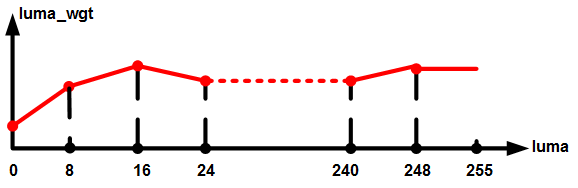

**图 2**  texture\_strength\[[OT\_ISP\_SHARPEN\_GAIN\_NUM](#ZH-CN_TOPIC_0000002503964815)\]强度曲线示意图<a name="fig128971450123212"></a>  
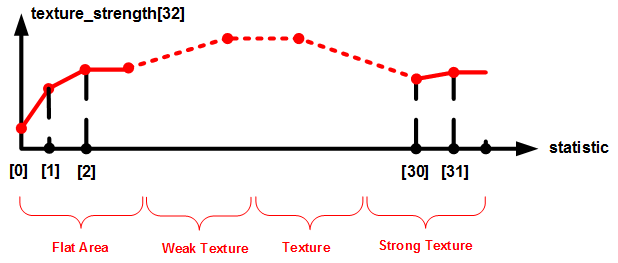

强度曲线的横坐标var是从图像中提取的方差统计特征，横坐标var被均分为32段，用于区分出图像的Flat Area（平坦区域）、Weak Texture（弱纹理）、Texture（纹理）和Strong Texture（强纹理）。纵坐标就是强度参数texture\_strength的32个强度值，用户可以通过设置该曲线上的32个强度值来为平坦区域、弱纹理区域、纹理区域和强纹理区域设置不同的锐化强度。这4个区域并没有明显的区分界限，都是连续过渡，用户可以通过实际效果来调整纵坐标强度来为不同的区域设置不同的强度。

**图 3**  edge\_strength\[[OT\_ISP\_SHARPEN\_GAIN\_NUM](#ZH-CN_TOPIC_0000002503964815)\]强度曲线示意图<a name="fig5809162318332"></a>  
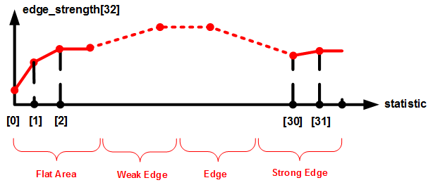

强度曲线的横坐标var是从图像中提取的方差统计值，横坐标var被均分为32段，用于区分出图像的Flat Area（平坦区域）、Weak Edge（弱边缘）、Edge（边缘）和Strong Edge（强边缘）。纵坐标就是强度参数edge\_strength的32个强度值，用户可以通过设置该曲线上的32个强度值来为平坦区域、弱边缘、边缘和强边缘设置不同的锐化强度。这4个区域并没有明显的区分界限，都是连续过渡，用户可以通过实际效果来调整纵坐标强度来为不同的区域设置不同的强度。

#### ot\_isp\_sharpen\_auto\_attr<a name="ZH-CN_TOPIC_0000002470924892"></a>

【说明】

定义ISP Sharpen自动属性。

【定义】

```
typedef struct {
    td_u8  luma_wgt[OT_ISP_SHARPEN_LUMA_NUM][OT_ISP_AUTO_ISO_NUM];
    td_u16 texture_strength[OT_ISP_SHARPEN_GAIN_NUM][OT_ISP_AUTO_ISO_NUM];
    td_u16 edge_strength[OT_ISP_SHARPEN_GAIN_NUM][OT_ISP_AUTO_ISO_NUM];
    td_u16 texture_freq[OT_ISP_AUTO_ISO_NUM];
    td_u16 edge_freq[OT_ISP_AUTO_ISO_NUM];
    td_u8  over_shoot[OT_ISP_AUTO_ISO_NUM];
    td_u8  under_shoot[OT_ISP_AUTO_ISO_NUM];
    td_u16 motion_texture_strength[OT_ISP_SHARPEN_GAIN_NUM][OT_ISP_AUTO_ISO_NUM];
    td_u16 motion_edge_strength[OT_ISP_SHARPEN_GAIN_NUM][OT_ISP_AUTO_ISO_NUM];
    td_u16 motion_texture_freq[OT_ISP_AUTO_ISO_NUM];
    td_u16 motion_edge_freq[OT_ISP_AUTO_ISO_NUM];
    td_u8  motion_over_shoot[OT_ISP_AUTO_ISO_NUM];
    td_u8  motion_under_shoot[OT_ISP_AUTO_ISO_NUM];
    td_u8  shoot_sup_strength[OT_ISP_AUTO_ISO_NUM];
    td_u8  shoot_sup_adj[OT_ISP_AUTO_ISO_NUM];
    td_u8  detail_ctrl[OT_ISP_AUTO_ISO_NUM];
    td_u8  detail_ctrl_threshold[OT_ISP_AUTO_ISO_NUM];
    td_u8  edge_filt_strength[OT_ISP_AUTO_ISO_NUM];
    td_u8  edge_filt_max_cap[OT_ISP_AUTO_ISO_NUM];
    td_u8  r_gain[OT_ISP_AUTO_ISO_NUM];
    td_u8  g_gain[OT_ISP_AUTO_ISO_NUM];
    td_u8  b_gain[OT_ISP_AUTO_ISO_NUM];
    td_u8  skin_gain[OT_ISP_AUTO_ISO_NUM];
    td_u16 max_sharp_gain[OT_ISP_AUTO_ISO_NUM];
} ot_isp_sharpen_auto_attr;
```

【成员】

<a name="table20967mcpsimp"></a>
<table><thead align="left"><tr id="row20972mcpsimp"><th class="cellrowborder" valign="top" width="30%" id="mcps1.1.3.1.1"><p id="p20974mcpsimp"><a name="p20974mcpsimp"></a><a name="p20974mcpsimp"></a>成员名称</p>
</th>
<th class="cellrowborder" valign="top" width="70%" id="mcps1.1.3.1.2"><p id="p20976mcpsimp"><a name="p20976mcpsimp"></a><a name="p20976mcpsimp"></a>描述</p>
</th>
</tr>
</thead>
<tbody><tr id="row20978mcpsimp"><td class="cellrowborder" valign="top" width="30%" headers="mcps1.1.3.1.1 "><p id="p20980mcpsimp"><a name="p20980mcpsimp"></a><a name="p20980mcpsimp"></a>luma_wgt</p>
</td>
<td class="cellrowborder" valign="top" width="70%" headers="mcps1.1.3.1.2 "><p id="p20982mcpsimp"><a name="p20982mcpsimp"></a><a name="p20982mcpsimp"></a>亮度锐化权重。满量程0-255的亮度被32个等分点平均分为32段亮度区间，每一段亮度区间对应一个亮度权重。比如0-7的亮度区间的权重是luma_wgt[0]，8-15的亮度区间的权重是luma_wgt[1]，依次类推。如<a href="#ot_isp_sharpen_manual_attr#fig14519101916320">图1</a>所示。值越大，图像锐化程度越高，反之，越弱。</p>
<p id="p20984mcpsimp"><a name="p20984mcpsimp"></a><a name="p20984mcpsimp"></a>取值范围：[0, 31]，建议值31。</p>
</td>
</tr>
<tr id="row20985mcpsimp"><td class="cellrowborder" valign="top" width="30%" headers="mcps1.1.3.1.1 "><p id="p20987mcpsimp"><a name="p20987mcpsimp"></a><a name="p20987mcpsimp"></a>texture_strength</p>
</td>
<td class="cellrowborder" valign="top" width="70%" headers="mcps1.1.3.1.2 "><p id="p20989mcpsimp"><a name="p20989mcpsimp"></a><a name="p20989mcpsimp"></a>无方向的细节纹理的锐化强度，设置图像无方向的细节纹理的锐度。</p>
<p id="p20990mcpsimp"><a name="p20990mcpsimp"></a><a name="p20990mcpsimp"></a>该值越大，无方向的细节纹理的清晰度越高。该参数是一个<a href="#OT_ISP_SHARPEN_GAIN_NUM">OT_ISP_SHARPEN_GAIN_NUM</a>=32的数组，是一个32段的连续的强度曲线，如<a href="#fig128971450123212">图2</a>所示。</p>
<p id="p20993mcpsimp"><a name="p20993mcpsimp"></a><a name="p20993mcpsimp"></a>取值范围：[0, 4095]，建议值300。</p>
</td>
</tr>
<tr id="row20994mcpsimp"><td class="cellrowborder" valign="top" width="30%" headers="mcps1.1.3.1.1 "><p id="p20996mcpsimp"><a name="p20996mcpsimp"></a><a name="p20996mcpsimp"></a>edge_strength</p>
</td>
<td class="cellrowborder" valign="top" width="70%" headers="mcps1.1.3.1.2 "><p id="p20998mcpsimp"><a name="p20998mcpsimp"></a><a name="p20998mcpsimp"></a>带方向的边缘的锐化强度，设置图像带方向的边缘的锐度。</p>
<p id="p20999mcpsimp"><a name="p20999mcpsimp"></a><a name="p20999mcpsimp"></a>该值越大，带方向的边缘的锐度越高。该参数是一个<a href="#OT_ISP_SHARPEN_GAIN_NUM">OT_ISP_SHARPEN_GAIN_NUM</a>=32的数组，是一个32段的连续的强度曲线，如<a href="#fig5809162318332">图3</a>所示。</p>
<p id="p21002mcpsimp"><a name="p21002mcpsimp"></a><a name="p21002mcpsimp"></a>取值范围：[0, 4095]，建议值400。</p>
</td>
</tr>
<tr id="row21003mcpsimp"><td class="cellrowborder" valign="top" width="30%" headers="mcps1.1.3.1.1 "><p id="p21005mcpsimp"><a name="p21005mcpsimp"></a><a name="p21005mcpsimp"></a>texture_freq</p>
</td>
<td class="cellrowborder" valign="top" width="70%" headers="mcps1.1.3.1.2 "><p id="p21007mcpsimp"><a name="p21007mcpsimp"></a><a name="p21007mcpsimp"></a>图像的无方向细节纹理的增强频段控制。设置图像的细节纹理增强的频率。</p>
<p id="p21008mcpsimp"><a name="p21008mcpsimp"></a><a name="p21008mcpsimp"></a>该值越大，细节纹理的增强就越偏向于高频增强，细节纹理就越细碎。反之，该值越小，细节纹理就越粗越圆润。texture_freq对应于强度参数texture_strength。texture_freq越大，图像的细节纹理就越细碎，该值过大，会导致图像的细节纹理过于细碎而不自然，甚至感觉模糊。</p>
<p id="p21009mcpsimp"><a name="p21009mcpsimp"></a><a name="p21009mcpsimp"></a>取值范围：[0, 4095]，建议值128。</p>
</td>
</tr>
<tr id="row21010mcpsimp"><td class="cellrowborder" valign="top" width="30%" headers="mcps1.1.3.1.1 "><p id="p21012mcpsimp"><a name="p21012mcpsimp"></a><a name="p21012mcpsimp"></a>edge_freq</p>
</td>
<td class="cellrowborder" valign="top" width="70%" headers="mcps1.1.3.1.2 "><p id="p21014mcpsimp"><a name="p21014mcpsimp"></a><a name="p21014mcpsimp"></a>图像的带方向的边缘的增强频段控制。设置图像边缘增强的频率。</p>
<p id="p21015mcpsimp"><a name="p21015mcpsimp"></a><a name="p21015mcpsimp"></a>该值越大，边缘的增强就越偏向于高频增强，图像的边缘就越纤薄越窄。反之，该值越小，边缘就越粗越圆润。edge_freq对应于强度参数edge_strength。edge_freq越大，图像的边缘就越纤薄越窄，该值过大，会导致图像的边缘过于纤薄而出现虚边现象。</p>
<p id="p21016mcpsimp"><a name="p21016mcpsimp"></a><a name="p21016mcpsimp"></a>取值范围：[0, 4095]，建议值96。</p>
</td>
</tr>
<tr id="row21017mcpsimp"><td class="cellrowborder" valign="top" width="30%" headers="mcps1.1.3.1.1 "><p id="p21019mcpsimp"><a name="p21019mcpsimp"></a><a name="p21019mcpsimp"></a>over_shoot</p>
</td>
<td class="cellrowborder" valign="top" width="70%" headers="mcps1.1.3.1.2 "><p id="p21021mcpsimp"><a name="p21021mcpsimp"></a><a name="p21021mcpsimp"></a>设置图像的overshoot（锐化后的白边白点）的强度。</p>
<p id="p21022mcpsimp"><a name="p21022mcpsimp"></a><a name="p21022mcpsimp"></a>该值越小，锐化后的白边白点越弱，清晰度也会下降。该值过小，图像会呈油画效果。</p>
<p id="p21023mcpsimp"><a name="p21023mcpsimp"></a><a name="p21023mcpsimp"></a>取值范围：[0, 127]，建议值100。</p>
</td>
</tr>
<tr id="row21024mcpsimp"><td class="cellrowborder" valign="top" width="30%" headers="mcps1.1.3.1.1 "><p id="p21026mcpsimp"><a name="p21026mcpsimp"></a><a name="p21026mcpsimp"></a>under_shoot</p>
</td>
<td class="cellrowborder" valign="top" width="70%" headers="mcps1.1.3.1.2 "><p id="p21028mcpsimp"><a name="p21028mcpsimp"></a><a name="p21028mcpsimp"></a>设置图像的undershoot（锐化后的黑边黑点）的强度。</p>
<p id="p21029mcpsimp"><a name="p21029mcpsimp"></a><a name="p21029mcpsimp"></a>该值越小，锐化后的黑边黑点越弱，清晰度也会下降。该值过小，图像会呈油画效果。</p>
<p id="p21030mcpsimp"><a name="p21030mcpsimp"></a><a name="p21030mcpsimp"></a>取值范围：[0, 127]，建议值127。</p>
</td>
</tr>
<tr id="row21031mcpsimp"><td class="cellrowborder" valign="top" width="30%" headers="mcps1.1.3.1.1 "><p id="p21033mcpsimp"><a name="p21033mcpsimp"></a><a name="p21033mcpsimp"></a>motion_texture_strength</p>
</td>
<td class="cellrowborder" valign="top" width="70%" headers="mcps1.1.3.1.2 "><p id="p21035mcpsimp"><a name="p21035mcpsimp"></a><a name="p21035mcpsimp"></a>无方向的细节纹理的锐化强度，设置运动区域图像无方向的细节纹理的锐度。</p>
<p id="p21036mcpsimp"><a name="p21036mcpsimp"></a><a name="p21036mcpsimp"></a>该值越大，无方向的细节纹理的清晰度越高。该参数是一个<a href="#OT_ISP_SHARPEN_GAIN_NUM">OT_ISP_SHARPEN_GAIN_NUM</a>=32的数组，是一个32段的连续的强度曲线，如<a href="#fig128971450123212">图2</a>所示。</p>
<p id="p21039mcpsimp"><a name="p21039mcpsimp"></a><a name="p21039mcpsimp"></a>取值范围：[0, 4095]，建议值300。</p>
</td>
</tr>
<tr id="row21040mcpsimp"><td class="cellrowborder" valign="top" width="30%" headers="mcps1.1.3.1.1 "><p id="p21042mcpsimp"><a name="p21042mcpsimp"></a><a name="p21042mcpsimp"></a>motion_edge_strength</p>
</td>
<td class="cellrowborder" valign="top" width="70%" headers="mcps1.1.3.1.2 "><p id="p21044mcpsimp"><a name="p21044mcpsimp"></a><a name="p21044mcpsimp"></a>带方向的边缘的锐化强度，设置运动区域图像带方向的边缘的锐度。</p>
<p id="p21045mcpsimp"><a name="p21045mcpsimp"></a><a name="p21045mcpsimp"></a>该值越大，带方向的边缘的锐度越高。该参数是一个<a href="#OT_ISP_SHARPEN_GAIN_NUM">OT_ISP_SHARPEN_GAIN_NUM</a>=32的数组，是一个32段的连续的强度曲线，如<a href="#fig5809162318332">图3</a>所示。</p>
<p id="p21048mcpsimp"><a name="p21048mcpsimp"></a><a name="p21048mcpsimp"></a>取值范围：[0, 4095]，建议值400。</p>
</td>
</tr>
<tr id="row21049mcpsimp"><td class="cellrowborder" valign="top" width="30%" headers="mcps1.1.3.1.1 "><p id="p21051mcpsimp"><a name="p21051mcpsimp"></a><a name="p21051mcpsimp"></a>motion_texture_freq</p>
</td>
<td class="cellrowborder" valign="top" width="70%" headers="mcps1.1.3.1.2 "><p id="p21053mcpsimp"><a name="p21053mcpsimp"></a><a name="p21053mcpsimp"></a>图像的无方向细节纹理的增强频段控制。设置运动区域图像的细节纹理增强的频率。</p>
<p id="p21054mcpsimp"><a name="p21054mcpsimp"></a><a name="p21054mcpsimp"></a>该值越大，细节纹理的增强就越偏向于高频增强，细节纹理就越细碎。反之，该值越小，细节纹理就越粗越圆润。texture_freq对应于强度参数texture_strength。texture_freq越大，图像的细节纹理就越细碎，该值过大，会导致图像的细节纹理过于细碎而不自然，甚至感觉模糊。</p>
<p id="p21055mcpsimp"><a name="p21055mcpsimp"></a><a name="p21055mcpsimp"></a>取值范围：[0, 4095]，建议值128。</p>
</td>
</tr>
<tr id="row21056mcpsimp"><td class="cellrowborder" valign="top" width="30%" headers="mcps1.1.3.1.1 "><p id="p21058mcpsimp"><a name="p21058mcpsimp"></a><a name="p21058mcpsimp"></a>motion_edge_freq</p>
</td>
<td class="cellrowborder" valign="top" width="70%" headers="mcps1.1.3.1.2 "><p id="p21060mcpsimp"><a name="p21060mcpsimp"></a><a name="p21060mcpsimp"></a>图像的带方向的边缘的增强频段控制。设置运动区域图像边缘增强的频率。</p>
<p id="p21061mcpsimp"><a name="p21061mcpsimp"></a><a name="p21061mcpsimp"></a>该值越大，边缘的增强就越偏向于高频增强，图像的边缘就越纤薄越窄。反之，该值越小，边缘就越粗越圆润。edge_freq对应于强度参数edge_strength。edge_freq越大，图像的边缘就越纤薄越窄，该值过大，会导致图像的边缘过于纤薄而出现虚边现象。</p>
<p id="p21062mcpsimp"><a name="p21062mcpsimp"></a><a name="p21062mcpsimp"></a>取值范围：[0, 4095]，建议值96。</p>
</td>
</tr>
<tr id="row21063mcpsimp"><td class="cellrowborder" valign="top" width="30%" headers="mcps1.1.3.1.1 "><p id="p21065mcpsimp"><a name="p21065mcpsimp"></a><a name="p21065mcpsimp"></a>motion_over_shoot</p>
</td>
<td class="cellrowborder" valign="top" width="70%" headers="mcps1.1.3.1.2 "><p id="p21067mcpsimp"><a name="p21067mcpsimp"></a><a name="p21067mcpsimp"></a>设置运动区域图像的overshoot（锐化后的白边白点）的强度。</p>
<p id="p21068mcpsimp"><a name="p21068mcpsimp"></a><a name="p21068mcpsimp"></a>该值越小，锐化后的白边白点越弱，清晰度也会下降。该值过小，图像会呈油画效果。</p>
<p id="p21069mcpsimp"><a name="p21069mcpsimp"></a><a name="p21069mcpsimp"></a>取值范围：[0, 127]，建议值100。</p>
</td>
</tr>
<tr id="row21070mcpsimp"><td class="cellrowborder" valign="top" width="30%" headers="mcps1.1.3.1.1 "><p id="p21072mcpsimp"><a name="p21072mcpsimp"></a><a name="p21072mcpsimp"></a>motion_under_shoot</p>
</td>
<td class="cellrowborder" valign="top" width="70%" headers="mcps1.1.3.1.2 "><p id="p21074mcpsimp"><a name="p21074mcpsimp"></a><a name="p21074mcpsimp"></a>设置运动区域图像的undershoot（锐化后的黑边黑点）的强度。</p>
<p id="p21075mcpsimp"><a name="p21075mcpsimp"></a><a name="p21075mcpsimp"></a>该值越小，锐化后的黑边黑点越弱，清晰度也会下降。该值过小，图像会呈油画效果。</p>
<p id="p21076mcpsimp"><a name="p21076mcpsimp"></a><a name="p21076mcpsimp"></a>取值范围：[0, 127]，建议值127。</p>
</td>
</tr>
<tr id="row21077mcpsimp"><td class="cellrowborder" valign="top" width="30%" headers="mcps1.1.3.1.1 "><p id="p21079mcpsimp"><a name="p21079mcpsimp"></a><a name="p21079mcpsimp"></a>shoot_sup_strength</p>
</td>
<td class="cellrowborder" valign="top" width="70%" headers="mcps1.1.3.1.2 "><p id="p21081mcpsimp"><a name="p21081mcpsimp"></a><a name="p21081mcpsimp"></a>图像锐化后的overshoot和undershoot的抑制强度。用于在保证清晰度不明显下降的前提下，抑制锐化后的图像的overshoot和undershoot的宽度和幅度。</p>
<p id="p21082mcpsimp"><a name="p21082mcpsimp"></a><a name="p21082mcpsimp"></a>该值越大，锐化后的图像的overshoot和undershoot的宽度越窄、强度越小。该值变大，理论上不会影响图像的清晰度，只是黑白边变窄以后，会减弱人眼的锐度感受。该参数需要和shoot_sup_adj配合使用。</p>
<p id="p21083mcpsimp"><a name="p21083mcpsimp"></a><a name="p21083mcpsimp"></a>取值范围：[0, 255]，建议值8。</p>
</td>
</tr>
<tr id="row21084mcpsimp"><td class="cellrowborder" valign="top" width="30%" headers="mcps1.1.3.1.1 "><p id="p21086mcpsimp"><a name="p21086mcpsimp"></a><a name="p21086mcpsimp"></a>shoot_sup_adj</p>
</td>
<td class="cellrowborder" valign="top" width="70%" headers="mcps1.1.3.1.2 "><p id="p21088mcpsimp"><a name="p21088mcpsimp"></a><a name="p21088mcpsimp"></a>图像锐化后的overshoot和undershoot的抑制强度的调节。该参数配合shoot_sup_strength使用，用于调节shoot_sup_strength作用的区域范围。该值越小，则越多的纹理区域的shoot会被shoot_sup_strength抑制；该值越大，则只有很强的边缘的shoot会被shoot_sup_strength抑制，纹理区域的shoot不会被抑制。</p>
<p id="p21089mcpsimp"><a name="p21089mcpsimp"></a><a name="p21089mcpsimp"></a>取值范围：[0, 15]，建议值9。</p>
</td>
</tr>
<tr id="row21090mcpsimp"><td class="cellrowborder" valign="top" width="30%" headers="mcps1.1.3.1.1 "><p id="p21092mcpsimp"><a name="p21092mcpsimp"></a><a name="p21092mcpsimp"></a>detail_ctrl</p>
</td>
<td class="cellrowborder" valign="top" width="70%" headers="mcps1.1.3.1.2 "><p id="p21094mcpsimp"><a name="p21094mcpsimp"></a><a name="p21094mcpsimp"></a>图像的细节纹理区的shoot强度的控制。用于控制图像的细节纹理区域的shoot强度，shoot越大，细节纹理区的清晰度越高。</p>
<p id="p21095mcpsimp"><a name="p21095mcpsimp"></a><a name="p21095mcpsimp"></a>取值范围：[0, 0xFF]，该值等于128，则图像的细节纹理区域的shoot强度和大边缘的shoot强度一致，都分别等于over_shoot和under_shoot。该值大于128，则图像的细节纹理的shoot强度大于大边缘，大边缘的shoot强度分别等于over_shoot和under_shoot。该值小于128，则图像的细节纹理的shoot强度小于大边缘，大边缘的shoot强度分别等于over_shoot和under_shoot。</p>
</td>
</tr>
<tr id="row21096mcpsimp"><td class="cellrowborder" valign="top" width="30%" headers="mcps1.1.3.1.1 "><p id="p21098mcpsimp"><a name="p21098mcpsimp"></a><a name="p21098mcpsimp"></a>detail_ctrl_threshold</p>
</td>
<td class="cellrowborder" valign="top" width="70%" headers="mcps1.1.3.1.2 "><p id="p21100mcpsimp"><a name="p21100mcpsimp"></a><a name="p21100mcpsimp"></a>图像的细节纹理区的shoot强度的控制阈值。该值配合detail_ctrl使用，用于区分detail_ctrl所控制shoot的纹理区和边缘，也即纹理区和边缘的区分阈值。小于该值的区域为纹理区，该纹理区域的shoot会被detail_ctrl单独控制，而大于该阈值的边缘区域的shoot依然等于over_shoot和under_shoot。</p>
<p id="p21101mcpsimp"><a name="p21101mcpsimp"></a><a name="p21101mcpsimp"></a>取值范围：[0, 0xFF]，建议值160。</p>
</td>
</tr>
<tr id="row21102mcpsimp"><td class="cellrowborder" valign="top" width="30%" headers="mcps1.1.3.1.1 "><p id="p21104mcpsimp"><a name="p21104mcpsimp"></a><a name="p21104mcpsimp"></a>edge_filt_strength</p>
</td>
<td class="cellrowborder" valign="top" width="70%" headers="mcps1.1.3.1.2 "><p id="p21106mcpsimp"><a name="p21106mcpsimp"></a><a name="p21106mcpsimp"></a>边缘滤波强度调试参数：实现图像锐化边缘的范围和边缘平滑强度的控制。该值越大，判为边缘的区域越多、也越宽，edge_strength起作用的图像边缘就越多，而且，该值越大，沿着边缘方向的平滑滤波强度也越大，边缘就越平滑。反之，判为边缘的区域越少、也越窄，edge_strength起作用的图像区域越少，边缘平滑就越弱。</p>
<p id="p21107mcpsimp"><a name="p21107mcpsimp"></a><a name="p21107mcpsimp"></a>取值范围：[0, 63]，建议值53。</p>
</td>
</tr>
<tr id="row21108mcpsimp"><td class="cellrowborder" valign="top" width="30%" headers="mcps1.1.3.1.1 "><p id="p21110mcpsimp"><a name="p21110mcpsimp"></a><a name="p21110mcpsimp"></a>edge_filt_max_cap</p>
</td>
<td class="cellrowborder" valign="top" width="70%" headers="mcps1.1.3.1.2 "><p id="p21112mcpsimp"><a name="p21112mcpsimp"></a><a name="p21112mcpsimp"></a>边缘滤波强度范围的调试参数：该值越大，边缘滤波的最大强度也最大，edge_filt_strength的可调试范围也越大；一般建议该值大小控制30以内。</p>
<p id="p21113mcpsimp"><a name="p21113mcpsimp"></a><a name="p21113mcpsimp"></a>取值范围：[0, 47]；建议值18。</p>
</td>
</tr>
<tr id="row21114mcpsimp"><td class="cellrowborder" valign="top" width="30%" headers="mcps1.1.3.1.1 "><p id="p21116mcpsimp"><a name="p21116mcpsimp"></a><a name="p21116mcpsimp"></a>r_gain</p>
</td>
<td class="cellrowborder" valign="top" width="70%" headers="mcps1.1.3.1.2 "><p id="p21118mcpsimp"><a name="p21118mcpsimp"></a><a name="p21118mcpsimp"></a>深红色区域的锐化增益控制。该值越大，则深红色区域的锐化强度越大。</p>
<p id="p21119mcpsimp"><a name="p21119mcpsimp"></a><a name="p21119mcpsimp"></a>取值范围：[0, 31]；建议值28。</p>
</td>
</tr>
<tr id="row21120mcpsimp"><td class="cellrowborder" valign="top" width="30%" headers="mcps1.1.3.1.1 "><p id="p21122mcpsimp"><a name="p21122mcpsimp"></a><a name="p21122mcpsimp"></a>g_gain</p>
</td>
<td class="cellrowborder" valign="top" width="70%" headers="mcps1.1.3.1.2 "><p id="p21124mcpsimp"><a name="p21124mcpsimp"></a><a name="p21124mcpsimp"></a>绿色区域的锐化增益控制。该值越大，则绿色区域的锐化强度越大。</p>
<p id="p21125mcpsimp"><a name="p21125mcpsimp"></a><a name="p21125mcpsimp"></a>取值范围：[0, 255]；建议值32。</p>
</td>
</tr>
<tr id="row21126mcpsimp"><td class="cellrowborder" valign="top" width="30%" headers="mcps1.1.3.1.1 "><p id="p21128mcpsimp"><a name="p21128mcpsimp"></a><a name="p21128mcpsimp"></a>b_gain</p>
</td>
<td class="cellrowborder" valign="top" width="70%" headers="mcps1.1.3.1.2 "><p id="p21130mcpsimp"><a name="p21130mcpsimp"></a><a name="p21130mcpsimp"></a>深蓝色区域的锐化增益控制。该值越大，则深蓝色区域的锐化强度越大。</p>
<p id="p21131mcpsimp"><a name="p21131mcpsimp"></a><a name="p21131mcpsimp"></a>取值范围：[0, 31]；建议值28。</p>
</td>
</tr>
<tr id="row21132mcpsimp"><td class="cellrowborder" valign="top" width="30%" headers="mcps1.1.3.1.1 "><p id="p21134mcpsimp"><a name="p21134mcpsimp"></a><a name="p21134mcpsimp"></a>skin_gain</p>
</td>
<td class="cellrowborder" valign="top" width="70%" headers="mcps1.1.3.1.2 "><p id="p21136mcpsimp"><a name="p21136mcpsimp"></a><a name="p21136mcpsimp"></a>肤色区域的锐化增益控制。该值越大，则肤色区域的锐化强度越大。</p>
<p id="p21137mcpsimp"><a name="p21137mcpsimp"></a><a name="p21137mcpsimp"></a>取值范围：[0, 31]；建议值23。</p>
</td>
</tr>
<tr id="row21138mcpsimp"><td class="cellrowborder" valign="top" width="30%" headers="mcps1.1.3.1.1 "><p id="p21140mcpsimp"><a name="p21140mcpsimp"></a><a name="p21140mcpsimp"></a>max_sharp_gain</p>
</td>
<td class="cellrowborder" valign="top" width="70%" headers="mcps1.1.3.1.2 "><p id="p21142mcpsimp"><a name="p21142mcpsimp"></a><a name="p21142mcpsimp"></a>图像锐化的最大增益限制值。该值越大，图像的锐化幅度越大，反之，锐化幅度越小。适当的调小该参数，可以减少图像的过锐化，可以减少图像锐化后的黑白点。</p>
<p id="p21143mcpsimp"><a name="p21143mcpsimp"></a><a name="p21143mcpsimp"></a>取值范围：[0, 0x7FF]，建议值160。</p>
</td>
</tr>
</tbody>
</table>

【注意事项】

Auto档参数分别对应sensor在16种不同增益（Again\*Dgain\* ISPDgain\(times\)）情况下的设置值，成员参数的含义与Manual档cmos成员参数一致。16种增益为：1、2、4、8、16、32、64、128、256、512、1024、2048、4096、8192、16384、32768。

#### ot\_isp\_sharpen\_detail\_map<a name="ZH-CN_TOPIC_0000002504085051"></a>

【说明】

是否显示图像细节灰度图。

【定义】

```
typedef enum {
    OT_ISP_SHARPEN_NORMAL = 0,
    OT_ISP_SHARPEN_DETAIL,
    OT_ISP_SHARPEN_BUTT
} ot_isp_sharpen_detail_map;
```

【成员】

<a name="table21158mcpsimp"></a>
<table><thead align="left"><tr id="row21163mcpsimp"><th class="cellrowborder" valign="top" width="39%" id="mcps1.1.3.1.1"><p id="p21165mcpsimp"><a name="p21165mcpsimp"></a><a name="p21165mcpsimp"></a>成员名称</p>
</th>
<th class="cellrowborder" valign="top" width="61%" id="mcps1.1.3.1.2"><p id="p21167mcpsimp"><a name="p21167mcpsimp"></a><a name="p21167mcpsimp"></a>描述</p>
</th>
</tr>
</thead>
<tbody><tr id="row21169mcpsimp"><td class="cellrowborder" valign="top" width="39%" headers="mcps1.1.3.1.1 "><p id="p21171mcpsimp"><a name="p21171mcpsimp"></a><a name="p21171mcpsimp"></a>OT_ISP_SHARPEN_NORMAL</p>
</td>
<td class="cellrowborder" valign="top" width="61%" headers="mcps1.1.3.1.2 "><p id="p21173mcpsimp"><a name="p21173mcpsimp"></a><a name="p21173mcpsimp"></a>显示正常图像。</p>
</td>
</tr>
<tr id="row21174mcpsimp"><td class="cellrowborder" valign="top" width="39%" headers="mcps1.1.3.1.1 "><p id="p21176mcpsimp"><a name="p21176mcpsimp"></a><a name="p21176mcpsimp"></a>OT_ISP_SHARPEN_DETAIL</p>
</td>
<td class="cellrowborder" valign="top" width="61%" headers="mcps1.1.3.1.2 "><p id="p21178mcpsimp"><a name="p21178mcpsimp"></a><a name="p21178mcpsimp"></a>显示图像细节灰度图，细节越强，灰度值越大。</p>
</td>
</tr>
</tbody>
</table>

【注意事项】

无

【相关数据类型及接口】

[ot\_isp\_sharpen\_attr](#ot_isp_sharpen_attr)

#### ot\_isp\_sharpen\_attr<a name="ZH-CN_TOPIC_0000002503965141"></a>

【说明】

定义ISP Sharpen属性。

【定义】

```
typedef struct {
    td_bool en;
    td_bool motion_en;
    td_u8   motion_threshold0;
    td_u8   motion_threshold1; 
    td_u16  motion_gain0;
    td_u16  motion_gain1;
    td_u8   skin_umin;
    td_u8   skin_vmin;
    td_u8   skin_umax;
    td_u8   skin_vmax;
    ot_op_mode op_type;
    ot_isp_sharpen_detail_map  detail_map;
    ot_isp_sharpen_manual_attr manual_attr;
    ot_isp_sharpen_auto_attr  auto_attr;
} ot_isp_sharpen_attr;
```

【成员】

<a name="table21210mcpsimp"></a>
<table><thead align="left"><tr id="row21215mcpsimp"><th class="cellrowborder" valign="top" width="24%" id="mcps1.1.3.1.1"><p id="p21217mcpsimp"><a name="p21217mcpsimp"></a><a name="p21217mcpsimp"></a>成员名称</p>
</th>
<th class="cellrowborder" valign="top" width="76%" id="mcps1.1.3.1.2"><p id="p21219mcpsimp"><a name="p21219mcpsimp"></a><a name="p21219mcpsimp"></a>描述</p>
</th>
</tr>
</thead>
<tbody><tr id="row21221mcpsimp"><td class="cellrowborder" valign="top" width="24%" headers="mcps1.1.3.1.1 "><p id="p21223mcpsimp"><a name="p21223mcpsimp"></a><a name="p21223mcpsimp"></a>en</p>
</td>
<td class="cellrowborder" valign="top" width="76%" headers="mcps1.1.3.1.2 "><p id="p21225mcpsimp"><a name="p21225mcpsimp"></a><a name="p21225mcpsimp"></a>Sharpen增强功能使能。</p>
<p id="p21226mcpsimp"><a name="p21226mcpsimp"></a><a name="p21226mcpsimp"></a>TD_FALSE：关闭；</p>
<p id="p21227mcpsimp"><a name="p21227mcpsimp"></a><a name="p21227mcpsimp"></a>TD_TRUE：使能。</p>
<p id="p21228mcpsimp"><a name="p21228mcpsimp"></a><a name="p21228mcpsimp"></a>默认值为TD_TRUE。</p>
</td>
</tr>
<tr id="row21229mcpsimp"><td class="cellrowborder" valign="top" width="24%" headers="mcps1.1.3.1.1 "><p id="p21231mcpsimp"><a name="p21231mcpsimp"></a><a name="p21231mcpsimp"></a>motion_en</p>
</td>
<td class="cellrowborder" valign="top" width="76%" headers="mcps1.1.3.1.2 "><p id="p21233mcpsimp"><a name="p21233mcpsimp"></a><a name="p21233mcpsimp"></a>运动区域单独增强使能。</p>
<p id="p21234mcpsimp"><a name="p21234mcpsimp"></a><a name="p21234mcpsimp"></a>TD_FALSE：关闭；</p>
<p id="p21235mcpsimp"><a name="p21235mcpsimp"></a><a name="p21235mcpsimp"></a>TD_TRUE：使能。</p>
<p id="p21236mcpsimp"><a name="p21236mcpsimp"></a><a name="p21236mcpsimp"></a>默认值为TD_FALSE。</p>
</td>
</tr>
<tr id="row21237mcpsimp"><td class="cellrowborder" valign="top" width="24%" headers="mcps1.1.3.1.1 "><p id="p21239mcpsimp"><a name="p21239mcpsimp"></a><a name="p21239mcpsimp"></a>motion_threshold0</p>
</td>
<td class="cellrowborder" valign="top" width="76%" headers="mcps1.1.3.1.2 "><p id="p21241mcpsimp"><a name="p21241mcpsimp"></a><a name="p21241mcpsimp"></a>运动区域判断阈值，小于此值，认为是完全运动。取值范围：[0, 15]</p>
</td>
</tr>
<tr id="row21242mcpsimp"><td class="cellrowborder" valign="top" width="24%" headers="mcps1.1.3.1.1 "><p id="p21244mcpsimp"><a name="p21244mcpsimp"></a><a name="p21244mcpsimp"></a>motion_threshold1</p>
</td>
<td class="cellrowborder" valign="top" width="76%" headers="mcps1.1.3.1.2 "><p id="p21246mcpsimp"><a name="p21246mcpsimp"></a><a name="p21246mcpsimp"></a>运动区域判断阈值，大于此值，认为是完全静止。取值范围：[0, 15]</p>
<p id="p21247mcpsimp"><a name="p21247mcpsimp"></a><a name="p21247mcpsimp"></a>motion_threshold0必须不大于motion_threshold1。</p>
</td>
</tr>
<tr id="row21248mcpsimp"><td class="cellrowborder" valign="top" width="24%" headers="mcps1.1.3.1.1 "><p id="p21250mcpsimp"><a name="p21250mcpsimp"></a><a name="p21250mcpsimp"></a>motion_gain0</p>
</td>
<td class="cellrowborder" valign="top" width="76%" headers="mcps1.1.3.1.2 "><p id="p21252mcpsimp"><a name="p21252mcpsimp"></a><a name="p21252mcpsimp"></a>运动区域对应motion_threshold0参数强度，0表示全部使用运动参数，256表示全部使用静止参数。取值范围：[0, 256]</p>
</td>
</tr>
<tr id="row21253mcpsimp"><td class="cellrowborder" valign="top" width="24%" headers="mcps1.1.3.1.1 "><p id="p21255mcpsimp"><a name="p21255mcpsimp"></a><a name="p21255mcpsimp"></a>motion_gain1</p>
</td>
<td class="cellrowborder" valign="top" width="76%" headers="mcps1.1.3.1.2 "><p id="p21257mcpsimp"><a name="p21257mcpsimp"></a><a name="p21257mcpsimp"></a>运动区域对应motion_threshold1参数强度，0表示全部使用运动参数，256表示全部使用静止参数。取值范围：[0, 256]</p>
</td>
</tr>
<tr id="row21258mcpsimp"><td class="cellrowborder" valign="top" width="24%" headers="mcps1.1.3.1.1 "><p id="p21260mcpsimp"><a name="p21260mcpsimp"></a><a name="p21260mcpsimp"></a>skin_umin</p>
</td>
<td class="cellrowborder" valign="top" width="76%" headers="mcps1.1.3.1.2 "><p id="p21262mcpsimp"><a name="p21262mcpsimp"></a><a name="p21262mcpsimp"></a>肤色区域范围矩形窗的左下角的最小坐标的U值，取值范围：[0, 255]</p>
</td>
</tr>
<tr id="row21263mcpsimp"><td class="cellrowborder" valign="top" width="24%" headers="mcps1.1.3.1.1 "><p id="p21265mcpsimp"><a name="p21265mcpsimp"></a><a name="p21265mcpsimp"></a>skin_vmin</p>
</td>
<td class="cellrowborder" valign="top" width="76%" headers="mcps1.1.3.1.2 "><p id="p21267mcpsimp"><a name="p21267mcpsimp"></a><a name="p21267mcpsimp"></a>肤色区域范围矩形窗的左下角的最小坐标的V值，取值范围：[0, 255]</p>
</td>
</tr>
<tr id="row21268mcpsimp"><td class="cellrowborder" valign="top" width="24%" headers="mcps1.1.3.1.1 "><p id="p21270mcpsimp"><a name="p21270mcpsimp"></a><a name="p21270mcpsimp"></a>skin_umax</p>
</td>
<td class="cellrowborder" valign="top" width="76%" headers="mcps1.1.3.1.2 "><p id="p21272mcpsimp"><a name="p21272mcpsimp"></a><a name="p21272mcpsimp"></a>肤色区域范围矩形窗的右上角的最大坐标的U值，取值范围：[0, 255]</p>
</td>
</tr>
<tr id="row21273mcpsimp"><td class="cellrowborder" valign="top" width="24%" headers="mcps1.1.3.1.1 "><p id="p21275mcpsimp"><a name="p21275mcpsimp"></a><a name="p21275mcpsimp"></a>skin_vmax</p>
</td>
<td class="cellrowborder" valign="top" width="76%" headers="mcps1.1.3.1.2 "><p id="p21277mcpsimp"><a name="p21277mcpsimp"></a><a name="p21277mcpsimp"></a>肤色区域范围矩形窗的右上角的最大坐标的V值，取值范围：[0, 255]</p>
</td>
</tr>
<tr id="row21278mcpsimp"><td class="cellrowborder" valign="top" width="24%" headers="mcps1.1.3.1.1 "><p id="p21280mcpsimp"><a name="p21280mcpsimp"></a><a name="p21280mcpsimp"></a>op_type</p>
</td>
<td class="cellrowborder" valign="top" width="76%" headers="mcps1.1.3.1.2 "><p id="p21282mcpsimp"><a name="p21282mcpsimp"></a><a name="p21282mcpsimp"></a>Sharpen工作类型。</p>
<a name="ul21283mcpsimp"></a><a name="ul21283mcpsimp"></a><ul id="ul21283mcpsimp"><li>OT_OP_MODE_AUTO：自动；</li><li>OT_OP_MODE_MANUAL：手动。</li></ul>
<p id="p21286mcpsimp"><a name="p21286mcpsimp"></a><a name="p21286mcpsimp"></a>默认值为OT_OP_MODE_AUTO。</p>
</td>
</tr>
<tr id="row21287mcpsimp"><td class="cellrowborder" valign="top" width="24%" headers="mcps1.1.3.1.1 "><p id="p21289mcpsimp"><a name="p21289mcpsimp"></a><a name="p21289mcpsimp"></a>detail_map</p>
</td>
<td class="cellrowborder" valign="top" width="76%" headers="mcps1.1.3.1.2 "><p id="p21291mcpsimp"><a name="p21291mcpsimp"></a><a name="p21291mcpsimp"></a>细节图显示类型。</p>
<p id="p21292mcpsimp"><a name="p21292mcpsimp"></a><a name="p21292mcpsimp"></a>OT_ISP_SHARPEN_NORMAL：显示正常图像。</p>
<p id="p21293mcpsimp"><a name="p21293mcpsimp"></a><a name="p21293mcpsimp"></a>OT_ISP_SHARPEN_DETAIL：显示图像细节灰度图，细节越强，像素值越大。</p>
</td>
</tr>
<tr id="row21294mcpsimp"><td class="cellrowborder" valign="top" width="24%" headers="mcps1.1.3.1.1 "><p id="p21296mcpsimp"><a name="p21296mcpsimp"></a><a name="p21296mcpsimp"></a>manual_attr</p>
</td>
<td class="cellrowborder" valign="top" width="76%" headers="mcps1.1.3.1.2 "><p id="p21298mcpsimp"><a name="p21298mcpsimp"></a><a name="p21298mcpsimp"></a>Sharpen手动参数。</p>
</td>
</tr>
<tr id="row21299mcpsimp"><td class="cellrowborder" valign="top" width="24%" headers="mcps1.1.3.1.1 "><p id="p21301mcpsimp"><a name="p21301mcpsimp"></a><a name="p21301mcpsimp"></a>auto_attr</p>
</td>
<td class="cellrowborder" valign="top" width="76%" headers="mcps1.1.3.1.2 "><p id="p21303mcpsimp"><a name="p21303mcpsimp"></a><a name="p21303mcpsimp"></a>Sharpen自动参数。</p>
</td>
</tr>
</tbody>
</table>

【注意事项】

Sharpen功能分为自动和手动：

-   en为TD\_TRUE，op\_type为OT\_OP\_MODE\_AUTO，使用自动Sharpen功能。此时sharpen的强度值与系统增益的关系请参见成员变量。
-   en设置为TD\_TRUE，op\_type设置为OT\_OP\_MODE\_MANUAL使用手动Sharpen功能。
-   运动区域判定采用BNR运动检测模块上一帧结果，因此只有当BNR运动检测使能时，此功能方可生效；生效时存在一帧图像延迟，因此建议运动区域与静止区域参数不要差异太大，否则容易出现运动与静止区域图像分层。
-   运动区域判定采用BNR运动检测结果，由于噪声影响，部分静止区域可能也会判定为运动，部分平坦运动区域可能判定为静止，因此运动参数可能会影响静止区域，静止参数可能会影响运动区域。

【相关数据类型及接口】

无

## Gamma<a name="ZH-CN_TOPIC_0000002471085182"></a>


### 功能描述<a name="ZH-CN_TOPIC_0000002470925176"></a>

Gamma模块对图像进行亮度空间非线性转换以适配输出设备。Gamma模块校正R、G、B时调用同一组Gamma表，Gamma表各节点之间的间距相同，节点之间的图像像素值使用线性插值生成。

### API参考<a name="ZH-CN_TOPIC_0000002504084967"></a>

-   [ss\_mpi\_isp\_set\_gamma\_attr](#ZH-CN_TOPIC_0000002470924914)：设置Gamma属性。
-   [ss\_mpi\_isp\_get\_gamma\_attr](#ZH-CN_TOPIC_0000002471085092)：获取Gamma属性。


#### ss\_mpi\_isp\_set\_gamma\_attr<a name="ZH-CN_TOPIC_0000002470924914"></a>

【描述】

设置Gamma属性。

【语法】

```
td_s32 ss_mpi_isp_set_gamma_attr(ot_vi_pipe vi_pipe, const ot_isp_gamma_attr *gamma_attr);
```

【参数】

<a name="table21334mcpsimp"></a>
<table><thead align="left"><tr id="row21340mcpsimp"><th class="cellrowborder" valign="top" width="23%" id="mcps1.1.4.1.1"><p id="p21342mcpsimp"><a name="p21342mcpsimp"></a><a name="p21342mcpsimp"></a>参数名称</p>
</th>
<th class="cellrowborder" valign="top" width="61%" id="mcps1.1.4.1.2"><p id="p21344mcpsimp"><a name="p21344mcpsimp"></a><a name="p21344mcpsimp"></a>描述</p>
</th>
<th class="cellrowborder" valign="top" width="16%" id="mcps1.1.4.1.3"><p id="p21346mcpsimp"><a name="p21346mcpsimp"></a><a name="p21346mcpsimp"></a>输入/输出</p>
</th>
</tr>
</thead>
<tbody><tr id="row21347mcpsimp"><td class="cellrowborder" valign="top" width="23%" headers="mcps1.1.4.1.1 "><p id="p21349mcpsimp"><a name="p21349mcpsimp"></a><a name="p21349mcpsimp"></a>vi_pipe</p>
</td>
<td class="cellrowborder" valign="top" width="61%" headers="mcps1.1.4.1.2 "><p id="p21351mcpsimp"><a name="p21351mcpsimp"></a><a name="p21351mcpsimp"></a>vi_pipe号</p>
</td>
<td class="cellrowborder" valign="top" width="16%" headers="mcps1.1.4.1.3 "><p id="p21353mcpsimp"><a name="p21353mcpsimp"></a><a name="p21353mcpsimp"></a>输入</p>
</td>
</tr>
<tr id="row21354mcpsimp"><td class="cellrowborder" valign="top" width="23%" headers="mcps1.1.4.1.1 "><p id="p21356mcpsimp"><a name="p21356mcpsimp"></a><a name="p21356mcpsimp"></a>gamma_attr</p>
</td>
<td class="cellrowborder" valign="top" width="61%" headers="mcps1.1.4.1.2 "><p id="p21358mcpsimp"><a name="p21358mcpsimp"></a><a name="p21358mcpsimp"></a>Gamma属性</p>
</td>
<td class="cellrowborder" valign="top" width="16%" headers="mcps1.1.4.1.3 "><p id="p21360mcpsimp"><a name="p21360mcpsimp"></a><a name="p21360mcpsimp"></a>输入</p>
</td>
</tr>
</tbody>
</table>

【返回值】

<a name="table21363mcpsimp"></a>
<table><thead align="left"><tr id="row21368mcpsimp"><th class="cellrowborder" valign="top" width="27%" id="mcps1.1.3.1.1"><p id="p21370mcpsimp"><a name="p21370mcpsimp"></a><a name="p21370mcpsimp"></a>返回值</p>
</th>
<th class="cellrowborder" valign="top" width="73%" id="mcps1.1.3.1.2"><p id="p21372mcpsimp"><a name="p21372mcpsimp"></a><a name="p21372mcpsimp"></a>描述</p>
</th>
</tr>
</thead>
<tbody><tr id="row21373mcpsimp"><td class="cellrowborder" valign="top" width="27%" headers="mcps1.1.3.1.1 "><p id="p21375mcpsimp"><a name="p21375mcpsimp"></a><a name="p21375mcpsimp"></a>0</p>
</td>
<td class="cellrowborder" valign="top" width="73%" headers="mcps1.1.3.1.2 "><p id="p21377mcpsimp"><a name="p21377mcpsimp"></a><a name="p21377mcpsimp"></a>成功。</p>
</td>
</tr>
<tr id="row21378mcpsimp"><td class="cellrowborder" valign="top" width="27%" headers="mcps1.1.3.1.1 "><p id="p21380mcpsimp"><a name="p21380mcpsimp"></a><a name="p21380mcpsimp"></a>非0</p>
</td>
<td class="cellrowborder" valign="top" width="73%" headers="mcps1.1.3.1.2 "><p id="p21382mcpsimp"><a name="p21382mcpsimp"></a><a name="p21382mcpsimp"></a>失败，其值为<span xml:lang="sv-SE" id="ph10195517299"><a name="ph10195517299"></a><a name="ph10195517299"></a>错误码</span>。</p>
</td>
</tr>
</tbody>
</table>

【需求】

头文件：ot\_common\_isp.h、ss\_mpi\_isp.h

库文件：libot\_isp.a、libss\_isp.a

【注意】

无。

【举例】

无。

【相关主题】

[ss\_mpi\_isp\_get\_gamma\_attr](#ss_mpi_isp_get_gamma_attr)

#### ss\_mpi\_isp\_get\_gamma\_attr<a name="ZH-CN_TOPIC_0000002471085092"></a>

【描述】

获取Gamma属性。

【语法】

```
td_s32 ss_mpi_isp_get_gamma_attr(ot_vi_pipe vi_pipe, ot_isp_gamma_attr *gamma_attr) ;
```

【参数】

<a name="table21404mcpsimp"></a>
<table><thead align="left"><tr id="row21410mcpsimp"><th class="cellrowborder" valign="top" width="23%" id="mcps1.1.4.1.1"><p id="p21412mcpsimp"><a name="p21412mcpsimp"></a><a name="p21412mcpsimp"></a>参数名称</p>
</th>
<th class="cellrowborder" valign="top" width="61%" id="mcps1.1.4.1.2"><p id="p21414mcpsimp"><a name="p21414mcpsimp"></a><a name="p21414mcpsimp"></a>描述</p>
</th>
<th class="cellrowborder" valign="top" width="16%" id="mcps1.1.4.1.3"><p id="p21416mcpsimp"><a name="p21416mcpsimp"></a><a name="p21416mcpsimp"></a>输入/输出</p>
</th>
</tr>
</thead>
<tbody><tr id="row21417mcpsimp"><td class="cellrowborder" valign="top" width="23%" headers="mcps1.1.4.1.1 "><p id="p21419mcpsimp"><a name="p21419mcpsimp"></a><a name="p21419mcpsimp"></a>vi_pipe</p>
</td>
<td class="cellrowborder" valign="top" width="61%" headers="mcps1.1.4.1.2 "><p id="p21421mcpsimp"><a name="p21421mcpsimp"></a><a name="p21421mcpsimp"></a>vi_pipe号</p>
</td>
<td class="cellrowborder" valign="top" width="16%" headers="mcps1.1.4.1.3 "><p id="p21423mcpsimp"><a name="p21423mcpsimp"></a><a name="p21423mcpsimp"></a>输入</p>
</td>
</tr>
<tr id="row21424mcpsimp"><td class="cellrowborder" valign="top" width="23%" headers="mcps1.1.4.1.1 "><p id="p21426mcpsimp"><a name="p21426mcpsimp"></a><a name="p21426mcpsimp"></a>gamma_attr</p>
</td>
<td class="cellrowborder" valign="top" width="61%" headers="mcps1.1.4.1.2 "><p id="p21428mcpsimp"><a name="p21428mcpsimp"></a><a name="p21428mcpsimp"></a>Gamma属性</p>
</td>
<td class="cellrowborder" valign="top" width="16%" headers="mcps1.1.4.1.3 "><p id="p21430mcpsimp"><a name="p21430mcpsimp"></a><a name="p21430mcpsimp"></a>输出</p>
</td>
</tr>
</tbody>
</table>

【返回值】

<a name="table21433mcpsimp"></a>
<table><thead align="left"><tr id="row21438mcpsimp"><th class="cellrowborder" valign="top" width="27%" id="mcps1.1.3.1.1"><p id="p21440mcpsimp"><a name="p21440mcpsimp"></a><a name="p21440mcpsimp"></a>返回值</p>
</th>
<th class="cellrowborder" valign="top" width="73%" id="mcps1.1.3.1.2"><p id="p21442mcpsimp"><a name="p21442mcpsimp"></a><a name="p21442mcpsimp"></a>描述</p>
</th>
</tr>
</thead>
<tbody><tr id="row21443mcpsimp"><td class="cellrowborder" valign="top" width="27%" headers="mcps1.1.3.1.1 "><p id="p21445mcpsimp"><a name="p21445mcpsimp"></a><a name="p21445mcpsimp"></a>0</p>
</td>
<td class="cellrowborder" valign="top" width="73%" headers="mcps1.1.3.1.2 "><p id="p21447mcpsimp"><a name="p21447mcpsimp"></a><a name="p21447mcpsimp"></a>成功。</p>
</td>
</tr>
<tr id="row21448mcpsimp"><td class="cellrowborder" valign="top" width="27%" headers="mcps1.1.3.1.1 "><p id="p21450mcpsimp"><a name="p21450mcpsimp"></a><a name="p21450mcpsimp"></a>非0</p>
</td>
<td class="cellrowborder" valign="top" width="73%" headers="mcps1.1.3.1.2 "><p id="p21452mcpsimp"><a name="p21452mcpsimp"></a><a name="p21452mcpsimp"></a>失败，其值为<span xml:lang="sv-SE" id="ph10195517299"><a name="ph10195517299"></a><a name="ph10195517299"></a>错误码</span>。</p>
</td>
</tr>
</tbody>
</table>

【需求】

头文件：ot\_common\_isp.h、ss\_mpi\_isp.h

库文件：libot\_isp.a、libss\_isp.a

【注意】

无。

【举例】

无。

【相关主题】

[ss\_mpi\_isp\_set\_gamma\_attr](#ss_mpi_isp_set_gamma_attr)

### 数据类型<a name="ZH-CN_TOPIC_0000002470924944"></a>

-   [OT\_ISP\_GAMMA\_NODE\_NUM](#ZH-CN_TOPIC_0000002470925002)：Gamma表的分段节点数。
-   [ot\_isp\_gamma\_attr](#ZH-CN_TOPIC_0000002503964797)：定义ISP Gamma校正属性。
-   [ot\_isp\_gamma\_curve\_type](#ZH-CN_TOPIC_0000002504084761)：定义ISP Gamma传输曲线类型。


#### OT\_ISP\_GAMMA\_NODE\_NUM<a name="ZH-CN_TOPIC_0000002470925002"></a>

【说明】

Gamma表的分段节点数。

【定义】

```
#define OT_ISP_GAMMA_NODE_NUM           1025
```

【注意事项】

无。

【相关数据类型及接口】

[ot\_isp\_gamma\_attr](#ot_isp_gamma_attr)

#### ot\_isp\_gamma\_attr<a name="ZH-CN_TOPIC_0000002503964797"></a>

【说明】

定义ISP Gamma校正属性。

【定义】

```
typedef struct
{
    td_bool                     enable;
    td_u16                      table[OT_ISP_GAMMA_NODE_NUM];
    ot_isp_gamma_curve_type    curve_type;
} ot_isp_gamma_attr;
```

【成员】

<a name="table21503mcpsimp"></a>
<table><thead align="left"><tr id="row21508mcpsimp"><th class="cellrowborder" valign="top" width="47%" id="mcps1.1.3.1.1"><p id="p21510mcpsimp"><a name="p21510mcpsimp"></a><a name="p21510mcpsimp"></a>成员名称</p>
</th>
<th class="cellrowborder" valign="top" width="53%" id="mcps1.1.3.1.2"><p id="p21512mcpsimp"><a name="p21512mcpsimp"></a><a name="p21512mcpsimp"></a>描述</p>
</th>
</tr>
</thead>
<tbody><tr id="row21514mcpsimp"><td class="cellrowborder" valign="top" width="47%" headers="mcps1.1.3.1.1 "><p id="p21516mcpsimp"><a name="p21516mcpsimp"></a><a name="p21516mcpsimp"></a>enable</p>
</td>
<td class="cellrowborder" valign="top" width="53%" headers="mcps1.1.3.1.2 "><p id="p21518mcpsimp"><a name="p21518mcpsimp"></a><a name="p21518mcpsimp"></a>Gamma校正功能使能。</p>
<p id="p21519mcpsimp"><a name="p21519mcpsimp"></a><a name="p21519mcpsimp"></a>TD_FALSE：关闭；</p>
<p id="p21520mcpsimp"><a name="p21520mcpsimp"></a><a name="p21520mcpsimp"></a>TD_TRUE：使能。</p>
<p id="p21521mcpsimp"><a name="p21521mcpsimp"></a><a name="p21521mcpsimp"></a>默认值为TD_TRUE。</p>
</td>
</tr>
<tr id="row21522mcpsimp"><td class="cellrowborder" valign="top" width="47%" headers="mcps1.1.3.1.1 "><p xml:lang="fr-FR" id="p21524mcpsimp"><a name="p21524mcpsimp"></a><a name="p21524mcpsimp"></a><span xml:lang="en-US" id="ph21525mcpsimp"><a name="ph21525mcpsimp"></a><a name="ph21525mcpsimp"></a>table[</span><a href="#OT_ISP_GAMMA_NODE_NUM">OT_ISP_GAMMA_NODE_NUM</a><span xml:lang="en-US" id="ph21527mcpsimp"><a name="ph21527mcpsimp"></a><a name="ph21527mcpsimp"></a>]</span></p>
</td>
<td class="cellrowborder" valign="top" width="53%" headers="mcps1.1.3.1.2 "><p id="p21529mcpsimp"><a name="p21529mcpsimp"></a><a name="p21529mcpsimp"></a>1024段LUT表，用来表示输入输出值大小。</p>
<p id="p21530mcpsimp"><a name="p21530mcpsimp"></a><a name="p21530mcpsimp"></a>取值范围：[0x0, 0xFFF]</p>
</td>
</tr>
<tr id="row21531mcpsimp"><td class="cellrowborder" valign="top" width="47%" headers="mcps1.1.3.1.1 "><p id="p21533mcpsimp"><a name="p21533mcpsimp"></a><a name="p21533mcpsimp"></a>curve_type</p>
</td>
<td class="cellrowborder" valign="top" width="53%" headers="mcps1.1.3.1.2 "><p id="p21535mcpsimp"><a name="p21535mcpsimp"></a><a name="p21535mcpsimp"></a>用来表示传输曲线类型。</p>
<p id="p21536mcpsimp"><a name="p21536mcpsimp"></a><a name="p21536mcpsimp"></a>默认值为OT_ISP_GAMMA_CURVE_DEFAULT。</p>
</td>
</tr>
</tbody>
</table>

【注意事项】

-   Gamma校正R、G、B调用同一组Gamma Table。
-   curve\_type选择为OT\_ISP\_GAMMA\_CURVE\_DEFAULT、OT\_ISP\_GAMMA\_CURVE\_SRGB、OT\_ISP\_GAMMA\_CURVE\_HDR等三种模式时，系统会自动配置预设的曲线，此时通过工具拖拉曲线均不生效。只有选择OT\_ISP\_GAMMA\_CURVE\_USER\_DEFINE时，才能通过工具进行曲线修改。
-   使用任意类型的预设曲线后，可以切换成OT\_ISP\_GAMMA\_CURVE\_USER\_DEFINE并以预设曲线为基础进行Gamma调试。

【相关数据类型及接口】

无。

#### ot\_isp\_gamma\_curve\_type<a name="ZH-CN_TOPIC_0000002504084761"></a>

【说明】

定义Gamma曲线类型。

【定义】

```
typedef enum {
    OT_ISP_GAMMA_CURVE_DEFAULT = 0x0,
    OT_ISP_GAMMA_CURVE_SRGB,
    OT_ISP_GAMMA_CURVE_HDR,
    OT_ISP_GAMMA_CURVE_USER_DEFINE,
    OT_ISP_GAMMA_CURVE_BUTT
} ot_isp_gamma_curve_type;
```

【成员】

<a name="table21563mcpsimp"></a>
<table><thead align="left"><tr id="row21568mcpsimp"><th class="cellrowborder" valign="top" width="54%" id="mcps1.1.3.1.1"><p id="p21570mcpsimp"><a name="p21570mcpsimp"></a><a name="p21570mcpsimp"></a>成员名称</p>
</th>
<th class="cellrowborder" valign="top" width="46%" id="mcps1.1.3.1.2"><p id="p21572mcpsimp"><a name="p21572mcpsimp"></a><a name="p21572mcpsimp"></a>描述</p>
</th>
</tr>
</thead>
<tbody><tr id="row21574mcpsimp"><td class="cellrowborder" valign="top" width="54%" headers="mcps1.1.3.1.1 "><p id="p21576mcpsimp"><a name="p21576mcpsimp"></a><a name="p21576mcpsimp"></a>OT_ISP_GAMMA_CURVE_DEFAULT</p>
</td>
<td class="cellrowborder" valign="top" width="46%" headers="mcps1.1.3.1.2 "><p id="p21578mcpsimp"><a name="p21578mcpsimp"></a><a name="p21578mcpsimp"></a>默认传输曲线</p>
</td>
</tr>
<tr id="row21579mcpsimp"><td class="cellrowborder" valign="top" width="54%" headers="mcps1.1.3.1.1 "><p id="p21581mcpsimp"><a name="p21581mcpsimp"></a><a name="p21581mcpsimp"></a>OT_ISP_GAMMA_CURVE_SRGB</p>
</td>
<td class="cellrowborder" valign="top" width="46%" headers="mcps1.1.3.1.2 "><p id="p21583mcpsimp"><a name="p21583mcpsimp"></a><a name="p21583mcpsimp"></a>默认SDR传输曲线，由BT.709标准定义</p>
</td>
</tr>
<tr id="row21584mcpsimp"><td class="cellrowborder" valign="top" width="54%" headers="mcps1.1.3.1.1 "><p id="p21586mcpsimp"><a name="p21586mcpsimp"></a><a name="p21586mcpsimp"></a>OT_ISP_GAMMA_CURVE_HDR</p>
</td>
<td class="cellrowborder" valign="top" width="46%" headers="mcps1.1.3.1.2 "><p id="p21588mcpsimp"><a name="p21588mcpsimp"></a><a name="p21588mcpsimp"></a>默认HDR传输曲线，由SMPTE.2084标准定义，不支持。</p>
</td>
</tr>
<tr id="row21589mcpsimp"><td class="cellrowborder" valign="top" width="54%" headers="mcps1.1.3.1.1 "><p id="p21591mcpsimp"><a name="p21591mcpsimp"></a><a name="p21591mcpsimp"></a>OT_ISP_GAMMA_CURVE_USER_DEFINE</p>
</td>
<td class="cellrowborder" valign="top" width="46%" headers="mcps1.1.3.1.2 "><p id="p21593mcpsimp"><a name="p21593mcpsimp"></a><a name="p21593mcpsimp"></a>用户自定义传输曲线</p>
</td>
</tr>
<tr id="row21594mcpsimp"><td class="cellrowborder" valign="top" width="54%" headers="mcps1.1.3.1.1 "><p id="p21596mcpsimp"><a name="p21596mcpsimp"></a><a name="p21596mcpsimp"></a>OT_ISP_GAMMA_CURVE_BUTT</p>
</td>
<td class="cellrowborder" valign="top" width="46%" headers="mcps1.1.3.1.2 "><p id="p21598mcpsimp"><a name="p21598mcpsimp"></a><a name="p21598mcpsimp"></a>传输曲线类型枚举终止位指示</p>
</td>
</tr>
</tbody>
</table>

【注意事项】

用户自定义Gamma曲线时，必须确保Gamma表配置正确。WDR模式下的Gamma曲线与线性模式不一样，可以通过PQ Tools工具生成。

【相关数据类型及接口】

无。

## DRC<a name="ZH-CN_TOPIC_0000002471084976"></a>


### 功能描述<a name="ZH-CN_TOPIC_0000002470925060"></a>

DRC算法用于对WDR合成后的数据进行动态范围压缩（Dynamic Range Compression）。图像一般需要在显示设备上显示，CRT显示器的动态范围一般只有<50dB，而WDR合成后的数据的动态范围可以达到120dB，如果直接在CRT显示器上显示，就会由于动态范围不匹配的问题，造成丢失亮度较高或者较低处的细节。

DRC算法的目的就是要使真实场景的观察者和显示设备的观察者都能获得相同的视觉感受。DRC算法将高动态范围的图像压缩到显示器的动态范围，同时尽可能保留原图像的细节和对比度。

**图 1**  动态范围压缩<a name="fig040711214316"></a>  
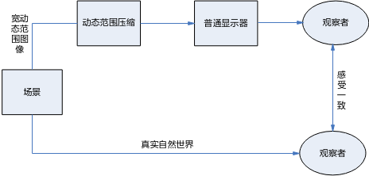

### API参考<a name="ZH-CN_TOPIC_0000002503965163"></a>

-   [ss\_mpi\_isp\_set\_drc\_attr](#ZH-CN_TOPIC_0000002470925106)：设置动态范围压缩参数。
-   [ss\_mpi\_isp\_get\_drc\_attr](#ZH-CN_TOPIC_0000002504084695)：获取动态范围压缩参数。


#### ss\_mpi\_isp\_set\_drc\_attr<a name="ZH-CN_TOPIC_0000002470925106"></a>

【描述】

设置动态范围压缩参数。

【语法】

```
td_s32 ss_mpi_isp_set_drc_attr(ot_vi_pipe vi_pipe, const ot_isp_drc_attr*drc_attr);
```

【参数】

<a name="table21622mcpsimp"></a>
<table><thead align="left"><tr id="row21628mcpsimp"><th class="cellrowborder" valign="top" width="23%" id="mcps1.1.4.1.1"><p id="p21630mcpsimp"><a name="p21630mcpsimp"></a><a name="p21630mcpsimp"></a>参数名称</p>
</th>
<th class="cellrowborder" valign="top" width="61%" id="mcps1.1.4.1.2"><p id="p21632mcpsimp"><a name="p21632mcpsimp"></a><a name="p21632mcpsimp"></a>描述</p>
</th>
<th class="cellrowborder" valign="top" width="16%" id="mcps1.1.4.1.3"><p id="p21634mcpsimp"><a name="p21634mcpsimp"></a><a name="p21634mcpsimp"></a>输入/输出</p>
</th>
</tr>
</thead>
<tbody><tr id="row21635mcpsimp"><td class="cellrowborder" valign="top" width="23%" headers="mcps1.1.4.1.1 "><p id="p21637mcpsimp"><a name="p21637mcpsimp"></a><a name="p21637mcpsimp"></a>vi_pipe</p>
</td>
<td class="cellrowborder" valign="top" width="61%" headers="mcps1.1.4.1.2 "><p id="p21639mcpsimp"><a name="p21639mcpsimp"></a><a name="p21639mcpsimp"></a>vi_pipe号。</p>
</td>
<td class="cellrowborder" valign="top" width="16%" headers="mcps1.1.4.1.3 "><p id="p21641mcpsimp"><a name="p21641mcpsimp"></a><a name="p21641mcpsimp"></a>输入</p>
</td>
</tr>
<tr id="row21642mcpsimp"><td class="cellrowborder" valign="top" width="23%" headers="mcps1.1.4.1.1 "><p id="p21644mcpsimp"><a name="p21644mcpsimp"></a><a name="p21644mcpsimp"></a>drc_attr</p>
</td>
<td class="cellrowborder" valign="top" width="61%" headers="mcps1.1.4.1.2 "><p id="p21646mcpsimp"><a name="p21646mcpsimp"></a><a name="p21646mcpsimp"></a>动态范围压缩参数。</p>
</td>
<td class="cellrowborder" valign="top" width="16%" headers="mcps1.1.4.1.3 "><p id="p21648mcpsimp"><a name="p21648mcpsimp"></a><a name="p21648mcpsimp"></a>输入</p>
</td>
</tr>
</tbody>
</table>

【返回值】

<a name="table21651mcpsimp"></a>
<table><thead align="left"><tr id="row21656mcpsimp"><th class="cellrowborder" valign="top" width="27%" id="mcps1.1.3.1.1"><p id="p21658mcpsimp"><a name="p21658mcpsimp"></a><a name="p21658mcpsimp"></a>返回值</p>
</th>
<th class="cellrowborder" valign="top" width="73%" id="mcps1.1.3.1.2"><p id="p21660mcpsimp"><a name="p21660mcpsimp"></a><a name="p21660mcpsimp"></a>描述</p>
</th>
</tr>
</thead>
<tbody><tr id="row21662mcpsimp"><td class="cellrowborder" valign="top" width="27%" headers="mcps1.1.3.1.1 "><p id="p21664mcpsimp"><a name="p21664mcpsimp"></a><a name="p21664mcpsimp"></a>0</p>
</td>
<td class="cellrowborder" valign="top" width="73%" headers="mcps1.1.3.1.2 "><p id="p21666mcpsimp"><a name="p21666mcpsimp"></a><a name="p21666mcpsimp"></a>成功。</p>
</td>
</tr>
<tr id="row21667mcpsimp"><td class="cellrowborder" valign="top" width="27%" headers="mcps1.1.3.1.1 "><p id="p21669mcpsimp"><a name="p21669mcpsimp"></a><a name="p21669mcpsimp"></a>非0</p>
</td>
<td class="cellrowborder" valign="top" width="73%" headers="mcps1.1.3.1.2 "><p id="p21671mcpsimp"><a name="p21671mcpsimp"></a><a name="p21671mcpsimp"></a>失败，其值为<span xml:lang="sv-SE" id="ph10195517299"><a name="ph10195517299"></a><a name="ph10195517299"></a>错误码</span>。</p>
</td>
</tr>
</tbody>
</table>

【需求】

-   头文件：ot\_common\_isp.h、ss\_mpi\_isp.h
-   库文件：libot\_isp.a、libss\_isp.a

【注意】

无。

【举例】

无。

【相关主题】

[ss\_mpi\_isp\_get\_drc\_attr](#ss_mpi_isp_get_drc_attr)

#### ss\_mpi\_isp\_get\_drc\_attr<a name="ZH-CN_TOPIC_0000002504084695"></a>

【描述】

获取动态范围压缩参数。

【语法】

```
td_s32 ss_mpi_isp_get_drc_attr(ot_vi_pipe vi_pipe, ot_isp_drc_attr *drc_attr);
```

【参数】

<a name="table21692mcpsimp"></a>
<table><thead align="left"><tr id="row21698mcpsimp"><th class="cellrowborder" valign="top" width="23%" id="mcps1.1.4.1.1"><p id="p21700mcpsimp"><a name="p21700mcpsimp"></a><a name="p21700mcpsimp"></a>参数名称</p>
</th>
<th class="cellrowborder" valign="top" width="61%" id="mcps1.1.4.1.2"><p id="p21702mcpsimp"><a name="p21702mcpsimp"></a><a name="p21702mcpsimp"></a>描述</p>
</th>
<th class="cellrowborder" valign="top" width="16%" id="mcps1.1.4.1.3"><p id="p21704mcpsimp"><a name="p21704mcpsimp"></a><a name="p21704mcpsimp"></a>输入/输出</p>
</th>
</tr>
</thead>
<tbody><tr id="row21705mcpsimp"><td class="cellrowborder" valign="top" width="23%" headers="mcps1.1.4.1.1 "><p id="p21707mcpsimp"><a name="p21707mcpsimp"></a><a name="p21707mcpsimp"></a>vi_pipe</p>
</td>
<td class="cellrowborder" valign="top" width="61%" headers="mcps1.1.4.1.2 "><p id="p21709mcpsimp"><a name="p21709mcpsimp"></a><a name="p21709mcpsimp"></a>vi_pipe号。</p>
</td>
<td class="cellrowborder" valign="top" width="16%" headers="mcps1.1.4.1.3 "><p id="p21711mcpsimp"><a name="p21711mcpsimp"></a><a name="p21711mcpsimp"></a>输入</p>
</td>
</tr>
<tr id="row21712mcpsimp"><td class="cellrowborder" valign="top" width="23%" headers="mcps1.1.4.1.1 "><p id="p21714mcpsimp"><a name="p21714mcpsimp"></a><a name="p21714mcpsimp"></a>drc_attr</p>
</td>
<td class="cellrowborder" valign="top" width="61%" headers="mcps1.1.4.1.2 "><p id="p21716mcpsimp"><a name="p21716mcpsimp"></a><a name="p21716mcpsimp"></a>动态范围压缩参数。</p>
</td>
<td class="cellrowborder" valign="top" width="16%" headers="mcps1.1.4.1.3 "><p id="p21718mcpsimp"><a name="p21718mcpsimp"></a><a name="p21718mcpsimp"></a>输入</p>
</td>
</tr>
</tbody>
</table>

【返回值】

<a name="table21721mcpsimp"></a>
<table><thead align="left"><tr id="row21726mcpsimp"><th class="cellrowborder" valign="top" width="27%" id="mcps1.1.3.1.1"><p id="p21728mcpsimp"><a name="p21728mcpsimp"></a><a name="p21728mcpsimp"></a>返回值</p>
</th>
<th class="cellrowborder" valign="top" width="73%" id="mcps1.1.3.1.2"><p id="p21730mcpsimp"><a name="p21730mcpsimp"></a><a name="p21730mcpsimp"></a>描述</p>
</th>
</tr>
</thead>
<tbody><tr id="row21732mcpsimp"><td class="cellrowborder" valign="top" width="27%" headers="mcps1.1.3.1.1 "><p id="p21734mcpsimp"><a name="p21734mcpsimp"></a><a name="p21734mcpsimp"></a>0</p>
</td>
<td class="cellrowborder" valign="top" width="73%" headers="mcps1.1.3.1.2 "><p id="p21736mcpsimp"><a name="p21736mcpsimp"></a><a name="p21736mcpsimp"></a>成功。</p>
</td>
</tr>
<tr id="row21737mcpsimp"><td class="cellrowborder" valign="top" width="27%" headers="mcps1.1.3.1.1 "><p id="p21739mcpsimp"><a name="p21739mcpsimp"></a><a name="p21739mcpsimp"></a>非0</p>
</td>
<td class="cellrowborder" valign="top" width="73%" headers="mcps1.1.3.1.2 "><p id="p21741mcpsimp"><a name="p21741mcpsimp"></a><a name="p21741mcpsimp"></a>失败，其值为<span xml:lang="sv-SE" id="ph10195517299"><a name="ph10195517299"></a><a name="ph10195517299"></a>错误码</span>。</p>
</td>
</tr>
</tbody>
</table>

【需求】

-   头文件：ot\_common\_isp.h、ss\_mpi\_isp.h
-   库文件：libot\_isp.a、libss\_isp.a

【注意】

无。

【举例】

无。

【相关主题】

[ss\_mpi\_isp\_set\_drc\_attr](#ss_mpi_isp_set_drc_attr)

### 数据类型<a name="ZH-CN_TOPIC_0000002503964971"></a>

-   [OT\_ISP\_DRC\_FLTX\_NODE\_NUM](#ZH-CN_TOPIC_0000002471084886)：定义ISP DRC Filter X子滤波器个数。
-   [OT\_ISP\_DRC\_CC\_NODE\_NUM](#ZH-CN_TOPIC_0000002504084921)：定义ISP DRC Color Correction LUT节点个数。
-   [OT\_ISP\_DRC\_TM\_NODE\_NUM](#ZH-CN_TOPIC_0000002504084809)：定义ISP DRC Tone Mapping LUT节点个数。
-   [OT\_ISP\_DRC\_LMIX\_NODE\_NUM](#ZH-CN_TOPIC_0000002504084883)：定义ISP DRC Local Mixing LUT节点个数。
-   [ot\_isp\_drc\_manual\_attr](#ZH-CN_TOPIC_0000002471084844)：定义ISP DRC手动属性。
-   [ot\_isp\_drc\_auto\_attr](#ZH-CN_TOPIC_0000002503964987)：定义ISP DRC自动属性。
-   [ot\_isp\_drc\_curve\_select](#ZH-CN_TOPIC_0000002470924936)：定义ISP DRC Tone Mapping曲线类型。
-   [ot\_isp\_drc\_asymmetry\_curve\_attr](#ZH-CN_TOPIC_0000002471085144)：定义ISP DRC Asymmetry Curve属性。
-   [ot\_isp\_drc\_attr](#ZH-CN_TOPIC_0000002503964789)：定义ISP DRC属性。


#### OT\_ISP\_DRC\_FLTX\_NODE\_NUM<a name="ZH-CN_TOPIC_0000002471084886"></a>

【说明】

DRC Filter X子滤波器个数。

【定义】

```
#define OT_ISP_DRC_FLTX_NODE_NUM        3
```

【注意事项】

无。

【相关数据类型及接口】

[ot\_isp\_drc\_attr](#ot_isp_drc_attr)

#### OT\_ISP\_DRC\_CC\_NODE\_NUM<a name="ZH-CN_TOPIC_0000002504084921"></a>

【说明】

DRC Color Correction （颜色校正） LUT节点个数。

【定义】

```
#define OT_ISP_DRC_CC_NODE_NUM          33
```

【注意事项】

无。

【相关数据类型及接口】

[ot\_isp\_drc\_attr](#ot_isp_drc_attr)

#### OT\_ISP\_DRC\_TM\_NODE\_NUM<a name="ZH-CN_TOPIC_0000002504084809"></a>

【说明】

DRC Tone Mapping LUT节点个数。

【定义】

```
#define OT_ISP_DRC_TM_NODE_NUM          200
```

【注意事项】

无。

【相关数据类型及接口】

[ot\_isp\_drc\_attr](#ot_isp_drc_attr)

#### OT\_ISP\_DRC\_LMIX\_NODE\_NUM<a name="ZH-CN_TOPIC_0000002504084883"></a>

【说明】

DRC Local Mixing（细节增强）LUT节点个数。

【定义】

```
#define OT_ISP_DRC_LMIX_NODE_NUM          33
```

【注意事项】

无。

【相关数据类型及接口】

[ot\_isp\_drc\_attr](#ot_isp_drc_attr)

#### ot\_isp\_drc\_manual\_attr<a name="ZH-CN_TOPIC_0000002471084844"></a>

【说明】

定义ISP DRC手动属性。

【定义】

```
typedef struct {
    td_u16  strength;
} ot_isp_drc_manual_attr;
```

【成员】

<a name="table21828mcpsimp"></a>
<table><thead align="left"><tr id="row21833mcpsimp"><th class="cellrowborder" valign="top" width="34%" id="mcps1.1.3.1.1"><p id="p21835mcpsimp"><a name="p21835mcpsimp"></a><a name="p21835mcpsimp"></a>成员名称</p>
</th>
<th class="cellrowborder" valign="top" width="66%" id="mcps1.1.3.1.2"><p id="p21837mcpsimp"><a name="p21837mcpsimp"></a><a name="p21837mcpsimp"></a>描述</p>
</th>
</tr>
</thead>
<tbody><tr id="row21839mcpsimp"><td class="cellrowborder" valign="top" width="34%" headers="mcps1.1.3.1.1 "><p id="p21841mcpsimp"><a name="p21841mcpsimp"></a><a name="p21841mcpsimp"></a>strength</p>
</td>
<td class="cellrowborder" valign="top" width="66%" headers="mcps1.1.3.1.2 "><p id="p21843mcpsimp"><a name="p21843mcpsimp"></a><a name="p21843mcpsimp"></a>手动模式下DRC的强度，值越大，整体图像越亮。</p>
<p id="p21844mcpsimp"><a name="p21844mcpsimp"></a><a name="p21844mcpsimp"></a>取值范围：[0x0, 0x3FF]</p>
</td>
</tr>
</tbody>
</table>

【注意事项】

在线性和WDR模式下均可以达到最大值。

【相关数据类型及接口】

[ot\_isp\_drc\_attr](#ot_isp_drc_attr)

#### ot\_isp\_drc\_auto\_attr<a name="ZH-CN_TOPIC_0000002503964987"></a>

【说明】

定义ISP DRC自动属性。

【定义】

```
typedef struct {
    td_u16  strength;
    td_u16  strength_max;
    td_u16  strength_min;
} ot_isp_drc_auto_attr;
```

【成员】

<a name="table21860mcpsimp"></a>
<table><thead align="left"><tr id="row21865mcpsimp"><th class="cellrowborder" valign="top" width="21%" id="mcps1.1.3.1.1"><p id="p21867mcpsimp"><a name="p21867mcpsimp"></a><a name="p21867mcpsimp"></a>成员名称</p>
</th>
<th class="cellrowborder" valign="top" width="79%" id="mcps1.1.3.1.2"><p id="p21869mcpsimp"><a name="p21869mcpsimp"></a><a name="p21869mcpsimp"></a>描述</p>
</th>
</tr>
</thead>
<tbody><tr id="row21871mcpsimp"><td class="cellrowborder" valign="top" width="21%" headers="mcps1.1.3.1.1 "><p id="p21873mcpsimp"><a name="p21873mcpsimp"></a><a name="p21873mcpsimp"></a>strength</p>
</td>
<td class="cellrowborder" valign="top" width="79%" headers="mcps1.1.3.1.2 "><p id="p21875mcpsimp"><a name="p21875mcpsimp"></a><a name="p21875mcpsimp"></a>自动模式下DRC的强度，参数可以读写，值越大，整体强度越大。取值范围：[0x0, 0x3FF]</p>
</td>
</tr>
<tr id="row21876mcpsimp"><td class="cellrowborder" valign="top" width="21%" headers="mcps1.1.3.1.1 "><p id="p21878mcpsimp"><a name="p21878mcpsimp"></a><a name="p21878mcpsimp"></a>strength_max</p>
</td>
<td class="cellrowborder" valign="top" width="79%" headers="mcps1.1.3.1.2 "><p id="p21880mcpsimp"><a name="p21880mcpsimp"></a><a name="p21880mcpsimp"></a>自动模式下DRC实际生效强度值的上限。取值范围同strength。</p>
</td>
</tr>
<tr id="row21881mcpsimp"><td class="cellrowborder" valign="top" width="21%" headers="mcps1.1.3.1.1 "><p id="p21883mcpsimp"><a name="p21883mcpsimp"></a><a name="p21883mcpsimp"></a>strength_min</p>
</td>
<td class="cellrowborder" valign="top" width="79%" headers="mcps1.1.3.1.2 "><p id="p21885mcpsimp"><a name="p21885mcpsimp"></a><a name="p21885mcpsimp"></a>自动模式下DRC实际生效强度值的下限。取值范围同strength。</p>
</td>
</tr>
</tbody>
</table>

【注意事项】

-   实际生效强度为：算法AUTO模式计算出的强度 \* strength / 512。
-   注意strength\_max必须大于等于strength\_min，否则两个参数均不生效。
-   线性和WDR自动模式下DRC强度的建议取值范围不同，u16StrengthMax/Min的建议取值范围也不同：
    -   线性自动模式下，strength\_max和strength\_min的建议取值范围为\[0x0, 0x200\]，其中strength\_max默认值为0x200，strength\_min默认值为0x0；
    -   在WDR自动模式下，strength\_max和strength\_min的建议取值范围为\[0x200, 0x3FF\]，其中strength\_max默认值为0x3FF，strength\_min默认值为0x200。

【相关数据类型及接口】

[ot\_isp\_drc\_attr](#ot_isp_drc_attr)

#### ot\_isp\_drc\_asymmetry\_curve\_attr<a name="ZH-CN_TOPIC_0000002471085144"></a>

【说明】

定义ISP DRC Asymmetry Curve属性。

【定义】

```
typedef struct {
    td_u8 asymmetry;
    td_u8 second_pole;
    td_u8 stretch;
    td_u8 compress;
} ot_isp_drc_asymmetry_curve_attr;
```

【成员】

<a name="table21908mcpsimp"></a>
<table><thead align="left"><tr id="row21913mcpsimp"><th class="cellrowborder" valign="top" width="32%" id="mcps1.1.3.1.1"><p id="p21915mcpsimp"><a name="p21915mcpsimp"></a><a name="p21915mcpsimp"></a>成员名称</p>
</th>
<th class="cellrowborder" valign="top" width="68%" id="mcps1.1.3.1.2"><p id="p21917mcpsimp"><a name="p21917mcpsimp"></a><a name="p21917mcpsimp"></a>描述</p>
</th>
</tr>
</thead>
<tbody><tr id="row21919mcpsimp"><td class="cellrowborder" valign="top" width="32%" headers="mcps1.1.3.1.1 "><p id="p21921mcpsimp"><a name="p21921mcpsimp"></a><a name="p21921mcpsimp"></a>asymmetry</p>
</td>
<td class="cellrowborder" valign="top" width="68%" headers="mcps1.1.3.1.2 "><p id="p21923mcpsimp"><a name="p21923mcpsimp"></a><a name="p21923mcpsimp"></a>用于生成Asymmetry Curve, 值越小，暗区亮度拉伸越明显。</p>
<p id="p21924mcpsimp"><a name="p21924mcpsimp"></a><a name="p21924mcpsimp"></a>取值范围：[1, 30]</p>
</td>
</tr>
<tr id="row21925mcpsimp"><td class="cellrowborder" valign="top" width="32%" headers="mcps1.1.3.1.1 "><p id="p21927mcpsimp"><a name="p21927mcpsimp"></a><a name="p21927mcpsimp"></a>second_pole</p>
</td>
<td class="cellrowborder" valign="top" width="68%" headers="mcps1.1.3.1.2 "><p id="p21929mcpsimp"><a name="p21929mcpsimp"></a><a name="p21929mcpsimp"></a>用于生成Asymmetry Curve，值越小，亮区亮度压制越强，有利于保留高亮细节。</p>
<p id="p21930mcpsimp"><a name="p21930mcpsimp"></a><a name="p21930mcpsimp"></a>取值范围：[150, 210]</p>
</td>
</tr>
<tr id="row21931mcpsimp"><td class="cellrowborder" valign="top" width="32%" headers="mcps1.1.3.1.1 "><p id="p21933mcpsimp"><a name="p21933mcpsimp"></a><a name="p21933mcpsimp"></a>stretch</p>
</td>
<td class="cellrowborder" valign="top" width="68%" headers="mcps1.1.3.1.2 "><p id="p21935mcpsimp"><a name="p21935mcpsimp"></a><a name="p21935mcpsimp"></a>用于生成Asymmetry Curve，值越小，整体亮度越亮。取值范围：[30, 60]</p>
</td>
</tr>
<tr id="row21936mcpsimp"><td class="cellrowborder" valign="top" width="32%" headers="mcps1.1.3.1.1 "><p id="p21938mcpsimp"><a name="p21938mcpsimp"></a><a name="p21938mcpsimp"></a>compress</p>
</td>
<td class="cellrowborder" valign="top" width="68%" headers="mcps1.1.3.1.2 "><p id="p21940mcpsimp"><a name="p21940mcpsimp"></a><a name="p21940mcpsimp"></a>用于生成Asymmetry Curve，值越小，整体亮度越亮。取值范围：[100, 200]</p>
</td>
</tr>
</tbody>
</table>

【注意事项】

无

【相关数据类型及接口】

[ot\_isp\_drc\_attr](#ot_isp_drc_attr)

#### ot\_isp\_drc\_curve\_select<a name="ZH-CN_TOPIC_0000002470924936"></a>

【说明】

定义ISP DRC Tone Mapping曲线类型。

【定义】

```
typedef enum {
    OT_ISP_DRC_CURVE_ASYMMETRY = 0x0,
    OT_ISP_DRC_CURVE_USER,
    OT_ISP_DRC_CURVE_BUTT
} ot_isp_drc_curve_select;
```

【成员】

<a name="table21956mcpsimp"></a>
<table><thead align="left"><tr id="row21961mcpsimp"><th class="cellrowborder" valign="top" width="48%" id="mcps1.1.3.1.1"><p id="p21963mcpsimp"><a name="p21963mcpsimp"></a><a name="p21963mcpsimp"></a>成员名称</p>
</th>
<th class="cellrowborder" valign="top" width="52%" id="mcps1.1.3.1.2"><p id="p21965mcpsimp"><a name="p21965mcpsimp"></a><a name="p21965mcpsimp"></a>描述</p>
</th>
</tr>
</thead>
<tbody><tr id="row21967mcpsimp"><td class="cellrowborder" valign="top" width="48%" headers="mcps1.1.3.1.1 "><p id="p21969mcpsimp"><a name="p21969mcpsimp"></a><a name="p21969mcpsimp"></a>OT_ISP_DRC_CURVE_ASYMMETRY</p>
</td>
<td class="cellrowborder" valign="top" width="52%" headers="mcps1.1.3.1.2 "><p id="p21971mcpsimp"><a name="p21971mcpsimp"></a><a name="p21971mcpsimp"></a>选择Asymmetry Curve。</p>
</td>
</tr>
<tr id="row21972mcpsimp"><td class="cellrowborder" valign="top" width="48%" headers="mcps1.1.3.1.1 "><p id="p21974mcpsimp"><a name="p21974mcpsimp"></a><a name="p21974mcpsimp"></a>OT_ISP_DRC_CURVE_USER</p>
</td>
<td class="cellrowborder" valign="top" width="52%" headers="mcps1.1.3.1.2 "><p id="p21976mcpsimp"><a name="p21976mcpsimp"></a><a name="p21976mcpsimp"></a>选择用户自定义曲线。</p>
</td>
</tr>
<tr id="row21977mcpsimp"><td class="cellrowborder" valign="top" width="48%" headers="mcps1.1.3.1.1 "><p id="p21979mcpsimp"><a name="p21979mcpsimp"></a><a name="p21979mcpsimp"></a>OT_ISP_DRC_CURVE_BUTT</p>
</td>
<td class="cellrowborder" valign="top" width="52%" headers="mcps1.1.3.1.2 "><p id="p21981mcpsimp"><a name="p21981mcpsimp"></a><a name="p21981mcpsimp"></a>无效值。</p>
</td>
</tr>
</tbody>
</table>

【注意事项】

无

【相关数据类型及接口】

[ot\_isp\_drc\_attr](#ot_isp_drc_attr)

#### ot\_isp\_drc\_attr<a name="ZH-CN_TOPIC_0000002503964789"></a>

【说明】

定义ISP DRC属性。

【定义】

```
typedef struct {
    td_bool enable;
    ot_isp_drc_curve_select curve_select;
    td_u8  purple_reduction_strength;
    td_u8  bright_gain_limit;
    td_u8  bright_gain_limit_step;
    td_u8  dark_gain_limit_luma;
    td_u8  dark_gain_limit_chroma;
    td_u8  contrast_ctrl;
    td_u8  rim_reduction_strength;
    td_u8  rim_reduction_threshold;
    td_u16 color_correction_lut[OT_ISP_DRC_CC_NODE_NUM];
    td_u16 tone_mapping_value[OT_ISP_DRC_TM_NODE_NUM];
    td_u8  spatial_filter_coef;
    td_u8  range_filter_coef;
    td_u8  detail_adjust_coef;
    td_u8  local_mixing_bright[OT_ISP_DRC_LMIX_NODE_NUM];
    td_u8  local_mixing_dark[OT_ISP_DRC_LMIX_NODE_NUM];
    td_u8  filter_coef_x[OT_ISP_DRC_FLTX_NODE_NUM];
    td_u8  filter_low_threshold_x[OT_ISP_DRC_FLTX_NODE_NUM];
    td_u8  filter_high_threshold_x[OT_ISP_DRC_FLTX_NODE_NUM];
    td_u8  detail_adjust_coef_x;
    td_u8  local_mixing_bright_x[OT_ISP_DRC_LMIX_NODE_NUM];
    td_u8  local_mixing_dark_x[OT_ISP_DRC_LMIX_NODE_NUM];
    td_u8  blend_luma_max;
    td_u8  blend_luma_bright_min;
    td_u8  blend_luma_bright_threshold;
    td_u8  blend_luma_bright_slope;
    td_u8  blend_luma_dark_min;
    td_u8  blend_luma_dark_threshold;
    td_u8  blend_luma_dark_slope;
    td_u8  blend_detail_max;
    td_u8  blend_detail_bright_min;
    td_u8  blend_detail_bright_threshold;
    td_u8  blend_detail_bright_slope;
    td_u8  blend_detail_dark_min;
    td_u8  blend_detail_dark_threshold;
    td_u8  blend_detail_dark_slope;
    td_u8  detail_adjust_coef_blend;
    td_u8  low_saturation_color_ctrl;
    td_u8  high_saturation_color_ctrl;
    td_bool color_correction_ctrl;
    ot_op_mode op_type;
    ot_isp_drc_manual_attr manual_attr;
    ot_isp_drc_auto_attr   auto_attr;
    ot_isp_drc_asymmetry_curve_attr asymmetry_curve;
} ot_isp_drc_attr;
```

【成员】

<a name="table22064mcpsimp"></a>
<table><thead align="left"><tr id="row22069mcpsimp"><th class="cellrowborder" valign="top" width="38%" id="mcps1.1.3.1.1"><p id="p22071mcpsimp"><a name="p22071mcpsimp"></a><a name="p22071mcpsimp"></a>成员名称</p>
</th>
<th class="cellrowborder" valign="top" width="62%" id="mcps1.1.3.1.2"><p id="p22073mcpsimp"><a name="p22073mcpsimp"></a><a name="p22073mcpsimp"></a>描述</p>
</th>
</tr>
</thead>
<tbody><tr id="row22075mcpsimp"><td class="cellrowborder" valign="top" width="38%" headers="mcps1.1.3.1.1 "><p id="p22077mcpsimp"><a name="p22077mcpsimp"></a><a name="p22077mcpsimp"></a>enable</p>
</td>
<td class="cellrowborder" valign="top" width="62%" headers="mcps1.1.3.1.2 "><p id="p22079mcpsimp"><a name="p22079mcpsimp"></a><a name="p22079mcpsimp"></a>DRC动态范围压缩使能<span xml:lang="en-SG" id="ph22080mcpsimp"><a name="ph22080mcpsimp"></a><a name="ph22080mcpsimp"></a>。</span>取值范围：[0x0, 0x1]</p>
<p id="p22081mcpsimp"><a name="p22081mcpsimp"></a><a name="p22081mcpsimp"></a>0：关闭；</p>
<p id="p22082mcpsimp"><a name="p22082mcpsimp"></a><a name="p22082mcpsimp"></a>1：使能。</p>
</td>
</tr>
<tr id="row22083mcpsimp"><td class="cellrowborder" valign="top" width="38%" headers="mcps1.1.3.1.1 "><p xml:lang="sv-SE" id="p22085mcpsimp"><a name="p22085mcpsimp"></a><a name="p22085mcpsimp"></a>curve_select</p>
</td>
<td class="cellrowborder" valign="top" width="62%" headers="mcps1.1.3.1.2 "><p xml:lang="sv-SE" id="p22087mcpsimp"><a name="p22087mcpsimp"></a><a name="p22087mcpsimp"></a>DRC Tone mapping<span xml:lang="en-US" id="ph22088mcpsimp"><a name="ph22088mcpsimp"></a><a name="ph22088mcpsimp"></a>曲线选择</span><span xml:lang="en-SG" id="ph22089mcpsimp"><a name="ph22089mcpsimp"></a><a name="ph22089mcpsimp"></a>。</span><span xml:lang="en-US" id="ph22090mcpsimp"><a name="ph22090mcpsimp"></a><a name="ph22090mcpsimp"></a>取值范围</span>：[0x0, 0x1]</p>
<p xml:lang="sv-SE" id="p22092mcpsimp"><a name="p22092mcpsimp"></a><a name="p22092mcpsimp"></a>0：Asymmetry curve；</p>
<p id="p22093mcpsimp"><a name="p22093mcpsimp"></a><a name="p22093mcpsimp"></a><span xml:lang="sv-SE" id="ph22094mcpsimp"><a name="ph22094mcpsimp"></a><a name="ph22094mcpsimp"></a>1：</span>用户自定义曲线</p>
</td>
</tr>
<tr id="row22095mcpsimp"><td class="cellrowborder" valign="top" width="38%" headers="mcps1.1.3.1.1 "><p xml:lang="sv-SE" id="p22097mcpsimp"><a name="p22097mcpsimp"></a><a name="p22097mcpsimp"></a>purple_reduction_strength</p>
</td>
<td class="cellrowborder" valign="top" width="62%" headers="mcps1.1.3.1.2 "><p id="p22099mcpsimp"><a name="p22099mcpsimp"></a><a name="p22099mcpsimp"></a>紫边校正强度，值越大，紫边校正强度越大。取值范围：[0x0, 0x80]</p>
</td>
</tr>
<tr id="row22100mcpsimp"><td class="cellrowborder" valign="top" width="38%" headers="mcps1.1.3.1.1 "><p xml:lang="sv-SE" id="p22102mcpsimp"><a name="p22102mcpsimp"></a><a name="p22102mcpsimp"></a>bright_gain_limit</p>
</td>
<td class="cellrowborder" valign="top" width="62%" headers="mcps1.1.3.1.2 "><p id="p22104mcpsimp"><a name="p22104mcpsimp"></a><a name="p22104mcpsimp"></a>亮区亮度增益限制目标值<span xml:lang="sv-SE" id="ph22105mcpsimp"><a name="ph22105mcpsimp"></a><a name="ph22105mcpsimp"></a>；</span>值越大<span xml:lang="sv-SE" id="ph22106mcpsimp"><a name="ph22106mcpsimp"></a><a name="ph22106mcpsimp"></a>，</span>限制越大<span xml:lang="en-SG" id="ph22107mcpsimp"><a name="ph22107mcpsimp"></a><a name="ph22107mcpsimp"></a>。</span>取值范围<span xml:lang="sv-SE" id="ph22108mcpsimp"><a name="ph22108mcpsimp"></a><a name="ph22108mcpsimp"></a>：[0x0, 0xF]</span></p>
</td>
</tr>
<tr id="row22109mcpsimp"><td class="cellrowborder" valign="top" width="38%" headers="mcps1.1.3.1.1 "><p xml:lang="sv-SE" id="p22111mcpsimp"><a name="p22111mcpsimp"></a><a name="p22111mcpsimp"></a>bright_gain_limit_step</p>
</td>
<td class="cellrowborder" valign="top" width="62%" headers="mcps1.1.3.1.2 "><p id="p22113mcpsimp"><a name="p22113mcpsimp"></a><a name="p22113mcpsimp"></a>亮区亮度增益限制自适应步长<span xml:lang="sv-SE" id="ph22114mcpsimp"><a name="ph22114mcpsimp"></a><a name="ph22114mcpsimp"></a>；</span>值越小<span xml:lang="sv-SE" id="ph22115mcpsimp"><a name="ph22115mcpsimp"></a><a name="ph22115mcpsimp"></a>，</span>限制越大。取值范围：[0x0, 0xF]</p>
</td>
</tr>
<tr id="row22116mcpsimp"><td class="cellrowborder" valign="top" width="38%" headers="mcps1.1.3.1.1 "><p xml:lang="sv-SE" id="p22118mcpsimp"><a name="p22118mcpsimp"></a><a name="p22118mcpsimp"></a>dark_gain_limit_luma</p>
</td>
<td class="cellrowborder" valign="top" width="62%" headers="mcps1.1.3.1.2 "><p id="p22120mcpsimp"><a name="p22120mcpsimp"></a><a name="p22120mcpsimp"></a>暗区亮度增益限制<span xml:lang="sv-SE" id="ph22121mcpsimp"><a name="ph22121mcpsimp"></a><a name="ph22121mcpsimp"></a>；</span>值越大<span xml:lang="sv-SE" id="ph22122mcpsimp"><a name="ph22122mcpsimp"></a><a name="ph22122mcpsimp"></a>，</span>限制越大。取值范围：[0x0, 0x85]</p>
</td>
</tr>
<tr id="row22123mcpsimp"><td class="cellrowborder" valign="top" width="38%" headers="mcps1.1.3.1.1 "><p xml:lang="sv-SE" id="p22125mcpsimp"><a name="p22125mcpsimp"></a><a name="p22125mcpsimp"></a>dark_gain_limit_chroma</p>
</td>
<td class="cellrowborder" valign="top" width="62%" headers="mcps1.1.3.1.2 "><p id="p22127mcpsimp"><a name="p22127mcpsimp"></a><a name="p22127mcpsimp"></a>暗区色度增益限制<span xml:lang="sv-SE" id="ph22128mcpsimp"><a name="ph22128mcpsimp"></a><a name="ph22128mcpsimp"></a>；</span>值越大<span xml:lang="sv-SE" id="ph22129mcpsimp"><a name="ph22129mcpsimp"></a><a name="ph22129mcpsimp"></a>，</span>限制越大。取值范围：[0x0, 0x85]</p>
</td>
</tr>
<tr id="row22130mcpsimp"><td class="cellrowborder" valign="top" width="38%" headers="mcps1.1.3.1.1 "><p xml:lang="sv-SE" id="p22132mcpsimp"><a name="p22132mcpsimp"></a><a name="p22132mcpsimp"></a>contrast_ctrl</p>
</td>
<td class="cellrowborder" valign="top" width="62%" headers="mcps1.1.3.1.2 "><p id="p22134mcpsimp"><a name="p22134mcpsimp"></a><a name="p22134mcpsimp"></a>局部对比度控制，取值范围：[0x0, 0xF]，参数效果与图像亮度分布相关，一般场景下建议值为6到10之间。</p>
</td>
</tr>
<tr id="row22135mcpsimp"><td class="cellrowborder" valign="top" width="38%" headers="mcps1.1.3.1.1 "><p xml:lang="sv-SE" id="p22137mcpsimp"><a name="p22137mcpsimp"></a><a name="p22137mcpsimp"></a>rim_reduction_strength</p>
</td>
<td class="cellrowborder" valign="top" width="62%" headers="mcps1.1.3.1.2 "><p id="p22139mcpsimp"><a name="p22139mcpsimp"></a><a name="p22139mcpsimp"></a>去边线强度。值越大，边线减弱越明显，但是可能会带来细节损失。取值范围：[0x0, 0x40]</p>
</td>
</tr>
<tr id="row22140mcpsimp"><td class="cellrowborder" valign="top" width="38%" headers="mcps1.1.3.1.1 "><p xml:lang="sv-SE" id="p22142mcpsimp"><a name="p22142mcpsimp"></a><a name="p22142mcpsimp"></a>rim_reduction_threshold</p>
</td>
<td class="cellrowborder" valign="top" width="62%" headers="mcps1.1.3.1.2 "><p id="p22144mcpsimp"><a name="p22144mcpsimp"></a><a name="p22144mcpsimp"></a>边线检测阈值。值越大，边线减弱越明显，但是可能会带来细节损失。取值范围：[0x0, 0x80]</p>
</td>
</tr>
<tr id="row22145mcpsimp"><td class="cellrowborder" valign="top" width="38%" headers="mcps1.1.3.1.1 "><p xml:lang="sv-SE" id="p22147mcpsimp"><a name="p22147mcpsimp"></a><a name="p22147mcpsimp"></a>color_correction_lut[<a href="#OT_ISP_DRC_CC_NODE_NUM"><span xml:lang="fr-FR" id="ph22149mcpsimp"><a name="ph22149mcpsimp"></a><a name="ph22149mcpsimp"></a>OT_ISP_DRC_CC_NODE_NUM</span></a>]</p>
</td>
<td class="cellrowborder" valign="top" width="62%" headers="mcps1.1.3.1.2 "><p id="p22151mcpsimp"><a name="p22151mcpsimp"></a><a name="p22151mcpsimp"></a>颜色校正系数LUT，值越小，饱和度越低。取值范围：[0x0, 0x400]</p>
</td>
</tr>
<tr id="row22152mcpsimp"><td class="cellrowborder" valign="top" width="38%" headers="mcps1.1.3.1.1 "><p xml:lang="fr-FR" id="p22154mcpsimp"><a name="p22154mcpsimp"></a><a name="p22154mcpsimp"></a><span xml:lang="sv-SE" id="ph22155mcpsimp"><a name="ph22155mcpsimp"></a><a name="ph22155mcpsimp"></a>tone_mapping_value[</span><a href="#OT_ISP_DRC_TM_NODE_NUM">OT_ISP_DRC_TM_NODE_NUM</a><span xml:lang="sv-SE" id="ph22157mcpsimp"><a name="ph22157mcpsimp"></a><a name="ph22157mcpsimp"></a>]</span></p>
</td>
<td class="cellrowborder" valign="top" width="62%" headers="mcps1.1.3.1.2 "><p id="p22159mcpsimp"><a name="p22159mcpsimp"></a><a name="p22159mcpsimp"></a>用户自定义Tone Mapping曲线LUT。取值范围：[0x0, 0xFFFF]</p>
</td>
</tr>
<tr id="row22160mcpsimp"><td class="cellrowborder" valign="top" width="38%" headers="mcps1.1.3.1.1 "><p xml:lang="sv-SE" id="p22162mcpsimp"><a name="p22162mcpsimp"></a><a name="p22162mcpsimp"></a>spatial_filter_coef</p>
</td>
<td class="cellrowborder" valign="top" width="62%" headers="mcps1.1.3.1.2 "><p id="p22164mcpsimp"><a name="p22164mcpsimp"></a><a name="p22164mcpsimp"></a>Filter空域滤波系数。值越大，运动halo越不明显，细节越少，值越小，细节表现越好，运动halo越明显。取值范围：[0x0, 0x5]</p>
</td>
</tr>
<tr id="row22165mcpsimp"><td class="cellrowborder" valign="top" width="38%" headers="mcps1.1.3.1.1 "><p xml:lang="sv-SE" id="p22167mcpsimp"><a name="p22167mcpsimp"></a><a name="p22167mcpsimp"></a>range_filter_coef</p>
</td>
<td class="cellrowborder" valign="top" width="62%" headers="mcps1.1.3.1.2 "><p id="p22169mcpsimp"><a name="p22169mcpsimp"></a><a name="p22169mcpsimp"></a>Filter值域滤波系数。值越大，halo越明显；值越小，halo表现越好，但是在强边缘处可能会出现描边现象。取值范围：[0x0, 0xA]</p>
</td>
</tr>
<tr id="row22170mcpsimp"><td class="cellrowborder" valign="top" width="38%" headers="mcps1.1.3.1.1 "><p xml:lang="sv-SE" id="p22172mcpsimp"><a name="p22172mcpsimp"></a><a name="p22172mcpsimp"></a>detail_adjust_coef</p>
</td>
<td class="cellrowborder" valign="top" width="62%" headers="mcps1.1.3.1.2 "><p id="p22174mcpsimp"><a name="p22174mcpsimp"></a><a name="p22174mcpsimp"></a>Filter细节微调系数。值越大，整体细节越强。取值范围：[0x0, 0xF]</p>
</td>
</tr>
<tr id="row22175mcpsimp"><td class="cellrowborder" valign="top" width="38%" headers="mcps1.1.3.1.1 "><p xml:lang="fr-FR" id="p22177mcpsimp"><a name="p22177mcpsimp"></a><a name="p22177mcpsimp"></a><span xml:lang="sv-SE" id="ph22178mcpsimp"><a name="ph22178mcpsimp"></a><a name="ph22178mcpsimp"></a>local_mixing_bright[</span><a href="#OT_ISP_DRC_LMIX_NODE_NUM">OT_ISP_DRC_LMIX_NODE_NUM</a><span xml:lang="sv-SE" id="ph22180mcpsimp"><a name="ph22180mcpsimp"></a><a name="ph22180mcpsimp"></a>]</span></p>
</td>
<td class="cellrowborder" valign="top" width="62%" headers="mcps1.1.3.1.2 "><p id="p22182mcpsimp"><a name="p22182mcpsimp"></a><a name="p22182mcpsimp"></a>Filter对应的正向细节增强系数，索引为亮度值。取值范围：[0x0, 0x80]</p>
</td>
</tr>
<tr id="row22183mcpsimp"><td class="cellrowborder" valign="top" width="38%" headers="mcps1.1.3.1.1 "><p xml:lang="fr-FR" id="p22185mcpsimp"><a name="p22185mcpsimp"></a><a name="p22185mcpsimp"></a><span xml:lang="sv-SE" id="ph22186mcpsimp"><a name="ph22186mcpsimp"></a><a name="ph22186mcpsimp"></a>local_mixing_dark[</span><a href="#OT_ISP_DRC_LMIX_NODE_NUM">OT_ISP_DRC_LMIX_NODE_NUM</a><span xml:lang="sv-SE" id="ph22188mcpsimp"><a name="ph22188mcpsimp"></a><a name="ph22188mcpsimp"></a>]</span></p>
</td>
<td class="cellrowborder" valign="top" width="62%" headers="mcps1.1.3.1.2 "><p id="p22190mcpsimp"><a name="p22190mcpsimp"></a><a name="p22190mcpsimp"></a>Filter对应的负向细节增强系数，索引为亮度值。取值范围：[0x0, 0x80]</p>
</td>
</tr>
<tr id="row22191mcpsimp"><td class="cellrowborder" valign="top" width="38%" headers="mcps1.1.3.1.1 "><p xml:lang="fr-FR" id="p22193mcpsimp"><a name="p22193mcpsimp"></a><a name="p22193mcpsimp"></a><span xml:lang="sv-SE" id="ph22194mcpsimp"><a name="ph22194mcpsimp"></a><a name="ph22194mcpsimp"></a>filter_coef_x[</span><a href="#OT_ISP_DRC_FLTX_NODE_NUM">OT_ISP_DRC_FLTX_NODE_NUM</a><span xml:lang="sv-SE" id="ph22196mcpsimp"><a name="ph22196mcpsimp"></a><a name="ph22196mcpsimp"></a>]</span></p>
</td>
<td class="cellrowborder" valign="top" width="62%" headers="mcps1.1.3.1.2 "><p id="p22198mcpsimp"><a name="p22198mcpsimp"></a><a name="p22198mcpsimp"></a>FilterX滤波系数，值越大，细节越强。取值范围：[0x0, 0xF]，建议值为3~9之间。</p>
</td>
</tr>
<tr id="row22199mcpsimp"><td class="cellrowborder" valign="top" width="38%" headers="mcps1.1.3.1.1 "><p xml:lang="sv-SE" id="p22201mcpsimp"><a name="p22201mcpsimp"></a><a name="p22201mcpsimp"></a>filter_low_threshold_x[<a href="#OT_ISP_DRC_FLTX_NODE_NUM"><span xml:lang="fr-FR" id="ph22203mcpsimp"><a name="ph22203mcpsimp"></a><a name="ph22203mcpsimp"></a>OT_ISP_DRC_FLTX_NODE_NUM</span></a>]</p>
</td>
<td class="cellrowborder" valign="top" width="62%" headers="mcps1.1.3.1.2 "><p id="p22205mcpsimp"><a name="p22205mcpsimp"></a><a name="p22205mcpsimp"></a>FilterX滤波低阈值，用于控制噪声；值越大，对噪声的增强越不明显，但会损失一些弱细节。取值范围：[0x0, 0xF]</p>
</td>
</tr>
<tr id="row22206mcpsimp"><td class="cellrowborder" valign="top" width="38%" headers="mcps1.1.3.1.1 "><p xml:lang="sv-SE" id="p22208mcpsimp"><a name="p22208mcpsimp"></a><a name="p22208mcpsimp"></a>filter_high_threshold_x[<a href="#OT_ISP_DRC_FLTX_NODE_NUM"><span xml:lang="fr-FR" id="ph22210mcpsimp"><a name="ph22210mcpsimp"></a><a name="ph22210mcpsimp"></a>OT_ISP_DRC_FLTX_NODE_NUM</span></a>]</p>
</td>
<td class="cellrowborder" valign="top" width="62%" headers="mcps1.1.3.1.2 "><p id="p22212mcpsimp"><a name="p22212mcpsimp"></a><a name="p22212mcpsimp"></a>FilterX滤波高阈值，用于控制保边程度，值越大整体细节越强，但是强边缘处可能出现halo。取值范围：[0x0, 0xF]</p>
</td>
</tr>
<tr id="row22213mcpsimp"><td class="cellrowborder" valign="top" width="38%" headers="mcps1.1.3.1.1 "><p xml:lang="sv-SE" id="p22215mcpsimp"><a name="p22215mcpsimp"></a><a name="p22215mcpsimp"></a>detail_adjust_coef_x</p>
</td>
<td class="cellrowborder" valign="top" width="62%" headers="mcps1.1.3.1.2 "><p id="p22217mcpsimp"><a name="p22217mcpsimp"></a><a name="p22217mcpsimp"></a>FilterX细节微调系数，值越大，整体细节越强。取值范围：[0x0, 0xF]</p>
</td>
</tr>
<tr id="row22218mcpsimp"><td class="cellrowborder" valign="top" width="38%" headers="mcps1.1.3.1.1 "><p xml:lang="fr-FR" id="p22220mcpsimp"><a name="p22220mcpsimp"></a><a name="p22220mcpsimp"></a><span xml:lang="sv-SE" id="ph22221mcpsimp"><a name="ph22221mcpsimp"></a><a name="ph22221mcpsimp"></a>local_mixing_bright_x[</span><a href="#OT_ISP_DRC_LMIX_NODE_NUM">OT_ISP_DRC_LMIX_NODE_NUM</a><span xml:lang="sv-SE" id="ph22223mcpsimp"><a name="ph22223mcpsimp"></a><a name="ph22223mcpsimp"></a>]</span></p>
</td>
<td class="cellrowborder" valign="top" width="62%" headers="mcps1.1.3.1.2 "><p id="p22225mcpsimp"><a name="p22225mcpsimp"></a><a name="p22225mcpsimp"></a>FilterX对应的正向细节增强系数，索引为亮度值。取值范围：[0x0, 0x80]</p>
</td>
</tr>
<tr id="row22226mcpsimp"><td class="cellrowborder" valign="top" width="38%" headers="mcps1.1.3.1.1 "><p xml:lang="fr-FR" id="p22228mcpsimp"><a name="p22228mcpsimp"></a><a name="p22228mcpsimp"></a><span xml:lang="sv-SE" id="ph22229mcpsimp"><a name="ph22229mcpsimp"></a><a name="ph22229mcpsimp"></a>local_mixing_dark_x[</span><a href="#OT_ISP_DRC_LMIX_NODE_NUM">OT_ISP_DRC_LMIX_NODE_NUM</a><span xml:lang="sv-SE" id="ph22231mcpsimp"><a name="ph22231mcpsimp"></a><a name="ph22231mcpsimp"></a>]</span></p>
</td>
<td class="cellrowborder" valign="top" width="62%" headers="mcps1.1.3.1.2 "><p id="p22233mcpsimp"><a name="p22233mcpsimp"></a><a name="p22233mcpsimp"></a>FilterX对应的负向细节增强系数，索引为亮度值。取值范围：[0x0, 0x80]</p>
</td>
</tr>
<tr id="row22234mcpsimp"><td class="cellrowborder" valign="top" width="38%" headers="mcps1.1.3.1.1 "><p xml:lang="sv-SE" id="p22236mcpsimp"><a name="p22236mcpsimp"></a><a name="p22236mcpsimp"></a>blend_luma_max</p>
</td>
<td class="cellrowborder" valign="top" width="62%" headers="mcps1.1.3.1.2 "><p xml:lang="sv-SE" id="p22238mcpsimp"><a name="p22238mcpsimp"></a><a name="p22238mcpsimp"></a>Filter<span xml:lang="en-US" id="ph22239mcpsimp"><a name="ph22239mcpsimp"></a><a name="ph22239mcpsimp"></a>和</span>FilterX<span xml:lang="en-US" id="ph22240mcpsimp"><a name="ph22240mcpsimp"></a><a name="ph22240mcpsimp"></a>基于亮度的融合权重的最大值</span>（<span xml:lang="en-US" id="ph22241mcpsimp"><a name="ph22241mcpsimp"></a><a name="ph22241mcpsimp"></a>全局</span>）<span xml:lang="en-US" id="ph22242mcpsimp"><a name="ph22242mcpsimp"></a><a name="ph22242mcpsimp"></a>。取值范围</span>：[0x0, 0xFF]，<span xml:lang="en-US" id="ph22243mcpsimp"><a name="ph22243mcpsimp"></a><a name="ph22243mcpsimp"></a>融合权重</span>0xFF<span xml:lang="en-US" id="ph22244mcpsimp"><a name="ph22244mcpsimp"></a><a name="ph22244mcpsimp"></a>代表完全选择</span>Filter，0x0<span xml:lang="en-US" id="ph22245mcpsimp"><a name="ph22245mcpsimp"></a><a name="ph22245mcpsimp"></a>代表完全选择</span>FilterX，<span xml:lang="en-US" id="ph22246mcpsimp"><a name="ph22246mcpsimp"></a><a name="ph22246mcpsimp"></a>下同。</span></p>
</td>
</tr>
<tr id="row22247mcpsimp"><td class="cellrowborder" valign="top" width="38%" headers="mcps1.1.3.1.1 "><p xml:lang="sv-SE" id="p22249mcpsimp"><a name="p22249mcpsimp"></a><a name="p22249mcpsimp"></a>blend_luma_bright_min</p>
</td>
<td class="cellrowborder" valign="top" width="62%" headers="mcps1.1.3.1.2 "><p xml:lang="sv-SE" id="p22251mcpsimp"><a name="p22251mcpsimp"></a><a name="p22251mcpsimp"></a>Filter<span xml:lang="en-US" id="ph22252mcpsimp"><a name="ph22252mcpsimp"></a><a name="ph22252mcpsimp"></a>和</span>FilterX<span xml:lang="en-US" id="ph22253mcpsimp"><a name="ph22253mcpsimp"></a><a name="ph22253mcpsimp"></a>基于亮度的融合权重的最小值</span>（<span xml:lang="en-US" id="ph22254mcpsimp"><a name="ph22254mcpsimp"></a><a name="ph22254mcpsimp"></a>亮区</span>）<span xml:lang="en-US" id="ph22255mcpsimp"><a name="ph22255mcpsimp"></a><a name="ph22255mcpsimp"></a>。取值范围</span>：[0x0, 0xFF]</p>
</td>
</tr>
<tr id="row22257mcpsimp"><td class="cellrowborder" valign="top" width="38%" headers="mcps1.1.3.1.1 "><p xml:lang="sv-SE" id="p22259mcpsimp"><a name="p22259mcpsimp"></a><a name="p22259mcpsimp"></a>blend_luma_bright_threshold</p>
</td>
<td class="cellrowborder" valign="top" width="62%" headers="mcps1.1.3.1.2 "><p xml:lang="sv-SE" id="p22261mcpsimp"><a name="p22261mcpsimp"></a><a name="p22261mcpsimp"></a>Filter<span xml:lang="en-US" id="ph22262mcpsimp"><a name="ph22262mcpsimp"></a><a name="ph22262mcpsimp"></a>和</span>FilterX<span xml:lang="en-US" id="ph22263mcpsimp"><a name="ph22263mcpsimp"></a><a name="ph22263mcpsimp"></a>基于亮度的融合权重的自适应阈值</span>（<span xml:lang="en-US" id="ph22264mcpsimp"><a name="ph22264mcpsimp"></a><a name="ph22264mcpsimp"></a>亮区</span>）<span xml:lang="en-US" id="ph22265mcpsimp"><a name="ph22265mcpsimp"></a><a name="ph22265mcpsimp"></a>。取值范围</span>：[0x0, 0xFF]</p>
</td>
</tr>
<tr id="row22267mcpsimp"><td class="cellrowborder" valign="top" width="38%" headers="mcps1.1.3.1.1 "><p xml:lang="sv-SE" id="p22269mcpsimp"><a name="p22269mcpsimp"></a><a name="p22269mcpsimp"></a>blend_luma_bright_slope</p>
</td>
<td class="cellrowborder" valign="top" width="62%" headers="mcps1.1.3.1.2 "><p xml:lang="sv-SE" id="p22271mcpsimp"><a name="p22271mcpsimp"></a><a name="p22271mcpsimp"></a>Filter<span xml:lang="en-US" id="ph22272mcpsimp"><a name="ph22272mcpsimp"></a><a name="ph22272mcpsimp"></a>和</span>FilterX<span xml:lang="en-US" id="ph22273mcpsimp"><a name="ph22273mcpsimp"></a><a name="ph22273mcpsimp"></a>基于亮度的融合权重的自适应斜率</span>（<span xml:lang="en-US" id="ph22274mcpsimp"><a name="ph22274mcpsimp"></a><a name="ph22274mcpsimp"></a>亮区</span>）<span xml:lang="en-US" id="ph22275mcpsimp"><a name="ph22275mcpsimp"></a><a name="ph22275mcpsimp"></a>。取值范围</span>：[0x0, 0xF]</p>
</td>
</tr>
<tr id="row22277mcpsimp"><td class="cellrowborder" valign="top" width="38%" headers="mcps1.1.3.1.1 "><p xml:lang="sv-SE" id="p22279mcpsimp"><a name="p22279mcpsimp"></a><a name="p22279mcpsimp"></a>blend_luma_dark_min</p>
</td>
<td class="cellrowborder" valign="top" width="62%" headers="mcps1.1.3.1.2 "><p xml:lang="sv-SE" id="p22281mcpsimp"><a name="p22281mcpsimp"></a><a name="p22281mcpsimp"></a>Filter<span xml:lang="en-US" id="ph22282mcpsimp"><a name="ph22282mcpsimp"></a><a name="ph22282mcpsimp"></a>和</span>FilterX<span xml:lang="en-US" id="ph22283mcpsimp"><a name="ph22283mcpsimp"></a><a name="ph22283mcpsimp"></a>基于亮度的融合权重的最小值</span>（<span xml:lang="en-US" id="ph22284mcpsimp"><a name="ph22284mcpsimp"></a><a name="ph22284mcpsimp"></a>暗区</span>）<span xml:lang="en-US" id="ph22285mcpsimp"><a name="ph22285mcpsimp"></a><a name="ph22285mcpsimp"></a>。取值范围</span>：[0x0, 0xFF]</p>
</td>
</tr>
<tr id="row22287mcpsimp"><td class="cellrowborder" valign="top" width="38%" headers="mcps1.1.3.1.1 "><p id="p22289mcpsimp"><a name="p22289mcpsimp"></a><a name="p22289mcpsimp"></a>blend_luma_dark_threshold</p>
</td>
<td class="cellrowborder" valign="top" width="62%" headers="mcps1.1.3.1.2 "><p id="p22291mcpsimp"><a name="p22291mcpsimp"></a><a name="p22291mcpsimp"></a>Filter和FilterX基于亮度的融合权重的自适应阈值（暗区）。取值范围：[0x0, 0xFF]</p>
</td>
</tr>
<tr id="row22292mcpsimp"><td class="cellrowborder" valign="top" width="38%" headers="mcps1.1.3.1.1 "><p id="p22294mcpsimp"><a name="p22294mcpsimp"></a><a name="p22294mcpsimp"></a>blend_luma_dark_slope</p>
</td>
<td class="cellrowborder" valign="top" width="62%" headers="mcps1.1.3.1.2 "><p id="p22296mcpsimp"><a name="p22296mcpsimp"></a><a name="p22296mcpsimp"></a>Filter和FilterX基于亮度的融合权重的自适应斜率（暗区）。取值范围：[0x0, 0xF]</p>
</td>
</tr>
<tr id="row22297mcpsimp"><td class="cellrowborder" valign="top" width="38%" headers="mcps1.1.3.1.1 "><p id="p22299mcpsimp"><a name="p22299mcpsimp"></a><a name="p22299mcpsimp"></a>blend_detail_max</p>
</td>
<td class="cellrowborder" valign="top" width="62%" headers="mcps1.1.3.1.2 "><p id="p22301mcpsimp"><a name="p22301mcpsimp"></a><a name="p22301mcpsimp"></a>Filter和FilterX基于细节的融合权重的最大值（全局）。取值范围：[0x0, 0xFF]</p>
</td>
</tr>
<tr id="row22302mcpsimp"><td class="cellrowborder" valign="top" width="38%" headers="mcps1.1.3.1.1 "><p id="p22304mcpsimp"><a name="p22304mcpsimp"></a><a name="p22304mcpsimp"></a>blend_detail_bright_min</p>
</td>
<td class="cellrowborder" valign="top" width="62%" headers="mcps1.1.3.1.2 "><p id="p22306mcpsimp"><a name="p22306mcpsimp"></a><a name="p22306mcpsimp"></a>Filter和FilterX基于细节的融合权重的最小值（亮区）。取值范围：[0x0, 0xFF]</p>
</td>
</tr>
<tr id="row22307mcpsimp"><td class="cellrowborder" valign="top" width="38%" headers="mcps1.1.3.1.1 "><p id="p22309mcpsimp"><a name="p22309mcpsimp"></a><a name="p22309mcpsimp"></a>blend_detail_bright_threshold</p>
</td>
<td class="cellrowborder" valign="top" width="62%" headers="mcps1.1.3.1.2 "><p id="p22311mcpsimp"><a name="p22311mcpsimp"></a><a name="p22311mcpsimp"></a>Filter和FilterX基于细节的融合权重的自适应阈值（亮区）。取值范围：[0x0, 0xFF]</p>
</td>
</tr>
<tr id="row22312mcpsimp"><td class="cellrowborder" valign="top" width="38%" headers="mcps1.1.3.1.1 "><p xml:lang="sv-SE" id="p22314mcpsimp"><a name="p22314mcpsimp"></a><a name="p22314mcpsimp"></a>blend_detail_bright_slope</p>
</td>
<td class="cellrowborder" valign="top" width="62%" headers="mcps1.1.3.1.2 "><p id="p22316mcpsimp"><a name="p22316mcpsimp"></a><a name="p22316mcpsimp"></a>Filter和FilterX基于细节的融合权重的自适应斜率（亮区）。取值范围：[0x0, 0xF]</p>
</td>
</tr>
<tr id="row22317mcpsimp"><td class="cellrowborder" valign="top" width="38%" headers="mcps1.1.3.1.1 "><p xml:lang="sv-SE" id="p22319mcpsimp"><a name="p22319mcpsimp"></a><a name="p22319mcpsimp"></a>blend_detail_dark_min</p>
</td>
<td class="cellrowborder" valign="top" width="62%" headers="mcps1.1.3.1.2 "><p xml:lang="sv-SE" id="p22321mcpsimp"><a name="p22321mcpsimp"></a><a name="p22321mcpsimp"></a>Filter<span xml:lang="en-US" id="ph22322mcpsimp"><a name="ph22322mcpsimp"></a><a name="ph22322mcpsimp"></a>和</span>FilterX<span xml:lang="en-US" id="ph22323mcpsimp"><a name="ph22323mcpsimp"></a><a name="ph22323mcpsimp"></a>基于细节的融合权重的最小值</span>（<span xml:lang="en-US" id="ph22324mcpsimp"><a name="ph22324mcpsimp"></a><a name="ph22324mcpsimp"></a>暗区</span>）<span xml:lang="en-US" id="ph22325mcpsimp"><a name="ph22325mcpsimp"></a><a name="ph22325mcpsimp"></a>。取值范围</span>：[0x0, 0xFF]</p>
</td>
</tr>
<tr id="row22327mcpsimp"><td class="cellrowborder" valign="top" width="38%" headers="mcps1.1.3.1.1 "><p xml:lang="sv-SE" id="p22329mcpsimp"><a name="p22329mcpsimp"></a><a name="p22329mcpsimp"></a>blend_detail_dark_threshold</p>
</td>
<td class="cellrowborder" valign="top" width="62%" headers="mcps1.1.3.1.2 "><p id="p22331mcpsimp"><a name="p22331mcpsimp"></a><a name="p22331mcpsimp"></a>Filter和FilterX基于细节的融合权重的自适应阈值（暗区）。取值范围：[0x0, 0xFF]</p>
</td>
</tr>
<tr id="row22332mcpsimp"><td class="cellrowborder" valign="top" width="38%" headers="mcps1.1.3.1.1 "><p xml:lang="sv-SE" id="p22334mcpsimp"><a name="p22334mcpsimp"></a><a name="p22334mcpsimp"></a>blend_detail_dark_slope</p>
</td>
<td class="cellrowborder" valign="top" width="62%" headers="mcps1.1.3.1.2 "><p id="p22336mcpsimp"><a name="p22336mcpsimp"></a><a name="p22336mcpsimp"></a>Filter和FilterX基于细节的融合权重的自适应斜率（暗区）。取值范围：[0x0, 0xF]</p>
</td>
</tr>
<tr id="row22337mcpsimp"><td class="cellrowborder" valign="top" width="38%" headers="mcps1.1.3.1.1 "><p xml:lang="sv-SE" id="p22339mcpsimp"><a name="p22339mcpsimp"></a><a name="p22339mcpsimp"></a>detail_adjust_coef_blend</p>
</td>
<td class="cellrowborder" valign="top" width="62%" headers="mcps1.1.3.1.2 "><p id="p22341mcpsimp"><a name="p22341mcpsimp"></a><a name="p22341mcpsimp"></a><span xml:lang="sv-SE" id="ph22342mcpsimp"><a name="ph22342mcpsimp"></a><a name="ph22342mcpsimp"></a>Filter和FilterX融合区的</span>FilterX细节微调系数。取值范围：[0x0, 0xF]</p>
</td>
</tr>
<tr id="row22343mcpsimp"><td class="cellrowborder" valign="top" width="38%" headers="mcps1.1.3.1.1 "><p xml:lang="sv-SE" id="p22345mcpsimp"><a name="p22345mcpsimp"></a><a name="p22345mcpsimp"></a>low_saturation_color_ctrl</p>
</td>
<td class="cellrowborder" valign="top" width="62%" headers="mcps1.1.3.1.2 "><p id="p22347mcpsimp"><a name="p22347mcpsimp"></a><a name="p22347mcpsimp"></a>低饱和区域的颜色控制；主要用于改善暗区灰色区域偏红问题，值越大偏红改善越明显，副作用是部分场景可能导致肤色变灰。取值范围：[0x0, 0xF]</p>
</td>
</tr>
<tr id="row22348mcpsimp"><td class="cellrowborder" valign="top" width="38%" headers="mcps1.1.3.1.1 "><p xml:lang="sv-SE" id="p22350mcpsimp"><a name="p22350mcpsimp"></a><a name="p22350mcpsimp"></a>high_saturation_color_ctrl</p>
</td>
<td class="cellrowborder" valign="top" width="62%" headers="mcps1.1.3.1.2 "><p id="p22352mcpsimp"><a name="p22352mcpsimp"></a><a name="p22352mcpsimp"></a>高饱和区域颜色控制；主要用于改善强边缘描边现象，值越小描边越不明显，副作用是部分场景可能加重紫边。取值范围：[0x0, 0xF]</p>
</td>
</tr>
<tr id="row22353mcpsimp"><td class="cellrowborder" valign="top" width="38%" headers="mcps1.1.3.1.1 "><p xml:lang="sv-SE" id="p22355mcpsimp"><a name="p22355mcpsimp"></a><a name="p22355mcpsimp"></a>color_correction_ctrl</p>
</td>
<td class="cellrowborder" valign="top" width="62%" headers="mcps1.1.3.1.2 "><p id="p22357mcpsimp"><a name="p22357mcpsimp"></a><a name="p22357mcpsimp"></a>控制颜色校正模式，取值范围：[0x0, 0x1]：</p>
<p id="p22358mcpsimp"><a name="p22358mcpsimp"></a><a name="p22358mcpsimp"></a>0：对所有像素降饱和度；</p>
<p id="p22359mcpsimp"><a name="p22359mcpsimp"></a><a name="p22359mcpsimp"></a>1：对G通道较大的区域，关闭所有降饱和度操作，以保护高频细节。</p>
</td>
</tr>
<tr id="row22360mcpsimp"><td class="cellrowborder" valign="top" width="38%" headers="mcps1.1.3.1.1 "><p xml:lang="sv-SE" id="p22362mcpsimp"><a name="p22362mcpsimp"></a><a name="p22362mcpsimp"></a>op_type</p>
</td>
<td class="cellrowborder" valign="top" width="62%" headers="mcps1.1.3.1.2 "><p id="p22364mcpsimp"><a name="p22364mcpsimp"></a><a name="p22364mcpsimp"></a><span xml:lang="sv-SE" id="ph22365mcpsimp"><a name="ph22365mcpsimp"></a><a name="ph22365mcpsimp"></a>DRC</span>工作模式选择<span xml:lang="sv-SE" id="ph22366mcpsimp"><a name="ph22366mcpsimp"></a><a name="ph22366mcpsimp"></a>：</span></p>
<p xml:lang="sv-SE" id="p22367mcpsimp"><a name="p22367mcpsimp"></a><a name="p22367mcpsimp"></a>OT_OP_MODE_AUTO：<span xml:lang="en-US" id="ph22368mcpsimp"><a name="ph22368mcpsimp"></a><a name="ph22368mcpsimp"></a>自动模式</span>；</p>
<p xml:lang="sv-SE" id="p22369mcpsimp"><a name="p22369mcpsimp"></a><a name="p22369mcpsimp"></a>OT_OP_MODE_MANUAL：<span xml:lang="en-US" id="ph22370mcpsimp"><a name="ph22370mcpsimp"></a><a name="ph22370mcpsimp"></a>手动模式。</span></p>
</td>
</tr>
<tr id="row22371mcpsimp"><td class="cellrowborder" valign="top" width="38%" headers="mcps1.1.3.1.1 "><p xml:lang="sv-SE" id="p22373mcpsimp"><a name="p22373mcpsimp"></a><a name="p22373mcpsimp"></a>manual_attr</p>
</td>
<td class="cellrowborder" valign="top" width="62%" headers="mcps1.1.3.1.2 "><p id="p22375mcpsimp"><a name="p22375mcpsimp"></a><a name="p22375mcpsimp"></a>DRC手动模式属性。</p>
</td>
</tr>
<tr id="row22376mcpsimp"><td class="cellrowborder" valign="top" width="38%" headers="mcps1.1.3.1.1 "><p xml:lang="sv-SE" id="p22378mcpsimp"><a name="p22378mcpsimp"></a><a name="p22378mcpsimp"></a>auto_attr</p>
</td>
<td class="cellrowborder" valign="top" width="62%" headers="mcps1.1.3.1.2 "><p id="p22380mcpsimp"><a name="p22380mcpsimp"></a><a name="p22380mcpsimp"></a>DRC自动模式属性。</p>
</td>
</tr>
<tr id="row22381mcpsimp"><td class="cellrowborder" valign="top" width="38%" headers="mcps1.1.3.1.1 "><p xml:lang="sv-SE" id="p22383mcpsimp"><a name="p22383mcpsimp"></a><a name="p22383mcpsimp"></a>asymmetry_curve</p>
</td>
<td class="cellrowborder" valign="top" width="62%" headers="mcps1.1.3.1.2 "><p id="p22385mcpsimp"><a name="p22385mcpsimp"></a><a name="p22385mcpsimp"></a>DRC Asymmetry Curve属性。</p>
</td>
</tr>
</tbody>
</table>

【注意事项】

-   DRC功能分为自动和手动, DRC实际生效强度在自动模式下会根据场景自适应，而在手动模式下完全由用户配置：
    -   op\_type为OT\_OP\_MODE\_AUTO，使用自动DRC功能;
    -   op\_type设置为OT\_OP\_MODE\_MANUAL使用手动DRC功能。

-   参数asymmetry，second\_pole, stretch和compress对Asymmetry Curve形状的影响趋势请参考《ISP  图像调优指南》DRC相关章节。
-   线性模式和WDR长帧模式下，DRC只有Filter生效，FilterX不生效，因此FilterX相关滤波参数和融合参数均不生效。
-   建议color\_correction\_lut的值不要调试过小，因为降低饱和度的同时会带来高频细节的损失，用户可以配合CA模块来调试整体饱和度。
-   参数color\_correction\_ctrl会影响DRC模块中所有降饱和度相关的参数（即purple\_reduction\_strength, dark\_gain\_limit\_chroma, color\_correction\_lut）的效果。当降饱和度相关参数较强时，不建议将其设置为1，否则可能导致画面偏绿。
-   dark\_gain\_limit\_luma和dark\_gain\_limit\_chroma两个接口的实际效果不完全平滑，即参数在两个相邻值之间切换时，效果可能存在跳变。

【相关数据类型及接口】

无。

## Mesh Shading<a name="ZH-CN_TOPIC_0000002504084945"></a>


### 功能描述<a name="ZH-CN_TOPIC_0000002470925100"></a>

LSC模块主要用来处理由于镜头光学折射不均匀导致的镜头周围出现阴影的情况。目前流行的处理方式有Radial（同轴圆）方式以及Mesh（网格）方式。

在SS928V100中 Mesh Shading算法使用Mesh（网格）方式对画面进行标定/矫正，算法会将整个Bayer域画面分割成32\*32个子区域，这32\*32个区域大小大致相等。

在数据处理过程中，算法将分别对RAW域中的每个通道进行处理。

### API参考<a name="ZH-CN_TOPIC_0000002471085046"></a>

-   [ss\_mpi\_isp\_set\_mesh\_shading\_attr](#ZH-CN_TOPIC_0000002471085058)：设定Mesh Shading算法参数。
-   [ss\_mpi\_isp\_get\_mesh\_shading\_attr](#ZH-CN_TOPIC_0000002470925048)：获取Mesh Shading算法参数。
-   [ss\_mpi\_isp\_set\_mesh\_shading\_gain\_lut\_attr](#ZH-CN_TOPIC_0000002470925160)：设定Mesh Shading增益表属性。
-   [ss\_mpi\_isp\_get\_mesh\_shading\_gain\_lut\_attr](#ZH-CN_TOPIC_0000002504084899)：获取Mesh Shading增益表属性。


#### ss\_mpi\_isp\_set\_mesh\_shading\_attr<a name="ZH-CN_TOPIC_0000002471085058"></a>

【描述】

设置Mesh Shading算法参数。

【语法】

```
td_s32 ss_mpi_isp_set_mesh_shading_attr(ot_vi_pipe vi_pipe, const ot_isp_shading_attr *shading_attr);
```

【参数】

<a name="table22441mcpsimp"></a>
<table><thead align="left"><tr id="row22447mcpsimp"><th class="cellrowborder" valign="top" width="23%" id="mcps1.1.4.1.1"><p id="p22449mcpsimp"><a name="p22449mcpsimp"></a><a name="p22449mcpsimp"></a>参数名称</p>
</th>
<th class="cellrowborder" valign="top" width="61%" id="mcps1.1.4.1.2"><p id="p22451mcpsimp"><a name="p22451mcpsimp"></a><a name="p22451mcpsimp"></a>描述</p>
</th>
<th class="cellrowborder" valign="top" width="16%" id="mcps1.1.4.1.3"><p id="p22453mcpsimp"><a name="p22453mcpsimp"></a><a name="p22453mcpsimp"></a>输入/输出</p>
</th>
</tr>
</thead>
<tbody><tr id="row22454mcpsimp"><td class="cellrowborder" valign="top" width="23%" headers="mcps1.1.4.1.1 "><p id="p22456mcpsimp"><a name="p22456mcpsimp"></a><a name="p22456mcpsimp"></a>vi_pipe</p>
</td>
<td class="cellrowborder" valign="top" width="61%" headers="mcps1.1.4.1.2 "><p id="p22458mcpsimp"><a name="p22458mcpsimp"></a><a name="p22458mcpsimp"></a>vi_pipe号。</p>
</td>
<td class="cellrowborder" valign="top" width="16%" headers="mcps1.1.4.1.3 "><p id="p22460mcpsimp"><a name="p22460mcpsimp"></a><a name="p22460mcpsimp"></a>输入</p>
</td>
</tr>
<tr id="row22461mcpsimp"><td class="cellrowborder" valign="top" width="23%" headers="mcps1.1.4.1.1 "><p id="p22463mcpsimp"><a name="p22463mcpsimp"></a><a name="p22463mcpsimp"></a>shading_attr</p>
</td>
<td class="cellrowborder" valign="top" width="61%" headers="mcps1.1.4.1.2 "><p id="p22465mcpsimp"><a name="p22465mcpsimp"></a><a name="p22465mcpsimp"></a>Mesh Shading算法参数。</p>
</td>
<td class="cellrowborder" valign="top" width="16%" headers="mcps1.1.4.1.3 "><p id="p22467mcpsimp"><a name="p22467mcpsimp"></a><a name="p22467mcpsimp"></a>输入</p>
</td>
</tr>
</tbody>
</table>

【返回值】

<a name="table22470mcpsimp"></a>
<table><thead align="left"><tr id="row22475mcpsimp"><th class="cellrowborder" valign="top" width="23%" id="mcps1.1.3.1.1"><p id="p22477mcpsimp"><a name="p22477mcpsimp"></a><a name="p22477mcpsimp"></a>返回值</p>
</th>
<th class="cellrowborder" valign="top" width="77%" id="mcps1.1.3.1.2"><p id="p22479mcpsimp"><a name="p22479mcpsimp"></a><a name="p22479mcpsimp"></a>描述</p>
</th>
</tr>
</thead>
<tbody><tr id="row22480mcpsimp"><td class="cellrowborder" valign="top" width="23%" headers="mcps1.1.3.1.1 "><p id="p22482mcpsimp"><a name="p22482mcpsimp"></a><a name="p22482mcpsimp"></a>0</p>
</td>
<td class="cellrowborder" valign="top" width="77%" headers="mcps1.1.3.1.2 "><p id="p22484mcpsimp"><a name="p22484mcpsimp"></a><a name="p22484mcpsimp"></a>成功。</p>
</td>
</tr>
<tr id="row22485mcpsimp"><td class="cellrowborder" valign="top" width="23%" headers="mcps1.1.3.1.1 "><p id="p22487mcpsimp"><a name="p22487mcpsimp"></a><a name="p22487mcpsimp"></a>非0</p>
</td>
<td class="cellrowborder" valign="top" width="77%" headers="mcps1.1.3.1.2 "><p id="p22489mcpsimp"><a name="p22489mcpsimp"></a><a name="p22489mcpsimp"></a>失败，其值为<span xml:lang="sv-SE" id="ph10195517299"><a name="ph10195517299"></a><a name="ph10195517299"></a>错误码</span>。</p>
</td>
</tr>
</tbody>
</table>

【需求】

-   头文件：ot\_common\_isp.h、ss\_mpi\_isp.h
-   库文件：libot\_isp.a, libss\_isp.a

【注意】

无。

【举例】

无。

【相关主题】

[ss\_mpi\_isp\_get\_mesh\_shading\_attr](#ss_mpi_isp_get_mesh_shading_attr)

#### ss\_mpi\_isp\_get\_mesh\_shading\_attr<a name="ZH-CN_TOPIC_0000002470925048"></a>

【描述】

获取Mesh Shading算法参数。

【语法】

```
td_s32 ss_mpi_isp_get_mesh_shading_attr(ot_vi_pipe vi_pipe, ot_isp_shading_attr *shading_attr);
```

【参数】

<a name="table22512mcpsimp"></a>
<table><thead align="left"><tr id="row22518mcpsimp"><th class="cellrowborder" valign="top" width="23%" id="mcps1.1.4.1.1"><p id="p22520mcpsimp"><a name="p22520mcpsimp"></a><a name="p22520mcpsimp"></a>参数名称</p>
</th>
<th class="cellrowborder" valign="top" width="61%" id="mcps1.1.4.1.2"><p id="p22522mcpsimp"><a name="p22522mcpsimp"></a><a name="p22522mcpsimp"></a>描述</p>
</th>
<th class="cellrowborder" valign="top" width="16%" id="mcps1.1.4.1.3"><p id="p22524mcpsimp"><a name="p22524mcpsimp"></a><a name="p22524mcpsimp"></a>输入/输出</p>
</th>
</tr>
</thead>
<tbody><tr id="row22525mcpsimp"><td class="cellrowborder" valign="top" width="23%" headers="mcps1.1.4.1.1 "><p id="p22527mcpsimp"><a name="p22527mcpsimp"></a><a name="p22527mcpsimp"></a>vi_pipe</p>
</td>
<td class="cellrowborder" valign="top" width="61%" headers="mcps1.1.4.1.2 "><p id="p22529mcpsimp"><a name="p22529mcpsimp"></a><a name="p22529mcpsimp"></a>vi_pipe号。</p>
</td>
<td class="cellrowborder" valign="top" width="16%" headers="mcps1.1.4.1.3 "><p id="p22531mcpsimp"><a name="p22531mcpsimp"></a><a name="p22531mcpsimp"></a>输入</p>
</td>
</tr>
<tr id="row22532mcpsimp"><td class="cellrowborder" valign="top" width="23%" headers="mcps1.1.4.1.1 "><p id="p22534mcpsimp"><a name="p22534mcpsimp"></a><a name="p22534mcpsimp"></a>shading_attr</p>
</td>
<td class="cellrowborder" valign="top" width="61%" headers="mcps1.1.4.1.2 "><p id="p22536mcpsimp"><a name="p22536mcpsimp"></a><a name="p22536mcpsimp"></a>Mesh Shading算法参数。</p>
</td>
<td class="cellrowborder" valign="top" width="16%" headers="mcps1.1.4.1.3 "><p id="p22538mcpsimp"><a name="p22538mcpsimp"></a><a name="p22538mcpsimp"></a>输出</p>
</td>
</tr>
</tbody>
</table>

【返回值】

<a name="table22541mcpsimp"></a>
<table><thead align="left"><tr id="row22546mcpsimp"><th class="cellrowborder" valign="top" width="23%" id="mcps1.1.3.1.1"><p id="p22548mcpsimp"><a name="p22548mcpsimp"></a><a name="p22548mcpsimp"></a>返回值</p>
</th>
<th class="cellrowborder" valign="top" width="77%" id="mcps1.1.3.1.2"><p id="p22550mcpsimp"><a name="p22550mcpsimp"></a><a name="p22550mcpsimp"></a>描述</p>
</th>
</tr>
</thead>
<tbody><tr id="row22551mcpsimp"><td class="cellrowborder" valign="top" width="23%" headers="mcps1.1.3.1.1 "><p id="p22553mcpsimp"><a name="p22553mcpsimp"></a><a name="p22553mcpsimp"></a>0</p>
</td>
<td class="cellrowborder" valign="top" width="77%" headers="mcps1.1.3.1.2 "><p id="p22555mcpsimp"><a name="p22555mcpsimp"></a><a name="p22555mcpsimp"></a>成功。</p>
</td>
</tr>
<tr id="row22556mcpsimp"><td class="cellrowborder" valign="top" width="23%" headers="mcps1.1.3.1.1 "><p id="p22558mcpsimp"><a name="p22558mcpsimp"></a><a name="p22558mcpsimp"></a>非0</p>
</td>
<td class="cellrowborder" valign="top" width="77%" headers="mcps1.1.3.1.2 "><p id="p22560mcpsimp"><a name="p22560mcpsimp"></a><a name="p22560mcpsimp"></a>失败，其值为<span xml:lang="sv-SE" id="ph10195517299"><a name="ph10195517299"></a><a name="ph10195517299"></a>错误码</span>。</p>
</td>
</tr>
</tbody>
</table>

【需求】

-   头文件：ot\_common\_isp.h、ss\_mpi\_isp.h
-   库文件：libot\_isp.a, libss\_isp.a

【注意】

无。

【举例】

无。

【相关主题】

[ss\_mpi\_isp\_set\_mesh\_shading\_attr](#ss_mpi_isp_set_mesh_shading_attr)

#### ss\_mpi\_isp\_set\_mesh\_shading\_gain\_lut\_attr<a name="ZH-CN_TOPIC_0000002470925160"></a>

【描述】

设定Mesh Shading增益表属性。

【语法】

```
td_s32 ss_mpi_isp_set_mesh_shading_gain_lut_attr(ot_vi_pipe vi_pipe, const ot_isp_shading_lut_attr *shading_lut_attr);
```

【参数】

<a name="table22583mcpsimp"></a>
<table><thead align="left"><tr id="row22589mcpsimp"><th class="cellrowborder" valign="top" width="32%" id="mcps1.1.4.1.1"><p id="p22591mcpsimp"><a name="p22591mcpsimp"></a><a name="p22591mcpsimp"></a>参数名称</p>
</th>
<th class="cellrowborder" valign="top" width="52%" id="mcps1.1.4.1.2"><p id="p22593mcpsimp"><a name="p22593mcpsimp"></a><a name="p22593mcpsimp"></a>描述</p>
</th>
<th class="cellrowborder" valign="top" width="16%" id="mcps1.1.4.1.3"><p id="p22595mcpsimp"><a name="p22595mcpsimp"></a><a name="p22595mcpsimp"></a>输入/输出</p>
</th>
</tr>
</thead>
<tbody><tr id="row22596mcpsimp"><td class="cellrowborder" valign="top" width="32%" headers="mcps1.1.4.1.1 "><p id="p22598mcpsimp"><a name="p22598mcpsimp"></a><a name="p22598mcpsimp"></a>vi_pipe</p>
</td>
<td class="cellrowborder" valign="top" width="52%" headers="mcps1.1.4.1.2 "><p id="p22600mcpsimp"><a name="p22600mcpsimp"></a><a name="p22600mcpsimp"></a>vi_pipe号</p>
</td>
<td class="cellrowborder" valign="top" width="16%" headers="mcps1.1.4.1.3 "><p id="p22602mcpsimp"><a name="p22602mcpsimp"></a><a name="p22602mcpsimp"></a>输入</p>
</td>
</tr>
<tr id="row22603mcpsimp"><td class="cellrowborder" valign="top" width="32%" headers="mcps1.1.4.1.1 "><p id="p22605mcpsimp"><a name="p22605mcpsimp"></a><a name="p22605mcpsimp"></a>shading_lut_attr</p>
</td>
<td class="cellrowborder" valign="top" width="52%" headers="mcps1.1.4.1.2 "><p id="p22607mcpsimp"><a name="p22607mcpsimp"></a><a name="p22607mcpsimp"></a>Mesh Shading增益表属性</p>
</td>
<td class="cellrowborder" valign="top" width="16%" headers="mcps1.1.4.1.3 "><p id="p22609mcpsimp"><a name="p22609mcpsimp"></a><a name="p22609mcpsimp"></a>输入</p>
</td>
</tr>
</tbody>
</table>

【返回值】

<a name="table22612mcpsimp"></a>
<table><thead align="left"><tr id="row22617mcpsimp"><th class="cellrowborder" valign="top" width="23%" id="mcps1.1.3.1.1"><p id="p22619mcpsimp"><a name="p22619mcpsimp"></a><a name="p22619mcpsimp"></a>返回值</p>
</th>
<th class="cellrowborder" valign="top" width="77%" id="mcps1.1.3.1.2"><p id="p22621mcpsimp"><a name="p22621mcpsimp"></a><a name="p22621mcpsimp"></a>描述</p>
</th>
</tr>
</thead>
<tbody><tr id="row22622mcpsimp"><td class="cellrowborder" valign="top" width="23%" headers="mcps1.1.3.1.1 "><p id="p22624mcpsimp"><a name="p22624mcpsimp"></a><a name="p22624mcpsimp"></a>0</p>
</td>
<td class="cellrowborder" valign="top" width="77%" headers="mcps1.1.3.1.2 "><p id="p22626mcpsimp"><a name="p22626mcpsimp"></a><a name="p22626mcpsimp"></a>成功。</p>
</td>
</tr>
<tr id="row22627mcpsimp"><td class="cellrowborder" valign="top" width="23%" headers="mcps1.1.3.1.1 "><p id="p22629mcpsimp"><a name="p22629mcpsimp"></a><a name="p22629mcpsimp"></a>非0</p>
</td>
<td class="cellrowborder" valign="top" width="77%" headers="mcps1.1.3.1.2 "><p id="p22631mcpsimp"><a name="p22631mcpsimp"></a><a name="p22631mcpsimp"></a>失败，其值为<span xml:lang="sv-SE" id="ph10195517299"><a name="ph10195517299"></a><a name="ph10195517299"></a>错误码</span>。</p>
</td>
</tr>
</tbody>
</table>

【需求】

-   头文件：ot\_common\_isp.h、ss\_mpi\_isp.h
-   库文件：libot\_isp.a、libss\_isp.a

【注意】

无。

【举例】

无。

【相关主题】

[ss\_mpi\_isp\_get\_mesh\_shading\_gain\_lut\_attr](#ss_mpi_isp_get_mesh_shading_gain_lut_attr)

#### ss\_mpi\_isp\_get\_mesh\_shading\_gain\_lut\_attr<a name="ZH-CN_TOPIC_0000002504084899"></a>

【描述】

获取Mesh Shading增益表属性。

【语法】

```
td_s32 ss_mpi_isp_get_mesh_shading_gain_lut_attr(ot_vi_pipe vi_pipe, ot_isp_shading_lut_attr *shading_lut_attr);
```

【参数】

<a name="table22654mcpsimp"></a>
<table><thead align="left"><tr id="row22660mcpsimp"><th class="cellrowborder" valign="top" width="28.999999999999996%" id="mcps1.1.4.1.1"><p id="p22662mcpsimp"><a name="p22662mcpsimp"></a><a name="p22662mcpsimp"></a>参数名称</p>
</th>
<th class="cellrowborder" valign="top" width="55.00000000000001%" id="mcps1.1.4.1.2"><p id="p22664mcpsimp"><a name="p22664mcpsimp"></a><a name="p22664mcpsimp"></a>描述</p>
</th>
<th class="cellrowborder" valign="top" width="16%" id="mcps1.1.4.1.3"><p id="p22666mcpsimp"><a name="p22666mcpsimp"></a><a name="p22666mcpsimp"></a>输入/输出</p>
</th>
</tr>
</thead>
<tbody><tr id="row22667mcpsimp"><td class="cellrowborder" valign="top" width="28.999999999999996%" headers="mcps1.1.4.1.1 "><p id="p22669mcpsimp"><a name="p22669mcpsimp"></a><a name="p22669mcpsimp"></a>vi_pipe</p>
</td>
<td class="cellrowborder" valign="top" width="55.00000000000001%" headers="mcps1.1.4.1.2 "><p id="p22671mcpsimp"><a name="p22671mcpsimp"></a><a name="p22671mcpsimp"></a>vi_pipe号。</p>
</td>
<td class="cellrowborder" valign="top" width="16%" headers="mcps1.1.4.1.3 "><p id="p22673mcpsimp"><a name="p22673mcpsimp"></a><a name="p22673mcpsimp"></a>输入</p>
</td>
</tr>
<tr id="row22674mcpsimp"><td class="cellrowborder" valign="top" width="28.999999999999996%" headers="mcps1.1.4.1.1 "><p id="p22676mcpsimp"><a name="p22676mcpsimp"></a><a name="p22676mcpsimp"></a>shading_lut_attr</p>
</td>
<td class="cellrowborder" valign="top" width="55.00000000000001%" headers="mcps1.1.4.1.2 "><p id="p22678mcpsimp"><a name="p22678mcpsimp"></a><a name="p22678mcpsimp"></a>Mesh Shading增益表属性。</p>
</td>
<td class="cellrowborder" valign="top" width="16%" headers="mcps1.1.4.1.3 "><p id="p22680mcpsimp"><a name="p22680mcpsimp"></a><a name="p22680mcpsimp"></a>输出</p>
</td>
</tr>
</tbody>
</table>

【返回值】

<a name="table22683mcpsimp"></a>
<table><thead align="left"><tr id="row22688mcpsimp"><th class="cellrowborder" valign="top" width="23%" id="mcps1.1.3.1.1"><p id="p22690mcpsimp"><a name="p22690mcpsimp"></a><a name="p22690mcpsimp"></a>返回值</p>
</th>
<th class="cellrowborder" valign="top" width="77%" id="mcps1.1.3.1.2"><p id="p22692mcpsimp"><a name="p22692mcpsimp"></a><a name="p22692mcpsimp"></a>描述</p>
</th>
</tr>
</thead>
<tbody><tr id="row22693mcpsimp"><td class="cellrowborder" valign="top" width="23%" headers="mcps1.1.3.1.1 "><p id="p22695mcpsimp"><a name="p22695mcpsimp"></a><a name="p22695mcpsimp"></a>0</p>
</td>
<td class="cellrowborder" valign="top" width="77%" headers="mcps1.1.3.1.2 "><p id="p22697mcpsimp"><a name="p22697mcpsimp"></a><a name="p22697mcpsimp"></a>成功。</p>
</td>
</tr>
<tr id="row22698mcpsimp"><td class="cellrowborder" valign="top" width="23%" headers="mcps1.1.3.1.1 "><p id="p22700mcpsimp"><a name="p22700mcpsimp"></a><a name="p22700mcpsimp"></a>非0</p>
</td>
<td class="cellrowborder" valign="top" width="77%" headers="mcps1.1.3.1.2 "><p id="p22702mcpsimp"><a name="p22702mcpsimp"></a><a name="p22702mcpsimp"></a>失败，其值为<span xml:lang="sv-SE" id="ph10195517299"><a name="ph10195517299"></a><a name="ph10195517299"></a>错误码</span>。</p>
</td>
</tr>
</tbody>
</table>

【需求】

-   头文件：ot\_common\_isp.h、ss\_mpi\_isp.h
-   库文件：libot\_isp.a、libss\_isp.a

【注意】

无。

【举例】

无。

【相关主题】

[ss\_mpi\_isp\_set\_mesh\_shading\_gain\_lut\_attr](#ss_mpi_isp_set_mesh_shading_gain_lut_attr)

### 数据类型<a name="ZH-CN_TOPIC_0000002503965147"></a>

-   [OT\_ISP\_RLSC\_POINTS](#ZH-CN_TOPIC_0000002470925016)：定义BNR参考LSC增益表的长度。
-   [OT\_ISP\_MLSC\_X\_HALF\_GRID\_NUM](#ZH-CN_TOPIC_0000002470924934)：x方向上mesh分块数量的一半。
-   [OT\_ISP\_MLSC\_Y\_HALF\_GRID\_NUM](#ZH-CN_TOPIC_0000002470924910)：y方向上mesh分块数量的一半。
-   [OT\_ISP\_MLSC\_GAIN\_LUT\_NUM](#ZH-CN_TOPIC_0000002470925110)：定义Mesh Shading Lut表的长度。
-   [ot\_isp\_shading\_attr](#ZH-CN_TOPIC_0000002504084991)：定义Mesh Shading算法参数。
-   [ot\_isp\_shading\_gain\_lut](#ZH-CN_TOPIC_0000002470924878)：定义Mesh Shading增益表的参数。
-   [ot\_isp\_bnr\_lsc\_gain\_lut](#ZH-CN_TOPIC_0000002470924954)：定义BNR参考LSC增益表的参数。
-   [ot\_isp\_shading\_lut\_attr](#ZH-CN_TOPIC_0000002503964785)：定义Mesh Shading增益表属性。


#### OT\_ISP\_RLSC\_POINTS<a name="ZH-CN_TOPIC_0000002470925016"></a>

【说明】

定义BNR参考LSC增益表的长度。

【定义】

```
#define OT_ISP_RLSC_POINTS                129
```

【注意事项】

无。

【相关数据类型及接口】

[ot\_isp\_bnr\_lsc\_gain\_lut](#ot_isp_bnr_lsc_gain_lut)

#### OT\_ISP\_MLSC\_X\_HALF\_GRID\_NUM<a name="ZH-CN_TOPIC_0000002470924934"></a>

【说明】

x方向上mesh分块数量的一半。

【定义】

```
#define OT_ISP_MLSC_X_HALF_GRID_NUM       ((OT_ISP_LSC_GRID_COL - 1) / 2)
```

【注意事项】

无。

【相关数据类型及接口】

[ot\_isp\_shading\_lut\_attr](#ot_isp_shading_lut_attr)

#### OT\_ISP\_MLSC\_Y\_HALF\_GRID\_NUM<a name="ZH-CN_TOPIC_0000002470924910"></a>

【说明】

y方向上mesh分块数量的一半。

【定义】

```
#define OT_ISP_MLSC_Y_HALF_GRID_NUM       ((OT_ISP_LSC_GRID_ROW - 1) / 2)
```

【注意事项】

无

【相关数据类型及接口】

[ot\_isp\_shading\_lut\_attr](#ot_isp_shading_lut_attr)

#### OT\_ISP\_MLSC\_GAIN\_LUT\_NUM<a name="ZH-CN_TOPIC_0000002470925110"></a>

【说明】

定义Mesh Shading Lut表的长度。

【定义】

```
#define OT_ISP_MLSC_GAIN_LUT_NUM          2
```

【注意事项】

无。

【相关数据类型及接口】

[ot\_isp\_shading\_lut\_attr](#ot_isp_shading_lut_attr)

#### ot\_isp\_shading\_attr<a name="ZH-CN_TOPIC_0000002504084991"></a>

【说明】

定义Mesh Shading算法参数。

【定义】

```
typedef struct {
    td_bool  en;
    td_u16  mesh_strength;
    td_u16  blend_ratio;
    td_u16  bnr_lsc_auto_en;
} ot_isp_shading_attr;
```

【成员】

<a name="table22800mcpsimp"></a>
<table><thead align="left"><tr id="row22805mcpsimp"><th class="cellrowborder" valign="top" width="21%" id="mcps1.1.3.1.1"><p id="p22807mcpsimp"><a name="p22807mcpsimp"></a><a name="p22807mcpsimp"></a>成员名称</p>
</th>
<th class="cellrowborder" valign="top" width="79%" id="mcps1.1.3.1.2"><p id="p22809mcpsimp"><a name="p22809mcpsimp"></a><a name="p22809mcpsimp"></a>描述</p>
</th>
</tr>
</thead>
<tbody><tr id="row22811mcpsimp"><td class="cellrowborder" valign="top" width="21%" headers="mcps1.1.3.1.1 "><p id="p22813mcpsimp"><a name="p22813mcpsimp"></a><a name="p22813mcpsimp"></a>en</p>
</td>
<td class="cellrowborder" valign="top" width="79%" headers="mcps1.1.3.1.2 "><p id="p22815mcpsimp"><a name="p22815mcpsimp"></a><a name="p22815mcpsimp"></a>表示Mesh Shading使能。</p>
<p id="p22816mcpsimp"><a name="p22816mcpsimp"></a><a name="p22816mcpsimp"></a>取值范围：[0,1]</p>
<p id="p22817mcpsimp"><a name="p22817mcpsimp"></a><a name="p22817mcpsimp"></a>0：禁止；</p>
<p id="p22818mcpsimp"><a name="p22818mcpsimp"></a><a name="p22818mcpsimp"></a>1：使能。</p>
</td>
</tr>
<tr id="row22819mcpsimp"><td class="cellrowborder" valign="top" width="21%" headers="mcps1.1.3.1.1 "><p id="p22821mcpsimp"><a name="p22821mcpsimp"></a><a name="p22821mcpsimp"></a>mesh_strength</p>
</td>
<td class="cellrowborder" valign="top" width="79%" headers="mcps1.1.3.1.2 "><p id="p22823mcpsimp"><a name="p22823mcpsimp"></a><a name="p22823mcpsimp"></a>用来全局纠正Mesh Shading标定后的强度。当镜头shading很严重的时候，画面四个角补偿的增益很大，容易导致噪声很大，而且画面有格子现象。这个调整mesh_strength小于一倍默认值，可以减少Mesh Shading的补偿值，让四个角的补偿增益较小一些，达到优化噪声和画面格子问题。</p>
<p id="p22824mcpsimp"><a name="p22824mcpsimp"></a><a name="p22824mcpsimp"></a>SS928V100范围：[0, 65535]</p>
</td>
</tr>
<tr id="row22825mcpsimp"><td class="cellrowborder" valign="top" width="21%" headers="mcps1.1.3.1.1 "><p id="p22827mcpsimp"><a name="p22827mcpsimp"></a><a name="p22827mcpsimp"></a>blend_ratio</p>
</td>
<td class="cellrowborder" valign="top" width="79%" headers="mcps1.1.3.1.2 "><p id="p22829mcpsimp"><a name="p22829mcpsimp"></a><a name="p22829mcpsimp"></a>两张增益表的融合比例，表示为第0张表的权重值，256表示只选择第0张表，0表示只选择第1张表。</p>
<p id="p22830mcpsimp"><a name="p22830mcpsimp"></a><a name="p22830mcpsimp"></a>取值范围：[0,256]</p>
</td>
</tr>
<tr id="row22831mcpsimp"><td class="cellrowborder" valign="top" width="21%" headers="mcps1.1.3.1.1 "><p id="p22833mcpsimp"><a name="p22833mcpsimp"></a><a name="p22833mcpsimp"></a>bnr_lsc_auto_en</p>
</td>
<td class="cellrowborder" valign="top" width="79%" headers="mcps1.1.3.1.2 "><p id="p22835mcpsimp"><a name="p22835mcpsimp"></a><a name="p22835mcpsimp"></a>BNR LSC的表参考Mesh LSC表的使能。默认关，使用用户配置的bnr_lsc_gain_lut表；开启后参考会lsc_gain_lut的表，自动刷新bnr_lsc_gain_lut。</p>
<p id="p22836mcpsimp"><a name="p22836mcpsimp"></a><a name="p22836mcpsimp"></a>取值范围：[0,1]</p>
<p id="p22837mcpsimp"><a name="p22837mcpsimp"></a><a name="p22837mcpsimp"></a>0：禁止；</p>
<p id="p22838mcpsimp"><a name="p22838mcpsimp"></a><a name="p22838mcpsimp"></a>1：使能</p>
</td>
</tr>
</tbody>
</table>

【注意事项】

无

【相关数据类型及接口】

-   [ss\_mpi\_isp\_set\_mesh\_shading\_attr](#ss_mpi_isp_set_mesh_shading_attr)
-   [ss\_mpi\_isp\_get\_mesh\_shading\_attr](#ss_mpi_isp_get_mesh_shading_attr)

#### ot\_isp\_shading\_gain\_lut<a name="ZH-CN_TOPIC_0000002470924878"></a>

【说明】

定义Mesh Shading增益表参数。

【定义】

```
typedef struct {
    td_u16  r_gain[OT_ISP_LSC_GRID_POINTS];
    td_u16  gr_gain[OT_ISP_LSC_GRID_POINTS];
    td_u16  gb_gain[OT_ISP_LSC_GRID_POINTS];
    td_u16  b_gain[OT_ISP_LSC_GRID_POINTS];
} ot_isp_shading_gain_lut;
```

【成员】

<a name="table22871mcpsimp"></a>
<table><thead align="left"><tr id="row22876mcpsimp"><th class="cellrowborder" valign="top" width="25%" id="mcps1.1.3.1.1"><p id="p22878mcpsimp"><a name="p22878mcpsimp"></a><a name="p22878mcpsimp"></a>成员名称</p>
</th>
<th class="cellrowborder" valign="top" width="75%" id="mcps1.1.3.1.2"><p id="p22880mcpsimp"><a name="p22880mcpsimp"></a><a name="p22880mcpsimp"></a>描述</p>
</th>
</tr>
</thead>
<tbody><tr id="row22882mcpsimp"><td class="cellrowborder" valign="top" width="25%" headers="mcps1.1.3.1.1 "><p xml:lang="fr-FR" id="p22884mcpsimp"><a name="p22884mcpsimp"></a><a name="p22884mcpsimp"></a><span xml:lang="en-US" id="ph22885mcpsimp"><a name="ph22885mcpsimp"></a><a name="ph22885mcpsimp"></a>r_gain[</span>OT_ISP_LSC_GRID_POINTS<span xml:lang="en-US" id="ph22887mcpsimp"><a name="ph22887mcpsimp"></a><a name="ph22887mcpsimp"></a>]</span></p>
</td>
<td class="cellrowborder" valign="top" width="75%" headers="mcps1.1.3.1.2 "><p id="p22889mcpsimp"><a name="p22889mcpsimp"></a><a name="p22889mcpsimp"></a>用来储存Mesh Shading所用R通道标定数据。该数组表示画面从左至右、从上至下的网格交点处的R分量阴影矫正增益数据值。</p>
<p id="p22890mcpsimp"><a name="p22890mcpsimp"></a><a name="p22890mcpsimp"></a>取值范围：[0, 1023]</p>
</td>
</tr>
<tr id="row22891mcpsimp"><td class="cellrowborder" valign="top" width="25%" headers="mcps1.1.3.1.1 "><p xml:lang="fr-FR" id="p22893mcpsimp"><a name="p22893mcpsimp"></a><a name="p22893mcpsimp"></a><span xml:lang="en-US" id="ph22894mcpsimp"><a name="ph22894mcpsimp"></a><a name="ph22894mcpsimp"></a>gr_gain[</span>OT_ISP_LSC_GRID_POINTS<span xml:lang="en-US" id="ph22896mcpsimp"><a name="ph22896mcpsimp"></a><a name="ph22896mcpsimp"></a>]</span></p>
</td>
<td class="cellrowborder" valign="top" width="75%" headers="mcps1.1.3.1.2 "><p id="p22898mcpsimp"><a name="p22898mcpsimp"></a><a name="p22898mcpsimp"></a>用来储存Mesh Shading所用Gr通道标定数据。该数组表示画面从左至右、从上至下的网格交点处的Gr分量阴影矫正增益数据值。</p>
<p id="p22899mcpsimp"><a name="p22899mcpsimp"></a><a name="p22899mcpsimp"></a>取值范围：[0, 1023]</p>
</td>
</tr>
<tr id="row22900mcpsimp"><td class="cellrowborder" valign="top" width="25%" headers="mcps1.1.3.1.1 "><p xml:lang="fr-FR" id="p22902mcpsimp"><a name="p22902mcpsimp"></a><a name="p22902mcpsimp"></a><span xml:lang="en-US" id="ph22903mcpsimp"><a name="ph22903mcpsimp"></a><a name="ph22903mcpsimp"></a>gb_gain[</span>OT_ISP_LSC_GRID_POINTS<span xml:lang="en-US" id="ph22905mcpsimp"><a name="ph22905mcpsimp"></a><a name="ph22905mcpsimp"></a>]</span></p>
</td>
<td class="cellrowborder" valign="top" width="75%" headers="mcps1.1.3.1.2 "><p id="p22907mcpsimp"><a name="p22907mcpsimp"></a><a name="p22907mcpsimp"></a>用来储存Mesh Shading所用Gb通道标定数据。该数组表示画面从左至右、从上至下的网格交点处的Gb分量阴影矫正增益数据值。</p>
<p id="p22908mcpsimp"><a name="p22908mcpsimp"></a><a name="p22908mcpsimp"></a>取值范围：[0, 1023]</p>
</td>
</tr>
<tr id="row22909mcpsimp"><td class="cellrowborder" valign="top" width="25%" headers="mcps1.1.3.1.1 "><p xml:lang="fr-FR" id="p22911mcpsimp"><a name="p22911mcpsimp"></a><a name="p22911mcpsimp"></a><span xml:lang="en-US" id="ph22912mcpsimp"><a name="ph22912mcpsimp"></a><a name="ph22912mcpsimp"></a>b_gain[</span>OT_ISP_LSC_GRID_POINTS<span xml:lang="en-US" id="ph22914mcpsimp"><a name="ph22914mcpsimp"></a><a name="ph22914mcpsimp"></a>]</span></p>
</td>
<td class="cellrowborder" valign="top" width="75%" headers="mcps1.1.3.1.2 "><p id="p22916mcpsimp"><a name="p22916mcpsimp"></a><a name="p22916mcpsimp"></a>用来储存Mesh Shading所用B通道标定数据。该数组表示画面从左至右、从上至下的网格交点处的B分量阴影矫正增益数据值。</p>
<p id="p22917mcpsimp"><a name="p22917mcpsimp"></a><a name="p22917mcpsimp"></a>取值范围：[0, 1023]</p>
</td>
</tr>
</tbody>
</table>

【注意事项】

-   增益表的默认配置与ot\_isp\_cmos\_alg\_key中的bit1\(Lsc 标志位\)有关，如果bit1\(Lsc=1\)，则采用cmos\_ex.h中的配置值作为默认值；否则默认配置为1倍增益。
-   增益表的精度与mesh\_scale的值有关系，详参[表1](#_Ref48031211)。在mesh\_scale配置为默认值4的情况下，增益表配置为0值表示增益为1倍。

【相关数据类型及接口】

-   [ss\_mpi\_isp\_set\_mesh\_shading\_gain\_lut\_attr](#ss_mpi_isp_set_mesh_shading_gain_lut_attr)
-   [ss\_mpi\_isp\_get\_mesh\_shading\_gain\_lut\_attr](#ss_mpi_isp_get_mesh_shading_gain_lut_attr)

#### ot\_isp\_bnr\_lsc\_gain\_lut<a name="ZH-CN_TOPIC_0000002470924954"></a>

【说明】

定义BayerNR所参考的LSC增益表参数。

【定义】

```
typedef struct {
    td_u16  r_gain[OT_ISP_RLSC_POINTS];  
    td_u16  gr_gain[OT_ISP_RLSC_POINTS];
    td_u16  gb_gain[OT_ISP_RLSC_POINTS];
    td_u16  b_gain[OT_ISP_RLSC_POINTS];
} ot_isp_bnr_lsc_gain_lut;
```

【成员】

<a name="table22957mcpsimp"></a>
<table><thead align="left"><tr id="row22962mcpsimp"><th class="cellrowborder" valign="top" width="28.999999999999996%" id="mcps1.1.3.1.1"><p id="p22964mcpsimp"><a name="p22964mcpsimp"></a><a name="p22964mcpsimp"></a>成员名称</p>
</th>
<th class="cellrowborder" valign="top" width="71%" id="mcps1.1.3.1.2"><p id="p22966mcpsimp"><a name="p22966mcpsimp"></a><a name="p22966mcpsimp"></a>描述</p>
</th>
</tr>
</thead>
<tbody><tr id="row22968mcpsimp"><td class="cellrowborder" valign="top" width="28.999999999999996%" headers="mcps1.1.3.1.1 "><p xml:lang="fr-FR" id="p22970mcpsimp"><a name="p22970mcpsimp"></a><a name="p22970mcpsimp"></a><span xml:lang="en-US" id="ph22971mcpsimp"><a name="ph22971mcpsimp"></a><a name="ph22971mcpsimp"></a>r_gain[</span><a href="#OT_ISP_RLSC_POINTS">OT_ISP_RLSC_POINTS</a><span xml:lang="en-US" id="ph22973mcpsimp"><a name="ph22973mcpsimp"></a><a name="ph22973mcpsimp"></a>]</span></p>
</td>
<td class="cellrowborder" valign="top" width="71%" headers="mcps1.1.3.1.2 "><p id="p22975mcpsimp"><a name="p22975mcpsimp"></a><a name="p22975mcpsimp"></a>用来储存BNR LSC所用R通道标定数据。</p>
<p id="p22976mcpsimp"><a name="p22976mcpsimp"></a><a name="p22976mcpsimp"></a>取值范围：[0, 65535]</p>
</td>
</tr>
<tr id="row22977mcpsimp"><td class="cellrowborder" valign="top" width="28.999999999999996%" headers="mcps1.1.3.1.1 "><p xml:lang="fr-FR" id="p22979mcpsimp"><a name="p22979mcpsimp"></a><a name="p22979mcpsimp"></a><span xml:lang="en-US" id="ph22980mcpsimp"><a name="ph22980mcpsimp"></a><a name="ph22980mcpsimp"></a>gr_gain[</span><a href="#OT_ISP_RLSC_POINTS">OT_ISP_RLSC_POINTS</a><span xml:lang="en-US" id="ph22982mcpsimp"><a name="ph22982mcpsimp"></a><a name="ph22982mcpsimp"></a>]</span></p>
</td>
<td class="cellrowborder" valign="top" width="71%" headers="mcps1.1.3.1.2 "><p id="p22984mcpsimp"><a name="p22984mcpsimp"></a><a name="p22984mcpsimp"></a>用来储存BNR LSC所用Gr通道标定数据。</p>
<p id="p22985mcpsimp"><a name="p22985mcpsimp"></a><a name="p22985mcpsimp"></a>取值范围：[0, 65535]</p>
</td>
</tr>
<tr id="row22986mcpsimp"><td class="cellrowborder" valign="top" width="28.999999999999996%" headers="mcps1.1.3.1.1 "><p xml:lang="fr-FR" id="p22988mcpsimp"><a name="p22988mcpsimp"></a><a name="p22988mcpsimp"></a><span xml:lang="en-US" id="ph22989mcpsimp"><a name="ph22989mcpsimp"></a><a name="ph22989mcpsimp"></a>gb_gain[</span><a href="#OT_ISP_RLSC_POINTS">OT_ISP_RLSC_POINTS</a><span xml:lang="en-US" id="ph22991mcpsimp"><a name="ph22991mcpsimp"></a><a name="ph22991mcpsimp"></a>]</span></p>
</td>
<td class="cellrowborder" valign="top" width="71%" headers="mcps1.1.3.1.2 "><p id="p22993mcpsimp"><a name="p22993mcpsimp"></a><a name="p22993mcpsimp"></a>用来储存BNR LSC所用Gb通道标定数据。</p>
<p id="p22994mcpsimp"><a name="p22994mcpsimp"></a><a name="p22994mcpsimp"></a>取值范围：[0, 65535]</p>
</td>
</tr>
<tr id="row22995mcpsimp"><td class="cellrowborder" valign="top" width="28.999999999999996%" headers="mcps1.1.3.1.1 "><p xml:lang="fr-FR" id="p22997mcpsimp"><a name="p22997mcpsimp"></a><a name="p22997mcpsimp"></a><span xml:lang="en-US" id="ph22998mcpsimp"><a name="ph22998mcpsimp"></a><a name="ph22998mcpsimp"></a>b_gain[</span><a href="#OT_ISP_RLSC_POINTS">OT_ISP_RLSC_POINTS</a><span xml:lang="en-US" id="ph23000mcpsimp"><a name="ph23000mcpsimp"></a><a name="ph23000mcpsimp"></a>]</span></p>
</td>
<td class="cellrowborder" valign="top" width="71%" headers="mcps1.1.3.1.2 "><p id="p23002mcpsimp"><a name="p23002mcpsimp"></a><a name="p23002mcpsimp"></a>用来储存BNR LSC所用B通道标定数据。</p>
<p id="p23003mcpsimp"><a name="p23003mcpsimp"></a><a name="p23003mcpsimp"></a>取值范围：[0, 65535]</p>
</td>
</tr>
</tbody>
</table>

【注意事项】

无。

【相关数据类型及接口】

-   [ot\_isp\_shading\_lut\_attr](#ot_isp_shading_lut_attr)
-   [ss\_mpi\_isp\_set\_mesh\_shading\_gain\_lut\_attr](#ss_mpi_isp_set_mesh_shading_gain_lut_attr)
-   [ss\_mpi\_isp\_get\_mesh\_shading\_gain\_lut\_attr](#ss_mpi_isp_get_mesh_shading_gain_lut_attr)

#### ot\_isp\_shading\_lut\_attr<a name="ZH-CN_TOPIC_0000002503964785"></a>

【说明】

定义Mesh Shading增益表属性。

【定义】

```
typedef struct {
    td_u8   mesh_scale;
    td_u16  x_grid_width[OT_ISP_MLSC_X_HALF_GRID_NUM];
    td_u16  y_grid_width[OT_ISP_MLSC_Y_HALF_GRID_NUM];
    ot_isp_shading_gain_lut lsc_gain_lut[OT_ISP_MLSC_GAIN_LUT_NUM];
    ot_isp_bnr_lsc_gain_lut bnr_lsc_gain_lut;
} ot_isp_shading_lut_attr;
```

【成员】

<a name="table23038mcpsimp"></a>
<table><thead align="left"><tr id="row23043mcpsimp"><th class="cellrowborder" valign="top" width="27%" id="mcps1.1.3.1.1"><p id="p23045mcpsimp"><a name="p23045mcpsimp"></a><a name="p23045mcpsimp"></a>成员名称</p>
</th>
<th class="cellrowborder" valign="top" width="73%" id="mcps1.1.3.1.2"><p id="p23047mcpsimp"><a name="p23047mcpsimp"></a><a name="p23047mcpsimp"></a>描述</p>
</th>
</tr>
</thead>
<tbody><tr id="row23049mcpsimp"><td class="cellrowborder" valign="top" width="27%" headers="mcps1.1.3.1.1 "><p id="p23051mcpsimp"><a name="p23051mcpsimp"></a><a name="p23051mcpsimp"></a>mesh_scale</p>
</td>
<td class="cellrowborder" valign="top" width="73%" headers="mcps1.1.3.1.2 "><p id="p23053mcpsimp"><a name="p23053mcpsimp"></a><a name="p23053mcpsimp"></a>增益表精度控制参数。当选择的精度较低时（比如mesh_scale为3），画面衰减幅度大，可能会出现格子现象，可以提高精度（比如2或7）重新标定。</p>
<p id="p23054mcpsimp"><a name="p23054mcpsimp"></a><a name="p23054mcpsimp"></a>取值范围：[0, 7]</p>
</td>
</tr>
<tr id="row23055mcpsimp"><td class="cellrowborder" valign="top" width="27%" headers="mcps1.1.3.1.1 "><p xml:lang="fr-FR" id="p23057mcpsimp"><a name="p23057mcpsimp"></a><a name="p23057mcpsimp"></a><span xml:lang="en-US" id="ph23058mcpsimp"><a name="ph23058mcpsimp"></a><a name="ph23058mcpsimp"></a>x_grid_width </span><span xml:lang="sv-SE" id="ph23059mcpsimp"><a name="ph23059mcpsimp"></a><a name="ph23059mcpsimp"></a>[</span><a href="#OT_ISP_MLSC_X_HALF_GRID_NUM">OT_ISP_MLSC_X_HALF_GRID_NUM</a><span xml:lang="en-US" id="ph23061mcpsimp"><a name="ph23061mcpsimp"></a><a name="ph23061mcpsimp"></a>]</span></p>
</td>
<td class="cellrowborder" valign="top" width="73%" headers="mcps1.1.3.1.2 "><p id="p23063mcpsimp"><a name="p23063mcpsimp"></a><a name="p23063mcpsimp"></a>用来储存各GRID分区宽度大小信息。该接口各分量最小值为4，总和应为原画面宽度的四分之一。（例如原画面大小为1080p，则该接口各参数总和应为480）</p>
<p id="p23064mcpsimp"><a name="p23064mcpsimp"></a><a name="p23064mcpsimp"></a>取值范围：[4, width/4 - 60]，width为原画面的宽度。</p>
</td>
</tr>
<tr id="row23065mcpsimp"><td class="cellrowborder" valign="top" width="27%" headers="mcps1.1.3.1.1 "><p xml:lang="fr-FR" id="p23067mcpsimp"><a name="p23067mcpsimp"></a><a name="p23067mcpsimp"></a><span xml:lang="en-US" id="ph23068mcpsimp"><a name="ph23068mcpsimp"></a><a name="ph23068mcpsimp"></a>y_grid_width</span><span xml:lang="sv-SE" id="ph23069mcpsimp"><a name="ph23069mcpsimp"></a><a name="ph23069mcpsimp"></a>[</span><a href="#OT_ISP_MLSC_Y_HALF_GRID_NUM">OT_ISP_MLSC_Y_HALF_GRID_NUM</a><span xml:lang="en-US" id="ph23071mcpsimp"><a name="ph23071mcpsimp"></a><a name="ph23071mcpsimp"></a>]</span></p>
</td>
<td class="cellrowborder" valign="top" width="73%" headers="mcps1.1.3.1.2 "><p id="p23073mcpsimp"><a name="p23073mcpsimp"></a><a name="p23073mcpsimp"></a>用来储存各GRID分区高度大小信息。该接口各分量最小值为4，总和应为原画面高度的四分之一。（例如原画面大小为1080p，则该接口各参数总和应为270）</p>
<p id="p23074mcpsimp"><a name="p23074mcpsimp"></a><a name="p23074mcpsimp"></a>取值范围：[4, height/4 - 60]，height为原画面的高度。</p>
</td>
</tr>
<tr id="row23075mcpsimp"><td class="cellrowborder" valign="top" width="27%" headers="mcps1.1.3.1.1 "><p xml:lang="fr-FR" id="p23077mcpsimp"><a name="p23077mcpsimp"></a><a name="p23077mcpsimp"></a><span xml:lang="en-US" id="ph23078mcpsimp"><a name="ph23078mcpsimp"></a><a name="ph23078mcpsimp"></a>lsc_gain_lut[</span><a href="#OT_ISP_MLSC_GAIN_LUT_NUM">OT_ISP_MLSC_GAIN_LUT_NUM</a><span xml:lang="en-US" id="ph23080mcpsimp"><a name="ph23080mcpsimp"></a><a name="ph23080mcpsimp"></a>]</span></p>
</td>
<td class="cellrowborder" valign="top" width="73%" headers="mcps1.1.3.1.2 "><p id="p23082mcpsimp"><a name="p23082mcpsimp"></a><a name="p23082mcpsimp"></a>两组色温下的增益表配置。硬件基于这两组表以及blend_ratio进行当前色温下校正增益表的计算</p>
<p id="p23083mcpsimp"><a name="p23083mcpsimp"></a><a name="p23083mcpsimp"></a>取值范围：[0, 1023]</p>
</td>
</tr>
<tr id="row23084mcpsimp"><td class="cellrowborder" valign="top" width="27%" headers="mcps1.1.3.1.1 "><p id="p23086mcpsimp"><a name="p23086mcpsimp"></a><a name="p23086mcpsimp"></a>bnr_lsc_gain_lut</p>
</td>
<td class="cellrowborder" valign="top" width="73%" headers="mcps1.1.3.1.2 "><p id="p23088mcpsimp"><a name="p23088mcpsimp"></a><a name="p23088mcpsimp"></a>用于BNR LSC参考所用的增益表。</p>
<p id="p23089mcpsimp"><a name="p23089mcpsimp"></a><a name="p23089mcpsimp"></a>取值范围：[0, 65535]</p>
</td>
</tr>
</tbody>
</table>

【注意事项】

-   调整x\_grid\_width或y\_grid\_width里的值即调整分区宽度或者高度。注意由于整体画面为上下、左右对称，因此每当设置一个分区的宽度或者高度时，其对称分区的宽度或高度也会相应发生变化。改变后的分区宽度与高度请满足总和为原画面大小宽度或高度的四分之一。由于调节比较复杂并容易造成Color Shading现象，一般不建议手动调节。分辨率切换的时候，x\_grid\_width与y\_grid\_width自动重新配置。
-   硬件基于配置的两组色温下的增益表以及blend\_ratio进行插值得到当前色温下的校正增益表的计算，从而校正整幅图像的shading现象，其中blend\_ratio为lsc\_gain\_lut\[0\]对应的权重。
-   在单光源模式下，lsc\_gain\_lut结构体需要配置成一致，此时需要配置成标定的第一个光源。
-   增益位宽为10bit，即最大值为1023。
    -   当mesh\_scale为0至3时，增益的表示与其他算法一致，增益精度从高到低，取值范围从小变大，1倍增益不为0；
    -   当mesh\_scale为4至7时，精度从高到低，取值范围从小变大，增益的表示方式略有差异，实际的增益计算方式为通用增益减去对应精度的1倍增益，比如mesh\_scale为5时，按照增益精度为1.9，若通用增益为886，1倍对应增益512，那么实际的增益为886-512=374，这种表示方式下，最小的增益为1倍，但是表示的范围比上一种要大。

-   在能够完全校正的情况下，增益精度mesh\_scale应该下尽量选择精度高的档位，提高校正的准确度，例如当mesh\_scale为0或4时都能校正，应当选择4。对于某些镜头阴影特别严重的极端情况下，存在无法完全校正的可能，当选择较大增益倍数（如mesh\_scale为3）校正时，可能会在边缘处出现暗条纹，此时需要降低增益倍数来提高精度（设mesh\_scale为 2或7），重新标定，直到暗条纹消失为止。

**表 1**  mesh\_scale与增益精度对应关系

<a name="_Ref48031211"></a>
<table><thead align="left"><tr id="row23110mcpsimp"><th class="cellrowborder" valign="top" width="21%" id="mcps1.2.5.1.1"><p xml:lang="sv-SE" id="p23112mcpsimp"><a name="p23112mcpsimp"></a><a name="p23112mcpsimp"></a>mesh_scale</p>
</th>
<th class="cellrowborder" valign="top" width="25%" id="mcps1.2.5.1.2"><p id="p23114mcpsimp"><a name="p23114mcpsimp"></a><a name="p23114mcpsimp"></a>增益表的数据格式</p>
</th>
<th class="cellrowborder" valign="top" width="20%" id="mcps1.2.5.1.3"><p id="p23116mcpsimp"><a name="p23116mcpsimp"></a><a name="p23116mcpsimp"></a>增益取值范围</p>
</th>
<th class="cellrowborder" valign="top" width="34%" id="mcps1.2.5.1.4"><p id="p23118mcpsimp"><a name="p23118mcpsimp"></a><a name="p23118mcpsimp"></a>1倍增益对应增益配置值</p>
</th>
</tr>
</thead>
<tbody><tr id="row23120mcpsimp"><td class="cellrowborder" valign="top" width="21%" headers="mcps1.2.5.1.1 "><p id="p23122mcpsimp"><a name="p23122mcpsimp"></a><a name="p23122mcpsimp"></a>0</p>
</td>
<td class="cellrowborder" valign="top" width="25%" headers="mcps1.2.5.1.2 "><p id="p23124mcpsimp"><a name="p23124mcpsimp"></a><a name="p23124mcpsimp"></a>1.9</p>
</td>
<td class="cellrowborder" valign="top" width="20%" headers="mcps1.2.5.1.3 "><p id="p23126mcpsimp"><a name="p23126mcpsimp"></a><a name="p23126mcpsimp"></a>[0,2)</p>
</td>
<td class="cellrowborder" valign="top" width="34%" headers="mcps1.2.5.1.4 "><p id="p23128mcpsimp"><a name="p23128mcpsimp"></a><a name="p23128mcpsimp"></a>512</p>
</td>
</tr>
<tr id="row23129mcpsimp"><td class="cellrowborder" valign="top" width="21%" headers="mcps1.2.5.1.1 "><p id="p23131mcpsimp"><a name="p23131mcpsimp"></a><a name="p23131mcpsimp"></a>1</p>
</td>
<td class="cellrowborder" valign="top" width="25%" headers="mcps1.2.5.1.2 "><p id="p23133mcpsimp"><a name="p23133mcpsimp"></a><a name="p23133mcpsimp"></a>2.8</p>
</td>
<td class="cellrowborder" valign="top" width="20%" headers="mcps1.2.5.1.3 "><p id="p23135mcpsimp"><a name="p23135mcpsimp"></a><a name="p23135mcpsimp"></a>[0,4)</p>
</td>
<td class="cellrowborder" valign="top" width="34%" headers="mcps1.2.5.1.4 "><p id="p23137mcpsimp"><a name="p23137mcpsimp"></a><a name="p23137mcpsimp"></a>256</p>
</td>
</tr>
<tr id="row23138mcpsimp"><td class="cellrowborder" valign="top" width="21%" headers="mcps1.2.5.1.1 "><p id="p23140mcpsimp"><a name="p23140mcpsimp"></a><a name="p23140mcpsimp"></a>2</p>
</td>
<td class="cellrowborder" valign="top" width="25%" headers="mcps1.2.5.1.2 "><p id="p23142mcpsimp"><a name="p23142mcpsimp"></a><a name="p23142mcpsimp"></a>3.7</p>
</td>
<td class="cellrowborder" valign="top" width="20%" headers="mcps1.2.5.1.3 "><p id="p23144mcpsimp"><a name="p23144mcpsimp"></a><a name="p23144mcpsimp"></a>[0,8)</p>
</td>
<td class="cellrowborder" valign="top" width="34%" headers="mcps1.2.5.1.4 "><p id="p23146mcpsimp"><a name="p23146mcpsimp"></a><a name="p23146mcpsimp"></a>128</p>
</td>
</tr>
<tr id="row23147mcpsimp"><td class="cellrowborder" valign="top" width="21%" headers="mcps1.2.5.1.1 "><p id="p23149mcpsimp"><a name="p23149mcpsimp"></a><a name="p23149mcpsimp"></a>3</p>
</td>
<td class="cellrowborder" valign="top" width="25%" headers="mcps1.2.5.1.2 "><p id="p23151mcpsimp"><a name="p23151mcpsimp"></a><a name="p23151mcpsimp"></a>4.6</p>
</td>
<td class="cellrowborder" valign="top" width="20%" headers="mcps1.2.5.1.3 "><p id="p23153mcpsimp"><a name="p23153mcpsimp"></a><a name="p23153mcpsimp"></a>[0,16)</p>
</td>
<td class="cellrowborder" valign="top" width="34%" headers="mcps1.2.5.1.4 "><p id="p23155mcpsimp"><a name="p23155mcpsimp"></a><a name="p23155mcpsimp"></a>64</p>
</td>
</tr>
<tr id="row23156mcpsimp"><td class="cellrowborder" valign="top" width="21%" headers="mcps1.2.5.1.1 "><p id="p23158mcpsimp"><a name="p23158mcpsimp"></a><a name="p23158mcpsimp"></a>4</p>
</td>
<td class="cellrowborder" valign="top" width="25%" headers="mcps1.2.5.1.2 "><p id="p23160mcpsimp"><a name="p23160mcpsimp"></a><a name="p23160mcpsimp"></a>0.10</p>
</td>
<td class="cellrowborder" valign="top" width="20%" headers="mcps1.2.5.1.3 "><p id="p23162mcpsimp"><a name="p23162mcpsimp"></a><a name="p23162mcpsimp"></a>[1,2)</p>
</td>
<td class="cellrowborder" valign="top" width="34%" headers="mcps1.2.5.1.4 "><p id="p23164mcpsimp"><a name="p23164mcpsimp"></a><a name="p23164mcpsimp"></a>0</p>
</td>
</tr>
<tr id="row23165mcpsimp"><td class="cellrowborder" valign="top" width="21%" headers="mcps1.2.5.1.1 "><p id="p23167mcpsimp"><a name="p23167mcpsimp"></a><a name="p23167mcpsimp"></a>5</p>
</td>
<td class="cellrowborder" valign="top" width="25%" headers="mcps1.2.5.1.2 "><p id="p23169mcpsimp"><a name="p23169mcpsimp"></a><a name="p23169mcpsimp"></a>1.9</p>
</td>
<td class="cellrowborder" valign="top" width="20%" headers="mcps1.2.5.1.3 "><p id="p23171mcpsimp"><a name="p23171mcpsimp"></a><a name="p23171mcpsimp"></a>[1,3)</p>
</td>
<td class="cellrowborder" valign="top" width="34%" headers="mcps1.2.5.1.4 "><p id="p23173mcpsimp"><a name="p23173mcpsimp"></a><a name="p23173mcpsimp"></a>0</p>
</td>
</tr>
<tr id="row23174mcpsimp"><td class="cellrowborder" valign="top" width="21%" headers="mcps1.2.5.1.1 "><p id="p23176mcpsimp"><a name="p23176mcpsimp"></a><a name="p23176mcpsimp"></a>6</p>
</td>
<td class="cellrowborder" valign="top" width="25%" headers="mcps1.2.5.1.2 "><p id="p23178mcpsimp"><a name="p23178mcpsimp"></a><a name="p23178mcpsimp"></a>2.8</p>
</td>
<td class="cellrowborder" valign="top" width="20%" headers="mcps1.2.5.1.3 "><p id="p23180mcpsimp"><a name="p23180mcpsimp"></a><a name="p23180mcpsimp"></a>[1,5)</p>
</td>
<td class="cellrowborder" valign="top" width="34%" headers="mcps1.2.5.1.4 "><p id="p23182mcpsimp"><a name="p23182mcpsimp"></a><a name="p23182mcpsimp"></a>0</p>
</td>
</tr>
<tr id="row23183mcpsimp"><td class="cellrowborder" valign="top" width="21%" headers="mcps1.2.5.1.1 "><p id="p23185mcpsimp"><a name="p23185mcpsimp"></a><a name="p23185mcpsimp"></a>7</p>
</td>
<td class="cellrowborder" valign="top" width="25%" headers="mcps1.2.5.1.2 "><p id="p23187mcpsimp"><a name="p23187mcpsimp"></a><a name="p23187mcpsimp"></a>3.7</p>
</td>
<td class="cellrowborder" valign="top" width="20%" headers="mcps1.2.5.1.3 "><p id="p23189mcpsimp"><a name="p23189mcpsimp"></a><a name="p23189mcpsimp"></a>[1,9)</p>
</td>
<td class="cellrowborder" valign="top" width="34%" headers="mcps1.2.5.1.4 "><p id="p23191mcpsimp"><a name="p23191mcpsimp"></a><a name="p23191mcpsimp"></a>0</p>
</td>
</tr>
</tbody>
</table>

【相关数据类型及接口】

-   [ot\_isp\_shading\_lut\_attr](#ZH-CN_TOPIC_0000001174659280)
-   [ot\_isp\_bnr\_lsc\_gain\_lut](#ot_isp_bnr_lsc_gain_lut)
-   [ss\_mpi\_isp\_set\_mesh\_shading\_gain\_lut\_attr](#ss_mpi_isp_set_mesh_shading_gain_lut_attr)
-   [ss\_mpi\_isp\_get\_mesh\_shading\_gain\_lut\_attr](#ss_mpi_isp_get_mesh_shading_gain_lut_attr)

## Defect Pixel<a name="ZH-CN_TOPIC_0000002471085180"></a>


### 功能描述<a name="ZH-CN_TOPIC_0000002471085160"></a>

DPC算法通过在5x5的窗口中通过某些坏点检测算法找到该窗口中明显异于临近像素的坏点。该模块主要包含以下两种模式：

-   静态坏点标定/校正有两种流程：亮点和暗点流程
    -   在亮点流程中，光圈处于关闭状态，启动坏点标定程序，得到坏点坐标信息。坏点个数的总数由坏点校正模块的memory决定的。得到的坏点通过临近像素的中值滤波进行校正。
    -   在暗点流程中，光圈处于正常打开状态，要求平坦背景，最好使用灰度箱固定光源，图像整体平均亮度大约为最大亮度50%，或Bayer格式中B通道亮度为最大亮度20%左右，启动坏点检测程序，得到坏点坐标。坏点个数的总数是由坏点校正模块的memory决定的。得到的坏点通过临近像素的中值滤波进行校正。

        注意：SS928V100 DPC所能支持的最大静态坏点数为6144。

-   动态坏点检测/校正

    在这种模式中，校正模块使用动态检测方法的进行坏点检测，能够校正的坏点个数是没有限制的。这种模式总体上相对于静态模式更不可靠，但是在低照度情况下强烈推荐使用动态坏点校正功能，可以校正更多的坏点以及明显改善图像偏色的问题。

### API参考<a name="ZH-CN_TOPIC_0000002503964793"></a>

-   [ss\_mpi\_isp\_set\_dp\_calibrate](#ZH-CN_TOPIC_0000002471084938)：设置静态坏点标定参数。
-   [ss\_mpi\_isp\_get\_dp\_calibrate](#ZH-CN_TOPIC_0000002470924850)：获取静态坏点标定结果。
-   [ss\_mpi\_isp\_set\_dp\_static\_attr](#ZH-CN_TOPIC_0000002503965113)：设置静态坏点校正属性。
-   [ss\_mpi\_isp\_get\_dp\_static\_attr](#ZH-CN_TOPIC_0000002503964983)：获取静态坏点校正属性。
-   [ss\_mpi\_isp\_set\_dp\_dynamic\_attr](#ZH-CN_TOPIC_0000002503964845)：设置动态坏点校正属性。
-   [ss\_mpi\_isp\_get\_dp\_dynamic\_attr](#ZH-CN_TOPIC_0000002504084931)：获取动态坏点校正属性。


#### ss\_mpi\_isp\_set\_dp\_calibrate<a name="ZH-CN_TOPIC_0000002471084938"></a>

【描述】

设置静态坏点标定参数。

【语法】

```
td_s32 ss_mpi_isp_set_dp_calibrate(ot_vi_pipe vi_pipe, const ot_isp_dp_static_calibrate *dp_calibrate);
```

【参数】

<a name="table23235mcpsimp"></a>
<table><thead align="left"><tr id="row23241mcpsimp"><th class="cellrowborder" valign="top" width="23%" id="mcps1.1.4.1.1"><p id="p23243mcpsimp"><a name="p23243mcpsimp"></a><a name="p23243mcpsimp"></a>参数名称</p>
</th>
<th class="cellrowborder" valign="top" width="61%" id="mcps1.1.4.1.2"><p id="p23245mcpsimp"><a name="p23245mcpsimp"></a><a name="p23245mcpsimp"></a>描述</p>
</th>
<th class="cellrowborder" valign="top" width="16%" id="mcps1.1.4.1.3"><p id="p23247mcpsimp"><a name="p23247mcpsimp"></a><a name="p23247mcpsimp"></a>输入/输出</p>
</th>
</tr>
</thead>
<tbody><tr id="row23249mcpsimp"><td class="cellrowborder" valign="top" width="23%" headers="mcps1.1.4.1.1 "><p id="p23251mcpsimp"><a name="p23251mcpsimp"></a><a name="p23251mcpsimp"></a>vi_pipe</p>
</td>
<td class="cellrowborder" valign="top" width="61%" headers="mcps1.1.4.1.2 "><p id="p23253mcpsimp"><a name="p23253mcpsimp"></a><a name="p23253mcpsimp"></a>VI pipe号</p>
</td>
<td class="cellrowborder" valign="top" width="16%" headers="mcps1.1.4.1.3 "><p id="p23255mcpsimp"><a name="p23255mcpsimp"></a><a name="p23255mcpsimp"></a>输入</p>
</td>
</tr>
<tr id="row23256mcpsimp"><td class="cellrowborder" valign="top" width="23%" headers="mcps1.1.4.1.1 "><p id="p23258mcpsimp"><a name="p23258mcpsimp"></a><a name="p23258mcpsimp"></a>*dp_calibrate</p>
</td>
<td class="cellrowborder" valign="top" width="61%" headers="mcps1.1.4.1.2 "><p id="p23260mcpsimp"><a name="p23260mcpsimp"></a><a name="p23260mcpsimp"></a>静态坏点标定参数</p>
</td>
<td class="cellrowborder" valign="top" width="16%" headers="mcps1.1.4.1.3 "><p id="p23262mcpsimp"><a name="p23262mcpsimp"></a><a name="p23262mcpsimp"></a>输入</p>
</td>
</tr>
</tbody>
</table>

【返回值】

<a name="table23264mcpsimp"></a>
<table><thead align="left"><tr id="row23269mcpsimp"><th class="cellrowborder" valign="top" width="27%" id="mcps1.1.3.1.1"><p id="p23271mcpsimp"><a name="p23271mcpsimp"></a><a name="p23271mcpsimp"></a>返回值</p>
</th>
<th class="cellrowborder" valign="top" width="73%" id="mcps1.1.3.1.2"><p id="p23273mcpsimp"><a name="p23273mcpsimp"></a><a name="p23273mcpsimp"></a>描述</p>
</th>
</tr>
</thead>
<tbody><tr id="row23274mcpsimp"><td class="cellrowborder" valign="top" width="27%" headers="mcps1.1.3.1.1 "><p id="p23276mcpsimp"><a name="p23276mcpsimp"></a><a name="p23276mcpsimp"></a>0</p>
</td>
<td class="cellrowborder" valign="top" width="73%" headers="mcps1.1.3.1.2 "><p id="p23278mcpsimp"><a name="p23278mcpsimp"></a><a name="p23278mcpsimp"></a>成功。</p>
</td>
</tr>
<tr id="row23279mcpsimp"><td class="cellrowborder" valign="top" width="27%" headers="mcps1.1.3.1.1 "><p id="p23281mcpsimp"><a name="p23281mcpsimp"></a><a name="p23281mcpsimp"></a>非0</p>
</td>
<td class="cellrowborder" valign="top" width="73%" headers="mcps1.1.3.1.2 "><p id="p23283mcpsimp"><a name="p23283mcpsimp"></a><a name="p23283mcpsimp"></a>失败，其值为<span xml:lang="sv-SE" id="ph10195517299"><a name="ph10195517299"></a><a name="ph10195517299"></a>错误码</span>。</p>
</td>
</tr>
</tbody>
</table>

【需求】

-   头文件：ot\_common\_isp.h、ss\_mpi\_isp.h
-   库文件：libot\_isp.a、libss\_isp.a

【注意】

-   该接口为静态坏点标定接口，坏点标定只需启动一次，标定完成之后自动关闭标定使能，恢复为正常的坏点校正模式。亮坏点检测的环境为：使用最小的模拟增益和数字增益，降帧率到5～6fps，使曝光时间为200ms（系统自动完成），遮黑镜头或关闭光圈（需手动操作）；暗坏点检测的环境为：光圈处于正常打开状态，要求平坦背景，最好使用辉度箱固定光源，图像整体平均亮度大约为最大亮度50%，或Bayer格式中B通道亮度为最大亮度20%左右。
-   支持WDR模式下静态坏点标定。WDR模式下默认选择短帧进行静态坏点标定，推荐在标定前，通过ss\_mpi\_isp\_set\_module\_ctrl接口的bit2\_chn\_select变量选择长帧，再启动静态坏点标定。一般情况下，长帧的标定即可满足需求。若特殊情况下，长帧标定后仍然有坏点残留，可通过bit2\_chn\_select变量选择中/短帧再次进行标定，并将多个坏点表合并成一个表。
-   拼接模式不支持静态坏点标定。

【举例】

以标定亮点为例：

```
ot_isp_dp_static_calibrate dpc_calib;
dpc_calib.enable_detect = 1; /* 使能静态坏点标定 */
dpc_calib.static_dp_type = 0;
dpc_calib.count_max = 1024;
dpc_calib.count_min = 1;
dpc_calib.start_thresh = 1;
dpc_calib.time_limit = 0x640;
ss_mpi_isp_set_dp_calibrate(vi_pipe, &dpc_calib);
```

【相关主题】

[ss\_mpi\_isp\_get\_dp\_calibrate](#ss_mpi_isp_get_dp_calibrate)

#### ss\_mpi\_isp\_get\_dp\_calibrate<a name="ZH-CN_TOPIC_0000002470924850"></a>

【描述】

获取静态坏点标定结果。

【语法】

```
td_s32 ss_mpi_isp_get_dp_calibrate (ot_vi_pipe vi_pipe, ot_isp_dp_static_calibrate *dp_calibrate);
```

【参数】

<a name="table23318mcpsimp"></a>
<table><thead align="left"><tr id="row23324mcpsimp"><th class="cellrowborder" valign="top" width="23%" id="mcps1.1.4.1.1"><p id="p23326mcpsimp"><a name="p23326mcpsimp"></a><a name="p23326mcpsimp"></a>参数名称</p>
</th>
<th class="cellrowborder" valign="top" width="61%" id="mcps1.1.4.1.2"><p id="p23328mcpsimp"><a name="p23328mcpsimp"></a><a name="p23328mcpsimp"></a>描述</p>
</th>
<th class="cellrowborder" valign="top" width="16%" id="mcps1.1.4.1.3"><p id="p23330mcpsimp"><a name="p23330mcpsimp"></a><a name="p23330mcpsimp"></a>输入/输出</p>
</th>
</tr>
</thead>
<tbody><tr id="row23332mcpsimp"><td class="cellrowborder" valign="top" width="23%" headers="mcps1.1.4.1.1 "><p id="p23334mcpsimp"><a name="p23334mcpsimp"></a><a name="p23334mcpsimp"></a>vi_pipe</p>
</td>
<td class="cellrowborder" valign="top" width="61%" headers="mcps1.1.4.1.2 "><p id="p23336mcpsimp"><a name="p23336mcpsimp"></a><a name="p23336mcpsimp"></a>VI pipe号</p>
</td>
<td class="cellrowborder" valign="top" width="16%" headers="mcps1.1.4.1.3 "><p id="p23338mcpsimp"><a name="p23338mcpsimp"></a><a name="p23338mcpsimp"></a>输入</p>
</td>
</tr>
<tr id="row23339mcpsimp"><td class="cellrowborder" valign="top" width="23%" headers="mcps1.1.4.1.1 "><p id="p23341mcpsimp"><a name="p23341mcpsimp"></a><a name="p23341mcpsimp"></a>*dp_calibrate</p>
</td>
<td class="cellrowborder" valign="top" width="61%" headers="mcps1.1.4.1.2 "><p id="p23343mcpsimp"><a name="p23343mcpsimp"></a><a name="p23343mcpsimp"></a>静态坏点标定参数</p>
</td>
<td class="cellrowborder" valign="top" width="16%" headers="mcps1.1.4.1.3 "><p id="p23345mcpsimp"><a name="p23345mcpsimp"></a><a name="p23345mcpsimp"></a>输出</p>
</td>
</tr>
</tbody>
</table>

【返回值】

<a name="table23347mcpsimp"></a>
<table><thead align="left"><tr id="row23352mcpsimp"><th class="cellrowborder" valign="top" width="27%" id="mcps1.1.3.1.1"><p id="p23354mcpsimp"><a name="p23354mcpsimp"></a><a name="p23354mcpsimp"></a>返回值</p>
</th>
<th class="cellrowborder" valign="top" width="73%" id="mcps1.1.3.1.2"><p id="p23356mcpsimp"><a name="p23356mcpsimp"></a><a name="p23356mcpsimp"></a>描述</p>
</th>
</tr>
</thead>
<tbody><tr id="row23357mcpsimp"><td class="cellrowborder" valign="top" width="27%" headers="mcps1.1.3.1.1 "><p id="p23359mcpsimp"><a name="p23359mcpsimp"></a><a name="p23359mcpsimp"></a>0</p>
</td>
<td class="cellrowborder" valign="top" width="73%" headers="mcps1.1.3.1.2 "><p id="p23361mcpsimp"><a name="p23361mcpsimp"></a><a name="p23361mcpsimp"></a>成功。</p>
</td>
</tr>
<tr id="row23362mcpsimp"><td class="cellrowborder" valign="top" width="27%" headers="mcps1.1.3.1.1 "><p id="p23364mcpsimp"><a name="p23364mcpsimp"></a><a name="p23364mcpsimp"></a>非0</p>
</td>
<td class="cellrowborder" valign="top" width="73%" headers="mcps1.1.3.1.2 "><p id="p23366mcpsimp"><a name="p23366mcpsimp"></a><a name="p23366mcpsimp"></a>失败，其值为<span xml:lang="sv-SE" id="ph10195517299"><a name="ph10195517299"></a><a name="ph10195517299"></a>错误码</span>。</p>
</td>
</tr>
</tbody>
</table>

【需求】

-   头文件：ot\_common\_isp.h、ss\_mpi\_isp.h
-   库文件：libot\_isp.a、libss\_isp.a

【注意】

无。

【举例】

以获取亮点标定结果为例：

```
td_u16 i;
td_u16 bright_bp_num = 0;
td_u32 bright_table[SS_MPI_STATIC_DP_COUNT_MAX];
ss_mpi_isp_get_dp_calibrate(vi_pipe, &dpc_calib);
while(dpc_calib.status == OT_ISP_STATE_INIT) {
     sleep(1);
     ss_mpi_isp_get_dp_calibrate(vi_pipe, &dpc_calib);
}
bright_bp_num = dpc_calib.count;
for (i = 0; i < bright_bp_num; i++) {
     bright_table[i] = dpc_calib.table[i];
}
```

【相关主题】

[ss\_mpi\_isp\_set\_dp\_calibrate](#ss_mpi_isp_set_dp_calibrate)

#### ss\_mpi\_isp\_set\_dp\_static\_attr<a name="ZH-CN_TOPIC_0000002503965113"></a>

【描述】

设置静态坏点属性，合并坏点表，将坏点坐标信息与坏点数目写入系统内存。

【语法】

```
td_s32 ss_mpi_isp_set_dp_static_attr(ot_vi_pipe vi_pipe, const ot_isp_dp_static_attr *dp_static_attr);
```

【参数】

<a name="table23402mcpsimp"></a>
<table><thead align="left"><tr id="row23408mcpsimp"><th class="cellrowborder" valign="top" width="23%" id="mcps1.1.4.1.1"><p id="p23410mcpsimp"><a name="p23410mcpsimp"></a><a name="p23410mcpsimp"></a>参数名称</p>
</th>
<th class="cellrowborder" valign="top" width="61%" id="mcps1.1.4.1.2"><p id="p23412mcpsimp"><a name="p23412mcpsimp"></a><a name="p23412mcpsimp"></a>描述</p>
</th>
<th class="cellrowborder" valign="top" width="16%" id="mcps1.1.4.1.3"><p id="p23414mcpsimp"><a name="p23414mcpsimp"></a><a name="p23414mcpsimp"></a>输入/输出</p>
</th>
</tr>
</thead>
<tbody><tr id="row23415mcpsimp"><td class="cellrowborder" valign="top" width="23%" headers="mcps1.1.4.1.1 "><p id="p23417mcpsimp"><a name="p23417mcpsimp"></a><a name="p23417mcpsimp"></a>vi_pipe</p>
</td>
<td class="cellrowborder" valign="top" width="61%" headers="mcps1.1.4.1.2 "><p id="p23419mcpsimp"><a name="p23419mcpsimp"></a><a name="p23419mcpsimp"></a>VI pipe号</p>
</td>
<td class="cellrowborder" valign="top" width="16%" headers="mcps1.1.4.1.3 "><p id="p23421mcpsimp"><a name="p23421mcpsimp"></a><a name="p23421mcpsimp"></a>输入</p>
</td>
</tr>
<tr id="row23422mcpsimp"><td class="cellrowborder" valign="top" width="23%" headers="mcps1.1.4.1.1 "><p id="p23424mcpsimp"><a name="p23424mcpsimp"></a><a name="p23424mcpsimp"></a>*dp_static_attr</p>
</td>
<td class="cellrowborder" valign="top" width="61%" headers="mcps1.1.4.1.2 "><p id="p23426mcpsimp"><a name="p23426mcpsimp"></a><a name="p23426mcpsimp"></a>静态坏点属性</p>
</td>
<td class="cellrowborder" valign="top" width="16%" headers="mcps1.1.4.1.3 "><p id="p23428mcpsimp"><a name="p23428mcpsimp"></a><a name="p23428mcpsimp"></a>输入</p>
</td>
</tr>
</tbody>
</table>

【返回值】

<a name="table23431mcpsimp"></a>
<table><thead align="left"><tr id="row23436mcpsimp"><th class="cellrowborder" valign="top" width="27%" id="mcps1.1.3.1.1"><p id="p23438mcpsimp"><a name="p23438mcpsimp"></a><a name="p23438mcpsimp"></a>返回值</p>
</th>
<th class="cellrowborder" valign="top" width="73%" id="mcps1.1.3.1.2"><p id="p23440mcpsimp"><a name="p23440mcpsimp"></a><a name="p23440mcpsimp"></a>描述</p>
</th>
</tr>
</thead>
<tbody><tr id="row23441mcpsimp"><td class="cellrowborder" valign="top" width="27%" headers="mcps1.1.3.1.1 "><p id="p23443mcpsimp"><a name="p23443mcpsimp"></a><a name="p23443mcpsimp"></a>0</p>
</td>
<td class="cellrowborder" valign="top" width="73%" headers="mcps1.1.3.1.2 "><p id="p23445mcpsimp"><a name="p23445mcpsimp"></a><a name="p23445mcpsimp"></a>成功。</p>
</td>
</tr>
<tr id="row23446mcpsimp"><td class="cellrowborder" valign="top" width="27%" headers="mcps1.1.3.1.1 "><p id="p23448mcpsimp"><a name="p23448mcpsimp"></a><a name="p23448mcpsimp"></a>非0</p>
</td>
<td class="cellrowborder" valign="top" width="73%" headers="mcps1.1.3.1.2 "><p id="p23450mcpsimp"><a name="p23450mcpsimp"></a><a name="p23450mcpsimp"></a>失败，其值为<span xml:lang="sv-SE" id="ph10195517299"><a name="ph10195517299"></a><a name="ph10195517299"></a>错误码</span>。</p>
</td>
</tr>
</tbody>
</table>

【需求】

-   头文件：ot\_common\_isp.h、ss\_mpi\_isp.h
-   库文件：libot\_isp.a、libss\_isp.a

【注意】

每一路ISP BE所能支持的最大静态坏点个数为OT\_ISP\_STATIC\_DP\_COUNT\_NORMAL\(在SS928V100中，OT\_ISP\_STATIC\_DP\_COUNT\_NORMAL = 2048\)，因此DPC模块所能支持的最大静态坏点个数为count = OT\_ISP\_STATIC\_DP\_COUNT\_NORMAL \* \(当前业务场景下ISP BE的分块数目\)。则亮点数目bright\_count <= count且dark\_count <= count，若亮点表和暗点表中有same个重复的坏点，则bright\_count + dark\_count – same < =count。ISP BE的分块数目参考ISP Proc信息中的” block\_num”。

【举例】

```
ot_isp_dp_static_attr dpc_static_attr;
dpc_static_attr.bright_count = bright_bp_number;
dpc_static_attr.dark_count = dark_bp_number;
for (i = 0; i < bright_bp_number; i++) {
         dpc_static_attr.bright_table[i] = bright_table [i];
}
for (i = 0; i < dark_bp_number; i++) {
         dpc_static_attr.dark_table[i] = dark_table [i];
}
ss_mpi_isp_set_dp_static_attr (vi_pipe,& dpc_static_attr);
```

【相关主题】

[ss\_mpi\_isp\_get\_dp\_static\_attr](#ss_mpi_isp_get_dp_static_attr)

#### ss\_mpi\_isp\_get\_dp\_static\_attr<a name="ZH-CN_TOPIC_0000002503964983"></a>

【描述】

获取静态坏点属性。

【语法】

```
td_s32 ss_mpi_isp_get_dp_static_attr(ot_vi_pipe vi_pipe, ot_isp_dp_static_attr *dp_static_attr);
```

【参数】

<a name="table23483mcpsimp"></a>
<table><thead align="left"><tr id="row23489mcpsimp"><th class="cellrowborder" valign="top" width="23%" id="mcps1.1.4.1.1"><p id="p23491mcpsimp"><a name="p23491mcpsimp"></a><a name="p23491mcpsimp"></a>参数名称</p>
</th>
<th class="cellrowborder" valign="top" width="55.489999999999995%" id="mcps1.1.4.1.2"><p id="p23493mcpsimp"><a name="p23493mcpsimp"></a><a name="p23493mcpsimp"></a>描述</p>
</th>
<th class="cellrowborder" valign="top" width="21.51%" id="mcps1.1.4.1.3"><p id="p23495mcpsimp"><a name="p23495mcpsimp"></a><a name="p23495mcpsimp"></a>输入/输出</p>
</th>
</tr>
</thead>
<tbody><tr id="row23497mcpsimp"><td class="cellrowborder" valign="top" width="23%" headers="mcps1.1.4.1.1 "><p id="p23499mcpsimp"><a name="p23499mcpsimp"></a><a name="p23499mcpsimp"></a>vi_pipe</p>
</td>
<td class="cellrowborder" valign="top" width="55.489999999999995%" headers="mcps1.1.4.1.2 "><p id="p23501mcpsimp"><a name="p23501mcpsimp"></a><a name="p23501mcpsimp"></a>VI pipe号</p>
</td>
<td class="cellrowborder" valign="top" width="21.51%" headers="mcps1.1.4.1.3 "><p id="p23503mcpsimp"><a name="p23503mcpsimp"></a><a name="p23503mcpsimp"></a>输入</p>
</td>
</tr>
<tr id="row23504mcpsimp"><td class="cellrowborder" valign="top" width="23%" headers="mcps1.1.4.1.1 "><p id="p23506mcpsimp"><a name="p23506mcpsimp"></a><a name="p23506mcpsimp"></a>*dp_static_attr</p>
</td>
<td class="cellrowborder" valign="top" width="55.489999999999995%" headers="mcps1.1.4.1.2 "><p id="p23508mcpsimp"><a name="p23508mcpsimp"></a><a name="p23508mcpsimp"></a>静态坏点属性</p>
</td>
<td class="cellrowborder" valign="top" width="21.51%" headers="mcps1.1.4.1.3 "><p id="p23510mcpsimp"><a name="p23510mcpsimp"></a><a name="p23510mcpsimp"></a>输出</p>
</td>
</tr>
</tbody>
</table>

【返回值】

<a name="table23512mcpsimp"></a>
<table><thead align="left"><tr id="row23517mcpsimp"><th class="cellrowborder" valign="top" width="27%" id="mcps1.1.3.1.1"><p id="p23519mcpsimp"><a name="p23519mcpsimp"></a><a name="p23519mcpsimp"></a>返回值</p>
</th>
<th class="cellrowborder" valign="top" width="73%" id="mcps1.1.3.1.2"><p id="p23521mcpsimp"><a name="p23521mcpsimp"></a><a name="p23521mcpsimp"></a>描述</p>
</th>
</tr>
</thead>
<tbody><tr id="row23522mcpsimp"><td class="cellrowborder" valign="top" width="27%" headers="mcps1.1.3.1.1 "><p id="p23524mcpsimp"><a name="p23524mcpsimp"></a><a name="p23524mcpsimp"></a>0</p>
</td>
<td class="cellrowborder" valign="top" width="73%" headers="mcps1.1.3.1.2 "><p id="p23526mcpsimp"><a name="p23526mcpsimp"></a><a name="p23526mcpsimp"></a>成功。</p>
</td>
</tr>
<tr id="row23527mcpsimp"><td class="cellrowborder" valign="top" width="27%" headers="mcps1.1.3.1.1 "><p id="p23529mcpsimp"><a name="p23529mcpsimp"></a><a name="p23529mcpsimp"></a>非0</p>
</td>
<td class="cellrowborder" valign="top" width="73%" headers="mcps1.1.3.1.2 "><p id="p23531mcpsimp"><a name="p23531mcpsimp"></a><a name="p23531mcpsimp"></a>失败，其值为<span xml:lang="sv-SE" id="ph10195517299"><a name="ph10195517299"></a><a name="ph10195517299"></a>错误码</span>。</p>
</td>
</tr>
</tbody>
</table>

【需求】

-   头文件：ot\_common\_isp.h、ss\_mpi\_isp.h
-   库文件：libot\_isp.a、libss\_isp.a

【注意】

在设置静态坏点属性中，亮点坏点表中表示亮坏点坐标信息，暗坏点表中则保存的是暗坏点坐标信息；而获取静态坏点属性时，亮点坏点表中保存的是所有坏点的坐标信息。

【举例】

```
td_u16 bp_number = 0;
td_u32 bp_table[OT_ISP_STATIC_DP_COUNT_MAX];
ss_mpi_isp_get_dp_static_attr (vi_pipe, dp_static_attr);
bp_number = dp_static_attr.bright_count;
for (i = 0; i < bp_number; i++) {
    bp_table[i] = dp_static_attr.bright_table[i];
}
```

【相关主题】

[ss\_mpi\_isp\_set\_dp\_static\_attr](#ss_mpi_isp_set_dp_static_attr)

#### ss\_mpi\_isp\_set\_dp\_dynamic\_attr<a name="ZH-CN_TOPIC_0000002503964845"></a>

【描述】

设置动态坏点调试属性。

【语法】

```
td_s32  ss_mpi_isp_set_dp_dynamic_attr (ot_vi_pipe vi_pipe, const ot_isp_dp_dynamic_attr *dp_dynamic_attr);
```

【参数】

<a name="table23562mcpsimp"></a>
<table><thead align="left"><tr id="row23568mcpsimp"><th class="cellrowborder" valign="top" width="30%" id="mcps1.1.4.1.1"><p id="p23570mcpsimp"><a name="p23570mcpsimp"></a><a name="p23570mcpsimp"></a>参数名称</p>
</th>
<th class="cellrowborder" valign="top" width="54%" id="mcps1.1.4.1.2"><p id="p23572mcpsimp"><a name="p23572mcpsimp"></a><a name="p23572mcpsimp"></a>描述</p>
</th>
<th class="cellrowborder" valign="top" width="16%" id="mcps1.1.4.1.3"><p id="p23574mcpsimp"><a name="p23574mcpsimp"></a><a name="p23574mcpsimp"></a>输入/输出</p>
</th>
</tr>
</thead>
<tbody><tr id="row23575mcpsimp"><td class="cellrowborder" valign="top" width="30%" headers="mcps1.1.4.1.1 "><p id="p23577mcpsimp"><a name="p23577mcpsimp"></a><a name="p23577mcpsimp"></a>vi_pipe</p>
</td>
<td class="cellrowborder" valign="top" width="54%" headers="mcps1.1.4.1.2 "><p id="p23579mcpsimp"><a name="p23579mcpsimp"></a><a name="p23579mcpsimp"></a>VI pipe号</p>
</td>
<td class="cellrowborder" valign="top" width="16%" headers="mcps1.1.4.1.3 "><p id="p23581mcpsimp"><a name="p23581mcpsimp"></a><a name="p23581mcpsimp"></a>输入</p>
</td>
</tr>
<tr id="row23582mcpsimp"><td class="cellrowborder" valign="top" width="30%" headers="mcps1.1.4.1.1 "><p id="p23584mcpsimp"><a name="p23584mcpsimp"></a><a name="p23584mcpsimp"></a>*dp_dynamic_attr</p>
</td>
<td class="cellrowborder" valign="top" width="54%" headers="mcps1.1.4.1.2 "><p id="p23586mcpsimp"><a name="p23586mcpsimp"></a><a name="p23586mcpsimp"></a>动态坏点属性</p>
</td>
<td class="cellrowborder" valign="top" width="16%" headers="mcps1.1.4.1.3 "><p id="p23588mcpsimp"><a name="p23588mcpsimp"></a><a name="p23588mcpsimp"></a>输入</p>
</td>
</tr>
</tbody>
</table>

【返回值】

<a name="table23591mcpsimp"></a>
<table><thead align="left"><tr id="row23596mcpsimp"><th class="cellrowborder" valign="top" width="27%" id="mcps1.1.3.1.1"><p id="p23598mcpsimp"><a name="p23598mcpsimp"></a><a name="p23598mcpsimp"></a>返回值</p>
</th>
<th class="cellrowborder" valign="top" width="73%" id="mcps1.1.3.1.2"><p id="p23600mcpsimp"><a name="p23600mcpsimp"></a><a name="p23600mcpsimp"></a>描述</p>
</th>
</tr>
</thead>
<tbody><tr id="row23602mcpsimp"><td class="cellrowborder" valign="top" width="27%" headers="mcps1.1.3.1.1 "><p id="p23604mcpsimp"><a name="p23604mcpsimp"></a><a name="p23604mcpsimp"></a>0</p>
</td>
<td class="cellrowborder" valign="top" width="73%" headers="mcps1.1.3.1.2 "><p id="p23606mcpsimp"><a name="p23606mcpsimp"></a><a name="p23606mcpsimp"></a>成功。</p>
</td>
</tr>
<tr id="row23607mcpsimp"><td class="cellrowborder" valign="top" width="27%" headers="mcps1.1.3.1.1 "><p id="p23609mcpsimp"><a name="p23609mcpsimp"></a><a name="p23609mcpsimp"></a>非0</p>
</td>
<td class="cellrowborder" valign="top" width="73%" headers="mcps1.1.3.1.2 "><p id="p23611mcpsimp"><a name="p23611mcpsimp"></a><a name="p23611mcpsimp"></a>失败，其值为<span xml:lang="sv-SE" id="ph10195517299"><a name="ph10195517299"></a><a name="ph10195517299"></a>错误码</span>。</p>
</td>
</tr>
</tbody>
</table>

【需求】

-   头文件：ot\_common\_isp.h、ss\_mpi\_isp.h
-   库文件：libot\_isp.a、libss\_isp.a

【注意】

无。

【举例】

无。

【相关主题】

[ss\_mpi\_isp\_get\_dp\_dynamic\_attr](#ss_mpi_isp_get_dp_dynamic_attr)

#### ss\_mpi\_isp\_get\_dp\_dynamic\_attr<a name="ZH-CN_TOPIC_0000002504084931"></a>

【描述】

获取动态坏点调试属性。

【语法】

```
td_s32 ss_mpi_isp_get_dp_dynamic_attr(ot_vi_pipe vi_pipe, ot_isp_dp_dynamic_attr *dp_dynamic_attr);
```

【参数】

<a name="table23632mcpsimp"></a>
<table><thead align="left"><tr id="row23638mcpsimp"><th class="cellrowborder" valign="top" width="28.999999999999996%" id="mcps1.1.4.1.1"><p id="p23640mcpsimp"><a name="p23640mcpsimp"></a><a name="p23640mcpsimp"></a>参数名称</p>
</th>
<th class="cellrowborder" valign="top" width="46.39%" id="mcps1.1.4.1.2"><p id="p23642mcpsimp"><a name="p23642mcpsimp"></a><a name="p23642mcpsimp"></a>描述</p>
</th>
<th class="cellrowborder" valign="top" width="24.610000000000003%" id="mcps1.1.4.1.3"><p id="p23644mcpsimp"><a name="p23644mcpsimp"></a><a name="p23644mcpsimp"></a>输入/输出</p>
</th>
</tr>
</thead>
<tbody><tr id="row23645mcpsimp"><td class="cellrowborder" valign="top" width="28.999999999999996%" headers="mcps1.1.4.1.1 "><p id="p23647mcpsimp"><a name="p23647mcpsimp"></a><a name="p23647mcpsimp"></a>vi_pipe</p>
</td>
<td class="cellrowborder" valign="top" width="46.39%" headers="mcps1.1.4.1.2 "><p id="p23649mcpsimp"><a name="p23649mcpsimp"></a><a name="p23649mcpsimp"></a>VI pipe号</p>
</td>
<td class="cellrowborder" valign="top" width="24.610000000000003%" headers="mcps1.1.4.1.3 "><p id="p23651mcpsimp"><a name="p23651mcpsimp"></a><a name="p23651mcpsimp"></a>输入</p>
</td>
</tr>
<tr id="row23652mcpsimp"><td class="cellrowborder" valign="top" width="28.999999999999996%" headers="mcps1.1.4.1.1 "><p id="p23654mcpsimp"><a name="p23654mcpsimp"></a><a name="p23654mcpsimp"></a>*dp_dynamic_attr</p>
</td>
<td class="cellrowborder" valign="top" width="46.39%" headers="mcps1.1.4.1.2 "><p id="p23656mcpsimp"><a name="p23656mcpsimp"></a><a name="p23656mcpsimp"></a>动态坏点属性</p>
</td>
<td class="cellrowborder" valign="top" width="24.610000000000003%" headers="mcps1.1.4.1.3 "><p id="p23658mcpsimp"><a name="p23658mcpsimp"></a><a name="p23658mcpsimp"></a>输出</p>
</td>
</tr>
</tbody>
</table>

【返回值】

<a name="table23661mcpsimp"></a>
<table><thead align="left"><tr id="row23666mcpsimp"><th class="cellrowborder" valign="top" width="27%" id="mcps1.1.3.1.1"><p id="p23668mcpsimp"><a name="p23668mcpsimp"></a><a name="p23668mcpsimp"></a>返回值</p>
</th>
<th class="cellrowborder" valign="top" width="73%" id="mcps1.1.3.1.2"><p id="p23670mcpsimp"><a name="p23670mcpsimp"></a><a name="p23670mcpsimp"></a>描述</p>
</th>
</tr>
</thead>
<tbody><tr id="row23672mcpsimp"><td class="cellrowborder" valign="top" width="27%" headers="mcps1.1.3.1.1 "><p id="p23674mcpsimp"><a name="p23674mcpsimp"></a><a name="p23674mcpsimp"></a>0</p>
</td>
<td class="cellrowborder" valign="top" width="73%" headers="mcps1.1.3.1.2 "><p id="p23676mcpsimp"><a name="p23676mcpsimp"></a><a name="p23676mcpsimp"></a>成功。</p>
</td>
</tr>
<tr id="row23677mcpsimp"><td class="cellrowborder" valign="top" width="27%" headers="mcps1.1.3.1.1 "><p id="p23679mcpsimp"><a name="p23679mcpsimp"></a><a name="p23679mcpsimp"></a>非0</p>
</td>
<td class="cellrowborder" valign="top" width="73%" headers="mcps1.1.3.1.2 "><p id="p23681mcpsimp"><a name="p23681mcpsimp"></a><a name="p23681mcpsimp"></a>失败，其值为<span xml:lang="sv-SE" id="ph10195517299"><a name="ph10195517299"></a><a name="ph10195517299"></a>错误码</span>。</p>
</td>
</tr>
</tbody>
</table>

【需求】

-   头文件：ot\_common\_isp.h、ss\_mpi\_isp.h
-   库文件：libot\_isp.a、libss\_isp.a

【注意】

无。

【举例】

无。

【相关主题】

[ss\_mpi\_isp\_set\_dp\_dynamic\_attr](#ss_mpi_isp_set_dp_dynamic_attr)

### 数据类型<a name="ZH-CN_TOPIC_0000002503965001"></a>

-   [OT\_ISP\_STATIC\_DP\_COUNT\_MAX](#ZH-CN_TOPIC_0000002503965041)：DPC支持的最大静态坏点个数
-   [ot\_isp\_static\_dp\_type](#ZH-CN_TOPIC_0000002471084996)：静态坏点标定类型。
-   [ot\_isp\_status](#ZH-CN_TOPIC_0000002504084847)：ISP校正（检测）状态。
-   [ot\_isp\_dp\_static\_calibrate](#ZH-CN_TOPIC_0000002471085164)：静态坏点标定属性。
-   [ot\_isp\_dp\_static\_attr](#ZH-CN_TOPIC_0000002470925144)：静态坏点校正属性。
-   [ot\_isp\_dp\_dynamic\_manual\_attr](#ZH-CN_TOPIC_0000002504085081)：定义动态坏点校正的手动属性。
-   [ot\_isp\_dp\_dynamic\_auto\_attr](#ZH-CN_TOPIC_0000002504084765)：定义动态坏点校正的自动属性。
-   [ot\_isp\_dp\_dynamic\_attr](#ZH-CN_TOPIC_0000002504084911)：定义动态坏点校正属性。


#### OT\_ISP\_STATIC\_DP\_COUNT\_MAX<a name="ZH-CN_TOPIC_0000002503965041"></a>

【说明】

DPC支持的最大静态坏点个数。

【定义】

```
#define OT_ISP_STATIC_DP_COUNT_NORMAL      2048
#define OT_ISP_STATIC_DP_COUNT_MAX         (OT_ISP_STATIC_DP_COUNT_NORMAL * OT_ISP_STRIPING_MAX_NUM)
```

【注意事项】

无。

【相关数据类型及接口】

-   [ot\_isp\_dp\_static\_calibrate](#ot_isp_dp_static_calibrate)
-   [ot\_isp\_dp\_static\_attr](#ot_isp_dp_static_attr)

#### ot\_isp\_static\_dp\_type<a name="ZH-CN_TOPIC_0000002471084996"></a>

【说明】

定义静态坏点标定类型。

【定义】

```
typedef enum {
    OT_ISP_STATIC_DP_BRIGHT = 0x0,
    OT_ISP_STATIC_DP_DARK,
    OT_ISP_STATIC_DP_BUTT
} ot_isp_static_dp_type;
```

【成员】

<a name="table23740mcpsimp"></a>
<table><thead align="left"><tr id="row23745mcpsimp"><th class="cellrowborder" valign="top" width="40%" id="mcps1.1.3.1.1"><p id="p23747mcpsimp"><a name="p23747mcpsimp"></a><a name="p23747mcpsimp"></a>成员名称</p>
</th>
<th class="cellrowborder" valign="top" width="60%" id="mcps1.1.3.1.2"><p id="p23749mcpsimp"><a name="p23749mcpsimp"></a><a name="p23749mcpsimp"></a>描述</p>
</th>
</tr>
</thead>
<tbody><tr id="row23751mcpsimp"><td class="cellrowborder" valign="top" width="40%" headers="mcps1.1.3.1.1 "><p id="p23753mcpsimp"><a name="p23753mcpsimp"></a><a name="p23753mcpsimp"></a>OT_ISP_STATIC_DP_BRIGHT</p>
</td>
<td class="cellrowborder" valign="top" width="60%" headers="mcps1.1.3.1.2 "><p id="p23755mcpsimp"><a name="p23755mcpsimp"></a><a name="p23755mcpsimp"></a>0x0：选择亮点标定</p>
</td>
</tr>
<tr id="row23756mcpsimp"><td class="cellrowborder" valign="top" width="40%" headers="mcps1.1.3.1.1 "><p id="p23758mcpsimp"><a name="p23758mcpsimp"></a><a name="p23758mcpsimp"></a>OT_ISP_STATIC_DP_DARK</p>
</td>
<td class="cellrowborder" valign="top" width="60%" headers="mcps1.1.3.1.2 "><p id="p23760mcpsimp"><a name="p23760mcpsimp"></a><a name="p23760mcpsimp"></a>0x1：选择暗点标定</p>
</td>
</tr>
</tbody>
</table>

【注意事项】

无。

【相关数据类型及接口】

[ot\_isp\_dp\_static\_calibrate](#ot_isp_dp_static_calibrate)

#### ot\_isp\_status<a name="ZH-CN_TOPIC_0000002504084847"></a>

【说明】

定义ISP校正（检测）状态。

【定义】

```
typedef enum {
    OT_ISP_STATE_INIT     = 0,
    OT_ISP_STATE_SUCCESS  = 1,
    OT_ISP_STATE_TIMEOUT  = 2,
    OT_ISP_STATE_BUTT
} ot_isp_status;
```

【成员】

<a name="table23778mcpsimp"></a>
<table><thead align="left"><tr id="row23783mcpsimp"><th class="cellrowborder" valign="top" width="39%" id="mcps1.1.3.1.1"><p id="p23785mcpsimp"><a name="p23785mcpsimp"></a><a name="p23785mcpsimp"></a>成员名称</p>
</th>
<th class="cellrowborder" valign="top" width="61%" id="mcps1.1.3.1.2"><p id="p23787mcpsimp"><a name="p23787mcpsimp"></a><a name="p23787mcpsimp"></a>描述</p>
</th>
</tr>
</thead>
<tbody><tr id="row23789mcpsimp"><td class="cellrowborder" valign="top" width="39%" headers="mcps1.1.3.1.1 "><p id="p23791mcpsimp"><a name="p23791mcpsimp"></a><a name="p23791mcpsimp"></a>OT_ISP_STATE_INIT</p>
</td>
<td class="cellrowborder" valign="top" width="61%" headers="mcps1.1.3.1.2 "><p id="p23793mcpsimp"><a name="p23793mcpsimp"></a><a name="p23793mcpsimp"></a>0：初始状态，未标定.</p>
</td>
</tr>
<tr id="row23794mcpsimp"><td class="cellrowborder" valign="top" width="39%" headers="mcps1.1.3.1.1 "><p id="p23796mcpsimp"><a name="p23796mcpsimp"></a><a name="p23796mcpsimp"></a>OT_ISP_STATE_SUCCESS</p>
</td>
<td class="cellrowborder" valign="top" width="61%" headers="mcps1.1.3.1.2 "><p id="p23798mcpsimp"><a name="p23798mcpsimp"></a><a name="p23798mcpsimp"></a>1：静态坏点标定成功结束。</p>
</td>
</tr>
<tr id="row23799mcpsimp"><td class="cellrowborder" valign="top" width="39%" headers="mcps1.1.3.1.1 "><p id="p23801mcpsimp"><a name="p23801mcpsimp"></a><a name="p23801mcpsimp"></a>OT_ISP_STATE_TIMEOUT</p>
</td>
<td class="cellrowborder" valign="top" width="61%" headers="mcps1.1.3.1.2 "><p id="p23803mcpsimp"><a name="p23803mcpsimp"></a><a name="p23803mcpsimp"></a>2：静态坏点标定超时结束。</p>
</td>
</tr>
</tbody>
</table>

【注意事项】

只读。

【相关数据类型及接口】

[ot\_isp\_dp\_static\_calibrate](#ot_isp_dp_static_calibrate)

#### ot\_isp\_dp\_static\_calibrate<a name="ZH-CN_TOPIC_0000002471085164"></a>

【说明】

定义静态坏点标定的属性。

【定义】

```
typedef struct {
    td_bool enable_detect;
    ot_isp_static_dp_type static_dp_type;
    td_u8  start_thresh;
    td_u16 count_max;
    td_u16 count_min;
    td_u16 time_limit;
    td_u32 table[OT_ISP_STATIC_DP_COUNT_MAX]; 
    td_u8  finish_thresh;
    td_u16 count;
    ot_isp_status status;
} ot_isp_dp_static_calibrate;
```

【成员】

<a name="table23831mcpsimp"></a>
<table><thead align="left"><tr id="row23836mcpsimp"><th class="cellrowborder" valign="top" width="23%" id="mcps1.1.3.1.1"><p id="p23838mcpsimp"><a name="p23838mcpsimp"></a><a name="p23838mcpsimp"></a>成员名称</p>
</th>
<th class="cellrowborder" valign="top" width="77%" id="mcps1.1.3.1.2"><p id="p23840mcpsimp"><a name="p23840mcpsimp"></a><a name="p23840mcpsimp"></a>描述</p>
</th>
</tr>
</thead>
<tbody><tr id="row23842mcpsimp"><td class="cellrowborder" valign="top" width="23%" headers="mcps1.1.3.1.1 "><p id="p23844mcpsimp"><a name="p23844mcpsimp"></a><a name="p23844mcpsimp"></a>enable_detect</p>
</td>
<td class="cellrowborder" valign="top" width="77%" headers="mcps1.1.3.1.2 "><p id="p23846mcpsimp"><a name="p23846mcpsimp"></a><a name="p23846mcpsimp"></a>静态坏点标定使能。</p>
<p id="p23847mcpsimp"><a name="p23847mcpsimp"></a><a name="p23847mcpsimp"></a>取值范围：[0,1]</p>
<p id="p23848mcpsimp"><a name="p23848mcpsimp"></a><a name="p23848mcpsimp"></a>0：禁止；</p>
<p id="p23849mcpsimp"><a name="p23849mcpsimp"></a><a name="p23849mcpsimp"></a>1：使能。</p>
</td>
</tr>
<tr id="row23850mcpsimp"><td class="cellrowborder" valign="top" width="23%" headers="mcps1.1.3.1.1 "><p id="p23852mcpsimp"><a name="p23852mcpsimp"></a><a name="p23852mcpsimp"></a>static_dp_type</p>
</td>
<td class="cellrowborder" valign="top" width="77%" headers="mcps1.1.3.1.2 "><p id="p23854mcpsimp"><a name="p23854mcpsimp"></a><a name="p23854mcpsimp"></a>静态坏点标定类型。</p>
<p id="p23855mcpsimp"><a name="p23855mcpsimp"></a><a name="p23855mcpsimp"></a>取值范围：[0,1]</p>
<p id="p23856mcpsimp"><a name="p23856mcpsimp"></a><a name="p23856mcpsimp"></a>0：亮点；</p>
<p id="p23857mcpsimp"><a name="p23857mcpsimp"></a><a name="p23857mcpsimp"></a>1：暗点。</p>
</td>
</tr>
<tr id="row23858mcpsimp"><td class="cellrowborder" valign="top" width="23%" headers="mcps1.1.3.1.1 "><p id="p23860mcpsimp"><a name="p23860mcpsimp"></a><a name="p23860mcpsimp"></a>start_thresh</p>
</td>
<td class="cellrowborder" valign="top" width="77%" headers="mcps1.1.3.1.2 "><p id="p23862mcpsimp"><a name="p23862mcpsimp"></a><a name="p23862mcpsimp"></a>静态坏点标定开始时的检测门限值</p>
<p id="p23863mcpsimp"><a name="p23863mcpsimp"></a><a name="p23863mcpsimp"></a>该值的设置与sensor相关</p>
<p id="p23864mcpsimp"><a name="p23864mcpsimp"></a><a name="p23864mcpsimp"></a>取值范围：[1, 0xFF]，默认值0x3。</p>
</td>
</tr>
<tr id="row23865mcpsimp"><td class="cellrowborder" valign="top" width="23%" headers="mcps1.1.3.1.1 "><p id="p23867mcpsimp"><a name="p23867mcpsimp"></a><a name="p23867mcpsimp"></a>count_max</p>
</td>
<td class="cellrowborder" valign="top" width="77%" headers="mcps1.1.3.1.2 "><p id="p23869mcpsimp"><a name="p23869mcpsimp"></a><a name="p23869mcpsimp"></a>允许静态坏点的最大个数。</p>
<p xml:lang="fr-FR" id="p23870mcpsimp"><a name="p23870mcpsimp"></a><a name="p23870mcpsimp"></a><span xml:lang="en-US" id="ph23871mcpsimp"><a name="ph23871mcpsimp"></a><a name="ph23871mcpsimp"></a>取值范围：[0, </span><a href="#OT_ISP_STATIC_DP_COUNT_MAX">OT_ISP_STATIC_DP_COUNT_MAX</a><span xml:lang="en-US" id="ph23873mcpsimp"><a name="ph23873mcpsimp"></a><a name="ph23873mcpsimp"></a>]，默认值0x400。</span></p>
</td>
</tr>
<tr id="row23874mcpsimp"><td class="cellrowborder" valign="top" width="23%" headers="mcps1.1.3.1.1 "><p id="p23876mcpsimp"><a name="p23876mcpsimp"></a><a name="p23876mcpsimp"></a>count_min</p>
</td>
<td class="cellrowborder" valign="top" width="77%" headers="mcps1.1.3.1.2 "><p id="p23878mcpsimp"><a name="p23878mcpsimp"></a><a name="p23878mcpsimp"></a>允许静态坏点的最小个数。</p>
<p id="p23879mcpsimp"><a name="p23879mcpsimp"></a><a name="p23879mcpsimp"></a>取值范围：[0,count_max)，默认值0x1。</p>
</td>
</tr>
<tr id="row23880mcpsimp"><td class="cellrowborder" valign="top" width="23%" headers="mcps1.1.3.1.1 "><p id="p23882mcpsimp"><a name="p23882mcpsimp"></a><a name="p23882mcpsimp"></a>time_limit</p>
</td>
<td class="cellrowborder" valign="top" width="77%" headers="mcps1.1.3.1.2 "><p id="p23884mcpsimp"><a name="p23884mcpsimp"></a><a name="p23884mcpsimp"></a>允许标定超时门限值。</p>
<p id="p23885mcpsimp"><a name="p23885mcpsimp"></a><a name="p23885mcpsimp"></a>取值范围：[0, 0x640]，默认值0x640。</p>
</td>
</tr>
<tr id="row23886mcpsimp"><td class="cellrowborder" valign="top" width="23%" headers="mcps1.1.3.1.1 "><p id="p23888mcpsimp"><a name="p23888mcpsimp"></a><a name="p23888mcpsimp"></a>table[-]</p>
</td>
<td class="cellrowborder" valign="top" width="77%" headers="mcps1.1.3.1.2 "><p id="p23890mcpsimp"><a name="p23890mcpsimp"></a><a name="p23890mcpsimp"></a>只读，亮暗坏点坐标值查找表，低29bit有效，bit[12:0]为坏点的水平坐标，bit[28:16]为坏点的垂直坐标。</p>
<p id="p23891mcpsimp"><a name="p23891mcpsimp"></a><a name="p23891mcpsimp"></a>每个坐标取值范围：[0, 0x1FFF1FFF]</p>
</td>
</tr>
<tr id="row23892mcpsimp"><td class="cellrowborder" valign="top" width="23%" headers="mcps1.1.3.1.1 "><p id="p23894mcpsimp"><a name="p23894mcpsimp"></a><a name="p23894mcpsimp"></a>finish_thresh</p>
</td>
<td class="cellrowborder" valign="top" width="77%" headers="mcps1.1.3.1.2 "><p id="p23896mcpsimp"><a name="p23896mcpsimp"></a><a name="p23896mcpsimp"></a>只读，静态坏点标定结束时的检测门限值。</p>
<p id="p23897mcpsimp"><a name="p23897mcpsimp"></a><a name="p23897mcpsimp"></a>取值范围：[0, 0xFF]，默认值0x3。</p>
</td>
</tr>
<tr id="row23898mcpsimp"><td class="cellrowborder" valign="top" width="23%" headers="mcps1.1.3.1.1 "><p id="p23900mcpsimp"><a name="p23900mcpsimp"></a><a name="p23900mcpsimp"></a>count</p>
</td>
<td class="cellrowborder" valign="top" width="77%" headers="mcps1.1.3.1.2 "><p id="p23902mcpsimp"><a name="p23902mcpsimp"></a><a name="p23902mcpsimp"></a>只读，标定出的静态坏点的个数。</p>
<p xml:lang="fr-FR" id="p23903mcpsimp"><a name="p23903mcpsimp"></a><a name="p23903mcpsimp"></a><span xml:lang="en-US" id="ph23904mcpsimp"><a name="ph23904mcpsimp"></a><a name="ph23904mcpsimp"></a>取值范围：[0, </span><a href="#OT_ISP_STATIC_DP_COUNT_MAX">OT_ISP_STATIC_DP_COUNT_MAX</a><span xml:lang="en-US" id="ph23906mcpsimp"><a name="ph23906mcpsimp"></a><a name="ph23906mcpsimp"></a>]，默认值0。</span></p>
</td>
</tr>
<tr id="row23907mcpsimp"><td class="cellrowborder" valign="top" width="23%" headers="mcps1.1.3.1.1 "><p id="p23909mcpsimp"><a name="p23909mcpsimp"></a><a name="p23909mcpsimp"></a>status</p>
</td>
<td class="cellrowborder" valign="top" width="77%" headers="mcps1.1.3.1.2 "><p id="p23911mcpsimp"><a name="p23911mcpsimp"></a><a name="p23911mcpsimp"></a>只读，静态坏点标定结果状态信息。</p>
<p id="p23912mcpsimp"><a name="p23912mcpsimp"></a><a name="p23912mcpsimp"></a>取值范围：[0,2]，默认值0。</p>
</td>
</tr>
</tbody>
</table>

【注意事项】

-   count\_max的配置值与当前的业务场景有关系。每一路ISP BE所能支持的静态坏点个数为OT\_ISP\_STATIC\_DP\_COUNT\_NORMAL，则count\_max的最大值为OT\_ISP\_STATIC\_DP\_COUNT\_NORMAL \* \(当前业务场景下ISP BE的分块数目\)，ISP BE的分块数目参考“Proc 调试信息说明”中的” block\_num”。
-   坏点检测算法检测成功的标准：检测出的坏点数量是否在\[count\_min, count\_max\)。所以不同类型的sensor在做坏点检测时需微调这两个值。
-   系统支持的坏点个数上限是OT\_ISP\_STATIC\_DP\_COUNT\_MAX。当sensor坏点个数大于OT\_ISP\_STATIC\_DP\_COUNT\_MAX, 系统反馈坏点个数等于OT\_ISP\_STATIC\_DP\_COUNT\_MAX。因此，坏点个数等于OT\_ISP\_STATIC\_DP\_COUNT\_MAX不能反映当前实际坏点检况。
-   finish\_thresh只作为输出。针对同类型的sensor，参考finish\_thresh值，设置合理的start\_thresh，能加快静态坏点校正过程。
-   每次调用标定接口[ss\_mpi\_isp\_set\_dp\_calibrate](#ZH-CN_TOPIC_0000002471084938)时，算法内部会自动将status恢复为OT\_ISP\_STATE\_INIT状态。
-   标定亮坏点时，推荐降帧，亮坏点超时时间近似等于time\_limit/8秒。标定暗坏点时，不做降帧动作，暗坏点超时时间近似等于time\_limit/48秒。

【相关数据类型及接口】

-   [ot\_isp\_static\_dp\_type](#ot_isp_static_dp_type)
-   [ot\_isp\_status](#ot_isp_status)

#### ot\_isp\_dp\_static\_attr<a name="ZH-CN_TOPIC_0000002470925144"></a>

【说明】

定义静态坏点校正属性。

【定义】

```
typedef struct {
    td_bool enable;
    td_u16  bright_count;
    td_u16  dark_count;
    td_u32  bright_table[OT_ISP_STATIC_DP_COUNT_MAX];
    td_u32  dark_table[OT_ISP_STATIC_DP_COUNT_MAX];
    td_bool show;
} ot_isp_dp_static_attr;
```

【成员】

<a name="table23957mcpsimp"></a>
<table><thead align="left"><tr id="row23962mcpsimp"><th class="cellrowborder" valign="top" width="23%" id="mcps1.1.3.1.1"><p id="p23964mcpsimp"><a name="p23964mcpsimp"></a><a name="p23964mcpsimp"></a>成员名称</p>
</th>
<th class="cellrowborder" valign="top" width="77%" id="mcps1.1.3.1.2"><p id="p23966mcpsimp"><a name="p23966mcpsimp"></a><a name="p23966mcpsimp"></a>描述</p>
</th>
</tr>
</thead>
<tbody><tr id="row23968mcpsimp"><td class="cellrowborder" valign="top" width="23%" headers="mcps1.1.3.1.1 "><p id="p23970mcpsimp"><a name="p23970mcpsimp"></a><a name="p23970mcpsimp"></a>enable</p>
</td>
<td class="cellrowborder" valign="top" width="77%" headers="mcps1.1.3.1.2 "><p id="p23972mcpsimp"><a name="p23972mcpsimp"></a><a name="p23972mcpsimp"></a>静态坏点校正使能。</p>
<p id="p23973mcpsimp"><a name="p23973mcpsimp"></a><a name="p23973mcpsimp"></a>取值范围：[0, 1]</p>
<p id="p23974mcpsimp"><a name="p23974mcpsimp"></a><a name="p23974mcpsimp"></a>0：禁止；</p>
<p id="p23975mcpsimp"><a name="p23975mcpsimp"></a><a name="p23975mcpsimp"></a>1：使能。</p>
<p id="p23976mcpsimp"><a name="p23976mcpsimp"></a><a name="p23976mcpsimp"></a>默认值1</p>
</td>
</tr>
<tr id="row23977mcpsimp"><td class="cellrowborder" valign="top" width="23%" headers="mcps1.1.3.1.1 "><p id="p23979mcpsimp"><a name="p23979mcpsimp"></a><a name="p23979mcpsimp"></a>bright_count</p>
</td>
<td class="cellrowborder" valign="top" width="77%" headers="mcps1.1.3.1.2 "><p id="p23981mcpsimp"><a name="p23981mcpsimp"></a><a name="p23981mcpsimp"></a>亮坏点个数</p>
<p id="p23982mcpsimp"><a name="p23982mcpsimp"></a><a name="p23982mcpsimp"></a>注意：当该变量作为输入时，表示亮坏点的个数；作为输出时，表示总的坏点个数。</p>
<p xml:lang="fr-FR" id="p23983mcpsimp"><a name="p23983mcpsimp"></a><a name="p23983mcpsimp"></a><span xml:lang="en-US" id="ph23984mcpsimp"><a name="ph23984mcpsimp"></a><a name="ph23984mcpsimp"></a>取值范围：[0, </span><a href="#OT_ISP_STATIC_DP_COUNT_MAX">OT_ISP_STATIC_DP_COUNT_MAX</a><span xml:lang="en-US" id="ph23986mcpsimp"><a name="ph23986mcpsimp"></a><a name="ph23986mcpsimp"></a>]，默认值0。</span></p>
</td>
</tr>
<tr id="row23987mcpsimp"><td class="cellrowborder" valign="top" width="23%" headers="mcps1.1.3.1.1 "><p id="p23989mcpsimp"><a name="p23989mcpsimp"></a><a name="p23989mcpsimp"></a>dark_count</p>
</td>
<td class="cellrowborder" valign="top" width="77%" headers="mcps1.1.3.1.2 "><p id="p23991mcpsimp"><a name="p23991mcpsimp"></a><a name="p23991mcpsimp"></a>暗坏点个数</p>
<p id="p23992mcpsimp"><a name="p23992mcpsimp"></a><a name="p23992mcpsimp"></a>注意：当该变量作为输入时，表示暗坏点的个数；作为输出时，无效值0。</p>
<p xml:lang="fr-FR" id="p23993mcpsimp"><a name="p23993mcpsimp"></a><a name="p23993mcpsimp"></a><span xml:lang="en-US" id="ph23994mcpsimp"><a name="ph23994mcpsimp"></a><a name="ph23994mcpsimp"></a>取值范围：[0, </span><a href="#OT_ISP_STATIC_DP_COUNT_MAX">OT_ISP_STATIC_DP_COUNT_MAX</a><span xml:lang="en-US" id="ph23996mcpsimp"><a name="ph23996mcpsimp"></a><a name="ph23996mcpsimp"></a>]，默认值0。</span></p>
</td>
</tr>
<tr id="row23997mcpsimp"><td class="cellrowborder" valign="top" width="23%" headers="mcps1.1.3.1.1 "><p id="p23999mcpsimp"><a name="p23999mcpsimp"></a><a name="p23999mcpsimp"></a>bright_table</p>
<p xml:lang="fr-FR" id="p24000mcpsimp"><a name="p24000mcpsimp"></a><a name="p24000mcpsimp"></a><span xml:lang="sv-SE" id="ph24001mcpsimp"><a name="ph24001mcpsimp"></a><a name="ph24001mcpsimp"></a>[</span><a href="#OT_ISP_STATIC_DP_COUNT_MAX">OT_ISP_STATIC_DP_COUNT_MAX</a><span xml:lang="en-US" id="ph24003mcpsimp"><a name="ph24003mcpsimp"></a><a name="ph24003mcpsimp"></a>]</span></p>
</td>
<td class="cellrowborder" valign="top" width="77%" headers="mcps1.1.3.1.2 "><p id="p24005mcpsimp"><a name="p24005mcpsimp"></a><a name="p24005mcpsimp"></a>亮坏点坐标信息，低29bit有效，bit[12:0]为坏点水平坐标，bit[28:16]为坏点垂直坐标。</p>
<p id="p24006mcpsimp"><a name="p24006mcpsimp"></a><a name="p24006mcpsimp"></a>注意：当该变量作为输入时，表示亮坏点的坐标值查找表；作为输出时，表示所有坏点的坐标值查找表。</p>
<p id="p24007mcpsimp"><a name="p24007mcpsimp"></a><a name="p24007mcpsimp"></a>取值范围：[0, 0x1FFF1FFF]，默认值0。</p>
</td>
</tr>
<tr id="row24008mcpsimp"><td class="cellrowborder" valign="top" width="23%" headers="mcps1.1.3.1.1 "><p id="p24010mcpsimp"><a name="p24010mcpsimp"></a><a name="p24010mcpsimp"></a>dark_table</p>
<p xml:lang="fr-FR" id="p24011mcpsimp"><a name="p24011mcpsimp"></a><a name="p24011mcpsimp"></a><span xml:lang="sv-SE" id="ph24012mcpsimp"><a name="ph24012mcpsimp"></a><a name="ph24012mcpsimp"></a>[</span><a href="#OT_ISP_STATIC_DP_COUNT_MAX">OT_ISP_STATIC_DP_COUNT_MAX</a><span xml:lang="en-US" id="ph24014mcpsimp"><a name="ph24014mcpsimp"></a><a name="ph24014mcpsimp"></a>]</span></p>
</td>
<td class="cellrowborder" valign="top" width="77%" headers="mcps1.1.3.1.2 "><p id="p24016mcpsimp"><a name="p24016mcpsimp"></a><a name="p24016mcpsimp"></a>暗坏点坐标值，低29bit有效，bit[12:0]为坏点水平坐标，bit[28:16]为坏点垂直坐标。</p>
<p id="p24017mcpsimp"><a name="p24017mcpsimp"></a><a name="p24017mcpsimp"></a>注意：当该变量作为输入时，表示暗坏点的坐标值查找表；作为输出时，无效值。</p>
<p id="p24018mcpsimp"><a name="p24018mcpsimp"></a><a name="p24018mcpsimp"></a>取值范围：[0, 0x1FFF1FFF]，默认值0。</p>
</td>
</tr>
<tr id="row24019mcpsimp"><td class="cellrowborder" valign="top" width="23%" headers="mcps1.1.3.1.1 "><p id="p24021mcpsimp"><a name="p24021mcpsimp"></a><a name="p24021mcpsimp"></a>show</p>
</td>
<td class="cellrowborder" valign="top" width="77%" headers="mcps1.1.3.1.2 "><p id="p24023mcpsimp"><a name="p24023mcpsimp"></a><a name="p24023mcpsimp"></a>静态坏点显示使能。</p>
<p id="p24024mcpsimp"><a name="p24024mcpsimp"></a><a name="p24024mcpsimp"></a>取值范围：[0, 1]，0：禁止；1：使能。</p>
<p id="p24025mcpsimp"><a name="p24025mcpsimp"></a><a name="p24025mcpsimp"></a>默认值0。</p>
</td>
</tr>
</tbody>
</table>

【注意事项】

enable\_detect、show与enable是3个互斥的设置，并且对应的优先级是逐次降低的。

【相关数据类型及接口】

无。

#### ot\_isp\_dp\_dynamic\_manual\_attr<a name="ZH-CN_TOPIC_0000002504085081"></a>

【说明】

定义动态坏点校正的手动属性。

【定义】

```
typedef struct {
    td_u16  strength;
    td_u16  blend_ratio;
} ot_isp_dp_dynamic_manual_attr;
```

【成员】

<a name="table24039mcpsimp"></a>
<table><thead align="left"><tr id="row24044mcpsimp"><th class="cellrowborder" valign="top" width="20%" id="mcps1.1.3.1.1"><p id="p24046mcpsimp"><a name="p24046mcpsimp"></a><a name="p24046mcpsimp"></a>成员名称</p>
</th>
<th class="cellrowborder" valign="top" width="80%" id="mcps1.1.3.1.2"><p id="p24048mcpsimp"><a name="p24048mcpsimp"></a><a name="p24048mcpsimp"></a>描述</p>
</th>
</tr>
</thead>
<tbody><tr id="row24050mcpsimp"><td class="cellrowborder" valign="top" width="20%" headers="mcps1.1.3.1.1 "><p id="p24052mcpsimp"><a name="p24052mcpsimp"></a><a name="p24052mcpsimp"></a>strength</p>
</td>
<td class="cellrowborder" valign="top" width="80%" headers="mcps1.1.3.1.2 "><p id="p24054mcpsimp"><a name="p24054mcpsimp"></a><a name="p24054mcpsimp"></a>DPC动态坏点处理强度，取值越大，DPC处理强度越强，可以校正的动态坏点越多。</p>
<p id="p24055mcpsimp"><a name="p24055mcpsimp"></a><a name="p24055mcpsimp"></a>取值范围：[0x0, 0xFF]</p>
</td>
</tr>
<tr id="row24056mcpsimp"><td class="cellrowborder" valign="top" width="20%" headers="mcps1.1.3.1.1 "><p id="p24058mcpsimp"><a name="p24058mcpsimp"></a><a name="p24058mcpsimp"></a>blend_ratio</p>
</td>
<td class="cellrowborder" valign="top" width="80%" headers="mcps1.1.3.1.2 "><p id="p24060mcpsimp"><a name="p24060mcpsimp"></a><a name="p24060mcpsimp"></a>坏点校正过程所需的融合比率。</p>
<p id="p24061mcpsimp"><a name="p24061mcpsimp"></a><a name="p24061mcpsimp"></a>取值范围：[0x0, 0x80]</p>
</td>
</tr>
</tbody>
</table>

【注意事项】

-   strength的选择与ISO值有很大的关系，ISO越高，对应的strength应该越大，在图像中坏点校正较好时，图像中偏红严重，此时可以再调节blend\_ratio 改善图像质量。
-   blend\_ratio 值越大，图像越模糊。

【相关数据类型及接口】

[ot\_isp\_dp\_dynamic\_attr](#ot_isp_dp_dynamic_attr)

#### ot\_isp\_dp\_dynamic\_auto\_attr<a name="ZH-CN_TOPIC_0000002504084765"></a>

【说明】

定义动态坏点校正的自动属性。

【定义】

```
typedef struct {
    td_u16  strength[OT_ISP_AUTO_ISO_NUM];
    td_u16  blend_ratio[OT_ISP_AUTO_ISO_NUM];
} ot_isp_dp_dynamic_auto_attr;
```

【成员】

<a name="_Ref48032486"></a>
<table><thead align="left"><tr id="row24085mcpsimp"><th class="cellrowborder" valign="top" width="36%" id="mcps1.1.3.1.1"><p id="p24087mcpsimp"><a name="p24087mcpsimp"></a><a name="p24087mcpsimp"></a>成员名称</p>
</th>
<th class="cellrowborder" valign="top" width="64%" id="mcps1.1.3.1.2"><p id="p24089mcpsimp"><a name="p24089mcpsimp"></a><a name="p24089mcpsimp"></a>描述</p>
</th>
</tr>
</thead>
<tbody><tr id="row24091mcpsimp"><td class="cellrowborder" valign="top" width="36%" headers="mcps1.1.3.1.1 "><p id="p24093mcpsimp"><a name="p24093mcpsimp"></a><a name="p24093mcpsimp"></a>strength [OT_ISP_AUTO_ISO_NUM]</p>
</td>
<td class="cellrowborder" valign="top" width="64%" headers="mcps1.1.3.1.2 "><p id="p24096mcpsimp"><a name="p24096mcpsimp"></a><a name="p24096mcpsimp"></a>自动模式下的DPC的处理强度，该数组的16个值分别对应sensor在不同增益下的DPC的处理强度值，一般情况下，增益越大，配置的DPC处理强度值越大，对应关系如<a href="#table24106mcpsimp">表1</a>所示。若连续两档的处理强度不相等，则通过线性插值的方法确定两档中间某个增益值对应的处理强度。</p>
<p id="p24098mcpsimp"><a name="p24098mcpsimp"></a><a name="p24098mcpsimp"></a>取值范围：[0, 0xFF]</p>
</td>
</tr>
<tr id="row24099mcpsimp"><td class="cellrowborder" valign="top" width="36%" headers="mcps1.1.3.1.1 "><p id="p24101mcpsimp"><a name="p24101mcpsimp"></a><a name="p24101mcpsimp"></a>blend_ratio [OT_ISP_AUTO_ISO_NUM]</p>
</td>
<td class="cellrowborder" valign="top" width="64%" headers="mcps1.1.3.1.2 "><p id="p24104mcpsimp"><a name="p24104mcpsimp"></a><a name="p24104mcpsimp"></a>自动模式下的融合比率。其值越大，图像越偏绿。若连续两档的融合比率不相等，则通过线性插值的方法确定两档中间的某个增益值对应的融合比率。</p>
<p id="p24105mcpsimp"><a name="p24105mcpsimp"></a><a name="p24105mcpsimp"></a>取值范围：[0,0x80]</p>
</td>
</tr>
</tbody>
</table>

**表 1**  strength\[16\]在不同增益情况下对应的设置值

<a name="table24106mcpsimp"></a>
<table><thead align="left"><tr id="row24111mcpsimp"><th class="cellrowborder" valign="top" width="31%" id="mcps1.2.3.1.1"><p xml:lang="sv-SE" id="p24113mcpsimp"><a name="p24113mcpsimp"></a><a name="p24113mcpsimp"></a>strength</p>
</th>
<th class="cellrowborder" valign="top" width="69%" id="mcps1.2.3.1.2"><p id="p24115mcpsimp"><a name="p24115mcpsimp"></a><a name="p24115mcpsimp"></a>Again*Dgain*ISPDgain(times)</p>
</th>
</tr>
</thead>
<tbody><tr id="row24117mcpsimp"><td class="cellrowborder" valign="top" width="31%" headers="mcps1.2.3.1.1 "><p id="p24119mcpsimp"><a name="p24119mcpsimp"></a><a name="p24119mcpsimp"></a>strength[0]</p>
</td>
<td class="cellrowborder" valign="top" width="69%" headers="mcps1.2.3.1.2 "><p id="p24121mcpsimp"><a name="p24121mcpsimp"></a><a name="p24121mcpsimp"></a>1</p>
</td>
</tr>
<tr id="row24122mcpsimp"><td class="cellrowborder" valign="top" width="31%" headers="mcps1.2.3.1.1 "><p id="p24124mcpsimp"><a name="p24124mcpsimp"></a><a name="p24124mcpsimp"></a>strength[1]</p>
</td>
<td class="cellrowborder" valign="top" width="69%" headers="mcps1.2.3.1.2 "><p id="p24126mcpsimp"><a name="p24126mcpsimp"></a><a name="p24126mcpsimp"></a>2</p>
</td>
</tr>
<tr id="row24127mcpsimp"><td class="cellrowborder" valign="top" width="31%" headers="mcps1.2.3.1.1 "><p id="p24129mcpsimp"><a name="p24129mcpsimp"></a><a name="p24129mcpsimp"></a>strength[2]</p>
</td>
<td class="cellrowborder" valign="top" width="69%" headers="mcps1.2.3.1.2 "><p id="p24131mcpsimp"><a name="p24131mcpsimp"></a><a name="p24131mcpsimp"></a>4</p>
</td>
</tr>
<tr id="row24132mcpsimp"><td class="cellrowborder" valign="top" width="31%" headers="mcps1.2.3.1.1 "><p id="p24134mcpsimp"><a name="p24134mcpsimp"></a><a name="p24134mcpsimp"></a>strength[3]</p>
</td>
<td class="cellrowborder" valign="top" width="69%" headers="mcps1.2.3.1.2 "><p id="p24136mcpsimp"><a name="p24136mcpsimp"></a><a name="p24136mcpsimp"></a>8</p>
</td>
</tr>
<tr id="row24137mcpsimp"><td class="cellrowborder" valign="top" width="31%" headers="mcps1.2.3.1.1 "><p id="p24139mcpsimp"><a name="p24139mcpsimp"></a><a name="p24139mcpsimp"></a>strength[4]</p>
</td>
<td class="cellrowborder" valign="top" width="69%" headers="mcps1.2.3.1.2 "><p id="p24141mcpsimp"><a name="p24141mcpsimp"></a><a name="p24141mcpsimp"></a>16</p>
</td>
</tr>
<tr id="row24142mcpsimp"><td class="cellrowborder" valign="top" width="31%" headers="mcps1.2.3.1.1 "><p id="p24144mcpsimp"><a name="p24144mcpsimp"></a><a name="p24144mcpsimp"></a>strength[5]</p>
</td>
<td class="cellrowborder" valign="top" width="69%" headers="mcps1.2.3.1.2 "><p id="p24146mcpsimp"><a name="p24146mcpsimp"></a><a name="p24146mcpsimp"></a>32</p>
</td>
</tr>
<tr id="row24147mcpsimp"><td class="cellrowborder" valign="top" width="31%" headers="mcps1.2.3.1.1 "><p id="p24149mcpsimp"><a name="p24149mcpsimp"></a><a name="p24149mcpsimp"></a>strength[6]</p>
</td>
<td class="cellrowborder" valign="top" width="69%" headers="mcps1.2.3.1.2 "><p id="p24151mcpsimp"><a name="p24151mcpsimp"></a><a name="p24151mcpsimp"></a>64</p>
</td>
</tr>
<tr id="row24152mcpsimp"><td class="cellrowborder" valign="top" width="31%" headers="mcps1.2.3.1.1 "><p id="p24154mcpsimp"><a name="p24154mcpsimp"></a><a name="p24154mcpsimp"></a>strength[7]</p>
</td>
<td class="cellrowborder" valign="top" width="69%" headers="mcps1.2.3.1.2 "><p id="p24156mcpsimp"><a name="p24156mcpsimp"></a><a name="p24156mcpsimp"></a>128</p>
</td>
</tr>
<tr id="row24157mcpsimp"><td class="cellrowborder" valign="top" width="31%" headers="mcps1.2.3.1.1 "><p id="p24159mcpsimp"><a name="p24159mcpsimp"></a><a name="p24159mcpsimp"></a>strength[8]</p>
</td>
<td class="cellrowborder" valign="top" width="69%" headers="mcps1.2.3.1.2 "><p id="p24161mcpsimp"><a name="p24161mcpsimp"></a><a name="p24161mcpsimp"></a>256</p>
</td>
</tr>
<tr id="row24162mcpsimp"><td class="cellrowborder" valign="top" width="31%" headers="mcps1.2.3.1.1 "><p id="p24164mcpsimp"><a name="p24164mcpsimp"></a><a name="p24164mcpsimp"></a>strength[9]</p>
</td>
<td class="cellrowborder" valign="top" width="69%" headers="mcps1.2.3.1.2 "><p id="p24166mcpsimp"><a name="p24166mcpsimp"></a><a name="p24166mcpsimp"></a>512</p>
</td>
</tr>
<tr id="row24167mcpsimp"><td class="cellrowborder" valign="top" width="31%" headers="mcps1.2.3.1.1 "><p id="p24169mcpsimp"><a name="p24169mcpsimp"></a><a name="p24169mcpsimp"></a>strength[10]</p>
</td>
<td class="cellrowborder" valign="top" width="69%" headers="mcps1.2.3.1.2 "><p id="p24171mcpsimp"><a name="p24171mcpsimp"></a><a name="p24171mcpsimp"></a>1024</p>
</td>
</tr>
<tr id="row24172mcpsimp"><td class="cellrowborder" valign="top" width="31%" headers="mcps1.2.3.1.1 "><p id="p24174mcpsimp"><a name="p24174mcpsimp"></a><a name="p24174mcpsimp"></a>strength[11]</p>
</td>
<td class="cellrowborder" valign="top" width="69%" headers="mcps1.2.3.1.2 "><p id="p24176mcpsimp"><a name="p24176mcpsimp"></a><a name="p24176mcpsimp"></a>2048</p>
</td>
</tr>
<tr id="row24177mcpsimp"><td class="cellrowborder" valign="top" width="31%" headers="mcps1.2.3.1.1 "><p id="p24179mcpsimp"><a name="p24179mcpsimp"></a><a name="p24179mcpsimp"></a>strength[12]</p>
</td>
<td class="cellrowborder" valign="top" width="69%" headers="mcps1.2.3.1.2 "><p id="p24181mcpsimp"><a name="p24181mcpsimp"></a><a name="p24181mcpsimp"></a>4096</p>
</td>
</tr>
<tr id="row24182mcpsimp"><td class="cellrowborder" valign="top" width="31%" headers="mcps1.2.3.1.1 "><p id="p24184mcpsimp"><a name="p24184mcpsimp"></a><a name="p24184mcpsimp"></a>strength[13]</p>
</td>
<td class="cellrowborder" valign="top" width="69%" headers="mcps1.2.3.1.2 "><p id="p24186mcpsimp"><a name="p24186mcpsimp"></a><a name="p24186mcpsimp"></a>8192</p>
</td>
</tr>
<tr id="row24187mcpsimp"><td class="cellrowborder" valign="top" width="31%" headers="mcps1.2.3.1.1 "><p id="p24189mcpsimp"><a name="p24189mcpsimp"></a><a name="p24189mcpsimp"></a>strength[14]</p>
</td>
<td class="cellrowborder" valign="top" width="69%" headers="mcps1.2.3.1.2 "><p id="p24191mcpsimp"><a name="p24191mcpsimp"></a><a name="p24191mcpsimp"></a>16384</p>
</td>
</tr>
<tr id="row24192mcpsimp"><td class="cellrowborder" valign="top" width="31%" headers="mcps1.2.3.1.1 "><p id="p24194mcpsimp"><a name="p24194mcpsimp"></a><a name="p24194mcpsimp"></a>strength[15]</p>
</td>
<td class="cellrowborder" valign="top" width="69%" headers="mcps1.2.3.1.2 "><p id="p24196mcpsimp"><a name="p24196mcpsimp"></a><a name="p24196mcpsimp"></a>32768</p>
</td>
</tr>
</tbody>
</table>

【注意事项】

-   该结构体中的默认值均在sensor\_cmos.c中，如果用户需要修改默认值，请修改相应参数。如果用户需要对接新的sensor，请参考已经提供的其它sensor的默认值。
-   在WDR模式与线性模式之下，Again\*Dgain\*ISPDgain没有差异。

【相关数据类型及接口】

[ot\_isp\_dp\_dynamic\_attr](#ot_isp_dp_dynamic_attr)

#### ot\_isp\_dp\_dynamic\_attr<a name="ZH-CN_TOPIC_0000002504084911"></a>

【说明】

定义动态坏点校正属性。

【定义】

```
typedef struct {
    td_bool enable;
    td_bool sup_twinkle_en;
    td_s8   soft_thr;
    td_u8   soft_slope;
    ot_op_mode op_type;
    ot_isp_dp_dynamic_manual_attr manual_attr;
    ot_isp_dp_dynamic_auto_attr  auto_attr;
    td_u8 bright_strength;
    td_u8 dark_strength;
} ot_isp_dp_dynamic_attr;
```

【成员】

<a name="table24227mcpsimp"></a>
<table><thead align="left"><tr id="row24232mcpsimp"><th class="cellrowborder" valign="top" width="23%" id="mcps1.1.3.1.1"><p id="p24234mcpsimp"><a name="p24234mcpsimp"></a><a name="p24234mcpsimp"></a>成员名称</p>
</th>
<th class="cellrowborder" valign="top" width="77%" id="mcps1.1.3.1.2"><p id="p24236mcpsimp"><a name="p24236mcpsimp"></a><a name="p24236mcpsimp"></a>描述</p>
</th>
</tr>
</thead>
<tbody><tr id="row24238mcpsimp"><td class="cellrowborder" valign="top" width="23%" headers="mcps1.1.3.1.1 "><p id="p24240mcpsimp"><a name="p24240mcpsimp"></a><a name="p24240mcpsimp"></a>enable</p>
</td>
<td class="cellrowborder" valign="top" width="77%" headers="mcps1.1.3.1.2 "><p id="p24242mcpsimp"><a name="p24242mcpsimp"></a><a name="p24242mcpsimp"></a>动态坏点校正功能使能。</p>
<p id="p24243mcpsimp"><a name="p24243mcpsimp"></a><a name="p24243mcpsimp"></a>取值范围：[0, 1]，默认值1</p>
</td>
</tr>
<tr id="row24244mcpsimp"><td class="cellrowborder" valign="top" width="23%" headers="mcps1.1.3.1.1 "><p id="p24246mcpsimp"><a name="p24246mcpsimp"></a><a name="p24246mcpsimp"></a>op_type</p>
</td>
<td class="cellrowborder" valign="top" width="77%" headers="mcps1.1.3.1.2 "><p id="p24248mcpsimp"><a name="p24248mcpsimp"></a><a name="p24248mcpsimp"></a>DPC动态坏点校正工作模式。</p>
<p id="p24249mcpsimp"><a name="p24249mcpsimp"></a><a name="p24249mcpsimp"></a>取值范围：[0, 1]，0：自动；1：手动。</p>
<p id="p24250mcpsimp"><a name="p24250mcpsimp"></a><a name="p24250mcpsimp"></a>默认值0</p>
</td>
</tr>
<tr id="row24251mcpsimp"><td class="cellrowborder" valign="top" width="23%" headers="mcps1.1.3.1.1 "><p id="p24253mcpsimp"><a name="p24253mcpsimp"></a><a name="p24253mcpsimp"></a>manual_attr</p>
</td>
<td class="cellrowborder" valign="top" width="77%" headers="mcps1.1.3.1.2 "><p id="p24255mcpsimp"><a name="p24255mcpsimp"></a><a name="p24255mcpsimp"></a>手动模式下配置动态坏点校正参数。</p>
</td>
</tr>
<tr id="row24256mcpsimp"><td class="cellrowborder" valign="top" width="23%" headers="mcps1.1.3.1.1 "><p id="p24258mcpsimp"><a name="p24258mcpsimp"></a><a name="p24258mcpsimp"></a>auto_attr</p>
</td>
<td class="cellrowborder" valign="top" width="77%" headers="mcps1.1.3.1.2 "><p id="p24260mcpsimp"><a name="p24260mcpsimp"></a><a name="p24260mcpsimp"></a>自动模式下配置动态坏点校正参数。</p>
</td>
</tr>
<tr id="row24261mcpsimp"><td class="cellrowborder" valign="top" width="23%" headers="mcps1.1.3.1.1 "><p id="p24263mcpsimp"><a name="p24263mcpsimp"></a><a name="p24263mcpsimp"></a>sup_twinkle_en</p>
</td>
<td class="cellrowborder" valign="top" width="77%" headers="mcps1.1.3.1.2 "><p id="p24265mcpsimp"><a name="p24265mcpsimp"></a><a name="p24265mcpsimp"></a>闪烁抑制使能。</p>
<p id="p24266mcpsimp"><a name="p24266mcpsimp"></a><a name="p24266mcpsimp"></a>取值范围：[0,1]，0：禁止；1：使能。</p>
<p id="p24267mcpsimp"><a name="p24267mcpsimp"></a><a name="p24267mcpsimp"></a>默认值0。</p>
</td>
</tr>
<tr id="row24268mcpsimp"><td class="cellrowborder" valign="top" width="23%" headers="mcps1.1.3.1.1 "><p id="p24270mcpsimp"><a name="p24270mcpsimp"></a><a name="p24270mcpsimp"></a>soft_thr</p>
</td>
<td class="cellrowborder" valign="top" width="77%" headers="mcps1.1.3.1.2 "><p id="p24272mcpsimp"><a name="p24272mcpsimp"></a><a name="p24272mcpsimp"></a>闪烁抑制的阈值，值越小，所能处理的像素点越多，图像会越模糊。</p>
<p id="p24273mcpsimp"><a name="p24273mcpsimp"></a><a name="p24273mcpsimp"></a>取值范围：[0,127]，默认值6。</p>
</td>
</tr>
<tr id="row24274mcpsimp"><td class="cellrowborder" valign="top" width="23%" headers="mcps1.1.3.1.1 "><p id="p24276mcpsimp"><a name="p24276mcpsimp"></a><a name="p24276mcpsimp"></a>soft_slope</p>
</td>
<td class="cellrowborder" valign="top" width="77%" headers="mcps1.1.3.1.2 "><p id="p24278mcpsimp"><a name="p24278mcpsimp"></a><a name="p24278mcpsimp"></a>闪烁抑制模块中，控制偏差小于soft_thr的像素点的校正情况。值越大，参与校正处理的像素点越多，图像会越模糊。</p>
<p id="p24279mcpsimp"><a name="p24279mcpsimp"></a><a name="p24279mcpsimp"></a>取值范围：[0,255]，默认值21。</p>
</td>
</tr>
<tr id="row24280mcpsimp"><td class="cellrowborder" valign="top" width="23%" headers="mcps1.1.3.1.1 "><p xml:lang="sv-SE" id="p24282mcpsimp"><a name="p24282mcpsimp"></a><a name="p24282mcpsimp"></a>bright_strength</p>
</td>
<td class="cellrowborder" valign="top" width="77%" headers="mcps1.1.3.1.2 "><p id="p24284mcpsimp"><a name="p24284mcpsimp"></a><a name="p24284mcpsimp"></a>亮区去坏点强度调整参数。值越大，亮区图像会越模糊。</p>
<p id="p24285mcpsimp"><a name="p24285mcpsimp"></a><a name="p24285mcpsimp"></a>取值范围：[0,127]，6bit小数精度，默认值64。</p>
</td>
</tr>
<tr id="row24286mcpsimp"><td class="cellrowborder" valign="top" width="23%" headers="mcps1.1.3.1.1 "><p xml:lang="sv-SE" id="p24288mcpsimp"><a name="p24288mcpsimp"></a><a name="p24288mcpsimp"></a>dark_strength</p>
</td>
<td class="cellrowborder" valign="top" width="77%" headers="mcps1.1.3.1.2 "><p id="p24290mcpsimp"><a name="p24290mcpsimp"></a><a name="p24290mcpsimp"></a>暗区去坏点强度调整参数。值越大，暗区坏点残留越少。</p>
<p id="p24291mcpsimp"><a name="p24291mcpsimp"></a><a name="p24291mcpsimp"></a>取值范围：[0,127]，6bit小数精度，默认值64。</p>
</td>
</tr>
</tbody>
</table>

【注意事项】

-   闪烁抑制功能与strength存在联动关系，soft\_thr和soft\_slope取值不合理时，调节strength，有可能在strength的某些档位之间存在校正效果的突变，因此建议在保证soft\_thr和soft\_slope的配置值不明显影响图像的清晰度的前提下，调节strength，看坏点的校正以及闪烁抑制的效果。
-   soft\_slope参数设置过大，图像会模糊，同时可能会出现伪彩等副作用，因此soft\_slope应设置为不明显影响图像清晰度的参数。
-   strength和blend\_ratio参数设置过大，图像会模糊，同时可能出现伪彩等副作用。
-   bright\_strength主要影响亮区效果，对暗区有轻微影响。dark\_strength主要影响暗区效果，对亮区有轻微影响。
-   WDR模式下建议调整bright\_strength和dark\_strength参数以优化图像效果。
    -   bright\_strength，dark\_strength 大于64时，去坏点能力增强，小于64时，去坏点能力减弱；
    -   建议bright\_strength参数调小，改善亮区细节；
    -   建议dark\_strength参数调大，改善暗区坏点残留情况。

【相关数据类型及接口】

-   ot\_op\_mode
-   [ot\_isp\_dp\_dynamic\_manual\_attr](#ot_isp_dp_dynamic_manual_attr)
-   [ot\_isp\_dp\_dynamic\_auto\_attr](#ot_isp_dp_dynamic_auto_attr)

## Crosstalk Removal<a name="ZH-CN_TOPIC_0000002504084817"></a>


### 概述<a name="ZH-CN_TOPIC_0000002504084867"></a>

Crosstalk Removal模块的主要功能是为了平衡raw数据上临近像素Gr和Gb之间的差异，能够有效防止demosaic插值算法产生的方格或其他类似pattern。由于sensor可能会因为特殊角度的光线入射而产生Crosstalk，形成一些pattern，根本原因就是因为临近像素值之间Gr和Gb值域不一致。

### 功能描述<a name="ZH-CN_TOPIC_0000002471085102"></a>

如Crosstalk 门限图所示，横坐标表示Gr与Gb之间的差值，即|Gr-Gb|，纵坐标表示处理的强度值。图中的Threshold，slope与参数中的threshold，slope不完全对应，只是算法的大致示意。

-   当Gr与Gb之间的差值小于Threshold值时，都按照最大的强度值0.5进行处理，Threshold值越大，图像整体被处理的强度越大；
-   当Gr与Gb之间的差值大于Threshold值时，由slope控制处理的强度，当slope值越大，整体处理强度衰减得越慢，也就是处理的强度越大。

**图 1**  Crosstalk 门限<a name="_Ref49417361"></a>  
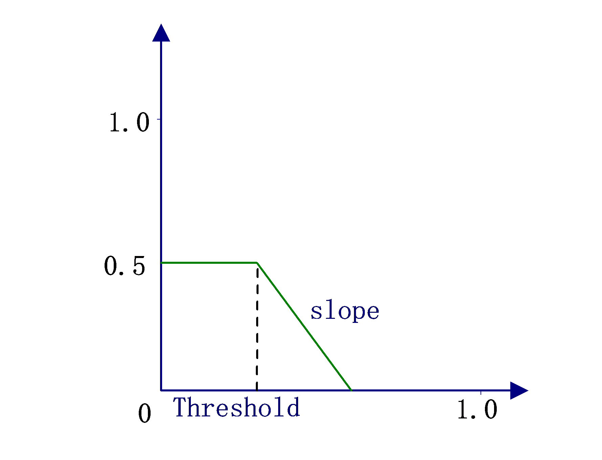

### API参考<a name="ZH-CN_TOPIC_0000002471084840"></a>

-   [ss\_mpi\_isp\_set\_crosstalk\_attr](#ZH-CN_TOPIC_0000002470925204)：设定Crosstalk 属性。
-   [ss\_mpi\_isp\_get\_crosstalk\_attr](#ZH-CN_TOPIC_0000002503965165)：获取Crosstalk 属性。


#### ss\_mpi\_isp\_set\_crosstalk\_attr<a name="ZH-CN_TOPIC_0000002470925204"></a>

【描述】

设定Crosstalk 属性。

【语法】

```
td_s32 ss_mpi_isp_set_crosstalk_attr(ot_vi_pipe vi_pipe, const ot_isp_cr_attr *cr_attr);
```

【参数】

<a name="table24360mcpsimp"></a>
<table><thead align="left"><tr id="row24366mcpsimp"><th class="cellrowborder" valign="top" width="23%" id="mcps1.1.4.1.1"><p id="p24368mcpsimp"><a name="p24368mcpsimp"></a><a name="p24368mcpsimp"></a>参数名称</p>
</th>
<th class="cellrowborder" valign="top" width="61%" id="mcps1.1.4.1.2"><p id="p24370mcpsimp"><a name="p24370mcpsimp"></a><a name="p24370mcpsimp"></a>描述</p>
</th>
<th class="cellrowborder" valign="top" width="16%" id="mcps1.1.4.1.3"><p id="p24372mcpsimp"><a name="p24372mcpsimp"></a><a name="p24372mcpsimp"></a>输入/输出</p>
</th>
</tr>
</thead>
<tbody><tr id="row24373mcpsimp"><td class="cellrowborder" valign="top" width="23%" headers="mcps1.1.4.1.1 "><p id="p24375mcpsimp"><a name="p24375mcpsimp"></a><a name="p24375mcpsimp"></a>vi_pipe</p>
</td>
<td class="cellrowborder" valign="top" width="61%" headers="mcps1.1.4.1.2 "><p id="p24377mcpsimp"><a name="p24377mcpsimp"></a><a name="p24377mcpsimp"></a>vi_pipe号。</p>
</td>
<td class="cellrowborder" valign="top" width="16%" headers="mcps1.1.4.1.3 "><p id="p24379mcpsimp"><a name="p24379mcpsimp"></a><a name="p24379mcpsimp"></a>输入</p>
</td>
</tr>
<tr id="row24380mcpsimp"><td class="cellrowborder" valign="top" width="23%" headers="mcps1.1.4.1.1 "><p id="p24382mcpsimp"><a name="p24382mcpsimp"></a><a name="p24382mcpsimp"></a>cr_attr</p>
</td>
<td class="cellrowborder" valign="top" width="61%" headers="mcps1.1.4.1.2 "><p id="p24384mcpsimp"><a name="p24384mcpsimp"></a><a name="p24384mcpsimp"></a>Crosstalk 属性。</p>
</td>
<td class="cellrowborder" valign="top" width="16%" headers="mcps1.1.4.1.3 "><p id="p24386mcpsimp"><a name="p24386mcpsimp"></a><a name="p24386mcpsimp"></a>输入</p>
</td>
</tr>
</tbody>
</table>

【返回值】

<a name="table24389mcpsimp"></a>
<table><thead align="left"><tr id="row24394mcpsimp"><th class="cellrowborder" valign="top" width="27%" id="mcps1.1.3.1.1"><p id="p24396mcpsimp"><a name="p24396mcpsimp"></a><a name="p24396mcpsimp"></a>返回值</p>
</th>
<th class="cellrowborder" valign="top" width="73%" id="mcps1.1.3.1.2"><p id="p24398mcpsimp"><a name="p24398mcpsimp"></a><a name="p24398mcpsimp"></a>描述</p>
</th>
</tr>
</thead>
<tbody><tr id="row24400mcpsimp"><td class="cellrowborder" valign="top" width="27%" headers="mcps1.1.3.1.1 "><p id="p24402mcpsimp"><a name="p24402mcpsimp"></a><a name="p24402mcpsimp"></a>0</p>
</td>
<td class="cellrowborder" valign="top" width="73%" headers="mcps1.1.3.1.2 "><p id="p24404mcpsimp"><a name="p24404mcpsimp"></a><a name="p24404mcpsimp"></a>成功。</p>
</td>
</tr>
<tr id="row24405mcpsimp"><td class="cellrowborder" valign="top" width="27%" headers="mcps1.1.3.1.1 "><p id="p24407mcpsimp"><a name="p24407mcpsimp"></a><a name="p24407mcpsimp"></a>非0</p>
</td>
<td class="cellrowborder" valign="top" width="73%" headers="mcps1.1.3.1.2 "><p id="p24409mcpsimp"><a name="p24409mcpsimp"></a><a name="p24409mcpsimp"></a>失败，其值为<span xml:lang="sv-SE" id="ph10195517299"><a name="ph10195517299"></a><a name="ph10195517299"></a>错误码</span>。</p>
</td>
</tr>
</tbody>
</table>

【需求】

-   头文件：ot\_common\_isp.h、ss\_mpi\_isp.h
-   库文件：libot\_isp.a, libss\_isp.a

【注意】

无。

【举例】

无。

【相关主题】

[ss\_mpi\_isp\_get\_crosstalk\_attr](#ss_mpi_isp_get_crosstalk_attr)

#### ss\_mpi\_isp\_get\_crosstalk\_attr<a name="ZH-CN_TOPIC_0000002503965165"></a>

【描述】

获取Crosstalk 属性。

【语法】

```
td_s32  ss_mpi_isp_get_crosstalk_attr (ot_vi_pipe vi_pipe, ot_isp_cr_attr *cr_attr);
```

【参数】

<a name="table24431mcpsimp"></a>
<table><thead align="left"><tr id="row24437mcpsimp"><th class="cellrowborder" valign="top" width="23%" id="mcps1.1.4.1.1"><p id="p24439mcpsimp"><a name="p24439mcpsimp"></a><a name="p24439mcpsimp"></a>参数名称</p>
</th>
<th class="cellrowborder" valign="top" width="61%" id="mcps1.1.4.1.2"><p id="p24441mcpsimp"><a name="p24441mcpsimp"></a><a name="p24441mcpsimp"></a>描述</p>
</th>
<th class="cellrowborder" valign="top" width="16%" id="mcps1.1.4.1.3"><p id="p24443mcpsimp"><a name="p24443mcpsimp"></a><a name="p24443mcpsimp"></a>输入/输出</p>
</th>
</tr>
</thead>
<tbody><tr id="row24444mcpsimp"><td class="cellrowborder" valign="top" width="23%" headers="mcps1.1.4.1.1 "><p id="p24446mcpsimp"><a name="p24446mcpsimp"></a><a name="p24446mcpsimp"></a>vi_pipe</p>
</td>
<td class="cellrowborder" valign="top" width="61%" headers="mcps1.1.4.1.2 "><p id="p24448mcpsimp"><a name="p24448mcpsimp"></a><a name="p24448mcpsimp"></a>vi_pipe号。</p>
</td>
<td class="cellrowborder" valign="top" width="16%" headers="mcps1.1.4.1.3 "><p id="p24450mcpsimp"><a name="p24450mcpsimp"></a><a name="p24450mcpsimp"></a>输入</p>
</td>
</tr>
<tr id="row24451mcpsimp"><td class="cellrowborder" valign="top" width="23%" headers="mcps1.1.4.1.1 "><p id="p24453mcpsimp"><a name="p24453mcpsimp"></a><a name="p24453mcpsimp"></a>cr_attr</p>
</td>
<td class="cellrowborder" valign="top" width="61%" headers="mcps1.1.4.1.2 "><p id="p24455mcpsimp"><a name="p24455mcpsimp"></a><a name="p24455mcpsimp"></a>Crosstalk 属性。</p>
</td>
<td class="cellrowborder" valign="top" width="16%" headers="mcps1.1.4.1.3 "><p id="p24457mcpsimp"><a name="p24457mcpsimp"></a><a name="p24457mcpsimp"></a>输出</p>
</td>
</tr>
</tbody>
</table>

【返回值】

<a name="table24460mcpsimp"></a>
<table><thead align="left"><tr id="row24465mcpsimp"><th class="cellrowborder" valign="top" width="27%" id="mcps1.1.3.1.1"><p id="p24467mcpsimp"><a name="p24467mcpsimp"></a><a name="p24467mcpsimp"></a>返回值</p>
</th>
<th class="cellrowborder" valign="top" width="73%" id="mcps1.1.3.1.2"><p id="p24469mcpsimp"><a name="p24469mcpsimp"></a><a name="p24469mcpsimp"></a>描述</p>
</th>
</tr>
</thead>
<tbody><tr id="row24471mcpsimp"><td class="cellrowborder" valign="top" width="27%" headers="mcps1.1.3.1.1 "><p id="p24473mcpsimp"><a name="p24473mcpsimp"></a><a name="p24473mcpsimp"></a>0</p>
</td>
<td class="cellrowborder" valign="top" width="73%" headers="mcps1.1.3.1.2 "><p id="p24475mcpsimp"><a name="p24475mcpsimp"></a><a name="p24475mcpsimp"></a>成功。</p>
</td>
</tr>
<tr id="row24476mcpsimp"><td class="cellrowborder" valign="top" width="27%" headers="mcps1.1.3.1.1 "><p id="p24478mcpsimp"><a name="p24478mcpsimp"></a><a name="p24478mcpsimp"></a>非0</p>
</td>
<td class="cellrowborder" valign="top" width="73%" headers="mcps1.1.3.1.2 "><p id="p24480mcpsimp"><a name="p24480mcpsimp"></a><a name="p24480mcpsimp"></a>失败，其值为<span xml:lang="sv-SE" id="ph10195517299"><a name="ph10195517299"></a><a name="ph10195517299"></a>错误码</span>。</p>
</td>
</tr>
</tbody>
</table>

【需求】

-   头文件：ot\_common\_isp.h、ss\_mpi\_isp.h
-   库文件：libot\_isp.a, libss\_isp.a

【注意】

无。

【举例】

无。

【相关主题】

[ss\_mpi\_isp\_set\_crosstalk\_attr](#ss_mpi_isp_set_crosstalk_attr)

### 数据类型<a name="ZH-CN_TOPIC_0000002470924986"></a>


#### ot\_isp\_cr\_attr<a name="ZH-CN_TOPIC_0000002471084916"></a>

【说明】

定义ISP Crosstalk 属性。

【定义】

```
typedef struct {
    td_bool  en;
    td_u8   slope;
    td_u8   sensi_slope;
    td_u16  sensi_threshold;
    td_u16  threshold[OT_ISP_AUTO_ISO_NUM]; 
    td_u16  strength[OT_ISP_AUTO_ISO_NUM];
    td_u16  np_offset[OT_ISP_AUTO_ISO_NUM];
} ot_isp_cr_attr;
```

【成员】

<a name="table24519mcpsimp"></a>
<table><thead align="left"><tr id="row24529mcpsimp"><th class="cellrowborder" valign="top" width="27%" id="mcps1.1.3.1.1"><p id="p24531mcpsimp"><a name="p24531mcpsimp"></a><a name="p24531mcpsimp"></a>成员名称</p>
</th>
<th class="cellrowborder" valign="top" width="73%" id="mcps1.1.3.1.2"><p id="p24533mcpsimp"><a name="p24533mcpsimp"></a><a name="p24533mcpsimp"></a>描述</p>
</th>
</tr>
</thead>
<tbody><tr id="row24535mcpsimp"><td class="cellrowborder" valign="top" width="27%" headers="mcps1.1.3.1.1 "><p id="p24537mcpsimp"><a name="p24537mcpsimp"></a><a name="p24537mcpsimp"></a>en</p>
</td>
<td class="cellrowborder" valign="top" width="73%" headers="mcps1.1.3.1.2 "><p id="p24539mcpsimp"><a name="p24539mcpsimp"></a><a name="p24539mcpsimp"></a>使能Crosstalk 功能。</p>
</td>
</tr>
<tr id="row24540mcpsimp"><td class="cellrowborder" valign="top" width="27%" headers="mcps1.1.3.1.1 "><p id="p24542mcpsimp"><a name="p24542mcpsimp"></a><a name="p24542mcpsimp"></a>slope</p>
</td>
<td class="cellrowborder" valign="top" width="73%" headers="mcps1.1.3.1.2 "><p id="p24544mcpsimp"><a name="p24544mcpsimp"></a><a name="p24544mcpsimp"></a>设置Crosstalk门限之上的处理强度。值越大，表示在门限值threshold之上整体处理强度衰减得越慢。默认值9。</p>
<p id="p24545mcpsimp"><a name="p24545mcpsimp"></a><a name="p24545mcpsimp"></a>取值范围：[0, 12]</p>
</td>
</tr>
<tr id="row24546mcpsimp"><td class="cellrowborder" valign="top" width="27%" headers="mcps1.1.3.1.1 "><p id="p24548mcpsimp"><a name="p24548mcpsimp"></a><a name="p24548mcpsimp"></a>sensi_slope</p>
</td>
<td class="cellrowborder" valign="top" width="73%" headers="mcps1.1.3.1.2 "><p id="p24550mcpsimp"><a name="p24550mcpsimp"></a><a name="p24550mcpsimp"></a>设置Crosstalk敏感度值。默认值9。值越大，表示在门限值sensi_threshold之上，边沿上的处理强度衰减得越慢。</p>
<p id="p24551mcpsimp"><a name="p24551mcpsimp"></a><a name="p24551mcpsimp"></a>取值范围：[0, 12]</p>
</td>
</tr>
<tr id="row24552mcpsimp"><td class="cellrowborder" valign="top" width="27%" headers="mcps1.1.3.1.1 "><p id="p24554mcpsimp"><a name="p24554mcpsimp"></a><a name="p24554mcpsimp"></a>sensi_threshold</p>
</td>
<td class="cellrowborder" valign="top" width="73%" headers="mcps1.1.3.1.2 "><p id="p24556mcpsimp"><a name="p24556mcpsimp"></a><a name="p24556mcpsimp"></a>设置Crosstalk敏感度门限值。值越大，表示在更强的边沿上也会有绿平衡处理。默认值300。</p>
<p id="p24557mcpsimp"><a name="p24557mcpsimp"></a><a name="p24557mcpsimp"></a>取值范围：[0, 4095]</p>
</td>
</tr>
<tr id="row24558mcpsimp"><td class="cellrowborder" valign="top" width="27%" headers="mcps1.1.3.1.1 "><p id="p24560mcpsimp"><a name="p24560mcpsimp"></a><a name="p24560mcpsimp"></a>threshold[OT_ISP_AUTO_ISO_NUM]</p>
</td>
<td class="cellrowborder" valign="top" width="73%" headers="mcps1.1.3.1.2 "><p id="p24563mcpsimp"><a name="p24563mcpsimp"></a><a name="p24563mcpsimp"></a>设置Crosstalk门限值。值越大，表示整体处理的强度越大。默认值300。该数组的16个值分别对应的sensor在不同增益情况下不同的设置值。</p>
<p id="p24564mcpsimp"><a name="p24564mcpsimp"></a><a name="p24564mcpsimp"></a>取值范围：[0, 4095]</p>
</td>
</tr>
<tr id="row24565mcpsimp"><td class="cellrowborder" valign="top" width="27%" headers="mcps1.1.3.1.1 "><p id="p24567mcpsimp"><a name="p24567mcpsimp"></a><a name="p24567mcpsimp"></a>strength[OT_ISP_AUTO_ISO_NUM]</p>
</td>
<td class="cellrowborder" valign="top" width="73%" headers="mcps1.1.3.1.2 "><p id="p24570mcpsimp"><a name="p24570mcpsimp"></a><a name="p24570mcpsimp"></a>设置Crosstalk强度值。值越大，处理强度越大。取值范围：[0, 256]，默认值128。该数组的16个值分别对应的sensor在不同增益情况下不同的设置值。</p>
</td>
</tr>
<tr id="row24571mcpsimp"><td class="cellrowborder" valign="top" width="27%" headers="mcps1.1.3.1.1 "><p id="p24573mcpsimp"><a name="p24573mcpsimp"></a><a name="p24573mcpsimp"></a>np_offset[OT_ISP_AUTO_ISO_NUM]</p>
</td>
<td class="cellrowborder" valign="top" width="73%" headers="mcps1.1.3.1.2 "><p id="p24576mcpsimp"><a name="p24576mcpsimp"></a><a name="p24576mcpsimp"></a>设置Noise Profile值。值越大，表示抗噪能力越大。默认值1024。该数组的16个值分别对应的sensor在不同增益情况下不同的设置值。</p>
<p id="p24577mcpsimp"><a name="p24577mcpsimp"></a><a name="p24577mcpsimp"></a>取值范围：[512, 4095]</p>
</td>
</tr>
</tbody>
</table>

**表 1** strength \[OT\_ISP\_AUTO\_ISO\_NUM\]在不同的增益情况下的设置值

<a name="table24578mcpsimp"></a>
<table><thead align="left"><tr id="row24583mcpsimp"><th class="cellrowborder" valign="top" width="31%" id="mcps1.2.3.1.1"><p xml:lang="sv-SE" id="p24585mcpsimp"><a name="p24585mcpsimp"></a><a name="p24585mcpsimp"></a>strength</p>
</th>
<th class="cellrowborder" valign="top" width="69%" id="mcps1.2.3.1.2"><p id="p24587mcpsimp"><a name="p24587mcpsimp"></a><a name="p24587mcpsimp"></a>Again*Dgain*ISPDgain (times)</p>
</th>
</tr>
</thead>
<tbody><tr id="row24589mcpsimp"><td class="cellrowborder" valign="top" width="31%" headers="mcps1.2.3.1.1 "><p id="p24591mcpsimp"><a name="p24591mcpsimp"></a><a name="p24591mcpsimp"></a>strength [0]</p>
</td>
<td class="cellrowborder" valign="top" width="69%" headers="mcps1.2.3.1.2 "><p id="p24593mcpsimp"><a name="p24593mcpsimp"></a><a name="p24593mcpsimp"></a>100</p>
</td>
</tr>
<tr id="row24594mcpsimp"><td class="cellrowborder" valign="top" width="31%" headers="mcps1.2.3.1.1 "><p id="p24596mcpsimp"><a name="p24596mcpsimp"></a><a name="p24596mcpsimp"></a>strength [1]</p>
</td>
<td class="cellrowborder" valign="top" width="69%" headers="mcps1.2.3.1.2 "><p id="p24598mcpsimp"><a name="p24598mcpsimp"></a><a name="p24598mcpsimp"></a>200</p>
</td>
</tr>
<tr id="row24599mcpsimp"><td class="cellrowborder" valign="top" width="31%" headers="mcps1.2.3.1.1 "><p id="p24601mcpsimp"><a name="p24601mcpsimp"></a><a name="p24601mcpsimp"></a>strength [2]</p>
</td>
<td class="cellrowborder" valign="top" width="69%" headers="mcps1.2.3.1.2 "><p id="p24603mcpsimp"><a name="p24603mcpsimp"></a><a name="p24603mcpsimp"></a>400</p>
</td>
</tr>
<tr id="row24604mcpsimp"><td class="cellrowborder" valign="top" width="31%" headers="mcps1.2.3.1.1 "><p id="p24606mcpsimp"><a name="p24606mcpsimp"></a><a name="p24606mcpsimp"></a>strength [3]</p>
</td>
<td class="cellrowborder" valign="top" width="69%" headers="mcps1.2.3.1.2 "><p id="p24608mcpsimp"><a name="p24608mcpsimp"></a><a name="p24608mcpsimp"></a>800</p>
</td>
</tr>
<tr id="row24609mcpsimp"><td class="cellrowborder" valign="top" width="31%" headers="mcps1.2.3.1.1 "><p id="p24611mcpsimp"><a name="p24611mcpsimp"></a><a name="p24611mcpsimp"></a>strength [4]</p>
</td>
<td class="cellrowborder" valign="top" width="69%" headers="mcps1.2.3.1.2 "><p id="p24613mcpsimp"><a name="p24613mcpsimp"></a><a name="p24613mcpsimp"></a>1600</p>
</td>
</tr>
<tr id="row24614mcpsimp"><td class="cellrowborder" valign="top" width="31%" headers="mcps1.2.3.1.1 "><p id="p24616mcpsimp"><a name="p24616mcpsimp"></a><a name="p24616mcpsimp"></a>strength [5]</p>
</td>
<td class="cellrowborder" valign="top" width="69%" headers="mcps1.2.3.1.2 "><p id="p24618mcpsimp"><a name="p24618mcpsimp"></a><a name="p24618mcpsimp"></a>3200</p>
</td>
</tr>
<tr id="row24619mcpsimp"><td class="cellrowborder" valign="top" width="31%" headers="mcps1.2.3.1.1 "><p id="p24621mcpsimp"><a name="p24621mcpsimp"></a><a name="p24621mcpsimp"></a>strength [6]</p>
</td>
<td class="cellrowborder" valign="top" width="69%" headers="mcps1.2.3.1.2 "><p id="p24623mcpsimp"><a name="p24623mcpsimp"></a><a name="p24623mcpsimp"></a>6400</p>
</td>
</tr>
<tr id="row24624mcpsimp"><td class="cellrowborder" valign="top" width="31%" headers="mcps1.2.3.1.1 "><p id="p24626mcpsimp"><a name="p24626mcpsimp"></a><a name="p24626mcpsimp"></a>strength [7]</p>
</td>
<td class="cellrowborder" valign="top" width="69%" headers="mcps1.2.3.1.2 "><p id="p24628mcpsimp"><a name="p24628mcpsimp"></a><a name="p24628mcpsimp"></a>12800</p>
</td>
</tr>
<tr id="row24629mcpsimp"><td class="cellrowborder" valign="top" width="31%" headers="mcps1.2.3.1.1 "><p id="p24631mcpsimp"><a name="p24631mcpsimp"></a><a name="p24631mcpsimp"></a>strength [8]</p>
</td>
<td class="cellrowborder" valign="top" width="69%" headers="mcps1.2.3.1.2 "><p id="p24633mcpsimp"><a name="p24633mcpsimp"></a><a name="p24633mcpsimp"></a>25600</p>
</td>
</tr>
<tr id="row24634mcpsimp"><td class="cellrowborder" valign="top" width="31%" headers="mcps1.2.3.1.1 "><p id="p24636mcpsimp"><a name="p24636mcpsimp"></a><a name="p24636mcpsimp"></a>strength [9]</p>
</td>
<td class="cellrowborder" valign="top" width="69%" headers="mcps1.2.3.1.2 "><p id="p24638mcpsimp"><a name="p24638mcpsimp"></a><a name="p24638mcpsimp"></a>51200</p>
</td>
</tr>
<tr id="row24639mcpsimp"><td class="cellrowborder" valign="top" width="31%" headers="mcps1.2.3.1.1 "><p id="p24641mcpsimp"><a name="p24641mcpsimp"></a><a name="p24641mcpsimp"></a>strength [10]</p>
</td>
<td class="cellrowborder" valign="top" width="69%" headers="mcps1.2.3.1.2 "><p id="p24643mcpsimp"><a name="p24643mcpsimp"></a><a name="p24643mcpsimp"></a>102400</p>
</td>
</tr>
<tr id="row24644mcpsimp"><td class="cellrowborder" valign="top" width="31%" headers="mcps1.2.3.1.1 "><p id="p24646mcpsimp"><a name="p24646mcpsimp"></a><a name="p24646mcpsimp"></a>strength [11]</p>
</td>
<td class="cellrowborder" valign="top" width="69%" headers="mcps1.2.3.1.2 "><p id="p24648mcpsimp"><a name="p24648mcpsimp"></a><a name="p24648mcpsimp"></a>204800</p>
</td>
</tr>
<tr id="row24649mcpsimp"><td class="cellrowborder" valign="top" width="31%" headers="mcps1.2.3.1.1 "><p id="p24651mcpsimp"><a name="p24651mcpsimp"></a><a name="p24651mcpsimp"></a>strength [12]</p>
</td>
<td class="cellrowborder" valign="top" width="69%" headers="mcps1.2.3.1.2 "><p id="p24653mcpsimp"><a name="p24653mcpsimp"></a><a name="p24653mcpsimp"></a>409600</p>
</td>
</tr>
<tr id="row24654mcpsimp"><td class="cellrowborder" valign="top" width="31%" headers="mcps1.2.3.1.1 "><p id="p24656mcpsimp"><a name="p24656mcpsimp"></a><a name="p24656mcpsimp"></a>strength [13]</p>
</td>
<td class="cellrowborder" valign="top" width="69%" headers="mcps1.2.3.1.2 "><p id="p24658mcpsimp"><a name="p24658mcpsimp"></a><a name="p24658mcpsimp"></a>819200</p>
</td>
</tr>
<tr id="row24659mcpsimp"><td class="cellrowborder" valign="top" width="31%" headers="mcps1.2.3.1.1 "><p id="p24661mcpsimp"><a name="p24661mcpsimp"></a><a name="p24661mcpsimp"></a>strength [14]</p>
</td>
<td class="cellrowborder" valign="top" width="69%" headers="mcps1.2.3.1.2 "><p id="p24663mcpsimp"><a name="p24663mcpsimp"></a><a name="p24663mcpsimp"></a>1638400</p>
</td>
</tr>
<tr id="row24664mcpsimp"><td class="cellrowborder" valign="top" width="31%" headers="mcps1.2.3.1.1 "><p id="p24666mcpsimp"><a name="p24666mcpsimp"></a><a name="p24666mcpsimp"></a>strength [15]</p>
</td>
<td class="cellrowborder" valign="top" width="69%" headers="mcps1.2.3.1.2 "><p id="p24668mcpsimp"><a name="p24668mcpsimp"></a><a name="p24668mcpsimp"></a>3276800</p>
</td>
</tr>
</tbody>
</table>

【注意事项】

-   sensi\_threshold参数变化会影响threshold参数的表现，建议先调节sensi\_threshold使之固定，再调节threshold。
-   各参数请在默认值附近微调，调试不当可能会在边缘或细节处出现伪彩，或使其变模糊。
-   不支持RGBIR Pattern的Crosstalk功能。使能RGBIR，Crosstalk功能会自动关闭，相关参数调节无效。

【相关数据类型及接口】

无。

## 去噪算法<a name="ZH-CN_TOPIC_0000002504084747"></a>


### 功能描述<a name="ZH-CN_TOPIC_0000002470924956"></a>

图像去噪是数字图像处理中的重要环节和步骤，去噪效果将对后续图像处理产生影响。该去噪模块基于噪声标定结果，建立更符合噪声特性的去噪模型，且可根据不同sensor做标定模型定制化。NR在Bayer域进行空域去噪处理和时域去噪处理。利用动静检测机制，对图像分前景和背景分别处理，来抑制噪声，提高整体图像信噪比。

### API参考<a name="ZH-CN_TOPIC_0000002471084896"></a>

-   [ss\_mpi\_isp\_set\_nr\_attr](#ZH-CN_TOPIC_0000002504084729)：设置NR参数。
-   [ss\_mpi\_isp\_get\_nr\_attr](#ZH-CN_TOPIC_0000002470924978)：获取NR参数。


#### ss\_mpi\_isp\_set\_nr\_attr<a name="ZH-CN_TOPIC_0000002504084729"></a>

【描述】

设置NR参数。

【语法】

```
td_s32 ss_mpi_isp_set_nr_attr(ot_vi_pipe vi_pipe, const ot_isp_nr_attr *nr_attr)
```

【参数】

<a name="table24693mcpsimp"></a>
<table><thead align="left"><tr id="row24699mcpsimp"><th class="cellrowborder" valign="top" width="32%" id="mcps1.1.4.1.1"><p id="p24701mcpsimp"><a name="p24701mcpsimp"></a><a name="p24701mcpsimp"></a>参数名称</p>
</th>
<th class="cellrowborder" valign="top" width="52%" id="mcps1.1.4.1.2"><p id="p24703mcpsimp"><a name="p24703mcpsimp"></a><a name="p24703mcpsimp"></a>描述</p>
</th>
<th class="cellrowborder" valign="top" width="16%" id="mcps1.1.4.1.3"><p id="p24705mcpsimp"><a name="p24705mcpsimp"></a><a name="p24705mcpsimp"></a>输入/输出</p>
</th>
</tr>
</thead>
<tbody><tr id="row24707mcpsimp"><td class="cellrowborder" valign="top" width="32%" headers="mcps1.1.4.1.1 "><p id="p24709mcpsimp"><a name="p24709mcpsimp"></a><a name="p24709mcpsimp"></a>vi_pipe</p>
</td>
<td class="cellrowborder" valign="top" width="52%" headers="mcps1.1.4.1.2 "><p id="p24711mcpsimp"><a name="p24711mcpsimp"></a><a name="p24711mcpsimp"></a>vi_pipe号。</p>
</td>
<td class="cellrowborder" valign="top" width="16%" headers="mcps1.1.4.1.3 "><p id="p24713mcpsimp"><a name="p24713mcpsimp"></a><a name="p24713mcpsimp"></a>输入</p>
</td>
</tr>
<tr id="row24714mcpsimp"><td class="cellrowborder" valign="top" width="32%" headers="mcps1.1.4.1.1 "><p id="p24716mcpsimp"><a name="p24716mcpsimp"></a><a name="p24716mcpsimp"></a>nr_attr</p>
</td>
<td class="cellrowborder" valign="top" width="52%" headers="mcps1.1.4.1.2 "><p id="p24718mcpsimp"><a name="p24718mcpsimp"></a><a name="p24718mcpsimp"></a>噪声抑制参数。</p>
</td>
<td class="cellrowborder" valign="top" width="16%" headers="mcps1.1.4.1.3 "><p id="p24720mcpsimp"><a name="p24720mcpsimp"></a><a name="p24720mcpsimp"></a>输入</p>
</td>
</tr>
</tbody>
</table>

【返回值】

<a name="table24722mcpsimp"></a>
<table><thead align="left"><tr id="row24727mcpsimp"><th class="cellrowborder" valign="top" width="32%" id="mcps1.1.3.1.1"><p id="p24729mcpsimp"><a name="p24729mcpsimp"></a><a name="p24729mcpsimp"></a>返回值</p>
</th>
<th class="cellrowborder" valign="top" width="68%" id="mcps1.1.3.1.2"><p id="p24731mcpsimp"><a name="p24731mcpsimp"></a><a name="p24731mcpsimp"></a>描述</p>
</th>
</tr>
</thead>
<tbody><tr id="row24732mcpsimp"><td class="cellrowborder" valign="top" width="32%" headers="mcps1.1.3.1.1 "><p id="p24734mcpsimp"><a name="p24734mcpsimp"></a><a name="p24734mcpsimp"></a>0</p>
</td>
<td class="cellrowborder" valign="top" width="68%" headers="mcps1.1.3.1.2 "><p id="p24736mcpsimp"><a name="p24736mcpsimp"></a><a name="p24736mcpsimp"></a>成功。</p>
</td>
</tr>
<tr id="row24737mcpsimp"><td class="cellrowborder" valign="top" width="32%" headers="mcps1.1.3.1.1 "><p id="p24739mcpsimp"><a name="p24739mcpsimp"></a><a name="p24739mcpsimp"></a>非0</p>
</td>
<td class="cellrowborder" valign="top" width="68%" headers="mcps1.1.3.1.2 "><p id="p24741mcpsimp"><a name="p24741mcpsimp"></a><a name="p24741mcpsimp"></a>失败，其值为<span xml:lang="sv-SE" id="ph10195517299"><a name="ph10195517299"></a><a name="ph10195517299"></a>错误码</span>。</p>
</td>
</tr>
</tbody>
</table>

【需求】

-   头文件：ot\_common\_isp.h、ss\_mpi\_isp.h
-   库文件：libot\_isp.a、libss\_isp.a

【注意】

无

【举例】

无

【相关主题】

[ss\_mpi\_isp\_get\_nr\_attr](#ss_mpi_isp_get_nr_attr)

#### ss\_mpi\_isp\_get\_nr\_attr<a name="ZH-CN_TOPIC_0000002470924978"></a>

【描述】

获取噪声抑制参数。

【语法】

```
td_s32 ss_mpi_isp_get_nr_attr(ot_vi_pipe vi_pipe, ot_isp_nr_attr *nr_attr)
```

【参数】

<a name="table24764mcpsimp"></a>
<table><thead align="left"><tr id="row24770mcpsimp"><th class="cellrowborder" valign="top" width="32%" id="mcps1.1.4.1.1"><p id="p24772mcpsimp"><a name="p24772mcpsimp"></a><a name="p24772mcpsimp"></a>参数名称</p>
</th>
<th class="cellrowborder" valign="top" width="48%" id="mcps1.1.4.1.2"><p id="p24774mcpsimp"><a name="p24774mcpsimp"></a><a name="p24774mcpsimp"></a>描述</p>
</th>
<th class="cellrowborder" valign="top" width="20%" id="mcps1.1.4.1.3"><p id="p24776mcpsimp"><a name="p24776mcpsimp"></a><a name="p24776mcpsimp"></a>输入/输出</p>
</th>
</tr>
</thead>
<tbody><tr id="row24778mcpsimp"><td class="cellrowborder" valign="top" width="32%" headers="mcps1.1.4.1.1 "><p id="p24780mcpsimp"><a name="p24780mcpsimp"></a><a name="p24780mcpsimp"></a>vi_pipe</p>
</td>
<td class="cellrowborder" valign="top" width="48%" headers="mcps1.1.4.1.2 "><p id="p24782mcpsimp"><a name="p24782mcpsimp"></a><a name="p24782mcpsimp"></a>vi_pipe号。</p>
</td>
<td class="cellrowborder" valign="top" width="20%" headers="mcps1.1.4.1.3 "><p id="p24784mcpsimp"><a name="p24784mcpsimp"></a><a name="p24784mcpsimp"></a>输入</p>
</td>
</tr>
<tr id="row24785mcpsimp"><td class="cellrowborder" valign="top" width="32%" headers="mcps1.1.4.1.1 "><p id="p24787mcpsimp"><a name="p24787mcpsimp"></a><a name="p24787mcpsimp"></a>nr_attr</p>
</td>
<td class="cellrowborder" valign="top" width="48%" headers="mcps1.1.4.1.2 "><p id="p24789mcpsimp"><a name="p24789mcpsimp"></a><a name="p24789mcpsimp"></a>噪声抑制参数。</p>
</td>
<td class="cellrowborder" valign="top" width="20%" headers="mcps1.1.4.1.3 "><p id="p24791mcpsimp"><a name="p24791mcpsimp"></a><a name="p24791mcpsimp"></a>输出</p>
</td>
</tr>
</tbody>
</table>

【返回值】

<a name="table24793mcpsimp"></a>
<table><thead align="left"><tr id="row24798mcpsimp"><th class="cellrowborder" valign="top" width="32%" id="mcps1.1.3.1.1"><p id="p24800mcpsimp"><a name="p24800mcpsimp"></a><a name="p24800mcpsimp"></a>返回值</p>
</th>
<th class="cellrowborder" valign="top" width="68%" id="mcps1.1.3.1.2"><p id="p24802mcpsimp"><a name="p24802mcpsimp"></a><a name="p24802mcpsimp"></a>描述</p>
</th>
</tr>
</thead>
<tbody><tr id="row24803mcpsimp"><td class="cellrowborder" valign="top" width="32%" headers="mcps1.1.3.1.1 "><p id="p24805mcpsimp"><a name="p24805mcpsimp"></a><a name="p24805mcpsimp"></a>0</p>
</td>
<td class="cellrowborder" valign="top" width="68%" headers="mcps1.1.3.1.2 "><p id="p24807mcpsimp"><a name="p24807mcpsimp"></a><a name="p24807mcpsimp"></a>成功。</p>
</td>
</tr>
<tr id="row24808mcpsimp"><td class="cellrowborder" valign="top" width="32%" headers="mcps1.1.3.1.1 "><p id="p24810mcpsimp"><a name="p24810mcpsimp"></a><a name="p24810mcpsimp"></a>非0</p>
</td>
<td class="cellrowborder" valign="top" width="68%" headers="mcps1.1.3.1.2 "><p id="p24812mcpsimp"><a name="p24812mcpsimp"></a><a name="p24812mcpsimp"></a>失败，其值为<span xml:lang="sv-SE" id="ph10195517299"><a name="ph10195517299"></a><a name="ph10195517299"></a>错误码</span>。</p>
</td>
</tr>
</tbody>
</table>

【需求】

-   头文件：ot\_common\_isp.h、ss\_mpi\_isp.h
-   库文件：libot\_isp.a、libss\_isp.a

【注意】

无

【举例】

无

【相关主题】

[ss\_mpi\_isp\_get\_nr\_attr](#ZH-CN_TOPIC_0000001220137539)

### 数据类型<a name="ZH-CN_TOPIC_0000002503964813"></a>

-   [OT\_ISP\_BAYERNR\_LUT\_LENGTH](#ZH-CN_TOPIC_0000002503964855)：定义nr亮度回叠表长度。
-   [ot\_isp\_bnr\_sfm0\_mode](#ZH-CN_TOPIC_0000002503965173)：定义nr sfm0滤波器的两种滤波模式。
-   [ot\_isp\_nr\_snr\_attr](#ZH-CN_TOPIC_0000002504084973)：定义ISP NR空域属性。
-   [ot\_isp\_nr\_tnr\_attr](#ZH-CN_TOPIC_0000002503965179)：定义ISP NR时域属性。
-   [ot\_isp\_nr\_snr\_manual\_attr](#ZH-CN_TOPIC_0000002471085066)：定义ISP NR空域手动属性。
-   [ot\_isp\_nr\_snr\_auto\_attr](#ZH-CN_TOPIC_0000002504084789)：定义ISP NR空域自动属性。
-   [ot\_isp\_nr\_tnr\_manual\_attr](#ZH-CN_TOPIC_0000002470925174)：定义ISP NR时域手动属性。
-   [ot\_isp\_nr\_tnr\_auto\_attr](#ZH-CN_TOPIC_0000002504084711)：定义ISP NR时域自动属性。
-   [ot\_isp\_nr\_wdr\_attr](#ZH-CN_TOPIC_0000002503964857)：定义ISP NR在WDR模式下属性。
-   [ot\_isp\_nr\_attr](#ZH-CN_TOPIC_0000002503965101)：定义ISP NR属性。


#### OT\_ISP\_BAYERNR\_LUT\_LENGTH<a name="ZH-CN_TOPIC_0000002503964855"></a>

【说明】

定义nr亮度回叠表长度。

【定义】

```
#define OT_ISP_BAYERNR_LUT_LENGTH       33
```

【注意事项】

无。

【相关数据类型及接口】

[ot\_isp\_nr\_attr](#ot_isp_nr_attr)

#### ot\_isp\_bnr\_sfm0\_mode<a name="ZH-CN_TOPIC_0000002503965173"></a>

【说明】

定义nr sfm0滤波器的两种滤波模式。

【定义】

```
typedef enum {
    OT_ISP_BNR_EX = 0,
    OT_ISP_BNR_NORM = 1,
} ot_isp_bnr_sfm0_mode;
```

【注意事项】

无。

【相关数据类型及接口】

[ot\_isp\_nr\_attr](#ot_isp_nr_attr)

#### ot\_isp\_nr\_snr\_attr<a name="ZH-CN_TOPIC_0000002504084973"></a>

【说明】

定义ISP NR空域属性。

【定义】

```
typedef struct {
    ot_isp_nr_snr_auto_attr   snr_auto;
    ot_isp_nr_snr_manual_attr snr_manual;
} ot_isp_nr_snr_attr;
```

【成员】

<a name="table24888mcpsimp"></a>
<table><thead align="left"><tr id="row24893mcpsimp"><th class="cellrowborder" valign="top" width="19%" id="mcps1.1.3.1.1"><p id="p24895mcpsimp"><a name="p24895mcpsimp"></a><a name="p24895mcpsimp"></a>成员名称</p>
</th>
<th class="cellrowborder" valign="top" width="81%" id="mcps1.1.3.1.2"><p id="p24897mcpsimp"><a name="p24897mcpsimp"></a><a name="p24897mcpsimp"></a>描述</p>
</th>
</tr>
</thead>
<tbody><tr id="row24898mcpsimp"><td class="cellrowborder" valign="top" width="19%" headers="mcps1.1.3.1.1 "><p id="p24900mcpsimp"><a name="p24900mcpsimp"></a><a name="p24900mcpsimp"></a>snr_auto</p>
</td>
<td class="cellrowborder" valign="top" width="81%" headers="mcps1.1.3.1.2 "><p id="p24902mcpsimp"><a name="p24902mcpsimp"></a><a name="p24902mcpsimp"></a>定义nr空域自动模式属性。</p>
</td>
</tr>
<tr id="row24903mcpsimp"><td class="cellrowborder" valign="top" width="19%" headers="mcps1.1.3.1.1 "><p id="p24905mcpsimp"><a name="p24905mcpsimp"></a><a name="p24905mcpsimp"></a>snr_manual</p>
</td>
<td class="cellrowborder" valign="top" width="81%" headers="mcps1.1.3.1.2 "><p id="p24907mcpsimp"><a name="p24907mcpsimp"></a><a name="p24907mcpsimp"></a>定义nr空域手动模式属性。</p>
</td>
</tr>
</tbody>
</table>

【注意事项】

无

【相关数据类型及接口】

[ot\_isp\_nr\_attr](#ot_isp_nr_attr)

#### ot\_isp\_nr\_tnr\_attr<a name="ZH-CN_TOPIC_0000002503965179"></a>

【说明】

定义ISP NR时域属性。

【定义】

```
typedef struct {
    ot_isp_nr_tnr_auto_attr   tnr_auto;
    ot_isp_nr_tnr_manual_attr tnr_manual;
} ot_isp_nr_tnr_attr;
```

【成员】

<a name="table24925mcpsimp"></a>
<table><thead align="left"><tr id="row24930mcpsimp"><th class="cellrowborder" valign="top" width="19%" id="mcps1.1.3.1.1"><p id="p24932mcpsimp"><a name="p24932mcpsimp"></a><a name="p24932mcpsimp"></a>成员名称</p>
</th>
<th class="cellrowborder" valign="top" width="81%" id="mcps1.1.3.1.2"><p id="p24934mcpsimp"><a name="p24934mcpsimp"></a><a name="p24934mcpsimp"></a>描述</p>
</th>
</tr>
</thead>
<tbody><tr id="row24935mcpsimp"><td class="cellrowborder" valign="top" width="19%" headers="mcps1.1.3.1.1 "><p id="p24937mcpsimp"><a name="p24937mcpsimp"></a><a name="p24937mcpsimp"></a>tnr_auto</p>
</td>
<td class="cellrowborder" valign="top" width="81%" headers="mcps1.1.3.1.2 "><p id="p24939mcpsimp"><a name="p24939mcpsimp"></a><a name="p24939mcpsimp"></a>定义nr时域自动模式属性。</p>
</td>
</tr>
<tr id="row24940mcpsimp"><td class="cellrowborder" valign="top" width="19%" headers="mcps1.1.3.1.1 "><p id="p24942mcpsimp"><a name="p24942mcpsimp"></a><a name="p24942mcpsimp"></a>tnr_manual</p>
</td>
<td class="cellrowborder" valign="top" width="81%" headers="mcps1.1.3.1.2 "><p id="p24944mcpsimp"><a name="p24944mcpsimp"></a><a name="p24944mcpsimp"></a>定义nr时域手动模式属性。</p>
</td>
</tr>
</tbody>
</table>

【注意事项】

无

【相关数据类型及接口】

[ot\_isp\_nr\_attr](#ot_isp_nr_attr)

#### ot\_isp\_nr\_snr\_manual\_attr<a name="ZH-CN_TOPIC_0000002471085066"></a>

【说明】

定义ISP NR空域手动属性。

【定义】

```
typedef struct {
    td_u8                 sfm_threshold;
    ot_isp_bnr_sfm0_mode  sfm0_mode;    
    td_u16    sfm0_coarse_strength[OT_ISP_BAYER_CHN_NUM];
    td_u8     sfm0_ex_strength;
    td_u8     sfm0_ex_detail_prot;
    td_u8     sfm0_norm_edge_strength;
    td_u8     sfm1_detail_prot;
    td_u8     sfm1_coarse_strength;
    td_u8     fine_strength;
    td_u16    coring_wgt;
    td_u8     coring_mot_thresh;
} ot_isp_nr_snr_manual_attr;
```

【成员】

<a name="table24972mcpsimp"></a>
<table><thead align="left"><tr id="row24977mcpsimp"><th class="cellrowborder" valign="top" width="28.999999999999996%" id="mcps1.1.3.1.1"><p id="p24979mcpsimp"><a name="p24979mcpsimp"></a><a name="p24979mcpsimp"></a>成员名称</p>
</th>
<th class="cellrowborder" valign="top" width="71%" id="mcps1.1.3.1.2"><p id="p24981mcpsimp"><a name="p24981mcpsimp"></a><a name="p24981mcpsimp"></a>描述</p>
</th>
</tr>
</thead>
<tbody><tr id="row24983mcpsimp"><td class="cellrowborder" valign="top" width="28.999999999999996%" headers="mcps1.1.3.1.1 "><p id="p24985mcpsimp"><a name="p24985mcpsimp"></a><a name="p24985mcpsimp"></a>sfm_threshold</p>
</td>
<td class="cellrowborder" valign="top" width="71%" headers="mcps1.1.3.1.2 "><p id="p24987mcpsimp"><a name="p24987mcpsimp"></a><a name="p24987mcpsimp"></a>空域滤波模式：</p>
<p id="p24988mcpsimp"><a name="p24988mcpsimp"></a><a name="p24988mcpsimp"></a>255：选择sfm0滤波器。</p>
<p id="p24989mcpsimp"><a name="p24989mcpsimp"></a><a name="p24989mcpsimp"></a>0：选择sfm1滤波器。</p>
<p id="p24990mcpsimp"><a name="p24990mcpsimp"></a><a name="p24990mcpsimp"></a>0~255: sfm0滤波器和sfm1滤波器融合，值越大，sfm0的比例越高。</p>
<p id="p24991mcpsimp"><a name="p24991mcpsimp"></a><a name="p24991mcpsimp"></a>取值范围：[0, 255]</p>
</td>
</tr>
<tr id="row24992mcpsimp"><td class="cellrowborder" valign="top" width="28.999999999999996%" headers="mcps1.1.3.1.1 "><p id="p24994mcpsimp"><a name="p24994mcpsimp"></a><a name="p24994mcpsimp"></a>sfm0_mode</p>
</td>
<td class="cellrowborder" valign="top" width="71%" headers="mcps1.1.3.1.2 "><p id="p24996mcpsimp"><a name="p24996mcpsimp"></a><a name="p24996mcpsimp"></a>sfm0滤波模式：</p>
<p id="p24997mcpsimp"><a name="p24997mcpsimp"></a><a name="p24997mcpsimp"></a>EXT：扩展模式适用于噪声水平较大的场景，去噪强度较大，减轻pattern问题。</p>
<p id="p24998mcpsimp"><a name="p24998mcpsimp"></a><a name="p24998mcpsimp"></a>NORMAL：normal模式适用于噪声水平一般的场景，这个时候滤波器去噪更倾向于保边，保护细节。</p>
<p id="p24999mcpsimp"><a name="p24999mcpsimp"></a><a name="p24999mcpsimp"></a>取值范围：[0,1]</p>
</td>
</tr>
<tr id="row25000mcpsimp"><td class="cellrowborder" valign="top" width="28.999999999999996%" headers="mcps1.1.3.1.1 "><p id="p25002mcpsimp"><a name="p25002mcpsimp"></a><a name="p25002mcpsimp"></a>sfm0_coarse_strength[OT_ISP_BAYER_CHN_NUM]</p>
</td>
<td class="cellrowborder" valign="top" width="71%" headers="mcps1.1.3.1.2 "><p id="p25005mcpsimp"><a name="p25005mcpsimp"></a><a name="p25005mcpsimp"></a>sfm0滤波器的整体强度控制，分成RGGB四个通道分开独立控制，值越大，滤波强度越大。</p>
<p id="p25006mcpsimp"><a name="p25006mcpsimp"></a><a name="p25006mcpsimp"></a>取值范围：[0, 864]</p>
</td>
</tr>
<tr id="row25007mcpsimp"><td class="cellrowborder" valign="top" width="28.999999999999996%" headers="mcps1.1.3.1.1 "><p id="p25009mcpsimp"><a name="p25009mcpsimp"></a><a name="p25009mcpsimp"></a>sfm0_ex_strength</p>
</td>
<td class="cellrowborder" valign="top" width="71%" headers="mcps1.1.3.1.2 "><p id="p25011mcpsimp"><a name="p25011mcpsimp"></a><a name="p25011mcpsimp"></a>sfm0滤波器在ext模式下的精细强度控制，值越大，滤波强度越大。</p>
<p id="p25012mcpsimp"><a name="p25012mcpsimp"></a><a name="p25012mcpsimp"></a>取值范围：[0, 16]</p>
</td>
</tr>
<tr id="row25013mcpsimp"><td class="cellrowborder" valign="top" width="28.999999999999996%" headers="mcps1.1.3.1.1 "><p id="p25015mcpsimp"><a name="p25015mcpsimp"></a><a name="p25015mcpsimp"></a>sfm0_ex_detail_prot</p>
</td>
<td class="cellrowborder" valign="top" width="71%" headers="mcps1.1.3.1.2 "><p id="p25017mcpsimp"><a name="p25017mcpsimp"></a><a name="p25017mcpsimp"></a>sfm0在ext模式下，细节保留的比例，值越大，细节保留越多。</p>
<p id="p25018mcpsimp"><a name="p25018mcpsimp"></a><a name="p25018mcpsimp"></a>取值范围：[0, 31]</p>
</td>
</tr>
<tr id="row25019mcpsimp"><td class="cellrowborder" valign="top" width="28.999999999999996%" headers="mcps1.1.3.1.1 "><p id="p25021mcpsimp"><a name="p25021mcpsimp"></a><a name="p25021mcpsimp"></a>sfm0_norm_edge_strength</p>
</td>
<td class="cellrowborder" valign="top" width="71%" headers="mcps1.1.3.1.2 "><p id="p25023mcpsimp"><a name="p25023mcpsimp"></a><a name="p25023mcpsimp"></a>sfm0在normal模式下，边缘滤波的强度，值越大，边缘滤波越强。</p>
<p id="p25024mcpsimp"><a name="p25024mcpsimp"></a><a name="p25024mcpsimp"></a>取值范围：[0, 31]</p>
</td>
</tr>
<tr id="row25025mcpsimp"><td class="cellrowborder" valign="top" width="28.999999999999996%" headers="mcps1.1.3.1.1 "><p id="p25027mcpsimp"><a name="p25027mcpsimp"></a><a name="p25027mcpsimp"></a>sfm1_detail_prot</p>
</td>
<td class="cellrowborder" valign="top" width="71%" headers="mcps1.1.3.1.2 "><p id="p25029mcpsimp"><a name="p25029mcpsimp"></a><a name="p25029mcpsimp"></a>sfm1边缘纹理保留的比例，值越大，边缘纹理越清晰。</p>
<p id="p25030mcpsimp"><a name="p25030mcpsimp"></a><a name="p25030mcpsimp"></a>取值范围：[0, 31]</p>
</td>
</tr>
<tr id="row25031mcpsimp"><td class="cellrowborder" valign="top" width="28.999999999999996%" headers="mcps1.1.3.1.1 "><p id="p25033mcpsimp"><a name="p25033mcpsimp"></a><a name="p25033mcpsimp"></a>sfm1_coarse_strength</p>
</td>
<td class="cellrowborder" valign="top" width="71%" headers="mcps1.1.3.1.2 "><p id="p25035mcpsimp"><a name="p25035mcpsimp"></a><a name="p25035mcpsimp"></a>sfm1滤波器整体强度控制，值越大，滤波强度越大。</p>
<p id="p25036mcpsimp"><a name="p25036mcpsimp"></a><a name="p25036mcpsimp"></a>取值范围：[0, 63]</p>
</td>
</tr>
<tr id="row25037mcpsimp"><td class="cellrowborder" valign="top" width="28.999999999999996%" headers="mcps1.1.3.1.1 "><p id="p25039mcpsimp"><a name="p25039mcpsimp"></a><a name="p25039mcpsimp"></a>fine_strength</p>
</td>
<td class="cellrowborder" valign="top" width="71%" headers="mcps1.1.3.1.2 "><p id="p25041mcpsimp"><a name="p25041mcpsimp"></a><a name="p25041mcpsimp"></a>原始像素和去噪结果加权，值越大，去噪效果越强。</p>
<p id="p25042mcpsimp"><a name="p25042mcpsimp"></a><a name="p25042mcpsimp"></a>取值范围：[0,128]</p>
</td>
</tr>
<tr id="row25043mcpsimp"><td class="cellrowborder" valign="top" width="28.999999999999996%" headers="mcps1.1.3.1.1 "><p id="p25045mcpsimp"><a name="p25045mcpsimp"></a><a name="p25045mcpsimp"></a>coring_wgt</p>
</td>
<td class="cellrowborder" valign="top" width="71%" headers="mcps1.1.3.1.2 "><p id="p25047mcpsimp"><a name="p25047mcpsimp"></a><a name="p25047mcpsimp"></a>原始像素回叠，值越大，回叠噪声越大，去噪效果越弱。</p>
<p id="p25048mcpsimp"><a name="p25048mcpsimp"></a><a name="p25048mcpsimp"></a>取值范围：[0, 3200]</p>
</td>
</tr>
<tr id="row25049mcpsimp"><td class="cellrowborder" valign="top" width="28.999999999999996%" headers="mcps1.1.3.1.1 "><p id="p25051mcpsimp"><a name="p25051mcpsimp"></a><a name="p25051mcpsimp"></a>coring_mot_thresh</p>
</td>
<td class="cellrowborder" valign="top" width="71%" headers="mcps1.1.3.1.2 "><p id="p25053mcpsimp"><a name="p25053mcpsimp"></a><a name="p25053mcpsimp"></a>运动区域回叠阈值，值越大，运动回叠区域越少。</p>
<p id="p25054mcpsimp"><a name="p25054mcpsimp"></a><a name="p25054mcpsimp"></a>取值范围：[0, 255]</p>
</td>
</tr>
</tbody>
</table>

【注意事项】

-   注意各参数的取值范围。
-   低照度下，参数sfm0\_coarse\_strength  与  fine\_strength  同时调到最大值时，容易出现由于去噪强度过大导致的边缘虚化，建议根据效果调到合适取值。

【相关数据类型及接口】

[ot\_isp\_nr\_attr](#ot_isp_nr_attr)

#### ot\_isp\_nr\_snr\_auto\_attr<a name="ZH-CN_TOPIC_0000002504084789"></a>

【说明】

定义ISP NR空域自动属性。

【定义】

```
typedef struct {
    td_u8  sfm_threshold[OT_ISP_AUTO_ISO_NUM];
    ot_isp_bnr_sfm0_mode  sfm0_mode[OT_ISP_AUTO_ISO_NUM];
    td_u16  sfm0_coarse_strength[OT_ISP_BAYER_CHN_NUM][OT_ISP_AUTO_ISO_NUM];
    td_u8  sfm0_ex_strength[OT_ISP_AUTO_ISO_NUM];
    td_u8  sfm0_ex_detail_prot[OT_ISP_AUTO_ISO_NUM];
    td_u8  sfm0_norm_edge_strength[OT_ISP_AUTO_ISO_NUM];
    td_u8  sfm1_detail_prot[OT_ISP_AUTO_ISO_NUM];
    td_u8  sfm1_coarse_strength[OT_ISP_AUTO_ISO_NUM];
    td_u8  fine_strength[OT_ISP_AUTO_ISO_NUM];
    td_u16 coring_wgt[OT_ISP_AUTO_ISO_NUM];
    td_u8  coring_mot_thresh[OT_ISP_AUTO_ISO_NUM];
} ot_isp_nr_snr_auto_attr;
```

【成员】

<a name="table25096mcpsimp"></a>
<table><thead align="left"><tr id="row25101mcpsimp"><th class="cellrowborder" valign="top" width="28.999999999999996%" id="mcps1.1.3.1.1"><p id="p25103mcpsimp"><a name="p25103mcpsimp"></a><a name="p25103mcpsimp"></a>成员名称</p>
</th>
<th class="cellrowborder" valign="top" width="71%" id="mcps1.1.3.1.2"><p id="p25105mcpsimp"><a name="p25105mcpsimp"></a><a name="p25105mcpsimp"></a>描述</p>
</th>
</tr>
</thead>
<tbody><tr id="row25107mcpsimp"><td class="cellrowborder" valign="top" width="28.999999999999996%" headers="mcps1.1.3.1.1 "><p id="p25109mcpsimp"><a name="p25109mcpsimp"></a><a name="p25109mcpsimp"></a>sfm_threshold</p>
</td>
<td class="cellrowborder" valign="top" width="71%" headers="mcps1.1.3.1.2 "><p id="p25111mcpsimp"><a name="p25111mcpsimp"></a><a name="p25111mcpsimp"></a>空域滤波模式：</p>
<p id="p25112mcpsimp"><a name="p25112mcpsimp"></a><a name="p25112mcpsimp"></a>255：选择sfm0滤波器。</p>
<p id="p25113mcpsimp"><a name="p25113mcpsimp"></a><a name="p25113mcpsimp"></a>0：选择sfm1滤波器。</p>
<p id="p25114mcpsimp"><a name="p25114mcpsimp"></a><a name="p25114mcpsimp"></a>0~255: sfm0滤波器和sfm1滤波器融合，值越大，sfm0的比例越高。</p>
<p id="p25115mcpsimp"><a name="p25115mcpsimp"></a><a name="p25115mcpsimp"></a>取值范围：[0, 255]</p>
</td>
</tr>
<tr id="row25116mcpsimp"><td class="cellrowborder" valign="top" width="28.999999999999996%" headers="mcps1.1.3.1.1 "><p id="p25118mcpsimp"><a name="p25118mcpsimp"></a><a name="p25118mcpsimp"></a>sfm0_mode</p>
</td>
<td class="cellrowborder" valign="top" width="71%" headers="mcps1.1.3.1.2 "><p id="p25120mcpsimp"><a name="p25120mcpsimp"></a><a name="p25120mcpsimp"></a>sfm0滤波模式：</p>
<p id="p25121mcpsimp"><a name="p25121mcpsimp"></a><a name="p25121mcpsimp"></a>EXT：扩展模式适用于噪声水平较大的场景，去噪强度较大，减轻pattern问题。</p>
<p id="p25122mcpsimp"><a name="p25122mcpsimp"></a><a name="p25122mcpsimp"></a>NORMAL：normal模式适用于噪声水平一般的场景，这个时候滤波器去噪更倾向于保边，保护细节。</p>
<p id="p25123mcpsimp"><a name="p25123mcpsimp"></a><a name="p25123mcpsimp"></a>取值范围：[0,1]</p>
</td>
</tr>
<tr id="row25124mcpsimp"><td class="cellrowborder" valign="top" width="28.999999999999996%" headers="mcps1.1.3.1.1 "><p id="p25126mcpsimp"><a name="p25126mcpsimp"></a><a name="p25126mcpsimp"></a>sfm0_coarse_strength[OT_ISP_BAYER_CHN_NUM]</p>
</td>
<td class="cellrowborder" valign="top" width="71%" headers="mcps1.1.3.1.2 "><p id="p25128mcpsimp"><a name="p25128mcpsimp"></a><a name="p25128mcpsimp"></a>sfm0滤波器的整体强度控制，分成RGGB四个通道分开独立控制，值越大，滤波强度越大。</p>
<p id="p25129mcpsimp"><a name="p25129mcpsimp"></a><a name="p25129mcpsimp"></a>取值范围：[0, 864]</p>
</td>
</tr>
<tr id="row25130mcpsimp"><td class="cellrowborder" valign="top" width="28.999999999999996%" headers="mcps1.1.3.1.1 "><p id="p25132mcpsimp"><a name="p25132mcpsimp"></a><a name="p25132mcpsimp"></a>sfm0_ex_strength</p>
</td>
<td class="cellrowborder" valign="top" width="71%" headers="mcps1.1.3.1.2 "><p id="p25134mcpsimp"><a name="p25134mcpsimp"></a><a name="p25134mcpsimp"></a>sfm0滤波器在ext模式下的精细强度控制，值越大，滤波强度越大。</p>
<p id="p25135mcpsimp"><a name="p25135mcpsimp"></a><a name="p25135mcpsimp"></a>取值范围：[0, 16]</p>
</td>
</tr>
<tr id="row25136mcpsimp"><td class="cellrowborder" valign="top" width="28.999999999999996%" headers="mcps1.1.3.1.1 "><p id="p25138mcpsimp"><a name="p25138mcpsimp"></a><a name="p25138mcpsimp"></a>sfm0_ex_detail_prot</p>
</td>
<td class="cellrowborder" valign="top" width="71%" headers="mcps1.1.3.1.2 "><p id="p25140mcpsimp"><a name="p25140mcpsimp"></a><a name="p25140mcpsimp"></a>sfm0在ext模式下，细节保留的比例，值越大，细节保留越多。</p>
<p id="p25141mcpsimp"><a name="p25141mcpsimp"></a><a name="p25141mcpsimp"></a>取值范围：[0, 31]</p>
</td>
</tr>
<tr id="row25142mcpsimp"><td class="cellrowborder" valign="top" width="28.999999999999996%" headers="mcps1.1.3.1.1 "><p id="p25144mcpsimp"><a name="p25144mcpsimp"></a><a name="p25144mcpsimp"></a>sfm0_norm_edge_strength</p>
</td>
<td class="cellrowborder" valign="top" width="71%" headers="mcps1.1.3.1.2 "><p id="p25146mcpsimp"><a name="p25146mcpsimp"></a><a name="p25146mcpsimp"></a>sfm0在normal模式下，边缘滤波的强度，值越大，边缘滤波越强。</p>
<p id="p25147mcpsimp"><a name="p25147mcpsimp"></a><a name="p25147mcpsimp"></a>取值范围：[0, 31]</p>
</td>
</tr>
<tr id="row25148mcpsimp"><td class="cellrowborder" valign="top" width="28.999999999999996%" headers="mcps1.1.3.1.1 "><p id="p25150mcpsimp"><a name="p25150mcpsimp"></a><a name="p25150mcpsimp"></a>sfm1_detail_prot</p>
</td>
<td class="cellrowborder" valign="top" width="71%" headers="mcps1.1.3.1.2 "><p id="p25152mcpsimp"><a name="p25152mcpsimp"></a><a name="p25152mcpsimp"></a>sfm1边缘纹理保留的比例，值越大，边缘纹理越清晰。</p>
<p id="p25153mcpsimp"><a name="p25153mcpsimp"></a><a name="p25153mcpsimp"></a>取值范围：[0, 31]</p>
</td>
</tr>
<tr id="row25154mcpsimp"><td class="cellrowborder" valign="top" width="28.999999999999996%" headers="mcps1.1.3.1.1 "><p id="p25156mcpsimp"><a name="p25156mcpsimp"></a><a name="p25156mcpsimp"></a>sfm1_coarse_strength</p>
</td>
<td class="cellrowborder" valign="top" width="71%" headers="mcps1.1.3.1.2 "><p id="p25158mcpsimp"><a name="p25158mcpsimp"></a><a name="p25158mcpsimp"></a>sfm1滤波器整体强度控制，值越大，滤波强度越大。</p>
<p id="p25159mcpsimp"><a name="p25159mcpsimp"></a><a name="p25159mcpsimp"></a>取值范围：[0,63]</p>
</td>
</tr>
<tr id="row25160mcpsimp"><td class="cellrowborder" valign="top" width="28.999999999999996%" headers="mcps1.1.3.1.1 "><p id="p25162mcpsimp"><a name="p25162mcpsimp"></a><a name="p25162mcpsimp"></a>fine_strength</p>
</td>
<td class="cellrowborder" valign="top" width="71%" headers="mcps1.1.3.1.2 "><p id="p25164mcpsimp"><a name="p25164mcpsimp"></a><a name="p25164mcpsimp"></a>原始像素和去噪结果加权，值越大，去噪效果越强。</p>
<p id="p25165mcpsimp"><a name="p25165mcpsimp"></a><a name="p25165mcpsimp"></a>取值范围：[0,128]</p>
</td>
</tr>
<tr id="row25166mcpsimp"><td class="cellrowborder" valign="top" width="28.999999999999996%" headers="mcps1.1.3.1.1 "><p id="p25168mcpsimp"><a name="p25168mcpsimp"></a><a name="p25168mcpsimp"></a>coring_wgt</p>
</td>
<td class="cellrowborder" valign="top" width="71%" headers="mcps1.1.3.1.2 "><p id="p25170mcpsimp"><a name="p25170mcpsimp"></a><a name="p25170mcpsimp"></a>原始像素回叠，值越大，回叠噪声越大，去噪效果越弱。</p>
<p id="p25171mcpsimp"><a name="p25171mcpsimp"></a><a name="p25171mcpsimp"></a>取值范围：[0, 3200]</p>
</td>
</tr>
<tr id="row25172mcpsimp"><td class="cellrowborder" valign="top" width="28.999999999999996%" headers="mcps1.1.3.1.1 "><p id="p25174mcpsimp"><a name="p25174mcpsimp"></a><a name="p25174mcpsimp"></a>coring_mot_thresh</p>
</td>
<td class="cellrowborder" valign="top" width="71%" headers="mcps1.1.3.1.2 "><p id="p25176mcpsimp"><a name="p25176mcpsimp"></a><a name="p25176mcpsimp"></a>运动区域回叠阈值，值越大，运动回叠区域越少。</p>
<p id="p25177mcpsimp"><a name="p25177mcpsimp"></a><a name="p25177mcpsimp"></a>取值范围：[0,255]</p>
</td>
</tr>
</tbody>
</table>

【注意事项】

-   注意各参数的取值范围。
-   低照度下，参数sfm0\_coarse\_strength  与  fine\_strength  同时调到最大值时，容易出现由于去噪强度过大导致的边缘虚化，建议根据效果调到合适取值。

【相关数据类型及接口】

[ot\_isp\_nr\_attr](#ot_isp_nr_attr)

#### ot\_isp\_nr\_tnr\_manual\_attr<a name="ZH-CN_TOPIC_0000002470925174"></a>

【说明】

定义ISP NR时域手动属性。

【定义】

```
typedef struct {
    td_bool md_mode;   
    td_u8   md_anti_flicker_strength;  
    td_u8   md_static_ratio;      
    td_u8   md_static_fine_strength;    
    td_u8   tss;    
    td_u8   tfr;   
    td_u8   tfs;    
    td_bool user_define_md;           
    td_s16  user_define_slope;  
    td_u16  user_define_dark_thresh;  
    td_u8   user_define_color_thresh;
    td_u8   sfr_r;  
    td_u8   sfr_g;  
    td_u8   sfr_b;  
} ot_isp_nr_tnr_manual_attr;
```

【成员】

<a name="table25208mcpsimp"></a>
<table><thead align="left"><tr id="row25213mcpsimp"><th class="cellrowborder" valign="top" width="28.999999999999996%" id="mcps1.1.3.1.1"><p id="p25215mcpsimp"><a name="p25215mcpsimp"></a><a name="p25215mcpsimp"></a>成员名称</p>
</th>
<th class="cellrowborder" valign="top" width="71%" id="mcps1.1.3.1.2"><p id="p25217mcpsimp"><a name="p25217mcpsimp"></a><a name="p25217mcpsimp"></a>描述</p>
</th>
</tr>
</thead>
<tbody><tr id="row25219mcpsimp"><td class="cellrowborder" valign="top" width="28.999999999999996%" headers="mcps1.1.3.1.1 "><p id="p25221mcpsimp"><a name="p25221mcpsimp"></a><a name="p25221mcpsimp"></a>md_mode</p>
</td>
<td class="cellrowborder" valign="top" width="71%" headers="mcps1.1.3.1.2 "><p id="p25223mcpsimp"><a name="p25223mcpsimp"></a><a name="p25223mcpsimp"></a>运动检测类型：</p>
<p id="p25224mcpsimp"><a name="p25224mcpsimp"></a><a name="p25224mcpsimp"></a>0：运动检测对小运动更敏感。</p>
<p id="p25225mcpsimp"><a name="p25225mcpsimp"></a><a name="p25225mcpsimp"></a>1：运动检测对大运动判断更加准确。</p>
<p id="p25226mcpsimp"><a name="p25226mcpsimp"></a><a name="p25226mcpsimp"></a>取值范围：[0,1]</p>
</td>
</tr>
<tr id="row25227mcpsimp"><td class="cellrowborder" valign="top" width="28.999999999999996%" headers="mcps1.1.3.1.1 "><p id="p25229mcpsimp"><a name="p25229mcpsimp"></a><a name="p25229mcpsimp"></a>md_anti_flicker_strength</p>
</td>
<td class="cellrowborder" valign="top" width="71%" headers="mcps1.1.3.1.2 "><p id="p25231mcpsimp"><a name="p25231mcpsimp"></a><a name="p25231mcpsimp"></a>运动检测对光线亮度变化引起的扰动的抵抗能力。</p>
<p id="p25232mcpsimp"><a name="p25232mcpsimp"></a><a name="p25232mcpsimp"></a>取值范围：[0,64]</p>
</td>
</tr>
<tr id="row25233mcpsimp"><td class="cellrowborder" valign="top" width="28.999999999999996%" headers="mcps1.1.3.1.1 "><p id="p25235mcpsimp"><a name="p25235mcpsimp"></a><a name="p25235mcpsimp"></a>md_static_ratio</p>
</td>
<td class="cellrowborder" valign="top" width="71%" headers="mcps1.1.3.1.2 "><p id="p25237mcpsimp"><a name="p25237mcpsimp"></a><a name="p25237mcpsimp"></a>运动检测，静止和运动区域的比例调节，值越大，判断为静止区域的部分越多。</p>
<p id="p25238mcpsimp"><a name="p25238mcpsimp"></a><a name="p25238mcpsimp"></a>取值范围：[0,64]</p>
</td>
</tr>
<tr id="row25239mcpsimp"><td class="cellrowborder" valign="top" width="28.999999999999996%" headers="mcps1.1.3.1.1 "><p id="p25241mcpsimp"><a name="p25241mcpsimp"></a><a name="p25241mcpsimp"></a>md_static_fine_strength</p>
</td>
<td class="cellrowborder" valign="top" width="71%" headers="mcps1.1.3.1.2 "><p id="p25243mcpsimp"><a name="p25243mcpsimp"></a><a name="p25243mcpsimp"></a>运动检测，静止和运动区域的精细比例调节，值越大，判断为静止区域的部分越多。</p>
<p id="p25244mcpsimp"><a name="p25244mcpsimp"></a><a name="p25244mcpsimp"></a>取值范围：[0,255]</p>
</td>
</tr>
<tr id="row25245mcpsimp"><td class="cellrowborder" valign="top" width="28.999999999999996%" headers="mcps1.1.3.1.1 "><p id="p25247mcpsimp"><a name="p25247mcpsimp"></a><a name="p25247mcpsimp"></a>tss</p>
</td>
<td class="cellrowborder" valign="top" width="71%" headers="mcps1.1.3.1.2 "><p id="p25249mcpsimp"><a name="p25249mcpsimp"></a><a name="p25249mcpsimp"></a>控制静止区域的光滑程度，值越大，静止区域越光滑。</p>
<p id="p25250mcpsimp"><a name="p25250mcpsimp"></a><a name="p25250mcpsimp"></a>取值范围：[0,255]</p>
</td>
</tr>
<tr id="row25251mcpsimp"><td class="cellrowborder" valign="top" width="28.999999999999996%" headers="mcps1.1.3.1.1 "><p id="p25253mcpsimp"><a name="p25253mcpsimp"></a><a name="p25253mcpsimp"></a>tfr</p>
</td>
<td class="cellrowborder" valign="top" width="71%" headers="mcps1.1.3.1.2 "><p id="p25255mcpsimp"><a name="p25255mcpsimp"></a><a name="p25255mcpsimp"></a>控制静止平坦区域的时域强度，值越大，静止平坦区域的时域越强。</p>
<p id="p25256mcpsimp"><a name="p25256mcpsimp"></a><a name="p25256mcpsimp"></a>取值范围：[0,255]</p>
</td>
</tr>
<tr id="row25257mcpsimp"><td class="cellrowborder" valign="top" width="28.999999999999996%" headers="mcps1.1.3.1.1 "><p id="p25259mcpsimp"><a name="p25259mcpsimp"></a><a name="p25259mcpsimp"></a>tfs</p>
</td>
<td class="cellrowborder" valign="top" width="71%" headers="mcps1.1.3.1.2 "><p id="p25261mcpsimp"><a name="p25261mcpsimp"></a><a name="p25261mcpsimp"></a>控制静止区域的时域强度，值越大，静止区域的时域越强。</p>
<p id="p25262mcpsimp"><a name="p25262mcpsimp"></a><a name="p25262mcpsimp"></a>取值范围：[0,255]</p>
</td>
</tr>
<tr id="row25263mcpsimp"><td class="cellrowborder" valign="top" width="28.999999999999996%" headers="mcps1.1.3.1.1 "><p id="p25265mcpsimp"><a name="p25265mcpsimp"></a><a name="p25265mcpsimp"></a>sfr_r</p>
</td>
<td class="cellrowborder" valign="top" width="71%" headers="mcps1.1.3.1.2 "><p id="p24659255311"><a name="p24659255311"></a><a name="p24659255311"></a>控制R分量的去噪风格倾向，值越大，越倾向于空域效果，值越小，越倾向于时域效果。</p>
<p id="p25268mcpsimp"><a name="p25268mcpsimp"></a><a name="p25268mcpsimp"></a>取值范围：[0,128]</p>
</td>
</tr>
<tr id="row25269mcpsimp"><td class="cellrowborder" valign="top" width="28.999999999999996%" headers="mcps1.1.3.1.1 "><p id="p25271mcpsimp"><a name="p25271mcpsimp"></a><a name="p25271mcpsimp"></a>sfr_g</p>
</td>
<td class="cellrowborder" valign="top" width="71%" headers="mcps1.1.3.1.2 "><p id="p4115185961217"><a name="p4115185961217"></a><a name="p4115185961217"></a>控制G分量的去噪风格倾向，值越大，越倾向于空域效果，值越小，越倾向于时域效果。</p>
<p id="p25274mcpsimp"><a name="p25274mcpsimp"></a><a name="p25274mcpsimp"></a>取值范围：[0,128]</p>
</td>
</tr>
<tr id="row25275mcpsimp"><td class="cellrowborder" valign="top" width="28.999999999999996%" headers="mcps1.1.3.1.1 "><p id="p25277mcpsimp"><a name="p25277mcpsimp"></a><a name="p25277mcpsimp"></a>sfr_b</p>
</td>
<td class="cellrowborder" valign="top" width="71%" headers="mcps1.1.3.1.2 "><p id="p141554613133"><a name="p141554613133"></a><a name="p141554613133"></a>控制B分量的去噪风格倾向，值越大，越倾向于空域效果，值越小，越倾向于时域效果。</p>
<p id="p25280mcpsimp"><a name="p25280mcpsimp"></a><a name="p25280mcpsimp"></a>取值范围：[0,128]</p>
</td>
</tr>
<tr id="row25281mcpsimp"><td class="cellrowborder" valign="top" width="28.999999999999996%" headers="mcps1.1.3.1.1 "><p id="p25283mcpsimp"><a name="p25283mcpsimp"></a><a name="p25283mcpsimp"></a>user_define_md</p>
</td>
<td class="cellrowborder" valign="top" width="71%" headers="mcps1.1.3.1.2 "><p id="p25285mcpsimp"><a name="p25285mcpsimp"></a><a name="p25285mcpsimp"></a>用户自定义运动检测模式，一般用于黑白彩色双路融合模式的彩色通路调试。</p>
<p id="p25286mcpsimp"><a name="p25286mcpsimp"></a><a name="p25286mcpsimp"></a>取值范围：[0,1]</p>
</td>
</tr>
<tr id="row25287mcpsimp"><td class="cellrowborder" valign="top" width="28.999999999999996%" headers="mcps1.1.3.1.1 "><p id="p25289mcpsimp"><a name="p25289mcpsimp"></a><a name="p25289mcpsimp"></a>user_define_slope</p>
</td>
<td class="cellrowborder" valign="top" width="71%" headers="mcps1.1.3.1.2 "><p id="p25291mcpsimp"><a name="p25291mcpsimp"></a><a name="p25291mcpsimp"></a>用户自定义运动检测模式下，运动检测阈值随亮度变化率，值越大，亮区的时域越强。</p>
<p id="p25292mcpsimp"><a name="p25292mcpsimp"></a><a name="p25292mcpsimp"></a>取值范围：[-32768,32767]</p>
</td>
</tr>
<tr id="row25293mcpsimp"><td class="cellrowborder" valign="top" width="28.999999999999996%" headers="mcps1.1.3.1.1 "><p id="p25295mcpsimp"><a name="p25295mcpsimp"></a><a name="p25295mcpsimp"></a>user_define_dark_thresh</p>
</td>
<td class="cellrowborder" valign="top" width="71%" headers="mcps1.1.3.1.2 "><p id="p25297mcpsimp"><a name="p25297mcpsimp"></a><a name="p25297mcpsimp"></a>用户自定义运动检测模式下，暗区的运动检测阈值。</p>
<p id="p25298mcpsimp"><a name="p25298mcpsimp"></a><a name="p25298mcpsimp"></a>取值范围：[0,65535]</p>
</td>
</tr>
<tr id="row25299mcpsimp"><td class="cellrowborder" valign="top" width="28.999999999999996%" headers="mcps1.1.3.1.1 "><p id="p25301mcpsimp"><a name="p25301mcpsimp"></a><a name="p25301mcpsimp"></a>user_define_color_thresh</p>
</td>
<td class="cellrowborder" valign="top" width="71%" headers="mcps1.1.3.1.2 "><p id="p25303mcpsimp"><a name="p25303mcpsimp"></a><a name="p25303mcpsimp"></a>用户自定义运动检测模式下，颜色区域的运动检测阈值。</p>
<p id="p25304mcpsimp"><a name="p25304mcpsimp"></a><a name="p25304mcpsimp"></a>取值范围：[0,64]</p>
</td>
</tr>
</tbody>
</table>

【注意事项】

注意各参数的取值范围。

【相关数据类型及接口】

[ot\_isp\_nr\_attr](#ot_isp_nr_attr)

#### ot\_isp\_nr\_tnr\_auto\_attr<a name="ZH-CN_TOPIC_0000002504084711"></a>

【说明】

定义ISP NR时域自动属性。

【定义】

```
typedef struct {
    td_bool md_mode [OT_ISP_AUTO_ISO_NUM];
    td_u8   md_anti_flicker_strength [OT_ISP_AUTO_ISO_NUM];
    td_u8   md_static_ratio [OT_ISP_AUTO_ISO_NUM];
    td_u8   md_static_fine_strength [OT_ISP_AUTO_ISO_NUM];
    td_u8   tss [OT_ISP_AUTO_ISO_NUM];
    td_u8   tfr [OT_ISP_AUTO_ISO_NUM];
    td_u8   tfs [OT_ISP_AUTO_ISO_NUM];
    td_bool user_define_md [OT_ISP_AUTO_ISO_NUM];
    td_s16  user_define_slope [OT_ISP_AUTO_ISO_NUM];
    td_u16  user_define_dark_thresh [OT_ISP_AUTO_ISO_NUM];
    td_u8   user_define_color_thresh [OT_ISP_AUTO_ISO_NUM];
    td_u8   sfr_r [OT_ISP_AUTO_ISO_NUM];
    td_u8   sfr_g [OT_ISP_AUTO_ISO_NUM];
    td_u8   sfr_b [OT_ISP_AUTO_ISO_NUM];
} ot_isp_nr_tnr_auto_attr;
```

【成员】

<a name="table25345mcpsimp"></a>
<table><thead align="left"><tr id="row25350mcpsimp"><th class="cellrowborder" valign="top" width="30%" id="mcps1.1.3.1.1"><p id="p25352mcpsimp"><a name="p25352mcpsimp"></a><a name="p25352mcpsimp"></a>成员名称</p>
</th>
<th class="cellrowborder" valign="top" width="70%" id="mcps1.1.3.1.2"><p id="p25354mcpsimp"><a name="p25354mcpsimp"></a><a name="p25354mcpsimp"></a>描述</p>
</th>
</tr>
</thead>
<tbody><tr id="row25356mcpsimp"><td class="cellrowborder" valign="top" width="30%" headers="mcps1.1.3.1.1 "><p id="p25358mcpsimp"><a name="p25358mcpsimp"></a><a name="p25358mcpsimp"></a>md_mode</p>
</td>
<td class="cellrowborder" valign="top" width="70%" headers="mcps1.1.3.1.2 "><p id="p25360mcpsimp"><a name="p25360mcpsimp"></a><a name="p25360mcpsimp"></a>运动检测类型：</p>
<p id="p25361mcpsimp"><a name="p25361mcpsimp"></a><a name="p25361mcpsimp"></a>0：运动检测对小运动更敏感。</p>
<p id="p25362mcpsimp"><a name="p25362mcpsimp"></a><a name="p25362mcpsimp"></a>1：运动检测对大运动判断更加准确。</p>
<p id="p25363mcpsimp"><a name="p25363mcpsimp"></a><a name="p25363mcpsimp"></a>取值范围：[0,1]</p>
</td>
</tr>
<tr id="row25364mcpsimp"><td class="cellrowborder" valign="top" width="30%" headers="mcps1.1.3.1.1 "><p id="p25366mcpsimp"><a name="p25366mcpsimp"></a><a name="p25366mcpsimp"></a>md_anti_flicker_strength</p>
</td>
<td class="cellrowborder" valign="top" width="70%" headers="mcps1.1.3.1.2 "><p id="p25368mcpsimp"><a name="p25368mcpsimp"></a><a name="p25368mcpsimp"></a>运动检测对光线亮度变化引起的扰动的抵抗能力。</p>
<p id="p25369mcpsimp"><a name="p25369mcpsimp"></a><a name="p25369mcpsimp"></a>取值范围：[0,64]</p>
</td>
</tr>
<tr id="row25370mcpsimp"><td class="cellrowborder" valign="top" width="30%" headers="mcps1.1.3.1.1 "><p id="p25372mcpsimp"><a name="p25372mcpsimp"></a><a name="p25372mcpsimp"></a>md_static_ratio</p>
</td>
<td class="cellrowborder" valign="top" width="70%" headers="mcps1.1.3.1.2 "><p id="p25374mcpsimp"><a name="p25374mcpsimp"></a><a name="p25374mcpsimp"></a>运动检测，静止和运动区域的比例调节，值越大，判断为静止区域的部分越多。</p>
<p id="p25375mcpsimp"><a name="p25375mcpsimp"></a><a name="p25375mcpsimp"></a>取值范围：[0,64]</p>
</td>
</tr>
<tr id="row25376mcpsimp"><td class="cellrowborder" valign="top" width="30%" headers="mcps1.1.3.1.1 "><p id="p25378mcpsimp"><a name="p25378mcpsimp"></a><a name="p25378mcpsimp"></a>md_static_fine_strength</p>
</td>
<td class="cellrowborder" valign="top" width="70%" headers="mcps1.1.3.1.2 "><p id="p25380mcpsimp"><a name="p25380mcpsimp"></a><a name="p25380mcpsimp"></a>运动检测，静止和运动区域的精细比例调节，值越大，判断为静止区域的部分越多。</p>
<p id="p25381mcpsimp"><a name="p25381mcpsimp"></a><a name="p25381mcpsimp"></a>取值范围：[0,255]</p>
</td>
</tr>
<tr id="row25382mcpsimp"><td class="cellrowborder" valign="top" width="30%" headers="mcps1.1.3.1.1 "><p id="p25384mcpsimp"><a name="p25384mcpsimp"></a><a name="p25384mcpsimp"></a>tss</p>
</td>
<td class="cellrowborder" valign="top" width="70%" headers="mcps1.1.3.1.2 "><p id="p25386mcpsimp"><a name="p25386mcpsimp"></a><a name="p25386mcpsimp"></a>控制静止区域的光滑程度，值越大，静止区域越光滑。</p>
<p id="p25387mcpsimp"><a name="p25387mcpsimp"></a><a name="p25387mcpsimp"></a>取值范围：[0,255]</p>
</td>
</tr>
<tr id="row25388mcpsimp"><td class="cellrowborder" valign="top" width="30%" headers="mcps1.1.3.1.1 "><p id="p25390mcpsimp"><a name="p25390mcpsimp"></a><a name="p25390mcpsimp"></a>tfr</p>
</td>
<td class="cellrowborder" valign="top" width="70%" headers="mcps1.1.3.1.2 "><p id="p25392mcpsimp"><a name="p25392mcpsimp"></a><a name="p25392mcpsimp"></a>控制静止平坦区域的时域强度，值越大，静止平坦区域的时域越强。</p>
<p id="p25393mcpsimp"><a name="p25393mcpsimp"></a><a name="p25393mcpsimp"></a>取值范围：[0,255]</p>
</td>
</tr>
<tr id="row25394mcpsimp"><td class="cellrowborder" valign="top" width="30%" headers="mcps1.1.3.1.1 "><p id="p25396mcpsimp"><a name="p25396mcpsimp"></a><a name="p25396mcpsimp"></a>tfs</p>
</td>
<td class="cellrowborder" valign="top" width="70%" headers="mcps1.1.3.1.2 "><p id="p25398mcpsimp"><a name="p25398mcpsimp"></a><a name="p25398mcpsimp"></a>控制静止区域的时域强度，值越大，静止区域的时域越强。</p>
<p id="p25399mcpsimp"><a name="p25399mcpsimp"></a><a name="p25399mcpsimp"></a>取值范围：[0,255]</p>
</td>
</tr>
<tr id="row25400mcpsimp"><td class="cellrowborder" valign="top" width="30%" headers="mcps1.1.3.1.1 "><p id="p25402mcpsimp"><a name="p25402mcpsimp"></a><a name="p25402mcpsimp"></a>sfr_r</p>
</td>
<td class="cellrowborder" valign="top" width="70%" headers="mcps1.1.3.1.2 "><p id="p25404mcpsimp"><a name="p25404mcpsimp"></a><a name="p25404mcpsimp"></a>控制R分量的图像平滑程度，值越大，R分量图像整体越平滑。</p>
<p id="p25405mcpsimp"><a name="p25405mcpsimp"></a><a name="p25405mcpsimp"></a>取值范围：[0,128]</p>
</td>
</tr>
<tr id="row25406mcpsimp"><td class="cellrowborder" valign="top" width="30%" headers="mcps1.1.3.1.1 "><p id="p25408mcpsimp"><a name="p25408mcpsimp"></a><a name="p25408mcpsimp"></a>sfr_g</p>
</td>
<td class="cellrowborder" valign="top" width="70%" headers="mcps1.1.3.1.2 "><p id="p25410mcpsimp"><a name="p25410mcpsimp"></a><a name="p25410mcpsimp"></a>控制G分量的图像平滑程度，值越大，G分量图像整体越平滑。</p>
<p id="p25411mcpsimp"><a name="p25411mcpsimp"></a><a name="p25411mcpsimp"></a>取值范围：[0,128]</p>
</td>
</tr>
<tr id="row25412mcpsimp"><td class="cellrowborder" valign="top" width="30%" headers="mcps1.1.3.1.1 "><p id="p25414mcpsimp"><a name="p25414mcpsimp"></a><a name="p25414mcpsimp"></a>sfr_b</p>
</td>
<td class="cellrowborder" valign="top" width="70%" headers="mcps1.1.3.1.2 "><p id="p25416mcpsimp"><a name="p25416mcpsimp"></a><a name="p25416mcpsimp"></a>控制B分量的图像平滑程度，值越大，B分量图像整体越平滑。</p>
<p id="p25417mcpsimp"><a name="p25417mcpsimp"></a><a name="p25417mcpsimp"></a>取值范围：[0,128]</p>
</td>
</tr>
<tr id="row25418mcpsimp"><td class="cellrowborder" valign="top" width="30%" headers="mcps1.1.3.1.1 "><p id="p25420mcpsimp"><a name="p25420mcpsimp"></a><a name="p25420mcpsimp"></a>user_define_md</p>
</td>
<td class="cellrowborder" valign="top" width="70%" headers="mcps1.1.3.1.2 "><p id="p25422mcpsimp"><a name="p25422mcpsimp"></a><a name="p25422mcpsimp"></a>用户自定义运动检测模式，一般用于黑白彩色双路融合模式的彩色通路调试。</p>
<p id="p25423mcpsimp"><a name="p25423mcpsimp"></a><a name="p25423mcpsimp"></a>取值范围：[0,1]</p>
</td>
</tr>
<tr id="row25424mcpsimp"><td class="cellrowborder" valign="top" width="30%" headers="mcps1.1.3.1.1 "><p id="p25426mcpsimp"><a name="p25426mcpsimp"></a><a name="p25426mcpsimp"></a>user_define_slope</p>
</td>
<td class="cellrowborder" valign="top" width="70%" headers="mcps1.1.3.1.2 "><p id="p25428mcpsimp"><a name="p25428mcpsimp"></a><a name="p25428mcpsimp"></a>用户自定义运动检测模式下，运动检测阈值随亮度变化率，值越大，亮区的时域越强。</p>
<p id="p25429mcpsimp"><a name="p25429mcpsimp"></a><a name="p25429mcpsimp"></a>取值范围：[-32768,32767]</p>
</td>
</tr>
<tr id="row25430mcpsimp"><td class="cellrowborder" valign="top" width="30%" headers="mcps1.1.3.1.1 "><p id="p25432mcpsimp"><a name="p25432mcpsimp"></a><a name="p25432mcpsimp"></a>user_define_dark_thresh</p>
</td>
<td class="cellrowborder" valign="top" width="70%" headers="mcps1.1.3.1.2 "><p id="p25434mcpsimp"><a name="p25434mcpsimp"></a><a name="p25434mcpsimp"></a>用户自定义运动检测模式下，暗区的运动检测阈值。</p>
<p id="p25435mcpsimp"><a name="p25435mcpsimp"></a><a name="p25435mcpsimp"></a>取值范围：[0,65535]</p>
</td>
</tr>
<tr id="row25436mcpsimp"><td class="cellrowborder" valign="top" width="30%" headers="mcps1.1.3.1.1 "><p id="p25438mcpsimp"><a name="p25438mcpsimp"></a><a name="p25438mcpsimp"></a>user_define_color_thresh</p>
</td>
<td class="cellrowborder" valign="top" width="70%" headers="mcps1.1.3.1.2 "><p id="p25440mcpsimp"><a name="p25440mcpsimp"></a><a name="p25440mcpsimp"></a>用户自定义运动检测模式下，颜色区域的运动检测阈值。</p>
<p id="p25441mcpsimp"><a name="p25441mcpsimp"></a><a name="p25441mcpsimp"></a>取值范围：[0,64]</p>
</td>
</tr>
</tbody>
</table>

【注意事项】

注意各参数的取值范围。

【相关数据类型及接口】

[ot\_isp\_nr\_attr](#ot_isp_nr_attr)

#### ot\_isp\_nr\_wdr\_attr<a name="ZH-CN_TOPIC_0000002503964857"></a>

【说明】

定义ISP NR在WDR模式下属性，与自动/手动模式并行。

【定义】

```
typedef struct {
    td_u8 snr_sfm0_wdr_strength[OT_ISP_WDR_MAX_FRAME_NUM];
    td_u8 snr_sfm0_fusion_strength[OT_ISP_WDR_MAX_FRAME_NUM];
    td_u8 snr_sfm1_wdr_strength;
    td_u8 snr_sfm1_fusion_strength;
    td_u8 md_wdr_strength[OT_ISP_WDR_MAX_FRAME_NUM];
    td_u8 md_fusion_strength[OT_ISP_WDR_MAX_FRAME_NUM];
} ot_isp_nr_wdr_attr;
```

【成员】

<a name="table25465mcpsimp"></a>
<table><thead align="left"><tr id="row25470mcpsimp"><th class="cellrowborder" valign="top" width="30%" id="mcps1.1.3.1.1"><p id="p25472mcpsimp"><a name="p25472mcpsimp"></a><a name="p25472mcpsimp"></a>成员名称</p>
</th>
<th class="cellrowborder" valign="top" width="70%" id="mcps1.1.3.1.2"><p id="p25474mcpsimp"><a name="p25474mcpsimp"></a><a name="p25474mcpsimp"></a>描述</p>
</th>
</tr>
</thead>
<tbody><tr id="row25476mcpsimp"><td class="cellrowborder" valign="top" width="30%" headers="mcps1.1.3.1.1 "><p id="p25478mcpsimp"><a name="p25478mcpsimp"></a><a name="p25478mcpsimp"></a>snr_sfm0_wdr_strength[OT_ISP_WDR_MAX_FRAME_NUM]</p>
</td>
<td class="cellrowborder" valign="top" width="70%" headers="mcps1.1.3.1.2 "><p id="p25481mcpsimp"><a name="p25481mcpsimp"></a><a name="p25481mcpsimp"></a>WDR模式下各个区域的sfm0的去噪强度：</p>
<p id="p25482mcpsimp"><a name="p25482mcpsimp"></a><a name="p25482mcpsimp"></a>2合1模式：</p>
<p id="p25483mcpsimp"><a name="p25483mcpsimp"></a><a name="p25483mcpsimp"></a>0：短帧去噪强度，值越大，去噪越强；</p>
<p id="p25484mcpsimp"><a name="p25484mcpsimp"></a><a name="p25484mcpsimp"></a>1：长帧去噪强度，值越大，去噪越强；</p>
<p id="p25485mcpsimp"><a name="p25485mcpsimp"></a><a name="p25485mcpsimp"></a>3：融合区去噪强度，值越大，去噪越强；</p>
<p id="p25486mcpsimp"><a name="p25486mcpsimp"></a><a name="p25486mcpsimp"></a>3合1模式：</p>
<p id="p25487mcpsimp"><a name="p25487mcpsimp"></a><a name="p25487mcpsimp"></a>0：短帧去噪强度，值越大，去噪越强；</p>
<p id="p25488mcpsimp"><a name="p25488mcpsimp"></a><a name="p25488mcpsimp"></a>1：中帧去噪强度，值越大，去噪越强；</p>
<p id="p25489mcpsimp"><a name="p25489mcpsimp"></a><a name="p25489mcpsimp"></a>2：长帧去噪强度，值越大，去噪越强；</p>
<p id="p25490mcpsimp"><a name="p25490mcpsimp"></a><a name="p25490mcpsimp"></a>3：融合区去噪强度，值越大，去噪越强。</p>
<p id="p25491mcpsimp"><a name="p25491mcpsimp"></a><a name="p25491mcpsimp"></a>取值范围：[0, 64]</p>
</td>
</tr>
<tr id="row25492mcpsimp"><td class="cellrowborder" valign="top" width="30%" headers="mcps1.1.3.1.1 "><p id="p25494mcpsimp"><a name="p25494mcpsimp"></a><a name="p25494mcpsimp"></a>snr_sfm0_fusion_strength[OT_ISP_WDR_MAX_FRAME_NUM]</p>
</td>
<td class="cellrowborder" valign="top" width="70%" headers="mcps1.1.3.1.2 "><p id="p25497mcpsimp"><a name="p25497mcpsimp"></a><a name="p25497mcpsimp"></a>fusion模式下各个区域的sfm0的去噪强度：</p>
<p id="p25498mcpsimp"><a name="p25498mcpsimp"></a><a name="p25498mcpsimp"></a>2合1模式：</p>
<p id="p25499mcpsimp"><a name="p25499mcpsimp"></a><a name="p25499mcpsimp"></a>0：短帧去噪强度，值越大，去噪越强；</p>
<p id="p25500mcpsimp"><a name="p25500mcpsimp"></a><a name="p25500mcpsimp"></a>1：长帧去噪强度，值越大，去噪越强；</p>
<p id="p25501mcpsimp"><a name="p25501mcpsimp"></a><a name="p25501mcpsimp"></a>3合1模式：</p>
<p id="p25502mcpsimp"><a name="p25502mcpsimp"></a><a name="p25502mcpsimp"></a>0：短帧去噪强度，值越大，去噪越强；</p>
<p id="p25503mcpsimp"><a name="p25503mcpsimp"></a><a name="p25503mcpsimp"></a>1：中帧去噪强度，值越大，去噪越强；</p>
<p id="p25504mcpsimp"><a name="p25504mcpsimp"></a><a name="p25504mcpsimp"></a>2：长帧去噪强度，值越大，去噪越强。</p>
<p id="p25505mcpsimp"><a name="p25505mcpsimp"></a><a name="p25505mcpsimp"></a>取值范围：[0, 64]</p>
</td>
</tr>
<tr id="row25506mcpsimp"><td class="cellrowborder" valign="top" width="30%" headers="mcps1.1.3.1.1 "><p id="p25508mcpsimp"><a name="p25508mcpsimp"></a><a name="p25508mcpsimp"></a>snr_sfm1_wdr_strength</p>
</td>
<td class="cellrowborder" valign="top" width="70%" headers="mcps1.1.3.1.2 "><p id="p25510mcpsimp"><a name="p25510mcpsimp"></a><a name="p25510mcpsimp"></a>Wdr模式下，sfm1滤波器短帧区域相对于长帧区域的去噪强度。值越大，去噪强度越大。</p>
<p id="p25511mcpsimp"><a name="p25511mcpsimp"></a><a name="p25511mcpsimp"></a>取值范围：[0,255]</p>
</td>
</tr>
<tr id="row25512mcpsimp"><td class="cellrowborder" valign="top" width="30%" headers="mcps1.1.3.1.1 "><p id="p25514mcpsimp"><a name="p25514mcpsimp"></a><a name="p25514mcpsimp"></a>snr_sfm1_fusion_strength</p>
</td>
<td class="cellrowborder" valign="top" width="70%" headers="mcps1.1.3.1.2 "><p id="p25516mcpsimp"><a name="p25516mcpsimp"></a><a name="p25516mcpsimp"></a>fusion模式下，sfm1滤波器短帧区域相对于长帧区域的去噪强度。值越大，去噪强度越大。</p>
<p id="p25517mcpsimp"><a name="p25517mcpsimp"></a><a name="p25517mcpsimp"></a>取值范围：[0,255]</p>
</td>
</tr>
<tr id="row25518mcpsimp"><td class="cellrowborder" valign="top" width="30%" headers="mcps1.1.3.1.1 "><p id="p25520mcpsimp"><a name="p25520mcpsimp"></a><a name="p25520mcpsimp"></a>md_wdr_strength[OT_ISP_WDR_MAX_FRAME_NUM]</p>
</td>
<td class="cellrowborder" valign="top" width="70%" headers="mcps1.1.3.1.2 "><p id="p25523mcpsimp"><a name="p25523mcpsimp"></a><a name="p25523mcpsimp"></a>wdr模式下各个区域的时域强度</p>
<p id="p25524mcpsimp"><a name="p25524mcpsimp"></a><a name="p25524mcpsimp"></a>2合1模式下：</p>
<p id="p25525mcpsimp"><a name="p25525mcpsimp"></a><a name="p25525mcpsimp"></a>0：短帧区域的相对时域去噪强度，值越大，去噪越强。</p>
<p id="p25526mcpsimp"><a name="p25526mcpsimp"></a><a name="p25526mcpsimp"></a>1：图像整体时域去噪强度。</p>
<p id="p25527mcpsimp"><a name="p25527mcpsimp"></a><a name="p25527mcpsimp"></a>3合1模式下：</p>
<p id="p25528mcpsimp"><a name="p25528mcpsimp"></a><a name="p25528mcpsimp"></a>0：短帧区域的相对时域去噪强度，值越大，去噪越强。</p>
<p id="p25529mcpsimp"><a name="p25529mcpsimp"></a><a name="p25529mcpsimp"></a>1：中帧、短帧区域的相对时域去噪强度，值越大，去噪越强。</p>
<p id="p25530mcpsimp"><a name="p25530mcpsimp"></a><a name="p25530mcpsimp"></a>2：长帧、中帧区域的时域去噪强度。</p>
<p id="p25531mcpsimp"><a name="p25531mcpsimp"></a><a name="p25531mcpsimp"></a>取值范围：[0,64]</p>
</td>
</tr>
<tr id="row25532mcpsimp"><td class="cellrowborder" valign="top" width="30%" headers="mcps1.1.3.1.1 "><p id="p25534mcpsimp"><a name="p25534mcpsimp"></a><a name="p25534mcpsimp"></a>md_fusion_strength[OT_ISP_WDR_MAX_FRAME_NUM]</p>
</td>
<td class="cellrowborder" valign="top" width="70%" headers="mcps1.1.3.1.2 "><p id="p25537mcpsimp"><a name="p25537mcpsimp"></a><a name="p25537mcpsimp"></a>fusion模式下各个区域的时域强度</p>
<p id="p25538mcpsimp"><a name="p25538mcpsimp"></a><a name="p25538mcpsimp"></a>2合1模式下：</p>
<p id="p25539mcpsimp"><a name="p25539mcpsimp"></a><a name="p25539mcpsimp"></a>0：短帧区域的相对时域去噪强度，值越大，去噪越强。</p>
<p id="p25540mcpsimp"><a name="p25540mcpsimp"></a><a name="p25540mcpsimp"></a>1：图像整体时域去噪强度。</p>
<p id="p25541mcpsimp"><a name="p25541mcpsimp"></a><a name="p25541mcpsimp"></a>3合1模式下：</p>
<p id="p25542mcpsimp"><a name="p25542mcpsimp"></a><a name="p25542mcpsimp"></a>0：短帧区域的相对时域去噪强度，值越大，去噪越强。</p>
<p id="p25543mcpsimp"><a name="p25543mcpsimp"></a><a name="p25543mcpsimp"></a>1：中帧、短帧区域的相对时域去噪强度，值越大，去噪越强。</p>
<p id="p25544mcpsimp"><a name="p25544mcpsimp"></a><a name="p25544mcpsimp"></a>2：长帧、中帧区域的时域去噪强度。</p>
<p id="p25545mcpsimp"><a name="p25545mcpsimp"></a><a name="p25545mcpsimp"></a>取值范围：[0,64]</p>
</td>
</tr>
</tbody>
</table>

【注意事项】

-   ISP NR的WDR相关功能不支持在OT\_VI\_VIDEO\_MODE\_ADVANCED模式下使用。
-   注意各参数的取值范围。

【相关数据类型及接口】

[ot\_isp\_nr\_attr](#ot_isp_nr_attr)

#### ot\_isp\_nr\_attr<a name="ZH-CN_TOPIC_0000002503965101"></a>

【说明】

定义ISP NR属性。

【定义】

```
typedef struct {
    td_bool    en;
    ot_op_mode op_type;     
    td_bool    tnr_en;
    td_bool    lsc_nr_en;
    td_u8      lsc_ratio1;
    td_u8      lsc_ratio2;
    td_u16     coring_ratio[OT_ISP_BAYERNR_LUT_LENGTH];  
    ot_isp_nr_snr_attr   snr_cfg;
    ot_isp_nr_tnr_attr   tnr_cfg;
    ot_isp_nr_wdr_attr   wdr_cfg;
} ot_isp_nr_attr;
```

【成员】

<a name="table25580mcpsimp"></a>
<table><thead align="left"><tr id="row25585mcpsimp"><th class="cellrowborder" valign="top" width="20%" id="mcps1.1.3.1.1"><p id="p25587mcpsimp"><a name="p25587mcpsimp"></a><a name="p25587mcpsimp"></a>成员名称</p>
</th>
<th class="cellrowborder" valign="top" width="80%" id="mcps1.1.3.1.2"><p id="p25589mcpsimp"><a name="p25589mcpsimp"></a><a name="p25589mcpsimp"></a>描述</p>
</th>
</tr>
</thead>
<tbody><tr id="row25591mcpsimp"><td class="cellrowborder" valign="top" width="20%" headers="mcps1.1.3.1.1 "><p id="p25593mcpsimp"><a name="p25593mcpsimp"></a><a name="p25593mcpsimp"></a>en</p>
</td>
<td class="cellrowborder" valign="top" width="80%" headers="mcps1.1.3.1.2 "><p id="p25595mcpsimp"><a name="p25595mcpsimp"></a><a name="p25595mcpsimp"></a>Nr使能，取值范围：[0,1]</p>
<p id="p25596mcpsimp"><a name="p25596mcpsimp"></a><a name="p25596mcpsimp"></a>0：Nr关闭；</p>
<p id="p25597mcpsimp"><a name="p25597mcpsimp"></a><a name="p25597mcpsimp"></a>1：Nr打开；</p>
</td>
</tr>
<tr id="row25598mcpsimp"><td class="cellrowborder" valign="top" width="20%" headers="mcps1.1.3.1.1 "><p id="p25600mcpsimp"><a name="p25600mcpsimp"></a><a name="p25600mcpsimp"></a>op_type</p>
</td>
<td class="cellrowborder" valign="top" width="80%" headers="mcps1.1.3.1.2 "><p id="p25602mcpsimp"><a name="p25602mcpsimp"></a><a name="p25602mcpsimp"></a>nr工作类型，取值范围：[0,1]</p>
<a name="ul25603mcpsimp"></a><a name="ul25603mcpsimp"></a><ul id="ul25603mcpsimp"><li>OT_OP_MODE_AUTO：自动；</li><li>OT_OP_MODE_MANUAL：手动。</li></ul>
<p id="p25606mcpsimp"><a name="p25606mcpsimp"></a><a name="p25606mcpsimp"></a>默认值为OT_OP_MODE_AUTO。</p>
</td>
</tr>
<tr id="row25607mcpsimp"><td class="cellrowborder" valign="top" width="20%" headers="mcps1.1.3.1.1 "><p id="p25609mcpsimp"><a name="p25609mcpsimp"></a><a name="p25609mcpsimp"></a>tnr_en</p>
</td>
<td class="cellrowborder" valign="top" width="80%" headers="mcps1.1.3.1.2 "><p id="p25611mcpsimp"><a name="p25611mcpsimp"></a><a name="p25611mcpsimp"></a>tnr使能，取值范围：[0,1]</p>
<p id="p25612mcpsimp"><a name="p25612mcpsimp"></a><a name="p25612mcpsimp"></a>0：tnr关闭；</p>
<p id="p25613mcpsimp"><a name="p25613mcpsimp"></a><a name="p25613mcpsimp"></a>1：tnr打开；</p>
</td>
</tr>
<tr id="row25614mcpsimp"><td class="cellrowborder" valign="top" width="20%" headers="mcps1.1.3.1.1 "><p id="p25616mcpsimp"><a name="p25616mcpsimp"></a><a name="p25616mcpsimp"></a>lsc_nr_en</p>
</td>
<td class="cellrowborder" valign="top" width="80%" headers="mcps1.1.3.1.2 "><p id="p25618mcpsimp"><a name="p25618mcpsimp"></a><a name="p25618mcpsimp"></a>Nr参考lsc降噪使能，取值范围：[0,1]</p>
<p id="p25619mcpsimp"><a name="p25619mcpsimp"></a><a name="p25619mcpsimp"></a>0：Nr参考lsc降噪关闭；</p>
<p id="p25620mcpsimp"><a name="p25620mcpsimp"></a><a name="p25620mcpsimp"></a>1：Nr参考lsc降噪打开。</p>
</td>
</tr>
<tr id="row25621mcpsimp"><td class="cellrowborder" valign="top" width="20%" headers="mcps1.1.3.1.1 "><p id="p25623mcpsimp"><a name="p25623mcpsimp"></a><a name="p25623mcpsimp"></a>lsc_ratio1</p>
</td>
<td class="cellrowborder" valign="top" width="80%" headers="mcps1.1.3.1.2 "><p id="p93782587513"><a name="p93782587513"></a><a name="p93782587513"></a>Nr参考lsc去噪强度，值越大，空域去噪越强。需要在时域打开下使用。</p>
<p id="p25626mcpsimp"><a name="p25626mcpsimp"></a><a name="p25626mcpsimp"></a>取值范围：[0,15]</p>
</td>
</tr>
<tr id="row25627mcpsimp"><td class="cellrowborder" valign="top" width="20%" headers="mcps1.1.3.1.1 "><p id="p25629mcpsimp"><a name="p25629mcpsimp"></a><a name="p25629mcpsimp"></a>lsc_ratio2</p>
</td>
<td class="cellrowborder" valign="top" width="80%" headers="mcps1.1.3.1.2 "><p id="p581341315533"><a name="p581341315533"></a><a name="p581341315533"></a>Nr参考lsc去噪强度，值越大，去噪越强。</p>
<p id="p25632mcpsimp"><a name="p25632mcpsimp"></a><a name="p25632mcpsimp"></a>取值范围：[0,255]</p>
</td>
</tr>
<tr id="row25633mcpsimp"><td class="cellrowborder" valign="top" width="20%" headers="mcps1.1.3.1.1 "><p id="p25635mcpsimp"><a name="p25635mcpsimp"></a><a name="p25635mcpsimp"></a>coring_ratio</p>
</td>
<td class="cellrowborder" valign="top" width="80%" headers="mcps1.1.3.1.2 "><p id="p25637mcpsimp"><a name="p25637mcpsimp"></a><a name="p25637mcpsimp"></a>亮度回叠表，值越大，对应亮度区间下的回叠越强；</p>
<p id="p25638mcpsimp"><a name="p25638mcpsimp"></a><a name="p25638mcpsimp"></a>取值范围：[0,1023]</p>
</td>
</tr>
<tr id="row25639mcpsimp"><td class="cellrowborder" valign="top" width="20%" headers="mcps1.1.3.1.1 "><p id="p25641mcpsimp"><a name="p25641mcpsimp"></a><a name="p25641mcpsimp"></a>snr_cfg</p>
</td>
<td class="cellrowborder" valign="top" width="80%" headers="mcps1.1.3.1.2 "><p id="p25643mcpsimp"><a name="p25643mcpsimp"></a><a name="p25643mcpsimp"></a>Nr空域去噪属性。</p>
</td>
</tr>
<tr id="row25644mcpsimp"><td class="cellrowborder" valign="top" width="20%" headers="mcps1.1.3.1.1 "><p id="p25646mcpsimp"><a name="p25646mcpsimp"></a><a name="p25646mcpsimp"></a>tnr_cfg</p>
</td>
<td class="cellrowborder" valign="top" width="80%" headers="mcps1.1.3.1.2 "><p id="p25648mcpsimp"><a name="p25648mcpsimp"></a><a name="p25648mcpsimp"></a>Nr时域去噪属性。</p>
</td>
</tr>
<tr id="row25649mcpsimp"><td class="cellrowborder" valign="top" width="20%" headers="mcps1.1.3.1.1 "><p id="p25651mcpsimp"><a name="p25651mcpsimp"></a><a name="p25651mcpsimp"></a>wdr_cfg</p>
</td>
<td class="cellrowborder" valign="top" width="80%" headers="mcps1.1.3.1.2 "><p id="p25653mcpsimp"><a name="p25653mcpsimp"></a><a name="p25653mcpsimp"></a>Nr在wdr模式下去噪属性。</p>
</td>
</tr>
</tbody>
</table>

【注意事项】

NR功能分为自动和手动参数：

-   en为TD\_TRUE，op\_type为OT\_OP\_MODE\_AUTO，使用自动NR功能。
-   en设置为TD\_TRUE，op\_type设置为OT\_OP\_MODE\_MANUAL使用手动NR功能。
-   当工作在WDR模式下，NR整体去噪强度参数wdr\_cfg生效。
-   BNR参考LSC去噪功能需要在LSC模块打开下调试，当LSC模块本身关闭时，BNR参考LSC不生效。
-   BNR时域打开时，在一些通路模式切换的场景，比如帧率切换，可能会出现时域重新收敛导致的噪声闪烁的现象。

【相关数据类型及接口】

无。

## Dehaze<a name="ZH-CN_TOPIC_0000002470924958"></a>


### 功能描述<a name="ZH-CN_TOPIC_0000002504084855"></a>

Dehaze是通过动态的改变图象的对比度和亮度来实现的，将图像分块，统计每块内的像素值，估算出雾的浓度，根据局部自适应曲线调整去雾强度。Dehaze分为手动和自动模式，两种模式下均可调节去雾强度。

### API参考<a name="ZH-CN_TOPIC_0000002504084833"></a>

-   [ss\_mpi\_isp\_set\_dehaze\_attr](#ZH-CN_TOPIC_0000002470924876)：设置去雾属性。
-   [ss\_mpi\_isp\_get\_dehaze\_attr](#ZH-CN_TOPIC_0000002470925172)：获取去雾属性。


#### ss\_mpi\_isp\_set\_dehaze\_attr<a name="ZH-CN_TOPIC_0000002470924876"></a>

【描述】

设置Dehaze属性。

【语法】

```
td_s32 ss_mpi_isp_set_dehaze_attr(ot_vi_pipe vi_pipe, const ot_isp_dehaze_attr *dehaze_attr) ;
```

【参数】

<a name="table25684mcpsimp"></a>
<table><thead align="left"><tr id="row25690mcpsimp"><th class="cellrowborder" valign="top" width="23%" id="mcps1.1.4.1.1"><p id="p25692mcpsimp"><a name="p25692mcpsimp"></a><a name="p25692mcpsimp"></a>参数名称</p>
</th>
<th class="cellrowborder" valign="top" width="61%" id="mcps1.1.4.1.2"><p id="p25694mcpsimp"><a name="p25694mcpsimp"></a><a name="p25694mcpsimp"></a>描述</p>
</th>
<th class="cellrowborder" valign="top" width="16%" id="mcps1.1.4.1.3"><p id="p25696mcpsimp"><a name="p25696mcpsimp"></a><a name="p25696mcpsimp"></a>输入/输出</p>
</th>
</tr>
</thead>
<tbody><tr id="row25698mcpsimp"><td class="cellrowborder" valign="top" width="23%" headers="mcps1.1.4.1.1 "><p id="p25700mcpsimp"><a name="p25700mcpsimp"></a><a name="p25700mcpsimp"></a>vi_pipe</p>
</td>
<td class="cellrowborder" valign="top" width="61%" headers="mcps1.1.4.1.2 "><p id="p25702mcpsimp"><a name="p25702mcpsimp"></a><a name="p25702mcpsimp"></a>vi_pipe号。</p>
</td>
<td class="cellrowborder" valign="top" width="16%" headers="mcps1.1.4.1.3 "><p id="p25704mcpsimp"><a name="p25704mcpsimp"></a><a name="p25704mcpsimp"></a>输入</p>
</td>
</tr>
<tr id="row25705mcpsimp"><td class="cellrowborder" valign="top" width="23%" headers="mcps1.1.4.1.1 "><p id="p25707mcpsimp"><a name="p25707mcpsimp"></a><a name="p25707mcpsimp"></a>dehaze_attr</p>
</td>
<td class="cellrowborder" valign="top" width="61%" headers="mcps1.1.4.1.2 "><p id="p25709mcpsimp"><a name="p25709mcpsimp"></a><a name="p25709mcpsimp"></a>去雾属性。</p>
</td>
<td class="cellrowborder" valign="top" width="16%" headers="mcps1.1.4.1.3 "><p id="p25711mcpsimp"><a name="p25711mcpsimp"></a><a name="p25711mcpsimp"></a>输入</p>
</td>
</tr>
</tbody>
</table>

【返回值】

<a name="table25713mcpsimp"></a>
<table><thead align="left"><tr id="row25718mcpsimp"><th class="cellrowborder" valign="top" width="27%" id="mcps1.1.3.1.1"><p id="p25720mcpsimp"><a name="p25720mcpsimp"></a><a name="p25720mcpsimp"></a>返回值</p>
</th>
<th class="cellrowborder" valign="top" width="73%" id="mcps1.1.3.1.2"><p id="p25722mcpsimp"><a name="p25722mcpsimp"></a><a name="p25722mcpsimp"></a>描述</p>
</th>
</tr>
</thead>
<tbody><tr id="row25723mcpsimp"><td class="cellrowborder" valign="top" width="27%" headers="mcps1.1.3.1.1 "><p id="p25725mcpsimp"><a name="p25725mcpsimp"></a><a name="p25725mcpsimp"></a>0</p>
</td>
<td class="cellrowborder" valign="top" width="73%" headers="mcps1.1.3.1.2 "><p id="p25727mcpsimp"><a name="p25727mcpsimp"></a><a name="p25727mcpsimp"></a>成功。</p>
</td>
</tr>
<tr id="row25728mcpsimp"><td class="cellrowborder" valign="top" width="27%" headers="mcps1.1.3.1.1 "><p id="p25730mcpsimp"><a name="p25730mcpsimp"></a><a name="p25730mcpsimp"></a>非0</p>
</td>
<td class="cellrowborder" valign="top" width="73%" headers="mcps1.1.3.1.2 "><p id="p25732mcpsimp"><a name="p25732mcpsimp"></a><a name="p25732mcpsimp"></a>失败，其值为<span xml:lang="sv-SE" id="ph10195517299"><a name="ph10195517299"></a><a name="ph10195517299"></a>错误码</span>。</p>
</td>
</tr>
</tbody>
</table>

【需求】

-   头文件：ot\_common\_isp.h、ss\_mpi\_isp.h
-   库文件：libot\_isp.a、libss\_isp.a

【注意】

无

【举例】

无

【相关主题】

[ss\_mpi\_isp\_get\_dehaze\_attr](#ss_mpi_isp_get_dehaze_attr)

#### ss\_mpi\_isp\_get\_dehaze\_attr<a name="ZH-CN_TOPIC_0000002470925172"></a>

【描述】

获取Dehaze属性。

【语法】

```
td_s32 ss_mpi_isp_get_dehaze_attr(ot_vi_pipe vi_pipe, ot_isp_dehaze_attr *dehaze_attr) ;
```

【参数】

<a name="table25754mcpsimp"></a>
<table><thead align="left"><tr id="row25760mcpsimp"><th class="cellrowborder" valign="top" width="23%" id="mcps1.1.4.1.1"><p id="p25762mcpsimp"><a name="p25762mcpsimp"></a><a name="p25762mcpsimp"></a>参数名称</p>
</th>
<th class="cellrowborder" valign="top" width="61%" id="mcps1.1.4.1.2"><p id="p25764mcpsimp"><a name="p25764mcpsimp"></a><a name="p25764mcpsimp"></a>描述</p>
</th>
<th class="cellrowborder" valign="top" width="16%" id="mcps1.1.4.1.3"><p id="p25766mcpsimp"><a name="p25766mcpsimp"></a><a name="p25766mcpsimp"></a>输入/输出</p>
</th>
</tr>
</thead>
<tbody><tr id="row25768mcpsimp"><td class="cellrowborder" valign="top" width="23%" headers="mcps1.1.4.1.1 "><p id="p25770mcpsimp"><a name="p25770mcpsimp"></a><a name="p25770mcpsimp"></a>vi_pipe</p>
</td>
<td class="cellrowborder" valign="top" width="61%" headers="mcps1.1.4.1.2 "><p id="p25772mcpsimp"><a name="p25772mcpsimp"></a><a name="p25772mcpsimp"></a>vi_pipe号。</p>
</td>
<td class="cellrowborder" valign="top" width="16%" headers="mcps1.1.4.1.3 "><p id="p25774mcpsimp"><a name="p25774mcpsimp"></a><a name="p25774mcpsimp"></a>输入</p>
</td>
</tr>
<tr id="row25775mcpsimp"><td class="cellrowborder" valign="top" width="23%" headers="mcps1.1.4.1.1 "><p id="p25777mcpsimp"><a name="p25777mcpsimp"></a><a name="p25777mcpsimp"></a>dehaze_attr</p>
</td>
<td class="cellrowborder" valign="top" width="61%" headers="mcps1.1.4.1.2 "><p id="p25779mcpsimp"><a name="p25779mcpsimp"></a><a name="p25779mcpsimp"></a>去雾属性。</p>
</td>
<td class="cellrowborder" valign="top" width="16%" headers="mcps1.1.4.1.3 "><p id="p25781mcpsimp"><a name="p25781mcpsimp"></a><a name="p25781mcpsimp"></a>输出</p>
</td>
</tr>
</tbody>
</table>

【返回值】

<a name="table25783mcpsimp"></a>
<table><thead align="left"><tr id="row25788mcpsimp"><th class="cellrowborder" valign="top" width="27%" id="mcps1.1.3.1.1"><p id="p25790mcpsimp"><a name="p25790mcpsimp"></a><a name="p25790mcpsimp"></a>返回值</p>
</th>
<th class="cellrowborder" valign="top" width="73%" id="mcps1.1.3.1.2"><p id="p25792mcpsimp"><a name="p25792mcpsimp"></a><a name="p25792mcpsimp"></a>描述</p>
</th>
</tr>
</thead>
<tbody><tr id="row25793mcpsimp"><td class="cellrowborder" valign="top" width="27%" headers="mcps1.1.3.1.1 "><p id="p25795mcpsimp"><a name="p25795mcpsimp"></a><a name="p25795mcpsimp"></a>0</p>
</td>
<td class="cellrowborder" valign="top" width="73%" headers="mcps1.1.3.1.2 "><p id="p25797mcpsimp"><a name="p25797mcpsimp"></a><a name="p25797mcpsimp"></a>成功。</p>
</td>
</tr>
<tr id="row25798mcpsimp"><td class="cellrowborder" valign="top" width="27%" headers="mcps1.1.3.1.1 "><p id="p25800mcpsimp"><a name="p25800mcpsimp"></a><a name="p25800mcpsimp"></a>非0</p>
</td>
<td class="cellrowborder" valign="top" width="73%" headers="mcps1.1.3.1.2 "><p id="p25802mcpsimp"><a name="p25802mcpsimp"></a><a name="p25802mcpsimp"></a>失败，其值为<span xml:lang="sv-SE" id="ph10195517299"><a name="ph10195517299"></a><a name="ph10195517299"></a>错误码</span>。</p>
</td>
</tr>
</tbody>
</table>

【需求】

-   头文件：ot\_common\_isp.h、ss\_mpi\_isp.h
-   库文件：libot\_isp.a、libss\_isp.a

【注意】

无

【举例】

无

【相关主题】

[ss\_mpi\_isp\_set\_dehaze\_attr](#ss_mpi_isp_set_dehaze_attr)

### 数据类型<a name="ZH-CN_TOPIC_0000002471085158"></a>

-   [OT\_ISP\_DEHAZE\_LUT\_SIZE](#ZH-CN_TOPIC_0000002471085074)：定义去雾LUT的大小。
-   [ot\_isp\_dehaze\_manual\_attr](#ZH-CN_TOPIC_0000002504085049)：定义去雾手动模式属性。
-   [ot\_isp\_dehaze\_auto\_attr](#ZH-CN_TOPIC_0000002470925124)：定义去雾自动模式属性。
-   [ot\_isp\_dehaze\_attr](#ZH-CN_TOPIC_0000002504084907)：定义ISP去雾属性。


#### OT\_ISP\_DEHAZE\_LUT\_SIZE<a name="ZH-CN_TOPIC_0000002471085074"></a>

【说明】

定义去雾LUT的大小。

【定义】

```
#define OT_ISP_DEHAZE_LUT_SIZE          256
```

【注意事项】

无。

【相关数据类型及接口】

[ot\_isp\_dehaze\_attr](#ot_isp_dehaze_attr)

#### ot\_isp\_dehaze\_manual\_attr<a name="ZH-CN_TOPIC_0000002504085049"></a>

【说明】

定义去雾手动模式属性。

【定义】

```
typedef struct {
    td_u8 strength;
} ot_isp_dehaze_manual_attr;
```

【成员】

<a name="table25848mcpsimp"></a>
<table><thead align="left"><tr id="row25853mcpsimp"><th class="cellrowborder" valign="top" width="21%" id="mcps1.1.3.1.1"><p id="p25855mcpsimp"><a name="p25855mcpsimp"></a><a name="p25855mcpsimp"></a>成员名称</p>
</th>
<th class="cellrowborder" valign="top" width="79%" id="mcps1.1.3.1.2"><p id="p25857mcpsimp"><a name="p25857mcpsimp"></a><a name="p25857mcpsimp"></a>描述</p>
</th>
</tr>
</thead>
<tbody><tr id="row25858mcpsimp"><td class="cellrowborder" valign="top" width="21%" headers="mcps1.1.3.1.1 "><p id="p25860mcpsimp"><a name="p25860mcpsimp"></a><a name="p25860mcpsimp"></a>strength</p>
</td>
<td class="cellrowborder" valign="top" width="79%" headers="mcps1.1.3.1.2 "><p id="p25862mcpsimp"><a name="p25862mcpsimp"></a><a name="p25862mcpsimp"></a>手动模式下去雾强度，取值范围：[0,255]</p>
</td>
</tr>
</tbody>
</table>

【注意事项】

无

【相关数据类型及接口】

无

#### ot\_isp\_dehaze\_auto\_attr<a name="ZH-CN_TOPIC_0000002470925124"></a>

【说明】

定义去雾自动模式属性。

【定义】

```
typedef struct {
    td_u8 strength;
} ot_isp_dehaze_auto_attr;
```

【成员】

<a name="table25876mcpsimp"></a>
<table><thead align="left"><tr id="row25881mcpsimp"><th class="cellrowborder" valign="top" width="16%" id="mcps1.1.3.1.1"><p id="p25883mcpsimp"><a name="p25883mcpsimp"></a><a name="p25883mcpsimp"></a>成员名称</p>
</th>
<th class="cellrowborder" valign="top" width="84%" id="mcps1.1.3.1.2"><p id="p25885mcpsimp"><a name="p25885mcpsimp"></a><a name="p25885mcpsimp"></a>描述</p>
</th>
</tr>
</thead>
<tbody><tr id="row25886mcpsimp"><td class="cellrowborder" valign="top" width="16%" headers="mcps1.1.3.1.1 "><p id="p25888mcpsimp"><a name="p25888mcpsimp"></a><a name="p25888mcpsimp"></a>strength</p>
</td>
<td class="cellrowborder" valign="top" width="84%" headers="mcps1.1.3.1.2 "><p id="p25890mcpsimp"><a name="p25890mcpsimp"></a><a name="p25890mcpsimp"></a>自动模式下去雾强度的权重系数，每个块自动计算出的去雾强度会乘以权重系数，得到的结果作为最终的去雾强度，取值范围：[0,255]，默认值为128，用户可以手动修改强度值。</p>
</td>
</tr>
</tbody>
</table>

【注意事项】

无

【相关数据类型及接口】

无

#### ot\_isp\_dehaze\_attr<a name="ZH-CN_TOPIC_0000002504084907"></a>

【说明】

定义ISP去雾属性。

【定义】

```
typedef struct {
    td_bool  en;
    td_bool  user_lut_en;
    td_u8    dehaze_lut[OT_ISP_DEHAZE_LUT_SIZE];
    ot_op_mode                op_type;
    ot_isp_dehaze_manual_attr manual_attr;
    ot_isp_dehaze_auto_attr   auto_attr;
    td_u16       tmprflt_incr_coef;
    td_u16       tmprflt_decr_coef;
} ot_isp_dehaze_attr;
```

【成员】

<a name="table25920mcpsimp"></a>
<table><thead align="left"><tr id="row25925mcpsimp"><th class="cellrowborder" valign="top" width="46%" id="mcps1.1.3.1.1"><p id="p25927mcpsimp"><a name="p25927mcpsimp"></a><a name="p25927mcpsimp"></a>成员名称</p>
</th>
<th class="cellrowborder" valign="top" width="54%" id="mcps1.1.3.1.2"><p id="p25929mcpsimp"><a name="p25929mcpsimp"></a><a name="p25929mcpsimp"></a>描述</p>
</th>
</tr>
</thead>
<tbody><tr id="row25931mcpsimp"><td class="cellrowborder" valign="top" width="46%" headers="mcps1.1.3.1.1 "><p id="p25933mcpsimp"><a name="p25933mcpsimp"></a><a name="p25933mcpsimp"></a>en</p>
</td>
<td class="cellrowborder" valign="top" width="54%" headers="mcps1.1.3.1.2 "><p id="p25935mcpsimp"><a name="p25935mcpsimp"></a><a name="p25935mcpsimp"></a>使能Dehaze功能。</p>
</td>
</tr>
<tr id="row25936mcpsimp"><td class="cellrowborder" valign="top" width="46%" headers="mcps1.1.3.1.1 "><p id="p25938mcpsimp"><a name="p25938mcpsimp"></a><a name="p25938mcpsimp"></a>user_lut_en</p>
</td>
<td class="cellrowborder" valign="top" width="54%" headers="mcps1.1.3.1.2 "><p id="p25940mcpsimp"><a name="p25940mcpsimp"></a><a name="p25940mcpsimp"></a>用户自定义去雾曲线使能。</p>
</td>
</tr>
<tr id="row25941mcpsimp"><td class="cellrowborder" valign="top" width="46%" headers="mcps1.1.3.1.1 "><p xml:lang="fr-FR" id="p25943mcpsimp"><a name="p25943mcpsimp"></a><a name="p25943mcpsimp"></a><span xml:lang="en-US" id="ph25944mcpsimp"><a name="ph25944mcpsimp"></a><a name="ph25944mcpsimp"></a>dehaze_lut</span> <span xml:lang="en-US" id="ph25945mcpsimp"><a name="ph25945mcpsimp"></a><a name="ph25945mcpsimp"></a>[</span><a href="#OT_ISP_DEHAZE_LUT_SIZE">OT_ISP_DEHAZE_LUT_SIZE</a><span xml:lang="en-US" id="ph25947mcpsimp"><a name="ph25947mcpsimp"></a><a name="ph25947mcpsimp"></a>]</span></p>
</td>
<td class="cellrowborder" valign="top" width="54%" headers="mcps1.1.3.1.2 "><p id="p25949mcpsimp"><a name="p25949mcpsimp"></a><a name="p25949mcpsimp"></a>用户自定义去雾曲线。</p>
</td>
</tr>
<tr id="row25950mcpsimp"><td class="cellrowborder" valign="top" width="46%" headers="mcps1.1.3.1.1 "><p id="p25952mcpsimp"><a name="p25952mcpsimp"></a><a name="p25952mcpsimp"></a>op_type</p>
</td>
<td class="cellrowborder" valign="top" width="54%" headers="mcps1.1.3.1.2 "><p id="p25954mcpsimp"><a name="p25954mcpsimp"></a><a name="p25954mcpsimp"></a>操作模式。</p>
</td>
</tr>
<tr id="row25955mcpsimp"><td class="cellrowborder" valign="top" width="46%" headers="mcps1.1.3.1.1 "><p id="p25957mcpsimp"><a name="p25957mcpsimp"></a><a name="p25957mcpsimp"></a>manual_attr</p>
</td>
<td class="cellrowborder" valign="top" width="54%" headers="mcps1.1.3.1.2 "><p id="p25959mcpsimp"><a name="p25959mcpsimp"></a><a name="p25959mcpsimp"></a>手动模式。</p>
</td>
</tr>
<tr id="row25960mcpsimp"><td class="cellrowborder" valign="top" width="46%" headers="mcps1.1.3.1.1 "><p id="p25962mcpsimp"><a name="p25962mcpsimp"></a><a name="p25962mcpsimp"></a>auto_attr</p>
</td>
<td class="cellrowborder" valign="top" width="54%" headers="mcps1.1.3.1.2 "><p id="p25964mcpsimp"><a name="p25964mcpsimp"></a><a name="p25964mcpsimp"></a>自动模式。</p>
</td>
</tr>
<tr id="row25965mcpsimp"><td class="cellrowborder" valign="top" width="46%" headers="mcps1.1.3.1.1 "><p id="p25967mcpsimp"><a name="p25967mcpsimp"></a><a name="p25967mcpsimp"></a>tmprflt_incr_coef</p>
</td>
<td class="cellrowborder" valign="top" width="54%" headers="mcps1.1.3.1.2 "><p id="p25969mcpsimp"><a name="p25969mcpsimp"></a><a name="p25969mcpsimp"></a>时域滤波递增系数，值越大，画面由暗到亮收敛速度越快，取值范围：[0x0,0x80]</p>
</td>
</tr>
<tr id="row25970mcpsimp"><td class="cellrowborder" valign="top" width="46%" headers="mcps1.1.3.1.1 "><p id="p25972mcpsimp"><a name="p25972mcpsimp"></a><a name="p25972mcpsimp"></a>tmprflt_decr_coef</p>
</td>
<td class="cellrowborder" valign="top" width="54%" headers="mcps1.1.3.1.2 "><p id="p25974mcpsimp"><a name="p25974mcpsimp"></a><a name="p25974mcpsimp"></a>时域滤波递减系数，值越大，画面由亮到暗收敛速度越快，取值范围：[0x0,0x80]</p>
</td>
</tr>
</tbody>
</table>

【注意事项】

去雾使能后，为了避免画面异常，延迟三帧，图像第四帧生效。

【相关数据类型及接口】

无

## 去伪彩<a name="ZH-CN_TOPIC_0000002503964915"></a>


### 功能描述<a name="ZH-CN_TOPIC_0000002504084735"></a>

高频分量在图像插值时易引起高频混叠。用镜头对准一个分辨率测试卡，当sensor表面没有OLPF时，在分辨率的高频部分容易出现伪彩。

去除伪彩主要是指去除高频部分因插值错误所导致的伪彩现象。增大去伪彩强度值会减弱伪彩现象，但可能导致正常的颜色灰度化。

该模块原理是计算出伪彩出现区域及范围，通过可配去伪彩强度寄存器值调整去伪彩强度值，将RGB三个通道值灰度化，从而达到减弱伪彩现象的目的。

### API参考<a name="ZH-CN_TOPIC_0000002471085206"></a>

-   [ss\_mpi\_isp\_set\_anti\_false\_color\_attr](#ZH-CN_TOPIC_0000002470925210)：设置AntiFalseColor参数。
-   [ss\_mpi\_isp\_get\_anti\_false\_color\_attr](#ZH-CN_TOPIC_0000002470925042)：获取AntiFalseColor参数。


#### ss\_mpi\_isp\_set\_anti\_false\_color\_attr<a name="ZH-CN_TOPIC_0000002470925210"></a>

【描述】

设置AntiFalseColor参数。

【语法】

```
td_s32 ss_mpi_isp_set_anti_false_color_attr(ot_vi_pipe vi_pipe, const ot_isp_anti_false_color_attr *anti_false_color);
```

【参数】

<a name="table25998mcpsimp"></a>
<table><thead align="left"><tr id="row26004mcpsimp"><th class="cellrowborder" valign="top" width="32%" id="mcps1.1.4.1.1"><p id="p26006mcpsimp"><a name="p26006mcpsimp"></a><a name="p26006mcpsimp"></a>参数名称</p>
</th>
<th class="cellrowborder" valign="top" width="52%" id="mcps1.1.4.1.2"><p id="p26008mcpsimp"><a name="p26008mcpsimp"></a><a name="p26008mcpsimp"></a>描述</p>
</th>
<th class="cellrowborder" valign="top" width="16%" id="mcps1.1.4.1.3"><p id="p26010mcpsimp"><a name="p26010mcpsimp"></a><a name="p26010mcpsimp"></a>输入/输出</p>
</th>
</tr>
</thead>
<tbody><tr id="row26011mcpsimp"><td class="cellrowborder" valign="top" width="32%" headers="mcps1.1.4.1.1 "><p id="p26013mcpsimp"><a name="p26013mcpsimp"></a><a name="p26013mcpsimp"></a>vi_pipe</p>
</td>
<td class="cellrowborder" valign="top" width="52%" headers="mcps1.1.4.1.2 "><p id="p26015mcpsimp"><a name="p26015mcpsimp"></a><a name="p26015mcpsimp"></a>vi_pipe号</p>
</td>
<td class="cellrowborder" valign="top" width="16%" headers="mcps1.1.4.1.3 "><p id="p26017mcpsimp"><a name="p26017mcpsimp"></a><a name="p26017mcpsimp"></a>输入</p>
</td>
</tr>
<tr id="row26018mcpsimp"><td class="cellrowborder" valign="top" width="32%" headers="mcps1.1.4.1.1 "><p id="p26020mcpsimp"><a name="p26020mcpsimp"></a><a name="p26020mcpsimp"></a>anti_false_color</p>
</td>
<td class="cellrowborder" valign="top" width="52%" headers="mcps1.1.4.1.2 "><p id="p26022mcpsimp"><a name="p26022mcpsimp"></a><a name="p26022mcpsimp"></a>AntiFalseColor参数</p>
</td>
<td class="cellrowborder" valign="top" width="16%" headers="mcps1.1.4.1.3 "><p id="p26024mcpsimp"><a name="p26024mcpsimp"></a><a name="p26024mcpsimp"></a>输入</p>
</td>
</tr>
</tbody>
</table>

【返回值】

<a name="table26027mcpsimp"></a>
<table><thead align="left"><tr id="row26032mcpsimp"><th class="cellrowborder" valign="top" width="32%" id="mcps1.1.3.1.1"><p id="p26034mcpsimp"><a name="p26034mcpsimp"></a><a name="p26034mcpsimp"></a>返回值</p>
</th>
<th class="cellrowborder" valign="top" width="68%" id="mcps1.1.3.1.2"><p id="p26036mcpsimp"><a name="p26036mcpsimp"></a><a name="p26036mcpsimp"></a>描述</p>
</th>
</tr>
</thead>
<tbody><tr id="row26038mcpsimp"><td class="cellrowborder" valign="top" width="32%" headers="mcps1.1.3.1.1 "><p id="p26040mcpsimp"><a name="p26040mcpsimp"></a><a name="p26040mcpsimp"></a>0</p>
</td>
<td class="cellrowborder" valign="top" width="68%" headers="mcps1.1.3.1.2 "><p id="p26042mcpsimp"><a name="p26042mcpsimp"></a><a name="p26042mcpsimp"></a>成功。</p>
</td>
</tr>
<tr id="row26043mcpsimp"><td class="cellrowborder" valign="top" width="32%" headers="mcps1.1.3.1.1 "><p id="p26045mcpsimp"><a name="p26045mcpsimp"></a><a name="p26045mcpsimp"></a>非0</p>
</td>
<td class="cellrowborder" valign="top" width="68%" headers="mcps1.1.3.1.2 "><p id="p26047mcpsimp"><a name="p26047mcpsimp"></a><a name="p26047mcpsimp"></a>失败，其值为<span xml:lang="sv-SE" id="ph10195517299"><a name="ph10195517299"></a><a name="ph10195517299"></a>错误码</span>。</p>
</td>
</tr>
</tbody>
</table>

【需求】

-   头文件：ot\_common\_isp.h、ss\_mpi\_isp.h
-   库文件：libot\_isp.a, libss\_isp.a

【注意】

无

【举例】

无

【相关主题】

[ss\_mpi\_isp\_get\_anti\_false\_color\_attr](#ss_mpi_isp_get_anti_false_color_attr)

#### ss\_mpi\_isp\_get\_anti\_false\_color\_attr<a name="ZH-CN_TOPIC_0000002470925042"></a>

【描述】

获取AntiFalseColor参数。

【语法】

```
td_s32 ss_mpi_isp_get_anti_false_color_attr(ot_vi_pipe vi_pipe, ot_isp_anti_false_color_attr *anti_false_color);
```

【参数】

<a name="table26069mcpsimp"></a>
<table><thead align="left"><tr id="row26075mcpsimp"><th class="cellrowborder" valign="top" width="32%" id="mcps1.1.4.1.1"><p id="p26077mcpsimp"><a name="p26077mcpsimp"></a><a name="p26077mcpsimp"></a>参数名称</p>
</th>
<th class="cellrowborder" valign="top" width="48%" id="mcps1.1.4.1.2"><p id="p26079mcpsimp"><a name="p26079mcpsimp"></a><a name="p26079mcpsimp"></a>描述</p>
</th>
<th class="cellrowborder" valign="top" width="20%" id="mcps1.1.4.1.3"><p id="p26081mcpsimp"><a name="p26081mcpsimp"></a><a name="p26081mcpsimp"></a>输入/输出</p>
</th>
</tr>
</thead>
<tbody><tr id="row26082mcpsimp"><td class="cellrowborder" valign="top" width="32%" headers="mcps1.1.4.1.1 "><p id="p26084mcpsimp"><a name="p26084mcpsimp"></a><a name="p26084mcpsimp"></a>vi_pipe</p>
</td>
<td class="cellrowborder" valign="top" width="48%" headers="mcps1.1.4.1.2 "><p id="p26086mcpsimp"><a name="p26086mcpsimp"></a><a name="p26086mcpsimp"></a>vi_pipe号。</p>
</td>
<td class="cellrowborder" valign="top" width="20%" headers="mcps1.1.4.1.3 "><p id="p26088mcpsimp"><a name="p26088mcpsimp"></a><a name="p26088mcpsimp"></a>输入</p>
</td>
</tr>
<tr id="row26089mcpsimp"><td class="cellrowborder" valign="top" width="32%" headers="mcps1.1.4.1.1 "><p id="p26091mcpsimp"><a name="p26091mcpsimp"></a><a name="p26091mcpsimp"></a>anti_false_color</p>
</td>
<td class="cellrowborder" valign="top" width="48%" headers="mcps1.1.4.1.2 "><p id="p26093mcpsimp"><a name="p26093mcpsimp"></a><a name="p26093mcpsimp"></a>AntiFalseColor参数。</p>
</td>
<td class="cellrowborder" valign="top" width="20%" headers="mcps1.1.4.1.3 "><p id="p26095mcpsimp"><a name="p26095mcpsimp"></a><a name="p26095mcpsimp"></a>输出</p>
</td>
</tr>
</tbody>
</table>

【返回值】

<a name="table26098mcpsimp"></a>
<table><thead align="left"><tr id="row26103mcpsimp"><th class="cellrowborder" valign="top" width="32%" id="mcps1.1.3.1.1"><p id="p26105mcpsimp"><a name="p26105mcpsimp"></a><a name="p26105mcpsimp"></a>返回值</p>
</th>
<th class="cellrowborder" valign="top" width="68%" id="mcps1.1.3.1.2"><p id="p26107mcpsimp"><a name="p26107mcpsimp"></a><a name="p26107mcpsimp"></a>描述</p>
</th>
</tr>
</thead>
<tbody><tr id="row26109mcpsimp"><td class="cellrowborder" valign="top" width="32%" headers="mcps1.1.3.1.1 "><p id="p26111mcpsimp"><a name="p26111mcpsimp"></a><a name="p26111mcpsimp"></a>0</p>
</td>
<td class="cellrowborder" valign="top" width="68%" headers="mcps1.1.3.1.2 "><p id="p26113mcpsimp"><a name="p26113mcpsimp"></a><a name="p26113mcpsimp"></a>成功。</p>
</td>
</tr>
<tr id="row26114mcpsimp"><td class="cellrowborder" valign="top" width="32%" headers="mcps1.1.3.1.1 "><p id="p26116mcpsimp"><a name="p26116mcpsimp"></a><a name="p26116mcpsimp"></a>非0</p>
</td>
<td class="cellrowborder" valign="top" width="68%" headers="mcps1.1.3.1.2 "><p id="p26118mcpsimp"><a name="p26118mcpsimp"></a><a name="p26118mcpsimp"></a>失败，其值为<span xml:lang="sv-SE" id="ph10195517299"><a name="ph10195517299"></a><a name="ph10195517299"></a>错误码</span>。</p>
</td>
</tr>
</tbody>
</table>

【需求】

-   头文件：ot\_common\_isp.h、ss\_mpi\_isp.h
-   库文件：libot\_isp.a、libss\_isp.a

【注意】

无。

【举例】

无

【相关主题】

[ss\_mpi\_isp\_set\_anti\_false\_color\_attr](#ss_mpi_isp_set_anti_false_color_attr)

### 数据类型<a name="ZH-CN_TOPIC_0000002470925024"></a>

-   [ot\_isp\_anti\_false\_color\_manual\_attr](#ZH-CN_TOPIC_0000002471085088)：定义ISP ANTIFALSECOLOR手动属性。
-   [ot\_isp\_anti\_false\_color\_auto\_attr](#ZH-CN_TOPIC_0000002471085012)：定义ISP ANTIFALSECOLOR自动属性。
-   [ot\_isp\_anti\_false\_color\_attr](#ZH-CN_TOPIC_0000002504084763)：定义ISP ANTIFALSECOLOR属性。


#### ot\_isp\_anti\_false\_color\_manual\_attr<a name="ZH-CN_TOPIC_0000002471085088"></a>

【说明】

定义ISP ANTIFALSECOLOR手动属性。

【定义】

```
typedef struct {
    td_u8    threshold;
    td_u8    strength;
} ot_isp_anti_false_color_manual_attr;
```

【成员】

<a name="table26152mcpsimp"></a>
<table><thead align="left"><tr id="row26157mcpsimp"><th class="cellrowborder" valign="top" width="38%" id="mcps1.1.3.1.1"><p id="p26159mcpsimp"><a name="p26159mcpsimp"></a><a name="p26159mcpsimp"></a>成员名称</p>
</th>
<th class="cellrowborder" valign="top" width="62%" id="mcps1.1.3.1.2"><p id="p26161mcpsimp"><a name="p26161mcpsimp"></a><a name="p26161mcpsimp"></a>描述</p>
</th>
</tr>
</thead>
<tbody><tr id="row26163mcpsimp"><td class="cellrowborder" valign="top" width="38%" headers="mcps1.1.3.1.1 "><p id="p26165mcpsimp"><a name="p26165mcpsimp"></a><a name="p26165mcpsimp"></a>threshold</p>
</td>
<td class="cellrowborder" valign="top" width="62%" headers="mcps1.1.3.1.2 "><p id="p26167mcpsimp"><a name="p26167mcpsimp"></a><a name="p26167mcpsimp"></a>去伪彩阈值，值越大，伪彩去除的区域越多。</p>
<p id="p26168mcpsimp"><a name="p26168mcpsimp"></a><a name="p26168mcpsimp"></a>取值范围：[0, 0x20]</p>
</td>
</tr>
<tr id="row26169mcpsimp"><td class="cellrowborder" valign="top" width="38%" headers="mcps1.1.3.1.1 "><p id="p26171mcpsimp"><a name="p26171mcpsimp"></a><a name="p26171mcpsimp"></a>strength</p>
</td>
<td class="cellrowborder" valign="top" width="62%" headers="mcps1.1.3.1.2 "><p id="p26173mcpsimp"><a name="p26173mcpsimp"></a><a name="p26173mcpsimp"></a>去伪彩强度，值越大，去伪彩强度越大，伪彩现象消除越好，但可能导致正常颜色的改变。</p>
<p id="p26174mcpsimp"><a name="p26174mcpsimp"></a><a name="p26174mcpsimp"></a>取值范围：[0, 0x1F]</p>
</td>
</tr>
</tbody>
</table>

【注意事项】

注意各参数的取值范围。

【相关数据类型及接口】

[ot\_isp\_anti\_false\_color\_attr](#ot_isp_anti_false_color_attr)

#### ot\_isp\_anti\_false\_color\_auto\_attr<a name="ZH-CN_TOPIC_0000002471085012"></a>

【说明】

定义ISP ANTIFALSECOLOR自动属性。

【定义】

```
typedef struct {
    td_u8  threshold[OT_ISP_AUTO_ISO_NUM];
    td_u8  strength[OT_ISP_AUTO_ISO_NUM];
} ot_isp_anti_false_color_auto_attr;
```

【成员】

<a name="table26195mcpsimp"></a>
<table><thead align="left"><tr id="row26200mcpsimp"><th class="cellrowborder" valign="top" width="34%" id="mcps1.1.3.1.1"><p id="p26202mcpsimp"><a name="p26202mcpsimp"></a><a name="p26202mcpsimp"></a>成员名称</p>
</th>
<th class="cellrowborder" valign="top" width="66%" id="mcps1.1.3.1.2"><p id="p26204mcpsimp"><a name="p26204mcpsimp"></a><a name="p26204mcpsimp"></a>描述</p>
</th>
</tr>
</thead>
<tbody><tr id="row26206mcpsimp"><td class="cellrowborder" valign="top" width="34%" headers="mcps1.1.3.1.1 "><p id="p26208mcpsimp"><a name="p26208mcpsimp"></a><a name="p26208mcpsimp"></a>threshold</p>
</td>
<td class="cellrowborder" valign="top" width="66%" headers="mcps1.1.3.1.2 "><p id="p26210mcpsimp"><a name="p26210mcpsimp"></a><a name="p26210mcpsimp"></a>去伪彩阈值，值越大，伪彩去除的区域越多。</p>
<p id="p26211mcpsimp"><a name="p26211mcpsimp"></a><a name="p26211mcpsimp"></a>取值范围：[0, 0x20]</p>
</td>
</tr>
<tr id="row26212mcpsimp"><td class="cellrowborder" valign="top" width="34%" headers="mcps1.1.3.1.1 "><p id="p26214mcpsimp"><a name="p26214mcpsimp"></a><a name="p26214mcpsimp"></a>strength</p>
</td>
<td class="cellrowborder" valign="top" width="66%" headers="mcps1.1.3.1.2 "><p id="p26216mcpsimp"><a name="p26216mcpsimp"></a><a name="p26216mcpsimp"></a>去伪彩强度，值越大，去伪彩强度越大，伪彩现象消除越好，但可能导致正常颜色的改变。</p>
<p id="p26217mcpsimp"><a name="p26217mcpsimp"></a><a name="p26217mcpsimp"></a>取值范围：[0, 0x1F]</p>
</td>
</tr>
</tbody>
</table>

【注意事项】

注意各参数的取值范围。

【相关数据类型及接口】

[ot\_isp\_anti\_false\_color\_attr](#ot_isp_anti_false_color_attr)

#### ot\_isp\_anti\_false\_color\_attr<a name="ZH-CN_TOPIC_0000002504084763"></a>

【说明】

定义ISP ANTIFALSECOLOR属性。

【定义】

```
typedef struct {
    td_bool  en;
    ot_op_mode op_type;
    ot_isp_anti_false_color_manual_attr manual_attr;
    ot_isp_anti_false_color_auto_attr   auto_attr;
} ot_isp_anti_false_color_attr;
```

【成员】

<a name="table26241mcpsimp"></a>
<table><thead align="left"><tr id="row26246mcpsimp"><th class="cellrowborder" valign="top" width="20%" id="mcps1.1.3.1.1"><p id="p26248mcpsimp"><a name="p26248mcpsimp"></a><a name="p26248mcpsimp"></a>成员名称</p>
</th>
<th class="cellrowborder" valign="top" width="80%" id="mcps1.1.3.1.2"><p id="p26250mcpsimp"><a name="p26250mcpsimp"></a><a name="p26250mcpsimp"></a>描述</p>
</th>
</tr>
</thead>
<tbody><tr id="row26252mcpsimp"><td class="cellrowborder" valign="top" width="20%" headers="mcps1.1.3.1.1 "><p id="p26254mcpsimp"><a name="p26254mcpsimp"></a><a name="p26254mcpsimp"></a>en</p>
</td>
<td class="cellrowborder" valign="top" width="80%" headers="mcps1.1.3.1.2 "><p id="p26256mcpsimp"><a name="p26256mcpsimp"></a><a name="p26256mcpsimp"></a>ANTIFALSECOLOR模块使能。</p>
<p id="p26257mcpsimp"><a name="p26257mcpsimp"></a><a name="p26257mcpsimp"></a>取值范围：[0,1]</p>
<p id="p26258mcpsimp"><a name="p26258mcpsimp"></a><a name="p26258mcpsimp"></a>0：禁止；</p>
<p id="p26259mcpsimp"><a name="p26259mcpsimp"></a><a name="p26259mcpsimp"></a>1：使能。</p>
</td>
</tr>
<tr id="row26260mcpsimp"><td class="cellrowborder" valign="top" width="20%" headers="mcps1.1.3.1.1 "><p id="p26262mcpsimp"><a name="p26262mcpsimp"></a><a name="p26262mcpsimp"></a>op_type</p>
</td>
<td class="cellrowborder" valign="top" width="80%" headers="mcps1.1.3.1.2 "><p id="p26264mcpsimp"><a name="p26264mcpsimp"></a><a name="p26264mcpsimp"></a>ANTIFALSECOLOR工作类型。</p>
<p id="p26265mcpsimp"><a name="p26265mcpsimp"></a><a name="p26265mcpsimp"></a>OT_OP_MODE_AUTO：自动；</p>
<p id="p26266mcpsimp"><a name="p26266mcpsimp"></a><a name="p26266mcpsimp"></a>OT_OP_MODE_MANUAL：手动。</p>
</td>
</tr>
<tr id="row26267mcpsimp"><td class="cellrowborder" valign="top" width="20%" headers="mcps1.1.3.1.1 "><p id="p26269mcpsimp"><a name="p26269mcpsimp"></a><a name="p26269mcpsimp"></a>auto_attr</p>
</td>
<td class="cellrowborder" valign="top" width="80%" headers="mcps1.1.3.1.2 "><p id="p26271mcpsimp"><a name="p26271mcpsimp"></a><a name="p26271mcpsimp"></a>ANTIFALSECOLOR自动参数。</p>
</td>
</tr>
<tr id="row26272mcpsimp"><td class="cellrowborder" valign="top" width="20%" headers="mcps1.1.3.1.1 "><p id="p26274mcpsimp"><a name="p26274mcpsimp"></a><a name="p26274mcpsimp"></a>manual_attr</p>
</td>
<td class="cellrowborder" valign="top" width="80%" headers="mcps1.1.3.1.2 "><p id="p26276mcpsimp"><a name="p26276mcpsimp"></a><a name="p26276mcpsimp"></a>ANTIFALSECOLOR手动参数。</p>
</td>
</tr>
</tbody>
</table>

【注意事项】

ANTIFALSECOLOR功能分为自动和手动参数：

-   en为TD\_TRUE，op\_type为OT\_OP\_MODE\_AUTO，使用自动ANTIFALSECOLOR功能。
-   en设置为TD\_TRUE，op\_type设置为OT\_OP\_MODE\_MANUAL使用手动ANTIFALSECOLOR功能。

【相关数据类型及接口】

无。

## 去马赛克<a name="ZH-CN_TOPIC_0000002471085200"></a>


### 功能描述<a name="ZH-CN_TOPIC_0000002471085040"></a>

Demosaic模块实现的功能是：将输入的Bayer数据转化成RGB数据。CFA（Color Filter Array，彩色滤波阵列）得到的Bayer数据，每一像素点只能获得R、G、B三基色中的一种彩色分量值。为获得彩色图像，需要利用当前像素及周围像素的色彩分量值，估计出当前点缺失的其他两个分量值（如[图1](#fig15860155811308)所示）。

该模块能输出较高的图像分辨率，对弱细节及清晰度有较大提升。

**图 1**  去马赛克处理图<a name="fig15860155811308"></a>  


> **须知：** 
>在处理高频黑白图像时，由于去马赛克模块对输入Bayer CFA数据进行了插值，因此在高频区域容易发生混叠，导致出现打开去马赛克模块高频区域清晰度反而下降的情况，此为正常现象。

### API参考<a name="ZH-CN_TOPIC_0000002471085034"></a>

-   [ss\_mpi\_isp\_set\_demosaic\_attr](#ZH-CN_TOPIC_0000002471085204)：设置Demosaic参数。
-   [ss\_mpi\_isp\_get\_demosaic\_attr](#ZH-CN_TOPIC_0000002471085156)：获取Demosaic参数。


#### ss\_mpi\_isp\_set\_demosaic\_attr<a name="ZH-CN_TOPIC_0000002471085204"></a>

【描述】

设置Demosaic参数。

【语法】

```
td_s32 ss_mpi_isp_set_demosaic_attr(ot_vi_pipe vi_pipe, const ot_isp_demosaic_attr *demosaic_attr);
```

【参数】

<a name="table26306mcpsimp"></a>
<table><thead align="left"><tr id="row26312mcpsimp"><th class="cellrowborder" valign="top" width="32%" id="mcps1.1.4.1.1"><p id="p26314mcpsimp"><a name="p26314mcpsimp"></a><a name="p26314mcpsimp"></a>参数名称</p>
</th>
<th class="cellrowborder" valign="top" width="52%" id="mcps1.1.4.1.2"><p id="p26316mcpsimp"><a name="p26316mcpsimp"></a><a name="p26316mcpsimp"></a>描述</p>
</th>
<th class="cellrowborder" valign="top" width="16%" id="mcps1.1.4.1.3"><p id="p26318mcpsimp"><a name="p26318mcpsimp"></a><a name="p26318mcpsimp"></a>输入/输出</p>
</th>
</tr>
</thead>
<tbody><tr id="row26319mcpsimp"><td class="cellrowborder" valign="top" width="32%" headers="mcps1.1.4.1.1 "><p id="p26321mcpsimp"><a name="p26321mcpsimp"></a><a name="p26321mcpsimp"></a>vi_pipe</p>
</td>
<td class="cellrowborder" valign="top" width="52%" headers="mcps1.1.4.1.2 "><p id="p26323mcpsimp"><a name="p26323mcpsimp"></a><a name="p26323mcpsimp"></a>vi_pipe号。</p>
</td>
<td class="cellrowborder" valign="top" width="16%" headers="mcps1.1.4.1.3 "><p id="p26325mcpsimp"><a name="p26325mcpsimp"></a><a name="p26325mcpsimp"></a>输入</p>
</td>
</tr>
<tr id="row26326mcpsimp"><td class="cellrowborder" valign="top" width="32%" headers="mcps1.1.4.1.1 "><p id="p26328mcpsimp"><a name="p26328mcpsimp"></a><a name="p26328mcpsimp"></a>demosaic_attr</p>
</td>
<td class="cellrowborder" valign="top" width="52%" headers="mcps1.1.4.1.2 "><p id="p26330mcpsimp"><a name="p26330mcpsimp"></a><a name="p26330mcpsimp"></a>Demosaic参数。</p>
</td>
<td class="cellrowborder" valign="top" width="16%" headers="mcps1.1.4.1.3 "><p id="p26332mcpsimp"><a name="p26332mcpsimp"></a><a name="p26332mcpsimp"></a>输入</p>
</td>
</tr>
</tbody>
</table>

【返回值】

<a name="table26335mcpsimp"></a>
<table><thead align="left"><tr id="row26340mcpsimp"><th class="cellrowborder" valign="top" width="36%" id="mcps1.1.3.1.1"><p id="p26342mcpsimp"><a name="p26342mcpsimp"></a><a name="p26342mcpsimp"></a>返回值</p>
</th>
<th class="cellrowborder" valign="top" width="64%" id="mcps1.1.3.1.2"><p id="p26344mcpsimp"><a name="p26344mcpsimp"></a><a name="p26344mcpsimp"></a>描述</p>
</th>
</tr>
</thead>
<tbody><tr id="row26345mcpsimp"><td class="cellrowborder" valign="top" width="36%" headers="mcps1.1.3.1.1 "><p id="p26347mcpsimp"><a name="p26347mcpsimp"></a><a name="p26347mcpsimp"></a>0</p>
</td>
<td class="cellrowborder" valign="top" width="64%" headers="mcps1.1.3.1.2 "><p id="p26349mcpsimp"><a name="p26349mcpsimp"></a><a name="p26349mcpsimp"></a>成功。</p>
</td>
</tr>
<tr id="row26350mcpsimp"><td class="cellrowborder" valign="top" width="36%" headers="mcps1.1.3.1.1 "><p id="p26352mcpsimp"><a name="p26352mcpsimp"></a><a name="p26352mcpsimp"></a>非0</p>
</td>
<td class="cellrowborder" valign="top" width="64%" headers="mcps1.1.3.1.2 "><p id="p26354mcpsimp"><a name="p26354mcpsimp"></a><a name="p26354mcpsimp"></a>失败，其值为<span xml:lang="sv-SE" id="ph10195517299"><a name="ph10195517299"></a><a name="ph10195517299"></a>错误码</span>。</p>
</td>
</tr>
</tbody>
</table>

【需求】

-   头文件：ot\_common\_isp.h、ss\_mpi\_isp.h
-   库文件：libot\_isp.a、libss\_isp.a

【注意】

无

【举例】

无

【相关主题】

[ss\_mpi\_isp\_get\_demosaic\_attr](#ss_mpi_isp_get_demosaic_attr)

#### ss\_mpi\_isp\_get\_demosaic\_attr<a name="ZH-CN_TOPIC_0000002471085156"></a>

【描述】

获取Demosaic参数。

【语法】

```
td_s32 ss_mpi_isp_get_demosaic_attr(ot_vi_pipe vi_pipe, ot_isp_demosaic_attr *demosaic_attr);
```

【参数】

<a name="table26376mcpsimp"></a>
<table><thead align="left"><tr id="row26382mcpsimp"><th class="cellrowborder" valign="top" width="32%" id="mcps1.1.4.1.1"><p id="p26384mcpsimp"><a name="p26384mcpsimp"></a><a name="p26384mcpsimp"></a>参数名称</p>
</th>
<th class="cellrowborder" valign="top" width="48%" id="mcps1.1.4.1.2"><p id="p26386mcpsimp"><a name="p26386mcpsimp"></a><a name="p26386mcpsimp"></a>描述</p>
</th>
<th class="cellrowborder" valign="top" width="20%" id="mcps1.1.4.1.3"><p id="p26388mcpsimp"><a name="p26388mcpsimp"></a><a name="p26388mcpsimp"></a>输入/输出</p>
</th>
</tr>
</thead>
<tbody><tr id="row26390mcpsimp"><td class="cellrowborder" valign="top" width="32%" headers="mcps1.1.4.1.1 "><p id="p26392mcpsimp"><a name="p26392mcpsimp"></a><a name="p26392mcpsimp"></a>vi_pipe</p>
</td>
<td class="cellrowborder" valign="top" width="48%" headers="mcps1.1.4.1.2 "><p id="p26394mcpsimp"><a name="p26394mcpsimp"></a><a name="p26394mcpsimp"></a>vi_pipe号。</p>
</td>
<td class="cellrowborder" valign="top" width="20%" headers="mcps1.1.4.1.3 "><p id="p26396mcpsimp"><a name="p26396mcpsimp"></a><a name="p26396mcpsimp"></a>输入</p>
</td>
</tr>
<tr id="row26397mcpsimp"><td class="cellrowborder" valign="top" width="32%" headers="mcps1.1.4.1.1 "><p id="p26399mcpsimp"><a name="p26399mcpsimp"></a><a name="p26399mcpsimp"></a>demosaic_attr</p>
</td>
<td class="cellrowborder" valign="top" width="48%" headers="mcps1.1.4.1.2 "><p id="p26401mcpsimp"><a name="p26401mcpsimp"></a><a name="p26401mcpsimp"></a>Demosaic参数。</p>
</td>
<td class="cellrowborder" valign="top" width="20%" headers="mcps1.1.4.1.3 "><p id="p26403mcpsimp"><a name="p26403mcpsimp"></a><a name="p26403mcpsimp"></a>输出</p>
</td>
</tr>
</tbody>
</table>

【返回值】

<a name="table26405mcpsimp"></a>
<table><thead align="left"><tr id="row26410mcpsimp"><th class="cellrowborder" valign="top" width="32%" id="mcps1.1.3.1.1"><p id="p26412mcpsimp"><a name="p26412mcpsimp"></a><a name="p26412mcpsimp"></a>返回值</p>
</th>
<th class="cellrowborder" valign="top" width="68%" id="mcps1.1.3.1.2"><p id="p26414mcpsimp"><a name="p26414mcpsimp"></a><a name="p26414mcpsimp"></a>描述</p>
</th>
</tr>
</thead>
<tbody><tr id="row26415mcpsimp"><td class="cellrowborder" valign="top" width="32%" headers="mcps1.1.3.1.1 "><p id="p26417mcpsimp"><a name="p26417mcpsimp"></a><a name="p26417mcpsimp"></a>0</p>
</td>
<td class="cellrowborder" valign="top" width="68%" headers="mcps1.1.3.1.2 "><p id="p26419mcpsimp"><a name="p26419mcpsimp"></a><a name="p26419mcpsimp"></a>成功。</p>
</td>
</tr>
<tr id="row26420mcpsimp"><td class="cellrowborder" valign="top" width="32%" headers="mcps1.1.3.1.1 "><p id="p26422mcpsimp"><a name="p26422mcpsimp"></a><a name="p26422mcpsimp"></a>非0</p>
</td>
<td class="cellrowborder" valign="top" width="68%" headers="mcps1.1.3.1.2 "><p id="p26424mcpsimp"><a name="p26424mcpsimp"></a><a name="p26424mcpsimp"></a>失败，其值为<span xml:lang="sv-SE" id="ph10195517299"><a name="ph10195517299"></a><a name="ph10195517299"></a>错误码</span>。</p>
</td>
</tr>
</tbody>
</table>

【需求】

-   头文件：ot\_common\_isp.h、ss\_mpi\_isp.h
-   库文件：libot\_isp.a、libss\_isp.a

【注意】

无。

【举例】

无。

【相关主题】

[ss\_mpi\_isp\_set\_demosaic\_attr](#ss_mpi_isp_set_demosaic_attr)

### 数据类型<a name="ZH-CN_TOPIC_0000002503965099"></a>

-   [ot\_isp\_demosaic\_manual\_attr](#ZH-CN_TOPIC_0000002503965139)：定义ISP DEMOSAIC手动属性。
-   [ot\_isp\_demosaic\_auto\_attr](#ZH-CN_TOPIC_0000002504084993)：定义ISP DEMOSAIC自动属性。
-   [ot\_isp\_demosaic\_attr](#ZH-CN_TOPIC_0000002471084872)：定义ISP DEMOSAIC属性。


#### ot\_isp\_demosaic\_manual\_attr<a name="ZH-CN_TOPIC_0000002503965139"></a>

【说明】

定义ISP DEMOSAIC手动属性。

【定义】

```
typedef struct {
    td_u8   nddm_strength;  
    td_u8   nddm_mf_detail_strength;    
    td_u8   nddm_hf_detail_strength;      
    td_u8   detail_smooth_range;      
    td_u8   color_noise_f_threshold; 
    td_u8   color_noise_f_strength;  
    td_u8   color_noise_y_threshold;   
    td_u8   color_noise_y_strength;   
} ot_isp_demosaic_manual_attr;
```

【成员】

<a name="table26466mcpsimp"></a>
<table><thead align="left"><tr id="row26471mcpsimp"><th class="cellrowborder" valign="top" width="31%" id="mcps1.1.3.1.1"><p id="p26473mcpsimp"><a name="p26473mcpsimp"></a><a name="p26473mcpsimp"></a>成员名称</p>
</th>
<th class="cellrowborder" valign="top" width="69%" id="mcps1.1.3.1.2"><p id="p26475mcpsimp"><a name="p26475mcpsimp"></a><a name="p26475mcpsimp"></a>描述</p>
</th>
</tr>
</thead>
<tbody><tr id="row26477mcpsimp"><td class="cellrowborder" valign="top" width="31%" headers="mcps1.1.3.1.1 "><p id="p26479mcpsimp"><a name="p26479mcpsimp"></a><a name="p26479mcpsimp"></a>nddm_strength</p>
</td>
<td class="cellrowborder" valign="top" width="69%" headers="mcps1.1.3.1.2 "><p id="p26481mcpsimp"><a name="p26481mcpsimp"></a><a name="p26481mcpsimp"></a>无方向插值强度，值越大，无方向插值所占比重越大。</p>
<p id="p26482mcpsimp"><a name="p26482mcpsimp"></a><a name="p26482mcpsimp"></a>取值范围：[0x0,0xFF]</p>
</td>
</tr>
<tr id="row26483mcpsimp"><td class="cellrowborder" valign="top" width="31%" headers="mcps1.1.3.1.1 "><p id="p26485mcpsimp"><a name="p26485mcpsimp"></a><a name="p26485mcpsimp"></a>nddm_mf_detail_strength</p>
</td>
<td class="cellrowborder" valign="top" width="69%" headers="mcps1.1.3.1.2 "><p id="p26487mcpsimp"><a name="p26487mcpsimp"></a><a name="p26487mcpsimp"></a>无方向中频纹理增强强度，值越大，无方向中频纹理细节增强越强，对噪声同样有增强。</p>
<p id="p26488mcpsimp"><a name="p26488mcpsimp"></a><a name="p26488mcpsimp"></a>取值范围：[0x0, 0x7f]</p>
</td>
</tr>
<tr id="row26489mcpsimp"><td class="cellrowborder" valign="top" width="31%" headers="mcps1.1.3.1.1 "><p id="p26491mcpsimp"><a name="p26491mcpsimp"></a><a name="p26491mcpsimp"></a>nddm_hf_detail_strength</p>
</td>
<td class="cellrowborder" valign="top" width="69%" headers="mcps1.1.3.1.2 "><p id="p26493mcpsimp"><a name="p26493mcpsimp"></a><a name="p26493mcpsimp"></a>无方向高频纹理增强强度，值越大，无方向高频纹理细节增强越强，对噪声均匀性有提升。</p>
<p id="p26494mcpsimp"><a name="p26494mcpsimp"></a><a name="p26494mcpsimp"></a>取值范围：[0x0,0x10]</p>
</td>
</tr>
<tr id="row26495mcpsimp"><td class="cellrowborder" valign="top" width="31%" headers="mcps1.1.3.1.1 "><p id="p26497mcpsimp"><a name="p26497mcpsimp"></a><a name="p26497mcpsimp"></a>detail_smooth_range</p>
</td>
<td class="cellrowborder" valign="top" width="69%" headers="mcps1.1.3.1.2 "><p id="p26499mcpsimp"><a name="p26499mcpsimp"></a><a name="p26499mcpsimp"></a>细节平滑范围，值越大，做平滑处理的细节范围越大，能够抑制更多伪细节。</p>
<p id="p26500mcpsimp"><a name="p26500mcpsimp"></a><a name="p26500mcpsimp"></a>取值范围：[0x1, 0x7]</p>
</td>
</tr>
<tr id="row26501mcpsimp"><td class="cellrowborder" valign="top" width="31%" headers="mcps1.1.3.1.1 "><p id="p26503mcpsimp"><a name="p26503mcpsimp"></a><a name="p26503mcpsimp"></a>color_noise_f_threshold</p>
</td>
<td class="cellrowborder" valign="top" width="69%" headers="mcps1.1.3.1.2 "><p id="p26505mcpsimp"><a name="p26505mcpsimp"></a><a name="p26505mcpsimp"></a>根据画面高频程度降低颜色噪声，值越大，则越容易在平坦区域进行去色噪功能。值越小，则影响的像素越少。取值范围：[0x0, 0xFF]，默认值为0。</p>
</td>
</tr>
<tr id="row26506mcpsimp"><td class="cellrowborder" valign="top" width="31%" headers="mcps1.1.3.1.1 "><p id="p26508mcpsimp"><a name="p26508mcpsimp"></a><a name="p26508mcpsimp"></a>color_noise_f_strength</p>
</td>
<td class="cellrowborder" valign="top" width="69%" headers="mcps1.1.3.1.2 "><p id="p26510mcpsimp"><a name="p26510mcpsimp"></a><a name="p26510mcpsimp"></a>根据画面高频程度降低颜色噪声的强度，值越大，则降饱和度强度越高。取值范围：[0x0, 0x8]，默认值为8。</p>
</td>
</tr>
<tr id="row26511mcpsimp"><td class="cellrowborder" valign="top" width="31%" headers="mcps1.1.3.1.1 "><p id="p26513mcpsimp"><a name="p26513mcpsimp"></a><a name="p26513mcpsimp"></a>color_noise_y_threshold</p>
</td>
<td class="cellrowborder" valign="top" width="69%" headers="mcps1.1.3.1.2 "><p id="p26515mcpsimp"><a name="p26515mcpsimp"></a><a name="p26515mcpsimp"></a>根据亮度和饱和度降低颜色噪声，值越大，对暗处影响越大，对饱和度高的像素影响越大。值越小，影响的像素越少。</p>
<p id="p26516mcpsimp"><a name="p26516mcpsimp"></a><a name="p26516mcpsimp"></a>取值范围：[0x0, 0xF]</p>
</td>
</tr>
<tr id="row26517mcpsimp"><td class="cellrowborder" valign="top" width="31%" headers="mcps1.1.3.1.1 "><p id="p26519mcpsimp"><a name="p26519mcpsimp"></a><a name="p26519mcpsimp"></a>color_noise_y_strength</p>
</td>
<td class="cellrowborder" valign="top" width="69%" headers="mcps1.1.3.1.2 "><p id="p26521mcpsimp"><a name="p26521mcpsimp"></a><a name="p26521mcpsimp"></a>根据亮度和饱和度降低颜色噪声的强度，值越大，对影响的像素降饱和度越多，值越小，降饱和度程度越少。</p>
<p id="p26522mcpsimp"><a name="p26522mcpsimp"></a><a name="p26522mcpsimp"></a>取值范围：[0x0, 0x3F]</p>
</td>
</tr>
</tbody>
</table>

【注意事项】

-   在红外模式下，或者在CCM饱和度设定成0，输出灰度图的情况下，需要将color\_noise\_y\_threshold  和color\_noise\_y\_strength参数都设定成0，关闭降低颜色噪声的功能。
-   color\_noise\_f\_threshold由于算法采取的是硬钳位方法进行判断是否需要降低饱和度，因此如果这个参数设置的过大，在有一定亮噪的情况下，会出现颜色过渡异常的情况。

【相关数据类型及接口】

[ot\_isp\_demosaic\_attr](#ot_isp_demosaic_attr)

#### ot\_isp\_demosaic\_auto\_attr<a name="ZH-CN_TOPIC_0000002504084993"></a>

【说明】

定义ISP DEMOSAIC自动属性。

【定义】

```
typedef struct {
    td_u8   nddm_strength[OT_ISP_AUTO_ISO_NUM];
    td_u8   nddm_mf_detail_strength[OT_ISP_AUTO_ISO_NUM];
    td_u8   nddm_hf_detail_strength[OT_ISP_AUTO_ISO_NUM];
    td_u8   detail_smooth_range[OT_ISP_AUTO_ISO_NUM];
    td_u8   color_noise_f_threshold[OT_ISP_AUTO_ISO_NUM];
    td_u8   color_noise_f_strength[OT_ISP_AUTO_ISO_NUM];
    td_u8   color_noise_y_threshold[OT_ISP_AUTO_ISO_NUM];
    td_u8   color_noise_y_strength[OT_ISP_AUTO_ISO_NUM];
} ot_isp_demosaic_auto_attr;
```

【成员】

<a name="table26575mcpsimp"></a>
<table><thead align="left"><tr id="row26580mcpsimp"><th class="cellrowborder" valign="top" width="32%" id="mcps1.1.3.1.1"><p id="p26582mcpsimp"><a name="p26582mcpsimp"></a><a name="p26582mcpsimp"></a>成员名称</p>
</th>
<th class="cellrowborder" valign="top" width="68%" id="mcps1.1.3.1.2"><p id="p26584mcpsimp"><a name="p26584mcpsimp"></a><a name="p26584mcpsimp"></a>描述</p>
</th>
</tr>
</thead>
<tbody><tr id="row26586mcpsimp"><td class="cellrowborder" valign="top" width="32%" headers="mcps1.1.3.1.1 "><p id="p26588mcpsimp"><a name="p26588mcpsimp"></a><a name="p26588mcpsimp"></a>nddm_strength</p>
</td>
<td class="cellrowborder" valign="top" width="68%" headers="mcps1.1.3.1.2 "><p id="p26590mcpsimp"><a name="p26590mcpsimp"></a><a name="p26590mcpsimp"></a>无方向插值强度，值越大，无方向插值所占比重越大。</p>
<p id="p26591mcpsimp"><a name="p26591mcpsimp"></a><a name="p26591mcpsimp"></a>取值范围：[0x0, 0xFF]</p>
</td>
</tr>
<tr id="row26592mcpsimp"><td class="cellrowborder" valign="top" width="32%" headers="mcps1.1.3.1.1 "><p id="p26594mcpsimp"><a name="p26594mcpsimp"></a><a name="p26594mcpsimp"></a>nddm_mf_detail_strength</p>
</td>
<td class="cellrowborder" valign="top" width="68%" headers="mcps1.1.3.1.2 "><p id="p26596mcpsimp"><a name="p26596mcpsimp"></a><a name="p26596mcpsimp"></a>无方向中频纹理增强强度，值越大，无方向中频纹理细节增强越强，对噪声同样有增强。</p>
<p id="p26597mcpsimp"><a name="p26597mcpsimp"></a><a name="p26597mcpsimp"></a>取值范围：[0x0, 0x7f]</p>
</td>
</tr>
<tr id="row26598mcpsimp"><td class="cellrowborder" valign="top" width="32%" headers="mcps1.1.3.1.1 "><p id="p26600mcpsimp"><a name="p26600mcpsimp"></a><a name="p26600mcpsimp"></a>nddm_hf_detail_strength</p>
</td>
<td class="cellrowborder" valign="top" width="68%" headers="mcps1.1.3.1.2 "><p id="p26602mcpsimp"><a name="p26602mcpsimp"></a><a name="p26602mcpsimp"></a>无方向高频纹理增强强度，值越大，无方向高频纹理细节增强越强，对噪声均匀性有提升。</p>
<p id="p26603mcpsimp"><a name="p26603mcpsimp"></a><a name="p26603mcpsimp"></a>取值范围：[0x0, 0x10]</p>
</td>
</tr>
<tr id="row26604mcpsimp"><td class="cellrowborder" valign="top" width="32%" headers="mcps1.1.3.1.1 "><p id="p26606mcpsimp"><a name="p26606mcpsimp"></a><a name="p26606mcpsimp"></a>detail_smooth_range</p>
</td>
<td class="cellrowborder" valign="top" width="68%" headers="mcps1.1.3.1.2 "><p id="p26608mcpsimp"><a name="p26608mcpsimp"></a><a name="p26608mcpsimp"></a>细节平滑范围，值越大，做平滑处理的细节范围越大，能够抑制更多伪细节。</p>
<p id="p26609mcpsimp"><a name="p26609mcpsimp"></a><a name="p26609mcpsimp"></a>取值范围：[0x1, 0x7]</p>
</td>
</tr>
<tr id="row26610mcpsimp"><td class="cellrowborder" valign="top" width="32%" headers="mcps1.1.3.1.1 "><p id="p26612mcpsimp"><a name="p26612mcpsimp"></a><a name="p26612mcpsimp"></a>color_noise_f_threshold</p>
</td>
<td class="cellrowborder" valign="top" width="68%" headers="mcps1.1.3.1.2 "><p id="p26614mcpsimp"><a name="p26614mcpsimp"></a><a name="p26614mcpsimp"></a>根据画面高频程度降低颜色噪声，值越大，则越容易在平坦区域进行去色噪功能。值越小，则影响的像素越少。取值范围：[0x0, 0xFF]，默认值为0。</p>
</td>
</tr>
<tr id="row26615mcpsimp"><td class="cellrowborder" valign="top" width="32%" headers="mcps1.1.3.1.1 "><p id="p26617mcpsimp"><a name="p26617mcpsimp"></a><a name="p26617mcpsimp"></a>color_noise_f_strength</p>
</td>
<td class="cellrowborder" valign="top" width="68%" headers="mcps1.1.3.1.2 "><p id="p26619mcpsimp"><a name="p26619mcpsimp"></a><a name="p26619mcpsimp"></a>根据画面高频程度降低颜色噪声的强度，值越大，则降饱和度强度越高。取值范围：[0x0, 0x8]，默认值为8。</p>
</td>
</tr>
<tr id="row26620mcpsimp"><td class="cellrowborder" valign="top" width="32%" headers="mcps1.1.3.1.1 "><p id="p26622mcpsimp"><a name="p26622mcpsimp"></a><a name="p26622mcpsimp"></a>color_noise_y_threshold</p>
</td>
<td class="cellrowborder" valign="top" width="68%" headers="mcps1.1.3.1.2 "><p id="p26624mcpsimp"><a name="p26624mcpsimp"></a><a name="p26624mcpsimp"></a>根据亮度和饱和度降低颜色噪声，值越大，对暗处影响越大，对饱和度高的像素影响越大。值越小，影响的像素越少。</p>
<p id="p26625mcpsimp"><a name="p26625mcpsimp"></a><a name="p26625mcpsimp"></a>取值范围：[0x0, 0xF]</p>
</td>
</tr>
<tr id="row26626mcpsimp"><td class="cellrowborder" valign="top" width="32%" headers="mcps1.1.3.1.1 "><p id="p26628mcpsimp"><a name="p26628mcpsimp"></a><a name="p26628mcpsimp"></a>color_noise_y_strength</p>
</td>
<td class="cellrowborder" valign="top" width="68%" headers="mcps1.1.3.1.2 "><p id="p26630mcpsimp"><a name="p26630mcpsimp"></a><a name="p26630mcpsimp"></a>根据亮度和饱和度降低颜色噪声的强度，值越大，对影响的像素降饱和度越多，值越小，降饱和度程度越少。</p>
<p id="p26631mcpsimp"><a name="p26631mcpsimp"></a><a name="p26631mcpsimp"></a>取值范围：[0x0, 0x3F]</p>
</td>
</tr>
</tbody>
</table>

【注意事项】

注意各参数的取值范围。

【相关数据类型及接口】

[ot\_isp\_demosaic\_attr](#ot_isp_demosaic_attr)

#### ot\_isp\_demosaic\_attr<a name="ZH-CN_TOPIC_0000002471084872"></a>

【说明】

定义ISP DEMOSAIC属性。

【定义】

```
typedef struct {
    td_bool en;
    ot_op_mode op_type;
    ot_isp_demosaic_manual_attr manual_attr;
    ot_isp_demosaic_auto_attr   auto_attr;
} ot_isp_demosaic_attr;
```

【成员】

<a name="table26654mcpsimp"></a>
<table><thead align="left"><tr id="row26659mcpsimp"><th class="cellrowborder" valign="top" width="26%" id="mcps1.1.3.1.1"><p id="p26661mcpsimp"><a name="p26661mcpsimp"></a><a name="p26661mcpsimp"></a>成员名称</p>
</th>
<th class="cellrowborder" valign="top" width="74%" id="mcps1.1.3.1.2"><p id="p26663mcpsimp"><a name="p26663mcpsimp"></a><a name="p26663mcpsimp"></a>描述</p>
</th>
</tr>
</thead>
<tbody><tr id="row26665mcpsimp"><td class="cellrowborder" valign="top" width="26%" headers="mcps1.1.3.1.1 "><p id="p26667mcpsimp"><a name="p26667mcpsimp"></a><a name="p26667mcpsimp"></a>en</p>
</td>
<td class="cellrowborder" valign="top" width="74%" headers="mcps1.1.3.1.2 "><p id="p26669mcpsimp"><a name="p26669mcpsimp"></a><a name="p26669mcpsimp"></a>Demosaic模块使能。</p>
<p id="p26670mcpsimp"><a name="p26670mcpsimp"></a><a name="p26670mcpsimp"></a>取值范围：[0, 1]</p>
<p id="p26671mcpsimp"><a name="p26671mcpsimp"></a><a name="p26671mcpsimp"></a>0：禁止；</p>
<p id="p26672mcpsimp"><a name="p26672mcpsimp"></a><a name="p26672mcpsimp"></a>1：使能。</p>
</td>
</tr>
<tr id="row26673mcpsimp"><td class="cellrowborder" valign="top" width="26%" headers="mcps1.1.3.1.1 "><p id="p26675mcpsimp"><a name="p26675mcpsimp"></a><a name="p26675mcpsimp"></a>op_type</p>
</td>
<td class="cellrowborder" valign="top" width="74%" headers="mcps1.1.3.1.2 "><p id="p26677mcpsimp"><a name="p26677mcpsimp"></a><a name="p26677mcpsimp"></a>DEMOSAIC工作类型。</p>
<a name="ul26678mcpsimp"></a><a name="ul26678mcpsimp"></a><ul id="ul26678mcpsimp"><li>OT_OP_MODE_AUTO：自动；</li><li>OT_OP_MODE_MANUAL：手动。</li></ul>
</td>
</tr>
<tr id="row26681mcpsimp"><td class="cellrowborder" valign="top" width="26%" headers="mcps1.1.3.1.1 "><p id="p26683mcpsimp"><a name="p26683mcpsimp"></a><a name="p26683mcpsimp"></a>auto_attr</p>
</td>
<td class="cellrowborder" valign="top" width="74%" headers="mcps1.1.3.1.2 "><p id="p26685mcpsimp"><a name="p26685mcpsimp"></a><a name="p26685mcpsimp"></a>DEMOSAIC自动参数。</p>
</td>
</tr>
<tr id="row26686mcpsimp"><td class="cellrowborder" valign="top" width="26%" headers="mcps1.1.3.1.1 "><p id="p26688mcpsimp"><a name="p26688mcpsimp"></a><a name="p26688mcpsimp"></a>manual_attr</p>
</td>
<td class="cellrowborder" valign="top" width="74%" headers="mcps1.1.3.1.2 "><p id="p26690mcpsimp"><a name="p26690mcpsimp"></a><a name="p26690mcpsimp"></a>DEMOSAIC手动参数。</p>
</td>
</tr>
</tbody>
</table>

【注意事项】

DEMOSAIC功能分为自动和手动参数：

-   en为TD\_TRUE，op\_type为OT\_OP\_MODE\_AUTO，使用自动DEMOSAIC功能。
-   en设置为TD\_TRUE，op\_type设置为OT\_OP\_MODE\_MANUAL使用手动DEMOSAIC功能。

【相关数据类型及接口】

无。

## BayerSharpen<a name="ZH-CN_TOPIC_0000002471085192"></a>


### 功能描述<a name="ZH-CN_TOPIC_0000002471085006"></a>

BayerSharpen模块用于增强图像的清晰度，包括调节图像边缘的锐化属性和增强图像的细节和纹理，同时还能控制图像水平和垂直方向的边缘锐化的强度。此外，还能控制锐化后的图像的overshoot和undershoot，以及抑制噪声的增强。

### API参考<a name="ZH-CN_TOPIC_0000002504085061"></a>

-   [ss\_mpi\_isp\_set\_bayershp\_attr](#ZH-CN_TOPIC_0000002503964941)：设置图像锐化属性。
-   [ss\_mpi\_isp\_get\_bayershp\_attr](#ZH-CN_TOPIC_0000002471085138)：获取图像锐化属性。


#### ss\_mpi\_isp\_set\_bayershp\_attr<a name="ZH-CN_TOPIC_0000002503964941"></a>

【描述】

设定图像锐化属性。

【语法】

```
td_s32 ss_mpi_isp_set_bayershp_attr(ot_vi_pipe vi_pipe, const ot_isp_bayershp_attr *bshp_attr);
```

【参数】

<a name="table26715mcpsimp"></a>
<table><thead align="left"><tr id="row26721mcpsimp"><th class="cellrowborder" valign="top" width="23%" id="mcps1.1.4.1.1"><p id="p26723mcpsimp"><a name="p26723mcpsimp"></a><a name="p26723mcpsimp"></a>参数名称</p>
</th>
<th class="cellrowborder" valign="top" width="61%" id="mcps1.1.4.1.2"><p id="p26725mcpsimp"><a name="p26725mcpsimp"></a><a name="p26725mcpsimp"></a>描述</p>
</th>
<th class="cellrowborder" valign="top" width="16%" id="mcps1.1.4.1.3"><p id="p26727mcpsimp"><a name="p26727mcpsimp"></a><a name="p26727mcpsimp"></a>输入/输出</p>
</th>
</tr>
</thead>
<tbody><tr id="row26728mcpsimp"><td class="cellrowborder" valign="top" width="23%" headers="mcps1.1.4.1.1 "><p id="p26730mcpsimp"><a name="p26730mcpsimp"></a><a name="p26730mcpsimp"></a>vi_pipe</p>
</td>
<td class="cellrowborder" valign="top" width="61%" headers="mcps1.1.4.1.2 "><p id="p26732mcpsimp"><a name="p26732mcpsimp"></a><a name="p26732mcpsimp"></a>vi_pipe 序号</p>
</td>
<td class="cellrowborder" valign="top" width="16%" headers="mcps1.1.4.1.3 "><p id="p26734mcpsimp"><a name="p26734mcpsimp"></a><a name="p26734mcpsimp"></a>输入</p>
</td>
</tr>
<tr id="row26735mcpsimp"><td class="cellrowborder" valign="top" width="23%" headers="mcps1.1.4.1.1 "><p id="p26737mcpsimp"><a name="p26737mcpsimp"></a><a name="p26737mcpsimp"></a>bshp_attr</p>
</td>
<td class="cellrowborder" valign="top" width="61%" headers="mcps1.1.4.1.2 "><p id="p26739mcpsimp"><a name="p26739mcpsimp"></a><a name="p26739mcpsimp"></a>图像锐化属性</p>
</td>
<td class="cellrowborder" valign="top" width="16%" headers="mcps1.1.4.1.3 "><p id="p26741mcpsimp"><a name="p26741mcpsimp"></a><a name="p26741mcpsimp"></a>输入</p>
</td>
</tr>
</tbody>
</table>

【返回值】

<a name="table26744mcpsimp"></a>
<table><thead align="left"><tr id="row26749mcpsimp"><th class="cellrowborder" valign="top" width="43%" id="mcps1.1.3.1.1"><p id="p26751mcpsimp"><a name="p26751mcpsimp"></a><a name="p26751mcpsimp"></a>返回值</p>
</th>
<th class="cellrowborder" valign="top" width="56.99999999999999%" id="mcps1.1.3.1.2"><p id="p26753mcpsimp"><a name="p26753mcpsimp"></a><a name="p26753mcpsimp"></a>描述</p>
</th>
</tr>
</thead>
<tbody><tr id="row26754mcpsimp"><td class="cellrowborder" valign="top" width="43%" headers="mcps1.1.3.1.1 "><p id="p26756mcpsimp"><a name="p26756mcpsimp"></a><a name="p26756mcpsimp"></a>0</p>
</td>
<td class="cellrowborder" valign="top" width="56.99999999999999%" headers="mcps1.1.3.1.2 "><p id="p26758mcpsimp"><a name="p26758mcpsimp"></a><a name="p26758mcpsimp"></a>成功。</p>
</td>
</tr>
<tr id="row26759mcpsimp"><td class="cellrowborder" valign="top" width="43%" headers="mcps1.1.3.1.1 "><p id="p26761mcpsimp"><a name="p26761mcpsimp"></a><a name="p26761mcpsimp"></a>非0</p>
</td>
<td class="cellrowborder" valign="top" width="56.99999999999999%" headers="mcps1.1.3.1.2 "><p id="p26763mcpsimp"><a name="p26763mcpsimp"></a><a name="p26763mcpsimp"></a>失败，其值为<span xml:lang="sv-SE" id="ph10195517299"><a name="ph10195517299"></a><a name="ph10195517299"></a>错误码</span>。</p>
</td>
</tr>
</tbody>
</table>

【需求】

-   头文件：ot\_common\_isp.h、ss\_mpi\_isp.h
-   库文件：libot\_isp.a、libss\_isp.a

【注意】

无

【举例】

无

【相关主题】

[ss\_mpi\_isp\_get\_bayershp\_attr](#ss_mpi_isp_get_bayershp_attr)

#### ss\_mpi\_isp\_get\_bayershp\_attr<a name="ZH-CN_TOPIC_0000002471085138"></a>

【描述】

获取图像锐化属性。

【语法】

```
td_s32 ss_mpi_isp_get_bayershp_attr(ot_vi_pipe vi_pipe, ot_isp_bayershp_attr *bshp_attr);
```

【参数】

<a name="table26785mcpsimp"></a>
<table><thead align="left"><tr id="row26791mcpsimp"><th class="cellrowborder" valign="top" width="23%" id="mcps1.1.4.1.1"><p id="p26793mcpsimp"><a name="p26793mcpsimp"></a><a name="p26793mcpsimp"></a>参数名称</p>
</th>
<th class="cellrowborder" valign="top" width="54.13%" id="mcps1.1.4.1.2"><p id="p26795mcpsimp"><a name="p26795mcpsimp"></a><a name="p26795mcpsimp"></a>描述</p>
</th>
<th class="cellrowborder" valign="top" width="22.869999999999997%" id="mcps1.1.4.1.3"><p id="p26797mcpsimp"><a name="p26797mcpsimp"></a><a name="p26797mcpsimp"></a>输入/输出</p>
</th>
</tr>
</thead>
<tbody><tr id="row26798mcpsimp"><td class="cellrowborder" valign="top" width="23%" headers="mcps1.1.4.1.1 "><p id="p26800mcpsimp"><a name="p26800mcpsimp"></a><a name="p26800mcpsimp"></a>vi_pipe</p>
</td>
<td class="cellrowborder" valign="top" width="54.13%" headers="mcps1.1.4.1.2 "><p id="p26802mcpsimp"><a name="p26802mcpsimp"></a><a name="p26802mcpsimp"></a>vi_pipe 序号</p>
</td>
<td class="cellrowborder" valign="top" width="22.869999999999997%" headers="mcps1.1.4.1.3 "><p id="p26804mcpsimp"><a name="p26804mcpsimp"></a><a name="p26804mcpsimp"></a>输入</p>
</td>
</tr>
<tr id="row26805mcpsimp"><td class="cellrowborder" valign="top" width="23%" headers="mcps1.1.4.1.1 "><p id="p26807mcpsimp"><a name="p26807mcpsimp"></a><a name="p26807mcpsimp"></a>bshp_attr</p>
</td>
<td class="cellrowborder" valign="top" width="54.13%" headers="mcps1.1.4.1.2 "><p id="p26809mcpsimp"><a name="p26809mcpsimp"></a><a name="p26809mcpsimp"></a>图像锐化属性</p>
</td>
<td class="cellrowborder" valign="top" width="22.869999999999997%" headers="mcps1.1.4.1.3 "><p id="p26811mcpsimp"><a name="p26811mcpsimp"></a><a name="p26811mcpsimp"></a>输出</p>
</td>
</tr>
</tbody>
</table>

【返回值】

<a name="table26814mcpsimp"></a>
<table><thead align="left"><tr id="row26819mcpsimp"><th class="cellrowborder" valign="top" width="27%" id="mcps1.1.3.1.1"><p id="p26821mcpsimp"><a name="p26821mcpsimp"></a><a name="p26821mcpsimp"></a>返回值</p>
</th>
<th class="cellrowborder" valign="top" width="73%" id="mcps1.1.3.1.2"><p id="p26823mcpsimp"><a name="p26823mcpsimp"></a><a name="p26823mcpsimp"></a>描述</p>
</th>
</tr>
</thead>
<tbody><tr id="row26824mcpsimp"><td class="cellrowborder" valign="top" width="27%" headers="mcps1.1.3.1.1 "><p id="p26826mcpsimp"><a name="p26826mcpsimp"></a><a name="p26826mcpsimp"></a>0</p>
</td>
<td class="cellrowborder" valign="top" width="73%" headers="mcps1.1.3.1.2 "><p id="p26828mcpsimp"><a name="p26828mcpsimp"></a><a name="p26828mcpsimp"></a>成功。</p>
</td>
</tr>
<tr id="row26829mcpsimp"><td class="cellrowborder" valign="top" width="27%" headers="mcps1.1.3.1.1 "><p id="p26831mcpsimp"><a name="p26831mcpsimp"></a><a name="p26831mcpsimp"></a>非0</p>
</td>
<td class="cellrowborder" valign="top" width="73%" headers="mcps1.1.3.1.2 "><p id="p26833mcpsimp"><a name="p26833mcpsimp"></a><a name="p26833mcpsimp"></a>失败，其值为<span xml:lang="sv-SE" id="ph10195517299"><a name="ph10195517299"></a><a name="ph10195517299"></a>错误码</span>。</p>
</td>
</tr>
</tbody>
</table>

【需求】

-   头文件：ot\_common\_isp.h、ss\_mpi\_isp.h
-   库文件：libot\_isp.a、libss\_isp.a

【注意】

无

【举例】

无

【相关主题】

[ss\_mpi\_isp\_get\_bayershp\_attr](#ZH-CN_TOPIC_0000001220057615)

### 数据类型<a name="ZH-CN_TOPIC_0000002471084992"></a>

-   [OT\_ISP\_BSHP\_LUMA\_WGT\_NUM](#ZH-CN_TOPIC_0000002504084779)：定义Bayer Sharpen亮度锐化权重区间数。
-   [OT\_ISP\_BSHP\_HALF\_CURVE\_NUM](#ZH-CN_TOPIC_0000002504084727)：定义Bayer Sharpen细节锐化区间数。
-   [ot\_isp\_bayershp\_manual\_attr](#ZH-CN_TOPIC_0000002503964795)：定义Bayer Sharpen手动属性。
-   [ot\_isp\_bayershp\_auto\_attr](#ZH-CN_TOPIC_0000002504084805)：定义Bayer Sharpen自动属性。
-   [ot\_isp\_bayershp\_attr](#ZH-CN_TOPIC_0000002503964989)：定义Bayer Sharpen属性。


#### OT\_ISP\_BSHP\_LUMA\_WGT\_NUM<a name="ZH-CN_TOPIC_0000002504084779"></a>

【说明】

定义Bayer Sharpen亮度锐化权重区间数。

【定义】

```
#define OT_ISP_BSHP_LUMA_WGT_NUM        32
```

【注意事项】

无。

【相关数据类型及接口】

-   [ot\_isp\_bayershp\_manual\_attr](#ot_isp_bayershp_manual_attr)
-   [ot\_isp\_bayershp\_auto\_attr](#ot_isp_bayershp_auto_attr)

#### OT\_ISP\_BSHP\_HALF\_CURVE\_NUM<a name="ZH-CN_TOPIC_0000002504084727"></a>

【说明】

定义Bayer Sharpen细节锐化区间数。

【定义】

```
#define OT_ISP_BSHP_HALF_CURVE_NUM        32
```

【注意事项】

无。

【相关数据类型及接口】

-   [ot\_isp\_bayershp\_manual\_attr](#ot_isp_bayershp_manual_attr)
-   [ot\_isp\_bayershp\_auto\_attr](#ot_isp_bayershp_auto_attr)

#### ot\_isp\_bayershp\_manual\_attr<a name="ZH-CN_TOPIC_0000002503964795"></a>

【说明】

定义Bayer Sharpen手动属性。

【定义】

```
typedef struct {
    td_u8  luma_wgt[OT_ISP_BSHP_LUMA_WGT_NUM];                      
    td_u16 edge_mf_strength[OT_ISP_BSHP_HALF_CURVE_NUM];            
    td_u16 texture_mf_strength[OT_ISP_BSHP_HALF_CURVE_NUM];
    td_u16 edge_hf_strength[OT_ISP_BSHP_HALF_CURVE_NUM];            
    td_u16 texture_hf_strength[OT_ISP_BSHP_HALF_CURVE_NUM];
    td_u8  edge_filt_strength;                                      
    td_u16 texture_max_gain;                                        
    td_u16 edge_max_gain;                                           
    td_u16 overshoot;                                               
    td_u16 undershoot;                                              
    td_u16 g_chn_gain;                                              
} ot_isp_bayershp_manual_attr;
```

【成员】

<a name="table26920mcpsimp"></a>
<table><thead align="left"><tr id="row26925mcpsimp"><th class="cellrowborder" valign="top" width="30%" id="mcps1.1.3.1.1"><p id="p26927mcpsimp"><a name="p26927mcpsimp"></a><a name="p26927mcpsimp"></a>成员名称</p>
</th>
<th class="cellrowborder" valign="top" width="70%" id="mcps1.1.3.1.2"><p id="p26929mcpsimp"><a name="p26929mcpsimp"></a><a name="p26929mcpsimp"></a>描述</p>
</th>
</tr>
</thead>
<tbody><tr id="row26931mcpsimp"><td class="cellrowborder" valign="top" width="30%" headers="mcps1.1.3.1.1 "><p xml:lang="fr-FR" id="p26933mcpsimp"><a name="p26933mcpsimp"></a><a name="p26933mcpsimp"></a><span xml:lang="en-US" id="ph26934mcpsimp"><a name="ph26934mcpsimp"></a><a name="ph26934mcpsimp"></a>luma_wgt[</span><a href="#OT_ISP_BSHP_LUMA_WGT_NUM">OT_ISP_BSHP_LUMA_WGT_NUM</a><span xml:lang="en-US" id="ph26936mcpsimp"><a name="ph26936mcpsimp"></a><a name="ph26936mcpsimp"></a>]</span></p>
</td>
<td class="cellrowborder" valign="top" width="70%" headers="mcps1.1.3.1.2 "><p id="p26938mcpsimp"><a name="p26938mcpsimp"></a><a name="p26938mcpsimp"></a>根据亮度锐化强度。亮度分为32段。每一段可以分别配置不同的强度实现差异化锐化。</p>
<p id="p26939mcpsimp"><a name="p26939mcpsimp"></a><a name="p26939mcpsimp"></a>取值范围：[0, 31]，默认值31。</p>
</td>
</tr>
<tr id="row26940mcpsimp"><td class="cellrowborder" valign="top" width="30%" headers="mcps1.1.3.1.1 "><p xml:lang="fr-FR" id="p26942mcpsimp"><a name="p26942mcpsimp"></a><a name="p26942mcpsimp"></a><span xml:lang="en-US" id="ph26943mcpsimp"><a name="ph26943mcpsimp"></a><a name="ph26943mcpsimp"></a>edge_mf_strength[</span><a href="#OT_ISP_BSHP_HALF_CURVE_NUM">OT_ISP_BSHP_HALF_CURVE_NUM</a><span xml:lang="en-US" id="ph26945mcpsimp"><a name="ph26945mcpsimp"></a><a name="ph26945mcpsimp"></a>]</span></p>
</td>
<td class="cellrowborder" valign="top" width="70%" headers="mcps1.1.3.1.2 "><p id="p26947mcpsimp"><a name="p26947mcpsimp"></a><a name="p26947mcpsimp"></a>边缘中频增强强度，它是根据边缘强弱程度配置不同的锐化强度的。值越大，边缘越锐，但是会有点粗。分为32段。每一段可以分别配置不同的强度实现差异化锐化。</p>
<p id="p26948mcpsimp"><a name="p26948mcpsimp"></a><a name="p26948mcpsimp"></a>取值范围：[0, 1023]</p>
</td>
</tr>
<tr id="row26949mcpsimp"><td class="cellrowborder" valign="top" width="30%" headers="mcps1.1.3.1.1 "><p xml:lang="fr-FR" id="p26951mcpsimp"><a name="p26951mcpsimp"></a><a name="p26951mcpsimp"></a><span xml:lang="en-US" id="ph26952mcpsimp"><a name="ph26952mcpsimp"></a><a name="ph26952mcpsimp"></a>texture_mf_strength[</span><a href="#OT_ISP_BSHP_HALF_CURVE_NUM">OT_ISP_BSHP_HALF_CURVE_NUM</a><span xml:lang="en-US" id="ph26954mcpsimp"><a name="ph26954mcpsimp"></a><a name="ph26954mcpsimp"></a>]</span></p>
</td>
<td class="cellrowborder" valign="top" width="70%" headers="mcps1.1.3.1.2 "><p id="p26956mcpsimp"><a name="p26956mcpsimp"></a><a name="p26956mcpsimp"></a>纹理中频增强强度，它是根据纹理强弱程度配置不同的锐化强度的。值越大，纹理越多。分为32段。每一段可以分别配置不同的强度实现差异化锐化。</p>
<p id="p26957mcpsimp"><a name="p26957mcpsimp"></a><a name="p26957mcpsimp"></a>取值范围：[0, 1023]</p>
</td>
</tr>
<tr id="row26958mcpsimp"><td class="cellrowborder" valign="top" width="30%" headers="mcps1.1.3.1.1 "><p xml:lang="fr-FR" id="p26960mcpsimp"><a name="p26960mcpsimp"></a><a name="p26960mcpsimp"></a><span xml:lang="en-US" id="ph26961mcpsimp"><a name="ph26961mcpsimp"></a><a name="ph26961mcpsimp"></a>edge_hf_strength[</span><a href="#OT_ISP_BSHP_HALF_CURVE_NUM">OT_ISP_BSHP_HALF_CURVE_NUM</a><span xml:lang="en-US" id="ph26963mcpsimp"><a name="ph26963mcpsimp"></a><a name="ph26963mcpsimp"></a>]</span></p>
</td>
<td class="cellrowborder" valign="top" width="70%" headers="mcps1.1.3.1.2 "><p id="p26965mcpsimp"><a name="p26965mcpsimp"></a><a name="p26965mcpsimp"></a>边缘高频增强强度，它是根据边缘强弱程度配置不同的锐化强度的。值越大，边缘会更锐，也会更加细腻。分为32段。每一段可以分别配置不同的强度实现差异化锐化。</p>
<p id="p26966mcpsimp"><a name="p26966mcpsimp"></a><a name="p26966mcpsimp"></a>取值范围：[0, 1023]</p>
</td>
</tr>
<tr id="row26967mcpsimp"><td class="cellrowborder" valign="top" width="30%" headers="mcps1.1.3.1.1 "><p xml:lang="fr-FR" id="p26969mcpsimp"><a name="p26969mcpsimp"></a><a name="p26969mcpsimp"></a><span xml:lang="en-US" id="ph26970mcpsimp"><a name="ph26970mcpsimp"></a><a name="ph26970mcpsimp"></a>texture_hf_strength[</span><a href="#OT_ISP_BSHP_HALF_CURVE_NUM">OT_ISP_BSHP_HALF_CURVE_NUM</a><span xml:lang="en-US" id="ph26972mcpsimp"><a name="ph26972mcpsimp"></a><a name="ph26972mcpsimp"></a>]</span></p>
</td>
<td class="cellrowborder" valign="top" width="70%" headers="mcps1.1.3.1.2 "><p id="p26974mcpsimp"><a name="p26974mcpsimp"></a><a name="p26974mcpsimp"></a>纹理高频增强强度，它是根据纹理强弱程度配置不同的锐化强度的。值越大，纹理会更锐，会更加细腻。分为32段。每一段可以分别配置不同的强度实现差异化锐化。</p>
<p id="p26975mcpsimp"><a name="p26975mcpsimp"></a><a name="p26975mcpsimp"></a>取值范围：[0, 1023]</p>
</td>
</tr>
<tr id="row26976mcpsimp"><td class="cellrowborder" valign="top" width="30%" headers="mcps1.1.3.1.1 "><p id="p26978mcpsimp"><a name="p26978mcpsimp"></a><a name="p26978mcpsimp"></a>edge_filt_strength</p>
</td>
<td class="cellrowborder" valign="top" width="70%" headers="mcps1.1.3.1.2 "><p id="p26980mcpsimp"><a name="p26980mcpsimp"></a><a name="p26980mcpsimp"></a>边缘平滑强度。该参数值越大，边缘越平滑干净，但也会出现细节连成线条的可能。</p>
<p id="p26981mcpsimp"><a name="p26981mcpsimp"></a><a name="p26981mcpsimp"></a>取值范围：[0, 127]，默认值0。</p>
</td>
</tr>
<tr id="row26982mcpsimp"><td class="cellrowborder" valign="top" width="30%" headers="mcps1.1.3.1.1 "><p id="p26984mcpsimp"><a name="p26984mcpsimp"></a><a name="p26984mcpsimp"></a>texture_max_gain</p>
</td>
<td class="cellrowborder" valign="top" width="70%" headers="mcps1.1.3.1.2 "><p id="p26986mcpsimp"><a name="p26986mcpsimp"></a><a name="p26986mcpsimp"></a>纹理增强限制阈值，它会限制住纹理增强的强度，不让纹理太锐显得不自然。值越小，纹理增强被限制的越大。</p>
<p id="p26987mcpsimp"><a name="p26987mcpsimp"></a><a name="p26987mcpsimp"></a>取值范围：[0, 1023]，默认值150。</p>
</td>
</tr>
<tr id="row26988mcpsimp"><td class="cellrowborder" valign="top" width="30%" headers="mcps1.1.3.1.1 "><p id="p26990mcpsimp"><a name="p26990mcpsimp"></a><a name="p26990mcpsimp"></a>edge_max_gain</p>
</td>
<td class="cellrowborder" valign="top" width="70%" headers="mcps1.1.3.1.2 "><p id="p26992mcpsimp"><a name="p26992mcpsimp"></a><a name="p26992mcpsimp"></a>边缘增强限制阈值，它会限制住边缘增强的强度，不让边缘太锐显得不自然。值越小，边缘增强被限制的越大。</p>
<p id="p26993mcpsimp"><a name="p26993mcpsimp"></a><a name="p26993mcpsimp"></a>取值范围：[0, 1023]，默认值150。</p>
</td>
</tr>
<tr id="row26994mcpsimp"><td class="cellrowborder" valign="top" width="30%" headers="mcps1.1.3.1.1 "><p id="p26996mcpsimp"><a name="p26996mcpsimp"></a><a name="p26996mcpsimp"></a>overshoot</p>
</td>
<td class="cellrowborder" valign="top" width="70%" headers="mcps1.1.3.1.2 "><p id="p26998mcpsimp"><a name="p26998mcpsimp"></a><a name="p26998mcpsimp"></a>整体图像增强的白边控制强度。值越大，白边越重。</p>
<p id="p26999mcpsimp"><a name="p26999mcpsimp"></a><a name="p26999mcpsimp"></a>取值范围：[0, 127]，默认值80。</p>
</td>
</tr>
<tr id="row27000mcpsimp"><td class="cellrowborder" valign="top" width="30%" headers="mcps1.1.3.1.1 "><p id="p27002mcpsimp"><a name="p27002mcpsimp"></a><a name="p27002mcpsimp"></a>undershoot</p>
</td>
<td class="cellrowborder" valign="top" width="70%" headers="mcps1.1.3.1.2 "><p id="p27004mcpsimp"><a name="p27004mcpsimp"></a><a name="p27004mcpsimp"></a>整体图像增强的黑边控制强度。值越大，黑边越重。</p>
<p id="p27005mcpsimp"><a name="p27005mcpsimp"></a><a name="p27005mcpsimp"></a>取值范围：[0, 127]，默认值100。</p>
</td>
</tr>
<tr id="row27006mcpsimp"><td class="cellrowborder" valign="top" width="30%" headers="mcps1.1.3.1.1 "><p id="p27008mcpsimp"><a name="p27008mcpsimp"></a><a name="p27008mcpsimp"></a>g_chn_gain</p>
</td>
<td class="cellrowborder" valign="top" width="70%" headers="mcps1.1.3.1.2 "><p id="p27010mcpsimp"><a name="p27010mcpsimp"></a><a name="p27010mcpsimp"></a>对G通道比例小的区域增强的强度。值越大，G通道比例小的区域锐化强度越大。</p>
<p id="p27011mcpsimp"><a name="p27011mcpsimp"></a><a name="p27011mcpsimp"></a>取值范围：[0, 127]，默认值40。</p>
</td>
</tr>
</tbody>
</table>

【注意事项】

无。

【相关数据类型及接口】

无。

#### ot\_isp\_bayershp\_auto\_attr<a name="ZH-CN_TOPIC_0000002504084805"></a>

【说明】

定义Bayer Sharpen自动属性。

【定义】

```
typedef struct {
    td_u8  luma_wgt[OT_ISP_BSHP_LUMA_WGT_NUM][OT_ISP_AUTO_ISO_NUM];
    td_u16 edge_mf_strength[OT_ISP_BSHP_HALF_CURVE_NUM][OT_ISP_AUTO_ISO_NUM];
    td_u16 texture_mf_strength[OT_ISP_BSHP_HALF_CURVE_NUM][OT_ISP_AUTO_ISO_NUM];
    td_u16 edge_hf_strength[OT_ISP_BSHP_HALF_CURVE_NUM][OT_ISP_AUTO_ISO_NUM];
    td_u16 texture_hf_strength[OT_ISP_BSHP_HALF_CURVE_NUM][OT_ISP_AUTO_ISO_NUM];
    td_u8  edge_filt_strength[OT_ISP_AUTO_ISO_NUM];
    td_u16 texture_max_gain[OT_ISP_AUTO_ISO_NUM];
    td_u16 edge_max_gain[OT_ISP_AUTO_ISO_NUM];
    td_u16 overshoot[OT_ISP_AUTO_ISO_NUM];                                       
    td_u16 undershoot[OT_ISP_AUTO_ISO_NUM];                                      
    td_u16 g_chn_gain[OT_ISP_AUTO_ISO_NUM];                                      
} ot_isp_bayershp_auto_attr;
```

【成员】

<a name="table27068mcpsimp"></a>
<table><thead align="left"><tr id="row27073mcpsimp"><th class="cellrowborder" valign="top" width="30%" id="mcps1.1.3.1.1"><p id="p27075mcpsimp"><a name="p27075mcpsimp"></a><a name="p27075mcpsimp"></a>成员名称</p>
</th>
<th class="cellrowborder" valign="top" width="70%" id="mcps1.1.3.1.2"><p id="p27077mcpsimp"><a name="p27077mcpsimp"></a><a name="p27077mcpsimp"></a>描述</p>
</th>
</tr>
</thead>
<tbody><tr id="row27079mcpsimp"><td class="cellrowborder" valign="top" width="30%" headers="mcps1.1.3.1.1 "><p id="p27081mcpsimp"><a name="p27081mcpsimp"></a><a name="p27081mcpsimp"></a>luma_wgt[<a href="#OT_ISP_BSHP_LUMA_WGT_NUM"><span xml:lang="fr-FR" id="ph27083mcpsimp"><a name="ph27083mcpsimp"></a><a name="ph27083mcpsimp"></a>OT_ISP_BSHP_LUMA_WGT_NUM</span></a>] [OT_ISP_AUTO_ISO_NUM]</p>
</td>
<td class="cellrowborder" valign="top" width="70%" headers="mcps1.1.3.1.2 "><p id="p27086mcpsimp"><a name="p27086mcpsimp"></a><a name="p27086mcpsimp"></a>根据亮度锐化强度。亮度分为32段。每一段可以分别配置不同的强度实现差异化锐化。</p>
<p id="p27087mcpsimp"><a name="p27087mcpsimp"></a><a name="p27087mcpsimp"></a>取值范围：[0, 31]，默认值31。</p>
</td>
</tr>
<tr id="row27088mcpsimp"><td class="cellrowborder" valign="top" width="30%" headers="mcps1.1.3.1.1 "><p id="p27090mcpsimp"><a name="p27090mcpsimp"></a><a name="p27090mcpsimp"></a>edge_mf_strength[<a href="#OT_ISP_BSHP_HALF_CURVE_NUM"><span xml:lang="fr-FR" id="ph27092mcpsimp"><a name="ph27092mcpsimp"></a><a name="ph27092mcpsimp"></a>OT_ISP_BSHP_HALF_CURVE_NUM</span></a>] [OT_ISP_AUTO_ISO_NUM]</p>
</td>
<td class="cellrowborder" valign="top" width="70%" headers="mcps1.1.3.1.2 "><p id="p27095mcpsimp"><a name="p27095mcpsimp"></a><a name="p27095mcpsimp"></a>边缘中频增强强度，它是根据边缘强弱程度配置不同的锐化强度的。值越大，边缘越锐，但是会有点粗。分为32段。每一段可以分别配置不同的强度实现差异化锐化。</p>
<p id="p27096mcpsimp"><a name="p27096mcpsimp"></a><a name="p27096mcpsimp"></a>取值范围：[0, 1023]</p>
</td>
</tr>
<tr id="row27097mcpsimp"><td class="cellrowborder" valign="top" width="30%" headers="mcps1.1.3.1.1 "><p id="p27099mcpsimp"><a name="p27099mcpsimp"></a><a name="p27099mcpsimp"></a>texture_mf_strength[<a href="#OT_ISP_BSHP_HALF_CURVE_NUM"><span xml:lang="fr-FR" id="ph27101mcpsimp"><a name="ph27101mcpsimp"></a><a name="ph27101mcpsimp"></a>OT_ISP_BSHP_HALF_CURVE_NUM</span></a>] [OT_ISP_AUTO_ISO_NUM]</p>
</td>
<td class="cellrowborder" valign="top" width="70%" headers="mcps1.1.3.1.2 "><p id="p27104mcpsimp"><a name="p27104mcpsimp"></a><a name="p27104mcpsimp"></a>纹理中频增强强度，它是根据纹理强弱程度配置不同的锐化强度的。值越大，纹理越多。分为32段。每一段可以分别配置不同的强度实现差异化锐化。</p>
<p id="p27105mcpsimp"><a name="p27105mcpsimp"></a><a name="p27105mcpsimp"></a>取值范围：[0, 1023]</p>
</td>
</tr>
<tr id="row27106mcpsimp"><td class="cellrowborder" valign="top" width="30%" headers="mcps1.1.3.1.1 "><p id="p27108mcpsimp"><a name="p27108mcpsimp"></a><a name="p27108mcpsimp"></a>edge_hf_strength[<a href="#OT_ISP_BSHP_HALF_CURVE_NUM"><span xml:lang="fr-FR" id="ph27110mcpsimp"><a name="ph27110mcpsimp"></a><a name="ph27110mcpsimp"></a>OT_ISP_BSHP_HALF_CURVE_NUM</span></a>] [OT_ISP_AUTO_ISO_NUM]</p>
</td>
<td class="cellrowborder" valign="top" width="70%" headers="mcps1.1.3.1.2 "><p id="p27113mcpsimp"><a name="p27113mcpsimp"></a><a name="p27113mcpsimp"></a>边缘高频增强强度，它是根据边缘强弱程度配置不同的锐化强度的。值越大，边缘会更锐，也会更加细腻。分为32段。每一段可以分别配置不同的强度实现差异化锐化。</p>
<p id="p27114mcpsimp"><a name="p27114mcpsimp"></a><a name="p27114mcpsimp"></a>取值范围：[0, 1023]</p>
</td>
</tr>
<tr id="row27115mcpsimp"><td class="cellrowborder" valign="top" width="30%" headers="mcps1.1.3.1.1 "><p id="p27117mcpsimp"><a name="p27117mcpsimp"></a><a name="p27117mcpsimp"></a>texture_hf_strength[<a href="#OT_ISP_BSHP_HALF_CURVE_NUM"><span xml:lang="fr-FR" id="ph27119mcpsimp"><a name="ph27119mcpsimp"></a><a name="ph27119mcpsimp"></a>OT_ISP_BSHP_HALF_CURVE_NUM</span></a>] [OT_ISP_AUTO_ISO_NUM]</p>
</td>
<td class="cellrowborder" valign="top" width="70%" headers="mcps1.1.3.1.2 "><p id="p27122mcpsimp"><a name="p27122mcpsimp"></a><a name="p27122mcpsimp"></a>纹理高频增强强度，它是根据纹理强弱程度配置不同的锐化强度的。值越大，纹理会更锐，会更加细腻。分为32段。每一段可以分别配置不同的强度实现差异化锐化。</p>
<p id="p27123mcpsimp"><a name="p27123mcpsimp"></a><a name="p27123mcpsimp"></a>取值范围：[0, 1023]</p>
</td>
</tr>
<tr id="row27124mcpsimp"><td class="cellrowborder" valign="top" width="30%" headers="mcps1.1.3.1.1 "><p id="p27126mcpsimp"><a name="p27126mcpsimp"></a><a name="p27126mcpsimp"></a>edge_filt_strength[OT_ISP_AUTO_ISO_NUM]</p>
</td>
<td class="cellrowborder" valign="top" width="70%" headers="mcps1.1.3.1.2 "><p id="p27129mcpsimp"><a name="p27129mcpsimp"></a><a name="p27129mcpsimp"></a>边缘平滑强度。该参数值越大，边缘越平滑干净，但也会出现细节连成线条的可能。</p>
<p id="p27130mcpsimp"><a name="p27130mcpsimp"></a><a name="p27130mcpsimp"></a>取值范围：[0, 127]，默认值0。</p>
</td>
</tr>
<tr id="row27131mcpsimp"><td class="cellrowborder" valign="top" width="30%" headers="mcps1.1.3.1.1 "><p id="p27133mcpsimp"><a name="p27133mcpsimp"></a><a name="p27133mcpsimp"></a>texture_max_gain[OT_ISP_AUTO_ISO_NUM]</p>
</td>
<td class="cellrowborder" valign="top" width="70%" headers="mcps1.1.3.1.2 "><p id="p27136mcpsimp"><a name="p27136mcpsimp"></a><a name="p27136mcpsimp"></a>纹理增强限制阈值，它会限制住纹理增强的强度，不让纹理太锐显得不自然。值越小，纹理增强被限制的越大。</p>
<p id="p27137mcpsimp"><a name="p27137mcpsimp"></a><a name="p27137mcpsimp"></a>取值范围：[0, 1023]，默认值150。</p>
</td>
</tr>
<tr id="row27138mcpsimp"><td class="cellrowborder" valign="top" width="30%" headers="mcps1.1.3.1.1 "><p id="p27140mcpsimp"><a name="p27140mcpsimp"></a><a name="p27140mcpsimp"></a>edge_max_gain[OT_ISP_AUTO_ISO_NUM]</p>
</td>
<td class="cellrowborder" valign="top" width="70%" headers="mcps1.1.3.1.2 "><p id="p27143mcpsimp"><a name="p27143mcpsimp"></a><a name="p27143mcpsimp"></a>边缘增强限制阈值，它会限制住边缘增强的强度，不让边缘太锐显得不自然。值越小，边缘增强被限制的越大。</p>
<p id="p27144mcpsimp"><a name="p27144mcpsimp"></a><a name="p27144mcpsimp"></a>取值范围：[0, 1023]，默认值150。</p>
</td>
</tr>
<tr id="row27145mcpsimp"><td class="cellrowborder" valign="top" width="30%" headers="mcps1.1.3.1.1 "><p id="p27147mcpsimp"><a name="p27147mcpsimp"></a><a name="p27147mcpsimp"></a>overshoot[OT_ISP_AUTO_ISO_NUM]</p>
</td>
<td class="cellrowborder" valign="top" width="70%" headers="mcps1.1.3.1.2 "><p id="p27150mcpsimp"><a name="p27150mcpsimp"></a><a name="p27150mcpsimp"></a>整体图像增强的白边控制强度。值越大，白边越重。</p>
<p id="p27151mcpsimp"><a name="p27151mcpsimp"></a><a name="p27151mcpsimp"></a>取值范围：[0, 127]，默认值80。</p>
</td>
</tr>
<tr id="row27152mcpsimp"><td class="cellrowborder" valign="top" width="30%" headers="mcps1.1.3.1.1 "><p id="p27154mcpsimp"><a name="p27154mcpsimp"></a><a name="p27154mcpsimp"></a>undershoot[OT_ISP_AUTO_ISO_NUM]</p>
</td>
<td class="cellrowborder" valign="top" width="70%" headers="mcps1.1.3.1.2 "><p id="p27157mcpsimp"><a name="p27157mcpsimp"></a><a name="p27157mcpsimp"></a>整体图像增强的黑边控制强度。值越大，黑边越重。</p>
<p id="p27158mcpsimp"><a name="p27158mcpsimp"></a><a name="p27158mcpsimp"></a>取值范围：[0, 127]，默认值100。</p>
</td>
</tr>
<tr id="row27159mcpsimp"><td class="cellrowborder" valign="top" width="30%" headers="mcps1.1.3.1.1 "><p id="p27161mcpsimp"><a name="p27161mcpsimp"></a><a name="p27161mcpsimp"></a>g_chn_gain[OT_ISP_AUTO_ISO_NUM]</p>
</td>
<td class="cellrowborder" valign="top" width="70%" headers="mcps1.1.3.1.2 "><p id="p27164mcpsimp"><a name="p27164mcpsimp"></a><a name="p27164mcpsimp"></a>对G通道比例小的区域增强的强度。值越大，G通道比例小的区域锐化强度越大。</p>
<p id="p27165mcpsimp"><a name="p27165mcpsimp"></a><a name="p27165mcpsimp"></a>取值范围：[0, 127]，默认值40。</p>
</td>
</tr>
</tbody>
</table>

【注意事项】

无。

【相关数据类型及接口】

无。

#### ot\_isp\_bayershp\_attr<a name="ZH-CN_TOPIC_0000002503964989"></a>

【说明】

定义Bayer Sharpen属性。

【定义】

```
typedef struct {
    td_bool en;
    ot_op_mode op_type;
    ot_isp_bayershp_manual_attr manual_attr;
    ot_isp_bayershp_auto_attr  auto_attr;
} ot_isp_bayershp_attr;
```

【成员】

<a name="table27185mcpsimp"></a>
<table><thead align="left"><tr id="row27190mcpsimp"><th class="cellrowborder" valign="top" width="19%" id="mcps1.1.3.1.1"><p id="p27192mcpsimp"><a name="p27192mcpsimp"></a><a name="p27192mcpsimp"></a>成员名称</p>
</th>
<th class="cellrowborder" valign="top" width="81%" id="mcps1.1.3.1.2"><p id="p27194mcpsimp"><a name="p27194mcpsimp"></a><a name="p27194mcpsimp"></a>描述</p>
</th>
</tr>
</thead>
<tbody><tr id="row27196mcpsimp"><td class="cellrowborder" valign="top" width="19%" headers="mcps1.1.3.1.1 "><p id="p27198mcpsimp"><a name="p27198mcpsimp"></a><a name="p27198mcpsimp"></a>en</p>
</td>
<td class="cellrowborder" valign="top" width="81%" headers="mcps1.1.3.1.2 "><p id="p27200mcpsimp"><a name="p27200mcpsimp"></a><a name="p27200mcpsimp"></a>Bayer Sharpen增强功能使能，取值范围：[0,1]</p>
<p id="p27201mcpsimp"><a name="p27201mcpsimp"></a><a name="p27201mcpsimp"></a>TD_FALSE：关闭；</p>
<p id="p27202mcpsimp"><a name="p27202mcpsimp"></a><a name="p27202mcpsimp"></a>TD_TRUE：使能。</p>
<p id="p27203mcpsimp"><a name="p27203mcpsimp"></a><a name="p27203mcpsimp"></a>默认值为TD_TRUE。</p>
</td>
</tr>
<tr id="row27204mcpsimp"><td class="cellrowborder" valign="top" width="19%" headers="mcps1.1.3.1.1 "><p id="p27206mcpsimp"><a name="p27206mcpsimp"></a><a name="p27206mcpsimp"></a>op_type</p>
</td>
<td class="cellrowborder" valign="top" width="81%" headers="mcps1.1.3.1.2 "><p id="p27208mcpsimp"><a name="p27208mcpsimp"></a><a name="p27208mcpsimp"></a>Bayer Sharpen工作类型，取值范围：[0,1]</p>
<p id="p27209mcpsimp"><a name="p27209mcpsimp"></a><a name="p27209mcpsimp"></a>OT_OP_MODE_AUTO：自动；</p>
<p id="p27210mcpsimp"><a name="p27210mcpsimp"></a><a name="p27210mcpsimp"></a>OT_OP_MODE_MANUAL：手动。</p>
<p id="p27211mcpsimp"><a name="p27211mcpsimp"></a><a name="p27211mcpsimp"></a>默认值为OT_OP_MODE_AUTO。</p>
</td>
</tr>
<tr id="row27212mcpsimp"><td class="cellrowborder" valign="top" width="19%" headers="mcps1.1.3.1.1 "><p id="p27214mcpsimp"><a name="p27214mcpsimp"></a><a name="p27214mcpsimp"></a>manual_attr</p>
</td>
<td class="cellrowborder" valign="top" width="81%" headers="mcps1.1.3.1.2 "><p id="p27216mcpsimp"><a name="p27216mcpsimp"></a><a name="p27216mcpsimp"></a>Bayer Sharpen手动参数。</p>
</td>
</tr>
<tr id="row27217mcpsimp"><td class="cellrowborder" valign="top" width="19%" headers="mcps1.1.3.1.1 "><p id="p27219mcpsimp"><a name="p27219mcpsimp"></a><a name="p27219mcpsimp"></a>auto_attr</p>
</td>
<td class="cellrowborder" valign="top" width="81%" headers="mcps1.1.3.1.2 "><p id="p27221mcpsimp"><a name="p27221mcpsimp"></a><a name="p27221mcpsimp"></a>Bayer Sharpen自动参数。</p>
</td>
</tr>
</tbody>
</table>

【注意事项】

Bayer Sharpen功能分为自动和手动：

-   en为TD\_TRUE，op\_type为OT\_OP\_MODE\_AUTO，使用自动Bayer Sharpen功能。此时bayer sharpen的强度值与系统增益的关系请参见成员变量。
-   en设置为TD\_TRUE，op\_type设置为OT\_OP\_MODE\_MANUAL使用手动Bayer Sharpen功能。
-   edge\_filt\_strength边缘平滑强度。该参数值越大，边缘越平滑干净，但也会出现细节连成线条的现象。

【相关数据类型及接口】

无

## 黑电平<a name="ZH-CN_TOPIC_0000002503965159"></a>


### 功能描述<a name="ZH-CN_TOPIC_0000002470924920"></a>

黑电平通常指没有外界光线输入时，sensor仍会输出的亮度值。ISP需要减去这个亮度值，以进行颜色的处理。

### API参考<a name="ZH-CN_TOPIC_0000002503965145"></a>

-   [ss\_mpi\_isp\_set\_black\_level\_attr](#ZH-CN_TOPIC_0000002504084925)：设置黑电平属性。
-   [ss\_mpi\_isp\_get\_black\_level\_attr](#ZH-CN_TOPIC_0000002470925118)：获取黑电平属性。


#### ss\_mpi\_isp\_set\_black\_level\_attr<a name="ZH-CN_TOPIC_0000002504084925"></a>

【描述】

设置黑电平属性。

【语法】

```
td_s32 ss_mpi_isp_set_black_level_attr(ot_vi_pipe vi_pipe, const ot_isp_black_level_attr *black_level);
```

【参数】

<a name="table27248mcpsimp"></a>
<table><thead align="left"><tr id="row27254mcpsimp"><th class="cellrowborder" valign="top" width="25%" id="mcps1.1.4.1.1"><p id="p27256mcpsimp"><a name="p27256mcpsimp"></a><a name="p27256mcpsimp"></a>参数名称</p>
</th>
<th class="cellrowborder" valign="top" width="59%" id="mcps1.1.4.1.2"><p id="p27258mcpsimp"><a name="p27258mcpsimp"></a><a name="p27258mcpsimp"></a>描述</p>
</th>
<th class="cellrowborder" valign="top" width="16%" id="mcps1.1.4.1.3"><p id="p27260mcpsimp"><a name="p27260mcpsimp"></a><a name="p27260mcpsimp"></a>输入/输出</p>
</th>
</tr>
</thead>
<tbody><tr id="row27262mcpsimp"><td class="cellrowborder" valign="top" width="25%" headers="mcps1.1.4.1.1 "><p id="p27264mcpsimp"><a name="p27264mcpsimp"></a><a name="p27264mcpsimp"></a>vi_pipe</p>
</td>
<td class="cellrowborder" valign="top" width="59%" headers="mcps1.1.4.1.2 "><p id="p27266mcpsimp"><a name="p27266mcpsimp"></a><a name="p27266mcpsimp"></a>vi_pipe号。</p>
</td>
<td class="cellrowborder" valign="top" width="16%" headers="mcps1.1.4.1.3 "><p id="p27268mcpsimp"><a name="p27268mcpsimp"></a><a name="p27268mcpsimp"></a>输入</p>
</td>
</tr>
<tr id="row27269mcpsimp"><td class="cellrowborder" valign="top" width="25%" headers="mcps1.1.4.1.1 "><p id="p27271mcpsimp"><a name="p27271mcpsimp"></a><a name="p27271mcpsimp"></a>black_level</p>
</td>
<td class="cellrowborder" valign="top" width="59%" headers="mcps1.1.4.1.2 "><p id="p27273mcpsimp"><a name="p27273mcpsimp"></a><a name="p27273mcpsimp"></a>黑电平属性。</p>
</td>
<td class="cellrowborder" valign="top" width="16%" headers="mcps1.1.4.1.3 "><p id="p27275mcpsimp"><a name="p27275mcpsimp"></a><a name="p27275mcpsimp"></a>输入</p>
</td>
</tr>
</tbody>
</table>

【返回值】

<a name="table27277mcpsimp"></a>
<table><thead align="left"><tr id="row27282mcpsimp"><th class="cellrowborder" valign="top" width="27%" id="mcps1.1.3.1.1"><p id="p27284mcpsimp"><a name="p27284mcpsimp"></a><a name="p27284mcpsimp"></a>返回值</p>
</th>
<th class="cellrowborder" valign="top" width="73%" id="mcps1.1.3.1.2"><p id="p27286mcpsimp"><a name="p27286mcpsimp"></a><a name="p27286mcpsimp"></a>描述</p>
</th>
</tr>
</thead>
<tbody><tr id="row27287mcpsimp"><td class="cellrowborder" valign="top" width="27%" headers="mcps1.1.3.1.1 "><p id="p27289mcpsimp"><a name="p27289mcpsimp"></a><a name="p27289mcpsimp"></a>0</p>
</td>
<td class="cellrowborder" valign="top" width="73%" headers="mcps1.1.3.1.2 "><p id="p27291mcpsimp"><a name="p27291mcpsimp"></a><a name="p27291mcpsimp"></a>成功。</p>
</td>
</tr>
<tr id="row27292mcpsimp"><td class="cellrowborder" valign="top" width="27%" headers="mcps1.1.3.1.1 "><p id="p27294mcpsimp"><a name="p27294mcpsimp"></a><a name="p27294mcpsimp"></a>非0</p>
</td>
<td class="cellrowborder" valign="top" width="73%" headers="mcps1.1.3.1.2 "><p id="p27296mcpsimp"><a name="p27296mcpsimp"></a><a name="p27296mcpsimp"></a>失败，其值为<span xml:lang="sv-SE" id="ph10195517299"><a name="ph10195517299"></a><a name="ph10195517299"></a>错误码</span>。</p>
</td>
</tr>
</tbody>
</table>

【需求】

-   头文件：ot\_common\_isp.h、ss\_mpi\_isp.h
-   库文件：libot\_isp.a、libss\_isp.a

【注意】

-   如果接口配置为OT\_ISP\_BLACK\_LEVEL\_MODE\_AUTO模式：若cmos.c里面的ot\_isp\_black\_level\_auto\_attr结构体成员update设置为TD\_TRUE，则表示始终使用cmos.c内联动的黑电平配置，而update设置为TD\_FALSE，则表示使用cmos.c非联动的黑电平配置；如果接口配置为OT\_ISP\_BLACK\_LEVEL\_MODE\_MANUAL模式：此时接口配置的手动黑电平配置会生效，ISP内部采用接口配置值；如果接口配置为OT\_ISP\_BLACK\_LEVEL\_MODE\_DYNAMIC，则采用dynamic blc算法统计OB区得到的黑电平配置值。Dynamic blc算法可以实时统计OB区的黑电平，在OB区黑电平与可见光黑电平差值确定的情况下可以防止黑电平飘移。Dynamic blc模式调节iso时，拉满again后不能调节dgain，只能调节ispdgain。
-   线性模式下，black level模块集成在isp dgain 模块中，所以bypass isp dgain会同时关闭isp dgain模块中的black level功能。对图像质量影响较大。
-   WDR模式下，black level模块集成在WDR模块中。WDR模式的通路配置与线性通路配置类似。要注意对于同一款sensor而言，线性模式和WDR模式的ob区datatype和sensor驱动配置可能是不一样的，要和sensor厂家的fae对清楚。
-   如果使用虚拟pipe，即vi\_pipe\>=4时，不支持将black\_level\_mode配置为OT\_ISP\_BLACK\_LEVEL\_MODE\_DYNAMIC。sensor built-in模式下，同样不支持将black\_level\_mode配置为OT\_ISP\_BLACK\_LEVEL\_MODE\_DYNAMIC。
-   Manual、auto、dynamic blc模式中的黑电平值均指代sensor的黑电平值，若sensor黑电平随sensor gain/温度漂移较严重，而同时希望ISP的算法看到一组稳定的黑电平值，此时可以使能user\_black\_level\_en，在FE的BLC模块中减去sensor黑电平与自定义黑电平之间的差异，这样ISP的所有模块所使用的黑电平均为user\_black\_level。
-   如果在使能user\_black\_level\_en的情况下采集 raw数据，所采集raw数据的黑电平为user\_black\_level。此时如果需要灌所采集的raw进行调试，需要disable user\_black\_level\_en，black\_level\_mode配置为OT\_ISP\_BLACK\_LEVEL\_MODE\_MANUAL，manual\_attr.black\_level的值配置为user\_black\_level。

【举例】

无

【相关主题】

无

#### ss\_mpi\_isp\_get\_black\_level\_attr<a name="ZH-CN_TOPIC_0000002470925118"></a>

【描述】

获取黑电平属性。

【语法】

```
td_s32 ss_mpi_isp_get_black_level_attr(ot_vi_pipe vi_pipe, ot_isp_black_level_attr *black_level);
```

【参数】

<a name="table27329mcpsimp"></a>
<table><thead align="left"><tr id="row27335mcpsimp"><th class="cellrowborder" valign="top" width="27%" id="mcps1.1.4.1.1"><p id="p27337mcpsimp"><a name="p27337mcpsimp"></a><a name="p27337mcpsimp"></a>参数名称</p>
</th>
<th class="cellrowborder" valign="top" width="56.99999999999999%" id="mcps1.1.4.1.2"><p id="p27339mcpsimp"><a name="p27339mcpsimp"></a><a name="p27339mcpsimp"></a>描述</p>
</th>
<th class="cellrowborder" valign="top" width="16%" id="mcps1.1.4.1.3"><p id="p27341mcpsimp"><a name="p27341mcpsimp"></a><a name="p27341mcpsimp"></a>输入/输出</p>
</th>
</tr>
</thead>
<tbody><tr id="row27342mcpsimp"><td class="cellrowborder" valign="top" width="27%" headers="mcps1.1.4.1.1 "><p id="p27344mcpsimp"><a name="p27344mcpsimp"></a><a name="p27344mcpsimp"></a>vi_pipe</p>
</td>
<td class="cellrowborder" valign="top" width="56.99999999999999%" headers="mcps1.1.4.1.2 "><p id="p27346mcpsimp"><a name="p27346mcpsimp"></a><a name="p27346mcpsimp"></a>vi_pipe号。</p>
</td>
<td class="cellrowborder" valign="top" width="16%" headers="mcps1.1.4.1.3 "><p id="p27348mcpsimp"><a name="p27348mcpsimp"></a><a name="p27348mcpsimp"></a>输入</p>
</td>
</tr>
<tr id="row27349mcpsimp"><td class="cellrowborder" valign="top" width="27%" headers="mcps1.1.4.1.1 "><p id="p27351mcpsimp"><a name="p27351mcpsimp"></a><a name="p27351mcpsimp"></a>black_level</p>
</td>
<td class="cellrowborder" valign="top" width="56.99999999999999%" headers="mcps1.1.4.1.2 "><p id="p27353mcpsimp"><a name="p27353mcpsimp"></a><a name="p27353mcpsimp"></a>黑电平属性。</p>
</td>
<td class="cellrowborder" valign="top" width="16%" headers="mcps1.1.4.1.3 "><p id="p27355mcpsimp"><a name="p27355mcpsimp"></a><a name="p27355mcpsimp"></a>输出</p>
</td>
</tr>
</tbody>
</table>

【返回值】

<a name="table27358mcpsimp"></a>
<table><thead align="left"><tr id="row27363mcpsimp"><th class="cellrowborder" valign="top" width="27%" id="mcps1.1.3.1.1"><p id="p27365mcpsimp"><a name="p27365mcpsimp"></a><a name="p27365mcpsimp"></a>返回值</p>
</th>
<th class="cellrowborder" valign="top" width="73%" id="mcps1.1.3.1.2"><p id="p27367mcpsimp"><a name="p27367mcpsimp"></a><a name="p27367mcpsimp"></a>描述</p>
</th>
</tr>
</thead>
<tbody><tr id="row27369mcpsimp"><td class="cellrowborder" valign="top" width="27%" headers="mcps1.1.3.1.1 "><p id="p27371mcpsimp"><a name="p27371mcpsimp"></a><a name="p27371mcpsimp"></a>0</p>
</td>
<td class="cellrowborder" valign="top" width="73%" headers="mcps1.1.3.1.2 "><p id="p27373mcpsimp"><a name="p27373mcpsimp"></a><a name="p27373mcpsimp"></a>成功。</p>
</td>
</tr>
<tr id="row27374mcpsimp"><td class="cellrowborder" valign="top" width="27%" headers="mcps1.1.3.1.1 "><p id="p27376mcpsimp"><a name="p27376mcpsimp"></a><a name="p27376mcpsimp"></a>非0</p>
</td>
<td class="cellrowborder" valign="top" width="73%" headers="mcps1.1.3.1.2 "><p id="p27378mcpsimp"><a name="p27378mcpsimp"></a><a name="p27378mcpsimp"></a>失败，其值为<span xml:lang="sv-SE" id="ph10195517299"><a name="ph10195517299"></a><a name="ph10195517299"></a>错误码</span>。</p>
</td>
</tr>
</tbody>
</table>

【需求】

-   头文件：ot\_common\_isp.h、ss\_mpi\_isp.h
-   库文件：libot\_isp.a、libss\_isp.a

【注意】

无

【举例】

无

【相关主题】

无

### 数据类型<a name="ZH-CN_TOPIC_0000002471085188"></a>

-   [ot\_isp\_black\_level\_mode](#ZH-CN_TOPIC_0000002503964895)：定义黑电平工作类型。
-   [ot\_isp\_black\_level\_manual\_attr](#ZH-CN_TOPIC_0000002504084983)：定义手动黑电平属性。
-   [ot\_isp\_black\_level\_dynamic\_pattern](#ZH-CN_TOPIC_0000002504085033)：定义dynamic BLC统计数据的Bayer格式属性。
-   [ot\_isp\_black\_level\_dynamic\_attr](#ZH-CN_TOPIC_0000002471084936)：定义dynamic BLC属性。
-   [ot\_isp\_black\_level\_attr](#ZH-CN_TOPIC_0000002470925040)：定义黑电平属性。


#### ot\_isp\_black\_level\_mode<a name="ZH-CN_TOPIC_0000002503964895"></a>

【说明】

定义黑电平工作类型。

【定义】

```
typedef enum {
    OT_ISP_BLACK_LEVEL_MODE_AUTO    = 0,
    OT_ISP_BLACK_LEVEL_MODE_MANUAL  = 1,
    OT_ISP_BLACK_LEVEL_MODE_DYNAMIC = 2,
    OT_ISP_BLACK_LEVEL_MODE_BUTT
} ot_isp_black_level_mode;
```

【成员】

<a name="table27421mcpsimp"></a>
<table><thead align="left"><tr id="row27426mcpsimp"><th class="cellrowborder" valign="top" width="37%" id="mcps1.1.3.1.1"><p id="p27428mcpsimp"><a name="p27428mcpsimp"></a><a name="p27428mcpsimp"></a>成员名称</p>
</th>
<th class="cellrowborder" valign="top" width="63%" id="mcps1.1.3.1.2"><p id="p27430mcpsimp"><a name="p27430mcpsimp"></a><a name="p27430mcpsimp"></a>描述</p>
</th>
</tr>
</thead>
<tbody><tr id="row27432mcpsimp"><td class="cellrowborder" valign="top" width="37%" headers="mcps1.1.3.1.1 "><p id="p27434mcpsimp"><a name="p27434mcpsimp"></a><a name="p27434mcpsimp"></a>OT_ISP_BLACK_LEVEL_MODE_AUTO</p>
</td>
<td class="cellrowborder" valign="top" width="63%" headers="mcps1.1.3.1.2 "><p id="p27436mcpsimp"><a name="p27436mcpsimp"></a><a name="p27436mcpsimp"></a>Auto模式，此种模式下采用cmos.c中配置的黑电平值</p>
</td>
</tr>
<tr id="row27437mcpsimp"><td class="cellrowborder" valign="top" width="37%" headers="mcps1.1.3.1.1 "><p id="p27439mcpsimp"><a name="p27439mcpsimp"></a><a name="p27439mcpsimp"></a>OT_ISP_BLACK_LEVEL_MODE_MANUAL</p>
</td>
<td class="cellrowborder" valign="top" width="63%" headers="mcps1.1.3.1.2 "><p id="p27441mcpsimp"><a name="p27441mcpsimp"></a><a name="p27441mcpsimp"></a>Manual模式，此种模式下采用接口配置的手动黑电平值。</p>
</td>
</tr>
<tr id="row27442mcpsimp"><td class="cellrowborder" valign="top" width="37%" headers="mcps1.1.3.1.1 "><p id="p27444mcpsimp"><a name="p27444mcpsimp"></a><a name="p27444mcpsimp"></a>OT_ISP_BLACK_LEVEL_MODE_DYNAMIC</p>
</td>
<td class="cellrowborder" valign="top" width="63%" headers="mcps1.1.3.1.2 "><p id="p27446mcpsimp"><a name="p27446mcpsimp"></a><a name="p27446mcpsimp"></a>Dynamic blc模式，此种模式下采用Dynamic BLC模块基于OB区统计得到的黑电平值。</p>
</td>
</tr>
</tbody>
</table>

【注意事项】

无

【相关数据类型及接口】

[ot\_isp\_black\_level\_attr](#ot_isp_black_level_attr)

#### ot\_isp\_black\_level\_manual\_attr<a name="ZH-CN_TOPIC_0000002504084983"></a>

【说明】

定义手动黑电平属性。

【定义】

```
typedef struct {
    td_u16 black_level[OT_ISP_WDR_MAX_FRAME_NUM][OT_ISP_BAYER_CHN_NUM];
} ot_isp_black_level_manual_attr;
```

【成员】

<a name="table27463mcpsimp"></a>
<table><thead align="left"><tr id="row27468mcpsimp"><th class="cellrowborder" valign="top" width="37%" id="mcps1.1.3.1.1"><p id="p27470mcpsimp"><a name="p27470mcpsimp"></a><a name="p27470mcpsimp"></a>成员名称</p>
</th>
<th class="cellrowborder" valign="top" width="63%" id="mcps1.1.3.1.2"><p id="p27472mcpsimp"><a name="p27472mcpsimp"></a><a name="p27472mcpsimp"></a>描述</p>
</th>
</tr>
</thead>
<tbody><tr id="row27474mcpsimp"><td class="cellrowborder" valign="top" width="37%" headers="mcps1.1.3.1.1 "><p id="p27476mcpsimp"><a name="p27476mcpsimp"></a><a name="p27476mcpsimp"></a>black_level[OT_ISP_WDR_MAX_FRAME_NUM][OT_ISP_BAYER_CHN_NUM]</p>
</td>
<td class="cellrowborder" valign="top" width="63%" headers="mcps1.1.3.1.2 "><a name="ul27480mcpsimp"></a><a name="ul27480mcpsimp"></a><ul id="ul27480mcpsimp"><li>线性模式下：<p id="p27482mcpsimp"><a name="p27482mcpsimp"></a><a name="p27482mcpsimp"></a>黑电平的值，第一行表示当前帧的R、Gr、Gb、B分量的黑电平。</p>
</li><li>2合1模式下：<p id="p27484mcpsimp"><a name="p27484mcpsimp"></a><a name="p27484mcpsimp"></a>黑电平的值，前两行分别表示短帧、长帧的R、Gr、Gb、B分量的黑电平。</p>
</li><li>3合1模式下：<p id="p27486mcpsimp"><a name="p27486mcpsimp"></a><a name="p27486mcpsimp"></a>黑电平的值，前三行分别表示短帧、中帧、长帧的R、Gr、Gb、B分量的黑电平。</p>
</li></ul>
<p id="p27487mcpsimp"><a name="p27487mcpsimp"></a><a name="p27487mcpsimp"></a>取值范围：[0x0, 0x3FFF]</p>
<p id="p27488mcpsimp"><a name="p27488mcpsimp"></a><a name="p27488mcpsimp"></a>black_level为14bit raw数据的黑电平。</p>
</td>
</tr>
</tbody>
</table>

【注意事项】

无

【相关数据类型及接口】

[ot\_isp\_black\_level\_attr](#ot_isp_black_level_attr)

#### ot\_isp\_black\_level\_dynamic\_pattern<a name="ZH-CN_TOPIC_0000002504085033"></a>

【说明】

定义dynamic BLC统计数据的Bayer格式属性。

【定义】

```
typedef enum {
    OT_ISP_DYNAMIC_PATTERN_RGB  = 0,
    OT_ISP_DYNAMIC_PATTERN_RGBIR,
    OT_ISP_DYNAMIC_PATTERN_BUTT
} ot_isp_black_level_dynamic_pattern;
```

【成员】

<a name="table27504mcpsimp"></a>
<table><thead align="left"><tr id="row27509mcpsimp"><th class="cellrowborder" valign="top" width="50%" id="mcps1.1.3.1.1"><p id="p27511mcpsimp"><a name="p27511mcpsimp"></a><a name="p27511mcpsimp"></a>成员名称</p>
</th>
<th class="cellrowborder" valign="top" width="50%" id="mcps1.1.3.1.2"><p id="p27513mcpsimp"><a name="p27513mcpsimp"></a><a name="p27513mcpsimp"></a>描述</p>
</th>
</tr>
</thead>
<tbody><tr id="row27514mcpsimp"><td class="cellrowborder" valign="top" width="50%" headers="mcps1.1.3.1.1 "><p id="p27516mcpsimp"><a name="p27516mcpsimp"></a><a name="p27516mcpsimp"></a>OT_ISP_DYNAMIC_PATTERN_RGB</p>
</td>
<td class="cellrowborder" valign="top" width="50%" headers="mcps1.1.3.1.2 "><p id="p27518mcpsimp"><a name="p27518mcpsimp"></a><a name="p27518mcpsimp"></a>当前数据Bayer格式为RGB Pattern。</p>
</td>
</tr>
<tr id="row27519mcpsimp"><td class="cellrowborder" valign="top" width="50%" headers="mcps1.1.3.1.1 "><p id="p27521mcpsimp"><a name="p27521mcpsimp"></a><a name="p27521mcpsimp"></a>OT_ISP_DYNAMIC_PATTERN_RGBIR</p>
</td>
<td class="cellrowborder" valign="top" width="50%" headers="mcps1.1.3.1.2 "><p id="p27523mcpsimp"><a name="p27523mcpsimp"></a><a name="p27523mcpsimp"></a>当前数据Bayer格式为RGBIR Pattern。</p>
</td>
</tr>
</tbody>
</table>

【注意事项】

无

【相关数据类型及接口】

[ot\_isp\_black\_level\_attr](#ot_isp_black_level_attr)

#### ot\_isp\_black\_level\_dynamic\_attr<a name="ZH-CN_TOPIC_0000002471084936"></a>

【说明】

定义dynamic BLC属性。

【定义】

```
typedef struct {
    ot_isp_black_level_dynamic_pattern pattern;
    ot_rect ob_area;
    td_u16  low_threshold;
    td_u16  high_threshold;
    td_s16  offset[OT_ISP_AUTO_ISO_NUM];
    td_u16 tolerance;
    td_u8  filter_strength;
    td_bool separate_en;
    td_u16  calibration_black_level[OT_ISP_AUTO_ISO_NUM];
    td_u16  filter_thr;
} ot_isp_black_level_dynamic_attr;
```

【成员】

<a name="table27554mcpsimp"></a>
<table><thead align="left"><tr id="row27560mcpsimp"><th class="cellrowborder" valign="top" width="37%" id="mcps1.1.3.1.1"><p id="p27562mcpsimp"><a name="p27562mcpsimp"></a><a name="p27562mcpsimp"></a>成员名称</p>
</th>
<th class="cellrowborder" valign="top" width="63%" id="mcps1.1.3.1.2"><p id="p27564mcpsimp"><a name="p27564mcpsimp"></a><a name="p27564mcpsimp"></a>描述</p>
</th>
</tr>
</thead>
<tbody><tr id="row27566mcpsimp"><td class="cellrowborder" valign="top" width="37%" headers="mcps1.1.3.1.1 "><p id="p27568mcpsimp"><a name="p27568mcpsimp"></a><a name="p27568mcpsimp"></a>pattern</p>
</td>
<td class="cellrowborder" valign="top" width="63%" headers="mcps1.1.3.1.2 "><p id="p27570mcpsimp"><a name="p27570mcpsimp"></a><a name="p27570mcpsimp"></a>当前数据的Bayer格式。</p>
</td>
</tr>
<tr id="row27571mcpsimp"><td class="cellrowborder" valign="top" width="37%" headers="mcps1.1.3.1.1 "><p id="p27573mcpsimp"><a name="p27573mcpsimp"></a><a name="p27573mcpsimp"></a>ob_area</p>
</td>
<td class="cellrowborder" valign="top" width="63%" headers="mcps1.1.3.1.2 "><p id="p27575mcpsimp"><a name="p27575mcpsimp"></a><a name="p27575mcpsimp"></a>OB区的起始点坐标以及宽高。起始点坐标和宽高都必须是2的整数倍。ob_area.x和ob_area.y表示OB区的起始坐标点。ob_area.width和ob_area.height表示OB区的宽高。该参数为ob区的统计范围，设置时应参考实际ob区大小，设置过小或超出图像实际ob区范围都可能导致图像异常。</p>
</td>
</tr>
<tr id="row27576mcpsimp"><td class="cellrowborder" valign="top" width="37%" headers="mcps1.1.3.1.1 "><p id="p27578mcpsimp"><a name="p27578mcpsimp"></a><a name="p27578mcpsimp"></a>low_threshold</p>
</td>
<td class="cellrowborder" valign="top" width="63%" headers="mcps1.1.3.1.2 "><p id="p27580mcpsimp"><a name="p27580mcpsimp"></a><a name="p27580mcpsimp"></a>OB区统计时不统计低于该值的像素点。该值用于限制统计像素的最小值。按照14bit的raw数据进行配置。建议设置为小于等于10的值，该值设置过大可能会导致图像异常。</p>
<p id="p14693222103310"><a name="p14693222103310"></a><a name="p14693222103310"></a>取值范围： [0x0, 0xFFF]</p>
</td>
</tr>
<tr id="row27581mcpsimp"><td class="cellrowborder" valign="top" width="37%" headers="mcps1.1.3.1.1 "><p id="p27583mcpsimp"><a name="p27583mcpsimp"></a><a name="p27583mcpsimp"></a>high_threshold</p>
</td>
<td class="cellrowborder" valign="top" width="63%" headers="mcps1.1.3.1.2 "><p id="p27585mcpsimp"><a name="p27585mcpsimp"></a><a name="p27585mcpsimp"></a>OB区统计时不统计高于该值的像素点。 该值用于限制统计像素的最大值。按照14bit的raw数据进行配置。建议设置为大于4900的值，该值过小可能会导致图像异常。</p>
<p id="p11725218184015"><a name="p11725218184015"></a><a name="p11725218184015"></a>取值范围：[0x0, 0x3FFF]</p>
</td>
</tr>
<tr id="row27586mcpsimp"><td class="cellrowborder" valign="top" width="37%" headers="mcps1.1.3.1.1 "><p id="p27588mcpsimp"><a name="p27588mcpsimp"></a><a name="p27588mcpsimp"></a>offset[OT_ISP_AUTO_ISO_NUM]</p>
</td>
<td class="cellrowborder" valign="top" width="63%" headers="mcps1.1.3.1.2 "><p id="p27591mcpsimp"><a name="p27591mcpsimp"></a><a name="p27591mcpsimp"></a>OB区黑电平与可见光区黑电平的差值。该值用于补偿OB区黑电平，使其与可见光区黑电平保持一致。按照14bit的raw数据进行配置。最大支持ISO到64倍。</p>
<p id="p82191227144013"><a name="p82191227144013"></a><a name="p82191227144013"></a>取值范围：[-0x3FFF, 0x3FFF]</p>
</td>
</tr>
<tr id="row27592mcpsimp"><td class="cellrowborder" valign="top" width="37%" headers="mcps1.1.3.1.1 "><p id="p27594mcpsimp"><a name="p27594mcpsimp"></a><a name="p27594mcpsimp"></a>tolerance</p>
</td>
<td class="cellrowborder" valign="top" width="63%" headers="mcps1.1.3.1.2 "><p id="p27596mcpsimp"><a name="p27596mcpsimp"></a><a name="p27596mcpsimp"></a>OB区黑电平波动的范围。OB区的黑电平会受到噪声干扰波动，该值用于限制这种波动。当上一帧减去当前帧黑电平的绝对值小于tolerance时，当前帧黑电平延用上一帧黑电平。按照14bit的raw数据进行配置。</p>
<p id="p13388130124011"><a name="p13388130124011"></a><a name="p13388130124011"></a>取值范围：[0x0, 0x3FFF]</p>
</td>
</tr>
<tr id="row27597mcpsimp"><td class="cellrowborder" valign="top" width="37%" headers="mcps1.1.3.1.1 "><p id="p27599mcpsimp"><a name="p27599mcpsimp"></a><a name="p27599mcpsimp"></a>filter_strength</p>
</td>
<td class="cellrowborder" valign="top" width="63%" headers="mcps1.1.3.1.2 "><p id="p27601mcpsimp"><a name="p27601mcpsimp"></a><a name="p27601mcpsimp"></a>OB区黑电平时域滤波强度。OB区的黑电平会受到噪声干扰波动，本算法使用时域滤波抑制这种波动。该值为时域滤波强度。</p>
<p id="p5114103224016"><a name="p5114103224016"></a><a name="p5114103224016"></a>取值范围：[0x0, 0x40]</p>
</td>
</tr>
<tr id="row27602mcpsimp"><td class="cellrowborder" valign="top" width="37%" headers="mcps1.1.3.1.1 "><p id="p27604mcpsimp"><a name="p27604mcpsimp"></a><a name="p27604mcpsimp"></a>separate_en</p>
</td>
<td class="cellrowborder" valign="top" width="63%" headers="mcps1.1.3.1.2 "><p id="p27606mcpsimp"><a name="p27606mcpsimp"></a><a name="p27606mcpsimp"></a>OB区黑电平读取方式。该值为0x1表示从寄存器中分别读取rggb四通道的黑电平。该值为0x0表示从寄存器中分别读取rggb四通道的黑电平后做平均处理。</p>
<p id="p93591253204111"><a name="p93591253204111"></a><a name="p93591253204111"></a>取值范围：[0x0, 0x1]</p>
</td>
</tr>
<tr id="row27607mcpsimp"><td class="cellrowborder" valign="top" width="37%" headers="mcps1.1.3.1.1 "><p id="p27609mcpsimp"><a name="p27609mcpsimp"></a><a name="p27609mcpsimp"></a>calibration_black_level[OT_ISP_AUTO_ISO_NUM]</p>
</td>
<td class="cellrowborder" valign="top" width="63%" headers="mcps1.1.3.1.2 "><p id="p27612mcpsimp"><a name="p27612mcpsimp"></a><a name="p27612mcpsimp"></a>不同again对应的黑电平的值。当环境光发生变化时，AE在第N帧重新计算出曝光信息。在N+1帧将第N帧的曝光信息配置给sensor。第N帧的曝光信息会在第N+3帧的RAW中生效。由于BLC会受到iso的影响所以第N+3帧的BLC发生了变化，但第N+3帧减的还是第N+2帧的黑电平，所以图像会偏色。该值用于计算补偿第N+3帧的黑电平，使其与可见光区黑电平保持一致，解决图像的偏色问题。按照14bit的raw数据进行配置。OT_ISP_AUTO_ISO_NUM的范围为0~15，对应的iso档位为100*(2^OT_ISP_AUTO_ISO_NUM)。</p>
<p id="p138913512422"><a name="p138913512422"></a><a name="p138913512422"></a>取值范围：[0x0, 0x3FFF]</p>
</td>
</tr>
<tr id="row27615mcpsimp"><td class="cellrowborder" valign="top" width="37%" headers="mcps1.1.3.1.1 "><p id="p27617mcpsimp"><a name="p27617mcpsimp"></a><a name="p27617mcpsimp"></a>filter_thr</p>
</td>
<td class="cellrowborder" valign="top" width="63%" headers="mcps1.1.3.1.2 "><p id="p27619mcpsimp"><a name="p27619mcpsimp"></a><a name="p27619mcpsimp"></a>用于调整时域滤波器更新状态。应对时域滤波器开启时iso突变图像颜色异常的情况。 直接配置filter_thr。当iso变化时，IIR滤波器会根据filter_thr的值更新上一帧黑电平的值。如果|last_frame_blc - cur_frame_blc| &gt; filt_thr 那么blc = last_frame_blc*wtg1 + cur_frame_blc*wtg2。改为blc = cur_frame_blc*wtg1 + cur_frame_blc*wtg2。其中的wtg1和wtg2表示滤波强度。</p>
<p id="p17432112214423"><a name="p17432112214423"></a><a name="p17432112214423"></a>取值范围：[0x0, 0x3FFF]</p>
</td>
</tr>
</tbody>
</table>

**表 1**  offset在不同的增益情况下的设置值

<a name="table27621mcpsimp"></a>
<table><thead align="left"><tr id="row27627mcpsimp"><th class="cellrowborder" valign="top" width="26.26262626262626%" id="mcps1.2.4.1.1"><p id="p27629mcpsimp"><a name="p27629mcpsimp"></a><a name="p27629mcpsimp"></a>offset</p>
</th>
<th class="cellrowborder" valign="top" width="38.38383838383838%" id="mcps1.2.4.1.2"><p id="p27631mcpsimp"><a name="p27631mcpsimp"></a><a name="p27631mcpsimp"></a>Again*Dgain (倍数)</p>
</th>
<th class="cellrowborder" valign="top" width="35.35353535353536%" id="mcps1.2.4.1.3"><p id="p27633mcpsimp"><a name="p27633mcpsimp"></a><a name="p27633mcpsimp"></a>推荐设置值</p>
</th>
</tr>
</thead>
<tbody><tr id="row27635mcpsimp"><td class="cellrowborder" valign="top" width="26.26262626262626%" headers="mcps1.2.4.1.1 "><p id="p27637mcpsimp"><a name="p27637mcpsimp"></a><a name="p27637mcpsimp"></a>offset [0]</p>
</td>
<td class="cellrowborder" valign="top" width="38.38383838383838%" headers="mcps1.2.4.1.2 "><p id="p27639mcpsimp"><a name="p27639mcpsimp"></a><a name="p27639mcpsimp"></a>1</p>
</td>
<td class="cellrowborder" valign="top" width="35.35353535353536%" headers="mcps1.2.4.1.3 "><p id="p27641mcpsimp"><a name="p27641mcpsimp"></a><a name="p27641mcpsimp"></a>0x0</p>
</td>
</tr>
<tr id="row27642mcpsimp"><td class="cellrowborder" valign="top" width="26.26262626262626%" headers="mcps1.2.4.1.1 "><p id="p27644mcpsimp"><a name="p27644mcpsimp"></a><a name="p27644mcpsimp"></a>offset [1]</p>
</td>
<td class="cellrowborder" valign="top" width="38.38383838383838%" headers="mcps1.2.4.1.2 "><p id="p27646mcpsimp"><a name="p27646mcpsimp"></a><a name="p27646mcpsimp"></a>2</p>
</td>
<td class="cellrowborder" valign="top" width="35.35353535353536%" headers="mcps1.2.4.1.3 "><p id="p27648mcpsimp"><a name="p27648mcpsimp"></a><a name="p27648mcpsimp"></a>0x0</p>
</td>
</tr>
<tr id="row27649mcpsimp"><td class="cellrowborder" valign="top" width="26.26262626262626%" headers="mcps1.2.4.1.1 "><p id="p27651mcpsimp"><a name="p27651mcpsimp"></a><a name="p27651mcpsimp"></a>offset [2]</p>
</td>
<td class="cellrowborder" valign="top" width="38.38383838383838%" headers="mcps1.2.4.1.2 "><p id="p27653mcpsimp"><a name="p27653mcpsimp"></a><a name="p27653mcpsimp"></a>4</p>
</td>
<td class="cellrowborder" valign="top" width="35.35353535353536%" headers="mcps1.2.4.1.3 "><p id="p27655mcpsimp"><a name="p27655mcpsimp"></a><a name="p27655mcpsimp"></a>0x0</p>
</td>
</tr>
<tr id="row27656mcpsimp"><td class="cellrowborder" valign="top" width="26.26262626262626%" headers="mcps1.2.4.1.1 "><p id="p27658mcpsimp"><a name="p27658mcpsimp"></a><a name="p27658mcpsimp"></a>offset [3]</p>
</td>
<td class="cellrowborder" valign="top" width="38.38383838383838%" headers="mcps1.2.4.1.2 "><p id="p27660mcpsimp"><a name="p27660mcpsimp"></a><a name="p27660mcpsimp"></a>8</p>
</td>
<td class="cellrowborder" valign="top" width="35.35353535353536%" headers="mcps1.2.4.1.3 "><p id="p27662mcpsimp"><a name="p27662mcpsimp"></a><a name="p27662mcpsimp"></a>0x0</p>
</td>
</tr>
<tr id="row27663mcpsimp"><td class="cellrowborder" valign="top" width="26.26262626262626%" headers="mcps1.2.4.1.1 "><p id="p27665mcpsimp"><a name="p27665mcpsimp"></a><a name="p27665mcpsimp"></a>offset [4]</p>
</td>
<td class="cellrowborder" valign="top" width="38.38383838383838%" headers="mcps1.2.4.1.2 "><p id="p27667mcpsimp"><a name="p27667mcpsimp"></a><a name="p27667mcpsimp"></a>16</p>
</td>
<td class="cellrowborder" valign="top" width="35.35353535353536%" headers="mcps1.2.4.1.3 "><p id="p27669mcpsimp"><a name="p27669mcpsimp"></a><a name="p27669mcpsimp"></a>0x0</p>
</td>
</tr>
<tr id="row27670mcpsimp"><td class="cellrowborder" valign="top" width="26.26262626262626%" headers="mcps1.2.4.1.1 "><p id="p27672mcpsimp"><a name="p27672mcpsimp"></a><a name="p27672mcpsimp"></a>offset [5]</p>
</td>
<td class="cellrowborder" valign="top" width="38.38383838383838%" headers="mcps1.2.4.1.2 "><p id="p27674mcpsimp"><a name="p27674mcpsimp"></a><a name="p27674mcpsimp"></a>32</p>
</td>
<td class="cellrowborder" valign="top" width="35.35353535353536%" headers="mcps1.2.4.1.3 "><p id="p27676mcpsimp"><a name="p27676mcpsimp"></a><a name="p27676mcpsimp"></a>0x0</p>
</td>
</tr>
<tr id="row27677mcpsimp"><td class="cellrowborder" valign="top" width="26.26262626262626%" headers="mcps1.2.4.1.1 "><p id="p27679mcpsimp"><a name="p27679mcpsimp"></a><a name="p27679mcpsimp"></a>offset [6]</p>
</td>
<td class="cellrowborder" valign="top" width="38.38383838383838%" headers="mcps1.2.4.1.2 "><p id="p27681mcpsimp"><a name="p27681mcpsimp"></a><a name="p27681mcpsimp"></a>64</p>
</td>
<td class="cellrowborder" valign="top" width="35.35353535353536%" headers="mcps1.2.4.1.3 "><p id="p27683mcpsimp"><a name="p27683mcpsimp"></a><a name="p27683mcpsimp"></a>0x0</p>
</td>
</tr>
<tr id="row27684mcpsimp"><td class="cellrowborder" valign="top" width="26.26262626262626%" headers="mcps1.2.4.1.1 "><p id="p27686mcpsimp"><a name="p27686mcpsimp"></a><a name="p27686mcpsimp"></a>offset [7]</p>
</td>
<td class="cellrowborder" valign="top" width="38.38383838383838%" headers="mcps1.2.4.1.2 "><p id="p27688mcpsimp"><a name="p27688mcpsimp"></a><a name="p27688mcpsimp"></a>128</p>
</td>
<td class="cellrowborder" valign="top" width="35.35353535353536%" headers="mcps1.2.4.1.3 "><p id="p27690mcpsimp"><a name="p27690mcpsimp"></a><a name="p27690mcpsimp"></a>0x0</p>
</td>
</tr>
<tr id="row27691mcpsimp"><td class="cellrowborder" valign="top" width="26.26262626262626%" headers="mcps1.2.4.1.1 "><p id="p27693mcpsimp"><a name="p27693mcpsimp"></a><a name="p27693mcpsimp"></a>offset [8]</p>
</td>
<td class="cellrowborder" valign="top" width="38.38383838383838%" headers="mcps1.2.4.1.2 "><p id="p27695mcpsimp"><a name="p27695mcpsimp"></a><a name="p27695mcpsimp"></a>256</p>
</td>
<td class="cellrowborder" valign="top" width="35.35353535353536%" headers="mcps1.2.4.1.3 "><p id="p27697mcpsimp"><a name="p27697mcpsimp"></a><a name="p27697mcpsimp"></a>0x0</p>
</td>
</tr>
<tr id="row27698mcpsimp"><td class="cellrowborder" valign="top" width="26.26262626262626%" headers="mcps1.2.4.1.1 "><p id="p27700mcpsimp"><a name="p27700mcpsimp"></a><a name="p27700mcpsimp"></a>offset [9]</p>
</td>
<td class="cellrowborder" valign="top" width="38.38383838383838%" headers="mcps1.2.4.1.2 "><p id="p27702mcpsimp"><a name="p27702mcpsimp"></a><a name="p27702mcpsimp"></a>512</p>
</td>
<td class="cellrowborder" valign="top" width="35.35353535353536%" headers="mcps1.2.4.1.3 "><p id="p27704mcpsimp"><a name="p27704mcpsimp"></a><a name="p27704mcpsimp"></a>0x0</p>
</td>
</tr>
<tr id="row27705mcpsimp"><td class="cellrowborder" valign="top" width="26.26262626262626%" headers="mcps1.2.4.1.1 "><p id="p27707mcpsimp"><a name="p27707mcpsimp"></a><a name="p27707mcpsimp"></a>offset [10]</p>
</td>
<td class="cellrowborder" valign="top" width="38.38383838383838%" headers="mcps1.2.4.1.2 "><p id="p27709mcpsimp"><a name="p27709mcpsimp"></a><a name="p27709mcpsimp"></a>1024</p>
</td>
<td class="cellrowborder" valign="top" width="35.35353535353536%" headers="mcps1.2.4.1.3 "><p id="p27711mcpsimp"><a name="p27711mcpsimp"></a><a name="p27711mcpsimp"></a>0x0</p>
</td>
</tr>
<tr id="row27712mcpsimp"><td class="cellrowborder" valign="top" width="26.26262626262626%" headers="mcps1.2.4.1.1 "><p id="p27714mcpsimp"><a name="p27714mcpsimp"></a><a name="p27714mcpsimp"></a>offset [11]</p>
</td>
<td class="cellrowborder" valign="top" width="38.38383838383838%" headers="mcps1.2.4.1.2 "><p id="p27716mcpsimp"><a name="p27716mcpsimp"></a><a name="p27716mcpsimp"></a>2048</p>
</td>
<td class="cellrowborder" valign="top" width="35.35353535353536%" headers="mcps1.2.4.1.3 "><p id="p27718mcpsimp"><a name="p27718mcpsimp"></a><a name="p27718mcpsimp"></a>0x0</p>
</td>
</tr>
<tr id="row27719mcpsimp"><td class="cellrowborder" valign="top" width="26.26262626262626%" headers="mcps1.2.4.1.1 "><p id="p27721mcpsimp"><a name="p27721mcpsimp"></a><a name="p27721mcpsimp"></a>offset [12]</p>
</td>
<td class="cellrowborder" valign="top" width="38.38383838383838%" headers="mcps1.2.4.1.2 "><p id="p27723mcpsimp"><a name="p27723mcpsimp"></a><a name="p27723mcpsimp"></a>4096</p>
</td>
<td class="cellrowborder" valign="top" width="35.35353535353536%" headers="mcps1.2.4.1.3 "><p id="p27725mcpsimp"><a name="p27725mcpsimp"></a><a name="p27725mcpsimp"></a>0x0</p>
</td>
</tr>
<tr id="row27726mcpsimp"><td class="cellrowborder" valign="top" width="26.26262626262626%" headers="mcps1.2.4.1.1 "><p id="p27728mcpsimp"><a name="p27728mcpsimp"></a><a name="p27728mcpsimp"></a>offset [13]</p>
</td>
<td class="cellrowborder" valign="top" width="38.38383838383838%" headers="mcps1.2.4.1.2 "><p id="p27730mcpsimp"><a name="p27730mcpsimp"></a><a name="p27730mcpsimp"></a>8192</p>
</td>
<td class="cellrowborder" valign="top" width="35.35353535353536%" headers="mcps1.2.4.1.3 "><p id="p27732mcpsimp"><a name="p27732mcpsimp"></a><a name="p27732mcpsimp"></a>0x0</p>
</td>
</tr>
<tr id="row27733mcpsimp"><td class="cellrowborder" valign="top" width="26.26262626262626%" headers="mcps1.2.4.1.1 "><p id="p27735mcpsimp"><a name="p27735mcpsimp"></a><a name="p27735mcpsimp"></a>offset [14]</p>
</td>
<td class="cellrowborder" valign="top" width="38.38383838383838%" headers="mcps1.2.4.1.2 "><p id="p27737mcpsimp"><a name="p27737mcpsimp"></a><a name="p27737mcpsimp"></a>16384</p>
</td>
<td class="cellrowborder" valign="top" width="35.35353535353536%" headers="mcps1.2.4.1.3 "><p id="p27739mcpsimp"><a name="p27739mcpsimp"></a><a name="p27739mcpsimp"></a>0x0</p>
</td>
</tr>
<tr id="row27740mcpsimp"><td class="cellrowborder" valign="top" width="26.26262626262626%" headers="mcps1.2.4.1.1 "><p id="p27742mcpsimp"><a name="p27742mcpsimp"></a><a name="p27742mcpsimp"></a>offset [15]</p>
</td>
<td class="cellrowborder" valign="top" width="38.38383838383838%" headers="mcps1.2.4.1.2 "><p id="p27744mcpsimp"><a name="p27744mcpsimp"></a><a name="p27744mcpsimp"></a>32768</p>
</td>
<td class="cellrowborder" valign="top" width="35.35353535353536%" headers="mcps1.2.4.1.3 "><p id="p27746mcpsimp"><a name="p27746mcpsimp"></a><a name="p27746mcpsimp"></a>0x0</p>
</td>
</tr>
</tbody>
</table>

【注意事项】

1.  使用user\_black\_level时要确保sensor黑电平小于user\_black\_level。
2.  使用dynamic\_blc时，当iso快速变化，时域滤波器需要更换上一帧blc参数，否则会导致黑电平无法快速收敛到实际值，从而导致图像偏色。filter\_thr为调整时域滤波器参数的阈值。当上一帧黑电平与当前帧的黑电平差值大于设定的filter\_thr时，将上一帧黑电平的值改为当前帧黑电平再进行时域滤波。若差值小于filter\_thr，则不改变上一帧黑电平的值，直接进行时域滤波。

    滤波公式：当前帧黑电平 = 上一帧黑电平 \* 滤波强度 + 当前帧黑电平 \* （1 – 滤波强度）

    有阈值判断的滤波过程：

    

    没有阈值判断的滤波过程：

    

3.  offset和calibration\_black\_level可以用在线标定工具dynamic\_blc\_online\_cali标定得到。dynamic\_blc\_online\_cali有写好的sample。

    要先确保mipi数据中包含OB区，才能打开DynamicBLC模式对OB区进行统计。数据处理流程如[图1](#fig158111138577)所示。

4.  BLC模式不支持动态切换，一开始要用Dynamic BLC模式且在乎前几帧效果，要在sensor序列里关闭clamp。clamp是开关sensor内部黑电平校正的参数。
5.  Sensor驱动里一定要配置clamp信息，clamp信息可以在isp的proc打印信息里查询。如果没有配置clamp信息，proc信息里会显示none。

    低照下动态黑电平会剧烈震荡，因此要打开时域滤波，否则画面会不停的闪烁。

6.  使用dynamic blc需要关闭sensor内部黑电平校正，关闭sensor内部黑电平校正后，若OB区的黑电平和可见光区的黑电平差别较大或者sensor黑电平过大影响user\_black\_level使用需要关闭sensor\_dgain。

**图 1**  数据处理流程<a name="fig158111138577"></a>  
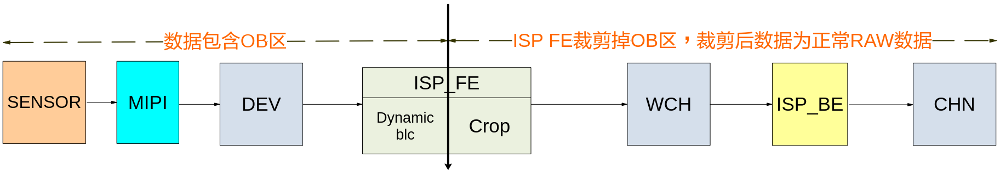

因此若要使用Dynamic BLC模块基于OB区统计得到合理的黑电平值，整个数据处理通路的配置说明如下：

-   sensor驱动配置：在驱动中添加可以读出ob区的sensor序列。若启动Dynamic BLC模块一定要关闭sensor中的BLC校正功能。
-   mipi配置：确保mipi的裁剪区域包含OB区。若OB区的datatype与可见光区域图像的datatype不一样，则需要修改mipi的datatype配置，可通过调用OT\_MIPI\_SET\_EXT\_DATA\_TYPE接口实现，接口的具体信息请参见《MIPI 使用指南》。若Dynamic BLC模块异常要检查mipi检测到的分辨率是否为包含OB区的分辨率。
-   VI dev配置：宽高与mipi输出宽高保持一致。
-   pub attr配置：配置wnd\_rect中的起始坐标和宽高信息，使用ISP裁剪功能裁剪掉OB区，保证ISP FE和BE处理的数据为不带OB区的raw数据。
-   VI pipe attr和chn info中的宽高配置为ISP裁剪后的宽高。
-   由于sensor gain值较大时，动态黑电平会严重飘移，所以calibration\_black\_level的标定值不够准确，从而导致等曝光量切换时会有颜色闪烁。但是不会影响开关灯这种极限场景的图像效果。

【相关数据类型及接口】

[ot\_isp\_black\_level\_attr](#ot_isp_black_level_attr)

#### ot\_isp\_black\_level\_attr<a name="ZH-CN_TOPIC_0000002470925040"></a>

【说明】

定义ISP黑电平属性。

【定义】

```
typedef struct {
    td_bool  user_black_level_en;
    td_u16   user_black_level[OT_ISP_WDR_MAX_FRAME_NUM][OT_ISP_BAYER_CHN_NUM];
    ot_isp_black_level_mode         black_level_mode;
    ot_isp_black_level_manual_attr  manual_attr;
    ot_isp_black_level_dynamic_attr dynamic_attr;
} ot_isp_black_level_attr;
```

【成员】

<a name="table27796mcpsimp"></a>
<table><thead align="left"><tr id="row27801mcpsimp"><th class="cellrowborder" valign="top" width="37%" id="mcps1.1.3.1.1"><p id="p27803mcpsimp"><a name="p27803mcpsimp"></a><a name="p27803mcpsimp"></a>成员名称</p>
</th>
<th class="cellrowborder" valign="top" width="63%" id="mcps1.1.3.1.2"><p id="p27805mcpsimp"><a name="p27805mcpsimp"></a><a name="p27805mcpsimp"></a>描述</p>
</th>
</tr>
</thead>
<tbody><tr id="row27807mcpsimp"><td class="cellrowborder" valign="top" width="37%" headers="mcps1.1.3.1.1 "><p id="p27809mcpsimp"><a name="p27809mcpsimp"></a><a name="p27809mcpsimp"></a>user_black_level_en</p>
</td>
<td class="cellrowborder" valign="top" width="63%" headers="mcps1.1.3.1.2 "><p id="p27811mcpsimp"><a name="p27811mcpsimp"></a><a name="p27811mcpsimp"></a>是否使用自定义的黑电平值。</p>
<p id="p27812mcpsimp"><a name="p27812mcpsimp"></a><a name="p27812mcpsimp"></a>使能user_black_level_en，ISP的所有模块看到的黑电平值为自定义的黑电平值，而非sensor的黑电平值。</p>
</td>
</tr>
<tr id="row27813mcpsimp"><td class="cellrowborder" valign="top" width="37%" headers="mcps1.1.3.1.1 "><p xml:lang="sv-SE" id="p27815mcpsimp"><a name="p27815mcpsimp"></a><a name="p27815mcpsimp"></a>user_black_level[OT_ISP_WDR_MAX_FRAME_NUM][OT_ISP_BAYER_CHN_NUM]</p>
</td>
<td class="cellrowborder" valign="top" width="63%" headers="mcps1.1.3.1.2 "><p id="p27817mcpsimp"><a name="p27817mcpsimp"></a><a name="p27817mcpsimp"></a>自定义的黑电平值。</p>
<a name="ul27818mcpsimp"></a><a name="ul27818mcpsimp"></a><ul id="ul27818mcpsimp"><li>线性模式下：<p id="p27820mcpsimp"><a name="p27820mcpsimp"></a><a name="p27820mcpsimp"></a>user_black_level[0]表示线性数据R、Gr、Gb、B四分量的自定义黑电平值。</p>
<p id="p27821mcpsimp"><a name="p27821mcpsimp"></a><a name="p27821mcpsimp"></a>user_black_level[1]~user_black_level[3]配置值无效。</p>
</li><li>WDR 2to1模式下：<p id="p27823mcpsimp"><a name="p27823mcpsimp"></a><a name="p27823mcpsimp"></a>user_black_level[0]、user_black_level[1]分别表示短帧、长帧数据R、Gr、Gb、B四分量的自定义黑电平值。</p>
<p id="p27824mcpsimp"><a name="p27824mcpsimp"></a><a name="p27824mcpsimp"></a>user_black_level[2]~user_black_level[3]配置值无效。</p>
</li><li>WDR 3to1模式下：<p id="p27826mcpsimp"><a name="p27826mcpsimp"></a><a name="p27826mcpsimp"></a>user_black_level[0]、user_black_level[1]、user_black_level[2]分别表示短帧、中帧、长帧数据R、Gr、Gb、B四分量的自定义黑电平值。</p>
<p id="p27827mcpsimp"><a name="p27827mcpsimp"></a><a name="p27827mcpsimp"></a>user_black_level[3]配置值无效。</p>
</li></ul>
<p id="p27828mcpsimp"><a name="p27828mcpsimp"></a><a name="p27828mcpsimp"></a>取值范围：[0x0, 0x3FFF]</p>
<p id="p27829mcpsimp"><a name="p27829mcpsimp"></a><a name="p27829mcpsimp"></a>user_black_level为14bit raw数据的黑电平。</p>
</td>
</tr>
<tr id="row27830mcpsimp"><td class="cellrowborder" valign="top" width="37%" headers="mcps1.1.3.1.1 "><p id="p27832mcpsimp"><a name="p27832mcpsimp"></a><a name="p27832mcpsimp"></a>black_level_mode</p>
</td>
<td class="cellrowborder" valign="top" width="63%" headers="mcps1.1.3.1.2 "><p id="p27834mcpsimp"><a name="p27834mcpsimp"></a><a name="p27834mcpsimp"></a>黑电平工作类型。</p>
</td>
</tr>
<tr id="row27835mcpsimp"><td class="cellrowborder" valign="top" width="37%" headers="mcps1.1.3.1.1 "><p id="p27837mcpsimp"><a name="p27837mcpsimp"></a><a name="p27837mcpsimp"></a>manual_attr</p>
</td>
<td class="cellrowborder" valign="top" width="63%" headers="mcps1.1.3.1.2 "><p id="p27839mcpsimp"><a name="p27839mcpsimp"></a><a name="p27839mcpsimp"></a>手动黑电平属性。</p>
</td>
</tr>
<tr id="row27840mcpsimp"><td class="cellrowborder" valign="top" width="37%" headers="mcps1.1.3.1.1 "><p id="p27842mcpsimp"><a name="p27842mcpsimp"></a><a name="p27842mcpsimp"></a>dynamic_attr</p>
</td>
<td class="cellrowborder" valign="top" width="63%" headers="mcps1.1.3.1.2 "><p id="p27844mcpsimp"><a name="p27844mcpsimp"></a><a name="p27844mcpsimp"></a>Dynamic blc属性。</p>
</td>
</tr>
</tbody>
</table>

【注意事项】

-   Sensor built-in模式下不支持使能user\_black\_level\_en。
-   如果使用虚拟pipe，即vi\_pipe\>=4时，不支持使能user\_black\_level\_en。

【相关数据类型及接口】

无

### 黑电平标定工具<a name="ZH-CN_TOPIC_0000002504084859"></a>


#### 功能描述<a name="ZH-CN_TOPIC_0000002470925166"></a>

黑电平标定工具用于标定offset和calibration\_black\_level。在高iso条件下，可见光区的黑电平均值和OB区的黑电平均值会有差异。offset用于补偿OB区黑电平，使其与可见光区黑电平保持一致。按照14bit的raw数据进行配置。当环境光发生变化时，AE在第N帧重新计算出曝光信息。在N+1帧将第N帧的曝光信息配置给sensor。第N帧的曝光信息会在第N+3帧的RAW中生效。由于BLC会受到iso的影响所以第N+3帧的BLC发生了变化，但第N+3帧减的还是第N+2帧的黑电平，所以图像会偏色。calibration\_black\_level用于计算补偿第N+3帧的黑电平，使其与可见光区黑电平保持一致，解决图像的偏色问题。按照14bit的raw数据进行配置。

> **CAUTION:** 
>黑电平标定结果通过修正实际统计黑电平实现个体差异校正。因此，用户通过MPI接口修改标定结果，会导致标定失效。

黑电平标定工具实现在量产过程中，针对不同机器的差异进行对黑电平补偿参数标定的功能。用户可以使用在线标定工具dynamic\_blc\_online\_cali标定得到offset和calibration\_black\_level。再调用[ss\_mpi\_isp\_set\_black\_level\_attr](#ZH-CN_TOPIC_0000002504084925)接口配置offset和calibration\_black\_level。同时生成带有offset和calibration\_black\_level标定结果的TXT文件。

注意事项：

-   标定sample工具介绍详见：readme.txt
-   标定sample工具可手动裁剪标定区域。所裁剪的画面越大，耗时越长。选定的iso档位越多，耗时越长。
-   标定完成后sample会自动将标定数据导入，无需手动导入。

黑电平补偿参数的校正过程：

1.  修改sensor驱动\(sns\_name\_cmos\_ex.h\)。将OT\_ISP\_BLACK\_LEVEL\_MODE\_DYNAMIC改为动态BLC。
2.  将设备的光圈完全关闭，或者使用镜头盖将镜头输入遮挡，确保无光线进入；
3.  以sample为例，起线性业务\( ./sample\_vio 0 \)；
4.  运行标定工具dynamic\_blc\_online\_cali\( ./ dynamic\_blc\_online\_cali 0 30 8 100 100 100 100 \)。

## 去FPN<a name="ZH-CN_TOPIC_0000002470924868"></a>


### 功能描述<a name="ZH-CN_TOPIC_0000002471085228"></a>

Sensor将光信号转换成电信号，再通过数百万个ADC器件后输出图像。每个像素结构中的光电二极管的尺寸、掺杂浓度、生产过程中的沾污以及MOS场效应管的参数的偏差等都会造成像素输出信号的变化，由于这些偏差造成的噪声对于给定的单个像素它是固定的，这种噪声就是固定模式噪声FPN（Fixed Pattern Noise）。

去FPN模块就是要把这些固定模式噪声消除。

FPN的标定过程：

1.  首先确定FPN在哪个ISO下最为严重，在此ISO下固定增益，关闭镜头的光圈，让sensor采集黑帧。
2.  启动标定，当第一帧过来时，把满足标定条件的RAW数据写到内存 ，当第二帧过来时，通过读出端口把内存中的黑帧读出来与第二帧进行累加后再通过写出端口再写回内存，后面的帧也是这样，但是最后一帧写出时会对累加的黑帧平均后再写回内存。
3.  当求平均写出后，标定结束。此时，内存中就把低照度下的固定模式噪声存储下来了，然后，把该黑帧存储到外存上即可。

**图 1**  FPN标定示意图<a name="fig860711813412"></a>  
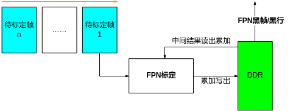

FPN的校正过程：

1.  把标定好的黑帧从外存载入到内存中。
2.  当从sensor采集的带FPN的正常图像过来后，用每帧都减去在内存中的黑帧，从而就得到了消除FPN后的校正帧。

**图 2**  FPN校正示意图<a name="fig977310014714"></a>  
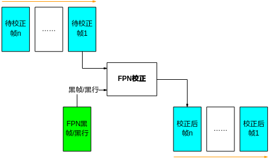

### API参考<a name="ZH-CN_TOPIC_0000002471085090"></a>

-   [ss\_mpi\_isp\_fpn\_calibrate](#ZH-CN_TOPIC_0000002504085029)：设置去FPN标定属性。
-   [ss\_mpi\_isp\_set\_fpn\_attr](#ZH-CN_TOPIC_0000002504084823)：设置去FPN属性。
-   [ss\_mpi\_isp\_get\_fpn\_attr](#ZH-CN_TOPIC_0000002504085057)：获取去FPN属性。


#### ss\_mpi\_isp\_fpn\_calibrate<a name="ZH-CN_TOPIC_0000002504085029"></a>

【描述】

设置去FPN标定属性。

【语法】

```
td_s32 ss_mpi_isp_fpn_calibrate(ot_vi_pipe vi_pipe, ot_isp_fpn_calibrate_attr *calibrate_attr);
```

【参数】

<a name="table27909mcpsimp"></a>
<table><thead align="left"><tr id="row27915mcpsimp"><th class="cellrowborder" valign="top" width="25%" id="mcps1.1.4.1.1"><p id="p27917mcpsimp"><a name="p27917mcpsimp"></a><a name="p27917mcpsimp"></a>参数名称</p>
</th>
<th class="cellrowborder" valign="top" width="59%" id="mcps1.1.4.1.2"><p id="p27919mcpsimp"><a name="p27919mcpsimp"></a><a name="p27919mcpsimp"></a>描述</p>
</th>
<th class="cellrowborder" valign="top" width="16%" id="mcps1.1.4.1.3"><p id="p27921mcpsimp"><a name="p27921mcpsimp"></a><a name="p27921mcpsimp"></a>输入/输出</p>
</th>
</tr>
</thead>
<tbody><tr id="row27922mcpsimp"><td class="cellrowborder" valign="top" width="25%" headers="mcps1.1.4.1.1 "><p id="p27924mcpsimp"><a name="p27924mcpsimp"></a><a name="p27924mcpsimp"></a>vi_pipe</p>
</td>
<td class="cellrowborder" valign="top" width="59%" headers="mcps1.1.4.1.2 "><p id="p27926mcpsimp"><a name="p27926mcpsimp"></a><a name="p27926mcpsimp"></a>vi_pipe号。</p>
</td>
<td class="cellrowborder" valign="top" width="16%" headers="mcps1.1.4.1.3 "><p id="p27928mcpsimp"><a name="p27928mcpsimp"></a><a name="p27928mcpsimp"></a>输入</p>
</td>
</tr>
<tr id="row27929mcpsimp"><td class="cellrowborder" valign="top" width="25%" headers="mcps1.1.4.1.1 "><p id="p27931mcpsimp"><a name="p27931mcpsimp"></a><a name="p27931mcpsimp"></a>calibrate_attr</p>
</td>
<td class="cellrowborder" valign="top" width="59%" headers="mcps1.1.4.1.2 "><p id="p27933mcpsimp"><a name="p27933mcpsimp"></a><a name="p27933mcpsimp"></a>去FPN标定属性指针。</p>
</td>
<td class="cellrowborder" valign="top" width="16%" headers="mcps1.1.4.1.3 "><p id="p27935mcpsimp"><a name="p27935mcpsimp"></a><a name="p27935mcpsimp"></a>输入</p>
</td>
</tr>
</tbody>
</table>

【返回值】

<a name="table27938mcpsimp"></a>
<table><thead align="left"><tr id="row27943mcpsimp"><th class="cellrowborder" valign="top" width="27%" id="mcps1.1.3.1.1"><p id="p27945mcpsimp"><a name="p27945mcpsimp"></a><a name="p27945mcpsimp"></a>返回值</p>
</th>
<th class="cellrowborder" valign="top" width="73%" id="mcps1.1.3.1.2"><p id="p27947mcpsimp"><a name="p27947mcpsimp"></a><a name="p27947mcpsimp"></a>描述</p>
</th>
</tr>
</thead>
<tbody><tr id="row27948mcpsimp"><td class="cellrowborder" valign="top" width="27%" headers="mcps1.1.3.1.1 "><p id="p27950mcpsimp"><a name="p27950mcpsimp"></a><a name="p27950mcpsimp"></a>0</p>
</td>
<td class="cellrowborder" valign="top" width="73%" headers="mcps1.1.3.1.2 "><p id="p27952mcpsimp"><a name="p27952mcpsimp"></a><a name="p27952mcpsimp"></a>成功。</p>
</td>
</tr>
<tr id="row27953mcpsimp"><td class="cellrowborder" valign="top" width="27%" headers="mcps1.1.3.1.1 "><p id="p27955mcpsimp"><a name="p27955mcpsimp"></a><a name="p27955mcpsimp"></a>非0</p>
</td>
<td class="cellrowborder" valign="top" width="73%" headers="mcps1.1.3.1.2 "><p id="p27957mcpsimp"><a name="p27957mcpsimp"></a><a name="p27957mcpsimp"></a>失败，其值为<span xml:lang="sv-SE" id="ph10195517299"><a name="ph10195517299"></a><a name="ph10195517299"></a>错误码</span>。</p>
</td>
</tr>
</tbody>
</table>

【需求】

-   头文件：ot\_common\_isp.h、ss\_mpi\_isp.h
-   库文件：libot\_isp.a、libss\_isp.a

【注意】

-   标定时用的内存注意要按16bit进行分配，标定完成之后要把黑帧/行，ISO，黑帧的长度、OFFSET、是否压缩标志等保存到外部存储介质，在校正的时候要用到这些信息。
-   当VI的PIPE处于VI在线或VI离线才支持FPN标定。
-   当VI处于离线OT\_VI\_VIDEO\_MODE\_NORM模式下，图像宽度大于4096时，不支持FPN标定；当图像面积大于3840x2160时，不支持离线OT\_VI\_VIDEO\_MODE\_NORM模式标定，可能会出现标定失败的现象，可使用OT\_VI\_VIDEO\_MODE\_ADVANCED模式标出黑帧。
-   当VI处于OT\_VI\_STITCH\_CFG\_MODE\_SYNC模式下，不支持FPN标定。
-   图像宽度大于4096时，只支持OT\_PIXEL\_FORMAT\_RGB\_BAYER\_16BPP格式的黑帧标定。
-   SS928V100 FPN标定不支持压缩，只能是非压缩模式。
-   在WDR模式下，FPN不支持标定。
-   VI物理通道使能时，不支持开启FPN标定。
-   当VI模块的PIPE有销毁操作时（例如：分辨率切换、WDR模式切换等情况），保存在VI模块的FPN属性会丢失，FPN功能需要在VI模块的PIPE创建后重新配置才能恢复。
-   FPN校正接口具有一定的延时，如关闭FPN校正后需要再次进行FPN标定，则需要等待几帧时间再调用FPN标定接口。
-   该标定接口为阻塞接口，等待标定完成后返回，超时时间为1600ms。

【举例】

标定过程请参考sample vio代码。

【相关主题】

[ss\_mpi\_isp\_set\_fpn\_attr](#ss_mpi_isp_set_fpn_attr)

#### ss\_mpi\_isp\_set\_fpn\_attr<a name="ZH-CN_TOPIC_0000002504084823"></a>

【描述】

设置去FPN属性。

【语法】

```
td_s32 ss_mpi_isp_set_fpn_attr(ot_vi_pipe vi_pipe, const ot_isp_fpn_attr *fpn_attr);
```

【参数】

<a name="table27986mcpsimp"></a>
<table><thead align="left"><tr id="row27992mcpsimp"><th class="cellrowborder" valign="top" width="25%" id="mcps1.1.4.1.1"><p id="p27994mcpsimp"><a name="p27994mcpsimp"></a><a name="p27994mcpsimp"></a>参数名称</p>
</th>
<th class="cellrowborder" valign="top" width="59%" id="mcps1.1.4.1.2"><p id="p27996mcpsimp"><a name="p27996mcpsimp"></a><a name="p27996mcpsimp"></a>描述</p>
</th>
<th class="cellrowborder" valign="top" width="16%" id="mcps1.1.4.1.3"><p id="p27998mcpsimp"><a name="p27998mcpsimp"></a><a name="p27998mcpsimp"></a>输入/输出</p>
</th>
</tr>
</thead>
<tbody><tr id="row28000mcpsimp"><td class="cellrowborder" valign="top" width="25%" headers="mcps1.1.4.1.1 "><p id="p28002mcpsimp"><a name="p28002mcpsimp"></a><a name="p28002mcpsimp"></a>vi_pipe</p>
</td>
<td class="cellrowborder" valign="top" width="59%" headers="mcps1.1.4.1.2 "><p id="p28004mcpsimp"><a name="p28004mcpsimp"></a><a name="p28004mcpsimp"></a>vi_pipe号。</p>
</td>
<td class="cellrowborder" valign="top" width="16%" headers="mcps1.1.4.1.3 "><p id="p28006mcpsimp"><a name="p28006mcpsimp"></a><a name="p28006mcpsimp"></a>输入</p>
</td>
</tr>
<tr id="row28007mcpsimp"><td class="cellrowborder" valign="top" width="25%" headers="mcps1.1.4.1.1 "><p id="p28009mcpsimp"><a name="p28009mcpsimp"></a><a name="p28009mcpsimp"></a>fpn_attr</p>
</td>
<td class="cellrowborder" valign="top" width="59%" headers="mcps1.1.4.1.2 "><p id="p28011mcpsimp"><a name="p28011mcpsimp"></a><a name="p28011mcpsimp"></a>去FPN属性指针。</p>
</td>
<td class="cellrowborder" valign="top" width="16%" headers="mcps1.1.4.1.3 "><p id="p28013mcpsimp"><a name="p28013mcpsimp"></a><a name="p28013mcpsimp"></a>输入</p>
</td>
</tr>
</tbody>
</table>

【返回值】

<a name="table28015mcpsimp"></a>
<table><thead align="left"><tr id="row28020mcpsimp"><th class="cellrowborder" valign="top" width="27%" id="mcps1.1.3.1.1"><p id="p28022mcpsimp"><a name="p28022mcpsimp"></a><a name="p28022mcpsimp"></a>返回值</p>
</th>
<th class="cellrowborder" valign="top" width="73%" id="mcps1.1.3.1.2"><p id="p28024mcpsimp"><a name="p28024mcpsimp"></a><a name="p28024mcpsimp"></a>描述</p>
</th>
</tr>
</thead>
<tbody><tr id="row28025mcpsimp"><td class="cellrowborder" valign="top" width="27%" headers="mcps1.1.3.1.1 "><p id="p28027mcpsimp"><a name="p28027mcpsimp"></a><a name="p28027mcpsimp"></a>0</p>
</td>
<td class="cellrowborder" valign="top" width="73%" headers="mcps1.1.3.1.2 "><p id="p28029mcpsimp"><a name="p28029mcpsimp"></a><a name="p28029mcpsimp"></a>成功。</p>
</td>
</tr>
<tr id="row28030mcpsimp"><td class="cellrowborder" valign="top" width="27%" headers="mcps1.1.3.1.1 "><p id="p28032mcpsimp"><a name="p28032mcpsimp"></a><a name="p28032mcpsimp"></a>非0</p>
</td>
<td class="cellrowborder" valign="top" width="73%" headers="mcps1.1.3.1.2 "><p id="p28034mcpsimp"><a name="p28034mcpsimp"></a><a name="p28034mcpsimp"></a>失败，其值为<span xml:lang="sv-SE" id="ph10195517299"><a name="ph10195517299"></a><a name="ph10195517299"></a>错误码</span>。</p>
</td>
</tr>
</tbody>
</table>

【需求】

-   头文件：ot\_common\_isp.h、ss\_mpi\_isp.h
-   库文件：libot\_isp.a、libss\_isp.a

【注意】

-   SS928V100 FPN校正不支持压缩，只能是非压缩模式。
-   图像宽度大于4096时，只支持OT\_PIXEL\_FORMAT\_RGB\_BAYER\_16BPP格式的黑帧校正。
-   当VI处于OT\_VI\_STITCH\_CFG\_MODE\_SYNC模式下，不支持FPN校正。
-   3合 1 WDR模式下不支持FPN校正。
-   FPN校正开启时，不支持从线性到WDR之间相互切换，切换前需先关闭FPN。
-   FPN不支持在虚拟pipe下开启。
-   根据标定时候保存的黑帧信息，读出OFFSET、ISO等信息，同时要把黑帧读入内存，这些是在校正时要输入信息。如果用户选择为自动模式时，会根据校正时的ISO来自动调节校正的强度；而手动模式会根据用户输入的校正强度进行校正。

【举例】

校正过程请参考sample vio代码。

【相关主题】

[ss\_mpi\_isp\_get\_fpn\_attr](#ss_mpi_isp_get_fpn_attr)

#### ss\_mpi\_isp\_get\_fpn\_attr<a name="ZH-CN_TOPIC_0000002504085057"></a>

【描述】

获取去FPN属性。

【语法】

```
td_s32 ss_mpi_isp_get_fpn_attr(ot_vi_pipe vi_pipe, ot_isp_fpn_attr *fpn_attr);
```

【参数】

<a name="table28063mcpsimp"></a>
<table><thead align="left"><tr id="row28069mcpsimp"><th class="cellrowborder" valign="top" width="25%" id="mcps1.1.4.1.1"><p id="p28071mcpsimp"><a name="p28071mcpsimp"></a><a name="p28071mcpsimp"></a>参数名称</p>
</th>
<th class="cellrowborder" valign="top" width="59%" id="mcps1.1.4.1.2"><p id="p28073mcpsimp"><a name="p28073mcpsimp"></a><a name="p28073mcpsimp"></a>描述</p>
</th>
<th class="cellrowborder" valign="top" width="16%" id="mcps1.1.4.1.3"><p id="p28075mcpsimp"><a name="p28075mcpsimp"></a><a name="p28075mcpsimp"></a>输入/输出</p>
</th>
</tr>
</thead>
<tbody><tr id="row28077mcpsimp"><td class="cellrowborder" valign="top" width="25%" headers="mcps1.1.4.1.1 "><p id="p28079mcpsimp"><a name="p28079mcpsimp"></a><a name="p28079mcpsimp"></a>vi_pipe</p>
</td>
<td class="cellrowborder" valign="top" width="59%" headers="mcps1.1.4.1.2 "><p id="p28081mcpsimp"><a name="p28081mcpsimp"></a><a name="p28081mcpsimp"></a>vi_pipe号。</p>
</td>
<td class="cellrowborder" valign="top" width="16%" headers="mcps1.1.4.1.3 "><p id="p28083mcpsimp"><a name="p28083mcpsimp"></a><a name="p28083mcpsimp"></a>输入</p>
</td>
</tr>
<tr id="row28084mcpsimp"><td class="cellrowborder" valign="top" width="25%" headers="mcps1.1.4.1.1 "><p id="p28086mcpsimp"><a name="p28086mcpsimp"></a><a name="p28086mcpsimp"></a>fpn_attr</p>
</td>
<td class="cellrowborder" valign="top" width="59%" headers="mcps1.1.4.1.2 "><p id="p28088mcpsimp"><a name="p28088mcpsimp"></a><a name="p28088mcpsimp"></a>去FPN属性指针。</p>
</td>
<td class="cellrowborder" valign="top" width="16%" headers="mcps1.1.4.1.3 "><p id="p28090mcpsimp"><a name="p28090mcpsimp"></a><a name="p28090mcpsimp"></a>输出</p>
</td>
</tr>
</tbody>
</table>

【返回值】

<a name="table28092mcpsimp"></a>
<table><thead align="left"><tr id="row28097mcpsimp"><th class="cellrowborder" valign="top" width="27%" id="mcps1.1.3.1.1"><p id="p28099mcpsimp"><a name="p28099mcpsimp"></a><a name="p28099mcpsimp"></a>返回值</p>
</th>
<th class="cellrowborder" valign="top" width="73%" id="mcps1.1.3.1.2"><p id="p28101mcpsimp"><a name="p28101mcpsimp"></a><a name="p28101mcpsimp"></a>描述</p>
</th>
</tr>
</thead>
<tbody><tr id="row28102mcpsimp"><td class="cellrowborder" valign="top" width="27%" headers="mcps1.1.3.1.1 "><p id="p28104mcpsimp"><a name="p28104mcpsimp"></a><a name="p28104mcpsimp"></a>0</p>
</td>
<td class="cellrowborder" valign="top" width="73%" headers="mcps1.1.3.1.2 "><p id="p28106mcpsimp"><a name="p28106mcpsimp"></a><a name="p28106mcpsimp"></a>成功。</p>
</td>
</tr>
<tr id="row28107mcpsimp"><td class="cellrowborder" valign="top" width="27%" headers="mcps1.1.3.1.1 "><p id="p28109mcpsimp"><a name="p28109mcpsimp"></a><a name="p28109mcpsimp"></a>非0</p>
</td>
<td class="cellrowborder" valign="top" width="73%" headers="mcps1.1.3.1.2 "><p id="p28111mcpsimp"><a name="p28111mcpsimp"></a><a name="p28111mcpsimp"></a>失败，其值为<span xml:lang="sv-SE" id="ph10195517299"><a name="ph10195517299"></a><a name="ph10195517299"></a>错误码</span>。</p>
</td>
</tr>
</tbody>
</table>

【需求】

-   头文件：ot\_common\_isp.h、ss\_mpi\_isp.h
-   库文件：libot\_isp.a、libss\_isp.a

【注意】

无

【举例】

无

【相关主题】

[ss\_mpi\_isp\_set\_fpn\_attr](#ss_mpi_isp_set_fpn_attr)

### 数据类型<a name="ZH-CN_TOPIC_0000002503964947"></a>

-   [ot\_isp\_fpn\_frame\_info](#ZH-CN_TOPIC_0000002470925228)：定义去FPN的标定黑帧信息。
-   [ot\_isp\_fpn\_calibrate\_attr](#ZH-CN_TOPIC_0000002503965083)：定义去FPN的标定属性。
-   [ot\_isp\_fpn\_attr](#ZH-CN_TOPIC_0000002504085041)：定义去FPN的校正属性。
-   [ot\_isp\_fpn\_manual\_attr](#ZH-CN_TOPIC_0000002470925036)：定义去FPN在手动模式的校正属性。
-   [ot\_isp\_fpn\_auto\_attr](#ZH-CN_TOPIC_0000002471085000)：定义去FPN在自动模式的校正属性。
-   [ot\_isp\_fpn\_type](#ZH-CN_TOPIC_0000002471085104)：定义去FPN类型。
-   [ot\_isp\_fpn\_out\_mode](#ZH-CN_TOPIC_0000002503965077)：定义去FPN标定输出的模式。


#### ot\_isp\_fpn\_frame\_info<a name="ZH-CN_TOPIC_0000002470925228"></a>

【说明】

定义去FPN的标定黑帧信息。

【定义】

```
typedef struct {
    td_u32              iso;
    td_u32              offset[OT_ISP_STRIPING_MAX_NUM]; 
    td_u32              frm_size;
    ot_video_frame_info fpn_frame;
} ot_isp_fpn_frame_info;
```

【成员】

<a name="table28156mcpsimp"></a>
<table><thead align="left"><tr id="row28161mcpsimp"><th class="cellrowborder" valign="top" width="19%" id="mcps1.1.3.1.1"><p id="p28163mcpsimp"><a name="p28163mcpsimp"></a><a name="p28163mcpsimp"></a>成员名称</p>
</th>
<th class="cellrowborder" valign="top" width="81%" id="mcps1.1.3.1.2"><p id="p28165mcpsimp"><a name="p28165mcpsimp"></a><a name="p28165mcpsimp"></a>描述</p>
</th>
</tr>
</thead>
<tbody><tr id="row28167mcpsimp"><td class="cellrowborder" valign="top" width="19%" headers="mcps1.1.3.1.1 "><p id="p28169mcpsimp"><a name="p28169mcpsimp"></a><a name="p28169mcpsimp"></a>iso</p>
</td>
<td class="cellrowborder" valign="top" width="81%" headers="mcps1.1.3.1.2 "><p id="p28171mcpsimp"><a name="p28171mcpsimp"></a><a name="p28171mcpsimp"></a>标定黑帧时的ISO，来自于标定时的ISO。</p>
<p id="p28172mcpsimp"><a name="p28172mcpsimp"></a><a name="p28172mcpsimp"></a>ISO值必须大于0。</p>
</td>
</tr>
<tr id="row28173mcpsimp"><td class="cellrowborder" valign="top" width="19%" headers="mcps1.1.3.1.1 "><p id="p28175mcpsimp"><a name="p28175mcpsimp"></a><a name="p28175mcpsimp"></a>offset[3]</p>
</td>
<td class="cellrowborder" valign="top" width="81%" headers="mcps1.1.3.1.2 "><p id="p28177mcpsimp"><a name="p28177mcpsimp"></a><a name="p28177mcpsimp"></a>黑帧所有像素的平均值，来自于标定时的OFFSET。</p>
<p id="p28178mcpsimp"><a name="p28178mcpsimp"></a><a name="p28178mcpsimp"></a>取值范围：[0, 0x3FFF]仅高12bit有效。</p>
</td>
</tr>
<tr id="row28179mcpsimp"><td class="cellrowborder" valign="top" width="19%" headers="mcps1.1.3.1.1 "><p id="p28181mcpsimp"><a name="p28181mcpsimp"></a><a name="p28181mcpsimp"></a>frm_size</p>
</td>
<td class="cellrowborder" valign="top" width="81%" headers="mcps1.1.3.1.2 "><p id="p28183mcpsimp"><a name="p28183mcpsimp"></a><a name="p28183mcpsimp"></a>帧的大小，输出的黑帧有二种：压缩、非压缩，来自于标定时保存的黑帧大小。SS928V100只支持非压缩。</p>
</td>
</tr>
<tr id="row28184mcpsimp"><td class="cellrowborder" valign="top" width="19%" headers="mcps1.1.3.1.1 "><p id="p28186mcpsimp"><a name="p28186mcpsimp"></a><a name="p28186mcpsimp"></a>fpn_frame</p>
</td>
<td class="cellrowborder" valign="top" width="81%" headers="mcps1.1.3.1.2 "><p id="p28188mcpsimp"><a name="p28188mcpsimp"></a><a name="p28188mcpsimp"></a>黑帧帧信息，首先分配内存，然后把标定时的黑帧从外存读入此内存，同时对此结构体成员进行赋值。具体描述请参见《MPP媒体处理软件V5.0开发参考》的“系统控制”章节。</p>
</td>
</tr>
</tbody>
</table>

【注意事项】

-   使用FPN时，图像宽度要求为16的整数倍，否则标定的黑帧或校正后的图像会有异常。
-   offset可以在/proc/umap/isp中查询得到。
-   当标定时选择的黑帧pixel\_format是OT\_PIXEL\_FORMAT\_RGB\_BAYER\_16BPP时，黑帧是非紧凑型的raw；当pixel\_format是其他时，黑帧是紧凑型的raw，像素位宽和选择的位宽一致。

【相关数据类型及接口】

[ot\_isp\_fpn\_calibrate\_attr](#ot_isp_fpn_calibrate_attr)

#### ot\_isp\_fpn\_calibrate\_attr<a name="ZH-CN_TOPIC_0000002503965083"></a>

【说明】

定义去FPN的标定属性。

【定义】

```
typedef struct {
    td_u32                 threshold;
    td_u32                 frame_num;
    ot_isp_fpn_type        fpn_type;
    ot_isp_fpn_frame_info  fpn_cali_frame;
    ot_isp_fpn_out_mode   fpn_mode;
} ot_isp_fpn_calibrate_attr;
```

【成员】

<a name="table28212mcpsimp"></a>
<table><thead align="left"><tr id="row28217mcpsimp"><th class="cellrowborder" valign="top" width="20%" id="mcps1.1.3.1.1"><p id="p28219mcpsimp"><a name="p28219mcpsimp"></a><a name="p28219mcpsimp"></a>成员名称</p>
</th>
<th class="cellrowborder" valign="top" width="80%" id="mcps1.1.3.1.2"><p id="p28221mcpsimp"><a name="p28221mcpsimp"></a><a name="p28221mcpsimp"></a>描述</p>
</th>
</tr>
</thead>
<tbody><tr id="row28223mcpsimp"><td class="cellrowborder" valign="top" width="20%" headers="mcps1.1.3.1.1 "><p id="p28225mcpsimp"><a name="p28225mcpsimp"></a><a name="p28225mcpsimp"></a>threshold</p>
</td>
<td class="cellrowborder" valign="top" width="80%" headers="mcps1.1.3.1.2 "><p id="p28227mcpsimp"><a name="p28227mcpsimp"></a><a name="p28227mcpsimp"></a>标定时的阈值，在标定时如果像素的值大于该值，则认为是坏点，该像素点不参与标定。取值范围：[0x1, 0xFFF]</p>
</td>
</tr>
<tr id="row28228mcpsimp"><td class="cellrowborder" valign="top" width="20%" headers="mcps1.1.3.1.1 "><p id="p28230mcpsimp"><a name="p28230mcpsimp"></a><a name="p28230mcpsimp"></a>frame_num</p>
</td>
<td class="cellrowborder" valign="top" width="80%" headers="mcps1.1.3.1.2 "><p id="p28232mcpsimp"><a name="p28232mcpsimp"></a><a name="p28232mcpsimp"></a>标定的帧数，取值范围：{1，2，4，8，16}，即为2的整数次幂。</p>
</td>
</tr>
<tr id="row28233mcpsimp"><td class="cellrowborder" valign="top" width="20%" headers="mcps1.1.3.1.1 "><p id="p28235mcpsimp"><a name="p28235mcpsimp"></a><a name="p28235mcpsimp"></a>fpn_type</p>
</td>
<td class="cellrowborder" valign="top" width="80%" headers="mcps1.1.3.1.2 "><p id="p28237mcpsimp"><a name="p28237mcpsimp"></a><a name="p28237mcpsimp"></a>标定的类型，有二种：帧模式与行模式，帧模式校正效果要优于行模式，而行模式要比帧模式省内存。</p>
<p id="p28238mcpsimp"><a name="p28238mcpsimp"></a><a name="p28238mcpsimp"></a>SS928V100只支持帧模式。</p>
</td>
</tr>
<tr id="row28239mcpsimp"><td class="cellrowborder" valign="top" width="20%" headers="mcps1.1.3.1.1 "><p id="p28241mcpsimp"><a name="p28241mcpsimp"></a><a name="p28241mcpsimp"></a>fpn_cali_frame</p>
</td>
<td class="cellrowborder" valign="top" width="80%" headers="mcps1.1.3.1.2 "><p id="p28243mcpsimp"><a name="p28243mcpsimp"></a><a name="p28243mcpsimp"></a>标定出来的黑帧信息。</p>
</td>
</tr>
<tr id="row28244mcpsimp"><td class="cellrowborder" valign="top" width="20%" headers="mcps1.1.3.1.1 "><p id="p28246mcpsimp"><a name="p28246mcpsimp"></a><a name="p28246mcpsimp"></a>fpn_mode</p>
</td>
<td class="cellrowborder" valign="top" width="80%" headers="mcps1.1.3.1.2 "><p id="p28248mcpsimp"><a name="p28248mcpsimp"></a><a name="p28248mcpsimp"></a>标定输出的模式，默认为0</p>
</td>
</tr>
</tbody>
</table>

【注意事项】

阈值与标定时保存黑帧的比特数相关，假设标定时保存的比特数是N，则阈值一般取\(2^N\)\>\>2。

【相关数据类型及接口】

-   [ot\_isp\_fpn\_frame\_info](#ot_isp_fpn_frame_info)
-   [ot\_isp\_fpn\_attr](#ot_isp_fpn_attr)

#### ot\_isp\_fpn\_attr<a name="ZH-CN_TOPIC_0000002504085041"></a>

【说明】

定义去FPN的校正属性。

【定义】

```
typedef struct {
    td_bool                enable;
    ot_op_mode            op_type;
    ot_isp_fpn_type        fpn_type;
    ot_isp_fpn_frame_info  fpn_frm_info;
    ot_isp_fpn_manual_attr manual_attr;
    ot_isp_fpn_auto_attr   auto_attr;
} ot_isp_fpn_attr;
```

【成员】

<a name="table28276mcpsimp"></a>
<table><thead align="left"><tr id="row28281mcpsimp"><th class="cellrowborder" valign="top" width="30%" id="mcps1.1.3.1.1"><p id="p28283mcpsimp"><a name="p28283mcpsimp"></a><a name="p28283mcpsimp"></a>成员名称</p>
</th>
<th class="cellrowborder" valign="top" width="70%" id="mcps1.1.3.1.2"><p id="p28285mcpsimp"><a name="p28285mcpsimp"></a><a name="p28285mcpsimp"></a>描述</p>
</th>
</tr>
</thead>
<tbody><tr id="row28287mcpsimp"><td class="cellrowborder" valign="top" width="30%" headers="mcps1.1.3.1.1 "><p id="p28289mcpsimp"><a name="p28289mcpsimp"></a><a name="p28289mcpsimp"></a>enable</p>
</td>
<td class="cellrowborder" valign="top" width="70%" headers="mcps1.1.3.1.2 "><p id="p28291mcpsimp"><a name="p28291mcpsimp"></a><a name="p28291mcpsimp"></a>校正使能。</p>
</td>
</tr>
<tr id="row28292mcpsimp"><td class="cellrowborder" valign="top" width="30%" headers="mcps1.1.3.1.1 "><p id="p28294mcpsimp"><a name="p28294mcpsimp"></a><a name="p28294mcpsimp"></a>op_type</p>
</td>
<td class="cellrowborder" valign="top" width="70%" headers="mcps1.1.3.1.2 "><p id="p28296mcpsimp"><a name="p28296mcpsimp"></a><a name="p28296mcpsimp"></a>校正模式，分手动与自动模式。</p>
</td>
</tr>
<tr id="row28297mcpsimp"><td class="cellrowborder" valign="top" width="30%" headers="mcps1.1.3.1.1 "><p id="p28299mcpsimp"><a name="p28299mcpsimp"></a><a name="p28299mcpsimp"></a>fpn_type</p>
</td>
<td class="cellrowborder" valign="top" width="70%" headers="mcps1.1.3.1.2 "><p id="p28301mcpsimp"><a name="p28301mcpsimp"></a><a name="p28301mcpsimp"></a>校正类型，分帧模式与行模式。</p>
</td>
</tr>
<tr id="row28302mcpsimp"><td class="cellrowborder" valign="top" width="30%" headers="mcps1.1.3.1.1 "><p id="p28304mcpsimp"><a name="p28304mcpsimp"></a><a name="p28304mcpsimp"></a>fpn_frm_info</p>
</td>
<td class="cellrowborder" valign="top" width="70%" headers="mcps1.1.3.1.2 "><p id="p28306mcpsimp"><a name="p28306mcpsimp"></a><a name="p28306mcpsimp"></a>黑帧帧信息。</p>
</td>
</tr>
<tr id="row28307mcpsimp"><td class="cellrowborder" valign="top" width="30%" headers="mcps1.1.3.1.1 "><p id="p28309mcpsimp"><a name="p28309mcpsimp"></a><a name="p28309mcpsimp"></a>manual_attr</p>
</td>
<td class="cellrowborder" valign="top" width="70%" headers="mcps1.1.3.1.2 "><p id="p28311mcpsimp"><a name="p28311mcpsimp"></a><a name="p28311mcpsimp"></a>手动校正属性。</p>
</td>
</tr>
<tr id="row28312mcpsimp"><td class="cellrowborder" valign="top" width="30%" headers="mcps1.1.3.1.1 "><p id="p28314mcpsimp"><a name="p28314mcpsimp"></a><a name="p28314mcpsimp"></a>auto_attr</p>
</td>
<td class="cellrowborder" valign="top" width="70%" headers="mcps1.1.3.1.2 "><p id="p28316mcpsimp"><a name="p28316mcpsimp"></a><a name="p28316mcpsimp"></a>自动校正属性。</p>
</td>
</tr>
</tbody>
</table>

【注意事项】

校正模式分为手动与自动模式，手动模式需要用户设置校正强度，而自动模式不需要设置校正强度，系统会根据当前图像的ISO计算出校正强度，进行动态校正。

【相关数据类型及接口】

-   [ss\_mpi\_isp\_set\_fpn\_attr](#ss_mpi_isp_set_fpn_attr)
-   [ss\_mpi\_isp\_get\_fpn\_attr](#ss_mpi_isp_get_fpn_attr)
-   [ot\_isp\_fpn\_manual\_attr](#ot_isp_fpn_manual_attr)
-   [ot\_isp\_fpn\_auto\_attr](#ot_isp_fpn_auto_attr)

#### ot\_isp\_fpn\_manual\_attr<a name="ZH-CN_TOPIC_0000002470925036"></a>

【说明】

定义去FPN在手动模式的校正属性。

【定义】

```
typedef struct {
    td_u32  strength;
} ot_isp_fpn_manual_attr;
```

【成员】

<a name="table28337mcpsimp"></a>
<table><thead align="left"><tr id="row28342mcpsimp"><th class="cellrowborder" valign="top" width="15%" id="mcps1.1.3.1.1"><p id="p28344mcpsimp"><a name="p28344mcpsimp"></a><a name="p28344mcpsimp"></a>成员名称</p>
</th>
<th class="cellrowborder" valign="top" width="85%" id="mcps1.1.3.1.2"><p id="p28346mcpsimp"><a name="p28346mcpsimp"></a><a name="p28346mcpsimp"></a>描述</p>
</th>
</tr>
</thead>
<tbody><tr id="row28348mcpsimp"><td class="cellrowborder" valign="top" width="15%" headers="mcps1.1.3.1.1 "><p id="p28350mcpsimp"><a name="p28350mcpsimp"></a><a name="p28350mcpsimp"></a>strength</p>
</td>
<td class="cellrowborder" valign="top" width="85%" headers="mcps1.1.3.1.2 "><p id="p28352mcpsimp"><a name="p28352mcpsimp"></a><a name="p28352mcpsimp"></a>手动模式时校正强度，1倍强度为256。取值范围：[0, 1023]</p>
</td>
</tr>
</tbody>
</table>

【注意事项】

无

【相关数据类型及接口】

无

#### ot\_isp\_fpn\_auto\_attr<a name="ZH-CN_TOPIC_0000002471085000"></a>

【说明】

定义去FPN在自动模式的校正属性。

【定义】

```
typedef struct {
    td_u32 strength;
} ot_isp_fpn_auto_attr;
```

【成员】

<a name="table28365mcpsimp"></a>
<table><thead align="left"><tr id="row28370mcpsimp"><th class="cellrowborder" valign="top" width="16%" id="mcps1.1.3.1.1"><p id="p28372mcpsimp"><a name="p28372mcpsimp"></a><a name="p28372mcpsimp"></a>成员名称</p>
</th>
<th class="cellrowborder" valign="top" width="84%" id="mcps1.1.3.1.2"><p id="p28374mcpsimp"><a name="p28374mcpsimp"></a><a name="p28374mcpsimp"></a>描述</p>
</th>
</tr>
</thead>
<tbody><tr id="row28375mcpsimp"><td class="cellrowborder" valign="top" width="16%" headers="mcps1.1.3.1.1 "><p id="p28377mcpsimp"><a name="p28377mcpsimp"></a><a name="p28377mcpsimp"></a>strength</p>
</td>
<td class="cellrowborder" valign="top" width="84%" headers="mcps1.1.3.1.2 "><p id="p28379mcpsimp"><a name="p28379mcpsimp"></a><a name="p28379mcpsimp"></a>自动模式实时校正强度，只读属性（ISP FWM根据ISO自动调整）。</p>
<p id="p28380mcpsimp"><a name="p28380mcpsimp"></a><a name="p28380mcpsimp"></a>取值范围：[0, 1023]</p>
</td>
</tr>
</tbody>
</table>

【注意事项】

自动模式下，strength根据标定时的ISO与当前ISO动态调整。

-   当前ISO大于标定时的ISO，strength大于256；
-   当前ISO小于标定时的ISO，strength小于256。

【相关数据类型及接口】

无

#### ot\_isp\_fpn\_type<a name="ZH-CN_TOPIC_0000002471085104"></a>

【说明】

定义去FPN类型。

【定义】

```
typedef enum {
    OT_ISP_FPN_TYPE_FRAME = 0,
    OT_ISP_FPN_TYPE_LINE = 1,
    OT_ISP_FPN_TYPE_BUTT
} ot_isp_fpn_type;
```

【成员】

<a name="table28399mcpsimp"></a>
<table><thead align="left"><tr id="row28404mcpsimp"><th class="cellrowborder" valign="top" width="38%" id="mcps1.1.3.1.1"><p id="p28406mcpsimp"><a name="p28406mcpsimp"></a><a name="p28406mcpsimp"></a>成员名称</p>
</th>
<th class="cellrowborder" valign="top" width="62%" id="mcps1.1.3.1.2"><p id="p28408mcpsimp"><a name="p28408mcpsimp"></a><a name="p28408mcpsimp"></a>描述</p>
</th>
</tr>
</thead>
<tbody><tr id="row28409mcpsimp"><td class="cellrowborder" valign="top" width="38%" headers="mcps1.1.3.1.1 "><p id="p28411mcpsimp"><a name="p28411mcpsimp"></a><a name="p28411mcpsimp"></a>OT_ISP_FPN_TYPE_FRAME</p>
</td>
<td class="cellrowborder" valign="top" width="62%" headers="mcps1.1.3.1.2 "><p id="p28413mcpsimp"><a name="p28413mcpsimp"></a><a name="p28413mcpsimp"></a>帧模式校正。</p>
</td>
</tr>
<tr id="row28414mcpsimp"><td class="cellrowborder" valign="top" width="38%" headers="mcps1.1.3.1.1 "><p id="p28416mcpsimp"><a name="p28416mcpsimp"></a><a name="p28416mcpsimp"></a>OT_ISP_FPN_TYPE_LINE</p>
</td>
<td class="cellrowborder" valign="top" width="62%" headers="mcps1.1.3.1.2 "><p id="p28418mcpsimp"><a name="p28418mcpsimp"></a><a name="p28418mcpsimp"></a>行模式校正。</p>
</td>
</tr>
</tbody>
</table>

【注意事项】

无

【相关数据类型及接口】

无

#### ot\_isp\_fpn\_out\_mode<a name="ZH-CN_TOPIC_0000002503965077"></a>

【说明】

定义FPN标定帧输出的模式。

【定义】

```
typedef enum {
    OT_ISP_FPN_OUT_MODE_NORM = 0,
    OT_ISP_FPN_OUT_MODE_HIGH,
    OT_ISP_FPN_OUT_MODE_BUTT
} ot_isp_fpn_out_mode;
```

【成员】

<a name="table28434mcpsimp"></a>
<table><thead align="left"><tr id="row28439mcpsimp"><th class="cellrowborder" valign="top" width="45%" id="mcps1.1.3.1.1"><p id="p28441mcpsimp"><a name="p28441mcpsimp"></a><a name="p28441mcpsimp"></a>成员名称</p>
</th>
<th class="cellrowborder" valign="top" width="55.00000000000001%" id="mcps1.1.3.1.2"><p id="p28443mcpsimp"><a name="p28443mcpsimp"></a><a name="p28443mcpsimp"></a>描述</p>
</th>
</tr>
</thead>
<tbody><tr id="row28444mcpsimp"><td class="cellrowborder" valign="top" width="45%" headers="mcps1.1.3.1.1 "><p id="p28446mcpsimp"><a name="p28446mcpsimp"></a><a name="p28446mcpsimp"></a>OT_ISP_FPN_OUT_MODE_NORM</p>
</td>
<td class="cellrowborder" valign="top" width="55.00000000000001%" headers="mcps1.1.3.1.2 "><p id="p28448mcpsimp"><a name="p28448mcpsimp"></a><a name="p28448mcpsimp"></a>输出的像素值进行右对齐，即与最低有效位对齐，默认选择该模式。</p>
</td>
</tr>
<tr id="row28449mcpsimp"><td class="cellrowborder" valign="top" width="45%" headers="mcps1.1.3.1.1 "><p id="p28451mcpsimp"><a name="p28451mcpsimp"></a><a name="p28451mcpsimp"></a>OT_ISP_FPN_OUT_MODE_HIGH</p>
</td>
<td class="cellrowborder" valign="top" width="55.00000000000001%" headers="mcps1.1.3.1.2 "><p id="p28453mcpsimp"><a name="p28453mcpsimp"></a><a name="p28453mcpsimp"></a>输出的像素值进行左对齐，即与最高有效位对齐。</p>
</td>
</tr>
</tbody>
</table>

【注意事项】

-   普通FPN标定，请选择OT\_ISP\_FPN\_OUT\_MODE\_NORM模式。
-   对于标定16帧以上的场景，需要使用OT\_ISP\_FPN\_OUT\_MODE\_HIGH模式，具体用法参考fpn标定的sample。

【相关数据类型及接口】

[ot\_isp\_fpn\_calibrate\_attr](#ot_isp_fpn_calibrate_attr)

## CA<a name="ZH-CN_TOPIC_0000002470925112"></a>


### 功能描述<a name="ZH-CN_TOPIC_0000002504084871"></a>

颜色调整模块支持在YUV空间进行色域调整的操作，这个模块下有两个模式，一个是CA模式，另外一个是CP模式（热成像上色），工作的时候，两者只能二选一。

在CA模式下，通过下面的公式可以将一个像素点（Y，U，V）映射到另一个像素点（Y’,U’,V’）。

Y’=Y;

U’=aU;

V’=aV;

其中a是转换系数，采用这组公式可以在一定程度上保持亮度和色调的恒定，对像素点的饱和度做一个调整。转换系数a和像素点亮度Y联系，就可以根据亮度的变化来调整饱和度，达到局部调整饱和度的目的，亮处的颜色更鲜艳，暗处的色噪不明显。同时，转换系数a和ISP的ISO值联系，达到降低低照度下的暗处色噪的目的。

在CP模式下，热成像的图像只有亮度信息，该模式下通过亮度信息Y查找上色的色板，查找对应的YUV的值作为输出的值。其中，色板是通过YUV格式存储的。

### API参考<a name="ZH-CN_TOPIC_0000002471085038"></a>

-   [ss\_mpi\_isp\_set\_ca\_attr](#ZH-CN_TOPIC_0000002470924970)：设置CA属性。
-   [ss\_mpi\_isp\_get\_ca\_attr](#ZH-CN_TOPIC_0000002470925026)：获取CA属性。


#### ss\_mpi\_isp\_set\_ca\_attr<a name="ZH-CN_TOPIC_0000002470924970"></a>

【描述】

设置CA属性。

【语法】

```
td_s32 ss_mpi_isp_set_ca_attr (ot_vi_pipe vi_pipe, const ot_isp_ca_attr *ca_attr);
```

【参数】

<a name="table28488mcpsimp"></a>
<table><thead align="left"><tr id="row28494mcpsimp"><th class="cellrowborder" valign="top" width="23%" id="mcps1.1.4.1.1"><p id="p28496mcpsimp"><a name="p28496mcpsimp"></a><a name="p28496mcpsimp"></a>参数名称</p>
</th>
<th class="cellrowborder" valign="top" width="61%" id="mcps1.1.4.1.2"><p id="p28498mcpsimp"><a name="p28498mcpsimp"></a><a name="p28498mcpsimp"></a>描述</p>
</th>
<th class="cellrowborder" valign="top" width="16%" id="mcps1.1.4.1.3"><p id="p28500mcpsimp"><a name="p28500mcpsimp"></a><a name="p28500mcpsimp"></a>输入/输出</p>
</th>
</tr>
</thead>
<tbody><tr id="row28501mcpsimp"><td class="cellrowborder" valign="top" width="23%" headers="mcps1.1.4.1.1 "><p id="p28503mcpsimp"><a name="p28503mcpsimp"></a><a name="p28503mcpsimp"></a>vi_pipe</p>
</td>
<td class="cellrowborder" valign="top" width="61%" headers="mcps1.1.4.1.2 "><p id="p28505mcpsimp"><a name="p28505mcpsimp"></a><a name="p28505mcpsimp"></a>vi_pipe号。</p>
</td>
<td class="cellrowborder" valign="top" width="16%" headers="mcps1.1.4.1.3 "><p id="p28507mcpsimp"><a name="p28507mcpsimp"></a><a name="p28507mcpsimp"></a>输入</p>
</td>
</tr>
<tr id="row28508mcpsimp"><td class="cellrowborder" valign="top" width="23%" headers="mcps1.1.4.1.1 "><p id="p28510mcpsimp"><a name="p28510mcpsimp"></a><a name="p28510mcpsimp"></a>ca_attr</p>
</td>
<td class="cellrowborder" valign="top" width="61%" headers="mcps1.1.4.1.2 "><p id="p28512mcpsimp"><a name="p28512mcpsimp"></a><a name="p28512mcpsimp"></a>CA属性。</p>
</td>
<td class="cellrowborder" valign="top" width="16%" headers="mcps1.1.4.1.3 "><p id="p28514mcpsimp"><a name="p28514mcpsimp"></a><a name="p28514mcpsimp"></a>输入</p>
</td>
</tr>
</tbody>
</table>

【返回值】

<a name="table28517mcpsimp"></a>
<table><thead align="left"><tr id="row28522mcpsimp"><th class="cellrowborder" valign="top" width="27%" id="mcps1.1.3.1.1"><p id="p28524mcpsimp"><a name="p28524mcpsimp"></a><a name="p28524mcpsimp"></a>返回值</p>
</th>
<th class="cellrowborder" valign="top" width="73%" id="mcps1.1.3.1.2"><p id="p28526mcpsimp"><a name="p28526mcpsimp"></a><a name="p28526mcpsimp"></a>描述</p>
</th>
</tr>
</thead>
<tbody><tr id="row28527mcpsimp"><td class="cellrowborder" valign="top" width="27%" headers="mcps1.1.3.1.1 "><p id="p28529mcpsimp"><a name="p28529mcpsimp"></a><a name="p28529mcpsimp"></a>0</p>
</td>
<td class="cellrowborder" valign="top" width="73%" headers="mcps1.1.3.1.2 "><p id="p28531mcpsimp"><a name="p28531mcpsimp"></a><a name="p28531mcpsimp"></a>成功。</p>
</td>
</tr>
<tr id="row28532mcpsimp"><td class="cellrowborder" valign="top" width="27%" headers="mcps1.1.3.1.1 "><p id="p28534mcpsimp"><a name="p28534mcpsimp"></a><a name="p28534mcpsimp"></a>非0</p>
</td>
<td class="cellrowborder" valign="top" width="73%" headers="mcps1.1.3.1.2 "><p id="p28536mcpsimp"><a name="p28536mcpsimp"></a><a name="p28536mcpsimp"></a>失败，其值为<span xml:lang="sv-SE" id="ph10195517299"><a name="ph10195517299"></a><a name="ph10195517299"></a>错误码</span>。</p>
</td>
</tr>
</tbody>
</table>

【需求】

-   头文件：ot\_common\_isp.h、ss\_mpi\_isp.h
-   库文件：libot\_isp.a、libss\_isp.a

【注意】

无。

【举例】

无。

【相关主题】

[ss\_mpi\_isp\_get\_ca\_attr](#ss_mpi_isp_get_ca_attr)

#### ss\_mpi\_isp\_get\_ca\_attr<a name="ZH-CN_TOPIC_0000002470925026"></a>

【描述】

获取CA属性。

【语法】

```
td_s32 ss_mpi_isp_get_ca_attr(ot_vi_pipe vi_pipe, ot_isp_ca_attr *ca_attr);
```

【参数】

<a name="table28559mcpsimp"></a>
<table><thead align="left"><tr id="row28565mcpsimp"><th class="cellrowborder" valign="top" width="23%" id="mcps1.1.4.1.1"><p id="p28567mcpsimp"><a name="p28567mcpsimp"></a><a name="p28567mcpsimp"></a>参数名称</p>
</th>
<th class="cellrowborder" valign="top" width="61%" id="mcps1.1.4.1.2"><p id="p28569mcpsimp"><a name="p28569mcpsimp"></a><a name="p28569mcpsimp"></a>描述</p>
</th>
<th class="cellrowborder" valign="top" width="16%" id="mcps1.1.4.1.3"><p id="p28571mcpsimp"><a name="p28571mcpsimp"></a><a name="p28571mcpsimp"></a>输入/输出</p>
</th>
</tr>
</thead>
<tbody><tr id="row28572mcpsimp"><td class="cellrowborder" valign="top" width="23%" headers="mcps1.1.4.1.1 "><p id="p28574mcpsimp"><a name="p28574mcpsimp"></a><a name="p28574mcpsimp"></a>vi_pipe</p>
</td>
<td class="cellrowborder" valign="top" width="61%" headers="mcps1.1.4.1.2 "><p id="p28576mcpsimp"><a name="p28576mcpsimp"></a><a name="p28576mcpsimp"></a>vi_pipe号。</p>
</td>
<td class="cellrowborder" valign="top" width="16%" headers="mcps1.1.4.1.3 "><p id="p28578mcpsimp"><a name="p28578mcpsimp"></a><a name="p28578mcpsimp"></a>输入</p>
</td>
</tr>
<tr id="row28579mcpsimp"><td class="cellrowborder" valign="top" width="23%" headers="mcps1.1.4.1.1 "><p id="p28581mcpsimp"><a name="p28581mcpsimp"></a><a name="p28581mcpsimp"></a>ca_attr</p>
</td>
<td class="cellrowborder" valign="top" width="61%" headers="mcps1.1.4.1.2 "><p id="p28583mcpsimp"><a name="p28583mcpsimp"></a><a name="p28583mcpsimp"></a>CA属性。</p>
</td>
<td class="cellrowborder" valign="top" width="16%" headers="mcps1.1.4.1.3 "><p id="p28585mcpsimp"><a name="p28585mcpsimp"></a><a name="p28585mcpsimp"></a>输出</p>
</td>
</tr>
</tbody>
</table>

【返回值】

<a name="table28588mcpsimp"></a>
<table><thead align="left"><tr id="row28593mcpsimp"><th class="cellrowborder" valign="top" width="27%" id="mcps1.1.3.1.1"><p id="p28595mcpsimp"><a name="p28595mcpsimp"></a><a name="p28595mcpsimp"></a>返回值</p>
</th>
<th class="cellrowborder" valign="top" width="73%" id="mcps1.1.3.1.2"><p id="p28597mcpsimp"><a name="p28597mcpsimp"></a><a name="p28597mcpsimp"></a>描述</p>
</th>
</tr>
</thead>
<tbody><tr id="row28598mcpsimp"><td class="cellrowborder" valign="top" width="27%" headers="mcps1.1.3.1.1 "><p id="p28600mcpsimp"><a name="p28600mcpsimp"></a><a name="p28600mcpsimp"></a>0</p>
</td>
<td class="cellrowborder" valign="top" width="73%" headers="mcps1.1.3.1.2 "><p id="p28602mcpsimp"><a name="p28602mcpsimp"></a><a name="p28602mcpsimp"></a>成功。</p>
</td>
</tr>
<tr id="row28603mcpsimp"><td class="cellrowborder" valign="top" width="27%" headers="mcps1.1.3.1.1 "><p id="p28605mcpsimp"><a name="p28605mcpsimp"></a><a name="p28605mcpsimp"></a>非0</p>
</td>
<td class="cellrowborder" valign="top" width="73%" headers="mcps1.1.3.1.2 "><p id="p28607mcpsimp"><a name="p28607mcpsimp"></a><a name="p28607mcpsimp"></a>失败，其值为<span xml:lang="sv-SE" id="ph10195517299"><a name="ph10195517299"></a><a name="ph10195517299"></a>错误码</span>。</p>
</td>
</tr>
</tbody>
</table>

【需求】

-   头文件：ot\_common\_isp.h、ss\_mpi\_isp.h
-   库文件：libot\_isp.a、libss\_isp.a

【注意】

HDR模式，默认关闭CA，客户可以自行设置打开。

【举例】

无。

【相关主题】

[ss\_mpi\_isp\_set\_ca\_attr](#ss_mpi_isp_set_ca_attr)

### 数据类型<a name="ZH-CN_TOPIC_0000002471084922"></a>

-   [OT\_ISP\_CA\_YRATIO\_LUT\_LENGTH](#ZH-CN_TOPIC_0000002504084803)：CA的数据分格。
-   [ot\_isp\_ca\_type](#ZH-CN_TOPIC_0000002503964991)：色彩调整模块的工作模式，0为CA模式，1为CP模式。
-   [ot\_isp\_ca\_lut](#ZH-CN_TOPIC_0000002503964943)：CA模式的属性。
-   [ot\_isp\_cp\_lut](#ZH-CN_TOPIC_0000002470925056)：CP模式的属性。
-   [ot\_isp\_ca\_attr](#ZH-CN_TOPIC_0000002470925138)：定义颜色调整模块的属性，包含了CA模式属性和CP模式属性。


#### OT\_ISP\_CA\_YRATIO\_LUT\_LENGTH<a name="ZH-CN_TOPIC_0000002504084803"></a>

【说明】

CA的数据分格，CA模式下为亮度等分，CP模式下为YUV数据等分。

【定义】

```
#define OT_ISP_CA_YRATIO_LUT_LENGTH               256
```

【注意事项】

无。

【相关数据类型及接口】

-   [ot\_isp\_ca\_lut](#ot_isp_ca_lut)
-   [ot\_isp\_cp\_lut](#ot_isp_cp_lut)

#### ot\_isp\_ca\_type<a name="ZH-CN_TOPIC_0000002503964991"></a>

【说明】

定义颜色调整模块的工作模式。0为CA模式，1为CP模式。

【定义】

```
typedef enum {
    OT_ISP_CA_ENABLE = 0x0,
    OT_ISP_CP_ENABLE,
    OT_ISP_CA_BUTT
} ot_isp_ca_type;
```

【成员】

<a name="table28678mcpsimp"></a>
<table><thead align="left"><tr id="row28683mcpsimp"><th class="cellrowborder" valign="top" width="39%" id="mcps1.1.3.1.1"><p id="p28685mcpsimp"><a name="p28685mcpsimp"></a><a name="p28685mcpsimp"></a>成员名称</p>
</th>
<th class="cellrowborder" valign="top" width="61%" id="mcps1.1.3.1.2"><p id="p28687mcpsimp"><a name="p28687mcpsimp"></a><a name="p28687mcpsimp"></a>描述</p>
</th>
</tr>
</thead>
<tbody><tr id="row28689mcpsimp"><td class="cellrowborder" valign="top" width="39%" headers="mcps1.1.3.1.1 "><p id="p28691mcpsimp"><a name="p28691mcpsimp"></a><a name="p28691mcpsimp"></a>OT_ISP_CA_ENABLE</p>
</td>
<td class="cellrowborder" valign="top" width="61%" headers="mcps1.1.3.1.2 "><p id="p28693mcpsimp"><a name="p28693mcpsimp"></a><a name="p28693mcpsimp"></a>0x0：CA模式。</p>
</td>
</tr>
<tr id="row28694mcpsimp"><td class="cellrowborder" valign="top" width="39%" headers="mcps1.1.3.1.1 "><p id="p28696mcpsimp"><a name="p28696mcpsimp"></a><a name="p28696mcpsimp"></a>OT_ISP_CP_ENABLE</p>
</td>
<td class="cellrowborder" valign="top" width="61%" headers="mcps1.1.3.1.2 "><p id="p28698mcpsimp"><a name="p28698mcpsimp"></a><a name="p28698mcpsimp"></a>0x1：CP模式。</p>
</td>
</tr>
</tbody>
</table>

【注意事项】

无。

【相关数据类型及接口】

无

#### ot\_isp\_ca\_lut<a name="ZH-CN_TOPIC_0000002503964943"></a>

【说明】

定义CA模式的属性。

【定义】

```
typedef struct {
    td_u32  y_ratio_lut[OT_ISP_CA_YRATIO_LUT_LENGTH];  /* RW;Range:[0,2047];Format:1.11 */
    td_s32  iso_ratio[OT_ISP_AUTO_ISO_NUM];         /* RW;Range:[0,2047];Format:1.10 */
} ot_isp_ca_lut;
```

【成员】

<a name="table28719mcpsimp"></a>
<table><thead align="left"><tr id="row28724mcpsimp"><th class="cellrowborder" valign="top" width="39%" id="mcps1.1.3.1.1"><p id="p28726mcpsimp"><a name="p28726mcpsimp"></a><a name="p28726mcpsimp"></a>成员名称</p>
</th>
<th class="cellrowborder" valign="top" width="61%" id="mcps1.1.3.1.2"><p id="p28728mcpsimp"><a name="p28728mcpsimp"></a><a name="p28728mcpsimp"></a>描述</p>
</th>
</tr>
</thead>
<tbody><tr id="row28730mcpsimp"><td class="cellrowborder" valign="top" width="39%" headers="mcps1.1.3.1.1 "><p id="p28732mcpsimp"><a name="p28732mcpsimp"></a><a name="p28732mcpsimp"></a>y_ratio_lut</p>
</td>
<td class="cellrowborder" valign="top" width="61%" headers="mcps1.1.3.1.2 "><p id="p28734mcpsimp"><a name="p28734mcpsimp"></a><a name="p28734mcpsimp"></a>CA模式，根据亮度Y查找UV增益的查找表。</p>
<p id="p28735mcpsimp"><a name="p28735mcpsimp"></a><a name="p28735mcpsimp"></a>取值范围：[0,2047]</p>
</td>
</tr>
<tr id="row28736mcpsimp"><td class="cellrowborder" valign="top" width="39%" headers="mcps1.1.3.1.1 "><p id="p28738mcpsimp"><a name="p28738mcpsimp"></a><a name="p28738mcpsimp"></a>iso_ratio</p>
</td>
<td class="cellrowborder" valign="top" width="61%" headers="mcps1.1.3.1.2 "><p id="p28740mcpsimp"><a name="p28740mcpsimp"></a><a name="p28740mcpsimp"></a>CA模式，根据ISO值查找UV增益的查找表。</p>
<p id="p28741mcpsimp"><a name="p28741mcpsimp"></a><a name="p28741mcpsimp"></a>取值范围：[0,2047]</p>
</td>
</tr>
</tbody>
</table>

【注意事项】

无。

【相关数据类型及接口】

无

#### ot\_isp\_cp\_lut<a name="ZH-CN_TOPIC_0000002470925056"></a>

【说明】

定义CP模式的属性，也就是色板的YUV值。

【定义】

```
typedef struct {
    td_u8   cp_lut_y[OT_ISP_CA_YRATIO_LUT_LENGTH]; /* RW;Range:[0,255];Format:8.0; */
    td_u8   cp_lut_u[OT_ISP_CA_YRATIO_LUT_LENGTH]; /* RW;Range:[0,255];Format:8.0; */
    td_u8   cp_lut_v[OT_ISP_CA_YRATIO_LUT_LENGTH]; /* RW;Range:[0,255];Format:8.0; */
} ot_isp_cp_lut;
```

【成员】

<a name="table28764mcpsimp"></a>
<table><thead align="left"><tr id="row28769mcpsimp"><th class="cellrowborder" valign="top" width="39%" id="mcps1.1.3.1.1"><p id="p28771mcpsimp"><a name="p28771mcpsimp"></a><a name="p28771mcpsimp"></a>成员名称</p>
</th>
<th class="cellrowborder" valign="top" width="61%" id="mcps1.1.3.1.2"><p id="p28773mcpsimp"><a name="p28773mcpsimp"></a><a name="p28773mcpsimp"></a>描述</p>
</th>
</tr>
</thead>
<tbody><tr id="row28775mcpsimp"><td class="cellrowborder" valign="top" width="39%" headers="mcps1.1.3.1.1 "><p id="p28777mcpsimp"><a name="p28777mcpsimp"></a><a name="p28777mcpsimp"></a>cp_lut_y</p>
</td>
<td class="cellrowborder" valign="top" width="61%" headers="mcps1.1.3.1.2 "><p id="p28779mcpsimp"><a name="p28779mcpsimp"></a><a name="p28779mcpsimp"></a>CP模式，根据亮度Y查找色板中的Y值。</p>
<p id="p28780mcpsimp"><a name="p28780mcpsimp"></a><a name="p28780mcpsimp"></a>取值范围：[0,255]</p>
</td>
</tr>
<tr id="row28781mcpsimp"><td class="cellrowborder" valign="top" width="39%" headers="mcps1.1.3.1.1 "><p id="p28783mcpsimp"><a name="p28783mcpsimp"></a><a name="p28783mcpsimp"></a>cp_lut_u</p>
</td>
<td class="cellrowborder" valign="top" width="61%" headers="mcps1.1.3.1.2 "><p id="p28785mcpsimp"><a name="p28785mcpsimp"></a><a name="p28785mcpsimp"></a>CP模式，根据亮度Y查找色板中的U值。</p>
<p id="p28786mcpsimp"><a name="p28786mcpsimp"></a><a name="p28786mcpsimp"></a>取值范围：[0,255]</p>
</td>
</tr>
<tr id="row28787mcpsimp"><td class="cellrowborder" valign="top" width="39%" headers="mcps1.1.3.1.1 "><p id="p28789mcpsimp"><a name="p28789mcpsimp"></a><a name="p28789mcpsimp"></a>cp_lut_v</p>
</td>
<td class="cellrowborder" valign="top" width="61%" headers="mcps1.1.3.1.2 "><p id="p28791mcpsimp"><a name="p28791mcpsimp"></a><a name="p28791mcpsimp"></a>CP模式，根据亮度Y查找色板中的V值。</p>
<p id="p28792mcpsimp"><a name="p28792mcpsimp"></a><a name="p28792mcpsimp"></a>取值范围：[0,255]</p>
</td>
</tr>
</tbody>
</table>

【注意事项】

无。

【相关数据类型及接口】

无。

#### ot\_isp\_ca\_attr<a name="ZH-CN_TOPIC_0000002470925138"></a>

【说明】

定义颜色调整模块的属性，包含了CA模式属性和CP模式属性。

【定义】

```
typedef struct {
    td_bool en;             /* RW;Range:[0x0,0x1];Format:1.0 */
    ot_isp_ca_type ca_cp_en;
    ot_isp_ca_lut  ca;
    ot_isp_cp_lut  cp;
} ot_isp_ca_attr;
```

【成员】

<a name="table28811mcpsimp"></a>
<table><thead align="left"><tr id="row28816mcpsimp"><th class="cellrowborder" valign="top" width="32%" id="mcps1.1.3.1.1"><p id="p28818mcpsimp"><a name="p28818mcpsimp"></a><a name="p28818mcpsimp"></a>成员名称</p>
</th>
<th class="cellrowborder" valign="top" width="68%" id="mcps1.1.3.1.2"><p id="p28820mcpsimp"><a name="p28820mcpsimp"></a><a name="p28820mcpsimp"></a>描述</p>
</th>
</tr>
</thead>
<tbody><tr id="row28822mcpsimp"><td class="cellrowborder" valign="top" width="32%" headers="mcps1.1.3.1.1 "><p id="p28824mcpsimp"><a name="p28824mcpsimp"></a><a name="p28824mcpsimp"></a>en</p>
</td>
<td class="cellrowborder" valign="top" width="68%" headers="mcps1.1.3.1.2 "><p id="p28826mcpsimp"><a name="p28826mcpsimp"></a><a name="p28826mcpsimp"></a>色彩调整模块的使能。</p>
<p id="p28827mcpsimp"><a name="p28827mcpsimp"></a><a name="p28827mcpsimp"></a>取值范围：[0,1]</p>
</td>
</tr>
<tr id="row28828mcpsimp"><td class="cellrowborder" valign="top" width="32%" headers="mcps1.1.3.1.1 "><p id="p28830mcpsimp"><a name="p28830mcpsimp"></a><a name="p28830mcpsimp"></a>ca_cp_en</p>
</td>
<td class="cellrowborder" valign="top" width="68%" headers="mcps1.1.3.1.2 "><p id="p28832mcpsimp"><a name="p28832mcpsimp"></a><a name="p28832mcpsimp"></a>色彩调整模块的工作模式。</p>
</td>
</tr>
<tr id="row28833mcpsimp"><td class="cellrowborder" valign="top" width="32%" headers="mcps1.1.3.1.1 "><p id="p28835mcpsimp"><a name="p28835mcpsimp"></a><a name="p28835mcpsimp"></a>ca</p>
</td>
<td class="cellrowborder" valign="top" width="68%" headers="mcps1.1.3.1.2 "><p id="p28837mcpsimp"><a name="p28837mcpsimp"></a><a name="p28837mcpsimp"></a>CA模式的属性。</p>
</td>
</tr>
<tr id="row28838mcpsimp"><td class="cellrowborder" valign="top" width="32%" headers="mcps1.1.3.1.1 "><p id="p28840mcpsimp"><a name="p28840mcpsimp"></a><a name="p28840mcpsimp"></a>cp</p>
</td>
<td class="cellrowborder" valign="top" width="68%" headers="mcps1.1.3.1.2 "><p id="p28842mcpsimp"><a name="p28842mcpsimp"></a><a name="p28842mcpsimp"></a>CP模式的属性。</p>
</td>
</tr>
</tbody>
</table>

【注意事项】

无

【相关数据类型及接口】

无

## CAC<a name="ZH-CN_TOPIC_0000002470924984"></a>


### 功能描述<a name="ZH-CN_TOPIC_0000002471085048"></a>

色差\(Chromatic Aberration\)是指光学上透镜无法将各种波长的光聚焦在同一点上的现象，是一种与镜头有关的缺陷，它产生的主要原因是不同波长的光具有不同的折射率（色散现象）。色差可以分为如下的两类：

-   轴向色差\(Axial Chromatic Aberration\)
    -   透镜对于不同的光会有不同的折射率，因此不同颜色的光会聚焦在不同的焦平面上，大口径镜头容易产生这种色差，缩小光圈可以减弱轴向色差。
    -   人眼对于G通道更敏感，一般G通道可以正确对焦，从而引起R、B的模糊，造成高光区与低光区交界处出现明显的紫边表现。
    -   具有明显的局部特性，因此校正紫边时采用Local CAC。

-   横向色差\(Lateral Chromatic Aberration\)
    -   透镜的放大倍数也与折射率有关，它使得不同波长光线的像高不同，即不同波长的光会聚焦在焦平面上不同的位置，会造成R、G、B 3通道具有不同的影像高度，在影像上产生色的错位。
    -   越偏离图像中心，横向色差越明显，一般横向色差表现为物体相对的两侧边缘出现不同的颜色，但具体表现为什么颜色与镜头组密切相关，不同的镜头组会表现出不同种类的颜色边缘。
    -   具有全局特性，在校正时采用ACAC。

**图 1**  色差图解<a name="fig132774915195"></a>  


### API参考<a name="ZH-CN_TOPIC_0000002470925068"></a>

-   [ss\_mpi\_isp\_set\_local\_cac\_attr](#ZH-CN_TOPIC_0000002470925168)：设置紫边检测校正参数。
-   [ss\_mpi\_isp\_get\_local\_cac\_attr](#ZH-CN_TOPIC_0000002470924976)：获取紫边检测校正参数。
-   [ss\_mpi\_isp\_set\_acac\_attr](#ZH-CN_TOPIC_0000002471085068)：设置色差校正参数。
-   [ss\_mpi\_isp\_get\_acac\_attr](#ZH-CN_TOPIC_0000002504085071)：获取色差校正参数。


#### ss\_mpi\_isp\_set\_local\_cac\_attr<a name="ZH-CN_TOPIC_0000002470925168"></a>

【描述】

设置紫边检测校正参数。

【语法】

```
td_s32 ss_mpi_isp_set_local_cac_attr(ot_vi_pipe vi_pipe, const ot_isp_local_cac_attr *local_cac_attr);
```

【参数】

<a name="table28886mcpsimp"></a>
<table><thead align="left"><tr id="row28892mcpsimp"><th class="cellrowborder" valign="top" width="23%" id="mcps1.1.4.1.1"><p id="p28894mcpsimp"><a name="p28894mcpsimp"></a><a name="p28894mcpsimp"></a>参数名称</p>
</th>
<th class="cellrowborder" valign="top" width="61%" id="mcps1.1.4.1.2"><p id="p28896mcpsimp"><a name="p28896mcpsimp"></a><a name="p28896mcpsimp"></a>描述</p>
</th>
<th class="cellrowborder" valign="top" width="16%" id="mcps1.1.4.1.3"><p id="p28898mcpsimp"><a name="p28898mcpsimp"></a><a name="p28898mcpsimp"></a>输入/输出</p>
</th>
</tr>
</thead>
<tbody><tr id="row28900mcpsimp"><td class="cellrowborder" valign="top" width="23%" headers="mcps1.1.4.1.1 "><p id="p28902mcpsimp"><a name="p28902mcpsimp"></a><a name="p28902mcpsimp"></a>vi_pipe</p>
</td>
<td class="cellrowborder" valign="top" width="61%" headers="mcps1.1.4.1.2 "><p id="p28904mcpsimp"><a name="p28904mcpsimp"></a><a name="p28904mcpsimp"></a>vi_pipe号。</p>
</td>
<td class="cellrowborder" valign="top" width="16%" headers="mcps1.1.4.1.3 "><p id="p28906mcpsimp"><a name="p28906mcpsimp"></a><a name="p28906mcpsimp"></a>输入</p>
</td>
</tr>
<tr id="row28907mcpsimp"><td class="cellrowborder" valign="top" width="23%" headers="mcps1.1.4.1.1 "><p id="p28909mcpsimp"><a name="p28909mcpsimp"></a><a name="p28909mcpsimp"></a>local_cac_attr</p>
</td>
<td class="cellrowborder" valign="top" width="61%" headers="mcps1.1.4.1.2 "><p id="p28911mcpsimp"><a name="p28911mcpsimp"></a><a name="p28911mcpsimp"></a>紫边检测校正参数。</p>
</td>
<td class="cellrowborder" valign="top" width="16%" headers="mcps1.1.4.1.3 "><p id="p28913mcpsimp"><a name="p28913mcpsimp"></a><a name="p28913mcpsimp"></a>输入</p>
</td>
</tr>
</tbody>
</table>

【返回值】

<a name="table28915mcpsimp"></a>
<table><thead align="left"><tr id="row28920mcpsimp"><th class="cellrowborder" valign="top" width="27%" id="mcps1.1.3.1.1"><p id="p28922mcpsimp"><a name="p28922mcpsimp"></a><a name="p28922mcpsimp"></a>返回值</p>
</th>
<th class="cellrowborder" valign="top" width="73%" id="mcps1.1.3.1.2"><p id="p28924mcpsimp"><a name="p28924mcpsimp"></a><a name="p28924mcpsimp"></a>描述</p>
</th>
</tr>
</thead>
<tbody><tr id="row28926mcpsimp"><td class="cellrowborder" valign="top" width="27%" headers="mcps1.1.3.1.1 "><p id="p28928mcpsimp"><a name="p28928mcpsimp"></a><a name="p28928mcpsimp"></a>0</p>
</td>
<td class="cellrowborder" valign="top" width="73%" headers="mcps1.1.3.1.2 "><p id="p28930mcpsimp"><a name="p28930mcpsimp"></a><a name="p28930mcpsimp"></a>成功。</p>
</td>
</tr>
<tr id="row28931mcpsimp"><td class="cellrowborder" valign="top" width="27%" headers="mcps1.1.3.1.1 "><p id="p28933mcpsimp"><a name="p28933mcpsimp"></a><a name="p28933mcpsimp"></a>非0</p>
</td>
<td class="cellrowborder" valign="top" width="73%" headers="mcps1.1.3.1.2 "><p id="p28935mcpsimp"><a name="p28935mcpsimp"></a><a name="p28935mcpsimp"></a>失败，其值为<span xml:lang="sv-SE" id="ph10195517299"><a name="ph10195517299"></a><a name="ph10195517299"></a>错误码</span>。</p>
</td>
</tr>
</tbody>
</table>

【需求】

-   头文件：ot\_common\_isp.h、ss\_mpi\_isp.h
-   库文件：libot\_isp.a、libss\_isp.a

【注意】

无。

【举例】

无。

【相关主题】

[ss\_mpi\_isp\_get\_local\_cac\_attr](#ss_mpi_isp_get_local_cac_attr)

#### ss\_mpi\_isp\_get\_local\_cac\_attr<a name="ZH-CN_TOPIC_0000002470924976"></a>

【描述】

获取紫边检测校正参数。

【语法】

```
td_s32 ss_mpi_isp_get_local_cac_attr(ot_vi_pipe vi_pipe, ot_isp_local_cac_attr *local_cac_attr);
```

【参数】

<a name="table28956mcpsimp"></a>
<table><thead align="left"><tr id="row28962mcpsimp"><th class="cellrowborder" valign="top" width="23%" id="mcps1.1.4.1.1"><p id="p28964mcpsimp"><a name="p28964mcpsimp"></a><a name="p28964mcpsimp"></a>参数名称</p>
</th>
<th class="cellrowborder" valign="top" width="54.52%" id="mcps1.1.4.1.2"><p id="p28966mcpsimp"><a name="p28966mcpsimp"></a><a name="p28966mcpsimp"></a>描述</p>
</th>
<th class="cellrowborder" valign="top" width="22.48%" id="mcps1.1.4.1.3"><p id="p28968mcpsimp"><a name="p28968mcpsimp"></a><a name="p28968mcpsimp"></a>输入/输出</p>
</th>
</tr>
</thead>
<tbody><tr id="row28969mcpsimp"><td class="cellrowborder" valign="top" width="23%" headers="mcps1.1.4.1.1 "><p id="p28971mcpsimp"><a name="p28971mcpsimp"></a><a name="p28971mcpsimp"></a>vi_pipe</p>
</td>
<td class="cellrowborder" valign="top" width="54.52%" headers="mcps1.1.4.1.2 "><p id="p28973mcpsimp"><a name="p28973mcpsimp"></a><a name="p28973mcpsimp"></a>vi_pipe号。</p>
</td>
<td class="cellrowborder" valign="top" width="22.48%" headers="mcps1.1.4.1.3 "><p id="p28975mcpsimp"><a name="p28975mcpsimp"></a><a name="p28975mcpsimp"></a>输入</p>
</td>
</tr>
<tr id="row28976mcpsimp"><td class="cellrowborder" valign="top" width="23%" headers="mcps1.1.4.1.1 "><p id="p28978mcpsimp"><a name="p28978mcpsimp"></a><a name="p28978mcpsimp"></a>local_cac_attr</p>
</td>
<td class="cellrowborder" valign="top" width="54.52%" headers="mcps1.1.4.1.2 "><p id="p28980mcpsimp"><a name="p28980mcpsimp"></a><a name="p28980mcpsimp"></a>紫边检测校正参数。</p>
</td>
<td class="cellrowborder" valign="top" width="22.48%" headers="mcps1.1.4.1.3 "><p id="p28982mcpsimp"><a name="p28982mcpsimp"></a><a name="p28982mcpsimp"></a>输出</p>
</td>
</tr>
</tbody>
</table>

【返回值】

<a name="table28985mcpsimp"></a>
<table><thead align="left"><tr id="row28990mcpsimp"><th class="cellrowborder" valign="top" width="27%" id="mcps1.1.3.1.1"><p id="p28992mcpsimp"><a name="p28992mcpsimp"></a><a name="p28992mcpsimp"></a>返回值</p>
</th>
<th class="cellrowborder" valign="top" width="73%" id="mcps1.1.3.1.2"><p id="p28994mcpsimp"><a name="p28994mcpsimp"></a><a name="p28994mcpsimp"></a>描述</p>
</th>
</tr>
</thead>
<tbody><tr id="row28995mcpsimp"><td class="cellrowborder" valign="top" width="27%" headers="mcps1.1.3.1.1 "><p id="p28997mcpsimp"><a name="p28997mcpsimp"></a><a name="p28997mcpsimp"></a>0</p>
</td>
<td class="cellrowborder" valign="top" width="73%" headers="mcps1.1.3.1.2 "><p id="p28999mcpsimp"><a name="p28999mcpsimp"></a><a name="p28999mcpsimp"></a>成功。</p>
</td>
</tr>
<tr id="row29000mcpsimp"><td class="cellrowborder" valign="top" width="27%" headers="mcps1.1.3.1.1 "><p id="p29002mcpsimp"><a name="p29002mcpsimp"></a><a name="p29002mcpsimp"></a>非0</p>
</td>
<td class="cellrowborder" valign="top" width="73%" headers="mcps1.1.3.1.2 "><p id="p29004mcpsimp"><a name="p29004mcpsimp"></a><a name="p29004mcpsimp"></a>失败，其值为<span xml:lang="sv-SE" id="ph10195517299"><a name="ph10195517299"></a><a name="ph10195517299"></a>错误码</span>。</p>
</td>
</tr>
</tbody>
</table>

【需求】

-   头文件：ot\_common\_isp.h、ss\_mpi\_isp.h
-   库文件：libot\_isp.a、libss\_isp.a

【注意】

无。

【举例】

无。

【相关主题】

[ss\_mpi\_isp\_set\_local\_cac\_attr](#ss_mpi_isp_set_local_cac_attr)

#### ss\_mpi\_isp\_set\_acac\_attr<a name="ZH-CN_TOPIC_0000002471085068"></a>

【描述】

设置横向色差校正参数。

【语法】

```
td_s32 ss_mpi_isp_set_acac_attr(ot_vi_pipe vi_pipe, const ot_isp_acac_attr *acac_attr);
```

【参数】

<a name="table29026mcpsimp"></a>
<table><thead align="left"><tr id="row29032mcpsimp"><th class="cellrowborder" valign="top" width="23%" id="mcps1.1.4.1.1"><p id="p29034mcpsimp"><a name="p29034mcpsimp"></a><a name="p29034mcpsimp"></a>参数名称</p>
</th>
<th class="cellrowborder" valign="top" width="61%" id="mcps1.1.4.1.2"><p id="p29036mcpsimp"><a name="p29036mcpsimp"></a><a name="p29036mcpsimp"></a>描述</p>
</th>
<th class="cellrowborder" valign="top" width="16%" id="mcps1.1.4.1.3"><p id="p29038mcpsimp"><a name="p29038mcpsimp"></a><a name="p29038mcpsimp"></a>输入/输出</p>
</th>
</tr>
</thead>
<tbody><tr id="row29039mcpsimp"><td class="cellrowborder" valign="top" width="23%" headers="mcps1.1.4.1.1 "><p id="p29041mcpsimp"><a name="p29041mcpsimp"></a><a name="p29041mcpsimp"></a>vi_pipe</p>
</td>
<td class="cellrowborder" valign="top" width="61%" headers="mcps1.1.4.1.2 "><p id="p29043mcpsimp"><a name="p29043mcpsimp"></a><a name="p29043mcpsimp"></a>vi_pipe号。</p>
</td>
<td class="cellrowborder" valign="top" width="16%" headers="mcps1.1.4.1.3 "><p id="p29045mcpsimp"><a name="p29045mcpsimp"></a><a name="p29045mcpsimp"></a>输入</p>
</td>
</tr>
<tr id="row29046mcpsimp"><td class="cellrowborder" valign="top" width="23%" headers="mcps1.1.4.1.1 "><p id="p29048mcpsimp"><a name="p29048mcpsimp"></a><a name="p29048mcpsimp"></a>acac_attr</p>
</td>
<td class="cellrowborder" valign="top" width="61%" headers="mcps1.1.4.1.2 "><p id="p29050mcpsimp"><a name="p29050mcpsimp"></a><a name="p29050mcpsimp"></a>横向色差校正参数。</p>
</td>
<td class="cellrowborder" valign="top" width="16%" headers="mcps1.1.4.1.3 "><p id="p29052mcpsimp"><a name="p29052mcpsimp"></a><a name="p29052mcpsimp"></a>输入</p>
</td>
</tr>
</tbody>
</table>

【返回值】

<a name="table29055mcpsimp"></a>
<table><thead align="left"><tr id="row29060mcpsimp"><th class="cellrowborder" valign="top" width="27%" id="mcps1.1.3.1.1"><p id="p29062mcpsimp"><a name="p29062mcpsimp"></a><a name="p29062mcpsimp"></a>返回值</p>
</th>
<th class="cellrowborder" valign="top" width="73%" id="mcps1.1.3.1.2"><p id="p29064mcpsimp"><a name="p29064mcpsimp"></a><a name="p29064mcpsimp"></a>描述</p>
</th>
</tr>
</thead>
<tbody><tr id="row29065mcpsimp"><td class="cellrowborder" valign="top" width="27%" headers="mcps1.1.3.1.1 "><p id="p29067mcpsimp"><a name="p29067mcpsimp"></a><a name="p29067mcpsimp"></a>0</p>
</td>
<td class="cellrowborder" valign="top" width="73%" headers="mcps1.1.3.1.2 "><p id="p29069mcpsimp"><a name="p29069mcpsimp"></a><a name="p29069mcpsimp"></a>成功。</p>
</td>
</tr>
<tr id="row29070mcpsimp"><td class="cellrowborder" valign="top" width="27%" headers="mcps1.1.3.1.1 "><p id="p29072mcpsimp"><a name="p29072mcpsimp"></a><a name="p29072mcpsimp"></a>非0</p>
</td>
<td class="cellrowborder" valign="top" width="73%" headers="mcps1.1.3.1.2 "><p id="p29074mcpsimp"><a name="p29074mcpsimp"></a><a name="p29074mcpsimp"></a>失败，其值为<span xml:lang="sv-SE" id="ph10195517299"><a name="ph10195517299"></a><a name="ph10195517299"></a>错误码</span>。</p>
</td>
</tr>
</tbody>
</table>

【需求】

-   头文件：ot\_common\_isp.h、ss\_mpi\_isp.h
-   库文件：libot\_isp.a、libss\_isp.a

【注意】

无。

【举例】

无。

【相关主题】

[ss\_mpi\_isp\_get\_local\_cac\_attr](#ss_mpi_isp_get_local_cac_attr)

#### ss\_mpi\_isp\_get\_acac\_attr<a name="ZH-CN_TOPIC_0000002504085071"></a>

【描述】

获取色差校正参数。

【语法】

```
td_s32 ss_mpi_isp_get_acac_attr(ot_vi_pipe vi_pipe, ot_isp_acac_attr *acac_attr);
```

【参数】

<a name="table29096mcpsimp"></a>
<table><thead align="left"><tr id="row29102mcpsimp"><th class="cellrowborder" valign="top" width="23%" id="mcps1.1.4.1.1"><p id="p29104mcpsimp"><a name="p29104mcpsimp"></a><a name="p29104mcpsimp"></a>参数名称</p>
</th>
<th class="cellrowborder" valign="top" width="48.59%" id="mcps1.1.4.1.2"><p id="p29106mcpsimp"><a name="p29106mcpsimp"></a><a name="p29106mcpsimp"></a>描述</p>
</th>
<th class="cellrowborder" valign="top" width="28.410000000000004%" id="mcps1.1.4.1.3"><p id="p29108mcpsimp"><a name="p29108mcpsimp"></a><a name="p29108mcpsimp"></a>输入/输出</p>
</th>
</tr>
</thead>
<tbody><tr id="row29109mcpsimp"><td class="cellrowborder" valign="top" width="23%" headers="mcps1.1.4.1.1 "><p id="p29111mcpsimp"><a name="p29111mcpsimp"></a><a name="p29111mcpsimp"></a>vi_pipe</p>
</td>
<td class="cellrowborder" valign="top" width="48.59%" headers="mcps1.1.4.1.2 "><p id="p29113mcpsimp"><a name="p29113mcpsimp"></a><a name="p29113mcpsimp"></a>vi_pipe号。</p>
</td>
<td class="cellrowborder" valign="top" width="28.410000000000004%" headers="mcps1.1.4.1.3 "><p id="p29115mcpsimp"><a name="p29115mcpsimp"></a><a name="p29115mcpsimp"></a>输入</p>
</td>
</tr>
<tr id="row29116mcpsimp"><td class="cellrowborder" valign="top" width="23%" headers="mcps1.1.4.1.1 "><p id="p29118mcpsimp"><a name="p29118mcpsimp"></a><a name="p29118mcpsimp"></a>acac_attr</p>
</td>
<td class="cellrowborder" valign="top" width="48.59%" headers="mcps1.1.4.1.2 "><p id="p29120mcpsimp"><a name="p29120mcpsimp"></a><a name="p29120mcpsimp"></a>横向色差校正参数。</p>
</td>
<td class="cellrowborder" valign="top" width="28.410000000000004%" headers="mcps1.1.4.1.3 "><p id="p29122mcpsimp"><a name="p29122mcpsimp"></a><a name="p29122mcpsimp"></a>输出</p>
</td>
</tr>
</tbody>
</table>

【返回值】

<a name="table29125mcpsimp"></a>
<table><thead align="left"><tr id="row29130mcpsimp"><th class="cellrowborder" valign="top" width="27%" id="mcps1.1.3.1.1"><p id="p29132mcpsimp"><a name="p29132mcpsimp"></a><a name="p29132mcpsimp"></a>返回值</p>
</th>
<th class="cellrowborder" valign="top" width="73%" id="mcps1.1.3.1.2"><p id="p29134mcpsimp"><a name="p29134mcpsimp"></a><a name="p29134mcpsimp"></a>描述</p>
</th>
</tr>
</thead>
<tbody><tr id="row29135mcpsimp"><td class="cellrowborder" valign="top" width="27%" headers="mcps1.1.3.1.1 "><p id="p29137mcpsimp"><a name="p29137mcpsimp"></a><a name="p29137mcpsimp"></a>0</p>
</td>
<td class="cellrowborder" valign="top" width="73%" headers="mcps1.1.3.1.2 "><p id="p29139mcpsimp"><a name="p29139mcpsimp"></a><a name="p29139mcpsimp"></a>成功。</p>
</td>
</tr>
<tr id="row29140mcpsimp"><td class="cellrowborder" valign="top" width="27%" headers="mcps1.1.3.1.1 "><p id="p29142mcpsimp"><a name="p29142mcpsimp"></a><a name="p29142mcpsimp"></a>非0</p>
</td>
<td class="cellrowborder" valign="top" width="73%" headers="mcps1.1.3.1.2 "><p id="p29144mcpsimp"><a name="p29144mcpsimp"></a><a name="p29144mcpsimp"></a>失败，其值为<span xml:lang="sv-SE" id="ph10195517299"><a name="ph10195517299"></a><a name="ph10195517299"></a>错误码</span>。</p>
</td>
</tr>
</tbody>
</table>

【需求】

-   头文件：ot\_common\_isp.h、ss\_mpi\_isp.h
-   库文件：libot\_isp.a、libss\_isp.a

【注意】

无。

【举例】

无。

【相关主题】

[ss\_mpi\_isp\_set\_local\_cac\_attr](#ss_mpi_isp_set_local_cac_attr)

### 数据类型<a name="ZH-CN_TOPIC_0000002504084701"></a>

-   [OT\_ISP\_LCAC\_EXP\_RATIO\_NUM](#ZH-CN_TOPIC_0000002503965161)：定义local CAC与曝光比联动时曝光比档位数。
-   [OT\_ISP\_LCAC\_DET\_NUM](#ZH-CN_TOPIC_0000002471085064)：定义local CAC高亮检测模块检测阈值的个数。
-   [OT\_ISP\_ACAC\_THR\_NUM](#ZH-CN_TOPIC_0000002470925028)：定义ACAC边缘检测阈值的个数。
-   [ot\_isp\_depurplestr\_manual\_attr](#ZH-CN_TOPIC_0000002503965151)：紫边校正手动属性。
-   [ot\_isp\_depurplestr\_auto\_attr](#ZH-CN_TOPIC_0000002471085114)：紫边校正自动属性。
-   [ot\_isp\_local\_cac\_attr](#ZH-CN_TOPIC_0000002471084972)：紫边检测校正属性。
-   [ot\_isp\_acac\_attr](#ZH-CN_TOPIC_0000002503964933)：横向色差校正属性。
-   [ot\_isp\_acac\_manual\_attr](#ZH-CN_TOPIC_0000002504084721)：横向色差校正手动属性。
-   [ot\_isp\_acac\_auto\_attr](#ZH-CN_TOPIC_0000002504084797)：横向色差校正自动属性。


#### OT\_ISP\_LCAC\_EXP\_RATIO\_NUM<a name="ZH-CN_TOPIC_0000002503965161"></a>

【说明】

定义local CAC与曝光比联动时曝光比档位数。

【定义】

```
#define OT_ISP_LCAC_EXP_RATIO_NUM       16
```

【注意事项】

无。

【相关数据类型及接口】

[ot\_isp\_depurplestr\_auto\_attr](#ot_isp_depurplestr_auto_attr)

#### OT\_ISP\_LCAC\_DET\_NUM<a name="ZH-CN_TOPIC_0000002471085064"></a>

【说明】

定义local CAC高亮检测模块检测阈值的个数

【定义】

```
#define OT_ISP_LCAC_DET_NUM             3
```

【注意事项】

无。

【相关数据类型及接口】

[ot\_isp\_local\_cac\_attr](#ot_isp_local_cac_attr)

#### OT\_ISP\_ACAC\_THR\_NUM<a name="ZH-CN_TOPIC_0000002470925028"></a>

【说明】

定义ACAC边缘检测阈值的个数

【定义】

```
#define OT_ISP_ACAC_THR_NUM             2
```

【注意事项】

无。

【相关数据类型及接口】

-   [ot\_isp\_acac\_auto\_attr](#ot_isp_acac_auto_attr)
-   [ot\_isp\_acac\_manual\_attr](#ot_isp_acac_manual_attr)

#### ot\_isp\_depurplestr\_manual\_attr<a name="ZH-CN_TOPIC_0000002503965151"></a>

【说明】

定义紫边校正手动属性。

【定义】

```
typedef struct {
    td_u8 de_purple_cr_strength;  
    td_u8 de_purple_cb_strength;  
} ot_isp_depurplestr_manual_attr;
```

【成员】

<a name="table29227mcpsimp"></a>
<table><thead align="left"><tr id="row29232mcpsimp"><th class="cellrowborder" valign="top" width="39%" id="mcps1.1.3.1.1"><p id="p29234mcpsimp"><a name="p29234mcpsimp"></a><a name="p29234mcpsimp"></a>成员名称</p>
</th>
<th class="cellrowborder" valign="top" width="61%" id="mcps1.1.3.1.2"><p id="p29236mcpsimp"><a name="p29236mcpsimp"></a><a name="p29236mcpsimp"></a>描述</p>
</th>
</tr>
</thead>
<tbody><tr id="row29238mcpsimp"><td class="cellrowborder" valign="top" width="39%" headers="mcps1.1.3.1.1 "><p id="p29240mcpsimp"><a name="p29240mcpsimp"></a><a name="p29240mcpsimp"></a>de_purple_cr_strength</p>
</td>
<td class="cellrowborder" valign="top" width="61%" headers="mcps1.1.3.1.2 "><p id="p29242mcpsimp"><a name="p29242mcpsimp"></a><a name="p29242mcpsimp"></a>R通道的校正强度。</p>
</td>
</tr>
<tr id="row29243mcpsimp"><td class="cellrowborder" valign="top" width="39%" headers="mcps1.1.3.1.1 "><p id="p29245mcpsimp"><a name="p29245mcpsimp"></a><a name="p29245mcpsimp"></a>de_purple_cb_strength</p>
</td>
<td class="cellrowborder" valign="top" width="61%" headers="mcps1.1.3.1.2 "><p id="p29247mcpsimp"><a name="p29247mcpsimp"></a><a name="p29247mcpsimp"></a>B通道的校正强度。</p>
</td>
</tr>
</tbody>
</table>

【注意事项】

de\_purple\_cb\_strength和 de\_purple\_cr\_strength校正强度过大，可能出现边界不连续现象或闪烁现象。

【相关数据类型及接口】

[ot\_isp\_local\_cac\_attr](#ot_isp_local_cac_attr)

#### ot\_isp\_depurplestr\_auto\_attr<a name="ZH-CN_TOPIC_0000002471085114"></a>

【说明】

定义紫边校正自动属性。

【定义】

```
typedef struct {
    td_u8 de_purple_cr_strength[OT_ISP_LCAC_EXP_RATIO_NUM];
    td_u8 de_purple_cb_strength[OT_ISP_LCAC_EXP_RATIO_NUM];
} ot_isp_depurplestr_auto_attr;
```

【成员】

<a name="table29268mcpsimp"></a>
<table><thead align="left"><tr id="row29275mcpsimp"><th class="cellrowborder" valign="top" width="36%" id="mcps1.1.3.1.1"><p id="p29277mcpsimp"><a name="p29277mcpsimp"></a><a name="p29277mcpsimp"></a>成员名称</p>
</th>
<th class="cellrowborder" valign="top" width="64%" id="mcps1.1.3.1.2"><p id="p29279mcpsimp"><a name="p29279mcpsimp"></a><a name="p29279mcpsimp"></a>描述</p>
</th>
</tr>
</thead>
<tbody><tr id="row29281mcpsimp"><td class="cellrowborder" valign="top" width="36%" headers="mcps1.1.3.1.1 "><p xml:lang="fr-FR" id="p29283mcpsimp"><a name="p29283mcpsimp"></a><a name="p29283mcpsimp"></a><span xml:lang="en-US" id="ph29284mcpsimp"><a name="ph29284mcpsimp"></a><a name="ph29284mcpsimp"></a>de_purple_cr_strength[</span><a href="#OT_ISP_LCAC_EXP_RATIO_NUM">OT_ISP_LCAC_EXP_RATIO_NUM</a><span xml:lang="en-US" id="ph29286mcpsimp"><a name="ph29286mcpsimp"></a><a name="ph29286mcpsimp"></a>]</span></p>
</td>
<td class="cellrowborder" valign="top" width="64%" headers="mcps1.1.3.1.2 "><p id="p29288mcpsimp"><a name="p29288mcpsimp"></a><a name="p29288mcpsimp"></a>自动模式下，R通道的校正强度。该组的16个值分别对应16个不同的曝光比，一般情况下，曝光比越大，配置的去紫边的强度值越大，对应关系如表6-4所示。若连续两档的处理强度不相等，则通过线性插值的方法确定两档中间某个曝光比值对应的处理强度。</p>
<p id="p29289mcpsimp"><a name="p29289mcpsimp"></a><a name="p29289mcpsimp"></a>取值范围：[0, 8]</p>
</td>
</tr>
<tr id="row29290mcpsimp"><td class="cellrowborder" valign="top" width="36%" headers="mcps1.1.3.1.1 "><p xml:lang="fr-FR" id="p29292mcpsimp"><a name="p29292mcpsimp"></a><a name="p29292mcpsimp"></a><span xml:lang="en-US" id="ph29293mcpsimp"><a name="ph29293mcpsimp"></a><a name="ph29293mcpsimp"></a>de_purple_cb_strength[</span><a href="#OT_ISP_LCAC_EXP_RATIO_NUM">OT_ISP_LCAC_EXP_RATIO_NUM</a><span xml:lang="en-US" id="ph29295mcpsimp"><a name="ph29295mcpsimp"></a><a name="ph29295mcpsimp"></a>]</span></p>
</td>
<td class="cellrowborder" valign="top" width="64%" headers="mcps1.1.3.1.2 "><p id="p29297mcpsimp"><a name="p29297mcpsimp"></a><a name="p29297mcpsimp"></a>自动模式下，B通道的校正强度。</p>
<p id="p29298mcpsimp"><a name="p29298mcpsimp"></a><a name="p29298mcpsimp"></a>取值范围：[0, 8]</p>
</td>
</tr>
</tbody>
</table>

**表 1**  de\_purple\_cr\_strength\[16\]在不同曝光比情况下对应的设置值

<a name="table29299mcpsimp"></a>
<table><thead align="left"><tr id="row29304mcpsimp"><th class="cellrowborder" valign="top" width="54%" id="mcps1.2.3.1.1"><p xml:lang="sv-SE" id="p29306mcpsimp"><a name="p29306mcpsimp"></a><a name="p29306mcpsimp"></a>de_purple_cr_strength</p>
</th>
<th class="cellrowborder" valign="top" width="46%" id="mcps1.2.3.1.2"><p id="p29308mcpsimp"><a name="p29308mcpsimp"></a><a name="p29308mcpsimp"></a>曝光比</p>
</th>
</tr>
</thead>
<tbody><tr id="row29310mcpsimp"><td class="cellrowborder" valign="top" width="54%" headers="mcps1.2.3.1.1 "><p id="p29312mcpsimp"><a name="p29312mcpsimp"></a><a name="p29312mcpsimp"></a>de_purple_cr_strength [0]</p>
</td>
<td class="cellrowborder" valign="top" width="46%" headers="mcps1.2.3.1.2 "><p id="p29314mcpsimp"><a name="p29314mcpsimp"></a><a name="p29314mcpsimp"></a>64</p>
</td>
</tr>
<tr id="row29315mcpsimp"><td class="cellrowborder" valign="top" width="54%" headers="mcps1.2.3.1.1 "><p id="p29317mcpsimp"><a name="p29317mcpsimp"></a><a name="p29317mcpsimp"></a>de_purple_cr_strength [1]</p>
</td>
<td class="cellrowborder" valign="top" width="46%" headers="mcps1.2.3.1.2 "><p id="p29319mcpsimp"><a name="p29319mcpsimp"></a><a name="p29319mcpsimp"></a>128</p>
</td>
</tr>
<tr id="row29320mcpsimp"><td class="cellrowborder" valign="top" width="54%" headers="mcps1.2.3.1.1 "><p id="p29322mcpsimp"><a name="p29322mcpsimp"></a><a name="p29322mcpsimp"></a>de_purple_cr_strength [2]</p>
</td>
<td class="cellrowborder" valign="top" width="46%" headers="mcps1.2.3.1.2 "><p id="p29324mcpsimp"><a name="p29324mcpsimp"></a><a name="p29324mcpsimp"></a>256</p>
</td>
</tr>
<tr id="row29325mcpsimp"><td class="cellrowborder" valign="top" width="54%" headers="mcps1.2.3.1.1 "><p id="p29327mcpsimp"><a name="p29327mcpsimp"></a><a name="p29327mcpsimp"></a>de_purple_cr_strength [3]</p>
</td>
<td class="cellrowborder" valign="top" width="46%" headers="mcps1.2.3.1.2 "><p id="p29329mcpsimp"><a name="p29329mcpsimp"></a><a name="p29329mcpsimp"></a>512</p>
</td>
</tr>
<tr id="row29330mcpsimp"><td class="cellrowborder" valign="top" width="54%" headers="mcps1.2.3.1.1 "><p id="p29332mcpsimp"><a name="p29332mcpsimp"></a><a name="p29332mcpsimp"></a>de_purple_cr_strength [4]</p>
</td>
<td class="cellrowborder" valign="top" width="46%" headers="mcps1.2.3.1.2 "><p id="p29334mcpsimp"><a name="p29334mcpsimp"></a><a name="p29334mcpsimp"></a>1024</p>
</td>
</tr>
<tr id="row29335mcpsimp"><td class="cellrowborder" valign="top" width="54%" headers="mcps1.2.3.1.1 "><p id="p29337mcpsimp"><a name="p29337mcpsimp"></a><a name="p29337mcpsimp"></a>de_purple_cr_strength [5]</p>
</td>
<td class="cellrowborder" valign="top" width="46%" headers="mcps1.2.3.1.2 "><p id="p29339mcpsimp"><a name="p29339mcpsimp"></a><a name="p29339mcpsimp"></a>1536</p>
</td>
</tr>
<tr id="row29340mcpsimp"><td class="cellrowborder" valign="top" width="54%" headers="mcps1.2.3.1.1 "><p id="p29342mcpsimp"><a name="p29342mcpsimp"></a><a name="p29342mcpsimp"></a>de_purple_cr_strength [6]</p>
</td>
<td class="cellrowborder" valign="top" width="46%" headers="mcps1.2.3.1.2 "><p id="p29344mcpsimp"><a name="p29344mcpsimp"></a><a name="p29344mcpsimp"></a>2048</p>
</td>
</tr>
<tr id="row29345mcpsimp"><td class="cellrowborder" valign="top" width="54%" headers="mcps1.2.3.1.1 "><p id="p29347mcpsimp"><a name="p29347mcpsimp"></a><a name="p29347mcpsimp"></a>de_purple_cr_strength [7]</p>
</td>
<td class="cellrowborder" valign="top" width="46%" headers="mcps1.2.3.1.2 "><p id="p29349mcpsimp"><a name="p29349mcpsimp"></a><a name="p29349mcpsimp"></a>3072</p>
</td>
</tr>
<tr id="row29350mcpsimp"><td class="cellrowborder" valign="top" width="54%" headers="mcps1.2.3.1.1 "><p id="p29352mcpsimp"><a name="p29352mcpsimp"></a><a name="p29352mcpsimp"></a>de_purple_cr_strength [8]</p>
</td>
<td class="cellrowborder" valign="top" width="46%" headers="mcps1.2.3.1.2 "><p id="p29354mcpsimp"><a name="p29354mcpsimp"></a><a name="p29354mcpsimp"></a>4096</p>
</td>
</tr>
<tr id="row29355mcpsimp"><td class="cellrowborder" valign="top" width="54%" headers="mcps1.2.3.1.1 "><p id="p29357mcpsimp"><a name="p29357mcpsimp"></a><a name="p29357mcpsimp"></a>de_purple_cr_strength [9]</p>
</td>
<td class="cellrowborder" valign="top" width="46%" headers="mcps1.2.3.1.2 "><p id="p29359mcpsimp"><a name="p29359mcpsimp"></a><a name="p29359mcpsimp"></a>5120</p>
</td>
</tr>
<tr id="row29360mcpsimp"><td class="cellrowborder" valign="top" width="54%" headers="mcps1.2.3.1.1 "><p id="p29362mcpsimp"><a name="p29362mcpsimp"></a><a name="p29362mcpsimp"></a>de_purple_cr_strength [10]</p>
</td>
<td class="cellrowborder" valign="top" width="46%" headers="mcps1.2.3.1.2 "><p id="p29364mcpsimp"><a name="p29364mcpsimp"></a><a name="p29364mcpsimp"></a>6144</p>
</td>
</tr>
<tr id="row29365mcpsimp"><td class="cellrowborder" valign="top" width="54%" headers="mcps1.2.3.1.1 "><p id="p29367mcpsimp"><a name="p29367mcpsimp"></a><a name="p29367mcpsimp"></a>de_purple_cr_strength [11]</p>
</td>
<td class="cellrowborder" valign="top" width="46%" headers="mcps1.2.3.1.2 "><p id="p29369mcpsimp"><a name="p29369mcpsimp"></a><a name="p29369mcpsimp"></a>8192</p>
</td>
</tr>
<tr id="row29370mcpsimp"><td class="cellrowborder" valign="top" width="54%" headers="mcps1.2.3.1.1 "><p id="p29372mcpsimp"><a name="p29372mcpsimp"></a><a name="p29372mcpsimp"></a>de_purple_cr_strength [12]</p>
</td>
<td class="cellrowborder" valign="top" width="46%" headers="mcps1.2.3.1.2 "><p id="p29374mcpsimp"><a name="p29374mcpsimp"></a><a name="p29374mcpsimp"></a>10240</p>
</td>
</tr>
<tr id="row29375mcpsimp"><td class="cellrowborder" valign="top" width="54%" headers="mcps1.2.3.1.1 "><p id="p29377mcpsimp"><a name="p29377mcpsimp"></a><a name="p29377mcpsimp"></a>de_purple_cr_strength [13]</p>
</td>
<td class="cellrowborder" valign="top" width="46%" headers="mcps1.2.3.1.2 "><p id="p29379mcpsimp"><a name="p29379mcpsimp"></a><a name="p29379mcpsimp"></a>12288</p>
</td>
</tr>
<tr id="row29380mcpsimp"><td class="cellrowborder" valign="top" width="54%" headers="mcps1.2.3.1.1 "><p id="p29382mcpsimp"><a name="p29382mcpsimp"></a><a name="p29382mcpsimp"></a>de_purple_cr_strength [14]</p>
</td>
<td class="cellrowborder" valign="top" width="46%" headers="mcps1.2.3.1.2 "><p id="p29384mcpsimp"><a name="p29384mcpsimp"></a><a name="p29384mcpsimp"></a>14336</p>
</td>
</tr>
<tr id="row29385mcpsimp"><td class="cellrowborder" valign="top" width="54%" headers="mcps1.2.3.1.1 "><p id="p29387mcpsimp"><a name="p29387mcpsimp"></a><a name="p29387mcpsimp"></a>de_purple_cr_strength [15]</p>
</td>
<td class="cellrowborder" valign="top" width="46%" headers="mcps1.2.3.1.2 "><p id="p29389mcpsimp"><a name="p29389mcpsimp"></a><a name="p29389mcpsimp"></a>16384</p>
</td>
</tr>
</tbody>
</table>

【注意事项】

-   曝光比是WDR模式下才有的概念，线性模式下获取的曝光比值总为1，因此在线性模式下虽然有联动，生效的总是第一组配置值。
-   在built-in WDR模式下，本参数并不和曝光比联动，为与线性模式区分，生效的总是最后一组即曝光比为16384的配置值。
-   在WDR自动长帧模式和WDR长帧模式下，曝光比生效的总是第一组配置，不会发生变化。

【相关数据类型及接口】

[ot\_isp\_local\_cac\_attr](#ot_isp_local_cac_attr)

#### ot\_isp\_local\_cac\_attr<a name="ZH-CN_TOPIC_0000002471084972"></a>

【说明】

紫边检测校正属性。

【定义】

```
typedef struct {
    td_bool en;
    td_u16  purple_detect_range;
    td_u16  var_threshold;
    td_u16  r_detect_threshold[OT_ISP_LCAC_DET_NUM];
    td_u16  g_detect_threshold[OT_ISP_LCAC_DET_NUM];
    td_u16  b_detect_threshold[OT_ISP_LCAC_DET_NUM];
    td_u16  l_detect_threshold[OT_ISP_LCAC_DET_NUM];
    td_s16  cb_cr_ratio[OT_ISP_LCAC_DET_NUM];
    ot_op_mode     op_type;
    ot_isp_depurplestr_manual_attr manual_attr;
    ot_isp_depurplestr_auto_attr   auto_attr;
} ot_isp_local_cac_attr;
```

【成员】

<a name="table29430mcpsimp"></a>
<table><thead align="left"><tr id="row29435mcpsimp"><th class="cellrowborder" valign="top" width="25%" id="mcps1.1.3.1.1"><p id="p29437mcpsimp"><a name="p29437mcpsimp"></a><a name="p29437mcpsimp"></a>成员名称</p>
</th>
<th class="cellrowborder" valign="top" width="75%" id="mcps1.1.3.1.2"><p id="p29439mcpsimp"><a name="p29439mcpsimp"></a><a name="p29439mcpsimp"></a>描述</p>
</th>
</tr>
</thead>
<tbody><tr id="row29441mcpsimp"><td class="cellrowborder" valign="top" width="25%" headers="mcps1.1.3.1.1 "><p id="p29443mcpsimp"><a name="p29443mcpsimp"></a><a name="p29443mcpsimp"></a>en</p>
</td>
<td class="cellrowborder" valign="top" width="75%" headers="mcps1.1.3.1.2 "><p id="p29445mcpsimp"><a name="p29445mcpsimp"></a><a name="p29445mcpsimp"></a>紫边校正使能。</p>
<p id="p29446mcpsimp"><a name="p29446mcpsimp"></a><a name="p29446mcpsimp"></a>取值范围：[0,1]</p>
<p id="p29447mcpsimp"><a name="p29447mcpsimp"></a><a name="p29447mcpsimp"></a>0：禁止；</p>
<p id="p29448mcpsimp"><a name="p29448mcpsimp"></a><a name="p29448mcpsimp"></a>1：使能。</p>
</td>
</tr>
<tr id="row29449mcpsimp"><td class="cellrowborder" valign="top" width="25%" headers="mcps1.1.3.1.1 "><p id="p29451mcpsimp"><a name="p29451mcpsimp"></a><a name="p29451mcpsimp"></a>purple_detect_range</p>
</td>
<td class="cellrowborder" valign="top" width="75%" headers="mcps1.1.3.1.2 "><p id="p29453mcpsimp"><a name="p29453mcpsimp"></a><a name="p29453mcpsimp"></a>紫色检测的范围，该值控制的是r_detect_threshold，g_detect_threshold，b_detect_threshold，I_detect_threshold，cb_cr_ratio这几个参数的生效情况。</p>
<p id="p29454mcpsimp"><a name="p29454mcpsimp"></a><a name="p29454mcpsimp"></a>值越大，越多非高亮区域的紫色被界定为紫边区域。purple_detect_range可能会引入紫边去除不平滑的问题，可以检查r_detect_threshold，g_detect_threshold，b_detect_threshold，I_detect_threshold，cb_cr_ratio这几个参数的配置。</p>
<p id="p29455mcpsimp"><a name="p29455mcpsimp"></a><a name="p29455mcpsimp"></a>取值范围：[0,410]</p>
</td>
</tr>
<tr id="row29456mcpsimp"><td class="cellrowborder" valign="top" width="25%" headers="mcps1.1.3.1.1 "><p id="p29458mcpsimp"><a name="p29458mcpsimp"></a><a name="p29458mcpsimp"></a>var_threshold</p>
</td>
<td class="cellrowborder" valign="top" width="75%" headers="mcps1.1.3.1.2 "><p id="p29460mcpsimp"><a name="p29460mcpsimp"></a><a name="p29460mcpsimp"></a>边缘检测阈值</p>
<p id="p29461mcpsimp"><a name="p29461mcpsimp"></a><a name="p29461mcpsimp"></a>取值范围：[0, 4095]</p>
</td>
</tr>
<tr id="row29462mcpsimp"><td class="cellrowborder" valign="top" width="25%" headers="mcps1.1.3.1.1 "><p id="p29464mcpsimp"><a name="p29464mcpsimp"></a><a name="p29464mcpsimp"></a>r_detect_threshold[<a href="#OT_ISP_LCAC_DET_NUM"><span xml:lang="fr-FR" id="ph29466mcpsimp"><a name="ph29466mcpsimp"></a><a name="ph29466mcpsimp"></a>OT_ISP_LCAC_DET_NUM</span></a>]</p>
</td>
<td class="cellrowborder" valign="top" width="75%" headers="mcps1.1.3.1.2 "><p id="p29468mcpsimp"><a name="p29468mcpsimp"></a><a name="p29468mcpsimp"></a>它分了3段，每一段的值表示高亮检测模块里面R分量阈值。实际中生效的值取决于purple_detect_range这个参数的大小。purple_detect_range越小，越倾向于r_detect_threshold第一段的值，purple_detect_range越大，越倾向于r_detect_threshold第3段的值。</p>
<p id="p29469mcpsimp"><a name="p29469mcpsimp"></a><a name="p29469mcpsimp"></a>取值范围：[0, 4095]</p>
</td>
</tr>
<tr id="row29470mcpsimp"><td class="cellrowborder" valign="top" width="25%" headers="mcps1.1.3.1.1 "><p id="p29472mcpsimp"><a name="p29472mcpsimp"></a><a name="p29472mcpsimp"></a>g_detect_threshold[<a href="#OT_ISP_LCAC_DET_NUM"><span xml:lang="fr-FR" id="ph29474mcpsimp"><a name="ph29474mcpsimp"></a><a name="ph29474mcpsimp"></a>OT_ISP_LCAC_DET_NUM</span></a>]</p>
</td>
<td class="cellrowborder" valign="top" width="75%" headers="mcps1.1.3.1.2 "><p id="p29476mcpsimp"><a name="p29476mcpsimp"></a><a name="p29476mcpsimp"></a>它分了3段，每一段的值表示高亮检测模块里面G分量阈值。实际中生效的值取决于purple_detect_range这个参数的大小。purple_detect_range越小，越倾向于g_detect_threshold第一段的值，purple_detect_range越大，越倾向于g_detect_threshold第3段的值。</p>
<p id="p29477mcpsimp"><a name="p29477mcpsimp"></a><a name="p29477mcpsimp"></a>取值范围：[0, 4095]</p>
</td>
</tr>
<tr id="row29478mcpsimp"><td class="cellrowborder" valign="top" width="25%" headers="mcps1.1.3.1.1 "><p id="p29480mcpsimp"><a name="p29480mcpsimp"></a><a name="p29480mcpsimp"></a>b_detect_threshold[<a href="#OT_ISP_LCAC_DET_NUM"><span xml:lang="fr-FR" id="ph29482mcpsimp"><a name="ph29482mcpsimp"></a><a name="ph29482mcpsimp"></a>OT_ISP_LCAC_DET_NUM</span></a>]</p>
</td>
<td class="cellrowborder" valign="top" width="75%" headers="mcps1.1.3.1.2 "><p id="p29484mcpsimp"><a name="p29484mcpsimp"></a><a name="p29484mcpsimp"></a>它分了3段，每一段的值表示高亮检测模块里面B分量阈值。实际中生效的值取决于purple_detect_range这个参数的大小。purple_detect_range越小，越倾向于b_detect_threshold第一段的值，purple_detect_range越大，越倾向于b_detect_threshold第3段的值。</p>
<p id="p29485mcpsimp"><a name="p29485mcpsimp"></a><a name="p29485mcpsimp"></a>取值范围：[0, 4095]</p>
</td>
</tr>
<tr id="row29486mcpsimp"><td class="cellrowborder" valign="top" width="25%" headers="mcps1.1.3.1.1 "><p id="p29488mcpsimp"><a name="p29488mcpsimp"></a><a name="p29488mcpsimp"></a>l_detect_threshold[<a href="#OT_ISP_LCAC_DET_NUM"><span xml:lang="fr-FR" id="ph29490mcpsimp"><a name="ph29490mcpsimp"></a><a name="ph29490mcpsimp"></a>OT_ISP_LCAC_DET_NUM</span></a>]</p>
</td>
<td class="cellrowborder" valign="top" width="75%" headers="mcps1.1.3.1.2 "><p id="p29492mcpsimp"><a name="p29492mcpsimp"></a><a name="p29492mcpsimp"></a>它分了3段，每一段的值表示高亮检测模块里面Luma分量阈值。实际中生效的值取决于purple_detect_range这个参数的大小。purple_detect_range越小，越倾向于l_detect_threshold第一段的值，purple_detect_range越大，越倾向于l_detect_threshold第3段的值。</p>
<p id="p29493mcpsimp"><a name="p29493mcpsimp"></a><a name="p29493mcpsimp"></a>取值范围：[0, 4095]</p>
</td>
</tr>
<tr id="row29494mcpsimp"><td class="cellrowborder" valign="top" width="25%" headers="mcps1.1.3.1.1 "><p xml:lang="fr-FR" id="p29496mcpsimp"><a name="p29496mcpsimp"></a><a name="p29496mcpsimp"></a><span xml:lang="en-US" id="ph29497mcpsimp"><a name="ph29497mcpsimp"></a><a name="ph29497mcpsimp"></a>cb_cr_ratio[</span><a href="#OT_ISP_LCAC_DET_NUM">OT_ISP_LCAC_DET_NUM</a><span xml:lang="en-US" id="ph29499mcpsimp"><a name="ph29499mcpsimp"></a><a name="ph29499mcpsimp"></a>]</span></p>
</td>
<td class="cellrowborder" valign="top" width="75%" headers="mcps1.1.3.1.2 "><p id="p29501mcpsimp"><a name="p29501mcpsimp"></a><a name="p29501mcpsimp"></a>表示紫色检测范围，值越小，检测越多偏蓝色区域。它分了3段，每一段的值表示紫色检测模块蓝色程度。实际中生效的值取决于purple_detect_range这个参数的大小。purple_detect_range越小，越倾向于cb_cr_ratio第一段的值，purple_detect_range越大，越倾向于cb_cr_ratio第3段的值。</p>
<p id="p29502mcpsimp"><a name="p29502mcpsimp"></a><a name="p29502mcpsimp"></a>取值范围：[-2048, 2047]</p>
</td>
</tr>
<tr id="row29503mcpsimp"><td class="cellrowborder" valign="top" width="25%" headers="mcps1.1.3.1.1 "><p id="p29505mcpsimp"><a name="p29505mcpsimp"></a><a name="p29505mcpsimp"></a>op_type</p>
</td>
<td class="cellrowborder" valign="top" width="75%" headers="mcps1.1.3.1.2 "><p id="p29507mcpsimp"><a name="p29507mcpsimp"></a><a name="p29507mcpsimp"></a>紫边校正工作模式。</p>
<p id="p29508mcpsimp"><a name="p29508mcpsimp"></a><a name="p29508mcpsimp"></a>取值范围：[0,1]</p>
<p id="p29509mcpsimp"><a name="p29509mcpsimp"></a><a name="p29509mcpsimp"></a>0：自动，</p>
<p id="p29510mcpsimp"><a name="p29510mcpsimp"></a><a name="p29510mcpsimp"></a>1：手动。</p>
</td>
</tr>
<tr id="row29511mcpsimp"><td class="cellrowborder" valign="top" width="25%" headers="mcps1.1.3.1.1 "><p id="p29513mcpsimp"><a name="p29513mcpsimp"></a><a name="p29513mcpsimp"></a>manual_attr</p>
</td>
<td class="cellrowborder" valign="top" width="75%" headers="mcps1.1.3.1.2 "><p id="p29515mcpsimp"><a name="p29515mcpsimp"></a><a name="p29515mcpsimp"></a>手动模式下配置紫边校正强度参数。</p>
</td>
</tr>
<tr id="row29516mcpsimp"><td class="cellrowborder" valign="top" width="25%" headers="mcps1.1.3.1.1 "><p id="p29518mcpsimp"><a name="p29518mcpsimp"></a><a name="p29518mcpsimp"></a>auto_attr</p>
</td>
<td class="cellrowborder" valign="top" width="75%" headers="mcps1.1.3.1.2 "><p id="p29520mcpsimp"><a name="p29520mcpsimp"></a><a name="p29520mcpsimp"></a>自动模式下配置紫边校正强度参数。</p>
</td>
</tr>
</tbody>
</table>

【注意事项】

-   由于算法设计，LocalCAC矫正强度会受到Demosaic结果影响。因此将LocalCAC强度设为最小时依然会保留一定去紫边能力，对高光处紫边表现有一定影响。如果想完全关闭LocalCAC效果需直接将en置为FALSE。
-   在紫边很宽的时候，若cb\_cr\_ratio的值未达到完全检测出紫边，会导致部分紫边去除，部分紫边残留而形成锯齿。
-   有一些紫边比较严重的场景，R或者B容易出现饱和的情况，这时，b\_detect\_threshold或者r\_detect\_threshold在最大值附近有去除紫边不平滑的现象。需要跟de\_purple\_cr\_strength和de\_purple\_cb\_strength联合调整。

【相关数据类型及接口】

-   ot\_op\_mode
-   [ot\_isp\_depurplestr\_manual\_attr](#ot_isp_depurplestr_manual_attr)
-   [ot\_isp\_depurplestr\_auto\_attr](#ot_isp_depurplestr_auto_attr)

#### ot\_isp\_acac\_attr<a name="ZH-CN_TOPIC_0000002503964933"></a>

【说明】

定义色差校正属性。

【定义】

```
typedef struct {
    td_bool  en;
    td_u8   detect_mode;
    ot_op_mode      op_type;
    ot_isp_acac_auto_attr    auto_attr;
    ot_isp_acac_manual_attr  manual_attr;
} ot_isp_acac_attr;
```

【成员】

<a name="table29551mcpsimp"></a>
<table><thead align="left"><tr id="row29556mcpsimp"><th class="cellrowborder" valign="top" width="27%" id="mcps1.1.3.1.1"><p id="p29558mcpsimp"><a name="p29558mcpsimp"></a><a name="p29558mcpsimp"></a>成员名称</p>
</th>
<th class="cellrowborder" valign="top" width="73%" id="mcps1.1.3.1.2"><p id="p29560mcpsimp"><a name="p29560mcpsimp"></a><a name="p29560mcpsimp"></a>描述</p>
</th>
</tr>
</thead>
<tbody><tr id="row29562mcpsimp"><td class="cellrowborder" valign="top" width="27%" headers="mcps1.1.3.1.1 "><p id="p29564mcpsimp"><a name="p29564mcpsimp"></a><a name="p29564mcpsimp"></a>en</p>
</td>
<td class="cellrowborder" valign="top" width="73%" headers="mcps1.1.3.1.2 "><p id="p29566mcpsimp"><a name="p29566mcpsimp"></a><a name="p29566mcpsimp"></a>色差校正使能。</p>
<p id="p29567mcpsimp"><a name="p29567mcpsimp"></a><a name="p29567mcpsimp"></a>取值范围：[0,1]，</p>
<p id="p29568mcpsimp"><a name="p29568mcpsimp"></a><a name="p29568mcpsimp"></a>0：禁止；</p>
<p id="p29569mcpsimp"><a name="p29569mcpsimp"></a><a name="p29569mcpsimp"></a>1：使能。</p>
</td>
</tr>
<tr id="row29570mcpsimp"><td class="cellrowborder" valign="top" width="27%" headers="mcps1.1.3.1.1 "><p id="p29572mcpsimp"><a name="p29572mcpsimp"></a><a name="p29572mcpsimp"></a>detect_mode</p>
</td>
<td class="cellrowborder" valign="top" width="73%" headers="mcps1.1.3.1.2 "><p id="p29574mcpsimp"><a name="p29574mcpsimp"></a><a name="p29574mcpsimp"></a>边缘检测的模式，它有2种模式。</p>
<p id="p29575mcpsimp"><a name="p29575mcpsimp"></a><a name="p29575mcpsimp"></a>0：普通模式。</p>
<p id="p29576mcpsimp"><a name="p29576mcpsimp"></a><a name="p29576mcpsimp"></a>1：宽紫边模式。</p>
<p id="p29577mcpsimp"><a name="p29577mcpsimp"></a><a name="p29577mcpsimp"></a>取值范围：[0, 1]</p>
<p id="p29578mcpsimp"><a name="p29578mcpsimp"></a><a name="p29578mcpsimp"></a>默认为0.不建议调试。</p>
</td>
</tr>
<tr id="row29579mcpsimp"><td class="cellrowborder" valign="top" width="27%" headers="mcps1.1.3.1.1 "><p id="p29581mcpsimp"><a name="p29581mcpsimp"></a><a name="p29581mcpsimp"></a>op_type</p>
</td>
<td class="cellrowborder" valign="top" width="73%" headers="mcps1.1.3.1.2 "><p id="p29583mcpsimp"><a name="p29583mcpsimp"></a><a name="p29583mcpsimp"></a>ACAC的工作模式，取值范围：[0, 1]</p>
<p id="p29584mcpsimp"><a name="p29584mcpsimp"></a><a name="p29584mcpsimp"></a>OT_OP_MODE_AUTO：自动；</p>
<p id="p29585mcpsimp"><a name="p29585mcpsimp"></a><a name="p29585mcpsimp"></a>OT_OP_MODE_MANUAL：手动。</p>
<p id="p29586mcpsimp"><a name="p29586mcpsimp"></a><a name="p29586mcpsimp"></a>默认值为OT_OP_MODE_AUTO。</p>
</td>
</tr>
<tr id="row29587mcpsimp"><td class="cellrowborder" valign="top" width="27%" headers="mcps1.1.3.1.1 "><p id="p29589mcpsimp"><a name="p29589mcpsimp"></a><a name="p29589mcpsimp"></a>auto_attr</p>
</td>
<td class="cellrowborder" valign="top" width="73%" headers="mcps1.1.3.1.2 "><p id="p29591mcpsimp"><a name="p29591mcpsimp"></a><a name="p29591mcpsimp"></a>ACAC的自动属性。</p>
</td>
</tr>
<tr id="row29592mcpsimp"><td class="cellrowborder" valign="top" width="27%" headers="mcps1.1.3.1.1 "><p id="p29594mcpsimp"><a name="p29594mcpsimp"></a><a name="p29594mcpsimp"></a>manual_attr</p>
</td>
<td class="cellrowborder" valign="top" width="73%" headers="mcps1.1.3.1.2 "><p id="p29596mcpsimp"><a name="p29596mcpsimp"></a><a name="p29596mcpsimp"></a>ACAC的手动属性。</p>
</td>
</tr>
</tbody>
</table>

【注意事项】

detect\_mode建议调试为0模式，1模式下针对紫边做了扩充，黄边，绿边等颜色边可能变差。

【相关数据类型及接口】

无

#### ot\_isp\_acac\_manual\_attr<a name="ZH-CN_TOPIC_0000002504084721"></a>

【说明】

定义色差校正手动属性。

【定义】

```
typedef struct {
    td_u16  edge_threshold[OT_ISP_ACAC_THR_NUM];  
    td_u16  edge_gain;            
    td_s16  purple_upper_limit;   
    td_s16  purple_lower_limit;   
    td_u16  purple_sat_threshold;  
    td_u16  purple_alpha;      
    td_u16  edge_alpha;        
    td_u16  fcc_y_strength;    
    td_u16  fcc_rb_strength;   
} ot_isp_acac_manual_attr;
```

【成员】

<a name="table29620mcpsimp"></a>
<table><thead align="left"><tr id="row29625mcpsimp"><th class="cellrowborder" valign="top" width="27%" id="mcps1.1.3.1.1"><p id="p29627mcpsimp"><a name="p29627mcpsimp"></a><a name="p29627mcpsimp"></a>成员名称</p>
</th>
<th class="cellrowborder" valign="top" width="73%" id="mcps1.1.3.1.2"><p id="p29629mcpsimp"><a name="p29629mcpsimp"></a><a name="p29629mcpsimp"></a>描述</p>
</th>
</tr>
</thead>
<tbody><tr id="row29631mcpsimp"><td class="cellrowborder" valign="top" width="27%" headers="mcps1.1.3.1.1 "><p xml:lang="fr-FR" id="p29633mcpsimp"><a name="p29633mcpsimp"></a><a name="p29633mcpsimp"></a><span xml:lang="en-US" id="ph29634mcpsimp"><a name="ph29634mcpsimp"></a><a name="ph29634mcpsimp"></a>edge_threshold[</span><a href="#OT_ISP_ACAC_THR_NUM">OT_ISP_ACAC_THR_NUM</a><span xml:lang="en-US" id="ph29636mcpsimp"><a name="ph29636mcpsimp"></a><a name="ph29636mcpsimp"></a>]</span></p>
</td>
<td class="cellrowborder" valign="top" width="73%" headers="mcps1.1.3.1.2 "><p id="p29638mcpsimp"><a name="p29638mcpsimp"></a><a name="p29638mcpsimp"></a>ACAC的边缘检测阈值，两个阈值分别代表高低阈值，小于edge_thd[0]的为平坦区域，大于edge_thd[1]的是强边缘。</p>
<p id="p29639mcpsimp"><a name="p29639mcpsimp"></a><a name="p29639mcpsimp"></a>取值范围：[0,4095]</p>
</td>
</tr>
<tr id="row29640mcpsimp"><td class="cellrowborder" valign="top" width="27%" headers="mcps1.1.3.1.1 "><p id="p29642mcpsimp"><a name="p29642mcpsimp"></a><a name="p29642mcpsimp"></a>edge_gain</p>
</td>
<td class="cellrowborder" valign="top" width="73%" headers="mcps1.1.3.1.2 "><p id="p29644mcpsimp"><a name="p29644mcpsimp"></a><a name="p29644mcpsimp"></a>ACAC的边缘检测强度，该值越大，检测的边缘越多。</p>
<p id="p29645mcpsimp"><a name="p29645mcpsimp"></a><a name="p29645mcpsimp"></a>取值范围：[0,1023]</p>
</td>
</tr>
<tr id="row29646mcpsimp"><td class="cellrowborder" valign="top" width="27%" headers="mcps1.1.3.1.1 "><p id="p29648mcpsimp"><a name="p29648mcpsimp"></a><a name="p29648mcpsimp"></a>purple_upper_limit</p>
</td>
<td class="cellrowborder" valign="top" width="73%" headers="mcps1.1.3.1.2 "><p id="p29650mcpsimp"><a name="p29650mcpsimp"></a><a name="p29650mcpsimp"></a>ACAC的紫色检测范围上限。purple_upper_limit必须大于purple_lower_limit，否则SDK会报错。</p>
<p id="p29651mcpsimp"><a name="p29651mcpsimp"></a><a name="p29651mcpsimp"></a>取值范围：[-511, 511]</p>
</td>
</tr>
<tr id="row29652mcpsimp"><td class="cellrowborder" valign="top" width="27%" headers="mcps1.1.3.1.1 "><p id="p29654mcpsimp"><a name="p29654mcpsimp"></a><a name="p29654mcpsimp"></a>purple_lower_limit</p>
</td>
<td class="cellrowborder" valign="top" width="73%" headers="mcps1.1.3.1.2 "><p id="p29656mcpsimp"><a name="p29656mcpsimp"></a><a name="p29656mcpsimp"></a>ACAC的紫色检测范围下限。</p>
<p id="p29657mcpsimp"><a name="p29657mcpsimp"></a><a name="p29657mcpsimp"></a>取值范围：[-511, 511]</p>
</td>
</tr>
<tr id="row29658mcpsimp"><td class="cellrowborder" valign="top" width="27%" headers="mcps1.1.3.1.1 "><p id="p29660mcpsimp"><a name="p29660mcpsimp"></a><a name="p29660mcpsimp"></a>purple_sat_threshold</p>
</td>
<td class="cellrowborder" valign="top" width="73%" headers="mcps1.1.3.1.2 "><p id="p29662mcpsimp"><a name="p29662mcpsimp"></a><a name="p29662mcpsimp"></a>ACAC的紫色检测饱和度阈值。大于该阈值的方为紫色的区域。</p>
<p id="p29663mcpsimp"><a name="p29663mcpsimp"></a><a name="p29663mcpsimp"></a>取值范围：[0, 2047]</p>
</td>
</tr>
<tr id="row29664mcpsimp"><td class="cellrowborder" valign="top" width="27%" headers="mcps1.1.3.1.1 "><p id="p29666mcpsimp"><a name="p29666mcpsimp"></a><a name="p29666mcpsimp"></a>purple_alpha</p>
</td>
<td class="cellrowborder" valign="top" width="73%" headers="mcps1.1.3.1.2 "><p id="p29668mcpsimp"><a name="p29668mcpsimp"></a><a name="p29668mcpsimp"></a>ACAC参考紫色的权重。该值越大，表示ACAC参考紫色进行校正色差的越多。</p>
<p id="p29669mcpsimp"><a name="p29669mcpsimp"></a><a name="p29669mcpsimp"></a>取值范围：[0, 63]</p>
</td>
</tr>
<tr id="row29670mcpsimp"><td class="cellrowborder" valign="top" width="27%" headers="mcps1.1.3.1.1 "><p id="p29672mcpsimp"><a name="p29672mcpsimp"></a><a name="p29672mcpsimp"></a>edge_alpha</p>
</td>
<td class="cellrowborder" valign="top" width="73%" headers="mcps1.1.3.1.2 "><p id="p29674mcpsimp"><a name="p29674mcpsimp"></a><a name="p29674mcpsimp"></a>ACAC参考边缘的权重。该值越大，表示ACAC参考边缘进行校正色差的越多。</p>
<p id="p29675mcpsimp"><a name="p29675mcpsimp"></a><a name="p29675mcpsimp"></a>取值范围：[0, 63]</p>
</td>
</tr>
<tr id="row29676mcpsimp"><td class="cellrowborder" valign="top" width="27%" headers="mcps1.1.3.1.1 "><p id="p29678mcpsimp"><a name="p29678mcpsimp"></a><a name="p29678mcpsimp"></a>fcc_y_strength</p>
</td>
<td class="cellrowborder" valign="top" width="73%" headers="mcps1.1.3.1.2 "><p id="p29680mcpsimp"><a name="p29680mcpsimp"></a><a name="p29680mcpsimp"></a>ACAC根据亮度进行校正的强度，该值越大，表示ACAC校正越强。</p>
<p id="p29681mcpsimp"><a name="p29681mcpsimp"></a><a name="p29681mcpsimp"></a>取值范围：[0, 4095]</p>
</td>
</tr>
<tr id="row29682mcpsimp"><td class="cellrowborder" valign="top" width="27%" headers="mcps1.1.3.1.1 "><p id="p29684mcpsimp"><a name="p29684mcpsimp"></a><a name="p29684mcpsimp"></a>fcc_rb_strength</p>
</td>
<td class="cellrowborder" valign="top" width="73%" headers="mcps1.1.3.1.2 "><p id="p29686mcpsimp"><a name="p29686mcpsimp"></a><a name="p29686mcpsimp"></a>ACAC根据R,B通道强弱进行校正的强度，该值越大，表示ACAC校正越强。</p>
<p id="p29687mcpsimp"><a name="p29687mcpsimp"></a><a name="p29687mcpsimp"></a>取值范围：[0, 511]</p>
</td>
</tr>
</tbody>
</table>

【注意事项】

-   edge\_threshold调小，容易出现边缘信息过多，导致带颜色的边缘出现颜色腐蚀而丢失，不建议这个参数调试太小。
-   fcc\_y\_strength，fcc\_rb\_strength开很强的时候，如果edge\_alpha也很强，容易出现颜色边缘颜色被拉灰。
-   当fcc\_y\_strength调节不足时可能出现紫边分层的现象。

【相关数据类型及接口】

无。

#### ot\_isp\_acac\_auto\_attr<a name="ZH-CN_TOPIC_0000002504084797"></a>

【说明】

定义色差校正自动属性。

【定义】

```
typedef struct {
    td_u16  edge_threshold[OT_ISP_ACAC_THR_NUM][OT_ISP_AUTO_ISO_NUM];
    td_u16  edge_gain[OT_ISP_AUTO_ISO_NUM];
    td_s16  purple_upper_limit[OT_ISP_AUTO_ISO_NUM];
    td_s16  purple_lower_limit[OT_ISP_AUTO_ISO_NUM];
    td_u16  purple_sat_threshold[OT_ISP_AUTO_ISO_NUM];
    td_u16  purple_alpha[OT_ISP_AUTO_ISO_NUM];
    td_u16  edge_alpha[OT_ISP_AUTO_ISO_NUM];  
    td_u16  fcc_y_strength[OT_ISP_AUTO_ISO_NUM];
    td_u16  fcc_rb_strength[OT_ISP_AUTO_ISO_NUM];
} ot_isp_acac_auto_attr;
```

【成员】

<a name="table29731mcpsimp"></a>
<table><thead align="left"><tr id="row29736mcpsimp"><th class="cellrowborder" valign="top" width="27%" id="mcps1.1.3.1.1"><p id="p29738mcpsimp"><a name="p29738mcpsimp"></a><a name="p29738mcpsimp"></a>成员名称</p>
</th>
<th class="cellrowborder" valign="top" width="73%" id="mcps1.1.3.1.2"><p id="p29740mcpsimp"><a name="p29740mcpsimp"></a><a name="p29740mcpsimp"></a>描述</p>
</th>
</tr>
</thead>
<tbody><tr id="row29742mcpsimp"><td class="cellrowborder" valign="top" width="27%" headers="mcps1.1.3.1.1 "><p id="p29744mcpsimp"><a name="p29744mcpsimp"></a><a name="p29744mcpsimp"></a>edge_threshold[<a href="#OT_ISP_ACAC_THR_NUM"><span xml:lang="fr-FR" id="ph29746mcpsimp"><a name="ph29746mcpsimp"></a><a name="ph29746mcpsimp"></a>OT_ISP_ACAC_THR_NUM</span></a>] [OT_ISP_AUTO_ISO_NUM]</p>
</td>
<td class="cellrowborder" valign="top" width="73%" headers="mcps1.1.3.1.2 "><p id="p29749mcpsimp"><a name="p29749mcpsimp"></a><a name="p29749mcpsimp"></a>ACAC的边缘检测阈值，两个阈值分别代表高低阈值，小于edge_thd[0]的为平坦区域，大于edge_thd[1]的是强边缘。</p>
<p id="p29750mcpsimp"><a name="p29750mcpsimp"></a><a name="p29750mcpsimp"></a>取值范围：[0,4095]</p>
</td>
</tr>
<tr id="row29751mcpsimp"><td class="cellrowborder" valign="top" width="27%" headers="mcps1.1.3.1.1 "><p id="p29753mcpsimp"><a name="p29753mcpsimp"></a><a name="p29753mcpsimp"></a>edge_gain[OT_ISP_AUTO_ISO_NUM]</p>
</td>
<td class="cellrowborder" valign="top" width="73%" headers="mcps1.1.3.1.2 "><p id="p29756mcpsimp"><a name="p29756mcpsimp"></a><a name="p29756mcpsimp"></a>ACAC的边缘检测强度，该值越大，检测的边缘越多。</p>
<p id="p29757mcpsimp"><a name="p29757mcpsimp"></a><a name="p29757mcpsimp"></a>取值范围：[0,1023]</p>
</td>
</tr>
<tr id="row29758mcpsimp"><td class="cellrowborder" valign="top" width="27%" headers="mcps1.1.3.1.1 "><p id="p29760mcpsimp"><a name="p29760mcpsimp"></a><a name="p29760mcpsimp"></a>purple_upper_limit[OT_ISP_AUTO_ISO_NUM]</p>
</td>
<td class="cellrowborder" valign="top" width="73%" headers="mcps1.1.3.1.2 "><p id="p29763mcpsimp"><a name="p29763mcpsimp"></a><a name="p29763mcpsimp"></a>ACAC的紫色检测范围上限。</p>
<p id="p29764mcpsimp"><a name="p29764mcpsimp"></a><a name="p29764mcpsimp"></a>取值范围：[-511, 511]</p>
</td>
</tr>
<tr id="row29765mcpsimp"><td class="cellrowborder" valign="top" width="27%" headers="mcps1.1.3.1.1 "><p id="p29767mcpsimp"><a name="p29767mcpsimp"></a><a name="p29767mcpsimp"></a>purple_lower_limit[OT_ISP_AUTO_ISO_NUM]</p>
</td>
<td class="cellrowborder" valign="top" width="73%" headers="mcps1.1.3.1.2 "><p id="p29770mcpsimp"><a name="p29770mcpsimp"></a><a name="p29770mcpsimp"></a>ACAC的紫色检测范围下限。</p>
<p id="p29771mcpsimp"><a name="p29771mcpsimp"></a><a name="p29771mcpsimp"></a>取值范围：[-511, 511]</p>
</td>
</tr>
<tr id="row29772mcpsimp"><td class="cellrowborder" valign="top" width="27%" headers="mcps1.1.3.1.1 "><p id="p29774mcpsimp"><a name="p29774mcpsimp"></a><a name="p29774mcpsimp"></a>purple_sat_threshold[OT_ISP_AUTO_ISO_NUM]</p>
</td>
<td class="cellrowborder" valign="top" width="73%" headers="mcps1.1.3.1.2 "><p id="p29777mcpsimp"><a name="p29777mcpsimp"></a><a name="p29777mcpsimp"></a>ACAC的紫色检测饱和度阈值。大于该阈值的方为紫色的区域。</p>
<p id="p29778mcpsimp"><a name="p29778mcpsimp"></a><a name="p29778mcpsimp"></a>取值范围：[0, 2047]</p>
</td>
</tr>
<tr id="row29779mcpsimp"><td class="cellrowborder" valign="top" width="27%" headers="mcps1.1.3.1.1 "><p id="p29781mcpsimp"><a name="p29781mcpsimp"></a><a name="p29781mcpsimp"></a>purple_alpha[OT_ISP_AUTO_ISO_NUM]</p>
</td>
<td class="cellrowborder" valign="top" width="73%" headers="mcps1.1.3.1.2 "><p id="p29784mcpsimp"><a name="p29784mcpsimp"></a><a name="p29784mcpsimp"></a>ACAC参考紫色的权重。该值越大，表示ACAC参考紫色进行校正色差的越多。</p>
<p id="p29785mcpsimp"><a name="p29785mcpsimp"></a><a name="p29785mcpsimp"></a>取值范围：[0, 63]</p>
</td>
</tr>
<tr id="row29786mcpsimp"><td class="cellrowborder" valign="top" width="27%" headers="mcps1.1.3.1.1 "><p id="p29788mcpsimp"><a name="p29788mcpsimp"></a><a name="p29788mcpsimp"></a>edge_alpha[OT_ISP_AUTO_ISO_NUM]</p>
</td>
<td class="cellrowborder" valign="top" width="73%" headers="mcps1.1.3.1.2 "><p id="p29791mcpsimp"><a name="p29791mcpsimp"></a><a name="p29791mcpsimp"></a>ACAC参考边缘的权重。该值越大，表示ACAC参考边缘进行校正色差的越多。</p>
<p id="p29792mcpsimp"><a name="p29792mcpsimp"></a><a name="p29792mcpsimp"></a>取值范围：[0, 63]</p>
</td>
</tr>
<tr id="row29793mcpsimp"><td class="cellrowborder" valign="top" width="27%" headers="mcps1.1.3.1.1 "><p id="p29795mcpsimp"><a name="p29795mcpsimp"></a><a name="p29795mcpsimp"></a>fcc_y_strength[OT_ISP_AUTO_ISO_NUM]</p>
</td>
<td class="cellrowborder" valign="top" width="73%" headers="mcps1.1.3.1.2 "><p id="p29798mcpsimp"><a name="p29798mcpsimp"></a><a name="p29798mcpsimp"></a>ACAC根据亮度进行校正的强度，该值越大，表示ACAC校正越强。取值范围：[0, 4095]</p>
</td>
</tr>
<tr id="row29799mcpsimp"><td class="cellrowborder" valign="top" width="27%" headers="mcps1.1.3.1.1 "><p id="p29801mcpsimp"><a name="p29801mcpsimp"></a><a name="p29801mcpsimp"></a>fcc_rb_strength[OT_ISP_AUTO_ISO_NUM]</p>
</td>
<td class="cellrowborder" valign="top" width="73%" headers="mcps1.1.3.1.2 "><p id="p29804mcpsimp"><a name="p29804mcpsimp"></a><a name="p29804mcpsimp"></a>ACAC根据R,B通道强弱进行校正的强度，该值越大，表示ACAC校正越强。</p>
<p id="p29805mcpsimp"><a name="p29805mcpsimp"></a><a name="p29805mcpsimp"></a>取值范围：[0, 511]</p>
</td>
</tr>
</tbody>
</table>

【注意事项】

无

【相关数据类型及接口】

无。

## WDR<a name="ZH-CN_TOPIC_0000002503964833"></a>


### 功能描述<a name="ZH-CN_TOPIC_0000002470925054"></a>

由于传统的图像传感器的动态范围比较低，因此，如果用传统的图像传感器拍摄高动态范围的场景，就会要么亮处过曝，丢失很多细节；要么暗处曝光不足，细节难以分辨。为了记录高动态范围场景的每一个细节，可以采用多次曝光图像合成的方法。

WDR算法的目的就是将从sensor输出的长短帧数据合成为一帧20bit的数据。如[图1](#_Ref498504952)所示，长短帧数据是先缓存在DDR中，然后同时给WDR模块进行合成。合成的原则是择优选取，即对于比较亮的区域，采用短帧数据，而对于比较暗的区域，采用长帧数据。

**图 1**  WDR算法合成模型<a name="_Ref498504952"></a>  
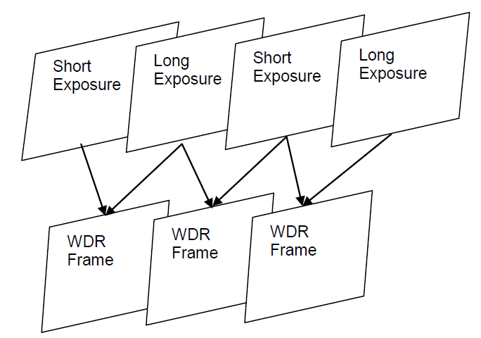

-   本模块可以通过[ot\_isp\_wdr\_merge\_mode](#ZH-CN_TOPIC_0000002504085037)来决定合成的方式。若该值为0，则用传统的WDR功能合成；若该值为1，则打开Fusion功能，即用来改善Flicker现象；其中[ot\_isp\_wdr\_combine\_attr](#ZH-CN_TOPIC_0000002504084787)结构体用来控制传统的WDR功能，而[ot\_isp\_fusion\_attr](#ZH-CN_TOPIC_0000002504085067)结构体用来控制Fusion功能。
-   传统的WDR，包括以下功能：
    -   可以去除鬼影。通过[ot\_isp\_wdr\_combine\_attr](#ZH-CN_TOPIC_0000002504084787)  来选择融合区域是采用短帧还是长帧；
    -   可以通过short\_threshold 和 long\_threshold 来控制选择长短帧的范围。即对于大于short\_threshold的像素选择短帧，小于long\_threshold 的像素选择长帧，而对于在两者之间的像素采用长短帧融合的方式；
    -   可以通过force\_long\_low\_threshold和force\_long\_hig\_threshold来控制运动区域选择长帧，对于亮度小于force\_long\_low\_threshold的运动区域强制选择长帧，亮度大于force\_long\_hig\_threshold的运动区域不强制选择长帧，对于亮度在两者之间的运动区域采用长短帧融合的方式；
    -   可以通过md\_thr\_low\_gain，md\_thr\_hig\_gain来控制运动检测；
    -   可以通过md\_ref\_flicker 来决定运动检测是否参考Flicker检测结果；
    -   可以通过short\_expo\_chk 来控制WDR融合是否检查短帧数据大小。

-   Fusion功能指适用于一般的室内场景（非宽动态）以及夜晚场景，用来改善工频闪问题。其中fusion\_threshold \[4\]是用来控制Fusion选择时每帧的阈值。

### API参考<a name="ZH-CN_TOPIC_0000002470925232"></a>

-   [ss\_mpi\_isp\_set\_fswdr\_attr](#ZH-CN_TOPIC_0000002503964935)：设置动态范围压缩参数。
-   [ss\_mpi\_isp\_get\_fswdr\_attr](#ZH-CN_TOPIC_0000002503965023)：获取动态范围压缩参数。


#### ss\_mpi\_isp\_set\_fswdr\_attr<a name="ZH-CN_TOPIC_0000002503964935"></a>

【描述】

设置帧合成参数。

【语法】

```
td_s32 ss_mpi_isp_set_fswdr_attr(ot_vi_pipe vi_pipe, const ot_isp_wdr_fs_attr *fswdr_attr)
```

【参数】

<a name="table29846mcpsimp"></a>
<table><thead align="left"><tr id="row29852mcpsimp"><th class="cellrowborder" valign="top" width="32%" id="mcps1.1.4.1.1"><p id="p29854mcpsimp"><a name="p29854mcpsimp"></a><a name="p29854mcpsimp"></a>参数名称</p>
</th>
<th class="cellrowborder" valign="top" width="52%" id="mcps1.1.4.1.2"><p id="p29856mcpsimp"><a name="p29856mcpsimp"></a><a name="p29856mcpsimp"></a>描述</p>
</th>
<th class="cellrowborder" valign="top" width="16%" id="mcps1.1.4.1.3"><p id="p29858mcpsimp"><a name="p29858mcpsimp"></a><a name="p29858mcpsimp"></a>输入/输出</p>
</th>
</tr>
</thead>
<tbody><tr id="row29860mcpsimp"><td class="cellrowborder" valign="top" width="32%" headers="mcps1.1.4.1.1 "><p id="p29862mcpsimp"><a name="p29862mcpsimp"></a><a name="p29862mcpsimp"></a>vi_pipe</p>
</td>
<td class="cellrowborder" valign="top" width="52%" headers="mcps1.1.4.1.2 "><p id="p29864mcpsimp"><a name="p29864mcpsimp"></a><a name="p29864mcpsimp"></a>vi_pipe号</p>
</td>
<td class="cellrowborder" valign="top" width="16%" headers="mcps1.1.4.1.3 "><p id="p29866mcpsimp"><a name="p29866mcpsimp"></a><a name="p29866mcpsimp"></a>输入</p>
</td>
</tr>
<tr id="row29867mcpsimp"><td class="cellrowborder" valign="top" width="32%" headers="mcps1.1.4.1.1 "><p id="p29869mcpsimp"><a name="p29869mcpsimp"></a><a name="p29869mcpsimp"></a>fswdr_attr</p>
</td>
<td class="cellrowborder" valign="top" width="52%" headers="mcps1.1.4.1.2 "><p id="p29871mcpsimp"><a name="p29871mcpsimp"></a><a name="p29871mcpsimp"></a>帧合成参数</p>
</td>
<td class="cellrowborder" valign="top" width="16%" headers="mcps1.1.4.1.3 "><p id="p29873mcpsimp"><a name="p29873mcpsimp"></a><a name="p29873mcpsimp"></a>输入</p>
</td>
</tr>
</tbody>
</table>

【返回值】

<a name="table29875mcpsimp"></a>
<table><thead align="left"><tr id="row29880mcpsimp"><th class="cellrowborder" valign="top" width="27%" id="mcps1.1.3.1.1"><p id="p29882mcpsimp"><a name="p29882mcpsimp"></a><a name="p29882mcpsimp"></a>返回值</p>
</th>
<th class="cellrowborder" valign="top" width="73%" id="mcps1.1.3.1.2"><p id="p29884mcpsimp"><a name="p29884mcpsimp"></a><a name="p29884mcpsimp"></a>描述</p>
</th>
</tr>
</thead>
<tbody><tr id="row29885mcpsimp"><td class="cellrowborder" valign="top" width="27%" headers="mcps1.1.3.1.1 "><p id="p29887mcpsimp"><a name="p29887mcpsimp"></a><a name="p29887mcpsimp"></a>0</p>
</td>
<td class="cellrowborder" valign="top" width="73%" headers="mcps1.1.3.1.2 "><p id="p29889mcpsimp"><a name="p29889mcpsimp"></a><a name="p29889mcpsimp"></a>成功。</p>
</td>
</tr>
<tr id="row29890mcpsimp"><td class="cellrowborder" valign="top" width="27%" headers="mcps1.1.3.1.1 "><p id="p29892mcpsimp"><a name="p29892mcpsimp"></a><a name="p29892mcpsimp"></a>非0</p>
</td>
<td class="cellrowborder" valign="top" width="73%" headers="mcps1.1.3.1.2 "><p id="p29894mcpsimp"><a name="p29894mcpsimp"></a><a name="p29894mcpsimp"></a>失败，其值为<span xml:lang="sv-SE" id="ph10195517299"><a name="ph10195517299"></a><a name="ph10195517299"></a>错误码</span>。</p>
</td>
</tr>
</tbody>
</table>

【需求】

-   头文件：ot\_common\_isp.h、ss\_mpi\_isp.h
-   库文件：libot\_isp.a、libss\_isp.a

【注意】

无

【举例】

无

【相关主题】

[ss\_mpi\_isp\_get\_fswdr\_attr](#ss_mpi_isp_get_fswdr_attr)

#### ss\_mpi\_isp\_get\_fswdr\_attr<a name="ZH-CN_TOPIC_0000002503965023"></a>

【描述】

获取帧合成参数。

【语法】

```
td_s32 ss_mpi_isp_get_fswdr_attr (ot_vi_pipe vi_pipe, ot_isp_wdr_fs_attr *fswdr_attr )
```

【参数】

<a name="table29917mcpsimp"></a>
<table><thead align="left"><tr id="row29923mcpsimp"><th class="cellrowborder" valign="top" width="32%" id="mcps1.1.4.1.1"><p id="p29925mcpsimp"><a name="p29925mcpsimp"></a><a name="p29925mcpsimp"></a>参数名称</p>
</th>
<th class="cellrowborder" valign="top" width="48%" id="mcps1.1.4.1.2"><p id="p29927mcpsimp"><a name="p29927mcpsimp"></a><a name="p29927mcpsimp"></a>描述</p>
</th>
<th class="cellrowborder" valign="top" width="20%" id="mcps1.1.4.1.3"><p id="p29929mcpsimp"><a name="p29929mcpsimp"></a><a name="p29929mcpsimp"></a>输入/输出</p>
</th>
</tr>
</thead>
<tbody><tr id="row29931mcpsimp"><td class="cellrowborder" valign="top" width="32%" headers="mcps1.1.4.1.1 "><p id="p29933mcpsimp"><a name="p29933mcpsimp"></a><a name="p29933mcpsimp"></a>vi_pipe</p>
</td>
<td class="cellrowborder" valign="top" width="48%" headers="mcps1.1.4.1.2 "><p id="p29935mcpsimp"><a name="p29935mcpsimp"></a><a name="p29935mcpsimp"></a>vi_pipe号</p>
</td>
<td class="cellrowborder" valign="top" width="20%" headers="mcps1.1.4.1.3 "><p id="p29937mcpsimp"><a name="p29937mcpsimp"></a><a name="p29937mcpsimp"></a>输入</p>
</td>
</tr>
<tr id="row29938mcpsimp"><td class="cellrowborder" valign="top" width="32%" headers="mcps1.1.4.1.1 "><p id="p29940mcpsimp"><a name="p29940mcpsimp"></a><a name="p29940mcpsimp"></a>fswdr_attr</p>
</td>
<td class="cellrowborder" valign="top" width="48%" headers="mcps1.1.4.1.2 "><p id="p29942mcpsimp"><a name="p29942mcpsimp"></a><a name="p29942mcpsimp"></a>帧合成参数</p>
</td>
<td class="cellrowborder" valign="top" width="20%" headers="mcps1.1.4.1.3 "><p id="p29944mcpsimp"><a name="p29944mcpsimp"></a><a name="p29944mcpsimp"></a>输出</p>
</td>
</tr>
</tbody>
</table>

【返回值】

<a name="table29946mcpsimp"></a>
<table><thead align="left"><tr id="row29951mcpsimp"><th class="cellrowborder" valign="top" width="27%" id="mcps1.1.3.1.1"><p id="p29953mcpsimp"><a name="p29953mcpsimp"></a><a name="p29953mcpsimp"></a>返回值</p>
</th>
<th class="cellrowborder" valign="top" width="73%" id="mcps1.1.3.1.2"><p id="p29955mcpsimp"><a name="p29955mcpsimp"></a><a name="p29955mcpsimp"></a>描述</p>
</th>
</tr>
</thead>
<tbody><tr id="row29956mcpsimp"><td class="cellrowborder" valign="top" width="27%" headers="mcps1.1.3.1.1 "><p id="p29958mcpsimp"><a name="p29958mcpsimp"></a><a name="p29958mcpsimp"></a>0</p>
</td>
<td class="cellrowborder" valign="top" width="73%" headers="mcps1.1.3.1.2 "><p id="p29960mcpsimp"><a name="p29960mcpsimp"></a><a name="p29960mcpsimp"></a>成功。</p>
</td>
</tr>
<tr id="row29961mcpsimp"><td class="cellrowborder" valign="top" width="27%" headers="mcps1.1.3.1.1 "><p id="p29963mcpsimp"><a name="p29963mcpsimp"></a><a name="p29963mcpsimp"></a>非0</p>
</td>
<td class="cellrowborder" valign="top" width="73%" headers="mcps1.1.3.1.2 "><p id="p29965mcpsimp"><a name="p29965mcpsimp"></a><a name="p29965mcpsimp"></a>失败，其值为<span xml:lang="sv-SE" id="ph10195517299"><a name="ph10195517299"></a><a name="ph10195517299"></a>错误码</span>。</p>
</td>
</tr>
</tbody>
</table>

【需求】

-   头文件：ot\_common\_isp.h、ss\_mpi\_isp.h
-   库文件：libot\_isp.a、libss\_isp.a

【注意】

无

【举例】

无

【相关主题】

[ss\_mpi\_isp\_set\_fswdr\_attr](#ss_mpi_isp_set_fswdr_attr)

### 数据类型<a name="ZH-CN_TOPIC_0000002503965085"></a>

-   [OT\_ISP\_WDR\_RATIO\_NUM](#ZH-CN_TOPIC_0000002503965091)：定义用于gain插值的WDR曝光比档位数。
-   [ot\_isp\_wdr\_merge\_mode](#ZH-CN_TOPIC_0000002504085037)：定义ISP 合成方式属性。
-   [ot\_isp\_fswdr\_mdt\_attr](#ZH-CN_TOPIC_0000002471084904)：定义ISP FSWDR运动检测的属性。
-   [ot\_isp\_wdr\_combine\_attr](#ZH-CN_TOPIC_0000002504084787)：定义ISP FSWDR combime属性。
-   [ot\_isp\_fusion\_attr](#ZH-CN_TOPIC_0000002504085067)：定义ISP FUSION属性。
-   [ot\_isp\_wdr\_wb\_gain\_pos](#ZH-CN_TOPIC_0000002504084713): 定义白平衡增益在ISP的位置属性
-   [ot\_isp\_fswdr\_manual\_attr](#ZH-CN_TOPIC_0000002471085076)：定义ISP FSWDR手动属性。
-   [ot\_isp\_fswdr\_auto\_attr](#ZH-CN_TOPIC_0000002504084849)：定义ISP FSWDR自动属性。
-   [ot\_isp\_wdr\_fs\_attr](#ZH-CN_TOPIC_0000002471085126)：定义ISP FSWDR属性。


#### OT\_ISP\_WDR\_RATIO\_NUM<a name="ZH-CN_TOPIC_0000002503965091"></a>

【说明】

定义用于gain插值的WDR曝光比档位数。

【定义】

```
#define OT_ISP_WDR_RATIO_NUM            10
```

【注意事项】

无。

【相关数据类型及接口】

[ot\_isp\_fswdr\_auto\_attr](#ot_isp_fswdr_auto_attr)

#### ot\_isp\_wdr\_merge\_mode<a name="ZH-CN_TOPIC_0000002504085037"></a>

【说明】

定义ISP合成方式属性。

【定义】

```
typedef enum {
    OT_ISP_MERGE_WDR_MODE      = 0,
    OT_ISP_MERGE_FUSION_MODE   = 1,
    OT_ISP_MERGE_BUTT
} ot_isp_wdr_merge_mode;
```

【成员】

<a name="table30024mcpsimp"></a>
<table><thead align="left"><tr id="row30029mcpsimp"><th class="cellrowborder" valign="top" width="56.00000000000001%" id="mcps1.1.3.1.1"><p id="p30031mcpsimp"><a name="p30031mcpsimp"></a><a name="p30031mcpsimp"></a>成员名称</p>
</th>
<th class="cellrowborder" valign="top" width="44%" id="mcps1.1.3.1.2"><p id="p30033mcpsimp"><a name="p30033mcpsimp"></a><a name="p30033mcpsimp"></a>描述</p>
</th>
</tr>
</thead>
<tbody><tr id="row30034mcpsimp"><td class="cellrowborder" valign="top" width="56.00000000000001%" headers="mcps1.1.3.1.1 "><p id="p30036mcpsimp"><a name="p30036mcpsimp"></a><a name="p30036mcpsimp"></a>OT_ISP_MERGE_WDR_MODE</p>
</td>
<td class="cellrowborder" valign="top" width="44%" headers="mcps1.1.3.1.2 "><p id="p30038mcpsimp"><a name="p30038mcpsimp"></a><a name="p30038mcpsimp"></a>运行在传统WDR模式下。</p>
</td>
</tr>
<tr id="row30039mcpsimp"><td class="cellrowborder" valign="top" width="56.00000000000001%" headers="mcps1.1.3.1.1 "><p id="p30041mcpsimp"><a name="p30041mcpsimp"></a><a name="p30041mcpsimp"></a>OT_ISP_MERGE_FUSION_MODE</p>
</td>
<td class="cellrowborder" valign="top" width="44%" headers="mcps1.1.3.1.2 "><p id="p30043mcpsimp"><a name="p30043mcpsimp"></a><a name="p30043mcpsimp"></a>运行在FUSION模式下。</p>
</td>
</tr>
<tr id="row30044mcpsimp"><td class="cellrowborder" valign="top" width="56.00000000000001%" headers="mcps1.1.3.1.1 "><p id="p30046mcpsimp"><a name="p30046mcpsimp"></a><a name="p30046mcpsimp"></a>OT_ISP_MERGE_BUTT</p>
</td>
<td class="cellrowborder" valign="top" width="44%" headers="mcps1.1.3.1.2 "><p id="p30048mcpsimp"><a name="p30048mcpsimp"></a><a name="p30048mcpsimp"></a>无效值</p>
</td>
</tr>
</tbody>
</table>

【注意事项】

无。

【相关数据类型及接口】

[ot\_isp\_wdr\_fs\_attr](#ot_isp_wdr_fs_attr)

#### ot\_isp\_fswdr\_mdt\_attr<a name="ZH-CN_TOPIC_0000002471084904"></a>

【说明】

定义ISPFSWDR运动检测属性。

【定义】

```
typedef struct {
    td_bool short_expo_chk;
    td_u16  short_check_threshold;
    td_bool md_ref_flicker;
    td_u8   mdt_still_threshold;
    td_u8   mdt_full_threshold;
    td_u8   mdt_long_blend;
    ot_op_mode op_type;
    ot_isp_fswdr_manual_attr manual_attr;
    ot_isp_fswdr_auto_attr   auto_attr;
} ot_isp_fswdr_mdt_attr;
```

【成员】

<a name="table30075mcpsimp"></a>
<table><thead align="left"><tr id="row30080mcpsimp"><th class="cellrowborder" valign="top" width="20%" id="mcps1.1.3.1.1"><p id="p30082mcpsimp"><a name="p30082mcpsimp"></a><a name="p30082mcpsimp"></a>成员名称</p>
</th>
<th class="cellrowborder" valign="top" width="80%" id="mcps1.1.3.1.2"><p id="p30084mcpsimp"><a name="p30084mcpsimp"></a><a name="p30084mcpsimp"></a>描述</p>
</th>
</tr>
</thead>
<tbody><tr id="row30086mcpsimp"><td class="cellrowborder" valign="top" width="20%" headers="mcps1.1.3.1.1 "><p id="p30088mcpsimp"><a name="p30088mcpsimp"></a><a name="p30088mcpsimp"></a>short_expo_chk</p>
</td>
<td class="cellrowborder" valign="top" width="80%" headers="mcps1.1.3.1.2 "><p id="p30090mcpsimp"><a name="p30090mcpsimp"></a><a name="p30090mcpsimp"></a>控制运动检测是否检查短帧数据大小，当短帧数据接近0时，WDR融合强制选长帧。</p>
<p id="p30091mcpsimp"><a name="p30091mcpsimp"></a><a name="p30091mcpsimp"></a>取值范围：[0, 0x1]</p>
<p id="p30092mcpsimp"><a name="p30092mcpsimp"></a><a name="p30092mcpsimp"></a>0：WDR融合时不检查短帧数据大小；</p>
<p id="p30093mcpsimp"><a name="p30093mcpsimp"></a><a name="p30093mcpsimp"></a>1：WDR融合时检查短帧数据大小。</p>
</td>
</tr>
<tr id="row30094mcpsimp"><td class="cellrowborder" valign="top" width="20%" headers="mcps1.1.3.1.1 "><p id="p30096mcpsimp"><a name="p30096mcpsimp"></a><a name="p30096mcpsimp"></a>short_check_threshold</p>
</td>
<td class="cellrowborder" valign="top" width="80%" headers="mcps1.1.3.1.2 "><p id="p30098mcpsimp"><a name="p30098mcpsimp"></a><a name="p30098mcpsimp"></a>短帧检查阈值。当短帧亮度小于该阈值时，WDR强制输出长帧。</p>
<p id="p30099mcpsimp"><a name="p30099mcpsimp"></a><a name="p30099mcpsimp"></a>取值范围：[0x0, 0xFFF]</p>
</td>
</tr>
<tr id="row30100mcpsimp"><td class="cellrowborder" valign="top" width="20%" headers="mcps1.1.3.1.1 "><p id="p30102mcpsimp"><a name="p30102mcpsimp"></a><a name="p30102mcpsimp"></a>md_ref_flicker</p>
</td>
<td class="cellrowborder" valign="top" width="80%" headers="mcps1.1.3.1.2 "><p id="p30104mcpsimp"><a name="p30104mcpsimp"></a><a name="p30104mcpsimp"></a>控制运动判断是否参考Flicker检测结果。</p>
<p id="p30105mcpsimp"><a name="p30105mcpsimp"></a><a name="p30105mcpsimp"></a>取值范围：[0,0x1]</p>
<p id="p30106mcpsimp"><a name="p30106mcpsimp"></a><a name="p30106mcpsimp"></a>0：做运动判断时不参考Flicker检测结果；</p>
<p id="p30107mcpsimp"><a name="p30107mcpsimp"></a><a name="p30107mcpsimp"></a>1：做运动判断时参考Flicker检测结果。</p>
</td>
</tr>
<tr id="row30108mcpsimp"><td class="cellrowborder" valign="top" width="20%" headers="mcps1.1.3.1.1 "><p id="p30110mcpsimp"><a name="p30110mcpsimp"></a><a name="p30110mcpsimp"></a>mdt_still_threshold</p>
</td>
<td class="cellrowborder" valign="top" width="80%" headers="mcps1.1.3.1.2 "><p id="p30112mcpsimp"><a name="p30112mcpsimp"></a><a name="p30112mcpsimp"></a>运动检测中判断为静止的阈值，当运动程度小于该阈值时，判断该像素点为静止</p>
<p id="p30113mcpsimp"><a name="p30113mcpsimp"></a><a name="p30113mcpsimp"></a>取值范围：[0,0xFE]</p>
</td>
</tr>
<tr id="row30114mcpsimp"><td class="cellrowborder" valign="top" width="20%" headers="mcps1.1.3.1.1 "><p id="p30116mcpsimp"><a name="p30116mcpsimp"></a><a name="p30116mcpsimp"></a>mdt_full_threshold</p>
</td>
<td class="cellrowborder" valign="top" width="80%" headers="mcps1.1.3.1.2 "><p id="p30118mcpsimp"><a name="p30118mcpsimp"></a><a name="p30118mcpsimp"></a>运动检测中判断为全运动的阈值，当运动程度大于该阈值时，判断该像素点为全运动。仅支持3合1WDR。</p>
<p id="p30119mcpsimp"><a name="p30119mcpsimp"></a><a name="p30119mcpsimp"></a>取值范围：[0,0xFE]</p>
</td>
</tr>
<tr id="row30120mcpsimp"><td class="cellrowborder" valign="top" width="20%" headers="mcps1.1.3.1.1 "><p id="p30122mcpsimp"><a name="p30122mcpsimp"></a><a name="p30122mcpsimp"></a>mdt_long_blend</p>
</td>
<td class="cellrowborder" valign="top" width="80%" headers="mcps1.1.3.1.2 "><p id="p30124mcpsimp"><a name="p30124mcpsimp"></a><a name="p30124mcpsimp"></a>运动区域叠加长帧的权重，当该值为0xFE时，运动区域全部选择长帧。</p>
<p id="p30125mcpsimp"><a name="p30125mcpsimp"></a><a name="p30125mcpsimp"></a>取值范围：[0x0,0xFE]</p>
</td>
</tr>
<tr id="row30126mcpsimp"><td class="cellrowborder" valign="top" width="20%" headers="mcps1.1.3.1.1 "><p id="p30128mcpsimp"><a name="p30128mcpsimp"></a><a name="p30128mcpsimp"></a>op_type</p>
</td>
<td class="cellrowborder" valign="top" width="80%" headers="mcps1.1.3.1.2 "><p id="p30130mcpsimp"><a name="p30130mcpsimp"></a><a name="p30130mcpsimp"></a>FSWDR工作类型。</p>
<a name="ul30131mcpsimp"></a><a name="ul30131mcpsimp"></a><ul id="ul30131mcpsimp"><li>OT_OP_MODE_AUTO：自动；</li><li>OT_OP_MODE_MANUAL：手动。</li></ul>
</td>
</tr>
<tr id="row30134mcpsimp"><td class="cellrowborder" valign="top" width="20%" headers="mcps1.1.3.1.1 "><p id="p30136mcpsimp"><a name="p30136mcpsimp"></a><a name="p30136mcpsimp"></a>manual_attr</p>
</td>
<td class="cellrowborder" valign="top" width="80%" headers="mcps1.1.3.1.2 "><p id="p30138mcpsimp"><a name="p30138mcpsimp"></a><a name="p30138mcpsimp"></a>FSWDR手动参数。</p>
</td>
</tr>
<tr id="row30139mcpsimp"><td class="cellrowborder" valign="top" width="20%" headers="mcps1.1.3.1.1 "><p id="p30141mcpsimp"><a name="p30141mcpsimp"></a><a name="p30141mcpsimp"></a>auto_attr</p>
</td>
<td class="cellrowborder" valign="top" width="80%" headers="mcps1.1.3.1.2 "><p id="p30143mcpsimp"><a name="p30143mcpsimp"></a><a name="p30143mcpsimp"></a>FSWDR自动参数。</p>
</td>
</tr>
</tbody>
</table>

【注意事项】

无。

【相关数据类型及接口】

[ot\_isp\_wdr\_fs\_attr](#ot_isp_wdr_fs_attr)

#### ot\_isp\_wdr\_combine\_attr<a name="ZH-CN_TOPIC_0000002504084787"></a>

【说明】

定义ISPFSWDR combine属性。

【定义】

```
typedef struct {
    td_bool motion_comp;
    td_bool forcelong_coarse;
    td_u16  short_threshold;
    td_u16  long_threshold;
    td_bool force_long;
    td_u16  force_long_low_threshold; 
    td_u16  force_long_hig_threshold; 
    ot_isp_fswdr_mdt_attr wdr_mdt;
    td_u16  forcelong_coarse_low_threshold; 
    td_u16  forcelong_coarse_high_threshold;
} ot_isp_wdr_combine_attr;
```

【成员】

<a name="table30167mcpsimp"></a>
<table><thead align="left"><tr id="row30172mcpsimp"><th class="cellrowborder" valign="top" width="27%" id="mcps1.1.3.1.1"><p id="p30174mcpsimp"><a name="p30174mcpsimp"></a><a name="p30174mcpsimp"></a>成员名称</p>
</th>
<th class="cellrowborder" valign="top" width="73%" id="mcps1.1.3.1.2"><p id="p30176mcpsimp"><a name="p30176mcpsimp"></a><a name="p30176mcpsimp"></a>描述</p>
</th>
</tr>
</thead>
<tbody><tr id="row30178mcpsimp"><td class="cellrowborder" valign="top" width="27%" headers="mcps1.1.3.1.1 "><p id="p30180mcpsimp"><a name="p30180mcpsimp"></a><a name="p30180mcpsimp"></a>motion_comp</p>
</td>
<td class="cellrowborder" valign="top" width="73%" headers="mcps1.1.3.1.2 "><p id="p30182mcpsimp"><a name="p30182mcpsimp"></a><a name="p30182mcpsimp"></a>WDR运动补偿使能。</p>
<p id="p30183mcpsimp"><a name="p30183mcpsimp"></a><a name="p30183mcpsimp"></a>取值范围：[0, 0x1]</p>
<p id="p30184mcpsimp"><a name="p30184mcpsimp"></a><a name="p30184mcpsimp"></a>0：关闭；</p>
<p id="p30185mcpsimp"><a name="p30185mcpsimp"></a><a name="p30185mcpsimp"></a>1：使能。</p>
<p id="p30186mcpsimp"><a name="p30186mcpsimp"></a><a name="p30186mcpsimp"></a>在某些室内日光灯场景下，运动补偿会加重频闪带来的横条纹现象，此时可以关闭运动补偿。</p>
</td>
</tr>
<tr id="row30187mcpsimp"><td class="cellrowborder" valign="top" width="27%" headers="mcps1.1.3.1.1 "><p id="p30189mcpsimp"><a name="p30189mcpsimp"></a><a name="p30189mcpsimp"></a>forcelong_coarse</p>
</td>
<td class="cellrowborder" valign="top" width="73%" headers="mcps1.1.3.1.2 "><p id="p30191mcpsimp"><a name="p30191mcpsimp"></a><a name="p30191mcpsimp"></a>强制输出长帧粗调使能。</p>
<p id="p30192mcpsimp"><a name="p30192mcpsimp"></a><a name="p30192mcpsimp"></a>取值范围：[0, 0x1]</p>
<p id="p30193mcpsimp"><a name="p30193mcpsimp"></a><a name="p30193mcpsimp"></a>0：关闭；</p>
<p id="p30194mcpsimp"><a name="p30194mcpsimp"></a><a name="p30194mcpsimp"></a>1：使能。</p>
</td>
</tr>
<tr id="row30195mcpsimp"><td class="cellrowborder" valign="top" width="27%" headers="mcps1.1.3.1.1 "><p id="p30197mcpsimp"><a name="p30197mcpsimp"></a><a name="p30197mcpsimp"></a>short_threshold</p>
</td>
<td class="cellrowborder" valign="top" width="73%" headers="mcps1.1.3.1.2 "><p id="p30199mcpsimp"><a name="p30199mcpsimp"></a><a name="p30199mcpsimp"></a>短曝光门限值，超过门限值的图像数据只选择短曝光数据。</p>
<p id="p30200mcpsimp"><a name="p30200mcpsimp"></a><a name="p30200mcpsimp"></a>取值范围：[0,0xFFF]</p>
</td>
</tr>
<tr id="row30201mcpsimp"><td class="cellrowborder" valign="top" width="27%" headers="mcps1.1.3.1.1 "><p id="p30203mcpsimp"><a name="p30203mcpsimp"></a><a name="p30203mcpsimp"></a>long_threshold</p>
</td>
<td class="cellrowborder" valign="top" width="73%" headers="mcps1.1.3.1.2 "><p id="p30205mcpsimp"><a name="p30205mcpsimp"></a><a name="p30205mcpsimp"></a>长曝光门限值，低于门限值的图像数据只选择长曝光数据。</p>
<p id="p30206mcpsimp"><a name="p30206mcpsimp"></a><a name="p30206mcpsimp"></a>取值范围：[0, short_threshold]</p>
</td>
</tr>
<tr id="row30207mcpsimp"><td class="cellrowborder" valign="top" width="27%" headers="mcps1.1.3.1.1 "><p id="p30209mcpsimp"><a name="p30209mcpsimp"></a><a name="p30209mcpsimp"></a>force_long</p>
</td>
<td class="cellrowborder" valign="top" width="73%" headers="mcps1.1.3.1.2 "><p id="p30211mcpsimp"><a name="p30211mcpsimp"></a><a name="p30211mcpsimp"></a>强制输出长帧使能。</p>
<p id="p30212mcpsimp"><a name="p30212mcpsimp"></a><a name="p30212mcpsimp"></a>取值范围：[0,0x1]</p>
<p id="p30213mcpsimp"><a name="p30213mcpsimp"></a><a name="p30213mcpsimp"></a>1：使能；</p>
<p id="p30214mcpsimp"><a name="p30214mcpsimp"></a><a name="p30214mcpsimp"></a>0：禁止。</p>
</td>
</tr>
<tr id="row30215mcpsimp"><td class="cellrowborder" valign="top" width="27%" headers="mcps1.1.3.1.1 "><p id="p30217mcpsimp"><a name="p30217mcpsimp"></a><a name="p30217mcpsimp"></a>force_long_low_threshold</p>
</td>
<td class="cellrowborder" valign="top" width="73%" headers="mcps1.1.3.1.2 "><p id="p30219mcpsimp"><a name="p30219mcpsimp"></a><a name="p30219mcpsimp"></a>强制输出长帧的低阈值，亮度低于该阈值的运动区域强制输出长帧</p>
<p id="p30220mcpsimp"><a name="p30220mcpsimp"></a><a name="p30220mcpsimp"></a>取值范围：[0x0, 0xFFF]</p>
</td>
</tr>
<tr id="row30221mcpsimp"><td class="cellrowborder" valign="top" width="27%" headers="mcps1.1.3.1.1 "><p id="p30223mcpsimp"><a name="p30223mcpsimp"></a><a name="p30223mcpsimp"></a>force_long_hig_threshold</p>
</td>
<td class="cellrowborder" valign="top" width="73%" headers="mcps1.1.3.1.2 "><p id="p30225mcpsimp"><a name="p30225mcpsimp"></a><a name="p30225mcpsimp"></a>强制输出长帧的高阈值，亮度大于该阈值的运动区域不强制输出长帧</p>
<p id="p30226mcpsimp"><a name="p30226mcpsimp"></a><a name="p30226mcpsimp"></a>取值范围：[0x0, 0xFFF]</p>
</td>
</tr>
<tr id="row30227mcpsimp"><td class="cellrowborder" valign="top" width="27%" headers="mcps1.1.3.1.1 "><p id="p30229mcpsimp"><a name="p30229mcpsimp"></a><a name="p30229mcpsimp"></a>wdr_mdt;</p>
</td>
<td class="cellrowborder" valign="top" width="73%" headers="mcps1.1.3.1.2 "><p id="p30231mcpsimp"><a name="p30231mcpsimp"></a><a name="p30231mcpsimp"></a>FSWDR运动检测参数，具体参见ot_isp_fswdr_mdt_attr。</p>
</td>
</tr>
<tr id="row30232mcpsimp"><td class="cellrowborder" valign="top" width="27%" headers="mcps1.1.3.1.1 "><p id="p30234mcpsimp"><a name="p30234mcpsimp"></a><a name="p30234mcpsimp"></a>forcelong_coarse_low_threshold</p>
</td>
<td class="cellrowborder" valign="top" width="73%" headers="mcps1.1.3.1.2 "><p id="p30236mcpsimp"><a name="p30236mcpsimp"></a><a name="p30236mcpsimp"></a>强制输出长帧粗调的低阈值，亮度低于该阈值的运动区域强制输出长帧。</p>
<p id="p30237mcpsimp"><a name="p30237mcpsimp"></a><a name="p30237mcpsimp"></a>取值范围：[0x0,0x3FFF]</p>
</td>
</tr>
<tr id="row30238mcpsimp"><td class="cellrowborder" valign="top" width="27%" headers="mcps1.1.3.1.1 "><p id="p30240mcpsimp"><a name="p30240mcpsimp"></a><a name="p30240mcpsimp"></a>forcelong_coarse_high_threshold</p>
</td>
<td class="cellrowborder" valign="top" width="73%" headers="mcps1.1.3.1.2 "><p id="p30242mcpsimp"><a name="p30242mcpsimp"></a><a name="p30242mcpsimp"></a>强制输出长帧粗调的高阈值，亮度大于该阈值的运动区域不强制输出长帧。</p>
<p id="p30243mcpsimp"><a name="p30243mcpsimp"></a><a name="p30243mcpsimp"></a>取值范围：[0x0,0x3FFF]</p>
</td>
</tr>
</tbody>
</table>

【注意事项】

注意force\_long\_low\_threshold应小于force\_long\_hig\_threshold。

【相关数据类型及接口】

[ot\_isp\_wdr\_fs\_attr](#ot_isp_wdr_fs_attr)

#### ot\_isp\_fusion\_attr<a name="ZH-CN_TOPIC_0000002504085067"></a>

【说明】

定义ISP FUSION属性。

【定义】

```
typedef struct {
    td_u16  fusion_threshold[OT_ISP_WDR_MAX_FRAME_NUM];
} ot_isp_fusion_attr;
```

【成员】

<a name="table30258mcpsimp"></a>
<table><thead align="left"><tr id="row30263mcpsimp"><th class="cellrowborder" valign="top" width="28.999999999999996%" id="mcps1.1.3.1.1"><p id="p30265mcpsimp"><a name="p30265mcpsimp"></a><a name="p30265mcpsimp"></a>成员名称</p>
</th>
<th class="cellrowborder" valign="top" width="71%" id="mcps1.1.3.1.2"><p id="p30267mcpsimp"><a name="p30267mcpsimp"></a><a name="p30267mcpsimp"></a>描述</p>
</th>
</tr>
</thead>
<tbody><tr id="row30268mcpsimp"><td class="cellrowborder" valign="top" width="28.999999999999996%" headers="mcps1.1.3.1.1 "><p id="p30270mcpsimp"><a name="p30270mcpsimp"></a><a name="p30270mcpsimp"></a>fusion_threshold[OT_ISP_WDR_MAX_FRAME_NUM]</p>
</td>
<td class="cellrowborder" valign="top" width="71%" headers="mcps1.1.3.1.2 "><p id="p30273mcpsimp"><a name="p30273mcpsimp"></a><a name="p30273mcpsimp"></a>对应Fusion模式下超短帧，短帧，中帧，长帧的阈值，将输入数据限制在阈值以下。</p>
<p id="p30274mcpsimp"><a name="p30274mcpsimp"></a><a name="p30274mcpsimp"></a>取值范围：[0,0x3FFF]</p>
</td>
</tr>
</tbody>
</table>

【注意事项】

无。

【相关数据类型及接口】

[ot\_isp\_wdr\_fs\_attr](#ot_isp_wdr_fs_attr)

#### ot\_isp\_wdr\_wb\_gain\_pos<a name="ZH-CN_TOPIC_0000002504084713"></a>

【说明】

定义白平衡增益在ISP的位置属性。

【定义】

```
typedef enum {
    OT_ISP_WDR_WBGAIN_IN_DG1         = 0,
    OT_ISP_WDR_WBGAIN_IN_WB          = 1,
    OT_ISP_WDR_WBGAIN_POS_BUTT
} ot_isp_wdr_wb_gain_pos;
```

【成员】

<a name="table30292mcpsimp"></a>
<table><thead align="left"><tr id="row30297mcpsimp"><th class="cellrowborder" valign="top" width="48%" id="mcps1.1.3.1.1"><p id="p30299mcpsimp"><a name="p30299mcpsimp"></a><a name="p30299mcpsimp"></a>成员名称</p>
</th>
<th class="cellrowborder" valign="top" width="52%" id="mcps1.1.3.1.2"><p id="p30301mcpsimp"><a name="p30301mcpsimp"></a><a name="p30301mcpsimp"></a>描述</p>
</th>
</tr>
</thead>
<tbody><tr id="row30302mcpsimp"><td class="cellrowborder" valign="top" width="48%" headers="mcps1.1.3.1.1 "><p id="p30304mcpsimp"><a name="p30304mcpsimp"></a><a name="p30304mcpsimp"></a>OT_ISP_WDR_WBGAIN_IN_DG1</p>
</td>
<td class="cellrowborder" valign="top" width="52%" headers="mcps1.1.3.1.2 "><p id="p30306mcpsimp"><a name="p30306mcpsimp"></a><a name="p30306mcpsimp"></a>0x0：白平衡增益配置在WDR合成前的DG1处</p>
</td>
</tr>
<tr id="row30307mcpsimp"><td class="cellrowborder" valign="top" width="48%" headers="mcps1.1.3.1.1 "><p id="p30309mcpsimp"><a name="p30309mcpsimp"></a><a name="p30309mcpsimp"></a>OT_ISP_WDR_WBGAIN_IN_WB</p>
</td>
<td class="cellrowborder" valign="top" width="52%" headers="mcps1.1.3.1.2 "><p id="p30311mcpsimp"><a name="p30311mcpsimp"></a><a name="p30311mcpsimp"></a>0x1：白平衡增益配置在WB处。</p>
</td>
</tr>
<tr id="row30312mcpsimp"><td class="cellrowborder" valign="top" width="48%" headers="mcps1.1.3.1.1 "><p id="p30314mcpsimp"><a name="p30314mcpsimp"></a><a name="p30314mcpsimp"></a>OT_ISP_WDR_WBGAIN_POS_BUTT</p>
</td>
<td class="cellrowborder" valign="top" width="52%" headers="mcps1.1.3.1.2 "><p id="p30316mcpsimp"><a name="p30316mcpsimp"></a><a name="p30316mcpsimp"></a>无效值。</p>
</td>
</tr>
</tbody>
</table>

【注意事项】

SS928V100仅支持白平衡增益配置在WB处。

【相关数据类型及接口】

无

#### ot\_isp\_fswdr\_manual\_attr<a name="ZH-CN_TOPIC_0000002471085076"></a>

【说明】

定义ISP FSWDR手动属性。

【定义】

```
typedef struct {
    td_u8 md_thr_low_gain;
    td_u8 md_thr_hig_gain;
} ot_isp_fswdr_manual_attr;
```

【成员】

<a name="table30331mcpsimp"></a>
<table><thead align="left"><tr id="row30336mcpsimp"><th class="cellrowborder" valign="top" width="39%" id="mcps1.1.3.1.1"><p id="p30338mcpsimp"><a name="p30338mcpsimp"></a><a name="p30338mcpsimp"></a>成员名称</p>
</th>
<th class="cellrowborder" valign="top" width="61%" id="mcps1.1.3.1.2"><p id="p30340mcpsimp"><a name="p30340mcpsimp"></a><a name="p30340mcpsimp"></a>描述</p>
</th>
</tr>
</thead>
<tbody><tr id="row30342mcpsimp"><td class="cellrowborder" valign="top" width="39%" headers="mcps1.1.3.1.1 "><p id="p30344mcpsimp"><a name="p30344mcpsimp"></a><a name="p30344mcpsimp"></a>md_thr_low_gain</p>
</td>
<td class="cellrowborder" valign="top" width="61%" headers="mcps1.1.3.1.2 "><p id="p30346mcpsimp"><a name="p30346mcpsimp"></a><a name="p30346mcpsimp"></a>手动模式下判断是否运动的低阈值系数。值越大，运动程度越小。取值范围：[0, md_thr_hig_gain]</p>
</td>
</tr>
<tr id="row30347mcpsimp"><td class="cellrowborder" valign="top" width="39%" headers="mcps1.1.3.1.1 "><p id="p30349mcpsimp"><a name="p30349mcpsimp"></a><a name="p30349mcpsimp"></a>md_thr_hig_gain</p>
</td>
<td class="cellrowborder" valign="top" width="61%" headers="mcps1.1.3.1.2 "><p id="p30351mcpsimp"><a name="p30351mcpsimp"></a><a name="p30351mcpsimp"></a>手动模式下判断是否运动的高阈值系数。值越大，运动程度越小。取值范围：[0, 0xFF]。</p>
</td>
</tr>
</tbody>
</table>

【相关数据类型及接口】

[ot\_isp\_fswdr\_mdt\_attr](#ot_isp_fswdr_mdt_attr)

#### ot\_isp\_fswdr\_auto\_attr<a name="ZH-CN_TOPIC_0000002504084849"></a>

【说明】

定义ISP FSWDR自动属性。

【定义】

```
typedef struct {
    td_u8 md_thr_low_gain[OT_ISP_WDR_RATIO_NUM][OT_ISP_AUTO_ISO_NUM];
    td_u8 md_thr_hig_gain[OT_ISP_WDR_RATIO_NUM][OT_ISP_AUTO_ISO_NUM];
} ot_isp_fswdr_auto_attr;
```

【成员】

<a name="table30370mcpsimp"></a>
<table><thead align="left"><tr id="row30375mcpsimp"><th class="cellrowborder" valign="top" width="46%" id="mcps1.1.3.1.1"><p id="p30377mcpsimp"><a name="p30377mcpsimp"></a><a name="p30377mcpsimp"></a>成员名称</p>
</th>
<th class="cellrowborder" valign="top" width="54%" id="mcps1.1.3.1.2"><p id="p30379mcpsimp"><a name="p30379mcpsimp"></a><a name="p30379mcpsimp"></a>描述</p>
</th>
</tr>
</thead>
<tbody><tr id="row30381mcpsimp"><td class="cellrowborder" valign="top" width="46%" headers="mcps1.1.3.1.1 "><p id="p30383mcpsimp"><a name="p30383mcpsimp"></a><a name="p30383mcpsimp"></a>md_thr_low_gain [<a href="#OT_ISP_WDR_RATIO_NUM"><span xml:lang="fr-FR" id="ph30385mcpsimp"><a name="ph30385mcpsimp"></a><a name="ph30385mcpsimp"></a>OT_ISP_WDR_RATIO_NUM</span></a>][OT_ISP_AUTO_ISO_NUM]</p>
</td>
<td class="cellrowborder" valign="top" width="54%" headers="mcps1.1.3.1.2 "><p id="p30388mcpsimp"><a name="p30388mcpsimp"></a><a name="p30388mcpsimp"></a>自动模式下判断是否运动的低阈值系数。值越大，运动程度越小。</p>
<p id="p30389mcpsimp"><a name="p30389mcpsimp"></a><a name="p30389mcpsimp"></a>取值范围：[0,0xFF]</p>
</td>
</tr>
<tr id="row30390mcpsimp"><td class="cellrowborder" valign="top" width="46%" headers="mcps1.1.3.1.1 "><p id="p30392mcpsimp"><a name="p30392mcpsimp"></a><a name="p30392mcpsimp"></a>md_thr_hig_gain [<a href="#OT_ISP_WDR_RATIO_NUM"><span xml:lang="fr-FR" id="ph30394mcpsimp"><a name="ph30394mcpsimp"></a><a name="ph30394mcpsimp"></a>OT_ISP_WDR_RATIO_NUM</span></a>][OT_ISP_AUTO_ISO_NUM]</p>
</td>
<td class="cellrowborder" valign="top" width="54%" headers="mcps1.1.3.1.2 "><p id="p30397mcpsimp"><a name="p30397mcpsimp"></a><a name="p30397mcpsimp"></a>自动模式下判断是否运动的高阈值系数。值越大，运动程度越小。</p>
<p id="p30398mcpsimp"><a name="p30398mcpsimp"></a><a name="p30398mcpsimp"></a>取值范围：[0,0xFF]</p>
</td>
</tr>
</tbody>
</table>

【相关数据类型及接口】

[ot\_isp\_fswdr\_mdt\_attr](#ot_isp_fswdr_mdt_attr)

#### ot\_isp\_wdr\_fs\_attr<a name="ZH-CN_TOPIC_0000002471085126"></a>

【说明】

定义ISP FSWDR属性。

【定义】

```
typedef struct {
    ot_isp_wdr_merge_mode   wdr_merge_mode;
    ot_isp_wdr_combine_attr wdr_combine;
    ot_isp_fusion_attr      fusion_attr;
} ot_isp_wdr_fs_attr;
```

【成员】

<a name="table30416mcpsimp"></a>
<table><thead align="left"><tr id="row30421mcpsimp"><th class="cellrowborder" valign="top" width="28.000000000000004%" id="mcps1.1.3.1.1"><p id="p30423mcpsimp"><a name="p30423mcpsimp"></a><a name="p30423mcpsimp"></a>成员名称</p>
</th>
<th class="cellrowborder" valign="top" width="72%" id="mcps1.1.3.1.2"><p id="p30425mcpsimp"><a name="p30425mcpsimp"></a><a name="p30425mcpsimp"></a>描述</p>
</th>
</tr>
</thead>
<tbody><tr id="row30427mcpsimp"><td class="cellrowborder" valign="top" width="28.000000000000004%" headers="mcps1.1.3.1.1 "><p id="p30429mcpsimp"><a name="p30429mcpsimp"></a><a name="p30429mcpsimp"></a>wdr_merge_mode</p>
</td>
<td class="cellrowborder" valign="top" width="72%" headers="mcps1.1.3.1.2 "><p id="p30431mcpsimp"><a name="p30431mcpsimp"></a><a name="p30431mcpsimp"></a>合成方式。</p>
<p id="p30432mcpsimp"><a name="p30432mcpsimp"></a><a name="p30432mcpsimp"></a>取值范围：[0,0x1]</p>
<p id="p30433mcpsimp"><a name="p30433mcpsimp"></a><a name="p30433mcpsimp"></a>0：传统的WDR合成；</p>
<p id="p30434mcpsimp"><a name="p30434mcpsimp"></a><a name="p30434mcpsimp"></a>1：Fusion合成。</p>
<p id="p30435mcpsimp"><a name="p30435mcpsimp"></a><a name="p30435mcpsimp"></a>在室内正常照度下存在工频闪时或者夜晚场景，建议采用Fusion合成，具体参见<a href="#ot_isp_wdr_merge_mode">ot_isp_wdr_merge_mode</a>。</p>
</td>
</tr>
<tr id="row30437mcpsimp"><td class="cellrowborder" valign="top" width="28.000000000000004%" headers="mcps1.1.3.1.1 "><p id="p30439mcpsimp"><a name="p30439mcpsimp"></a><a name="p30439mcpsimp"></a>wdr_combine</p>
</td>
<td class="cellrowborder" valign="top" width="72%" headers="mcps1.1.3.1.2 "><p id="p30441mcpsimp"><a name="p30441mcpsimp"></a><a name="p30441mcpsimp"></a>传统的WDR合成结构体，具体参见<a href="#ot_isp_wdr_combine_attr">ot_isp_wdr_combine_attr</a>。</p>
</td>
</tr>
<tr id="row30443mcpsimp"><td class="cellrowborder" valign="top" width="28.000000000000004%" headers="mcps1.1.3.1.1 "><p id="p30445mcpsimp"><a name="p30445mcpsimp"></a><a name="p30445mcpsimp"></a>fusion_attr</p>
</td>
<td class="cellrowborder" valign="top" width="72%" headers="mcps1.1.3.1.2 "><p xml:lang="sv-SE" id="p30447mcpsimp"><a name="p30447mcpsimp"></a><a name="p30447mcpsimp"></a><span xml:lang="en-US" id="ph30448mcpsimp"><a name="ph30448mcpsimp"></a><a name="ph30448mcpsimp"></a>Fusion合成结构体，具体参见</span><a href="#ot_isp_fusion_attr">ot_isp_fusion_attr</a><span xml:lang="en-US" id="ph30450mcpsimp"><a name="ph30450mcpsimp"></a><a name="ph30450mcpsimp"></a>。</span></p>
</td>
</tr>
</tbody>
</table>

【注意事项】

WDR功能分为自动和手动：

-   op\_type  为OT\_OP\_MODE\_AUTO，使用自动WDR功能。
-   op\_type  设置为OT\_OP\_MODE\_MANUAL，使用手动WDR功能。

【相关数据类型及接口】

[ss\_mpi\_isp\_set\_fswdr\_attr](#ss_mpi_isp_set_fswdr_attr)

## AWB量产标定工具<a name="ZH-CN_TOPIC_0000002504084875"></a>


### 功能描述<a name="ZH-CN_TOPIC_0000002503964911"></a>

> **CAUTION:** 
>AWB量产标定结果通过修正AWB的静态白平衡系数实现个体差异校正。因此，用户通过MPI接口修改静态白平衡系数，会导致量产标定失效。

AWB量产标定工具实现在量产过程中，针对不同机器的差异进行对AWB差异参数校正的功能。用户可以调用ss\_mpi\_isp\_get\_lightbox\_gain接口，在色温范围4500K到6500K的均匀光源下的均匀背景环境下，获取图像中心若干个块的Rgain和Bgain的均值，即AWB增益，用于量产过程中矫正不同机器的AWB差异参数。

AWB差异参数的校正过程：

1.  小规模试产过程中进行：取若干台样机，分别放置到量产标定环境（色温范围4500K到6500K，均匀光源，均匀背景），待AE稳定后（避免RGrGbB任一分量饱和），调用ss\_mpi\_isp\_get\_lightbox\_gain接口，得到每台样机在量产标定环境的AWB增益值（请参考ot\_isp\_awb\_calibration\_gain结构体定义）。
2.  小规模试产过程中进行：根据步骤1中若干台样机在量产标定环境的AWB增益，由用户自己确定其中一台机器作为GoldenSample。推荐基于GoldenSample机器完成AWB, CCM标定，同时GoldenSample作为AWB差异参数校准的基准。
3.  取GoldenSample，采集多个色温下24色卡Raw数据，完成AWB、CCM标定流程（标定得到静态白平衡系数、普朗克曲线参数、色温曲线参数、多色温CCM矩阵系数等）。
4.  将GoldenSample标定得到的AWB、CCM参数通过cmos.c文件的cmos\_get\_awb\_default接口配置。定义cmos.c文件的GOLDEN\_RGAIN=GoldenSample在量产标定环境得到的avg\_r\_gain，定义cmos.c文件的GOLDEN\_BGAIN=GoldenSample在量产标定环境得到的avg\_b\_gain。
5.  若用户不进行步骤1、2，则任意选取一台机器作为GoldenSample，完成步骤3、4的操作。
6.  量产过程中进行：取任意一台需要矫正的机器作为Sample，重复步骤1，得到该台机器在量产标定环境的AWB增益。通过cmos.c中的sensor\_set\_init对Sample的AWB增益进行配置。\(请参考ot\_isp\_init\_attr和ot\_isp\_awb\_calibration\_gain结构体定义。ot\_isp\_init\_attr. sample\_r\_gain =Sample在量产标定环境得到的avg\_r\_gain，ot\_isp\_init\_attr  sample\_b\_gain =Sample在量产标定环境得到的avg\_b\_gain\)。
7.  AWB程序将会根据GoldenSample机器的AWB增益以及Sample机器的AWB增益实现对Sample机器的AWB差异参数的校正，改善机器个体之间的颜色一致性。

    **图 1**  AWB小规模试产过程中确定GoldenSample流程图<a name="fig30489mcpsimp"></a>  
    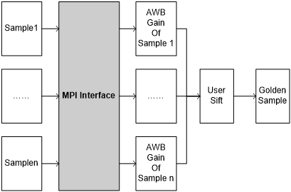

### API参考<a name="ZH-CN_TOPIC_0000002470925064"></a>

请参考2.2小节中的ss\_mpi\_isp\_get\_lightbox\_gain。

### 数据类型<a name="ZH-CN_TOPIC_0000002470925192"></a>

请参考2.3小节中的ot\_isp\_awb\_calibration\_gain。

## ColorTone<a name="ZH-CN_TOPIC_0000002470924966"></a>


### 功能描述<a name="ZH-CN_TOPIC_0000002504084771"></a>

ColorTone提供色调调节接口，用户可通过该接口实现图像颜色偏红、偏绿、偏蓝等喜好调节。

### API参考<a name="ZH-CN_TOPIC_0000002504084999"></a>

-   [ss\_mpi\_isp\_set\_color\_tone\_attr](#ZH-CN_TOPIC_0000002470925220)：设置色调的参数。
-   [ss\_mpi\_isp\_get\_color\_tone\_attr](#ZH-CN_TOPIC_0000002504085039)：获取色调的参数。


#### ss\_mpi\_isp\_set\_color\_tone\_attr<a name="ZH-CN_TOPIC_0000002470925220"></a>

【描述】

设置色调的参数。

【语法】

```
td_s32 ss_mpi_isp_set_color_tone_attr(ot_vi_pipe vi_pipe, const ot_isp_color_tone_attr *ct_attr);
```

【参数】

<a name="table30521mcpsimp"></a>
<table><thead align="left"><tr id="row30527mcpsimp"><th class="cellrowborder" valign="top" width="37.37373737373737%" id="mcps1.1.4.1.1"><p id="p30529mcpsimp"><a name="p30529mcpsimp"></a><a name="p30529mcpsimp"></a>参数名称</p>
</th>
<th class="cellrowborder" valign="top" width="46.464646464646464%" id="mcps1.1.4.1.2"><p id="p30531mcpsimp"><a name="p30531mcpsimp"></a><a name="p30531mcpsimp"></a>描述</p>
</th>
<th class="cellrowborder" valign="top" width="16.16161616161616%" id="mcps1.1.4.1.3"><p id="p30533mcpsimp"><a name="p30533mcpsimp"></a><a name="p30533mcpsimp"></a>输入/输出</p>
</th>
</tr>
</thead>
<tbody><tr id="row30534mcpsimp"><td class="cellrowborder" valign="top" width="37.37373737373737%" headers="mcps1.1.4.1.1 "><p id="p30536mcpsimp"><a name="p30536mcpsimp"></a><a name="p30536mcpsimp"></a>vi_pipe</p>
</td>
<td class="cellrowborder" valign="top" width="46.464646464646464%" headers="mcps1.1.4.1.2 "><p id="p30538mcpsimp"><a name="p30538mcpsimp"></a><a name="p30538mcpsimp"></a>Vi Pipe号</p>
</td>
<td class="cellrowborder" valign="top" width="16.16161616161616%" headers="mcps1.1.4.1.3 "><p id="p30540mcpsimp"><a name="p30540mcpsimp"></a><a name="p30540mcpsimp"></a>输入</p>
</td>
</tr>
<tr id="row30541mcpsimp"><td class="cellrowborder" valign="top" width="37.37373737373737%" headers="mcps1.1.4.1.1 "><p id="p30543mcpsimp"><a name="p30543mcpsimp"></a><a name="p30543mcpsimp"></a>ct_attr</p>
</td>
<td class="cellrowborder" valign="top" width="46.464646464646464%" headers="mcps1.1.4.1.2 "><p id="p30545mcpsimp"><a name="p30545mcpsimp"></a><a name="p30545mcpsimp"></a>色调的参数。</p>
</td>
<td class="cellrowborder" valign="top" width="16.16161616161616%" headers="mcps1.1.4.1.3 "><p id="p30547mcpsimp"><a name="p30547mcpsimp"></a><a name="p30547mcpsimp"></a>输入</p>
</td>
</tr>
</tbody>
</table>

【返回值】

<a name="table30550mcpsimp"></a>
<table><thead align="left"><tr id="row30555mcpsimp"><th class="cellrowborder" valign="top" width="27%" id="mcps1.1.3.1.1"><p id="p30557mcpsimp"><a name="p30557mcpsimp"></a><a name="p30557mcpsimp"></a>返回值</p>
</th>
<th class="cellrowborder" valign="top" width="73%" id="mcps1.1.3.1.2"><p id="p30559mcpsimp"><a name="p30559mcpsimp"></a><a name="p30559mcpsimp"></a>描述</p>
</th>
</tr>
</thead>
<tbody><tr id="row30560mcpsimp"><td class="cellrowborder" valign="top" width="27%" headers="mcps1.1.3.1.1 "><p id="p30562mcpsimp"><a name="p30562mcpsimp"></a><a name="p30562mcpsimp"></a>0</p>
</td>
<td class="cellrowborder" valign="top" width="73%" headers="mcps1.1.3.1.2 "><p id="p30564mcpsimp"><a name="p30564mcpsimp"></a><a name="p30564mcpsimp"></a>成功。</p>
</td>
</tr>
<tr id="row30565mcpsimp"><td class="cellrowborder" valign="top" width="27%" headers="mcps1.1.3.1.1 "><p id="p30567mcpsimp"><a name="p30567mcpsimp"></a><a name="p30567mcpsimp"></a>非0</p>
</td>
<td class="cellrowborder" valign="top" width="73%" headers="mcps1.1.3.1.2 "><p id="p30569mcpsimp"><a name="p30569mcpsimp"></a><a name="p30569mcpsimp"></a>失败，其值为<span xml:lang="sv-SE" id="ph10195517299"><a name="ph10195517299"></a><a name="ph10195517299"></a>错误码</span>。</p>
</td>
</tr>
</tbody>
</table>

【需求】

-   头文件：ot\_common\_awb.h、ss\_mpi\_awb.h、ss\_mpi\_isp.h
-   库文件：libot\_isp.a、libss\_isp.a、libot\_awb.a

【注意】

无

【举例】

无

【相关主题】

[ss\_mpi\_isp\_get\_color\_tone\_attr](#ss_mpi_isp_get_color_tone_attr)

#### ss\_mpi\_isp\_get\_color\_tone\_attr<a name="ZH-CN_TOPIC_0000002504085039"></a>

【描述】

获取色调的参数。

【语法】

```
td_s32 ss_mpi_isp_get_color_tone_attr(ot_vi_pipe vi_pipe, ot_isp_color_tone_attr *ct_attr);
```

【参数】

<a name="table30594mcpsimp"></a>
<table><thead align="left"><tr id="row30600mcpsimp"><th class="cellrowborder" valign="top" width="39%" id="mcps1.1.4.1.1"><p id="p30602mcpsimp"><a name="p30602mcpsimp"></a><a name="p30602mcpsimp"></a>参数名称</p>
</th>
<th class="cellrowborder" valign="top" width="45%" id="mcps1.1.4.1.2"><p id="p30604mcpsimp"><a name="p30604mcpsimp"></a><a name="p30604mcpsimp"></a>描述</p>
</th>
<th class="cellrowborder" valign="top" width="16%" id="mcps1.1.4.1.3"><p id="p30606mcpsimp"><a name="p30606mcpsimp"></a><a name="p30606mcpsimp"></a>输入/输出</p>
</th>
</tr>
</thead>
<tbody><tr id="row30607mcpsimp"><td class="cellrowborder" valign="top" width="39%" headers="mcps1.1.4.1.1 "><p id="p30609mcpsimp"><a name="p30609mcpsimp"></a><a name="p30609mcpsimp"></a>vi_pipe</p>
</td>
<td class="cellrowborder" valign="top" width="45%" headers="mcps1.1.4.1.2 "><p id="p30611mcpsimp"><a name="p30611mcpsimp"></a><a name="p30611mcpsimp"></a>Vi Pipe号</p>
</td>
<td class="cellrowborder" valign="top" width="16%" headers="mcps1.1.4.1.3 "><p id="p30613mcpsimp"><a name="p30613mcpsimp"></a><a name="p30613mcpsimp"></a>输入</p>
</td>
</tr>
<tr id="row30614mcpsimp"><td class="cellrowborder" valign="top" width="39%" headers="mcps1.1.4.1.1 "><p id="p30616mcpsimp"><a name="p30616mcpsimp"></a><a name="p30616mcpsimp"></a>ct_attr</p>
</td>
<td class="cellrowborder" valign="top" width="45%" headers="mcps1.1.4.1.2 "><p id="p30618mcpsimp"><a name="p30618mcpsimp"></a><a name="p30618mcpsimp"></a>色调的参数。</p>
</td>
<td class="cellrowborder" valign="top" width="16%" headers="mcps1.1.4.1.3 "><p id="p30620mcpsimp"><a name="p30620mcpsimp"></a><a name="p30620mcpsimp"></a>输出</p>
</td>
</tr>
</tbody>
</table>

【返回值】

<a name="table30623mcpsimp"></a>
<table><thead align="left"><tr id="row30628mcpsimp"><th class="cellrowborder" valign="top" width="27%" id="mcps1.1.3.1.1"><p id="p30630mcpsimp"><a name="p30630mcpsimp"></a><a name="p30630mcpsimp"></a>返回值</p>
</th>
<th class="cellrowborder" valign="top" width="73%" id="mcps1.1.3.1.2"><p id="p30632mcpsimp"><a name="p30632mcpsimp"></a><a name="p30632mcpsimp"></a>描述</p>
</th>
</tr>
</thead>
<tbody><tr id="row30633mcpsimp"><td class="cellrowborder" valign="top" width="27%" headers="mcps1.1.3.1.1 "><p id="p30635mcpsimp"><a name="p30635mcpsimp"></a><a name="p30635mcpsimp"></a>0</p>
</td>
<td class="cellrowborder" valign="top" width="73%" headers="mcps1.1.3.1.2 "><p id="p30637mcpsimp"><a name="p30637mcpsimp"></a><a name="p30637mcpsimp"></a>成功。</p>
</td>
</tr>
<tr id="row30638mcpsimp"><td class="cellrowborder" valign="top" width="27%" headers="mcps1.1.3.1.1 "><p id="p30640mcpsimp"><a name="p30640mcpsimp"></a><a name="p30640mcpsimp"></a>非0</p>
</td>
<td class="cellrowborder" valign="top" width="73%" headers="mcps1.1.3.1.2 "><p id="p30642mcpsimp"><a name="p30642mcpsimp"></a><a name="p30642mcpsimp"></a>失败，其值为<span xml:lang="sv-SE" id="ph10195517299"><a name="ph10195517299"></a><a name="ph10195517299"></a>错误码</span>。</p>
</td>
</tr>
</tbody>
</table>

【需求】

-   头文件：ot\_common\_awb.h、ss\_mpi\_awb.h、ss\_mpi\_isp.h
-   库文件：libot\_isp.a、libss\_isp.a、libot\_awb.a

【注意】

无

【举例】

无

【相关主题】

[ss\_mpi\_isp\_set\_color\_tone\_attr](#ss_mpi_isp_set_color_tone_attr)

### 数据类型<a name="ZH-CN_TOPIC_0000002470925090"></a>

[ot\_isp\_color\_tone\_attr](#ZH-CN_TOPIC_0000002503964963)：定义色调调整属性。


#### ot\_isp\_color\_tone\_attr<a name="ZH-CN_TOPIC_0000002503964963"></a>

【说明】

定义色调调整属性。

【定义】

```
typedef struct {
    td_u16 red_cast_gain;
    td_u16 green_cast_gain;
    td_u16 blue_cast_gain;
} ot_isp_color_tone_attr;
```

【成员】

<a name="table30672mcpsimp"></a>
<table><thead align="left"><tr id="row30677mcpsimp"><th class="cellrowborder" valign="top" width="41%" id="mcps1.1.3.1.1"><p id="p30679mcpsimp"><a name="p30679mcpsimp"></a><a name="p30679mcpsimp"></a>成员名称</p>
</th>
<th class="cellrowborder" valign="top" width="59%" id="mcps1.1.3.1.2"><p id="p30681mcpsimp"><a name="p30681mcpsimp"></a><a name="p30681mcpsimp"></a>描述</p>
</th>
</tr>
</thead>
<tbody><tr id="row30682mcpsimp"><td class="cellrowborder" valign="top" width="41%" headers="mcps1.1.3.1.1 "><p id="p30684mcpsimp"><a name="p30684mcpsimp"></a><a name="p30684mcpsimp"></a>red_cast_gain</p>
</td>
<td class="cellrowborder" valign="top" width="59%" headers="mcps1.1.3.1.2 "><p id="p30686mcpsimp"><a name="p30686mcpsimp"></a><a name="p30686mcpsimp"></a>R通道增益，8bit小数精度。</p>
<p id="p30687mcpsimp"><a name="p30687mcpsimp"></a><a name="p30687mcpsimp"></a>取值范围：[0x100, 0x180]</p>
</td>
</tr>
<tr id="row30688mcpsimp"><td class="cellrowborder" valign="top" width="41%" headers="mcps1.1.3.1.1 "><p id="p30690mcpsimp"><a name="p30690mcpsimp"></a><a name="p30690mcpsimp"></a>green_cast_gain</p>
</td>
<td class="cellrowborder" valign="top" width="59%" headers="mcps1.1.3.1.2 "><p id="p30692mcpsimp"><a name="p30692mcpsimp"></a><a name="p30692mcpsimp"></a>G通道增益，8bit小数精度。</p>
<p id="p30693mcpsimp"><a name="p30693mcpsimp"></a><a name="p30693mcpsimp"></a>取值范围：[0x100, 0x180]</p>
</td>
</tr>
<tr id="row30694mcpsimp"><td class="cellrowborder" valign="top" width="41%" headers="mcps1.1.3.1.1 "><p id="p30696mcpsimp"><a name="p30696mcpsimp"></a><a name="p30696mcpsimp"></a>blue_cast_gain</p>
</td>
<td class="cellrowborder" valign="top" width="59%" headers="mcps1.1.3.1.2 "><p id="p30698mcpsimp"><a name="p30698mcpsimp"></a><a name="p30698mcpsimp"></a>B通道增益，8bit小数精度。</p>
<p id="p30699mcpsimp"><a name="p30699mcpsimp"></a><a name="p30699mcpsimp"></a>取值范围：[0x100, 0x180]</p>
</td>
</tr>
</tbody>
</table>

【注意事项】

ColorTone支持客户调节固定的颜色风格，与色温无关。

【相关数据类型及接口】

无

## LDCI<a name="ZH-CN_TOPIC_0000002471084892"></a>


### 功能描述<a name="ZH-CN_TOPIC_0000002470924856"></a>

LDCI是局域自动对比度增强的简称（Local Dynamic Contrast Improvement）。该算法采用局域直方图均衡来增强图像局部对比度，提升暗区细节。

### API参考<a name="ZH-CN_TOPIC_0000002504084827"></a>

-   [ss\_mpi\_isp\_set\_ldci\_attr](#ZH-CN_TOPIC_0000002471084854)：设置LDCI属性参数。
-   [ss\_mpi\_isp\_get\_ldci\_attr](#ZH-CN_TOPIC_0000002504084981)：获取LDCI属性参数。


#### ss\_mpi\_isp\_set\_ldci\_attr<a name="ZH-CN_TOPIC_0000002471084854"></a>

【描述】

设置LDCI属性参数。

【语法】

```
td_s32 ss_mpi_isp_set_ldci_attr(ot_vi_pipe vi_pipe, const ot_isp_ldci_attr *ldci_attr);
```

【参数】

<a name="table30726mcpsimp"></a>
<table><thead align="left"><tr id="row30732mcpsimp"><th class="cellrowborder" valign="top" width="23%" id="mcps1.1.4.1.1"><p id="p30734mcpsimp"><a name="p30734mcpsimp"></a><a name="p30734mcpsimp"></a>参数名称</p>
</th>
<th class="cellrowborder" valign="top" width="61%" id="mcps1.1.4.1.2"><p id="p30736mcpsimp"><a name="p30736mcpsimp"></a><a name="p30736mcpsimp"></a>描述</p>
</th>
<th class="cellrowborder" valign="top" width="16%" id="mcps1.1.4.1.3"><p id="p30738mcpsimp"><a name="p30738mcpsimp"></a><a name="p30738mcpsimp"></a>输入/输出</p>
</th>
</tr>
</thead>
<tbody><tr id="row30740mcpsimp"><td class="cellrowborder" valign="top" width="23%" headers="mcps1.1.4.1.1 "><p id="p30742mcpsimp"><a name="p30742mcpsimp"></a><a name="p30742mcpsimp"></a>vi_pipe</p>
</td>
<td class="cellrowborder" valign="top" width="61%" headers="mcps1.1.4.1.2 "><p id="p30744mcpsimp"><a name="p30744mcpsimp"></a><a name="p30744mcpsimp"></a>VI PIPE号。</p>
</td>
<td class="cellrowborder" valign="top" width="16%" headers="mcps1.1.4.1.3 "><p id="p30746mcpsimp"><a name="p30746mcpsimp"></a><a name="p30746mcpsimp"></a>输入</p>
</td>
</tr>
<tr id="row30747mcpsimp"><td class="cellrowborder" valign="top" width="23%" headers="mcps1.1.4.1.1 "><p id="p30749mcpsimp"><a name="p30749mcpsimp"></a><a name="p30749mcpsimp"></a>ldci_attr</p>
</td>
<td class="cellrowborder" valign="top" width="61%" headers="mcps1.1.4.1.2 "><p id="p30751mcpsimp"><a name="p30751mcpsimp"></a><a name="p30751mcpsimp"></a>LDCI属性参数。</p>
</td>
<td class="cellrowborder" valign="top" width="16%" headers="mcps1.1.4.1.3 "><p id="p30753mcpsimp"><a name="p30753mcpsimp"></a><a name="p30753mcpsimp"></a>输入</p>
</td>
</tr>
</tbody>
</table>

【返回值】

<a name="table30755mcpsimp"></a>
<table><thead align="left"><tr id="row30760mcpsimp"><th class="cellrowborder" valign="top" width="27%" id="mcps1.1.3.1.1"><p id="p30762mcpsimp"><a name="p30762mcpsimp"></a><a name="p30762mcpsimp"></a>返回值</p>
</th>
<th class="cellrowborder" valign="top" width="73%" id="mcps1.1.3.1.2"><p id="p30764mcpsimp"><a name="p30764mcpsimp"></a><a name="p30764mcpsimp"></a>描述</p>
</th>
</tr>
</thead>
<tbody><tr id="row30766mcpsimp"><td class="cellrowborder" valign="top" width="27%" headers="mcps1.1.3.1.1 "><p id="p30768mcpsimp"><a name="p30768mcpsimp"></a><a name="p30768mcpsimp"></a>0</p>
</td>
<td class="cellrowborder" valign="top" width="73%" headers="mcps1.1.3.1.2 "><p id="p30770mcpsimp"><a name="p30770mcpsimp"></a><a name="p30770mcpsimp"></a>成功。</p>
</td>
</tr>
<tr id="row30771mcpsimp"><td class="cellrowborder" valign="top" width="27%" headers="mcps1.1.3.1.1 "><p id="p30773mcpsimp"><a name="p30773mcpsimp"></a><a name="p30773mcpsimp"></a>非0</p>
</td>
<td class="cellrowborder" valign="top" width="73%" headers="mcps1.1.3.1.2 "><p id="p30775mcpsimp"><a name="p30775mcpsimp"></a><a name="p30775mcpsimp"></a>失败，其值为<span xml:lang="sv-SE" id="ph10195517299"><a name="ph10195517299"></a><a name="ph10195517299"></a>错误码</span>。</p>
</td>
</tr>
</tbody>
</table>

【需求】

-   头文件：ot\_common\_isp.h、ss\_mpi\_isp.h
-   库文件：libot\_isp.a、libss\_isp.a

【注意】

无

【举例】

无

【相关主题】

[ss\_mpi\_isp\_get\_ldci\_attr](#ss_mpi_isp_get_ldci_attr)

#### ss\_mpi\_isp\_get\_ldci\_attr<a name="ZH-CN_TOPIC_0000002504084981"></a>

【描述】

获取LDCI属性参数。

【语法】

```
td_s32 ss_mpi_isp_get_ldci_attr(ot_vi_pipe vi_pipe, ot_isp_ldci_attr *ldci_attr) ;
```

【参数】

<a name="table30797mcpsimp"></a>
<table><thead align="left"><tr id="row30803mcpsimp"><th class="cellrowborder" valign="top" width="23%" id="mcps1.1.4.1.1"><p id="p30805mcpsimp"><a name="p30805mcpsimp"></a><a name="p30805mcpsimp"></a>参数名称</p>
</th>
<th class="cellrowborder" valign="top" width="61%" id="mcps1.1.4.1.2"><p id="p30807mcpsimp"><a name="p30807mcpsimp"></a><a name="p30807mcpsimp"></a>描述</p>
</th>
<th class="cellrowborder" valign="top" width="16%" id="mcps1.1.4.1.3"><p id="p30809mcpsimp"><a name="p30809mcpsimp"></a><a name="p30809mcpsimp"></a>输入/输出</p>
</th>
</tr>
</thead>
<tbody><tr id="row30810mcpsimp"><td class="cellrowborder" valign="top" width="23%" headers="mcps1.1.4.1.1 "><p id="p30812mcpsimp"><a name="p30812mcpsimp"></a><a name="p30812mcpsimp"></a>vi_pipe</p>
</td>
<td class="cellrowborder" valign="top" width="61%" headers="mcps1.1.4.1.2 "><p id="p30814mcpsimp"><a name="p30814mcpsimp"></a><a name="p30814mcpsimp"></a>VI PIPE号。</p>
</td>
<td class="cellrowborder" valign="top" width="16%" headers="mcps1.1.4.1.3 "><p id="p30816mcpsimp"><a name="p30816mcpsimp"></a><a name="p30816mcpsimp"></a>输入</p>
</td>
</tr>
<tr id="row30817mcpsimp"><td class="cellrowborder" valign="top" width="23%" headers="mcps1.1.4.1.1 "><p id="p30819mcpsimp"><a name="p30819mcpsimp"></a><a name="p30819mcpsimp"></a>ldci_attr</p>
</td>
<td class="cellrowborder" valign="top" width="61%" headers="mcps1.1.4.1.2 "><p id="p30821mcpsimp"><a name="p30821mcpsimp"></a><a name="p30821mcpsimp"></a>LDCI属性参数。</p>
</td>
<td class="cellrowborder" valign="top" width="16%" headers="mcps1.1.4.1.3 "><p id="p30823mcpsimp"><a name="p30823mcpsimp"></a><a name="p30823mcpsimp"></a>输出</p>
</td>
</tr>
</tbody>
</table>

【返回值】

<a name="table30826mcpsimp"></a>
<table><thead align="left"><tr id="row30831mcpsimp"><th class="cellrowborder" valign="top" width="27%" id="mcps1.1.3.1.1"><p id="p30833mcpsimp"><a name="p30833mcpsimp"></a><a name="p30833mcpsimp"></a>返回值</p>
</th>
<th class="cellrowborder" valign="top" width="73%" id="mcps1.1.3.1.2"><p id="p30835mcpsimp"><a name="p30835mcpsimp"></a><a name="p30835mcpsimp"></a>描述</p>
</th>
</tr>
</thead>
<tbody><tr id="row30837mcpsimp"><td class="cellrowborder" valign="top" width="27%" headers="mcps1.1.3.1.1 "><p id="p30839mcpsimp"><a name="p30839mcpsimp"></a><a name="p30839mcpsimp"></a>0</p>
</td>
<td class="cellrowborder" valign="top" width="73%" headers="mcps1.1.3.1.2 "><p id="p30841mcpsimp"><a name="p30841mcpsimp"></a><a name="p30841mcpsimp"></a>成功。</p>
</td>
</tr>
<tr id="row30842mcpsimp"><td class="cellrowborder" valign="top" width="27%" headers="mcps1.1.3.1.1 "><p id="p30844mcpsimp"><a name="p30844mcpsimp"></a><a name="p30844mcpsimp"></a>非0</p>
</td>
<td class="cellrowborder" valign="top" width="73%" headers="mcps1.1.3.1.2 "><p id="p30846mcpsimp"><a name="p30846mcpsimp"></a><a name="p30846mcpsimp"></a>失败，其值为<span xml:lang="sv-SE" id="ph10195517299"><a name="ph10195517299"></a><a name="ph10195517299"></a>错误码</span>。</p>
</td>
</tr>
</tbody>
</table>

【需求】

-   头文件：ot\_common\_isp.h、ss\_mpi\_isp.h
-   库文件：libot\_isp.a、libss\_isp.a

【注意】

无

【举例】

无

【相关主题】

[ss\_mpi\_isp\_set\_ldci\_attr](#ss_mpi_isp_set_ldci_attr)

### 数据类型<a name="ZH-CN_TOPIC_0000002503964969"></a>

-   [ot\_isp\_ldci\_gauss\_coef\_attr](#ZH-CN_TOPIC_0000002471085042)：定义GAUSS曲线属性参数。
-   [ot\_isp\_ldci\_he\_wgt\_attr](#ZH-CN_TOPIC_0000002470925052)：定义直方图均衡权重属性参数。
-   [ot\_isp\_ldci\_manual\_attr](#ZH-CN_TOPIC_0000002504084995)：定义LDCI手动模式属性参数。
-   [ot\_isp\_ldci\_auto\_attr](#ZH-CN_TOPIC_0000002471084952)：定义LDCI自动模式属性参数。
-   [ot\_isp\_ldci\_attr](#ZH-CN_TOPIC_0000002471085024)：定义LDCI属性参数。


#### ot\_isp\_ldci\_gauss\_coef\_attr<a name="ZH-CN_TOPIC_0000002471085042"></a>

【说明】

定义GAUSS分布属性参数。

【定义】

```
typedef struct {
    td_u8 wgt;
    td_u8 sigma;
    td_u8 mean;
} ot_isp_ldci_gauss_coef_attr;
```

【成员】

<a name="table30894mcpsimp"></a>
<table><thead align="left"><tr id="row30899mcpsimp"><th class="cellrowborder" valign="top" width="14.000000000000002%" id="mcps1.1.3.1.1"><p id="p30901mcpsimp"><a name="p30901mcpsimp"></a><a name="p30901mcpsimp"></a>成员名称</p>
</th>
<th class="cellrowborder" valign="top" width="86%" id="mcps1.1.3.1.2"><p id="p30903mcpsimp"><a name="p30903mcpsimp"></a><a name="p30903mcpsimp"></a>描述</p>
</th>
</tr>
</thead>
<tbody><tr id="row30905mcpsimp"><td class="cellrowborder" valign="top" width="14.000000000000002%" headers="mcps1.1.3.1.1 "><p id="p30907mcpsimp"><a name="p30907mcpsimp"></a><a name="p30907mcpsimp"></a>wgt</p>
</td>
<td class="cellrowborder" valign="top" width="86%" headers="mcps1.1.3.1.2 "><p id="p30909mcpsimp"><a name="p30909mcpsimp"></a><a name="p30909mcpsimp"></a>Gauss分布曲线权重</p>
<p id="p30910mcpsimp"><a name="p30910mcpsimp"></a><a name="p30910mcpsimp"></a>取值范围：[0x0, 0xFF]</p>
</td>
</tr>
<tr id="row30911mcpsimp"><td class="cellrowborder" valign="top" width="14.000000000000002%" headers="mcps1.1.3.1.1 "><p id="p30913mcpsimp"><a name="p30913mcpsimp"></a><a name="p30913mcpsimp"></a>sigma</p>
</td>
<td class="cellrowborder" valign="top" width="86%" headers="mcps1.1.3.1.2 "><p id="p30915mcpsimp"><a name="p30915mcpsimp"></a><a name="p30915mcpsimp"></a>Gauss分布曲线标准差，取值范围：[0x1, 0xFF]</p>
</td>
</tr>
<tr id="row30916mcpsimp"><td class="cellrowborder" valign="top" width="14.000000000000002%" headers="mcps1.1.3.1.1 "><p id="p30918mcpsimp"><a name="p30918mcpsimp"></a><a name="p30918mcpsimp"></a>mean</p>
</td>
<td class="cellrowborder" valign="top" width="86%" headers="mcps1.1.3.1.2 "><p id="p30920mcpsimp"><a name="p30920mcpsimp"></a><a name="p30920mcpsimp"></a>Gauss分布曲线数学期望，取值范围：[0x0, 0xFF]</p>
</td>
</tr>
</tbody>
</table>

【注意事项】

无

【相关数据类型及接口】

无

#### ot\_isp\_ldci\_he\_wgt\_attr<a name="ZH-CN_TOPIC_0000002470925052"></a>

【说明】

定义直方图均衡与原图融合权重属性参数。

【定义】

```
typedef struct {
    ot_isp_ldci_gauss_coef_attr  he_pos_wgt;
    ot_isp_ldci_gauss_coef_attr  he_neg_wgt;
} ot_isp_ldci_he_wgt_attr;
```

【成员】

<a name="table30937mcpsimp"></a>
<table><thead align="left"><tr id="row30942mcpsimp"><th class="cellrowborder" valign="top" width="17%" id="mcps1.1.3.1.1"><p id="p30944mcpsimp"><a name="p30944mcpsimp"></a><a name="p30944mcpsimp"></a>成员名称</p>
</th>
<th class="cellrowborder" valign="top" width="83%" id="mcps1.1.3.1.2"><p id="p30946mcpsimp"><a name="p30946mcpsimp"></a><a name="p30946mcpsimp"></a>描述</p>
</th>
</tr>
</thead>
<tbody><tr id="row30948mcpsimp"><td class="cellrowborder" valign="top" width="17%" headers="mcps1.1.3.1.1 "><p id="p30950mcpsimp"><a name="p30950mcpsimp"></a><a name="p30950mcpsimp"></a>he_pos_wgt</p>
</td>
<td class="cellrowborder" valign="top" width="83%" headers="mcps1.1.3.1.2 "><p id="p30952mcpsimp"><a name="p30952mcpsimp"></a><a name="p30952mcpsimp"></a>直方图均衡结果与原图融合权重曲线，可根据原图亮度控制提亮程度；曲线呈高斯分布，横坐标为亮度。</p>
</td>
</tr>
<tr id="row30953mcpsimp"><td class="cellrowborder" valign="top" width="17%" headers="mcps1.1.3.1.1 "><p id="p30955mcpsimp"><a name="p30955mcpsimp"></a><a name="p30955mcpsimp"></a>he_neg_wgt</p>
</td>
<td class="cellrowborder" valign="top" width="83%" headers="mcps1.1.3.1.2 "><p id="p30957mcpsimp"><a name="p30957mcpsimp"></a><a name="p30957mcpsimp"></a>直方图均衡结果与原图融合权重曲线，可根据原图亮度控制减暗程度；曲线呈高斯分布，横坐标为亮度。</p>
</td>
</tr>
</tbody>
</table>

【注意事项】

无

【相关数据类型及接口】

无

#### ot\_isp\_ldci\_manual\_attr<a name="ZH-CN_TOPIC_0000002504084995"></a>

【说明】

定义LDCI手动模式属性参数。

【定义】

```
typedef struct {
    ot_isp_ldci_he_wgt_attr  he_wgt[OT_ISP_AUTO_ISO_NUM];
    td_u16                blc_ctrl[OT_ISP_AUTO_ISO_NUM];
} ot_isp_ldci_manual_attr;
```

【成员】

<a name="table30975mcpsimp"></a>
<table><thead align="left"><tr id="row30980mcpsimp"><th class="cellrowborder" valign="top" width="14.000000000000002%" id="mcps1.1.3.1.1"><p id="p30982mcpsimp"><a name="p30982mcpsimp"></a><a name="p30982mcpsimp"></a>成员名称</p>
</th>
<th class="cellrowborder" valign="top" width="86%" id="mcps1.1.3.1.2"><p id="p30984mcpsimp"><a name="p30984mcpsimp"></a><a name="p30984mcpsimp"></a>描述</p>
</th>
</tr>
</thead>
<tbody><tr id="row30986mcpsimp"><td class="cellrowborder" valign="top" width="14.000000000000002%" headers="mcps1.1.3.1.1 "><p id="p30988mcpsimp"><a name="p30988mcpsimp"></a><a name="p30988mcpsimp"></a>he_wgt</p>
</td>
<td class="cellrowborder" valign="top" width="86%" headers="mcps1.1.3.1.2 "><p id="p30990mcpsimp"><a name="p30990mcpsimp"></a><a name="p30990mcpsimp"></a>手动模式下控制直方图均衡结果与原图融合权重曲线，可根据原图亮度分开控制提亮减暗程度；曲线呈高斯分布，横坐标为亮度。</p>
</td>
</tr>
<tr id="row30991mcpsimp"><td class="cellrowborder" valign="top" width="14.000000000000002%" headers="mcps1.1.3.1.1 "><p id="p30993mcpsimp"><a name="p30993mcpsimp"></a><a name="p30993mcpsimp"></a>blc_ctrl</p>
</td>
<td class="cellrowborder" valign="top" width="86%" headers="mcps1.1.3.1.2 "><p id="p30995mcpsimp"><a name="p30995mcpsimp"></a><a name="p30995mcpsimp"></a>手动模式下暗区增益控制强度，用于抑制暗区噪声，取值范围：[0x0, 0x1FF]</p>
</td>
</tr>
</tbody>
</table>

【注意事项】

无

【相关数据类型及接口】

无

#### ot\_isp\_ldci\_auto\_attr<a name="ZH-CN_TOPIC_0000002471084952"></a>

【说明】

定义LDCI自动模式下属性参数。

【定义】

```
typedef struct {
    ot_isp_ldci_he_wgt_attr  he_wgt[OT_ISP_AUTO_ISO_NUM];
    td_u16                 blc_ctrl[OT_ISP_AUTO_ISO_NUM];
} ot_isp_ldci_auto_attr;
```

【成员】

<a name="table31013mcpsimp"></a>
<table><thead align="left"><tr id="row31018mcpsimp"><th class="cellrowborder" valign="top" width="43%" id="mcps1.1.3.1.1"><p id="p31020mcpsimp"><a name="p31020mcpsimp"></a><a name="p31020mcpsimp"></a>成员名称</p>
</th>
<th class="cellrowborder" valign="top" width="56.99999999999999%" id="mcps1.1.3.1.2"><p id="p31022mcpsimp"><a name="p31022mcpsimp"></a><a name="p31022mcpsimp"></a>描述</p>
</th>
</tr>
</thead>
<tbody><tr id="row31024mcpsimp"><td class="cellrowborder" valign="top" width="43%" headers="mcps1.1.3.1.1 "><p id="p31026mcpsimp"><a name="p31026mcpsimp"></a><a name="p31026mcpsimp"></a>he_wgt[OT_ISP_AUTO_ISO_NUM]</p>
</td>
<td class="cellrowborder" valign="top" width="56.99999999999999%" headers="mcps1.1.3.1.2 "><p id="p31029mcpsimp"><a name="p31029mcpsimp"></a><a name="p31029mcpsimp"></a>自动模式下控制直方图均衡结果与原图融合权重曲线，可根据原图亮度分开控制提亮减暗程度；曲线呈高斯分布，横坐标为亮度。</p>
</td>
</tr>
<tr id="row31030mcpsimp"><td class="cellrowborder" valign="top" width="43%" headers="mcps1.1.3.1.1 "><p id="p31032mcpsimp"><a name="p31032mcpsimp"></a><a name="p31032mcpsimp"></a>blc_ctrl[OT_ISP_AUTO_ISO_NUM]</p>
</td>
<td class="cellrowborder" valign="top" width="56.99999999999999%" headers="mcps1.1.3.1.2 "><p id="p31035mcpsimp"><a name="p31035mcpsimp"></a><a name="p31035mcpsimp"></a>自动模式下暗区增益控制强度，用于抑制暗区噪声，取值范围：[0x0, 0x1FF]</p>
</td>
</tr>
</tbody>
</table>

【注意事项】

无

【相关数据类型及接口】

无

#### ot\_isp\_ldci\_attr<a name="ZH-CN_TOPIC_0000002471085024"></a>

【说明】

定义LDCI属性参数。

【定义】

```
typedef struct {
    td_bool                 en;
    td_u8                   gauss_lpf_sigma;
    ot_op_mode              op_type;
    ot_isp_ldci_manual_attr manual_attr;
    ot_isp_ldci_auto_attr  auto_attr;
    td_u16                  tpr_incr_coef;
    td_u16                  tpr_decr_coef;
} ot_isp_ldci_attr;
```

【成员】

<a name="table31060mcpsimp"></a>
<table><thead align="left"><tr id="row31065mcpsimp"><th class="cellrowborder" valign="top" width="23%" id="mcps1.1.3.1.1"><p id="p31067mcpsimp"><a name="p31067mcpsimp"></a><a name="p31067mcpsimp"></a>成员名称</p>
</th>
<th class="cellrowborder" valign="top" width="77%" id="mcps1.1.3.1.2"><p id="p31069mcpsimp"><a name="p31069mcpsimp"></a><a name="p31069mcpsimp"></a>描述</p>
</th>
</tr>
</thead>
<tbody><tr id="row31071mcpsimp"><td class="cellrowborder" valign="top" width="23%" headers="mcps1.1.3.1.1 "><p id="p31073mcpsimp"><a name="p31073mcpsimp"></a><a name="p31073mcpsimp"></a>en</p>
</td>
<td class="cellrowborder" valign="top" width="77%" headers="mcps1.1.3.1.2 "><p id="p31075mcpsimp"><a name="p31075mcpsimp"></a><a name="p31075mcpsimp"></a>LDCI功能使能开关。</p>
</td>
</tr>
<tr id="row31076mcpsimp"><td class="cellrowborder" valign="top" width="23%" headers="mcps1.1.3.1.1 "><p id="p31078mcpsimp"><a name="p31078mcpsimp"></a><a name="p31078mcpsimp"></a>gauss_lpf_sigma</p>
</td>
<td class="cellrowborder" valign="top" width="77%" headers="mcps1.1.3.1.2 "><p id="p31080mcpsimp"><a name="p31080mcpsimp"></a><a name="p31080mcpsimp"></a>LPF滤波强度，其值越小说明LDCI作用越局域，取值范围：[0x1, 0xFF]</p>
</td>
</tr>
<tr id="row31081mcpsimp"><td class="cellrowborder" valign="top" width="23%" headers="mcps1.1.3.1.1 "><p id="p31083mcpsimp"><a name="p31083mcpsimp"></a><a name="p31083mcpsimp"></a>op_type</p>
</td>
<td class="cellrowborder" valign="top" width="77%" headers="mcps1.1.3.1.2 "><p id="p31085mcpsimp"><a name="p31085mcpsimp"></a><a name="p31085mcpsimp"></a>LDCI工作类型。</p>
<a name="ul31086mcpsimp"></a><a name="ul31086mcpsimp"></a><ul id="ul31086mcpsimp"><li>OT_OP_MODE_AUTO：自动；</li><li>OT_OP_MODE_MANUAL：手动。</li></ul>
<p id="p31089mcpsimp"><a name="p31089mcpsimp"></a><a name="p31089mcpsimp"></a>默认值为OT_OP_MODE_AUTO。</p>
</td>
</tr>
<tr id="row31090mcpsimp"><td class="cellrowborder" valign="top" width="23%" headers="mcps1.1.3.1.1 "><p id="p31092mcpsimp"><a name="p31092mcpsimp"></a><a name="p31092mcpsimp"></a>manual_attr</p>
</td>
<td class="cellrowborder" valign="top" width="77%" headers="mcps1.1.3.1.2 "><p id="p31094mcpsimp"><a name="p31094mcpsimp"></a><a name="p31094mcpsimp"></a>LDCI手动参数。</p>
</td>
</tr>
<tr id="row31095mcpsimp"><td class="cellrowborder" valign="top" width="23%" headers="mcps1.1.3.1.1 "><p id="p31097mcpsimp"><a name="p31097mcpsimp"></a><a name="p31097mcpsimp"></a>auto_attr</p>
</td>
<td class="cellrowborder" valign="top" width="77%" headers="mcps1.1.3.1.2 "><p id="p31099mcpsimp"><a name="p31099mcpsimp"></a><a name="p31099mcpsimp"></a>LDCI自动参数。</p>
</td>
</tr>
<tr id="row31100mcpsimp"><td class="cellrowborder" valign="top" width="23%" headers="mcps1.1.3.1.1 "><p id="p31102mcpsimp"><a name="p31102mcpsimp"></a><a name="p31102mcpsimp"></a>tpr_incr_coef</p>
</td>
<td class="cellrowborder" valign="top" width="77%" headers="mcps1.1.3.1.2 "><p id="p31104mcpsimp"><a name="p31104mcpsimp"></a><a name="p31104mcpsimp"></a>画面由暗到亮变化时域滤波系数，值越大，当前帧像素比重越大，取值范围：[0x0, 0x100]</p>
</td>
</tr>
<tr id="row31105mcpsimp"><td class="cellrowborder" valign="top" width="23%" headers="mcps1.1.3.1.1 "><p id="p31107mcpsimp"><a name="p31107mcpsimp"></a><a name="p31107mcpsimp"></a>tpr_decr_coef</p>
</td>
<td class="cellrowborder" valign="top" width="77%" headers="mcps1.1.3.1.2 "><p id="p31109mcpsimp"><a name="p31109mcpsimp"></a><a name="p31109mcpsimp"></a>画面由亮到暗变化时域滤波系数，值越大，当前帧像素比重越大，取值范围：[0x0, 0x100]</p>
</td>
</tr>
</tbody>
</table>

【注意事项】

无

【相关数据类型及接口】

无

## Radial Crop<a name="ZH-CN_TOPIC_0000002503965135"></a>


### 功能描述<a name="ZH-CN_TOPIC_0000002504084873"></a>

SS928V100是在YUV域对图像进行radial crop操作，将设定半径之外的地方直接拉黑掉。

### API参考<a name="ZH-CN_TOPIC_0000002471084954"></a>

-   [ss\_mpi\_isp\_set\_rc\_attr](#ZH-CN_TOPIC_0000002471085022)：设定Radial Crop属性。
-   [ss\_mpi\_isp\_get\_rc\_attr](#ZH-CN_TOPIC_0000002471084918)：获取Radial Crop属性。


#### ss\_mpi\_isp\_set\_rc\_attr<a name="ZH-CN_TOPIC_0000002471085022"></a>

【描述】

设定Radial Crop 属性。

【语法】

```
td_s32 ss_mpi_isp_set_rc_attr(ot_vi_pipe vi_pipe, const ot_isp_rc_attr *rc_attr);
```

【参数】

<a name="table31135mcpsimp"></a>
<table><thead align="left"><tr id="row31141mcpsimp"><th class="cellrowborder" valign="top" width="25%" id="mcps1.1.4.1.1"><p id="p31143mcpsimp"><a name="p31143mcpsimp"></a><a name="p31143mcpsimp"></a>参数名称</p>
</th>
<th class="cellrowborder" valign="top" width="59%" id="mcps1.1.4.1.2"><p id="p31145mcpsimp"><a name="p31145mcpsimp"></a><a name="p31145mcpsimp"></a>描述</p>
</th>
<th class="cellrowborder" valign="top" width="16%" id="mcps1.1.4.1.3"><p id="p31147mcpsimp"><a name="p31147mcpsimp"></a><a name="p31147mcpsimp"></a>输入/输出</p>
</th>
</tr>
</thead>
<tbody><tr id="row31148mcpsimp"><td class="cellrowborder" valign="top" width="25%" headers="mcps1.1.4.1.1 "><p id="p31150mcpsimp"><a name="p31150mcpsimp"></a><a name="p31150mcpsimp"></a>vi_pipe</p>
</td>
<td class="cellrowborder" valign="top" width="59%" headers="mcps1.1.4.1.2 "><p id="p31152mcpsimp"><a name="p31152mcpsimp"></a><a name="p31152mcpsimp"></a>Pipe号。</p>
</td>
<td class="cellrowborder" valign="top" width="16%" headers="mcps1.1.4.1.3 "><p id="p31154mcpsimp"><a name="p31154mcpsimp"></a><a name="p31154mcpsimp"></a>输入</p>
</td>
</tr>
<tr id="row31155mcpsimp"><td class="cellrowborder" valign="top" width="25%" headers="mcps1.1.4.1.1 "><p id="p31157mcpsimp"><a name="p31157mcpsimp"></a><a name="p31157mcpsimp"></a>rc_attr</p>
</td>
<td class="cellrowborder" valign="top" width="59%" headers="mcps1.1.4.1.2 "><p id="p31159mcpsimp"><a name="p31159mcpsimp"></a><a name="p31159mcpsimp"></a>Radial Crop属性。</p>
</td>
<td class="cellrowborder" valign="top" width="16%" headers="mcps1.1.4.1.3 "><p id="p31161mcpsimp"><a name="p31161mcpsimp"></a><a name="p31161mcpsimp"></a>输入</p>
</td>
</tr>
</tbody>
</table>

【返回值】

<a name="table31164mcpsimp"></a>
<table><thead align="left"><tr id="row31169mcpsimp"><th class="cellrowborder" valign="top" width="27%" id="mcps1.1.3.1.1"><p id="p31171mcpsimp"><a name="p31171mcpsimp"></a><a name="p31171mcpsimp"></a>返回值</p>
</th>
<th class="cellrowborder" valign="top" width="73%" id="mcps1.1.3.1.2"><p id="p31173mcpsimp"><a name="p31173mcpsimp"></a><a name="p31173mcpsimp"></a>描述</p>
</th>
</tr>
</thead>
<tbody><tr id="row31174mcpsimp"><td class="cellrowborder" valign="top" width="27%" headers="mcps1.1.3.1.1 "><p id="p31176mcpsimp"><a name="p31176mcpsimp"></a><a name="p31176mcpsimp"></a>0</p>
</td>
<td class="cellrowborder" valign="top" width="73%" headers="mcps1.1.3.1.2 "><p id="p31178mcpsimp"><a name="p31178mcpsimp"></a><a name="p31178mcpsimp"></a>成功。</p>
</td>
</tr>
<tr id="row31179mcpsimp"><td class="cellrowborder" valign="top" width="27%" headers="mcps1.1.3.1.1 "><p id="p31181mcpsimp"><a name="p31181mcpsimp"></a><a name="p31181mcpsimp"></a>非0</p>
</td>
<td class="cellrowborder" valign="top" width="73%" headers="mcps1.1.3.1.2 "><p id="p31183mcpsimp"><a name="p31183mcpsimp"></a><a name="p31183mcpsimp"></a>失败，其值为<span xml:lang="sv-SE" id="ph10195517299"><a name="ph10195517299"></a><a name="ph10195517299"></a>错误码</span>。</p>
</td>
</tr>
</tbody>
</table>

【需求】

-   头文件：ot\_common\_isp.h、ss\_mpi\_isp.h
-   库文件：libot\_isp.a、libss\_isp.a

【注意】

无。

【举例】

无。

【相关主题】

[ss\_mpi\_isp\_get\_rc\_attr](#ss_mpi_isp_get_rc_attr)

#### ss\_mpi\_isp\_get\_rc\_attr<a name="ZH-CN_TOPIC_0000002471084918"></a>

【描述】

获取Radial Crop属性。

【语法】

```
td_s32 ss_mpi_isp_get_rc_attr (ot_vi_pipe vi_pipe, ot_isp_rc_attr *rc_attr);
```

【参数】

<a name="table31206mcpsimp"></a>
<table><thead align="left"><tr id="row31212mcpsimp"><th class="cellrowborder" valign="top" width="23%" id="mcps1.1.4.1.1"><p id="p31214mcpsimp"><a name="p31214mcpsimp"></a><a name="p31214mcpsimp"></a>参数名称</p>
</th>
<th class="cellrowborder" valign="top" width="61%" id="mcps1.1.4.1.2"><p id="p31216mcpsimp"><a name="p31216mcpsimp"></a><a name="p31216mcpsimp"></a>描述</p>
</th>
<th class="cellrowborder" valign="top" width="16%" id="mcps1.1.4.1.3"><p id="p31218mcpsimp"><a name="p31218mcpsimp"></a><a name="p31218mcpsimp"></a>输入/输出</p>
</th>
</tr>
</thead>
<tbody><tr id="row31219mcpsimp"><td class="cellrowborder" valign="top" width="23%" headers="mcps1.1.4.1.1 "><p id="p31221mcpsimp"><a name="p31221mcpsimp"></a><a name="p31221mcpsimp"></a>vi_pipe</p>
</td>
<td class="cellrowborder" valign="top" width="61%" headers="mcps1.1.4.1.2 "><p id="p31223mcpsimp"><a name="p31223mcpsimp"></a><a name="p31223mcpsimp"></a>Pipe号。</p>
</td>
<td class="cellrowborder" valign="top" width="16%" headers="mcps1.1.4.1.3 "><p id="p31225mcpsimp"><a name="p31225mcpsimp"></a><a name="p31225mcpsimp"></a>输入</p>
</td>
</tr>
<tr id="row31226mcpsimp"><td class="cellrowborder" valign="top" width="23%" headers="mcps1.1.4.1.1 "><p id="p31228mcpsimp"><a name="p31228mcpsimp"></a><a name="p31228mcpsimp"></a>rc_attr</p>
</td>
<td class="cellrowborder" valign="top" width="61%" headers="mcps1.1.4.1.2 "><p id="p31230mcpsimp"><a name="p31230mcpsimp"></a><a name="p31230mcpsimp"></a>Radial Crop 属性。</p>
</td>
<td class="cellrowborder" valign="top" width="16%" headers="mcps1.1.4.1.3 "><p id="p31232mcpsimp"><a name="p31232mcpsimp"></a><a name="p31232mcpsimp"></a>输出</p>
</td>
</tr>
</tbody>
</table>

【返回值】

<a name="table31235mcpsimp"></a>
<table><thead align="left"><tr id="row31240mcpsimp"><th class="cellrowborder" valign="top" width="27%" id="mcps1.1.3.1.1"><p id="p31242mcpsimp"><a name="p31242mcpsimp"></a><a name="p31242mcpsimp"></a>返回值</p>
</th>
<th class="cellrowborder" valign="top" width="73%" id="mcps1.1.3.1.2"><p id="p31244mcpsimp"><a name="p31244mcpsimp"></a><a name="p31244mcpsimp"></a>描述</p>
</th>
</tr>
</thead>
<tbody><tr id="row31246mcpsimp"><td class="cellrowborder" valign="top" width="27%" headers="mcps1.1.3.1.1 "><p id="p31248mcpsimp"><a name="p31248mcpsimp"></a><a name="p31248mcpsimp"></a>0</p>
</td>
<td class="cellrowborder" valign="top" width="73%" headers="mcps1.1.3.1.2 "><p id="p31250mcpsimp"><a name="p31250mcpsimp"></a><a name="p31250mcpsimp"></a>成功。</p>
</td>
</tr>
<tr id="row31251mcpsimp"><td class="cellrowborder" valign="top" width="27%" headers="mcps1.1.3.1.1 "><p id="p31253mcpsimp"><a name="p31253mcpsimp"></a><a name="p31253mcpsimp"></a>非0</p>
</td>
<td class="cellrowborder" valign="top" width="73%" headers="mcps1.1.3.1.2 "><p id="p31255mcpsimp"><a name="p31255mcpsimp"></a><a name="p31255mcpsimp"></a>失败，其值为<span xml:lang="sv-SE" id="ph10195517299"><a name="ph10195517299"></a><a name="ph10195517299"></a>错误码</span>。</p>
</td>
</tr>
</tbody>
</table>

【需求】

-   头文件：ot\_common\_isp.h、ss\_mpi\_isp.h
-   库文件：libot\_isp.a、libss\_isp.a

【注意】

无。

【举例】

无。

【相关主题】

[ss\_mpi\_isp\_set\_rc\_attr](#ss_mpi_isp_set_rc_attr)

### 数据类型<a name="ZH-CN_TOPIC_0000002503964979"></a>

[ot\_isp\_rc\_attr](#ZH-CN_TOPIC_0000002504084705)：定义ISP Radial Crop属性。


#### ot\_isp\_rc\_attr<a name="ZH-CN_TOPIC_0000002504084705"></a>

【说明】

定义ISP Radial Crop 属性。

【定义】

```
typedef struct {
    td_bool en;
    ot_point center_coord;
    td_u32 radius;
} ot_isp_rc_attr;
```

【成员】

<a name="table31283mcpsimp"></a>
<table><thead align="left"><tr id="row31288mcpsimp"><th class="cellrowborder" valign="top" width="20%" id="mcps1.1.3.1.1"><p id="p31290mcpsimp"><a name="p31290mcpsimp"></a><a name="p31290mcpsimp"></a>成员名称</p>
</th>
<th class="cellrowborder" valign="top" width="80%" id="mcps1.1.3.1.2"><p id="p31292mcpsimp"><a name="p31292mcpsimp"></a><a name="p31292mcpsimp"></a>描述</p>
</th>
</tr>
</thead>
<tbody><tr id="row31294mcpsimp"><td class="cellrowborder" valign="top" width="20%" headers="mcps1.1.3.1.1 "><p id="p31296mcpsimp"><a name="p31296mcpsimp"></a><a name="p31296mcpsimp"></a>en</p>
</td>
<td class="cellrowborder" valign="top" width="80%" headers="mcps1.1.3.1.2 "><p id="p31298mcpsimp"><a name="p31298mcpsimp"></a><a name="p31298mcpsimp"></a>使能Radial Crop 功能。</p>
<p id="p31299mcpsimp"><a name="p31299mcpsimp"></a><a name="p31299mcpsimp"></a>取值范围：[0,1]</p>
<p id="p31300mcpsimp"><a name="p31300mcpsimp"></a><a name="p31300mcpsimp"></a>0：禁止；</p>
<p id="p31301mcpsimp"><a name="p31301mcpsimp"></a><a name="p31301mcpsimp"></a>1：使能。默认值0。</p>
</td>
</tr>
<tr id="row31302mcpsimp"><td class="cellrowborder" valign="top" width="20%" headers="mcps1.1.3.1.1 "><p id="p31304mcpsimp"><a name="p31304mcpsimp"></a><a name="p31304mcpsimp"></a>center_coord</p>
</td>
<td class="cellrowborder" valign="top" width="80%" headers="mcps1.1.3.1.2 "><p id="p31306mcpsimp"><a name="p31306mcpsimp"></a><a name="p31306mcpsimp"></a>中心点的坐标配置信息。</p>
<p id="p31307mcpsimp"><a name="p31307mcpsimp"></a><a name="p31307mcpsimp"></a>x取值范围：[0, width - 1]</p>
<p id="p31308mcpsimp"><a name="p31308mcpsimp"></a><a name="p31308mcpsimp"></a>y取值范围：[0, height - 1]</p>
<p id="p31309mcpsimp"><a name="p31309mcpsimp"></a><a name="p31309mcpsimp"></a>x默认为：width/2</p>
<p id="p31310mcpsimp"><a name="p31310mcpsimp"></a><a name="p31310mcpsimp"></a>y默认为：height/2</p>
</td>
</tr>
<tr id="row31311mcpsimp"><td class="cellrowborder" valign="top" width="20%" headers="mcps1.1.3.1.1 "><p id="p31313mcpsimp"><a name="p31313mcpsimp"></a><a name="p31313mcpsimp"></a>radius</p>
</td>
<td class="cellrowborder" valign="top" width="80%" headers="mcps1.1.3.1.2 "><p id="p31315mcpsimp"><a name="p31315mcpsimp"></a><a name="p31315mcpsimp"></a>拉黑的半径，到中心点的距离大于半径的区域直接拉黑。</p>
<p class="msonormal" id="p31316mcpsimp"><a name="p31316mcpsimp"></a><a name="p31316mcpsimp"></a>取值范围：[0,<a name="image959720461575"></a><a name="image959720461575"></a><span></span> ]</p>
<p class="msonormal" id="p31317mcpsimp"><a name="p31317mcpsimp"></a><a name="p31317mcpsimp"></a>默认值<a name="image1144134915109"></a><a name="image1144134915109"></a><span></span></p>
</td>
</tr>
</tbody>
</table>

【注意事项】

中心点的坐标以及半径的配置值可以直接采用fisheye算法的标定结果，分辨率切换之后，对应的中心点坐标与半径也要随之更新，以避免图像的不正常。

【相关数据类型及接口】

-   [ss\_mpi\_isp\_set\_rc\_attr](#ss_mpi_isp_set_rc_attr)
-   [ss\_mpi\_isp\_get\_rc\_attr](#ss_mpi_isp_get_rc_attr)

## CSC<a name="ZH-CN_TOPIC_0000002503964863"></a>


### 功能描述<a name="ZH-CN_TOPIC_0000002503965089"></a>

色彩空间转换模块\(Color Space Conversion\)，用来将RGB信号转换成符合标准的YUV信号。

### API参考<a name="ZH-CN_TOPIC_0000002504084977"></a>

-   [ss\_mpi\_isp\_set\_csc\_attr](#ZH-CN_TOPIC_0000002471084838)：设定CSC（色彩空间转换）模块属性。
-   [ss\_mpi\_isp\_get\_csc\_attr](#ZH-CN_TOPIC_0000002503965025)：获取CSC（色彩空间转换）模块属性。


#### ss\_mpi\_isp\_set\_csc\_attr<a name="ZH-CN_TOPIC_0000002471084838"></a>

【描述】

设定CSC（色彩空间转换）属性。

【语法】

```
td_s32 ss_mpi_isp_set_csc_attr (ot_vi_pipe vi_pipe, const ot_isp_csc_attr *csc_attr);
```

【参数】

<a name="table31351mcpsimp"></a>
<table><thead align="left"><tr id="row31357mcpsimp"><th class="cellrowborder" valign="top" width="23%" id="mcps1.1.4.1.1"><p id="p31359mcpsimp"><a name="p31359mcpsimp"></a><a name="p31359mcpsimp"></a>参数名称</p>
</th>
<th class="cellrowborder" valign="top" width="61%" id="mcps1.1.4.1.2"><p id="p31361mcpsimp"><a name="p31361mcpsimp"></a><a name="p31361mcpsimp"></a>描述</p>
</th>
<th class="cellrowborder" valign="top" width="16%" id="mcps1.1.4.1.3"><p id="p31363mcpsimp"><a name="p31363mcpsimp"></a><a name="p31363mcpsimp"></a>输入/输出</p>
</th>
</tr>
</thead>
<tbody><tr id="row31365mcpsimp"><td class="cellrowborder" valign="top" width="23%" headers="mcps1.1.4.1.1 "><p id="p31367mcpsimp"><a name="p31367mcpsimp"></a><a name="p31367mcpsimp"></a>vi_pipe</p>
</td>
<td class="cellrowborder" valign="top" width="61%" headers="mcps1.1.4.1.2 "><p id="p31369mcpsimp"><a name="p31369mcpsimp"></a><a name="p31369mcpsimp"></a>Pipe号。</p>
</td>
<td class="cellrowborder" valign="top" width="16%" headers="mcps1.1.4.1.3 "><p id="p31371mcpsimp"><a name="p31371mcpsimp"></a><a name="p31371mcpsimp"></a>输入</p>
</td>
</tr>
<tr id="row31372mcpsimp"><td class="cellrowborder" valign="top" width="23%" headers="mcps1.1.4.1.1 "><p id="p31374mcpsimp"><a name="p31374mcpsimp"></a><a name="p31374mcpsimp"></a>csc_attr</p>
</td>
<td class="cellrowborder" valign="top" width="61%" headers="mcps1.1.4.1.2 "><p id="p31376mcpsimp"><a name="p31376mcpsimp"></a><a name="p31376mcpsimp"></a>CSC属性。</p>
</td>
<td class="cellrowborder" valign="top" width="16%" headers="mcps1.1.4.1.3 "><p id="p31378mcpsimp"><a name="p31378mcpsimp"></a><a name="p31378mcpsimp"></a>输入</p>
</td>
</tr>
</tbody>
</table>

【返回值】

<a name="table31380mcpsimp"></a>
<table><thead align="left"><tr id="row31385mcpsimp"><th class="cellrowborder" valign="top" width="27%" id="mcps1.1.3.1.1"><p id="p31387mcpsimp"><a name="p31387mcpsimp"></a><a name="p31387mcpsimp"></a>返回值</p>
</th>
<th class="cellrowborder" valign="top" width="73%" id="mcps1.1.3.1.2"><p id="p31389mcpsimp"><a name="p31389mcpsimp"></a><a name="p31389mcpsimp"></a>描述</p>
</th>
</tr>
</thead>
<tbody><tr id="row31390mcpsimp"><td class="cellrowborder" valign="top" width="27%" headers="mcps1.1.3.1.1 "><p id="p31392mcpsimp"><a name="p31392mcpsimp"></a><a name="p31392mcpsimp"></a>0</p>
</td>
<td class="cellrowborder" valign="top" width="73%" headers="mcps1.1.3.1.2 "><p id="p31394mcpsimp"><a name="p31394mcpsimp"></a><a name="p31394mcpsimp"></a>成功。</p>
</td>
</tr>
<tr id="row31395mcpsimp"><td class="cellrowborder" valign="top" width="27%" headers="mcps1.1.3.1.1 "><p id="p31397mcpsimp"><a name="p31397mcpsimp"></a><a name="p31397mcpsimp"></a>非0</p>
</td>
<td class="cellrowborder" valign="top" width="73%" headers="mcps1.1.3.1.2 "><p id="p31399mcpsimp"><a name="p31399mcpsimp"></a><a name="p31399mcpsimp"></a>失败，其值为<span xml:lang="sv-SE" id="ph10195517299"><a name="ph10195517299"></a><a name="ph10195517299"></a>错误码</span>。</p>
</td>
</tr>
</tbody>
</table>

【需求】

-   头文件：ot\_common\_isp.h、ss\_mpi\_isp.h
-   库文件：libot\_isp.a、libss\_isp.a

【注意】

无。

【举例】

无。

【相关主题】

[ss\_mpi\_isp\_get\_csc\_attr](#ss_mpi_isp_get_csc_attr)

#### ss\_mpi\_isp\_get\_csc\_attr<a name="ZH-CN_TOPIC_0000002503965025"></a>

【描述】

获取CSC（色彩空间转换）属性。

【语法】

```
td_s32 ss_mpi_isp_get_csc_attr (ot_vi_pipe vi_pipe, ot_isp_csc_attr *csc_attr);
```

【参数】

<a name="table31421mcpsimp"></a>
<table><thead align="left"><tr id="row31427mcpsimp"><th class="cellrowborder" valign="top" width="23%" id="mcps1.1.4.1.1"><p id="p31429mcpsimp"><a name="p31429mcpsimp"></a><a name="p31429mcpsimp"></a>参数名称</p>
</th>
<th class="cellrowborder" valign="top" width="61%" id="mcps1.1.4.1.2"><p id="p31431mcpsimp"><a name="p31431mcpsimp"></a><a name="p31431mcpsimp"></a>描述</p>
</th>
<th class="cellrowborder" valign="top" width="16%" id="mcps1.1.4.1.3"><p id="p31433mcpsimp"><a name="p31433mcpsimp"></a><a name="p31433mcpsimp"></a>输入/输出</p>
</th>
</tr>
</thead>
<tbody><tr id="row31434mcpsimp"><td class="cellrowborder" valign="top" width="23%" headers="mcps1.1.4.1.1 "><p id="p31436mcpsimp"><a name="p31436mcpsimp"></a><a name="p31436mcpsimp"></a>vi_pipe</p>
</td>
<td class="cellrowborder" valign="top" width="61%" headers="mcps1.1.4.1.2 "><p id="p31438mcpsimp"><a name="p31438mcpsimp"></a><a name="p31438mcpsimp"></a>Pipe号。</p>
</td>
<td class="cellrowborder" valign="top" width="16%" headers="mcps1.1.4.1.3 "><p id="p31440mcpsimp"><a name="p31440mcpsimp"></a><a name="p31440mcpsimp"></a>输入</p>
</td>
</tr>
<tr id="row31441mcpsimp"><td class="cellrowborder" valign="top" width="23%" headers="mcps1.1.4.1.1 "><p id="p31443mcpsimp"><a name="p31443mcpsimp"></a><a name="p31443mcpsimp"></a>csc_attr</p>
</td>
<td class="cellrowborder" valign="top" width="61%" headers="mcps1.1.4.1.2 "><p id="p31445mcpsimp"><a name="p31445mcpsimp"></a><a name="p31445mcpsimp"></a>CSC属性。</p>
</td>
<td class="cellrowborder" valign="top" width="16%" headers="mcps1.1.4.1.3 "><p id="p31447mcpsimp"><a name="p31447mcpsimp"></a><a name="p31447mcpsimp"></a>输出</p>
</td>
</tr>
</tbody>
</table>

【返回值】

<a name="table31450mcpsimp"></a>
<table><thead align="left"><tr id="row31455mcpsimp"><th class="cellrowborder" valign="top" width="27%" id="mcps1.1.3.1.1"><p id="p31457mcpsimp"><a name="p31457mcpsimp"></a><a name="p31457mcpsimp"></a>返回值</p>
</th>
<th class="cellrowborder" valign="top" width="73%" id="mcps1.1.3.1.2"><p id="p31459mcpsimp"><a name="p31459mcpsimp"></a><a name="p31459mcpsimp"></a>描述</p>
</th>
</tr>
</thead>
<tbody><tr id="row31460mcpsimp"><td class="cellrowborder" valign="top" width="27%" headers="mcps1.1.3.1.1 "><p id="p31462mcpsimp"><a name="p31462mcpsimp"></a><a name="p31462mcpsimp"></a>0</p>
</td>
<td class="cellrowborder" valign="top" width="73%" headers="mcps1.1.3.1.2 "><p id="p31464mcpsimp"><a name="p31464mcpsimp"></a><a name="p31464mcpsimp"></a>成功。</p>
</td>
</tr>
<tr id="row31465mcpsimp"><td class="cellrowborder" valign="top" width="27%" headers="mcps1.1.3.1.1 "><p id="p31467mcpsimp"><a name="p31467mcpsimp"></a><a name="p31467mcpsimp"></a>非0</p>
</td>
<td class="cellrowborder" valign="top" width="73%" headers="mcps1.1.3.1.2 "><p id="p31469mcpsimp"><a name="p31469mcpsimp"></a><a name="p31469mcpsimp"></a>失败，其值为<span xml:lang="sv-SE" id="ph10195517299"><a name="ph10195517299"></a><a name="ph10195517299"></a>错误码</span>。</p>
</td>
</tr>
</tbody>
</table>

【需求】

-   头文件：ot\_common\_isp.h、ss\_mpi\_isp.h
-   库文件：libot\_isp.a、libss\_isp.a

【注意】

无。

【举例】

无。

【相关主题】

[ss\_mpi\_isp\_set\_csc\_attr](#ss_mpi_isp_set_csc_attr)

### 数据类型<a name="ZH-CN_TOPIC_0000002471085050"></a>

-   [OT\_ISP\_CSC\_DC\_NUM](#ZH-CN_TOPIC_0000002504084947)：YUV偏移量的个数。
-   [OT\_ISP\_CSC\_COEF\_NUM](#ZH-CN_TOPIC_0000002471084960)：YUV转换系数的个数。
-   [ot\_isp\_csc\_attr](#ZH-CN_TOPIC_0000002503964937)：定义ISP 色彩空间转换模块属性。
-   [ot\_isp\_csc\_matrx](#ZH-CN_TOPIC_0000002503964819)：定义色彩空间转换矩阵系数。


#### OT\_ISP\_CSC\_DC\_NUM<a name="ZH-CN_TOPIC_0000002504084947"></a>

【说明】

YUV偏移量的个数。

【定义】

```
#define OT_ISP_CSC_DC_NUM               3
```

【注意事项】

无。

【相关数据类型及接口】

[ot\_isp\_csc\_matrx](#ot_isp_csc_matrx)

#### OT\_ISP\_CSC\_COEF\_NUM<a name="ZH-CN_TOPIC_0000002471084960"></a>

【说明】

YUV转换系数的个数。

【定义】

```
#define OT_ISP_CSC_COEF_NUM             9
```

【注意事项】

无。

【相关数据类型及接口】

[ot\_isp\_csc\_matrx](#ot_isp_csc_matrx)

#### ot\_isp\_csc\_attr<a name="ZH-CN_TOPIC_0000002503964937"></a>

【说明】

定义ISP 色彩空间转换模块属性。

【定义】

```
typedef struct {
    td_bool en;                 /* RW; Range:[0, 1];Format:1.0; Enable/Disable CSC Function */
    ot_color_gamut color_gamut; /* RW; Range: [0, 3]; Color gamut type; Not Support COLOR_GAMUT_BT2020 */
    td_u8   hue;              /* RW; Range:[0, 100];Format:8.0; Csc Hue Value */
    td_u8   luma;             /* RW; Range:[0, 100];Format:8.0; Csc Luma Value */
    td_u8   contr;            /* RW; Range:[0, 100];Format:8.0; Csc Contrast Value */
    td_u8   satu;             /* RW; Range:[0, 100];Format:8.0; Csc Saturation Value */
    td_bool limited_range_en; /* RW; Range: [0x0, 0x1];
                                 Enable/Disable: Enable Limited range output mode(default full range output) */
    td_bool ext_csc_en;       /* RW; Range: [0x0, 0x1]; Enable/Disable: Enable extended luma range */
    td_bool ct_mode_en;       /* RW; Range: [0x0, 0x1]; Enable/Disable: Enable ct mode */
    ot_isp_csc_matrx csc_magtrx;     /* RW; Color Space Conversion matrix */
} ot_isp_csc_attr;
```

【成员】

<a name="table31539mcpsimp"></a>
<table><thead align="left"><tr id="row31544mcpsimp"><th class="cellrowborder" valign="top" width="19%" id="mcps1.1.3.1.1"><p id="p31546mcpsimp"><a name="p31546mcpsimp"></a><a name="p31546mcpsimp"></a>成员名称</p>
</th>
<th class="cellrowborder" valign="top" width="81%" id="mcps1.1.3.1.2"><p id="p31548mcpsimp"><a name="p31548mcpsimp"></a><a name="p31548mcpsimp"></a>描述</p>
</th>
</tr>
</thead>
<tbody><tr id="row31550mcpsimp"><td class="cellrowborder" valign="top" width="19%" headers="mcps1.1.3.1.1 "><p id="p31552mcpsimp"><a name="p31552mcpsimp"></a><a name="p31552mcpsimp"></a>en</p>
</td>
<td class="cellrowborder" valign="top" width="81%" headers="mcps1.1.3.1.2 "><p id="p31554mcpsimp"><a name="p31554mcpsimp"></a><a name="p31554mcpsimp"></a>使能CSC 功能。</p>
<p id="p31555mcpsimp"><a name="p31555mcpsimp"></a><a name="p31555mcpsimp"></a>取值范围：[0,1]</p>
<p id="p31556mcpsimp"><a name="p31556mcpsimp"></a><a name="p31556mcpsimp"></a>0：禁止；</p>
<p id="p31557mcpsimp"><a name="p31557mcpsimp"></a><a name="p31557mcpsimp"></a>1：使能。</p>
<p id="p31558mcpsimp"><a name="p31558mcpsimp"></a><a name="p31558mcpsimp"></a>默认值1。</p>
</td>
</tr>
<tr id="row31559mcpsimp"><td class="cellrowborder" valign="top" width="19%" headers="mcps1.1.3.1.1 "><p id="p31561mcpsimp"><a name="p31561mcpsimp"></a><a name="p31561mcpsimp"></a>color_gamut</p>
</td>
<td class="cellrowborder" valign="top" width="81%" headers="mcps1.1.3.1.2 "><p id="p31563mcpsimp"><a name="p31563mcpsimp"></a><a name="p31563mcpsimp"></a>色彩空间类型枚举。</p>
<p id="p31564mcpsimp"><a name="p31564mcpsimp"></a><a name="p31564mcpsimp"></a>取值范围：[0, 3]</p>
<p id="p31565mcpsimp"><a name="p31565mcpsimp"></a><a name="p31565mcpsimp"></a>默认值OT_COLOR_GAMUT_BT709。</p>
</td>
</tr>
<tr id="row31566mcpsimp"><td class="cellrowborder" valign="top" width="19%" headers="mcps1.1.3.1.1 "><p id="p31568mcpsimp"><a name="p31568mcpsimp"></a><a name="p31568mcpsimp"></a>hue</p>
</td>
<td class="cellrowborder" valign="top" width="81%" headers="mcps1.1.3.1.2 "><p id="p31570mcpsimp"><a name="p31570mcpsimp"></a><a name="p31570mcpsimp"></a>目标YUV空间色调。</p>
<p id="p31571mcpsimp"><a name="p31571mcpsimp"></a><a name="p31571mcpsimp"></a>取值范围：[0,100]，默认值50。</p>
</td>
</tr>
<tr id="row31572mcpsimp"><td class="cellrowborder" valign="top" width="19%" headers="mcps1.1.3.1.1 "><p id="p31574mcpsimp"><a name="p31574mcpsimp"></a><a name="p31574mcpsimp"></a>luma</p>
</td>
<td class="cellrowborder" valign="top" width="81%" headers="mcps1.1.3.1.2 "><p id="p31576mcpsimp"><a name="p31576mcpsimp"></a><a name="p31576mcpsimp"></a>目标YUV空间亮度</p>
<p id="p31577mcpsimp"><a name="p31577mcpsimp"></a><a name="p31577mcpsimp"></a>取值范围：[0,100]，默认值50。</p>
</td>
</tr>
<tr id="row31578mcpsimp"><td class="cellrowborder" valign="top" width="19%" headers="mcps1.1.3.1.1 "><p id="p31580mcpsimp"><a name="p31580mcpsimp"></a><a name="p31580mcpsimp"></a>contr</p>
</td>
<td class="cellrowborder" valign="top" width="81%" headers="mcps1.1.3.1.2 "><p id="p31582mcpsimp"><a name="p31582mcpsimp"></a><a name="p31582mcpsimp"></a>目标YUV空间对比度</p>
<p id="p31583mcpsimp"><a name="p31583mcpsimp"></a><a name="p31583mcpsimp"></a>取值范围：[0,100]，默认值50。</p>
</td>
</tr>
<tr id="row31584mcpsimp"><td class="cellrowborder" valign="top" width="19%" headers="mcps1.1.3.1.1 "><p id="p31586mcpsimp"><a name="p31586mcpsimp"></a><a name="p31586mcpsimp"></a>satu</p>
</td>
<td class="cellrowborder" valign="top" width="81%" headers="mcps1.1.3.1.2 "><p id="p31588mcpsimp"><a name="p31588mcpsimp"></a><a name="p31588mcpsimp"></a>目标YUV空间饱和度</p>
<p id="p31589mcpsimp"><a name="p31589mcpsimp"></a><a name="p31589mcpsimp"></a>取值范围：[0,100]，默认值50。</p>
</td>
</tr>
<tr id="row31590mcpsimp"><td class="cellrowborder" valign="top" width="19%" headers="mcps1.1.3.1.1 "><p id="p31592mcpsimp"><a name="p31592mcpsimp"></a><a name="p31592mcpsimp"></a>limited_range_en</p>
</td>
<td class="cellrowborder" valign="top" width="81%" headers="mcps1.1.3.1.2 "><p id="p31594mcpsimp"><a name="p31594mcpsimp"></a><a name="p31594mcpsimp"></a>目标YUV空间动态范围选择。</p>
<p id="p31595mcpsimp"><a name="p31595mcpsimp"></a><a name="p31595mcpsimp"></a>取值范围：[0,1]</p>
<p id="p31596mcpsimp"><a name="p31596mcpsimp"></a><a name="p31596mcpsimp"></a>0：输出为Full Range；</p>
<p id="p31597mcpsimp"><a name="p31597mcpsimp"></a><a name="p31597mcpsimp"></a>1：输出为Limited Range。</p>
<p id="p31598mcpsimp"><a name="p31598mcpsimp"></a><a name="p31598mcpsimp"></a>默认值0。</p>
</td>
</tr>
<tr id="row31599mcpsimp"><td class="cellrowborder" valign="top" width="19%" headers="mcps1.1.3.1.1 "><p id="p31601mcpsimp"><a name="p31601mcpsimp"></a><a name="p31601mcpsimp"></a>ext_csc_en</p>
</td>
<td class="cellrowborder" valign="top" width="81%" headers="mcps1.1.3.1.2 "><p id="p31603mcpsimp"><a name="p31603mcpsimp"></a><a name="p31603mcpsimp"></a>选择亮度调整模式（与luma配合）。</p>
<p id="p31604mcpsimp"><a name="p31604mcpsimp"></a><a name="p31604mcpsimp"></a>取值范围：[0, 1]</p>
<p id="p31605mcpsimp"><a name="p31605mcpsimp"></a><a name="p31605mcpsimp"></a>1: 表示luma可以调节更宽的亮度变化</p>
<p id="p31606mcpsimp"><a name="p31606mcpsimp"></a><a name="p31606mcpsimp"></a>默认值1。</p>
</td>
</tr>
<tr id="row31607mcpsimp"><td class="cellrowborder" valign="top" width="19%" headers="mcps1.1.3.1.1 "><p id="p31609mcpsimp"><a name="p31609mcpsimp"></a><a name="p31609mcpsimp"></a>ct_mode_en</p>
</td>
<td class="cellrowborder" valign="top" width="81%" headers="mcps1.1.3.1.2 "><p id="p31611mcpsimp"><a name="p31611mcpsimp"></a><a name="p31611mcpsimp"></a>选择输出的对比度调整模式</p>
<p id="p31612mcpsimp"><a name="p31612mcpsimp"></a><a name="p31612mcpsimp"></a>取值范围：[0, 1]</p>
<p id="p31613mcpsimp"><a name="p31613mcpsimp"></a><a name="p31613mcpsimp"></a>1:改变contr画面亮度不会变化</p>
<p id="p31614mcpsimp"><a name="p31614mcpsimp"></a><a name="p31614mcpsimp"></a>默认值1。</p>
</td>
</tr>
<tr id="row31615mcpsimp"><td class="cellrowborder" valign="top" width="19%" headers="mcps1.1.3.1.1 "><p id="p31617mcpsimp"><a name="p31617mcpsimp"></a><a name="p31617mcpsimp"></a>csc_magtrx</p>
</td>
<td class="cellrowborder" valign="top" width="81%" headers="mcps1.1.3.1.2 "><p id="p31619mcpsimp"><a name="p31619mcpsimp"></a><a name="p31619mcpsimp"></a>色彩空间转换矩阵系数。</p>
</td>
</tr>
</tbody>
</table>

【注意事项】

-   color\_gamut中可选择OT\_COLOR\_GAMUT\_BT601，OT\_COLOR\_GAMUT\_BT709，OT\_COLOR\_GAMUT\_BT2020，OT\_COLOR\_GAMUT\_USER四种模式。SS928V100不支持OT\_COLOR\_GAMUT\_BT2020模式。在选择OT\_COLOR\_GAMUT\_USER模式下，可根据实际情况自由设定csc\_magtrx的参数来进行色彩空间转换。
-   如果将contr值调小（20左右）时，在平坦区域容易出现等高线，出现的原因是因为contr值调小后，会影响画面的动态范围，导致原本0\~255（或者10bit 0\~1023）的动态范围缩小到原来的20%左右，因此在平坦区域如果有亮度变化，则非常容易产生量化误差出现等高线。
-   Hue，luma，contr，satu参数实现的色调，亮度，对比度，饱和度调节的功能是在当前的色彩空间转换矩阵基础上进行的。当这些参数不在默认值时，会对YUV值的范围产生影响，即VI输出端的YUV数据不会准确的在Full range或Limited range规定的值的范围内。建议limited\_range\_en配置为Full range。
-   CSC后的模块，比如Sharpen，LDCI，CA等模块，会对YUV数据进行处理。当开启这些模块时，VI输出端的YUV数据不会准确的在Full range或Limited range规定的值的范围内。建议limited\_range\_en配置为Full range。
-   当需要系统最终输出的YUV数据在Limited range规定的数值范围内时，可以将CSC的limited\_range\_en配置为Full range。设置ot\_vpss\_nrx\_v2中的limit\_range\_en参数，在VPSS输出端得到Limited range的YUV数据。ot\_vpss\_nrx\_v2的定义见《SS928V100/SS927100  3DNR参数配置说明》。
-   当系统接入YUV数据，需要通过CSC进行YUV和RGB数据之间的转换时，可以按照需要将CSC的limited\_range\_en配置为Full range或Limited range，或者配置ot\_isp\_csc\_matrx参数。

【相关数据类型及接口】

-   [ss\_mpi\_isp\_set\_csc\_attr](#ss_mpi_isp_set_csc_attr)
-   [ss\_mpi\_isp\_get\_csc\_attr](#ss_mpi_isp_get_csc_attr)

#### ot\_isp\_csc\_matrx<a name="ZH-CN_TOPIC_0000002503964819"></a>

【说明】

定义色彩空间转换矩阵系数。

【定义】

```
typedef struct {
    td_s16 csc_in_dc[OT_ISP_CSC_DC_NUM]; /* RW; Range:[-1024, 1023]; Format: 11.0;
                                         Input dc component for csc matrix */
    td_s16 csc_out_dc[OT_ISP_CSC_DC_NUM]; /* RW; Range:[-1024, 1023]; Format: 11.0;
                                         Output dc component for csc matrix */
    td_s16 csc_coef[OT_ISP_CSC_COEF_NUM]; /* RW; Range:[-4096, 4095]; Format: 5.10; 
                                          3x3 coefficients for csc matrix */
} ot_isp_csc_matrx;
```

【成员】

<a name="table31656mcpsimp"></a>
<table><thead align="left"><tr id="row31661mcpsimp"><th class="cellrowborder" valign="top" width="45%" id="mcps1.1.3.1.1"><p id="p31663mcpsimp"><a name="p31663mcpsimp"></a><a name="p31663mcpsimp"></a>成员名称</p>
</th>
<th class="cellrowborder" valign="top" width="55.00000000000001%" id="mcps1.1.3.1.2"><p id="p31665mcpsimp"><a name="p31665mcpsimp"></a><a name="p31665mcpsimp"></a>描述</p>
</th>
</tr>
</thead>
<tbody><tr id="row31667mcpsimp"><td class="cellrowborder" valign="top" width="45%" headers="mcps1.1.3.1.1 "><p xml:lang="fr-FR" id="p31669mcpsimp"><a name="p31669mcpsimp"></a><a name="p31669mcpsimp"></a><span xml:lang="en-US" id="ph31670mcpsimp"><a name="ph31670mcpsimp"></a><a name="ph31670mcpsimp"></a>csc_in_dc[</span><a href="#OT_ISP_CSC_DC_NUM">OT_ISP_CSC_DC_NUM</a><span xml:lang="en-US" id="ph31672mcpsimp"><a name="ph31672mcpsimp"></a><a name="ph31672mcpsimp"></a>]</span></p>
</td>
<td class="cellrowborder" valign="top" width="55.00000000000001%" headers="mcps1.1.3.1.2 "><p id="p31674mcpsimp"><a name="p31674mcpsimp"></a><a name="p31674mcpsimp"></a>CSC转换矩阵，输入直流分量。</p>
<p id="p31675mcpsimp"><a name="p31675mcpsimp"></a><a name="p31675mcpsimp"></a>取值范围：[-1024,1023]</p>
</td>
</tr>
<tr id="row31676mcpsimp"><td class="cellrowborder" valign="top" width="45%" headers="mcps1.1.3.1.1 "><p xml:lang="fr-FR" id="p31678mcpsimp"><a name="p31678mcpsimp"></a><a name="p31678mcpsimp"></a><span xml:lang="en-US" id="ph31679mcpsimp"><a name="ph31679mcpsimp"></a><a name="ph31679mcpsimp"></a>csc_out_dc[</span><a href="#OT_ISP_CSC_DC_NUM">OT_ISP_CSC_DC_NUM</a><span xml:lang="en-US" id="ph31681mcpsimp"><a name="ph31681mcpsimp"></a><a name="ph31681mcpsimp"></a>]</span></p>
</td>
<td class="cellrowborder" valign="top" width="55.00000000000001%" headers="mcps1.1.3.1.2 "><p id="p31683mcpsimp"><a name="p31683mcpsimp"></a><a name="p31683mcpsimp"></a>CSC转换矩阵，输出直流分量。</p>
<p id="p31684mcpsimp"><a name="p31684mcpsimp"></a><a name="p31684mcpsimp"></a>取值范围：[-1024,1023]</p>
</td>
</tr>
<tr id="row31685mcpsimp"><td class="cellrowborder" valign="top" width="45%" headers="mcps1.1.3.1.1 "><p xml:lang="fr-FR" id="p31687mcpsimp"><a name="p31687mcpsimp"></a><a name="p31687mcpsimp"></a><span xml:lang="en-US" id="ph31688mcpsimp"><a name="ph31688mcpsimp"></a><a name="ph31688mcpsimp"></a>csc_coef[</span><a href="#OT_ISP_CSC_COEF_NUM">OT_ISP_CSC_COEF_NUM</a><span xml:lang="en-US" id="ph31690mcpsimp"><a name="ph31690mcpsimp"></a><a name="ph31690mcpsimp"></a>]</span></p>
</td>
<td class="cellrowborder" valign="top" width="55.00000000000001%" headers="mcps1.1.3.1.2 "><p id="p31692mcpsimp"><a name="p31692mcpsimp"></a><a name="p31692mcpsimp"></a>CSC转换矩阵，3x3系数。</p>
<p id="p31693mcpsimp"><a name="p31693mcpsimp"></a><a name="p31693mcpsimp"></a>取值范围：[-4096, 4095]</p>
</td>
</tr>
</tbody>
</table>

【注意事项】

无

【相关数据类型及接口】

[ot\_isp\_csc\_attr](#ot_isp_csc_attr)

## CLUT<a name="ZH-CN_TOPIC_0000002470925122"></a>


### 功能描述<a name="ZH-CN_TOPIC_0000002470925084"></a>

COLOR\_3D\_LUT是利用线性RGB空间17x17x17分格的3D LUT实现复杂的颜色调整操作，比如亮度的调整，饱和度的调整，色调的调整。阴影区域，中间亮度区域，高亮区域分别调整。

它将像素的RGB信号的bit高位用来查找像素点位于表中的位置，利用RGB信号的bit低位用来在表的一个方格中插值出精确的偏移量。将偏移量应用于原像素值，得到调整后的最终像素值，从而使颜色得到调节。

**图 1**  COLOR\_3D\_LUT示意图<a name="fig124162592215"></a>  


该单元通过查表的方式，获取R、G以及B分别的调节量ΔR、ΔG和ΔB。

总共需要三类查找表，R、G和B各一张表。

SS928V100：大小分别为R：17x17x17x10bit，G：17x17x17x10bit，B：17x17x17x10bit，即R的调节量为\[-511,511\]，G的调节量为\[-511,511\]，B的调节量为\[-511,511\]。

CLUT调节量处理的数据是\[0, 4095\]范围的12bit线性RGB数据。

### API参考<a name="ZH-CN_TOPIC_0000002503965019"></a>

-   [ss\_mpi\_isp\_set\_clut\_attr](#ZH-CN_TOPIC_0000002503964951)：设置CLUT属性。
-   [ss\_mpi\_isp\_get\_clut\_attr](#ZH-CN_TOPIC_0000002504084843)：获取CLUT属性。
-   [ss\_mpi\_isp\_set\_clut\_coeff](#ZH-CN_TOPIC_0000002504084841)：设置CLUT系数。
-   [ss\_mpi\_isp\_get\_clut\_coeff](#ZH-CN_TOPIC_0000002503964805)：获取CLUT系数。


#### ss\_mpi\_isp\_set\_clut\_attr<a name="ZH-CN_TOPIC_0000002503964951"></a>

【描述】

设置CLUT属性。

【语法】

```
td_s32 ss_mpi_isp_set_clut_attr (ot_vi_pipe vi_pipe, const ot_isp_clut_attr *clut_attr);
```

【参数】

<a name="table31730mcpsimp"></a>
<table><thead align="left"><tr id="row31736mcpsimp"><th class="cellrowborder" valign="top" width="23%" id="mcps1.1.4.1.1"><p id="p31738mcpsimp"><a name="p31738mcpsimp"></a><a name="p31738mcpsimp"></a>参数名称</p>
</th>
<th class="cellrowborder" valign="top" width="61%" id="mcps1.1.4.1.2"><p id="p31740mcpsimp"><a name="p31740mcpsimp"></a><a name="p31740mcpsimp"></a>描述</p>
</th>
<th class="cellrowborder" valign="top" width="16%" id="mcps1.1.4.1.3"><p id="p31742mcpsimp"><a name="p31742mcpsimp"></a><a name="p31742mcpsimp"></a>输入/输出</p>
</th>
</tr>
</thead>
<tbody><tr id="row31744mcpsimp"><td class="cellrowborder" valign="top" width="23%" headers="mcps1.1.4.1.1 "><p id="p31746mcpsimp"><a name="p31746mcpsimp"></a><a name="p31746mcpsimp"></a>vi_pipe</p>
</td>
<td class="cellrowborder" valign="top" width="61%" headers="mcps1.1.4.1.2 "><p id="p31748mcpsimp"><a name="p31748mcpsimp"></a><a name="p31748mcpsimp"></a>vi_pipe号。</p>
</td>
<td class="cellrowborder" valign="top" width="16%" headers="mcps1.1.4.1.3 "><p id="p31750mcpsimp"><a name="p31750mcpsimp"></a><a name="p31750mcpsimp"></a>输入</p>
</td>
</tr>
<tr id="row31751mcpsimp"><td class="cellrowborder" valign="top" width="23%" headers="mcps1.1.4.1.1 "><p id="p31753mcpsimp"><a name="p31753mcpsimp"></a><a name="p31753mcpsimp"></a>clut_attr</p>
</td>
<td class="cellrowborder" valign="top" width="61%" headers="mcps1.1.4.1.2 "><p id="p31755mcpsimp"><a name="p31755mcpsimp"></a><a name="p31755mcpsimp"></a>CLUT属性。</p>
</td>
<td class="cellrowborder" valign="top" width="16%" headers="mcps1.1.4.1.3 "><p id="p31757mcpsimp"><a name="p31757mcpsimp"></a><a name="p31757mcpsimp"></a>输入</p>
</td>
</tr>
</tbody>
</table>

【返回值】

<a name="table31759mcpsimp"></a>
<table><thead align="left"><tr id="row31764mcpsimp"><th class="cellrowborder" valign="top" width="27%" id="mcps1.1.3.1.1"><p id="p31766mcpsimp"><a name="p31766mcpsimp"></a><a name="p31766mcpsimp"></a>返回值</p>
</th>
<th class="cellrowborder" valign="top" width="73%" id="mcps1.1.3.1.2"><p id="p31768mcpsimp"><a name="p31768mcpsimp"></a><a name="p31768mcpsimp"></a>描述</p>
</th>
</tr>
</thead>
<tbody><tr id="row31769mcpsimp"><td class="cellrowborder" valign="top" width="27%" headers="mcps1.1.3.1.1 "><p id="p31771mcpsimp"><a name="p31771mcpsimp"></a><a name="p31771mcpsimp"></a>0</p>
</td>
<td class="cellrowborder" valign="top" width="73%" headers="mcps1.1.3.1.2 "><p id="p31773mcpsimp"><a name="p31773mcpsimp"></a><a name="p31773mcpsimp"></a>成功。</p>
</td>
</tr>
<tr id="row31774mcpsimp"><td class="cellrowborder" valign="top" width="27%" headers="mcps1.1.3.1.1 "><p id="p31776mcpsimp"><a name="p31776mcpsimp"></a><a name="p31776mcpsimp"></a>非0</p>
</td>
<td class="cellrowborder" valign="top" width="73%" headers="mcps1.1.3.1.2 "><p id="p31778mcpsimp"><a name="p31778mcpsimp"></a><a name="p31778mcpsimp"></a>失败，其值为<span xml:lang="sv-SE" id="ph10195517299"><a name="ph10195517299"></a><a name="ph10195517299"></a>错误码</span>。</p>
</td>
</tr>
</tbody>
</table>

【需求】

头文件：ot\_common\_isp.h、ss\_mpi\_isp.h

库文件：libot\_isp.a、libss\_isp.a

【注意】

无。

【举例】

无。

【相关主题】

[ss\_mpi\_isp\_get\_clut\_attr](#ss_mpi_isp_get_clut_attr)

#### ss\_mpi\_isp\_get\_clut\_attr<a name="ZH-CN_TOPIC_0000002504084843"></a>

【描述】

获取CLUT属性。

【语法】

```
td_s32 ss_mpi_isp_get_clut_attr (ot_vi_pipe vi_pipe, ot_isp_clut_attr *clut_attr);
```

【参数】

<a name="table31800mcpsimp"></a>
<table><thead align="left"><tr id="row31806mcpsimp"><th class="cellrowborder" valign="top" width="23%" id="mcps1.1.4.1.1"><p id="p31808mcpsimp"><a name="p31808mcpsimp"></a><a name="p31808mcpsimp"></a>参数名称</p>
</th>
<th class="cellrowborder" valign="top" width="61%" id="mcps1.1.4.1.2"><p id="p31810mcpsimp"><a name="p31810mcpsimp"></a><a name="p31810mcpsimp"></a>描述</p>
</th>
<th class="cellrowborder" valign="top" width="16%" id="mcps1.1.4.1.3"><p id="p31812mcpsimp"><a name="p31812mcpsimp"></a><a name="p31812mcpsimp"></a>输入/输出</p>
</th>
</tr>
</thead>
<tbody><tr id="row31813mcpsimp"><td class="cellrowborder" valign="top" width="23%" headers="mcps1.1.4.1.1 "><p id="p31815mcpsimp"><a name="p31815mcpsimp"></a><a name="p31815mcpsimp"></a>vi_pipe</p>
</td>
<td class="cellrowborder" valign="top" width="61%" headers="mcps1.1.4.1.2 "><p id="p31817mcpsimp"><a name="p31817mcpsimp"></a><a name="p31817mcpsimp"></a>vi_pipe号。</p>
</td>
<td class="cellrowborder" valign="top" width="16%" headers="mcps1.1.4.1.3 "><p id="p31819mcpsimp"><a name="p31819mcpsimp"></a><a name="p31819mcpsimp"></a>输入</p>
</td>
</tr>
<tr id="row31820mcpsimp"><td class="cellrowborder" valign="top" width="23%" headers="mcps1.1.4.1.1 "><p id="p31822mcpsimp"><a name="p31822mcpsimp"></a><a name="p31822mcpsimp"></a>clut_attr</p>
</td>
<td class="cellrowborder" valign="top" width="61%" headers="mcps1.1.4.1.2 "><p id="p31824mcpsimp"><a name="p31824mcpsimp"></a><a name="p31824mcpsimp"></a>CLUT属性。</p>
</td>
<td class="cellrowborder" valign="top" width="16%" headers="mcps1.1.4.1.3 "><p id="p31826mcpsimp"><a name="p31826mcpsimp"></a><a name="p31826mcpsimp"></a>输出</p>
</td>
</tr>
</tbody>
</table>

【返回值】

<a name="table31828mcpsimp"></a>
<table><thead align="left"><tr id="row31833mcpsimp"><th class="cellrowborder" valign="top" width="27%" id="mcps1.1.3.1.1"><p id="p31835mcpsimp"><a name="p31835mcpsimp"></a><a name="p31835mcpsimp"></a>返回值</p>
</th>
<th class="cellrowborder" valign="top" width="73%" id="mcps1.1.3.1.2"><p id="p31837mcpsimp"><a name="p31837mcpsimp"></a><a name="p31837mcpsimp"></a>描述</p>
</th>
</tr>
</thead>
<tbody><tr id="row31839mcpsimp"><td class="cellrowborder" valign="top" width="27%" headers="mcps1.1.3.1.1 "><p id="p31841mcpsimp"><a name="p31841mcpsimp"></a><a name="p31841mcpsimp"></a>0</p>
</td>
<td class="cellrowborder" valign="top" width="73%" headers="mcps1.1.3.1.2 "><p id="p31843mcpsimp"><a name="p31843mcpsimp"></a><a name="p31843mcpsimp"></a>成功。</p>
</td>
</tr>
<tr id="row31844mcpsimp"><td class="cellrowborder" valign="top" width="27%" headers="mcps1.1.3.1.1 "><p id="p31846mcpsimp"><a name="p31846mcpsimp"></a><a name="p31846mcpsimp"></a>非0</p>
</td>
<td class="cellrowborder" valign="top" width="73%" headers="mcps1.1.3.1.2 "><p id="p31848mcpsimp"><a name="p31848mcpsimp"></a><a name="p31848mcpsimp"></a>失败，其值为<span xml:lang="sv-SE" id="ph10195517299"><a name="ph10195517299"></a><a name="ph10195517299"></a>错误码</span>。</p>
</td>
</tr>
</tbody>
</table>

【需求】

头文件：ot\_common\_isp.h、ss\_mpi\_isp.h

库文件：libot\_isp.a、libss\_isp.a

【注意】

无。

【举例】

无。

【相关主题】

[ss\_mpi\_isp\_set\_clut\_attr](#ss_mpi_isp_set_clut_attr)

#### ss\_mpi\_isp\_set\_clut\_coeff<a name="ZH-CN_TOPIC_0000002504084841"></a>

【描述】

设置CLUT系数。

【语法】

```
td_s32 ss_mpi_isp_set_clut_coeff(ot_vi_pipe vi_pipe, const ot_isp_clut_lut *clut_lut);
```

【参数】

<a name="table31870mcpsimp"></a>
<table><thead align="left"><tr id="row31876mcpsimp"><th class="cellrowborder" valign="top" width="25%" id="mcps1.1.4.1.1"><p id="p31878mcpsimp"><a name="p31878mcpsimp"></a><a name="p31878mcpsimp"></a>参数名称</p>
</th>
<th class="cellrowborder" valign="top" width="54%" id="mcps1.1.4.1.2"><p id="p31880mcpsimp"><a name="p31880mcpsimp"></a><a name="p31880mcpsimp"></a>描述</p>
</th>
<th class="cellrowborder" valign="top" width="21%" id="mcps1.1.4.1.3"><p id="p31882mcpsimp"><a name="p31882mcpsimp"></a><a name="p31882mcpsimp"></a>输入/输出</p>
</th>
</tr>
</thead>
<tbody><tr id="row31883mcpsimp"><td class="cellrowborder" valign="top" width="25%" headers="mcps1.1.4.1.1 "><p id="p31885mcpsimp"><a name="p31885mcpsimp"></a><a name="p31885mcpsimp"></a>vi_pipe</p>
</td>
<td class="cellrowborder" valign="top" width="54%" headers="mcps1.1.4.1.2 "><p id="p31887mcpsimp"><a name="p31887mcpsimp"></a><a name="p31887mcpsimp"></a>vi_pipe号。</p>
</td>
<td class="cellrowborder" valign="top" width="21%" headers="mcps1.1.4.1.3 "><p id="p31889mcpsimp"><a name="p31889mcpsimp"></a><a name="p31889mcpsimp"></a>输入</p>
</td>
</tr>
<tr id="row31890mcpsimp"><td class="cellrowborder" valign="top" width="25%" headers="mcps1.1.4.1.1 "><p id="p31892mcpsimp"><a name="p31892mcpsimp"></a><a name="p31892mcpsimp"></a>clut_lut</p>
</td>
<td class="cellrowborder" valign="top" width="54%" headers="mcps1.1.4.1.2 "><p id="p31894mcpsimp"><a name="p31894mcpsimp"></a><a name="p31894mcpsimp"></a>CLUT系数。</p>
</td>
<td class="cellrowborder" valign="top" width="21%" headers="mcps1.1.4.1.3 "><p id="p31896mcpsimp"><a name="p31896mcpsimp"></a><a name="p31896mcpsimp"></a>输入</p>
</td>
</tr>
</tbody>
</table>

【返回值】

<a name="table31899mcpsimp"></a>
<table><thead align="left"><tr id="row31904mcpsimp"><th class="cellrowborder" valign="top" width="27%" id="mcps1.1.3.1.1"><p id="p31906mcpsimp"><a name="p31906mcpsimp"></a><a name="p31906mcpsimp"></a>返回值</p>
</th>
<th class="cellrowborder" valign="top" width="73%" id="mcps1.1.3.1.2"><p id="p31908mcpsimp"><a name="p31908mcpsimp"></a><a name="p31908mcpsimp"></a>描述</p>
</th>
</tr>
</thead>
<tbody><tr id="row31909mcpsimp"><td class="cellrowborder" valign="top" width="27%" headers="mcps1.1.3.1.1 "><p id="p31911mcpsimp"><a name="p31911mcpsimp"></a><a name="p31911mcpsimp"></a>0</p>
</td>
<td class="cellrowborder" valign="top" width="73%" headers="mcps1.1.3.1.2 "><p id="p31913mcpsimp"><a name="p31913mcpsimp"></a><a name="p31913mcpsimp"></a>成功。</p>
</td>
</tr>
<tr id="row31914mcpsimp"><td class="cellrowborder" valign="top" width="27%" headers="mcps1.1.3.1.1 "><p id="p31916mcpsimp"><a name="p31916mcpsimp"></a><a name="p31916mcpsimp"></a>非0</p>
</td>
<td class="cellrowborder" valign="top" width="73%" headers="mcps1.1.3.1.2 "><p id="p31918mcpsimp"><a name="p31918mcpsimp"></a><a name="p31918mcpsimp"></a>失败，其值为<span xml:lang="sv-SE" id="ph10195517299"><a name="ph10195517299"></a><a name="ph10195517299"></a>错误码</span>。</p>
</td>
</tr>
</tbody>
</table>

【需求】

-   头文件：ot\_common\_isp.h、ss\_mpi\_isp.h
-   库文件：libot\_isp.a、libss\_isp.a

【注意】

无

【举例】

无

【相关主题】

[ss\_mpi\_isp\_get\_clut\_coeff](#ss_mpi_isp_get_clut_coeff)

#### ss\_mpi\_isp\_get\_clut\_coeff<a name="ZH-CN_TOPIC_0000002503964805"></a>

【描述】

获取CLUT系数。

【语法】

```
td_s32 ss_mpi_isp_get_clut_coeff (ot_vi_pipe vi_pipe, ot_isp_clut_lut *clut_lut);
```

【参数】

<a name="table31942mcpsimp"></a>
<table><thead align="left"><tr id="row31948mcpsimp"><th class="cellrowborder" valign="top" width="25%" id="mcps1.1.4.1.1"><p id="p31950mcpsimp"><a name="p31950mcpsimp"></a><a name="p31950mcpsimp"></a>参数名称</p>
</th>
<th class="cellrowborder" valign="top" width="54%" id="mcps1.1.4.1.2"><p id="p31952mcpsimp"><a name="p31952mcpsimp"></a><a name="p31952mcpsimp"></a>描述</p>
</th>
<th class="cellrowborder" valign="top" width="21%" id="mcps1.1.4.1.3"><p id="p31954mcpsimp"><a name="p31954mcpsimp"></a><a name="p31954mcpsimp"></a>输入/输出</p>
</th>
</tr>
</thead>
<tbody><tr id="row31956mcpsimp"><td class="cellrowborder" valign="top" width="25%" headers="mcps1.1.4.1.1 "><p id="p31958mcpsimp"><a name="p31958mcpsimp"></a><a name="p31958mcpsimp"></a>vi_pipe</p>
</td>
<td class="cellrowborder" valign="top" width="54%" headers="mcps1.1.4.1.2 "><p id="p31960mcpsimp"><a name="p31960mcpsimp"></a><a name="p31960mcpsimp"></a>vi_pipe号。</p>
</td>
<td class="cellrowborder" valign="top" width="21%" headers="mcps1.1.4.1.3 "><p id="p31962mcpsimp"><a name="p31962mcpsimp"></a><a name="p31962mcpsimp"></a>输入</p>
</td>
</tr>
<tr id="row31963mcpsimp"><td class="cellrowborder" valign="top" width="25%" headers="mcps1.1.4.1.1 "><p id="p31965mcpsimp"><a name="p31965mcpsimp"></a><a name="p31965mcpsimp"></a>clut_lut</p>
</td>
<td class="cellrowborder" valign="top" width="54%" headers="mcps1.1.4.1.2 "><p id="p31967mcpsimp"><a name="p31967mcpsimp"></a><a name="p31967mcpsimp"></a>CLUT系数。</p>
</td>
<td class="cellrowborder" valign="top" width="21%" headers="mcps1.1.4.1.3 "><p id="p31969mcpsimp"><a name="p31969mcpsimp"></a><a name="p31969mcpsimp"></a>输出</p>
</td>
</tr>
</tbody>
</table>

【返回值】

<a name="table31971mcpsimp"></a>
<table><thead align="left"><tr id="row31976mcpsimp"><th class="cellrowborder" valign="top" width="27%" id="mcps1.1.3.1.1"><p id="p31978mcpsimp"><a name="p31978mcpsimp"></a><a name="p31978mcpsimp"></a>返回值</p>
</th>
<th class="cellrowborder" valign="top" width="73%" id="mcps1.1.3.1.2"><p id="p31980mcpsimp"><a name="p31980mcpsimp"></a><a name="p31980mcpsimp"></a>描述</p>
</th>
</tr>
</thead>
<tbody><tr id="row31981mcpsimp"><td class="cellrowborder" valign="top" width="27%" headers="mcps1.1.3.1.1 "><p id="p31983mcpsimp"><a name="p31983mcpsimp"></a><a name="p31983mcpsimp"></a>0</p>
</td>
<td class="cellrowborder" valign="top" width="73%" headers="mcps1.1.3.1.2 "><p id="p31985mcpsimp"><a name="p31985mcpsimp"></a><a name="p31985mcpsimp"></a>成功。</p>
</td>
</tr>
<tr id="row31986mcpsimp"><td class="cellrowborder" valign="top" width="27%" headers="mcps1.1.3.1.1 "><p id="p31988mcpsimp"><a name="p31988mcpsimp"></a><a name="p31988mcpsimp"></a>非0</p>
</td>
<td class="cellrowborder" valign="top" width="73%" headers="mcps1.1.3.1.2 "><p id="p31990mcpsimp"><a name="p31990mcpsimp"></a><a name="p31990mcpsimp"></a>失败，其值为<span xml:lang="sv-SE" id="ph10195517299"><a name="ph10195517299"></a><a name="ph10195517299"></a>错误码</span>。</p>
</td>
</tr>
</tbody>
</table>

【需求】

-   头文件：ot\_common\_isp.h、ss\_mpi\_isp.h
-   库文件：libot\_isp.a、libss\_isp.a

【注意】

无

【举例】

无

【相关主题】

[ss\_mpi\_isp\_set\_clut\_coeff](#ss_mpi_isp_set_clut_coeff)

### 数据类型<a name="ZH-CN_TOPIC_0000002471084998"></a>

-   [OT\_ISP\_CLUT\_LUT\_LENGTH](#ZH-CN_TOPIC_0000002504085063)：CLUT表的存储长度。
-   [ot\_isp\_clut\_attr](#ZH-CN_TOPIC_0000002471085166)：CLUT的增益。
-   [ot\_isp\_clut\_lut](#ZH-CN_TOPIC_0000002471085016)：CLUT的查找表。


#### OT\_ISP\_CLUT\_LUT\_LENGTH<a name="ZH-CN_TOPIC_0000002504085063"></a>

【说明】

CLUT表转换成芯片专用格式后的存储长度。

【定义】

```
#define OT_ISP_CLUT_LUT_LENGTH                    5508
```

【注意事项】

无。

【相关数据类型及接口】

[ot\_isp\_clut\_lut](#ot_isp_clut_lut)

#### ot\_isp\_clut\_attr<a name="ZH-CN_TOPIC_0000002471085166"></a>

【说明】

定义CLUT的增益。

【定义】

```
typedef struct {
    td_bool en; /* RW; Range:[0, 1];Format:1.0; Enable/Disable CLUT Function */
    td_u32  gain_r; /* RW; Range:[0, 4095];Format:12.0 */
    td_u32  gain_g; /* RW; Range:[0, 4095];Format:12.0 */
    td_u32  gain_b; /* RW; Range:[0, 4095];Format:12.0 */
} ot_isp_clut_attr;
```

【成员】

<a name="table32038mcpsimp"></a>
<table><thead align="left"><tr id="row32043mcpsimp"><th class="cellrowborder" valign="top" width="23%" id="mcps1.1.3.1.1"><p id="p32045mcpsimp"><a name="p32045mcpsimp"></a><a name="p32045mcpsimp"></a>成员名称</p>
</th>
<th class="cellrowborder" valign="top" width="77%" id="mcps1.1.3.1.2"><p id="p32047mcpsimp"><a name="p32047mcpsimp"></a><a name="p32047mcpsimp"></a>描述</p>
</th>
</tr>
</thead>
<tbody><tr id="row32049mcpsimp"><td class="cellrowborder" valign="top" width="23%" headers="mcps1.1.3.1.1 "><p id="p32051mcpsimp"><a name="p32051mcpsimp"></a><a name="p32051mcpsimp"></a>en</p>
</td>
<td class="cellrowborder" valign="top" width="77%" headers="mcps1.1.3.1.2 "><p id="p32053mcpsimp"><a name="p32053mcpsimp"></a><a name="p32053mcpsimp"></a>CLUT使能，取值范围：[0,1]</p>
</td>
</tr>
<tr id="row32054mcpsimp"><td class="cellrowborder" valign="top" width="23%" headers="mcps1.1.3.1.1 "><p id="p32056mcpsimp"><a name="p32056mcpsimp"></a><a name="p32056mcpsimp"></a>gain_r</p>
</td>
<td class="cellrowborder" valign="top" width="77%" headers="mcps1.1.3.1.2 "><p id="p32058mcpsimp"><a name="p32058mcpsimp"></a><a name="p32058mcpsimp"></a>R通道增益，取值范围：[0,4095]</p>
</td>
</tr>
<tr id="row32059mcpsimp"><td class="cellrowborder" valign="top" width="23%" headers="mcps1.1.3.1.1 "><p id="p32061mcpsimp"><a name="p32061mcpsimp"></a><a name="p32061mcpsimp"></a>gain_g</p>
</td>
<td class="cellrowborder" valign="top" width="77%" headers="mcps1.1.3.1.2 "><p id="p32063mcpsimp"><a name="p32063mcpsimp"></a><a name="p32063mcpsimp"></a>G通道增益，取值范围：[0,4095]</p>
</td>
</tr>
<tr id="row32064mcpsimp"><td class="cellrowborder" valign="top" width="23%" headers="mcps1.1.3.1.1 "><p id="p32066mcpsimp"><a name="p32066mcpsimp"></a><a name="p32066mcpsimp"></a>gain_b</p>
</td>
<td class="cellrowborder" valign="top" width="77%" headers="mcps1.1.3.1.2 "><p id="p32068mcpsimp"><a name="p32068mcpsimp"></a><a name="p32068mcpsimp"></a>B通道增益，取值范围：[0,4095]</p>
</td>
</tr>
</tbody>
</table>

【注意事项】

增益设定为512时，相当于增益是1.0。增益和LUT查表得出的调整量相乘，得到实际调整量。实际调整量和输入RGB值相加得到输出RGB值。SS928V100建议默认增益为512。

【相关数据类型及接口】

无

#### ot\_isp\_clut\_lut<a name="ZH-CN_TOPIC_0000002471085016"></a>

【说明】

定义CLUT的查找表。

【定义】

```
typedef struct {
    td_u32 lut[OT_ISP_CLUT_LUT_LENGTH];  /* RW; Range: SS928V100 = [0, 1073741823] */
} ot_isp_clut_lut;
```

【成员】

<a name="table32086mcpsimp"></a>
<table><thead align="left"><tr id="row32091mcpsimp"><th class="cellrowborder" valign="top" width="21%" id="mcps1.1.3.1.1"><p id="p32093mcpsimp"><a name="p32093mcpsimp"></a><a name="p32093mcpsimp"></a>成员名称</p>
</th>
<th class="cellrowborder" valign="top" width="79%" id="mcps1.1.3.1.2"><p id="p32095mcpsimp"><a name="p32095mcpsimp"></a><a name="p32095mcpsimp"></a>描述</p>
</th>
</tr>
</thead>
<tbody><tr id="row32097mcpsimp"><td class="cellrowborder" valign="top" width="21%" headers="mcps1.1.3.1.1 "><p id="p32099mcpsimp"><a name="p32099mcpsimp"></a><a name="p32099mcpsimp"></a>lut</p>
</td>
<td class="cellrowborder" valign="top" width="79%" headers="mcps1.1.3.1.2 "><p id="p32101mcpsimp"><a name="p32101mcpsimp"></a><a name="p32101mcpsimp"></a>查找表</p>
<p id="p32102mcpsimp"><a name="p32102mcpsimp"></a><a name="p32102mcpsimp"></a>取值范围：[0, 1073741823]</p>
</td>
</tr>
</tbody>
</table>

【注意事项】

由于采用了压缩存储的格式，这个表的内容会由PQTools生成。一般用户在PQTools界面调试后可以生成这个格式的LUT，不需要关心数据格式。

对于SS928V100的用户：

如果用户不使用PQTools，需要将自行生成的3D LUT表加载到芯片。需要做的工作是将17x17x17x3的LUT放入8x3的LUT，然后将8x3的LUT紧凑排列填入长度为5508的LUT。

17x17x17x3的LUT每个元素的范围为\[-511, 511\]，使用10bit有符号数表示。

将17x17x17x3的LUT取成8x3的LUT的过程为：

三维表的下标为偶数时定义为0，下标为奇数时定义为1。R\[i\]\[j\]\[k\]，G\[i\]\[j\]\[k\]，B\[i\]\[j\]\[k\]中的i代表r的分格，j代表b的分格，k代表g的分格，即ijk代表三维表的地址坐标，对应的是rbg的排列顺序。R\[i\]\[j\]\[k\]，G\[i\]\[j\]\[k\]，B\[i\]\[j\]\[k\]的值是deltaR，deltaG，deltaB的值。用C代表RGB，真值表如下所示：

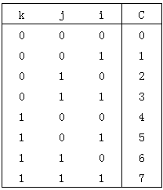

上图对应的伪代码如下所示：

```
for(k = 0; k < 17; k++)
         {
                  for(j = 0; j < 17; j++)
                  {
                            for(i = 0; i < 17; i++)
                            {
                                     switch((i&1) + ((j&1)<<1) + ((k&1)<<2))
                                     {
                                     case 0:R0[n0]=R[i][j][k];
                          G0[n0]=G[i][j][k];
                          B0[n0]=B[i][j][k];
                                     case 1:R1[n1]=R[i][j][k];
                          G1[n1]=G[i][j][k];
                          B1[n1]=B[i][j][k];
                                     case 2:R2[n2]=R[i][j][k];
                          G2[n2]=G[i][j][k];
                          B2[n2]=B[i][j][k];
                                     case 3:R3[n3]=R[i][j][k];
                          G3[n3]=G[i][j][k];
                          B3[n3]=B[i][j][k];
                                     case 4:R4[n4]=R[i][j][k];
                          G4[n4]=G[i][j][k];
                          B4[n4]=B[i][j][k];
                                     case 5:R5[n5]=R[i][j][k];
                          G5[n5]=G[i][j][k];
                          B5[n5]=B[i][j][k];
                                     case 6:R6[n6]=R[i][j][k];
                          G6[n6]=G[i][j][k];
                          B6[n6]=B[i][j][k];
                                     case 7:R7[n7]=R[i][j][k];
                          G7[n7]=G[i][j][k];
                          B7[n7]=B[i][j][k];
                                      }
                            }
                 }
       }
```

用C代表RGB，取成的8个LUT分别为c0\[729\]、c1\[648\]、c2\[648\]、c3\[576\]、c4\[648\]、c5\[576\]、c6\[576\]、c7\[512\]。

下面的描述用\_0代表一维数组c0\[729\]第0个数据，\_1代表一维数组c0\[729\]第1个数据。

8x3的LUT按照每3个数据紧凑排列到1个32bit数据内的格式定义为：

\{2’b00,B0\_0,G0\_0,R0\_0\},

\{2’b00,B1\_0,G1\_0,R1\_0\},

\{2’b00,B2\_0,G2\_0,R2\_0\},

\{2’b00,B3\_0,G3\_0,R3\_0\},

\{2’b00,B0\_1,G0\_1,R0\_1\},

\{2’b00,B1\_1,G1\_1,R1\_1\},

\{2’b00,B2\_1,G2\_1,R2\_1\},

\{2’b00,B3\_1,G3\_1,R3\_1\},

\{......\},

上述格式可视化如下图所示：


整体看如下图所示：


8x3的LUT按照c0\[729\]  占用空间729 x 4 = 2916和c4\[648\]占用空间648 x 4 = 2592连续存储成一个长度为5508的一维数组。

【相关数据类型及接口】

无

## PreGamma<a name="ZH-CN_TOPIC_0000002470924928"></a>


### 功能描述<a name="ZH-CN_TOPIC_0000002504085015"></a>

PreGamma是类似Gamma对图像进行亮度空间非线性转换模块，在DRC之前对动态范围进行适当压缩。 PreGamma插值点数为257，精度为20bit，节点之间的图像像素值使用线性插值生成。

### API参考<a name="ZH-CN_TOPIC_0000002471085174"></a>

-   [ss\_mpi\_isp\_set\_pregamma\_attr](#ZH-CN_TOPIC_0000002504084865)：设置PreGamma属性参数。
-   [ss\_mpi\_isp\_get\_pregamma\_attr](#ZH-CN_TOPIC_0000002471085150)：获取PreGamma属性参数。


#### ss\_mpi\_isp\_set\_pregamma\_attr<a name="ZH-CN_TOPIC_0000002504084865"></a>

【描述】

设置PreGamma属性参数。

【语法】

```
td_s32 ss_mpi_isp_set_pregamma_attr(ot_vi_pipe vi_pipe, const ot_isp_pregamma_attr *pregamma_attr)
```

【参数】

<a name="table32194mcpsimp"></a>
<table><thead align="left"><tr id="row32200mcpsimp"><th class="cellrowborder" valign="top" width="23%" id="mcps1.1.4.1.1"><p id="p32202mcpsimp"><a name="p32202mcpsimp"></a><a name="p32202mcpsimp"></a>参数名称</p>
</th>
<th class="cellrowborder" valign="top" width="61%" id="mcps1.1.4.1.2"><p id="p32204mcpsimp"><a name="p32204mcpsimp"></a><a name="p32204mcpsimp"></a>描述</p>
</th>
<th class="cellrowborder" valign="top" width="16%" id="mcps1.1.4.1.3"><p id="p32206mcpsimp"><a name="p32206mcpsimp"></a><a name="p32206mcpsimp"></a>输入/输出</p>
</th>
</tr>
</thead>
<tbody><tr id="row32207mcpsimp"><td class="cellrowborder" valign="top" width="23%" headers="mcps1.1.4.1.1 "><p id="p32209mcpsimp"><a name="p32209mcpsimp"></a><a name="p32209mcpsimp"></a>vi_pipe</p>
</td>
<td class="cellrowborder" valign="top" width="61%" headers="mcps1.1.4.1.2 "><p id="p32211mcpsimp"><a name="p32211mcpsimp"></a><a name="p32211mcpsimp"></a>VI PIPE号。</p>
</td>
<td class="cellrowborder" valign="top" width="16%" headers="mcps1.1.4.1.3 "><p id="p32213mcpsimp"><a name="p32213mcpsimp"></a><a name="p32213mcpsimp"></a>输入</p>
</td>
</tr>
<tr id="row32214mcpsimp"><td class="cellrowborder" valign="top" width="23%" headers="mcps1.1.4.1.1 "><p id="p32216mcpsimp"><a name="p32216mcpsimp"></a><a name="p32216mcpsimp"></a>pregamma_attr</p>
</td>
<td class="cellrowborder" valign="top" width="61%" headers="mcps1.1.4.1.2 "><p id="p32218mcpsimp"><a name="p32218mcpsimp"></a><a name="p32218mcpsimp"></a>PreGamma属性参数。</p>
</td>
<td class="cellrowborder" valign="top" width="16%" headers="mcps1.1.4.1.3 "><p id="p32220mcpsimp"><a name="p32220mcpsimp"></a><a name="p32220mcpsimp"></a>输入</p>
</td>
</tr>
</tbody>
</table>

【返回值】

<a name="table32223mcpsimp"></a>
<table><thead align="left"><tr id="row32228mcpsimp"><th class="cellrowborder" valign="top" width="27%" id="mcps1.1.3.1.1"><p id="p32230mcpsimp"><a name="p32230mcpsimp"></a><a name="p32230mcpsimp"></a>返回值</p>
</th>
<th class="cellrowborder" valign="top" width="73%" id="mcps1.1.3.1.2"><p id="p32232mcpsimp"><a name="p32232mcpsimp"></a><a name="p32232mcpsimp"></a>描述</p>
</th>
</tr>
</thead>
<tbody><tr id="row32234mcpsimp"><td class="cellrowborder" valign="top" width="27%" headers="mcps1.1.3.1.1 "><p id="p32236mcpsimp"><a name="p32236mcpsimp"></a><a name="p32236mcpsimp"></a>0</p>
</td>
<td class="cellrowborder" valign="top" width="73%" headers="mcps1.1.3.1.2 "><p id="p32238mcpsimp"><a name="p32238mcpsimp"></a><a name="p32238mcpsimp"></a>成功。</p>
</td>
</tr>
<tr id="row32239mcpsimp"><td class="cellrowborder" valign="top" width="27%" headers="mcps1.1.3.1.1 "><p id="p32241mcpsimp"><a name="p32241mcpsimp"></a><a name="p32241mcpsimp"></a>非0</p>
</td>
<td class="cellrowborder" valign="top" width="73%" headers="mcps1.1.3.1.2 "><p id="p32243mcpsimp"><a name="p32243mcpsimp"></a><a name="p32243mcpsimp"></a>失败，其值为<span xml:lang="sv-SE" id="ph10195517299"><a name="ph10195517299"></a><a name="ph10195517299"></a>错误码</span>。</p>
</td>
</tr>
</tbody>
</table>

【需求】

-   头文件：ot\_common\_isp.h、ss\_mpi\_isp.h
-   库文件：libot\_isp.a、libss\_isp.a

【注意】

无

【举例】

无

【相关主题】

[ss\_mpi\_isp\_get\_pregamma\_attr](#ss_mpi_isp_get_pregamma_attr)

#### ss\_mpi\_isp\_get\_pregamma\_attr<a name="ZH-CN_TOPIC_0000002471085150"></a>

【描述】

获取PreGamma属性参数。

【语法】

```
td_s32 ss_mpi_isp_get_pregamma_attr(ot_vi_pipe vi_pipe, ot_isp_pregamma_attr *pregamma_attr)
```

【参数】

<a name="table32264mcpsimp"></a>
<table><thead align="left"><tr id="row32270mcpsimp"><th class="cellrowborder" valign="top" width="23%" id="mcps1.1.4.1.1"><p id="p32272mcpsimp"><a name="p32272mcpsimp"></a><a name="p32272mcpsimp"></a>参数名称</p>
</th>
<th class="cellrowborder" valign="top" width="61%" id="mcps1.1.4.1.2"><p id="p32274mcpsimp"><a name="p32274mcpsimp"></a><a name="p32274mcpsimp"></a>描述</p>
</th>
<th class="cellrowborder" valign="top" width="16%" id="mcps1.1.4.1.3"><p id="p32276mcpsimp"><a name="p32276mcpsimp"></a><a name="p32276mcpsimp"></a>输入/输出</p>
</th>
</tr>
</thead>
<tbody><tr id="row32277mcpsimp"><td class="cellrowborder" valign="top" width="23%" headers="mcps1.1.4.1.1 "><p id="p32279mcpsimp"><a name="p32279mcpsimp"></a><a name="p32279mcpsimp"></a>vi_pipe</p>
</td>
<td class="cellrowborder" valign="top" width="61%" headers="mcps1.1.4.1.2 "><p id="p32281mcpsimp"><a name="p32281mcpsimp"></a><a name="p32281mcpsimp"></a>VI PIPE号。</p>
</td>
<td class="cellrowborder" valign="top" width="16%" headers="mcps1.1.4.1.3 "><p id="p32283mcpsimp"><a name="p32283mcpsimp"></a><a name="p32283mcpsimp"></a>输入</p>
</td>
</tr>
<tr id="row32284mcpsimp"><td class="cellrowborder" valign="top" width="23%" headers="mcps1.1.4.1.1 "><p id="p32286mcpsimp"><a name="p32286mcpsimp"></a><a name="p32286mcpsimp"></a>pregamma_attr</p>
</td>
<td class="cellrowborder" valign="top" width="61%" headers="mcps1.1.4.1.2 "><p id="p32288mcpsimp"><a name="p32288mcpsimp"></a><a name="p32288mcpsimp"></a>PreGamma属性参数。</p>
</td>
<td class="cellrowborder" valign="top" width="16%" headers="mcps1.1.4.1.3 "><p id="p32290mcpsimp"><a name="p32290mcpsimp"></a><a name="p32290mcpsimp"></a>输出</p>
</td>
</tr>
</tbody>
</table>

【返回值】

<a name="table32293mcpsimp"></a>
<table><thead align="left"><tr id="row32298mcpsimp"><th class="cellrowborder" valign="top" width="27%" id="mcps1.1.3.1.1"><p id="p32300mcpsimp"><a name="p32300mcpsimp"></a><a name="p32300mcpsimp"></a>返回值</p>
</th>
<th class="cellrowborder" valign="top" width="73%" id="mcps1.1.3.1.2"><p id="p32302mcpsimp"><a name="p32302mcpsimp"></a><a name="p32302mcpsimp"></a>描述</p>
</th>
</tr>
</thead>
<tbody><tr id="row32304mcpsimp"><td class="cellrowborder" valign="top" width="27%" headers="mcps1.1.3.1.1 "><p id="p32306mcpsimp"><a name="p32306mcpsimp"></a><a name="p32306mcpsimp"></a>0</p>
</td>
<td class="cellrowborder" valign="top" width="73%" headers="mcps1.1.3.1.2 "><p id="p32308mcpsimp"><a name="p32308mcpsimp"></a><a name="p32308mcpsimp"></a>成功。</p>
</td>
</tr>
<tr id="row32309mcpsimp"><td class="cellrowborder" valign="top" width="27%" headers="mcps1.1.3.1.1 "><p id="p32311mcpsimp"><a name="p32311mcpsimp"></a><a name="p32311mcpsimp"></a>非0</p>
</td>
<td class="cellrowborder" valign="top" width="73%" headers="mcps1.1.3.1.2 "><p id="p32313mcpsimp"><a name="p32313mcpsimp"></a><a name="p32313mcpsimp"></a>失败，其值为<span xml:lang="sv-SE" id="ph10195517299"><a name="ph10195517299"></a><a name="ph10195517299"></a>错误码</span>。</p>
</td>
</tr>
</tbody>
</table>

【需求】

-   头文件：ot\_common\_isp.h、ss\_mpi\_isp.h
-   库文件：libot\_isp.a、libss\_isp.a

【注意】

无

【举例】

无

【相关主题】

[ss\_mpi\_isp\_set\_pregamma\_attr](#ss_mpi_isp_set_pregamma_attr)

### 数据类型<a name="ZH-CN_TOPIC_0000002504085047"></a>

-   [OT\_ISP\_PREGAMMA\_NODE\_NUM](#ZH-CN_TOPIC_0000002471085130)：定义PreGamma LUT的节点个数。
-   [ot\_isp\_pregamma\_attr](#ZH-CN_TOPIC_0000002471085098)：定义PreGamma属性参数。


#### OT\_ISP\_PREGAMMA\_NODE\_NUM<a name="ZH-CN_TOPIC_0000002471085130"></a>

【说明】

定义PreGamma LUT的节点个数。

【定义】

```
#define OT_ISP_PREGAMMA_NODE_NUM        257
```

【注意事项】

无。

【相关数据类型及接口】

[ot\_isp\_pregamma\_attr](#ot_isp_pregamma_attr)

#### ot\_isp\_pregamma\_attr<a name="ZH-CN_TOPIC_0000002471085098"></a>

【说明】

定义PreGamma属性参数。

【定义】

```
typedef struct {
    td_bool enable;
    td_u32  table[OT_ISP_PREGAMMA_NODE_NUM];
} ot_isp_pregamma_attr;
```

【成员】

<a name="table32360mcpsimp"></a>
<table><thead align="left"><tr id="row32365mcpsimp"><th class="cellrowborder" valign="top" width="47%" id="mcps1.1.3.1.1"><p id="p32367mcpsimp"><a name="p32367mcpsimp"></a><a name="p32367mcpsimp"></a>成员名称</p>
</th>
<th class="cellrowborder" valign="top" width="53%" id="mcps1.1.3.1.2"><p id="p32369mcpsimp"><a name="p32369mcpsimp"></a><a name="p32369mcpsimp"></a>描述</p>
</th>
</tr>
</thead>
<tbody><tr id="row32371mcpsimp"><td class="cellrowborder" valign="top" width="47%" headers="mcps1.1.3.1.1 "><p id="p32373mcpsimp"><a name="p32373mcpsimp"></a><a name="p32373mcpsimp"></a>enable</p>
</td>
<td class="cellrowborder" valign="top" width="53%" headers="mcps1.1.3.1.2 "><p id="p32375mcpsimp"><a name="p32375mcpsimp"></a><a name="p32375mcpsimp"></a>PreGamma使能，取值范围：[0x0, 0x1]</p>
</td>
</tr>
<tr id="row32376mcpsimp"><td class="cellrowborder" valign="top" width="47%" headers="mcps1.1.3.1.1 "><p xml:lang="fr-FR" id="p32378mcpsimp"><a name="p32378mcpsimp"></a><a name="p32378mcpsimp"></a><span xml:lang="en-US" id="ph32379mcpsimp"><a name="ph32379mcpsimp"></a><a name="ph32379mcpsimp"></a>table[</span><a href="#OT_ISP_PREGAMMA_NODE_NUM">OT_ISP_PREGAMMA_NODE_NUM</a><span xml:lang="en-US" id="ph32381mcpsimp"><a name="ph32381mcpsimp"></a><a name="ph32381mcpsimp"></a>]</span></p>
</td>
<td class="cellrowborder" valign="top" width="53%" headers="mcps1.1.3.1.2 "><p id="p32383mcpsimp"><a name="p32383mcpsimp"></a><a name="p32383mcpsimp"></a>257段LUT表，用来表示PreGamma输出值大小。取值范围：[0x0, 0xFFFFF]</p>
</td>
</tr>
</tbody>
</table>

【注意事项】

-   PreGamma模块和DRC模块存在耦合，其只在DRC使能时才生效。
-   PreGamma在当前平台上改为非均匀分布LUT，以提升暗区的调试精度，因此上一代平台的参数无法直接复用。建议基于此前参数所对应的曲线形状，在当前平台上重新调试出类似曲线，以实现效果的同步。

【相关数据类型及接口】

[ot\_isp\_drc\_attr](#ot_isp_drc_attr)

## 获取ISP模块虚拟地址<a name="ZH-CN_TOPIC_0000002504084915"></a>


### 功能描述<a name="ZH-CN_TOPIC_0000002504085021"></a>

从地址空间来分，当前ISP模块可分为五个部分：AE库、AWB库、AF库、ISP物理寄存器模块、ISP其他模块。

### API参考<a name="ZH-CN_TOPIC_0000002503964875"></a>

[ss\_mpi\_isp\_get\_isp\_reg\_attr](#ZH-CN_TOPIC_0000002470925140)：获取ISP基地址属性。


#### ss\_mpi\_isp\_get\_isp\_reg\_attr<a name="ZH-CN_TOPIC_0000002470925140"></a>

【描述】

获取ISP基地址属性。

【语法】

```
td_s32 ss_mpi_isp_get_isp_reg_attr(ot_vi_pipe vi_pipe, ot_isp_reg_attr *isp_reg_attr);
```

【参数】

<a name="table32406mcpsimp"></a>
<table><thead align="left"><tr id="row32412mcpsimp"><th class="cellrowborder" valign="top" width="25%" id="mcps1.1.4.1.1"><p id="p32414mcpsimp"><a name="p32414mcpsimp"></a><a name="p32414mcpsimp"></a>参数名称</p>
</th>
<th class="cellrowborder" valign="top" width="59%" id="mcps1.1.4.1.2"><p id="p32416mcpsimp"><a name="p32416mcpsimp"></a><a name="p32416mcpsimp"></a>描述</p>
</th>
<th class="cellrowborder" valign="top" width="16%" id="mcps1.1.4.1.3"><p id="p32418mcpsimp"><a name="p32418mcpsimp"></a><a name="p32418mcpsimp"></a>输入/输出</p>
</th>
</tr>
</thead>
<tbody><tr id="row32419mcpsimp"><td class="cellrowborder" valign="top" width="25%" headers="mcps1.1.4.1.1 "><p id="p32421mcpsimp"><a name="p32421mcpsimp"></a><a name="p32421mcpsimp"></a>vi_pipe</p>
</td>
<td class="cellrowborder" valign="top" width="59%" headers="mcps1.1.4.1.2 "><p id="p32423mcpsimp"><a name="p32423mcpsimp"></a><a name="p32423mcpsimp"></a>vi_pipe号。</p>
</td>
<td class="cellrowborder" valign="top" width="16%" headers="mcps1.1.4.1.3 "><p id="p32425mcpsimp"><a name="p32425mcpsimp"></a><a name="p32425mcpsimp"></a>输入</p>
</td>
</tr>
<tr id="row32426mcpsimp"><td class="cellrowborder" valign="top" width="25%" headers="mcps1.1.4.1.1 "><p id="p32428mcpsimp"><a name="p32428mcpsimp"></a><a name="p32428mcpsimp"></a>isp_reg_attr</p>
</td>
<td class="cellrowborder" valign="top" width="59%" headers="mcps1.1.4.1.2 "><p id="p32430mcpsimp"><a name="p32430mcpsimp"></a><a name="p32430mcpsimp"></a>ISP模块虚拟地址属性。</p>
</td>
<td class="cellrowborder" valign="top" width="16%" headers="mcps1.1.4.1.3 "><p id="p32432mcpsimp"><a name="p32432mcpsimp"></a><a name="p32432mcpsimp"></a>输出</p>
</td>
</tr>
</tbody>
</table>

【返回值】

<a name="table32435mcpsimp"></a>
<table><thead align="left"><tr id="row32440mcpsimp"><th class="cellrowborder" valign="top" width="27%" id="mcps1.1.3.1.1"><p id="p32442mcpsimp"><a name="p32442mcpsimp"></a><a name="p32442mcpsimp"></a>返回值</p>
</th>
<th class="cellrowborder" valign="top" width="73%" id="mcps1.1.3.1.2"><p id="p32444mcpsimp"><a name="p32444mcpsimp"></a><a name="p32444mcpsimp"></a>描述</p>
</th>
</tr>
</thead>
<tbody><tr id="row32445mcpsimp"><td class="cellrowborder" valign="top" width="27%" headers="mcps1.1.3.1.1 "><p id="p32447mcpsimp"><a name="p32447mcpsimp"></a><a name="p32447mcpsimp"></a>0</p>
</td>
<td class="cellrowborder" valign="top" width="73%" headers="mcps1.1.3.1.2 "><p id="p32449mcpsimp"><a name="p32449mcpsimp"></a><a name="p32449mcpsimp"></a>成功。</p>
</td>
</tr>
<tr id="row32450mcpsimp"><td class="cellrowborder" valign="top" width="27%" headers="mcps1.1.3.1.1 "><p id="p32452mcpsimp"><a name="p32452mcpsimp"></a><a name="p32452mcpsimp"></a>非0</p>
</td>
<td class="cellrowborder" valign="top" width="73%" headers="mcps1.1.3.1.2 "><p id="p32454mcpsimp"><a name="p32454mcpsimp"></a><a name="p32454mcpsimp"></a>失败，其值为<span xml:lang="sv-SE" id="ph10195517299"><a name="ph10195517299"></a><a name="ph10195517299"></a>错误码</span>。</p>
</td>
</tr>
</tbody>
</table>

【需求】

-   头文件：ot\_common\_isp.h、ss\_mpi\_isp.h
-   库文件：libot\_isp.a、libss\_isp.a

【注意】

当前ISP模块虚拟地址不提供AF模块的虚拟地址。

【举例】

无

【相关主题】

无

### 数据类型<a name="ZH-CN_TOPIC_0000002470925062"></a>

[ot\_isp\_reg\_attr](#ZH-CN_TOPIC_0000002503964867)：定义ISP各子模块寄存器的虚拟地址属性。


#### ot\_isp\_reg\_attr<a name="ZH-CN_TOPIC_0000002503964867"></a>

【说明】

定义ISP各子模块寄存器的虚拟地址属性。

【定义】

```
typedef struct {
    ot_void *isp_ext_reg_addr;
    td_u32  isp_ext_reg_size;
    ot_void *ae_ext_reg_addr;
    td_u32  ae_ext_reg_size;
    ot_void *awb_ext_reg_addr;
    td_u32  awb_ext_reg_size;
} ot_isp_reg_attr;
```

【成员】

<a name="table32484mcpsimp"></a>
<table><thead align="left"><tr id="row32489mcpsimp"><th class="cellrowborder" valign="top" width="28.000000000000004%" id="mcps1.1.3.1.1"><p id="p32491mcpsimp"><a name="p32491mcpsimp"></a><a name="p32491mcpsimp"></a>成员名称</p>
</th>
<th class="cellrowborder" valign="top" width="72%" id="mcps1.1.3.1.2"><p id="p32493mcpsimp"><a name="p32493mcpsimp"></a><a name="p32493mcpsimp"></a>描述</p>
</th>
</tr>
</thead>
<tbody><tr id="row32495mcpsimp"><td class="cellrowborder" valign="top" width="28.000000000000004%" headers="mcps1.1.3.1.1 "><p id="p32497mcpsimp"><a name="p32497mcpsimp"></a><a name="p32497mcpsimp"></a>isp_ext_reg_addr</p>
</td>
<td class="cellrowborder" valign="top" width="72%" headers="mcps1.1.3.1.2 "><p id="p32499mcpsimp"><a name="p32499mcpsimp"></a><a name="p32499mcpsimp"></a>ISP外部（虚拟）寄存器模块对应的起始虚拟地址。</p>
</td>
</tr>
<tr id="row32500mcpsimp"><td class="cellrowborder" valign="top" width="28.000000000000004%" headers="mcps1.1.3.1.1 "><p id="p32502mcpsimp"><a name="p32502mcpsimp"></a><a name="p32502mcpsimp"></a>isp_ext_reg_size</p>
</td>
<td class="cellrowborder" valign="top" width="72%" headers="mcps1.1.3.1.2 "><p id="p32504mcpsimp"><a name="p32504mcpsimp"></a><a name="p32504mcpsimp"></a>ISP外部（虚拟）寄存器模块对应的大小。</p>
</td>
</tr>
<tr id="row32505mcpsimp"><td class="cellrowborder" valign="top" width="28.000000000000004%" headers="mcps1.1.3.1.1 "><p id="p32507mcpsimp"><a name="p32507mcpsimp"></a><a name="p32507mcpsimp"></a>ae_ext_reg_addr</p>
</td>
<td class="cellrowborder" valign="top" width="72%" headers="mcps1.1.3.1.2 "><p id="p32509mcpsimp"><a name="p32509mcpsimp"></a><a name="p32509mcpsimp"></a>ISP AE库对应的起始虚拟地址。</p>
</td>
</tr>
<tr id="row32510mcpsimp"><td class="cellrowborder" valign="top" width="28.000000000000004%" headers="mcps1.1.3.1.1 "><p id="p32512mcpsimp"><a name="p32512mcpsimp"></a><a name="p32512mcpsimp"></a>ae_ext_reg_size</p>
</td>
<td class="cellrowborder" valign="top" width="72%" headers="mcps1.1.3.1.2 "><p id="p32514mcpsimp"><a name="p32514mcpsimp"></a><a name="p32514mcpsimp"></a>ISP AE库对应的大小。</p>
</td>
</tr>
<tr id="row32515mcpsimp"><td class="cellrowborder" valign="top" width="28.000000000000004%" headers="mcps1.1.3.1.1 "><p id="p32517mcpsimp"><a name="p32517mcpsimp"></a><a name="p32517mcpsimp"></a>awb_ext_reg_addr</p>
</td>
<td class="cellrowborder" valign="top" width="72%" headers="mcps1.1.3.1.2 "><p id="p32519mcpsimp"><a name="p32519mcpsimp"></a><a name="p32519mcpsimp"></a>ISP AWB库对应的起始虚拟地址。</p>
</td>
</tr>
<tr id="row32520mcpsimp"><td class="cellrowborder" valign="top" width="28.000000000000004%" headers="mcps1.1.3.1.1 "><p id="p32522mcpsimp"><a name="p32522mcpsimp"></a><a name="p32522mcpsimp"></a>awb_ext_reg_size</p>
</td>
<td class="cellrowborder" valign="top" width="72%" headers="mcps1.1.3.1.2 "><p id="p32524mcpsimp"><a name="p32524mcpsimp"></a><a name="p32524mcpsimp"></a>ISP AWB库对应的大小。</p>
</td>
</tr>
</tbody>
</table>

【注意事项】

无

【相关数据类型及接口】

无

## 查询内部状态信息<a name="ZH-CN_TOPIC_0000002470924974"></a>


### 功能描述<a name="ZH-CN_TOPIC_0000002470924930"></a>

Inner State Information接口的作用是输出数个与ISO相关的参数其逻辑寄存器当前配置的真实值。

用户在调试过程中可以通过MPI接口读取这些真实值参数，观察参数强度是否正确配置。通过该接口用户只可以获取参数，而非操作改变该寄存器里的值。

### API参考<a name="ZH-CN_TOPIC_0000002504084845"></a>

[ss\_mpi\_isp\_query\_inner\_state\_info](#ZH-CN_TOPIC_0000002471084910)：获取内部寄存器实际强度配置信息和内部状态。


#### ss\_mpi\_isp\_query\_inner\_state\_info<a name="ZH-CN_TOPIC_0000002471084910"></a>

【描述】

获取内部寄存器实际强度配置和内部状态。

【语法】

```
td_s32 ss_mpi_isp_query_inner_state_info(ot_vi_pipe vi_pipe, ot_isp_inner_state_info *inner_state_info);
```

【参数】

<a name="table32545mcpsimp"></a>
<table><thead align="left"><tr id="row32551mcpsimp"><th class="cellrowborder" valign="top" width="23%" id="mcps1.1.4.1.1"><p id="p32553mcpsimp"><a name="p32553mcpsimp"></a><a name="p32553mcpsimp"></a>参数名称</p>
</th>
<th class="cellrowborder" valign="top" width="61%" id="mcps1.1.4.1.2"><p id="p32555mcpsimp"><a name="p32555mcpsimp"></a><a name="p32555mcpsimp"></a>描述</p>
</th>
<th class="cellrowborder" valign="top" width="16%" id="mcps1.1.4.1.3"><p id="p32557mcpsimp"><a name="p32557mcpsimp"></a><a name="p32557mcpsimp"></a>输入/输出</p>
</th>
</tr>
</thead>
<tbody><tr id="row32558mcpsimp"><td class="cellrowborder" valign="top" width="23%" headers="mcps1.1.4.1.1 "><p id="p32560mcpsimp"><a name="p32560mcpsimp"></a><a name="p32560mcpsimp"></a>vi_pipe</p>
</td>
<td class="cellrowborder" valign="top" width="61%" headers="mcps1.1.4.1.2 "><p id="p32562mcpsimp"><a name="p32562mcpsimp"></a><a name="p32562mcpsimp"></a>vi_pipe号。</p>
</td>
<td class="cellrowborder" valign="top" width="16%" headers="mcps1.1.4.1.3 "><p id="p32564mcpsimp"><a name="p32564mcpsimp"></a><a name="p32564mcpsimp"></a>输入</p>
</td>
</tr>
<tr id="row32565mcpsimp"><td class="cellrowborder" valign="top" width="23%" headers="mcps1.1.4.1.1 "><p id="p32567mcpsimp"><a name="p32567mcpsimp"></a><a name="p32567mcpsimp"></a>inner_state_info</p>
</td>
<td class="cellrowborder" valign="top" width="61%" headers="mcps1.1.4.1.2 "><p id="p32569mcpsimp"><a name="p32569mcpsimp"></a><a name="p32569mcpsimp"></a>内部寄存器实际配置信息和状态值。</p>
</td>
<td class="cellrowborder" valign="top" width="16%" headers="mcps1.1.4.1.3 "><p id="p32571mcpsimp"><a name="p32571mcpsimp"></a><a name="p32571mcpsimp"></a>输出</p>
</td>
</tr>
</tbody>
</table>

【返回值】

<a name="table32574mcpsimp"></a>
<table><thead align="left"><tr id="row32579mcpsimp"><th class="cellrowborder" valign="top" width="27%" id="mcps1.1.3.1.1"><p id="p32581mcpsimp"><a name="p32581mcpsimp"></a><a name="p32581mcpsimp"></a>返回值</p>
</th>
<th class="cellrowborder" valign="top" width="73%" id="mcps1.1.3.1.2"><p id="p32583mcpsimp"><a name="p32583mcpsimp"></a><a name="p32583mcpsimp"></a>描述</p>
</th>
</tr>
</thead>
<tbody><tr id="row32584mcpsimp"><td class="cellrowborder" valign="top" width="27%" headers="mcps1.1.3.1.1 "><p id="p32586mcpsimp"><a name="p32586mcpsimp"></a><a name="p32586mcpsimp"></a>0</p>
</td>
<td class="cellrowborder" valign="top" width="73%" headers="mcps1.1.3.1.2 "><p id="p32588mcpsimp"><a name="p32588mcpsimp"></a><a name="p32588mcpsimp"></a>成功。</p>
</td>
</tr>
<tr id="row32589mcpsimp"><td class="cellrowborder" valign="top" width="27%" headers="mcps1.1.3.1.1 "><p id="p32591mcpsimp"><a name="p32591mcpsimp"></a><a name="p32591mcpsimp"></a>非0</p>
</td>
<td class="cellrowborder" valign="top" width="73%" headers="mcps1.1.3.1.2 "><p id="p32593mcpsimp"><a name="p32593mcpsimp"></a><a name="p32593mcpsimp"></a>失败，其值为<span xml:lang="sv-SE" id="ph10195517299"><a name="ph10195517299"></a><a name="ph10195517299"></a>错误码</span>。</p>
</td>
</tr>
</tbody>
</table>

【需求】

-   头文件：ot\_common\_isp.h、ss\_mpi\_isp.h
-   库文件：libot\_isp.a、libss\_isp.a

【注意】

-   当用户切换分辨率或者在线性模式和WDR模式之间切换时候，可以调用这个接口来查询切换是否已经完成。
-   分辨率/帧率切换时，只查询 res\_switch\_finish标记。模式切换时，只查询 wdr\_switch\_finish标记。
-   业务正常运转时，在不改变WDR模式的情况下，合法调用ss\_mpi\_isp\_set\_pub\_attr，查询到的wdr\_switch\_finish始终为1。

【举例】

无

【相关主题】

无

### 数据类型<a name="ZH-CN_TOPIC_0000002503965031"></a>

[ot\_isp\_inner\_state\_info](#ZH-CN_TOPIC_0000002503965153)：定义内部寄存器实际配置信息参数。


#### ot\_isp\_inner\_state\_info<a name="ZH-CN_TOPIC_0000002503965153"></a>

【说明】

定义内部寄存器实际配置信息参数。

【定义】

```
typedef struct {
    td_u16 texture_strength[OT_ISP_SHARPEN_GAIN_NUM];
    td_u16 edge_strength[OT_ISP_SHARPEN_GAIN_NUM];
    td_u16 texture_freq;
    td_u16 edge_freq;
    td_u8  over_shoot;
    td_u8  under_shoot;
    td_u8  shoot_sup_strength;
    td_u8   nr_lsc_ratio;
    td_u16  coarse_strength[OT_ISP_BAYER_CHN_NUM];
    td_u8   wdr_frame_strength[OT_ISP_WDR_MAX_FRAME_NUM];
    td_u8   fine_strength;
    td_u16  coring_wgt;
    td_u16 dehaze_strength_actual;
    td_u16 drc_strength_actual;
    td_u32 wdr_exp_ratio_actual[OT_ISP_WDR_MAX_FRAME_NUM - 1];
    td_bool wdr_switch_finish;
    td_bool res_switch_finish;
    td_u16  black_level_actual[OT_ISP_WDR_MAX_FRAME_NUM][OT_ISP_BAYER_CHN_NUM];
    td_u16  sns_black_level[OT_ISP_WDR_MAX_FRAME_NUM][OT_ISP_BAYER_CHN_NUM];
} ot_isp_inner_state_info;
```

【成员】

<a name="table32655mcpsimp"></a>
<table><thead align="left"><tr id="row32660mcpsimp"><th class="cellrowborder" valign="top" width="46%" id="mcps1.1.3.1.1"><p id="p32662mcpsimp"><a name="p32662mcpsimp"></a><a name="p32662mcpsimp"></a>成员名称</p>
</th>
<th class="cellrowborder" valign="top" width="54%" id="mcps1.1.3.1.2"><p id="p32664mcpsimp"><a name="p32664mcpsimp"></a><a name="p32664mcpsimp"></a>描述</p>
</th>
</tr>
</thead>
<tbody><tr id="row32666mcpsimp"><td class="cellrowborder" valign="top" width="46%" headers="mcps1.1.3.1.1 "><p id="p32668mcpsimp"><a name="p32668mcpsimp"></a><a name="p32668mcpsimp"></a>texture_strength[<a href="#OT_ISP_SHARPEN_GAIN_NUM">OT_ISP_SHARPEN_GAIN_NUM</a>]</p>
</td>
<td class="cellrowborder" valign="top" width="54%" headers="mcps1.1.3.1.2 "><p id="p32671mcpsimp"><a name="p32671mcpsimp"></a><a name="p32671mcpsimp"></a>无方向的细节纹理的锐化强度，图像无方向的细节纹理的锐度。</p>
<p id="p32672mcpsimp"><a name="p32672mcpsimp"></a><a name="p32672mcpsimp"></a>取值范围：[0, 4095]</p>
</td>
</tr>
<tr id="row32673mcpsimp"><td class="cellrowborder" valign="top" width="46%" headers="mcps1.1.3.1.1 "><p id="p32675mcpsimp"><a name="p32675mcpsimp"></a><a name="p32675mcpsimp"></a>edge_strength[<a href="#OT_ISP_SHARPEN_GAIN_NUM">OT_ISP_SHARPEN_GAIN_NUM</a>]</p>
</td>
<td class="cellrowborder" valign="top" width="54%" headers="mcps1.1.3.1.2 "><p id="p32678mcpsimp"><a name="p32678mcpsimp"></a><a name="p32678mcpsimp"></a>带方向的边缘的锐化强度，图像带方向的边缘的锐度。</p>
<p id="p32679mcpsimp"><a name="p32679mcpsimp"></a><a name="p32679mcpsimp"></a>取值范围：[0, 4095]</p>
</td>
</tr>
<tr id="row32680mcpsimp"><td class="cellrowborder" valign="top" width="46%" headers="mcps1.1.3.1.1 "><p id="p32682mcpsimp"><a name="p32682mcpsimp"></a><a name="p32682mcpsimp"></a>texture_freq</p>
</td>
<td class="cellrowborder" valign="top" width="54%" headers="mcps1.1.3.1.2 "><p id="p32684mcpsimp"><a name="p32684mcpsimp"></a><a name="p32684mcpsimp"></a>图像的无方向细节纹理的增强频段控制。图像的细节纹理增强的频率。</p>
<p id="p32685mcpsimp"><a name="p32685mcpsimp"></a><a name="p32685mcpsimp"></a>取值范围：[0, 4095]。</p>
</td>
</tr>
<tr id="row32686mcpsimp"><td class="cellrowborder" valign="top" width="46%" headers="mcps1.1.3.1.1 "><p id="p32688mcpsimp"><a name="p32688mcpsimp"></a><a name="p32688mcpsimp"></a>edge_freq</p>
</td>
<td class="cellrowborder" valign="top" width="54%" headers="mcps1.1.3.1.2 "><p id="p32690mcpsimp"><a name="p32690mcpsimp"></a><a name="p32690mcpsimp"></a>图像的带方向的边缘的增强频段控制。图像边缘增强的频率。</p>
<p id="p32691mcpsimp"><a name="p32691mcpsimp"></a><a name="p32691mcpsimp"></a>取值范围：[0, 4095]</p>
</td>
</tr>
<tr id="row32692mcpsimp"><td class="cellrowborder" valign="top" width="46%" headers="mcps1.1.3.1.1 "><p id="p32694mcpsimp"><a name="p32694mcpsimp"></a><a name="p32694mcpsimp"></a>over_shoot</p>
</td>
<td class="cellrowborder" valign="top" width="54%" headers="mcps1.1.3.1.2 "><p id="p32696mcpsimp"><a name="p32696mcpsimp"></a><a name="p32696mcpsimp"></a>图像的overshoot（锐化后的白边白点）的强度。</p>
<p id="p32697mcpsimp"><a name="p32697mcpsimp"></a><a name="p32697mcpsimp"></a>取值范围：[0, 127]。</p>
</td>
</tr>
<tr id="row32698mcpsimp"><td class="cellrowborder" valign="top" width="46%" headers="mcps1.1.3.1.1 "><p id="p32700mcpsimp"><a name="p32700mcpsimp"></a><a name="p32700mcpsimp"></a>under_shoot</p>
</td>
<td class="cellrowborder" valign="top" width="54%" headers="mcps1.1.3.1.2 "><p id="p32702mcpsimp"><a name="p32702mcpsimp"></a><a name="p32702mcpsimp"></a>图像的undershoot（锐化后的黑边黑点）的强度。</p>
<p id="p32703mcpsimp"><a name="p32703mcpsimp"></a><a name="p32703mcpsimp"></a>取值范围：[0, 127]</p>
</td>
</tr>
<tr id="row32704mcpsimp"><td class="cellrowborder" valign="top" width="46%" headers="mcps1.1.3.1.1 "><p id="p32706mcpsimp"><a name="p32706mcpsimp"></a><a name="p32706mcpsimp"></a>shoot_sup_strength</p>
</td>
<td class="cellrowborder" valign="top" width="54%" headers="mcps1.1.3.1.2 "><p id="p32708mcpsimp"><a name="p32708mcpsimp"></a><a name="p32708mcpsimp"></a>图像锐化后的overshoot和undershoot的抑制强度。用于在保证清晰度不明显下降的前提下，抑制锐化后的图像的overshoot和undershoot的宽度和幅度。</p>
</td>
</tr>
<tr id="row32709mcpsimp"><td class="cellrowborder" valign="top" width="46%" headers="mcps1.1.3.1.1 "><p id="p32711mcpsimp"><a name="p32711mcpsimp"></a><a name="p32711mcpsimp"></a>nr_lsc_ratio</p>
</td>
<td class="cellrowborder" valign="top" width="54%" headers="mcps1.1.3.1.2 "><p id="p32713mcpsimp"><a name="p32713mcpsimp"></a><a name="p32713mcpsimp"></a>NR 参考LSC增益比例。</p>
<p id="p32714mcpsimp"><a name="p32714mcpsimp"></a><a name="p32714mcpsimp"></a>取值范围：[0x0, 0xFF]。</p>
</td>
</tr>
<tr id="row32715mcpsimp"><td class="cellrowborder" valign="top" width="46%" headers="mcps1.1.3.1.1 "><p id="p32717mcpsimp"><a name="p32717mcpsimp"></a><a name="p32717mcpsimp"></a>coarse_strength[OT_ISP_BAYER_CHN_NUM]</p>
</td>
<td class="cellrowborder" valign="top" width="54%" headers="mcps1.1.3.1.2 "><p id="p32720mcpsimp"><a name="p32720mcpsimp"></a><a name="p32720mcpsimp"></a>线性模式下控制亮度噪声整体去噪强度，四通道强度独立可调，值越大，亮噪去噪强度越大。</p>
<p id="p32721mcpsimp"><a name="p32721mcpsimp"></a><a name="p32721mcpsimp"></a>取值范围：[0, 0x360]</p>
</td>
</tr>
<tr id="row32722mcpsimp"><td class="cellrowborder" valign="top" width="46%" headers="mcps1.1.3.1.1 "><p id="p32724mcpsimp"><a name="p32724mcpsimp"></a><a name="p32724mcpsimp"></a>wdr_frame_strength[OT_ISP_WDR_MAX_FRAME_NUM]</p>
</td>
<td class="cellrowborder" valign="top" width="54%" headers="mcps1.1.3.1.2 "><p id="p32727mcpsimp"><a name="p32727mcpsimp"></a><a name="p32727mcpsimp"></a>WDR模式下每一融合帧分别对应的全局亮度去噪强度。</p>
<p id="p32728mcpsimp"><a name="p32728mcpsimp"></a><a name="p32728mcpsimp"></a>取值范围：[0, 0x50]</p>
</td>
</tr>
<tr id="row32729mcpsimp"><td class="cellrowborder" valign="top" width="46%" headers="mcps1.1.3.1.1 "><p id="p32731mcpsimp"><a name="p32731mcpsimp"></a><a name="p32731mcpsimp"></a>fine_strength</p>
</td>
<td class="cellrowborder" valign="top" width="54%" headers="mcps1.1.3.1.2 "><p id="p32733mcpsimp"><a name="p32733mcpsimp"></a><a name="p32733mcpsimp"></a>亮噪去除强度，值越大，亮噪去除强度越大。</p>
<p id="p32734mcpsimp"><a name="p32734mcpsimp"></a><a name="p32734mcpsimp"></a>取值范围：[0x0,0x80]</p>
</td>
</tr>
<tr id="row32735mcpsimp"><td class="cellrowborder" valign="top" width="46%" headers="mcps1.1.3.1.1 "><p id="p32737mcpsimp"><a name="p32737mcpsimp"></a><a name="p32737mcpsimp"></a>coring_wgt</p>
</td>
<td class="cellrowborder" valign="top" width="54%" headers="mcps1.1.3.1.2 "><p id="p32739mcpsimp"><a name="p32739mcpsimp"></a><a name="p32739mcpsimp"></a>随机噪声保留强度，值越大，保留的随机噪声越多。</p>
<p id="p32740mcpsimp"><a name="p32740mcpsimp"></a><a name="p32740mcpsimp"></a>取值范围：[0x0,0xC80]</p>
</td>
</tr>
<tr id="row32741mcpsimp"><td class="cellrowborder" valign="top" width="46%" headers="mcps1.1.3.1.1 "><p id="p32743mcpsimp"><a name="p32743mcpsimp"></a><a name="p32743mcpsimp"></a>dehaze_strength_actual</p>
</td>
<td class="cellrowborder" valign="top" width="54%" headers="mcps1.1.3.1.2 "><p id="p32745mcpsimp"><a name="p32745mcpsimp"></a><a name="p32745mcpsimp"></a>去雾强度值</p>
</td>
</tr>
<tr id="row32746mcpsimp"><td class="cellrowborder" valign="top" width="46%" headers="mcps1.1.3.1.1 "><p id="p32748mcpsimp"><a name="p32748mcpsimp"></a><a name="p32748mcpsimp"></a>drc_strength_actual</p>
</td>
<td class="cellrowborder" valign="top" width="54%" headers="mcps1.1.3.1.2 "><p id="p32750mcpsimp"><a name="p32750mcpsimp"></a><a name="p32750mcpsimp"></a>DRC 强度生效值。</p>
<p id="p32751mcpsimp"><a name="p32751mcpsimp"></a><a name="p32751mcpsimp"></a>取值范围：[0x0, 0x3FF]</p>
</td>
</tr>
<tr id="row32752mcpsimp"><td class="cellrowborder" valign="top" width="46%" headers="mcps1.1.3.1.1 "><p id="p32754mcpsimp"><a name="p32754mcpsimp"></a><a name="p32754mcpsimp"></a>wdr_exp_ratio_actual[OT_ISP_WDR_MAX_FRAME_NUM - 1]</p>
</td>
<td class="cellrowborder" valign="top" width="54%" headers="mcps1.1.3.1.2 "><p id="p32757mcpsimp"><a name="p32757mcpsimp"></a><a name="p32757mcpsimp"></a>WDR 曝光比</p>
<p id="p32758mcpsimp"><a name="p32758mcpsimp"></a><a name="p32758mcpsimp"></a>2to1时用wdr_exp_ratio_actual[0]表示曝光比</p>
<p id="p32759mcpsimp"><a name="p32759mcpsimp"></a><a name="p32759mcpsimp"></a>3to1时用wdr_exp_ratio_actual[0]及wdr_exp_ratio_actual[1]表示曝光比</p>
<p id="p32760mcpsimp"><a name="p32760mcpsimp"></a><a name="p32760mcpsimp"></a>4to1时用wdr_exp_ratio_actual[0]，wdr_exp_ratio_actual[1]</p>
<p id="p32761mcpsimp"><a name="p32761mcpsimp"></a><a name="p32761mcpsimp"></a>wdr_exp_ratio_actual[2]分别表示曝光比。</p>
</td>
</tr>
<tr id="row32762mcpsimp"><td class="cellrowborder" valign="top" width="46%" headers="mcps1.1.3.1.1 "><p id="p32764mcpsimp"><a name="p32764mcpsimp"></a><a name="p32764mcpsimp"></a>wdr_switch_finish</p>
</td>
<td class="cellrowborder" valign="top" width="54%" headers="mcps1.1.3.1.2 "><p id="p32766mcpsimp"><a name="p32766mcpsimp"></a><a name="p32766mcpsimp"></a>WDR切换是否完成标志。</p>
</td>
</tr>
<tr id="row32767mcpsimp"><td class="cellrowborder" valign="top" width="46%" headers="mcps1.1.3.1.1 "><p id="p32769mcpsimp"><a name="p32769mcpsimp"></a><a name="p32769mcpsimp"></a>res_switch_finish</p>
</td>
<td class="cellrowborder" valign="top" width="54%" headers="mcps1.1.3.1.2 "><p id="p32771mcpsimp"><a name="p32771mcpsimp"></a><a name="p32771mcpsimp"></a>分辨率切换是否完成标志。</p>
</td>
</tr>
<tr id="row32772mcpsimp"><td class="cellrowborder" valign="top" width="46%" headers="mcps1.1.3.1.1 "><p id="p32774mcpsimp"><a name="p32774mcpsimp"></a><a name="p32774mcpsimp"></a>black_level_actual[OT_ISP_WDR_MAX_FRAME_NUM][OT_ISP_BAYER_CHN_NUM]</p>
</td>
<td class="cellrowborder" valign="top" width="54%" headers="mcps1.1.3.1.2 "><p id="p32778mcpsimp"><a name="p32778mcpsimp"></a><a name="p32778mcpsimp"></a>实际生效的黑电平的值，分别表示不同WDR通道R、Gr、Gb、B分量的黑电平。</p>
<p id="p32779mcpsimp"><a name="p32779mcpsimp"></a><a name="p32779mcpsimp"></a>取值范围：[0x0, 0x3FFF]</p>
</td>
</tr>
<tr id="row32780mcpsimp"><td class="cellrowborder" valign="top" width="46%" headers="mcps1.1.3.1.1 "><p id="p32782mcpsimp"><a name="p32782mcpsimp"></a><a name="p32782mcpsimp"></a>sns_black_level[OT_ISP_WDR_MAX_FRAME_NUM][OT_ISP_BAYER_CHN_NUM]</p>
</td>
<td class="cellrowborder" valign="top" width="54%" headers="mcps1.1.3.1.2 "><p id="p32786mcpsimp"><a name="p32786mcpsimp"></a><a name="p32786mcpsimp"></a>Sensor的黑电平值，分别表示不同WDR通道R、Gr、Gb、B分量的黑电平。</p>
<p id="p32787mcpsimp"><a name="p32787mcpsimp"></a><a name="p32787mcpsimp"></a>取值范围：[0x0, 0x3FFF]</p>
</td>
</tr>
</tbody>
</table>

【注意事项】

使用user\_black\_level\_en后，black\_level\_actual为user\_black\_level；不使能user\_black\_level\_en时，black\_level\_actual与sns\_black\_level的值是一致的。

【相关数据类型及接口】

无

## DNG<a name="ZH-CN_TOPIC_0000002503964931"></a>


### 功能描述<a name="ZH-CN_TOPIC_0000002471085184"></a>

DNG \(Digital Negative\)是Adobe开发的一种开放的**raw image file format**，里面使用的tag基本上都定义在TIFF或者TIFF/EP中，在DNG Sepcification中只是定义或者建议了数据的组织方式，颜色空间的转换等等。DNG spec标准文档来定义和确定具体的dng数据格式，对标准文档中定义的标签和规定，根据实际应用场景和客户需求选择必要的最小集合实现。将raw数据封装成标准dng文件，可以由dng解析工具进行解析。

### API参考<a name="ZH-CN_TOPIC_0000002470925092"></a>

-   [ss\_mpi\_isp\_get\_dng\_image\_static\_info](#ZH-CN_TOPIC_0000002503965003)：获取DNG静态信息。
-   [ss\_mpi\_isp\_set\_dng\_color\_param](#ZH-CN_TOPIC_0000002503965007)：设置DNG颜色信息。
-   [ss\_mpi\_isp\_get\_dng\_color\_param](#ZH-CN_TOPIC_0000002470924992)：获取DNG颜色信息。


#### ss\_mpi\_isp\_get\_dng\_image\_static\_info<a name="ZH-CN_TOPIC_0000002503965003"></a>

【描述】

获取DNG静态信息。

【语法】

```
td_s32 ss_mpi_isp_get_dng_image_static_info(ot_vi_pipe vi_pipe , ot_isp_dng_image_static_info *dng_image_static_info);
```

【参数】

<a name="table32820mcpsimp"></a>
<table><thead align="left"><tr id="row32826mcpsimp"><th class="cellrowborder" valign="top" width="32%" id="mcps1.1.4.1.1"><p id="p32828mcpsimp"><a name="p32828mcpsimp"></a><a name="p32828mcpsimp"></a>参数名称</p>
</th>
<th class="cellrowborder" valign="top" width="52%" id="mcps1.1.4.1.2"><p id="p32830mcpsimp"><a name="p32830mcpsimp"></a><a name="p32830mcpsimp"></a>描述</p>
</th>
<th class="cellrowborder" valign="top" width="16%" id="mcps1.1.4.1.3"><p id="p32832mcpsimp"><a name="p32832mcpsimp"></a><a name="p32832mcpsimp"></a>输入/输出</p>
</th>
</tr>
</thead>
<tbody><tr id="row32833mcpsimp"><td class="cellrowborder" valign="top" width="32%" headers="mcps1.1.4.1.1 "><p id="p32835mcpsimp"><a name="p32835mcpsimp"></a><a name="p32835mcpsimp"></a>vi_pipe</p>
</td>
<td class="cellrowborder" valign="top" width="52%" headers="mcps1.1.4.1.2 "><p id="p32837mcpsimp"><a name="p32837mcpsimp"></a><a name="p32837mcpsimp"></a>vi_pipe 号</p>
</td>
<td class="cellrowborder" valign="top" width="16%" headers="mcps1.1.4.1.3 "><p id="p32839mcpsimp"><a name="p32839mcpsimp"></a><a name="p32839mcpsimp"></a>输入</p>
</td>
</tr>
<tr id="row32840mcpsimp"><td class="cellrowborder" valign="top" width="32%" headers="mcps1.1.4.1.1 "><p id="p32842mcpsimp"><a name="p32842mcpsimp"></a><a name="p32842mcpsimp"></a>dng_image_static_info</p>
</td>
<td class="cellrowborder" valign="top" width="52%" headers="mcps1.1.4.1.2 "><p id="p32844mcpsimp"><a name="p32844mcpsimp"></a><a name="p32844mcpsimp"></a>DNG静态信息</p>
</td>
<td class="cellrowborder" valign="top" width="16%" headers="mcps1.1.4.1.3 "><p id="p32846mcpsimp"><a name="p32846mcpsimp"></a><a name="p32846mcpsimp"></a>输出</p>
</td>
</tr>
</tbody>
</table>

【返回值】

<a name="table32849mcpsimp"></a>
<table><thead align="left"><tr id="row32854mcpsimp"><th class="cellrowborder" valign="top" width="27%" id="mcps1.1.3.1.1"><p id="p32856mcpsimp"><a name="p32856mcpsimp"></a><a name="p32856mcpsimp"></a>返回值</p>
</th>
<th class="cellrowborder" valign="top" width="73%" id="mcps1.1.3.1.2"><p id="p32858mcpsimp"><a name="p32858mcpsimp"></a><a name="p32858mcpsimp"></a>描述</p>
</th>
</tr>
</thead>
<tbody><tr id="row32859mcpsimp"><td class="cellrowborder" valign="top" width="27%" headers="mcps1.1.3.1.1 "><p id="p32861mcpsimp"><a name="p32861mcpsimp"></a><a name="p32861mcpsimp"></a>0</p>
</td>
<td class="cellrowborder" valign="top" width="73%" headers="mcps1.1.3.1.2 "><p id="p32863mcpsimp"><a name="p32863mcpsimp"></a><a name="p32863mcpsimp"></a>成功。</p>
</td>
</tr>
<tr id="row32864mcpsimp"><td class="cellrowborder" valign="top" width="27%" headers="mcps1.1.3.1.1 "><p id="p32866mcpsimp"><a name="p32866mcpsimp"></a><a name="p32866mcpsimp"></a>非0</p>
</td>
<td class="cellrowborder" valign="top" width="73%" headers="mcps1.1.3.1.2 "><p id="p32868mcpsimp"><a name="p32868mcpsimp"></a><a name="p32868mcpsimp"></a>失败，其值为<span xml:lang="sv-SE" id="ph10195517299"><a name="ph10195517299"></a><a name="ph10195517299"></a>错误码</span>。</p>
</td>
</tr>
</tbody>
</table>

【需求】

-   头文件：ot\_common\_isp.h、ss\_mpi\_isp.h
-   库文件：libot\_isp.a、libss\_isp.a

【注意】

无

【举例】

无

【相关主题】

无

#### ss\_mpi\_isp\_set\_dng\_color\_param<a name="ZH-CN_TOPIC_0000002503965007"></a>

【描述】

设置DNG颜色信息。

【语法】

```
td_s32 ss_mpi_isp_set_dng_color_param(ot_vi_pipe vi_pipe , const ot_isp_dng_color_param *dng_color_param);
```

【参数】

<a name="table32889mcpsimp"></a>
<table><thead align="left"><tr id="row32895mcpsimp"><th class="cellrowborder" valign="top" width="25%" id="mcps1.1.4.1.1"><p id="p32897mcpsimp"><a name="p32897mcpsimp"></a><a name="p32897mcpsimp"></a>参数名称</p>
</th>
<th class="cellrowborder" valign="top" width="54.269999999999996%" id="mcps1.1.4.1.2"><p id="p32899mcpsimp"><a name="p32899mcpsimp"></a><a name="p32899mcpsimp"></a>描述</p>
</th>
<th class="cellrowborder" valign="top" width="20.73%" id="mcps1.1.4.1.3"><p id="p32901mcpsimp"><a name="p32901mcpsimp"></a><a name="p32901mcpsimp"></a>输入/输出</p>
</th>
</tr>
</thead>
<tbody><tr id="row32902mcpsimp"><td class="cellrowborder" valign="top" width="25%" headers="mcps1.1.4.1.1 "><p id="p32904mcpsimp"><a name="p32904mcpsimp"></a><a name="p32904mcpsimp"></a>vi_pipe</p>
</td>
<td class="cellrowborder" valign="top" width="54.269999999999996%" headers="mcps1.1.4.1.2 "><p id="p32906mcpsimp"><a name="p32906mcpsimp"></a><a name="p32906mcpsimp"></a>vi_pipe号。</p>
</td>
<td class="cellrowborder" valign="top" width="20.73%" headers="mcps1.1.4.1.3 "><p id="p32908mcpsimp"><a name="p32908mcpsimp"></a><a name="p32908mcpsimp"></a>输入</p>
</td>
</tr>
<tr id="row32909mcpsimp"><td class="cellrowborder" valign="top" width="25%" headers="mcps1.1.4.1.1 "><p id="p32911mcpsimp"><a name="p32911mcpsimp"></a><a name="p32911mcpsimp"></a>dng_color_param</p>
</td>
<td class="cellrowborder" valign="top" width="54.269999999999996%" headers="mcps1.1.4.1.2 "><p id="p32913mcpsimp"><a name="p32913mcpsimp"></a><a name="p32913mcpsimp"></a>DNG颜色信息</p>
</td>
<td class="cellrowborder" valign="top" width="20.73%" headers="mcps1.1.4.1.3 "><p id="p32915mcpsimp"><a name="p32915mcpsimp"></a><a name="p32915mcpsimp"></a>输入</p>
</td>
</tr>
</tbody>
</table>

【返回值】

<a name="table32918mcpsimp"></a>
<table><thead align="left"><tr id="row32923mcpsimp"><th class="cellrowborder" valign="top" width="27%" id="mcps1.1.3.1.1"><p id="p32925mcpsimp"><a name="p32925mcpsimp"></a><a name="p32925mcpsimp"></a>返回值</p>
</th>
<th class="cellrowborder" valign="top" width="73%" id="mcps1.1.3.1.2"><p id="p32927mcpsimp"><a name="p32927mcpsimp"></a><a name="p32927mcpsimp"></a>描述</p>
</th>
</tr>
</thead>
<tbody><tr id="row32928mcpsimp"><td class="cellrowborder" valign="top" width="27%" headers="mcps1.1.3.1.1 "><p id="p32930mcpsimp"><a name="p32930mcpsimp"></a><a name="p32930mcpsimp"></a>0</p>
</td>
<td class="cellrowborder" valign="top" width="73%" headers="mcps1.1.3.1.2 "><p id="p32932mcpsimp"><a name="p32932mcpsimp"></a><a name="p32932mcpsimp"></a>成功。</p>
</td>
</tr>
<tr id="row32933mcpsimp"><td class="cellrowborder" valign="top" width="27%" headers="mcps1.1.3.1.1 "><p id="p32935mcpsimp"><a name="p32935mcpsimp"></a><a name="p32935mcpsimp"></a>非0</p>
</td>
<td class="cellrowborder" valign="top" width="73%" headers="mcps1.1.3.1.2 "><p id="p32937mcpsimp"><a name="p32937mcpsimp"></a><a name="p32937mcpsimp"></a>失败，其值为<span xml:lang="sv-SE" id="ph10195517299"><a name="ph10195517299"></a><a name="ph10195517299"></a>错误码</span>。</p>
</td>
</tr>
</tbody>
</table>

【需求】

-   头文件：ot\_common\_isp.h、ss\_mpi\_isp.h
-   库文件：libot\_isp.a、libss\_isp.a

【注意】

无

【举例】

无

【相关主题】

无

#### ss\_mpi\_isp\_get\_dng\_color\_param<a name="ZH-CN_TOPIC_0000002470924992"></a>

【描述】

获取DNG颜色信息。

【语法】

```
td_s32 ss_mpi_isp_get_dng_color_param(ot_vi_pipe vi_pipe, ot_isp_dng_color_param *dng_color_param);
```

【参数】

<a name="table32958mcpsimp"></a>
<table><thead align="left"><tr id="row32964mcpsimp"><th class="cellrowborder" valign="top" width="25%" id="mcps1.1.4.1.1"><p id="p32966mcpsimp"><a name="p32966mcpsimp"></a><a name="p32966mcpsimp"></a>参数名称</p>
</th>
<th class="cellrowborder" valign="top" width="59%" id="mcps1.1.4.1.2"><p id="p32968mcpsimp"><a name="p32968mcpsimp"></a><a name="p32968mcpsimp"></a>描述</p>
</th>
<th class="cellrowborder" valign="top" width="16%" id="mcps1.1.4.1.3"><p id="p32970mcpsimp"><a name="p32970mcpsimp"></a><a name="p32970mcpsimp"></a>输入/输出</p>
</th>
</tr>
</thead>
<tbody><tr id="row32971mcpsimp"><td class="cellrowborder" valign="top" width="25%" headers="mcps1.1.4.1.1 "><p id="p32973mcpsimp"><a name="p32973mcpsimp"></a><a name="p32973mcpsimp"></a>vi_pipe</p>
</td>
<td class="cellrowborder" valign="top" width="59%" headers="mcps1.1.4.1.2 "><p id="p32975mcpsimp"><a name="p32975mcpsimp"></a><a name="p32975mcpsimp"></a>vi_pipe号。</p>
</td>
<td class="cellrowborder" valign="top" width="16%" headers="mcps1.1.4.1.3 "><p id="p32977mcpsimp"><a name="p32977mcpsimp"></a><a name="p32977mcpsimp"></a>输入</p>
</td>
</tr>
<tr id="row32978mcpsimp"><td class="cellrowborder" valign="top" width="25%" headers="mcps1.1.4.1.1 "><p id="p32980mcpsimp"><a name="p32980mcpsimp"></a><a name="p32980mcpsimp"></a>dng_color_param</p>
</td>
<td class="cellrowborder" valign="top" width="59%" headers="mcps1.1.4.1.2 "><p id="p32982mcpsimp"><a name="p32982mcpsimp"></a><a name="p32982mcpsimp"></a>DNG颜色信息</p>
</td>
<td class="cellrowborder" valign="top" width="16%" headers="mcps1.1.4.1.3 "><p id="p32984mcpsimp"><a name="p32984mcpsimp"></a><a name="p32984mcpsimp"></a>输出</p>
</td>
</tr>
</tbody>
</table>

【返回值】

<a name="table32987mcpsimp"></a>
<table><thead align="left"><tr id="row32992mcpsimp"><th class="cellrowborder" valign="top" width="27%" id="mcps1.1.3.1.1"><p id="p32994mcpsimp"><a name="p32994mcpsimp"></a><a name="p32994mcpsimp"></a>返回值</p>
</th>
<th class="cellrowborder" valign="top" width="73%" id="mcps1.1.3.1.2"><p id="p32996mcpsimp"><a name="p32996mcpsimp"></a><a name="p32996mcpsimp"></a>描述</p>
</th>
</tr>
</thead>
<tbody><tr id="row32997mcpsimp"><td class="cellrowborder" valign="top" width="27%" headers="mcps1.1.3.1.1 "><p id="p32999mcpsimp"><a name="p32999mcpsimp"></a><a name="p32999mcpsimp"></a>0</p>
</td>
<td class="cellrowborder" valign="top" width="73%" headers="mcps1.1.3.1.2 "><p id="p33001mcpsimp"><a name="p33001mcpsimp"></a><a name="p33001mcpsimp"></a>成功。</p>
</td>
</tr>
<tr id="row33002mcpsimp"><td class="cellrowborder" valign="top" width="27%" headers="mcps1.1.3.1.1 "><p id="p33004mcpsimp"><a name="p33004mcpsimp"></a><a name="p33004mcpsimp"></a>非0</p>
</td>
<td class="cellrowborder" valign="top" width="73%" headers="mcps1.1.3.1.2 "><p id="p33006mcpsimp"><a name="p33006mcpsimp"></a><a name="p33006mcpsimp"></a>失败，其值为<span xml:lang="sv-SE" id="ph10195517299"><a name="ph10195517299"></a><a name="ph10195517299"></a>错误码</span>。</p>
</td>
</tr>
</tbody>
</table>

【需求】

-   头文件：ot\_common\_isp.h、ss\_mpi\_isp.h
-   库文件：libot\_isp.a、libss\_isp.a

【注意】

无

【举例】

无

【相关主题】

无

### 数据类型<a name="ZH-CN_TOPIC_0000002471085216"></a>

-   [OT\_CFACOLORPLANE](#ZH-CN_TOPIC_0000002503964831)：滤色阵列的数目。
-   [ot\_isp\_dng\_image\_static\_info](#ZH-CN_TOPIC_0000002504084917)：定义DNG静态格式信息。
-   [ot\_isp\_dng\_color\_param](#ZH-CN_TOPIC_0000002471084968)：定义DNG白平衡校正系数。
-   [ot\_isp\_dng\_cfa\_layout\_type](#ZH-CN_TOPIC_0000002504084851)：定义滤色阵列类型。
-   [ot\_isp\_dng\_srational](#ZH-CN_TOPIC_0000002470925078)：定义DNG除法结构体。
-   [ot\_isp\_dng\_black\_level\_repeat\_dim](#ZH-CN_TOPIC_0000002470925058)：定义黑电平像素重复维度。
-   [ot\_isp\_dng\_default\_scale](#ZH-CN_TOPIC_0000002470925186)：定义将图像转换成方形像素默认的缩放系数。
-   [ot\_isp\_dng\_repeat\_pattern\_dim](#ZH-CN_TOPIC_0000002504084923)：定义DNG颜色分量重复次数。
-   [ot\_isp\_dng\_raw\_format](#ZH-CN_TOPIC_0000002470924912)：定义DNG RAW格式。
-   [ot\_isp\_dng\_wb\_gain](#ZH-CN_TOPIC_0000002470925152)：定义在不同光源下的白平衡增益校正值。


#### OT\_CFACOLORPLANE<a name="ZH-CN_TOPIC_0000002503964831"></a>

【说明】

滤色阵列的数目。

【定义】

```
#define OT_CFACOLORPLANE           3
```

【注意事项】

无。

【相关数据类型及接口】

[ot\_isp\_dng\_raw\_format](#ot_isp_dng_raw_format)

#### ot\_isp\_dng\_image\_static\_info<a name="ZH-CN_TOPIC_0000002504084917"></a>

【说明】

定义DNG静态格式信息。

【定义】

```
typedef struct {
    ot_isp_dng_raw_format dng_raw_format;
    ot_isp_dng_srational color_matrix1[OT_ISP_CCM_MATRIX_SIZE];
    ot_isp_dng_srational color_matrix2[OT_ISP_CCM_MATRIX_SIZE];
    ot_isp_dng_srational camera_calibration1[OT_ISP_CCM_MATRIX_SIZE];
    ot_isp_dng_srational camera_calibration2[OT_ISP_CCM_MATRIX_SIZE];
    ot_isp_dng_srational forwad_matrix1[OT_ISP_CCM_MATRIX_SIZE];
    ot_isp_dng_srational forwad_matrix2[OT_ISP_CCM_MATRIX_SIZE];
    td_u8  calibration_illuminant1;
    td_u8  calibration_illuminant2;
} ot_isp_dng_image_static_info;
```

【成员】

<a name="table33092mcpsimp"></a>
<table><thead align="left"><tr id="row33097mcpsimp"><th class="cellrowborder" valign="top" width="28.999999999999996%" id="mcps1.1.3.1.1"><p id="p33099mcpsimp"><a name="p33099mcpsimp"></a><a name="p33099mcpsimp"></a>成员名称</p>
</th>
<th class="cellrowborder" valign="top" width="71%" id="mcps1.1.3.1.2"><p id="p33101mcpsimp"><a name="p33101mcpsimp"></a><a name="p33101mcpsimp"></a>描述</p>
</th>
</tr>
</thead>
<tbody><tr id="row33103mcpsimp"><td class="cellrowborder" valign="top" width="28.999999999999996%" headers="mcps1.1.3.1.1 "><p id="p33105mcpsimp"><a name="p33105mcpsimp"></a><a name="p33105mcpsimp"></a>dng_raw_format</p>
</td>
<td class="cellrowborder" valign="top" width="71%" headers="mcps1.1.3.1.2 "><p id="p33107mcpsimp"><a name="p33107mcpsimp"></a><a name="p33107mcpsimp"></a>DNG raw格式。</p>
</td>
</tr>
<tr id="row33108mcpsimp"><td class="cellrowborder" valign="top" width="28.999999999999996%" headers="mcps1.1.3.1.1 "><p id="p33110mcpsimp"><a name="p33110mcpsimp"></a><a name="p33110mcpsimp"></a>color_matrix1</p>
</td>
<td class="cellrowborder" valign="top" width="71%" headers="mcps1.1.3.1.2 "><p id="p33112mcpsimp"><a name="p33112mcpsimp"></a><a name="p33112mcpsimp"></a>在第一组校正光源下，XYZ空间到参考相机颜色空间的转换矩阵。</p>
</td>
</tr>
<tr id="row33113mcpsimp"><td class="cellrowborder" valign="top" width="28.999999999999996%" headers="mcps1.1.3.1.1 "><p id="p33115mcpsimp"><a name="p33115mcpsimp"></a><a name="p33115mcpsimp"></a>color_matrix2</p>
</td>
<td class="cellrowborder" valign="top" width="71%" headers="mcps1.1.3.1.2 "><p id="p33117mcpsimp"><a name="p33117mcpsimp"></a><a name="p33117mcpsimp"></a>在第二组校正光源下，XYZ空间到参考相机颜色空间的第一组转换矩阵。</p>
</td>
</tr>
<tr id="row33118mcpsimp"><td class="cellrowborder" valign="top" width="28.999999999999996%" headers="mcps1.1.3.1.1 "><p id="p33120mcpsimp"><a name="p33120mcpsimp"></a><a name="p33120mcpsimp"></a>camera_calibration1</p>
</td>
<td class="cellrowborder" valign="top" width="71%" headers="mcps1.1.3.1.2 "><p id="p33122mcpsimp"><a name="p33122mcpsimp"></a><a name="p33122mcpsimp"></a>在第一组校正光源下，参考相机颜色空间到个体相机颜色空间转换矩阵。</p>
</td>
</tr>
<tr id="row33123mcpsimp"><td class="cellrowborder" valign="top" width="28.999999999999996%" headers="mcps1.1.3.1.1 "><p id="p33125mcpsimp"><a name="p33125mcpsimp"></a><a name="p33125mcpsimp"></a>camera_calibration2</p>
</td>
<td class="cellrowborder" valign="top" width="71%" headers="mcps1.1.3.1.2 "><p id="p33127mcpsimp"><a name="p33127mcpsimp"></a><a name="p33127mcpsimp"></a>在第二组校正光源下，参考相机颜色空间到个体相机颜色空间转换矩阵。</p>
</td>
</tr>
<tr id="row33128mcpsimp"><td class="cellrowborder" valign="top" width="28.999999999999996%" headers="mcps1.1.3.1.1 "><p id="p33130mcpsimp"><a name="p33130mcpsimp"></a><a name="p33130mcpsimp"></a>forwad_matrix1</p>
</td>
<td class="cellrowborder" valign="top" width="71%" headers="mcps1.1.3.1.2 "><p id="p33132mcpsimp"><a name="p33132mcpsimp"></a><a name="p33132mcpsimp"></a>在第一组校正光源下，相机颜色到XYZ  D50颜色的转换矩阵。</p>
</td>
</tr>
<tr id="row33133mcpsimp"><td class="cellrowborder" valign="top" width="28.999999999999996%" headers="mcps1.1.3.1.1 "><p id="p33135mcpsimp"><a name="p33135mcpsimp"></a><a name="p33135mcpsimp"></a>forwad_matrix2</p>
</td>
<td class="cellrowborder" valign="top" width="71%" headers="mcps1.1.3.1.2 "><p id="p33137mcpsimp"><a name="p33137mcpsimp"></a><a name="p33137mcpsimp"></a>在第二组校正光源下，相机颜色到XYZ  D50颜色的转换矩阵。</p>
</td>
</tr>
<tr id="row33138mcpsimp"><td class="cellrowborder" valign="top" width="28.999999999999996%" headers="mcps1.1.3.1.1 "><p id="p33140mcpsimp"><a name="p33140mcpsimp"></a><a name="p33140mcpsimp"></a>calibration_illuminant1</p>
</td>
<td class="cellrowborder" valign="top" width="71%" headers="mcps1.1.3.1.2 "><p id="p33142mcpsimp"><a name="p33142mcpsimp"></a><a name="p33142mcpsimp"></a>校正光源1。</p>
</td>
</tr>
<tr id="row33143mcpsimp"><td class="cellrowborder" valign="top" width="28.999999999999996%" headers="mcps1.1.3.1.1 "><p id="p33145mcpsimp"><a name="p33145mcpsimp"></a><a name="p33145mcpsimp"></a>calibration_illuminant2</p>
</td>
<td class="cellrowborder" valign="top" width="71%" headers="mcps1.1.3.1.2 "><p id="p33147mcpsimp"><a name="p33147mcpsimp"></a><a name="p33147mcpsimp"></a>校正光源2。</p>
</td>
</tr>
</tbody>
</table>

【注意事项】

无

【相关数据类型及接口】

无

#### ot\_isp\_dng\_color\_param<a name="ZH-CN_TOPIC_0000002471084968"></a>

【说明】

定义DNG白平衡校正系数。

【定义】

```
typedef struct {
    ot_isp_dng_wb_gain wb_gain1;
    ot_isp_dng_wb_gain wb_gain2;
} ot_isp_dng_color_param;
```

【成员】

<a name="table33164mcpsimp"></a>
<table><thead align="left"><tr id="row33169mcpsimp"><th class="cellrowborder" valign="top" width="24%" id="mcps1.1.3.1.1"><p id="p33171mcpsimp"><a name="p33171mcpsimp"></a><a name="p33171mcpsimp"></a>成员名称</p>
</th>
<th class="cellrowborder" valign="top" width="76%" id="mcps1.1.3.1.2"><p id="p33173mcpsimp"><a name="p33173mcpsimp"></a><a name="p33173mcpsimp"></a>描述</p>
</th>
</tr>
</thead>
<tbody><tr id="row33175mcpsimp"><td class="cellrowborder" valign="top" width="24%" headers="mcps1.1.3.1.1 "><p id="p33177mcpsimp"><a name="p33177mcpsimp"></a><a name="p33177mcpsimp"></a>wb_gain1</p>
</td>
<td class="cellrowborder" valign="top" width="76%" headers="mcps1.1.3.1.2 "><p id="p33179mcpsimp"><a name="p33179mcpsimp"></a><a name="p33179mcpsimp"></a>在低色温光源下校正的白平衡系数。</p>
</td>
</tr>
<tr id="row33180mcpsimp"><td class="cellrowborder" valign="top" width="24%" headers="mcps1.1.3.1.1 "><p id="p33182mcpsimp"><a name="p33182mcpsimp"></a><a name="p33182mcpsimp"></a>wb_gain2</p>
</td>
<td class="cellrowborder" valign="top" width="76%" headers="mcps1.1.3.1.2 "><p id="p33184mcpsimp"><a name="p33184mcpsimp"></a><a name="p33184mcpsimp"></a>在高色温光源下校正的白平衡系数。</p>
</td>
</tr>
</tbody>
</table>

【注意事项】

无

【相关数据类型及接口】

无

#### ot\_isp\_dng\_cfa\_layout\_type<a name="ZH-CN_TOPIC_0000002504084851"></a>

【说明】

定义DNG 滤色阵列类型。

【定义】

```
typedef enum {
    OT_ISP_CFALAYOUT_TYPE_RECTANGULAR = 1,
    OT_ISP_CFALAYOUT_TYPE_A,
    OT_ISP_CFALAYOUT_TYPE_B,
    OT_ISP_CFALAYOUT_TYPE_C,
    OT_ISP_CFALAYOUT_TYPE_D,
    OT_ISP_CFALAYOUT_TYPE_E,
    OT_ISP_CFALAYOUT_TYPE_F,
    OT_ISP_CFALAYOUT_TYPE_G,
    OT_ISP_CFALAYOUT_TYPE_H,
    OT_ISP_CFALAYOUT_TYPE_BUTT
} ot_isp_dng_cfa_layout_type;
```

【成员】

<a name="table33206mcpsimp"></a>
<table><thead align="left"><tr id="row33211mcpsimp"><th class="cellrowborder" valign="top" width="61%" id="mcps1.1.3.1.1"><p id="p33213mcpsimp"><a name="p33213mcpsimp"></a><a name="p33213mcpsimp"></a>成员名称</p>
</th>
<th class="cellrowborder" valign="top" width="39%" id="mcps1.1.3.1.2"><p id="p33215mcpsimp"><a name="p33215mcpsimp"></a><a name="p33215mcpsimp"></a>描述</p>
</th>
</tr>
</thead>
<tbody><tr id="row33217mcpsimp"><td class="cellrowborder" valign="top" width="61%" headers="mcps1.1.3.1.1 "><p id="p33219mcpsimp"><a name="p33219mcpsimp"></a><a name="p33219mcpsimp"></a>OT_ISP_CFALAYOUT_TYPE_RECTANGULAR</p>
</td>
<td class="cellrowborder" valign="top" width="39%" headers="mcps1.1.3.1.2 "><p id="p33221mcpsimp"><a name="p33221mcpsimp"></a><a name="p33221mcpsimp"></a>滤色阵列像素点为方形。</p>
</td>
</tr>
<tr id="row33222mcpsimp"><td class="cellrowborder" valign="top" width="61%" headers="mcps1.1.3.1.1 "><p id="p33224mcpsimp"><a name="p33224mcpsimp"></a><a name="p33224mcpsimp"></a>OT_ISP_CFALAYOUT_TYPE_A</p>
</td>
<td class="cellrowborder" valign="top" width="39%" headers="mcps1.1.3.1.2 "><p id="p33226mcpsimp"><a name="p33226mcpsimp"></a><a name="p33226mcpsimp"></a>滤色阵列A类型，暂未支持。</p>
</td>
</tr>
<tr id="row33227mcpsimp"><td class="cellrowborder" valign="top" width="61%" headers="mcps1.1.3.1.1 "><p id="p33229mcpsimp"><a name="p33229mcpsimp"></a><a name="p33229mcpsimp"></a>OT_ISP_CFALAYOUT_TYPE_B</p>
</td>
<td class="cellrowborder" valign="top" width="39%" headers="mcps1.1.3.1.2 "><p id="p33231mcpsimp"><a name="p33231mcpsimp"></a><a name="p33231mcpsimp"></a>滤色阵列B类型，暂未支持。</p>
</td>
</tr>
<tr id="row33232mcpsimp"><td class="cellrowborder" valign="top" width="61%" headers="mcps1.1.3.1.1 "><p id="p33234mcpsimp"><a name="p33234mcpsimp"></a><a name="p33234mcpsimp"></a>OT_ISP_CFALAYOUT_TYPE_C</p>
</td>
<td class="cellrowborder" valign="top" width="39%" headers="mcps1.1.3.1.2 "><p id="p33236mcpsimp"><a name="p33236mcpsimp"></a><a name="p33236mcpsimp"></a>滤色阵列C类型，暂未支持。</p>
</td>
</tr>
<tr id="row33237mcpsimp"><td class="cellrowborder" valign="top" width="61%" headers="mcps1.1.3.1.1 "><p id="p33239mcpsimp"><a name="p33239mcpsimp"></a><a name="p33239mcpsimp"></a>OT_ISP_CFALAYOUT_TYPE_D</p>
</td>
<td class="cellrowborder" valign="top" width="39%" headers="mcps1.1.3.1.2 "><p id="p33241mcpsimp"><a name="p33241mcpsimp"></a><a name="p33241mcpsimp"></a>滤色阵列D类型，暂未支持。</p>
</td>
</tr>
<tr id="row33242mcpsimp"><td class="cellrowborder" valign="top" width="61%" headers="mcps1.1.3.1.1 "><p id="p33244mcpsimp"><a name="p33244mcpsimp"></a><a name="p33244mcpsimp"></a>OT_ISP_CFALAYOUT_TYPE_E</p>
</td>
<td class="cellrowborder" valign="top" width="39%" headers="mcps1.1.3.1.2 "><p id="p33246mcpsimp"><a name="p33246mcpsimp"></a><a name="p33246mcpsimp"></a>滤色阵列E类型，暂未支持。</p>
</td>
</tr>
<tr id="row33247mcpsimp"><td class="cellrowborder" valign="top" width="61%" headers="mcps1.1.3.1.1 "><p id="p33249mcpsimp"><a name="p33249mcpsimp"></a><a name="p33249mcpsimp"></a>OT_ISP_CFALAYOUT_TYPE_F</p>
</td>
<td class="cellrowborder" valign="top" width="39%" headers="mcps1.1.3.1.2 "><p id="p33251mcpsimp"><a name="p33251mcpsimp"></a><a name="p33251mcpsimp"></a>滤色阵列F类型，暂未支持。</p>
</td>
</tr>
<tr id="row33252mcpsimp"><td class="cellrowborder" valign="top" width="61%" headers="mcps1.1.3.1.1 "><p id="p33254mcpsimp"><a name="p33254mcpsimp"></a><a name="p33254mcpsimp"></a>OT_ISP_CFALAYOUT_TYPE_G</p>
</td>
<td class="cellrowborder" valign="top" width="39%" headers="mcps1.1.3.1.2 "><p id="p33256mcpsimp"><a name="p33256mcpsimp"></a><a name="p33256mcpsimp"></a>滤色阵列G类型，暂未支持。</p>
</td>
</tr>
<tr id="row33257mcpsimp"><td class="cellrowborder" valign="top" width="61%" headers="mcps1.1.3.1.1 "><p id="p33259mcpsimp"><a name="p33259mcpsimp"></a><a name="p33259mcpsimp"></a>OT_ISP_CFALAYOUT_TYPE_H</p>
</td>
<td class="cellrowborder" valign="top" width="39%" headers="mcps1.1.3.1.2 "><p id="p33261mcpsimp"><a name="p33261mcpsimp"></a><a name="p33261mcpsimp"></a>滤色阵列H类型，暂未支持。</p>
</td>
</tr>
<tr id="row33262mcpsimp"><td class="cellrowborder" valign="top" width="61%" headers="mcps1.1.3.1.1 "><p id="p33264mcpsimp"><a name="p33264mcpsimp"></a><a name="p33264mcpsimp"></a>OT_ISP_CFALAYOUT_TYPE_BUTT</p>
</td>
<td class="cellrowborder" valign="top" width="39%" headers="mcps1.1.3.1.2 "><p id="p33266mcpsimp"><a name="p33266mcpsimp"></a><a name="p33266mcpsimp"></a>滤色阵列类型结束。</p>
</td>
</tr>
</tbody>
</table>

【注意事项】

无

【相关数据类型及接口】

无

#### ot\_isp\_dng\_srational<a name="ZH-CN_TOPIC_0000002470925078"></a>

【说明】

定义DNG 除法结构体。

【定义】

```
typedef struct {
    td_s32 numerator;
    td_s32 denominator;
} ot_isp_dng_srational;
```

【成员】

<a name="table33280mcpsimp"></a>
<table><thead align="left"><tr id="row33285mcpsimp"><th class="cellrowborder" valign="top" width="62%" id="mcps1.1.3.1.1"><p id="p33287mcpsimp"><a name="p33287mcpsimp"></a><a name="p33287mcpsimp"></a>成员名称</p>
</th>
<th class="cellrowborder" valign="top" width="38%" id="mcps1.1.3.1.2"><p id="p33289mcpsimp"><a name="p33289mcpsimp"></a><a name="p33289mcpsimp"></a>描述</p>
</th>
</tr>
</thead>
<tbody><tr id="row33291mcpsimp"><td class="cellrowborder" valign="top" width="62%" headers="mcps1.1.3.1.1 "><p id="p33293mcpsimp"><a name="p33293mcpsimp"></a><a name="p33293mcpsimp"></a>numerator</p>
</td>
<td class="cellrowborder" valign="top" width="38%" headers="mcps1.1.3.1.2 "><p id="p33295mcpsimp"><a name="p33295mcpsimp"></a><a name="p33295mcpsimp"></a>分子。</p>
</td>
</tr>
<tr id="row33296mcpsimp"><td class="cellrowborder" valign="top" width="62%" headers="mcps1.1.3.1.1 "><p id="p33298mcpsimp"><a name="p33298mcpsimp"></a><a name="p33298mcpsimp"></a>denominator</p>
</td>
<td class="cellrowborder" valign="top" width="38%" headers="mcps1.1.3.1.2 "><p id="p33300mcpsimp"><a name="p33300mcpsimp"></a><a name="p33300mcpsimp"></a>分母。</p>
</td>
</tr>
</tbody>
</table>

【注意事项】

无

【相关数据类型及接口】

无

#### ot\_isp\_dng\_black\_level\_repeat\_dim<a name="ZH-CN_TOPIC_0000002470925058"></a>

【说明】

定义黑电平像素重复维度。

【定义】

```
typedef struct {
    td_u16 repeat_row;
    td_u16 repeat_col;
} ot_isp_dng_black_level_repeat_dim;
```

【成员】

<a name="table33314mcpsimp"></a>
<table><thead align="left"><tr id="row33319mcpsimp"><th class="cellrowborder" valign="top" width="27%" id="mcps1.1.3.1.1"><p id="p33321mcpsimp"><a name="p33321mcpsimp"></a><a name="p33321mcpsimp"></a>成员名称</p>
</th>
<th class="cellrowborder" valign="top" width="73%" id="mcps1.1.3.1.2"><p id="p33323mcpsimp"><a name="p33323mcpsimp"></a><a name="p33323mcpsimp"></a>描述</p>
</th>
</tr>
</thead>
<tbody><tr id="row33325mcpsimp"><td class="cellrowborder" valign="top" width="27%" headers="mcps1.1.3.1.1 "><p id="p33327mcpsimp"><a name="p33327mcpsimp"></a><a name="p33327mcpsimp"></a>repeat_row</p>
</td>
<td class="cellrowborder" valign="top" width="73%" headers="mcps1.1.3.1.2 "><p id="p33329mcpsimp"><a name="p33329mcpsimp"></a><a name="p33329mcpsimp"></a>黑电平在行方向上像素重复次数。</p>
</td>
</tr>
<tr id="row33330mcpsimp"><td class="cellrowborder" valign="top" width="27%" headers="mcps1.1.3.1.1 "><p id="p33332mcpsimp"><a name="p33332mcpsimp"></a><a name="p33332mcpsimp"></a>repeat_col</p>
</td>
<td class="cellrowborder" valign="top" width="73%" headers="mcps1.1.3.1.2 "><p id="p33334mcpsimp"><a name="p33334mcpsimp"></a><a name="p33334mcpsimp"></a>黑电平在列方向上像素重复次数。</p>
</td>
</tr>
</tbody>
</table>

【注意事项】

无

【相关数据类型及接口】

无

#### ot\_isp\_dng\_default\_scale<a name="ZH-CN_TOPIC_0000002470925186"></a>

【说明】

定义将图像转换成方形像素默认的缩放系数。

【定义】

```
typedef struct {
    ot_isp_dng_srational default_scale_hor;
    ot_isp_dng_srational default_scale_ver;
} ot_isp_dng_default_scale;
```

【成员】

<a name="table33350mcpsimp"></a>
<table><thead align="left"><tr id="row33355mcpsimp"><th class="cellrowborder" valign="top" width="30%" id="mcps1.1.3.1.1"><p id="p33357mcpsimp"><a name="p33357mcpsimp"></a><a name="p33357mcpsimp"></a>成员名称</p>
</th>
<th class="cellrowborder" valign="top" width="70%" id="mcps1.1.3.1.2"><p id="p33359mcpsimp"><a name="p33359mcpsimp"></a><a name="p33359mcpsimp"></a>描述</p>
</th>
</tr>
</thead>
<tbody><tr id="row33361mcpsimp"><td class="cellrowborder" valign="top" width="30%" headers="mcps1.1.3.1.1 "><p id="p33363mcpsimp"><a name="p33363mcpsimp"></a><a name="p33363mcpsimp"></a>default_scale_hor</p>
</td>
<td class="cellrowborder" valign="top" width="70%" headers="mcps1.1.3.1.2 "><p id="p33365mcpsimp"><a name="p33365mcpsimp"></a><a name="p33365mcpsimp"></a>将图像转换成方形像素的默认水平缩放系数。</p>
</td>
</tr>
<tr id="row33366mcpsimp"><td class="cellrowborder" valign="top" width="30%" headers="mcps1.1.3.1.1 "><p id="p33368mcpsimp"><a name="p33368mcpsimp"></a><a name="p33368mcpsimp"></a>default_scale_ver</p>
</td>
<td class="cellrowborder" valign="top" width="70%" headers="mcps1.1.3.1.2 "><p id="p33370mcpsimp"><a name="p33370mcpsimp"></a><a name="p33370mcpsimp"></a>将图像转换成方形像素的默认垂直缩放系数。</p>
</td>
</tr>
</tbody>
</table>

【注意事项】

无

【相关数据类型及接口】

无

#### ot\_isp\_dng\_repeat\_pattern\_dim<a name="ZH-CN_TOPIC_0000002504084923"></a>

【说明】

定义DNG颜色分量重复次数。

【定义】

```
typedef struct {
    td_u16 repeat_pattern_dim_row;
    td_u16 repeat_pattern_dim_col;
} ot_isp_dng_repeat_pattern_dim;
```

【成员】

<a name="table33384mcpsimp"></a>
<table><thead align="left"><tr id="row33389mcpsimp"><th class="cellrowborder" valign="top" width="41%" id="mcps1.1.3.1.1"><p id="p33391mcpsimp"><a name="p33391mcpsimp"></a><a name="p33391mcpsimp"></a>成员名称</p>
</th>
<th class="cellrowborder" valign="top" width="59%" id="mcps1.1.3.1.2"><p id="p33393mcpsimp"><a name="p33393mcpsimp"></a><a name="p33393mcpsimp"></a>描述</p>
</th>
</tr>
</thead>
<tbody><tr id="row33395mcpsimp"><td class="cellrowborder" valign="top" width="41%" headers="mcps1.1.3.1.1 "><p id="p33397mcpsimp"><a name="p33397mcpsimp"></a><a name="p33397mcpsimp"></a>repeat_pattern_dim_row</p>
</td>
<td class="cellrowborder" valign="top" width="59%" headers="mcps1.1.3.1.2 "><p id="p33399mcpsimp"><a name="p33399mcpsimp"></a><a name="p33399mcpsimp"></a>颜色分量在行方向上像素重复次数。</p>
</td>
</tr>
<tr id="row33400mcpsimp"><td class="cellrowborder" valign="top" width="41%" headers="mcps1.1.3.1.1 "><p id="p33402mcpsimp"><a name="p33402mcpsimp"></a><a name="p33402mcpsimp"></a>repeat_pattern_dim_col</p>
</td>
<td class="cellrowborder" valign="top" width="59%" headers="mcps1.1.3.1.2 "><p id="p33404mcpsimp"><a name="p33404mcpsimp"></a><a name="p33404mcpsimp"></a>颜色分量在列方向上像素重复次数。</p>
</td>
</tr>
</tbody>
</table>

【注意事项】

无

【相关数据类型及接口】

无

#### ot\_isp\_dng\_raw\_format<a name="ZH-CN_TOPIC_0000002470924912"></a>

【说明】

定义DNG RAW数据格式。

【定义】

```
typedef struct {
    td_u8 bits_per_sample;
    td_u8 cfa_plane_color[OT_CFACOLORPLANE];
    ot_isp_dng_cfa_layout_type cfa_layout;
    ot_isp_dng_black_level_repeat_dim black_level_repeat_dim;
    td_u32 white_level;
    ot_isp_dng_default_scale default_scale;
    ot_isp_dng_repeat_pattern_dim cfa_repeat_pattern_dim;
    td_u8 cfa_pattern[OT_ISP_BAYER_CHN_NUM];
} ot_isp_dng_raw_format;
```

【成员】

<a name="table33431mcpsimp"></a>
<table><thead align="left"><tr id="row33436mcpsimp"><th class="cellrowborder" valign="top" width="56.99999999999999%" id="mcps1.1.3.1.1"><p id="p33438mcpsimp"><a name="p33438mcpsimp"></a><a name="p33438mcpsimp"></a>成员名称</p>
</th>
<th class="cellrowborder" valign="top" width="43%" id="mcps1.1.3.1.2"><p id="p33440mcpsimp"><a name="p33440mcpsimp"></a><a name="p33440mcpsimp"></a>描述</p>
</th>
</tr>
</thead>
<tbody><tr id="row33442mcpsimp"><td class="cellrowborder" valign="top" width="56.99999999999999%" headers="mcps1.1.3.1.1 "><p id="p33444mcpsimp"><a name="p33444mcpsimp"></a><a name="p33444mcpsimp"></a>bits_per_sample</p>
</td>
<td class="cellrowborder" valign="top" width="43%" headers="mcps1.1.3.1.2 "><p id="p33446mcpsimp"><a name="p33446mcpsimp"></a><a name="p33446mcpsimp"></a>Raw数据位宽。</p>
</td>
</tr>
<tr id="row33447mcpsimp"><td class="cellrowborder" valign="top" width="56.99999999999999%" headers="mcps1.1.3.1.1 "><p id="p33449mcpsimp"><a name="p33449mcpsimp"></a><a name="p33449mcpsimp"></a>cfa_plane_color[OT_CFACOLORPLANE]</p>
</td>
<td class="cellrowborder" valign="top" width="43%" headers="mcps1.1.3.1.2 "><p id="p33451mcpsimp"><a name="p33451mcpsimp"></a><a name="p33451mcpsimp"></a>滤色阵列的颜色分量。</p>
</td>
</tr>
<tr id="row33452mcpsimp"><td class="cellrowborder" valign="top" width="56.99999999999999%" headers="mcps1.1.3.1.1 "><p id="p33454mcpsimp"><a name="p33454mcpsimp"></a><a name="p33454mcpsimp"></a>cfa_layout</p>
</td>
<td class="cellrowborder" valign="top" width="43%" headers="mcps1.1.3.1.2 "><p id="p33456mcpsimp"><a name="p33456mcpsimp"></a><a name="p33456mcpsimp"></a>滤色阵列排列类型。</p>
</td>
</tr>
<tr id="row33457mcpsimp"><td class="cellrowborder" valign="top" width="56.99999999999999%" headers="mcps1.1.3.1.1 "><p id="p33459mcpsimp"><a name="p33459mcpsimp"></a><a name="p33459mcpsimp"></a>black_level_repeat_dim</p>
</td>
<td class="cellrowborder" valign="top" width="43%" headers="mcps1.1.3.1.2 "><p id="p33461mcpsimp"><a name="p33461mcpsimp"></a><a name="p33461mcpsimp"></a>黑电平的重复维度。</p>
</td>
</tr>
<tr id="row33462mcpsimp"><td class="cellrowborder" valign="top" width="56.99999999999999%" headers="mcps1.1.3.1.1 "><p id="p33464mcpsimp"><a name="p33464mcpsimp"></a><a name="p33464mcpsimp"></a>white_level</p>
</td>
<td class="cellrowborder" valign="top" width="43%" headers="mcps1.1.3.1.2 "><p id="p33466mcpsimp"><a name="p33466mcpsimp"></a><a name="p33466mcpsimp"></a>白电平。</p>
</td>
</tr>
<tr id="row33467mcpsimp"><td class="cellrowborder" valign="top" width="56.99999999999999%" headers="mcps1.1.3.1.1 "><p id="p33469mcpsimp"><a name="p33469mcpsimp"></a><a name="p33469mcpsimp"></a>default_scale</p>
</td>
<td class="cellrowborder" valign="top" width="43%" headers="mcps1.1.3.1.2 "><p id="p33471mcpsimp"><a name="p33471mcpsimp"></a><a name="p33471mcpsimp"></a>默认缩放系数。</p>
</td>
</tr>
<tr id="row33472mcpsimp"><td class="cellrowborder" valign="top" width="56.99999999999999%" headers="mcps1.1.3.1.1 "><p id="p33474mcpsimp"><a name="p33474mcpsimp"></a><a name="p33474mcpsimp"></a>cfa_repeat_pattern_dim</p>
</td>
<td class="cellrowborder" valign="top" width="43%" headers="mcps1.1.3.1.2 "><p id="p33476mcpsimp"><a name="p33476mcpsimp"></a><a name="p33476mcpsimp"></a>在每个方向上的颜色分量个数。</p>
</td>
</tr>
<tr id="row33477mcpsimp"><td class="cellrowborder" valign="top" width="56.99999999999999%" headers="mcps1.1.3.1.1 "><p id="p33479mcpsimp"><a name="p33479mcpsimp"></a><a name="p33479mcpsimp"></a>cfa_pattern[OT_ISP_BAYER_CHN_NUM]</p>
</td>
<td class="cellrowborder" valign="top" width="43%" headers="mcps1.1.3.1.2 "><p id="p33481mcpsimp"><a name="p33481mcpsimp"></a><a name="p33481mcpsimp"></a>滤色阵列的颜色分量排列顺序。</p>
</td>
</tr>
</tbody>
</table>

【注意事项】

无

【相关数据类型及接口】

无

#### ot\_isp\_dng\_wb\_gain<a name="ZH-CN_TOPIC_0000002470925152"></a>

【说明】

定义DNG 白平衡校正系数。

【定义】

```
typedef struct {
    td_u16 r_gain;
    td_u16 g_gain;
    td_u16 b_gain;
} ot_isp_dng_wb_gain;
```

【成员】

<a name="table33496mcpsimp"></a>
<table><thead align="left"><tr id="row33501mcpsimp"><th class="cellrowborder" valign="top" width="42%" id="mcps1.1.3.1.1"><p id="p33503mcpsimp"><a name="p33503mcpsimp"></a><a name="p33503mcpsimp"></a>成员名称</p>
</th>
<th class="cellrowborder" valign="top" width="57.99999999999999%" id="mcps1.1.3.1.2"><p id="p33505mcpsimp"><a name="p33505mcpsimp"></a><a name="p33505mcpsimp"></a>描述</p>
</th>
</tr>
</thead>
<tbody><tr id="row33507mcpsimp"><td class="cellrowborder" valign="top" width="42%" headers="mcps1.1.3.1.1 "><p id="p33509mcpsimp"><a name="p33509mcpsimp"></a><a name="p33509mcpsimp"></a>r_gain</p>
</td>
<td class="cellrowborder" valign="top" width="57.99999999999999%" headers="mcps1.1.3.1.2 "><p id="p33511mcpsimp"><a name="p33511mcpsimp"></a><a name="p33511mcpsimp"></a>R通道增益。</p>
</td>
</tr>
<tr id="row33512mcpsimp"><td class="cellrowborder" valign="top" width="42%" headers="mcps1.1.3.1.1 "><p id="p33514mcpsimp"><a name="p33514mcpsimp"></a><a name="p33514mcpsimp"></a>g_gain</p>
</td>
<td class="cellrowborder" valign="top" width="57.99999999999999%" headers="mcps1.1.3.1.2 "><p id="p33516mcpsimp"><a name="p33516mcpsimp"></a><a name="p33516mcpsimp"></a>G通道增益。</p>
</td>
</tr>
<tr id="row33517mcpsimp"><td class="cellrowborder" valign="top" width="42%" headers="mcps1.1.3.1.1 "><p id="p33519mcpsimp"><a name="p33519mcpsimp"></a><a name="p33519mcpsimp"></a>b_gain</p>
</td>
<td class="cellrowborder" valign="top" width="57.99999999999999%" headers="mcps1.1.3.1.2 "><p id="p33521mcpsimp"><a name="p33521mcpsimp"></a><a name="p33521mcpsimp"></a>B通道增益。</p>
</td>
</tr>
</tbody>
</table>

【注意事项】

无

【相关数据类型及接口】

无

## MeshShading量产标定工具<a name="ZH-CN_TOPIC_0000002470925162"></a>


### 功能描述<a name="ZH-CN_TOPIC_0000002504084717"></a>

本模块用于在SS928V100上实现对单一光源的在线Mesh LSC标定功能。具体调用实例可参考开发包中的lsc\_online\_cali用例。本模块可针对单一光源生成符合SS928V100中Mesh LSC的标定数据。

在使用本模块进行标定过程中，标定环境与离线标定MLSC时需要的标定环境相同。

在进行Mesh LSC在线标定前，首先需要确定mesh\_scale的大小，具体做法为：在需要标定的一批次镜头中，挑选几个典型的镜头样本，将样本镜头在实验室环境运行量产Shading在线标定的用例并预设mesh\_scale的值，例如预设的mesh\_scale =1，运行用例的时候，报出以下打印Please set mesh scale to 2，表示当前挑选的镜头的Shading的倍数大于4倍，且小于8倍，将打印推荐的mesh\_scale=2重新进行预设，并运行Mesh LSC在线标定程序得到MeshShading Table，将MeshShading Table和mesh\_scale导入到PQ工具中，开启Mesh Shading校正模块，观察画面的四周的镜头阴影区是否得到合理校正且画面整体亮度无异常。如果镜头的Shading得到了合理的校正，接下来将实验室环境得到mesh\_scale值，再大规模应用到产线标定中。

以上做法是基于假设同一批次的镜头，Shading的程度表现差异不大，如果不同批次的镜头，需要在实验室环境重新确定MeshScale的大小。

MeshShading差异的校正过程：

1.  产线上Shading校正时，对于消费类sensor不同的模式，可以在线抓取其中最大分辨率下对应光源的RAW\(如5000K色温\)，其余模式下的分辨率，可以根据与最大分辨率的相对位置，调用[ss\_mpi\_isp\_mesh\_shading\_calibration](#ZH-CN_TOPIC_0000002504084937)接口，标定得到对应光源RAW的MeshShading Table表。
2.  在步骤1得到MeshShading Table表的基础上，用户调用[ss\_mpi\_isp\_set\_mesh\_shading\_gain\_lut\_attr](#ZH-CN_TOPIC_0000002470925160)接口将生成的MeshShading Table表写入到板端的Flash，以便于下次机器上电能够获取到相关的Mesh Shading Table表。

### API参考<a name="ZH-CN_TOPIC_0000002471085060"></a>

[ss\_mpi\_isp\_mesh\_shading\_calibration](#ZH-CN_TOPIC_0000002504084937)：获取Mesh LSC在线标定结果。


#### ss\_mpi\_isp\_mesh\_shading\_calibration<a name="ZH-CN_TOPIC_0000002504084937"></a>

【描述】

获取Mesh LSC在线标定结果。

【语法】

```
td_s32 ss_mpi_isp_mesh_shading_calibration(ot_vi_pipe vi_pipe, td_u16 *src_raw, ot_isp_mlsc_calibration_cfg *mlsc_cali_cfg, ot_isp_mesh_shading_table *mlsc_table)
```

【参数】

<a name="table33571mcpsimp"></a>
<table><thead align="left"><tr id="row33577mcpsimp"><th class="cellrowborder" valign="top" width="32%" id="mcps1.1.4.1.1"><p id="p33579mcpsimp"><a name="p33579mcpsimp"></a><a name="p33579mcpsimp"></a>参数名称</p>
</th>
<th class="cellrowborder" valign="top" width="52%" id="mcps1.1.4.1.2"><p id="p33581mcpsimp"><a name="p33581mcpsimp"></a><a name="p33581mcpsimp"></a>描述</p>
</th>
<th class="cellrowborder" valign="top" width="16%" id="mcps1.1.4.1.3"><p id="p33583mcpsimp"><a name="p33583mcpsimp"></a><a name="p33583mcpsimp"></a>输入/输出</p>
</th>
</tr>
</thead>
<tbody><tr id="row33584mcpsimp"><td class="cellrowborder" valign="top" width="32%" headers="mcps1.1.4.1.1 "><p id="p33586mcpsimp"><a name="p33586mcpsimp"></a><a name="p33586mcpsimp"></a>vi_pipe</p>
</td>
<td class="cellrowborder" valign="top" width="52%" headers="mcps1.1.4.1.2 "><p id="p33588mcpsimp"><a name="p33588mcpsimp"></a><a name="p33588mcpsimp"></a>vi_pipe号。</p>
</td>
<td class="cellrowborder" valign="top" width="16%" headers="mcps1.1.4.1.3 "><p id="p33590mcpsimp"><a name="p33590mcpsimp"></a><a name="p33590mcpsimp"></a>输入</p>
</td>
</tr>
<tr id="row33591mcpsimp"><td class="cellrowborder" valign="top" width="32%" headers="mcps1.1.4.1.1 "><p id="p33593mcpsimp"><a name="p33593mcpsimp"></a><a name="p33593mcpsimp"></a>src_raw</p>
</td>
<td class="cellrowborder" valign="top" width="52%" headers="mcps1.1.4.1.2 "><p id="p33595mcpsimp"><a name="p33595mcpsimp"></a><a name="p33595mcpsimp"></a>输入待标定的Raw域图像。</p>
</td>
<td class="cellrowborder" valign="top" width="16%" headers="mcps1.1.4.1.3 "><p id="p33597mcpsimp"><a name="p33597mcpsimp"></a><a name="p33597mcpsimp"></a>输入</p>
</td>
</tr>
<tr id="row33598mcpsimp"><td class="cellrowborder" valign="top" width="32%" headers="mcps1.1.4.1.1 "><p id="p33600mcpsimp"><a name="p33600mcpsimp"></a><a name="p33600mcpsimp"></a>mlsc_cali_cfg</p>
</td>
<td class="cellrowborder" valign="top" width="52%" headers="mcps1.1.4.1.2 "><p id="p33602mcpsimp"><a name="p33602mcpsimp"></a><a name="p33602mcpsimp"></a>输入MLSC在线标定Cfg参数。</p>
</td>
<td class="cellrowborder" valign="top" width="16%" headers="mcps1.1.4.1.3 "><p id="p33604mcpsimp"><a name="p33604mcpsimp"></a><a name="p33604mcpsimp"></a>输入</p>
</td>
</tr>
<tr id="row33605mcpsimp"><td class="cellrowborder" valign="top" width="32%" headers="mcps1.1.4.1.1 "><p id="p33607mcpsimp"><a name="p33607mcpsimp"></a><a name="p33607mcpsimp"></a>mlsc_table</p>
</td>
<td class="cellrowborder" valign="top" width="52%" headers="mcps1.1.4.1.2 "><p id="p33609mcpsimp"><a name="p33609mcpsimp"></a><a name="p33609mcpsimp"></a>输出MLSC标定结果。</p>
</td>
<td class="cellrowborder" valign="top" width="16%" headers="mcps1.1.4.1.3 "><p id="p33611mcpsimp"><a name="p33611mcpsimp"></a><a name="p33611mcpsimp"></a>输出</p>
</td>
</tr>
</tbody>
</table>

【返回值】

<a name="table33614mcpsimp"></a>
<table><thead align="left"><tr id="row33619mcpsimp"><th class="cellrowborder" valign="top" width="27%" id="mcps1.1.3.1.1"><p id="p33621mcpsimp"><a name="p33621mcpsimp"></a><a name="p33621mcpsimp"></a>返回值</p>
</th>
<th class="cellrowborder" valign="top" width="73%" id="mcps1.1.3.1.2"><p id="p33623mcpsimp"><a name="p33623mcpsimp"></a><a name="p33623mcpsimp"></a>描述</p>
</th>
</tr>
</thead>
<tbody><tr id="row33624mcpsimp"><td class="cellrowborder" valign="top" width="27%" headers="mcps1.1.3.1.1 "><p id="p33626mcpsimp"><a name="p33626mcpsimp"></a><a name="p33626mcpsimp"></a>0</p>
</td>
<td class="cellrowborder" valign="top" width="73%" headers="mcps1.1.3.1.2 "><p id="p33628mcpsimp"><a name="p33628mcpsimp"></a><a name="p33628mcpsimp"></a>成功。</p>
</td>
</tr>
<tr id="row33629mcpsimp"><td class="cellrowborder" valign="top" width="27%" headers="mcps1.1.3.1.1 "><p id="p33631mcpsimp"><a name="p33631mcpsimp"></a><a name="p33631mcpsimp"></a>非0</p>
</td>
<td class="cellrowborder" valign="top" width="73%" headers="mcps1.1.3.1.2 "><p id="p33633mcpsimp"><a name="p33633mcpsimp"></a><a name="p33633mcpsimp"></a>失败，其值为<span xml:lang="sv-SE" id="ph10195517299"><a name="ph10195517299"></a><a name="ph10195517299"></a>错误码</span>。</p>
</td>
</tr>
</tbody>
</table>

【需求】

-   头文件：ot\_common\_isp.h、ss\_mpi\_isp.h
-   库文件：libot\_isp.a、libss\_isp.a

【注意】

请参考sample\(mpp/sample/lsc\_online\_cali\)当中的在线标定（lsc\_online\_cali）对该接口的使用方法。如果用户需要自行调用，请注意src\_raw是一个指向图像Raw数据的指针，接口内部无法对传入数据的长度进行检验，必须在外部分配正确，否则会出现内存越界错误。分配的空间长度与mlsc\_cali\_cfg结构体中定义的长和宽相关，请按照下面的示例来分配Raw的内存空间：

```
src_raw = (td_u16 *)malloc(mlsc_cali_cfg->img_height * mlsc_cali_cfg->img_width * sizeof(td_u16))
```

【举例】

无

【相关主题】

无

### 数据类型<a name="ZH-CN_TOPIC_0000002471084894"></a>

-   [ot\_isp\_mlsc\_calibration\_cfg](#ZH-CN_TOPIC_0000002504085011)：定义MLSC在线标定CFG参数信息。
-   [ot\_isp\_mesh\_shading\_table](#ZH-CN_TOPIC_0000002471084966)：定义MLSC标定结果格式。


#### ot\_isp\_mlsc\_calibration\_cfg<a name="ZH-CN_TOPIC_0000002504085011"></a>

【说明】

定义MLSC在线标定CFG参数信息。

【定义】

```
typedef struct {
    ot_isp_bayer_format bayer;   
    ot_isp_bayer_raw_bit raw_bit;  
    td_u16 img_height; 
    td_u16 img_width;
    td_u16 dst_img_height;
    td_u16 dst_img_width;
    td_u16 offset_x;
    td_u16 offset_y;
    td_u32 mesh_scale;
    td_u16 blc_offset_r; 
    td_u16 blc_offset_gr;
    td_u16 blc_offset_gb;
    td_u16 blc_offset_b; 
} ot_isp_mlsc_calibration_cfg;
```

【成员】

<a name="table33680mcpsimp"></a>
<table><thead align="left"><tr id="row33685mcpsimp"><th class="cellrowborder" valign="top" width="27%" id="mcps1.1.3.1.1"><p id="p33687mcpsimp"><a name="p33687mcpsimp"></a><a name="p33687mcpsimp"></a>成员名称</p>
</th>
<th class="cellrowborder" valign="top" width="73%" id="mcps1.1.3.1.2"><p id="p33689mcpsimp"><a name="p33689mcpsimp"></a><a name="p33689mcpsimp"></a>描述</p>
</th>
</tr>
</thead>
<tbody><tr id="row33691mcpsimp"><td class="cellrowborder" valign="top" width="27%" headers="mcps1.1.3.1.1 "><p id="p33693mcpsimp"><a name="p33693mcpsimp"></a><a name="p33693mcpsimp"></a>bayer</p>
</td>
<td class="cellrowborder" valign="top" width="73%" headers="mcps1.1.3.1.2 "><p id="p33695mcpsimp"><a name="p33695mcpsimp"></a><a name="p33695mcpsimp"></a>输入图像的Bayer域排布。</p>
<p id="p33696mcpsimp"><a name="p33696mcpsimp"></a><a name="p33696mcpsimp"></a>取值范围：[0, 3]</p>
</td>
</tr>
<tr id="row33697mcpsimp"><td class="cellrowborder" valign="top" width="27%" headers="mcps1.1.3.1.1 "><p id="p33699mcpsimp"><a name="p33699mcpsimp"></a><a name="p33699mcpsimp"></a>raw_bit</p>
</td>
<td class="cellrowborder" valign="top" width="73%" headers="mcps1.1.3.1.2 "><p id="p33701mcpsimp"><a name="p33701mcpsimp"></a><a name="p33701mcpsimp"></a>输入图像的Bit位宽。</p>
<p id="p33702mcpsimp"><a name="p33702mcpsimp"></a><a name="p33702mcpsimp"></a>只能配置8/10/12/14/16。</p>
</td>
</tr>
<tr id="row33703mcpsimp"><td class="cellrowborder" valign="top" width="27%" headers="mcps1.1.3.1.1 "><p id="p33705mcpsimp"><a name="p33705mcpsimp"></a><a name="p33705mcpsimp"></a>img_height</p>
</td>
<td class="cellrowborder" valign="top" width="73%" headers="mcps1.1.3.1.2 "><p id="p33707mcpsimp"><a name="p33707mcpsimp"></a><a name="p33707mcpsimp"></a>输入图像高度，要求4对齐。</p>
<p id="p33708mcpsimp"><a name="p33708mcpsimp"></a><a name="p33708mcpsimp"></a>取值范围：[0, 65535]</p>
</td>
</tr>
<tr id="row33709mcpsimp"><td class="cellrowborder" valign="top" width="27%" headers="mcps1.1.3.1.1 "><p id="p33711mcpsimp"><a name="p33711mcpsimp"></a><a name="p33711mcpsimp"></a>img_width</p>
</td>
<td class="cellrowborder" valign="top" width="73%" headers="mcps1.1.3.1.2 "><p id="p33713mcpsimp"><a name="p33713mcpsimp"></a><a name="p33713mcpsimp"></a>输入图像宽度，要求4对齐。</p>
<p id="p33714mcpsimp"><a name="p33714mcpsimp"></a><a name="p33714mcpsimp"></a>取值范围：[0, 65535]</p>
</td>
</tr>
<tr id="row33715mcpsimp"><td class="cellrowborder" valign="top" width="27%" headers="mcps1.1.3.1.1 "><p id="p33717mcpsimp"><a name="p33717mcpsimp"></a><a name="p33717mcpsimp"></a>dst_img_height</p>
</td>
<td class="cellrowborder" valign="top" width="73%" headers="mcps1.1.3.1.2 "><p id="p33719mcpsimp"><a name="p33719mcpsimp"></a><a name="p33719mcpsimp"></a>裁剪标定时目标图像的高度，要求4对齐；不需要裁剪时，与img_height一致</p>
<p id="p33720mcpsimp"><a name="p33720mcpsimp"></a><a name="p33720mcpsimp"></a>取值范围：[0, img_height]</p>
</td>
</tr>
<tr id="row33721mcpsimp"><td class="cellrowborder" valign="top" width="27%" headers="mcps1.1.3.1.1 "><p id="p33723mcpsimp"><a name="p33723mcpsimp"></a><a name="p33723mcpsimp"></a>dst_img_width</p>
</td>
<td class="cellrowborder" valign="top" width="73%" headers="mcps1.1.3.1.2 "><p id="p33725mcpsimp"><a name="p33725mcpsimp"></a><a name="p33725mcpsimp"></a>裁剪标定时目标图像的宽度，要求4对齐；不需要裁剪时，与img_width一致</p>
<p id="p33726mcpsimp"><a name="p33726mcpsimp"></a><a name="p33726mcpsimp"></a>取值范围：[0, img_width]</p>
</td>
</tr>
<tr id="row33727mcpsimp"><td class="cellrowborder" valign="top" width="27%" headers="mcps1.1.3.1.1 "><p id="p33729mcpsimp"><a name="p33729mcpsimp"></a><a name="p33729mcpsimp"></a>offset_x</p>
</td>
<td class="cellrowborder" valign="top" width="73%" headers="mcps1.1.3.1.2 "><p id="p33731mcpsimp"><a name="p33731mcpsimp"></a><a name="p33731mcpsimp"></a>裁剪标定时目标图像对于输入图像的偏移值的横坐标，要求2对齐；不需要裁剪时，设置为0</p>
<p id="p33732mcpsimp"><a name="p33732mcpsimp"></a><a name="p33732mcpsimp"></a>取值范围：[0, img_width – dst_img_width]</p>
</td>
</tr>
<tr id="row33733mcpsimp"><td class="cellrowborder" valign="top" width="27%" headers="mcps1.1.3.1.1 "><p id="p33735mcpsimp"><a name="p33735mcpsimp"></a><a name="p33735mcpsimp"></a>offset_y</p>
</td>
<td class="cellrowborder" valign="top" width="73%" headers="mcps1.1.3.1.2 "><p id="p33737mcpsimp"><a name="p33737mcpsimp"></a><a name="p33737mcpsimp"></a>裁剪标定时目标图像对于输入图像的偏移值的纵坐标，要求2对齐；不需要裁剪时，设置为0</p>
<p id="p33738mcpsimp"><a name="p33738mcpsimp"></a><a name="p33738mcpsimp"></a>取值范围：[0, img_height – dst_img_height]</p>
</td>
</tr>
<tr id="row33739mcpsimp"><td class="cellrowborder" valign="top" width="27%" headers="mcps1.1.3.1.1 "><p id="p33741mcpsimp"><a name="p33741mcpsimp"></a><a name="p33741mcpsimp"></a>mesh_scale</p>
</td>
<td class="cellrowborder" valign="top" width="73%" headers="mcps1.1.3.1.2 "><p id="p33743mcpsimp"><a name="p33743mcpsimp"></a><a name="p33743mcpsimp"></a>表示在MLSC矫正表的Gain值精度选择。</p>
<p id="p33744mcpsimp"><a name="p33744mcpsimp"></a><a name="p33744mcpsimp"></a>取值范围：[0,7]</p>
</td>
</tr>
<tr id="row33745mcpsimp"><td class="cellrowborder" valign="top" width="27%" headers="mcps1.1.3.1.1 "><p id="p33747mcpsimp"><a name="p33747mcpsimp"></a><a name="p33747mcpsimp"></a>blc_offset_r</p>
</td>
<td class="cellrowborder" valign="top" width="73%" headers="mcps1.1.3.1.2 "><p id="p33749mcpsimp"><a name="p33749mcpsimp"></a><a name="p33749mcpsimp"></a>输入图像的BLC值，R分量。</p>
<p id="p33750mcpsimp"><a name="p33750mcpsimp"></a><a name="p33750mcpsimp"></a>取值范围：[0, 4095]</p>
</td>
</tr>
<tr id="row33751mcpsimp"><td class="cellrowborder" valign="top" width="27%" headers="mcps1.1.3.1.1 "><p id="p33753mcpsimp"><a name="p33753mcpsimp"></a><a name="p33753mcpsimp"></a>blc_offset_gr</p>
</td>
<td class="cellrowborder" valign="top" width="73%" headers="mcps1.1.3.1.2 "><p id="p33755mcpsimp"><a name="p33755mcpsimp"></a><a name="p33755mcpsimp"></a>输入图像的BLC值，GR分量。</p>
<p id="p33756mcpsimp"><a name="p33756mcpsimp"></a><a name="p33756mcpsimp"></a>取值范围：[0, 4095]</p>
</td>
</tr>
<tr id="row33757mcpsimp"><td class="cellrowborder" valign="top" width="27%" headers="mcps1.1.3.1.1 "><p id="p33759mcpsimp"><a name="p33759mcpsimp"></a><a name="p33759mcpsimp"></a>blc_offset_gb</p>
</td>
<td class="cellrowborder" valign="top" width="73%" headers="mcps1.1.3.1.2 "><p id="p33761mcpsimp"><a name="p33761mcpsimp"></a><a name="p33761mcpsimp"></a>输入图像的BLC值，GB分量。</p>
<p id="p33762mcpsimp"><a name="p33762mcpsimp"></a><a name="p33762mcpsimp"></a>取值范围：[0, 4095]。</p>
</td>
</tr>
<tr id="row33763mcpsimp"><td class="cellrowborder" valign="top" width="27%" headers="mcps1.1.3.1.1 "><p id="p33765mcpsimp"><a name="p33765mcpsimp"></a><a name="p33765mcpsimp"></a>blc_offset_b</p>
</td>
<td class="cellrowborder" valign="top" width="73%" headers="mcps1.1.3.1.2 "><p id="p33767mcpsimp"><a name="p33767mcpsimp"></a><a name="p33767mcpsimp"></a>输入图像的BLC值，B分量。</p>
<p id="p33768mcpsimp"><a name="p33768mcpsimp"></a><a name="p33768mcpsimp"></a>取值范围：[0, 4095]</p>
</td>
</tr>
</tbody>
</table>

【注意事项】

mesh\_scale的取值范围为\[0, 7\]，其分别对应的Gain值精度选择如下：

<a name="table33771mcpsimp"></a>
<table><thead align="left"><tr id="row33777mcpsimp"><th class="cellrowborder" valign="top" width="34%" id="mcps1.1.4.1.1"><p id="p33779mcpsimp"><a name="p33779mcpsimp"></a><a name="p33779mcpsimp"></a>mesh_scale</p>
</th>
<th class="cellrowborder" valign="top" width="33%" id="mcps1.1.4.1.2"><p id="p33781mcpsimp"><a name="p33781mcpsimp"></a><a name="p33781mcpsimp"></a>对应精度</p>
</th>
<th class="cellrowborder" valign="top" width="33%" id="mcps1.1.4.1.3"><p id="p33783mcpsimp"><a name="p33783mcpsimp"></a><a name="p33783mcpsimp"></a>标定结果范围</p>
</th>
</tr>
</thead>
<tbody><tr id="row33784mcpsimp"><td class="cellrowborder" valign="top" width="34%" headers="mcps1.1.4.1.1 "><p id="p33786mcpsimp"><a name="p33786mcpsimp"></a><a name="p33786mcpsimp"></a>0</p>
</td>
<td class="cellrowborder" valign="top" width="33%" headers="mcps1.1.4.1.2 "><p id="p33788mcpsimp"><a name="p33788mcpsimp"></a><a name="p33788mcpsimp"></a>1.9</p>
</td>
<td class="cellrowborder" valign="top" width="33%" headers="mcps1.1.4.1.3 "><p id="p33790mcpsimp"><a name="p33790mcpsimp"></a><a name="p33790mcpsimp"></a>0~2</p>
</td>
</tr>
<tr id="row33791mcpsimp"><td class="cellrowborder" valign="top" width="34%" headers="mcps1.1.4.1.1 "><p id="p33793mcpsimp"><a name="p33793mcpsimp"></a><a name="p33793mcpsimp"></a>1</p>
</td>
<td class="cellrowborder" valign="top" width="33%" headers="mcps1.1.4.1.2 "><p id="p33795mcpsimp"><a name="p33795mcpsimp"></a><a name="p33795mcpsimp"></a>2.8</p>
</td>
<td class="cellrowborder" valign="top" width="33%" headers="mcps1.1.4.1.3 "><p id="p33797mcpsimp"><a name="p33797mcpsimp"></a><a name="p33797mcpsimp"></a>0~4</p>
</td>
</tr>
<tr id="row33798mcpsimp"><td class="cellrowborder" valign="top" width="34%" headers="mcps1.1.4.1.1 "><p id="p33800mcpsimp"><a name="p33800mcpsimp"></a><a name="p33800mcpsimp"></a>2</p>
</td>
<td class="cellrowborder" valign="top" width="33%" headers="mcps1.1.4.1.2 "><p id="p33802mcpsimp"><a name="p33802mcpsimp"></a><a name="p33802mcpsimp"></a>3.7</p>
</td>
<td class="cellrowborder" valign="top" width="33%" headers="mcps1.1.4.1.3 "><p id="p33804mcpsimp"><a name="p33804mcpsimp"></a><a name="p33804mcpsimp"></a>0~8</p>
</td>
</tr>
<tr id="row33805mcpsimp"><td class="cellrowborder" valign="top" width="34%" headers="mcps1.1.4.1.1 "><p id="p33807mcpsimp"><a name="p33807mcpsimp"></a><a name="p33807mcpsimp"></a>3</p>
</td>
<td class="cellrowborder" valign="top" width="33%" headers="mcps1.1.4.1.2 "><p id="p33809mcpsimp"><a name="p33809mcpsimp"></a><a name="p33809mcpsimp"></a>4.6</p>
</td>
<td class="cellrowborder" valign="top" width="33%" headers="mcps1.1.4.1.3 "><p id="p33811mcpsimp"><a name="p33811mcpsimp"></a><a name="p33811mcpsimp"></a>0~16</p>
</td>
</tr>
<tr id="row33812mcpsimp"><td class="cellrowborder" valign="top" width="34%" headers="mcps1.1.4.1.1 "><p id="p33814mcpsimp"><a name="p33814mcpsimp"></a><a name="p33814mcpsimp"></a>4</p>
</td>
<td class="cellrowborder" valign="top" width="33%" headers="mcps1.1.4.1.2 "><p id="p33816mcpsimp"><a name="p33816mcpsimp"></a><a name="p33816mcpsimp"></a>0.10</p>
</td>
<td class="cellrowborder" valign="top" width="33%" headers="mcps1.1.4.1.3 "><p id="p33818mcpsimp"><a name="p33818mcpsimp"></a><a name="p33818mcpsimp"></a>1~2</p>
</td>
</tr>
<tr id="row33819mcpsimp"><td class="cellrowborder" valign="top" width="34%" headers="mcps1.1.4.1.1 "><p id="p33821mcpsimp"><a name="p33821mcpsimp"></a><a name="p33821mcpsimp"></a>5</p>
</td>
<td class="cellrowborder" valign="top" width="33%" headers="mcps1.1.4.1.2 "><p id="p33823mcpsimp"><a name="p33823mcpsimp"></a><a name="p33823mcpsimp"></a>1.9</p>
</td>
<td class="cellrowborder" valign="top" width="33%" headers="mcps1.1.4.1.3 "><p id="p33825mcpsimp"><a name="p33825mcpsimp"></a><a name="p33825mcpsimp"></a>1~3</p>
</td>
</tr>
<tr id="row33826mcpsimp"><td class="cellrowborder" valign="top" width="34%" headers="mcps1.1.4.1.1 "><p id="p33828mcpsimp"><a name="p33828mcpsimp"></a><a name="p33828mcpsimp"></a>6</p>
</td>
<td class="cellrowborder" valign="top" width="33%" headers="mcps1.1.4.1.2 "><p id="p33830mcpsimp"><a name="p33830mcpsimp"></a><a name="p33830mcpsimp"></a>2.8</p>
</td>
<td class="cellrowborder" valign="top" width="33%" headers="mcps1.1.4.1.3 "><p id="p33832mcpsimp"><a name="p33832mcpsimp"></a><a name="p33832mcpsimp"></a>1~5</p>
</td>
</tr>
<tr id="row33833mcpsimp"><td class="cellrowborder" valign="top" width="34%" headers="mcps1.1.4.1.1 "><p id="p33835mcpsimp"><a name="p33835mcpsimp"></a><a name="p33835mcpsimp"></a>7</p>
</td>
<td class="cellrowborder" valign="top" width="33%" headers="mcps1.1.4.1.2 "><p id="p33837mcpsimp"><a name="p33837mcpsimp"></a><a name="p33837mcpsimp"></a>3.7</p>
</td>
<td class="cellrowborder" valign="top" width="33%" headers="mcps1.1.4.1.3 "><p id="p33839mcpsimp"><a name="p33839mcpsimp"></a><a name="p33839mcpsimp"></a>1~9</p>
</td>
</tr>
</tbody>
</table>

-   Mesh Shading在线标定时需要减去黑电平，设置各颜色通道的黑电平时要以12bit为基准，因此输入Raw的比特位宽也一定要相同。
-   当使用裁剪的接口dst\_img\_height，dst\_img\_width，offset\_x，offset\_y时，注意偏移值和裁剪图像的宽高不要超出输入图像的宽高。

【相关数据类型及接口】

无

#### ot\_isp\_mesh\_shading\_table<a name="ZH-CN_TOPIC_0000002471084966"></a>

【说明】

定义MLSC标定结果格式。

【定义】

```
typedef struct {
    td_u8   mesh_scale;
    td_u16  x_grid_width[OT_ISP_MLSC_X_HALF_GRID_NUM];
    td_u16  y_grid_width[OT_ISP_MLSC_Y_HALF_GRID_NUM];
    ot_isp_shading_gain_lut  lsc_gain_lut;
    ot_isp_bnr_lsc_gain_lut   bnr_lsc_gain_lut;
} ot_isp_mesh_shading_table;
```

【成员】

<a name="table33868mcpsimp"></a>
<table><thead align="left"><tr id="row33873mcpsimp"><th class="cellrowborder" valign="top" width="37%" id="mcps1.1.3.1.1"><p id="p33875mcpsimp"><a name="p33875mcpsimp"></a><a name="p33875mcpsimp"></a>成员名称</p>
</th>
<th class="cellrowborder" valign="top" width="63%" id="mcps1.1.3.1.2"><p id="p33877mcpsimp"><a name="p33877mcpsimp"></a><a name="p33877mcpsimp"></a>描述</p>
</th>
</tr>
</thead>
<tbody><tr id="row33879mcpsimp"><td class="cellrowborder" valign="top" width="37%" headers="mcps1.1.3.1.1 "><p id="p33881mcpsimp"><a name="p33881mcpsimp"></a><a name="p33881mcpsimp"></a>mesh_scale</p>
</td>
<td class="cellrowborder" valign="top" width="63%" headers="mcps1.1.3.1.2 "><p id="p33883mcpsimp"><a name="p33883mcpsimp"></a><a name="p33883mcpsimp"></a>表示在MLSC矫正表的Gain值精度选择。</p>
<p id="p33884mcpsimp"><a name="p33884mcpsimp"></a><a name="p33884mcpsimp"></a>取值范围：[0, 7]</p>
</td>
</tr>
<tr id="row33885mcpsimp"><td class="cellrowborder" valign="top" width="37%" headers="mcps1.1.3.1.1 "><p xml:lang="fr-FR" id="p33887mcpsimp"><a name="p33887mcpsimp"></a><a name="p33887mcpsimp"></a><span xml:lang="en-US" id="ph33888mcpsimp"><a name="ph33888mcpsimp"></a><a name="ph33888mcpsimp"></a>x_grid_width[</span><a href="#OT_ISP_MLSC_X_HALF_GRID_NUM">OT_ISP_MLSC_X_HALF_GRID_NUM</a><span xml:lang="en-US" id="ph33890mcpsimp"><a name="ph33890mcpsimp"></a><a name="ph33890mcpsimp"></a>]</span></p>
</td>
<td class="cellrowborder" valign="top" width="63%" headers="mcps1.1.3.1.2 "><p id="p33892mcpsimp"><a name="p33892mcpsimp"></a><a name="p33892mcpsimp"></a>储存MLSC每个Grid的宽方向的值</p>
<p id="p33893mcpsimp"><a name="p33893mcpsimp"></a><a name="p33893mcpsimp"></a>取值范围：[4, img_width/4 - 60]</p>
</td>
</tr>
<tr id="row33894mcpsimp"><td class="cellrowborder" valign="top" width="37%" headers="mcps1.1.3.1.1 "><p xml:lang="fr-FR" id="p33896mcpsimp"><a name="p33896mcpsimp"></a><a name="p33896mcpsimp"></a><span xml:lang="en-US" id="ph33897mcpsimp"><a name="ph33897mcpsimp"></a><a name="ph33897mcpsimp"></a>y_grid_width[</span><a href="#OT_ISP_MLSC_Y_HALF_GRID_NUM">OT_ISP_MLSC_Y_HALF_GRID_NUM</a><span xml:lang="en-US" id="ph33899mcpsimp"><a name="ph33899mcpsimp"></a><a name="ph33899mcpsimp"></a>]</span></p>
</td>
<td class="cellrowborder" valign="top" width="63%" headers="mcps1.1.3.1.2 "><p id="p33901mcpsimp"><a name="p33901mcpsimp"></a><a name="p33901mcpsimp"></a>储存MLSC每个Grid的高方向的值</p>
<p id="p33902mcpsimp"><a name="p33902mcpsimp"></a><a name="p33902mcpsimp"></a>取值范围：[4, img_height/4 - 60]</p>
</td>
</tr>
<tr id="row33903mcpsimp"><td class="cellrowborder" valign="top" width="37%" headers="mcps1.1.3.1.1 "><p id="p33905mcpsimp"><a name="p33905mcpsimp"></a><a name="p33905mcpsimp"></a>lsc_gain_lut</p>
</td>
<td class="cellrowborder" valign="top" width="63%" headers="mcps1.1.3.1.2 "><p id="p33907mcpsimp"><a name="p33907mcpsimp"></a><a name="p33907mcpsimp"></a>存储各颜色分量上的Gain Table，是Mesh Shading表</p>
<p id="p33908mcpsimp"><a name="p33908mcpsimp"></a><a name="p33908mcpsimp"></a>取值范围：[0, 1023]</p>
</td>
</tr>
<tr id="row33909mcpsimp"><td class="cellrowborder" valign="top" width="37%" headers="mcps1.1.3.1.1 "><p id="p33911mcpsimp"><a name="p33911mcpsimp"></a><a name="p33911mcpsimp"></a>bnr_lsc_gain_lut</p>
</td>
<td class="cellrowborder" valign="top" width="63%" headers="mcps1.1.3.1.2 "><p id="p33913mcpsimp"><a name="p33913mcpsimp"></a><a name="p33913mcpsimp"></a>存储各颜色分量上的Gain Table，是Radial Shading表，给BNR的LSC提供参考。</p>
<p id="p33914mcpsimp"><a name="p33914mcpsimp"></a><a name="p33914mcpsimp"></a>取值范围：[0, 65535]</p>
</td>
</tr>
</tbody>
</table>

【注意事项】

无

【相关数据类型及接口】

无

## RGB-IR<a name="ZH-CN_TOPIC_0000002503964859"></a>


### 功能描述<a name="ZH-CN_TOPIC_0000002504085005"></a>

> **须知：** 
>目前市售大部分用于_录像机_产品形态的RGB-IR 4x4 pattern芯片波长在近红外区间（NIR，波长为850nm）。如果需要使用RGB-IR sensor需要同时配合对应波长的双通滤光片使用。

RGBIR分为RGBIR4X4模式及RGBIR Normal模式。RGBIR4X4模式支持输入RGB-IR4x4单通道信号，输出正常Bayer格式raw信号及IR raw信号供其他应用；RGBIR Normal模式支持输入Bayer raw及IR raw双通道信号，输出Bayer格式信号。非RGB-IR4x4信号可通过软件（如DSP）拆分为Bayer raw及IR raw，并使用RGBIR Normal模式实现减IR串扰处理。（RGB-IR 2x2 pattern和RGB-IR 4x4 pattern的区别请参考[图1](#_Ref528675870)和[图2](#fig10536657133417)）。

**图 1**  传统RGB-IR 2x2 pattern排列<a name="_Ref528675870"></a>  


**图 2**  RGB-IR 4x4 pattern排列<a name="fig10536657133417"></a>  


### API参考<a name="ZH-CN_TOPIC_0000002470925004"></a>

-   [ss\_mpi\_isp\_set\_rgbir\_attr](#ZH-CN_TOPIC_0000002504084935)：设定RGBIR属性。
-   [ss\_mpi\_isp\_get\_rgbir\_attr](#ZH-CN_TOPIC_0000002471084984)：获取RGBIR属性。


#### ss\_mpi\_isp\_set\_rgbir\_attr<a name="ZH-CN_TOPIC_0000002504084935"></a>

【描述】

设定RGBIR属性。

【语法】

```
td_s32 ss_mpi_isp_set_rgbir_attr(ot_vi_pipe vi_pipe, const ot_isp_rgbir_attr *rgbir_attr)
```

【参数】

<a name="table33947mcpsimp"></a>
<table><thead align="left"><tr id="row33953mcpsimp"><th class="cellrowborder" valign="top" width="25%" id="mcps1.1.4.1.1"><p id="p33955mcpsimp"><a name="p33955mcpsimp"></a><a name="p33955mcpsimp"></a>参数名称</p>
</th>
<th class="cellrowborder" valign="top" width="59%" id="mcps1.1.4.1.2"><p id="p33957mcpsimp"><a name="p33957mcpsimp"></a><a name="p33957mcpsimp"></a>描述</p>
</th>
<th class="cellrowborder" valign="top" width="16%" id="mcps1.1.4.1.3"><p id="p33959mcpsimp"><a name="p33959mcpsimp"></a><a name="p33959mcpsimp"></a>输入/输出</p>
</th>
</tr>
</thead>
<tbody><tr id="row33960mcpsimp"><td class="cellrowborder" valign="top" width="25%" headers="mcps1.1.4.1.1 "><p id="p33962mcpsimp"><a name="p33962mcpsimp"></a><a name="p33962mcpsimp"></a>vi_pipe</p>
</td>
<td class="cellrowborder" valign="top" width="59%" headers="mcps1.1.4.1.2 "><p id="p33964mcpsimp"><a name="p33964mcpsimp"></a><a name="p33964mcpsimp"></a>Pipe号。</p>
</td>
<td class="cellrowborder" valign="top" width="16%" headers="mcps1.1.4.1.3 "><p id="p33966mcpsimp"><a name="p33966mcpsimp"></a><a name="p33966mcpsimp"></a>输入</p>
</td>
</tr>
<tr id="row33967mcpsimp"><td class="cellrowborder" valign="top" width="25%" headers="mcps1.1.4.1.1 "><p id="p33969mcpsimp"><a name="p33969mcpsimp"></a><a name="p33969mcpsimp"></a>rgbir_attr</p>
</td>
<td class="cellrowborder" valign="top" width="59%" headers="mcps1.1.4.1.2 "><p id="p33971mcpsimp"><a name="p33971mcpsimp"></a><a name="p33971mcpsimp"></a>RGBIR属性。</p>
</td>
<td class="cellrowborder" valign="top" width="16%" headers="mcps1.1.4.1.3 "><p id="p33973mcpsimp"><a name="p33973mcpsimp"></a><a name="p33973mcpsimp"></a>输入</p>
</td>
</tr>
</tbody>
</table>

【返回值】

<a name="table33976mcpsimp"></a>
<table><thead align="left"><tr id="row33981mcpsimp"><th class="cellrowborder" valign="top" width="27%" id="mcps1.1.3.1.1"><p id="p33983mcpsimp"><a name="p33983mcpsimp"></a><a name="p33983mcpsimp"></a>返回值</p>
</th>
<th class="cellrowborder" valign="top" width="73%" id="mcps1.1.3.1.2"><p id="p33985mcpsimp"><a name="p33985mcpsimp"></a><a name="p33985mcpsimp"></a>描述</p>
</th>
</tr>
</thead>
<tbody><tr id="row33986mcpsimp"><td class="cellrowborder" valign="top" width="27%" headers="mcps1.1.3.1.1 "><p id="p33988mcpsimp"><a name="p33988mcpsimp"></a><a name="p33988mcpsimp"></a>0</p>
</td>
<td class="cellrowborder" valign="top" width="73%" headers="mcps1.1.3.1.2 "><p id="p33990mcpsimp"><a name="p33990mcpsimp"></a><a name="p33990mcpsimp"></a>成功。</p>
</td>
</tr>
<tr id="row33991mcpsimp"><td class="cellrowborder" valign="top" width="27%" headers="mcps1.1.3.1.1 "><p id="p33993mcpsimp"><a name="p33993mcpsimp"></a><a name="p33993mcpsimp"></a>非0</p>
</td>
<td class="cellrowborder" valign="top" width="73%" headers="mcps1.1.3.1.2 "><p id="p33995mcpsimp"><a name="p33995mcpsimp"></a><a name="p33995mcpsimp"></a>失败，其值为<span xml:lang="sv-SE" id="ph10195517299"><a name="ph10195517299"></a><a name="ph10195517299"></a>错误码</span>。</p>
</td>
</tr>
</tbody>
</table>

【需求】

-   头文件：ot\_common\_isp.h、ss\_mpi\_isp.h
-   库文件：libot\_isp.a、libss\_isp.a

【注意】

无。

【举例】

无。

【相关主题】

[ss\_mpi\_isp\_get\_rgbir\_attr](#ss_mpi_isp_get_rgbir_attr)

#### ss\_mpi\_isp\_get\_rgbir\_attr<a name="ZH-CN_TOPIC_0000002471084984"></a>

【描述】

获取RGBIR属性。

【语法】

```
td_s32 ss_mpi_isp_get_rgbir_attr(ot_vi_pipe vi_pipe, ot_isp_rgbir_attr *rgbir_attr)
```

【参数】

<a name="table34017mcpsimp"></a>
<table><thead align="left"><tr id="row34023mcpsimp"><th class="cellrowborder" valign="top" width="23%" id="mcps1.1.4.1.1"><p id="p34025mcpsimp"><a name="p34025mcpsimp"></a><a name="p34025mcpsimp"></a>参数名称</p>
</th>
<th class="cellrowborder" valign="top" width="61%" id="mcps1.1.4.1.2"><p id="p34027mcpsimp"><a name="p34027mcpsimp"></a><a name="p34027mcpsimp"></a>描述</p>
</th>
<th class="cellrowborder" valign="top" width="16%" id="mcps1.1.4.1.3"><p id="p34029mcpsimp"><a name="p34029mcpsimp"></a><a name="p34029mcpsimp"></a>输入/输出</p>
</th>
</tr>
</thead>
<tbody><tr id="row34030mcpsimp"><td class="cellrowborder" valign="top" width="23%" headers="mcps1.1.4.1.1 "><p id="p34032mcpsimp"><a name="p34032mcpsimp"></a><a name="p34032mcpsimp"></a>vi_pipe</p>
</td>
<td class="cellrowborder" valign="top" width="61%" headers="mcps1.1.4.1.2 "><p id="p34034mcpsimp"><a name="p34034mcpsimp"></a><a name="p34034mcpsimp"></a>Pipe号。</p>
</td>
<td class="cellrowborder" valign="top" width="16%" headers="mcps1.1.4.1.3 "><p id="p34036mcpsimp"><a name="p34036mcpsimp"></a><a name="p34036mcpsimp"></a>输入</p>
</td>
</tr>
<tr id="row34037mcpsimp"><td class="cellrowborder" valign="top" width="23%" headers="mcps1.1.4.1.1 "><p id="p34039mcpsimp"><a name="p34039mcpsimp"></a><a name="p34039mcpsimp"></a>rgbir_attr</p>
</td>
<td class="cellrowborder" valign="top" width="61%" headers="mcps1.1.4.1.2 "><p id="p34041mcpsimp"><a name="p34041mcpsimp"></a><a name="p34041mcpsimp"></a>RGBIR属性。</p>
</td>
<td class="cellrowborder" valign="top" width="16%" headers="mcps1.1.4.1.3 "><p id="p34043mcpsimp"><a name="p34043mcpsimp"></a><a name="p34043mcpsimp"></a>输出</p>
</td>
</tr>
</tbody>
</table>

【返回值】

<a name="table34046mcpsimp"></a>
<table><thead align="left"><tr id="row34051mcpsimp"><th class="cellrowborder" valign="top" width="27%" id="mcps1.1.3.1.1"><p id="p34053mcpsimp"><a name="p34053mcpsimp"></a><a name="p34053mcpsimp"></a>返回值</p>
</th>
<th class="cellrowborder" valign="top" width="73%" id="mcps1.1.3.1.2"><p id="p34055mcpsimp"><a name="p34055mcpsimp"></a><a name="p34055mcpsimp"></a>描述</p>
</th>
</tr>
</thead>
<tbody><tr id="row34057mcpsimp"><td class="cellrowborder" valign="top" width="27%" headers="mcps1.1.3.1.1 "><p id="p34059mcpsimp"><a name="p34059mcpsimp"></a><a name="p34059mcpsimp"></a>0</p>
</td>
<td class="cellrowborder" valign="top" width="73%" headers="mcps1.1.3.1.2 "><p id="p34061mcpsimp"><a name="p34061mcpsimp"></a><a name="p34061mcpsimp"></a>成功。</p>
</td>
</tr>
<tr id="row34062mcpsimp"><td class="cellrowborder" valign="top" width="27%" headers="mcps1.1.3.1.1 "><p id="p34064mcpsimp"><a name="p34064mcpsimp"></a><a name="p34064mcpsimp"></a>非0</p>
</td>
<td class="cellrowborder" valign="top" width="73%" headers="mcps1.1.3.1.2 "><p id="p34066mcpsimp"><a name="p34066mcpsimp"></a><a name="p34066mcpsimp"></a>失败，其值为<span xml:lang="sv-SE" id="ph10195517299"><a name="ph10195517299"></a><a name="ph10195517299"></a>错误码</span>。</p>
</td>
</tr>
</tbody>
</table>

【需求】

-   头文件：ot\_common\_isp.h、ss\_mpi\_isp.h
-   库文件：libot\_isp.a、libss\_isp.a

【注意】

不支持设置[ot\_isp\_rgbir\_attr](#ZH-CN_TOPIC_0000002470925222)参数ot\_isp\_rgbir\_cfg字段中ot\_isp\_rgbir\_mode字段为OT\_ISP\_RGBIR\_MODE\_NORMAL模式，如设置为该模式接口返回OT\_ERR\_ISP\_NOT\_SUPPORT错误码。

【举例】

无。

【相关主题】

[ss\_mpi\_isp\_set\_rgbir\_attr](#ss_mpi_isp_set_rgbir_attr)

### 数据类型<a name="ZH-CN_TOPIC_0000002470925230"></a>

-   [OT\_ISP\_RGBIR\_CTRL\_NUM](#ZH-CN_TOPIC_0000002471084906)：定义RGBIR控制通道数，针对R/B共2通道。
-   [OT\_ISP\_RGBIR\_CROSSTALK\_NUM](#ZH-CN_TOPIC_0000002470924980)：定义RGBIR串扰通道数，针对R/G/B共3通道。
-   [OT\_ISP\_RGBIR\_CVTMAT\_NUM](#ZH-CN_TOPIC_0000002471084880)：定义RGBIR转换矩阵数量。
-   [ot\_isp\_rgbir\_cfg](#ZH-CN_TOPIC_0000002471085140)：定义RGBIR模块功能类参数。
-   [ot\_isp\_rgbir\_attr](#ZH-CN_TOPIC_0000002470925222)：定义RGBIR模块参数接口。
-   [ot\_isp\_ir\_bayer\_format](#ZH-CN_TOPIC_0000002503965081)：定义RGBIR输入Pattern类型。
-   [ot\_isp\_ir\_cvtmat\_mode](#ZH-CN_TOPIC_0000002470925142)：定义IR转换矩阵模式。
-   [ot\_isp\_rgbir\_mode](#ZH-CN_TOPIC_0000002470925184)：定义RGBIR处理模式。


#### OT\_ISP\_RGBIR\_CTRL\_NUM<a name="ZH-CN_TOPIC_0000002471084906"></a>

【说明】

定义RGBIR控制通道数。

【定义】

```
#define OT_ISP_RGBIR_CTRL_NUM 2
```

【注意事项】

无。

【相关数据类型及接口】

[ot\_isp\_rgbir\_attr](#ot_isp_rgbir_attr)

#### OT\_ISP\_RGBIR\_CROSSTALK\_NUM<a name="ZH-CN_TOPIC_0000002470924980"></a>

【说明】

定义RGBIR串扰通道数，针对R/G/B共3通道。

【定义】

```
#define OT_ISP_RGBIR_CROSSTALK_NUM 3
```

【注意事项】

无。

【相关数据类型及接口】

[ot\_isp\_rgbir\_attr](#ot_isp_rgbir_attr)

#### OT\_ISP\_RGBIR\_CVTMAT\_NUM<a name="ZH-CN_TOPIC_0000002471084880"></a>

【说明】

定义RGBIR转换矩阵数量。

【定义】

```
#define OT_ISP_RGBIR_CVTMAT_NUM 12
```

【注意事项】

无。

【相关数据类型及接口】

[ot\_isp\_rgbir\_attr](#ot_isp_rgbir_attr)

#### ot\_isp\_rgbir\_cfg<a name="ZH-CN_TOPIC_0000002471085140"></a>

【说明】

定义RGBIR模块功能类参数。

【定义】

```
typedef struct {
    ot_isp_rgbir_mode mode;
    ot_isp_bayer_format    out_pattern;
    ot_isp_ir_bayer_format  in_rgbir_pattern;
    ot_isp_bayer_format    in_bayer_pattern;
    td_bool  is_ir_upscale;
} ot_isp_rgbir_cfg;
```

【成员】

<a name="table34155mcpsimp"></a>
<table><thead align="left"><tr id="row34160mcpsimp"><th class="cellrowborder" valign="top" width="28.999999999999996%" id="mcps1.1.3.1.1"><p id="p34162mcpsimp"><a name="p34162mcpsimp"></a><a name="p34162mcpsimp"></a>成员名称</p>
</th>
<th class="cellrowborder" valign="top" width="71%" id="mcps1.1.3.1.2"><p id="p34164mcpsimp"><a name="p34164mcpsimp"></a><a name="p34164mcpsimp"></a>描述</p>
</th>
</tr>
</thead>
<tbody><tr id="row34166mcpsimp"><td class="cellrowborder" valign="top" width="28.999999999999996%" headers="mcps1.1.3.1.1 "><p id="p34168mcpsimp"><a name="p34168mcpsimp"></a><a name="p34168mcpsimp"></a>mode</p>
</td>
<td class="cellrowborder" valign="top" width="71%" headers="mcps1.1.3.1.2 "><p id="p34170mcpsimp"><a name="p34170mcpsimp"></a><a name="p34170mcpsimp"></a>RGBIR模式选择，0:RGBIR4X4模式，1：Normal模式。</p>
<p id="p34171mcpsimp"><a name="p34171mcpsimp"></a><a name="p34171mcpsimp"></a>取值范围：[0, 1]</p>
</td>
</tr>
<tr id="row34172mcpsimp"><td class="cellrowborder" valign="top" width="28.999999999999996%" headers="mcps1.1.3.1.1 "><p id="p34174mcpsimp"><a name="p34174mcpsimp"></a><a name="p34174mcpsimp"></a>out_pattern</p>
</td>
<td class="cellrowborder" valign="top" width="71%" headers="mcps1.1.3.1.2 "><p id="p34176mcpsimp"><a name="p34176mcpsimp"></a><a name="p34176mcpsimp"></a>RGBIR模块输出格式选择，与普通Bayer Pattern一致。</p>
<p id="p34177mcpsimp"><a name="p34177mcpsimp"></a><a name="p34177mcpsimp"></a>取值范围：[0x0,0x3]</p>
</td>
</tr>
<tr id="row34178mcpsimp"><td class="cellrowborder" valign="top" width="28.999999999999996%" headers="mcps1.1.3.1.1 "><p id="p34180mcpsimp"><a name="p34180mcpsimp"></a><a name="p34180mcpsimp"></a>in_rgbir_pattern</p>
</td>
<td class="cellrowborder" valign="top" width="71%" headers="mcps1.1.3.1.2 "><p id="p34182mcpsimp"><a name="p34182mcpsimp"></a><a name="p34182mcpsimp"></a>RGBIR4X4模式下，输入RGBIR Pattern格式选择。</p>
<p id="p34183mcpsimp"><a name="p34183mcpsimp"></a><a name="p34183mcpsimp"></a>取值范围：[0x0,0x7]</p>
</td>
</tr>
<tr id="row34184mcpsimp"><td class="cellrowborder" valign="top" width="28.999999999999996%" headers="mcps1.1.3.1.1 "><p id="p34186mcpsimp"><a name="p34186mcpsimp"></a><a name="p34186mcpsimp"></a>in_bayer_pattern</p>
</td>
<td class="cellrowborder" valign="top" width="71%" headers="mcps1.1.3.1.2 "><p id="p34188mcpsimp"><a name="p34188mcpsimp"></a><a name="p34188mcpsimp"></a>Normal模式下，输入Bayer Pattern格式选择。</p>
<p id="p34189mcpsimp"><a name="p34189mcpsimp"></a><a name="p34189mcpsimp"></a>取值范围：[0x0,0x3]</p>
</td>
</tr>
<tr id="row34190mcpsimp"><td class="cellrowborder" valign="top" width="28.999999999999996%" headers="mcps1.1.3.1.1 "><p id="p34192mcpsimp"><a name="p34192mcpsimp"></a><a name="p34192mcpsimp"></a>is_ir_upscale</p>
</td>
<td class="cellrowborder" valign="top" width="71%" headers="mcps1.1.3.1.2 "><p id="p34194mcpsimp"><a name="p34194mcpsimp"></a><a name="p34194mcpsimp"></a>Normal模式下，输入IR通路是否需要上采样配置。</p>
<p id="p34195mcpsimp"><a name="p34195mcpsimp"></a><a name="p34195mcpsimp"></a>取值范围：[0, 1]</p>
</td>
</tr>
</tbody>
</table>

【注意事项】

-   in\_rgbir\_pattern仅在RGBIR4x4模式下有效；
-   in\_bayer\_pattern及is\_ir\_upscale仅在RGBIR Normal模式下有效。

【相关数据类型及接口】

-   [ot\_isp\_rgbir\_attr](#ot_isp_rgbir_attr)
-   ot\_isp\_bayer\_format
-   [ot\_isp\_ir\_bayer\_format](#ot_isp_ir_bayer_format)

#### ot\_isp\_rgbir\_attr<a name="ZH-CN_TOPIC_0000002470925222"></a>

【说明】

定义RGBIR模块参数接口。

【定义】

```
typedef struct
{
    td_bool rgbir_en;
    ot_isp_rgbir_cfg rgbir_cfg;
    td_u32  ir_sum_info;
    td_bool auto_gain_en;
    td_u16  auto_gain;
    td_bool smooth_en;
    td_u16  exp_ctrl[OT_ISP_RGBIR_CTRL_NUM];
    td_u16  exp_gain[OT_ISP_RGBIR_CTRL_NUM];
    td_bool ir_rm_en;
    td_u16  ir_rm_ratio[OT_ISP_RGBIR_CROSSTALK_NUM];
    ot_isp_ir_cvtmat_mode ir_cvtmat_mode;
    td_s16  cvt_matrix[OT_ISP_RGBIR_CVTMAT_NUM];
    td_u16  wb_ctrl_strength[OT_ISP_RGBIR_CTRL_NUM];
} ot_isp_rgbir_attr;
```

【成员】

<a name="table34246mcpsimp"></a>
<table><thead align="left"><tr id="row34251mcpsimp"><th class="cellrowborder" valign="top" width="28.999999999999996%" id="mcps1.1.3.1.1"><p id="p34253mcpsimp"><a name="p34253mcpsimp"></a><a name="p34253mcpsimp"></a>成员名称</p>
</th>
<th class="cellrowborder" valign="top" width="71%" id="mcps1.1.3.1.2"><p id="p34255mcpsimp"><a name="p34255mcpsimp"></a><a name="p34255mcpsimp"></a>描述</p>
</th>
</tr>
</thead>
<tbody><tr id="row34257mcpsimp"><td class="cellrowborder" valign="top" width="28.999999999999996%" headers="mcps1.1.3.1.1 "><p id="p34259mcpsimp"><a name="p34259mcpsimp"></a><a name="p34259mcpsimp"></a>rgbir_en</p>
</td>
<td class="cellrowborder" valign="top" width="71%" headers="mcps1.1.3.1.2 "><p id="p34261mcpsimp"><a name="p34261mcpsimp"></a><a name="p34261mcpsimp"></a>RGBIR模块使能。</p>
<p id="p34262mcpsimp"><a name="p34262mcpsimp"></a><a name="p34262mcpsimp"></a>取值范围：[0x0,0x1]</p>
</td>
</tr>
<tr id="row34263mcpsimp"><td class="cellrowborder" valign="top" width="28.999999999999996%" headers="mcps1.1.3.1.1 "><p id="p34265mcpsimp"><a name="p34265mcpsimp"></a><a name="p34265mcpsimp"></a>rgbir_cfg</p>
</td>
<td class="cellrowborder" valign="top" width="71%" headers="mcps1.1.3.1.2 "><p xml:lang="sv-SE" id="p34267mcpsimp"><a name="p34267mcpsimp"></a><a name="p34267mcpsimp"></a>定义RGBIR模块功能类参数。</p>
</td>
</tr>
<tr id="row34268mcpsimp"><td class="cellrowborder" valign="top" width="28.999999999999996%" headers="mcps1.1.3.1.1 "><p id="p34270mcpsimp"><a name="p34270mcpsimp"></a><a name="p34270mcpsimp"></a>ir_sum_info</p>
</td>
<td class="cellrowborder" valign="top" width="71%" headers="mcps1.1.3.1.2 "><p id="p34272mcpsimp"><a name="p34272mcpsimp"></a><a name="p34272mcpsimp"></a>Ir sum统计信息。</p>
<p id="p34273mcpsimp"><a name="p34273mcpsimp"></a><a name="p34273mcpsimp"></a>取值范围：[0, 0xffffffff]</p>
</td>
</tr>
<tr id="row34274mcpsimp"><td class="cellrowborder" valign="top" width="28.999999999999996%" headers="mcps1.1.3.1.1 "><p id="p34276mcpsimp"><a name="p34276mcpsimp"></a><a name="p34276mcpsimp"></a>auto_gain_en</p>
</td>
<td class="cellrowborder" valign="top" width="71%" headers="mcps1.1.3.1.2 "><p id="p34278mcpsimp"><a name="p34278mcpsimp"></a><a name="p34278mcpsimp"></a>Auto gain使能。</p>
<p id="p34279mcpsimp"><a name="p34279mcpsimp"></a><a name="p34279mcpsimp"></a>取值范围：[0x0,0x1]</p>
</td>
</tr>
<tr id="row34280mcpsimp"><td class="cellrowborder" valign="top" width="28.999999999999996%" headers="mcps1.1.3.1.1 "><p id="p34282mcpsimp"><a name="p34282mcpsimp"></a><a name="p34282mcpsimp"></a>auto_gain</p>
</td>
<td class="cellrowborder" valign="top" width="71%" headers="mcps1.1.3.1.2 "><p id="p34284mcpsimp"><a name="p34284mcpsimp"></a><a name="p34284mcpsimp"></a>Auto gain值配置，当auto_gain_en不使能时起作用。</p>
<p id="p34285mcpsimp"><a name="p34285mcpsimp"></a><a name="p34285mcpsimp"></a>取值范围：[0, 1023]</p>
</td>
</tr>
<tr id="row34286mcpsimp"><td class="cellrowborder" valign="top" width="28.999999999999996%" headers="mcps1.1.3.1.1 "><p id="p34288mcpsimp"><a name="p34288mcpsimp"></a><a name="p34288mcpsimp"></a>smooth_en</p>
</td>
<td class="cellrowborder" valign="top" width="71%" headers="mcps1.1.3.1.2 "><p id="p34290mcpsimp"><a name="p34290mcpsimp"></a><a name="p34290mcpsimp"></a>平滑使能。</p>
<p id="p34291mcpsimp"><a name="p34291mcpsimp"></a><a name="p34291mcpsimp"></a>取值范围：[0x0,0x1]</p>
</td>
</tr>
<tr id="row34292mcpsimp"><td class="cellrowborder" valign="top" width="28.999999999999996%" headers="mcps1.1.3.1.1 "><p id="p34294mcpsimp"><a name="p34294mcpsimp"></a><a name="p34294mcpsimp"></a>exp_ctrl</p>
</td>
<td class="cellrowborder" valign="top" width="71%" headers="mcps1.1.3.1.2 "><p id="p34296mcpsimp"><a name="p34296mcpsimp"></a><a name="p34296mcpsimp"></a>过曝处理控制参数，调节曝光亮度区间。</p>
<p id="p34297mcpsimp"><a name="p34297mcpsimp"></a><a name="p34297mcpsimp"></a>取值范围：[0, 2047]</p>
</td>
</tr>
<tr id="row34298mcpsimp"><td class="cellrowborder" valign="top" width="28.999999999999996%" headers="mcps1.1.3.1.1 "><p id="p34300mcpsimp"><a name="p34300mcpsimp"></a><a name="p34300mcpsimp"></a>exp_gain</p>
</td>
<td class="cellrowborder" valign="top" width="71%" headers="mcps1.1.3.1.2 "><p id="p34302mcpsimp"><a name="p34302mcpsimp"></a><a name="p34302mcpsimp"></a>过曝处理模块相关，在通过exp_ctrl确定了区间后，使用本参数进行过曝处理。</p>
<p id="p34303mcpsimp"><a name="p34303mcpsimp"></a><a name="p34303mcpsimp"></a>取值范围：[0, 511]</p>
</td>
</tr>
<tr id="row34304mcpsimp"><td class="cellrowborder" valign="top" width="28.999999999999996%" headers="mcps1.1.3.1.1 "><p id="p34306mcpsimp"><a name="p34306mcpsimp"></a><a name="p34306mcpsimp"></a>ir_rm_en</p>
</td>
<td class="cellrowborder" valign="top" width="71%" headers="mcps1.1.3.1.2 "><p id="p34308mcpsimp"><a name="p34308mcpsimp"></a><a name="p34308mcpsimp"></a>IR remove使能，可实现减IR串扰或IR渗透。</p>
<p id="p34309mcpsimp"><a name="p34309mcpsimp"></a><a name="p34309mcpsimp"></a>取值范围：[0x0,0x1]</p>
</td>
</tr>
<tr id="row34310mcpsimp"><td class="cellrowborder" valign="top" width="28.999999999999996%" headers="mcps1.1.3.1.1 "><p id="p34312mcpsimp"><a name="p34312mcpsimp"></a><a name="p34312mcpsimp"></a>ir_rm_ratio</p>
</td>
<td class="cellrowborder" valign="top" width="71%" headers="mcps1.1.3.1.2 "><p id="p34314mcpsimp"><a name="p34314mcpsimp"></a><a name="p34314mcpsimp"></a>IR串扰率配置，当ir_rm_en为true时起作用，可分别配置R/G/B三通道IR串扰率。精度为0.1%。</p>
<p id="p34315mcpsimp"><a name="p34315mcpsimp"></a><a name="p34315mcpsimp"></a>取值范围：[0, 1000]</p>
</td>
</tr>
<tr id="row34316mcpsimp"><td class="cellrowborder" valign="top" width="28.999999999999996%" headers="mcps1.1.3.1.1 "><p id="p34318mcpsimp"><a name="p34318mcpsimp"></a><a name="p34318mcpsimp"></a>cvtmat_mode</p>
</td>
<td class="cellrowborder" valign="top" width="71%" headers="mcps1.1.3.1.2 "><p id="p34320mcpsimp"><a name="p34320mcpsimp"></a><a name="p34320mcpsimp"></a>RGBIR转换矩阵功能选择，分Normal模式、Mono模式和User模式。</p>
<p id="p34321mcpsimp"><a name="p34321mcpsimp"></a><a name="p34321mcpsimp"></a>取值范围：[0, 2]</p>
</td>
</tr>
<tr id="row34322mcpsimp"><td class="cellrowborder" valign="top" width="28.999999999999996%" headers="mcps1.1.3.1.1 "><p id="p34324mcpsimp"><a name="p34324mcpsimp"></a><a name="p34324mcpsimp"></a>cvt_matrix</p>
</td>
<td class="cellrowborder" valign="top" width="71%" headers="mcps1.1.3.1.2 "><p id="p34326mcpsimp"><a name="p34326mcpsimp"></a><a name="p34326mcpsimp"></a>RGBIR转换矩阵参数配置。Normal模式和Mono模式下使用系统默认参数进行配置，User模式下可配置。</p>
<p id="p34327mcpsimp"><a name="p34327mcpsimp"></a><a name="p34327mcpsimp"></a>取值范围：[-16384, 16383]</p>
</td>
</tr>
<tr id="row34328mcpsimp"><td class="cellrowborder" valign="top" width="28.999999999999996%" headers="mcps1.1.3.1.1 "><p id="p34330mcpsimp"><a name="p34330mcpsimp"></a><a name="p34330mcpsimp"></a>wb_ctrl_strength</p>
</td>
<td class="cellrowborder" valign="top" width="71%" headers="mcps1.1.3.1.2 "><p id="p34332mcpsimp"><a name="p34332mcpsimp"></a><a name="p34332mcpsimp"></a>白平衡控制强度参数，可分别调节R/B通道。</p>
<p id="p34333mcpsimp"><a name="p34333mcpsimp"></a><a name="p34333mcpsimp"></a>取值范围：[0,1024]</p>
</td>
</tr>
</tbody>
</table>

【注意事项】

无

【相关数据类型及接口】

-   [ot\_isp\_rgbir\_cfg](#ot_isp_rgbir_cfg)
-   [ot\_isp\_ir\_cvtmat\_mode](#ot_isp_ir_cvtmat_mode)

#### ot\_isp\_ir\_bayer\_format<a name="ZH-CN_TOPIC_0000002503965081"></a>

【说明】

定义IR pattern输入Pattern类型。

【定义】

```
typedef enum {
    OT_ISP_IRBAYER_GRGBI = 0,
    OT_ISP_IRBAYER_RGBGI = 1,
    OT_ISP_IRBAYER_GBGRI = 2,
    OT_ISP_IRBAYER_BGRGI = 3,
    OT_ISP_IRBAYER_IGRGB = 4,
    OT_ISP_IRBAYER_IRGBG = 5,
    OT_ISP_IRBAYER_IBGRG = 6,
    OT_ISP_IRBAYER_IGBGR = 7,
    OT_ISP_IRBAYER_BUTT
} ot_isp_ir_bayer_format;
```

【成员】

<a name="table34359mcpsimp"></a>
<table><thead align="left"><tr id="row34364mcpsimp"><th class="cellrowborder" valign="top" width="33%" id="mcps1.1.3.1.1"><p id="p34366mcpsimp"><a name="p34366mcpsimp"></a><a name="p34366mcpsimp"></a>成员名称</p>
</th>
<th class="cellrowborder" valign="top" width="67%" id="mcps1.1.3.1.2"><p id="p34368mcpsimp"><a name="p34368mcpsimp"></a><a name="p34368mcpsimp"></a>描述</p>
</th>
</tr>
</thead>
<tbody><tr id="row34370mcpsimp"><td class="cellrowborder" valign="top" width="33%" headers="mcps1.1.3.1.1 "><p id="p34372mcpsimp"><a name="p34372mcpsimp"></a><a name="p34372mcpsimp"></a>OT_ISP_IRBAYER_GRGBI</p>
</td>
<td class="cellrowborder" valign="top" width="67%" headers="mcps1.1.3.1.2 "><p id="p34374mcpsimp"><a name="p34374mcpsimp"></a><a name="p34374mcpsimp"></a>输入4x4 RGBIR pattern，排列顺序如下所示：</p>
<p id="p34375mcpsimp"><a name="p34375mcpsimp"></a><a name="p34375mcpsimp"></a>G R G B</p>
<p id="p34376mcpsimp"><a name="p34376mcpsimp"></a><a name="p34376mcpsimp"></a>I G I G</p>
<p id="p34377mcpsimp"><a name="p34377mcpsimp"></a><a name="p34377mcpsimp"></a>G B G R</p>
<p id="p34378mcpsimp"><a name="p34378mcpsimp"></a><a name="p34378mcpsimp"></a>I G I G</p>
</td>
</tr>
<tr id="row34379mcpsimp"><td class="cellrowborder" valign="top" width="33%" headers="mcps1.1.3.1.1 "><p id="p34381mcpsimp"><a name="p34381mcpsimp"></a><a name="p34381mcpsimp"></a>OT_ISP_IRBAYER_RGBGI</p>
</td>
<td class="cellrowborder" valign="top" width="67%" headers="mcps1.1.3.1.2 "><p id="p34383mcpsimp"><a name="p34383mcpsimp"></a><a name="p34383mcpsimp"></a>输入4x4 RGBIR pattern，排列顺序如下所示：</p>
<p id="p34384mcpsimp"><a name="p34384mcpsimp"></a><a name="p34384mcpsimp"></a>R G B G</p>
<p id="p34385mcpsimp"><a name="p34385mcpsimp"></a><a name="p34385mcpsimp"></a>G I G I</p>
<p id="p34386mcpsimp"><a name="p34386mcpsimp"></a><a name="p34386mcpsimp"></a>B G R G</p>
<p id="p34387mcpsimp"><a name="p34387mcpsimp"></a><a name="p34387mcpsimp"></a>G I G I</p>
</td>
</tr>
<tr id="row34388mcpsimp"><td class="cellrowborder" valign="top" width="33%" headers="mcps1.1.3.1.1 "><p id="p34390mcpsimp"><a name="p34390mcpsimp"></a><a name="p34390mcpsimp"></a>OT_ISP_IRBAYER_GBGRI</p>
</td>
<td class="cellrowborder" valign="top" width="67%" headers="mcps1.1.3.1.2 "><p id="p34392mcpsimp"><a name="p34392mcpsimp"></a><a name="p34392mcpsimp"></a>输入4x4 RGBIR pattern，排列顺序如下所示：</p>
<p id="p34393mcpsimp"><a name="p34393mcpsimp"></a><a name="p34393mcpsimp"></a>G B G R</p>
<p id="p34394mcpsimp"><a name="p34394mcpsimp"></a><a name="p34394mcpsimp"></a>I G I G</p>
<p id="p34395mcpsimp"><a name="p34395mcpsimp"></a><a name="p34395mcpsimp"></a>G R G B</p>
<p id="p34396mcpsimp"><a name="p34396mcpsimp"></a><a name="p34396mcpsimp"></a>I G I G</p>
</td>
</tr>
<tr id="row34397mcpsimp"><td class="cellrowborder" valign="top" width="33%" headers="mcps1.1.3.1.1 "><p id="p34399mcpsimp"><a name="p34399mcpsimp"></a><a name="p34399mcpsimp"></a>OT_ISP_IRBAYER_BGRGI</p>
</td>
<td class="cellrowborder" valign="top" width="67%" headers="mcps1.1.3.1.2 "><p id="p34401mcpsimp"><a name="p34401mcpsimp"></a><a name="p34401mcpsimp"></a>输入4x4 RGBIR pattern，排列顺序如下所示：</p>
<p id="p34402mcpsimp"><a name="p34402mcpsimp"></a><a name="p34402mcpsimp"></a>B G R G</p>
<p id="p34403mcpsimp"><a name="p34403mcpsimp"></a><a name="p34403mcpsimp"></a>G I G I</p>
<p id="p34404mcpsimp"><a name="p34404mcpsimp"></a><a name="p34404mcpsimp"></a>R G B G</p>
<p id="p34405mcpsimp"><a name="p34405mcpsimp"></a><a name="p34405mcpsimp"></a>G I G I</p>
</td>
</tr>
<tr id="row34406mcpsimp"><td class="cellrowborder" valign="top" width="33%" headers="mcps1.1.3.1.1 "><p id="p34408mcpsimp"><a name="p34408mcpsimp"></a><a name="p34408mcpsimp"></a>OT_ISP_IRBAYER_IGRGB</p>
</td>
<td class="cellrowborder" valign="top" width="67%" headers="mcps1.1.3.1.2 "><p id="p34410mcpsimp"><a name="p34410mcpsimp"></a><a name="p34410mcpsimp"></a>输入4x4 RGBIR pattern，排列顺序如下所示：</p>
<p id="p34411mcpsimp"><a name="p34411mcpsimp"></a><a name="p34411mcpsimp"></a>I G I G</p>
<p id="p34412mcpsimp"><a name="p34412mcpsimp"></a><a name="p34412mcpsimp"></a>G R G B</p>
<p id="p34413mcpsimp"><a name="p34413mcpsimp"></a><a name="p34413mcpsimp"></a>I G I G</p>
<p id="p34414mcpsimp"><a name="p34414mcpsimp"></a><a name="p34414mcpsimp"></a>G B G R</p>
</td>
</tr>
<tr id="row34415mcpsimp"><td class="cellrowborder" valign="top" width="33%" headers="mcps1.1.3.1.1 "><p id="p34417mcpsimp"><a name="p34417mcpsimp"></a><a name="p34417mcpsimp"></a>OT_ISP_IRBAYER_IRGBG</p>
</td>
<td class="cellrowborder" valign="top" width="67%" headers="mcps1.1.3.1.2 "><p id="p34419mcpsimp"><a name="p34419mcpsimp"></a><a name="p34419mcpsimp"></a>输入4x4 RGBIR pattern，排列顺序如下所示：</p>
<p id="p34420mcpsimp"><a name="p34420mcpsimp"></a><a name="p34420mcpsimp"></a>G I G I</p>
<p id="p34421mcpsimp"><a name="p34421mcpsimp"></a><a name="p34421mcpsimp"></a>R G B G</p>
<p id="p34422mcpsimp"><a name="p34422mcpsimp"></a><a name="p34422mcpsimp"></a>G I G I</p>
<p id="p34423mcpsimp"><a name="p34423mcpsimp"></a><a name="p34423mcpsimp"></a>B G R G</p>
</td>
</tr>
<tr id="row34424mcpsimp"><td class="cellrowborder" valign="top" width="33%" headers="mcps1.1.3.1.1 "><p id="p34426mcpsimp"><a name="p34426mcpsimp"></a><a name="p34426mcpsimp"></a>OT_ISP_IRBAYER_IBGRG</p>
</td>
<td class="cellrowborder" valign="top" width="67%" headers="mcps1.1.3.1.2 "><p id="p34428mcpsimp"><a name="p34428mcpsimp"></a><a name="p34428mcpsimp"></a>输入4x4 RGBIR pattern，排列顺序如下所示：</p>
<p id="p34429mcpsimp"><a name="p34429mcpsimp"></a><a name="p34429mcpsimp"></a>G I G I</p>
<p id="p34430mcpsimp"><a name="p34430mcpsimp"></a><a name="p34430mcpsimp"></a>B G R G</p>
<p id="p34431mcpsimp"><a name="p34431mcpsimp"></a><a name="p34431mcpsimp"></a>G I G I</p>
<p id="p34432mcpsimp"><a name="p34432mcpsimp"></a><a name="p34432mcpsimp"></a>R G B G</p>
</td>
</tr>
<tr id="row34433mcpsimp"><td class="cellrowborder" valign="top" width="33%" headers="mcps1.1.3.1.1 "><p id="p34435mcpsimp"><a name="p34435mcpsimp"></a><a name="p34435mcpsimp"></a>OT_ISP_IRBAYER_IGBGR</p>
</td>
<td class="cellrowborder" valign="top" width="67%" headers="mcps1.1.3.1.2 "><p id="p34437mcpsimp"><a name="p34437mcpsimp"></a><a name="p34437mcpsimp"></a>输入4x4 RGBIR pattern，排列顺序如下所示：</p>
<p id="p34438mcpsimp"><a name="p34438mcpsimp"></a><a name="p34438mcpsimp"></a>I G I G</p>
<p id="p34439mcpsimp"><a name="p34439mcpsimp"></a><a name="p34439mcpsimp"></a>G B G R</p>
<p id="p34440mcpsimp"><a name="p34440mcpsimp"></a><a name="p34440mcpsimp"></a>I G I G</p>
<p id="p34441mcpsimp"><a name="p34441mcpsimp"></a><a name="p34441mcpsimp"></a>G R G B</p>
</td>
</tr>
</tbody>
</table>

【注意事项】

无。

【相关数据类型及接口】

-   [ot\_isp\_rgbir\_cfg](#ot_isp_rgbir_cfg)
-   [ot\_isp\_rgbir\_attr](#ot_isp_rgbir_attr)

#### ot\_isp\_ir\_cvtmat\_mode<a name="ZH-CN_TOPIC_0000002470925142"></a>

【说明】

定义RGBIR转换矩阵模式。

【定义】

```
typedef enum {
    OT_ISP_IR_CVTMAT_MODE_NORMAL = 0,
    OT_ISP_IR_CVTMAT_MODE_MONO,
    OT_ISP_IR_CVTMAT_MODE_USER,
    OT_ISP_IR_CVTMAT_MODE_BUTT
} ot_isp_ir_cvtmat_mode;
```

【成员】

<a name="table34462mcpsimp"></a>
<table><thead align="left"><tr id="row34467mcpsimp"><th class="cellrowborder" valign="top" width="33%" id="mcps1.1.3.1.1"><p id="p34469mcpsimp"><a name="p34469mcpsimp"></a><a name="p34469mcpsimp"></a>成员名称</p>
</th>
<th class="cellrowborder" valign="top" width="67%" id="mcps1.1.3.1.2"><p id="p34471mcpsimp"><a name="p34471mcpsimp"></a><a name="p34471mcpsimp"></a>描述</p>
</th>
</tr>
</thead>
<tbody><tr id="row34473mcpsimp"><td class="cellrowborder" valign="top" width="33%" headers="mcps1.1.3.1.1 "><p id="p34475mcpsimp"><a name="p34475mcpsimp"></a><a name="p34475mcpsimp"></a>OT_ISP_IR_CVTMAT_MODE_NORMAL</p>
</td>
<td class="cellrowborder" valign="top" width="67%" headers="mcps1.1.3.1.2 "><p id="p34477mcpsimp"><a name="p34477mcpsimp"></a><a name="p34477mcpsimp"></a>枚举定义，RGBIR模式选择，彩色模式，正常使用默认CVTMAT进行IR去除功能。</p>
</td>
</tr>
<tr id="row34478mcpsimp"><td class="cellrowborder" valign="top" width="33%" headers="mcps1.1.3.1.1 "><p id="p34480mcpsimp"><a name="p34480mcpsimp"></a><a name="p34480mcpsimp"></a>OT_ISP_IR_CVTMAT_MODE_MONO</p>
</td>
<td class="cellrowborder" valign="top" width="67%" headers="mcps1.1.3.1.2 "><p id="p34482mcpsimp"><a name="p34482mcpsimp"></a><a name="p34482mcpsimp"></a>枚举定义，RGBIR模式选择，夜晚红外模式下黑白图像。</p>
</td>
</tr>
<tr id="row34483mcpsimp"><td class="cellrowborder" valign="top" width="33%" headers="mcps1.1.3.1.1 "><p id="p34485mcpsimp"><a name="p34485mcpsimp"></a><a name="p34485mcpsimp"></a>OT_ISP_IR_CVTMAT_MODE_USER</p>
</td>
<td class="cellrowborder" valign="top" width="67%" headers="mcps1.1.3.1.2 "><p id="p34487mcpsimp"><a name="p34487mcpsimp"></a><a name="p34487mcpsimp"></a>枚举定义，RGBIR模式选择，用户自定义模式，转换矩阵可自选。</p>
</td>
</tr>
</tbody>
</table>

【注意事项】

无

【相关数据类型及接口】

[ot\_isp\_rgbir\_attr](#ot_isp_rgbir_attr)

#### ot\_isp\_rgbir\_mode<a name="ZH-CN_TOPIC_0000002470925184"></a>

【说明】

定义RGBIR处理模式。

【定义】

```
typedef enum {
    OT_ISP_RGBIR_MODE_RGBIR4X4 = 0,
    OT_ISP_RGBIR_MODE_NORMAL,
    OT_ISP_RGBIR_MODE_BUTT
} ot_isp_rgbir_mode;
```

【成员】

<a name="table34504mcpsimp"></a>
<table><thead align="left"><tr id="row34509mcpsimp"><th class="cellrowborder" valign="top" width="33%" id="mcps1.1.3.1.1"><p id="p34511mcpsimp"><a name="p34511mcpsimp"></a><a name="p34511mcpsimp"></a>成员名称</p>
</th>
<th class="cellrowborder" valign="top" width="67%" id="mcps1.1.3.1.2"><p id="p34513mcpsimp"><a name="p34513mcpsimp"></a><a name="p34513mcpsimp"></a>描述</p>
</th>
</tr>
</thead>
<tbody><tr id="row34515mcpsimp"><td class="cellrowborder" valign="top" width="33%" headers="mcps1.1.3.1.1 "><p id="p34517mcpsimp"><a name="p34517mcpsimp"></a><a name="p34517mcpsimp"></a>OT_ISP_RGBIR_MODE_RGBIR4X4</p>
</td>
<td class="cellrowborder" valign="top" width="67%" headers="mcps1.1.3.1.2 "><p id="p34519mcpsimp"><a name="p34519mcpsimp"></a><a name="p34519mcpsimp"></a>枚举定义，RGBIR处理模式选择，输入为RGBIR4x4时使用的模式。</p>
</td>
</tr>
<tr id="row34520mcpsimp"><td class="cellrowborder" valign="top" width="33%" headers="mcps1.1.3.1.1 "><p id="p34522mcpsimp"><a name="p34522mcpsimp"></a><a name="p34522mcpsimp"></a>OT_ISP_RGBIR_MODE_NORMAL</p>
</td>
<td class="cellrowborder" valign="top" width="67%" headers="mcps1.1.3.1.2 "><p id="p34524mcpsimp"><a name="p34524mcpsimp"></a><a name="p34524mcpsimp"></a>枚举定义，RGBIR处理模式选择，输入为非RGBIR4x4时使用的模式。</p>
</td>
</tr>
</tbody>
</table>

【注意事项】

无

【相关数据类型及接口】

-   [ot\_isp\_rgbir\_cfg](#ot_isp_rgbir_cfg)
-   [ot\_isp\_rgbir\_attr](#ot_isp_rgbir_attr)

## Auto Flicker Type Detection<a name="ZH-CN_TOPIC_0000002503964893"></a>


### 功能描述<a name="ZH-CN_TOPIC_0000002504085043"></a>

Auto Flicker Type Detection （自动工频闪类型检测）是一个结合软件和硬件一起实现的算法。该算法能够计算出当前环境光源的频闪频率是50Hz还是60Hz。

> **须知：** 
>-   在某些环境中，当存在有50Hz光源和60Hz光源来回变动的情况时（比如在室内50Hz的灯光下，用户可能会关闭灯光，打开60Hz光源的电视），Camera无法应用合适的抗闪参数。所以此时需要检测出当前环境光源的工频闪频率，Camera根据当前环境光源的工频闪频率适配合适的抗闪参数。
>-   目前工频闪类型计算在vpss节点获取图像数据进行计算，前端的DIS、LDC、鱼眼校正等模块如果对图像的内容形态改变过大会影响工频闪类型计算的准确性。另外图像噪声过大，也会影响工频闪类型计算的准确性。

### API参考<a name="ZH-CN_TOPIC_0000002503964853"></a>

[ss\_mpi\_isp\_calc\_flicker\_type](#ZH-CN_TOPIC_0000002471084948):  获取工频闪类型检测的结果。


#### ss\_mpi\_isp\_calc\_flicker\_type<a name="ZH-CN_TOPIC_0000002471084948"></a>

【描述】

输出帧信息，获取工频闪类型检测的结果。

【语法】

```
ss_mpi_isp_calc_flicker_type(ot_vi_pipe vi_pipe, ot_isp_calc_flicker_input *input_param, ot_isp_calc_flicker_output *output_param, ot_video_frame_info frame[], td_u32 array_size);
```

【参数】

<a name="table34555mcpsimp"></a>
<table><thead align="left"><tr id="row34561mcpsimp"><th class="cellrowborder" valign="top" width="23%" id="mcps1.1.4.1.1"><p id="p34563mcpsimp"><a name="p34563mcpsimp"></a><a name="p34563mcpsimp"></a>参数名称</p>
</th>
<th class="cellrowborder" valign="top" width="61%" id="mcps1.1.4.1.2"><p id="p34565mcpsimp"><a name="p34565mcpsimp"></a><a name="p34565mcpsimp"></a>描述</p>
</th>
<th class="cellrowborder" valign="top" width="16%" id="mcps1.1.4.1.3"><p id="p34567mcpsimp"><a name="p34567mcpsimp"></a><a name="p34567mcpsimp"></a>输入/输出</p>
</th>
</tr>
</thead>
<tbody><tr id="row34568mcpsimp"><td class="cellrowborder" valign="top" width="23%" headers="mcps1.1.4.1.1 "><p id="p34570mcpsimp"><a name="p34570mcpsimp"></a><a name="p34570mcpsimp"></a>vi_pipe</p>
</td>
<td class="cellrowborder" valign="top" width="61%" headers="mcps1.1.4.1.2 "><p id="p34572mcpsimp"><a name="p34572mcpsimp"></a><a name="p34572mcpsimp"></a>vi_pipe号。</p>
</td>
<td class="cellrowborder" valign="top" width="16%" headers="mcps1.1.4.1.3 "><p id="p34574mcpsimp"><a name="p34574mcpsimp"></a><a name="p34574mcpsimp"></a>输入</p>
</td>
</tr>
<tr id="row34575mcpsimp"><td class="cellrowborder" valign="top" width="23%" headers="mcps1.1.4.1.1 "><p id="p34577mcpsimp"><a name="p34577mcpsimp"></a><a name="p34577mcpsimp"></a>input_param</p>
</td>
<td class="cellrowborder" valign="top" width="61%" headers="mcps1.1.4.1.2 "><p id="p34579mcpsimp"><a name="p34579mcpsimp"></a><a name="p34579mcpsimp"></a>自动计算工频闪输入相关参数指针。</p>
</td>
<td class="cellrowborder" valign="top" width="16%" headers="mcps1.1.4.1.3 "><p id="p34581mcpsimp"><a name="p34581mcpsimp"></a><a name="p34581mcpsimp"></a>输入</p>
</td>
</tr>
<tr id="row34582mcpsimp"><td class="cellrowborder" valign="top" width="23%" headers="mcps1.1.4.1.1 "><p id="p34584mcpsimp"><a name="p34584mcpsimp"></a><a name="p34584mcpsimp"></a>output_param</p>
</td>
<td class="cellrowborder" valign="top" width="61%" headers="mcps1.1.4.1.2 "><p id="p34586mcpsimp"><a name="p34586mcpsimp"></a><a name="p34586mcpsimp"></a>自动计算工频闪输出结果参数指针。</p>
</td>
<td class="cellrowborder" valign="top" width="16%" headers="mcps1.1.4.1.3 "><p id="p34588mcpsimp"><a name="p34588mcpsimp"></a><a name="p34588mcpsimp"></a>输出</p>
</td>
</tr>
<tr id="row34589mcpsimp"><td class="cellrowborder" valign="top" width="23%" headers="mcps1.1.4.1.1 "><p id="p34591mcpsimp"><a name="p34591mcpsimp"></a><a name="p34591mcpsimp"></a>frame[]</p>
</td>
<td class="cellrowborder" valign="top" width="61%" headers="mcps1.1.4.1.2 "><p id="p34593mcpsimp"><a name="p34593mcpsimp"></a><a name="p34593mcpsimp"></a>输入需要计算的连续帧数据</p>
<p id="p34594mcpsimp"><a name="p34594mcpsimp"></a><a name="p34594mcpsimp"></a>ot_video_frame_info具体请参考《MPP媒体处理软件V5.0开发参考》“系统控制”章节。</p>
</td>
<td class="cellrowborder" valign="top" width="16%" headers="mcps1.1.4.1.3 "><p id="p34596mcpsimp"><a name="p34596mcpsimp"></a><a name="p34596mcpsimp"></a>输入</p>
</td>
</tr>
<tr id="row34597mcpsimp"><td class="cellrowborder" valign="top" width="23%" headers="mcps1.1.4.1.1 "><p id="p34599mcpsimp"><a name="p34599mcpsimp"></a><a name="p34599mcpsimp"></a>array_size</p>
</td>
<td class="cellrowborder" valign="top" width="61%" headers="mcps1.1.4.1.2 "><p id="p34601mcpsimp"><a name="p34601mcpsimp"></a><a name="p34601mcpsimp"></a>输入需要计算连续帧的个数。</p>
</td>
<td class="cellrowborder" valign="top" width="16%" headers="mcps1.1.4.1.3 "><p id="p34603mcpsimp"><a name="p34603mcpsimp"></a><a name="p34603mcpsimp"></a>输入</p>
</td>
</tr>
</tbody>
</table>

【返回值】

<a name="table34606mcpsimp"></a>
<table><thead align="left"><tr id="row34611mcpsimp"><th class="cellrowborder" valign="top" width="27%" id="mcps1.1.3.1.1"><p id="p34613mcpsimp"><a name="p34613mcpsimp"></a><a name="p34613mcpsimp"></a>返回值</p>
</th>
<th class="cellrowborder" valign="top" width="73%" id="mcps1.1.3.1.2"><p id="p34615mcpsimp"><a name="p34615mcpsimp"></a><a name="p34615mcpsimp"></a>描述</p>
</th>
</tr>
</thead>
<tbody><tr id="row34616mcpsimp"><td class="cellrowborder" valign="top" width="27%" headers="mcps1.1.3.1.1 "><p id="p34618mcpsimp"><a name="p34618mcpsimp"></a><a name="p34618mcpsimp"></a>0</p>
</td>
<td class="cellrowborder" valign="top" width="73%" headers="mcps1.1.3.1.2 "><p id="p34620mcpsimp"><a name="p34620mcpsimp"></a><a name="p34620mcpsimp"></a>成功。</p>
</td>
</tr>
<tr id="row34621mcpsimp"><td class="cellrowborder" valign="top" width="27%" headers="mcps1.1.3.1.1 "><p id="p34623mcpsimp"><a name="p34623mcpsimp"></a><a name="p34623mcpsimp"></a>非0</p>
</td>
<td class="cellrowborder" valign="top" width="73%" headers="mcps1.1.3.1.2 "><p id="p34625mcpsimp"><a name="p34625mcpsimp"></a><a name="p34625mcpsimp"></a>失败，其值为<span xml:lang="sv-SE" id="ph10195517299"><a name="ph10195517299"></a><a name="ph10195517299"></a>错误码</span>。</p>
</td>
</tr>
</tbody>
</table>

【需求】

-   头文件：ss\_mpi\_isp.h
-   库文件：libot\_calcflicker.a

【注意】

-   必须使用连续的3帧数据进行计算，输入的array\_size帧数需要等于3。同时frame\[\]指向的数据必须保证有效。
-   计算的帧数据的分辨率不能超过ISP模块最大能够处理的图像分辨率。
-   为了加快计算速度，接口内部使用VGS硬件模块参与计算，所以用于计算工频闪的图像分辨率不能超过VGS的最大处理分辨率范围。
-   在不同频闪混合的光源下，比如光源环境同时存在50Hz和60Hz的光源，或者工频闪光源只占整个环境光源非常小的一部分，容易出现误判。
-   Sample用例中有使用ss\_mpi\_vpss\_get\_grp\_frame接口（接口具体信息请参见《MPP 媒体处理软件V5.0 开发参考》的VPSS章节）获取3帧数据，但此接口只在Vpss模块工作在离线模式时才有效。当Vpss处于在线模式时，无法获取有效帧数据进行工频闪类型计算。
-   可以参考附录“工频闪类型自适应Sample用例处理流程” 。

【举例】

```
ot_vi_pipe vi_pipe = 0;
td_u16 frame_num = 3;
ot_video_frame_info frame[3];
ot_isp_calc_flicker_input input_param;
ot_isp_calc_flicker_output output_param;
ot_isp_exp_info exp_info;
ss_mpi_isp_query_exposure_info(vi_pipe, &exp_info);
input_param.lines_per_second = exp_info.lines_per500ms*2
.. .. ..
获取3帧连续帧数据给 frame[3](此处略)
.. .. ..
ret = ss_mpi_isp_calc_flicker_type(vi_pipe, input_param, output_param, frame, frame_num);
```

【相关主题】

无

### 数据类型<a name="ZH-CN_TOPIC_0000002471085110"></a>

-   [ot\_isp\_calc\_flicker\_input](#ZH-CN_TOPIC_0000002504084857)：定义计算工频闪需要的输入参数。
-   [ot\_isp\_calc\_flicker\_output](#ZH-CN_TOPIC_0000002504084927)：定义自动工频闪类型检测输出结果。


#### ot\_isp\_calc\_flicker\_input<a name="ZH-CN_TOPIC_0000002504084857"></a>

【说明】

定义计算工频闪输入参数。

【定义】

```
typedef struct {
    td_u32 lines_per_second;
} ot_isp_calc_flicker_input;
```

【成员】

<a name="table34678mcpsimp"></a>
<table><thead align="left"><tr id="row34683mcpsimp"><th class="cellrowborder" valign="top" width="28.999999999999996%" id="mcps1.1.3.1.1"><p id="p34685mcpsimp"><a name="p34685mcpsimp"></a><a name="p34685mcpsimp"></a>成员名称</p>
</th>
<th class="cellrowborder" valign="top" width="71%" id="mcps1.1.3.1.2"><p id="p34687mcpsimp"><a name="p34687mcpsimp"></a><a name="p34687mcpsimp"></a>描述</p>
</th>
</tr>
</thead>
<tbody><tr id="row34689mcpsimp"><td class="cellrowborder" valign="top" width="28.999999999999996%" headers="mcps1.1.3.1.1 "><p id="p34691mcpsimp"><a name="p34691mcpsimp"></a><a name="p34691mcpsimp"></a>lines_per_second</p>
</td>
<td class="cellrowborder" valign="top" width="71%" headers="mcps1.1.3.1.2 "><p id="p34693mcpsimp"><a name="p34693mcpsimp"></a><a name="p34693mcpsimp"></a>当前序列1秒的最大曝光总行数。</p>
<p id="p34694mcpsimp"><a name="p34694mcpsimp"></a><a name="p34694mcpsimp"></a>取值范围：[0x1F4,0xFFFFFFFF]。默认值0</p>
</td>
</tr>
</tbody>
</table>

【注意事项】

-   lines\_per\_second 等于1秒的最大总曝光行数，比如一帧的最大曝光时间为1125行，帧率为30fps，那么lines\_per\_second = 1125\*30。通常，可以使用ot\_isp\_exp\_info这个结构体成员变量lines\_per500ms乘以2。
-   需要注意这里的1行时间需要和1行数据的Readout Timing的时间相等，一般sensor的曝光行数单位时间和Readout 1行的时间相同，需要注意少部分sensor的Readout 1行时间等于2行，那么计算lines\_per\_second时需要除以2。其他等效倍率则除以相应的倍率。

【相关数据类型及接口】

[ss\_mpi\_isp\_calc\_flicker\_type](#ss_mpi_isp_calc_flicker_type)

#### ot\_isp\_calc\_flicker\_output<a name="ZH-CN_TOPIC_0000002504084927"></a>

【说明】

定义自动工频闪类型检测输出结果。

【定义】

```
typedef struct {
    ot_isp_calc_flicker_type flicker_type;  /*The calculate result of flicker type*/
} ot_isp_calc_flicker_output;
```

【成员】

<a name="table34712mcpsimp"></a>
<table><thead align="left"><tr id="row34717mcpsimp"><th class="cellrowborder" valign="top" width="23%" id="mcps1.1.3.1.1"><p id="p34719mcpsimp"><a name="p34719mcpsimp"></a><a name="p34719mcpsimp"></a>成员名称</p>
</th>
<th class="cellrowborder" valign="top" width="77%" id="mcps1.1.3.1.2"><p id="p34721mcpsimp"><a name="p34721mcpsimp"></a><a name="p34721mcpsimp"></a>描述</p>
</th>
</tr>
</thead>
<tbody><tr id="row34723mcpsimp"><td class="cellrowborder" valign="top" width="23%" headers="mcps1.1.3.1.1 "><p id="p34725mcpsimp"><a name="p34725mcpsimp"></a><a name="p34725mcpsimp"></a>flicker_type</p>
</td>
<td class="cellrowborder" valign="top" width="77%" headers="mcps1.1.3.1.2 "><p xml:lang="sv-SE" id="p34727mcpsimp"><a name="p34727mcpsimp"></a><a name="p34727mcpsimp"></a>ot_isp_calc_flicker_type: <span xml:lang="en-US" id="ph34728mcpsimp"><a name="ph34728mcpsimp"></a><a name="ph34728mcpsimp"></a>工频闪计算结果。有以下</span>4<span xml:lang="en-US" id="ph34729mcpsimp"><a name="ph34729mcpsimp"></a><a name="ph34729mcpsimp"></a>种状态</span>：</p>
<a name="ul34730mcpsimp"></a><a name="ul34730mcpsimp"></a><ul id="ul34730mcpsimp"><li xml:lang="sv-SE">OT_ISP_FLICKER_TYPE_NONE <span xml:lang="en-US" id="ph34732mcpsimp"><a name="ph34732mcpsimp"></a><a name="ph34732mcpsimp"></a>无工频闪</span></li><li xml:lang="sv-SE">OT_ISP_FLICKER_TYPE_UNKNOW <span xml:lang="en-US" id="ph34734mcpsimp"><a name="ph34734mcpsimp"></a><a name="ph34734mcpsimp"></a>有工频闪</span>，<span xml:lang="en-US" id="ph34735mcpsimp"><a name="ph34735mcpsimp"></a><a name="ph34735mcpsimp"></a>但不确定是哪种类型</span></li><li xml:lang="sv-SE">OT_ISP_FLICKER_TYPE_50HZ 50HZ<span xml:lang="en-US" id="ph34737mcpsimp"><a name="ph34737mcpsimp"></a><a name="ph34737mcpsimp"></a>的工频闪</span></li><li>OT_ISP_FLICKER_TYPE_60HZ 60HZ的工频闪</li></ul>
</td>
</tr>
</tbody>
</table>

【注意事项】

无

【相关数据类型及接口】

[ss\_mpi\_isp\_calc\_flicker\_type](#ss_mpi_isp_calc_flicker_type)

## Auto ColorShading<a name="ZH-CN_TOPIC_0000002504084837"></a>


### 功能描述<a name="ZH-CN_TOPIC_0000002471085054"></a>

Auto Color Shading \(ACS\)算法是一个软件上实现的算法，该算法能够根据场景自适应地生成LSC的校正表，通过配置Mesh Shading的Lut校正表，从而能够减轻或消除镜头和sensor造成的color shading。该算法需要在使用前进行标定，标定的数据预先放入cmos.c中。

### API参考<a name="ZH-CN_TOPIC_0000002471085194"></a>

-   [ss\_mpi\_isp\_set\_auto\_color\_shading\_attr](#ZH-CN_TOPIC_0000002503965067)：设置Auto Color Shading属性参数。
-   [ss\_mpi\_isp\_get\_auto\_color\_shading\_attr](#ZH-CN_TOPIC_0000002504084825)：获取Auto Color Shading属性参数。


#### ss\_mpi\_isp\_set\_auto\_color\_shading\_attr<a name="ZH-CN_TOPIC_0000002503965067"></a>

【描述】

设置Auto Color Shading属性参数。

【语法】

```
td_s32 ss_mpi_isp_set_auto_color_shading_attr(ot_vi_pipe vi_pipe, const ot_isp_acs_attr *acs_attr);
```

【参数】

<a name="table34770mcpsimp"></a>
<table><thead align="left"><tr id="row34776mcpsimp"><th class="cellrowborder" valign="top" width="23%" id="mcps1.1.4.1.1"><p id="p34778mcpsimp"><a name="p34778mcpsimp"></a><a name="p34778mcpsimp"></a>参数名称</p>
</th>
<th class="cellrowborder" valign="top" width="61%" id="mcps1.1.4.1.2"><p id="p34780mcpsimp"><a name="p34780mcpsimp"></a><a name="p34780mcpsimp"></a>描述</p>
</th>
<th class="cellrowborder" valign="top" width="16%" id="mcps1.1.4.1.3"><p id="p34782mcpsimp"><a name="p34782mcpsimp"></a><a name="p34782mcpsimp"></a>输入/输出</p>
</th>
</tr>
</thead>
<tbody><tr id="row34783mcpsimp"><td class="cellrowborder" valign="top" width="23%" headers="mcps1.1.4.1.1 "><p id="p34785mcpsimp"><a name="p34785mcpsimp"></a><a name="p34785mcpsimp"></a>vi_pipe</p>
</td>
<td class="cellrowborder" valign="top" width="61%" headers="mcps1.1.4.1.2 "><p id="p34787mcpsimp"><a name="p34787mcpsimp"></a><a name="p34787mcpsimp"></a>VI PIPE号。</p>
</td>
<td class="cellrowborder" valign="top" width="16%" headers="mcps1.1.4.1.3 "><p id="p34789mcpsimp"><a name="p34789mcpsimp"></a><a name="p34789mcpsimp"></a>输入</p>
</td>
</tr>
<tr id="row34790mcpsimp"><td class="cellrowborder" valign="top" width="23%" headers="mcps1.1.4.1.1 "><p id="p34792mcpsimp"><a name="p34792mcpsimp"></a><a name="p34792mcpsimp"></a>acs_attr</p>
</td>
<td class="cellrowborder" valign="top" width="61%" headers="mcps1.1.4.1.2 "><p id="p34794mcpsimp"><a name="p34794mcpsimp"></a><a name="p34794mcpsimp"></a>Auto Color Shading属性参数。</p>
</td>
<td class="cellrowborder" valign="top" width="16%" headers="mcps1.1.4.1.3 "><p id="p34796mcpsimp"><a name="p34796mcpsimp"></a><a name="p34796mcpsimp"></a>输入</p>
</td>
</tr>
</tbody>
</table>

【返回值】

<a name="table34799mcpsimp"></a>
<table><thead align="left"><tr id="row34804mcpsimp"><th class="cellrowborder" valign="top" width="26.979999999999997%" id="mcps1.1.3.1.1"><p id="p34806mcpsimp"><a name="p34806mcpsimp"></a><a name="p34806mcpsimp"></a>返回值</p>
</th>
<th class="cellrowborder" valign="top" width="73.02%" id="mcps1.1.3.1.2"><p id="p34808mcpsimp"><a name="p34808mcpsimp"></a><a name="p34808mcpsimp"></a>描述</p>
</th>
</tr>
</thead>
<tbody><tr id="row34809mcpsimp"><td class="cellrowborder" valign="top" width="26.979999999999997%" headers="mcps1.1.3.1.1 "><p id="p34811mcpsimp"><a name="p34811mcpsimp"></a><a name="p34811mcpsimp"></a>0</p>
</td>
<td class="cellrowborder" valign="top" width="73.02%" headers="mcps1.1.3.1.2 "><p id="p34813mcpsimp"><a name="p34813mcpsimp"></a><a name="p34813mcpsimp"></a>成功。</p>
</td>
</tr>
<tr id="row34814mcpsimp"><td class="cellrowborder" valign="top" width="26.979999999999997%" headers="mcps1.1.3.1.1 "><p id="p34816mcpsimp"><a name="p34816mcpsimp"></a><a name="p34816mcpsimp"></a>非0</p>
</td>
<td class="cellrowborder" valign="top" width="73.02%" headers="mcps1.1.3.1.2 "><p id="p34818mcpsimp"><a name="p34818mcpsimp"></a><a name="p34818mcpsimp"></a>失败，其值为<span xml:lang="sv-SE" id="ph10195517299"><a name="ph10195517299"></a><a name="ph10195517299"></a>错误码</span>。</p>
</td>
</tr>
</tbody>
</table>

【需求】

-   头文件：ot\_common\_isp.h、ss\_mpi\_isp.h
-   库文件：libot\_acs.a

【注意】

无

【举例】

无

【相关主题】

[ss\_mpi\_isp\_get\_auto\_color\_shading\_attr](#ss_mpi_isp_get_auto_color_shading_attr)

#### ss\_mpi\_isp\_get\_auto\_color\_shading\_attr<a name="ZH-CN_TOPIC_0000002504084825"></a>

【描述】

获取Auto Color Shading属性参数。

【语法】

```
td_s32 ss_mpi_isp_get_auto_color_shading_attr(ot_vi_pipe vi_pipe, ot_isp_acs_attr *acs_attr);
```

【参数】

<a name="table34840mcpsimp"></a>
<table><thead align="left"><tr id="row34846mcpsimp"><th class="cellrowborder" valign="top" width="23.000000000000004%" id="mcps1.1.4.1.1"><p id="p34848mcpsimp"><a name="p34848mcpsimp"></a><a name="p34848mcpsimp"></a>参数名称</p>
</th>
<th class="cellrowborder" valign="top" width="52.870000000000005%" id="mcps1.1.4.1.2"><p id="p34850mcpsimp"><a name="p34850mcpsimp"></a><a name="p34850mcpsimp"></a>描述</p>
</th>
<th class="cellrowborder" valign="top" width="24.130000000000003%" id="mcps1.1.4.1.3"><p id="p34852mcpsimp"><a name="p34852mcpsimp"></a><a name="p34852mcpsimp"></a>输入/输出</p>
</th>
</tr>
</thead>
<tbody><tr id="row34853mcpsimp"><td class="cellrowborder" valign="top" width="23.000000000000004%" headers="mcps1.1.4.1.1 "><p id="p34855mcpsimp"><a name="p34855mcpsimp"></a><a name="p34855mcpsimp"></a>vi_pipe</p>
</td>
<td class="cellrowborder" valign="top" width="52.870000000000005%" headers="mcps1.1.4.1.2 "><p id="p34857mcpsimp"><a name="p34857mcpsimp"></a><a name="p34857mcpsimp"></a>VI PIPE号。</p>
</td>
<td class="cellrowborder" valign="top" width="24.130000000000003%" headers="mcps1.1.4.1.3 "><p id="p34859mcpsimp"><a name="p34859mcpsimp"></a><a name="p34859mcpsimp"></a>输入</p>
</td>
</tr>
<tr id="row34860mcpsimp"><td class="cellrowborder" valign="top" width="23.000000000000004%" headers="mcps1.1.4.1.1 "><p id="p34862mcpsimp"><a name="p34862mcpsimp"></a><a name="p34862mcpsimp"></a>acs_attr</p>
</td>
<td class="cellrowborder" valign="top" width="52.870000000000005%" headers="mcps1.1.4.1.2 "><p id="p34864mcpsimp"><a name="p34864mcpsimp"></a><a name="p34864mcpsimp"></a>Auto Color Shading属性参数。</p>
</td>
<td class="cellrowborder" valign="top" width="24.130000000000003%" headers="mcps1.1.4.1.3 "><p id="p34866mcpsimp"><a name="p34866mcpsimp"></a><a name="p34866mcpsimp"></a>输出</p>
</td>
</tr>
</tbody>
</table>

【返回值】

<a name="table34869mcpsimp"></a>
<table><thead align="left"><tr id="row34874mcpsimp"><th class="cellrowborder" valign="top" width="27%" id="mcps1.1.3.1.1"><p id="p34876mcpsimp"><a name="p34876mcpsimp"></a><a name="p34876mcpsimp"></a>返回值</p>
</th>
<th class="cellrowborder" valign="top" width="73%" id="mcps1.1.3.1.2"><p id="p34878mcpsimp"><a name="p34878mcpsimp"></a><a name="p34878mcpsimp"></a>描述</p>
</th>
</tr>
</thead>
<tbody><tr id="row34879mcpsimp"><td class="cellrowborder" valign="top" width="27%" headers="mcps1.1.3.1.1 "><p id="p34881mcpsimp"><a name="p34881mcpsimp"></a><a name="p34881mcpsimp"></a>0</p>
</td>
<td class="cellrowborder" valign="top" width="73%" headers="mcps1.1.3.1.2 "><p id="p34883mcpsimp"><a name="p34883mcpsimp"></a><a name="p34883mcpsimp"></a>成功。</p>
</td>
</tr>
<tr id="row34884mcpsimp"><td class="cellrowborder" valign="top" width="27%" headers="mcps1.1.3.1.1 "><p id="p34886mcpsimp"><a name="p34886mcpsimp"></a><a name="p34886mcpsimp"></a>非0</p>
</td>
<td class="cellrowborder" valign="top" width="73%" headers="mcps1.1.3.1.2 "><p id="p34888mcpsimp"><a name="p34888mcpsimp"></a><a name="p34888mcpsimp"></a>失败，其值为<span xml:lang="sv-SE" id="ph10195517299"><a name="ph10195517299"></a><a name="ph10195517299"></a>错误码</span>。</p>
</td>
</tr>
</tbody>
</table>

【需求】

-   头文件：ot\_common\_isp.h、ss\_mpi\_isp.h
-   库文件：libot\_acs.a

【注意】

无

【举例】

无

【相关主题】

[ss\_mpi\_isp\_set\_auto\_color\_shading\_attr](#ss_mpi_isp_set_auto_color_shading_attr)

### 数据类型<a name="ZH-CN_TOPIC_0000002471084908"></a>

[ot\_isp\_acs\_attr](#ZH-CN_TOPIC_0000002471085062)：定义Auto Color Shading属性参数。


#### ot\_isp\_acs\_attr<a name="ZH-CN_TOPIC_0000002471085062"></a>

【说明】

定义Auto Color Shading属性参数。

【定义】

```
typedef struct {
    td_bool en;
    td_u16 y_strength;
    td_u16 run_interval;
    td_bool lock_en;
} ot_isp_acs_attr;
```

【成员】

<a name="table34922mcpsimp"></a>
<table><thead align="left"><tr id="row34927mcpsimp"><th class="cellrowborder" valign="top" width="17%" id="mcps1.1.3.1.1"><p id="p34929mcpsimp"><a name="p34929mcpsimp"></a><a name="p34929mcpsimp"></a>成员名称</p>
</th>
<th class="cellrowborder" valign="top" width="83%" id="mcps1.1.3.1.2"><p id="p34931mcpsimp"><a name="p34931mcpsimp"></a><a name="p34931mcpsimp"></a>描述</p>
</th>
</tr>
</thead>
<tbody><tr id="row34933mcpsimp"><td class="cellrowborder" valign="top" width="17%" headers="mcps1.1.3.1.1 "><p id="p34935mcpsimp"><a name="p34935mcpsimp"></a><a name="p34935mcpsimp"></a>en</p>
</td>
<td class="cellrowborder" valign="top" width="83%" headers="mcps1.1.3.1.2 "><p id="p34937mcpsimp"><a name="p34937mcpsimp"></a><a name="p34937mcpsimp"></a>取值范围：[0x0, 0x1]</p>
<p id="p34938mcpsimp"><a name="p34938mcpsimp"></a><a name="p34938mcpsimp"></a>ACS模块使能。</p>
</td>
</tr>
<tr id="row34939mcpsimp"><td class="cellrowborder" valign="top" width="17%" headers="mcps1.1.3.1.1 "><p id="p34941mcpsimp"><a name="p34941mcpsimp"></a><a name="p34941mcpsimp"></a>y_strength</p>
</td>
<td class="cellrowborder" valign="top" width="83%" headers="mcps1.1.3.1.2 "><p id="p34943mcpsimp"><a name="p34943mcpsimp"></a><a name="p34943mcpsimp"></a>取值范围：[0x0, 0x100]</p>
<p id="p34944mcpsimp"><a name="p34944mcpsimp"></a><a name="p34944mcpsimp"></a>控制ACS算法Luma Shading也就是Y Shading的校正强度，默认256</p>
</td>
</tr>
<tr id="row34945mcpsimp"><td class="cellrowborder" valign="top" width="17%" headers="mcps1.1.3.1.1 "><p id="p34947mcpsimp"><a name="p34947mcpsimp"></a><a name="p34947mcpsimp"></a>run_interval</p>
</td>
<td class="cellrowborder" valign="top" width="83%" headers="mcps1.1.3.1.2 "><p id="p34949mcpsimp"><a name="p34949mcpsimp"></a><a name="p34949mcpsimp"></a>取值范围：[0x1, 0xff]</p>
<p id="p34950mcpsimp"><a name="p34950mcpsimp"></a><a name="p34950mcpsimp"></a>控制ACS算法多少帧运行一次，默认2帧运行一次。增大该值可以降低ACS算法的CPU占用率。</p>
</td>
</tr>
<tr id="row34951mcpsimp"><td class="cellrowborder" valign="top" width="17%" headers="mcps1.1.3.1.1 "><p id="p34953mcpsimp"><a name="p34953mcpsimp"></a><a name="p34953mcpsimp"></a>lock_en</p>
</td>
<td class="cellrowborder" valign="top" width="83%" headers="mcps1.1.3.1.2 "><p id="p34955mcpsimp"><a name="p34955mcpsimp"></a><a name="p34955mcpsimp"></a>取值范围：[0x0, 0x1]</p>
<p id="p34956mcpsimp"><a name="p34956mcpsimp"></a><a name="p34956mcpsimp"></a>固定ACS产生的Lut表，保持当前的LSC校正表。</p>
</td>
</tr>
</tbody>
</table>

【注意事项】

-   ACS模块开关与LSC的模块开关互不影响。ACS算法通过调用LSC的接口来配置Lut校正表，需要看到ACS模块效果时，Mesh Shading模块开关必须使能。
-   关闭ACS模块使能开关时，LSC的Lut表会恢复到未开ACS前的状态。
-   ACS会参考mesh\_scale的值来配置LSC相应的Lut表，cmos中bit1\_lsc使能时会参考cmos中LSC的mesh\_scale配置。
-   推荐mesh\_scale的值取0\~3，而不是4\~7，因为4\~7无法表示小于1倍的值，当y\_strength的值较小时，校正Color Shading可能需要小于1倍的值。

【相关数据类型及接口】

无

## Color Rebalance<a name="ZH-CN_TOPIC_0000002503965079"></a>


### 功能描述<a name="ZH-CN_TOPIC_0000002471085218"></a>

Color Rebalance \(CRB\)算法是局部的红蓝增益调节，该算法在WDR模式下，能够根据场景自适应地调节，从而能够减轻或消除WDR场景下的高亮区域附近暗区偏红的问题。该算法在线性模式下不生效。

### API参考<a name="ZH-CN_TOPIC_0000002471085030"></a>

-   [ss\_mpi\_isp\_set\_crb\_attr](#ZH-CN_TOPIC_0000002471085198)：设置CRB属性参数。
-   [ss\_mpi\_isp\_get\_crb\_attr](#ZH-CN_TOPIC_0000002471084942)：获取CRB属性参数。


#### ss\_mpi\_isp\_set\_crb\_attr<a name="ZH-CN_TOPIC_0000002471085198"></a>

【描述】

设置CRB属性参数。

【语法】

```
td_s32 ss_mpi_isp_set_crb_attr (ot_vi_pipe vi_pipe, const ot_isp_crb_attr * crb_attr);
```

【参数】

<a name="table34986mcpsimp"></a>
<table><thead align="left"><tr id="row34992mcpsimp"><th class="cellrowborder" valign="top" width="23%" id="mcps1.1.4.1.1"><p id="p34994mcpsimp"><a name="p34994mcpsimp"></a><a name="p34994mcpsimp"></a>参数名称</p>
</th>
<th class="cellrowborder" valign="top" width="61%" id="mcps1.1.4.1.2"><p id="p34996mcpsimp"><a name="p34996mcpsimp"></a><a name="p34996mcpsimp"></a>描述</p>
</th>
<th class="cellrowborder" valign="top" width="16%" id="mcps1.1.4.1.3"><p id="p34998mcpsimp"><a name="p34998mcpsimp"></a><a name="p34998mcpsimp"></a>输入/输出</p>
</th>
</tr>
</thead>
<tbody><tr id="row34999mcpsimp"><td class="cellrowborder" valign="top" width="23%" headers="mcps1.1.4.1.1 "><p id="p35001mcpsimp"><a name="p35001mcpsimp"></a><a name="p35001mcpsimp"></a>vi_pipe</p>
</td>
<td class="cellrowborder" valign="top" width="61%" headers="mcps1.1.4.1.2 "><p id="p35003mcpsimp"><a name="p35003mcpsimp"></a><a name="p35003mcpsimp"></a>VI PIPE号。</p>
</td>
<td class="cellrowborder" valign="top" width="16%" headers="mcps1.1.4.1.3 "><p id="p35005mcpsimp"><a name="p35005mcpsimp"></a><a name="p35005mcpsimp"></a>输入</p>
</td>
</tr>
<tr id="row35006mcpsimp"><td class="cellrowborder" valign="top" width="23%" headers="mcps1.1.4.1.1 "><p id="p35008mcpsimp"><a name="p35008mcpsimp"></a><a name="p35008mcpsimp"></a>crb_attr</p>
</td>
<td class="cellrowborder" valign="top" width="61%" headers="mcps1.1.4.1.2 "><p id="p35010mcpsimp"><a name="p35010mcpsimp"></a><a name="p35010mcpsimp"></a>CRB属性参数。</p>
</td>
<td class="cellrowborder" valign="top" width="16%" headers="mcps1.1.4.1.3 "><p id="p35012mcpsimp"><a name="p35012mcpsimp"></a><a name="p35012mcpsimp"></a>输入</p>
</td>
</tr>
</tbody>
</table>

【返回值】

<a name="table35015mcpsimp"></a>
<table><thead align="left"><tr id="row35020mcpsimp"><th class="cellrowborder" valign="top" width="27%" id="mcps1.1.3.1.1"><p id="p35022mcpsimp"><a name="p35022mcpsimp"></a><a name="p35022mcpsimp"></a>返回值</p>
</th>
<th class="cellrowborder" valign="top" width="73%" id="mcps1.1.3.1.2"><p id="p35024mcpsimp"><a name="p35024mcpsimp"></a><a name="p35024mcpsimp"></a>描述</p>
</th>
</tr>
</thead>
<tbody><tr id="row35025mcpsimp"><td class="cellrowborder" valign="top" width="27%" headers="mcps1.1.3.1.1 "><p id="p35027mcpsimp"><a name="p35027mcpsimp"></a><a name="p35027mcpsimp"></a>0</p>
</td>
<td class="cellrowborder" valign="top" width="73%" headers="mcps1.1.3.1.2 "><p id="p35029mcpsimp"><a name="p35029mcpsimp"></a><a name="p35029mcpsimp"></a>成功。</p>
</td>
</tr>
<tr id="row35030mcpsimp"><td class="cellrowborder" valign="top" width="27%" headers="mcps1.1.3.1.1 "><p id="p35032mcpsimp"><a name="p35032mcpsimp"></a><a name="p35032mcpsimp"></a>非0</p>
</td>
<td class="cellrowborder" valign="top" width="73%" headers="mcps1.1.3.1.2 "><p id="p35034mcpsimp"><a name="p35034mcpsimp"></a><a name="p35034mcpsimp"></a>失败，其值为<span xml:lang="sv-SE" id="ph10195517299"><a name="ph10195517299"></a><a name="ph10195517299"></a>错误码</span>。</p>
</td>
</tr>
</tbody>
</table>

【需求】

-   头文件：ot\_common\_isp.h、ss\_mpi\_isp.h
-   库文件：libot\_isp.a、libss\_isp.a

【注意】

无

【举例】

无

【相关主题】

[ss\_mpi\_isp\_get\_crb\_attr](#ss_mpi_isp_get_crb_attr)

#### ss\_mpi\_isp\_get\_crb\_attr<a name="ZH-CN_TOPIC_0000002471084942"></a>

【描述】

获取CRB属性参数。

【语法】

```
td_s32 ss_mpi_isp_get_crb_attr (ot_vi_pipe vi_pipe, ot_isp_crb_attr * crb_attr);
```

【参数】

<a name="table35056mcpsimp"></a>
<table><thead align="left"><tr id="row35062mcpsimp"><th class="cellrowborder" valign="top" width="23%" id="mcps1.1.4.1.1"><p id="p35064mcpsimp"><a name="p35064mcpsimp"></a><a name="p35064mcpsimp"></a>参数名称</p>
</th>
<th class="cellrowborder" valign="top" width="53.16%" id="mcps1.1.4.1.2"><p id="p35066mcpsimp"><a name="p35066mcpsimp"></a><a name="p35066mcpsimp"></a>描述</p>
</th>
<th class="cellrowborder" valign="top" width="23.84%" id="mcps1.1.4.1.3"><p id="p35068mcpsimp"><a name="p35068mcpsimp"></a><a name="p35068mcpsimp"></a>输入/输出</p>
</th>
</tr>
</thead>
<tbody><tr id="row35069mcpsimp"><td class="cellrowborder" valign="top" width="23%" headers="mcps1.1.4.1.1 "><p id="p35071mcpsimp"><a name="p35071mcpsimp"></a><a name="p35071mcpsimp"></a>vi_pipe</p>
</td>
<td class="cellrowborder" valign="top" width="53.16%" headers="mcps1.1.4.1.2 "><p id="p35073mcpsimp"><a name="p35073mcpsimp"></a><a name="p35073mcpsimp"></a>VI PIPE号。</p>
</td>
<td class="cellrowborder" valign="top" width="23.84%" headers="mcps1.1.4.1.3 "><p id="p35075mcpsimp"><a name="p35075mcpsimp"></a><a name="p35075mcpsimp"></a>输入</p>
</td>
</tr>
<tr id="row35076mcpsimp"><td class="cellrowborder" valign="top" width="23%" headers="mcps1.1.4.1.1 "><p id="p35078mcpsimp"><a name="p35078mcpsimp"></a><a name="p35078mcpsimp"></a>crb_attr</p>
</td>
<td class="cellrowborder" valign="top" width="53.16%" headers="mcps1.1.4.1.2 "><p id="p35080mcpsimp"><a name="p35080mcpsimp"></a><a name="p35080mcpsimp"></a>CRB属性参数。</p>
</td>
<td class="cellrowborder" valign="top" width="23.84%" headers="mcps1.1.4.1.3 "><p id="p35082mcpsimp"><a name="p35082mcpsimp"></a><a name="p35082mcpsimp"></a>输出</p>
</td>
</tr>
</tbody>
</table>

【返回值】

<a name="table35085mcpsimp"></a>
<table><thead align="left"><tr id="row35090mcpsimp"><th class="cellrowborder" valign="top" width="27%" id="mcps1.1.3.1.1"><p id="p35092mcpsimp"><a name="p35092mcpsimp"></a><a name="p35092mcpsimp"></a>返回值</p>
</th>
<th class="cellrowborder" valign="top" width="73%" id="mcps1.1.3.1.2"><p id="p35094mcpsimp"><a name="p35094mcpsimp"></a><a name="p35094mcpsimp"></a>描述</p>
</th>
</tr>
</thead>
<tbody><tr id="row35095mcpsimp"><td class="cellrowborder" valign="top" width="27%" headers="mcps1.1.3.1.1 "><p id="p35097mcpsimp"><a name="p35097mcpsimp"></a><a name="p35097mcpsimp"></a>0</p>
</td>
<td class="cellrowborder" valign="top" width="73%" headers="mcps1.1.3.1.2 "><p id="p35099mcpsimp"><a name="p35099mcpsimp"></a><a name="p35099mcpsimp"></a>成功。</p>
</td>
</tr>
<tr id="row35100mcpsimp"><td class="cellrowborder" valign="top" width="27%" headers="mcps1.1.3.1.1 "><p id="p35102mcpsimp"><a name="p35102mcpsimp"></a><a name="p35102mcpsimp"></a>非0</p>
</td>
<td class="cellrowborder" valign="top" width="73%" headers="mcps1.1.3.1.2 "><p id="p35104mcpsimp"><a name="p35104mcpsimp"></a><a name="p35104mcpsimp"></a>失败，其值为<span xml:lang="sv-SE" id="ph10195517299"><a name="ph10195517299"></a><a name="ph10195517299"></a>错误码</span>。</p>
</td>
</tr>
</tbody>
</table>

【需求】

-   头文件：ot\_common\_isp.h、ss\_mpi\_isp.h
-   库文件：libot\_isp.a、libss\_isp.a

【注意】

无

【举例】

无

【相关主题】

[ss\_mpi\_isp\_set\_crb\_attr](#ss_mpi_isp_set_crb_attr)

### 数据类型<a name="ZH-CN_TOPIC_0000002470925196"></a>

-   [ot\_isp\_crb\_attr](#ZH-CN_TOPIC_0000002504085023)：定义CRB属性参数。
-   [ot\_isp\_crb\_auto\_attr](#ZH-CN_TOPIC_0000002503964995)：定义CRB自动参数。
-   [ot\_isp\_crb\_manual\_attr](#ZH-CN_TOPIC_0000002504084965)：定义CRB手动参数。


#### ot\_isp\_crb\_attr<a name="ZH-CN_TOPIC_0000002504085023"></a>

【说明】

定义CRB属性参数。

【定义】

```
typedef struct {
    td_bool                  en;
    ot_op_mode             op_type;
    ot_isp_crb_auto_attr     auto_attr;
    ot_isp_crb_manual_attr   manual_attr;
} ot_isp_crb_attr;
```

【成员】

<a name="table35154mcpsimp"></a>
<table><thead align="left"><tr id="row35159mcpsimp"><th class="cellrowborder" valign="top" width="31%" id="mcps1.1.3.1.1"><p id="p35161mcpsimp"><a name="p35161mcpsimp"></a><a name="p35161mcpsimp"></a>成员名称</p>
</th>
<th class="cellrowborder" valign="top" width="69%" id="mcps1.1.3.1.2"><p id="p35163mcpsimp"><a name="p35163mcpsimp"></a><a name="p35163mcpsimp"></a>描述</p>
</th>
</tr>
</thead>
<tbody><tr id="row35165mcpsimp"><td class="cellrowborder" valign="top" width="31%" headers="mcps1.1.3.1.1 "><p id="p35167mcpsimp"><a name="p35167mcpsimp"></a><a name="p35167mcpsimp"></a>en</p>
</td>
<td class="cellrowborder" valign="top" width="69%" headers="mcps1.1.3.1.2 "><p id="p35169mcpsimp"><a name="p35169mcpsimp"></a><a name="p35169mcpsimp"></a>CRB模块使能。</p>
<p id="p35170mcpsimp"><a name="p35170mcpsimp"></a><a name="p35170mcpsimp"></a>取值范围：[0x0, 0x1]</p>
</td>
</tr>
<tr id="row35171mcpsimp"><td class="cellrowborder" valign="top" width="31%" headers="mcps1.1.3.1.1 "><p id="p35173mcpsimp"><a name="p35173mcpsimp"></a><a name="p35173mcpsimp"></a>op_type</p>
</td>
<td class="cellrowborder" valign="top" width="69%" headers="mcps1.1.3.1.2 "><p id="p35175mcpsimp"><a name="p35175mcpsimp"></a><a name="p35175mcpsimp"></a>CRB参数类型(手动或自动)。</p>
<p id="p35176mcpsimp"><a name="p35176mcpsimp"></a><a name="p35176mcpsimp"></a>取值范围：[0x0, 0x1]</p>
</td>
</tr>
<tr id="row35177mcpsimp"><td class="cellrowborder" valign="top" width="31%" headers="mcps1.1.3.1.1 "><p id="p35179mcpsimp"><a name="p35179mcpsimp"></a><a name="p35179mcpsimp"></a>auto_attr</p>
</td>
<td class="cellrowborder" valign="top" width="69%" headers="mcps1.1.3.1.2 "><p id="p35181mcpsimp"><a name="p35181mcpsimp"></a><a name="p35181mcpsimp"></a>CRB自动参数。</p>
</td>
</tr>
<tr id="row35182mcpsimp"><td class="cellrowborder" valign="top" width="31%" headers="mcps1.1.3.1.1 "><p id="p35184mcpsimp"><a name="p35184mcpsimp"></a><a name="p35184mcpsimp"></a>manual_attr</p>
</td>
<td class="cellrowborder" valign="top" width="69%" headers="mcps1.1.3.1.2 "><p id="p35186mcpsimp"><a name="p35186mcpsimp"></a><a name="p35186mcpsimp"></a>CRB手动参数。</p>
</td>
</tr>
</tbody>
</table>

【注意事项】

无

【相关数据类型及接口】

无

#### ot\_isp\_crb\_auto\_attr<a name="ZH-CN_TOPIC_0000002503964995"></a>

【说明】

定义CRB自动参数。

【定义】

```
typedef struct {
    td_u16 r_gain_limit[OT_ISP_WDR_RATIO_NUM]; /* RW; Range: [0x1FF, 0x7FF]; Format:1.10; R gain 1024 to gainLimit */
    td_u16 b_gain_limit[OT_ISP_WDR_RATIO_NUM]; /* RW; Range: [0x1FF, 0x7FF]; Format:1.10; B gain 1024 to gainLimit */
} ot_isp_crb_auto_attr;
```

【成员】

<a name="table35206mcpsimp"></a>
<table><thead align="left"><tr id="row35211mcpsimp"><th class="cellrowborder" valign="top" width="32%" id="mcps1.1.3.1.1"><p id="p35213mcpsimp"><a name="p35213mcpsimp"></a><a name="p35213mcpsimp"></a>成员名称</p>
</th>
<th class="cellrowborder" valign="top" width="68%" id="mcps1.1.3.1.2"><p id="p35215mcpsimp"><a name="p35215mcpsimp"></a><a name="p35215mcpsimp"></a>描述</p>
</th>
</tr>
</thead>
<tbody><tr id="row35217mcpsimp"><td class="cellrowborder" valign="top" width="32%" headers="mcps1.1.3.1.1 "><p id="p35219mcpsimp"><a name="p35219mcpsimp"></a><a name="p35219mcpsimp"></a>r_gain_limit</p>
</td>
<td class="cellrowborder" valign="top" width="68%" headers="mcps1.1.3.1.2 "><p id="p35221mcpsimp"><a name="p35221mcpsimp"></a><a name="p35221mcpsimp"></a>CRB自动红色通道增益。</p>
<p id="p35222mcpsimp"><a name="p35222mcpsimp"></a><a name="p35222mcpsimp"></a>取值范围：[0x1FF, 0x7FF]</p>
</td>
</tr>
<tr id="row35223mcpsimp"><td class="cellrowborder" valign="top" width="32%" headers="mcps1.1.3.1.1 "><p id="p35225mcpsimp"><a name="p35225mcpsimp"></a><a name="p35225mcpsimp"></a>b_gain_limit</p>
</td>
<td class="cellrowborder" valign="top" width="68%" headers="mcps1.1.3.1.2 "><p id="p35227mcpsimp"><a name="p35227mcpsimp"></a><a name="p35227mcpsimp"></a>CRB自动蓝色通道增益。</p>
<p id="p35228mcpsimp"><a name="p35228mcpsimp"></a><a name="p35228mcpsimp"></a>取值范围：[0x1FF, 0x7FF]</p>
</td>
</tr>
</tbody>
</table>

【注意事项】

无

【相关数据类型及接口】

无

#### ot\_isp\_crb\_manual\_attr<a name="ZH-CN_TOPIC_0000002504084965"></a>

【说明】

定义CRB手动参数。

【定义】

```
typedef struct {
    td_u16 r_gain_limit; /* RW; Range: [0x1FF, 0x7FF]; Format:1.10; gain of R color channel 1024 to RgainLimit */
    td_u16 b_gain_limit; /* RW; Range: [0x1FF, 0x7FF]; Format:1.10; gain of B color channel 1024 to BgainLimit */
} ot_isp_crb_manual_attr;
```

【成员】

<a name="table35244mcpsimp"></a>
<table><thead align="left"><tr id="row35249mcpsimp"><th class="cellrowborder" valign="top" width="32%" id="mcps1.1.3.1.1"><p id="p35251mcpsimp"><a name="p35251mcpsimp"></a><a name="p35251mcpsimp"></a>成员名称</p>
</th>
<th class="cellrowborder" valign="top" width="68%" id="mcps1.1.3.1.2"><p id="p35253mcpsimp"><a name="p35253mcpsimp"></a><a name="p35253mcpsimp"></a>描述</p>
</th>
</tr>
</thead>
<tbody><tr id="row35255mcpsimp"><td class="cellrowborder" valign="top" width="32%" headers="mcps1.1.3.1.1 "><p id="p35257mcpsimp"><a name="p35257mcpsimp"></a><a name="p35257mcpsimp"></a>r_gain_limit</p>
</td>
<td class="cellrowborder" valign="top" width="68%" headers="mcps1.1.3.1.2 "><p id="p35259mcpsimp"><a name="p35259mcpsimp"></a><a name="p35259mcpsimp"></a>CRB手动红色通道增益。</p>
<p id="p35260mcpsimp"><a name="p35260mcpsimp"></a><a name="p35260mcpsimp"></a>取值范围：[0x1FF, 0x7FF]</p>
</td>
</tr>
<tr id="row35261mcpsimp"><td class="cellrowborder" valign="top" width="32%" headers="mcps1.1.3.1.1 "><p id="p35263mcpsimp"><a name="p35263mcpsimp"></a><a name="p35263mcpsimp"></a>b_gain_limit</p>
</td>
<td class="cellrowborder" valign="top" width="68%" headers="mcps1.1.3.1.2 "><p id="p35265mcpsimp"><a name="p35265mcpsimp"></a><a name="p35265mcpsimp"></a>CRB手动蓝色通道增益。</p>
<p id="p35266mcpsimp"><a name="p35266mcpsimp"></a><a name="p35266mcpsimp"></a>取值范围：[0x1FF, 0x7FF]</p>
</td>
</tr>
</tbody>
</table>

【注意事项】

无

【相关数据类型及接口】

无

## Expander<a name="ZH-CN_TOPIC_0000002471085220"></a>


### 功能描述<a name="ZH-CN_TOPIC_0000002504084783"></a>

部分sensor内部会做多帧曝光的融合，融合后数据位宽会增大，导致输出成本增大。为减少输出的成本，sensor内部会做数据分段压缩，将数据压缩到一个比较小的位宽。在ISP中为了将数据还原，需要将sensor内部压缩的数据，进行解压缩。

### API参考<a name="ZH-CN_TOPIC_0000002471085084"></a>

-   [ss\_mpi\_isp\_set\_expander\_attr](#ZH-CN_TOPIC_0000002471085120)：设置expander属性参数。
-   [ss\_mpi\_isp\_get\_expander\_attr](#ZH-CN_TOPIC_0000002503965059)：获取expander属性参数。


#### ss\_mpi\_isp\_set\_expander\_attr<a name="ZH-CN_TOPIC_0000002471085120"></a>

【描述】

设置expander属性参数。

【语法】

```
td_s32 ss_mpi_isp_set_expander_attr(ot_vi_pipe vi_pipe, const ot_isp_expander_attr *expander_attr);
```

【参数】

<a name="table35295mcpsimp"></a>
<table><thead align="left"><tr id="row35301mcpsimp"><th class="cellrowborder" valign="top" width="23%" id="mcps1.1.4.1.1"><p id="p35303mcpsimp"><a name="p35303mcpsimp"></a><a name="p35303mcpsimp"></a>参数名称</p>
</th>
<th class="cellrowborder" valign="top" width="61%" id="mcps1.1.4.1.2"><p id="p35305mcpsimp"><a name="p35305mcpsimp"></a><a name="p35305mcpsimp"></a>描述</p>
</th>
<th class="cellrowborder" valign="top" width="16%" id="mcps1.1.4.1.3"><p id="p35307mcpsimp"><a name="p35307mcpsimp"></a><a name="p35307mcpsimp"></a>输入/输出</p>
</th>
</tr>
</thead>
<tbody><tr id="row35308mcpsimp"><td class="cellrowborder" valign="top" width="23%" headers="mcps1.1.4.1.1 "><p id="p35310mcpsimp"><a name="p35310mcpsimp"></a><a name="p35310mcpsimp"></a>vi_pipe</p>
</td>
<td class="cellrowborder" valign="top" width="61%" headers="mcps1.1.4.1.2 "><p id="p35312mcpsimp"><a name="p35312mcpsimp"></a><a name="p35312mcpsimp"></a>VI PIPE号。</p>
</td>
<td class="cellrowborder" valign="top" width="16%" headers="mcps1.1.4.1.3 "><p id="p35314mcpsimp"><a name="p35314mcpsimp"></a><a name="p35314mcpsimp"></a>输入</p>
</td>
</tr>
<tr id="row35315mcpsimp"><td class="cellrowborder" valign="top" width="23%" headers="mcps1.1.4.1.1 "><p id="p35317mcpsimp"><a name="p35317mcpsimp"></a><a name="p35317mcpsimp"></a>expander_attr</p>
</td>
<td class="cellrowborder" valign="top" width="61%" headers="mcps1.1.4.1.2 "><p id="p35319mcpsimp"><a name="p35319mcpsimp"></a><a name="p35319mcpsimp"></a>expander属性参数。</p>
</td>
<td class="cellrowborder" valign="top" width="16%" headers="mcps1.1.4.1.3 "><p id="p35321mcpsimp"><a name="p35321mcpsimp"></a><a name="p35321mcpsimp"></a>输入</p>
</td>
</tr>
</tbody>
</table>

【返回值】

<a name="table35324mcpsimp"></a>
<table><thead align="left"><tr id="row35329mcpsimp"><th class="cellrowborder" valign="top" width="27%" id="mcps1.1.3.1.1"><p id="p35331mcpsimp"><a name="p35331mcpsimp"></a><a name="p35331mcpsimp"></a>返回值</p>
</th>
<th class="cellrowborder" valign="top" width="73%" id="mcps1.1.3.1.2"><p id="p35333mcpsimp"><a name="p35333mcpsimp"></a><a name="p35333mcpsimp"></a>描述</p>
</th>
</tr>
</thead>
<tbody><tr id="row35334mcpsimp"><td class="cellrowborder" valign="top" width="27%" headers="mcps1.1.3.1.1 "><p id="p35336mcpsimp"><a name="p35336mcpsimp"></a><a name="p35336mcpsimp"></a>0</p>
</td>
<td class="cellrowborder" valign="top" width="73%" headers="mcps1.1.3.1.2 "><p id="p35338mcpsimp"><a name="p35338mcpsimp"></a><a name="p35338mcpsimp"></a>成功。</p>
</td>
</tr>
<tr id="row35339mcpsimp"><td class="cellrowborder" valign="top" width="27%" headers="mcps1.1.3.1.1 "><p id="p35341mcpsimp"><a name="p35341mcpsimp"></a><a name="p35341mcpsimp"></a>非0</p>
</td>
<td class="cellrowborder" valign="top" width="73%" headers="mcps1.1.3.1.2 "><p id="p35343mcpsimp"><a name="p35343mcpsimp"></a><a name="p35343mcpsimp"></a>失败，其值为<span xml:lang="sv-SE" id="ph10195517299"><a name="ph10195517299"></a><a name="ph10195517299"></a>错误码</span>。</p>
</td>
</tr>
</tbody>
</table>

【需求】

-   头文件：ot\_common\_isp.h、ss\_mpi\_isp.h
-   库文件：libot\_isp.a、libss\_isp.a

【注意】

无

【举例】

无

【相关主题】

[ss\_mpi\_isp\_get\_expander\_attr](#ss_mpi_isp_get_expander_attr)

#### ss\_mpi\_isp\_get\_expander\_attr<a name="ZH-CN_TOPIC_0000002503965059"></a>

【描述】

获取expander属性参数。

【语法】

```
td_s32 ss_mpi_isp_get_expander_attr(ot_vi_pipe vi_pipe, ot_isp_expander_attr *expander_attr);
```

【参数】

<a name="table35365mcpsimp"></a>
<table><thead align="left"><tr id="row35371mcpsimp"><th class="cellrowborder" valign="top" width="23%" id="mcps1.1.4.1.1"><p id="p35373mcpsimp"><a name="p35373mcpsimp"></a><a name="p35373mcpsimp"></a>参数名称</p>
</th>
<th class="cellrowborder" valign="top" width="54.72%" id="mcps1.1.4.1.2"><p id="p35375mcpsimp"><a name="p35375mcpsimp"></a><a name="p35375mcpsimp"></a>描述</p>
</th>
<th class="cellrowborder" valign="top" width="22.28%" id="mcps1.1.4.1.3"><p id="p35377mcpsimp"><a name="p35377mcpsimp"></a><a name="p35377mcpsimp"></a>输入/输出</p>
</th>
</tr>
</thead>
<tbody><tr id="row35378mcpsimp"><td class="cellrowborder" valign="top" width="23%" headers="mcps1.1.4.1.1 "><p id="p35380mcpsimp"><a name="p35380mcpsimp"></a><a name="p35380mcpsimp"></a>vi_pipe</p>
</td>
<td class="cellrowborder" valign="top" width="54.72%" headers="mcps1.1.4.1.2 "><p id="p35382mcpsimp"><a name="p35382mcpsimp"></a><a name="p35382mcpsimp"></a>VI PIPE号。</p>
</td>
<td class="cellrowborder" valign="top" width="22.28%" headers="mcps1.1.4.1.3 "><p id="p35384mcpsimp"><a name="p35384mcpsimp"></a><a name="p35384mcpsimp"></a>输入</p>
</td>
</tr>
<tr id="row35385mcpsimp"><td class="cellrowborder" valign="top" width="23%" headers="mcps1.1.4.1.1 "><p id="p35387mcpsimp"><a name="p35387mcpsimp"></a><a name="p35387mcpsimp"></a>expander_attr</p>
</td>
<td class="cellrowborder" valign="top" width="54.72%" headers="mcps1.1.4.1.2 "><p id="p35389mcpsimp"><a name="p35389mcpsimp"></a><a name="p35389mcpsimp"></a>expander属性参数。</p>
</td>
<td class="cellrowborder" valign="top" width="22.28%" headers="mcps1.1.4.1.3 "><p id="p35391mcpsimp"><a name="p35391mcpsimp"></a><a name="p35391mcpsimp"></a>输出</p>
</td>
</tr>
</tbody>
</table>

【返回值】

<a name="table35394mcpsimp"></a>
<table><thead align="left"><tr id="row35399mcpsimp"><th class="cellrowborder" valign="top" width="27%" id="mcps1.1.3.1.1"><p id="p35401mcpsimp"><a name="p35401mcpsimp"></a><a name="p35401mcpsimp"></a>返回值</p>
</th>
<th class="cellrowborder" valign="top" width="73%" id="mcps1.1.3.1.2"><p id="p35403mcpsimp"><a name="p35403mcpsimp"></a><a name="p35403mcpsimp"></a>描述</p>
</th>
</tr>
</thead>
<tbody><tr id="row35404mcpsimp"><td class="cellrowborder" valign="top" width="27%" headers="mcps1.1.3.1.1 "><p id="p35406mcpsimp"><a name="p35406mcpsimp"></a><a name="p35406mcpsimp"></a>0</p>
</td>
<td class="cellrowborder" valign="top" width="73%" headers="mcps1.1.3.1.2 "><p id="p35408mcpsimp"><a name="p35408mcpsimp"></a><a name="p35408mcpsimp"></a>成功。</p>
</td>
</tr>
<tr id="row35409mcpsimp"><td class="cellrowborder" valign="top" width="27%" headers="mcps1.1.3.1.1 "><p id="p35411mcpsimp"><a name="p35411mcpsimp"></a><a name="p35411mcpsimp"></a>非0</p>
</td>
<td class="cellrowborder" valign="top" width="73%" headers="mcps1.1.3.1.2 "><p id="p35413mcpsimp"><a name="p35413mcpsimp"></a><a name="p35413mcpsimp"></a>失败，其值为<span xml:lang="sv-SE" id="ph10195517299"><a name="ph10195517299"></a><a name="ph10195517299"></a>错误码</span>。</p>
</td>
</tr>
</tbody>
</table>

【需求】

-   头文件：ot\_common\_isp.h、ss\_mpi\_isp.h
-   库文件：libot\_isp.a、libss\_isp.a

【注意】

无

【举例】

无

【相关主题】

[ss\_mpi\_isp\_set\_expander\_attr](#ss_mpi_isp_set_expander_attr)

### 数据类型<a name="ZH-CN_TOPIC_0000002504084953"></a>

-   [OT\_ISP\_EXPANDER\_NODE\_NUM](#ZH-CN_TOPIC_0000002503965013)：定义expander lut的深度。
-   [OT\_ISP\_EXPANDER\_POINT\_NUM\_MAX](#ZH-CN_TOPIC_0000002470925072)：定义expander拐点数目的最大值。
-   [ot\_isp\_expander\_attr](#ZH-CN_TOPIC_0000002503965015)：定义expander属性参数。


#### OT\_ISP\_EXPANDER\_NODE\_NUM<a name="ZH-CN_TOPIC_0000002503965013"></a>

【说明】

定义expander lut的深度。

【定义】

```
#define OT_ISP_EXPANDER_NODE_NUM   257
```

【注意事项】

无

【相关数据类型及接口】

[ot\_isp\_expander\_attr](#ot_isp_expander_attr)

#### OT\_ISP\_EXPANDER\_POINT\_NUM\_MAX<a name="ZH-CN_TOPIC_0000002470925072"></a>

【说明】

定义expander拐点数目的最大值。

【定义】

```
#define OT_ISP_EXPANDER_POINT_NUM_MAX (OT_ISP_EXPANDER_NODE_NUM - 1)
```

【注意事项】

无

【相关数据类型及接口】

[ot\_isp\_expander\_attr](#ot_isp_expander_attr)

#### ot\_isp\_expander\_attr<a name="ZH-CN_TOPIC_0000002503965015"></a>

【说明】

定义expander属性参数。

【定义】

```
typedef struct {
    td_bool  en;
    td_u8    bit_depth_in;
    td_u8    bit_depth_out;
    td_u16   knee_point_num;
    ot_point knee_point_coord[OT_ISP_EXPANDER_POINT_NUM_MAX];
} ot_isp_expander_attr;
```

【成员】

<a name="table35526mcpsimp"></a>
<table><thead align="left"><tr id="row35531mcpsimp"><th class="cellrowborder" valign="top" width="36%" id="mcps1.1.3.1.1"><p id="p35533mcpsimp"><a name="p35533mcpsimp"></a><a name="p35533mcpsimp"></a>成员名称</p>
</th>
<th class="cellrowborder" valign="top" width="64%" id="mcps1.1.3.1.2"><p id="p35535mcpsimp"><a name="p35535mcpsimp"></a><a name="p35535mcpsimp"></a>描述</p>
</th>
</tr>
</thead>
<tbody><tr id="row35537mcpsimp"><td class="cellrowborder" valign="top" width="36%" headers="mcps1.1.3.1.1 "><p id="p35539mcpsimp"><a name="p35539mcpsimp"></a><a name="p35539mcpsimp"></a>en</p>
</td>
<td class="cellrowborder" valign="top" width="64%" headers="mcps1.1.3.1.2 "><p id="p35541mcpsimp"><a name="p35541mcpsimp"></a><a name="p35541mcpsimp"></a>expander模块的使能。</p>
<p id="p35542mcpsimp"><a name="p35542mcpsimp"></a><a name="p35542mcpsimp"></a>只能在sensor built-in模式下使能expander。</p>
</td>
</tr>
<tr id="row35543mcpsimp"><td class="cellrowborder" valign="top" width="36%" headers="mcps1.1.3.1.1 "><p id="p35545mcpsimp"><a name="p35545mcpsimp"></a><a name="p35545mcpsimp"></a>bit_depth_in</p>
</td>
<td class="cellrowborder" valign="top" width="64%" headers="mcps1.1.3.1.2 "><p id="p35547mcpsimp"><a name="p35547mcpsimp"></a><a name="p35547mcpsimp"></a>输入数据位宽。</p>
<p id="p35548mcpsimp"><a name="p35548mcpsimp"></a><a name="p35548mcpsimp"></a>取值范围：[0xC,0x14]，只能配置为偶数。</p>
</td>
</tr>
<tr id="row35549mcpsimp"><td class="cellrowborder" valign="top" width="36%" headers="mcps1.1.3.1.1 "><p id="p35551mcpsimp"><a name="p35551mcpsimp"></a><a name="p35551mcpsimp"></a>bit_depth_out</p>
</td>
<td class="cellrowborder" valign="top" width="64%" headers="mcps1.1.3.1.2 "><p id="p35553mcpsimp"><a name="p35553mcpsimp"></a><a name="p35553mcpsimp"></a>输出数据位宽。</p>
<p id="p35554mcpsimp"><a name="p35554mcpsimp"></a><a name="p35554mcpsimp"></a>取值范围：[0xC,0x14]，只能配置为偶数。</p>
</td>
</tr>
<tr id="row35555mcpsimp"><td class="cellrowborder" valign="top" width="36%" headers="mcps1.1.3.1.1 "><p id="p35557mcpsimp"><a name="p35557mcpsimp"></a><a name="p35557mcpsimp"></a>knee_point_num</p>
</td>
<td class="cellrowborder" valign="top" width="64%" headers="mcps1.1.3.1.2 "><p id="p35559mcpsimp"><a name="p35559mcpsimp"></a><a name="p35559mcpsimp"></a>拐点坐标的数目。取值范围：[1,256]</p>
</td>
</tr>
<tr id="row35560mcpsimp"><td class="cellrowborder" valign="top" width="36%" headers="mcps1.1.3.1.1 "><p id="p35562mcpsimp"><a name="p35562mcpsimp"></a><a name="p35562mcpsimp"></a>knee_point_coord[<a href="#OT_ISP_EXPANDER_POINT_NUM_MAX">OT_ISP_EXPANDER_POINT_NUM_MAX</a>]</p>
</td>
<td class="cellrowborder" valign="top" width="64%" headers="mcps1.1.3.1.2 "><p id="p35565mcpsimp"><a name="p35565mcpsimp"></a><a name="p35565mcpsimp"></a>解压的拐点（包括横纵坐标）。</p>
<p id="p35566mcpsimp"><a name="p35566mcpsimp"></a><a name="p35566mcpsimp"></a>横坐标x的取值范围：[0x0,0x100]；</p>
<p id="p35567mcpsimp"><a name="p35567mcpsimp"></a><a name="p35567mcpsimp"></a>纵坐标y的取值范围：[0x0, 0x100000]</p>
<p id="p35568mcpsimp"><a name="p35568mcpsimp"></a><a name="p35568mcpsimp"></a>坐标必须是单调递增的。</p>
</td>
</tr>
</tbody>
</table>

【注意事项】

在sensor手册中会给出sensor在sensor built-in模式下内部压缩时使用的拐点配置，需要将这几个拐点配置按照对应的原则进行转换，然后配置到knee\_point\_coord中即可。

SS928V100转换原则如下：

-   knee\_point\_coord的横坐标x需要根据sensor压缩曲线转换到\[0,256\]之间（8bit），例如sensor压缩输出的后有效数据位宽是12bit，则需要将sensor压缩曲线拐点的纵坐标右移4bit得到knee\_point\_coord的横坐标x；
-   knee\_point\_coord的纵坐标y需要根据sensor压缩曲线转换到\[0,1048576\]之间（20bit），例如sensor合成有效数据未压缩之前有效位宽是16bit，则需要将sensor压缩曲线的拐点的横坐标左移4bit，得到knee\_point\_coord的纵坐标y。
-   不必配置\(0,0\)的拐点坐标，代码内部在进行插值时，会自动将\(0,0\)作为第一个拐点坐标。

高频次的动态修改expander的拐点配置，可能会导致同一幅图像使用不同的解压缩曲线

expander拐点会影响built-in模式下BE黑电平的配置，动态调节expander拐点，图像可能会有颜色的跳变。

【相关数据类型及接口】

-   [ss\_mpi\_isp\_set\_expander\_attr](#ss_mpi_isp_set_expander_attr)
-   [ss\_mpi\_isp\_get\_expander\_attr](#ss_mpi_isp_get_expander_attr)

