# 统计信息<a name="ZH-CN_TOPIC_0000002471085152"></a>


## 概述<a name="ZH-CN_TOPIC_0000002470925200"></a>

ISP提供的3A统计信息及相关配置。

## 功能描述<a name="ZH-CN_TOPIC_0000002504084979"></a>


### AE统计信息<a name="ZH-CN_TOPIC_0000002503965131"></a>

实现自动曝光信息的统计，软件根据统计信息调节sensor可实现自动曝光的功能。AE统计信息包含分区间的R/Gr/Gb/B均值统计、带权重的全局R/Gr/Gb/B均值、1024段直方图信息。


#### AE 区域统计信息<a name="ZH-CN_TOPIC_0000002503964865"></a>

AE最大支持17×15分块，最小支持1×1分块，每个分块均可以输出16bit R，Gr，Gb，B均值\(Average R/Gr/Gb/B\)。以R、Gr为例，区块的统计信息读取地址与数据的对应关系如[表1](#_Ref430175021)所示。m表示水平分区个数，n表示垂直分区个数。

**表 1**  AE区域统计信息

<a name="_Ref430175021"></a>
<table><thead align="left"><tr id="row35607mcpsimp"><th class="cellrowborder" rowspan="2" valign="top" id="mcps1.2.5.1.1"><p id="p35609mcpsimp"><a name="p35609mcpsimp"></a><a name="p35609mcpsimp"></a>Memory address</p>
</th>
<th class="cellrowborder" rowspan="2" valign="top" id="mcps1.2.5.1.2"><p id="p35611mcpsimp"><a name="p35611mcpsimp"></a><a name="p35611mcpsimp"></a>Zone</p>
</th>
<th class="cellrowborder" colspan="2" valign="top" id="mcps1.2.5.1.3"><p id="p35613mcpsimp"><a name="p35613mcpsimp"></a><a name="p35613mcpsimp"></a>Memory Read Data</p>
</th>
</tr>
<tr id="row35614mcpsimp"><th class="cellrowborder" valign="top" id="mcps1.2.5.2.1"><p id="p35616mcpsimp"><a name="p35616mcpsimp"></a><a name="p35616mcpsimp"></a>[31:16]</p>
</th>
<th class="cellrowborder" valign="top" id="mcps1.2.5.2.2"><p id="p35618mcpsimp"><a name="p35618mcpsimp"></a><a name="p35618mcpsimp"></a>[15:0]</p>
</th>
</tr>
</thead>
<tbody><tr id="row35620mcpsimp"><td class="cellrowborder" valign="top" width="24%" headers="mcps1.2.5.1.1 mcps1.2.5.2.1 "><p id="p35622mcpsimp"><a name="p35622mcpsimp"></a><a name="p35622mcpsimp"></a>0</p>
</td>
<td class="cellrowborder" valign="top" width="11%" headers="mcps1.2.5.1.2 mcps1.2.5.2.2 "><p id="p35624mcpsimp"><a name="p35624mcpsimp"></a><a name="p35624mcpsimp"></a>0</p>
</td>
<td class="cellrowborder" valign="top" width="35%" headers="mcps1.2.5.1.3 "><p id="p35626mcpsimp"><a name="p35626mcpsimp"></a><a name="p35626mcpsimp"></a>Average R</p>
</td>
<td class="cellrowborder" valign="top" width="30%" headers="mcps1.2.5.1.3 "><p id="p35628mcpsimp"><a name="p35628mcpsimp"></a><a name="p35628mcpsimp"></a>Average Gr</p>
</td>
</tr>
<tr id="row35629mcpsimp"><td class="cellrowborder" valign="top" width="24%" headers="mcps1.2.5.1.1 mcps1.2.5.2.1 "><p id="p35631mcpsimp"><a name="p35631mcpsimp"></a><a name="p35631mcpsimp"></a>1</p>
</td>
<td class="cellrowborder" valign="top" width="11%" headers="mcps1.2.5.1.2 mcps1.2.5.2.2 "><p id="p35633mcpsimp"><a name="p35633mcpsimp"></a><a name="p35633mcpsimp"></a>1</p>
</td>
<td class="cellrowborder" valign="top" width="35%" headers="mcps1.2.5.1.3 "><p id="p35635mcpsimp"><a name="p35635mcpsimp"></a><a name="p35635mcpsimp"></a>Average R</p>
</td>
<td class="cellrowborder" valign="top" width="30%" headers="mcps1.2.5.1.3 "><p id="p35637mcpsimp"><a name="p35637mcpsimp"></a><a name="p35637mcpsimp"></a>Average Gr</p>
</td>
</tr>
<tr id="row35638mcpsimp"><td class="cellrowborder" valign="top" width="24%" headers="mcps1.2.5.1.1 mcps1.2.5.2.1 "><p id="p35640mcpsimp"><a name="p35640mcpsimp"></a><a name="p35640mcpsimp"></a>2</p>
</td>
<td class="cellrowborder" valign="top" width="11%" headers="mcps1.2.5.1.2 mcps1.2.5.2.2 "><p id="p35642mcpsimp"><a name="p35642mcpsimp"></a><a name="p35642mcpsimp"></a>2</p>
</td>
<td class="cellrowborder" valign="top" width="35%" headers="mcps1.2.5.1.3 "><p id="p35644mcpsimp"><a name="p35644mcpsimp"></a><a name="p35644mcpsimp"></a>Average R</p>
</td>
<td class="cellrowborder" valign="top" width="30%" headers="mcps1.2.5.1.3 "><p id="p35646mcpsimp"><a name="p35646mcpsimp"></a><a name="p35646mcpsimp"></a>Average Gr</p>
</td>
</tr>
<tr id="row35647mcpsimp"><td class="cellrowborder" valign="top" width="24%" headers="mcps1.2.5.1.1 mcps1.2.5.2.1 "><p id="p35649mcpsimp"><a name="p35649mcpsimp"></a><a name="p35649mcpsimp"></a>3</p>
</td>
<td class="cellrowborder" valign="top" width="11%" headers="mcps1.2.5.1.2 mcps1.2.5.2.2 "><p id="p35651mcpsimp"><a name="p35651mcpsimp"></a><a name="p35651mcpsimp"></a>3</p>
</td>
<td class="cellrowborder" valign="top" width="35%" headers="mcps1.2.5.1.3 "><p id="p35653mcpsimp"><a name="p35653mcpsimp"></a><a name="p35653mcpsimp"></a>Average R</p>
</td>
<td class="cellrowborder" valign="top" width="30%" headers="mcps1.2.5.1.3 "><p id="p35655mcpsimp"><a name="p35655mcpsimp"></a><a name="p35655mcpsimp"></a>Average Gr</p>
</td>
</tr>
<tr id="row35656mcpsimp"><td class="cellrowborder" colspan="4" valign="top" headers="mcps1.2.5.1.1 mcps1.2.5.1.2 mcps1.2.5.1.3 mcps1.2.5.2.1 mcps1.2.5.2.2 "><p id="p35658mcpsimp"><a name="p35658mcpsimp"></a><a name="p35658mcpsimp"></a>……………………</p>
</td>
</tr>
<tr id="row35659mcpsimp"><td class="cellrowborder" valign="top" width="24%" headers="mcps1.2.5.1.1 mcps1.2.5.2.1 "><p id="p35661mcpsimp"><a name="p35661mcpsimp"></a><a name="p35661mcpsimp"></a>m*n-3</p>
</td>
<td class="cellrowborder" valign="top" width="11%" headers="mcps1.2.5.1.2 mcps1.2.5.2.2 "><p id="p35663mcpsimp"><a name="p35663mcpsimp"></a><a name="p35663mcpsimp"></a>m*n-3</p>
</td>
<td class="cellrowborder" valign="top" width="35%" headers="mcps1.2.5.1.3 "><p id="p35665mcpsimp"><a name="p35665mcpsimp"></a><a name="p35665mcpsimp"></a>Average R</p>
</td>
<td class="cellrowborder" valign="top" width="30%" headers="mcps1.2.5.1.3 "><p id="p35667mcpsimp"><a name="p35667mcpsimp"></a><a name="p35667mcpsimp"></a>Average Gr</p>
</td>
</tr>
<tr id="row35668mcpsimp"><td class="cellrowborder" valign="top" width="24%" headers="mcps1.2.5.1.1 mcps1.2.5.2.1 "><p id="p35670mcpsimp"><a name="p35670mcpsimp"></a><a name="p35670mcpsimp"></a>m*n-2</p>
</td>
<td class="cellrowborder" valign="top" width="11%" headers="mcps1.2.5.1.2 mcps1.2.5.2.2 "><p id="p35672mcpsimp"><a name="p35672mcpsimp"></a><a name="p35672mcpsimp"></a>m*n-2</p>
</td>
<td class="cellrowborder" valign="top" width="35%" headers="mcps1.2.5.1.3 "><p id="p35674mcpsimp"><a name="p35674mcpsimp"></a><a name="p35674mcpsimp"></a>Average R</p>
</td>
<td class="cellrowborder" valign="top" width="30%" headers="mcps1.2.5.1.3 "><p id="p35676mcpsimp"><a name="p35676mcpsimp"></a><a name="p35676mcpsimp"></a>Average Gr</p>
</td>
</tr>
<tr id="row35677mcpsimp"><td class="cellrowborder" valign="top" width="24%" headers="mcps1.2.5.1.1 mcps1.2.5.2.1 "><p id="p35679mcpsimp"><a name="p35679mcpsimp"></a><a name="p35679mcpsimp"></a>m*n-1</p>
</td>
<td class="cellrowborder" valign="top" width="11%" headers="mcps1.2.5.1.2 mcps1.2.5.2.2 "><p id="p35681mcpsimp"><a name="p35681mcpsimp"></a><a name="p35681mcpsimp"></a>m*n-1</p>
</td>
<td class="cellrowborder" valign="top" width="35%" headers="mcps1.2.5.1.3 "><p id="p35683mcpsimp"><a name="p35683mcpsimp"></a><a name="p35683mcpsimp"></a>Average R</p>
</td>
<td class="cellrowborder" valign="top" width="30%" headers="mcps1.2.5.1.3 "><p id="p35685mcpsimp"><a name="p35685mcpsimp"></a><a name="p35685mcpsimp"></a>Average Gr</p>
</td>
</tr>
</tbody>
</table>

#### 带权重的AE全局统计信息<a name="ZH-CN_TOPIC_0000002503965051"></a>

与AE的区域统计信息基本一致，对于整幅图像，AE也提供了4个全局统计信息。分别为OT\_ISP\_AE\_TOTAL\_R\_AVER，OT\_ISP\_AE\_TOTAL\_GR\_AVER，OT\_ISP\_AE\_TOTAL\_GB\_AVER，OT\_ISP\_AE\_TOTAL\_B\_AVER。其物理意义与分块统计一致。

#### 带权重的AE直方图信息<a name="ZH-CN_TOPIC_0000002471085096"></a>

AE提供1024阶直方图统计0-1023，直方图信息读取地址与数据的对应关系如[表1](#_Ref430175078)所示。

**表 1**  AE直方图统计信息

<a name="_Ref430175078"></a>
<table><thead align="left"><tr id="row35698mcpsimp"><th class="cellrowborder" rowspan="2" valign="top" id="mcps1.2.5.1.1"><p id="p35700mcpsimp"><a name="p35700mcpsimp"></a><a name="p35700mcpsimp"></a>Memory address</p>
</th>
<th class="cellrowborder" rowspan="2" valign="top" id="mcps1.2.5.1.2"><p id="p35702mcpsimp"><a name="p35702mcpsimp"></a><a name="p35702mcpsimp"></a>Zone</p>
</th>
<th class="cellrowborder" colspan="2" valign="top" id="mcps1.2.5.1.3"><p id="p35704mcpsimp"><a name="p35704mcpsimp"></a><a name="p35704mcpsimp"></a>Memory Read Data</p>
</th>
</tr>
<tr id="row35705mcpsimp"><th class="cellrowborder" valign="top" id="mcps1.2.5.2.1"><p id="p35707mcpsimp"><a name="p35707mcpsimp"></a><a name="p35707mcpsimp"></a>[31:29]</p>
</th>
<th class="cellrowborder" valign="top" id="mcps1.2.5.2.2"><p id="p35709mcpsimp"><a name="p35709mcpsimp"></a><a name="p35709mcpsimp"></a>[28:0]</p>
</th>
</tr>
</thead>
<tbody><tr id="row35711mcpsimp"><td class="cellrowborder" valign="top" width="24%" headers="mcps1.2.5.1.1 mcps1.2.5.2.1 "><p id="p35713mcpsimp"><a name="p35713mcpsimp"></a><a name="p35713mcpsimp"></a>0</p>
</td>
<td class="cellrowborder" valign="top" width="17%" headers="mcps1.2.5.1.2 mcps1.2.5.2.2 "><p id="p35715mcpsimp"><a name="p35715mcpsimp"></a><a name="p35715mcpsimp"></a>0</p>
</td>
<td class="cellrowborder" valign="top" width="25%" headers="mcps1.2.5.1.3 "><p id="p35717mcpsimp"><a name="p35717mcpsimp"></a><a name="p35717mcpsimp"></a>0</p>
</td>
<td class="cellrowborder" valign="top" width="34%" headers="mcps1.2.5.1.3 "><p id="p35719mcpsimp"><a name="p35719mcpsimp"></a><a name="p35719mcpsimp"></a>Pixel Value为0的个数</p>
</td>
</tr>
<tr id="row35720mcpsimp"><td class="cellrowborder" valign="top" width="24%" headers="mcps1.2.5.1.1 mcps1.2.5.2.1 "><p id="p35722mcpsimp"><a name="p35722mcpsimp"></a><a name="p35722mcpsimp"></a>1</p>
</td>
<td class="cellrowborder" valign="top" width="17%" headers="mcps1.2.5.1.2 mcps1.2.5.2.2 "><p id="p35724mcpsimp"><a name="p35724mcpsimp"></a><a name="p35724mcpsimp"></a>1</p>
</td>
<td class="cellrowborder" valign="top" width="25%" headers="mcps1.2.5.1.3 "><p id="p35726mcpsimp"><a name="p35726mcpsimp"></a><a name="p35726mcpsimp"></a>0</p>
</td>
<td class="cellrowborder" valign="top" width="34%" headers="mcps1.2.5.1.3 "><p id="p35728mcpsimp"><a name="p35728mcpsimp"></a><a name="p35728mcpsimp"></a>Pixel Value为1的个数</p>
</td>
</tr>
<tr id="row35729mcpsimp"><td class="cellrowborder" valign="top" width="24%" headers="mcps1.2.5.1.1 mcps1.2.5.2.1 "><p id="p35731mcpsimp"><a name="p35731mcpsimp"></a><a name="p35731mcpsimp"></a>2</p>
</td>
<td class="cellrowborder" valign="top" width="17%" headers="mcps1.2.5.1.2 mcps1.2.5.2.2 "><p id="p35733mcpsimp"><a name="p35733mcpsimp"></a><a name="p35733mcpsimp"></a>2</p>
</td>
<td class="cellrowborder" valign="top" width="25%" headers="mcps1.2.5.1.3 "><p id="p35735mcpsimp"><a name="p35735mcpsimp"></a><a name="p35735mcpsimp"></a>0</p>
</td>
<td class="cellrowborder" valign="top" width="34%" headers="mcps1.2.5.1.3 "><p id="p35737mcpsimp"><a name="p35737mcpsimp"></a><a name="p35737mcpsimp"></a>Pixel Value为2的个数</p>
</td>
</tr>
<tr id="row35738mcpsimp"><td class="cellrowborder" valign="top" width="24%" headers="mcps1.2.5.1.1 mcps1.2.5.2.1 "><p id="p35740mcpsimp"><a name="p35740mcpsimp"></a><a name="p35740mcpsimp"></a>3</p>
</td>
<td class="cellrowborder" valign="top" width="17%" headers="mcps1.2.5.1.2 mcps1.2.5.2.2 "><p id="p35742mcpsimp"><a name="p35742mcpsimp"></a><a name="p35742mcpsimp"></a>3</p>
</td>
<td class="cellrowborder" valign="top" width="25%" headers="mcps1.2.5.1.3 "><p id="p35744mcpsimp"><a name="p35744mcpsimp"></a><a name="p35744mcpsimp"></a>0</p>
</td>
<td class="cellrowborder" valign="top" width="34%" headers="mcps1.2.5.1.3 "><p id="p35746mcpsimp"><a name="p35746mcpsimp"></a><a name="p35746mcpsimp"></a>Pixel Value为3的个数</p>
</td>
</tr>
<tr id="row35747mcpsimp"><td class="cellrowborder" colspan="4" valign="top" headers="mcps1.2.5.1.1 mcps1.2.5.1.2 mcps1.2.5.1.3 mcps1.2.5.2.1 mcps1.2.5.2.2 "><p id="p35749mcpsimp"><a name="p35749mcpsimp"></a><a name="p35749mcpsimp"></a>……………………</p>
</td>
</tr>
<tr id="row35750mcpsimp"><td class="cellrowborder" valign="top" width="24%" headers="mcps1.2.5.1.1 mcps1.2.5.2.1 "><p id="p35752mcpsimp"><a name="p35752mcpsimp"></a><a name="p35752mcpsimp"></a>1022</p>
</td>
<td class="cellrowborder" valign="top" width="17%" headers="mcps1.2.5.1.2 mcps1.2.5.2.2 "><p id="p35754mcpsimp"><a name="p35754mcpsimp"></a><a name="p35754mcpsimp"></a>1022</p>
</td>
<td class="cellrowborder" valign="top" width="25%" headers="mcps1.2.5.1.3 "><p id="p35756mcpsimp"><a name="p35756mcpsimp"></a><a name="p35756mcpsimp"></a>0</p>
</td>
<td class="cellrowborder" valign="top" width="34%" headers="mcps1.2.5.1.3 "><p id="p35758mcpsimp"><a name="p35758mcpsimp"></a><a name="p35758mcpsimp"></a>Pixel Value为1022的个数</p>
</td>
</tr>
<tr id="row35759mcpsimp"><td class="cellrowborder" valign="top" width="24%" headers="mcps1.2.5.1.1 mcps1.2.5.2.1 "><p id="p35761mcpsimp"><a name="p35761mcpsimp"></a><a name="p35761mcpsimp"></a>1023</p>
</td>
<td class="cellrowborder" valign="top" width="17%" headers="mcps1.2.5.1.2 mcps1.2.5.2.2 "><p id="p35763mcpsimp"><a name="p35763mcpsimp"></a><a name="p35763mcpsimp"></a>1023</p>
</td>
<td class="cellrowborder" valign="top" width="25%" headers="mcps1.2.5.1.3 "><p id="p35765mcpsimp"><a name="p35765mcpsimp"></a><a name="p35765mcpsimp"></a>0</p>
</td>
<td class="cellrowborder" valign="top" width="34%" headers="mcps1.2.5.1.3 "><p id="p35767mcpsimp"><a name="p35767mcpsimp"></a><a name="p35767mcpsimp"></a>Pixel Value为1023的个数</p>
</td>
</tr>
</tbody>
</table>

AE支持FourPlaneMode模式，在FourPlaneMode模式下，AE提供四通道256段直方图统计0\~255，直方图信息读取地址与数据的对应关系如[表2](#_Ref457660299)所示。

**表 2**  AE直方图统计信息

<a name="_Ref457660299"></a>
<table><thead align="left"><tr id="row35777mcpsimp"><th class="cellrowborder" rowspan="2" valign="top" id="mcps1.2.5.1.1"><p id="p35779mcpsimp"><a name="p35779mcpsimp"></a><a name="p35779mcpsimp"></a>Memory address</p>
</th>
<th class="cellrowborder" rowspan="2" valign="top" id="mcps1.2.5.1.2"><p id="p35781mcpsimp"><a name="p35781mcpsimp"></a><a name="p35781mcpsimp"></a>Zone</p>
</th>
<th class="cellrowborder" colspan="2" valign="top" id="mcps1.2.5.1.3"><p id="p35783mcpsimp"><a name="p35783mcpsimp"></a><a name="p35783mcpsimp"></a>Memory Read Data</p>
</th>
</tr>
<tr id="row35784mcpsimp"><th class="cellrowborder" valign="top" id="mcps1.2.5.2.1"><p id="p35786mcpsimp"><a name="p35786mcpsimp"></a><a name="p35786mcpsimp"></a>[31:29]</p>
</th>
<th class="cellrowborder" valign="top" id="mcps1.2.5.2.2"><p id="p35788mcpsimp"><a name="p35788mcpsimp"></a><a name="p35788mcpsimp"></a>[28:0]</p>
</th>
</tr>
</thead>
<tbody><tr id="row35790mcpsimp"><td class="cellrowborder" valign="top" width="24%" headers="mcps1.2.5.1.1 mcps1.2.5.2.1 "><p id="p35792mcpsimp"><a name="p35792mcpsimp"></a><a name="p35792mcpsimp"></a>0</p>
</td>
<td class="cellrowborder" valign="top" width="17%" headers="mcps1.2.5.1.2 mcps1.2.5.2.2 "><p id="p35794mcpsimp"><a name="p35794mcpsimp"></a><a name="p35794mcpsimp"></a>0</p>
</td>
<td class="cellrowborder" valign="top" width="16%" headers="mcps1.2.5.1.3 "><p id="p35796mcpsimp"><a name="p35796mcpsimp"></a><a name="p35796mcpsimp"></a>0</p>
</td>
<td class="cellrowborder" valign="top" width="43%" headers="mcps1.2.5.1.3 "><p id="p35798mcpsimp"><a name="p35798mcpsimp"></a><a name="p35798mcpsimp"></a>B通道Pixel Value为0的个数</p>
</td>
</tr>
<tr id="row35799mcpsimp"><td class="cellrowborder" valign="top" width="24%" headers="mcps1.2.5.1.1 mcps1.2.5.2.1 "><p id="p35801mcpsimp"><a name="p35801mcpsimp"></a><a name="p35801mcpsimp"></a>1</p>
</td>
<td class="cellrowborder" valign="top" width="17%" headers="mcps1.2.5.1.2 mcps1.2.5.2.2 "><p id="p35803mcpsimp"><a name="p35803mcpsimp"></a><a name="p35803mcpsimp"></a>1</p>
</td>
<td class="cellrowborder" valign="top" width="16%" headers="mcps1.2.5.1.3 "><p id="p35805mcpsimp"><a name="p35805mcpsimp"></a><a name="p35805mcpsimp"></a>0</p>
</td>
<td class="cellrowborder" valign="top" width="43%" headers="mcps1.2.5.1.3 "><p id="p35807mcpsimp"><a name="p35807mcpsimp"></a><a name="p35807mcpsimp"></a>B通道Pixel Value为1的个数</p>
</td>
</tr>
<tr id="row35808mcpsimp"><td class="cellrowborder" colspan="4" valign="top" headers="mcps1.2.5.1.1 mcps1.2.5.1.2 mcps1.2.5.1.3 mcps1.2.5.2.1 mcps1.2.5.2.2 "><p id="p35810mcpsimp"><a name="p35810mcpsimp"></a><a name="p35810mcpsimp"></a>……………………</p>
</td>
</tr>
<tr id="row35811mcpsimp"><td class="cellrowborder" valign="top" width="24%" headers="mcps1.2.5.1.1 mcps1.2.5.2.1 "><p id="p35813mcpsimp"><a name="p35813mcpsimp"></a><a name="p35813mcpsimp"></a>255</p>
</td>
<td class="cellrowborder" valign="top" width="17%" headers="mcps1.2.5.1.2 mcps1.2.5.2.2 "><p id="p35815mcpsimp"><a name="p35815mcpsimp"></a><a name="p35815mcpsimp"></a>255</p>
</td>
<td class="cellrowborder" valign="top" width="16%" headers="mcps1.2.5.1.3 "><p id="p35817mcpsimp"><a name="p35817mcpsimp"></a><a name="p35817mcpsimp"></a>0</p>
</td>
<td class="cellrowborder" valign="top" width="43%" headers="mcps1.2.5.1.3 "><p id="p35819mcpsimp"><a name="p35819mcpsimp"></a><a name="p35819mcpsimp"></a>B通道Pixel Value为255的个数</p>
</td>
</tr>
<tr id="row35820mcpsimp"><td class="cellrowborder" valign="top" width="24%" headers="mcps1.2.5.1.1 mcps1.2.5.2.1 "><p id="p35822mcpsimp"><a name="p35822mcpsimp"></a><a name="p35822mcpsimp"></a>256</p>
</td>
<td class="cellrowborder" valign="top" width="17%" headers="mcps1.2.5.1.2 mcps1.2.5.2.2 "><p id="p35824mcpsimp"><a name="p35824mcpsimp"></a><a name="p35824mcpsimp"></a>256</p>
</td>
<td class="cellrowborder" valign="top" width="16%" headers="mcps1.2.5.1.3 "><p id="p35826mcpsimp"><a name="p35826mcpsimp"></a><a name="p35826mcpsimp"></a>0</p>
</td>
<td class="cellrowborder" valign="top" width="43%" headers="mcps1.2.5.1.3 "><p id="p35828mcpsimp"><a name="p35828mcpsimp"></a><a name="p35828mcpsimp"></a>Gb通道Pixel Value为0的个数</p>
</td>
</tr>
<tr id="row35829mcpsimp"><td class="cellrowborder" colspan="4" valign="top" headers="mcps1.2.5.1.1 mcps1.2.5.1.2 mcps1.2.5.1.3 mcps1.2.5.2.1 mcps1.2.5.2.2 "><p id="p35831mcpsimp"><a name="p35831mcpsimp"></a><a name="p35831mcpsimp"></a>……………………</p>
</td>
</tr>
<tr id="row35832mcpsimp"><td class="cellrowborder" valign="top" width="24%" headers="mcps1.2.5.1.1 mcps1.2.5.2.1 "><p id="p35834mcpsimp"><a name="p35834mcpsimp"></a><a name="p35834mcpsimp"></a>511</p>
</td>
<td class="cellrowborder" valign="top" width="17%" headers="mcps1.2.5.1.2 mcps1.2.5.2.2 "><p id="p35836mcpsimp"><a name="p35836mcpsimp"></a><a name="p35836mcpsimp"></a>511</p>
</td>
<td class="cellrowborder" valign="top" width="16%" headers="mcps1.2.5.1.3 "><p id="p35838mcpsimp"><a name="p35838mcpsimp"></a><a name="p35838mcpsimp"></a>0</p>
</td>
<td class="cellrowborder" valign="top" width="43%" headers="mcps1.2.5.1.3 "><p id="p35840mcpsimp"><a name="p35840mcpsimp"></a><a name="p35840mcpsimp"></a>Gb通道Pixel Value为255的个数</p>
</td>
</tr>
<tr id="row35841mcpsimp"><td class="cellrowborder" valign="top" width="24%" headers="mcps1.2.5.1.1 mcps1.2.5.2.1 "><p id="p35843mcpsimp"><a name="p35843mcpsimp"></a><a name="p35843mcpsimp"></a>512</p>
</td>
<td class="cellrowborder" valign="top" width="17%" headers="mcps1.2.5.1.2 mcps1.2.5.2.2 "><p id="p35845mcpsimp"><a name="p35845mcpsimp"></a><a name="p35845mcpsimp"></a>512</p>
</td>
<td class="cellrowborder" valign="top" width="16%" headers="mcps1.2.5.1.3 "><p id="p35847mcpsimp"><a name="p35847mcpsimp"></a><a name="p35847mcpsimp"></a>0</p>
</td>
<td class="cellrowborder" valign="top" width="43%" headers="mcps1.2.5.1.3 "><p id="p35849mcpsimp"><a name="p35849mcpsimp"></a><a name="p35849mcpsimp"></a>Gr通道Pixel Value为0的个数</p>
</td>
</tr>
<tr id="row35850mcpsimp"><td class="cellrowborder" colspan="4" valign="top" headers="mcps1.2.5.1.1 mcps1.2.5.1.2 mcps1.2.5.1.3 mcps1.2.5.2.1 mcps1.2.5.2.2 "><p id="p35852mcpsimp"><a name="p35852mcpsimp"></a><a name="p35852mcpsimp"></a>……………………</p>
</td>
</tr>
<tr id="row35853mcpsimp"><td class="cellrowborder" valign="top" width="24%" headers="mcps1.2.5.1.1 mcps1.2.5.2.1 "><p id="p35855mcpsimp"><a name="p35855mcpsimp"></a><a name="p35855mcpsimp"></a>767</p>
</td>
<td class="cellrowborder" valign="top" width="17%" headers="mcps1.2.5.1.2 mcps1.2.5.2.2 "><p id="p35857mcpsimp"><a name="p35857mcpsimp"></a><a name="p35857mcpsimp"></a>767</p>
</td>
<td class="cellrowborder" valign="top" width="16%" headers="mcps1.2.5.1.3 "><p id="p35859mcpsimp"><a name="p35859mcpsimp"></a><a name="p35859mcpsimp"></a>0</p>
</td>
<td class="cellrowborder" valign="top" width="43%" headers="mcps1.2.5.1.3 "><p id="p35861mcpsimp"><a name="p35861mcpsimp"></a><a name="p35861mcpsimp"></a>Gr通道Pixel Value为255的个数</p>
</td>
</tr>
<tr id="row35862mcpsimp"><td class="cellrowborder" valign="top" width="24%" headers="mcps1.2.5.1.1 mcps1.2.5.2.1 "><p id="p35864mcpsimp"><a name="p35864mcpsimp"></a><a name="p35864mcpsimp"></a>768</p>
</td>
<td class="cellrowborder" valign="top" width="17%" headers="mcps1.2.5.1.2 mcps1.2.5.2.2 "><p id="p35866mcpsimp"><a name="p35866mcpsimp"></a><a name="p35866mcpsimp"></a>768</p>
</td>
<td class="cellrowborder" valign="top" width="16%" headers="mcps1.2.5.1.3 "><p id="p35868mcpsimp"><a name="p35868mcpsimp"></a><a name="p35868mcpsimp"></a>0</p>
</td>
<td class="cellrowborder" valign="top" width="43%" headers="mcps1.2.5.1.3 "><p id="p35870mcpsimp"><a name="p35870mcpsimp"></a><a name="p35870mcpsimp"></a>R通道Pixel Value为0的个数</p>
</td>
</tr>
<tr id="row35871mcpsimp"><td class="cellrowborder" colspan="4" valign="top" headers="mcps1.2.5.1.1 mcps1.2.5.1.2 mcps1.2.5.1.3 mcps1.2.5.2.1 mcps1.2.5.2.2 "><p id="p35873mcpsimp"><a name="p35873mcpsimp"></a><a name="p35873mcpsimp"></a>……………………</p>
</td>
</tr>
<tr id="row35874mcpsimp"><td class="cellrowborder" valign="top" width="24%" headers="mcps1.2.5.1.1 mcps1.2.5.2.1 "><p id="p35876mcpsimp"><a name="p35876mcpsimp"></a><a name="p35876mcpsimp"></a>1022</p>
</td>
<td class="cellrowborder" valign="top" width="17%" headers="mcps1.2.5.1.2 mcps1.2.5.2.2 "><p id="p35878mcpsimp"><a name="p35878mcpsimp"></a><a name="p35878mcpsimp"></a>1022</p>
</td>
<td class="cellrowborder" valign="top" width="16%" headers="mcps1.2.5.1.3 "><p id="p35880mcpsimp"><a name="p35880mcpsimp"></a><a name="p35880mcpsimp"></a>0</p>
</td>
<td class="cellrowborder" valign="top" width="43%" headers="mcps1.2.5.1.3 "><p id="p35882mcpsimp"><a name="p35882mcpsimp"></a><a name="p35882mcpsimp"></a>R通道Pixel Value为254的个数</p>
</td>
</tr>
<tr id="row35883mcpsimp"><td class="cellrowborder" valign="top" width="24%" headers="mcps1.2.5.1.1 mcps1.2.5.2.1 "><p id="p35885mcpsimp"><a name="p35885mcpsimp"></a><a name="p35885mcpsimp"></a>1023</p>
</td>
<td class="cellrowborder" valign="top" width="17%" headers="mcps1.2.5.1.2 mcps1.2.5.2.2 "><p id="p35887mcpsimp"><a name="p35887mcpsimp"></a><a name="p35887mcpsimp"></a>1023</p>
</td>
<td class="cellrowborder" valign="top" width="16%" headers="mcps1.2.5.1.3 "><p id="p35889mcpsimp"><a name="p35889mcpsimp"></a><a name="p35889mcpsimp"></a>0</p>
</td>
<td class="cellrowborder" valign="top" width="43%" headers="mcps1.2.5.1.3 "><p id="p35891mcpsimp"><a name="p35891mcpsimp"></a><a name="p35891mcpsimp"></a>R通道Pixel Value为255的个数</p>
</td>
</tr>
</tbody>
</table>

### MG统计信息<a name="ZH-CN_TOPIC_0000002503964871"></a>

MG模块统计DRC后分块均值，与AE统计分块均值相比，可以得出分块均值增益最大值。MG统计信息包含分区间R/Gr/Gb/B均值统计。


#### MG区域统计信息<a name="ZH-CN_TOPIC_0000002503965155"></a>

MG最大支持17×15分块，最小支持1×1分块，每个分块均可以输出8bit R，Gr，Gb，B均值\(Average R/Gr/Gb/B\)。区块的统计信息读取地址与数据的对应关系如[表1](#_Ref457660093)所示。m表示水平分区个数，n表示垂直分区个数。

**表 1**  MG区域统计信息

<a name="_Ref457660093"></a>
<table><thead align="left"><tr id="row35906mcpsimp"><th class="cellrowborder" rowspan="2" valign="top" id="mcps1.2.7.1.1"><p id="p35908mcpsimp"><a name="p35908mcpsimp"></a><a name="p35908mcpsimp"></a>Memory address</p>
</th>
<th class="cellrowborder" rowspan="2" valign="top" id="mcps1.2.7.1.2"><p id="p35910mcpsimp"><a name="p35910mcpsimp"></a><a name="p35910mcpsimp"></a>Zone</p>
</th>
<th class="cellrowborder" colspan="4" valign="top" id="mcps1.2.7.1.3"><p id="p35912mcpsimp"><a name="p35912mcpsimp"></a><a name="p35912mcpsimp"></a>Memory Read Data</p>
</th>
</tr>
<tr id="row35913mcpsimp"><th class="cellrowborder" valign="top" id="mcps1.2.7.2.1"><p id="p35915mcpsimp"><a name="p35915mcpsimp"></a><a name="p35915mcpsimp"></a>[31:24]</p>
</th>
<th class="cellrowborder" valign="top" id="mcps1.2.7.2.2"><p id="p35917mcpsimp"><a name="p35917mcpsimp"></a><a name="p35917mcpsimp"></a>[23:16]</p>
</th>
<th class="cellrowborder" valign="top" id="mcps1.2.7.2.3"><p id="p35919mcpsimp"><a name="p35919mcpsimp"></a><a name="p35919mcpsimp"></a>[15:8]</p>
</th>
<th class="cellrowborder" valign="top" id="mcps1.2.7.2.4"><p id="p35921mcpsimp"><a name="p35921mcpsimp"></a><a name="p35921mcpsimp"></a>[7:0]</p>
</th>
</tr>
</thead>
<tbody><tr id="row35923mcpsimp"><td class="cellrowborder" valign="top" width="24%" headers="mcps1.2.7.1.1 mcps1.2.7.2.1 "><p id="p35925mcpsimp"><a name="p35925mcpsimp"></a><a name="p35925mcpsimp"></a>0</p>
</td>
<td class="cellrowborder" valign="top" width="11%" headers="mcps1.2.7.1.2 mcps1.2.7.2.2 "><p id="p35927mcpsimp"><a name="p35927mcpsimp"></a><a name="p35927mcpsimp"></a>0</p>
</td>
<td class="cellrowborder" valign="top" width="19%" headers="mcps1.2.7.1.3 mcps1.2.7.2.3 "><p id="p35929mcpsimp"><a name="p35929mcpsimp"></a><a name="p35929mcpsimp"></a>Average R</p>
</td>
<td class="cellrowborder" valign="top" width="16%" headers="mcps1.2.7.1.3 mcps1.2.7.2.4 "><p id="p35931mcpsimp"><a name="p35931mcpsimp"></a><a name="p35931mcpsimp"></a>Average Gr</p>
</td>
<td class="cellrowborder" valign="top" width="16%" headers="mcps1.2.7.1.3 "><p id="p35933mcpsimp"><a name="p35933mcpsimp"></a><a name="p35933mcpsimp"></a>Average Gb</p>
</td>
<td class="cellrowborder" valign="top" width="14.000000000000002%" headers="mcps1.2.7.1.3 "><p id="p35935mcpsimp"><a name="p35935mcpsimp"></a><a name="p35935mcpsimp"></a>Average B</p>
</td>
</tr>
<tr id="row35936mcpsimp"><td class="cellrowborder" valign="top" width="24%" headers="mcps1.2.7.1.1 mcps1.2.7.2.1 "><p id="p35938mcpsimp"><a name="p35938mcpsimp"></a><a name="p35938mcpsimp"></a>1</p>
</td>
<td class="cellrowborder" valign="top" width="11%" headers="mcps1.2.7.1.2 mcps1.2.7.2.2 "><p id="p35940mcpsimp"><a name="p35940mcpsimp"></a><a name="p35940mcpsimp"></a>1</p>
</td>
<td class="cellrowborder" valign="top" width="19%" headers="mcps1.2.7.1.3 mcps1.2.7.2.3 "><p id="p35942mcpsimp"><a name="p35942mcpsimp"></a><a name="p35942mcpsimp"></a>Average R</p>
</td>
<td class="cellrowborder" valign="top" width="16%" headers="mcps1.2.7.1.3 mcps1.2.7.2.4 "><p id="p35944mcpsimp"><a name="p35944mcpsimp"></a><a name="p35944mcpsimp"></a>Average Gr</p>
</td>
<td class="cellrowborder" valign="top" width="16%" headers="mcps1.2.7.1.3 "><p id="p35946mcpsimp"><a name="p35946mcpsimp"></a><a name="p35946mcpsimp"></a>Average Gb</p>
</td>
<td class="cellrowborder" valign="top" width="14.000000000000002%" headers="mcps1.2.7.1.3 "><p id="p35948mcpsimp"><a name="p35948mcpsimp"></a><a name="p35948mcpsimp"></a>Average B</p>
</td>
</tr>
<tr id="row35949mcpsimp"><td class="cellrowborder" valign="top" width="24%" headers="mcps1.2.7.1.1 mcps1.2.7.2.1 "><p id="p35951mcpsimp"><a name="p35951mcpsimp"></a><a name="p35951mcpsimp"></a>2</p>
</td>
<td class="cellrowborder" valign="top" width="11%" headers="mcps1.2.7.1.2 mcps1.2.7.2.2 "><p id="p35953mcpsimp"><a name="p35953mcpsimp"></a><a name="p35953mcpsimp"></a>2</p>
</td>
<td class="cellrowborder" valign="top" width="19%" headers="mcps1.2.7.1.3 mcps1.2.7.2.3 "><p id="p35955mcpsimp"><a name="p35955mcpsimp"></a><a name="p35955mcpsimp"></a>Average R</p>
</td>
<td class="cellrowborder" valign="top" width="16%" headers="mcps1.2.7.1.3 mcps1.2.7.2.4 "><p id="p35957mcpsimp"><a name="p35957mcpsimp"></a><a name="p35957mcpsimp"></a>Average Gr</p>
</td>
<td class="cellrowborder" valign="top" width="16%" headers="mcps1.2.7.1.3 "><p id="p35959mcpsimp"><a name="p35959mcpsimp"></a><a name="p35959mcpsimp"></a>Average Gb</p>
</td>
<td class="cellrowborder" valign="top" width="14.000000000000002%" headers="mcps1.2.7.1.3 "><p id="p35961mcpsimp"><a name="p35961mcpsimp"></a><a name="p35961mcpsimp"></a>Average B</p>
</td>
</tr>
<tr id="row35962mcpsimp"><td class="cellrowborder" valign="top" width="24%" headers="mcps1.2.7.1.1 mcps1.2.7.2.1 "><p id="p35964mcpsimp"><a name="p35964mcpsimp"></a><a name="p35964mcpsimp"></a>3</p>
</td>
<td class="cellrowborder" valign="top" width="11%" headers="mcps1.2.7.1.2 mcps1.2.7.2.2 "><p id="p35966mcpsimp"><a name="p35966mcpsimp"></a><a name="p35966mcpsimp"></a>3</p>
</td>
<td class="cellrowborder" valign="top" width="19%" headers="mcps1.2.7.1.3 mcps1.2.7.2.3 "><p id="p35968mcpsimp"><a name="p35968mcpsimp"></a><a name="p35968mcpsimp"></a>Average R</p>
</td>
<td class="cellrowborder" valign="top" width="16%" headers="mcps1.2.7.1.3 mcps1.2.7.2.4 "><p id="p35970mcpsimp"><a name="p35970mcpsimp"></a><a name="p35970mcpsimp"></a>Average Gr</p>
</td>
<td class="cellrowborder" valign="top" width="16%" headers="mcps1.2.7.1.3 "><p id="p35972mcpsimp"><a name="p35972mcpsimp"></a><a name="p35972mcpsimp"></a>Average Gb</p>
</td>
<td class="cellrowborder" valign="top" width="14.000000000000002%" headers="mcps1.2.7.1.3 "><p id="p35974mcpsimp"><a name="p35974mcpsimp"></a><a name="p35974mcpsimp"></a>Average B</p>
</td>
</tr>
<tr id="row35975mcpsimp"><td class="cellrowborder" colspan="6" valign="top" headers="mcps1.2.7.1.1 mcps1.2.7.1.2 mcps1.2.7.1.3 mcps1.2.7.2.1 mcps1.2.7.2.2 mcps1.2.7.2.3 mcps1.2.7.2.4 "><p id="p35977mcpsimp"><a name="p35977mcpsimp"></a><a name="p35977mcpsimp"></a>……………………</p>
</td>
</tr>
<tr id="row35978mcpsimp"><td class="cellrowborder" valign="top" width="24%" headers="mcps1.2.7.1.1 mcps1.2.7.2.1 "><p id="p35980mcpsimp"><a name="p35980mcpsimp"></a><a name="p35980mcpsimp"></a>m*n-3</p>
</td>
<td class="cellrowborder" valign="top" width="11%" headers="mcps1.2.7.1.2 mcps1.2.7.2.2 "><p id="p35982mcpsimp"><a name="p35982mcpsimp"></a><a name="p35982mcpsimp"></a>m*n-3</p>
</td>
<td class="cellrowborder" valign="top" width="19%" headers="mcps1.2.7.1.3 mcps1.2.7.2.3 "><p id="p35984mcpsimp"><a name="p35984mcpsimp"></a><a name="p35984mcpsimp"></a>Average R</p>
</td>
<td class="cellrowborder" valign="top" width="16%" headers="mcps1.2.7.1.3 mcps1.2.7.2.4 "><p id="p35986mcpsimp"><a name="p35986mcpsimp"></a><a name="p35986mcpsimp"></a>Average Gr</p>
</td>
<td class="cellrowborder" valign="top" width="16%" headers="mcps1.2.7.1.3 "><p id="p35988mcpsimp"><a name="p35988mcpsimp"></a><a name="p35988mcpsimp"></a>Average Gb</p>
</td>
<td class="cellrowborder" valign="top" width="14.000000000000002%" headers="mcps1.2.7.1.3 "><p id="p35990mcpsimp"><a name="p35990mcpsimp"></a><a name="p35990mcpsimp"></a>Average B</p>
</td>
</tr>
<tr id="row35991mcpsimp"><td class="cellrowborder" valign="top" width="24%" headers="mcps1.2.7.1.1 mcps1.2.7.2.1 "><p id="p35993mcpsimp"><a name="p35993mcpsimp"></a><a name="p35993mcpsimp"></a>m*n-2</p>
</td>
<td class="cellrowborder" valign="top" width="11%" headers="mcps1.2.7.1.2 mcps1.2.7.2.2 "><p id="p35995mcpsimp"><a name="p35995mcpsimp"></a><a name="p35995mcpsimp"></a>m*n-2</p>
</td>
<td class="cellrowborder" valign="top" width="19%" headers="mcps1.2.7.1.3 mcps1.2.7.2.3 "><p id="p35997mcpsimp"><a name="p35997mcpsimp"></a><a name="p35997mcpsimp"></a>Average R</p>
</td>
<td class="cellrowborder" valign="top" width="16%" headers="mcps1.2.7.1.3 mcps1.2.7.2.4 "><p id="p35999mcpsimp"><a name="p35999mcpsimp"></a><a name="p35999mcpsimp"></a>Average Gr</p>
</td>
<td class="cellrowborder" valign="top" width="16%" headers="mcps1.2.7.1.3 "><p id="p36001mcpsimp"><a name="p36001mcpsimp"></a><a name="p36001mcpsimp"></a>Average Gb</p>
</td>
<td class="cellrowborder" valign="top" width="14.000000000000002%" headers="mcps1.2.7.1.3 "><p id="p36003mcpsimp"><a name="p36003mcpsimp"></a><a name="p36003mcpsimp"></a>Average B</p>
</td>
</tr>
<tr id="row36004mcpsimp"><td class="cellrowborder" valign="top" width="24%" headers="mcps1.2.7.1.1 mcps1.2.7.2.1 "><p id="p36006mcpsimp"><a name="p36006mcpsimp"></a><a name="p36006mcpsimp"></a>m*n-1</p>
</td>
<td class="cellrowborder" valign="top" width="11%" headers="mcps1.2.7.1.2 mcps1.2.7.2.2 "><p id="p36008mcpsimp"><a name="p36008mcpsimp"></a><a name="p36008mcpsimp"></a>m*n-1</p>
</td>
<td class="cellrowborder" valign="top" width="19%" headers="mcps1.2.7.1.3 mcps1.2.7.2.3 "><p id="p36010mcpsimp"><a name="p36010mcpsimp"></a><a name="p36010mcpsimp"></a>Average R</p>
</td>
<td class="cellrowborder" valign="top" width="16%" headers="mcps1.2.7.1.3 mcps1.2.7.2.4 "><p id="p36012mcpsimp"><a name="p36012mcpsimp"></a><a name="p36012mcpsimp"></a>Average Gr</p>
</td>
<td class="cellrowborder" valign="top" width="16%" headers="mcps1.2.7.1.3 "><p id="p36014mcpsimp"><a name="p36014mcpsimp"></a><a name="p36014mcpsimp"></a>Average Gb</p>
</td>
<td class="cellrowborder" valign="top" width="14.000000000000002%" headers="mcps1.2.7.1.3 "><p id="p36016mcpsimp"><a name="p36016mcpsimp"></a><a name="p36016mcpsimp"></a>Average B</p>
</td>
</tr>
</tbody>
</table>

### AWB统计信息<a name="ZH-CN_TOPIC_0000002470925208"></a>

AWB统计信息包含全局统计信息和区域统计信息。

-   全局统计信息：整幅图像的R，G，B均值，以及有效统计点的个数。
-   区域统计信息：最大支持图像的32x32分块，每个分块均可以输出R，G，B均值，以及有效统计点的个数。

AWB中统计的有效点，除了要满足配置的RGB上限与下限要求外（black\_level，white\_level），像素点颜色还需要满足配置的有效像素颜色空间，具体如[图1](#fig57381676238)所示，绿色区块内的为有效像素的颜色范围。

**图 1**  AWB有效像素颜色空间<a name="fig57381676238"></a>  
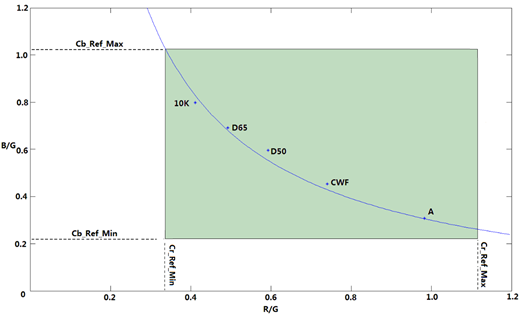

AWB统计的有效像素区域是一个四边形，其中上下左右四个边界由cr\_ref\_min/max, cb\_ref\_min/max这4个参数决定，它们代表了允许的r/g, b/g的最大与最小值。


#### AWB区域统计信息<a name="ZH-CN_TOPIC_0000002471085178"></a>

AWB中最大支持图像的32x32分块，每个分块均可以输出R、G、B均值\(Average R/G/B\)。其中统计的像素点均为16bit，分块内统计有效点个数Count All，点数统计值均已根据图像大小做了归一化处理，归一化到16bit。同时，每一个分块支持分亮度区间进行统计，最大支持分4个亮度区间。区块的统计信息读取地址与数据的对应关系如[表1](#_Toc504566257)所示。

> **须知：** 
>-   当分辨率较小，分块数较多时，如果每块的分辨率小于60x14，那么需要减少分块数，以免每块过小。建议在分辨率小的情况下，使用较少的分块数。
>-   如果要输出低分辨率，需要在业务启动的时候设置一个比较小的AWB统计信息分块数。

**表 1**  AWB区域统计信息

<a name="_Toc504566257"></a>
<table><thead align="left"><tr id="row36039mcpsimp"><th class="cellrowborder" rowspan="2" valign="top" id="mcps1.2.5.1.1"><p id="p36041mcpsimp"><a name="p36041mcpsimp"></a><a name="p36041mcpsimp"></a>Memory address</p>
</th>
<th class="cellrowborder" rowspan="2" valign="top" id="mcps1.2.5.1.2"><p id="p36043mcpsimp"><a name="p36043mcpsimp"></a><a name="p36043mcpsimp"></a>Zone</p>
</th>
<th class="cellrowborder" colspan="2" valign="top" id="mcps1.2.5.1.3"><p id="p36045mcpsimp"><a name="p36045mcpsimp"></a><a name="p36045mcpsimp"></a>Memory Read Data</p>
</th>
</tr>
<tr id="row36046mcpsimp"><th class="cellrowborder" valign="top" id="mcps1.2.5.2.1"><p id="p36048mcpsimp"><a name="p36048mcpsimp"></a><a name="p36048mcpsimp"></a>[31:16]</p>
</th>
<th class="cellrowborder" valign="top" id="mcps1.2.5.2.2"><p id="p36050mcpsimp"><a name="p36050mcpsimp"></a><a name="p36050mcpsimp"></a>[15:0]</p>
</th>
</tr>
</thead>
<tbody><tr id="row36052mcpsimp"><td class="cellrowborder" valign="top" width="36%" headers="mcps1.2.5.1.1 mcps1.2.5.2.1 "><p id="p36054mcpsimp"><a name="p36054mcpsimp"></a><a name="p36054mcpsimp"></a>0</p>
</td>
<td class="cellrowborder" valign="top" width="14.000000000000002%" headers="mcps1.2.5.1.2 mcps1.2.5.2.2 "><p id="p36056mcpsimp"><a name="p36056mcpsimp"></a><a name="p36056mcpsimp"></a>0</p>
</td>
<td class="cellrowborder" valign="top" width="25%" headers="mcps1.2.5.1.3 "><p id="p36058mcpsimp"><a name="p36058mcpsimp"></a><a name="p36058mcpsimp"></a>Average G</p>
</td>
<td class="cellrowborder" valign="top" width="25%" headers="mcps1.2.5.1.3 "><p id="p36060mcpsimp"><a name="p36060mcpsimp"></a><a name="p36060mcpsimp"></a>Average R</p>
</td>
</tr>
<tr id="row36061mcpsimp"><td class="cellrowborder" valign="top" width="36%" headers="mcps1.2.5.1.1 mcps1.2.5.2.1 "><p id="p36063mcpsimp"><a name="p36063mcpsimp"></a><a name="p36063mcpsimp"></a>1</p>
</td>
<td class="cellrowborder" valign="top" width="14.000000000000002%" headers="mcps1.2.5.1.2 mcps1.2.5.2.2 "><p id="p36065mcpsimp"><a name="p36065mcpsimp"></a><a name="p36065mcpsimp"></a>0</p>
</td>
<td class="cellrowborder" valign="top" width="25%" headers="mcps1.2.5.1.3 "><p id="p36067mcpsimp"><a name="p36067mcpsimp"></a><a name="p36067mcpsimp"></a>Count All</p>
</td>
<td class="cellrowborder" valign="top" width="25%" headers="mcps1.2.5.1.3 "><p id="p36069mcpsimp"><a name="p36069mcpsimp"></a><a name="p36069mcpsimp"></a>Average B</p>
</td>
</tr>
<tr id="row36070mcpsimp"><td class="cellrowborder" valign="top" width="36%" headers="mcps1.2.5.1.1 mcps1.2.5.2.1 "><p id="p36072mcpsimp"><a name="p36072mcpsimp"></a><a name="p36072mcpsimp"></a>2</p>
</td>
<td class="cellrowborder" valign="top" width="14.000000000000002%" headers="mcps1.2.5.1.2 mcps1.2.5.2.2 "><p id="p36074mcpsimp"><a name="p36074mcpsimp"></a><a name="p36074mcpsimp"></a>1</p>
</td>
<td class="cellrowborder" valign="top" width="25%" headers="mcps1.2.5.1.3 "><p id="p36076mcpsimp"><a name="p36076mcpsimp"></a><a name="p36076mcpsimp"></a>Average G</p>
</td>
<td class="cellrowborder" valign="top" width="25%" headers="mcps1.2.5.1.3 "><p id="p36078mcpsimp"><a name="p36078mcpsimp"></a><a name="p36078mcpsimp"></a>Average R</p>
</td>
</tr>
<tr id="row36079mcpsimp"><td class="cellrowborder" valign="top" width="36%" headers="mcps1.2.5.1.1 mcps1.2.5.2.1 "><p id="p36081mcpsimp"><a name="p36081mcpsimp"></a><a name="p36081mcpsimp"></a>3</p>
</td>
<td class="cellrowborder" valign="top" width="14.000000000000002%" headers="mcps1.2.5.1.2 mcps1.2.5.2.2 "><p id="p36083mcpsimp"><a name="p36083mcpsimp"></a><a name="p36083mcpsimp"></a>1</p>
</td>
<td class="cellrowborder" valign="top" width="25%" headers="mcps1.2.5.1.3 "><p id="p36085mcpsimp"><a name="p36085mcpsimp"></a><a name="p36085mcpsimp"></a>Count All</p>
</td>
<td class="cellrowborder" valign="top" width="25%" headers="mcps1.2.5.1.3 "><p id="p36087mcpsimp"><a name="p36087mcpsimp"></a><a name="p36087mcpsimp"></a>Average B</p>
</td>
</tr>
<tr id="row36088mcpsimp"><td class="cellrowborder" colspan="2" valign="top" headers="mcps1.2.5.1.1 mcps1.2.5.1.2 mcps1.2.5.2.1 mcps1.2.5.2.2 "><p id="p5874925141"><a name="p5874925141"></a><a name="p5874925141"></a>...</p>
</td>
<td class="cellrowborder" colspan="2" valign="top" headers="mcps1.2.5.1.3 "><p id="p36091mcpsimp"><a name="p36091mcpsimp"></a><a name="p36091mcpsimp"></a>...</p>
</td>
</tr>
<tr id="row36092mcpsimp"><td class="cellrowborder" valign="top" width="36%" headers="mcps1.2.5.1.1 mcps1.2.5.2.1 "><p id="p36094mcpsimp"><a name="p36094mcpsimp"></a><a name="p36094mcpsimp"></a>2047</p>
</td>
<td class="cellrowborder" valign="top" width="14.000000000000002%" headers="mcps1.2.5.1.2 mcps1.2.5.2.2 "><p id="p36096mcpsimp"><a name="p36096mcpsimp"></a><a name="p36096mcpsimp"></a>1023</p>
</td>
<td class="cellrowborder" valign="top" width="25%" headers="mcps1.2.5.1.3 "><p id="p36098mcpsimp"><a name="p36098mcpsimp"></a><a name="p36098mcpsimp"></a>Count All</p>
</td>
<td class="cellrowborder" valign="top" width="25%" headers="mcps1.2.5.1.3 "><p id="p36100mcpsimp"><a name="p36100mcpsimp"></a><a name="p36100mcpsimp"></a>Average B</p>
</td>
</tr>
</tbody>
</table>

#### AWB全局统计信息<a name="ZH-CN_TOPIC_0000002503965037"></a>

与AWB的区域统计信息基本一致，对于整幅图像，AWB也提供了四个全局统计信息。分别为ISP\_AWB\_AVG\_R/G/B，ISP\_AWB\_CNT\_ALL。其物理意义与分块统计一致。

## API参考<a name="ZH-CN_TOPIC_0000002503965103"></a>

统计信息的API接口必须在调用ss\_mpi\_isp\_init接口之后才能调用。

-   [ss\_mpi\_isp\_set\_stats\_cfg](#ZH-CN_TOPIC_0000002470925050)：设置ISP 3A统计信息配置。
-   [ss\_mpi\_isp\_get\_stats\_cfg](#ZH-CN_TOPIC_0000002504084933)：获取ISP 3A统计信息配置。
-   [ss\_mpi\_isp\_get\_ae\_stats](#ZH-CN_TOPIC_0000002471085020)：获取AE统计信息。
-   [ss\_mpi\_isp\_get\_ae\_stitch\_stats](#ZH-CN_TOPIC_0000002471085132)：获取拼接模式AE统计信息。
-   [ss\_mpi\_isp\_get\_mg\_stats](#ZH-CN_TOPIC_0000002470925226)：获取MG统计信息。
-   [ss\_mpi\_isp\_get\_wb\_stats](#ZH-CN_TOPIC_0000002471085146)：获取AWB统计信息。
-   [ss\_mpi\_isp\_get\_wb\_stitch\_stats](#ZH-CN_TOPIC_0000002471085208)：获取拼接模式AWB统计信息。
-   [ss\_mpi\_isp\_get\_focus\_stats](#ZH-CN_TOPIC_0000002470925076)：获取AF统计信息。


### ss\_mpi\_isp\_set\_stats\_cfg<a name="ZH-CN_TOPIC_0000002470925050"></a>

【描述】

设置ISP 3A统计信息配置。

【语法】

```
td_s32 ss_mpi_isp_set_stats_cfg(ot_vi_pipe vi_pipe, const ot_isp_stats_cfg *stat_cfg);
```

【参数】

<a name="table36140mcpsimp"></a>
<table><thead align="left"><tr id="row36146mcpsimp"><th class="cellrowborder" valign="top" width="25%" id="mcps1.1.4.1.1"><p id="p36148mcpsimp"><a name="p36148mcpsimp"></a><a name="p36148mcpsimp"></a>参数名称</p>
</th>
<th class="cellrowborder" valign="top" width="59%" id="mcps1.1.4.1.2"><p id="p36150mcpsimp"><a name="p36150mcpsimp"></a><a name="p36150mcpsimp"></a>描述</p>
</th>
<th class="cellrowborder" valign="top" width="16%" id="mcps1.1.4.1.3"><p id="p36152mcpsimp"><a name="p36152mcpsimp"></a><a name="p36152mcpsimp"></a>输入/输出</p>
</th>
</tr>
</thead>
<tbody><tr id="row36154mcpsimp"><td class="cellrowborder" valign="top" width="25%" headers="mcps1.1.4.1.1 "><p id="p36156mcpsimp"><a name="p36156mcpsimp"></a><a name="p36156mcpsimp"></a>vi_pipe</p>
</td>
<td class="cellrowborder" valign="top" width="59%" headers="mcps1.1.4.1.2 "><p id="p36158mcpsimp"><a name="p36158mcpsimp"></a><a name="p36158mcpsimp"></a>VI PIPE号。</p>
</td>
<td class="cellrowborder" valign="top" width="16%" headers="mcps1.1.4.1.3 "><p id="p36160mcpsimp"><a name="p36160mcpsimp"></a><a name="p36160mcpsimp"></a>输入</p>
</td>
</tr>
<tr id="row36161mcpsimp"><td class="cellrowborder" valign="top" width="25%" headers="mcps1.1.4.1.1 "><p id="p36163mcpsimp"><a name="p36163mcpsimp"></a><a name="p36163mcpsimp"></a>stat_cfg</p>
</td>
<td class="cellrowborder" valign="top" width="59%" headers="mcps1.1.4.1.2 "><p id="p36165mcpsimp"><a name="p36165mcpsimp"></a><a name="p36165mcpsimp"></a>ISP统计信息配置。</p>
</td>
<td class="cellrowborder" valign="top" width="16%" headers="mcps1.1.4.1.3 "><p id="p36167mcpsimp"><a name="p36167mcpsimp"></a><a name="p36167mcpsimp"></a>输入</p>
</td>
</tr>
</tbody>
</table>

【返回值】

<a name="table36169mcpsimp"></a>
<table><thead align="left"><tr id="row36174mcpsimp"><th class="cellrowborder" valign="top" width="27%" id="mcps1.1.3.1.1"><p id="p36176mcpsimp"><a name="p36176mcpsimp"></a><a name="p36176mcpsimp"></a>返回值</p>
</th>
<th class="cellrowborder" valign="top" width="73%" id="mcps1.1.3.1.2"><p id="p36178mcpsimp"><a name="p36178mcpsimp"></a><a name="p36178mcpsimp"></a>描述</p>
</th>
</tr>
</thead>
<tbody><tr id="row36180mcpsimp"><td class="cellrowborder" valign="top" width="27%" headers="mcps1.1.3.1.1 "><p id="p36182mcpsimp"><a name="p36182mcpsimp"></a><a name="p36182mcpsimp"></a>0</p>
</td>
<td class="cellrowborder" valign="top" width="73%" headers="mcps1.1.3.1.2 "><p id="p36184mcpsimp"><a name="p36184mcpsimp"></a><a name="p36184mcpsimp"></a>成功。</p>
</td>
</tr>
<tr id="row36185mcpsimp"><td class="cellrowborder" valign="top" width="27%" headers="mcps1.1.3.1.1 "><p id="p36187mcpsimp"><a name="p36187mcpsimp"></a><a name="p36187mcpsimp"></a>非0</p>
</td>
<td class="cellrowborder" valign="top" width="73%" headers="mcps1.1.3.1.2 "><p id="p36189mcpsimp"><a name="p36189mcpsimp"></a><a name="p36189mcpsimp"></a>失败，其值为<span xml:lang="sv-SE" id="ph82171364716"><a name="ph82171364716"></a><a name="ph82171364716"></a><a href="#ZH-CN_TOPIC_0000002471085018">错误码</a></span>。</p>
</td>
</tr>
</tbody>
</table>

【需求】

-   头文件：ot\_common\_isp.h、ss\_mpi\_isp.h
-   库文件：libot\_isp.a、libss\_isp.a

【注意】

用户可以关闭不需要的统计信息，以提高系统性能。

【举例】

无

【相关主题】

[ss\_mpi\_isp\_get\_stats\_cfg](#ss_mpi_isp_get_stats_cfg)

### ss\_mpi\_isp\_get\_stats\_cfg<a name="ZH-CN_TOPIC_0000002504084933"></a>

【描述】

获取ISP 3A统计信息配置。

【语法】

```
td_s32 ss_mpi_isp_get_stats_cfg(ot_vi_pipe vi_pipe, ot_isp_stats_cfg *stat_cfg);
```

【参数】

<a name="table36211mcpsimp"></a>
<table><thead align="left"><tr id="row36217mcpsimp"><th class="cellrowborder" valign="top" width="25%" id="mcps1.1.4.1.1"><p id="p36219mcpsimp"><a name="p36219mcpsimp"></a><a name="p36219mcpsimp"></a>参数名称</p>
</th>
<th class="cellrowborder" valign="top" width="59%" id="mcps1.1.4.1.2"><p id="p36221mcpsimp"><a name="p36221mcpsimp"></a><a name="p36221mcpsimp"></a>描述</p>
</th>
<th class="cellrowborder" valign="top" width="16%" id="mcps1.1.4.1.3"><p id="p36223mcpsimp"><a name="p36223mcpsimp"></a><a name="p36223mcpsimp"></a>输入/输出</p>
</th>
</tr>
</thead>
<tbody><tr id="row36225mcpsimp"><td class="cellrowborder" valign="top" width="25%" headers="mcps1.1.4.1.1 "><p id="p36227mcpsimp"><a name="p36227mcpsimp"></a><a name="p36227mcpsimp"></a>vi_pipe</p>
</td>
<td class="cellrowborder" valign="top" width="59%" headers="mcps1.1.4.1.2 "><p id="p36229mcpsimp"><a name="p36229mcpsimp"></a><a name="p36229mcpsimp"></a>VI PIPE号。</p>
</td>
<td class="cellrowborder" valign="top" width="16%" headers="mcps1.1.4.1.3 "><p id="p36231mcpsimp"><a name="p36231mcpsimp"></a><a name="p36231mcpsimp"></a>输入</p>
</td>
</tr>
<tr id="row36232mcpsimp"><td class="cellrowborder" valign="top" width="25%" headers="mcps1.1.4.1.1 "><p id="p36234mcpsimp"><a name="p36234mcpsimp"></a><a name="p36234mcpsimp"></a>stat_cfg</p>
</td>
<td class="cellrowborder" valign="top" width="59%" headers="mcps1.1.4.1.2 "><p id="p36236mcpsimp"><a name="p36236mcpsimp"></a><a name="p36236mcpsimp"></a>ISP统计信息配置。</p>
</td>
<td class="cellrowborder" valign="top" width="16%" headers="mcps1.1.4.1.3 "><p id="p36238mcpsimp"><a name="p36238mcpsimp"></a><a name="p36238mcpsimp"></a>输出</p>
</td>
</tr>
</tbody>
</table>

【返回值】

<a name="table36240mcpsimp"></a>
<table><thead align="left"><tr id="row36245mcpsimp"><th class="cellrowborder" valign="top" width="27%" id="mcps1.1.3.1.1"><p id="p36247mcpsimp"><a name="p36247mcpsimp"></a><a name="p36247mcpsimp"></a>返回值</p>
</th>
<th class="cellrowborder" valign="top" width="73%" id="mcps1.1.3.1.2"><p id="p36249mcpsimp"><a name="p36249mcpsimp"></a><a name="p36249mcpsimp"></a>描述</p>
</th>
</tr>
</thead>
<tbody><tr id="row36251mcpsimp"><td class="cellrowborder" valign="top" width="27%" headers="mcps1.1.3.1.1 "><p id="p36253mcpsimp"><a name="p36253mcpsimp"></a><a name="p36253mcpsimp"></a>0</p>
</td>
<td class="cellrowborder" valign="top" width="73%" headers="mcps1.1.3.1.2 "><p id="p36255mcpsimp"><a name="p36255mcpsimp"></a><a name="p36255mcpsimp"></a>成功。</p>
</td>
</tr>
<tr id="row36256mcpsimp"><td class="cellrowborder" valign="top" width="27%" headers="mcps1.1.3.1.1 "><p id="p36258mcpsimp"><a name="p36258mcpsimp"></a><a name="p36258mcpsimp"></a>非0</p>
</td>
<td class="cellrowborder" valign="top" width="73%" headers="mcps1.1.3.1.2 "><p id="p36260mcpsimp"><a name="p36260mcpsimp"></a><a name="p36260mcpsimp"></a>失败，其值为<span xml:lang="sv-SE" id="ph82171364716"><a name="ph82171364716"></a><a name="ph82171364716"></a><a href="#ZH-CN_TOPIC_0000002471085018">错误码</a></span>。</p>
</td>
</tr>
</tbody>
</table>

【需求】

-   头文件：ot\_common\_isp.h、ss\_mpi\_isp.h
-   库文件：libot\_isp.a、libss\_isp.a

【注意】

无

【举例】

无

【相关主题】

[ss\_mpi\_isp\_set\_stats\_cfg](#ss_mpi_isp_set_stats_cfg)

### ss\_mpi\_isp\_get\_ae\_stats<a name="ZH-CN_TOPIC_0000002471085020"></a>

【描述】

获取AE统计信息。

【语法】

```
td_s32 ss_mpi_isp_get_ae_stats(ot_vi_pipe vi_pipe, ot_isp_ae_stats *ae_stat);
```

【参数】

<a name="table36282mcpsimp"></a>
<table><thead align="left"><tr id="row36288mcpsimp"><th class="cellrowborder" valign="top" width="25%" id="mcps1.1.4.1.1"><p id="p36290mcpsimp"><a name="p36290mcpsimp"></a><a name="p36290mcpsimp"></a>参数名称</p>
</th>
<th class="cellrowborder" valign="top" width="54%" id="mcps1.1.4.1.2"><p id="p36292mcpsimp"><a name="p36292mcpsimp"></a><a name="p36292mcpsimp"></a>描述</p>
</th>
<th class="cellrowborder" valign="top" width="21%" id="mcps1.1.4.1.3"><p id="p36294mcpsimp"><a name="p36294mcpsimp"></a><a name="p36294mcpsimp"></a>输入/输出</p>
</th>
</tr>
</thead>
<tbody><tr id="row36296mcpsimp"><td class="cellrowborder" valign="top" width="25%" headers="mcps1.1.4.1.1 "><p id="p36298mcpsimp"><a name="p36298mcpsimp"></a><a name="p36298mcpsimp"></a>vi_pipe</p>
</td>
<td class="cellrowborder" valign="top" width="54%" headers="mcps1.1.4.1.2 "><p id="p36300mcpsimp"><a name="p36300mcpsimp"></a><a name="p36300mcpsimp"></a>VI PIPE号。</p>
</td>
<td class="cellrowborder" valign="top" width="21%" headers="mcps1.1.4.1.3 "><p id="p36302mcpsimp"><a name="p36302mcpsimp"></a><a name="p36302mcpsimp"></a>输入</p>
</td>
</tr>
<tr id="row36303mcpsimp"><td class="cellrowborder" valign="top" width="25%" headers="mcps1.1.4.1.1 "><p id="p36305mcpsimp"><a name="p36305mcpsimp"></a><a name="p36305mcpsimp"></a>ae_stat</p>
</td>
<td class="cellrowborder" valign="top" width="54%" headers="mcps1.1.4.1.2 "><p id="p36307mcpsimp"><a name="p36307mcpsimp"></a><a name="p36307mcpsimp"></a>AE统计信息。</p>
</td>
<td class="cellrowborder" valign="top" width="21%" headers="mcps1.1.4.1.3 "><p id="p36309mcpsimp"><a name="p36309mcpsimp"></a><a name="p36309mcpsimp"></a>输出</p>
</td>
</tr>
</tbody>
</table>

【返回值】

<a name="table36311mcpsimp"></a>
<table><thead align="left"><tr id="row36316mcpsimp"><th class="cellrowborder" valign="top" width="27%" id="mcps1.1.3.1.1"><p id="p36318mcpsimp"><a name="p36318mcpsimp"></a><a name="p36318mcpsimp"></a>返回值</p>
</th>
<th class="cellrowborder" valign="top" width="73%" id="mcps1.1.3.1.2"><p id="p36320mcpsimp"><a name="p36320mcpsimp"></a><a name="p36320mcpsimp"></a>描述</p>
</th>
</tr>
</thead>
<tbody><tr id="row36322mcpsimp"><td class="cellrowborder" valign="top" width="27%" headers="mcps1.1.3.1.1 "><p id="p36324mcpsimp"><a name="p36324mcpsimp"></a><a name="p36324mcpsimp"></a>0</p>
</td>
<td class="cellrowborder" valign="top" width="73%" headers="mcps1.1.3.1.2 "><p id="p36326mcpsimp"><a name="p36326mcpsimp"></a><a name="p36326mcpsimp"></a>成功。</p>
</td>
</tr>
<tr id="row36327mcpsimp"><td class="cellrowborder" valign="top" width="27%" headers="mcps1.1.3.1.1 "><p id="p36329mcpsimp"><a name="p36329mcpsimp"></a><a name="p36329mcpsimp"></a>非0</p>
</td>
<td class="cellrowborder" valign="top" width="73%" headers="mcps1.1.3.1.2 "><p id="p36331mcpsimp"><a name="p36331mcpsimp"></a><a name="p36331mcpsimp"></a>失败，其值为<span xml:lang="sv-SE" id="ph82171364716"><a name="ph82171364716"></a><a name="ph82171364716"></a><a href="#ZH-CN_TOPIC_0000002471085018">错误码</a></span>。</p>
</td>
</tr>
</tbody>
</table>

【需求】

-   头文件：ot\_common\_isp.h、ss\_mpi\_isp.h
-   库文件：libot\_isp.a、libss\_isp.a

【注意】

ot\_isp\_ae\_stats结构体较大，调用该接口时推荐调用malloc动态分配空间。

【举例】

无

【相关主题】

无

### ss\_mpi\_isp\_get\_ae\_stitch\_stats<a name="ZH-CN_TOPIC_0000002471085132"></a>

【描述】

获取拼接模式AE统计信息。

【语法】

```
td_s32 ss_mpi_isp_get_ae_stitch_stats(ot_vi_pipe vi_pipe, ot_isp_ae_stitch_stats *stitch_stat);
```

【参数】

<a name="table36352mcpsimp"></a>
<table><thead align="left"><tr id="row36358mcpsimp"><th class="cellrowborder" valign="top" width="25%" id="mcps1.1.4.1.1"><p id="p36360mcpsimp"><a name="p36360mcpsimp"></a><a name="p36360mcpsimp"></a>参数名称</p>
</th>
<th class="cellrowborder" valign="top" width="54%" id="mcps1.1.4.1.2"><p id="p36362mcpsimp"><a name="p36362mcpsimp"></a><a name="p36362mcpsimp"></a>描述</p>
</th>
<th class="cellrowborder" valign="top" width="21%" id="mcps1.1.4.1.3"><p id="p36364mcpsimp"><a name="p36364mcpsimp"></a><a name="p36364mcpsimp"></a>输入/输出</p>
</th>
</tr>
</thead>
<tbody><tr id="row36366mcpsimp"><td class="cellrowborder" valign="top" width="25%" headers="mcps1.1.4.1.1 "><p id="p36368mcpsimp"><a name="p36368mcpsimp"></a><a name="p36368mcpsimp"></a>vi_pipe</p>
</td>
<td class="cellrowborder" valign="top" width="54%" headers="mcps1.1.4.1.2 "><p id="p36370mcpsimp"><a name="p36370mcpsimp"></a><a name="p36370mcpsimp"></a>VI PIPE号。</p>
</td>
<td class="cellrowborder" valign="top" width="21%" headers="mcps1.1.4.1.3 "><p id="p36372mcpsimp"><a name="p36372mcpsimp"></a><a name="p36372mcpsimp"></a>输入</p>
</td>
</tr>
<tr id="row36373mcpsimp"><td class="cellrowborder" valign="top" width="25%" headers="mcps1.1.4.1.1 "><p id="p36375mcpsimp"><a name="p36375mcpsimp"></a><a name="p36375mcpsimp"></a>stitch_stat</p>
</td>
<td class="cellrowborder" valign="top" width="54%" headers="mcps1.1.4.1.2 "><p id="p36377mcpsimp"><a name="p36377mcpsimp"></a><a name="p36377mcpsimp"></a>拼接模式AE统计信息。</p>
</td>
<td class="cellrowborder" valign="top" width="21%" headers="mcps1.1.4.1.3 "><p id="p36379mcpsimp"><a name="p36379mcpsimp"></a><a name="p36379mcpsimp"></a>输出</p>
</td>
</tr>
</tbody>
</table>

【返回值】

<a name="table36381mcpsimp"></a>
<table><thead align="left"><tr id="row36386mcpsimp"><th class="cellrowborder" valign="top" width="27%" id="mcps1.1.3.1.1"><p id="p36388mcpsimp"><a name="p36388mcpsimp"></a><a name="p36388mcpsimp"></a>返回值</p>
</th>
<th class="cellrowborder" valign="top" width="73%" id="mcps1.1.3.1.2"><p id="p36390mcpsimp"><a name="p36390mcpsimp"></a><a name="p36390mcpsimp"></a>描述</p>
</th>
</tr>
</thead>
<tbody><tr id="row36392mcpsimp"><td class="cellrowborder" valign="top" width="27%" headers="mcps1.1.3.1.1 "><p id="p36394mcpsimp"><a name="p36394mcpsimp"></a><a name="p36394mcpsimp"></a>0</p>
</td>
<td class="cellrowborder" valign="top" width="73%" headers="mcps1.1.3.1.2 "><p id="p36396mcpsimp"><a name="p36396mcpsimp"></a><a name="p36396mcpsimp"></a>成功。</p>
</td>
</tr>
<tr id="row36397mcpsimp"><td class="cellrowborder" valign="top" width="27%" headers="mcps1.1.3.1.1 "><p id="p36399mcpsimp"><a name="p36399mcpsimp"></a><a name="p36399mcpsimp"></a>非0</p>
</td>
<td class="cellrowborder" valign="top" width="73%" headers="mcps1.1.3.1.2 "><p id="p36401mcpsimp"><a name="p36401mcpsimp"></a><a name="p36401mcpsimp"></a>失败，其值为<span xml:lang="sv-SE" id="ph82171364716"><a name="ph82171364716"></a><a name="ph82171364716"></a><a href="#ZH-CN_TOPIC_0000002471085018">错误码</a></span>。</p>
</td>
</tr>
</tbody>
</table>

【需求】

-   头文件：ot\_common\_isp.h、ss\_mpi\_isp.h
-   库文件：libot\_isp.a、libss\_isp.a

【注意】

ot\_isp\_ae\_stitch\_stats结构体较大，调用该接口时推荐调用malloc动态分配空间。

【举例】

无

【相关主题】

无

### ss\_mpi\_isp\_get\_mg\_stats<a name="ZH-CN_TOPIC_0000002470925226"></a>

【描述】

获取MG统计信息。

【语法】

```
td_s32 ss_mpi_isp_get_mg_stats(ot_vi_pipe vi_pipe, ot_isp_mg_stats *mg_stat);
```

【参数】

<a name="table36422mcpsimp"></a>
<table><thead align="left"><tr id="row36428mcpsimp"><th class="cellrowborder" valign="top" width="25%" id="mcps1.1.4.1.1"><p id="p36430mcpsimp"><a name="p36430mcpsimp"></a><a name="p36430mcpsimp"></a>参数名称</p>
</th>
<th class="cellrowborder" valign="top" width="54%" id="mcps1.1.4.1.2"><p id="p36432mcpsimp"><a name="p36432mcpsimp"></a><a name="p36432mcpsimp"></a>描述</p>
</th>
<th class="cellrowborder" valign="top" width="21%" id="mcps1.1.4.1.3"><p id="p36434mcpsimp"><a name="p36434mcpsimp"></a><a name="p36434mcpsimp"></a>输入/输出</p>
</th>
</tr>
</thead>
<tbody><tr id="row36436mcpsimp"><td class="cellrowborder" valign="top" width="25%" headers="mcps1.1.4.1.1 "><p id="p36438mcpsimp"><a name="p36438mcpsimp"></a><a name="p36438mcpsimp"></a>vi_pipe</p>
</td>
<td class="cellrowborder" valign="top" width="54%" headers="mcps1.1.4.1.2 "><p id="p36440mcpsimp"><a name="p36440mcpsimp"></a><a name="p36440mcpsimp"></a>VI PIPE号。</p>
</td>
<td class="cellrowborder" valign="top" width="21%" headers="mcps1.1.4.1.3 "><p id="p36442mcpsimp"><a name="p36442mcpsimp"></a><a name="p36442mcpsimp"></a>输入</p>
</td>
</tr>
<tr id="row36443mcpsimp"><td class="cellrowborder" valign="top" width="25%" headers="mcps1.1.4.1.1 "><p id="p36445mcpsimp"><a name="p36445mcpsimp"></a><a name="p36445mcpsimp"></a>mg_stat</p>
</td>
<td class="cellrowborder" valign="top" width="54%" headers="mcps1.1.4.1.2 "><p id="p36447mcpsimp"><a name="p36447mcpsimp"></a><a name="p36447mcpsimp"></a>MG统计信息。</p>
</td>
<td class="cellrowborder" valign="top" width="21%" headers="mcps1.1.4.1.3 "><p id="p36449mcpsimp"><a name="p36449mcpsimp"></a><a name="p36449mcpsimp"></a>输出</p>
</td>
</tr>
</tbody>
</table>

【返回值】

<a name="table36451mcpsimp"></a>
<table><thead align="left"><tr id="row36456mcpsimp"><th class="cellrowborder" valign="top" width="27%" id="mcps1.1.3.1.1"><p id="p36458mcpsimp"><a name="p36458mcpsimp"></a><a name="p36458mcpsimp"></a>返回值</p>
</th>
<th class="cellrowborder" valign="top" width="73%" id="mcps1.1.3.1.2"><p id="p36460mcpsimp"><a name="p36460mcpsimp"></a><a name="p36460mcpsimp"></a>描述</p>
</th>
</tr>
</thead>
<tbody><tr id="row36462mcpsimp"><td class="cellrowborder" valign="top" width="27%" headers="mcps1.1.3.1.1 "><p id="p36464mcpsimp"><a name="p36464mcpsimp"></a><a name="p36464mcpsimp"></a>0</p>
</td>
<td class="cellrowborder" valign="top" width="73%" headers="mcps1.1.3.1.2 "><p id="p36466mcpsimp"><a name="p36466mcpsimp"></a><a name="p36466mcpsimp"></a>成功。</p>
</td>
</tr>
<tr id="row36467mcpsimp"><td class="cellrowborder" valign="top" width="27%" headers="mcps1.1.3.1.1 "><p id="p36469mcpsimp"><a name="p36469mcpsimp"></a><a name="p36469mcpsimp"></a>非0</p>
</td>
<td class="cellrowborder" valign="top" width="73%" headers="mcps1.1.3.1.2 "><p id="p36471mcpsimp"><a name="p36471mcpsimp"></a><a name="p36471mcpsimp"></a>失败，其值为<span xml:lang="sv-SE" id="ph82171364716"><a name="ph82171364716"></a><a name="ph82171364716"></a><a href="#ZH-CN_TOPIC_0000002471085018">错误码</a></span>。</p>
</td>
</tr>
</tbody>
</table>

【需求】

-   头文件：ot\_common\_isp.h、ss\_mpi\_isp.h
-   库文件：libot\_isp.a、libss\_isp.a

【注意】

ot\_isp\_mg\_stats结构体较大，调用该接口时推荐调用malloc动态分配空间。

【举例】

无

【相关主题】

无

### ss\_mpi\_isp\_get\_wb\_stats<a name="ZH-CN_TOPIC_0000002471085146"></a>

【描述】

获取AWB统计信息。

【语法】

```
td_s32 ss_mpi_isp_get_wb_stats(ot_vi_pipe vi_pipe, ot_isp_wb_stats *wb_stat);
```

【参数】

<a name="table36492mcpsimp"></a>
<table><thead align="left"><tr id="row36498mcpsimp"><th class="cellrowborder" valign="top" width="25%" id="mcps1.1.4.1.1"><p id="p36500mcpsimp"><a name="p36500mcpsimp"></a><a name="p36500mcpsimp"></a>参数名称</p>
</th>
<th class="cellrowborder" valign="top" width="54%" id="mcps1.1.4.1.2"><p id="p36502mcpsimp"><a name="p36502mcpsimp"></a><a name="p36502mcpsimp"></a>描述</p>
</th>
<th class="cellrowborder" valign="top" width="21%" id="mcps1.1.4.1.3"><p id="p36504mcpsimp"><a name="p36504mcpsimp"></a><a name="p36504mcpsimp"></a>输入/输出</p>
</th>
</tr>
</thead>
<tbody><tr id="row36505mcpsimp"><td class="cellrowborder" valign="top" width="25%" headers="mcps1.1.4.1.1 "><p id="p36507mcpsimp"><a name="p36507mcpsimp"></a><a name="p36507mcpsimp"></a>vi_pipe</p>
</td>
<td class="cellrowborder" valign="top" width="54%" headers="mcps1.1.4.1.2 "><p id="p36509mcpsimp"><a name="p36509mcpsimp"></a><a name="p36509mcpsimp"></a>VI PIPE号。</p>
</td>
<td class="cellrowborder" valign="top" width="21%" headers="mcps1.1.4.1.3 "><p id="p36511mcpsimp"><a name="p36511mcpsimp"></a><a name="p36511mcpsimp"></a>输入</p>
</td>
</tr>
<tr id="row36512mcpsimp"><td class="cellrowborder" valign="top" width="25%" headers="mcps1.1.4.1.1 "><p id="p36514mcpsimp"><a name="p36514mcpsimp"></a><a name="p36514mcpsimp"></a>wb_stat</p>
</td>
<td class="cellrowborder" valign="top" width="54%" headers="mcps1.1.4.1.2 "><p id="p36516mcpsimp"><a name="p36516mcpsimp"></a><a name="p36516mcpsimp"></a>WB统计信息。</p>
</td>
<td class="cellrowborder" valign="top" width="21%" headers="mcps1.1.4.1.3 "><p id="p36518mcpsimp"><a name="p36518mcpsimp"></a><a name="p36518mcpsimp"></a>输出</p>
</td>
</tr>
</tbody>
</table>

【返回值】

<a name="table36521mcpsimp"></a>
<table><thead align="left"><tr id="row36526mcpsimp"><th class="cellrowborder" valign="top" width="27%" id="mcps1.1.3.1.1"><p id="p36528mcpsimp"><a name="p36528mcpsimp"></a><a name="p36528mcpsimp"></a>返回值</p>
</th>
<th class="cellrowborder" valign="top" width="73%" id="mcps1.1.3.1.2"><p id="p36530mcpsimp"><a name="p36530mcpsimp"></a><a name="p36530mcpsimp"></a>描述</p>
</th>
</tr>
</thead>
<tbody><tr id="row36532mcpsimp"><td class="cellrowborder" valign="top" width="27%" headers="mcps1.1.3.1.1 "><p id="p36534mcpsimp"><a name="p36534mcpsimp"></a><a name="p36534mcpsimp"></a>0</p>
</td>
<td class="cellrowborder" valign="top" width="73%" headers="mcps1.1.3.1.2 "><p id="p36536mcpsimp"><a name="p36536mcpsimp"></a><a name="p36536mcpsimp"></a>成功。</p>
</td>
</tr>
<tr id="row36537mcpsimp"><td class="cellrowborder" valign="top" width="27%" headers="mcps1.1.3.1.1 "><p id="p36539mcpsimp"><a name="p36539mcpsimp"></a><a name="p36539mcpsimp"></a>非0</p>
</td>
<td class="cellrowborder" valign="top" width="73%" headers="mcps1.1.3.1.2 "><p id="p36541mcpsimp"><a name="p36541mcpsimp"></a><a name="p36541mcpsimp"></a>失败，其值为<span xml:lang="sv-SE" id="ph82171364716"><a name="ph82171364716"></a><a name="ph82171364716"></a><a href="#ZH-CN_TOPIC_0000002471085018">错误码</a></span>。</p>
</td>
</tr>
</tbody>
</table>

【需求】

-   头文件：ot\_common\_isp.h、ss\_mpi\_isp.h
-   库文件：libot\_isp.a、libss\_isp.a

【注意】

ot\_isp\_wb\_stats结构体较大，调用该接口时推荐调用malloc动态分配空间。

【举例】

无

【相关主题】

无

### ss\_mpi\_isp\_get\_wb\_stitch\_stats<a name="ZH-CN_TOPIC_0000002471085208"></a>

【描述】

获取拼接模式下WB统计信息。

【语法】

```
td_s32 ss_mpi_isp_get_wb_stitch_stats (ot_vi_pipe vi_pipe, ot_isp_wb_stitch_stats *stitch_wb_stat);
```

【参数】

<a name="table36562mcpsimp"></a>
<table><thead align="left"><tr id="row36568mcpsimp"><th class="cellrowborder" valign="top" width="25%" id="mcps1.1.4.1.1"><p id="p36570mcpsimp"><a name="p36570mcpsimp"></a><a name="p36570mcpsimp"></a>参数名称</p>
</th>
<th class="cellrowborder" valign="top" width="54%" id="mcps1.1.4.1.2"><p id="p36572mcpsimp"><a name="p36572mcpsimp"></a><a name="p36572mcpsimp"></a>描述</p>
</th>
<th class="cellrowborder" valign="top" width="21%" id="mcps1.1.4.1.3"><p id="p36574mcpsimp"><a name="p36574mcpsimp"></a><a name="p36574mcpsimp"></a>输入/输出</p>
</th>
</tr>
</thead>
<tbody><tr id="row36575mcpsimp"><td class="cellrowborder" valign="top" width="25%" headers="mcps1.1.4.1.1 "><p id="p36577mcpsimp"><a name="p36577mcpsimp"></a><a name="p36577mcpsimp"></a>vi_pipe</p>
</td>
<td class="cellrowborder" valign="top" width="54%" headers="mcps1.1.4.1.2 "><p id="p36579mcpsimp"><a name="p36579mcpsimp"></a><a name="p36579mcpsimp"></a>VI PIPE号。</p>
</td>
<td class="cellrowborder" valign="top" width="21%" headers="mcps1.1.4.1.3 "><p id="p36581mcpsimp"><a name="p36581mcpsimp"></a><a name="p36581mcpsimp"></a>输入</p>
</td>
</tr>
<tr id="row36582mcpsimp"><td class="cellrowborder" valign="top" width="25%" headers="mcps1.1.4.1.1 "><p id="p36584mcpsimp"><a name="p36584mcpsimp"></a><a name="p36584mcpsimp"></a>stitch_wb_stat</p>
</td>
<td class="cellrowborder" valign="top" width="54%" headers="mcps1.1.4.1.2 "><p id="p36586mcpsimp"><a name="p36586mcpsimp"></a><a name="p36586mcpsimp"></a>拼接模式WB统计信息。</p>
</td>
<td class="cellrowborder" valign="top" width="21%" headers="mcps1.1.4.1.3 "><p id="p36588mcpsimp"><a name="p36588mcpsimp"></a><a name="p36588mcpsimp"></a>输出</p>
</td>
</tr>
</tbody>
</table>

【返回值】

<a name="table36591mcpsimp"></a>
<table><thead align="left"><tr id="row36596mcpsimp"><th class="cellrowborder" valign="top" width="27%" id="mcps1.1.3.1.1"><p id="p36598mcpsimp"><a name="p36598mcpsimp"></a><a name="p36598mcpsimp"></a>返回值</p>
</th>
<th class="cellrowborder" valign="top" width="73%" id="mcps1.1.3.1.2"><p id="p36600mcpsimp"><a name="p36600mcpsimp"></a><a name="p36600mcpsimp"></a>描述</p>
</th>
</tr>
</thead>
<tbody><tr id="row36602mcpsimp"><td class="cellrowborder" valign="top" width="27%" headers="mcps1.1.3.1.1 "><p id="p36604mcpsimp"><a name="p36604mcpsimp"></a><a name="p36604mcpsimp"></a>0</p>
</td>
<td class="cellrowborder" valign="top" width="73%" headers="mcps1.1.3.1.2 "><p id="p36606mcpsimp"><a name="p36606mcpsimp"></a><a name="p36606mcpsimp"></a>成功。</p>
</td>
</tr>
<tr id="row36607mcpsimp"><td class="cellrowborder" valign="top" width="27%" headers="mcps1.1.3.1.1 "><p id="p36609mcpsimp"><a name="p36609mcpsimp"></a><a name="p36609mcpsimp"></a>非0</p>
</td>
<td class="cellrowborder" valign="top" width="73%" headers="mcps1.1.3.1.2 "><p id="p36611mcpsimp"><a name="p36611mcpsimp"></a><a name="p36611mcpsimp"></a>失败，其值为<span xml:lang="sv-SE" id="ph82171364716"><a name="ph82171364716"></a><a name="ph82171364716"></a><a href="#ZH-CN_TOPIC_0000002471085018">错误码</a></span>。</p>
</td>
</tr>
</tbody>
</table>

【需求】

-   头文件：ot\_common\_isp.h、ss\_mpi\_isp.h
-   库文件：libot\_isp.a、libss\_isp.a

【注意】

ot\_isp\_wb\_stitch\_stats结构体较大，调用该接口时推荐调用malloc动态分配空间。

【举例】

无

【相关主题】

无

### ss\_mpi\_isp\_get\_focus\_stats<a name="ZH-CN_TOPIC_0000002470925076"></a>

【描述】

获取AF统计信息。

【语法】

```
td_s32 ss_mpi_isp_get_focus_stats(ot_vi_pipe vi_pipe, ot_isp_af_stats *af_stat);
```

【参数】

<a name="table36631mcpsimp"></a>
<table><thead align="left"><tr id="row36637mcpsimp"><th class="cellrowborder" valign="top" width="25%" id="mcps1.1.4.1.1"><p id="p36639mcpsimp"><a name="p36639mcpsimp"></a><a name="p36639mcpsimp"></a>参数名称</p>
</th>
<th class="cellrowborder" valign="top" width="54%" id="mcps1.1.4.1.2"><p id="p36641mcpsimp"><a name="p36641mcpsimp"></a><a name="p36641mcpsimp"></a>描述</p>
</th>
<th class="cellrowborder" valign="top" width="21%" id="mcps1.1.4.1.3"><p id="p36643mcpsimp"><a name="p36643mcpsimp"></a><a name="p36643mcpsimp"></a>输入/输出</p>
</th>
</tr>
</thead>
<tbody><tr id="row36644mcpsimp"><td class="cellrowborder" valign="top" width="25%" headers="mcps1.1.4.1.1 "><p id="p36646mcpsimp"><a name="p36646mcpsimp"></a><a name="p36646mcpsimp"></a>vi_pipe</p>
</td>
<td class="cellrowborder" valign="top" width="54%" headers="mcps1.1.4.1.2 "><p id="p36648mcpsimp"><a name="p36648mcpsimp"></a><a name="p36648mcpsimp"></a>VI PIPE号。</p>
</td>
<td class="cellrowborder" valign="top" width="21%" headers="mcps1.1.4.1.3 "><p id="p36650mcpsimp"><a name="p36650mcpsimp"></a><a name="p36650mcpsimp"></a>输入</p>
</td>
</tr>
<tr id="row36651mcpsimp"><td class="cellrowborder" valign="top" width="25%" headers="mcps1.1.4.1.1 "><p id="p36653mcpsimp"><a name="p36653mcpsimp"></a><a name="p36653mcpsimp"></a>af_stat</p>
</td>
<td class="cellrowborder" valign="top" width="54%" headers="mcps1.1.4.1.2 "><p id="p36655mcpsimp"><a name="p36655mcpsimp"></a><a name="p36655mcpsimp"></a>AF统计信息。</p>
</td>
<td class="cellrowborder" valign="top" width="21%" headers="mcps1.1.4.1.3 "><p id="p36657mcpsimp"><a name="p36657mcpsimp"></a><a name="p36657mcpsimp"></a>输出</p>
</td>
</tr>
</tbody>
</table>

【返回值】

<a name="table36660mcpsimp"></a>
<table><thead align="left"><tr id="row36665mcpsimp"><th class="cellrowborder" valign="top" width="27%" id="mcps1.1.3.1.1"><p id="p36667mcpsimp"><a name="p36667mcpsimp"></a><a name="p36667mcpsimp"></a>返回值</p>
</th>
<th class="cellrowborder" valign="top" width="73%" id="mcps1.1.3.1.2"><p id="p36669mcpsimp"><a name="p36669mcpsimp"></a><a name="p36669mcpsimp"></a>描述</p>
</th>
</tr>
</thead>
<tbody><tr id="row36671mcpsimp"><td class="cellrowborder" valign="top" width="27%" headers="mcps1.1.3.1.1 "><p id="p36673mcpsimp"><a name="p36673mcpsimp"></a><a name="p36673mcpsimp"></a>0</p>
</td>
<td class="cellrowborder" valign="top" width="73%" headers="mcps1.1.3.1.2 "><p id="p36675mcpsimp"><a name="p36675mcpsimp"></a><a name="p36675mcpsimp"></a>成功。</p>
</td>
</tr>
<tr id="row36676mcpsimp"><td class="cellrowborder" valign="top" width="27%" headers="mcps1.1.3.1.1 "><p id="p36678mcpsimp"><a name="p36678mcpsimp"></a><a name="p36678mcpsimp"></a>非0</p>
</td>
<td class="cellrowborder" valign="top" width="73%" headers="mcps1.1.3.1.2 "><p id="p36680mcpsimp"><a name="p36680mcpsimp"></a><a name="p36680mcpsimp"></a>失败，其值为<span xml:lang="sv-SE" id="ph82171364716"><a name="ph82171364716"></a><a name="ph82171364716"></a><a href="#ZH-CN_TOPIC_0000002471085018">错误码</a></span>。</p>
</td>
</tr>
</tbody>
</table>

【需求】

-   头文件：ot\_common\_isp.h、ss\_mpi\_isp.h
-   库文件：libot\_isp.a、libss\_isp.a

【注意】

ot\_isp\_af\_stats结构体较大，调用该接口时推荐调用malloc动态分配空间。

【举例】

无

【相关主题】

无

## 数据类型<a name="ZH-CN_TOPIC_0000002471085176"></a>

-   [ot\_isp\_stats\_cfg](#ZH-CN_TOPIC_0000002504084941)：定义ISP 3A统计信息配置。
-   [ot\_isp\_stats\_ctrl](#ZH-CN_TOPIC_0000002503964965)：定义ISP 3A统计信息使能。
-   [ot\_isp\_ae\_stats\_cfg](#ZH-CN_TOPIC_0000002471085154)：定义AE统计信息配置。
-   [ot\_isp\_ae\_switch](#ZH-CN_TOPIC_0000002503965127)：定义AE统计模块在ISP pipeline的位置。
-   [ot\_isp\_ae\_four\_plane\_mode](#ZH-CN_TOPIC_0000002471084868)：FourPlaneMode使能。
-   [ot\_isp\_ae\_hist\_skip](#ZH-CN_TOPIC_0000002503965053): 直方图统计时采样点设置。
-   [ot\_isp\_ae\_hist\_offset\_x](#ZH-CN_TOPIC_0000002470924962)：直方图统计时水平方向起始点设置。
-   [ot\_isp\_ae\_hist\_offset\_y](#ZH-CN_TOPIC_0000002503965175)：直方图统计时垂直方向起始点设置。
-   [ot\_isp\_ae\_hist\_config](#ZH-CN_TOPIC_0000002470925082)：定义全局直方图统计时的采样点方式。
-   [ot\_isp\_ae\_stat\_mode](#ZH-CN_TOPIC_0000002470925242)：定义统计模块的开方模式。
-   [ot\_isp\_ae\_crop](#ZH-CN_TOPIC_0000002470925234)：对AE模块输入图像进行裁剪。
-   [ot\_isp\_awb\_switch](#ZH-CN_TOPIC_0000002471085162)：定义ISP  WB统计模块在ISP pipeline的位置。
-   [ot\_isp\_awb\_gain\_switch](#ZH-CN_TOPIC_0000002504084987)：定义AWB增益的位置。
-   [ot\_isp\_awb\_crop](#ZH-CN_TOPIC_0000002471084950)：对AWB模块输入图像进行裁剪。
-   [ot\_isp\_wb\_stats\_cfg](#ZH-CN_TOPIC_0000002504085019)：定义AWB统计信息配置。
-   [ot\_isp\_ae\_grid\_info](#ZH-CN_TOPIC_0000002503965137)：定义AE分区间统计信息的坐标信息。
-   [ot\_isp\_ae\_stats](#ZH-CN_TOPIC_0000002503965027)：定义AE统计信息。
-   [ot\_isp\_ae\_stitch\_stats](#ZH-CN_TOPIC_0000002504084975)：定义拼接模式AE统计信息。
-   [ot\_isp\_mg\_grid\_info](#ZH-CN_TOPIC_0000002504085087)：定义MG分区间统计信息的坐标信息。
-   [ot\_isp\_mg\_stats](#ZH-CN_TOPIC_0000002471085136)：定义MG统计信息。
-   [ot\_isp\_awb\_grid\_info](#ZH-CN_TOPIC_0000002504085007)：定义AWB分区间统计信息的坐标信息。
-   [ot\_isp\_wb\_stats](#ZH-CN_TOPIC_0000002471085210)：定义AWB统计信息。
-   [ot\_isp\_wb\_stitch\_stats](#ZH-CN_TOPIC_0000002504084697)：定义拼接模式AWB统计信息。
-   [OT\_ISP\_IIR\_EN\_NUM](#ZH-CN_TOPIC_0000002503964957)：定义AF IIR使能的个数。
-   [OT\_ISP\_IIR\_GAIN\_NUM](#ZH-CN_TOPIC_0000002504084929)：定义AF IIR gain的个数。
-   [OT\_ISP\_IIR\_SHIFT\_NUM](#ZH-CN_TOPIC_0000002470925046)：定义AF IIR shift的个数。
-   [OT\_ISP\_ACC\_SHIFT\_H\_NUM](#ZH-CN_TOPIC_0000002503965119)：定义AF IIR累加统计shift的个数。
-   [OT\_ISP\_ACC\_SHIFT\_V\_NUM](#ZH-CN_TOPIC_0000002503964821)：定义AF FIR累加统计shift的个数。
-   [OT\_ISP\_AF\_ZONE\_ROW](#ZH-CN_TOPIC_0000002504085085)：定义AF水平方向的分块个数。
-   [OT\_ISP\_AF\_ZONE\_COLUMN](#ZH-CN_TOPIC_0000002470924990)：定义AF垂直方向的分块个数。
-   [ot\_isp\_focus\_stats\_cfg](#ZH-CN_TOPIC_0000002471085010)：定义AF统计信息配置。
-   [ot\_isp\_af\_cfg](#ZH-CN_TOPIC_0000002504084829)：定义AF统计信息配置参数。
-   [ot\_isp\_af\_peak\_mode](#ZH-CN_TOPIC_0000002470924860)：统计模式。
-   [ot\_isp\_af\_square\_mode](#ZH-CN_TOPIC_0000002503965123)：平方模式。
-   [ot\_isp\_af\_crop](#ZH-CN_TOPIC_0000002504085079)：AF输入图像的裁剪。
-   [ot\_isp\_af\_stats\_pos](#ZH-CN_TOPIC_0000002503965073)：AF统计位置。
-   [ot\_isp\_af\_raw\_cfg](#ZH-CN_TOPIC_0000002503964917)：AF RAW域统计配置。
-   [ot\_isp\_af\_pre\_filter\_cfg](#ZH-CN_TOPIC_0000002503965177)：AF预滤波器配置。
-   [ot\_isp\_af\_level\_depend](#ZH-CN_TOPIC_0000002504084985)：AF Level Depend Gain配置。
-   [ot\_isp\_af\_coring](#ZH-CN_TOPIC_0000002471085036)：AF Coring 配置。
-   [ot\_isp\_af\_h\_param](#ZH-CN_TOPIC_0000002471084848)：AF统计水平滤波器IIR参数设置。
-   [ot\_isp\_af\_v\_param](#ZH-CN_TOPIC_0000002503964949)：AF统计水平滤波器IIR参数设置。
-   [ot\_isp\_af\_fv\_param](#ZH-CN_TOPIC_0000002504084997)：AF统计结果输出格式参数。
-   [ot\_isp\_focus\_zone](#ZH-CN_TOPIC_0000002471084940)：定义AF统计信息参数。
-   [ot\_isp\_fe\_focus\_stats](#ZH-CN_TOPIC_0000002470924902)：定义FE AF统计信息。
-   [ot\_isp\_be\_focus\_stats](#ZH-CN_TOPIC_0000002470925104)：定义BE AF统计信息。
-   [ot\_isp\_focus\_grid\_info](#ZH-CN_TOPIC_0000002503965065)：定义AF分区间统计信息的坐标信息。
-   [ot\_isp\_af\_stats](#ZH-CN_TOPIC_0000002503965129)：定义FE和BE的AF统计信息。


### ot\_isp\_stats\_cfg<a name="ZH-CN_TOPIC_0000002504084941"></a>

【说明】

定义ISP 3A统计信息配置。

【定义】

```
typedef struct {
    ot_isp_stats_ctrl      key;
    ot_isp_ae_stats_cfg    ae_cfg;
    ot_isp_wb_stats_cfg    wb_cfg;
    ot_isp_focus_stats_cfg focus_cfg;
} ot_isp_stats_cfg;
```

【成员】

<a name="table36838mcpsimp"></a>
<table><thead align="left"><tr id="row36843mcpsimp"><th class="cellrowborder" valign="top" width="33%" id="mcps1.1.3.1.1"><p id="p36845mcpsimp"><a name="p36845mcpsimp"></a><a name="p36845mcpsimp"></a>成员名称</p>
</th>
<th class="cellrowborder" valign="top" width="67%" id="mcps1.1.3.1.2"><p id="p36847mcpsimp"><a name="p36847mcpsimp"></a><a name="p36847mcpsimp"></a>描述</p>
</th>
</tr>
</thead>
<tbody><tr id="row36848mcpsimp"><td class="cellrowborder" valign="top" width="33%" headers="mcps1.1.3.1.1 "><p id="p36850mcpsimp"><a name="p36850mcpsimp"></a><a name="p36850mcpsimp"></a>key</p>
</td>
<td class="cellrowborder" valign="top" width="67%" headers="mcps1.1.3.1.2 "><p id="p36852mcpsimp"><a name="p36852mcpsimp"></a><a name="p36852mcpsimp"></a>统计信息使能。</p>
</td>
</tr>
<tr id="row36853mcpsimp"><td class="cellrowborder" valign="top" width="33%" headers="mcps1.1.3.1.1 "><p id="p36855mcpsimp"><a name="p36855mcpsimp"></a><a name="p36855mcpsimp"></a>ae_cfg</p>
</td>
<td class="cellrowborder" valign="top" width="67%" headers="mcps1.1.3.1.2 "><p id="p36857mcpsimp"><a name="p36857mcpsimp"></a><a name="p36857mcpsimp"></a>AE统计信息配置。</p>
</td>
</tr>
<tr id="row36858mcpsimp"><td class="cellrowborder" valign="top" width="33%" headers="mcps1.1.3.1.1 "><p id="p36860mcpsimp"><a name="p36860mcpsimp"></a><a name="p36860mcpsimp"></a>wb_cfg</p>
</td>
<td class="cellrowborder" valign="top" width="67%" headers="mcps1.1.3.1.2 "><p id="p36862mcpsimp"><a name="p36862mcpsimp"></a><a name="p36862mcpsimp"></a>AWB统计信息配置。</p>
</td>
</tr>
<tr id="row36863mcpsimp"><td class="cellrowborder" valign="top" width="33%" headers="mcps1.1.3.1.1 "><p id="p36865mcpsimp"><a name="p36865mcpsimp"></a><a name="p36865mcpsimp"></a>focus_cfg</p>
</td>
<td class="cellrowborder" valign="top" width="67%" headers="mcps1.1.3.1.2 "><p id="p36867mcpsimp"><a name="p36867mcpsimp"></a><a name="p36867mcpsimp"></a>AF统计信息配置。</p>
</td>
</tr>
</tbody>
</table>

【注意事项】

无。

【相关数据类型及接口】

无

### ot\_isp\_stats\_ctrl<a name="ZH-CN_TOPIC_0000002503964965"></a>

【说明】

定义ISP 3A统计信息使能。

【定义】

```
typedef union {
    td_u64  key;
    struct {
        td_u64  bit1_fe_ae_global_stat         : 1 ;   /* [0] */
        td_u64  bit1_fe_ae_local_stat          : 1 ;   /* [1] */
        td_u64  bit1_fe_ae_stitch_global_stat  : 1 ;   /* [2] */
        td_u64  bit1_fe_ae_stitch_local_stat   : 1 ;   /* [3] */
        td_u64  bit1_be_ae_global_stat         : 1 ;   /* [4] */
        td_u64  bit1_be_ae_local_stat          : 1 ;   /* [5] */
        td_u64  bit1_be_ae_stitch_global_stat  : 1 ;   /* [6] */
        td_u64  bit1_be_ae_stitch_local_stat   : 1 ;   /* [7] */
        td_u64  bit1_awb_stat1                 : 1 ;   /* [8] */
        td_u64  bit1_awb_stat2                 : 1 ;   /* [9] */
        td_u64  bit2_reserved0                 : 2 ;   /* [10:11] */
        td_u64  bit1_fe_af_stat                : 1 ;   /* [12] */
        td_u64  bit1_be_af_stat                : 1 ;   /* [13] */
        td_u64  bit2_reserved1                 : 2 ;   /* [14:15] */
        td_u64  bit1_dehaze                    : 1 ;   /* [16] */
        td_u64  bit1_mg_stat                   : 1 ;   /* [17] */
        td_u64  bit1_extend_stats               : 1;   /* [18] */
        td_u64  bit13_reserved                 : 13;   /* [19:31] */
        td_u64  bit32_isr_access               : 32;   /* [32:63] */
    };
} ot_isp_stats_ctrl;
```

【成员】

<a name="table36901mcpsimp"></a>
<table><thead align="left"><tr id="row36906mcpsimp"><th class="cellrowborder" valign="top" width="37%" id="mcps1.1.3.1.1"><p id="p36908mcpsimp"><a name="p36908mcpsimp"></a><a name="p36908mcpsimp"></a>成员名称</p>
</th>
<th class="cellrowborder" valign="top" width="63%" id="mcps1.1.3.1.2"><p id="p36910mcpsimp"><a name="p36910mcpsimp"></a><a name="p36910mcpsimp"></a>描述</p>
</th>
</tr>
</thead>
<tbody><tr id="row36912mcpsimp"><td class="cellrowborder" valign="top" width="37%" headers="mcps1.1.3.1.1 "><p id="p36914mcpsimp"><a name="p36914mcpsimp"></a><a name="p36914mcpsimp"></a>bit1_fe_ae_global_stat</p>
</td>
<td class="cellrowborder" valign="top" width="63%" headers="mcps1.1.3.1.2 "><p id="p36916mcpsimp"><a name="p36916mcpsimp"></a><a name="p36916mcpsimp"></a>位于FE的AE全局统计信息使能。包括直方图和全局均值。</p>
</td>
</tr>
<tr id="row36917mcpsimp"><td class="cellrowborder" valign="top" width="37%" headers="mcps1.1.3.1.1 "><p id="p36919mcpsimp"><a name="p36919mcpsimp"></a><a name="p36919mcpsimp"></a>bit1_fe_ae_local_stat</p>
</td>
<td class="cellrowborder" valign="top" width="63%" headers="mcps1.1.3.1.2 "><p id="p36921mcpsimp"><a name="p36921mcpsimp"></a><a name="p36921mcpsimp"></a>位于FE的AE分块均值统计信息使能。</p>
</td>
</tr>
<tr id="row36922mcpsimp"><td class="cellrowborder" valign="top" width="37%" headers="mcps1.1.3.1.1 "><p id="p36924mcpsimp"><a name="p36924mcpsimp"></a><a name="p36924mcpsimp"></a>bit1_fe_ae_stitch_global_stat</p>
</td>
<td class="cellrowborder" valign="top" width="63%" headers="mcps1.1.3.1.2 "><p id="p36926mcpsimp"><a name="p36926mcpsimp"></a><a name="p36926mcpsimp"></a>拼接后位于FE的AE全局统计信息使能。包括直方图和全局均值。仅在拼接模式下生效。</p>
</td>
</tr>
<tr id="row36927mcpsimp"><td class="cellrowborder" valign="top" width="37%" headers="mcps1.1.3.1.1 "><p id="p36929mcpsimp"><a name="p36929mcpsimp"></a><a name="p36929mcpsimp"></a>bit1_fe_ae_stitch_local_stat</p>
</td>
<td class="cellrowborder" valign="top" width="63%" headers="mcps1.1.3.1.2 "><p id="p36931mcpsimp"><a name="p36931mcpsimp"></a><a name="p36931mcpsimp"></a>拼接后位于FE的AE分块均值统计信息使能。仅在拼接模式下生效。</p>
</td>
</tr>
<tr id="row36932mcpsimp"><td class="cellrowborder" valign="top" width="37%" headers="mcps1.1.3.1.1 "><p id="p36934mcpsimp"><a name="p36934mcpsimp"></a><a name="p36934mcpsimp"></a>bit1_be_ae_global_stat</p>
</td>
<td class="cellrowborder" valign="top" width="63%" headers="mcps1.1.3.1.2 "><p id="p36936mcpsimp"><a name="p36936mcpsimp"></a><a name="p36936mcpsimp"></a>位于BE的AE全局统计信息使能。包括直方图和全局均值。</p>
</td>
</tr>
<tr id="row36937mcpsimp"><td class="cellrowborder" valign="top" width="37%" headers="mcps1.1.3.1.1 "><p id="p36939mcpsimp"><a name="p36939mcpsimp"></a><a name="p36939mcpsimp"></a>bit1_be_ae_local_stat</p>
</td>
<td class="cellrowborder" valign="top" width="63%" headers="mcps1.1.3.1.2 "><p id="p36941mcpsimp"><a name="p36941mcpsimp"></a><a name="p36941mcpsimp"></a>位于BE的AE分块均值统计信息使能。</p>
</td>
</tr>
<tr id="row36942mcpsimp"><td class="cellrowborder" valign="top" width="37%" headers="mcps1.1.3.1.1 "><p id="p36944mcpsimp"><a name="p36944mcpsimp"></a><a name="p36944mcpsimp"></a>bit1_be_ae_stitch_global_stat</p>
</td>
<td class="cellrowborder" valign="top" width="63%" headers="mcps1.1.3.1.2 "><p id="p36946mcpsimp"><a name="p36946mcpsimp"></a><a name="p36946mcpsimp"></a>拼接后位于BE的 AE全局统计信息使能。包括直方图和全局均值。仅在拼接模式下生效。</p>
</td>
</tr>
<tr id="row36947mcpsimp"><td class="cellrowborder" valign="top" width="37%" headers="mcps1.1.3.1.1 "><p id="p36949mcpsimp"><a name="p36949mcpsimp"></a><a name="p36949mcpsimp"></a>bit1_be_ae_stitch_local_stat</p>
</td>
<td class="cellrowborder" valign="top" width="63%" headers="mcps1.1.3.1.2 "><p id="p36951mcpsimp"><a name="p36951mcpsimp"></a><a name="p36951mcpsimp"></a>拼接后位于BE的 AE分块均值统计信息使能。仅在拼接模式下生效。</p>
</td>
</tr>
<tr id="row36952mcpsimp"><td class="cellrowborder" valign="top" width="37%" headers="mcps1.1.3.1.1 "><p id="p36954mcpsimp"><a name="p36954mcpsimp"></a><a name="p36954mcpsimp"></a>bit1_awb_stat1</p>
</td>
<td class="cellrowborder" valign="top" width="63%" headers="mcps1.1.3.1.2 "><p id="p36956mcpsimp"><a name="p36956mcpsimp"></a><a name="p36956mcpsimp"></a>Bayer域<span xml:lang="fr-FR" id="ph36957mcpsimp"><a name="ph36957mcpsimp"></a><a name="ph36957mcpsimp"></a>AWB全局统计信息</span>使能。</p>
</td>
</tr>
<tr id="row36958mcpsimp"><td class="cellrowborder" valign="top" width="37%" headers="mcps1.1.3.1.1 "><p id="p36960mcpsimp"><a name="p36960mcpsimp"></a><a name="p36960mcpsimp"></a>bit1_awb_stat2</p>
</td>
<td class="cellrowborder" valign="top" width="63%" headers="mcps1.1.3.1.2 "><p xml:lang="fr-FR" id="p36962mcpsimp"><a name="p36962mcpsimp"></a><a name="p36962mcpsimp"></a><span xml:lang="en-US" id="ph36963mcpsimp"><a name="ph36963mcpsimp"></a><a name="ph36963mcpsimp"></a>Bayer域</span>AWB分区间统计信息<span xml:lang="en-US" id="ph36964mcpsimp"><a name="ph36964mcpsimp"></a><a name="ph36964mcpsimp"></a>使能。</span></p>
</td>
</tr>
<tr id="row36965mcpsimp"><td class="cellrowborder" valign="top" width="37%" headers="mcps1.1.3.1.1 "><p id="p36967mcpsimp"><a name="p36967mcpsimp"></a><a name="p36967mcpsimp"></a>bit2_reserved0</p>
</td>
<td class="cellrowborder" valign="top" width="63%" headers="mcps1.1.3.1.2 "><p id="p36969mcpsimp"><a name="p36969mcpsimp"></a><a name="p36969mcpsimp"></a>保留位。</p>
</td>
</tr>
<tr id="row36970mcpsimp"><td class="cellrowborder" valign="top" width="37%" headers="mcps1.1.3.1.1 "><p id="p36972mcpsimp"><a name="p36972mcpsimp"></a><a name="p36972mcpsimp"></a>bit1_fe_af_stat</p>
</td>
<td class="cellrowborder" valign="top" width="63%" headers="mcps1.1.3.1.2 "><p id="p36974mcpsimp"><a name="p36974mcpsimp"></a><a name="p36974mcpsimp"></a>位于FE的AF统计信息使能。</p>
</td>
</tr>
<tr id="row36975mcpsimp"><td class="cellrowborder" valign="top" width="37%" headers="mcps1.1.3.1.1 "><p id="p36977mcpsimp"><a name="p36977mcpsimp"></a><a name="p36977mcpsimp"></a>bit1_be_af_stat</p>
</td>
<td class="cellrowborder" valign="top" width="63%" headers="mcps1.1.3.1.2 "><p id="p36979mcpsimp"><a name="p36979mcpsimp"></a><a name="p36979mcpsimp"></a>位于BE的AF统计信息使能。</p>
</td>
</tr>
<tr id="row36980mcpsimp"><td class="cellrowborder" valign="top" width="37%" headers="mcps1.1.3.1.1 "><p id="p36982mcpsimp"><a name="p36982mcpsimp"></a><a name="p36982mcpsimp"></a>bit2_reserved1</p>
</td>
<td class="cellrowborder" valign="top" width="63%" headers="mcps1.1.3.1.2 "><p id="p36984mcpsimp"><a name="p36984mcpsimp"></a><a name="p36984mcpsimp"></a>保留位。</p>
</td>
</tr>
<tr id="row36985mcpsimp"><td class="cellrowborder" valign="top" width="37%" headers="mcps1.1.3.1.1 "><p id="p36987mcpsimp"><a name="p36987mcpsimp"></a><a name="p36987mcpsimp"></a>bit1_dehaze</p>
</td>
<td class="cellrowborder" valign="top" width="63%" headers="mcps1.1.3.1.2 "><p id="p36989mcpsimp"><a name="p36989mcpsimp"></a><a name="p36989mcpsimp"></a>Dehaze统计信息使能。</p>
</td>
</tr>
<tr id="row36990mcpsimp"><td class="cellrowborder" valign="top" width="37%" headers="mcps1.1.3.1.1 "><p id="p36992mcpsimp"><a name="p36992mcpsimp"></a><a name="p36992mcpsimp"></a>bit1_mg_stat</p>
</td>
<td class="cellrowborder" valign="top" width="63%" headers="mcps1.1.3.1.2 "><p id="p36994mcpsimp"><a name="p36994mcpsimp"></a><a name="p36994mcpsimp"></a>MG统计信息使能。</p>
</td>
</tr>
<tr id="row36995mcpsimp"><td class="cellrowborder" valign="top" width="37%" headers="mcps1.1.3.1.1 "><p id="p36997mcpsimp"><a name="p36997mcpsimp"></a><a name="p36997mcpsimp"></a>bit1_extend_stats</p>
</td>
<td class="cellrowborder" valign="top" width="63%" headers="mcps1.1.3.1.2 "><p id="p36999mcpsimp"><a name="p36999mcpsimp"></a><a name="p36999mcpsimp"></a>扩展统计信息使能。</p>
</td>
</tr>
<tr id="row37000mcpsimp"><td class="cellrowborder" valign="top" width="37%" headers="mcps1.1.3.1.1 "><p id="p37002mcpsimp"><a name="p37002mcpsimp"></a><a name="p37002mcpsimp"></a>bit13_reserved</p>
</td>
<td class="cellrowborder" valign="top" width="63%" headers="mcps1.1.3.1.2 "><p id="p37004mcpsimp"><a name="p37004mcpsimp"></a><a name="p37004mcpsimp"></a>保留位。</p>
</td>
</tr>
<tr id="row37005mcpsimp"><td class="cellrowborder" valign="top" width="37%" headers="mcps1.1.3.1.1 "><p id="p37007mcpsimp"><a name="p37007mcpsimp"></a><a name="p37007mcpsimp"></a>bit32_isr_access</p>
</td>
<td class="cellrowborder" valign="top" width="63%" headers="mcps1.1.3.1.2 "><p id="p37009mcpsimp"><a name="p37009mcpsimp"></a><a name="p37009mcpsimp"></a>中断服务程序中更新统计信息开关。</p>
</td>
</tr>
</tbody>
</table>

【注意事项】

-   用户可以关闭不使用的统计信息，如此就不会读相应统计信息，从而提高系统性能。
-   bit1\_fe\_ae\_global\_stat\~  bit13\_reserved 32个bit为使用ss\_mpi\_isp\_get\_xx\_stats接口（xx表示AE/AWB/AF）获取统计信息时相应的开关。isp firmware运转需要获取统计信息供相关算法使用。
-   如果用户使用ss\_mpi\_isp\_get\_xx\_stats（xx表示AE/AWB/AF）实现自己的3A算法，可以通过disable bit32\_isr\_access中相应的bit来关掉中断服务程序中相关统计信息的更新以达到降低CPU占用率的目的。bit32\_isr\_access中bit顺序定义也是bit1\_fe\_ae\_global\_stat\~ bit14\_reserved。

    例如：可以置零bit32\_isr\_access的bit0来停止更新fe\_ae\_global\_stat统计信息。

-   如果用户需要使用FE统计信息估算出来的BE统计信息，则需要打开bit1\_extend\_stats扩展统计信息使能。

【相关数据类型及接口】

无

### ot\_isp\_ae\_stats\_cfg<a name="ZH-CN_TOPIC_0000002471085154"></a>

【说明】

定义AE统计信息配置。

【定义】

```
typedef struct {
    ot_isp_ae_switch          ae_switch;
    ot_isp_ae_hist_config     hist_config;
    ot_isp_ae_four_plane_mode four_plane_mode;
    ot_isp_ae_stat_mode       hist_mode;
    ot_isp_ae_stat_mode       aver_mode;
    ot_isp_ae_stat_mode       max_gain_mode;
    ot_isp_ae_crop           crop;
    ot_isp_ae_crop           fe_crop;
    td_u8 weight[OT_ISP_AE_ZONE_ROW][OT_ISP_AE_ZONE_COLUMN];
} ot_isp_ae_stats_cfg;
```

【成员】

<a name="table37059mcpsimp"></a>
<table><thead align="left"><tr id="row37064mcpsimp"><th class="cellrowborder" valign="top" width="23%" id="mcps1.1.3.1.1"><p id="p37066mcpsimp"><a name="p37066mcpsimp"></a><a name="p37066mcpsimp"></a>成员名称</p>
</th>
<th class="cellrowborder" valign="top" width="77%" id="mcps1.1.3.1.2"><p id="p37068mcpsimp"><a name="p37068mcpsimp"></a><a name="p37068mcpsimp"></a>描述</p>
</th>
</tr>
</thead>
<tbody><tr id="row37070mcpsimp"><td class="cellrowborder" valign="top" width="23%" headers="mcps1.1.3.1.1 "><p id="p37072mcpsimp"><a name="p37072mcpsimp"></a><a name="p37072mcpsimp"></a>ae_switch</p>
</td>
<td class="cellrowborder" valign="top" width="77%" headers="mcps1.1.3.1.2 "><p id="p37074mcpsimp"><a name="p37074mcpsimp"></a><a name="p37074mcpsimp"></a>WDR合成后AE统计模块在ISP pipeline的位置，默认值为1</p>
<p id="p37075mcpsimp"><a name="p37075mcpsimp"></a><a name="p37075mcpsimp"></a>0：After ISP digital gain；</p>
<p id="p37076mcpsimp"><a name="p37076mcpsimp"></a><a name="p37076mcpsimp"></a>1：After static WB；</p>
<p id="p37077mcpsimp"><a name="p37077mcpsimp"></a><a name="p37077mcpsimp"></a>2：After DRC。</p>
</td>
</tr>
<tr id="row37078mcpsimp"><td class="cellrowborder" valign="top" width="23%" headers="mcps1.1.3.1.1 "><p id="p37080mcpsimp"><a name="p37080mcpsimp"></a><a name="p37080mcpsimp"></a>hist_config</p>
</td>
<td class="cellrowborder" valign="top" width="77%" headers="mcps1.1.3.1.2 "><p id="p37082mcpsimp"><a name="p37082mcpsimp"></a><a name="p37082mcpsimp"></a>全局直方图统计时的采样点方式配置。</p>
</td>
</tr>
<tr id="row37083mcpsimp"><td class="cellrowborder" valign="top" width="23%" headers="mcps1.1.3.1.1 "><p id="p37085mcpsimp"><a name="p37085mcpsimp"></a><a name="p37085mcpsimp"></a>four_plane_mode</p>
</td>
<td class="cellrowborder" valign="top" width="77%" headers="mcps1.1.3.1.2 "><p id="p37087mcpsimp"><a name="p37087mcpsimp"></a><a name="p37087mcpsimp"></a>four_plane_mode使能，默认值为0，使能时1024段直方图为BGGR四通道256段直方图。</p>
<p id="p37088mcpsimp"><a name="p37088mcpsimp"></a><a name="p37088mcpsimp"></a>0：不使能；</p>
<p id="p37089mcpsimp"><a name="p37089mcpsimp"></a><a name="p37089mcpsimp"></a>1：使能。</p>
</td>
</tr>
<tr id="row37090mcpsimp"><td class="cellrowborder" valign="top" width="23%" headers="mcps1.1.3.1.1 "><p id="p37092mcpsimp"><a name="p37092mcpsimp"></a><a name="p37092mcpsimp"></a>hist_mode</p>
</td>
<td class="cellrowborder" valign="top" width="77%" headers="mcps1.1.3.1.2 "><p id="p37094mcpsimp"><a name="p37094mcpsimp"></a><a name="p37094mcpsimp"></a>全局1024段直方图开方模式。0为不开方，1为开方。仅影响BE直方图统计信息。</p>
</td>
</tr>
<tr id="row37095mcpsimp"><td class="cellrowborder" valign="top" width="23%" headers="mcps1.1.3.1.1 "><p id="p37097mcpsimp"><a name="p37097mcpsimp"></a><a name="p37097mcpsimp"></a>aver_mode</p>
</td>
<td class="cellrowborder" valign="top" width="77%" headers="mcps1.1.3.1.2 "><p id="p37099mcpsimp"><a name="p37099mcpsimp"></a><a name="p37099mcpsimp"></a>均值开方模式。0为不开方，1为开方。仅影响BE均值统计信息。</p>
</td>
</tr>
<tr id="row37100mcpsimp"><td class="cellrowborder" valign="top" width="23%" headers="mcps1.1.3.1.1 "><p id="p37102mcpsimp"><a name="p37102mcpsimp"></a><a name="p37102mcpsimp"></a>max_gain_mode</p>
</td>
<td class="cellrowborder" valign="top" width="77%" headers="mcps1.1.3.1.2 "><p id="p37104mcpsimp"><a name="p37104mcpsimp"></a><a name="p37104mcpsimp"></a>MG模块开方模式。0为不开方，1为开方。仅影响MG模块统计信息。为了与AE分块统计信息进行比较，建议与aver_mode<span xml:lang="fr-FR" id="ph37105mcpsimp"><a name="ph37105mcpsimp"></a><a name="ph37105mcpsimp"></a>配置为同一模式。</span></p>
</td>
</tr>
<tr id="row37106mcpsimp"><td class="cellrowborder" valign="top" width="23%" headers="mcps1.1.3.1.1 "><p id="p37108mcpsimp"><a name="p37108mcpsimp"></a><a name="p37108mcpsimp"></a>crop</p>
</td>
<td class="cellrowborder" valign="top" width="77%" headers="mcps1.1.3.1.2 "><p id="p37110mcpsimp"><a name="p37110mcpsimp"></a><a name="p37110mcpsimp"></a>AE输入图像裁剪BE模块配置。</p>
</td>
</tr>
<tr id="row37111mcpsimp"><td class="cellrowborder" valign="top" width="23%" headers="mcps1.1.3.1.1 "><p id="p37113mcpsimp"><a name="p37113mcpsimp"></a><a name="p37113mcpsimp"></a>fe_crop</p>
</td>
<td class="cellrowborder" valign="top" width="77%" headers="mcps1.1.3.1.2 "><p id="p37115mcpsimp"><a name="p37115mcpsimp"></a><a name="p37115mcpsimp"></a>AE输入图像裁剪FE模块配置。</p>
</td>
</tr>
<tr id="row37116mcpsimp"><td class="cellrowborder" valign="top" width="23%" headers="mcps1.1.3.1.1 "><p id="p37118mcpsimp"><a name="p37118mcpsimp"></a><a name="p37118mcpsimp"></a>weight</p>
</td>
<td class="cellrowborder" valign="top" width="77%" headers="mcps1.1.3.1.2 "><p id="p37120mcpsimp"><a name="p37120mcpsimp"></a><a name="p37120mcpsimp"></a>15x17个区间的AE权重表，取值范围：[0, 15]</p>
</td>
</tr>
</tbody>
</table>

【注意事项】

-   线性模式数据流走的是channel 1，默认使用全局1024段直方图进行AE控制，此时channel 2/3/4 WDR合成前全局1024段直方图全为0。
-   全局4分量统计平均值会受15\*17权重表的影响，。
-   Channel 1/2/3/4全局1024段段直方图会受15\*17权重表的影响，WDR模式可以使用这几路直方图信息进行AE控制。如2合1可使用channel 1/2，3合1可使用channel 1/2/3，4合1可使用channel 1/2/3/4等。
-   配置ae\_switch/hist\_config/four\_plane\_mode相关参数时，需要把AE的大面积单色判断功能关闭。
-   自动曝光的静态统计信息分为15\*17个区域，可通过设定权重表改变每个区域的权重。如可使中心区域的权重加大，则中心区域的亮度变化会使图像的全局直方图统计信息产生更多的变化。该属性可调节感兴趣区域的曝光权重，可用于实现指定区域的背光补偿。若能确定具体产品形态感兴趣区域的位置，可将这些位置的权重加大。如对于运动DV和行车记录仪，感兴趣区域一般在画面的中下部分，那么可适当加大场景中下部分区域的权重，使得感兴趣区域得到合理曝光。

【相关数据类型及接口】

无

### ot\_isp\_ae\_switch<a name="ZH-CN_TOPIC_0000002503965127"></a>

【说明】

定义AE统计模块在ISP pipeline的位置。

【定义】

```
typedef enum {
    OT_ISP_AE_AFTER_DG = 0,
    OT_ISP_AE_AFTER_WB,
    OT_ISP_AE_AFTER_DRC,
    OT_ISP_AE_SWITCH_BUTT
} ot_isp_ae_switch;
```

【成员】

<a name="table37146mcpsimp"></a>
<table><thead align="left"><tr id="row37151mcpsimp"><th class="cellrowborder" valign="top" width="54%" id="mcps1.1.3.1.1"><p id="p37153mcpsimp"><a name="p37153mcpsimp"></a><a name="p37153mcpsimp"></a>成员名称</p>
</th>
<th class="cellrowborder" valign="top" width="46%" id="mcps1.1.3.1.2"><p id="p37155mcpsimp"><a name="p37155mcpsimp"></a><a name="p37155mcpsimp"></a>描述</p>
</th>
</tr>
</thead>
<tbody><tr id="row37157mcpsimp"><td class="cellrowborder" valign="top" width="54%" headers="mcps1.1.3.1.1 "><p id="p37159mcpsimp"><a name="p37159mcpsimp"></a><a name="p37159mcpsimp"></a>OT_ISP_AE_AFTER_DG</p>
</td>
<td class="cellrowborder" valign="top" width="46%" headers="mcps1.1.3.1.2 "><p id="p37161mcpsimp"><a name="p37161mcpsimp"></a><a name="p37161mcpsimp"></a>After ISP digital gain。</p>
</td>
</tr>
<tr id="row37162mcpsimp"><td class="cellrowborder" valign="top" width="54%" headers="mcps1.1.3.1.1 "><p id="p37164mcpsimp"><a name="p37164mcpsimp"></a><a name="p37164mcpsimp"></a>OT_ISP_AE_AFTER_WB</p>
</td>
<td class="cellrowborder" valign="top" width="46%" headers="mcps1.1.3.1.2 "><p id="p37166mcpsimp"><a name="p37166mcpsimp"></a><a name="p37166mcpsimp"></a>After static WB。</p>
</td>
</tr>
<tr id="row37167mcpsimp"><td class="cellrowborder" valign="top" width="54%" headers="mcps1.1.3.1.1 "><p id="p37169mcpsimp"><a name="p37169mcpsimp"></a><a name="p37169mcpsimp"></a>OT_ISP_AE_AFTER_DRC</p>
</td>
<td class="cellrowborder" valign="top" width="46%" headers="mcps1.1.3.1.2 "><p id="p37171mcpsimp"><a name="p37171mcpsimp"></a><a name="p37171mcpsimp"></a>After DRC。</p>
</td>
</tr>
</tbody>
</table>

【注意事项】

配置此参数时，需要把AE的大面积单色判断功能关闭。

【相关数据类型及接口】

[ot\_isp\_ae\_stats\_cfg](#ot_isp_ae_stats_cfg)

### ot\_isp\_ae\_four\_plane\_mode<a name="ZH-CN_TOPIC_0000002471084868"></a>

【说明】

FourPlaneMode使能。

【定义】

```
typedef enum {
    OT_ISP_AE_FOUR_PLANE_MODE_DISABLE = 0,
    OT_ISP_AE_FOUR_PLANE_MODE_ENABLE,
    OT_ISP_AE_FOUR_PLANE_MODE_BUTT
} ot_isp_ae_four_plane_mode;
```

【成员】

<a name="table37188mcpsimp"></a>
<table><thead align="left"><tr id="row37193mcpsimp"><th class="cellrowborder" valign="top" width="60%" id="mcps1.1.3.1.1"><p id="p37195mcpsimp"><a name="p37195mcpsimp"></a><a name="p37195mcpsimp"></a>成员名称</p>
</th>
<th class="cellrowborder" valign="top" width="40%" id="mcps1.1.3.1.2"><p id="p37197mcpsimp"><a name="p37197mcpsimp"></a><a name="p37197mcpsimp"></a>描述</p>
</th>
</tr>
</thead>
<tbody><tr id="row37199mcpsimp"><td class="cellrowborder" valign="top" width="60%" headers="mcps1.1.3.1.1 "><p id="p37201mcpsimp"><a name="p37201mcpsimp"></a><a name="p37201mcpsimp"></a>OT_ISP_AE_FOUR_PLANE_MODE_DISABLE</p>
</td>
<td class="cellrowborder" valign="top" width="40%" headers="mcps1.1.3.1.2 "><p id="p37203mcpsimp"><a name="p37203mcpsimp"></a><a name="p37203mcpsimp"></a><span xml:lang="fr-FR" id="ph37204mcpsimp"><a name="ph37204mcpsimp"></a><a name="ph37204mcpsimp"></a>1024</span>段直方图。</p>
</td>
</tr>
<tr id="row37205mcpsimp"><td class="cellrowborder" valign="top" width="60%" headers="mcps1.1.3.1.1 "><p id="p37207mcpsimp"><a name="p37207mcpsimp"></a><a name="p37207mcpsimp"></a>OT_ISP_AE_FOUR_PLANE_MODE_ENABLE</p>
</td>
<td class="cellrowborder" valign="top" width="40%" headers="mcps1.1.3.1.2 "><p id="p37209mcpsimp"><a name="p37209mcpsimp"></a><a name="p37209mcpsimp"></a><span xml:lang="fr-FR" id="ph37210mcpsimp"><a name="ph37210mcpsimp"></a><a name="ph37210mcpsimp"></a>BGGR</span>四通道<span xml:lang="fr-FR" id="ph37211mcpsimp"><a name="ph37211mcpsimp"></a><a name="ph37211mcpsimp"></a>256</span>段直方图。</p>
</td>
</tr>
</tbody>
</table>

【注意事项】

配置此参数时，需要把AE的大面积单色判断功能关闭。

【相关数据类型及接口】

[ot\_isp\_ae\_stats\_cfg](#ot_isp_ae_stats_cfg)

### ot\_isp\_ae\_hist\_skip<a name="ZH-CN_TOPIC_0000002503965053"></a>

【说明】

直方图统计时采样点设置。

【定义】

```
typedef enum {
    OT_ISP_AE_HIST_SKIP_EVERY_PIXEL = 0,
    OT_ISP_AE_HIST_SKIP_EVERY_2ND_PIXEL,
    OT_ISP_AE_HIST_SKIP_EVERY_3RD_PIXEL,
    OT_ISP_AE_HIST_SKIP_EVERY_4TH_PIXEL,
    OT_ISP_AE_HIST_SKIP_EVERY_5TH_PIXEL,
    OT_ISP_AE_HIST_SKIP_EVERY_8TH_PIXEL,
    OT_ISP_AE_HIST_SKIP_EVERY_9TH_PIXEL,
    OT_ISP_AE_HIST_SKIP_BUTT
} ot_isp_ae_hist_skip;
```

【成员】

<a name="table37234mcpsimp"></a>
<table><thead align="left"><tr id="row37239mcpsimp"><th class="cellrowborder" valign="top" width="57.99999999999999%" id="mcps1.1.3.1.1"><p id="p37241mcpsimp"><a name="p37241mcpsimp"></a><a name="p37241mcpsimp"></a>成员名称</p>
</th>
<th class="cellrowborder" valign="top" width="42%" id="mcps1.1.3.1.2"><p id="p37243mcpsimp"><a name="p37243mcpsimp"></a><a name="p37243mcpsimp"></a>描述</p>
</th>
</tr>
</thead>
<tbody><tr id="row37245mcpsimp"><td class="cellrowborder" valign="top" width="57.99999999999999%" headers="mcps1.1.3.1.1 "><p id="p37247mcpsimp"><a name="p37247mcpsimp"></a><a name="p37247mcpsimp"></a>OT_ISP_AE_HIST_SKIP_EVERY_PIXEL</p>
</td>
<td class="cellrowborder" valign="top" width="42%" headers="mcps1.1.3.1.2 "><p id="p37249mcpsimp"><a name="p37249mcpsimp"></a><a name="p37249mcpsimp"></a>图像中每个点都统计。</p>
</td>
</tr>
<tr id="row37250mcpsimp"><td class="cellrowborder" valign="top" width="57.99999999999999%" headers="mcps1.1.3.1.1 "><p id="p37252mcpsimp"><a name="p37252mcpsimp"></a><a name="p37252mcpsimp"></a>OT_ISP_AE_HIST_SKIP_EVERY_2ND_PIXEL</p>
</td>
<td class="cellrowborder" valign="top" width="42%" headers="mcps1.1.3.1.2 "><p id="p37254mcpsimp"><a name="p37254mcpsimp"></a><a name="p37254mcpsimp"></a>图像在水平或垂直方向上每两个点统计一次。</p>
</td>
</tr>
<tr id="row37255mcpsimp"><td class="cellrowborder" valign="top" width="57.99999999999999%" headers="mcps1.1.3.1.1 "><p id="p37257mcpsimp"><a name="p37257mcpsimp"></a><a name="p37257mcpsimp"></a>OT_ISP_AE_HIST_SKIP_EVERY_3RD_PIXEL</p>
</td>
<td class="cellrowborder" valign="top" width="42%" headers="mcps1.1.3.1.2 "><p id="p37259mcpsimp"><a name="p37259mcpsimp"></a><a name="p37259mcpsimp"></a>图像在水平或垂直方向上每三个点统计一次。</p>
</td>
</tr>
<tr id="row37260mcpsimp"><td class="cellrowborder" valign="top" width="57.99999999999999%" headers="mcps1.1.3.1.1 "><p id="p37262mcpsimp"><a name="p37262mcpsimp"></a><a name="p37262mcpsimp"></a>OT_ISP_AE_HIST_SKIP_EVERY_4TH_PIXEL</p>
</td>
<td class="cellrowborder" valign="top" width="42%" headers="mcps1.1.3.1.2 "><p id="p37264mcpsimp"><a name="p37264mcpsimp"></a><a name="p37264mcpsimp"></a>图像在水平或垂直方向上每四个点统计一次。</p>
</td>
</tr>
<tr id="row37265mcpsimp"><td class="cellrowborder" valign="top" width="57.99999999999999%" headers="mcps1.1.3.1.1 "><p id="p37267mcpsimp"><a name="p37267mcpsimp"></a><a name="p37267mcpsimp"></a>OT_ISP_AE_HIST_SKIP_EVERY_5TH_PIXEL</p>
</td>
<td class="cellrowborder" valign="top" width="42%" headers="mcps1.1.3.1.2 "><p id="p37269mcpsimp"><a name="p37269mcpsimp"></a><a name="p37269mcpsimp"></a>图像在水平或垂直方向上每五个点统计一次。</p>
</td>
</tr>
<tr id="row37270mcpsimp"><td class="cellrowborder" valign="top" width="57.99999999999999%" headers="mcps1.1.3.1.1 "><p id="p37272mcpsimp"><a name="p37272mcpsimp"></a><a name="p37272mcpsimp"></a>OT_ISP_AE_HIST_SKIP_EVERY_8TH_PIXEL</p>
</td>
<td class="cellrowborder" valign="top" width="42%" headers="mcps1.1.3.1.2 "><p id="p37274mcpsimp"><a name="p37274mcpsimp"></a><a name="p37274mcpsimp"></a>图像在水平或垂直方向上每八个点统计一次。</p>
</td>
</tr>
<tr id="row37275mcpsimp"><td class="cellrowborder" valign="top" width="57.99999999999999%" headers="mcps1.1.3.1.1 "><p id="p37277mcpsimp"><a name="p37277mcpsimp"></a><a name="p37277mcpsimp"></a>OT_ISP_AE_HIST_SKIP_EVERY_9TH_PIXEL</p>
</td>
<td class="cellrowborder" valign="top" width="42%" headers="mcps1.1.3.1.2 "><p id="p37279mcpsimp"><a name="p37279mcpsimp"></a><a name="p37279mcpsimp"></a>图像在水平或垂直方向上每九个点统计一次。</p>
</td>
</tr>
</tbody>
</table>

【注意事项】

无

【相关数据类型及接口】

[ot\_isp\_ae\_hist\_config](#ot_isp_ae_hist_config)

### ot\_isp\_ae\_hist\_offset\_x<a name="ZH-CN_TOPIC_0000002470924962"></a>

【说明】

直方图统计时水平方向起始点设置。

【定义】

```
typedef enum {
    OT_ISP_AE_HIST_START_FORM_FIRST_COLUMN = 0,
    OT_ISP_AE_HIST_START_FORM_SECOND_COLUMN,
    OT_ISP_AE_HIST_OFFSET_X_BUTT
} ot_isp_ae_hist_offset_x;
```

【成员】

<a name="table37296mcpsimp"></a>
<table><thead align="left"><tr id="row37301mcpsimp"><th class="cellrowborder" valign="top" width="70%" id="mcps1.1.3.1.1"><p id="p37303mcpsimp"><a name="p37303mcpsimp"></a><a name="p37303mcpsimp"></a>成员名称</p>
</th>
<th class="cellrowborder" valign="top" width="30%" id="mcps1.1.3.1.2"><p id="p37305mcpsimp"><a name="p37305mcpsimp"></a><a name="p37305mcpsimp"></a>描述</p>
</th>
</tr>
</thead>
<tbody><tr id="row37307mcpsimp"><td class="cellrowborder" valign="top" width="70%" headers="mcps1.1.3.1.1 "><p id="p37309mcpsimp"><a name="p37309mcpsimp"></a><a name="p37309mcpsimp"></a>OT_ISP_AE_HIST_START_FORM_FIRST_COLUMN</p>
</td>
<td class="cellrowborder" valign="top" width="30%" headers="mcps1.1.3.1.2 "><p id="p37311mcpsimp"><a name="p37311mcpsimp"></a><a name="p37311mcpsimp"></a>从图像的第一列开始统计。</p>
</td>
</tr>
<tr id="row37312mcpsimp"><td class="cellrowborder" valign="top" width="70%" headers="mcps1.1.3.1.1 "><p id="p37314mcpsimp"><a name="p37314mcpsimp"></a><a name="p37314mcpsimp"></a>OT_ISP_AE_HIST_START_FORM_SECOND_COLUMN</p>
</td>
<td class="cellrowborder" valign="top" width="30%" headers="mcps1.1.3.1.2 "><p id="p37316mcpsimp"><a name="p37316mcpsimp"></a><a name="p37316mcpsimp"></a>从图像的第二列开始统计。</p>
</td>
</tr>
</tbody>
</table>

【注意事项】

无

【相关数据类型及接口】

[ot\_isp\_ae\_hist\_config](#ot_isp_ae_hist_config)

### ot\_isp\_ae\_hist\_offset\_y<a name="ZH-CN_TOPIC_0000002503965175"></a>

【说明】

直方图统计时垂直方向起始点设置。

【定义】

```
typedef enum {
    OT_ISP_AE_HIST_START_FORM_FIRST_ROW = 0,
    OT_ISP_AE_HIST_START_FORM_SECOND_ROW,
    OT_ISP_AE_HIST_OFFSET_Y_BUTT
} ot_isp_ae_hist_offset_y;
```

【成员】

<a name="table37333mcpsimp"></a>
<table><thead align="left"><tr id="row37338mcpsimp"><th class="cellrowborder" valign="top" width="65%" id="mcps1.1.3.1.1"><p id="p37340mcpsimp"><a name="p37340mcpsimp"></a><a name="p37340mcpsimp"></a>成员名称</p>
</th>
<th class="cellrowborder" valign="top" width="35%" id="mcps1.1.3.1.2"><p id="p37342mcpsimp"><a name="p37342mcpsimp"></a><a name="p37342mcpsimp"></a>描述</p>
</th>
</tr>
</thead>
<tbody><tr id="row37344mcpsimp"><td class="cellrowborder" valign="top" width="65%" headers="mcps1.1.3.1.1 "><p id="p37346mcpsimp"><a name="p37346mcpsimp"></a><a name="p37346mcpsimp"></a>OT_ISP_AE_HIST_START_FORM_FIRST_ROW</p>
</td>
<td class="cellrowborder" valign="top" width="35%" headers="mcps1.1.3.1.2 "><p id="p37348mcpsimp"><a name="p37348mcpsimp"></a><a name="p37348mcpsimp"></a>从图像的第一行开始统计。</p>
</td>
</tr>
<tr id="row37349mcpsimp"><td class="cellrowborder" valign="top" width="65%" headers="mcps1.1.3.1.1 "><p id="p37351mcpsimp"><a name="p37351mcpsimp"></a><a name="p37351mcpsimp"></a>OT_ISP_AE_HIST_START_FORM_SECOND_ROW</p>
</td>
<td class="cellrowborder" valign="top" width="35%" headers="mcps1.1.3.1.2 "><p id="p37353mcpsimp"><a name="p37353mcpsimp"></a><a name="p37353mcpsimp"></a>从图像的第二行开始统计。</p>
</td>
</tr>
</tbody>
</table>

【注意事项】

无

【相关数据类型及接口】

[ot\_isp\_ae\_hist\_config](#ot_isp_ae_hist_config)

### ot\_isp\_ae\_hist\_config<a name="ZH-CN_TOPIC_0000002470925082"></a>

【说明】

定义全局直方图统计时的采样点方式。

【定义】

```
typedef struct {
    ot_isp_ae_hist_skip hist_skip_x;
    ot_isp_ae_hist_skip hist_skip_y;
    ot_isp_ae_hist_offset_x hist_offset_x;
    ot_isp_ae_hist_offset_y hist_offset_y;
} ot_isp_ae_hist_config;
```

【成员】

<a name="table37375mcpsimp"></a>
<table><thead align="left"><tr id="row37380mcpsimp"><th class="cellrowborder" valign="top" width="18%" id="mcps1.1.3.1.1"><p id="p37382mcpsimp"><a name="p37382mcpsimp"></a><a name="p37382mcpsimp"></a>成员名称</p>
</th>
<th class="cellrowborder" valign="top" width="82%" id="mcps1.1.3.1.2"><p id="p37384mcpsimp"><a name="p37384mcpsimp"></a><a name="p37384mcpsimp"></a>描述</p>
</th>
</tr>
</thead>
<tbody><tr id="row37386mcpsimp"><td class="cellrowborder" valign="top" width="18%" headers="mcps1.1.3.1.1 "><p id="p37388mcpsimp"><a name="p37388mcpsimp"></a><a name="p37388mcpsimp"></a>hist_skip_x</p>
</td>
<td class="cellrowborder" valign="top" width="82%" headers="mcps1.1.3.1.2 "><p id="p37390mcpsimp"><a name="p37390mcpsimp"></a><a name="p37390mcpsimp"></a>直方图统计时水平方向采样点设置，0=every pixel; 1=every 2nd pixel; 2=every 3rd pixel; 3=every 4th pixel; 4=every 5th pixel; 5=every 8th pixel; 6=every 9th pixel。即取值为0时表示每1个像素采样一个进行统计，取值为1时表示每2个像素采样一个进行统计，以此类推。0仅支持FourPlaneMode使能时配置。</p>
</td>
</tr>
<tr id="row37391mcpsimp"><td class="cellrowborder" valign="top" width="18%" headers="mcps1.1.3.1.1 "><p id="p37393mcpsimp"><a name="p37393mcpsimp"></a><a name="p37393mcpsimp"></a>hist_skip_y</p>
</td>
<td class="cellrowborder" valign="top" width="82%" headers="mcps1.1.3.1.2 "><p id="p37395mcpsimp"><a name="p37395mcpsimp"></a><a name="p37395mcpsimp"></a>直方图统计时垂直方向采样点设置，0=every pixel; 1=every 2nd pixel; 2=every 3rd pixel; 3=every 4th pixel; 4=every 5th pixel; 5=every 8th pixel; 6=every 9th pixel。</p>
</td>
</tr>
<tr id="row37396mcpsimp"><td class="cellrowborder" valign="top" width="18%" headers="mcps1.1.3.1.1 "><p id="p37398mcpsimp"><a name="p37398mcpsimp"></a><a name="p37398mcpsimp"></a>hist_offset_x</p>
</td>
<td class="cellrowborder" valign="top" width="82%" headers="mcps1.1.3.1.2 "><p id="p37400mcpsimp"><a name="p37400mcpsimp"></a><a name="p37400mcpsimp"></a>直方图统计时水平方向起始点设置，0表示从第一列开始统计，1表示从第二列开始统计。</p>
</td>
</tr>
<tr id="row37401mcpsimp"><td class="cellrowborder" valign="top" width="18%" headers="mcps1.1.3.1.1 "><p id="p37403mcpsimp"><a name="p37403mcpsimp"></a><a name="p37403mcpsimp"></a>hist_offset_y</p>
</td>
<td class="cellrowborder" valign="top" width="82%" headers="mcps1.1.3.1.2 "><p id="p37405mcpsimp"><a name="p37405mcpsimp"></a><a name="p37405mcpsimp"></a>直方图统计时垂直方向起始点设置，0表示从第一行开始统计，1表示从第二行开始统计。</p>
</td>
</tr>
</tbody>
</table>

【注意事项】

-   可根据Sensor输入的Bayer数据格式，合理配置该结构体，使得全局直方图统计时只计入某单个分量数据。
-   RGBIR模式推荐全局直方图统计时只计入G分量，可根据RGBIR Sensor的Bayer数据格式合理配置该结构体实现。
-   配置hist\_config相关参数时，需要把AE的大面积单色判断功能关闭。

【相关数据类型及接口】

无

### ot\_isp\_ae\_stat\_mode<a name="ZH-CN_TOPIC_0000002470925242"></a>

【说明】

定义统计模块的开方模式。

【定义】

```
typedef enum {
    OT_ISP_AE_NORMAL = 0,
    OT_ISP_AE_ROOT,
    OT_ISP_AE_STAT_MODE_BUTT
} ot_isp_ae_stat_mode;
```

【成员】

<a name="table37427mcpsimp"></a>
<table><thead align="left"><tr id="row37432mcpsimp"><th class="cellrowborder" valign="top" width="51%" id="mcps1.1.3.1.1"><p id="p37434mcpsimp"><a name="p37434mcpsimp"></a><a name="p37434mcpsimp"></a>成员名称</p>
</th>
<th class="cellrowborder" valign="top" width="49%" id="mcps1.1.3.1.2"><p id="p37436mcpsimp"><a name="p37436mcpsimp"></a><a name="p37436mcpsimp"></a>描述</p>
</th>
</tr>
</thead>
<tbody><tr id="row37438mcpsimp"><td class="cellrowborder" valign="top" width="51%" headers="mcps1.1.3.1.1 "><p id="p37440mcpsimp"><a name="p37440mcpsimp"></a><a name="p37440mcpsimp"></a>OT_ISP_AE_NORMAL</p>
</td>
<td class="cellrowborder" valign="top" width="49%" headers="mcps1.1.3.1.2 "><p id="p37442mcpsimp"><a name="p37442mcpsimp"></a><a name="p37442mcpsimp"></a>普通模式，不做处理。</p>
</td>
</tr>
<tr id="row37443mcpsimp"><td class="cellrowborder" valign="top" width="51%" headers="mcps1.1.3.1.1 "><p id="p37445mcpsimp"><a name="p37445mcpsimp"></a><a name="p37445mcpsimp"></a>OT_ISP_AE_ROOT</p>
</td>
<td class="cellrowborder" valign="top" width="49%" headers="mcps1.1.3.1.2 "><p id="p37447mcpsimp"><a name="p37447mcpsimp"></a><a name="p37447mcpsimp"></a>开方模式。</p>
</td>
</tr>
</tbody>
</table>

【注意事项】

无

【相关数据类型及接口】

[ot\_isp\_ae\_stats\_cfg](#ot_isp_ae_stats_cfg)

### ot\_isp\_ae\_crop<a name="ZH-CN_TOPIC_0000002470925234"></a>

【说明】

对AE模块输入图像进行裁剪。

【定义】

```
typedef struct {
    td_bool en;
    td_u16  x;
    td_u16  y;
    td_u16  width;
    td_u16  height;
} ot_isp_ae_crop;
```

【成员】

<a name="table37465mcpsimp"></a>
<table><thead align="left"><tr id="row37470mcpsimp"><th class="cellrowborder" valign="top" width="18%" id="mcps1.1.3.1.1"><p id="p37472mcpsimp"><a name="p37472mcpsimp"></a><a name="p37472mcpsimp"></a>成员名称</p>
</th>
<th class="cellrowborder" valign="top" width="82%" id="mcps1.1.3.1.2"><p id="p37474mcpsimp"><a name="p37474mcpsimp"></a><a name="p37474mcpsimp"></a>描述</p>
</th>
</tr>
</thead>
<tbody><tr id="row37476mcpsimp"><td class="cellrowborder" valign="top" width="18%" headers="mcps1.1.3.1.1 "><p id="p37478mcpsimp"><a name="p37478mcpsimp"></a><a name="p37478mcpsimp"></a>en</p>
</td>
<td class="cellrowborder" valign="top" width="82%" headers="mcps1.1.3.1.2 "><p id="p37480mcpsimp"><a name="p37480mcpsimp"></a><a name="p37480mcpsimp"></a>使能Crop，0为Crop不使能，1为Crop使能。</p>
</td>
</tr>
<tr id="row37481mcpsimp"><td class="cellrowborder" valign="top" width="18%" headers="mcps1.1.3.1.1 "><p id="p37483mcpsimp"><a name="p37483mcpsimp"></a><a name="p37483mcpsimp"></a>x</p>
</td>
<td class="cellrowborder" valign="top" width="82%" headers="mcps1.1.3.1.2 "><p id="p37485mcpsimp"><a name="p37485mcpsimp"></a><a name="p37485mcpsimp"></a>Crop X 起始位置</p>
<p id="p37486mcpsimp"><a name="p37486mcpsimp"></a><a name="p37486mcpsimp"></a>取值范围：[0, 图像宽度 – 256]</p>
</td>
</tr>
<tr id="row37487mcpsimp"><td class="cellrowborder" valign="top" width="18%" headers="mcps1.1.3.1.1 "><p id="p37489mcpsimp"><a name="p37489mcpsimp"></a><a name="p37489mcpsimp"></a>y</p>
</td>
<td class="cellrowborder" valign="top" width="82%" headers="mcps1.1.3.1.2 "><p id="p37491mcpsimp"><a name="p37491mcpsimp"></a><a name="p37491mcpsimp"></a>Crop Y 起始位置</p>
<p id="p37492mcpsimp"><a name="p37492mcpsimp"></a><a name="p37492mcpsimp"></a>取值范围：[0, 图像高度 – 120]</p>
</td>
</tr>
<tr id="row37493mcpsimp"><td class="cellrowborder" valign="top" width="18%" headers="mcps1.1.3.1.1 "><p id="p37495mcpsimp"><a name="p37495mcpsimp"></a><a name="p37495mcpsimp"></a>width</p>
</td>
<td class="cellrowborder" valign="top" width="82%" headers="mcps1.1.3.1.2 "><p id="p37497mcpsimp"><a name="p37497mcpsimp"></a><a name="p37497mcpsimp"></a>Crop 宽度。</p>
<p id="p37498mcpsimp"><a name="p37498mcpsimp"></a><a name="p37498mcpsimp"></a>取值范围：[256, 图像宽度]</p>
</td>
</tr>
<tr id="row37499mcpsimp"><td class="cellrowborder" valign="top" width="18%" headers="mcps1.1.3.1.1 "><p id="p37501mcpsimp"><a name="p37501mcpsimp"></a><a name="p37501mcpsimp"></a>height</p>
</td>
<td class="cellrowborder" valign="top" width="82%" headers="mcps1.1.3.1.2 "><p id="p37503mcpsimp"><a name="p37503mcpsimp"></a><a name="p37503mcpsimp"></a>Crop 高度</p>
<p id="p37504mcpsimp"><a name="p37504mcpsimp"></a><a name="p37504mcpsimp"></a>取值范围：[120, 图像高度]</p>
</td>
</tr>
</tbody>
</table>

【注意事项】

-   默认分块数下，当裁剪图像宽小于820或高小于200时，AE统计信息仅全局直方图可用。
-   水平方向起始位置与Crop宽度之和应小于图像宽度，垂直方向起始位置与Crop高度之和应小于图像高度。
-   对于BE的AE统计信息，ISP BE分块场景下，不支持AE CROP（输入图像裁剪）功能。
-   AE CROP（输入图像裁剪）参数会同步对MG模块生效。
-   AE的FE1、FE2、FE3统计图像大小限制为4096X4096，如果图像大于4096X4096，需要将图像裁剪为小于4096X4096，WDR模式FE1同理。

【相关数据类型及接口】

[ot\_isp\_ae\_stats\_cfg](#ot_isp_ae_stats_cfg)

### ot\_isp\_awb\_switch<a name="ZH-CN_TOPIC_0000002471085162"></a>

【说明】

定义AWB统计模块在ISP pipeline的位置。

【定义】

```
typedef enum {
    OT_ISP_AWB_AFTER_DG                   = 0,
    OT_ISP_AWB_AFTER_EXPANDER,
    OT_ISP_AWB_AFTER_DRC,
    OT_ISP_AWB_SWITCH_BUTT
} ot_isp_awb_switch;
```

【成员】

<a name="table37529mcpsimp"></a>
<table><thead align="left"><tr id="row37534mcpsimp"><th class="cellrowborder" valign="top" width="48%" id="mcps1.1.3.1.1"><p id="p37536mcpsimp"><a name="p37536mcpsimp"></a><a name="p37536mcpsimp"></a>成员名称</p>
</th>
<th class="cellrowborder" valign="top" width="52%" id="mcps1.1.3.1.2"><p id="p37538mcpsimp"><a name="p37538mcpsimp"></a><a name="p37538mcpsimp"></a>描述</p>
</th>
</tr>
</thead>
<tbody><tr id="row37540mcpsimp"><td class="cellrowborder" valign="top" width="48%" headers="mcps1.1.3.1.1 "><p id="p37542mcpsimp"><a name="p37542mcpsimp"></a><a name="p37542mcpsimp"></a>OT_ISP_AWB_AFTER_DG</p>
</td>
<td class="cellrowborder" valign="top" width="52%" headers="mcps1.1.3.1.2 "><p id="p37544mcpsimp"><a name="p37544mcpsimp"></a><a name="p37544mcpsimp"></a>AWB统计模块位置在Digital Gain后。</p>
</td>
</tr>
<tr id="row37545mcpsimp"><td class="cellrowborder" valign="top" width="48%" headers="mcps1.1.3.1.1 "><p id="p37547mcpsimp"><a name="p37547mcpsimp"></a><a name="p37547mcpsimp"></a>OT_ISP_AWB_AFTER_EXPANDER</p>
</td>
<td class="cellrowborder" valign="top" width="52%" headers="mcps1.1.3.1.2 "><p id="p37549mcpsimp"><a name="p37549mcpsimp"></a><a name="p37549mcpsimp"></a>AWB统计模块位置在Expander后。</p>
</td>
</tr>
<tr id="row37550mcpsimp"><td class="cellrowborder" valign="top" width="48%" headers="mcps1.1.3.1.1 "><p id="p37552mcpsimp"><a name="p37552mcpsimp"></a><a name="p37552mcpsimp"></a>OT_ISP_AWB_AFTER_DRC</p>
</td>
<td class="cellrowborder" valign="top" width="52%" headers="mcps1.1.3.1.2 "><p id="p37554mcpsimp"><a name="p37554mcpsimp"></a><a name="p37554mcpsimp"></a>AWB统计模块位置在DRC后。</p>
</td>
</tr>
</tbody>
</table>

【注意事项】

SS928V100不支持配置AWB统计模块位置在Expander后。

【相关数据类型及接口】

[ot\_isp\_wb\_stats\_cfg](#ot_isp_wb_stats_cfg)

### ot\_isp\_awb\_gain\_switch<a name="ZH-CN_TOPIC_0000002504084987"></a>

【说明】

定义AWB增益的位置。

【定义】

```
typedef enum {
    OT_ISP_AWB_GAIN_IN_ISP = 0,
    OT_ISP_AWB_GAIN_IN_SENSOR,
    OT_ISP_AWB_GAIN_IN_BUTT
} ot_isp_awb_gain_switch;
```

【成员】

<a name="table37574mcpsimp"></a>
<table><thead align="left"><tr id="row37579mcpsimp"><th class="cellrowborder" valign="top" width="56.00000000000001%" id="mcps1.1.3.1.1"><p id="p37581mcpsimp"><a name="p37581mcpsimp"></a><a name="p37581mcpsimp"></a>成员名称</p>
</th>
<th class="cellrowborder" valign="top" width="44%" id="mcps1.1.3.1.2"><p id="p37583mcpsimp"><a name="p37583mcpsimp"></a><a name="p37583mcpsimp"></a>描述</p>
</th>
</tr>
</thead>
<tbody><tr id="row37585mcpsimp"><td class="cellrowborder" valign="top" width="56.00000000000001%" headers="mcps1.1.3.1.1 "><p id="p37587mcpsimp"><a name="p37587mcpsimp"></a><a name="p37587mcpsimp"></a><span xml:lang="fr-FR" id="ph37588mcpsimp"><a name="ph37588mcpsimp"></a><a name="ph37588mcpsimp"></a>OT_</span>ISP_AWB_GAIN_IN_ISP</p>
</td>
<td class="cellrowborder" valign="top" width="44%" headers="mcps1.1.3.1.2 "><p id="p37590mcpsimp"><a name="p37590mcpsimp"></a><a name="p37590mcpsimp"></a>AWB增益在ISP生效。</p>
</td>
</tr>
<tr id="row37591mcpsimp"><td class="cellrowborder" valign="top" width="56.00000000000001%" headers="mcps1.1.3.1.1 "><p id="ISP_AWB_GAIN_IN_SENSOR"><a name="ISP_AWB_GAIN_IN_SENSOR"></a><a name="ISP_AWB_GAIN_IN_SENSOR"></a><span xml:lang="fr-FR" id="ph37593mcpsimp"><a name="ph37593mcpsimp"></a><a name="ph37593mcpsimp"></a>OT_</span>ISP_AWB_GAIN_IN_SENSOR</p>
</td>
<td class="cellrowborder" valign="top" width="44%" headers="mcps1.1.3.1.2 "><p xml:lang="fr-FR" id="p37595mcpsimp"><a name="p37595mcpsimp"></a><a name="p37595mcpsimp"></a>AWB<span xml:lang="en-US" id="ph37596mcpsimp"><a name="ph37596mcpsimp"></a><a name="ph37596mcpsimp"></a>增益在</span>Sensor<span xml:lang="en-US" id="ph37597mcpsimp"><a name="ph37597mcpsimp"></a><a name="ph37597mcpsimp"></a>生效。</span></p>
</td>
</tr>
</tbody>
</table>

【注意事项】

无

【相关数据类型及接口】

无

### ot\_isp\_awb\_crop<a name="ZH-CN_TOPIC_0000002471084950"></a>

【说明】

对AWB模块输入图像进行裁剪。

【定义】

```
typedef struct {
    td_bool en;
    td_u16  x;
    td_u16  y;
    td_u16  width;
    td_u16  height;
} ot_isp_awb_crop;
```

【成员】

<a name="table37615mcpsimp"></a>
<table><thead align="left"><tr id="row37620mcpsimp"><th class="cellrowborder" valign="top" width="18%" id="mcps1.1.3.1.1"><p id="p37622mcpsimp"><a name="p37622mcpsimp"></a><a name="p37622mcpsimp"></a>成员名称</p>
</th>
<th class="cellrowborder" valign="top" width="82%" id="mcps1.1.3.1.2"><p id="p37624mcpsimp"><a name="p37624mcpsimp"></a><a name="p37624mcpsimp"></a>描述</p>
</th>
</tr>
</thead>
<tbody><tr id="row37626mcpsimp"><td class="cellrowborder" valign="top" width="18%" headers="mcps1.1.3.1.1 "><p id="p37628mcpsimp"><a name="p37628mcpsimp"></a><a name="p37628mcpsimp"></a>en</p>
</td>
<td class="cellrowborder" valign="top" width="82%" headers="mcps1.1.3.1.2 "><p id="p37630mcpsimp"><a name="p37630mcpsimp"></a><a name="p37630mcpsimp"></a>使能Crop，0为Crop不使能，1为Crop使能。</p>
</td>
</tr>
<tr id="row37631mcpsimp"><td class="cellrowborder" valign="top" width="18%" headers="mcps1.1.3.1.1 "><p id="p37633mcpsimp"><a name="p37633mcpsimp"></a><a name="p37633mcpsimp"></a>x</p>
</td>
<td class="cellrowborder" valign="top" width="82%" headers="mcps1.1.3.1.2 "><p id="p37635mcpsimp"><a name="p37635mcpsimp"></a><a name="p37635mcpsimp"></a>Crop X 起始位置</p>
<p id="p37636mcpsimp"><a name="p37636mcpsimp"></a><a name="p37636mcpsimp"></a>取值范围：[0, 图像宽度 – 60 * zone_col]</p>
</td>
</tr>
<tr id="row37637mcpsimp"><td class="cellrowborder" valign="top" width="18%" headers="mcps1.1.3.1.1 "><p id="p37639mcpsimp"><a name="p37639mcpsimp"></a><a name="p37639mcpsimp"></a>y</p>
</td>
<td class="cellrowborder" valign="top" width="82%" headers="mcps1.1.3.1.2 "><p id="p37641mcpsimp"><a name="p37641mcpsimp"></a><a name="p37641mcpsimp"></a>Crop Y 起始位置</p>
<p id="p37642mcpsimp"><a name="p37642mcpsimp"></a><a name="p37642mcpsimp"></a>取值范围：[0, 图像高度 – 14 * zone_row]</p>
</td>
</tr>
<tr id="row37643mcpsimp"><td class="cellrowborder" valign="top" width="18%" headers="mcps1.1.3.1.1 "><p id="p37645mcpsimp"><a name="p37645mcpsimp"></a><a name="p37645mcpsimp"></a>width</p>
</td>
<td class="cellrowborder" valign="top" width="82%" headers="mcps1.1.3.1.2 "><p id="p37647mcpsimp"><a name="p37647mcpsimp"></a><a name="p37647mcpsimp"></a>Crop 宽度</p>
<p id="p37648mcpsimp"><a name="p37648mcpsimp"></a><a name="p37648mcpsimp"></a>取值范围：[60 * zone_col, 图像宽度]</p>
</td>
</tr>
<tr id="row37649mcpsimp"><td class="cellrowborder" valign="top" width="18%" headers="mcps1.1.3.1.1 "><p id="p37651mcpsimp"><a name="p37651mcpsimp"></a><a name="p37651mcpsimp"></a>height</p>
</td>
<td class="cellrowborder" valign="top" width="82%" headers="mcps1.1.3.1.2 "><p id="p37653mcpsimp"><a name="p37653mcpsimp"></a><a name="p37653mcpsimp"></a>Crop 高度</p>
<p id="p37654mcpsimp"><a name="p37654mcpsimp"></a><a name="p37654mcpsimp"></a>取值范围：[14 * zone_row, 图像高度]</p>
</td>
</tr>
</tbody>
</table>

【注意事项】

-   AWB要求每个分块的最小分辨率为60\*14，当裁剪后的图像分辨率较小，分块数较多时，如果每块的分辨率小于60x14，那么需要减少分块数，以免每块过小。
-   水平方向起始位置与Crop宽度之和应小于图像宽度，垂直方向起始位置与Crop高度之和应小于图像高度。
-   ISP BE分块场景下，不支持AWB CROP（输入图像裁剪）功能。

【相关数据类型及接口】

[ot\_isp\_wb\_stats\_cfg](#ot_isp_wb_stats_cfg)

### ot\_isp\_wb\_stats\_cfg<a name="ZH-CN_TOPIC_0000002504085019"></a>

【说明】

定义AWB统计信息配置。

【定义】

```
typedef struct {
    ot_isp_awb_switch awb_switch;
    td_u16 zone_row;
    td_u16 zone_col;
    td_u16 white_level;
    td_u16 black_level;
    td_u16 cb_max;
    td_u16 cb_min;
    td_u16 cr_max;
    td_u16 cr_min;
    ot_isp_awb_crop crop;
} ot_isp_wb_stats_cfg;
```

【成员】

<a name="table37682mcpsimp"></a>
<table><thead align="left"><tr id="row37687mcpsimp"><th class="cellrowborder" valign="top" width="16%" id="mcps1.1.3.1.1"><p id="p37689mcpsimp"><a name="p37689mcpsimp"></a><a name="p37689mcpsimp"></a>成员名称</p>
</th>
<th class="cellrowborder" valign="top" width="84%" id="mcps1.1.3.1.2"><p id="p37691mcpsimp"><a name="p37691mcpsimp"></a><a name="p37691mcpsimp"></a>描述</p>
</th>
</tr>
</thead>
<tbody><tr id="row37693mcpsimp"><td class="cellrowborder" valign="top" width="16%" headers="mcps1.1.3.1.1 "><p id="p37695mcpsimp"><a name="p37695mcpsimp"></a><a name="p37695mcpsimp"></a>awb_switch</p>
</td>
<td class="cellrowborder" valign="top" width="84%" headers="mcps1.1.3.1.2 "><p id="p37697mcpsimp"><a name="p37697mcpsimp"></a><a name="p37697mcpsimp"></a>WB统计模块位置，默认值为0，在Digital Gain后。</p>
</td>
</tr>
<tr id="row37698mcpsimp"><td class="cellrowborder" valign="top" width="16%" headers="mcps1.1.3.1.1 "><p id="p37700mcpsimp"><a name="p37700mcpsimp"></a><a name="p37700mcpsimp"></a>zone_row</p>
</td>
<td class="cellrowborder" valign="top" width="84%" headers="mcps1.1.3.1.2 "><p id="p37702mcpsimp"><a name="p37702mcpsimp"></a><a name="p37702mcpsimp"></a>WB统计垂直方向分块个数。取值范围：[0x1, min(0x20, ImageHeight / 14)]。</p>
<p id="p37703mcpsimp"><a name="p37703mcpsimp"></a><a name="p37703mcpsimp"></a>默认值与图像高度相关(保证每个分块的高度不小于14)：</p>
<p id="p37704mcpsimp"><a name="p37704mcpsimp"></a><a name="p37704mcpsimp"></a>如果图像高度大于等于448，默认值为0x20</p>
<p id="p37705mcpsimp"><a name="p37705mcpsimp"></a><a name="p37705mcpsimp"></a>如果图像高度小于448，默认值为ImageHeight/14。</p>
</td>
</tr>
<tr id="row37706mcpsimp"><td class="cellrowborder" valign="top" width="16%" headers="mcps1.1.3.1.1 "><p id="p37708mcpsimp"><a name="p37708mcpsimp"></a><a name="p37708mcpsimp"></a>zone_col</p>
</td>
<td class="cellrowborder" valign="top" width="84%" headers="mcps1.1.3.1.2 "><p id="p37710mcpsimp"><a name="p37710mcpsimp"></a><a name="p37710mcpsimp"></a>WB统计水平方向分块个数，取值范围：[BlkNum, min(0x20, ImageWidth/60)], BlkNum为ISP BE的分块数目。</p>
<p id="p37711mcpsimp"><a name="p37711mcpsimp"></a><a name="p37711mcpsimp"></a>默认值与图像的宽度相关(保证每个分块的宽度小于60)：</p>
<p id="p37712mcpsimp"><a name="p37712mcpsimp"></a><a name="p37712mcpsimp"></a>如果图像宽度大于1920，默认值为0x20。</p>
<p id="p37713mcpsimp"><a name="p37713mcpsimp"></a><a name="p37713mcpsimp"></a>如果图像宽度小于1920，默认值为ImageWidth/60</p>
</td>
</tr>
<tr id="row37714mcpsimp"><td class="cellrowborder" valign="top" width="16%" headers="mcps1.1.3.1.1 "><p id="p37716mcpsimp"><a name="p37716mcpsimp"></a><a name="p37716mcpsimp"></a>white_level</p>
</td>
<td class="cellrowborder" valign="top" width="84%" headers="mcps1.1.3.1.2 "><p id="p37718mcpsimp"><a name="p37718mcpsimp"></a><a name="p37718mcpsimp"></a>统计白点信息时，找白点的亮度上限。取值范围：[0x0, 0xFFFF]，默认值0xFFFF。</p>
</td>
</tr>
<tr id="row37719mcpsimp"><td class="cellrowborder" valign="top" width="16%" headers="mcps1.1.3.1.1 "><p id="p37721mcpsimp"><a name="p37721mcpsimp"></a><a name="p37721mcpsimp"></a>black_level</p>
</td>
<td class="cellrowborder" valign="top" width="84%" headers="mcps1.1.3.1.2 "><p id="p37723mcpsimp"><a name="p37723mcpsimp"></a><a name="p37723mcpsimp"></a>统计白点信息时，找白点的亮度下限。取值范围：[0x0, white_level]，默认值0x0。</p>
</td>
</tr>
<tr id="row37724mcpsimp"><td class="cellrowborder" valign="top" width="16%" headers="mcps1.1.3.1.1 "><p id="p37726mcpsimp"><a name="p37726mcpsimp"></a><a name="p37726mcpsimp"></a>cb_max</p>
</td>
<td class="cellrowborder" valign="top" width="84%" headers="mcps1.1.3.1.2 "><p id="p37728mcpsimp"><a name="p37728mcpsimp"></a><a name="p37728mcpsimp"></a>统计白点信息时，色差B/G的最大值，8bit精度，默认值512。取值范围：[0x0, 0xFFF]</p>
</td>
</tr>
<tr id="row37729mcpsimp"><td class="cellrowborder" valign="top" width="16%" headers="mcps1.1.3.1.1 "><p id="p37731mcpsimp"><a name="p37731mcpsimp"></a><a name="p37731mcpsimp"></a>cb_min</p>
</td>
<td class="cellrowborder" valign="top" width="84%" headers="mcps1.1.3.1.2 "><p id="p37733mcpsimp"><a name="p37733mcpsimp"></a><a name="p37733mcpsimp"></a>统计白点信息时，色差B/G的最小值，8bit精度，默认值128。取值范围：[0x0, 0xFFF]</p>
</td>
</tr>
<tr id="row37734mcpsimp"><td class="cellrowborder" valign="top" width="16%" headers="mcps1.1.3.1.1 "><p id="p37736mcpsimp"><a name="p37736mcpsimp"></a><a name="p37736mcpsimp"></a>cr_max</p>
</td>
<td class="cellrowborder" valign="top" width="84%" headers="mcps1.1.3.1.2 "><p id="p37738mcpsimp"><a name="p37738mcpsimp"></a><a name="p37738mcpsimp"></a>统计白点信息时，色差R/G的最大值，8bit精度，默认值512。取值范围：[0x0, 0xFFF]</p>
</td>
</tr>
<tr id="row37739mcpsimp"><td class="cellrowborder" valign="top" width="16%" headers="mcps1.1.3.1.1 "><p id="p37741mcpsimp"><a name="p37741mcpsimp"></a><a name="p37741mcpsimp"></a>cr_min</p>
</td>
<td class="cellrowborder" valign="top" width="84%" headers="mcps1.1.3.1.2 "><p id="p37743mcpsimp"><a name="p37743mcpsimp"></a><a name="p37743mcpsimp"></a>统计白点信息时，色差R/G的最小值，8bit精度，默认值128。取值范围：[0x0, 0xFFF]</p>
</td>
</tr>
<tr id="row37744mcpsimp"><td class="cellrowborder" valign="top" width="16%" headers="mcps1.1.3.1.1 "><p id="p37746mcpsimp"><a name="p37746mcpsimp"></a><a name="p37746mcpsimp"></a>crop</p>
</td>
<td class="cellrowborder" valign="top" width="84%" headers="mcps1.1.3.1.2 "><p id="p37748mcpsimp"><a name="p37748mcpsimp"></a><a name="p37748mcpsimp"></a>AWB输入图像裁剪配置。</p>
</td>
</tr>
</tbody>
</table>

【注意事项】

拼接模式下，每一路的参数是独立配置的。每一路的分块个数都需要配置，而且需要相同。即每一路的awb\_switch，zone\_row，zone\_col需要相同。

【相关数据类型及接口】

无

### ot\_isp\_ae\_grid\_info<a name="ZH-CN_TOPIC_0000002503965137"></a>

【说明】

定义AE分区间统计信息的坐标信息。

【定义】

```
typedef struct {
    td_u16 grid_y_pos[OT_ISP_AE_ZONE_ROW + 1];
    td_u16 grid_x_pos[OT_ISP_AE_ZONE_COLUMN + 1];
    td_u8  status;
} ot_isp_ae_grid_info;
```

【成员】

<a name="table37765mcpsimp"></a>
<table><thead align="left"><tr id="row37770mcpsimp"><th class="cellrowborder" valign="top" width="30%" id="mcps1.1.3.1.1"><p id="p37772mcpsimp"><a name="p37772mcpsimp"></a><a name="p37772mcpsimp"></a>成员名称</p>
</th>
<th class="cellrowborder" valign="top" width="70%" id="mcps1.1.3.1.2"><p id="p37774mcpsimp"><a name="p37774mcpsimp"></a><a name="p37774mcpsimp"></a>描述</p>
</th>
</tr>
</thead>
<tbody><tr id="row37776mcpsimp"><td class="cellrowborder" valign="top" width="30%" headers="mcps1.1.3.1.1 "><p id="p37778mcpsimp"><a name="p37778mcpsimp"></a><a name="p37778mcpsimp"></a>grid_y_pos</p>
</td>
<td class="cellrowborder" valign="top" width="70%" headers="mcps1.1.3.1.2 "><p id="p37780mcpsimp"><a name="p37780mcpsimp"></a><a name="p37780mcpsimp"></a>AE每个分区Y方向坐标值。</p>
</td>
</tr>
<tr id="row37781mcpsimp"><td class="cellrowborder" valign="top" width="30%" headers="mcps1.1.3.1.1 "><p id="p37783mcpsimp"><a name="p37783mcpsimp"></a><a name="p37783mcpsimp"></a>grid_x_pos</p>
</td>
<td class="cellrowborder" valign="top" width="70%" headers="mcps1.1.3.1.2 "><p id="p37785mcpsimp"><a name="p37785mcpsimp"></a><a name="p37785mcpsimp"></a>AE每个分区X方向坐标值。</p>
</td>
</tr>
<tr id="row37786mcpsimp"><td class="cellrowborder" valign="top" width="30%" headers="mcps1.1.3.1.1 "><p id="p37788mcpsimp"><a name="p37788mcpsimp"></a><a name="p37788mcpsimp"></a>status</p>
</td>
<td class="cellrowborder" valign="top" width="70%" headers="mcps1.1.3.1.2 "><p id="p37790mcpsimp"><a name="p37790mcpsimp"></a><a name="p37790mcpsimp"></a>AE统计信息坐标更新状态。</p>
</td>
</tr>
</tbody>
</table>

【注意事项】

-   非分块场景下，AE分区间统计信息为15\*17个均匀分区的统计信息。
-   BE分块场景下，AE分区间统计信息的分区大小是不均匀的，若按照均匀分区间的方式显示AE统计信息，会出现图像与统计信息不对应的情况，为避免这种问题，故提供每个分区的起始坐标信息。

【相关数据类型及接口】

无

### ot\_isp\_ae\_stats<a name="ZH-CN_TOPIC_0000002503965027"></a>

【说明】

定义AE统计信息。

【定义】

```
typedef struct {
    td_u32 fe_hist1024_value[OT_ISP_WDR_MAX_FRAME_NUM][OT_ISP_HIST_NUM];
    td_u16 fe_global_avg[OT_ISP_WDR_MAX_FRAME_NUM][OT_ISP_BAYER_CHN_NUM];
    td_u16 fe_zone_avg[OT_ISP_WDR_MAX_FRAME_NUM][OT_ISP_AE_ZONE_ROW][OT_ISP_AE_ZONE_COLUMN][OT_ISP_BAYER_CHN_NUM];
    td_u32 be_estimate_hist1024_value[OT_ISP_HIST_NUM];
    td_u32 be_hist1024_value[OT_ISP_HIST_NUM];
    td_u16 be_global_avg[OT_ISP_BAYER_CHN_NUM];
    td_u16 be_zone_avg[OT_ISP_AE_ZONE_ROW][OT_ISP_AE_ZONE_COLUMN][OT_ISP_BAYER_CHN_NUM];
    ot_isp_ae_grid_info fe_grid_info;
    ot_isp_ae_grid_info be_grid_info;
    td_u64 pts;
} ot_isp_ae_stats;
```

【成员】

<a name="table37843mcpsimp"></a>
<table><thead align="left"><tr id="row37848mcpsimp"><th class="cellrowborder" valign="top" width="28.999999999999996%" id="mcps1.1.3.1.1"><p id="p37850mcpsimp"><a name="p37850mcpsimp"></a><a name="p37850mcpsimp"></a>成员名称</p>
</th>
<th class="cellrowborder" valign="top" width="71%" id="mcps1.1.3.1.2"><p id="p37852mcpsimp"><a name="p37852mcpsimp"></a><a name="p37852mcpsimp"></a>描述</p>
</th>
</tr>
</thead>
<tbody><tr id="row37854mcpsimp"><td class="cellrowborder" valign="top" width="28.999999999999996%" headers="mcps1.1.3.1.1 "><p id="p37856mcpsimp"><a name="p37856mcpsimp"></a><a name="p37856mcpsimp"></a>fe_hist1024_value</p>
</td>
<td class="cellrowborder" valign="top" width="71%" headers="mcps1.1.3.1.2 "><p id="p37858mcpsimp"><a name="p37858mcpsimp"></a><a name="p37858mcpsimp"></a>FE全局1024段直方图信息。</p>
</td>
</tr>
<tr id="row37859mcpsimp"><td class="cellrowborder" valign="top" width="28.999999999999996%" headers="mcps1.1.3.1.1 "><p id="p37861mcpsimp"><a name="p37861mcpsimp"></a><a name="p37861mcpsimp"></a>fe_global_avg</p>
</td>
<td class="cellrowborder" valign="top" width="71%" headers="mcps1.1.3.1.2 "><p id="p37863mcpsimp"><a name="p37863mcpsimp"></a><a name="p37863mcpsimp"></a>FE全局统计平均值，按顺序分别表示R,Gr,Gb,B分量的平均值。</p>
</td>
</tr>
<tr id="row37864mcpsimp"><td class="cellrowborder" valign="top" width="28.999999999999996%" headers="mcps1.1.3.1.1 "><p id="p37866mcpsimp"><a name="p37866mcpsimp"></a><a name="p37866mcpsimp"></a>fe_zone_avg</p>
</td>
<td class="cellrowborder" valign="top" width="71%" headers="mcps1.1.3.1.2 "><p id="p37868mcpsimp"><a name="p37868mcpsimp"></a><a name="p37868mcpsimp"></a>FE分区间统计平均值，按顺序分别表示R,Gr,Gb,B分量的平均值。</p>
</td>
</tr>
<tr id="row1098118182492"><td class="cellrowborder" valign="top" width="28.999999999999996%" headers="mcps1.1.3.1.1 "><p id="p9981191894919"><a name="p9981191894919"></a><a name="p9981191894919"></a>be_estimate_hist1024_value</p>
</td>
<td class="cellrowborder" valign="top" width="71%" headers="mcps1.1.3.1.2 "><p id="p39811318144914"><a name="p39811318144914"></a><a name="p39811318144914"></a>根据FE直方图信息估算的BE全局1024段直方图信息。</p>
</td>
</tr>
<tr id="row37869mcpsimp"><td class="cellrowborder" valign="top" width="28.999999999999996%" headers="mcps1.1.3.1.1 "><p id="p37871mcpsimp"><a name="p37871mcpsimp"></a><a name="p37871mcpsimp"></a>be_hist1024_value</p>
</td>
<td class="cellrowborder" valign="top" width="71%" headers="mcps1.1.3.1.2 "><p id="p37873mcpsimp"><a name="p37873mcpsimp"></a><a name="p37873mcpsimp"></a>BE全局1024段直方图信息。</p>
</td>
</tr>
<tr id="row37874mcpsimp"><td class="cellrowborder" valign="top" width="28.999999999999996%" headers="mcps1.1.3.1.1 "><p id="p37876mcpsimp"><a name="p37876mcpsimp"></a><a name="p37876mcpsimp"></a>be_global_avg</p>
</td>
<td class="cellrowborder" valign="top" width="71%" headers="mcps1.1.3.1.2 "><p id="p37878mcpsimp"><a name="p37878mcpsimp"></a><a name="p37878mcpsimp"></a>BE全局统计平均值，按顺序分别表示R,Gr,Gb,B分量的平均值。</p>
</td>
</tr>
<tr id="row37879mcpsimp"><td class="cellrowborder" valign="top" width="28.999999999999996%" headers="mcps1.1.3.1.1 "><p id="p37881mcpsimp"><a name="p37881mcpsimp"></a><a name="p37881mcpsimp"></a>be_zone_avg</p>
</td>
<td class="cellrowborder" valign="top" width="71%" headers="mcps1.1.3.1.2 "><p id="p37883mcpsimp"><a name="p37883mcpsimp"></a><a name="p37883mcpsimp"></a>BE分区间统计平均值，按顺序分别表示R,Gr,Gb,B分量的平均值。</p>
</td>
</tr>
<tr id="row37884mcpsimp"><td class="cellrowborder" valign="top" width="28.999999999999996%" headers="mcps1.1.3.1.1 "><p id="p37886mcpsimp"><a name="p37886mcpsimp"></a><a name="p37886mcpsimp"></a>fe_grid_info</p>
</td>
<td class="cellrowborder" valign="top" width="71%" headers="mcps1.1.3.1.2 "><p id="p37888mcpsimp"><a name="p37888mcpsimp"></a><a name="p37888mcpsimp"></a>FE 分区间统计信息的坐标信息。</p>
</td>
</tr>
<tr id="row37889mcpsimp"><td class="cellrowborder" valign="top" width="28.999999999999996%" headers="mcps1.1.3.1.1 "><p id="p37891mcpsimp"><a name="p37891mcpsimp"></a><a name="p37891mcpsimp"></a>be_grid_info</p>
</td>
<td class="cellrowborder" valign="top" width="71%" headers="mcps1.1.3.1.2 "><p id="p37893mcpsimp"><a name="p37893mcpsimp"></a><a name="p37893mcpsimp"></a>BE 分区间统计信息的坐标信息。</p>
</td>
</tr>
<tr id="row114011373718"><td class="cellrowborder" valign="top" width="28.999999999999996%" headers="mcps1.1.3.1.1 "><p id="p1401237672"><a name="p1401237672"></a><a name="p1401237672"></a>pts</p>
</td>
<td class="cellrowborder" valign="top" width="71%" headers="mcps1.1.3.1.2 "><p id="p1440123717713"><a name="p1440123717713"></a><a name="p1440123717713"></a>AE统计信息对应的raw pts。</p>
</td>
</tr>
</tbody>
</table>

【注意事项】

-   WDR模式下只在主路即最短帧所在Pipe才可以获取所有长短帧的统计信息，以WDR2TO1为例，OT\_ISP\_WDR\_MAX\_FRAME\_NUM对应下标为0时表示短帧统计信息，为1时表示长帧信息。
-   WDR合成前\(FE\)统计信息受到位于FE AE之前处理模块（FE AE之前的模块有DG/WB）增益影响，这些模块的FE增益值由算法内部保证与BE保持一致，无需单独配置。
-   当图像宽小于600或高小于200时，分区间统计信息不可用。
-   be\_estimate\_hist1024\_value仅在2合1WDR模式下可使用，且仅支持估算DG后的统计信息，该直方图形式不支持FourPlaneMode。噪声会对BE统计信息有影响，在噪声大的场景，开启BNR之后，估算的统计信息不能接近真实的BE统计信息。另外DPC、CRB、LSC等模块也会影响统计信息的估算。
-   YUV模式不支持获取统计信息pts。
-   pts每帧都会覆盖更新，若需要获取到每一帧raw对应的统计信息pts，则需要以帧间隔调用此接口；否则，统计信息pts与raw pts可能不是一一对应的。

【相关数据类型及接口】

[ot\_isp\_stats\_ctrl](#ot_isp_stats_ctrl)

### ot\_isp\_ae\_stitch\_stats<a name="ZH-CN_TOPIC_0000002504084975"></a>

【说明】

定义拼接模式AE统计信息。

【定义】

```
typedef struct {
    td_u32 fe_hist1024_value[OT_ISP_WDR_MAX_FRAME_NUM][OT_ISP_HIST_NUM];
    td_u16 fe_global_avg[OT_ISP_WDR_MAX_FRAME_NUM][OT_ISP_BAYER_CHN_NUM];
    td_u16 fe_zone_avg[OT_ISP_MAX_PIPE_NUM][OT_ISP_WDR_MAX_FRAME_NUM][OT_ISP_AE_ZONE_ROW][OT_ISP_AE_ZONE_COLUMN][OT_ISP_BAYER_CHN_NUM];
    td_u32 be_hist1024_value[OT_ISP_HIST_NUM];
    td_u16 be_global_avg[OT_ISP_BAYER_CHN_NUM];
    td_u16 be_zone_avg[OT_ISP_MAX_PIPE_NUM][OT_ISP_AE_ZONE_ROW][OT_ISP_AE_ZONE_COLUMN][OT_ISP_BAYER_CHN_NUM];
    td_u64 pts;
} ot_isp_ae_stitch_stats;
```

【成员】

<a name="table37944mcpsimp"></a>
<table><thead align="left"><tr id="row37949mcpsimp"><th class="cellrowborder" valign="top" width="25%" id="mcps1.1.3.1.1"><p id="p37951mcpsimp"><a name="p37951mcpsimp"></a><a name="p37951mcpsimp"></a>成员名称</p>
</th>
<th class="cellrowborder" valign="top" width="75%" id="mcps1.1.3.1.2"><p id="p37953mcpsimp"><a name="p37953mcpsimp"></a><a name="p37953mcpsimp"></a>描述</p>
</th>
</tr>
</thead>
<tbody><tr id="row37955mcpsimp"><td class="cellrowborder" valign="top" width="25%" headers="mcps1.1.3.1.1 "><p id="p37957mcpsimp"><a name="p37957mcpsimp"></a><a name="p37957mcpsimp"></a>fe_hist1024_value</p>
</td>
<td class="cellrowborder" valign="top" width="75%" headers="mcps1.1.3.1.2 "><p id="p37959mcpsimp"><a name="p37959mcpsimp"></a><a name="p37959mcpsimp"></a>FE全局1024段直方图信息。</p>
</td>
</tr>
<tr id="row37960mcpsimp"><td class="cellrowborder" valign="top" width="25%" headers="mcps1.1.3.1.1 "><p id="p37962mcpsimp"><a name="p37962mcpsimp"></a><a name="p37962mcpsimp"></a>fe_global_avg</p>
</td>
<td class="cellrowborder" valign="top" width="75%" headers="mcps1.1.3.1.2 "><p id="p37964mcpsimp"><a name="p37964mcpsimp"></a><a name="p37964mcpsimp"></a>FE全局统计平均值，按顺序分别表示R,Gr,Gb,B分量的平均值。</p>
</td>
</tr>
<tr id="row37965mcpsimp"><td class="cellrowborder" valign="top" width="25%" headers="mcps1.1.3.1.1 "><p xml:lang="fr-FR" id="p37967mcpsimp"><a name="p37967mcpsimp"></a><a name="p37967mcpsimp"></a>fe_zone_avg</p>
</td>
<td class="cellrowborder" valign="top" width="75%" headers="mcps1.1.3.1.2 "><p id="p37969mcpsimp"><a name="p37969mcpsimp"></a><a name="p37969mcpsimp"></a>FE分区间统计平均值，按顺序分别表示R,Gr,Gb,B分量的平均值。</p>
</td>
</tr>
<tr id="row37970mcpsimp"><td class="cellrowborder" valign="top" width="25%" headers="mcps1.1.3.1.1 "><p id="p37972mcpsimp"><a name="p37972mcpsimp"></a><a name="p37972mcpsimp"></a>be_hist1024_value</p>
</td>
<td class="cellrowborder" valign="top" width="75%" headers="mcps1.1.3.1.2 "><p id="p37974mcpsimp"><a name="p37974mcpsimp"></a><a name="p37974mcpsimp"></a>BE全局1024段直方图信息。</p>
</td>
</tr>
<tr id="row37975mcpsimp"><td class="cellrowborder" valign="top" width="25%" headers="mcps1.1.3.1.1 "><p id="p37977mcpsimp"><a name="p37977mcpsimp"></a><a name="p37977mcpsimp"></a>be_global_avg</p>
</td>
<td class="cellrowborder" valign="top" width="75%" headers="mcps1.1.3.1.2 "><p id="p37979mcpsimp"><a name="p37979mcpsimp"></a><a name="p37979mcpsimp"></a>BE全局统计平均值，按顺序分别表示R,Gr,Gb,B分量的平均值。</p>
</td>
</tr>
<tr id="row37980mcpsimp"><td class="cellrowborder" valign="top" width="25%" headers="mcps1.1.3.1.1 "><p id="p37982mcpsimp"><a name="p37982mcpsimp"></a><a name="p37982mcpsimp"></a>be_zone_avg</p>
</td>
<td class="cellrowborder" valign="top" width="75%" headers="mcps1.1.3.1.2 "><p id="p37984mcpsimp"><a name="p37984mcpsimp"></a><a name="p37984mcpsimp"></a>BE分区间统计平均值，按顺序分别表示R,Gr,Gb,B分量的平均值。</p>
</td>
</tr>
<tr id="row57837368918"><td class="cellrowborder" valign="top" width="25%" headers="mcps1.1.3.1.1 "><p id="p27838361795"><a name="p27838361795"></a><a name="p27838361795"></a>pts</p>
</td>
<td class="cellrowborder" valign="top" width="75%" headers="mcps1.1.3.1.2 "><p id="p27834361694"><a name="p27834361694"></a><a name="p27834361694"></a>AE拼接统计信息对应的主pipe raw pts。</p>
</td>
</tr>
</tbody>
</table>

【注意事项】

-   拼接后统计信息仅在拼接模式下生效，并且仅在拼接主路可以获取。
-   拼接后的分块均值只有参与拼接的Pipe分区间均值有效，其余Pipe的均值无效。如Pipe0和Pipe1进行拼接，则OT\_ISP\_MAX\_PIPE\_NUM对应下标为0,1时fe\_zone\_avg/be\_zone\_avg才有有效统计信息。
-   WDR模式下只在拼接主路即最短帧所在Pipe才可以获取所有长短帧的统计信息，以WDR2TO1为例，OT\_ISP\_WDR\_MAX\_FRAME\_NUM对应下标为0时表示短帧统计信息，为1时表示长帧信息。
-   WDR合成前\(FE\)统计信息受到位于FE AE之前处理模块（FE AE之前的模块有DG/WB）增益影响，这些模块的FE增益值由算法内部保证与BE保持一致，无需单独配置。
-   YUV模式不支持获取统计信息pts。
-   pts每帧都会覆盖更新，若需要获取到每一帧raw对应的统计信息pts，则需要以帧间隔调用此接口；否则，统计信息pts与raw pts可能不是一一对应的。

【相关数据类型及接口】

无

### ot\_isp\_mg\_grid\_info<a name="ZH-CN_TOPIC_0000002504085087"></a>

【说明】

定义MG分区间统计信息的坐标信息。

【定义】

```
typedef struct {
    td_u16 grid_y_pos[OT_ISP_MG_ZONE_ROW + 1];
    td_u16 grid_x_pos[OT_ISP_MG_ZONE_COLUMN + 1];
    td_u8  status;
} ot_isp_mg_grid_info;
```

【成员】

<a name="table38010mcpsimp"></a>
<table><thead align="left"><tr id="row38015mcpsimp"><th class="cellrowborder" valign="top" width="30%" id="mcps1.1.3.1.1"><p id="p38017mcpsimp"><a name="p38017mcpsimp"></a><a name="p38017mcpsimp"></a>成员名称</p>
</th>
<th class="cellrowborder" valign="top" width="70%" id="mcps1.1.3.1.2"><p id="p38019mcpsimp"><a name="p38019mcpsimp"></a><a name="p38019mcpsimp"></a>描述</p>
</th>
</tr>
</thead>
<tbody><tr id="row38021mcpsimp"><td class="cellrowborder" valign="top" width="30%" headers="mcps1.1.3.1.1 "><p id="p38023mcpsimp"><a name="p38023mcpsimp"></a><a name="p38023mcpsimp"></a>grid_y_pos</p>
</td>
<td class="cellrowborder" valign="top" width="70%" headers="mcps1.1.3.1.2 "><p id="p38025mcpsimp"><a name="p38025mcpsimp"></a><a name="p38025mcpsimp"></a>MG每个分区Y方向坐标值。</p>
</td>
</tr>
<tr id="row38026mcpsimp"><td class="cellrowborder" valign="top" width="30%" headers="mcps1.1.3.1.1 "><p id="p38028mcpsimp"><a name="p38028mcpsimp"></a><a name="p38028mcpsimp"></a>grid_x_pos</p>
</td>
<td class="cellrowborder" valign="top" width="70%" headers="mcps1.1.3.1.2 "><p id="p38030mcpsimp"><a name="p38030mcpsimp"></a><a name="p38030mcpsimp"></a>MG每个分区X方向坐标值。</p>
</td>
</tr>
<tr id="row38031mcpsimp"><td class="cellrowborder" valign="top" width="30%" headers="mcps1.1.3.1.1 "><p id="p38033mcpsimp"><a name="p38033mcpsimp"></a><a name="p38033mcpsimp"></a>status</p>
</td>
<td class="cellrowborder" valign="top" width="70%" headers="mcps1.1.3.1.2 "><p id="p38035mcpsimp"><a name="p38035mcpsimp"></a><a name="p38035mcpsimp"></a>MG统计信息坐标更新状态。</p>
</td>
</tr>
</tbody>
</table>

【注意事项】

-   非分块场景下，MG分区间统计信息为15\*17个均匀分区的统计信息。
-   BE分块场景下，MG分区间统计信息的分区大小是不均匀的，若按照均匀分区间的方式显示MG统计信息，会出现图像与统计信息不对应的情况，为避免这种问题，故提供每个分区的起始坐标信息。

【相关数据类型及接口】

无

### ot\_isp\_mg\_stats<a name="ZH-CN_TOPIC_0000002471085136"></a>

【说明】

定义MG统计信息。

【定义】

```
typedef struct {
    td_u16 zone_avg[OT_ISP_MG_ZONE_ROW][OT_ISP_MG_ZONE_COLUMN][OT_ISP_BAYER_CHN_NUM];
    ot_isp_mg_grid_info grid_info;
} ot_isp_mg_stats;
```

【成员】

<a name="table38055mcpsimp"></a>
<table><thead align="left"><tr id="row38060mcpsimp"><th class="cellrowborder" valign="top" width="16%" id="mcps1.1.3.1.1"><p id="p38062mcpsimp"><a name="p38062mcpsimp"></a><a name="p38062mcpsimp"></a>成员名称</p>
</th>
<th class="cellrowborder" valign="top" width="84%" id="mcps1.1.3.1.2"><p id="p38064mcpsimp"><a name="p38064mcpsimp"></a><a name="p38064mcpsimp"></a>描述</p>
</th>
</tr>
</thead>
<tbody><tr id="row38065mcpsimp"><td class="cellrowborder" valign="top" width="16%" headers="mcps1.1.3.1.1 "><p id="p38067mcpsimp"><a name="p38067mcpsimp"></a><a name="p38067mcpsimp"></a>zone_avg</p>
</td>
<td class="cellrowborder" valign="top" width="84%" headers="mcps1.1.3.1.2 "><p id="p38069mcpsimp"><a name="p38069mcpsimp"></a><a name="p38069mcpsimp"></a>分区间统计平均值，按顺序分别表示R,Gr,Gb,B分量的平均值。</p>
</td>
</tr>
<tr id="row38070mcpsimp"><td class="cellrowborder" valign="top" width="16%" headers="mcps1.1.3.1.1 "><p id="p38072mcpsimp"><a name="p38072mcpsimp"></a><a name="p38072mcpsimp"></a>grid_info</p>
</td>
<td class="cellrowborder" valign="top" width="84%" headers="mcps1.1.3.1.2 "><p id="p38074mcpsimp"><a name="p38074mcpsimp"></a><a name="p38074mcpsimp"></a>MG分区间统计信息的坐标值。</p>
</td>
</tr>
</tbody>
</table>

【注意事项】

无

【相关数据类型及接口】

无

### ot\_isp\_awb\_grid\_info<a name="ZH-CN_TOPIC_0000002504085007"></a>

【说明】

定义AWB分区间统计信息的坐标信息。

【定义】

```
typedef struct {
    td_u16 grid_y_pos[OT_ISP_AWB_ZONE_ORIG_ROW  + 1];
    td_u16 grid_x_pos[OT_ISP_AWB_ZONE_ORIG_COLUMN + 1]; 
    td_u8  status;
} ot_isp_awb_grid_info;
```

【成员】

<a name="table38096mcpsimp"></a>
<table><thead align="left"><tr id="row38101mcpsimp"><th class="cellrowborder" valign="top" width="28.999999999999996%" id="mcps1.1.3.1.1"><p id="p38103mcpsimp"><a name="p38103mcpsimp"></a><a name="p38103mcpsimp"></a>成员名称</p>
</th>
<th class="cellrowborder" valign="top" width="71%" id="mcps1.1.3.1.2"><p id="p38105mcpsimp"><a name="p38105mcpsimp"></a><a name="p38105mcpsimp"></a>描述</p>
</th>
</tr>
</thead>
<tbody><tr id="row38107mcpsimp"><td class="cellrowborder" valign="top" width="28.999999999999996%" headers="mcps1.1.3.1.1 "><p id="p38109mcpsimp"><a name="p38109mcpsimp"></a><a name="p38109mcpsimp"></a>grid_y_pos</p>
</td>
<td class="cellrowborder" valign="top" width="71%" headers="mcps1.1.3.1.2 "><p id="p38111mcpsimp"><a name="p38111mcpsimp"></a><a name="p38111mcpsimp"></a>AWB每个分区Y方向坐标值。</p>
</td>
</tr>
<tr id="row38112mcpsimp"><td class="cellrowborder" valign="top" width="28.999999999999996%" headers="mcps1.1.3.1.1 "><p id="p38114mcpsimp"><a name="p38114mcpsimp"></a><a name="p38114mcpsimp"></a>grid_x_pos</p>
</td>
<td class="cellrowborder" valign="top" width="71%" headers="mcps1.1.3.1.2 "><p id="p38116mcpsimp"><a name="p38116mcpsimp"></a><a name="p38116mcpsimp"></a>AWB每个分区X方向坐标值。</p>
</td>
</tr>
<tr id="row38117mcpsimp"><td class="cellrowborder" valign="top" width="28.999999999999996%" headers="mcps1.1.3.1.1 "><p id="p38119mcpsimp"><a name="p38119mcpsimp"></a><a name="p38119mcpsimp"></a>status</p>
</td>
<td class="cellrowborder" valign="top" width="71%" headers="mcps1.1.3.1.2 "><p id="p38121mcpsimp"><a name="p38121mcpsimp"></a><a name="p38121mcpsimp"></a>AWB统计信息坐标更新状态。</p>
</td>
</tr>
</tbody>
</table>

【注意事项】

-   非分块场景下，AWB分区间统计信息为zone\_row\* zone\_col个均匀分区的统计信息。
-   BE分块场景下，AWB分区间统计信息的分区大小是不均匀的，若按照均匀分区间的方式显示AWB统计信息，会出现图像与统计信息不对应的情况，为避免这种问题，故提供每个分区的起始坐标信息。

【相关数据类型及接口】

无

### ot\_isp\_wb\_stats<a name="ZH-CN_TOPIC_0000002471085210"></a>

【说明】

定义AWB统计信息。

【定义】

```
typedef struct {
    td_u16 global_r;
    td_u16 global_g;
    td_u16 global_b;
    td_u16 count_all;
    td_u16 zone_avg_r[OT_ISP_AWB_ZONE_NUM];
    td_u16 zone_avg_g[OT_ISP_AWB_ZONE_NUM];
    td_u16 zone_avg_b[OT_ISP_AWB_ZONE_NUM];
    td_u16 zone_count_all[OT_ISP_AWB_ZONE_NUM];
    ot_isp_awb_grid_info grid_info;
    td_u64 pts;
} ot_isp_wb_stats;
```

【成员】

<a name="table38152mcpsimp"></a>
<table><thead align="left"><tr id="row38157mcpsimp"><th class="cellrowborder" valign="top" width="21%" id="mcps1.1.3.1.1"><p id="p38159mcpsimp"><a name="p38159mcpsimp"></a><a name="p38159mcpsimp"></a>成员名称</p>
</th>
<th class="cellrowborder" valign="top" width="79%" id="mcps1.1.3.1.2"><p id="p38161mcpsimp"><a name="p38161mcpsimp"></a><a name="p38161mcpsimp"></a>描述</p>
</th>
</tr>
</thead>
<tbody><tr id="row38163mcpsimp"><td class="cellrowborder" valign="top" width="21%" headers="mcps1.1.3.1.1 "><p id="p38165mcpsimp"><a name="p38165mcpsimp"></a><a name="p38165mcpsimp"></a>global_r</p>
</td>
<td class="cellrowborder" valign="top" width="79%" headers="mcps1.1.3.1.2 "><p id="p38167mcpsimp"><a name="p38167mcpsimp"></a><a name="p38167mcpsimp"></a>Bayer域全局统计的R分量平均值，取值范围：[0x0, 0xFFFF]</p>
</td>
</tr>
<tr id="row38168mcpsimp"><td class="cellrowborder" valign="top" width="21%" headers="mcps1.1.3.1.1 "><p id="p38170mcpsimp"><a name="p38170mcpsimp"></a><a name="p38170mcpsimp"></a>global_g</p>
</td>
<td class="cellrowborder" valign="top" width="79%" headers="mcps1.1.3.1.2 "><p id="p38172mcpsimp"><a name="p38172mcpsimp"></a><a name="p38172mcpsimp"></a>Bayer域全局统计的G分量平均值，取值范围：[0x0, 0xFFFF]。</p>
</td>
</tr>
<tr id="row38173mcpsimp"><td class="cellrowborder" valign="top" width="21%" headers="mcps1.1.3.1.1 "><p id="p38175mcpsimp"><a name="p38175mcpsimp"></a><a name="p38175mcpsimp"></a>global_b</p>
</td>
<td class="cellrowborder" valign="top" width="79%" headers="mcps1.1.3.1.2 "><p id="p38177mcpsimp"><a name="p38177mcpsimp"></a><a name="p38177mcpsimp"></a>Bayer域全局统计的B分量平均值，取值范围：[0x0, 0xFFFF]</p>
</td>
</tr>
<tr id="row38178mcpsimp"><td class="cellrowborder" valign="top" width="21%" headers="mcps1.1.3.1.1 "><p id="p38180mcpsimp"><a name="p38180mcpsimp"></a><a name="p38180mcpsimp"></a>count_all</p>
</td>
<td class="cellrowborder" valign="top" width="79%" headers="mcps1.1.3.1.2 "><p id="p38182mcpsimp"><a name="p38182mcpsimp"></a><a name="p38182mcpsimp"></a>全局统计的正方形灰色区域的像素个数，已做归一化，取值范围：[0x0, 0xFFFF]。</p>
</td>
</tr>
<tr id="row38183mcpsimp"><td class="cellrowborder" valign="top" width="21%" headers="mcps1.1.3.1.1 "><p id="p38185mcpsimp"><a name="p38185mcpsimp"></a><a name="p38185mcpsimp"></a>zone_avg_r</p>
</td>
<td class="cellrowborder" valign="top" width="79%" headers="mcps1.1.3.1.2 "><p id="p38187mcpsimp"><a name="p38187mcpsimp"></a><a name="p38187mcpsimp"></a>Bayer域分区间统计的R分量平均值，取值范围：[0x0, 0xFFFF]</p>
</td>
</tr>
<tr id="row38188mcpsimp"><td class="cellrowborder" valign="top" width="21%" headers="mcps1.1.3.1.1 "><p id="p38190mcpsimp"><a name="p38190mcpsimp"></a><a name="p38190mcpsimp"></a>zone_avg_g</p>
</td>
<td class="cellrowborder" valign="top" width="79%" headers="mcps1.1.3.1.2 "><p id="p38192mcpsimp"><a name="p38192mcpsimp"></a><a name="p38192mcpsimp"></a>Bayer域分区间统计的G分量平均值，取值范围：[0x0, 0xFFFF]</p>
</td>
</tr>
<tr id="row38193mcpsimp"><td class="cellrowborder" valign="top" width="21%" headers="mcps1.1.3.1.1 "><p id="p38195mcpsimp"><a name="p38195mcpsimp"></a><a name="p38195mcpsimp"></a>zone_avg_b</p>
</td>
<td class="cellrowborder" valign="top" width="79%" headers="mcps1.1.3.1.2 "><p id="p38197mcpsimp"><a name="p38197mcpsimp"></a><a name="p38197mcpsimp"></a>Bayer域分区间统计的B分量平均值，取值范围：[0x0, 0xFFFF]。</p>
</td>
</tr>
<tr id="row38198mcpsimp"><td class="cellrowborder" valign="top" width="21%" headers="mcps1.1.3.1.1 "><p id="p38200mcpsimp"><a name="p38200mcpsimp"></a><a name="p38200mcpsimp"></a>zone_count_all</p>
</td>
<td class="cellrowborder" valign="top" width="79%" headers="mcps1.1.3.1.2 "><p id="p38202mcpsimp"><a name="p38202mcpsimp"></a><a name="p38202mcpsimp"></a>分区间统计的正方形灰色区域的像素个数，已做归一化，取值范围：[0x0, 0xFFFF]</p>
</td>
</tr>
<tr id="row38203mcpsimp"><td class="cellrowborder" valign="top" width="21%" headers="mcps1.1.3.1.1 "><p id="p38205mcpsimp"><a name="p38205mcpsimp"></a><a name="p38205mcpsimp"></a>grid_info</p>
</td>
<td class="cellrowborder" valign="top" width="79%" headers="mcps1.1.3.1.2 "><p id="p38207mcpsimp"><a name="p38207mcpsimp"></a><a name="p38207mcpsimp"></a>Awb分区间统计信息的坐标信息。</p>
</td>
</tr>
<tr id="row5249202281112"><td class="cellrowborder" valign="top" width="21%" headers="mcps1.1.3.1.1 "><p id="p192491522161116"><a name="p192491522161116"></a><a name="p192491522161116"></a>pts</p>
</td>
<td class="cellrowborder" valign="top" width="79%" headers="mcps1.1.3.1.2 "><p id="p22491122121117"><a name="p22491122121117"></a><a name="p22491122121117"></a>wb统计信息对应的raw pts。</p>
</td>
</tr>
</tbody>
</table>

【注意事项】

**表 1**  AWB区域统计信息（以zone\_avg\_r为例，zone\_row=32，zone\_col=32）

<a name="_Ref522957266"></a>
<table><thead align="left"><tr id="row38216mcpsimp"><th class="cellrowborder" valign="top" width="15%" id="mcps1.2.5.1.1"><p id="p38218mcpsimp"><a name="p38218mcpsimp"></a><a name="p38218mcpsimp"></a>Index</p>
</th>
<th class="cellrowborder" valign="top" width="14.000000000000002%" id="mcps1.2.5.1.2"><p id="p38220mcpsimp"><a name="p38220mcpsimp"></a><a name="p38220mcpsimp"></a>Zone</p>
</th>
<th class="cellrowborder" valign="top" width="11%" id="mcps1.2.5.1.3"><p id="p38222mcpsimp"><a name="p38222mcpsimp"></a><a name="p38222mcpsimp"></a>Bin</p>
</th>
<th class="cellrowborder" valign="top" width="60%" id="mcps1.2.5.1.4"><p id="p38224mcpsimp"><a name="p38224mcpsimp"></a><a name="p38224mcpsimp"></a>读取数据说明</p>
</th>
</tr>
</thead>
<tbody><tr id="row38226mcpsimp"><td class="cellrowborder" valign="top" width="15%" headers="mcps1.2.5.1.1 "><p id="p38228mcpsimp"><a name="p38228mcpsimp"></a><a name="p38228mcpsimp"></a>0</p>
</td>
<td class="cellrowborder" valign="top" width="14.000000000000002%" headers="mcps1.2.5.1.2 "><p id="p38230mcpsimp"><a name="p38230mcpsimp"></a><a name="p38230mcpsimp"></a>0</p>
</td>
<td class="cellrowborder" valign="top" width="11%" headers="mcps1.2.5.1.3 "><p id="p38232mcpsimp"><a name="p38232mcpsimp"></a><a name="p38232mcpsimp"></a>0</p>
</td>
<td class="cellrowborder" valign="top" width="60%" headers="mcps1.2.5.1.4 "><p id="p38234mcpsimp"><a name="p38234mcpsimp"></a><a name="p38234mcpsimp"></a>第0个分块的Average R</p>
</td>
</tr>
<tr id="row38235mcpsimp"><td class="cellrowborder" valign="top" width="15%" headers="mcps1.2.5.1.1 "><p id="p38237mcpsimp"><a name="p38237mcpsimp"></a><a name="p38237mcpsimp"></a>1</p>
</td>
<td class="cellrowborder" valign="top" width="14.000000000000002%" headers="mcps1.2.5.1.2 "><p id="p38239mcpsimp"><a name="p38239mcpsimp"></a><a name="p38239mcpsimp"></a>1</p>
</td>
<td class="cellrowborder" valign="top" width="11%" headers="mcps1.2.5.1.3 "><p id="p38241mcpsimp"><a name="p38241mcpsimp"></a><a name="p38241mcpsimp"></a>0</p>
</td>
<td class="cellrowborder" valign="top" width="60%" headers="mcps1.2.5.1.4 "><p id="p38243mcpsimp"><a name="p38243mcpsimp"></a><a name="p38243mcpsimp"></a>第1个分块的Average R</p>
</td>
</tr>
<tr id="row38244mcpsimp"><td class="cellrowborder" valign="top" width="15%" headers="mcps1.2.5.1.1 "><p id="p38246mcpsimp"><a name="p38246mcpsimp"></a><a name="p38246mcpsimp"></a>2</p>
</td>
<td class="cellrowborder" valign="top" width="14.000000000000002%" headers="mcps1.2.5.1.2 "><p id="p38248mcpsimp"><a name="p38248mcpsimp"></a><a name="p38248mcpsimp"></a>2</p>
</td>
<td class="cellrowborder" valign="top" width="11%" headers="mcps1.2.5.1.3 "><p id="p38250mcpsimp"><a name="p38250mcpsimp"></a><a name="p38250mcpsimp"></a>0</p>
</td>
<td class="cellrowborder" valign="top" width="60%" headers="mcps1.2.5.1.4 "><p id="p38252mcpsimp"><a name="p38252mcpsimp"></a><a name="p38252mcpsimp"></a>第2个分块的Average R</p>
</td>
</tr>
<tr id="row38253mcpsimp"><td class="cellrowborder" valign="top" width="15%" headers="mcps1.2.5.1.1 "><p id="p38255mcpsimp"><a name="p38255mcpsimp"></a><a name="p38255mcpsimp"></a>3</p>
</td>
<td class="cellrowborder" valign="top" width="14.000000000000002%" headers="mcps1.2.5.1.2 "><p id="p38257mcpsimp"><a name="p38257mcpsimp"></a><a name="p38257mcpsimp"></a>3</p>
</td>
<td class="cellrowborder" valign="top" width="11%" headers="mcps1.2.5.1.3 "><p id="p38259mcpsimp"><a name="p38259mcpsimp"></a><a name="p38259mcpsimp"></a>0</p>
</td>
<td class="cellrowborder" valign="top" width="60%" headers="mcps1.2.5.1.4 "><p id="p38261mcpsimp"><a name="p38261mcpsimp"></a><a name="p38261mcpsimp"></a>第3个分块的Average R</p>
</td>
</tr>
<tr id="row38262mcpsimp"><td class="cellrowborder" valign="top" width="15%" headers="mcps1.2.5.1.1 "><p id="p38264mcpsimp"><a name="p38264mcpsimp"></a><a name="p38264mcpsimp"></a>4</p>
</td>
<td class="cellrowborder" valign="top" width="14.000000000000002%" headers="mcps1.2.5.1.2 "><p id="p38266mcpsimp"><a name="p38266mcpsimp"></a><a name="p38266mcpsimp"></a>4</p>
</td>
<td class="cellrowborder" valign="top" width="11%" headers="mcps1.2.5.1.3 "><p id="p38268mcpsimp"><a name="p38268mcpsimp"></a><a name="p38268mcpsimp"></a>0</p>
</td>
<td class="cellrowborder" valign="top" width="60%" headers="mcps1.2.5.1.4 "><p id="p38270mcpsimp"><a name="p38270mcpsimp"></a><a name="p38270mcpsimp"></a>第4个分块的Average R</p>
</td>
</tr>
<tr id="row38271mcpsimp"><td class="cellrowborder" colspan="4" valign="top" headers="mcps1.2.5.1.1 mcps1.2.5.1.2 mcps1.2.5.1.3 mcps1.2.5.1.4 "><p id="p38273mcpsimp"><a name="p38273mcpsimp"></a><a name="p38273mcpsimp"></a>……………………</p>
</td>
</tr>
<tr id="row38274mcpsimp"><td class="cellrowborder" valign="top" width="15%" headers="mcps1.2.5.1.1 "><p id="p38276mcpsimp"><a name="p38276mcpsimp"></a><a name="p38276mcpsimp"></a>1023</p>
</td>
<td class="cellrowborder" valign="top" width="14.000000000000002%" headers="mcps1.2.5.1.2 "><p id="p38278mcpsimp"><a name="p38278mcpsimp"></a><a name="p38278mcpsimp"></a>1023</p>
</td>
<td class="cellrowborder" valign="top" width="11%" headers="mcps1.2.5.1.3 "><p id="p38280mcpsimp"><a name="p38280mcpsimp"></a><a name="p38280mcpsimp"></a>0</p>
</td>
<td class="cellrowborder" valign="top" width="60%" headers="mcps1.2.5.1.4 "><p id="p38282mcpsimp"><a name="p38282mcpsimp"></a><a name="p38282mcpsimp"></a>第1023个分块的Average R</p>
</td>
</tr>
</tbody>
</table>

zone\_count\_all做归一化是为了消除分辨率差异对灰点个数的影响。归一化公式：CountAll = \(Count of Gray Pixels << 16\) / \(Count of All Pixels\)。

-   YUV模式不支持获取统计信息pts。
-   pts每帧都会覆盖更新，若需要获取到每一帧raw对应的统计信息pts，则需要以帧间隔调用此接口；否则，统计信息pts与raw pts可能不是一一对应的。

【相关数据类型及接口】

无

### ot\_isp\_wb\_stitch\_stats<a name="ZH-CN_TOPIC_0000002504084697"></a>

【说明】

定义拼接模式WB统计信息。

【定义】

```
typedef struct {
    td_u16  zone_row;
    td_u16  zone_col;
    td_u16  zone_avg_r[OT_ISP_AWB_ZONE_STITCH_MAX];
    td_u16  zone_avg_g[OT_ISP_AWB_ZONE_STITCH_MAX];
    td_u16  zone_avg_b[OT_ISP_AWB_ZONE_STITCH_MAX];
    td_u16  zone_count_all[OT_ISP_AWB_ZONE_STITCH_MAX];
    td_u64 pts;
} ot_isp_wb_stitch_stats;
```

【成员】

<a name="table38311mcpsimp"></a>
<table><thead align="left"><tr id="row38316mcpsimp"><th class="cellrowborder" valign="top" width="21%" id="mcps1.1.3.1.1"><p id="p38318mcpsimp"><a name="p38318mcpsimp"></a><a name="p38318mcpsimp"></a>成员名称</p>
</th>
<th class="cellrowborder" valign="top" width="79%" id="mcps1.1.3.1.2"><p id="p38320mcpsimp"><a name="p38320mcpsimp"></a><a name="p38320mcpsimp"></a>描述</p>
</th>
</tr>
</thead>
<tbody><tr id="row38322mcpsimp"><td class="cellrowborder" valign="top" width="21%" headers="mcps1.1.3.1.1 "><p id="p38324mcpsimp"><a name="p38324mcpsimp"></a><a name="p38324mcpsimp"></a>zone_row</p>
</td>
<td class="cellrowborder" valign="top" width="79%" headers="mcps1.1.3.1.2 "><p id="p38326mcpsimp"><a name="p38326mcpsimp"></a><a name="p38326mcpsimp"></a>拼接统计分块行数，取值范围：[0x0, 0x20]</p>
</td>
</tr>
<tr id="row38327mcpsimp"><td class="cellrowborder" valign="top" width="21%" headers="mcps1.1.3.1.1 "><p id="p38329mcpsimp"><a name="p38329mcpsimp"></a><a name="p38329mcpsimp"></a>zone_col</p>
</td>
<td class="cellrowborder" valign="top" width="79%" headers="mcps1.1.3.1.2 "><p id="p38331mcpsimp"><a name="p38331mcpsimp"></a><a name="p38331mcpsimp"></a>拼接统计分块列数，取值范围：[0x0, 0x80]</p>
</td>
</tr>
<tr id="row38332mcpsimp"><td class="cellrowborder" valign="top" width="21%" headers="mcps1.1.3.1.1 "><p id="p38334mcpsimp"><a name="p38334mcpsimp"></a><a name="p38334mcpsimp"></a>zone_avg_r</p>
</td>
<td class="cellrowborder" valign="top" width="79%" headers="mcps1.1.3.1.2 "><p id="p38336mcpsimp"><a name="p38336mcpsimp"></a><a name="p38336mcpsimp"></a>Bayer域分区间统计的R分量平均值，取值范围：[0x0, 0xFFFF]</p>
</td>
</tr>
<tr id="row38337mcpsimp"><td class="cellrowborder" valign="top" width="21%" headers="mcps1.1.3.1.1 "><p id="p38339mcpsimp"><a name="p38339mcpsimp"></a><a name="p38339mcpsimp"></a>zone_avg_g</p>
</td>
<td class="cellrowborder" valign="top" width="79%" headers="mcps1.1.3.1.2 "><p id="p38341mcpsimp"><a name="p38341mcpsimp"></a><a name="p38341mcpsimp"></a>Bayer域分区间统计的G分量平均值，取值范围：[0x0, 0xFFFF]</p>
</td>
</tr>
<tr id="row38342mcpsimp"><td class="cellrowborder" valign="top" width="21%" headers="mcps1.1.3.1.1 "><p id="p38344mcpsimp"><a name="p38344mcpsimp"></a><a name="p38344mcpsimp"></a>zone_avg_b</p>
</td>
<td class="cellrowborder" valign="top" width="79%" headers="mcps1.1.3.1.2 "><p id="p38346mcpsimp"><a name="p38346mcpsimp"></a><a name="p38346mcpsimp"></a>Bayer域分区间统计的B分量平均值，取值范围：[0x0, 0xFFFF]</p>
</td>
</tr>
<tr id="row38347mcpsimp"><td class="cellrowborder" valign="top" width="21%" headers="mcps1.1.3.1.1 "><p id="p38349mcpsimp"><a name="p38349mcpsimp"></a><a name="p38349mcpsimp"></a>zone_count_all</p>
</td>
<td class="cellrowborder" valign="top" width="79%" headers="mcps1.1.3.1.2 "><p id="p38351mcpsimp"><a name="p38351mcpsimp"></a><a name="p38351mcpsimp"></a>分区间统计的正方形灰色区域的像素个数，已做归一化，取值范围：[0x0, 0xFFFF]</p>
</td>
</tr>
<tr id="row1110651110123"><td class="cellrowborder" valign="top" width="21%" headers="mcps1.1.3.1.1 "><p id="p1210617110123"><a name="p1210617110123"></a><a name="p1210617110123"></a>pts</p>
</td>
<td class="cellrowborder" valign="top" width="79%" headers="mcps1.1.3.1.2 "><p id="p6106131112127"><a name="p6106131112127"></a><a name="p6106131112127"></a>wb拼接统计信息对应的主pipe raw pts。</p>
</td>
</tr>
</tbody>
</table>

【注意事项】

-   AWB统计信息的排列顺序请参考[表1](#_Ref522957266)。

-   拼接后统计信息仅在拼接模式下生效，并且仅在拼接主路可以获取。
-   YUV模式不支持获取统计信息pts。
-   pts每帧都会覆盖更新，若需要获取到每一帧raw对应的统计信息pts，则需要以帧间隔调用此接口；否则，统计信息pts与raw pts可能不是一一对应的。

【相关数据类型及接口】

无

### OT\_ISP\_IIR\_EN\_NUM<a name="ZH-CN_TOPIC_0000002503964957"></a>

【说明】

定义AF IIR使能的个数。

【定义】

```
#define OT_ISP_IIR_EN_NUM                                3
```

【注意事项】

无。

【相关数据类型及接口】

[ot\_isp\_af\_h\_param](#ot_isp_af_h_param)

### OT\_ISP\_IIR\_GAIN\_NUM<a name="ZH-CN_TOPIC_0000002504084929"></a>

【说明】

定义AF IIR gain的个数。

【定义】

```
#define OT_ISP_IIR_GAIN_NUM                              7
```

【注意事项】

无。

【相关数据类型及接口】

[ot\_isp\_af\_h\_param](#ot_isp_af_h_param)

### OT\_ISP\_IIR\_SHIFT\_NUM<a name="ZH-CN_TOPIC_0000002470925046"></a>

【说明】

定义AF IIR shift的个数。

【定义】

```
#define OT_ISP_IIR_SHIFT_NUM                               4
```

【注意事项】

无。

【相关数据类型及接口】

[ot\_isp\_af\_h\_param](#ot_isp_af_h_param)

### OT\_ISP\_FIR\_GAIN\_NUM<a name="ZH-CN_TOPIC_0000002504084861"></a>

【说明】

定义AF FIR gain的个数。

【定义】

```
#define OT_ISP_FIR_GAIN_NUM                              5
```

【注意事项】

无。

【相关数据类型及接口】

[ot\_isp\_af\_v\_param](#ot_isp_af_v_param)

### OT\_ISP\_ACC\_SHIFT\_H\_NUM<a name="ZH-CN_TOPIC_0000002503965119"></a>

【说明】

定义AF IIR累加统计shift的个数。

【定义】

```
#define OT_ISP_ACC_SHIFT_H_NUM                           2
```

【注意事项】

无。

【相关数据类型及接口】

[ot\_isp\_af\_fv\_param](#ot_isp_af_fv_param)

### OT\_ISP\_ACC\_SHIFT\_V\_NUM<a name="ZH-CN_TOPIC_0000002503964821"></a>

【说明】

定义AF FIR累加统计shift的个数。

【定义】

```
#define OT_ISP_ACC_SHIFT_V_NUM                             2
```

【注意事项】

无。

【相关数据类型及接口】

[ot\_isp\_af\_fv\_param](#ot_isp_af_fv_param)

### OT\_ISP\_AF\_ZONE\_ROW<a name="ZH-CN_TOPIC_0000002504085085"></a>

【说明】

定义AF水平方向的分块个数。

【定义】

```
#define OT_ISP_AF_ZONE_ROW 15
```

【注意事项】

无。

【相关数据类型及接口】

-   [ot\_isp\_focus\_grid\_info](#ot_isp_focus_grid_info)
-   [ot\_isp\_fe\_focus\_stats](#ot_isp_fe_focus_stats)
-   [ot\_isp\_be\_focus\_stats](#ot_isp_be_focus_stats)

### OT\_ISP\_AF\_ZONE\_COLUMN<a name="ZH-CN_TOPIC_0000002470924990"></a>

【说明】

定义AF垂直方向的分块个数。

【定义】

```
#define OT_ISP_AF_ZONE_COLUMN   17
```

【注意事项】

无。

【相关数据类型及接口】

-   [ot\_isp\_focus\_grid\_info](#ot_isp_focus_grid_info)
-   [ot\_isp\_fe\_focus\_stats](#ot_isp_fe_focus_stats)
-   [ot\_isp\_be\_focus\_stats](#ot_isp_be_focus_stats)

### ot\_isp\_focus\_stats\_cfg<a name="ZH-CN_TOPIC_0000002471085010"></a>

【说明】

定义AF统计信息配置。

【定义】

```
typedef struct {
    ot_isp_af_cfg        config;
    ot_isp_af_h_param    h_param_iir0;
    ot_isp_af_h_param    h_param_iir1;
    ot_isp_af_v_param    v_param_fir0;
    ot_isp_af_v_param    v_param_fir1;
    ot_isp_af_fv_param   fv_param;
} ot_isp_focus_stats_cfg;
```

【成员】

<a name="table38470mcpsimp"></a>
<table><thead align="left"><tr id="row38475mcpsimp"><th class="cellrowborder" valign="top" width="30%" id="mcps1.1.3.1.1"><p id="p38477mcpsimp"><a name="p38477mcpsimp"></a><a name="p38477mcpsimp"></a>成员名称</p>
</th>
<th class="cellrowborder" valign="top" width="70%" id="mcps1.1.3.1.2"><p id="p38479mcpsimp"><a name="p38479mcpsimp"></a><a name="p38479mcpsimp"></a>描述</p>
</th>
</tr>
</thead>
<tbody><tr id="row38481mcpsimp"><td class="cellrowborder" valign="top" width="30%" headers="mcps1.1.3.1.1 "><p id="p38483mcpsimp"><a name="p38483mcpsimp"></a><a name="p38483mcpsimp"></a>config</p>
</td>
<td class="cellrowborder" valign="top" width="70%" headers="mcps1.1.3.1.2 "><p id="p38485mcpsimp"><a name="p38485mcpsimp"></a><a name="p38485mcpsimp"></a>AF全局配置参数。</p>
</td>
</tr>
<tr id="row38486mcpsimp"><td class="cellrowborder" valign="top" width="30%" headers="mcps1.1.3.1.1 "><p id="p38488mcpsimp"><a name="p38488mcpsimp"></a><a name="p38488mcpsimp"></a>h_param_iir0</p>
</td>
<td class="cellrowborder" valign="top" width="70%" headers="mcps1.1.3.1.2 "><p id="p38490mcpsimp"><a name="p38490mcpsimp"></a><a name="p38490mcpsimp"></a>奇数行水平滤波器IIR参数设置。</p>
</td>
</tr>
<tr id="row38491mcpsimp"><td class="cellrowborder" valign="top" width="30%" headers="mcps1.1.3.1.1 "><p id="p38493mcpsimp"><a name="p38493mcpsimp"></a><a name="p38493mcpsimp"></a>h_param_iir1</p>
</td>
<td class="cellrowborder" valign="top" width="70%" headers="mcps1.1.3.1.2 "><p id="p38495mcpsimp"><a name="p38495mcpsimp"></a><a name="p38495mcpsimp"></a>偶数行水平滤波器IIR参数设置。</p>
</td>
</tr>
<tr id="row38496mcpsimp"><td class="cellrowborder" valign="top" width="30%" headers="mcps1.1.3.1.1 "><p id="p38498mcpsimp"><a name="p38498mcpsimp"></a><a name="p38498mcpsimp"></a>v_param_fir0</p>
</td>
<td class="cellrowborder" valign="top" width="70%" headers="mcps1.1.3.1.2 "><p id="p38500mcpsimp"><a name="p38500mcpsimp"></a><a name="p38500mcpsimp"></a>奇数行垂直滤波器FIR参数设置。</p>
</td>
</tr>
<tr id="row38501mcpsimp"><td class="cellrowborder" valign="top" width="30%" headers="mcps1.1.3.1.1 "><p id="p38503mcpsimp"><a name="p38503mcpsimp"></a><a name="p38503mcpsimp"></a>v_param_fir1</p>
</td>
<td class="cellrowborder" valign="top" width="70%" headers="mcps1.1.3.1.2 "><p id="p38505mcpsimp"><a name="p38505mcpsimp"></a><a name="p38505mcpsimp"></a>偶数行垂直滤波器FIR参数设置。</p>
</td>
</tr>
<tr id="row38506mcpsimp"><td class="cellrowborder" valign="top" width="30%" headers="mcps1.1.3.1.1 "><p id="p38508mcpsimp"><a name="p38508mcpsimp"></a><a name="p38508mcpsimp"></a>fv_param</p>
</td>
<td class="cellrowborder" valign="top" width="70%" headers="mcps1.1.3.1.2 "><p id="p38510mcpsimp"><a name="p38510mcpsimp"></a><a name="p38510mcpsimp"></a>统计结果输出格式参数配置。</p>
</td>
</tr>
</tbody>
</table>

【注意事项】

当分辨率较小，分块数较多时，如果每块的分辨率小于32x32，那么需要减少分块数，以免每块过小。建议在分辨率小的情况下，使用较少的分块数。

【相关数据类型及接口】

无

### ot\_isp\_af\_cfg<a name="ZH-CN_TOPIC_0000002504084829"></a>

【说明】

定义AF统计信息配置参数。

【定义】

```
typedef struct {
    td_bool                  af_en;
    td_u16                   zone_col;
    td_u16                   zone_row;
    ot_isp_af_peak_mode      peak_mode;
    ot_isp_af_square_mode    square_mode;
    ot_isp_af_crop           crop;
    ot_isp_af_crop           fe_crop;
    ot_isp_af_stats_pos     stats_pos;
    ot_isp_af_raw_cfg        raw_cfg;
    ot_isp_af_pre_filter_cfg   pre_flt_cfg;
    td_u16                   high_luma_threshold
} ot_isp_af_cfg;
```

【成员】

<a name="table38547mcpsimp"></a>
<table><thead align="left"><tr id="row38552mcpsimp"><th class="cellrowborder" valign="top" width="27%" id="mcps1.1.3.1.1"><p id="p38554mcpsimp"><a name="p38554mcpsimp"></a><a name="p38554mcpsimp"></a>成员名称</p>
</th>
<th class="cellrowborder" valign="top" width="73%" id="mcps1.1.3.1.2"><p id="p38556mcpsimp"><a name="p38556mcpsimp"></a><a name="p38556mcpsimp"></a>描述</p>
</th>
</tr>
</thead>
<tbody><tr id="row38558mcpsimp"><td class="cellrowborder" valign="top" width="27%" headers="mcps1.1.3.1.1 "><p id="p38560mcpsimp"><a name="p38560mcpsimp"></a><a name="p38560mcpsimp"></a>af_en</p>
</td>
<td class="cellrowborder" valign="top" width="73%" headers="mcps1.1.3.1.2 "><p id="p38562mcpsimp"><a name="p38562mcpsimp"></a><a name="p38562mcpsimp"></a>AF使能。</p>
</td>
</tr>
<tr id="row38563mcpsimp"><td class="cellrowborder" valign="top" width="27%" headers="mcps1.1.3.1.1 "><p id="p38565mcpsimp"><a name="p38565mcpsimp"></a><a name="p38565mcpsimp"></a>zone_col</p>
</td>
<td class="cellrowborder" valign="top" width="73%" headers="mcps1.1.3.1.2 "><p id="p38567mcpsimp"><a name="p38567mcpsimp"></a><a name="p38567mcpsimp"></a>AF统计水平方向窗口个数，取值范围：[1, 17]</p>
</td>
</tr>
<tr id="row38568mcpsimp"><td class="cellrowborder" valign="top" width="27%" headers="mcps1.1.3.1.1 "><p id="p38570mcpsimp"><a name="p38570mcpsimp"></a><a name="p38570mcpsimp"></a>zone_row</p>
</td>
<td class="cellrowborder" valign="top" width="73%" headers="mcps1.1.3.1.2 "><p id="p38572mcpsimp"><a name="p38572mcpsimp"></a><a name="p38572mcpsimp"></a>AF统计垂直方向窗口个数，取值范围：[1, 15]</p>
</td>
</tr>
<tr id="row38573mcpsimp"><td class="cellrowborder" valign="top" width="27%" headers="mcps1.1.3.1.1 "><p id="p38575mcpsimp"><a name="p38575mcpsimp"></a><a name="p38575mcpsimp"></a>peak_mode</p>
</td>
<td class="cellrowborder" valign="top" width="73%" headers="mcps1.1.3.1.2 "><p id="p38577mcpsimp"><a name="p38577mcpsimp"></a><a name="p38577mcpsimp"></a>PEAK模式，决定分区间统计值是否进行求峰值处理。与square_mode共同影响分区间统计值。</p>
</td>
</tr>
<tr id="row38578mcpsimp"><td class="cellrowborder" valign="top" width="27%" headers="mcps1.1.3.1.1 "><p id="p38580mcpsimp"><a name="p38580mcpsimp"></a><a name="p38580mcpsimp"></a>square_mode</p>
</td>
<td class="cellrowborder" valign="top" width="73%" headers="mcps1.1.3.1.2 "><p id="p38582mcpsimp"><a name="p38582mcpsimp"></a><a name="p38582mcpsimp"></a>平方模式，决定分区间水平和垂直方向统计值是否进行平方处理。与peak_mode共同影响分区间统计值。</p>
</td>
</tr>
<tr id="row38583mcpsimp"><td class="cellrowborder" valign="top" width="27%" headers="mcps1.1.3.1.1 "><p id="p38585mcpsimp"><a name="p38585mcpsimp"></a><a name="p38585mcpsimp"></a>crop</p>
</td>
<td class="cellrowborder" valign="top" width="73%" headers="mcps1.1.3.1.2 "><p id="p38587mcpsimp"><a name="p38587mcpsimp"></a><a name="p38587mcpsimp"></a>AF 输入图像的BE裁剪配置。</p>
</td>
</tr>
<tr id="row38588mcpsimp"><td class="cellrowborder" valign="top" width="27%" headers="mcps1.1.3.1.1 "><p id="p38590mcpsimp"><a name="p38590mcpsimp"></a><a name="p38590mcpsimp"></a>fe_crop</p>
</td>
<td class="cellrowborder" valign="top" width="73%" headers="mcps1.1.3.1.2 "><p id="p38592mcpsimp"><a name="p38592mcpsimp"></a><a name="p38592mcpsimp"></a>AF 输入图像的FE裁剪配置。</p>
</td>
</tr>
<tr id="row38593mcpsimp"><td class="cellrowborder" valign="top" width="27%" headers="mcps1.1.3.1.1 "><p id="p38595mcpsimp"><a name="p38595mcpsimp"></a><a name="p38595mcpsimp"></a>stats_pos</p>
</td>
<td class="cellrowborder" valign="top" width="73%" headers="mcps1.1.3.1.2 "><p id="p38597mcpsimp"><a name="p38597mcpsimp"></a><a name="p38597mcpsimp"></a>AF统计信息位置配置，决定是在Bayer还是YUV域统计。</p>
</td>
</tr>
<tr id="row38598mcpsimp"><td class="cellrowborder" valign="top" width="27%" headers="mcps1.1.3.1.1 "><p id="p38600mcpsimp"><a name="p38600mcpsimp"></a><a name="p38600mcpsimp"></a>raw_cfg</p>
</td>
<td class="cellrowborder" valign="top" width="73%" headers="mcps1.1.3.1.2 "><p id="p38602mcpsimp"><a name="p38602mcpsimp"></a><a name="p38602mcpsimp"></a>AF Bayer域配置，如果用户选择将AF模块放在Bayer域，那么需要配置这里。</p>
</td>
</tr>
<tr id="row38603mcpsimp"><td class="cellrowborder" valign="top" width="27%" headers="mcps1.1.3.1.1 "><p id="p38605mcpsimp"><a name="p38605mcpsimp"></a><a name="p38605mcpsimp"></a>pre_flt_cfg</p>
</td>
<td class="cellrowborder" valign="top" width="73%" headers="mcps1.1.3.1.2 "><p id="p38607mcpsimp"><a name="p38607mcpsimp"></a><a name="p38607mcpsimp"></a>AF模块预滤波配置，此模块可以帮助消除画面中的椒盐噪声。</p>
</td>
</tr>
<tr id="row38608mcpsimp"><td class="cellrowborder" valign="top" width="27%" headers="mcps1.1.3.1.1 "><p id="p38610mcpsimp"><a name="p38610mcpsimp"></a><a name="p38610mcpsimp"></a>high_luma_threshold</p>
</td>
<td class="cellrowborder" valign="top" width="73%" headers="mcps1.1.3.1.2 "><p id="p38612mcpsimp"><a name="p38612mcpsimp"></a><a name="p38612mcpsimp"></a>AF 高亮点统计值Threshold设置，取值范围：[0,0xFF]</p>
</td>
</tr>
</tbody>
</table>

【注意事项】

-   分区间统计值的计算方式为：
    -   peak\_mode为OT\_ISP\_AF\_STA\_NORM且square\_mode为OT\_ISP\_AF\_STA\_SUM\_NORM模式时，对分区间内每个像素的滤波器输出值求和即为分区间统计值；
    -   peak\_mode为OT\_ISP\_AF\_STA\_NORM且square\_mode为OT\_ISP\_AF\_STA\_SUM\_SQUARE模式时，对分区间内每个像素的滤波器输出值求平方和即为分区间统计值；
    -   peak\_mode为OT\_ISP\_AF\_STA\_PEAK且square\_mode为OT\_ISP\_AF\_STA\_SUM\_NORM模式时，先对分区间内一行中每个像素的滤波器输出值取最大值，再对多行的最大值求和即为分区间统计值；
    -   peak\_mode为OT\_ISP\_AF\_STA\_PEAK且square\_mode为OT\_ISP\_AF\_STA\_SUM\_SQUARE模式时，先对分区间内一行中每个像素的滤波器输出值取最大值，再对多行的最大值求平方和即为分区间统计值。

-   分区间亮度统计值（y）的计算方式为：

    对分区间内每个像素的亮度求和即为分区间亮度统计值（y）。

-   当ISP BE处于分块方式时，AF统计信息的水平方向窗口个数最小为BlockNum（BlockNum可以参考ISP 的proc信息）分块的个数，此时取值范围为\[BlockNum, 17\]。

【相关数据类型及接口】

无

### ot\_isp\_af\_peak\_mode<a name="ZH-CN_TOPIC_0000002470924860"></a>

【说明】

PEAK模式，决定分区间统计值是否进行求峰值处理。

【定义】

```
typedef enum {
    OT_ISP_AF_STA_NORM         = 0,
    OT_ISP_AF_STA_PEAK            ,
    OT_ISP_AF_STA_BUTT
} ot_isp_af_peak_mode;
```

【成员】

<a name="table38651mcpsimp"></a>
<table><thead align="left"><tr id="row38656mcpsimp"><th class="cellrowborder" valign="top" width="33%" id="mcps1.1.3.1.1"><p id="p38658mcpsimp"><a name="p38658mcpsimp"></a><a name="p38658mcpsimp"></a>成员名称</p>
</th>
<th class="cellrowborder" valign="top" width="67%" id="mcps1.1.3.1.2"><p id="p38660mcpsimp"><a name="p38660mcpsimp"></a><a name="p38660mcpsimp"></a>描述</p>
</th>
</tr>
</thead>
<tbody><tr id="row38662mcpsimp"><td class="cellrowborder" valign="top" width="33%" headers="mcps1.1.3.1.1 "><p id="p38664mcpsimp"><a name="p38664mcpsimp"></a><a name="p38664mcpsimp"></a>OT_ISP_AF_STA_NORM</p>
</td>
<td class="cellrowborder" valign="top" width="67%" headers="mcps1.1.3.1.2 "><a name="ul38666mcpsimp"></a><a name="ul38666mcpsimp"></a><ul id="ul38666mcpsimp"><li xml:lang="sv-SE"><span xml:lang="en-US" id="ph38668mcpsimp"><a name="ph38668mcpsimp"></a><a name="ph38668mcpsimp"></a>当</span>square_mode<span xml:lang="en-US" id="ph38669mcpsimp"><a name="ph38669mcpsimp"></a><a name="ph38669mcpsimp"></a>为</span>OT_ISP_AF_STA_SUM_NORM<span xml:lang="en-US" id="ph38670mcpsimp"><a name="ph38670mcpsimp"></a><a name="ph38670mcpsimp"></a>模式</span><span xml:lang="fr-FR" id="ph38671mcpsimp"><a name="ph38671mcpsimp"></a><a name="ph38671mcpsimp"></a>时，对分区间内每个像素的输出值求和即为</span><span xml:lang="en-US" id="ph38672mcpsimp"><a name="ph38672mcpsimp"></a><a name="ph38672mcpsimp"></a>分区间统计值</span>；</li><li xml:lang="fr-FR"><span xml:lang="en-US" id="ph38674mcpsimp"><a name="ph38674mcpsimp"></a><a name="ph38674mcpsimp"></a>当</span>square_mode<span xml:lang="en-US" id="ph38675mcpsimp"><a name="ph38675mcpsimp"></a><a name="ph38675mcpsimp"></a>为</span>OT_ISP_AF_STA_SUM_SQUARE<span xml:lang="en-US" id="ph38676mcpsimp"><a name="ph38676mcpsimp"></a><a name="ph38676mcpsimp"></a>模式</span>时，对分区间内每个像素的滤波器输出值求平方和即为<span xml:lang="en-US" id="ph38677mcpsimp"><a name="ph38677mcpsimp"></a><a name="ph38677mcpsimp"></a>分区间统计值。</span></li></ul>
</td>
</tr>
<tr id="row38678mcpsimp"><td class="cellrowborder" valign="top" width="33%" headers="mcps1.1.3.1.1 "><p id="p38680mcpsimp"><a name="p38680mcpsimp"></a><a name="p38680mcpsimp"></a>OT_ISP_AF_STA_PEAK</p>
</td>
<td class="cellrowborder" valign="top" width="67%" headers="mcps1.1.3.1.2 "><a name="ul38682mcpsimp"></a><a name="ul38682mcpsimp"></a><ul id="ul38682mcpsimp"><li xml:lang="fr-FR">当square_mode<span xml:lang="en-US" id="ph38684mcpsimp"><a name="ph38684mcpsimp"></a><a name="ph38684mcpsimp"></a>为</span>OT_ISP_AF_STA_SUM_NORM<span xml:lang="en-US" id="ph38685mcpsimp"><a name="ph38685mcpsimp"></a><a name="ph38685mcpsimp"></a>模式</span>时，先对分区间内一行中每个像素的滤波器输出值取最大值，再对多行的最大值求和即为<span xml:lang="en-US" id="ph38686mcpsimp"><a name="ph38686mcpsimp"></a><a name="ph38686mcpsimp"></a>分区间统计值</span>；</li><li xml:lang="fr-FR">当square_mode<span xml:lang="en-US" id="ph38688mcpsimp"><a name="ph38688mcpsimp"></a><a name="ph38688mcpsimp"></a>为</span>OT_ISP_AF_STA_SUM_SQUARE<span xml:lang="en-US" id="ph38689mcpsimp"><a name="ph38689mcpsimp"></a><a name="ph38689mcpsimp"></a>模式</span>时，先对分区间内一行中每个像素的滤波器输出值取最大值，再对多行的最大值求平方和即为<span xml:lang="en-US" id="ph38690mcpsimp"><a name="ph38690mcpsimp"></a><a name="ph38690mcpsimp"></a>分区间统计值。</span></li></ul>
</td>
</tr>
</tbody>
</table>

【注意事项】

无

【相关数据类型及接口】

无

### ot\_isp\_af\_square\_mode<a name="ZH-CN_TOPIC_0000002503965123"></a>

【说明】

平方模式，决定分区间统计值是否进行平方处理。

【定义】

```
typedef enum {
    OT_ISP_AF_STA_SUM_NORM     = 0,
    OT_ISP_AF_STA_SUM_SQUARE,
    OT_ISP_AF_STA_SUM_BUTT
} ot_isp_af_square_mode;
```

【成员】

<a name="table38705mcpsimp"></a>
<table><thead align="left"><tr id="row38710mcpsimp"><th class="cellrowborder" valign="top" width="44%" id="mcps1.1.3.1.1"><p id="p38712mcpsimp"><a name="p38712mcpsimp"></a><a name="p38712mcpsimp"></a>成员名称</p>
</th>
<th class="cellrowborder" valign="top" width="56.00000000000001%" id="mcps1.1.3.1.2"><p id="p38714mcpsimp"><a name="p38714mcpsimp"></a><a name="p38714mcpsimp"></a>描述</p>
</th>
</tr>
</thead>
<tbody><tr id="row38716mcpsimp"><td class="cellrowborder" valign="top" width="44%" headers="mcps1.1.3.1.1 "><p id="p38718mcpsimp"><a name="p38718mcpsimp"></a><a name="p38718mcpsimp"></a>OT_ISP_AF_STA_SUM_NORM</p>
</td>
<td class="cellrowborder" valign="top" width="56.00000000000001%" headers="mcps1.1.3.1.2 "><a name="ul38720mcpsimp"></a><a name="ul38720mcpsimp"></a><ul id="ul38720mcpsimp"><li>当<span xml:lang="sv-SE" id="ph38722mcpsimp"><a name="ph38722mcpsimp"></a><a name="ph38722mcpsimp"></a>peak_mode</span>为OT_ISP_AF_STA_NORM模式<span xml:lang="fr-FR" id="ph38723mcpsimp"><a name="ph38723mcpsimp"></a><a name="ph38723mcpsimp"></a>时，对分区间内每个像素的滤波器输出值求和即为</span>分区间统计值<span xml:lang="sv-SE" id="ph38724mcpsimp"><a name="ph38724mcpsimp"></a><a name="ph38724mcpsimp"></a>；</span></li><li xml:lang="fr-FR"><span xml:lang="en-US" id="ph38726mcpsimp"><a name="ph38726mcpsimp"></a><a name="ph38726mcpsimp"></a>当peak_mode为OT_ISP_AF_STA_PEAK模式</span>时，先对分区间内一行中每个像素的滤波器输出值取最大值，再对多行的最大值求和即为<span xml:lang="en-US" id="ph38727mcpsimp"><a name="ph38727mcpsimp"></a><a name="ph38727mcpsimp"></a>分区间</span>IIR<span xml:lang="en-US" id="ph38728mcpsimp"><a name="ph38728mcpsimp"></a><a name="ph38728mcpsimp"></a>统计值。</span></li></ul>
</td>
</tr>
<tr id="row38729mcpsimp"><td class="cellrowborder" valign="top" width="44%" headers="mcps1.1.3.1.1 "><p id="p38731mcpsimp"><a name="p38731mcpsimp"></a><a name="p38731mcpsimp"></a>OT_ISP_AF_STA_SUM_SQUARE</p>
</td>
<td class="cellrowborder" valign="top" width="56.00000000000001%" headers="mcps1.1.3.1.2 "><a name="ul38733mcpsimp"></a><a name="ul38733mcpsimp"></a><ul id="ul38733mcpsimp"><li><span xml:lang="fr-FR" id="ph38735mcpsimp"><a name="ph38735mcpsimp"></a><a name="ph38735mcpsimp"></a>当</span>peak_mode为OT_ISP_AF_STA_NORM模式<span xml:lang="fr-FR" id="ph38736mcpsimp"><a name="ph38736mcpsimp"></a><a name="ph38736mcpsimp"></a>时，对分区间内每个像素的滤波器输出值求平方和即为</span>分区间统计值<span xml:lang="fr-FR" id="ph38737mcpsimp"><a name="ph38737mcpsimp"></a><a name="ph38737mcpsimp"></a>；</span></li><li xml:lang="fr-FR">当<span xml:lang="en-US" id="ph38739mcpsimp"><a name="ph38739mcpsimp"></a><a name="ph38739mcpsimp"></a>peak_mode为OT_ISP_AF_STA_PEAK模式</span>时，先对分区间内一行中每个像素的滤波器输出值取最大值，再对多行的最大值求平方和即为<span xml:lang="en-US" id="ph38740mcpsimp"><a name="ph38740mcpsimp"></a><a name="ph38740mcpsimp"></a>分区间统计值。</span></li></ul>
</td>
</tr>
</tbody>
</table>

【注意事项】

采用Square模式，会对滤波器输出归一化后平方再做统计，如[图1](#fig7666279412)所示，input为滤波后输出像素值，output为处理后输出值，相比normal模式，在临近焦点附近可以得到比较陡峭的FV曲线，并且对幅值较小的噪声信号有一定的抑制作用，但也会使FV曲线平坦区域更加平坦，用户应该根据实际的场景需求来设定这个参数。

**图 1**  Square模式<a name="fig7666279412"></a>  
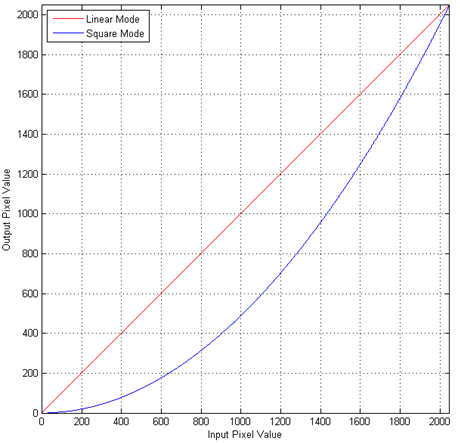

【相关数据类型及接口】

无

### ot\_isp\_af\_crop<a name="ZH-CN_TOPIC_0000002504085079"></a>

【说明】

对AF模块输入图像进行裁剪。

【定义】

```
typedef struct {
    td_bool en;
    td_u16  x;
    td_u16  y;
    td_u16  width;
    td_u16  height;
} ot_isp_af_crop;
```

【成员】

<a name="table38759mcpsimp"></a>
<table><thead align="left"><tr id="row38764mcpsimp"><th class="cellrowborder" valign="top" width="16%" id="mcps1.1.3.1.1"><p id="p38766mcpsimp"><a name="p38766mcpsimp"></a><a name="p38766mcpsimp"></a>成员名称</p>
</th>
<th class="cellrowborder" valign="top" width="84%" id="mcps1.1.3.1.2"><p id="p38768mcpsimp"><a name="p38768mcpsimp"></a><a name="p38768mcpsimp"></a>描述</p>
</th>
</tr>
</thead>
<tbody><tr id="row38770mcpsimp"><td class="cellrowborder" valign="top" width="16%" headers="mcps1.1.3.1.1 "><p id="p38772mcpsimp"><a name="p38772mcpsimp"></a><a name="p38772mcpsimp"></a>en</p>
</td>
<td class="cellrowborder" valign="top" width="84%" headers="mcps1.1.3.1.2 "><p id="p38774mcpsimp"><a name="p38774mcpsimp"></a><a name="p38774mcpsimp"></a>使能Crop，取值范围：[0, 1]</p>
</td>
</tr>
<tr id="row38775mcpsimp"><td class="cellrowborder" valign="top" width="16%" headers="mcps1.1.3.1.1 "><p id="p38777mcpsimp"><a name="p38777mcpsimp"></a><a name="p38777mcpsimp"></a>x</p>
</td>
<td class="cellrowborder" valign="top" width="84%" headers="mcps1.1.3.1.2 "><p id="p38779mcpsimp"><a name="p38779mcpsimp"></a><a name="p38779mcpsimp"></a>Crop X 起始位置，取值范围：[0, ImageWidth - 256]</p>
</td>
</tr>
<tr id="row38780mcpsimp"><td class="cellrowborder" valign="top" width="16%" headers="mcps1.1.3.1.1 "><p id="p38782mcpsimp"><a name="p38782mcpsimp"></a><a name="p38782mcpsimp"></a>y</p>
</td>
<td class="cellrowborder" valign="top" width="84%" headers="mcps1.1.3.1.2 "><p id="p38784mcpsimp"><a name="p38784mcpsimp"></a><a name="p38784mcpsimp"></a><span xml:lang="fr-FR" id="ph38785mcpsimp"><a name="ph38785mcpsimp"></a><a name="ph38785mcpsimp"></a>Crop Y </span>起始位置，取值范围：[0, ImageHeight - 120]</p>
</td>
</tr>
<tr id="row38786mcpsimp"><td class="cellrowborder" valign="top" width="16%" headers="mcps1.1.3.1.1 "><p id="p38788mcpsimp"><a name="p38788mcpsimp"></a><a name="p38788mcpsimp"></a>width</p>
</td>
<td class="cellrowborder" valign="top" width="84%" headers="mcps1.1.3.1.2 "><p id="p38790mcpsimp"><a name="p38790mcpsimp"></a><a name="p38790mcpsimp"></a>Crop 宽度，8对齐，取值范围：[256, ImageWidth]</p>
</td>
</tr>
<tr id="row38791mcpsimp"><td class="cellrowborder" valign="top" width="16%" headers="mcps1.1.3.1.1 "><p id="p38793mcpsimp"><a name="p38793mcpsimp"></a><a name="p38793mcpsimp"></a>height</p>
</td>
<td class="cellrowborder" valign="top" width="84%" headers="mcps1.1.3.1.2 "><p id="p38795mcpsimp"><a name="p38795mcpsimp"></a><a name="p38795mcpsimp"></a><span xml:lang="fr-FR" id="ph38796mcpsimp"><a name="ph38796mcpsimp"></a><a name="ph38796mcpsimp"></a>Crop </span>高度<span xml:lang="fr-FR" id="ph38797mcpsimp"><a name="ph38797mcpsimp"></a><a name="ph38797mcpsimp"></a>，2</span>对齐，取值范围：[120, ImageHeight]</p>
</td>
</tr>
</tbody>
</table>

【注意事项】

-   水平方向起始位置与Crop宽度之和应小于图像宽度，垂直方向起始位置与Crop高度之和应小于图像高度。
-   对于BE的AF统计信息，ISP BE 分块场景下，不支持AF CROP（输入图像裁剪）功能。

【相关数据类型及接口】

无

### ot\_isp\_af\_stats\_pos<a name="ZH-CN_TOPIC_0000002503965073"></a>

【说明】

配置AF模块统计位置。

【定义】

```
typedef enum {
    OT_ISP_AF_STATS_AFTER_DGAIN = 0, 
    OT_ISP_AF_STATS_AFTER_DRC,
    OT_ISP_AF_STATS_AFTER_CSC,
    OT_ISP_AF_STATS_BUTT
} ot_isp_af_stats_pos;
```

【成员】

<a name="table38815mcpsimp"></a>
<table><thead align="left"><tr id="row38820mcpsimp"><th class="cellrowborder" valign="top" width="47%" id="mcps1.1.3.1.1"><p id="p38822mcpsimp"><a name="p38822mcpsimp"></a><a name="p38822mcpsimp"></a>成员名称</p>
</th>
<th class="cellrowborder" valign="top" width="53%" id="mcps1.1.3.1.2"><p id="p38824mcpsimp"><a name="p38824mcpsimp"></a><a name="p38824mcpsimp"></a>描述</p>
</th>
</tr>
</thead>
<tbody><tr id="row38825mcpsimp"><td class="cellrowborder" valign="top" width="47%" headers="mcps1.1.3.1.1 "><p id="p38827mcpsimp"><a name="p38827mcpsimp"></a><a name="p38827mcpsimp"></a>OT_ISP_AF_STATS_AFTER_DGAIN</p>
</td>
<td class="cellrowborder" valign="top" width="53%" headers="mcps1.1.3.1.2 "><p id="p38829mcpsimp"><a name="p38829mcpsimp"></a><a name="p38829mcpsimp"></a>将AF模块放在DGain后进行统计，属于RAW域。</p>
</td>
</tr>
<tr id="row38830mcpsimp"><td class="cellrowborder" valign="top" width="47%" headers="mcps1.1.3.1.1 "><p id="p38832mcpsimp"><a name="p38832mcpsimp"></a><a name="p38832mcpsimp"></a>OT_ISP_AF_STATS_AFTER_DRC</p>
</td>
<td class="cellrowborder" valign="top" width="53%" headers="mcps1.1.3.1.2 "><p id="p38834mcpsimp"><a name="p38834mcpsimp"></a><a name="p38834mcpsimp"></a>将AF模块放在DRC及Dither后进行统计，属于RAW域。</p>
</td>
</tr>
<tr id="row38835mcpsimp"><td class="cellrowborder" valign="top" width="47%" headers="mcps1.1.3.1.1 "><p id="p38837mcpsimp"><a name="p38837mcpsimp"></a><a name="p38837mcpsimp"></a>OT_ISP_AF_STATS_AFTER_CSC</p>
</td>
<td class="cellrowborder" valign="top" width="53%" headers="mcps1.1.3.1.2 "><p id="p38839mcpsimp"><a name="p38839mcpsimp"></a><a name="p38839mcpsimp"></a>将AF模块放在CSC后进行统计，属于YUV域。</p>
</td>
</tr>
</tbody>
</table>

【注意事项】

-   WDR模式下，非宽动态场景的Bayer域（即RAW域）统计信息无明显变化趋势，推荐使用YUV域统计信息。
-   AF的FE统计信息只支持DGain之后进行统计，而BE统计信息支持DGain、DRC和CSC之后进行统计，详见《ISP 图像调优指南》文档的ISP功能框图章节。

【相关数据类型及接口】

无

### ot\_isp\_af\_raw\_cfg<a name="ZH-CN_TOPIC_0000002503964917"></a>

【说明】

AF模块Bayer域配置。

【定义】

```
typedef struct {
    td_u8               gamma_gain_limit;
    td_u8               gamma_value;
    ot_isp_bayer_format bayer_format;
} ot_isp_af_raw_cfg;
```

【成员】

<a name="table38859mcpsimp"></a>
<table><thead align="left"><tr id="row38864mcpsimp"><th class="cellrowborder" valign="top" width="24%" id="mcps1.1.3.1.1"><p id="p38866mcpsimp"><a name="p38866mcpsimp"></a><a name="p38866mcpsimp"></a>成员名称</p>
</th>
<th class="cellrowborder" valign="top" width="76%" id="mcps1.1.3.1.2"><p id="p38868mcpsimp"><a name="p38868mcpsimp"></a><a name="p38868mcpsimp"></a>描述</p>
</th>
</tr>
</thead>
<tbody><tr id="row38870mcpsimp"><td class="cellrowborder" valign="top" width="24%" headers="mcps1.1.3.1.1 "><p id="p38872mcpsimp"><a name="p38872mcpsimp"></a><a name="p38872mcpsimp"></a>gamma_gain_limit</p>
</td>
<td class="cellrowborder" valign="top" width="76%" headers="mcps1.1.3.1.2 "><p id="p38874mcpsimp"><a name="p38874mcpsimp"></a><a name="p38874mcpsimp"></a>AF模块gamma限制。</p>
<p id="p38875mcpsimp"><a name="p38875mcpsimp"></a><a name="p38875mcpsimp"></a>取值范围：[0x0, 0x5]</p>
</td>
</tr>
<tr id="row38876mcpsimp"><td class="cellrowborder" valign="top" width="24%" headers="mcps1.1.3.1.1 "><p id="p38878mcpsimp"><a name="p38878mcpsimp"></a><a name="p38878mcpsimp"></a>gamma_value</p>
</td>
<td class="cellrowborder" valign="top" width="76%" headers="mcps1.1.3.1.2 "><p id="p38880mcpsimp"><a name="p38880mcpsimp"></a><a name="p38880mcpsimp"></a>AF模块gamma类型。</p>
<p id="p38881mcpsimp"><a name="p38881mcpsimp"></a><a name="p38881mcpsimp"></a>取值范围：[0x0, 0x6]</p>
</td>
</tr>
<tr id="row38882mcpsimp"><td class="cellrowborder" valign="top" width="24%" headers="mcps1.1.3.1.1 "><p id="p38884mcpsimp"><a name="p38884mcpsimp"></a><a name="p38884mcpsimp"></a>bayer_format</p>
</td>
<td class="cellrowborder" valign="top" width="76%" headers="mcps1.1.3.1.2 "><p id="p38886mcpsimp"><a name="p38886mcpsimp"></a><a name="p38886mcpsimp"></a>设置Bayer pattern，支持BAYER_RGGB，BAYER_GRBG，BAYER_GBRG，BAYER_BGGR四种。</p>
</td>
</tr>
</tbody>
</table>

【注意事项】

无

【相关数据类型及接口】

无

### ot\_isp\_af\_pre\_filter\_cfg<a name="ZH-CN_TOPIC_0000002503965177"></a>

【说明】

AF模块预滤波器配置。

【定义】

```
typedef struct {
    td_bool             en;
    td_u16              strength;
} ot_isp_af_pre_filter_cfg;
```

【成员】

<a name="table38900mcpsimp"></a>
<table><thead align="left"><tr id="row38905mcpsimp"><th class="cellrowborder" valign="top" width="20%" id="mcps1.1.3.1.1"><p id="p38907mcpsimp"><a name="p38907mcpsimp"></a><a name="p38907mcpsimp"></a>成员名称</p>
</th>
<th class="cellrowborder" valign="top" width="80%" id="mcps1.1.3.1.2"><p id="p38909mcpsimp"><a name="p38909mcpsimp"></a><a name="p38909mcpsimp"></a>描述</p>
</th>
</tr>
</thead>
<tbody><tr id="row38910mcpsimp"><td class="cellrowborder" valign="top" width="20%" headers="mcps1.1.3.1.1 "><p id="p38912mcpsimp"><a name="p38912mcpsimp"></a><a name="p38912mcpsimp"></a>en</p>
</td>
<td class="cellrowborder" valign="top" width="80%" headers="mcps1.1.3.1.2 "><p id="p38914mcpsimp"><a name="p38914mcpsimp"></a><a name="p38914mcpsimp"></a>使能AF 预滤波模块。</p>
</td>
</tr>
<tr id="row38915mcpsimp"><td class="cellrowborder" valign="top" width="20%" headers="mcps1.1.3.1.1 "><p id="p38917mcpsimp"><a name="p38917mcpsimp"></a><a name="p38917mcpsimp"></a>strength</p>
</td>
<td class="cellrowborder" valign="top" width="80%" headers="mcps1.1.3.1.2 "><p id="p38919mcpsimp"><a name="p38919mcpsimp"></a><a name="p38919mcpsimp"></a>设置滤波强度，取值范围：[0x0, 0xFFFF]</p>
</td>
</tr>
</tbody>
</table>

【注意事项】

无

【相关数据类型及接口】

无

### ot\_isp\_af\_level\_depend<a name="ZH-CN_TOPIC_0000002504084985"></a>

【说明】

AF Level Depend Gain 模块配置。

【定义】

```
typedef struct {
    td_bool     en;
    td_u16      threshold_low;
    td_u16      gain_low;
    td_u16      slope_low;
    td_u16      threshold_high;
    td_u16      gain_high;
    td_u16      slope_high;
} ot_isp_af_level_depend;
```

【成员】

<a name="table38939mcpsimp"></a>
<table><thead align="left"><tr id="row38944mcpsimp"><th class="cellrowborder" valign="top" width="22%" id="mcps1.1.3.1.1"><p id="p38946mcpsimp"><a name="p38946mcpsimp"></a><a name="p38946mcpsimp"></a>成员名称</p>
</th>
<th class="cellrowborder" valign="top" width="78%" id="mcps1.1.3.1.2"><p id="p38948mcpsimp"><a name="p38948mcpsimp"></a><a name="p38948mcpsimp"></a>描述</p>
</th>
</tr>
</thead>
<tbody><tr id="row38950mcpsimp"><td class="cellrowborder" valign="top" width="22%" headers="mcps1.1.3.1.1 "><p id="p38952mcpsimp"><a name="p38952mcpsimp"></a><a name="p38952mcpsimp"></a>en</p>
</td>
<td class="cellrowborder" valign="top" width="78%" headers="mcps1.1.3.1.2 "><p id="p38954mcpsimp"><a name="p38954mcpsimp"></a><a name="p38954mcpsimp"></a>使能Level Depend Gain模块。</p>
</td>
</tr>
<tr id="row38955mcpsimp"><td class="cellrowborder" valign="top" width="22%" headers="mcps1.1.3.1.1 "><p id="p38957mcpsimp"><a name="p38957mcpsimp"></a><a name="p38957mcpsimp"></a>threshold_low</p>
</td>
<td class="cellrowborder" valign="top" width="78%" headers="mcps1.1.3.1.2 "><p id="p38959mcpsimp"><a name="p38959mcpsimp"></a><a name="p38959mcpsimp"></a>设置Dark Side Threshold，取值范围：[0x0, 0xFF]</p>
</td>
</tr>
<tr id="row38960mcpsimp"><td class="cellrowborder" valign="top" width="22%" headers="mcps1.1.3.1.1 "><p id="p38962mcpsimp"><a name="p38962mcpsimp"></a><a name="p38962mcpsimp"></a>gain_low</p>
</td>
<td class="cellrowborder" valign="top" width="78%" headers="mcps1.1.3.1.2 "><p id="p38964mcpsimp"><a name="p38964mcpsimp"></a><a name="p38964mcpsimp"></a>设置Dark Side Minimum Gain，取值范围：[0x0, 0xFF]</p>
</td>
</tr>
<tr id="row38965mcpsimp"><td class="cellrowborder" valign="top" width="22%" headers="mcps1.1.3.1.1 "><p id="p38967mcpsimp"><a name="p38967mcpsimp"></a><a name="p38967mcpsimp"></a>slope_low</p>
</td>
<td class="cellrowborder" valign="top" width="78%" headers="mcps1.1.3.1.2 "><p id="p38969mcpsimp"><a name="p38969mcpsimp"></a><a name="p38969mcpsimp"></a>设置Dark Side Slope，取值范围：[0x0, 0xF]。</p>
</td>
</tr>
<tr id="row38970mcpsimp"><td class="cellrowborder" valign="top" width="22%" headers="mcps1.1.3.1.1 "><p id="p38972mcpsimp"><a name="p38972mcpsimp"></a><a name="p38972mcpsimp"></a>threshold_high</p>
</td>
<td class="cellrowborder" valign="top" width="78%" headers="mcps1.1.3.1.2 "><p id="p38974mcpsimp"><a name="p38974mcpsimp"></a><a name="p38974mcpsimp"></a>设置Bright Side Threshold，取值范围：[0x0, 0xFF]</p>
</td>
</tr>
<tr id="row38975mcpsimp"><td class="cellrowborder" valign="top" width="22%" headers="mcps1.1.3.1.1 "><p id="p38977mcpsimp"><a name="p38977mcpsimp"></a><a name="p38977mcpsimp"></a>gain_high</p>
</td>
<td class="cellrowborder" valign="top" width="78%" headers="mcps1.1.3.1.2 "><p id="p38979mcpsimp"><a name="p38979mcpsimp"></a><a name="p38979mcpsimp"></a>设置Bright Side Minimum Gain，取值范围：[0x0, 0xFF]</p>
</td>
</tr>
<tr id="row38980mcpsimp"><td class="cellrowborder" valign="top" width="22%" headers="mcps1.1.3.1.1 "><p id="p38982mcpsimp"><a name="p38982mcpsimp"></a><a name="p38982mcpsimp"></a>slope_high</p>
</td>
<td class="cellrowborder" valign="top" width="78%" headers="mcps1.1.3.1.2 "><p id="p38984mcpsimp"><a name="p38984mcpsimp"></a><a name="p38984mcpsimp"></a>设置Bright Side Slope，取值范围：[0x0, 0xF]</p>
</td>
</tr>
</tbody>
</table>

【注意事项】

无

【相关数据类型及接口】

无

### ot\_isp\_af\_coring<a name="ZH-CN_TOPIC_0000002471085036"></a>

【说明】

AF Coring 模块配置。

【定义】

```
typedef struct {
    td_u16      threshold;
    td_u16      slope;
    td_u16      limit;
} ot_isp_af_coring;
```

【成员】

<a name="table38999mcpsimp"></a>
<table><thead align="left"><tr id="row39004mcpsimp"><th class="cellrowborder" valign="top" width="16%" id="mcps1.1.3.1.1"><p id="p39006mcpsimp"><a name="p39006mcpsimp"></a><a name="p39006mcpsimp"></a>成员名称</p>
</th>
<th class="cellrowborder" valign="top" width="84%" id="mcps1.1.3.1.2"><p id="p39008mcpsimp"><a name="p39008mcpsimp"></a><a name="p39008mcpsimp"></a>描述</p>
</th>
</tr>
</thead>
<tbody><tr id="row39009mcpsimp"><td class="cellrowborder" valign="top" width="16%" headers="mcps1.1.3.1.1 "><p id="p39011mcpsimp"><a name="p39011mcpsimp"></a><a name="p39011mcpsimp"></a>threshold</p>
</td>
<td class="cellrowborder" valign="top" width="84%" headers="mcps1.1.3.1.2 "><p id="p39013mcpsimp"><a name="p39013mcpsimp"></a><a name="p39013mcpsimp"></a>设置Coring Threshold，取值范围：[0x0, 0x7FF]</p>
</td>
</tr>
<tr id="row39014mcpsimp"><td class="cellrowborder" valign="top" width="16%" headers="mcps1.1.3.1.1 "><p id="p39016mcpsimp"><a name="p39016mcpsimp"></a><a name="p39016mcpsimp"></a>slope</p>
</td>
<td class="cellrowborder" valign="top" width="84%" headers="mcps1.1.3.1.2 "><p id="p39018mcpsimp"><a name="p39018mcpsimp"></a><a name="p39018mcpsimp"></a>设置Coring Slope，取值范围：[0x0, 0xF]</p>
</td>
</tr>
<tr id="row39019mcpsimp"><td class="cellrowborder" valign="top" width="16%" headers="mcps1.1.3.1.1 "><p id="p39021mcpsimp"><a name="p39021mcpsimp"></a><a name="p39021mcpsimp"></a>limit</p>
</td>
<td class="cellrowborder" valign="top" width="84%" headers="mcps1.1.3.1.2 "><p id="p39023mcpsimp"><a name="p39023mcpsimp"></a><a name="p39023mcpsimp"></a>设置Coring Maximum Output，取值范围：[0x0, 0x7FF]</p>
</td>
</tr>
</tbody>
</table>

【注意事项】

无

【相关数据类型及接口】

无

### ot\_isp\_af\_h\_param<a name="ZH-CN_TOPIC_0000002471084848"></a>

【说明】

AF统计水平滤波器IIR参数设置。

【定义】

```
typedef struct {
    td_bool          narrow_band_en;
    td_bool          iir_en[OT_ISP_IIR_EN_NUM];
    td_u8            iir_shift;
    td_s16           iir_gain[OT_ISP_IIR_GAIN_NUM];
    td_u16           iir_shift_lut[OT_ISP_IIR_SHIFT_NUM];
    ot_isp_af_level_depend  level_depend;
    ot_isp_af_coring        coring;
} ot_isp_af_h_param;
```

【成员】

<a name="table39052mcpsimp"></a>
<table><thead align="left"><tr id="row39057mcpsimp"><th class="cellrowborder" valign="top" width="38%" id="mcps1.1.3.1.1"><p id="p39059mcpsimp"><a name="p39059mcpsimp"></a><a name="p39059mcpsimp"></a>成员名称</p>
</th>
<th class="cellrowborder" valign="top" width="62%" id="mcps1.1.3.1.2"><p id="p39061mcpsimp"><a name="p39061mcpsimp"></a><a name="p39061mcpsimp"></a>描述</p>
</th>
</tr>
</thead>
<tbody><tr id="row39063mcpsimp"><td class="cellrowborder" valign="top" width="38%" headers="mcps1.1.3.1.1 "><p id="p39065mcpsimp"><a name="p39065mcpsimp"></a><a name="p39065mcpsimp"></a>narrow_band_en</p>
</td>
<td class="cellrowborder" valign="top" width="62%" headers="mcps1.1.3.1.2 "><p id="p39067mcpsimp"><a name="p39067mcpsimp"></a><a name="p39067mcpsimp"></a>IIR滤波器窄带宽使能。</p>
</td>
</tr>
<tr id="row39068mcpsimp"><td class="cellrowborder" valign="top" width="38%" headers="mcps1.1.3.1.1 "><p id="p39070mcpsimp"><a name="p39070mcpsimp"></a><a name="p39070mcpsimp"></a>iir_en[<a href="#OT_ISP_IIR_EN_NUM">OT_ISP_IIR_EN_NUM</a>]</p>
</td>
<td class="cellrowborder" valign="top" width="62%" headers="mcps1.1.3.1.2 "><p id="p39073mcpsimp"><a name="p39073mcpsimp"></a><a name="p39073mcpsimp"></a>IIR级联中IIR的使能。</p>
</td>
</tr>
<tr id="row39074mcpsimp"><td class="cellrowborder" valign="top" width="38%" headers="mcps1.1.3.1.1 "><p id="p39076mcpsimp"><a name="p39076mcpsimp"></a><a name="p39076mcpsimp"></a>iir_shift</p>
</td>
<td class="cellrowborder" valign="top" width="62%" headers="mcps1.1.3.1.2 "><p id="p39078mcpsimp"><a name="p39078mcpsimp"></a><a name="p39078mcpsimp"></a>IIR滤波器整体位移量,取值范围：[0, 63]</p>
</td>
</tr>
<tr id="row39079mcpsimp"><td class="cellrowborder" valign="top" width="38%" headers="mcps1.1.3.1.1 "><p xml:lang="fr-FR" id="p39081mcpsimp"><a name="p39081mcpsimp"></a><a name="p39081mcpsimp"></a><span xml:lang="en-US" id="ph39082mcpsimp"><a name="ph39082mcpsimp"></a><a name="ph39082mcpsimp"></a>iir_gain[</span><a href="#OT_ISP_IIR_GAIN_NUM">OT_ISP_IIR_GAIN_NUM</a><span xml:lang="en-US" id="ph39084mcpsimp"><a name="ph39084mcpsimp"></a><a name="ph39084mcpsimp"></a>]</span></p>
</td>
<td class="cellrowborder" valign="top" width="62%" headers="mcps1.1.3.1.2 "><p id="p39086mcpsimp"><a name="p39086mcpsimp"></a><a name="p39086mcpsimp"></a>IIR滤波器系数，用于控制IIR滤波器的频率响应。</p>
<p id="p39087mcpsimp"><a name="p39087mcpsimp"></a><a name="p39087mcpsimp"></a>取值范围：Gain0:[0, 255]；Others:[-511, 511]</p>
</td>
</tr>
<tr id="row39088mcpsimp"><td class="cellrowborder" valign="top" width="38%" headers="mcps1.1.3.1.1 "><p xml:lang="fr-FR" id="p39090mcpsimp"><a name="p39090mcpsimp"></a><a name="p39090mcpsimp"></a><span xml:lang="en-US" id="ph39091mcpsimp"><a name="ph39091mcpsimp"></a><a name="ph39091mcpsimp"></a>iir_shift_lut[</span><a href="#OT_ISP_IIR_SHIFT_NUM">OT_ISP_IIR_SHIFT_NUM</a><span xml:lang="en-US" id="ph39093mcpsimp"><a name="ph39093mcpsimp"></a><a name="ph39093mcpsimp"></a>]</span></p>
</td>
<td class="cellrowborder" valign="top" width="62%" headers="mcps1.1.3.1.2 "><p id="p39095mcpsimp"><a name="p39095mcpsimp"></a><a name="p39095mcpsimp"></a>IIR滤波器移位调整，取值范围：[0, 0x7]</p>
</td>
</tr>
<tr id="row39096mcpsimp"><td class="cellrowborder" valign="top" width="38%" headers="mcps1.1.3.1.1 "><p id="p39098mcpsimp"><a name="p39098mcpsimp"></a><a name="p39098mcpsimp"></a>level_depend</p>
</td>
<td class="cellrowborder" valign="top" width="62%" headers="mcps1.1.3.1.2 "><p id="p39100mcpsimp"><a name="p39100mcpsimp"></a><a name="p39100mcpsimp"></a>IIR滤波器Level Depend Gain模块配置。</p>
</td>
</tr>
<tr id="row39101mcpsimp"><td class="cellrowborder" valign="top" width="38%" headers="mcps1.1.3.1.1 "><p id="p39103mcpsimp"><a name="p39103mcpsimp"></a><a name="p39103mcpsimp"></a>coring</p>
</td>
<td class="cellrowborder" valign="top" width="62%" headers="mcps1.1.3.1.2 "><p id="p39105mcpsimp"><a name="p39105mcpsimp"></a><a name="p39105mcpsimp"></a>IIR滤波器Coring模块配置。</p>
</td>
</tr>
</tbody>
</table>

【注意事项】

iir\_gain\[0\]为无符号8bit数，其他iir\_gain\[1\]-\[6\]为有符号10bit数，且不能等于-512。IIR使能、narrow\_band\_en使能、滤波器系数以及iir\_shift通过PQ Tools可以生成，用户可以根据实际需要调节LDG和Coring模块以获取最优FV统计值输出。

【相关数据类型及接口】

无

### ot\_isp\_af\_v\_param<a name="ZH-CN_TOPIC_0000002503964949"></a>

【说明】

AF统计垂直滤波器FIR参数设置。

【定义】

```
typedef struct {
    td_s16                 fir_gain[OT_ISP_FIR_GAIN_NUM];
    ot_isp_af_level_depend level_depend;
    ot_isp_af_coring       coring;
} ot_isp_af_v_param;
```

【成员】

<a name="table39129mcpsimp"></a>
<table><thead align="left"><tr id="row39134mcpsimp"><th class="cellrowborder" valign="top" width="43%" id="mcps1.1.3.1.1"><p id="p39136mcpsimp"><a name="p39136mcpsimp"></a><a name="p39136mcpsimp"></a>成员名称</p>
</th>
<th class="cellrowborder" valign="top" width="56.99999999999999%" id="mcps1.1.3.1.2"><p id="p39138mcpsimp"><a name="p39138mcpsimp"></a><a name="p39138mcpsimp"></a>描述</p>
</th>
</tr>
</thead>
<tbody><tr id="row39140mcpsimp"><td class="cellrowborder" valign="top" width="43%" headers="mcps1.1.3.1.1 "><p xml:lang="fr-FR" id="p39142mcpsimp"><a name="p39142mcpsimp"></a><a name="p39142mcpsimp"></a><span xml:lang="en-US" id="ph39143mcpsimp"><a name="ph39143mcpsimp"></a><a name="ph39143mcpsimp"></a>fir_gain[</span><a href="#OT_ISP_FIR_GAIN_NUM">OT_ISP_FIR_GAIN_NUM</a><span xml:lang="en-US" id="ph39145mcpsimp"><a name="ph39145mcpsimp"></a><a name="ph39145mcpsimp"></a>]</span></p>
</td>
<td class="cellrowborder" valign="top" width="56.99999999999999%" headers="mcps1.1.3.1.2 "><p id="p39147mcpsimp"><a name="p39147mcpsimp"></a><a name="p39147mcpsimp"></a>FIR滤波器系数，取值范围：[-31, 31]。用于控制FIR滤波器的频率响应。</p>
</td>
</tr>
<tr id="row39148mcpsimp"><td class="cellrowborder" valign="top" width="43%" headers="mcps1.1.3.1.1 "><p id="p39150mcpsimp"><a name="p39150mcpsimp"></a><a name="p39150mcpsimp"></a>level_depend</p>
</td>
<td class="cellrowborder" valign="top" width="56.99999999999999%" headers="mcps1.1.3.1.2 "><p id="p39152mcpsimp"><a name="p39152mcpsimp"></a><a name="p39152mcpsimp"></a>FIR滤波器Level Depend Gain模块配置。</p>
</td>
</tr>
<tr id="row39153mcpsimp"><td class="cellrowborder" valign="top" width="43%" headers="mcps1.1.3.1.1 "><p id="p39155mcpsimp"><a name="p39155mcpsimp"></a><a name="p39155mcpsimp"></a>coring</p>
</td>
<td class="cellrowborder" valign="top" width="56.99999999999999%" headers="mcps1.1.3.1.2 "><p id="p39157mcpsimp"><a name="p39157mcpsimp"></a><a name="p39157mcpsimp"></a>FIR 滤波器Coring模块配置。</p>
</td>
</tr>
</tbody>
</table>

【注意事项】

FIR滤波器系数通过PQ Tools可以生成，用户可以根据实际需要调节LDG和Coring模块以获取最优垂直FV统计值输出。

【相关数据类型及接口】

无

### ot\_isp\_af\_fv\_param<a name="ZH-CN_TOPIC_0000002504084997"></a>

【说明】

AF统计结果输出格式参数。

【定义】

```
typedef struct {
    td_u16 acc_shift_y;
    td_u16 acc_shift_h[OT_ISP_ACC_SHIFT_H_NUM];
    td_u16 acc_shift_v[OT_ISP_ACC_SHIFT_V_NUM];
    td_u16 hl_cnt_shift;
} ot_isp_af_fv_param;
```

【成员】

<a name="table39176mcpsimp"></a>
<table><thead align="left"><tr id="row39181mcpsimp"><th class="cellrowborder" valign="top" width="54%" id="mcps1.1.3.1.1"><p id="p39183mcpsimp"><a name="p39183mcpsimp"></a><a name="p39183mcpsimp"></a>成员名称</p>
</th>
<th class="cellrowborder" valign="top" width="46%" id="mcps1.1.3.1.2"><p id="p39185mcpsimp"><a name="p39185mcpsimp"></a><a name="p39185mcpsimp"></a>描述</p>
</th>
</tr>
</thead>
<tbody><tr id="row39187mcpsimp"><td class="cellrowborder" valign="top" width="54%" headers="mcps1.1.3.1.1 "><p id="p39189mcpsimp"><a name="p39189mcpsimp"></a><a name="p39189mcpsimp"></a>acc_shift_y</p>
</td>
<td class="cellrowborder" valign="top" width="46%" headers="mcps1.1.3.1.2 "><p id="p39191mcpsimp"><a name="p39191mcpsimp"></a><a name="p39191mcpsimp"></a>亮度Y统计值移位寄存器值，取值范围：[0, 0xF]</p>
</td>
</tr>
<tr id="row39192mcpsimp"><td class="cellrowborder" valign="top" width="54%" headers="mcps1.1.3.1.1 "><p xml:lang="fr-FR" id="p39194mcpsimp"><a name="p39194mcpsimp"></a><a name="p39194mcpsimp"></a><span xml:lang="en-US" id="ph39195mcpsimp"><a name="ph39195mcpsimp"></a><a name="ph39195mcpsimp"></a>acc_shift_h[</span><a href="#OT_ISP_ACC_SHIFT_H_NUM">OT_ISP_ACC_SHIFT_H_NUM</a><span xml:lang="en-US" id="ph39197mcpsimp"><a name="ph39197mcpsimp"></a><a name="ph39197mcpsimp"></a>]</span></p>
</td>
<td class="cellrowborder" valign="top" width="46%" headers="mcps1.1.3.1.2 "><p id="p39199mcpsimp"><a name="p39199mcpsimp"></a><a name="p39199mcpsimp"></a>水平IIR滤波值统计值移位寄存器值，取值范围：[0, 0xF]</p>
</td>
</tr>
<tr id="row39200mcpsimp"><td class="cellrowborder" valign="top" width="54%" headers="mcps1.1.3.1.1 "><p xml:lang="fr-FR" id="p39202mcpsimp"><a name="p39202mcpsimp"></a><a name="p39202mcpsimp"></a><span xml:lang="en-US" id="ph39203mcpsimp"><a name="ph39203mcpsimp"></a><a name="ph39203mcpsimp"></a>acc_shift_v[</span><a href="#OT_ISP_ACC_SHIFT_V_NUM">OT_ISP_ACC_SHIFT_V_NUM</a><span xml:lang="en-US" id="ph39205mcpsimp"><a name="ph39205mcpsimp"></a><a name="ph39205mcpsimp"></a>]</span></p>
</td>
<td class="cellrowborder" valign="top" width="46%" headers="mcps1.1.3.1.2 "><p id="p39207mcpsimp"><a name="p39207mcpsimp"></a><a name="p39207mcpsimp"></a>垂直FIR滤波值统计值移位寄存器值，取值范围：[0, 0xF]</p>
</td>
</tr>
<tr id="row39208mcpsimp"><td class="cellrowborder" valign="top" width="54%" headers="mcps1.1.3.1.1 "><p id="p39210mcpsimp"><a name="p39210mcpsimp"></a><a name="p39210mcpsimp"></a>hl_cnt_shift</p>
</td>
<td class="cellrowborder" valign="top" width="46%" headers="mcps1.1.3.1.2 "><p id="p39212mcpsimp"><a name="p39212mcpsimp"></a><a name="p39212mcpsimp"></a>高亮计数器统计值移位寄存器值，取值范围：[0, 0xF]</p>
</td>
</tr>
</tbody>
</table>

【注意事项】

FV值用unsigned 16bit表示，当场景细节较多或噪声较多时，FV值可能会溢出，这就需要对输出进行向右移位以保证输出在合理范围。用户根据自己的需求对相应的shift值进行调节。

【相关数据类型及接口】

无

### ot\_isp\_focus\_zone<a name="ZH-CN_TOPIC_0000002471084940"></a>

【说明】

定义AF统计信息参数。

【定义】

```
typedef struct {
    td_u16  v1;
    td_u16  h1;
    td_u16  v2;
    td_u16  h2;
    td_u16  y;
    td_u16  hl_cnt;
} ot_isp_focus_zone;
```

【成员】

<a name="table39231mcpsimp"></a>
<table><thead align="left"><tr id="row39236mcpsimp"><th class="cellrowborder" valign="top" width="14.000000000000002%" id="mcps1.1.3.1.1"><p id="p39238mcpsimp"><a name="p39238mcpsimp"></a><a name="p39238mcpsimp"></a>成员名称</p>
</th>
<th class="cellrowborder" valign="top" width="86%" id="mcps1.1.3.1.2"><p id="p39240mcpsimp"><a name="p39240mcpsimp"></a><a name="p39240mcpsimp"></a>描述</p>
</th>
</tr>
</thead>
<tbody><tr id="row39242mcpsimp"><td class="cellrowborder" valign="top" width="14.000000000000002%" headers="mcps1.1.3.1.1 "><p id="p39244mcpsimp"><a name="p39244mcpsimp"></a><a name="p39244mcpsimp"></a>v1</p>
</td>
<td class="cellrowborder" valign="top" width="86%" headers="mcps1.1.3.1.2 "><p id="p39246mcpsimp"><a name="p39246mcpsimp"></a><a name="p39246mcpsimp"></a>分区间统计的AF垂直方向奇数列FIR滤波器的统计值。</p>
</td>
</tr>
<tr id="row39247mcpsimp"><td class="cellrowborder" valign="top" width="14.000000000000002%" headers="mcps1.1.3.1.1 "><p id="p39249mcpsimp"><a name="p39249mcpsimp"></a><a name="p39249mcpsimp"></a>h1</p>
</td>
<td class="cellrowborder" valign="top" width="86%" headers="mcps1.1.3.1.2 "><p id="p39251mcpsimp"><a name="p39251mcpsimp"></a><a name="p39251mcpsimp"></a>分区间统计的AF水平方向奇数行IIR滤波器的统计值。</p>
</td>
</tr>
<tr id="row39252mcpsimp"><td class="cellrowborder" valign="top" width="14.000000000000002%" headers="mcps1.1.3.1.1 "><p id="p39254mcpsimp"><a name="p39254mcpsimp"></a><a name="p39254mcpsimp"></a>v2</p>
</td>
<td class="cellrowborder" valign="top" width="86%" headers="mcps1.1.3.1.2 "><p id="p39256mcpsimp"><a name="p39256mcpsimp"></a><a name="p39256mcpsimp"></a>分区间统计的AF垂直方向偶数列FIR滤波器的统计值。</p>
</td>
</tr>
<tr id="row39257mcpsimp"><td class="cellrowborder" valign="top" width="14.000000000000002%" headers="mcps1.1.3.1.1 "><p id="p39259mcpsimp"><a name="p39259mcpsimp"></a><a name="p39259mcpsimp"></a>h2</p>
</td>
<td class="cellrowborder" valign="top" width="86%" headers="mcps1.1.3.1.2 "><p id="p39261mcpsimp"><a name="p39261mcpsimp"></a><a name="p39261mcpsimp"></a>分区间统计的AF水平方向偶数行IIR滤波器的统计值。</p>
</td>
</tr>
<tr id="row39262mcpsimp"><td class="cellrowborder" valign="top" width="14.000000000000002%" headers="mcps1.1.3.1.1 "><p id="p39264mcpsimp"><a name="p39264mcpsimp"></a><a name="p39264mcpsimp"></a>y</p>
</td>
<td class="cellrowborder" valign="top" width="86%" headers="mcps1.1.3.1.2 "><p id="p39266mcpsimp"><a name="p39266mcpsimp"></a><a name="p39266mcpsimp"></a>分区间统计的AF亮度统计值，区块中每个像素点的亮度累加值。</p>
</td>
</tr>
<tr id="row39267mcpsimp"><td class="cellrowborder" valign="top" width="14.000000000000002%" headers="mcps1.1.3.1.1 "><p id="p39269mcpsimp"><a name="p39269mcpsimp"></a><a name="p39269mcpsimp"></a>hl_cnt</p>
</td>
<td class="cellrowborder" valign="top" width="86%" headers="mcps1.1.3.1.2 "><p id="p39271mcpsimp"><a name="p39271mcpsimp"></a><a name="p39271mcpsimp"></a>分区间统计的AF亮度超阈值计数器值。</p>
</td>
</tr>
</tbody>
</table>

【注意事项】

y为每个块的Y分量累加值，用户可以用此值辅助AF算法，比如某些块中含有高亮光源，容易对FV值产生干扰，可根据亮度情况降低块FV对全局FV的影响，亦可用这些块实现一个移动侦测算法，用于检测聚焦过程中的一些运动干扰，用户可以根据自己AF算法的需求使用这个字段的统计信息。

【相关数据类型及接口】

无

### ot\_isp\_fe\_focus\_stats<a name="ZH-CN_TOPIC_0000002470924902"></a>

【说明】

定义FE  AF统计信息。

【定义】

```
typedef struct {
    ot_isp_focus_zone zone_metrics[OT_ISP_WDR_MAX_FRAME_NUM][OT_ISP_AF_ZONE_ROW][OT_ISP_AF_ZONE_COLUMN];
} ot_isp_fe_focus_stats;
```

【成员】

<a name="table39288mcpsimp"></a>
<table><thead align="left"><tr id="row39293mcpsimp"><th class="cellrowborder" valign="top" width="35%" id="mcps1.1.3.1.1"><p id="p39295mcpsimp"><a name="p39295mcpsimp"></a><a name="p39295mcpsimp"></a>成员名称</p>
</th>
<th class="cellrowborder" valign="top" width="65%" id="mcps1.1.3.1.2"><p id="p39297mcpsimp"><a name="p39297mcpsimp"></a><a name="p39297mcpsimp"></a>描述</p>
</th>
</tr>
</thead>
<tbody><tr id="row39299mcpsimp"><td class="cellrowborder" valign="top" width="35%" headers="mcps1.1.3.1.1 "><p id="p39301mcpsimp"><a name="p39301mcpsimp"></a><a name="p39301mcpsimp"></a>zone_metrics</p>
</td>
<td class="cellrowborder" valign="top" width="65%" headers="mcps1.1.3.1.2 "><p id="p39303mcpsimp"><a name="p39303mcpsimp"></a><a name="p39303mcpsimp"></a>ISP AF FE分块统计信息。</p>
</td>
</tr>
</tbody>
</table>

【注意事项】

无

【相关数据类型及接口】

无

### ot\_isp\_be\_focus\_stats<a name="ZH-CN_TOPIC_0000002470925104"></a>

【说明】

定义BE  AF统计信息。

【定义】

```
typedef struct {
    ot_isp_focus_zone zone_metrics[OT_ISP_AF_ZONE_ROW][OT_ISP_AF_ZONE_COLUMN];
} ot_isp_be_focus_stats;
```

【成员】

<a name="table39320mcpsimp"></a>
<table><thead align="left"><tr id="row39325mcpsimp"><th class="cellrowborder" valign="top" width="35%" id="mcps1.1.3.1.1"><p id="p39327mcpsimp"><a name="p39327mcpsimp"></a><a name="p39327mcpsimp"></a>成员名称</p>
</th>
<th class="cellrowborder" valign="top" width="65%" id="mcps1.1.3.1.2"><p id="p39329mcpsimp"><a name="p39329mcpsimp"></a><a name="p39329mcpsimp"></a>描述</p>
</th>
</tr>
</thead>
<tbody><tr id="row39331mcpsimp"><td class="cellrowborder" valign="top" width="35%" headers="mcps1.1.3.1.1 "><p id="p39333mcpsimp"><a name="p39333mcpsimp"></a><a name="p39333mcpsimp"></a>zone_metrics</p>
</td>
<td class="cellrowborder" valign="top" width="65%" headers="mcps1.1.3.1.2 "><p id="p39335mcpsimp"><a name="p39335mcpsimp"></a><a name="p39335mcpsimp"></a>ISP AF BE分块统计信息。</p>
</td>
</tr>
</tbody>
</table>

【注意事项】

无

【相关数据类型及接口】

无

### ot\_isp\_focus\_grid\_info<a name="ZH-CN_TOPIC_0000002503965065"></a>

【说明】

定义AF分区间统计信息的坐标信息。

【定义】

```
typedef struct {
    td_u16 grid_y_pos[OT_ISP_AF_ZONE_ROW + 1];
    td_u16 grid_x_pos[OT_ISP_AF_ZONE_COLUMN + 1];
    td_u8  status;
} ot_isp_focus_grid_info;
```

【成员】

<a name="table39354mcpsimp"></a>
<table><thead align="left"><tr id="row39359mcpsimp"><th class="cellrowborder" valign="top" width="30%" id="mcps1.1.3.1.1"><p id="p39361mcpsimp"><a name="p39361mcpsimp"></a><a name="p39361mcpsimp"></a>成员名称</p>
</th>
<th class="cellrowborder" valign="top" width="70%" id="mcps1.1.3.1.2"><p id="p39363mcpsimp"><a name="p39363mcpsimp"></a><a name="p39363mcpsimp"></a>描述</p>
</th>
</tr>
</thead>
<tbody><tr id="row39365mcpsimp"><td class="cellrowborder" valign="top" width="30%" headers="mcps1.1.3.1.1 "><p id="p39367mcpsimp"><a name="p39367mcpsimp"></a><a name="p39367mcpsimp"></a>grid_y_pos</p>
</td>
<td class="cellrowborder" valign="top" width="70%" headers="mcps1.1.3.1.2 "><p id="p39369mcpsimp"><a name="p39369mcpsimp"></a><a name="p39369mcpsimp"></a>AF每个分区Y方向坐标值。</p>
</td>
</tr>
<tr id="row39370mcpsimp"><td class="cellrowborder" valign="top" width="30%" headers="mcps1.1.3.1.1 "><p id="p39372mcpsimp"><a name="p39372mcpsimp"></a><a name="p39372mcpsimp"></a>grid_x_pos</p>
</td>
<td class="cellrowborder" valign="top" width="70%" headers="mcps1.1.3.1.2 "><p id="p39374mcpsimp"><a name="p39374mcpsimp"></a><a name="p39374mcpsimp"></a>AF每个分区X方向坐标值。</p>
</td>
</tr>
<tr id="row39375mcpsimp"><td class="cellrowborder" valign="top" width="30%" headers="mcps1.1.3.1.1 "><p id="p39377mcpsimp"><a name="p39377mcpsimp"></a><a name="p39377mcpsimp"></a>status</p>
</td>
<td class="cellrowborder" valign="top" width="70%" headers="mcps1.1.3.1.2 "><p id="p39379mcpsimp"><a name="p39379mcpsimp"></a><a name="p39379mcpsimp"></a>AF统计信息坐标更新状态。</p>
</td>
</tr>
</tbody>
</table>

【注意事项】

-   非分块场景下，AF分区间统计信息为zone\_col  \*  zone\_row个均匀分区的统计信息。
-   BE分块场景下，AF分区间统计信息的分区大小是不均匀的，若按照均匀分区间的方式显示AF统计信息，会出现图像与统计信息不对应的情况，为避免这种问题，故提供每个分区的起始坐标信息。

【相关数据类型及接口】

无

### ot\_isp\_af\_stats<a name="ZH-CN_TOPIC_0000002503965129"></a>

【说明】

定义FE和BE的AF统计信息。

【定义】

```
typedef struct {
    ot_isp_fe_focus_stats  fe_af_stat;
    ot_isp_be_focus_stats  be_af_stat;
    ot_isp_focus_grid_info  fe_af_grid_info;
    ot_isp_focus_grid_info  be_af_grid_info;
    td_u64 pts;
} ot_isp_af_stats;
```

【成员】

<a name="table39405mcpsimp"></a>
<table><thead align="left"><tr id="row39410mcpsimp"><th class="cellrowborder" valign="top" width="28.999999999999996%" id="mcps1.1.3.1.1"><p id="p39412mcpsimp"><a name="p39412mcpsimp"></a><a name="p39412mcpsimp"></a>成员名称</p>
</th>
<th class="cellrowborder" valign="top" width="71%" id="mcps1.1.3.1.2"><p id="p39414mcpsimp"><a name="p39414mcpsimp"></a><a name="p39414mcpsimp"></a>描述</p>
</th>
</tr>
</thead>
<tbody><tr id="row39416mcpsimp"><td class="cellrowborder" valign="top" width="28.999999999999996%" headers="mcps1.1.3.1.1 "><p id="p39418mcpsimp"><a name="p39418mcpsimp"></a><a name="p39418mcpsimp"></a>fe_af_stat</p>
</td>
<td class="cellrowborder" valign="top" width="71%" headers="mcps1.1.3.1.2 "><p id="p39420mcpsimp"><a name="p39420mcpsimp"></a><a name="p39420mcpsimp"></a>ISP FE的AF统计信息。</p>
</td>
</tr>
<tr id="row39421mcpsimp"><td class="cellrowborder" valign="top" width="28.999999999999996%" headers="mcps1.1.3.1.1 "><p id="p39423mcpsimp"><a name="p39423mcpsimp"></a><a name="p39423mcpsimp"></a>be_af_stat</p>
</td>
<td class="cellrowborder" valign="top" width="71%" headers="mcps1.1.3.1.2 "><p id="p39425mcpsimp"><a name="p39425mcpsimp"></a><a name="p39425mcpsimp"></a>ISP BE的AF统计信息。</p>
</td>
</tr>
<tr id="row39426mcpsimp"><td class="cellrowborder" valign="top" width="28.999999999999996%" headers="mcps1.1.3.1.1 "><p id="p39428mcpsimp"><a name="p39428mcpsimp"></a><a name="p39428mcpsimp"></a>fe_af_grid_info</p>
</td>
<td class="cellrowborder" valign="top" width="71%" headers="mcps1.1.3.1.2 "><p id="p39430mcpsimp"><a name="p39430mcpsimp"></a><a name="p39430mcpsimp"></a>ISP FE 的AF分区间统计信息的坐标。</p>
</td>
</tr>
<tr id="row39431mcpsimp"><td class="cellrowborder" valign="top" width="28.999999999999996%" headers="mcps1.1.3.1.1 "><p id="p39433mcpsimp"><a name="p39433mcpsimp"></a><a name="p39433mcpsimp"></a>be_af_grid_info</p>
</td>
<td class="cellrowborder" valign="top" width="71%" headers="mcps1.1.3.1.2 "><p id="p39435mcpsimp"><a name="p39435mcpsimp"></a><a name="p39435mcpsimp"></a>ISP BE 的AF分区间统计的信息坐标。</p>
</td>
</tr>
<tr id="row61859441620"><td class="cellrowborder" valign="top" width="28.999999999999996%" headers="mcps1.1.3.1.1 "><p id="p1218515449612"><a name="p1218515449612"></a><a name="p1218515449612"></a>pts</p>
</td>
<td class="cellrowborder" valign="top" width="71%" headers="mcps1.1.3.1.2 "><p id="p17185124420615"><a name="p17185124420615"></a><a name="p17185124420615"></a>AF统计信息对应的raw pts。</p>
</td>
</tr>
</tbody>
</table>

【注意事项】

-   线性模式下离线模式推荐使用FE的统计信息\(实时性更佳\)。
-   WDR模式下推荐使用BE DRC后的统计信息\(参考[ot\_isp\_af\_stats\_pos](#ZH-CN_TOPIC_0000002503965073)\)。
-   SS928V100中AF支持从FE0获取统计信息，不支持从其他FE通道获取统计信息。请参考《ISP 图像调优指南》第2章关于ISP FE的说明。
-   YUV模式不支持获取统计信息pts。
-   pts每帧都会覆盖更新，若需要获取到每一帧raw对应的统计信息pts，则需要以帧间隔调用此接口；否则，统计信息pts与raw pts可能不是一一对应的。
-   VI离线时，如果需要获取到AF pts对应帧的AF BE统计信息，使用ss\_mpi\_isp\_get\_vd\_time\_out接口获取到帧起始中断后马上调用接口获取AF统计信息。
-   VI离线时，如果需要减少一帧AF BE统计信息获取延时\(获取同一帧的AF FE、BE统计信息\)，使用ss\_mpi\_isp\_get\_vd\_time\_out接口获取到帧结束中断后马上调用接口获取AF统计信息。
-   AF统计信息中的宏定义OT\_ISP\_WDR\_MAX\_FRAME\_NUM，表示当前统计信息所在的帧索引。默认情况下，只有索引0有统计信息。但是当pipe reverse之后，AF统计信息的索引也要相应调整。

【相关数据类型及接口】

无

# Debug<a name="ZH-CN_TOPIC_0000002503964827"></a>


## 概述<a name="ZH-CN_TOPIC_0000002503964877"></a>

ISP提供Debug MPI供客户调用，以方便客户定位相关图像质量问题。

## 功能描述<a name="ZH-CN_TOPIC_0000002471085196"></a>

Debug提供记录ISP在运行过程中的状态信息，以方便记录在ISP运行过程中出现的异常状态，需要记录的帧数可以由用户自己指定。

## API参考<a name="ZH-CN_TOPIC_0000002503964899"></a>

-   [ss\_mpi\_isp\_set\_debug](#ZH-CN_TOPIC_0000002471084882)：设置ISP调试接口。
-   [ss\_mpi\_isp\_get\_debug](#ZH-CN_TOPIC_0000002504084775)：获取ISP调试接口。


### ss\_mpi\_isp\_set\_debug<a name="ZH-CN_TOPIC_0000002471084882"></a>

【描述】

设置ISP调试信息属性。

【语法】

```
td_s32 ss_mpi_isp_set_debug(ot_vi_pipe vi_pipe, const ot_isp_debug_info *isp_debug);
```

【参数】

<a name="table39462mcpsimp"></a>
<table><thead align="left"><tr id="row39468mcpsimp"><th class="cellrowborder" valign="top" width="23%" id="mcps1.1.4.1.1"><p id="p39470mcpsimp"><a name="p39470mcpsimp"></a><a name="p39470mcpsimp"></a>参数名称</p>
</th>
<th class="cellrowborder" valign="top" width="61%" id="mcps1.1.4.1.2"><p id="p39472mcpsimp"><a name="p39472mcpsimp"></a><a name="p39472mcpsimp"></a>描述</p>
</th>
<th class="cellrowborder" valign="top" width="16%" id="mcps1.1.4.1.3"><p id="p39474mcpsimp"><a name="p39474mcpsimp"></a><a name="p39474mcpsimp"></a>输入/输出</p>
</th>
</tr>
</thead>
<tbody><tr id="row39475mcpsimp"><td class="cellrowborder" valign="top" width="23%" headers="mcps1.1.4.1.1 "><p id="p39477mcpsimp"><a name="p39477mcpsimp"></a><a name="p39477mcpsimp"></a>vi_pipe</p>
</td>
<td class="cellrowborder" valign="top" width="61%" headers="mcps1.1.4.1.2 "><p id="p39479mcpsimp"><a name="p39479mcpsimp"></a><a name="p39479mcpsimp"></a>vi_pipe号。</p>
</td>
<td class="cellrowborder" valign="top" width="16%" headers="mcps1.1.4.1.3 "><p id="p39481mcpsimp"><a name="p39481mcpsimp"></a><a name="p39481mcpsimp"></a>输入</p>
</td>
</tr>
<tr id="row39482mcpsimp"><td class="cellrowborder" valign="top" width="23%" headers="mcps1.1.4.1.1 "><p id="p39484mcpsimp"><a name="p39484mcpsimp"></a><a name="p39484mcpsimp"></a>isp_debug</p>
</td>
<td class="cellrowborder" valign="top" width="61%" headers="mcps1.1.4.1.2 "><p id="p39486mcpsimp"><a name="p39486mcpsimp"></a><a name="p39486mcpsimp"></a>调试信息。</p>
</td>
<td class="cellrowborder" valign="top" width="16%" headers="mcps1.1.4.1.3 "><p id="p39488mcpsimp"><a name="p39488mcpsimp"></a><a name="p39488mcpsimp"></a>输入</p>
</td>
</tr>
</tbody>
</table>

【返回值】

<a name="table39491mcpsimp"></a>
<table><thead align="left"><tr id="row39496mcpsimp"><th class="cellrowborder" valign="top" width="27%" id="mcps1.1.3.1.1"><p id="p39498mcpsimp"><a name="p39498mcpsimp"></a><a name="p39498mcpsimp"></a>返回值</p>
</th>
<th class="cellrowborder" valign="top" width="73%" id="mcps1.1.3.1.2"><p id="p39500mcpsimp"><a name="p39500mcpsimp"></a><a name="p39500mcpsimp"></a>描述</p>
</th>
</tr>
</thead>
<tbody><tr id="row39501mcpsimp"><td class="cellrowborder" valign="top" width="27%" headers="mcps1.1.3.1.1 "><p id="p39503mcpsimp"><a name="p39503mcpsimp"></a><a name="p39503mcpsimp"></a>0</p>
</td>
<td class="cellrowborder" valign="top" width="73%" headers="mcps1.1.3.1.2 "><p id="p39505mcpsimp"><a name="p39505mcpsimp"></a><a name="p39505mcpsimp"></a>成功。</p>
</td>
</tr>
<tr id="row39506mcpsimp"><td class="cellrowborder" valign="top" width="27%" headers="mcps1.1.3.1.1 "><p id="p39508mcpsimp"><a name="p39508mcpsimp"></a><a name="p39508mcpsimp"></a>非0</p>
</td>
<td class="cellrowborder" valign="top" width="73%" headers="mcps1.1.3.1.2 "><p id="p39510mcpsimp"><a name="p39510mcpsimp"></a><a name="p39510mcpsimp"></a>失败，其值为<span xml:lang="sv-SE" id="ph82171364716"><a name="ph82171364716"></a><a name="ph82171364716"></a><a href="#ZH-CN_TOPIC_0000002471085018">错误码</a></span>。</p>
</td>
</tr>
</tbody>
</table>

【需求】

-   头文件：ot\_common\_isp.h、ss\_mpi\_isp.h
-   库文件：libot\_isp.a、libss\_isp.a

【注意】

-   调试信息的成员变量为SYS，可以设置使能开关。
-   需要用户来分配内存以存储相应的调试信息，且需要将分配的内存地址作为输入传入。
-   调用该接口的进程需要与isp主进程是不同进程。

【举例】

```
td_s32 ret = 0;
td_u32  depth   = 10;
td_u32  size    = 0;
ot_isp_debug_info  debug_ifo;
ot_void *virt_aAddr   = OT_NULL;    /* virt addr malloc memory */
td_u64   phys_Addr;
size = sizeof(ot_isp_debug_attr) + sizeof(ot_isp_debug_status) * depth;
ret = ss_mpi_sys_mmz_alloc(&phys_Addr, &virt_aAddr, OT_NULL, OT_NULL, size);
if (ret != TD_SUCCESS) {
    printf("Buf not enough!\n");
    return TD_FAILURE;
}
debug_ifo.debug_en  = TD_TRUE;
debug_ifo.depth     = depth;
debug_ifo.phys_addr = phys_Addr;
ret = ss_mpi_isp_set_debug(vi_pipe, &debug_ifo);
if (ret != TD_SUCCESS) {
    printf("ss_mpi_isp_set_debug failed 0x%x!\n", ret);
    return TD_FAILURE;
}
```

【相关主题】

无

### ss\_mpi\_isp\_get\_debug<a name="ZH-CN_TOPIC_0000002504084775"></a>

【描述】

获取ISP调试信息属性。

【语法】

```
td_s32 ss_mpi_isp_get_debug(ot_vi_pipe vi_pipe, ot_isp_debug_info * isp_debug);
```

【参数】

<a name="table39552mcpsimp"></a>
<table><thead align="left"><tr id="row39558mcpsimp"><th class="cellrowborder" valign="top" width="30%" id="mcps1.1.4.1.1"><p id="p39560mcpsimp"><a name="p39560mcpsimp"></a><a name="p39560mcpsimp"></a>参数名称</p>
</th>
<th class="cellrowborder" valign="top" width="54%" id="mcps1.1.4.1.2"><p id="p39562mcpsimp"><a name="p39562mcpsimp"></a><a name="p39562mcpsimp"></a>描述</p>
</th>
<th class="cellrowborder" valign="top" width="16%" id="mcps1.1.4.1.3"><p id="p39564mcpsimp"><a name="p39564mcpsimp"></a><a name="p39564mcpsimp"></a>输入/输出</p>
</th>
</tr>
</thead>
<tbody><tr id="row39565mcpsimp"><td class="cellrowborder" valign="top" width="30%" headers="mcps1.1.4.1.1 "><p id="p39567mcpsimp"><a name="p39567mcpsimp"></a><a name="p39567mcpsimp"></a>vi_pipe</p>
</td>
<td class="cellrowborder" valign="top" width="54%" headers="mcps1.1.4.1.2 "><p id="p39569mcpsimp"><a name="p39569mcpsimp"></a><a name="p39569mcpsimp"></a>vi_pipe号。</p>
</td>
<td class="cellrowborder" valign="top" width="16%" headers="mcps1.1.4.1.3 "><p id="p39571mcpsimp"><a name="p39571mcpsimp"></a><a name="p39571mcpsimp"></a>输入</p>
</td>
</tr>
<tr id="row39572mcpsimp"><td class="cellrowborder" valign="top" width="30%" headers="mcps1.1.4.1.1 "><p id="p39574mcpsimp"><a name="p39574mcpsimp"></a><a name="p39574mcpsimp"></a>isp_debug</p>
</td>
<td class="cellrowborder" valign="top" width="54%" headers="mcps1.1.4.1.2 "><p id="p39576mcpsimp"><a name="p39576mcpsimp"></a><a name="p39576mcpsimp"></a>调试信息。</p>
</td>
<td class="cellrowborder" valign="top" width="16%" headers="mcps1.1.4.1.3 "><p id="p39578mcpsimp"><a name="p39578mcpsimp"></a><a name="p39578mcpsimp"></a>输出</p>
</td>
</tr>
</tbody>
</table>

【返回值】

<a name="table39581mcpsimp"></a>
<table><thead align="left"><tr id="row39586mcpsimp"><th class="cellrowborder" valign="top" width="27%" id="mcps1.1.3.1.1"><p id="p39588mcpsimp"><a name="p39588mcpsimp"></a><a name="p39588mcpsimp"></a>返回值</p>
</th>
<th class="cellrowborder" valign="top" width="73%" id="mcps1.1.3.1.2"><p id="p39590mcpsimp"><a name="p39590mcpsimp"></a><a name="p39590mcpsimp"></a>描述</p>
</th>
</tr>
</thead>
<tbody><tr id="row39591mcpsimp"><td class="cellrowborder" valign="top" width="27%" headers="mcps1.1.3.1.1 "><p id="p39593mcpsimp"><a name="p39593mcpsimp"></a><a name="p39593mcpsimp"></a>0</p>
</td>
<td class="cellrowborder" valign="top" width="73%" headers="mcps1.1.3.1.2 "><p id="p39595mcpsimp"><a name="p39595mcpsimp"></a><a name="p39595mcpsimp"></a>成功。</p>
</td>
</tr>
<tr id="row39596mcpsimp"><td class="cellrowborder" valign="top" width="27%" headers="mcps1.1.3.1.1 "><p id="p39598mcpsimp"><a name="p39598mcpsimp"></a><a name="p39598mcpsimp"></a>非0</p>
</td>
<td class="cellrowborder" valign="top" width="73%" headers="mcps1.1.3.1.2 "><p id="p39600mcpsimp"><a name="p39600mcpsimp"></a><a name="p39600mcpsimp"></a>失败，其值为<span xml:lang="sv-SE" id="ph82171364716"><a name="ph82171364716"></a><a name="ph82171364716"></a><a href="#ZH-CN_TOPIC_0000002471085018">错误码</a></span>。</p>
</td>
</tr>
</tbody>
</table>

【需求】

-   头文件：ot\_common\_isp.h、ss\_mpi\_isp.h
-   库文件：libot\_isp.a、libss\_isp.a

【注意】

无

【举例】

无

## 数据类型<a name="ZH-CN_TOPIC_0000002471084902"></a>

[ot\_isp\_debug\_info](#ZH-CN_TOPIC_0000002504084955)：定义ISP调试信息属性。


### ot\_isp\_debug\_info<a name="ZH-CN_TOPIC_0000002504084955"></a>

【说明】

定义ISP调试信息属性。

【定义】

```
typedef struct {
    td_bool debug_en;
    td_u64  phys_addr;
    td_u32  depth;
} ot_isp_debug_info;
```

【成员】

<a name="table39626mcpsimp"></a>
<table><thead align="left"><tr id="row39631mcpsimp"><th class="cellrowborder" valign="top" width="23%" id="mcps1.1.3.1.1"><p id="p39633mcpsimp"><a name="p39633mcpsimp"></a><a name="p39633mcpsimp"></a>成员名称</p>
</th>
<th class="cellrowborder" valign="top" width="77%" id="mcps1.1.3.1.2"><p id="p39635mcpsimp"><a name="p39635mcpsimp"></a><a name="p39635mcpsimp"></a>描述</p>
</th>
</tr>
</thead>
<tbody><tr id="row39636mcpsimp"><td class="cellrowborder" valign="top" width="23%" headers="mcps1.1.3.1.1 "><p id="p39638mcpsimp"><a name="p39638mcpsimp"></a><a name="p39638mcpsimp"></a>debug_en</p>
</td>
<td class="cellrowborder" valign="top" width="77%" headers="mcps1.1.3.1.2 "><p id="p39640mcpsimp"><a name="p39640mcpsimp"></a><a name="p39640mcpsimp"></a>使能调试。</p>
</td>
</tr>
<tr id="row39641mcpsimp"><td class="cellrowborder" valign="top" width="23%" headers="mcps1.1.3.1.1 "><p id="p39643mcpsimp"><a name="p39643mcpsimp"></a><a name="p39643mcpsimp"></a>phys_addr</p>
</td>
<td class="cellrowborder" valign="top" width="77%" headers="mcps1.1.3.1.2 "><p id="p39645mcpsimp"><a name="p39645mcpsimp"></a><a name="p39645mcpsimp"></a>调试信息的物理地址。</p>
</td>
</tr>
<tr id="row39646mcpsimp"><td class="cellrowborder" valign="top" width="23%" headers="mcps1.1.3.1.1 "><p id="p39648mcpsimp"><a name="p39648mcpsimp"></a><a name="p39648mcpsimp"></a>depth</p>
</td>
<td class="cellrowborder" valign="top" width="77%" headers="mcps1.1.3.1.2 "><p id="p39650mcpsimp"><a name="p39650mcpsimp"></a><a name="p39650mcpsimp"></a>调试深度，即需要获取调试信息的帧数。</p>
</td>
</tr>
</tbody>
</table>

【注意事项】

无

【相关数据类型及接口】

无

# 错误码<a name="ZH-CN_TOPIC_0000002471085018"></a>

ISP API错误码如下所示。

**表 1**  ISP API错误码

<a name="_Ref332381029"></a>
<table><thead align="left"><tr id="row39665mcpsimp"><th class="cellrowborder" valign="top" width="20%" id="mcps1.2.4.1.1"><p id="p39667mcpsimp"><a name="p39667mcpsimp"></a><a name="p39667mcpsimp"></a>错误代码</p>
</th>
<th class="cellrowborder" valign="top" width="46%" id="mcps1.2.4.1.2"><p id="p39669mcpsimp"><a name="p39669mcpsimp"></a><a name="p39669mcpsimp"></a>宏定义</p>
</th>
<th class="cellrowborder" valign="top" width="34%" id="mcps1.2.4.1.3"><p id="p39671mcpsimp"><a name="p39671mcpsimp"></a><a name="p39671mcpsimp"></a>描述</p>
</th>
</tr>
</thead>
<tbody><tr id="row39672mcpsimp"><td class="cellrowborder" valign="top" width="20%" headers="mcps1.2.4.1.1 "><p id="p39674mcpsimp"><a name="p39674mcpsimp"></a><a name="p39674mcpsimp"></a>0xa01c800a</p>
</td>
<td class="cellrowborder" valign="top" width="46%" headers="mcps1.2.4.1.2 "><p id="p39676mcpsimp"><a name="p39676mcpsimp"></a><a name="p39676mcpsimp"></a>OT_ERR_ISP_NULL_PTR</p>
</td>
<td class="cellrowborder" valign="top" width="34%" headers="mcps1.2.4.1.3 "><p id="p39678mcpsimp"><a name="p39678mcpsimp"></a><a name="p39678mcpsimp"></a>空指针错误</p>
</td>
</tr>
<tr id="row39679mcpsimp"><td class="cellrowborder" valign="top" width="20%" headers="mcps1.2.4.1.1 "><p id="p39681mcpsimp"><a name="p39681mcpsimp"></a><a name="p39681mcpsimp"></a>0xa01c8007</p>
</td>
<td class="cellrowborder" valign="top" width="46%" headers="mcps1.2.4.1.2 "><p id="p39683mcpsimp"><a name="p39683mcpsimp"></a><a name="p39683mcpsimp"></a>OT_ERR_ISP_ILLEGAL_PARAM</p>
</td>
<td class="cellrowborder" valign="top" width="34%" headers="mcps1.2.4.1.3 "><p id="p39685mcpsimp"><a name="p39685mcpsimp"></a><a name="p39685mcpsimp"></a>输入参数无效</p>
</td>
</tr>
<tr id="row39686mcpsimp"><td class="cellrowborder" valign="top" width="20%" headers="mcps1.2.4.1.1 "><p id="p39688mcpsimp"><a name="p39688mcpsimp"></a><a name="p39688mcpsimp"></a>0xa01c800c</p>
</td>
<td class="cellrowborder" valign="top" width="46%" headers="mcps1.2.4.1.2 "><p id="p39690mcpsimp"><a name="p39690mcpsimp"></a><a name="p39690mcpsimp"></a>OT_ERR_ISP_NOT_SUPPORT</p>
</td>
<td class="cellrowborder" valign="top" width="34%" headers="mcps1.2.4.1.3 "><p id="p39692mcpsimp"><a name="p39692mcpsimp"></a><a name="p39692mcpsimp"></a>当前ISP不支持</p>
</td>
</tr>
<tr id="row9800138151511"><td class="cellrowborder" valign="top" width="20%" headers="mcps1.2.4.1.1 "><p id="p178007383152"><a name="p178007383152"></a><a name="p178007383152"></a>0xa01c8020</p>
</td>
<td class="cellrowborder" valign="top" width="46%" headers="mcps1.2.4.1.2 "><p id="p1880016386153"><a name="p1880016386153"></a><a name="p1880016386153"></a>OT_ERR_ISP_TIME_OUT</p>
</td>
<td class="cellrowborder" valign="top" width="34%" headers="mcps1.2.4.1.3 "><p id="p78001538141512"><a name="p78001538141512"></a><a name="p78001538141512"></a>等待超时</p>
</td>
</tr>
<tr id="row39693mcpsimp"><td class="cellrowborder" valign="top" width="20%" headers="mcps1.2.4.1.1 "><p id="p39695mcpsimp"><a name="p39695mcpsimp"></a><a name="p39695mcpsimp"></a>0xa01C8043</p>
</td>
<td class="cellrowborder" valign="top" width="46%" headers="mcps1.2.4.1.2 "><p id="p39697mcpsimp"><a name="p39697mcpsimp"></a><a name="p39697mcpsimp"></a>OT_ERR_ISP_SNS_UNREGISTER</p>
</td>
<td class="cellrowborder" valign="top" width="34%" headers="mcps1.2.4.1.3 "><p id="p39699mcpsimp"><a name="p39699mcpsimp"></a><a name="p39699mcpsimp"></a>Sensor未注册</p>
</td>
</tr>
<tr id="row39700mcpsimp"><td class="cellrowborder" valign="top" width="20%" headers="mcps1.2.4.1.1 "><p id="p39702mcpsimp"><a name="p39702mcpsimp"></a><a name="p39702mcpsimp"></a>0xa01c8041</p>
</td>
<td class="cellrowborder" valign="top" width="46%" headers="mcps1.2.4.1.2 "><p id="p39704mcpsimp"><a name="p39704mcpsimp"></a><a name="p39704mcpsimp"></a>OT_ERR_ISP_MEM_NOT_INIT</p>
</td>
<td class="cellrowborder" valign="top" width="34%" headers="mcps1.2.4.1.3 "><p id="p39706mcpsimp"><a name="p39706mcpsimp"></a><a name="p39706mcpsimp"></a>外部寄存器没有初始化</p>
</td>
</tr>
<tr id="row39707mcpsimp"><td class="cellrowborder" valign="top" width="20%" headers="mcps1.2.4.1.1 "><p id="p39709mcpsimp"><a name="p39709mcpsimp"></a><a name="p39709mcpsimp"></a>0xa01c8040</p>
</td>
<td class="cellrowborder" valign="top" width="46%" headers="mcps1.2.4.1.2 "><p id="p39711mcpsimp"><a name="p39711mcpsimp"></a><a name="p39711mcpsimp"></a>OT_ERR_ISP_NOT_INIT</p>
</td>
<td class="cellrowborder" valign="top" width="34%" headers="mcps1.2.4.1.3 "><p id="p39713mcpsimp"><a name="p39713mcpsimp"></a><a name="p39713mcpsimp"></a>ISP没有初始化</p>
</td>
</tr>
<tr id="row39714mcpsimp"><td class="cellrowborder" valign="top" width="20%" headers="mcps1.2.4.1.1 "><p id="p39716mcpsimp"><a name="p39716mcpsimp"></a><a name="p39716mcpsimp"></a>0xa01c8044</p>
</td>
<td class="cellrowborder" valign="top" width="46%" headers="mcps1.2.4.1.2 "><p id="p39718mcpsimp"><a name="p39718mcpsimp"></a><a name="p39718mcpsimp"></a>OT_ERR_ISP_INVALID_ADDR</p>
</td>
<td class="cellrowborder" valign="top" width="34%" headers="mcps1.2.4.1.3 "><p id="p39720mcpsimp"><a name="p39720mcpsimp"></a><a name="p39720mcpsimp"></a>无效地址</p>
</td>
</tr>
<tr id="row39721mcpsimp"><td class="cellrowborder" valign="top" width="20%" headers="mcps1.2.4.1.1 "><p id="p39723mcpsimp"><a name="p39723mcpsimp"></a><a name="p39723mcpsimp"></a>0xa01c8042</p>
</td>
<td class="cellrowborder" valign="top" width="46%" headers="mcps1.2.4.1.2 "><p id="p39725mcpsimp"><a name="p39725mcpsimp"></a><a name="p39725mcpsimp"></a>OT_ERR_ISP_ATTR_NOT_CFG</p>
</td>
<td class="cellrowborder" valign="top" width="34%" headers="mcps1.2.4.1.3 "><p id="p39727mcpsimp"><a name="p39727mcpsimp"></a><a name="p39727mcpsimp"></a>属性未配置</p>
</td>
</tr>
<tr id="row39728mcpsimp"><td class="cellrowborder" valign="top" width="20%" headers="mcps1.2.4.1.1 "><p id="p39730mcpsimp"><a name="p39730mcpsimp"></a><a name="p39730mcpsimp"></a>0xa01c8045</p>
</td>
<td class="cellrowborder" valign="top" width="46%" headers="mcps1.2.4.1.2 "><p id="p39732mcpsimp"><a name="p39732mcpsimp"></a><a name="p39732mcpsimp"></a>OT_ERR_ISP_NOMEM</p>
</td>
<td class="cellrowborder" valign="top" width="34%" headers="mcps1.2.4.1.3 "><p id="p39734mcpsimp"><a name="p39734mcpsimp"></a><a name="p39734mcpsimp"></a>内存不足</p>
</td>
</tr>
<tr id="row39735mcpsimp"><td class="cellrowborder" valign="top" width="20%" headers="mcps1.2.4.1.1 "><p id="p39737mcpsimp"><a name="p39737mcpsimp"></a><a name="p39737mcpsimp"></a>0xa01c8046</p>
</td>
<td class="cellrowborder" valign="top" width="46%" headers="mcps1.2.4.1.2 "><p id="p39739mcpsimp"><a name="p39739mcpsimp"></a><a name="p39739mcpsimp"></a>OT_ERR_ISP_NO_INT</p>
</td>
<td class="cellrowborder" valign="top" width="34%" headers="mcps1.2.4.1.3 "><p id="p39741mcpsimp"><a name="p39741mcpsimp"></a><a name="p39741mcpsimp"></a>ISP无中断</p>
</td>
</tr>
<tr id="row39742mcpsimp"><td class="cellrowborder" valign="top" width="20%" headers="mcps1.2.4.1.1 "><p id="p39744mcpsimp"><a name="p39744mcpsimp"></a><a name="p39744mcpsimp"></a>0xa01c8047</p>
</td>
<td class="cellrowborder" valign="top" width="46%" headers="mcps1.2.4.1.2 "><p id="p39746mcpsimp"><a name="p39746mcpsimp"></a><a name="p39746mcpsimp"></a>OT_ERR_ISP_ALG_NOT_INIT</p>
</td>
<td class="cellrowborder" valign="top" width="34%" headers="mcps1.2.4.1.3 "><p id="p39748mcpsimp"><a name="p39748mcpsimp"></a><a name="p39748mcpsimp"></a>ISP算法没有初始化</p>
</td>
</tr>
</tbody>
</table>

# Proc 调试信息说明<a name="ZH-CN_TOPIC_0000002503965143"></a>


## 概述<a name="ZH-CN_TOPIC_0000002504084903"></a>

调试信息采用了proc文件系统，可实时反映当前系统的运行状态，所记录的信息可供问题定位及分析时使用。

【文件目录】

/proc/umap/isp

【开启方法】

-   调用ss\_mpi\_isp\_set\_ctrl\_param设置ISP控制参数proc\_param = n，其中n=0关闭proc，非0表示每隔n帧更新一次proc。
-   调用ss\_mpi\_isp\_set\_ctrl\_param设置update\_pos = 0或update\_pos = 1，默认值为0

    update\_pos =0表示ISP中断配置寄存器的位置是使用帧起始中断update\_pos =1表示ISP中断配置寄存器的位置是使用帧结束中断

-   调用ss\_mpi\_isp\_set\_mod\_param设置interrupt\_bottom\_half中断底半部，默认值为0

    interrupt\_bottom\_half =0表示ISP内核态处理（读统计信息和配置sensor和ISP同步寄存器）在中断服务程序中完成

    interrupt\_bottom\_half =1表示ISP内核态处理（读统计信息和配置sensor和ISP同步寄存器）在中断下半部完成

**注意**：

-   开启Proc信息会消耗CPU资源。推荐设为30帧更新一次，或仅Debug时开启。
-   拼接sync模式时，拼接组内的PIPE共同使用拼接组内主pipe对应ISP的配置，proc以主pipe为准。

【信息查看方法】

-   在控制台上可以使用cat命令查看信息，例如cat /proc/umap/isp；也可以使用其他常用的文件操作命令，例如cp /proc/umap/isp ./ -f，将ISP的proc文件拷贝到当前目录。
-   在应用程序中可以将上述文件当作普通只读文件进行读操作，例如fopen、fread等。

> **说明：** 
>参数在描述时有以下2种情况需要注意：
>-   取值为\{0, 1\}的参数，如未列出具体取值和含义的对应关系，则参数为1时表示肯定，为0时表示否定。
>-   取值为\{aaa, bbb, ccc\}的参数，未列出具体取值和含义的对应关系，但可直接根据取值aaa、bbb或ccc判断参数含义。

## ISP<a name="ZH-CN_TOPIC_0000002471084860"></a>

【调试信息】

```
[ISP] Version: [V1.0.0.0 B00 Release], Build Time[Jun  2 2021, 19:57:53]
------------------------------------------------------------------------------
------------------------------ isp proc pipe[0] -----------------------------
------------------------------------------------------------------------------
 
-----------------------------module/control param-----------------------------------------------------
   proc_param   stat_intvl   update_pos  int_bothalf  int_timeout   pwm_number    run_wakeup
      30            1            0            0          200            3              0
 
 port_int_delay  quick_start   ldci_tprflten  long_frm_int_en       be_buf_num  ob_update_pos  alg_run_sel
       0            0               0             0                8       frame end        normal
 
-----------------------------isp mode------------------------------------------------------------------
     stitch_mode    running_mode       block_num
         normal          online               1
 
-----------------------------sensor info----------------------------------------------------------------
   sensor_type       dev
           i2c         2
 
-----------------------------drv info-------------------------------------------------------------------
 vi_pipe    int_cnt      int_t  max_int_t  int_gap_t  max_gap_t  int_rat  reset_cnt  be_stat_lost
       0        214        157     171     33296      33305       31         2               0         
 
int_type   pt_int_cnt   pt_int_t pt_max_int_t pt_int_gap_t pt_max_gap_t   pt_int_rat sensor_cfg_t sensor_max_t
start         0           0       0            0           0          0            3           35
 
sync_cfg_gap    sync_cfg_gap_max    sync_cfg_gap_min     ldci_comp_err_cnt
     33301            33309                 33285                0            
-----------------------------be_cfg phy addr--------------------------------------------------------------
           be_cfg[0]           be_cfg[1]           be_cfg[2]           be_cfg[3]
         0x1064b0000         0x106536100         0x1065bc200         0x106642300

           be_cfg[4]           be_cfg[5]           be_cfg[6]           be_cfg[7]
         0x1066c8400         0x10674e500         0x1067d4600         0x10685a700
-----------------------------pubattr info--------------------------------------------------------------
       wnd_x       wnd_y       wnd_w       wnd_h       sns_w       sns_h     sns_mode  flip  
           0          24         3840         2160        3840        2160       0      0       

       mirror     crop_en      crop_x     crop_y      crop_w     crop_h     bayer
          0        0             0          0          3840       2180      bggr
----------------------------------------send raw isp frame info---------------------------------------------------------
           fe_id       exp_time          isp_dg           again           dgain        vi_send_raw_cnt
               0              0            1036            9667            1024                    283
               1               0               0               0               0                    283
               2               0               0               0               0                   283
      fswdr mode
          normal
----------------------------------------share mem info------------------------------------------------------
   share_all_en    share[0]    share[1]    share[2]    share[3]    share[4]
              0        1623

[AE] Version: [SS928V100V1.0.0.0 B010 Release], Build Time[Feb 21 2022, 19:04:13]
-----ae info-------------------------------------------------------------------
   sys_gain       line  ae_inter  in_crmnt                 exp    1st_time
       5272       2248         1       256              162234    466666

       comp    ev_bias    ori_ave     offset      speed       tole     error       fps  real_fps   b_delay   w_delay
         56       1024         45         13         64          2        -2     30.00      3000         8         0

   max_line  max_linet    max_agt    max_dgt   max_idgt    max_sgt   manu_en   ma_line     ma_ag     ma_dg  ma_ispdg
       2248      65535      62416       1024     261120   15916080         0         0         0         0         0

   wdr_mode    anflick   slow_mod    gain_th   au_ir_en    ir_type   ma_ir_en  dbg_ir_st
     linear          0          1   15916080          0    dc_iris          0          0

        node_id       int_time       sys_gain       iris_ape        up_stgy        dw_stgy              mltply
              0              2           1024              1              0              4                2048
              1           2248           1024              1              1              0             2301952
              2           2248       15916080              1              4              1         35779347840


-----isp ae info----------------------------------------------------------------
      again      dgain     isp_dg        iso
       5191       1024        260        514

    int_time[0]    int_time[1]    int_time[2]    int_time[3]   ae_inter       sns_ratio
         532859              0              0              0          1              64

    piris_valid      piris_pos     piris_gain     hmax_times       vmax
              0              0              1          14814       2250

[AWB] Version: [SS928V100V1.0.0.0 B010 Release], Build Time[Feb 21 2022, 19:04:17]
-----awb info------------------------------------------------------------------
  manuen     sat   zones   speed
       0     128      32     256

-----isp awb info---------------------------------------------------------------
   gain0   gain1   gain2   gain3  cotemp
   0x205   0x100   0x100   0x16d    6802

 color00 color01 color02 color10 color11 color12 color20 color21 color22
   0x241  0x8128  0x8019  0x8068   0x1a9  0x8041     0x5  0x8127   0x222

-----------------------------dpc info-----------------------------------
      enable    strength       blend_ratio
           1          12           0
 
-----------------------------crosstalk info-------------------------------------------------------------
      enable   np_offset   threshold    strength
           1        1108         300         128
 
-----------------------------framewdr info------------------------------------------------
    mdt_en  long_thr   short_thr   md_thr_low_gain  md_thr_high_gain
         1      3008        4032                 0                 0
 
-----------------------------fpn correct info--------------------------------------------
      en op_type  strength  offset
       0      --        --      --
 
-----------------------------black level actual info--------------------------------------
     mode   user_en  isp_blc_r isp_blc_gr isp_blc_gb  isp_blc_b  sns_blc_r sns_blc_gr sns_blc_gb  sns_blc_b
     auto         0     1024     1024     1024      1024       1024       1024       1024     1024
 
    offset      ob_x       ob_y   ob_width  ob_height  blc_clamp_info
         0         0          0       3840         20               1
-----------------------------bayernr info------------------------------------------------------------------------
       enable     tnr_enable  nr_lsc_enable    coarse_str0    coarse_str1    coarse_str2    coarse_str3
        1              1              0            108          108            108            108
 
  sfm0_ex_str  sfm_threshold  bnr_sfm0_mode  sfm0_ex_de_prot  sfm0_norm_ede_str  sfm1_de_prot  sfm1_coarse_str
      13            255          1            16           0              16             32
 
  fine_strength     coring_wgt   coring_mot_thresh         tss         tfr         tfs
      128             50                   0           0         255         255
 
        md_mode     md_anti_fli     md_static_ratio       sfr_r       sfr_g       sfr_b  md_static_fine_str
          0              64              32              26          32          26             32
 
      user_define_md   user_define_slope    user_define_dark   user_define_color
                   0                   0                  90                  16
 
-----------------------------acs info------------------------------------------------------------------
      enable      y_strength    run_interval     lock_enable
           0             256               2               0
 
-----------------drc info------------------------------------------------------------------
              en         manu_en        strength
               0               0               0
 
-----------------------------lcac info-----------------------------------
      enable      cr_str      cb_str
           1           0           3
 
-----------------------------acac info-----------------------------------
          enable     edge_thr[0]     edge_thr[1]       edge_gain    purple_upper    purple_lower
               0               0               0               0               0               0
  purple_sat_thr    purple_alpha      edge_alpha       fcc_y_str      fcc_rb_str
               0               0               0               0               0
 
-----------------------------bayershp info------------------------------------------
    enable   edge_filt_str   texture_max     edge_max      overshoot      undershoot      g_chn_gain
     1          0             150             150              80             100              50
luma_wgt 0--15:
      23      23      23      23      23      29      29      30      30      30      31      31      31      31      31      31

luma_wgt 16--31:
      31      31      31      31      31      31      31      31      31      31      31      31      31      31      31      31

edge_mf_strength 0--15:
      75      75      75      76      77      78      79      80      82      86      90      94      98     101     102     104

edge_mf_strength 16--31:
     105     107     108     109     111     112     114     115     117     118     120     120     120     120     120     120

texture_mf_strength 0--15:
      84      84      84      82      78      74      70      69      68      68      68      67      67      67      67      67

texture_mf_strength 16--31:
      66      66      65      65      63      61      59      57      55      53      51      49      47      45      43      41

edge_hf_strength 0--15:
      86      86      86      86      85      85      85      85      84      84      83      90      96     103     110     116

edge_hf_strength 16--31:
     123     130     135     139     143     147     151     155     159     162     166     167     167     167     167     167

texture_hf_strength 0--15:
      84      84      84      80      72      64      56      53      53      52      51      50      49      49      48      47

texture_hf_strength 16--31:
      46      45      45      44      44      43      42      42      42      41      40      40      40      39      38      38
 
-----------------------------demosaic info------------------------------------------------
          enable      nondir_str   nondir_mf_str   nondir_hf_str   de_smth_range
           1              48              68               1               1
    color_noise_thdf    color_noise_strf    color_noise_thdy    color_noise_stry
            0                   8                   1                  10
 
----------------------------anti false color info----------------------------------------
          en   threshold    strength
           1          12          12
 

 
-----------------------------sharpen info-------------------------------------------------
      sharpen_en
               1
luma_wgt 0--7:
      20      20      20      20      20      20      20      23
 
luma_wgt 8--15:
      25      28      31      31      31      31      31      31
 
luma_wgt 16--23:
      31      31      31      31      31      31      31      31
 
luma_wgt 24--31:
      31      31      31      31      31      31      31      31
 
texture_strength 0--7:
     158     188     217     251     271     281     278     274
 
texture_strength 8--15:
     270     265     260     260     255     250     245     240
 
texture_strength 16--23:
     235     230     225     224     219     219     214     213
 
texture_strength 24--31:
     208     199     193     184     174     169     159     150
 
edge_strength 0--7:
     195     200     220     230     240     250     260     270
 
edge_strength 8--15:
     280     280     285     290     290     295     295     295
 
edge_strength 16--23:
     295     295     295     290     285     280     275     265
 
edge_strength 24--31:
     250     240     220     200     180     160     140     125
 
motion_texture_strength 0--7:
     158     188     217     251     271     281     278     274
 
motion_texture_strength 8--15:
     270     265     260     260     255     250     245     240
 
motion_texture_strength 16--23:
     235     230     225     224     219     219     214     213
 
motion_texture_strength 24--31:
     208     199     193     184     174     169     159     150
 
motion_edge_strength 0--7:
     195     200     220     230     240     250     260     270
 
motion_edge_strength 8--15:
     280     280     285     290     290     295     295     295
 
motion_edge_strength 16--23:
     295     295     295     290     285     280     275     265
 
motion_edge_strength 24--31:
     250     240     220     200     180     160     140     125
 
texture_freq   edge_freq  over_shoot under_shoot   shoot_sup_str detail_ctrl 
         188         100          62          62               7         128
 
motion_texture_freq  motion_edge_freq   motion_over_shoot  motion_under_shoot 
               188               100                  62                  62
 
 edge_filt_str   edge_filt_max_cap  r_gain  g_gain  b_gain   skin_gain
            60                  18      20      32      24          31
 
 shoot_sup_adj   detail_ctrl_thr  max_sharp_gain   skin_umax   skin_umin   skin_vmax   skin_vmin
             8               160              30         128         100         150         135
 
-----------------------------ldci info------------------------------------------------------------------------------
  enable    manual gauss_lpf_sigma    he_pos_wgt  he_pos_sigma   he_pos_mean    he_neg_wgt  he_neg_sigma   he_neg_mean    blc_ctrl
       1         0              36            42            70             0            45            80           118          20
 
-----------------ca info-----------------------------------
      enable   iso_ratio
           1        1024
 
-----------------crb info-----------------------------------
      enable      r_gain      b_gain
           0        1024        1024

-----------------------------pregamma info-----------------------------------------------
          enable
               0
----------------------------------- isp proc end[0] ------------------------
-----------------------------------------------------------------------------
```

【调试信息分析】

记录当前ISP模块的使用情况。

【参数说明】

<a name="table39949mcpsimp"></a>
<table><thead align="left"><tr id="row39955mcpsimp"><th class="cellrowborder" colspan="2" valign="top" id="mcps1.1.4.1.1"><p id="p39957mcpsimp"><a name="p39957mcpsimp"></a><a name="p39957mcpsimp"></a>参数</p>
</th>
<th class="cellrowborder" valign="top" id="mcps1.1.4.1.2"><p id="p39959mcpsimp"><a name="p39959mcpsimp"></a><a name="p39959mcpsimp"></a>描述</p>
</th>
</tr>
</thead>
<tbody><tr id="row39961mcpsimp"><td class="cellrowborder" rowspan="14" valign="top" width="22.61%" headers="mcps1.1.4.1.1 "><p id="p39963mcpsimp"><a name="p39963mcpsimp"></a><a name="p39963mcpsimp"></a>module/control param</p>
</td>
<td class="cellrowborder" valign="top" width="22.37%" headers="mcps1.1.4.1.1 "><p id="p39965mcpsimp"><a name="p39965mcpsimp"></a><a name="p39965mcpsimp"></a>proc_param</p>
</td>
<td class="cellrowborder" valign="top" width="55.02%" headers="mcps1.1.4.1.2 "><p id="p39967mcpsimp"><a name="p39967mcpsimp"></a><a name="p39967mcpsimp"></a>表示ISP Proc信息更新的次数，proc_param为n表示每隔n帧更新一次ISP的PROC信息。</p>
</td>
</tr>
<tr id="row39968mcpsimp"><td class="cellrowborder" valign="top" headers="mcps1.1.4.1.1 "><p id="p39970mcpsimp"><a name="p39970mcpsimp"></a><a name="p39970mcpsimp"></a>stat_intvl</p>
</td>
<td class="cellrowborder" valign="top" headers="mcps1.1.4.1.1 "><p id="p39972mcpsimp"><a name="p39972mcpsimp"></a><a name="p39972mcpsimp"></a>表示统计信息更新频率，值为n表示每隔n帧更新一次统计信息。</p>
</td>
</tr>
<tr id="row39973mcpsimp"><td class="cellrowborder" valign="top" headers="mcps1.1.4.1.1 "><p id="p39975mcpsimp"><a name="p39975mcpsimp"></a><a name="p39975mcpsimp"></a>update_pos</p>
</td>
<td class="cellrowborder" valign="top" headers="mcps1.1.4.1.1 "><p id="p39977mcpsimp"><a name="p39977mcpsimp"></a><a name="p39977mcpsimp"></a>表示中断更新位置是用帧起始中断还是在帧结束中断。</p>
</td>
</tr>
<tr id="row39978mcpsimp"><td class="cellrowborder" valign="top" headers="mcps1.1.4.1.1 "><p id="p39980mcpsimp"><a name="p39980mcpsimp"></a><a name="p39980mcpsimp"></a>int_bothalf</p>
</td>
<td class="cellrowborder" valign="top" headers="mcps1.1.4.1.1 "><p id="p39982mcpsimp"><a name="p39982mcpsimp"></a><a name="p39982mcpsimp"></a>表示统计信息读取是否在中断执行。</p>
</td>
</tr>
<tr id="row39983mcpsimp"><td class="cellrowborder" valign="top" headers="mcps1.1.4.1.1 "><p id="p39985mcpsimp"><a name="p39985mcpsimp"></a><a name="p39985mcpsimp"></a>int_timeout</p>
</td>
<td class="cellrowborder" valign="top" headers="mcps1.1.4.1.1 "><p id="p39987mcpsimp"><a name="p39987mcpsimp"></a><a name="p39987mcpsimp"></a>表示获取ISP中断超时的最大时间，单位ms。</p>
</td>
</tr>
<tr id="row39988mcpsimp"><td class="cellrowborder" valign="top" headers="mcps1.1.4.1.1 "><p id="p39990mcpsimp"><a name="p39990mcpsimp"></a><a name="p39990mcpsimp"></a>pwm_number</p>
</td>
<td class="cellrowborder" valign="top" headers="mcps1.1.4.1.1 "><p id="p39992mcpsimp"><a name="p39992mcpsimp"></a><a name="p39992mcpsimp"></a>表示pwm使用情况。</p>
</td>
</tr>
<tr id="row122076717813"><td class="cellrowborder" valign="top" headers="mcps1.1.4.1.1 "><p id="p132078713816"><a name="p132078713816"></a><a name="p132078713816"></a>run_wakeup</p>
</td>
<td class="cellrowborder" valign="top" headers="mcps1.1.4.1.1 "><p id="p17207271088"><a name="p17207271088"></a><a name="p17207271088"></a>表示唤醒ISP的中断类型。</p>
</td>
</tr>
<tr id="row39993mcpsimp"><td class="cellrowborder" valign="top" headers="mcps1.1.4.1.1 "><p id="p39995mcpsimp"><a name="p39995mcpsimp"></a><a name="p39995mcpsimp"></a>port_int_delay</p>
</td>
<td class="cellrowborder" valign="top" headers="mcps1.1.4.1.1 "><p id="p39997mcpsimp"><a name="p39997mcpsimp"></a><a name="p39997mcpsimp"></a>表示Port中断延时时间。单位详见ot_isp_ctrl_param结构体的换算介绍</p>
</td>
</tr>
<tr id="row39998mcpsimp"><td class="cellrowborder" valign="top" headers="mcps1.1.4.1.1 "><p id="p40000mcpsimp"><a name="p40000mcpsimp"></a><a name="p40000mcpsimp"></a>quick_start</p>
</td>
<td class="cellrowborder" valign="top" headers="mcps1.1.4.1.1 "><p id="p40002mcpsimp"><a name="p40002mcpsimp"></a><a name="p40002mcpsimp"></a>表示ISP是否采用快速启动</p>
</td>
</tr>
<tr id="row40003mcpsimp"><td class="cellrowborder" valign="top" headers="mcps1.1.4.1.1 "><p id="p40005mcpsimp"><a name="p40005mcpsimp"></a><a name="p40005mcpsimp"></a>ldci_tprflten</p>
</td>
<td class="cellrowborder" valign="top" headers="mcps1.1.4.1.1 "><p id="p40007mcpsimp"><a name="p40007mcpsimp"></a><a name="p40007mcpsimp"></a>表示LDCI是否使能时域滤波</p>
</td>
</tr>
<tr id="row40008mcpsimp"><td class="cellrowborder" valign="top" headers="mcps1.1.4.1.1 "><p id="p40010mcpsimp"><a name="p40010mcpsimp"></a><a name="p40010mcpsimp"></a>long_frm_int_en</p>
</td>
<td class="cellrowborder" valign="top" headers="mcps1.1.4.1.1 "><p id="p40012mcpsimp"><a name="p40012mcpsimp"></a><a name="p40012mcpsimp"></a>表示WDR 时，ISP是否响应长帧中断</p>
</td>
</tr>
<tr id="row40013mcpsimp"><td class="cellrowborder" valign="top" headers="mcps1.1.4.1.1 "><p id="p40015mcpsimp"><a name="p40015mcpsimp"></a><a name="p40015mcpsimp"></a>be_buf_num</p>
</td>
<td class="cellrowborder" valign="top" headers="mcps1.1.4.1.1 "><p id="p40017mcpsimp"><a name="p40017mcpsimp"></a><a name="p40017mcpsimp"></a>表示离线模式下，BE config buffer的个数。仅离线模式有效。</p>
</td>
</tr>
<tr id="row40018mcpsimp"><td class="cellrowborder" valign="top" headers="mcps1.1.4.1.1 "><p id="p40020mcpsimp"><a name="p40020mcpsimp"></a><a name="p40020mcpsimp"></a>ob_update_pos</p>
</td>
<td class="cellrowborder" valign="top" headers="mcps1.1.4.1.1 "><p id="p40022mcpsimp"><a name="p40022mcpsimp"></a><a name="p40022mcpsimp"></a>表示读取ob区统计信息的位置。</p>
</td>
</tr>
<tr id="row40023mcpsimp"><td class="cellrowborder" valign="top" headers="mcps1.1.4.1.1 "><p id="p40025mcpsimp"><a name="p40025mcpsimp"></a><a name="p40025mcpsimp"></a>alg_run_sel</p>
</td>
<td class="cellrowborder" valign="top" headers="mcps1.1.4.1.1 "><p id="p40027mcpsimp"><a name="p40027mcpsimp"></a><a name="p40027mcpsimp"></a>表示ISP算法运行的选择。</p>
</td>
</tr>
<tr id="row40028mcpsimp"><td class="cellrowborder" rowspan="3" valign="top" width="22.61%" headers="mcps1.1.4.1.1 "><p id="p40030mcpsimp"><a name="p40030mcpsimp"></a><a name="p40030mcpsimp"></a>isp mode</p>
</td>
<td class="cellrowborder" valign="top" width="22.37%" headers="mcps1.1.4.1.1 "><p id="p40032mcpsimp"><a name="p40032mcpsimp"></a><a name="p40032mcpsimp"></a>stitch_mode</p>
</td>
<td class="cellrowborder" valign="top" width="55.02%" headers="mcps1.1.4.1.2 "><p id="p40034mcpsimp"><a name="p40034mcpsimp"></a><a name="p40034mcpsimp"></a>ISP拼接模式。</p>
</td>
</tr>
<tr id="row40035mcpsimp"><td class="cellrowborder" valign="top" headers="mcps1.1.4.1.1 "><p id="p40037mcpsimp"><a name="p40037mcpsimp"></a><a name="p40037mcpsimp"></a>running_mode</p>
</td>
<td class="cellrowborder" valign="top" headers="mcps1.1.4.1.1 "><p id="p40039mcpsimp"><a name="p40039mcpsimp"></a><a name="p40039mcpsimp"></a>ISP运行模式。</p>
</td>
</tr>
<tr id="row40040mcpsimp"><td class="cellrowborder" valign="top" headers="mcps1.1.4.1.1 "><p id="p40042mcpsimp"><a name="p40042mcpsimp"></a><a name="p40042mcpsimp"></a>block_num</p>
</td>
<td class="cellrowborder" valign="top" headers="mcps1.1.4.1.1 "><p id="p40044mcpsimp"><a name="p40044mcpsimp"></a><a name="p40044mcpsimp"></a>ISP BE的分块数目</p>
</td>
</tr>
<tr id="row40045mcpsimp"><td class="cellrowborder" rowspan="2" valign="top" width="22.61%" headers="mcps1.1.4.1.1 "><p id="p40047mcpsimp"><a name="p40047mcpsimp"></a><a name="p40047mcpsimp"></a>sensor info</p>
</td>
<td class="cellrowborder" valign="top" width="22.37%" headers="mcps1.1.4.1.1 "><p id="p40049mcpsimp"><a name="p40049mcpsimp"></a><a name="p40049mcpsimp"></a>sensor_type</p>
</td>
<td class="cellrowborder" valign="top" width="55.02%" headers="mcps1.1.4.1.2 "><p id="p40051mcpsimp"><a name="p40051mcpsimp"></a><a name="p40051mcpsimp"></a>Sensor与ISP使用的接口通信类型</p>
</td>
</tr>
<tr id="row40052mcpsimp"><td class="cellrowborder" valign="top" headers="mcps1.1.4.1.1 "><p id="p40054mcpsimp"><a name="p40054mcpsimp"></a><a name="p40054mcpsimp"></a>dev</p>
</td>
<td class="cellrowborder" valign="top" headers="mcps1.1.4.1.1 "><p id="p40056mcpsimp"><a name="p40056mcpsimp"></a><a name="p40056mcpsimp"></a>Sensor绑定的I2C/SPI设备号，其值为-1时，表示当前vi_pipe的AE不配置sensor</p>
</td>
</tr>
<tr id="row40057mcpsimp"><td class="cellrowborder" rowspan="22" valign="top" width="22.61%" headers="mcps1.1.4.1.1 "><p id="p40059mcpsimp"><a name="p40059mcpsimp"></a><a name="p40059mcpsimp"></a>drv info</p>
</td>
<td class="cellrowborder" valign="top" width="22.37%" headers="mcps1.1.4.1.1 "><p id="p40061mcpsimp"><a name="p40061mcpsimp"></a><a name="p40061mcpsimp"></a>vi_pipe</p>
</td>
<td class="cellrowborder" valign="top" width="55.02%" headers="mcps1.1.4.1.2 "><p id="p40063mcpsimp"><a name="p40063mcpsimp"></a><a name="p40063mcpsimp"></a>vi_pipe号。</p>
</td>
</tr>
<tr id="row40064mcpsimp"><td class="cellrowborder" valign="top" headers="mcps1.1.4.1.1 "><p id="p40066mcpsimp"><a name="p40066mcpsimp"></a><a name="p40066mcpsimp"></a>int_cnt</p>
</td>
<td class="cellrowborder" valign="top" headers="mcps1.1.4.1.1 "><p id="p40068mcpsimp"><a name="p40068mcpsimp"></a><a name="p40068mcpsimp"></a>ISP通道中断次数。</p>
</td>
</tr>
<tr id="row40069mcpsimp"><td class="cellrowborder" valign="top" headers="mcps1.1.4.1.1 "><p id="p40071mcpsimp"><a name="p40071mcpsimp"></a><a name="p40071mcpsimp"></a>int_t</p>
</td>
<td class="cellrowborder" valign="top" headers="mcps1.1.4.1.1 "><p id="p40073mcpsimp"><a name="p40073mcpsimp"></a><a name="p40073mcpsimp"></a>ISP中断占用时间。单位：us</p>
</td>
</tr>
<tr id="row40074mcpsimp"><td class="cellrowborder" valign="top" headers="mcps1.1.4.1.1 "><p id="p40076mcpsimp"><a name="p40076mcpsimp"></a><a name="p40076mcpsimp"></a>max_int_t</p>
</td>
<td class="cellrowborder" valign="top" headers="mcps1.1.4.1.1 "><p id="p40078mcpsimp"><a name="p40078mcpsimp"></a><a name="p40078mcpsimp"></a>ISP中断的最大占用时间。单位：us</p>
</td>
</tr>
<tr id="row40079mcpsimp"><td class="cellrowborder" valign="top" headers="mcps1.1.4.1.1 "><p id="p40081mcpsimp"><a name="p40081mcpsimp"></a><a name="p40081mcpsimp"></a>int_gap_t</p>
</td>
<td class="cellrowborder" valign="top" headers="mcps1.1.4.1.1 "><p id="p40083mcpsimp"><a name="p40083mcpsimp"></a><a name="p40083mcpsimp"></a>ISP相邻两中断之间的时间间隔。单位：us</p>
</td>
</tr>
<tr id="row40084mcpsimp"><td class="cellrowborder" valign="top" headers="mcps1.1.4.1.1 "><p id="p40086mcpsimp"><a name="p40086mcpsimp"></a><a name="p40086mcpsimp"></a>max_gap_t</p>
</td>
<td class="cellrowborder" valign="top" headers="mcps1.1.4.1.1 "><p id="p40088mcpsimp"><a name="p40088mcpsimp"></a><a name="p40088mcpsimp"></a>ISP相邻两中断之间的最大时间间隔。单位：us</p>
</td>
</tr>
<tr id="row40089mcpsimp"><td class="cellrowborder" valign="top" headers="mcps1.1.4.1.1 "><p id="p40091mcpsimp"><a name="p40091mcpsimp"></a><a name="p40091mcpsimp"></a>int_rat</p>
</td>
<td class="cellrowborder" valign="top" headers="mcps1.1.4.1.1 "><p id="p40093mcpsimp"><a name="p40093mcpsimp"></a><a name="p40093mcpsimp"></a>每秒ISP中断个数。</p>
</td>
</tr>
<tr id="row40094mcpsimp"><td class="cellrowborder" valign="top" headers="mcps1.1.4.1.1 "><p id="p40096mcpsimp"><a name="p40096mcpsimp"></a><a name="p40096mcpsimp"></a>reset_cnt</p>
</td>
<td class="cellrowborder" valign="top" headers="mcps1.1.4.1.1 "><p id="p40098mcpsimp"><a name="p40098mcpsimp"></a><a name="p40098mcpsimp"></a>ISP复位的次数。</p>
</td>
</tr>
<tr id="row40099mcpsimp"><td class="cellrowborder" valign="top" headers="mcps1.1.4.1.1 "><p id="p40101mcpsimp"><a name="p40101mcpsimp"></a><a name="p40101mcpsimp"></a>be_stat_lost</p>
</td>
<td class="cellrowborder" valign="top" headers="mcps1.1.4.1.1 "><p id="p40103mcpsimp"><a name="p40103mcpsimp"></a><a name="p40103mcpsimp"></a>BE统计信息不及时次数。</p>
</td>
</tr>
<tr id="row40104mcpsimp"><td class="cellrowborder" valign="top" headers="mcps1.1.4.1.1 "><p id="p40106mcpsimp"><a name="p40106mcpsimp"></a><a name="p40106mcpsimp"></a>int_type</p>
</td>
<td class="cellrowborder" valign="top" headers="mcps1.1.4.1.1 "><p id="p40108mcpsimp"><a name="p40108mcpsimp"></a><a name="p40108mcpsimp"></a>中断类型。</p>
</td>
</tr>
<tr id="row40109mcpsimp"><td class="cellrowborder" valign="top" headers="mcps1.1.4.1.1 "><p id="p40111mcpsimp"><a name="p40111mcpsimp"></a><a name="p40111mcpsimp"></a>pt_int_cnt</p>
</td>
<td class="cellrowborder" valign="top" headers="mcps1.1.4.1.1 "><p id="p40113mcpsimp"><a name="p40113mcpsimp"></a><a name="p40113mcpsimp"></a>Port通道的中断次数。</p>
</td>
</tr>
<tr id="row40114mcpsimp"><td class="cellrowborder" valign="top" headers="mcps1.1.4.1.1 "><p id="p40116mcpsimp"><a name="p40116mcpsimp"></a><a name="p40116mcpsimp"></a>pt_int_t</p>
</td>
<td class="cellrowborder" valign="top" headers="mcps1.1.4.1.1 "><p id="p40118mcpsimp"><a name="p40118mcpsimp"></a><a name="p40118mcpsimp"></a>Port中断占用时间。单位：us</p>
</td>
</tr>
<tr id="row40119mcpsimp"><td class="cellrowborder" valign="top" headers="mcps1.1.4.1.1 "><p id="p40121mcpsimp"><a name="p40121mcpsimp"></a><a name="p40121mcpsimp"></a>pt_max_int_t</p>
</td>
<td class="cellrowborder" valign="top" headers="mcps1.1.4.1.1 "><p id="p40123mcpsimp"><a name="p40123mcpsimp"></a><a name="p40123mcpsimp"></a>Port中断的最大占用时间。单位：us</p>
</td>
</tr>
<tr id="row40124mcpsimp"><td class="cellrowborder" valign="top" headers="mcps1.1.4.1.1 "><p id="p40126mcpsimp"><a name="p40126mcpsimp"></a><a name="p40126mcpsimp"></a>pt_int_gap_t</p>
</td>
<td class="cellrowborder" valign="top" headers="mcps1.1.4.1.1 "><p id="p40128mcpsimp"><a name="p40128mcpsimp"></a><a name="p40128mcpsimp"></a>Port相邻两中断之间的时间间隔。单位：us</p>
</td>
</tr>
<tr id="row40129mcpsimp"><td class="cellrowborder" valign="top" headers="mcps1.1.4.1.1 "><p id="p40131mcpsimp"><a name="p40131mcpsimp"></a><a name="p40131mcpsimp"></a>pt_max_gap_t</p>
</td>
<td class="cellrowborder" valign="top" headers="mcps1.1.4.1.1 "><p id="p40133mcpsimp"><a name="p40133mcpsimp"></a><a name="p40133mcpsimp"></a>Port相邻两中断之间的最大时间间隔。单位：us</p>
</td>
</tr>
<tr id="row40134mcpsimp"><td class="cellrowborder" valign="top" headers="mcps1.1.4.1.1 "><p id="p40136mcpsimp"><a name="p40136mcpsimp"></a><a name="p40136mcpsimp"></a>pt_int_rat</p>
</td>
<td class="cellrowborder" valign="top" headers="mcps1.1.4.1.1 "><p id="p40138mcpsimp"><a name="p40138mcpsimp"></a><a name="p40138mcpsimp"></a>每秒Port中断个数。</p>
</td>
</tr>
<tr id="row40139mcpsimp"><td class="cellrowborder" valign="top" headers="mcps1.1.4.1.1 "><p id="p40141mcpsimp"><a name="p40141mcpsimp"></a><a name="p40141mcpsimp"></a>sensor_cfg_t</p>
</td>
<td class="cellrowborder" valign="top" headers="mcps1.1.4.1.1 "><p id="p40143mcpsimp"><a name="p40143mcpsimp"></a><a name="p40143mcpsimp"></a>Sensor配置耗时。单位：us</p>
</td>
</tr>
<tr id="row40144mcpsimp"><td class="cellrowborder" valign="top" headers="mcps1.1.4.1.1 "><p id="p40146mcpsimp"><a name="p40146mcpsimp"></a><a name="p40146mcpsimp"></a>sensor_max_t</p>
</td>
<td class="cellrowborder" valign="top" headers="mcps1.1.4.1.1 "><p id="p40148mcpsimp"><a name="p40148mcpsimp"></a><a name="p40148mcpsimp"></a>Sensor配置的最大时间，单位：us</p>
</td>
</tr>
<tr id="row4144552175618"><td class="cellrowborder" valign="top" headers="mcps1.1.4.1.1 "><p id="p5144185214567"><a name="p5144185214567"></a><a name="p5144185214567"></a>sync_cfg_gap</p>
</td>
<td class="cellrowborder" valign="top" headers="mcps1.1.4.1.1 "><p id="p1145952185613"><a name="p1145952185613"></a><a name="p1145952185613"></a>同步节点配置时间间隔。单位：us</p>
</td>
</tr>
<tr id="row10145185218568"><td class="cellrowborder" valign="top" headers="mcps1.1.4.1.1 "><p id="p1114516521562"><a name="p1114516521562"></a><a name="p1114516521562"></a>sync_cfg_gap_max</p>
</td>
<td class="cellrowborder" valign="top" headers="mcps1.1.4.1.1 "><p id="p1414511521568"><a name="p1414511521568"></a><a name="p1414511521568"></a>同步节点配置时间最大间隔。单位：us</p>
</td>
</tr>
<tr id="row11551194018569"><td class="cellrowborder" valign="top" headers="mcps1.1.4.1.1 "><p id="p2552740175611"><a name="p2552740175611"></a><a name="p2552740175611"></a>sync_cfg_gap_min</p>
</td>
<td class="cellrowborder" valign="top" headers="mcps1.1.4.1.1 "><p id="p1552174095610"><a name="p1552174095610"></a><a name="p1552174095610"></a>同步节点配置时间最小间隔。单位：us</p>
</td>
</tr>
<tr id="row9552440175613"><td class="cellrowborder" valign="top" headers="mcps1.1.4.1.1 "><p id="p5552134015614"><a name="p5552134015614"></a><a name="p5552134015614"></a>ldci_comp_err_cnt</p>
</td>
<td class="cellrowborder" valign="top" headers="mcps1.1.4.1.1 "><p id="p755214407564"><a name="p755214407564"></a><a name="p755214407564"></a>LDCI曝光补偿参数异常次数。</p>
</td>
</tr>
<tr id="row40149mcpsimp"><td class="cellrowborder" valign="top" width="22.61%" headers="mcps1.1.4.1.1 "><p id="p40151mcpsimp"><a name="p40151mcpsimp"></a><a name="p40151mcpsimp"></a>becfg phy addr</p>
</td>
<td class="cellrowborder" valign="top" width="22.37%" headers="mcps1.1.4.1.1 "><p id="p40153mcpsimp"><a name="p40153mcpsimp"></a><a name="p40153mcpsimp"></a>be_cfg</p>
</td>
<td class="cellrowborder" valign="top" width="55.02%" headers="mcps1.1.4.1.2 "><p id="p40155mcpsimp"><a name="p40155mcpsimp"></a><a name="p40155mcpsimp"></a>离线模式下，ISP BE寄存器配置buffer的物理地址。</p>
</td>
</tr>
<tr id="row40156mcpsimp"><td class="cellrowborder" rowspan="15" valign="top" width="22.61%" headers="mcps1.1.4.1.1 "><p id="p40158mcpsimp"><a name="p40158mcpsimp"></a><a name="p40158mcpsimp"></a>pubattr info</p>
</td>
<td class="cellrowborder" valign="top" width="22.37%" headers="mcps1.1.4.1.1 "><p id="p40160mcpsimp"><a name="p40160mcpsimp"></a><a name="p40160mcpsimp"></a>wnd_x</p>
</td>
<td class="cellrowborder" valign="top" width="55.02%" headers="mcps1.1.4.1.2 "><p id="p40162mcpsimp"><a name="p40162mcpsimp"></a><a name="p40162mcpsimp"></a>水平方向起始位置。</p>
</td>
</tr>
<tr id="row40163mcpsimp"><td class="cellrowborder" valign="top" headers="mcps1.1.4.1.1 "><p id="p40165mcpsimp"><a name="p40165mcpsimp"></a><a name="p40165mcpsimp"></a>wnd_y</p>
</td>
<td class="cellrowborder" valign="top" headers="mcps1.1.4.1.1 "><p id="p40167mcpsimp"><a name="p40167mcpsimp"></a><a name="p40167mcpsimp"></a>垂直方向起始位置。</p>
</td>
</tr>
<tr id="row40168mcpsimp"><td class="cellrowborder" valign="top" headers="mcps1.1.4.1.1 "><p id="p40170mcpsimp"><a name="p40170mcpsimp"></a><a name="p40170mcpsimp"></a>wnd_w</p>
</td>
<td class="cellrowborder" valign="top" headers="mcps1.1.4.1.1 "><p id="p40172mcpsimp"><a name="p40172mcpsimp"></a><a name="p40172mcpsimp"></a>图像宽度。</p>
</td>
</tr>
<tr id="row40173mcpsimp"><td class="cellrowborder" valign="top" headers="mcps1.1.4.1.1 "><p id="p40175mcpsimp"><a name="p40175mcpsimp"></a><a name="p40175mcpsimp"></a>wnd_h</p>
</td>
<td class="cellrowborder" valign="top" headers="mcps1.1.4.1.1 "><p id="p40177mcpsimp"><a name="p40177mcpsimp"></a><a name="p40177mcpsimp"></a>图像高度。</p>
</td>
</tr>
<tr id="row40178mcpsimp"><td class="cellrowborder" valign="top" headers="mcps1.1.4.1.1 "><p id="p40180mcpsimp"><a name="p40180mcpsimp"></a><a name="p40180mcpsimp"></a>sns_w</p>
</td>
<td class="cellrowborder" valign="top" headers="mcps1.1.4.1.1 "><p id="p40182mcpsimp"><a name="p40182mcpsimp"></a><a name="p40182mcpsimp"></a>Sensor图像宽度。</p>
</td>
</tr>
<tr id="row40183mcpsimp"><td class="cellrowborder" valign="top" headers="mcps1.1.4.1.1 "><p id="p40185mcpsimp"><a name="p40185mcpsimp"></a><a name="p40185mcpsimp"></a>sns_h</p>
</td>
<td class="cellrowborder" valign="top" headers="mcps1.1.4.1.1 "><p id="p40187mcpsimp"><a name="p40187mcpsimp"></a><a name="p40187mcpsimp"></a>Sensor图像高度。</p>
</td>
</tr>
<tr id="row19509142712612"><td class="cellrowborder" valign="top" headers="mcps1.1.4.1.1 "><p id="p13509182742610"><a name="p13509182742610"></a><a name="p13509182742610"></a>sns_mode</p>
</td>
<td class="cellrowborder" valign="top" headers="mcps1.1.4.1.1 "><p id="p19509182702612"><a name="p19509182702612"></a><a name="p19509182702612"></a>Sensor初始化序列选择值。</p>
</td>
</tr>
<tr id="row15250163513266"><td class="cellrowborder" valign="top" headers="mcps1.1.4.1.1 "><p id="p192502035192614"><a name="p192502035192614"></a><a name="p192502035192614"></a>flip</p>
</td>
<td class="cellrowborder" valign="top" headers="mcps1.1.4.1.1 "><p id="p12250123552612"><a name="p12250123552612"></a><a name="p12250123552612"></a>flip使能值。</p>
</td>
</tr>
<tr id="row8488114622619"><td class="cellrowborder" valign="top" headers="mcps1.1.4.1.1 "><p id="p12488746202612"><a name="p12488746202612"></a><a name="p12488746202612"></a>mirror</p>
</td>
<td class="cellrowborder" valign="top" headers="mcps1.1.4.1.1 "><p id="p7488204632611"><a name="p7488204632611"></a><a name="p7488204632611"></a>mirror使能值。</p>
</td>
</tr>
<tr id="row169617508261"><td class="cellrowborder" valign="top" headers="mcps1.1.4.1.1 "><p id="p39616505268"><a name="p39616505268"></a><a name="p39616505268"></a>crop_en</p>
</td>
<td class="cellrowborder" valign="top" headers="mcps1.1.4.1.1 "><p id="p29665015263"><a name="p29665015263"></a><a name="p29665015263"></a>mipi裁剪使能值。</p>
</td>
</tr>
<tr id="row1194518510279"><td class="cellrowborder" valign="top" headers="mcps1.1.4.1.1 "><p id="p1294545102710"><a name="p1294545102710"></a><a name="p1294545102710"></a>crop_x</p>
</td>
<td class="cellrowborder" valign="top" headers="mcps1.1.4.1.1 "><p id="p1794514510271"><a name="p1794514510271"></a><a name="p1794514510271"></a>mipi裁剪水平方向起始位置。</p>
</td>
</tr>
<tr id="row1392011914271"><td class="cellrowborder" valign="top" headers="mcps1.1.4.1.1 "><p id="p19215916270"><a name="p19215916270"></a><a name="p19215916270"></a>crop_y</p>
</td>
<td class="cellrowborder" valign="top" headers="mcps1.1.4.1.1 "><p id="p1292116917271"><a name="p1292116917271"></a><a name="p1292116917271"></a>mipi裁剪垂直方向起始位置。</p>
</td>
</tr>
<tr id="row1671911319273"><td class="cellrowborder" valign="top" headers="mcps1.1.4.1.1 "><p id="p872081317272"><a name="p872081317272"></a><a name="p872081317272"></a>crop_w</p>
</td>
<td class="cellrowborder" valign="top" headers="mcps1.1.4.1.1 "><p id="p77209133275"><a name="p77209133275"></a><a name="p77209133275"></a>mipi裁剪宽度。</p>
</td>
</tr>
<tr id="row13280201722715"><td class="cellrowborder" valign="top" headers="mcps1.1.4.1.1 "><p id="p228081718273"><a name="p228081718273"></a><a name="p228081718273"></a>crop_h</p>
</td>
<td class="cellrowborder" valign="top" headers="mcps1.1.4.1.1 "><p id="p1280817102712"><a name="p1280817102712"></a><a name="p1280817102712"></a>mipi裁剪高度。</p>
</td>
</tr>
<tr id="row40188mcpsimp"><td class="cellrowborder" valign="top" headers="mcps1.1.4.1.1 "><p id="p40190mcpsimp"><a name="p40190mcpsimp"></a><a name="p40190mcpsimp"></a>bayer</p>
</td>
<td class="cellrowborder" valign="top" headers="mcps1.1.4.1.1 "><p id="p40192mcpsimp"><a name="p40192mcpsimp"></a><a name="p40192mcpsimp"></a>输入Bayer图像数据格式。</p>
</td>
</tr>
<tr id="row33231247125310"><td class="cellrowborder" rowspan="7" valign="top" width="22.61%" headers="mcps1.1.4.1.1 "><p id="p195116528533"><a name="p195116528533"></a><a name="p195116528533"></a>send raw isp frame info</p>
</td>
<td class="cellrowborder" valign="top" width="22.37%" headers="mcps1.1.4.1.1 "><p id="p232354725313"><a name="p232354725313"></a><a name="p232354725313"></a>fe_id</p>
</td>
<td class="cellrowborder" valign="top" width="55.02%" headers="mcps1.1.4.1.2 "><p id="p932314716537"><a name="p932314716537"></a><a name="p932314716537"></a>fe通道号。</p>
</td>
</tr>
<tr id="row232374720530"><td class="cellrowborder" valign="top" headers="mcps1.1.4.1.1 "><p id="p33231947175310"><a name="p33231947175310"></a><a name="p33231947175310"></a>exp_time</p>
</td>
<td class="cellrowborder" valign="top" headers="mcps1.1.4.1.1 "><p id="p9323134785319"><a name="p9323134785319"></a><a name="p9323134785319"></a>fe通道raw绑定的曝光时间。单位：us</p>
</td>
</tr>
<tr id="row13323174710534"><td class="cellrowborder" valign="top" headers="mcps1.1.4.1.1 "><p id="p932318472534"><a name="p932318472534"></a><a name="p932318472534"></a>isp_dg</p>
</td>
<td class="cellrowborder" valign="top" headers="mcps1.1.4.1.1 "><p id="p133235471539"><a name="p133235471539"></a><a name="p133235471539"></a>fe通道raw绑定的isp_dg。</p>
</td>
</tr>
<tr id="row1132364713533"><td class="cellrowborder" valign="top" headers="mcps1.1.4.1.1 "><p id="p4324164716531"><a name="p4324164716531"></a><a name="p4324164716531"></a>again</p>
</td>
<td class="cellrowborder" valign="top" headers="mcps1.1.4.1.1 "><p id="p33242479534"><a name="p33242479534"></a><a name="p33242479534"></a>fe通道raw绑定的again。</p>
</td>
</tr>
<tr id="row1324194718531"><td class="cellrowborder" valign="top" headers="mcps1.1.4.1.1 "><p id="p16324174716533"><a name="p16324174716533"></a><a name="p16324174716533"></a>dgain</p>
</td>
<td class="cellrowborder" valign="top" headers="mcps1.1.4.1.1 "><p id="p832434715313"><a name="p832434715313"></a><a name="p832434715313"></a>fe通道raw绑定的dgain。</p>
</td>
</tr>
<tr id="row183241475535"><td class="cellrowborder" valign="top" headers="mcps1.1.4.1.1 "><p id="p103241447105318"><a name="p103241447105318"></a><a name="p103241447105318"></a>vi_send_raw_cnt</p>
</td>
<td class="cellrowborder" valign="top" headers="mcps1.1.4.1.1 "><p id="p6324647135312"><a name="p6324647135312"></a><a name="p6324647135312"></a>送帧的帧数。</p>
</td>
</tr>
<tr id="row17324164716535"><td class="cellrowborder" valign="top" headers="mcps1.1.4.1.1 "><p id="p103241478531"><a name="p103241478531"></a><a name="p103241478531"></a>fswdr mode</p>
</td>
<td class="cellrowborder" valign="top" headers="mcps1.1.4.1.1 "><p id="p1432464720538"><a name="p1432464720538"></a><a name="p1432464720538"></a>frame switch wdr模式。</p>
</td>
</tr>
<tr id="row41741016135119"><td class="cellrowborder" rowspan="2" valign="top" width="22.61%" headers="mcps1.1.4.1.1 "><p id="p0812531145114"><a name="p0812531145114"></a><a name="p0812531145114"></a>share mem info</p>
</td>
<td class="cellrowborder" valign="top" width="22.37%" headers="mcps1.1.4.1.1 "><p id="p1417481635119"><a name="p1417481635119"></a><a name="p1417481635119"></a>share_all_en</p>
</td>
<td class="cellrowborder" valign="top" width="55.02%" headers="mcps1.1.4.1.2 "><p id="p1917412162519"><a name="p1917412162519"></a><a name="p1917412162519"></a>share all使能。</p>
</td>
</tr>
<tr id="row116858229519"><td class="cellrowborder" valign="top" headers="mcps1.1.4.1.1 "><p id="p1168662211510"><a name="p1168662211510"></a><a name="p1168662211510"></a>share[ ]</p>
</td>
<td class="cellrowborder" valign="top" headers="mcps1.1.4.1.1 "><p id="p136861622115110"><a name="p136861622115110"></a><a name="p136861622115110"></a>ISP share 的进程id。</p>
</td>
</tr>
<tr id="row40220mcpsimp"><td class="cellrowborder" rowspan="58" valign="top" width="22.61%" headers="mcps1.1.4.1.1 "><p id="p40195mcpsimp"><a name="p40195mcpsimp"></a><a name="p40195mcpsimp"></a>ae info</p>
</td>
<td class="cellrowborder" valign="top" width="22.37%" headers="mcps1.1.4.1.1 "><p id="p40222mcpsimp"><a name="p40222mcpsimp"></a><a name="p40222mcpsimp"></a>sys_gain</p>
</td>
<td class="cellrowborder" valign="top" width="55.02%" headers="mcps1.1.4.1.2 "><p id="p40224mcpsimp"><a name="p40224mcpsimp"></a><a name="p40224mcpsimp"></a>系统增益，10bit精度。</p>
</td>
</tr>
<tr id="row40235mcpsimp"><td class="cellrowborder" valign="top" headers="mcps1.1.4.1.1 "><p id="p40237mcpsimp"><a name="p40237mcpsimp"></a><a name="p40237mcpsimp"></a>line</p>
</td>
<td class="cellrowborder" valign="top" headers="mcps1.1.4.1.1 "><p id="p40239mcpsimp"><a name="p40239mcpsimp"></a><a name="p40239mcpsimp"></a>Sensor曝光时间，以行为单位。</p>
</td>
</tr>
<tr id="row40240mcpsimp"><td class="cellrowborder" valign="top" headers="mcps1.1.4.1.1 "><p id="p40242mcpsimp"><a name="p40242mcpsimp"></a><a name="p40242mcpsimp"></a>line_ss</p>
</td>
<td class="cellrowborder" valign="top" headers="mcps1.1.4.1.1 "><p id="p40244mcpsimp"><a name="p40244mcpsimp"></a><a name="p40244mcpsimp"></a>Sensor短帧曝光时间，以行为单位，仅在WDR模式支持。</p>
</td>
</tr>
<tr id="row40245mcpsimp"><td class="cellrowborder" valign="top" headers="mcps1.1.4.1.1 "><p id="p40247mcpsimp"><a name="p40247mcpsimp"></a><a name="p40247mcpsimp"></a>line_s</p>
</td>
<td class="cellrowborder" valign="top" headers="mcps1.1.4.1.1 "><p id="p40249mcpsimp"><a name="p40249mcpsimp"></a><a name="p40249mcpsimp"></a>Sensor次短帧曝光时间，以行为单位，仅在WDR模式支持。</p>
</td>
</tr>
<tr id="row40250mcpsimp"><td class="cellrowborder" valign="top" headers="mcps1.1.4.1.1 "><p id="p40252mcpsimp"><a name="p40252mcpsimp"></a><a name="p40252mcpsimp"></a>line_l</p>
</td>
<td class="cellrowborder" valign="top" headers="mcps1.1.4.1.1 "><p id="p40254mcpsimp"><a name="p40254mcpsimp"></a><a name="p40254mcpsimp"></a>Sensor次长帧曝光时间，以行为单位，仅在WDR模式支持。</p>
</td>
</tr>
<tr id="row40255mcpsimp"><td class="cellrowborder" valign="top" headers="mcps1.1.4.1.1 "><p id="p40257mcpsimp"><a name="p40257mcpsimp"></a><a name="p40257mcpsimp"></a>line_ll</p>
</td>
<td class="cellrowborder" valign="top" headers="mcps1.1.4.1.1 "><p id="p40259mcpsimp"><a name="p40259mcpsimp"></a><a name="p40259mcpsimp"></a>Sensor长帧曝光时间，以行为单位，仅在WDR模式支持。</p>
</td>
</tr>
<tr id="row40260mcpsimp"><td class="cellrowborder" valign="top" headers="mcps1.1.4.1.1 "><p id="p40262mcpsimp"><a name="p40262mcpsimp"></a><a name="p40262mcpsimp"></a>ae_inter</p>
</td>
<td class="cellrowborder" valign="top" headers="mcps1.1.4.1.1 "><p id="p40264mcpsimp"><a name="p40264mcpsimp"></a><a name="p40264mcpsimp"></a>AE算法的运行间隔，2表示每2帧运行一次AE。</p>
</td>
</tr>
<tr id="row40265mcpsimp"><td class="cellrowborder" valign="top" headers="mcps1.1.4.1.1 "><p id="p40267mcpsimp"><a name="p40267mcpsimp"></a><a name="p40267mcpsimp"></a>in_crmnt</p>
</td>
<td class="cellrowborder" valign="top" headers="mcps1.1.4.1.1 "><p id="p40269mcpsimp"><a name="p40269mcpsimp"></a><a name="p40269mcpsimp"></a>当前曝光量相比上帧曝光量增加的比例(8bit精度)。</p>
</td>
</tr>
<tr id="row40270mcpsimp"><td class="cellrowborder" valign="top" headers="mcps1.1.4.1.1 "><p id="p40272mcpsimp"><a name="p40272mcpsimp"></a><a name="p40272mcpsimp"></a>exp</p>
</td>
<td class="cellrowborder" valign="top" headers="mcps1.1.4.1.1 "><p id="p40274mcpsimp"><a name="p40274mcpsimp"></a><a name="p40274mcpsimp"></a>当前曝光量，为快门、增益、光圈值的乘积。</p>
</td>
</tr>
<tr id="row40275mcpsimp"><td class="cellrowborder" valign="top" headers="mcps1.1.4.1.1 "><p id="p40277mcpsimp"><a name="p40277mcpsimp"></a><a name="p40277mcpsimp"></a>1sttime</p>
</td>
<td class="cellrowborder" valign="top" headers="mcps1.1.4.1.1 "><p id="p40279mcpsimp"><a name="p40279mcpsimp"></a><a name="p40279mcpsimp"></a>AE第一次稳定的时间，以us为单位。</p>
</td>
</tr>
<tr id="row40280mcpsimp"><td class="cellrowborder" valign="top" headers="mcps1.1.4.1.1 "><p id="p40282mcpsimp"><a name="p40282mcpsimp"></a><a name="p40282mcpsimp"></a>wdr_exp_coef</p>
</td>
<td class="cellrowborder" valign="top" headers="mcps1.1.4.1.1 "><p id="p40284mcpsimp"><a name="p40284mcpsimp"></a><a name="p40284mcpsimp"></a>基于原始亮度目标值调整的曝光系数<span xml:lang="sv-SE" id="ph40285mcpsimp"><a name="ph40285mcpsimp"></a><a name="ph40285mcpsimp"></a>，</span>仅在使能<span xml:lang="sv-SE" id="ph40286mcpsimp"><a name="ph40286mcpsimp"></a><a name="ph40286mcpsimp"></a>advance ae</span>时有效<span xml:lang="sv-SE" id="ph40287mcpsimp"><a name="ph40287mcpsimp"></a><a name="ph40287mcpsimp"></a>，</span>值越小<span xml:lang="sv-SE" id="ph40288mcpsimp"><a name="ph40288mcpsimp"></a><a name="ph40288mcpsimp"></a>，</span>图像整体亮度越低。</p>
</td>
</tr>
<tr id="row40289mcpsimp"><td class="cellrowborder" valign="top" headers="mcps1.1.4.1.1 "><p id="p40291mcpsimp"><a name="p40291mcpsimp"></a><a name="p40291mcpsimp"></a>comp</p>
</td>
<td class="cellrowborder" valign="top" headers="mcps1.1.4.1.1 "><p id="p40293mcpsimp"><a name="p40293mcpsimp"></a><a name="p40293mcpsimp"></a>自动曝光调整时对曝光补偿量。</p>
</td>
</tr>
<tr id="row40294mcpsimp"><td class="cellrowborder" valign="top" headers="mcps1.1.4.1.1 "><p id="p40296mcpsimp"><a name="p40296mcpsimp"></a><a name="p40296mcpsimp"></a>ev_bias</p>
</td>
<td class="cellrowborder" valign="top" headers="mcps1.1.4.1.1 "><p id="p40298mcpsimp"><a name="p40298mcpsimp"></a><a name="p40298mcpsimp"></a>自动曝光调整时的曝光偏差值。</p>
</td>
</tr>
<tr id="row40299mcpsimp"><td class="cellrowborder" valign="top" headers="mcps1.1.4.1.1 "><p id="p40301mcpsimp"><a name="p40301mcpsimp"></a><a name="p40301mcpsimp"></a>ori_ave</p>
</td>
<td class="cellrowborder" valign="top" headers="mcps1.1.4.1.1 "><p id="p40303mcpsimp"><a name="p40303mcpsimp"></a><a name="p40303mcpsimp"></a>根据256段直方图计算出来的画面平均亮度。</p>
</td>
</tr>
<tr id="row40304mcpsimp"><td class="cellrowborder" valign="top" headers="mcps1.1.4.1.1 "><p id="p40306mcpsimp"><a name="p40306mcpsimp"></a><a name="p40306mcpsimp"></a>offset</p>
</td>
<td class="cellrowborder" valign="top" headers="mcps1.1.4.1.1 "><p id="p40308mcpsimp"><a name="p40308mcpsimp"></a><a name="p40308mcpsimp"></a>AE根据统计信息对平均亮度的偏移。</p>
</td>
</tr>
<tr id="row40309mcpsimp"><td class="cellrowborder" valign="top" headers="mcps1.1.4.1.1 "><p id="p40311mcpsimp"><a name="p40311mcpsimp"></a><a name="p40311mcpsimp"></a>speed</p>
</td>
<td class="cellrowborder" valign="top" headers="mcps1.1.4.1.1 "><p id="p40313mcpsimp"><a name="p40313mcpsimp"></a><a name="p40313mcpsimp"></a>自动曝光调整时的初始步长。</p>
</td>
</tr>
<tr id="row40314mcpsimp"><td class="cellrowborder" valign="top" headers="mcps1.1.4.1.1 "><p id="p40316mcpsimp"><a name="p40316mcpsimp"></a><a name="p40316mcpsimp"></a>tole</p>
</td>
<td class="cellrowborder" valign="top" headers="mcps1.1.4.1.1 "><p id="p40318mcpsimp"><a name="p40318mcpsimp"></a><a name="p40318mcpsimp"></a>自动曝光调整时对曝光量的容忍偏差。</p>
</td>
</tr>
<tr id="row40319mcpsimp"><td class="cellrowborder" valign="top" headers="mcps1.1.4.1.1 "><p id="p40321mcpsimp"><a name="p40321mcpsimp"></a><a name="p40321mcpsimp"></a>error</p>
</td>
<td class="cellrowborder" valign="top" headers="mcps1.1.4.1.1 "><p id="p40323mcpsimp"><a name="p40323mcpsimp"></a><a name="p40323mcpsimp"></a>自动曝光调整时平均亮度的偏差。</p>
</td>
</tr>
<tr id="row40324mcpsimp"><td class="cellrowborder" valign="top" headers="mcps1.1.4.1.1 "><p id="p40326mcpsimp"><a name="p40326mcpsimp"></a><a name="p40326mcpsimp"></a>fps</p>
</td>
<td class="cellrowborder" valign="top" headers="mcps1.1.4.1.1 "><p id="p40328mcpsimp"><a name="p40328mcpsimp"></a><a name="p40328mcpsimp"></a>基准帧率。</p>
</td>
</tr>
<tr id="row40329mcpsimp"><td class="cellrowborder" valign="top" headers="mcps1.1.4.1.1 "><p id="p40331mcpsimp"><a name="p40331mcpsimp"></a><a name="p40331mcpsimp"></a>real_fps</p>
</td>
<td class="cellrowborder" valign="top" headers="mcps1.1.4.1.1 "><p id="p40333mcpsimp"><a name="p40333mcpsimp"></a><a name="p40333mcpsimp"></a>实际帧率。</p>
</td>
</tr>
<tr id="row40334mcpsimp"><td class="cellrowborder" valign="top" headers="mcps1.1.4.1.1 "><p id="p40336mcpsimp"><a name="p40336mcpsimp"></a><a name="p40336mcpsimp"></a>b_delay</p>
</td>
<td class="cellrowborder" valign="top" headers="mcps1.1.4.1.1 "><p id="p40338mcpsimp"><a name="p40338mcpsimp"></a><a name="p40338mcpsimp"></a>图像亮度低于目标亮度时，AE调节的等待时间（单位：帧）</p>
</td>
</tr>
<tr id="row40339mcpsimp"><td class="cellrowborder" valign="top" headers="mcps1.1.4.1.1 "><p id="p40341mcpsimp"><a name="p40341mcpsimp"></a><a name="p40341mcpsimp"></a>w_delay</p>
</td>
<td class="cellrowborder" valign="top" headers="mcps1.1.4.1.1 "><p id="p40343mcpsimp"><a name="p40343mcpsimp"></a><a name="p40343mcpsimp"></a>图像亮度高于目标亮度时，AE调节的等待时间（单位：帧）</p>
</td>
</tr>
<tr id="row40344mcpsimp"><td class="cellrowborder" valign="top" headers="mcps1.1.4.1.1 "><p id="p40346mcpsimp"><a name="p40346mcpsimp"></a><a name="p40346mcpsimp"></a>max_line</p>
</td>
<td class="cellrowborder" valign="top" headers="mcps1.1.4.1.1 "><p id="p40348mcpsimp"><a name="p40348mcpsimp"></a><a name="p40348mcpsimp"></a>Sensor支持的最大曝光时间，以行为单位。</p>
</td>
</tr>
<tr id="row40349mcpsimp"><td class="cellrowborder" valign="top" headers="mcps1.1.4.1.1 "><p id="p40351mcpsimp"><a name="p40351mcpsimp"></a><a name="p40351mcpsimp"></a>max_linet</p>
</td>
<td class="cellrowborder" valign="top" headers="mcps1.1.4.1.1 "><p id="p40353mcpsimp"><a name="p40353mcpsimp"></a><a name="p40353mcpsimp"></a>用户配置的最大曝光时间，以行为单位</p>
</td>
</tr>
<tr id="row40354mcpsimp"><td class="cellrowborder" valign="top" headers="mcps1.1.4.1.1 "><p id="p40356mcpsimp"><a name="p40356mcpsimp"></a><a name="p40356mcpsimp"></a>max_agt</p>
</td>
<td class="cellrowborder" valign="top" headers="mcps1.1.4.1.1 "><p id="p40358mcpsimp"><a name="p40358mcpsimp"></a><a name="p40358mcpsimp"></a>用户配置的最大Sensor模拟增益。</p>
</td>
</tr>
<tr id="row40359mcpsimp"><td class="cellrowborder" valign="top" headers="mcps1.1.4.1.1 "><p id="p40361mcpsimp"><a name="p40361mcpsimp"></a><a name="p40361mcpsimp"></a>max_dgt</p>
</td>
<td class="cellrowborder" valign="top" headers="mcps1.1.4.1.1 "><p id="p40363mcpsimp"><a name="p40363mcpsimp"></a><a name="p40363mcpsimp"></a>用户配置的最大Sensor数字增益。</p>
</td>
</tr>
<tr id="row40364mcpsimp"><td class="cellrowborder" valign="top" headers="mcps1.1.4.1.1 "><p id="p40366mcpsimp"><a name="p40366mcpsimp"></a><a name="p40366mcpsimp"></a>max_idgt</p>
</td>
<td class="cellrowborder" valign="top" headers="mcps1.1.4.1.1 "><p id="p40368mcpsimp"><a name="p40368mcpsimp"></a><a name="p40368mcpsimp"></a>用户配置的最大Isp数字增益。</p>
</td>
</tr>
<tr id="row40369mcpsimp"><td class="cellrowborder" valign="top" headers="mcps1.1.4.1.1 "><p id="p40371mcpsimp"><a name="p40371mcpsimp"></a><a name="p40371mcpsimp"></a>max_sgt</p>
</td>
<td class="cellrowborder" valign="top" headers="mcps1.1.4.1.1 "><p id="p40373mcpsimp"><a name="p40373mcpsimp"></a><a name="p40373mcpsimp"></a>用户配置的最大系统增益。</p>
</td>
</tr>
<tr id="row40374mcpsimp"><td class="cellrowborder" valign="top" headers="mcps1.1.4.1.1 "><p id="p40376mcpsimp"><a name="p40376mcpsimp"></a><a name="p40376mcpsimp"></a>manu_en</p>
</td>
<td class="cellrowborder" valign="top" headers="mcps1.1.4.1.1 "><p id="p40378mcpsimp"><a name="p40378mcpsimp"></a><a name="p40378mcpsimp"></a>手动曝光开关。</p>
</td>
</tr>
<tr id="row40379mcpsimp"><td class="cellrowborder" valign="top" headers="mcps1.1.4.1.1 "><p id="p40381mcpsimp"><a name="p40381mcpsimp"></a><a name="p40381mcpsimp"></a>ma_line</p>
</td>
<td class="cellrowborder" valign="top" headers="mcps1.1.4.1.1 "><p id="p40383mcpsimp"><a name="p40383mcpsimp"></a><a name="p40383mcpsimp"></a>手动曝光时间开关。</p>
</td>
</tr>
<tr id="row40384mcpsimp"><td class="cellrowborder" valign="top" headers="mcps1.1.4.1.1 "><p id="p40386mcpsimp"><a name="p40386mcpsimp"></a><a name="p40386mcpsimp"></a>ma_ag</p>
</td>
<td class="cellrowborder" valign="top" headers="mcps1.1.4.1.1 "><p id="p40388mcpsimp"><a name="p40388mcpsimp"></a><a name="p40388mcpsimp"></a>手动曝光的Sensor模拟增益开关。</p>
</td>
</tr>
<tr id="row40389mcpsimp"><td class="cellrowborder" valign="top" headers="mcps1.1.4.1.1 "><p id="p40391mcpsimp"><a name="p40391mcpsimp"></a><a name="p40391mcpsimp"></a>ma_dg</p>
</td>
<td class="cellrowborder" valign="top" headers="mcps1.1.4.1.1 "><p id="p40393mcpsimp"><a name="p40393mcpsimp"></a><a name="p40393mcpsimp"></a>手动曝光的Sensor数字增益开关。</p>
</td>
</tr>
<tr id="row40394mcpsimp"><td class="cellrowborder" valign="top" headers="mcps1.1.4.1.1 "><p id="p40396mcpsimp"><a name="p40396mcpsimp"></a><a name="p40396mcpsimp"></a>ma_ispdg</p>
</td>
<td class="cellrowborder" valign="top" headers="mcps1.1.4.1.1 "><p id="p40398mcpsimp"><a name="p40398mcpsimp"></a><a name="p40398mcpsimp"></a>手动曝光的Isp数字增益开关。</p>
</td>
</tr>
<tr id="row40399mcpsimp"><td class="cellrowborder" valign="top" headers="mcps1.1.4.1.1 "><p id="p40401mcpsimp"><a name="p40401mcpsimp"></a><a name="p40401mcpsimp"></a>wdr_mode</p>
</td>
<td class="cellrowborder" valign="top" headers="mcps1.1.4.1.1 "><p id="p40403mcpsimp"><a name="p40403mcpsimp"></a><a name="p40403mcpsimp"></a>WDR模式。</p>
</td>
</tr>
<tr id="row40404mcpsimp"><td class="cellrowborder" valign="top" headers="mcps1.1.4.1.1 "><p id="p40406mcpsimp"><a name="p40406mcpsimp"></a><a name="p40406mcpsimp"></a>anflick</p>
</td>
<td class="cellrowborder" valign="top" headers="mcps1.1.4.1.1 "><p id="p40408mcpsimp"><a name="p40408mcpsimp"></a><a name="p40408mcpsimp"></a>自动抗闪开关。</p>
</td>
</tr>
<tr id="row40409mcpsimp"><td class="cellrowborder" valign="top" headers="mcps1.1.4.1.1 "><p id="p40411mcpsimp"><a name="p40411mcpsimp"></a><a name="p40411mcpsimp"></a>slow_mod</p>
</td>
<td class="cellrowborder" valign="top" headers="mcps1.1.4.1.1 "><p id="p40413mcpsimp"><a name="p40413mcpsimp"></a><a name="p40413mcpsimp"></a>自动降帧模式。</p>
</td>
</tr>
<tr id="row40414mcpsimp"><td class="cellrowborder" valign="top" headers="mcps1.1.4.1.1 "><p id="p40416mcpsimp"><a name="p40416mcpsimp"></a><a name="p40416mcpsimp"></a>gain_th</p>
</td>
<td class="cellrowborder" valign="top" headers="mcps1.1.4.1.1 "><p id="p40418mcpsimp"><a name="p40418mcpsimp"></a><a name="p40418mcpsimp"></a>进入自动降帧时(SLOW_SHUTTER mode)的系统增益。</p>
</td>
</tr>
<tr id="row40419mcpsimp"><td class="cellrowborder" valign="top" headers="mcps1.1.4.1.1 "><p id="p40421mcpsimp"><a name="p40421mcpsimp"></a><a name="p40421mcpsimp"></a>au_ir_en</p>
</td>
<td class="cellrowborder" valign="top" headers="mcps1.1.4.1.1 "><p id="p40423mcpsimp"><a name="p40423mcpsimp"></a><a name="p40423mcpsimp"></a>自动光圈使能开关。</p>
</td>
</tr>
<tr id="row40424mcpsimp"><td class="cellrowborder" valign="top" headers="mcps1.1.4.1.1 "><p id="p40426mcpsimp"><a name="p40426mcpsimp"></a><a name="p40426mcpsimp"></a>ir_type</p>
</td>
<td class="cellrowborder" valign="top" headers="mcps1.1.4.1.1 "><p id="p40428mcpsimp"><a name="p40428mcpsimp"></a><a name="p40428mcpsimp"></a>光圈类型。</p>
</td>
</tr>
<tr id="row40429mcpsimp"><td class="cellrowborder" valign="top" headers="mcps1.1.4.1.1 "><p id="p40431mcpsimp"><a name="p40431mcpsimp"></a><a name="p40431mcpsimp"></a>ma_ir_en</p>
</td>
<td class="cellrowborder" valign="top" headers="mcps1.1.4.1.1 "><p id="p40433mcpsimp"><a name="p40433mcpsimp"></a><a name="p40433mcpsimp"></a>手动光圈使能开关。</p>
</td>
</tr>
<tr id="row40434mcpsimp"><td class="cellrowborder" valign="top" headers="mcps1.1.4.1.1 "><p id="p40436mcpsimp"><a name="p40436mcpsimp"></a><a name="p40436mcpsimp"></a>dbg_ir_st</p>
</td>
<td class="cellrowborder" valign="top" headers="mcps1.1.4.1.1 "><p id="p40438mcpsimp"><a name="p40438mcpsimp"></a><a name="p40438mcpsimp"></a>光圈调试状态，0为Keep，1为Open，2为Close。</p>
</td>
</tr>
<tr id="row40459mcpsimp"><td class="cellrowborder" valign="top" headers="mcps1.1.4.1.1 "><p id="p40461mcpsimp"><a name="p40461mcpsimp"></a><a name="p40461mcpsimp"></a>exp_ratio0</p>
</td>
<td class="cellrowborder" valign="top" headers="mcps1.1.4.1.1 "><p id="p40463mcpsimp"><a name="p40463mcpsimp"></a><a name="p40463mcpsimp"></a>短帧/次短帧的曝光比。</p>
</td>
</tr>
<tr id="row40464mcpsimp"><td class="cellrowborder" valign="top" headers="mcps1.1.4.1.1 "><p id="p40466mcpsimp"><a name="p40466mcpsimp"></a><a name="p40466mcpsimp"></a>exp_ratio1</p>
</td>
<td class="cellrowborder" valign="top" headers="mcps1.1.4.1.1 "><p id="p40468mcpsimp"><a name="p40468mcpsimp"></a><a name="p40468mcpsimp"></a>次长帧/次短帧的曝光比。</p>
</td>
</tr>
<tr id="row40469mcpsimp"><td class="cellrowborder" valign="top" headers="mcps1.1.4.1.1 "><p id="p40471mcpsimp"><a name="p40471mcpsimp"></a><a name="p40471mcpsimp"></a>exp_ratio2</p>
</td>
<td class="cellrowborder" valign="top" headers="mcps1.1.4.1.1 "><p id="p40473mcpsimp"><a name="p40473mcpsimp"></a><a name="p40473mcpsimp"></a>长帧/次长帧的曝光比。</p>
</td>
</tr>
<tr id="row40474mcpsimp"><td class="cellrowborder" valign="top" headers="mcps1.1.4.1.1 "><p id="p40476mcpsimp"><a name="p40476mcpsimp"></a><a name="p40476mcpsimp"></a>node_id</p>
</td>
<td class="cellrowborder" valign="top" headers="mcps1.1.4.1.1 "><p id="p40478mcpsimp"><a name="p40478mcpsimp"></a><a name="p40478mcpsimp"></a>节点Id号。</p>
</td>
</tr>
<tr id="row40479mcpsimp"><td class="cellrowborder" valign="top" headers="mcps1.1.4.1.1 "><p id="p40481mcpsimp"><a name="p40481mcpsimp"></a><a name="p40481mcpsimp"></a>int_time</p>
</td>
<td class="cellrowborder" valign="top" headers="mcps1.1.4.1.1 "><p id="p40483mcpsimp"><a name="p40483mcpsimp"></a><a name="p40483mcpsimp"></a>节点曝光时间，以行为单位。</p>
</td>
</tr>
<tr id="row40484mcpsimp"><td class="cellrowborder" valign="top" headers="mcps1.1.4.1.1 "><p id="p40486mcpsimp"><a name="p40486mcpsimp"></a><a name="p40486mcpsimp"></a>sys_gain</p>
</td>
<td class="cellrowborder" valign="top" headers="mcps1.1.4.1.1 "><p id="p40488mcpsimp"><a name="p40488mcpsimp"></a><a name="p40488mcpsimp"></a>节点增益，包括Sensor模拟、数字与ISP增益。</p>
</td>
</tr>
<tr id="row40489mcpsimp"><td class="cellrowborder" valign="top" headers="mcps1.1.4.1.1 "><p id="p40491mcpsimp"><a name="p40491mcpsimp"></a><a name="p40491mcpsimp"></a>iris_ape</p>
</td>
<td class="cellrowborder" valign="top" headers="mcps1.1.4.1.1 "><p id="p40493mcpsimp"><a name="p40493mcpsimp"></a><a name="p40493mcpsimp"></a>节点光圈大小，仅支持P-Iris模式。</p>
</td>
</tr>
<tr id="row40494mcpsimp"><td class="cellrowborder" valign="top" headers="mcps1.1.4.1.1 "><p id="p40496mcpsimp"><a name="p40496mcpsimp"></a><a name="p40496mcpsimp"></a>up_stgy</p>
</td>
<td class="cellrowborder" valign="top" headers="mcps1.1.4.1.1 "><p id="p40498mcpsimp"><a name="p40498mcpsimp"></a><a name="p40498mcpsimp"></a>AE上行路线的分配策略。</p>
</td>
</tr>
<tr id="row40499mcpsimp"><td class="cellrowborder" valign="top" headers="mcps1.1.4.1.1 "><p id="p40501mcpsimp"><a name="p40501mcpsimp"></a><a name="p40501mcpsimp"></a>dw_stgy</p>
</td>
<td class="cellrowborder" valign="top" headers="mcps1.1.4.1.1 "><p id="p40503mcpsimp"><a name="p40503mcpsimp"></a><a name="p40503mcpsimp"></a>AE下行路线的分配策略。</p>
</td>
</tr>
<tr id="row40504mcpsimp"><td class="cellrowborder" valign="top" headers="mcps1.1.4.1.1 "><p id="p40506mcpsimp"><a name="p40506mcpsimp"></a><a name="p40506mcpsimp"></a>mltply</p>
</td>
<td class="cellrowborder" valign="top" headers="mcps1.1.4.1.1 "><p id="p40508mcpsimp"><a name="p40508mcpsimp"></a><a name="p40508mcpsimp"></a>分配节点快门、增益、光圈值的乘积。</p>
</td>
</tr>
<tr id="row40509mcpsimp"><td class="cellrowborder" valign="top" headers="mcps1.1.4.1.1 "><p id="p40511mcpsimp"><a name="p40511mcpsimp"></a><a name="p40511mcpsimp"></a>node_idsf</p>
</td>
<td class="cellrowborder" valign="top" headers="mcps1.1.4.1.1 "><p id="p40513mcpsimp"><a name="p40513mcpsimp"></a><a name="p40513mcpsimp"></a>短帧节点Id号。</p>
</td>
</tr>
<tr id="row40514mcpsimp"><td class="cellrowborder" valign="top" headers="mcps1.1.4.1.1 "><p id="p40516mcpsimp"><a name="p40516mcpsimp"></a><a name="p40516mcpsimp"></a>int_time_sf</p>
</td>
<td class="cellrowborder" valign="top" headers="mcps1.1.4.1.1 "><p id="p40518mcpsimp"><a name="p40518mcpsimp"></a><a name="p40518mcpsimp"></a>短帧节点曝光时间，以行为单位。</p>
</td>
</tr>
<tr id="row40519mcpsimp"><td class="cellrowborder" valign="top" headers="mcps1.1.4.1.1 "><p id="p40521mcpsimp"><a name="p40521mcpsimp"></a><a name="p40521mcpsimp"></a>sys_gain_sf</p>
</td>
<td class="cellrowborder" valign="top" headers="mcps1.1.4.1.1 "><p id="p40523mcpsimp"><a name="p40523mcpsimp"></a><a name="p40523mcpsimp"></a>短帧节点增益，包括Sensor模拟、数字与ISP增益。</p>
</td>
</tr>
<tr id="row40524mcpsimp"><td class="cellrowborder" valign="top" headers="mcps1.1.4.1.1 "><p id="p40526mcpsimp"><a name="p40526mcpsimp"></a><a name="p40526mcpsimp"></a>iris_ape_sf</p>
</td>
<td class="cellrowborder" valign="top" headers="mcps1.1.4.1.1 "><p id="p40528mcpsimp"><a name="p40528mcpsimp"></a><a name="p40528mcpsimp"></a>短帧节点光圈大小，仅支持P-Iris模式。</p>
</td>
</tr>
<tr id="row40529mcpsimp"><td class="cellrowborder" valign="top" headers="mcps1.1.4.1.1 "><p id="p40531mcpsimp"><a name="p40531mcpsimp"></a><a name="p40531mcpsimp"></a>up_stgy_sf</p>
</td>
<td class="cellrowborder" valign="top" headers="mcps1.1.4.1.1 "><p id="p40533mcpsimp"><a name="p40533mcpsimp"></a><a name="p40533mcpsimp"></a>短帧AE上行路线的分配策略。</p>
</td>
</tr>
<tr id="row40534mcpsimp"><td class="cellrowborder" valign="top" headers="mcps1.1.4.1.1 "><p id="p40536mcpsimp"><a name="p40536mcpsimp"></a><a name="p40536mcpsimp"></a>dw_stgy_sf</p>
</td>
<td class="cellrowborder" valign="top" headers="mcps1.1.4.1.1 "><p id="p40538mcpsimp"><a name="p40538mcpsimp"></a><a name="p40538mcpsimp"></a>短帧AE下行路线的分配策略。</p>
</td>
</tr>
<tr id="row40539mcpsimp"><td class="cellrowborder" valign="top" headers="mcps1.1.4.1.1 "><p id="p40541mcpsimp"><a name="p40541mcpsimp"></a><a name="p40541mcpsimp"></a>mltply_sf</p>
</td>
<td class="cellrowborder" valign="top" headers="mcps1.1.4.1.1 "><p id="p40543mcpsimp"><a name="p40543mcpsimp"></a><a name="p40543mcpsimp"></a>短帧分配节点快门、增益、光圈值的乘积。</p>
</td>
</tr>
<tr id="row18293103820501"><td class="cellrowborder" rowspan="21" valign="top" width="22.61%" headers="mcps1.1.4.1.1 "><p id="p8619519205212"><a name="p8619519205212"></a><a name="p8619519205212"></a>isp ae info</p>
</td>
<td class="cellrowborder" valign="top" width="22.37%" headers="mcps1.1.4.1.1 "><p id="p163720241999"><a name="p163720241999"></a><a name="p163720241999"></a>again</p>
</td>
<td class="cellrowborder" valign="top" width="55.02%" headers="mcps1.1.4.1.2 "><p id="p1963712416914"><a name="p1963712416914"></a><a name="p1963712416914"></a>Sensor模拟增益，10bit精度。</p>
</td>
</tr>
<tr id="row2293133855014"><td class="cellrowborder" valign="top" headers="mcps1.1.4.1.1 "><p id="p1363716241593"><a name="p1363716241593"></a><a name="p1363716241593"></a>dgain</p>
</td>
<td class="cellrowborder" valign="top" headers="mcps1.1.4.1.1 "><p id="p126370243914"><a name="p126370243914"></a><a name="p126370243914"></a>Sensor数字增益，10bit精度。</p>
</td>
</tr>
<tr id="row112938387508"><td class="cellrowborder" valign="top" headers="mcps1.1.4.1.1 "><p id="p1963722417919"><a name="p1963722417919"></a><a name="p1963722417919"></a>again_sf</p>
</td>
<td class="cellrowborder" valign="top" headers="mcps1.1.4.1.1 "><p id="p166377248914"><a name="p166377248914"></a><a name="p166377248914"></a>Sensord短帧模拟增益，10bit精度。仅在WDR模式支持。</p>
</td>
</tr>
<tr id="row1294113855015"><td class="cellrowborder" valign="top" headers="mcps1.1.4.1.1 "><p id="p06381224099"><a name="p06381224099"></a><a name="p06381224099"></a>dgain_sf</p>
</td>
<td class="cellrowborder" valign="top" headers="mcps1.1.4.1.1 "><p id="p126384241493"><a name="p126384241493"></a><a name="p126384241493"></a>Sensor短帧数字增益，10bit精度。仅在WDR模式支持。</p>
</td>
</tr>
<tr id="row02941338115010"><td class="cellrowborder" valign="top" headers="mcps1.1.4.1.1 "><p id="p4638624299"><a name="p4638624299"></a><a name="p4638624299"></a>isp_dg</p>
</td>
<td class="cellrowborder" valign="top" headers="mcps1.1.4.1.1 "><p id="p1563812242913"><a name="p1563812242913"></a><a name="p1563812242913"></a>ISP数字增益，10bit精度。</p>
</td>
</tr>
<tr id="row1947372400"><td class="cellrowborder" valign="top" headers="mcps1.1.4.1.1 "><p id="p176851744104013"><a name="p176851744104013"></a><a name="p176851744104013"></a>isp_dg_sf</p>
</td>
<td class="cellrowborder" valign="top" headers="mcps1.1.4.1.1 "><p id="p136864441404"><a name="p136864441404"></a><a name="p136864441404"></a>短帧ISP数字增益，10bit精度。</p>
</td>
</tr>
<tr id="row1929415382505"><td class="cellrowborder" valign="top" headers="mcps1.1.4.1.1 "><p id="p16295143991018"><a name="p16295143991018"></a><a name="p16295143991018"></a>iso</p>
</td>
<td class="cellrowborder" valign="top" headers="mcps1.1.4.1.1 "><p id="p172951339111017"><a name="p172951339111017"></a><a name="p172951339111017"></a>ISO值,表示系统增益，以常数100乘以倍数为单位,例如系统中sensor的增益为2倍，ISP的增益为1倍，那么整个系统的ISO值计算方式为：2*1*100=200，即系统ISO为200，本文档中涉及到的ISO都是采用这种计算方法。</p>
</td>
</tr>
<tr id="row529403816504"><td class="cellrowborder" valign="top" headers="mcps1.1.4.1.1 "><p id="p10295143941020"><a name="p10295143941020"></a><a name="p10295143941020"></a>iso_sf</p>
</td>
<td class="cellrowborder" valign="top" headers="mcps1.1.4.1.1 "><p id="p172951239101011"><a name="p172951239101011"></a><a name="p172951239101011"></a>短帧ISO值，表示短帧的系统增益。仅在WDR模式支持。</p>
</td>
</tr>
<tr id="row152942381505"><td class="cellrowborder" valign="top" headers="mcps1.1.4.1.1 "><p id="p131210621215"><a name="p131210621215"></a><a name="p131210621215"></a>int_time</p>
</td>
<td class="cellrowborder" valign="top" headers="mcps1.1.4.1.1 "><p id="p1121176151220"><a name="p1121176151220"></a><a name="p1121176151220"></a>节点曝光时间，以行为单位。</p>
</td>
</tr>
<tr id="row183671151181010"><td class="cellrowborder" valign="top" headers="mcps1.1.4.1.1 "><p id="p18929123517123"><a name="p18929123517123"></a><a name="p18929123517123"></a>ae_inter</p>
</td>
<td class="cellrowborder" valign="top" headers="mcps1.1.4.1.1 "><p id="p139292355123"><a name="p139292355123"></a><a name="p139292355123"></a>AE算法的运行间隔，2表示每2帧运行一次AE。</p>
</td>
</tr>
<tr id="row1363345171219"><td class="cellrowborder" valign="top" headers="mcps1.1.4.1.1 "><p id="p736334518129"><a name="p736334518129"></a><a name="p736334518129"></a>sns_ratio</p>
</td>
<td class="cellrowborder" valign="top" headers="mcps1.1.4.1.1 "><p id="p143631245131214"><a name="p143631245131214"></a><a name="p143631245131214"></a>lhcg模式下sensor内部的基准曝光比，根据相应sensor手册来配置。</p>
</td>
</tr>
<tr id="row1636785114102"><td class="cellrowborder" valign="top" headers="mcps1.1.4.1.1 "><p id="p9961737161113"><a name="p9961737161113"></a><a name="p9961737161113"></a>wdr_gain[0]</p>
</td>
<td class="cellrowborder" valign="top" headers="mcps1.1.4.1.1 "><p id="p796143714116"><a name="p796143714116"></a><a name="p796143714116"></a>短帧WdrGain。</p>
</td>
</tr>
<tr id="row7367551111011"><td class="cellrowborder" valign="top" headers="mcps1.1.4.1.1 "><p id="p2961133741119"><a name="p2961133741119"></a><a name="p2961133741119"></a>wdr_gain[1]</p>
</td>
<td class="cellrowborder" valign="top" headers="mcps1.1.4.1.1 "><p id="p20961133711115"><a name="p20961133711115"></a><a name="p20961133711115"></a>次短帧WdrGain。</p>
</td>
</tr>
<tr id="row63671751201015"><td class="cellrowborder" valign="top" headers="mcps1.1.4.1.1 "><p id="p49616376114"><a name="p49616376114"></a><a name="p49616376114"></a>wdr_gain[2]</p>
</td>
<td class="cellrowborder" valign="top" headers="mcps1.1.4.1.1 "><p id="p5961103711114"><a name="p5961103711114"></a><a name="p5961103711114"></a>次长帧WdrGain。</p>
</td>
</tr>
<tr id="row163675516106"><td class="cellrowborder" valign="top" headers="mcps1.1.4.1.1 "><p id="p4961193731117"><a name="p4961193731117"></a><a name="p4961193731117"></a>wdr_gain[3]</p>
</td>
<td class="cellrowborder" valign="top" headers="mcps1.1.4.1.1 "><p id="p1296116379118"><a name="p1296116379118"></a><a name="p1296116379118"></a>长帧WdrGain。</p>
</td>
</tr>
<tr id="row1236765111019"><td class="cellrowborder" valign="top" headers="mcps1.1.4.1.1 "><p id="p236719510101"><a name="p236719510101"></a><a name="p236719510101"></a>fswdr_mode</p>
</td>
<td class="cellrowborder" valign="top" headers="mcps1.1.4.1.1 "><p id="p133674514104"><a name="p133674514104"></a><a name="p133674514104"></a>frame switch wdr 模式</p>
</td>
</tr>
<tr id="row23678517105"><td class="cellrowborder" valign="top" headers="mcps1.1.4.1.1 "><p id="p1536745161014"><a name="p1536745161014"></a><a name="p1536745161014"></a>piris_valid</p>
</td>
<td class="cellrowborder" valign="top" headers="mcps1.1.4.1.1 "><p id="p1136735120106"><a name="p1136735120106"></a><a name="p1136735120106"></a>p光圈使能。</p>
</td>
</tr>
<tr id="row33671351121017"><td class="cellrowborder" valign="top" headers="mcps1.1.4.1.1 "><p id="p736725112102"><a name="p736725112102"></a><a name="p736725112102"></a>piris_pos</p>
</td>
<td class="cellrowborder" valign="top" headers="mcps1.1.4.1.1 "><p id="p236817519102"><a name="p236817519102"></a><a name="p236817519102"></a>p光圈位置。</p>
</td>
</tr>
<tr id="row7815947142717"><td class="cellrowborder" valign="top" headers="mcps1.1.4.1.1 "><p id="p14815154712271"><a name="p14815154712271"></a><a name="p14815154712271"></a>piris_gain</p>
</td>
<td class="cellrowborder" valign="top" headers="mcps1.1.4.1.1 "><p id="p2081524712272"><a name="p2081524712272"></a><a name="p2081524712272"></a>p光圈打开大小对应的gain值。</p>
</td>
</tr>
<tr id="row116614516284"><td class="cellrowborder" valign="top" headers="mcps1.1.4.1.1 "><p id="p151661555284"><a name="p151661555284"></a><a name="p151661555284"></a>hmax_times</p>
</td>
<td class="cellrowborder" valign="top" headers="mcps1.1.4.1.1 "><p id="p1916655122817"><a name="p1916655122817"></a><a name="p1916655122817"></a>sensor一行曝光对应的时间，单位：ns</p>
</td>
</tr>
<tr id="row1716605142810"><td class="cellrowborder" valign="top" headers="mcps1.1.4.1.1 "><p id="p161661353289"><a name="p161661353289"></a><a name="p161661353289"></a>vmax</p>
</td>
<td class="cellrowborder" valign="top" headers="mcps1.1.4.1.1 "><p id="p7166165192818"><a name="p7166165192818"></a><a name="p7166165192818"></a>sensor的最大曝光行数。</p>
</td>
</tr>
<tr id="row40616mcpsimp"><td class="cellrowborder" rowspan="4" valign="top" width="22.61%" headers="mcps1.1.4.1.1 "><p id="p40546mcpsimp"><a name="p40546mcpsimp"></a><a name="p40546mcpsimp"></a>awb info</p>
</td>
<td class="cellrowborder" valign="top" width="22.37%" headers="mcps1.1.4.1.1 "><p id="p40618mcpsimp"><a name="p40618mcpsimp"></a><a name="p40618mcpsimp"></a>manuen</p>
</td>
<td class="cellrowborder" valign="top" width="55.02%" headers="mcps1.1.4.1.2 "><p id="p40620mcpsimp"><a name="p40620mcpsimp"></a><a name="p40620mcpsimp"></a>手动白平衡开关。</p>
</td>
</tr>
<tr id="row40621mcpsimp"><td class="cellrowborder" valign="top" headers="mcps1.1.4.1.1 "><p id="p40623mcpsimp"><a name="p40623mcpsimp"></a><a name="p40623mcpsimp"></a>sat</p>
</td>
<td class="cellrowborder" valign="top" headers="mcps1.1.4.1.1 "><p id="p40625mcpsimp"><a name="p40625mcpsimp"></a><a name="p40625mcpsimp"></a>饱和度值。</p>
</td>
</tr>
<tr id="row40626mcpsimp"><td class="cellrowborder" valign="top" headers="mcps1.1.4.1.1 "><p id="p40628mcpsimp"><a name="p40628mcpsimp"></a><a name="p40628mcpsimp"></a>zones</p>
</td>
<td class="cellrowborder" valign="top" headers="mcps1.1.4.1.1 "><p id="p40630mcpsimp"><a name="p40630mcpsimp"></a><a name="p40630mcpsimp"></a>自动白平衡算法选择。</p>
</td>
</tr>
<tr id="row40631mcpsimp"><td class="cellrowborder" valign="top" headers="mcps1.1.4.1.1 "><p id="p40633mcpsimp"><a name="p40633mcpsimp"></a><a name="p40633mcpsimp"></a>speed</p>
</td>
<td class="cellrowborder" valign="top" headers="mcps1.1.4.1.1 "><p id="p40635mcpsimp"><a name="p40635mcpsimp"></a><a name="p40635mcpsimp"></a>自动白平衡收敛速度。</p>
</td>
</tr>
<tr id="row42645384415"><td class="cellrowborder" rowspan="14" valign="top" width="22.61%" headers="mcps1.1.4.1.1 "><p id="p833814450460"><a name="p833814450460"></a><a name="p833814450460"></a>isp awb info</p>
</td>
<td class="cellrowborder" valign="top" width="22.37%" headers="mcps1.1.4.1.1 "><p id="p37181110144711"><a name="p37181110144711"></a><a name="p37181110144711"></a>gain0</p>
</td>
<td class="cellrowborder" valign="top" width="55.02%" headers="mcps1.1.4.1.2 "><p id="p1971811014478"><a name="p1971811014478"></a><a name="p1971811014478"></a>白平衡R通道增益。</p>
</td>
</tr>
<tr id="row6264533441"><td class="cellrowborder" valign="top" headers="mcps1.1.4.1.1 "><p id="p1671851034714"><a name="p1671851034714"></a><a name="p1671851034714"></a>gain1</p>
</td>
<td class="cellrowborder" valign="top" headers="mcps1.1.4.1.1 "><p id="p971811084711"><a name="p971811084711"></a><a name="p971811084711"></a>白平衡Gr通道增益。</p>
</td>
</tr>
<tr id="row22613535442"><td class="cellrowborder" valign="top" headers="mcps1.1.4.1.1 "><p id="p1718141019477"><a name="p1718141019477"></a><a name="p1718141019477"></a>gain2</p>
</td>
<td class="cellrowborder" valign="top" headers="mcps1.1.4.1.1 "><p id="p15718101044718"><a name="p15718101044718"></a><a name="p15718101044718"></a>白平衡Gb通道增益。</p>
</td>
</tr>
<tr id="row1026553184412"><td class="cellrowborder" valign="top" headers="mcps1.1.4.1.1 "><p id="p4719210134719"><a name="p4719210134719"></a><a name="p4719210134719"></a>gain3</p>
</td>
<td class="cellrowborder" valign="top" headers="mcps1.1.4.1.1 "><p id="p1571913102473"><a name="p1571913102473"></a><a name="p1571913102473"></a>白平衡B通道增益。</p>
</td>
</tr>
<tr id="row7272534448"><td class="cellrowborder" valign="top" headers="mcps1.1.4.1.1 "><p id="p1650442544714"><a name="p1650442544714"></a><a name="p1650442544714"></a>cotemp</p>
</td>
<td class="cellrowborder" valign="top" headers="mcps1.1.4.1.1 "><p id="p13504225174717"><a name="p13504225174717"></a><a name="p13504225174717"></a>当前检测的色温。</p>
</td>
</tr>
<tr id="row162715317447"><td class="cellrowborder" valign="top" headers="mcps1.1.4.1.1 "><p id="p6504202534713"><a name="p6504202534713"></a><a name="p6504202534713"></a>color00</p>
</td>
<td class="cellrowborder" valign="top" headers="mcps1.1.4.1.1 "><p id="p650462544711"><a name="p650462544711"></a><a name="p650462544711"></a>色彩还原矩阵RR值。</p>
</td>
</tr>
<tr id="row122725334411"><td class="cellrowborder" valign="top" headers="mcps1.1.4.1.1 "><p id="p0504112516474"><a name="p0504112516474"></a><a name="p0504112516474"></a>color01</p>
</td>
<td class="cellrowborder" valign="top" headers="mcps1.1.4.1.1 "><p id="p195049259474"><a name="p195049259474"></a><a name="p195049259474"></a>色彩还原矩阵RG值。</p>
</td>
</tr>
<tr id="row142705312446"><td class="cellrowborder" valign="top" headers="mcps1.1.4.1.1 "><p id="p350432519472"><a name="p350432519472"></a><a name="p350432519472"></a>color02</p>
</td>
<td class="cellrowborder" valign="top" headers="mcps1.1.4.1.1 "><p id="p13504112544717"><a name="p13504112544717"></a><a name="p13504112544717"></a>色彩还原矩阵RB值。</p>
</td>
</tr>
<tr id="row102718533443"><td class="cellrowborder" valign="top" headers="mcps1.1.4.1.1 "><p id="p14505102513471"><a name="p14505102513471"></a><a name="p14505102513471"></a>color10</p>
</td>
<td class="cellrowborder" valign="top" headers="mcps1.1.4.1.1 "><p id="p1650552516472"><a name="p1650552516472"></a><a name="p1650552516472"></a>色彩还原矩阵GR值。</p>
</td>
</tr>
<tr id="row2027175312442"><td class="cellrowborder" valign="top" headers="mcps1.1.4.1.1 "><p id="p18505425174716"><a name="p18505425174716"></a><a name="p18505425174716"></a>color11</p>
</td>
<td class="cellrowborder" valign="top" headers="mcps1.1.4.1.1 "><p id="p1150552519476"><a name="p1150552519476"></a><a name="p1150552519476"></a>色彩还原矩阵GG值。</p>
</td>
</tr>
<tr id="row927185312449"><td class="cellrowborder" valign="top" headers="mcps1.1.4.1.1 "><p id="p4505142584718"><a name="p4505142584718"></a><a name="p4505142584718"></a>color12</p>
</td>
<td class="cellrowborder" valign="top" headers="mcps1.1.4.1.1 "><p id="p14505152564719"><a name="p14505152564719"></a><a name="p14505152564719"></a>色彩还原矩阵GB值。</p>
</td>
</tr>
<tr id="row10283533443"><td class="cellrowborder" valign="top" headers="mcps1.1.4.1.1 "><p id="p950513257471"><a name="p950513257471"></a><a name="p950513257471"></a>color20</p>
</td>
<td class="cellrowborder" valign="top" headers="mcps1.1.4.1.1 "><p id="p75051925174715"><a name="p75051925174715"></a><a name="p75051925174715"></a>色彩还原矩阵BR值。</p>
</td>
</tr>
<tr id="row1628753154419"><td class="cellrowborder" valign="top" headers="mcps1.1.4.1.1 "><p id="p1750512252475"><a name="p1750512252475"></a><a name="p1750512252475"></a>color21</p>
</td>
<td class="cellrowborder" valign="top" headers="mcps1.1.4.1.1 "><p id="p3505725164711"><a name="p3505725164711"></a><a name="p3505725164711"></a>色彩还原矩阵BG值。</p>
</td>
</tr>
<tr id="row02817536446"><td class="cellrowborder" valign="top" headers="mcps1.1.4.1.1 "><p id="p950512504714"><a name="p950512504714"></a><a name="p950512504714"></a>color22</p>
</td>
<td class="cellrowborder" valign="top" headers="mcps1.1.4.1.1 "><p id="p5505192504718"><a name="p5505192504718"></a><a name="p5505192504718"></a>色彩还原矩阵BB值。</p>
</td>
</tr>
<tr id="row40636mcpsimp"><td class="cellrowborder" rowspan="3" valign="top" width="22.61%" headers="mcps1.1.4.1.1 "><p id="p40638mcpsimp"><a name="p40638mcpsimp"></a><a name="p40638mcpsimp"></a>dpc info</p>
</td>
<td class="cellrowborder" valign="top" width="22.37%" headers="mcps1.1.4.1.1 "><p id="p40640mcpsimp"><a name="p40640mcpsimp"></a><a name="p40640mcpsimp"></a>enable</p>
</td>
<td class="cellrowborder" valign="top" width="55.02%" headers="mcps1.1.4.1.2 "><p id="p40642mcpsimp"><a name="p40642mcpsimp"></a><a name="p40642mcpsimp"></a>DPC动态坏点校正使能。</p>
</td>
</tr>
<tr id="row40643mcpsimp"><td class="cellrowborder" valign="top" headers="mcps1.1.4.1.1 "><p id="p40645mcpsimp"><a name="p40645mcpsimp"></a><a name="p40645mcpsimp"></a>strength</p>
</td>
<td class="cellrowborder" valign="top" headers="mcps1.1.4.1.1 "><p id="p40647mcpsimp"><a name="p40647mcpsimp"></a><a name="p40647mcpsimp"></a>DPC动态坏点处理强度。</p>
</td>
</tr>
<tr id="row40648mcpsimp"><td class="cellrowborder" valign="top" headers="mcps1.1.4.1.1 "><p id="p40650mcpsimp"><a name="p40650mcpsimp"></a><a name="p40650mcpsimp"></a>blend_ratio</p>
</td>
<td class="cellrowborder" valign="top" headers="mcps1.1.4.1.1 "><p id="p40652mcpsimp"><a name="p40652mcpsimp"></a><a name="p40652mcpsimp"></a>坏点校正过程所需的融合比率。</p>
</td>
</tr>
<tr id="row40653mcpsimp"><td class="cellrowborder" rowspan="4" valign="top" width="22.61%" headers="mcps1.1.4.1.1 "><p id="p40655mcpsimp"><a name="p40655mcpsimp"></a><a name="p40655mcpsimp"></a>crosstalk info</p>
</td>
<td class="cellrowborder" valign="top" width="22.37%" headers="mcps1.1.4.1.1 "><p id="p40657mcpsimp"><a name="p40657mcpsimp"></a><a name="p40657mcpsimp"></a>enable</p>
</td>
<td class="cellrowborder" valign="top" width="55.02%" headers="mcps1.1.4.1.2 "><p id="p40659mcpsimp"><a name="p40659mcpsimp"></a><a name="p40659mcpsimp"></a>使能Crosstalk 功能。</p>
</td>
</tr>
<tr id="row40660mcpsimp"><td class="cellrowborder" valign="top" headers="mcps1.1.4.1.1 "><p id="p40662mcpsimp"><a name="p40662mcpsimp"></a><a name="p40662mcpsimp"></a>np_offset</p>
</td>
<td class="cellrowborder" valign="top" headers="mcps1.1.4.1.1 "><p id="p40664mcpsimp"><a name="p40664mcpsimp"></a><a name="p40664mcpsimp"></a>设置Noise Profile值。值越大，表示抗噪能力越大。</p>
</td>
</tr>
<tr id="row40665mcpsimp"><td class="cellrowborder" valign="top" headers="mcps1.1.4.1.1 "><p id="p40667mcpsimp"><a name="p40667mcpsimp"></a><a name="p40667mcpsimp"></a>threshold</p>
</td>
<td class="cellrowborder" valign="top" headers="mcps1.1.4.1.1 "><p id="p40669mcpsimp"><a name="p40669mcpsimp"></a><a name="p40669mcpsimp"></a>设置Crosstalk门限值。值越大，表示整体处理的强度越大。</p>
</td>
</tr>
<tr id="row40670mcpsimp"><td class="cellrowborder" valign="top" headers="mcps1.1.4.1.1 "><p id="p40672mcpsimp"><a name="p40672mcpsimp"></a><a name="p40672mcpsimp"></a>strength</p>
</td>
<td class="cellrowborder" valign="top" headers="mcps1.1.4.1.1 "><p id="p40674mcpsimp"><a name="p40674mcpsimp"></a><a name="p40674mcpsimp"></a>设置Crosstalk强度值。值越大，处理强度越大。</p>
</td>
</tr>
<tr id="row40675mcpsimp"><td class="cellrowborder" rowspan="5" valign="top" width="22.61%" headers="mcps1.1.4.1.1 "><p id="p40677mcpsimp"><a name="p40677mcpsimp"></a><a name="p40677mcpsimp"></a>framewdr info</p>
</td>
<td class="cellrowborder" valign="top" width="22.37%" headers="mcps1.1.4.1.1 "><p id="p40679mcpsimp"><a name="p40679mcpsimp"></a><a name="p40679mcpsimp"></a>mdt_en</p>
</td>
<td class="cellrowborder" valign="top" width="55.02%" headers="mcps1.1.4.1.2 "><p id="p40681mcpsimp"><a name="p40681mcpsimp"></a><a name="p40681mcpsimp"></a>运动检测使能。</p>
</td>
</tr>
<tr id="row40682mcpsimp"><td class="cellrowborder" valign="top" headers="mcps1.1.4.1.1 "><p id="p40684mcpsimp"><a name="p40684mcpsimp"></a><a name="p40684mcpsimp"></a>long_thr</p>
</td>
<td class="cellrowborder" valign="top" headers="mcps1.1.4.1.1 "><p id="p40686mcpsimp"><a name="p40686mcpsimp"></a><a name="p40686mcpsimp"></a>长曝光门限值，低于门限值的图像数据只选择长曝光数据。</p>
</td>
</tr>
<tr id="row40687mcpsimp"><td class="cellrowborder" valign="top" headers="mcps1.1.4.1.1 "><p id="p40689mcpsimp"><a name="p40689mcpsimp"></a><a name="p40689mcpsimp"></a>short_thr</p>
</td>
<td class="cellrowborder" valign="top" headers="mcps1.1.4.1.1 "><p id="p40691mcpsimp"><a name="p40691mcpsimp"></a><a name="p40691mcpsimp"></a>短曝光门限值，超过门限值的图像数据只选择短曝光数据。</p>
</td>
</tr>
<tr id="row40692mcpsimp"><td class="cellrowborder" valign="top" headers="mcps1.1.4.1.1 "><p id="p40694mcpsimp"><a name="p40694mcpsimp"></a><a name="p40694mcpsimp"></a>md_thr_low_gain</p>
</td>
<td class="cellrowborder" valign="top" headers="mcps1.1.4.1.1 "><p id="p40696mcpsimp"><a name="p40696mcpsimp"></a><a name="p40696mcpsimp"></a>手动模式下判断是否运动的低阈值系数。值越大，运动程度越小。</p>
</td>
</tr>
<tr id="row40697mcpsimp"><td class="cellrowborder" valign="top" headers="mcps1.1.4.1.1 "><p id="p40699mcpsimp"><a name="p40699mcpsimp"></a><a name="p40699mcpsimp"></a>md_thr_high_gain</p>
</td>
<td class="cellrowborder" valign="top" headers="mcps1.1.4.1.1 "><p id="p40701mcpsimp"><a name="p40701mcpsimp"></a><a name="p40701mcpsimp"></a>手动模式下判断是否运动的高阈值系数。值越大，运动程度越小。</p>
</td>
</tr>
<tr id="row40702mcpsimp"><td class="cellrowborder" rowspan="16" valign="top" width="22.61%" headers="mcps1.1.4.1.1 "><p id="p40704mcpsimp"><a name="p40704mcpsimp"></a><a name="p40704mcpsimp"></a>black level actual info</p>
</td>
<td class="cellrowborder" valign="top" width="22.37%" headers="mcps1.1.4.1.1 "><p id="p40706mcpsimp"><a name="p40706mcpsimp"></a><a name="p40706mcpsimp"></a>mode</p>
</td>
<td class="cellrowborder" valign="top" width="55.02%" headers="mcps1.1.4.1.2 "><p id="p40708mcpsimp"><a name="p40708mcpsimp"></a><a name="p40708mcpsimp"></a>黑电平的工作模式</p>
</td>
</tr>
<tr id="row40709mcpsimp"><td class="cellrowborder" valign="top" headers="mcps1.1.4.1.1 "><p id="p40711mcpsimp"><a name="p40711mcpsimp"></a><a name="p40711mcpsimp"></a>user_en</p>
</td>
<td class="cellrowborder" valign="top" headers="mcps1.1.4.1.1 "><p id="p40713mcpsimp"><a name="p40713mcpsimp"></a><a name="p40713mcpsimp"></a>自定义黑电平的使能</p>
</td>
</tr>
<tr id="row40714mcpsimp"><td class="cellrowborder" valign="top" headers="mcps1.1.4.1.1 "><p id="p40716mcpsimp"><a name="p40716mcpsimp"></a><a name="p40716mcpsimp"></a>isp_blc_r</p>
</td>
<td class="cellrowborder" valign="top" headers="mcps1.1.4.1.1 "><p id="p40718mcpsimp"><a name="p40718mcpsimp"></a><a name="p40718mcpsimp"></a>实际生效的R通道的黑电平值</p>
</td>
</tr>
<tr id="row40719mcpsimp"><td class="cellrowborder" valign="top" headers="mcps1.1.4.1.1 "><p id="p40721mcpsimp"><a name="p40721mcpsimp"></a><a name="p40721mcpsimp"></a>isp_blc_gr</p>
</td>
<td class="cellrowborder" valign="top" headers="mcps1.1.4.1.1 "><p id="p40723mcpsimp"><a name="p40723mcpsimp"></a><a name="p40723mcpsimp"></a>实际生效的Gr通道的黑电平值</p>
</td>
</tr>
<tr id="row40724mcpsimp"><td class="cellrowborder" valign="top" headers="mcps1.1.4.1.1 "><p id="p40726mcpsimp"><a name="p40726mcpsimp"></a><a name="p40726mcpsimp"></a>isp_blc_gb</p>
</td>
<td class="cellrowborder" valign="top" headers="mcps1.1.4.1.1 "><p id="p40728mcpsimp"><a name="p40728mcpsimp"></a><a name="p40728mcpsimp"></a>实际生效的Gb通道的黑电平值</p>
</td>
</tr>
<tr id="row40729mcpsimp"><td class="cellrowborder" valign="top" headers="mcps1.1.4.1.1 "><p id="p40731mcpsimp"><a name="p40731mcpsimp"></a><a name="p40731mcpsimp"></a>isp_blc_b</p>
</td>
<td class="cellrowborder" valign="top" headers="mcps1.1.4.1.1 "><p id="p40733mcpsimp"><a name="p40733mcpsimp"></a><a name="p40733mcpsimp"></a>实际生效的B通道的黑电平值</p>
</td>
</tr>
<tr id="row40734mcpsimp"><td class="cellrowborder" valign="top" headers="mcps1.1.4.1.1 "><p id="p40736mcpsimp"><a name="p40736mcpsimp"></a><a name="p40736mcpsimp"></a>sns_blc_r</p>
</td>
<td class="cellrowborder" valign="top" headers="mcps1.1.4.1.1 "><p id="p40738mcpsimp"><a name="p40738mcpsimp"></a><a name="p40738mcpsimp"></a>R通道的sensor黑电平值</p>
</td>
</tr>
<tr id="row40739mcpsimp"><td class="cellrowborder" valign="top" headers="mcps1.1.4.1.1 "><p id="p40741mcpsimp"><a name="p40741mcpsimp"></a><a name="p40741mcpsimp"></a>sns_blc_gr</p>
</td>
<td class="cellrowborder" valign="top" headers="mcps1.1.4.1.1 "><p id="p40743mcpsimp"><a name="p40743mcpsimp"></a><a name="p40743mcpsimp"></a>Gr通道的sensor黑电平值</p>
</td>
</tr>
<tr id="row40744mcpsimp"><td class="cellrowborder" valign="top" headers="mcps1.1.4.1.1 "><p id="p40746mcpsimp"><a name="p40746mcpsimp"></a><a name="p40746mcpsimp"></a>sns_blc_gb</p>
</td>
<td class="cellrowborder" valign="top" headers="mcps1.1.4.1.1 "><p id="p40748mcpsimp"><a name="p40748mcpsimp"></a><a name="p40748mcpsimp"></a>Gb通道的sensor黑电平值</p>
</td>
</tr>
<tr id="row40749mcpsimp"><td class="cellrowborder" valign="top" headers="mcps1.1.4.1.1 "><p id="p40751mcpsimp"><a name="p40751mcpsimp"></a><a name="p40751mcpsimp"></a>sns_blc_b</p>
</td>
<td class="cellrowborder" valign="top" headers="mcps1.1.4.1.1 "><p id="p40753mcpsimp"><a name="p40753mcpsimp"></a><a name="p40753mcpsimp"></a>B通道的sensor黑电平值</p>
</td>
</tr>
<tr id="row40754mcpsimp"><td class="cellrowborder" valign="top" headers="mcps1.1.4.1.1 "><p id="p40756mcpsimp"><a name="p40756mcpsimp"></a><a name="p40756mcpsimp"></a>offset</p>
</td>
<td class="cellrowborder" valign="top" headers="mcps1.1.4.1.1 "><p id="p40758mcpsimp"><a name="p40758mcpsimp"></a><a name="p40758mcpsimp"></a>Dynamic blc模式下的黑电平补偿</p>
</td>
</tr>
<tr id="row40759mcpsimp"><td class="cellrowborder" valign="top" headers="mcps1.1.4.1.1 "><p id="p40761mcpsimp"><a name="p40761mcpsimp"></a><a name="p40761mcpsimp"></a>ob_x</p>
</td>
<td class="cellrowborder" valign="top" headers="mcps1.1.4.1.1 "><p id="p40763mcpsimp"><a name="p40763mcpsimp"></a><a name="p40763mcpsimp"></a>ob区实际生效统计范围的起始点坐标x</p>
</td>
</tr>
<tr id="row40764mcpsimp"><td class="cellrowborder" valign="top" headers="mcps1.1.4.1.1 "><p id="p40766mcpsimp"><a name="p40766mcpsimp"></a><a name="p40766mcpsimp"></a>ob_y</p>
</td>
<td class="cellrowborder" valign="top" headers="mcps1.1.4.1.1 "><p id="p40768mcpsimp"><a name="p40768mcpsimp"></a><a name="p40768mcpsimp"></a>ob区实际生效统计范围的起始点坐标y</p>
</td>
</tr>
<tr id="row40769mcpsimp"><td class="cellrowborder" valign="top" headers="mcps1.1.4.1.1 "><p id="p40771mcpsimp"><a name="p40771mcpsimp"></a><a name="p40771mcpsimp"></a>ob_width</p>
</td>
<td class="cellrowborder" valign="top" headers="mcps1.1.4.1.1 "><p id="p40773mcpsimp"><a name="p40773mcpsimp"></a><a name="p40773mcpsimp"></a>ob区实际生效统计范围的宽度</p>
</td>
</tr>
<tr id="row40774mcpsimp"><td class="cellrowborder" valign="top" headers="mcps1.1.4.1.1 "><p id="p40776mcpsimp"><a name="p40776mcpsimp"></a><a name="p40776mcpsimp"></a>ob_height</p>
</td>
<td class="cellrowborder" valign="top" headers="mcps1.1.4.1.1 "><p id="p40778mcpsimp"><a name="p40778mcpsimp"></a><a name="p40778mcpsimp"></a>ob区实际生效统计范围的高度</p>
</td>
</tr>
<tr id="row40779mcpsimp"><td class="cellrowborder" valign="top" headers="mcps1.1.4.1.1 "><p id="p40781mcpsimp"><a name="p40781mcpsimp"></a><a name="p40781mcpsimp"></a>blc_clamp_info</p>
</td>
<td class="cellrowborder" valign="top" headers="mcps1.1.4.1.1 "><p id="p40783mcpsimp"><a name="p40783mcpsimp"></a><a name="p40783mcpsimp"></a>sensor_clamp开关的信息</p>
</td>
</tr>
<tr id="row40784mcpsimp"><td class="cellrowborder" rowspan="31" valign="top" width="22.61%" headers="mcps1.1.4.1.1 "><p id="p40786mcpsimp"><a name="p40786mcpsimp"></a><a name="p40786mcpsimp"></a>bayernr info</p>
</td>
<td class="cellrowborder" valign="top" width="22.37%" headers="mcps1.1.4.1.1 "><p id="p40788mcpsimp"><a name="p40788mcpsimp"></a><a name="p40788mcpsimp"></a>enable</p>
</td>
<td class="cellrowborder" valign="top" width="55.02%" headers="mcps1.1.4.1.2 "><p id="p40790mcpsimp"><a name="p40790mcpsimp"></a><a name="p40790mcpsimp"></a>NR使能的开关。</p>
</td>
</tr>
<tr id="row40791mcpsimp"><td class="cellrowborder" valign="top" headers="mcps1.1.4.1.1 "><p id="p40793mcpsimp"><a name="p40793mcpsimp"></a><a name="p40793mcpsimp"></a>tnr_enable</p>
</td>
<td class="cellrowborder" valign="top" headers="mcps1.1.4.1.1 "><p id="p40795mcpsimp"><a name="p40795mcpsimp"></a><a name="p40795mcpsimp"></a>NR时域使能开关</p>
</td>
</tr>
<tr id="row40796mcpsimp"><td class="cellrowborder" valign="top" headers="mcps1.1.4.1.1 "><p id="p40798mcpsimp"><a name="p40798mcpsimp"></a><a name="p40798mcpsimp"></a>nr_lsc_enable</p>
</td>
<td class="cellrowborder" valign="top" headers="mcps1.1.4.1.1 "><p id="p40800mcpsimp"><a name="p40800mcpsimp"></a><a name="p40800mcpsimp"></a>NR参考LSC使能开关。</p>
</td>
</tr>
<tr id="row40801mcpsimp"><td class="cellrowborder" valign="top" headers="mcps1.1.4.1.1 "><p id="p40803mcpsimp"><a name="p40803mcpsimp"></a><a name="p40803mcpsimp"></a>coarse_str0</p>
</td>
<td class="cellrowborder" valign="top" headers="mcps1.1.4.1.1 "><p id="p40805mcpsimp"><a name="p40805mcpsimp"></a><a name="p40805mcpsimp"></a>控制亮度噪声整体去噪强度，R通道。</p>
</td>
</tr>
<tr id="row40806mcpsimp"><td class="cellrowborder" valign="top" headers="mcps1.1.4.1.1 "><p id="p40808mcpsimp"><a name="p40808mcpsimp"></a><a name="p40808mcpsimp"></a>coarse_str1</p>
</td>
<td class="cellrowborder" valign="top" headers="mcps1.1.4.1.1 "><p id="p40810mcpsimp"><a name="p40810mcpsimp"></a><a name="p40810mcpsimp"></a>控制亮度噪声整体去噪强度，Gr通道。</p>
</td>
</tr>
<tr id="row40811mcpsimp"><td class="cellrowborder" valign="top" headers="mcps1.1.4.1.1 "><p id="p40813mcpsimp"><a name="p40813mcpsimp"></a><a name="p40813mcpsimp"></a>coarse_str2</p>
</td>
<td class="cellrowborder" valign="top" headers="mcps1.1.4.1.1 "><p id="p40815mcpsimp"><a name="p40815mcpsimp"></a><a name="p40815mcpsimp"></a>控制亮度噪声整体去噪强度，Gb通道。</p>
</td>
</tr>
<tr id="row40816mcpsimp"><td class="cellrowborder" valign="top" headers="mcps1.1.4.1.1 "><p id="p40818mcpsimp"><a name="p40818mcpsimp"></a><a name="p40818mcpsimp"></a>coarse_str3</p>
</td>
<td class="cellrowborder" valign="top" headers="mcps1.1.4.1.1 "><p id="p40820mcpsimp"><a name="p40820mcpsimp"></a><a name="p40820mcpsimp"></a>控制亮度噪声整体去噪强度，B通道。</p>
</td>
</tr>
<tr id="row40821mcpsimp"><td class="cellrowborder" valign="top" headers="mcps1.1.4.1.1 "><p id="p40823mcpsimp"><a name="p40823mcpsimp"></a><a name="p40823mcpsimp"></a>sfm0_ex_str</p>
</td>
<td class="cellrowborder" valign="top" headers="mcps1.1.4.1.1 "><p id="p40825mcpsimp"><a name="p40825mcpsimp"></a><a name="p40825mcpsimp"></a>sfm0滤波器在ext模式下的精细强度控制</p>
</td>
</tr>
<tr id="row40826mcpsimp"><td class="cellrowborder" valign="top" headers="mcps1.1.4.1.1 "><p id="p40828mcpsimp"><a name="p40828mcpsimp"></a><a name="p40828mcpsimp"></a>sfm_threshold</p>
</td>
<td class="cellrowborder" valign="top" headers="mcps1.1.4.1.1 "><p id="p40830mcpsimp"><a name="p40830mcpsimp"></a><a name="p40830mcpsimp"></a>空域滤波模式：</p>
<p id="p40831mcpsimp"><a name="p40831mcpsimp"></a><a name="p40831mcpsimp"></a>255：选择sfm0滤波器。</p>
<p id="p40832mcpsimp"><a name="p40832mcpsimp"></a><a name="p40832mcpsimp"></a>0：选择sfm1滤波器。</p>
<p id="p40833mcpsimp"><a name="p40833mcpsimp"></a><a name="p40833mcpsimp"></a>0~255: sfm0滤波器和sfm1滤波器融合</p>
</td>
</tr>
<tr id="row40834mcpsimp"><td class="cellrowborder" valign="top" headers="mcps1.1.4.1.1 "><p id="p40836mcpsimp"><a name="p40836mcpsimp"></a><a name="p40836mcpsimp"></a>bnr_sfm0_mode</p>
</td>
<td class="cellrowborder" valign="top" headers="mcps1.1.4.1.1 "><p id="p40838mcpsimp"><a name="p40838mcpsimp"></a><a name="p40838mcpsimp"></a>sfm0滤波模式：</p>
<p id="p40839mcpsimp"><a name="p40839mcpsimp"></a><a name="p40839mcpsimp"></a>EXT：扩展模式适用于噪声水平较大的场景</p>
<p id="p40840mcpsimp"><a name="p40840mcpsimp"></a><a name="p40840mcpsimp"></a>NORMAL：normal模式适用于噪声水平一般的场景</p>
</td>
</tr>
<tr id="row40841mcpsimp"><td class="cellrowborder" valign="top" headers="mcps1.1.4.1.1 "><p id="p40843mcpsimp"><a name="p40843mcpsimp"></a><a name="p40843mcpsimp"></a>sfm0_ex_de_prot</p>
</td>
<td class="cellrowborder" valign="top" headers="mcps1.1.4.1.1 "><p id="p40845mcpsimp"><a name="p40845mcpsimp"></a><a name="p40845mcpsimp"></a>sfm0在ex模式下，细节保留的比例</p>
</td>
</tr>
<tr id="row40846mcpsimp"><td class="cellrowborder" valign="top" headers="mcps1.1.4.1.1 "><p id="p40848mcpsimp"><a name="p40848mcpsimp"></a><a name="p40848mcpsimp"></a>sfm0_norm_ede_str</p>
</td>
<td class="cellrowborder" valign="top" headers="mcps1.1.4.1.1 "><p id="p40850mcpsimp"><a name="p40850mcpsimp"></a><a name="p40850mcpsimp"></a>sfm0在normal模式下，边缘滤波的强度</p>
</td>
</tr>
<tr id="row40851mcpsimp"><td class="cellrowborder" valign="top" headers="mcps1.1.4.1.1 "><p id="p40853mcpsimp"><a name="p40853mcpsimp"></a><a name="p40853mcpsimp"></a>sfm1_de_prot</p>
</td>
<td class="cellrowborder" valign="top" headers="mcps1.1.4.1.1 "><p id="p40855mcpsimp"><a name="p40855mcpsimp"></a><a name="p40855mcpsimp"></a>sfm1边缘纹理保留的比例</p>
</td>
</tr>
<tr id="row40856mcpsimp"><td class="cellrowborder" valign="top" headers="mcps1.1.4.1.1 "><p id="p40858mcpsimp"><a name="p40858mcpsimp"></a><a name="p40858mcpsimp"></a>sfm1_coarse_str</p>
</td>
<td class="cellrowborder" valign="top" headers="mcps1.1.4.1.1 "><p id="p40860mcpsimp"><a name="p40860mcpsimp"></a><a name="p40860mcpsimp"></a>sfm1滤波器整体强度控制</p>
</td>
</tr>
<tr id="row40861mcpsimp"><td class="cellrowborder" valign="top" headers="mcps1.1.4.1.1 "><p id="p40863mcpsimp"><a name="p40863mcpsimp"></a><a name="p40863mcpsimp"></a>fine_strength</p>
</td>
<td class="cellrowborder" valign="top" headers="mcps1.1.4.1.1 "><p id="p40865mcpsimp"><a name="p40865mcpsimp"></a><a name="p40865mcpsimp"></a>原始像素和去噪结果加权，值越大，去噪效果越强。</p>
</td>
</tr>
<tr id="row40866mcpsimp"><td class="cellrowborder" valign="top" headers="mcps1.1.4.1.1 "><p id="p40868mcpsimp"><a name="p40868mcpsimp"></a><a name="p40868mcpsimp"></a>coring_wgt</p>
</td>
<td class="cellrowborder" valign="top" headers="mcps1.1.4.1.1 "><p id="p40870mcpsimp"><a name="p40870mcpsimp"></a><a name="p40870mcpsimp"></a>原始像素回叠，值越大，回叠噪声越大，去噪效果越弱。</p>
</td>
</tr>
<tr id="row40871mcpsimp"><td class="cellrowborder" valign="top" headers="mcps1.1.4.1.1 "><p id="p40873mcpsimp"><a name="p40873mcpsimp"></a><a name="p40873mcpsimp"></a>coring_mot_thresh</p>
</td>
<td class="cellrowborder" valign="top" headers="mcps1.1.4.1.1 "><p id="p40875mcpsimp"><a name="p40875mcpsimp"></a><a name="p40875mcpsimp"></a>运动区域回叠阈值，值越大，运动回叠区域越少</p>
</td>
</tr>
<tr id="row40876mcpsimp"><td class="cellrowborder" valign="top" headers="mcps1.1.4.1.1 "><p id="p40878mcpsimp"><a name="p40878mcpsimp"></a><a name="p40878mcpsimp"></a>tss</p>
</td>
<td class="cellrowborder" valign="top" headers="mcps1.1.4.1.1 "><p id="p40880mcpsimp"><a name="p40880mcpsimp"></a><a name="p40880mcpsimp"></a>静止区域的空域混入比例，值越大，混入的空域比例越多。</p>
</td>
</tr>
<tr id="row40881mcpsimp"><td class="cellrowborder" valign="top" headers="mcps1.1.4.1.1 "><p id="p40883mcpsimp"><a name="p40883mcpsimp"></a><a name="p40883mcpsimp"></a>tfr</p>
</td>
<td class="cellrowborder" valign="top" headers="mcps1.1.4.1.1 "><p id="p40885mcpsimp"><a name="p40885mcpsimp"></a><a name="p40885mcpsimp"></a>根据纹理细节强度控制时域强度，值越大，时域越强。</p>
</td>
</tr>
<tr id="row40886mcpsimp"><td class="cellrowborder" valign="top" headers="mcps1.1.4.1.1 "><p id="p40888mcpsimp"><a name="p40888mcpsimp"></a><a name="p40888mcpsimp"></a>tfs</p>
</td>
<td class="cellrowborder" valign="top" headers="mcps1.1.4.1.1 "><p id="p40890mcpsimp"><a name="p40890mcpsimp"></a><a name="p40890mcpsimp"></a>整体时域强度控制，值越大，时域越强。</p>
</td>
</tr>
<tr id="row40891mcpsimp"><td class="cellrowborder" valign="top" headers="mcps1.1.4.1.1 "><p id="p40893mcpsimp"><a name="p40893mcpsimp"></a><a name="p40893mcpsimp"></a>md_mode</p>
</td>
<td class="cellrowborder" valign="top" headers="mcps1.1.4.1.1 "><p id="p40895mcpsimp"><a name="p40895mcpsimp"></a><a name="p40895mcpsimp"></a>运动检测类型：</p>
<p id="p40896mcpsimp"><a name="p40896mcpsimp"></a><a name="p40896mcpsimp"></a>0：运动检测对小运动更敏感。</p>
<p id="p40897mcpsimp"><a name="p40897mcpsimp"></a><a name="p40897mcpsimp"></a>1：运动检测对大运动判断更加准确。</p>
</td>
</tr>
<tr id="row40898mcpsimp"><td class="cellrowborder" valign="top" headers="mcps1.1.4.1.1 "><p id="p40900mcpsimp"><a name="p40900mcpsimp"></a><a name="p40900mcpsimp"></a>md_anti_fli</p>
</td>
<td class="cellrowborder" valign="top" headers="mcps1.1.4.1.1 "><p id="p40902mcpsimp"><a name="p40902mcpsimp"></a><a name="p40902mcpsimp"></a>运动检测抗光线变化参数</p>
</td>
</tr>
<tr id="row40903mcpsimp"><td class="cellrowborder" valign="top" headers="mcps1.1.4.1.1 "><p id="p40905mcpsimp"><a name="p40905mcpsimp"></a><a name="p40905mcpsimp"></a>md_static_ratio</p>
</td>
<td class="cellrowborder" valign="top" headers="mcps1.1.4.1.1 "><p id="p40907mcpsimp"><a name="p40907mcpsimp"></a><a name="p40907mcpsimp"></a>运动检测，静止和运动区域的比例调节</p>
</td>
</tr>
<tr id="row40908mcpsimp"><td class="cellrowborder" valign="top" headers="mcps1.1.4.1.1 "><p id="p40910mcpsimp"><a name="p40910mcpsimp"></a><a name="p40910mcpsimp"></a>sfr_r</p>
</td>
<td class="cellrowborder" valign="top" headers="mcps1.1.4.1.1 "><p id="p40912mcpsimp"><a name="p40912mcpsimp"></a><a name="p40912mcpsimp"></a>R分量的空域混入比例</p>
</td>
</tr>
<tr id="row40913mcpsimp"><td class="cellrowborder" valign="top" headers="mcps1.1.4.1.1 "><p id="p40915mcpsimp"><a name="p40915mcpsimp"></a><a name="p40915mcpsimp"></a>sfr_g</p>
</td>
<td class="cellrowborder" valign="top" headers="mcps1.1.4.1.1 "><p id="p40917mcpsimp"><a name="p40917mcpsimp"></a><a name="p40917mcpsimp"></a>G分量的空域混入比例</p>
</td>
</tr>
<tr id="row40918mcpsimp"><td class="cellrowborder" valign="top" headers="mcps1.1.4.1.1 "><p id="p40920mcpsimp"><a name="p40920mcpsimp"></a><a name="p40920mcpsimp"></a>sfr_b</p>
</td>
<td class="cellrowborder" valign="top" headers="mcps1.1.4.1.1 "><p id="p40922mcpsimp"><a name="p40922mcpsimp"></a><a name="p40922mcpsimp"></a>B分量的空域混入比例</p>
</td>
</tr>
<tr id="row40923mcpsimp"><td class="cellrowborder" valign="top" headers="mcps1.1.4.1.1 "><p id="p40925mcpsimp"><a name="p40925mcpsimp"></a><a name="p40925mcpsimp"></a>md_static_fine_str</p>
</td>
<td class="cellrowborder" valign="top" headers="mcps1.1.4.1.1 "><p id="p40927mcpsimp"><a name="p40927mcpsimp"></a><a name="p40927mcpsimp"></a>运动检测，静止和运动区域的精细比例调节</p>
</td>
</tr>
<tr id="row40928mcpsimp"><td class="cellrowborder" valign="top" headers="mcps1.1.4.1.1 "><p id="p40930mcpsimp"><a name="p40930mcpsimp"></a><a name="p40930mcpsimp"></a>user_define_md</p>
</td>
<td class="cellrowborder" valign="top" headers="mcps1.1.4.1.1 "><p id="p40932mcpsimp"><a name="p40932mcpsimp"></a><a name="p40932mcpsimp"></a>用户自定义模式下的运动检测模式</p>
</td>
</tr>
<tr id="row40933mcpsimp"><td class="cellrowborder" valign="top" headers="mcps1.1.4.1.1 "><p id="p40935mcpsimp"><a name="p40935mcpsimp"></a><a name="p40935mcpsimp"></a>user_define_slope</p>
</td>
<td class="cellrowborder" valign="top" headers="mcps1.1.4.1.1 "><p id="p40937mcpsimp"><a name="p40937mcpsimp"></a><a name="p40937mcpsimp"></a>用户自定义模式下，运动检测阈值随亮度变化率</p>
</td>
</tr>
<tr id="row40938mcpsimp"><td class="cellrowborder" valign="top" headers="mcps1.1.4.1.1 "><p id="p40940mcpsimp"><a name="p40940mcpsimp"></a><a name="p40940mcpsimp"></a>user_define_dark</p>
</td>
<td class="cellrowborder" valign="top" headers="mcps1.1.4.1.1 "><p id="p40942mcpsimp"><a name="p40942mcpsimp"></a><a name="p40942mcpsimp"></a>用户自定义模式下，暗区的运动检测阈值。</p>
</td>
</tr>
<tr id="row40943mcpsimp"><td class="cellrowborder" valign="top" headers="mcps1.1.4.1.1 "><p id="p40945mcpsimp"><a name="p40945mcpsimp"></a><a name="p40945mcpsimp"></a>user_define_color</p>
</td>
<td class="cellrowborder" valign="top" headers="mcps1.1.4.1.1 "><p id="p40947mcpsimp"><a name="p40947mcpsimp"></a><a name="p40947mcpsimp"></a>用户自定义模式下，颜色区域的运动检测阈值。</p>
</td>
</tr>
<tr id="row40948mcpsimp"><td class="cellrowborder" rowspan="4" valign="top" width="22.61%" headers="mcps1.1.4.1.1 "><p id="p40950mcpsimp"><a name="p40950mcpsimp"></a><a name="p40950mcpsimp"></a>acs info</p>
</td>
<td class="cellrowborder" valign="top" width="22.37%" headers="mcps1.1.4.1.1 "><p id="p40952mcpsimp"><a name="p40952mcpsimp"></a><a name="p40952mcpsimp"></a>enable</p>
</td>
<td class="cellrowborder" valign="top" width="55.02%" headers="mcps1.1.4.1.2 "><p id="p40954mcpsimp"><a name="p40954mcpsimp"></a><a name="p40954mcpsimp"></a>ACS模块使能</p>
</td>
</tr>
<tr id="row40955mcpsimp"><td class="cellrowborder" valign="top" headers="mcps1.1.4.1.1 "><p id="p40957mcpsimp"><a name="p40957mcpsimp"></a><a name="p40957mcpsimp"></a>y_strength</p>
</td>
<td class="cellrowborder" valign="top" headers="mcps1.1.4.1.1 "><p id="p40959mcpsimp"><a name="p40959mcpsimp"></a><a name="p40959mcpsimp"></a>控制ACS算法Luma Shading也就是Y Shading的校正强度</p>
</td>
</tr>
<tr id="row40960mcpsimp"><td class="cellrowborder" valign="top" headers="mcps1.1.4.1.1 "><p id="p40962mcpsimp"><a name="p40962mcpsimp"></a><a name="p40962mcpsimp"></a>run_interval</p>
</td>
<td class="cellrowborder" valign="top" headers="mcps1.1.4.1.1 "><p id="p40964mcpsimp"><a name="p40964mcpsimp"></a><a name="p40964mcpsimp"></a>表示ACS算法多少帧运行一次</p>
</td>
</tr>
<tr id="row40965mcpsimp"><td class="cellrowborder" valign="top" headers="mcps1.1.4.1.1 "><p id="p40967mcpsimp"><a name="p40967mcpsimp"></a><a name="p40967mcpsimp"></a>lock_enable</p>
</td>
<td class="cellrowborder" valign="top" headers="mcps1.1.4.1.1 "><p id="p40969mcpsimp"><a name="p40969mcpsimp"></a><a name="p40969mcpsimp"></a>表示是否固定ACS产生的Lut表保持当前的LSC校正表</p>
</td>
</tr>
<tr id="row40970mcpsimp"><td class="cellrowborder" rowspan="3" valign="top" width="22.61%" headers="mcps1.1.4.1.1 "><p id="p40972mcpsimp"><a name="p40972mcpsimp"></a><a name="p40972mcpsimp"></a>drc info</p>
</td>
<td class="cellrowborder" valign="top" width="22.37%" headers="mcps1.1.4.1.1 "><p id="p40974mcpsimp"><a name="p40974mcpsimp"></a><a name="p40974mcpsimp"></a>en</p>
</td>
<td class="cellrowborder" valign="top" width="55.02%" headers="mcps1.1.4.1.2 "><p id="p40976mcpsimp"><a name="p40976mcpsimp"></a><a name="p40976mcpsimp"></a>DRC 使能开关</p>
</td>
</tr>
<tr id="row40977mcpsimp"><td class="cellrowborder" valign="top" headers="mcps1.1.4.1.1 "><p id="p40979mcpsimp"><a name="p40979mcpsimp"></a><a name="p40979mcpsimp"></a>manu_en</p>
</td>
<td class="cellrowborder" valign="top" headers="mcps1.1.4.1.1 "><p id="p40981mcpsimp"><a name="p40981mcpsimp"></a><a name="p40981mcpsimp"></a>DRC手动使能开关</p>
</td>
</tr>
<tr id="row40982mcpsimp"><td class="cellrowborder" valign="top" headers="mcps1.1.4.1.1 "><p id="p40984mcpsimp"><a name="p40984mcpsimp"></a><a name="p40984mcpsimp"></a>strength</p>
</td>
<td class="cellrowborder" valign="top" headers="mcps1.1.4.1.1 "><p id="p40986mcpsimp"><a name="p40986mcpsimp"></a><a name="p40986mcpsimp"></a>DRC强度值</p>
</td>
</tr>
<tr id="row40987mcpsimp"><td class="cellrowborder" rowspan="3" valign="top" width="22.61%" headers="mcps1.1.4.1.1 "><p id="p40989mcpsimp"><a name="p40989mcpsimp"></a><a name="p40989mcpsimp"></a>lcac info</p>
</td>
<td class="cellrowborder" valign="top" width="22.37%" headers="mcps1.1.4.1.1 "><p id="p40991mcpsimp"><a name="p40991mcpsimp"></a><a name="p40991mcpsimp"></a>enable</p>
</td>
<td class="cellrowborder" valign="top" width="55.02%" headers="mcps1.1.4.1.2 "><p id="p40993mcpsimp"><a name="p40993mcpsimp"></a><a name="p40993mcpsimp"></a>Lcac使能</p>
</td>
</tr>
<tr id="row40994mcpsimp"><td class="cellrowborder" valign="top" headers="mcps1.1.4.1.1 "><p id="p40996mcpsimp"><a name="p40996mcpsimp"></a><a name="p40996mcpsimp"></a>cr_str</p>
</td>
<td class="cellrowborder" valign="top" headers="mcps1.1.4.1.1 "><p id="p40998mcpsimp"><a name="p40998mcpsimp"></a><a name="p40998mcpsimp"></a>R通道的校正强度</p>
</td>
</tr>
<tr id="row40999mcpsimp"><td class="cellrowborder" valign="top" headers="mcps1.1.4.1.1 "><p id="p41001mcpsimp"><a name="p41001mcpsimp"></a><a name="p41001mcpsimp"></a>cb_str</p>
</td>
<td class="cellrowborder" valign="top" headers="mcps1.1.4.1.1 "><p id="p41003mcpsimp"><a name="p41003mcpsimp"></a><a name="p41003mcpsimp"></a>B通道的校正强度</p>
</td>
</tr>
<tr id="row41004mcpsimp"><td class="cellrowborder" rowspan="10" valign="top" width="22.61%" headers="mcps1.1.4.1.1 "><p id="p41006mcpsimp"><a name="p41006mcpsimp"></a><a name="p41006mcpsimp"></a>acac info</p>
</td>
<td class="cellrowborder" valign="top" width="22.37%" headers="mcps1.1.4.1.1 "><p id="p41008mcpsimp"><a name="p41008mcpsimp"></a><a name="p41008mcpsimp"></a>enable</p>
</td>
<td class="cellrowborder" valign="top" width="55.02%" headers="mcps1.1.4.1.2 "><p id="p41010mcpsimp"><a name="p41010mcpsimp"></a><a name="p41010mcpsimp"></a>acac使能</p>
</td>
</tr>
<tr id="row41011mcpsimp"><td class="cellrowborder" valign="top" headers="mcps1.1.4.1.1 "><p id="p41013mcpsimp"><a name="p41013mcpsimp"></a><a name="p41013mcpsimp"></a>edge_thr</p>
</td>
<td class="cellrowborder" valign="top" headers="mcps1.1.4.1.1 "><p id="p41015mcpsimp"><a name="p41015mcpsimp"></a><a name="p41015mcpsimp"></a>acac的边缘检测阈值。两个阈值分别代表高低阈值，小于edge_thr[0]的为平坦区域，大于edge_thr[1]的是强边缘</p>
</td>
</tr>
<tr id="row41016mcpsimp"><td class="cellrowborder" valign="top" headers="mcps1.1.4.1.1 "><p id="p41018mcpsimp"><a name="p41018mcpsimp"></a><a name="p41018mcpsimp"></a>edge_gain</p>
</td>
<td class="cellrowborder" valign="top" headers="mcps1.1.4.1.1 "><p id="p41020mcpsimp"><a name="p41020mcpsimp"></a><a name="p41020mcpsimp"></a>acac的边缘检测强度，该值越大，检测的边缘越多</p>
</td>
</tr>
<tr id="row41021mcpsimp"><td class="cellrowborder" valign="top" headers="mcps1.1.4.1.1 "><p id="p41023mcpsimp"><a name="p41023mcpsimp"></a><a name="p41023mcpsimp"></a>purple_upper</p>
</td>
<td class="cellrowborder" valign="top" headers="mcps1.1.4.1.1 "><p id="p41025mcpsimp"><a name="p41025mcpsimp"></a><a name="p41025mcpsimp"></a>acac的紫色检测范围上限</p>
</td>
</tr>
<tr id="row41026mcpsimp"><td class="cellrowborder" valign="top" headers="mcps1.1.4.1.1 "><p id="p41028mcpsimp"><a name="p41028mcpsimp"></a><a name="p41028mcpsimp"></a>purple_lower</p>
</td>
<td class="cellrowborder" valign="top" headers="mcps1.1.4.1.1 "><p id="p41030mcpsimp"><a name="p41030mcpsimp"></a><a name="p41030mcpsimp"></a>acac的紫色检测范围下限</p>
</td>
</tr>
<tr id="row41031mcpsimp"><td class="cellrowborder" valign="top" headers="mcps1.1.4.1.1 "><p id="p41033mcpsimp"><a name="p41033mcpsimp"></a><a name="p41033mcpsimp"></a>purple_sat_thr</p>
</td>
<td class="cellrowborder" valign="top" headers="mcps1.1.4.1.1 "><p id="p41035mcpsimp"><a name="p41035mcpsimp"></a><a name="p41035mcpsimp"></a>acac的紫色检测饱和度阈值,大于该阈值的方为紫色的区域。</p>
</td>
</tr>
<tr id="row41036mcpsimp"><td class="cellrowborder" valign="top" headers="mcps1.1.4.1.1 "><p id="p41038mcpsimp"><a name="p41038mcpsimp"></a><a name="p41038mcpsimp"></a>purple_alpha</p>
</td>
<td class="cellrowborder" valign="top" headers="mcps1.1.4.1.1 "><p id="p41040mcpsimp"><a name="p41040mcpsimp"></a><a name="p41040mcpsimp"></a>acac参考紫色的权重。该值越大，表示ACAC参考紫色进行校正色差的越多。</p>
</td>
</tr>
<tr id="row41041mcpsimp"><td class="cellrowborder" valign="top" headers="mcps1.1.4.1.1 "><p id="p41043mcpsimp"><a name="p41043mcpsimp"></a><a name="p41043mcpsimp"></a>edge_alpha</p>
</td>
<td class="cellrowborder" valign="top" headers="mcps1.1.4.1.1 "><p id="p41045mcpsimp"><a name="p41045mcpsimp"></a><a name="p41045mcpsimp"></a>acac参考边缘的权重。该值越大，表示ACAC参考边缘进行校正色差的越多。</p>
</td>
</tr>
<tr id="row41046mcpsimp"><td class="cellrowborder" valign="top" headers="mcps1.1.4.1.1 "><p id="p41048mcpsimp"><a name="p41048mcpsimp"></a><a name="p41048mcpsimp"></a>fcc_y_str</p>
</td>
<td class="cellrowborder" valign="top" headers="mcps1.1.4.1.1 "><p id="p41050mcpsimp"><a name="p41050mcpsimp"></a><a name="p41050mcpsimp"></a>acac根据亮度进行校正的强度，该值越大，表示校正越强</p>
</td>
</tr>
<tr id="row41051mcpsimp"><td class="cellrowborder" valign="top" headers="mcps1.1.4.1.1 "><p id="p41053mcpsimp"><a name="p41053mcpsimp"></a><a name="p41053mcpsimp"></a>fcc_rb_str</p>
</td>
<td class="cellrowborder" valign="top" headers="mcps1.1.4.1.1 "><p id="p41055mcpsimp"><a name="p41055mcpsimp"></a><a name="p41055mcpsimp"></a>acac根据R,B通道强弱进行校正的强度，该值越大，表示校正越强</p>
</td>
</tr>
<tr id="row41056mcpsimp"><td class="cellrowborder" rowspan="12" valign="top" width="22.61%" headers="mcps1.1.4.1.1 "><p id="p41058mcpsimp"><a name="p41058mcpsimp"></a><a name="p41058mcpsimp"></a>bayershp info</p>
</td>
<td class="cellrowborder" valign="top" width="22.37%" headers="mcps1.1.4.1.1 "><p id="p41060mcpsimp"><a name="p41060mcpsimp"></a><a name="p41060mcpsimp"></a>enable</p>
</td>
<td class="cellrowborder" valign="top" width="55.02%" headers="mcps1.1.4.1.2 "><p id="p41062mcpsimp"><a name="p41062mcpsimp"></a><a name="p41062mcpsimp"></a>Bayer sharpen使能的开关</p>
</td>
</tr>
<tr id="row41063mcpsimp"><td class="cellrowborder" valign="top" headers="mcps1.1.4.1.1 "><p id="p41065mcpsimp"><a name="p41065mcpsimp"></a><a name="p41065mcpsimp"></a>edge_filt_str</p>
</td>
<td class="cellrowborder" valign="top" headers="mcps1.1.4.1.1 "><p id="p41067mcpsimp"><a name="p41067mcpsimp"></a><a name="p41067mcpsimp"></a>边缘平滑强度。该参数值越大，边缘越平滑干净，但也会出现细节连成线条的可能。</p>
</td>
</tr>
<tr id="row41068mcpsimp"><td class="cellrowborder" valign="top" headers="mcps1.1.4.1.1 "><p id="p41070mcpsimp"><a name="p41070mcpsimp"></a><a name="p41070mcpsimp"></a>texture_max</p>
</td>
<td class="cellrowborder" valign="top" headers="mcps1.1.4.1.1 "><p id="p41072mcpsimp"><a name="p41072mcpsimp"></a><a name="p41072mcpsimp"></a>纹理增强限制阈值，它会限制住纹理增强的强度，不让纹理太锐显得不自然。值越小，纹理增强被限制的越大。</p>
</td>
</tr>
<tr id="row41073mcpsimp"><td class="cellrowborder" valign="top" headers="mcps1.1.4.1.1 "><p id="p41075mcpsimp"><a name="p41075mcpsimp"></a><a name="p41075mcpsimp"></a>edge_max</p>
</td>
<td class="cellrowborder" valign="top" headers="mcps1.1.4.1.1 "><p id="p41077mcpsimp"><a name="p41077mcpsimp"></a><a name="p41077mcpsimp"></a>边缘增强限制阈值，它会限制住边缘增强的强度，不让边缘太锐显得不自然。值越小，边缘增强被限制的越大。</p>
</td>
</tr>
<tr id="row41078mcpsimp"><td class="cellrowborder" valign="top" headers="mcps1.1.4.1.1 "><p id="p41080mcpsimp"><a name="p41080mcpsimp"></a><a name="p41080mcpsimp"></a>overshoot</p>
</td>
<td class="cellrowborder" valign="top" headers="mcps1.1.4.1.1 "><p id="p41082mcpsimp"><a name="p41082mcpsimp"></a><a name="p41082mcpsimp"></a>整体图像增强的白边控制强度。值越大，白边越重。</p>
</td>
</tr>
<tr id="row41083mcpsimp"><td class="cellrowborder" valign="top" headers="mcps1.1.4.1.1 "><p id="p41085mcpsimp"><a name="p41085mcpsimp"></a><a name="p41085mcpsimp"></a>undershoot</p>
</td>
<td class="cellrowborder" valign="top" headers="mcps1.1.4.1.1 "><p id="p41087mcpsimp"><a name="p41087mcpsimp"></a><a name="p41087mcpsimp"></a>整体图像增强的黑边控制强度。值越大，黑边越重。</p>
</td>
</tr>
<tr id="row6581294241"><td class="cellrowborder" valign="top" headers="mcps1.1.4.1.1 "><p id="p7271825172417"><a name="p7271825172417"></a><a name="p7271825172417"></a>g_chn_gain</p>
</td>
<td class="cellrowborder" valign="top" headers="mcps1.1.4.1.1 "><p id="p182714258248"><a name="p182714258248"></a><a name="p182714258248"></a>对G通道比例小的区域增强的强度。值越大，G通道比例小的区域锐化强度越大。</p>
</td>
</tr>
<tr id="row2068513147248"><td class="cellrowborder" valign="top" headers="mcps1.1.4.1.1 "><p id="p116851214102411"><a name="p116851214102411"></a><a name="p116851214102411"></a>luma_wgt</p>
</td>
<td class="cellrowborder" valign="top" headers="mcps1.1.4.1.1 "><p id="p156859144241"><a name="p156859144241"></a><a name="p156859144241"></a>根据亮度锐化强度。亮度分为32段。每一段可以分别配置不同的强度实现差异化锐化。</p>
</td>
</tr>
<tr id="row15601946162414"><td class="cellrowborder" valign="top" headers="mcps1.1.4.1.1 "><p id="p16114652414"><a name="p16114652414"></a><a name="p16114652414"></a>edge_mf_strength</p>
</td>
<td class="cellrowborder" valign="top" headers="mcps1.1.4.1.1 "><p id="p156144672413"><a name="p156144672413"></a><a name="p156144672413"></a>边缘中频增强强度，分为32段。每一段可以分别配置不同的强度实现差异化锐化。</p>
</td>
</tr>
<tr id="row1428781712259"><td class="cellrowborder" valign="top" headers="mcps1.1.4.1.1 "><p id="p1628701722515"><a name="p1628701722515"></a><a name="p1628701722515"></a>texture_mf_strength</p>
</td>
<td class="cellrowborder" valign="top" headers="mcps1.1.4.1.1 "><p id="p1628712172253"><a name="p1628712172253"></a><a name="p1628712172253"></a>纹理中频增强强度，分为32段。每一段可以分别配置不同的强度实现差异化锐化。</p>
</td>
</tr>
<tr id="row102616230252"><td class="cellrowborder" valign="top" headers="mcps1.1.4.1.1 "><p id="p1226116233250"><a name="p1226116233250"></a><a name="p1226116233250"></a>edge_hf_strength</p>
</td>
<td class="cellrowborder" valign="top" headers="mcps1.1.4.1.1 "><p id="p1526115237259"><a name="p1526115237259"></a><a name="p1526115237259"></a>边缘高频增强强度，分为32段。每一段可以分别配置不同的强度实现差异化锐化。</p>
</td>
</tr>
<tr id="row41088mcpsimp"><td class="cellrowborder" valign="top" headers="mcps1.1.4.1.1 "><p id="p41090mcpsimp"><a name="p41090mcpsimp"></a><a name="p41090mcpsimp"></a>texture_hf_strength</p>
</td>
<td class="cellrowborder" valign="top" headers="mcps1.1.4.1.1 "><p id="p41092mcpsimp"><a name="p41092mcpsimp"></a><a name="p41092mcpsimp"></a>纹理高频增强强度，分为32段。每一段可以分别配置不同的强度实现差异化锐化。</p>
</td>
</tr>
<tr id="row41093mcpsimp"><td class="cellrowborder" rowspan="9" valign="top" width="22.61%" headers="mcps1.1.4.1.1 "><p id="p41095mcpsimp"><a name="p41095mcpsimp"></a><a name="p41095mcpsimp"></a>demosaic info</p>
</td>
<td class="cellrowborder" valign="top" width="22.37%" headers="mcps1.1.4.1.1 "><p id="p41097mcpsimp"><a name="p41097mcpsimp"></a><a name="p41097mcpsimp"></a>enable</p>
</td>
<td class="cellrowborder" valign="top" width="55.02%" headers="mcps1.1.4.1.2 "><p id="p41099mcpsimp"><a name="p41099mcpsimp"></a><a name="p41099mcpsimp"></a>Demosaic使能的开关。</p>
</td>
</tr>
<tr id="row41100mcpsimp"><td class="cellrowborder" valign="top" headers="mcps1.1.4.1.1 "><p id="p41102mcpsimp"><a name="p41102mcpsimp"></a><a name="p41102mcpsimp"></a>nondir_str</p>
</td>
<td class="cellrowborder" valign="top" headers="mcps1.1.4.1.1 "><p id="p41104mcpsimp"><a name="p41104mcpsimp"></a><a name="p41104mcpsimp"></a>无方向插值强度，值越大，无方向插值所占比重越大</p>
</td>
</tr>
<tr id="row41105mcpsimp"><td class="cellrowborder" valign="top" headers="mcps1.1.4.1.1 "><p id="p41107mcpsimp"><a name="p41107mcpsimp"></a><a name="p41107mcpsimp"></a>nondir_mf_str</p>
</td>
<td class="cellrowborder" valign="top" headers="mcps1.1.4.1.1 "><p id="p41109mcpsimp"><a name="p41109mcpsimp"></a><a name="p41109mcpsimp"></a>无方向中频纹理增强强度，值越大，无方向中频纹理细节增强越强，对噪声同样有增强</p>
</td>
</tr>
<tr id="row41110mcpsimp"><td class="cellrowborder" valign="top" headers="mcps1.1.4.1.1 "><p id="p41112mcpsimp"><a name="p41112mcpsimp"></a><a name="p41112mcpsimp"></a>nondir_hf_str</p>
</td>
<td class="cellrowborder" valign="top" headers="mcps1.1.4.1.1 "><p id="p41114mcpsimp"><a name="p41114mcpsimp"></a><a name="p41114mcpsimp"></a>无方向高频纹理增强强度，值越大，无方向高频纹理细节增强越强，对噪声均匀性有提升</p>
</td>
</tr>
<tr id="row41115mcpsimp"><td class="cellrowborder" valign="top" headers="mcps1.1.4.1.1 "><p id="p41117mcpsimp"><a name="p41117mcpsimp"></a><a name="p41117mcpsimp"></a>de_smth_range</p>
</td>
<td class="cellrowborder" valign="top" headers="mcps1.1.4.1.1 "><p id="p41119mcpsimp"><a name="p41119mcpsimp"></a><a name="p41119mcpsimp"></a>细节平滑范围，值越大，做平滑处理的细节范围越大，能够抑制更多伪细节</p>
</td>
</tr>
<tr id="row41120mcpsimp"><td class="cellrowborder" valign="top" headers="mcps1.1.4.1.1 "><p id="p41122mcpsimp"><a name="p41122mcpsimp"></a><a name="p41122mcpsimp"></a>color_noise_thdf</p>
</td>
<td class="cellrowborder" valign="top" headers="mcps1.1.4.1.1 "><p id="p41124mcpsimp"><a name="p41124mcpsimp"></a><a name="p41124mcpsimp"></a>根据画面高频程度降低颜色噪声，值越大，则越容易在平坦区域进行去色噪功能。值越小，则影响的像素越少</p>
</td>
</tr>
<tr id="row41125mcpsimp"><td class="cellrowborder" valign="top" headers="mcps1.1.4.1.1 "><p id="p41127mcpsimp"><a name="p41127mcpsimp"></a><a name="p41127mcpsimp"></a>color_noise_strf</p>
</td>
<td class="cellrowborder" valign="top" headers="mcps1.1.4.1.1 "><p id="p41129mcpsimp"><a name="p41129mcpsimp"></a><a name="p41129mcpsimp"></a>根据画面高频程度降低颜色噪声的强度，值越大，则降饱和度强度越高</p>
</td>
</tr>
<tr id="row41130mcpsimp"><td class="cellrowborder" valign="top" headers="mcps1.1.4.1.1 "><p id="p41132mcpsimp"><a name="p41132mcpsimp"></a><a name="p41132mcpsimp"></a>color_noise_thdy</p>
</td>
<td class="cellrowborder" valign="top" headers="mcps1.1.4.1.1 "><p id="p41134mcpsimp"><a name="p41134mcpsimp"></a><a name="p41134mcpsimp"></a>根据亮度和饱和度降低颜色噪声，值越大，对暗处影响越大，对饱和度高的像素影响越大。值越小，影响的像素越少</p>
</td>
</tr>
<tr id="row41135mcpsimp"><td class="cellrowborder" valign="top" headers="mcps1.1.4.1.1 "><p id="p41137mcpsimp"><a name="p41137mcpsimp"></a><a name="p41137mcpsimp"></a>color_noise_stry</p>
</td>
<td class="cellrowborder" valign="top" headers="mcps1.1.4.1.1 "><p id="p41139mcpsimp"><a name="p41139mcpsimp"></a><a name="p41139mcpsimp"></a>根据亮度和饱和度降低颜色噪声的强度，值越大，对影响的像素降饱和度越多，值越小，降饱和度程度越少</p>
</td>
</tr>
<tr id="row41140mcpsimp"><td class="cellrowborder" rowspan="3" valign="top" width="22.61%" headers="mcps1.1.4.1.1 "><p id="p41142mcpsimp"><a name="p41142mcpsimp"></a><a name="p41142mcpsimp"></a>anti false color info</p>
</td>
<td class="cellrowborder" valign="top" width="22.37%" headers="mcps1.1.4.1.1 "><p id="p41144mcpsimp"><a name="p41144mcpsimp"></a><a name="p41144mcpsimp"></a>en</p>
</td>
<td class="cellrowborder" valign="top" width="55.02%" headers="mcps1.1.4.1.2 "><p id="p41146mcpsimp"><a name="p41146mcpsimp"></a><a name="p41146mcpsimp"></a>ANTIFALSECOLOR模块使能。</p>
</td>
</tr>
<tr id="row41147mcpsimp"><td class="cellrowborder" valign="top" headers="mcps1.1.4.1.1 "><p id="p41149mcpsimp"><a name="p41149mcpsimp"></a><a name="p41149mcpsimp"></a>threshold</p>
</td>
<td class="cellrowborder" valign="top" headers="mcps1.1.4.1.1 "><p id="p41151mcpsimp"><a name="p41151mcpsimp"></a><a name="p41151mcpsimp"></a>去伪彩阈值，值越大，伪彩去除的区域越多</p>
</td>
</tr>
<tr id="row41152mcpsimp"><td class="cellrowborder" valign="top" headers="mcps1.1.4.1.1 "><p id="p41154mcpsimp"><a name="p41154mcpsimp"></a><a name="p41154mcpsimp"></a>strength</p>
</td>
<td class="cellrowborder" valign="top" headers="mcps1.1.4.1.1 "><p id="p41156mcpsimp"><a name="p41156mcpsimp"></a><a name="p41156mcpsimp"></a>去伪彩强度，值越大，去伪彩强度越大，伪彩现象消除越好，但可能导致正常颜色的改变</p>
</td>
</tr>
<tr id="row41186mcpsimp"><td class="cellrowborder" rowspan="4" valign="top" width="22.61%" headers="mcps1.1.4.1.1 "><p id="p41188mcpsimp"><a name="p41188mcpsimp"></a><a name="p41188mcpsimp"></a>fpn correct info</p>
</td>
<td class="cellrowborder" valign="top" width="22.37%" headers="mcps1.1.4.1.1 "><p id="p41190mcpsimp"><a name="p41190mcpsimp"></a><a name="p41190mcpsimp"></a>en</p>
</td>
<td class="cellrowborder" valign="top" width="55.02%" headers="mcps1.1.4.1.2 "><p id="p41192mcpsimp"><a name="p41192mcpsimp"></a><a name="p41192mcpsimp"></a>FPN使能开关</p>
</td>
</tr>
<tr id="row41193mcpsimp"><td class="cellrowborder" valign="top" headers="mcps1.1.4.1.1 "><p id="p41195mcpsimp"><a name="p41195mcpsimp"></a><a name="p41195mcpsimp"></a>op_type</p>
</td>
<td class="cellrowborder" valign="top" headers="mcps1.1.4.1.1 "><p id="p41197mcpsimp"><a name="p41197mcpsimp"></a><a name="p41197mcpsimp"></a>FPN模式类型</p>
</td>
</tr>
<tr id="row41198mcpsimp"><td class="cellrowborder" valign="top" headers="mcps1.1.4.1.1 "><p id="p41200mcpsimp"><a name="p41200mcpsimp"></a><a name="p41200mcpsimp"></a>strength</p>
</td>
<td class="cellrowborder" valign="top" headers="mcps1.1.4.1.1 "><p id="p41202mcpsimp"><a name="p41202mcpsimp"></a><a name="p41202mcpsimp"></a>FPN强度值</p>
</td>
</tr>
<tr id="row41203mcpsimp"><td class="cellrowborder" valign="top" headers="mcps1.1.4.1.1 "><p id="p41205mcpsimp"><a name="p41205mcpsimp"></a><a name="p41205mcpsimp"></a>offset</p>
</td>
<td class="cellrowborder" valign="top" headers="mcps1.1.4.1.1 "><p id="p41207mcpsimp"><a name="p41207mcpsimp"></a><a name="p41207mcpsimp"></a>FPN强度偏移</p>
</td>
</tr>
<tr id="row41208mcpsimp"><td class="cellrowborder" rowspan="29" valign="top" width="22.61%" headers="mcps1.1.4.1.1 "><p id="p41210mcpsimp"><a name="p41210mcpsimp"></a><a name="p41210mcpsimp"></a>sharpen info</p>
</td>
<td class="cellrowborder" valign="top" width="22.37%" headers="mcps1.1.4.1.1 "><p id="p41212mcpsimp"><a name="p41212mcpsimp"></a><a name="p41212mcpsimp"></a>sharpen_en</p>
</td>
<td class="cellrowborder" valign="top" width="55.02%" headers="mcps1.1.4.1.2 "><p id="p41214mcpsimp"><a name="p41214mcpsimp"></a><a name="p41214mcpsimp"></a>Sharpen使能</p>
</td>
</tr>
<tr id="row41215mcpsimp"><td class="cellrowborder" valign="top" headers="mcps1.1.4.1.1 "><p id="p41217mcpsimp"><a name="p41217mcpsimp"></a><a name="p41217mcpsimp"></a>luma_wgt</p>
</td>
<td class="cellrowborder" valign="top" headers="mcps1.1.4.1.1 "><p id="p41219mcpsimp"><a name="p41219mcpsimp"></a><a name="p41219mcpsimp"></a>亮度锐化权重。</p>
</td>
</tr>
<tr id="row41220mcpsimp"><td class="cellrowborder" valign="top" headers="mcps1.1.4.1.1 "><p id="p41222mcpsimp"><a name="p41222mcpsimp"></a><a name="p41222mcpsimp"></a>texture_strength</p>
</td>
<td class="cellrowborder" valign="top" headers="mcps1.1.4.1.1 "><p id="p41224mcpsimp"><a name="p41224mcpsimp"></a><a name="p41224mcpsimp"></a>无方向的纹理锐化强度。</p>
</td>
</tr>
<tr id="row41225mcpsimp"><td class="cellrowborder" valign="top" headers="mcps1.1.4.1.1 "><p id="p41227mcpsimp"><a name="p41227mcpsimp"></a><a name="p41227mcpsimp"></a>edge_strength</p>
</td>
<td class="cellrowborder" valign="top" headers="mcps1.1.4.1.1 "><p id="p41229mcpsimp"><a name="p41229mcpsimp"></a><a name="p41229mcpsimp"></a>边缘锐化强度。</p>
</td>
</tr>
<tr id="row41230mcpsimp"><td class="cellrowborder" valign="top" headers="mcps1.1.4.1.1 "><p id="p41232mcpsimp"><a name="p41232mcpsimp"></a><a name="p41232mcpsimp"></a>motion_texture_strength</p>
</td>
<td class="cellrowborder" valign="top" headers="mcps1.1.4.1.1 "><p id="p41234mcpsimp"><a name="p41234mcpsimp"></a><a name="p41234mcpsimp"></a>无方向的细节纹理的锐化强度，设置运动区域图像无方向的细节纹理的锐度。</p>
</td>
</tr>
<tr id="row41235mcpsimp"><td class="cellrowborder" valign="top" headers="mcps1.1.4.1.1 "><p id="p41237mcpsimp"><a name="p41237mcpsimp"></a><a name="p41237mcpsimp"></a>motion_edge_strength</p>
</td>
<td class="cellrowborder" valign="top" headers="mcps1.1.4.1.1 "><p id="p41239mcpsimp"><a name="p41239mcpsimp"></a><a name="p41239mcpsimp"></a>带方向的边缘的锐化强度，设置运动区域图像带方向的边缘的锐度。</p>
</td>
</tr>
<tr id="row41240mcpsimp"><td class="cellrowborder" valign="top" headers="mcps1.1.4.1.1 "><p id="p41242mcpsimp"><a name="p41242mcpsimp"></a><a name="p41242mcpsimp"></a>texture_freq</p>
</td>
<td class="cellrowborder" valign="top" headers="mcps1.1.4.1.1 "><p id="p41244mcpsimp"><a name="p41244mcpsimp"></a><a name="p41244mcpsimp"></a>纹理的细碎度调节强度。</p>
</td>
</tr>
<tr id="row41245mcpsimp"><td class="cellrowborder" valign="top" headers="mcps1.1.4.1.1 "><p id="p41247mcpsimp"><a name="p41247mcpsimp"></a><a name="p41247mcpsimp"></a>edge_freq</p>
</td>
<td class="cellrowborder" valign="top" headers="mcps1.1.4.1.1 "><p id="p41249mcpsimp"><a name="p41249mcpsimp"></a><a name="p41249mcpsimp"></a>边缘锐化后的纤薄度调节。</p>
</td>
</tr>
<tr id="row41250mcpsimp"><td class="cellrowborder" valign="top" headers="mcps1.1.4.1.1 "><p id="p41252mcpsimp"><a name="p41252mcpsimp"></a><a name="p41252mcpsimp"></a>over_shoot</p>
</td>
<td class="cellrowborder" valign="top" headers="mcps1.1.4.1.1 "><p id="p41254mcpsimp"><a name="p41254mcpsimp"></a><a name="p41254mcpsimp"></a>锐化后的白边白点强度。</p>
</td>
</tr>
<tr id="row41255mcpsimp"><td class="cellrowborder" valign="top" headers="mcps1.1.4.1.1 "><p id="p41257mcpsimp"><a name="p41257mcpsimp"></a><a name="p41257mcpsimp"></a>under_shoot</p>
</td>
<td class="cellrowborder" valign="top" headers="mcps1.1.4.1.1 "><p id="p41259mcpsimp"><a name="p41259mcpsimp"></a><a name="p41259mcpsimp"></a>锐化后的黑边黑点强度。</p>
</td>
</tr>
<tr id="row41260mcpsimp"><td class="cellrowborder" valign="top" headers="mcps1.1.4.1.1 "><p id="p41262mcpsimp"><a name="p41262mcpsimp"></a><a name="p41262mcpsimp"></a>shoot_sup_str</p>
</td>
<td class="cellrowborder" valign="top" headers="mcps1.1.4.1.1 "><p id="p41264mcpsimp"><a name="p41264mcpsimp"></a><a name="p41264mcpsimp"></a>黑白边宽窄的单独调节强度。</p>
</td>
</tr>
<tr id="row41265mcpsimp"><td class="cellrowborder" valign="top" headers="mcps1.1.4.1.1 "><p id="p41267mcpsimp"><a name="p41267mcpsimp"></a><a name="p41267mcpsimp"></a>detail_ctrl</p>
</td>
<td class="cellrowborder" valign="top" headers="mcps1.1.4.1.1 "><p id="p41269mcpsimp"><a name="p41269mcpsimp"></a><a name="p41269mcpsimp"></a>图像的细节纹理区的shoot强度的控制。</p>
</td>
</tr>
<tr id="row41270mcpsimp"><td class="cellrowborder" valign="top" headers="mcps1.1.4.1.1 "><p id="p41272mcpsimp"><a name="p41272mcpsimp"></a><a name="p41272mcpsimp"></a>motion_texture_freq</p>
</td>
<td class="cellrowborder" valign="top" headers="mcps1.1.4.1.1 "><p id="p41274mcpsimp"><a name="p41274mcpsimp"></a><a name="p41274mcpsimp"></a>图像的无方向细节纹理的增强频段控制。设置运动区域图像的细节纹理增强的频率。</p>
</td>
</tr>
<tr id="row41275mcpsimp"><td class="cellrowborder" valign="top" headers="mcps1.1.4.1.1 "><p id="p41277mcpsimp"><a name="p41277mcpsimp"></a><a name="p41277mcpsimp"></a>motion_edge_freq</p>
</td>
<td class="cellrowborder" valign="top" headers="mcps1.1.4.1.1 "><p id="p41279mcpsimp"><a name="p41279mcpsimp"></a><a name="p41279mcpsimp"></a>图像的带方向的边缘的增强频段控制。设置运动区域图像边缘增强的频率。</p>
</td>
</tr>
<tr id="row41280mcpsimp"><td class="cellrowborder" valign="top" headers="mcps1.1.4.1.1 "><p id="p41282mcpsimp"><a name="p41282mcpsimp"></a><a name="p41282mcpsimp"></a>motion_over_shoot</p>
</td>
<td class="cellrowborder" valign="top" headers="mcps1.1.4.1.1 "><p id="p41284mcpsimp"><a name="p41284mcpsimp"></a><a name="p41284mcpsimp"></a>设置运动区域图像的overshoot（锐化后的白边白点）的强度。</p>
</td>
</tr>
<tr id="row41285mcpsimp"><td class="cellrowborder" valign="top" headers="mcps1.1.4.1.1 "><p id="p41287mcpsimp"><a name="p41287mcpsimp"></a><a name="p41287mcpsimp"></a>motion_under_shoot</p>
</td>
<td class="cellrowborder" valign="top" headers="mcps1.1.4.1.1 "><p id="p41289mcpsimp"><a name="p41289mcpsimp"></a><a name="p41289mcpsimp"></a>设置运动区域图像的undershoot（锐化后的黑边黑点）的强度。</p>
</td>
</tr>
<tr id="row41290mcpsimp"><td class="cellrowborder" valign="top" headers="mcps1.1.4.1.1 "><p id="p41292mcpsimp"><a name="p41292mcpsimp"></a><a name="p41292mcpsimp"></a>edge_filt_str</p>
</td>
<td class="cellrowborder" valign="top" headers="mcps1.1.4.1.1 "><p id="p41294mcpsimp"><a name="p41294mcpsimp"></a><a name="p41294mcpsimp"></a>边缘滤波强度的控制参数。</p>
</td>
</tr>
<tr id="row41295mcpsimp"><td class="cellrowborder" valign="top" headers="mcps1.1.4.1.1 "><p id="p41297mcpsimp"><a name="p41297mcpsimp"></a><a name="p41297mcpsimp"></a>edge_filt_max_cap</p>
</td>
<td class="cellrowborder" valign="top" headers="mcps1.1.4.1.1 "><p id="p41299mcpsimp"><a name="p41299mcpsimp"></a><a name="p41299mcpsimp"></a>边缘滤波强度范围的控制参数。</p>
</td>
</tr>
<tr id="row41300mcpsimp"><td class="cellrowborder" valign="top" headers="mcps1.1.4.1.1 "><p id="p41302mcpsimp"><a name="p41302mcpsimp"></a><a name="p41302mcpsimp"></a>r_gain</p>
</td>
<td class="cellrowborder" valign="top" headers="mcps1.1.4.1.1 "><p id="p41304mcpsimp"><a name="p41304mcpsimp"></a><a name="p41304mcpsimp"></a>深红色锐化增益控制。</p>
</td>
</tr>
<tr id="row41305mcpsimp"><td class="cellrowborder" valign="top" headers="mcps1.1.4.1.1 "><p id="p41307mcpsimp"><a name="p41307mcpsimp"></a><a name="p41307mcpsimp"></a>g_gain</p>
</td>
<td class="cellrowborder" valign="top" headers="mcps1.1.4.1.1 "><p id="p41309mcpsimp"><a name="p41309mcpsimp"></a><a name="p41309mcpsimp"></a>绿色区域的锐化增益控制。</p>
</td>
</tr>
<tr id="row41310mcpsimp"><td class="cellrowborder" valign="top" headers="mcps1.1.4.1.1 "><p id="p41312mcpsimp"><a name="p41312mcpsimp"></a><a name="p41312mcpsimp"></a>b_gain</p>
</td>
<td class="cellrowborder" valign="top" headers="mcps1.1.4.1.1 "><p id="p41314mcpsimp"><a name="p41314mcpsimp"></a><a name="p41314mcpsimp"></a>深蓝色锐化增益控制。</p>
</td>
</tr>
<tr id="row41315mcpsimp"><td class="cellrowborder" valign="top" headers="mcps1.1.4.1.1 "><p id="p41317mcpsimp"><a name="p41317mcpsimp"></a><a name="p41317mcpsimp"></a>skin_gain</p>
</td>
<td class="cellrowborder" valign="top" headers="mcps1.1.4.1.1 "><p id="p41319mcpsimp"><a name="p41319mcpsimp"></a><a name="p41319mcpsimp"></a>肤色锐化增益控制。</p>
</td>
</tr>
<tr id="row41320mcpsimp"><td class="cellrowborder" valign="top" headers="mcps1.1.4.1.1 "><p id="p41322mcpsimp"><a name="p41322mcpsimp"></a><a name="p41322mcpsimp"></a>shoot_sup_adj</p>
</td>
<td class="cellrowborder" valign="top" headers="mcps1.1.4.1.1 "><p id="p41324mcpsimp"><a name="p41324mcpsimp"></a><a name="p41324mcpsimp"></a>图像锐化后的shoot抑制调节。</p>
</td>
</tr>
<tr id="row41325mcpsimp"><td class="cellrowborder" valign="top" headers="mcps1.1.4.1.1 "><p id="p41327mcpsimp"><a name="p41327mcpsimp"></a><a name="p41327mcpsimp"></a>detail_ctrl_thr</p>
</td>
<td class="cellrowborder" valign="top" headers="mcps1.1.4.1.1 "><p id="p41329mcpsimp"><a name="p41329mcpsimp"></a><a name="p41329mcpsimp"></a>细节纹理区的shoot控制阈值。</p>
</td>
</tr>
<tr id="row41330mcpsimp"><td class="cellrowborder" valign="top" headers="mcps1.1.4.1.1 "><p id="p41332mcpsimp"><a name="p41332mcpsimp"></a><a name="p41332mcpsimp"></a>max_sharp_gain</p>
</td>
<td class="cellrowborder" valign="top" headers="mcps1.1.4.1.1 "><p id="p41334mcpsimp"><a name="p41334mcpsimp"></a><a name="p41334mcpsimp"></a>图像锐化的最大增益的限制值。</p>
</td>
</tr>
<tr id="row41335mcpsimp"><td class="cellrowborder" valign="top" headers="mcps1.1.4.1.1 "><p id="p41337mcpsimp"><a name="p41337mcpsimp"></a><a name="p41337mcpsimp"></a>skin_umax</p>
</td>
<td class="cellrowborder" valign="top" headers="mcps1.1.4.1.1 "><p id="p41339mcpsimp"><a name="p41339mcpsimp"></a><a name="p41339mcpsimp"></a>肤色矩形窗的右上最大坐标的U值。</p>
</td>
</tr>
<tr id="row41340mcpsimp"><td class="cellrowborder" valign="top" headers="mcps1.1.4.1.1 "><p id="p41342mcpsimp"><a name="p41342mcpsimp"></a><a name="p41342mcpsimp"></a>skin_umin</p>
</td>
<td class="cellrowborder" valign="top" headers="mcps1.1.4.1.1 "><p id="p41344mcpsimp"><a name="p41344mcpsimp"></a><a name="p41344mcpsimp"></a>肤色矩形窗的左下最小坐标的U值。</p>
</td>
</tr>
<tr id="row41345mcpsimp"><td class="cellrowborder" valign="top" headers="mcps1.1.4.1.1 "><p id="p41347mcpsimp"><a name="p41347mcpsimp"></a><a name="p41347mcpsimp"></a>skin_vmax</p>
</td>
<td class="cellrowborder" valign="top" headers="mcps1.1.4.1.1 "><p id="p41349mcpsimp"><a name="p41349mcpsimp"></a><a name="p41349mcpsimp"></a>肤色矩形窗的右上最大坐标的V值。</p>
</td>
</tr>
<tr id="row41350mcpsimp"><td class="cellrowborder" valign="top" headers="mcps1.1.4.1.1 "><p id="p41352mcpsimp"><a name="p41352mcpsimp"></a><a name="p41352mcpsimp"></a>skin_vmin</p>
</td>
<td class="cellrowborder" valign="top" headers="mcps1.1.4.1.1 "><p id="p41354mcpsimp"><a name="p41354mcpsimp"></a><a name="p41354mcpsimp"></a>肤色矩形窗的左下最小坐标的V值。</p>
</td>
</tr>
<tr id="row41355mcpsimp"><td class="cellrowborder" rowspan="10" valign="top" width="22.61%" headers="mcps1.1.4.1.1 "><p id="p41357mcpsimp"><a name="p41357mcpsimp"></a><a name="p41357mcpsimp"></a>ldci info</p>
</td>
<td class="cellrowborder" valign="top" width="22.37%" headers="mcps1.1.4.1.1 "><p id="p41359mcpsimp"><a name="p41359mcpsimp"></a><a name="p41359mcpsimp"></a>enable</p>
</td>
<td class="cellrowborder" valign="top" width="55.02%" headers="mcps1.1.4.1.2 "><p id="p41361mcpsimp"><a name="p41361mcpsimp"></a><a name="p41361mcpsimp"></a>LDCI功能使能。</p>
</td>
</tr>
<tr id="row41362mcpsimp"><td class="cellrowborder" valign="top" headers="mcps1.1.4.1.1 "><p id="p41364mcpsimp"><a name="p41364mcpsimp"></a><a name="p41364mcpsimp"></a>manual</p>
</td>
<td class="cellrowborder" valign="top" headers="mcps1.1.4.1.1 "><p id="p41366mcpsimp"><a name="p41366mcpsimp"></a><a name="p41366mcpsimp"></a>LDCI工作类型。</p>
<p id="p41367mcpsimp"><a name="p41367mcpsimp"></a><a name="p41367mcpsimp"></a>0：自动模式；</p>
<p id="p41368mcpsimp"><a name="p41368mcpsimp"></a><a name="p41368mcpsimp"></a>1：手动模式。</p>
</td>
</tr>
<tr id="row41369mcpsimp"><td class="cellrowborder" valign="top" headers="mcps1.1.4.1.1 "><p id="p41371mcpsimp"><a name="p41371mcpsimp"></a><a name="p41371mcpsimp"></a>gauss_lpf_sigma</p>
</td>
<td class="cellrowborder" valign="top" headers="mcps1.1.4.1.1 "><p id="p41373mcpsimp"><a name="p41373mcpsimp"></a><a name="p41373mcpsimp"></a>LDCI滤波局域程度，其值越小说明LDCI作用越局域。</p>
</td>
</tr>
<tr id="row41374mcpsimp"><td class="cellrowborder" valign="top" headers="mcps1.1.4.1.1 "><p id="p41376mcpsimp"><a name="p41376mcpsimp"></a><a name="p41376mcpsimp"></a>he_pos_wgt</p>
</td>
<td class="cellrowborder" valign="top" headers="mcps1.1.4.1.1 "><p id="p41378mcpsimp"><a name="p41378mcpsimp"></a><a name="p41378mcpsimp"></a>局域直方图均衡结果与原图融合权重曲线，根据亮度控制提亮程度，曲线呈GAUSS分布，该参数为GAUSS分布最大值。</p>
</td>
</tr>
<tr id="row41379mcpsimp"><td class="cellrowborder" valign="top" headers="mcps1.1.4.1.1 "><p id="p41381mcpsimp"><a name="p41381mcpsimp"></a><a name="p41381mcpsimp"></a>he_pos_sigma</p>
</td>
<td class="cellrowborder" valign="top" headers="mcps1.1.4.1.1 "><p id="p41383mcpsimp"><a name="p41383mcpsimp"></a><a name="p41383mcpsimp"></a>局域直方图均衡结果与原图融合权重曲线，根据亮度控制提亮程度，曲线呈GAUSS分布，该参数为GAUSS分布均方差。</p>
</td>
</tr>
<tr id="row41384mcpsimp"><td class="cellrowborder" valign="top" headers="mcps1.1.4.1.1 "><p id="p41386mcpsimp"><a name="p41386mcpsimp"></a><a name="p41386mcpsimp"></a>he_pos_mean</p>
</td>
<td class="cellrowborder" valign="top" headers="mcps1.1.4.1.1 "><p id="p41388mcpsimp"><a name="p41388mcpsimp"></a><a name="p41388mcpsimp"></a>局域直方图均衡结果与原图融合权重曲线，根据亮度控制提亮程度，曲线呈GAUSS分布，该参数为GAUSS分布数学期望。</p>
</td>
</tr>
<tr id="row41389mcpsimp"><td class="cellrowborder" valign="top" headers="mcps1.1.4.1.1 "><p id="p41391mcpsimp"><a name="p41391mcpsimp"></a><a name="p41391mcpsimp"></a>he_neg_wgt</p>
</td>
<td class="cellrowborder" valign="top" headers="mcps1.1.4.1.1 "><p id="p41393mcpsimp"><a name="p41393mcpsimp"></a><a name="p41393mcpsimp"></a>局域直方图均衡结果与原图融合权重曲线，根据亮度控制变暗程度，曲线呈GAUSS分布，该参数为GAUSS分布最大值。</p>
</td>
</tr>
<tr id="row41394mcpsimp"><td class="cellrowborder" valign="top" headers="mcps1.1.4.1.1 "><p id="p41396mcpsimp"><a name="p41396mcpsimp"></a><a name="p41396mcpsimp"></a>he_neg_sigma</p>
</td>
<td class="cellrowborder" valign="top" headers="mcps1.1.4.1.1 "><p id="p41398mcpsimp"><a name="p41398mcpsimp"></a><a name="p41398mcpsimp"></a>局域直方图均衡结果与原图融合权重曲线，根据亮度控制变暗程度，曲线呈GAUSS分布，该参数为GAUSS分布均方差。</p>
</td>
</tr>
<tr id="row41399mcpsimp"><td class="cellrowborder" valign="top" headers="mcps1.1.4.1.1 "><p id="p41401mcpsimp"><a name="p41401mcpsimp"></a><a name="p41401mcpsimp"></a>he_neg_mean</p>
</td>
<td class="cellrowborder" valign="top" headers="mcps1.1.4.1.1 "><p id="p41403mcpsimp"><a name="p41403mcpsimp"></a><a name="p41403mcpsimp"></a>局域直方图均衡结果与原图融合权重曲线，根据亮度控制变暗程度，曲线呈GAUSS分布，该参数为GAUSS分布数学期望。</p>
</td>
</tr>
<tr id="row41404mcpsimp"><td class="cellrowborder" valign="top" headers="mcps1.1.4.1.1 "><p id="p41406mcpsimp"><a name="p41406mcpsimp"></a><a name="p41406mcpsimp"></a>blc_ctrl</p>
</td>
<td class="cellrowborder" valign="top" headers="mcps1.1.4.1.1 "><p id="p41408mcpsimp"><a name="p41408mcpsimp"></a><a name="p41408mcpsimp"></a>暗区增益控制强度，用于抑制暗区噪声。</p>
</td>
</tr>
<tr id="row1579023017488"><td class="cellrowborder" rowspan="2" valign="top" width="22.61%" headers="mcps1.1.4.1.1 "><p id="p138631338114816"><a name="p138631338114816"></a><a name="p138631338114816"></a>ca info</p>
</td>
<td class="cellrowborder" valign="top" width="22.37%" headers="mcps1.1.4.1.1 "><p id="p2863103884818"><a name="p2863103884818"></a><a name="p2863103884818"></a>enable</p>
</td>
<td class="cellrowborder" valign="top" width="55.02%" headers="mcps1.1.4.1.2 "><p id="p286311385483"><a name="p286311385483"></a><a name="p286311385483"></a>CA模块使能</p>
</td>
</tr>
<tr id="row0198127184814"><td class="cellrowborder" valign="top" headers="mcps1.1.4.1.1 "><p id="p08631838104811"><a name="p08631838104811"></a><a name="p08631838104811"></a>iso_ratio</p>
</td>
<td class="cellrowborder" valign="top" headers="mcps1.1.4.1.1 "><p id="p786310383482"><a name="p786310383482"></a><a name="p786310383482"></a>当前ISO下实际生效的UV增益</p>
</td>
</tr>
<tr id="row12889347485"><td class="cellrowborder" rowspan="3" valign="top" width="22.61%" headers="mcps1.1.4.1.1 "><p id="p586343874816"><a name="p586343874816"></a><a name="p586343874816"></a>crb info</p>
</td>
<td class="cellrowborder" valign="top" width="22.37%" headers="mcps1.1.4.1.1 "><p id="p4863193819484"><a name="p4863193819484"></a><a name="p4863193819484"></a>enable</p>
</td>
<td class="cellrowborder" valign="top" width="55.02%" headers="mcps1.1.4.1.2 "><p id="p1186343804814"><a name="p1186343804814"></a><a name="p1186343804814"></a>CRB模块使能</p>
</td>
</tr>
<tr id="row3372141910484"><td class="cellrowborder" valign="top" headers="mcps1.1.4.1.1 "><p id="p1486433834817"><a name="p1486433834817"></a><a name="p1486433834817"></a>r_gain</p>
</td>
<td class="cellrowborder" valign="top" headers="mcps1.1.4.1.1 "><p id="p986423815488"><a name="p986423815488"></a><a name="p986423815488"></a>当前生效的红色通道增益</p>
</td>
</tr>
<tr id="row162081912154812"><td class="cellrowborder" valign="top" headers="mcps1.1.4.1.1 "><p id="p1886463810484"><a name="p1886463810484"></a><a name="p1886463810484"></a>b_gain</p>
</td>
<td class="cellrowborder" valign="top" headers="mcps1.1.4.1.1 "><p id="p4864538104812"><a name="p4864538104812"></a><a name="p4864538104812"></a>当前生效的蓝色通道增益</p>
</td>
</tr>
<tr id="row41409mcpsimp"><td class="cellrowborder" valign="top" width="22.61%" headers="mcps1.1.4.1.1 "><p id="p41411mcpsimp"><a name="p41411mcpsimp"></a><a name="p41411mcpsimp"></a>pregamma</p>
<p id="p41412mcpsimp"><a name="p41412mcpsimp"></a><a name="p41412mcpsimp"></a>info</p>
</td>
<td class="cellrowborder" valign="top" width="22.37%" headers="mcps1.1.4.1.1 "><p id="p41414mcpsimp"><a name="p41414mcpsimp"></a><a name="p41414mcpsimp"></a>enable</p>
</td>
<td class="cellrowborder" valign="top" width="55.02%" headers="mcps1.1.4.1.2 "><p id="p41416mcpsimp"><a name="p41416mcpsimp"></a><a name="p41416mcpsimp"></a>PreGamma 使能开关</p>
</td>
</tr>
</tbody>
</table>

【注意事项】

用户通过PQTools手动配置PubAttr修改画面帧率时，sensor的最大曝光时间会发生修改。绝大部分修改帧率时，帧率越高则最大曝光时间越低。

# 3A开发指南概述<a name="ZH-CN_TOPIC_0000002470925098"></a>


## 概述<a name="ZH-CN_TOPIC_0000002470925150"></a>

ISP 3A版本依赖于相应的SDK大版本，通过一系列数字图像处理算法完成对数字图像的效果处理。主要包含Firmware框架及SDK提供的3A库，Firmware提供算法的基本框架，处理统计信息，驱动数字图像处理算法，并包含坏点校正、去噪、色彩增强、镜头阴影校正等处理。3A库以注册的方式，添加到Firmware中，完成曝光、白平衡、色彩还原等处理。

## 功能描述<a name="ZH-CN_TOPIC_0000002503964817"></a>

ISP的Firmware架构及Firmware工作流程及文件组织结构请参考本文档“功能描述”小节，本小节不再赘述。

# 3A开发使用者指南<a name="ZH-CN_TOPIC_0000002470925074"></a>


## 软件流程<a name="ZH-CN_TOPIC_0000002504084781"></a>

ISP 软件流程请参考“软件流程”小节，本小节不再赘述。

## Sensor对接<a name="ZH-CN_TOPIC_0000002504084853"></a>

Sensor库主要是为了提供差异化的sensor适配，里面的内容可以分为两部分：Sensor向ISP库注册的差异化适配，这些差异化适配主要由Firmware中的基础算法单元决定；Sensor向3A库注册的差异化适配。Sensor的适配包括算法的初始化默认值，及sensor控制接口，sensor的适配是通过接口回调的形式注册给ISP库和3A算法库。[图1](#fig10910112012568)表示了Sensor与ISP库和3A算法库之间的关系。

**图 1**  Sensor适配示意图<a name="fig10910112012568"></a>  
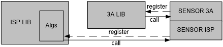

关于sensor注册ISP库，sensor注册3A算法库部分详细请参考《sensor 调试指南》

# 开发者指南<a name="ZH-CN_TOPIC_0000002470924982"></a>


## 概述<a name="ZH-CN_TOPIC_0000002503964811"></a>

用户可以基于Firmware框架开发定制3A库，并注册到Firmware中，Firmware将会在中断的驱动下，获取每帧的统计信息，运行算法库，配置ISP寄存器。

Sensor注册到ISP库，以实现差异化适配Firmware中的基础算法单元的部分，仍需要参考使用者指南部分的内容实现，以保证Firmware中的坏点校正、去噪、色彩增强、镜头阴影校正等处理算法正常运行。Sensor注册到3A算法库的部分，请用户根据自己开发定制的3A库，自行定义数据结构，实现Sensor曝光控制等。

如果用户只是使用3A算法库，并不自己开发3A算法库，可以忽略此章节内容。

## AE算法注册ISP库<a name="ZH-CN_TOPIC_0000002470924908"></a>

AE算法注册ISP库调用ss\_mpi\_isp\_ae\_lib\_reg\_callback，如[图1](#fig174012335129)所示。

**图 1**  AE算法向ISP库注册的回调函数<a name="fig174012335129"></a>  


AE算法实现了一个ss\_mpi\_ae\_register的注册函数，在这个函数中调用ISP提供的ss\_mpi\_isp\_ae\_lib\_reg\_callback回调接口，用户调用注册函数以实现向ISP注册AE算法，示例如下：

【举例】

```
/* 实现注册函数 */
ot_isp_ae_register ae_register;
td_s32 ret = TD_SUCCESS;
ae_check_pointer_return(ae_lib);
ae_check_handle_id_return(ae_lib->id);
ae_check_lib_name_return(ae_lib->lib_name);
/* 调用钩子函数 */
ae_register.ae_exp_func.pfn_ae_init  = ae_init;
ae_register.ae_exp_func.pfn_ae_run   = ae_run;
ae_register.ae_exp_func.pfn_ae_ctrl  = ae_ctrl;
ae_register.ae_exp_func.pfn_ae_exit  = ae_exit;
ret = ss_mpi_isp_ae_lib_reg_callback(vi_pipe, ae_lib, &ae_register);
if (ret != TD_SUCCESS) {
printf("Ot_ae register failed!\n");
}
```

用户需要在自开发定制的AE库中实现以下回调函数：

**表 1**  AE算法向ISP库注册的回调函数

<a name="table41469mcpsimp"></a>
<table><thead align="left"><tr id="row41475mcpsimp"><th class="cellrowborder" valign="top" width="37%" id="mcps1.2.3.1.1"><p id="p41477mcpsimp"><a name="p41477mcpsimp"></a><a name="p41477mcpsimp"></a>成员名称</p>
</th>
<th class="cellrowborder" valign="top" width="63%" id="mcps1.2.3.1.2"><p id="p41479mcpsimp"><a name="p41479mcpsimp"></a><a name="p41479mcpsimp"></a>描述</p>
</th>
</tr>
</thead>
<tbody><tr id="row41480mcpsimp"><td class="cellrowborder" valign="top" width="37%" headers="mcps1.2.3.1.1 "><p id="p41482mcpsimp"><a name="p41482mcpsimp"></a><a name="p41482mcpsimp"></a>pfn_ae_init</p>
</td>
<td class="cellrowborder" valign="top" width="63%" headers="mcps1.2.3.1.2 "><p id="p41484mcpsimp"><a name="p41484mcpsimp"></a><a name="p41484mcpsimp"></a>初始化AE的回调函数指针。</p>
</td>
</tr>
<tr id="row41485mcpsimp"><td class="cellrowborder" valign="top" width="37%" headers="mcps1.2.3.1.1 "><p id="p41487mcpsimp"><a name="p41487mcpsimp"></a><a name="p41487mcpsimp"></a>pfn_ae_run</p>
</td>
<td class="cellrowborder" valign="top" width="63%" headers="mcps1.2.3.1.2 "><p id="p41489mcpsimp"><a name="p41489mcpsimp"></a><a name="p41489mcpsimp"></a>运行AE的回调函数指针。</p>
</td>
</tr>
<tr id="row41490mcpsimp"><td class="cellrowborder" valign="top" width="37%" headers="mcps1.2.3.1.1 "><p id="p41492mcpsimp"><a name="p41492mcpsimp"></a><a name="p41492mcpsimp"></a>pfn_ae_ctrl</p>
</td>
<td class="cellrowborder" valign="top" width="63%" headers="mcps1.2.3.1.2 "><p id="p41494mcpsimp"><a name="p41494mcpsimp"></a><a name="p41494mcpsimp"></a>控制AE内部状态的回调函数指针。</p>
</td>
</tr>
<tr id="row41495mcpsimp"><td class="cellrowborder" valign="top" width="37%" headers="mcps1.2.3.1.1 "><p id="p41497mcpsimp"><a name="p41497mcpsimp"></a><a name="p41497mcpsimp"></a>pfn_ae_exit</p>
</td>
<td class="cellrowborder" valign="top" width="63%" headers="mcps1.2.3.1.2 "><p id="p41499mcpsimp"><a name="p41499mcpsimp"></a><a name="p41499mcpsimp"></a>销毁AE的回调函数指针。</p>
</td>
</tr>
</tbody>
</table>

> **说明：** 
>-   调用ss\_mpi\_isp\_init时将调用pfn\_ae\_init回调函数，以初始化AE算法库。
>-   调用ss\_mpi\_isp\_run时将调用pfn\_ae\_run回调函数，以运行AE算法库，计算得到sensor的曝光时间和增益、ISP的数字增益。
>-   pfn\_ae\_ctrl回调函数的目的是改变算法库内部状态。运行时Firmware会隐式调用pfn\_ae\_ctrl回调函数，通知AE算法库切换WDR和线性模式、设置FPS。
>-   当前Firmware定义的ctrl命令详参ot\_isp\_ctrl\_cmd。  调用ss\_mpi\_isp\_exit时将调用pfn\_ae\_exit回调函数，以销毁AE算法库。

结构体ot\_isp\_ae\_param，ot\_isp\_ae\_info，ot\_isp\_ae\_result的成员变量请参看"数据类型"小节相应的数据类型。

## AWB算法注册ISP库<a name="ZH-CN_TOPIC_0000002503964945"></a>

AWB算法注册ISP库调用ss\_mpi\_isp\_awb\_lib\_reg\_callback，如[图1](#fig16426106161511)所示：

**图 1**  AWB算法向ISP库注册的回调函数<a name="fig16426106161511"></a>  


AWB算法实现了一个ss\_mpi\_awb\_register的注册函数，在这个函数中调用ISP提供的ss\_mpi\_isp\_awb\_lib\_reg\_callback回调接口，用户调用注册函数以实现向ISP注册AWB算法，示例和AE算法库注册类似。

用户需要在自开发定制的AWB库中实现以下回调函数：

**表 1**  AWB算法向ISP库注册的回调函数

<a name="table41540mcpsimp"></a>
<table><thead align="left"><tr id="row41546mcpsimp"><th class="cellrowborder" valign="top" width="37%" id="mcps1.2.3.1.1"><p id="p41548mcpsimp"><a name="p41548mcpsimp"></a><a name="p41548mcpsimp"></a>成员名称</p>
</th>
<th class="cellrowborder" valign="top" width="63%" id="mcps1.2.3.1.2"><p id="p41550mcpsimp"><a name="p41550mcpsimp"></a><a name="p41550mcpsimp"></a>描述</p>
</th>
</tr>
</thead>
<tbody><tr id="row41552mcpsimp"><td class="cellrowborder" valign="top" width="37%" headers="mcps1.2.3.1.1 "><p id="p41554mcpsimp"><a name="p41554mcpsimp"></a><a name="p41554mcpsimp"></a>pfn_awb_init</p>
</td>
<td class="cellrowborder" valign="top" width="63%" headers="mcps1.2.3.1.2 "><p id="p41556mcpsimp"><a name="p41556mcpsimp"></a><a name="p41556mcpsimp"></a>初始化AWB的回调函数指针。</p>
</td>
</tr>
<tr id="row41557mcpsimp"><td class="cellrowborder" valign="top" width="37%" headers="mcps1.2.3.1.1 "><p id="p41559mcpsimp"><a name="p41559mcpsimp"></a><a name="p41559mcpsimp"></a>pfn_awb_run</p>
</td>
<td class="cellrowborder" valign="top" width="63%" headers="mcps1.2.3.1.2 "><p id="p41561mcpsimp"><a name="p41561mcpsimp"></a><a name="p41561mcpsimp"></a>运行AWB的回调函数指针。</p>
</td>
</tr>
<tr id="row41562mcpsimp"><td class="cellrowborder" valign="top" width="37%" headers="mcps1.2.3.1.1 "><p id="p41564mcpsimp"><a name="p41564mcpsimp"></a><a name="p41564mcpsimp"></a>pfn_awb_ctrl</p>
</td>
<td class="cellrowborder" valign="top" width="63%" headers="mcps1.2.3.1.2 "><p id="p41566mcpsimp"><a name="p41566mcpsimp"></a><a name="p41566mcpsimp"></a>控制AWB内部状态的回调函数指针。</p>
</td>
</tr>
<tr id="row41567mcpsimp"><td class="cellrowborder" valign="top" width="37%" headers="mcps1.2.3.1.1 "><p id="p41569mcpsimp"><a name="p41569mcpsimp"></a><a name="p41569mcpsimp"></a>pfn_awb_exit</p>
</td>
<td class="cellrowborder" valign="top" width="63%" headers="mcps1.2.3.1.2 "><p id="p41571mcpsimp"><a name="p41571mcpsimp"></a><a name="p41571mcpsimp"></a>销毁AWB的回调函数指针。</p>
</td>
</tr>
</tbody>
</table>

> **说明：** 
>-   调用ss\_mpi\_isp\_init时将调用pfn\_awb\_init回调函数，以初始化AWB算法库。
>-   调用ss\_mpi\_isp\_run时将调用pfn\_awb\_run回调函数，以运行AWB算法库，计算得到白平衡增益、色彩校正矩阵。
>-   pfn\_awb\_ctrl回调函数的目的是改变算法库内部状态。运行时Firmware会隐式调用pfn\_awb\_ctrl回调函数，通知AWB算法库切换WDR和线性模式、设置ISO和曝光时间。设置ISO的目的是为了实现ISO与饱和度的联动，增益大时色度噪声也会比较大，所以需要调节饱和度。设置曝光时间是为了awb算法判断环境照度，优化场景效果。当前Firmware定义的ctrl命令详参ot\_isp\_ctrl\_cmd。
>-   调用ss\_mpi\_isp\_exit时将调用pfn\_awb\_exit回调函数，以销毁AWB算法库。

结构体ot\_isp\_awb\_param，ot\_isp\_awb\_info，ot\_isp\_awb\_result的成员变量请参看“数据类型”小节相应的数据类型。

## 开发用户AF算法<a name="ZH-CN_TOPIC_0000002504084799"></a>

> **说明：** 
>ss\_mpi\_isp\_get\_vd\_time\_out和[ss\_mpi\_isp\_get\_focus\_stats](#ZH-CN_TOPIC_0000002470925076)请参考前面章节。

用户开发的AF算法可以参考[图1](#fig36322052192211)所示的结构，AF算法在一个thread内运行，使用ss\_mpi\_isp\_get\_vd\_time\_out接口将算法同步在VD下运行。通过调用[ss\_mpi\_isp\_get\_focus\_stats](#ZH-CN_TOPIC_0000002470925076)来获取AF相关的统计信息，相关算法参考统计信息完成目标zoom和focus位置的计算，AF算法输出result，包括lens的位置信息和速度。调用Lens Driver将镜头镜片驱动到设定的位置即完成当前帧的操作。AF Alg向上提供控制接口和查询接口，方便用户完成一键聚焦，变焦，手动聚焦，查询算法状态等操作。

**图 1**  AF算法结构图<a name="fig36322052192211"></a>  
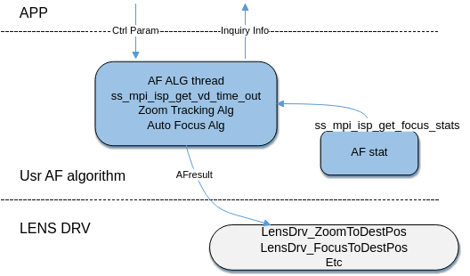

【举例】

如果用户使用的是Linux系统，推荐将算法放在user space完成，lens driver放在kernel space，ISP驱动提供同步回调功能，参考“[AF同步回调](#ZH-CN_TOPIC_0000002471085070)”章节。

```
while (1)
{
    ret = ss_mpi_isp_get_vd_time_out(vi_pipe, OT_ISP_VD_FE_START, 5000);
    ret |= ss_mpi_isp_get_focus_stats(vi_pipe, &af_stat);
 
    if (TD_SUCCESS != ret) {
        printf("ss_mpi_isp_get_focus_stats error!(ret = 0x%x)\n", ret);
        return TD_FAILURE;
    }
 
    // User Auto Focus Alg Source
    UsrAfAlgRun();
        
    // Update Lens Position
    LensDrv_ZoomToDestPos(pos, pps);
    LensDrv_FocusToDestPos(pos, pps);
}
```

## AF统计信息使用说明<a name="ZH-CN_TOPIC_0000002470925094"></a>


### 概述<a name="ZH-CN_TOPIC_0000002504085001"></a>

被动式自动对焦一般是通过分析图像特征得出图像清晰度值FV\(Focus Value\), 通过驱动对焦马达调节焦点到最佳位置，如[图1](#fig4442256191114)所示，图像越清晰FV值越大，Peak点对应聚焦清晰点。获取图像清晰度算法有多种，如灰度梯度法，高频分量法等，SS928V100采用高频分量法来计算FV，即图像越清晰的时候高频部分幅值越大，将图像通过高通滤波器便可以得到高频分量，SS928V100一共提供四个滤波器和亮度信息，分别为水平方向滤波H1，H2，垂直方向滤波V1，V2，以及Y和高亮计数器HlCnt。SS928V100提供FE（Front End）及BE（Back End）两个独立的AF统计信息获取模块。AF模块支持的最小分辨率为256\*120，低于该分辨率AF逻辑功能无法支持。

**图 1**  FV曲线<a name="fig4442256191114"></a>  
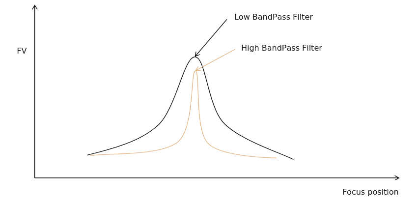

SS928V100提供Bayer域或者YUV域进行统计，配置MPI中的stats\_pos字段即可以进行统计位置的调整。WDR模式下，非宽动态场景的Bayer域（即RAW域）统计信息无明显变化趋势，推荐使用YUV域统计信息。首先对图像进行预处理滤波，去除椒盐噪声对统计值的干扰，用户可以设置pre\_flt\_cfg.en来使能PreFilter。配置pre\_flt\_cfg.strength来控制[图3](#fig1479092219285)滤波强度。在经过水平垂直四组滤波器后会对输出做Level Depend Gain和Coring，关于这两个模块将在后面的章节详述。模块框[图2](#fig1275851542715)所示。

**图 2**  AF统计模块框图<a name="fig1275851542715"></a>  
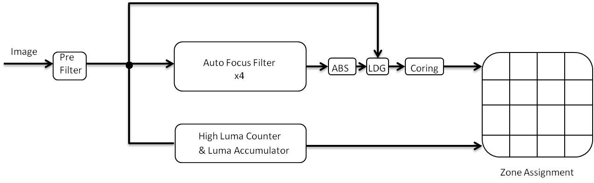

水平垂直滤波器分别采用IIR和FIR实现如[图3](#fig1479092219285)所示。

**图 3**  AF 4组滤波器<a name="fig1479092219285"></a>  
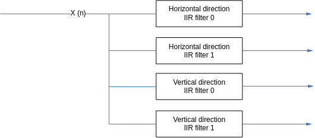

### 输入图像的裁剪<a name="ZH-CN_TOPIC_0000002503965105"></a>

AF模块支持对输入图像的裁剪，如下如[图1](#_Ref450034583)用户可以根据实际需求配置crop中X，Y，W，H四个参数对指定区域进行统计。

**图 1**  AF 输入图像裁剪<a name="_Ref450034583"></a>  
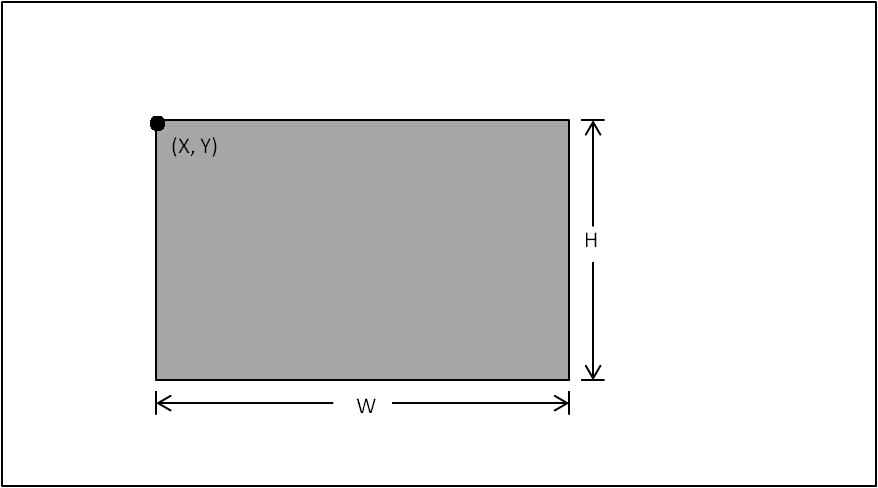

### Bayer域配置<a name="ZH-CN_TOPIC_0000002471084914"></a>

如果用户将统计位置调整到Bayer域则需要配置以下几点。

1.  配置bayer\_format来指定bayer数据的pattern。支持如[图1](#_Ref450034665)所示的4种pattern。
2.  配置AF 模块Gamma使能，raw上的线性数据需要做Gamma处理。

**图 1**  Bayer域统计预处理<a name="_Ref450034665"></a>  
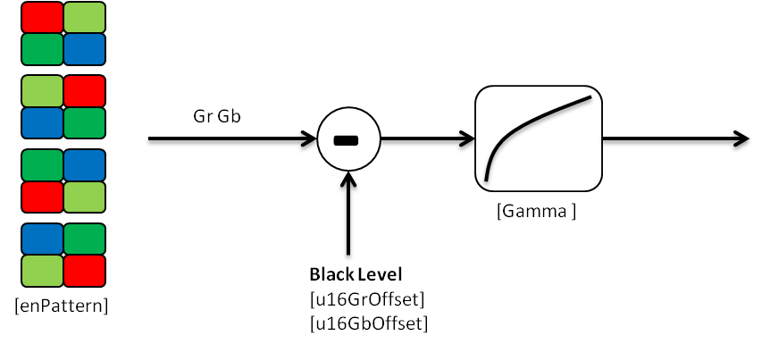

**图 2**  关于Gamma配置的说明<a name="fig41650mcpsimp"></a>  
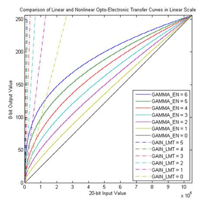

> **须知：** 
>图中的GAMMA\_EN与[ot\_isp\_af\_raw\_cfg](#ZH-CN_TOPIC_0000002503964917)中的gamma\_value等效，GAIN\_LMT与[ot\_isp\_af\_raw\_cfg](#ZH-CN_TOPIC_0000002503964917)中的gamma\_gain\_limit等效。

### 抑制光源对FV值的影响<a name="ZH-CN_TOPIC_0000002504084777"></a>

因为FV值容易受到SpotLight的影响，在聚焦模糊的时候因为光晕扩散，图像中低频分量会增加，会出现图像模糊反而FV值变大的现象。为了抑制这一现象，提供以下方法。

-   高亮计数器

    如[图1](#_Ref450034695)，在聚焦模糊的时候因为光晕扩大画面中高亮点的个数增加，清晰的时候高亮点的个数最小，通过配置合适的高亮点判断门限high\_luma\_threshold即可以辅助实现SpotLight场景聚焦。

    **图 1**  高亮统计值<a name="_Ref450034695"></a>  
    

-   Level Depend Gain

    LDG的主要原理为通过参考画面像素亮度来衰减滤波器的输出，从而抑制SpotLight对FV值的影响。如[图2](#_Ref450034722)横坐标为像素亮度值，纵坐标为对滤波器输出的Gain，此处的Gain为8bit定点小数Q8。用户可以通过调整图中6个参数控制曲线的形状。

    **图 2**  Level Depend Gain 曲线<a name="_Ref450034722"></a>  
    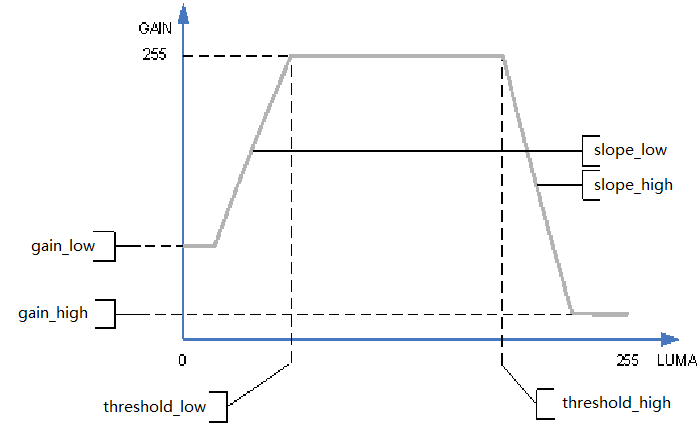

### Coring<a name="ZH-CN_TOPIC_0000002504085069"></a>

将滤波器输出通过Coring模块可以提高FV曲线的抗噪声能力，如[图1](#_Ref450034753)所示，设置图中3个参数便可以确定coring曲线的形状，通过设置合理的参数便可以实现不统计噪声，以及增加有效信号对统计信息的贡献，从而提升统计信息在低照度场景中的性能。

**图 1**  Coring 曲线<a name="_Ref450034753"></a>  
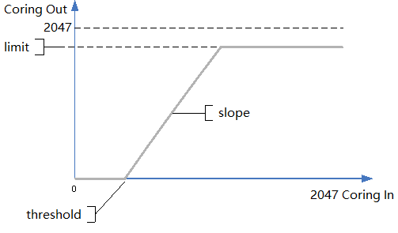

### 统计模式配置<a name="ZH-CN_TOPIC_0000002504084909"></a>

统计模块支持以下两种模式：

-   峰值配置模式

    设置为peak模式block的统计值为滤波后图像每行最大值之和，否则直接将每个点的值求和。求和模式适用于噪声较大场景。

-   平方配置模式，有以下两种选择。

    -   0：Linear mode
    -   1：Square mode

    设置为Square模式后，会先对滤波器输出进行归一化后进行平方再做统计。

    Square模式的FV曲线在焦点附近会更加陡峭，相应的映射曲线如[图1](#_Ref421868014)所示。

**图 1**  平方配置模式映射曲线图<a name="_Ref421868014"></a>  
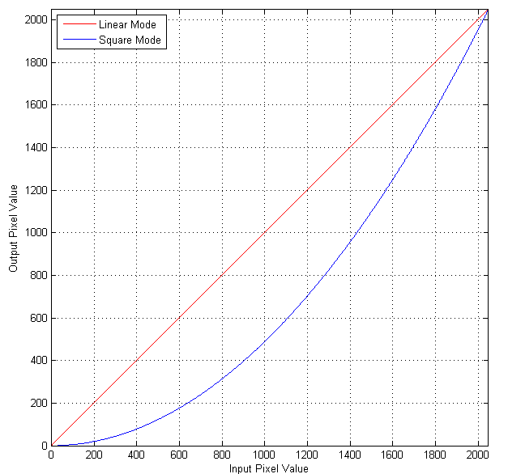

同时也支持以下配置：

-   输出shift

    对输出值right shift缩小，防止值溢出。

-   Block大小

    对通过滤波器后的图像可以进行分块统计，如[图2](#fig335342203510)所示，块的大小可以设置，最大支持17\*15个blocks，最终块的统计值是对每个pixel的累加或者对每行最大值累加。以水平方向为例，因为累加器的宽度为unsigned 29bits，滤波器输出pixel宽度为unsigned 11bits，所以当块内输出值都为2047的时候，最大支持累加的pixel个数为2^18，否则会发生溢出，用户设置大小时应该注意。

**图 2**  滤波器后的图像<a name="fig335342203510"></a>  
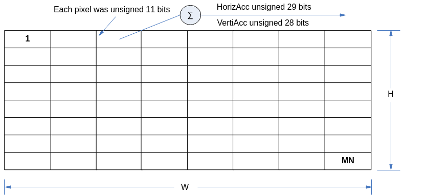

### 统计信息配置注意事项<a name="ZH-CN_TOPIC_0000002504084963"></a>

**表 1**  统计信息配置注意事项

<a name="table41695mcpsimp"></a>
<table><thead align="left"><tr id="row41701mcpsimp"><th class="cellrowborder" valign="top" width="45%" id="mcps1.2.3.1.1"><p id="p41703mcpsimp"><a name="p41703mcpsimp"></a><a name="p41703mcpsimp"></a>类型</p>
</th>
<th class="cellrowborder" valign="top" width="55.00000000000001%" id="mcps1.2.3.1.2"><p id="p41705mcpsimp"><a name="p41705mcpsimp"></a><a name="p41705mcpsimp"></a>描述</p>
</th>
</tr>
</thead>
<tbody><tr id="row41706mcpsimp"><td class="cellrowborder" valign="top" width="45%" headers="mcps1.2.3.1.1 "><p id="p41708mcpsimp"><a name="p41708mcpsimp"></a><a name="p41708mcpsimp"></a>分块大小</p>
</td>
<td class="cellrowborder" valign="top" width="55.00000000000001%" headers="mcps1.2.3.1.2 "><p id="p41710mcpsimp"><a name="p41710mcpsimp"></a><a name="p41710mcpsimp"></a>最大17乘以15</p>
</td>
</tr>
<tr id="row41711mcpsimp"><td class="cellrowborder" valign="top" width="45%" headers="mcps1.2.3.1.1 "><p id="p41713mcpsimp"><a name="p41713mcpsimp"></a><a name="p41713mcpsimp"></a>统计模块工作域</p>
</td>
<td class="cellrowborder" valign="top" width="55.00000000000001%" headers="mcps1.2.3.1.2 "><p id="p41715mcpsimp"><a name="p41715mcpsimp"></a><a name="p41715mcpsimp"></a>RAW/YUV</p>
</td>
</tr>
<tr id="row41716mcpsimp"><td class="cellrowborder" valign="top" width="45%" headers="mcps1.2.3.1.1 "><p id="p41718mcpsimp"><a name="p41718mcpsimp"></a><a name="p41718mcpsimp"></a>Bayer统计模块位置</p>
</td>
<td class="cellrowborder" valign="top" width="55.00000000000001%" headers="mcps1.2.3.1.2 "><p id="p41720mcpsimp"><a name="p41720mcpsimp"></a><a name="p41720mcpsimp"></a>Raw在DG后、DRC后</p>
</td>
</tr>
<tr id="row41721mcpsimp"><td class="cellrowborder" valign="top" width="45%" headers="mcps1.2.3.1.1 "><p id="p41723mcpsimp"><a name="p41723mcpsimp"></a><a name="p41723mcpsimp"></a>YUV统计模块位置</p>
</td>
<td class="cellrowborder" valign="top" width="55.00000000000001%" headers="mcps1.2.3.1.2 "><p id="p41725mcpsimp"><a name="p41725mcpsimp"></a><a name="p41725mcpsimp"></a>CSC后</p>
</td>
</tr>
<tr id="row41726mcpsimp"><td class="cellrowborder" valign="top" width="45%" headers="mcps1.2.3.1.1 "><p id="p41728mcpsimp"><a name="p41728mcpsimp"></a><a name="p41728mcpsimp"></a>Bayer统计参数是否减去黑电平</p>
</td>
<td class="cellrowborder" valign="top" width="55.00000000000001%" headers="mcps1.2.3.1.2 "><p id="p41730mcpsimp"><a name="p41730mcpsimp"></a><a name="p41730mcpsimp"></a>已减去</p>
</td>
</tr>
<tr id="row41731mcpsimp"><td class="cellrowborder" valign="top" width="45%" headers="mcps1.2.3.1.1 "><p id="p41733mcpsimp"><a name="p41733mcpsimp"></a><a name="p41733mcpsimp"></a>统计输出YUV是否减去黑电平</p>
</td>
<td class="cellrowborder" valign="top" width="55.00000000000001%" headers="mcps1.2.3.1.2 "><p id="p41735mcpsimp"><a name="p41735mcpsimp"></a><a name="p41735mcpsimp"></a>已减去</p>
</td>
</tr>
<tr id="row41736mcpsimp"><td class="cellrowborder" valign="top" width="45%" headers="mcps1.2.3.1.1 "><p id="p41738mcpsimp"><a name="p41738mcpsimp"></a><a name="p41738mcpsimp"></a>是否支持IIR滤波器filterShift补偿</p>
</td>
<td class="cellrowborder" valign="top" width="55.00000000000001%" headers="mcps1.2.3.1.2 "><p id="p41740mcpsimp"><a name="p41740mcpsimp"></a><a name="p41740mcpsimp"></a>支持</p>
</td>
</tr>
<tr id="row41741mcpsimp"><td class="cellrowborder" valign="top" width="45%" headers="mcps1.2.3.1.1 "><p id="p41743mcpsimp"><a name="p41743mcpsimp"></a><a name="p41743mcpsimp"></a>是否支持IIR滤波器narrowband</p>
</td>
<td class="cellrowborder" valign="top" width="55.00000000000001%" headers="mcps1.2.3.1.2 "><p id="p41745mcpsimp"><a name="p41745mcpsimp"></a><a name="p41745mcpsimp"></a>支持</p>
</td>
</tr>
<tr id="row41746mcpsimp"><td class="cellrowborder" valign="top" width="45%" headers="mcps1.2.3.1.1 "><p id="p41748mcpsimp"><a name="p41748mcpsimp"></a><a name="p41748mcpsimp"></a>WDR模式下特殊配置</p>
</td>
<td class="cellrowborder" valign="top" width="55.00000000000001%" headers="mcps1.2.3.1.2 "><p id="p41750mcpsimp"><a name="p41750mcpsimp"></a><a name="p41750mcpsimp"></a>YUV输入时gamma_value（参考 <a href="#ot_isp_af_raw_cfg">ot_isp_af_raw_cfg</a>）设置为0。</p>
<p id="p41752mcpsimp"><a name="p41752mcpsimp"></a><a name="p41752mcpsimp"></a>RAW需要配置在DRC之后</p>
</td>
</tr>
</tbody>
</table>

### 统计值的获取<a name="ZH-CN_TOPIC_0000002504084959"></a>

当一帧图像最后一个pixel通过AF模块后, 统计值即更新，推荐用户通过ss\_mpi\_isp\_get\_vd\_time\_out同步获取统计值，然后AutoFocus和ZoomTracking算法完成目标focus和zoom position的计算，需要注意的是因为LINUX user space任务调度不能保证一致的实时性，建议将需要保证实时性的驱动配置放在kernel space完成。

### FV值计算<a name="ZH-CN_TOPIC_0000002470925154"></a>

一般的推荐最终生成如[图1](#fig4442256191114)所示的两条曲线，我们将low BandPass filter生成的FV命名为FV1，High BandPass filter生成的命名为FV2，“[FV计算参考代码](#ZH-CN_TOPIC_0000002503965111)”中变量stFocusCfg的值为默认推荐使用的AF滤波器参数，FV1使用在低照度场合，FV2使用在正常照度场合。对于每一个block，FV1，FV2的计算方式为：


H1，H2，V1，V2分别为水平垂直四组滤波器的统计值，可设置适当的权重对水平和垂直方向的滤波器输出统计值进行混合。

最终的FV值还需要对每个block进行加权，即FV1，FV2采用如下公式计算。


### FV计算参考代码<a name="ZH-CN_TOPIC_0000002503965111"></a>

```
#include <stdio.h>
#include <stdlib.h>
#include <string.h>
#include "ot_type.h"
#include "ss_mpi_isp.h"
 
#define BLEND_SHIFT  6
#define ALPHA        64           // 1
#define BELTA        54           // 0.85
#define FEINFO
static int af_weight[15][17] = {
    {1, 1, 1, 1, 1, 1, 1, 1, 1, 1, 1, 1, 1, 1, 1, 1, 1},
    {1, 2, 2, 2, 2, 2, 2, 2, 2, 2, 2, 2, 2, 2, 2, 2, 1},
    {1, 2, 2, 2, 2, 2, 2, 2, 2, 2, 2, 2, 2, 2, 2, 2, 1},
    {1, 2, 2, 2, 2, 2, 2, 2, 2, 2, 2, 2, 2, 2, 2, 2, 1},
    {1, 2, 2, 2, 2, 2, 2, 2, 2, 2, 2, 2, 2, 2, 2, 2, 1},
    {1, 2, 2, 2, 2, 2, 2, 2, 2, 2, 2, 2, 2, 2, 2, 2, 1},
    {1, 2, 2, 2, 2, 2, 2, 2, 2, 2, 2, 2, 2, 2, 2, 2, 1},
    {1, 2, 2, 2, 2, 2, 2, 2, 2, 2, 2, 2, 2, 2, 2, 2, 1},
    {1, 2, 2, 2, 2, 2, 2, 2, 2, 2, 2, 2, 2, 2, 2, 2, 1},
    {1, 2, 2, 2, 2, 2, 2, 2, 2, 2, 2, 2, 2, 2, 2, 2, 1},
    {1, 2, 2, 2, 2, 2, 2, 2, 2, 2, 2, 2, 2, 2, 2, 2, 1},
    {1, 2, 2, 2, 2, 2, 2, 2, 2, 2, 2, 2, 2, 2, 2, 2, 1},
    {1, 2, 2, 2, 2, 2, 2, 2, 2, 2, 2, 2, 2, 2, 2, 2, 1},
    {1, 2, 2, 2, 2, 2, 2, 2, 2, 2, 2, 2, 2, 2, 2, 2, 1},
    {1, 1, 1, 1, 1, 1, 1, 1, 1, 1, 1, 1, 1, 1, 1, 1, 1},
};
 
 
int main(int argc, char *argv[])
{
    td_s32 ret = TD_SUCCESS;
    td_u8 wdr_chn;
    td_u32 frm_cnt = 0;
    td_u32 i, j, k;
    td_u16 stat_data;
    ot_vi_pipe vi_pipe;
    ot_isp_af_stats af_stats;
    ot_isp_stats_cfg stats_cfg;
    ot_isp_focus_zone zone_metrics[OT_ISP_WDR_MAX_FRAME_NUM][OT_ISP_AF_ZONE_ROW][OT_ISP_AF_ZONE_COLUMN] = { 0 };
 
    ot_isp_focus_stats_cfg  focus_cfg = {
        {1, 17, 15, 1, 0, {0, 0, 0, 1920, 1080}, {0, 0, 0, 1920, 1080}, 0, {0x2, 0x4, 0}, {1, 0x9bff}, 0xf0},
        {1, {1, 1, 1}, 15, {188, 414, -330, 486, -461, 400, -328}, {7, 0, 3, 1}, {1, 0, 255, 0, 240, 8, 14},
            {127, 12, 2047}
        },
        {0, {1, 1, 0},  2, {200, 200, -110, 461, -415, 0, 0}, {6, 0, 1, 0}, {0, 0, 0, 0, 0, 0, 0},
            { 15, 12, 2047}
        },
        {{ 20,  16, 0, -16, -20}, {1, 0, 255, 0, 220, 8, 14}, {38, 12, 1800}},
        {{ -12, -24, 0,  24,  12}, {1, 0, 255, 0, 220, 8, 14}, {15, 12, 2047}},
        {4, {0, 0}, {1, 1}, 0}
    };
 
 
    char param1, param2;
 
    if (argc < 3) {
        printf("use like. ./sample_af isp_Pipe c    -> Fv curve\n");
        printf("......... ./sample_af isp_Pipe h 0  -> h0 blocks\n");
        printf("......... ./sample_af isp_Pipe h 1  -> h1 blocks\n");
        printf("......... ./sample_af isp_Pipe v 0  -> v0 blocks\n");
        printf("......... ./sample_af isp_Pipe v 1  -> v1 blocks\n");
        printf("......... ./sample_af isp_Pipe y 0  -> y  blocks\n");
        printf("......... ./sample_af isp_Pipe y 1  -> hlcnt blocks\n");
        return -1;
    }
 
    if ((param1 = *argv[2]) != 'c' && !argv[3]) {
        printf("args was too less!, should be %c + X\n", *argv[1]);
        return -1;
    } else if (argv[3]) {
        param2 = *argv[3];
    }
 
    if ('0' != *argv[1] && '1' != *argv[1]) {
        printf("vi_pipe num Err!\n");
        return -1;
    }
    vi_pipe = atoi(argv[1]);
 
    ret = ss_mpi_isp_get_stats_cfg(vi_pipe, &stats_cfg);
    if (TD_SUCCESS != ret) {
        printf("ss_mpi_isp_get_stats_cfg error!(ret = 0x%x)\n", ret);
        return TD_FAILURE;
    }
    memcpy(&stats_cfg.focus_cfg, &focus_cfg, sizeof(ot_isp_focus_stats_cfg));
    ret = ss_mpi_isp_set_stats_cfg(vi_pipe, &stats_cfg);
    if (TD_SUCCESS != ret) {
        printf("ss_mpi_isp_set_stats_cfg error!(ret = 0x%x)\n", ret);
        return TD_FAILURE;
    }
#if 1
      while (1) {
        ret = ss_mpi_isp_get_vd_time_out(vi_pipe, OT_ISP_VD_FE_START, 5000);
        ret |= ss_mpi_isp_get_focus_stats(vi_pipe, &af_stats);
        if (ret != TD_SUCCESS) {
            printf("ss_mpi_isp_get_focus_stats error!(ret = 0x%x)\n", ret);
            return TD_FAILURE;
        }
 
#ifdef FEINFO
        memcpy(zone_metrics, &af_stats.fe_af_stat, sizeof(ot_isp_focus_zone) * OT_ISP_WDR_MAX_FRAME_NUM * OT_ISP_AF_ZONE_ROW * OT_ISP_AF_ZONE_COLUMN);
#else
        memcpy(zone_metrics[0], &af_stats.be_af_stat, sizeof(ot_isp_focus_zone) * OT_ISP_AF_ZONE_ROW * OT_ISP_AF_ZONE_COLUMN);
#endif
 
        if (param1 != 'c') {
            if ((++frm_cnt % 30)) {
                continue;
            }
 
 
            wdr_chn = 1;
            for (k = 0; k < wdr_chn; k++) {
                for (i = 0; i < 15; i++) {
                    for (j = 0; j < 17; j++) {
                        if (param1 == 'h' && param2 == '0') {
                            stat_data = zone_metrics[k][i][j].h1;
                        } else if (param1 == 'h' && param2 == '1') {
                            stat_data = zone_metrics[k][i][j].h2;
                        } else if (param1 == 'v' && param2 == '0') {
                            stat_data = zone_metrics[k][i][j].v1;
                        } else if (param1 == 'v' && param2 == '1') {
                            stat_data = zone_metrics[k][i][j].v2;
                        } else if (param1 == 'y' && param2 == '0') {
                            stat_data = zone_metrics[k][i][j].y;
                        } else {
                            stat_data = zone_metrics[k][i][j].hl_cnt;
                        }
                        printf("%6d", stat_data);
                    }
                    printf("\n");
                }
            }
            printf("------------------------------------------------%c-%c----------------------------------------------\n\n\n\n\n", param1, param2);
 
            continue;
        }
 
        td_u32 sum_fv1 = 0;
        td_u32 sum_fv2 = 0;
        td_u32 wgt_sum = 0;
        td_u32 fv1_n, fv2_n, fv1, fv2;
 
        if ((++frm_cnt % 2)) {
            continue;
        }
        wdr_chn = 1;
        for (k = 0; k < wdr_chn; k++) {
            for ( i = 0 ; i < focus_cfg.config.zone_row; i++ ) {
                for ( j = 0 ; j < focus_cfg.config.zone_col; j++ ) {
 
                    td_u32 h1 = zone_metrics[k][i][j].h1;
                    td_u32 h2 = zone_metrics[k][i][j].h2;
                    td_u32 v1 = zone_metrics[k][i][j].v1;
                    td_u32 v2 = zone_metrics[k][i][j].v2;
 
                   fv1_n = (h1 * ALPHA + v1 * ((1 << BLEND_SHIFT) - ALPHA)) >> BLEND_SHIFT;
 
                    fv2_n = (h2 * BELTA + v2 * ((1 << BLEND_SHIFT) - BELTA)) >> BLEND_SHIFT;
 
                    sum_fv1 += af_weight[i][j] * fv1_n;
                    sum_fv2 += af_weight[i][j] * fv2_n;
                    wgt_sum += af_weight[i][j];
                }
            }
        }
 
        fv1 = sum_fv1 / wgt_sum;
        fv2 = sum_fv2 / wgt_sum;
 
        printf("%4d    %4d\n", fv1, fv2);
    }
#endif
    return TD_SUCCESS;
}
```

### PQTools 滤波器设计工具使用说明<a name="ZH-CN_TOPIC_0000002470925032"></a>

OtPQ工具提供了自动对焦参数仿真插件，使图像质量调试人员可以：

-   根据截止频率自动获取较适合的AF参数，并查看对应的频率响应曲线；
-   自行配置AF参数，并查看对应的频率响应曲线。

目前版本的插件可用于图像质量调测，使用该工具之前，用户需要安装Matlab运行时的2012a（32位）版本。


#### 工具界面<a name="ZH-CN_TOPIC_0000002470925148"></a>

从OtPQ工具主界面工具栏的外挂插件下拉框中选择“OtPQ Auto Focus Simulator”，可以打开自动对焦参数仿真工具，如[图1](#_Ref480961585)所示。

**图 1**  自动对焦参数仿真工具<a name="_Ref480961585"></a>  
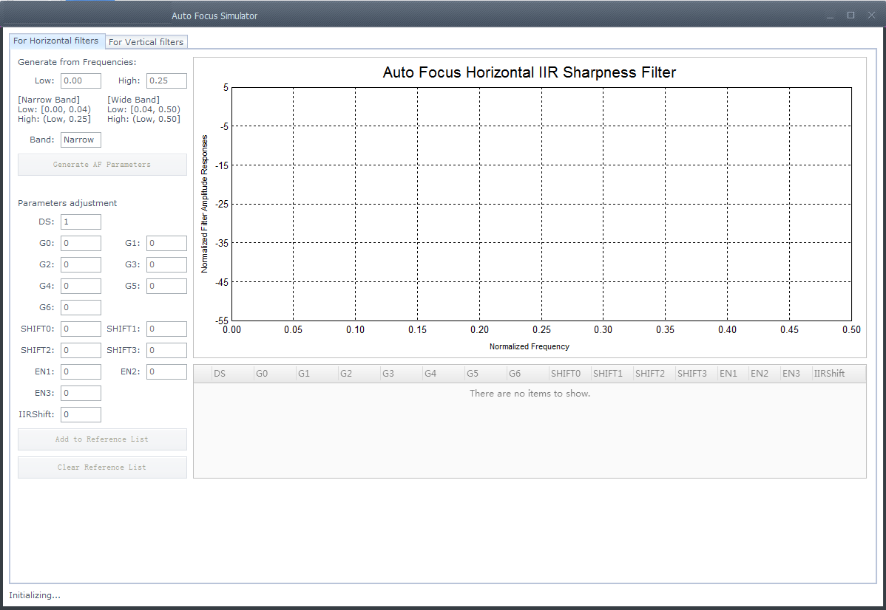

工具分为For Horizontal filters 和For Vertical filters两个页签，相互独立，分别对应水平和垂直方向的滤波器参数仿真。下面叙述的内容对两个页签均有效。

AF水平滤波器具备以下两种模式：

-   窄带模式（Narrow Band）：此种模式下，AF水平滤波器将在一个较小的频率范围内进行对焦。当用户设置的截止频率的低频小于0.04时，工具将推荐用户使用窄带模式。这个模式下，截止频率高频最大值为0.25。
-   宽带模式（Wide Band）：此种模式下，AF水平滤波器将在一个较大的频率范围内进行对焦。当截止频率的低频大于或等于0.04时，工具将推荐用户使用宽带模式。这个模式下，截止频率高频最大值为0.5。

用户可以在PQ工具主界面（已经加载调试表）上找到StatisticsConfig -\> AFConfig\_HParam\_IIR0的寄存器分组来对模式和滤波系数进行设置。

#### 通过截止频率获取AF滤波系数<a name="ZH-CN_TOPIC_0000002470925218"></a>

在每个页签中，用户均可以用截止频率来生成滤波系数。在Generate from Frequences处输入截止频率的低频和高频后，点击“Generate AF Parameters”，即可生成截止频率对应的滤波系数，显示在Parameters adjustment下方的各个文本框中，并在右侧的坐标图上显示对应该组滤波系数的频率响应曲线，曲线以红色表示，如[图1](#_Ref480961582)和[图2](#_Ref480961583)所示。

**图 1**  通过截止频率获取滤波系数（窄带）<a name="_Ref480961582"></a>  
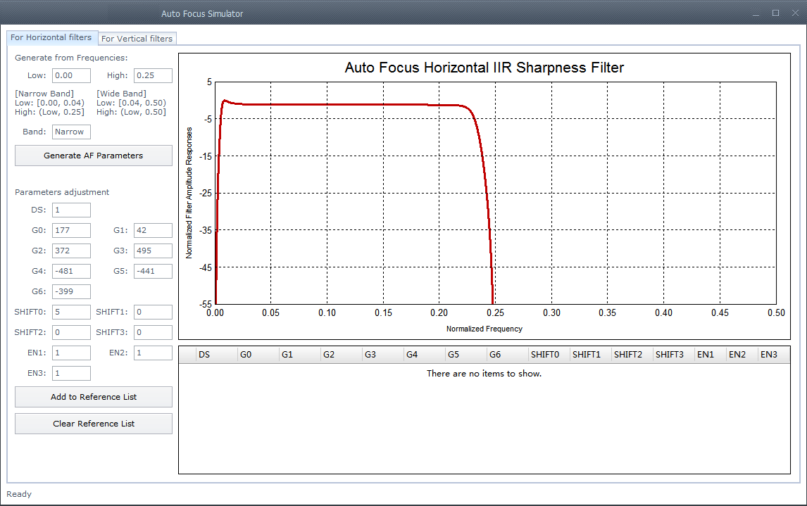

**图 2**  通过截止频率获取滤波系数（宽带）<a name="_Ref480961583"></a>  
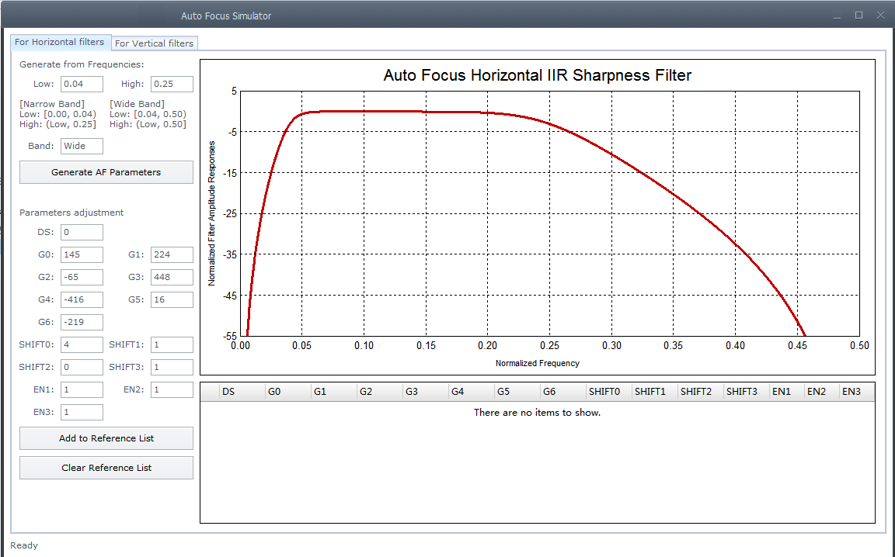

> **须知：** 
>截止频率在工具中会自动适配精度。水平滤波器的截止频率取小数点后两位，垂直滤波器的截止频率取小数点后一位。取精度时，多余的小数位数直接舍弃。

#### 手动配置滤波系数<a name="ZH-CN_TOPIC_0000002504085013"></a>

除了通过截止频率获取对应的滤波系数，用户还可以手动进行每个滤波系数项进行设置。在Parameters adjustment处，找到对应的参数并进行修改后，工具将自动计算这组参数的频率响应曲线并绘制在右侧。曲线以红色表示。

#### 设置参考组<a name="ZH-CN_TOPIC_0000002471084988"></a>

如果用户想要在不同组的滤波系数间对比，可以使用参考组功能。当用户需要将某一组滤波系数列为参考组时，点击“Add to Reference List”按钮，工具即会在右下角的列表中添加一行，列出该参考组的参数项，如[图1](#_Ref480961117)所示。

**图 1**  参考组列表<a name="_Ref480961117"></a>  
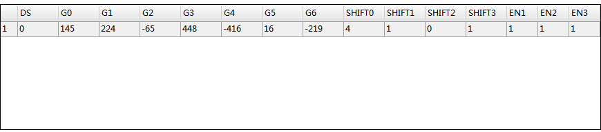

对于每一个参考组，工具还将在上方的坐标图上生成一条曲线，以灰色表示，如[图2](#_Ref480961210)所示：

**图 2**  参考组的曲线显示<a name="_Ref480961210"></a>  
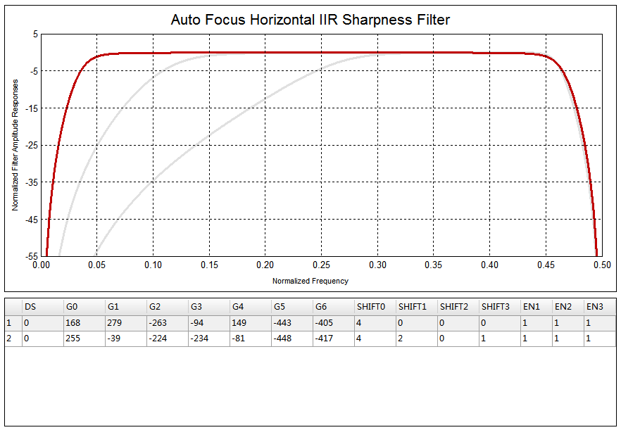

用户还可以将某一参考组的曲线高亮显示出来。在列表中点击需要高亮显示的参考组，此时对应的曲线会在上方的坐标图中变成蓝色，如[图3](#_Ref480961584)所示。

**图 3**  选中参考组曲线高亮显示<a name="_Ref480961584"></a>  
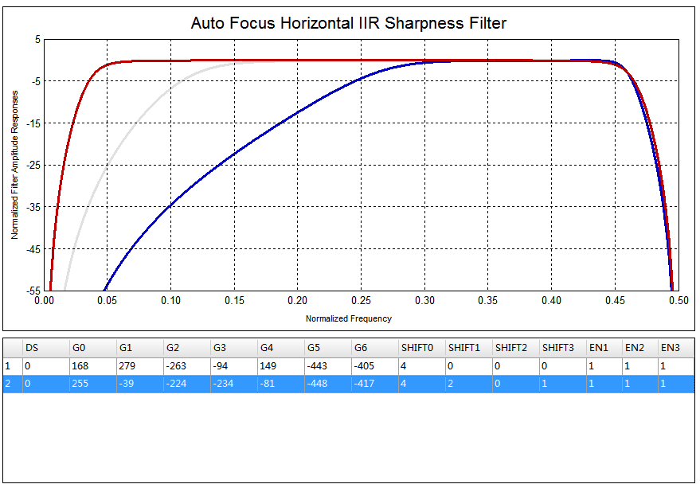

通过这样的方式，用户可以在不同的参考组间进行频率响应曲线对比，从而发现更优的方案。

> **须知：** 
>-   在坐标图上，红色的当前参数曲线和蓝色的参考组高亮曲线相对其他的灰色参考组曲线处于更上方的位置。因此，会出现刚刚添加参考组时看不到灰色曲线的状况。此时只要修改滤波系数，使红色曲线重新绘制，就能看到灰色的参考曲线。
>-   每个页签上最多只能添加6组参考组。如果需要添加更多参考组，请先点击Clear Reference List删除所有参考组。

### AF同步回调<a name="ZH-CN_TOPIC_0000002471085070"></a>

当一帧图像最后一个pixel通过AF模块后，统计值即更新，推荐用户通过ss\_mpi\_isp\_get\_vd\_time\_out同步获取统计值，AutoFocus和ZoomTracking算法完成目标focus和zoom position的计算，如果用户使用的是LINUX系统，因为user space任务调度不能保证一致的实时性，建议将需要保证实时性的驱动配置放在kernel space完成。ISP提供同步回调接口的注册，可以实现与VD同步。在本章有相应的接口使用描述，用户可以将实时性要求较高的任务放在同步回调里面，底层提供HwIRQ，Workqueue两种方式实现，可以选择相应的实现方式以确定实时级别。HwIRQ是指任务放在中断服务中实现，实时性最高;Workqueue的实时性取决于linux系统调用。

**图 1**  AF同步回调<a name="fig2915434165718"></a>  
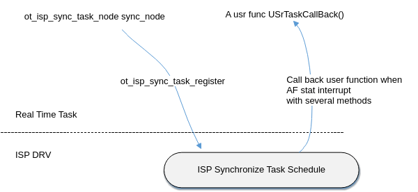


#### API参考<a name="ZH-CN_TOPIC_0000002470924942"></a>

-   [ot\_isp\_sync\_task\_register](#ZH-CN_TOPIC_0000002504084811)：向ISP注册同步回调接口。
-   [ot\_isp\_sync\_task\_unregister](#ZH-CN_TOPIC_0000002470925044)：向ISP反注册同步回调接口。


##### ot\_isp\_sync\_task\_register<a name="ZH-CN_TOPIC_0000002504084811"></a>

【描述】

向ISP注册同步回调接口。

【语法】

```
td_s32 ot_isp_sync_task_register(ot_vi_pipe vi_pipe, ot_isp_sync_task_node *new_node);
```

【参数】

<a name="table41987mcpsimp"></a>
<table><thead align="left"><tr id="row41993mcpsimp"><th class="cellrowborder" valign="top" width="23%" id="mcps1.1.4.1.1"><p id="p41995mcpsimp"><a name="p41995mcpsimp"></a><a name="p41995mcpsimp"></a>参数名称</p>
</th>
<th class="cellrowborder" valign="top" width="61%" id="mcps1.1.4.1.2"><p id="p41997mcpsimp"><a name="p41997mcpsimp"></a><a name="p41997mcpsimp"></a>描述</p>
</th>
<th class="cellrowborder" valign="top" width="16%" id="mcps1.1.4.1.3"><p id="p41999mcpsimp"><a name="p41999mcpsimp"></a><a name="p41999mcpsimp"></a>输入/输出</p>
</th>
</tr>
</thead>
<tbody><tr id="row42001mcpsimp"><td class="cellrowborder" valign="top" width="23%" headers="mcps1.1.4.1.1 "><p id="p42003mcpsimp"><a name="p42003mcpsimp"></a><a name="p42003mcpsimp"></a>vi_pipe</p>
</td>
<td class="cellrowborder" valign="top" width="61%" headers="mcps1.1.4.1.2 "><p id="p42005mcpsimp"><a name="p42005mcpsimp"></a><a name="p42005mcpsimp"></a>vi_pipe号。</p>
</td>
<td class="cellrowborder" valign="top" width="16%" headers="mcps1.1.4.1.3 "><p id="p42007mcpsimp"><a name="p42007mcpsimp"></a><a name="p42007mcpsimp"></a>输入</p>
</td>
</tr>
<tr id="row42008mcpsimp"><td class="cellrowborder" valign="top" width="23%" headers="mcps1.1.4.1.1 "><p id="p42010mcpsimp"><a name="p42010mcpsimp"></a><a name="p42010mcpsimp"></a>new_node</p>
</td>
<td class="cellrowborder" valign="top" width="61%" headers="mcps1.1.4.1.2 "><p id="p42012mcpsimp"><a name="p42012mcpsimp"></a><a name="p42012mcpsimp"></a>新插入的同步回调节点。</p>
</td>
<td class="cellrowborder" valign="top" width="16%" headers="mcps1.1.4.1.3 "><p id="p42014mcpsimp"><a name="p42014mcpsimp"></a><a name="p42014mcpsimp"></a>输入</p>
</td>
</tr>
</tbody>
</table>

【返回值】

<a name="table42016mcpsimp"></a>
<table><thead align="left"><tr id="row42021mcpsimp"><th class="cellrowborder" valign="top" width="50%" id="mcps1.1.3.1.1"><p id="p42023mcpsimp"><a name="p42023mcpsimp"></a><a name="p42023mcpsimp"></a>返回值</p>
</th>
<th class="cellrowborder" valign="top" width="50%" id="mcps1.1.3.1.2"><p id="p42025mcpsimp"><a name="p42025mcpsimp"></a><a name="p42025mcpsimp"></a>描述</p>
</th>
</tr>
</thead>
<tbody><tr id="row42026mcpsimp"><td class="cellrowborder" valign="top" width="50%" headers="mcps1.1.3.1.1 "><p id="p42028mcpsimp"><a name="p42028mcpsimp"></a><a name="p42028mcpsimp"></a>0</p>
</td>
<td class="cellrowborder" valign="top" width="50%" headers="mcps1.1.3.1.2 "><p id="p42030mcpsimp"><a name="p42030mcpsimp"></a><a name="p42030mcpsimp"></a>成功。</p>
</td>
</tr>
<tr id="row42031mcpsimp"><td class="cellrowborder" valign="top" width="50%" headers="mcps1.1.3.1.1 "><p id="p42033mcpsimp"><a name="p42033mcpsimp"></a><a name="p42033mcpsimp"></a>非0</p>
</td>
<td class="cellrowborder" valign="top" width="50%" headers="mcps1.1.3.1.2 "><p id="p42035mcpsimp"><a name="p42035mcpsimp"></a><a name="p42035mcpsimp"></a>失败。</p>
</td>
</tr>
</tbody>
</table>

【需求】

头文件：isp\_ext.h.

【注意】

-   使用前需要确保ISP驱动已加载。
-   因为ISP同步回调内部实现不保存用户传入的new\_node指向的实体，所以要求使用[ot\_isp\_sync\_task\_node](#ZH-CN_TOPIC_0000002503965043)定义实体时不能为局部变量。

【举例】

无

【相关主题】

[ot\_isp\_sync\_task\_unregister](#ot_isp_sync_task_unregister)

##### ot\_isp\_sync\_task\_unregister<a name="ZH-CN_TOPIC_0000002470925044"></a>

【描述】

向ISP反注册同步回调接口。

【语法】

```
td_s32 ot_isp_sync_task_unregister(ot_vi_pipe vi_pipe, ot_isp_sync_task_node *del_node)
```

【参数】

<a name="table42057mcpsimp"></a>
<table><thead align="left"><tr id="row42063mcpsimp"><th class="cellrowborder" valign="top" width="23%" id="mcps1.1.4.1.1"><p id="p42065mcpsimp"><a name="p42065mcpsimp"></a><a name="p42065mcpsimp"></a>参数名称</p>
</th>
<th class="cellrowborder" valign="top" width="61%" id="mcps1.1.4.1.2"><p id="p42067mcpsimp"><a name="p42067mcpsimp"></a><a name="p42067mcpsimp"></a>描述</p>
</th>
<th class="cellrowborder" valign="top" width="16%" id="mcps1.1.4.1.3"><p id="p42069mcpsimp"><a name="p42069mcpsimp"></a><a name="p42069mcpsimp"></a>输入/输出</p>
</th>
</tr>
</thead>
<tbody><tr id="row42070mcpsimp"><td class="cellrowborder" valign="top" width="23%" headers="mcps1.1.4.1.1 "><p id="p42072mcpsimp"><a name="p42072mcpsimp"></a><a name="p42072mcpsimp"></a>vi_pipe</p>
</td>
<td class="cellrowborder" valign="top" width="61%" headers="mcps1.1.4.1.2 "><p id="p42074mcpsimp"><a name="p42074mcpsimp"></a><a name="p42074mcpsimp"></a>vi_pipe号。</p>
</td>
<td class="cellrowborder" valign="top" width="16%" headers="mcps1.1.4.1.3 "><p id="p42076mcpsimp"><a name="p42076mcpsimp"></a><a name="p42076mcpsimp"></a>输入</p>
</td>
</tr>
<tr id="row42077mcpsimp"><td class="cellrowborder" valign="top" width="23%" headers="mcps1.1.4.1.1 "><p id="p42079mcpsimp"><a name="p42079mcpsimp"></a><a name="p42079mcpsimp"></a>del_node</p>
</td>
<td class="cellrowborder" valign="top" width="61%" headers="mcps1.1.4.1.2 "><p id="p42081mcpsimp"><a name="p42081mcpsimp"></a><a name="p42081mcpsimp"></a>需要删除的同步回调节点。</p>
</td>
<td class="cellrowborder" valign="top" width="16%" headers="mcps1.1.4.1.3 "><p id="p42083mcpsimp"><a name="p42083mcpsimp"></a><a name="p42083mcpsimp"></a>输入</p>
</td>
</tr>
</tbody>
</table>

【返回值】

<a name="table42086mcpsimp"></a>
<table><thead align="left"><tr id="row42091mcpsimp"><th class="cellrowborder" valign="top" width="50%" id="mcps1.1.3.1.1"><p id="p42093mcpsimp"><a name="p42093mcpsimp"></a><a name="p42093mcpsimp"></a>返回值</p>
</th>
<th class="cellrowborder" valign="top" width="50%" id="mcps1.1.3.1.2"><p id="p42095mcpsimp"><a name="p42095mcpsimp"></a><a name="p42095mcpsimp"></a>描述</p>
</th>
</tr>
</thead>
<tbody><tr id="row42096mcpsimp"><td class="cellrowborder" valign="top" width="50%" headers="mcps1.1.3.1.1 "><p id="p42098mcpsimp"><a name="p42098mcpsimp"></a><a name="p42098mcpsimp"></a>0</p>
</td>
<td class="cellrowborder" valign="top" width="50%" headers="mcps1.1.3.1.2 "><p id="p42100mcpsimp"><a name="p42100mcpsimp"></a><a name="p42100mcpsimp"></a>成功。</p>
</td>
</tr>
<tr id="row42101mcpsimp"><td class="cellrowborder" valign="top" width="50%" headers="mcps1.1.3.1.1 "><p id="p42103mcpsimp"><a name="p42103mcpsimp"></a><a name="p42103mcpsimp"></a>非0</p>
</td>
<td class="cellrowborder" valign="top" width="50%" headers="mcps1.1.3.1.2 "><p id="p42105mcpsimp"><a name="p42105mcpsimp"></a><a name="p42105mcpsimp"></a>失败。</p>
</td>
</tr>
</tbody>
</table>

【需求】

头文件：isp\_ext.h.

【注意】

使用前需要确保ISP驱动已加载。

【举例】

无

【相关主题】

[ot\_isp\_sync\_task\_register](#ot_isp_sync_task_register)

#### 数据类型<a name="ZH-CN_TOPIC_0000002471085222"></a>

-   [ot\_isp\_sync\_tsk\_method](#ZH-CN_TOPIC_0000002471085214)：定义同步回调方法，决定实时性。
-   [ot\_isp\_drv\_focus\_zone](#ZH-CN_TOPIC_0000002471085134)：AF分区间统计信息。
-   [ot\_isp\_drv\_fe\_focus\_statistics](#ZH-CN_TOPIC_0000002470925238)：AF FE统计信息
-   [ot\_isp\_drv\_be\_focus\_statistics](#ZH-CN_TOPIC_0000002471085094)：AF BE统计信息
-   [ot\_isp\_drv\_af\_statistics](#ZH-CN_TOPIC_0000002471085170)：AF模块统计信息。
-   [ot\_isp\_sync\_task\_node](#ZH-CN_TOPIC_0000002503965043)：定义同步回调节点信息。


##### ot\_isp\_sync\_tsk\_method<a name="ZH-CN_TOPIC_0000002471085214"></a>

【说明】

定义同步回调方法，决定实时性。

【定义】

```
typedef enum {
    ISP_SYNC_TSK_METHOD_HW_IRQ = 0,
    ISP_SYNC_TSK_METHOD_WORKQUE,
    ISP_SYNC_TSK_METHOD_BUTT
} ot_isp_sync_tsk_method;
```

【成员】

<a name="table42146mcpsimp"></a>
<table><thead align="left"><tr id="row42151mcpsimp"><th class="cellrowborder" valign="top" width="61%" id="mcps1.1.3.1.1"><p id="p42153mcpsimp"><a name="p42153mcpsimp"></a><a name="p42153mcpsimp"></a>成员名称</p>
</th>
<th class="cellrowborder" valign="top" width="39%" id="mcps1.1.3.1.2"><p id="p42155mcpsimp"><a name="p42155mcpsimp"></a><a name="p42155mcpsimp"></a>描述</p>
</th>
</tr>
</thead>
<tbody><tr id="row42157mcpsimp"><td class="cellrowborder" valign="top" width="61%" headers="mcps1.1.3.1.1 "><p id="p42159mcpsimp"><a name="p42159mcpsimp"></a><a name="p42159mcpsimp"></a>ISP_SYNC_TSK_METHOD_HW_IRQ</p>
</td>
<td class="cellrowborder" valign="top" width="39%" headers="mcps1.1.3.1.2 "><p id="p42161mcpsimp"><a name="p42161mcpsimp"></a><a name="p42161mcpsimp"></a>使用硬件中断方式回调。</p>
</td>
</tr>
<tr id="row42162mcpsimp"><td class="cellrowborder" valign="top" width="61%" headers="mcps1.1.3.1.1 "><p id="p42164mcpsimp"><a name="p42164mcpsimp"></a><a name="p42164mcpsimp"></a>ISP_SYNC_TSK_METHOD_WORKQUE</p>
</td>
<td class="cellrowborder" valign="top" width="39%" headers="mcps1.1.3.1.2 "><p id="p42166mcpsimp"><a name="p42166mcpsimp"></a><a name="p42166mcpsimp"></a>使用工作队列方式回调。</p>
</td>
</tr>
</tbody>
</table>

【注意事项】

无

【相关数据类型及接口】

无

##### ot\_isp\_drv\_focus\_zone<a name="ZH-CN_TOPIC_0000002471085134"></a>

【说明】

AF分区间统计信息。

【定义】

```
typedef struct {
    td_u16  v1;
    td_u16  h1;
    td_u16  v2;
    td_u16  h2;
    td_u16  y;
    td_u16  hl_cnt;
} ot_isp_drv_focus_zone;
```

【成员】

<a name="table42184mcpsimp"></a>
<table><thead align="left"><tr id="row42189mcpsimp"><th class="cellrowborder" valign="top" width="14.000000000000002%" id="mcps1.1.3.1.1"><p id="p42191mcpsimp"><a name="p42191mcpsimp"></a><a name="p42191mcpsimp"></a>成员名称</p>
</th>
<th class="cellrowborder" valign="top" width="86%" id="mcps1.1.3.1.2"><p id="p42193mcpsimp"><a name="p42193mcpsimp"></a><a name="p42193mcpsimp"></a>描述</p>
</th>
</tr>
</thead>
<tbody><tr id="row42195mcpsimp"><td class="cellrowborder" valign="top" width="14.000000000000002%" headers="mcps1.1.3.1.1 "><p id="p42197mcpsimp"><a name="p42197mcpsimp"></a><a name="p42197mcpsimp"></a>v1</p>
</td>
<td class="cellrowborder" valign="top" width="86%" headers="mcps1.1.3.1.2 "><p id="p42199mcpsimp"><a name="p42199mcpsimp"></a><a name="p42199mcpsimp"></a>分区间统计的AF垂直方向奇数列FIR滤波器的统计值。</p>
</td>
</tr>
<tr id="row42200mcpsimp"><td class="cellrowborder" valign="top" width="14.000000000000002%" headers="mcps1.1.3.1.1 "><p id="p42202mcpsimp"><a name="p42202mcpsimp"></a><a name="p42202mcpsimp"></a>h1</p>
</td>
<td class="cellrowborder" valign="top" width="86%" headers="mcps1.1.3.1.2 "><p id="p42204mcpsimp"><a name="p42204mcpsimp"></a><a name="p42204mcpsimp"></a>分区间统计的AF水平方向奇数行IIR滤波器的统计值。</p>
</td>
</tr>
<tr id="row42205mcpsimp"><td class="cellrowborder" valign="top" width="14.000000000000002%" headers="mcps1.1.3.1.1 "><p id="p42207mcpsimp"><a name="p42207mcpsimp"></a><a name="p42207mcpsimp"></a>v2</p>
</td>
<td class="cellrowborder" valign="top" width="86%" headers="mcps1.1.3.1.2 "><p id="p42209mcpsimp"><a name="p42209mcpsimp"></a><a name="p42209mcpsimp"></a>分区间统计的AF垂直方向偶数列FIR滤波器的统计值。</p>
</td>
</tr>
<tr id="row42210mcpsimp"><td class="cellrowborder" valign="top" width="14.000000000000002%" headers="mcps1.1.3.1.1 "><p id="p42212mcpsimp"><a name="p42212mcpsimp"></a><a name="p42212mcpsimp"></a>h2</p>
</td>
<td class="cellrowborder" valign="top" width="86%" headers="mcps1.1.3.1.2 "><p id="p42214mcpsimp"><a name="p42214mcpsimp"></a><a name="p42214mcpsimp"></a>分区间统计的AF水平方向偶数行IIR滤波器的统计值。</p>
</td>
</tr>
<tr id="row42215mcpsimp"><td class="cellrowborder" valign="top" width="14.000000000000002%" headers="mcps1.1.3.1.1 "><p id="p42217mcpsimp"><a name="p42217mcpsimp"></a><a name="p42217mcpsimp"></a>y</p>
</td>
<td class="cellrowborder" valign="top" width="86%" headers="mcps1.1.3.1.2 "><p id="p42219mcpsimp"><a name="p42219mcpsimp"></a><a name="p42219mcpsimp"></a>分区间统计的AF亮度统计值，区块中每个像素点的亮度累加值。</p>
</td>
</tr>
<tr id="row42220mcpsimp"><td class="cellrowborder" valign="top" width="14.000000000000002%" headers="mcps1.1.3.1.1 "><p id="p42222mcpsimp"><a name="p42222mcpsimp"></a><a name="p42222mcpsimp"></a>hl_cnt</p>
</td>
<td class="cellrowborder" valign="top" width="86%" headers="mcps1.1.3.1.2 "><p id="p42224mcpsimp"><a name="p42224mcpsimp"></a><a name="p42224mcpsimp"></a>分区间统计的AF亮度超阈值计数器值。</p>
</td>
</tr>
</tbody>
</table>

【注意事项】

无

【相关数据类型及接口】

无

##### ot\_isp\_drv\_fe\_focus\_statistics<a name="ZH-CN_TOPIC_0000002470925238"></a>

【说明】

AF FE分块统计信息。

【定义】

```
typedef struct {
    ot_isp_drv_focus_zone zone_metrics[4][15][17];
} ot_isp_drv_fe_focus_statistics;
```

【成员】

<a name="table42238mcpsimp"></a>
<table><thead align="left"><tr id="row42243mcpsimp"><th class="cellrowborder" valign="top" width="33%" id="mcps1.1.3.1.1"><p id="p42245mcpsimp"><a name="p42245mcpsimp"></a><a name="p42245mcpsimp"></a>成员名称</p>
</th>
<th class="cellrowborder" valign="top" width="67%" id="mcps1.1.3.1.2"><p id="p42247mcpsimp"><a name="p42247mcpsimp"></a><a name="p42247mcpsimp"></a>描述</p>
</th>
</tr>
</thead>
<tbody><tr id="row42248mcpsimp"><td class="cellrowborder" valign="top" width="33%" headers="mcps1.1.3.1.1 "><p id="p42250mcpsimp"><a name="p42250mcpsimp"></a><a name="p42250mcpsimp"></a>zone_metrics</p>
</td>
<td class="cellrowborder" valign="top" width="67%" headers="mcps1.1.3.1.2 "><p id="p42252mcpsimp"><a name="p42252mcpsimp"></a><a name="p42252mcpsimp"></a>分区间AF FE统计信息结构体</p>
</td>
</tr>
</tbody>
</table>

【注意事项】

无

【相关数据类型及接口】

无

##### ot\_isp\_drv\_be\_focus\_statistics<a name="ZH-CN_TOPIC_0000002471085094"></a>

【说明】

AF BE分块统计信息。

【定义】

```
typedef struct {
    ot_isp_drv_focus_zone zone_metrics[15][17];
} ot_isp_drv_be_focus_statistics;
```

【成员】

<a name="table42267mcpsimp"></a>
<table><thead align="left"><tr id="row42272mcpsimp"><th class="cellrowborder" valign="top" width="31%" id="mcps1.1.3.1.1"><p id="p42274mcpsimp"><a name="p42274mcpsimp"></a><a name="p42274mcpsimp"></a>成员名称</p>
</th>
<th class="cellrowborder" valign="top" width="69%" id="mcps1.1.3.1.2"><p id="p42276mcpsimp"><a name="p42276mcpsimp"></a><a name="p42276mcpsimp"></a>描述</p>
</th>
</tr>
</thead>
<tbody><tr id="row42277mcpsimp"><td class="cellrowborder" valign="top" width="31%" headers="mcps1.1.3.1.1 "><p id="p42279mcpsimp"><a name="p42279mcpsimp"></a><a name="p42279mcpsimp"></a>zone_metrics</p>
</td>
<td class="cellrowborder" valign="top" width="69%" headers="mcps1.1.3.1.2 "><p id="p42281mcpsimp"><a name="p42281mcpsimp"></a><a name="p42281mcpsimp"></a>分区间AF BE统计信息结构体。</p>
</td>
</tr>
</tbody>
</table>

【注意事项】

无

【相关数据类型及接口】

无

##### ot\_isp\_drv\_af\_statistics<a name="ZH-CN_TOPIC_0000002471085170"></a>

【说明】

AF模块统计信息。

【定义】

```
typedef struct {
    ot_isp_drv_fe_focus_statistics     fe_af_stat;
    ot_isp_drv_be_focus_statistics     be_af_stat;
} ot_isp_drv_af_statistics;
```

【成员】

<a name="table42300mcpsimp"></a>
<table><thead align="left"><tr id="row42305mcpsimp"><th class="cellrowborder" valign="top" width="28.000000000000004%" id="mcps1.1.3.1.1"><p id="p42307mcpsimp"><a name="p42307mcpsimp"></a><a name="p42307mcpsimp"></a>成员名称</p>
</th>
<th class="cellrowborder" valign="top" width="72%" id="mcps1.1.3.1.2"><p id="p42309mcpsimp"><a name="p42309mcpsimp"></a><a name="p42309mcpsimp"></a>描述</p>
</th>
</tr>
</thead>
<tbody><tr id="row42310mcpsimp"><td class="cellrowborder" valign="top" width="28.000000000000004%" headers="mcps1.1.3.1.1 "><p id="p42312mcpsimp"><a name="p42312mcpsimp"></a><a name="p42312mcpsimp"></a>fe_af_stat</p>
</td>
<td class="cellrowborder" valign="top" width="72%" headers="mcps1.1.3.1.2 "><p id="p42314mcpsimp"><a name="p42314mcpsimp"></a><a name="p42314mcpsimp"></a>FE模块AF统计信息结构体。</p>
</td>
</tr>
<tr id="row42315mcpsimp"><td class="cellrowborder" valign="top" width="28.000000000000004%" headers="mcps1.1.3.1.1 "><p id="p42317mcpsimp"><a name="p42317mcpsimp"></a><a name="p42317mcpsimp"></a>be_af_stat</p>
</td>
<td class="cellrowborder" valign="top" width="72%" headers="mcps1.1.3.1.2 "><p id="p42319mcpsimp"><a name="p42319mcpsimp"></a><a name="p42319mcpsimp"></a>BE模块AF统计信息结构体。</p>
</td>
</tr>
</tbody>
</table>

【注意事项】

无

【相关数据类型及接口】

无

##### ot\_isp\_sync\_task\_node<a name="ZH-CN_TOPIC_0000002503965043"></a>

【说明】

定义同步回调节点信息。

【定义】

```
typedef struct {
    ot_isp_sync_tsk_method method;
    td_s32 (*isp_sync_tsk_callback)(td_u64 data);
    td_u64 data;
    const char *sz_id;
    struct osal_list_head list;
    ot_isp_drv_af_statistics *focus_stat;
} ot_isp_sync_task_node;
```

【成员】

<a name="table42341mcpsimp"></a>
<table><thead align="left"><tr id="row42346mcpsimp"><th class="cellrowborder" valign="top" width="34%" id="mcps1.1.3.1.1"><p id="p42348mcpsimp"><a name="p42348mcpsimp"></a><a name="p42348mcpsimp"></a>成员名称</p>
</th>
<th class="cellrowborder" valign="top" width="66%" id="mcps1.1.3.1.2"><p id="p42350mcpsimp"><a name="p42350mcpsimp"></a><a name="p42350mcpsimp"></a>描述</p>
</th>
</tr>
</thead>
<tbody><tr id="row42352mcpsimp"><td class="cellrowborder" valign="top" width="34%" headers="mcps1.1.3.1.1 "><p id="p42354mcpsimp"><a name="p42354mcpsimp"></a><a name="p42354mcpsimp"></a>method</p>
</td>
<td class="cellrowborder" valign="top" width="66%" headers="mcps1.1.3.1.2 "><p id="p42356mcpsimp"><a name="p42356mcpsimp"></a><a name="p42356mcpsimp"></a>回调方式。</p>
</td>
</tr>
<tr id="row42357mcpsimp"><td class="cellrowborder" valign="top" width="34%" headers="mcps1.1.3.1.1 "><p id="p42359mcpsimp"><a name="p42359mcpsimp"></a><a name="p42359mcpsimp"></a>isp_sync_tsk_callback</p>
</td>
<td class="cellrowborder" valign="top" width="66%" headers="mcps1.1.3.1.2 "><p id="p42361mcpsimp"><a name="p42361mcpsimp"></a><a name="p42361mcpsimp"></a>回调函数，用户注册时传入。</p>
</td>
</tr>
<tr id="row42362mcpsimp"><td class="cellrowborder" valign="top" width="34%" headers="mcps1.1.3.1.1 "><p id="p42364mcpsimp"><a name="p42364mcpsimp"></a><a name="p42364mcpsimp"></a>data</p>
</td>
<td class="cellrowborder" valign="top" width="66%" headers="mcps1.1.3.1.2 "><p id="p42366mcpsimp"><a name="p42366mcpsimp"></a><a name="p42366mcpsimp"></a>回调函数参数，用户注册时传入。</p>
</td>
</tr>
<tr id="row42367mcpsimp"><td class="cellrowborder" valign="top" width="34%" headers="mcps1.1.3.1.1 "><p id="p42369mcpsimp"><a name="p42369mcpsimp"></a><a name="p42369mcpsimp"></a>sz_id</p>
</td>
<td class="cellrowborder" valign="top" width="66%" headers="mcps1.1.3.1.2 "><p id="p42371mcpsimp"><a name="p42371mcpsimp"></a><a name="p42371mcpsimp"></a>节点ID</p>
</td>
</tr>
<tr id="row42372mcpsimp"><td class="cellrowborder" valign="top" width="34%" headers="mcps1.1.3.1.1 "><p id="p42374mcpsimp"><a name="p42374mcpsimp"></a><a name="p42374mcpsimp"></a>list</p>
</td>
<td class="cellrowborder" valign="top" width="66%" headers="mcps1.1.3.1.2 "><p id="p42376mcpsimp"><a name="p42376mcpsimp"></a><a name="p42376mcpsimp"></a>list节点，用于管理多个回调节点，无需关注。</p>
</td>
</tr>
<tr id="row42377mcpsimp"><td class="cellrowborder" valign="top" width="34%" headers="mcps1.1.3.1.1 "><p id="p42379mcpsimp"><a name="p42379mcpsimp"></a><a name="p42379mcpsimp"></a>focus_stat</p>
</td>
<td class="cellrowborder" valign="top" width="66%" headers="mcps1.1.3.1.2 "><p id="p42381mcpsimp"><a name="p42381mcpsimp"></a><a name="p42381mcpsimp"></a>AF统计信息结构体。</p>
</td>
</tr>
</tbody>
</table>

【举例】

```
ot_isp_sync_task_node  sync_node= {
    .method = ISP_SYNC_TSK_METHOD_HW_IRQ,
    .isp_sync_tsk_callback = usr_task_callback,
    .data = 0,
    .sz_id= "HardwareInterrupt "
};
```

【注意事项】

无

【相关数据类型及接口】

[ot\_isp\_sync\_tsk\_method](#ot_isp_sync_tsk_method)

## 不带光敏AE快速收敛模式（无光敏快启）使用说明<a name="ZH-CN_TOPIC_0000002504085009"></a>


### 概述<a name="ZH-CN_TOPIC_0000002504084831"></a>

无光敏快启是在没有光敏传感器反馈当前亮度的情况下，AE算法在启动后以最快速收敛到目标亮度范围的功能。此功能目前在大部分场景下可以在10帧内收敛到目标亮度范围。其中目标亮度范围为\[目标亮度-目标亮度\*10%，目标亮度+目标亮度\*10%\]。例如，当目标量亮度为50，则目标亮度范围为\[45,55\]。在使用此功能时，Sensor的驱动要进行相应的适配。

### 适配不带光敏AE快速收敛模式（无光敏快启）<a name="ZH-CN_TOPIC_0000002503965157"></a>

1.  适配Sensor的写寄存器方式。无光敏快启要求对配置给Sensor的曝光参数的延迟生效要求为3帧。即AE算法在第1帧对Sensor配置曝光参数，在第4帧时能够获取到相应曝光参数生效的亮度统计信息（即Raw）。如果Sensor的延迟生效帧数不符合3帧，则需要对Sensor的驱动进行修改适配。一般来说，目前大部分的Sensor在平台上，总体的延迟生效帧数为4帧。可将Sensor驱动适配为调用I2C接口直接写Sensor寄存器的方式设定曝光参数（包括曝光行数、Sensor模拟增益、Sensor数字增益）。这样的方式可以使Sensor提前1帧生效曝光参数。具体可参考F37 Sensor的驱动代码进行适配。

    需要注意将Sensor改为用I2C接口直接写寄存器的方式后，相应的曝光行数、Sensor模拟增益、Sensor数字增益和ISP 数字增益的生效延迟帧数也要同保证同步，以确保曝光的同步。

2.  配置pfn\_cmos\_ae\_quick\_start\_status\_set回调函数。无光敏快启收敛后，会调用此回调函数同时设定quick\_start\_status为TD\_TRUE。此时通过此参数状态，将步骤1中的直接调用I2C接口方式配置寄存器的方式更改回普通方式。
3.  设定无光敏快启相关参数：

    1.  ae\_sns\_dft-\>quick\_start.quick\_start\_enable设置为TD\_TRUE打开无光敏快启功能。
    2.  ae\_sns\_dft-\>quick\_start.black\_frame\_num设定初始坏帧数。因部分Sensor在启动时，会输出若干坏帧，为了确保AE算法能够及时获取到有效的统计数据。需要填入正确的坏帧数，没有坏帧则填入0。
    3.  ae\_sns\_dft-\>quick\_start.ir\_mode\_en 设置无光敏快启下是否支持红外模式。如果是需要支持带有IR CUT和IR LED无光敏快启，则需要打开此模式。
    4.  ae\_sns\_dft-\>quick\_start.init\_exposure\_ir 设置无光敏快启红外模式下的初始曝光量。
    5.  ae\_sns\_dft-\>quick\_start.iso\_thr\_ir 设置无光敏快启普通模式切换到红外模式的ISO阈值。上层根据获取到的ISO值是否大于iso\_thr\_ir判定是否要打开IR CUT和IR LED进入红外模式。同时AE快速收敛算法内部也会根据此参数判定是否要切换到快速收敛的红外模式进行继续收敛。
    6.  ae\_sns\_dft-\>quick\_start.ir\_cut\_delay\_time 设置无光敏快启IR CUT打开需要的物理时间。单位为ms。

    以上变量值均可通过Sensor驱动中的sensor\_set\_init\(\)函数由外部传入进行灵活设定。

4.  标定初始曝光量。在相同的曝光参数下，由于不同Sensor具有不同的光电敏感度。同时不同大小的光圈和不同的滤光片的选择都会对Sensor的最终曝光亮度有不同影响。当前的无光敏快启的初始曝光量需要进行标定。标定步骤和方法如下：
    1.  将辉度箱设定为EV8亮度。
    2.  将max\_hist\_offset设置为0，同时将AE算法设定为手动模式。
    3.  将相机镜头对着辉度箱。调节曝光量，同时查看Proc调试信息的OriAve值（不带权重的画面平均亮度），当OriAve值为80时，此时对应的曝光量作为初始曝光量。

5.  初始曝光量微调。对于不同的产品形态有不同的亮度使用范围，可以对步骤4的初始曝光量进行微调，加快无光敏快启AE算法收敛的速度，以适应不同产品需求。

### 注意事项<a name="ZH-CN_TOPIC_0000002471085044"></a>

-   在13.6.2小节的[2](#li102621649184615)中，将Sensor 配置为用I2C接口直接写Sensor寄存器的方式设定曝光量。在无光敏快启收敛完成后，需要进行相应的配置将Sensor的配置方式设定回普通方式。
-   初始亮度80为推荐值，用户可以根据产品形态和适应的亮度范围在此基础上进行上下调节以达到最佳收敛速度。如果没有辉度箱标定环境。可以使用曝光时间24ms，ISO100，光圈1.6相应的等曝光量曝光参数组合作为初始曝光量的进行调试。

### 带IR CUT无光敏快启基本流程<a name="ZH-CN_TOPIC_0000002470925236"></a>

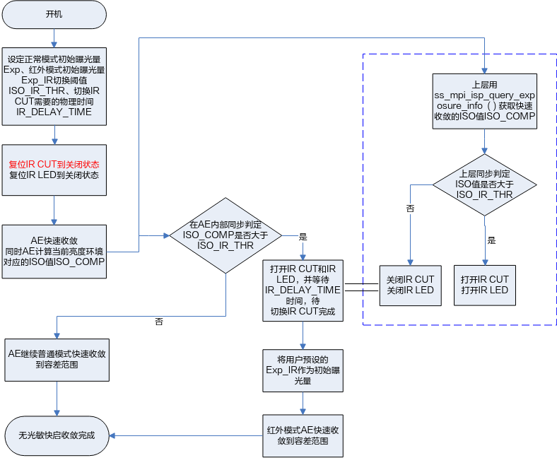

> **须知：** 
>-   在确定长时间处于低照度环境下，为了减少IR CUT的切换次数，可以不进行IR CUT复位操作，即省略如上红色字体部分操作。
>-   蓝框内的流程为上层应用操作。

# 附录<a name="ZH-CN_TOPIC_0000002471084982"></a>


## 注册函数的关系<a name="ZH-CN_TOPIC_0000002504084743"></a>

ss\_mpi\_isp\_awb\_lib\_reg\_callback和ss\_mpi\_isp\_awb\_lib\_reg\_callback这两个接口是ISP firmware库提供的钩子函数，用于开发3A算法库时实现注册动作。例如SDK 提供的3A算法库的ss\_mpi\_ae\_register和ss\_mpi\_awb\_register接口，在实现时调用了相应的钩子函数，所以调用ss\_mpi\_ae\_register能实现AE算法库向ISP firmware库注册。

同样的，3A算法库同样也提供了钩子函数，用于Sensor库实现向3A算法库注册的动作。例如ss\_mpi\_ae\_sensor\_reg\_callback和ss\_mpi\_awb\_sensor\_reg\_callback，在xxx\_cmos.c中可以看到调用了这些钩子函数的函数sensor\_register\_callback。用户在开发3A算法库时，也可以通过提供钩子函数的方式，实现Sensor库向3A算法库的注册。

当然，ISP firmware库也提供了钩子函数，用于Sensor库实现向ISP firmware库注册的动作。例如ss\_mpi\_isp\_sensor\_reg\_callback，在xxx\_cmos.c中可以看到调用了该钩子函数的函数sensor\_register\_callback。

所以，当用户调用ss\_mpi\_ae\_register、ss\_mpi\_awb\_register和sensor\_register\_callback就完成了3A算法库向ISP firmware库注册、Sensor库向3A算法库和ISP firmware库注册。

> **说明：** 
>用户开发3A算法库时，请自行实现ss\_mpi\_axx\_register接口。同时也请自行实现ss\_mpi\_axx\_sensor\_reg\_callback钩子函数，并在sensor\_register\_callback中增加调用该钩子函数的代码，相关代码可以参考ISP firmware库的开源代码。

## 扩展性的设计考虑<a name="ZH-CN_TOPIC_0000002503965097"></a>

在代码中有ot\_vi\_pipe、ot\_isp\_3a\_alg\_lib、ot\_sensor\_id这样一些概念，这些概念是出于架构扩展性的考虑。

-   ot\_vi\_pipe主要考虑的是支持多个ISP单元的情形。无论是多个ISP硬件单元，或是一个ISP硬件单元分时复用，从软件意义上讲，需要预留出扩展性。
-   ot\_isp\_3a\_alg\_lib主要考虑的是支持多个算法库，并动态切换的情形。例如用户实现了一套AE算法代码，但注册两个库，分别用于正常场景和抓拍场景，那么这时候需要用结构体中的handle来进行区分。例如用户实现了一套AWB算法代码，同时又想在某些场景下使用AWB算法库，那么这时候可以用结构体中的lib\_name进行区分。当用户注册多个AE库，或AWB库时，ISP firmware将会全部对它们进行初始化，但是在运行时，仅会调用有效的库，设置有效库的接口是ss\_mpi\_isp\_set\_bind\_attr，通过此接口可以快速切换运算的库。
-   ot\_sensor\_id仅起一个校验作用，确认注册给ISP firmware库和3A算法库的是同一款sensor。

这些概念仅是设计时预留的冗余，如果完全不需要这些概念，可以在开发时去掉这些概念。

## 3A架构的设计思路<a name="ZH-CN_TOPIC_0000002470925070"></a>

设计思路基本是这样，ISP firmware初始化并销毁各个算法单元；在运行时，提供前一帧的统计信息，并根据返回值配置寄存器，其他内容，均由用户开发。所以当用户替换自己的3A算法后，当前的AE/AWB的MPI不可复用，cmos.c中的AE/AWB相关的内容不可复用，对于AE的权重配置和AWB的找白点配置的内容不可复用，这几个配置理论上是由3A算法配置，而不是从ISP firmware获取，ISP firmware中仅有简单的初始化值。

3A算法并不需要显式地去配置ISP寄存器，只需将需要配置的ISP寄存器值写到ot\_isp\_ae\_result和ot\_isp\_awb\_result结构体中即可；也不需要显式地去读取ISP寄存器，只需从ot\_isp\_ae\_info和ot\_isp\_awb\_info结构体中读取即可。

## 外部寄存器的说明<a name="ZH-CN_TOPIC_0000002503964861"></a>

在_录像机_的应用中，通常除了业务主程序进程外，板端还会有另外的进程去支持PC端的工具来调节图像质量。ISP的各个算法的许多状态、参数均驻留于全局变量中，不足以支持多进程的访问，所以引入外部寄存器的概念，用以支持多进程的业务场景。用户通过PC端工具与板端进程通信，调用SDK提供的MPI，实际是改变外部寄存器中的内容，从而改变业务主程序中的ISP的各个算法的状态和参数。

外部寄存器还能与实际的硬件寄存器通过统一的接口读写，形式上与实际的硬件寄存器无差别。

用户如果使用外部寄存器的话，有这些已封装好的接口可以使用，当然用户也可以有其他方案实现多进程的支持。外部寄存器的地址空间是自定义的，只要不冲突即可。详细请参考开源代码，接口定义在isp\_vreg.h文件中。

## 工频闪类型自适应Sample用例处理流程<a name="ZH-CN_TOPIC_0000002471084888"></a>

**图 1**  工频闪类型自适应Sample用例处理流程<a name="fig10238430979"></a>  
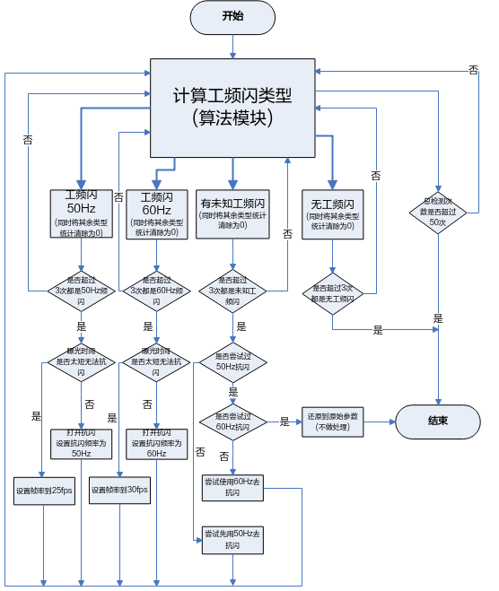

-   以上为工频闪类型自适应Sample用例的处理流程（calcflicker sample用例0）。此用例使用多次检测的结果进行确认后自动适配相应的抗闪参数。此用例作为使用Auto Flicker Type Detection（自动工频闪类型检测）接口进行自适应抗闪的参考。
-   检测结果为OT\_ISP\_FLICKER\_TYPE\_UNKNOW（有未知类型的工频闪）的原因有几种情况：

1.  Camera摇晃导致检测不稳定。
2.  图像中存在大面积的运动物体。
3.  环境光源为同时存在50Hz和60Hz的混合光源。
4.  环境光源为既不是50Hz也不是60Hz频率的非通用频率光源。以上这几种情况可根据实际情况灵活处理。

# 缩略语<a name="ZH-CN_TOPIC_0000002503965095"></a>

<a name="table42492mcpsimp"></a>
<table><tbody><tr id="row42502mcpsimp"><td class="cellrowborder" valign="top" width="30%"><p id="p42504mcpsimp"><a name="p42504mcpsimp"></a><a name="p42504mcpsimp"></a><strong id="b42505mcpsimp"><a name="b42505mcpsimp"></a><a name="b42505mcpsimp"></a>3A</strong></p>
</td>
<td class="cellrowborder" valign="top" width="70%"><p id="p42507mcpsimp"><a name="p42507mcpsimp"></a><a name="p42507mcpsimp"></a>AE, AWB and AF</p>
</td>
</tr>
<tr id="row42508mcpsimp"><td class="cellrowborder" colspan="2" valign="top"><p id="p42510mcpsimp"><a name="p42510mcpsimp"></a><a name="p42510mcpsimp"></a><strong id="b42511mcpsimp"><a name="b42511mcpsimp"></a><a name="b42511mcpsimp"></a>A</strong></p>
</td>
</tr>
<tr id="row42513mcpsimp"><td class="cellrowborder" valign="top" width="30%"><p id="p42515mcpsimp"><a name="p42515mcpsimp"></a><a name="p42515mcpsimp"></a>ACM</p>
</td>
<td class="cellrowborder" valign="top" width="70%"><p id="p42517mcpsimp"><a name="p42517mcpsimp"></a><a name="p42517mcpsimp"></a>auto color management</p>
</td>
</tr>
<tr id="row42518mcpsimp"><td class="cellrowborder" valign="top" width="30%"><p id="p42520mcpsimp"><a name="p42520mcpsimp"></a><a name="p42520mcpsimp"></a>ACS</p>
</td>
<td class="cellrowborder" valign="top" width="70%"><p id="p42522mcpsimp"><a name="p42522mcpsimp"></a><a name="p42522mcpsimp"></a>auto color shading</p>
</td>
</tr>
<tr id="row42523mcpsimp"><td class="cellrowborder" valign="top" width="30%"><p id="p42525mcpsimp"><a name="p42525mcpsimp"></a><a name="p42525mcpsimp"></a>AE</p>
</td>
<td class="cellrowborder" valign="top" width="70%"><p id="p42527mcpsimp"><a name="p42527mcpsimp"></a><a name="p42527mcpsimp"></a>auto exposure</p>
</td>
</tr>
<tr id="row42528mcpsimp"><td class="cellrowborder" valign="top" width="30%"><p id="p42530mcpsimp"><a name="p42530mcpsimp"></a><a name="p42530mcpsimp"></a>AEB</p>
</td>
<td class="cellrowborder" valign="top" width="70%"><p id="p42532mcpsimp"><a name="p42532mcpsimp"></a><a name="p42532mcpsimp"></a>automatic exposure bracketing</p>
</td>
</tr>
<tr id="row42533mcpsimp"><td class="cellrowborder" valign="top" width="30%"><p id="p42535mcpsimp"><a name="p42535mcpsimp"></a><a name="p42535mcpsimp"></a>AF</p>
</td>
<td class="cellrowborder" valign="top" width="70%"><p id="p42537mcpsimp"><a name="p42537mcpsimp"></a><a name="p42537mcpsimp"></a>auto focus</p>
</td>
</tr>
<tr id="row42538mcpsimp"><td class="cellrowborder" valign="top" width="30%"><p id="p42540mcpsimp"><a name="p42540mcpsimp"></a><a name="p42540mcpsimp"></a>AG</p>
</td>
<td class="cellrowborder" valign="top" width="70%"><p id="p42542mcpsimp"><a name="p42542mcpsimp"></a><a name="p42542mcpsimp"></a>analog gain</p>
</td>
</tr>
<tr id="row42543mcpsimp"><td class="cellrowborder" valign="top" width="30%"><p id="p42545mcpsimp"><a name="p42545mcpsimp"></a><a name="p42545mcpsimp"></a>AGC</p>
</td>
<td class="cellrowborder" valign="top" width="70%"><p id="p42547mcpsimp"><a name="p42547mcpsimp"></a><a name="p42547mcpsimp"></a>auto gain control</p>
</td>
</tr>
<tr id="row42548mcpsimp"><td class="cellrowborder" valign="top" width="30%"><p id="p42550mcpsimp"><a name="p42550mcpsimp"></a><a name="p42550mcpsimp"></a>API</p>
</td>
<td class="cellrowborder" valign="top" width="70%"><p id="p42552mcpsimp"><a name="p42552mcpsimp"></a><a name="p42552mcpsimp"></a>application programming interface</p>
</td>
</tr>
<tr id="row42553mcpsimp"><td class="cellrowborder" valign="top" width="30%"><p id="p42555mcpsimp"><a name="p42555mcpsimp"></a><a name="p42555mcpsimp"></a>AWB</p>
</td>
<td class="cellrowborder" valign="top" width="70%"><p id="p42557mcpsimp"><a name="p42557mcpsimp"></a><a name="p42557mcpsimp"></a>auto WB correction</p>
</td>
</tr>
<tr id="row42561mcpsimp"><td class="cellrowborder" colspan="2" valign="top"><p id="p42563mcpsimp"><a name="p42563mcpsimp"></a><a name="p42563mcpsimp"></a><strong id="b42564mcpsimp"><a name="b42564mcpsimp"></a><a name="b42564mcpsimp"></a>C</strong></p>
</td>
</tr>
<tr id="row42566mcpsimp"><td class="cellrowborder" valign="top" width="30%"><p id="p42568mcpsimp"><a name="p42568mcpsimp"></a><a name="p42568mcpsimp"></a>CAC</p>
</td>
<td class="cellrowborder" valign="top" width="70%"><p id="p42570mcpsimp"><a name="p42570mcpsimp"></a><a name="p42570mcpsimp"></a>chromatic aberration correction</p>
</td>
</tr>
<tr id="row42571mcpsimp"><td class="cellrowborder" valign="top" width="30%"><p id="p42573mcpsimp"><a name="p42573mcpsimp"></a><a name="p42573mcpsimp"></a>CA</p>
</td>
<td class="cellrowborder" valign="top" width="70%"><p id="p42575mcpsimp"><a name="p42575mcpsimp"></a><a name="p42575mcpsimp"></a>chroma adjust</p>
</td>
</tr>
<tr id="row42576mcpsimp"><td class="cellrowborder" valign="top" width="30%"><p id="p42578mcpsimp"><a name="p42578mcpsimp"></a><a name="p42578mcpsimp"></a>CSC</p>
</td>
<td class="cellrowborder" valign="top" width="70%"><p id="p42580mcpsimp"><a name="p42580mcpsimp"></a><a name="p42580mcpsimp"></a>color space conversion</p>
</td>
</tr>
<tr id="row42581mcpsimp"><td class="cellrowborder" valign="top" width="30%"><p id="p42583mcpsimp"><a name="p42583mcpsimp"></a><a name="p42583mcpsimp"></a>CCM</p>
</td>
<td class="cellrowborder" valign="top" width="70%"><p id="p42585mcpsimp"><a name="p42585mcpsimp"></a><a name="p42585mcpsimp"></a>color correction matrix</p>
</td>
</tr>
<tr id="row42586mcpsimp"><td class="cellrowborder" valign="top" width="30%"><p id="p42588mcpsimp"><a name="p42588mcpsimp"></a><a name="p42588mcpsimp"></a>CPU</p>
</td>
<td class="cellrowborder" valign="top" width="70%"><p id="p42590mcpsimp"><a name="p42590mcpsimp"></a><a name="p42590mcpsimp"></a>central processing unit</p>
</td>
</tr>
<tr id="row42594mcpsimp"><td class="cellrowborder" colspan="2" valign="top"><p id="p42596mcpsimp"><a name="p42596mcpsimp"></a><a name="p42596mcpsimp"></a><strong id="b42597mcpsimp"><a name="b42597mcpsimp"></a><a name="b42597mcpsimp"></a>D</strong></p>
</td>
</tr>
<tr id="row42599mcpsimp"><td class="cellrowborder" valign="top" width="30%"><p id="p42601mcpsimp"><a name="p42601mcpsimp"></a><a name="p42601mcpsimp"></a>DG</p>
</td>
<td class="cellrowborder" valign="top" width="70%"><p id="p42603mcpsimp"><a name="p42603mcpsimp"></a><a name="p42603mcpsimp"></a>digital gain</p>
</td>
</tr>
<tr id="row42604mcpsimp"><td class="cellrowborder" valign="top" width="30%"><p id="p42606mcpsimp"><a name="p42606mcpsimp"></a><a name="p42606mcpsimp"></a>DPC</p>
</td>
<td class="cellrowborder" valign="top" width="70%"><p id="p42608mcpsimp"><a name="p42608mcpsimp"></a><a name="p42608mcpsimp"></a>defect pixel correction</p>
</td>
</tr>
<tr id="row42609mcpsimp"><td class="cellrowborder" valign="top" width="30%"><p id="p42611mcpsimp"><a name="p42611mcpsimp"></a><a name="p42611mcpsimp"></a>DRC</p>
</td>
<td class="cellrowborder" valign="top" width="70%"><p id="p42613mcpsimp"><a name="p42613mcpsimp"></a><a name="p42613mcpsimp"></a>dynamic range compression</p>
</td>
</tr>
<tr id="row42617mcpsimp"><td class="cellrowborder" colspan="2" valign="top"><p id="p42619mcpsimp"><a name="p42619mcpsimp"></a><a name="p42619mcpsimp"></a><strong id="b42620mcpsimp"><a name="b42620mcpsimp"></a><a name="b42620mcpsimp"></a>F</strong></p>
</td>
</tr>
<tr id="row42622mcpsimp"><td class="cellrowborder" valign="top" width="30%"><p id="p42624mcpsimp"><a name="p42624mcpsimp"></a><a name="p42624mcpsimp"></a>FPN</p>
</td>
<td class="cellrowborder" valign="top" width="70%"><p id="p42626mcpsimp"><a name="p42626mcpsimp"></a><a name="p42626mcpsimp"></a>fixed pattern noise</p>
</td>
</tr>
<tr id="row42627mcpsimp"><td class="cellrowborder" valign="top" width="30%"><p id="p42629mcpsimp"><a name="p42629mcpsimp"></a><a name="p42629mcpsimp"></a>FW</p>
</td>
<td class="cellrowborder" valign="top" width="70%"><p id="p42631mcpsimp"><a name="p42631mcpsimp"></a><a name="p42631mcpsimp"></a>firmware</p>
</td>
</tr>
<tr id="row42635mcpsimp"><td class="cellrowborder" colspan="2" valign="top"><p id="p42637mcpsimp"><a name="p42637mcpsimp"></a><a name="p42637mcpsimp"></a><strong id="b42638mcpsimp"><a name="b42638mcpsimp"></a><a name="b42638mcpsimp"></a>H</strong></p>
</td>
</tr>
<tr id="row42640mcpsimp"><td class="cellrowborder" valign="top" width="30%"><p id="p42642mcpsimp"><a name="p42642mcpsimp"></a><a name="p42642mcpsimp"></a>HDR</p>
</td>
<td class="cellrowborder" valign="top" width="70%"><p id="p42644mcpsimp"><a name="p42644mcpsimp"></a><a name="p42644mcpsimp"></a>high dynamic range</p>
</td>
</tr>
<tr id="row42648mcpsimp"><td class="cellrowborder" colspan="2" valign="top"><p id="p42650mcpsimp"><a name="p42650mcpsimp"></a><a name="p42650mcpsimp"></a><strong id="b42651mcpsimp"><a name="b42651mcpsimp"></a><a name="b42651mcpsimp"></a>I</strong></p>
</td>
</tr>
<tr id="row42653mcpsimp"><td class="cellrowborder" valign="top" width="30%"><p id="p42655mcpsimp"><a name="p42655mcpsimp"></a><a name="p42655mcpsimp"></a>IMP</p>
</td>
<td class="cellrowborder" valign="top" width="70%"><p id="p42657mcpsimp"><a name="p42657mcpsimp"></a><a name="p42657mcpsimp"></a>image processing</p>
</td>
</tr>
<tr id="row42658mcpsimp"><td class="cellrowborder" valign="top" width="30%"><p id="p42660mcpsimp"><a name="p42660mcpsimp"></a><a name="p42660mcpsimp"></a>ISO</p>
</td>
<td class="cellrowborder" valign="top" width="70%"><p id="p42662mcpsimp"><a name="p42662mcpsimp"></a><a name="p42662mcpsimp"></a>ISO standard 12232:2006. A measure of photograpotc sensitivity to light</p>
</td>
</tr>
<tr id="row42663mcpsimp"><td class="cellrowborder" valign="top" width="30%"><p id="p42665mcpsimp"><a name="p42665mcpsimp"></a><a name="p42665mcpsimp"></a>ISP</p>
</td>
<td class="cellrowborder" valign="top" width="70%"><p id="p42667mcpsimp"><a name="p42667mcpsimp"></a><a name="p42667mcpsimp"></a>image signal processor</p>
</td>
</tr>
<tr id="row42671mcpsimp"><td class="cellrowborder" colspan="2" valign="top"><p id="p42673mcpsimp"><a name="p42673mcpsimp"></a><a name="p42673mcpsimp"></a><strong id="b42674mcpsimp"><a name="b42674mcpsimp"></a><a name="b42674mcpsimp"></a>L</strong></p>
</td>
</tr>
<tr id="row42676mcpsimp"><td class="cellrowborder" valign="top" width="30%"><p id="p42678mcpsimp"><a name="p42678mcpsimp"></a><a name="p42678mcpsimp"></a>LUT</p>
</td>
<td class="cellrowborder" valign="top" width="70%"><p id="p42680mcpsimp"><a name="p42680mcpsimp"></a><a name="p42680mcpsimp"></a>lookup table</p>
</td>
</tr>
<tr id="row42684mcpsimp"><td class="cellrowborder" colspan="2" valign="top"><p id="p42686mcpsimp"><a name="p42686mcpsimp"></a><a name="p42686mcpsimp"></a><strong id="b42687mcpsimp"><a name="b42687mcpsimp"></a><a name="b42687mcpsimp"></a>N</strong></p>
</td>
</tr>
<tr id="row42689mcpsimp"><td class="cellrowborder" valign="top" width="30%"><p id="p42691mcpsimp"><a name="p42691mcpsimp"></a><a name="p42691mcpsimp"></a>NP</p>
</td>
<td class="cellrowborder" valign="top" width="70%"><p id="p42693mcpsimp"><a name="p42693mcpsimp"></a><a name="p42693mcpsimp"></a>noise profile</p>
</td>
</tr>
<tr id="row42694mcpsimp"><td class="cellrowborder" valign="top" width="30%"><p id="p42696mcpsimp"><a name="p42696mcpsimp"></a><a name="p42696mcpsimp"></a>NR</p>
</td>
<td class="cellrowborder" valign="top" width="70%"><p id="p42698mcpsimp"><a name="p42698mcpsimp"></a><a name="p42698mcpsimp"></a>noise reduction</p>
</td>
</tr>
<tr id="row42702mcpsimp"><td class="cellrowborder" colspan="2" valign="top"><p id="p42704mcpsimp"><a name="p42704mcpsimp"></a><a name="p42704mcpsimp"></a><strong id="b42705mcpsimp"><a name="b42705mcpsimp"></a><a name="b42705mcpsimp"></a>W</strong></p>
</td>
</tr>
<tr id="row42707mcpsimp"><td class="cellrowborder" valign="top" width="30%"><p id="p42709mcpsimp"><a name="p42709mcpsimp"></a><a name="p42709mcpsimp"></a>WB</p>
</td>
<td class="cellrowborder" valign="top" width="70%"><p id="p42711mcpsimp"><a name="p42711mcpsimp"></a><a name="p42711mcpsimp"></a>white balance</p>
</td>
</tr>
<tr id="row42712mcpsimp"><td class="cellrowborder" valign="top" width="30%"><p id="p42714mcpsimp"><a name="p42714mcpsimp"></a><a name="p42714mcpsimp"></a>WDR</p>
</td>
<td class="cellrowborder" valign="top" width="70%"><p id="p42716mcpsimp"><a name="p42716mcpsimp"></a><a name="p42716mcpsimp"></a>wide dynamic range</p>
</td>
</tr>
<tr id="row42720mcpsimp"><td class="cellrowborder" colspan="2" valign="top"><p id="p42722mcpsimp"><a name="p42722mcpsimp"></a><a name="p42722mcpsimp"></a><strong id="b42723mcpsimp"><a name="b42723mcpsimp"></a><a name="b42723mcpsimp"></a>Y</strong></p>
</td>
</tr>
<tr id="row42725mcpsimp"><td class="cellrowborder" valign="top" width="30%"><p id="p42727mcpsimp"><a name="p42727mcpsimp"></a><a name="p42727mcpsimp"></a>YCbCr</p>
</td>
<td class="cellrowborder" valign="top" width="70%"><p id="p42729mcpsimp"><a name="p42729mcpsimp"></a><a name="p42729mcpsimp"></a>Method of encoding RGB colorspace according to the ITU-R BT.601 or ITU- R BT 709 standards</p>
</td>
</tr>
<tr id="row42730mcpsimp"><td class="cellrowborder" valign="top" width="30%"><p id="p42732mcpsimp"><a name="p42732mcpsimp"></a><a name="p42732mcpsimp"></a>YUV</p>
</td>
<td class="cellrowborder" valign="top" width="70%"><p id="p42734mcpsimp"><a name="p42734mcpsimp"></a><a name="p42734mcpsimp"></a>A method of encoding RGB colorspace in practice equivalent to YCbCr</p>
</td>
</tr>
</tbody>
</table>

