# 前言

**概述**

本文为AWB，CCM，CLUT算法调试、问题定位而写，详细介绍了标定、参数调优等使用说明，目的是为用户在开发过程中遇到的问题提供解决办法和帮助。

> **说明：** 
>本文以SS928V100描述为例，未有特殊说明，SS927V100与SS928V100内容一致。

**产品版本**

与本文档相对应的产品版本如下。

<table><thead align="left"><tr id="row314mcpsimp"><th class="cellrowborder" valign="top" width="32%" id="mcps1.1.3.1.1">
产品名称

</th>
<th class="cellrowborder" valign="top" width="68%" id="mcps1.1.3.1.2">
产品版本

</th>
</tr>
</thead>
<tbody><tr id="row320mcpsimp"><td class="cellrowborder" valign="top" width="32%" headers="mcps1.1.3.1.1 ">
SS928

</td>
<td class="cellrowborder" valign="top" width="68%" headers="mcps1.1.3.1.2 ">
V100

</td>
</tr>
<tr id="row650476102011"><td class="cellrowborder" valign="top" width="32%" headers="mcps1.1.3.1.1 ">
SS927

</td>
<td class="cellrowborder" valign="top" width="68%" headers="mcps1.1.3.1.2 ">
V100

</td>
</tr>
</tbody>
</table>

**读者对象**

本文档（本指南）主要适用于以下工程师：

-   技术支持工程师
-   软件开发工程师

**符号约定**

在本文中可能出现下列标志，它们所代表的含义如下。

<table><thead align="left"><tr id="row339mcpsimp"><th class="cellrowborder" valign="top" width="23%" id="mcps1.1.3.1.1">
符号

</th>
<th class="cellrowborder" valign="top" width="77%" id="mcps1.1.3.1.2">
说明

</th>
</tr>
</thead>
<tbody><tr id="row345mcpsimp"><td class="cellrowborder" valign="top" width="23%" headers="mcps1.1.3.1.1 ">

</td>
<td class="cellrowborder" valign="top" width="77%" headers="mcps1.1.3.1.2 ">
表示如不避免则将会导致死亡或严重伤害的具有高等级风险的危害。

</td>
</tr>
<tr id="row350mcpsimp"><td class="cellrowborder" valign="top" width="23%" headers="mcps1.1.3.1.1 ">

</td>
<td class="cellrowborder" valign="top" width="77%" headers="mcps1.1.3.1.2 ">
表示如不避免则可能导致死亡或严重伤害的具有中等级风险的危害。

</td>
</tr>
<tr id="row355mcpsimp"><td class="cellrowborder" valign="top" width="23%" headers="mcps1.1.3.1.1 ">

</td>
<td class="cellrowborder" valign="top" width="77%" headers="mcps1.1.3.1.2 ">
表示如不避免则可能导致轻微或中度伤害的具有低等级风险的危害。

</td>
</tr>
<tr id="row360mcpsimp"><td class="cellrowborder" valign="top" width="23%" headers="mcps1.1.3.1.1 ">

</td>
<td class="cellrowborder" valign="top" width="77%" headers="mcps1.1.3.1.2 ">
用于传递设备或环境安全警示信息。如不避免则可能会导致设备损坏、数据丢失、设备性能降低或其它不可预知的结果。

“须知”不涉及人身伤害。

</td>
</tr>
<tr id="row366mcpsimp"><td class="cellrowborder" valign="top" width="23%" headers="mcps1.1.3.1.1 ">

</td>
<td class="cellrowborder" valign="top" width="77%" headers="mcps1.1.3.1.2 ">
对正文中重点信息的补充说明。

“说明”不是安全警示信息，不涉及人身、设备及环境伤害信息。

</td>
</tr>
</tbody>
</table>

**修订记录**

修订记录累积了每次文档更新的说明。最新版本的文档包含以前所有文档版本的更新内容。

<table><thead align="left"><tr id="row264516207203"><th class="cellrowborder" valign="top" width="20.72%" id="mcps1.1.4.1.1">
<strong id="b8645172022010">文档版本</strong>

</th>
<th class="cellrowborder" valign="top" width="26.119999999999997%" id="mcps1.1.4.1.2">
<strong id="b1464512200200">发布日期</strong>

</th>
<th class="cellrowborder" valign="top" width="53.16%" id="mcps1.1.4.1.3">
<strong id="b156451420152010">修改说明</strong>

</th>
</tr>
</thead>
<tbody><tr id="row56451520182017"><td class="cellrowborder" valign="top" width="20.72%" headers="mcps1.1.4.1.1 ">
00B01

</td>
<td class="cellrowborder" valign="top" width="26.119999999999997%" headers="mcps1.1.4.1.2 ">
2025-09-15

</td>
<td class="cellrowborder" valign="top" width="53.16%" headers="mcps1.1.4.1.3 ">
第1次临时版本发布。

</td>
</tr>
</tbody>
</table>

# 原理简介

## 色彩调试综述

ISP系统支持两种层次的调色方案。

第一种是基础调色方案。系统的颜色主要由AWB+CCM+GAMMA控制，颜色风格为整个色域内一致的风格，指的是由CCM的3x3矩阵将sensor的native色彩空间（设备相关的色彩）转换到sRGB标准定义的色彩空间（设备无关的色彩）。特点是Sensor的响应被线性扩展到目标空间，即各种颜色获得同样的线性扩展。颜色的呈现随着sensor的光谱响应特性的不同而变化。

**图 1**  基础调色流程图  

所有颜色的饱和度会随着CCM变大和变小，不同的色调之间可能发生一些冲突，即优先调节某些色调会导致相邻的色调无法调整到位。由于3x3矩阵的原因，暗处，中间亮度，高亮区域的颜色的调节是一致的，如果需要对三个亮度区域做不同的颜色调整，那么就不能满足需求。

第二种是高级调色方案。系统的颜色主要由AWB+CCM+CLUT+GAMMA+CA控制，颜色风格可以按需调节。

**图 2**  高级调色流程图  

使用高级调色方案可以调试出不同的颜色风格，比如对于饱和度高的颜色处理方法的不同可以产生不同的效果。

色域边缘的颜色向色域内映射的风格，指的是在CCM达到的颜色的基础上，将饱和度高的区域的颜色向色域内映射。特点是饱和度高的颜色的饱和度会降低，避免RGB中有值发生小于0或者大于1的现象。能将更多的高饱和颜色的变化保留下来，达到色域扩展的效果。适用于光谱响应比较好的sensor。这种调试目标会让饱和度中低的颜色在CCM的作用下得到很好的表现，优先保留饱和度中低的颜色层次。

**图 3**  色域边缘向内映射  
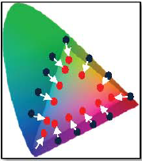

色域边缘的颜色向色域外映射的风格，指的是在CCM达到的颜色的基础上，将饱和度高的区域的颜色向色域外映射。特点是饱和度高的颜色的饱和度会增加，会更容易发生RGB中有值小于0或者大于1的现象。可以让颜色更鲜艳，突出画面中的主体。适用于光谱响应比较差的sensor，饱和度由CLUT补足，可以避免CCM的系数过大。这种调试目标会让饱和度中低的颜色在CCM的作用下不过于鲜艳，优先保留饱和度高的颜色层次。

**图 4**  色域边缘向外映射  
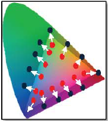

## AWB模块工作原理

AWB模块由硬件WB信息统计模块及Firmware AWB策略控制算法两部分组成。

WB统计模块计算Raw图像满足灰点条件的像素点的R, G, B三个颜色通道平均值。统计输出整幅图像的RGB均值和整幅图像分成M\*N区块的每个区块的RGB均值。

其中θ指示当前点是否灰点，其取值为0或1；是区块内灰点个数；R是像素的红色通道值，是R通道均值。

同理计算绿色、蓝色分量均值。

根据AWB统计模块提供的R、G、B三分量均值，计算G/R、G/B，得到AWB增益系数。FW算法会根据各个分块的统计信息，判断环境色温，计算最佳AWB系数。

**图 1**  AWB工作原理图  
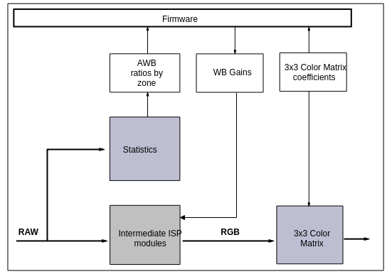

## CCM模块工作原理

sensor对光谱的响应，在RGB各分量上与人眼对光谱的响应通常是有偏差的，通常通过一个色彩校正矩阵校正光谱响应的交叉效应和响应强度，使前端捕获的图片与人眼视觉在色彩上保持一致。

CCM标定工具支持对24色卡进行3x3 Color Correction Matrix的预校正。支持至少三组，最多七组不同色温的CCM，在ISP运行时，FW根据当前的光照强度即ISO，调整饱和度系数。动态色温校正系数（基于标定的多组CCM插值）与饱和度调整系数一起，实现CCM（Color Correction Matrix）矩阵系数的动态调整。CCM矩阵如[图1](#fig11377163510281)所示。

**图 1**  CCM矩阵  

# AWB调试

## 统计模块调试

WB仅统计灰点的RGB三通道均值，准确地配置灰点条件，可提高FirmWare算法的准确度。

### 色差限制示意图

**图 1**  灰点色差限制图  
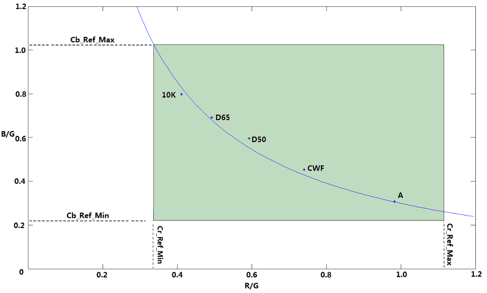

### 灰点条件参数说明及差异

**表 1**  Bayer域WB统计灰点条件参数

<table><thead align="left"><tr id="row424mcpsimp"><th class="cellrowborder" valign="top" width="20.792079207920793%" id="mcps1.2.4.1.1">
参数名称

</th>
<th class="cellrowborder" valign="top" width="42.57425742574258%" id="mcps1.2.4.1.2">
描述

</th>
<th class="cellrowborder" valign="top" width="36.633663366336634%" id="mcps1.2.4.1.3">
场景说明

</th>
</tr>
</thead>
<tbody><tr id="row432mcpsimp"><td class="cellrowborder" valign="top" width="20.792079207920793%" headers="mcps1.2.4.1.1 ">
white_level

</td>
<td class="cellrowborder" valign="top" width="42.57425742574258%" headers="mcps1.2.4.1.2 ">
灰点的亮度上限。

取值范围：[0x0, 0xFFFF]，默认值0xFFFF。存在解决方案差异，见<a href="#_Ref505764692">表2</a>。

</td>
<td class="cellrowborder" valign="top" width="36.633663366336634%" headers="mcps1.2.4.1.3 ">
sensor在接近饱和时，灰点的线性比例会被破坏，可适当减小该值。

</td>
</tr>
<tr id="row441mcpsimp"><td class="cellrowborder" valign="top" width="20.792079207920793%" headers="mcps1.2.4.1.1 ">
black_level

</td>
<td class="cellrowborder" valign="top" width="42.57425742574258%" headers="mcps1.2.4.1.2 ">
灰点的亮度下限。

取值范围：[0x0, 0xFFFF]，默认值0x0。

存在解决方案差异，见<a href="#_Ref505764692">表2</a>。

</td>
<td class="cellrowborder" valign="top" width="36.633663366336634%" headers="mcps1.2.4.1.3 ">
WDR模式下该门限应设置为统计模块输入Raw数据的最小值；

Linear模式下，可在统计模块输入Raw数据的最小值基础上加一个&lt;=0x10的Offset，保证AWB还原以亮区优先。

</td>
</tr>
<tr id="row452mcpsimp"><td class="cellrowborder" valign="top" width="20.792079207920793%" headers="mcps1.2.4.1.1 ">
cr_max

</td>
<td class="cellrowborder" valign="top" width="42.57425742574258%" headers="mcps1.2.4.1.2 ">
灰点红色色差R/G的最大值，8bit精度，取值范围：[0x0, 0xFFF]，默认值0x200（等价浮点2.0）。

</td>
<td class="cellrowborder" rowspan="4" valign="top" width="36.633663366336634%" headers="mcps1.2.4.1.3 ">
色差参数和sensor、光学器件强相关，建议用户对参数进行精调。

AWB Firmware将cr_max、cr_min、cb_max、cb_min四个参数和色温、ISO建立了联动，每个参数用户需要配置长度为16的数组。在标定部分说明怎样检查灰点条件配置是否合理。

</td>
</tr>
<tr id="row460mcpsimp"><td class="cellrowborder" valign="top" headers="mcps1.2.4.1.1 ">
cr_min

</td>
<td class="cellrowborder" valign="top" headers="mcps1.2.4.1.2 ">
灰点红色色差R/G的最小值，8bit精度，取值范围：[0x0, 0xFFF]，默认值0x80（等价浮点0.5）。

</td>
</tr>
<tr id="row465mcpsimp"><td class="cellrowborder" valign="top" headers="mcps1.2.4.1.1 ">
cb_max

</td>
<td class="cellrowborder" valign="top" headers="mcps1.2.4.1.2 ">
灰点蓝色色差B/G的最大值，8bit精度，取值范围：[0x0, 0xFFF]，默认值0x200（等价浮点2.0）。

</td>
</tr>
<tr id="row470mcpsimp"><td class="cellrowborder" valign="top" headers="mcps1.2.4.1.1 ">
cb_min

</td>
<td class="cellrowborder" valign="top" headers="mcps1.2.4.1.2 ">
灰点蓝色色差B/G的最小值，8bit精度，取值范围：[0x0, 0xFFF]，默认值0x80（等价浮点0.5）。

</td>
</tr>
</tbody>
</table>

**表 2**  Bayer域统计控制参数差异说明

<table><thead align="left"><tr id="row482mcpsimp"><th class="cellrowborder" valign="top" width="20.792079207920793%" id="mcps1.2.5.1.1">
解决方案

</th>
<th class="cellrowborder" valign="top" width="23.762376237623766%" id="mcps1.2.5.1.2">
统计输入格式

</th>
<th class="cellrowborder" valign="top" width="40.5940594059406%" id="mcps1.2.5.1.3">
描述

</th>
<th class="cellrowborder" valign="top" width="14.851485148514854%" id="mcps1.2.5.1.4">
备注

</th>
</tr>
</thead>
<tbody><tr id="row492mcpsimp"><td class="cellrowborder" valign="top" width="20.792079207920793%" headers="mcps1.2.5.1.1 ">
SS919V100/SS918V100/SS812V100/SS928V100

</td>
<td class="cellrowborder" valign="top" width="23.762376237623766%" headers="mcps1.2.5.1.2 ">
16bit，不带黑电平；WDR模式和Linear模式一致

</td>
<td class="cellrowborder" valign="top" width="40.5940594059406%" headers="mcps1.2.5.1.3 ">
不区分Linear模式和WDR模式：

<ul id="ul499mcpsimp"><li>black_level取值范围：[0x0, 0xFFFF]</li><li>white_level取值范围：[0x0, 0xFFFF]</li></ul>
</td>
<td class="cellrowborder" valign="top" width="14.851485148514854%" headers="mcps1.2.5.1.4 ">
-

</td>
</tr>
</tbody>
</table>

### 统计输出说明及差异

**表 1**  Bayer域统计结果说明

<table><thead align="left"><tr id="row512mcpsimp"><th class="cellrowborder" valign="top" width="23.23%" id="mcps1.2.4.1.1">
参数名称

</th>
<th class="cellrowborder" valign="top" width="53.54%" id="mcps1.2.4.1.2">
描述

</th>
<th class="cellrowborder" valign="top" width="23.23%" id="mcps1.2.4.1.3">
场景说明

</th>
</tr>
</thead>
<tbody><tr id="row520mcpsimp"><td class="cellrowborder" valign="top" width="23.23%" headers="mcps1.2.4.1.1 ">
global_r

</td>
<td class="cellrowborder" valign="top" width="53.54%" headers="mcps1.2.4.1.2 ">
全局统计信息中灰点的R分量平均值。

取值范围：[0, 0xFFFF]

</td>
<td class="cellrowborder" valign="top" width="23.23%" headers="mcps1.2.4.1.3 ">
RGB三分量均值的数据位宽存在解决方案差异，见<a href="#_Ref505764721">表2</a>。

</td>
</tr>
<tr id="row529mcpsimp"><td class="cellrowborder" valign="top" width="23.23%" headers="mcps1.2.4.1.1 ">
global_g

</td>
<td class="cellrowborder" valign="top" width="53.54%" headers="mcps1.2.4.1.2 ">
全局统计信息中灰点的G分量平均值。

取值范围：[0, 0xFFFF]

</td>
<td class="cellrowborder" valign="top" width="23.23%" headers="mcps1.2.4.1.3 ">
-

</td>
</tr>
<tr id="row537mcpsimp"><td class="cellrowborder" valign="top" width="23.23%" headers="mcps1.2.4.1.1 ">
global_b

</td>
<td class="cellrowborder" valign="top" width="53.54%" headers="mcps1.2.4.1.2 ">
全局统计信息中灰点的B分量平均值。

取值范围：[0, 0xFFFF]

</td>
<td class="cellrowborder" valign="top" width="23.23%" headers="mcps1.2.4.1.3 ">
-

</td>
</tr>
<tr id="row545mcpsimp"><td class="cellrowborder" valign="top" width="23.23%" headers="mcps1.2.4.1.1 ">
count_all

</td>
<td class="cellrowborder" valign="top" width="53.54%" headers="mcps1.2.4.1.2 ">
全局统计信息中灰点的个数。

已做归一化，取值范围：[0, 0xFFFF]

</td>
<td class="cellrowborder" valign="top" width="23.23%" headers="mcps1.2.4.1.3 ">
-

</td>
</tr>
<tr id="row553mcpsimp"><td class="cellrowborder" valign="top" width="23.23%" headers="mcps1.2.4.1.1 ">
zone_avg_r[]

</td>
<td class="cellrowborder" valign="top" width="53.54%" headers="mcps1.2.4.1.2 ">
分区间统计信息中灰点的R分量平均值。

取值范围：[0, 0xFFFF]

</td>
<td class="cellrowborder" valign="top" width="23.23%" headers="mcps1.2.4.1.3 ">
-

</td>
</tr>
<tr id="row561mcpsimp"><td class="cellrowborder" valign="top" width="23.23%" headers="mcps1.2.4.1.1 ">
zone_avg_g[]

</td>
<td class="cellrowborder" valign="top" width="53.54%" headers="mcps1.2.4.1.2 ">
分区间统计信息中灰点的G分量平均值。

取值范围：[0, 0xFFFF]

</td>
<td class="cellrowborder" valign="top" width="23.23%" headers="mcps1.2.4.1.3 ">
-

</td>
</tr>
<tr id="row569mcpsimp"><td class="cellrowborder" valign="top" width="23.23%" headers="mcps1.2.4.1.1 ">
zone_avg_b[]

</td>
<td class="cellrowborder" valign="top" width="53.54%" headers="mcps1.2.4.1.2 ">
分区间统计信息中灰点的B分量平均值。

取值范围：[0, 0xFFFF]

</td>
<td class="cellrowborder" valign="top" width="23.23%" headers="mcps1.2.4.1.3 ">
-

</td>
</tr>
<tr id="row577mcpsimp"><td class="cellrowborder" valign="top" width="23.23%" headers="mcps1.2.4.1.1 ">
zone_count_all[]

</td>
<td class="cellrowborder" valign="top" width="53.54%" headers="mcps1.2.4.1.2 ">
分区间统计信息中灰点的个数。

已做归一化，取值范围：[0, 0xFFFF]

</td>
<td class="cellrowborder" valign="top" width="23.23%" headers="mcps1.2.4.1.3 ">
-

</td>
</tr>
</tbody>
</table>

> **须知：** 
>像素个数做归一化是为了消除分辨率差异对灰点个数的影响。
>归一化公式：CountAll = \(Count of Gray Pixels << 16\) / \(Count of All Pixels\).

**表 2**  Bayer域统计结果差异说明

<table><thead align="left"><tr id="row593mcpsimp"><th class="cellrowborder" valign="top" width="28.000000000000004%" id="mcps1.2.4.1.1">
解决方案

</th>
<th class="cellrowborder" valign="top" width="51%" id="mcps1.2.4.1.2">
统计输出格式描述

</th>
<th class="cellrowborder" valign="top" width="21%" id="mcps1.2.4.1.3">
备注

</th>
</tr>
</thead>
<tbody><tr id="row601mcpsimp"><td class="cellrowborder" valign="top" width="28.000000000000004%" headers="mcps1.2.4.1.1 ">
SS919V100/SS918V100/SS812V100/SS928V100

</td>
<td class="cellrowborder" valign="top" width="51%" headers="mcps1.2.4.1.2 ">
统计输出RGB均值数据位宽是16bit，取值范围：[0, 0xFFFF]

其中16bit整数位，无小数位。

Linear模式和WDR模式无差异，RGain=G/R。

</td>
<td class="cellrowborder" valign="top" width="21%" headers="mcps1.2.4.1.3 ">
-

</td>
</tr>
</tbody>
</table>

### 统计自适应

#### 统计参数自动调整的原因（AWB）

随着环境照度的降低，sensor和isp的增益增大，sensor输出Raw数据的噪声增大。同一光源，白色块的色差分布变化如[图1](#_Ref505767834)所示。

**图 1**  5000K白色块Cr在不同照度的分布图  
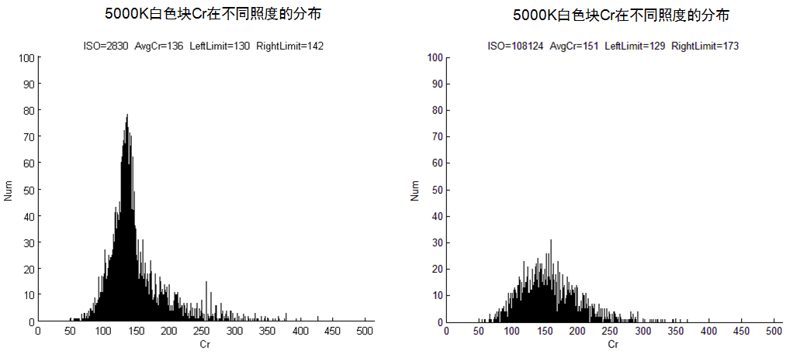

因此需要建立统计参数和ISO的互动，以保证尽量多的灰色点参与统计。

## AWB标定

### AWB标定参数说明

确定sensor和滤光片后，用户需要先进行AWB标定，以保证AWB算法正常工作。标定原理是：提取sensor在多个标准光源下的灰点特征\(R/G，B/G\)，计算普朗克拟合曲线和色温拟合曲线。

**表 1**  AWB标定参数

<table><thead align="left"><tr id="row627mcpsimp"><th class="cellrowborder" valign="top" width="21%" id="mcps1.2.4.1.1">
参数

</th>
<th class="cellrowborder" valign="top" width="43%" id="mcps1.2.4.1.2">
描述

</th>
<th class="cellrowborder" valign="top" width="36%" id="mcps1.2.4.1.3">
场景说明

</th>
</tr>
</thead>
<tbody><tr id="row635mcpsimp"><td class="cellrowborder" valign="top" width="21%" headers="mcps1.2.4.1.1 ">
ref_color_temp

</td>
<td class="cellrowborder" valign="top" width="43%" headers="mcps1.2.4.1.2 ">
静态白平衡系数标定的环境色温，AWB标定3个KI光源的中间光源色温，单位Kelvin。

取值范围：[0-0xFFFF]

</td>
<td class="cellrowborder" valign="top" width="36%" headers="mcps1.2.4.1.3 ">
推荐在Macbeth D50标准光源环境或室外5000k-5500K光源捕获24色卡Raw数据进行标定。

</td>
</tr>
<tr id="row643mcpsimp"><td class="cellrowborder" valign="top" width="21%" headers="mcps1.2.4.1.1 ">
static_wb[4]

</td>
<td class="cellrowborder" valign="top" width="43%" headers="mcps1.2.4.1.2 ">
静态白平衡系数，由AWB标定工具给出。

取值范围：[0-0xFFF]

</td>
<td class="cellrowborder" valign="top" width="36%" headers="mcps1.2.4.1.3 ">
8bit定点数，G通道系数固定为0x100(浮点1.0)。

</td>
</tr>
<tr id="row651mcpsimp"><td class="cellrowborder" valign="top" width="21%" headers="mcps1.2.4.1.1 ">
curve_para[0-2]

</td>
<td class="cellrowborder" valign="top" width="43%" headers="mcps1.2.4.1.2 ">
普朗克曲线系数，由AWB标定工具给出。

普朗克曲线描绘白色块在不同色温的标准光源下的颜色表现。

</td>
<td class="cellrowborder" valign="top" width="36%" headers="mcps1.2.4.1.3 ">
-

</td>
</tr>
<tr id="row660mcpsimp"><td class="cellrowborder" valign="top" width="21%" headers="mcps1.2.4.1.1 ">
curve_para[3-5]

</td>
<td class="cellrowborder" valign="top" width="43%" headers="mcps1.2.4.1.2 ">
色温曲线系数，由AWB标定工具给出。

色温曲线描绘白色块的颜色表现与色温的对应关系。

</td>
<td class="cellrowborder" valign="top" width="36%" headers="mcps1.2.4.1.3 ">
-

</td>
</tr>
</tbody>
</table>

### Raw数据采集

#### 标定光源选择

-   5000K-5500K之间的自然光源
-   D50人工光源
-   A光源
-   D75人工光源或7000K以上自然光源。

以上四组光源是必须的。补充更多的光源数据，如：CWF、TL84、D65、3500K-6500K自然光源等可提高标定的准确性。

#### 采集步骤

1.  采集设备准备：标准X-Rite 24色卡、照度为600Lux均匀光源（左右两侧双光源，光源与色卡平面的夹角在25°- 45°），录像机、色温计。在室外自然光环境采集5000K附近的24色卡Raw，可提高标定的准确性。
2.  调整AE目标亮度，最亮灰阶\(Block 19\)的G分量亮度在饱和值的0.8倍左右（以12bit RAW数据为例，G分量数值在0xC00-0xD80之间）。
3.  采集中性灰RAW图像，检查录像机的镜头阴影程度。Shading较严重时，需要先标定Shading系数，24色卡图像需要先进行Shading校正后，再进行AWB标定。

### 标定

#### 自动AWB标定步骤（AWB）

1.  RAW数据导入部分请参考《图像质量调试工具使用指南》。
2.  确认Raw数据导入配置是否合理。图像亮度合理，色卡颜色正确，说明Raw数据位宽和RGGB顺序是正确的；打开任意一幅图像，选择色卡的灰阶区域，计算R/G, B/G的值，如[图1](#_Ref492399771)红色框所示，如果不同灰阶的R/G, B/G基本一致，说明黑电平配置正确。
3.  准确配置每幅Raw图的色温，计算每幅图灰点的R/G, B/G值。对于24色卡场景，一般选择20-22色块计算R/G, B/G，如果是实际场景，避免选择过曝，过暗的灰色块参与计算。
4.  选择3个RAW为关键光源 \(KI\)，做为标定起始点。推荐选择A、D50、D75三个光源为KI。中间色温的D50光源选择非常关键，推荐用5000K-5500K之间的自然光源替代，可优化室外AWB表现。选择的中间光源色温偏高时，图像偏暖色调，选择的中间光源色温偏低时，图像偏冷色调如图 Auto AWB 标定所示。
5.  标定工具最多支持32组光源参与AWB标定。室外应用产品，建议采集傍晚或清晨的高色温场景加入标定，如图 Auto AWB 标定所示。

    **Figure  1**  验验证黑电平配置是否正确  
    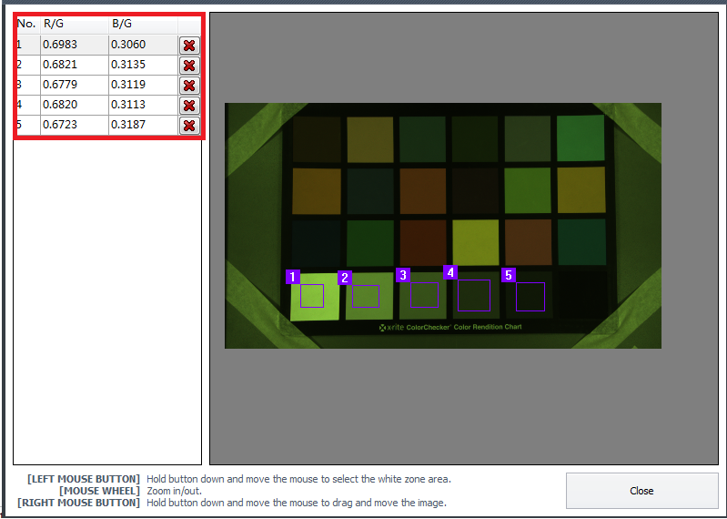

    KI的中间色温光源分别选择4500K, 5500K, 6500K的效果对比图

    

#### 手动调整AWB标定结果

AWB标定中间光源KI色温会影响色调。客户在6000K色温采集了室外数据，但希望AWB的中间色温在5200K附近，以达到色调轻微偏冷的效果。可以按照以下步骤手动计算，避免重复的数据采集（如果能够采集到室外多个色温段的数据，标定结果会更可靠）。

1.  利用现有数据进行Auto AWB标定，标定步骤参考 "[自动AWB标定步骤（AWB）](#ZH-CN_TOPIC_0000002457840801)"。因为仅采集到6000K的室外数据，因此，指定A、10K\(也可以是D75\)、6000K室外数据为KI光源进行标定，得到的标定结果如图 Auto AWB 标定所示。
2.  将以上标定结果通过MPI接口或者PQTools配置到ISP。
3.  调用ot\_mpi\_isp\_cal\_gain\_by\_temp\(\)计算5200K光源对应的增益。上图中5200K对应的增益是\[487, 256, 256, 479\]。关闭GainNorm功能以确保G分量的增益是256。
4.  半自动模式，校正得到期望的以5200K为中心的AWB参数。请参考图 Semi-Auto AWB 标定所示。
5.  图 Auto与Semi-Auto AWB 效果验证效果对比验证，左图是6000K效果，右图是5200K效果。

    **Figure  1**  Auto AWB 标定  
    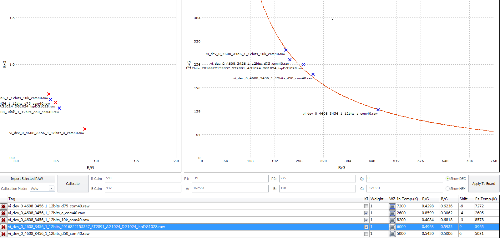

    **Figure  2**  Semi-Auto AWB 标定  
    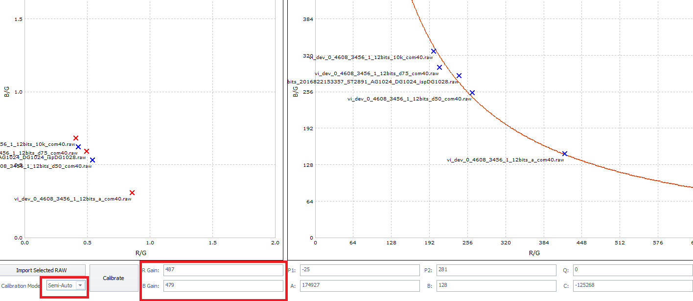

    **Figure  3**  Auto与Semi-Auto AWB 效果验证  
    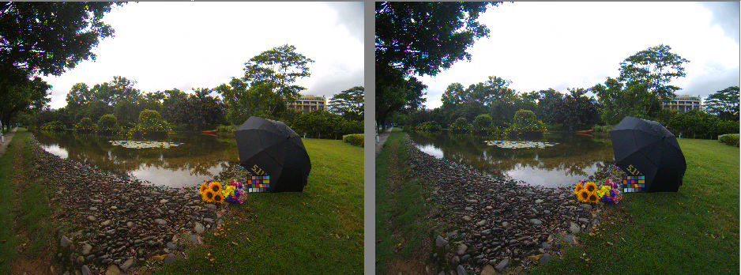

#### 标定结果的确认\(AWB\)

标定完成，观察Planckian Curve，是否光源分布在曲线两侧，是否有光源点距离普朗克曲线较远，估计的色温是否准确。如果某些光源的误差较大，可调整其权重值，再次进行标定。

也可以用3A分析工具的AWB功能在线验证标定的准确性，多个光源下灰色块都落在Planckian曲线的附近，说明标定是可靠的。

**图 1**  AWB标定完成的Planckian Curve  
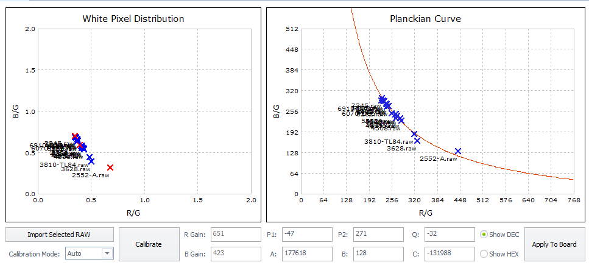

**图 2**  AWB标定结果确认  
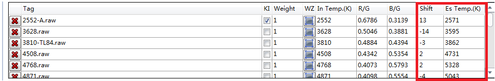

如[图2](#_Ref492403568)所示，Shift的绝对值小于32，6500K以下光源估计色温值和测量值误差小于500K，确认标定结果正确。

> **AVIS:** 
>[Figure 2](#_Ref492403568)中4768.raw的测量色温是4768K，估计色温是5328K，色温误差值较大。但因为4768.raw的B/G比4508.raw，4871.raw都大，说明光源的蓝色分量较强，因此色温偏高是合理的。

### 根据标定信息调整统计参数配置

#### 借助标定工具，判断灰点色差条件设置是否合理

1.  计算最低色温下灰色块的R/G, B/G。比如图 低色温下灰点的色差信息A光源下R/G=1.66, B/G=0.47，8bit定点化R/G=round\(1.66\*256\)=0x1A9，B/G=round\(0.47\*256\)=0x78。因此，灰点条件cr\_max\>= 0x1A9，cb\_min<=0x78，才能保证该场景下WB统计模块获取到正确的灰点信息。考虑到光源照度的变化带来光谱改变，且低照度下噪声增大，用户应该进一步增大cr\_max取值，缩小cb\_min取值。
2.  计算最高色温下灰色块的R/G, B/G。比如图 高色温下灰点的色差信息室外高色温光源下R/G=0.41, B/G=1.13，8bit定点化R/G=round\(0.41\*256\)=0x69，B/G=round\(1.13\*256\)=0x122。因此，灰点条件cr\_min<= 0x69，cb\_max\>=0x122，才能保证该场景下WB统计模块获取到正确的灰点信息。用户应该进一步增大cb\_max取值，缩小cr\_min取值。
3.  完成了正常照度下cr\_max，cr\_min，cb\_max，cb\_min的调整，可以采集不同ISO下的Raw，计算灰点的色差信息，完成自适应表格的调整。

    **Figure  1**  低色温下灰点的色差信息  
    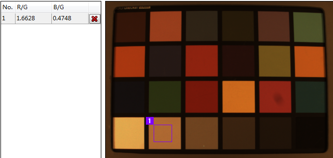

    **Figure  2**  高色温下灰点的色差信息  
    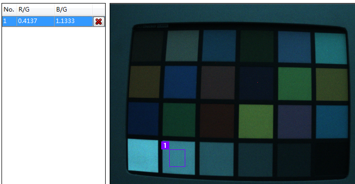

## AWB FW

### ot\_isp\_awb\_attr

ot\_isp\_awb\_attr结构体定义了AWB FW算法的基本可调节参数，包括色温限制、灰点范围限制条件等。该结构体引用了以下子结构体：

-   ot\_isp\_awb\_ct\_limit\_attr
-   ot\_isp\_awb\_cbcr\_track\_attr
-   ot\_isp\_awb\_lum\_histgram\_attr

**表 1**  ot\_isp\_awb\_attr参数

<table><thead align="left"><tr id="row734mcpsimp"><th class="cellrowborder" valign="top" width="21.782178217821784%" id="mcps1.2.4.1.1">
参数

</th>
<th class="cellrowborder" valign="top" width="35.64356435643564%" id="mcps1.2.4.1.2">
描述

</th>
<th class="cellrowborder" valign="top" width="42.57425742574258%" id="mcps1.2.4.1.3">
场景说明

</th>
</tr>
</thead>
<tbody><tr id="row742mcpsimp"><td class="cellrowborder" valign="top" width="21.782178217821784%" headers="mcps1.2.4.1.1 ">
alg_type

</td>
<td class="cellrowborder" valign="top" width="35.64356435643564%" headers="mcps1.2.4.1.2 ">
白平衡的算法类型属性，支持

OT_ISP_AWB_ALG_LOWCOST和

OT_ISP_AWB_ALG_ADVANCE、OT_ISP_AWB_ALG_NATURA可选。

</td>
<td class="cellrowborder" valign="top" width="42.57425742574258%" headers="mcps1.2.4.1.3 ">
LOWCOST CPU占用较少，对光源的适应性较好。ADVANCE提升了AWB精度。NATURA适用于无人机、运动DV等室外应用产品。

按照标定要求完成标定，推荐采用ADVANCE，简单标定推荐采用LOWCOST。

</td>
</tr>
<tr id="row752mcpsimp"><td class="cellrowborder" valign="top" width="21.782178217821784%" headers="mcps1.2.4.1.1 ">
zone_sel

</td>
<td class="cellrowborder" valign="top" width="35.64356435643564%" headers="mcps1.2.4.1.2 ">
设置zone_sel=0，AWB采用灰度世界算法。

</td>
<td class="cellrowborder" valign="top" width="42.57425742574258%" headers="mcps1.2.4.1.3 ">
该功能主要用来定位问题，不推荐修改。

红外灯应用时需要使能AWB，建议设置zone_sel=0。

</td>
</tr>
<tr id="row760mcpsimp"><td class="cellrowborder" valign="top" width="21.782178217821784%" headers="mcps1.2.4.1.1 ">
speed

</td>
<td class="cellrowborder" valign="top" width="35.64356435643564%" headers="mcps1.2.4.1.2 ">
AWB收敛速度，值越大，AWB收敛越快。

取值范围：[0x0, 0xFFF]

</td>
<td class="cellrowborder" valign="top" width="42.57425742574258%" headers="mcps1.2.4.1.3 ">
speed设置为0xFFF时，AWB增益不参考历史信息。speed设置为0时，AWB Freeze。

</td>
</tr>
<tr id="row768mcpsimp"><td class="cellrowborder" valign="top" width="21.782178217821784%" headers="mcps1.2.4.1.1 ">
high_color_temp

</td>
<td class="cellrowborder" valign="top" width="35.64356435643564%" headers="mcps1.2.4.1.2 ">
AWB支持的色温上限，推荐取值：[10000, 15000]

</td>
<td class="cellrowborder" valign="top" width="42.57425742574258%" headers="mcps1.2.4.1.3 ">
高色温下出现偏色时，优先调整色温上限。

</td>
</tr>
<tr id="row775mcpsimp"><td class="cellrowborder" valign="top" width="21.782178217821784%" headers="mcps1.2.4.1.1 ">
low_color_temp

</td>
<td class="cellrowborder" valign="top" width="35.64356435643564%" headers="mcps1.2.4.1.2 ">
AWB支持的色温下限，推荐取值：[1500, 2500]

</td>
<td class="cellrowborder" valign="top" width="42.57425742574258%" headers="mcps1.2.4.1.3 ">
低色温下出现偏色时，优先调整色温下限。色温下限太低时，低色温的机动车道路<em id="i782mcpsimp">视频采集</em>场景容易出现震荡。

</td>
</tr>
<tr id="row783mcpsimp"><td class="cellrowborder" valign="top" width="21.782178217821784%" headers="mcps1.2.4.1.1 ">
ct_limit

</td>
<td class="cellrowborder" valign="top" width="35.64356435643564%" headers="mcps1.2.4.1.2 ">
检测色温超出色温范围时，AWB算法的动作。仅在检测色温超出色温范围时生效。

推荐采用Auto模式。

</td>
<td class="cellrowborder" valign="top" width="42.57425742574258%" headers="mcps1.2.4.1.3 ">
支持Manual和Auto两种方式。

<ul id="ul791mcpsimp"><li>Manual模式下，由用户定义色温超限时AWB的增益；</li><li>Auto模式下，根据AWB标定参数，确定色温超限时AWB的增益。</li></ul>
</td>
</tr>
<tr id="row794mcpsimp"><td class="cellrowborder" valign="top" width="21.782178217821784%" headers="mcps1.2.4.1.1 ">
shift_limit

</td>
<td class="cellrowborder" valign="top" width="35.64356435643564%" headers="mcps1.2.4.1.2 ">
以普朗克曲线为中心点，shift_limit为半径确定AWB支持的光源范围。

推荐取值：[0x30-0x50]

</td>
<td class="cellrowborder" valign="top" width="42.57425742574258%" headers="mcps1.2.4.1.3 ">
取值越大，对光源的支持越广，会降低大面积单色场景AWB精度。

</td>
</tr>
<tr id="row802mcpsimp"><td class="cellrowborder" valign="top" width="21.782178217821784%" headers="mcps1.2.4.1.1 ">
gain_norm_en

</td>
<td class="cellrowborder" valign="top" width="35.64356435643564%" headers="mcps1.2.4.1.2 ">
AWB最终增益是否做归一化。

默认打开

</td>
<td class="cellrowborder" valign="top" width="42.57425742574258%" headers="mcps1.2.4.1.3 ">
使能后，可提高低照、低色温下的信噪比。

</td>
</tr>
<tr id="row810mcpsimp"><td class="cellrowborder" valign="top" width="21.782178217821784%" headers="mcps1.2.4.1.1 ">
natural_cast_en

</td>
<td class="cellrowborder" valign="top" width="35.64356435643564%" headers="mcps1.2.4.1.2 ">
低色温下AWB风格喜好开关。

</td>
<td class="cellrowborder" valign="top" width="42.57425742574258%" headers="mcps1.2.4.1.3 ">
natural_cast_en使能，低色温下AWB保留光源色，图像颜色更自然。

</td>
</tr>
<tr id="row817mcpsimp"><td class="cellrowborder" valign="top" width="21.782178217821784%" headers="mcps1.2.4.1.1 ">
rg_strength

bg_strength

</td>
<td class="cellrowborder" valign="top" width="35.64356435643564%" headers="mcps1.2.4.1.2 ">
AWB校正强度。

</td>
<td class="cellrowborder" valign="top" width="42.57425742574258%" headers="mcps1.2.4.1.3 ">
AWB校正强度分为以下三种情况。（推荐rg_strength = bg_strength，且&lt;=0x80）

<ul id="ul825mcpsimp"><li>rg_strength =0x80时，白色恢复为白色；</li><li>rg_strength &gt;0x80时，白色与光源反向，低色温偏蓝，高色温偏红；</li><li>rg_strength &lt;0x80时，白色与光源同向，低色温偏红，高色温偏蓝。颜色表现更符合人眼感观。</li></ul>
</td>
</tr>
<tr id="row829mcpsimp"><td class="cellrowborder" valign="top" width="21.782178217821784%" headers="mcps1.2.4.1.1 ">
cb_cr_track

</td>
<td class="cellrowborder" valign="top" width="35.64356435643564%" headers="mcps1.2.4.1.2 ">
不同ISO下灰点条件，cr_max, cr_min, cb_max, cb_min等四组查找表。

</td>
<td class="cellrowborder" valign="top" width="42.57425742574258%" headers="mcps1.2.4.1.3 ">
推荐用户针对sensor调整以上参数，可优化低照度效果。

</td>
</tr>
<tr id="row836mcpsimp"><td class="cellrowborder" valign="top" width="21.782178217821784%" headers="mcps1.2.4.1.1 ">
luma_hist

</td>
<td class="cellrowborder" valign="top" width="35.64356435643564%" headers="mcps1.2.4.1.2 ">
亮度权重配置相关参数

</td>
<td class="cellrowborder" valign="top" width="42.57425742574258%" headers="mcps1.2.4.1.3 ">
Auto模式下，FW自动计算亮度分组门限，支持用户配置不同亮度灰点的权重。

Manual模式下，支持用户配置亮度分组门限和不同亮度灰点的权重。

</td>
</tr>
<tr id="row844mcpsimp"><td class="cellrowborder" valign="top" width="21.782178217821784%" headers="mcps1.2.4.1.1 ">
awb_zone_wt_en

</td>
<td class="cellrowborder" valign="top" width="35.64356435643564%" headers="mcps1.2.4.1.2 ">
白平衡的分块权重使能开关，默认TD_FALSE。

</td>
<td class="cellrowborder" valign="top" width="42.57425742574258%" headers="mcps1.2.4.1.3 ">
-

</td>
</tr>
<tr id="row852mcpsimp"><td class="cellrowborder" valign="top" width="21.782178217821784%" headers="mcps1.2.4.1.1 ">
zone_wt

</td>
<td class="cellrowborder" valign="top" width="35.64356435643564%" headers="mcps1.2.4.1.2 ">
白平衡的1024分块权重表，取值范围：[0x0, 0xFF]

</td>
<td class="cellrowborder" valign="top" width="42.57425742574258%" headers="mcps1.2.4.1.3 ">
特定应用产品，客户使能awb_zone_wt_en后，可通过设置权重表改变每个区域的权重，优化AWB表现。

在Shading较严重时，可加大中心区域的权重，保证中间区域AWB准确还原，降低Shading对AWB的影响。

在行车记录仪应用，感兴趣区域一般在画面的中心偏下区域，可加大此区域的权重，降低天空、树木等区域对AWB的干扰。

</td>
</tr>
</tbody>
</table>

#### ot\_isp\_awb\_ct\_limit\_attr

**表 1**  ot\_isp\_awb\_ct\_limit\_attr参数说明

<table><thead align="left"><tr id="row12391165719818"><th class="cellrowborder" valign="top" width="15%" id="mcps1.2.4.1.1">
参数

</th>
<th class="cellrowborder" valign="top" width="50%" id="mcps1.2.4.1.2">
描述

</th>
<th class="cellrowborder" valign="top" width="35%" id="mcps1.2.4.1.3">
场景说明

</th>
</tr>
</thead>
<tbody><tr id="row03923571181"><td class="cellrowborder" valign="top" width="15%" headers="mcps1.2.4.1.1 ">
enable

</td>
<td class="cellrowborder" valign="top" width="50%" headers="mcps1.2.4.1.2 ">
环境色温超出色温上下限范围时，最终生效的AWB增益是否做Clip处理。

</td>
<td class="cellrowborder" valign="top" width="35%" headers="mcps1.2.4.1.3 ">
夜晚，室外道路<em id="i339219571812">视频采集</em>场景的光源在车灯、路灯间切换，打开该功能保证颜色的一致性。

</td>
</tr>
<tr id="row239211573820"><td class="cellrowborder" valign="top" width="15%" headers="mcps1.2.4.1.1 ">
op_type

</td>
<td class="cellrowborder" valign="top" width="50%" headers="mcps1.2.4.1.2 ">
环境色温超出色温上下限范围时：

<ul id="ul153934578818"><li xml:lang="sv-SE">Auto模式下，AWB增益由色温曲线计算；</li><li xml:lang="sv-SE">Manual模式下，AWB增益由用户配置。</li></ul>
</td>
<td class="cellrowborder" valign="top" width="35%" headers="mcps1.2.4.1.3 ">
推荐Auto模式。

</td>
</tr>
<tr id="row153931457083"><td class="cellrowborder" valign="top" width="15%" headers="mcps1.2.4.1.1 ">
high_rg_limit

high_bg_limit

</td>
<td class="cellrowborder" valign="top" width="50%" headers="mcps1.2.4.1.2 ">
Manual模式下有效。环境色温超出色温上限范围时，用户配置高色温的R, B增益。

</td>
<td class="cellrowborder" valign="top" width="35%" headers="mcps1.2.4.1.3 ">
-

</td>
</tr>
<tr id="row639317571786"><td class="cellrowborder" valign="top" width="15%" headers="mcps1.2.4.1.1 ">
low_rg_limit

low_bg_limit

</td>
<td class="cellrowborder" valign="top" width="50%" headers="mcps1.2.4.1.2 ">
Manual模式下有效。环境色温超出色温下限范围时，用户配置低色温的R, B增益。

</td>
<td class="cellrowborder" valign="top" width="35%" headers="mcps1.2.4.1.3 ">
-

</td>
</tr>
</tbody>
</table>

#### ot\_isp\_awb\_cbcr\_track\_attr

**表 1**  ot\_isp\_awb\_cbcr\_track\_attr参数说明

<table><thead align="left"><tr id="row185151841895"><th class="cellrowborder" valign="top" width="16%" id="mcps1.2.4.1.1">
参数

</th>
<th class="cellrowborder" valign="top" width="37%" id="mcps1.2.4.1.2">
描述

</th>
<th class="cellrowborder" valign="top" width="47%" id="mcps1.2.4.1.3">
场景说明

</th>
</tr>
</thead>
<tbody><tr id="row35161411691"><td class="cellrowborder" valign="top" width="16%" headers="mcps1.2.4.1.1 ">
enable

</td>
<td class="cellrowborder" valign="top" width="37%" headers="mcps1.2.4.1.2 ">
是否使能灰点条件和ISO联动功能

</td>
<td class="cellrowborder" valign="top" width="47%" headers="mcps1.2.4.1.3 ">
打开该功能，用户可通过cr_max等参数配置，控制低照度下的颜色表现。

</td>
</tr>
<tr id="row1351619418918"><td class="cellrowborder" valign="top" width="16%" headers="mcps1.2.4.1.1 ">
cr_max[]

</td>
<td class="cellrowborder" valign="top" width="37%" headers="mcps1.2.4.1.2 ">
低色温下R/G和ISO的联动数组。

要求为单调递增序列。

</td>
<td class="cellrowborder" rowspan="4" valign="top" width="47%" headers="mcps1.2.4.1.3 ">
请参考“<a href="#ZH-CN_TOPIC_0000002424361946">借助标定工具，判断灰点色差条件设置是否合理</a>”进行标定。

相同ISO下，通常cr_max比cb_max稍大，cr_min和cb_min取值基本相同。

</td>
</tr>
<tr id="row1451614411896"><td class="cellrowborder" valign="top" headers="mcps1.2.4.1.1 ">
cr_min[]

</td>
<td class="cellrowborder" valign="top" headers="mcps1.2.4.1.2 ">
高色温下R/G和ISO的联动数组。

要求为单调递减序列。

</td>
</tr>
<tr id="row11516154115915"><td class="cellrowborder" valign="top" headers="mcps1.2.4.1.1 ">
cb_max[]

</td>
<td class="cellrowborder" valign="top" headers="mcps1.2.4.1.2 ">
高色温下B/G和ISO的联动数组。

要求为单调递增序列。

</td>
</tr>
<tr id="row251654110914"><td class="cellrowborder" valign="top" headers="mcps1.2.4.1.1 ">
cb_min

</td>
<td class="cellrowborder" valign="top" headers="mcps1.2.4.1.2 ">
低色温下B/G和ISO的联动数组。

要求为单调递减序列。

</td>
</tr>
</tbody>
</table>

#### ot\_isp\_awb\_lum\_histgram\_attr

**表 1**  ot\_isp\_awb\_lum\_histgram\_attr参数说明

<table><thead align="left"><tr id="row157541759496"><th class="cellrowborder" valign="top" width="14.000000000000002%" id="mcps1.2.4.1.1">
参数

</th>
<th class="cellrowborder" valign="top" width="49%" id="mcps1.2.4.1.2">
描述

</th>
<th class="cellrowborder" valign="top" width="37%" id="mcps1.2.4.1.3">
场景说明

</th>
</tr>
</thead>
<tbody><tr id="row475418591891"><td class="cellrowborder" valign="top" width="14.000000000000002%" headers="mcps1.2.4.1.1 ">
enable

</td>
<td class="cellrowborder" valign="top" width="49%" headers="mcps1.2.4.1.2 ">
是否使能亮度调整AWB权重功能。

</td>
<td class="cellrowborder" valign="top" width="37%" headers="mcps1.2.4.1.3 ">
建议打开

</td>
</tr>
<tr id="row67544599913"><td class="cellrowborder" valign="top" width="14.000000000000002%" headers="mcps1.2.4.1.1 ">
op_type

</td>
<td class="cellrowborder" valign="top" width="49%" headers="mcps1.2.4.1.2 "><ul id="ul27541359899"><li xml:lang="sv-SE">Auto模式下，AWB自动完成亮度直方图统计，但支持用户手动配置亮度权重；</li><li xml:lang="sv-SE">Manual模式下，支持用户配置亮度直方图统计的门限和亮度权重。</li></ul>
</td>
<td class="cellrowborder" valign="top" width="37%" headers="mcps1.2.4.1.3 ">
建议设置为Auto模式，用户手动配置亮区、暗区权重，达到亮区优先or暗区优先的效果。

</td>
</tr>
<tr id="row9755959393"><td class="cellrowborder" valign="top" width="14.000000000000002%" headers="mcps1.2.4.1.1 ">
hist_thresh[]

</td>
<td class="cellrowborder" valign="top" width="49%" headers="mcps1.2.4.1.2 ">
用户设置亮度直方图的门限，仅手动模式有效。

取值范围：[0x0, 0xFF]，要求为单调递增序列。

</td>
<td class="cellrowborder" valign="top" width="37%" headers="mcps1.2.4.1.3 ">
-

</td>
</tr>
<tr id="row16755659394"><td class="cellrowborder" valign="top" width="14.000000000000002%" headers="mcps1.2.4.1.1 ">
hist_wt[]

</td>
<td class="cellrowborder" valign="top" width="49%" headers="mcps1.2.4.1.2 ">
用户设置亮度直方图的权重，自动、手动模式下均有效。8bit小数精度，取值范围：[0x0, 0xFFFF]

</td>
<td class="cellrowborder" valign="top" width="37%" headers="mcps1.2.4.1.3 ">
亮度权重的影响公式：

</td>
</tr>
</tbody>
</table>

### ot\_isp\_awb\_attr\_ex

ot\_isp\_awb\_attr\_ex结构体定义了Advance算法的可调节参数，包括独立光源点定义、混合光源权重配置等。该结构体引用了以下子结构体：

-   ot\_isp\_awb\_in\_out\_attr
-   ot\_isp\_awb\_extra\_light\_source\_info

**表 1**  ot\_isp\_awb\_attr\_ex参数说明

<table><thead align="left"><tr id="row1027mcpsimp"><th class="cellrowborder" valign="top" width="22%" id="mcps1.2.4.1.1">
参数

</th>
<th class="cellrowborder" valign="top" width="36%" id="mcps1.2.4.1.2">
描述

</th>
<th class="cellrowborder" valign="top" width="42%" id="mcps1.2.4.1.3">
场景说明

</th>
</tr>
</thead>
<tbody><tr id="row1035mcpsimp"><td class="cellrowborder" valign="top" width="22%" headers="mcps1.2.4.1.1 ">
tolerance

</td>
<td class="cellrowborder" valign="top" width="36%" headers="mcps1.2.4.1.2 ">
帧间相关的容忍度。设置为0时，AWB每2帧刷新AWB增益；设置为非0值时，AWB仅在检测到场景变化大于容忍值时刷新AWB增益。

默认值 0x2。

</td>
<td class="cellrowborder" valign="top" width="42%" headers="mcps1.2.4.1.3 ">
FW在判断为室外场景时，自动关闭帧间相关，每2帧重新计算AWB增益。

tolerance取值较大时，AWB稳定性增强，灵敏度降低，光源色温变化时AWB不能做出及时调整。

推荐取值范围：[0x2, 0x4]

</td>
</tr>
<tr id="row1045mcpsimp"><td class="cellrowborder" valign="top" width="22%" headers="mcps1.2.4.1.1 ">
zone_radius

</td>
<td class="cellrowborder" valign="top" width="36%" headers="mcps1.2.4.1.2 ">
分块统计信息分类的半径。

默认值 0x10。

</td>
<td class="cellrowborder" valign="top" width="42%" headers="mcps1.2.4.1.3 ">
sensor不同亮度灰色块感光一致性较差时，可适当放大该参数。WDR模式下，可适当放大该参数。

</td>
</tr>
<tr id="row1053mcpsimp"><td class="cellrowborder" valign="top" width="22%" headers="mcps1.2.4.1.1 ">
curve_l_limit

</td>
<td class="cellrowborder" valign="top" width="36%" headers="mcps1.2.4.1.2 ">
普朗克曲线的左侧边界。

取值范围：[0x0, 0x100]

</td>
<td class="cellrowborder" valign="top" width="42%" headers="mcps1.2.4.1.3 ">
排除场景中的绿色块。大面积绿色场景偏色时，可以修改curve_l_limit来优化。

</td>
</tr>
<tr id="row1062mcpsimp"><td class="cellrowborder" valign="top" width="22%" headers="mcps1.2.4.1.1 ">
curve_r_limit

</td>
<td class="cellrowborder" valign="top" width="36%" headers="mcps1.2.4.1.2 ">
普朗克曲线的右侧边界。

取值范围：[0x100, 0xFFF]

</td>
<td class="cellrowborder" valign="top" width="42%" headers="mcps1.2.4.1.3 ">
排除场景中的紫色块。如果sensor在低照度下的黑电平漂移较严重时，需要修改curve_r_limit参数来优化。通常不需要修改。

</td>
</tr>
<tr id="row1070mcpsimp"><td class="cellrowborder" valign="top" width="22%" headers="mcps1.2.4.1.1 ">
extra_light_en

</td>
<td class="cellrowborder" valign="top" width="36%" headers="mcps1.2.4.1.2 ">
是否使能独立光源点功能

</td>
<td class="cellrowborder" valign="top" width="42%" headers="mcps1.2.4.1.3 ">
独立光源点功能可优化固定场景的偏色问题。

</td>
</tr>
<tr id="row1077mcpsimp"><td class="cellrowborder" valign="top" width="22%" headers="mcps1.2.4.1.1 ">
light_info[]

</td>
<td class="cellrowborder" valign="top" width="36%" headers="mcps1.2.4.1.2 ">
独立光源点或干扰色的颜色信息。

</td>
<td class="cellrowborder" valign="top" width="42%" headers="mcps1.2.4.1.3 ">
用户可通过PQTools的3A分析工具界面添加光源点或删除干扰色。

</td>
</tr>
<tr id="row1084mcpsimp"><td class="cellrowborder" valign="top" width="22%" headers="mcps1.2.4.1.1 ">
in_or_out

</td>
<td class="cellrowborder" valign="top" width="36%" headers="mcps1.2.4.1.2 ">
室内外检测参数。

</td>
<td class="cellrowborder" valign="top" width="42%" headers="mcps1.2.4.1.3 ">
推荐打开室内外检测功能，以优化室外树木、草地、天空等场景AWB表现。用户可通过参数配置达到偏暖或偏冷等颜色风格

</td>
</tr>
<tr id="row1091mcpsimp"><td class="cellrowborder" valign="top" width="22%" headers="mcps1.2.4.1.1 ">
multi_light_source_en

</td>
<td class="cellrowborder" valign="top" width="36%" headers="mcps1.2.4.1.2 ">
混合光源下特殊策略。

</td>
<td class="cellrowborder" valign="top" width="42%" headers="mcps1.2.4.1.3 ">
使能后，FW自动检测混合光源程度，调整饱和度或CCM，从而改善偏色。

</td>
</tr>
<tr id="row1098mcpsimp"><td class="cellrowborder" valign="top" width="22%" headers="mcps1.2.4.1.1 ">
multi_ls_type

</td>
<td class="cellrowborder" valign="top" width="36%" headers="mcps1.2.4.1.2 ">
混合光源调整策略选择，支持调整饱和度或CCM。

</td>
<td class="cellrowborder" valign="top" width="42%" headers="mcps1.2.4.1.3 ">
选择饱和度策略，整幅图像的饱和度降低；选择CCM策略，绿色的饱和度影响微弱，红色、蓝色的色调会有改变。

</td>
</tr>
<tr id="row1105mcpsimp"><td class="cellrowborder" valign="top" width="22%" headers="mcps1.2.4.1.1 ">
multi_ls_scaler

</td>
<td class="cellrowborder" valign="top" width="36%" headers="mcps1.2.4.1.2 ">
混合光源下，饱和度或CCM最大调整幅度。实际调整幅度还和场景混合光源程度有关。

取值范围：[0x0, 0x100]

</td>
<td class="cellrowborder" valign="top" width="42%" headers="mcps1.2.4.1.3 ">
-

</td>
</tr>
<tr id="row1113mcpsimp"><td class="cellrowborder" valign="top" width="22%" headers="mcps1.2.4.1.1 ">
multi_ct_bin[]

</td>
<td class="cellrowborder" valign="top" width="36%" headers="mcps1.2.4.1.2 ">
混合光源下的色温分段参数。

取值范围：[0x0, 0xFFFF]

要求为单调递增序列。

</td>
<td class="cellrowborder" valign="top" width="42%" headers="mcps1.2.4.1.3 ">
推荐值：[2300, 2800, 3500, 4800, 5500, 6300, 7000, 8500]

</td>
</tr>
<tr id="row1123mcpsimp"><td class="cellrowborder" valign="top" width="22%" headers="mcps1.2.4.1.1 ">
multi_ct_wt[]

</td>
<td class="cellrowborder" valign="top" width="36%" headers="mcps1.2.4.1.2 ">
混合光源下的色温权重参数。

取值范围：[0x0, 0x400]

</td>
<td class="cellrowborder" valign="top" width="42%" headers="mcps1.2.4.1.3 ">
推荐值：[0x20, 0x40, 0x100, 0x200, 0x200, 0x100, 0x40, 0x20]

4800K-5500K色温权重高，低色温、高色温权重降低，混合光源下颜色表现更自然。

</td>
</tr>
<tr id="row1132mcpsimp"><td class="cellrowborder" valign="top" width="22%" headers="mcps1.2.4.1.1 ">
fine_tune_en

</td>
<td class="cellrowborder" valign="top" width="36%" headers="mcps1.2.4.1.2 ">
肤色检测等特殊处理。

</td>
<td class="cellrowborder" valign="top" width="42%" headers="mcps1.2.4.1.3 ">
仅在室内模式打开，室外模式自动关闭。

</td>
</tr>
</tbody>
</table>

#### ot\_isp\_awb\_in\_out\_attr

**表 1**  ot\_isp\_awb\_in\_out\_attr参数说明

<table><thead align="left"><tr id="row1147mcpsimp"><th class="cellrowborder" valign="top" width="21%" id="mcps1.2.4.1.1">
参数

</th>
<th class="cellrowborder" valign="top" width="32%" id="mcps1.2.4.1.2">
描述

</th>
<th class="cellrowborder" valign="top" width="47%" id="mcps1.2.4.1.3">
场景说明

</th>
</tr>
</thead>
<tbody><tr id="row1155mcpsimp"><td class="cellrowborder" valign="top" width="21%" headers="mcps1.2.4.1.1 ">
enable

</td>
<td class="cellrowborder" valign="top" width="32%" headers="mcps1.2.4.1.2 ">
室内外模式判决开关。

</td>
<td class="cellrowborder" valign="top" width="47%" headers="mcps1.2.4.1.3 ">
AWB根据曝光信息判断当前场景是室内或室外。

</td>
</tr>
<tr id="row1162mcpsimp"><td class="cellrowborder" valign="top" width="21%" headers="mcps1.2.4.1.1 ">
op_type

</td>
<td class="cellrowborder" valign="top" width="32%" headers="mcps1.2.4.1.2 ">
自动或手动判决模式。

</td>
<td class="cellrowborder" valign="top" width="47%" headers="mcps1.2.4.1.3 ">
手动模式下，用户输入室内外状态；自动模式下，FW根据环境亮度和亮度门限值，判断当前是室内或室外。

</td>
</tr>
<tr id="row1169mcpsimp"><td class="cellrowborder" valign="top" width="21%" headers="mcps1.2.4.1.1 ">
outdoor_status

</td>
<td class="cellrowborder" valign="top" width="32%" headers="mcps1.2.4.1.2 ">
室内外模式判决结果；

1表示室外，0表示室内。

</td>
<td class="cellrowborder" valign="top" width="47%" headers="mcps1.2.4.1.3 ">
-

</td>
</tr>
<tr id="row1177mcpsimp"><td class="cellrowborder" valign="top" width="21%" headers="mcps1.2.4.1.1 ">
out_thresh

</td>
<td class="cellrowborder" valign="top" width="32%" headers="mcps1.2.4.1.2 ">
室内外场景判定设置的亮度门限阈值，以单位为us的曝光时间，小于该阈值则认为是室外。

</td>
<td class="cellrowborder" valign="top" width="47%" headers="mcps1.2.4.1.3 ">
非SDK提供的AE库的应用，请将曝光信息传递给AWB库。

用户需要根据录像机的感光强度、产品形态调整亮度门限。DV等产品建议调大该门限值，录像机建议调小该门限值。

</td>
</tr>
<tr id="row1187mcpsimp"><td class="cellrowborder" valign="top" width="21%" headers="mcps1.2.4.1.1 ">
low_stop

</td>
<td class="cellrowborder" valign="top" width="32%" headers="mcps1.2.4.1.2 ">
自然光源色温起点的扩展，建议4500K。

</td>
<td class="cellrowborder" rowspan="4" valign="top" width="47%" headers="mcps1.2.4.1.3 ">
判断为室外模式后，[low_start，high_start]色温范围内的灰色块权重最大，[low_stop，low_start]和[high_start，high_stop]两个色温区间是过渡带，保证平滑过渡。

四个色温门限值都增大，图像偏暖色；四个色温门限值都减小，图像偏冷色。

</td>
</tr>
<tr id="row1195mcpsimp"><td class="cellrowborder" valign="top" headers="mcps1.2.4.1.1 ">
low_start

</td>
<td class="cellrowborder" valign="top" headers="mcps1.2.4.1.2 ">
自然光源色温范围的起点，建议5000K。

</td>
</tr>
<tr id="row1200mcpsimp"><td class="cellrowborder" valign="top" headers="mcps1.2.4.1.1 ">
high_start

</td>
<td class="cellrowborder" valign="top" headers="mcps1.2.4.1.2 ">
自然光源色温范围的终点，建议6500K。

</td>
</tr>
<tr id="row1205mcpsimp"><td class="cellrowborder" valign="top" headers="mcps1.2.4.1.1 ">
high_stop

</td>
<td class="cellrowborder" valign="top" headers="mcps1.2.4.1.2 ">
自然光源色温终点的扩展，建议7500K。

</td>
</tr>
<tr id="row1210mcpsimp"><td class="cellrowborder" valign="top" width="21%" headers="mcps1.2.4.1.1 ">
green_enhance_en

</td>
<td class="cellrowborder" valign="top" width="32%" headers="mcps1.2.4.1.2 ">
在绿色植物场景下是否对绿色通道增强。

</td>
<td class="cellrowborder" valign="top" width="47%" headers="mcps1.2.4.1.3 ">
仅在大面积灰绿色草地等场景才有效，其他场景无效。

</td>
</tr>
<tr id="row1217mcpsimp"><td class="cellrowborder" valign="top" width="21%" headers="mcps1.2.4.1.1 ">
out_shift_limit

</td>
<td class="cellrowborder" valign="top" width="32%" headers="mcps1.2.4.1.2 ">
室外模式支持的光源范围，建议0x20。

</td>
<td class="cellrowborder" valign="top" width="47%" headers="mcps1.2.4.1.3 ">
-

</td>
</tr>
</tbody>
</table>

#### ot\_isp\_awb\_extra\_light\_source\_info

**表 1**  ot\_isp\_awb\_extra\_light\_source\_info参数说明

<table><thead align="left"><tr id="row1232mcpsimp"><th class="cellrowborder" valign="top" width="16%" id="mcps1.2.4.1.1">
参数

</th>
<th class="cellrowborder" valign="top" width="37%" id="mcps1.2.4.1.2">
描述

</th>
<th class="cellrowborder" valign="top" width="47%" id="mcps1.2.4.1.3">
场景说明

</th>
</tr>
</thead>
<tbody><tr id="row1240mcpsimp"><td class="cellrowborder" valign="top" width="16%" headers="mcps1.2.4.1.1 ">
white_r_gain

</td>
<td class="cellrowborder" valign="top" width="37%" headers="mcps1.2.4.1.2 ">
增加或删除区域的中心Cr坐标。

取值范围：[0x0, 0xFFF]，8bit精度。

</td>
<td class="cellrowborder" rowspan="2" valign="top" width="47%" headers="mcps1.2.4.1.3 ">
可通过PQTools的3A分析工具配置这两个参数。

</td>
</tr>
<tr id="row1248mcpsimp"><td class="cellrowborder" valign="top" headers="mcps1.2.4.1.1 ">
white_b_gain

</td>
<td class="cellrowborder" valign="top" headers="mcps1.2.4.1.2 ">
增加或删除区域的中心Cb坐标。取值范围：[0x0, 0xFFF]，8bit精度。

</td>
</tr>
<tr id="row1253mcpsimp"><td class="cellrowborder" valign="top" width="16%" headers="mcps1.2.4.1.1 ">
exp_quant

</td>
<td class="cellrowborder" valign="top" width="37%" headers="mcps1.2.4.1.2 ">
对外界环境亮度做判断，暂不支持，不需要配置。

</td>
<td class="cellrowborder" valign="top" width="47%" headers="mcps1.2.4.1.3 ">
-

</td>
</tr>
<tr id="row1260mcpsimp"><td class="cellrowborder" valign="top" width="16%" headers="mcps1.2.4.1.1 ">
light_status

</td>
<td class="cellrowborder" valign="top" width="37%" headers="mcps1.2.4.1.2 ">
光源点状态。

0：不使能；

1：增加光源点；

2：删除干扰色；

</td>
<td class="cellrowborder" valign="top" width="47%" headers="mcps1.2.4.1.3 ">
-

</td>
</tr>
<tr id="row1270mcpsimp"><td class="cellrowborder" valign="top" width="16%" headers="mcps1.2.4.1.1 ">
raius

</td>
<td class="cellrowborder" valign="top" width="37%" headers="mcps1.2.4.1.2 ">
增加或删除区域的半径。取值范围：[0x0, 0xFF]

</td>
<td class="cellrowborder" valign="top" width="47%" headers="mcps1.2.4.1.3 ">
尽量避免[white_r_gain、white_b_gain]为中心，u8radius为半径的圆形区域与Plankcian曲线重合，避免光源点重合。

</td>
</tr>
</tbody>
</table>

## 问题定位

### Raw数据分析\(AWB\)

局部偏色问题首先要分析Raw数据，确认是采集端引入还是后续算法处理引入。推荐灌Raw数据到ISP单板，操作PQTools定位问题原因。

1.  确认黑电平和RGGB顺序正确。

    **图 1**  黑电平配置参数确认  
    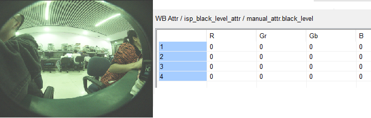

2.  Bypass 或Disable CCM、Gamma、ACM等影响颜色的模块，将AWB问题和其他模块问题分开。

    **图 2**  关闭其他颜色模块  
    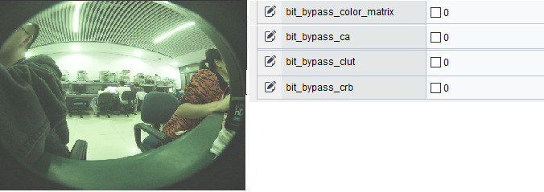

3.  打开3A分析工具，手动配置白平衡系数。选择左图中的灰色块，右键选择Apply Result to Global，当前灰色块期望的AWB增益生效。

    **图 3**  选择灰色块，配置手动AWB  
    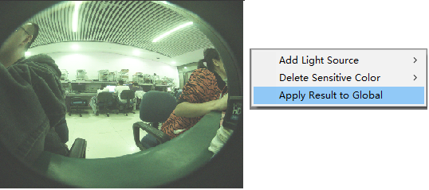

4.  观察图像中灰色区域颜色是否正常。示例图像仅做了Manual AWB，已经出现了局部区域偏粉，说明Raw数据有问题，请向前端追溯。

    **图 4**  手动AWB  
    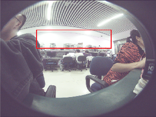

5.  如果以上步骤确认Raw数据是正常的，那么需要检查Gamma曲线是否合理。可以在板端配置Manual AWB，仅使能BLC、AWB、Demosaic和Gamma几个模块，开关Gamma对比偏色问题。
6.  局部偏色问题，还要确认是否混合光源场景。可以用3A分析工具分别选不同的区域手动计算白平衡系数，如果不同区域期望的白平衡增益差异大，说明是混合光源场景。只能通过降低饱和度或者色温权重调整等方式优化颜色表现。

### 3A分析工具看白色区域是否合理（AWB）

1.  从统计结果确认统计参数配置是否合理。选择白色块，正常情况CountAll应接近0xFFFF。下图中的CountAll为0，说明统计模块未找到灰点。

    **图 1**  统计结果确认  
    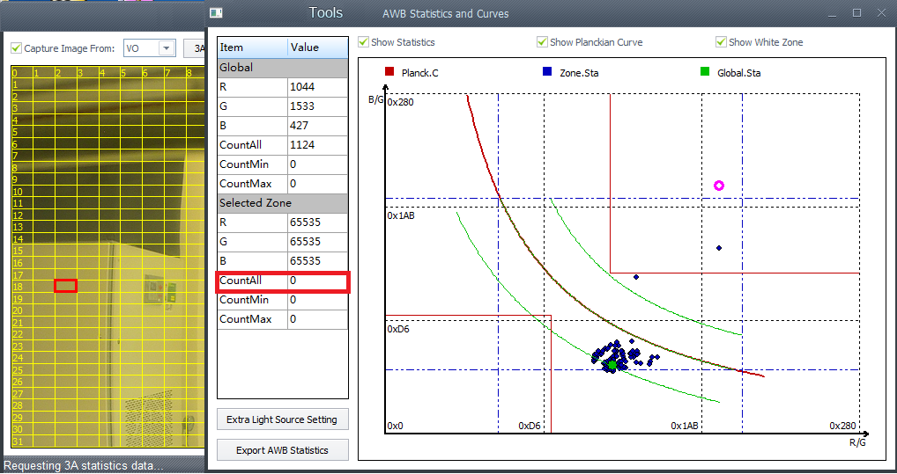

2.  关闭CrMax等灰点条件自适应功能。

    **图 2**  关闭统计参数自动调整功能  
    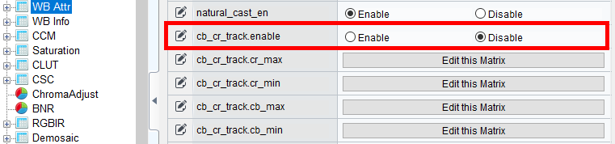

3.  调整灰点配置参数，调试原则是：上限调大，下限调小，到3A分析工具显示的统计结果，count\_all接近0xFFFF为止。确认是哪个参数引入问题后，white\_level和black\_level修改默认参数，Cr等需要调整数组。

    **图 3**  手动配置统计参数  
    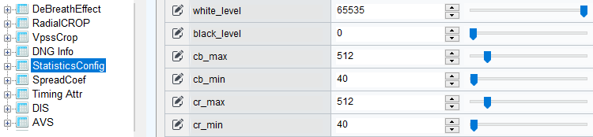

4.  统计模块OK后，确认室内外检测是否正确，如果室内外检测错误，先用Manual的方式配置正确的室内外模式。

    **图 4**  检查室内外配置参数  
    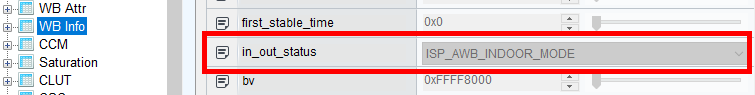

    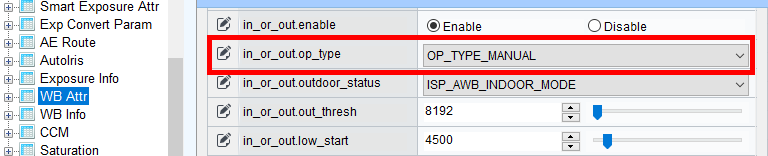

5.  确认检测色温有没有超出色温的上下限。将色温的上限调大，下限调小，观察问题是否有改善。
6.  确认灰色块有没有在白色区域范围内。

    影响白色区域范围的参数有：high\_color\_temp、low\_color\_temp、shift\_limit、curve\_l\_limit、curve\_r\_limit。观察是否有参数将灰色块排除在白色区域范围外。如[图5](#_Toc74749328)可以看到灰色块落在shift\_limit参数外，调大shift\_limit参数可解决问题如[图6](#_Toc74749329)。

    **图 5**  Shift参数调整前效果  
    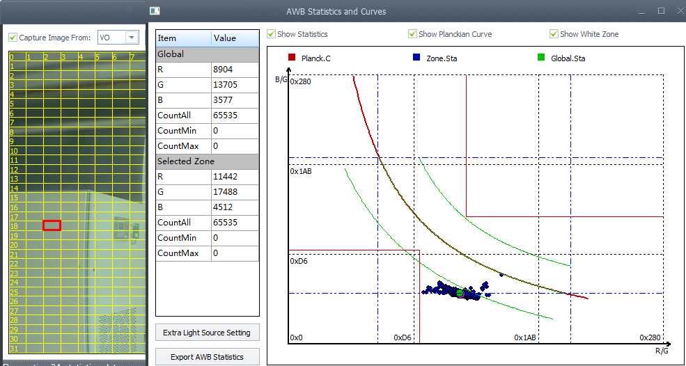

    **图 6**  Shift参数调整后效果  
    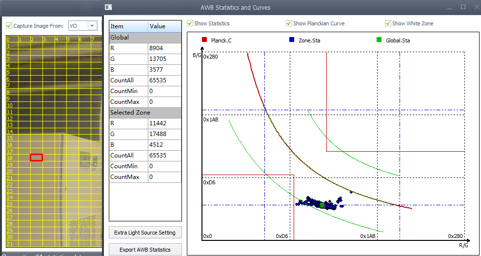

7.  场景内有多个光源点时，需要排除肤色检测模块对算法的影响。
8.  仍然不能确定偏色原因时，将算法由Advance设置为LowCost，看能否解决；若不能解决，将Attr的zone\_sel设置为0，看能否解决；若还不能解决，就需要从滤光片、黑电平等模块系统分析。

# 基础调色方案

## 基础调色方案概述

本章主要介绍的是与基础调色方案相关的模块，包括CCM等模块的调试指导。进行完CCM等模块的调试以后，产品的颜色能达到常规使用的效果需求。

## CCM调试

### CCM标定参数说明

CCM标定的原理是，使用sensor抓拍到的24色卡场景下前18个色块的实际颜色信息和其期望值，计算3x3的CCM矩阵。输入颜色经CCM矩阵处理得到的颜色与其期望值差距越小，则CCM矩阵就越理想。

**表 1**  CCM标定参数

<table><thead align="left"><tr id="row1330mcpsimp"><th class="cellrowborder" valign="top" width="20%" id="mcps1.2.4.1.1">
参数

</th>
<th class="cellrowborder" valign="top" width="39%" id="mcps1.2.4.1.2">
描述

</th>
<th class="cellrowborder" valign="top" width="41%" id="mcps1.2.4.1.3">
场景说明

</th>
</tr>
</thead>
<tbody><tr id="row1338mcpsimp"><td class="cellrowborder" valign="top" width="20%" headers="mcps1.2.4.1.1 ">
color_temp

</td>
<td class="cellrowborder" valign="top" width="39%" headers="mcps1.2.4.1.2 ">
当前配置的CCM对应的色温。

取值范围：[500, 30000]

</td>
<td class="cellrowborder" valign="top" width="41%" headers="mcps1.2.4.1.3 ">
-

</td>
</tr>
<tr id="row1346mcpsimp"><td class="cellrowborder" valign="top" width="20%" headers="mcps1.2.4.1.1 ">
ccm[]

</td>
<td class="cellrowborder" valign="top" width="39%" headers="mcps1.2.4.1.2 ">
不同色温下的颜色校正矩阵，8bit小数精度。bit 15是符号位，0表示正数，1表示负数，例如0x8010表示-16。

取值范围：[0x0,0xFFFF]

</td>
<td class="cellrowborder" valign="top" width="41%" headers="mcps1.2.4.1.3 ">
支持最大七个最小三个不同色温下的色彩还原矩阵，要按照色温递减的方式配置CCM。典型的三组CCM为D50，TL84，A三个光源下的CCM。典型的五组CCM为10K，D65，D50，TL84，A五个光源下的CCM。前一组的色温值与后一组的色温值需符合如下规则：Tpre * (15/16) &gt; Tpost * (17/16)。最终ISP将根据实际色温，将颜色校正矩阵通过插值的方法得到实际的颜色校正矩阵。

</td>
</tr>
</tbody>
</table>

### RAW数据采集

#### 标定光源选择

-   D50人工光源或5000K-5500K之间的自然光源
-   TL84光源
-   A光源

#### 采集步骤

1.  采集设备准备：标准X-Rite 24色卡，照度为600Lux均匀光源（左右两侧双光源，光源与色卡平面的夹角在25°- 45°），录像机。
2.  调整AE目标亮度，最亮灰阶\(Block 19\)的G分量亮度在饱和值的0.8倍左右（以12bit RAW数据为例，G分量数值在0xC00-0xD80之间）。
3.  采集中性灰RAW图像，检查录像机的镜头阴影程度。Shading较严重时，需要先标定Shading系数，24色卡图像需要先进行Shading校正后，再进行CCM标定。

### 标定

#### 标定步骤

1.  RAW数据导入部分请参考《图像质量调试工具使用指南》。
2.  选取24色区域。

    拖动四角色块中央的红色手柄，即可改变24色框的排布，将24个方框对准RAW图像的24色区域即可。如[图1](#_Ref426711119)所示。

    **图 1**  24色选框  
    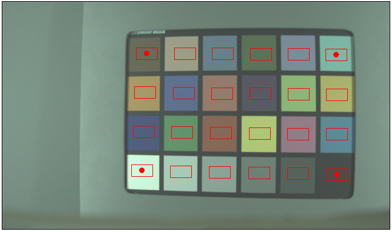

3.  配置标定参数（GAMMA，参考LAB，色块权重，差异标准）。
    -   设置ISP GAMMA：在ISP Gamma的下拉框中选择需要的Gamma预设值（目前支持sRGB和Rec709），也支持自定义。请用户输入ISP当前生效的Gamma表。

        **注意：当用户自定义ISP Gamma值时，需注意匹配相对应的LAB参考值，防止由于ISP Gamma和LAB Reference不匹配，导致作为线性变化的AWB和CCM共同作用无法达到目标图片的效果**。

    -   设置显示GAMMA：在Display Gamma的下拉框中选择需要的Gamma预设值（目前支持sRGB和Rec709）。
    -   设置LAB参考值：在LAB Reference的下拉框中选择需要的LAB预设值（目前支持D65条件下的Xrite标准值），也支持自定义。

        **注意：当用户自定义LAB值时，需注意匹配相对应的ISP Gamma，防止由于ISP Gamma和LAB Reference不匹配，导致作为线性变化的AWB和CCM共同作用无法达到目标图片的效果**。

    -   设置色块权重：在6x4的表格中配置色块的权重。色块的位置与表格中的位置对应。取值范围为0.0到16.0的浮点数，保留一位小数。
    -   选择差异标准：选择差异衡量的标准（支持CIE76、CIE94和CIE2000）以及差异矩阵（Delta C\*ab与Delta E\*ab）。推荐使用“CIE76 Delta E\*ab”和“CIE2000 Delta C\*ab”两种组合进行标定。
    -   选择是否autoGain。
        -   当选择autoGain时，会对RAW的值和目标值做亮度补偿。默认是勾选。在采集RAW的时候，通过控制曝光，使采集到的RAW数据在Gamma后接近目标图片的亮度。autoGain的作用是使用数字增益让RAW数据达到亮度最佳，减少采集RAW的难度。
        -   不选择autoGain时，用户可以通过完全控制RAW数据的亮度来得到不同的CCM的参数。

    -   选择是否BT.2020。
        -   当选择BT.2020时，ISP的输出符合BT.2020的标准。ISP Gamma可以是用户自定义的Gamma。显示GAMMA，LAB参考值，这两项和目标图片保持一致。当目标图片为sRGB标准时，设置显示GAMMA为sRGB。当目标图片为BT.2020标准时，设置显示GAMMA为Rec709。
        -   不选择BT.2020时，ISP的输出符合sRGB的标准。

4.  点击“Calibrate”按钮进行标定，获得结果CCM。在Result页面进行手动色调/饱和度调整，直到获取的CCM满足要求。

#### 手动调整CCM标定结果

如果查看校正后的图像发现效果不理想，还可以进行手动调整。在“Result”页面调整色调（Hue Corr）和饱和度（Sat Corr）修正值，并点击“Manual Adjust”，可以重新计算CCM并进行图像校正。重复上述操作，直到获得满意图像即可。

### 手动修改CCM

颜色校正矩阵的公式如下：

为了保证白平衡不受破坏，参数必须满足条件：

**R’中主要应该还是R分量的部分居多，因此必须满足条件：**

在满足以上条件的情况下，就可以微调颜色校正矩阵而不致产生破坏性影响。

将PQ ISP Calibration Tool校正出来的颜色校正矩阵配置到硬件寄存器后，抓取一副自己的24色卡图像和一副标杆的24色卡图像，在Photoshop中进行颜色对比：

**图 1**  捕获图片和目标图片的对比  
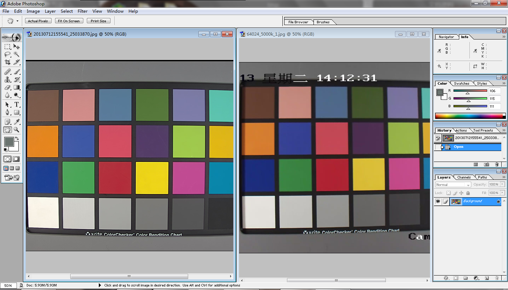

在右侧的info框中可以对比查看两幅图像的同样色块的R/G/B分量值，通常我们会更注重肤色、红色、绿色的校正。也可以对比标准色卡的R/G/B分量值进行对比。

**图 2**  24色卡标准值  
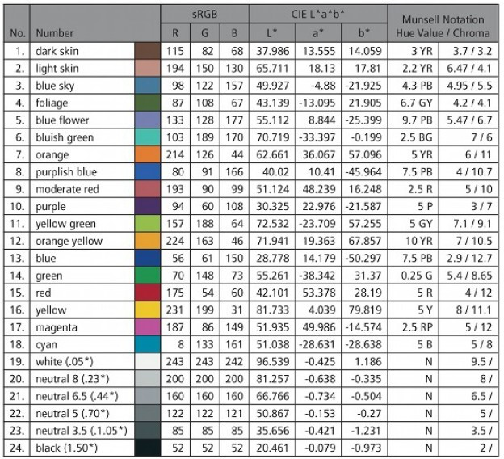

这时需要对比公式来调节参数。例如：

如果对比发现的红色块的B分量偏大，导致红色块偏水红色，那么根据公式，且a20，a21，a22 的正负性分别为负，负，正，**当前水红色的R，G，B值的大小顺序为R\>B\>G**，且已知目标标准是\(175,54,60\)，而且a20  + a21  + a22  = 256，因此可以通过三种方式来实现B’减小的目的：

-   增大a20 的绝对值，同时等量减小a21 的绝对值；
-   增大a21 的绝对值，同时等量增大a22 的绝对值；
-   增大a20 的绝对值，同时等量增大a22 的绝对值。

    通过这种方式，减小最终红色块的B’分量的值，从而将水红色的红色块校正回来。**注意：在修改红色块的B分量时，由于其他颜色的RGB大小顺序可能和红色块的冲突会导致其他色块的最终结果受到影响，所以要注意兼顾其他颜色，尤其是绿色块，肤色块，防止由于修改CCM矩阵带来的其他典型色块的偏色问题。**

对于深肤色和浅肤色这种三个颜色分量的值都差不多的色块，不是特别好单独调节。建议还是将红、绿、蓝这三个单色块的颜色校准确，其他颜色才会准确，因为其他颜色都是这三种颜色的混合色。

由于参与CCM标定的样本的影响，CCM的标定结果可能接近最佳而不是最佳。对CCM标定的结果进行手动调节，可以参考下面的几种做法。

-   CCM主对角线以外元素均为负值会较好。如果a02为正数，会导致饱和度高的红色偏紫，如果a20为正数，会导致饱和度高的蓝色偏紫。如果遇到这类偏紫的问题时，可以考虑手动将a02或a20从接近0的正数改为比较小的负数。
-   a10为负值时，a10绝对值越大，CCM后红色的G通道值越小，红色的饱和度越高；a12为负值时，a12绝对值越大，CCM后蓝色的G通道值越小，蓝色的饱和度越高。如果遇到红色或蓝色的饱和度过高的问题时，可以考虑减小a10或a12的绝对值。

### WDR 模式下标定CCM

对于WDR模式，因为CCM容易受到DRC的影响，容易造成颜色难以矫正。所以对于WDR模式来说，调整颜色需注意以下三点：

-   在标准光源下（一般是三组光源，分别是D50，TL84，A光源）拍标准24色卡，曝光比手动最大，同时也要调整亮度值，避免长帧过曝，采集长帧的RAW数据进行CCM的标定。标定过程中可以适当的降低饱和度，不能选择开启autoGain功能。
-   适当减少DRC曲线对图像亮度的大幅度提升，这样DRC对颜色的改变会较弱。此时，图像的亮度会有所降低达不到想要的亮度，这时，可以用gamma对亮度进行适当的提升。这样联调DRC和gamma模块，可以让整体的颜色调节更准确一些。
-   对于WDR模式，因为大多场景是混合光源场景，容易出现亮处颜色偏色，人脸颜色偏红等问题，除了可以降低饱和度值以外，还可以使用CA模块对这些区域适当的降低饱和度。

### 影响CCM标定的因素

CCM前的色卡数据的颜色特点如[图1](#_Ref505766663)所示。

**图 1**  CCM前24色卡值二维图  
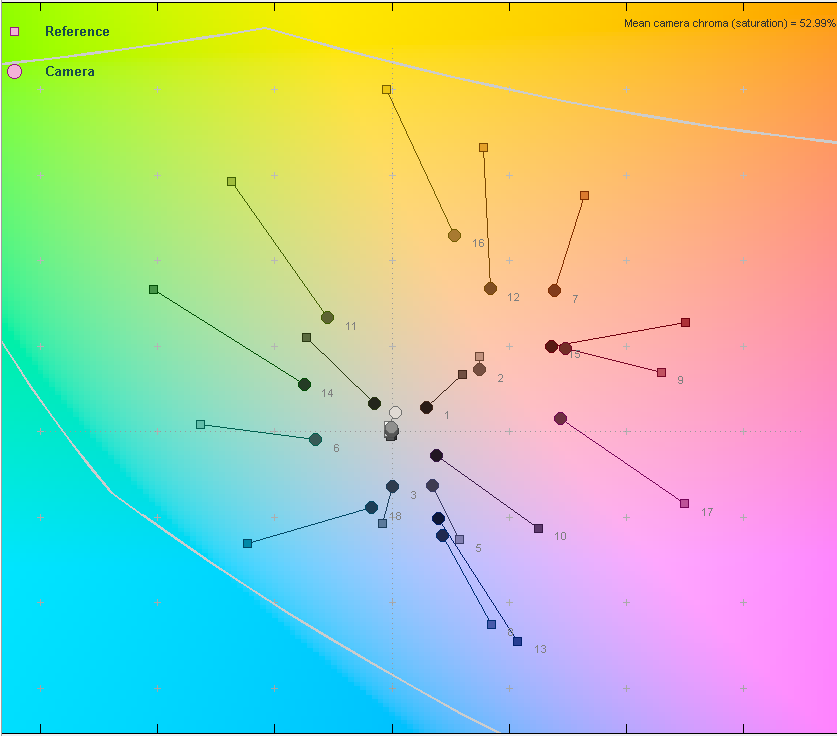

**图 2**  CCM前24色卡值三维图  
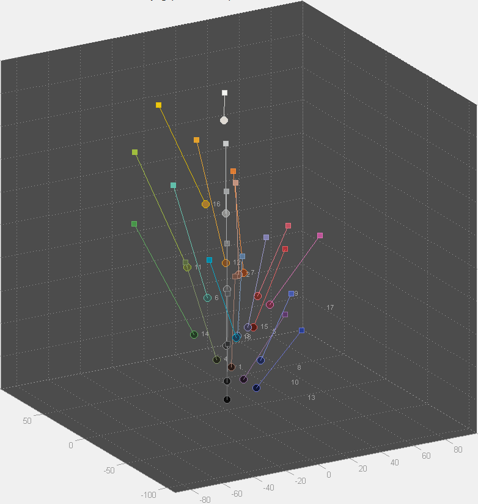

从二维图中可以看出CCM前数据饱和度低，亮度低。

如果拍摄的raw数据亮度不符合要求，Gamma也为自定义，那么参与运算CCM时建议选择误差评价Cie2000，LCAB。尽量使误差分布在亮度的方向上，而不是分布在饱和度和色度上。侧重保证饱和度低的颜色的准确。如果觉得某些颜色不好看，那就需要调整CCM计算时色块的权重参数，重新计算，反复确认。

调试好的CCM后，ISP最终输出色卡图片的颜色特点如[图3](#_Ref504385923)所示。

**图 3**  ISP最终24色卡值二维图  
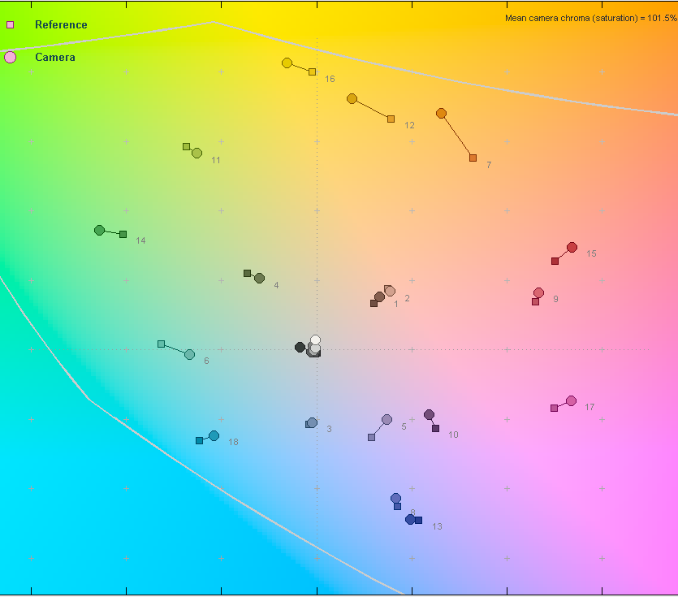

**图 4**  ISP最终24色卡值三维图  
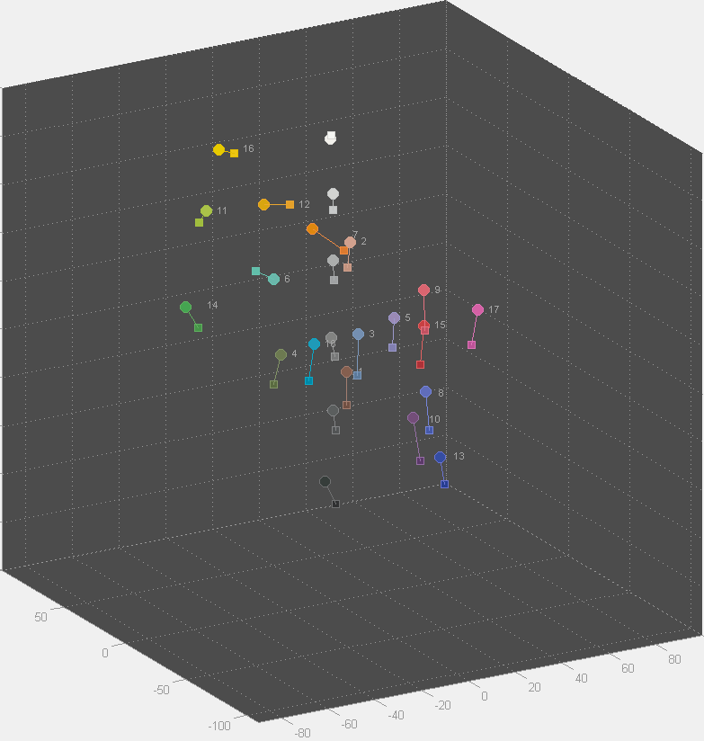

从[图4](#_Ref504385924)可以看出蓝色红色的误差最好分布在亮度维度上，因为如果红色和蓝色的误差分布在饱和度上，容易过饱和而超出色域。黄色的误差不用在意，因为在色卡中黄色属于这个画面亮度最高的色块，如果这张图片降低一个亮度等级，那么黄色块的颜色误差自然会好一些。

色卡做标定的要点如下：

-   光源均匀照射色卡，在色卡表面不能有阴影或者光源的变化。
-   色卡的色块RGB值不能发生clip。
-   灰块的亮度必须在70-95 IRE范围内。
-   需要知道目标图片的gamma曲线。
-   采集的raw需要在符合黑体辐射的光源下，所以最好是在阳光下。
-   拍摄的raw不能有混合色温，如果色卡的色温和背景的色温差别很大，那么不用关心标定后的背景的颜色表现。

对于CCM标定结果的影响因素：

-   源gamma
-   目标gamma
-   目标色彩空间：srgb，2020
-   源和目标图片的白平衡
-   源的亮度增益ispdgain

源gamma和目标gamma很重要，因为颜色的达到主要是依赖CCM和gamma共同作用达到。通俗的理解CCM更多的是起到微调颜色方向的作用，而gamma才是颜色调节到位的主力。根本原因是端到端系统对于ISP的要求。显示设备会对ISP传来的数据按照协议做Degamma的运算，还原出线性RGB数据，然后再做处理后显示在屏上。在HDR时代，这样的遵守协议的要求就更高了。源gamma和目标gamma的不匹配会直接造成颜色的误差。

源和目标图片的白平衡很重要，是因为标杆的颜色风格的一个决定性因素是标杆的AWB的增益。AWB可以偏向光源色，也可以完全还原到D65光源。

源的亮度增益ispdgain很重要，因为CCM的3x3矩阵的求解需要尽可能的让矩阵不包括亮度调节的成分。过亮或者是过暗的RAW标定出的CCM的饱和度特性就和亮度合适的不同。过亮的RAW标定出的CCM会偏向饱和度低，过暗的RAW标定出的CCM会偏向饱和度高。

上面5点因素主要影响CCM标定结果，不是说必须将某个因素调节到某个点就不能变化。更重要的是，需要用改变输入变量的方法来控制或者引导CCM最优解的求解，以达到想要的结果。

# 高级调色方案

## 高级调色方案概述

当完成基础调色方案相关的模块调节后，再进行高级调色方案相关的模块调节。在大部分颜色都满足需求的基础上，可以对于系统的颜色进行一个更加精细和个性化的调节。本章介绍与高级调色方案相关的CLUT等模块。

### 典型应用模式

#### 普通模式

普通模式下系统的颜色调节相对简单。

-   系统的颜色主要由AWB+CCM+GAMMA达到。
-   通过使用CA模块，可以在CCM确定的颜色的基础上，根据亮度做饱和度的调节，可以使画面更有层次。

#### 喜好色增强模式

喜好色增强模式下系统的颜色调节策略：

-   CCM的调节目标侧重于兼顾所有颜色，即让各种颜色的误差都相当，不偏向于某种颜色。
-   CLUT在CCM调试稳定的基础上，针对喜好色做特定的增强，或者针对CCM不满足需求的颜色做单独调节。

#### 色彩风格复制模式

色彩风格复制模式下系统的颜色调节策略：

-   系统的曝光策略接近目标设备。
-   GAMMA通过使用灰阶卡，或者140色卡中的15个灰阶标定的方式接近目标。
-   CCM的调节目标侧重于达到目标设备拍摄的色卡的颜色。
-   CLUT在CCM调试基本接近目标设备的基础上，针对CCM后仍有误差的颜色做补充调节。

## CLUT调试

### CLUT标定参数说明

CLUT是一个改变线性RGB值的模块，这个模块把用户的颜色调节需求，转化为源和目标RGB对的数据映射关系。ISP内的CLUT调节目标是可生长完善的，用于所有场景的表。通过交互工具调节后能导出和颜色调节需求等价的CLUT表，在生成CLUT的时候会把有矛盾的需求消除。

### 需求输入的方式

详细的操作过程请参考《图像质量调试工具使用指南》。

#### 色卡对

使用源设备和目标设备同时拍摄色卡，可以很容易的获得广泛的颜色样本，指导CLUT表的生成。使用X-Rite的ColorChecker色卡可以获得24个颜色样本对，使用X-Rite的ColorChecker SG色卡可以获得140个颜色样本对。

**图 1**  色卡对  
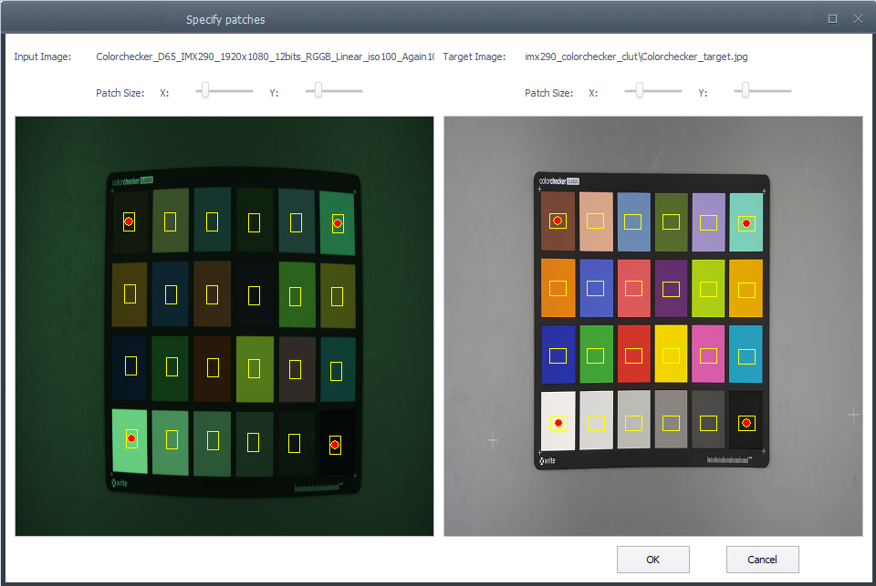

#### 任意颜色对

使用源设备和目标设备同时拍摄同一场景，可以从场景中选择对应的物体表面，可以获得任意颜色对，指导CLUT表的生成。

**图 1**  任意颜色对  

#### HSL参数调节

在没有目标设备的情况下，用源设备拍摄场景后，可以选择想调节的颜色表面，然后通过调整HSL参数来获得目标RGB值，指导CLUT表的生成。hue范围+-20，sat范围0.4-1.6倍，light范围0.6-1.4倍。

**图 1**  HSL参数调节  
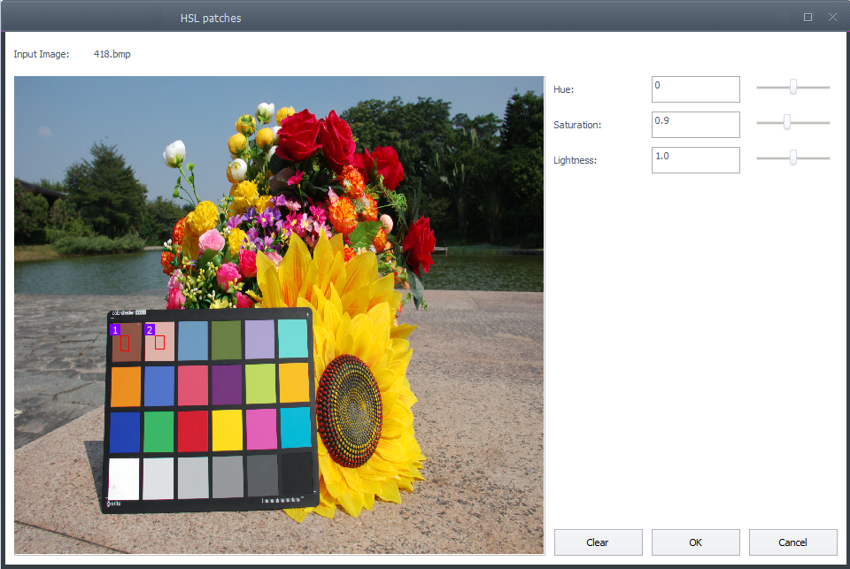

### CLUT应用举例

#### 利用色卡调节

利用色卡可以快速调节CLUT。

用户可以使用源设备和目标设备，在室外拍摄多个不同亮度下的色卡，源设备采集RAW，目标设备采集JPG。

在板端灌入采集到的RAW，将亮度，白平衡调到和目标图片一致，CCM和Gamma使用当前希望使用的参数，抓取ISP输出的图片。

通过Color Check Free功能可以生成2-3组不同亮度下的色卡色块的RGB对。如图 使用含色卡的JPG图片所示。

**图 1**  使用含色卡的JPG图片  
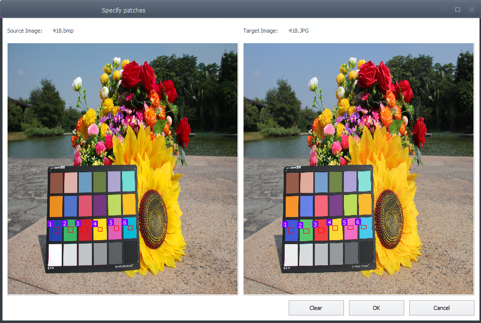

**图 2**  生成色卡RGB对  
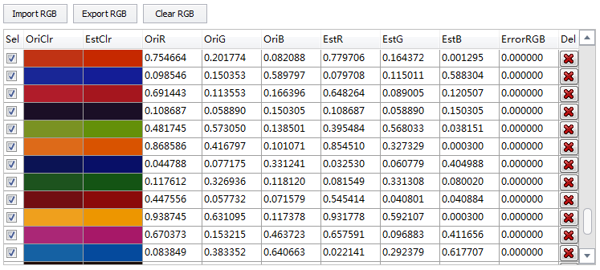

如图图 生成色卡RGB对所示，经过多次操作可以得到2-3组不同亮度下的色卡的RGB对。如果经过确认颜色都符合调节需求，那么这些RGB对生成的CLUT就可以看做是一个基本的调节表。将这个RGB对导出，后续调节可以在这个基础上进一步进行。

#### 利用颜色值调节

CLUT可以直接使用颜色值进行颜色的调节。下面以肤色调节为例。

在源图和目标图都导入同一个含有颜色分布的图片。这里导入的是含有各种肤色值的图片。

通过Color Check Free功能可以将颜色调节趋势的需求转换到RGB对。如图 使用颜色值调节所示。

**图 1**  使用颜色值调节  
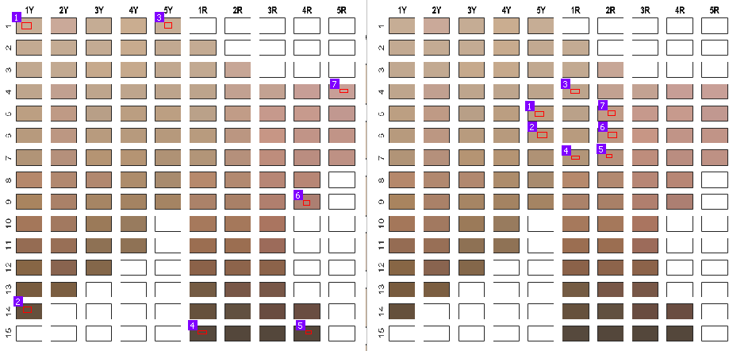

生成的RGB对如[图2](#_Ref515525411)所示。

**图 2**  生成肤色RGB对  
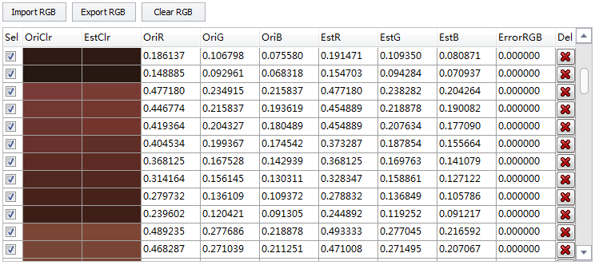

这些RGB对生成的CLUT，需要加载到板端，通过灌入含有肤色的真实图片的RAW进行进一步的确认。

