# 前言<a name="ZH-CN_TOPIC_0000002474400196"></a>

**概述<a name="section4537382116410"></a>**

本文档为使用媒体处理芯片的IVE协处理器进行_识别_分析方案开发的程序员而写，目的是供您在开发过程中查阅IVE协处理器支持的各种参考信息，包括API、头文件、错误码、Proc信息等。

> **说明：** 
>本文未有特殊说明，SS927V100与SS928V100内容完全一致。

**产品版本<a name="section155321452151615"></a>**

与本文档相对应的产品版本如下。

<a name="table10537205211163"></a>
<table><thead align="left"><tr id="row16570155221618"><th class="cellrowborder" valign="top" width="31.759999999999998%" id="mcps1.1.3.1.1"><p id="p6570452161616"><a name="p6570452161616"></a><a name="p6570452161616"></a>产品名称</p>
</th>
<th class="cellrowborder" valign="top" width="68.24%" id="mcps1.1.3.1.2"><p id="p1157017526160"><a name="p1157017526160"></a><a name="p1157017526160"></a>产品版本</p>
</th>
</tr>
</thead>
<tbody><tr id="row105711852151613"><td class="cellrowborder" valign="top" width="31.759999999999998%" headers="mcps1.1.3.1.1 "><p id="p125711852121615"><a name="p125711852121615"></a><a name="p125711852121615"></a>SS928</p>
</td>
<td class="cellrowborder" valign="top" width="68.24%" headers="mcps1.1.3.1.2 "><p id="p1557185217161"><a name="p1557185217161"></a><a name="p1557185217161"></a>V100</p>
</td>
</tr>
<tr id="row1712262811434"><td class="cellrowborder" valign="top" width="31.759999999999998%" headers="mcps1.1.3.1.1 "><p id="p8622349102117"><a name="p8622349102117"></a><a name="p8622349102117"></a>SS927</p>
</td>
<td class="cellrowborder" valign="top" width="68.24%" headers="mcps1.1.3.1.2 "><p id="p9185184311112"><a name="p9185184311112"></a><a name="p9185184311112"></a>V100</p>
</td>
</tr>
</tbody>
</table>

**读者对象<a name="section4378592816410"></a>**

本文档（本指南）主要适用于以下工程师：

-   技术支持工程师
-   软件开发工程师

**符号约定<a name="section133020216410"></a>**

在本文中可能出现下列标志，它们所代表的含义如下。

<a name="table2622507016410"></a>
<table><thead align="left"><tr id="row1530720816410"><th class="cellrowborder" valign="top" width="20.580000000000002%" id="mcps1.1.3.1.1"><p id="p6450074116410"><a name="p6450074116410"></a><a name="p6450074116410"></a><strong id="b2136615816410"><a name="b2136615816410"></a><a name="b2136615816410"></a>符号</strong></p>
</th>
<th class="cellrowborder" valign="top" width="79.42%" id="mcps1.1.3.1.2"><p id="p5435366816410"><a name="p5435366816410"></a><a name="p5435366816410"></a><strong id="b5941558116410"><a name="b5941558116410"></a><a name="b5941558116410"></a>说明</strong></p>
</th>
</tr>
</thead>
<tbody><tr id="row1372280416410"><td class="cellrowborder" valign="top" width="20.580000000000002%" headers="mcps1.1.3.1.1 "><p id="p3734547016410"><a name="p3734547016410"></a><a name="p3734547016410"></a><a name="image2670064316410"></a><a name="image2670064316410"></a><span></span></p>
</td>
<td class="cellrowborder" valign="top" width="79.42%" headers="mcps1.1.3.1.2 "><p id="p1757432116410"><a name="p1757432116410"></a><a name="p1757432116410"></a>表示如不避免则将会导致死亡或严重伤害的具有高等级风险的危害。</p>
</td>
</tr>
<tr id="row466863216410"><td class="cellrowborder" valign="top" width="20.580000000000002%" headers="mcps1.1.3.1.1 "><p id="p1432579516410"><a name="p1432579516410"></a><a name="p1432579516410"></a><a name="image4895582316410"></a><a name="image4895582316410"></a><span></span></p>
</td>
<td class="cellrowborder" valign="top" width="79.42%" headers="mcps1.1.3.1.2 "><p id="p959197916410"><a name="p959197916410"></a><a name="p959197916410"></a>表示如不避免则可能导致死亡或严重伤害的具有中等级风险的危害。</p>
</td>
</tr>
<tr id="row123863216410"><td class="cellrowborder" valign="top" width="20.580000000000002%" headers="mcps1.1.3.1.1 "><p id="p1232579516410"><a name="p1232579516410"></a><a name="p1232579516410"></a><a name="image1235582316410"></a><a name="image1235582316410"></a><span></span></p>
</td>
<td class="cellrowborder" valign="top" width="79.42%" headers="mcps1.1.3.1.2 "><p id="p123197916410"><a name="p123197916410"></a><a name="p123197916410"></a>表示如不避免则可能导致轻微或中度伤害的具有低等级风险的危害。</p>
</td>
</tr>
<tr id="row5786682116410"><td class="cellrowborder" valign="top" width="20.580000000000002%" headers="mcps1.1.3.1.1 "><p id="p2204984716410"><a name="p2204984716410"></a><a name="p2204984716410"></a><a name="image4504446716410"></a><a name="image4504446716410"></a><span></span></p>
</td>
<td class="cellrowborder" valign="top" width="79.42%" headers="mcps1.1.3.1.2 "><p id="p4388861916410"><a name="p4388861916410"></a><a name="p4388861916410"></a>用于传递设备或环境安全警示信息。如不避免则可能会导致设备损坏、数据丢失、设备性能降低或其它不可预知的结果。</p>
<p id="p1238861916410"><a name="p1238861916410"></a><a name="p1238861916410"></a>“须知”不涉及人身伤害。</p>
</td>
</tr>
<tr id="row2856923116410"><td class="cellrowborder" valign="top" width="20.580000000000002%" headers="mcps1.1.3.1.1 "><p id="p5555360116410"><a name="p5555360116410"></a><a name="p5555360116410"></a><a name="image799324016410"></a><a name="image799324016410"></a><span></span></p>
</td>
<td class="cellrowborder" valign="top" width="79.42%" headers="mcps1.1.3.1.2 "><p id="p4612588116410"><a name="p4612588116410"></a><a name="p4612588116410"></a>对正文中重点信息的补充说明。</p>
<p id="p1232588116410"><a name="p1232588116410"></a><a name="p1232588116410"></a>“说明”不是安全警示信息，不涉及人身、设备及环境伤害信息。</p>
</td>
</tr>
</tbody>
</table>

**修改记录<a name="section2467512116410"></a>**

<a name="table1557726816410"></a>
<table><thead align="left"><tr id="row2942532716410"><th class="cellrowborder" valign="top" width="20.72%" id="mcps1.1.4.1.1"><p id="p3778275416410"><a name="p3778275416410"></a><a name="p3778275416410"></a><strong id="b5687322716410"><a name="b5687322716410"></a><a name="b5687322716410"></a>文档版本</strong></p>
</th>
<th class="cellrowborder" valign="top" width="26.119999999999997%" id="mcps1.1.4.1.2"><p id="p5627845516410"><a name="p5627845516410"></a><a name="p5627845516410"></a><strong id="b5800814916410"><a name="b5800814916410"></a><a name="b5800814916410"></a>发布日期</strong></p>
</th>
<th class="cellrowborder" valign="top" width="53.16%" id="mcps1.1.4.1.3"><p id="p2382284816410"><a name="p2382284816410"></a><a name="p2382284816410"></a><strong id="b3316380216410"><a name="b3316380216410"></a><a name="b3316380216410"></a>修改说明</strong></p>
</th>
</tr>
</thead>
<tbody><tr id="row5947359616410"><td class="cellrowborder" valign="top" width="20.72%" headers="mcps1.1.4.1.1 "><p id="p1562925111719"><a name="p1562925111719"></a><a name="p1562925111719"></a>00B01</p>
</td>
<td class="cellrowborder" valign="top" width="26.119999999999997%" headers="mcps1.1.4.1.2 "><p id="p2301119191720"><a name="p2301119191720"></a><a name="p2301119191720"></a>2025-09-15</p>
</td>
<td class="cellrowborder" valign="top" width="53.16%" headers="mcps1.1.4.1.3 "><p id="p2705430201716"><a name="p2705430201716"></a><a name="p2705430201716"></a>第1次临时版本发布</p>
</td>
</tr>
</tbody>
</table>

# 概述<a name="ZH-CN_TOPIC_0000002471091246"></a>


## 概述<a name="ZH-CN_TOPIC_0000002470931328"></a>

IVE（_Identification_  Video Engine）是媒体处理芯片_识别_分析系统中的硬件加速模块。用户基于IVE开发_识别_分析方案可以加速_识别_分析，降低CPU占用。当前IVE提供的算子可以支撑开发视频诊断、周界防范等_识别_分析方案。

## 功能描述<a name="ZH-CN_TOPIC_0000002471091280"></a>


### 重要概念<a name="ZH-CN_TOPIC_0000002503971263"></a>

-   句柄\(handle\)

    用户在调用算子创建任务时，系统会为每个任务分配一个handle，用于标识不同的任务。

-   及时返回结果标志is\_instant

    用户在创建某个任务后，希望及时得到该任务完成的信息，则需要在创建该任务时，将is\_instant设置为TD\_TRUE。否则，如果用户不关心该任务是否完成，建议将is\_instant设置为TD\_FALSE，这样可以与后续任务组链执行，减少中断次数，提升性能。

-   查询\(query\)

    用户根据系统返回的handle，调用ss\_mpi\_ive\_query可以查询对应算子任务是否完成。

-   及时刷cache

    IVE硬件只能从DDR中获取数据。如果用户在调用IVE任务时，访问空间可cache而且CPU曾经访问，为了保证IVE输入输出数据不被CPU cahce干扰，此时用户需要调用ss\_mpi\_sys\_mmz\_flush\_cache接口刷cache（详细信息请参见《MPP 媒体处理软件Vx.y 开发参考》），将数据从cache刷到DDR，以供IVE使用。

-   跨度（stride）：与图像或二维数据的width度量一致的量，如[图1](#fig1615616519207)所示。

    -   ot\_svp\_img图像数据跨度，表示图像一行以“像素”计算的单元个数，“像素”位宽可以是8bit，16bit等。
    -   ot\_svp\_data二维数据跨度，表示二维数据一行的字节数，即为[图1](#fig1615616519207)中n=8的情况。

    可以将ot\_svp\_img看成一个“像素”用8bit表示的图像，那么跨度即统一表述为图像或二维数据的一行以“像素”计算的单元个数。

**图 1**  跨度（stride）示意图<a name="fig1615616519207"></a>  
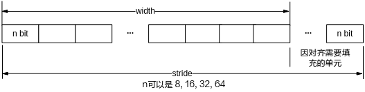

-   对齐

    硬件为了快速访问内存首地址或者跨行访问数据，要求内存地址或内存跨度必须为对齐系数的倍数。

    -   数据内存首地址对齐

        当前IVE算子对其输入输出有要求1byte对齐、2byte对齐以及16byte对齐的，具体见各算子API参考中的参数要求。

    -   跨度对齐

        对于二维广义图像、二维单分量数据以及一维数组数据的跨度均必须满足16“像素”对齐。

> **须知：** 
>在使用DDR4时，为提高访存效率，建议首地址使用256字节对齐，stride使用256“像素”的奇数倍对齐。如果是使用64位操作系统，需要使用到的MMZ地址必须是在一个4GB空间内，否则会出现异常。

-   输入、输出数据类型（具体结构定义请参见“数据类型和数据结构”）
    -   二维广义图像数据

        ot\_svp\_img、ot\_svp\_src\_img、ot\_svp\_dst\_img，图像的类型参考ot\_svp\_img\_type，具体的内存分配如OT\_SVP\_IMG\_TYPE\_U8C1 \\ OT\_SVP\_IMG\_TYPE\_S8C1 \\ OT\_SVP\_IMG\_TYPE\_S16C1 \\ OT\_SVP\_IMG\_TYPE\_U16C1 \\ OT\_SVP\_IMG\_TYPE\_S32C1 \\ OT\_SVP\_IMG\_TYPE\_U32C1 \\ OT\_SVP\_IMG\_TYPE\_S64C1 \\ OT\_SVP\_IMG\_TYPE\_U64C1 类型的ot\_svp\_img图像图～OT\_SVP\_IMG\_TYPE\_U8C3\_PLANAR类型的ot\_svp\_img图像图所示。

        **注意：当前所有算子输入输出的二维广义图像数据的高宽均需为偶数。**

    -   二维单分量数据

        ot\_svp\_data，以byte为单位的二维数据，主要用于dma等，其内存如[图11](#fig41189544118)所示；根据类型ot\_svp\_img可以转化为单个或多个ot\_svp\_data。

    -   一维数据

        ot\_svp\_mem\_info、ot\_svp\_src\_mem\_info、ot\_svp\_dst\_mem\_info，表示一维数据，如hist的统计数据、gmm的模型数据、lk\_optical\_flow的角点输入等；其内存如[图12](#fig1518002910213)所示。

-   二维广义图像类型

**表 1**  二维广义图像类型表1

<a name="table15404mcpsimp"></a>
<table><thead align="left"><tr id="row15412mcpsimp"><th class="cellrowborder" valign="top" width="20.712071207120715%" id="mcps1.2.5.1.1"><p id="p15414mcpsimp"><a name="p15414mcpsimp"></a><a name="p15414mcpsimp"></a>类型</p>
</th>
<th class="cellrowborder" valign="top" width="30.733073307330734%" id="mcps1.2.5.1.2"><p id="p15416mcpsimp"><a name="p15416mcpsimp"></a><a name="p15416mcpsimp"></a>图像描述</p>
</th>
<th class="cellrowborder" valign="top" width="30.733073307330734%" id="mcps1.2.5.1.3"><p id="p15418mcpsimp"><a name="p15418mcpsimp"></a><a name="p15418mcpsimp"></a>内存地址</p>
</th>
<th class="cellrowborder" valign="top" width="17.82178217821782%" id="mcps1.2.5.1.4"><p id="p15420mcpsimp"><a name="p15420mcpsimp"></a><a name="p15420mcpsimp"></a>跨度</p>
</th>
</tr>
</thead>
<tbody><tr id="row15422mcpsimp"><td class="cellrowborder" valign="top" width="20.712071207120715%" headers="mcps1.2.5.1.1 "><p xml:lang="da-DK" id="p15424mcpsimp"><a name="p15424mcpsimp"></a><a name="p15424mcpsimp"></a>OT_SVP_IMG_TYPE_U8C1</p>
</td>
<td class="cellrowborder" valign="top" width="30.733073307330734%" headers="mcps1.2.5.1.2 "><p xml:lang="da-DK" id="p15426mcpsimp"><a name="p15426mcpsimp"></a><a name="p15426mcpsimp"></a>8bit无符号单通道图像，如 OT_SVP_IMG_TYPE_U8C1 \ OT_SVP_IMG_TYPE_S8C1 \ OT_SVP_IMG_TYPE_S16C1 \ OT_SVP_IMG_TYPE_U16C1 \ OT_SVP_IMG_TYPE_S32C1 \ OT_SVP_IMG_TYPE_U32C1 \ OT_SVP_IMG_TYPE_S64C1 \ OT_SVP_IMG_TYPE_U64C1 类型的ot_svp_img图像图所示</p>
</td>
<td class="cellrowborder" valign="top" width="30.733073307330734%" headers="mcps1.2.5.1.3 "><p xml:lang="da-DK" id="p15429mcpsimp"><a name="p15429mcpsimp"></a><a name="p15429mcpsimp"></a>仅用到ot_svp_img中的phys_addr[0]、virt_addr[0]</p>
</td>
<td class="cellrowborder" valign="top" width="17.82178217821782%" headers="mcps1.2.5.1.4 "><p xml:lang="da-DK" id="p15431mcpsimp"><a name="p15431mcpsimp"></a><a name="p15431mcpsimp"></a>仅用到stride[0]</p>
</td>
</tr>
<tr id="row15432mcpsimp"><td class="cellrowborder" valign="top" width="20.712071207120715%" headers="mcps1.2.5.1.1 "><p id="p15434mcpsimp"><a name="p15434mcpsimp"></a><a name="p15434mcpsimp"></a><span xml:lang="da-DK" id="ph15435mcpsimp"><a name="ph15435mcpsimp"></a><a name="ph15435mcpsimp"></a>OT_SVP</span>_IMG_TYPE_S8C1</p>
</td>
<td class="cellrowborder" valign="top" width="30.733073307330734%" headers="mcps1.2.5.1.2 "><p id="p15437mcpsimp"><a name="p15437mcpsimp"></a><a name="p15437mcpsimp"></a>8bit有符号单通道图像<span xml:lang="da-DK" id="ph15438mcpsimp"><a name="ph15438mcpsimp"></a><a name="ph15438mcpsimp"></a>，</span>如<a href="#fig134745715231">图2</a>所示</p>
</td>
<td class="cellrowborder" valign="top" width="30.733073307330734%" headers="mcps1.2.5.1.3 "><p xml:lang="da-DK" id="p15442mcpsimp"><a name="p15442mcpsimp"></a><a name="p15442mcpsimp"></a>仅用到ot_svp_img中的phys_addr[0]、virt_addr[0]</p>
</td>
<td class="cellrowborder" valign="top" width="17.82178217821782%" headers="mcps1.2.5.1.4 "><p xml:lang="da-DK" id="p15444mcpsimp"><a name="p15444mcpsimp"></a><a name="p15444mcpsimp"></a>仅用到stride[0]</p>
</td>
</tr>
<tr id="row15445mcpsimp"><td class="cellrowborder" valign="top" width="20.712071207120715%" headers="mcps1.2.5.1.1 "><p id="p15447mcpsimp"><a name="p15447mcpsimp"></a><a name="p15447mcpsimp"></a><span xml:lang="da-DK" id="ph15448mcpsimp"><a name="ph15448mcpsimp"></a><a name="ph15448mcpsimp"></a>OT_SVP</span>_IMG_TYPE_YUV420SP</p>
</td>
<td class="cellrowborder" valign="top" width="30.733073307330734%" headers="mcps1.2.5.1.2 "><p id="p15450mcpsimp"><a name="p15450mcpsimp"></a><a name="p15450mcpsimp"></a>YCbCr420 SemiPlannar数据格式图像<span xml:lang="da-DK" id="ph15451mcpsimp"><a name="ph15451mcpsimp"></a><a name="ph15451mcpsimp"></a>，如</span><a href="#fig5654131372716">图3</a><span xml:lang="da-DK" id="ph15454mcpsimp"><a name="ph15454mcpsimp"></a><a name="ph15454mcpsimp"></a>所示</span></p>
</td>
<td class="cellrowborder" valign="top" width="30.733073307330734%" headers="mcps1.2.5.1.3 "><p xml:lang="da-DK" id="p15456mcpsimp"><a name="p15456mcpsimp"></a><a name="p15456mcpsimp"></a><span xml:lang="en-US" id="ph15457mcpsimp"><a name="ph15457mcpsimp"></a><a name="ph15457mcpsimp"></a>内存地址仅用到</span>ot_svp_img<span xml:lang="en-US" id="ph15458mcpsimp"><a name="ph15458mcpsimp"></a><a name="ph15458mcpsimp"></a>中的</span>phys_addr[0]、virt_addr[0]（亮度Y）和phys_addr[1]、virt_addr[1]（色度，VU间隔排列）；亮度和色度内存可以不连续，但不推荐</p>
</td>
<td class="cellrowborder" valign="top" width="17.82178217821782%" headers="mcps1.2.5.1.4 "><p xml:lang="da-DK" id="p15460mcpsimp"><a name="p15460mcpsimp"></a><a name="p15460mcpsimp"></a>跨度仅用到stride[0]（亮度跨度）和stride[1]（色度跨度）</p>
</td>
</tr>
<tr id="row15461mcpsimp"><td class="cellrowborder" valign="top" width="20.712071207120715%" headers="mcps1.2.5.1.1 "><p id="p15463mcpsimp"><a name="p15463mcpsimp"></a><a name="p15463mcpsimp"></a><span xml:lang="da-DK" id="ph15464mcpsimp"><a name="ph15464mcpsimp"></a><a name="ph15464mcpsimp"></a>OT_SVP</span>_IMG_TYPE_YUV422SP</p>
</td>
<td class="cellrowborder" valign="top" width="30.733073307330734%" headers="mcps1.2.5.1.2 "><p xml:lang="da-DK" id="p15466mcpsimp"><a name="p15466mcpsimp"></a><a name="p15466mcpsimp"></a>YcbCr422 SemiPlannar数据格式图像，如 OT_SVP_IMG_TYPE_YUV422SP类型的ot_svp_img图像图所示</p>
</td>
<td class="cellrowborder" valign="top" width="30.733073307330734%" headers="mcps1.2.5.1.3 "><p xml:lang="da-DK" id="p15469mcpsimp"><a name="p15469mcpsimp"></a><a name="p15469mcpsimp"></a><span xml:lang="en-US" id="ph15470mcpsimp"><a name="ph15470mcpsimp"></a><a name="ph15470mcpsimp"></a>内存地址仅用到</span>ot_svp_img<span xml:lang="en-US" id="ph15471mcpsimp"><a name="ph15471mcpsimp"></a><a name="ph15471mcpsimp"></a>中的</span>phys_addr[0]、virt_addr[0]（亮度Y）和phys_addr[1]、virt_addr[1]（色度，VU间隔<span xml:lang="en-US" id="ph15472mcpsimp"><a name="ph15472mcpsimp"></a><a name="ph15472mcpsimp"></a>存储</span>）；亮度和色度内存可以不连续，但不推荐</p>
</td>
<td class="cellrowborder" valign="top" width="17.82178217821782%" headers="mcps1.2.5.1.4 "><p xml:lang="da-DK" id="p15474mcpsimp"><a name="p15474mcpsimp"></a><a name="p15474mcpsimp"></a>跨度仅用到stride[0]（亮度跨度）和stride[1]（色度跨度）</p>
</td>
</tr>
<tr id="row15475mcpsimp"><td class="cellrowborder" valign="top" width="20.712071207120715%" headers="mcps1.2.5.1.1 "><p id="p15477mcpsimp"><a name="p15477mcpsimp"></a><a name="p15477mcpsimp"></a><span xml:lang="da-DK" id="ph15478mcpsimp"><a name="ph15478mcpsimp"></a><a name="ph15478mcpsimp"></a>OT_SVP</span>_IMG_TYPE_YUV420P</p>
</td>
<td class="cellrowborder" valign="top" width="30.733073307330734%" headers="mcps1.2.5.1.2 "><p id="p15480mcpsimp"><a name="p15480mcpsimp"></a><a name="p15480mcpsimp"></a>YCbCr420 Planar数据格式图像，如<a href="#fig125145135718">图5</a>所示</p>
</td>
<td class="cellrowborder" valign="top" width="30.733073307330734%" headers="mcps1.2.5.1.3 "><p xml:lang="da-DK" id="p15483mcpsimp"><a name="p15483mcpsimp"></a><a name="p15483mcpsimp"></a><span xml:lang="en-US" id="ph15484mcpsimp"><a name="ph15484mcpsimp"></a><a name="ph15484mcpsimp"></a>内存地址用到</span>ot_svp_img<span xml:lang="en-US" id="ph15485mcpsimp"><a name="ph15485mcpsimp"></a><a name="ph15485mcpsimp"></a>中的</span>phys_addr[0]、virt_addr[0]（亮度Y），phys_addr[1]、virt_addr[1]（色度U）和phys_addr[2]、virt_addr[2]（色度V）；Y、U、V内存可不连续，但不推荐</p>
</td>
<td class="cellrowborder" valign="top" width="17.82178217821782%" headers="mcps1.2.5.1.4 "><p xml:lang="da-DK" id="p15487mcpsimp"><a name="p15487mcpsimp"></a><a name="p15487mcpsimp"></a>跨度用到stride[0]（亮度Y跨度）、stride[1]（色度U跨度）和stride[2]（色度V跨度）</p>
</td>
</tr>
<tr id="row15488mcpsimp"><td class="cellrowborder" valign="top" width="20.712071207120715%" headers="mcps1.2.5.1.1 "><p id="p15490mcpsimp"><a name="p15490mcpsimp"></a><a name="p15490mcpsimp"></a><span xml:lang="da-DK" id="ph15491mcpsimp"><a name="ph15491mcpsimp"></a><a name="ph15491mcpsimp"></a>OT_SVP</span>_IMG_TYPE_YUV422P</p>
</td>
<td class="cellrowborder" valign="top" width="30.733073307330734%" headers="mcps1.2.5.1.2 "><p id="p15493mcpsimp"><a name="p15493mcpsimp"></a><a name="p15493mcpsimp"></a>YCbCr422 Planar数据格式图像，如<a href="#fig18174113416577">图6</a>所示</p>
</td>
<td class="cellrowborder" valign="top" width="30.733073307330734%" headers="mcps1.2.5.1.3 "><p xml:lang="da-DK" id="p15496mcpsimp"><a name="p15496mcpsimp"></a><a name="p15496mcpsimp"></a><span xml:lang="en-US" id="ph15497mcpsimp"><a name="ph15497mcpsimp"></a><a name="ph15497mcpsimp"></a>内存地址用到</span>ot_svp_img<span xml:lang="en-US" id="ph15498mcpsimp"><a name="ph15498mcpsimp"></a><a name="ph15498mcpsimp"></a>中的</span>phys_addr[0]、virt_addr[0]（亮度Y），phys_addr[1]、virt_addr[1]（色度U）和phys_addr[2]、virt_addr[2]（色度V）</p>
</td>
<td class="cellrowborder" valign="top" width="17.82178217821782%" headers="mcps1.2.5.1.4 "><p xml:lang="da-DK" id="p15500mcpsimp"><a name="p15500mcpsimp"></a><a name="p15500mcpsimp"></a>跨度用到stride[0]（亮度跨度）、stride[1]（色度U跨度）和stride[2]（色度V跨度）</p>
</td>
</tr>
<tr id="row15501mcpsimp"><td class="cellrowborder" valign="top" width="20.712071207120715%" headers="mcps1.2.5.1.1 "><p id="p15503mcpsimp"><a name="p15503mcpsimp"></a><a name="p15503mcpsimp"></a><span xml:lang="da-DK" id="ph15504mcpsimp"><a name="ph15504mcpsimp"></a><a name="ph15504mcpsimp"></a>OT_SVP</span>_IMG_TYPE_S8C2_PACKAGE</p>
</td>
<td class="cellrowborder" valign="top" width="30.733073307330734%" headers="mcps1.2.5.1.2 "><p xml:lang="da-DK" id="p15506mcpsimp"><a name="p15506mcpsimp"></a><a name="p15506mcpsimp"></a>8bit有符号双通道且以Package格式存储的图像，如OT_SVP_IMG_TYPE_S8C2_PACKAGE类型的ot_svp_img图像图所示</p>
</td>
<td class="cellrowborder" valign="top" width="30.733073307330734%" headers="mcps1.2.5.1.3 "><p xml:lang="da-DK" id="p15509mcpsimp"><a name="p15509mcpsimp"></a><a name="p15509mcpsimp"></a><span xml:lang="en-US" id="ph15510mcpsimp"><a name="ph15510mcpsimp"></a><a name="ph15510mcpsimp"></a>内存地址仅用到</span>ot_svp_img<span xml:lang="en-US" id="ph15511mcpsimp"><a name="ph15511mcpsimp"></a><a name="ph15511mcpsimp"></a>中的</span>phys_addr[0]、virt_addr[0]</p>
</td>
<td class="cellrowborder" valign="top" width="17.82178217821782%" headers="mcps1.2.5.1.4 "><p xml:lang="da-DK" id="p15513mcpsimp"><a name="p15513mcpsimp"></a><a name="p15513mcpsimp"></a>跨度仅用到stride[0]</p>
</td>
</tr>
<tr id="row15514mcpsimp"><td class="cellrowborder" valign="top" width="20.712071207120715%" headers="mcps1.2.5.1.1 "><p id="p15516mcpsimp"><a name="p15516mcpsimp"></a><a name="p15516mcpsimp"></a><span xml:lang="da-DK" id="ph15517mcpsimp"><a name="ph15517mcpsimp"></a><a name="ph15517mcpsimp"></a>OT_SVP</span>_IMG_TYPE_S8C2_PLANAR</p>
</td>
<td class="cellrowborder" valign="top" width="30.733073307330734%" headers="mcps1.2.5.1.2 "><p xml:lang="da-DK" id="p15519mcpsimp"><a name="p15519mcpsimp"></a><a name="p15519mcpsimp"></a>8bit有符号双通道且以Planar格式存储的图像，如OT_SVP_IMG_TYPE_S8C2_PLANAR类型的ot_svp_img图像图所示</p>
</td>
<td class="cellrowborder" valign="top" width="30.733073307330734%" headers="mcps1.2.5.1.3 "><p xml:lang="da-DK" id="p15522mcpsimp"><a name="p15522mcpsimp"></a><a name="p15522mcpsimp"></a><span xml:lang="en-US" id="ph15523mcpsimp"><a name="ph15523mcpsimp"></a><a name="ph15523mcpsimp"></a>内存地址仅用到</span>ot_svp_img<span xml:lang="en-US" id="ph15524mcpsimp"><a name="ph15524mcpsimp"></a><a name="ph15524mcpsimp"></a>中的</span>phys_addr[0]、virt_addr[0]和phys_addr[1]、virt_addr[1]</p>
</td>
<td class="cellrowborder" valign="top" width="17.82178217821782%" headers="mcps1.2.5.1.4 "><p xml:lang="da-DK" id="p15526mcpsimp"><a name="p15526mcpsimp"></a><a name="p15526mcpsimp"></a>跨度仅用到stride[0]和 stride[1]</p>
</td>
</tr>
<tr id="row15527mcpsimp"><td class="cellrowborder" valign="top" width="20.712071207120715%" headers="mcps1.2.5.1.1 "><p id="p15529mcpsimp"><a name="p15529mcpsimp"></a><a name="p15529mcpsimp"></a><span xml:lang="da-DK" id="ph15530mcpsimp"><a name="ph15530mcpsimp"></a><a name="ph15530mcpsimp"></a>OT_SVP</span>_IMG_TYPE_S16C1</p>
</td>
<td class="cellrowborder" valign="top" width="30.733073307330734%" headers="mcps1.2.5.1.2 "><p xml:lang="da-DK" id="p15532mcpsimp"><a name="p15532mcpsimp"></a><a name="p15532mcpsimp"></a>16bit有符号单通道图像，如 OT_SVP_IMG_TYPE_U8C1 \ OT_SVP_IMG_TYPE_S8C1 \ OT_SVP_IMG_TYPE_S16C1 \ OT_SVP_IMG_TYPE_U16C1 \ OT_SVP_IMG_TYPE_S32C1 \ OT_SVP_IMG_TYPE_U32C1 \ OT_SVP_IMG_TYPE_S64C1 \ OT_SVP_IMG_TYPE_U64C1 类型的ot_svp_img图像图所示</p>
</td>
<td class="cellrowborder" valign="top" width="30.733073307330734%" headers="mcps1.2.5.1.3 "><p xml:lang="da-DK" id="p15535mcpsimp"><a name="p15535mcpsimp"></a><a name="p15535mcpsimp"></a>内存地址仅用到ot_svp_img中的phys_addr[0]、virt_addr[0]</p>
</td>
<td class="cellrowborder" valign="top" width="17.82178217821782%" headers="mcps1.2.5.1.4 "><p xml:lang="da-DK" id="p15537mcpsimp"><a name="p15537mcpsimp"></a><a name="p15537mcpsimp"></a>跨度仅用到stride[0]</p>
</td>
</tr>
<tr id="row15538mcpsimp"><td class="cellrowborder" valign="top" width="20.712071207120715%" headers="mcps1.2.5.1.1 "><p id="p15540mcpsimp"><a name="p15540mcpsimp"></a><a name="p15540mcpsimp"></a><span xml:lang="da-DK" id="ph15541mcpsimp"><a name="ph15541mcpsimp"></a><a name="ph15541mcpsimp"></a>OT_SVP</span>_IMG_TYPE_U16C1</p>
</td>
<td class="cellrowborder" valign="top" width="30.733073307330734%" headers="mcps1.2.5.1.2 "><p xml:lang="da-DK" id="p15543mcpsimp"><a name="p15543mcpsimp"></a><a name="p15543mcpsimp"></a>16bit无符号单通道图像，如 OT_SVP_IMG_TYPE_U8C1 \ OT_SVP_IMG_TYPE_S8C1 \ OT_SVP_IMG_TYPE_S16C1 \ OT_SVP_IMG_TYPE_U16C1 \ OT_SVP_IMG_TYPE_S32C1 \ OT_SVP_IMG_TYPE_U32C1 \ OT_SVP_IMG_TYPE_S64C1 \ OT_SVP_IMG_TYPE_U64C1 类型的ot_svp_img图像图所示</p>
</td>
<td class="cellrowborder" valign="top" width="30.733073307330734%" headers="mcps1.2.5.1.3 "><p xml:lang="da-DK" id="p15546mcpsimp"><a name="p15546mcpsimp"></a><a name="p15546mcpsimp"></a>内存地址仅用到ot_svp_img中的phys_addr[0]、virt_addr[0]</p>
</td>
<td class="cellrowborder" valign="top" width="17.82178217821782%" headers="mcps1.2.5.1.4 "><p xml:lang="da-DK" id="p15548mcpsimp"><a name="p15548mcpsimp"></a><a name="p15548mcpsimp"></a>跨度仅用到stride[0]</p>
</td>
</tr>
<tr id="row15549mcpsimp"><td class="cellrowborder" valign="top" width="20.712071207120715%" headers="mcps1.2.5.1.1 "><p id="p15551mcpsimp"><a name="p15551mcpsimp"></a><a name="p15551mcpsimp"></a><span xml:lang="da-DK" id="ph15552mcpsimp"><a name="ph15552mcpsimp"></a><a name="ph15552mcpsimp"></a>OT_SVP</span>_IMG_TYPE_U8C3_PACKAGE</p>
</td>
<td class="cellrowborder" valign="top" width="30.733073307330734%" headers="mcps1.2.5.1.2 "><p xml:lang="da-DK" id="p15554mcpsimp"><a name="p15554mcpsimp"></a><a name="p15554mcpsimp"></a>8bit无符号三通道且以Package格式存储的图像，<span xml:lang="en-US" id="ph15555mcpsimp"><a name="ph15555mcpsimp"></a><a name="ph15555mcpsimp"></a>如</span><span xml:lang="en-US" id="ph8213183315103"><a name="ph8213183315103"></a><a name="ph8213183315103"></a>OT_SVP_IMG_TYPE_U8C3_PACKAGE类型的ot_svp_img图像</span><span xml:lang="en-US" id="ph15558mcpsimp"><a name="ph15558mcpsimp"></a><a name="ph15558mcpsimp"></a>图所示</span></p>
</td>
<td class="cellrowborder" valign="top" width="30.733073307330734%" headers="mcps1.2.5.1.3 "><p xml:lang="da-DK" id="p15560mcpsimp"><a name="p15560mcpsimp"></a><a name="p15560mcpsimp"></a><span xml:lang="en-US" id="ph15561mcpsimp"><a name="ph15561mcpsimp"></a><a name="ph15561mcpsimp"></a>内存地址仅用到</span>ot_svp_img<span xml:lang="en-US" id="ph15562mcpsimp"><a name="ph15562mcpsimp"></a><a name="ph15562mcpsimp"></a>中的</span>phys_addr[0]、virt_addr[0]</p>
</td>
<td class="cellrowborder" valign="top" width="17.82178217821782%" headers="mcps1.2.5.1.4 "><p xml:lang="da-DK" id="p15564mcpsimp"><a name="p15564mcpsimp"></a><a name="p15564mcpsimp"></a>跨度仅用到stride[0]</p>
</td>
</tr>
<tr id="row15565mcpsimp"><td class="cellrowborder" valign="top" width="20.712071207120715%" headers="mcps1.2.5.1.1 "><p id="p15567mcpsimp"><a name="p15567mcpsimp"></a><a name="p15567mcpsimp"></a><span xml:lang="da-DK" id="ph15568mcpsimp"><a name="ph15568mcpsimp"></a><a name="ph15568mcpsimp"></a>OT_SVP</span>_IMG_TYPE_U8C3_PLANAR</p>
</td>
<td class="cellrowborder" valign="top" width="30.733073307330734%" headers="mcps1.2.5.1.2 "><p xml:lang="da-DK" id="p15570mcpsimp"><a name="p15570mcpsimp"></a><a name="p15570mcpsimp"></a>8bit无符号三通道且以Planar格式存储的图像，<span xml:lang="en-US" id="ph15571mcpsimp"><a name="ph15571mcpsimp"></a><a name="ph15571mcpsimp"></a>如</span><span xml:lang="en-US" id="ph1218411581108"><a name="ph1218411581108"></a><a name="ph1218411581108"></a>OT_SVP_IMG_TYPE_U8C3_PLANAR类型的ot_svp_img图像图</span><span xml:lang="en-US" id="ph15574mcpsimp"><a name="ph15574mcpsimp"></a><a name="ph15574mcpsimp"></a>所示；</span></p>
</td>
<td class="cellrowborder" valign="top" width="30.733073307330734%" headers="mcps1.2.5.1.3 "><p xml:lang="da-DK" id="p15576mcpsimp"><a name="p15576mcpsimp"></a><a name="p15576mcpsimp"></a><span xml:lang="en-US" id="ph15577mcpsimp"><a name="ph15577mcpsimp"></a><a name="ph15577mcpsimp"></a>内存地址用到了</span>ot_svp_img<span xml:lang="en-US" id="ph15578mcpsimp"><a name="ph15578mcpsimp"></a><a name="ph15578mcpsimp"></a>中的</span>phys_addr[0]、virt_addr[0]，phys_addr[1]、virt_addr[1]和phys_addr[2]、virt_addr[2]；</p>
</td>
<td class="cellrowborder" valign="top" width="17.82178217821782%" headers="mcps1.2.5.1.4 "><p xml:lang="da-DK" id="p15580mcpsimp"><a name="p15580mcpsimp"></a><a name="p15580mcpsimp"></a>跨度用到了stride[0]、stride[1]和stride[2]；</p>
</td>
</tr>
<tr id="row15581mcpsimp"><td class="cellrowborder" valign="top" width="20.712071207120715%" headers="mcps1.2.5.1.1 "><p id="p15583mcpsimp"><a name="p15583mcpsimp"></a><a name="p15583mcpsimp"></a><span xml:lang="da-DK" id="ph15584mcpsimp"><a name="ph15584mcpsimp"></a><a name="ph15584mcpsimp"></a>OT_SVP</span>_IAMGE_TYPE_S32C1</p>
</td>
<td class="cellrowborder" valign="top" width="30.733073307330734%" headers="mcps1.2.5.1.2 "><p xml:lang="da-DK" id="p15586mcpsimp"><a name="p15586mcpsimp"></a><a name="p15586mcpsimp"></a>32bit有符号单通道图像，如 OT_SVP_IMG_TYPE_U8C1 \ OT_SVP_IMG_TYPE_S8C1 \ OT_SVP_IMG_TYPE_S16C1 \ OT_SVP_IMG_TYPE_U16C1 \ OT_SVP_IMG_TYPE_S32C1 \ OT_SVP_IMG_TYPE_U32C1 \ OT_SVP_IMG_TYPE_S64C1 \ OT_SVP_IMG_TYPE_U64C1 类型的ot_svp_img图像图所示；</p>
</td>
<td class="cellrowborder" valign="top" width="30.733073307330734%" headers="mcps1.2.5.1.3 "><p xml:lang="da-DK" id="p15589mcpsimp"><a name="p15589mcpsimp"></a><a name="p15589mcpsimp"></a>内存地址仅用到了ot_svp_img中的phys_addr[0]、virt_addr[0]；</p>
</td>
<td class="cellrowborder" valign="top" width="17.82178217821782%" headers="mcps1.2.5.1.4 "><p xml:lang="da-DK" id="p15591mcpsimp"><a name="p15591mcpsimp"></a><a name="p15591mcpsimp"></a>跨度仅用到了stride[0]；</p>
</td>
</tr>
<tr id="row15592mcpsimp"><td class="cellrowborder" valign="top" width="20.712071207120715%" headers="mcps1.2.5.1.1 "><p id="p15594mcpsimp"><a name="p15594mcpsimp"></a><a name="p15594mcpsimp"></a><span xml:lang="da-DK" id="ph15595mcpsimp"><a name="ph15595mcpsimp"></a><a name="ph15595mcpsimp"></a>OT_SVP</span>_IMG_TYPE_U32C1</p>
</td>
<td class="cellrowborder" valign="top" width="30.733073307330734%" headers="mcps1.2.5.1.2 "><p xml:lang="da-DK" id="p15597mcpsimp"><a name="p15597mcpsimp"></a><a name="p15597mcpsimp"></a>32bit无符号单通道图像，如 OT_SVP_IMG_TYPE_U8C1 \ OT_SVP_IMG_TYPE_S8C1 \ OT_SVP_IMG_TYPE_S16C1 \ OT_SVP_IMG_TYPE_U16C1 \ OT_SVP_IMG_TYPE_S32C1 \ OT_SVP_IMG_TYPE_U32C1 \ OT_SVP_IMG_TYPE_S64C1 \ OT_SVP_IMG_TYPE_U64C1 类型的ot_svp_img图像图所示；</p>
</td>
<td class="cellrowborder" valign="top" width="30.733073307330734%" headers="mcps1.2.5.1.3 "><p xml:lang="da-DK" id="p15600mcpsimp"><a name="p15600mcpsimp"></a><a name="p15600mcpsimp"></a>内存地址仅用到了ot_svp_img中的phys_addr[0]、virt_addr[0]；</p>
</td>
<td class="cellrowborder" valign="top" width="17.82178217821782%" headers="mcps1.2.5.1.4 "><p xml:lang="da-DK" id="p15602mcpsimp"><a name="p15602mcpsimp"></a><a name="p15602mcpsimp"></a>跨度仅用到了stride[0]；</p>
</td>
</tr>
<tr id="row15603mcpsimp"><td class="cellrowborder" valign="top" width="20.712071207120715%" headers="mcps1.2.5.1.1 "><p id="p15605mcpsimp"><a name="p15605mcpsimp"></a><a name="p15605mcpsimp"></a><span xml:lang="da-DK" id="ph15606mcpsimp"><a name="ph15606mcpsimp"></a><a name="ph15606mcpsimp"></a>OT_SVP</span>_IMG_TYPE_S64C1</p>
</td>
<td class="cellrowborder" valign="top" width="30.733073307330734%" headers="mcps1.2.5.1.2 "><p xml:lang="da-DK" id="p15608mcpsimp"><a name="p15608mcpsimp"></a><a name="p15608mcpsimp"></a>64bit有符号单通道图像，如 OT_SVP_IMG_TYPE_U8C1 \ OT_SVP_IMG_TYPE_S8C1 \ OT_SVP_IMG_TYPE_S16C1 \ OT_SVP_IMG_TYPE_U16C1 \ OT_SVP_IMG_TYPE_S32C1 \ OT_SVP_IMG_TYPE_U32C1 \ OT_SVP_IMG_TYPE_S64C1 \ OT_SVP_IMG_TYPE_U64C1 类型的ot_svp_img图像图所示；</p>
</td>
<td class="cellrowborder" valign="top" width="30.733073307330734%" headers="mcps1.2.5.1.3 "><p xml:lang="da-DK" id="p15611mcpsimp"><a name="p15611mcpsimp"></a><a name="p15611mcpsimp"></a>内存地址仅用到了ot_svp_img中的phys_addr[0]、virt_addr[0]；</p>
</td>
<td class="cellrowborder" valign="top" width="17.82178217821782%" headers="mcps1.2.5.1.4 "><p xml:lang="da-DK" id="p15613mcpsimp"><a name="p15613mcpsimp"></a><a name="p15613mcpsimp"></a>跨度仅用到了stride[0]；</p>
</td>
</tr>
<tr id="row15614mcpsimp"><td class="cellrowborder" valign="top" width="20.712071207120715%" headers="mcps1.2.5.1.1 "><p id="p15616mcpsimp"><a name="p15616mcpsimp"></a><a name="p15616mcpsimp"></a><span xml:lang="da-DK" id="ph15617mcpsimp"><a name="ph15617mcpsimp"></a><a name="ph15617mcpsimp"></a>OT_SVP</span>_IMG_TYPE_U64C1</p>
</td>
<td class="cellrowborder" valign="top" width="30.733073307330734%" headers="mcps1.2.5.1.2 "><p xml:lang="da-DK" id="p15619mcpsimp"><a name="p15619mcpsimp"></a><a name="p15619mcpsimp"></a>64bit无符号单通道图像，如 OT_SVP_IMG_TYPE_U8C1 \ OT_SVP_IMG_TYPE_S8C1 \ OT_SVP_IMG_TYPE_S16C1 \ OT_SVP_IMG_TYPE_U16C1 \ OT_SVP_IMG_TYPE_S32C1 \ OT_SVP_IMG_TYPE_U32C1 \ OT_SVP_IMG_TYPE_S64C1 \ OT_SVP_IMG_TYPE_U64C1 类型的ot_svp_img图像图所示。</p>
</td>
<td class="cellrowborder" valign="top" width="30.733073307330734%" headers="mcps1.2.5.1.3 "><p xml:lang="da-DK" id="p15622mcpsimp"><a name="p15622mcpsimp"></a><a name="p15622mcpsimp"></a>内存地址仅用到了<span xml:lang="en-US" id="ph15623mcpsimp"><a name="ph15623mcpsimp"></a><a name="ph15623mcpsimp"></a>ot_svp_img</span>中的phys_addr[0]、virt_addr[0]；</p>
</td>
<td class="cellrowborder" valign="top" width="17.82178217821782%" headers="mcps1.2.5.1.4 "><p xml:lang="da-DK" id="p15625mcpsimp"><a name="p15625mcpsimp"></a><a name="p15625mcpsimp"></a>跨度仅用到了stride[0]；</p>
</td>
</tr>
</tbody>
</table>

-   特殊输出数据类型
    -   Integ组合输出（OT\_IVE\_INTEG\_OUT\_CTRL\_COMBINE）
    -   用OT\_SVP\_IMG\_TYPE\_U64C1类型的ot\_svp\_img，S（图像和）占低28bit，SQ（图像平方和）占高36bit。格式如图 积分图（OT\_SVP\_IMG\_TYPE\_U64C1）组合输出示意图所示。
    -   直方图输出如直方图输出格式示意图所示。

**图 2**  OT\_SVP\_IMG\_TYPE\_U8C1 \\ OT\_SVP\_IMG\_TYPE\_S8C1 \\ OT\_SVP\_IMG\_TYPE\_S16C1 \\ OT\_SVP\_IMG\_TYPE\_U16C1 \\ OT\_SVP\_IMG\_TYPE\_S32C1 \\ OT\_SVP\_IMG\_TYPE\_U32C1 \\ OT\_SVP\_IMG\_TYPE\_S64C1 \\ OT\_SVP\_IMG\_TYPE\_U64C1 类型的ot\_svp\_img图像<a name="fig134745715231"></a>  
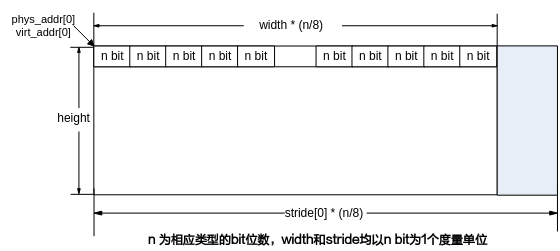

**图 3**  OT\_SVP\_IMG\_TYPE\_YUV420SP类型的ot\_svp\_img图像<a name="fig5654131372716"></a>  
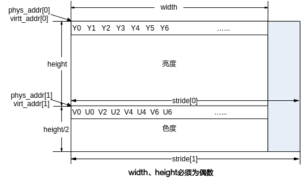

注：格式与ot\_pixel\_format的OT\_PIXEL\_FORMAT\_YVU\_SEMIPLANAR\_420对应。

**图 4**  OT\_SVP\_IMG\_TYPE\_YUV422SP类型的ot\_svp\_img图像<a name="fig674947195410"></a>  
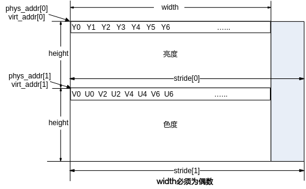

注：

-   这里V在前，U在后，phys\_addr\[2\]和virt\_addr\[2\]可配置为U的首地址，即phys\_addr\[1\]+1和virt\_addr\[1\]+1。
-   格式与ot\_pixel\_format的OT\_PIXEL\_FORMAT\_YVU\_SEMIPLANAR\_422对应。

**图 5**  OT\_SVP\_IMG\_TYPE\_YUV420P类型的ot\_svp\_img图像<a name="fig125145135718"></a>  
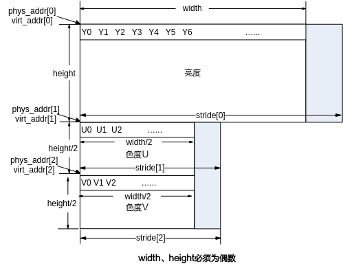

**图 6**  OT\_SVP\_IMG\_TYPE\_YUV422P类型的ot\_svp\_img图像<a name="fig18174113416577"></a>  
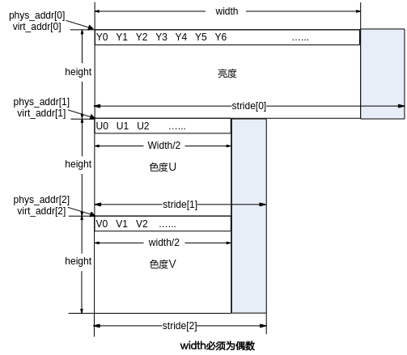

**图 7**  OT\_SVP\_IMG\_TYPE\_S8C2\_PACKAGE类型的ot\_svp\_img图像<a name="fig1696145375811"></a>  


**图 8**  OT\_SVP\_IMG\_TYPE\_S8C2\_PLANAR类型的ot\_svp\_img图像<a name="fig1926523165910"></a>  
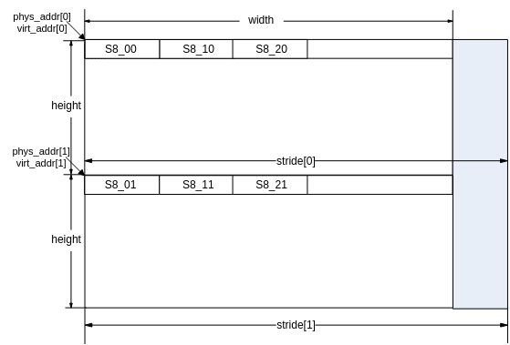

**图 9**  OT\_SVP\_IMG\_TYPE\_U8C3\_PACKAGE类型的ot\_svp\_img图像<a name="fig1945335617599"></a>  


注：对于RGB\_PACKAGE图像，是以“B0G0R0B1G1R1…”形式存储，B在最前面；

对于HSV\_PACKAGE图像，是以“H0S0V0H1S1V1…”形式存储，H在最前面；

对于LAB\_PACKAGE图像，是以“L0A0B0L1A1B1…”形式存储，L在最前面。

**图 10**  OT\_SVP\_IMG\_TYPE\_U8C3\_PLANAR类型的ot\_svp\_img图像<a name="fig162899491108"></a>  
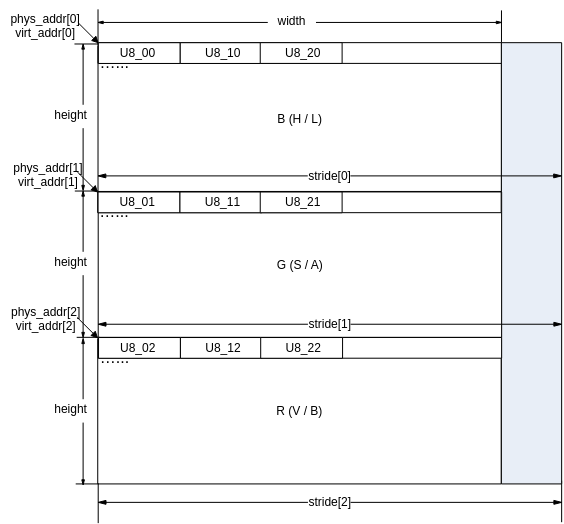

注：

对于RGB\_PLANAR图像，指针数组virt\_addr\[3\]按顺序分别存储B、G、R的指针，而数组stride\[3\]分别为B、G、R的跨度；

对于HSV\_PLANAR图像，指针数组virt\_addr\[3\]按顺序分别存储H、S、V的指针，而数组stride\[3\]分别为H、S、V的跨度；

对于LAB\_PLANAR图像，指针数组virt\_addr\[3\]按顺序分别存储L、A、B的指针，而数组stride\[3\]分别为L、A、B的跨度；

**图 11**  ot\_svp\_data 类型的数据内存示意<a name="fig41189544118"></a>  
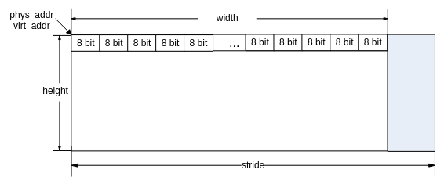

**图 12**  ot\_svp\_mem\_info 类型的数据内存示意<a name="fig1518002910213"></a>  


**图 13**  积分图（OT\_SVP\_IMG\_TYPE\_U64C1）组合输出示意<a name="fig187188113314"></a>  
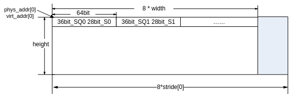

**图 14**  直方图输出格式示意<a name="fig1457715441337"></a>  


-   块数据类型

    ot\_svp\_blob、ot\_svp\_src\_blob、ot\_svp\_dst\_blob，类型参考ot\_svp\_blob\_type，具体的内存分布见《SVPx.0 API参考》中的blob的描述。

### 使用示意<a name="ZH-CN_TOPIC_0000002470931304"></a>

-   用户根据需求调用相应的算子接口创建任务，指定is\_instant类型，并记录该任务返回的handle号。
-   根据返回的handle号，指定阻塞方式，可以查询到该任务的完成状态。

    具体可参见[ss\_mpi\_ive\_query](#ZH-CN_TOPIC_0000002470931246)中的【举例】。

# API参考<a name="ZH-CN_TOPIC_0000002470931292"></a>

IVE模块提供了创建任务和查询任务的基本接口。

该功能模块提供以下MPI：

-   [ss\_mpi\_ive\_dma](#ZH-CN_TOPIC_0000002504091099)：创建直接内存访问任务。
-   [ss\_mpi\_ive\_filter](#ZH-CN_TOPIC_0000002470931284)：创建5x5模板滤波任务。
-   [ss\_mpi\_ive\_csc](#ZH-CN_TOPIC_0000002470931294)：创建色彩空间转换任务。
-   [ss\_mpi\_ive\_filter\_and\_csc](#ZH-CN_TOPIC_0000002470931218)：创建模板滤波加色彩空间转换复合任务
-   [ss\_mpi\_ive\_sobel](#ZH-CN_TOPIC_0000002471091284)：创建5x5模板sobel-like梯度计算任务。
-   [ss\_mpi\_ive\_mag\_and\_ang](#ZH-CN_TOPIC_0000002470931308)：创建5x5模板计算梯度幅值与幅角任务。
-   [ss\_mpi\_ive\_dilate](#ZH-CN_TOPIC_0000002503971205)：创建膨胀任务。
-   [ss\_mpi\_ive\_erode](#ZH-CN_TOPIC_0000002503971269)：创建腐蚀任务。
-   [ss\_mpi\_ive\_threshold](#ZH-CN_TOPIC_0000002471091326)：创建图像二值化任务。
-   [ss\_mpi\_ive\_and](#ZH-CN_TOPIC_0000002504091087)：创建两二值图像相与任务。
-   [ss\_mpi\_ive\_sub](#ZH-CN_TOPIC_0000002503971163)：创建两灰度图像相减任务。
-   [ss\_mpi\_ive\_or](#ZH-CN_TOPIC_0000002471091296)：创建两二值图像相或任务。
-   [ss\_mpi\_ive\_integ](#ZH-CN_TOPIC_0000002470931322)：创建积分图统计任务。
-   [ss\_mpi\_ive\_hist](#ZH-CN_TOPIC_0000002504091123)：创建直方图统计任务。
-   [ss\_mpi\_ive\_threshold\_s16](#ZH-CN_TOPIC_0000002470931220)：创建s16数据到8bit数据阈值化任务。
-   [ss\_mpi\_ive\_threshold\_u16](#ZH-CN_TOPIC_0000002470931242)：创建u16数据到u8数据阈值化任务。
-   [ss\_mpi\_ive\_16bit\_to\_8bit](#ZH-CN_TOPIC_0000002471091216)：创建16bit数据到8bit数据线性转化任务。
-   [ss\_mpi\_ive\_order\_stats\_filter](#ZH-CN_TOPIC_0000002504091093)：创建3x3模板顺序统计量滤波任务。
-   [ss\_mpi\_ive\_map](#ZH-CN_TOPIC_0000002470931234)：创建Map（映射u8-\>u8\\u8-\>u16\\u8-\>s16赋值）任务。
-   [ss\_mpi\_ive\_equalize\_hist](#ZH-CN_TOPIC_0000002471091322)：创建灰度图像的直方图均衡化计算任务。
-   [ss\_mpi\_ive\_add](#ZH-CN_TOPIC_0000002504091171)：创建两灰度图像的加权加计算任务。
-   [ss\_mpi\_ive\_xor](#ZH-CN_TOPIC_0000002504091203)：创建两二值图的异或计算任务。
-   [ss\_mpi\_ive\_ncc](#ZH-CN_TOPIC_0000002503971167)：创建两相同分辨率图像的归一化互相关系数计算任务。
-   [ss\_mpi\_ive\_ccl](#ZH-CN_TOPIC_0000002504091151)：创建二值图像的连通区域标记任务。
-   [ss\_mpi\_ive\_gmm](#ZH-CN_TOPIC_0000002503971147)：创建gmm背景建模任务。
-   [ss\_mpi\_ive\_gmm2](#ZH-CN_TOPIC_0000002504091155)：创建gmm2背景建模任务。
-   [ss\_mpi\_ive\_canny\_hys\_edge](#ZH-CN_TOPIC_0000002503971215)：创建灰度图的canny强弱边缘提取任务。
-   [ss\_mpi\_ive\_canny\_edge](#ZH-CN_TOPIC_0000002470931286)：灰度图的canny边缘提取的后半部：连接边缘点，形成canny边缘图。
-   [ss\_mpi\_ive\_lbp](#ZH-CN_TOPIC_0000002503971201)：创建lbp计算任务。
-   [ss\_mpi\_ive\_norm\_grad](#ZH-CN_TOPIC_0000002503971195)：创建归一化梯度计算任务，梯度均分量均归一化到s8。
-   [ss\_mpi\_ive\_lk\_optical\_flow\_pyr](#ZH-CN_TOPIC_0000002504091135)：创建多层金字塔LK光流计算任务。
-   [ss\_mpi\_ive\_st\_cand\_corner](#ZH-CN_TOPIC_0000002471091320)：灰度图像Shi-Tomasi-like角点计算的前半部：计算候选角点。
-   [ss\_mpi\_ive\_st\_corner](#ZH-CN_TOPIC_0000002470931280)：灰度图像Shi-Tomasi-like角点计算的后半部：按规则挑选角点。
-   [ss\_mpi\_ive\_sad](#ZH-CN_TOPIC_0000002471091328)：计算两幅图像按4x4\\8x8\\16x16分块的16 bit\\8 bit SAD图像，以及对SAD进行阈值化输出。
-   [ss\_mpi\_ive\_resize](#ZH-CN_TOPIC_0000002503971235)：创建图像缩放任务。
-   [ss\_mpi\_ive\_grad\_fg](#ZH-CN_TOPIC_0000002471091316)：根据背景图像和当前帧图像的梯度信息计算梯度前景图像。
-   [ss\_mpi\_ive\_match\_bg\_model](#ZH-CN_TOPIC_0000002470931334)：基于CodeBook演进的背景模型匹配。
-   [ss\_mpi\_ive\_update\_bg\_model](#ZH-CN_TOPIC_0000002504091095)：基于CodeBook演进的背景模型更新。
-   [ss\_mpi\_ive\_ann\_mlp\_load\_model](#ZH-CN_TOPIC_0000002504091075)：读取ann\_mlp模型文件，初始化模型数据。
-   [ss\_mpi\_ive\_ann\_mlp\_unload\_model](#ZH-CN_TOPIC_0000002504091139)：去初始化ann模型数据。
-   [ss\_mpi\_ive\_ann\_mlp\_predict](#ZH-CN_TOPIC_0000002471091294)：创建同一模型多个样本ann\_mlp预测任务。
-   [ss\_mpi\_ive\_svm\_load\_model](#ZH-CN_TOPIC_0000002471091276)：读取svm模型文件，初始化模型数据。
-   [ss\_mpi\_ive\_svm\_unload\_model](#ZH-CN_TOPIC_0000002504091133)：去初始化svm模型数据。
-   [ss\_mpi\_ive\_svm\_predict](#ZH-CN_TOPIC_0000002504091105)：创建同一模型的多个样本svm预测任务。
-   [ss\_mpi\_ive\_cnn\_load\_model](#ZH-CN_TOPIC_0000002471091312)：读取cnn模型文件，生成cnn网络模型。
-   [ss\_mpi\_ive\_cnn\_unload\_model](#ZH-CN_TOPIC_0000002470931302)：卸载cnn网络模型，释放内存。
-   [ss\_mpi\_ive\_cnn\_predict](#ZH-CN_TOPIC_0000002470931276)：用已有模型对一个或多个输入样本进行预测，并输出预测结果。
-   [ss\_mpi\_ive\_cnn\_get\_result](#ZH-CN_TOPIC_0000002470931258)：接收cnn\_predict结果，执行softmax运算来预测每个样本图像的类别，并输出置信度最高的类别\(rank-1\)以及对应的置信度。
-   [ss\_mpi\_ive\_persp\_trans](#ZH-CN_TOPIC_0000002503971185)：根据输入源图的区域位置和点对信息做相应的透视变换。
-   [ss\_mpi\_ive\_kcf\_get\_mem\_size](#ZH-CN_TOPIC_0000002470931306)：获取需要创建目标对象数的内存大小。
-   [ss\_mpi\_ive\_kcf\_create\_obj\_list](#ZH-CN_TOPIC_0000002504091179)：创建目标链表。
-   [ss\_mpi\_ive\_kcf\_destroy\_obj\_list](#ZH-CN_TOPIC_0000002503971237)：销毁目标链表。
-   [ss\_mpi\_ive\_kcf\_create\_gauss\_peak](#ZH-CN_TOPIC_0000002504091153)：创建高斯峰值。
-   [ss\_mpi\_ive\_kcf\_create\_cos\_win](#ZH-CN_TOPIC_0000002470931252)：创建汉宁窗。
-   [ss\_mpi\_ive\_kcf\_get\_train\_obj](#ZH-CN_TOPIC_0000002471091232)：获取需要训练的目标对象。
-   [ss\_mpi\_ive\_kcf\_proc](#ZH-CN_TOPIC_0000002503971241)：提交目标给硬件处理。
-   [ss\_mpi\_ive\_kcf\_get\_obj\_bbox](#ZH-CN_TOPIC_0000002503971245)：获取目标区域跟踪结果信息。
-   [ss\_mpi\_ive\_kcf\_judge\_obj\_bbox\_track\_state](#ZH-CN_TOPIC_0000002471091288)：判断目标区域跟踪状态。
-   [ss\_mpi\_ive\_kcf\_obj\_update](#ZH-CN_TOPIC_0000002470931270)：更新目标信息。
-   [ss\_mpi\_ive\_hog](#ZH-CN_TOPIC_0000002504091165)：计算给定区域的HOG\(Histogram of Oriented Gradient\)特征。
-   [ss\_mpi\_ive\_query](#ZH-CN_TOPIC_0000002470931246)：查询已创建任务完成情况。

> **须知：** 
>用户开辟的内存需要用户保证开辟的内存的正确性，例如[ss\_mpi\_ive\_kcf\_create\_gauss\_peak](#ZH-CN_TOPIC_0000002504091153)中的gauss\_peak的内存由用户开辟，但是随意更改虚拟地址的值就会造成段错误。


## ss\_mpi\_ive\_dma<a name="ZH-CN_TOPIC_0000002504091099"></a>

【描述】

创建直接内存访问任务，支持快速拷贝、间隔拷贝、内存填充：可实现数据从一块内存快速拷贝到另一块内存，或者从一块内存有规律的拷贝一些数据到另一块内存，或者对一块内存进行填充操作。

【语法】

```
td_s32 ss_mpi_ive_dma(ot_ive_handle *handle, const ot_svp_data *src, const ot_svp_dst_data *dst, const ot_ive_dma_ctrl *ctrl, td_bool is_instant);
```

【参数】

<a name="table5167mcpsimp"></a>
<table><thead align="left"><tr id="row5173mcpsimp"><th class="cellrowborder" valign="top" width="20%" id="mcps1.1.4.1.1"><p id="p5175mcpsimp"><a name="p5175mcpsimp"></a><a name="p5175mcpsimp"></a>参数名称</p>
</th>
<th class="cellrowborder" valign="top" width="41%" id="mcps1.1.4.1.2"><p id="p5177mcpsimp"><a name="p5177mcpsimp"></a><a name="p5177mcpsimp"></a>描述</p>
</th>
<th class="cellrowborder" valign="top" width="39%" id="mcps1.1.4.1.3"><p id="p5179mcpsimp"><a name="p5179mcpsimp"></a><a name="p5179mcpsimp"></a>输入/输出</p>
</th>
</tr>
</thead>
<tbody><tr id="row5181mcpsimp"><td class="cellrowborder" valign="top" width="20%" headers="mcps1.1.4.1.1 "><p id="p5183mcpsimp"><a name="p5183mcpsimp"></a><a name="p5183mcpsimp"></a>handle</p>
</td>
<td class="cellrowborder" valign="top" width="41%" headers="mcps1.1.4.1.2 "><p id="p5185mcpsimp"><a name="p5185mcpsimp"></a><a name="p5185mcpsimp"></a>handle指针。</p>
<p id="p5186mcpsimp"><a name="p5186mcpsimp"></a><a name="p5186mcpsimp"></a>不能为空。</p>
</td>
<td class="cellrowborder" valign="top" width="39%" headers="mcps1.1.4.1.3 "><p id="p5188mcpsimp"><a name="p5188mcpsimp"></a><a name="p5188mcpsimp"></a>输出</p>
</td>
</tr>
<tr id="row5189mcpsimp"><td class="cellrowborder" valign="top" width="20%" headers="mcps1.1.4.1.1 "><p id="p5191mcpsimp"><a name="p5191mcpsimp"></a><a name="p5191mcpsimp"></a>src</p>
</td>
<td class="cellrowborder" valign="top" width="41%" headers="mcps1.1.4.1.2 "><p id="p5193mcpsimp"><a name="p5193mcpsimp"></a><a name="p5193mcpsimp"></a>源数据指针。</p>
<p id="p5194mcpsimp"><a name="p5194mcpsimp"></a><a name="p5194mcpsimp"></a>不能为空。</p>
</td>
<td class="cellrowborder" valign="top" width="39%" headers="mcps1.1.4.1.3 "><p id="p5196mcpsimp"><a name="p5196mcpsimp"></a><a name="p5196mcpsimp"></a>输入(set模式下同时也是输出)</p>
</td>
</tr>
<tr id="row5197mcpsimp"><td class="cellrowborder" valign="top" width="20%" headers="mcps1.1.4.1.1 "><p id="p5199mcpsimp"><a name="p5199mcpsimp"></a><a name="p5199mcpsimp"></a>dst</p>
</td>
<td class="cellrowborder" valign="top" width="41%" headers="mcps1.1.4.1.2 "><p id="p5201mcpsimp"><a name="p5201mcpsimp"></a><a name="p5201mcpsimp"></a>输出数据指针。</p>
<p id="p5202mcpsimp"><a name="p5202mcpsimp"></a><a name="p5202mcpsimp"></a>copy模式下不能为空。</p>
</td>
<td class="cellrowborder" valign="top" width="39%" headers="mcps1.1.4.1.3 "><p id="p5204mcpsimp"><a name="p5204mcpsimp"></a><a name="p5204mcpsimp"></a>输出</p>
</td>
</tr>
<tr id="row5205mcpsimp"><td class="cellrowborder" valign="top" width="20%" headers="mcps1.1.4.1.1 "><p id="p5207mcpsimp"><a name="p5207mcpsimp"></a><a name="p5207mcpsimp"></a>ctrl</p>
</td>
<td class="cellrowborder" valign="top" width="41%" headers="mcps1.1.4.1.2 "><p id="p5209mcpsimp"><a name="p5209mcpsimp"></a><a name="p5209mcpsimp"></a>dma控制参数指针。</p>
<p id="p5210mcpsimp"><a name="p5210mcpsimp"></a><a name="p5210mcpsimp"></a>不能为空。</p>
</td>
<td class="cellrowborder" valign="top" width="39%" headers="mcps1.1.4.1.3 "><p id="p5212mcpsimp"><a name="p5212mcpsimp"></a><a name="p5212mcpsimp"></a>输入</p>
</td>
</tr>
<tr id="row5213mcpsimp"><td class="cellrowborder" valign="top" width="20%" headers="mcps1.1.4.1.1 "><p id="p5215mcpsimp"><a name="p5215mcpsimp"></a><a name="p5215mcpsimp"></a>is_instant</p>
</td>
<td class="cellrowborder" valign="top" width="41%" headers="mcps1.1.4.1.2 "><p id="p5217mcpsimp"><a name="p5217mcpsimp"></a><a name="p5217mcpsimp"></a>及时返回结果标志。</p>
</td>
<td class="cellrowborder" valign="top" width="39%" headers="mcps1.1.4.1.3 "><p id="p5219mcpsimp"><a name="p5219mcpsimp"></a><a name="p5219mcpsimp"></a>输入</p>
</td>
</tr>
</tbody>
</table>

注：

Copy模式是指OT\_IVE\_DMA\_MODE\_DIRECT\_COPY和OT\_IVE\_DMA\_MODE\_INTERVAL\_COPY模式；

Set模式是指OT\_IVE\_DMA\_MODE\_SET\_3BYTE和OT\_IVE\_DMA\_MODE\_SET\_8BYTE模式。

<a name="table5223mcpsimp"></a>
<table><thead align="left"><tr id="row5230mcpsimp"><th class="cellrowborder" valign="top" width="17.82178217821782%" id="mcps1.1.5.1.1"><p id="p5232mcpsimp"><a name="p5232mcpsimp"></a><a name="p5232mcpsimp"></a>参数名称</p>
</th>
<th class="cellrowborder" valign="top" width="26.732673267326728%" id="mcps1.1.5.1.2"><p id="p5234mcpsimp"><a name="p5234mcpsimp"></a><a name="p5234mcpsimp"></a>支持类型</p>
</th>
<th class="cellrowborder" valign="top" width="17.82178217821782%" id="mcps1.1.5.1.3"><p id="p5236mcpsimp"><a name="p5236mcpsimp"></a><a name="p5236mcpsimp"></a>地址对齐</p>
</th>
<th class="cellrowborder" valign="top" width="37.62376237623762%" id="mcps1.1.5.1.4"><p id="p5238mcpsimp"><a name="p5238mcpsimp"></a><a name="p5238mcpsimp"></a>分辨率</p>
</th>
</tr>
</thead>
<tbody><tr id="row5240mcpsimp"><td class="cellrowborder" valign="top" width="17.82178217821782%" headers="mcps1.1.5.1.1 "><p id="p5242mcpsimp"><a name="p5242mcpsimp"></a><a name="p5242mcpsimp"></a>src</p>
</td>
<td class="cellrowborder" valign="top" width="26.732673267326728%" headers="mcps1.1.5.1.2 "><p id="p5244mcpsimp"><a name="p5244mcpsimp"></a><a name="p5244mcpsimp"></a>ot_svp_data</p>
</td>
<td class="cellrowborder" valign="top" width="17.82178217821782%" headers="mcps1.1.5.1.3 "><p id="p5246mcpsimp"><a name="p5246mcpsimp"></a><a name="p5246mcpsimp"></a>1 byte</p>
</td>
<td class="cellrowborder" valign="top" width="37.62376237623762%" headers="mcps1.1.5.1.4 "><p id="p5248mcpsimp"><a name="p5248mcpsimp"></a><a name="p5248mcpsimp"></a>32x1～4096x4096</p>
</td>
</tr>
<tr id="row5249mcpsimp"><td class="cellrowborder" valign="top" width="17.82178217821782%" headers="mcps1.1.5.1.1 "><p id="p5251mcpsimp"><a name="p5251mcpsimp"></a><a name="p5251mcpsimp"></a>dst</p>
</td>
<td class="cellrowborder" valign="top" width="26.732673267326728%" headers="mcps1.1.5.1.2 "><p id="p5253mcpsimp"><a name="p5253mcpsimp"></a><a name="p5253mcpsimp"></a>ot_svp_dst_data</p>
</td>
<td class="cellrowborder" valign="top" width="17.82178217821782%" headers="mcps1.1.5.1.3 "><p id="p5255mcpsimp"><a name="p5255mcpsimp"></a><a name="p5255mcpsimp"></a>1 byte</p>
</td>
<td class="cellrowborder" valign="top" width="37.62376237623762%" headers="mcps1.1.5.1.4 "><p id="p5257mcpsimp"><a name="p5257mcpsimp"></a><a name="p5257mcpsimp"></a>直接拷贝时同src；</p>
<p id="p5258mcpsimp"><a name="p5258mcpsimp"></a><a name="p5258mcpsimp"></a>间隔拷贝时比src小。</p>
</td>
</tr>
</tbody>
</table>

【返回值】

<a name="table5260mcpsimp"></a>
<table><thead align="left"><tr id="row5265mcpsimp"><th class="cellrowborder" valign="top" width="50%" id="mcps1.1.3.1.1"><p id="p5267mcpsimp"><a name="p5267mcpsimp"></a><a name="p5267mcpsimp"></a>返回值</p>
</th>
<th class="cellrowborder" valign="top" width="50%" id="mcps1.1.3.1.2"><p id="p5269mcpsimp"><a name="p5269mcpsimp"></a><a name="p5269mcpsimp"></a>描述</p>
</th>
</tr>
</thead>
<tbody><tr id="row5271mcpsimp"><td class="cellrowborder" valign="top" width="50%" headers="mcps1.1.3.1.1 "><p id="p5273mcpsimp"><a name="p5273mcpsimp"></a><a name="p5273mcpsimp"></a>0</p>
</td>
<td class="cellrowborder" valign="top" width="50%" headers="mcps1.1.3.1.2 "><p id="p5275mcpsimp"><a name="p5275mcpsimp"></a><a name="p5275mcpsimp"></a>成功。</p>
</td>
</tr>
<tr id="row5276mcpsimp"><td class="cellrowborder" valign="top" width="50%" headers="mcps1.1.3.1.1 "><p id="p5278mcpsimp"><a name="p5278mcpsimp"></a><a name="p5278mcpsimp"></a>非0</p>
</td>
<td class="cellrowborder" valign="top" width="50%" headers="mcps1.1.3.1.2 "><p id="p5280mcpsimp"><a name="p5280mcpsimp"></a><a name="p5280mcpsimp"></a>失败，参见<span xml:lang="fr-FR" id="ph136311818172213"><a name="ph136311818172213"></a><a name="ph136311818172213"></a>错误码</span><span xml:lang="fr-FR" id="ph5283mcpsimp"><a name="ph5283mcpsimp"></a><a name="ph5283mcpsimp"></a>。</span></p>
</td>
</tr>
</tbody>
</table>

【需求】

-   头文件：ot\_common\_ive.h、ot\_common\_svp.h、ss\_mpi\_ive.h
-   库文件：libss\_ive.a（PC上模拟用ss\_ive\_clib2.x.lib）

【注意】

-   OT\_IVE\_DMA\_MODE\_DIRECT\_COPY：快速拷贝模式。

    可实现从大块内存中扣取小块内存，如[图1](#fig4891747121518)所示，计算公式如下：

    _I_<sub>out \(_x, y_\) =_I_</sub> <sub>\(_x, y_\)</sub>        \(0≤x≤width, 0≤y≤height\)

    其中<sub>_I_</sub> <sub>\(_x, y_\)</sub>  对应src，<sub>_I_out \(_x, y_\)</sub>对应dst。

    **图 1**  快速拷贝示意图<a name="fig4891747121518"></a>  
    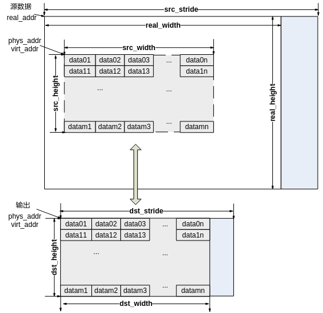

-   OT\_IVE\_DMA\_MODE\_INTERVAL\_COPY：间隔拷贝模式
    -   要求源数据宽度为hor\_seg\_size的倍数；
    -   间隔拷贝的方式：将每ver\_seg\_rows行中第一行数据分割为hor\_seg\_size大小的段，拷贝每段中的前elem\_size大小的字节。如[图2](#fig4242047161711)所示。

-   OT\_IVE\_DMA\_MODE\_SET\_3BYTE：3字节填充模式

    仅使用src，用val的低3字节对源数据进行填充操作；当一行末尾不够3字节时，用val的低字节填充。

-   OT\_IVE\_DMA\_MODE\_SET\_8BYTE：8字节填充模式

    仅使用src，用val对源数据进行填充操作；当一行的末尾不足8字节时，用val的低字节填充。

    **图 2**  间隔拷贝示意图<a name="fig4242047161711"></a>  
    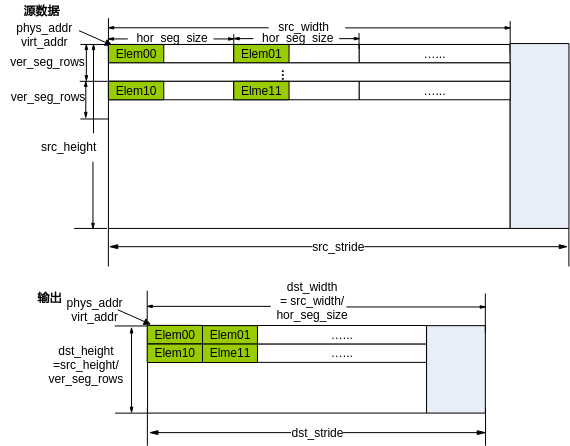

【举例】

无。

【相关主题】

无。

## ss\_mpi\_ive\_filter<a name="ZH-CN_TOPIC_0000002470931284"></a>

【描述】

创建5x5模板滤波任务，通过配置不同的模板系数，可以实现不同的滤波。

【语法】

```
td_s32 ss_mpi_ive_filter(ot_ive_handle *handle, const ot_svp_src_img *src, const ot_svp_dst_img *dst, const ot_ive_filter_ctrl *ctrl, td_bool is_instant);
```

【参数】

<a name="table2445mcpsimp"></a>
<table><thead align="left"><tr id="row2451mcpsimp"><th class="cellrowborder" valign="top" width="25.742574257425744%" id="mcps1.1.4.1.1"><p id="p2453mcpsimp"><a name="p2453mcpsimp"></a><a name="p2453mcpsimp"></a>参数名称</p>
</th>
<th class="cellrowborder" valign="top" width="48.51485148514851%" id="mcps1.1.4.1.2"><p id="p2455mcpsimp"><a name="p2455mcpsimp"></a><a name="p2455mcpsimp"></a>描述</p>
</th>
<th class="cellrowborder" valign="top" width="25.742574257425744%" id="mcps1.1.4.1.3"><p id="p2457mcpsimp"><a name="p2457mcpsimp"></a><a name="p2457mcpsimp"></a>输入/输出</p>
</th>
</tr>
</thead>
<tbody><tr id="row2459mcpsimp"><td class="cellrowborder" valign="top" width="25.742574257425744%" headers="mcps1.1.4.1.1 "><p id="p2461mcpsimp"><a name="p2461mcpsimp"></a><a name="p2461mcpsimp"></a>handle</p>
</td>
<td class="cellrowborder" valign="top" width="48.51485148514851%" headers="mcps1.1.4.1.2 "><p id="p2463mcpsimp"><a name="p2463mcpsimp"></a><a name="p2463mcpsimp"></a>handle指针。</p>
<p id="p2464mcpsimp"><a name="p2464mcpsimp"></a><a name="p2464mcpsimp"></a>不能为空。</p>
</td>
<td class="cellrowborder" valign="top" width="25.742574257425744%" headers="mcps1.1.4.1.3 "><p id="p2466mcpsimp"><a name="p2466mcpsimp"></a><a name="p2466mcpsimp"></a>输出</p>
</td>
</tr>
<tr id="row2467mcpsimp"><td class="cellrowborder" valign="top" width="25.742574257425744%" headers="mcps1.1.4.1.1 "><p id="p2469mcpsimp"><a name="p2469mcpsimp"></a><a name="p2469mcpsimp"></a>src</p>
</td>
<td class="cellrowborder" valign="top" width="48.51485148514851%" headers="mcps1.1.4.1.2 "><p id="p2471mcpsimp"><a name="p2471mcpsimp"></a><a name="p2471mcpsimp"></a>源图像指针。</p>
<p id="p2472mcpsimp"><a name="p2472mcpsimp"></a><a name="p2472mcpsimp"></a>不能为空。</p>
</td>
<td class="cellrowborder" valign="top" width="25.742574257425744%" headers="mcps1.1.4.1.3 "><p id="p2474mcpsimp"><a name="p2474mcpsimp"></a><a name="p2474mcpsimp"></a>输入</p>
</td>
</tr>
<tr id="row2475mcpsimp"><td class="cellrowborder" valign="top" width="25.742574257425744%" headers="mcps1.1.4.1.1 "><p id="p2477mcpsimp"><a name="p2477mcpsimp"></a><a name="p2477mcpsimp"></a>dst</p>
</td>
<td class="cellrowborder" valign="top" width="48.51485148514851%" headers="mcps1.1.4.1.2 "><p id="p2479mcpsimp"><a name="p2479mcpsimp"></a><a name="p2479mcpsimp"></a>输出图像指针。</p>
<p id="p2480mcpsimp"><a name="p2480mcpsimp"></a><a name="p2480mcpsimp"></a>不能为空。</p>
<p id="p2481mcpsimp"><a name="p2481mcpsimp"></a><a name="p2481mcpsimp"></a>高、宽同src。</p>
</td>
<td class="cellrowborder" valign="top" width="25.742574257425744%" headers="mcps1.1.4.1.3 "><p id="p2483mcpsimp"><a name="p2483mcpsimp"></a><a name="p2483mcpsimp"></a>输出</p>
</td>
</tr>
<tr id="row2484mcpsimp"><td class="cellrowborder" valign="top" width="25.742574257425744%" headers="mcps1.1.4.1.1 "><p id="p2486mcpsimp"><a name="p2486mcpsimp"></a><a name="p2486mcpsimp"></a>ctrl</p>
</td>
<td class="cellrowborder" valign="top" width="48.51485148514851%" headers="mcps1.1.4.1.2 "><p id="p2488mcpsimp"><a name="p2488mcpsimp"></a><a name="p2488mcpsimp"></a>控制信息指针。</p>
<p id="p2489mcpsimp"><a name="p2489mcpsimp"></a><a name="p2489mcpsimp"></a>不能为空。</p>
</td>
<td class="cellrowborder" valign="top" width="25.742574257425744%" headers="mcps1.1.4.1.3 "><p id="p2491mcpsimp"><a name="p2491mcpsimp"></a><a name="p2491mcpsimp"></a>输入</p>
</td>
</tr>
<tr id="row2492mcpsimp"><td class="cellrowborder" valign="top" width="25.742574257425744%" headers="mcps1.1.4.1.1 "><p id="p2494mcpsimp"><a name="p2494mcpsimp"></a><a name="p2494mcpsimp"></a>is_instant</p>
</td>
<td class="cellrowborder" valign="top" width="48.51485148514851%" headers="mcps1.1.4.1.2 "><p id="p2496mcpsimp"><a name="p2496mcpsimp"></a><a name="p2496mcpsimp"></a>及时返回结果标志。</p>
</td>
<td class="cellrowborder" valign="top" width="25.742574257425744%" headers="mcps1.1.4.1.3 "><p id="p2498mcpsimp"><a name="p2498mcpsimp"></a><a name="p2498mcpsimp"></a>输入</p>
</td>
</tr>
</tbody>
</table>

<a name="table2499mcpsimp"></a>
<table><thead align="left"><tr id="row2506mcpsimp"><th class="cellrowborder" valign="top" width="14.14141414141414%" id="mcps1.1.5.1.1"><p id="p2508mcpsimp"><a name="p2508mcpsimp"></a><a name="p2508mcpsimp"></a>参数名称</p>
</th>
<th class="cellrowborder" valign="top" width="44.44444444444445%" id="mcps1.1.5.1.2"><p id="p2510mcpsimp"><a name="p2510mcpsimp"></a><a name="p2510mcpsimp"></a>支持图像类型</p>
</th>
<th class="cellrowborder" valign="top" width="14.14141414141414%" id="mcps1.1.5.1.3"><p id="p2512mcpsimp"><a name="p2512mcpsimp"></a><a name="p2512mcpsimp"></a>地址对齐</p>
</th>
<th class="cellrowborder" valign="top" width="27.27272727272727%" id="mcps1.1.5.1.4"><p id="p2514mcpsimp"><a name="p2514mcpsimp"></a><a name="p2514mcpsimp"></a>分辨率</p>
</th>
</tr>
</thead>
<tbody><tr id="row2516mcpsimp"><td class="cellrowborder" valign="top" width="14.14141414141414%" headers="mcps1.1.5.1.1 "><p id="p2518mcpsimp"><a name="p2518mcpsimp"></a><a name="p2518mcpsimp"></a>src</p>
</td>
<td class="cellrowborder" valign="top" width="44.44444444444445%" headers="mcps1.1.5.1.2 "><p id="p2520mcpsimp"><a name="p2520mcpsimp"></a><a name="p2520mcpsimp"></a>U8C1、YUV420SP、YUV422SP</p>
</td>
<td class="cellrowborder" valign="top" width="14.14141414141414%" headers="mcps1.1.5.1.3 "><p id="p2522mcpsimp"><a name="p2522mcpsimp"></a><a name="p2522mcpsimp"></a>16 byte</p>
</td>
<td class="cellrowborder" valign="top" width="27.27272727272727%" headers="mcps1.1.5.1.4 "><p id="p2524mcpsimp"><a name="p2524mcpsimp"></a><a name="p2524mcpsimp"></a>64x64～1920x1024</p>
</td>
</tr>
<tr id="row2525mcpsimp"><td class="cellrowborder" valign="top" width="14.14141414141414%" headers="mcps1.1.5.1.1 "><p id="p2527mcpsimp"><a name="p2527mcpsimp"></a><a name="p2527mcpsimp"></a>dst</p>
</td>
<td class="cellrowborder" valign="top" width="44.44444444444445%" headers="mcps1.1.5.1.2 "><p id="p2529mcpsimp"><a name="p2529mcpsimp"></a><a name="p2529mcpsimp"></a>同src</p>
</td>
<td class="cellrowborder" valign="top" width="14.14141414141414%" headers="mcps1.1.5.1.3 "><p id="p2531mcpsimp"><a name="p2531mcpsimp"></a><a name="p2531mcpsimp"></a>16 byte</p>
</td>
<td class="cellrowborder" valign="top" width="27.27272727272727%" headers="mcps1.1.5.1.4 "><p id="p2533mcpsimp"><a name="p2533mcpsimp"></a><a name="p2533mcpsimp"></a>同src</p>
</td>
</tr>
</tbody>
</table>

注：U8C1\\YUV420SP\\YUV422SP均为ot\_svp\_img\_type成员的简写，后续其他的成员在表述中也用相同的规则简写。

【返回值】

<a name="table2538mcpsimp"></a>
<table><thead align="left"><tr id="row2543mcpsimp"><th class="cellrowborder" valign="top" width="50%" id="mcps1.1.3.1.1"><p id="p2545mcpsimp"><a name="p2545mcpsimp"></a><a name="p2545mcpsimp"></a>返回值</p>
</th>
<th class="cellrowborder" valign="top" width="50%" id="mcps1.1.3.1.2"><p id="p2547mcpsimp"><a name="p2547mcpsimp"></a><a name="p2547mcpsimp"></a>描述</p>
</th>
</tr>
</thead>
<tbody><tr id="row2549mcpsimp"><td class="cellrowborder" valign="top" width="50%" headers="mcps1.1.3.1.1 "><p id="p2551mcpsimp"><a name="p2551mcpsimp"></a><a name="p2551mcpsimp"></a>0</p>
</td>
<td class="cellrowborder" valign="top" width="50%" headers="mcps1.1.3.1.2 "><p id="p2553mcpsimp"><a name="p2553mcpsimp"></a><a name="p2553mcpsimp"></a>成功。</p>
</td>
</tr>
<tr id="row2554mcpsimp"><td class="cellrowborder" valign="top" width="50%" headers="mcps1.1.3.1.1 "><p id="p2556mcpsimp"><a name="p2556mcpsimp"></a><a name="p2556mcpsimp"></a>非0</p>
</td>
<td class="cellrowborder" valign="top" width="50%" headers="mcps1.1.3.1.2 "><p id="p5280mcpsimp"><a name="p5280mcpsimp"></a><a name="p5280mcpsimp"></a>失败，参见<span xml:lang="fr-FR" id="ph136311818172213"><a name="ph136311818172213"></a><a name="ph136311818172213"></a>错误码</span><span xml:lang="fr-FR" id="ph5283mcpsimp"><a name="ph5283mcpsimp"></a><a name="ph5283mcpsimp"></a>。</span></p>
</td>
</tr>
</tbody>
</table>

【需求】

-   头文件：ot\_common\_ive.h、ot\_common\_svp.h、ss\_mpi\_ive.h
-   库文件：libss\_ive.a（PC上模拟用ss\_ive\_clib2.x.lib）

【注意】

-   当源数据为YUV420SP、YUV422SP类型时，要求输出数据跨度一致。
-   filter计算公式示意如[图1](#fig721294952415)所示。

**图 1**  filter计算公式示意图<a name="fig721294952415"></a>  
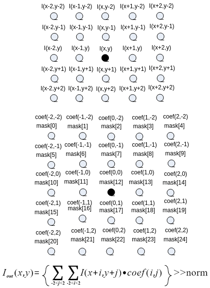

其中，<sub>_I _\(_x, y_\)</sub>对应src，<sub>_I__out _\(_x, y_\)</sub>对应dst，_coef_  \(mask\)对应ctrl中的mask\[25\]，norm对应ctrl中的norm。

-   经典高斯模板如下。


_norm =4_ _norm =8              norm =8_

【举例】

无。

【相关主题】

-   [ss\_mpi\_ive\_filter\_and\_csc](#ss_mpi_ive_filter_and_csc)
-   [ss\_mpi\_ive\_order\_stats\_filter](#ss_mpi_ive_order_stats_filter)

## ss\_mpi\_ive\_csc<a name="ZH-CN_TOPIC_0000002470931294"></a>

【描述】

创建色彩空间转换任务，可实现YUV\_TO\_RGB\\YUV\_TO\_HSV\\YUV\_TO\_LAB\\RGB\_TO\_YUV的色彩空间转换。

【语法】

```
td_s32 ss_mpi_ive_csc(ot_ive_handle *handle, const ot_svp_src_img *src, const ot_svp_dst_img *dst, const ot_ive_csc_ctrl *ctrl, td_bool is_instant);
```

【参数】

<a name="table11264mcpsimp"></a>
<table><thead align="left"><tr id="row11270mcpsimp"><th class="cellrowborder" valign="top" width="19.800000000000004%" id="mcps1.1.4.1.1"><p id="p11272mcpsimp"><a name="p11272mcpsimp"></a><a name="p11272mcpsimp"></a>参数名称</p>
</th>
<th class="cellrowborder" valign="top" width="64.36%" id="mcps1.1.4.1.2"><p id="p11274mcpsimp"><a name="p11274mcpsimp"></a><a name="p11274mcpsimp"></a>描述</p>
</th>
<th class="cellrowborder" valign="top" width="15.840000000000003%" id="mcps1.1.4.1.3"><p id="p11276mcpsimp"><a name="p11276mcpsimp"></a><a name="p11276mcpsimp"></a>输入/输出</p>
</th>
</tr>
</thead>
<tbody><tr id="row11278mcpsimp"><td class="cellrowborder" valign="top" width="19.800000000000004%" headers="mcps1.1.4.1.1 "><p id="p11280mcpsimp"><a name="p11280mcpsimp"></a><a name="p11280mcpsimp"></a>handle</p>
</td>
<td class="cellrowborder" valign="top" width="64.36%" headers="mcps1.1.4.1.2 "><p id="p11282mcpsimp"><a name="p11282mcpsimp"></a><a name="p11282mcpsimp"></a>handle指针。</p>
<p id="p11283mcpsimp"><a name="p11283mcpsimp"></a><a name="p11283mcpsimp"></a>不能为空。</p>
</td>
<td class="cellrowborder" valign="top" width="15.840000000000003%" headers="mcps1.1.4.1.3 "><p id="p11285mcpsimp"><a name="p11285mcpsimp"></a><a name="p11285mcpsimp"></a>输出</p>
</td>
</tr>
<tr id="row11286mcpsimp"><td class="cellrowborder" valign="top" width="19.800000000000004%" headers="mcps1.1.4.1.1 "><p id="p11288mcpsimp"><a name="p11288mcpsimp"></a><a name="p11288mcpsimp"></a>src</p>
</td>
<td class="cellrowborder" valign="top" width="64.36%" headers="mcps1.1.4.1.2 "><p id="p11290mcpsimp"><a name="p11290mcpsimp"></a><a name="p11290mcpsimp"></a>源图像指针。</p>
<p id="p11291mcpsimp"><a name="p11291mcpsimp"></a><a name="p11291mcpsimp"></a>不能为空。</p>
</td>
<td class="cellrowborder" valign="top" width="15.840000000000003%" headers="mcps1.1.4.1.3 "><p id="p11293mcpsimp"><a name="p11293mcpsimp"></a><a name="p11293mcpsimp"></a>输入</p>
</td>
</tr>
<tr id="row11294mcpsimp"><td class="cellrowborder" valign="top" width="19.800000000000004%" headers="mcps1.1.4.1.1 "><p id="p11296mcpsimp"><a name="p11296mcpsimp"></a><a name="p11296mcpsimp"></a>dst</p>
</td>
<td class="cellrowborder" valign="top" width="64.36%" headers="mcps1.1.4.1.2 "><p id="p11298mcpsimp"><a name="p11298mcpsimp"></a><a name="p11298mcpsimp"></a>输出图像指针。</p>
<p id="p11299mcpsimp"><a name="p11299mcpsimp"></a><a name="p11299mcpsimp"></a>不能为空。</p>
<p id="p11300mcpsimp"><a name="p11300mcpsimp"></a><a name="p11300mcpsimp"></a>高、宽同src。</p>
</td>
<td class="cellrowborder" valign="top" width="15.840000000000003%" headers="mcps1.1.4.1.3 "><p id="p11302mcpsimp"><a name="p11302mcpsimp"></a><a name="p11302mcpsimp"></a>输出</p>
</td>
</tr>
<tr id="row11303mcpsimp"><td class="cellrowborder" valign="top" width="19.800000000000004%" headers="mcps1.1.4.1.1 "><p id="p11305mcpsimp"><a name="p11305mcpsimp"></a><a name="p11305mcpsimp"></a>ctrl</p>
</td>
<td class="cellrowborder" valign="top" width="64.36%" headers="mcps1.1.4.1.2 "><p id="p11307mcpsimp"><a name="p11307mcpsimp"></a><a name="p11307mcpsimp"></a>控制信息指针。</p>
<p id="p11308mcpsimp"><a name="p11308mcpsimp"></a><a name="p11308mcpsimp"></a>不能为空。</p>
</td>
<td class="cellrowborder" valign="top" width="15.840000000000003%" headers="mcps1.1.4.1.3 "><p id="p11310mcpsimp"><a name="p11310mcpsimp"></a><a name="p11310mcpsimp"></a>输入</p>
</td>
</tr>
<tr id="row11311mcpsimp"><td class="cellrowborder" valign="top" width="19.800000000000004%" headers="mcps1.1.4.1.1 "><p id="p11313mcpsimp"><a name="p11313mcpsimp"></a><a name="p11313mcpsimp"></a>is_instant</p>
</td>
<td class="cellrowborder" valign="top" width="64.36%" headers="mcps1.1.4.1.2 "><p id="p11315mcpsimp"><a name="p11315mcpsimp"></a><a name="p11315mcpsimp"></a>及时返回结果标志。</p>
</td>
<td class="cellrowborder" valign="top" width="15.840000000000003%" headers="mcps1.1.4.1.3 "><p id="p11317mcpsimp"><a name="p11317mcpsimp"></a><a name="p11317mcpsimp"></a>输入</p>
</td>
</tr>
</tbody>
</table>

<a name="table11318mcpsimp"></a>
<table><thead align="left"><tr id="row11325mcpsimp"><th class="cellrowborder" valign="top" width="19.801980198019802%" id="mcps1.1.5.1.1"><p id="p11327mcpsimp"><a name="p11327mcpsimp"></a><a name="p11327mcpsimp"></a>参数名称</p>
</th>
<th class="cellrowborder" valign="top" width="39.07390739073907%" id="mcps1.1.5.1.2"><p id="p11329mcpsimp"><a name="p11329mcpsimp"></a><a name="p11329mcpsimp"></a>支持图像类型</p>
</th>
<th class="cellrowborder" valign="top" width="14.391439143914392%" id="mcps1.1.5.1.3"><p id="p11331mcpsimp"><a name="p11331mcpsimp"></a><a name="p11331mcpsimp"></a>地址对齐</p>
</th>
<th class="cellrowborder" valign="top" width="26.732673267326728%" id="mcps1.1.5.1.4"><p id="p11333mcpsimp"><a name="p11333mcpsimp"></a><a name="p11333mcpsimp"></a>分辨率</p>
</th>
</tr>
</thead>
<tbody><tr id="row11335mcpsimp"><td class="cellrowborder" valign="top" width="19.801980198019802%" headers="mcps1.1.5.1.1 "><p id="p11337mcpsimp"><a name="p11337mcpsimp"></a><a name="p11337mcpsimp"></a>src</p>
</td>
<td class="cellrowborder" valign="top" width="39.07390739073907%" headers="mcps1.1.5.1.2 "><p id="p11339mcpsimp"><a name="p11339mcpsimp"></a><a name="p11339mcpsimp"></a>YUV420SP、YUV422SP、U8C3_PLANAR、U8C3_PACKAGE</p>
</td>
<td class="cellrowborder" valign="top" width="14.391439143914392%" headers="mcps1.1.5.1.3 "><p id="p11341mcpsimp"><a name="p11341mcpsimp"></a><a name="p11341mcpsimp"></a>16 byte</p>
</td>
<td class="cellrowborder" valign="top" width="26.732673267326728%" headers="mcps1.1.5.1.4 "><p id="p11343mcpsimp"><a name="p11343mcpsimp"></a><a name="p11343mcpsimp"></a>16x16～4096x4096</p>
</td>
</tr>
<tr id="row11344mcpsimp"><td class="cellrowborder" valign="top" width="19.801980198019802%" headers="mcps1.1.5.1.1 "><p id="p11346mcpsimp"><a name="p11346mcpsimp"></a><a name="p11346mcpsimp"></a>dst</p>
</td>
<td class="cellrowborder" valign="top" width="39.07390739073907%" headers="mcps1.1.5.1.2 "><p id="p11348mcpsimp"><a name="p11348mcpsimp"></a><a name="p11348mcpsimp"></a>U8C3_PLANAR、U8C3_PACKAGE、YUV420SP、YUV422SP</p>
</td>
<td class="cellrowborder" valign="top" width="14.391439143914392%" headers="mcps1.1.5.1.3 "><p id="p11350mcpsimp"><a name="p11350mcpsimp"></a><a name="p11350mcpsimp"></a>16 byte</p>
</td>
<td class="cellrowborder" valign="top" width="26.732673267326728%" headers="mcps1.1.5.1.4 "><p id="p11352mcpsimp"><a name="p11352mcpsimp"></a><a name="p11352mcpsimp"></a>同src</p>
</td>
</tr>
</tbody>
</table>

【返回值】

<a name="table11354mcpsimp"></a>
<table><thead align="left"><tr id="row11359mcpsimp"><th class="cellrowborder" valign="top" width="50%" id="mcps1.1.3.1.1"><p id="p11361mcpsimp"><a name="p11361mcpsimp"></a><a name="p11361mcpsimp"></a>返回值</p>
</th>
<th class="cellrowborder" valign="top" width="50%" id="mcps1.1.3.1.2"><p id="p11363mcpsimp"><a name="p11363mcpsimp"></a><a name="p11363mcpsimp"></a>描述</p>
</th>
</tr>
</thead>
<tbody><tr id="row11365mcpsimp"><td class="cellrowborder" valign="top" width="50%" headers="mcps1.1.3.1.1 "><p id="p11367mcpsimp"><a name="p11367mcpsimp"></a><a name="p11367mcpsimp"></a>0</p>
</td>
<td class="cellrowborder" valign="top" width="50%" headers="mcps1.1.3.1.2 "><p id="p11369mcpsimp"><a name="p11369mcpsimp"></a><a name="p11369mcpsimp"></a>成功。</p>
</td>
</tr>
<tr id="row11370mcpsimp"><td class="cellrowborder" valign="top" width="50%" headers="mcps1.1.3.1.1 "><p id="p11372mcpsimp"><a name="p11372mcpsimp"></a><a name="p11372mcpsimp"></a>非0</p>
</td>
<td class="cellrowborder" valign="top" width="50%" headers="mcps1.1.3.1.2 "><p id="p11374mcpsimp"><a name="p11374mcpsimp"></a><a name="p11374mcpsimp"></a>失败，参见<span xml:lang="fr-FR" id="ph136311818172213"><a name="ph136311818172213"></a><a name="ph136311818172213"></a>错误码</span><span xml:lang="fr-FR" id="ph5283mcpsimp"><a name="ph5283mcpsimp"></a><a name="ph5283mcpsimp"></a>。</span></p>
</td>
</tr>
</tbody>
</table>

【需求】

-   头文件：ot\_common\_ive.h、ot\_common\_svp.h、ss\_mpi\_ive.h
-   库文件：libss\_ive.a（PC上模拟用ss\_ive\_clib2.x.lib）

【注意】

-   当输出数据为U8C3\_PLANAR、YUV420SP、YUV422SP类型时，要求输出数据跨度一致。
-   支持12种工作模式，不同的模式其输出的取值范围不一样，具体请参见ot\_ive\_csc\_mode。
-   YUV\_TO\_HSV、YUV\_TO\_LAB参考OpenCV中的实现方法。

> **说明：** 
>本文档中所提到的OpenCV，均指OpenCV 2.4.8版本。

【举例】

无。

【相关主题】

[ss\_mpi\_ive\_filter\_and\_csc](#ss_mpi_ive_filter_and_csc)

## ss\_mpi\_ive\_filter\_and\_csc<a name="ZH-CN_TOPIC_0000002470931218"></a>

【描述】

创建5x5模板滤波和YUV\_TO\_RGB色彩空间转换复合任务，通过一次创建完成两种功能。

【语法】

```
td_s32 ss_mpi_ive_filter_and_csc(ot_ive_handle *handle, const ot_svp_src_img *src, const ot_svp_dst_img *dst, const ot_ive_filter_and_csc_ctrl *ctrl, td_bool is_instant);
```

【参数】

<a name="table14715mcpsimp"></a>
<table><thead align="left"><tr id="row14721mcpsimp"><th class="cellrowborder" valign="top" width="20%" id="mcps1.1.4.1.1"><p id="p14723mcpsimp"><a name="p14723mcpsimp"></a><a name="p14723mcpsimp"></a>参数名称</p>
</th>
<th class="cellrowborder" valign="top" width="64%" id="mcps1.1.4.1.2"><p id="p14725mcpsimp"><a name="p14725mcpsimp"></a><a name="p14725mcpsimp"></a>描述</p>
</th>
<th class="cellrowborder" valign="top" width="16%" id="mcps1.1.4.1.3"><p id="p14727mcpsimp"><a name="p14727mcpsimp"></a><a name="p14727mcpsimp"></a>输入/输出</p>
</th>
</tr>
</thead>
<tbody><tr id="row14729mcpsimp"><td class="cellrowborder" valign="top" width="20%" headers="mcps1.1.4.1.1 "><p id="p14731mcpsimp"><a name="p14731mcpsimp"></a><a name="p14731mcpsimp"></a>handle</p>
</td>
<td class="cellrowborder" valign="top" width="64%" headers="mcps1.1.4.1.2 "><p id="p14733mcpsimp"><a name="p14733mcpsimp"></a><a name="p14733mcpsimp"></a>handle指针。</p>
<p id="p14734mcpsimp"><a name="p14734mcpsimp"></a><a name="p14734mcpsimp"></a>不能为空。</p>
</td>
<td class="cellrowborder" valign="top" width="16%" headers="mcps1.1.4.1.3 "><p id="p14736mcpsimp"><a name="p14736mcpsimp"></a><a name="p14736mcpsimp"></a>输出</p>
</td>
</tr>
<tr id="row14737mcpsimp"><td class="cellrowborder" valign="top" width="20%" headers="mcps1.1.4.1.1 "><p id="p14739mcpsimp"><a name="p14739mcpsimp"></a><a name="p14739mcpsimp"></a>src</p>
</td>
<td class="cellrowborder" valign="top" width="64%" headers="mcps1.1.4.1.2 "><p id="p14741mcpsimp"><a name="p14741mcpsimp"></a><a name="p14741mcpsimp"></a>源图像指针。</p>
<p id="p14742mcpsimp"><a name="p14742mcpsimp"></a><a name="p14742mcpsimp"></a>不能为空。</p>
</td>
<td class="cellrowborder" valign="top" width="16%" headers="mcps1.1.4.1.3 "><p id="p14744mcpsimp"><a name="p14744mcpsimp"></a><a name="p14744mcpsimp"></a>输入</p>
</td>
</tr>
<tr id="row14745mcpsimp"><td class="cellrowborder" valign="top" width="20%" headers="mcps1.1.4.1.1 "><p id="p14747mcpsimp"><a name="p14747mcpsimp"></a><a name="p14747mcpsimp"></a>dst</p>
</td>
<td class="cellrowborder" valign="top" width="64%" headers="mcps1.1.4.1.2 "><p id="p14749mcpsimp"><a name="p14749mcpsimp"></a><a name="p14749mcpsimp"></a>输图像据指针。</p>
<p id="p14750mcpsimp"><a name="p14750mcpsimp"></a><a name="p14750mcpsimp"></a>不能为空。</p>
<p id="p14751mcpsimp"><a name="p14751mcpsimp"></a><a name="p14751mcpsimp"></a>高、宽同src。</p>
</td>
<td class="cellrowborder" valign="top" width="16%" headers="mcps1.1.4.1.3 "><p id="p14753mcpsimp"><a name="p14753mcpsimp"></a><a name="p14753mcpsimp"></a>输出</p>
</td>
</tr>
<tr id="row14754mcpsimp"><td class="cellrowborder" valign="top" width="20%" headers="mcps1.1.4.1.1 "><p id="p14756mcpsimp"><a name="p14756mcpsimp"></a><a name="p14756mcpsimp"></a>ctrl</p>
</td>
<td class="cellrowborder" valign="top" width="64%" headers="mcps1.1.4.1.2 "><p id="p14758mcpsimp"><a name="p14758mcpsimp"></a><a name="p14758mcpsimp"></a>控制信息指针。</p>
<p id="p14759mcpsimp"><a name="p14759mcpsimp"></a><a name="p14759mcpsimp"></a>不能为空。</p>
</td>
<td class="cellrowborder" valign="top" width="16%" headers="mcps1.1.4.1.3 "><p id="p14761mcpsimp"><a name="p14761mcpsimp"></a><a name="p14761mcpsimp"></a>输入</p>
</td>
</tr>
<tr id="row14762mcpsimp"><td class="cellrowborder" valign="top" width="20%" headers="mcps1.1.4.1.1 "><p id="p14764mcpsimp"><a name="p14764mcpsimp"></a><a name="p14764mcpsimp"></a>is_instant</p>
</td>
<td class="cellrowborder" valign="top" width="64%" headers="mcps1.1.4.1.2 "><p id="p14766mcpsimp"><a name="p14766mcpsimp"></a><a name="p14766mcpsimp"></a>及时返回结果标志。</p>
</td>
<td class="cellrowborder" valign="top" width="16%" headers="mcps1.1.4.1.3 "><p id="p14768mcpsimp"><a name="p14768mcpsimp"></a><a name="p14768mcpsimp"></a>输入</p>
</td>
</tr>
</tbody>
</table>

<a name="table14769mcpsimp"></a>
<table><thead align="left"><tr id="row14776mcpsimp"><th class="cellrowborder" valign="top" width="14.000000000000002%" id="mcps1.1.5.1.1"><p id="p14778mcpsimp"><a name="p14778mcpsimp"></a><a name="p14778mcpsimp"></a>参数名称</p>
</th>
<th class="cellrowborder" valign="top" width="46%" id="mcps1.1.5.1.2"><p id="p14780mcpsimp"><a name="p14780mcpsimp"></a><a name="p14780mcpsimp"></a>支持图像类型</p>
</th>
<th class="cellrowborder" valign="top" width="14.000000000000002%" id="mcps1.1.5.1.3"><p id="p14782mcpsimp"><a name="p14782mcpsimp"></a><a name="p14782mcpsimp"></a>地址对齐</p>
</th>
<th class="cellrowborder" valign="top" width="26%" id="mcps1.1.5.1.4"><p id="p14784mcpsimp"><a name="p14784mcpsimp"></a><a name="p14784mcpsimp"></a>分辨率</p>
</th>
</tr>
</thead>
<tbody><tr id="row14786mcpsimp"><td class="cellrowborder" valign="top" width="14.000000000000002%" headers="mcps1.1.5.1.1 "><p id="p14788mcpsimp"><a name="p14788mcpsimp"></a><a name="p14788mcpsimp"></a>src</p>
</td>
<td class="cellrowborder" valign="top" width="46%" headers="mcps1.1.5.1.2 "><p id="p14790mcpsimp"><a name="p14790mcpsimp"></a><a name="p14790mcpsimp"></a>YUV420SP、YUV422SP</p>
</td>
<td class="cellrowborder" valign="top" width="14.000000000000002%" headers="mcps1.1.5.1.3 "><p id="p14792mcpsimp"><a name="p14792mcpsimp"></a><a name="p14792mcpsimp"></a>16 byte</p>
</td>
<td class="cellrowborder" valign="top" width="26%" headers="mcps1.1.5.1.4 "><p id="p14794mcpsimp"><a name="p14794mcpsimp"></a><a name="p14794mcpsimp"></a>64x64～1920x1024</p>
</td>
</tr>
<tr id="row14795mcpsimp"><td class="cellrowborder" valign="top" width="14.000000000000002%" headers="mcps1.1.5.1.1 "><p id="p14797mcpsimp"><a name="p14797mcpsimp"></a><a name="p14797mcpsimp"></a>dst</p>
</td>
<td class="cellrowborder" valign="top" width="46%" headers="mcps1.1.5.1.2 "><p id="p14799mcpsimp"><a name="p14799mcpsimp"></a><a name="p14799mcpsimp"></a>U8C3_PLANAR、U8C3_PACKAGE</p>
</td>
<td class="cellrowborder" valign="top" width="14.000000000000002%" headers="mcps1.1.5.1.3 "><p id="p14801mcpsimp"><a name="p14801mcpsimp"></a><a name="p14801mcpsimp"></a>16 byte</p>
</td>
<td class="cellrowborder" valign="top" width="26%" headers="mcps1.1.5.1.4 "><p id="p14803mcpsimp"><a name="p14803mcpsimp"></a><a name="p14803mcpsimp"></a>同src</p>
</td>
</tr>
</tbody>
</table>

【返回值】

<a name="table14805mcpsimp"></a>
<table><thead align="left"><tr id="row14810mcpsimp"><th class="cellrowborder" valign="top" width="50%" id="mcps1.1.3.1.1"><p id="p14812mcpsimp"><a name="p14812mcpsimp"></a><a name="p14812mcpsimp"></a>返回值</p>
</th>
<th class="cellrowborder" valign="top" width="50%" id="mcps1.1.3.1.2"><p id="p14814mcpsimp"><a name="p14814mcpsimp"></a><a name="p14814mcpsimp"></a>描述</p>
</th>
</tr>
</thead>
<tbody><tr id="row14816mcpsimp"><td class="cellrowborder" valign="top" width="50%" headers="mcps1.1.3.1.1 "><p id="p14818mcpsimp"><a name="p14818mcpsimp"></a><a name="p14818mcpsimp"></a>0</p>
</td>
<td class="cellrowborder" valign="top" width="50%" headers="mcps1.1.3.1.2 "><p id="p14820mcpsimp"><a name="p14820mcpsimp"></a><a name="p14820mcpsimp"></a>成功。</p>
</td>
</tr>
<tr id="row14821mcpsimp"><td class="cellrowborder" valign="top" width="50%" headers="mcps1.1.3.1.1 "><p id="p14823mcpsimp"><a name="p14823mcpsimp"></a><a name="p14823mcpsimp"></a>非0</p>
</td>
<td class="cellrowborder" valign="top" width="50%" headers="mcps1.1.3.1.2 "><p id="p14825mcpsimp"><a name="p14825mcpsimp"></a><a name="p14825mcpsimp"></a>失败，参见<span xml:lang="fr-FR" id="ph136311818172213"><a name="ph136311818172213"></a><a name="ph136311818172213"></a>错误码</span><span xml:lang="fr-FR" id="ph5283mcpsimp"><a name="ph5283mcpsimp"></a><a name="ph5283mcpsimp"></a>。</span></p>
</td>
</tr>
</tbody>
</table>

【需求】

-   头文件：ot\_common\_ive.h、ot\_common\_svp.h、ss\_mpi\_ive.h
-   库文件：libss\_ive.a（PC上模拟用ss\_ive\_clib2.x.lib）

【注意】

-   当输出数据为U8C3\_PLANAR类型时，要求输出数据跨度一致。
-   仅支持YUV\_TO\_RGB的4种工作模式，具体参见ot\_ive\_csc\_mode。

【举例】

无。

【相关主题】

[ss\_mpi\_ive\_filter](#ss_mpi_ive_filter)

## ss\_mpi\_ive\_sobel<a name="ZH-CN_TOPIC_0000002471091284"></a>

【描述】

创建5x5模板sobel-like梯度计算任务。

【语法】

```
td_s32 ss_mpi_ive_sobel(ot_ive_handle *handle, const ot_svp_src_img *src, const ot_svp_dst_img *dst_h, const ot_svp_dst_img *dst_v, const ot_ive_sobel_ctrl *ctrl, td_bool is_instant);
```

【参数】

<a name="table14337mcpsimp"></a>
<table><thead align="left"><tr id="row14343mcpsimp"><th class="cellrowborder" valign="top" width="17%" id="mcps1.1.4.1.1"><p id="p14345mcpsimp"><a name="p14345mcpsimp"></a><a name="p14345mcpsimp"></a>参数名称</p>
</th>
<th class="cellrowborder" valign="top" width="67%" id="mcps1.1.4.1.2"><p id="p14347mcpsimp"><a name="p14347mcpsimp"></a><a name="p14347mcpsimp"></a>描述</p>
</th>
<th class="cellrowborder" valign="top" width="16%" id="mcps1.1.4.1.3"><p id="p14349mcpsimp"><a name="p14349mcpsimp"></a><a name="p14349mcpsimp"></a>输入/输出</p>
</th>
</tr>
</thead>
<tbody><tr id="row14351mcpsimp"><td class="cellrowborder" valign="top" width="17%" headers="mcps1.1.4.1.1 "><p id="p14353mcpsimp"><a name="p14353mcpsimp"></a><a name="p14353mcpsimp"></a>handle</p>
</td>
<td class="cellrowborder" valign="top" width="67%" headers="mcps1.1.4.1.2 "><p id="p14355mcpsimp"><a name="p14355mcpsimp"></a><a name="p14355mcpsimp"></a>handle指针。</p>
<p id="p14356mcpsimp"><a name="p14356mcpsimp"></a><a name="p14356mcpsimp"></a>不能为空。</p>
</td>
<td class="cellrowborder" valign="top" width="16%" headers="mcps1.1.4.1.3 "><p id="p14358mcpsimp"><a name="p14358mcpsimp"></a><a name="p14358mcpsimp"></a>输出</p>
</td>
</tr>
<tr id="row14359mcpsimp"><td class="cellrowborder" valign="top" width="17%" headers="mcps1.1.4.1.1 "><p id="p14361mcpsimp"><a name="p14361mcpsimp"></a><a name="p14361mcpsimp"></a>src</p>
</td>
<td class="cellrowborder" valign="top" width="67%" headers="mcps1.1.4.1.2 "><p id="p14363mcpsimp"><a name="p14363mcpsimp"></a><a name="p14363mcpsimp"></a>源图像指针。</p>
<p id="p14364mcpsimp"><a name="p14364mcpsimp"></a><a name="p14364mcpsimp"></a>不能为空。</p>
</td>
<td class="cellrowborder" valign="top" width="16%" headers="mcps1.1.4.1.3 "><p id="p14366mcpsimp"><a name="p14366mcpsimp"></a><a name="p14366mcpsimp"></a>输入</p>
</td>
</tr>
<tr id="row14367mcpsimp"><td class="cellrowborder" valign="top" width="17%" headers="mcps1.1.4.1.1 "><p id="p14369mcpsimp"><a name="p14369mcpsimp"></a><a name="p14369mcpsimp"></a>dst_h</p>
</td>
<td class="cellrowborder" valign="top" width="67%" headers="mcps1.1.4.1.2 "><p id="p14371mcpsimp"><a name="p14371mcpsimp"></a><a name="p14371mcpsimp"></a>由模板直接滤波得到的梯度分量图像H指针。</p>
<p id="p14372mcpsimp"><a name="p14372mcpsimp"></a><a name="p14372mcpsimp"></a>根据ctrl-&gt;out_ctrl，若需要输出则不能为空。</p>
<p id="p14373mcpsimp"><a name="p14373mcpsimp"></a><a name="p14373mcpsimp"></a>高、宽同src。</p>
</td>
<td class="cellrowborder" valign="top" width="16%" headers="mcps1.1.4.1.3 "><p id="p14375mcpsimp"><a name="p14375mcpsimp"></a><a name="p14375mcpsimp"></a>输出</p>
</td>
</tr>
<tr id="row14376mcpsimp"><td class="cellrowborder" valign="top" width="17%" headers="mcps1.1.4.1.1 "><p id="p14378mcpsimp"><a name="p14378mcpsimp"></a><a name="p14378mcpsimp"></a>dst_v</p>
</td>
<td class="cellrowborder" valign="top" width="67%" headers="mcps1.1.4.1.2 "><p id="p14380mcpsimp"><a name="p14380mcpsimp"></a><a name="p14380mcpsimp"></a>由转置后的模板滤波得到的梯度分量图像V指针。根据ctrl-&gt;out_ctrl，若需要输出则不能为空。</p>
<p id="p14381mcpsimp"><a name="p14381mcpsimp"></a><a name="p14381mcpsimp"></a>高、宽同src。</p>
</td>
<td class="cellrowborder" valign="top" width="16%" headers="mcps1.1.4.1.3 "><p id="p14383mcpsimp"><a name="p14383mcpsimp"></a><a name="p14383mcpsimp"></a>输出</p>
</td>
</tr>
<tr id="row14384mcpsimp"><td class="cellrowborder" valign="top" width="17%" headers="mcps1.1.4.1.1 "><p id="p14386mcpsimp"><a name="p14386mcpsimp"></a><a name="p14386mcpsimp"></a>ctrl</p>
</td>
<td class="cellrowborder" valign="top" width="67%" headers="mcps1.1.4.1.2 "><p id="p14388mcpsimp"><a name="p14388mcpsimp"></a><a name="p14388mcpsimp"></a>控制信息指针。</p>
<p id="p14389mcpsimp"><a name="p14389mcpsimp"></a><a name="p14389mcpsimp"></a>不能为空。</p>
</td>
<td class="cellrowborder" valign="top" width="16%" headers="mcps1.1.4.1.3 "><p id="p14391mcpsimp"><a name="p14391mcpsimp"></a><a name="p14391mcpsimp"></a>输入</p>
</td>
</tr>
<tr id="row14392mcpsimp"><td class="cellrowborder" valign="top" width="17%" headers="mcps1.1.4.1.1 "><p id="p14394mcpsimp"><a name="p14394mcpsimp"></a><a name="p14394mcpsimp"></a>is_instant</p>
</td>
<td class="cellrowborder" valign="top" width="67%" headers="mcps1.1.4.1.2 "><p id="p14396mcpsimp"><a name="p14396mcpsimp"></a><a name="p14396mcpsimp"></a>及时返回结果标志。</p>
</td>
<td class="cellrowborder" valign="top" width="16%" headers="mcps1.1.4.1.3 "><p id="p14398mcpsimp"><a name="p14398mcpsimp"></a><a name="p14398mcpsimp"></a>输入</p>
</td>
</tr>
</tbody>
</table>

<a name="table14399mcpsimp"></a>
<table><thead align="left"><tr id="row14406mcpsimp"><th class="cellrowborder" valign="top" width="25.252525252525253%" id="mcps1.1.5.1.1"><p id="p14408mcpsimp"><a name="p14408mcpsimp"></a><a name="p14408mcpsimp"></a>参数名称</p>
</th>
<th class="cellrowborder" valign="top" width="24.242424242424242%" id="mcps1.1.5.1.2"><p id="p14410mcpsimp"><a name="p14410mcpsimp"></a><a name="p14410mcpsimp"></a>支持图像类型</p>
</th>
<th class="cellrowborder" valign="top" width="15.151515151515152%" id="mcps1.1.5.1.3"><p id="p14412mcpsimp"><a name="p14412mcpsimp"></a><a name="p14412mcpsimp"></a>地址对齐</p>
</th>
<th class="cellrowborder" valign="top" width="35.35353535353536%" id="mcps1.1.5.1.4"><p id="p14414mcpsimp"><a name="p14414mcpsimp"></a><a name="p14414mcpsimp"></a>分辨率</p>
</th>
</tr>
</thead>
<tbody><tr id="row14416mcpsimp"><td class="cellrowborder" valign="top" width="25.252525252525253%" headers="mcps1.1.5.1.1 "><p id="p14418mcpsimp"><a name="p14418mcpsimp"></a><a name="p14418mcpsimp"></a>src</p>
</td>
<td class="cellrowborder" valign="top" width="24.242424242424242%" headers="mcps1.1.5.1.2 "><p id="p14420mcpsimp"><a name="p14420mcpsimp"></a><a name="p14420mcpsimp"></a>U8C1</p>
</td>
<td class="cellrowborder" valign="top" width="15.151515151515152%" headers="mcps1.1.5.1.3 "><p id="p14422mcpsimp"><a name="p14422mcpsimp"></a><a name="p14422mcpsimp"></a>16 byte</p>
</td>
<td class="cellrowborder" valign="top" width="35.35353535353536%" headers="mcps1.1.5.1.4 "><p id="p14424mcpsimp"><a name="p14424mcpsimp"></a><a name="p14424mcpsimp"></a>8x8～1920x1024</p>
</td>
</tr>
<tr id="row14425mcpsimp"><td class="cellrowborder" valign="top" width="25.252525252525253%" headers="mcps1.1.5.1.1 "><p id="p14427mcpsimp"><a name="p14427mcpsimp"></a><a name="p14427mcpsimp"></a>dst_h</p>
</td>
<td class="cellrowborder" valign="top" width="24.242424242424242%" headers="mcps1.1.5.1.2 "><p id="p14429mcpsimp"><a name="p14429mcpsimp"></a><a name="p14429mcpsimp"></a>S16C1</p>
</td>
<td class="cellrowborder" valign="top" width="15.151515151515152%" headers="mcps1.1.5.1.3 "><p id="p14431mcpsimp"><a name="p14431mcpsimp"></a><a name="p14431mcpsimp"></a>16 byte</p>
</td>
<td class="cellrowborder" valign="top" width="35.35353535353536%" headers="mcps1.1.5.1.4 "><p id="p14433mcpsimp"><a name="p14433mcpsimp"></a><a name="p14433mcpsimp"></a>同src</p>
</td>
</tr>
<tr id="row14434mcpsimp"><td class="cellrowborder" valign="top" width="25.252525252525253%" headers="mcps1.1.5.1.1 "><p id="p14436mcpsimp"><a name="p14436mcpsimp"></a><a name="p14436mcpsimp"></a>dst_v</p>
</td>
<td class="cellrowborder" valign="top" width="24.242424242424242%" headers="mcps1.1.5.1.2 "><p id="p14438mcpsimp"><a name="p14438mcpsimp"></a><a name="p14438mcpsimp"></a>S16C1</p>
</td>
<td class="cellrowborder" valign="top" width="15.151515151515152%" headers="mcps1.1.5.1.3 "><p id="p14440mcpsimp"><a name="p14440mcpsimp"></a><a name="p14440mcpsimp"></a>16 byte</p>
</td>
<td class="cellrowborder" valign="top" width="35.35353535353536%" headers="mcps1.1.5.1.4 "><p id="p14442mcpsimp"><a name="p14442mcpsimp"></a><a name="p14442mcpsimp"></a>同src</p>
</td>
</tr>
</tbody>
</table>

【返回值】

<a name="table14444mcpsimp"></a>
<table><thead align="left"><tr id="row14449mcpsimp"><th class="cellrowborder" valign="top" width="50%" id="mcps1.1.3.1.1"><p id="p14451mcpsimp"><a name="p14451mcpsimp"></a><a name="p14451mcpsimp"></a>返回值</p>
</th>
<th class="cellrowborder" valign="top" width="50%" id="mcps1.1.3.1.2"><p id="p14453mcpsimp"><a name="p14453mcpsimp"></a><a name="p14453mcpsimp"></a>描述</p>
</th>
</tr>
</thead>
<tbody><tr id="row14455mcpsimp"><td class="cellrowborder" valign="top" width="50%" headers="mcps1.1.3.1.1 "><p id="p14457mcpsimp"><a name="p14457mcpsimp"></a><a name="p14457mcpsimp"></a>0</p>
</td>
<td class="cellrowborder" valign="top" width="50%" headers="mcps1.1.3.1.2 "><p id="p14459mcpsimp"><a name="p14459mcpsimp"></a><a name="p14459mcpsimp"></a>成功。</p>
</td>
</tr>
<tr id="row14460mcpsimp"><td class="cellrowborder" valign="top" width="50%" headers="mcps1.1.3.1.1 "><p id="p14462mcpsimp"><a name="p14462mcpsimp"></a><a name="p14462mcpsimp"></a>非0</p>
</td>
<td class="cellrowborder" valign="top" width="50%" headers="mcps1.1.3.1.2 "><p id="p14464mcpsimp"><a name="p14464mcpsimp"></a><a name="p14464mcpsimp"></a>失败，参见<span xml:lang="fr-FR" id="ph136311818172213"><a name="ph136311818172213"></a><a name="ph136311818172213"></a>错误码</span><span xml:lang="fr-FR" id="ph5283mcpsimp"><a name="ph5283mcpsimp"></a><a name="ph5283mcpsimp"></a>。</span></p>
</td>
</tr>
</tbody>
</table>

【需求】

-   头文件：ot\_common\_ive.h、ot\_common\_svp.h、ss\_mpi\_ive.h
-   库文件：libss\_ive.a（PC上模拟用ss\_ive\_clib2.x.lib）

【注意】

-   可配置3种输出模式，参考ot\_ive\_sobel\_out\_ctrl。
-   当输出模式为OT\_IVE\_SOBEL\_OUT\_CTRL\_BOTH时，要求dst\_h和dst\_v跨度一致。
-   sobel计算公式示意如[图1](#fig023253424811)所示。

**图 1**  sobel计算公式示意图<a name="fig023253424811"></a>  
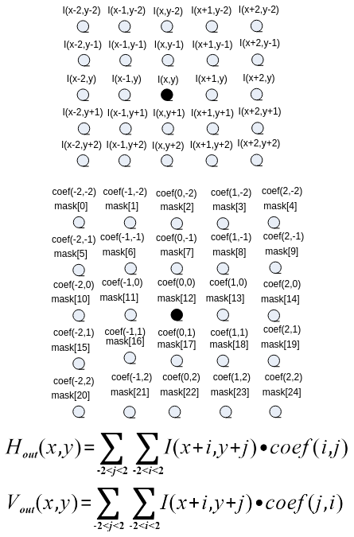

其中，对应src，对应dst\_h，对应dst\_v，  \(mask\)为ctrl中的mask\[25\]

-   sobel模板

    

    

-   scharr模板

    

-   拉普拉斯模板

    

    

【举例】

无。

【相关主题】

-   [ss\_mpi\_ive\_mag\_and\_ang](#ss_mpi_ive_mag_and_ang)
-   [ss\_mpi\_ive\_norm\_grad](#ss_mpi_ive_norm_grad)

## ss\_mpi\_ive\_mag\_and\_ang<a name="ZH-CN_TOPIC_0000002470931308"></a>

【描述】

创建5x5模板梯度幅值与幅角计算任务。

【语法】

```
td_s32 ss_mpi_ive_mag_and_ang(ot_ive_handle *handle, const ot_svp_src_img *src, const ot_svp_dst_img *dst_mag, const ot_svp_dst_img *dst_ang, const ot_ive_mag_and_ang_ctrl *ctrl, td_bool is_instant);
```

【参数】

<a name="table7276mcpsimp"></a>
<table><thead align="left"><tr id="row7282mcpsimp"><th class="cellrowborder" valign="top" width="24%" id="mcps1.1.4.1.1"><p id="p7284mcpsimp"><a name="p7284mcpsimp"></a><a name="p7284mcpsimp"></a>参数名称</p>
</th>
<th class="cellrowborder" valign="top" width="57.99999999999999%" id="mcps1.1.4.1.2"><p id="p7286mcpsimp"><a name="p7286mcpsimp"></a><a name="p7286mcpsimp"></a>描述</p>
</th>
<th class="cellrowborder" valign="top" width="18%" id="mcps1.1.4.1.3"><p id="p7288mcpsimp"><a name="p7288mcpsimp"></a><a name="p7288mcpsimp"></a>输入/输出</p>
</th>
</tr>
</thead>
<tbody><tr id="row7290mcpsimp"><td class="cellrowborder" valign="top" width="24%" headers="mcps1.1.4.1.1 "><p id="p7292mcpsimp"><a name="p7292mcpsimp"></a><a name="p7292mcpsimp"></a>handle</p>
</td>
<td class="cellrowborder" valign="top" width="57.99999999999999%" headers="mcps1.1.4.1.2 "><p id="p7294mcpsimp"><a name="p7294mcpsimp"></a><a name="p7294mcpsimp"></a>handle指针。</p>
<p id="p7295mcpsimp"><a name="p7295mcpsimp"></a><a name="p7295mcpsimp"></a>不能为空。</p>
</td>
<td class="cellrowborder" valign="top" width="18%" headers="mcps1.1.4.1.3 "><p id="p7297mcpsimp"><a name="p7297mcpsimp"></a><a name="p7297mcpsimp"></a>输出</p>
</td>
</tr>
<tr id="row7298mcpsimp"><td class="cellrowborder" valign="top" width="24%" headers="mcps1.1.4.1.1 "><p id="p7300mcpsimp"><a name="p7300mcpsimp"></a><a name="p7300mcpsimp"></a>src</p>
</td>
<td class="cellrowborder" valign="top" width="57.99999999999999%" headers="mcps1.1.4.1.2 "><p id="p7302mcpsimp"><a name="p7302mcpsimp"></a><a name="p7302mcpsimp"></a>源图像指针。</p>
<p id="p7303mcpsimp"><a name="p7303mcpsimp"></a><a name="p7303mcpsimp"></a>不能为空。</p>
</td>
<td class="cellrowborder" valign="top" width="18%" headers="mcps1.1.4.1.3 "><p id="p7305mcpsimp"><a name="p7305mcpsimp"></a><a name="p7305mcpsimp"></a>输入</p>
</td>
</tr>
<tr id="row7306mcpsimp"><td class="cellrowborder" valign="top" width="24%" headers="mcps1.1.4.1.1 "><p id="p7308mcpsimp"><a name="p7308mcpsimp"></a><a name="p7308mcpsimp"></a>dst_mag</p>
</td>
<td class="cellrowborder" valign="top" width="57.99999999999999%" headers="mcps1.1.4.1.2 "><p id="p7310mcpsimp"><a name="p7310mcpsimp"></a><a name="p7310mcpsimp"></a>输出幅值图像指针。</p>
<p id="p7311mcpsimp"><a name="p7311mcpsimp"></a><a name="p7311mcpsimp"></a>不能为空。</p>
<p id="p7312mcpsimp"><a name="p7312mcpsimp"></a><a name="p7312mcpsimp"></a>高、宽同src。</p>
</td>
<td class="cellrowborder" valign="top" width="18%" headers="mcps1.1.4.1.3 "><p id="p7314mcpsimp"><a name="p7314mcpsimp"></a><a name="p7314mcpsimp"></a>输出</p>
</td>
</tr>
<tr id="row7315mcpsimp"><td class="cellrowborder" valign="top" width="24%" headers="mcps1.1.4.1.1 "><p id="p7317mcpsimp"><a name="p7317mcpsimp"></a><a name="p7317mcpsimp"></a>dst_ang</p>
</td>
<td class="cellrowborder" valign="top" width="57.99999999999999%" headers="mcps1.1.4.1.2 "><p id="p7319mcpsimp"><a name="p7319mcpsimp"></a><a name="p7319mcpsimp"></a>输出幅角图像指针。</p>
<p id="p7320mcpsimp"><a name="p7320mcpsimp"></a><a name="p7320mcpsimp"></a>根据ctrl-&gt;out_ctrl，需要输出则不能为空。</p>
<p id="p7321mcpsimp"><a name="p7321mcpsimp"></a><a name="p7321mcpsimp"></a>高、宽同src。</p>
</td>
<td class="cellrowborder" valign="top" width="18%" headers="mcps1.1.4.1.3 "><p id="p7323mcpsimp"><a name="p7323mcpsimp"></a><a name="p7323mcpsimp"></a>输出</p>
</td>
</tr>
<tr id="row7324mcpsimp"><td class="cellrowborder" valign="top" width="24%" headers="mcps1.1.4.1.1 "><p id="p7326mcpsimp"><a name="p7326mcpsimp"></a><a name="p7326mcpsimp"></a>ctrl</p>
</td>
<td class="cellrowborder" valign="top" width="57.99999999999999%" headers="mcps1.1.4.1.2 "><p id="p7328mcpsimp"><a name="p7328mcpsimp"></a><a name="p7328mcpsimp"></a>控制信息指针。</p>
<p id="p7329mcpsimp"><a name="p7329mcpsimp"></a><a name="p7329mcpsimp"></a>不能为空。</p>
</td>
<td class="cellrowborder" valign="top" width="18%" headers="mcps1.1.4.1.3 "><p id="p7331mcpsimp"><a name="p7331mcpsimp"></a><a name="p7331mcpsimp"></a>输入</p>
</td>
</tr>
<tr id="row7332mcpsimp"><td class="cellrowborder" valign="top" width="24%" headers="mcps1.1.4.1.1 "><p id="p7334mcpsimp"><a name="p7334mcpsimp"></a><a name="p7334mcpsimp"></a>is_instant</p>
</td>
<td class="cellrowborder" valign="top" width="57.99999999999999%" headers="mcps1.1.4.1.2 "><p id="p7336mcpsimp"><a name="p7336mcpsimp"></a><a name="p7336mcpsimp"></a>及时返回结果标志。</p>
</td>
<td class="cellrowborder" valign="top" width="18%" headers="mcps1.1.4.1.3 "><p id="p7338mcpsimp"><a name="p7338mcpsimp"></a><a name="p7338mcpsimp"></a>输入</p>
</td>
</tr>
</tbody>
</table>

<a name="table7339mcpsimp"></a>
<table><thead align="left"><tr id="row7346mcpsimp"><th class="cellrowborder" valign="top" width="25.252525252525253%" id="mcps1.1.5.1.1"><p id="p7348mcpsimp"><a name="p7348mcpsimp"></a><a name="p7348mcpsimp"></a>参数名称</p>
</th>
<th class="cellrowborder" valign="top" width="24.242424242424242%" id="mcps1.1.5.1.2"><p id="p7350mcpsimp"><a name="p7350mcpsimp"></a><a name="p7350mcpsimp"></a>支持图像类型</p>
</th>
<th class="cellrowborder" valign="top" width="15.151515151515152%" id="mcps1.1.5.1.3"><p id="p7352mcpsimp"><a name="p7352mcpsimp"></a><a name="p7352mcpsimp"></a>地址对齐</p>
</th>
<th class="cellrowborder" valign="top" width="35.35353535353536%" id="mcps1.1.5.1.4"><p id="p7354mcpsimp"><a name="p7354mcpsimp"></a><a name="p7354mcpsimp"></a>分辨率</p>
</th>
</tr>
</thead>
<tbody><tr id="row7356mcpsimp"><td class="cellrowborder" valign="top" width="25.252525252525253%" headers="mcps1.1.5.1.1 "><p id="p7358mcpsimp"><a name="p7358mcpsimp"></a><a name="p7358mcpsimp"></a>src</p>
</td>
<td class="cellrowborder" valign="top" width="24.242424242424242%" headers="mcps1.1.5.1.2 "><p id="p7360mcpsimp"><a name="p7360mcpsimp"></a><a name="p7360mcpsimp"></a>U8C1</p>
</td>
<td class="cellrowborder" valign="top" width="15.151515151515152%" headers="mcps1.1.5.1.3 "><p id="p7362mcpsimp"><a name="p7362mcpsimp"></a><a name="p7362mcpsimp"></a>16 byte</p>
</td>
<td class="cellrowborder" valign="top" width="35.35353535353536%" headers="mcps1.1.5.1.4 "><p id="p7364mcpsimp"><a name="p7364mcpsimp"></a><a name="p7364mcpsimp"></a>64x64～1920x1024</p>
</td>
</tr>
<tr id="row7365mcpsimp"><td class="cellrowborder" valign="top" width="25.252525252525253%" headers="mcps1.1.5.1.1 "><p id="p7367mcpsimp"><a name="p7367mcpsimp"></a><a name="p7367mcpsimp"></a>dst_mag</p>
</td>
<td class="cellrowborder" valign="top" width="24.242424242424242%" headers="mcps1.1.5.1.2 "><p id="p7369mcpsimp"><a name="p7369mcpsimp"></a><a name="p7369mcpsimp"></a>U16C1</p>
</td>
<td class="cellrowborder" valign="top" width="15.151515151515152%" headers="mcps1.1.5.1.3 "><p id="p7371mcpsimp"><a name="p7371mcpsimp"></a><a name="p7371mcpsimp"></a>16 byte</p>
</td>
<td class="cellrowborder" valign="top" width="35.35353535353536%" headers="mcps1.1.5.1.4 "><p id="p7373mcpsimp"><a name="p7373mcpsimp"></a><a name="p7373mcpsimp"></a>同src</p>
</td>
</tr>
<tr id="row7374mcpsimp"><td class="cellrowborder" valign="top" width="25.252525252525253%" headers="mcps1.1.5.1.1 "><p id="p7376mcpsimp"><a name="p7376mcpsimp"></a><a name="p7376mcpsimp"></a>dst_ang</p>
</td>
<td class="cellrowborder" valign="top" width="24.242424242424242%" headers="mcps1.1.5.1.2 "><p id="p7378mcpsimp"><a name="p7378mcpsimp"></a><a name="p7378mcpsimp"></a>U8C1</p>
</td>
<td class="cellrowborder" valign="top" width="15.151515151515152%" headers="mcps1.1.5.1.3 "><p id="p7380mcpsimp"><a name="p7380mcpsimp"></a><a name="p7380mcpsimp"></a>16 byte</p>
</td>
<td class="cellrowborder" valign="top" width="35.35353535353536%" headers="mcps1.1.5.1.4 "><p id="p7382mcpsimp"><a name="p7382mcpsimp"></a><a name="p7382mcpsimp"></a>同src</p>
</td>
</tr>
</tbody>
</table>

【返回值】

<a name="table7384mcpsimp"></a>
<table><thead align="left"><tr id="row7389mcpsimp"><th class="cellrowborder" valign="top" width="50%" id="mcps1.1.3.1.1"><p id="p7391mcpsimp"><a name="p7391mcpsimp"></a><a name="p7391mcpsimp"></a>返回值</p>
</th>
<th class="cellrowborder" valign="top" width="50%" id="mcps1.1.3.1.2"><p id="p7393mcpsimp"><a name="p7393mcpsimp"></a><a name="p7393mcpsimp"></a>描述</p>
</th>
</tr>
</thead>
<tbody><tr id="row7395mcpsimp"><td class="cellrowborder" valign="top" width="50%" headers="mcps1.1.3.1.1 "><p id="p7397mcpsimp"><a name="p7397mcpsimp"></a><a name="p7397mcpsimp"></a>0</p>
</td>
<td class="cellrowborder" valign="top" width="50%" headers="mcps1.1.3.1.2 "><p id="p7399mcpsimp"><a name="p7399mcpsimp"></a><a name="p7399mcpsimp"></a>成功。</p>
</td>
</tr>
<tr id="row7400mcpsimp"><td class="cellrowborder" valign="top" width="50%" headers="mcps1.1.3.1.1 "><p id="p7402mcpsimp"><a name="p7402mcpsimp"></a><a name="p7402mcpsimp"></a>非0</p>
</td>
<td class="cellrowborder" valign="top" width="50%" headers="mcps1.1.3.1.2 "><p id="p7404mcpsimp"><a name="p7404mcpsimp"></a><a name="p7404mcpsimp"></a>失败，参见<span xml:lang="fr-FR" id="ph136311818172213"><a name="ph136311818172213"></a><a name="ph136311818172213"></a>错误码</span><span xml:lang="fr-FR" id="ph5283mcpsimp"><a name="ph5283mcpsimp"></a><a name="ph5283mcpsimp"></a>。</span></p>
</td>
</tr>
</tbody>
</table>

【需求】

-   头文件：ot\_common\_ive.h、ot\_common\_svp.h、ss\_mpi\_ive.h
-   库文件：libss\_ive.a（PC上模拟用ss\_ive\_clib2.x.lib）

【注意】

-   可配置2种输出模式，具体参见ot\_ive\_mag\_and\_ang\_out\_ctrl。
-   当输出模式为OT\_IVE\_MAG\_AND\_ANG\_OUT\_CTRL\_MAG\_AND\_ANG时，要求dst\_mag和dst\_ang跨度一致。
-   用户可以通过ctrl-\>threshold对幅值图进行threshold操作\(可以用来实现EOH\)，计算公式如下：

    

    其中，对应dst\_mag。

**图 1**  mag\_and\_ang计算示意图<a name="fig12486154181013"></a>  
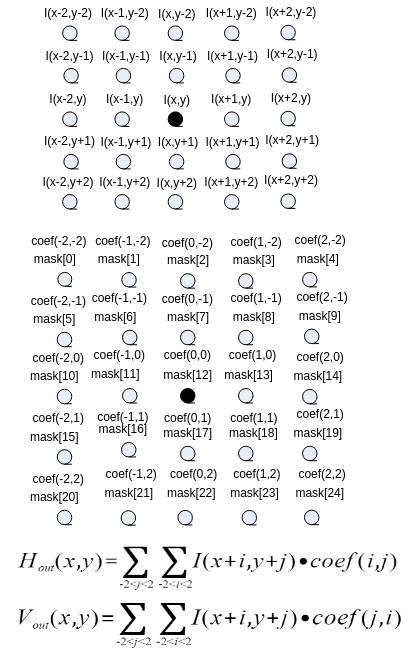


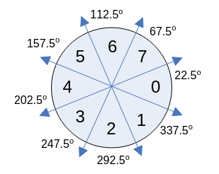

根据、以及取对应上图中0～7的方向值。其中，对应src，对应dst\_mag，对应dst\_ang，\(mask\)为ctrl中的mask\[25\]。

【举例】

无。

【相关主题】

-   [ss\_mpi\_ive\_canny\_hys\_edge](#ss_mpi_ive_canny_hys_edge)
-   [ss\_mpi\_ive\_canny\_edge](#ss_mpi_ive_canny_edge)
-   [ss\_mpi\_ive\_sobel](#ss_mpi_ive_sobel)

## ss\_mpi\_ive\_dilate<a name="ZH-CN_TOPIC_0000002503971205"></a>

【描述】

创建二值图像5x5模板膨胀任务。

【语法】

```
td_s32 ss_mpi_ive_dilate(ot_ive_handle *handle, const ot_svp_src_img *src, const ot_svp_dst_img *dst, const ot_ive_dilate_ctrl *ctrl, td_bool is_instant);
```

【参数】

<a name="table9715mcpsimp"></a>
<table><thead align="left"><tr id="row9721mcpsimp"><th class="cellrowborder" valign="top" width="19.8%" id="mcps1.1.4.1.1"><p id="p9723mcpsimp"><a name="p9723mcpsimp"></a><a name="p9723mcpsimp"></a>参数名称</p>
</th>
<th class="cellrowborder" valign="top" width="62.38%" id="mcps1.1.4.1.2"><p id="p9725mcpsimp"><a name="p9725mcpsimp"></a><a name="p9725mcpsimp"></a>描述</p>
</th>
<th class="cellrowborder" valign="top" width="17.82%" id="mcps1.1.4.1.3"><p id="p9727mcpsimp"><a name="p9727mcpsimp"></a><a name="p9727mcpsimp"></a>输入/输出</p>
</th>
</tr>
</thead>
<tbody><tr id="row9729mcpsimp"><td class="cellrowborder" valign="top" width="19.8%" headers="mcps1.1.4.1.1 "><p id="p9731mcpsimp"><a name="p9731mcpsimp"></a><a name="p9731mcpsimp"></a>handle</p>
</td>
<td class="cellrowborder" valign="top" width="62.38%" headers="mcps1.1.4.1.2 "><p id="p9733mcpsimp"><a name="p9733mcpsimp"></a><a name="p9733mcpsimp"></a>handle指针。</p>
<p id="p9734mcpsimp"><a name="p9734mcpsimp"></a><a name="p9734mcpsimp"></a>不能为空。</p>
</td>
<td class="cellrowborder" valign="top" width="17.82%" headers="mcps1.1.4.1.3 "><p id="p9736mcpsimp"><a name="p9736mcpsimp"></a><a name="p9736mcpsimp"></a>输出</p>
</td>
</tr>
<tr id="row9737mcpsimp"><td class="cellrowborder" valign="top" width="19.8%" headers="mcps1.1.4.1.1 "><p id="p9739mcpsimp"><a name="p9739mcpsimp"></a><a name="p9739mcpsimp"></a>src</p>
</td>
<td class="cellrowborder" valign="top" width="62.38%" headers="mcps1.1.4.1.2 "><p id="p9741mcpsimp"><a name="p9741mcpsimp"></a><a name="p9741mcpsimp"></a>源图像指针。</p>
<p id="p9742mcpsimp"><a name="p9742mcpsimp"></a><a name="p9742mcpsimp"></a>不能为空。</p>
</td>
<td class="cellrowborder" valign="top" width="17.82%" headers="mcps1.1.4.1.3 "><p id="p9744mcpsimp"><a name="p9744mcpsimp"></a><a name="p9744mcpsimp"></a>输入</p>
</td>
</tr>
<tr id="row9745mcpsimp"><td class="cellrowborder" valign="top" width="19.8%" headers="mcps1.1.4.1.1 "><p id="p9747mcpsimp"><a name="p9747mcpsimp"></a><a name="p9747mcpsimp"></a>dst</p>
</td>
<td class="cellrowborder" valign="top" width="62.38%" headers="mcps1.1.4.1.2 "><p id="p9749mcpsimp"><a name="p9749mcpsimp"></a><a name="p9749mcpsimp"></a>输出图像指针。</p>
<p id="p9750mcpsimp"><a name="p9750mcpsimp"></a><a name="p9750mcpsimp"></a>不能为空。</p>
<p id="p9751mcpsimp"><a name="p9751mcpsimp"></a><a name="p9751mcpsimp"></a>高、宽同src。</p>
</td>
<td class="cellrowborder" valign="top" width="17.82%" headers="mcps1.1.4.1.3 "><p id="p9753mcpsimp"><a name="p9753mcpsimp"></a><a name="p9753mcpsimp"></a>输出</p>
</td>
</tr>
<tr id="row9754mcpsimp"><td class="cellrowborder" valign="top" width="19.8%" headers="mcps1.1.4.1.1 "><p id="p9756mcpsimp"><a name="p9756mcpsimp"></a><a name="p9756mcpsimp"></a>ctrl</p>
</td>
<td class="cellrowborder" valign="top" width="62.38%" headers="mcps1.1.4.1.2 "><p id="p9758mcpsimp"><a name="p9758mcpsimp"></a><a name="p9758mcpsimp"></a>控制信息指针。</p>
</td>
<td class="cellrowborder" valign="top" width="17.82%" headers="mcps1.1.4.1.3 "><p id="p9760mcpsimp"><a name="p9760mcpsimp"></a><a name="p9760mcpsimp"></a>输入</p>
</td>
</tr>
<tr id="row9761mcpsimp"><td class="cellrowborder" valign="top" width="19.8%" headers="mcps1.1.4.1.1 "><p id="p9763mcpsimp"><a name="p9763mcpsimp"></a><a name="p9763mcpsimp"></a>is_instant</p>
</td>
<td class="cellrowborder" valign="top" width="62.38%" headers="mcps1.1.4.1.2 "><p id="p9765mcpsimp"><a name="p9765mcpsimp"></a><a name="p9765mcpsimp"></a>及时返回结果标志。</p>
</td>
<td class="cellrowborder" valign="top" width="17.82%" headers="mcps1.1.4.1.3 "><p id="p9767mcpsimp"><a name="p9767mcpsimp"></a><a name="p9767mcpsimp"></a>输入</p>
</td>
</tr>
</tbody>
</table>

<a name="table9768mcpsimp"></a>
<table><thead align="left"><tr id="row9775mcpsimp"><th class="cellrowborder" valign="top" width="18.18181818181818%" id="mcps1.1.5.1.1"><p id="p9777mcpsimp"><a name="p9777mcpsimp"></a><a name="p9777mcpsimp"></a>参数名称</p>
</th>
<th class="cellrowborder" valign="top" width="28.28282828282828%" id="mcps1.1.5.1.2"><p id="p9779mcpsimp"><a name="p9779mcpsimp"></a><a name="p9779mcpsimp"></a>支持图像类型</p>
</th>
<th class="cellrowborder" valign="top" width="18.18181818181818%" id="mcps1.1.5.1.3"><p id="p9781mcpsimp"><a name="p9781mcpsimp"></a><a name="p9781mcpsimp"></a>地址对齐</p>
</th>
<th class="cellrowborder" valign="top" width="35.35353535353536%" id="mcps1.1.5.1.4"><p id="p9783mcpsimp"><a name="p9783mcpsimp"></a><a name="p9783mcpsimp"></a>分辨率</p>
</th>
</tr>
</thead>
<tbody><tr id="row9785mcpsimp"><td class="cellrowborder" valign="top" width="18.18181818181818%" headers="mcps1.1.5.1.1 "><p id="p9787mcpsimp"><a name="p9787mcpsimp"></a><a name="p9787mcpsimp"></a>src</p>
</td>
<td class="cellrowborder" valign="top" width="28.28282828282828%" headers="mcps1.1.5.1.2 "><p id="p9789mcpsimp"><a name="p9789mcpsimp"></a><a name="p9789mcpsimp"></a>U8C1的二值图</p>
</td>
<td class="cellrowborder" valign="top" width="18.18181818181818%" headers="mcps1.1.5.1.3 "><p id="p9791mcpsimp"><a name="p9791mcpsimp"></a><a name="p9791mcpsimp"></a>16 byte</p>
</td>
<td class="cellrowborder" valign="top" width="35.35353535353536%" headers="mcps1.1.5.1.4 "><p id="p9793mcpsimp"><a name="p9793mcpsimp"></a><a name="p9793mcpsimp"></a>64x64～1920x1024</p>
</td>
</tr>
<tr id="row9794mcpsimp"><td class="cellrowborder" valign="top" width="18.18181818181818%" headers="mcps1.1.5.1.1 "><p id="p9796mcpsimp"><a name="p9796mcpsimp"></a><a name="p9796mcpsimp"></a>dst</p>
</td>
<td class="cellrowborder" valign="top" width="28.28282828282828%" headers="mcps1.1.5.1.2 "><p id="p9798mcpsimp"><a name="p9798mcpsimp"></a><a name="p9798mcpsimp"></a>U8C1的二值图</p>
</td>
<td class="cellrowborder" valign="top" width="18.18181818181818%" headers="mcps1.1.5.1.3 "><p id="p9800mcpsimp"><a name="p9800mcpsimp"></a><a name="p9800mcpsimp"></a>16 byte</p>
</td>
<td class="cellrowborder" valign="top" width="35.35353535353536%" headers="mcps1.1.5.1.4 "><p id="p9802mcpsimp"><a name="p9802mcpsimp"></a><a name="p9802mcpsimp"></a>同src</p>
</td>
</tr>
</tbody>
</table>

【返回值】

<a name="table9804mcpsimp"></a>
<table><thead align="left"><tr id="row9809mcpsimp"><th class="cellrowborder" valign="top" width="50%" id="mcps1.1.3.1.1"><p id="p9811mcpsimp"><a name="p9811mcpsimp"></a><a name="p9811mcpsimp"></a>返回值</p>
</th>
<th class="cellrowborder" valign="top" width="50%" id="mcps1.1.3.1.2"><p id="p9813mcpsimp"><a name="p9813mcpsimp"></a><a name="p9813mcpsimp"></a>描述</p>
</th>
</tr>
</thead>
<tbody><tr id="row9815mcpsimp"><td class="cellrowborder" valign="top" width="50%" headers="mcps1.1.3.1.1 "><p id="p9817mcpsimp"><a name="p9817mcpsimp"></a><a name="p9817mcpsimp"></a>0</p>
</td>
<td class="cellrowborder" valign="top" width="50%" headers="mcps1.1.3.1.2 "><p id="p9819mcpsimp"><a name="p9819mcpsimp"></a><a name="p9819mcpsimp"></a>成功。</p>
</td>
</tr>
<tr id="row9820mcpsimp"><td class="cellrowborder" valign="top" width="50%" headers="mcps1.1.3.1.1 "><p id="p9822mcpsimp"><a name="p9822mcpsimp"></a><a name="p9822mcpsimp"></a>非0</p>
</td>
<td class="cellrowborder" valign="top" width="50%" headers="mcps1.1.3.1.2 "><p id="p9824mcpsimp"><a name="p9824mcpsimp"></a><a name="p9824mcpsimp"></a>失败，参见<span xml:lang="fr-FR" id="ph136311818172213"><a name="ph136311818172213"></a><a name="ph136311818172213"></a>错误码</span><span xml:lang="fr-FR" id="ph5283mcpsimp"><a name="ph5283mcpsimp"></a><a name="ph5283mcpsimp"></a>。</span></p>
</td>
</tr>
</tbody>
</table>

【需求】

-   头文件：ot\_common\_ive.h、ot\_common\_svp.h、ss\_ mpi\_ive.h
-   库文件：libss\_ive.a（PC上模拟用ss\_ive\_clib2.x.lib）

【注意】

-   模板系数只能为0或255。
-   模板样例

     

     

     

**图 1**  dilate计算公式示意图<a name="fig9560216103916"></a>  
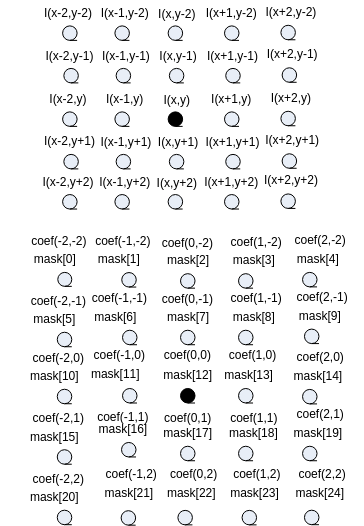


其中，公式中|为位或运算，&为位与运算，%为取余运算。对应src，对应dst，\(mask\)对应ctrl中的mask\[25\]。

【举例】

无。

【相关主题】

-   [ss\_mpi\_ive\_erode](#ss_mpi_ive_erode)
-   [ss\_mpi\_ive\_order\_stats\_filter](#ss_mpi_ive_order_stats_filter)

## ss\_mpi\_ive\_erode<a name="ZH-CN_TOPIC_0000002503971269"></a>

【描述】

创建二值图像5x5模板腐蚀任务。

【语法】

```
td_s32 ss_mpi_ive_erode(ot_ive_handle *handle, const ot_svp_src_img *src, const ot_svp_dst_img *dst, const ot_ive_erode_ctrl *ctrl, td_bool is_instant);
```

【参数】

<a name="table2667mcpsimp"></a>
<table><thead align="left"><tr id="row2673mcpsimp"><th class="cellrowborder" valign="top" width="19.8%" id="mcps1.1.4.1.1"><p id="p2675mcpsimp"><a name="p2675mcpsimp"></a><a name="p2675mcpsimp"></a>参数名称</p>
</th>
<th class="cellrowborder" valign="top" width="62.38%" id="mcps1.1.4.1.2"><p id="p2677mcpsimp"><a name="p2677mcpsimp"></a><a name="p2677mcpsimp"></a>描述</p>
</th>
<th class="cellrowborder" valign="top" width="17.82%" id="mcps1.1.4.1.3"><p id="p2679mcpsimp"><a name="p2679mcpsimp"></a><a name="p2679mcpsimp"></a>输入/输出</p>
</th>
</tr>
</thead>
<tbody><tr id="row2681mcpsimp"><td class="cellrowborder" valign="top" width="19.8%" headers="mcps1.1.4.1.1 "><p id="p2683mcpsimp"><a name="p2683mcpsimp"></a><a name="p2683mcpsimp"></a>handle</p>
</td>
<td class="cellrowborder" valign="top" width="62.38%" headers="mcps1.1.4.1.2 "><p id="p2685mcpsimp"><a name="p2685mcpsimp"></a><a name="p2685mcpsimp"></a>handle指针。</p>
</td>
<td class="cellrowborder" valign="top" width="17.82%" headers="mcps1.1.4.1.3 "><p id="p2687mcpsimp"><a name="p2687mcpsimp"></a><a name="p2687mcpsimp"></a>输出</p>
</td>
</tr>
<tr id="row2688mcpsimp"><td class="cellrowborder" valign="top" width="19.8%" headers="mcps1.1.4.1.1 "><p id="p2690mcpsimp"><a name="p2690mcpsimp"></a><a name="p2690mcpsimp"></a>src</p>
</td>
<td class="cellrowborder" valign="top" width="62.38%" headers="mcps1.1.4.1.2 "><p id="p2692mcpsimp"><a name="p2692mcpsimp"></a><a name="p2692mcpsimp"></a>源图像指针。</p>
<p id="p2693mcpsimp"><a name="p2693mcpsimp"></a><a name="p2693mcpsimp"></a>不能为空。</p>
</td>
<td class="cellrowborder" valign="top" width="17.82%" headers="mcps1.1.4.1.3 "><p id="p2695mcpsimp"><a name="p2695mcpsimp"></a><a name="p2695mcpsimp"></a>输入</p>
</td>
</tr>
<tr id="row2696mcpsimp"><td class="cellrowborder" valign="top" width="19.8%" headers="mcps1.1.4.1.1 "><p id="p2698mcpsimp"><a name="p2698mcpsimp"></a><a name="p2698mcpsimp"></a>dst</p>
</td>
<td class="cellrowborder" valign="top" width="62.38%" headers="mcps1.1.4.1.2 "><p id="p2700mcpsimp"><a name="p2700mcpsimp"></a><a name="p2700mcpsimp"></a>输出图像指针。</p>
<p id="p2701mcpsimp"><a name="p2701mcpsimp"></a><a name="p2701mcpsimp"></a>不能为空。</p>
<p id="p2702mcpsimp"><a name="p2702mcpsimp"></a><a name="p2702mcpsimp"></a>高、宽同src。</p>
</td>
<td class="cellrowborder" valign="top" width="17.82%" headers="mcps1.1.4.1.3 "><p id="p2704mcpsimp"><a name="p2704mcpsimp"></a><a name="p2704mcpsimp"></a>输出</p>
</td>
</tr>
<tr id="row2705mcpsimp"><td class="cellrowborder" valign="top" width="19.8%" headers="mcps1.1.4.1.1 "><p id="p2707mcpsimp"><a name="p2707mcpsimp"></a><a name="p2707mcpsimp"></a>ctrl</p>
</td>
<td class="cellrowborder" valign="top" width="62.38%" headers="mcps1.1.4.1.2 "><p id="p2709mcpsimp"><a name="p2709mcpsimp"></a><a name="p2709mcpsimp"></a>控制信息指针。</p>
<p id="p2710mcpsimp"><a name="p2710mcpsimp"></a><a name="p2710mcpsimp"></a>不能为空。</p>
</td>
<td class="cellrowborder" valign="top" width="17.82%" headers="mcps1.1.4.1.3 "><p id="p2712mcpsimp"><a name="p2712mcpsimp"></a><a name="p2712mcpsimp"></a>输入</p>
</td>
</tr>
<tr id="row2713mcpsimp"><td class="cellrowborder" valign="top" width="19.8%" headers="mcps1.1.4.1.1 "><p id="p2715mcpsimp"><a name="p2715mcpsimp"></a><a name="p2715mcpsimp"></a>is_instant</p>
</td>
<td class="cellrowborder" valign="top" width="62.38%" headers="mcps1.1.4.1.2 "><p id="p2717mcpsimp"><a name="p2717mcpsimp"></a><a name="p2717mcpsimp"></a>及时返回结果标志。</p>
</td>
<td class="cellrowborder" valign="top" width="17.82%" headers="mcps1.1.4.1.3 "><p id="p2719mcpsimp"><a name="p2719mcpsimp"></a><a name="p2719mcpsimp"></a>输入</p>
</td>
</tr>
</tbody>
</table>

<a name="table2720mcpsimp"></a>
<table><thead align="left"><tr id="row2727mcpsimp"><th class="cellrowborder" valign="top" width="25.252525252525253%" id="mcps1.1.5.1.1"><p id="p2729mcpsimp"><a name="p2729mcpsimp"></a><a name="p2729mcpsimp"></a>参数名称</p>
</th>
<th class="cellrowborder" valign="top" width="24.242424242424242%" id="mcps1.1.5.1.2"><p id="p2731mcpsimp"><a name="p2731mcpsimp"></a><a name="p2731mcpsimp"></a>支持图像类型</p>
</th>
<th class="cellrowborder" valign="top" width="15.151515151515152%" id="mcps1.1.5.1.3"><p id="p2733mcpsimp"><a name="p2733mcpsimp"></a><a name="p2733mcpsimp"></a>地址对齐</p>
</th>
<th class="cellrowborder" valign="top" width="35.35353535353536%" id="mcps1.1.5.1.4"><p id="p2735mcpsimp"><a name="p2735mcpsimp"></a><a name="p2735mcpsimp"></a>分辨率</p>
</th>
</tr>
</thead>
<tbody><tr id="row2737mcpsimp"><td class="cellrowborder" valign="top" width="25.252525252525253%" headers="mcps1.1.5.1.1 "><p id="p2739mcpsimp"><a name="p2739mcpsimp"></a><a name="p2739mcpsimp"></a>src</p>
</td>
<td class="cellrowborder" valign="top" width="24.242424242424242%" headers="mcps1.1.5.1.2 "><p id="p2741mcpsimp"><a name="p2741mcpsimp"></a><a name="p2741mcpsimp"></a>U8C1的二值图</p>
</td>
<td class="cellrowborder" valign="top" width="15.151515151515152%" headers="mcps1.1.5.1.3 "><p id="p2743mcpsimp"><a name="p2743mcpsimp"></a><a name="p2743mcpsimp"></a>16 byte</p>
</td>
<td class="cellrowborder" valign="top" width="35.35353535353536%" headers="mcps1.1.5.1.4 "><p id="p2745mcpsimp"><a name="p2745mcpsimp"></a><a name="p2745mcpsimp"></a>64x64～1920x1024</p>
</td>
</tr>
<tr id="row2746mcpsimp"><td class="cellrowborder" valign="top" width="25.252525252525253%" headers="mcps1.1.5.1.1 "><p id="p2748mcpsimp"><a name="p2748mcpsimp"></a><a name="p2748mcpsimp"></a>dst</p>
</td>
<td class="cellrowborder" valign="top" width="24.242424242424242%" headers="mcps1.1.5.1.2 "><p id="p2750mcpsimp"><a name="p2750mcpsimp"></a><a name="p2750mcpsimp"></a>U8C1的二值图</p>
</td>
<td class="cellrowborder" valign="top" width="15.151515151515152%" headers="mcps1.1.5.1.3 "><p id="p2752mcpsimp"><a name="p2752mcpsimp"></a><a name="p2752mcpsimp"></a>16 byte</p>
</td>
<td class="cellrowborder" valign="top" width="35.35353535353536%" headers="mcps1.1.5.1.4 "><p id="p2754mcpsimp"><a name="p2754mcpsimp"></a><a name="p2754mcpsimp"></a>同src</p>
</td>
</tr>
</tbody>
</table>

【返回值】

<a name="table2756mcpsimp"></a>
<table><thead align="left"><tr id="row2761mcpsimp"><th class="cellrowborder" valign="top" width="50%" id="mcps1.1.3.1.1"><p id="p2763mcpsimp"><a name="p2763mcpsimp"></a><a name="p2763mcpsimp"></a>返回值</p>
</th>
<th class="cellrowborder" valign="top" width="50%" id="mcps1.1.3.1.2"><p id="p2765mcpsimp"><a name="p2765mcpsimp"></a><a name="p2765mcpsimp"></a>描述</p>
</th>
</tr>
</thead>
<tbody><tr id="row2767mcpsimp"><td class="cellrowborder" valign="top" width="50%" headers="mcps1.1.3.1.1 "><p id="p2769mcpsimp"><a name="p2769mcpsimp"></a><a name="p2769mcpsimp"></a>0</p>
</td>
<td class="cellrowborder" valign="top" width="50%" headers="mcps1.1.3.1.2 "><p id="p2771mcpsimp"><a name="p2771mcpsimp"></a><a name="p2771mcpsimp"></a>成功。</p>
</td>
</tr>
<tr id="row2772mcpsimp"><td class="cellrowborder" valign="top" width="50%" headers="mcps1.1.3.1.1 "><p id="p2774mcpsimp"><a name="p2774mcpsimp"></a><a name="p2774mcpsimp"></a>非0</p>
</td>
<td class="cellrowborder" valign="top" width="50%" headers="mcps1.1.3.1.2 "><p id="p2776mcpsimp"><a name="p2776mcpsimp"></a><a name="p2776mcpsimp"></a>失败，参见<span xml:lang="fr-FR" id="ph136311818172213"><a name="ph136311818172213"></a><a name="ph136311818172213"></a>错误码</span><span xml:lang="fr-FR" id="ph5283mcpsimp"><a name="ph5283mcpsimp"></a><a name="ph5283mcpsimp"></a>。</span></p>
</td>
</tr>
</tbody>
</table>

【需求】

-   头文件：ot\_common\_ive.h、ot\_common\_svp.h、ss\_mpi\_ive.h
-   库文件：libss\_ive.a（PC上模拟用ss\_ive\_clib2.x.lib）

【注意】

-   模板系数只能为0或255。
-   模板样例

     

     

     

**图 1**  erode计算公式示意图<a name="fig149692467233"></a>  


其中，公式中|为位或运算，&为位与运算，%为取余运算。对应src，对应dst，\(mask\)对应ctrl中的mask\[25\]。

【举例】

无。

【相关主题】

-   [ss\_mpi\_ive\_dilate](#ss_mpi_ive_dilate)
-   [ss\_mpi\_ive\_order\_stats\_filter](#ss_mpi_ive_order_stats_filter)

## ss\_mpi\_ive\_threshold<a name="ZH-CN_TOPIC_0000002471091326"></a>

【描述】

创建灰度图像阈值化任务。

【语法】

```
td_s32 ss_mpi_ive_threshold(ot_ive_handle *handle, const ot_svp_src_img *src, const ot_svp_dst_img *dst, const ot_ive_threshold_ctrl *ctrl, td_bool is_instant );
```

【参数】

<a name="table6634mcpsimp"></a>
<table><thead align="left"><tr id="row6640mcpsimp"><th class="cellrowborder" valign="top" width="19.8%" id="mcps1.1.4.1.1"><p id="p6642mcpsimp"><a name="p6642mcpsimp"></a><a name="p6642mcpsimp"></a>参数名称</p>
</th>
<th class="cellrowborder" valign="top" width="62.38%" id="mcps1.1.4.1.2"><p id="p6644mcpsimp"><a name="p6644mcpsimp"></a><a name="p6644mcpsimp"></a>描述</p>
</th>
<th class="cellrowborder" valign="top" width="17.82%" id="mcps1.1.4.1.3"><p id="p6646mcpsimp"><a name="p6646mcpsimp"></a><a name="p6646mcpsimp"></a>输入/输出</p>
</th>
</tr>
</thead>
<tbody><tr id="row6648mcpsimp"><td class="cellrowborder" valign="top" width="19.8%" headers="mcps1.1.4.1.1 "><p id="p6650mcpsimp"><a name="p6650mcpsimp"></a><a name="p6650mcpsimp"></a>handle</p>
</td>
<td class="cellrowborder" valign="top" width="62.38%" headers="mcps1.1.4.1.2 "><p id="p6652mcpsimp"><a name="p6652mcpsimp"></a><a name="p6652mcpsimp"></a>handle指针。</p>
<p id="p6653mcpsimp"><a name="p6653mcpsimp"></a><a name="p6653mcpsimp"></a>不能为空。</p>
</td>
<td class="cellrowborder" valign="top" width="17.82%" headers="mcps1.1.4.1.3 "><p id="p6655mcpsimp"><a name="p6655mcpsimp"></a><a name="p6655mcpsimp"></a>输出</p>
</td>
</tr>
<tr id="row6656mcpsimp"><td class="cellrowborder" valign="top" width="19.8%" headers="mcps1.1.4.1.1 "><p id="p6658mcpsimp"><a name="p6658mcpsimp"></a><a name="p6658mcpsimp"></a>src</p>
</td>
<td class="cellrowborder" valign="top" width="62.38%" headers="mcps1.1.4.1.2 "><p id="p6660mcpsimp"><a name="p6660mcpsimp"></a><a name="p6660mcpsimp"></a>源图像指针。</p>
<p id="p6661mcpsimp"><a name="p6661mcpsimp"></a><a name="p6661mcpsimp"></a>不能为空。</p>
</td>
<td class="cellrowborder" valign="top" width="17.82%" headers="mcps1.1.4.1.3 "><p id="p6663mcpsimp"><a name="p6663mcpsimp"></a><a name="p6663mcpsimp"></a>输入</p>
</td>
</tr>
<tr id="row6664mcpsimp"><td class="cellrowborder" valign="top" width="19.8%" headers="mcps1.1.4.1.1 "><p id="p6666mcpsimp"><a name="p6666mcpsimp"></a><a name="p6666mcpsimp"></a>dst</p>
</td>
<td class="cellrowborder" valign="top" width="62.38%" headers="mcps1.1.4.1.2 "><p id="p6668mcpsimp"><a name="p6668mcpsimp"></a><a name="p6668mcpsimp"></a>输出图像指针。</p>
<p id="p6669mcpsimp"><a name="p6669mcpsimp"></a><a name="p6669mcpsimp"></a>不能为空。</p>
<p id="p6670mcpsimp"><a name="p6670mcpsimp"></a><a name="p6670mcpsimp"></a>高、宽同src。</p>
</td>
<td class="cellrowborder" valign="top" width="17.82%" headers="mcps1.1.4.1.3 "><p id="p6672mcpsimp"><a name="p6672mcpsimp"></a><a name="p6672mcpsimp"></a>输出</p>
</td>
</tr>
<tr id="row6673mcpsimp"><td class="cellrowborder" valign="top" width="19.8%" headers="mcps1.1.4.1.1 "><p id="p6675mcpsimp"><a name="p6675mcpsimp"></a><a name="p6675mcpsimp"></a>ctrl</p>
</td>
<td class="cellrowborder" valign="top" width="62.38%" headers="mcps1.1.4.1.2 "><p id="p6677mcpsimp"><a name="p6677mcpsimp"></a><a name="p6677mcpsimp"></a>控制信息指针。</p>
</td>
<td class="cellrowborder" valign="top" width="17.82%" headers="mcps1.1.4.1.3 "><p id="p6679mcpsimp"><a name="p6679mcpsimp"></a><a name="p6679mcpsimp"></a>输入</p>
</td>
</tr>
<tr id="row6680mcpsimp"><td class="cellrowborder" valign="top" width="19.8%" headers="mcps1.1.4.1.1 "><p id="p6682mcpsimp"><a name="p6682mcpsimp"></a><a name="p6682mcpsimp"></a>is_instant</p>
</td>
<td class="cellrowborder" valign="top" width="62.38%" headers="mcps1.1.4.1.2 "><p id="p6684mcpsimp"><a name="p6684mcpsimp"></a><a name="p6684mcpsimp"></a>及时返回结果标志。</p>
</td>
<td class="cellrowborder" valign="top" width="17.82%" headers="mcps1.1.4.1.3 "><p id="p6686mcpsimp"><a name="p6686mcpsimp"></a><a name="p6686mcpsimp"></a>输入</p>
</td>
</tr>
</tbody>
</table>

<a name="table6687mcpsimp"></a>
<table><thead align="left"><tr id="row6694mcpsimp"><th class="cellrowborder" valign="top" width="25.252525252525253%" id="mcps1.1.5.1.1"><p id="p6696mcpsimp"><a name="p6696mcpsimp"></a><a name="p6696mcpsimp"></a>参数名称</p>
</th>
<th class="cellrowborder" valign="top" width="24.242424242424242%" id="mcps1.1.5.1.2"><p id="p6698mcpsimp"><a name="p6698mcpsimp"></a><a name="p6698mcpsimp"></a>支持图像类型</p>
</th>
<th class="cellrowborder" valign="top" width="15.151515151515152%" id="mcps1.1.5.1.3"><p id="p6700mcpsimp"><a name="p6700mcpsimp"></a><a name="p6700mcpsimp"></a>地址对齐</p>
</th>
<th class="cellrowborder" valign="top" width="35.35353535353536%" id="mcps1.1.5.1.4"><p id="p6702mcpsimp"><a name="p6702mcpsimp"></a><a name="p6702mcpsimp"></a>分辨率</p>
</th>
</tr>
</thead>
<tbody><tr id="row6704mcpsimp"><td class="cellrowborder" valign="top" width="25.252525252525253%" headers="mcps1.1.5.1.1 "><p id="p6706mcpsimp"><a name="p6706mcpsimp"></a><a name="p6706mcpsimp"></a>src</p>
</td>
<td class="cellrowborder" valign="top" width="24.242424242424242%" headers="mcps1.1.5.1.2 "><p id="p6708mcpsimp"><a name="p6708mcpsimp"></a><a name="p6708mcpsimp"></a>U8C1</p>
</td>
<td class="cellrowborder" valign="top" width="15.151515151515152%" headers="mcps1.1.5.1.3 "><p id="p6710mcpsimp"><a name="p6710mcpsimp"></a><a name="p6710mcpsimp"></a>1 byte</p>
</td>
<td class="cellrowborder" valign="top" width="35.35353535353536%" headers="mcps1.1.5.1.4 "><p id="p6712mcpsimp"><a name="p6712mcpsimp"></a><a name="p6712mcpsimp"></a>64x64～1920x1080</p>
</td>
</tr>
<tr id="row6713mcpsimp"><td class="cellrowborder" valign="top" width="25.252525252525253%" headers="mcps1.1.5.1.1 "><p id="p6715mcpsimp"><a name="p6715mcpsimp"></a><a name="p6715mcpsimp"></a>dst</p>
</td>
<td class="cellrowborder" valign="top" width="24.242424242424242%" headers="mcps1.1.5.1.2 "><p id="p6717mcpsimp"><a name="p6717mcpsimp"></a><a name="p6717mcpsimp"></a>U8C1</p>
</td>
<td class="cellrowborder" valign="top" width="15.151515151515152%" headers="mcps1.1.5.1.3 "><p id="p6719mcpsimp"><a name="p6719mcpsimp"></a><a name="p6719mcpsimp"></a>1 byte</p>
</td>
<td class="cellrowborder" valign="top" width="35.35353535353536%" headers="mcps1.1.5.1.4 "><p id="p6721mcpsimp"><a name="p6721mcpsimp"></a><a name="p6721mcpsimp"></a>同src</p>
</td>
</tr>
</tbody>
</table>

【返回值】

<a name="table6723mcpsimp"></a>
<table><thead align="left"><tr id="row6728mcpsimp"><th class="cellrowborder" valign="top" width="50%" id="mcps1.1.3.1.1"><p id="p6730mcpsimp"><a name="p6730mcpsimp"></a><a name="p6730mcpsimp"></a>返回值</p>
</th>
<th class="cellrowborder" valign="top" width="50%" id="mcps1.1.3.1.2"><p id="p6732mcpsimp"><a name="p6732mcpsimp"></a><a name="p6732mcpsimp"></a>描述</p>
</th>
</tr>
</thead>
<tbody><tr id="row6734mcpsimp"><td class="cellrowborder" valign="top" width="50%" headers="mcps1.1.3.1.1 "><p id="p6736mcpsimp"><a name="p6736mcpsimp"></a><a name="p6736mcpsimp"></a>0</p>
</td>
<td class="cellrowborder" valign="top" width="50%" headers="mcps1.1.3.1.2 "><p id="p6738mcpsimp"><a name="p6738mcpsimp"></a><a name="p6738mcpsimp"></a>成功。</p>
</td>
</tr>
<tr id="row6739mcpsimp"><td class="cellrowborder" valign="top" width="50%" headers="mcps1.1.3.1.1 "><p id="p6741mcpsimp"><a name="p6741mcpsimp"></a><a name="p6741mcpsimp"></a>非0</p>
</td>
<td class="cellrowborder" valign="top" width="50%" headers="mcps1.1.3.1.2 "><p id="p7404mcpsimp"><a name="p7404mcpsimp"></a><a name="p7404mcpsimp"></a>失败，参见<span xml:lang="fr-FR" id="ph136311818172213"><a name="ph136311818172213"></a><a name="ph136311818172213"></a>错误码</span><span xml:lang="fr-FR" id="ph5283mcpsimp"><a name="ph5283mcpsimp"></a><a name="ph5283mcpsimp"></a>。</span></p>
</td>
</tr>
</tbody>
</table>

【需求】

-   头文件：ot\_common\_ive.h、ot\_common\_svp.h、ss\_mpi\_ive.h
-   库文件：libss\_ive.a（PC上模拟用ss\_ive\_clib2.x.lib）

【注意】

-   可以配置8种运算模式，具体参见ot\_ive\_threshold\_mode。
-   计算公式

    -   OT\_IVE\_THRESHOLD\_MODE\_BINARY：

        

        、无需赋值。

    -   OT\_IVE\_THRESHOLD\_MODE\_TRUNC：

        

        、_、_ _无需赋值。_

    -   OT\_IVE\_THRESHOLD\_MODE\_TO\_MINVAL：

        

        、、  无需赋值。

    -   OT\_IVE\_THRESHOLD\_MODE\_MIN\_MID\_MAX：

        

    -   OT\_IVE\_THRESHOLD\_MODE\_ORIG\_MID\_MAX：

        

        无需赋值。

    -   OT\_IVE\_THRESHOLD\_MODE\_MIN\_MID\_ORI：

        

        无需赋值。

    -   OT\_IVE\_THRESHOLD\_MODE\_MIN\_ORIG\_MAX：

        

        无需赋值。

    -   OT\_IVE\_THRESHOLD\_MODE\_ORI\_MID\_ORIG：

        

        、无需赋值。

    其中，  对应src，  对应dst，mode、low\_thr、high\_thr、min\_val、mid\_val和max\_val分别对应ctrl的mode、low\_threshold、high\_threshold、min\_val、mid\_val和max\_val。具体示意图如[图1](#fig168991845172718)所示。

-   ctrl中的min\_val、mid\_val和max\_val并不需要满足变量命名含义中的大小关系。

**图 1**  threshold 8种阈值化模式示意图<a name="fig168991845172718"></a>  
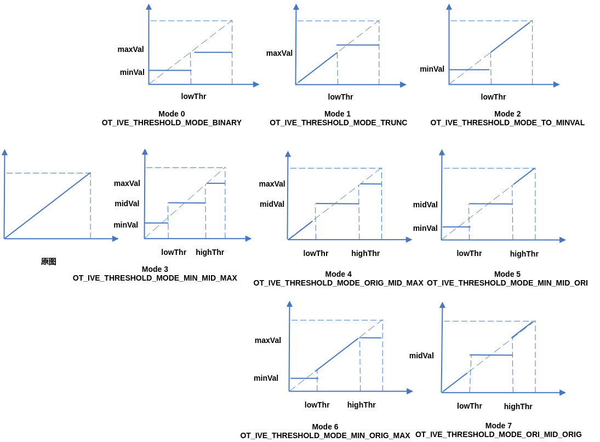

【举例】

无。

【相关主题】

-   [ss\_mpi\_ive\_threshold\_s16](#ss_mpi_ive_threshold_s16)
-   [ss\_mpi\_ive\_threshold\_u16](#ss_mpi_ive_threshold_u16)

## ss\_mpi\_ive\_and<a name="ZH-CN_TOPIC_0000002504091087"></a>

【描述】

创建两二值图像相与任务。

【语法】

```
td_s32 ss_mpi_ive_and(ot_ive_handle *handle, const ot_svp_src_img *src1, const ot_svp_src_img *src2, const ot_svp_dst_img *dst, td_bool is_instant );
```

【参数】

<a name="table2952mcpsimp"></a>
<table><thead align="left"><tr id="row2958mcpsimp"><th class="cellrowborder" valign="top" width="20%" id="mcps1.1.4.1.1"><p id="p2960mcpsimp"><a name="p2960mcpsimp"></a><a name="p2960mcpsimp"></a>参数名称</p>
</th>
<th class="cellrowborder" valign="top" width="62%" id="mcps1.1.4.1.2"><p id="p2962mcpsimp"><a name="p2962mcpsimp"></a><a name="p2962mcpsimp"></a>描述</p>
</th>
<th class="cellrowborder" valign="top" width="18%" id="mcps1.1.4.1.3"><p id="p2964mcpsimp"><a name="p2964mcpsimp"></a><a name="p2964mcpsimp"></a>输入/输出</p>
</th>
</tr>
</thead>
<tbody><tr id="row2966mcpsimp"><td class="cellrowborder" valign="top" width="20%" headers="mcps1.1.4.1.1 "><p id="p2968mcpsimp"><a name="p2968mcpsimp"></a><a name="p2968mcpsimp"></a>handle</p>
</td>
<td class="cellrowborder" valign="top" width="62%" headers="mcps1.1.4.1.2 "><p id="p2970mcpsimp"><a name="p2970mcpsimp"></a><a name="p2970mcpsimp"></a>handle指针。</p>
<p id="p2971mcpsimp"><a name="p2971mcpsimp"></a><a name="p2971mcpsimp"></a>不能为空。</p>
</td>
<td class="cellrowborder" valign="top" width="18%" headers="mcps1.1.4.1.3 "><p id="p2973mcpsimp"><a name="p2973mcpsimp"></a><a name="p2973mcpsimp"></a>输出</p>
</td>
</tr>
<tr id="row2974mcpsimp"><td class="cellrowborder" valign="top" width="20%" headers="mcps1.1.4.1.1 "><p id="p2976mcpsimp"><a name="p2976mcpsimp"></a><a name="p2976mcpsimp"></a>src1</p>
</td>
<td class="cellrowborder" valign="top" width="62%" headers="mcps1.1.4.1.2 "><p id="p2978mcpsimp"><a name="p2978mcpsimp"></a><a name="p2978mcpsimp"></a>源图像1指针。</p>
<p id="p2979mcpsimp"><a name="p2979mcpsimp"></a><a name="p2979mcpsimp"></a>不能为空。</p>
</td>
<td class="cellrowborder" valign="top" width="18%" headers="mcps1.1.4.1.3 "><p id="p2981mcpsimp"><a name="p2981mcpsimp"></a><a name="p2981mcpsimp"></a>输入</p>
</td>
</tr>
<tr id="row2982mcpsimp"><td class="cellrowborder" valign="top" width="20%" headers="mcps1.1.4.1.1 "><p id="p2984mcpsimp"><a name="p2984mcpsimp"></a><a name="p2984mcpsimp"></a>src2</p>
</td>
<td class="cellrowborder" valign="top" width="62%" headers="mcps1.1.4.1.2 "><p id="p2986mcpsimp"><a name="p2986mcpsimp"></a><a name="p2986mcpsimp"></a>源图像2指针。</p>
<p id="p2987mcpsimp"><a name="p2987mcpsimp"></a><a name="p2987mcpsimp"></a>不能为空。</p>
<p id="p2988mcpsimp"><a name="p2988mcpsimp"></a><a name="p2988mcpsimp"></a>高、宽同src1。</p>
</td>
<td class="cellrowborder" valign="top" width="18%" headers="mcps1.1.4.1.3 "><p id="p2990mcpsimp"><a name="p2990mcpsimp"></a><a name="p2990mcpsimp"></a>输入</p>
</td>
</tr>
<tr id="row2991mcpsimp"><td class="cellrowborder" valign="top" width="20%" headers="mcps1.1.4.1.1 "><p id="p2993mcpsimp"><a name="p2993mcpsimp"></a><a name="p2993mcpsimp"></a>dst</p>
</td>
<td class="cellrowborder" valign="top" width="62%" headers="mcps1.1.4.1.2 "><p id="p2995mcpsimp"><a name="p2995mcpsimp"></a><a name="p2995mcpsimp"></a>输出图像指针。</p>
<p id="p2996mcpsimp"><a name="p2996mcpsimp"></a><a name="p2996mcpsimp"></a>不能为空。</p>
<p id="p2997mcpsimp"><a name="p2997mcpsimp"></a><a name="p2997mcpsimp"></a>高、宽同src1。</p>
</td>
<td class="cellrowborder" valign="top" width="18%" headers="mcps1.1.4.1.3 "><p id="p2999mcpsimp"><a name="p2999mcpsimp"></a><a name="p2999mcpsimp"></a>输出</p>
</td>
</tr>
<tr id="row3000mcpsimp"><td class="cellrowborder" valign="top" width="20%" headers="mcps1.1.4.1.1 "><p id="p3002mcpsimp"><a name="p3002mcpsimp"></a><a name="p3002mcpsimp"></a>is_instant</p>
</td>
<td class="cellrowborder" valign="top" width="62%" headers="mcps1.1.4.1.2 "><p id="p3004mcpsimp"><a name="p3004mcpsimp"></a><a name="p3004mcpsimp"></a>及时返回结果标志。</p>
</td>
<td class="cellrowborder" valign="top" width="18%" headers="mcps1.1.4.1.3 "><p id="p3006mcpsimp"><a name="p3006mcpsimp"></a><a name="p3006mcpsimp"></a>输入</p>
</td>
</tr>
</tbody>
</table>

<a name="table3007mcpsimp"></a>
<table><thead align="left"><tr id="row3014mcpsimp"><th class="cellrowborder" valign="top" width="18.18181818181818%" id="mcps1.1.5.1.1"><p id="p3016mcpsimp"><a name="p3016mcpsimp"></a><a name="p3016mcpsimp"></a>参数名称</p>
</th>
<th class="cellrowborder" valign="top" width="28.28282828282828%" id="mcps1.1.5.1.2"><p id="p3018mcpsimp"><a name="p3018mcpsimp"></a><a name="p3018mcpsimp"></a>支持图像类型</p>
</th>
<th class="cellrowborder" valign="top" width="18.18181818181818%" id="mcps1.1.5.1.3"><p id="p3020mcpsimp"><a name="p3020mcpsimp"></a><a name="p3020mcpsimp"></a>地址对齐</p>
</th>
<th class="cellrowborder" valign="top" width="35.35353535353536%" id="mcps1.1.5.1.4"><p id="p3022mcpsimp"><a name="p3022mcpsimp"></a><a name="p3022mcpsimp"></a>分辨率</p>
</th>
</tr>
</thead>
<tbody><tr id="row3024mcpsimp"><td class="cellrowborder" valign="top" width="18.18181818181818%" headers="mcps1.1.5.1.1 "><p id="p3026mcpsimp"><a name="p3026mcpsimp"></a><a name="p3026mcpsimp"></a>src1</p>
</td>
<td class="cellrowborder" valign="top" width="28.28282828282828%" headers="mcps1.1.5.1.2 "><p id="p3028mcpsimp"><a name="p3028mcpsimp"></a><a name="p3028mcpsimp"></a>U8C1的二值图</p>
</td>
<td class="cellrowborder" valign="top" width="18.18181818181818%" headers="mcps1.1.5.1.3 "><p id="p3030mcpsimp"><a name="p3030mcpsimp"></a><a name="p3030mcpsimp"></a>1 byte</p>
</td>
<td class="cellrowborder" valign="top" width="35.35353535353536%" headers="mcps1.1.5.1.4 "><p id="p3032mcpsimp"><a name="p3032mcpsimp"></a><a name="p3032mcpsimp"></a>64x64～1920x1080</p>
</td>
</tr>
<tr id="row3033mcpsimp"><td class="cellrowborder" valign="top" width="18.18181818181818%" headers="mcps1.1.5.1.1 "><p id="p3035mcpsimp"><a name="p3035mcpsimp"></a><a name="p3035mcpsimp"></a>src2</p>
</td>
<td class="cellrowborder" valign="top" width="28.28282828282828%" headers="mcps1.1.5.1.2 "><p id="p3037mcpsimp"><a name="p3037mcpsimp"></a><a name="p3037mcpsimp"></a>U8C1的二值图</p>
</td>
<td class="cellrowborder" valign="top" width="18.18181818181818%" headers="mcps1.1.5.1.3 "><p id="p3039mcpsimp"><a name="p3039mcpsimp"></a><a name="p3039mcpsimp"></a>1 byte</p>
</td>
<td class="cellrowborder" valign="top" width="35.35353535353536%" headers="mcps1.1.5.1.4 "><p id="p3041mcpsimp"><a name="p3041mcpsimp"></a><a name="p3041mcpsimp"></a>同src1</p>
</td>
</tr>
<tr id="row3042mcpsimp"><td class="cellrowborder" valign="top" width="18.18181818181818%" headers="mcps1.1.5.1.1 "><p id="p3044mcpsimp"><a name="p3044mcpsimp"></a><a name="p3044mcpsimp"></a>dst</p>
</td>
<td class="cellrowborder" valign="top" width="28.28282828282828%" headers="mcps1.1.5.1.2 "><p id="p3046mcpsimp"><a name="p3046mcpsimp"></a><a name="p3046mcpsimp"></a>U8C1的二值图</p>
</td>
<td class="cellrowborder" valign="top" width="18.18181818181818%" headers="mcps1.1.5.1.3 "><p id="p3048mcpsimp"><a name="p3048mcpsimp"></a><a name="p3048mcpsimp"></a>1 byte</p>
</td>
<td class="cellrowborder" valign="top" width="35.35353535353536%" headers="mcps1.1.5.1.4 "><p id="p3050mcpsimp"><a name="p3050mcpsimp"></a><a name="p3050mcpsimp"></a>同src1</p>
</td>
</tr>
</tbody>
</table>

【返回值】

<a name="table3052mcpsimp"></a>
<table><thead align="left"><tr id="row3057mcpsimp"><th class="cellrowborder" valign="top" width="50%" id="mcps1.1.3.1.1"><p id="p3059mcpsimp"><a name="p3059mcpsimp"></a><a name="p3059mcpsimp"></a>返回值</p>
</th>
<th class="cellrowborder" valign="top" width="50%" id="mcps1.1.3.1.2"><p id="p3061mcpsimp"><a name="p3061mcpsimp"></a><a name="p3061mcpsimp"></a>描述</p>
</th>
</tr>
</thead>
<tbody><tr id="row3063mcpsimp"><td class="cellrowborder" valign="top" width="50%" headers="mcps1.1.3.1.1 "><p id="p3065mcpsimp"><a name="p3065mcpsimp"></a><a name="p3065mcpsimp"></a>0</p>
</td>
<td class="cellrowborder" valign="top" width="50%" headers="mcps1.1.3.1.2 "><p id="p3067mcpsimp"><a name="p3067mcpsimp"></a><a name="p3067mcpsimp"></a>成功。</p>
</td>
</tr>
<tr id="row3068mcpsimp"><td class="cellrowborder" valign="top" width="50%" headers="mcps1.1.3.1.1 "><p id="p3070mcpsimp"><a name="p3070mcpsimp"></a><a name="p3070mcpsimp"></a>非0</p>
</td>
<td class="cellrowborder" valign="top" width="50%" headers="mcps1.1.3.1.2 "><p id="p3072mcpsimp"><a name="p3072mcpsimp"></a><a name="p3072mcpsimp"></a>失败，参见<span xml:lang="fr-FR" id="ph136311818172213"><a name="ph136311818172213"></a><a name="ph136311818172213"></a>错误码</span><span xml:lang="fr-FR" id="ph5283mcpsimp"><a name="ph5283mcpsimp"></a><a name="ph5283mcpsimp"></a>。</span></p>
</td>
</tr>
</tbody>
</table>

【需求】

-   头文件：ot\_common\_ive.h、ot\_common\_svp.h、ss\_mpi\_ive.h
-   库文件：libss\_ive.a（PC上模拟用ss\_ive\_clib2.x.lib）

【注意】

计算公式如下：


其中，对应src1，对应src2，对应dst

【举例】

无。

【相关主题】

-   [ss\_mpi\_ive\_or](#ss_mpi_ive_or)
-   [ss\_mpi\_ive\_xor](#ss_mpi_ive_xor)

## ss\_mpi\_ive\_sub<a name="ZH-CN_TOPIC_0000002503971163"></a>

【描述】

创建两灰度图像相减任务。

【语法】

```
td_s32 ss_mpi_ive_sub(ot_ive_handle *handle, const ot_svp_src_img *src1, const ot_svp_src_img *src2, const ot_svp_dst_img *dst, const ot_ive_sub_ctrl *ctrl, td_bool is_instant);
```

【参数】

<a name="table11926mcpsimp"></a>
<table><thead align="left"><tr id="row11932mcpsimp"><th class="cellrowborder" valign="top" width="17.82%" id="mcps1.1.4.1.1"><p id="p11934mcpsimp"><a name="p11934mcpsimp"></a><a name="p11934mcpsimp"></a>参数名称</p>
</th>
<th class="cellrowborder" valign="top" width="66.34%" id="mcps1.1.4.1.2"><p id="p11936mcpsimp"><a name="p11936mcpsimp"></a><a name="p11936mcpsimp"></a>描述</p>
</th>
<th class="cellrowborder" valign="top" width="15.840000000000002%" id="mcps1.1.4.1.3"><p id="p11938mcpsimp"><a name="p11938mcpsimp"></a><a name="p11938mcpsimp"></a>输入/输出</p>
</th>
</tr>
</thead>
<tbody><tr id="row11940mcpsimp"><td class="cellrowborder" valign="top" width="17.82%" headers="mcps1.1.4.1.1 "><p id="p11942mcpsimp"><a name="p11942mcpsimp"></a><a name="p11942mcpsimp"></a>handle</p>
</td>
<td class="cellrowborder" valign="top" width="66.34%" headers="mcps1.1.4.1.2 "><p id="p11944mcpsimp"><a name="p11944mcpsimp"></a><a name="p11944mcpsimp"></a>handle指针。</p>
</td>
<td class="cellrowborder" valign="top" width="15.840000000000002%" headers="mcps1.1.4.1.3 "><p id="p11946mcpsimp"><a name="p11946mcpsimp"></a><a name="p11946mcpsimp"></a>输出</p>
</td>
</tr>
<tr id="row11947mcpsimp"><td class="cellrowborder" valign="top" width="17.82%" headers="mcps1.1.4.1.1 "><p id="p11949mcpsimp"><a name="p11949mcpsimp"></a><a name="p11949mcpsimp"></a>src1</p>
</td>
<td class="cellrowborder" valign="top" width="66.34%" headers="mcps1.1.4.1.2 "><p id="p11951mcpsimp"><a name="p11951mcpsimp"></a><a name="p11951mcpsimp"></a>源图像1指针。</p>
<p id="p11952mcpsimp"><a name="p11952mcpsimp"></a><a name="p11952mcpsimp"></a>不能为空。</p>
</td>
<td class="cellrowborder" valign="top" width="15.840000000000002%" headers="mcps1.1.4.1.3 "><p id="p11954mcpsimp"><a name="p11954mcpsimp"></a><a name="p11954mcpsimp"></a>输入</p>
</td>
</tr>
<tr id="row11955mcpsimp"><td class="cellrowborder" valign="top" width="17.82%" headers="mcps1.1.4.1.1 "><p id="p11957mcpsimp"><a name="p11957mcpsimp"></a><a name="p11957mcpsimp"></a>src2</p>
</td>
<td class="cellrowborder" valign="top" width="66.34%" headers="mcps1.1.4.1.2 "><p id="p11959mcpsimp"><a name="p11959mcpsimp"></a><a name="p11959mcpsimp"></a>源图像2指针。</p>
<p id="p11960mcpsimp"><a name="p11960mcpsimp"></a><a name="p11960mcpsimp"></a>不能为空。</p>
<p id="p11961mcpsimp"><a name="p11961mcpsimp"></a><a name="p11961mcpsimp"></a>高、宽同src1。</p>
</td>
<td class="cellrowborder" valign="top" width="15.840000000000002%" headers="mcps1.1.4.1.3 "><p id="p11963mcpsimp"><a name="p11963mcpsimp"></a><a name="p11963mcpsimp"></a>输入</p>
</td>
</tr>
<tr id="row11964mcpsimp"><td class="cellrowborder" valign="top" width="17.82%" headers="mcps1.1.4.1.1 "><p id="p11966mcpsimp"><a name="p11966mcpsimp"></a><a name="p11966mcpsimp"></a>dst</p>
</td>
<td class="cellrowborder" valign="top" width="66.34%" headers="mcps1.1.4.1.2 "><p id="p11968mcpsimp"><a name="p11968mcpsimp"></a><a name="p11968mcpsimp"></a>输出图像指针。</p>
<p id="p11969mcpsimp"><a name="p11969mcpsimp"></a><a name="p11969mcpsimp"></a>不能为空。</p>
<p id="p11970mcpsimp"><a name="p11970mcpsimp"></a><a name="p11970mcpsimp"></a>高、宽同src1。</p>
</td>
<td class="cellrowborder" valign="top" width="15.840000000000002%" headers="mcps1.1.4.1.3 "><p id="p11972mcpsimp"><a name="p11972mcpsimp"></a><a name="p11972mcpsimp"></a>输出</p>
</td>
</tr>
<tr id="row11973mcpsimp"><td class="cellrowborder" valign="top" width="17.82%" headers="mcps1.1.4.1.1 "><p id="p11975mcpsimp"><a name="p11975mcpsimp"></a><a name="p11975mcpsimp"></a>ctrl</p>
</td>
<td class="cellrowborder" valign="top" width="66.34%" headers="mcps1.1.4.1.2 "><p id="p11977mcpsimp"><a name="p11977mcpsimp"></a><a name="p11977mcpsimp"></a>控制信息指针。</p>
<p id="p11978mcpsimp"><a name="p11978mcpsimp"></a><a name="p11978mcpsimp"></a>不能为空。</p>
</td>
<td class="cellrowborder" valign="top" width="15.840000000000002%" headers="mcps1.1.4.1.3 "><p id="p11980mcpsimp"><a name="p11980mcpsimp"></a><a name="p11980mcpsimp"></a>输入</p>
</td>
</tr>
<tr id="row11981mcpsimp"><td class="cellrowborder" valign="top" width="17.82%" headers="mcps1.1.4.1.1 "><p id="p11983mcpsimp"><a name="p11983mcpsimp"></a><a name="p11983mcpsimp"></a>is_instant</p>
</td>
<td class="cellrowborder" valign="top" width="66.34%" headers="mcps1.1.4.1.2 "><p id="p11985mcpsimp"><a name="p11985mcpsimp"></a><a name="p11985mcpsimp"></a>及时返回结果标志。</p>
</td>
<td class="cellrowborder" valign="top" width="15.840000000000002%" headers="mcps1.1.4.1.3 "><p id="p11987mcpsimp"><a name="p11987mcpsimp"></a><a name="p11987mcpsimp"></a>输入</p>
</td>
</tr>
</tbody>
</table>

<a name="table11988mcpsimp"></a>
<table><thead align="left"><tr id="row11995mcpsimp"><th class="cellrowborder" valign="top" width="25.252525252525253%" id="mcps1.1.5.1.1"><p id="p11997mcpsimp"><a name="p11997mcpsimp"></a><a name="p11997mcpsimp"></a>参数名称</p>
</th>
<th class="cellrowborder" valign="top" width="24.242424242424242%" id="mcps1.1.5.1.2"><p id="p11999mcpsimp"><a name="p11999mcpsimp"></a><a name="p11999mcpsimp"></a>支持图像类型</p>
</th>
<th class="cellrowborder" valign="top" width="15.151515151515152%" id="mcps1.1.5.1.3"><p id="p12001mcpsimp"><a name="p12001mcpsimp"></a><a name="p12001mcpsimp"></a>地址对齐</p>
</th>
<th class="cellrowborder" valign="top" width="35.35353535353536%" id="mcps1.1.5.1.4"><p id="p12003mcpsimp"><a name="p12003mcpsimp"></a><a name="p12003mcpsimp"></a>分辨率</p>
</th>
</tr>
</thead>
<tbody><tr id="row12005mcpsimp"><td class="cellrowborder" valign="top" width="25.252525252525253%" headers="mcps1.1.5.1.1 "><p id="p12007mcpsimp"><a name="p12007mcpsimp"></a><a name="p12007mcpsimp"></a>src1</p>
</td>
<td class="cellrowborder" valign="top" width="24.242424242424242%" headers="mcps1.1.5.1.2 "><p id="p12009mcpsimp"><a name="p12009mcpsimp"></a><a name="p12009mcpsimp"></a>U8C1</p>
</td>
<td class="cellrowborder" valign="top" width="15.151515151515152%" headers="mcps1.1.5.1.3 "><p id="p12011mcpsimp"><a name="p12011mcpsimp"></a><a name="p12011mcpsimp"></a>1 byte</p>
</td>
<td class="cellrowborder" valign="top" width="35.35353535353536%" headers="mcps1.1.5.1.4 "><p id="p12013mcpsimp"><a name="p12013mcpsimp"></a><a name="p12013mcpsimp"></a>64x64～1920x1080</p>
</td>
</tr>
<tr id="row12014mcpsimp"><td class="cellrowborder" valign="top" width="25.252525252525253%" headers="mcps1.1.5.1.1 "><p id="p12016mcpsimp"><a name="p12016mcpsimp"></a><a name="p12016mcpsimp"></a>src2</p>
</td>
<td class="cellrowborder" valign="top" width="24.242424242424242%" headers="mcps1.1.5.1.2 "><p id="p12018mcpsimp"><a name="p12018mcpsimp"></a><a name="p12018mcpsimp"></a>U8C1</p>
</td>
<td class="cellrowborder" valign="top" width="15.151515151515152%" headers="mcps1.1.5.1.3 "><p id="p12020mcpsimp"><a name="p12020mcpsimp"></a><a name="p12020mcpsimp"></a>1 byte</p>
</td>
<td class="cellrowborder" valign="top" width="35.35353535353536%" headers="mcps1.1.5.1.4 "><p id="p12022mcpsimp"><a name="p12022mcpsimp"></a><a name="p12022mcpsimp"></a>同src1</p>
</td>
</tr>
<tr id="row12023mcpsimp"><td class="cellrowborder" valign="top" width="25.252525252525253%" headers="mcps1.1.5.1.1 "><p id="p12025mcpsimp"><a name="p12025mcpsimp"></a><a name="p12025mcpsimp"></a>dst</p>
</td>
<td class="cellrowborder" valign="top" width="24.242424242424242%" headers="mcps1.1.5.1.2 "><p id="p12027mcpsimp"><a name="p12027mcpsimp"></a><a name="p12027mcpsimp"></a>U8C1、S8C1</p>
</td>
<td class="cellrowborder" valign="top" width="15.151515151515152%" headers="mcps1.1.5.1.3 "><p id="p12029mcpsimp"><a name="p12029mcpsimp"></a><a name="p12029mcpsimp"></a>1 byte</p>
</td>
<td class="cellrowborder" valign="top" width="35.35353535353536%" headers="mcps1.1.5.1.4 "><p id="p12031mcpsimp"><a name="p12031mcpsimp"></a><a name="p12031mcpsimp"></a>同src1</p>
</td>
</tr>
</tbody>
</table>

【返回值】

<a name="table12033mcpsimp"></a>
<table><thead align="left"><tr id="row12038mcpsimp"><th class="cellrowborder" valign="top" width="50%" id="mcps1.1.3.1.1"><p id="p12040mcpsimp"><a name="p12040mcpsimp"></a><a name="p12040mcpsimp"></a>返回值</p>
</th>
<th class="cellrowborder" valign="top" width="50%" id="mcps1.1.3.1.2"><p id="p12042mcpsimp"><a name="p12042mcpsimp"></a><a name="p12042mcpsimp"></a>描述</p>
</th>
</tr>
</thead>
<tbody><tr id="row12044mcpsimp"><td class="cellrowborder" valign="top" width="50%" headers="mcps1.1.3.1.1 "><p id="p12046mcpsimp"><a name="p12046mcpsimp"></a><a name="p12046mcpsimp"></a>0</p>
</td>
<td class="cellrowborder" valign="top" width="50%" headers="mcps1.1.3.1.2 "><p id="p12048mcpsimp"><a name="p12048mcpsimp"></a><a name="p12048mcpsimp"></a>成功。</p>
</td>
</tr>
<tr id="row12049mcpsimp"><td class="cellrowborder" valign="top" width="50%" headers="mcps1.1.3.1.1 "><p id="p12051mcpsimp"><a name="p12051mcpsimp"></a><a name="p12051mcpsimp"></a>非0</p>
</td>
<td class="cellrowborder" valign="top" width="50%" headers="mcps1.1.3.1.2 "><p id="p7404mcpsimp"><a name="p7404mcpsimp"></a><a name="p7404mcpsimp"></a>失败，参见<span xml:lang="fr-FR" id="ph136311818172213"><a name="ph136311818172213"></a><a name="ph136311818172213"></a>错误码</span><span xml:lang="fr-FR" id="ph5283mcpsimp"><a name="ph5283mcpsimp"></a><a name="ph5283mcpsimp"></a>。</span></p>
</td>
</tr>
</tbody>
</table>

【需求】

-   头文件：ot\_common\_ive.h、ot\_common\_svp.h、ss\_mpi\_ive.h
-   库文件：libss\_ive.a（PC上模拟用ss\_ive\_clib2.x.lib）

【注意】

-   可以配置2种输出格式，具体参见ot\_ive\_sub\_mode。
-   OT\_IVE\_SUB\_MODE\_ABS
    -   计算公式：
    -   输出格式：U8C1

-   OT\_IVE\_SUB\_MODE\_SHIFT

    -   计算公式：
    -   输出格式：S8C1

    其中，  对应src1，对应src2，对应dst。

【举例】

无。

【相关主题】

[ss\_mpi\_ive\_add](#ss_mpi_ive_add)

## ss\_mpi\_ive\_or<a name="ZH-CN_TOPIC_0000002471091296"></a>

【描述】

创建两二值图像相或任务。

【语法】

```
td_s32 ss_mpi_ive_or(ot_ive_handle *handle, const ot_svp_src_img *src1, const ot_svp_src_img *src2, const ot_svp_dst_img *dst, td_bool is_instant);
```

【参数】

<a name="table8184mcpsimp"></a>
<table><thead align="left"><tr id="row8190mcpsimp"><th class="cellrowborder" valign="top" width="16%" id="mcps1.1.4.1.1"><p id="p8192mcpsimp"><a name="p8192mcpsimp"></a><a name="p8192mcpsimp"></a>参数名称</p>
</th>
<th class="cellrowborder" valign="top" width="68%" id="mcps1.1.4.1.2"><p id="p8194mcpsimp"><a name="p8194mcpsimp"></a><a name="p8194mcpsimp"></a>描述</p>
</th>
<th class="cellrowborder" valign="top" width="16%" id="mcps1.1.4.1.3"><p id="p8196mcpsimp"><a name="p8196mcpsimp"></a><a name="p8196mcpsimp"></a>输入/输出</p>
</th>
</tr>
</thead>
<tbody><tr id="row8198mcpsimp"><td class="cellrowborder" valign="top" width="16%" headers="mcps1.1.4.1.1 "><p id="p8200mcpsimp"><a name="p8200mcpsimp"></a><a name="p8200mcpsimp"></a>handle</p>
</td>
<td class="cellrowborder" valign="top" width="68%" headers="mcps1.1.4.1.2 "><p id="p8202mcpsimp"><a name="p8202mcpsimp"></a><a name="p8202mcpsimp"></a>handle指针。</p>
<p id="p8203mcpsimp"><a name="p8203mcpsimp"></a><a name="p8203mcpsimp"></a>不能为空。</p>
</td>
<td class="cellrowborder" valign="top" width="16%" headers="mcps1.1.4.1.3 "><p id="p8205mcpsimp"><a name="p8205mcpsimp"></a><a name="p8205mcpsimp"></a>输出</p>
</td>
</tr>
<tr id="row8206mcpsimp"><td class="cellrowborder" valign="top" width="16%" headers="mcps1.1.4.1.1 "><p id="p8208mcpsimp"><a name="p8208mcpsimp"></a><a name="p8208mcpsimp"></a>src1</p>
</td>
<td class="cellrowborder" valign="top" width="68%" headers="mcps1.1.4.1.2 "><p id="p8210mcpsimp"><a name="p8210mcpsimp"></a><a name="p8210mcpsimp"></a>源图像1指针。</p>
<p id="p8211mcpsimp"><a name="p8211mcpsimp"></a><a name="p8211mcpsimp"></a>不能为空。</p>
</td>
<td class="cellrowborder" valign="top" width="16%" headers="mcps1.1.4.1.3 "><p id="p8213mcpsimp"><a name="p8213mcpsimp"></a><a name="p8213mcpsimp"></a>输入</p>
</td>
</tr>
<tr id="row8214mcpsimp"><td class="cellrowborder" valign="top" width="16%" headers="mcps1.1.4.1.1 "><p id="p8216mcpsimp"><a name="p8216mcpsimp"></a><a name="p8216mcpsimp"></a>src2</p>
</td>
<td class="cellrowborder" valign="top" width="68%" headers="mcps1.1.4.1.2 "><p id="p8218mcpsimp"><a name="p8218mcpsimp"></a><a name="p8218mcpsimp"></a>源图像2指针。</p>
<p id="p8219mcpsimp"><a name="p8219mcpsimp"></a><a name="p8219mcpsimp"></a>不能为空。</p>
<p id="p8220mcpsimp"><a name="p8220mcpsimp"></a><a name="p8220mcpsimp"></a>高、宽同src1。</p>
</td>
<td class="cellrowborder" valign="top" width="16%" headers="mcps1.1.4.1.3 "><p id="p8222mcpsimp"><a name="p8222mcpsimp"></a><a name="p8222mcpsimp"></a>输入</p>
</td>
</tr>
<tr id="row8223mcpsimp"><td class="cellrowborder" valign="top" width="16%" headers="mcps1.1.4.1.1 "><p id="p8225mcpsimp"><a name="p8225mcpsimp"></a><a name="p8225mcpsimp"></a>dst</p>
</td>
<td class="cellrowborder" valign="top" width="68%" headers="mcps1.1.4.1.2 "><p id="p8227mcpsimp"><a name="p8227mcpsimp"></a><a name="p8227mcpsimp"></a>输出图像指针。</p>
<p id="p8228mcpsimp"><a name="p8228mcpsimp"></a><a name="p8228mcpsimp"></a>不能为空。</p>
<p id="p8229mcpsimp"><a name="p8229mcpsimp"></a><a name="p8229mcpsimp"></a>高、宽同src1。</p>
</td>
<td class="cellrowborder" valign="top" width="16%" headers="mcps1.1.4.1.3 "><p id="p8231mcpsimp"><a name="p8231mcpsimp"></a><a name="p8231mcpsimp"></a>输出</p>
</td>
</tr>
<tr id="row8232mcpsimp"><td class="cellrowborder" valign="top" width="16%" headers="mcps1.1.4.1.1 "><p id="p8234mcpsimp"><a name="p8234mcpsimp"></a><a name="p8234mcpsimp"></a>is_instant</p>
</td>
<td class="cellrowborder" valign="top" width="68%" headers="mcps1.1.4.1.2 "><p id="p8236mcpsimp"><a name="p8236mcpsimp"></a><a name="p8236mcpsimp"></a>及时返回结果标志。</p>
</td>
<td class="cellrowborder" valign="top" width="16%" headers="mcps1.1.4.1.3 "><p id="p8238mcpsimp"><a name="p8238mcpsimp"></a><a name="p8238mcpsimp"></a>输入</p>
</td>
</tr>
</tbody>
</table>

<a name="table8239mcpsimp"></a>
<table><thead align="left"><tr id="row8246mcpsimp"><th class="cellrowborder" valign="top" width="25.252525252525253%" id="mcps1.1.5.1.1"><p id="p8248mcpsimp"><a name="p8248mcpsimp"></a><a name="p8248mcpsimp"></a>参数名称</p>
</th>
<th class="cellrowborder" valign="top" width="21.21212121212121%" id="mcps1.1.5.1.2"><p id="p8250mcpsimp"><a name="p8250mcpsimp"></a><a name="p8250mcpsimp"></a>支持图像类型</p>
</th>
<th class="cellrowborder" valign="top" width="18.18181818181818%" id="mcps1.1.5.1.3"><p id="p8252mcpsimp"><a name="p8252mcpsimp"></a><a name="p8252mcpsimp"></a>地址对齐</p>
</th>
<th class="cellrowborder" valign="top" width="35.35353535353536%" id="mcps1.1.5.1.4"><p id="p8254mcpsimp"><a name="p8254mcpsimp"></a><a name="p8254mcpsimp"></a>分辨率</p>
</th>
</tr>
</thead>
<tbody><tr id="row8256mcpsimp"><td class="cellrowborder" valign="top" width="25.252525252525253%" headers="mcps1.1.5.1.1 "><p id="p8258mcpsimp"><a name="p8258mcpsimp"></a><a name="p8258mcpsimp"></a>src1</p>
</td>
<td class="cellrowborder" valign="top" width="21.21212121212121%" headers="mcps1.1.5.1.2 "><p id="p8260mcpsimp"><a name="p8260mcpsimp"></a><a name="p8260mcpsimp"></a>U8C1</p>
</td>
<td class="cellrowborder" valign="top" width="18.18181818181818%" headers="mcps1.1.5.1.3 "><p id="p8262mcpsimp"><a name="p8262mcpsimp"></a><a name="p8262mcpsimp"></a>1 byte</p>
</td>
<td class="cellrowborder" valign="top" width="35.35353535353536%" headers="mcps1.1.5.1.4 "><p id="p8264mcpsimp"><a name="p8264mcpsimp"></a><a name="p8264mcpsimp"></a>64x64～1920x1080</p>
</td>
</tr>
<tr id="row8265mcpsimp"><td class="cellrowborder" valign="top" width="25.252525252525253%" headers="mcps1.1.5.1.1 "><p id="p8267mcpsimp"><a name="p8267mcpsimp"></a><a name="p8267mcpsimp"></a>src2</p>
</td>
<td class="cellrowborder" valign="top" width="21.21212121212121%" headers="mcps1.1.5.1.2 "><p id="p8269mcpsimp"><a name="p8269mcpsimp"></a><a name="p8269mcpsimp"></a>U8C1</p>
</td>
<td class="cellrowborder" valign="top" width="18.18181818181818%" headers="mcps1.1.5.1.3 "><p id="p8271mcpsimp"><a name="p8271mcpsimp"></a><a name="p8271mcpsimp"></a>1 byte</p>
</td>
<td class="cellrowborder" valign="top" width="35.35353535353536%" headers="mcps1.1.5.1.4 "><p id="p8273mcpsimp"><a name="p8273mcpsimp"></a><a name="p8273mcpsimp"></a>同src1</p>
</td>
</tr>
<tr id="row8274mcpsimp"><td class="cellrowborder" valign="top" width="25.252525252525253%" headers="mcps1.1.5.1.1 "><p id="p8276mcpsimp"><a name="p8276mcpsimp"></a><a name="p8276mcpsimp"></a>dst</p>
</td>
<td class="cellrowborder" valign="top" width="21.21212121212121%" headers="mcps1.1.5.1.2 "><p id="p8278mcpsimp"><a name="p8278mcpsimp"></a><a name="p8278mcpsimp"></a>U8C1</p>
</td>
<td class="cellrowborder" valign="top" width="18.18181818181818%" headers="mcps1.1.5.1.3 "><p id="p8280mcpsimp"><a name="p8280mcpsimp"></a><a name="p8280mcpsimp"></a>1 byte</p>
</td>
<td class="cellrowborder" valign="top" width="35.35353535353536%" headers="mcps1.1.5.1.4 "><p id="p8282mcpsimp"><a name="p8282mcpsimp"></a><a name="p8282mcpsimp"></a>同src1</p>
</td>
</tr>
</tbody>
</table>

【返回值】

<a name="table8284mcpsimp"></a>
<table><thead align="left"><tr id="row8289mcpsimp"><th class="cellrowborder" valign="top" width="50%" id="mcps1.1.3.1.1"><p id="p8291mcpsimp"><a name="p8291mcpsimp"></a><a name="p8291mcpsimp"></a>返回值</p>
</th>
<th class="cellrowborder" valign="top" width="50%" id="mcps1.1.3.1.2"><p id="p8293mcpsimp"><a name="p8293mcpsimp"></a><a name="p8293mcpsimp"></a>描述</p>
</th>
</tr>
</thead>
<tbody><tr id="row8295mcpsimp"><td class="cellrowborder" valign="top" width="50%" headers="mcps1.1.3.1.1 "><p id="p8297mcpsimp"><a name="p8297mcpsimp"></a><a name="p8297mcpsimp"></a>0</p>
</td>
<td class="cellrowborder" valign="top" width="50%" headers="mcps1.1.3.1.2 "><p id="p8299mcpsimp"><a name="p8299mcpsimp"></a><a name="p8299mcpsimp"></a>成功。</p>
</td>
</tr>
<tr id="row8300mcpsimp"><td class="cellrowborder" valign="top" width="50%" headers="mcps1.1.3.1.1 "><p id="p8302mcpsimp"><a name="p8302mcpsimp"></a><a name="p8302mcpsimp"></a>非0</p>
</td>
<td class="cellrowborder" valign="top" width="50%" headers="mcps1.1.3.1.2 "><p id="p8304mcpsimp"><a name="p8304mcpsimp"></a><a name="p8304mcpsimp"></a>失败，参见<span xml:lang="fr-FR" id="ph136311818172213"><a name="ph136311818172213"></a><a name="ph136311818172213"></a>错误码</span><span xml:lang="fr-FR" id="ph5283mcpsimp"><a name="ph5283mcpsimp"></a><a name="ph5283mcpsimp"></a>。</span></p>
</td>
</tr>
</tbody>
</table>

【需求】

-   头文件：ot\_common\_ive.h、ot\_common\_svp.h、ss\_mpi\_ive.h
-   库文件：libss\_ive.a（PC上模拟用ss\_ive\_clib2.x.lib）

【注意】

计算公式如下：


其中，对应src1，对应src2，  对应dst。

【举例】

无。

【相关主题】

-   [ss\_mpi\_ive\_and](#ss_mpi_ive_and)
-   [ss\_mpi\_ive\_xor](#ss_mpi_ive_xor)

## ss\_mpi\_ive\_integ<a name="ZH-CN_TOPIC_0000002470931322"></a>

【描述】

创建灰度图像的积分图计算任务。

【语法】

```
td_s32 ss_mpi_ive_integ(ot_ive_handle *handle, const ot_svp_src_img *src, const ot_svp_dst_img *dst, const ot_ive_integ_ctrl *ctrl, td_bool is_instant);
```

【参数】

<a name="table16465mcpsimp"></a>
<table><thead align="left"><tr id="row16471mcpsimp"><th class="cellrowborder" valign="top" width="16%" id="mcps1.1.4.1.1"><p id="p16473mcpsimp"><a name="p16473mcpsimp"></a><a name="p16473mcpsimp"></a>参数名称</p>
</th>
<th class="cellrowborder" valign="top" width="66%" id="mcps1.1.4.1.2"><p id="p16475mcpsimp"><a name="p16475mcpsimp"></a><a name="p16475mcpsimp"></a>描述</p>
</th>
<th class="cellrowborder" valign="top" width="18%" id="mcps1.1.4.1.3"><p id="p16477mcpsimp"><a name="p16477mcpsimp"></a><a name="p16477mcpsimp"></a>输入/输出</p>
</th>
</tr>
</thead>
<tbody><tr id="row16479mcpsimp"><td class="cellrowborder" valign="top" width="16%" headers="mcps1.1.4.1.1 "><p id="p16481mcpsimp"><a name="p16481mcpsimp"></a><a name="p16481mcpsimp"></a>handle</p>
</td>
<td class="cellrowborder" valign="top" width="66%" headers="mcps1.1.4.1.2 "><p id="p16483mcpsimp"><a name="p16483mcpsimp"></a><a name="p16483mcpsimp"></a>handle指针。</p>
<p id="p16484mcpsimp"><a name="p16484mcpsimp"></a><a name="p16484mcpsimp"></a>不能为空。</p>
</td>
<td class="cellrowborder" valign="top" width="18%" headers="mcps1.1.4.1.3 "><p id="p16486mcpsimp"><a name="p16486mcpsimp"></a><a name="p16486mcpsimp"></a>输出</p>
</td>
</tr>
<tr id="row16487mcpsimp"><td class="cellrowborder" valign="top" width="16%" headers="mcps1.1.4.1.1 "><p id="p16489mcpsimp"><a name="p16489mcpsimp"></a><a name="p16489mcpsimp"></a>src</p>
</td>
<td class="cellrowborder" valign="top" width="66%" headers="mcps1.1.4.1.2 "><p id="p16491mcpsimp"><a name="p16491mcpsimp"></a><a name="p16491mcpsimp"></a>源图像指针。</p>
<p id="p16492mcpsimp"><a name="p16492mcpsimp"></a><a name="p16492mcpsimp"></a>不能为空。</p>
</td>
<td class="cellrowborder" valign="top" width="18%" headers="mcps1.1.4.1.3 "><p id="p16494mcpsimp"><a name="p16494mcpsimp"></a><a name="p16494mcpsimp"></a>输入</p>
</td>
</tr>
<tr id="row16495mcpsimp"><td class="cellrowborder" valign="top" width="16%" headers="mcps1.1.4.1.1 "><p id="p16497mcpsimp"><a name="p16497mcpsimp"></a><a name="p16497mcpsimp"></a>dst</p>
</td>
<td class="cellrowborder" valign="top" width="66%" headers="mcps1.1.4.1.2 "><p id="p16499mcpsimp"><a name="p16499mcpsimp"></a><a name="p16499mcpsimp"></a>输出图像指针。</p>
<p id="p16500mcpsimp"><a name="p16500mcpsimp"></a><a name="p16500mcpsimp"></a>不能为空。</p>
<p id="p16501mcpsimp"><a name="p16501mcpsimp"></a><a name="p16501mcpsimp"></a>高、宽同src。</p>
</td>
<td class="cellrowborder" valign="top" width="18%" headers="mcps1.1.4.1.3 "><p id="p16503mcpsimp"><a name="p16503mcpsimp"></a><a name="p16503mcpsimp"></a>输出</p>
</td>
</tr>
<tr id="row16504mcpsimp"><td class="cellrowborder" valign="top" width="16%" headers="mcps1.1.4.1.1 "><p id="p16506mcpsimp"><a name="p16506mcpsimp"></a><a name="p16506mcpsimp"></a>ctrl</p>
</td>
<td class="cellrowborder" valign="top" width="66%" headers="mcps1.1.4.1.2 "><p id="p16508mcpsimp"><a name="p16508mcpsimp"></a><a name="p16508mcpsimp"></a>控制信息指针。</p>
<p id="p16509mcpsimp"><a name="p16509mcpsimp"></a><a name="p16509mcpsimp"></a>不能为空。</p>
</td>
<td class="cellrowborder" valign="top" width="18%" headers="mcps1.1.4.1.3 "><p id="p16511mcpsimp"><a name="p16511mcpsimp"></a><a name="p16511mcpsimp"></a>输入</p>
</td>
</tr>
<tr id="row16512mcpsimp"><td class="cellrowborder" valign="top" width="16%" headers="mcps1.1.4.1.1 "><p id="p16514mcpsimp"><a name="p16514mcpsimp"></a><a name="p16514mcpsimp"></a>is_instant</p>
</td>
<td class="cellrowborder" valign="top" width="66%" headers="mcps1.1.4.1.2 "><p id="p16516mcpsimp"><a name="p16516mcpsimp"></a><a name="p16516mcpsimp"></a>及时返回结果标志。</p>
</td>
<td class="cellrowborder" valign="top" width="18%" headers="mcps1.1.4.1.3 "><p id="p16518mcpsimp"><a name="p16518mcpsimp"></a><a name="p16518mcpsimp"></a>输入</p>
</td>
</tr>
</tbody>
</table>

<a name="table16519mcpsimp"></a>
<table><thead align="left"><tr id="row16526mcpsimp"><th class="cellrowborder" valign="top" width="18.000000000000004%" id="mcps1.1.5.1.1"><p id="p16528mcpsimp"><a name="p16528mcpsimp"></a><a name="p16528mcpsimp"></a>参数名称</p>
</th>
<th class="cellrowborder" valign="top" width="29.000000000000004%" id="mcps1.1.5.1.2"><p id="p16530mcpsimp"><a name="p16530mcpsimp"></a><a name="p16530mcpsimp"></a>支持图像类型</p>
</th>
<th class="cellrowborder" valign="top" width="18.000000000000004%" id="mcps1.1.5.1.3"><p id="p16532mcpsimp"><a name="p16532mcpsimp"></a><a name="p16532mcpsimp"></a>地址对齐</p>
</th>
<th class="cellrowborder" valign="top" width="35%" id="mcps1.1.5.1.4"><p id="p16534mcpsimp"><a name="p16534mcpsimp"></a><a name="p16534mcpsimp"></a>分辨率</p>
</th>
</tr>
</thead>
<tbody><tr id="row16536mcpsimp"><td class="cellrowborder" valign="top" width="18.000000000000004%" headers="mcps1.1.5.1.1 "><p id="p16538mcpsimp"><a name="p16538mcpsimp"></a><a name="p16538mcpsimp"></a>src</p>
</td>
<td class="cellrowborder" valign="top" width="29.000000000000004%" headers="mcps1.1.5.1.2 "><p id="p16540mcpsimp"><a name="p16540mcpsimp"></a><a name="p16540mcpsimp"></a>U8C1</p>
</td>
<td class="cellrowborder" valign="top" width="18.000000000000004%" headers="mcps1.1.5.1.3 "><p id="p16542mcpsimp"><a name="p16542mcpsimp"></a><a name="p16542mcpsimp"></a>16 byte</p>
</td>
<td class="cellrowborder" valign="top" width="35%" headers="mcps1.1.5.1.4 "><p id="p16544mcpsimp"><a name="p16544mcpsimp"></a><a name="p16544mcpsimp"></a>32x16～1920x1080</p>
</td>
</tr>
<tr id="row16545mcpsimp"><td class="cellrowborder" valign="top" width="18.000000000000004%" headers="mcps1.1.5.1.1 "><p id="p16547mcpsimp"><a name="p16547mcpsimp"></a><a name="p16547mcpsimp"></a>dst</p>
</td>
<td class="cellrowborder" valign="top" width="29.000000000000004%" headers="mcps1.1.5.1.2 "><p id="p16549mcpsimp"><a name="p16549mcpsimp"></a><a name="p16549mcpsimp"></a>U32C1、U64C1</p>
</td>
<td class="cellrowborder" valign="top" width="18.000000000000004%" headers="mcps1.1.5.1.3 "><p id="p16551mcpsimp"><a name="p16551mcpsimp"></a><a name="p16551mcpsimp"></a>16 byte</p>
</td>
<td class="cellrowborder" valign="top" width="35%" headers="mcps1.1.5.1.4 "><p id="p16553mcpsimp"><a name="p16553mcpsimp"></a><a name="p16553mcpsimp"></a>同src</p>
</td>
</tr>
</tbody>
</table>

【返回值】

<a name="table16555mcpsimp"></a>
<table><thead align="left"><tr id="row16560mcpsimp"><th class="cellrowborder" valign="top" width="50%" id="mcps1.1.3.1.1"><p id="p16562mcpsimp"><a name="p16562mcpsimp"></a><a name="p16562mcpsimp"></a>返回值</p>
</th>
<th class="cellrowborder" valign="top" width="50%" id="mcps1.1.3.1.2"><p id="p16564mcpsimp"><a name="p16564mcpsimp"></a><a name="p16564mcpsimp"></a>描述</p>
</th>
</tr>
</thead>
<tbody><tr id="row16566mcpsimp"><td class="cellrowborder" valign="top" width="50%" headers="mcps1.1.3.1.1 "><p id="p16568mcpsimp"><a name="p16568mcpsimp"></a><a name="p16568mcpsimp"></a>0</p>
</td>
<td class="cellrowborder" valign="top" width="50%" headers="mcps1.1.3.1.2 "><p id="p16570mcpsimp"><a name="p16570mcpsimp"></a><a name="p16570mcpsimp"></a>成功。</p>
</td>
</tr>
<tr id="row16571mcpsimp"><td class="cellrowborder" valign="top" width="50%" headers="mcps1.1.3.1.1 "><p id="p16573mcpsimp"><a name="p16573mcpsimp"></a><a name="p16573mcpsimp"></a>非0</p>
</td>
<td class="cellrowborder" valign="top" width="50%" headers="mcps1.1.3.1.2 "><p id="p16575mcpsimp"><a name="p16575mcpsimp"></a><a name="p16575mcpsimp"></a>失败，参见<span xml:lang="fr-FR" id="ph136311818172213"><a name="ph136311818172213"></a><a name="ph136311818172213"></a>错误码</span><span xml:lang="fr-FR" id="ph5283mcpsimp"><a name="ph5283mcpsimp"></a><a name="ph5283mcpsimp"></a>。</span></p>
</td>
</tr>
</tbody>
</table>

【需求】

-   头文件：ot\_common\_ive.h、ot\_common\_svp.h、ss\_mpi\_ive.h
-   库文件：libss\_ive.a（PC上模拟用ss\_ive\_clib2.x.lib）

【注意】

-   OT\_IVE\_INTEG\_OUT\_CTRL\_COMBINE，组合输出模式，输出图像类型必须为OT\_SVP\_IMG\_TYPE\_U64C1，参见[图13](#fig187188113314)，计算公式如下：

    

-   OT\_IVE\_INTEG\_OUT\_CTRL\_SUM，仅和积分图输出模式，输出图像类型必须为OT\_SVP\_IMG\_TYPE\_U32C1，计算公式如下：

    

-   OT\_IVE\_INTEG\_OUT\_CTRL\_SQRT\_SUM，仅平方和积分图输出，输出图像类型必须为OT\_SVP\_IMG\_TYPE\_U64C1，计算公式如下：

    

其中，_ _对应src，_ _对应dst。

【举例】

无。

【相关主题】

无。

## ss\_mpi\_ive\_hist<a name="ZH-CN_TOPIC_0000002504091123"></a>

【描述】

创建灰度图像的直方图统计任务。

【语法】

```
td_s32 ss_mpi_ive_hist(ot_ive_handle *handle, const ot_svp_src_img *src, const ot_svp_dst_mem_info *dst, td_bool is_instant);
```

【参数】

<a name="table2031mcpsimp"></a>
<table><thead align="left"><tr id="row2037mcpsimp"><th class="cellrowborder" valign="top" width="18%" id="mcps1.1.4.1.1"><p id="p2039mcpsimp"><a name="p2039mcpsimp"></a><a name="p2039mcpsimp"></a>参数名称</p>
</th>
<th class="cellrowborder" valign="top" width="66%" id="mcps1.1.4.1.2"><p id="p2041mcpsimp"><a name="p2041mcpsimp"></a><a name="p2041mcpsimp"></a>描述</p>
</th>
<th class="cellrowborder" valign="top" width="16%" id="mcps1.1.4.1.3"><p id="p2043mcpsimp"><a name="p2043mcpsimp"></a><a name="p2043mcpsimp"></a>输入/输出</p>
</th>
</tr>
</thead>
<tbody><tr id="row2045mcpsimp"><td class="cellrowborder" valign="top" width="18%" headers="mcps1.1.4.1.1 "><p id="p2047mcpsimp"><a name="p2047mcpsimp"></a><a name="p2047mcpsimp"></a>handle</p>
</td>
<td class="cellrowborder" valign="top" width="66%" headers="mcps1.1.4.1.2 "><p id="p2049mcpsimp"><a name="p2049mcpsimp"></a><a name="p2049mcpsimp"></a>handle指针。</p>
<p id="p2050mcpsimp"><a name="p2050mcpsimp"></a><a name="p2050mcpsimp"></a>不能为空。</p>
</td>
<td class="cellrowborder" valign="top" width="16%" headers="mcps1.1.4.1.3 "><p id="p2052mcpsimp"><a name="p2052mcpsimp"></a><a name="p2052mcpsimp"></a>输出</p>
</td>
</tr>
<tr id="row2053mcpsimp"><td class="cellrowborder" valign="top" width="18%" headers="mcps1.1.4.1.1 "><p id="p2055mcpsimp"><a name="p2055mcpsimp"></a><a name="p2055mcpsimp"></a>src</p>
</td>
<td class="cellrowborder" valign="top" width="66%" headers="mcps1.1.4.1.2 "><p id="p2057mcpsimp"><a name="p2057mcpsimp"></a><a name="p2057mcpsimp"></a>源图像指针。</p>
<p id="p2058mcpsimp"><a name="p2058mcpsimp"></a><a name="p2058mcpsimp"></a>不能为空。</p>
</td>
<td class="cellrowborder" valign="top" width="16%" headers="mcps1.1.4.1.3 "><p id="p2060mcpsimp"><a name="p2060mcpsimp"></a><a name="p2060mcpsimp"></a>输入</p>
</td>
</tr>
<tr id="row2061mcpsimp"><td class="cellrowborder" valign="top" width="18%" headers="mcps1.1.4.1.1 "><p id="p2063mcpsimp"><a name="p2063mcpsimp"></a><a name="p2063mcpsimp"></a>dst</p>
</td>
<td class="cellrowborder" valign="top" width="66%" headers="mcps1.1.4.1.2 "><p id="p2065mcpsimp"><a name="p2065mcpsimp"></a><a name="p2065mcpsimp"></a>输出数据指针。</p>
<p id="p2066mcpsimp"><a name="p2066mcpsimp"></a><a name="p2066mcpsimp"></a>不能为空。</p>
<p id="p2067mcpsimp"><a name="p2067mcpsimp"></a><a name="p2067mcpsimp"></a>内存至少配置1024字节，如<a href="#fig1457715441337">图14</a>；</p>
<p id="p2069mcpsimp"><a name="p2069mcpsimp"></a><a name="p2069mcpsimp"></a>具体描述请参见《SVPx.0 API 参考》</p>
</td>
<td class="cellrowborder" valign="top" width="16%" headers="mcps1.1.4.1.3 "><p id="p2071mcpsimp"><a name="p2071mcpsimp"></a><a name="p2071mcpsimp"></a>输出</p>
</td>
</tr>
<tr id="row2072mcpsimp"><td class="cellrowborder" valign="top" width="18%" headers="mcps1.1.4.1.1 "><p id="p2074mcpsimp"><a name="p2074mcpsimp"></a><a name="p2074mcpsimp"></a>is_instant</p>
</td>
<td class="cellrowborder" valign="top" width="66%" headers="mcps1.1.4.1.2 "><p id="p2076mcpsimp"><a name="p2076mcpsimp"></a><a name="p2076mcpsimp"></a>及时返回结果标志。</p>
</td>
<td class="cellrowborder" valign="top" width="16%" headers="mcps1.1.4.1.3 "><p id="p2078mcpsimp"><a name="p2078mcpsimp"></a><a name="p2078mcpsimp"></a>输入</p>
</td>
</tr>
</tbody>
</table>

<a name="table2079mcpsimp"></a>
<table><thead align="left"><tr id="row2086mcpsimp"><th class="cellrowborder" valign="top" width="25.252525252525253%" id="mcps1.1.5.1.1"><p id="p2088mcpsimp"><a name="p2088mcpsimp"></a><a name="p2088mcpsimp"></a>参数名称</p>
</th>
<th class="cellrowborder" valign="top" width="24.242424242424242%" id="mcps1.1.5.1.2"><p id="p2090mcpsimp"><a name="p2090mcpsimp"></a><a name="p2090mcpsimp"></a>支持图像类型</p>
</th>
<th class="cellrowborder" valign="top" width="15.151515151515152%" id="mcps1.1.5.1.3"><p id="p2092mcpsimp"><a name="p2092mcpsimp"></a><a name="p2092mcpsimp"></a>地址对齐</p>
</th>
<th class="cellrowborder" valign="top" width="35.35353535353536%" id="mcps1.1.5.1.4"><p id="p2094mcpsimp"><a name="p2094mcpsimp"></a><a name="p2094mcpsimp"></a>分辨率</p>
</th>
</tr>
</thead>
<tbody><tr id="row2096mcpsimp"><td class="cellrowborder" valign="top" width="25.252525252525253%" headers="mcps1.1.5.1.1 "><p id="p2098mcpsimp"><a name="p2098mcpsimp"></a><a name="p2098mcpsimp"></a>src</p>
</td>
<td class="cellrowborder" valign="top" width="24.242424242424242%" headers="mcps1.1.5.1.2 "><p id="p2100mcpsimp"><a name="p2100mcpsimp"></a><a name="p2100mcpsimp"></a>U8C1</p>
</td>
<td class="cellrowborder" valign="top" width="15.151515151515152%" headers="mcps1.1.5.1.3 "><p id="p2102mcpsimp"><a name="p2102mcpsimp"></a><a name="p2102mcpsimp"></a>16 byte</p>
</td>
<td class="cellrowborder" valign="top" width="35.35353535353536%" headers="mcps1.1.5.1.4 "><p id="p2104mcpsimp"><a name="p2104mcpsimp"></a><a name="p2104mcpsimp"></a>64x64～1920x1080</p>
</td>
</tr>
<tr id="row2105mcpsimp"><td class="cellrowborder" valign="top" width="25.252525252525253%" headers="mcps1.1.5.1.1 "><p id="p2107mcpsimp"><a name="p2107mcpsimp"></a><a name="p2107mcpsimp"></a>dst</p>
</td>
<td class="cellrowborder" valign="top" width="24.242424242424242%" headers="mcps1.1.5.1.2 "><p id="p2109mcpsimp"><a name="p2109mcpsimp"></a><a name="p2109mcpsimp"></a>-</p>
</td>
<td class="cellrowborder" valign="top" width="15.151515151515152%" headers="mcps1.1.5.1.3 "><p id="p2111mcpsimp"><a name="p2111mcpsimp"></a><a name="p2111mcpsimp"></a>16 byte</p>
</td>
<td class="cellrowborder" valign="top" width="35.35353535353536%" headers="mcps1.1.5.1.4 "><p id="p2113mcpsimp"><a name="p2113mcpsimp"></a><a name="p2113mcpsimp"></a>-</p>
</td>
</tr>
</tbody>
</table>

【返回值】

<a name="table2115mcpsimp"></a>
<table><thead align="left"><tr id="row2120mcpsimp"><th class="cellrowborder" valign="top" width="50%" id="mcps1.1.3.1.1"><p id="p2122mcpsimp"><a name="p2122mcpsimp"></a><a name="p2122mcpsimp"></a>返回值</p>
</th>
<th class="cellrowborder" valign="top" width="50%" id="mcps1.1.3.1.2"><p id="p2124mcpsimp"><a name="p2124mcpsimp"></a><a name="p2124mcpsimp"></a>描述</p>
</th>
</tr>
</thead>
<tbody><tr id="row2126mcpsimp"><td class="cellrowborder" valign="top" width="50%" headers="mcps1.1.3.1.1 "><p id="p2128mcpsimp"><a name="p2128mcpsimp"></a><a name="p2128mcpsimp"></a>0</p>
</td>
<td class="cellrowborder" valign="top" width="50%" headers="mcps1.1.3.1.2 "><p id="p2130mcpsimp"><a name="p2130mcpsimp"></a><a name="p2130mcpsimp"></a>成功。</p>
</td>
</tr>
<tr id="row2131mcpsimp"><td class="cellrowborder" valign="top" width="50%" headers="mcps1.1.3.1.1 "><p id="p2133mcpsimp"><a name="p2133mcpsimp"></a><a name="p2133mcpsimp"></a>非0</p>
</td>
<td class="cellrowborder" valign="top" width="50%" headers="mcps1.1.3.1.2 "><p id="p7404mcpsimp"><a name="p7404mcpsimp"></a><a name="p7404mcpsimp"></a>失败，参见<span xml:lang="fr-FR" id="ph136311818172213"><a name="ph136311818172213"></a><a name="ph136311818172213"></a>错误码</span><span xml:lang="fr-FR" id="ph5283mcpsimp"><a name="ph5283mcpsimp"></a><a name="ph5283mcpsimp"></a>。</span></p>
</td>
</tr>
</tbody>
</table>

【需求】

-   头文件：ot\_common\_ive.h、ot\_common\_svp.h、ss\_mpi\_ive.h
-   库文件：libss\_ive.a（PC上模拟用ss\_ive\_clib2.x.lib）

【注意】

计算公式如下：


其中，对应src，对应dst。

【举例】

无。

【相关主题】

无。

## ss\_mpi\_ive\_threshold\_s16<a name="ZH-CN_TOPIC_0000002470931220"></a>

【描述】

创建s16数据到8bit数据的阈值化任务。

【语法】

```
td_s32 ss_mpi_ive_threshold_s16(ot_ive_handle *handle, const ot_svp_src_img *src, const ot_svp_dst_img *dst, const ot_ive_threshold_s16_ctrl *ctrl, td_bool is_instant);
```

【参数】

<a name="table10854mcpsimp"></a>
<table><thead align="left"><tr id="row10860mcpsimp"><th class="cellrowborder" valign="top" width="21.21%" id="mcps1.1.4.1.1"><p id="p10862mcpsimp"><a name="p10862mcpsimp"></a><a name="p10862mcpsimp"></a>参数名称</p>
</th>
<th class="cellrowborder" valign="top" width="55.559999999999995%" id="mcps1.1.4.1.2"><p id="p10864mcpsimp"><a name="p10864mcpsimp"></a><a name="p10864mcpsimp"></a>描述</p>
</th>
<th class="cellrowborder" valign="top" width="23.23%" id="mcps1.1.4.1.3"><p id="p10866mcpsimp"><a name="p10866mcpsimp"></a><a name="p10866mcpsimp"></a>输入/输出</p>
</th>
</tr>
</thead>
<tbody><tr id="row10868mcpsimp"><td class="cellrowborder" valign="top" width="21.21%" headers="mcps1.1.4.1.1 "><p id="p10870mcpsimp"><a name="p10870mcpsimp"></a><a name="p10870mcpsimp"></a>handle</p>
</td>
<td class="cellrowborder" valign="top" width="55.559999999999995%" headers="mcps1.1.4.1.2 "><p id="p10872mcpsimp"><a name="p10872mcpsimp"></a><a name="p10872mcpsimp"></a>handle指针。</p>
</td>
<td class="cellrowborder" valign="top" width="23.23%" headers="mcps1.1.4.1.3 "><p id="p10874mcpsimp"><a name="p10874mcpsimp"></a><a name="p10874mcpsimp"></a>输出</p>
</td>
</tr>
<tr id="row10875mcpsimp"><td class="cellrowborder" valign="top" width="21.21%" headers="mcps1.1.4.1.1 "><p id="p10877mcpsimp"><a name="p10877mcpsimp"></a><a name="p10877mcpsimp"></a>src</p>
</td>
<td class="cellrowborder" valign="top" width="55.559999999999995%" headers="mcps1.1.4.1.2 "><p id="p10879mcpsimp"><a name="p10879mcpsimp"></a><a name="p10879mcpsimp"></a>源图像指针。</p>
<p id="p10880mcpsimp"><a name="p10880mcpsimp"></a><a name="p10880mcpsimp"></a>不能为空。</p>
</td>
<td class="cellrowborder" valign="top" width="23.23%" headers="mcps1.1.4.1.3 "><p id="p10882mcpsimp"><a name="p10882mcpsimp"></a><a name="p10882mcpsimp"></a>输入</p>
</td>
</tr>
<tr id="row10883mcpsimp"><td class="cellrowborder" valign="top" width="21.21%" headers="mcps1.1.4.1.1 "><p id="p10885mcpsimp"><a name="p10885mcpsimp"></a><a name="p10885mcpsimp"></a>dst</p>
</td>
<td class="cellrowborder" valign="top" width="55.559999999999995%" headers="mcps1.1.4.1.2 "><p id="p10887mcpsimp"><a name="p10887mcpsimp"></a><a name="p10887mcpsimp"></a>输出图像指针。</p>
<p id="p10888mcpsimp"><a name="p10888mcpsimp"></a><a name="p10888mcpsimp"></a>不能为空。</p>
<p id="p10889mcpsimp"><a name="p10889mcpsimp"></a><a name="p10889mcpsimp"></a>高、宽同src。</p>
</td>
<td class="cellrowborder" valign="top" width="23.23%" headers="mcps1.1.4.1.3 "><p id="p10891mcpsimp"><a name="p10891mcpsimp"></a><a name="p10891mcpsimp"></a>输出</p>
</td>
</tr>
<tr id="row10892mcpsimp"><td class="cellrowborder" valign="top" width="21.21%" headers="mcps1.1.4.1.1 "><p id="p10894mcpsimp"><a name="p10894mcpsimp"></a><a name="p10894mcpsimp"></a>ctrl</p>
</td>
<td class="cellrowborder" valign="top" width="55.559999999999995%" headers="mcps1.1.4.1.2 "><p id="p10896mcpsimp"><a name="p10896mcpsimp"></a><a name="p10896mcpsimp"></a>控制参数指针。</p>
<p id="p10897mcpsimp"><a name="p10897mcpsimp"></a><a name="p10897mcpsimp"></a>不能为空。</p>
</td>
<td class="cellrowborder" valign="top" width="23.23%" headers="mcps1.1.4.1.3 "><p id="p10899mcpsimp"><a name="p10899mcpsimp"></a><a name="p10899mcpsimp"></a>输入</p>
</td>
</tr>
<tr id="row10900mcpsimp"><td class="cellrowborder" valign="top" width="21.21%" headers="mcps1.1.4.1.1 "><p id="p10902mcpsimp"><a name="p10902mcpsimp"></a><a name="p10902mcpsimp"></a>is_instant</p>
</td>
<td class="cellrowborder" valign="top" width="55.559999999999995%" headers="mcps1.1.4.1.2 "><p id="p10904mcpsimp"><a name="p10904mcpsimp"></a><a name="p10904mcpsimp"></a>及时返回结果标志。</p>
</td>
<td class="cellrowborder" valign="top" width="23.23%" headers="mcps1.1.4.1.3 "><p id="p10906mcpsimp"><a name="p10906mcpsimp"></a><a name="p10906mcpsimp"></a>输入</p>
</td>
</tr>
</tbody>
</table>

<a name="table10907mcpsimp"></a>
<table><thead align="left"><tr id="row10914mcpsimp"><th class="cellrowborder" valign="top" width="25.252525252525253%" id="mcps1.1.5.1.1"><p id="p10916mcpsimp"><a name="p10916mcpsimp"></a><a name="p10916mcpsimp"></a>参数名称</p>
</th>
<th class="cellrowborder" valign="top" width="24.242424242424242%" id="mcps1.1.5.1.2"><p id="p10918mcpsimp"><a name="p10918mcpsimp"></a><a name="p10918mcpsimp"></a>支持图像类型</p>
</th>
<th class="cellrowborder" valign="top" width="15.151515151515152%" id="mcps1.1.5.1.3"><p id="p10920mcpsimp"><a name="p10920mcpsimp"></a><a name="p10920mcpsimp"></a>地址对齐</p>
</th>
<th class="cellrowborder" valign="top" width="35.35353535353536%" id="mcps1.1.5.1.4"><p id="p10922mcpsimp"><a name="p10922mcpsimp"></a><a name="p10922mcpsimp"></a>分辨率</p>
</th>
</tr>
</thead>
<tbody><tr id="row10924mcpsimp"><td class="cellrowborder" valign="top" width="25.252525252525253%" headers="mcps1.1.5.1.1 "><p id="p10926mcpsimp"><a name="p10926mcpsimp"></a><a name="p10926mcpsimp"></a>src</p>
</td>
<td class="cellrowborder" valign="top" width="24.242424242424242%" headers="mcps1.1.5.1.2 "><p id="p10928mcpsimp"><a name="p10928mcpsimp"></a><a name="p10928mcpsimp"></a>S16C1</p>
</td>
<td class="cellrowborder" valign="top" width="15.151515151515152%" headers="mcps1.1.5.1.3 "><p id="p10930mcpsimp"><a name="p10930mcpsimp"></a><a name="p10930mcpsimp"></a>2 byte</p>
</td>
<td class="cellrowborder" valign="top" width="35.35353535353536%" headers="mcps1.1.5.1.4 "><p id="p10932mcpsimp"><a name="p10932mcpsimp"></a><a name="p10932mcpsimp"></a>64x64～1920x1080</p>
</td>
</tr>
<tr id="row10933mcpsimp"><td class="cellrowborder" valign="top" width="25.252525252525253%" headers="mcps1.1.5.1.1 "><p id="p10935mcpsimp"><a name="p10935mcpsimp"></a><a name="p10935mcpsimp"></a>dst</p>
</td>
<td class="cellrowborder" valign="top" width="24.242424242424242%" headers="mcps1.1.5.1.2 "><p id="p10937mcpsimp"><a name="p10937mcpsimp"></a><a name="p10937mcpsimp"></a>U8C1、S8C1</p>
</td>
<td class="cellrowborder" valign="top" width="15.151515151515152%" headers="mcps1.1.5.1.3 "><p id="p10939mcpsimp"><a name="p10939mcpsimp"></a><a name="p10939mcpsimp"></a>1 byte</p>
</td>
<td class="cellrowborder" valign="top" width="35.35353535353536%" headers="mcps1.1.5.1.4 "><p id="p10941mcpsimp"><a name="p10941mcpsimp"></a><a name="p10941mcpsimp"></a>同src</p>
</td>
</tr>
</tbody>
</table>

【返回值】

<a name="table10943mcpsimp"></a>
<table><thead align="left"><tr id="row10948mcpsimp"><th class="cellrowborder" valign="top" width="50%" id="mcps1.1.3.1.1"><p id="p10950mcpsimp"><a name="p10950mcpsimp"></a><a name="p10950mcpsimp"></a>返回值</p>
</th>
<th class="cellrowborder" valign="top" width="50%" id="mcps1.1.3.1.2"><p id="p10952mcpsimp"><a name="p10952mcpsimp"></a><a name="p10952mcpsimp"></a>描述</p>
</th>
</tr>
</thead>
<tbody><tr id="row10954mcpsimp"><td class="cellrowborder" valign="top" width="50%" headers="mcps1.1.3.1.1 "><p id="p10956mcpsimp"><a name="p10956mcpsimp"></a><a name="p10956mcpsimp"></a>0</p>
</td>
<td class="cellrowborder" valign="top" width="50%" headers="mcps1.1.3.1.2 "><p id="p10958mcpsimp"><a name="p10958mcpsimp"></a><a name="p10958mcpsimp"></a>成功。</p>
</td>
</tr>
<tr id="row10959mcpsimp"><td class="cellrowborder" valign="top" width="50%" headers="mcps1.1.3.1.1 "><p id="p10961mcpsimp"><a name="p10961mcpsimp"></a><a name="p10961mcpsimp"></a>非0</p>
</td>
<td class="cellrowborder" valign="top" width="50%" headers="mcps1.1.3.1.2 "><p id="p10963mcpsimp"><a name="p10963mcpsimp"></a><a name="p10963mcpsimp"></a>失败，参见<span xml:lang="fr-FR" id="ph136311818172213"><a name="ph136311818172213"></a><a name="ph136311818172213"></a>错误码</span><span xml:lang="fr-FR" id="ph5283mcpsimp"><a name="ph5283mcpsimp"></a><a name="ph5283mcpsimp"></a>。</span></p>
</td>
</tr>
</tbody>
</table>

【需求】

-   头文件：ot\_common\_ive.h、ot\_common\_svp.h、ss\_mpi\_ive.h
-   库文件：libss\_ive.a（PC上模拟用ss\_ive\_clib2.x.lib）

【注意】

-   可配置4种运算模式，参考ot\_ive\_threshold\_s16\_mode。
-   计算公式

    -   OT\_IVE\_THRESHOLD\_S16\_MODE\_S16\_TO\_S8\_MIN\_MID\_MAX：

        

        要求：-32768≤≤≤32767；

        -128≤、、≤127。

    -   OT\_IVE\_THRESHOLD\_S16\_MODE\_S16\_TO\_S8\_MIN\_ORIG\_MAX：

        

        要求：-129≤≤≤127；

        -128≤、≤127；

    -   OT\_IVE\_THRESHOLD\_S16\_MODE\_S16\_TO\_U8\_MIN\_MID\_MAX：

        

        要求：-32768≤≤≤32767；

        0≤、、≤255。

    -   OT\_IVE\_THRESHOLD\_S16\_MODE\_S16\_TO\_U8\_MIN\_ORIG\_MAX：

        

        要求：-1≤≤≤255；

        0≤、≤255。

    其中，对应src，对应dst，mode、low\_thr、high\_thr、min\_val、mid\_val和max\_val分别对应thrS16Ctrl的mode、low\_threshold、high\_threshold、min\_val、mid\_val和max\_val。具体示意图如[图1](#fig552482942812)所示。

-   ctrl中的min\_val、mid\_val和max\_val并不需要满足变量命名含义中的大小关系。

**图 1**  threshold\_s16 4种阈值化模式示意图<a name="fig552482942812"></a>  
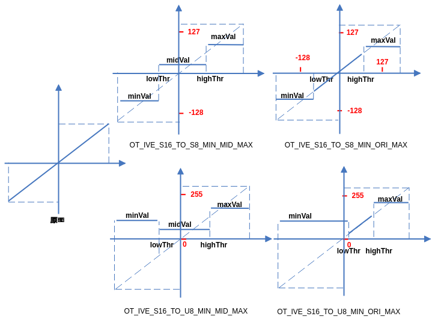

【举例】

无。

【相关主题】

-   [ss\_mpi\_ive\_threshold\_u16](#ss_mpi_ive_threshold_u16)
-   [ss\_mpi\_ive\_16bit\_to\_8bit](#ss_mpi_ive_16bit_to_8bit)

## ss\_mpi\_ive\_threshold\_u16<a name="ZH-CN_TOPIC_0000002470931242"></a>

【描述】

创建u16数据到u8数据的阈值化任务。

【语法】

```
td_s32 ss_mpi_ive_threshold_u16(ot_ive_handle *handle, const ot_svp_src_img *src, const ot_svp_dst_img *dst, const ot_ive_threshold_u16_ctrl *ctrl, td_bool is_instant);
```

【参数】

<a name="table5642mcpsimp"></a>
<table><thead align="left"><tr id="row5648mcpsimp"><th class="cellrowborder" valign="top" width="22.000000000000004%" id="mcps1.1.4.1.1"><p id="p5650mcpsimp"><a name="p5650mcpsimp"></a><a name="p5650mcpsimp"></a>参数名称</p>
</th>
<th class="cellrowborder" valign="top" width="57.00000000000001%" id="mcps1.1.4.1.2"><p id="p5652mcpsimp"><a name="p5652mcpsimp"></a><a name="p5652mcpsimp"></a>描述</p>
</th>
<th class="cellrowborder" valign="top" width="21.000000000000004%" id="mcps1.1.4.1.3"><p id="p5654mcpsimp"><a name="p5654mcpsimp"></a><a name="p5654mcpsimp"></a>输入/输出</p>
</th>
</tr>
</thead>
<tbody><tr id="row5656mcpsimp"><td class="cellrowborder" valign="top" width="22.000000000000004%" headers="mcps1.1.4.1.1 "><p id="p5658mcpsimp"><a name="p5658mcpsimp"></a><a name="p5658mcpsimp"></a>handle</p>
</td>
<td class="cellrowborder" valign="top" width="57.00000000000001%" headers="mcps1.1.4.1.2 "><p id="p5660mcpsimp"><a name="p5660mcpsimp"></a><a name="p5660mcpsimp"></a>handle指针。</p>
<p id="p5661mcpsimp"><a name="p5661mcpsimp"></a><a name="p5661mcpsimp"></a>不能为空。</p>
</td>
<td class="cellrowborder" valign="top" width="21.000000000000004%" headers="mcps1.1.4.1.3 "><p id="p5663mcpsimp"><a name="p5663mcpsimp"></a><a name="p5663mcpsimp"></a>输出</p>
</td>
</tr>
<tr id="row5664mcpsimp"><td class="cellrowborder" valign="top" width="22.000000000000004%" headers="mcps1.1.4.1.1 "><p id="p5666mcpsimp"><a name="p5666mcpsimp"></a><a name="p5666mcpsimp"></a>src</p>
</td>
<td class="cellrowborder" valign="top" width="57.00000000000001%" headers="mcps1.1.4.1.2 "><p id="p5668mcpsimp"><a name="p5668mcpsimp"></a><a name="p5668mcpsimp"></a>源图像指针。</p>
<p id="p5669mcpsimp"><a name="p5669mcpsimp"></a><a name="p5669mcpsimp"></a>不能为空。</p>
</td>
<td class="cellrowborder" valign="top" width="21.000000000000004%" headers="mcps1.1.4.1.3 "><p id="p5671mcpsimp"><a name="p5671mcpsimp"></a><a name="p5671mcpsimp"></a>输入</p>
</td>
</tr>
<tr id="row5672mcpsimp"><td class="cellrowborder" valign="top" width="22.000000000000004%" headers="mcps1.1.4.1.1 "><p id="p5674mcpsimp"><a name="p5674mcpsimp"></a><a name="p5674mcpsimp"></a>dst</p>
</td>
<td class="cellrowborder" valign="top" width="57.00000000000001%" headers="mcps1.1.4.1.2 "><p id="p5676mcpsimp"><a name="p5676mcpsimp"></a><a name="p5676mcpsimp"></a>输出图像指针。</p>
<p id="p5677mcpsimp"><a name="p5677mcpsimp"></a><a name="p5677mcpsimp"></a>不能为空。</p>
<p id="p5678mcpsimp"><a name="p5678mcpsimp"></a><a name="p5678mcpsimp"></a>高、宽同src。</p>
</td>
<td class="cellrowborder" valign="top" width="21.000000000000004%" headers="mcps1.1.4.1.3 "><p id="p5680mcpsimp"><a name="p5680mcpsimp"></a><a name="p5680mcpsimp"></a>输出</p>
</td>
</tr>
<tr id="row5681mcpsimp"><td class="cellrowborder" valign="top" width="22.000000000000004%" headers="mcps1.1.4.1.1 "><p id="p5683mcpsimp"><a name="p5683mcpsimp"></a><a name="p5683mcpsimp"></a>ctrl</p>
</td>
<td class="cellrowborder" valign="top" width="57.00000000000001%" headers="mcps1.1.4.1.2 "><p id="p5685mcpsimp"><a name="p5685mcpsimp"></a><a name="p5685mcpsimp"></a>控制参数指针。</p>
<p id="p5686mcpsimp"><a name="p5686mcpsimp"></a><a name="p5686mcpsimp"></a>不能为空。</p>
</td>
<td class="cellrowborder" valign="top" width="21.000000000000004%" headers="mcps1.1.4.1.3 "><p id="p5688mcpsimp"><a name="p5688mcpsimp"></a><a name="p5688mcpsimp"></a>输入</p>
</td>
</tr>
<tr id="row5689mcpsimp"><td class="cellrowborder" valign="top" width="22.000000000000004%" headers="mcps1.1.4.1.1 "><p id="p5691mcpsimp"><a name="p5691mcpsimp"></a><a name="p5691mcpsimp"></a>is_instant</p>
</td>
<td class="cellrowborder" valign="top" width="57.00000000000001%" headers="mcps1.1.4.1.2 "><p id="p5693mcpsimp"><a name="p5693mcpsimp"></a><a name="p5693mcpsimp"></a>及时返回结果标志。</p>
</td>
<td class="cellrowborder" valign="top" width="21.000000000000004%" headers="mcps1.1.4.1.3 "><p id="p5695mcpsimp"><a name="p5695mcpsimp"></a><a name="p5695mcpsimp"></a>输入</p>
</td>
</tr>
</tbody>
</table>

<a name="table5696mcpsimp"></a>
<table><thead align="left"><tr id="row5703mcpsimp"><th class="cellrowborder" valign="top" width="25.252525252525253%" id="mcps1.1.5.1.1"><p id="p5705mcpsimp"><a name="p5705mcpsimp"></a><a name="p5705mcpsimp"></a>参数名称</p>
</th>
<th class="cellrowborder" valign="top" width="24.242424242424242%" id="mcps1.1.5.1.2"><p id="p5707mcpsimp"><a name="p5707mcpsimp"></a><a name="p5707mcpsimp"></a>支持图像类型</p>
</th>
<th class="cellrowborder" valign="top" width="15.151515151515152%" id="mcps1.1.5.1.3"><p id="p5709mcpsimp"><a name="p5709mcpsimp"></a><a name="p5709mcpsimp"></a>地址对齐</p>
</th>
<th class="cellrowborder" valign="top" width="35.35353535353536%" id="mcps1.1.5.1.4"><p id="p5711mcpsimp"><a name="p5711mcpsimp"></a><a name="p5711mcpsimp"></a>分辨率</p>
</th>
</tr>
</thead>
<tbody><tr id="row5713mcpsimp"><td class="cellrowborder" valign="top" width="25.252525252525253%" headers="mcps1.1.5.1.1 "><p id="p5715mcpsimp"><a name="p5715mcpsimp"></a><a name="p5715mcpsimp"></a>src</p>
</td>
<td class="cellrowborder" valign="top" width="24.242424242424242%" headers="mcps1.1.5.1.2 "><p id="p5717mcpsimp"><a name="p5717mcpsimp"></a><a name="p5717mcpsimp"></a>U16C1</p>
</td>
<td class="cellrowborder" valign="top" width="15.151515151515152%" headers="mcps1.1.5.1.3 "><p id="p5719mcpsimp"><a name="p5719mcpsimp"></a><a name="p5719mcpsimp"></a>2 byte</p>
</td>
<td class="cellrowborder" valign="top" width="35.35353535353536%" headers="mcps1.1.5.1.4 "><p id="p5721mcpsimp"><a name="p5721mcpsimp"></a><a name="p5721mcpsimp"></a>64x64～1920x1080</p>
</td>
</tr>
<tr id="row5722mcpsimp"><td class="cellrowborder" valign="top" width="25.252525252525253%" headers="mcps1.1.5.1.1 "><p id="p5724mcpsimp"><a name="p5724mcpsimp"></a><a name="p5724mcpsimp"></a>dst</p>
</td>
<td class="cellrowborder" valign="top" width="24.242424242424242%" headers="mcps1.1.5.1.2 "><p id="p5726mcpsimp"><a name="p5726mcpsimp"></a><a name="p5726mcpsimp"></a>U8C1</p>
</td>
<td class="cellrowborder" valign="top" width="15.151515151515152%" headers="mcps1.1.5.1.3 "><p id="p5728mcpsimp"><a name="p5728mcpsimp"></a><a name="p5728mcpsimp"></a>1 byte</p>
</td>
<td class="cellrowborder" valign="top" width="35.35353535353536%" headers="mcps1.1.5.1.4 "><p id="p5730mcpsimp"><a name="p5730mcpsimp"></a><a name="p5730mcpsimp"></a>同src</p>
</td>
</tr>
</tbody>
</table>

【返回值】

<a name="table5732mcpsimp"></a>
<table><thead align="left"><tr id="row5737mcpsimp"><th class="cellrowborder" valign="top" width="50%" id="mcps1.1.3.1.1"><p id="p5739mcpsimp"><a name="p5739mcpsimp"></a><a name="p5739mcpsimp"></a>返回值</p>
</th>
<th class="cellrowborder" valign="top" width="50%" id="mcps1.1.3.1.2"><p id="p5741mcpsimp"><a name="p5741mcpsimp"></a><a name="p5741mcpsimp"></a>描述</p>
</th>
</tr>
</thead>
<tbody><tr id="row5743mcpsimp"><td class="cellrowborder" valign="top" width="50%" headers="mcps1.1.3.1.1 "><p id="p5745mcpsimp"><a name="p5745mcpsimp"></a><a name="p5745mcpsimp"></a>0</p>
</td>
<td class="cellrowborder" valign="top" width="50%" headers="mcps1.1.3.1.2 "><p id="p5747mcpsimp"><a name="p5747mcpsimp"></a><a name="p5747mcpsimp"></a>成功。</p>
</td>
</tr>
<tr id="row5748mcpsimp"><td class="cellrowborder" valign="top" width="50%" headers="mcps1.1.3.1.1 "><p id="p5750mcpsimp"><a name="p5750mcpsimp"></a><a name="p5750mcpsimp"></a>非0</p>
</td>
<td class="cellrowborder" valign="top" width="50%" headers="mcps1.1.3.1.2 "><p id="p7404mcpsimp"><a name="p7404mcpsimp"></a><a name="p7404mcpsimp"></a>失败，参见<span xml:lang="fr-FR" id="ph136311818172213"><a name="ph136311818172213"></a><a name="ph136311818172213"></a>错误码</span><span xml:lang="fr-FR" id="ph5283mcpsimp"><a name="ph5283mcpsimp"></a><a name="ph5283mcpsimp"></a>。</span></p>
</td>
</tr>
</tbody>
</table>

【需求】

-   头文件：ot\_common\_ive.h、ot\_common\_svp.h、ss\_mpi\_ive.h
-   库文件：libss\_ive.a（PC上模拟用ss\_ive\_clib2.x.lib）

【注意】

-   可配置2种运算模式，参考ot\_ive\_threshold\_u16\_mode。
-   计算公式

    -   OT\_IVE\_THRESHOLD\_U16\_MODE\_U16\_TO\_U8\_MIN\_MID\_MAX：

        

        要求：0≤≤≤65535；

    -   OT\_IVE\_THRESHOLD\_U16\_MODE\_U16\_TO\_U8\_MIN\_ORIG\_MAX：

        

        要求：0≤≤≤255；

    其中，对应src，对应dst，mode、low\_thr、high\_thr、min\_val、mid\_val和max\_val分别对应ctrl的mode、low\_threshold、high\_threshold、min\_val、mid\_val和max\_val。具体示意图如[图1](#fig11573123011116)所示。

-   ctrl中的min\_val、mid\_val和max\_val并不需要满足变量命名含义中的大小关系。

**图 1**  threshold\_u16 2种阈值化模式示意图<a name="fig11573123011116"></a>  
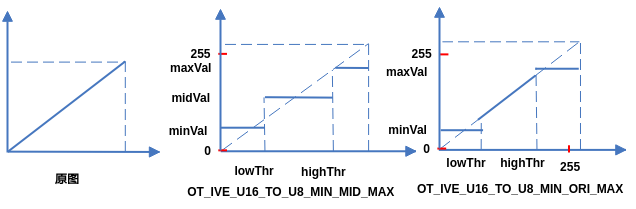

【举例】

无。

【相关主题】

-   [ss\_mpi\_ive\_threshold\_s16](#ss_mpi_ive_threshold_s16)
-   [ss\_mpi\_ive\_16bit\_to\_8bit](#ss_mpi_ive_16bit_to_8bit)

## ss\_mpi\_ive\_16bit\_to\_8bit<a name="ZH-CN_TOPIC_0000002471091216"></a>

【描述】

创建16bit图像数据到8bit图像数据的线性转化任务。

【语法】

```
td_s32 ss_mpi_ive_16bit_to_8bit(ot_ive_handle *handle, const ot_svp_src_img *src, const ot_svp_dst_img *dst, const ot_ive_16bit_to_8bit_ctrl *ctrl, td_bool is_instant);
```

【参数】

<a name="table2161mcpsimp"></a>
<table><thead align="left"><tr id="row2167mcpsimp"><th class="cellrowborder" valign="top" width="28.71%" id="mcps1.1.4.1.1"><p id="p2169mcpsimp"><a name="p2169mcpsimp"></a><a name="p2169mcpsimp"></a>参数名称</p>
</th>
<th class="cellrowborder" valign="top" width="51.49%" id="mcps1.1.4.1.2"><p id="p2171mcpsimp"><a name="p2171mcpsimp"></a><a name="p2171mcpsimp"></a>描述</p>
</th>
<th class="cellrowborder" valign="top" width="19.8%" id="mcps1.1.4.1.3"><p id="p2173mcpsimp"><a name="p2173mcpsimp"></a><a name="p2173mcpsimp"></a>输入/输出</p>
</th>
</tr>
</thead>
<tbody><tr id="row2175mcpsimp"><td class="cellrowborder" valign="top" width="28.71%" headers="mcps1.1.4.1.1 "><p id="p2177mcpsimp"><a name="p2177mcpsimp"></a><a name="p2177mcpsimp"></a>handle</p>
</td>
<td class="cellrowborder" valign="top" width="51.49%" headers="mcps1.1.4.1.2 "><p id="p2179mcpsimp"><a name="p2179mcpsimp"></a><a name="p2179mcpsimp"></a>handle指针。</p>
<p id="p2180mcpsimp"><a name="p2180mcpsimp"></a><a name="p2180mcpsimp"></a>不能为空。</p>
</td>
<td class="cellrowborder" valign="top" width="19.8%" headers="mcps1.1.4.1.3 "><p id="p2182mcpsimp"><a name="p2182mcpsimp"></a><a name="p2182mcpsimp"></a>输出</p>
</td>
</tr>
<tr id="row2183mcpsimp"><td class="cellrowborder" valign="top" width="28.71%" headers="mcps1.1.4.1.1 "><p id="p2185mcpsimp"><a name="p2185mcpsimp"></a><a name="p2185mcpsimp"></a>src</p>
</td>
<td class="cellrowborder" valign="top" width="51.49%" headers="mcps1.1.4.1.2 "><p id="p2187mcpsimp"><a name="p2187mcpsimp"></a><a name="p2187mcpsimp"></a>源图像指针。</p>
<p id="p2188mcpsimp"><a name="p2188mcpsimp"></a><a name="p2188mcpsimp"></a>不能为空。</p>
</td>
<td class="cellrowborder" valign="top" width="19.8%" headers="mcps1.1.4.1.3 "><p id="p2190mcpsimp"><a name="p2190mcpsimp"></a><a name="p2190mcpsimp"></a>输入</p>
</td>
</tr>
<tr id="row2191mcpsimp"><td class="cellrowborder" valign="top" width="28.71%" headers="mcps1.1.4.1.1 "><p id="p2193mcpsimp"><a name="p2193mcpsimp"></a><a name="p2193mcpsimp"></a>dst</p>
</td>
<td class="cellrowborder" valign="top" width="51.49%" headers="mcps1.1.4.1.2 "><p id="p2195mcpsimp"><a name="p2195mcpsimp"></a><a name="p2195mcpsimp"></a>输出图像指针。</p>
<p id="p2196mcpsimp"><a name="p2196mcpsimp"></a><a name="p2196mcpsimp"></a>不能为空。</p>
<p id="p2197mcpsimp"><a name="p2197mcpsimp"></a><a name="p2197mcpsimp"></a>高、宽同src。</p>
</td>
<td class="cellrowborder" valign="top" width="19.8%" headers="mcps1.1.4.1.3 "><p id="p2199mcpsimp"><a name="p2199mcpsimp"></a><a name="p2199mcpsimp"></a>输出</p>
</td>
</tr>
<tr id="row2200mcpsimp"><td class="cellrowborder" valign="top" width="28.71%" headers="mcps1.1.4.1.1 "><p id="p2202mcpsimp"><a name="p2202mcpsimp"></a><a name="p2202mcpsimp"></a>ctrl</p>
</td>
<td class="cellrowborder" valign="top" width="51.49%" headers="mcps1.1.4.1.2 "><p id="p2204mcpsimp"><a name="p2204mcpsimp"></a><a name="p2204mcpsimp"></a>控制参数指针。</p>
<p id="p2205mcpsimp"><a name="p2205mcpsimp"></a><a name="p2205mcpsimp"></a>不能为空。</p>
</td>
<td class="cellrowborder" valign="top" width="19.8%" headers="mcps1.1.4.1.3 "><p id="p2207mcpsimp"><a name="p2207mcpsimp"></a><a name="p2207mcpsimp"></a>输入</p>
</td>
</tr>
<tr id="row2208mcpsimp"><td class="cellrowborder" valign="top" width="28.71%" headers="mcps1.1.4.1.1 "><p id="p2210mcpsimp"><a name="p2210mcpsimp"></a><a name="p2210mcpsimp"></a>is_instant</p>
</td>
<td class="cellrowborder" valign="top" width="51.49%" headers="mcps1.1.4.1.2 "><p id="p2212mcpsimp"><a name="p2212mcpsimp"></a><a name="p2212mcpsimp"></a>及时返回结果标志。</p>
</td>
<td class="cellrowborder" valign="top" width="19.8%" headers="mcps1.1.4.1.3 "><p id="p2214mcpsimp"><a name="p2214mcpsimp"></a><a name="p2214mcpsimp"></a>输入</p>
</td>
</tr>
</tbody>
</table>

<a name="table2215mcpsimp"></a>
<table><thead align="left"><tr id="row2222mcpsimp"><th class="cellrowborder" valign="top" width="25.252525252525253%" id="mcps1.1.5.1.1"><p id="p2224mcpsimp"><a name="p2224mcpsimp"></a><a name="p2224mcpsimp"></a>参数名称</p>
</th>
<th class="cellrowborder" valign="top" width="24.242424242424242%" id="mcps1.1.5.1.2"><p id="p2226mcpsimp"><a name="p2226mcpsimp"></a><a name="p2226mcpsimp"></a>支持图像类型</p>
</th>
<th class="cellrowborder" valign="top" width="15.151515151515152%" id="mcps1.1.5.1.3"><p id="p2228mcpsimp"><a name="p2228mcpsimp"></a><a name="p2228mcpsimp"></a>地址对齐</p>
</th>
<th class="cellrowborder" valign="top" width="35.35353535353536%" id="mcps1.1.5.1.4"><p id="p2230mcpsimp"><a name="p2230mcpsimp"></a><a name="p2230mcpsimp"></a>分辨率</p>
</th>
</tr>
</thead>
<tbody><tr id="row2232mcpsimp"><td class="cellrowborder" valign="top" width="25.252525252525253%" headers="mcps1.1.5.1.1 "><p id="p2234mcpsimp"><a name="p2234mcpsimp"></a><a name="p2234mcpsimp"></a>src</p>
</td>
<td class="cellrowborder" valign="top" width="24.242424242424242%" headers="mcps1.1.5.1.2 "><p id="p2236mcpsimp"><a name="p2236mcpsimp"></a><a name="p2236mcpsimp"></a>U16C1、S16C1</p>
</td>
<td class="cellrowborder" valign="top" width="15.151515151515152%" headers="mcps1.1.5.1.3 "><p id="p2238mcpsimp"><a name="p2238mcpsimp"></a><a name="p2238mcpsimp"></a>2 byte</p>
</td>
<td class="cellrowborder" valign="top" width="35.35353535353536%" headers="mcps1.1.5.1.4 "><p id="p2240mcpsimp"><a name="p2240mcpsimp"></a><a name="p2240mcpsimp"></a>16x16～1920x1080</p>
</td>
</tr>
<tr id="row2241mcpsimp"><td class="cellrowborder" valign="top" width="25.252525252525253%" headers="mcps1.1.5.1.1 "><p id="p2243mcpsimp"><a name="p2243mcpsimp"></a><a name="p2243mcpsimp"></a>dst</p>
</td>
<td class="cellrowborder" valign="top" width="24.242424242424242%" headers="mcps1.1.5.1.2 "><p id="p2245mcpsimp"><a name="p2245mcpsimp"></a><a name="p2245mcpsimp"></a>U8C1、S8C1</p>
</td>
<td class="cellrowborder" valign="top" width="15.151515151515152%" headers="mcps1.1.5.1.3 "><p id="p2247mcpsimp"><a name="p2247mcpsimp"></a><a name="p2247mcpsimp"></a>1 byte</p>
</td>
<td class="cellrowborder" valign="top" width="35.35353535353536%" headers="mcps1.1.5.1.4 "><p id="p2249mcpsimp"><a name="p2249mcpsimp"></a><a name="p2249mcpsimp"></a>同src</p>
</td>
</tr>
</tbody>
</table>

【返回值】

<a name="table2251mcpsimp"></a>
<table><thead align="left"><tr id="row2256mcpsimp"><th class="cellrowborder" valign="top" width="50%" id="mcps1.1.3.1.1"><p id="p2258mcpsimp"><a name="p2258mcpsimp"></a><a name="p2258mcpsimp"></a>返回值</p>
</th>
<th class="cellrowborder" valign="top" width="50%" id="mcps1.1.3.1.2"><p id="p2260mcpsimp"><a name="p2260mcpsimp"></a><a name="p2260mcpsimp"></a>描述</p>
</th>
</tr>
</thead>
<tbody><tr id="row2262mcpsimp"><td class="cellrowborder" valign="top" width="50%" headers="mcps1.1.3.1.1 "><p id="p2264mcpsimp"><a name="p2264mcpsimp"></a><a name="p2264mcpsimp"></a>0</p>
</td>
<td class="cellrowborder" valign="top" width="50%" headers="mcps1.1.3.1.2 "><p id="p2266mcpsimp"><a name="p2266mcpsimp"></a><a name="p2266mcpsimp"></a>成功。</p>
</td>
</tr>
<tr id="row2267mcpsimp"><td class="cellrowborder" valign="top" width="50%" headers="mcps1.1.3.1.1 "><p id="p2269mcpsimp"><a name="p2269mcpsimp"></a><a name="p2269mcpsimp"></a>非0</p>
</td>
<td class="cellrowborder" valign="top" width="50%" headers="mcps1.1.3.1.2 "><p id="p7404mcpsimp"><a name="p7404mcpsimp"></a><a name="p7404mcpsimp"></a>失败，参见<span xml:lang="fr-FR" id="ph136311818172213"><a name="ph136311818172213"></a><a name="ph136311818172213"></a>错误码</span><span xml:lang="fr-FR" id="ph5283mcpsimp"><a name="ph5283mcpsimp"></a><a name="ph5283mcpsimp"></a>。</span></p>
</td>
</tr>
</tbody>
</table>

【需求】

-   头文件：ot\_common\_ive.h、ot\_common\_svp.h、ss\_mpi\_ive.h
-   库文件：libss\_ive.a（PC上模拟用ss\_ive\_clib2.x.lib）

【注意】

-   可配置4种模式，具体参考ot\_ive\_16bit\_to\_8bit\_mode。
-   计算公式

    -   OT\_IVE\_16BIT\_TO\_8BIT\_MODE\_S16\_TO\_S8：

        

    -   OT\_IVE\_16BIT\_TO\_8BIT\_MODE\_S16\_TO\_U8\_ABS：

        

    -   OT\_IVE\_16BIT\_TO\_8BIT\_MODE\_S16\_TO\_U8\_BIAS：

        

    -   OT\_IVE\_16BIT\_TO\_8BIT\_MODE\_U16\_TO\_U8：

        

    其中，对应src，其中，对应dst，mode、、和分别对应ctrl的mode、num、den、bias。具体示意图如[图1](#fig136048151080)所示。

    要求：num ≤ den，且den≠0。

    **图 1**  16bit\_to\_8bit 4种转换模式示意图<a name="fig136048151080"></a>  
    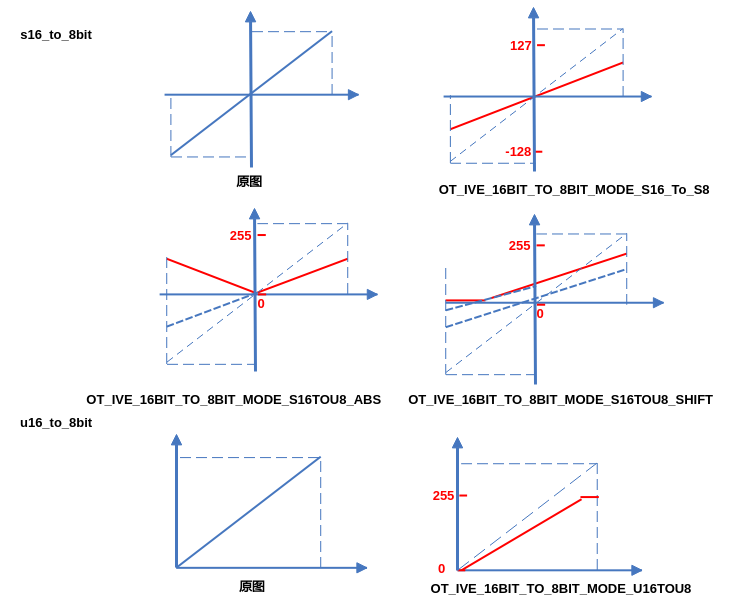

【举例】

无。

【相关主题】

-   [ss\_mpi\_ive\_threshold\_s16](#ss_mpi_ive_threshold_s16)
-   [ss\_mpi\_ive\_threshold\_u16](#ss_mpi_ive_threshold_u16)

## ss\_mpi\_ive\_order\_stats\_filter<a name="ZH-CN_TOPIC_0000002504091093"></a>

【描述】

创建3x3模板顺序统计量滤波任务，可进行Median、Max、Min滤波。

【语法】

```
td_s32 ss_mpi_ive_order_stats_filter(ot_ive_handle *handle, const ot_svp_src_img *src,  const ot_svp_dst_img *dst, const ot_ive_order_stats_filter_ctrl *ctrl, td_bool is_instant);
```

【参数】

<a name="table3480mcpsimp"></a>
<table><thead align="left"><tr id="row3486mcpsimp"><th class="cellrowborder" valign="top" width="21%" id="mcps1.1.4.1.1"><p id="p3488mcpsimp"><a name="p3488mcpsimp"></a><a name="p3488mcpsimp"></a>参数名称</p>
</th>
<th class="cellrowborder" valign="top" width="59%" id="mcps1.1.4.1.2"><p id="p3490mcpsimp"><a name="p3490mcpsimp"></a><a name="p3490mcpsimp"></a>描述</p>
</th>
<th class="cellrowborder" valign="top" width="20%" id="mcps1.1.4.1.3"><p id="p3492mcpsimp"><a name="p3492mcpsimp"></a><a name="p3492mcpsimp"></a>输入/输出</p>
</th>
</tr>
</thead>
<tbody><tr id="row3494mcpsimp"><td class="cellrowborder" valign="top" width="21%" headers="mcps1.1.4.1.1 "><p id="p3496mcpsimp"><a name="p3496mcpsimp"></a><a name="p3496mcpsimp"></a>handle</p>
</td>
<td class="cellrowborder" valign="top" width="59%" headers="mcps1.1.4.1.2 "><p id="p3498mcpsimp"><a name="p3498mcpsimp"></a><a name="p3498mcpsimp"></a>handle指针。</p>
<p id="p3499mcpsimp"><a name="p3499mcpsimp"></a><a name="p3499mcpsimp"></a>不能为空。</p>
</td>
<td class="cellrowborder" valign="top" width="20%" headers="mcps1.1.4.1.3 "><p id="p3501mcpsimp"><a name="p3501mcpsimp"></a><a name="p3501mcpsimp"></a>输出</p>
</td>
</tr>
<tr id="row3502mcpsimp"><td class="cellrowborder" valign="top" width="21%" headers="mcps1.1.4.1.1 "><p id="p3504mcpsimp"><a name="p3504mcpsimp"></a><a name="p3504mcpsimp"></a>src</p>
</td>
<td class="cellrowborder" valign="top" width="59%" headers="mcps1.1.4.1.2 "><p id="p3506mcpsimp"><a name="p3506mcpsimp"></a><a name="p3506mcpsimp"></a>源图像指针。</p>
<p id="p3507mcpsimp"><a name="p3507mcpsimp"></a><a name="p3507mcpsimp"></a>不能为空。</p>
</td>
<td class="cellrowborder" valign="top" width="20%" headers="mcps1.1.4.1.3 "><p id="p3509mcpsimp"><a name="p3509mcpsimp"></a><a name="p3509mcpsimp"></a>输入</p>
</td>
</tr>
<tr id="row3510mcpsimp"><td class="cellrowborder" valign="top" width="21%" headers="mcps1.1.4.1.1 "><p id="p3512mcpsimp"><a name="p3512mcpsimp"></a><a name="p3512mcpsimp"></a>dst</p>
</td>
<td class="cellrowborder" valign="top" width="59%" headers="mcps1.1.4.1.2 "><p id="p3514mcpsimp"><a name="p3514mcpsimp"></a><a name="p3514mcpsimp"></a>输出图像指针。</p>
<p id="p3515mcpsimp"><a name="p3515mcpsimp"></a><a name="p3515mcpsimp"></a>不能为空。</p>
<p id="p3516mcpsimp"><a name="p3516mcpsimp"></a><a name="p3516mcpsimp"></a>高、宽同src。</p>
</td>
<td class="cellrowborder" valign="top" width="20%" headers="mcps1.1.4.1.3 "><p id="p3518mcpsimp"><a name="p3518mcpsimp"></a><a name="p3518mcpsimp"></a>输出</p>
</td>
</tr>
<tr id="row3519mcpsimp"><td class="cellrowborder" valign="top" width="21%" headers="mcps1.1.4.1.1 "><p id="p3521mcpsimp"><a name="p3521mcpsimp"></a><a name="p3521mcpsimp"></a>ctrl</p>
</td>
<td class="cellrowborder" valign="top" width="59%" headers="mcps1.1.4.1.2 "><p id="p3523mcpsimp"><a name="p3523mcpsimp"></a><a name="p3523mcpsimp"></a>控制参数指针</p>
<p id="p3524mcpsimp"><a name="p3524mcpsimp"></a><a name="p3524mcpsimp"></a>不能为空。</p>
</td>
<td class="cellrowborder" valign="top" width="20%" headers="mcps1.1.4.1.3 "><p id="p3526mcpsimp"><a name="p3526mcpsimp"></a><a name="p3526mcpsimp"></a>输入</p>
</td>
</tr>
<tr id="row3527mcpsimp"><td class="cellrowborder" valign="top" width="21%" headers="mcps1.1.4.1.1 "><p id="p3529mcpsimp"><a name="p3529mcpsimp"></a><a name="p3529mcpsimp"></a>is_instant</p>
</td>
<td class="cellrowborder" valign="top" width="59%" headers="mcps1.1.4.1.2 "><p id="p3531mcpsimp"><a name="p3531mcpsimp"></a><a name="p3531mcpsimp"></a>及时返回结果标志。</p>
</td>
<td class="cellrowborder" valign="top" width="20%" headers="mcps1.1.4.1.3 "><p id="p3533mcpsimp"><a name="p3533mcpsimp"></a><a name="p3533mcpsimp"></a>输入</p>
</td>
</tr>
</tbody>
</table>

<a name="table3534mcpsimp"></a>
<table><thead align="left"><tr id="row3541mcpsimp"><th class="cellrowborder" valign="top" width="25.252525252525253%" id="mcps1.1.5.1.1"><p id="p3543mcpsimp"><a name="p3543mcpsimp"></a><a name="p3543mcpsimp"></a>参数名称</p>
</th>
<th class="cellrowborder" valign="top" width="24.242424242424242%" id="mcps1.1.5.1.2"><p id="p3545mcpsimp"><a name="p3545mcpsimp"></a><a name="p3545mcpsimp"></a>支持图像类型</p>
</th>
<th class="cellrowborder" valign="top" width="15.151515151515152%" id="mcps1.1.5.1.3"><p id="p3547mcpsimp"><a name="p3547mcpsimp"></a><a name="p3547mcpsimp"></a>地址对齐</p>
</th>
<th class="cellrowborder" valign="top" width="35.35353535353536%" id="mcps1.1.5.1.4"><p id="p3549mcpsimp"><a name="p3549mcpsimp"></a><a name="p3549mcpsimp"></a>分辨率</p>
</th>
</tr>
</thead>
<tbody><tr id="row3551mcpsimp"><td class="cellrowborder" valign="top" width="25.252525252525253%" headers="mcps1.1.5.1.1 "><p id="p3553mcpsimp"><a name="p3553mcpsimp"></a><a name="p3553mcpsimp"></a>src</p>
</td>
<td class="cellrowborder" valign="top" width="24.242424242424242%" headers="mcps1.1.5.1.2 "><p id="p3555mcpsimp"><a name="p3555mcpsimp"></a><a name="p3555mcpsimp"></a>U8C1</p>
</td>
<td class="cellrowborder" valign="top" width="15.151515151515152%" headers="mcps1.1.5.1.3 "><p id="p3557mcpsimp"><a name="p3557mcpsimp"></a><a name="p3557mcpsimp"></a>16 byte</p>
</td>
<td class="cellrowborder" valign="top" width="35.35353535353536%" headers="mcps1.1.5.1.4 "><p id="p3559mcpsimp"><a name="p3559mcpsimp"></a><a name="p3559mcpsimp"></a>64x64～1920x1024</p>
</td>
</tr>
<tr id="row3560mcpsimp"><td class="cellrowborder" valign="top" width="25.252525252525253%" headers="mcps1.1.5.1.1 "><p id="p3562mcpsimp"><a name="p3562mcpsimp"></a><a name="p3562mcpsimp"></a>dst</p>
</td>
<td class="cellrowborder" valign="top" width="24.242424242424242%" headers="mcps1.1.5.1.2 "><p id="p3564mcpsimp"><a name="p3564mcpsimp"></a><a name="p3564mcpsimp"></a>U8C1</p>
</td>
<td class="cellrowborder" valign="top" width="15.151515151515152%" headers="mcps1.1.5.1.3 "><p id="p3566mcpsimp"><a name="p3566mcpsimp"></a><a name="p3566mcpsimp"></a>16 byte</p>
</td>
<td class="cellrowborder" valign="top" width="35.35353535353536%" headers="mcps1.1.5.1.4 "><p id="p3568mcpsimp"><a name="p3568mcpsimp"></a><a name="p3568mcpsimp"></a>同src</p>
</td>
</tr>
</tbody>
</table>

【返回值】

<a name="table3570mcpsimp"></a>
<table><thead align="left"><tr id="row3575mcpsimp"><th class="cellrowborder" valign="top" width="50%" id="mcps1.1.3.1.1"><p id="p3577mcpsimp"><a name="p3577mcpsimp"></a><a name="p3577mcpsimp"></a>返回值</p>
</th>
<th class="cellrowborder" valign="top" width="50%" id="mcps1.1.3.1.2"><p id="p3579mcpsimp"><a name="p3579mcpsimp"></a><a name="p3579mcpsimp"></a>描述</p>
</th>
</tr>
</thead>
<tbody><tr id="row3581mcpsimp"><td class="cellrowborder" valign="top" width="50%" headers="mcps1.1.3.1.1 "><p id="p3583mcpsimp"><a name="p3583mcpsimp"></a><a name="p3583mcpsimp"></a>0</p>
</td>
<td class="cellrowborder" valign="top" width="50%" headers="mcps1.1.3.1.2 "><p id="p3585mcpsimp"><a name="p3585mcpsimp"></a><a name="p3585mcpsimp"></a>成功。</p>
</td>
</tr>
<tr id="row3586mcpsimp"><td class="cellrowborder" valign="top" width="50%" headers="mcps1.1.3.1.1 "><p id="p3588mcpsimp"><a name="p3588mcpsimp"></a><a name="p3588mcpsimp"></a>非0</p>
</td>
<td class="cellrowborder" valign="top" width="50%" headers="mcps1.1.3.1.2 "><p id="p7404mcpsimp"><a name="p7404mcpsimp"></a><a name="p7404mcpsimp"></a>失败，参见<span xml:lang="fr-FR" id="ph136311818172213"><a name="ph136311818172213"></a><a name="ph136311818172213"></a>错误码</span><span xml:lang="fr-FR" id="ph5283mcpsimp"><a name="ph5283mcpsimp"></a><a name="ph5283mcpsimp"></a>。</span></p>
</td>
</tr>
</tbody>
</table>

【需求】

-   头文件：ot\_common\_ive.h、ot\_common\_svp.h、ss\_mpi\_ive.h
-   库文件：libss\_ive.a（PC上模拟用ss\_ive\_clib2.x.lib）

【注意】

-   可配置3种滤波模式，参考ot\_ive\_order\_stats\_filter\_mode。
-   计算公式

    -   OT\_IVE\_ORDER\_STATS\_FILTER\_MODE\_MEDIAN：

        

    -   OT\_IVE\_ORDER\_STATS\_FILTER\_MODE\_MAX：

        

    -   OT\_IVE\_ORDER\_STATS\_FILTER\_MODE\_MIN：

        

    其中，对应src，  对应dst。

【举例】

无。

【相关主题】

-   [ss\_mpi\_ive\_filter](#ss_mpi_ive_filter)
-   [ss\_mpi\_ive\_dilate](#ss_mpi_ive_dilate)
-   [ss\_mpi\_ive\_erode](#ss_mpi_ive_erode)

## ss\_mpi\_ive\_map<a name="ZH-CN_TOPIC_0000002470931234"></a>

【描述】

创建map（映射赋值）任务，对源图像中的每个像素，查找map查找表中的值，赋予目标图像相应像素查找表中的值，支持U8C1→U8C1、U8C1→U16C1、U8C1→S16C1 3种模式的映射。

【语法】

```
td_s32 ss_mpi_ive_map(ot_ive_handle *handle, const ot_svp_src_img *src, const ot_svp_src_mem_info *map, const ot_svp_dst_img *dst, const ot_ive_map_ctrl *ctrl, td_bool is_instant);
```

【参数】

<a name="table16127mcpsimp"></a>
<table><thead align="left"><tr id="row16133mcpsimp"><th class="cellrowborder" valign="top" width="18%" id="mcps1.1.4.1.1"><p id="p16135mcpsimp"><a name="p16135mcpsimp"></a><a name="p16135mcpsimp"></a>参数名称</p>
</th>
<th class="cellrowborder" valign="top" width="64%" id="mcps1.1.4.1.2"><p id="p16137mcpsimp"><a name="p16137mcpsimp"></a><a name="p16137mcpsimp"></a>描述</p>
</th>
<th class="cellrowborder" valign="top" width="18%" id="mcps1.1.4.1.3"><p id="p16139mcpsimp"><a name="p16139mcpsimp"></a><a name="p16139mcpsimp"></a>输入/输出</p>
</th>
</tr>
</thead>
<tbody><tr id="row16141mcpsimp"><td class="cellrowborder" valign="top" width="18%" headers="mcps1.1.4.1.1 "><p id="p16143mcpsimp"><a name="p16143mcpsimp"></a><a name="p16143mcpsimp"></a>handle</p>
</td>
<td class="cellrowborder" valign="top" width="64%" headers="mcps1.1.4.1.2 "><p id="p16145mcpsimp"><a name="p16145mcpsimp"></a><a name="p16145mcpsimp"></a>handle指针。</p>
<p id="p16146mcpsimp"><a name="p16146mcpsimp"></a><a name="p16146mcpsimp"></a>不能为空。</p>
</td>
<td class="cellrowborder" valign="top" width="18%" headers="mcps1.1.4.1.3 "><p id="p16148mcpsimp"><a name="p16148mcpsimp"></a><a name="p16148mcpsimp"></a>输出</p>
</td>
</tr>
<tr id="row16149mcpsimp"><td class="cellrowborder" valign="top" width="18%" headers="mcps1.1.4.1.1 "><p id="p16151mcpsimp"><a name="p16151mcpsimp"></a><a name="p16151mcpsimp"></a>src</p>
</td>
<td class="cellrowborder" valign="top" width="64%" headers="mcps1.1.4.1.2 "><p id="p16153mcpsimp"><a name="p16153mcpsimp"></a><a name="p16153mcpsimp"></a>源图像指针。</p>
<p id="p16154mcpsimp"><a name="p16154mcpsimp"></a><a name="p16154mcpsimp"></a>不能为空。</p>
</td>
<td class="cellrowborder" valign="top" width="18%" headers="mcps1.1.4.1.3 "><p id="p16156mcpsimp"><a name="p16156mcpsimp"></a><a name="p16156mcpsimp"></a>输入</p>
</td>
</tr>
<tr id="row16157mcpsimp"><td class="cellrowborder" valign="top" width="18%" headers="mcps1.1.4.1.1 "><p id="p16159mcpsimp"><a name="p16159mcpsimp"></a><a name="p16159mcpsimp"></a>map</p>
</td>
<td class="cellrowborder" valign="top" width="64%" headers="mcps1.1.4.1.2 "><p id="p16161mcpsimp"><a name="p16161mcpsimp"></a><a name="p16161mcpsimp"></a>映射表信息指针。</p>
<p id="p16162mcpsimp"><a name="p16162mcpsimp"></a><a name="p16162mcpsimp"></a>不能为空。</p>
<p id="p16163mcpsimp"><a name="p16163mcpsimp"></a><a name="p16163mcpsimp"></a>具体描述请参见《SVPx.0 API 参考》。</p>
</td>
<td class="cellrowborder" valign="top" width="18%" headers="mcps1.1.4.1.3 "><p id="p16165mcpsimp"><a name="p16165mcpsimp"></a><a name="p16165mcpsimp"></a>输入</p>
</td>
</tr>
<tr id="row16166mcpsimp"><td class="cellrowborder" valign="top" width="18%" headers="mcps1.1.4.1.1 "><p id="p16168mcpsimp"><a name="p16168mcpsimp"></a><a name="p16168mcpsimp"></a>dst</p>
</td>
<td class="cellrowborder" valign="top" width="64%" headers="mcps1.1.4.1.2 "><p id="p16170mcpsimp"><a name="p16170mcpsimp"></a><a name="p16170mcpsimp"></a>输出图像指针。</p>
<p id="p16171mcpsimp"><a name="p16171mcpsimp"></a><a name="p16171mcpsimp"></a>不能为空。</p>
<p id="p16172mcpsimp"><a name="p16172mcpsimp"></a><a name="p16172mcpsimp"></a>高、宽同src。</p>
</td>
<td class="cellrowborder" valign="top" width="18%" headers="mcps1.1.4.1.3 "><p id="p16174mcpsimp"><a name="p16174mcpsimp"></a><a name="p16174mcpsimp"></a>输出</p>
</td>
</tr>
<tr id="row16175mcpsimp"><td class="cellrowborder" valign="top" width="18%" headers="mcps1.1.4.1.1 "><p id="p16177mcpsimp"><a name="p16177mcpsimp"></a><a name="p16177mcpsimp"></a>ctrl</p>
</td>
<td class="cellrowborder" valign="top" width="64%" headers="mcps1.1.4.1.2 "><p id="p16179mcpsimp"><a name="p16179mcpsimp"></a><a name="p16179mcpsimp"></a>控制参数指针。</p>
<p id="p16180mcpsimp"><a name="p16180mcpsimp"></a><a name="p16180mcpsimp"></a>不能为空。</p>
</td>
<td class="cellrowborder" valign="top" width="18%" headers="mcps1.1.4.1.3 "><p id="p16182mcpsimp"><a name="p16182mcpsimp"></a><a name="p16182mcpsimp"></a>输入</p>
</td>
</tr>
<tr id="row16183mcpsimp"><td class="cellrowborder" valign="top" width="18%" headers="mcps1.1.4.1.1 "><p id="p16185mcpsimp"><a name="p16185mcpsimp"></a><a name="p16185mcpsimp"></a>is_instant</p>
</td>
<td class="cellrowborder" valign="top" width="64%" headers="mcps1.1.4.1.2 "><p id="p16187mcpsimp"><a name="p16187mcpsimp"></a><a name="p16187mcpsimp"></a>及时返回结果标志。</p>
</td>
<td class="cellrowborder" valign="top" width="18%" headers="mcps1.1.4.1.3 "><p id="p16189mcpsimp"><a name="p16189mcpsimp"></a><a name="p16189mcpsimp"></a>输入</p>
</td>
</tr>
</tbody>
</table>

<a name="table16190mcpsimp"></a>
<table><thead align="left"><tr id="row16197mcpsimp"><th class="cellrowborder" valign="top" width="18.18181818181818%" id="mcps1.1.5.1.1"><p id="p16199mcpsimp"><a name="p16199mcpsimp"></a><a name="p16199mcpsimp"></a>参数名称</p>
</th>
<th class="cellrowborder" valign="top" width="31.313131313131308%" id="mcps1.1.5.1.2"><p id="p16201mcpsimp"><a name="p16201mcpsimp"></a><a name="p16201mcpsimp"></a>支持图像类型</p>
</th>
<th class="cellrowborder" valign="top" width="15.151515151515152%" id="mcps1.1.5.1.3"><p id="p16203mcpsimp"><a name="p16203mcpsimp"></a><a name="p16203mcpsimp"></a>地址对齐</p>
</th>
<th class="cellrowborder" valign="top" width="35.35353535353536%" id="mcps1.1.5.1.4"><p id="p16205mcpsimp"><a name="p16205mcpsimp"></a><a name="p16205mcpsimp"></a>分辨率</p>
</th>
</tr>
</thead>
<tbody><tr id="row16207mcpsimp"><td class="cellrowborder" valign="top" width="18.18181818181818%" headers="mcps1.1.5.1.1 "><p id="p16209mcpsimp"><a name="p16209mcpsimp"></a><a name="p16209mcpsimp"></a>src</p>
</td>
<td class="cellrowborder" valign="top" width="31.313131313131308%" headers="mcps1.1.5.1.2 "><p id="p16211mcpsimp"><a name="p16211mcpsimp"></a><a name="p16211mcpsimp"></a>U8C1</p>
</td>
<td class="cellrowborder" valign="top" width="15.151515151515152%" headers="mcps1.1.5.1.3 "><p id="p16213mcpsimp"><a name="p16213mcpsimp"></a><a name="p16213mcpsimp"></a>16byte</p>
</td>
<td class="cellrowborder" valign="top" width="35.35353535353536%" headers="mcps1.1.5.1.4 "><p id="p16215mcpsimp"><a name="p16215mcpsimp"></a><a name="p16215mcpsimp"></a>64x64～1920x1080</p>
</td>
</tr>
<tr id="row16216mcpsimp"><td class="cellrowborder" valign="top" width="18.18181818181818%" headers="mcps1.1.5.1.1 "><p id="p16218mcpsimp"><a name="p16218mcpsimp"></a><a name="p16218mcpsimp"></a>map</p>
</td>
<td class="cellrowborder" valign="top" width="31.313131313131308%" headers="mcps1.1.5.1.2 "><p id="p16220mcpsimp"><a name="p16220mcpsimp"></a><a name="p16220mcpsimp"></a>-</p>
</td>
<td class="cellrowborder" valign="top" width="15.151515151515152%" headers="mcps1.1.5.1.3 "><p id="p16222mcpsimp"><a name="p16222mcpsimp"></a><a name="p16222mcpsimp"></a>16 byte</p>
</td>
<td class="cellrowborder" valign="top" width="35.35353535353536%" headers="mcps1.1.5.1.4 "><p id="p16224mcpsimp"><a name="p16224mcpsimp"></a><a name="p16224mcpsimp"></a>-</p>
</td>
</tr>
<tr id="row16225mcpsimp"><td class="cellrowborder" valign="top" width="18.18181818181818%" headers="mcps1.1.5.1.1 "><p id="p16227mcpsimp"><a name="p16227mcpsimp"></a><a name="p16227mcpsimp"></a>dst</p>
</td>
<td class="cellrowborder" valign="top" width="31.313131313131308%" headers="mcps1.1.5.1.2 "><p id="p16229mcpsimp"><a name="p16229mcpsimp"></a><a name="p16229mcpsimp"></a>U8C1、U16C1、S16C1</p>
</td>
<td class="cellrowborder" valign="top" width="15.151515151515152%" headers="mcps1.1.5.1.3 "><p id="p16231mcpsimp"><a name="p16231mcpsimp"></a><a name="p16231mcpsimp"></a>16 byte</p>
</td>
<td class="cellrowborder" valign="top" width="35.35353535353536%" headers="mcps1.1.5.1.4 "><p id="p16233mcpsimp"><a name="p16233mcpsimp"></a><a name="p16233mcpsimp"></a>同src</p>
</td>
</tr>
</tbody>
</table>

【返回值】

<a name="table16235mcpsimp"></a>
<table><thead align="left"><tr id="row16240mcpsimp"><th class="cellrowborder" valign="top" width="50%" id="mcps1.1.3.1.1"><p id="p16242mcpsimp"><a name="p16242mcpsimp"></a><a name="p16242mcpsimp"></a>返回值</p>
</th>
<th class="cellrowborder" valign="top" width="50%" id="mcps1.1.3.1.2"><p id="p16244mcpsimp"><a name="p16244mcpsimp"></a><a name="p16244mcpsimp"></a>描述</p>
</th>
</tr>
</thead>
<tbody><tr id="row16246mcpsimp"><td class="cellrowborder" valign="top" width="50%" headers="mcps1.1.3.1.1 "><p id="p16248mcpsimp"><a name="p16248mcpsimp"></a><a name="p16248mcpsimp"></a>0</p>
</td>
<td class="cellrowborder" valign="top" width="50%" headers="mcps1.1.3.1.2 "><p id="p16250mcpsimp"><a name="p16250mcpsimp"></a><a name="p16250mcpsimp"></a>成功。</p>
</td>
</tr>
<tr id="row16251mcpsimp"><td class="cellrowborder" valign="top" width="50%" headers="mcps1.1.3.1.1 "><p id="p16253mcpsimp"><a name="p16253mcpsimp"></a><a name="p16253mcpsimp"></a>非0</p>
</td>
<td class="cellrowborder" valign="top" width="50%" headers="mcps1.1.3.1.2 "><p id="p7404mcpsimp"><a name="p7404mcpsimp"></a><a name="p7404mcpsimp"></a>失败，参见<span xml:lang="fr-FR" id="ph136311818172213"><a name="ph136311818172213"></a><a name="ph136311818172213"></a>错误码</span><span xml:lang="fr-FR" id="ph5283mcpsimp"><a name="ph5283mcpsimp"></a><a name="ph5283mcpsimp"></a>。</span></p>
</td>
</tr>
</tbody>
</table>

【需求】

-   头文件：ot\_common\_ive.h、ot\_common\_svp.h、ss\_mpi\_ive.h
-   库文件：libss\_ive.a（PC上模拟用ss\_ive\_clib2.x.lib）

【注意】

-   计算公式如下：

    

    其中，对应src，  对应dst，对应map。

-   map的内存配置根据ctrl-\>mode配置不同：
    -   OT\_IVE\_MAP\_MODE\_U8，配置sizeof\(ot\_ive\_map\_u8bit\_lut\_mem\);
    -   OT\_IVE\_MAP\_MODE\_U16，配置sizeof\(ot\_ive\_map\_u16bit\_lut\_mem\);
    -   OT\_IVE\_MAP\_MODE\_S16，配置sizeof\(ot\_ive\_map\_s16bit\_lut\_mem\).

【举例】

无。

【相关主题】

无。

## ss\_mpi\_ive\_equalize\_hist<a name="ZH-CN_TOPIC_0000002471091322"></a>

【描述】

创建灰度图像的直方图均衡化计算任务。

【语法】

```
td_s32 ss_mpi_ive_equalize_hist(ot_ive_handle *handle, const ot_svp_src_img *src, const ot_svp_dst_img *dst, const ot_ive_equalize_hist_ctrl *ctrl, td_bool is_instant);
```

【参数】

<a name="table12652mcpsimp"></a>
<table><thead align="left"><tr id="row12658mcpsimp"><th class="cellrowborder" valign="top" width="28.999999999999996%" id="mcps1.1.4.1.1"><p id="p12660mcpsimp"><a name="p12660mcpsimp"></a><a name="p12660mcpsimp"></a>参数名称</p>
</th>
<th class="cellrowborder" valign="top" width="55.00000000000001%" id="mcps1.1.4.1.2"><p id="p12662mcpsimp"><a name="p12662mcpsimp"></a><a name="p12662mcpsimp"></a>描述</p>
</th>
<th class="cellrowborder" valign="top" width="16%" id="mcps1.1.4.1.3"><p id="p12664mcpsimp"><a name="p12664mcpsimp"></a><a name="p12664mcpsimp"></a>输入/输出</p>
</th>
</tr>
</thead>
<tbody><tr id="row12666mcpsimp"><td class="cellrowborder" valign="top" width="28.999999999999996%" headers="mcps1.1.4.1.1 "><p id="p12668mcpsimp"><a name="p12668mcpsimp"></a><a name="p12668mcpsimp"></a>handle</p>
</td>
<td class="cellrowborder" valign="top" width="55.00000000000001%" headers="mcps1.1.4.1.2 "><p id="p12670mcpsimp"><a name="p12670mcpsimp"></a><a name="p12670mcpsimp"></a>handle指针。</p>
<p id="p12671mcpsimp"><a name="p12671mcpsimp"></a><a name="p12671mcpsimp"></a>不能为空。</p>
</td>
<td class="cellrowborder" valign="top" width="16%" headers="mcps1.1.4.1.3 "><p id="p12673mcpsimp"><a name="p12673mcpsimp"></a><a name="p12673mcpsimp"></a>输出</p>
</td>
</tr>
<tr id="row12674mcpsimp"><td class="cellrowborder" valign="top" width="28.999999999999996%" headers="mcps1.1.4.1.1 "><p id="p12676mcpsimp"><a name="p12676mcpsimp"></a><a name="p12676mcpsimp"></a>src</p>
</td>
<td class="cellrowborder" valign="top" width="55.00000000000001%" headers="mcps1.1.4.1.2 "><p id="p12678mcpsimp"><a name="p12678mcpsimp"></a><a name="p12678mcpsimp"></a>源图像指针。</p>
<p id="p12679mcpsimp"><a name="p12679mcpsimp"></a><a name="p12679mcpsimp"></a>不能为空。</p>
</td>
<td class="cellrowborder" valign="top" width="16%" headers="mcps1.1.4.1.3 "><p id="p12681mcpsimp"><a name="p12681mcpsimp"></a><a name="p12681mcpsimp"></a>输入</p>
</td>
</tr>
<tr id="row12682mcpsimp"><td class="cellrowborder" valign="top" width="28.999999999999996%" headers="mcps1.1.4.1.1 "><p id="p12684mcpsimp"><a name="p12684mcpsimp"></a><a name="p12684mcpsimp"></a>dst</p>
</td>
<td class="cellrowborder" valign="top" width="55.00000000000001%" headers="mcps1.1.4.1.2 "><p id="p12686mcpsimp"><a name="p12686mcpsimp"></a><a name="p12686mcpsimp"></a>输出图像指针。</p>
<p id="p12687mcpsimp"><a name="p12687mcpsimp"></a><a name="p12687mcpsimp"></a>不能为空。</p>
<p id="p12688mcpsimp"><a name="p12688mcpsimp"></a><a name="p12688mcpsimp"></a>高、宽同src。</p>
</td>
<td class="cellrowborder" valign="top" width="16%" headers="mcps1.1.4.1.3 "><p id="p12690mcpsimp"><a name="p12690mcpsimp"></a><a name="p12690mcpsimp"></a>输出</p>
</td>
</tr>
<tr id="row12691mcpsimp"><td class="cellrowborder" valign="top" width="28.999999999999996%" headers="mcps1.1.4.1.1 "><p id="p12693mcpsimp"><a name="p12693mcpsimp"></a><a name="p12693mcpsimp"></a>ctrl</p>
</td>
<td class="cellrowborder" valign="top" width="55.00000000000001%" headers="mcps1.1.4.1.2 "><p id="p12695mcpsimp"><a name="p12695mcpsimp"></a><a name="p12695mcpsimp"></a>控制参数指针。</p>
<p id="p12696mcpsimp"><a name="p12696mcpsimp"></a><a name="p12696mcpsimp"></a>不能为空，申请使用的内存需要是不带cache的。</p>
</td>
<td class="cellrowborder" valign="top" width="16%" headers="mcps1.1.4.1.3 "><p id="p12698mcpsimp"><a name="p12698mcpsimp"></a><a name="p12698mcpsimp"></a>输入</p>
</td>
</tr>
<tr id="row12699mcpsimp"><td class="cellrowborder" valign="top" width="28.999999999999996%" headers="mcps1.1.4.1.1 "><p id="p12701mcpsimp"><a name="p12701mcpsimp"></a><a name="p12701mcpsimp"></a>is_instant</p>
</td>
<td class="cellrowborder" valign="top" width="55.00000000000001%" headers="mcps1.1.4.1.2 "><p id="p12703mcpsimp"><a name="p12703mcpsimp"></a><a name="p12703mcpsimp"></a>及时返回结果标志。</p>
</td>
<td class="cellrowborder" valign="top" width="16%" headers="mcps1.1.4.1.3 "><p id="p12705mcpsimp"><a name="p12705mcpsimp"></a><a name="p12705mcpsimp"></a>输入</p>
</td>
</tr>
</tbody>
</table>

<a name="table12706mcpsimp"></a>
<table><thead align="left"><tr id="row12713mcpsimp"><th class="cellrowborder" valign="top" width="27.27272727272727%" id="mcps1.1.5.1.1"><p id="p12715mcpsimp"><a name="p12715mcpsimp"></a><a name="p12715mcpsimp"></a>参数名称</p>
</th>
<th class="cellrowborder" valign="top" width="22.222222222222225%" id="mcps1.1.5.1.2"><p id="p12717mcpsimp"><a name="p12717mcpsimp"></a><a name="p12717mcpsimp"></a>支持图像类型</p>
</th>
<th class="cellrowborder" valign="top" width="15.151515151515152%" id="mcps1.1.5.1.3"><p id="p12719mcpsimp"><a name="p12719mcpsimp"></a><a name="p12719mcpsimp"></a>地址对齐</p>
</th>
<th class="cellrowborder" valign="top" width="35.35353535353536%" id="mcps1.1.5.1.4"><p id="p12721mcpsimp"><a name="p12721mcpsimp"></a><a name="p12721mcpsimp"></a>分辨率</p>
</th>
</tr>
</thead>
<tbody><tr id="row12723mcpsimp"><td class="cellrowborder" valign="top" width="27.27272727272727%" headers="mcps1.1.5.1.1 "><p id="p12725mcpsimp"><a name="p12725mcpsimp"></a><a name="p12725mcpsimp"></a>src</p>
</td>
<td class="cellrowborder" valign="top" width="22.222222222222225%" headers="mcps1.1.5.1.2 "><p id="p12727mcpsimp"><a name="p12727mcpsimp"></a><a name="p12727mcpsimp"></a>U8C1</p>
</td>
<td class="cellrowborder" valign="top" width="15.151515151515152%" headers="mcps1.1.5.1.3 "><p id="p12729mcpsimp"><a name="p12729mcpsimp"></a><a name="p12729mcpsimp"></a>16 byte</p>
</td>
<td class="cellrowborder" valign="top" width="35.35353535353536%" headers="mcps1.1.5.1.4 "><p id="p12731mcpsimp"><a name="p12731mcpsimp"></a><a name="p12731mcpsimp"></a>64x64～1920x1080</p>
</td>
</tr>
<tr id="row12732mcpsimp"><td class="cellrowborder" valign="top" width="27.27272727272727%" headers="mcps1.1.5.1.1 "><p id="p12734mcpsimp"><a name="p12734mcpsimp"></a><a name="p12734mcpsimp"></a>dst</p>
</td>
<td class="cellrowborder" valign="top" width="22.222222222222225%" headers="mcps1.1.5.1.2 "><p id="p12736mcpsimp"><a name="p12736mcpsimp"></a><a name="p12736mcpsimp"></a>U8C1</p>
</td>
<td class="cellrowborder" valign="top" width="15.151515151515152%" headers="mcps1.1.5.1.3 "><p id="p12738mcpsimp"><a name="p12738mcpsimp"></a><a name="p12738mcpsimp"></a>16 byte</p>
</td>
<td class="cellrowborder" valign="top" width="35.35353535353536%" headers="mcps1.1.5.1.4 "><p id="p12740mcpsimp"><a name="p12740mcpsimp"></a><a name="p12740mcpsimp"></a>同src</p>
</td>
</tr>
<tr id="row12741mcpsimp"><td class="cellrowborder" valign="top" width="27.27272727272727%" headers="mcps1.1.5.1.1 "><p id="p12743mcpsimp"><a name="p12743mcpsimp"></a><a name="p12743mcpsimp"></a>ctrl-&gt;mem</p>
</td>
<td class="cellrowborder" valign="top" width="22.222222222222225%" headers="mcps1.1.5.1.2 "><p id="p12745mcpsimp"><a name="p12745mcpsimp"></a><a name="p12745mcpsimp"></a>-</p>
</td>
<td class="cellrowborder" valign="top" width="15.151515151515152%" headers="mcps1.1.5.1.3 "><p id="p12747mcpsimp"><a name="p12747mcpsimp"></a><a name="p12747mcpsimp"></a>16 byte</p>
</td>
<td class="cellrowborder" valign="top" width="35.35353535353536%" headers="mcps1.1.5.1.4 "><p id="p12749mcpsimp"><a name="p12749mcpsimp"></a><a name="p12749mcpsimp"></a>-</p>
</td>
</tr>
</tbody>
</table>

【返回值】

<a name="table12751mcpsimp"></a>
<table><thead align="left"><tr id="row12756mcpsimp"><th class="cellrowborder" valign="top" width="50%" id="mcps1.1.3.1.1"><p id="p12758mcpsimp"><a name="p12758mcpsimp"></a><a name="p12758mcpsimp"></a>返回值</p>
</th>
<th class="cellrowborder" valign="top" width="50%" id="mcps1.1.3.1.2"><p id="p12760mcpsimp"><a name="p12760mcpsimp"></a><a name="p12760mcpsimp"></a>描述</p>
</th>
</tr>
</thead>
<tbody><tr id="row12762mcpsimp"><td class="cellrowborder" valign="top" width="50%" headers="mcps1.1.3.1.1 "><p id="p12764mcpsimp"><a name="p12764mcpsimp"></a><a name="p12764mcpsimp"></a>0</p>
</td>
<td class="cellrowborder" valign="top" width="50%" headers="mcps1.1.3.1.2 "><p id="p12766mcpsimp"><a name="p12766mcpsimp"></a><a name="p12766mcpsimp"></a>成功。</p>
</td>
</tr>
<tr id="row12767mcpsimp"><td class="cellrowborder" valign="top" width="50%" headers="mcps1.1.3.1.1 "><p id="p12769mcpsimp"><a name="p12769mcpsimp"></a><a name="p12769mcpsimp"></a>非0</p>
</td>
<td class="cellrowborder" valign="top" width="50%" headers="mcps1.1.3.1.2 "><p id="p12771mcpsimp"><a name="p12771mcpsimp"></a><a name="p12771mcpsimp"></a>失败，参见<span xml:lang="fr-FR" id="ph136311818172213"><a name="ph136311818172213"></a><a name="ph136311818172213"></a>错误码</span><span xml:lang="fr-FR" id="ph5283mcpsimp"><a name="ph5283mcpsimp"></a><a name="ph5283mcpsimp"></a>。</span></p>
</td>
</tr>
</tbody>
</table>

【需求】

-   头文件：ot\_common\_ive.h、ot\_common\_svp.h、ss\_mpi\_ive.h
-   库文件：libss\_ive.a（PC上模拟用ss\_ive\_clib2.x.lib）

【注意】

-   ctrl中的mem，至少需开辟sizeof\(ot\_ive\_equalize\_hist\_ctrl\_mem\)字节大小。
-   与OpenCV中直方图均衡化计算过程一致。

【举例】

无。

【相关主题】

无。

## ss\_mpi\_ive\_add<a name="ZH-CN_TOPIC_0000002504091171"></a>

【描述】

创建两灰度图像的加权加计算任务。

【语法】

```
td_s32 ss_mpi_ive_add(ot_ive_handle *handle, const ot_svp_src_img *src1, const ot_svp_src_img *src2, const ot_svp_dst_img *dst, const ot_ive_add_ctrl *ctrl, td_bool is_instant );
```

【参数】

<a name="table4679mcpsimp"></a>
<table><thead align="left"><tr id="row4685mcpsimp"><th class="cellrowborder" valign="top" width="18%" id="mcps1.1.4.1.1"><p id="p4687mcpsimp"><a name="p4687mcpsimp"></a><a name="p4687mcpsimp"></a>参数名称</p>
</th>
<th class="cellrowborder" valign="top" width="66%" id="mcps1.1.4.1.2"><p id="p4689mcpsimp"><a name="p4689mcpsimp"></a><a name="p4689mcpsimp"></a>描述</p>
</th>
<th class="cellrowborder" valign="top" width="16%" id="mcps1.1.4.1.3"><p id="p4691mcpsimp"><a name="p4691mcpsimp"></a><a name="p4691mcpsimp"></a>输入/输出</p>
</th>
</tr>
</thead>
<tbody><tr id="row4693mcpsimp"><td class="cellrowborder" valign="top" width="18%" headers="mcps1.1.4.1.1 "><p id="p4695mcpsimp"><a name="p4695mcpsimp"></a><a name="p4695mcpsimp"></a>handle</p>
</td>
<td class="cellrowborder" valign="top" width="66%" headers="mcps1.1.4.1.2 "><p id="p4697mcpsimp"><a name="p4697mcpsimp"></a><a name="p4697mcpsimp"></a>handle指针。</p>
<p id="p4698mcpsimp"><a name="p4698mcpsimp"></a><a name="p4698mcpsimp"></a>不能为空。</p>
</td>
<td class="cellrowborder" valign="top" width="16%" headers="mcps1.1.4.1.3 "><p id="p4700mcpsimp"><a name="p4700mcpsimp"></a><a name="p4700mcpsimp"></a>输出</p>
</td>
</tr>
<tr id="row4701mcpsimp"><td class="cellrowborder" valign="top" width="18%" headers="mcps1.1.4.1.1 "><p id="p4703mcpsimp"><a name="p4703mcpsimp"></a><a name="p4703mcpsimp"></a>src1</p>
</td>
<td class="cellrowborder" valign="top" width="66%" headers="mcps1.1.4.1.2 "><p id="p4705mcpsimp"><a name="p4705mcpsimp"></a><a name="p4705mcpsimp"></a>源图像1指针。</p>
<p id="p4706mcpsimp"><a name="p4706mcpsimp"></a><a name="p4706mcpsimp"></a>不能为空。</p>
</td>
<td class="cellrowborder" valign="top" width="16%" headers="mcps1.1.4.1.3 "><p id="p4708mcpsimp"><a name="p4708mcpsimp"></a><a name="p4708mcpsimp"></a>输入</p>
</td>
</tr>
<tr id="row4709mcpsimp"><td class="cellrowborder" valign="top" width="18%" headers="mcps1.1.4.1.1 "><p id="p4711mcpsimp"><a name="p4711mcpsimp"></a><a name="p4711mcpsimp"></a>src2</p>
</td>
<td class="cellrowborder" valign="top" width="66%" headers="mcps1.1.4.1.2 "><p id="p4713mcpsimp"><a name="p4713mcpsimp"></a><a name="p4713mcpsimp"></a>源图像2指针。</p>
<p id="p4714mcpsimp"><a name="p4714mcpsimp"></a><a name="p4714mcpsimp"></a>不能为空。</p>
<p id="p4715mcpsimp"><a name="p4715mcpsimp"></a><a name="p4715mcpsimp"></a>高、宽同src1。</p>
</td>
<td class="cellrowborder" valign="top" width="16%" headers="mcps1.1.4.1.3 "><p id="p4717mcpsimp"><a name="p4717mcpsimp"></a><a name="p4717mcpsimp"></a>输入</p>
</td>
</tr>
<tr id="row4718mcpsimp"><td class="cellrowborder" valign="top" width="18%" headers="mcps1.1.4.1.1 "><p id="p4720mcpsimp"><a name="p4720mcpsimp"></a><a name="p4720mcpsimp"></a>dst</p>
</td>
<td class="cellrowborder" valign="top" width="66%" headers="mcps1.1.4.1.2 "><p id="p4722mcpsimp"><a name="p4722mcpsimp"></a><a name="p4722mcpsimp"></a>输出图像指针。</p>
<p id="p4723mcpsimp"><a name="p4723mcpsimp"></a><a name="p4723mcpsimp"></a>高、宽同src1；不能为空。</p>
</td>
<td class="cellrowborder" valign="top" width="16%" headers="mcps1.1.4.1.3 "><p id="p4725mcpsimp"><a name="p4725mcpsimp"></a><a name="p4725mcpsimp"></a>输出</p>
</td>
</tr>
<tr id="row4726mcpsimp"><td class="cellrowborder" valign="top" width="18%" headers="mcps1.1.4.1.1 "><p id="p4728mcpsimp"><a name="p4728mcpsimp"></a><a name="p4728mcpsimp"></a>ctrl</p>
</td>
<td class="cellrowborder" valign="top" width="66%" headers="mcps1.1.4.1.2 "><p id="p4730mcpsimp"><a name="p4730mcpsimp"></a><a name="p4730mcpsimp"></a>控制参数指针。</p>
<p id="p4731mcpsimp"><a name="p4731mcpsimp"></a><a name="p4731mcpsimp"></a>不能为空。</p>
</td>
<td class="cellrowborder" valign="top" width="16%" headers="mcps1.1.4.1.3 "><p id="p4733mcpsimp"><a name="p4733mcpsimp"></a><a name="p4733mcpsimp"></a>输入</p>
</td>
</tr>
<tr id="row4734mcpsimp"><td class="cellrowborder" valign="top" width="18%" headers="mcps1.1.4.1.1 "><p id="p4736mcpsimp"><a name="p4736mcpsimp"></a><a name="p4736mcpsimp"></a>is_instant</p>
</td>
<td class="cellrowborder" valign="top" width="66%" headers="mcps1.1.4.1.2 "><p id="p4738mcpsimp"><a name="p4738mcpsimp"></a><a name="p4738mcpsimp"></a>及时返回结果标志。</p>
</td>
<td class="cellrowborder" valign="top" width="16%" headers="mcps1.1.4.1.3 "><p id="p4740mcpsimp"><a name="p4740mcpsimp"></a><a name="p4740mcpsimp"></a>输入</p>
</td>
</tr>
</tbody>
</table>

<a name="table4741mcpsimp"></a>
<table><thead align="left"><tr id="row4748mcpsimp"><th class="cellrowborder" valign="top" width="25.252525252525253%" id="mcps1.1.5.1.1"><p id="p4750mcpsimp"><a name="p4750mcpsimp"></a><a name="p4750mcpsimp"></a>参数名称</p>
</th>
<th class="cellrowborder" valign="top" width="24.242424242424242%" id="mcps1.1.5.1.2"><p id="p4752mcpsimp"><a name="p4752mcpsimp"></a><a name="p4752mcpsimp"></a>支持图像类型</p>
</th>
<th class="cellrowborder" valign="top" width="15.151515151515152%" id="mcps1.1.5.1.3"><p id="p4754mcpsimp"><a name="p4754mcpsimp"></a><a name="p4754mcpsimp"></a>地址对齐</p>
</th>
<th class="cellrowborder" valign="top" width="35.35353535353536%" id="mcps1.1.5.1.4"><p id="p4756mcpsimp"><a name="p4756mcpsimp"></a><a name="p4756mcpsimp"></a>分辨率</p>
</th>
</tr>
</thead>
<tbody><tr id="row4758mcpsimp"><td class="cellrowborder" valign="top" width="25.252525252525253%" headers="mcps1.1.5.1.1 "><p id="p4760mcpsimp"><a name="p4760mcpsimp"></a><a name="p4760mcpsimp"></a>src1</p>
</td>
<td class="cellrowborder" valign="top" width="24.242424242424242%" headers="mcps1.1.5.1.2 "><p id="p4762mcpsimp"><a name="p4762mcpsimp"></a><a name="p4762mcpsimp"></a>U8C1</p>
</td>
<td class="cellrowborder" valign="top" width="15.151515151515152%" headers="mcps1.1.5.1.3 "><p id="p4764mcpsimp"><a name="p4764mcpsimp"></a><a name="p4764mcpsimp"></a>1 byte</p>
</td>
<td class="cellrowborder" valign="top" width="35.35353535353536%" headers="mcps1.1.5.1.4 "><p id="p4766mcpsimp"><a name="p4766mcpsimp"></a><a name="p4766mcpsimp"></a>64x64～1920x1080</p>
</td>
</tr>
<tr id="row4767mcpsimp"><td class="cellrowborder" valign="top" width="25.252525252525253%" headers="mcps1.1.5.1.1 "><p id="p4769mcpsimp"><a name="p4769mcpsimp"></a><a name="p4769mcpsimp"></a>src2</p>
</td>
<td class="cellrowborder" valign="top" width="24.242424242424242%" headers="mcps1.1.5.1.2 "><p id="p4771mcpsimp"><a name="p4771mcpsimp"></a><a name="p4771mcpsimp"></a>U8C1</p>
</td>
<td class="cellrowborder" valign="top" width="15.151515151515152%" headers="mcps1.1.5.1.3 "><p id="p4773mcpsimp"><a name="p4773mcpsimp"></a><a name="p4773mcpsimp"></a>1 byte</p>
</td>
<td class="cellrowborder" valign="top" width="35.35353535353536%" headers="mcps1.1.5.1.4 "><p id="p4775mcpsimp"><a name="p4775mcpsimp"></a><a name="p4775mcpsimp"></a>同src1</p>
</td>
</tr>
<tr id="row4776mcpsimp"><td class="cellrowborder" valign="top" width="25.252525252525253%" headers="mcps1.1.5.1.1 "><p id="p4778mcpsimp"><a name="p4778mcpsimp"></a><a name="p4778mcpsimp"></a>dst</p>
</td>
<td class="cellrowborder" valign="top" width="24.242424242424242%" headers="mcps1.1.5.1.2 "><p id="p4780mcpsimp"><a name="p4780mcpsimp"></a><a name="p4780mcpsimp"></a>U8C1</p>
</td>
<td class="cellrowborder" valign="top" width="15.151515151515152%" headers="mcps1.1.5.1.3 "><p id="p4782mcpsimp"><a name="p4782mcpsimp"></a><a name="p4782mcpsimp"></a>1 byte</p>
</td>
<td class="cellrowborder" valign="top" width="35.35353535353536%" headers="mcps1.1.5.1.4 "><p id="p4784mcpsimp"><a name="p4784mcpsimp"></a><a name="p4784mcpsimp"></a>同src1</p>
</td>
</tr>
</tbody>
</table>

【返回值】

<a name="table4786mcpsimp"></a>
<table><thead align="left"><tr id="row4791mcpsimp"><th class="cellrowborder" valign="top" width="50%" id="mcps1.1.3.1.1"><p id="p4793mcpsimp"><a name="p4793mcpsimp"></a><a name="p4793mcpsimp"></a>返回值</p>
</th>
<th class="cellrowborder" valign="top" width="50%" id="mcps1.1.3.1.2"><p id="p4795mcpsimp"><a name="p4795mcpsimp"></a><a name="p4795mcpsimp"></a>描述</p>
</th>
</tr>
</thead>
<tbody><tr id="row4797mcpsimp"><td class="cellrowborder" valign="top" width="50%" headers="mcps1.1.3.1.1 "><p id="p4799mcpsimp"><a name="p4799mcpsimp"></a><a name="p4799mcpsimp"></a>0</p>
</td>
<td class="cellrowborder" valign="top" width="50%" headers="mcps1.1.3.1.2 "><p id="p4801mcpsimp"><a name="p4801mcpsimp"></a><a name="p4801mcpsimp"></a>成功。</p>
</td>
</tr>
<tr id="row4802mcpsimp"><td class="cellrowborder" valign="top" width="50%" headers="mcps1.1.3.1.1 "><p id="p4804mcpsimp"><a name="p4804mcpsimp"></a><a name="p4804mcpsimp"></a>非0</p>
</td>
<td class="cellrowborder" valign="top" width="50%" headers="mcps1.1.3.1.2 "><p id="p4806mcpsimp"><a name="p4806mcpsimp"></a><a name="p4806mcpsimp"></a>失败，参见<span xml:lang="fr-FR" id="ph136311818172213"><a name="ph136311818172213"></a><a name="ph136311818172213"></a>错误码</span><span xml:lang="fr-FR" id="ph5283mcpsimp"><a name="ph5283mcpsimp"></a><a name="ph5283mcpsimp"></a>。</span></p>
</td>
</tr>
</tbody>
</table>

【需求】

-   头文件：ot\_common\_ive.h、ot\_common\_svp.h、ss\_mpi\_ive.h
-   库文件：libss\_ive.a（PC上模拟用ss\_ive\_clib2.x.lib）

【注意】

计算公式如下：

  其中，对应src1，对应src2，对应dst；x，y为ctrl中的x，y；若定点化前，x和y满足x+y\>1，则当计算结果超过8bit取低8bit作为最终结果。

【举例】

无。

【相关主题】

[ss\_mpi\_ive\_sub](#ss_mpi_ive_sub)

## ss\_mpi\_ive\_xor<a name="ZH-CN_TOPIC_0000002504091203"></a>

【描述】

创建两二值图的异或计算任务。

【语法】

```
td_s32 ss_mpi_ive_xor(ot_ive_handle *handle, const ot_svp_src_img *src1, const ot_svp_src_img *src2, const ot_svp_dst_img *dst, td_bool is_instant);
```

【参数】

<a name="table15689mcpsimp"></a>
<table><thead align="left"><tr id="row15695mcpsimp"><th class="cellrowborder" valign="top" width="16%" id="mcps1.1.4.1.1"><p id="p15697mcpsimp"><a name="p15697mcpsimp"></a><a name="p15697mcpsimp"></a>参数名称</p>
</th>
<th class="cellrowborder" valign="top" width="68%" id="mcps1.1.4.1.2"><p id="p15699mcpsimp"><a name="p15699mcpsimp"></a><a name="p15699mcpsimp"></a>描述</p>
</th>
<th class="cellrowborder" valign="top" width="16%" id="mcps1.1.4.1.3"><p id="p15701mcpsimp"><a name="p15701mcpsimp"></a><a name="p15701mcpsimp"></a>输入/输出</p>
</th>
</tr>
</thead>
<tbody><tr id="row15703mcpsimp"><td class="cellrowborder" valign="top" width="16%" headers="mcps1.1.4.1.1 "><p id="p15705mcpsimp"><a name="p15705mcpsimp"></a><a name="p15705mcpsimp"></a>handle</p>
</td>
<td class="cellrowborder" valign="top" width="68%" headers="mcps1.1.4.1.2 "><p id="p15707mcpsimp"><a name="p15707mcpsimp"></a><a name="p15707mcpsimp"></a>handle指针。</p>
<p id="p15708mcpsimp"><a name="p15708mcpsimp"></a><a name="p15708mcpsimp"></a>不能为空。</p>
</td>
<td class="cellrowborder" valign="top" width="16%" headers="mcps1.1.4.1.3 "><p id="p15710mcpsimp"><a name="p15710mcpsimp"></a><a name="p15710mcpsimp"></a>输出</p>
</td>
</tr>
<tr id="row15711mcpsimp"><td class="cellrowborder" valign="top" width="16%" headers="mcps1.1.4.1.1 "><p id="p15713mcpsimp"><a name="p15713mcpsimp"></a><a name="p15713mcpsimp"></a>src1</p>
</td>
<td class="cellrowborder" valign="top" width="68%" headers="mcps1.1.4.1.2 "><p id="p15715mcpsimp"><a name="p15715mcpsimp"></a><a name="p15715mcpsimp"></a>源图像1指针。</p>
<p id="p15716mcpsimp"><a name="p15716mcpsimp"></a><a name="p15716mcpsimp"></a>不能为空。</p>
</td>
<td class="cellrowborder" valign="top" width="16%" headers="mcps1.1.4.1.3 "><p id="p15718mcpsimp"><a name="p15718mcpsimp"></a><a name="p15718mcpsimp"></a>输入</p>
</td>
</tr>
<tr id="row15719mcpsimp"><td class="cellrowborder" valign="top" width="16%" headers="mcps1.1.4.1.1 "><p id="p15721mcpsimp"><a name="p15721mcpsimp"></a><a name="p15721mcpsimp"></a>src2</p>
</td>
<td class="cellrowborder" valign="top" width="68%" headers="mcps1.1.4.1.2 "><p id="p15723mcpsimp"><a name="p15723mcpsimp"></a><a name="p15723mcpsimp"></a>源图像1指针。</p>
<p id="p15724mcpsimp"><a name="p15724mcpsimp"></a><a name="p15724mcpsimp"></a>不能为空。</p>
<p id="p15725mcpsimp"><a name="p15725mcpsimp"></a><a name="p15725mcpsimp"></a>高、宽同src1。</p>
</td>
<td class="cellrowborder" valign="top" width="16%" headers="mcps1.1.4.1.3 "><p id="p15727mcpsimp"><a name="p15727mcpsimp"></a><a name="p15727mcpsimp"></a>输入</p>
</td>
</tr>
<tr id="row15728mcpsimp"><td class="cellrowborder" valign="top" width="16%" headers="mcps1.1.4.1.1 "><p id="p15730mcpsimp"><a name="p15730mcpsimp"></a><a name="p15730mcpsimp"></a>dst</p>
</td>
<td class="cellrowborder" valign="top" width="68%" headers="mcps1.1.4.1.2 "><p id="p15732mcpsimp"><a name="p15732mcpsimp"></a><a name="p15732mcpsimp"></a>输出图像指针。</p>
<p id="p15733mcpsimp"><a name="p15733mcpsimp"></a><a name="p15733mcpsimp"></a>不能为空。</p>
<p id="p15734mcpsimp"><a name="p15734mcpsimp"></a><a name="p15734mcpsimp"></a>高、宽同src1。</p>
</td>
<td class="cellrowborder" valign="top" width="16%" headers="mcps1.1.4.1.3 "><p id="p15736mcpsimp"><a name="p15736mcpsimp"></a><a name="p15736mcpsimp"></a>输出</p>
</td>
</tr>
<tr id="row15737mcpsimp"><td class="cellrowborder" valign="top" width="16%" headers="mcps1.1.4.1.1 "><p id="p15739mcpsimp"><a name="p15739mcpsimp"></a><a name="p15739mcpsimp"></a>is_instant</p>
</td>
<td class="cellrowborder" valign="top" width="68%" headers="mcps1.1.4.1.2 "><p id="p15741mcpsimp"><a name="p15741mcpsimp"></a><a name="p15741mcpsimp"></a>及时返回结果标志。</p>
</td>
<td class="cellrowborder" valign="top" width="16%" headers="mcps1.1.4.1.3 "><p id="p15743mcpsimp"><a name="p15743mcpsimp"></a><a name="p15743mcpsimp"></a>输入</p>
</td>
</tr>
</tbody>
</table>

<a name="table15744mcpsimp"></a>
<table><thead align="left"><tr id="row15751mcpsimp"><th class="cellrowborder" valign="top" width="25.252525252525253%" id="mcps1.1.5.1.1"><p id="p15753mcpsimp"><a name="p15753mcpsimp"></a><a name="p15753mcpsimp"></a>参数名称</p>
</th>
<th class="cellrowborder" valign="top" width="24.242424242424242%" id="mcps1.1.5.1.2"><p id="p15755mcpsimp"><a name="p15755mcpsimp"></a><a name="p15755mcpsimp"></a>支持图像类型</p>
</th>
<th class="cellrowborder" valign="top" width="15.151515151515152%" id="mcps1.1.5.1.3"><p id="p15757mcpsimp"><a name="p15757mcpsimp"></a><a name="p15757mcpsimp"></a>地址对齐</p>
</th>
<th class="cellrowborder" valign="top" width="35.35353535353536%" id="mcps1.1.5.1.4"><p id="p15759mcpsimp"><a name="p15759mcpsimp"></a><a name="p15759mcpsimp"></a>分辨率</p>
</th>
</tr>
</thead>
<tbody><tr id="row15761mcpsimp"><td class="cellrowborder" valign="top" width="25.252525252525253%" headers="mcps1.1.5.1.1 "><p id="p15763mcpsimp"><a name="p15763mcpsimp"></a><a name="p15763mcpsimp"></a>src1</p>
</td>
<td class="cellrowborder" valign="top" width="24.242424242424242%" headers="mcps1.1.5.1.2 "><p id="p15765mcpsimp"><a name="p15765mcpsimp"></a><a name="p15765mcpsimp"></a>U8C1</p>
</td>
<td class="cellrowborder" valign="top" width="15.151515151515152%" headers="mcps1.1.5.1.3 "><p id="p15767mcpsimp"><a name="p15767mcpsimp"></a><a name="p15767mcpsimp"></a>1 byte</p>
</td>
<td class="cellrowborder" valign="top" width="35.35353535353536%" headers="mcps1.1.5.1.4 "><p id="p15769mcpsimp"><a name="p15769mcpsimp"></a><a name="p15769mcpsimp"></a>64x64～1920x1080</p>
</td>
</tr>
<tr id="row15770mcpsimp"><td class="cellrowborder" valign="top" width="25.252525252525253%" headers="mcps1.1.5.1.1 "><p id="p15772mcpsimp"><a name="p15772mcpsimp"></a><a name="p15772mcpsimp"></a>src2</p>
</td>
<td class="cellrowborder" valign="top" width="24.242424242424242%" headers="mcps1.1.5.1.2 "><p id="p15774mcpsimp"><a name="p15774mcpsimp"></a><a name="p15774mcpsimp"></a>U8C1</p>
</td>
<td class="cellrowborder" valign="top" width="15.151515151515152%" headers="mcps1.1.5.1.3 "><p id="p15776mcpsimp"><a name="p15776mcpsimp"></a><a name="p15776mcpsimp"></a>1 byte</p>
</td>
<td class="cellrowborder" valign="top" width="35.35353535353536%" headers="mcps1.1.5.1.4 "><p id="p15778mcpsimp"><a name="p15778mcpsimp"></a><a name="p15778mcpsimp"></a>同src1</p>
</td>
</tr>
<tr id="row15779mcpsimp"><td class="cellrowborder" valign="top" width="25.252525252525253%" headers="mcps1.1.5.1.1 "><p id="p15781mcpsimp"><a name="p15781mcpsimp"></a><a name="p15781mcpsimp"></a>dst</p>
</td>
<td class="cellrowborder" valign="top" width="24.242424242424242%" headers="mcps1.1.5.1.2 "><p id="p15783mcpsimp"><a name="p15783mcpsimp"></a><a name="p15783mcpsimp"></a>U8C1</p>
</td>
<td class="cellrowborder" valign="top" width="15.151515151515152%" headers="mcps1.1.5.1.3 "><p id="p15785mcpsimp"><a name="p15785mcpsimp"></a><a name="p15785mcpsimp"></a>1 byte</p>
</td>
<td class="cellrowborder" valign="top" width="35.35353535353536%" headers="mcps1.1.5.1.4 "><p id="p15787mcpsimp"><a name="p15787mcpsimp"></a><a name="p15787mcpsimp"></a>同src1</p>
</td>
</tr>
</tbody>
</table>

【返回值】

<a name="table15789mcpsimp"></a>
<table><thead align="left"><tr id="row15794mcpsimp"><th class="cellrowborder" valign="top" width="50%" id="mcps1.1.3.1.1"><p id="p15796mcpsimp"><a name="p15796mcpsimp"></a><a name="p15796mcpsimp"></a>返回值</p>
</th>
<th class="cellrowborder" valign="top" width="50%" id="mcps1.1.3.1.2"><p id="p15798mcpsimp"><a name="p15798mcpsimp"></a><a name="p15798mcpsimp"></a>描述</p>
</th>
</tr>
</thead>
<tbody><tr id="row15800mcpsimp"><td class="cellrowborder" valign="top" width="50%" headers="mcps1.1.3.1.1 "><p id="p15802mcpsimp"><a name="p15802mcpsimp"></a><a name="p15802mcpsimp"></a>0</p>
</td>
<td class="cellrowborder" valign="top" width="50%" headers="mcps1.1.3.1.2 "><p id="p15804mcpsimp"><a name="p15804mcpsimp"></a><a name="p15804mcpsimp"></a>成功。</p>
</td>
</tr>
<tr id="row15805mcpsimp"><td class="cellrowborder" valign="top" width="50%" headers="mcps1.1.3.1.1 "><p id="p15807mcpsimp"><a name="p15807mcpsimp"></a><a name="p15807mcpsimp"></a>非0</p>
</td>
<td class="cellrowborder" valign="top" width="50%" headers="mcps1.1.3.1.2 "><p id="p7404mcpsimp"><a name="p7404mcpsimp"></a><a name="p7404mcpsimp"></a>失败，参见<span xml:lang="fr-FR" id="ph136311818172213"><a name="ph136311818172213"></a><a name="ph136311818172213"></a>错误码</span><span xml:lang="fr-FR" id="ph5283mcpsimp"><a name="ph5283mcpsimp"></a><a name="ph5283mcpsimp"></a>。</span></p>
</td>
</tr>
</tbody>
</table>

【需求】

-   头文件：ot\_common\_ive.h、ot\_common\_svp.h、ss\_mpi\_ive.h
-   库文件：libss\_ive.a（PC上模拟用ss\_ive\_clib2.x.lib）

【注意】

计算公式如下：


其中，  对应src1，对应src2，对应dst。

【举例】

无。

【相关主题】

-   [ss\_mpi\_ive\_and](#ss_mpi_ive_and)
-   [ss\_mpi\_ive\_or](#ss_mpi_ive_or)

## ss\_mpi\_ive\_ncc<a name="ZH-CN_TOPIC_0000002503971167"></a>

【描述】

创建两相同分辨率灰度图像的归一化互相关系数计算任务。

【语法】

```
td_s32 ss_mpi_ive_ncc(ot_ive_handle *handle, const ot_svp_src_img *src1, const ot_svp_src_img *src2, const ot_svp_dst_mem_info *dst, td_bool is_instant);
```

【参数】

<a name="table13222mcpsimp"></a>
<table><thead align="left"><tr id="row13228mcpsimp"><th class="cellrowborder" valign="top" width="16%" id="mcps1.1.4.1.1"><p id="p13230mcpsimp"><a name="p13230mcpsimp"></a><a name="p13230mcpsimp"></a>参数名称</p>
</th>
<th class="cellrowborder" valign="top" width="68%" id="mcps1.1.4.1.2"><p id="p13232mcpsimp"><a name="p13232mcpsimp"></a><a name="p13232mcpsimp"></a>描述</p>
</th>
<th class="cellrowborder" valign="top" width="16%" id="mcps1.1.4.1.3"><p id="p13234mcpsimp"><a name="p13234mcpsimp"></a><a name="p13234mcpsimp"></a>输入/输出</p>
</th>
</tr>
</thead>
<tbody><tr id="row13236mcpsimp"><td class="cellrowborder" valign="top" width="16%" headers="mcps1.1.4.1.1 "><p id="p13238mcpsimp"><a name="p13238mcpsimp"></a><a name="p13238mcpsimp"></a>handle</p>
</td>
<td class="cellrowborder" valign="top" width="68%" headers="mcps1.1.4.1.2 "><p id="p13240mcpsimp"><a name="p13240mcpsimp"></a><a name="p13240mcpsimp"></a>handle指针。</p>
<p id="p13241mcpsimp"><a name="p13241mcpsimp"></a><a name="p13241mcpsimp"></a>不能为空。</p>
</td>
<td class="cellrowborder" valign="top" width="16%" headers="mcps1.1.4.1.3 "><p id="p13243mcpsimp"><a name="p13243mcpsimp"></a><a name="p13243mcpsimp"></a>输出</p>
</td>
</tr>
<tr id="row13244mcpsimp"><td class="cellrowborder" valign="top" width="16%" headers="mcps1.1.4.1.1 "><p id="p13246mcpsimp"><a name="p13246mcpsimp"></a><a name="p13246mcpsimp"></a>src1</p>
</td>
<td class="cellrowborder" valign="top" width="68%" headers="mcps1.1.4.1.2 "><p id="p13248mcpsimp"><a name="p13248mcpsimp"></a><a name="p13248mcpsimp"></a>源1图像指针。</p>
<p id="p13249mcpsimp"><a name="p13249mcpsimp"></a><a name="p13249mcpsimp"></a>不能为空。</p>
</td>
<td class="cellrowborder" valign="top" width="16%" headers="mcps1.1.4.1.3 "><p id="p13251mcpsimp"><a name="p13251mcpsimp"></a><a name="p13251mcpsimp"></a>输入</p>
</td>
</tr>
<tr id="row13252mcpsimp"><td class="cellrowborder" valign="top" width="16%" headers="mcps1.1.4.1.1 "><p id="p13254mcpsimp"><a name="p13254mcpsimp"></a><a name="p13254mcpsimp"></a>src2</p>
</td>
<td class="cellrowborder" valign="top" width="68%" headers="mcps1.1.4.1.2 "><p id="p13256mcpsimp"><a name="p13256mcpsimp"></a><a name="p13256mcpsimp"></a>源2图像指针。</p>
<p id="p13257mcpsimp"><a name="p13257mcpsimp"></a><a name="p13257mcpsimp"></a>不能为空。</p>
<p id="p13258mcpsimp"><a name="p13258mcpsimp"></a><a name="p13258mcpsimp"></a>高、宽同src1。</p>
</td>
<td class="cellrowborder" valign="top" width="16%" headers="mcps1.1.4.1.3 "><p id="p13260mcpsimp"><a name="p13260mcpsimp"></a><a name="p13260mcpsimp"></a>输入</p>
</td>
</tr>
<tr id="row13261mcpsimp"><td class="cellrowborder" valign="top" width="16%" headers="mcps1.1.4.1.1 "><p id="p13263mcpsimp"><a name="p13263mcpsimp"></a><a name="p13263mcpsimp"></a>dst</p>
</td>
<td class="cellrowborder" valign="top" width="68%" headers="mcps1.1.4.1.2 "><p id="p13265mcpsimp"><a name="p13265mcpsimp"></a><a name="p13265mcpsimp"></a>输出数据指针。</p>
<p id="p13266mcpsimp"><a name="p13266mcpsimp"></a><a name="p13266mcpsimp"></a>不能为空。</p>
<p id="p13267mcpsimp"><a name="p13267mcpsimp"></a><a name="p13267mcpsimp"></a>内存至少需配置：sizeof (ot_ive_ncc_dst_mem)。</p>
<p id="p13269mcpsimp"><a name="p13269mcpsimp"></a><a name="p13269mcpsimp"></a>具体描述请参见《SVPx.0 API 参考》</p>
</td>
<td class="cellrowborder" valign="top" width="16%" headers="mcps1.1.4.1.3 "><p id="p13271mcpsimp"><a name="p13271mcpsimp"></a><a name="p13271mcpsimp"></a>输出</p>
</td>
</tr>
<tr id="row13272mcpsimp"><td class="cellrowborder" valign="top" width="16%" headers="mcps1.1.4.1.1 "><p id="p13274mcpsimp"><a name="p13274mcpsimp"></a><a name="p13274mcpsimp"></a>is_instant</p>
</td>
<td class="cellrowborder" valign="top" width="68%" headers="mcps1.1.4.1.2 "><p id="p13276mcpsimp"><a name="p13276mcpsimp"></a><a name="p13276mcpsimp"></a>及时返回结果标志。</p>
</td>
<td class="cellrowborder" valign="top" width="16%" headers="mcps1.1.4.1.3 "><p id="p13278mcpsimp"><a name="p13278mcpsimp"></a><a name="p13278mcpsimp"></a>输入</p>
</td>
</tr>
</tbody>
</table>

<a name="table13279mcpsimp"></a>
<table><thead align="left"><tr id="row13286mcpsimp"><th class="cellrowborder" valign="top" width="25.252525252525253%" id="mcps1.1.5.1.1"><p id="p13288mcpsimp"><a name="p13288mcpsimp"></a><a name="p13288mcpsimp"></a>参数名称</p>
</th>
<th class="cellrowborder" valign="top" width="24.242424242424242%" id="mcps1.1.5.1.2"><p id="p13290mcpsimp"><a name="p13290mcpsimp"></a><a name="p13290mcpsimp"></a>支持图像类型</p>
</th>
<th class="cellrowborder" valign="top" width="15.151515151515152%" id="mcps1.1.5.1.3"><p id="p13292mcpsimp"><a name="p13292mcpsimp"></a><a name="p13292mcpsimp"></a>地址对齐</p>
</th>
<th class="cellrowborder" valign="top" width="35.35353535353536%" id="mcps1.1.5.1.4"><p id="p13294mcpsimp"><a name="p13294mcpsimp"></a><a name="p13294mcpsimp"></a>分辨率</p>
</th>
</tr>
</thead>
<tbody><tr id="row13296mcpsimp"><td class="cellrowborder" valign="top" width="25.252525252525253%" headers="mcps1.1.5.1.1 "><p id="p13298mcpsimp"><a name="p13298mcpsimp"></a><a name="p13298mcpsimp"></a>src1</p>
</td>
<td class="cellrowborder" valign="top" width="24.242424242424242%" headers="mcps1.1.5.1.2 "><p id="p13300mcpsimp"><a name="p13300mcpsimp"></a><a name="p13300mcpsimp"></a>U8C1</p>
</td>
<td class="cellrowborder" valign="top" width="15.151515151515152%" headers="mcps1.1.5.1.3 "><p id="p13302mcpsimp"><a name="p13302mcpsimp"></a><a name="p13302mcpsimp"></a>1 byte</p>
</td>
<td class="cellrowborder" valign="top" width="35.35353535353536%" headers="mcps1.1.5.1.4 "><p id="p13304mcpsimp"><a name="p13304mcpsimp"></a><a name="p13304mcpsimp"></a>32x32～1920x1080</p>
</td>
</tr>
<tr id="row13305mcpsimp"><td class="cellrowborder" valign="top" width="25.252525252525253%" headers="mcps1.1.5.1.1 "><p id="p13307mcpsimp"><a name="p13307mcpsimp"></a><a name="p13307mcpsimp"></a>src2</p>
</td>
<td class="cellrowborder" valign="top" width="24.242424242424242%" headers="mcps1.1.5.1.2 "><p id="p13309mcpsimp"><a name="p13309mcpsimp"></a><a name="p13309mcpsimp"></a>U8C1</p>
</td>
<td class="cellrowborder" valign="top" width="15.151515151515152%" headers="mcps1.1.5.1.3 "><p id="p13311mcpsimp"><a name="p13311mcpsimp"></a><a name="p13311mcpsimp"></a>1 byte</p>
</td>
<td class="cellrowborder" valign="top" width="35.35353535353536%" headers="mcps1.1.5.1.4 "><p id="p13313mcpsimp"><a name="p13313mcpsimp"></a><a name="p13313mcpsimp"></a>同src1</p>
</td>
</tr>
<tr id="row13314mcpsimp"><td class="cellrowborder" valign="top" width="25.252525252525253%" headers="mcps1.1.5.1.1 "><p id="p13316mcpsimp"><a name="p13316mcpsimp"></a><a name="p13316mcpsimp"></a>dst</p>
</td>
<td class="cellrowborder" valign="top" width="24.242424242424242%" headers="mcps1.1.5.1.2 "><p id="p13318mcpsimp"><a name="p13318mcpsimp"></a><a name="p13318mcpsimp"></a>-</p>
</td>
<td class="cellrowborder" valign="top" width="15.151515151515152%" headers="mcps1.1.5.1.3 "><p id="p13320mcpsimp"><a name="p13320mcpsimp"></a><a name="p13320mcpsimp"></a>16 byte</p>
</td>
<td class="cellrowborder" valign="top" width="35.35353535353536%" headers="mcps1.1.5.1.4 "><p id="p13322mcpsimp"><a name="p13322mcpsimp"></a><a name="p13322mcpsimp"></a>-</p>
</td>
</tr>
</tbody>
</table>

【返回值】

<a name="table13324mcpsimp"></a>
<table><thead align="left"><tr id="row13329mcpsimp"><th class="cellrowborder" valign="top" width="50%" id="mcps1.1.3.1.1"><p id="p13331mcpsimp"><a name="p13331mcpsimp"></a><a name="p13331mcpsimp"></a>返回值</p>
</th>
<th class="cellrowborder" valign="top" width="50%" id="mcps1.1.3.1.2"><p id="p13333mcpsimp"><a name="p13333mcpsimp"></a><a name="p13333mcpsimp"></a>描述</p>
</th>
</tr>
</thead>
<tbody><tr id="row13335mcpsimp"><td class="cellrowborder" valign="top" width="50%" headers="mcps1.1.3.1.1 "><p id="p13337mcpsimp"><a name="p13337mcpsimp"></a><a name="p13337mcpsimp"></a>0</p>
</td>
<td class="cellrowborder" valign="top" width="50%" headers="mcps1.1.3.1.2 "><p id="p13339mcpsimp"><a name="p13339mcpsimp"></a><a name="p13339mcpsimp"></a>成功。</p>
</td>
</tr>
<tr id="row13340mcpsimp"><td class="cellrowborder" valign="top" width="50%" headers="mcps1.1.3.1.1 "><p id="p13342mcpsimp"><a name="p13342mcpsimp"></a><a name="p13342mcpsimp"></a>非0</p>
</td>
<td class="cellrowborder" valign="top" width="50%" headers="mcps1.1.3.1.2 "><p id="p13344mcpsimp"><a name="p13344mcpsimp"></a><a name="p13344mcpsimp"></a>失败，参见<span xml:lang="fr-FR" id="ph136311818172213"><a name="ph136311818172213"></a><a name="ph136311818172213"></a>错误码</span><span xml:lang="fr-FR" id="ph5283mcpsimp"><a name="ph5283mcpsimp"></a><a name="ph5283mcpsimp"></a>。</span></p>
</td>
</tr>
</tbody>
</table>

【需求】

-   头文件：ot\_common\_ive.h、ot\_common\_svp.h、ss\_mpi\_ive.h
-   库文件：libss\_ive.a（PC上模拟用ss\_ive\_clib2.x.lib）

【注意】

-   计算公式如下

    

-   仅输出上面公式的分子、开方之前的两个分母项，即num、quad\_sum1、quad\_sum2，每个变量占64bit，在内存中按照上述顺序依次排布，分别对应上面公式的、、。

【举例】

无。

【相关主题】

无。

## ss\_mpi\_ive\_ccl<a name="ZH-CN_TOPIC_0000002504091151"></a>

【描述】

创建二值图像的连通区域标记任务。

【语法】

```
td_s32 ss_mpi_ive_ccl(ot_ive_handle *handle, const ot_svp_img *src_dst, const ot_svp_dst_mem_info *blob, const ot_ive_ccl_ctrl *ctrl, td_bool is_instant);
```

【参数】

<a name="table10620mcpsimp"></a>
<table><thead align="left"><tr id="row10626mcpsimp"><th class="cellrowborder" valign="top" width="16%" id="mcps1.1.4.1.1"><p id="p10628mcpsimp"><a name="p10628mcpsimp"></a><a name="p10628mcpsimp"></a>参数名称</p>
</th>
<th class="cellrowborder" valign="top" width="66%" id="mcps1.1.4.1.2"><p id="p10630mcpsimp"><a name="p10630mcpsimp"></a><a name="p10630mcpsimp"></a>描述</p>
</th>
<th class="cellrowborder" valign="top" width="18%" id="mcps1.1.4.1.3"><p id="p10632mcpsimp"><a name="p10632mcpsimp"></a><a name="p10632mcpsimp"></a>输入/输出</p>
</th>
</tr>
</thead>
<tbody><tr id="row10634mcpsimp"><td class="cellrowborder" valign="top" width="16%" headers="mcps1.1.4.1.1 "><p id="p10636mcpsimp"><a name="p10636mcpsimp"></a><a name="p10636mcpsimp"></a>handle</p>
</td>
<td class="cellrowborder" valign="top" width="66%" headers="mcps1.1.4.1.2 "><p id="p10638mcpsimp"><a name="p10638mcpsimp"></a><a name="p10638mcpsimp"></a>handle指针。</p>
<p id="p10639mcpsimp"><a name="p10639mcpsimp"></a><a name="p10639mcpsimp"></a>不能为空。</p>
</td>
<td class="cellrowborder" valign="top" width="18%" headers="mcps1.1.4.1.3 "><p id="p10641mcpsimp"><a name="p10641mcpsimp"></a><a name="p10641mcpsimp"></a>输出</p>
</td>
</tr>
<tr id="row10642mcpsimp"><td class="cellrowborder" valign="top" width="16%" headers="mcps1.1.4.1.1 "><p id="p10644mcpsimp"><a name="p10644mcpsimp"></a><a name="p10644mcpsimp"></a>src_dst</p>
</td>
<td class="cellrowborder" valign="top" width="66%" headers="mcps1.1.4.1.2 "><p id="p10646mcpsimp"><a name="p10646mcpsimp"></a><a name="p10646mcpsimp"></a>源图像指针，连通区域标记在源图像上进行，即源图像同时也是标记图像输出。</p>
<p id="p10647mcpsimp"><a name="p10647mcpsimp"></a><a name="p10647mcpsimp"></a>不能为空。</p>
</td>
<td class="cellrowborder" valign="top" width="18%" headers="mcps1.1.4.1.3 "><p id="p10649mcpsimp"><a name="p10649mcpsimp"></a><a name="p10649mcpsimp"></a>输入、输出</p>
</td>
</tr>
<tr id="row10650mcpsimp"><td class="cellrowborder" valign="top" width="16%" headers="mcps1.1.4.1.1 "><p id="p10652mcpsimp"><a name="p10652mcpsimp"></a><a name="p10652mcpsimp"></a>blob</p>
</td>
<td class="cellrowborder" valign="top" width="66%" headers="mcps1.1.4.1.2 "><p id="p10654mcpsimp"><a name="p10654mcpsimp"></a><a name="p10654mcpsimp"></a>连通区域信息指针。</p>
<p id="p10655mcpsimp"><a name="p10655mcpsimp"></a><a name="p10655mcpsimp"></a>不能为空。</p>
<p id="p10656mcpsimp"><a name="p10656mcpsimp"></a><a name="p10656mcpsimp"></a>内存至少需配置为sizeof (ot_ive_ccblob)大小，最多输出254个有效的连通区域。</p>
<p id="p10658mcpsimp"><a name="p10658mcpsimp"></a><a name="p10658mcpsimp"></a>具体描述请参见《SVPx.0 API 参考》</p>
</td>
<td class="cellrowborder" valign="top" width="18%" headers="mcps1.1.4.1.3 "><p id="p10660mcpsimp"><a name="p10660mcpsimp"></a><a name="p10660mcpsimp"></a>输出</p>
</td>
</tr>
<tr id="row10661mcpsimp"><td class="cellrowborder" valign="top" width="16%" headers="mcps1.1.4.1.1 "><p id="p10663mcpsimp"><a name="p10663mcpsimp"></a><a name="p10663mcpsimp"></a>ctrl</p>
</td>
<td class="cellrowborder" valign="top" width="66%" headers="mcps1.1.4.1.2 "><p id="p10665mcpsimp"><a name="p10665mcpsimp"></a><a name="p10665mcpsimp"></a>控制参数指针</p>
<p id="p10666mcpsimp"><a name="p10666mcpsimp"></a><a name="p10666mcpsimp"></a>不能为空。</p>
</td>
<td class="cellrowborder" valign="top" width="18%" headers="mcps1.1.4.1.3 "><p id="p10668mcpsimp"><a name="p10668mcpsimp"></a><a name="p10668mcpsimp"></a>输入</p>
</td>
</tr>
<tr id="row10669mcpsimp"><td class="cellrowborder" valign="top" width="16%" headers="mcps1.1.4.1.1 "><p id="p10671mcpsimp"><a name="p10671mcpsimp"></a><a name="p10671mcpsimp"></a>is_instant</p>
</td>
<td class="cellrowborder" valign="top" width="66%" headers="mcps1.1.4.1.2 "><p id="p10673mcpsimp"><a name="p10673mcpsimp"></a><a name="p10673mcpsimp"></a>及时返回结果标志。</p>
</td>
<td class="cellrowborder" valign="top" width="18%" headers="mcps1.1.4.1.3 "><p id="p10675mcpsimp"><a name="p10675mcpsimp"></a><a name="p10675mcpsimp"></a>输入</p>
</td>
</tr>
</tbody>
</table>

<a name="table10676mcpsimp"></a>
<table><thead align="left"><tr id="row10683mcpsimp"><th class="cellrowborder" valign="top" width="25.252525252525253%" id="mcps1.1.5.1.1"><p id="p10685mcpsimp"><a name="p10685mcpsimp"></a><a name="p10685mcpsimp"></a>参数名称</p>
</th>
<th class="cellrowborder" valign="top" width="21.21212121212121%" id="mcps1.1.5.1.2"><p id="p10687mcpsimp"><a name="p10687mcpsimp"></a><a name="p10687mcpsimp"></a>支持图像类型</p>
</th>
<th class="cellrowborder" valign="top" width="18.18181818181818%" id="mcps1.1.5.1.3"><p id="p10689mcpsimp"><a name="p10689mcpsimp"></a><a name="p10689mcpsimp"></a>地址对齐</p>
</th>
<th class="cellrowborder" valign="top" width="35.35353535353536%" id="mcps1.1.5.1.4"><p id="p10691mcpsimp"><a name="p10691mcpsimp"></a><a name="p10691mcpsimp"></a>分辨率</p>
</th>
</tr>
</thead>
<tbody><tr id="row10693mcpsimp"><td class="cellrowborder" valign="top" width="25.252525252525253%" headers="mcps1.1.5.1.1 "><p id="p10695mcpsimp"><a name="p10695mcpsimp"></a><a name="p10695mcpsimp"></a>src_dst</p>
</td>
<td class="cellrowborder" valign="top" width="21.21212121212121%" headers="mcps1.1.5.1.2 "><p id="p10697mcpsimp"><a name="p10697mcpsimp"></a><a name="p10697mcpsimp"></a>U8C1</p>
</td>
<td class="cellrowborder" valign="top" width="18.18181818181818%" headers="mcps1.1.5.1.3 "><p id="p10699mcpsimp"><a name="p10699mcpsimp"></a><a name="p10699mcpsimp"></a>16 byte</p>
</td>
<td class="cellrowborder" valign="top" width="35.35353535353536%" headers="mcps1.1.5.1.4 "><p id="p10701mcpsimp"><a name="p10701mcpsimp"></a><a name="p10701mcpsimp"></a>16x16~1280x720</p>
<p id="p10702mcpsimp"><a name="p10702mcpsimp"></a><a name="p10702mcpsimp"></a>支持4连通和8连通</p>
</td>
</tr>
<tr id="row10703mcpsimp"><td class="cellrowborder" valign="top" width="25.252525252525253%" headers="mcps1.1.5.1.1 "><p id="p10705mcpsimp"><a name="p10705mcpsimp"></a><a name="p10705mcpsimp"></a>blob</p>
</td>
<td class="cellrowborder" valign="top" width="21.21212121212121%" headers="mcps1.1.5.1.2 "><p id="p10707mcpsimp"><a name="p10707mcpsimp"></a><a name="p10707mcpsimp"></a>-</p>
</td>
<td class="cellrowborder" valign="top" width="18.18181818181818%" headers="mcps1.1.5.1.3 "><p id="p10709mcpsimp"><a name="p10709mcpsimp"></a><a name="p10709mcpsimp"></a>16 byte</p>
</td>
<td class="cellrowborder" valign="top" width="35.35353535353536%" headers="mcps1.1.5.1.4 "><p id="p10711mcpsimp"><a name="p10711mcpsimp"></a><a name="p10711mcpsimp"></a>-</p>
</td>
</tr>
</tbody>
</table>

【返回值】

<a name="table10713mcpsimp"></a>
<table><thead align="left"><tr id="row10718mcpsimp"><th class="cellrowborder" valign="top" width="50%" id="mcps1.1.3.1.1"><p id="p10720mcpsimp"><a name="p10720mcpsimp"></a><a name="p10720mcpsimp"></a>返回值</p>
</th>
<th class="cellrowborder" valign="top" width="50%" id="mcps1.1.3.1.2"><p id="p10722mcpsimp"><a name="p10722mcpsimp"></a><a name="p10722mcpsimp"></a>描述</p>
</th>
</tr>
</thead>
<tbody><tr id="row10724mcpsimp"><td class="cellrowborder" valign="top" width="50%" headers="mcps1.1.3.1.1 "><p id="p10726mcpsimp"><a name="p10726mcpsimp"></a><a name="p10726mcpsimp"></a>0</p>
</td>
<td class="cellrowborder" valign="top" width="50%" headers="mcps1.1.3.1.2 "><p id="p10728mcpsimp"><a name="p10728mcpsimp"></a><a name="p10728mcpsimp"></a>成功。</p>
</td>
</tr>
<tr id="row10729mcpsimp"><td class="cellrowborder" valign="top" width="50%" headers="mcps1.1.3.1.1 "><p id="p10731mcpsimp"><a name="p10731mcpsimp"></a><a name="p10731mcpsimp"></a>非0</p>
</td>
<td class="cellrowborder" valign="top" width="50%" headers="mcps1.1.3.1.2 "><p id="p10733mcpsimp"><a name="p10733mcpsimp"></a><a name="p10733mcpsimp"></a>失败，参见<span xml:lang="fr-FR" id="ph136311818172213"><a name="ph136311818172213"></a><a name="ph136311818172213"></a>错误码</span><span xml:lang="fr-FR" id="ph5283mcpsimp"><a name="ph5283mcpsimp"></a><a name="ph5283mcpsimp"></a>。</span></p>
</td>
</tr>
</tbody>
</table>

【需求】

-   头文件：ot\_common\_ive.h、ot\_common\_svp.h、ss\_mpi\_ive.h
-   库文件：libss\_ive.a（PC上模拟用ss\_ive\_clib2.x.lib）

【注意】

-   连通区域的信息保存在blob-\>rgn中。
-   blob-\>info.bits.rgn\_num表示有效的连通区域数目，最多254个有效的连通区域；有效的连通区域的面积大于blob-\>info.cur\_area\_threshold，标记号为其所在blob-\>rgn数组元素的下标+1。有效的连通区域并不一定连续地存储在数组中，而很可能是间断的分布在数组中。
-   若blob-\>info.label\_status为0，则标记成功（一个区域一个标记）；若为-1，则标记失败（一个区域多个标记或者多个区域共用一个标记）。对于后者，若用户需要正确的标记号，还需要再次根据blob中的外接矩形信息重新标记。不管标记是否成功，连通区域的外接矩形信息一定是正确可用的。
-   输出的连通区域会用ctrl-\>init\_area\_threshold进行筛选，面积小于等于ctrl-\>init\_area\_threshold均会被置为0。
-   当连通区域数目大于254，会用ctrl-\>init\_area\_threshold删除面积小的连通区域；若ctrl-\>init\_area\_threshold不满足删除条件，会以ctrl-\>step为步长，增大删除连通区域的面积阈值。
-   最终的面积阈值存储在blob-\>cur\_area\_threshold中。

【举例】

无。

【相关主题】

无。

## ss\_mpi\_ive\_gmm<a name="ZH-CN_TOPIC_0000002503971147"></a>

【描述】

创建GMM背景建模任务，支持灰度图、RGB\_PACKAGE图像的GMM背景建模，高斯模型个数为3或者5。

【语法】

```
td_s32 ss_mpi_ive_gmm(ot_ive_handle *handle, const ot_svp_src_img *src, const ot_svp_dst_img *fg, const ot_svp_dst_img *bg, const ot_svp_mem_info *model, const ot_ive_gmm_ctrl *ctrl, td_bool is_instant );
```

【参数】

<a name="table12473mcpsimp"></a>
<table><thead align="left"><tr id="row12479mcpsimp"><th class="cellrowborder" valign="top" width="16%" id="mcps1.1.4.1.1"><p id="p12481mcpsimp"><a name="p12481mcpsimp"></a><a name="p12481mcpsimp"></a>参数名称</p>
</th>
<th class="cellrowborder" valign="top" width="68%" id="mcps1.1.4.1.2"><p id="p12483mcpsimp"><a name="p12483mcpsimp"></a><a name="p12483mcpsimp"></a>描述</p>
</th>
<th class="cellrowborder" valign="top" width="16%" id="mcps1.1.4.1.3"><p id="p12485mcpsimp"><a name="p12485mcpsimp"></a><a name="p12485mcpsimp"></a>输入/输出</p>
</th>
</tr>
</thead>
<tbody><tr id="row12487mcpsimp"><td class="cellrowborder" valign="top" width="16%" headers="mcps1.1.4.1.1 "><p id="p12489mcpsimp"><a name="p12489mcpsimp"></a><a name="p12489mcpsimp"></a>handle</p>
</td>
<td class="cellrowborder" valign="top" width="68%" headers="mcps1.1.4.1.2 "><p id="p12491mcpsimp"><a name="p12491mcpsimp"></a><a name="p12491mcpsimp"></a>handle指针。</p>
<p id="p12492mcpsimp"><a name="p12492mcpsimp"></a><a name="p12492mcpsimp"></a>不能为空。</p>
</td>
<td class="cellrowborder" valign="top" width="16%" headers="mcps1.1.4.1.3 "><p id="p12494mcpsimp"><a name="p12494mcpsimp"></a><a name="p12494mcpsimp"></a>输出</p>
</td>
</tr>
<tr id="row12495mcpsimp"><td class="cellrowborder" valign="top" width="16%" headers="mcps1.1.4.1.1 "><p id="p12497mcpsimp"><a name="p12497mcpsimp"></a><a name="p12497mcpsimp"></a>src</p>
</td>
<td class="cellrowborder" valign="top" width="68%" headers="mcps1.1.4.1.2 "><p id="p12499mcpsimp"><a name="p12499mcpsimp"></a><a name="p12499mcpsimp"></a>源图像指针。</p>
<p id="p12500mcpsimp"><a name="p12500mcpsimp"></a><a name="p12500mcpsimp"></a>不能为空。</p>
</td>
<td class="cellrowborder" valign="top" width="16%" headers="mcps1.1.4.1.3 "><p id="p12502mcpsimp"><a name="p12502mcpsimp"></a><a name="p12502mcpsimp"></a>输入</p>
</td>
</tr>
<tr id="row12503mcpsimp"><td class="cellrowborder" valign="top" width="16%" headers="mcps1.1.4.1.1 "><p id="p12505mcpsimp"><a name="p12505mcpsimp"></a><a name="p12505mcpsimp"></a>fg</p>
</td>
<td class="cellrowborder" valign="top" width="68%" headers="mcps1.1.4.1.2 "><p id="p12507mcpsimp"><a name="p12507mcpsimp"></a><a name="p12507mcpsimp"></a>前景图像指针。</p>
<p id="p12508mcpsimp"><a name="p12508mcpsimp"></a><a name="p12508mcpsimp"></a>不能为空。</p>
<p id="p12509mcpsimp"><a name="p12509mcpsimp"></a><a name="p12509mcpsimp"></a>高、宽同src。</p>
</td>
<td class="cellrowborder" valign="top" width="16%" headers="mcps1.1.4.1.3 "><p id="p12511mcpsimp"><a name="p12511mcpsimp"></a><a name="p12511mcpsimp"></a>输出</p>
</td>
</tr>
<tr id="row12512mcpsimp"><td class="cellrowborder" valign="top" width="16%" headers="mcps1.1.4.1.1 "><p id="p12514mcpsimp"><a name="p12514mcpsimp"></a><a name="p12514mcpsimp"></a>bg</p>
</td>
<td class="cellrowborder" valign="top" width="68%" headers="mcps1.1.4.1.2 "><p id="p12516mcpsimp"><a name="p12516mcpsimp"></a><a name="p12516mcpsimp"></a>背景图像指针。</p>
<p id="p12517mcpsimp"><a name="p12517mcpsimp"></a><a name="p12517mcpsimp"></a>不能为空。</p>
<p id="p12518mcpsimp"><a name="p12518mcpsimp"></a><a name="p12518mcpsimp"></a>高、宽同src。</p>
</td>
<td class="cellrowborder" valign="top" width="16%" headers="mcps1.1.4.1.3 "><p id="p12520mcpsimp"><a name="p12520mcpsimp"></a><a name="p12520mcpsimp"></a>输出</p>
</td>
</tr>
<tr id="row12521mcpsimp"><td class="cellrowborder" valign="top" width="16%" headers="mcps1.1.4.1.1 "><p id="p12523mcpsimp"><a name="p12523mcpsimp"></a><a name="p12523mcpsimp"></a>model</p>
</td>
<td class="cellrowborder" valign="top" width="68%" headers="mcps1.1.4.1.2 "><p id="p12525mcpsimp"><a name="p12525mcpsimp"></a><a name="p12525mcpsimp"></a>GMM模型参数指针。</p>
<p id="p12526mcpsimp"><a name="p12526mcpsimp"></a><a name="p12526mcpsimp"></a>不能为空。</p>
<p id="p12527mcpsimp"><a name="p12527mcpsimp"></a><a name="p12527mcpsimp"></a>具体描述请参见《SVPx.0 API 参考》。</p>
</td>
<td class="cellrowborder" valign="top" width="16%" headers="mcps1.1.4.1.3 "><p id="p12529mcpsimp"><a name="p12529mcpsimp"></a><a name="p12529mcpsimp"></a>输入、输出</p>
</td>
</tr>
<tr id="row12530mcpsimp"><td class="cellrowborder" valign="top" width="16%" headers="mcps1.1.4.1.1 "><p id="p12532mcpsimp"><a name="p12532mcpsimp"></a><a name="p12532mcpsimp"></a>ctrl</p>
</td>
<td class="cellrowborder" valign="top" width="68%" headers="mcps1.1.4.1.2 "><p id="p12534mcpsimp"><a name="p12534mcpsimp"></a><a name="p12534mcpsimp"></a>控制参数指针。</p>
<p id="p12535mcpsimp"><a name="p12535mcpsimp"></a><a name="p12535mcpsimp"></a>不能为空。</p>
</td>
<td class="cellrowborder" valign="top" width="16%" headers="mcps1.1.4.1.3 "><p id="p12537mcpsimp"><a name="p12537mcpsimp"></a><a name="p12537mcpsimp"></a>输入</p>
</td>
</tr>
<tr id="row12538mcpsimp"><td class="cellrowborder" valign="top" width="16%" headers="mcps1.1.4.1.1 "><p id="p12540mcpsimp"><a name="p12540mcpsimp"></a><a name="p12540mcpsimp"></a>is_instant</p>
</td>
<td class="cellrowborder" valign="top" width="68%" headers="mcps1.1.4.1.2 "><p id="p12542mcpsimp"><a name="p12542mcpsimp"></a><a name="p12542mcpsimp"></a>及时返回结果标志。</p>
</td>
<td class="cellrowborder" valign="top" width="16%" headers="mcps1.1.4.1.3 "><p id="p12544mcpsimp"><a name="p12544mcpsimp"></a><a name="p12544mcpsimp"></a>输入</p>
</td>
</tr>
</tbody>
</table>

【返回值】

<a name="table12546mcpsimp"></a>
<table><thead align="left"><tr id="row12551mcpsimp"><th class="cellrowborder" valign="top" width="50%" id="mcps1.1.3.1.1"><p id="p12553mcpsimp"><a name="p12553mcpsimp"></a><a name="p12553mcpsimp"></a>返回值</p>
</th>
<th class="cellrowborder" valign="top" width="50%" id="mcps1.1.3.1.2"><p id="p12555mcpsimp"><a name="p12555mcpsimp"></a><a name="p12555mcpsimp"></a>描述</p>
</th>
</tr>
</thead>
<tbody><tr id="row12557mcpsimp"><td class="cellrowborder" valign="top" width="50%" headers="mcps1.1.3.1.1 "><p id="p12559mcpsimp"><a name="p12559mcpsimp"></a><a name="p12559mcpsimp"></a>0</p>
</td>
<td class="cellrowborder" valign="top" width="50%" headers="mcps1.1.3.1.2 "><p id="p12561mcpsimp"><a name="p12561mcpsimp"></a><a name="p12561mcpsimp"></a>成功。</p>
</td>
</tr>
<tr id="row12562mcpsimp"><td class="cellrowborder" valign="top" width="50%" headers="mcps1.1.3.1.1 "><p id="p12564mcpsimp"><a name="p12564mcpsimp"></a><a name="p12564mcpsimp"></a>非0</p>
</td>
<td class="cellrowborder" valign="top" width="50%" headers="mcps1.1.3.1.2 "><p id="p7404mcpsimp"><a name="p7404mcpsimp"></a><a name="p7404mcpsimp"></a>失败，参见<span xml:lang="fr-FR" id="ph136311818172213"><a name="ph136311818172213"></a><a name="ph136311818172213"></a>错误码</span><span xml:lang="fr-FR" id="ph5283mcpsimp"><a name="ph5283mcpsimp"></a><a name="ph5283mcpsimp"></a>。</span></p>
</td>
</tr>
</tbody>
</table>

【解决方案差异】

<a name="table12571mcpsimp"></a>
<table><thead align="left"><tr id="row12576mcpsimp"><th class="cellrowborder" valign="top" width="30%" id="mcps1.1.3.1.1"><p id="p12578mcpsimp"><a name="p12578mcpsimp"></a><a name="p12578mcpsimp"></a>解决方案名称</p>
</th>
<th class="cellrowborder" valign="top" width="70%" id="mcps1.1.3.1.2"><p id="p12580mcpsimp"><a name="p12580mcpsimp"></a><a name="p12580mcpsimp"></a>差异</p>
</th>
</tr>
</thead>
<tbody><tr id="row12602mcpsimp"><td class="cellrowborder" valign="top" width="30%" headers="mcps1.1.3.1.1 "><p id="p12604mcpsimp"><a name="p12604mcpsimp"></a><a name="p12604mcpsimp"></a>SS928V100</p>
</td>
<td class="cellrowborder" valign="top" width="70%" headers="mcps1.1.3.1.2 "><p id="p12606mcpsimp"><a name="p12606mcpsimp"></a><a name="p12606mcpsimp"></a>不支持</p>
</td>
</tr>
<tr id="row132305283332"><td class="cellrowborder" valign="top" width="30%" headers="mcps1.1.3.1.1 "><p id="p1823012815334"><a name="p1823012815334"></a><a name="p1823012815334"></a>SS927V100</p>
</td>
<td class="cellrowborder" valign="top" width="70%" headers="mcps1.1.3.1.2 "><p id="p192301028123318"><a name="p192301028123318"></a><a name="p192301028123318"></a>不支持</p>
</td>
</tr>
</tbody>
</table>

【需求】

-   头文件：ot\_common\_ive.h、ot\_common\_svp.h、ss\_mpi\_ive.h
-   库文件：libss\_ive.a（PC上模拟用ss\_ive\_clib2.x.lib）

【注意】

-   GMM的实现方式参考了OpenCV中的MOG和MOG2。
-   源图像类型只能为U8C1或U8C3\_PACKAGE，分别用于灰度图和RGB图的GMM背景建模。
-   前景图像是二值图，类型只能为U8C1；背景图像与源图像类型一致。
-   灰度图像GMM采用n个\(n=3 或 5\)高斯模型，model的内存排列方式如[图1](#fig754317171213)所示。

    **图 1**  灰度图像GMM模型的内存配置示意图<a name="fig754317171213"></a>  
    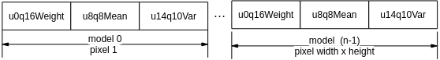

    一个像素的单个高斯模型参数weight用2字节、mean用2字节、var用3字节；因此model需要分配的内存大小：

    model-\>size = 7 \* src-\>width \* src-\>height \* ctrl-\>model\_num

-   RGB图像GMM采用n个\(n=3 或 5\}\)高斯模型，model的内存排列方式如[图2](#fig17504123319149)所示。

    **图 2**  RGB图像GMM模型的内存配置示意图<a name="fig17504123319149"></a>  
    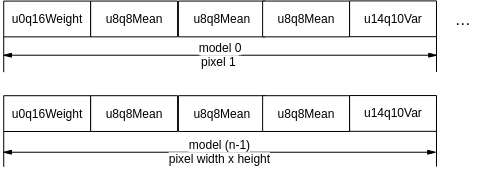

一个像素的单个高斯模型参数weight用2字节、mean\[3\]用2\*3字节、var用3字节；因此model需要分配的内存大小：

model-\>size = 11 \* src-\>width \* src-\>height \* ctrl-\>model\_num

【举例】

无。

【相关主题】

-   [ss\_mpi\_ive\_match\_bg\_model](#ss_mpi_ive_match_bg_model)
-   [ss\_mpi\_ive\_update\_bg\_model](#ss_mpi_ive_update_bg_model)
-   [ss\_mpi\_ive\_gmm2](#ss_mpi_ive_gmm2)

## ss\_mpi\_ive\_gmm2<a name="ZH-CN_TOPIC_0000002504091155"></a>

【描述】

创建GMM背景建模任务，支持1-5个高斯模型，支持灰度图和RGB\_PACKAGE图输入，支持全局及像素级别的灵敏度系数以及前景模型时长更新系数。

【语法】

```
td_s32 ss_mpi_ive_gmm2(ot_ive_handle *handle, const ot_svp_src_img *src, const ot_svp_src_img *factor, const ot_svp_dst_img *fg, const ot_svp_dst_img *bg, const ot_svp_dst_img *match_model_info, const ot_svp_mem_info *model, const ot_ive_gmm2_ctrl *ctrl, td_bool is_instant);
```

【参数】

<a name="table6847mcpsimp"></a>
<table><thead align="left"><tr id="row6853mcpsimp"><th class="cellrowborder" valign="top" width="26.729999999999997%" id="mcps1.1.4.1.1"><p id="p6855mcpsimp"><a name="p6855mcpsimp"></a><a name="p6855mcpsimp"></a>参数名称</p>
</th>
<th class="cellrowborder" valign="top" width="55.45%" id="mcps1.1.4.1.2"><p id="p6857mcpsimp"><a name="p6857mcpsimp"></a><a name="p6857mcpsimp"></a>描述</p>
</th>
<th class="cellrowborder" valign="top" width="17.82%" id="mcps1.1.4.1.3"><p id="p6859mcpsimp"><a name="p6859mcpsimp"></a><a name="p6859mcpsimp"></a>输入/输出</p>
</th>
</tr>
</thead>
<tbody><tr id="row6861mcpsimp"><td class="cellrowborder" valign="top" width="26.729999999999997%" headers="mcps1.1.4.1.1 "><p id="p6863mcpsimp"><a name="p6863mcpsimp"></a><a name="p6863mcpsimp"></a>handle</p>
</td>
<td class="cellrowborder" valign="top" width="55.45%" headers="mcps1.1.4.1.2 "><p id="p6865mcpsimp"><a name="p6865mcpsimp"></a><a name="p6865mcpsimp"></a>handle指针。</p>
<p id="p6866mcpsimp"><a name="p6866mcpsimp"></a><a name="p6866mcpsimp"></a>不能为空。</p>
</td>
<td class="cellrowborder" valign="top" width="17.82%" headers="mcps1.1.4.1.3 "><p id="p6868mcpsimp"><a name="p6868mcpsimp"></a><a name="p6868mcpsimp"></a>输出</p>
</td>
</tr>
<tr id="row6869mcpsimp"><td class="cellrowborder" valign="top" width="26.729999999999997%" headers="mcps1.1.4.1.1 "><p id="p6871mcpsimp"><a name="p6871mcpsimp"></a><a name="p6871mcpsimp"></a>src</p>
</td>
<td class="cellrowborder" valign="top" width="55.45%" headers="mcps1.1.4.1.2 "><p id="p6873mcpsimp"><a name="p6873mcpsimp"></a><a name="p6873mcpsimp"></a>源图像指针。</p>
<p id="p6874mcpsimp"><a name="p6874mcpsimp"></a><a name="p6874mcpsimp"></a>不能为空。</p>
</td>
<td class="cellrowborder" valign="top" width="17.82%" headers="mcps1.1.4.1.3 "><p id="p6876mcpsimp"><a name="p6876mcpsimp"></a><a name="p6876mcpsimp"></a>输入</p>
</td>
</tr>
<tr id="row6877mcpsimp"><td class="cellrowborder" valign="top" width="26.729999999999997%" headers="mcps1.1.4.1.1 "><p id="p6879mcpsimp"><a name="p6879mcpsimp"></a><a name="p6879mcpsimp"></a>factor</p>
</td>
<td class="cellrowborder" valign="top" width="55.45%" headers="mcps1.1.4.1.2 "><p id="p6881mcpsimp"><a name="p6881mcpsimp"></a><a name="p6881mcpsimp"></a>模型更新参数指针。</p>
<p id="p6882mcpsimp"><a name="p6882mcpsimp"></a><a name="p6882mcpsimp"></a>且仅当ctrl-&gt; sns_factor_mode</p>
<p id="p6883mcpsimp"><a name="p6883mcpsimp"></a><a name="p6883mcpsimp"></a>ctrl-&gt; life_update_factor_mode均使用全局模式时可以为空。</p>
</td>
<td class="cellrowborder" valign="top" width="17.82%" headers="mcps1.1.4.1.3 "><p id="p6885mcpsimp"><a name="p6885mcpsimp"></a><a name="p6885mcpsimp"></a>输入</p>
</td>
</tr>
<tr id="row6886mcpsimp"><td class="cellrowborder" valign="top" width="26.729999999999997%" headers="mcps1.1.4.1.1 "><p id="p6888mcpsimp"><a name="p6888mcpsimp"></a><a name="p6888mcpsimp"></a>fg</p>
</td>
<td class="cellrowborder" valign="top" width="55.45%" headers="mcps1.1.4.1.2 "><p id="p6890mcpsimp"><a name="p6890mcpsimp"></a><a name="p6890mcpsimp"></a>前景图像指针。</p>
<p id="p6891mcpsimp"><a name="p6891mcpsimp"></a><a name="p6891mcpsimp"></a>不能为空。</p>
<p id="p6892mcpsimp"><a name="p6892mcpsimp"></a><a name="p6892mcpsimp"></a>高、宽同src。</p>
</td>
<td class="cellrowborder" valign="top" width="17.82%" headers="mcps1.1.4.1.3 "><p id="p6894mcpsimp"><a name="p6894mcpsimp"></a><a name="p6894mcpsimp"></a>输出</p>
</td>
</tr>
<tr id="row6895mcpsimp"><td class="cellrowborder" valign="top" width="26.729999999999997%" headers="mcps1.1.4.1.1 "><p id="p6897mcpsimp"><a name="p6897mcpsimp"></a><a name="p6897mcpsimp"></a>bg</p>
</td>
<td class="cellrowborder" valign="top" width="55.45%" headers="mcps1.1.4.1.2 "><p id="p6899mcpsimp"><a name="p6899mcpsimp"></a><a name="p6899mcpsimp"></a>背景图像指针。</p>
<p id="p6900mcpsimp"><a name="p6900mcpsimp"></a><a name="p6900mcpsimp"></a>不能为空。</p>
<p id="p6901mcpsimp"><a name="p6901mcpsimp"></a><a name="p6901mcpsimp"></a>高、宽同src。</p>
</td>
<td class="cellrowborder" valign="top" width="17.82%" headers="mcps1.1.4.1.3 "><p id="p6903mcpsimp"><a name="p6903mcpsimp"></a><a name="p6903mcpsimp"></a>输出</p>
</td>
</tr>
<tr id="row6904mcpsimp"><td class="cellrowborder" valign="top" width="26.729999999999997%" headers="mcps1.1.4.1.1 "><p id="p6906mcpsimp"><a name="p6906mcpsimp"></a><a name="p6906mcpsimp"></a>match_model_info</p>
</td>
<td class="cellrowborder" valign="top" width="55.45%" headers="mcps1.1.4.1.2 "><p id="p6908mcpsimp"><a name="p6908mcpsimp"></a><a name="p6908mcpsimp"></a>模型匹配系数指针。</p>
<p id="p6909mcpsimp"><a name="p6909mcpsimp"></a><a name="p6909mcpsimp"></a>不能为空。</p>
</td>
<td class="cellrowborder" valign="top" width="17.82%" headers="mcps1.1.4.1.3 "><p id="p6911mcpsimp"><a name="p6911mcpsimp"></a><a name="p6911mcpsimp"></a>输出</p>
</td>
</tr>
<tr id="row6912mcpsimp"><td class="cellrowborder" valign="top" width="26.729999999999997%" headers="mcps1.1.4.1.1 "><p id="p6914mcpsimp"><a name="p6914mcpsimp"></a><a name="p6914mcpsimp"></a>model</p>
</td>
<td class="cellrowborder" valign="top" width="55.45%" headers="mcps1.1.4.1.2 "><p id="p6916mcpsimp"><a name="p6916mcpsimp"></a><a name="p6916mcpsimp"></a>GMM模型参数指针。</p>
<p id="p6917mcpsimp"><a name="p6917mcpsimp"></a><a name="p6917mcpsimp"></a>不能为空。</p>
<p id="p6918mcpsimp"><a name="p6918mcpsimp"></a><a name="p6918mcpsimp"></a>具体描述请参见《SVPx.0 API 参考》。</p>
</td>
<td class="cellrowborder" valign="top" width="17.82%" headers="mcps1.1.4.1.3 "><p id="p6920mcpsimp"><a name="p6920mcpsimp"></a><a name="p6920mcpsimp"></a>输入、输出</p>
</td>
</tr>
<tr id="row6921mcpsimp"><td class="cellrowborder" valign="top" width="26.729999999999997%" headers="mcps1.1.4.1.1 "><p id="p6923mcpsimp"><a name="p6923mcpsimp"></a><a name="p6923mcpsimp"></a>ctrl</p>
</td>
<td class="cellrowborder" valign="top" width="55.45%" headers="mcps1.1.4.1.2 "><p id="p6925mcpsimp"><a name="p6925mcpsimp"></a><a name="p6925mcpsimp"></a>控制参数指针。</p>
<p id="p6926mcpsimp"><a name="p6926mcpsimp"></a><a name="p6926mcpsimp"></a>不能为空。</p>
</td>
<td class="cellrowborder" valign="top" width="17.82%" headers="mcps1.1.4.1.3 "><p id="p6928mcpsimp"><a name="p6928mcpsimp"></a><a name="p6928mcpsimp"></a>输入</p>
</td>
</tr>
<tr id="row6929mcpsimp"><td class="cellrowborder" valign="top" width="26.729999999999997%" headers="mcps1.1.4.1.1 "><p id="p6931mcpsimp"><a name="p6931mcpsimp"></a><a name="p6931mcpsimp"></a>is_instant</p>
</td>
<td class="cellrowborder" valign="top" width="55.45%" headers="mcps1.1.4.1.2 "><p id="p6933mcpsimp"><a name="p6933mcpsimp"></a><a name="p6933mcpsimp"></a>及时返回结果标志。</p>
</td>
<td class="cellrowborder" valign="top" width="17.82%" headers="mcps1.1.4.1.3 "><p id="p6935mcpsimp"><a name="p6935mcpsimp"></a><a name="p6935mcpsimp"></a>输入</p>
</td>
</tr>
</tbody>
</table>

<a name="table6936mcpsimp"></a>
<table><thead align="left"><tr id="row6943mcpsimp"><th class="cellrowborder" valign="top" width="24%" id="mcps1.1.5.1.1"><p id="p6945mcpsimp"><a name="p6945mcpsimp"></a><a name="p6945mcpsimp"></a>参数名称</p>
</th>
<th class="cellrowborder" valign="top" width="30%" id="mcps1.1.5.1.2"><p id="p6947mcpsimp"><a name="p6947mcpsimp"></a><a name="p6947mcpsimp"></a>支持图像类型</p>
</th>
<th class="cellrowborder" valign="top" width="18%" id="mcps1.1.5.1.3"><p id="p6949mcpsimp"><a name="p6949mcpsimp"></a><a name="p6949mcpsimp"></a>地址对齐</p>
</th>
<th class="cellrowborder" valign="top" width="28.000000000000004%" id="mcps1.1.5.1.4"><p id="p6951mcpsimp"><a name="p6951mcpsimp"></a><a name="p6951mcpsimp"></a>分辨率</p>
</th>
</tr>
</thead>
<tbody><tr id="row6953mcpsimp"><td class="cellrowborder" valign="top" width="24%" headers="mcps1.1.5.1.1 "><p id="p6955mcpsimp"><a name="p6955mcpsimp"></a><a name="p6955mcpsimp"></a>src</p>
</td>
<td class="cellrowborder" valign="top" width="30%" headers="mcps1.1.5.1.2 "><p id="p6957mcpsimp"><a name="p6957mcpsimp"></a><a name="p6957mcpsimp"></a>U8C1、U8C3_PACKAGE</p>
</td>
<td class="cellrowborder" valign="top" width="18%" headers="mcps1.1.5.1.3 "><p id="p6959mcpsimp"><a name="p6959mcpsimp"></a><a name="p6959mcpsimp"></a>16 byte</p>
</td>
<td class="cellrowborder" valign="top" width="28.000000000000004%" headers="mcps1.1.5.1.4 "><p id="p6961mcpsimp"><a name="p6961mcpsimp"></a><a name="p6961mcpsimp"></a>64x64～1280x720</p>
</td>
</tr>
<tr id="row6962mcpsimp"><td class="cellrowborder" valign="top" width="24%" headers="mcps1.1.5.1.1 "><p id="p6964mcpsimp"><a name="p6964mcpsimp"></a><a name="p6964mcpsimp"></a>factor</p>
</td>
<td class="cellrowborder" valign="top" width="30%" headers="mcps1.1.5.1.2 "><p id="p6966mcpsimp"><a name="p6966mcpsimp"></a><a name="p6966mcpsimp"></a>U16C1</p>
</td>
<td class="cellrowborder" valign="top" width="18%" headers="mcps1.1.5.1.3 "><p id="p6968mcpsimp"><a name="p6968mcpsimp"></a><a name="p6968mcpsimp"></a>16 byte</p>
</td>
<td class="cellrowborder" valign="top" width="28.000000000000004%" headers="mcps1.1.5.1.4 "><p id="p6970mcpsimp"><a name="p6970mcpsimp"></a><a name="p6970mcpsimp"></a>同src</p>
</td>
</tr>
<tr id="row6971mcpsimp"><td class="cellrowborder" valign="top" width="24%" headers="mcps1.1.5.1.1 "><p id="p6973mcpsimp"><a name="p6973mcpsimp"></a><a name="p6973mcpsimp"></a>fg</p>
</td>
<td class="cellrowborder" valign="top" width="30%" headers="mcps1.1.5.1.2 "><p id="p6975mcpsimp"><a name="p6975mcpsimp"></a><a name="p6975mcpsimp"></a>U8C1的二值图</p>
</td>
<td class="cellrowborder" valign="top" width="18%" headers="mcps1.1.5.1.3 "><p id="p6977mcpsimp"><a name="p6977mcpsimp"></a><a name="p6977mcpsimp"></a>16 byte</p>
</td>
<td class="cellrowborder" valign="top" width="28.000000000000004%" headers="mcps1.1.5.1.4 "><p id="p6979mcpsimp"><a name="p6979mcpsimp"></a><a name="p6979mcpsimp"></a>同src</p>
</td>
</tr>
<tr id="row6980mcpsimp"><td class="cellrowborder" valign="top" width="24%" headers="mcps1.1.5.1.1 "><p id="p6982mcpsimp"><a name="p6982mcpsimp"></a><a name="p6982mcpsimp"></a>bg</p>
</td>
<td class="cellrowborder" valign="top" width="30%" headers="mcps1.1.5.1.2 "><p id="p6984mcpsimp"><a name="p6984mcpsimp"></a><a name="p6984mcpsimp"></a>同src</p>
</td>
<td class="cellrowborder" valign="top" width="18%" headers="mcps1.1.5.1.3 "><p id="p6986mcpsimp"><a name="p6986mcpsimp"></a><a name="p6986mcpsimp"></a>16 byte</p>
</td>
<td class="cellrowborder" valign="top" width="28.000000000000004%" headers="mcps1.1.5.1.4 "><p id="p6988mcpsimp"><a name="p6988mcpsimp"></a><a name="p6988mcpsimp"></a>同src</p>
</td>
</tr>
<tr id="row6989mcpsimp"><td class="cellrowborder" valign="top" width="24%" headers="mcps1.1.5.1.1 "><p id="p6991mcpsimp"><a name="p6991mcpsimp"></a><a name="p6991mcpsimp"></a>match_model_info</p>
</td>
<td class="cellrowborder" valign="top" width="30%" headers="mcps1.1.5.1.2 "><p id="p6993mcpsimp"><a name="p6993mcpsimp"></a><a name="p6993mcpsimp"></a>U8C1</p>
</td>
<td class="cellrowborder" valign="top" width="18%" headers="mcps1.1.5.1.3 "><p id="p6995mcpsimp"><a name="p6995mcpsimp"></a><a name="p6995mcpsimp"></a>16 byte</p>
</td>
<td class="cellrowborder" valign="top" width="28.000000000000004%" headers="mcps1.1.5.1.4 "><p id="p6997mcpsimp"><a name="p6997mcpsimp"></a><a name="p6997mcpsimp"></a>同src</p>
</td>
</tr>
<tr id="row6998mcpsimp"><td class="cellrowborder" valign="top" width="24%" headers="mcps1.1.5.1.1 "><p id="p7000mcpsimp"><a name="p7000mcpsimp"></a><a name="p7000mcpsimp"></a>model</p>
</td>
<td class="cellrowborder" valign="top" width="30%" headers="mcps1.1.5.1.2 "><p id="p7002mcpsimp"><a name="p7002mcpsimp"></a><a name="p7002mcpsimp"></a>-</p>
</td>
<td class="cellrowborder" valign="top" width="18%" headers="mcps1.1.5.1.3 "><p id="p7004mcpsimp"><a name="p7004mcpsimp"></a><a name="p7004mcpsimp"></a>16 byte</p>
</td>
<td class="cellrowborder" valign="top" width="28.000000000000004%" headers="mcps1.1.5.1.4 "><p id="p7006mcpsimp"><a name="p7006mcpsimp"></a><a name="p7006mcpsimp"></a>-</p>
</td>
</tr>
</tbody>
</table>

【返回值】

<a name="table7008mcpsimp"></a>
<table><thead align="left"><tr id="row7013mcpsimp"><th class="cellrowborder" valign="top" width="50%" id="mcps1.1.3.1.1"><p id="p7015mcpsimp"><a name="p7015mcpsimp"></a><a name="p7015mcpsimp"></a>返回值</p>
</th>
<th class="cellrowborder" valign="top" width="50%" id="mcps1.1.3.1.2"><p id="p7017mcpsimp"><a name="p7017mcpsimp"></a><a name="p7017mcpsimp"></a>描述</p>
</th>
</tr>
</thead>
<tbody><tr id="row7019mcpsimp"><td class="cellrowborder" valign="top" width="50%" headers="mcps1.1.3.1.1 "><p id="p7021mcpsimp"><a name="p7021mcpsimp"></a><a name="p7021mcpsimp"></a>0</p>
</td>
<td class="cellrowborder" valign="top" width="50%" headers="mcps1.1.3.1.2 "><p id="p7023mcpsimp"><a name="p7023mcpsimp"></a><a name="p7023mcpsimp"></a>成功。</p>
</td>
</tr>
<tr id="row7024mcpsimp"><td class="cellrowborder" valign="top" width="50%" headers="mcps1.1.3.1.1 "><p id="p7026mcpsimp"><a name="p7026mcpsimp"></a><a name="p7026mcpsimp"></a>非0</p>
</td>
<td class="cellrowborder" valign="top" width="50%" headers="mcps1.1.3.1.2 "><p id="p7028mcpsimp"><a name="p7028mcpsimp"></a><a name="p7028mcpsimp"></a>失败，参见<span xml:lang="fr-FR" id="ph136311818172213"><a name="ph136311818172213"></a><a name="ph136311818172213"></a>错误码</span><span xml:lang="fr-FR" id="ph5283mcpsimp"><a name="ph5283mcpsimp"></a><a name="ph5283mcpsimp"></a>。</span></p>
</td>
</tr>
</tbody>
</table>

【需求】

-   头文件：ot\_common\_ive.h、ot\_common\_svp.h、ss\_mpi\_ive.h
-   库文件：libss\_ive.a（PC上模拟用ss\_ive\_clib2.x.lib）

【注意】

-   GMM2在参考了OPENCV的MOG和MOG2的基础上，增加了像素级别的参数控制。
-   源图像src类型只能为U8C1或U8C3\_PACKAGE，分别用于灰度图和RGB图的GMM背景建模。
-   模型更新参数factor为U16C1图像：每个元素用16 bit表示，低8 bit为灵敏度系数，用于控制模型匹配时方差倍数；高8 bit为前景模型时长更新参数，用于控制背景模型形成时间。
-   模型匹配系数指针match\_model\_info为U8C1图像：每个元素用8bit表示，低1 bit为高斯模型匹配标志，0表示匹配失败，1表示匹配成功；高7 bit为频率最大模型序号。
-   GMM2的频率参数（ctrl中的freq\_init\_val、freq\_redu\_factor、freq\_add\_factor  freq\_threshold）用于控制模型排序和模型有效时间。
    -   freq\_init\_val 越大，模型有效时间越大；
    -   freq\_redu\_factor 越大，模型有效时间越长，模型频率通过乘以频率衰减系数freq\_redu\_factor /65536，达到频率衰减的目的；
    -   freq\_add\_factor 越大，模型有效时间越长；
    -   freq\_threshold 越大，模型有效时间越短。

-   GMM2的模型时长参数\(ctrl中的life\_threshold \)用于控制前景模型成为背景的间。
    -   life\_threshold越大，前景持续时间越长；
    -   单高斯模型下，模型时长参数不生效。

-   灰度图像GMM2采用n个（1≤n≤5）高斯模型，model的内存排列方式如[图1](#fig182212111197)所示。

    **图 1**  灰度图像GMM2模型的内存配置示意图<a name="fig182212111197"></a>  
    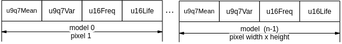

    一个像素的单个高斯模型参数mean用2字节，var用2字节，freq用2字节，life用2字节；因此model需要分配的内存大小：

    model-\>size = 8 \* src-\>width\*src-\>height \* ctrl-\>model\_num

-   RGB图像GMM2采用n个（1≤n≤5）高斯模型，model的内存排列方式如[图2](#fig9558648172313)所示。

    **图 2**  RGB图像GMM2模型的内存配置示意图<a name="fig9558648172313"></a>  
    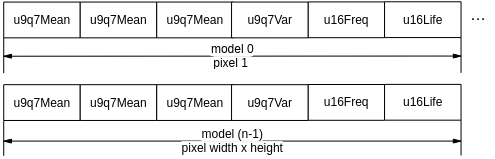

一个像素的单个高斯模型参数mean\[3\]用6字节，var用2字节，freq用2字节，life用2字节；因此model需要分配的内存大小：

model-\>size = 12 \* src-\>width\*src-\>height \* ctrl-\>model\_num

【举例】

无。

【相关主题】

-   [ss\_mpi\_ive\_match\_bg\_model](#ss_mpi_ive_match_bg_model)
-   [ss\_mpi\_ive\_update\_bg\_model](#ss_mpi_ive_update_bg_model)
-   [ss\_mpi\_ive\_gmm](#ss_mpi_ive_gmm)

## ss\_mpi\_ive\_canny\_hys\_edge<a name="ZH-CN_TOPIC_0000002503971215"></a>

【描述】

灰度图的Canny边缘提取的前半部：求梯度、计算梯度幅值幅角、磁滞阈值化及非极大抑制。

【语法】

```
td_s32 ss_mpi_ive_canny_hys_edge(ot_ive_handle *handle, const ot_svp_src_img *src, const ot_svp_dst_img *edge, const ot_svp_dst_mem_info *stack, const ot_ive_canny_hys_edge_ctrl *ctrl, td_bool is_instant );
```

【参数】

<a name="table6062mcpsimp"></a>
<table><thead align="left"><tr id="row6068mcpsimp"><th class="cellrowborder" valign="top" width="20%" id="mcps1.1.4.1.1"><p id="p6070mcpsimp"><a name="p6070mcpsimp"></a><a name="p6070mcpsimp"></a>参数名称</p>
</th>
<th class="cellrowborder" valign="top" width="64%" id="mcps1.1.4.1.2"><p id="p6072mcpsimp"><a name="p6072mcpsimp"></a><a name="p6072mcpsimp"></a>描述</p>
</th>
<th class="cellrowborder" valign="top" width="16%" id="mcps1.1.4.1.3"><p id="p6074mcpsimp"><a name="p6074mcpsimp"></a><a name="p6074mcpsimp"></a>输入/输出</p>
</th>
</tr>
</thead>
<tbody><tr id="row6076mcpsimp"><td class="cellrowborder" valign="top" width="20%" headers="mcps1.1.4.1.1 "><p id="p6078mcpsimp"><a name="p6078mcpsimp"></a><a name="p6078mcpsimp"></a>handle</p>
</td>
<td class="cellrowborder" valign="top" width="64%" headers="mcps1.1.4.1.2 "><p id="p6080mcpsimp"><a name="p6080mcpsimp"></a><a name="p6080mcpsimp"></a>handle指针。</p>
<p id="p6081mcpsimp"><a name="p6081mcpsimp"></a><a name="p6081mcpsimp"></a>不能为空。</p>
</td>
<td class="cellrowborder" valign="top" width="16%" headers="mcps1.1.4.1.3 "><p id="p6083mcpsimp"><a name="p6083mcpsimp"></a><a name="p6083mcpsimp"></a>输出</p>
</td>
</tr>
<tr id="row6084mcpsimp"><td class="cellrowborder" valign="top" width="20%" headers="mcps1.1.4.1.1 "><p id="p6086mcpsimp"><a name="p6086mcpsimp"></a><a name="p6086mcpsimp"></a>src</p>
</td>
<td class="cellrowborder" valign="top" width="64%" headers="mcps1.1.4.1.2 "><p id="p6088mcpsimp"><a name="p6088mcpsimp"></a><a name="p6088mcpsimp"></a>源图像指针。</p>
<p id="p6089mcpsimp"><a name="p6089mcpsimp"></a><a name="p6089mcpsimp"></a>不能为空。</p>
</td>
<td class="cellrowborder" valign="top" width="16%" headers="mcps1.1.4.1.3 "><p id="p6091mcpsimp"><a name="p6091mcpsimp"></a><a name="p6091mcpsimp"></a>输入</p>
</td>
</tr>
<tr id="row6092mcpsimp"><td class="cellrowborder" valign="top" width="20%" headers="mcps1.1.4.1.1 "><p id="p6094mcpsimp"><a name="p6094mcpsimp"></a><a name="p6094mcpsimp"></a>edge</p>
</td>
<td class="cellrowborder" valign="top" width="64%" headers="mcps1.1.4.1.2 "><p id="p6096mcpsimp"><a name="p6096mcpsimp"></a><a name="p6096mcpsimp"></a>强弱边缘标志图像指针。</p>
<p id="p6097mcpsimp"><a name="p6097mcpsimp"></a><a name="p6097mcpsimp"></a>不能为空。</p>
<p id="p6098mcpsimp"><a name="p6098mcpsimp"></a><a name="p6098mcpsimp"></a>高、宽同src。</p>
</td>
<td class="cellrowborder" valign="top" width="16%" headers="mcps1.1.4.1.3 "><p id="p6100mcpsimp"><a name="p6100mcpsimp"></a><a name="p6100mcpsimp"></a>输出</p>
</td>
</tr>
<tr id="row6101mcpsimp"><td class="cellrowborder" valign="top" width="20%" headers="mcps1.1.4.1.1 "><p id="p6103mcpsimp"><a name="p6103mcpsimp"></a><a name="p6103mcpsimp"></a>stack</p>
</td>
<td class="cellrowborder" valign="top" width="64%" headers="mcps1.1.4.1.2 "><p id="p6105mcpsimp"><a name="p6105mcpsimp"></a><a name="p6105mcpsimp"></a>强边缘点坐标栈。</p>
<p id="p6106mcpsimp"><a name="p6106mcpsimp"></a><a name="p6106mcpsimp"></a>不能为空。</p>
<p id="p6107mcpsimp"><a name="p6107mcpsimp"></a><a name="p6107mcpsimp"></a>内存至少配置：</p>
<p id="p6108mcpsimp"><a name="p6108mcpsimp"></a><a name="p6108mcpsimp"></a>src-&gt;width * src-&gt;height * (sizeof(ot_svp_point_u16)) + sizeof(ot_ive_canny_stack_size)</p>
<p id="p6111mcpsimp"><a name="p6111mcpsimp"></a><a name="p6111mcpsimp"></a>具体描述请参见《SVPx.0 API 参考》</p>
</td>
<td class="cellrowborder" valign="top" width="16%" headers="mcps1.1.4.1.3 "><p id="p6113mcpsimp"><a name="p6113mcpsimp"></a><a name="p6113mcpsimp"></a>输出</p>
</td>
</tr>
<tr id="row6114mcpsimp"><td class="cellrowborder" valign="top" width="20%" headers="mcps1.1.4.1.1 "><p id="p6116mcpsimp"><a name="p6116mcpsimp"></a><a name="p6116mcpsimp"></a>ctrl</p>
</td>
<td class="cellrowborder" valign="top" width="64%" headers="mcps1.1.4.1.2 "><p id="p6118mcpsimp"><a name="p6118mcpsimp"></a><a name="p6118mcpsimp"></a>控制参数指针。</p>
<p id="p6119mcpsimp"><a name="p6119mcpsimp"></a><a name="p6119mcpsimp"></a>不能为空。</p>
</td>
<td class="cellrowborder" valign="top" width="16%" headers="mcps1.1.4.1.3 "><p id="p6121mcpsimp"><a name="p6121mcpsimp"></a><a name="p6121mcpsimp"></a>输入</p>
</td>
</tr>
<tr id="row6122mcpsimp"><td class="cellrowborder" valign="top" width="20%" headers="mcps1.1.4.1.1 "><p id="p6124mcpsimp"><a name="p6124mcpsimp"></a><a name="p6124mcpsimp"></a>is_instant</p>
</td>
<td class="cellrowborder" valign="top" width="64%" headers="mcps1.1.4.1.2 "><p id="p6126mcpsimp"><a name="p6126mcpsimp"></a><a name="p6126mcpsimp"></a>及时返回结果标志。</p>
</td>
<td class="cellrowborder" valign="top" width="16%" headers="mcps1.1.4.1.3 "><p id="p6128mcpsimp"><a name="p6128mcpsimp"></a><a name="p6128mcpsimp"></a>输入</p>
</td>
</tr>
</tbody>
</table>

<a name="table6129mcpsimp"></a>
<table><thead align="left"><tr id="row6136mcpsimp"><th class="cellrowborder" valign="top" width="25.252525252525253%" id="mcps1.1.5.1.1"><p id="p6138mcpsimp"><a name="p6138mcpsimp"></a><a name="p6138mcpsimp"></a>参数名称</p>
</th>
<th class="cellrowborder" valign="top" width="24.242424242424242%" id="mcps1.1.5.1.2"><p id="p6140mcpsimp"><a name="p6140mcpsimp"></a><a name="p6140mcpsimp"></a>支持图像类型</p>
</th>
<th class="cellrowborder" valign="top" width="15.151515151515152%" id="mcps1.1.5.1.3"><p id="p6142mcpsimp"><a name="p6142mcpsimp"></a><a name="p6142mcpsimp"></a>地址对齐</p>
</th>
<th class="cellrowborder" valign="top" width="35.35353535353536%" id="mcps1.1.5.1.4"><p id="p6144mcpsimp"><a name="p6144mcpsimp"></a><a name="p6144mcpsimp"></a>分辨率</p>
</th>
</tr>
</thead>
<tbody><tr id="row6146mcpsimp"><td class="cellrowborder" valign="top" width="25.252525252525253%" headers="mcps1.1.5.1.1 "><p id="p6148mcpsimp"><a name="p6148mcpsimp"></a><a name="p6148mcpsimp"></a>src</p>
</td>
<td class="cellrowborder" valign="top" width="24.242424242424242%" headers="mcps1.1.5.1.2 "><p id="p6150mcpsimp"><a name="p6150mcpsimp"></a><a name="p6150mcpsimp"></a>U8C1</p>
</td>
<td class="cellrowborder" valign="top" width="15.151515151515152%" headers="mcps1.1.5.1.3 "><p id="p6152mcpsimp"><a name="p6152mcpsimp"></a><a name="p6152mcpsimp"></a>16 byte</p>
</td>
<td class="cellrowborder" valign="top" width="35.35353535353536%" headers="mcps1.1.5.1.4 "><p id="p6154mcpsimp"><a name="p6154mcpsimp"></a><a name="p6154mcpsimp"></a>64x64～1920x1024</p>
</td>
</tr>
<tr id="row6155mcpsimp"><td class="cellrowborder" valign="top" width="25.252525252525253%" headers="mcps1.1.5.1.1 "><p id="p6157mcpsimp"><a name="p6157mcpsimp"></a><a name="p6157mcpsimp"></a>edge</p>
</td>
<td class="cellrowborder" valign="top" width="24.242424242424242%" headers="mcps1.1.5.1.2 "><p id="p6159mcpsimp"><a name="p6159mcpsimp"></a><a name="p6159mcpsimp"></a>U8C1</p>
</td>
<td class="cellrowborder" valign="top" width="15.151515151515152%" headers="mcps1.1.5.1.3 "><p id="p6161mcpsimp"><a name="p6161mcpsimp"></a><a name="p6161mcpsimp"></a>16 byte</p>
</td>
<td class="cellrowborder" valign="top" width="35.35353535353536%" headers="mcps1.1.5.1.4 "><p id="p6163mcpsimp"><a name="p6163mcpsimp"></a><a name="p6163mcpsimp"></a>同src</p>
</td>
</tr>
<tr id="row6164mcpsimp"><td class="cellrowborder" valign="top" width="25.252525252525253%" headers="mcps1.1.5.1.1 "><p id="p6166mcpsimp"><a name="p6166mcpsimp"></a><a name="p6166mcpsimp"></a>stack</p>
</td>
<td class="cellrowborder" valign="top" width="24.242424242424242%" headers="mcps1.1.5.1.2 "><p id="p6168mcpsimp"><a name="p6168mcpsimp"></a><a name="p6168mcpsimp"></a>-</p>
</td>
<td class="cellrowborder" valign="top" width="15.151515151515152%" headers="mcps1.1.5.1.3 "><p id="p6170mcpsimp"><a name="p6170mcpsimp"></a><a name="p6170mcpsimp"></a>16 byte</p>
</td>
<td class="cellrowborder" valign="top" width="35.35353535353536%" headers="mcps1.1.5.1.4 "><p id="p6172mcpsimp"><a name="p6172mcpsimp"></a><a name="p6172mcpsimp"></a>-</p>
</td>
</tr>
<tr id="row6173mcpsimp"><td class="cellrowborder" valign="top" width="25.252525252525253%" headers="mcps1.1.5.1.1 "><p id="p6175mcpsimp"><a name="p6175mcpsimp"></a><a name="p6175mcpsimp"></a>ctrl-&gt;mem</p>
</td>
<td class="cellrowborder" valign="top" width="24.242424242424242%" headers="mcps1.1.5.1.2 "><p id="p6177mcpsimp"><a name="p6177mcpsimp"></a><a name="p6177mcpsimp"></a>-</p>
</td>
<td class="cellrowborder" valign="top" width="15.151515151515152%" headers="mcps1.1.5.1.3 "><p id="p6179mcpsimp"><a name="p6179mcpsimp"></a><a name="p6179mcpsimp"></a>16 byte</p>
</td>
<td class="cellrowborder" valign="top" width="35.35353535353536%" headers="mcps1.1.5.1.4 "><p id="p6181mcpsimp"><a name="p6181mcpsimp"></a><a name="p6181mcpsimp"></a>-</p>
</td>
</tr>
</tbody>
</table>

【返回值】

<a name="table6183mcpsimp"></a>
<table><thead align="left"><tr id="row6188mcpsimp"><th class="cellrowborder" valign="top" width="50%" id="mcps1.1.3.1.1"><p id="p6190mcpsimp"><a name="p6190mcpsimp"></a><a name="p6190mcpsimp"></a>返回值</p>
</th>
<th class="cellrowborder" valign="top" width="50%" id="mcps1.1.3.1.2"><p id="p6192mcpsimp"><a name="p6192mcpsimp"></a><a name="p6192mcpsimp"></a>描述</p>
</th>
</tr>
</thead>
<tbody><tr id="row6194mcpsimp"><td class="cellrowborder" valign="top" width="50%" headers="mcps1.1.3.1.1 "><p id="p6196mcpsimp"><a name="p6196mcpsimp"></a><a name="p6196mcpsimp"></a>0</p>
</td>
<td class="cellrowborder" valign="top" width="50%" headers="mcps1.1.3.1.2 "><p id="p6198mcpsimp"><a name="p6198mcpsimp"></a><a name="p6198mcpsimp"></a>成功。</p>
</td>
</tr>
<tr id="row6199mcpsimp"><td class="cellrowborder" valign="top" width="50%" headers="mcps1.1.3.1.1 "><p id="p6201mcpsimp"><a name="p6201mcpsimp"></a><a name="p6201mcpsimp"></a>非0</p>
</td>
<td class="cellrowborder" valign="top" width="50%" headers="mcps1.1.3.1.2 "><p id="p6203mcpsimp"><a name="p6203mcpsimp"></a><a name="p6203mcpsimp"></a>失败，参见<span xml:lang="fr-FR" id="ph136311818172213"><a name="ph136311818172213"></a><a name="ph136311818172213"></a>错误码</span><span xml:lang="fr-FR" id="ph5283mcpsimp"><a name="ph5283mcpsimp"></a><a name="ph5283mcpsimp"></a>。</span></p>
</td>
</tr>
</tbody>
</table>

【需求】

-   头文件：ot\_common\_ive.h、ot\_common\_svp.h、ss\_mpi\_ive.h
-   库文件：libss\_ive.a（PC上模拟用ss\_ive\_clib2.x.lib）

【注意】

-   edge仅有0、1、2三个取值：
    -   0表示弱边缘点
    -   1表示非边缘点
    -   2表示强边缘点

-   stack中存储强边缘点的坐标信息。
-   ctrl-\>mem至少需要分配的内存大小

ctrl-\>mem.size

=（src-\>width + \(16 - src-\>width % 16\) % 16）\* 3 \* src-\>height。

-   该任务完成后，必须要使用[ss\_mpi\_ive\_canny\_edge](#ZH-CN_TOPIC_0000002470931286)函数才能输出Canny边缘图像。

【举例】

无。

【相关主题】

[ss\_mpi\_ive\_canny\_edge](#ss_mpi_ive_canny_edge)

## ss\_mpi\_ive\_canny\_edge<a name="ZH-CN_TOPIC_0000002470931286"></a>

【描述】

灰度图的Canny边缘提取的后半部：连接边缘点，形成Canny边缘图。

【语法】

```
td_s32 ss_mpi_ive_canny_edge(const ot_svp_img *edge, const ot_svp_mem_info *stack);
```

【参数】

<a name="table12253mcpsimp"></a>
<table><thead align="left"><tr id="row12259mcpsimp"><th class="cellrowborder" valign="top" width="17.82%" id="mcps1.1.4.1.1"><p id="p12261mcpsimp"><a name="p12261mcpsimp"></a><a name="p12261mcpsimp"></a>参数名称</p>
</th>
<th class="cellrowborder" valign="top" width="62.38%" id="mcps1.1.4.1.2"><p id="p12263mcpsimp"><a name="p12263mcpsimp"></a><a name="p12263mcpsimp"></a>描述</p>
</th>
<th class="cellrowborder" valign="top" width="19.8%" id="mcps1.1.4.1.3"><p id="p12265mcpsimp"><a name="p12265mcpsimp"></a><a name="p12265mcpsimp"></a>输入/输出</p>
</th>
</tr>
</thead>
<tbody><tr id="row12267mcpsimp"><td class="cellrowborder" valign="top" width="17.82%" headers="mcps1.1.4.1.1 "><p id="p12269mcpsimp"><a name="p12269mcpsimp"></a><a name="p12269mcpsimp"></a>edge</p>
</td>
<td class="cellrowborder" valign="top" width="62.38%" headers="mcps1.1.4.1.2 "><p id="p12271mcpsimp"><a name="p12271mcpsimp"></a><a name="p12271mcpsimp"></a>作为输入是强弱边缘标志图像指针；作为输出是边缘二值图像指针。</p>
<p id="p12272mcpsimp"><a name="p12272mcpsimp"></a><a name="p12272mcpsimp"></a>不能为空。</p>
</td>
<td class="cellrowborder" valign="top" width="19.8%" headers="mcps1.1.4.1.3 "><p id="p12274mcpsimp"><a name="p12274mcpsimp"></a><a name="p12274mcpsimp"></a>输入、输出</p>
</td>
</tr>
<tr id="row12275mcpsimp"><td class="cellrowborder" valign="top" width="17.82%" headers="mcps1.1.4.1.1 "><p id="p12277mcpsimp"><a name="p12277mcpsimp"></a><a name="p12277mcpsimp"></a>stack</p>
</td>
<td class="cellrowborder" valign="top" width="62.38%" headers="mcps1.1.4.1.2 "><p id="p12279mcpsimp"><a name="p12279mcpsimp"></a><a name="p12279mcpsimp"></a>强边缘点坐标栈。</p>
<p id="p12280mcpsimp"><a name="p12280mcpsimp"></a><a name="p12280mcpsimp"></a>不能为空。</p>
<p id="p12281mcpsimp"><a name="p12281mcpsimp"></a><a name="p12281mcpsimp"></a>具体描述请参见《SVPx.0 API 参考》</p>
</td>
<td class="cellrowborder" valign="top" width="19.8%" headers="mcps1.1.4.1.3 "><p id="p12283mcpsimp"><a name="p12283mcpsimp"></a><a name="p12283mcpsimp"></a>输入、输出</p>
</td>
</tr>
</tbody>
</table>

<a name="table12284mcpsimp"></a>
<table><thead align="left"><tr id="row12291mcpsimp"><th class="cellrowborder" valign="top" width="25.252525252525253%" id="mcps1.1.5.1.1"><p id="p12293mcpsimp"><a name="p12293mcpsimp"></a><a name="p12293mcpsimp"></a>参数名称</p>
</th>
<th class="cellrowborder" valign="top" width="24.242424242424242%" id="mcps1.1.5.1.2"><p id="p12295mcpsimp"><a name="p12295mcpsimp"></a><a name="p12295mcpsimp"></a>支持图像类型</p>
</th>
<th class="cellrowborder" valign="top" width="15.151515151515152%" id="mcps1.1.5.1.3"><p id="p12297mcpsimp"><a name="p12297mcpsimp"></a><a name="p12297mcpsimp"></a>地址对齐</p>
</th>
<th class="cellrowborder" valign="top" width="35.35353535353536%" id="mcps1.1.5.1.4"><p id="p12299mcpsimp"><a name="p12299mcpsimp"></a><a name="p12299mcpsimp"></a>分辨率</p>
</th>
</tr>
</thead>
<tbody><tr id="row12301mcpsimp"><td class="cellrowborder" valign="top" width="25.252525252525253%" headers="mcps1.1.5.1.1 "><p id="p12303mcpsimp"><a name="p12303mcpsimp"></a><a name="p12303mcpsimp"></a>edge</p>
</td>
<td class="cellrowborder" valign="top" width="24.242424242424242%" headers="mcps1.1.5.1.2 "><p id="p12305mcpsimp"><a name="p12305mcpsimp"></a><a name="p12305mcpsimp"></a>U8C1</p>
</td>
<td class="cellrowborder" valign="top" width="15.151515151515152%" headers="mcps1.1.5.1.3 "><p id="p12307mcpsimp"><a name="p12307mcpsimp"></a><a name="p12307mcpsimp"></a>16 byte</p>
</td>
<td class="cellrowborder" valign="top" width="35.35353535353536%" headers="mcps1.1.5.1.4 "><p id="p12309mcpsimp"><a name="p12309mcpsimp"></a><a name="p12309mcpsimp"></a>64x64～1920x1024</p>
</td>
</tr>
<tr id="row12310mcpsimp"><td class="cellrowborder" valign="top" width="25.252525252525253%" headers="mcps1.1.5.1.1 "><p id="p12312mcpsimp"><a name="p12312mcpsimp"></a><a name="p12312mcpsimp"></a>stack</p>
</td>
<td class="cellrowborder" valign="top" width="24.242424242424242%" headers="mcps1.1.5.1.2 "><p id="p12314mcpsimp"><a name="p12314mcpsimp"></a><a name="p12314mcpsimp"></a>-</p>
</td>
<td class="cellrowborder" valign="top" width="15.151515151515152%" headers="mcps1.1.5.1.3 "><p id="p12316mcpsimp"><a name="p12316mcpsimp"></a><a name="p12316mcpsimp"></a>16 byte</p>
</td>
<td class="cellrowborder" valign="top" width="35.35353535353536%" headers="mcps1.1.5.1.4 "><p id="p12318mcpsimp"><a name="p12318mcpsimp"></a><a name="p12318mcpsimp"></a>-</p>
</td>
</tr>
</tbody>
</table>

【返回值】

<a name="table12320mcpsimp"></a>
<table><thead align="left"><tr id="row12325mcpsimp"><th class="cellrowborder" valign="top" width="50%" id="mcps1.1.3.1.1"><p id="p12327mcpsimp"><a name="p12327mcpsimp"></a><a name="p12327mcpsimp"></a>返回值</p>
</th>
<th class="cellrowborder" valign="top" width="50%" id="mcps1.1.3.1.2"><p id="p12329mcpsimp"><a name="p12329mcpsimp"></a><a name="p12329mcpsimp"></a>描述</p>
</th>
</tr>
</thead>
<tbody><tr id="row12331mcpsimp"><td class="cellrowborder" valign="top" width="50%" headers="mcps1.1.3.1.1 "><p id="p12333mcpsimp"><a name="p12333mcpsimp"></a><a name="p12333mcpsimp"></a>0</p>
</td>
<td class="cellrowborder" valign="top" width="50%" headers="mcps1.1.3.1.2 "><p id="p12335mcpsimp"><a name="p12335mcpsimp"></a><a name="p12335mcpsimp"></a>成功。</p>
</td>
</tr>
<tr id="row12336mcpsimp"><td class="cellrowborder" valign="top" width="50%" headers="mcps1.1.3.1.1 "><p id="p12338mcpsimp"><a name="p12338mcpsimp"></a><a name="p12338mcpsimp"></a>非0</p>
</td>
<td class="cellrowborder" valign="top" width="50%" headers="mcps1.1.3.1.2 "><p id="p12340mcpsimp"><a name="p12340mcpsimp"></a><a name="p12340mcpsimp"></a>失败，参见<span xml:lang="fr-FR" id="ph136311818172213"><a name="ph136311818172213"></a><a name="ph136311818172213"></a>错误码</span><span xml:lang="fr-FR" id="ph5283mcpsimp"><a name="ph5283mcpsimp"></a><a name="ph5283mcpsimp"></a>。</span></p>
</td>
</tr>
</tbody>
</table>

【需求】

-   头文件：ot\_common\_ive.h、ot\_common\_svp.h、ss\_mpi\_ive.h
-   库文件：libss\_ive.a（PC上模拟用ss\_ive\_clib2.x.lib）

【注意】

使用该接口前必须调用[ss\_mpi\_ive\_canny\_hys\_edge](#ZH-CN_TOPIC_0000002503971215)，在保证[ss\_mpi\_ive\_canny\_hys\_edge](#ZH-CN_TOPIC_0000002503971215)任务完成的情况下，使用[ss\_mpi\_ive\_canny\_hys\_edge](#ZH-CN_TOPIC_0000002503971215)的输出edge、stack作为该接口的参数输入。

【举例】

无。

【相关主题】

[ss\_mpi\_ive\_canny\_hys\_edge](#ss_mpi_ive_canny_hys_edge)

## ss\_mpi\_ive\_lbp<a name="ZH-CN_TOPIC_0000002503971201"></a>

【描述】

创建lbp计算任务。

【语法】

```
td_s32 ss_mpi_ive_lbp(ot_ive_handle *handle, const ot_svp_src_img *src, const ot_svp_dst_img *dst, const ot_ive_lbp_ctrl *ctrl, td_bool is_instant);
```

【参数】

<a name="table13372mcpsimp"></a>
<table><thead align="left"><tr id="row13378mcpsimp"><th class="cellrowborder" valign="top" width="16%" id="mcps1.1.4.1.1"><p id="p13380mcpsimp"><a name="p13380mcpsimp"></a><a name="p13380mcpsimp"></a>参数名称</p>
</th>
<th class="cellrowborder" valign="top" width="68%" id="mcps1.1.4.1.2"><p id="p13382mcpsimp"><a name="p13382mcpsimp"></a><a name="p13382mcpsimp"></a>描述</p>
</th>
<th class="cellrowborder" valign="top" width="16%" id="mcps1.1.4.1.3"><p id="p13384mcpsimp"><a name="p13384mcpsimp"></a><a name="p13384mcpsimp"></a>输入/输出</p>
</th>
</tr>
</thead>
<tbody><tr id="row13386mcpsimp"><td class="cellrowborder" valign="top" width="16%" headers="mcps1.1.4.1.1 "><p id="p13388mcpsimp"><a name="p13388mcpsimp"></a><a name="p13388mcpsimp"></a>handle</p>
</td>
<td class="cellrowborder" valign="top" width="68%" headers="mcps1.1.4.1.2 "><p id="p13390mcpsimp"><a name="p13390mcpsimp"></a><a name="p13390mcpsimp"></a>handle指针。</p>
<p id="p13391mcpsimp"><a name="p13391mcpsimp"></a><a name="p13391mcpsimp"></a>不能为空。</p>
</td>
<td class="cellrowborder" valign="top" width="16%" headers="mcps1.1.4.1.3 "><p id="p13393mcpsimp"><a name="p13393mcpsimp"></a><a name="p13393mcpsimp"></a>输出</p>
</td>
</tr>
<tr id="row13394mcpsimp"><td class="cellrowborder" valign="top" width="16%" headers="mcps1.1.4.1.1 "><p id="p13396mcpsimp"><a name="p13396mcpsimp"></a><a name="p13396mcpsimp"></a>src</p>
</td>
<td class="cellrowborder" valign="top" width="68%" headers="mcps1.1.4.1.2 "><p id="p13398mcpsimp"><a name="p13398mcpsimp"></a><a name="p13398mcpsimp"></a>源图像指针。</p>
<p id="p13399mcpsimp"><a name="p13399mcpsimp"></a><a name="p13399mcpsimp"></a>不能为空。</p>
</td>
<td class="cellrowborder" valign="top" width="16%" headers="mcps1.1.4.1.3 "><p id="p13401mcpsimp"><a name="p13401mcpsimp"></a><a name="p13401mcpsimp"></a>输入</p>
</td>
</tr>
<tr id="row13402mcpsimp"><td class="cellrowborder" valign="top" width="16%" headers="mcps1.1.4.1.1 "><p id="p13404mcpsimp"><a name="p13404mcpsimp"></a><a name="p13404mcpsimp"></a>dst</p>
</td>
<td class="cellrowborder" valign="top" width="68%" headers="mcps1.1.4.1.2 "><p id="p13406mcpsimp"><a name="p13406mcpsimp"></a><a name="p13406mcpsimp"></a>输出图像指针。</p>
<p id="p13407mcpsimp"><a name="p13407mcpsimp"></a><a name="p13407mcpsimp"></a>不能为空。</p>
<p id="p13408mcpsimp"><a name="p13408mcpsimp"></a><a name="p13408mcpsimp"></a>高、宽同src。</p>
</td>
<td class="cellrowborder" valign="top" width="16%" headers="mcps1.1.4.1.3 "><p id="p13410mcpsimp"><a name="p13410mcpsimp"></a><a name="p13410mcpsimp"></a>输出</p>
</td>
</tr>
<tr id="row13411mcpsimp"><td class="cellrowborder" valign="top" width="16%" headers="mcps1.1.4.1.1 "><p id="p13413mcpsimp"><a name="p13413mcpsimp"></a><a name="p13413mcpsimp"></a>ctrl</p>
</td>
<td class="cellrowborder" valign="top" width="68%" headers="mcps1.1.4.1.2 "><p id="p13415mcpsimp"><a name="p13415mcpsimp"></a><a name="p13415mcpsimp"></a>控制信息指针。</p>
<p id="p13416mcpsimp"><a name="p13416mcpsimp"></a><a name="p13416mcpsimp"></a>不能为空。</p>
</td>
<td class="cellrowborder" valign="top" width="16%" headers="mcps1.1.4.1.3 "><p id="p13418mcpsimp"><a name="p13418mcpsimp"></a><a name="p13418mcpsimp"></a>输入</p>
</td>
</tr>
<tr id="row13419mcpsimp"><td class="cellrowborder" valign="top" width="16%" headers="mcps1.1.4.1.1 "><p id="p13421mcpsimp"><a name="p13421mcpsimp"></a><a name="p13421mcpsimp"></a>is_instant</p>
</td>
<td class="cellrowborder" valign="top" width="68%" headers="mcps1.1.4.1.2 "><p id="p13423mcpsimp"><a name="p13423mcpsimp"></a><a name="p13423mcpsimp"></a>及时返回结果标志。</p>
</td>
<td class="cellrowborder" valign="top" width="16%" headers="mcps1.1.4.1.3 "><p id="p13425mcpsimp"><a name="p13425mcpsimp"></a><a name="p13425mcpsimp"></a>输入</p>
</td>
</tr>
</tbody>
</table>

<a name="table13426mcpsimp"></a>
<table><thead align="left"><tr id="row13433mcpsimp"><th class="cellrowborder" valign="top" width="25.252525252525253%" id="mcps1.1.5.1.1"><p id="p13435mcpsimp"><a name="p13435mcpsimp"></a><a name="p13435mcpsimp"></a>参数名称</p>
</th>
<th class="cellrowborder" valign="top" width="24.242424242424242%" id="mcps1.1.5.1.2"><p id="p13437mcpsimp"><a name="p13437mcpsimp"></a><a name="p13437mcpsimp"></a>支持图像类型</p>
</th>
<th class="cellrowborder" valign="top" width="15.151515151515152%" id="mcps1.1.5.1.3"><p id="p13439mcpsimp"><a name="p13439mcpsimp"></a><a name="p13439mcpsimp"></a>地址对齐</p>
</th>
<th class="cellrowborder" valign="top" width="35.35353535353536%" id="mcps1.1.5.1.4"><p id="p13441mcpsimp"><a name="p13441mcpsimp"></a><a name="p13441mcpsimp"></a>分辨率</p>
</th>
</tr>
</thead>
<tbody><tr id="row13443mcpsimp"><td class="cellrowborder" valign="top" width="25.252525252525253%" headers="mcps1.1.5.1.1 "><p id="p13445mcpsimp"><a name="p13445mcpsimp"></a><a name="p13445mcpsimp"></a>src</p>
</td>
<td class="cellrowborder" valign="top" width="24.242424242424242%" headers="mcps1.1.5.1.2 "><p id="p13447mcpsimp"><a name="p13447mcpsimp"></a><a name="p13447mcpsimp"></a>U8C1</p>
</td>
<td class="cellrowborder" valign="top" width="15.151515151515152%" headers="mcps1.1.5.1.3 "><p id="p13449mcpsimp"><a name="p13449mcpsimp"></a><a name="p13449mcpsimp"></a>16 byte</p>
</td>
<td class="cellrowborder" valign="top" width="35.35353535353536%" headers="mcps1.1.5.1.4 "><p id="p13451mcpsimp"><a name="p13451mcpsimp"></a><a name="p13451mcpsimp"></a>64x64~1920x1024</p>
</td>
</tr>
<tr id="row13452mcpsimp"><td class="cellrowborder" valign="top" width="25.252525252525253%" headers="mcps1.1.5.1.1 "><p id="p13454mcpsimp"><a name="p13454mcpsimp"></a><a name="p13454mcpsimp"></a>dst</p>
</td>
<td class="cellrowborder" valign="top" width="24.242424242424242%" headers="mcps1.1.5.1.2 "><p id="p13456mcpsimp"><a name="p13456mcpsimp"></a><a name="p13456mcpsimp"></a>U8C1</p>
</td>
<td class="cellrowborder" valign="top" width="15.151515151515152%" headers="mcps1.1.5.1.3 "><p id="p13458mcpsimp"><a name="p13458mcpsimp"></a><a name="p13458mcpsimp"></a>16 byte</p>
</td>
<td class="cellrowborder" valign="top" width="35.35353535353536%" headers="mcps1.1.5.1.4 "><p id="p13460mcpsimp"><a name="p13460mcpsimp"></a><a name="p13460mcpsimp"></a>64x64~1920x1024</p>
</td>
</tr>
</tbody>
</table>

【返回值】

<a name="table13462mcpsimp"></a>
<table><thead align="left"><tr id="row13467mcpsimp"><th class="cellrowborder" valign="top" width="50%" id="mcps1.1.3.1.1"><p id="p13469mcpsimp"><a name="p13469mcpsimp"></a><a name="p13469mcpsimp"></a>返回值</p>
</th>
<th class="cellrowborder" valign="top" width="50%" id="mcps1.1.3.1.2"><p id="p13471mcpsimp"><a name="p13471mcpsimp"></a><a name="p13471mcpsimp"></a>描述</p>
</th>
</tr>
</thead>
<tbody><tr id="row13473mcpsimp"><td class="cellrowborder" valign="top" width="50%" headers="mcps1.1.3.1.1 "><p id="p13475mcpsimp"><a name="p13475mcpsimp"></a><a name="p13475mcpsimp"></a>0</p>
</td>
<td class="cellrowborder" valign="top" width="50%" headers="mcps1.1.3.1.2 "><p id="p13477mcpsimp"><a name="p13477mcpsimp"></a><a name="p13477mcpsimp"></a>成功。</p>
</td>
</tr>
<tr id="row13478mcpsimp"><td class="cellrowborder" valign="top" width="50%" headers="mcps1.1.3.1.1 "><p id="p13480mcpsimp"><a name="p13480mcpsimp"></a><a name="p13480mcpsimp"></a>非0</p>
</td>
<td class="cellrowborder" valign="top" width="50%" headers="mcps1.1.3.1.2 "><p id="p13482mcpsimp"><a name="p13482mcpsimp"></a><a name="p13482mcpsimp"></a>失败，参见<span xml:lang="fr-FR" id="ph136311818172213"><a name="ph136311818172213"></a><a name="ph136311818172213"></a>错误码</span><span xml:lang="fr-FR" id="ph5283mcpsimp"><a name="ph5283mcpsimp"></a><a name="ph5283mcpsimp"></a>。</span></p>
</td>
</tr>
</tbody>
</table>

【需求】

-   头文件：ot\_common\_ive.h、ot\_common\_svp.h、ss\_mpi\_ive.h
-   库文件：libss\_ive.a（PC上模拟用ss\_ive\_clib2.x.lib）

【注意】

LBP计算公式如[图1](#fig15702172044811)所示。

**图 1**  lbp计算公式示意图<a name="fig15702172044811"></a>  


-   OT\_IVE\_LBP\_COMPARE\_MODE\_NORMAL

    ,其中  ;

-   OT\_IVE\_LBP\_COMPARE\_MODE\_ABS

    ,其中  ;

其中，对应src，对应dst，对应ctrl-\>bit\_threshold。

【举例】

无。

【相关主题】

无。

## ss\_mpi\_ive\_norm\_grad<a name="ZH-CN_TOPIC_0000002503971195"></a>

【描述】

创建归一化梯度计算任务，梯度分量均归一化到s8。

【语法】

```
td_s32 ss_mpi_ive_norm_grad(ot_ive_handle *handle, const ot_svp_src_img *src, const ot_svp_dst_img *dst_h, const ot_svp_dst_img *dst_v, const ot_svp_dst_img *dst_hv, const ot_ive_norm_grad_ctrl *ctrl, td_bool is_instant);
```

【参数】

<a name="table7085mcpsimp"></a>
<table><thead align="left"><tr id="row7091mcpsimp"><th class="cellrowborder" valign="top" width="21%" id="mcps1.1.4.1.1"><p id="p7093mcpsimp"><a name="p7093mcpsimp"></a><a name="p7093mcpsimp"></a>参数名称</p>
</th>
<th class="cellrowborder" valign="top" width="59%" id="mcps1.1.4.1.2"><p id="p7095mcpsimp"><a name="p7095mcpsimp"></a><a name="p7095mcpsimp"></a>描述</p>
</th>
<th class="cellrowborder" valign="top" width="20%" id="mcps1.1.4.1.3"><p id="p7097mcpsimp"><a name="p7097mcpsimp"></a><a name="p7097mcpsimp"></a>输入/输出</p>
</th>
</tr>
</thead>
<tbody><tr id="row7099mcpsimp"><td class="cellrowborder" valign="top" width="21%" headers="mcps1.1.4.1.1 "><p id="p7101mcpsimp"><a name="p7101mcpsimp"></a><a name="p7101mcpsimp"></a>handle</p>
</td>
<td class="cellrowborder" valign="top" width="59%" headers="mcps1.1.4.1.2 "><p id="p7103mcpsimp"><a name="p7103mcpsimp"></a><a name="p7103mcpsimp"></a>handle指针。</p>
<p id="p7104mcpsimp"><a name="p7104mcpsimp"></a><a name="p7104mcpsimp"></a>不能为空。</p>
</td>
<td class="cellrowborder" valign="top" width="20%" headers="mcps1.1.4.1.3 "><p id="p7106mcpsimp"><a name="p7106mcpsimp"></a><a name="p7106mcpsimp"></a>输出</p>
</td>
</tr>
<tr id="row7107mcpsimp"><td class="cellrowborder" valign="top" width="21%" headers="mcps1.1.4.1.1 "><p id="p7109mcpsimp"><a name="p7109mcpsimp"></a><a name="p7109mcpsimp"></a>src</p>
</td>
<td class="cellrowborder" valign="top" width="59%" headers="mcps1.1.4.1.2 "><p id="p7111mcpsimp"><a name="p7111mcpsimp"></a><a name="p7111mcpsimp"></a>源图像指针。</p>
<p id="p7112mcpsimp"><a name="p7112mcpsimp"></a><a name="p7112mcpsimp"></a>不能为空。</p>
</td>
<td class="cellrowborder" valign="top" width="20%" headers="mcps1.1.4.1.3 "><p id="p7114mcpsimp"><a name="p7114mcpsimp"></a><a name="p7114mcpsimp"></a>输入</p>
</td>
</tr>
<tr id="row7115mcpsimp"><td class="cellrowborder" valign="top" width="21%" headers="mcps1.1.4.1.1 "><p id="p7117mcpsimp"><a name="p7117mcpsimp"></a><a name="p7117mcpsimp"></a>dst_h</p>
</td>
<td class="cellrowborder" valign="top" width="59%" headers="mcps1.1.4.1.2 "><p id="p7119mcpsimp"><a name="p7119mcpsimp"></a><a name="p7119mcpsimp"></a>由模板直接滤波并归一到s8后得到的梯度分量图像(H)指针。</p>
<p id="p7120mcpsimp"><a name="p7120mcpsimp"></a><a name="p7120mcpsimp"></a>根据ctrl-&gt;out_ctrl，若需要输出则不能为空。</p>
</td>
<td class="cellrowborder" valign="top" width="20%" headers="mcps1.1.4.1.3 "><p id="p7122mcpsimp"><a name="p7122mcpsimp"></a><a name="p7122mcpsimp"></a>输出</p>
</td>
</tr>
<tr id="row7123mcpsimp"><td class="cellrowborder" valign="top" width="21%" headers="mcps1.1.4.1.1 "><p id="p7125mcpsimp"><a name="p7125mcpsimp"></a><a name="p7125mcpsimp"></a>dst_v</p>
</td>
<td class="cellrowborder" valign="top" width="59%" headers="mcps1.1.4.1.2 "><p id="p7127mcpsimp"><a name="p7127mcpsimp"></a><a name="p7127mcpsimp"></a>由转置后的模板滤波并归一到s8后得到的梯度分量图像(V)指针。</p>
<p id="p7128mcpsimp"><a name="p7128mcpsimp"></a><a name="p7128mcpsimp"></a>根据ctrl-&gt;out_ctrl，若需要输出则不能为空。</p>
</td>
<td class="cellrowborder" valign="top" width="20%" headers="mcps1.1.4.1.3 "><p id="p7130mcpsimp"><a name="p7130mcpsimp"></a><a name="p7130mcpsimp"></a>输出</p>
</td>
</tr>
<tr id="row7131mcpsimp"><td class="cellrowborder" valign="top" width="21%" headers="mcps1.1.4.1.1 "><p id="p7133mcpsimp"><a name="p7133mcpsimp"></a><a name="p7133mcpsimp"></a>dst_hv</p>
</td>
<td class="cellrowborder" valign="top" width="59%" headers="mcps1.1.4.1.2 "><p id="p7135mcpsimp"><a name="p7135mcpsimp"></a><a name="p7135mcpsimp"></a>由模板和转置后的模板直接滤波，并且均归一到s8后，采用package格式存储（如<a href="#fig1696145375811">图7</a>）的图像指针。</p>
<p id="p7137mcpsimp"><a name="p7137mcpsimp"></a><a name="p7137mcpsimp"></a>根据ctrl-&gt;out_ctrl，若需要输出则不能为空。</p>
</td>
<td class="cellrowborder" valign="top" width="20%" headers="mcps1.1.4.1.3 "><p id="p7139mcpsimp"><a name="p7139mcpsimp"></a><a name="p7139mcpsimp"></a>输出</p>
</td>
</tr>
<tr id="row7140mcpsimp"><td class="cellrowborder" valign="top" width="21%" headers="mcps1.1.4.1.1 "><p id="p7142mcpsimp"><a name="p7142mcpsimp"></a><a name="p7142mcpsimp"></a>ctrl</p>
</td>
<td class="cellrowborder" valign="top" width="59%" headers="mcps1.1.4.1.2 "><p id="p7144mcpsimp"><a name="p7144mcpsimp"></a><a name="p7144mcpsimp"></a>控制信息指针。</p>
</td>
<td class="cellrowborder" valign="top" width="20%" headers="mcps1.1.4.1.3 "><p id="p7146mcpsimp"><a name="p7146mcpsimp"></a><a name="p7146mcpsimp"></a>输入</p>
</td>
</tr>
<tr id="row7147mcpsimp"><td class="cellrowborder" valign="top" width="21%" headers="mcps1.1.4.1.1 "><p id="p7149mcpsimp"><a name="p7149mcpsimp"></a><a name="p7149mcpsimp"></a>is_instant</p>
</td>
<td class="cellrowborder" valign="top" width="59%" headers="mcps1.1.4.1.2 "><p id="p7151mcpsimp"><a name="p7151mcpsimp"></a><a name="p7151mcpsimp"></a>及时返回结果标志。</p>
</td>
<td class="cellrowborder" valign="top" width="20%" headers="mcps1.1.4.1.3 "><p id="p7153mcpsimp"><a name="p7153mcpsimp"></a><a name="p7153mcpsimp"></a>输入</p>
</td>
</tr>
</tbody>
</table>

<a name="table7154mcpsimp"></a>
<table><thead align="left"><tr id="row7161mcpsimp"><th class="cellrowborder" valign="top" width="25.252525252525253%" id="mcps1.1.5.1.1"><p id="p7163mcpsimp"><a name="p7163mcpsimp"></a><a name="p7163mcpsimp"></a>参数名称</p>
</th>
<th class="cellrowborder" valign="top" width="24.242424242424242%" id="mcps1.1.5.1.2"><p id="p7165mcpsimp"><a name="p7165mcpsimp"></a><a name="p7165mcpsimp"></a>支持图像类型</p>
</th>
<th class="cellrowborder" valign="top" width="15.151515151515152%" id="mcps1.1.5.1.3"><p id="p7167mcpsimp"><a name="p7167mcpsimp"></a><a name="p7167mcpsimp"></a>地址对齐</p>
</th>
<th class="cellrowborder" valign="top" width="35.35353535353536%" id="mcps1.1.5.1.4"><p id="p7169mcpsimp"><a name="p7169mcpsimp"></a><a name="p7169mcpsimp"></a>分辨率</p>
</th>
</tr>
</thead>
<tbody><tr id="row7171mcpsimp"><td class="cellrowborder" valign="top" width="25.252525252525253%" headers="mcps1.1.5.1.1 "><p id="p7173mcpsimp"><a name="p7173mcpsimp"></a><a name="p7173mcpsimp"></a>src</p>
</td>
<td class="cellrowborder" valign="top" width="24.242424242424242%" headers="mcps1.1.5.1.2 "><p id="p7175mcpsimp"><a name="p7175mcpsimp"></a><a name="p7175mcpsimp"></a>U8C1</p>
</td>
<td class="cellrowborder" valign="top" width="15.151515151515152%" headers="mcps1.1.5.1.3 "><p id="p7177mcpsimp"><a name="p7177mcpsimp"></a><a name="p7177mcpsimp"></a>16 byte</p>
</td>
<td class="cellrowborder" valign="top" width="35.35353535353536%" headers="mcps1.1.5.1.4 "><p id="p7179mcpsimp"><a name="p7179mcpsimp"></a><a name="p7179mcpsimp"></a>64x64～1920x1024</p>
</td>
</tr>
<tr id="row7180mcpsimp"><td class="cellrowborder" valign="top" width="25.252525252525253%" headers="mcps1.1.5.1.1 "><p id="p7182mcpsimp"><a name="p7182mcpsimp"></a><a name="p7182mcpsimp"></a>dst_h</p>
</td>
<td class="cellrowborder" valign="top" width="24.242424242424242%" headers="mcps1.1.5.1.2 "><p id="p7184mcpsimp"><a name="p7184mcpsimp"></a><a name="p7184mcpsimp"></a>S8C1</p>
</td>
<td class="cellrowborder" valign="top" width="15.151515151515152%" headers="mcps1.1.5.1.3 "><p id="p7186mcpsimp"><a name="p7186mcpsimp"></a><a name="p7186mcpsimp"></a>16 byte</p>
</td>
<td class="cellrowborder" valign="top" width="35.35353535353536%" headers="mcps1.1.5.1.4 "><p id="p7188mcpsimp"><a name="p7188mcpsimp"></a><a name="p7188mcpsimp"></a>同src</p>
</td>
</tr>
<tr id="row7189mcpsimp"><td class="cellrowborder" valign="top" width="25.252525252525253%" headers="mcps1.1.5.1.1 "><p id="p7191mcpsimp"><a name="p7191mcpsimp"></a><a name="p7191mcpsimp"></a>dst_v</p>
</td>
<td class="cellrowborder" valign="top" width="24.242424242424242%" headers="mcps1.1.5.1.2 "><p id="p7193mcpsimp"><a name="p7193mcpsimp"></a><a name="p7193mcpsimp"></a>S8C1</p>
</td>
<td class="cellrowborder" valign="top" width="15.151515151515152%" headers="mcps1.1.5.1.3 "><p id="p7195mcpsimp"><a name="p7195mcpsimp"></a><a name="p7195mcpsimp"></a>16 byte</p>
</td>
<td class="cellrowborder" valign="top" width="35.35353535353536%" headers="mcps1.1.5.1.4 "><p id="p7197mcpsimp"><a name="p7197mcpsimp"></a><a name="p7197mcpsimp"></a>同src</p>
</td>
</tr>
<tr id="row7198mcpsimp"><td class="cellrowborder" valign="top" width="25.252525252525253%" headers="mcps1.1.5.1.1 "><p id="p7200mcpsimp"><a name="p7200mcpsimp"></a><a name="p7200mcpsimp"></a>dst_hv</p>
</td>
<td class="cellrowborder" valign="top" width="24.242424242424242%" headers="mcps1.1.5.1.2 "><p id="p7202mcpsimp"><a name="p7202mcpsimp"></a><a name="p7202mcpsimp"></a>S8C2_PACKAGE</p>
</td>
<td class="cellrowborder" valign="top" width="15.151515151515152%" headers="mcps1.1.5.1.3 "><p id="p7204mcpsimp"><a name="p7204mcpsimp"></a><a name="p7204mcpsimp"></a>16 byte</p>
</td>
<td class="cellrowborder" valign="top" width="35.35353535353536%" headers="mcps1.1.5.1.4 "><p id="p7206mcpsimp"><a name="p7206mcpsimp"></a><a name="p7206mcpsimp"></a>同src</p>
</td>
</tr>
</tbody>
</table>

【返回值】

<a name="table7208mcpsimp"></a>
<table><thead align="left"><tr id="row7213mcpsimp"><th class="cellrowborder" valign="top" width="50%" id="mcps1.1.3.1.1"><p id="p7215mcpsimp"><a name="p7215mcpsimp"></a><a name="p7215mcpsimp"></a>返回值</p>
</th>
<th class="cellrowborder" valign="top" width="50%" id="mcps1.1.3.1.2"><p id="p7217mcpsimp"><a name="p7217mcpsimp"></a><a name="p7217mcpsimp"></a>描述</p>
</th>
</tr>
</thead>
<tbody><tr id="row7219mcpsimp"><td class="cellrowborder" valign="top" width="50%" headers="mcps1.1.3.1.1 "><p id="p7221mcpsimp"><a name="p7221mcpsimp"></a><a name="p7221mcpsimp"></a>0</p>
</td>
<td class="cellrowborder" valign="top" width="50%" headers="mcps1.1.3.1.2 "><p id="p7223mcpsimp"><a name="p7223mcpsimp"></a><a name="p7223mcpsimp"></a>成功。</p>
</td>
</tr>
<tr id="row7224mcpsimp"><td class="cellrowborder" valign="top" width="50%" headers="mcps1.1.3.1.1 "><p id="p7226mcpsimp"><a name="p7226mcpsimp"></a><a name="p7226mcpsimp"></a>非0</p>
</td>
<td class="cellrowborder" valign="top" width="50%" headers="mcps1.1.3.1.2 "><p id="p7228mcpsimp"><a name="p7228mcpsimp"></a><a name="p7228mcpsimp"></a>失败，参见<span xml:lang="fr-FR" id="ph136311818172213"><a name="ph136311818172213"></a><a name="ph136311818172213"></a>错误码</span><span xml:lang="fr-FR" id="ph5283mcpsimp"><a name="ph5283mcpsimp"></a><a name="ph5283mcpsimp"></a>。</span></p>
</td>
</tr>
</tbody>
</table>

【需求】

-   头文件：ot\_common\_ive.h、ot\_common\_svp.h、ss\_mpi\_ive.h
-   库文件：libss\_ive.a（PC上模拟用ss\_ive\_clib2.x.lib）

【注意】

-   控制参数中输出模式如下：
    -   OT\_IVE\_NORM\_GRAD\_OUT\_CTRL\_HOR\_AND\_VER时，dst\_h和dst\_v指针不能为空，且要求跨度一致；
    -   OT\_IVE\_NORM\_GRAD\_OUT\_CTRL\_HOR时，dst\_h不能为空；
    -   OT\_IVE\_NORM\_GRAD\_OUT\_CTRL\_VER时，dst\_v不能为空；
    -   OT\_IVE\_NORM\_GRAD\_OUT\_CTRL\_COMBINE时，dst\_hv不能为空。

-   norm\_grad计算公式如[图1](#fig193657347590)所示。

**图 1**  norm\_grad计算公式示意图<a name="fig193657347590"></a>  
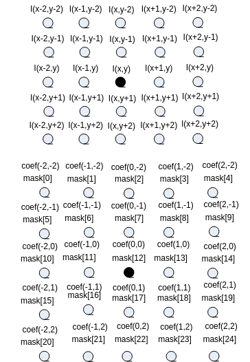


【举例】

无。

【相关主题】

[ss\_mpi\_ive\_sobel](#ss_mpi_ive_sobel)

## ss\_mpi\_ive\_lk\_optical\_flow\_pyr<a name="ZH-CN_TOPIC_0000002504091135"></a>

【描述】

创建多层金字塔LK光流计算任务。

【语法】

```
td_s32 ss_mpi_ive_lk_optical_flow_pyr(ot_ive_handle *handle, const ot_svp_src_img src_prev_pyr[], const  ot_svp_src_img src_next_pyr[],const ot_svp_src_mem_info *prev_points, const ot_svp_mem_info *next_points, const ot_svp_dst_mem_info *status, const ot_svp_dst_mem_info *err, const ot_ive_lk_optical_flow_pyr_ctrl *ctrl, td_bool is_instant );
```

【参数】

<a name="table13614mcpsimp"></a>
<table><thead align="left"><tr id="row13620mcpsimp"><th class="cellrowborder" valign="top" width="23%" id="mcps1.1.4.1.1"><p id="p13622mcpsimp"><a name="p13622mcpsimp"></a><a name="p13622mcpsimp"></a>参数名称</p>
</th>
<th class="cellrowborder" valign="top" width="60%" id="mcps1.1.4.1.2"><p id="p13624mcpsimp"><a name="p13624mcpsimp"></a><a name="p13624mcpsimp"></a>描述</p>
</th>
<th class="cellrowborder" valign="top" width="17%" id="mcps1.1.4.1.3"><p id="p13626mcpsimp"><a name="p13626mcpsimp"></a><a name="p13626mcpsimp"></a>输入/输出</p>
</th>
</tr>
</thead>
<tbody><tr id="row13628mcpsimp"><td class="cellrowborder" valign="top" width="23%" headers="mcps1.1.4.1.1 "><p id="p13630mcpsimp"><a name="p13630mcpsimp"></a><a name="p13630mcpsimp"></a>handle</p>
</td>
<td class="cellrowborder" valign="top" width="60%" headers="mcps1.1.4.1.2 "><p id="p13632mcpsimp"><a name="p13632mcpsimp"></a><a name="p13632mcpsimp"></a>handle指针。</p>
<p id="p13633mcpsimp"><a name="p13633mcpsimp"></a><a name="p13633mcpsimp"></a>不能为空。</p>
</td>
<td class="cellrowborder" valign="top" width="17%" headers="mcps1.1.4.1.3 "><p id="p13635mcpsimp"><a name="p13635mcpsimp"></a><a name="p13635mcpsimp"></a>输出</p>
</td>
</tr>
<tr id="row13636mcpsimp"><td class="cellrowborder" valign="top" width="23%" headers="mcps1.1.4.1.1 "><p id="p13638mcpsimp"><a name="p13638mcpsimp"></a><a name="p13638mcpsimp"></a>src_prev_pyr[]</p>
</td>
<td class="cellrowborder" valign="top" width="60%" headers="mcps1.1.4.1.2 "><p id="p13640mcpsimp"><a name="p13640mcpsimp"></a><a name="p13640mcpsimp"></a>前一帧图像的金字塔图像数组，金字塔层数由ctrl-&gt; max_level控制。</p>
<p id="p13641mcpsimp"><a name="p13641mcpsimp"></a><a name="p13641mcpsimp"></a>不能为空。</p>
</td>
<td class="cellrowborder" valign="top" width="17%" headers="mcps1.1.4.1.3 "><p id="p13643mcpsimp"><a name="p13643mcpsimp"></a><a name="p13643mcpsimp"></a>输入</p>
</td>
</tr>
<tr id="row13644mcpsimp"><td class="cellrowborder" valign="top" width="23%" headers="mcps1.1.4.1.1 "><p id="p13646mcpsimp"><a name="p13646mcpsimp"></a><a name="p13646mcpsimp"></a>src_next_pyr[]</p>
</td>
<td class="cellrowborder" valign="top" width="60%" headers="mcps1.1.4.1.2 "><p id="p13648mcpsimp"><a name="p13648mcpsimp"></a><a name="p13648mcpsimp"></a>下一帧图像的金字塔图像数组，与src_pre_pyr[]有相同的层数，每层图像大小类型均相同。</p>
<p id="p13649mcpsimp"><a name="p13649mcpsimp"></a><a name="p13649mcpsimp"></a>不能为空。</p>
</td>
<td class="cellrowborder" valign="top" width="17%" headers="mcps1.1.4.1.3 "><p id="p13651mcpsimp"><a name="p13651mcpsimp"></a><a name="p13651mcpsimp"></a>输入</p>
</td>
</tr>
<tr id="row13652mcpsimp"><td class="cellrowborder" valign="top" width="23%" headers="mcps1.1.4.1.1 "><p id="p13654mcpsimp"><a name="p13654mcpsimp"></a><a name="p13654mcpsimp"></a>prev_points</p>
</td>
<td class="cellrowborder" valign="top" width="60%" headers="mcps1.1.4.1.2 "><p id="p13656mcpsimp"><a name="p13656mcpsimp"></a><a name="p13656mcpsimp"></a>前一帧图像金字塔第0层（src_prev_pyr[0]）的初始特征点数组。</p>
<p id="p13657mcpsimp"><a name="p13657mcpsimp"></a><a name="p13657mcpsimp"></a>不能为空。</p>
<p id="p13658mcpsimp"><a name="p13658mcpsimp"></a><a name="p13658mcpsimp"></a>坐标只能为ot_svp_point_s25q7类型；内存至少需分配：ctrl-&gt;points_num *sizeof(ot_svp_point_s25q7)。</p>
<p id="p13661mcpsimp"><a name="p13661mcpsimp"></a><a name="p13661mcpsimp"></a>具体描述请参见《SVPx.0 API 参考》</p>
</td>
<td class="cellrowborder" valign="top" width="17%" headers="mcps1.1.4.1.3 "><p id="p13663mcpsimp"><a name="p13663mcpsimp"></a><a name="p13663mcpsimp"></a>输入</p>
</td>
</tr>
<tr id="row13664mcpsimp"><td class="cellrowborder" valign="top" width="23%" headers="mcps1.1.4.1.1 "><p id="p13666mcpsimp"><a name="p13666mcpsimp"></a><a name="p13666mcpsimp"></a>next_points</p>
</td>
<td class="cellrowborder" valign="top" width="60%" headers="mcps1.1.4.1.2 "><p id="p13668mcpsimp"><a name="p13668mcpsimp"></a><a name="p13668mcpsimp"></a>特征点prev_pts经过金字塔计算LK光流得到对应于下一帧图像金字塔第0层（src_next_pyr[]）的坐标。当ctrl-&gt;use_init_flow为true时，需要初始化该特征点数组。</p>
<p id="p13669mcpsimp"><a name="p13669mcpsimp"></a><a name="p13669mcpsimp"></a>不能为空。</p>
<p id="p13670mcpsimp"><a name="p13670mcpsimp"></a><a name="p13670mcpsimp"></a>坐标只能为ot_svp_point_s25q7类型；内存至少需分配：ctrl-&gt;points_num * sizeof(ot_svp_point_s25q7)。</p>
<p id="p13673mcpsimp"><a name="p13673mcpsimp"></a><a name="p13673mcpsimp"></a>具体描述请参见《SVPx.0 API 参考》</p>
</td>
<td class="cellrowborder" valign="top" width="17%" headers="mcps1.1.4.1.3 "><p id="p13675mcpsimp"><a name="p13675mcpsimp"></a><a name="p13675mcpsimp"></a>输入、输出</p>
</td>
</tr>
<tr id="row13676mcpsimp"><td class="cellrowborder" valign="top" width="23%" headers="mcps1.1.4.1.1 "><p id="p13678mcpsimp"><a name="p13678mcpsimp"></a><a name="p13678mcpsimp"></a>status</p>
</td>
<td class="cellrowborder" valign="top" width="60%" headers="mcps1.1.4.1.2 "><p id="p13680mcpsimp"><a name="p13680mcpsimp"></a><a name="p13680mcpsimp"></a>next_pts中每个特征点对应一个td_u8的跟踪状态信息，1表示成功，0表示失败。</p>
<p id="p13681mcpsimp"><a name="p13681mcpsimp"></a><a name="p13681mcpsimp"></a>具体描述请参见《SVPx.0 API 参考》</p>
</td>
<td class="cellrowborder" valign="top" width="17%" headers="mcps1.1.4.1.3 "><p id="p13683mcpsimp"><a name="p13683mcpsimp"></a><a name="p13683mcpsimp"></a>输出</p>
</td>
</tr>
<tr id="row13684mcpsimp"><td class="cellrowborder" valign="top" width="23%" headers="mcps1.1.4.1.1 "><p id="p13686mcpsimp"><a name="p13686mcpsimp"></a><a name="p13686mcpsimp"></a>err</p>
</td>
<td class="cellrowborder" valign="top" width="60%" headers="mcps1.1.4.1.2 "><p id="p13688mcpsimp"><a name="p13688mcpsimp"></a><a name="p13688mcpsimp"></a>对next_pts中每个跟踪成功的特征点，对比prev_pts中对应特征点周边进行的相似度误差估计（td_u9q7类型），跟踪失败的特征点不做估计。</p>
<p id="p13689mcpsimp"><a name="p13689mcpsimp"></a><a name="p13689mcpsimp"></a>具体描述请参见《SVPx.0 API 参考》</p>
</td>
<td class="cellrowborder" valign="top" width="17%" headers="mcps1.1.4.1.3 "><p id="p13691mcpsimp"><a name="p13691mcpsimp"></a><a name="p13691mcpsimp"></a>输出</p>
</td>
</tr>
<tr id="row13692mcpsimp"><td class="cellrowborder" valign="top" width="23%" headers="mcps1.1.4.1.1 "><p id="p13694mcpsimp"><a name="p13694mcpsimp"></a><a name="p13694mcpsimp"></a>ctrl</p>
</td>
<td class="cellrowborder" valign="top" width="60%" headers="mcps1.1.4.1.2 "><p id="p13696mcpsimp"><a name="p13696mcpsimp"></a><a name="p13696mcpsimp"></a>控制参数指针。</p>
<p id="p13697mcpsimp"><a name="p13697mcpsimp"></a><a name="p13697mcpsimp"></a>不能为空。</p>
</td>
<td class="cellrowborder" valign="top" width="17%" headers="mcps1.1.4.1.3 "><p id="p13699mcpsimp"><a name="p13699mcpsimp"></a><a name="p13699mcpsimp"></a>输入</p>
</td>
</tr>
<tr id="row13700mcpsimp"><td class="cellrowborder" valign="top" width="23%" headers="mcps1.1.4.1.1 "><p id="p13702mcpsimp"><a name="p13702mcpsimp"></a><a name="p13702mcpsimp"></a>is_instant</p>
</td>
<td class="cellrowborder" valign="top" width="60%" headers="mcps1.1.4.1.2 "><p id="p13704mcpsimp"><a name="p13704mcpsimp"></a><a name="p13704mcpsimp"></a>及时返回结果标志。</p>
</td>
<td class="cellrowborder" valign="top" width="17%" headers="mcps1.1.4.1.3 "><p id="p13706mcpsimp"><a name="p13706mcpsimp"></a><a name="p13706mcpsimp"></a>输入</p>
</td>
</tr>
</tbody>
</table>

<a name="table13707mcpsimp"></a>
<table><thead align="left"><tr id="row13714mcpsimp"><th class="cellrowborder" valign="top" width="32%" id="mcps1.1.5.1.1"><p id="p13716mcpsimp"><a name="p13716mcpsimp"></a><a name="p13716mcpsimp"></a>参数名称</p>
</th>
<th class="cellrowborder" valign="top" width="21%" id="mcps1.1.5.1.2"><p id="p13718mcpsimp"><a name="p13718mcpsimp"></a><a name="p13718mcpsimp"></a>支持图像类型</p>
</th>
<th class="cellrowborder" valign="top" width="14.000000000000002%" id="mcps1.1.5.1.3"><p id="p13720mcpsimp"><a name="p13720mcpsimp"></a><a name="p13720mcpsimp"></a>地址对齐</p>
</th>
<th class="cellrowborder" valign="top" width="33%" id="mcps1.1.5.1.4"><p id="p13722mcpsimp"><a name="p13722mcpsimp"></a><a name="p13722mcpsimp"></a>分辨率</p>
</th>
</tr>
</thead>
<tbody><tr id="row13724mcpsimp"><td class="cellrowborder" valign="top" width="32%" headers="mcps1.1.5.1.1 "><p id="p13726mcpsimp"><a name="p13726mcpsimp"></a><a name="p13726mcpsimp"></a>src_prev_pyr[0]</p>
</td>
<td class="cellrowborder" valign="top" width="21%" headers="mcps1.1.5.1.2 "><p id="p13728mcpsimp"><a name="p13728mcpsimp"></a><a name="p13728mcpsimp"></a>U8C1</p>
</td>
<td class="cellrowborder" valign="top" width="14.000000000000002%" headers="mcps1.1.5.1.3 "><p id="p13730mcpsimp"><a name="p13730mcpsimp"></a><a name="p13730mcpsimp"></a>16 byte</p>
</td>
<td class="cellrowborder" valign="top" width="33%" headers="mcps1.1.5.1.4 "><p id="p13732mcpsimp"><a name="p13732mcpsimp"></a><a name="p13732mcpsimp"></a>64x64～1280x720</p>
</td>
</tr>
<tr id="row13733mcpsimp"><td class="cellrowborder" valign="top" width="32%" headers="mcps1.1.5.1.1 "><p id="p13735mcpsimp"><a name="p13735mcpsimp"></a><a name="p13735mcpsimp"></a>src_next_pyr[0]</p>
</td>
<td class="cellrowborder" valign="top" width="21%" headers="mcps1.1.5.1.2 "><p id="p13737mcpsimp"><a name="p13737mcpsimp"></a><a name="p13737mcpsimp"></a>U8C1</p>
</td>
<td class="cellrowborder" valign="top" width="14.000000000000002%" headers="mcps1.1.5.1.3 "><p id="p13739mcpsimp"><a name="p13739mcpsimp"></a><a name="p13739mcpsimp"></a>16 byte</p>
</td>
<td class="cellrowborder" valign="top" width="33%" headers="mcps1.1.5.1.4 "><p id="p13741mcpsimp"><a name="p13741mcpsimp"></a><a name="p13741mcpsimp"></a>src_prev_pyr[0]</p>
</td>
</tr>
<tr id="row13742mcpsimp"><td class="cellrowborder" valign="top" width="32%" headers="mcps1.1.5.1.1 "><p id="p13744mcpsimp"><a name="p13744mcpsimp"></a><a name="p13744mcpsimp"></a>src_prev_pyr[n]</p>
<p id="p13745mcpsimp"><a name="p13745mcpsimp"></a><a name="p13745mcpsimp"></a>(金字塔第n层，0≤n≤3)</p>
</td>
<td class="cellrowborder" valign="top" width="21%" headers="mcps1.1.5.1.2 "><p id="p13747mcpsimp"><a name="p13747mcpsimp"></a><a name="p13747mcpsimp"></a>U8C1</p>
</td>
<td class="cellrowborder" valign="top" width="14.000000000000002%" headers="mcps1.1.5.1.3 "><p id="p13749mcpsimp"><a name="p13749mcpsimp"></a><a name="p13749mcpsimp"></a>16 byte</p>
</td>
<td class="cellrowborder" valign="top" width="33%" headers="mcps1.1.5.1.4 "><p id="p1631631752320"><a name="p1631631752320"></a><a name="p1631631752320"></a>64x64～1280x720</p>
<p id="p13751mcpsimp"><a name="p13751mcpsimp"></a><a name="p13751mcpsimp"></a>src_prev_pyr[0]对应高、宽右移n</p>
</td>
</tr>
<tr id="row13752mcpsimp"><td class="cellrowborder" valign="top" width="32%" headers="mcps1.1.5.1.1 "><p id="p13754mcpsimp"><a name="p13754mcpsimp"></a><a name="p13754mcpsimp"></a>src_next_pyr[n]</p>
<p id="p13755mcpsimp"><a name="p13755mcpsimp"></a><a name="p13755mcpsimp"></a>(金字塔第n层)</p>
</td>
<td class="cellrowborder" valign="top" width="21%" headers="mcps1.1.5.1.2 "><p id="p13757mcpsimp"><a name="p13757mcpsimp"></a><a name="p13757mcpsimp"></a>U8C1</p>
</td>
<td class="cellrowborder" valign="top" width="14.000000000000002%" headers="mcps1.1.5.1.3 "><p id="p13759mcpsimp"><a name="p13759mcpsimp"></a><a name="p13759mcpsimp"></a>16 byte</p>
</td>
<td class="cellrowborder" valign="top" width="33%" headers="mcps1.1.5.1.4 "><p id="p5391141914236"><a name="p5391141914236"></a><a name="p5391141914236"></a>64x64～1280x720</p>
<p id="p13761mcpsimp"><a name="p13761mcpsimp"></a><a name="p13761mcpsimp"></a>src_prev_pyr[0]对应高、宽右移n</p>
</td>
</tr>
<tr id="row13762mcpsimp"><td class="cellrowborder" valign="top" width="32%" headers="mcps1.1.5.1.1 "><p id="p13764mcpsimp"><a name="p13764mcpsimp"></a><a name="p13764mcpsimp"></a>prev_points</p>
</td>
<td class="cellrowborder" valign="top" width="21%" headers="mcps1.1.5.1.2 "><p id="p13766mcpsimp"><a name="p13766mcpsimp"></a><a name="p13766mcpsimp"></a>-</p>
</td>
<td class="cellrowborder" valign="top" width="14.000000000000002%" headers="mcps1.1.5.1.3 "><p id="p13768mcpsimp"><a name="p13768mcpsimp"></a><a name="p13768mcpsimp"></a>16byte</p>
</td>
<td class="cellrowborder" valign="top" width="33%" headers="mcps1.1.5.1.4 "><p id="p13770mcpsimp"><a name="p13770mcpsimp"></a><a name="p13770mcpsimp"></a>-</p>
</td>
</tr>
<tr id="row13771mcpsimp"><td class="cellrowborder" valign="top" width="32%" headers="mcps1.1.5.1.1 "><p id="p13773mcpsimp"><a name="p13773mcpsimp"></a><a name="p13773mcpsimp"></a>next_points</p>
</td>
<td class="cellrowborder" valign="top" width="21%" headers="mcps1.1.5.1.2 "><p id="p13775mcpsimp"><a name="p13775mcpsimp"></a><a name="p13775mcpsimp"></a>-</p>
</td>
<td class="cellrowborder" valign="top" width="14.000000000000002%" headers="mcps1.1.5.1.3 "><p id="p13777mcpsimp"><a name="p13777mcpsimp"></a><a name="p13777mcpsimp"></a>16byte</p>
</td>
<td class="cellrowborder" valign="top" width="33%" headers="mcps1.1.5.1.4 "><p id="p13779mcpsimp"><a name="p13779mcpsimp"></a><a name="p13779mcpsimp"></a>-</p>
</td>
</tr>
<tr id="row13780mcpsimp"><td class="cellrowborder" valign="top" width="32%" headers="mcps1.1.5.1.1 "><p id="p13782mcpsimp"><a name="p13782mcpsimp"></a><a name="p13782mcpsimp"></a>status</p>
</td>
<td class="cellrowborder" valign="top" width="21%" headers="mcps1.1.5.1.2 "><p id="p13784mcpsimp"><a name="p13784mcpsimp"></a><a name="p13784mcpsimp"></a>-</p>
</td>
<td class="cellrowborder" valign="top" width="14.000000000000002%" headers="mcps1.1.5.1.3 "><p id="p13786mcpsimp"><a name="p13786mcpsimp"></a><a name="p13786mcpsimp"></a>16byte</p>
</td>
<td class="cellrowborder" valign="top" width="33%" headers="mcps1.1.5.1.4 "><p id="p13788mcpsimp"><a name="p13788mcpsimp"></a><a name="p13788mcpsimp"></a>-</p>
</td>
</tr>
<tr id="row13789mcpsimp"><td class="cellrowborder" valign="top" width="32%" headers="mcps1.1.5.1.1 "><p id="p13791mcpsimp"><a name="p13791mcpsimp"></a><a name="p13791mcpsimp"></a>err</p>
</td>
<td class="cellrowborder" valign="top" width="21%" headers="mcps1.1.5.1.2 "><p id="p13793mcpsimp"><a name="p13793mcpsimp"></a><a name="p13793mcpsimp"></a>-</p>
</td>
<td class="cellrowborder" valign="top" width="14.000000000000002%" headers="mcps1.1.5.1.3 "><p id="p13795mcpsimp"><a name="p13795mcpsimp"></a><a name="p13795mcpsimp"></a>16byte</p>
</td>
<td class="cellrowborder" valign="top" width="33%" headers="mcps1.1.5.1.4 "><p id="p13797mcpsimp"><a name="p13797mcpsimp"></a><a name="p13797mcpsimp"></a>-</p>
</td>
</tr>
</tbody>
</table>

【返回值】

<a name="table13799mcpsimp"></a>
<table><thead align="left"><tr id="row13804mcpsimp"><th class="cellrowborder" valign="top" width="50%" id="mcps1.1.3.1.1"><p id="p13806mcpsimp"><a name="p13806mcpsimp"></a><a name="p13806mcpsimp"></a>返回值</p>
</th>
<th class="cellrowborder" valign="top" width="50%" id="mcps1.1.3.1.2"><p id="p13808mcpsimp"><a name="p13808mcpsimp"></a><a name="p13808mcpsimp"></a>描述</p>
</th>
</tr>
</thead>
<tbody><tr id="row13810mcpsimp"><td class="cellrowborder" valign="top" width="50%" headers="mcps1.1.3.1.1 "><p id="p13812mcpsimp"><a name="p13812mcpsimp"></a><a name="p13812mcpsimp"></a>0</p>
</td>
<td class="cellrowborder" valign="top" width="50%" headers="mcps1.1.3.1.2 "><p id="p13814mcpsimp"><a name="p13814mcpsimp"></a><a name="p13814mcpsimp"></a>成功。</p>
</td>
</tr>
<tr id="row13815mcpsimp"><td class="cellrowborder" valign="top" width="50%" headers="mcps1.1.3.1.1 "><p id="p13817mcpsimp"><a name="p13817mcpsimp"></a><a name="p13817mcpsimp"></a>非0</p>
</td>
<td class="cellrowborder" valign="top" width="50%" headers="mcps1.1.3.1.2 "><p id="p13819mcpsimp"><a name="p13819mcpsimp"></a><a name="p13819mcpsimp"></a>失败，参见<span xml:lang="fr-FR" id="ph136311818172213"><a name="ph136311818172213"></a><a name="ph136311818172213"></a>错误码</span><span xml:lang="fr-FR" id="ph5283mcpsimp"><a name="ph5283mcpsimp"></a><a name="ph5283mcpsimp"></a>。</span></p>
</td>
</tr>
</tbody>
</table>

【需求】

-   头文件：ot\_common\_ive.h、ot\_common\_svp.h、ss\_mpi\_ive.h
-   库文件：libss\_ive.a（PC上模拟用ss\_ive\_clib2.x.lib）

【注意】

-   ctrl-\> max\_level取值范围\[0, 3\]，对应金字塔层数为\[1, 4\]。
-   求解下面的光流方程中，仅用到特征点周围7X7像素的来计算对应的、、

    

    其中，、、分别表示当前图像在x、y方向的偏导，当前图像与前一帧图像的差分。

-   以3层金字塔LK光流计算为例，要求每层图像的高、宽是上一层图像高、宽的一半，其计算示意图如[图1](#fig19671108289)所示。

**图 1**  3层金字塔LK光流计算示意图<a name="fig19671108289"></a>  
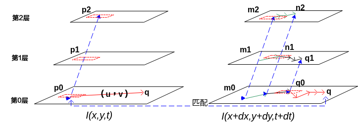

-   根据输入的特征点坐标，计算出3层金字塔特征点对应的坐标：p0，p1，p2；若需要初始光流，计算出m0，m1，m2；否则m0=p0，m1=p1，m2=p2；
-   以m2作为输入求出在第2层上的光流终点n2；
-   计算出n2在第1层的对应坐标n1，以n1作为输入求出第1层上的光流终点q1；
-   计算出q1在第一层的对应坐标q0，以q0作为输入求出第0层上的光流终点q；
-   若第0层不是原始图像，根据第0层与原始图像的的比例关系可以得到LK光流的最终点p。

**请注意设计和使用限制：每个特征点仅以该特征点为中心固定大小窗口的数据进行计算，若迭代计算过程中，该特征点位移目标点超出该固定大小窗口会导致计算光流失败。**

【举例】

无。

【相关主题】

无。

## ss\_mpi\_ive\_st\_cand\_corner<a name="ZH-CN_TOPIC_0000002471091320"></a>

【描述】

灰度图像Shi-Tomasi-like角点计算的前半部：计算候选角点。

【语法】

```
td_s32 ss_mpi_ive_st_cand_corner(ot_ive_handle *handle, const ot_svp_src_img *src, const ot_svp_dst_img *cand_corner, const ot_ive_st_cand_corner_ctrl *ctrl, td_bool is_instant );
```

【参数】

<a name="table3112mcpsimp"></a>
<table><thead align="left"><tr id="row3118mcpsimp"><th class="cellrowborder" valign="top" width="30%" id="mcps1.1.4.1.1"><p id="p3120mcpsimp"><a name="p3120mcpsimp"></a><a name="p3120mcpsimp"></a>参数名称</p>
</th>
<th class="cellrowborder" valign="top" width="50%" id="mcps1.1.4.1.2"><p id="p3122mcpsimp"><a name="p3122mcpsimp"></a><a name="p3122mcpsimp"></a>描述</p>
</th>
<th class="cellrowborder" valign="top" width="20%" id="mcps1.1.4.1.3"><p id="p3124mcpsimp"><a name="p3124mcpsimp"></a><a name="p3124mcpsimp"></a>输入/输出</p>
</th>
</tr>
</thead>
<tbody><tr id="row3126mcpsimp"><td class="cellrowborder" valign="top" width="30%" headers="mcps1.1.4.1.1 "><p id="p3128mcpsimp"><a name="p3128mcpsimp"></a><a name="p3128mcpsimp"></a>handle</p>
</td>
<td class="cellrowborder" valign="top" width="50%" headers="mcps1.1.4.1.2 "><p id="p3130mcpsimp"><a name="p3130mcpsimp"></a><a name="p3130mcpsimp"></a>handle指针。</p>
<p id="p3131mcpsimp"><a name="p3131mcpsimp"></a><a name="p3131mcpsimp"></a>不能为空。</p>
</td>
<td class="cellrowborder" valign="top" width="20%" headers="mcps1.1.4.1.3 "><p id="p3133mcpsimp"><a name="p3133mcpsimp"></a><a name="p3133mcpsimp"></a>输出</p>
</td>
</tr>
<tr id="row3134mcpsimp"><td class="cellrowborder" valign="top" width="30%" headers="mcps1.1.4.1.1 "><p id="p3136mcpsimp"><a name="p3136mcpsimp"></a><a name="p3136mcpsimp"></a>src</p>
</td>
<td class="cellrowborder" valign="top" width="50%" headers="mcps1.1.4.1.2 "><p id="p3138mcpsimp"><a name="p3138mcpsimp"></a><a name="p3138mcpsimp"></a>源图像指针。</p>
<p id="p3139mcpsimp"><a name="p3139mcpsimp"></a><a name="p3139mcpsimp"></a>不能为空。</p>
</td>
<td class="cellrowborder" valign="top" width="20%" headers="mcps1.1.4.1.3 "><p id="p3141mcpsimp"><a name="p3141mcpsimp"></a><a name="p3141mcpsimp"></a>输入</p>
</td>
</tr>
<tr id="row3142mcpsimp"><td class="cellrowborder" valign="top" width="30%" headers="mcps1.1.4.1.1 "><p id="p3144mcpsimp"><a name="p3144mcpsimp"></a><a name="p3144mcpsimp"></a>cand_corner</p>
</td>
<td class="cellrowborder" valign="top" width="50%" headers="mcps1.1.4.1.2 "><p id="p3146mcpsimp"><a name="p3146mcpsimp"></a><a name="p3146mcpsimp"></a>候选角点响应值图像指针。</p>
<p id="p3147mcpsimp"><a name="p3147mcpsimp"></a><a name="p3147mcpsimp"></a>不能为空。</p>
<p id="p3148mcpsimp"><a name="p3148mcpsimp"></a><a name="p3148mcpsimp"></a>高、宽同src。</p>
</td>
<td class="cellrowborder" valign="top" width="20%" headers="mcps1.1.4.1.3 "><p id="p3150mcpsimp"><a name="p3150mcpsimp"></a><a name="p3150mcpsimp"></a>输出</p>
</td>
</tr>
<tr id="row3151mcpsimp"><td class="cellrowborder" valign="top" width="30%" headers="mcps1.1.4.1.1 "><p id="p3153mcpsimp"><a name="p3153mcpsimp"></a><a name="p3153mcpsimp"></a>ctrl</p>
</td>
<td class="cellrowborder" valign="top" width="50%" headers="mcps1.1.4.1.2 "><p id="p3155mcpsimp"><a name="p3155mcpsimp"></a><a name="p3155mcpsimp"></a>控制参数指针。</p>
<p id="p3156mcpsimp"><a name="p3156mcpsimp"></a><a name="p3156mcpsimp"></a>不能为空。申请使用的内存需要是不带cache的。</p>
</td>
<td class="cellrowborder" valign="top" width="20%" headers="mcps1.1.4.1.3 "><p id="p3158mcpsimp"><a name="p3158mcpsimp"></a><a name="p3158mcpsimp"></a>输入</p>
</td>
</tr>
<tr id="row3159mcpsimp"><td class="cellrowborder" valign="top" width="30%" headers="mcps1.1.4.1.1 "><p id="p3161mcpsimp"><a name="p3161mcpsimp"></a><a name="p3161mcpsimp"></a>is_instant</p>
</td>
<td class="cellrowborder" valign="top" width="50%" headers="mcps1.1.4.1.2 "><p id="p3163mcpsimp"><a name="p3163mcpsimp"></a><a name="p3163mcpsimp"></a>及时返回结果标志。</p>
</td>
<td class="cellrowborder" valign="top" width="20%" headers="mcps1.1.4.1.3 "><p id="p3165mcpsimp"><a name="p3165mcpsimp"></a><a name="p3165mcpsimp"></a>输入</p>
</td>
</tr>
</tbody>
</table>

<a name="table3166mcpsimp"></a>
<table><thead align="left"><tr id="row3173mcpsimp"><th class="cellrowborder" valign="top" width="25.252525252525253%" id="mcps1.1.5.1.1"><p id="p3175mcpsimp"><a name="p3175mcpsimp"></a><a name="p3175mcpsimp"></a>参数名称</p>
</th>
<th class="cellrowborder" valign="top" width="24.242424242424242%" id="mcps1.1.5.1.2"><p id="p3177mcpsimp"><a name="p3177mcpsimp"></a><a name="p3177mcpsimp"></a>支持图像类型</p>
</th>
<th class="cellrowborder" valign="top" width="15.151515151515152%" id="mcps1.1.5.1.3"><p id="p3179mcpsimp"><a name="p3179mcpsimp"></a><a name="p3179mcpsimp"></a>地址对齐</p>
</th>
<th class="cellrowborder" valign="top" width="35.35353535353536%" id="mcps1.1.5.1.4"><p id="p3181mcpsimp"><a name="p3181mcpsimp"></a><a name="p3181mcpsimp"></a>分辨率</p>
</th>
</tr>
</thead>
<tbody><tr id="row3183mcpsimp"><td class="cellrowborder" valign="top" width="25.252525252525253%" headers="mcps1.1.5.1.1 "><p id="p3185mcpsimp"><a name="p3185mcpsimp"></a><a name="p3185mcpsimp"></a>src</p>
</td>
<td class="cellrowborder" valign="top" width="24.242424242424242%" headers="mcps1.1.5.1.2 "><p id="p3187mcpsimp"><a name="p3187mcpsimp"></a><a name="p3187mcpsimp"></a>U8C1</p>
</td>
<td class="cellrowborder" valign="top" width="15.151515151515152%" headers="mcps1.1.5.1.3 "><p id="p3189mcpsimp"><a name="p3189mcpsimp"></a><a name="p3189mcpsimp"></a>16 byte</p>
</td>
<td class="cellrowborder" valign="top" width="35.35353535353536%" headers="mcps1.1.5.1.4 "><p id="p3191mcpsimp"><a name="p3191mcpsimp"></a><a name="p3191mcpsimp"></a>64x64~1280x720</p>
</td>
</tr>
<tr id="row3192mcpsimp"><td class="cellrowborder" valign="top" width="25.252525252525253%" headers="mcps1.1.5.1.1 "><p id="p3194mcpsimp"><a name="p3194mcpsimp"></a><a name="p3194mcpsimp"></a>cand_corner</p>
</td>
<td class="cellrowborder" valign="top" width="24.242424242424242%" headers="mcps1.1.5.1.2 "><p id="p3196mcpsimp"><a name="p3196mcpsimp"></a><a name="p3196mcpsimp"></a>U8C1</p>
</td>
<td class="cellrowborder" valign="top" width="15.151515151515152%" headers="mcps1.1.5.1.3 "><p id="p3198mcpsimp"><a name="p3198mcpsimp"></a><a name="p3198mcpsimp"></a>16 byte</p>
</td>
<td class="cellrowborder" valign="top" width="35.35353535353536%" headers="mcps1.1.5.1.4 "><p id="p3200mcpsimp"><a name="p3200mcpsimp"></a><a name="p3200mcpsimp"></a>同src</p>
</td>
</tr>
<tr id="row3201mcpsimp"><td class="cellrowborder" valign="top" width="25.252525252525253%" headers="mcps1.1.5.1.1 "><p id="p3203mcpsimp"><a name="p3203mcpsimp"></a><a name="p3203mcpsimp"></a>ctrl-&gt;mem</p>
</td>
<td class="cellrowborder" valign="top" width="24.242424242424242%" headers="mcps1.1.5.1.2 "><p id="p3205mcpsimp"><a name="p3205mcpsimp"></a><a name="p3205mcpsimp"></a>-</p>
</td>
<td class="cellrowborder" valign="top" width="15.151515151515152%" headers="mcps1.1.5.1.3 "><p id="p3207mcpsimp"><a name="p3207mcpsimp"></a><a name="p3207mcpsimp"></a>16 byte</p>
</td>
<td class="cellrowborder" valign="top" width="35.35353535353536%" headers="mcps1.1.5.1.4 "><p id="p3209mcpsimp"><a name="p3209mcpsimp"></a><a name="p3209mcpsimp"></a>-</p>
</td>
</tr>
</tbody>
</table>

【返回值】

<a name="table3211mcpsimp"></a>
<table><thead align="left"><tr id="row3216mcpsimp"><th class="cellrowborder" valign="top" width="50%" id="mcps1.1.3.1.1"><p id="p3218mcpsimp"><a name="p3218mcpsimp"></a><a name="p3218mcpsimp"></a>返回值</p>
</th>
<th class="cellrowborder" valign="top" width="50%" id="mcps1.1.3.1.2"><p id="p3220mcpsimp"><a name="p3220mcpsimp"></a><a name="p3220mcpsimp"></a>描述</p>
</th>
</tr>
</thead>
<tbody><tr id="row3222mcpsimp"><td class="cellrowborder" valign="top" width="50%" headers="mcps1.1.3.1.1 "><p id="p3224mcpsimp"><a name="p3224mcpsimp"></a><a name="p3224mcpsimp"></a>0</p>
</td>
<td class="cellrowborder" valign="top" width="50%" headers="mcps1.1.3.1.2 "><p id="p3226mcpsimp"><a name="p3226mcpsimp"></a><a name="p3226mcpsimp"></a>成功。</p>
</td>
</tr>
<tr id="row3227mcpsimp"><td class="cellrowborder" valign="top" width="50%" headers="mcps1.1.3.1.1 "><p id="p3229mcpsimp"><a name="p3229mcpsimp"></a><a name="p3229mcpsimp"></a>非0</p>
</td>
<td class="cellrowborder" valign="top" width="50%" headers="mcps1.1.3.1.2 "><p id="p3231mcpsimp"><a name="p3231mcpsimp"></a><a name="p3231mcpsimp"></a>失败，参见<span xml:lang="fr-FR" id="ph136311818172213"><a name="ph136311818172213"></a><a name="ph136311818172213"></a>错误码</span><span xml:lang="fr-FR" id="ph5283mcpsimp"><a name="ph5283mcpsimp"></a><a name="ph5283mcpsimp"></a>。</span></p>
</td>
</tr>
</tbody>
</table>

【需求】

-   头文件：ot\_common\_ive.h、ot\_common\_svp.h、ss\_mpi\_ive.h
-   库文件：libss\_ive.a（PC上模拟用ss\_ive\_clib2.x.lib）

【注意】

-   与OpenCV中ShiTomas角点计算原理类似。
-   ctrl-\>mem至少需开辟的内存大小：

    ctrl-\>mem.size= 4 \* （src-\>width + \(16 - src-\>width % 16\) % 16） \* src-\>height+ sizeof\(ot\_ive\_st\_max\_eig\_val\)。

-   该任务完成后，必须要使用[ss\_mpi\_ive\_st\_corner](#ZH-CN_TOPIC_0000002470931280)函数才能得到真正的角点。

【举例】

无。

【相关主题】

[ss\_mpi\_ive\_st\_corner](#ss_mpi_ive_st_corner)

## ss\_mpi\_ive\_st\_corner<a name="ZH-CN_TOPIC_0000002470931280"></a>

【描述】

灰度图像Shi-Tomasi-like角点计算的后半部：按规则挑选角点。

【语法】

```
td_s32 ss_mpi_ive_st_corner(const ot_svp_src_img *cand_corner, const ot_svp_dst_mem_info *corner, const ot_ive_st_corner_ctrl *ctrl);
```

【参数】

<a name="table3891mcpsimp"></a>
<table><thead align="left"><tr id="row3897mcpsimp"><th class="cellrowborder" valign="top" width="23%" id="mcps1.1.4.1.1"><p id="p3899mcpsimp"><a name="p3899mcpsimp"></a><a name="p3899mcpsimp"></a>参数名称</p>
</th>
<th class="cellrowborder" valign="top" width="59%" id="mcps1.1.4.1.2"><p id="p3901mcpsimp"><a name="p3901mcpsimp"></a><a name="p3901mcpsimp"></a>描述</p>
</th>
<th class="cellrowborder" valign="top" width="18%" id="mcps1.1.4.1.3"><p id="p3903mcpsimp"><a name="p3903mcpsimp"></a><a name="p3903mcpsimp"></a>输入/输出</p>
</th>
</tr>
</thead>
<tbody><tr id="row3905mcpsimp"><td class="cellrowborder" valign="top" width="23%" headers="mcps1.1.4.1.1 "><p id="p3907mcpsimp"><a name="p3907mcpsimp"></a><a name="p3907mcpsimp"></a>cand_corner</p>
</td>
<td class="cellrowborder" valign="top" width="59%" headers="mcps1.1.4.1.2 "><p id="p3909mcpsimp"><a name="p3909mcpsimp"></a><a name="p3909mcpsimp"></a>候选角点响应值图像指针。</p>
<p id="p3910mcpsimp"><a name="p3910mcpsimp"></a><a name="p3910mcpsimp"></a>不能为空。</p>
</td>
<td class="cellrowborder" valign="top" width="18%" headers="mcps1.1.4.1.3 "><p id="p3912mcpsimp"><a name="p3912mcpsimp"></a><a name="p3912mcpsimp"></a>输入</p>
</td>
</tr>
<tr id="row3913mcpsimp"><td class="cellrowborder" valign="top" width="23%" headers="mcps1.1.4.1.1 "><p id="p3915mcpsimp"><a name="p3915mcpsimp"></a><a name="p3915mcpsimp"></a>corner</p>
</td>
<td class="cellrowborder" valign="top" width="59%" headers="mcps1.1.4.1.2 "><p id="p3917mcpsimp"><a name="p3917mcpsimp"></a><a name="p3917mcpsimp"></a>角点坐标信息指针。</p>
<p id="p3918mcpsimp"><a name="p3918mcpsimp"></a><a name="p3918mcpsimp"></a>不能为空。</p>
<p id="p3919mcpsimp"><a name="p3919mcpsimp"></a><a name="p3919mcpsimp"></a>内存至少需配置：sizeof(ot_ive_st_corner_info)</p>
<p id="p3921mcpsimp"><a name="p3921mcpsimp"></a><a name="p3921mcpsimp"></a>具体描述请参见《SVPx.0 API 参考》</p>
</td>
<td class="cellrowborder" valign="top" width="18%" headers="mcps1.1.4.1.3 "><p id="p3923mcpsimp"><a name="p3923mcpsimp"></a><a name="p3923mcpsimp"></a>输出</p>
</td>
</tr>
<tr id="row3924mcpsimp"><td class="cellrowborder" valign="top" width="23%" headers="mcps1.1.4.1.1 "><p id="p3926mcpsimp"><a name="p3926mcpsimp"></a><a name="p3926mcpsimp"></a>ctrl</p>
</td>
<td class="cellrowborder" valign="top" width="59%" headers="mcps1.1.4.1.2 "><p id="p3928mcpsimp"><a name="p3928mcpsimp"></a><a name="p3928mcpsimp"></a>控制参数指针。</p>
<p id="p16550513409"><a name="p16550513409"></a><a name="p16550513409"></a>不能为空。</p>
</td>
<td class="cellrowborder" valign="top" width="18%" headers="mcps1.1.4.1.3 "><p id="p3931mcpsimp"><a name="p3931mcpsimp"></a><a name="p3931mcpsimp"></a>输入</p>
</td>
</tr>
</tbody>
</table>

<a name="table3932mcpsimp"></a>
<table><thead align="left"><tr id="row3939mcpsimp"><th class="cellrowborder" valign="top" width="33%" id="mcps1.1.5.1.1"><p id="p3941mcpsimp"><a name="p3941mcpsimp"></a><a name="p3941mcpsimp"></a>参数名称</p>
</th>
<th class="cellrowborder" valign="top" width="18%" id="mcps1.1.5.1.2"><p id="p3943mcpsimp"><a name="p3943mcpsimp"></a><a name="p3943mcpsimp"></a>支持图像类型</p>
</th>
<th class="cellrowborder" valign="top" width="16%" id="mcps1.1.5.1.3"><p id="p3945mcpsimp"><a name="p3945mcpsimp"></a><a name="p3945mcpsimp"></a>地址对齐</p>
</th>
<th class="cellrowborder" valign="top" width="33%" id="mcps1.1.5.1.4"><p id="p3947mcpsimp"><a name="p3947mcpsimp"></a><a name="p3947mcpsimp"></a>分辨率</p>
</th>
</tr>
</thead>
<tbody><tr id="row3949mcpsimp"><td class="cellrowborder" valign="top" width="33%" headers="mcps1.1.5.1.1 "><p id="p3951mcpsimp"><a name="p3951mcpsimp"></a><a name="p3951mcpsimp"></a>cand_corner</p>
</td>
<td class="cellrowborder" valign="top" width="18%" headers="mcps1.1.5.1.2 "><p id="p3953mcpsimp"><a name="p3953mcpsimp"></a><a name="p3953mcpsimp"></a>U8C1</p>
</td>
<td class="cellrowborder" valign="top" width="16%" headers="mcps1.1.5.1.3 "><p id="p3955mcpsimp"><a name="p3955mcpsimp"></a><a name="p3955mcpsimp"></a>16 byte</p>
</td>
<td class="cellrowborder" valign="top" width="33%" headers="mcps1.1.5.1.4 "><p id="p3957mcpsimp"><a name="p3957mcpsimp"></a><a name="p3957mcpsimp"></a>64x64~1280x720，最多输出500个角点</p>
</td>
</tr>
</tbody>
</table>

【返回值】

<a name="table3959mcpsimp"></a>
<table><thead align="left"><tr id="row3964mcpsimp"><th class="cellrowborder" valign="top" width="50%" id="mcps1.1.3.1.1"><p id="p3966mcpsimp"><a name="p3966mcpsimp"></a><a name="p3966mcpsimp"></a>返回值</p>
</th>
<th class="cellrowborder" valign="top" width="50%" id="mcps1.1.3.1.2"><p id="p3968mcpsimp"><a name="p3968mcpsimp"></a><a name="p3968mcpsimp"></a>描述</p>
</th>
</tr>
</thead>
<tbody><tr id="row3970mcpsimp"><td class="cellrowborder" valign="top" width="50%" headers="mcps1.1.3.1.1 "><p id="p3972mcpsimp"><a name="p3972mcpsimp"></a><a name="p3972mcpsimp"></a>0</p>
</td>
<td class="cellrowborder" valign="top" width="50%" headers="mcps1.1.3.1.2 "><p id="p3974mcpsimp"><a name="p3974mcpsimp"></a><a name="p3974mcpsimp"></a>成功。</p>
</td>
</tr>
<tr id="row3975mcpsimp"><td class="cellrowborder" valign="top" width="50%" headers="mcps1.1.3.1.1 "><p id="p3977mcpsimp"><a name="p3977mcpsimp"></a><a name="p3977mcpsimp"></a>非0</p>
</td>
<td class="cellrowborder" valign="top" width="50%" headers="mcps1.1.3.1.2 "><p id="p3979mcpsimp"><a name="p3979mcpsimp"></a><a name="p3979mcpsimp"></a>失败，参见<span xml:lang="fr-FR" id="ph136311818172213"><a name="ph136311818172213"></a><a name="ph136311818172213"></a>错误码</span><span xml:lang="fr-FR" id="ph5283mcpsimp"><a name="ph5283mcpsimp"></a><a name="ph5283mcpsimp"></a>。</span></p>
</td>
</tr>
</tbody>
</table>

【需求】

-   头文件：ot\_common\_ive.h、ot\_common\_svp.h、ss\_mpi\_ive.h
-   库文件：libss\_ive.a（PC上模拟用ss\_ive\_clib2.x.lib）

【注意】

-   与OpenCV中ShiTomas角点计算原理类似。
-   corner-\>corner\_num表示最终得到的角点数目。
-   使用该接口前必须调用[ss\_mpi\_ive\_st\_cand\_corner](#ZH-CN_TOPIC_0000002471091320)，在保证[ss\_mpi\_ive\_st\_cand\_corner](#ZH-CN_TOPIC_0000002471091320)任务完成的情况下，使用[ss\_mpi\_ive\_st\_cand\_corner](#ZH-CN_TOPIC_0000002471091320)的输出cand\_corner作为该接口的参数输入。

【举例】

无。

【相关主题】

[ss\_mpi\_ive\_st\_cand\_corner](#ss_mpi_ive_st_cand_corner)

## ss\_mpi\_ive\_sad<a name="ZH-CN_TOPIC_0000002471091328"></a>

【描述】

计算两幅图像按4x4\\8x8\\16x16分块的16 bit\\8 bit SAD图像，以及对SAD进行阈值化输出。

【语法】

```
td_s32 ss_mpi_ive_sad(ot_ive_handle *handle, const ot_svp_src_img *src1, const ot_svp_src_img *src2, const ot_svp_dst_img *sad, const ot_svp_dst_img *threshold, const ot_ive_sad_ctrl *ctrl, td_bool is_instant);
```

【参数】

<a name="table12958mcpsimp"></a>
<table><thead align="left"><tr id="row12964mcpsimp"><th class="cellrowborder" valign="top" width="17.82%" id="mcps1.1.4.1.1"><p id="p12966mcpsimp"><a name="p12966mcpsimp"></a><a name="p12966mcpsimp"></a>参数名称</p>
</th>
<th class="cellrowborder" valign="top" width="66.34%" id="mcps1.1.4.1.2"><p id="p12968mcpsimp"><a name="p12968mcpsimp"></a><a name="p12968mcpsimp"></a>描述</p>
</th>
<th class="cellrowborder" valign="top" width="15.840000000000002%" id="mcps1.1.4.1.3"><p id="p12970mcpsimp"><a name="p12970mcpsimp"></a><a name="p12970mcpsimp"></a>输入/输出</p>
</th>
</tr>
</thead>
<tbody><tr id="row12972mcpsimp"><td class="cellrowborder" valign="top" width="17.82%" headers="mcps1.1.4.1.1 "><p id="p12974mcpsimp"><a name="p12974mcpsimp"></a><a name="p12974mcpsimp"></a>handle</p>
</td>
<td class="cellrowborder" valign="top" width="66.34%" headers="mcps1.1.4.1.2 "><p id="p12976mcpsimp"><a name="p12976mcpsimp"></a><a name="p12976mcpsimp"></a>handle指针。</p>
<p id="p12977mcpsimp"><a name="p12977mcpsimp"></a><a name="p12977mcpsimp"></a>不能为空。</p>
</td>
<td class="cellrowborder" valign="top" width="15.840000000000002%" headers="mcps1.1.4.1.3 "><p id="p12979mcpsimp"><a name="p12979mcpsimp"></a><a name="p12979mcpsimp"></a>输出</p>
</td>
</tr>
<tr id="row12980mcpsimp"><td class="cellrowborder" valign="top" width="17.82%" headers="mcps1.1.4.1.1 "><p id="p12982mcpsimp"><a name="p12982mcpsimp"></a><a name="p12982mcpsimp"></a>src1</p>
</td>
<td class="cellrowborder" valign="top" width="66.34%" headers="mcps1.1.4.1.2 "><p id="p12984mcpsimp"><a name="p12984mcpsimp"></a><a name="p12984mcpsimp"></a>源图像1指针。</p>
<p id="p12985mcpsimp"><a name="p12985mcpsimp"></a><a name="p12985mcpsimp"></a>不能为空。</p>
</td>
<td class="cellrowborder" valign="top" width="15.840000000000002%" headers="mcps1.1.4.1.3 "><p id="p12987mcpsimp"><a name="p12987mcpsimp"></a><a name="p12987mcpsimp"></a>输入</p>
</td>
</tr>
<tr id="row12988mcpsimp"><td class="cellrowborder" valign="top" width="17.82%" headers="mcps1.1.4.1.1 "><p id="p12990mcpsimp"><a name="p12990mcpsimp"></a><a name="p12990mcpsimp"></a>src2</p>
</td>
<td class="cellrowborder" valign="top" width="66.34%" headers="mcps1.1.4.1.2 "><p id="p12992mcpsimp"><a name="p12992mcpsimp"></a><a name="p12992mcpsimp"></a>源图像2指针。</p>
<p id="p12993mcpsimp"><a name="p12993mcpsimp"></a><a name="p12993mcpsimp"></a>不能为空。</p>
<p id="p12994mcpsimp"><a name="p12994mcpsimp"></a><a name="p12994mcpsimp"></a>高、宽同src1。</p>
</td>
<td class="cellrowborder" valign="top" width="15.840000000000002%" headers="mcps1.1.4.1.3 "><p id="p12996mcpsimp"><a name="p12996mcpsimp"></a><a name="p12996mcpsimp"></a>输入</p>
</td>
</tr>
<tr id="row12997mcpsimp"><td class="cellrowborder" valign="top" width="17.82%" headers="mcps1.1.4.1.1 "><p id="p12999mcpsimp"><a name="p12999mcpsimp"></a><a name="p12999mcpsimp"></a>sad</p>
</td>
<td class="cellrowborder" valign="top" width="66.34%" headers="mcps1.1.4.1.2 "><p id="p13001mcpsimp"><a name="p13001mcpsimp"></a><a name="p13001mcpsimp"></a>输出SAD图像指针。</p>
<p id="p13002mcpsimp"><a name="p13002mcpsimp"></a><a name="p13002mcpsimp"></a>根据ctrl-&gt;out_ctrl，若需要输出则不能为空。</p>
<p id="p13003mcpsimp"><a name="p13003mcpsimp"></a><a name="p13003mcpsimp"></a>根据ctrl-&gt;mode，对应 4x4、8x8、16x16分块模式，高、宽分别为src1的1/4、1/8、1/16。</p>
</td>
<td class="cellrowborder" valign="top" width="15.840000000000002%" headers="mcps1.1.4.1.3 "><p id="p13005mcpsimp"><a name="p13005mcpsimp"></a><a name="p13005mcpsimp"></a>输出</p>
</td>
</tr>
<tr id="row13006mcpsimp"><td class="cellrowborder" valign="top" width="17.82%" headers="mcps1.1.4.1.1 "><p id="p13008mcpsimp"><a name="p13008mcpsimp"></a><a name="p13008mcpsimp"></a>threshold</p>
</td>
<td class="cellrowborder" valign="top" width="66.34%" headers="mcps1.1.4.1.2 "><p id="p13010mcpsimp"><a name="p13010mcpsimp"></a><a name="p13010mcpsimp"></a>输出SAD阈值化图像指针。</p>
<p id="p13011mcpsimp"><a name="p13011mcpsimp"></a><a name="p13011mcpsimp"></a>根据ctrl-&gt;out_ctrl，若需要输出则不能为空。</p>
<p id="p13012mcpsimp"><a name="p13012mcpsimp"></a><a name="p13012mcpsimp"></a>根据ctrl-&gt;mode，对应 4x4、8x8、16x16分块模式，高、宽分别为src1的1/4、1/8、1/16。</p>
</td>
<td class="cellrowborder" valign="top" width="15.840000000000002%" headers="mcps1.1.4.1.3 "><p id="p13014mcpsimp"><a name="p13014mcpsimp"></a><a name="p13014mcpsimp"></a>输出</p>
</td>
</tr>
<tr id="row13015mcpsimp"><td class="cellrowborder" valign="top" width="17.82%" headers="mcps1.1.4.1.1 "><p id="p13017mcpsimp"><a name="p13017mcpsimp"></a><a name="p13017mcpsimp"></a>ctrl</p>
</td>
<td class="cellrowborder" valign="top" width="66.34%" headers="mcps1.1.4.1.2 "><p id="p13019mcpsimp"><a name="p13019mcpsimp"></a><a name="p13019mcpsimp"></a>控制信息指针。</p>
<p id="p13020mcpsimp"><a name="p13020mcpsimp"></a><a name="p13020mcpsimp"></a>不能为空。</p>
</td>
<td class="cellrowborder" valign="top" width="15.840000000000002%" headers="mcps1.1.4.1.3 "><p id="p13022mcpsimp"><a name="p13022mcpsimp"></a><a name="p13022mcpsimp"></a>输入</p>
</td>
</tr>
<tr id="row13023mcpsimp"><td class="cellrowborder" valign="top" width="17.82%" headers="mcps1.1.4.1.1 "><p id="p13025mcpsimp"><a name="p13025mcpsimp"></a><a name="p13025mcpsimp"></a>is_instant</p>
</td>
<td class="cellrowborder" valign="top" width="66.34%" headers="mcps1.1.4.1.2 "><p id="p13027mcpsimp"><a name="p13027mcpsimp"></a><a name="p13027mcpsimp"></a>及时返回结果标志。</p>
</td>
<td class="cellrowborder" valign="top" width="15.840000000000002%" headers="mcps1.1.4.1.3 "><p id="p13029mcpsimp"><a name="p13029mcpsimp"></a><a name="p13029mcpsimp"></a>输入</p>
</td>
</tr>
</tbody>
</table>

<a name="table13030mcpsimp"></a>
<table><thead align="left"><tr id="row13037mcpsimp"><th class="cellrowborder" valign="top" width="25.252525252525253%" id="mcps1.1.5.1.1"><p id="p13039mcpsimp"><a name="p13039mcpsimp"></a><a name="p13039mcpsimp"></a>参数名称</p>
</th>
<th class="cellrowborder" valign="top" width="24.242424242424242%" id="mcps1.1.5.1.2"><p id="p13041mcpsimp"><a name="p13041mcpsimp"></a><a name="p13041mcpsimp"></a>支持图像类型</p>
</th>
<th class="cellrowborder" valign="top" width="15.151515151515152%" id="mcps1.1.5.1.3"><p id="p13043mcpsimp"><a name="p13043mcpsimp"></a><a name="p13043mcpsimp"></a>地址对齐</p>
</th>
<th class="cellrowborder" valign="top" width="35.35353535353536%" id="mcps1.1.5.1.4"><p id="p13045mcpsimp"><a name="p13045mcpsimp"></a><a name="p13045mcpsimp"></a>分辨率</p>
</th>
</tr>
</thead>
<tbody><tr id="row13047mcpsimp"><td class="cellrowborder" valign="top" width="25.252525252525253%" headers="mcps1.1.5.1.1 "><p id="p13049mcpsimp"><a name="p13049mcpsimp"></a><a name="p13049mcpsimp"></a>src1</p>
</td>
<td class="cellrowborder" valign="top" width="24.242424242424242%" headers="mcps1.1.5.1.2 "><p id="p13051mcpsimp"><a name="p13051mcpsimp"></a><a name="p13051mcpsimp"></a>U8C1</p>
</td>
<td class="cellrowborder" valign="top" width="15.151515151515152%" headers="mcps1.1.5.1.3 "><p id="p13053mcpsimp"><a name="p13053mcpsimp"></a><a name="p13053mcpsimp"></a>1 byte</p>
</td>
<td class="cellrowborder" valign="top" width="35.35353535353536%" headers="mcps1.1.5.1.4 "><p id="p13055mcpsimp"><a name="p13055mcpsimp"></a><a name="p13055mcpsimp"></a>64x64～1920x1080</p>
</td>
</tr>
<tr id="row13056mcpsimp"><td class="cellrowborder" valign="top" width="25.252525252525253%" headers="mcps1.1.5.1.1 "><p id="p13058mcpsimp"><a name="p13058mcpsimp"></a><a name="p13058mcpsimp"></a>src2</p>
</td>
<td class="cellrowborder" valign="top" width="24.242424242424242%" headers="mcps1.1.5.1.2 "><p id="p13060mcpsimp"><a name="p13060mcpsimp"></a><a name="p13060mcpsimp"></a>U8C1</p>
</td>
<td class="cellrowborder" valign="top" width="15.151515151515152%" headers="mcps1.1.5.1.3 "><p id="p13062mcpsimp"><a name="p13062mcpsimp"></a><a name="p13062mcpsimp"></a>1 byte</p>
</td>
<td class="cellrowborder" valign="top" width="35.35353535353536%" headers="mcps1.1.5.1.4 "><p id="p13064mcpsimp"><a name="p13064mcpsimp"></a><a name="p13064mcpsimp"></a>同src1</p>
</td>
</tr>
<tr id="row13065mcpsimp"><td class="cellrowborder" valign="top" width="25.252525252525253%" headers="mcps1.1.5.1.1 "><p id="p13067mcpsimp"><a name="p13067mcpsimp"></a><a name="p13067mcpsimp"></a>sad</p>
</td>
<td class="cellrowborder" valign="top" width="24.242424242424242%" headers="mcps1.1.5.1.2 "><p id="p13069mcpsimp"><a name="p13069mcpsimp"></a><a name="p13069mcpsimp"></a>U8C1、U16C1</p>
</td>
<td class="cellrowborder" valign="top" width="15.151515151515152%" headers="mcps1.1.5.1.3 "><p id="p13071mcpsimp"><a name="p13071mcpsimp"></a><a name="p13071mcpsimp"></a>16 byte</p>
</td>
<td class="cellrowborder" valign="top" width="35.35353535353536%" headers="mcps1.1.5.1.4 "><p id="p13073mcpsimp"><a name="p13073mcpsimp"></a><a name="p13073mcpsimp"></a>根据ctrl-&gt;mode，对应 4x4、8x8、16x16分块模式，高、宽分别为src1的1/4、1/8、1/16。</p>
</td>
</tr>
<tr id="row13074mcpsimp"><td class="cellrowborder" valign="top" width="25.252525252525253%" headers="mcps1.1.5.1.1 "><p id="p13076mcpsimp"><a name="p13076mcpsimp"></a><a name="p13076mcpsimp"></a>threshold</p>
</td>
<td class="cellrowborder" valign="top" width="24.242424242424242%" headers="mcps1.1.5.1.2 "><p id="p13078mcpsimp"><a name="p13078mcpsimp"></a><a name="p13078mcpsimp"></a>U8C1</p>
</td>
<td class="cellrowborder" valign="top" width="15.151515151515152%" headers="mcps1.1.5.1.3 "><p id="p13080mcpsimp"><a name="p13080mcpsimp"></a><a name="p13080mcpsimp"></a>16 byte</p>
</td>
<td class="cellrowborder" valign="top" width="35.35353535353536%" headers="mcps1.1.5.1.4 "><p id="p13082mcpsimp"><a name="p13082mcpsimp"></a><a name="p13082mcpsimp"></a>根据ctrl-&gt;mode，对应 4x4、8x8、16x16分块模式，高、宽分别为src1的1/4、1/8、1/16。</p>
</td>
</tr>
</tbody>
</table>

【返回值】

<a name="table13084mcpsimp"></a>
<table><thead align="left"><tr id="row13089mcpsimp"><th class="cellrowborder" valign="top" width="50%" id="mcps1.1.3.1.1"><p id="p13091mcpsimp"><a name="p13091mcpsimp"></a><a name="p13091mcpsimp"></a>返回值</p>
</th>
<th class="cellrowborder" valign="top" width="50%" id="mcps1.1.3.1.2"><p id="p13093mcpsimp"><a name="p13093mcpsimp"></a><a name="p13093mcpsimp"></a>描述</p>
</th>
</tr>
</thead>
<tbody><tr id="row13095mcpsimp"><td class="cellrowborder" valign="top" width="50%" headers="mcps1.1.3.1.1 "><p id="p13097mcpsimp"><a name="p13097mcpsimp"></a><a name="p13097mcpsimp"></a>0</p>
</td>
<td class="cellrowborder" valign="top" width="50%" headers="mcps1.1.3.1.2 "><p id="p13099mcpsimp"><a name="p13099mcpsimp"></a><a name="p13099mcpsimp"></a>成功。</p>
</td>
</tr>
<tr id="row13100mcpsimp"><td class="cellrowborder" valign="top" width="50%" headers="mcps1.1.3.1.1 "><p id="p13102mcpsimp"><a name="p13102mcpsimp"></a><a name="p13102mcpsimp"></a>非0</p>
</td>
<td class="cellrowborder" valign="top" width="50%" headers="mcps1.1.3.1.2 "><p id="p7404mcpsimp"><a name="p7404mcpsimp"></a><a name="p7404mcpsimp"></a>失败，参见<span xml:lang="fr-FR" id="ph136311818172213"><a name="ph136311818172213"></a><a name="ph136311818172213"></a>错误码</span><span xml:lang="fr-FR" id="ph5283mcpsimp"><a name="ph5283mcpsimp"></a><a name="ph5283mcpsimp"></a>。</span></p>
</td>
</tr>
</tbody>
</table>

【需求】

-   头文件：ot\_common\_ive.h、ot\_common\_svp.h、ss\_mpi\_ive.h
-   库文件：libss\_ive.a（PC上模拟用ss\_ive\_clib2.x.lib）

【注意】

计算公式如下：

；


其中，对应src1，对应src2，对应sad，与ctrl-\>mode相关，对应OT\_IVE\_SAD\_MODE\_MB\_4X4、OT\_IVE\_SAD\_MODE\_MB\_8X8、OT\_IVE\_SAD\_MODE\_MB\_16X16时分别取4、8、16；

对应thr，Thr、minVal和maxVal分别对应ctrl-\>threshold、ctrl-\>min\_val和ctrl-\>max\_val。

【举例】

无。

【相关主题】

无。

## ss\_mpi\_ive\_resize<a name="ZH-CN_TOPIC_0000002503971235"></a>

【描述】

创建图像缩放任务，支持bilinear、area插值缩放，支持多张U8C1\\ U8C3\_PLANAR图像同时输入做一种类型的缩放。

【语法】

```
td_s32 ss_mpi_ive_resize(ot_ive_handle *handle, const ot_svp_src_img src[], const ot_svp_dst_img dst[], const ot_ive_resize_ctrl *ctrl, td_bool is_instant);
```

【参数】

<a name="table16328mcpsimp"></a>
<table><thead align="left"><tr id="row16334mcpsimp"><th class="cellrowborder" valign="top" width="17%" id="mcps1.1.4.1.1"><p id="p16336mcpsimp"><a name="p16336mcpsimp"></a><a name="p16336mcpsimp"></a>参数名称</p>
</th>
<th class="cellrowborder" valign="top" width="64%" id="mcps1.1.4.1.2"><p id="p16338mcpsimp"><a name="p16338mcpsimp"></a><a name="p16338mcpsimp"></a>描述</p>
</th>
<th class="cellrowborder" valign="top" width="19%" id="mcps1.1.4.1.3"><p id="p16340mcpsimp"><a name="p16340mcpsimp"></a><a name="p16340mcpsimp"></a>输入/输出</p>
</th>
</tr>
</thead>
<tbody><tr id="row16342mcpsimp"><td class="cellrowborder" valign="top" width="17%" headers="mcps1.1.4.1.1 "><p id="p16344mcpsimp"><a name="p16344mcpsimp"></a><a name="p16344mcpsimp"></a>handle</p>
</td>
<td class="cellrowborder" valign="top" width="64%" headers="mcps1.1.4.1.2 "><p id="p16346mcpsimp"><a name="p16346mcpsimp"></a><a name="p16346mcpsimp"></a>handle指针。</p>
<p id="p16347mcpsimp"><a name="p16347mcpsimp"></a><a name="p16347mcpsimp"></a>不能为空。</p>
</td>
<td class="cellrowborder" valign="top" width="19%" headers="mcps1.1.4.1.3 "><p id="p16349mcpsimp"><a name="p16349mcpsimp"></a><a name="p16349mcpsimp"></a>输出</p>
</td>
</tr>
<tr id="row16350mcpsimp"><td class="cellrowborder" valign="top" width="17%" headers="mcps1.1.4.1.1 "><p id="p16352mcpsimp"><a name="p16352mcpsimp"></a><a name="p16352mcpsimp"></a>src[]</p>
</td>
<td class="cellrowborder" valign="top" width="64%" headers="mcps1.1.4.1.2 "><p id="p16354mcpsimp"><a name="p16354mcpsimp"></a><a name="p16354mcpsimp"></a>源图像数组。</p>
<p id="p16355mcpsimp"><a name="p16355mcpsimp"></a><a name="p16355mcpsimp"></a>不能为空。</p>
</td>
<td class="cellrowborder" valign="top" width="19%" headers="mcps1.1.4.1.3 "><p id="p16357mcpsimp"><a name="p16357mcpsimp"></a><a name="p16357mcpsimp"></a>输入</p>
</td>
</tr>
<tr id="row16358mcpsimp"><td class="cellrowborder" valign="top" width="17%" headers="mcps1.1.4.1.1 "><p id="p16360mcpsimp"><a name="p16360mcpsimp"></a><a name="p16360mcpsimp"></a>dst[]</p>
</td>
<td class="cellrowborder" valign="top" width="64%" headers="mcps1.1.4.1.2 "><p id="p16362mcpsimp"><a name="p16362mcpsimp"></a><a name="p16362mcpsimp"></a>输出图像数组。</p>
<p id="p16363mcpsimp"><a name="p16363mcpsimp"></a><a name="p16363mcpsimp"></a>不能为空。</p>
<p id="p16364mcpsimp"><a name="p16364mcpsimp"></a><a name="p16364mcpsimp"></a>每张图像类型同src。</p>
</td>
<td class="cellrowborder" valign="top" width="19%" headers="mcps1.1.4.1.3 "><p id="p16366mcpsimp"><a name="p16366mcpsimp"></a><a name="p16366mcpsimp"></a>输出</p>
</td>
</tr>
<tr id="row16367mcpsimp"><td class="cellrowborder" valign="top" width="17%" headers="mcps1.1.4.1.1 "><p id="p16369mcpsimp"><a name="p16369mcpsimp"></a><a name="p16369mcpsimp"></a>ctrl</p>
</td>
<td class="cellrowborder" valign="top" width="64%" headers="mcps1.1.4.1.2 "><p id="p16371mcpsimp"><a name="p16371mcpsimp"></a><a name="p16371mcpsimp"></a>控制参数指针。</p>
<p id="p16372mcpsimp"><a name="p16372mcpsimp"></a><a name="p16372mcpsimp"></a>不能为空，申请使用的内存需要是带cache的。</p>
</td>
<td class="cellrowborder" valign="top" width="19%" headers="mcps1.1.4.1.3 "><p id="p16374mcpsimp"><a name="p16374mcpsimp"></a><a name="p16374mcpsimp"></a>输入</p>
</td>
</tr>
<tr id="row16375mcpsimp"><td class="cellrowborder" valign="top" width="17%" headers="mcps1.1.4.1.1 "><p id="p16377mcpsimp"><a name="p16377mcpsimp"></a><a name="p16377mcpsimp"></a>is_instant</p>
</td>
<td class="cellrowborder" valign="top" width="64%" headers="mcps1.1.4.1.2 "><p id="p16379mcpsimp"><a name="p16379mcpsimp"></a><a name="p16379mcpsimp"></a>及时返回结果标志。</p>
</td>
<td class="cellrowborder" valign="top" width="19%" headers="mcps1.1.4.1.3 "><p id="p16381mcpsimp"><a name="p16381mcpsimp"></a><a name="p16381mcpsimp"></a>输入</p>
</td>
</tr>
</tbody>
</table>

<a name="table16382mcpsimp"></a>
<table><thead align="left"><tr id="row16389mcpsimp"><th class="cellrowborder" valign="top" width="18.18181818181818%" id="mcps1.1.5.1.1"><p id="p16391mcpsimp"><a name="p16391mcpsimp"></a><a name="p16391mcpsimp"></a>参数名称</p>
</th>
<th class="cellrowborder" valign="top" width="31.313131313131308%" id="mcps1.1.5.1.2"><p id="p16393mcpsimp"><a name="p16393mcpsimp"></a><a name="p16393mcpsimp"></a>支持图像类型</p>
</th>
<th class="cellrowborder" valign="top" width="15.151515151515152%" id="mcps1.1.5.1.3"><p id="p16395mcpsimp"><a name="p16395mcpsimp"></a><a name="p16395mcpsimp"></a>地址对齐</p>
</th>
<th class="cellrowborder" valign="top" width="35.35353535353536%" id="mcps1.1.5.1.4"><p id="p16397mcpsimp"><a name="p16397mcpsimp"></a><a name="p16397mcpsimp"></a>分辨率</p>
</th>
</tr>
</thead>
<tbody><tr id="row16399mcpsimp"><td class="cellrowborder" valign="top" width="18.18181818181818%" headers="mcps1.1.5.1.1 "><p id="p16401mcpsimp"><a name="p16401mcpsimp"></a><a name="p16401mcpsimp"></a>src[]</p>
</td>
<td class="cellrowborder" valign="top" width="31.313131313131308%" headers="mcps1.1.5.1.2 "><p id="p16403mcpsimp"><a name="p16403mcpsimp"></a><a name="p16403mcpsimp"></a>U8C1、U8C3_PLANAR</p>
</td>
<td class="cellrowborder" valign="top" width="15.151515151515152%" headers="mcps1.1.5.1.3 "><p id="p16405mcpsimp"><a name="p16405mcpsimp"></a><a name="p16405mcpsimp"></a>16byte</p>
</td>
<td class="cellrowborder" valign="top" width="35.35353535353536%" headers="mcps1.1.5.1.4 "><p id="p16407mcpsimp"><a name="p16407mcpsimp"></a><a name="p16407mcpsimp"></a>4x4～1920x1080</p>
</td>
</tr>
<tr id="row16408mcpsimp"><td class="cellrowborder" valign="top" width="18.18181818181818%" headers="mcps1.1.5.1.1 "><p id="p16410mcpsimp"><a name="p16410mcpsimp"></a><a name="p16410mcpsimp"></a>dst[]</p>
</td>
<td class="cellrowborder" valign="top" width="31.313131313131308%" headers="mcps1.1.5.1.2 "><p id="p16412mcpsimp"><a name="p16412mcpsimp"></a><a name="p16412mcpsimp"></a>U8C1、U8C3_PLANAR</p>
</td>
<td class="cellrowborder" valign="top" width="15.151515151515152%" headers="mcps1.1.5.1.3 "><p id="p16414mcpsimp"><a name="p16414mcpsimp"></a><a name="p16414mcpsimp"></a>16 byte</p>
</td>
<td class="cellrowborder" valign="top" width="35.35353535353536%" headers="mcps1.1.5.1.4 "><p id="p16416mcpsimp"><a name="p16416mcpsimp"></a><a name="p16416mcpsimp"></a>4x4～1920x1080</p>
</td>
</tr>
</tbody>
</table>

【返回值】

<a name="table16418mcpsimp"></a>
<table><thead align="left"><tr id="row16423mcpsimp"><th class="cellrowborder" valign="top" width="50%" id="mcps1.1.3.1.1"><p id="p16425mcpsimp"><a name="p16425mcpsimp"></a><a name="p16425mcpsimp"></a>返回值</p>
</th>
<th class="cellrowborder" valign="top" width="50%" id="mcps1.1.3.1.2"><p id="p16427mcpsimp"><a name="p16427mcpsimp"></a><a name="p16427mcpsimp"></a>描述</p>
</th>
</tr>
</thead>
<tbody><tr id="row16429mcpsimp"><td class="cellrowborder" valign="top" width="50%" headers="mcps1.1.3.1.1 "><p id="p16431mcpsimp"><a name="p16431mcpsimp"></a><a name="p16431mcpsimp"></a>0</p>
</td>
<td class="cellrowborder" valign="top" width="50%" headers="mcps1.1.3.1.2 "><p id="p16433mcpsimp"><a name="p16433mcpsimp"></a><a name="p16433mcpsimp"></a>成功。</p>
</td>
</tr>
<tr id="row16434mcpsimp"><td class="cellrowborder" valign="top" width="50%" headers="mcps1.1.3.1.1 "><p id="p16436mcpsimp"><a name="p16436mcpsimp"></a><a name="p16436mcpsimp"></a>非0</p>
</td>
<td class="cellrowborder" valign="top" width="50%" headers="mcps1.1.3.1.2 "><p id="p7404mcpsimp"><a name="p7404mcpsimp"></a><a name="p7404mcpsimp"></a>失败，参见<span xml:lang="fr-FR" id="ph136311818172213"><a name="ph136311818172213"></a><a name="ph136311818172213"></a>错误码</span><span xml:lang="fr-FR" id="ph5283mcpsimp"><a name="ph5283mcpsimp"></a><a name="ph5283mcpsimp"></a>。</span></p>
</td>
</tr>
</tbody>
</table>

【需求】

-   头文件：ot\_common\_ive.h、ot\_common\_svp.h、ss\_mpi\_ive.h
-   库文件：libss\_ive.a（PC上模拟用ss\_ive\_clib2.x.lib）

【注意】

-   基于OpenCV中resize实现，OT\_IVE\_RESIZE\_MODE\_LINEAR、OT\_IVE\_RESIZE\_MODE\_AREA分别对应OpenCV resize的INTER\_LINEAR、INTER\_AREA。
-   支持U8C1、U8C3\_PLANAR混合图像数组输入，但所有图像的缩放模式相同。
-   最大支持16倍缩放。
-   ctrl-\>mem内存至少需要25\*U8C1\_NUM + 49 \* \(ctrl-\>num – U8C1\_NUM\)字节，其中U8C1\_NUM为混合图像数组中U8C1图像的数目。

【举例】

无。

【相关主题】

无

## ss\_mpi\_ive\_grad\_fg<a name="ZH-CN_TOPIC_0000002471091316"></a>

【描述】

根据背景图像和当前帧图像的梯度信息计算梯度前景图像。

【语法】

```
td_s32 ss_mpi_ive_grad_fg(ot_ive_handle *handle, const ot_svp_src_img *bg_diff_fg, const ot_svp_src_img *cur_grad, const ot_svp_src_img *bg_grad, const ot_svp_dst_img *grad_fg, const ot_ive_grad_fg_ctrl *ctrl, td_bool is_instant );
```

【参数】

<a name="table5325mcpsimp"></a>
<table><thead align="left"><tr id="row5331mcpsimp"><th class="cellrowborder" valign="top" width="21%" id="mcps1.1.4.1.1"><p id="p5333mcpsimp"><a name="p5333mcpsimp"></a><a name="p5333mcpsimp"></a>参数名称</p>
</th>
<th class="cellrowborder" valign="top" width="63%" id="mcps1.1.4.1.2"><p id="p5335mcpsimp"><a name="p5335mcpsimp"></a><a name="p5335mcpsimp"></a>描述</p>
</th>
<th class="cellrowborder" valign="top" width="16%" id="mcps1.1.4.1.3"><p id="p5337mcpsimp"><a name="p5337mcpsimp"></a><a name="p5337mcpsimp"></a>输入/输出</p>
</th>
</tr>
</thead>
<tbody><tr id="row5339mcpsimp"><td class="cellrowborder" valign="top" width="21%" headers="mcps1.1.4.1.1 "><p id="p5341mcpsimp"><a name="p5341mcpsimp"></a><a name="p5341mcpsimp"></a>handle</p>
</td>
<td class="cellrowborder" valign="top" width="63%" headers="mcps1.1.4.1.2 "><p id="p5343mcpsimp"><a name="p5343mcpsimp"></a><a name="p5343mcpsimp"></a>handle指针。</p>
<p id="p5344mcpsimp"><a name="p5344mcpsimp"></a><a name="p5344mcpsimp"></a>不能为空。</p>
</td>
<td class="cellrowborder" valign="top" width="16%" headers="mcps1.1.4.1.3 "><p id="p5346mcpsimp"><a name="p5346mcpsimp"></a><a name="p5346mcpsimp"></a>输出</p>
</td>
</tr>
<tr id="row5347mcpsimp"><td class="cellrowborder" valign="top" width="21%" headers="mcps1.1.4.1.1 "><p id="p5349mcpsimp"><a name="p5349mcpsimp"></a><a name="p5349mcpsimp"></a>bg_diff_fg</p>
</td>
<td class="cellrowborder" valign="top" width="63%" headers="mcps1.1.4.1.2 "><p id="p5351mcpsimp"><a name="p5351mcpsimp"></a><a name="p5351mcpsimp"></a>背景差分前景图像指针。</p>
<p id="p5352mcpsimp"><a name="p5352mcpsimp"></a><a name="p5352mcpsimp"></a>不能为空。</p>
</td>
<td class="cellrowborder" valign="top" width="16%" headers="mcps1.1.4.1.3 "><p id="p5354mcpsimp"><a name="p5354mcpsimp"></a><a name="p5354mcpsimp"></a>输入</p>
</td>
</tr>
<tr id="row5355mcpsimp"><td class="cellrowborder" valign="top" width="21%" headers="mcps1.1.4.1.1 "><p id="p5357mcpsimp"><a name="p5357mcpsimp"></a><a name="p5357mcpsimp"></a>cur_grad</p>
</td>
<td class="cellrowborder" valign="top" width="63%" headers="mcps1.1.4.1.2 "><p id="p5359mcpsimp"><a name="p5359mcpsimp"></a><a name="p5359mcpsimp"></a>当前帧梯度图像指针。</p>
<p id="p5360mcpsimp"><a name="p5360mcpsimp"></a><a name="p5360mcpsimp"></a>不能为空。</p>
<p id="p5361mcpsimp"><a name="p5361mcpsimp"></a><a name="p5361mcpsimp"></a>高、宽同cur_grad。</p>
</td>
<td class="cellrowborder" valign="top" width="16%" headers="mcps1.1.4.1.3 "><p id="p5363mcpsimp"><a name="p5363mcpsimp"></a><a name="p5363mcpsimp"></a>输入</p>
</td>
</tr>
<tr id="row5364mcpsimp"><td class="cellrowborder" valign="top" width="21%" headers="mcps1.1.4.1.1 "><p id="p5366mcpsimp"><a name="p5366mcpsimp"></a><a name="p5366mcpsimp"></a>bg_grad</p>
</td>
<td class="cellrowborder" valign="top" width="63%" headers="mcps1.1.4.1.2 "><p id="p5368mcpsimp"><a name="p5368mcpsimp"></a><a name="p5368mcpsimp"></a>背景梯度图像指针。</p>
<p id="p5369mcpsimp"><a name="p5369mcpsimp"></a><a name="p5369mcpsimp"></a>不能为空。</p>
<p id="p5370mcpsimp"><a name="p5370mcpsimp"></a><a name="p5370mcpsimp"></a>高、宽同cur_grad。</p>
</td>
<td class="cellrowborder" valign="top" width="16%" headers="mcps1.1.4.1.3 "><p id="p5372mcpsimp"><a name="p5372mcpsimp"></a><a name="p5372mcpsimp"></a>输入</p>
</td>
</tr>
<tr id="row5373mcpsimp"><td class="cellrowborder" valign="top" width="21%" headers="mcps1.1.4.1.1 "><p id="p5375mcpsimp"><a name="p5375mcpsimp"></a><a name="p5375mcpsimp"></a>grad_fg</p>
</td>
<td class="cellrowborder" valign="top" width="63%" headers="mcps1.1.4.1.2 "><p id="p5377mcpsimp"><a name="p5377mcpsimp"></a><a name="p5377mcpsimp"></a>梯度前景图像指针。</p>
<p id="p5378mcpsimp"><a name="p5378mcpsimp"></a><a name="p5378mcpsimp"></a>不能为空。</p>
<p id="p5379mcpsimp"><a name="p5379mcpsimp"></a><a name="p5379mcpsimp"></a>高、宽同cur_grad。</p>
</td>
<td class="cellrowborder" valign="top" width="16%" headers="mcps1.1.4.1.3 "><p id="p5381mcpsimp"><a name="p5381mcpsimp"></a><a name="p5381mcpsimp"></a>输出</p>
</td>
</tr>
<tr id="row5382mcpsimp"><td class="cellrowborder" valign="top" width="21%" headers="mcps1.1.4.1.1 "><p id="p5384mcpsimp"><a name="p5384mcpsimp"></a><a name="p5384mcpsimp"></a>ctrl</p>
</td>
<td class="cellrowborder" valign="top" width="63%" headers="mcps1.1.4.1.2 "><p id="p5386mcpsimp"><a name="p5386mcpsimp"></a><a name="p5386mcpsimp"></a>控制参数指针。</p>
<p id="p5387mcpsimp"><a name="p5387mcpsimp"></a><a name="p5387mcpsimp"></a>不能为空。</p>
</td>
<td class="cellrowborder" valign="top" width="16%" headers="mcps1.1.4.1.3 "><p id="p5389mcpsimp"><a name="p5389mcpsimp"></a><a name="p5389mcpsimp"></a>输入</p>
</td>
</tr>
<tr id="row5390mcpsimp"><td class="cellrowborder" valign="top" width="21%" headers="mcps1.1.4.1.1 "><p id="p5392mcpsimp"><a name="p5392mcpsimp"></a><a name="p5392mcpsimp"></a>is_instant</p>
</td>
<td class="cellrowborder" valign="top" width="63%" headers="mcps1.1.4.1.2 "><p id="p5394mcpsimp"><a name="p5394mcpsimp"></a><a name="p5394mcpsimp"></a>及时返回结果标志。</p>
</td>
<td class="cellrowborder" valign="top" width="16%" headers="mcps1.1.4.1.3 "><p id="p5396mcpsimp"><a name="p5396mcpsimp"></a><a name="p5396mcpsimp"></a>输入</p>
</td>
</tr>
</tbody>
</table>

【返回值】

<a name="table5398mcpsimp"></a>
<table><thead align="left"><tr id="row5403mcpsimp"><th class="cellrowborder" valign="top" width="50%" id="mcps1.1.3.1.1"><p id="p5405mcpsimp"><a name="p5405mcpsimp"></a><a name="p5405mcpsimp"></a>返回值</p>
</th>
<th class="cellrowborder" valign="top" width="50%" id="mcps1.1.3.1.2"><p id="p5407mcpsimp"><a name="p5407mcpsimp"></a><a name="p5407mcpsimp"></a>描述</p>
</th>
</tr>
</thead>
<tbody><tr id="row5409mcpsimp"><td class="cellrowborder" valign="top" width="50%" headers="mcps1.1.3.1.1 "><p id="p5411mcpsimp"><a name="p5411mcpsimp"></a><a name="p5411mcpsimp"></a>0</p>
</td>
<td class="cellrowborder" valign="top" width="50%" headers="mcps1.1.3.1.2 "><p id="p5413mcpsimp"><a name="p5413mcpsimp"></a><a name="p5413mcpsimp"></a>成功。</p>
</td>
</tr>
<tr id="row5414mcpsimp"><td class="cellrowborder" valign="top" width="50%" headers="mcps1.1.3.1.1 "><p id="p5416mcpsimp"><a name="p5416mcpsimp"></a><a name="p5416mcpsimp"></a>非0</p>
</td>
<td class="cellrowborder" valign="top" width="50%" headers="mcps1.1.3.1.2 "><p id="p5418mcpsimp"><a name="p5418mcpsimp"></a><a name="p5418mcpsimp"></a>失败，参见<span xml:lang="fr-FR" id="ph136311818172213"><a name="ph136311818172213"></a><a name="ph136311818172213"></a>错误码</span><span xml:lang="fr-FR" id="ph5283mcpsimp"><a name="ph5283mcpsimp"></a><a name="ph5283mcpsimp"></a>。</span></p>
</td>
</tr>
</tbody>
</table>

【解决方案差异】

<a name="table5423mcpsimp"></a>
<table><thead align="left"><tr id="row5428mcpsimp"><th class="cellrowborder" valign="top" width="27%" id="mcps1.1.3.1.1"><p id="p5430mcpsimp"><a name="p5430mcpsimp"></a><a name="p5430mcpsimp"></a>解决方案名称</p>
</th>
<th class="cellrowborder" valign="top" width="73%" id="mcps1.1.3.1.2"><p id="p5432mcpsimp"><a name="p5432mcpsimp"></a><a name="p5432mcpsimp"></a>差异</p>
</th>
</tr>
</thead>
<tbody><tr id="row5454mcpsimp"><td class="cellrowborder" valign="top" width="27%" headers="mcps1.1.3.1.1 "><p id="p5456mcpsimp"><a name="p5456mcpsimp"></a><a name="p5456mcpsimp"></a>SS928V100</p>
</td>
<td class="cellrowborder" valign="top" width="73%" headers="mcps1.1.3.1.2 "><p id="p5458mcpsimp"><a name="p5458mcpsimp"></a><a name="p5458mcpsimp"></a>不支持</p>
</td>
</tr>
<tr id="row76710483416"><td class="cellrowborder" valign="top" width="27%" headers="mcps1.1.3.1.1 "><p id="p1823012815334"><a name="p1823012815334"></a><a name="p1823012815334"></a>SS927V100</p>
</td>
<td class="cellrowborder" valign="top" width="73%" headers="mcps1.1.3.1.2 "><p id="p192301028123318"><a name="p192301028123318"></a><a name="p192301028123318"></a>不支持</p>
</td>
</tr>
</tbody>
</table>

【需求】

-   头文件：ot\_common\_ive.h、ot\_common\_svp.h、ss\_mpi\_ive.h
-   库文件：libss\_ive.a（PC上模拟用ss\_ive\_clib2.x.lib）

【注意】

背景梯度图像和当前梯度图像的类型为S8C2\_PACKAGE，水平和竖直方向梯度按照格式存储。

【举例】

无。

【相关主题】

-   [ss\_mpi\_ive\_match\_bg\_model](#ss_mpi_ive_match_bg_model)
-   [ss\_mpi\_ive\_update\_bg\_model](#ss_mpi_ive_update_bg_model)
-   [ss\_mpi\_ive\_gmm](#ss_mpi_ive_gmm)

## ss\_mpi\_ive\_match\_bg\_model<a name="ZH-CN_TOPIC_0000002470931334"></a>

【描述】

基于Codebook演进的背景模型匹配。

【语法】

```
td_s32 ss_mpi_ive_match_bg_model(ot_ive_handle *handle, const ot_svp_src_img *cur_img, const ot_svp_data *bg_model, const ot_svp_img *fg_flag, const ot_svp_dst_img *bg_diff_fg, const ot_svp_dst_img *frm_diff_fg, const ot_svp_dst_mem_info *state_data, const ot_ive_match_bg_model_ctrl *ctrl, td_bool is_instant);
```

【参数】

<a name="table11018mcpsimp"></a>
<table><thead align="left"><tr id="row11024mcpsimp"><th class="cellrowborder" valign="top" width="28.28%" id="mcps1.1.4.1.1"><p id="p11026mcpsimp"><a name="p11026mcpsimp"></a><a name="p11026mcpsimp"></a>参数名称</p>
</th>
<th class="cellrowborder" valign="top" width="50.51%" id="mcps1.1.4.1.2"><p id="p11028mcpsimp"><a name="p11028mcpsimp"></a><a name="p11028mcpsimp"></a>描述</p>
</th>
<th class="cellrowborder" valign="top" width="21.21%" id="mcps1.1.4.1.3"><p id="p11030mcpsimp"><a name="p11030mcpsimp"></a><a name="p11030mcpsimp"></a>输入/输出</p>
</th>
</tr>
</thead>
<tbody><tr id="row11032mcpsimp"><td class="cellrowborder" valign="top" width="28.28%" headers="mcps1.1.4.1.1 "><p id="p11034mcpsimp"><a name="p11034mcpsimp"></a><a name="p11034mcpsimp"></a>handle</p>
</td>
<td class="cellrowborder" valign="top" width="50.51%" headers="mcps1.1.4.1.2 "><p id="p11036mcpsimp"><a name="p11036mcpsimp"></a><a name="p11036mcpsimp"></a>handle指针。</p>
<p id="p11037mcpsimp"><a name="p11037mcpsimp"></a><a name="p11037mcpsimp"></a>不能为空。</p>
</td>
<td class="cellrowborder" valign="top" width="21.21%" headers="mcps1.1.4.1.3 "><p id="p11039mcpsimp"><a name="p11039mcpsimp"></a><a name="p11039mcpsimp"></a>输出</p>
</td>
</tr>
<tr id="row11040mcpsimp"><td class="cellrowborder" valign="top" width="28.28%" headers="mcps1.1.4.1.1 "><p id="p11042mcpsimp"><a name="p11042mcpsimp"></a><a name="p11042mcpsimp"></a>cur_img</p>
</td>
<td class="cellrowborder" valign="top" width="50.51%" headers="mcps1.1.4.1.2 "><p id="p11044mcpsimp"><a name="p11044mcpsimp"></a><a name="p11044mcpsimp"></a>当前帧灰度图像指针。</p>
<p id="p11045mcpsimp"><a name="p11045mcpsimp"></a><a name="p11045mcpsimp"></a>不能为空。</p>
</td>
<td class="cellrowborder" valign="top" width="21.21%" headers="mcps1.1.4.1.3 "><p id="p11047mcpsimp"><a name="p11047mcpsimp"></a><a name="p11047mcpsimp"></a>输入</p>
</td>
</tr>
<tr id="row11048mcpsimp"><td class="cellrowborder" valign="top" width="28.28%" headers="mcps1.1.4.1.1 "><p id="p11050mcpsimp"><a name="p11050mcpsimp"></a><a name="p11050mcpsimp"></a>bg_model</p>
</td>
<td class="cellrowborder" valign="top" width="50.51%" headers="mcps1.1.4.1.2 "><p id="p11052mcpsimp"><a name="p11052mcpsimp"></a><a name="p11052mcpsimp"></a>背景模型数据指针。</p>
<p id="p11053mcpsimp"><a name="p11053mcpsimp"></a><a name="p11053mcpsimp"></a>不能为空。</p>
<p id="p11054mcpsimp"><a name="p11054mcpsimp"></a><a name="p11054mcpsimp"></a>高同cur_img，宽 = cur_img-&gt;width * sizeof(ot_ive_bg_model_pixel)。</p>
</td>
<td class="cellrowborder" valign="top" width="21.21%" headers="mcps1.1.4.1.3 "><p id="p11057mcpsimp"><a name="p11057mcpsimp"></a><a name="p11057mcpsimp"></a>输入、输出</p>
</td>
</tr>
<tr id="row11058mcpsimp"><td class="cellrowborder" valign="top" width="28.28%" headers="mcps1.1.4.1.1 "><p id="p11060mcpsimp"><a name="p11060mcpsimp"></a><a name="p11060mcpsimp"></a>fg_flag</p>
</td>
<td class="cellrowborder" valign="top" width="50.51%" headers="mcps1.1.4.1.2 "><p id="p11062mcpsimp"><a name="p11062mcpsimp"></a><a name="p11062mcpsimp"></a>前景状态图像指针。</p>
<p id="p11063mcpsimp"><a name="p11063mcpsimp"></a><a name="p11063mcpsimp"></a>不能为空。</p>
<p id="p11064mcpsimp"><a name="p11064mcpsimp"></a><a name="p11064mcpsimp"></a>高、宽同cur_img。</p>
</td>
<td class="cellrowborder" valign="top" width="21.21%" headers="mcps1.1.4.1.3 "><p id="p11066mcpsimp"><a name="p11066mcpsimp"></a><a name="p11066mcpsimp"></a>输入、输出</p>
</td>
</tr>
<tr id="row11067mcpsimp"><td class="cellrowborder" valign="top" width="28.28%" headers="mcps1.1.4.1.1 "><p id="p11069mcpsimp"><a name="p11069mcpsimp"></a><a name="p11069mcpsimp"></a>bg_diff_fg</p>
</td>
<td class="cellrowborder" valign="top" width="50.51%" headers="mcps1.1.4.1.2 "><p id="p11071mcpsimp"><a name="p11071mcpsimp"></a><a name="p11071mcpsimp"></a>背景差分前景图像指针。</p>
<p id="p11072mcpsimp"><a name="p11072mcpsimp"></a><a name="p11072mcpsimp"></a>不能为空。</p>
<p id="p11073mcpsimp"><a name="p11073mcpsimp"></a><a name="p11073mcpsimp"></a>高、宽同cur_img。</p>
</td>
<td class="cellrowborder" valign="top" width="21.21%" headers="mcps1.1.4.1.3 "><p id="p11075mcpsimp"><a name="p11075mcpsimp"></a><a name="p11075mcpsimp"></a>输出</p>
</td>
</tr>
<tr id="row11076mcpsimp"><td class="cellrowborder" valign="top" width="28.28%" headers="mcps1.1.4.1.1 "><p id="p11078mcpsimp"><a name="p11078mcpsimp"></a><a name="p11078mcpsimp"></a>frm_diff_fg</p>
</td>
<td class="cellrowborder" valign="top" width="50.51%" headers="mcps1.1.4.1.2 "><p id="p11080mcpsimp"><a name="p11080mcpsimp"></a><a name="p11080mcpsimp"></a>帧间差分前景图像指针；</p>
<p id="p11081mcpsimp"><a name="p11081mcpsimp"></a><a name="p11081mcpsimp"></a>不能为空。</p>
<p id="p11082mcpsimp"><a name="p11082mcpsimp"></a><a name="p11082mcpsimp"></a>高、宽同cur_img。</p>
</td>
<td class="cellrowborder" valign="top" width="21.21%" headers="mcps1.1.4.1.3 "><p id="p11084mcpsimp"><a name="p11084mcpsimp"></a><a name="p11084mcpsimp"></a>输出</p>
</td>
</tr>
<tr id="row11085mcpsimp"><td class="cellrowborder" valign="top" width="28.28%" headers="mcps1.1.4.1.1 "><p id="p11087mcpsimp"><a name="p11087mcpsimp"></a><a name="p11087mcpsimp"></a>state_data</p>
</td>
<td class="cellrowborder" valign="top" width="50.51%" headers="mcps1.1.4.1.2 "><p id="p11089mcpsimp"><a name="p11089mcpsimp"></a><a name="p11089mcpsimp"></a>前景状态数据指针。</p>
<p id="p11090mcpsimp"><a name="p11090mcpsimp"></a><a name="p11090mcpsimp"></a>不能为空。</p>
<p id="p11091mcpsimp"><a name="p11091mcpsimp"></a><a name="p11091mcpsimp"></a>内存至少需配置sizeof(ot_ive_fg_status_data)。</p>
</td>
<td class="cellrowborder" valign="top" width="21.21%" headers="mcps1.1.4.1.3 "><p id="p11095mcpsimp"><a name="p11095mcpsimp"></a><a name="p11095mcpsimp"></a>输出</p>
</td>
</tr>
<tr id="row11096mcpsimp"><td class="cellrowborder" valign="top" width="28.28%" headers="mcps1.1.4.1.1 "><p id="p11098mcpsimp"><a name="p11098mcpsimp"></a><a name="p11098mcpsimp"></a>ctrl</p>
</td>
<td class="cellrowborder" valign="top" width="50.51%" headers="mcps1.1.4.1.2 "><p id="p11100mcpsimp"><a name="p11100mcpsimp"></a><a name="p11100mcpsimp"></a>控制参数指针。</p>
<p id="p11101mcpsimp"><a name="p11101mcpsimp"></a><a name="p11101mcpsimp"></a>不能为空。</p>
</td>
<td class="cellrowborder" valign="top" width="21.21%" headers="mcps1.1.4.1.3 "><p id="p11103mcpsimp"><a name="p11103mcpsimp"></a><a name="p11103mcpsimp"></a>输入</p>
</td>
</tr>
<tr id="row11104mcpsimp"><td class="cellrowborder" valign="top" width="28.28%" headers="mcps1.1.4.1.1 "><p id="p11106mcpsimp"><a name="p11106mcpsimp"></a><a name="p11106mcpsimp"></a>is_instant</p>
</td>
<td class="cellrowborder" valign="top" width="50.51%" headers="mcps1.1.4.1.2 "><p id="p11108mcpsimp"><a name="p11108mcpsimp"></a><a name="p11108mcpsimp"></a>及时返回结果标志。</p>
</td>
<td class="cellrowborder" valign="top" width="21.21%" headers="mcps1.1.4.1.3 "><p id="p11110mcpsimp"><a name="p11110mcpsimp"></a><a name="p11110mcpsimp"></a>输入</p>
</td>
</tr>
</tbody>
</table>

【返回值】

<a name="table11112mcpsimp"></a>
<table><thead align="left"><tr id="row11117mcpsimp"><th class="cellrowborder" valign="top" width="50%" id="mcps1.1.3.1.1"><p id="p11119mcpsimp"><a name="p11119mcpsimp"></a><a name="p11119mcpsimp"></a>返回值</p>
</th>
<th class="cellrowborder" valign="top" width="50%" id="mcps1.1.3.1.2"><p id="p11121mcpsimp"><a name="p11121mcpsimp"></a><a name="p11121mcpsimp"></a>描述</p>
</th>
</tr>
</thead>
<tbody><tr id="row11123mcpsimp"><td class="cellrowborder" valign="top" width="50%" headers="mcps1.1.3.1.1 "><p id="p11125mcpsimp"><a name="p11125mcpsimp"></a><a name="p11125mcpsimp"></a>0</p>
</td>
<td class="cellrowborder" valign="top" width="50%" headers="mcps1.1.3.1.2 "><p id="p11127mcpsimp"><a name="p11127mcpsimp"></a><a name="p11127mcpsimp"></a>成功。</p>
</td>
</tr>
<tr id="row11128mcpsimp"><td class="cellrowborder" valign="top" width="50%" headers="mcps1.1.3.1.1 "><p id="p11130mcpsimp"><a name="p11130mcpsimp"></a><a name="p11130mcpsimp"></a>非0</p>
</td>
<td class="cellrowborder" valign="top" width="50%" headers="mcps1.1.3.1.2 "><p id="p11132mcpsimp"><a name="p11132mcpsimp"></a><a name="p11132mcpsimp"></a>失败，参见<span xml:lang="fr-FR" id="ph136311818172213"><a name="ph136311818172213"></a><a name="ph136311818172213"></a>错误码</span><span xml:lang="fr-FR" id="ph5283mcpsimp"><a name="ph5283mcpsimp"></a><a name="ph5283mcpsimp"></a>。</span></p>
</td>
</tr>
</tbody>
</table>

【解决方案差异】

<a name="table11137mcpsimp"></a>
<table><thead align="left"><tr id="row11142mcpsimp"><th class="cellrowborder" valign="top" width="32%" id="mcps1.1.3.1.1"><p id="p11144mcpsimp"><a name="p11144mcpsimp"></a><a name="p11144mcpsimp"></a>解决方案名称</p>
</th>
<th class="cellrowborder" valign="top" width="68%" id="mcps1.1.3.1.2"><p id="p11146mcpsimp"><a name="p11146mcpsimp"></a><a name="p11146mcpsimp"></a>差异</p>
</th>
</tr>
</thead>
<tbody><tr id="row11168mcpsimp"><td class="cellrowborder" valign="top" width="32%" headers="mcps1.1.3.1.1 "><p id="p11170mcpsimp"><a name="p11170mcpsimp"></a><a name="p11170mcpsimp"></a>SS928V100</p>
</td>
<td class="cellrowborder" valign="top" width="68%" headers="mcps1.1.3.1.2 "><p id="p11172mcpsimp"><a name="p11172mcpsimp"></a><a name="p11172mcpsimp"></a>不支持</p>
</td>
</tr>
<tr id="row137791063513"><td class="cellrowborder" valign="top" width="32%" headers="mcps1.1.3.1.1 "><p id="p1823012815334"><a name="p1823012815334"></a><a name="p1823012815334"></a>SS927V100</p>
</td>
<td class="cellrowborder" valign="top" width="68%" headers="mcps1.1.3.1.2 "><p id="p192301028123318"><a name="p192301028123318"></a><a name="p192301028123318"></a>不支持</p>
</td>
</tr>
</tbody>
</table>

【需求】

-   头文件：ot\_common\_ive.h、ot\_common\_svp.h、ss\_mpi\_ive.h
-   库文件：libss\_ive.a（PC上模拟用ss\_ive\_clib2.x.lib）

【注意】

-   要求fg\_flag、bg\_diff\_fg、frm\_diff\_fg跨度一致。

    背景模型数据bg\_model中每个像素以ot\_ive\_bg\_model\_pixel\(24字节\)表示，即model-\>width = sizeof\(ot\_ive\_bg\_model\_pixel\) \* src-\>width，model-\>height = src-\>height，至少需要分配内存大小为（sizeof\(ot\_ive\_bg\_model\_pixel\) \* src-\>width + \(16 - \(sizeof\(ot\_ive\_bg\_model\_pixel\) \* src-\>width % 16\) % 16）\* model-\>height。

-   前景状态图像fg\_flag为U8C1类型，其各比特位表示不同的状态信息，单个像素各比特位示意图如[图1](#fig186216130171)，按从右到左由低位到高位的顺序排布：

**图 1**  前景状态标志图形单个像素各比特位示意图<a name="fig186216130171"></a>  


其各个比特位表示的含义如下：

-   比特位只用到bit0、bit1、bit2、bit5、bit6；其中bit0、bit1、bit2是由本算子计算作为输出，bit5、bit6是由外部函数计算作为输入。
-   bit1为1时表示像素为前景；
-   bit1为1且bit0为1时表示像素为运动前景；
-   bit1为1且bit0为0时表示像素为变化前景；
-   bit2为1时表示像素的背景模型处于工作状态；
-   bit5和bit6表示外部函数对前景状态的反馈，bit5为1时表示前景像素需要短时间保持，bit6为1时表示前景像素需要长时间保持。

【举例】

无。

【相关主题】

-   [ss\_mpi\_ive\_update\_bg\_model](#ss_mpi_ive_update_bg_model)
-   [ss\_mpi\_ive\_grad\_fg](#ss_mpi_ive_grad_fg)
-   [ss\_mpi\_ive\_gmm](#ss_mpi_ive_gmm)

## ss\_mpi\_ive\_update\_bg\_model<a name="ZH-CN_TOPIC_0000002504091095"></a>

【描述】

基于Codebook演进的背景模型更新，对背景模型的内部状态进行更新。

【语法】

```
td_s32 ss_mpi_ive_update_bg_model(ot_ive_handle *handle, const ot_svp_data *bg_model, const ot_svp_img *fg_flag, const ot_svp_dst_img *bg_img, const ot_svp_dst_img *chg_status_img, const ot_svp_dst_img *chg_status_fg, const  ot_svp_dst_img *chg_status_life, const ot_svp_dst_mem_info *state_data, const ot_ive_update_bg_model_ctrl *ctrl, td_bool is_instant);
```

【参数】

<a name="table502mcpsimp"></a>
<table><thead align="left"><tr id="row508mcpsimp"><th class="cellrowborder" valign="top" width="31.313131313131308%" id="mcps1.1.4.1.1"><p id="p510mcpsimp"><a name="p510mcpsimp"></a><a name="p510mcpsimp"></a>参数名称</p>
</th>
<th class="cellrowborder" valign="top" width="45.45454545454545%" id="mcps1.1.4.1.2"><p id="p512mcpsimp"><a name="p512mcpsimp"></a><a name="p512mcpsimp"></a>描述</p>
</th>
<th class="cellrowborder" valign="top" width="23.232323232323232%" id="mcps1.1.4.1.3"><p id="p514mcpsimp"><a name="p514mcpsimp"></a><a name="p514mcpsimp"></a>输入/输出</p>
</th>
</tr>
</thead>
<tbody><tr id="row516mcpsimp"><td class="cellrowborder" valign="top" width="31.313131313131308%" headers="mcps1.1.4.1.1 "><p id="p518mcpsimp"><a name="p518mcpsimp"></a><a name="p518mcpsimp"></a>handle</p>
</td>
<td class="cellrowborder" valign="top" width="45.45454545454545%" headers="mcps1.1.4.1.2 "><p id="p520mcpsimp"><a name="p520mcpsimp"></a><a name="p520mcpsimp"></a>handle指针。</p>
<p id="p521mcpsimp"><a name="p521mcpsimp"></a><a name="p521mcpsimp"></a>不能为空。</p>
</td>
<td class="cellrowborder" valign="top" width="23.232323232323232%" headers="mcps1.1.4.1.3 "><p id="p523mcpsimp"><a name="p523mcpsimp"></a><a name="p523mcpsimp"></a>输出</p>
</td>
</tr>
<tr id="row524mcpsimp"><td class="cellrowborder" valign="top" width="31.313131313131308%" headers="mcps1.1.4.1.1 "><p id="p526mcpsimp"><a name="p526mcpsimp"></a><a name="p526mcpsimp"></a>bg_model</p>
</td>
<td class="cellrowborder" valign="top" width="45.45454545454545%" headers="mcps1.1.4.1.2 "><p id="p528mcpsimp"><a name="p528mcpsimp"></a><a name="p528mcpsimp"></a>背景模型数据指针。</p>
<p id="p529mcpsimp"><a name="p529mcpsimp"></a><a name="p529mcpsimp"></a>不能为空。</p>
</td>
<td class="cellrowborder" valign="top" width="23.232323232323232%" headers="mcps1.1.4.1.3 "><p id="p531mcpsimp"><a name="p531mcpsimp"></a><a name="p531mcpsimp"></a>输入/输出</p>
</td>
</tr>
<tr id="row532mcpsimp"><td class="cellrowborder" valign="top" width="31.313131313131308%" headers="mcps1.1.4.1.1 "><p id="p534mcpsimp"><a name="p534mcpsimp"></a><a name="p534mcpsimp"></a>fg_flag</p>
</td>
<td class="cellrowborder" valign="top" width="45.45454545454545%" headers="mcps1.1.4.1.2 "><p id="p536mcpsimp"><a name="p536mcpsimp"></a><a name="p536mcpsimp"></a>前景状态图像指针。</p>
<p id="p537mcpsimp"><a name="p537mcpsimp"></a><a name="p537mcpsimp"></a>不能为空。</p>
</td>
<td class="cellrowborder" valign="top" width="23.232323232323232%" headers="mcps1.1.4.1.3 "><p id="p539mcpsimp"><a name="p539mcpsimp"></a><a name="p539mcpsimp"></a>输入/输出</p>
</td>
</tr>
<tr id="row540mcpsimp"><td class="cellrowborder" valign="top" width="31.313131313131308%" headers="mcps1.1.4.1.1 "><p id="p542mcpsimp"><a name="p542mcpsimp"></a><a name="p542mcpsimp"></a>bg_img</p>
</td>
<td class="cellrowborder" valign="top" width="45.45454545454545%" headers="mcps1.1.4.1.2 "><p id="p544mcpsimp"><a name="p544mcpsimp"></a><a name="p544mcpsimp"></a>背景灰度图像指针。</p>
<p id="p545mcpsimp"><a name="p545mcpsimp"></a><a name="p545mcpsimp"></a>不能为空。</p>
<p id="p546mcpsimp"><a name="p546mcpsimp"></a><a name="p546mcpsimp"></a>高、宽同fg_flag。</p>
</td>
<td class="cellrowborder" valign="top" width="23.232323232323232%" headers="mcps1.1.4.1.3 "><p id="p548mcpsimp"><a name="p548mcpsimp"></a><a name="p548mcpsimp"></a>输出</p>
</td>
</tr>
<tr id="row549mcpsimp"><td class="cellrowborder" valign="top" width="31.313131313131308%" headers="mcps1.1.4.1.1 "><p id="p551mcpsimp"><a name="p551mcpsimp"></a><a name="p551mcpsimp"></a>chg_status_img</p>
</td>
<td class="cellrowborder" valign="top" width="45.45454545454545%" headers="mcps1.1.4.1.2 "><p id="p553mcpsimp"><a name="p553mcpsimp"></a><a name="p553mcpsimp"></a>变化状态灰度图像指针。</p>
<p id="p554mcpsimp"><a name="p554mcpsimp"></a><a name="p554mcpsimp"></a>当ctrl-&gt;det_chg_rgn为0时，可以为空。</p>
<p id="p555mcpsimp"><a name="p555mcpsimp"></a><a name="p555mcpsimp"></a>高、宽同fg_flag。</p>
</td>
<td class="cellrowborder" valign="top" width="23.232323232323232%" headers="mcps1.1.4.1.3 "><p id="p557mcpsimp"><a name="p557mcpsimp"></a><a name="p557mcpsimp"></a>输出</p>
</td>
</tr>
<tr id="row558mcpsimp"><td class="cellrowborder" valign="top" width="31.313131313131308%" headers="mcps1.1.4.1.1 "><p id="p560mcpsimp"><a name="p560mcpsimp"></a><a name="p560mcpsimp"></a>chg_status_fg</p>
</td>
<td class="cellrowborder" valign="top" width="45.45454545454545%" headers="mcps1.1.4.1.2 "><p id="p562mcpsimp"><a name="p562mcpsimp"></a><a name="p562mcpsimp"></a>变化状态前景图像指针。</p>
<p id="p563mcpsimp"><a name="p563mcpsimp"></a><a name="p563mcpsimp"></a>当ctrl-&gt;det_chg_rgn为0时，可以为空。</p>
<p id="p564mcpsimp"><a name="p564mcpsimp"></a><a name="p564mcpsimp"></a>高、宽同fg_flag。</p>
</td>
<td class="cellrowborder" valign="top" width="23.232323232323232%" headers="mcps1.1.4.1.3 "><p id="p566mcpsimp"><a name="p566mcpsimp"></a><a name="p566mcpsimp"></a>输出</p>
</td>
</tr>
<tr id="row567mcpsimp"><td class="cellrowborder" valign="top" width="31.313131313131308%" headers="mcps1.1.4.1.1 "><p id="p569mcpsimp"><a name="p569mcpsimp"></a><a name="p569mcpsimp"></a>chg_status_life</p>
</td>
<td class="cellrowborder" valign="top" width="45.45454545454545%" headers="mcps1.1.4.1.2 "><p id="p571mcpsimp"><a name="p571mcpsimp"></a><a name="p571mcpsimp"></a>变化状态像素的生命时间图像指针。</p>
<p id="p572mcpsimp"><a name="p572mcpsimp"></a><a name="p572mcpsimp"></a>当ctrl-&gt;det_chg_rgn为0时，可以为空。</p>
<p id="p573mcpsimp"><a name="p573mcpsimp"></a><a name="p573mcpsimp"></a>高、宽同fg_flag。</p>
</td>
<td class="cellrowborder" valign="top" width="23.232323232323232%" headers="mcps1.1.4.1.3 "><p id="p575mcpsimp"><a name="p575mcpsimp"></a><a name="p575mcpsimp"></a>输出</p>
</td>
</tr>
<tr id="row576mcpsimp"><td class="cellrowborder" valign="top" width="31.313131313131308%" headers="mcps1.1.4.1.1 "><p id="p578mcpsimp"><a name="p578mcpsimp"></a><a name="p578mcpsimp"></a>state_data</p>
</td>
<td class="cellrowborder" valign="top" width="45.45454545454545%" headers="mcps1.1.4.1.2 "><p id="p580mcpsimp"><a name="p580mcpsimp"></a><a name="p580mcpsimp"></a>背景状态数据指针。</p>
<p id="p581mcpsimp"><a name="p581mcpsimp"></a><a name="p581mcpsimp"></a>不能为空。</p>
<p id="p582mcpsimp"><a name="p582mcpsimp"></a><a name="p582mcpsimp"></a>内存至少需配置sizeof(ot_ive_bg_status_data)。</p>
<p id="p584mcpsimp"><a name="p584mcpsimp"></a><a name="p584mcpsimp"></a>具体描述请参见《SVPx.0 API 参考》</p>
</td>
<td class="cellrowborder" valign="top" width="23.232323232323232%" headers="mcps1.1.4.1.3 "><p id="p586mcpsimp"><a name="p586mcpsimp"></a><a name="p586mcpsimp"></a>输出</p>
</td>
</tr>
<tr id="row587mcpsimp"><td class="cellrowborder" valign="top" width="31.313131313131308%" headers="mcps1.1.4.1.1 "><p id="p589mcpsimp"><a name="p589mcpsimp"></a><a name="p589mcpsimp"></a>ctrl</p>
</td>
<td class="cellrowborder" valign="top" width="45.45454545454545%" headers="mcps1.1.4.1.2 "><p id="p591mcpsimp"><a name="p591mcpsimp"></a><a name="p591mcpsimp"></a>控制参数指针。</p>
<p id="p592mcpsimp"><a name="p592mcpsimp"></a><a name="p592mcpsimp"></a>不能为空。</p>
</td>
<td class="cellrowborder" valign="top" width="23.232323232323232%" headers="mcps1.1.4.1.3 "><p id="p594mcpsimp"><a name="p594mcpsimp"></a><a name="p594mcpsimp"></a>输入</p>
</td>
</tr>
<tr id="row595mcpsimp"><td class="cellrowborder" valign="top" width="31.313131313131308%" headers="mcps1.1.4.1.1 "><p id="p597mcpsimp"><a name="p597mcpsimp"></a><a name="p597mcpsimp"></a>is_instant</p>
</td>
<td class="cellrowborder" valign="top" width="45.45454545454545%" headers="mcps1.1.4.1.2 "><p id="p599mcpsimp"><a name="p599mcpsimp"></a><a name="p599mcpsimp"></a>及时返回结果标志。</p>
</td>
<td class="cellrowborder" valign="top" width="23.232323232323232%" headers="mcps1.1.4.1.3 "><p id="p601mcpsimp"><a name="p601mcpsimp"></a><a name="p601mcpsimp"></a>输入</p>
</td>
</tr>
</tbody>
</table>

【返回值】

<a name="table603mcpsimp"></a>
<table><thead align="left"><tr id="row608mcpsimp"><th class="cellrowborder" valign="top" width="50%" id="mcps1.1.3.1.1"><p id="p610mcpsimp"><a name="p610mcpsimp"></a><a name="p610mcpsimp"></a>返回值</p>
</th>
<th class="cellrowborder" valign="top" width="50%" id="mcps1.1.3.1.2"><p id="p612mcpsimp"><a name="p612mcpsimp"></a><a name="p612mcpsimp"></a>描述</p>
</th>
</tr>
</thead>
<tbody><tr id="row614mcpsimp"><td class="cellrowborder" valign="top" width="50%" headers="mcps1.1.3.1.1 "><p id="p616mcpsimp"><a name="p616mcpsimp"></a><a name="p616mcpsimp"></a>0</p>
</td>
<td class="cellrowborder" valign="top" width="50%" headers="mcps1.1.3.1.2 "><p id="p618mcpsimp"><a name="p618mcpsimp"></a><a name="p618mcpsimp"></a>成功。</p>
</td>
</tr>
<tr id="row619mcpsimp"><td class="cellrowborder" valign="top" width="50%" headers="mcps1.1.3.1.1 "><p id="p621mcpsimp"><a name="p621mcpsimp"></a><a name="p621mcpsimp"></a>非0</p>
</td>
<td class="cellrowborder" valign="top" width="50%" headers="mcps1.1.3.1.2 "><p id="p7404mcpsimp"><a name="p7404mcpsimp"></a><a name="p7404mcpsimp"></a>失败，参见<span xml:lang="fr-FR" id="ph136311818172213"><a name="ph136311818172213"></a><a name="ph136311818172213"></a>错误码</span><span xml:lang="fr-FR" id="ph5283mcpsimp"><a name="ph5283mcpsimp"></a><a name="ph5283mcpsimp"></a>。</span></p>
</td>
</tr>
</tbody>
</table>

【解决方案差异】

<a name="table628mcpsimp"></a>
<table><thead align="left"><tr id="row633mcpsimp"><th class="cellrowborder" valign="top" width="27%" id="mcps1.1.3.1.1"><p id="p635mcpsimp"><a name="p635mcpsimp"></a><a name="p635mcpsimp"></a>解决方案名称</p>
</th>
<th class="cellrowborder" valign="top" width="73%" id="mcps1.1.3.1.2"><p id="p637mcpsimp"><a name="p637mcpsimp"></a><a name="p637mcpsimp"></a>差异</p>
</th>
</tr>
</thead>
<tbody><tr id="row659mcpsimp"><td class="cellrowborder" valign="top" width="27%" headers="mcps1.1.3.1.1 "><p id="p661mcpsimp"><a name="p661mcpsimp"></a><a name="p661mcpsimp"></a>SS928V100</p>
</td>
<td class="cellrowborder" valign="top" width="73%" headers="mcps1.1.3.1.2 "><p id="p663mcpsimp"><a name="p663mcpsimp"></a><a name="p663mcpsimp"></a>不支持</p>
</td>
</tr>
<tr id="row75415229359"><td class="cellrowborder" valign="top" width="27%" headers="mcps1.1.3.1.1 "><p id="p1823012815334"><a name="p1823012815334"></a><a name="p1823012815334"></a>SS927V100</p>
</td>
<td class="cellrowborder" valign="top" width="73%" headers="mcps1.1.3.1.2 "><p id="p192301028123318"><a name="p192301028123318"></a><a name="p192301028123318"></a>不支持</p>
</td>
</tr>
</tbody>
</table>

【需求】

-   头文件：ot\_common\_ive.h、ot\_common\_svp.h、ss\_mpi\_ive.h
-   库文件：libss\_ive.a（PC上模拟用ss\_ive\_clib2.x.lib）

【注意】

-   要求fg\_flag、bg\_img、chg\_status\_img（不为空时）、chg\_status\_fg（不为空时）跨度一致。
-   背景模型数据model参考[ss\_mpi\_ive\_match\_bg\_model](#ZH-CN_TOPIC_0000002470931334)中的说明。
-   chg\_status\_fg表示变化状态前景图像，其中像素非0表示前景，否则表示背景。
-   chg\_status\_life表示变化状态前景像素的生命时间图像，其像素值表示变化前景的持续时间。
-   变化状态指像素值发生变化而成为前景，并且变化后的像素值较长时间都保持稳定的状态，这一般是由静止遗留物或者静止移走物在图像中产生。

【举例】

无。

【相关主题】

-   [ss\_mpi\_ive\_match\_bg\_model](#ss_mpi_ive_match_bg_model)
-   [ss\_mpi\_ive\_grad\_fg](#ss_mpi_ive_grad_fg)
-   [ss\_mpi\_ive\_gmm](#ss_mpi_ive_gmm)

## ss\_mpi\_ive\_ann\_mlp\_load\_model<a name="ZH-CN_TOPIC_0000002504091075"></a>

【描述】

读取ann\_mlp模型文件，初始化模型数据。

【语法】

```
td_s32 ss_mpi_ive_ann_mlp_load_model(const td_char *file_name, ot_ive_ann_mlp_model *model)
```

【参数】

<a name="table11401mcpsimp"></a>
<table><thead align="left"><tr id="row11407mcpsimp"><th class="cellrowborder" valign="top" width="25%" id="mcps1.1.4.1.1"><p id="p11409mcpsimp"><a name="p11409mcpsimp"></a><a name="p11409mcpsimp"></a>参数名称</p>
</th>
<th class="cellrowborder" valign="top" width="56.99999999999999%" id="mcps1.1.4.1.2"><p id="p11411mcpsimp"><a name="p11411mcpsimp"></a><a name="p11411mcpsimp"></a>描述</p>
</th>
<th class="cellrowborder" valign="top" width="18%" id="mcps1.1.4.1.3"><p id="p11413mcpsimp"><a name="p11413mcpsimp"></a><a name="p11413mcpsimp"></a>输入/输出</p>
</th>
</tr>
</thead>
<tbody><tr id="row11415mcpsimp"><td class="cellrowborder" valign="top" width="25%" headers="mcps1.1.4.1.1 "><p id="p11417mcpsimp"><a name="p11417mcpsimp"></a><a name="p11417mcpsimp"></a>file_name</p>
</td>
<td class="cellrowborder" valign="top" width="56.99999999999999%" headers="mcps1.1.4.1.2 "><p id="p11419mcpsimp"><a name="p11419mcpsimp"></a><a name="p11419mcpsimp"></a>模型文件路径及文件名。</p>
<p id="p11420mcpsimp"><a name="p11420mcpsimp"></a><a name="p11420mcpsimp"></a>不能为空。</p>
</td>
<td class="cellrowborder" valign="top" width="18%" headers="mcps1.1.4.1.3 "><p id="p11422mcpsimp"><a name="p11422mcpsimp"></a><a name="p11422mcpsimp"></a>输入</p>
</td>
</tr>
<tr id="row11423mcpsimp"><td class="cellrowborder" valign="top" width="25%" headers="mcps1.1.4.1.1 "><p id="p11425mcpsimp"><a name="p11425mcpsimp"></a><a name="p11425mcpsimp"></a>model</p>
</td>
<td class="cellrowborder" valign="top" width="56.99999999999999%" headers="mcps1.1.4.1.2 "><p id="p11427mcpsimp"><a name="p11427mcpsimp"></a><a name="p11427mcpsimp"></a>模型数据结构体指针。</p>
<p id="p11428mcpsimp"><a name="p11428mcpsimp"></a><a name="p11428mcpsimp"></a>不能为空。</p>
</td>
<td class="cellrowborder" valign="top" width="18%" headers="mcps1.1.4.1.3 "><p id="p11430mcpsimp"><a name="p11430mcpsimp"></a><a name="p11430mcpsimp"></a>输出</p>
</td>
</tr>
</tbody>
</table>

【返回值】

<a name="table11432mcpsimp"></a>
<table><thead align="left"><tr id="row11437mcpsimp"><th class="cellrowborder" valign="top" width="50%" id="mcps1.1.3.1.1"><p id="p11439mcpsimp"><a name="p11439mcpsimp"></a><a name="p11439mcpsimp"></a>返回值</p>
</th>
<th class="cellrowborder" valign="top" width="50%" id="mcps1.1.3.1.2"><p id="p11441mcpsimp"><a name="p11441mcpsimp"></a><a name="p11441mcpsimp"></a>描述</p>
</th>
</tr>
</thead>
<tbody><tr id="row11443mcpsimp"><td class="cellrowborder" valign="top" width="50%" headers="mcps1.1.3.1.1 "><p id="p11445mcpsimp"><a name="p11445mcpsimp"></a><a name="p11445mcpsimp"></a>0</p>
</td>
<td class="cellrowborder" valign="top" width="50%" headers="mcps1.1.3.1.2 "><p id="p11447mcpsimp"><a name="p11447mcpsimp"></a><a name="p11447mcpsimp"></a>成功。</p>
</td>
</tr>
<tr id="row11448mcpsimp"><td class="cellrowborder" valign="top" width="50%" headers="mcps1.1.3.1.1 "><p id="p11450mcpsimp"><a name="p11450mcpsimp"></a><a name="p11450mcpsimp"></a>非0</p>
</td>
<td class="cellrowborder" valign="top" width="50%" headers="mcps1.1.3.1.2 "><p id="p11452mcpsimp"><a name="p11452mcpsimp"></a><a name="p11452mcpsimp"></a>失败，参见<span xml:lang="fr-FR" id="ph136311818172213"><a name="ph136311818172213"></a><a name="ph136311818172213"></a>错误码</span><span xml:lang="fr-FR" id="ph5283mcpsimp"><a name="ph5283mcpsimp"></a><a name="ph5283mcpsimp"></a>。</span></p>
</td>
</tr>
</tbody>
</table>

【解决方案差异】

<a name="table11457mcpsimp"></a>
<table><thead align="left"><tr id="row11462mcpsimp"><th class="cellrowborder" valign="top" width="30%" id="mcps1.1.3.1.1"><p id="p11464mcpsimp"><a name="p11464mcpsimp"></a><a name="p11464mcpsimp"></a>解决方案名称</p>
</th>
<th class="cellrowborder" valign="top" width="70%" id="mcps1.1.3.1.2"><p id="p11466mcpsimp"><a name="p11466mcpsimp"></a><a name="p11466mcpsimp"></a>差异</p>
</th>
</tr>
</thead>
<tbody><tr id="row11488mcpsimp"><td class="cellrowborder" valign="top" width="30%" headers="mcps1.1.3.1.1 "><p id="p11490mcpsimp"><a name="p11490mcpsimp"></a><a name="p11490mcpsimp"></a>SS928V100</p>
</td>
<td class="cellrowborder" valign="top" width="70%" headers="mcps1.1.3.1.2 "><p id="p11492mcpsimp"><a name="p11492mcpsimp"></a><a name="p11492mcpsimp"></a>不支持</p>
</td>
</tr>
<tr id="row6287143116354"><td class="cellrowborder" valign="top" width="30%" headers="mcps1.1.3.1.1 "><p id="p1823012815334"><a name="p1823012815334"></a><a name="p1823012815334"></a>SS927V100</p>
</td>
<td class="cellrowborder" valign="top" width="70%" headers="mcps1.1.3.1.2 "><p id="p192301028123318"><a name="p192301028123318"></a><a name="p192301028123318"></a>不支持</p>
</td>
</tr>
</tbody>
</table>

【需求】

-   头文件：ot\_common\_ive.h、ot\_common\_svp.h、ss\_mpi\_ive.h
-   库文件：libss\_ive.a（PC上模拟用ss\_ive\_clib2.x.lib）

【注意】

-   文件名必须以.bin为后缀；.bin文件必须用配套工具ive\_tool\_xml2bin.exe生成。
-   用户需保证.bin文件的完整性和正确性。
-   该接口必须和[ss\_mpi\_ive\_ann\_mlp\_unload\_model](#ZH-CN_TOPIC_0000002504091139)配套使用。

【相关主题】

-   [ss\_mpi\_ive\_ann\_mlp\_unload\_model](#ss_mpi_ive_ann_mlp_unload_model)
-   [ss\_mpi\_ive\_ann\_mlp\_predict](#ss_mpi_ive_ann_mlp_predict)

## ss\_mpi\_ive\_ann\_mlp\_unload\_model<a name="ZH-CN_TOPIC_0000002504091139"></a>

【描述】

去初始化ANN模型数据。

【语法】

```
td_void ss_mpi_ive_ann_mlp_unload_model(const ot_ive_ann_mlp_model *model)
```

【参数】

<a name="table4007mcpsimp"></a>
<table><thead align="left"><tr id="row4013mcpsimp"><th class="cellrowborder" valign="top" width="25%" id="mcps1.1.4.1.1"><p id="p4015mcpsimp"><a name="p4015mcpsimp"></a><a name="p4015mcpsimp"></a>参数名称</p>
</th>
<th class="cellrowborder" valign="top" width="52%" id="mcps1.1.4.1.2"><p id="p4017mcpsimp"><a name="p4017mcpsimp"></a><a name="p4017mcpsimp"></a>描述</p>
</th>
<th class="cellrowborder" valign="top" width="23%" id="mcps1.1.4.1.3"><p id="p4019mcpsimp"><a name="p4019mcpsimp"></a><a name="p4019mcpsimp"></a>输入/输出</p>
</th>
</tr>
</thead>
<tbody><tr id="row4021mcpsimp"><td class="cellrowborder" valign="top" width="25%" headers="mcps1.1.4.1.1 "><p id="p4023mcpsimp"><a name="p4023mcpsimp"></a><a name="p4023mcpsimp"></a>model</p>
</td>
<td class="cellrowborder" valign="top" width="52%" headers="mcps1.1.4.1.2 "><p id="p4025mcpsimp"><a name="p4025mcpsimp"></a><a name="p4025mcpsimp"></a>模型数据结构体指针。</p>
<p id="p4026mcpsimp"><a name="p4026mcpsimp"></a><a name="p4026mcpsimp"></a>不能为空。</p>
</td>
<td class="cellrowborder" valign="top" width="23%" headers="mcps1.1.4.1.3 "><p id="p4028mcpsimp"><a name="p4028mcpsimp"></a><a name="p4028mcpsimp"></a>输入</p>
</td>
</tr>
</tbody>
</table>

【返回值】

<a name="table4030mcpsimp"></a>
<table><thead align="left"><tr id="row4035mcpsimp"><th class="cellrowborder" valign="top" width="50%" id="mcps1.1.3.1.1"><p id="p4037mcpsimp"><a name="p4037mcpsimp"></a><a name="p4037mcpsimp"></a>返回值</p>
</th>
<th class="cellrowborder" valign="top" width="50%" id="mcps1.1.3.1.2"><p id="p4039mcpsimp"><a name="p4039mcpsimp"></a><a name="p4039mcpsimp"></a>描述</p>
</th>
</tr>
</thead>
<tbody><tr id="row4041mcpsimp"><td class="cellrowborder" valign="top" width="50%" headers="mcps1.1.3.1.1 "><p id="p4043mcpsimp"><a name="p4043mcpsimp"></a><a name="p4043mcpsimp"></a>无</p>
</td>
<td class="cellrowborder" valign="top" width="50%" headers="mcps1.1.3.1.2 "><p id="p4045mcpsimp"><a name="p4045mcpsimp"></a><a name="p4045mcpsimp"></a>无</p>
</td>
</tr>
</tbody>
</table>

【解决方案差异】

<a name="table4047mcpsimp"></a>
<table><thead align="left"><tr id="row4052mcpsimp"><th class="cellrowborder" valign="top" width="30%" id="mcps1.1.3.1.1"><p id="p4054mcpsimp"><a name="p4054mcpsimp"></a><a name="p4054mcpsimp"></a>解决方案名称</p>
</th>
<th class="cellrowborder" valign="top" width="70%" id="mcps1.1.3.1.2"><p id="p4056mcpsimp"><a name="p4056mcpsimp"></a><a name="p4056mcpsimp"></a>差异</p>
</th>
</tr>
</thead>
<tbody><tr id="row4078mcpsimp"><td class="cellrowborder" valign="top" width="30%" headers="mcps1.1.3.1.1 "><p id="p4080mcpsimp"><a name="p4080mcpsimp"></a><a name="p4080mcpsimp"></a>SS928V100</p>
</td>
<td class="cellrowborder" valign="top" width="70%" headers="mcps1.1.3.1.2 "><p id="p4082mcpsimp"><a name="p4082mcpsimp"></a><a name="p4082mcpsimp"></a>不支持</p>
</td>
</tr>
<tr id="row295916387356"><td class="cellrowborder" valign="top" width="30%" headers="mcps1.1.3.1.1 "><p id="p1823012815334"><a name="p1823012815334"></a><a name="p1823012815334"></a>SS927V100</p>
</td>
<td class="cellrowborder" valign="top" width="70%" headers="mcps1.1.3.1.2 "><p id="p192301028123318"><a name="p192301028123318"></a><a name="p192301028123318"></a>不支持</p>
</td>
</tr>
</tbody>
</table>

【需求】

-   头文件：ot\_common\_ive.h、ot\_common\_svp.h、ss\_mpi\_ive.h
-   库文件：libss\_ive.a（PC上模拟用ss\_ive\_clib2.x.lib）

【注意】

该接口必须和[ss\_mpi\_ive\_ann\_mlp\_load\_model](#ZH-CN_TOPIC_0000002504091075)配套使用。

【举例】

无。

【相关主题】

-   [ss\_mpi\_ive\_ann\_mlp\_load\_model](#ss_mpi_ive_ann_mlp_load_model)
-   [ss\_mpi\_ive\_ann\_mlp\_predict](#ss_mpi_ive_ann_mlp_predict)

## ss\_mpi\_ive\_ann\_mlp\_predict<a name="ZH-CN_TOPIC_0000002471091294"></a>

【描述】

创建同一模型多个样本ann\_mlp预测任务。

【语法】

```
td_s32 ss_mpi_ive_ann_mlp_predict(ot_ive_handle *handle, const ot_svp_src_data *src, const ot_svp_lut *actv_func_table, const ot_ive_ann_mlp_model *model, const ot_svp_dst_data *dst, td_bool is_instant);
```

【参数】

<a name="table9862mcpsimp"></a>
<table><thead align="left"><tr id="row9868mcpsimp"><th class="cellrowborder" valign="top" width="25%" id="mcps1.1.4.1.1"><p id="p9870mcpsimp"><a name="p9870mcpsimp"></a><a name="p9870mcpsimp"></a>参数名称</p>
</th>
<th class="cellrowborder" valign="top" width="56.99999999999999%" id="mcps1.1.4.1.2"><p id="p9872mcpsimp"><a name="p9872mcpsimp"></a><a name="p9872mcpsimp"></a>描述</p>
</th>
<th class="cellrowborder" valign="top" width="18%" id="mcps1.1.4.1.3"><p id="p9874mcpsimp"><a name="p9874mcpsimp"></a><a name="p9874mcpsimp"></a>输入/输出</p>
</th>
</tr>
</thead>
<tbody><tr id="row9876mcpsimp"><td class="cellrowborder" valign="top" width="25%" headers="mcps1.1.4.1.1 "><p id="p9878mcpsimp"><a name="p9878mcpsimp"></a><a name="p9878mcpsimp"></a>handle</p>
</td>
<td class="cellrowborder" valign="top" width="56.99999999999999%" headers="mcps1.1.4.1.2 "><p id="p9880mcpsimp"><a name="p9880mcpsimp"></a><a name="p9880mcpsimp"></a>handle指针。</p>
<p id="p9881mcpsimp"><a name="p9881mcpsimp"></a><a name="p9881mcpsimp"></a>不能为空。</p>
</td>
<td class="cellrowborder" valign="top" width="18%" headers="mcps1.1.4.1.3 "><p id="p9883mcpsimp"><a name="p9883mcpsimp"></a><a name="p9883mcpsimp"></a>输出</p>
</td>
</tr>
<tr id="row9884mcpsimp"><td class="cellrowborder" valign="top" width="25%" headers="mcps1.1.4.1.1 "><p id="p9886mcpsimp"><a name="p9886mcpsimp"></a><a name="p9886mcpsimp"></a>src</p>
</td>
<td class="cellrowborder" valign="top" width="56.99999999999999%" headers="mcps1.1.4.1.2 "><p id="p9888mcpsimp"><a name="p9888mcpsimp"></a><a name="p9888mcpsimp"></a>输入样本向量（特征向量）数组指针。</p>
<p id="p9889mcpsimp"><a name="p9889mcpsimp"></a><a name="p9889mcpsimp"></a>不能为空。</p>
<p id="p9890mcpsimp"><a name="p9890mcpsimp"></a><a name="p9890mcpsimp"></a>宽为样本向量维数 * sizeof(td_s32)。</p>
<p id="p9891mcpsimp"><a name="p9891mcpsimp"></a><a name="p9891mcpsimp"></a>高为向量个数。</p>
<p id="p9892mcpsimp"><a name="p9892mcpsimp"></a><a name="p9892mcpsimp"></a>不能为空。</p>
</td>
<td class="cellrowborder" valign="top" width="18%" headers="mcps1.1.4.1.3 "><p id="p9894mcpsimp"><a name="p9894mcpsimp"></a><a name="p9894mcpsimp"></a>输入</p>
</td>
</tr>
<tr id="row9895mcpsimp"><td class="cellrowborder" valign="top" width="25%" headers="mcps1.1.4.1.1 "><p id="p9897mcpsimp"><a name="p9897mcpsimp"></a><a name="p9897mcpsimp"></a>actv_func_table</p>
</td>
<td class="cellrowborder" valign="top" width="56.99999999999999%" headers="mcps1.1.4.1.2 "><p id="p9899mcpsimp"><a name="p9899mcpsimp"></a><a name="p9899mcpsimp"></a>用于激活函数计算的查找表信息指针。</p>
<p id="p9900mcpsimp"><a name="p9900mcpsimp"></a><a name="p9900mcpsimp"></a>不能为空。</p>
</td>
<td class="cellrowborder" valign="top" width="18%" headers="mcps1.1.4.1.3 "><p id="p9902mcpsimp"><a name="p9902mcpsimp"></a><a name="p9902mcpsimp"></a>输入</p>
</td>
</tr>
<tr id="row9903mcpsimp"><td class="cellrowborder" valign="top" width="25%" headers="mcps1.1.4.1.1 "><p id="p9905mcpsimp"><a name="p9905mcpsimp"></a><a name="p9905mcpsimp"></a>model</p>
</td>
<td class="cellrowborder" valign="top" width="56.99999999999999%" headers="mcps1.1.4.1.2 "><p id="p9907mcpsimp"><a name="p9907mcpsimp"></a><a name="p9907mcpsimp"></a>模型数据结构体指针。</p>
<p id="p9908mcpsimp"><a name="p9908mcpsimp"></a><a name="p9908mcpsimp"></a>不能为空。</p>
</td>
<td class="cellrowborder" valign="top" width="18%" headers="mcps1.1.4.1.3 "><p id="p9910mcpsimp"><a name="p9910mcpsimp"></a><a name="p9910mcpsimp"></a>输入</p>
</td>
</tr>
<tr id="row9911mcpsimp"><td class="cellrowborder" valign="top" width="25%" headers="mcps1.1.4.1.1 "><p id="p9913mcpsimp"><a name="p9913mcpsimp"></a><a name="p9913mcpsimp"></a>dst</p>
</td>
<td class="cellrowborder" valign="top" width="56.99999999999999%" headers="mcps1.1.4.1.2 "><p id="p9915mcpsimp"><a name="p9915mcpsimp"></a><a name="p9915mcpsimp"></a>预测结果向量数组指针。</p>
<p id="p9916mcpsimp"><a name="p9916mcpsimp"></a><a name="p9916mcpsimp"></a>宽为类别数 * sizeof(td_s32)。</p>
<p id="p9917mcpsimp"><a name="p9917mcpsimp"></a><a name="p9917mcpsimp"></a>高为向量个数。</p>
<p id="p9918mcpsimp"><a name="p9918mcpsimp"></a><a name="p9918mcpsimp"></a>不能为空。</p>
</td>
<td class="cellrowborder" valign="top" width="18%" headers="mcps1.1.4.1.3 "><p id="p9920mcpsimp"><a name="p9920mcpsimp"></a><a name="p9920mcpsimp"></a>输出</p>
</td>
</tr>
<tr id="row9921mcpsimp"><td class="cellrowborder" valign="top" width="25%" headers="mcps1.1.4.1.1 "><p id="p9923mcpsimp"><a name="p9923mcpsimp"></a><a name="p9923mcpsimp"></a>is_instant</p>
</td>
<td class="cellrowborder" valign="top" width="56.99999999999999%" headers="mcps1.1.4.1.2 "><p id="p9925mcpsimp"><a name="p9925mcpsimp"></a><a name="p9925mcpsimp"></a>及时返回结果标志。</p>
</td>
<td class="cellrowborder" valign="top" width="18%" headers="mcps1.1.4.1.3 "><p id="p9927mcpsimp"><a name="p9927mcpsimp"></a><a name="p9927mcpsimp"></a>输入</p>
</td>
</tr>
</tbody>
</table>

<a name="table9928mcpsimp"></a>
<table><thead align="left"><tr id="row9935mcpsimp"><th class="cellrowborder" valign="top" width="16.16161616161616%" id="mcps1.1.5.1.1"><p id="p9937mcpsimp"><a name="p9937mcpsimp"></a><a name="p9937mcpsimp"></a>参数名称</p>
</th>
<th class="cellrowborder" valign="top" width="30.303030303030305%" id="mcps1.1.5.1.2"><p id="p9939mcpsimp"><a name="p9939mcpsimp"></a><a name="p9939mcpsimp"></a>支持类型</p>
</th>
<th class="cellrowborder" valign="top" width="14.14141414141414%" id="mcps1.1.5.1.3"><p id="p9941mcpsimp"><a name="p9941mcpsimp"></a><a name="p9941mcpsimp"></a>地址对齐</p>
</th>
<th class="cellrowborder" valign="top" width="39.39393939393939%" id="mcps1.1.5.1.4"><p id="p9943mcpsimp"><a name="p9943mcpsimp"></a><a name="p9943mcpsimp"></a>向量维数</p>
</th>
</tr>
</thead>
<tbody><tr id="row9945mcpsimp"><td class="cellrowborder" valign="top" width="16.16161616161616%" headers="mcps1.1.5.1.1 "><p id="p9947mcpsimp"><a name="p9947mcpsimp"></a><a name="p9947mcpsimp"></a>src</p>
</td>
<td class="cellrowborder" valign="top" width="30.303030303030305%" headers="mcps1.1.5.1.2 "><p id="p9949mcpsimp"><a name="p9949mcpsimp"></a><a name="p9949mcpsimp"></a>一维SQ16.16或者SQ18.14向量数组，每个元素在计算时实际截断到SQ8.16或者SQ10.14计算</p>
</td>
<td class="cellrowborder" valign="top" width="14.14141414141414%" headers="mcps1.1.5.1.3 "><p id="p9951mcpsimp"><a name="p9951mcpsimp"></a><a name="p9951mcpsimp"></a>16 byte</p>
</td>
<td class="cellrowborder" valign="top" width="39.39393939393939%" headers="mcps1.1.5.1.4 "><p id="p9953mcpsimp"><a name="p9953mcpsimp"></a><a name="p9953mcpsimp"></a>取值范围：1～1024；</p>
<p id="p9954mcpsimp"><a name="p9954mcpsimp"></a><a name="p9954mcpsimp"></a>实际值：model-&gt;layer_count[0]</p>
</td>
</tr>
<tr id="row9955mcpsimp"><td class="cellrowborder" valign="top" width="16.16161616161616%" headers="mcps1.1.5.1.1 "><p id="p9957mcpsimp"><a name="p9957mcpsimp"></a><a name="p9957mcpsimp"></a>dst</p>
</td>
<td class="cellrowborder" valign="top" width="30.303030303030305%" headers="mcps1.1.5.1.2 "><p id="p9959mcpsimp"><a name="p9959mcpsimp"></a><a name="p9959mcpsimp"></a>一维SQ16.16或者SQ18.14向量数组</p>
</td>
<td class="cellrowborder" valign="top" width="14.14141414141414%" headers="mcps1.1.5.1.3 "><p id="p9961mcpsimp"><a name="p9961mcpsimp"></a><a name="p9961mcpsimp"></a>16 byte</p>
</td>
<td class="cellrowborder" valign="top" width="39.39393939393939%" headers="mcps1.1.5.1.4 "><p id="p9963mcpsimp"><a name="p9963mcpsimp"></a><a name="p9963mcpsimp"></a>取值范围：1～256；</p>
<p id="p9964mcpsimp"><a name="p9964mcpsimp"></a><a name="p9964mcpsimp"></a>实际值：model-&gt;layer_cnt[model-&gt;layer_num -1]</p>
</td>
</tr>
</tbody>
</table>

注：SQ16.16、SQ8.16等定点表示说明参看“定点数据类型”。

【返回值】

<a name="table9967mcpsimp"></a>
<table><thead align="left"><tr id="row9972mcpsimp"><th class="cellrowborder" valign="top" width="50%" id="mcps1.1.3.1.1"><p id="p9974mcpsimp"><a name="p9974mcpsimp"></a><a name="p9974mcpsimp"></a>返回值</p>
</th>
<th class="cellrowborder" valign="top" width="50%" id="mcps1.1.3.1.2"><p id="p9976mcpsimp"><a name="p9976mcpsimp"></a><a name="p9976mcpsimp"></a>描述</p>
</th>
</tr>
</thead>
<tbody><tr id="row9978mcpsimp"><td class="cellrowborder" valign="top" width="50%" headers="mcps1.1.3.1.1 "><p id="p9980mcpsimp"><a name="p9980mcpsimp"></a><a name="p9980mcpsimp"></a>0</p>
</td>
<td class="cellrowborder" valign="top" width="50%" headers="mcps1.1.3.1.2 "><p id="p9982mcpsimp"><a name="p9982mcpsimp"></a><a name="p9982mcpsimp"></a>成功。</p>
</td>
</tr>
<tr id="row9983mcpsimp"><td class="cellrowborder" valign="top" width="50%" headers="mcps1.1.3.1.1 "><p id="p9985mcpsimp"><a name="p9985mcpsimp"></a><a name="p9985mcpsimp"></a>非0</p>
</td>
<td class="cellrowborder" valign="top" width="50%" headers="mcps1.1.3.1.2 "><p id="p7404mcpsimp"><a name="p7404mcpsimp"></a><a name="p7404mcpsimp"></a>失败，参见<span xml:lang="fr-FR" id="ph136311818172213"><a name="ph136311818172213"></a><a name="ph136311818172213"></a>错误码</span><span xml:lang="fr-FR" id="ph5283mcpsimp"><a name="ph5283mcpsimp"></a><a name="ph5283mcpsimp"></a>。</span></p>
</td>
</tr>
</tbody>
</table>

【解决方案差异】

<a name="table9992mcpsimp"></a>
<table><thead align="left"><tr id="row9997mcpsimp"><th class="cellrowborder" valign="top" width="28.999999999999996%" id="mcps1.1.3.1.1"><p id="p9999mcpsimp"><a name="p9999mcpsimp"></a><a name="p9999mcpsimp"></a>解决方案名称</p>
</th>
<th class="cellrowborder" valign="top" width="71%" id="mcps1.1.3.1.2"><p id="p10001mcpsimp"><a name="p10001mcpsimp"></a><a name="p10001mcpsimp"></a>差异</p>
</th>
</tr>
</thead>
<tbody><tr id="row10023mcpsimp"><td class="cellrowborder" valign="top" width="28.999999999999996%" headers="mcps1.1.3.1.1 "><p id="p10025mcpsimp"><a name="p10025mcpsimp"></a><a name="p10025mcpsimp"></a>SS928V100</p>
</td>
<td class="cellrowborder" valign="top" width="71%" headers="mcps1.1.3.1.2 "><p id="p10027mcpsimp"><a name="p10027mcpsimp"></a><a name="p10027mcpsimp"></a>不支持</p>
</td>
</tr>
<tr id="row19391154603518"><td class="cellrowborder" valign="top" width="28.999999999999996%" headers="mcps1.1.3.1.1 "><p id="p1823012815334"><a name="p1823012815334"></a><a name="p1823012815334"></a>SS927V100</p>
</td>
<td class="cellrowborder" valign="top" width="71%" headers="mcps1.1.3.1.2 "><p id="p192301028123318"><a name="p192301028123318"></a><a name="p192301028123318"></a>不支持</p>
</td>
</tr>
</tbody>
</table>

【需求】

-   头文件：ot\_common\_ive.h、ot\_common\_svp.h、ss\_mpi\_ive.h
-   库文件：libss\_ive.a（PC上模拟用ss\_ive\_clib2.x.lib）

【注意】

-   原理与OpenCV中ann\_mlp类似。
-   激活函数公式

Identity激活函数：。

Sigmoid对称激活函数：。

-   Gaussian激活函数：。
-   输入样本向量（输入层）维数最大1024维，输出预测结果向量（输出层）维数及各隐藏层神经元个数最大为256。
-   支持2中数据精度类型，参考ot\_ive\_ann\_mlp\_accurate。
-   activ\_func\_table是用于激活函数计算的查找表，其数据均为S1Q15类型数据，最多4096个；鉴于当前ANN中支持的Identify、Sigmoid、Gaussian激活函数为奇或偶函数，查找表仅对输入  \[0, actv\_func\_table-\>table\_in\_upper\]建表及查表；对ANN激活函数建立查找表时用于归一化的table\_out\_norm是表示移位的数目。
-   以layer\_num = 4，layer\_cnt\[8\] = \{m0, m1, m2, m3, 0, 0, 0, 0\}，样本数量 = n，为例：

    -   输入n个样本向量（输入层），每个向量均是包含m0个src\_elem类型为SQ16.16或者SQ18.14的向量，实际计算时每个elem截断到SQ8.16或者SQ10.14：

    **图 1**  ann\_mlp输入样本向量数组示意图<a name="fig1987840192317"></a>  
    

    -   输出n个预测结果向量，每个向量均是包含m3个dst\_elem类型为SQ16.16或者SQ18.14的向量：

    **图 2**  ann\_mlp输出预测结果示意图<a name="fig141686172511"></a>  
    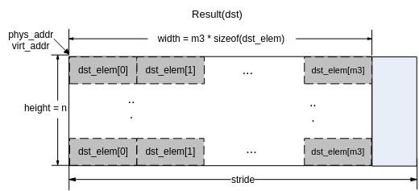

【举例】

无。

【相关主题】

-   [ss\_mpi\_ive\_ann\_mlp\_load\_model](#ss_mpi_ive_ann_mlp_load_model)
-   [ss\_mpi\_ive\_ann\_mlp\_unload\_model](#ss_mpi_ive_ann_mlp_unload_model)

## ss\_mpi\_ive\_svm\_load\_model<a name="ZH-CN_TOPIC_0000002471091276"></a>

【描述】

读取SVM模型文件，初始化模型数据。

【语法】

```
td_s32 ss_mpi_ive_svm_load_model(const td_char *file_name, ot_ive_svm_model *svm_model);
```

【参数】

<a name="table12131mcpsimp"></a>
<table><thead align="left"><tr id="row12137mcpsimp"><th class="cellrowborder" valign="top" width="25%" id="mcps1.1.4.1.1"><p id="p12139mcpsimp"><a name="p12139mcpsimp"></a><a name="p12139mcpsimp"></a>参数名称</p>
</th>
<th class="cellrowborder" valign="top" width="56.99999999999999%" id="mcps1.1.4.1.2"><p id="p12141mcpsimp"><a name="p12141mcpsimp"></a><a name="p12141mcpsimp"></a>描述</p>
</th>
<th class="cellrowborder" valign="top" width="18%" id="mcps1.1.4.1.3"><p id="p12143mcpsimp"><a name="p12143mcpsimp"></a><a name="p12143mcpsimp"></a>输入/输出</p>
</th>
</tr>
</thead>
<tbody><tr id="row12145mcpsimp"><td class="cellrowborder" valign="top" width="25%" headers="mcps1.1.4.1.1 "><p id="p12147mcpsimp"><a name="p12147mcpsimp"></a><a name="p12147mcpsimp"></a>file_name</p>
</td>
<td class="cellrowborder" valign="top" width="56.99999999999999%" headers="mcps1.1.4.1.2 "><p id="p12149mcpsimp"><a name="p12149mcpsimp"></a><a name="p12149mcpsimp"></a>模型文件路径及文件名。</p>
<p id="p12150mcpsimp"><a name="p12150mcpsimp"></a><a name="p12150mcpsimp"></a>不能为空。</p>
</td>
<td class="cellrowborder" valign="top" width="18%" headers="mcps1.1.4.1.3 "><p id="p12152mcpsimp"><a name="p12152mcpsimp"></a><a name="p12152mcpsimp"></a>输入</p>
</td>
</tr>
<tr id="row12153mcpsimp"><td class="cellrowborder" valign="top" width="25%" headers="mcps1.1.4.1.1 "><p id="p12155mcpsimp"><a name="p12155mcpsimp"></a><a name="p12155mcpsimp"></a>svm_model</p>
</td>
<td class="cellrowborder" valign="top" width="56.99999999999999%" headers="mcps1.1.4.1.2 "><p id="p12157mcpsimp"><a name="p12157mcpsimp"></a><a name="p12157mcpsimp"></a>模型数据结构体指针。</p>
<p id="p12158mcpsimp"><a name="p12158mcpsimp"></a><a name="p12158mcpsimp"></a>不能为空。</p>
</td>
<td class="cellrowborder" valign="top" width="18%" headers="mcps1.1.4.1.3 "><p id="p12160mcpsimp"><a name="p12160mcpsimp"></a><a name="p12160mcpsimp"></a>输出</p>
</td>
</tr>
</tbody>
</table>

【返回值】

<a name="table12162mcpsimp"></a>
<table><thead align="left"><tr id="row12167mcpsimp"><th class="cellrowborder" valign="top" width="50%" id="mcps1.1.3.1.1"><p id="p12169mcpsimp"><a name="p12169mcpsimp"></a><a name="p12169mcpsimp"></a>返回值</p>
</th>
<th class="cellrowborder" valign="top" width="50%" id="mcps1.1.3.1.2"><p id="p12171mcpsimp"><a name="p12171mcpsimp"></a><a name="p12171mcpsimp"></a>描述</p>
</th>
</tr>
</thead>
<tbody><tr id="row12173mcpsimp"><td class="cellrowborder" valign="top" width="50%" headers="mcps1.1.3.1.1 "><p id="p12175mcpsimp"><a name="p12175mcpsimp"></a><a name="p12175mcpsimp"></a>0</p>
</td>
<td class="cellrowborder" valign="top" width="50%" headers="mcps1.1.3.1.2 "><p id="p12177mcpsimp"><a name="p12177mcpsimp"></a><a name="p12177mcpsimp"></a>成功。</p>
</td>
</tr>
<tr id="row12178mcpsimp"><td class="cellrowborder" valign="top" width="50%" headers="mcps1.1.3.1.1 "><p id="p12180mcpsimp"><a name="p12180mcpsimp"></a><a name="p12180mcpsimp"></a>非0</p>
</td>
<td class="cellrowborder" valign="top" width="50%" headers="mcps1.1.3.1.2 "><p id="p12182mcpsimp"><a name="p12182mcpsimp"></a><a name="p12182mcpsimp"></a>失败，参见<span xml:lang="fr-FR" id="ph136311818172213"><a name="ph136311818172213"></a><a name="ph136311818172213"></a>错误码</span><span xml:lang="fr-FR" id="ph5283mcpsimp"><a name="ph5283mcpsimp"></a><a name="ph5283mcpsimp"></a>。</span></p>
</td>
</tr>
</tbody>
</table>

【解决方案差异】

<a name="table12187mcpsimp"></a>
<table><thead align="left"><tr id="row12192mcpsimp"><th class="cellrowborder" valign="top" width="25%" id="mcps1.1.3.1.1"><p id="p12194mcpsimp"><a name="p12194mcpsimp"></a><a name="p12194mcpsimp"></a>解决方案名称</p>
</th>
<th class="cellrowborder" valign="top" width="75%" id="mcps1.1.3.1.2"><p id="p12196mcpsimp"><a name="p12196mcpsimp"></a><a name="p12196mcpsimp"></a>差异</p>
</th>
</tr>
</thead>
<tbody><tr id="row12218mcpsimp"><td class="cellrowborder" valign="top" width="25%" headers="mcps1.1.3.1.1 "><p id="p12220mcpsimp"><a name="p12220mcpsimp"></a><a name="p12220mcpsimp"></a>SS928V100</p>
</td>
<td class="cellrowborder" valign="top" width="75%" headers="mcps1.1.3.1.2 "><p id="p12222mcpsimp"><a name="p12222mcpsimp"></a><a name="p12222mcpsimp"></a>不支持</p>
</td>
</tr>
<tr id="row1662375319357"><td class="cellrowborder" valign="top" width="25%" headers="mcps1.1.3.1.1 "><p id="p1823012815334"><a name="p1823012815334"></a><a name="p1823012815334"></a>SS927V100</p>
</td>
<td class="cellrowborder" valign="top" width="75%" headers="mcps1.1.3.1.2 "><p id="p192301028123318"><a name="p192301028123318"></a><a name="p192301028123318"></a>不支持</p>
</td>
</tr>
</tbody>
</table>

【需求】

-   头文件：ot\_common\_ive.h、ot\_common\_svp.h、ss\_mpi\_ive.h
-   库文件：libss\_ive.a（PC上模拟用ss\_ive\_clib2.x.lib）

【注意】

-   文件名必须以.bin为后缀；.bin文件必须用配套工具ive\_tool\_xml2bin.exe生成。
-   用户必需保证.bin文件的完整性和正确性。
-   该接口必须和[ss\_mpi\_ive\_svm\_unload\_model](#ZH-CN_TOPIC_0000002504091133)配套使用。

【举例】

无。

【相关主题】

-   [ss\_mpi\_ive\_svm\_unload\_model](#ss_mpi_ive_svm_unload_model)
-   [ss\_mpi\_ive\_svm\_predict](#ss_mpi_ive_svm_predict)

## ss\_mpi\_ive\_svm\_unload\_model<a name="ZH-CN_TOPIC_0000002504091133"></a>

【描述】

去初始化SVM模型数据。

【语法】

```
td_void ss_mpi_ive_svm_unload_model(const ot_ive_svm_model *svm_model);
```

【参数】

<a name="table12850mcpsimp"></a>
<table><thead align="left"><tr id="row12856mcpsimp"><th class="cellrowborder" valign="top" width="25%" id="mcps1.1.4.1.1"><p id="p12858mcpsimp"><a name="p12858mcpsimp"></a><a name="p12858mcpsimp"></a>参数名称</p>
</th>
<th class="cellrowborder" valign="top" width="56.99999999999999%" id="mcps1.1.4.1.2"><p id="p12860mcpsimp"><a name="p12860mcpsimp"></a><a name="p12860mcpsimp"></a>描述</p>
</th>
<th class="cellrowborder" valign="top" width="18%" id="mcps1.1.4.1.3"><p id="p12862mcpsimp"><a name="p12862mcpsimp"></a><a name="p12862mcpsimp"></a>输入/输出</p>
</th>
</tr>
</thead>
<tbody><tr id="row12864mcpsimp"><td class="cellrowborder" valign="top" width="25%" headers="mcps1.1.4.1.1 "><p id="p12866mcpsimp"><a name="p12866mcpsimp"></a><a name="p12866mcpsimp"></a>svm_model</p>
</td>
<td class="cellrowborder" valign="top" width="56.99999999999999%" headers="mcps1.1.4.1.2 "><p id="p12868mcpsimp"><a name="p12868mcpsimp"></a><a name="p12868mcpsimp"></a>模型数据结构体指针。</p>
<p id="p12869mcpsimp"><a name="p12869mcpsimp"></a><a name="p12869mcpsimp"></a>不能为空。</p>
</td>
<td class="cellrowborder" valign="top" width="18%" headers="mcps1.1.4.1.3 "><p id="p12871mcpsimp"><a name="p12871mcpsimp"></a><a name="p12871mcpsimp"></a>输入</p>
</td>
</tr>
</tbody>
</table>

【返回值】

<a name="table12873mcpsimp"></a>
<table><thead align="left"><tr id="row12878mcpsimp"><th class="cellrowborder" valign="top" width="50%" id="mcps1.1.3.1.1"><p id="p12880mcpsimp"><a name="p12880mcpsimp"></a><a name="p12880mcpsimp"></a>返回值</p>
</th>
<th class="cellrowborder" valign="top" width="50%" id="mcps1.1.3.1.2"><p id="p12882mcpsimp"><a name="p12882mcpsimp"></a><a name="p12882mcpsimp"></a>描述</p>
</th>
</tr>
</thead>
<tbody><tr id="row12884mcpsimp"><td class="cellrowborder" valign="top" width="50%" headers="mcps1.1.3.1.1 "><p id="p12886mcpsimp"><a name="p12886mcpsimp"></a><a name="p12886mcpsimp"></a>无</p>
</td>
<td class="cellrowborder" valign="top" width="50%" headers="mcps1.1.3.1.2 "><p id="p12888mcpsimp"><a name="p12888mcpsimp"></a><a name="p12888mcpsimp"></a>无</p>
</td>
</tr>
</tbody>
</table>

【解决方案差异】

<a name="table12890mcpsimp"></a>
<table><thead align="left"><tr id="row12895mcpsimp"><th class="cellrowborder" valign="top" width="25%" id="mcps1.1.3.1.1"><p id="p12897mcpsimp"><a name="p12897mcpsimp"></a><a name="p12897mcpsimp"></a>解决方案名称</p>
</th>
<th class="cellrowborder" valign="top" width="75%" id="mcps1.1.3.1.2"><p id="p12899mcpsimp"><a name="p12899mcpsimp"></a><a name="p12899mcpsimp"></a>差异</p>
</th>
</tr>
</thead>
<tbody><tr id="row12921mcpsimp"><td class="cellrowborder" valign="top" width="25%" headers="mcps1.1.3.1.1 "><p id="p12923mcpsimp"><a name="p12923mcpsimp"></a><a name="p12923mcpsimp"></a>SS928V100</p>
</td>
<td class="cellrowborder" valign="top" width="75%" headers="mcps1.1.3.1.2 "><p id="p12925mcpsimp"><a name="p12925mcpsimp"></a><a name="p12925mcpsimp"></a>不支持</p>
</td>
</tr>
<tr id="row15457140193617"><td class="cellrowborder" valign="top" width="25%" headers="mcps1.1.3.1.1 "><p id="p1823012815334"><a name="p1823012815334"></a><a name="p1823012815334"></a>SS927V100</p>
</td>
<td class="cellrowborder" valign="top" width="75%" headers="mcps1.1.3.1.2 "><p id="p192301028123318"><a name="p192301028123318"></a><a name="p192301028123318"></a>不支持</p>
</td>
</tr>
</tbody>
</table>

【需求】

-   头文件：ot\_common\_ive.h、ot\_common\_svp.h、ss\_mpi\_ive.h
-   库文件：libss\_ive.a（PC上模拟用ss\_ive\_clib2.x.lib）

【注意】

该接口必须和[ss\_mpi\_ive\_svm\_load\_model](#ZH-CN_TOPIC_0000002471091276)配套使用。

【举例】

无。

【相关主题】

-   [ss\_mpi\_ive\_svm\_load\_model](#ss_mpi_ive_svm_load_model)
-   [ss\_mpi\_ive\_svm\_predict](#ss_mpi_ive_svm_predict)

## ss\_mpi\_ive\_svm\_predict<a name="ZH-CN_TOPIC_0000002504091105"></a>

【描述】

创建同一模型的多个样本svm预测任务。

【语法】

```
td_s32 ss_mpi_ive_svm_predict(ot_ive_handle *handle, const ot_svp_src_data *src, const ot_svp_lut *kernel_table, const ot_ive_svm_model *svm_model, const ot_svp_dst_data *dst_vote, td_bool is_instant);
```

【参数】

<a name="table3267mcpsimp"></a>
<table><thead align="left"><tr id="row3273mcpsimp"><th class="cellrowborder" valign="top" width="22%" id="mcps1.1.4.1.1"><p id="p3275mcpsimp"><a name="p3275mcpsimp"></a><a name="p3275mcpsimp"></a>参数名称</p>
</th>
<th class="cellrowborder" valign="top" width="60%" id="mcps1.1.4.1.2"><p id="p3277mcpsimp"><a name="p3277mcpsimp"></a><a name="p3277mcpsimp"></a>描述</p>
</th>
<th class="cellrowborder" valign="top" width="18%" id="mcps1.1.4.1.3"><p id="p3279mcpsimp"><a name="p3279mcpsimp"></a><a name="p3279mcpsimp"></a>输入/输出</p>
</th>
</tr>
</thead>
<tbody><tr id="row3281mcpsimp"><td class="cellrowborder" valign="top" width="22%" headers="mcps1.1.4.1.1 "><p id="p3283mcpsimp"><a name="p3283mcpsimp"></a><a name="p3283mcpsimp"></a>handle</p>
</td>
<td class="cellrowborder" valign="top" width="60%" headers="mcps1.1.4.1.2 "><p id="p3285mcpsimp"><a name="p3285mcpsimp"></a><a name="p3285mcpsimp"></a>handle指针。</p>
<p id="p3286mcpsimp"><a name="p3286mcpsimp"></a><a name="p3286mcpsimp"></a>不能为空。</p>
</td>
<td class="cellrowborder" valign="top" width="18%" headers="mcps1.1.4.1.3 "><p id="p3288mcpsimp"><a name="p3288mcpsimp"></a><a name="p3288mcpsimp"></a>输出</p>
</td>
</tr>
<tr id="row3289mcpsimp"><td class="cellrowborder" valign="top" width="22%" headers="mcps1.1.4.1.1 "><p id="p3291mcpsimp"><a name="p3291mcpsimp"></a><a name="p3291mcpsimp"></a>src</p>
</td>
<td class="cellrowborder" valign="top" width="60%" headers="mcps1.1.4.1.2 "><p id="p3293mcpsimp"><a name="p3293mcpsimp"></a><a name="p3293mcpsimp"></a>输入样本向量（特征向量）数组指针。</p>
<p id="p3294mcpsimp"><a name="p3294mcpsimp"></a><a name="p3294mcpsimp"></a>宽为样本向量维数 * sizeof(td_s16q16)。</p>
<p id="p3295mcpsimp"><a name="p3295mcpsimp"></a><a name="p3295mcpsimp"></a>高为向量个数。</p>
<p id="p3296mcpsimp"><a name="p3296mcpsimp"></a><a name="p3296mcpsimp"></a>不能为空。</p>
</td>
<td class="cellrowborder" valign="top" width="18%" headers="mcps1.1.4.1.3 "><p id="p3298mcpsimp"><a name="p3298mcpsimp"></a><a name="p3298mcpsimp"></a>输入</p>
</td>
</tr>
<tr id="row3299mcpsimp"><td class="cellrowborder" valign="top" width="22%" headers="mcps1.1.4.1.1 "><p id="p3301mcpsimp"><a name="p3301mcpsimp"></a><a name="p3301mcpsimp"></a>kernel_table</p>
</td>
<td class="cellrowborder" valign="top" width="60%" headers="mcps1.1.4.1.2 "><p id="p3303mcpsimp"><a name="p3303mcpsimp"></a><a name="p3303mcpsimp"></a>用于核函数计算的查找表信息指针。</p>
<p id="p3304mcpsimp"><a name="p3304mcpsimp"></a><a name="p3304mcpsimp"></a>不能为空。</p>
</td>
<td class="cellrowborder" valign="top" width="18%" headers="mcps1.1.4.1.3 "><p id="p3306mcpsimp"><a name="p3306mcpsimp"></a><a name="p3306mcpsimp"></a>输入</p>
</td>
</tr>
<tr id="row3307mcpsimp"><td class="cellrowborder" valign="top" width="22%" headers="mcps1.1.4.1.1 "><p id="p3309mcpsimp"><a name="p3309mcpsimp"></a><a name="p3309mcpsimp"></a>svm_model</p>
</td>
<td class="cellrowborder" valign="top" width="60%" headers="mcps1.1.4.1.2 "><p id="p3311mcpsimp"><a name="p3311mcpsimp"></a><a name="p3311mcpsimp"></a>模型数据结构体指针。</p>
<p id="p3312mcpsimp"><a name="p3312mcpsimp"></a><a name="p3312mcpsimp"></a>不能为空。</p>
</td>
<td class="cellrowborder" valign="top" width="18%" headers="mcps1.1.4.1.3 "><p id="p3314mcpsimp"><a name="p3314mcpsimp"></a><a name="p3314mcpsimp"></a>输入</p>
</td>
</tr>
<tr id="row3315mcpsimp"><td class="cellrowborder" valign="top" width="22%" headers="mcps1.1.4.1.1 "><p id="p3317mcpsimp"><a name="p3317mcpsimp"></a><a name="p3317mcpsimp"></a>dst_vote</p>
</td>
<td class="cellrowborder" valign="top" width="60%" headers="mcps1.1.4.1.2 "><p id="p3319mcpsimp"><a name="p3319mcpsimp"></a><a name="p3319mcpsimp"></a>“1-VS-1 svm”各个类别的投票数向量数组指针。</p>
<p id="p3320mcpsimp"><a name="p3320mcpsimp"></a><a name="p3320mcpsimp"></a>宽为投票类别数 * sizeof(td_u16)。</p>
<p id="p3321mcpsimp"><a name="p3321mcpsimp"></a><a name="p3321mcpsimp"></a>高为向量个数。</p>
<p id="p3322mcpsimp"><a name="p3322mcpsimp"></a><a name="p3322mcpsimp"></a>不能为空。</p>
</td>
<td class="cellrowborder" valign="top" width="18%" headers="mcps1.1.4.1.3 "><p id="p3324mcpsimp"><a name="p3324mcpsimp"></a><a name="p3324mcpsimp"></a>输出</p>
</td>
</tr>
<tr id="row3325mcpsimp"><td class="cellrowborder" valign="top" width="22%" headers="mcps1.1.4.1.1 "><p id="p3327mcpsimp"><a name="p3327mcpsimp"></a><a name="p3327mcpsimp"></a>is_instant</p>
</td>
<td class="cellrowborder" valign="top" width="60%" headers="mcps1.1.4.1.2 "><p id="p3329mcpsimp"><a name="p3329mcpsimp"></a><a name="p3329mcpsimp"></a>及时返回结果标志。</p>
</td>
<td class="cellrowborder" valign="top" width="18%" headers="mcps1.1.4.1.3 "><p id="p3331mcpsimp"><a name="p3331mcpsimp"></a><a name="p3331mcpsimp"></a>输入</p>
</td>
</tr>
</tbody>
</table>

<a name="table3332mcpsimp"></a>
<table><thead align="left"><tr id="row3339mcpsimp"><th class="cellrowborder" valign="top" width="18.18181818181818%" id="mcps1.1.5.1.1"><p id="p3341mcpsimp"><a name="p3341mcpsimp"></a><a name="p3341mcpsimp"></a>参数名称</p>
</th>
<th class="cellrowborder" valign="top" width="31.313131313131308%" id="mcps1.1.5.1.2"><p id="p3343mcpsimp"><a name="p3343mcpsimp"></a><a name="p3343mcpsimp"></a>支持类型</p>
</th>
<th class="cellrowborder" valign="top" width="15.151515151515152%" id="mcps1.1.5.1.3"><p id="p3345mcpsimp"><a name="p3345mcpsimp"></a><a name="p3345mcpsimp"></a>地址对齐</p>
</th>
<th class="cellrowborder" valign="top" width="35.35353535353536%" id="mcps1.1.5.1.4"><p id="p3347mcpsimp"><a name="p3347mcpsimp"></a><a name="p3347mcpsimp"></a>向量维数</p>
</th>
</tr>
</thead>
<tbody><tr id="row3349mcpsimp"><td class="cellrowborder" valign="top" width="18.18181818181818%" headers="mcps1.1.5.1.1 "><p id="p3351mcpsimp"><a name="p3351mcpsimp"></a><a name="p3351mcpsimp"></a>src</p>
</td>
<td class="cellrowborder" valign="top" width="31.313131313131308%" headers="mcps1.1.5.1.2 "><p id="p3353mcpsimp"><a name="p3353mcpsimp"></a><a name="p3353mcpsimp"></a>一维SQ16.16向量数组，每个元素用于计算时截断到SQ8.16计算</p>
</td>
<td class="cellrowborder" valign="top" width="15.151515151515152%" headers="mcps1.1.5.1.3 "><p id="p3355mcpsimp"><a name="p3355mcpsimp"></a><a name="p3355mcpsimp"></a>16 byte</p>
</td>
<td class="cellrowborder" valign="top" width="35.35353535353536%" headers="mcps1.1.5.1.4 "><p id="p3357mcpsimp"><a name="p3357mcpsimp"></a><a name="p3357mcpsimp"></a>取值范围：1～1024；</p>
<p id="p3358mcpsimp"><a name="p3358mcpsimp"></a><a name="p3358mcpsimp"></a>实际值：svm_model-&gt;feature_dim</p>
</td>
</tr>
<tr id="row3359mcpsimp"><td class="cellrowborder" valign="top" width="18.18181818181818%" headers="mcps1.1.5.1.1 "><p id="p3361mcpsimp"><a name="p3361mcpsimp"></a><a name="p3361mcpsimp"></a>dst_vote</p>
</td>
<td class="cellrowborder" valign="top" width="31.313131313131308%" headers="mcps1.1.5.1.2 "><p id="p3363mcpsimp"><a name="p3363mcpsimp"></a><a name="p3363mcpsimp"></a>一维td_u16向量数组</p>
</td>
<td class="cellrowborder" valign="top" width="15.151515151515152%" headers="mcps1.1.5.1.3 "><p id="p3365mcpsimp"><a name="p3365mcpsimp"></a><a name="p3365mcpsimp"></a>16 byte</p>
</td>
<td class="cellrowborder" valign="top" width="35.35353535353536%" headers="mcps1.1.5.1.4 "><p id="p3367mcpsimp"><a name="p3367mcpsimp"></a><a name="p3367mcpsimp"></a>取值范围：1～80；</p>
<p id="p3368mcpsimp"><a name="p3368mcpsimp"></a><a name="p3368mcpsimp"></a>实际值：svm_model-&gt;class_cnt</p>
</td>
</tr>
</tbody>
</table>

【返回值】

<a name="table3370mcpsimp"></a>
<table><thead align="left"><tr id="row3375mcpsimp"><th class="cellrowborder" valign="top" width="50%" id="mcps1.1.3.1.1"><p id="p3377mcpsimp"><a name="p3377mcpsimp"></a><a name="p3377mcpsimp"></a>返回值</p>
</th>
<th class="cellrowborder" valign="top" width="50%" id="mcps1.1.3.1.2"><p id="p3379mcpsimp"><a name="p3379mcpsimp"></a><a name="p3379mcpsimp"></a>描述</p>
</th>
</tr>
</thead>
<tbody><tr id="row3381mcpsimp"><td class="cellrowborder" valign="top" width="50%" headers="mcps1.1.3.1.1 "><p id="p3383mcpsimp"><a name="p3383mcpsimp"></a><a name="p3383mcpsimp"></a>0</p>
</td>
<td class="cellrowborder" valign="top" width="50%" headers="mcps1.1.3.1.2 "><p id="p3385mcpsimp"><a name="p3385mcpsimp"></a><a name="p3385mcpsimp"></a>成功。</p>
</td>
</tr>
<tr id="row3386mcpsimp"><td class="cellrowborder" valign="top" width="50%" headers="mcps1.1.3.1.1 "><p id="p3388mcpsimp"><a name="p3388mcpsimp"></a><a name="p3388mcpsimp"></a>非0</p>
</td>
<td class="cellrowborder" valign="top" width="50%" headers="mcps1.1.3.1.2 "><p id="p7404mcpsimp"><a name="p7404mcpsimp"></a><a name="p7404mcpsimp"></a>失败，参见<span xml:lang="fr-FR" id="ph136311818172213"><a name="ph136311818172213"></a><a name="ph136311818172213"></a>错误码</span><span xml:lang="fr-FR" id="ph5283mcpsimp"><a name="ph5283mcpsimp"></a><a name="ph5283mcpsimp"></a>。</span></p>
</td>
</tr>
</tbody>
</table>

【解决方案差异】

<a name="table3395mcpsimp"></a>
<table><thead align="left"><tr id="row3400mcpsimp"><th class="cellrowborder" valign="top" width="27%" id="mcps1.1.3.1.1"><p id="p3402mcpsimp"><a name="p3402mcpsimp"></a><a name="p3402mcpsimp"></a>解决方案名称</p>
</th>
<th class="cellrowborder" valign="top" width="73%" id="mcps1.1.3.1.2"><p id="p3404mcpsimp"><a name="p3404mcpsimp"></a><a name="p3404mcpsimp"></a>差异</p>
</th>
</tr>
</thead>
<tbody><tr id="row3426mcpsimp"><td class="cellrowborder" valign="top" width="27%" headers="mcps1.1.3.1.1 "><p id="p3428mcpsimp"><a name="p3428mcpsimp"></a><a name="p3428mcpsimp"></a>SS928V100</p>
</td>
<td class="cellrowborder" valign="top" width="73%" headers="mcps1.1.3.1.2 "><p id="p3430mcpsimp"><a name="p3430mcpsimp"></a><a name="p3430mcpsimp"></a>不支持</p>
</td>
</tr>
<tr id="row105107763610"><td class="cellrowborder" valign="top" width="27%" headers="mcps1.1.3.1.1 "><p id="p1823012815334"><a name="p1823012815334"></a><a name="p1823012815334"></a>SS927V100</p>
</td>
<td class="cellrowborder" valign="top" width="73%" headers="mcps1.1.3.1.2 "><p id="p192301028123318"><a name="p192301028123318"></a><a name="p192301028123318"></a>不支持</p>
</td>
</tr>
</tbody>
</table>

【需求】

-   头文件：ot\_common\_ive.h、ot\_common\_svp.h、ss\_mpi\_ive.h
-   库文件：libss\_ive.a（PC上模拟用ss\_ive\_clib2.x.lib）

【注意】

-   原理与OpenCV中SVM\_Predict类似。
-   核函数计算公式

    线性核函数：

    多项式核函数：

    径向基核函数：

    Sigmoid核函数：

-   判决函数计算公式：

    

-   kernel\_tab是用于核函数计算的查找表，其数据均为S1Q15类型数据，查找表元素个数参考“解决方案差异”说明；对SVM核函数建立查找表时，查找表的输入是或者，table\_out\_norm可以表示除法的除数（不能为0，SvmDivisor = table\_out\_norm）或者移位的数目（可以为0，此时SvmDivisor = 1 << table\_out\_norm），同样使用工具ive\_tool\_xml2bin.exe时需要将SvmDivisor作为参数传入，SvmDivisor见ive\_tool\_xml2bin.exe的使用说明。
-   以feature\_dim = n，class\_count = N，样本数量 = r，为例：

    -   r个输入样本向量，每个都是SQ16.16类型的n维向量（最大1024维），实际上仅支持SQ8.16，超出部分会截断：

    **图 1**  svm输入样本向量数组示意图<a name="fig10427125313279"></a>  
    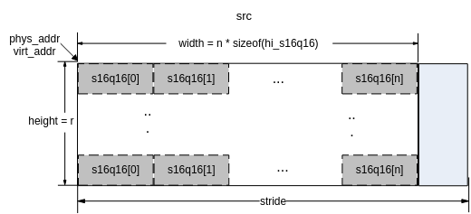

    -   输出r个预测结果向量，每个均为td\_u16类型的N维向量：

    **图 2**  svm预测结果示意图<a name="fig4259197112812"></a>  
    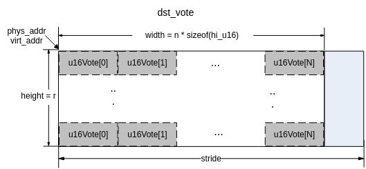

【举例】

无。

【相关主题】

-   [ss\_mpi\_ive\_svm\_load\_model](#ss_mpi_ive_svm_load_model)
-   [ss\_mpi\_ive\_svm\_unload\_model](#ss_mpi_ive_svm_unload_model)

## ss\_mpi\_ive\_cnn\_load\_model<a name="ZH-CN_TOPIC_0000002471091312"></a>

【描述】

读取cnn模型文件，初始化cnn模型数据。

【语法】

```
td_s32 ss_mpi_ive_cnn_load_model(const td_char *file_name, ot_ive_cnn_model *model );
```

【参数】

<a name="table698mcpsimp"></a>
<table><thead align="left"><tr id="row704mcpsimp"><th class="cellrowborder" valign="top" width="25%" id="mcps1.1.4.1.1"><p id="p706mcpsimp"><a name="p706mcpsimp"></a><a name="p706mcpsimp"></a>参数名称</p>
</th>
<th class="cellrowborder" valign="top" width="56.99999999999999%" id="mcps1.1.4.1.2"><p id="p708mcpsimp"><a name="p708mcpsimp"></a><a name="p708mcpsimp"></a>描述</p>
</th>
<th class="cellrowborder" valign="top" width="18%" id="mcps1.1.4.1.3"><p id="p710mcpsimp"><a name="p710mcpsimp"></a><a name="p710mcpsimp"></a>输入/输出</p>
</th>
</tr>
</thead>
<tbody><tr id="row712mcpsimp"><td class="cellrowborder" valign="top" width="25%" headers="mcps1.1.4.1.1 "><p id="p714mcpsimp"><a name="p714mcpsimp"></a><a name="p714mcpsimp"></a>file_name</p>
</td>
<td class="cellrowborder" valign="top" width="56.99999999999999%" headers="mcps1.1.4.1.2 "><p id="p716mcpsimp"><a name="p716mcpsimp"></a><a name="p716mcpsimp"></a>模型文件路径及文件名。</p>
<p id="p717mcpsimp"><a name="p717mcpsimp"></a><a name="p717mcpsimp"></a>不能为空。</p>
</td>
<td class="cellrowborder" valign="top" width="18%" headers="mcps1.1.4.1.3 "><p id="p719mcpsimp"><a name="p719mcpsimp"></a><a name="p719mcpsimp"></a>输入</p>
</td>
</tr>
<tr id="row720mcpsimp"><td class="cellrowborder" valign="top" width="25%" headers="mcps1.1.4.1.1 "><p id="p722mcpsimp"><a name="p722mcpsimp"></a><a name="p722mcpsimp"></a>model</p>
</td>
<td class="cellrowborder" valign="top" width="56.99999999999999%" headers="mcps1.1.4.1.2 "><p id="p724mcpsimp"><a name="p724mcpsimp"></a><a name="p724mcpsimp"></a>cnn网络模型结构体指针。</p>
<p id="p725mcpsimp"><a name="p725mcpsimp"></a><a name="p725mcpsimp"></a>不能为空。</p>
</td>
<td class="cellrowborder" valign="top" width="18%" headers="mcps1.1.4.1.3 "><p id="p727mcpsimp"><a name="p727mcpsimp"></a><a name="p727mcpsimp"></a>输出</p>
</td>
</tr>
</tbody>
</table>

【返回值】

<a name="table729mcpsimp"></a>
<table><thead align="left"><tr id="row734mcpsimp"><th class="cellrowborder" valign="top" width="50%" id="mcps1.1.3.1.1"><p id="p736mcpsimp"><a name="p736mcpsimp"></a><a name="p736mcpsimp"></a>返回值</p>
</th>
<th class="cellrowborder" valign="top" width="50%" id="mcps1.1.3.1.2"><p id="p738mcpsimp"><a name="p738mcpsimp"></a><a name="p738mcpsimp"></a>描述</p>
</th>
</tr>
</thead>
<tbody><tr id="row740mcpsimp"><td class="cellrowborder" valign="top" width="50%" headers="mcps1.1.3.1.1 "><p id="p742mcpsimp"><a name="p742mcpsimp"></a><a name="p742mcpsimp"></a>0</p>
</td>
<td class="cellrowborder" valign="top" width="50%" headers="mcps1.1.3.1.2 "><p id="p744mcpsimp"><a name="p744mcpsimp"></a><a name="p744mcpsimp"></a>成功。</p>
</td>
</tr>
<tr id="row745mcpsimp"><td class="cellrowborder" valign="top" width="50%" headers="mcps1.1.3.1.1 "><p id="p747mcpsimp"><a name="p747mcpsimp"></a><a name="p747mcpsimp"></a>非0</p>
</td>
<td class="cellrowborder" valign="top" width="50%" headers="mcps1.1.3.1.2 "><p id="p7404mcpsimp"><a name="p7404mcpsimp"></a><a name="p7404mcpsimp"></a>失败，参见<span xml:lang="fr-FR" id="ph136311818172213"><a name="ph136311818172213"></a><a name="ph136311818172213"></a>错误码</span><span xml:lang="fr-FR" id="ph5283mcpsimp"><a name="ph5283mcpsimp"></a><a name="ph5283mcpsimp"></a>。</span></p>
</td>
</tr>
</tbody>
</table>

【解决方案差异】

<a name="table754mcpsimp"></a>
<table><thead align="left"><tr id="row759mcpsimp"><th class="cellrowborder" valign="top" width="28.999999999999996%" id="mcps1.1.3.1.1"><p id="p761mcpsimp"><a name="p761mcpsimp"></a><a name="p761mcpsimp"></a>解决方案名称</p>
</th>
<th class="cellrowborder" valign="top" width="71%" id="mcps1.1.3.1.2"><p id="p763mcpsimp"><a name="p763mcpsimp"></a><a name="p763mcpsimp"></a>差异</p>
</th>
</tr>
</thead>
<tbody><tr id="row785mcpsimp"><td class="cellrowborder" valign="top" width="28.999999999999996%" headers="mcps1.1.3.1.1 "><p id="p787mcpsimp"><a name="p787mcpsimp"></a><a name="p787mcpsimp"></a>SS928V100</p>
</td>
<td class="cellrowborder" valign="top" width="71%" headers="mcps1.1.3.1.2 "><p id="p789mcpsimp"><a name="p789mcpsimp"></a><a name="p789mcpsimp"></a>不支持</p>
</td>
</tr>
<tr id="row181561412369"><td class="cellrowborder" valign="top" width="28.999999999999996%" headers="mcps1.1.3.1.1 "><p id="p1823012815334"><a name="p1823012815334"></a><a name="p1823012815334"></a>SS927V100</p>
</td>
<td class="cellrowborder" valign="top" width="71%" headers="mcps1.1.3.1.2 "><p id="p192301028123318"><a name="p192301028123318"></a><a name="p192301028123318"></a>不支持</p>
</td>
</tr>
</tbody>
</table>

【需求】

-   头文件：ot\_common\_ive.h、ot\_common\_svp.h、ss\_mpi\_ive.h
-   库文件：libss\_ive.a（PC上模拟用ss\_ive\_clib2.x.lib）

【注意】

-   文件名必须以.bin为后缀；.bin文件必须用配套工具ive\_tool\_caffe（参考《IVE 工具使用指南》）生成。
-   用户必需保证.bin文件的完整性和正确性。
-   该接口必须和[ss\_mpi\_ive\_cnn\_unload\_model](#ZH-CN_TOPIC_0000002470931302)配套使用。

【举例】

无。

【相关主题】

-   [ss\_mpi\_ive\_cnn\_unload\_model](#ss_mpi_ive_cnn_unload_model)
-   [ss\_mpi\_ive\_cnn\_predict](#ss_mpi_ive_cnn_predict)
-   [ss\_mpi\_ive\_cnn\_get\_result](#ss_mpi_ive_cnn_get_result)

## ss\_mpi\_ive\_cnn\_unload\_model<a name="ZH-CN_TOPIC_0000002470931302"></a>

【描述】

去初始化cnn模型数据。

【语法】

```
td_void ss_mpi_ive_cnn_unload_model(const ot_ive_cnn_model *model);
```

【参数】

<a name="table14599mcpsimp"></a>
<table><thead align="left"><tr id="row14605mcpsimp"><th class="cellrowborder" valign="top" width="25%" id="mcps1.1.4.1.1"><p id="p14607mcpsimp"><a name="p14607mcpsimp"></a><a name="p14607mcpsimp"></a>参数名称</p>
</th>
<th class="cellrowborder" valign="top" width="56.99999999999999%" id="mcps1.1.4.1.2"><p id="p14609mcpsimp"><a name="p14609mcpsimp"></a><a name="p14609mcpsimp"></a>描述</p>
</th>
<th class="cellrowborder" valign="top" width="18%" id="mcps1.1.4.1.3"><p id="p14611mcpsimp"><a name="p14611mcpsimp"></a><a name="p14611mcpsimp"></a>输入/输出</p>
</th>
</tr>
</thead>
<tbody><tr id="row14613mcpsimp"><td class="cellrowborder" valign="top" width="25%" headers="mcps1.1.4.1.1 "><p id="p14615mcpsimp"><a name="p14615mcpsimp"></a><a name="p14615mcpsimp"></a>model</p>
</td>
<td class="cellrowborder" valign="top" width="56.99999999999999%" headers="mcps1.1.4.1.2 "><p id="p14617mcpsimp"><a name="p14617mcpsimp"></a><a name="p14617mcpsimp"></a>cnn网络模型结构体指针。</p>
<p id="p14618mcpsimp"><a name="p14618mcpsimp"></a><a name="p14618mcpsimp"></a>不能为空。</p>
</td>
<td class="cellrowborder" valign="top" width="18%" headers="mcps1.1.4.1.3 "><p id="p14620mcpsimp"><a name="p14620mcpsimp"></a><a name="p14620mcpsimp"></a>输入</p>
</td>
</tr>
</tbody>
</table>

【返回值】

<a name="table14622mcpsimp"></a>
<table><thead align="left"><tr id="row14627mcpsimp"><th class="cellrowborder" valign="top" width="50%" id="mcps1.1.3.1.1"><p id="p14629mcpsimp"><a name="p14629mcpsimp"></a><a name="p14629mcpsimp"></a>返回值</p>
</th>
<th class="cellrowborder" valign="top" width="50%" id="mcps1.1.3.1.2"><p id="p14631mcpsimp"><a name="p14631mcpsimp"></a><a name="p14631mcpsimp"></a>描述</p>
</th>
</tr>
</thead>
<tbody><tr id="row14633mcpsimp"><td class="cellrowborder" valign="top" width="50%" headers="mcps1.1.3.1.1 "><p id="p14635mcpsimp"><a name="p14635mcpsimp"></a><a name="p14635mcpsimp"></a>0</p>
</td>
<td class="cellrowborder" valign="top" width="50%" headers="mcps1.1.3.1.2 "><p id="p14637mcpsimp"><a name="p14637mcpsimp"></a><a name="p14637mcpsimp"></a>成功。</p>
</td>
</tr>
<tr id="row14638mcpsimp"><td class="cellrowborder" valign="top" width="50%" headers="mcps1.1.3.1.1 "><p id="p14640mcpsimp"><a name="p14640mcpsimp"></a><a name="p14640mcpsimp"></a>非0</p>
</td>
<td class="cellrowborder" valign="top" width="50%" headers="mcps1.1.3.1.2 "><p id="p14642mcpsimp"><a name="p14642mcpsimp"></a><a name="p14642mcpsimp"></a>失败，参见<span xml:lang="fr-FR" id="ph136311818172213"><a name="ph136311818172213"></a><a name="ph136311818172213"></a>错误码</span><span xml:lang="fr-FR" id="ph5283mcpsimp"><a name="ph5283mcpsimp"></a><a name="ph5283mcpsimp"></a>。</span></p>
</td>
</tr>
</tbody>
</table>

【解决方案差异】

<a name="table14647mcpsimp"></a>
<table><thead align="left"><tr id="row14652mcpsimp"><th class="cellrowborder" valign="top" width="28.999999999999996%" id="mcps1.1.3.1.1"><p id="p14654mcpsimp"><a name="p14654mcpsimp"></a><a name="p14654mcpsimp"></a>解决方案名称</p>
</th>
<th class="cellrowborder" valign="top" width="71%" id="mcps1.1.3.1.2"><p id="p14656mcpsimp"><a name="p14656mcpsimp"></a><a name="p14656mcpsimp"></a>差异</p>
</th>
</tr>
</thead>
<tbody><tr id="row14678mcpsimp"><td class="cellrowborder" valign="top" width="28.999999999999996%" headers="mcps1.1.3.1.1 "><p id="p14680mcpsimp"><a name="p14680mcpsimp"></a><a name="p14680mcpsimp"></a>SS928V100</p>
</td>
<td class="cellrowborder" valign="top" width="71%" headers="mcps1.1.3.1.2 "><p id="p14682mcpsimp"><a name="p14682mcpsimp"></a><a name="p14682mcpsimp"></a>不支持</p>
</td>
</tr>
<tr id="row784019222365"><td class="cellrowborder" valign="top" width="28.999999999999996%" headers="mcps1.1.3.1.1 "><p id="p1823012815334"><a name="p1823012815334"></a><a name="p1823012815334"></a>SS927V100</p>
</td>
<td class="cellrowborder" valign="top" width="71%" headers="mcps1.1.3.1.2 "><p id="p192301028123318"><a name="p192301028123318"></a><a name="p192301028123318"></a>不支持</p>
</td>
</tr>
</tbody>
</table>

【需求】

-   头文件：ot\_common\_ive.h、ot\_common\_svp.h、ss\_mpi\_ive.h
-   库文件：libss\_ive.a（PC上模拟用ss\_ive\_clib2.x.lib）

【注意】

该接口必须和[ss\_mpi\_ive\_cnn\_load\_model](#ZH-CN_TOPIC_0000002471091312)配套使用。

【举例】

无。

【相关主题】

-   [ss\_mpi\_ive\_cnn\_load\_model](#ss_mpi_ive_cnn_load_model)
-   [ss\_mpi\_ive\_cnn\_predict](#ss_mpi_ive_cnn_predict)
-   [ss\_mpi\_ive\_cnn\_get\_result](#ss_mpi_ive_cnn_get_result)

## ss\_mpi\_ive\_cnn\_predict<a name="ZH-CN_TOPIC_0000002470931276"></a>

【描述】

创建一个CNN模型的单个或多个样本预测任务，并输出特征向量。

【语法】

```
td_s32 ss_mpi_ive_cnn_predict(ot_ive_handle *handle, const ot_svp_src_img src[], const ot_ive_cnn_model *model, const ot_svp_dst_data *dst, const ot_ive_cnn_ctrl *ctrl, td_bool is_instant);
```

【参数】

<a name="table9193mcpsimp"></a>
<table><thead align="left"><tr id="row9199mcpsimp"><th class="cellrowborder" valign="top" width="21%" id="mcps1.1.4.1.1"><p id="p9201mcpsimp"><a name="p9201mcpsimp"></a><a name="p9201mcpsimp"></a>参数名称</p>
</th>
<th class="cellrowborder" valign="top" width="61%" id="mcps1.1.4.1.2"><p id="p9203mcpsimp"><a name="p9203mcpsimp"></a><a name="p9203mcpsimp"></a>描述</p>
</th>
<th class="cellrowborder" valign="top" width="18%" id="mcps1.1.4.1.3"><p id="p9205mcpsimp"><a name="p9205mcpsimp"></a><a name="p9205mcpsimp"></a>输入/输出</p>
</th>
</tr>
</thead>
<tbody><tr id="row9207mcpsimp"><td class="cellrowborder" valign="top" width="21%" headers="mcps1.1.4.1.1 "><p id="p9209mcpsimp"><a name="p9209mcpsimp"></a><a name="p9209mcpsimp"></a>handle</p>
</td>
<td class="cellrowborder" valign="top" width="61%" headers="mcps1.1.4.1.2 "><p id="p9211mcpsimp"><a name="p9211mcpsimp"></a><a name="p9211mcpsimp"></a>handle指针。</p>
<p id="p9212mcpsimp"><a name="p9212mcpsimp"></a><a name="p9212mcpsimp"></a>不能为空。</p>
</td>
<td class="cellrowborder" valign="top" width="18%" headers="mcps1.1.4.1.3 "><p id="p9214mcpsimp"><a name="p9214mcpsimp"></a><a name="p9214mcpsimp"></a>输出</p>
</td>
</tr>
<tr id="row9215mcpsimp"><td class="cellrowborder" valign="top" width="21%" headers="mcps1.1.4.1.1 "><p id="p9217mcpsimp"><a name="p9217mcpsimp"></a><a name="p9217mcpsimp"></a>src[]</p>
</td>
<td class="cellrowborder" valign="top" width="61%" headers="mcps1.1.4.1.2 "><p id="p9219mcpsimp"><a name="p9219mcpsimp"></a><a name="p9219mcpsimp"></a>输入样本图像数组。最多64张样本图像。</p>
<p id="p9220mcpsimp"><a name="p9220mcpsimp"></a><a name="p9220mcpsimp"></a>不能为空。</p>
</td>
<td class="cellrowborder" valign="top" width="18%" headers="mcps1.1.4.1.3 "><p id="p9222mcpsimp"><a name="p9222mcpsimp"></a><a name="p9222mcpsimp"></a>输入</p>
</td>
</tr>
<tr id="row9223mcpsimp"><td class="cellrowborder" valign="top" width="21%" headers="mcps1.1.4.1.1 "><p id="p9225mcpsimp"><a name="p9225mcpsimp"></a><a name="p9225mcpsimp"></a>model</p>
</td>
<td class="cellrowborder" valign="top" width="61%" headers="mcps1.1.4.1.2 "><p id="p9227mcpsimp"><a name="p9227mcpsimp"></a><a name="p9227mcpsimp"></a>cnn模型结构体指针。</p>
<p id="p9228mcpsimp"><a name="p9228mcpsimp"></a><a name="p9228mcpsimp"></a>不能为空。</p>
</td>
<td class="cellrowborder" valign="top" width="18%" headers="mcps1.1.4.1.3 "><p id="p9230mcpsimp"><a name="p9230mcpsimp"></a><a name="p9230mcpsimp"></a>输入</p>
</td>
</tr>
<tr id="row9231mcpsimp"><td class="cellrowborder" valign="top" width="21%" headers="mcps1.1.4.1.1 "><p id="p9233mcpsimp"><a name="p9233mcpsimp"></a><a name="p9233mcpsimp"></a>dst</p>
</td>
<td class="cellrowborder" valign="top" width="61%" headers="mcps1.1.4.1.2 "><p id="p9235mcpsimp"><a name="p9235mcpsimp"></a><a name="p9235mcpsimp"></a>特征向量数组指针，存放cnn全连接最后一层结果。</p>
<p id="p9236mcpsimp"><a name="p9236mcpsimp"></a><a name="p9236mcpsimp"></a>不能为空。</p>
</td>
<td class="cellrowborder" valign="top" width="18%" headers="mcps1.1.4.1.3 "><p id="p9238mcpsimp"><a name="p9238mcpsimp"></a><a name="p9238mcpsimp"></a>输出</p>
</td>
</tr>
<tr id="row9239mcpsimp"><td class="cellrowborder" valign="top" width="21%" headers="mcps1.1.4.1.1 "><p id="p9241mcpsimp"><a name="p9241mcpsimp"></a><a name="p9241mcpsimp"></a>ctrl</p>
</td>
<td class="cellrowborder" valign="top" width="61%" headers="mcps1.1.4.1.2 "><p id="p9243mcpsimp"><a name="p9243mcpsimp"></a><a name="p9243mcpsimp"></a>控制参数指针。</p>
<p id="p9244mcpsimp"><a name="p9244mcpsimp"></a><a name="p9244mcpsimp"></a>ctrl-&gt;mem内存分配见【注意】。</p>
<p id="p9245mcpsimp"><a name="p9245mcpsimp"></a><a name="p9245mcpsimp"></a>不能为空。</p>
</td>
<td class="cellrowborder" valign="top" width="18%" headers="mcps1.1.4.1.3 "><p id="p9247mcpsimp"><a name="p9247mcpsimp"></a><a name="p9247mcpsimp"></a>输入</p>
</td>
</tr>
<tr id="row9248mcpsimp"><td class="cellrowborder" valign="top" width="21%" headers="mcps1.1.4.1.1 "><p id="p9250mcpsimp"><a name="p9250mcpsimp"></a><a name="p9250mcpsimp"></a>is_instant</p>
</td>
<td class="cellrowborder" valign="top" width="61%" headers="mcps1.1.4.1.2 "><p id="p9252mcpsimp"><a name="p9252mcpsimp"></a><a name="p9252mcpsimp"></a>及时返回结果标志</p>
</td>
<td class="cellrowborder" valign="top" width="18%" headers="mcps1.1.4.1.3 "><p id="p9254mcpsimp"><a name="p9254mcpsimp"></a><a name="p9254mcpsimp"></a>输入</p>
</td>
</tr>
</tbody>
</table>

<a name="table9255mcpsimp"></a>
<table><thead align="left"><tr id="row9262mcpsimp"><th class="cellrowborder" valign="top" width="21%" id="mcps1.1.5.1.1"><p id="p9264mcpsimp"><a name="p9264mcpsimp"></a><a name="p9264mcpsimp"></a>参数名称</p>
</th>
<th class="cellrowborder" valign="top" width="27%" id="mcps1.1.5.1.2"><p id="p9266mcpsimp"><a name="p9266mcpsimp"></a><a name="p9266mcpsimp"></a>支持类型</p>
</th>
<th class="cellrowborder" valign="top" width="14.000000000000002%" id="mcps1.1.5.1.3"><p id="p9268mcpsimp"><a name="p9268mcpsimp"></a><a name="p9268mcpsimp"></a>地址对齐</p>
</th>
<th class="cellrowborder" valign="top" width="38%" id="mcps1.1.5.1.4"><p id="p9270mcpsimp"><a name="p9270mcpsimp"></a><a name="p9270mcpsimp"></a>分辨率</p>
</th>
</tr>
</thead>
<tbody><tr id="row9272mcpsimp"><td class="cellrowborder" valign="top" width="21%" headers="mcps1.1.5.1.1 "><p id="p9274mcpsimp"><a name="p9274mcpsimp"></a><a name="p9274mcpsimp"></a>src[]</p>
</td>
<td class="cellrowborder" valign="top" width="27%" headers="mcps1.1.5.1.2 "><p id="p9276mcpsimp"><a name="p9276mcpsimp"></a><a name="p9276mcpsimp"></a>U8C1、U8C3_PLANAR</p>
</td>
<td class="cellrowborder" valign="top" width="14.000000000000002%" headers="mcps1.1.5.1.3 "><p id="p9278mcpsimp"><a name="p9278mcpsimp"></a><a name="p9278mcpsimp"></a>16 byte</p>
</td>
<td class="cellrowborder" valign="top" width="38%" headers="mcps1.1.5.1.4 "><p id="p9280mcpsimp"><a name="p9280mcpsimp"></a><a name="p9280mcpsimp"></a>宽w：16～80；</p>
<p id="p9281mcpsimp"><a name="p9281mcpsimp"></a><a name="p9281mcpsimp"></a>高h：16~1280/w</p>
</td>
</tr>
</tbody>
</table>

<a name="table9282mcpsimp"></a>
<table><thead align="left"><tr id="row9289mcpsimp"><th class="cellrowborder" valign="top" width="16.831683168316832%" id="mcps1.1.5.1.1"><p id="p9291mcpsimp"><a name="p9291mcpsimp"></a><a name="p9291mcpsimp"></a>参数名称</p>
</th>
<th class="cellrowborder" valign="top" width="31.683168316831683%" id="mcps1.1.5.1.2"><p id="p9293mcpsimp"><a name="p9293mcpsimp"></a><a name="p9293mcpsimp"></a>向量个数</p>
</th>
<th class="cellrowborder" valign="top" width="20.792079207920793%" id="mcps1.1.5.1.3"><p id="p9295mcpsimp"><a name="p9295mcpsimp"></a><a name="p9295mcpsimp"></a>地址对齐</p>
</th>
<th class="cellrowborder" valign="top" width="30.693069306930692%" id="mcps1.1.5.1.4"><p id="p9297mcpsimp"><a name="p9297mcpsimp"></a><a name="p9297mcpsimp"></a>向量描述</p>
</th>
</tr>
</thead>
<tbody><tr id="row9299mcpsimp"><td class="cellrowborder" valign="top" width="16.831683168316832%" headers="mcps1.1.5.1.1 "><p id="p9301mcpsimp"><a name="p9301mcpsimp"></a><a name="p9301mcpsimp"></a>dst</p>
</td>
<td class="cellrowborder" valign="top" width="31.683168316831683%" headers="mcps1.1.5.1.2 "><p id="p9303mcpsimp"><a name="p9303mcpsimp"></a><a name="p9303mcpsimp"></a>取值范围：1~64</p>
<p id="p9304mcpsimp"><a name="p9304mcpsimp"></a><a name="p9304mcpsimp"></a>实际值：dst-&gt;height</p>
</td>
<td class="cellrowborder" valign="top" width="20.792079207920793%" headers="mcps1.1.5.1.3 "><p id="p9306mcpsimp"><a name="p9306mcpsimp"></a><a name="p9306mcpsimp"></a>16 byte</p>
</td>
<td class="cellrowborder" valign="top" width="30.693069306930692%" headers="mcps1.1.5.1.4 "><p id="p9308mcpsimp"><a name="p9308mcpsimp"></a><a name="p9308mcpsimp"></a>维数取值范围：1～256；</p>
<p id="p9309mcpsimp"><a name="p9309mcpsimp"></a><a name="p9309mcpsimp"></a>维数实际值：model-&gt; fc_info. layer_cnt [model-&gt; fc_info. layer_num-1]</p>
<p id="p9310mcpsimp"><a name="p9310mcpsimp"></a><a name="p9310mcpsimp"></a>元素类型：SQ18.14</p>
</td>
</tr>
</tbody>
</table>

注：SQ18.14定点表示说明参看“定点数据类型”。

【返回值】

<a name="table9313mcpsimp"></a>
<table><thead align="left"><tr id="row9318mcpsimp"><th class="cellrowborder" valign="top" width="50%" id="mcps1.1.3.1.1"><p id="p9320mcpsimp"><a name="p9320mcpsimp"></a><a name="p9320mcpsimp"></a>返回值</p>
</th>
<th class="cellrowborder" valign="top" width="50%" id="mcps1.1.3.1.2"><p id="p9322mcpsimp"><a name="p9322mcpsimp"></a><a name="p9322mcpsimp"></a>描述</p>
</th>
</tr>
</thead>
<tbody><tr id="row9324mcpsimp"><td class="cellrowborder" valign="top" width="50%" headers="mcps1.1.3.1.1 "><p id="p9326mcpsimp"><a name="p9326mcpsimp"></a><a name="p9326mcpsimp"></a>0</p>
</td>
<td class="cellrowborder" valign="top" width="50%" headers="mcps1.1.3.1.2 "><p id="p9328mcpsimp"><a name="p9328mcpsimp"></a><a name="p9328mcpsimp"></a>成功。</p>
</td>
</tr>
<tr id="row9329mcpsimp"><td class="cellrowborder" valign="top" width="50%" headers="mcps1.1.3.1.1 "><p id="p9331mcpsimp"><a name="p9331mcpsimp"></a><a name="p9331mcpsimp"></a>非0</p>
</td>
<td class="cellrowborder" valign="top" width="50%" headers="mcps1.1.3.1.2 "><p id="p9333mcpsimp"><a name="p9333mcpsimp"></a><a name="p9333mcpsimp"></a>失败，参见<span xml:lang="fr-FR" id="ph136311818172213"><a name="ph136311818172213"></a><a name="ph136311818172213"></a>错误码</span><span xml:lang="fr-FR" id="ph5283mcpsimp"><a name="ph5283mcpsimp"></a><a name="ph5283mcpsimp"></a>。</span></p>
</td>
</tr>
</tbody>
</table>

【解决方案差异】

<a name="table9338mcpsimp"></a>
<table><thead align="left"><tr id="row9343mcpsimp"><th class="cellrowborder" valign="top" width="28.999999999999996%" id="mcps1.1.3.1.1"><p id="p9345mcpsimp"><a name="p9345mcpsimp"></a><a name="p9345mcpsimp"></a>解决方案名称</p>
</th>
<th class="cellrowborder" valign="top" width="71%" id="mcps1.1.3.1.2"><p id="p9347mcpsimp"><a name="p9347mcpsimp"></a><a name="p9347mcpsimp"></a>差异</p>
</th>
</tr>
</thead>
<tbody><tr id="row9369mcpsimp"><td class="cellrowborder" valign="top" width="28.999999999999996%" headers="mcps1.1.3.1.1 "><p id="p9371mcpsimp"><a name="p9371mcpsimp"></a><a name="p9371mcpsimp"></a>SS928V100</p>
</td>
<td class="cellrowborder" valign="top" width="71%" headers="mcps1.1.3.1.2 "><p id="p9373mcpsimp"><a name="p9373mcpsimp"></a><a name="p9373mcpsimp"></a>不支持</p>
</td>
</tr>
<tr id="row584033033619"><td class="cellrowborder" valign="top" width="28.999999999999996%" headers="mcps1.1.3.1.1 "><p id="p1823012815334"><a name="p1823012815334"></a><a name="p1823012815334"></a>SS927V100</p>
</td>
<td class="cellrowborder" valign="top" width="71%" headers="mcps1.1.3.1.2 "><p id="p192301028123318"><a name="p192301028123318"></a><a name="p192301028123318"></a>不支持</p>
</td>
</tr>
</tbody>
</table>

【需求】

-   头文件：ot\_common\_ive.h、ot\_common\_svp.h、ss\_mpi\_ive.h
-   库文件：libss\_ive.a（PC上模拟用ss\_ive\_clib2.x.lib）

【注意】

-   若训练时对数据做了预处理（如减去均值），则需要输入数据在调用该接口前做同样的数据预处理（调用接口前减去均值）。
-   训练要求对数据做\[0, 255\]到\[0, 1\]的归一化，即训练的.prototxt中对原始数据必须有“transform\_param\{scale: 0.00390625\}”；在调用该接口预测时不需要做归一化，硬件内部会自动处理。
-   ctrl-\>mem内存分配至少需分配：

    ive\_align\(m \* ctrl-\>num \* sizeof\(td\_u32\), 16\) + ive\_align\(model-\>fc\_info.layer\_cnt\[0\]\* sizeof\(td\_u32\), 16\)\* ctrl-\>num,

    其中，model-\>type为U8C1时，m=1;为U8C3\_PLANAR时，m=3。

-   样本数组src\[\]的图像类型、宽、高必须与CNN网络模型中model中的type、width、height一致，数组元素个数为ctrl-\> num。
-   特征向量数组dst的向量数目dst-\>height与图像数目ctrl-\>num相等。

    输出的特征向量内存如[图1](#fig97981942303)所示，每个向量维数dim = model-\> fc\_info. layer\_cnt \[model-\> fc\_info. layer\_num-1\]，向量的元素elem类型为SQ18.14，向量个数height=ctrl-\>num。

    **图 1**  cnn输出特征向量数组示意图<a name="fig97981942303"></a>  
    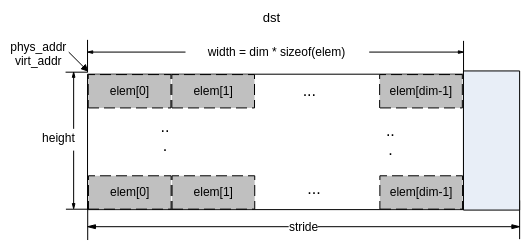

-   该接口和[ss\_mpi\_ive\_cnn\_get\_result](#ZH-CN_TOPIC_0000002470931258)配套使用，特征向量数组dst是[ss\_mpi\_ive\_cnn\_get\_result](#ZH-CN_TOPIC_0000002470931258)的输入。
-   CNN网络模型支持最多8层Conv-ReLU-Pooling和8层全连接层；Conv-ReLU-Pooling层的卷积核仅支持3x3，ReLU\(Rectified Linear Units\)和Pooling可配（见ot\_ive\_cnn\_actv\_func和ot\_ive\_cnn\_pooling），每层Conv-ReLU-Pooling最多输出50张feature map；全连接层仅支持ReLU激活函数，层数范围\[3, 8\]：全连接输入层（即Conv-ReLU-Pooling的最终输出）维数\[1, 1024\]，中间隐藏层神经元数目\[2,256\]，输出层维数\[1, 256\]。具体参数配置参见下列表格：

**表 1**  cnn模型中单层Conv-ReLU-Pooling运算包参数配置表

<a name="table9404mcpsimp"></a>
<table><thead align="left"><tr id="row9414mcpsimp"><th class="cellrowborder" valign="top" width="26.26262626262626%" id="mcps1.2.7.1.1"><p id="p9416mcpsimp"><a name="p9416mcpsimp"></a><a name="p9416mcpsimp"></a>Conv-ReLU-Pooling 运算包</p>
</th>
<th class="cellrowborder" valign="top" width="17.17171717171717%" id="mcps1.2.7.1.2"><p id="p9418mcpsimp"><a name="p9418mcpsimp"></a><a name="p9418mcpsimp"></a>模式</p>
</th>
<th class="cellrowborder" valign="top" width="12.121212121212121%" id="mcps1.2.7.1.3"><p id="p9420mcpsimp"><a name="p9420mcpsimp"></a><a name="p9420mcpsimp"></a>数量</p>
</th>
<th class="cellrowborder" valign="top" width="11.111111111111112%" id="mcps1.2.7.1.4"><p id="p9422mcpsimp"><a name="p9422mcpsimp"></a><a name="p9422mcpsimp"></a>大小</p>
</th>
<th class="cellrowborder" valign="top" width="10.101010101010102%" id="mcps1.2.7.1.5"><p id="p9424mcpsimp"><a name="p9424mcpsimp"></a><a name="p9424mcpsimp"></a>步长</p>
</th>
<th class="cellrowborder" valign="top" width="23.232323232323232%" id="mcps1.2.7.1.6"><p id="p9426mcpsimp"><a name="p9426mcpsimp"></a><a name="p9426mcpsimp"></a>边界填充</p>
</th>
</tr>
</thead>
<tbody><tr id="row9427mcpsimp"><td class="cellrowborder" valign="top" width="26.26262626262626%" headers="mcps1.2.7.1.1 "><p id="p9429mcpsimp"><a name="p9429mcpsimp"></a><a name="p9429mcpsimp"></a>Convolution</p>
</td>
<td class="cellrowborder" valign="top" width="17.17171717171717%" headers="mcps1.2.7.1.2 "><p id="p9431mcpsimp"><a name="p9431mcpsimp"></a><a name="p9431mcpsimp"></a>-</p>
</td>
<td class="cellrowborder" valign="top" width="12.121212121212121%" headers="mcps1.2.7.1.3 "><p id="p9433mcpsimp"><a name="p9433mcpsimp"></a><a name="p9433mcpsimp"></a>1-50</p>
</td>
<td class="cellrowborder" valign="top" width="11.111111111111112%" headers="mcps1.2.7.1.4 "><p id="p9435mcpsimp"><a name="p9435mcpsimp"></a><a name="p9435mcpsimp"></a>3x3</p>
</td>
<td class="cellrowborder" valign="top" width="10.101010101010102%" headers="mcps1.2.7.1.5 "><p id="p9437mcpsimp"><a name="p9437mcpsimp"></a><a name="p9437mcpsimp"></a>1</p>
</td>
<td class="cellrowborder" valign="top" width="23.232323232323232%" headers="mcps1.2.7.1.6 "><p id="p9439mcpsimp"><a name="p9439mcpsimp"></a><a name="p9439mcpsimp"></a>-</p>
</td>
</tr>
<tr id="row9440mcpsimp"><td class="cellrowborder" valign="top" width="26.26262626262626%" headers="mcps1.2.7.1.1 "><p id="p9442mcpsimp"><a name="p9442mcpsimp"></a><a name="p9442mcpsimp"></a>Activation</p>
</td>
<td class="cellrowborder" valign="top" width="17.17171717171717%" headers="mcps1.2.7.1.2 "><p id="p9444mcpsimp"><a name="p9444mcpsimp"></a><a name="p9444mcpsimp"></a>None\ReLU</p>
</td>
<td class="cellrowborder" valign="top" width="12.121212121212121%" headers="mcps1.2.7.1.3 "><p id="p9446mcpsimp"><a name="p9446mcpsimp"></a><a name="p9446mcpsimp"></a>-</p>
</td>
<td class="cellrowborder" valign="top" width="11.111111111111112%" headers="mcps1.2.7.1.4 "><p id="p9448mcpsimp"><a name="p9448mcpsimp"></a><a name="p9448mcpsimp"></a>-</p>
</td>
<td class="cellrowborder" valign="top" width="10.101010101010102%" headers="mcps1.2.7.1.5 "><p id="p9450mcpsimp"><a name="p9450mcpsimp"></a><a name="p9450mcpsimp"></a>-</p>
</td>
<td class="cellrowborder" valign="top" width="23.232323232323232%" headers="mcps1.2.7.1.6 "><p id="p9452mcpsimp"><a name="p9452mcpsimp"></a><a name="p9452mcpsimp"></a>-</p>
</td>
</tr>
<tr id="row9453mcpsimp"><td class="cellrowborder" valign="top" width="26.26262626262626%" headers="mcps1.2.7.1.1 "><p id="p9455mcpsimp"><a name="p9455mcpsimp"></a><a name="p9455mcpsimp"></a>Pooling</p>
</td>
<td class="cellrowborder" valign="top" width="17.17171717171717%" headers="mcps1.2.7.1.2 "><p id="p9457mcpsimp"><a name="p9457mcpsimp"></a><a name="p9457mcpsimp"></a>None\Max\</p>
<p id="p9458mcpsimp"><a name="p9458mcpsimp"></a><a name="p9458mcpsimp"></a>Average</p>
</td>
<td class="cellrowborder" valign="top" width="12.121212121212121%" headers="mcps1.2.7.1.3 "><p id="p9460mcpsimp"><a name="p9460mcpsimp"></a><a name="p9460mcpsimp"></a>-</p>
</td>
<td class="cellrowborder" valign="top" width="11.111111111111112%" headers="mcps1.2.7.1.4 "><p id="p9462mcpsimp"><a name="p9462mcpsimp"></a><a name="p9462mcpsimp"></a>2x2</p>
</td>
<td class="cellrowborder" valign="top" width="10.101010101010102%" headers="mcps1.2.7.1.5 "><p id="p9464mcpsimp"><a name="p9464mcpsimp"></a><a name="p9464mcpsimp"></a>2</p>
</td>
<td class="cellrowborder" valign="top" width="23.232323232323232%" headers="mcps1.2.7.1.6 "><p id="p9466mcpsimp"><a name="p9466mcpsimp"></a><a name="p9466mcpsimp"></a>向上取偶数对齐，复制边界。</p>
</td>
</tr>
</tbody>
</table>

**表 2**  cnn模型中全连接运算包参数配置表

<a name="table9467mcpsimp"></a>
<table><thead align="left"><tr id="row9476mcpsimp"><th class="cellrowborder" valign="top" width="26%" id="mcps1.2.6.1.1"><p id="p9478mcpsimp"><a name="p9478mcpsimp"></a><a name="p9478mcpsimp"></a>层数（含输入层）</p>
</th>
<th class="cellrowborder" valign="top" width="15%" id="mcps1.2.6.1.2"><p id="p9480mcpsimp"><a name="p9480mcpsimp"></a><a name="p9480mcpsimp"></a>输入层维数</p>
</th>
<th class="cellrowborder" valign="top" width="23%" id="mcps1.2.6.1.3"><p id="p9482mcpsimp"><a name="p9482mcpsimp"></a><a name="p9482mcpsimp"></a>中间隐藏层节点数</p>
</th>
<th class="cellrowborder" valign="top" width="15%" id="mcps1.2.6.1.4"><p id="p9484mcpsimp"><a name="p9484mcpsimp"></a><a name="p9484mcpsimp"></a>输出层维数</p>
</th>
<th class="cellrowborder" valign="top" width="21%" id="mcps1.2.6.1.5"><p id="p9486mcpsimp"><a name="p9486mcpsimp"></a><a name="p9486mcpsimp"></a>隐藏层激活函数</p>
</th>
</tr>
</thead>
<tbody><tr id="row9487mcpsimp"><td class="cellrowborder" valign="top" width="26%" headers="mcps1.2.6.1.1 "><p id="p9489mcpsimp"><a name="p9489mcpsimp"></a><a name="p9489mcpsimp"></a>3-8</p>
</td>
<td class="cellrowborder" valign="top" width="15%" headers="mcps1.2.6.1.2 "><p id="p9491mcpsimp"><a name="p9491mcpsimp"></a><a name="p9491mcpsimp"></a>1-1024</p>
</td>
<td class="cellrowborder" valign="top" width="23%" headers="mcps1.2.6.1.3 "><p id="p9493mcpsimp"><a name="p9493mcpsimp"></a><a name="p9493mcpsimp"></a>2-256</p>
</td>
<td class="cellrowborder" valign="top" width="15%" headers="mcps1.2.6.1.4 "><p id="p9495mcpsimp"><a name="p9495mcpsimp"></a><a name="p9495mcpsimp"></a>1-256</p>
</td>
<td class="cellrowborder" valign="top" width="21%" headers="mcps1.2.6.1.5 "><p id="p9497mcpsimp"><a name="p9497mcpsimp"></a><a name="p9497mcpsimp"></a>ReLU</p>
</td>
</tr>
</tbody>
</table>

-   以单个输入样本，n+1（1≤n+1≤8）层Conv-ReLU-Pooling和m+1（3≤m+1≤8）层全连接层为例，CNN网络模型如[图2](#fig20450122212328)所示。注意图示中，FCL-0是Pooling-n各图像数据拉成的列向量，实际计算过程中Pooling-n的结果会直接以FCL-0的形式输出。

    **图 2**  cnn网络模型示意图<a name="fig20450122212328"></a>  
    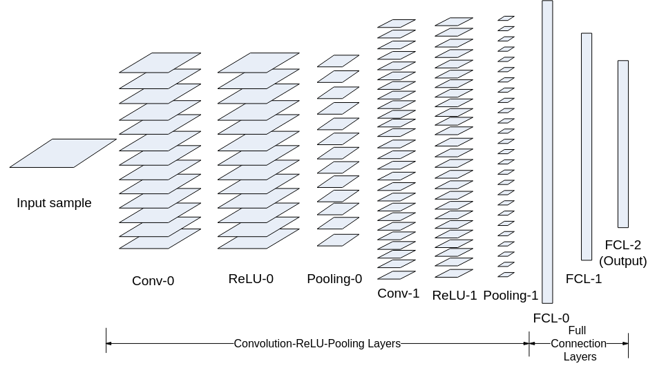

【举例】

无。

【相关主题】

-   [ss\_mpi\_ive\_cnn\_load\_model](#ss_mpi_ive_cnn_load_model)
-   [ss\_mpi\_ive\_cnn\_unload\_model](#ss_mpi_ive_cnn_unload_model)
-   [ss\_mpi\_ive\_cnn\_get\_result](#ss_mpi_ive_cnn_get_result)

## ss\_mpi\_ive\_cnn\_get\_result<a name="ZH-CN_TOPIC_0000002470931258"></a>

【描述】

接收cnn\_predict结果，执行softmax运算来预测每个样本图像的类别，并输出置信度最高的类别\(Rank-1\)以及对应的置信度。

【语法】

```
td_s32 ss_mpi_ive_cnn_get_result(const ot_svp_src_data *src, const ot_svp_dst_mem_info *dst, const ot_ive_cnn_model *model, const ot_ive_cnn_ctrl *ctrl);
```

【参数】

<a name="table14147mcpsimp"></a>
<table><thead align="left"><tr id="row14153mcpsimp"><th class="cellrowborder" valign="top" width="23%" id="mcps1.1.4.1.1"><p id="p14155mcpsimp"><a name="p14155mcpsimp"></a><a name="p14155mcpsimp"></a>参数名称</p>
</th>
<th class="cellrowborder" valign="top" width="59%" id="mcps1.1.4.1.2"><p id="p14157mcpsimp"><a name="p14157mcpsimp"></a><a name="p14157mcpsimp"></a>描述</p>
</th>
<th class="cellrowborder" valign="top" width="18%" id="mcps1.1.4.1.3"><p id="p14159mcpsimp"><a name="p14159mcpsimp"></a><a name="p14159mcpsimp"></a>输入/输出</p>
</th>
</tr>
</thead>
<tbody><tr id="row14161mcpsimp"><td class="cellrowborder" valign="top" width="23%" headers="mcps1.1.4.1.1 "><p id="p14163mcpsimp"><a name="p14163mcpsimp"></a><a name="p14163mcpsimp"></a>src</p>
</td>
<td class="cellrowborder" valign="top" width="59%" headers="mcps1.1.4.1.2 "><p id="p14165mcpsimp"><a name="p14165mcpsimp"></a><a name="p14165mcpsimp"></a>源数据指针。源数据为<a href="#ss_mpi_ive_cnn_predict">ss_mpi_ive_cnn_predict</a>的输出。不能为空。</p>
</td>
<td class="cellrowborder" valign="top" width="18%" headers="mcps1.1.4.1.3 "><p id="p14168mcpsimp"><a name="p14168mcpsimp"></a><a name="p14168mcpsimp"></a>输入</p>
</td>
</tr>
<tr id="row14169mcpsimp"><td class="cellrowborder" valign="top" width="23%" headers="mcps1.1.4.1.1 "><p id="p14171mcpsimp"><a name="p14171mcpsimp"></a><a name="p14171mcpsimp"></a>dst</p>
</td>
<td class="cellrowborder" valign="top" width="59%" headers="mcps1.1.4.1.2 "><p id="p14173mcpsimp"><a name="p14173mcpsimp"></a><a name="p14173mcpsimp"></a>预测结果结构体指针，指向ot_ive_cnn_result的数组，表示各个样本的类别和置信度。</p>
<p id="p14175mcpsimp"><a name="p14175mcpsimp"></a><a name="p14175mcpsimp"></a>不能为空。</p>
<p id="p14176mcpsimp"><a name="p14176mcpsimp"></a><a name="p14176mcpsimp"></a>具体描述请参见《SVPx.0 API 参考》</p>
</td>
<td class="cellrowborder" valign="top" width="18%" headers="mcps1.1.4.1.3 "><p id="p14178mcpsimp"><a name="p14178mcpsimp"></a><a name="p14178mcpsimp"></a>输出</p>
</td>
</tr>
<tr id="row14179mcpsimp"><td class="cellrowborder" valign="top" width="23%" headers="mcps1.1.4.1.1 "><p id="p14181mcpsimp"><a name="p14181mcpsimp"></a><a name="p14181mcpsimp"></a>model</p>
</td>
<td class="cellrowborder" valign="top" width="59%" headers="mcps1.1.4.1.2 "><p id="p14183mcpsimp"><a name="p14183mcpsimp"></a><a name="p14183mcpsimp"></a>CNN模型结构体指针。</p>
<p id="p14184mcpsimp"><a name="p14184mcpsimp"></a><a name="p14184mcpsimp"></a>不能为空。</p>
</td>
<td class="cellrowborder" valign="top" width="18%" headers="mcps1.1.4.1.3 "><p id="p14186mcpsimp"><a name="p14186mcpsimp"></a><a name="p14186mcpsimp"></a>输入</p>
</td>
</tr>
<tr id="row14187mcpsimp"><td class="cellrowborder" valign="top" width="23%" headers="mcps1.1.4.1.1 "><p id="p14189mcpsimp"><a name="p14189mcpsimp"></a><a name="p14189mcpsimp"></a>ctrl</p>
</td>
<td class="cellrowborder" valign="top" width="59%" headers="mcps1.1.4.1.2 "><p id="p14191mcpsimp"><a name="p14191mcpsimp"></a><a name="p14191mcpsimp"></a>控制参数指针。不能为空。</p>
</td>
<td class="cellrowborder" valign="top" width="18%" headers="mcps1.1.4.1.3 "><p id="p14193mcpsimp"><a name="p14193mcpsimp"></a><a name="p14193mcpsimp"></a>输入</p>
</td>
</tr>
</tbody>
</table>

【返回值】

<a name="table14195mcpsimp"></a>
<table><thead align="left"><tr id="row14200mcpsimp"><th class="cellrowborder" valign="top" width="50%" id="mcps1.1.3.1.1"><p id="p14202mcpsimp"><a name="p14202mcpsimp"></a><a name="p14202mcpsimp"></a>返回值</p>
</th>
<th class="cellrowborder" valign="top" width="50%" id="mcps1.1.3.1.2"><p id="p14204mcpsimp"><a name="p14204mcpsimp"></a><a name="p14204mcpsimp"></a>描述</p>
</th>
</tr>
</thead>
<tbody><tr id="row14206mcpsimp"><td class="cellrowborder" valign="top" width="50%" headers="mcps1.1.3.1.1 "><p id="p14208mcpsimp"><a name="p14208mcpsimp"></a><a name="p14208mcpsimp"></a>0</p>
</td>
<td class="cellrowborder" valign="top" width="50%" headers="mcps1.1.3.1.2 "><p id="p14210mcpsimp"><a name="p14210mcpsimp"></a><a name="p14210mcpsimp"></a>成功。</p>
</td>
</tr>
<tr id="row14211mcpsimp"><td class="cellrowborder" valign="top" width="50%" headers="mcps1.1.3.1.1 "><p id="p14213mcpsimp"><a name="p14213mcpsimp"></a><a name="p14213mcpsimp"></a>非0</p>
</td>
<td class="cellrowborder" valign="top" width="50%" headers="mcps1.1.3.1.2 "><p id="p14215mcpsimp"><a name="p14215mcpsimp"></a><a name="p14215mcpsimp"></a>失败，参见<span xml:lang="fr-FR" id="ph136311818172213"><a name="ph136311818172213"></a><a name="ph136311818172213"></a>错误码</span><span xml:lang="fr-FR" id="ph5283mcpsimp"><a name="ph5283mcpsimp"></a><a name="ph5283mcpsimp"></a>。</span></p>
</td>
</tr>
</tbody>
</table>

【解决方案差异】

<a name="table14220mcpsimp"></a>
<table><thead align="left"><tr id="row14225mcpsimp"><th class="cellrowborder" valign="top" width="28.999999999999996%" id="mcps1.1.3.1.1"><p id="p14227mcpsimp"><a name="p14227mcpsimp"></a><a name="p14227mcpsimp"></a>解决方案名称</p>
</th>
<th class="cellrowborder" valign="top" width="71%" id="mcps1.1.3.1.2"><p id="p14229mcpsimp"><a name="p14229mcpsimp"></a><a name="p14229mcpsimp"></a>差异</p>
</th>
</tr>
</thead>
<tbody><tr id="row14251mcpsimp"><td class="cellrowborder" valign="top" width="28.999999999999996%" headers="mcps1.1.3.1.1 "><p id="p14253mcpsimp"><a name="p14253mcpsimp"></a><a name="p14253mcpsimp"></a>SS928V100</p>
</td>
<td class="cellrowborder" valign="top" width="71%" headers="mcps1.1.3.1.2 "><p id="p14255mcpsimp"><a name="p14255mcpsimp"></a><a name="p14255mcpsimp"></a>不支持</p>
</td>
</tr>
<tr id="row6928133793611"><td class="cellrowborder" valign="top" width="28.999999999999996%" headers="mcps1.1.3.1.1 "><p id="p1823012815334"><a name="p1823012815334"></a><a name="p1823012815334"></a>SS927V100</p>
</td>
<td class="cellrowborder" valign="top" width="71%" headers="mcps1.1.3.1.2 "><p id="p192301028123318"><a name="p192301028123318"></a><a name="p192301028123318"></a>不支持</p>
</td>
</tr>
</tbody>
</table>

【需求】

-   头文件：ot\_common\_ive.h、ot\_common\_svp.h、ss\_mpi\_ive.h
-   库文件：libss\_ive.a（PC上模拟用ss\_ive\_clib2.x.lib）

【注意】

-   源数据src必须为[ss\_mpi\_ive\_cnn\_predict](#ZH-CN_TOPIC_0000002470931276)的输出，model和ctrl必须与调用时的参数一致。
-   预测结果dst指向ot\_ive\_cnn\_result的数组，数组元素数目n=ctrl-\>num，其内存排布如[图1](#fig174217383416)所示。

**图 1**  cnn各样本预测结果示意图<a name="fig174217383416"></a>  
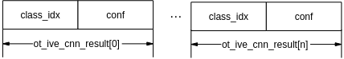

-   该接口实现的rank-1版本，用户可根据自己的需求实现rank-n（表示最可能的n类）版本，步骤如下：
    1.  通过softmax计算出每个类别的置信度；
    2.  对置信度进行排序；
    3.  输出rank-n的结果。

【举例】

无。

【相关主题】

-   [ss\_mpi\_ive\_cnn\_load\_model](#ss_mpi_ive_cnn_load_model)
-   [ss\_mpi\_ive\_cnn\_unload\_model](#ss_mpi_ive_cnn_unload_model)
-   [ss\_mpi\_ive\_cnn\_predict](#ss_mpi_ive_cnn_predict)

## ss\_mpi\_ive\_persp\_trans<a name="ZH-CN_TOPIC_0000002503971185"></a>

【描述】

根据输入源图的区域位置和点对信息做相应的透视变换。

【语法】

```
td_s32 ss_mpi_ive_persp_trans(ot_ive_handle *handle, const ot_svp_src_img *src, const ot_svp_rect_u16 roi[], const ot_svp_src_mem_info point_pair[], const ot_svp_dst_img dst[], const ot_ive_persp_trans_ctrl *ctrl, td_bool is_instant);
```

【参数】

<a name="table8336mcpsimp"></a>
<table><thead align="left"><tr id="row8342mcpsimp"><th class="cellrowborder" valign="top" width="23%" id="mcps1.1.4.1.1"><p id="p8344mcpsimp"><a name="p8344mcpsimp"></a><a name="p8344mcpsimp"></a>参数名称</p>
</th>
<th class="cellrowborder" valign="top" width="59%" id="mcps1.1.4.1.2"><p id="p8346mcpsimp"><a name="p8346mcpsimp"></a><a name="p8346mcpsimp"></a>描述</p>
</th>
<th class="cellrowborder" valign="top" width="18%" id="mcps1.1.4.1.3"><p id="p8348mcpsimp"><a name="p8348mcpsimp"></a><a name="p8348mcpsimp"></a>输入/输出</p>
</th>
</tr>
</thead>
<tbody><tr id="row8350mcpsimp"><td class="cellrowborder" valign="top" width="23%" headers="mcps1.1.4.1.1 "><p id="p8352mcpsimp"><a name="p8352mcpsimp"></a><a name="p8352mcpsimp"></a>handle</p>
</td>
<td class="cellrowborder" valign="top" width="59%" headers="mcps1.1.4.1.2 "><p id="p8354mcpsimp"><a name="p8354mcpsimp"></a><a name="p8354mcpsimp"></a>handle指针。</p>
<p id="p8355mcpsimp"><a name="p8355mcpsimp"></a><a name="p8355mcpsimp"></a>不能为空。</p>
</td>
<td class="cellrowborder" valign="top" width="18%" headers="mcps1.1.4.1.3 "><p id="p8357mcpsimp"><a name="p8357mcpsimp"></a><a name="p8357mcpsimp"></a>输出</p>
</td>
</tr>
<tr id="row8358mcpsimp"><td class="cellrowborder" valign="top" width="23%" headers="mcps1.1.4.1.1 "><p id="p8360mcpsimp"><a name="p8360mcpsimp"></a><a name="p8360mcpsimp"></a>src</p>
</td>
<td class="cellrowborder" valign="top" width="59%" headers="mcps1.1.4.1.2 "><p id="p8362mcpsimp"><a name="p8362mcpsimp"></a><a name="p8362mcpsimp"></a>源数据指针。不能为空。</p>
</td>
<td class="cellrowborder" valign="top" width="18%" headers="mcps1.1.4.1.3 "><p id="p8364mcpsimp"><a name="p8364mcpsimp"></a><a name="p8364mcpsimp"></a>输入</p>
</td>
</tr>
<tr id="row8365mcpsimp"><td class="cellrowborder" valign="top" width="23%" headers="mcps1.1.4.1.1 "><p id="p8367mcpsimp"><a name="p8367mcpsimp"></a><a name="p8367mcpsimp"></a>roi[]</p>
</td>
<td class="cellrowborder" valign="top" width="59%" headers="mcps1.1.4.1.2 "><p id="p8369mcpsimp"><a name="p8369mcpsimp"></a><a name="p8369mcpsimp"></a>源图区域信息。</p>
<p id="p8370mcpsimp"><a name="p8370mcpsimp"></a><a name="p8370mcpsimp"></a>取值范围：</p>
<a name="ul8371mcpsimp"></a><a name="ul8371mcpsimp"></a><ul id="ul8371mcpsimp"><li>宽：[20, 1024]</li><li>高：[20, 1024]</li></ul>
<p id="p8374mcpsimp"><a name="p8374mcpsimp"></a><a name="p8374mcpsimp"></a>不能为空。</p>
</td>
<td class="cellrowborder" valign="top" width="18%" headers="mcps1.1.4.1.3 "><p id="p8376mcpsimp"><a name="p8376mcpsimp"></a><a name="p8376mcpsimp"></a>输入</p>
</td>
</tr>
<tr id="row8377mcpsimp"><td class="cellrowborder" valign="top" width="23%" headers="mcps1.1.4.1.1 "><p id="p8379mcpsimp"><a name="p8379mcpsimp"></a><a name="p8379mcpsimp"></a>point_pair[]</p>
</td>
<td class="cellrowborder" valign="top" width="59%" headers="mcps1.1.4.1.2 "><p id="p8381mcpsimp"><a name="p8381mcpsimp"></a><a name="p8381mcpsimp"></a>做透视变换的点对信息。</p>
<p id="p8382mcpsimp"><a name="p8382mcpsimp"></a><a name="p8382mcpsimp"></a>不能为空。</p>
<p id="p8383mcpsimp"><a name="p8383mcpsimp"></a><a name="p8383mcpsimp"></a>具体描述请参见《SVPx.0 API 参考》</p>
</td>
<td class="cellrowborder" valign="top" width="18%" headers="mcps1.1.4.1.3 "><p id="p8385mcpsimp"><a name="p8385mcpsimp"></a><a name="p8385mcpsimp"></a>输入</p>
</td>
</tr>
<tr id="row8386mcpsimp"><td class="cellrowborder" valign="top" width="23%" headers="mcps1.1.4.1.1 "><p id="p8388mcpsimp"><a name="p8388mcpsimp"></a><a name="p8388mcpsimp"></a>dst[]</p>
</td>
<td class="cellrowborder" valign="top" width="59%" headers="mcps1.1.4.1.2 "><p id="p8390mcpsimp"><a name="p8390mcpsimp"></a><a name="p8390mcpsimp"></a>经过透视变换之后的结果信息。</p>
<p id="p8391mcpsimp"><a name="p8391mcpsimp"></a><a name="p8391mcpsimp"></a>不能为空。</p>
</td>
<td class="cellrowborder" valign="top" width="18%" headers="mcps1.1.4.1.3 "><p id="p8393mcpsimp"><a name="p8393mcpsimp"></a><a name="p8393mcpsimp"></a>输出</p>
</td>
</tr>
<tr id="row8394mcpsimp"><td class="cellrowborder" valign="top" width="23%" headers="mcps1.1.4.1.1 "><p id="p8396mcpsimp"><a name="p8396mcpsimp"></a><a name="p8396mcpsimp"></a>ctrl</p>
</td>
<td class="cellrowborder" valign="top" width="59%" headers="mcps1.1.4.1.2 "><p id="p8398mcpsimp"><a name="p8398mcpsimp"></a><a name="p8398mcpsimp"></a>控制信息指针。</p>
<p id="p8399mcpsimp"><a name="p8399mcpsimp"></a><a name="p8399mcpsimp"></a>不能为空。</p>
</td>
<td class="cellrowborder" valign="top" width="18%" headers="mcps1.1.4.1.3 "><p id="p8401mcpsimp"><a name="p8401mcpsimp"></a><a name="p8401mcpsimp"></a>输入</p>
</td>
</tr>
<tr id="row8402mcpsimp"><td class="cellrowborder" valign="top" width="23%" headers="mcps1.1.4.1.1 "><p id="p8404mcpsimp"><a name="p8404mcpsimp"></a><a name="p8404mcpsimp"></a>is_instant</p>
</td>
<td class="cellrowborder" valign="top" width="59%" headers="mcps1.1.4.1.2 "><p id="p8406mcpsimp"><a name="p8406mcpsimp"></a><a name="p8406mcpsimp"></a>及时返回结果标志。</p>
</td>
<td class="cellrowborder" valign="top" width="18%" headers="mcps1.1.4.1.3 "><p id="p8408mcpsimp"><a name="p8408mcpsimp"></a><a name="p8408mcpsimp"></a>输入</p>
</td>
</tr>
</tbody>
</table>

<a name="table8409mcpsimp"></a>
<table><thead align="left"><tr id="row8416mcpsimp"><th class="cellrowborder" valign="top" width="13%" id="mcps1.1.5.1.1"><p id="p8418mcpsimp"><a name="p8418mcpsimp"></a><a name="p8418mcpsimp"></a>参数名称</p>
</th>
<th class="cellrowborder" valign="top" width="51%" id="mcps1.1.5.1.2"><p id="p8420mcpsimp"><a name="p8420mcpsimp"></a><a name="p8420mcpsimp"></a>支持图像类型</p>
</th>
<th class="cellrowborder" valign="top" width="11%" id="mcps1.1.5.1.3"><p id="p8422mcpsimp"><a name="p8422mcpsimp"></a><a name="p8422mcpsimp"></a>地址对齐</p>
</th>
<th class="cellrowborder" valign="top" width="25%" id="mcps1.1.5.1.4"><p id="p8424mcpsimp"><a name="p8424mcpsimp"></a><a name="p8424mcpsimp"></a>分辨率</p>
</th>
</tr>
</thead>
<tbody><tr id="row8426mcpsimp"><td class="cellrowborder" valign="top" width="13%" headers="mcps1.1.5.1.1 "><p id="p8428mcpsimp"><a name="p8428mcpsimp"></a><a name="p8428mcpsimp"></a>src</p>
</td>
<td class="cellrowborder" valign="top" width="51%" headers="mcps1.1.5.1.2 "><p id="p8430mcpsimp"><a name="p8430mcpsimp"></a><a name="p8430mcpsimp"></a>OT_SVP_IMG_TYPE_U8C1/ OT_SVP_IMG_TYPE_YUV420SP</p>
</td>
<td class="cellrowborder" valign="top" width="11%" headers="mcps1.1.5.1.3 "><p id="p8432mcpsimp"><a name="p8432mcpsimp"></a><a name="p8432mcpsimp"></a>16 byte</p>
</td>
<td class="cellrowborder" valign="top" width="25%" headers="mcps1.1.5.1.4 "><p id="p8434mcpsimp"><a name="p8434mcpsimp"></a><a name="p8434mcpsimp"></a>20x20~1920x1080</p>
</td>
</tr>
<tr id="row8435mcpsimp"><td class="cellrowborder" valign="top" width="13%" headers="mcps1.1.5.1.1 "><p id="p8437mcpsimp"><a name="p8437mcpsimp"></a><a name="p8437mcpsimp"></a>dst[]</p>
</td>
<td class="cellrowborder" valign="top" width="51%" headers="mcps1.1.5.1.2 "><p id="p8439mcpsimp"><a name="p8439mcpsimp"></a><a name="p8439mcpsimp"></a>OT_SVP_IMG_TYPE_U8C1/ OT_SVP_IMG_TYPE_YUV420SP/</p>
<p id="p8440mcpsimp"><a name="p8440mcpsimp"></a><a name="p8440mcpsimp"></a>OT_SVP_IMG_TYPE_U8C3_PACKAGE</p>
</td>
<td class="cellrowborder" valign="top" width="11%" headers="mcps1.1.5.1.3 "><p id="p8442mcpsimp"><a name="p8442mcpsimp"></a><a name="p8442mcpsimp"></a>16 byte</p>
</td>
<td class="cellrowborder" valign="top" width="25%" headers="mcps1.1.5.1.4 "><p id="p8444mcpsimp"><a name="p8444mcpsimp"></a><a name="p8444mcpsimp"></a>20x20~256x256</p>
</td>
</tr>
</tbody>
</table>

【返回值】

<a name="table8446mcpsimp"></a>
<table><thead align="left"><tr id="row8451mcpsimp"><th class="cellrowborder" valign="top" width="50%" id="mcps1.1.3.1.1"><p id="p8453mcpsimp"><a name="p8453mcpsimp"></a><a name="p8453mcpsimp"></a>返回值</p>
</th>
<th class="cellrowborder" valign="top" width="50%" id="mcps1.1.3.1.2"><p id="p8455mcpsimp"><a name="p8455mcpsimp"></a><a name="p8455mcpsimp"></a>描述</p>
</th>
</tr>
</thead>
<tbody><tr id="row8457mcpsimp"><td class="cellrowborder" valign="top" width="50%" headers="mcps1.1.3.1.1 "><p id="p8459mcpsimp"><a name="p8459mcpsimp"></a><a name="p8459mcpsimp"></a>0</p>
</td>
<td class="cellrowborder" valign="top" width="50%" headers="mcps1.1.3.1.2 "><p id="p8461mcpsimp"><a name="p8461mcpsimp"></a><a name="p8461mcpsimp"></a>成功。</p>
</td>
</tr>
<tr id="row8462mcpsimp"><td class="cellrowborder" valign="top" width="50%" headers="mcps1.1.3.1.1 "><p id="p8464mcpsimp"><a name="p8464mcpsimp"></a><a name="p8464mcpsimp"></a>非0</p>
</td>
<td class="cellrowborder" valign="top" width="50%" headers="mcps1.1.3.1.2 "><p id="p7404mcpsimp"><a name="p7404mcpsimp"></a><a name="p7404mcpsimp"></a>失败，参见<span xml:lang="fr-FR" id="ph136311818172213"><a name="ph136311818172213"></a><a name="ph136311818172213"></a>错误码</span><span xml:lang="fr-FR" id="ph5283mcpsimp"><a name="ph5283mcpsimp"></a><a name="ph5283mcpsimp"></a>。</span></p>
</td>
</tr>
</tbody>
</table>

【需求】

-   头文件：ot\_common\_ive.h、ot\_common\_svp.h、ss\_mpi\_ive.h
-   库文件：libss\_ive.a（PC上模拟用ss\_ive\_clib2.x.lib）

【注意】

-   所有区域的透视变换算法模式相同。
-   点对point\_pair在内存的排布格式：

    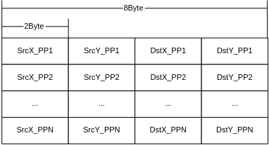

    SrcX\_PPN为第N个点对源X坐标，SrcY\_PPN为第N个点对源Y坐标，DstX\_PPN为第N个点对目的X坐标，DstY\_PPN为第N个点对目的Y坐标。坐标都是用u14q2表示。

-   算法原理描述：

    仿射变换是投影变换的一种特殊形式，从数学的角度看，仿射变换就是向量经过一次线性变换加一次平移变换，用公式可以表示为：

    其中，为变换前原始向量，为变换后目标向量，A为线性变换矩阵，为平移变换向量。公式可以统一描述成下面的矩阵的形式以方便计算和理解：

    

    在图像处理中，向量就是二维坐标（x, y），所以上面的矩阵可以改写成下面的坐标表达形式：

    

    对于一幅图像，如果我们知道变换矩阵T，便可对图像中任何一点进行仿射变换。由于T是一个3x3的矩阵，要求解该矩阵需要至少三组已知点对。根据不同的变换矩阵系数的组合，图像几何矫正就是在各种选定的图像变换（例如平移，缩放，旋转，斜切和透视等，如[图1](#fig126481982440)所示）方式下，利用标定的原图像和目标图像的基准点对，求解得到变换矩阵，然后用该变换矩阵对源图像做变化得到矫正后的目标图像：

    **图 1**  图像变换<a name="fig126481982440"></a>  
    

    图像透视变换应用广泛，下面以_图像分析_中的人脸矫正为例进行说明。典型的_图像分析_应用如[图2](#fig32111813490)所示，首先利用人脸的关键点检测算法将人脸的关键点Landmark（LMK）检测出来，不同的关键点检测算法检测到的关键点的个数各异，persp\_trans算子支持最大68个关键点基准点对，通过人脸的关键点点对，建立超定线性方程并求解得到变换矩阵，将检测到的人脸几何矫正后裁剪到标准图像大小。

    **图 2** _图像分析_应用<a name="fig32111813490"></a>  
    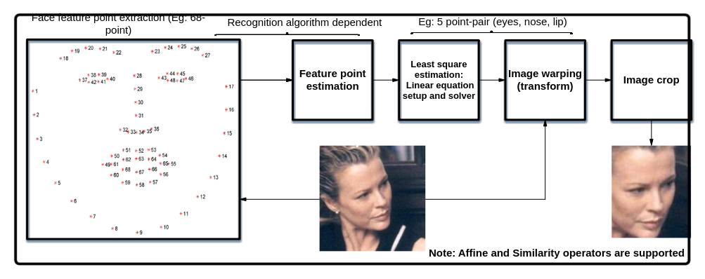

    本算子目前支持的变换方式包括平移、缩放、旋转和斜切，求解得到的变换矩阵系数是这些变换方式的融合，变换矩阵各参数对应的变换模式的物理意义分解如[图3](#fig1884586175320)所示。

    **图 3**  变换矩阵各参数对应的变换模式<a name="fig1884586175320"></a>  
    

    [图4](#fig572333910816)给出一个具体的利用5个基准点对，眼睛（2）、鼻子（1）、嘴（2）用例，利用图示的点对，求解得到图示的变换矩阵，将250x250的人脸图像变换到标准图像库96x112分辨率的图像进行_图像分析_。

    **图 4**  人脸图像变换<a name="fig572333910816"></a>  
    

【举例】

无

【相关主题】

无

## ss\_mpi\_ive\_kcf\_get\_mem\_size<a name="ZH-CN_TOPIC_0000002470931306"></a>

【描述】

获取需要创建目标对象数的内存大小。

【语法】

```
td_s32 ss_mpi_ive_kcf_get_mem_size(td_u32 max_obj_num, td_u32 *size);
```

【参数】

<a name="table15835mcpsimp"></a>
<table><thead align="left"><tr id="row15841mcpsimp"><th class="cellrowborder" valign="top" width="23%" id="mcps1.1.4.1.1"><p id="p15843mcpsimp"><a name="p15843mcpsimp"></a><a name="p15843mcpsimp"></a>参数名称</p>
</th>
<th class="cellrowborder" valign="top" width="59%" id="mcps1.1.4.1.2"><p id="p15845mcpsimp"><a name="p15845mcpsimp"></a><a name="p15845mcpsimp"></a>描述</p>
</th>
<th class="cellrowborder" valign="top" width="18%" id="mcps1.1.4.1.3"><p id="p15847mcpsimp"><a name="p15847mcpsimp"></a><a name="p15847mcpsimp"></a>输入/输出</p>
</th>
</tr>
</thead>
<tbody><tr id="row15849mcpsimp"><td class="cellrowborder" valign="top" width="23%" headers="mcps1.1.4.1.1 "><p id="p15851mcpsimp"><a name="p15851mcpsimp"></a><a name="p15851mcpsimp"></a>max_obj_num</p>
</td>
<td class="cellrowborder" valign="top" width="59%" headers="mcps1.1.4.1.2 "><p id="p15853mcpsimp"><a name="p15853mcpsimp"></a><a name="p15853mcpsimp"></a>最大目标对象数。取值范围：[1, 64]</p>
</td>
<td class="cellrowborder" valign="top" width="18%" headers="mcps1.1.4.1.3 "><p id="p15855mcpsimp"><a name="p15855mcpsimp"></a><a name="p15855mcpsimp"></a>输入</p>
</td>
</tr>
<tr id="row15856mcpsimp"><td class="cellrowborder" valign="top" width="23%" headers="mcps1.1.4.1.1 "><p id="p15858mcpsimp"><a name="p15858mcpsimp"></a><a name="p15858mcpsimp"></a>size</p>
</td>
<td class="cellrowborder" valign="top" width="59%" headers="mcps1.1.4.1.2 "><p id="p15860mcpsimp"><a name="p15860mcpsimp"></a><a name="p15860mcpsimp"></a>内存大小指针。不能为空。</p>
</td>
<td class="cellrowborder" valign="top" width="18%" headers="mcps1.1.4.1.3 "><p id="p15862mcpsimp"><a name="p15862mcpsimp"></a><a name="p15862mcpsimp"></a>输出</p>
</td>
</tr>
</tbody>
</table>

【返回值】

<a name="table15864mcpsimp"></a>
<table><thead align="left"><tr id="row15869mcpsimp"><th class="cellrowborder" valign="top" width="50%" id="mcps1.1.3.1.1"><p id="p15871mcpsimp"><a name="p15871mcpsimp"></a><a name="p15871mcpsimp"></a>返回值</p>
</th>
<th class="cellrowborder" valign="top" width="50%" id="mcps1.1.3.1.2"><p id="p15873mcpsimp"><a name="p15873mcpsimp"></a><a name="p15873mcpsimp"></a>描述</p>
</th>
</tr>
</thead>
<tbody><tr id="row15875mcpsimp"><td class="cellrowborder" valign="top" width="50%" headers="mcps1.1.3.1.1 "><p id="p15877mcpsimp"><a name="p15877mcpsimp"></a><a name="p15877mcpsimp"></a>0</p>
</td>
<td class="cellrowborder" valign="top" width="50%" headers="mcps1.1.3.1.2 "><p id="p15879mcpsimp"><a name="p15879mcpsimp"></a><a name="p15879mcpsimp"></a>成功。</p>
</td>
</tr>
<tr id="row15880mcpsimp"><td class="cellrowborder" valign="top" width="50%" headers="mcps1.1.3.1.1 "><p id="p15882mcpsimp"><a name="p15882mcpsimp"></a><a name="p15882mcpsimp"></a>非0</p>
</td>
<td class="cellrowborder" valign="top" width="50%" headers="mcps1.1.3.1.2 "><p id="p7404mcpsimp"><a name="p7404mcpsimp"></a><a name="p7404mcpsimp"></a>失败，参见<span xml:lang="fr-FR" id="ph136311818172213"><a name="ph136311818172213"></a><a name="ph136311818172213"></a>错误码</span><span xml:lang="fr-FR" id="ph5283mcpsimp"><a name="ph5283mcpsimp"></a><a name="ph5283mcpsimp"></a>。</span></p>
</td>
</tr>
</tbody>
</table>

【需求】

-   头文件：ot\_common\_ive.h、ot\_common\_svp.h、ss\_mpi\_ive.h
-   库文件：libss\_ive.a（PC上模拟用ss\_ive\_clib2.x.lib）

【注意】

申请通过本接口获取到的内存大小的内存，作为[ss\_mpi\_ive\_kcf\_create\_obj\_list](#ZH-CN_TOPIC_0000002504091179)接口输入来创建目标链表。

【举例】

无

【相关主题】

[ss\_mpi\_ive\_kcf\_create\_obj\_list](#ss_mpi_ive_kcf_create_obj_list)

## ss\_mpi\_ive\_kcf\_create\_obj\_list<a name="ZH-CN_TOPIC_0000002504091179"></a>

【描述】

创建目标链表。

【语法】

```
td_s32 ss_mpi_ive_kcf_create_obj_list(const ot_svp_mem_info *mem, td_u32 max_obj_num, ot_ive_kcf_obj_list *obj_list);
```

【参数】

<a name="table11794mcpsimp"></a>
<table><thead align="left"><tr id="row11800mcpsimp"><th class="cellrowborder" valign="top" width="23%" id="mcps1.1.4.1.1"><p id="p11802mcpsimp"><a name="p11802mcpsimp"></a><a name="p11802mcpsimp"></a>参数名称</p>
</th>
<th class="cellrowborder" valign="top" width="59%" id="mcps1.1.4.1.2"><p id="p11804mcpsimp"><a name="p11804mcpsimp"></a><a name="p11804mcpsimp"></a>描述</p>
</th>
<th class="cellrowborder" valign="top" width="18%" id="mcps1.1.4.1.3"><p id="p11806mcpsimp"><a name="p11806mcpsimp"></a><a name="p11806mcpsimp"></a>输入/输出</p>
</th>
</tr>
</thead>
<tbody><tr id="row11808mcpsimp"><td class="cellrowborder" valign="top" width="23%" headers="mcps1.1.4.1.1 "><p id="p11810mcpsimp"><a name="p11810mcpsimp"></a><a name="p11810mcpsimp"></a>mem</p>
</td>
<td class="cellrowborder" valign="top" width="59%" headers="mcps1.1.4.1.2 "><p id="p11812mcpsimp"><a name="p11812mcpsimp"></a><a name="p11812mcpsimp"></a>创建目标链表内存指针。不能为空。</p>
<p id="p11813mcpsimp"><a name="p11813mcpsimp"></a><a name="p11813mcpsimp"></a>具体描述请参见《SVPx.0 API 参考》</p>
</td>
<td class="cellrowborder" valign="top" width="18%" headers="mcps1.1.4.1.3 "><p id="p11815mcpsimp"><a name="p11815mcpsimp"></a><a name="p11815mcpsimp"></a>输入</p>
</td>
</tr>
<tr id="row11816mcpsimp"><td class="cellrowborder" valign="top" width="23%" headers="mcps1.1.4.1.1 "><p id="p11818mcpsimp"><a name="p11818mcpsimp"></a><a name="p11818mcpsimp"></a>max_obj_num</p>
</td>
<td class="cellrowborder" valign="top" width="59%" headers="mcps1.1.4.1.2 "><p id="p11820mcpsimp"><a name="p11820mcpsimp"></a><a name="p11820mcpsimp"></a>最大目标数。取值范围：[1, 64]</p>
</td>
<td class="cellrowborder" valign="top" width="18%" headers="mcps1.1.4.1.3 "><p id="p11822mcpsimp"><a name="p11822mcpsimp"></a><a name="p11822mcpsimp"></a>输入</p>
</td>
</tr>
<tr id="row11823mcpsimp"><td class="cellrowborder" valign="top" width="23%" headers="mcps1.1.4.1.1 "><p id="p11825mcpsimp"><a name="p11825mcpsimp"></a><a name="p11825mcpsimp"></a>obj_list</p>
</td>
<td class="cellrowborder" valign="top" width="59%" headers="mcps1.1.4.1.2 "><p id="p11827mcpsimp"><a name="p11827mcpsimp"></a><a name="p11827mcpsimp"></a>目标链表指针。不能为空。</p>
</td>
<td class="cellrowborder" valign="top" width="18%" headers="mcps1.1.4.1.3 "><p id="p11829mcpsimp"><a name="p11829mcpsimp"></a><a name="p11829mcpsimp"></a>输出</p>
</td>
</tr>
</tbody>
</table>

【返回值】

<a name="table11831mcpsimp"></a>
<table><thead align="left"><tr id="row11836mcpsimp"><th class="cellrowborder" valign="top" width="50%" id="mcps1.1.3.1.1"><p id="p11838mcpsimp"><a name="p11838mcpsimp"></a><a name="p11838mcpsimp"></a>返回值</p>
</th>
<th class="cellrowborder" valign="top" width="50%" id="mcps1.1.3.1.2"><p id="p11840mcpsimp"><a name="p11840mcpsimp"></a><a name="p11840mcpsimp"></a>描述</p>
</th>
</tr>
</thead>
<tbody><tr id="row11842mcpsimp"><td class="cellrowborder" valign="top" width="50%" headers="mcps1.1.3.1.1 "><p id="p11844mcpsimp"><a name="p11844mcpsimp"></a><a name="p11844mcpsimp"></a>0</p>
</td>
<td class="cellrowborder" valign="top" width="50%" headers="mcps1.1.3.1.2 "><p id="p11846mcpsimp"><a name="p11846mcpsimp"></a><a name="p11846mcpsimp"></a>成功。</p>
</td>
</tr>
<tr id="row11847mcpsimp"><td class="cellrowborder" valign="top" width="50%" headers="mcps1.1.3.1.1 "><p id="p11849mcpsimp"><a name="p11849mcpsimp"></a><a name="p11849mcpsimp"></a>非0</p>
</td>
<td class="cellrowborder" valign="top" width="50%" headers="mcps1.1.3.1.2 "><p id="p11851mcpsimp"><a name="p11851mcpsimp"></a><a name="p11851mcpsimp"></a>失败，参见<span xml:lang="fr-FR" id="ph136311818172213"><a name="ph136311818172213"></a><a name="ph136311818172213"></a>错误码</span><span xml:lang="fr-FR" id="ph5283mcpsimp"><a name="ph5283mcpsimp"></a><a name="ph5283mcpsimp"></a>。</span></p>
</td>
</tr>
</tbody>
</table>

【需求】

-   头文件：ot\_common\_ive.h、ot\_common\_svp.h、ss\_mpi\_ive.h
-   库文件：libss\_ive.a（PC上模拟用ss\_ive\_clib2.x.lib）

【注意】

-   创建的目标链表只能是单线程访问。
-   多线程做跟踪不同目标，需要每个线程单独创建一个目标链表。
-   obj\_list只能通过调用接口操作，不能通过其他方式操作。
-   必须使用[ss\_mpi\_ive\_kcf\_destroy\_obj\_list](#ZH-CN_TOPIC_0000002503971237)进行销毁，否则会造成内存泄露。
-   max\_obj\_num必须和[ss\_mpi\_ive\_kcf\_get\_mem\_size](#ZH-CN_TOPIC_0000002470931306)接口的max\_obj\_num保持一致。
-   如果需要多线程操作obj\_list，则需要用户保证obj\_list操作的同步和正确性。
-   mem管理的内存和obj\_list是一一对应关系，不能对应多个obj\_list，否则会出现异常。

【举例】

无

【相关主题】

-   [ss\_mpi\_ive\_kcf\_get\_mem\_size](#ss_mpi_ive_kcf_get_mem_size)
-   [ss\_mpi\_ive\_kcf\_destroy\_obj\_list](#ss_mpi_ive_kcf_destroy_obj_list)

## ss\_mpi\_ive\_kcf\_destroy\_obj\_list<a name="ZH-CN_TOPIC_0000002503971237"></a>

【描述】

销毁目标链表。

【语法】

```
td_s32 ss_mpi_ive_kcf_destroy_obj_list(ot_ive_kcf_obj_list *obj_list);
```

【参数】

<a name="table8517mcpsimp"></a>
<table><thead align="left"><tr id="row8523mcpsimp"><th class="cellrowborder" valign="top" width="23%" id="mcps1.1.4.1.1"><p id="p8525mcpsimp"><a name="p8525mcpsimp"></a><a name="p8525mcpsimp"></a>参数名称</p>
</th>
<th class="cellrowborder" valign="top" width="59%" id="mcps1.1.4.1.2"><p id="p8527mcpsimp"><a name="p8527mcpsimp"></a><a name="p8527mcpsimp"></a>描述</p>
</th>
<th class="cellrowborder" valign="top" width="18%" id="mcps1.1.4.1.3"><p id="p8529mcpsimp"><a name="p8529mcpsimp"></a><a name="p8529mcpsimp"></a>输入/输出</p>
</th>
</tr>
</thead>
<tbody><tr id="row8531mcpsimp"><td class="cellrowborder" valign="top" width="23%" headers="mcps1.1.4.1.1 "><p id="p8533mcpsimp"><a name="p8533mcpsimp"></a><a name="p8533mcpsimp"></a>obj_list</p>
</td>
<td class="cellrowborder" valign="top" width="59%" headers="mcps1.1.4.1.2 "><p id="p8535mcpsimp"><a name="p8535mcpsimp"></a><a name="p8535mcpsimp"></a>目标链表指针。不能为空。</p>
</td>
<td class="cellrowborder" valign="top" width="18%" headers="mcps1.1.4.1.3 "><p id="p8537mcpsimp"><a name="p8537mcpsimp"></a><a name="p8537mcpsimp"></a>输入</p>
</td>
</tr>
</tbody>
</table>

【返回值】

<a name="table8539mcpsimp"></a>
<table><thead align="left"><tr id="row8544mcpsimp"><th class="cellrowborder" valign="top" width="50%" id="mcps1.1.3.1.1"><p id="p8546mcpsimp"><a name="p8546mcpsimp"></a><a name="p8546mcpsimp"></a>返回值</p>
</th>
<th class="cellrowborder" valign="top" width="50%" id="mcps1.1.3.1.2"><p id="p8548mcpsimp"><a name="p8548mcpsimp"></a><a name="p8548mcpsimp"></a>描述</p>
</th>
</tr>
</thead>
<tbody><tr id="row8550mcpsimp"><td class="cellrowborder" valign="top" width="50%" headers="mcps1.1.3.1.1 "><p id="p8552mcpsimp"><a name="p8552mcpsimp"></a><a name="p8552mcpsimp"></a>0</p>
</td>
<td class="cellrowborder" valign="top" width="50%" headers="mcps1.1.3.1.2 "><p id="p8554mcpsimp"><a name="p8554mcpsimp"></a><a name="p8554mcpsimp"></a>成功。</p>
</td>
</tr>
<tr id="row8555mcpsimp"><td class="cellrowborder" valign="top" width="50%" headers="mcps1.1.3.1.1 "><p id="p8557mcpsimp"><a name="p8557mcpsimp"></a><a name="p8557mcpsimp"></a>非0</p>
</td>
<td class="cellrowborder" valign="top" width="50%" headers="mcps1.1.3.1.2 "><p id="p8559mcpsimp"><a name="p8559mcpsimp"></a><a name="p8559mcpsimp"></a>失败，参见<span xml:lang="fr-FR" id="ph136311818172213"><a name="ph136311818172213"></a><a name="ph136311818172213"></a>错误码</span><span xml:lang="fr-FR" id="ph5283mcpsimp"><a name="ph5283mcpsimp"></a><a name="ph5283mcpsimp"></a>。</span></p>
</td>
</tr>
</tbody>
</table>

【需求】

-   头文件：ot\_common\_ive.h、ot\_common\_svp.h、ss\_mpi\_ive.h
-   库文件：libss\_ive.a（PC上模拟用ss\_ive\_clib2.x.lib）

【注意】

无

【举例】

无

【相关主题】

无

## ss\_mpi\_ive\_kcf\_create\_gauss\_peak<a name="ZH-CN_TOPIC_0000002504091153"></a>

【描述】

创建高斯峰值。

【语法】

```
td_s32 ss_mpi_ive_kcf_create_gauss_peak(td_u3q5 padding, const ot_svp_dst_mem_info *gauss_peak );
```

【参数】

<a name="table14016mcpsimp"></a>
<table><thead align="left"><tr id="row14022mcpsimp"><th class="cellrowborder" valign="top" width="23%" id="mcps1.1.4.1.1"><p id="p14024mcpsimp"><a name="p14024mcpsimp"></a><a name="p14024mcpsimp"></a>参数名称</p>
</th>
<th class="cellrowborder" valign="top" width="59%" id="mcps1.1.4.1.2"><p id="p14026mcpsimp"><a name="p14026mcpsimp"></a><a name="p14026mcpsimp"></a>描述</p>
</th>
<th class="cellrowborder" valign="top" width="18%" id="mcps1.1.4.1.3"><p id="p14028mcpsimp"><a name="p14028mcpsimp"></a><a name="p14028mcpsimp"></a>输入/输出</p>
</th>
</tr>
</thead>
<tbody><tr id="row14030mcpsimp"><td class="cellrowborder" valign="top" width="23%" headers="mcps1.1.4.1.1 "><p id="p14032mcpsimp"><a name="p14032mcpsimp"></a><a name="p14032mcpsimp"></a>padding</p>
</td>
<td class="cellrowborder" valign="top" width="59%" headers="mcps1.1.4.1.2 "><p id="p14034mcpsimp"><a name="p14034mcpsimp"></a><a name="p14034mcpsimp"></a>目标区域放大倍数。取值范围：[48, 160]</p>
</td>
<td class="cellrowborder" valign="top" width="18%" headers="mcps1.1.4.1.3 "><p id="p14036mcpsimp"><a name="p14036mcpsimp"></a><a name="p14036mcpsimp"></a>输入</p>
</td>
</tr>
<tr id="row14037mcpsimp"><td class="cellrowborder" valign="top" width="23%" headers="mcps1.1.4.1.1 "><p id="p14039mcpsimp"><a name="p14039mcpsimp"></a><a name="p14039mcpsimp"></a>gauss_peak</p>
</td>
<td class="cellrowborder" valign="top" width="59%" headers="mcps1.1.4.1.2 "><p id="p14041mcpsimp"><a name="p14041mcpsimp"></a><a name="p14041mcpsimp"></a>高斯峰值表指针。不能为空。</p>
<p id="p14042mcpsimp"><a name="p14042mcpsimp"></a><a name="p14042mcpsimp"></a>注意：至少需要申请455680字节的内存大小。</p>
<p id="p14043mcpsimp"><a name="p14043mcpsimp"></a><a name="p14043mcpsimp"></a>具体描述请参见《SVPx.0 API 参考》</p>
</td>
<td class="cellrowborder" valign="top" width="18%" headers="mcps1.1.4.1.3 "><p id="p14045mcpsimp"><a name="p14045mcpsimp"></a><a name="p14045mcpsimp"></a>输出</p>
</td>
</tr>
</tbody>
</table>

【返回值】

<a name="table14047mcpsimp"></a>
<table><thead align="left"><tr id="row14052mcpsimp"><th class="cellrowborder" valign="top" width="50%" id="mcps1.1.3.1.1"><p id="p14054mcpsimp"><a name="p14054mcpsimp"></a><a name="p14054mcpsimp"></a>返回值</p>
</th>
<th class="cellrowborder" valign="top" width="50%" id="mcps1.1.3.1.2"><p id="p14056mcpsimp"><a name="p14056mcpsimp"></a><a name="p14056mcpsimp"></a>描述</p>
</th>
</tr>
</thead>
<tbody><tr id="row14058mcpsimp"><td class="cellrowborder" valign="top" width="50%" headers="mcps1.1.3.1.1 "><p id="p14060mcpsimp"><a name="p14060mcpsimp"></a><a name="p14060mcpsimp"></a>0</p>
</td>
<td class="cellrowborder" valign="top" width="50%" headers="mcps1.1.3.1.2 "><p id="p14062mcpsimp"><a name="p14062mcpsimp"></a><a name="p14062mcpsimp"></a>成功。</p>
</td>
</tr>
<tr id="row14063mcpsimp"><td class="cellrowborder" valign="top" width="50%" headers="mcps1.1.3.1.1 "><p id="p14065mcpsimp"><a name="p14065mcpsimp"></a><a name="p14065mcpsimp"></a>非0</p>
</td>
<td class="cellrowborder" valign="top" width="50%" headers="mcps1.1.3.1.2 "><p id="p14067mcpsimp"><a name="p14067mcpsimp"></a><a name="p14067mcpsimp"></a>失败，参见<span xml:lang="fr-FR" id="ph136311818172213"><a name="ph136311818172213"></a><a name="ph136311818172213"></a>错误码</span><span xml:lang="fr-FR" id="ph5283mcpsimp"><a name="ph5283mcpsimp"></a><a name="ph5283mcpsimp"></a>。</span></p>
</td>
</tr>
</tbody>
</table>

【需求】

-   头文件：ot\_common\_ive.h、ot\_common\_svp.h、ss\_mpi\_ive.h
-   库文件：libss\_ive.a（PC上模拟用ss\_ive\_clib2.x.lib）

【注意】

-   gauss\_peak 需要用户申请内存。
-   创建高斯峰值接口只需要执行一次。
-   确保一个padding对应一个gauss\_peak。如果需要多个padding，则需要多个gauss\_peak。

【举例】

无

【相关主题】

无

## ss\_mpi\_ive\_kcf\_create\_cos\_win<a name="ZH-CN_TOPIC_0000002470931252"></a>

【描述】

创建汉宁窗。

【语法】

```
td_s32 ss_mpi_ive_kcf_create_cos_win(const ot_svp_dst_mem_info *cos_win_x, const ot_svp_dst_mem_info *cos_win_y)
```

【参数】

<a name="table1515mcpsimp"></a>
<table><thead align="left"><tr id="row1521mcpsimp"><th class="cellrowborder" valign="top" width="23%" id="mcps1.1.4.1.1"><p id="p1523mcpsimp"><a name="p1523mcpsimp"></a><a name="p1523mcpsimp"></a>参数名称</p>
</th>
<th class="cellrowborder" valign="top" width="59%" id="mcps1.1.4.1.2"><p id="p1525mcpsimp"><a name="p1525mcpsimp"></a><a name="p1525mcpsimp"></a>描述</p>
</th>
<th class="cellrowborder" valign="top" width="18%" id="mcps1.1.4.1.3"><p id="p1527mcpsimp"><a name="p1527mcpsimp"></a><a name="p1527mcpsimp"></a>输入/输出</p>
</th>
</tr>
</thead>
<tbody><tr id="row1529mcpsimp"><td class="cellrowborder" valign="top" width="23%" headers="mcps1.1.4.1.1 "><p id="p1531mcpsimp"><a name="p1531mcpsimp"></a><a name="p1531mcpsimp"></a>cos_win_x</p>
</td>
<td class="cellrowborder" valign="top" width="59%" headers="mcps1.1.4.1.2 "><p id="p1533mcpsimp"><a name="p1533mcpsimp"></a><a name="p1533mcpsimp"></a>水平方向汉宁窗指针。不能为空。</p>
<p id="p1534mcpsimp"><a name="p1534mcpsimp"></a><a name="p1534mcpsimp"></a>注意：至少需要申请832字节的内存大小。</p>
<p id="p1535mcpsimp"><a name="p1535mcpsimp"></a><a name="p1535mcpsimp"></a>具体描述请参见《SVPx.0 API 参考》</p>
</td>
<td class="cellrowborder" valign="top" width="18%" headers="mcps1.1.4.1.3 "><p id="p1537mcpsimp"><a name="p1537mcpsimp"></a><a name="p1537mcpsimp"></a>输出</p>
</td>
</tr>
<tr id="row1538mcpsimp"><td class="cellrowborder" valign="top" width="23%" headers="mcps1.1.4.1.1 "><p id="p1540mcpsimp"><a name="p1540mcpsimp"></a><a name="p1540mcpsimp"></a>cos_win_y</p>
</td>
<td class="cellrowborder" valign="top" width="59%" headers="mcps1.1.4.1.2 "><p id="p1542mcpsimp"><a name="p1542mcpsimp"></a><a name="p1542mcpsimp"></a>垂直方向汉宁窗指针。不能为空。</p>
<p id="p1543mcpsimp"><a name="p1543mcpsimp"></a><a name="p1543mcpsimp"></a>注意：至少需要申请832字节的内存大小。</p>
<p id="p1544mcpsimp"><a name="p1544mcpsimp"></a><a name="p1544mcpsimp"></a>具体描述请参见《SVPx.0 API 参考》</p>
</td>
<td class="cellrowborder" valign="top" width="18%" headers="mcps1.1.4.1.3 "><p id="p1546mcpsimp"><a name="p1546mcpsimp"></a><a name="p1546mcpsimp"></a>输出</p>
</td>
</tr>
</tbody>
</table>

【返回值】

<a name="table1548mcpsimp"></a>
<table><thead align="left"><tr id="row1553mcpsimp"><th class="cellrowborder" valign="top" width="50%" id="mcps1.1.3.1.1"><p id="p1555mcpsimp"><a name="p1555mcpsimp"></a><a name="p1555mcpsimp"></a>返回值</p>
</th>
<th class="cellrowborder" valign="top" width="50%" id="mcps1.1.3.1.2"><p id="p1557mcpsimp"><a name="p1557mcpsimp"></a><a name="p1557mcpsimp"></a>描述</p>
</th>
</tr>
</thead>
<tbody><tr id="row1559mcpsimp"><td class="cellrowborder" valign="top" width="50%" headers="mcps1.1.3.1.1 "><p id="p1561mcpsimp"><a name="p1561mcpsimp"></a><a name="p1561mcpsimp"></a>0</p>
</td>
<td class="cellrowborder" valign="top" width="50%" headers="mcps1.1.3.1.2 "><p id="p1563mcpsimp"><a name="p1563mcpsimp"></a><a name="p1563mcpsimp"></a>成功。</p>
</td>
</tr>
<tr id="row1564mcpsimp"><td class="cellrowborder" valign="top" width="50%" headers="mcps1.1.3.1.1 "><p id="p1566mcpsimp"><a name="p1566mcpsimp"></a><a name="p1566mcpsimp"></a>非0</p>
</td>
<td class="cellrowborder" valign="top" width="50%" headers="mcps1.1.3.1.2 "><p id="p7404mcpsimp"><a name="p7404mcpsimp"></a><a name="p7404mcpsimp"></a>失败，参见<span xml:lang="fr-FR" id="ph136311818172213"><a name="ph136311818172213"></a><a name="ph136311818172213"></a>错误码</span><span xml:lang="fr-FR" id="ph5283mcpsimp"><a name="ph5283mcpsimp"></a><a name="ph5283mcpsimp"></a>。</span></p>
</td>
</tr>
</tbody>
</table>

【需求】

-   头文件：ot\_common\_ive.h、ot\_common\_svp.h、ss\_mpi\_ive.h
-   库文件：libss\_ive.a（PC上模拟用ss\_ive\_clib2.x.lib）

【注意】

-   cos\_win\_x，cos\_win\_y需要用户申请内存。
-   创建汉宁窗接口只需要执行一次。

【举例】

无

【相关主题】

无

## ss\_mpi\_ive\_kcf\_get\_train\_obj<a name="ZH-CN_TOPIC_0000002471091232"></a>

【描述】

获取需要训练的目标对象。

【语法】

```
td_s32 ss_mpi_ive_kcf_get_train_obj(td_u3q5 padding, const ot_ive_roi_info roi_info[], td_u32 obj_num, const ot_svp_mem_info *cos_win_x, const ot_svp_mem_info *cos_win_y, const ot_svp_mem_info *gauss_peak, ot_ive_kcf_obj_list *obj_list);
```

【参数】

<a name="table13894mcpsimp"></a>
<table><thead align="left"><tr id="row13900mcpsimp"><th class="cellrowborder" valign="top" width="23%" id="mcps1.1.4.1.1"><p id="p13902mcpsimp"><a name="p13902mcpsimp"></a><a name="p13902mcpsimp"></a>参数名称</p>
</th>
<th class="cellrowborder" valign="top" width="59%" id="mcps1.1.4.1.2"><p id="p13904mcpsimp"><a name="p13904mcpsimp"></a><a name="p13904mcpsimp"></a>描述</p>
</th>
<th class="cellrowborder" valign="top" width="18%" id="mcps1.1.4.1.3"><p id="p13906mcpsimp"><a name="p13906mcpsimp"></a><a name="p13906mcpsimp"></a>输入/输出</p>
</th>
</tr>
</thead>
<tbody><tr id="row13908mcpsimp"><td class="cellrowborder" valign="top" width="23%" headers="mcps1.1.4.1.1 "><p id="p13910mcpsimp"><a name="p13910mcpsimp"></a><a name="p13910mcpsimp"></a>padding</p>
</td>
<td class="cellrowborder" valign="top" width="59%" headers="mcps1.1.4.1.2 "><p id="p13912mcpsimp"><a name="p13912mcpsimp"></a><a name="p13912mcpsimp"></a>目标区域放大倍数。取值范围：[48, 160]</p>
</td>
<td class="cellrowborder" valign="top" width="18%" headers="mcps1.1.4.1.3 "><p id="p13914mcpsimp"><a name="p13914mcpsimp"></a><a name="p13914mcpsimp"></a>输入</p>
</td>
</tr>
<tr id="row13915mcpsimp"><td class="cellrowborder" valign="top" width="23%" headers="mcps1.1.4.1.1 "><p id="p13917mcpsimp"><a name="p13917mcpsimp"></a><a name="p13917mcpsimp"></a>roi_info[]</p>
</td>
<td class="cellrowborder" valign="top" width="59%" headers="mcps1.1.4.1.2 "><p id="p13919mcpsimp"><a name="p13919mcpsimp"></a><a name="p13919mcpsimp"></a>目标区域信息</p>
</td>
<td class="cellrowborder" valign="top" width="18%" headers="mcps1.1.4.1.3 "><p id="p13921mcpsimp"><a name="p13921mcpsimp"></a><a name="p13921mcpsimp"></a>输入</p>
</td>
</tr>
<tr id="row13922mcpsimp"><td class="cellrowborder" valign="top" width="23%" headers="mcps1.1.4.1.1 "><p id="p13924mcpsimp"><a name="p13924mcpsimp"></a><a name="p13924mcpsimp"></a>obj_num</p>
</td>
<td class="cellrowborder" valign="top" width="59%" headers="mcps1.1.4.1.2 "><p id="p13926mcpsimp"><a name="p13926mcpsimp"></a><a name="p13926mcpsimp"></a>目标区域数目</p>
</td>
<td class="cellrowborder" valign="top" width="18%" headers="mcps1.1.4.1.3 "><p id="p13928mcpsimp"><a name="p13928mcpsimp"></a><a name="p13928mcpsimp"></a>输入</p>
</td>
</tr>
<tr id="row13929mcpsimp"><td class="cellrowborder" valign="top" width="23%" headers="mcps1.1.4.1.1 "><p id="p13931mcpsimp"><a name="p13931mcpsimp"></a><a name="p13931mcpsimp"></a>cos_win_x</p>
</td>
<td class="cellrowborder" valign="top" width="59%" headers="mcps1.1.4.1.2 "><p id="p13933mcpsimp"><a name="p13933mcpsimp"></a><a name="p13933mcpsimp"></a>水平方向汉宁窗指针。不能为空。</p>
<p id="p13934mcpsimp"><a name="p13934mcpsimp"></a><a name="p13934mcpsimp"></a>具体描述请参见《SVPx.0 API 参考》</p>
</td>
<td class="cellrowborder" valign="top" width="18%" headers="mcps1.1.4.1.3 "><p id="p13936mcpsimp"><a name="p13936mcpsimp"></a><a name="p13936mcpsimp"></a>输入</p>
</td>
</tr>
<tr id="row13937mcpsimp"><td class="cellrowborder" valign="top" width="23%" headers="mcps1.1.4.1.1 "><p id="p13939mcpsimp"><a name="p13939mcpsimp"></a><a name="p13939mcpsimp"></a>cos_win_y</p>
</td>
<td class="cellrowborder" valign="top" width="59%" headers="mcps1.1.4.1.2 "><p id="p13941mcpsimp"><a name="p13941mcpsimp"></a><a name="p13941mcpsimp"></a>垂直方向汉宁窗指针。不能为空。</p>
<p id="p13942mcpsimp"><a name="p13942mcpsimp"></a><a name="p13942mcpsimp"></a>具体描述请参见《SVPx.0 API 参考》</p>
</td>
<td class="cellrowborder" valign="top" width="18%" headers="mcps1.1.4.1.3 "><p id="p13944mcpsimp"><a name="p13944mcpsimp"></a><a name="p13944mcpsimp"></a>输入</p>
</td>
</tr>
<tr id="row13945mcpsimp"><td class="cellrowborder" valign="top" width="23%" headers="mcps1.1.4.1.1 "><p id="p13947mcpsimp"><a name="p13947mcpsimp"></a><a name="p13947mcpsimp"></a>gauss_peak</p>
</td>
<td class="cellrowborder" valign="top" width="59%" headers="mcps1.1.4.1.2 "><p id="p13949mcpsimp"><a name="p13949mcpsimp"></a><a name="p13949mcpsimp"></a>高斯峰值表指针。不能为空。</p>
<p id="p13950mcpsimp"><a name="p13950mcpsimp"></a><a name="p13950mcpsimp"></a>具体描述请参见《SVPx.0 API 参考》</p>
</td>
<td class="cellrowborder" valign="top" width="18%" headers="mcps1.1.4.1.3 "><p id="p13952mcpsimp"><a name="p13952mcpsimp"></a><a name="p13952mcpsimp"></a>输入</p>
</td>
</tr>
<tr id="row13953mcpsimp"><td class="cellrowborder" valign="top" width="23%" headers="mcps1.1.4.1.1 "><p id="p13955mcpsimp"><a name="p13955mcpsimp"></a><a name="p13955mcpsimp"></a>obj_list</p>
</td>
<td class="cellrowborder" valign="top" width="59%" headers="mcps1.1.4.1.2 "><p id="p13957mcpsimp"><a name="p13957mcpsimp"></a><a name="p13957mcpsimp"></a>目标对象链表指针。不能为空。</p>
</td>
<td class="cellrowborder" valign="top" width="18%" headers="mcps1.1.4.1.3 "><p id="p13959mcpsimp"><a name="p13959mcpsimp"></a><a name="p13959mcpsimp"></a>输出</p>
</td>
</tr>
</tbody>
</table>

【返回值】

<a name="table13961mcpsimp"></a>
<table><thead align="left"><tr id="row13966mcpsimp"><th class="cellrowborder" valign="top" width="50%" id="mcps1.1.3.1.1"><p id="p13968mcpsimp"><a name="p13968mcpsimp"></a><a name="p13968mcpsimp"></a>返回值</p>
</th>
<th class="cellrowborder" valign="top" width="50%" id="mcps1.1.3.1.2"><p id="p13970mcpsimp"><a name="p13970mcpsimp"></a><a name="p13970mcpsimp"></a>描述</p>
</th>
</tr>
</thead>
<tbody><tr id="row13972mcpsimp"><td class="cellrowborder" valign="top" width="50%" headers="mcps1.1.3.1.1 "><p id="p13974mcpsimp"><a name="p13974mcpsimp"></a><a name="p13974mcpsimp"></a>0</p>
</td>
<td class="cellrowborder" valign="top" width="50%" headers="mcps1.1.3.1.2 "><p id="p13976mcpsimp"><a name="p13976mcpsimp"></a><a name="p13976mcpsimp"></a>成功。</p>
</td>
</tr>
<tr id="row13977mcpsimp"><td class="cellrowborder" valign="top" width="50%" headers="mcps1.1.3.1.1 "><p id="p13979mcpsimp"><a name="p13979mcpsimp"></a><a name="p13979mcpsimp"></a>非0</p>
</td>
<td class="cellrowborder" valign="top" width="50%" headers="mcps1.1.3.1.2 "><p id="p13981mcpsimp"><a name="p13981mcpsimp"></a><a name="p13981mcpsimp"></a>失败，参见<span xml:lang="fr-FR" id="ph136311818172213"><a name="ph136311818172213"></a><a name="ph136311818172213"></a>错误码</span><span xml:lang="fr-FR" id="ph5283mcpsimp"><a name="ph5283mcpsimp"></a><a name="ph5283mcpsimp"></a>。</span></p>
</td>
</tr>
</tbody>
</table>

【需求】

-   头文件：ot\_common\_ive.h、ot\_common\_svp.h、ss\_mpi\_ive.h
-   库文件：libss\_ive.a（PC上模拟用ss\_ive\_clib2.x.lib）

【注意】

-   本接口依赖[ss\_mpi\_ive\_kcf\_create\_obj\_list](#ZH-CN_TOPIC_0000002504091179)、[ss\_mpi\_ive\_kcf\_create\_gauss\_peak](#ZH-CN_TOPIC_0000002504091153)、[ss\_mpi\_ive\_kcf\_create\_cos\_win](#ZH-CN_TOPIC_0000002470931252)等接口创建的信息。
-   roi\_info的roi区域与padding需要满足下面的约束关系：
    -   width \* padding / 32 必须小于等于1024，大于等于40；
    -   height \* padding / 32 必须小于等于1024，大于等于40。
    -   width、height取值范围为\[8,684\]。

-   使用本接口前必须确保以下三个接口调用来初始化参数cos\_win\_x、cos\_win\_y、gauss\_peak和obj\_list。

【举例】

无

【相关主题】

-   [ss\_mpi\_ive\_kcf\_create\_obj\_list](#ss_mpi_ive_kcf_create_obj_list)
-   [ss\_mpi\_ive\_kcf\_create\_gauss\_peak](#ss_mpi_ive_kcf_create_gauss_peak)
-   [ss\_mpi\_ive\_kcf\_create\_cos\_win](#ss_mpi_ive_kcf_create_cos_win)

## ss\_mpi\_ive\_kcf\_proc<a name="ZH-CN_TOPIC_0000002503971241"></a>

【描述】

提交目标给硬件处理。

【语法】

```
td_s32 ss_mpi_ive_kcf_proc(ot_ive_handle *handle, const ot_svp_src_img *src, ot_ive_kcf_obj_list *obj_list, const ot_ive_kcf_proc_ctrl *ctrl, td_bool is_instant);
```

【参数】

<a name="table15060mcpsimp"></a>
<table><thead align="left"><tr id="row15066mcpsimp"><th class="cellrowborder" valign="top" width="23%" id="mcps1.1.4.1.1"><p id="p15068mcpsimp"><a name="p15068mcpsimp"></a><a name="p15068mcpsimp"></a>参数名称</p>
</th>
<th class="cellrowborder" valign="top" width="59%" id="mcps1.1.4.1.2"><p id="p15070mcpsimp"><a name="p15070mcpsimp"></a><a name="p15070mcpsimp"></a>描述</p>
</th>
<th class="cellrowborder" valign="top" width="18%" id="mcps1.1.4.1.3"><p id="p15072mcpsimp"><a name="p15072mcpsimp"></a><a name="p15072mcpsimp"></a>输入/输出</p>
</th>
</tr>
</thead>
<tbody><tr id="row15074mcpsimp"><td class="cellrowborder" valign="top" width="23%" headers="mcps1.1.4.1.1 "><p id="p15076mcpsimp"><a name="p15076mcpsimp"></a><a name="p15076mcpsimp"></a>handle</p>
</td>
<td class="cellrowborder" valign="top" width="59%" headers="mcps1.1.4.1.2 "><p id="p15078mcpsimp"><a name="p15078mcpsimp"></a><a name="p15078mcpsimp"></a>handle指针。</p>
<p id="p15079mcpsimp"><a name="p15079mcpsimp"></a><a name="p15079mcpsimp"></a>不能为空。</p>
</td>
<td class="cellrowborder" valign="top" width="18%" headers="mcps1.1.4.1.3 "><p id="p15081mcpsimp"><a name="p15081mcpsimp"></a><a name="p15081mcpsimp"></a>输出</p>
</td>
</tr>
<tr id="row15082mcpsimp"><td class="cellrowborder" valign="top" width="23%" headers="mcps1.1.4.1.1 "><p id="p15084mcpsimp"><a name="p15084mcpsimp"></a><a name="p15084mcpsimp"></a>src</p>
</td>
<td class="cellrowborder" valign="top" width="59%" headers="mcps1.1.4.1.2 "><p id="p15086mcpsimp"><a name="p15086mcpsimp"></a><a name="p15086mcpsimp"></a>源数据指针。不能为空。</p>
</td>
<td class="cellrowborder" valign="top" width="18%" headers="mcps1.1.4.1.3 "><p id="p15088mcpsimp"><a name="p15088mcpsimp"></a><a name="p15088mcpsimp"></a>输入</p>
</td>
</tr>
<tr id="row15089mcpsimp"><td class="cellrowborder" valign="top" width="23%" headers="mcps1.1.4.1.1 "><p id="p15091mcpsimp"><a name="p15091mcpsimp"></a><a name="p15091mcpsimp"></a>obj_list</p>
</td>
<td class="cellrowborder" valign="top" width="59%" headers="mcps1.1.4.1.2 "><p id="p15093mcpsimp"><a name="p15093mcpsimp"></a><a name="p15093mcpsimp"></a>目标链表指针。不能为空。</p>
</td>
<td class="cellrowborder" valign="top" width="18%" headers="mcps1.1.4.1.3 "><p id="p15095mcpsimp"><a name="p15095mcpsimp"></a><a name="p15095mcpsimp"></a>输入</p>
</td>
</tr>
<tr id="row15096mcpsimp"><td class="cellrowborder" valign="top" width="23%" headers="mcps1.1.4.1.1 "><p id="p15098mcpsimp"><a name="p15098mcpsimp"></a><a name="p15098mcpsimp"></a>ctrl</p>
</td>
<td class="cellrowborder" valign="top" width="59%" headers="mcps1.1.4.1.2 "><p id="p15100mcpsimp"><a name="p15100mcpsimp"></a><a name="p15100mcpsimp"></a>控制指针。不能为空。</p>
</td>
<td class="cellrowborder" valign="top" width="18%" headers="mcps1.1.4.1.3 "><p id="p15102mcpsimp"><a name="p15102mcpsimp"></a><a name="p15102mcpsimp"></a>输入</p>
</td>
</tr>
<tr id="row15103mcpsimp"><td class="cellrowborder" valign="top" width="23%" headers="mcps1.1.4.1.1 "><p id="p15105mcpsimp"><a name="p15105mcpsimp"></a><a name="p15105mcpsimp"></a>is_instant</p>
</td>
<td class="cellrowborder" valign="top" width="59%" headers="mcps1.1.4.1.2 "><p id="p15107mcpsimp"><a name="p15107mcpsimp"></a><a name="p15107mcpsimp"></a>及时返回结果标志。</p>
</td>
<td class="cellrowborder" valign="top" width="18%" headers="mcps1.1.4.1.3 "><p id="p15109mcpsimp"><a name="p15109mcpsimp"></a><a name="p15109mcpsimp"></a>输入</p>
</td>
</tr>
</tbody>
</table>

<a name="table15110mcpsimp"></a>
<table><thead align="left"><tr id="row15117mcpsimp"><th class="cellrowborder" valign="top" width="15.841584158415841%" id="mcps1.1.5.1.1"><p id="p15119mcpsimp"><a name="p15119mcpsimp"></a><a name="p15119mcpsimp"></a>参数名称</p>
</th>
<th class="cellrowborder" valign="top" width="42.57425742574257%" id="mcps1.1.5.1.2"><p id="p15121mcpsimp"><a name="p15121mcpsimp"></a><a name="p15121mcpsimp"></a>支持图像类型</p>
</th>
<th class="cellrowborder" valign="top" width="13.86138613861386%" id="mcps1.1.5.1.3"><p id="p15123mcpsimp"><a name="p15123mcpsimp"></a><a name="p15123mcpsimp"></a>地址对齐</p>
</th>
<th class="cellrowborder" valign="top" width="27.72277227722772%" id="mcps1.1.5.1.4"><p id="p15125mcpsimp"><a name="p15125mcpsimp"></a><a name="p15125mcpsimp"></a>分辨率</p>
</th>
</tr>
</thead>
<tbody><tr id="row15127mcpsimp"><td class="cellrowborder" valign="top" width="15.841584158415841%" headers="mcps1.1.5.1.1 "><p id="p15129mcpsimp"><a name="p15129mcpsimp"></a><a name="p15129mcpsimp"></a>src</p>
</td>
<td class="cellrowborder" valign="top" width="42.57425742574257%" headers="mcps1.1.5.1.2 "><p id="p15131mcpsimp"><a name="p15131mcpsimp"></a><a name="p15131mcpsimp"></a>OT_SVP_IMG_TYPE_YUV420SP</p>
</td>
<td class="cellrowborder" valign="top" width="13.86138613861386%" headers="mcps1.1.5.1.3 "><p id="p15133mcpsimp"><a name="p15133mcpsimp"></a><a name="p15133mcpsimp"></a>16 byte</p>
</td>
<td class="cellrowborder" valign="top" width="27.72277227722772%" headers="mcps1.1.5.1.4 "><p id="p15135mcpsimp"><a name="p15135mcpsimp"></a><a name="p15135mcpsimp"></a>176x144~1920x1080</p>
</td>
</tr>
</tbody>
</table>

【返回值】

<a name="table15137mcpsimp"></a>
<table><thead align="left"><tr id="row15142mcpsimp"><th class="cellrowborder" valign="top" width="50%" id="mcps1.1.3.1.1"><p id="p15144mcpsimp"><a name="p15144mcpsimp"></a><a name="p15144mcpsimp"></a>返回值</p>
</th>
<th class="cellrowborder" valign="top" width="50%" id="mcps1.1.3.1.2"><p id="p15146mcpsimp"><a name="p15146mcpsimp"></a><a name="p15146mcpsimp"></a>描述</p>
</th>
</tr>
</thead>
<tbody><tr id="row15148mcpsimp"><td class="cellrowborder" valign="top" width="50%" headers="mcps1.1.3.1.1 "><p id="p15150mcpsimp"><a name="p15150mcpsimp"></a><a name="p15150mcpsimp"></a>0</p>
</td>
<td class="cellrowborder" valign="top" width="50%" headers="mcps1.1.3.1.2 "><p id="p15152mcpsimp"><a name="p15152mcpsimp"></a><a name="p15152mcpsimp"></a>成功。</p>
</td>
</tr>
<tr id="row15153mcpsimp"><td class="cellrowborder" valign="top" width="50%" headers="mcps1.1.3.1.1 "><p id="p15155mcpsimp"><a name="p15155mcpsimp"></a><a name="p15155mcpsimp"></a>非0</p>
</td>
<td class="cellrowborder" valign="top" width="50%" headers="mcps1.1.3.1.2 "><p id="p15157mcpsimp"><a name="p15157mcpsimp"></a><a name="p15157mcpsimp"></a>失败，参见<span xml:lang="fr-FR" id="ph136311818172213"><a name="ph136311818172213"></a><a name="ph136311818172213"></a>错误码</span><span xml:lang="fr-FR" id="ph5283mcpsimp"><a name="ph5283mcpsimp"></a><a name="ph5283mcpsimp"></a>。</span></p>
</td>
</tr>
</tbody>
</table>

【需求】

-   头文件：ot\_common\_ive.h、ot\_common\_svp.h、ss\_mpi\_ive.h
-   库文件：libss\_ive.a（PC上模拟用ss\_ive\_clib2.x.lib）

【注意】

-   调用本接口前必须确保至少调用一次[ss\_mpi\_ive\_kcf\_get\_train\_obj](#ZH-CN_TOPIC_0000002471091232)获取到要训练的对象。
-   软件调用流程如[图1](#fig13293144115712)所示，具体代码示例请参考sample实现。

    **图 1**  KCF软件调用流程<a name="fig13293144115712"></a>  
    

-   算法描述如下：

    KCF算法利用循环矩阵对角化等性质，将跟踪问题核化，使核化后跟踪比对的操作简化成易于并行加速的矩阵运算，提升跟踪解决方案的系统性能，KCF算法可以和HOG算子联合使用，典型的算法用例如[图2](#fig78578448113)所示。

    **图 2**  KCF典型的算法用例<a name="fig78578448113"></a>  
    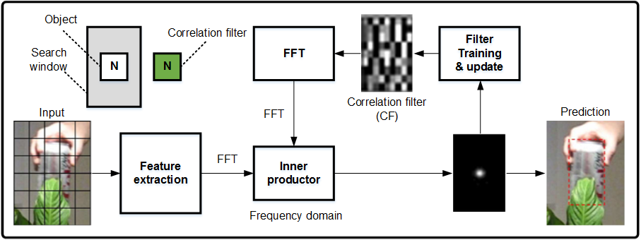

跟踪问题核化、相关滤波器训练等数学推导参阅“High-speed tracking with kernelized correlation filters”，IEEE Trans. PAMI, vol.37, No. 3, March 2015.

算法的总体流程：在It帧中，在当前位置pt附近采样，训练一个回归器。来计算一个小窗口采样的响应。在It+1帧中，在前一帧位置pt附近采样，用已经训练的回归器来判断每个采样的响应。响应最强的采样作为本帧的位置pt+1。

用一个人脸跟踪图解一下上面的跟踪算法过程，如[图3](#fig896312217281)所示，首先对初始帧做初始化，框定一个待跟踪的ROI，对输入图像做特征提取用余弦函数窗对提取到的特征加权后, 将其用FFT变换到频域，与训练得到的相关滤波器在频域做点乘，反变换到空域后找到最强的响应位置，就是得到人脸在当前帧的预测。

**图 3**  跟踪算法过程示例<a name="fig896312217281"></a>  


[图3](#fig896312217281)的相关滤波器参数训练问题通过核函数和循环矩阵对角化的性质简化为矩阵运算操作，详细数学推导参阅上面里出的参考论文。

【举例】

无

【相关主题】

-   [ss\_mpi\_ive\_kcf\_create\_obj\_list](#ss_mpi_ive_kcf_create_obj_list)
-   [ss\_mpi\_ive\_kcf\_create\_gauss\_peak](#ss_mpi_ive_kcf_create_gauss_peak)
-   [ss\_mpi\_ive\_kcf\_create\_cos\_win](#ss_mpi_ive_kcf_create_cos_win)
-   [ss\_mpi\_ive\_kcf\_get\_train\_obj](#ss_mpi_ive_kcf_get_train_obj)

## ss\_mpi\_ive\_kcf\_get\_obj\_bbox<a name="ZH-CN_TOPIC_0000002503971245"></a>

【描述】

获取目标区域跟踪结果信息。

【语法】

```
td_s32 ss_mpi_ive_kcf_get_obj_bbox(ot_ive_kcf_obj_list *obj_list, ot_ive_kcf_bbox bbox[], td_u32 *bbox_obj_num, const ot_ive_kcf_bbox_ctrl *ctrl);
```

【参数】

<a name="table5555mcpsimp"></a>
<table><thead align="left"><tr id="row5561mcpsimp"><th class="cellrowborder" valign="top" width="23%" id="mcps1.1.4.1.1"><p id="p5563mcpsimp"><a name="p5563mcpsimp"></a><a name="p5563mcpsimp"></a>参数名称</p>
</th>
<th class="cellrowborder" valign="top" width="59%" id="mcps1.1.4.1.2"><p id="p5565mcpsimp"><a name="p5565mcpsimp"></a><a name="p5565mcpsimp"></a>描述</p>
</th>
<th class="cellrowborder" valign="top" width="18%" id="mcps1.1.4.1.3"><p id="p5567mcpsimp"><a name="p5567mcpsimp"></a><a name="p5567mcpsimp"></a>输入/输出</p>
</th>
</tr>
</thead>
<tbody><tr id="row5569mcpsimp"><td class="cellrowborder" valign="top" width="23%" headers="mcps1.1.4.1.1 "><p id="p5571mcpsimp"><a name="p5571mcpsimp"></a><a name="p5571mcpsimp"></a>obj_list</p>
</td>
<td class="cellrowborder" valign="top" width="59%" headers="mcps1.1.4.1.2 "><p id="p5573mcpsimp"><a name="p5573mcpsimp"></a><a name="p5573mcpsimp"></a>目标链表指针。不能为空。</p>
</td>
<td class="cellrowborder" valign="top" width="18%" headers="mcps1.1.4.1.3 "><p id="p5575mcpsimp"><a name="p5575mcpsimp"></a><a name="p5575mcpsimp"></a>输入</p>
</td>
</tr>
<tr id="row5576mcpsimp"><td class="cellrowborder" valign="top" width="23%" headers="mcps1.1.4.1.1 "><p id="p5578mcpsimp"><a name="p5578mcpsimp"></a><a name="p5578mcpsimp"></a>bbox[]</p>
</td>
<td class="cellrowborder" valign="top" width="59%" headers="mcps1.1.4.1.2 "><p id="p5580mcpsimp"><a name="p5580mcpsimp"></a><a name="p5580mcpsimp"></a>目标区域跟踪结果信息。</p>
</td>
<td class="cellrowborder" valign="top" width="18%" headers="mcps1.1.4.1.3 "><p id="p5582mcpsimp"><a name="p5582mcpsimp"></a><a name="p5582mcpsimp"></a>输出</p>
</td>
</tr>
<tr id="row5583mcpsimp"><td class="cellrowborder" valign="top" width="23%" headers="mcps1.1.4.1.1 "><p id="p5585mcpsimp"><a name="p5585mcpsimp"></a><a name="p5585mcpsimp"></a>bbox_obj_num</p>
</td>
<td class="cellrowborder" valign="top" width="59%" headers="mcps1.1.4.1.2 "><p id="p5587mcpsimp"><a name="p5587mcpsimp"></a><a name="p5587mcpsimp"></a>目标区域跟踪结果数目指针。不能为空。</p>
</td>
<td class="cellrowborder" valign="top" width="18%" headers="mcps1.1.4.1.3 "><p id="p5589mcpsimp"><a name="p5589mcpsimp"></a><a name="p5589mcpsimp"></a>输出</p>
</td>
</tr>
<tr id="row5590mcpsimp"><td class="cellrowborder" valign="top" width="23%" headers="mcps1.1.4.1.1 "><p id="p5592mcpsimp"><a name="p5592mcpsimp"></a><a name="p5592mcpsimp"></a>ctrl</p>
</td>
<td class="cellrowborder" valign="top" width="59%" headers="mcps1.1.4.1.2 "><p id="p5594mcpsimp"><a name="p5594mcpsimp"></a><a name="p5594mcpsimp"></a>控制指针，不能为空。</p>
</td>
<td class="cellrowborder" valign="top" width="18%" headers="mcps1.1.4.1.3 "><p id="p5596mcpsimp"><a name="p5596mcpsimp"></a><a name="p5596mcpsimp"></a>输入</p>
</td>
</tr>
</tbody>
</table>

【返回值】

<a name="table5598mcpsimp"></a>
<table><thead align="left"><tr id="row5603mcpsimp"><th class="cellrowborder" valign="top" width="50%" id="mcps1.1.3.1.1"><p id="p5605mcpsimp"><a name="p5605mcpsimp"></a><a name="p5605mcpsimp"></a>返回值</p>
</th>
<th class="cellrowborder" valign="top" width="50%" id="mcps1.1.3.1.2"><p id="p5607mcpsimp"><a name="p5607mcpsimp"></a><a name="p5607mcpsimp"></a>描述</p>
</th>
</tr>
</thead>
<tbody><tr id="row5609mcpsimp"><td class="cellrowborder" valign="top" width="50%" headers="mcps1.1.3.1.1 "><p id="p5611mcpsimp"><a name="p5611mcpsimp"></a><a name="p5611mcpsimp"></a>0</p>
</td>
<td class="cellrowborder" valign="top" width="50%" headers="mcps1.1.3.1.2 "><p id="p5613mcpsimp"><a name="p5613mcpsimp"></a><a name="p5613mcpsimp"></a>成功。</p>
</td>
</tr>
<tr id="row5614mcpsimp"><td class="cellrowborder" valign="top" width="50%" headers="mcps1.1.3.1.1 "><p id="p5616mcpsimp"><a name="p5616mcpsimp"></a><a name="p5616mcpsimp"></a>非0</p>
</td>
<td class="cellrowborder" valign="top" width="50%" headers="mcps1.1.3.1.2 "><p id="p5618mcpsimp"><a name="p5618mcpsimp"></a><a name="p5618mcpsimp"></a>失败，参见<span xml:lang="fr-FR" id="ph136311818172213"><a name="ph136311818172213"></a><a name="ph136311818172213"></a>错误码</span><span xml:lang="fr-FR" id="ph5283mcpsimp"><a name="ph5283mcpsimp"></a><a name="ph5283mcpsimp"></a>。</span></p>
</td>
</tr>
</tbody>
</table>

【需求】

-   头文件：ot\_common\_ive.h、ot\_common\_svp.h、ss\_mpi\_ive.h
-   库文件：libss\_ive.a（PC上模拟用ss\_ive\_clib2.x.lib）

【注意】

无

【举例】

无

【相关主题】

无

## ss\_mpi\_ive\_kcf\_judge\_obj\_bbox\_track\_state<a name="ZH-CN_TOPIC_0000002471091288"></a>

【描述】

判断目标区域跟踪状态。

【语法】

```
td_s32 ss_mpi_ive_kcf_judge_obj_bbox_track_state(const ot_ive_roi_info *roi_info, const ot_ive_kcf_bbox *bbox, td_bool *is_track_ok);
```

【参数】

<a name="table10774mcpsimp"></a>
<table><thead align="left"><tr id="row10780mcpsimp"><th class="cellrowborder" valign="top" width="23%" id="mcps1.1.4.1.1"><p id="p10782mcpsimp"><a name="p10782mcpsimp"></a><a name="p10782mcpsimp"></a>参数名称</p>
</th>
<th class="cellrowborder" valign="top" width="59%" id="mcps1.1.4.1.2"><p id="p10784mcpsimp"><a name="p10784mcpsimp"></a><a name="p10784mcpsimp"></a>描述</p>
</th>
<th class="cellrowborder" valign="top" width="18%" id="mcps1.1.4.1.3"><p id="p10786mcpsimp"><a name="p10786mcpsimp"></a><a name="p10786mcpsimp"></a>输入/输出</p>
</th>
</tr>
</thead>
<tbody><tr id="row10788mcpsimp"><td class="cellrowborder" valign="top" width="23%" headers="mcps1.1.4.1.1 "><p id="p10790mcpsimp"><a name="p10790mcpsimp"></a><a name="p10790mcpsimp"></a>roi_info</p>
</td>
<td class="cellrowborder" valign="top" width="59%" headers="mcps1.1.4.1.2 "><p id="p10792mcpsimp"><a name="p10792mcpsimp"></a><a name="p10792mcpsimp"></a>目标区域信息指针。不能为空。</p>
</td>
<td class="cellrowborder" valign="top" width="18%" headers="mcps1.1.4.1.3 "><p id="p10794mcpsimp"><a name="p10794mcpsimp"></a><a name="p10794mcpsimp"></a>输入</p>
</td>
</tr>
<tr id="row10795mcpsimp"><td class="cellrowborder" valign="top" width="23%" headers="mcps1.1.4.1.1 "><p id="p10797mcpsimp"><a name="p10797mcpsimp"></a><a name="p10797mcpsimp"></a>bbox</p>
</td>
<td class="cellrowborder" valign="top" width="59%" headers="mcps1.1.4.1.2 "><p id="p10799mcpsimp"><a name="p10799mcpsimp"></a><a name="p10799mcpsimp"></a>目标区域跟踪结果信息指针。</p>
</td>
<td class="cellrowborder" valign="top" width="18%" headers="mcps1.1.4.1.3 "><p id="p10801mcpsimp"><a name="p10801mcpsimp"></a><a name="p10801mcpsimp"></a>输入</p>
</td>
</tr>
<tr id="row10802mcpsimp"><td class="cellrowborder" valign="top" width="23%" headers="mcps1.1.4.1.1 "><p id="p10804mcpsimp"><a name="p10804mcpsimp"></a><a name="p10804mcpsimp"></a>is_track_ok</p>
</td>
<td class="cellrowborder" valign="top" width="59%" headers="mcps1.1.4.1.2 "><p id="p10806mcpsimp"><a name="p10806mcpsimp"></a><a name="p10806mcpsimp"></a>目标区域跟踪状态标志指针。不能为空。</p>
</td>
<td class="cellrowborder" valign="top" width="18%" headers="mcps1.1.4.1.3 "><p id="p10808mcpsimp"><a name="p10808mcpsimp"></a><a name="p10808mcpsimp"></a>输出</p>
</td>
</tr>
</tbody>
</table>

【返回值】

<a name="table10810mcpsimp"></a>
<table><thead align="left"><tr id="row10815mcpsimp"><th class="cellrowborder" valign="top" width="50%" id="mcps1.1.3.1.1"><p id="p10817mcpsimp"><a name="p10817mcpsimp"></a><a name="p10817mcpsimp"></a>返回值</p>
</th>
<th class="cellrowborder" valign="top" width="50%" id="mcps1.1.3.1.2"><p id="p10819mcpsimp"><a name="p10819mcpsimp"></a><a name="p10819mcpsimp"></a>描述</p>
</th>
</tr>
</thead>
<tbody><tr id="row10821mcpsimp"><td class="cellrowborder" valign="top" width="50%" headers="mcps1.1.3.1.1 "><p id="p10823mcpsimp"><a name="p10823mcpsimp"></a><a name="p10823mcpsimp"></a>0</p>
</td>
<td class="cellrowborder" valign="top" width="50%" headers="mcps1.1.3.1.2 "><p id="p10825mcpsimp"><a name="p10825mcpsimp"></a><a name="p10825mcpsimp"></a>成功。</p>
</td>
</tr>
<tr id="row10826mcpsimp"><td class="cellrowborder" valign="top" width="50%" headers="mcps1.1.3.1.1 "><p id="p10828mcpsimp"><a name="p10828mcpsimp"></a><a name="p10828mcpsimp"></a>非0</p>
</td>
<td class="cellrowborder" valign="top" width="50%" headers="mcps1.1.3.1.2 "><p id="p7404mcpsimp"><a name="p7404mcpsimp"></a><a name="p7404mcpsimp"></a>失败，参见<span xml:lang="fr-FR" id="ph136311818172213"><a name="ph136311818172213"></a><a name="ph136311818172213"></a>错误码</span><span xml:lang="fr-FR" id="ph5283mcpsimp"><a name="ph5283mcpsimp"></a><a name="ph5283mcpsimp"></a>。</span></p>
</td>
</tr>
</tbody>
</table>

【需求】

-   头文件：ot\_common\_ive.h、ot\_common\_svp.h、ss\_mpi\_ive.h
-   库文件：libss\_ive.a（PC上模拟用ss\_ive\_clib2.x.lib）

【注意】

当新检测的目标区域与跟踪的目标区域是同一个目标时，本接口可以利用新检测目标区域信息来判断正在跟踪的目标区域是否已经跟踪失败。

【举例】

无

【相关主题】

无

## ss\_mpi\_ive\_kcf\_obj\_update<a name="ZH-CN_TOPIC_0000002470931270"></a>

【描述】

更新目标信息。

【语法】

```
td_s32 ss_mpi_ive_kcf_obj_update(ot_ive_kcf_obj_list *obj_list, const ot_ive_kcf_bbox bbox[], td_u32 bbox_obj_num);
```

【参数】

<a name="table3759mcpsimp"></a>
<table><thead align="left"><tr id="row3765mcpsimp"><th class="cellrowborder" valign="top" width="23%" id="mcps1.1.4.1.1"><p id="p3767mcpsimp"><a name="p3767mcpsimp"></a><a name="p3767mcpsimp"></a>参数名称</p>
</th>
<th class="cellrowborder" valign="top" width="59%" id="mcps1.1.4.1.2"><p id="p3769mcpsimp"><a name="p3769mcpsimp"></a><a name="p3769mcpsimp"></a>描述</p>
</th>
<th class="cellrowborder" valign="top" width="18%" id="mcps1.1.4.1.3"><p id="p3771mcpsimp"><a name="p3771mcpsimp"></a><a name="p3771mcpsimp"></a>输入/输出</p>
</th>
</tr>
</thead>
<tbody><tr id="row3773mcpsimp"><td class="cellrowborder" valign="top" width="23%" headers="mcps1.1.4.1.1 "><p id="p3775mcpsimp"><a name="p3775mcpsimp"></a><a name="p3775mcpsimp"></a>obj_list</p>
</td>
<td class="cellrowborder" valign="top" width="59%" headers="mcps1.1.4.1.2 "><p id="p3777mcpsimp"><a name="p3777mcpsimp"></a><a name="p3777mcpsimp"></a>目标链表指针。不能为空。</p>
</td>
<td class="cellrowborder" valign="top" width="18%" headers="mcps1.1.4.1.3 "><p id="p3779mcpsimp"><a name="p3779mcpsimp"></a><a name="p3779mcpsimp"></a>输入</p>
</td>
</tr>
<tr id="row3780mcpsimp"><td class="cellrowborder" valign="top" width="23%" headers="mcps1.1.4.1.1 "><p id="p3782mcpsimp"><a name="p3782mcpsimp"></a><a name="p3782mcpsimp"></a>bbox</p>
</td>
<td class="cellrowborder" valign="top" width="59%" headers="mcps1.1.4.1.2 "><p id="p3784mcpsimp"><a name="p3784mcpsimp"></a><a name="p3784mcpsimp"></a>目标区域跟踪结果信息。</p>
</td>
<td class="cellrowborder" valign="top" width="18%" headers="mcps1.1.4.1.3 "><p id="p3786mcpsimp"><a name="p3786mcpsimp"></a><a name="p3786mcpsimp"></a>输入</p>
</td>
</tr>
<tr id="row3787mcpsimp"><td class="cellrowborder" valign="top" width="23%" headers="mcps1.1.4.1.1 "><p id="p3789mcpsimp"><a name="p3789mcpsimp"></a><a name="p3789mcpsimp"></a>obj_num</p>
</td>
<td class="cellrowborder" valign="top" width="59%" headers="mcps1.1.4.1.2 "><p id="p3791mcpsimp"><a name="p3791mcpsimp"></a><a name="p3791mcpsimp"></a>目标区域跟踪结果数目。</p>
</td>
<td class="cellrowborder" valign="top" width="18%" headers="mcps1.1.4.1.3 "><p id="p3793mcpsimp"><a name="p3793mcpsimp"></a><a name="p3793mcpsimp"></a>输入</p>
</td>
</tr>
</tbody>
</table>

【返回值】

<a name="table3795mcpsimp"></a>
<table><thead align="left"><tr id="row3800mcpsimp"><th class="cellrowborder" valign="top" width="50%" id="mcps1.1.3.1.1"><p id="p3802mcpsimp"><a name="p3802mcpsimp"></a><a name="p3802mcpsimp"></a>返回值</p>
</th>
<th class="cellrowborder" valign="top" width="50%" id="mcps1.1.3.1.2"><p id="p3804mcpsimp"><a name="p3804mcpsimp"></a><a name="p3804mcpsimp"></a>描述</p>
</th>
</tr>
</thead>
<tbody><tr id="row3806mcpsimp"><td class="cellrowborder" valign="top" width="50%" headers="mcps1.1.3.1.1 "><p id="p3808mcpsimp"><a name="p3808mcpsimp"></a><a name="p3808mcpsimp"></a>0</p>
</td>
<td class="cellrowborder" valign="top" width="50%" headers="mcps1.1.3.1.2 "><p id="p3810mcpsimp"><a name="p3810mcpsimp"></a><a name="p3810mcpsimp"></a>成功。</p>
</td>
</tr>
<tr id="row3811mcpsimp"><td class="cellrowborder" valign="top" width="50%" headers="mcps1.1.3.1.1 "><p id="p3813mcpsimp"><a name="p3813mcpsimp"></a><a name="p3813mcpsimp"></a>非0</p>
</td>
<td class="cellrowborder" valign="top" width="50%" headers="mcps1.1.3.1.2 "><p id="p3815mcpsimp"><a name="p3815mcpsimp"></a><a name="p3815mcpsimp"></a>失败，参见<span xml:lang="fr-FR" id="ph136311818172213"><a name="ph136311818172213"></a><a name="ph136311818172213"></a>错误码</span><span xml:lang="fr-FR" id="ph5283mcpsimp"><a name="ph5283mcpsimp"></a><a name="ph5283mcpsimp"></a>。</span></p>
</td>
</tr>
</tbody>
</table>

【需求】

-   头文件：ot\_common\_ive.h、ot\_common\_svp.h、ss\_mpi\_ive.h
-   库文件：libss\_ive.a（PC上模拟用ss\_ive\_clib2.x.lib）

【注意】

无

【举例】

无

【相关主题】

无

## ss\_mpi\_ive\_hog<a name="ZH-CN_TOPIC_0000002504091165"></a>

【描述】

计算给定区域的HOG\(Histogram of Oriented Gradient\)特征。

【语法】

```
td_s32 ss_mpi_ive_hog(ot_ive_handle *handle, const ot_svp_src_img *src, const ot_svp_rect_u16 roi[],const ot_svp_dst_blob dst[], const ot_ive_hog_ctrl *ctrl, td_bool is_instant);
```

【参数】

<a name="table1155mcpsimp"></a>
<table><thead align="left"><tr id="row1161mcpsimp"><th class="cellrowborder" valign="top" width="23%" id="mcps1.1.4.1.1"><p id="p1163mcpsimp"><a name="p1163mcpsimp"></a><a name="p1163mcpsimp"></a>参数名称</p>
</th>
<th class="cellrowborder" valign="top" width="59%" id="mcps1.1.4.1.2"><p id="p1165mcpsimp"><a name="p1165mcpsimp"></a><a name="p1165mcpsimp"></a>描述</p>
</th>
<th class="cellrowborder" valign="top" width="18%" id="mcps1.1.4.1.3"><p id="p1167mcpsimp"><a name="p1167mcpsimp"></a><a name="p1167mcpsimp"></a>输入/输出</p>
</th>
</tr>
</thead>
<tbody><tr id="row1169mcpsimp"><td class="cellrowborder" valign="top" width="23%" headers="mcps1.1.4.1.1 "><p id="p1171mcpsimp"><a name="p1171mcpsimp"></a><a name="p1171mcpsimp"></a>handle</p>
</td>
<td class="cellrowborder" valign="top" width="59%" headers="mcps1.1.4.1.2 "><p id="p1173mcpsimp"><a name="p1173mcpsimp"></a><a name="p1173mcpsimp"></a>handle指针。</p>
<p id="p1174mcpsimp"><a name="p1174mcpsimp"></a><a name="p1174mcpsimp"></a>不能为空。</p>
</td>
<td class="cellrowborder" valign="top" width="18%" headers="mcps1.1.4.1.3 "><p id="p1176mcpsimp"><a name="p1176mcpsimp"></a><a name="p1176mcpsimp"></a>输出</p>
</td>
</tr>
<tr id="row1177mcpsimp"><td class="cellrowborder" valign="top" width="23%" headers="mcps1.1.4.1.1 "><p id="p1179mcpsimp"><a name="p1179mcpsimp"></a><a name="p1179mcpsimp"></a>src</p>
</td>
<td class="cellrowborder" valign="top" width="59%" headers="mcps1.1.4.1.2 "><p id="p1181mcpsimp"><a name="p1181mcpsimp"></a><a name="p1181mcpsimp"></a>源数据指针。不能为空。</p>
</td>
<td class="cellrowborder" valign="top" width="18%" headers="mcps1.1.4.1.3 "><p id="p1183mcpsimp"><a name="p1183mcpsimp"></a><a name="p1183mcpsimp"></a>输入</p>
</td>
</tr>
<tr id="row1184mcpsimp"><td class="cellrowborder" valign="top" width="23%" headers="mcps1.1.4.1.1 "><p id="p1186mcpsimp"><a name="p1186mcpsimp"></a><a name="p1186mcpsimp"></a>roi[]</p>
</td>
<td class="cellrowborder" valign="top" width="59%" headers="mcps1.1.4.1.2 "><p id="p1188mcpsimp"><a name="p1188mcpsimp"></a><a name="p1188mcpsimp"></a>目标区域。</p>
<p id="p1189mcpsimp"><a name="p1189mcpsimp"></a><a name="p1189mcpsimp"></a>取值范围：</p>
<a name="ul1190mcpsimp"></a><a name="ul1190mcpsimp"></a><ul id="ul1190mcpsimp"><li>宽：[64,1024]</li><li>高：[64,1024]</li></ul>
<p id="p1193mcpsimp"><a name="p1193mcpsimp"></a><a name="p1193mcpsimp"></a>ROI必须在图像内。</p>
</td>
<td class="cellrowborder" valign="top" width="18%" headers="mcps1.1.4.1.3 "><p id="p1195mcpsimp"><a name="p1195mcpsimp"></a><a name="p1195mcpsimp"></a>输入</p>
</td>
</tr>
<tr id="row1196mcpsimp"><td class="cellrowborder" valign="top" width="23%" headers="mcps1.1.4.1.1 "><p id="p1198mcpsimp"><a name="p1198mcpsimp"></a><a name="p1198mcpsimp"></a>dst[]</p>
</td>
<td class="cellrowborder" valign="top" width="59%" headers="mcps1.1.4.1.2 "><p id="p1200mcpsimp"><a name="p1200mcpsimp"></a><a name="p1200mcpsimp"></a>HOG特征。</p>
<p id="p1201mcpsimp"><a name="p1201mcpsimp"></a><a name="p1201mcpsimp"></a>具体描述请参见《SVPx.0 API 参考》</p>
</td>
<td class="cellrowborder" valign="top" width="18%" headers="mcps1.1.4.1.3 "><p id="p1203mcpsimp"><a name="p1203mcpsimp"></a><a name="p1203mcpsimp"></a>输出</p>
</td>
</tr>
<tr id="row1204mcpsimp"><td class="cellrowborder" valign="top" width="23%" headers="mcps1.1.4.1.1 "><p id="p1206mcpsimp"><a name="p1206mcpsimp"></a><a name="p1206mcpsimp"></a>ctrl</p>
</td>
<td class="cellrowborder" valign="top" width="59%" headers="mcps1.1.4.1.2 "><p id="p1208mcpsimp"><a name="p1208mcpsimp"></a><a name="p1208mcpsimp"></a>控制指针。不能为空。</p>
</td>
<td class="cellrowborder" valign="top" width="18%" headers="mcps1.1.4.1.3 "><p id="p1210mcpsimp"><a name="p1210mcpsimp"></a><a name="p1210mcpsimp"></a>输入</p>
</td>
</tr>
<tr id="row1211mcpsimp"><td class="cellrowborder" valign="top" width="23%" headers="mcps1.1.4.1.1 "><p id="p1213mcpsimp"><a name="p1213mcpsimp"></a><a name="p1213mcpsimp"></a>is_instant</p>
</td>
<td class="cellrowborder" valign="top" width="59%" headers="mcps1.1.4.1.2 "><p id="p1215mcpsimp"><a name="p1215mcpsimp"></a><a name="p1215mcpsimp"></a>及时返回结果标志。</p>
</td>
<td class="cellrowborder" valign="top" width="18%" headers="mcps1.1.4.1.3 "><p id="p1217mcpsimp"><a name="p1217mcpsimp"></a><a name="p1217mcpsimp"></a>输入</p>
</td>
</tr>
</tbody>
</table>

<a name="table1218mcpsimp"></a>
<table><thead align="left"><tr id="row1225mcpsimp"><th class="cellrowborder" valign="top" width="13.861386138613863%" id="mcps1.1.5.1.1"><p id="p1227mcpsimp"><a name="p1227mcpsimp"></a><a name="p1227mcpsimp"></a>参数名称</p>
</th>
<th class="cellrowborder" valign="top" width="42.57425742574258%" id="mcps1.1.5.1.2"><p id="p1229mcpsimp"><a name="p1229mcpsimp"></a><a name="p1229mcpsimp"></a>支持图像类型</p>
</th>
<th class="cellrowborder" valign="top" width="15.841584158415841%" id="mcps1.1.5.1.3"><p id="p1231mcpsimp"><a name="p1231mcpsimp"></a><a name="p1231mcpsimp"></a>地址对齐</p>
</th>
<th class="cellrowborder" valign="top" width="27.722772277227726%" id="mcps1.1.5.1.4"><p id="p1233mcpsimp"><a name="p1233mcpsimp"></a><a name="p1233mcpsimp"></a>分辨率</p>
</th>
</tr>
</thead>
<tbody><tr id="row1235mcpsimp"><td class="cellrowborder" valign="top" width="13.861386138613863%" headers="mcps1.1.5.1.1 "><p id="p1237mcpsimp"><a name="p1237mcpsimp"></a><a name="p1237mcpsimp"></a>src</p>
</td>
<td class="cellrowborder" valign="top" width="42.57425742574258%" headers="mcps1.1.5.1.2 "><p id="p1239mcpsimp"><a name="p1239mcpsimp"></a><a name="p1239mcpsimp"></a>OT_SVP_IMG_TYPE_YUV420SP</p>
</td>
<td class="cellrowborder" valign="top" width="15.841584158415841%" headers="mcps1.1.5.1.3 "><p id="p1241mcpsimp"><a name="p1241mcpsimp"></a><a name="p1241mcpsimp"></a>16 byte</p>
</td>
<td class="cellrowborder" valign="top" width="27.722772277227726%" headers="mcps1.1.5.1.4 "><p id="p1243mcpsimp"><a name="p1243mcpsimp"></a><a name="p1243mcpsimp"></a>176x144～1920x1080</p>
</td>
</tr>
</tbody>
</table>

【返回值】

<a name="table1245mcpsimp"></a>
<table><thead align="left"><tr id="row1250mcpsimp"><th class="cellrowborder" valign="top" width="50%" id="mcps1.1.3.1.1"><p id="p1252mcpsimp"><a name="p1252mcpsimp"></a><a name="p1252mcpsimp"></a>返回值</p>
</th>
<th class="cellrowborder" valign="top" width="50%" id="mcps1.1.3.1.2"><p id="p1254mcpsimp"><a name="p1254mcpsimp"></a><a name="p1254mcpsimp"></a>描述</p>
</th>
</tr>
</thead>
<tbody><tr id="row1256mcpsimp"><td class="cellrowborder" valign="top" width="50%" headers="mcps1.1.3.1.1 "><p id="p1258mcpsimp"><a name="p1258mcpsimp"></a><a name="p1258mcpsimp"></a>0</p>
</td>
<td class="cellrowborder" valign="top" width="50%" headers="mcps1.1.3.1.2 "><p id="p1260mcpsimp"><a name="p1260mcpsimp"></a><a name="p1260mcpsimp"></a>成功。</p>
</td>
</tr>
<tr id="row1261mcpsimp"><td class="cellrowborder" valign="top" width="50%" headers="mcps1.1.3.1.1 "><p id="p1263mcpsimp"><a name="p1263mcpsimp"></a><a name="p1263mcpsimp"></a>非0</p>
</td>
<td class="cellrowborder" valign="top" width="50%" headers="mcps1.1.3.1.2 "><p id="p1265mcpsimp"><a name="p1265mcpsimp"></a><a name="p1265mcpsimp"></a>失败，参见<span xml:lang="fr-FR" id="ph136311818172213"><a name="ph136311818172213"></a><a name="ph136311818172213"></a>错误码</span><span xml:lang="fr-FR" id="ph5283mcpsimp"><a name="ph5283mcpsimp"></a><a name="ph5283mcpsimp"></a>。</span></p>
</td>
</tr>
</tbody>
</table>

【需求】

-   头文件：ot\_common\_ive.h、ot\_common\_svp.h、ss\_mpi\_ive.h
-   库文件：libss\_ive.a（PC上模拟用ss\_ive\_clib2.x.lib）

【注意】

-   HOG特征存储格式：

    如[图1](#_Ref529951636)所示，HOG特征是由一个三维空间来存储：

    -   C表示特征的channel（固定为31）
    -   W表示特征的width
    -   H表示特征的height，每个HOG特征需要2byte存储空间

-   HOG特征的W/H 的计算公式如下：

    假设ROI区域宽为RectW，高为RectH。则

    W = min\(136, RectW\) / 4 – 2;

    H = min\(136, RectH\) / 4 – 2;

**图 1**  HOG特征的存储结构<a name="_Ref529951636"></a>  
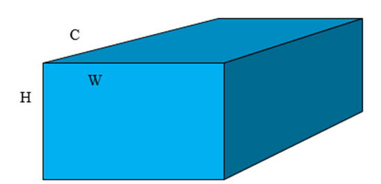

存储格式分别是垂直切面和水平切面两个格式。[图2](#fig2434181612326)表示垂直切面格式。[图3](#fig10196155743217)表示水平切面格式。

**图 2**  HOG特征垂直切面存储格式<a name="fig2434181612326"></a>  


垂直切面存储格式时，Stride是W做16byte对齐，需要分配的内存大小为2 \* Stride \* H\*C

**图 3**  HOG特征水平切面存储格式<a name="fig10196155743217"></a>  
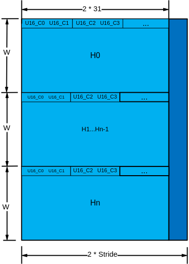

水平切面存储格式时，Stride是C \(固定为31\) 做16byte对齐，需要分配的内存大小为Stride \* 2 \* W \* H。

-   ROI区域的宽度和高度必须在\[64, 1024\]范围内，而且是8的倍数。
-   HOG特征通过ot\_svp\_blob结构描述（具体请见《SVPx.0 API参考》1.4小节描述），类型为OT\_SVP\_BLOB\_TYPE\_U16，存储格式按照HOG特征描述的格式存储。
-   算法描述如下：

HOG是Histogram of Oriented Gridients的缩写为 HOG，是目前计算机视觉、模式识别领域很常用的一种描述图像局部纹理的特征，整体计算处理流程如[图4](#fig18559111016331)所示。

**图 4**  HOG计算流程<a name="fig18559111016331"></a>  
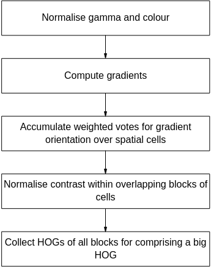

梯度计算可以有多种方法，IVE首先计算图像每个像素各颜色分量的水平梯度：


和垂直梯度：


其中为图像的像素值，计算每个像素点处各颜色分量的梯度幅值:


每个图像像素的梯度幅值：


梯度方向：


本HOG算子把图像分成若干个cells，每个cell按照360度划分为9个bin（即9维特征向量），如[图5](#fig102361124142914)所示。

**图 5**  每个cell划分bin的角度范围<a name="fig102361124142914"></a>  


【举例】

无

【相关主题】

无

## ss\_mpi\_ive\_query<a name="ZH-CN_TOPIC_0000002470931246"></a>

【描述】

查询已创建任务完成情况。

【语法】

```
td_s32  ss_mpi_ive_query(ot_ive_handle handle, td_bool *is_finish, td_bool is_block) ;
```

【参数】

<a name="table9519mcpsimp"></a>
<table><thead align="left"><tr id="row9525mcpsimp"><th class="cellrowborder" valign="top" width="21%" id="mcps1.1.4.1.1"><p id="p9527mcpsimp"><a name="p9527mcpsimp"></a><a name="p9527mcpsimp"></a>参数名称</p>
</th>
<th class="cellrowborder" valign="top" width="62%" id="mcps1.1.4.1.2"><p id="p9529mcpsimp"><a name="p9529mcpsimp"></a><a name="p9529mcpsimp"></a>描述</p>
</th>
<th class="cellrowborder" valign="top" width="17%" id="mcps1.1.4.1.3"><p id="p9531mcpsimp"><a name="p9531mcpsimp"></a><a name="p9531mcpsimp"></a>输入/输出</p>
</th>
</tr>
</thead>
<tbody><tr id="row9533mcpsimp"><td class="cellrowborder" valign="top" width="21%" headers="mcps1.1.4.1.1 "><p id="p9535mcpsimp"><a name="p9535mcpsimp"></a><a name="p9535mcpsimp"></a>handle</p>
</td>
<td class="cellrowborder" valign="top" width="62%" headers="mcps1.1.4.1.2 "><p id="p9537mcpsimp"><a name="p9537mcpsimp"></a><a name="p9537mcpsimp"></a>任务的handle。</p>
<p id="p9538mcpsimp"><a name="p9538mcpsimp"></a><a name="p9538mcpsimp"></a>取值范围：(-1, 0x0FFFFFFF)</p>
</td>
<td class="cellrowborder" valign="top" width="17%" headers="mcps1.1.4.1.3 "><p id="p9540mcpsimp"><a name="p9540mcpsimp"></a><a name="p9540mcpsimp"></a>输入</p>
</td>
</tr>
<tr id="row9541mcpsimp"><td class="cellrowborder" valign="top" width="21%" headers="mcps1.1.4.1.1 "><p id="p9543mcpsimp"><a name="p9543mcpsimp"></a><a name="p9543mcpsimp"></a>is_finish</p>
</td>
<td class="cellrowborder" valign="top" width="62%" headers="mcps1.1.4.1.2 "><p id="p9545mcpsimp"><a name="p9545mcpsimp"></a><a name="p9545mcpsimp"></a>任务完成状态指针。</p>
<p id="p9546mcpsimp"><a name="p9546mcpsimp"></a><a name="p9546mcpsimp"></a>不能为空。</p>
</td>
<td class="cellrowborder" valign="top" width="17%" headers="mcps1.1.4.1.3 "><p id="p9548mcpsimp"><a name="p9548mcpsimp"></a><a name="p9548mcpsimp"></a>输出</p>
</td>
</tr>
<tr id="row9549mcpsimp"><td class="cellrowborder" valign="top" width="21%" headers="mcps1.1.4.1.1 "><p id="p9551mcpsimp"><a name="p9551mcpsimp"></a><a name="p9551mcpsimp"></a>is_block</p>
</td>
<td class="cellrowborder" valign="top" width="62%" headers="mcps1.1.4.1.2 "><p id="p9553mcpsimp"><a name="p9553mcpsimp"></a><a name="p9553mcpsimp"></a>是否阻塞查询标志。</p>
</td>
<td class="cellrowborder" valign="top" width="17%" headers="mcps1.1.4.1.3 "><p id="p9555mcpsimp"><a name="p9555mcpsimp"></a><a name="p9555mcpsimp"></a>输入</p>
</td>
</tr>
</tbody>
</table>

【返回值】

<a name="table9557mcpsimp"></a>
<table><thead align="left"><tr id="row9562mcpsimp"><th class="cellrowborder" valign="top" width="50%" id="mcps1.1.3.1.1"><p id="p9564mcpsimp"><a name="p9564mcpsimp"></a><a name="p9564mcpsimp"></a>返回值</p>
</th>
<th class="cellrowborder" valign="top" width="50%" id="mcps1.1.3.1.2"><p id="p9566mcpsimp"><a name="p9566mcpsimp"></a><a name="p9566mcpsimp"></a>描述</p>
</th>
</tr>
</thead>
<tbody><tr id="row9568mcpsimp"><td class="cellrowborder" valign="top" width="50%" headers="mcps1.1.3.1.1 "><p id="p9570mcpsimp"><a name="p9570mcpsimp"></a><a name="p9570mcpsimp"></a>0</p>
</td>
<td class="cellrowborder" valign="top" width="50%" headers="mcps1.1.3.1.2 "><p id="p9572mcpsimp"><a name="p9572mcpsimp"></a><a name="p9572mcpsimp"></a>成功。</p>
</td>
</tr>
<tr id="row9573mcpsimp"><td class="cellrowborder" valign="top" width="50%" headers="mcps1.1.3.1.1 "><p id="p9575mcpsimp"><a name="p9575mcpsimp"></a><a name="p9575mcpsimp"></a>非0</p>
</td>
<td class="cellrowborder" valign="top" width="50%" headers="mcps1.1.3.1.2 "><p id="p9577mcpsimp"><a name="p9577mcpsimp"></a><a name="p9577mcpsimp"></a>失败，参见<span xml:lang="fr-FR" id="ph136311818172213"><a name="ph136311818172213"></a><a name="ph136311818172213"></a>错误码</span><span xml:lang="fr-FR" id="ph5283mcpsimp"><a name="ph5283mcpsimp"></a><a name="ph5283mcpsimp"></a>。</span></p>
</td>
</tr>
</tbody>
</table>

【需求】

-   头文件：ot\_common\_ive.h、ot\_common\_svp.h、ss\_mpi\_ive.h
-   库文件：libss\_ive.a（PC上模拟用ss\_ive\_clib2.x.lib）

【注意】

-   输入handle必须为调用的算子函数返回的handle。
-   在用户使用IVE任务结果前，为确保IVE任务已完成，用户可以使用阻塞方式调用此接口查询。
-   IVE内部是按任务创建顺序依次执行任务的，所以用户不必每次都使用查询接口，如用户依次创建了A，B两个任务，那么如果B任务完成了，这个时候A任务肯定也完成了，此时使用A任务的结果时不必再次调用查询接口。
-   返回值为OT\_ERR\_IVE\_QUERY\_TIMEOUT（查询超时）时，可以继续查询。
-   返回值为OT\_ERR\_IVE\_SYS\_TIMEOUT（系统超时）时，用户的IVE任务必须全部重新提交。

【举例】

```
td_s32 ret = TD_SUCCESS;
ot_ive_handle handle;
ot_svp_src_data src;
ot_svp_dst_data dst;
ot_ive_dma_ctrl  ctrl = {OT_IVE_DMA_MODE_DIRECT_COPY, 0};
td_bool is_instant;
td_bool is_finish, is_block;
    
src.phys_addr           = 0;
src.vir_addr                = 0;
src.stride           = 352;    
src.height                   = 288;
src.width            = 352;
 
dst.phys_addr           = 0;
dst.vir_addr                = 0;
dst.stride                    = 352;    
dst.height                   = 288;
dst.width            = 352;
 
is_instant                     = TD_TRUE;
ret = ss_mpi_sys_mmz_alloc_cached(&src.phys_addr, 
&((td_void*)(td_uintptr_t)src.virt_addr), "User", TD_NULL, src.height  
 * src.stride);
if (ret != TD_SUCCESS) {
return ret;
}
memset((td_void*)(td_uintptr_t)src.virt_addr, 1, src.height * src.stride);
 
ret = ss_mpi_sys_mmz_alloc_cached(&dst.phys_addr, 
         &((td_void*)(td_uintptr_t)dst.virt_addr), "User", TD_NULL, 
         dst.height * dst.stride);
if(ret != TD_SUCCESS) {
ss_mpi_sys_mmz_free(src.phys_addr, 
         (td_void*)(td_uintptr_t)src.virt_addr));
return ret;
}
memset((td_void*)(td_uintptr_t)dst.virt_addr, 0, dst.height * dst.stride);
ret = ss_mpi_sys_mmz_flush_cache(0, NULL, 0);
if(ret != TD_SUCCESS) {
ss_mpi_sys_mmz_free(src.phys_addr, 
         ((td_void*)(td_uintptr_t)src.virt_addr));
ss_mpi_sys_mmz_free(dst.phys_addr, 
         ((td_void*)(td_uintptr_t)dst.virt_addr));
    return ret;
}
ret = ss_mpi_ive_dma(&handle, &src, &dst, &ctrl, is_instant);
if(ret != TD_SUCCESS) {
ss_mpi_sys_mmz_free(src.phys_addr, 
         ((td_void*)(td_uintptr_t)src.virt_addr));
ss_mpi_sys_mmz_free(dst.phys_addr, 
         ((td_void*)(td_uintptr_t)dst.virt_addr));
    return ret;
}
is_block = TD_FALSE;
ret = ss_mpi_ive_query(handle, &is_finish, is_block);
if (ret == TD_SUCCESS) {
printf("is_finish=%d\n", is_Finish);
}
ss_mpi_sys_mmz_free(src.phys_addr, ((td_void*)(td_uintptr_t)src.virt_addr));
ss_mpi_sys_mmz_free(dst.phys_addr, ((td_void*)(td_uintptr_t)dst.virt_addr));
return ret;
```

【相关主题】

无。

