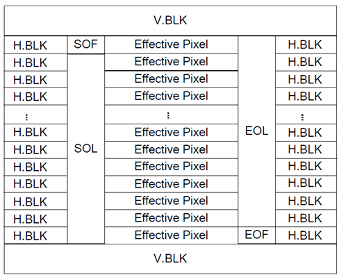
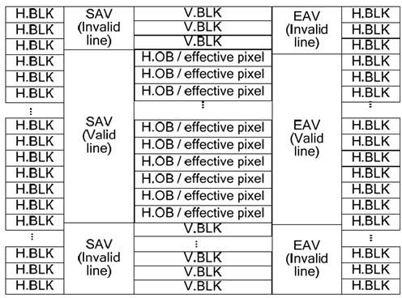
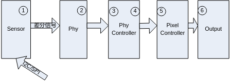
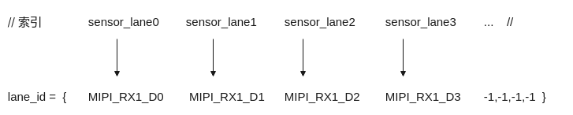
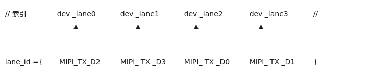
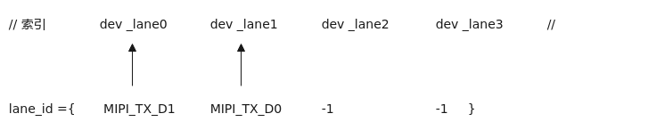

# 前言<a name="ZH-CN_TOPIC_0000002408102382"></a>

**产品版本<a name="section178mcpsimp"></a>**

与本文档相对应的产品版本如下。

<a name="table181mcpsimp"></a>
<table><thead align="left"><tr id="row186mcpsimp"><th class="cellrowborder" valign="top" width="32%" id="mcps1.1.3.1.1"><p id="p188mcpsimp"><a name="p188mcpsimp"></a><a name="p188mcpsimp"></a>产品名称</p>
</th>
<th class="cellrowborder" valign="top" width="68%" id="mcps1.1.3.1.2"><p id="p190mcpsimp"><a name="p190mcpsimp"></a><a name="p190mcpsimp"></a>产品版本</p>
</th>
</tr>
</thead>
<tbody><tr id="row192mcpsimp"><td class="cellrowborder" valign="top" width="32%" headers="mcps1.1.3.1.1 "><p id="p194mcpsimp"><a name="p194mcpsimp"></a><a name="p194mcpsimp"></a>SS928</p>
</td>
<td class="cellrowborder" valign="top" width="68%" headers="mcps1.1.3.1.2 "><p id="p196mcpsimp"><a name="p196mcpsimp"></a><a name="p196mcpsimp"></a>V100</p>
</td>
</tr>
<tr id="row2090316292516"><td class="cellrowborder" valign="top" width="32%" headers="mcps1.1.3.1.1 "><p id="p16920183212510"><a name="p16920183212510"></a><a name="p16920183212510"></a>SS927</p>
</td>
<td class="cellrowborder" valign="top" width="68%" headers="mcps1.1.3.1.2 "><p id="p119201326520"><a name="p119201326520"></a><a name="p119201326520"></a>V100</p>
</td>
</tr>
</tbody>
</table>

> **说明：** 
>本文以SS928V100描述为例，未有特殊说明，SS927V100与SS928V100内容一致。

**读者对象<a name="section197mcpsimp"></a>**

本文档（本指南）主要适用于以下工程师：

-   技术支持工程师
-   软件开发工程师

**符号约定<a name="section203mcpsimp"></a>**

在本文中可能出现下列标志，它们所代表的含义如下。

<a name="table206mcpsimp"></a>
<table><thead align="left"><tr id="row211mcpsimp"><th class="cellrowborder" valign="top" width="18%" id="mcps1.1.3.1.1"><p id="p213mcpsimp"><a name="p213mcpsimp"></a><a name="p213mcpsimp"></a>符号</p>
</th>
<th class="cellrowborder" valign="top" width="82%" id="mcps1.1.3.1.2"><p id="p215mcpsimp"><a name="p215mcpsimp"></a><a name="p215mcpsimp"></a>说明</p>
</th>
</tr>
</thead>
<tbody><tr id="row217mcpsimp"><td class="cellrowborder" valign="top" width="18%" headers="mcps1.1.3.1.1 "><p class="msonormal" id="p219mcpsimp"><a name="p219mcpsimp"></a><a name="p219mcpsimp"></a><a name="image105"></a><a name="image105"></a><span></span></p>
</td>
<td class="cellrowborder" valign="top" width="82%" headers="mcps1.1.3.1.2 "><p id="p221mcpsimp"><a name="p221mcpsimp"></a><a name="p221mcpsimp"></a>表示如不避免则将会导致死亡或严重伤害的具有高等级风险的危害。</p>
</td>
</tr>
<tr id="row222mcpsimp"><td class="cellrowborder" valign="top" width="18%" headers="mcps1.1.3.1.1 "><p class="msonormal" id="p224mcpsimp"><a name="p224mcpsimp"></a><a name="p224mcpsimp"></a><a name="image106"></a><a name="image106"></a><span></span></p>
</td>
<td class="cellrowborder" valign="top" width="82%" headers="mcps1.1.3.1.2 "><p id="p226mcpsimp"><a name="p226mcpsimp"></a><a name="p226mcpsimp"></a>表示如不避免则可能导致死亡或严重伤害的具有中等级风险的危害。</p>
</td>
</tr>
<tr id="row227mcpsimp"><td class="cellrowborder" valign="top" width="18%" headers="mcps1.1.3.1.1 "><p class="msonormal" id="p229mcpsimp"><a name="p229mcpsimp"></a><a name="p229mcpsimp"></a><a name="image107"></a><a name="image107"></a><span></span></p>
</td>
<td class="cellrowborder" valign="top" width="82%" headers="mcps1.1.3.1.2 "><p id="p231mcpsimp"><a name="p231mcpsimp"></a><a name="p231mcpsimp"></a>表示如不避免则可能导致轻微或中度伤害的具有低等级风险的危害。</p>
</td>
</tr>
<tr id="row232mcpsimp"><td class="cellrowborder" valign="top" width="18%" headers="mcps1.1.3.1.1 "><p class="msonormal" id="p234mcpsimp"><a name="p234mcpsimp"></a><a name="p234mcpsimp"></a><a name="image108"></a><a name="image108"></a><span></span></p>
</td>
<td class="cellrowborder" valign="top" width="82%" headers="mcps1.1.3.1.2 "><p id="p236mcpsimp"><a name="p236mcpsimp"></a><a name="p236mcpsimp"></a>用于传递设备或环境安全警示信息。如不避免则可能会导致设备损坏、数据丢失、设备性能降低或其它不可预知的结果。</p>
<p id="p237mcpsimp"><a name="p237mcpsimp"></a><a name="p237mcpsimp"></a>“须知”不涉及人身伤害。</p>
</td>
</tr>
<tr id="row238mcpsimp"><td class="cellrowborder" valign="top" width="18%" headers="mcps1.1.3.1.1 "><p class="msonormal" id="p240mcpsimp"><a name="p240mcpsimp"></a><a name="p240mcpsimp"></a><a name="image109"></a><a name="image109"></a><span></span></p>
</td>
<td class="cellrowborder" valign="top" width="82%" headers="mcps1.1.3.1.2 "><p id="p242mcpsimp"><a name="p242mcpsimp"></a><a name="p242mcpsimp"></a>对正文中重点信息的补充说明。</p>
<p id="p243mcpsimp"><a name="p243mcpsimp"></a><a name="p243mcpsimp"></a>“说明”不是安全警示信息，不涉及人身、设备及环境伤害信息。</p>
</td>
</tr>
</tbody>
</table>

**修订记录<a name="section244mcpsimp"></a>**

修订记录累积了每次文档更新的说明。最新版本的文档包含以前所有文档版本的更新内容。

<a name="table2674mcpsimp"></a>
<table><thead align="left"><tr id="row2680mcpsimp"><th class="cellrowborder" valign="top" width="21%" id="mcps1.1.4.1.1"><p id="p2682mcpsimp"><a name="p2682mcpsimp"></a><a name="p2682mcpsimp"></a><strong id="b2683mcpsimp"><a name="b2683mcpsimp"></a><a name="b2683mcpsimp"></a>文档版本</strong></p>
</th>
<th class="cellrowborder" valign="top" width="26%" id="mcps1.1.4.1.2"><p id="p2685mcpsimp"><a name="p2685mcpsimp"></a><a name="p2685mcpsimp"></a><strong id="b2686mcpsimp"><a name="b2686mcpsimp"></a><a name="b2686mcpsimp"></a>发布日期</strong></p>
</th>
<th class="cellrowborder" valign="top" width="53%" id="mcps1.1.4.1.3"><p id="p2688mcpsimp"><a name="p2688mcpsimp"></a><a name="p2688mcpsimp"></a><strong id="b2689mcpsimp"><a name="b2689mcpsimp"></a><a name="b2689mcpsimp"></a>修改说明</strong></p>
</th>
</tr>
</thead>
<tbody><tr id="row2699mcpsimp"><td class="cellrowborder" valign="top" width="21%" headers="mcps1.1.4.1.1 "><p id="p2701mcpsimp"><a name="p2701mcpsimp"></a><a name="p2701mcpsimp"></a>00B01</p>
</td>
<td class="cellrowborder" valign="top" width="26%" headers="mcps1.1.4.1.2 "><p id="p2703mcpsimp"><a name="p2703mcpsimp"></a><a name="p2703mcpsimp"></a>2025-09-15</p>
</td>
<td class="cellrowborder" valign="top" width="53%" headers="mcps1.1.4.1.3 "><p id="p2705mcpsimp"><a name="p2705mcpsimp"></a><a name="p2705mcpsimp"></a>第1次临时版本发布。</p>
</td>
</tr>
</tbody>
</table>

# MIPI使用指南<a name="ZH-CN_TOPIC_0000002408262226"></a>


## 概述<a name="ZH-CN_TOPIC_0000002408262262"></a>

MIPI Rx通过低电压差分信号接收原始视频数据，将接收到的串行差分信号（serial differential signal）转化为DC（Digital Camera）时序后传递给下一级模块VICAP（Video Capture）

MIPI Rx支持MIPI D-PHY、LVDS（Low-Voltage Differential Signal）、HiSPi（High-Speed Serial Pixel Interface）等串行视频信号输入，同时兼容DC视频接口。

## 重要概念<a name="ZH-CN_TOPIC_0000002441701413"></a>

-   MIPI

    MIPI的全称是Mobile Industry Processor Interface\(移动行业处理器接口\)，本文描述的MIPI接口特指物理层使用D-PHY传输规范，协议层使用CSI-2的通信接口。

-   LVDS

    LVDS的全称是Low Voltage differential Signaling\(低压差分信号\)，通过同步码区分消隐区和有效数据。

-   Lane

    用于连接发送端和接收端的一对高速差分线，即可以是时钟Lane，也可以是数据Lane。

-   同步码

    MIPI接口使用CSI-2里面的短包进行同步，LVDS使用同步码区分有效数据和消隐区。LVDS有两种同步方式：

    -   使用SOF/EOF表示帧起始和结束，使用SOL/EOL表示行的起始和结束。同步方式如[图1](#fig9405124663417)所示。

        **图 1**  SOF/EOF/SOL/EOL同步方式<a name="fig9405124663417"></a>  
        

    -   使用SAV\(invalid\) EAV\(invalid\)表示消隐区的无效数据开始和结束，使用SAV\(valid\) EAV\(valid\)表示有效像素数据的开始和结束。

        每个同步码由4个字段组成，每个字段的位宽与像素数据位宽保持一致。前3个字段为固定基准码字，第4个字段由sensor厂家确定。

        由于不同的sensor可能会有不同的同步码，所以需要根据sensor配置同步码。同步方式如[图2](#fig1737184853619)所示。

        **图 2**  SAV/EAV同步方式<a name="fig1737184853619"></a>  
        

## 功能描述<a name="ZH-CN_TOPIC_0000002408262130"></a>

MIPI Rx是一个支持多种差分视频输入接口的采集单元，通过combo-PHY接收MIPI/LVDS/sub-LVDS/HiSPi/DC接口的数据，通过不同的功能模式配置，MIPI Rx可以支持多种速度和分辨率的数据传输需求，支持多种外部输入设备。最大支持Lane个数如[表1](#_Ref484179711)所示。

**表 1**  最大支持Lane的个数

<a name="_Ref484179711"></a>
<table><thead align="left"><tr id="row472mcpsimp"><th class="cellrowborder" valign="top" width="28.999999999999996%" id="mcps1.2.3.1.1"><p id="p474mcpsimp"><a name="p474mcpsimp"></a><a name="p474mcpsimp"></a>解决方案</p>
</th>
<th class="cellrowborder" valign="top" width="71%" id="mcps1.2.3.1.2"><p id="p476mcpsimp"><a name="p476mcpsimp"></a><a name="p476mcpsimp"></a>最大支持lane数</p>
</th>
</tr>
</thead>
<tbody><tr id="row477mcpsimp"><td class="cellrowborder" valign="top" width="28.999999999999996%" headers="mcps1.2.3.1.1 "><p id="p479mcpsimp"><a name="p479mcpsimp"></a><a name="p479mcpsimp"></a>SS928V100</p>
</td>
<td class="cellrowborder" valign="top" width="71%" headers="mcps1.2.3.1.2 "><p id="p481mcpsimp"><a name="p481mcpsimp"></a><a name="p481mcpsimp"></a>MIPI Rx最大支持8Lane MIPI输入或8Lane LVDS输入。</p>
</td>
</tr>
</tbody>
</table>

MIPI Rx能同时对接多个sensor，最多对接sensor的数目如[表2](#_Ref502909111)所示。

**表 2**  最大对接sensor数目

<a name="_Ref502909111"></a>
<table><thead align="left"><tr id="row489mcpsimp"><th class="cellrowborder" valign="top" width="28.999999999999996%" id="mcps1.2.3.1.1"><p id="p491mcpsimp"><a name="p491mcpsimp"></a><a name="p491mcpsimp"></a>解决方案</p>
</th>
<th class="cellrowborder" valign="top" width="71%" id="mcps1.2.3.1.2"><p id="p493mcpsimp"><a name="p493mcpsimp"></a><a name="p493mcpsimp"></a>对接sensor数目</p>
</th>
</tr>
</thead>
<tbody><tr id="row495mcpsimp"><td class="cellrowborder" valign="top" width="28.999999999999996%" headers="mcps1.2.3.1.1 "><p id="p497mcpsimp"><a name="p497mcpsimp"></a><a name="p497mcpsimp"></a>SS928V100</p>
</td>
<td class="cellrowborder" valign="top" width="71%" headers="mcps1.2.3.1.2 "><p id="p499mcpsimp"><a name="p499mcpsimp"></a><a name="p499mcpsimp"></a>4</p>
</td>
</tr>
</tbody>
</table>

MIPI Rx最大能同时对接不同数量的sensor，每个sensor需要的Lane也不尽相同。因此用户需要确定MIPI Rx的LANE分布模式。具体的Lane分布模式请参见[表3](#_Toc468799631)。

**表 3**  MIPI Rx Lane分布模式

<a name="_Toc468799631"></a>
<table><thead align="left"><tr id="row511mcpsimp"><th class="cellrowborder" valign="top" width="26.732673267326735%" id="mcps1.2.7.1.1"><p id="p513mcpsimp"><a name="p513mcpsimp"></a><a name="p513mcpsimp"></a>解决方案</p>
</th>
<th class="cellrowborder" valign="top" width="11.881188118811883%" id="mcps1.2.7.1.2"><p id="p515mcpsimp"><a name="p515mcpsimp"></a><a name="p515mcpsimp"></a>Mode</p>
</th>
<th class="cellrowborder" valign="top" width="14.851485148514854%" id="mcps1.2.7.1.3"><p id="p517mcpsimp"><a name="p517mcpsimp"></a><a name="p517mcpsimp"></a>DEV0</p>
</th>
<th class="cellrowborder" valign="top" width="14.851485148514854%" id="mcps1.2.7.1.4"><p id="p519mcpsimp"><a name="p519mcpsimp"></a><a name="p519mcpsimp"></a>DEV1</p>
</th>
<th class="cellrowborder" valign="top" width="15.841584158415845%" id="mcps1.2.7.1.5"><p id="p521mcpsimp"><a name="p521mcpsimp"></a><a name="p521mcpsimp"></a>DEV2</p>
</th>
<th class="cellrowborder" valign="top" width="15.841584158415845%" id="mcps1.2.7.1.6"><p id="p523mcpsimp"><a name="p523mcpsimp"></a><a name="p523mcpsimp"></a>DEV3</p>
</th>
</tr>
</thead>
<tbody><tr id="row525mcpsimp"><td class="cellrowborder" rowspan="4" valign="top" width="26.732673267326735%" headers="mcps1.2.7.1.1 "><p id="p527mcpsimp"><a name="p527mcpsimp"></a><a name="p527mcpsimp"></a>SS928V100</p>
</td>
<td class="cellrowborder" valign="top" width="11.881188118811883%" headers="mcps1.2.7.1.2 "><p id="p529mcpsimp"><a name="p529mcpsimp"></a><a name="p529mcpsimp"></a>0</p>
</td>
<td class="cellrowborder" valign="top" width="14.851485148514854%" headers="mcps1.2.7.1.3 "><p id="p531mcpsimp"><a name="p531mcpsimp"></a><a name="p531mcpsimp"></a>L0~L7</p>
</td>
<td class="cellrowborder" valign="top" width="14.851485148514854%" headers="mcps1.2.7.1.4 "><p id="p533mcpsimp"><a name="p533mcpsimp"></a><a name="p533mcpsimp"></a>N</p>
</td>
<td class="cellrowborder" valign="top" width="15.841584158415845%" headers="mcps1.2.7.1.5 "><p id="p535mcpsimp"><a name="p535mcpsimp"></a><a name="p535mcpsimp"></a>N</p>
</td>
<td class="cellrowborder" valign="top" width="15.841584158415845%" headers="mcps1.2.7.1.6 "><p id="p537mcpsimp"><a name="p537mcpsimp"></a><a name="p537mcpsimp"></a>N</p>
</td>
</tr>
<tr id="row538mcpsimp"><td class="cellrowborder" valign="top" headers="mcps1.2.7.1.1 "><p id="p540mcpsimp"><a name="p540mcpsimp"></a><a name="p540mcpsimp"></a>1</p>
</td>
<td class="cellrowborder" valign="top" headers="mcps1.2.7.1.2 "><p id="p542mcpsimp"><a name="p542mcpsimp"></a><a name="p542mcpsimp"></a>L0~L3</p>
</td>
<td class="cellrowborder" valign="top" headers="mcps1.2.7.1.3 "><p id="p544mcpsimp"><a name="p544mcpsimp"></a><a name="p544mcpsimp"></a>N</p>
</td>
<td class="cellrowborder" valign="top" headers="mcps1.2.7.1.4 "><p id="p546mcpsimp"><a name="p546mcpsimp"></a><a name="p546mcpsimp"></a>L4~L7</p>
</td>
<td class="cellrowborder" valign="top" headers="mcps1.2.7.1.5 "><p id="p548mcpsimp"><a name="p548mcpsimp"></a><a name="p548mcpsimp"></a>N</p>
</td>
</tr>
<tr id="row549mcpsimp"><td class="cellrowborder" valign="top" headers="mcps1.2.7.1.1 "><p id="p551mcpsimp"><a name="p551mcpsimp"></a><a name="p551mcpsimp"></a>2</p>
</td>
<td class="cellrowborder" valign="top" headers="mcps1.2.7.1.2 "><p id="p553mcpsimp"><a name="p553mcpsimp"></a><a name="p553mcpsimp"></a>L0~L3</p>
</td>
<td class="cellrowborder" valign="top" headers="mcps1.2.7.1.3 "><p id="p555mcpsimp"><a name="p555mcpsimp"></a><a name="p555mcpsimp"></a>N</p>
</td>
<td class="cellrowborder" valign="top" headers="mcps1.2.7.1.4 "><p id="p557mcpsimp"><a name="p557mcpsimp"></a><a name="p557mcpsimp"></a>L4，L6</p>
</td>
<td class="cellrowborder" valign="top" headers="mcps1.2.7.1.5 "><p id="p559mcpsimp"><a name="p559mcpsimp"></a><a name="p559mcpsimp"></a>L5，L7</p>
</td>
</tr>
<tr id="row560mcpsimp"><td class="cellrowborder" valign="top" headers="mcps1.2.7.1.1 "><p id="p562mcpsimp"><a name="p562mcpsimp"></a><a name="p562mcpsimp"></a>3</p>
</td>
<td class="cellrowborder" valign="top" headers="mcps1.2.7.1.2 "><p id="p564mcpsimp"><a name="p564mcpsimp"></a><a name="p564mcpsimp"></a>L0，L2</p>
</td>
<td class="cellrowborder" valign="top" headers="mcps1.2.7.1.3 "><p id="p566mcpsimp"><a name="p566mcpsimp"></a><a name="p566mcpsimp"></a>L1，L3</p>
</td>
<td class="cellrowborder" valign="top" headers="mcps1.2.7.1.4 "><p id="p568mcpsimp"><a name="p568mcpsimp"></a><a name="p568mcpsimp"></a>L4，L6</p>
</td>
<td class="cellrowborder" valign="top" headers="mcps1.2.7.1.5 "><p id="p570mcpsimp"><a name="p570mcpsimp"></a><a name="p570mcpsimp"></a>L5，L7</p>
</td>
</tr>
</tbody>
</table>

MIPI Rx具体的Lane管脚连接请参见[表4](#_Ref484014656)。

**表 4**  MIPI Rx Lane管脚关系图

<a name="_Ref484014656"></a>
<table><thead align="left"><tr id="row582mcpsimp"><th class="cellrowborder" valign="top" width="18.81188118811881%" id="mcps1.2.7.1.1"><p id="p584mcpsimp"><a name="p584mcpsimp"></a><a name="p584mcpsimp"></a>解决方案</p>
</th>
<th class="cellrowborder" valign="top" width="18.81188118811881%" id="mcps1.2.7.1.2"><p id="p586mcpsimp"><a name="p586mcpsimp"></a><a name="p586mcpsimp"></a>LANE</p>
</th>
<th class="cellrowborder" valign="top" width="15.841584158415845%" id="mcps1.2.7.1.3"><p id="p588mcpsimp"><a name="p588mcpsimp"></a><a name="p588mcpsimp"></a>MIPI0</p>
</th>
<th class="cellrowborder" valign="top" width="15.841584158415845%" id="mcps1.2.7.1.4"><p id="p590mcpsimp"><a name="p590mcpsimp"></a><a name="p590mcpsimp"></a>MIPI1</p>
</th>
<th class="cellrowborder" valign="top" width="15.841584158415845%" id="mcps1.2.7.1.5"><p id="p592mcpsimp"><a name="p592mcpsimp"></a><a name="p592mcpsimp"></a>MIPI2</p>
</th>
<th class="cellrowborder" valign="top" width="14.851485148514854%" id="mcps1.2.7.1.6"><p id="p594mcpsimp"><a name="p594mcpsimp"></a><a name="p594mcpsimp"></a>MIPI3</p>
</th>
</tr>
</thead>
<tbody><tr id="row596mcpsimp"><td class="cellrowborder" rowspan="8" valign="top" width="18.81188118811881%" headers="mcps1.2.7.1.1 "><p id="p598mcpsimp"><a name="p598mcpsimp"></a><a name="p598mcpsimp"></a>SS928V100</p>
</td>
<td class="cellrowborder" valign="top" width="18.81188118811881%" headers="mcps1.2.7.1.2 "><p id="p600mcpsimp"><a name="p600mcpsimp"></a><a name="p600mcpsimp"></a>Lane0</p>
</td>
<td class="cellrowborder" valign="top" width="15.841584158415845%" headers="mcps1.2.7.1.3 "><p id="p602mcpsimp"><a name="p602mcpsimp"></a><a name="p602mcpsimp"></a>√</p>
</td>
<td class="cellrowborder" valign="top" width="15.841584158415845%" headers="mcps1.2.7.1.4 "><p id="entry603mcpsimpp0"><a name="entry603mcpsimpp0"></a><a name="entry603mcpsimpp0"></a>-</p>
</td>
<td class="cellrowborder" valign="top" width="15.841584158415845%" headers="mcps1.2.7.1.5 "><p id="entry604mcpsimpp0"><a name="entry604mcpsimpp0"></a><a name="entry604mcpsimpp0"></a>-</p>
</td>
<td class="cellrowborder" valign="top" width="14.851485148514854%" headers="mcps1.2.7.1.6 "><p id="entry605mcpsimpp0"><a name="entry605mcpsimpp0"></a><a name="entry605mcpsimpp0"></a>-</p>
</td>
</tr>
<tr id="row606mcpsimp"><td class="cellrowborder" valign="top" headers="mcps1.2.7.1.1 "><p id="p608mcpsimp"><a name="p608mcpsimp"></a><a name="p608mcpsimp"></a>Lane1</p>
</td>
<td class="cellrowborder" valign="top" headers="mcps1.2.7.1.2 "><p id="p610mcpsimp"><a name="p610mcpsimp"></a><a name="p610mcpsimp"></a>√</p>
</td>
<td class="cellrowborder" valign="top" headers="mcps1.2.7.1.3 "><p id="p612mcpsimp"><a name="p612mcpsimp"></a><a name="p612mcpsimp"></a>√</p>
</td>
<td class="cellrowborder" valign="top" headers="mcps1.2.7.1.4 "><p id="entry613mcpsimpp0"><a name="entry613mcpsimpp0"></a><a name="entry613mcpsimpp0"></a>-</p>
</td>
<td class="cellrowborder" valign="top" headers="mcps1.2.7.1.5 "><p id="entry614mcpsimpp0"><a name="entry614mcpsimpp0"></a><a name="entry614mcpsimpp0"></a>-</p>
</td>
</tr>
<tr id="row615mcpsimp"><td class="cellrowborder" valign="top" headers="mcps1.2.7.1.1 "><p id="p617mcpsimp"><a name="p617mcpsimp"></a><a name="p617mcpsimp"></a>Lane2</p>
</td>
<td class="cellrowborder" valign="top" headers="mcps1.2.7.1.2 "><p id="p619mcpsimp"><a name="p619mcpsimp"></a><a name="p619mcpsimp"></a>√</p>
</td>
<td class="cellrowborder" valign="top" headers="mcps1.2.7.1.3 "><p id="entry620mcpsimpp0"><a name="entry620mcpsimpp0"></a><a name="entry620mcpsimpp0"></a>-</p>
</td>
<td class="cellrowborder" valign="top" headers="mcps1.2.7.1.4 "><p id="entry621mcpsimpp0"><a name="entry621mcpsimpp0"></a><a name="entry621mcpsimpp0"></a>-</p>
</td>
<td class="cellrowborder" valign="top" headers="mcps1.2.7.1.5 "><p id="entry622mcpsimpp0"><a name="entry622mcpsimpp0"></a><a name="entry622mcpsimpp0"></a>-</p>
</td>
</tr>
<tr id="row623mcpsimp"><td class="cellrowborder" valign="top" headers="mcps1.2.7.1.1 "><p id="p625mcpsimp"><a name="p625mcpsimp"></a><a name="p625mcpsimp"></a>Lane3</p>
</td>
<td class="cellrowborder" valign="top" headers="mcps1.2.7.1.2 "><p id="p627mcpsimp"><a name="p627mcpsimp"></a><a name="p627mcpsimp"></a>√</p>
</td>
<td class="cellrowborder" valign="top" headers="mcps1.2.7.1.3 "><p id="p629mcpsimp"><a name="p629mcpsimp"></a><a name="p629mcpsimp"></a>√</p>
</td>
<td class="cellrowborder" valign="top" headers="mcps1.2.7.1.4 "><p id="entry630mcpsimpp0"><a name="entry630mcpsimpp0"></a><a name="entry630mcpsimpp0"></a>-</p>
</td>
<td class="cellrowborder" valign="top" headers="mcps1.2.7.1.5 "><p id="entry631mcpsimpp0"><a name="entry631mcpsimpp0"></a><a name="entry631mcpsimpp0"></a>-</p>
</td>
</tr>
<tr id="row632mcpsimp"><td class="cellrowborder" valign="top" headers="mcps1.2.7.1.1 "><p id="p634mcpsimp"><a name="p634mcpsimp"></a><a name="p634mcpsimp"></a>Lane4</p>
</td>
<td class="cellrowborder" valign="top" headers="mcps1.2.7.1.2 "><p id="p636mcpsimp"><a name="p636mcpsimp"></a><a name="p636mcpsimp"></a>√</p>
</td>
<td class="cellrowborder" valign="top" headers="mcps1.2.7.1.3 "><p id="entry637mcpsimpp0"><a name="entry637mcpsimpp0"></a><a name="entry637mcpsimpp0"></a>-</p>
</td>
<td class="cellrowborder" valign="top" headers="mcps1.2.7.1.4 "><p id="p639mcpsimp"><a name="p639mcpsimp"></a><a name="p639mcpsimp"></a>√</p>
</td>
<td class="cellrowborder" valign="top" headers="mcps1.2.7.1.5 "><p id="entry640mcpsimpp0"><a name="entry640mcpsimpp0"></a><a name="entry640mcpsimpp0"></a>-</p>
</td>
</tr>
<tr id="row641mcpsimp"><td class="cellrowborder" valign="top" headers="mcps1.2.7.1.1 "><p id="p643mcpsimp"><a name="p643mcpsimp"></a><a name="p643mcpsimp"></a>Lane5</p>
</td>
<td class="cellrowborder" valign="top" headers="mcps1.2.7.1.2 "><p id="p645mcpsimp"><a name="p645mcpsimp"></a><a name="p645mcpsimp"></a>√</p>
</td>
<td class="cellrowborder" valign="top" headers="mcps1.2.7.1.3 "><p id="entry646mcpsimpp0"><a name="entry646mcpsimpp0"></a><a name="entry646mcpsimpp0"></a>-</p>
</td>
<td class="cellrowborder" valign="top" headers="mcps1.2.7.1.4 "><p id="p648mcpsimp"><a name="p648mcpsimp"></a><a name="p648mcpsimp"></a>√</p>
</td>
<td class="cellrowborder" valign="top" headers="mcps1.2.7.1.5 "><p id="p650mcpsimp"><a name="p650mcpsimp"></a><a name="p650mcpsimp"></a>√</p>
</td>
</tr>
<tr id="row651mcpsimp"><td class="cellrowborder" valign="top" headers="mcps1.2.7.1.1 "><p id="p653mcpsimp"><a name="p653mcpsimp"></a><a name="p653mcpsimp"></a>Lane6</p>
</td>
<td class="cellrowborder" valign="top" headers="mcps1.2.7.1.2 "><p id="p655mcpsimp"><a name="p655mcpsimp"></a><a name="p655mcpsimp"></a>√</p>
</td>
<td class="cellrowborder" valign="top" headers="mcps1.2.7.1.3 "><p id="entry656mcpsimpp0"><a name="entry656mcpsimpp0"></a><a name="entry656mcpsimpp0"></a>-</p>
</td>
<td class="cellrowborder" valign="top" headers="mcps1.2.7.1.4 "><p id="p658mcpsimp"><a name="p658mcpsimp"></a><a name="p658mcpsimp"></a>√</p>
</td>
<td class="cellrowborder" valign="top" headers="mcps1.2.7.1.5 "><p id="entry659mcpsimpp0"><a name="entry659mcpsimpp0"></a><a name="entry659mcpsimpp0"></a>-</p>
</td>
</tr>
<tr id="row660mcpsimp"><td class="cellrowborder" valign="top" headers="mcps1.2.7.1.1 "><p id="p662mcpsimp"><a name="p662mcpsimp"></a><a name="p662mcpsimp"></a>Lane7</p>
</td>
<td class="cellrowborder" valign="top" headers="mcps1.2.7.1.2 "><p id="p664mcpsimp"><a name="p664mcpsimp"></a><a name="p664mcpsimp"></a>√</p>
</td>
<td class="cellrowborder" valign="top" headers="mcps1.2.7.1.3 "><p id="entry665mcpsimpp0"><a name="entry665mcpsimpp0"></a><a name="entry665mcpsimpp0"></a>-</p>
</td>
<td class="cellrowborder" valign="top" headers="mcps1.2.7.1.4 "><p id="p667mcpsimp"><a name="p667mcpsimp"></a><a name="p667mcpsimp"></a>√</p>
</td>
<td class="cellrowborder" valign="top" headers="mcps1.2.7.1.5 "><p id="p669mcpsimp"><a name="p669mcpsimp"></a><a name="p669mcpsimp"></a>√</p>
</td>
</tr>
</tbody>
</table>

## API参考<a name="ZH-CN_TOPIC_0000002408262270"></a>

MIPI Rx提供对接sensor时序的功能。提供ioctl接口，可用的命令如下：

-   [OT\_MIPI\_SET\_DEV\_ATTR](#ZH-CN_TOPIC_0000002441661529)：设置MIPI设备属性。
-   [OT\_MIPI\_SET\_HS\_MODE](#ZH-CN_TOPIC_0000002408262166)：设置MIPI Rx的Lane分布。
-   [OT\_MIPI\_SET\_PHY\_CMVMODE](#ZH-CN_TOPIC_0000002441661633)  ：设置共模电压模式。
-   [OT\_MIPI\_RESET\_SENSOR](#ZH-CN_TOPIC_0000002408102350)：复位sensor。
-   [OT\_MIPI\_UNRESET\_SENSOR](#ZH-CN_TOPIC_0000002408102206)：撤销复位sensor。
-   [OT\_MIPI\_RESET\_MIPI](#ZH-CN_TOPIC_0000002408262202)：复位MIPI Rx。
-   [OT\_MIPI\_UNRESET\_MIPI](#ZH-CN_TOPIC_0000002441701445)：撤销复位MIPI Rx。
-   [OT\_MIPI\_ENABLE\_MIPI\_CLOCK](#ZH-CN_TOPIC_0000002408102238)：打开MIPI设备的时钟。
-   [OT\_MIPI\_DISABLE\_MIPI\_CLOCK](#ZH-CN_TOPIC_0000002408262178)：关闭MIPI设备的时钟。
-   [OT\_MIPI\_ENABLE\_SENSOR\_CLOCK](#ZH-CN_TOPIC_0000002441701461)：打开SENSOR的时钟。
-   [OT\_MIPI\_DISABLE\_SENSOR\_CLOCK](#ZH-CN_TOPIC_0000002441661661)：关闭SENSOR的时钟。
-   [OT\_MIPI\_SET\_EXT\_DATA\_TYPE](#ZH-CN_TOPIC_0000002441661693)：设置MIPI扩展DATA TYPE的属性。

MIPI Tx提供对接显示屏、级联的功能。提供ioctl接口，可用的命令如下：

-   [OT\_MIPI\_TX\_SET\_DEV\_CFG](#ZH-CN_TOPIC_0000002441701429)：设置MIPI Tx设备的属性。
-   [OT\_MIPI\_TX\_SET\_CMD](#ZH-CN_TOPIC_0000002408102326)：设置发送给MIPI Tx设备的命令数据。
-   [OT\_MIPI\_TX\_GET\_CMD](#ZH-CN_TOPIC_0000002441661629)：用于从外围设备读取信息。
-   [OT\_MIPI\_TX\_ENABLE](#ZH-CN_TOPIC_0000002408262190)：使能MIPI Tx设备。
-   [OT\_MIPI\_TX\_DISABLE](#ZH-CN_TOPIC_0000002408102310)：禁用MIPI Tx设备。


### OT\_MIPI\_SET\_DEV\_ATTR<a name="ZH-CN_TOPIC_0000002441661529"></a>

【描述】

设置MIPI Rx设备属性。

【定义】

```
#define OT_MIPI_SET_DEV_ATTR _IOW(OT_MIPI_IOC_MAGIC, 0x01, combo_dev_attr_t)
```

【参数】

[combo\_dev\_attr\_t](#ZH-CN_TOPIC_0000002441701509)类型的指针。

【返回值】

<a name="table2362mcpsimp"></a>
<table><thead align="left"><tr id="row2367mcpsimp"><th class="cellrowborder" valign="top" width="50%" id="mcps1.1.3.1.1"><p id="p2369mcpsimp"><a name="p2369mcpsimp"></a><a name="p2369mcpsimp"></a>返回值</p>
</th>
<th class="cellrowborder" valign="top" width="50%" id="mcps1.1.3.1.2"><p id="p2371mcpsimp"><a name="p2371mcpsimp"></a><a name="p2371mcpsimp"></a>描述</p>
</th>
</tr>
</thead>
<tbody><tr id="row2373mcpsimp"><td class="cellrowborder" valign="top" width="50%" headers="mcps1.1.3.1.1 "><p id="p2375mcpsimp"><a name="p2375mcpsimp"></a><a name="p2375mcpsimp"></a>0</p>
</td>
<td class="cellrowborder" valign="top" width="50%" headers="mcps1.1.3.1.2 "><p id="p2377mcpsimp"><a name="p2377mcpsimp"></a><a name="p2377mcpsimp"></a>成功。</p>
</td>
</tr>
<tr id="row2378mcpsimp"><td class="cellrowborder" valign="top" width="50%" headers="mcps1.1.3.1.1 "><p id="p2380mcpsimp"><a name="p2380mcpsimp"></a><a name="p2380mcpsimp"></a>-1</p>
</td>
<td class="cellrowborder" valign="top" width="50%" headers="mcps1.1.3.1.2 "><p id="p2382mcpsimp"><a name="p2382mcpsimp"></a><a name="p2382mcpsimp"></a>失败，并设置errno</p>
</td>
</tr>
</tbody>
</table>

【解决方案差异】

无。

【需求】

头文件：ot\_mipi\_rx.h

【注意】

-   除了配置[OT\_MIPI\_SET\_DEV\_ATTR](#ZH-CN_TOPIC_0000001173550480)之外，还需要配置以下接口。
-   设置模式：接口为[OT\_MIPI\_SET\_HS\_MODE](#ZH-CN_TOPIC_0000002408262166)。
-   打开MIPI时钟：接口为[OT\_MIPI\_ENABLE\_MIPI\_CLOCK](#ZH-CN_TOPIC_0000002408102238)。
-   复位MIPI：接口为[OT\_MIPI\_RESET\_MIPI](#ZH-CN_TOPIC_0000002408262202)。
-   打开SENSOR的时钟：接口为[OT\_MIPI\_ENABLE\_SENSOR\_CLOCK](#ZH-CN_TOPIC_0000002441701461)。
-   复位SENSOR：接口为[OT\_MIPI\_RESET\_SENSOR](#ZH-CN_TOPIC_0000002408102350)。
-   撤销复位MIPI：接口为[OT\_MIPI\_UNRESET\_MIPI](#ZH-CN_TOPIC_0000002441701445)。
-   撤销复位SENSOR：接口为[OT\_MIPI\_UNRESET\_SENSOR](#ZH-CN_TOPIC_0000002408102206)。
-   推荐的配置流程如下：
    1.  设置模式。
    2.  打开多路MIPI时钟。
    3.  复位多路SENSOR所对接的MIPI Rx。
    4.  打开多路SENSOR所连接的时钟。
    5.  复位对接的所有SENSOR。
    6.  配置MIPI Rx设备属性。
    7.  撤销复位多路SENSOR所对接的MIPI Rx。
    8.  撤销复位对接的所有SENSOR。

-   推荐的退出流程如下：
    1.  复位多路对接的SENSOR。
    2.  关闭多路SENSOR所连接的时钟。
    3.  复位多路SENSOR所对接的MIPI Rx。
    4.  清除多路SENSOR所对接的MIPI Rx设备的配置。
    5.  关闭多路MIPI时钟。

-   操作SENSOR复位信号线和时钟信号线会对所连接到该信号线的所有SENSOR都产生效果。

【相关数据类型及接口】

-   [OT\_MIPI\_SET\_HS\_MODE](#OT_MIPI_SET_HS_MODE)
-   [OT\_MIPI\_RESET\_SENSOR](#OT_MIPI_RESET_SENSOR)
-   [OT\_MIPI\_UNRESET\_SENSOR](#OT_MIPI_UNRESET_SENSOR)
-   [OT\_MIPI\_RESET\_MIPI](#OT_MIPI_RESET_MIPI)
-   [OT\_MIPI\_UNRESET\_MIPI](#OT_MIPI_UNRESET_MIPI)

### OT\_MIPI\_SET\_HS\_MODE<a name="ZH-CN_TOPIC_0000002408262166"></a>

【描述】

设置MIPI Rx的Lane分布模式。

【定义】

```
#define OT_MIPI_SET_HS_MODE _IOW(OT_MIPI_IOC_MAGIC, 0x0b, lane_divide_mode_t)
```

【参数】

[lane\_divide\_mode\_t](#ZH-CN_TOPIC_0000002441701525)类型的指针。

【返回值】

<a name="table4051mcpsimp"></a>
<table><thead align="left"><tr id="row4056mcpsimp"><th class="cellrowborder" valign="top" width="50%" id="mcps1.1.3.1.1"><p id="p4058mcpsimp"><a name="p4058mcpsimp"></a><a name="p4058mcpsimp"></a>返回值</p>
</th>
<th class="cellrowborder" valign="top" width="50%" id="mcps1.1.3.1.2"><p id="p4060mcpsimp"><a name="p4060mcpsimp"></a><a name="p4060mcpsimp"></a>描述</p>
</th>
</tr>
</thead>
<tbody><tr id="row4062mcpsimp"><td class="cellrowborder" valign="top" width="50%" headers="mcps1.1.3.1.1 "><p id="p4064mcpsimp"><a name="p4064mcpsimp"></a><a name="p4064mcpsimp"></a>0</p>
</td>
<td class="cellrowborder" valign="top" width="50%" headers="mcps1.1.3.1.2 "><p id="p4066mcpsimp"><a name="p4066mcpsimp"></a><a name="p4066mcpsimp"></a>成功。</p>
</td>
</tr>
<tr id="row4067mcpsimp"><td class="cellrowborder" valign="top" width="50%" headers="mcps1.1.3.1.1 "><p id="p4069mcpsimp"><a name="p4069mcpsimp"></a><a name="p4069mcpsimp"></a>-1</p>
</td>
<td class="cellrowborder" valign="top" width="50%" headers="mcps1.1.3.1.2 "><p id="p4071mcpsimp"><a name="p4071mcpsimp"></a><a name="p4071mcpsimp"></a>失败，并设置errno</p>
</td>
</tr>
</tbody>
</table>

【解决方案差异】

<a name="table4073mcpsimp"></a>
<table><thead align="left"><tr id="row4078mcpsimp"><th class="cellrowborder" valign="top" width="39%" id="mcps1.1.3.1.1"><p id="p4080mcpsimp"><a name="p4080mcpsimp"></a><a name="p4080mcpsimp"></a>解决方案</p>
</th>
<th class="cellrowborder" valign="top" width="61%" id="mcps1.1.3.1.2"><p id="p4082mcpsimp"><a name="p4082mcpsimp"></a><a name="p4082mcpsimp"></a>是否支持</p>
</th>
</tr>
</thead>
<tbody><tr id="row4084mcpsimp"><td class="cellrowborder" valign="top" width="39%" headers="mcps1.1.3.1.1 "><p id="p4086mcpsimp"><a name="p4086mcpsimp"></a><a name="p4086mcpsimp"></a>SS928V100</p>
</td>
<td class="cellrowborder" valign="top" width="61%" headers="mcps1.1.3.1.2 "><p id="p4088mcpsimp"><a name="p4088mcpsimp"></a><a name="p4088mcpsimp"></a>支持</p>
</td>
</tr>
</tbody>
</table>

【需求】

头文件：ot\_mipi\_rx.h

【注意】

在接多路sensor输入时，建议在初始时根据硬件连接对整个lane分布进行全局的lane分布模式的设定，在之后的多路sensor采集过程中不能再调用此接口，否则可能对其他sensor采集有影响。

### OT\_MIPI\_SET\_PHY\_CMVMODE<a name="ZH-CN_TOPIC_0000002441661633"></a>

【描述】

设置共模电压模式。

【定义】

```
#define OT_MIPI_SET_PHY_CMVMODE _IOW(OT_MIPI_IOC_MAGIC, 0x04, phy_cmv_t)
```

【参数】

[phy\_cmv\_t](#ZH-CN_TOPIC_0000002408102302)类型的指针。

【返回值】

<a name="table3253mcpsimp"></a>
<table><thead align="left"><tr id="row3258mcpsimp"><th class="cellrowborder" valign="top" width="50%" id="mcps1.1.3.1.1"><p id="p3260mcpsimp"><a name="p3260mcpsimp"></a><a name="p3260mcpsimp"></a>返回值</p>
</th>
<th class="cellrowborder" valign="top" width="50%" id="mcps1.1.3.1.2"><p id="p3262mcpsimp"><a name="p3262mcpsimp"></a><a name="p3262mcpsimp"></a>描述</p>
</th>
</tr>
</thead>
<tbody><tr id="row3264mcpsimp"><td class="cellrowborder" valign="top" width="50%" headers="mcps1.1.3.1.1 "><p id="p3266mcpsimp"><a name="p3266mcpsimp"></a><a name="p3266mcpsimp"></a>0</p>
</td>
<td class="cellrowborder" valign="top" width="50%" headers="mcps1.1.3.1.2 "><p id="p3268mcpsimp"><a name="p3268mcpsimp"></a><a name="p3268mcpsimp"></a>成功。</p>
</td>
</tr>
<tr id="row3269mcpsimp"><td class="cellrowborder" valign="top" width="50%" headers="mcps1.1.3.1.1 "><p id="p3271mcpsimp"><a name="p3271mcpsimp"></a><a name="p3271mcpsimp"></a>-1</p>
</td>
<td class="cellrowborder" valign="top" width="50%" headers="mcps1.1.3.1.2 "><p id="p3273mcpsimp"><a name="p3273mcpsimp"></a><a name="p3273mcpsimp"></a>失败，并设置errno</p>
</td>
</tr>
</tbody>
</table>

【解决方案差异】

<a name="table3275mcpsimp"></a>
<table><thead align="left"><tr id="row3280mcpsimp"><th class="cellrowborder" valign="top" width="39%" id="mcps1.1.3.1.1"><p id="p3282mcpsimp"><a name="p3282mcpsimp"></a><a name="p3282mcpsimp"></a>解决方案</p>
</th>
<th class="cellrowborder" valign="top" width="61%" id="mcps1.1.3.1.2"><p id="p3284mcpsimp"><a name="p3284mcpsimp"></a><a name="p3284mcpsimp"></a>是否支持</p>
</th>
</tr>
</thead>
<tbody><tr id="row3285mcpsimp"><td class="cellrowborder" valign="top" width="39%" headers="mcps1.1.3.1.1 "><p id="p3287mcpsimp"><a name="p3287mcpsimp"></a><a name="p3287mcpsimp"></a>SS928V100</p>
</td>
<td class="cellrowborder" valign="top" width="61%" headers="mcps1.1.3.1.2 "><p id="p3289mcpsimp"><a name="p3289mcpsimp"></a><a name="p3289mcpsimp"></a>支持</p>
</td>
</tr>
</tbody>
</table>

【需求】

头文件：ot\_mipi\_rx.h

【注意】

无。

### OT\_MIPI\_RESET\_SENSOR<a name="ZH-CN_TOPIC_0000002408102350"></a>

【描述】

复位sensor。

【定义】

```
#define OT_MIPI_RESET_SENSOR _IOW(OT_MIPI_IOC_MAGIC, 0x05, sns_rst_source_t)
```

【参数】

[sns\_rst\_source\_t](#ZH-CN_TOPIC_0000002441701501)  SENSOR复位信号线编号。

【返回值】

<a name="table136mcpsimp"></a>
<table><thead align="left"><tr id="row141mcpsimp"><th class="cellrowborder" valign="top" width="50%" id="mcps1.1.3.1.1"><p id="p143mcpsimp"><a name="p143mcpsimp"></a><a name="p143mcpsimp"></a>返回值</p>
</th>
<th class="cellrowborder" valign="top" width="50%" id="mcps1.1.3.1.2"><p id="p145mcpsimp"><a name="p145mcpsimp"></a><a name="p145mcpsimp"></a>描述</p>
</th>
</tr>
</thead>
<tbody><tr id="row147mcpsimp"><td class="cellrowborder" valign="top" width="50%" headers="mcps1.1.3.1.1 "><p id="p149mcpsimp"><a name="p149mcpsimp"></a><a name="p149mcpsimp"></a>0</p>
</td>
<td class="cellrowborder" valign="top" width="50%" headers="mcps1.1.3.1.2 "><p id="p151mcpsimp"><a name="p151mcpsimp"></a><a name="p151mcpsimp"></a>成功。</p>
</td>
</tr>
<tr id="row152mcpsimp"><td class="cellrowborder" valign="top" width="50%" headers="mcps1.1.3.1.1 "><p id="p154mcpsimp"><a name="p154mcpsimp"></a><a name="p154mcpsimp"></a>-1</p>
</td>
<td class="cellrowborder" valign="top" width="50%" headers="mcps1.1.3.1.2 "><p id="p156mcpsimp"><a name="p156mcpsimp"></a><a name="p156mcpsimp"></a>失败，并设置errno。</p>
</td>
</tr>
</tbody>
</table>

【解决方案差异】

<a name="table158mcpsimp"></a>
<table><thead align="left"><tr id="row163mcpsimp"><th class="cellrowborder" valign="top" width="50%" id="mcps1.1.3.1.1"><p id="p165mcpsimp"><a name="p165mcpsimp"></a><a name="p165mcpsimp"></a>解决方案</p>
</th>
<th class="cellrowborder" valign="top" width="50%" id="mcps1.1.3.1.2"><p id="p167mcpsimp"><a name="p167mcpsimp"></a><a name="p167mcpsimp"></a>是否支持</p>
</th>
</tr>
</thead>
<tbody><tr id="row168mcpsimp"><td class="cellrowborder" valign="top" width="50%" headers="mcps1.1.3.1.1 "><p id="p170mcpsimp"><a name="p170mcpsimp"></a><a name="p170mcpsimp"></a>SS928V100</p>
</td>
<td class="cellrowborder" valign="top" width="50%" headers="mcps1.1.3.1.2 "><p id="p172mcpsimp"><a name="p172mcpsimp"></a><a name="p172mcpsimp"></a>支持</p>
</td>
</tr>
</tbody>
</table>

【需求】

头文件：ot\_mipi\_rx.h

【注意】

无。

### OT\_MIPI\_UNRESET\_SENSOR<a name="ZH-CN_TOPIC_0000002408102206"></a>

【描述】

撤销复位sensor。

【定义】

```
#define OT_MIPI_UNRESET_SENSOR _IOW(OT_MIPI_IOC_MAGIC, 0x06, sns_rst_source_t)
```

【参数】

[sns\_rst\_source\_t](#ZH-CN_TOPIC_0000002441701501)  SENSOR复位信号线编号。

【返回值】

<a name="table271mcpsimp"></a>
<table><thead align="left"><tr id="row276mcpsimp"><th class="cellrowborder" valign="top" width="50%" id="mcps1.1.3.1.1"><p id="p278mcpsimp"><a name="p278mcpsimp"></a><a name="p278mcpsimp"></a>返回值</p>
</th>
<th class="cellrowborder" valign="top" width="50%" id="mcps1.1.3.1.2"><p id="p280mcpsimp"><a name="p280mcpsimp"></a><a name="p280mcpsimp"></a>描述</p>
</th>
</tr>
</thead>
<tbody><tr id="row282mcpsimp"><td class="cellrowborder" valign="top" width="50%" headers="mcps1.1.3.1.1 "><p id="p284mcpsimp"><a name="p284mcpsimp"></a><a name="p284mcpsimp"></a>0</p>
</td>
<td class="cellrowborder" valign="top" width="50%" headers="mcps1.1.3.1.2 "><p id="p286mcpsimp"><a name="p286mcpsimp"></a><a name="p286mcpsimp"></a>成功。</p>
</td>
</tr>
<tr id="row287mcpsimp"><td class="cellrowborder" valign="top" width="50%" headers="mcps1.1.3.1.1 "><p id="p289mcpsimp"><a name="p289mcpsimp"></a><a name="p289mcpsimp"></a>-1</p>
</td>
<td class="cellrowborder" valign="top" width="50%" headers="mcps1.1.3.1.2 "><p id="p291mcpsimp"><a name="p291mcpsimp"></a><a name="p291mcpsimp"></a>失败，并设置errno。</p>
</td>
</tr>
</tbody>
</table>

【解决方案差异】

<a name="table293mcpsimp"></a>
<table><thead align="left"><tr id="row298mcpsimp"><th class="cellrowborder" valign="top" width="50%" id="mcps1.1.3.1.1"><p id="p300mcpsimp"><a name="p300mcpsimp"></a><a name="p300mcpsimp"></a>解决方案</p>
</th>
<th class="cellrowborder" valign="top" width="50%" id="mcps1.1.3.1.2"><p id="p302mcpsimp"><a name="p302mcpsimp"></a><a name="p302mcpsimp"></a>是否支持</p>
</th>
</tr>
</thead>
<tbody><tr id="row303mcpsimp"><td class="cellrowborder" valign="top" width="50%" headers="mcps1.1.3.1.1 "><p id="p305mcpsimp"><a name="p305mcpsimp"></a><a name="p305mcpsimp"></a>SS928V100</p>
</td>
<td class="cellrowborder" valign="top" width="50%" headers="mcps1.1.3.1.2 "><p id="p307mcpsimp"><a name="p307mcpsimp"></a><a name="p307mcpsimp"></a>支持</p>
</td>
</tr>
</tbody>
</table>

【需求】

头文件：ot\_mipi\_rx.h

【注意】

无。

### OT\_MIPI\_RESET\_MIPI<a name="ZH-CN_TOPIC_0000002408262202"></a>

【描述】

复位MIPI\_Rx。

【定义】

```
#define OT_MIPI_RESET_MIPI _IOW(OT_MIPI_IOC_MAGIC, 0x07, combo_dev_t)
```

【参数】

[combo\_dev\_t](#ZH-CN_TOPIC_0000002408262150)设备号。

【返回值】

<a name="table4104mcpsimp"></a>
<table><thead align="left"><tr id="row4109mcpsimp"><th class="cellrowborder" valign="top" width="50%" id="mcps1.1.3.1.1"><p id="p4111mcpsimp"><a name="p4111mcpsimp"></a><a name="p4111mcpsimp"></a>返回值</p>
</th>
<th class="cellrowborder" valign="top" width="50%" id="mcps1.1.3.1.2"><p id="p4113mcpsimp"><a name="p4113mcpsimp"></a><a name="p4113mcpsimp"></a>描述</p>
</th>
</tr>
</thead>
<tbody><tr id="row4115mcpsimp"><td class="cellrowborder" valign="top" width="50%" headers="mcps1.1.3.1.1 "><p id="p4117mcpsimp"><a name="p4117mcpsimp"></a><a name="p4117mcpsimp"></a>0</p>
</td>
<td class="cellrowborder" valign="top" width="50%" headers="mcps1.1.3.1.2 "><p id="p4119mcpsimp"><a name="p4119mcpsimp"></a><a name="p4119mcpsimp"></a>成功。</p>
</td>
</tr>
<tr id="row4120mcpsimp"><td class="cellrowborder" valign="top" width="50%" headers="mcps1.1.3.1.1 "><p id="p4122mcpsimp"><a name="p4122mcpsimp"></a><a name="p4122mcpsimp"></a>-1</p>
</td>
<td class="cellrowborder" valign="top" width="50%" headers="mcps1.1.3.1.2 "><p id="p4124mcpsimp"><a name="p4124mcpsimp"></a><a name="p4124mcpsimp"></a>失败，并设置errno</p>
</td>
</tr>
</tbody>
</table>

【解决方案差异】

<a name="table4126mcpsimp"></a>
<table><thead align="left"><tr id="row4131mcpsimp"><th class="cellrowborder" valign="top" width="50%" id="mcps1.1.3.1.1"><p id="p4133mcpsimp"><a name="p4133mcpsimp"></a><a name="p4133mcpsimp"></a>解决方案类型</p>
</th>
<th class="cellrowborder" valign="top" width="50%" id="mcps1.1.3.1.2"><p id="p4135mcpsimp"><a name="p4135mcpsimp"></a><a name="p4135mcpsimp"></a>是否支持</p>
</th>
</tr>
</thead>
<tbody><tr id="row4136mcpsimp"><td class="cellrowborder" valign="top" width="50%" headers="mcps1.1.3.1.1 "><p id="p4138mcpsimp"><a name="p4138mcpsimp"></a><a name="p4138mcpsimp"></a>SS928V100</p>
</td>
<td class="cellrowborder" valign="top" width="50%" headers="mcps1.1.3.1.2 "><p id="p4140mcpsimp"><a name="p4140mcpsimp"></a><a name="p4140mcpsimp"></a>支持</p>
</td>
</tr>
</tbody>
</table>

【需求】

头文件：ot\_mipi\_rx.h

【注意】

无。

### OT\_MIPI\_UNRESET\_MIPI<a name="ZH-CN_TOPIC_0000002441701445"></a>

【描述】

撤销复位MIPI\_Rx。

【定义】

```
#define OT_MIPI_UNRESET_MIPI _IOW(OT_MIPI_IOC_MAGIC, 0x08, combo_dev_t)
```

【参数】

[combo\_dev\_t](#ZH-CN_TOPIC_0000002408262150)设备号。

【返回值】

<a name="table421mcpsimp"></a>
<table><thead align="left"><tr id="row426mcpsimp"><th class="cellrowborder" valign="top" width="50%" id="mcps1.1.3.1.1"><p id="p428mcpsimp"><a name="p428mcpsimp"></a><a name="p428mcpsimp"></a>返回值</p>
</th>
<th class="cellrowborder" valign="top" width="50%" id="mcps1.1.3.1.2"><p id="p430mcpsimp"><a name="p430mcpsimp"></a><a name="p430mcpsimp"></a>描述</p>
</th>
</tr>
</thead>
<tbody><tr id="row432mcpsimp"><td class="cellrowborder" valign="top" width="50%" headers="mcps1.1.3.1.1 "><p id="p434mcpsimp"><a name="p434mcpsimp"></a><a name="p434mcpsimp"></a>0</p>
</td>
<td class="cellrowborder" valign="top" width="50%" headers="mcps1.1.3.1.2 "><p id="p436mcpsimp"><a name="p436mcpsimp"></a><a name="p436mcpsimp"></a>成功。</p>
</td>
</tr>
<tr id="row437mcpsimp"><td class="cellrowborder" valign="top" width="50%" headers="mcps1.1.3.1.1 "><p id="p439mcpsimp"><a name="p439mcpsimp"></a><a name="p439mcpsimp"></a>-1</p>
</td>
<td class="cellrowborder" valign="top" width="50%" headers="mcps1.1.3.1.2 "><p id="p441mcpsimp"><a name="p441mcpsimp"></a><a name="p441mcpsimp"></a>失败，并设置errno。</p>
</td>
</tr>
</tbody>
</table>

【解决方案差异】

<a name="table443mcpsimp"></a>
<table><thead align="left"><tr id="row448mcpsimp"><th class="cellrowborder" valign="top" width="50%" id="mcps1.1.3.1.1"><p id="p450mcpsimp"><a name="p450mcpsimp"></a><a name="p450mcpsimp"></a>解决方案</p>
</th>
<th class="cellrowborder" valign="top" width="50%" id="mcps1.1.3.1.2"><p id="p452mcpsimp"><a name="p452mcpsimp"></a><a name="p452mcpsimp"></a>是否支持</p>
</th>
</tr>
</thead>
<tbody><tr id="row453mcpsimp"><td class="cellrowborder" valign="top" width="50%" headers="mcps1.1.3.1.1 "><p id="p455mcpsimp"><a name="p455mcpsimp"></a><a name="p455mcpsimp"></a>SS928V100</p>
</td>
<td class="cellrowborder" valign="top" width="50%" headers="mcps1.1.3.1.2 "><p id="p457mcpsimp"><a name="p457mcpsimp"></a><a name="p457mcpsimp"></a>支持</p>
</td>
</tr>
</tbody>
</table>

【需求】

头文件：ot\_mipi\_rx.h

【注意】

无。

### OT\_MIPI\_ENABLE\_MIPI\_CLOCK<a name="ZH-CN_TOPIC_0000002408102238"></a>

【描述】

打开MIPI设备的时钟。

【定义】

```
#define OT_MIPI_ENABLE_MIPI_CLOCK _IOW(OT_MIPI_IOC_MAGIC, 0x0c, combo_dev_t)
```

【参数】

[combo\_dev\_t](#ZH-CN_TOPIC_0000002408262150)  设备号。

【返回值】

<a name="table720mcpsimp"></a>
<table><thead align="left"><tr id="row725mcpsimp"><th class="cellrowborder" valign="top" width="50%" id="mcps1.1.3.1.1"><p id="p727mcpsimp"><a name="p727mcpsimp"></a><a name="p727mcpsimp"></a>返回值</p>
</th>
<th class="cellrowborder" valign="top" width="50%" id="mcps1.1.3.1.2"><p id="p729mcpsimp"><a name="p729mcpsimp"></a><a name="p729mcpsimp"></a>描述</p>
</th>
</tr>
</thead>
<tbody><tr id="row731mcpsimp"><td class="cellrowborder" valign="top" width="50%" headers="mcps1.1.3.1.1 "><p id="p733mcpsimp"><a name="p733mcpsimp"></a><a name="p733mcpsimp"></a>0</p>
</td>
<td class="cellrowborder" valign="top" width="50%" headers="mcps1.1.3.1.2 "><p id="p735mcpsimp"><a name="p735mcpsimp"></a><a name="p735mcpsimp"></a>成功。</p>
</td>
</tr>
<tr id="row736mcpsimp"><td class="cellrowborder" valign="top" width="50%" headers="mcps1.1.3.1.1 "><p id="p738mcpsimp"><a name="p738mcpsimp"></a><a name="p738mcpsimp"></a>-1</p>
</td>
<td class="cellrowborder" valign="top" width="50%" headers="mcps1.1.3.1.2 "><p id="p740mcpsimp"><a name="p740mcpsimp"></a><a name="p740mcpsimp"></a>失败，并设置errno。</p>
</td>
</tr>
</tbody>
</table>

【解决方案差异】

<a name="table742mcpsimp"></a>
<table><thead align="left"><tr id="row747mcpsimp"><th class="cellrowborder" valign="top" width="50%" id="mcps1.1.3.1.1"><p id="p749mcpsimp"><a name="p749mcpsimp"></a><a name="p749mcpsimp"></a>解决方案</p>
</th>
<th class="cellrowborder" valign="top" width="50%" id="mcps1.1.3.1.2"><p id="p751mcpsimp"><a name="p751mcpsimp"></a><a name="p751mcpsimp"></a>是否支持</p>
</th>
</tr>
</thead>
<tbody><tr id="row752mcpsimp"><td class="cellrowborder" valign="top" width="50%" headers="mcps1.1.3.1.1 "><p id="p754mcpsimp"><a name="p754mcpsimp"></a><a name="p754mcpsimp"></a>SS928V100</p>
</td>
<td class="cellrowborder" valign="top" width="50%" headers="mcps1.1.3.1.2 "><p id="p756mcpsimp"><a name="p756mcpsimp"></a><a name="p756mcpsimp"></a>支持</p>
</td>
</tr>
</tbody>
</table>

【需求】

头文件：ot\_mipi\_rx.h

【注意】

无。

### OT\_MIPI\_DISABLE\_MIPI\_CLOCK<a name="ZH-CN_TOPIC_0000002408262178"></a>

【描述】

关闭MIPI设备的时钟。

【定义】

```
#define OT_MIPI_DISABLE_MIPI_CLOCK _IOW(OT_MIPI_IOC_MAGIC, 0x0d, combo_dev_t)
```

【参数】

[combo\_dev\_t](#ZH-CN_TOPIC_0000002408262150)  设备号。

【返回值】

<a name="table835mcpsimp"></a>
<table><thead align="left"><tr id="row840mcpsimp"><th class="cellrowborder" valign="top" width="50%" id="mcps1.1.3.1.1"><p id="p842mcpsimp"><a name="p842mcpsimp"></a><a name="p842mcpsimp"></a>返回值</p>
</th>
<th class="cellrowborder" valign="top" width="50%" id="mcps1.1.3.1.2"><p id="p844mcpsimp"><a name="p844mcpsimp"></a><a name="p844mcpsimp"></a>描述</p>
</th>
</tr>
</thead>
<tbody><tr id="row846mcpsimp"><td class="cellrowborder" valign="top" width="50%" headers="mcps1.1.3.1.1 "><p id="p848mcpsimp"><a name="p848mcpsimp"></a><a name="p848mcpsimp"></a>0</p>
</td>
<td class="cellrowborder" valign="top" width="50%" headers="mcps1.1.3.1.2 "><p id="p850mcpsimp"><a name="p850mcpsimp"></a><a name="p850mcpsimp"></a>成功。</p>
</td>
</tr>
<tr id="row851mcpsimp"><td class="cellrowborder" valign="top" width="50%" headers="mcps1.1.3.1.1 "><p id="p853mcpsimp"><a name="p853mcpsimp"></a><a name="p853mcpsimp"></a>-1</p>
</td>
<td class="cellrowborder" valign="top" width="50%" headers="mcps1.1.3.1.2 "><p id="p855mcpsimp"><a name="p855mcpsimp"></a><a name="p855mcpsimp"></a>失败，并设置errno。</p>
</td>
</tr>
</tbody>
</table>

【解决方案差异】

<a name="table857mcpsimp"></a>
<table><thead align="left"><tr id="row862mcpsimp"><th class="cellrowborder" valign="top" width="50%" id="mcps1.1.3.1.1"><p id="p864mcpsimp"><a name="p864mcpsimp"></a><a name="p864mcpsimp"></a>解决方案</p>
</th>
<th class="cellrowborder" valign="top" width="50%" id="mcps1.1.3.1.2"><p id="p866mcpsimp"><a name="p866mcpsimp"></a><a name="p866mcpsimp"></a>是否支持</p>
</th>
</tr>
</thead>
<tbody><tr id="row867mcpsimp"><td class="cellrowborder" valign="top" width="50%" headers="mcps1.1.3.1.1 "><p id="p869mcpsimp"><a name="p869mcpsimp"></a><a name="p869mcpsimp"></a>SS928V100</p>
</td>
<td class="cellrowborder" valign="top" width="50%" headers="mcps1.1.3.1.2 "><p id="p871mcpsimp"><a name="p871mcpsimp"></a><a name="p871mcpsimp"></a>支持</p>
</td>
</tr>
</tbody>
</table>

【需求】

头文件：ot\_mipi\_rx.h

【注意】

无。

### OT\_MIPI\_ENABLE\_SENSOR\_CLOCK<a name="ZH-CN_TOPIC_0000002441701461"></a>

【描述】

打开SENSOR的时钟。

【定义】

```
#define OT_MIPI_ENABLE_SENSOR_CLOCK _IOW(OT_MIPI_IOC_MAGIC, 0x10, sns_clk_source_t)
```

【参数】

SENSOR的时钟设备源编号。

【返回值】

<a name="table2114mcpsimp"></a>
<table><thead align="left"><tr id="row2119mcpsimp"><th class="cellrowborder" valign="top" width="50%" id="mcps1.1.3.1.1"><p id="p2121mcpsimp"><a name="p2121mcpsimp"></a><a name="p2121mcpsimp"></a>返回值</p>
</th>
<th class="cellrowborder" valign="top" width="50%" id="mcps1.1.3.1.2"><p id="p2123mcpsimp"><a name="p2123mcpsimp"></a><a name="p2123mcpsimp"></a>描述</p>
</th>
</tr>
</thead>
<tbody><tr id="row2125mcpsimp"><td class="cellrowborder" valign="top" width="50%" headers="mcps1.1.3.1.1 "><p id="p2127mcpsimp"><a name="p2127mcpsimp"></a><a name="p2127mcpsimp"></a>0</p>
</td>
<td class="cellrowborder" valign="top" width="50%" headers="mcps1.1.3.1.2 "><p id="p2129mcpsimp"><a name="p2129mcpsimp"></a><a name="p2129mcpsimp"></a>成功。</p>
</td>
</tr>
<tr id="row2130mcpsimp"><td class="cellrowborder" valign="top" width="50%" headers="mcps1.1.3.1.1 "><p id="p2132mcpsimp"><a name="p2132mcpsimp"></a><a name="p2132mcpsimp"></a>-1</p>
</td>
<td class="cellrowborder" valign="top" width="50%" headers="mcps1.1.3.1.2 "><p id="p2134mcpsimp"><a name="p2134mcpsimp"></a><a name="p2134mcpsimp"></a>失败，并设置errno</p>
</td>
</tr>
</tbody>
</table>

【解决方案差异】

<a name="table2136mcpsimp"></a>
<table><thead align="left"><tr id="row2141mcpsimp"><th class="cellrowborder" valign="top" width="50%" id="mcps1.1.3.1.1"><p id="p2143mcpsimp"><a name="p2143mcpsimp"></a><a name="p2143mcpsimp"></a>解决方案</p>
</th>
<th class="cellrowborder" valign="top" width="50%" id="mcps1.1.3.1.2"><p id="p2145mcpsimp"><a name="p2145mcpsimp"></a><a name="p2145mcpsimp"></a>是否支持</p>
</th>
</tr>
</thead>
<tbody><tr id="row2146mcpsimp"><td class="cellrowborder" valign="top" width="50%" headers="mcps1.1.3.1.1 "><p id="p2148mcpsimp"><a name="p2148mcpsimp"></a><a name="p2148mcpsimp"></a>SS928V100</p>
</td>
<td class="cellrowborder" valign="top" width="50%" headers="mcps1.1.3.1.2 "><p id="p2150mcpsimp"><a name="p2150mcpsimp"></a><a name="p2150mcpsimp"></a>支持</p>
</td>
</tr>
</tbody>
</table>

【需求】

头文件：ot\_mipi\_rx.h

【注意】

无。

### OT\_MIPI\_DISABLE\_SENSOR\_CLOCK<a name="ZH-CN_TOPIC_0000002441661661"></a>

【描述】

关闭SENSOR的时钟。

【定义】

```
#define OT_MIPI_DISABLE_SENSOR_CLOCK _IOW(OT_MIPI_IOC_MAGIC, 0x11, sns_clk_source_t)
```

【参数】

SENSOR的时钟设备源编号。

【返回值】

<a name="table4192mcpsimp"></a>
<table><thead align="left"><tr id="row4197mcpsimp"><th class="cellrowborder" valign="top" width="50%" id="mcps1.1.3.1.1"><p id="p4199mcpsimp"><a name="p4199mcpsimp"></a><a name="p4199mcpsimp"></a>返回值</p>
</th>
<th class="cellrowborder" valign="top" width="50%" id="mcps1.1.3.1.2"><p id="p4201mcpsimp"><a name="p4201mcpsimp"></a><a name="p4201mcpsimp"></a>描述</p>
</th>
</tr>
</thead>
<tbody><tr id="row4203mcpsimp"><td class="cellrowborder" valign="top" width="50%" headers="mcps1.1.3.1.1 "><p id="p4205mcpsimp"><a name="p4205mcpsimp"></a><a name="p4205mcpsimp"></a>0</p>
</td>
<td class="cellrowborder" valign="top" width="50%" headers="mcps1.1.3.1.2 "><p id="p4207mcpsimp"><a name="p4207mcpsimp"></a><a name="p4207mcpsimp"></a>成功。</p>
</td>
</tr>
<tr id="row4208mcpsimp"><td class="cellrowborder" valign="top" width="50%" headers="mcps1.1.3.1.1 "><p id="p4210mcpsimp"><a name="p4210mcpsimp"></a><a name="p4210mcpsimp"></a>-1</p>
</td>
<td class="cellrowborder" valign="top" width="50%" headers="mcps1.1.3.1.2 "><p id="p4212mcpsimp"><a name="p4212mcpsimp"></a><a name="p4212mcpsimp"></a>失败，并设置errno。</p>
</td>
</tr>
</tbody>
</table>

【解决方案差异】

<a name="table4214mcpsimp"></a>
<table><thead align="left"><tr id="row4219mcpsimp"><th class="cellrowborder" valign="top" width="50%" id="mcps1.1.3.1.1"><p id="p4221mcpsimp"><a name="p4221mcpsimp"></a><a name="p4221mcpsimp"></a>解决方案</p>
</th>
<th class="cellrowborder" valign="top" width="50%" id="mcps1.1.3.1.2"><p id="p4223mcpsimp"><a name="p4223mcpsimp"></a><a name="p4223mcpsimp"></a>是否支持</p>
</th>
</tr>
</thead>
<tbody><tr id="row4225mcpsimp"><td class="cellrowborder" valign="top" width="50%" headers="mcps1.1.3.1.1 "><p id="p4227mcpsimp"><a name="p4227mcpsimp"></a><a name="p4227mcpsimp"></a>SS928V100</p>
</td>
<td class="cellrowborder" valign="top" width="50%" headers="mcps1.1.3.1.2 "><p id="p4229mcpsimp"><a name="p4229mcpsimp"></a><a name="p4229mcpsimp"></a>支持</p>
</td>
</tr>
</tbody>
</table>

【需求】

头文件：ot\_mipi\_rx.h

【注意】

无。

### OT\_MIPI\_SET\_EXT\_DATA\_TYPE<a name="ZH-CN_TOPIC_0000002441661693"></a>

【描述】

设置MIPI扩展DATA TYPE的属性。

【定义】

```
#define OT_MIPI_SET_EXT_DATA_TYPE _IOW(OT_MIPI_IOC_MAGIC, 0x12, ext_data_type_t)
```

【参数】

[ext\_data\_type\_t](#ZH-CN_TOPIC_0000002408102258)类型的指针。

【返回值】

<a name="table782mcpsimp"></a>
<table><thead align="left"><tr id="row787mcpsimp"><th class="cellrowborder" valign="top" width="50%" id="mcps1.1.3.1.1"><p id="p789mcpsimp"><a name="p789mcpsimp"></a><a name="p789mcpsimp"></a>返回值</p>
</th>
<th class="cellrowborder" valign="top" width="50%" id="mcps1.1.3.1.2"><p id="p791mcpsimp"><a name="p791mcpsimp"></a><a name="p791mcpsimp"></a>描述</p>
</th>
</tr>
</thead>
<tbody><tr id="row793mcpsimp"><td class="cellrowborder" valign="top" width="50%" headers="mcps1.1.3.1.1 "><p id="p795mcpsimp"><a name="p795mcpsimp"></a><a name="p795mcpsimp"></a>0</p>
</td>
<td class="cellrowborder" valign="top" width="50%" headers="mcps1.1.3.1.2 "><p id="p797mcpsimp"><a name="p797mcpsimp"></a><a name="p797mcpsimp"></a>成功。</p>
</td>
</tr>
<tr id="row798mcpsimp"><td class="cellrowborder" valign="top" width="50%" headers="mcps1.1.3.1.1 "><p id="p800mcpsimp"><a name="p800mcpsimp"></a><a name="p800mcpsimp"></a>-1</p>
</td>
<td class="cellrowborder" valign="top" width="50%" headers="mcps1.1.3.1.2 "><p id="p802mcpsimp"><a name="p802mcpsimp"></a><a name="p802mcpsimp"></a>失败，并设置errno。</p>
</td>
</tr>
</tbody>
</table>

【需求】

头文件：ot\_mipi\_rx.h

【注意】

-   该接口主要用于接收sensor内嵌数据，请注意设备属性中的宽高需要加上内嵌数据的宽高\(有效像素宽高+内嵌数据宽高\)。
-   该接口只适用于MIPI接入；LVDS输入配置本接口可能导致异常。

### OT\_MIPI\_TX\_SET\_DEV\_CFG<a name="ZH-CN_TOPIC_0000002441701429"></a>

【描述】

设置MIPI Tx设备的属性。

【定义】

```
#define OT_MIPI_TX_SET_DEV_CFG _IOW(OT_MIPI_TX_IOC_MAGIC, 0x01, combo_dev_cfg_t)
```

【参数】

MIPI Tx设备属性。

【返回值】

<a name="table681mcpsimp"></a>
<table><thead align="left"><tr id="row686mcpsimp"><th class="cellrowborder" valign="top" width="50%" id="mcps1.1.3.1.1"><p id="p688mcpsimp"><a name="p688mcpsimp"></a><a name="p688mcpsimp"></a>返回值</p>
</th>
<th class="cellrowborder" valign="top" width="50%" id="mcps1.1.3.1.2"><p id="p690mcpsimp"><a name="p690mcpsimp"></a><a name="p690mcpsimp"></a>描述</p>
</th>
</tr>
</thead>
<tbody><tr id="row692mcpsimp"><td class="cellrowborder" valign="top" width="50%" headers="mcps1.1.3.1.1 "><p id="p694mcpsimp"><a name="p694mcpsimp"></a><a name="p694mcpsimp"></a>0</p>
</td>
<td class="cellrowborder" valign="top" width="50%" headers="mcps1.1.3.1.2 "><p id="p696mcpsimp"><a name="p696mcpsimp"></a><a name="p696mcpsimp"></a>成功。</p>
</td>
</tr>
<tr id="row697mcpsimp"><td class="cellrowborder" valign="top" width="50%" headers="mcps1.1.3.1.1 "><p id="p699mcpsimp"><a name="p699mcpsimp"></a><a name="p699mcpsimp"></a>-1</p>
</td>
<td class="cellrowborder" valign="top" width="50%" headers="mcps1.1.3.1.2 "><p id="p701mcpsimp"><a name="p701mcpsimp"></a><a name="p701mcpsimp"></a>失败，并设置errno。</p>
</td>
</tr>
</tbody>
</table>

【需求】

头文件：ot\_mipi\_tx.h

【注意】

-   必须在执行[OT\_MIPI\_TX\_ENABLE](#ZH-CN_TOPIC_0000002408262190)前，即使能前调用此接口。
-   执行该接口后，MIPI\_TX将默认设置为LP（Lower Power）模式，LP时钟设置为：关闭。

### OT\_MIPI\_TX\_SET\_CMD<a name="ZH-CN_TOPIC_0000002408102326"></a>

【描述】

设置发送给MIPI Tx设备的命令数据。

【定义】

```
#define OT_MIPI_TX_SET_CMD _IOW(OT_MIPI_TX_IOC_MAGIC, 0x02, cmd_info_t)
```

【参数】

发送给MIPI Tx设备的命令信息。

【返回值】

<a name="table1642mcpsimp"></a>
<table><thead align="left"><tr id="row1647mcpsimp"><th class="cellrowborder" valign="top" width="50%" id="mcps1.1.3.1.1"><p id="p1649mcpsimp"><a name="p1649mcpsimp"></a><a name="p1649mcpsimp"></a>返回值</p>
</th>
<th class="cellrowborder" valign="top" width="50%" id="mcps1.1.3.1.2"><p id="p1651mcpsimp"><a name="p1651mcpsimp"></a><a name="p1651mcpsimp"></a>描述</p>
</th>
</tr>
</thead>
<tbody><tr id="row1653mcpsimp"><td class="cellrowborder" valign="top" width="50%" headers="mcps1.1.3.1.1 "><p id="p1655mcpsimp"><a name="p1655mcpsimp"></a><a name="p1655mcpsimp"></a>0</p>
</td>
<td class="cellrowborder" valign="top" width="50%" headers="mcps1.1.3.1.2 "><p id="p1657mcpsimp"><a name="p1657mcpsimp"></a><a name="p1657mcpsimp"></a>成功。</p>
</td>
</tr>
<tr id="row1658mcpsimp"><td class="cellrowborder" valign="top" width="50%" headers="mcps1.1.3.1.1 "><p id="p1660mcpsimp"><a name="p1660mcpsimp"></a><a name="p1660mcpsimp"></a>-1</p>
</td>
<td class="cellrowborder" valign="top" width="50%" headers="mcps1.1.3.1.2 "><p id="p1662mcpsimp"><a name="p1662mcpsimp"></a><a name="p1662mcpsimp"></a>失败，并设置errno。</p>
</td>
</tr>
</tbody>
</table>

【需求】

头文件：ot\_mipi\_tx.h

【注意】

-   必须在执行[OT\_MIPI\_TX\_ENABLE](#ZH-CN_TOPIC_0000002408262190)前，即使能前调用此接口。
-   必须在执行[OT\_MIPI\_TX\_SET\_DEV\_CFG](#ZH-CN_TOPIC_0000002441701429)后，即配置设备后调用此接口。
-   此接口执行成功与否依赖硬件或lane链路的连通性，连通性异常，则返回失败。

### OT\_MIPI\_TX\_GET\_CMD<a name="ZH-CN_TOPIC_0000002441661629"></a>

【描述】

用于从外围设备读取信息。

【定义】

```
#define OT_MIPI_TX_GET_CMD _IOWR(OT_MIPI_TX_IOC_MAGIC, 0x04, get_cmd_info_t)
```

【参数】

详见[get\_cmd\_info\_t](#ZH-CN_TOPIC_0000002408262218)结构体说明。

【返回值】

<a name="table1962mcpsimp"></a>
<table><thead align="left"><tr id="row1967mcpsimp"><th class="cellrowborder" valign="top" width="50%" id="mcps1.1.3.1.1"><p id="p1969mcpsimp"><a name="p1969mcpsimp"></a><a name="p1969mcpsimp"></a>返回值</p>
</th>
<th class="cellrowborder" valign="top" width="50%" id="mcps1.1.3.1.2"><p id="p1971mcpsimp"><a name="p1971mcpsimp"></a><a name="p1971mcpsimp"></a>描述</p>
</th>
</tr>
</thead>
<tbody><tr id="row1973mcpsimp"><td class="cellrowborder" valign="top" width="50%" headers="mcps1.1.3.1.1 "><p id="p1975mcpsimp"><a name="p1975mcpsimp"></a><a name="p1975mcpsimp"></a>0</p>
</td>
<td class="cellrowborder" valign="top" width="50%" headers="mcps1.1.3.1.2 "><p id="p1977mcpsimp"><a name="p1977mcpsimp"></a><a name="p1977mcpsimp"></a>成功。</p>
</td>
</tr>
<tr id="row1978mcpsimp"><td class="cellrowborder" valign="top" width="50%" headers="mcps1.1.3.1.1 "><p id="p1980mcpsimp"><a name="p1980mcpsimp"></a><a name="p1980mcpsimp"></a>-1</p>
</td>
<td class="cellrowborder" valign="top" width="50%" headers="mcps1.1.3.1.2 "><p id="p1982mcpsimp"><a name="p1982mcpsimp"></a><a name="p1982mcpsimp"></a>失败，并设置errno。</p>
</td>
</tr>
</tbody>
</table>

【需求】

头文件：ot\_mipi\_tx.h

【注意】

-   在执行[OT\_MIPI\_TX\_ENABLE](#ZH-CN_TOPIC_0000002408262190)后，调用此接口，存在概率读失败的情况。
-   必须在执行[OT\_MIPI\_TX\_SET\_DEV\_CFG](#ZH-CN_TOPIC_0000002441701429)后，即配置设备后调用此接口。
-   此接口执行成功与否依赖硬件或lane链路的连通性，连通性异常，则返回失败。

### OT\_MIPI\_TX\_ENABLE<a name="ZH-CN_TOPIC_0000002408262190"></a>

【描述】

使能MIPI Tx设备。

【定义】

```
#define OT_MIPI_TX_ENABLE _IO(OT_MIPI_TX_IOC_MAGIC, 0x03)
```

【参数】

无。

【返回值】

<a name="table1859mcpsimp"></a>
<table><thead align="left"><tr id="row1864mcpsimp"><th class="cellrowborder" valign="top" width="50%" id="mcps1.1.3.1.1"><p id="p1866mcpsimp"><a name="p1866mcpsimp"></a><a name="p1866mcpsimp"></a>返回值</p>
</th>
<th class="cellrowborder" valign="top" width="50%" id="mcps1.1.3.1.2"><p id="p1868mcpsimp"><a name="p1868mcpsimp"></a><a name="p1868mcpsimp"></a>描述</p>
</th>
</tr>
</thead>
<tbody><tr id="row1870mcpsimp"><td class="cellrowborder" valign="top" width="50%" headers="mcps1.1.3.1.1 "><p id="p1872mcpsimp"><a name="p1872mcpsimp"></a><a name="p1872mcpsimp"></a>0</p>
</td>
<td class="cellrowborder" valign="top" width="50%" headers="mcps1.1.3.1.2 "><p id="p1874mcpsimp"><a name="p1874mcpsimp"></a><a name="p1874mcpsimp"></a>成功。</p>
</td>
</tr>
<tr id="row1875mcpsimp"><td class="cellrowborder" valign="top" width="50%" headers="mcps1.1.3.1.1 "><p id="p1877mcpsimp"><a name="p1877mcpsimp"></a><a name="p1877mcpsimp"></a>-1</p>
</td>
<td class="cellrowborder" valign="top" width="50%" headers="mcps1.1.3.1.2 "><p id="p1879mcpsimp"><a name="p1879mcpsimp"></a><a name="p1879mcpsimp"></a>失败，并设置errno。</p>
</td>
</tr>
</tbody>
</table>

【需求】

头文件：ot\_mipi\_tx.h

【注意】

-   使能前，必须调用[OT\_MIPI\_TX\_SET\_DEV\_CFG](#ZH-CN_TOPIC_0000002441701429)对设备进行配置。
-   此接口调用后MIPI\_TX将工作于HS模式（High Speed），LP时钟设置为：打开。

### OT\_MIPI\_TX\_DISABLE<a name="ZH-CN_TOPIC_0000002408102310"></a>

【描述】

禁用MIPI Tx设备。

【定义】

```
#define OT_MIPI_TX_DISABLE _IO(OT_MIPI_TX_IOC_MAGIC, 0x05)
```

【参数】

无。

【返回值】

<a name="table2176mcpsimp"></a>
<table><thead align="left"><tr id="row2181mcpsimp"><th class="cellrowborder" valign="top" width="50%" id="mcps1.1.3.1.1"><p id="p2183mcpsimp"><a name="p2183mcpsimp"></a><a name="p2183mcpsimp"></a>返回值</p>
</th>
<th class="cellrowborder" valign="top" width="50%" id="mcps1.1.3.1.2"><p id="p2185mcpsimp"><a name="p2185mcpsimp"></a><a name="p2185mcpsimp"></a>描述</p>
</th>
</tr>
</thead>
<tbody><tr id="row2187mcpsimp"><td class="cellrowborder" valign="top" width="50%" headers="mcps1.1.3.1.1 "><p id="p2189mcpsimp"><a name="p2189mcpsimp"></a><a name="p2189mcpsimp"></a>0</p>
</td>
<td class="cellrowborder" valign="top" width="50%" headers="mcps1.1.3.1.2 "><p id="p2191mcpsimp"><a name="p2191mcpsimp"></a><a name="p2191mcpsimp"></a>成功。</p>
</td>
</tr>
<tr id="row2192mcpsimp"><td class="cellrowborder" valign="top" width="50%" headers="mcps1.1.3.1.1 "><p id="p2194mcpsimp"><a name="p2194mcpsimp"></a><a name="p2194mcpsimp"></a>-1</p>
</td>
<td class="cellrowborder" valign="top" width="50%" headers="mcps1.1.3.1.2 "><p id="p2196mcpsimp"><a name="p2196mcpsimp"></a><a name="p2196mcpsimp"></a>失败，并设置errno。</p>
</td>
</tr>
</tbody>
</table>

【需求】

头文件：ot\_mipi\_tx.h

【注意】

-   此接口调用后MIPI\_TX将工作于LP模式（Lower Power），LP时钟设置为：关闭。
-   设备禁用后需要使用[OT\_MIPI\_TX\_SET\_DEV\_CFG](#ZH-CN_TOPIC_0000002441701429)重新设置设备属性，才可使能设备。

## 数据类型<a name="ZH-CN_TOPIC_0000002441661649"></a>

MIPI Rx相关数据类型定义如下：

-   [OT\_MIPI\_IOC\_MAGIC](#ZH-CN_TOPIC_0000002408102374)：MIPI Rx ioctl命令的幻数。
-   [combo\_dev\_t](#ZH-CN_TOPIC_0000002408262150)：MIPI Rx设备类型。
-   [SNS\_MAX\_RST\_SOURCE\_NUM](#ZH-CN_TOPIC_0000002441661625)：SENSOR的复位信号线个数。
-   [SNS\_MAX\_CLK\_SOURCE\_NUM](#ZH-CN_TOPIC_0000002441661669)：SENSOR的时钟信号线个数。
-   [sns\_rst\_source\_t](#ZH-CN_TOPIC_0000002441701501)：SENSOR的复位信号线编号，软件上称为SENSOR的复位源。
-   [sns\_clk\_source\_t](#ZH-CN_TOPIC_0000002408102314)：SENSOR的时钟信号线编号，软件上称为SENSOR的时钟源。
-   [MIPI\_RX\_MAX\_DEV\_NUM](#ZH-CN_TOPIC_0000002408262242)：MIPI Rx支持的设备数。
-   [COMBO\_MAX\_LANE\_NUM](#ZH-CN_TOPIC_0000002408102358)：设备最大支持的Lane数量。
-   [MAX\_LANE\_NUM\_PER\_LINK](#ZH-CN_TOPIC_0000002441701405)：MIPI Rx一个link的Lane数。
-   [MIPI\_LANE\_NUM](#ZH-CN_TOPIC_0000002408102294)：MIPI Rx的MIPI设备支持的最大Lane数。
-   [LVDS\_LANE\_NUM](#ZH-CN_TOPIC_0000002408102334)：LVDS/HiSPi接口支持的Lane数量。
-   [WDR\_VC\_NUM](#ZH-CN_TOPIC_0000002408102378)：定义最多支持的Virtual Chnnael数量。
-   [SYNC\_CODE\_NUM](#ZH-CN_TOPIC_0000002408102366)：定义LVDS每个Virtual Channel的同步码数量。
-   [MAX\_EXT\_DATA\_TYPE\_NUM](#ZH-CN_TOPIC_0000002408262246)：定义扩展DATE TYPE的数量。
-   [lane\_divide\_mode\_t](#ZH-CN_TOPIC_0000002441701525)：MIPI Rx的Lane分布。
-   [input\_mode\_t](#ZH-CN_TOPIC_0000002441661697)：MIPI Rx输入接口类型。
-   [mipi\_data\_rate\_t](#ZH-CN_TOPIC_0000002441701457)：MIPI Rx输入速率。
-   [img\_rect\_t](#ZH-CN_TOPIC_0000002441661641)：crop属性。
-   [data\_type\_t](#ZH-CN_TOPIC_0000002441661677)：传输的数据类型。
-   [ext\_data\_type\_t](#ZH-CN_TOPIC_0000002408102258)：MIPI 扩展data type属性。
-   [mipi\_wdr\_mode\_t](#ZH-CN_TOPIC_0000002441661545)：MIPI WDR模式。
-   [mipi\_dev\_attr\_t](#ZH-CN_TOPIC_0000002441661685)：MIPI设备属性。
-   [lvds\_wdr\_mode\_t](#ZH-CN_TOPIC_0000002441701381)：LVDS WDR模式。
-   [lvds\_sync\_mode\_t](#ZH-CN_TOPIC_0000002441661581)：LVDS同步方式。
-   [lvds\_bit\_endian\_t](#ZH-CN_TOPIC_0000002441701481)：比特位大小端模式。
-   [lvds\_vsync\_type\_t](#ZH-CN_TOPIC_0000002408262254)：LVDS vsync类型。
-   [lvds\_vsync\_attr\_t](#ZH-CN_TOPIC_0000002408262114)：LVDS vsync参数。
-   [lvds\_fid\_type\_t](#ZH-CN_TOPIC_0000002441661617)：Frame identification Id类型。
-   [lvds\_fid\_attr\_t](#ZH-CN_TOPIC_0000002408102282)：Frame indentification Id配置信息。
-   [lvds\_dev\_attr\_t](#ZH-CN_TOPIC_0000002408262138)：LVDS/SubLVDS/HiSPi设备属性。
-   [phy\_cmv\_mode\_t](#ZH-CN_TOPIC_0000002441661593)：PHY共模电压模式。
-   [phy\_cmv\_t](#ZH-CN_TOPIC_0000002408102302)：PHY共模电压配置信息。
-   [combo\_dev\_attr\_t](#ZH-CN_TOPIC_0000002441701509)：combo设备属性。
-   [OT\_MIPI\_TX\_IOC\_MAGIC](#ZH-CN_TOPIC_0000002441701541)：MIPI Tx ioctl命令的幻数。
-   [LANE\_MAX\_NUM](#ZH-CN_TOPIC_0000002408102274)：定义MIPI Tx支持的最大Lane数。
-   [MIPI\_TX\_SET\_DATA\_SIZE](#ZH-CN_TOPIC_0000002408262234)：定义MIPI TX长指令支持的最大数据长度。
-   [MIPI\_TX\_GET\_DATA\_SIZE](#ZH-CN_TOPIC_0000002441701477)：定义MIPI TX读指令支持的最大数据长度。
-   [ATTRIBUTE](#ZH-CN_TOPIC_0000002441661605)：定义编译时对齐字节数。
-   [out\_mode\_t](#ZH-CN_TOPIC_0000002408262214)：MIPI Tx输出或外设操作模式。
-   [mipi\_tx\_work\_mode\_t](#ZH-CN_TOPIC_0000002441701497)：MIPI Tx 工作模式。
-   [video\_mode\_t](#ZH-CN_TOPIC_0000002408262278)：MIPI Tx视频模式或视频格式，或包序列格式。
-   [out\_format\_t](#ZH-CN_TOPIC_0000002441661565)：MIPI Tx输出数据格式。
-   [sync\_info\_t](#ZH-CN_TOPIC_0000002441701469)：MIPI Tx设备同步信息。
-   [combo\_dev\_cfg\_t](#ZH-CN_TOPIC_0000002441701517)：MIPI Tx设备属性。
-   [cmd\_info\_t](#ZH-CN_TOPIC_0000002408102342)：发送给MIPI Tx设备的命令信息。
-   [get\_cmd\_info\_t](#ZH-CN_TOPIC_0000002408262218)：发送给MIPI Tx设备的命令信息。


### OT\_MIPI\_IOC\_MAGIC<a name="ZH-CN_TOPIC_0000002408102374"></a>

【说明】

MIPI Rx ioctl命令的幻数。

【定义】

```
#define OT_MIPI_IOC_MAGIC   'm'
```

【成员】

无

【解决方案差异】

无。

【注意事项】

无。

【相关数据类型及接口】

无

### combo\_dev\_t<a name="ZH-CN_TOPIC_0000002408262150"></a>

【说明】

MIPI Rx设备类型。

【定义】

```
typedef unsigned int combo_dev_t;
```

【解决方案差异】

<a name="table3436mcpsimp"></a>
<table><thead align="left"><tr id="row3441mcpsimp"><th class="cellrowborder" valign="top" width="39%" id="mcps1.1.3.1.1"><p id="p3443mcpsimp"><a name="p3443mcpsimp"></a><a name="p3443mcpsimp"></a>解决方案</p>
</th>
<th class="cellrowborder" valign="top" width="61%" id="mcps1.1.3.1.2"><p id="p3445mcpsimp"><a name="p3445mcpsimp"></a><a name="p3445mcpsimp"></a>MIPI设备范围</p>
</th>
</tr>
</thead>
<tbody><tr id="row3447mcpsimp"><td class="cellrowborder" valign="top" width="39%" headers="mcps1.1.3.1.1 "><p id="p3449mcpsimp"><a name="p3449mcpsimp"></a><a name="p3449mcpsimp"></a>SS928V100</p>
</td>
<td class="cellrowborder" valign="top" width="61%" headers="mcps1.1.3.1.2 "><p id="p3451mcpsimp"><a name="p3451mcpsimp"></a><a name="p3451mcpsimp"></a>[0, <a href="#ZH-CN_TOPIC_0000002408262242">MIPI_RX_MAX_DEV_NUM</a>)</p>
</td>
</tr>
</tbody>
</table>

【注意事项】

无。

【相关数据类型及接口】

-   [combo\_dev\_attr\_t](#combo_dev_attr_t)
-   [OT\_MIPI\_SET\_DEV\_ATTR](#OT_MIPI_SET_DEV_ATTR)
-   [OT\_MIPI\_RESET\_MIPI](#OT_MIPI_RESET_MIPI)
-   [OT\_MIPI\_UNRESET\_MIPI](#OT_MIPI_UNRESET_MIPI)

### SNS\_MAX\_RST\_SOURCE\_NUM<a name="ZH-CN_TOPIC_0000002441661625"></a>

【说明】

SENSOR的复位信号线个数。

【定义】

```
#define SNS_MAX_RST_SOURCE_NUM    4
```

【解决方案差异】

<a name="table4151mcpsimp"></a>
<table><thead align="left"><tr id="row4156mcpsimp"><th class="cellrowborder" valign="top" width="50%" id="mcps1.1.3.1.1"><p id="p4158mcpsimp"><a name="p4158mcpsimp"></a><a name="p4158mcpsimp"></a>解决方案</p>
</th>
<th class="cellrowborder" valign="top" width="50%" id="mcps1.1.3.1.2"><p xml:lang="sv-SE" id="p4160mcpsimp"><a name="p4160mcpsimp"></a><a name="p4160mcpsimp"></a>SENSOR复位信号线数目</p>
</th>
</tr>
</thead>
<tbody><tr id="row4161mcpsimp"><td class="cellrowborder" valign="top" width="50%" headers="mcps1.1.3.1.1 "><p xml:lang="sv-SE" id="p4163mcpsimp"><a name="p4163mcpsimp"></a><a name="p4163mcpsimp"></a>SS928V100</p>
</td>
<td class="cellrowborder" valign="top" width="50%" headers="mcps1.1.3.1.2 "><p id="p4165mcpsimp"><a name="p4165mcpsimp"></a><a name="p4165mcpsimp"></a>4</p>
</td>
</tr>
</tbody>
</table>

【注意事项】

无。

【相关数据类型及接口】

无

### SNS\_MAX\_CLK\_SOURCE\_NUM<a name="ZH-CN_TOPIC_0000002441661669"></a>

【说明】

SENSOR的时钟信号线个数。

【定义】

```
#define SNS_MAX_CLK_SOURCE_NUM    4
```

【解决方案差异】

<a name="table1932mcpsimp"></a>
<table><thead align="left"><tr id="row1937mcpsimp"><th class="cellrowborder" valign="top" width="50%" id="mcps1.1.3.1.1"><p id="p1939mcpsimp"><a name="p1939mcpsimp"></a><a name="p1939mcpsimp"></a>解决方案</p>
</th>
<th class="cellrowborder" valign="top" width="50%" id="mcps1.1.3.1.2"><p xml:lang="sv-SE" id="p1941mcpsimp"><a name="p1941mcpsimp"></a><a name="p1941mcpsimp"></a>SENSOR时钟信号线数目</p>
</th>
</tr>
</thead>
<tbody><tr id="row1942mcpsimp"><td class="cellrowborder" valign="top" width="50%" headers="mcps1.1.3.1.1 "><p id="p1944mcpsimp"><a name="p1944mcpsimp"></a><a name="p1944mcpsimp"></a>SS928V100</p>
</td>
<td class="cellrowborder" valign="top" width="50%" headers="mcps1.1.3.1.2 "><p id="p1946mcpsimp"><a name="p1946mcpsimp"></a><a name="p1946mcpsimp"></a>4</p>
</td>
</tr>
</tbody>
</table>

【注意事项】

无

【相关数据类型及接口】

无

### sns\_rst\_source\_t<a name="ZH-CN_TOPIC_0000002441701501"></a>

【说明】

SENSOR的复位信号线编号，软件上称为SENSOR的复位源。

【定义】

```
typedef unsigned int sns_rst_source_t;
```

【解决方案差异】

<a name="table1128mcpsimp"></a>
<table><thead align="left"><tr id="row1133mcpsimp"><th class="cellrowborder" valign="top" width="39%" id="mcps1.1.3.1.1"><p id="p1135mcpsimp"><a name="p1135mcpsimp"></a><a name="p1135mcpsimp"></a>解决方案</p>
</th>
<th class="cellrowborder" valign="top" width="61%" id="mcps1.1.3.1.2"><p id="p1137mcpsimp"><a name="p1137mcpsimp"></a><a name="p1137mcpsimp"></a>SENSOR复位设备范围</p>
</th>
</tr>
</thead>
<tbody><tr id="row1138mcpsimp"><td class="cellrowborder" valign="top" width="39%" headers="mcps1.1.3.1.1 "><p id="p1140mcpsimp"><a name="p1140mcpsimp"></a><a name="p1140mcpsimp"></a>SS928V100</p>
</td>
<td class="cellrowborder" valign="top" width="61%" headers="mcps1.1.3.1.2 "><p id="p1142mcpsimp"><a name="p1142mcpsimp"></a><a name="p1142mcpsimp"></a>[0, <a href="SNS_MAX_RST_SOURCE_NUM.md">SNS_MAX_RST_SOURCE_NUM</a>)</p>
</td>
</tr>
</tbody>
</table>

【注意事项】

每条SENSOR复位信号线可以接两个SENSOR，用户需要根据板子的连线确认SENSOR复位信号线编号。不同的芯片的SENSOR复位信号线数目请参考取值范围。

【相关数据类型及接口】

无。

### sns\_clk\_source\_t<a name="ZH-CN_TOPIC_0000002408102314"></a>

【说明】

SENSOR的时钟信号线编号，软件上称为SENSOR的时钟源。

【定义】

```
typedef unsigned int sns_clk_source_t;
```

【解决方案差异】

<a name="table1537mcpsimp"></a>
<table><thead align="left"><tr id="row1542mcpsimp"><th class="cellrowborder" valign="top" width="39%" id="mcps1.1.3.1.1"><p id="p1544mcpsimp"><a name="p1544mcpsimp"></a><a name="p1544mcpsimp"></a>解决方案</p>
</th>
<th class="cellrowborder" valign="top" width="61%" id="mcps1.1.3.1.2"><p id="p1546mcpsimp"><a name="p1546mcpsimp"></a><a name="p1546mcpsimp"></a>SENSOR时钟设备范围</p>
</th>
</tr>
</thead>
<tbody><tr id="row1548mcpsimp"><td class="cellrowborder" valign="top" width="39%" headers="mcps1.1.3.1.1 "><p id="p1550mcpsimp"><a name="p1550mcpsimp"></a><a name="p1550mcpsimp"></a>SS928V100</p>
</td>
<td class="cellrowborder" valign="top" width="61%" headers="mcps1.1.3.1.2 "><p id="p1552mcpsimp"><a name="p1552mcpsimp"></a><a name="p1552mcpsimp"></a>[0, <a href="SNS_MAX_CLK_SOURCE_NUM.md">SNS_MAX_CLK_SOURCE_NUM</a>)</p>
</td>
</tr>
</tbody>
</table>

【注意事项】

每条SENSOR时钟信号线可以接两个SENSOR，用户需要根据板子的连线确认SENSOR时钟信号线编号。不同的芯片的SENSOR复位信号线数目请参考取值范围。

【相关数据类型及接口】

-   [OT\_MIPI\_ENABLE\_SENSOR\_CLOCK](#OT_MIPI_ENABLE_SENSOR_CLOCK)
-   [OT\_MIPI\_DISABLE\_SENSOR\_CLOCK](#OT_MIPI_DISABLE_SENSOR_CLOCK)

### MIPI\_RX\_MAX\_DEV\_NUM<a name="ZH-CN_TOPIC_0000002408262242"></a>

【说明】

MIPI Rx支持的设备数。

【定义】

```
#define MIPI_RX_MAX_DEV_NUM        4
```

【解决方案差异】

<a name="table3818mcpsimp"></a>
<table><thead align="left"><tr id="row3823mcpsimp"><th class="cellrowborder" valign="top" width="39%" id="mcps1.1.3.1.1"><p id="p3825mcpsimp"><a name="p3825mcpsimp"></a><a name="p3825mcpsimp"></a>解决方案</p>
</th>
<th class="cellrowborder" valign="top" width="61%" id="mcps1.1.3.1.2"><p xml:lang="sv-SE" id="p3827mcpsimp"><a name="p3827mcpsimp"></a><a name="p3827mcpsimp"></a>MIPI Rx支持的设备数</p>
</th>
</tr>
</thead>
<tbody><tr id="row3828mcpsimp"><td class="cellrowborder" valign="top" width="39%" headers="mcps1.1.3.1.1 "><p id="p3830mcpsimp"><a name="p3830mcpsimp"></a><a name="p3830mcpsimp"></a>SS928V100</p>
</td>
<td class="cellrowborder" valign="top" width="61%" headers="mcps1.1.3.1.2 "><p id="p3832mcpsimp"><a name="p3832mcpsimp"></a><a name="p3832mcpsimp"></a>4</p>
</td>
</tr>
</tbody>
</table>

【注意事项】

SS928V100支持多个MIPI Rx设备同时使用。

【相关数据类型及接口】

无

### COMBO\_MAX\_LANE\_NUM<a name="ZH-CN_TOPIC_0000002408102358"></a>

【说明】

MIPI Rx的Lane总数目。

【定义】

```
#define COMBO_MAX_LANE_NUM      8
```

【解决方案差异】

无

【注意事项】

无

【相关数据类型及接口】

无

### MAX\_LANE\_NUM\_PER\_LINK<a name="ZH-CN_TOPIC_0000002441701405"></a>

【说明】

MIPI Rx一个link的Lane数。

【定义】

```
#define MAX_LANE_NUM_PER_LINK   2
```

【解决方案差异】

无

【注意事项】

这里的link是软件概念，软件上把一个逻辑的link拆分成了2个软件的link。

【相关数据类型及接口】

无

### MIPI\_LANE\_NUM<a name="ZH-CN_TOPIC_0000002408102294"></a>

【说明】

MIPI Rx的MIPI设备支持的最大Lane数。

【定义】

```
#define MIPI_LANE_NUM           8
```

【解决方案差异】

无

【注意事项】

无

【相关数据类型及接口】

无

### LVDS\_LANE\_NUM<a name="ZH-CN_TOPIC_0000002408102334"></a>

【说明】

MIPI Rx的LVDS设备支持的最大Lane数。

【定义】

```
#define LVDS_LANE_NUM           8
```

【解决方案差异】

无。

【注意事项】

无。

【相关数据类型及接口】

无。

### WDR\_VC\_NUM<a name="ZH-CN_TOPIC_0000002408102378"></a>

【说明】

定义最多支持的Virtual Chnnael数量。

【定义】

```
#define WDR_VC_NUM          4
```

【解决方案差异】

无。

【注意事项】

无。

【相关数据类型及接口】

无。

### SYNC\_CODE\_NUM<a name="ZH-CN_TOPIC_0000002408102366"></a>

【说明】

定义LVDS每个Virtual Channel的同步码数量

【定义】

```
#define SYNC_CODE_NUM           4
```

【解决方案差异】

无。

【注意事项】

无。

【相关数据类型及接口】

无。

### MAX\_EXT\_DATA\_TYPE\_NUM<a name="ZH-CN_TOPIC_0000002408262246"></a>

【说明】

定义扩展DATE TYPE的数量。

【定义】

```
#define MAX_EXT_DATA_TYPE_NUM   3
```

【解决方案差异】

无。

【注意事项】

无。

【相关数据类型及接口】

[ext\_data\_type\_t](#ext_data_type_t)

### lane\_divide\_mode\_t<a name="ZH-CN_TOPIC_0000002441701525"></a>

【说明】

MIPI Rx的LANE分布。

【定义】

```
typedef enum {
    LANE_DIVIDE_MODE_0 = 0,  /* 8lane */
    LANE_DIVIDE_MODE_1 = 1,  /* 4lane + 4lane */
    LANE_DIVIDE_MODE_2 = 2,  /* 4lane + 2lane +2lane */
    LANE_DIVIDE_MODE_3 = 3,  /* 2lane + 2lane + 2lane + 2lane */
    LANE_DIVIDE_MODE_BUTT
} lane_divide_mode_t;
```

【解决方案差异】

<a name="table3791mcpsimp"></a>
<table><thead align="left"><tr id="row3796mcpsimp"><th class="cellrowborder" valign="top" width="32%" id="mcps1.1.3.1.1"><p id="p3798mcpsimp"><a name="p3798mcpsimp"></a><a name="p3798mcpsimp"></a>解决方案</p>
</th>
<th class="cellrowborder" valign="top" width="68%" id="mcps1.1.3.1.2"><p xml:lang="sv-SE" id="p3800mcpsimp"><a name="p3800mcpsimp"></a><a name="p3800mcpsimp"></a>MIPI Rx的LANE分布</p>
</th>
</tr>
</thead>
<tbody><tr id="row3802mcpsimp"><td class="cellrowborder" valign="top" width="32%" headers="mcps1.1.3.1.1 "><p id="p3804mcpsimp"><a name="p3804mcpsimp"></a><a name="p3804mcpsimp"></a>SS928V100</p>
</td>
<td class="cellrowborder" valign="top" width="68%" headers="mcps1.1.3.1.2 "><p xml:lang="sv-SE" id="p3806mcpsimp"><a name="p3806mcpsimp"></a><a name="p3806mcpsimp"></a>[LANE_DIVIDE_MODE_0, LANE_DIVIDE_MODE_3]</p>
</td>
</tr>
</tbody>
</table>

【注意事项】

只有MIPI需要设置LANE的分布。

【相关数据类型及接口】

[OT\_MIPI\_SET\_HS\_MODE](#OT_MIPI_SET_HS_MODE)

### input\_mode\_t<a name="ZH-CN_TOPIC_0000002441661697"></a>

【说明】

MIPI Rx输入接口类型

【定义】

```
typedef enum {
    INPUT_MODE_MIPI = 0x0,                        /* mipi */
    INPUT_MODE_SUBLVDS = 0x1,                    /* SUB_LVDS */
    INPUT_MODE_LVDS = 0x2,                        /* LVDS */
    INPUT_MODE_HISPI = 0x3,                        /* HISPI */
    INPUT_MODE_BUTT
} input_mode_t;
```

【解决方案差异】

无。

【注意事项】

无。

【相关数据类型及接口】

无。

### mipi\_data\_rate\_t<a name="ZH-CN_TOPIC_0000002441701457"></a>

【说明】

MIPI Rx输入速率。

【定义】

```
typedef enum 
{
    MIPI_DATA_RATE_X1 = 0,         /* output 1 pixel per clock */
    MIPI_DATA_RATE_X2 = 1,         /* output 2 pixel per clock */
    MIPI_DATA_RATE_BUTT
} mipi_data_rate_t;
```

【解决方案差异】

<a name="table1009mcpsimp"></a>
<table><thead align="left"><tr id="row1014mcpsimp"><th class="cellrowborder" valign="top" width="33%" id="mcps1.1.3.1.1"><p id="p1016mcpsimp"><a name="p1016mcpsimp"></a><a name="p1016mcpsimp"></a>解决方案</p>
</th>
<th class="cellrowborder" valign="top" width="67%" id="mcps1.1.3.1.2"><p id="p1018mcpsimp"><a name="p1018mcpsimp"></a><a name="p1018mcpsimp"></a><strong id="b1248519813346"><a name="b1248519813346"></a><a name="b1248519813346"></a><span xml:lang="sv-SE" id="ph18485184348"><a name="ph18485184348"></a><a name="ph18485184348"></a>是否支持</span></strong>MIPI_DATA_RATE_X2</p>
</th>
</tr>
</thead>
<tbody><tr id="row1021mcpsimp"><td class="cellrowborder" valign="top" width="33%" headers="mcps1.1.3.1.1 "><p id="p1023mcpsimp"><a name="p1023mcpsimp"></a><a name="p1023mcpsimp"></a>SS928V100</p>
</td>
<td class="cellrowborder" valign="top" width="67%" headers="mcps1.1.3.1.2 "><p id="p1025mcpsimp"><a name="p1025mcpsimp"></a><a name="p1025mcpsimp"></a>MIPI的所有设备都支持。</p>
</td>
</tr>
</tbody>
</table>

【注意事项】

无。

【相关数据类型及接口】

无。

### img\_rect\_t<a name="ZH-CN_TOPIC_0000002441661641"></a>

【说明】

Mipi crop属性。

【定义】

```
typedef struct
{
    int x;
    int y;
    unsigned int width;
    unsigned int height;
} img_rect_t;
```

【成员】

<a name="table1378mcpsimp"></a>
<table><thead align="left"><tr id="row1383mcpsimp"><th class="cellrowborder" valign="top" width="25%" id="mcps1.1.3.1.1"><p id="p1385mcpsimp"><a name="p1385mcpsimp"></a><a name="p1385mcpsimp"></a>成员名称</p>
</th>
<th class="cellrowborder" valign="top" width="75%" id="mcps1.1.3.1.2"><p id="p1387mcpsimp"><a name="p1387mcpsimp"></a><a name="p1387mcpsimp"></a>描述</p>
</th>
</tr>
</thead>
<tbody><tr id="row1389mcpsimp"><td class="cellrowborder" valign="top" width="25%" headers="mcps1.1.3.1.1 "><p id="p1391mcpsimp"><a name="p1391mcpsimp"></a><a name="p1391mcpsimp"></a>x</p>
</td>
<td class="cellrowborder" valign="top" width="75%" headers="mcps1.1.3.1.2 "><p xml:lang="sv-SE" id="p1393mcpsimp"><a name="p1393mcpsimp"></a><a name="p1393mcpsimp"></a>Crop 起始位置x。</p>
</td>
</tr>
<tr id="row1394mcpsimp"><td class="cellrowborder" valign="top" width="25%" headers="mcps1.1.3.1.1 "><p id="p1396mcpsimp"><a name="p1396mcpsimp"></a><a name="p1396mcpsimp"></a>y</p>
</td>
<td class="cellrowborder" valign="top" width="75%" headers="mcps1.1.3.1.2 "><p xml:lang="sv-SE" id="p1398mcpsimp"><a name="p1398mcpsimp"></a><a name="p1398mcpsimp"></a>Crop 起始位置y。</p>
</td>
</tr>
<tr id="row1399mcpsimp"><td class="cellrowborder" valign="top" width="25%" headers="mcps1.1.3.1.1 "><p id="p1401mcpsimp"><a name="p1401mcpsimp"></a><a name="p1401mcpsimp"></a>width</p>
</td>
<td class="cellrowborder" valign="top" width="75%" headers="mcps1.1.3.1.2 "><p xml:lang="sv-SE" id="p1403mcpsimp"><a name="p1403mcpsimp"></a><a name="p1403mcpsimp"></a>Crop 宽度，单位：像素。</p>
</td>
</tr>
<tr id="row1404mcpsimp"><td class="cellrowborder" valign="top" width="25%" headers="mcps1.1.3.1.1 "><p id="p1406mcpsimp"><a name="p1406mcpsimp"></a><a name="p1406mcpsimp"></a>height</p>
</td>
<td class="cellrowborder" valign="top" width="75%" headers="mcps1.1.3.1.2 "><p xml:lang="sv-SE" id="p1408mcpsimp"><a name="p1408mcpsimp"></a><a name="p1408mcpsimp"></a>Crop 高度单位：像素。</p>
</td>
</tr>
</tbody>
</table>

【解决方案差异】

无。

【注意事项】

无。

【相关数据类型及接口】

无。

### data\_type\_t<a name="ZH-CN_TOPIC_0000002441661677"></a>

【说明】

传输的数据类型。

【定义】

```
typedef enum
{
    DATA_TYPE_RAW_8BIT = 0,
    DATA_TYPE_RAW_10BIT,
    DATA_TYPE_RAW_12BIT,
    DATA_TYPE_RAW_14BIT,
    DATA_TYPE_RAW_16BIT,
    DATA_TYPE_YUV420_8BIT_NORMAL,
    DATA_TYPE_YUV420_8BIT_LEGACY,
    DATA_TYPE_YUV422_8BIT,
    DATA_TYPE_YUV422_PACKED,
    DATA_TYPE_BUTT
} data_type_t;
```

【成员】

<a name="table1434mcpsimp"></a>
<table><thead align="left"><tr id="row1439mcpsimp"><th class="cellrowborder" valign="top" width="49%" id="mcps1.1.3.1.1"><p id="p1441mcpsimp"><a name="p1441mcpsimp"></a><a name="p1441mcpsimp"></a>成员名称</p>
</th>
<th class="cellrowborder" valign="top" width="51%" id="mcps1.1.3.1.2"><p id="p1443mcpsimp"><a name="p1443mcpsimp"></a><a name="p1443mcpsimp"></a>描述</p>
</th>
</tr>
</thead>
<tbody><tr id="row1445mcpsimp"><td class="cellrowborder" valign="top" width="49%" headers="mcps1.1.3.1.1 "><p id="p1447mcpsimp"><a name="p1447mcpsimp"></a><a name="p1447mcpsimp"></a>DATA_TYPE_RAW_8BIT</p>
</td>
<td class="cellrowborder" valign="top" width="51%" headers="mcps1.1.3.1.2 "><p xml:lang="sv-SE" id="p1449mcpsimp"><a name="p1449mcpsimp"></a><a name="p1449mcpsimp"></a>8BIT的RAW数据。</p>
</td>
</tr>
<tr id="row1450mcpsimp"><td class="cellrowborder" valign="top" width="49%" headers="mcps1.1.3.1.1 "><p id="p1452mcpsimp"><a name="p1452mcpsimp"></a><a name="p1452mcpsimp"></a>DATA_TYPE_RAW_10BIT</p>
</td>
<td class="cellrowborder" valign="top" width="51%" headers="mcps1.1.3.1.2 "><p xml:lang="sv-SE" id="p1454mcpsimp"><a name="p1454mcpsimp"></a><a name="p1454mcpsimp"></a>10BIT的RAW数据。</p>
</td>
</tr>
<tr id="row1455mcpsimp"><td class="cellrowborder" valign="top" width="49%" headers="mcps1.1.3.1.1 "><p id="p1457mcpsimp"><a name="p1457mcpsimp"></a><a name="p1457mcpsimp"></a>DATA_TYPE_RAW_12BIT</p>
</td>
<td class="cellrowborder" valign="top" width="51%" headers="mcps1.1.3.1.2 "><p xml:lang="sv-SE" id="p1459mcpsimp"><a name="p1459mcpsimp"></a><a name="p1459mcpsimp"></a>12BIT的RAW数据。</p>
</td>
</tr>
<tr id="row1460mcpsimp"><td class="cellrowborder" valign="top" width="49%" headers="mcps1.1.3.1.1 "><p id="p1462mcpsimp"><a name="p1462mcpsimp"></a><a name="p1462mcpsimp"></a>DATA_TYPE_RAW_14BIT</p>
</td>
<td class="cellrowborder" valign="top" width="51%" headers="mcps1.1.3.1.2 "><p xml:lang="sv-SE" id="p1464mcpsimp"><a name="p1464mcpsimp"></a><a name="p1464mcpsimp"></a>14BIT的RAW数据。</p>
</td>
</tr>
<tr id="row1465mcpsimp"><td class="cellrowborder" valign="top" width="49%" headers="mcps1.1.3.1.1 "><p id="p1467mcpsimp"><a name="p1467mcpsimp"></a><a name="p1467mcpsimp"></a>DATA_TYPE_RAW_16BIT</p>
</td>
<td class="cellrowborder" valign="top" width="51%" headers="mcps1.1.3.1.2 "><p xml:lang="sv-SE" id="p1469mcpsimp"><a name="p1469mcpsimp"></a><a name="p1469mcpsimp"></a>16BIT的RAW数据。</p>
</td>
</tr>
<tr id="row1470mcpsimp"><td class="cellrowborder" valign="top" width="49%" headers="mcps1.1.3.1.1 "><p id="p1472mcpsimp"><a name="p1472mcpsimp"></a><a name="p1472mcpsimp"></a>DATA_TYPE_YUV420_8BIT_NORMAL</p>
</td>
<td class="cellrowborder" valign="top" width="51%" headers="mcps1.1.3.1.2 "><p xml:lang="sv-SE" id="p1474mcpsimp"><a name="p1474mcpsimp"></a><a name="p1474mcpsimp"></a>8BIT的YUV420数据，NORMAL模式。</p>
</td>
</tr>
<tr id="row1475mcpsimp"><td class="cellrowborder" valign="top" width="49%" headers="mcps1.1.3.1.1 "><p id="p1477mcpsimp"><a name="p1477mcpsimp"></a><a name="p1477mcpsimp"></a>DATA_TYPE_YUV420_8BIT_LEGACY</p>
</td>
<td class="cellrowborder" valign="top" width="51%" headers="mcps1.1.3.1.2 "><p xml:lang="sv-SE" id="p1479mcpsimp"><a name="p1479mcpsimp"></a><a name="p1479mcpsimp"></a>8BIT的YUV420数据，<span xml:lang="en-US" id="ph1480mcpsimp"><a name="ph1480mcpsimp"></a><a name="ph1480mcpsimp"></a>LEGACY</span>模式。</p>
</td>
</tr>
<tr id="row1481mcpsimp"><td class="cellrowborder" valign="top" width="49%" headers="mcps1.1.3.1.1 "><p id="p1483mcpsimp"><a name="p1483mcpsimp"></a><a name="p1483mcpsimp"></a>DATA_TYPE_YUV422_8BIT</p>
</td>
<td class="cellrowborder" valign="top" width="51%" headers="mcps1.1.3.1.2 "><p xml:lang="sv-SE" id="p1485mcpsimp"><a name="p1485mcpsimp"></a><a name="p1485mcpsimp"></a>8BIT的YUV422数据。</p>
</td>
</tr>
<tr id="row1486mcpsimp"><td class="cellrowborder" valign="top" width="49%" headers="mcps1.1.3.1.1 "><p id="p1488mcpsimp"><a name="p1488mcpsimp"></a><a name="p1488mcpsimp"></a>DATA_TYPE_YUV422_PACKED</p>
</td>
<td class="cellrowborder" valign="top" width="51%" headers="mcps1.1.3.1.2 "><p xml:lang="sv-SE" id="p1490mcpsimp"><a name="p1490mcpsimp"></a><a name="p1490mcpsimp"></a>YUV422数据在MIPI按16bit raw打包接收。</p>
</td>
</tr>
</tbody>
</table>

【解决方案差异】

<a name="table1492mcpsimp"></a>
<table><thead align="left"><tr id="row1497mcpsimp"><th class="cellrowborder" valign="top" width="41%" id="mcps1.1.3.1.1"><p id="p1499mcpsimp"><a name="p1499mcpsimp"></a><a name="p1499mcpsimp"></a>解决方案</p>
</th>
<th class="cellrowborder" valign="top" width="59%" id="mcps1.1.3.1.2"><p id="p1501mcpsimp"><a name="p1501mcpsimp"></a><a name="p1501mcpsimp"></a>支持的数据类型</p>
</th>
</tr>
</thead>
<tbody><tr id="row1503mcpsimp"><td class="cellrowborder" valign="top" width="41%" headers="mcps1.1.3.1.1 "><p id="p1505mcpsimp"><a name="p1505mcpsimp"></a><a name="p1505mcpsimp"></a>SS928V100</p>
</td>
<td class="cellrowborder" valign="top" width="59%" headers="mcps1.1.3.1.2 "><p id="p1507mcpsimp"><a name="p1507mcpsimp"></a><a name="p1507mcpsimp"></a>全部支持</p>
</td>
</tr>
</tbody>
</table>

【注意事项】

无。

【相关数据类型及接口】

无。

### ext\_data\_type\_t<a name="ZH-CN_TOPIC_0000002408102258"></a>

【说明】

MIPI 扩展DATE TYPE属性。

【定义】

```
typedef struct {
    combo_dev_t devno;
    unsigned int num;
    unsigned int ext_data_bit_width[MAX_EXT_DATA_TYPE_NUM];
    unsigned int ext_data_type[MAX_EXT_DATA_TYPE_NUM];
} ext_data_type_t;
```

【成员】

<a name="table960mcpsimp"></a>
<table><thead align="left"><tr id="row965mcpsimp"><th class="cellrowborder" valign="top" width="27%" id="mcps1.1.3.1.1"><p id="p967mcpsimp"><a name="p967mcpsimp"></a><a name="p967mcpsimp"></a>成员名称</p>
</th>
<th class="cellrowborder" valign="top" width="73%" id="mcps1.1.3.1.2"><p id="p969mcpsimp"><a name="p969mcpsimp"></a><a name="p969mcpsimp"></a>描述</p>
</th>
</tr>
</thead>
<tbody><tr id="row971mcpsimp"><td class="cellrowborder" valign="top" width="27%" headers="mcps1.1.3.1.1 "><p id="p973mcpsimp"><a name="p973mcpsimp"></a><a name="p973mcpsimp"></a>devno</p>
</td>
<td class="cellrowborder" valign="top" width="73%" headers="mcps1.1.3.1.2 "><p id="p975mcpsimp"><a name="p975mcpsimp"></a><a name="p975mcpsimp"></a>MIPI Rx设备号</p>
</td>
</tr>
<tr id="row976mcpsimp"><td class="cellrowborder" valign="top" width="27%" headers="mcps1.1.3.1.1 "><p id="p978mcpsimp"><a name="p978mcpsimp"></a><a name="p978mcpsimp"></a>num</p>
</td>
<td class="cellrowborder" valign="top" width="73%" headers="mcps1.1.3.1.2 "><p xml:lang="sv-SE" id="p980mcpsimp"><a name="p980mcpsimp"></a><a name="p980mcpsimp"></a>支持的扩展DATA TYPE数量</p>
</td>
</tr>
<tr id="row981mcpsimp"><td class="cellrowborder" valign="top" width="27%" headers="mcps1.1.3.1.1 "><p id="p983mcpsimp"><a name="p983mcpsimp"></a><a name="p983mcpsimp"></a>ext_data_bit_width</p>
</td>
<td class="cellrowborder" valign="top" width="73%" headers="mcps1.1.3.1.2 "><p xml:lang="sv-SE" id="p985mcpsimp"><a name="p985mcpsimp"></a><a name="p985mcpsimp"></a>对应扩展DATA TYPE输入数据的位宽</p>
</td>
</tr>
<tr id="row986mcpsimp"><td class="cellrowborder" valign="top" width="27%" headers="mcps1.1.3.1.1 "><p id="p988mcpsimp"><a name="p988mcpsimp"></a><a name="p988mcpsimp"></a>ext_data_type</p>
</td>
<td class="cellrowborder" valign="top" width="73%" headers="mcps1.1.3.1.2 "><p xml:lang="sv-SE" id="p990mcpsimp"><a name="p990mcpsimp"></a><a name="p990mcpsimp"></a>对应扩展DATA TYPE的值</p>
</td>
</tr>
</tbody>
</table>

【解决方案差异】

无

【注意事项】

无

【相关数据类型及接口】

[OT\_MIPI\_SET\_EXT\_DATA\_TYPE](#OT_MIPI_SET_EXT_DATA_TYPE)

### mipi\_wdr\_mode\_t<a name="ZH-CN_TOPIC_0000002441661545"></a>

【说明】

MIPI WDR模式。

【定义】

```
typedef enum
{
    OT_MIPI_WDR_MODE_NONE = 0x0,
    OT_MIPI_WDR_MODE_VC   = 0x1,    /* Virtual Channel */
    OT_MIPI_WDR_MODE_DT   = 0x2,    /* Data Type */
    OT_MIPI_WDR_MODE_DOL  = 0x3,    /* DOL Mode */
    OT_MIPI_WDR_MODE_BUTT
} mipi_wdr_mode_t;
```

【成员】

<a name="table2507mcpsimp"></a>
<table><thead align="left"><tr id="row2512mcpsimp"><th class="cellrowborder" valign="top" width="40%" id="mcps1.1.3.1.1"><p id="p2514mcpsimp"><a name="p2514mcpsimp"></a><a name="p2514mcpsimp"></a>成员名称</p>
</th>
<th class="cellrowborder" valign="top" width="60%" id="mcps1.1.3.1.2"><p id="p2516mcpsimp"><a name="p2516mcpsimp"></a><a name="p2516mcpsimp"></a>描述</p>
</th>
</tr>
</thead>
<tbody><tr id="row2518mcpsimp"><td class="cellrowborder" valign="top" width="40%" headers="mcps1.1.3.1.1 "><p id="p2520mcpsimp"><a name="p2520mcpsimp"></a><a name="p2520mcpsimp"></a>OT_MIPI_WDR_MODE_NONE</p>
</td>
<td class="cellrowborder" valign="top" width="60%" headers="mcps1.1.3.1.2 "><p xml:lang="sv-SE" id="p2522mcpsimp"><a name="p2522mcpsimp"></a><a name="p2522mcpsimp"></a>线性模式</p>
</td>
</tr>
<tr id="row2523mcpsimp"><td class="cellrowborder" valign="top" width="40%" headers="mcps1.1.3.1.1 "><p id="p2525mcpsimp"><a name="p2525mcpsimp"></a><a name="p2525mcpsimp"></a>OT_MIPI_WDR_MODE_VC</p>
</td>
<td class="cellrowborder" valign="top" width="60%" headers="mcps1.1.3.1.2 "><p xml:lang="sv-SE" id="p2527mcpsimp"><a name="p2527mcpsimp"></a><a name="p2527mcpsimp"></a>使用Packet header中的Virtual Channel区分长短曝光帧</p>
</td>
</tr>
<tr id="row2528mcpsimp"><td class="cellrowborder" valign="top" width="40%" headers="mcps1.1.3.1.1 "><p id="p2530mcpsimp"><a name="p2530mcpsimp"></a><a name="p2530mcpsimp"></a>OT_MIPI_WDR_MODE_DT</p>
</td>
<td class="cellrowborder" valign="top" width="60%" headers="mcps1.1.3.1.2 "><p xml:lang="sv-SE" id="p2532mcpsimp"><a name="p2532mcpsimp"></a><a name="p2532mcpsimp"></a>使用Packet header中的自定义Data type区分长短曝光帧</p>
</td>
</tr>
<tr id="row2533mcpsimp"><td class="cellrowborder" valign="top" width="40%" headers="mcps1.1.3.1.1 "><p id="p2535mcpsimp"><a name="p2535mcpsimp"></a><a name="p2535mcpsimp"></a>OT_MIPI_WDR_MODE_DOL</p>
</td>
<td class="cellrowborder" valign="top" width="60%" headers="mcps1.1.3.1.2 "><p xml:lang="sv-SE" id="p2537mcpsimp"><a name="p2537mcpsimp"></a><a name="p2537mcpsimp"></a>表示DOL模式WDR，使用Packet header之后的一个pixel识别长短曝光帧</p>
</td>
</tr>
</tbody>
</table>

【解决方案差异】

无

【注意事项】

无

【相关数据类型及接口】

无

### mipi\_dev\_attr\_t<a name="ZH-CN_TOPIC_0000002441661685"></a>

【说明】

mipi设备属性。

【定义】

```
typedef struct
{
    data_type_t           input_data_type;
    mipi_wdr_mode_t       wdr_mode;
    short                   lane_id[MIPI_LANE_NUM];
    union
    {
    short data_type[WDR_VC_NUM];
    };
} mipi_dev_attr_t;
```

【成员】

<a name="table3994mcpsimp"></a>
<table><thead align="left"><tr id="row3999mcpsimp"><th class="cellrowborder" valign="top" width="25%" id="mcps1.1.3.1.1"><p id="p4001mcpsimp"><a name="p4001mcpsimp"></a><a name="p4001mcpsimp"></a>成员名称</p>
</th>
<th class="cellrowborder" valign="top" width="75%" id="mcps1.1.3.1.2"><p id="p4003mcpsimp"><a name="p4003mcpsimp"></a><a name="p4003mcpsimp"></a>描述</p>
</th>
</tr>
</thead>
<tbody><tr id="row4005mcpsimp"><td class="cellrowborder" valign="top" width="25%" headers="mcps1.1.3.1.1 "><p id="p4007mcpsimp"><a name="p4007mcpsimp"></a><a name="p4007mcpsimp"></a>input_data_type</p>
</td>
<td class="cellrowborder" valign="top" width="75%" headers="mcps1.1.3.1.2 "><p xml:lang="sv-SE" id="p4009mcpsimp"><a name="p4009mcpsimp"></a><a name="p4009mcpsimp"></a>传输的数据类型。</p>
</td>
</tr>
<tr id="row4010mcpsimp"><td class="cellrowborder" valign="top" width="25%" headers="mcps1.1.3.1.1 "><p xml:lang="sv-SE" id="p4012mcpsimp"><a name="p4012mcpsimp"></a><a name="p4012mcpsimp"></a>lane_id</p>
</td>
<td class="cellrowborder" valign="top" width="75%" headers="mcps1.1.3.1.2 "><p xml:lang="sv-SE" id="p4014mcpsimp"><a name="p4014mcpsimp"></a><a name="p4014mcpsimp"></a>发送端(sensor)和接收端(MIPI Rx) Lane的对应关系</p>
<p xml:lang="sv-SE" id="p4015mcpsimp"><a name="p4015mcpsimp"></a><a name="p4015mcpsimp"></a>未使用的Lane设置为-1。</p>
</td>
</tr>
<tr id="row4016mcpsimp"><td class="cellrowborder" valign="top" width="25%" headers="mcps1.1.3.1.1 "><p xml:lang="sv-SE" id="p4018mcpsimp"><a name="p4018mcpsimp"></a><a name="p4018mcpsimp"></a>wdr_mode</p>
</td>
<td class="cellrowborder" valign="top" width="75%" headers="mcps1.1.3.1.2 "><p xml:lang="sv-SE" id="p4020mcpsimp"><a name="p4020mcpsimp"></a><a name="p4020mcpsimp"></a>MIPI WDR模式</p>
</td>
</tr>
<tr id="row4021mcpsimp"><td class="cellrowborder" valign="top" width="25%" headers="mcps1.1.3.1.1 "><p xml:lang="sv-SE" id="p4023mcpsimp"><a name="p4023mcpsimp"></a><a name="p4023mcpsimp"></a>data_type</p>
</td>
<td class="cellrowborder" valign="top" width="75%" headers="mcps1.1.3.1.2 "><p xml:lang="sv-SE" id="p4025mcpsimp"><a name="p4025mcpsimp"></a><a name="p4025mcpsimp"></a>当wdr_mode为OT_MIPI_WDR_MODE_DT<span xml:lang="en-US" id="ph4026mcpsimp"><a name="ph4026mcpsimp"></a><a name="ph4026mcpsimp"></a>时</span>，<span xml:lang="en-US" id="ph4027mcpsimp"><a name="ph4027mcpsimp"></a><a name="ph4027mcpsimp"></a>需要设置</span>data_type，表示不同曝光长度数据对应的Data Type。</p>
</td>
</tr>
</tbody>
</table>

【解决方案差异】

无。

【注意事项】

无。

【相关数据类型及接口】

-   [data\_type\_t](#data_type_t)
-   [mipi\_wdr\_mode\_t](#mipi_wdr_mode_t)
-   [OT\_MIPI\_SET\_DEV\_ATTR](#OT_MIPI_SET_DEV_ATTR)

### lvds\_wdr\_mode\_t<a name="ZH-CN_TOPIC_0000002441701381"></a>

【说明】

LVDS WDR模式。

【定义】

```
typedef enum
{
    OT_WDR_MODE_NONE  = 0x0,
    OT_WDR_MODE_2F      = 0x1,
    OT_WDR_MODE_3F      = 0x2,
    OT_WDR_MODE_4F      = 0x3,
    OT_WDR_MODE_DOL_2F  = 0x4,
    OT_WDR_MODE_DOL_3F  = 0x5,
    OT_WDR_MODE_DOL_4F  = 0x6,
    OT_WDR_MODE_BUTT
} lvds_wdr_mode_t;
```

【成员】

<a name="table3522mcpsimp"></a>
<table><thead align="left"><tr id="row3527mcpsimp"><th class="cellrowborder" valign="top" width="35%" id="mcps1.1.3.1.1"><p id="p3529mcpsimp"><a name="p3529mcpsimp"></a><a name="p3529mcpsimp"></a>成员名称</p>
</th>
<th class="cellrowborder" valign="top" width="65%" id="mcps1.1.3.1.2"><p id="p3531mcpsimp"><a name="p3531mcpsimp"></a><a name="p3531mcpsimp"></a>描述</p>
</th>
</tr>
</thead>
<tbody><tr id="row3533mcpsimp"><td class="cellrowborder" valign="top" width="35%" headers="mcps1.1.3.1.1 "><p id="p3535mcpsimp"><a name="p3535mcpsimp"></a><a name="p3535mcpsimp"></a>OT_WDR_MODE_NONE</p>
</td>
<td class="cellrowborder" valign="top" width="65%" headers="mcps1.1.3.1.2 "><p xml:lang="sv-SE" id="p3537mcpsimp"><a name="p3537mcpsimp"></a><a name="p3537mcpsimp"></a>线性模式</p>
</td>
</tr>
<tr id="row3538mcpsimp"><td class="cellrowborder" valign="top" width="35%" headers="mcps1.1.3.1.1 "><p id="p3540mcpsimp"><a name="p3540mcpsimp"></a><a name="p3540mcpsimp"></a>OT_WDR_MODE_2F</p>
</td>
<td class="cellrowborder" valign="top" width="65%" headers="mcps1.1.3.1.2 "><p xml:lang="sv-SE" id="p3542mcpsimp"><a name="p3542mcpsimp"></a><a name="p3542mcpsimp"></a>2合一WDR</p>
</td>
</tr>
<tr id="row3543mcpsimp"><td class="cellrowborder" valign="top" width="35%" headers="mcps1.1.3.1.1 "><p id="p3545mcpsimp"><a name="p3545mcpsimp"></a><a name="p3545mcpsimp"></a>OT_WDR_MODE_3F</p>
</td>
<td class="cellrowborder" valign="top" width="65%" headers="mcps1.1.3.1.2 "><p xml:lang="sv-SE" id="p3547mcpsimp"><a name="p3547mcpsimp"></a><a name="p3547mcpsimp"></a>3合一WDR</p>
</td>
</tr>
<tr id="row3548mcpsimp"><td class="cellrowborder" valign="top" width="35%" headers="mcps1.1.3.1.1 "><p id="p3550mcpsimp"><a name="p3550mcpsimp"></a><a name="p3550mcpsimp"></a>OT_WDR_MODE_4F</p>
</td>
<td class="cellrowborder" valign="top" width="65%" headers="mcps1.1.3.1.2 "><p xml:lang="sv-SE" id="p3552mcpsimp"><a name="p3552mcpsimp"></a><a name="p3552mcpsimp"></a>4合一WDR</p>
</td>
</tr>
<tr id="row3553mcpsimp"><td class="cellrowborder" valign="top" width="35%" headers="mcps1.1.3.1.1 "><p id="p3555mcpsimp"><a name="p3555mcpsimp"></a><a name="p3555mcpsimp"></a>OT_WDR_MODE_DOL_2F</p>
</td>
<td class="cellrowborder" valign="top" width="65%" headers="mcps1.1.3.1.2 "><p xml:lang="sv-SE" id="p3557mcpsimp"><a name="p3557mcpsimp"></a><a name="p3557mcpsimp"></a>DOL模式2合一WDR</p>
</td>
</tr>
<tr id="row3558mcpsimp"><td class="cellrowborder" valign="top" width="35%" headers="mcps1.1.3.1.1 "><p id="p3560mcpsimp"><a name="p3560mcpsimp"></a><a name="p3560mcpsimp"></a>OT_WDR_MODE_DOL_3F</p>
</td>
<td class="cellrowborder" valign="top" width="65%" headers="mcps1.1.3.1.2 "><p xml:lang="sv-SE" id="p3562mcpsimp"><a name="p3562mcpsimp"></a><a name="p3562mcpsimp"></a>DOL模式3合一WDR</p>
</td>
</tr>
<tr id="row3563mcpsimp"><td class="cellrowborder" valign="top" width="35%" headers="mcps1.1.3.1.1 "><p id="p3565mcpsimp"><a name="p3565mcpsimp"></a><a name="p3565mcpsimp"></a>OT_WDR_MODE_DOL_4F</p>
</td>
<td class="cellrowborder" valign="top" width="65%" headers="mcps1.1.3.1.2 "><p xml:lang="sv-SE" id="p3567mcpsimp"><a name="p3567mcpsimp"></a><a name="p3567mcpsimp"></a>DOL模式4合一WDR</p>
</td>
</tr>
</tbody>
</table>

【解决方案差异】

<a name="table3569mcpsimp"></a>
<table><thead align="left"><tr id="row3574mcpsimp"><th class="cellrowborder" valign="top" width="60%" id="mcps1.1.3.1.1"><p id="p3576mcpsimp"><a name="p3576mcpsimp"></a><a name="p3576mcpsimp"></a>解决方案</p>
</th>
<th class="cellrowborder" valign="top" width="40%" id="mcps1.1.3.1.2"><p xml:lang="sv-SE" id="p3578mcpsimp"><a name="p3578mcpsimp"></a><a name="p3578mcpsimp"></a>WDR模式</p>
</th>
</tr>
</thead>
<tbody><tr id="row3580mcpsimp"><td class="cellrowborder" valign="top" width="60%" headers="mcps1.1.3.1.1 "><p id="p3582mcpsimp"><a name="p3582mcpsimp"></a><a name="p3582mcpsimp"></a>SS928V100</p>
</td>
<td class="cellrowborder" valign="top" width="40%" headers="mcps1.1.3.1.2 "><p id="p3584mcpsimp"><a name="p3584mcpsimp"></a><a name="p3584mcpsimp"></a>都支持</p>
</td>
</tr>
</tbody>
</table>

【注意事项】

-   DOL WDR模式需要配置为OT\_WDR\_MODE\_DOL\_2F/ OT\_WDR\_MODE\_DOL\_3F/ OT\_WDR\_MODE\_DOL\_4F。
-   Built-in WDR模式和帧合成WDR模式都需要配置为OT\_WDR\_MODE\_NONE。

【相关数据类型及接口】

无。

### lvds\_sync\_mode\_t<a name="ZH-CN_TOPIC_0000002441661581"></a>

【说明】

LVDS同步方式。

【定义】

```
typedef enum
{
    LVDS_SYNC_MODE_SOF = 0,         /* sensor SOL, EOL, SOF, EOF */
    LVDS_SYNC_MODE_SAV,             /* SAV, EAV */
    LVDS_SYNC_MODE_BUTT
} lvds_sync_mode_t;
```

**表 1**  LVDS同步方式

<a name="table3878mcpsimp"></a>
<table><thead align="left"><tr id="row3884mcpsimp"><th class="cellrowborder" valign="top" width="35%" id="mcps1.2.3.1.1"><p id="p3886mcpsimp"><a name="p3886mcpsimp"></a><a name="p3886mcpsimp"></a>sync_mode</p>
</th>
<th class="cellrowborder" valign="top" width="65%" id="mcps1.2.3.1.2"><p id="p3888mcpsimp"><a name="p3888mcpsimp"></a><a name="p3888mcpsimp"></a>同步方式</p>
</th>
</tr>
</thead>
<tbody><tr id="row3889mcpsimp"><td class="cellrowborder" valign="top" width="35%" headers="mcps1.2.3.1.1 "><p id="p3891mcpsimp"><a name="p3891mcpsimp"></a><a name="p3891mcpsimp"></a>LVDS_SYNC_MODE_SOF</p>
</td>
<td class="cellrowborder" valign="top" width="65%" headers="mcps1.2.3.1.2 "><p id="p3893mcpsimp"><a name="p3893mcpsimp"></a><a name="p3893mcpsimp"></a>SOF、EOF、SOL、EOL</p>
<p id="p3894mcpsimp"><a name="p3894mcpsimp"></a><a name="p3894mcpsimp"></a>请参考<a href="重要概念.md#fig9405124663417">图1</a>。</p>
</td>
</tr>
<tr id="row3896mcpsimp"><td class="cellrowborder" valign="top" width="35%" headers="mcps1.2.3.1.1 "><p id="p3898mcpsimp"><a name="p3898mcpsimp"></a><a name="p3898mcpsimp"></a>LVDS_SYNC_MODE_SAV</p>
</td>
<td class="cellrowborder" valign="top" width="65%" headers="mcps1.2.3.1.2 "><p id="p3900mcpsimp"><a name="p3900mcpsimp"></a><a name="p3900mcpsimp"></a>invalid SAV、invalid EAV、valid SAV、valid EAV</p>
<p id="p3901mcpsimp"><a name="p3901mcpsimp"></a><a name="p3901mcpsimp"></a>请参考<a href="重要概念.md#fig1737184853619">图2</a>。</p>
</td>
</tr>
</tbody>
</table>

【解决方案差异】

无。

【注意事项】

无。

【相关数据类型及接口】

无。

### lvds\_bit\_endian\_t<a name="ZH-CN_TOPIC_0000002441701481"></a>

【说明】

比特位大小端模式。

【定义】

```
typedef enum
{
    LVDS_ENDIAN_LITTLE  = 0x0,
    LVDS_ENDIAN_BIG     = 0x1,
    LVDS_ENDIAN_BUTT
} lvds_bit_endian_t;
```

【解决方案差异】

无。

【注意事项】

无。

【相关数据类型及接口】

无。

### lvds\_vsync\_type\_t<a name="ZH-CN_TOPIC_0000002408262254"></a>

【说明】

LVDS vsync类型。

【定义】

```
typedef enum
{
    LVDS_VSYNC_NORMAL   = 0x00,
    LVDS_VSYNC_SHARE     = 0x01,
    LVDS_VSYNC_HCONNECT= 0x02,
    LVDS_VSYNC_BUTT
} lvds_vsync_type_t;<a name="lvds_vsync_type_t"></a>
```

【成员】

<a name="table1708mcpsimp"></a>
<table><thead align="left"><tr id="row1713mcpsimp"><th class="cellrowborder" valign="top" width="41%" id="mcps1.1.3.1.1"><p id="p1715mcpsimp"><a name="p1715mcpsimp"></a><a name="p1715mcpsimp"></a>成员名称</p>
</th>
<th class="cellrowborder" valign="top" width="59%" id="mcps1.1.3.1.2"><p id="p1717mcpsimp"><a name="p1717mcpsimp"></a><a name="p1717mcpsimp"></a>描述</p>
</th>
</tr>
</thead>
<tbody><tr id="row1719mcpsimp"><td class="cellrowborder" valign="top" width="41%" headers="mcps1.1.3.1.1 "><p id="p1721mcpsimp"><a name="p1721mcpsimp"></a><a name="p1721mcpsimp"></a>LVDS_VSYNC_NORMAL</p>
</td>
<td class="cellrowborder" valign="top" width="59%" headers="mcps1.1.3.1.2 "><p id="p1723mcpsimp"><a name="p1723mcpsimp"></a><a name="p1723mcpsimp"></a>长短曝光帧有独立的SOF-EOF、SOL-EOL或者invalid SAV-invalid EAV, valid SAV-valid EAV。</p>
</td>
</tr>
<tr id="row1724mcpsimp"><td class="cellrowborder" valign="top" width="41%" headers="mcps1.1.3.1.1 "><p id="p1726mcpsimp"><a name="p1726mcpsimp"></a><a name="p1726mcpsimp"></a>LVDS_VSYNC_SHARE</p>
</td>
<td class="cellrowborder" valign="top" width="59%" headers="mcps1.1.3.1.2 "><p id="p1728mcpsimp"><a name="p1728mcpsimp"></a><a name="p1728mcpsimp"></a>长短曝光帧共用一对SOF-EOF标识，短曝光的起始几行用固定值填充。</p>
</td>
</tr>
<tr id="row1729mcpsimp"><td class="cellrowborder" valign="top" width="41%" headers="mcps1.1.3.1.1 "><p id="LVDS_VSYNC_HCONNECT"><a name="LVDS_VSYNC_HCONNECT"></a><a name="LVDS_VSYNC_HCONNECT"></a>LVDS_VSYNC_HCONNECT</p>
</td>
<td class="cellrowborder" valign="top" width="59%" headers="mcps1.1.3.1.2 "><p id="p1732mcpsimp"><a name="p1732mcpsimp"></a><a name="p1732mcpsimp"></a>长短曝光帧共用一对<span xml:lang="sv-SE" id="ph1733mcpsimp"><a name="ph1733mcpsimp"></a><a name="ph1733mcpsimp"></a>SAV-EAV</span>标识<span xml:lang="sv-SE" id="ph1734mcpsimp"><a name="ph1734mcpsimp"></a><a name="ph1734mcpsimp"></a>，</span>长短曝光帧之间是固定周期的消隐。</p>
</td>
</tr>
</tbody>
</table>

-   LVDS\_VSYNC\_SHARE同步方式：

<a name="table1737mcpsimp"></a>
<table><tbody><tr id="row1748mcpsimp"><td class="cellrowborder" valign="top" width="11%"><p id="p1750mcpsimp"><a name="p1750mcpsimp"></a><a name="p1750mcpsimp"></a>SOF</p>
</td>
<td class="cellrowborder" rowspan="3" valign="top" width="22%"><p id="p1752mcpsimp"><a name="p1752mcpsimp"></a><a name="p1752mcpsimp"></a>Long Exposure</p>
</td>
<td class="cellrowborder" rowspan="5" valign="top" width="9%"><p id="p1754mcpsimp"><a name="p1754mcpsimp"></a><a name="p1754mcpsimp"></a>EOL</p>
</td>
<td class="cellrowborder" rowspan="5" valign="top" width="15%"><p id="p1756mcpsimp"><a name="p1756mcpsimp"></a><a name="p1756mcpsimp"></a>Horizontal Blanking</p>
</td>
<td class="cellrowborder" rowspan="5" valign="top" width="7.000000000000001%"><p id="p1758mcpsimp"><a name="p1758mcpsimp"></a><a name="p1758mcpsimp"></a>SOL</p>
</td>
<td class="cellrowborder" rowspan="2" valign="top" width="18%"><p id="p1760mcpsimp"><a name="p1760mcpsimp"></a><a name="p1760mcpsimp"></a>Padding</p>
</td>
<td class="cellrowborder" rowspan="4" valign="top" width="9%"><p id="p1762mcpsimp"><a name="p1762mcpsimp"></a><a name="p1762mcpsimp"></a>EOL</p>
</td>
<td class="cellrowborder" rowspan="5" valign="top" width="9%"><p id="p1764mcpsimp"><a name="p1764mcpsimp"></a><a name="p1764mcpsimp"></a>Horizontal Blanking</p>
</td>
</tr>
<tr id="row1765mcpsimp"><td class="cellrowborder" rowspan="4" valign="top"><p id="p1767mcpsimp"><a name="p1767mcpsimp"></a><a name="p1767mcpsimp"></a>SOL</p>
</td>
</tr>
<tr id="row1768mcpsimp"><td class="cellrowborder" rowspan="3" valign="top"><p id="p1770mcpsimp"><a name="p1770mcpsimp"></a><a name="p1770mcpsimp"></a>Short Exposure</p>
</td>
</tr>
<tr id="row1771mcpsimp"><td class="cellrowborder" rowspan="2" valign="top"><p id="p1773mcpsimp"><a name="p1773mcpsimp"></a><a name="p1773mcpsimp"></a>Padding</p>
</td>
</tr>
<tr id="row1774mcpsimp"><td class="cellrowborder" valign="top"><p id="p1776mcpsimp"><a name="p1776mcpsimp"></a><a name="p1776mcpsimp"></a>EOF</p>
</td>
</tr>
<tr id="row1777mcpsimp"><td class="cellrowborder" valign="top" width="11%"><p id="p1779mcpsimp"><a name="p1779mcpsimp"></a><a name="p1779mcpsimp"></a>SOV</p>
</td>
<td class="cellrowborder" valign="top" width="22%"><p id="p1781mcpsimp"><a name="p1781mcpsimp"></a><a name="p1781mcpsimp"></a>V.BLK</p>
</td>
<td class="cellrowborder" valign="top" width="9%"><p id="p1783mcpsimp"><a name="p1783mcpsimp"></a><a name="p1783mcpsimp"></a>EOV</p>
</td>
<td class="cellrowborder" valign="top" width="15%"><p id="p1785mcpsimp"><a name="p1785mcpsimp"></a><a name="p1785mcpsimp"></a>-</p>
</td>
<td class="cellrowborder" valign="top" width="7.000000000000001%"><p id="p1787mcpsimp"><a name="p1787mcpsimp"></a><a name="p1787mcpsimp"></a>SOV</p>
</td>
<td class="cellrowborder" valign="top" width="18%"><p id="p1789mcpsimp"><a name="p1789mcpsimp"></a><a name="p1789mcpsimp"></a>V.BLK</p>
</td>
<td class="cellrowborder" valign="top" width="9%"><p id="p1791mcpsimp"><a name="p1791mcpsimp"></a><a name="p1791mcpsimp"></a>EOV</p>
</td>
<td class="cellrowborder" valign="top" width="9%"><p id="p1793mcpsimp"><a name="p1793mcpsimp"></a><a name="p1793mcpsimp"></a>-</p>
</td>
</tr>
</tbody>
</table>

-   LVDS\_VSYNC\_HCONNECT同步方式：

<a name="table1796mcpsimp"></a>
<table><tbody><tr id="row1807mcpsimp"><td class="cellrowborder" rowspan="6" valign="top" width="6.93069306930693%"><p id="p1809mcpsimp"><a name="p1809mcpsimp"></a><a name="p1809mcpsimp"></a>SAV</p>
</td>
<td class="cellrowborder" rowspan="3" valign="top" width="14.851485148514849%"><p id="p1811mcpsimp"><a name="p1811mcpsimp"></a><a name="p1811mcpsimp"></a>Long Exposure</p>
<p id="p1812mcpsimp"><a name="p1812mcpsimp"></a><a name="p1812mcpsimp"></a>frame</p>
</td>
<td class="cellrowborder" rowspan="5" valign="top" width="13.86138613861386%"><p id="p1814mcpsimp"><a name="p1814mcpsimp"></a><a name="p1814mcpsimp"></a>Horizontal Blanking(fix period)</p>
</td>
<td class="cellrowborder" valign="top" width="18.81188118811881%"><p id="p1816mcpsimp"><a name="p1816mcpsimp"></a><a name="p1816mcpsimp"></a>V.BLK</p>
</td>
<td class="cellrowborder" rowspan="5" valign="top" width="13.86138613861386%"><p id="p1818mcpsimp"><a name="p1818mcpsimp"></a><a name="p1818mcpsimp"></a>Horizontal Blanking(fix period)</p>
</td>
<td class="cellrowborder" rowspan="2" valign="top" width="12.871287128712872%"><p id="p1820mcpsimp"><a name="p1820mcpsimp"></a><a name="p1820mcpsimp"></a>V.BLK</p>
</td>
<td class="cellrowborder" rowspan="6" valign="top" width="6.93069306930693%"><p id="p1822mcpsimp"><a name="p1822mcpsimp"></a><a name="p1822mcpsimp"></a>EAV</p>
</td>
<td class="cellrowborder" rowspan="5" valign="top" width="11.881188118811881%"><p id="p1824mcpsimp"><a name="p1824mcpsimp"></a><a name="p1824mcpsimp"></a>Horizontal Blanking</p>
</td>
</tr>
<tr id="row1825mcpsimp"><td class="cellrowborder" rowspan="3" valign="top"><p id="p1827mcpsimp"><a name="p1827mcpsimp"></a><a name="p1827mcpsimp"></a>Short ExposureFrame1</p>
</td>
</tr>
<tr id="row1828mcpsimp"><td class="cellrowborder" rowspan="3" valign="top"><p id="p1830mcpsimp"><a name="p1830mcpsimp"></a><a name="p1830mcpsimp"></a>Short Exposure Frame2</p>
</td>
</tr>
<tr id="row1831mcpsimp"><td class="cellrowborder" rowspan="2" valign="top"><p id="p1833mcpsimp"><a name="p1833mcpsimp"></a><a name="p1833mcpsimp"></a>V.BLK</p>
</td>
</tr>
<tr id="row1834mcpsimp"><td class="cellrowborder" valign="top"><p id="p1836mcpsimp"><a name="p1836mcpsimp"></a><a name="p1836mcpsimp"></a>V.BLK</p>
</td>
</tr>
<tr id="row1837mcpsimp"><td class="cellrowborder" colspan="5" valign="top"><p id="p1839mcpsimp"><a name="p1839mcpsimp"></a><a name="p1839mcpsimp"></a>V.BLK</p>
</td>
<td class="cellrowborder" valign="top"><p id="p1841mcpsimp"><a name="p1841mcpsimp"></a><a name="p1841mcpsimp"></a>-</p>
</td>
</tr>
</tbody>
</table>

【解决方案差异】

无。

【注意事项】

无。

【相关数据类型及接口】

[lvds\_vsync\_attr\_t](#lvds_vsync_attr_t)

### lvds\_vsync\_attr\_t<a name="ZH-CN_TOPIC_0000002408262114"></a>

【说明】

LVDS vsync参数

【定义】

```
typedef struct
{
    lvds_vsync_type_t sync_type;
    unsigned short hblank1;
    unsigned short hblank2;
} lvds_vsync_attr_t;
```

【解决方案差异】

无。

【注意事项】

当sync\_type为LVDS\_VSYNC\_HCONNECT时，需要配置hblank1和hblank2，表示Hconnect的消隐区长度。

【相关数据类型及接口】

[lvds\_vsync\_type\_t](#lvds_vsync_type_t)

### lvds\_fid\_type\_t<a name="ZH-CN_TOPIC_0000002441661617"></a>

【说明】

Frame identification Id类型

【定义】

```
typedef enum
{
    LVDS_FID_NONE    = 0x00,
    LVDS_FID_IN_SAV   = 0x01,    /* frame identification id in SAV 4th */
    LVDS_FID_IN_DATA  = 0x02,    /* frame identification id in first data */
    LVDS_FID_BUTT
} lvds_fid_type_t;
```

【成员】

<a name="table3921mcpsimp"></a>
<table><thead align="left"><tr id="row3926mcpsimp"><th class="cellrowborder" valign="top" width="28.000000000000004%" id="mcps1.1.3.1.1"><p id="p3928mcpsimp"><a name="p3928mcpsimp"></a><a name="p3928mcpsimp"></a>成员名称</p>
</th>
<th class="cellrowborder" valign="top" width="72%" id="mcps1.1.3.1.2"><p id="p3930mcpsimp"><a name="p3930mcpsimp"></a><a name="p3930mcpsimp"></a>描述</p>
</th>
</tr>
</thead>
<tbody><tr id="row3932mcpsimp"><td class="cellrowborder" valign="top" width="28.000000000000004%" headers="mcps1.1.3.1.1 "><p id="p3934mcpsimp"><a name="p3934mcpsimp"></a><a name="p3934mcpsimp"></a>LVDS_FID_NONE</p>
</td>
<td class="cellrowborder" valign="top" width="72%" headers="mcps1.1.3.1.2 "><p id="p3936mcpsimp"><a name="p3936mcpsimp"></a><a name="p3936mcpsimp"></a>不使用frame identification id。</p>
</td>
</tr>
<tr id="row3937mcpsimp"><td class="cellrowborder" valign="top" width="28.000000000000004%" headers="mcps1.1.3.1.1 "><p id="p3939mcpsimp"><a name="p3939mcpsimp"></a><a name="p3939mcpsimp"></a>LVDS_FID_IN_SAV</p>
</td>
<td class="cellrowborder" valign="top" width="72%" headers="mcps1.1.3.1.2 "><p id="p3941mcpsimp"><a name="p3941mcpsimp"></a><a name="p3941mcpsimp"></a>FID插入在SAV第4个字段中，DOL 4个字段的同步码需要将fid_type配置为LVDS_FID_IN_SAV。</p>
</td>
</tr>
<tr id="row3942mcpsimp"><td class="cellrowborder" valign="top" width="28.000000000000004%" headers="mcps1.1.3.1.1 "><p id="p3944mcpsimp"><a name="p3944mcpsimp"></a><a name="p3944mcpsimp"></a>LVDS_FID_IN_DATA</p>
</td>
<td class="cellrowborder" valign="top" width="72%" headers="mcps1.1.3.1.2 "><p xml:lang="sv-SE" id="p3946mcpsimp"><a name="p3946mcpsimp"></a><a name="p3946mcpsimp"></a>FID<span xml:lang="en-US" id="ph3947mcpsimp"><a name="ph3947mcpsimp"></a><a name="ph3947mcpsimp"></a>作为</span>Frame information column<span xml:lang="en-US" id="ph3948mcpsimp"><a name="ph3948mcpsimp"></a><a name="ph3948mcpsimp"></a>插入在同步码之后的第一个像素之前</span>，DOL 5<span xml:lang="en-US" id="ph3949mcpsimp"><a name="ph3949mcpsimp"></a><a name="ph3949mcpsimp"></a>个字段的同步码需要将</span>fid_type<span xml:lang="en-US" id="ph3950mcpsimp"><a name="ph3950mcpsimp"></a><a name="ph3950mcpsimp"></a>配置为</span>LVDS_FID_IN_DATA<span xml:lang="en-US" id="ph3951mcpsimp"><a name="ph3951mcpsimp"></a><a name="ph3951mcpsimp"></a>。</span></p>
</td>
</tr>
</tbody>
</table>

【解决方案差异】

无。

【注意事项】

无。

【相关数据类型及接口】

无。

### lvds\_fid\_attr\_t<a name="ZH-CN_TOPIC_0000002408102282"></a>

【说明】

Frame indentification Id配置信息。

【定义】

```
typedef struct
{
    lvds_fid_type_t fid_type;
    unsigned char output_fil;
} lvds_fid_attr_t;
```

【成员】

<a name="table3746mcpsimp"></a>
<table><thead align="left"><tr id="row3751mcpsimp"><th class="cellrowborder" valign="top" width="25%" id="mcps1.1.3.1.1"><p id="p3753mcpsimp"><a name="p3753mcpsimp"></a><a name="p3753mcpsimp"></a>成员名称</p>
</th>
<th class="cellrowborder" valign="top" width="75%" id="mcps1.1.3.1.2"><p id="p3755mcpsimp"><a name="p3755mcpsimp"></a><a name="p3755mcpsimp"></a>描述</p>
</th>
</tr>
</thead>
<tbody><tr id="row3757mcpsimp"><td class="cellrowborder" valign="top" width="25%" headers="mcps1.1.3.1.1 "><p xml:lang="sv-SE" id="p3759mcpsimp"><a name="p3759mcpsimp"></a><a name="p3759mcpsimp"></a>fid_type</p>
</td>
<td class="cellrowborder" valign="top" width="75%" headers="mcps1.1.3.1.2 "><p id="p3761mcpsimp"><a name="p3761mcpsimp"></a><a name="p3761mcpsimp"></a>LVDS DOL模式下的Frame identification Id类型</p>
</td>
</tr>
<tr id="row3762mcpsimp"><td class="cellrowborder" valign="top" width="25%" headers="mcps1.1.3.1.1 "><p xml:lang="sv-SE" id="p3764mcpsimp"><a name="p3764mcpsimp"></a><a name="p3764mcpsimp"></a>output_fil</p>
</td>
<td class="cellrowborder" valign="top" width="75%" headers="mcps1.1.3.1.2 "><p xml:lang="sv-SE" id="p3766mcpsimp"><a name="p3766mcpsimp"></a><a name="p3766mcpsimp"></a>DOL模式中的Frame information line紧接在V-Blanking之后输出，Frame ID是Frame information line中的第一个像素值。</p>
<p xml:lang="sv-SE" id="p3767mcpsimp"><a name="p3767mcpsimp"></a><a name="p3767mcpsimp"></a>Frame information line中并不包含有效的视频数据：</p>
<a name="ul3768mcpsimp"></a><a name="ul3768mcpsimp"></a><ul id="ul3768mcpsimp"><li>如果output_fil设置为1，Frame information line会输出到后端设备。</li><li>如果output_fil设置为0，MIPI Rx将丢弃这一行数据。</li></ul>
</td>
</tr>
</tbody>
</table>

【解决方案差异】

无。

【注意事项】

无。

【相关数据类型及接口】

[lvds\_fid\_type\_t](#lvds_fid_type_t)

### lvds\_dev\_attr\_t<a name="ZH-CN_TOPIC_0000002408262138"></a>

【说明】

LVDS/SubLVDS/HiSPi设备属性。

【定义】

```
typedef struct
{
    data_type_t         input_data_type;
    lvds_wdr_mode_t           wdr_mode;
    lvds_sync_mode_t    sync_mode;
    lvds_vsync_attr_t   vsync_attr;
    lvds_fid_attr_t     fid_attr;
    lvds_bit_endian_t   data_endian;
    lvds_bit_endian_t   sync_code_endian;
    short                 lane_id[LVDS_LANE_NUM];
    unsigned short     sync_code[LVDS_LANE_NUM][WDR_VC_NUM][SYNC_CODE_NUM];
} lvds_dev_attr_t;
```

【成员】

<a name="table2022mcpsimp"></a>
<table><thead align="left"><tr id="row2027mcpsimp"><th class="cellrowborder" valign="top" width="25%" id="mcps1.1.3.1.1"><p id="p2029mcpsimp"><a name="p2029mcpsimp"></a><a name="p2029mcpsimp"></a>成员名称</p>
</th>
<th class="cellrowborder" valign="top" width="75%" id="mcps1.1.3.1.2"><p id="p2031mcpsimp"><a name="p2031mcpsimp"></a><a name="p2031mcpsimp"></a>描述</p>
</th>
</tr>
</thead>
<tbody><tr id="row2033mcpsimp"><td class="cellrowborder" valign="top" width="25%" headers="mcps1.1.3.1.1 "><p xml:lang="sv-SE" id="p2035mcpsimp"><a name="p2035mcpsimp"></a><a name="p2035mcpsimp"></a>input_data_type</p>
</td>
<td class="cellrowborder" valign="top" width="75%" headers="mcps1.1.3.1.2 "><p xml:lang="sv-SE" id="p2037mcpsimp"><a name="p2037mcpsimp"></a><a name="p2037mcpsimp"></a>传输的数据类型。</p>
</td>
</tr>
<tr id="row2038mcpsimp"><td class="cellrowborder" valign="top" width="25%" headers="mcps1.1.3.1.1 "><p xml:lang="sv-SE" id="p2040mcpsimp"><a name="p2040mcpsimp"></a><a name="p2040mcpsimp"></a>wdr_mode</p>
</td>
<td class="cellrowborder" valign="top" width="75%" headers="mcps1.1.3.1.2 "><p xml:lang="sv-SE" id="p2042mcpsimp"><a name="p2042mcpsimp"></a><a name="p2042mcpsimp"></a>WDR模式。</p>
</td>
</tr>
<tr id="row2043mcpsimp"><td class="cellrowborder" valign="top" width="25%" headers="mcps1.1.3.1.1 "><p xml:lang="sv-SE" id="p2045mcpsimp"><a name="p2045mcpsimp"></a><a name="p2045mcpsimp"></a>sync_mode</p>
</td>
<td class="cellrowborder" valign="top" width="75%" headers="mcps1.1.3.1.2 "><p xml:lang="sv-SE" id="p2047mcpsimp"><a name="p2047mcpsimp"></a><a name="p2047mcpsimp"></a>LVDS同步模式。</p>
</td>
</tr>
<tr id="row2048mcpsimp"><td class="cellrowborder" valign="top" width="25%" headers="mcps1.1.3.1.1 "><p xml:lang="sv-SE" id="p2050mcpsimp"><a name="p2050mcpsimp"></a><a name="p2050mcpsimp"></a>vsync_<span xml:lang="en-US" id="ph2051mcpsimp"><a name="ph2051mcpsimp"></a><a name="ph2051mcpsimp"></a>attr</span></p>
</td>
<td class="cellrowborder" valign="top" width="75%" headers="mcps1.1.3.1.2 "><p xml:lang="sv-SE" id="p2053mcpsimp"><a name="p2053mcpsimp"></a><a name="p2053mcpsimp"></a>vsync类型，当wdr_mod为DOL模式并且sync_mode为LVDS_SYNC_MODE_SAV时，需要配置vsync的类型。</p>
</td>
</tr>
<tr id="row2054mcpsimp"><td class="cellrowborder" valign="top" width="25%" headers="mcps1.1.3.1.1 "><p id="p2056mcpsimp"><a name="p2056mcpsimp"></a><a name="p2056mcpsimp"></a>fid_attr</p>
</td>
<td class="cellrowborder" valign="top" width="75%" headers="mcps1.1.3.1.2 "><p xml:lang="sv-SE" id="p2058mcpsimp"><a name="p2058mcpsimp"></a><a name="p2058mcpsimp"></a>frame identification类型，当wdr_mode为DOL模式，并且sync_mode为LVDS_SYNC_MODE_SAV时，需要配置。</p>
</td>
</tr>
<tr id="row2059mcpsimp"><td class="cellrowborder" valign="top" width="25%" headers="mcps1.1.3.1.1 "><p xml:lang="sv-SE" id="p2061mcpsimp"><a name="p2061mcpsimp"></a><a name="p2061mcpsimp"></a>data_endian</p>
</td>
<td class="cellrowborder" valign="top" width="75%" headers="mcps1.1.3.1.2 "><p xml:lang="sv-SE" id="p2063mcpsimp"><a name="p2063mcpsimp"></a><a name="p2063mcpsimp"></a>数据大小端模式。</p>
</td>
</tr>
<tr id="row2064mcpsimp"><td class="cellrowborder" valign="top" width="25%" headers="mcps1.1.3.1.1 "><p xml:lang="sv-SE" id="p2066mcpsimp"><a name="p2066mcpsimp"></a><a name="p2066mcpsimp"></a>sync_code_endian</p>
</td>
<td class="cellrowborder" valign="top" width="75%" headers="mcps1.1.3.1.2 "><p xml:lang="sv-SE" id="p2068mcpsimp"><a name="p2068mcpsimp"></a><a name="p2068mcpsimp"></a>同步码大小端模式。</p>
</td>
</tr>
<tr id="row2069mcpsimp"><td class="cellrowborder" valign="top" width="25%" headers="mcps1.1.3.1.1 "><p xml:lang="sv-SE" id="p2071mcpsimp"><a name="p2071mcpsimp"></a><a name="p2071mcpsimp"></a>lane_id</p>
</td>
<td class="cellrowborder" valign="top" width="75%" headers="mcps1.1.3.1.2 "><p xml:lang="sv-SE" id="p2073mcpsimp"><a name="p2073mcpsimp"></a><a name="p2073mcpsimp"></a>发送端(sensor)和接收端(MIPI Rx) lane的对应关系</p>
<p xml:lang="sv-SE" id="p2074mcpsimp"><a name="p2074mcpsimp"></a><a name="p2074mcpsimp"></a>未使用的lane设置为-1</p>
<p xml:lang="sv-SE" id="p2075mcpsimp"><a name="p2075mcpsimp"></a><a name="p2075mcpsimp"></a>lane id的配置方式请参考“<a href="MIPI-RX-Lane-id如何配置.md">MIPI RX Lane id<span xml:lang="en-US" id="ph2077mcpsimp"><a name="ph2077mcpsimp"></a><a name="ph2077mcpsimp"></a>如何配置</span></a>”。</p>
</td>
</tr>
<tr id="row2078mcpsimp"><td class="cellrowborder" valign="top" width="25%" headers="mcps1.1.3.1.1 "><p xml:lang="sv-SE" id="p2080mcpsimp"><a name="p2080mcpsimp"></a><a name="p2080mcpsimp"></a>sync_code</p>
</td>
<td class="cellrowborder" valign="top" width="75%" headers="mcps1.1.3.1.2 "><p xml:lang="sv-SE" id="p2082mcpsimp"><a name="p2082mcpsimp"></a><a name="p2082mcpsimp"></a>每个Virtual Channel有4个同步码，根据同步模式不同，分别表示SOF/EOF/ SOL/EOL的同步码或者invalid SAV/invalid EAV/ valid SAV/valid EAV的同步码。</p>
</td>
</tr>
</tbody>
</table>

【解决方案差异】

无。

【注意事项】

使用该结构体，LVDS的LANE同步码同步到达。

【相关数据类型及接口】

-   [lvds\_wdr\_mode\_t](#lvds_wdr_mode_t)
-   [lvds\_sync\_mode\_t](#lvds_sync_mode_t)
-   [data\_type\_t](#data_type_t)
-   [lvds\_bit\_endian\_t](#lvds_bit_endian_t)
-   [lvds\_vsync\_type\_t](#lvds_vsync_type_t)
-   [lvds\_fid\_type\_t](#lvds_fid_type_t)
-   [OT\_MIPI\_SET\_DEV\_ATTR](#OT_MIPI_SET_DEV_ATTR)

### phy\_cmv\_mode\_t<a name="ZH-CN_TOPIC_0000002441661593"></a>

【说明】

PHY共模电压模式。

【定义】

```
typedef enum
{
    PHY_CMV_GE1200MV    = 0x00,
    PHY_CMV_LT1200MV    = 0x01,
    PHY_CMV_BUTT
} phy_cmv_mode_t;
```

【成员】

<a name="table2216mcpsimp"></a>
<table><thead align="left"><tr id="row2221mcpsimp"><th class="cellrowborder" valign="top" width="31%" id="mcps1.1.3.1.1"><p id="p2223mcpsimp"><a name="p2223mcpsimp"></a><a name="p2223mcpsimp"></a>成员名称</p>
</th>
<th class="cellrowborder" valign="top" width="69%" id="mcps1.1.3.1.2"><p id="p2225mcpsimp"><a name="p2225mcpsimp"></a><a name="p2225mcpsimp"></a>描述</p>
</th>
</tr>
</thead>
<tbody><tr id="row2227mcpsimp"><td class="cellrowborder" valign="top" width="31%" headers="mcps1.1.3.1.1 "><p id="p2229mcpsimp"><a name="p2229mcpsimp"></a><a name="p2229mcpsimp"></a>PHY_CMV_GE1200MV</p>
</td>
<td class="cellrowborder" valign="top" width="69%" headers="mcps1.1.3.1.2 "><p id="p2231mcpsimp"><a name="p2231mcpsimp"></a><a name="p2231mcpsimp"></a>PHY共模电压大于等于1200mv。</p>
</td>
</tr>
<tr id="row2232mcpsimp"><td class="cellrowborder" valign="top" width="31%" headers="mcps1.1.3.1.1 "><p id="p2234mcpsimp"><a name="p2234mcpsimp"></a><a name="p2234mcpsimp"></a>PHY_CMV_LT1200MV</p>
</td>
<td class="cellrowborder" valign="top" width="69%" headers="mcps1.1.3.1.2 "><p id="p2236mcpsimp"><a name="p2236mcpsimp"></a><a name="p2236mcpsimp"></a>PHY共模电压小于1200 mv。</p>
</td>
</tr>
</tbody>
</table>

【解决方案差异】

无。

【注意事项】

无。

【相关数据类型及接口】

无。

### phy\_cmv\_t<a name="ZH-CN_TOPIC_0000002408102302"></a>

【说明】

PHY 共模电压配置信息。

【定义】

```
typedef struct
{
    combo_dev_t       devno;
    phy_cmv_mode_t  cmv_mode;
} phy_cmv_t;
```

【成员】

<a name="table2447mcpsimp"></a>
<table><thead align="left"><tr id="row2452mcpsimp"><th class="cellrowborder" valign="top" width="30%" id="mcps1.1.3.1.1"><p id="p2454mcpsimp"><a name="p2454mcpsimp"></a><a name="p2454mcpsimp"></a>成员名称</p>
</th>
<th class="cellrowborder" valign="top" width="70%" id="mcps1.1.3.1.2"><p id="p2456mcpsimp"><a name="p2456mcpsimp"></a><a name="p2456mcpsimp"></a>描述</p>
</th>
</tr>
</thead>
<tbody><tr id="row2458mcpsimp"><td class="cellrowborder" valign="top" width="30%" headers="mcps1.1.3.1.1 "><p id="p2460mcpsimp"><a name="p2460mcpsimp"></a><a name="p2460mcpsimp"></a>devno</p>
</td>
<td class="cellrowborder" valign="top" width="70%" headers="mcps1.1.3.1.2 "><p id="p2462mcpsimp"><a name="p2462mcpsimp"></a><a name="p2462mcpsimp"></a>MIPI Rx设备号。</p>
</td>
</tr>
<tr id="row2463mcpsimp"><td class="cellrowborder" valign="top" width="30%" headers="mcps1.1.3.1.1 "><p id="p2465mcpsimp"><a name="p2465mcpsimp"></a><a name="p2465mcpsimp"></a>cmv_mode</p>
</td>
<td class="cellrowborder" valign="top" width="70%" headers="mcps1.1.3.1.2 "><p id="p2467mcpsimp"><a name="p2467mcpsimp"></a><a name="p2467mcpsimp"></a>PHY功能电压模式。</p>
</td>
</tr>
</tbody>
</table>

【解决方案差异】

无。

【注意事项】

无。

【相关数据类型及接口】

-   [phy\_cmv\_mode\_t](#phy_cmv_mode_t)
-   [OT\_MIPI\_SET\_PHY\_CMVMODE](#OT_MIPI_SET_PHY_CMVMODE)

### combo\_dev\_attr\_t<a name="ZH-CN_TOPIC_0000002441701509"></a>

【说明】

combo设备属性，由于MIPI Rx能够对接CSI-2、LVDS、HiSPi等时序，所以将MIPI Rx称为combo设备。

【定义】

```
typedef struct
{
    combo_dev_t              devno;
    input_mode_t          input_mode;
    mipi_data_rate_t     data_rate;
    img_rect_t            img_rect;
    union
    {
        mipi_dev_attr_t     mipi_attr;
        lvds_dev_attr_t     lvds_attr;
    };
} combo_dev_attr_t;
```

【成员】

<a name="table3320mcpsimp"></a>
<table><thead align="left"><tr id="row3325mcpsimp"><th class="cellrowborder" valign="top" width="25%" id="mcps1.1.3.1.1"><p id="p3327mcpsimp"><a name="p3327mcpsimp"></a><a name="p3327mcpsimp"></a>成员名称</p>
</th>
<th class="cellrowborder" valign="top" width="75%" id="mcps1.1.3.1.2"><p id="p3329mcpsimp"><a name="p3329mcpsimp"></a><a name="p3329mcpsimp"></a>描述</p>
</th>
</tr>
</thead>
<tbody><tr id="row3331mcpsimp"><td class="cellrowborder" valign="top" width="25%" headers="mcps1.1.3.1.1 "><p id="p3333mcpsimp"><a name="p3333mcpsimp"></a><a name="p3333mcpsimp"></a>devno</p>
</td>
<td class="cellrowborder" valign="top" width="75%" headers="mcps1.1.3.1.2 "><p id="p3335mcpsimp"><a name="p3335mcpsimp"></a><a name="p3335mcpsimp"></a>MIPI Rx设备号</p>
</td>
</tr>
<tr id="row3336mcpsimp"><td class="cellrowborder" valign="top" width="25%" headers="mcps1.1.3.1.1 "><p id="p3338mcpsimp"><a name="p3338mcpsimp"></a><a name="p3338mcpsimp"></a>input_mode</p>
</td>
<td class="cellrowborder" valign="top" width="75%" headers="mcps1.1.3.1.2 "><p xml:lang="sv-SE" id="p3340mcpsimp"><a name="p3340mcpsimp"></a><a name="p3340mcpsimp"></a>输入接口类型。</p>
</td>
</tr>
<tr id="row3341mcpsimp"><td class="cellrowborder" valign="top" width="25%" headers="mcps1.1.3.1.1 "><p id="p3343mcpsimp"><a name="p3343mcpsimp"></a><a name="p3343mcpsimp"></a>data_rate</p>
</td>
<td class="cellrowborder" valign="top" width="75%" headers="mcps1.1.3.1.2 "><p xml:lang="sv-SE" id="p3345mcpsimp"><a name="p3345mcpsimp"></a><a name="p3345mcpsimp"></a>接口传输速率。</p>
</td>
</tr>
<tr id="row3346mcpsimp"><td class="cellrowborder" valign="top" width="25%" headers="mcps1.1.3.1.1 "><p id="p3348mcpsimp"><a name="p3348mcpsimp"></a><a name="p3348mcpsimp"></a>img_rect</p>
</td>
<td class="cellrowborder" valign="top" width="75%" headers="mcps1.1.3.1.2 "><p xml:lang="sv-SE" id="p3350mcpsimp"><a name="p3350mcpsimp"></a><a name="p3350mcpsimp"></a>图像crop区域。</p>
</td>
</tr>
<tr id="row3351mcpsimp"><td class="cellrowborder" valign="top" width="25%" headers="mcps1.1.3.1.1 "><p id="p3353mcpsimp"><a name="p3353mcpsimp"></a><a name="p3353mcpsimp"></a>mipi_attr</p>
</td>
<td class="cellrowborder" valign="top" width="75%" headers="mcps1.1.3.1.2 "><p xml:lang="sv-SE" id="p3355mcpsimp"><a name="p3355mcpsimp"></a><a name="p3355mcpsimp"></a>如果input_mode配置为INPUT_MODE_MIPI，则必须配置mipi_attr。</p>
</td>
</tr>
<tr id="row3356mcpsimp"><td class="cellrowborder" valign="top" width="25%" headers="mcps1.1.3.1.1 "><p id="p3358mcpsimp"><a name="p3358mcpsimp"></a><a name="p3358mcpsimp"></a>lvds_attr</p>
</td>
<td class="cellrowborder" valign="top" width="75%" headers="mcps1.1.3.1.2 "><p xml:lang="sv-SE" id="p3360mcpsimp"><a name="p3360mcpsimp"></a><a name="p3360mcpsimp"></a>如果input_mode配置为INPUT_MODE_SUBLVDS/ INPUT_MODE_LVDS/ INPUT_MODE_HISPI，则必须配置lvds_attr</p>
</td>
</tr>
</tbody>
</table>

【解决方案差异】

<a name="table3362mcpsimp"></a>
<table><thead align="left"><tr id="row3367mcpsimp"><th class="cellrowborder" valign="top" width="31%" id="mcps1.1.3.1.1"><p id="p3369mcpsimp"><a name="p3369mcpsimp"></a><a name="p3369mcpsimp"></a>解决方案</p>
</th>
<th class="cellrowborder" valign="top" width="69%" id="mcps1.1.3.1.2"><p xml:lang="sv-SE" id="p3371mcpsimp"><a name="p3371mcpsimp"></a><a name="p3371mcpsimp"></a>本结构体</p>
</th>
</tr>
</thead>
<tbody><tr id="row3373mcpsimp"><td class="cellrowborder" valign="top" width="31%" headers="mcps1.1.3.1.1 "><p id="p3375mcpsimp"><a name="p3375mcpsimp"></a><a name="p3375mcpsimp"></a>SS928V100</p>
</td>
<td class="cellrowborder" valign="top" width="69%" headers="mcps1.1.3.1.2 "><p id="p3377mcpsimp"><a name="p3377mcpsimp"></a><a name="p3377mcpsimp"></a>支持</p>
</td>
</tr>
</tbody>
</table>

【注意事项】

无。

【相关数据类型及接口】

无。

### OT\_MIPI\_TX\_IOC\_MAGIC<a name="ZH-CN_TOPIC_0000002441701541"></a>

【说明】

MIPI Tx ioctl命令的幻数。

【定义】

```
#define OT_MIPI_TX_IOC_MAGIC   't'
```

【成员】

无

【注意事项】

无

【相关数据类型及接口】

无

### LANE\_MAX\_NUM<a name="ZH-CN_TOPIC_0000002408102274"></a>

【说明】

定义MIPI TX支持的最大Lane数。

【定义】

```
#define LANE_MAX_NUM           4
```

【注意事项】

无。

【相关数据类型及接口】

无。

### MIPI\_TX\_SET\_DATA\_SIZE<a name="ZH-CN_TOPIC_0000002408262234"></a>

【说明】

定义MIPI TX长指令支持的最大数据长度。

【定义】

```
#define MIPI_TX_SET_DATA_SIZE 800
```

【注意事项】

无。

【相关数据类型及接口】

无。

### MIPI\_TX\_GET\_DATA\_SIZE<a name="ZH-CN_TOPIC_0000002441701477"></a>

【说明】

定义MIPI TX读指令支持的最大数据长度。

【定义】

```
#define MIPI_TX_GET_DATA_SIZE 160
```

【注意事项】

无。

【相关数据类型及接口】

无。

### ATTRIBUTE<a name="ZH-CN_TOPIC_0000002441661605"></a>

【说明】

定义编译时对齐字节数。

【定义】

```
#define OT_ALIGN_NUM          8
#define ATTRIBUTE             __attribute__((aligned(OT_ALIGN_NUM)))
```

【注意事项】

无。

【相关数据类型及接口】

无。

### out\_mode\_t<a name="ZH-CN_TOPIC_0000002408262214"></a>

【说明】

MIPI TX输出或外设操作模式。

【定义】

```
typedef enum {
    OUT_MODE_CSI            = 0x0,
    OUT_MODE_DSI_VIDEO      = 0x1,
    OUT_MODE_DSI_CMD        = 0x2,
    OUT_MODE_BUTT
} out_mode_t;
```

【注意事项】

无。

【相关数据类型及接口】

无。

### mipi\_tx\_work\_mode\_t<a name="ZH-CN_TOPIC_0000002441701497"></a>

【说明】

MIPI Tx 工作模式

【定义】

```
typedef enum {
    MIPI_TX_WORK_MODE_LP     = 0x0,
    MIPI_TX_WORK_MODE_HS     = 0x1,
    MIPI_TX_WORK_MODE_BUTT
} mipi_tx_work_mode_t;
```

【注意事项】

无。

【相关数据类型及接口】

无。

### video\_mode\_t<a name="ZH-CN_TOPIC_0000002408262278"></a>

【说明】

MIPI TX视频模式或视频格式，或包序列格式。

【定义】

```
typedef enum {
    BURST_MODE                      = 0x0,
    NON_BURST_MODE_SYNC_PULSES      = 0x1,
    NON_BURST_MODE_SYNC_EVENTS      = 0x2,
 
    VIDEO_DATA_MODE_BUTT
} video_mode_t;
```

【注意事项】

无。

【相关数据类型及接口】

无。

### out\_format\_t<a name="ZH-CN_TOPIC_0000002441661565"></a>

【说明】

MIPI TX输出数据格式。

【定义】

```
typedef enum {
    OUT_FORMAT_RGB_16BIT          = 0x0,
    OUT_FORMAT_RGB_18BIT          = 0x1,
    OUT_FORMAT_RGB_18BIT_LOOSELY  = 0x2,
    OUT_FORMAT_RGB_24BIT          = 0x3,
    OUT_FORMAT_YUV420_12BIT       = 0x4,
    OUT_FORMAT_YUV422_16BIT       = 0x5,
 
    OUT_FORMAT_YUV420_8BIT_NORMAL = 0x6,
    OUT_FORMAT_YUV420_8BIT_LEGACY = 0x7,
    OUT_FORMAT_YUV422_8BIT        = 0x8,
    OUT_FORMAT_RGB_888            = 0x9,
    OUT_FORMAT_RAW_8BIT           = 0xa,
    OUT_FORMAT_RAW_10BIT          = 0xb,
    OUT_FORMAT_RAW_12BIT          = 0xc,
    OUT_FORMAT_RAW_14BIT          = 0xd,
    OUT_FORMAT_RAW_16BIT          = 0xe,
    OUT_FORMAT_BUTT
} out_format_t;
```

【注意事项】

-   DSI模式（OUT\_MODE\_DSI\_CMD，或OUT\_MODE\_DSI\_VIDEO）支持数据格式范围：\[OUT\_FORMAT\_RGB\_16BIT, OUT\_FORMAT\_YUV422\_16BIT\]。
-   CSI模式（OUT\_MODE\_CSI）支持数据格式范围：\[OUT\_FORMAT\_YUV420\_8BIT\_NORMAL, OUT\_FORMAT\_RAW\_16BIT\]。

【相关数据类型及接口】

无。

### sync\_info\_t<a name="ZH-CN_TOPIC_0000002441701469"></a>

【说明】

MIPI TX设备同步信息。

【定义】

```
typedef struct {
    unsigned short  hsa_pixels;
    unsigned short  hbp_pixels;
    unsigned short  hact_pixels;
    unsigned short  hfp_pixels;
 
    unsigned short  vsa_lines;
    unsigned short  vbp_lines;
    unsigned short  vact_lines;
    unsigned short  vfp_lines;
} sync_info_t;
```

【成员】

<a name="table2260mcpsimp"></a>
<table><thead align="left"><tr id="row2265mcpsimp"><th class="cellrowborder" valign="top" width="28.999999999999996%" id="mcps1.1.3.1.1"><p id="p2267mcpsimp"><a name="p2267mcpsimp"></a><a name="p2267mcpsimp"></a>成员名称</p>
</th>
<th class="cellrowborder" valign="top" width="71%" id="mcps1.1.3.1.2"><p id="p2269mcpsimp"><a name="p2269mcpsimp"></a><a name="p2269mcpsimp"></a>描述</p>
</th>
</tr>
</thead>
<tbody><tr id="row2271mcpsimp"><td class="cellrowborder" valign="top" width="28.999999999999996%" headers="mcps1.1.3.1.1 "><p xml:lang="sv-SE" id="p2273mcpsimp"><a name="p2273mcpsimp"></a><a name="p2273mcpsimp"></a>hsa_pixels</p>
</td>
<td class="cellrowborder" valign="top" width="71%" headers="mcps1.1.3.1.2 "><p id="p2275mcpsimp"><a name="p2275mcpsimp"></a><a name="p2275mcpsimp"></a>水平同步脉冲区像素个数，取值范围：[1, 65535]。</p>
</td>
</tr>
<tr id="row2276mcpsimp"><td class="cellrowborder" valign="top" width="28.999999999999996%" headers="mcps1.1.3.1.1 "><p xml:lang="sv-SE" id="p2278mcpsimp"><a name="p2278mcpsimp"></a><a name="p2278mcpsimp"></a>hbp_pixels</p>
</td>
<td class="cellrowborder" valign="top" width="71%" headers="mcps1.1.3.1.2 "><p id="p2280mcpsimp"><a name="p2280mcpsimp"></a><a name="p2280mcpsimp"></a><span xml:lang="sv-SE" id="ph2281mcpsimp"><a name="ph2281mcpsimp"></a><a name="ph2281mcpsimp"></a>水平后消隐区像素个数</span>，取值范围：[1, 65535]<span xml:lang="sv-SE" id="ph2282mcpsimp"><a name="ph2282mcpsimp"></a><a name="ph2282mcpsimp"></a>。</span></p>
</td>
</tr>
<tr id="row2283mcpsimp"><td class="cellrowborder" valign="top" width="28.999999999999996%" headers="mcps1.1.3.1.1 "><p xml:lang="sv-SE" id="p2285mcpsimp"><a name="p2285mcpsimp"></a><a name="p2285mcpsimp"></a>hact_pixels</p>
</td>
<td class="cellrowborder" valign="top" width="71%" headers="mcps1.1.3.1.2 "><p id="p2287mcpsimp"><a name="p2287mcpsimp"></a><a name="p2287mcpsimp"></a><span xml:lang="sv-SE" id="ph2288mcpsimp"><a name="ph2288mcpsimp"></a><a name="ph2288mcpsimp"></a>水平有效区像素个数，</span>取值范围：[1, 4096]<span xml:lang="sv-SE" id="ph2289mcpsimp"><a name="ph2289mcpsimp"></a><a name="ph2289mcpsimp"></a>。</span></p>
</td>
</tr>
<tr id="row2290mcpsimp"><td class="cellrowborder" valign="top" width="28.999999999999996%" headers="mcps1.1.3.1.1 "><p xml:lang="sv-SE" id="p2292mcpsimp"><a name="p2292mcpsimp"></a><a name="p2292mcpsimp"></a>hfp_pixels</p>
</td>
<td class="cellrowborder" valign="top" width="71%" headers="mcps1.1.3.1.2 "><p id="p2294mcpsimp"><a name="p2294mcpsimp"></a><a name="p2294mcpsimp"></a><span xml:lang="sv-SE" id="ph2295mcpsimp"><a name="ph2295mcpsimp"></a><a name="ph2295mcpsimp"></a>水平前消隐区像素个数，</span>取值范围：[1, 65535]<span xml:lang="sv-SE" id="ph2296mcpsimp"><a name="ph2296mcpsimp"></a><a name="ph2296mcpsimp"></a>。</span></p>
</td>
</tr>
<tr id="row2297mcpsimp"><td class="cellrowborder" valign="top" width="28.999999999999996%" headers="mcps1.1.3.1.1 "><p xml:lang="sv-SE" id="p2299mcpsimp"><a name="p2299mcpsimp"></a><a name="p2299mcpsimp"></a>vsa_lines</p>
</td>
<td class="cellrowborder" valign="top" width="71%" headers="mcps1.1.3.1.2 "><p id="p2301mcpsimp"><a name="p2301mcpsimp"></a><a name="p2301mcpsimp"></a><span xml:lang="sv-SE" id="ph2302mcpsimp"><a name="ph2302mcpsimp"></a><a name="ph2302mcpsimp"></a>垂直同步脉冲区行数，</span>取值范围：[1, 256]<span xml:lang="sv-SE" id="ph2303mcpsimp"><a name="ph2303mcpsimp"></a><a name="ph2303mcpsimp"></a>。</span></p>
</td>
</tr>
<tr id="row2304mcpsimp"><td class="cellrowborder" valign="top" width="28.999999999999996%" headers="mcps1.1.3.1.1 "><p xml:lang="sv-SE" id="p2306mcpsimp"><a name="p2306mcpsimp"></a><a name="p2306mcpsimp"></a>vbp_lines</p>
</td>
<td class="cellrowborder" valign="top" width="71%" headers="mcps1.1.3.1.2 "><p id="p2308mcpsimp"><a name="p2308mcpsimp"></a><a name="p2308mcpsimp"></a><span xml:lang="sv-SE" id="ph2309mcpsimp"><a name="ph2309mcpsimp"></a><a name="ph2309mcpsimp"></a>垂直后消隐区行数，</span>取值范围：[1, 256]<span xml:lang="sv-SE" id="ph2310mcpsimp"><a name="ph2310mcpsimp"></a><a name="ph2310mcpsimp"></a>。</span></p>
</td>
</tr>
<tr id="row2311mcpsimp"><td class="cellrowborder" valign="top" width="28.999999999999996%" headers="mcps1.1.3.1.1 "><p xml:lang="sv-SE" id="p2313mcpsimp"><a name="p2313mcpsimp"></a><a name="p2313mcpsimp"></a>vact_lines</p>
</td>
<td class="cellrowborder" valign="top" width="71%" headers="mcps1.1.3.1.2 "><p id="p2315mcpsimp"><a name="p2315mcpsimp"></a><a name="p2315mcpsimp"></a><span xml:lang="sv-SE" id="ph2316mcpsimp"><a name="ph2316mcpsimp"></a><a name="ph2316mcpsimp"></a>垂直有效区行数，</span>取值范围：[100, 4096]<span xml:lang="sv-SE" id="ph2317mcpsimp"><a name="ph2317mcpsimp"></a><a name="ph2317mcpsimp"></a>。</span></p>
</td>
</tr>
<tr id="row2318mcpsimp"><td class="cellrowborder" valign="top" width="28.999999999999996%" headers="mcps1.1.3.1.1 "><p xml:lang="sv-SE" id="p2320mcpsimp"><a name="p2320mcpsimp"></a><a name="p2320mcpsimp"></a>vfp_lines</p>
</td>
<td class="cellrowborder" valign="top" width="71%" headers="mcps1.1.3.1.2 "><p id="p2322mcpsimp"><a name="p2322mcpsimp"></a><a name="p2322mcpsimp"></a><span xml:lang="sv-SE" id="ph2323mcpsimp"><a name="ph2323mcpsimp"></a><a name="ph2323mcpsimp"></a>垂直前隐区行数，</span>取值范围：[1, 256]<span xml:lang="sv-SE" id="ph2324mcpsimp"><a name="ph2324mcpsimp"></a><a name="ph2324mcpsimp"></a>。</span></p>
</td>
</tr>
</tbody>
</table>

【注意事项】

无。

【相关数据类型及接口】

无。

### combo\_dev\_cfg\_t<a name="ZH-CN_TOPIC_0000002441701517"></a>

【说明】

MIPI TX设备属性。

【定义】

```
typedef struct {
    unsigned int        devno;                   /* device number */
    short               lane_id[LANE_MAX_NUM];   /* lane_id: -1 - disable */
    out_mode_t          out_mode;                /* output mode: CSI/DSI_VIDEO/DSI_CMD */
    video_mode_t        video_mode;
    out_format_t        out_format;
    sync_info_t         sync_info;
    unsigned int        phy_data_rate;           /* Mbps */
    unsigned int        pixel_clk;               /* KHz */
} combo_dev_cfg_t;
```

【成员】

<a name="table333mcpsimp"></a>
<table><thead align="left"><tr id="row338mcpsimp"><th class="cellrowborder" valign="top" width="25%" id="mcps1.1.3.1.1"><p id="p340mcpsimp"><a name="p340mcpsimp"></a><a name="p340mcpsimp"></a>成员名称</p>
</th>
<th class="cellrowborder" valign="top" width="75%" id="mcps1.1.3.1.2"><p id="p342mcpsimp"><a name="p342mcpsimp"></a><a name="p342mcpsimp"></a>描述</p>
</th>
</tr>
</thead>
<tbody><tr id="row344mcpsimp"><td class="cellrowborder" valign="top" width="25%" headers="mcps1.1.3.1.1 "><p id="p346mcpsimp"><a name="p346mcpsimp"></a><a name="p346mcpsimp"></a>devno</p>
</td>
<td class="cellrowborder" valign="top" width="75%" headers="mcps1.1.3.1.2 "><p id="p348mcpsimp"><a name="p348mcpsimp"></a><a name="p348mcpsimp"></a>MIPI Tx设备号，仅支持设备0。</p>
</td>
</tr>
<tr id="row349mcpsimp"><td class="cellrowborder" valign="top" width="25%" headers="mcps1.1.3.1.1 "><p xml:lang="sv-SE" id="p351mcpsimp"><a name="p351mcpsimp"></a><a name="p351mcpsimp"></a>lane_id</p>
</td>
<td class="cellrowborder" valign="top" width="75%" headers="mcps1.1.3.1.2 "><p xml:lang="sv-SE" id="p353mcpsimp"><a name="p353mcpsimp"></a><a name="p353mcpsimp"></a>lane个数和模式配置，取决于lane_id中非-1值的个数，仅四种模式可选，且lane个数、lane号码、lane顺序可调整：</p>
<p xml:lang="sv-SE" id="p354mcpsimp"><a name="p354mcpsimp"></a><a name="p354mcpsimp"></a>配置方法参考本章<a href="MIPI-RX-Lane-id如何配置.md">MIPI RX Lane id如何配置</a>小节。</p>
<p xml:lang="sv-SE" id="p358mcpsimp"><a name="p358mcpsimp"></a><a name="p358mcpsimp"></a>1 lane模式：lane0</p>
<p xml:lang="sv-SE" id="p359mcpsimp"><a name="p359mcpsimp"></a><a name="p359mcpsimp"></a>2 lane模式：lane0，lane1</p>
<p xml:lang="sv-SE" id="p360mcpsimp"><a name="p360mcpsimp"></a><a name="p360mcpsimp"></a>3 lane模式：lane0，lane1，lane2</p>
<p xml:lang="sv-SE" id="p361mcpsimp"><a name="p361mcpsimp"></a><a name="p361mcpsimp"></a>4 lane模式：lane0，lane1，lane2，lane3</p>
<p id="p362mcpsimp"><a name="p362mcpsimp"></a><a name="p362mcpsimp"></a>建议的配置方法<span xml:lang="sv-SE" id="ph363mcpsimp"><a name="ph363mcpsimp"></a><a name="ph363mcpsimp"></a>：</span></p>
<p xml:lang="sv-SE" id="p364mcpsimp"><a name="p364mcpsimp"></a><a name="p364mcpsimp"></a>1 lane<span xml:lang="en-US" id="ph365mcpsimp"><a name="ph365mcpsimp"></a><a name="ph365mcpsimp"></a>模式</span>，<span xml:lang="en-US" id="ph366mcpsimp"><a name="ph366mcpsimp"></a><a name="ph366mcpsimp"></a>配置成</span>：lane_id[4] = {0, -1, -1, -1}</p>
<p xml:lang="sv-SE" id="p367mcpsimp"><a name="p367mcpsimp"></a><a name="p367mcpsimp"></a>2 lane<span xml:lang="en-US" id="ph368mcpsimp"><a name="ph368mcpsimp"></a><a name="ph368mcpsimp"></a>模式</span>，<span xml:lang="en-US" id="ph369mcpsimp"><a name="ph369mcpsimp"></a><a name="ph369mcpsimp"></a>配置成</span>：lane_id[4] = {0, 1, -1, -1}</p>
<p id="p370mcpsimp"><a name="p370mcpsimp"></a><a name="p370mcpsimp"></a>3 lane模式，配置成：lane_id[4] = {0, 1, 2, -1}</p>
<p id="p371mcpsimp"><a name="p371mcpsimp"></a><a name="p371mcpsimp"></a>4 lane模式，配置成：lane_id[4] = {0, 1, 2, 3}</p>
</td>
</tr>
<tr id="row372mcpsimp"><td class="cellrowborder" valign="top" width="25%" headers="mcps1.1.3.1.1 "><p id="p374mcpsimp"><a name="p374mcpsimp"></a><a name="p374mcpsimp"></a>out_mode</p>
</td>
<td class="cellrowborder" valign="top" width="75%" headers="mcps1.1.3.1.2 "><p xml:lang="sv-SE" id="p376mcpsimp"><a name="p376mcpsimp"></a><a name="p376mcpsimp"></a>MIPI Tx输出模式。</p>
</td>
</tr>
<tr id="row377mcpsimp"><td class="cellrowborder" valign="top" width="25%" headers="mcps1.1.3.1.1 "><p id="p379mcpsimp"><a name="p379mcpsimp"></a><a name="p379mcpsimp"></a>video_mode</p>
</td>
<td class="cellrowborder" valign="top" width="75%" headers="mcps1.1.3.1.2 "><p xml:lang="sv-SE" id="p381mcpsimp"><a name="p381mcpsimp"></a><a name="p381mcpsimp"></a>MIPI Tx视频模式。</p>
</td>
</tr>
<tr id="row382mcpsimp"><td class="cellrowborder" valign="top" width="25%" headers="mcps1.1.3.1.1 "><p xml:lang="sv-SE" id="p384mcpsimp"><a name="p384mcpsimp"></a><a name="p384mcpsimp"></a>out_format</p>
</td>
<td class="cellrowborder" valign="top" width="75%" headers="mcps1.1.3.1.2 "><p xml:lang="sv-SE" id="p386mcpsimp"><a name="p386mcpsimp"></a><a name="p386mcpsimp"></a>MIPI Tx输出格式。</p>
</td>
</tr>
<tr id="row387mcpsimp"><td class="cellrowborder" valign="top" width="25%" headers="mcps1.1.3.1.1 "><p id="p389mcpsimp"><a name="p389mcpsimp"></a><a name="p389mcpsimp"></a>sync_info</p>
</td>
<td class="cellrowborder" valign="top" width="75%" headers="mcps1.1.3.1.2 "><p xml:lang="sv-SE" id="p391mcpsimp"><a name="p391mcpsimp"></a><a name="p391mcpsimp"></a>MIPI Tx设备的同步信息。</p>
</td>
</tr>
<tr id="row392mcpsimp"><td class="cellrowborder" valign="top" width="25%" headers="mcps1.1.3.1.1 "><p id="p394mcpsimp"><a name="p394mcpsimp"></a><a name="p394mcpsimp"></a>phy_data_rate</p>
</td>
<td class="cellrowborder" valign="top" width="75%" headers="mcps1.1.3.1.2 "><p xml:lang="sv-SE" id="p396mcpsimp"><a name="p396mcpsimp"></a><a name="p396mcpsimp"></a>MIPI Tx输出速率，输出范围请参考<span xml:lang="en-US" id="ph397mcpsimp"><a name="ph397mcpsimp"></a><a name="ph397mcpsimp"></a>芯片手册“</span>MIPI Tx<span xml:lang="en-US" id="ph398mcpsimp"><a name="ph398mcpsimp"></a><a name="ph398mcpsimp"></a>”</span>章节，MIPI Tx高速模式每个通道（lane）的速率范围的描述，单位是Mbps。</p>
<p xml:lang="sv-SE" id="p399mcpsimp"><a name="p399mcpsimp"></a><a name="p399mcpsimp"></a>取值范围：[80, 2500]</p>
</td>
</tr>
<tr id="row400mcpsimp"><td class="cellrowborder" valign="top" width="25%" headers="mcps1.1.3.1.1 "><p id="p402mcpsimp"><a name="p402mcpsimp"></a><a name="p402mcpsimp"></a>pixel_clk</p>
</td>
<td class="cellrowborder" valign="top" width="75%" headers="mcps1.1.3.1.2 "><p xml:lang="sv-SE" id="p404mcpsimp"><a name="p404mcpsimp"></a><a name="p404mcpsimp"></a>像素时钟，单位为KHz。</p>
<p xml:lang="sv-SE" id="p405mcpsimp"><a name="p405mcpsimp"></a><a name="p405mcpsimp"></a>取值范围：[3333, 1250000]</p>
</td>
</tr>
</tbody>
</table>

【注意事项】

无。

【相关数据类型及接口】

无。

### cmd\_info\_t<a name="ZH-CN_TOPIC_0000002408102342"></a>

【说明】

发送给MIPI TX设备的命令信息。

【定义】

```
typedef struct {
    unsigned int        devno;
    mipi_tx_work_mode_t work_mode;
    unsigned char       lp_clk_en;
    unsigned short      data_type;
    unsigned short      cmd_size;
    const unsigned char ATTRIBUTE *cmd;
} cmd_info_t;
```

【成员】

<a name="table2561mcpsimp"></a>
<table><thead align="left"><tr id="row2566mcpsimp"><th class="cellrowborder" valign="top" width="25%" id="mcps1.1.3.1.1"><p id="p2568mcpsimp"><a name="p2568mcpsimp"></a><a name="p2568mcpsimp"></a>成员名称</p>
</th>
<th class="cellrowborder" valign="top" width="75%" id="mcps1.1.3.1.2"><p id="p2570mcpsimp"><a name="p2570mcpsimp"></a><a name="p2570mcpsimp"></a>描述</p>
</th>
</tr>
</thead>
<tbody><tr id="row2572mcpsimp"><td class="cellrowborder" valign="top" width="25%" headers="mcps1.1.3.1.1 "><p id="p2574mcpsimp"><a name="p2574mcpsimp"></a><a name="p2574mcpsimp"></a>devno</p>
</td>
<td class="cellrowborder" valign="top" width="75%" headers="mcps1.1.3.1.2 "><p id="p2576mcpsimp"><a name="p2576mcpsimp"></a><a name="p2576mcpsimp"></a>MIPI TX设备号，仅支持设备0。</p>
</td>
</tr>
<tr id="row2577mcpsimp"><td class="cellrowborder" valign="top" width="25%" headers="mcps1.1.3.1.1 "><p id="p2579mcpsimp"><a name="p2579mcpsimp"></a><a name="p2579mcpsimp"></a>work_mode</p>
</td>
<td class="cellrowborder" valign="top" width="75%" headers="mcps1.1.3.1.2 "><p id="p2581mcpsimp"><a name="p2581mcpsimp"></a><a name="p2581mcpsimp"></a>工作模式：低功耗模式，高速模式。</p>
</td>
</tr>
<tr id="row2582mcpsimp"><td class="cellrowborder" valign="top" width="25%" headers="mcps1.1.3.1.1 "><p id="p2584mcpsimp"><a name="p2584mcpsimp"></a><a name="p2584mcpsimp"></a>lp_clk_en</p>
</td>
<td class="cellrowborder" valign="top" width="75%" headers="mcps1.1.3.1.2 "><p id="p2586mcpsimp"><a name="p2586mcpsimp"></a><a name="p2586mcpsimp"></a>低功耗模式时钟开关。</p>
</td>
</tr>
<tr id="row2587mcpsimp"><td class="cellrowborder" valign="top" width="25%" headers="mcps1.1.3.1.1 "><p id="p2589mcpsimp"><a name="p2589mcpsimp"></a><a name="p2589mcpsimp"></a>data_type</p>
</td>
<td class="cellrowborder" valign="top" width="75%" headers="mcps1.1.3.1.2 "><p xml:lang="sv-SE" id="p2591mcpsimp"><a name="p2591mcpsimp"></a><a name="p2591mcpsimp"></a>命令数据类型。</p>
</td>
</tr>
<tr id="row2592mcpsimp"><td class="cellrowborder" valign="top" width="25%" headers="mcps1.1.3.1.1 "><p id="p2594mcpsimp"><a name="p2594mcpsimp"></a><a name="p2594mcpsimp"></a>cmd_size</p>
</td>
<td class="cellrowborder" valign="top" width="75%" headers="mcps1.1.3.1.2 "><p xml:lang="sv-SE" id="p2596mcpsimp"><a name="p2596mcpsimp"></a><a name="p2596mcpsimp"></a>短指令的数据，范围：[0, 0xFFFF]。</p>
<p xml:lang="sv-SE" id="p2597mcpsimp"><a name="p2597mcpsimp"></a><a name="p2597mcpsimp"></a>长指令的数据长度，范围：(0, <a href="MIPI_TX_SET_DATA_SIZE.md">MIPI_TX_SET_DATA_SIZE</a>]，单位：字节。</p>
<p id="p2599mcpsimp"><a name="p2599mcpsimp"></a><a name="p2599mcpsimp"></a>注<span xml:lang="sv-SE" id="ph2600mcpsimp"><a name="ph2600mcpsimp"></a><a name="ph2600mcpsimp"></a>：cmd</span>置为<span xml:lang="sv-SE" id="ph2601mcpsimp"><a name="ph2601mcpsimp"></a><a name="ph2601mcpsimp"></a>NULL：cmd_size</span>表示短指令的数据<span xml:lang="sv-SE" id="ph2602mcpsimp"><a name="ph2602mcpsimp"></a><a name="ph2602mcpsimp"></a>，</span>低八位对应数据<span xml:lang="sv-SE" id="ph2603mcpsimp"><a name="ph2603mcpsimp"></a><a name="ph2603mcpsimp"></a>1</span>、高八位对应数据<span xml:lang="sv-SE" id="ph2604mcpsimp"><a name="ph2604mcpsimp"></a><a name="ph2604mcpsimp"></a>2</span>。</p>
<p xml:lang="sv-SE" id="p2605mcpsimp"><a name="p2605mcpsimp"></a><a name="p2605mcpsimp"></a>cmd<span xml:lang="en-US" id="ph2606mcpsimp"><a name="ph2606mcpsimp"></a><a name="ph2606mcpsimp"></a>置为非</span>NULL：<span xml:lang="en-US" id="ph2607mcpsimp"><a name="ph2607mcpsimp"></a><a name="ph2607mcpsimp"></a>cmd_size表示</span>长指令的数据长度。</p>
</td>
</tr>
<tr id="row2608mcpsimp"><td class="cellrowborder" valign="top" width="25%" headers="mcps1.1.3.1.1 "><p id="p2610mcpsimp"><a name="p2610mcpsimp"></a><a name="p2610mcpsimp"></a>cmd</p>
</td>
<td class="cellrowborder" valign="top" width="75%" headers="mcps1.1.3.1.2 "><p xml:lang="sv-SE" id="p2612mcpsimp"><a name="p2612mcpsimp"></a><a name="p2612mcpsimp"></a>长指令数据指针。</p>
<a name="ul2613mcpsimp"></a><a name="ul2613mcpsimp"></a><ul id="ul2613mcpsimp"><li xml:lang="sv-SE">设置短指令时，需置为NULL；</li><li xml:lang="sv-SE">设置长指令时，需置为非NULL。</li></ul>
</td>
</tr>
</tbody>
</table>

【注意事项】

cmd成员为NULL时，将不对cmd\_size成员做取值范围检查。

【相关数据类型及接口】

无。

### get\_cmd\_info\_t<a name="ZH-CN_TOPIC_0000002408262218"></a>

【说明】

发送给MIPI TX设备的命令信息。

【定义】

```
typedef struct {
    unsigned int        devno;
    mipi_tx_work_mode_t work_mode;
    unsigned char       lp_clk_en;
    unsigned short      data_type;
    unsigned short      data_param;
    unsigned short      get_data_size;
    unsigned char       ATTRIBUTE *get_data;
} get_cmd_info_t;
```

【成员】

<a name="table894mcpsimp"></a>
<table><thead align="left"><tr id="row899mcpsimp"><th class="cellrowborder" valign="top" width="25%" id="mcps1.1.3.1.1"><p id="p901mcpsimp"><a name="p901mcpsimp"></a><a name="p901mcpsimp"></a>成员名称</p>
</th>
<th class="cellrowborder" valign="top" width="75%" id="mcps1.1.3.1.2"><p id="p903mcpsimp"><a name="p903mcpsimp"></a><a name="p903mcpsimp"></a>描述</p>
</th>
</tr>
</thead>
<tbody><tr id="row905mcpsimp"><td class="cellrowborder" valign="top" width="25%" headers="mcps1.1.3.1.1 "><p id="p907mcpsimp"><a name="p907mcpsimp"></a><a name="p907mcpsimp"></a>devno</p>
</td>
<td class="cellrowborder" valign="top" width="75%" headers="mcps1.1.3.1.2 "><p id="p909mcpsimp"><a name="p909mcpsimp"></a><a name="p909mcpsimp"></a>MIPI TX设备号，仅支持设备0。</p>
</td>
</tr>
<tr id="row910mcpsimp"><td class="cellrowborder" valign="top" width="25%" headers="mcps1.1.3.1.1 "><p id="p912mcpsimp"><a name="p912mcpsimp"></a><a name="p912mcpsimp"></a>work_mode</p>
</td>
<td class="cellrowborder" valign="top" width="75%" headers="mcps1.1.3.1.2 "><p id="p914mcpsimp"><a name="p914mcpsimp"></a><a name="p914mcpsimp"></a>工作模式：低功耗模式，高速模式。</p>
</td>
</tr>
<tr id="row915mcpsimp"><td class="cellrowborder" valign="top" width="25%" headers="mcps1.1.3.1.1 "><p id="p917mcpsimp"><a name="p917mcpsimp"></a><a name="p917mcpsimp"></a>lp_clk_en</p>
</td>
<td class="cellrowborder" valign="top" width="75%" headers="mcps1.1.3.1.2 "><p id="p919mcpsimp"><a name="p919mcpsimp"></a><a name="p919mcpsimp"></a>低功耗模式时钟开关。</p>
</td>
</tr>
<tr id="row920mcpsimp"><td class="cellrowborder" valign="top" width="25%" headers="mcps1.1.3.1.1 "><p id="p922mcpsimp"><a name="p922mcpsimp"></a><a name="p922mcpsimp"></a>data_type</p>
</td>
<td class="cellrowborder" valign="top" width="75%" headers="mcps1.1.3.1.2 "><p xml:lang="sv-SE" id="p924mcpsimp"><a name="p924mcpsimp"></a><a name="p924mcpsimp"></a>命令数据类型。</p>
</td>
</tr>
<tr id="row925mcpsimp"><td class="cellrowborder" valign="top" width="25%" headers="mcps1.1.3.1.1 "><p id="p927mcpsimp"><a name="p927mcpsimp"></a><a name="p927mcpsimp"></a>data_param</p>
</td>
<td class="cellrowborder" valign="top" width="75%" headers="mcps1.1.3.1.2 "><p xml:lang="sv-SE" id="p929mcpsimp"><a name="p929mcpsimp"></a><a name="p929mcpsimp"></a>数据参数，低八比特为第一个参数，高八比特为第二个参数、不用时填0。</p>
</td>
</tr>
<tr id="row930mcpsimp"><td class="cellrowborder" valign="top" width="25%" headers="mcps1.1.3.1.1 "><p id="p932mcpsimp"><a name="p932mcpsimp"></a><a name="p932mcpsimp"></a>get_data_size</p>
</td>
<td class="cellrowborder" valign="top" width="75%" headers="mcps1.1.3.1.2 "><p id="p934mcpsimp"><a name="p934mcpsimp"></a><a name="p934mcpsimp"></a><span xml:lang="sv-SE" id="ph935mcpsimp"><a name="ph935mcpsimp"></a><a name="ph935mcpsimp"></a>预期获取的数据字节数，范围：(0,</span> <a href="MIPI_TX_GET_DATA_SIZE.md">MIPI_TX_GET_DATA_SIZE</a><span xml:lang="sv-SE" id="ph937mcpsimp"><a name="ph937mcpsimp"></a><a name="ph937mcpsimp"></a>]。</span></p>
</td>
</tr>
<tr id="row938mcpsimp"><td class="cellrowborder" valign="top" width="25%" headers="mcps1.1.3.1.1 "><p id="p940mcpsimp"><a name="p940mcpsimp"></a><a name="p940mcpsimp"></a>get_data</p>
</td>
<td class="cellrowborder" valign="top" width="75%" headers="mcps1.1.3.1.2 "><p xml:lang="sv-SE" id="p942mcpsimp"><a name="p942mcpsimp"></a><a name="p942mcpsimp"></a>获取到的数据存放地址指针，需要用户分配，不能设置为NULL。</p>
</td>
</tr>
</tbody>
</table>

【注意事项】

无。

【相关数据类型及接口】

无。

## MIPI TX模块参数<a name="ZH-CN_TOPIC_0000002441661657"></a>


### g\_smooth<a name="ZH-CN_TOPIC_0000002441701545"></a>

g\_smooth模块参数用于实现平滑过渡，使用方法如下：

在Linux操作系统下，加载MIPI TX驱动的时候可以控制是否复位MIPI TX的逻辑。

-   insmod ot\_mipi\_tx.ko smooth=1：加载ko时不进行逻辑复位。
-   insmod ot\_mipi\_tx.ko smooth=0：加载ko时进行逻辑复位。

## Proc信息<a name="ZH-CN_TOPIC_0000002408102246"></a>


### MIPI\_RX Proc信息<a name="ZH-CN_TOPIC_0000002441701489"></a>

MIPI\_RX正常工作状态下proc信息中宽高应该是稳定不变且和sensor输出时序的宽高匹配，并且MIPI\_RX各种错误中断计数为0。如果错误中断计数不为0，请检查MIPI\_RX相关属性是否配置正确。

【调试信息】

```
[MIPI_RX] Version: [SS928V100V1.0.0.0 B010 Release], Build Time[Jan 25 2022, 11:06:37]
-----mipi lane divide mdoe---------------------------------------------------------------------------------
  mode         lane divide
     0                   8
 
-----mipi dev attr--------------------------------------------------------------------------------------------
   devno  work_mode  data_rate           data_type  wdr_mode   img_x   img_y   img_w   img_h
       0       mipi         X1               raw12      none       0       0    3840    2160
 
-----mipi lane info-------------------------------------------------------------------------------------------
   devno                 lane_id
       0         0,  1,  2,  3, -1, -1, -1, -1
 
-----mipi phy data info------------------------------------------------------
  phy_id        lane_id           phy_data       mipi_data       lvds_data          freq
       0       0, 1, 2, 3    0x00,0x00,0x00,0x00    0x00,0x00,0x00,0x00    0x00,0x00,0x00,0x00       n/a
       1       4, 5, 6, 7    0x00,0x00,0x00,0x00    0x00,0x00,0x00,0x00    0x00,0x00,0x00,0x00       n/a
 
-----mipi detect info----------------------------------------------------
 devno vc   width  height
     0  0    1920    1080
     0  1       0       0
     0  2       0       0
     0  3       0       0
 
-----lvds detect info----------------------------------------------------
 devno vc   width  height
     0  0    3840    2160
     0  1       0       0
     0  2       0       0
     0  3       0       0
 
-----lvds lane detect info----------------------------------------------------
 devno  lane   width  height
     0     2     960    2179
     0     4     960    2179
     0     5     960    2179
     0     7     960    2179
 
-----phy cil err int info---------------------------------------------
  phy_id clk2_tmout clk_tmout lane0_tmout lane1_tmout lane2_tmout lane3_tmout clk2_esc clk_esc lane0_esc lane1_esc lane2_esc lane3_esc
       0          0         0           0           0           0           0        0       0         0         0         0         0
       1          0         0           0           0           0           0        0       0         0         0         0         0
 
-----mipi error int info1-----------------------------------------------------------
   devno  ecc2  vc0_crc  vc1_crc  vc2_crc  vc3_crc  vc0_ecc_corrct  vc1_ecc_corrct  vc2_ecc_corrct  vc3_ecc_corrct
0     0        0        0        0        0               0               0               0               0
 
-----mipi error int info2-----------------------------------------------------------
   devno  vc0_frmnum  vc1_frmnum  vc2_frmnum  vc3_frmnum  vc0_frmmmatch  vc1_frmmmatch  vc2_frmmmatch  vc3_frmmmatch
       0           0           0           0           0              0              0              0              0
 
-----mipi error int info3-----------------------------------------------------------
   devno  data_fifo_rderr  cmd_fifo_rderr  vsync  cmd_fifo_wrerr  data_fifo_wrerr
       0                0               0      0               0                0
 
-----lvds error int info1-----------------------------------------------------------
   devno  vsync  cmd_rderr  cmd_wrerr  pop_err  stat_err
       0      0          0          0        0         0
 
-----lvds error int info2-----------------------------------------------------------
   devno  link0_wrerr  link1_wrerr  link2_wrerr  link0_rderr  link1_rderr  link2_rderr
       0            0            0            0            0            0            0
 
-----lvds error int info3-----------------------------------------------------------
   devno  lane0_err  lane1_err  lane2_err  lane3_err  lane4_err  lane5_err  lane6_err  lane7_err
       0          0          0          0          0          0          0          0          0
 
-----align error int info--------------------------------------
   devno  fifo_fullerr  lane0_err  lane1_err  lane2_err  lane3_err  lane4_err  lane5_err  lane6_err  lane7_err
       0             0          0          0          0          0          0          0          0          0
```

【调试信息分析】

-   MIPI\_Rx通过Phy接收sensor的差分数据，Phy Controller检测到同步头后，将每条lane上的数据对齐；
-   Pixel Controller解析同步信息并按照raw data的位宽将lane上面的数据合并为Pixel数据；Output模式将Pixel数据发送给后级模块。
-   Phy PhyController PixelController由sensor的pixel clk提供时钟，output模块的时钟为称为随路时钟，与后级模块的工作时钟相同。MIPI\_Rx的crop功能在Pixel Controller的末端实现，所以Crop后可以降低需要的随路时钟。

**图 1**  MIPI数据流<a name="fig34812154546"></a>  


【参数说明】

<a name="table2687mcpsimp"></a>
<table><thead align="left"><tr id="row2693mcpsimp"><th class="cellrowborder" colspan="2" valign="top" id="mcps1.1.4.1.1"><p id="p2695mcpsimp"><a name="p2695mcpsimp"></a><a name="p2695mcpsimp"></a>参数</p>
</th>
<th class="cellrowborder" valign="top" id="mcps1.1.4.1.2"><p id="p2697mcpsimp"><a name="p2697mcpsimp"></a><a name="p2697mcpsimp"></a>描述</p>
</th>
</tr>
</thead>
<tbody><tr id="row2699mcpsimp"><td class="cellrowborder" rowspan="2" valign="top" width="14.000000000000002%" headers="mcps1.1.4.1.1 "><p id="p2701mcpsimp"><a name="p2701mcpsimp"></a><a name="p2701mcpsimp"></a>mipi lane divide mdoe</p>
</td>
<td class="cellrowborder" valign="top" width="27%" headers="mcps1.1.4.1.1 "><p id="p2703mcpsimp"><a name="p2703mcpsimp"></a><a name="p2703mcpsimp"></a>mode</p>
</td>
<td class="cellrowborder" valign="top" width="59%" headers="mcps1.1.4.1.2 "><p id="p2705mcpsimp"><a name="p2705mcpsimp"></a><a name="p2705mcpsimp"></a>MIPI Rx的lane分布模式</p>
</td>
</tr>
<tr id="row2706mcpsimp"><td class="cellrowborder" valign="top" headers="mcps1.1.4.1.1 "><p id="p2708mcpsimp"><a name="p2708mcpsimp"></a><a name="p2708mcpsimp"></a>lane divide</p>
</td>
<td class="cellrowborder" valign="top" headers="mcps1.1.4.1.1 "><p id="p2710mcpsimp"><a name="p2710mcpsimp"></a><a name="p2710mcpsimp"></a>MIPI_Rx详细的LANE分布。</p>
</td>
</tr>
<tr id="row2711mcpsimp"><td class="cellrowborder" rowspan="9" valign="top" width="14.000000000000002%" headers="mcps1.1.4.1.1 "><p id="p2713mcpsimp"><a name="p2713mcpsimp"></a><a name="p2713mcpsimp"></a>mipi dev attr</p>
</td>
<td class="cellrowborder" valign="top" width="27%" headers="mcps1.1.4.1.1 "><p id="p2715mcpsimp"><a name="p2715mcpsimp"></a><a name="p2715mcpsimp"></a>devno</p>
</td>
<td class="cellrowborder" valign="top" width="59%" headers="mcps1.1.4.1.2 "><p id="p2717mcpsimp"><a name="p2717mcpsimp"></a><a name="p2717mcpsimp"></a>MIPI设备号</p>
</td>
</tr>
<tr id="row2718mcpsimp"><td class="cellrowborder" valign="top" headers="mcps1.1.4.1.1 "><p id="p2720mcpsimp"><a name="p2720mcpsimp"></a><a name="p2720mcpsimp"></a>work_mode</p>
</td>
<td class="cellrowborder" valign="top" headers="mcps1.1.4.1.1 "><p id="p2722mcpsimp"><a name="p2722mcpsimp"></a><a name="p2722mcpsimp"></a>MIPI设备工作模式：LVDS/MIPI等模式</p>
</td>
</tr>
<tr id="row2723mcpsimp"><td class="cellrowborder" valign="top" headers="mcps1.1.4.1.1 "><p id="p2725mcpsimp"><a name="p2725mcpsimp"></a><a name="p2725mcpsimp"></a>data_rate</p>
</td>
<td class="cellrowborder" valign="top" headers="mcps1.1.4.1.1 "><p id="p2727mcpsimp"><a name="p2727mcpsimp"></a><a name="p2727mcpsimp"></a>MIPI Rx的速率。</p>
</td>
</tr>
<tr id="row2728mcpsimp"><td class="cellrowborder" valign="top" headers="mcps1.1.4.1.1 "><p id="p2730mcpsimp"><a name="p2730mcpsimp"></a><a name="p2730mcpsimp"></a>data_type</p>
</td>
<td class="cellrowborder" valign="top" headers="mcps1.1.4.1.1 "><p id="p2732mcpsimp"><a name="p2732mcpsimp"></a><a name="p2732mcpsimp"></a>数据类型：RAW8 / RAW10/ RAW12/ RAW14/ RAW16 bit等类型</p>
</td>
</tr>
<tr id="row2733mcpsimp"><td class="cellrowborder" valign="top" headers="mcps1.1.4.1.1 "><p id="p2735mcpsimp"><a name="p2735mcpsimp"></a><a name="p2735mcpsimp"></a>wdr_mode</p>
</td>
<td class="cellrowborder" valign="top" headers="mcps1.1.4.1.1 "><p id="p2737mcpsimp"><a name="p2737mcpsimp"></a><a name="p2737mcpsimp"></a>WDR模式：</p>
<a name="ul2738mcpsimp"></a><a name="ul2738mcpsimp"></a><ul id="ul2738mcpsimp"><li>None：非WDR模式</li><li>2To1：2合1 WDR</li><li>3To1：3合1 WDR</li><li>4To1：4合1 WDR</li><li>DOL2To1：DOL2合1WDR</li><li>DOL3To1：DOL3合1WDR</li><li>DOL4To1：DOL4合1WDR</li></ul>
</td>
</tr>
<tr id="row2746mcpsimp"><td class="cellrowborder" valign="top" headers="mcps1.1.4.1.1 "><p id="p2748mcpsimp"><a name="p2748mcpsimp"></a><a name="p2748mcpsimp"></a>img_x</p>
</td>
<td class="cellrowborder" valign="top" headers="mcps1.1.4.1.1 "><p id="p2750mcpsimp"><a name="p2750mcpsimp"></a><a name="p2750mcpsimp"></a>Crop图像起始X</p>
</td>
</tr>
<tr id="row2751mcpsimp"><td class="cellrowborder" valign="top" headers="mcps1.1.4.1.1 "><p id="p2753mcpsimp"><a name="p2753mcpsimp"></a><a name="p2753mcpsimp"></a>img_y</p>
</td>
<td class="cellrowborder" valign="top" headers="mcps1.1.4.1.1 "><p id="p2755mcpsimp"><a name="p2755mcpsimp"></a><a name="p2755mcpsimp"></a>Crop图像起始Y</p>
</td>
</tr>
<tr id="row2756mcpsimp"><td class="cellrowborder" valign="top" headers="mcps1.1.4.1.1 "><p id="p2758mcpsimp"><a name="p2758mcpsimp"></a><a name="p2758mcpsimp"></a>img_w</p>
</td>
<td class="cellrowborder" valign="top" headers="mcps1.1.4.1.1 "><p id="p2760mcpsimp"><a name="p2760mcpsimp"></a><a name="p2760mcpsimp"></a>Crop图像宽度</p>
</td>
</tr>
<tr id="row2761mcpsimp"><td class="cellrowborder" valign="top" headers="mcps1.1.4.1.1 "><p id="p2763mcpsimp"><a name="p2763mcpsimp"></a><a name="p2763mcpsimp"></a>img_h</p>
</td>
<td class="cellrowborder" valign="top" headers="mcps1.1.4.1.1 "><p id="p2765mcpsimp"><a name="p2765mcpsimp"></a><a name="p2765mcpsimp"></a>Crop图像高度</p>
</td>
</tr>
<tr id="row2766mcpsimp"><td class="cellrowborder" rowspan="2" valign="top" width="14.000000000000002%" headers="mcps1.1.4.1.1 "><p id="p2768mcpsimp"><a name="p2768mcpsimp"></a><a name="p2768mcpsimp"></a>mipi lane info</p>
</td>
<td class="cellrowborder" valign="top" width="27%" headers="mcps1.1.4.1.1 "><p id="p2770mcpsimp"><a name="p2770mcpsimp"></a><a name="p2770mcpsimp"></a>devno</p>
</td>
<td class="cellrowborder" valign="top" width="59%" headers="mcps1.1.4.1.2 "><p id="p2772mcpsimp"><a name="p2772mcpsimp"></a><a name="p2772mcpsimp"></a>MIPI设备号</p>
</td>
</tr>
<tr id="row2773mcpsimp"><td class="cellrowborder" valign="top" headers="mcps1.1.4.1.1 "><p id="p2775mcpsimp"><a name="p2775mcpsimp"></a><a name="p2775mcpsimp"></a>lane_id</p>
</td>
<td class="cellrowborder" valign="top" headers="mcps1.1.4.1.1 "><p id="p2777mcpsimp"><a name="p2777mcpsimp"></a><a name="p2777mcpsimp"></a>Lane ID</p>
</td>
</tr>
<tr id="row2778mcpsimp"><td class="cellrowborder" rowspan="6" valign="top" width="14.000000000000002%" headers="mcps1.1.4.1.1 "><p id="p2780mcpsimp"><a name="p2780mcpsimp"></a><a name="p2780mcpsimp"></a>mipi phy data info</p>
</td>
<td class="cellrowborder" valign="top" width="27%" headers="mcps1.1.4.1.1 "><p id="p2782mcpsimp"><a name="p2782mcpsimp"></a><a name="p2782mcpsimp"></a>phy_id</p>
</td>
<td class="cellrowborder" valign="top" width="59%" headers="mcps1.1.4.1.2 "><p id="p2784mcpsimp"><a name="p2784mcpsimp"></a><a name="p2784mcpsimp"></a>PHY ID序号</p>
</td>
</tr>
<tr id="row2785mcpsimp"><td class="cellrowborder" valign="top" headers="mcps1.1.4.1.1 "><p id="p2787mcpsimp"><a name="p2787mcpsimp"></a><a name="p2787mcpsimp"></a>lane_id</p>
</td>
<td class="cellrowborder" valign="top" headers="mcps1.1.4.1.1 "><p id="p2789mcpsimp"><a name="p2789mcpsimp"></a><a name="p2789mcpsimp"></a>对应的Lane Id</p>
</td>
</tr>
<tr id="row2790mcpsimp"><td class="cellrowborder" valign="top" headers="mcps1.1.4.1.1 "><p id="p2792mcpsimp"><a name="p2792mcpsimp"></a><a name="p2792mcpsimp"></a>phy_data</p>
</td>
<td class="cellrowborder" valign="top" headers="mcps1.1.4.1.1 "><p id="p2794mcpsimp"><a name="p2794mcpsimp"></a><a name="p2794mcpsimp"></a>PHY对应的4条Lane接收到的实时数据</p>
</td>
</tr>
<tr id="row2795mcpsimp"><td class="cellrowborder" valign="top" headers="mcps1.1.4.1.1 "><p id="p2797mcpsimp"><a name="p2797mcpsimp"></a><a name="p2797mcpsimp"></a>mipi_data</p>
</td>
<td class="cellrowborder" valign="top" headers="mcps1.1.4.1.1 "><p id="p2799mcpsimp"><a name="p2799mcpsimp"></a><a name="p2799mcpsimp"></a>PHY对应的4条Lane检测到MIPI帧的数据包头数据</p>
</td>
</tr>
<tr id="row2800mcpsimp"><td class="cellrowborder" valign="top" headers="mcps1.1.4.1.1 "><p id="p2802mcpsimp"><a name="p2802mcpsimp"></a><a name="p2802mcpsimp"></a>lvds_data</p>
</td>
<td class="cellrowborder" valign="top" headers="mcps1.1.4.1.1 "><p id="p2804mcpsimp"><a name="p2804mcpsimp"></a><a name="p2804mcpsimp"></a>PHY对应的4条Lane检测到LVDS帧同步信号后的实时数据</p>
</td>
</tr>
<tr id="row2805mcpsimp"><td class="cellrowborder" valign="top" headers="mcps1.1.4.1.1 "><p id="p2807mcpsimp"><a name="p2807mcpsimp"></a><a name="p2807mcpsimp"></a>freq</p>
</td>
<td class="cellrowborder" valign="top" headers="mcps1.1.4.1.1 "><p id="p2809mcpsimp"><a name="p2809mcpsimp"></a><a name="p2809mcpsimp"></a>HS时钟频率测量值</p>
</td>
</tr>
<tr id="row2810mcpsimp"><td class="cellrowborder" rowspan="4" valign="top" width="14.000000000000002%" headers="mcps1.1.4.1.1 "><p id="p2812mcpsimp"><a name="p2812mcpsimp"></a><a name="p2812mcpsimp"></a>mipi detect info (仅MIPI模式下可见)</p>
</td>
<td class="cellrowborder" valign="top" width="27%" headers="mcps1.1.4.1.1 "><p id="p2814mcpsimp"><a name="p2814mcpsimp"></a><a name="p2814mcpsimp"></a>devno</p>
</td>
<td class="cellrowborder" valign="top" width="59%" headers="mcps1.1.4.1.2 "><p id="p2816mcpsimp"><a name="p2816mcpsimp"></a><a name="p2816mcpsimp"></a>MIPI_Rx设备号</p>
</td>
</tr>
<tr id="row2817mcpsimp"><td class="cellrowborder" valign="top" headers="mcps1.1.4.1.1 "><p id="p2819mcpsimp"><a name="p2819mcpsimp"></a><a name="p2819mcpsimp"></a>vc</p>
</td>
<td class="cellrowborder" valign="top" headers="mcps1.1.4.1.1 "><p id="p2821mcpsimp"><a name="p2821mcpsimp"></a><a name="p2821mcpsimp"></a>Virtual Channel</p>
</td>
</tr>
<tr id="row2822mcpsimp"><td class="cellrowborder" valign="top" headers="mcps1.1.4.1.1 "><p id="p2824mcpsimp"><a name="p2824mcpsimp"></a><a name="p2824mcpsimp"></a>width</p>
</td>
<td class="cellrowborder" valign="top" headers="mcps1.1.4.1.1 "><p id="p2826mcpsimp"><a name="p2826mcpsimp"></a><a name="p2826mcpsimp"></a>MIPI控制器检测到的图像总宽度</p>
</td>
</tr>
<tr id="row2827mcpsimp"><td class="cellrowborder" valign="top" headers="mcps1.1.4.1.1 "><p id="p2829mcpsimp"><a name="p2829mcpsimp"></a><a name="p2829mcpsimp"></a>height</p>
</td>
<td class="cellrowborder" valign="top" headers="mcps1.1.4.1.1 "><p id="p2831mcpsimp"><a name="p2831mcpsimp"></a><a name="p2831mcpsimp"></a>MIPI控制器检测到的图像总高度</p>
</td>
</tr>
<tr id="row2832mcpsimp"><td class="cellrowborder" rowspan="4" valign="top" width="14.000000000000002%" headers="mcps1.1.4.1.1 "><p id="p2834mcpsimp"><a name="p2834mcpsimp"></a><a name="p2834mcpsimp"></a>lvds detect info (仅LVDS模式下可见)</p>
</td>
<td class="cellrowborder" valign="top" width="27%" headers="mcps1.1.4.1.1 "><p id="p2836mcpsimp"><a name="p2836mcpsimp"></a><a name="p2836mcpsimp"></a>devno</p>
</td>
<td class="cellrowborder" valign="top" width="59%" headers="mcps1.1.4.1.2 "><p id="p2838mcpsimp"><a name="p2838mcpsimp"></a><a name="p2838mcpsimp"></a>MIPI_Rx设备号</p>
</td>
</tr>
<tr id="row2839mcpsimp"><td class="cellrowborder" valign="top" headers="mcps1.1.4.1.1 "><p id="p2841mcpsimp"><a name="p2841mcpsimp"></a><a name="p2841mcpsimp"></a>vc</p>
</td>
<td class="cellrowborder" valign="top" headers="mcps1.1.4.1.1 "><p id="p2843mcpsimp"><a name="p2843mcpsimp"></a><a name="p2843mcpsimp"></a>Virtual Channel</p>
</td>
</tr>
<tr id="row2844mcpsimp"><td class="cellrowborder" valign="top" headers="mcps1.1.4.1.1 "><p id="p2846mcpsimp"><a name="p2846mcpsimp"></a><a name="p2846mcpsimp"></a>width</p>
</td>
<td class="cellrowborder" valign="top" headers="mcps1.1.4.1.1 "><p id="p2848mcpsimp"><a name="p2848mcpsimp"></a><a name="p2848mcpsimp"></a>MIPI控制器检测到的图像总宽度</p>
</td>
</tr>
<tr id="row2849mcpsimp"><td class="cellrowborder" valign="top" headers="mcps1.1.4.1.1 "><p id="p2851mcpsimp"><a name="p2851mcpsimp"></a><a name="p2851mcpsimp"></a>height</p>
</td>
<td class="cellrowborder" valign="top" headers="mcps1.1.4.1.1 "><p id="p2853mcpsimp"><a name="p2853mcpsimp"></a><a name="p2853mcpsimp"></a>MIPI控制器检测到的图像总高度</p>
</td>
</tr>
<tr id="row2854mcpsimp"><td class="cellrowborder" rowspan="4" valign="top" width="14.000000000000002%" headers="mcps1.1.4.1.1 "><p id="p2856mcpsimp"><a name="p2856mcpsimp"></a><a name="p2856mcpsimp"></a>lvds lane detect info (仅LVDS模式下可见)</p>
</td>
<td class="cellrowborder" valign="top" width="27%" headers="mcps1.1.4.1.1 "><p id="p2858mcpsimp"><a name="p2858mcpsimp"></a><a name="p2858mcpsimp"></a>devno</p>
</td>
<td class="cellrowborder" valign="top" width="59%" headers="mcps1.1.4.1.2 "><p id="p2860mcpsimp"><a name="p2860mcpsimp"></a><a name="p2860mcpsimp"></a>MIPI_Rx设备号</p>
</td>
</tr>
<tr id="row2861mcpsimp"><td class="cellrowborder" valign="top" headers="mcps1.1.4.1.1 "><p id="p2863mcpsimp"><a name="p2863mcpsimp"></a><a name="p2863mcpsimp"></a>lane</p>
</td>
<td class="cellrowborder" valign="top" headers="mcps1.1.4.1.1 "><p id="p2865mcpsimp"><a name="p2865mcpsimp"></a><a name="p2865mcpsimp"></a>Lane ID</p>
</td>
</tr>
<tr id="row2866mcpsimp"><td class="cellrowborder" valign="top" headers="mcps1.1.4.1.1 "><p id="p2868mcpsimp"><a name="p2868mcpsimp"></a><a name="p2868mcpsimp"></a>width</p>
</td>
<td class="cellrowborder" valign="top" headers="mcps1.1.4.1.1 "><p id="p2870mcpsimp"><a name="p2870mcpsimp"></a><a name="p2870mcpsimp"></a>该lane上检测到的宽度。</p>
</td>
</tr>
<tr id="row2871mcpsimp"><td class="cellrowborder" valign="top" headers="mcps1.1.4.1.1 "><p id="p2873mcpsimp"><a name="p2873mcpsimp"></a><a name="p2873mcpsimp"></a>height</p>
</td>
<td class="cellrowborder" valign="top" headers="mcps1.1.4.1.1 "><p id="p2875mcpsimp"><a name="p2875mcpsimp"></a><a name="p2875mcpsimp"></a>该lane上检测到的高度。</p>
</td>
</tr>
<tr id="row2876mcpsimp"><td class="cellrowborder" rowspan="13" valign="top" width="14.000000000000002%" headers="mcps1.1.4.1.1 "><p id="p2878mcpsimp"><a name="p2878mcpsimp"></a><a name="p2878mcpsimp"></a>phy cil err int info</p>
</td>
<td class="cellrowborder" valign="top" width="27%" headers="mcps1.1.4.1.1 "><p id="p2880mcpsimp"><a name="p2880mcpsimp"></a><a name="p2880mcpsimp"></a>phy_id</p>
</td>
<td class="cellrowborder" valign="top" width="59%" headers="mcps1.1.4.1.2 "><p id="p2882mcpsimp"><a name="p2882mcpsimp"></a><a name="p2882mcpsimp"></a>PHY ID</p>
</td>
</tr>
<tr id="row2883mcpsimp"><td class="cellrowborder" valign="top" headers="mcps1.1.4.1.1 "><p id="p2885mcpsimp"><a name="p2885mcpsimp"></a><a name="p2885mcpsimp"></a>clk2_tmout</p>
</td>
<td class="cellrowborder" valign="top" headers="mcps1.1.4.1.1 "><p id="p2887mcpsimp"><a name="p2887mcpsimp"></a><a name="p2887mcpsimp"></a>Clock2 Lane 从LP切换到HS 超时</p>
</td>
</tr>
<tr id="row2888mcpsimp"><td class="cellrowborder" valign="top" headers="mcps1.1.4.1.1 "><p id="p2890mcpsimp"><a name="p2890mcpsimp"></a><a name="p2890mcpsimp"></a>clk_tmout</p>
</td>
<td class="cellrowborder" valign="top" headers="mcps1.1.4.1.1 "><p id="p2892mcpsimp"><a name="p2892mcpsimp"></a><a name="p2892mcpsimp"></a>Clock1 Lane 从LP切换到HS 超时</p>
</td>
</tr>
<tr id="row2893mcpsimp"><td class="cellrowborder" valign="top" headers="mcps1.1.4.1.1 "><p id="p2895mcpsimp"><a name="p2895mcpsimp"></a><a name="p2895mcpsimp"></a>lane0_tmout</p>
</td>
<td class="cellrowborder" valign="top" headers="mcps1.1.4.1.1 "><p id="p2897mcpsimp"><a name="p2897mcpsimp"></a><a name="p2897mcpsimp"></a>DataLane 0从LP切换到HS超时</p>
</td>
</tr>
<tr id="row2898mcpsimp"><td class="cellrowborder" valign="top" headers="mcps1.1.4.1.1 "><p id="p2900mcpsimp"><a name="p2900mcpsimp"></a><a name="p2900mcpsimp"></a>lane1_tmout</p>
</td>
<td class="cellrowborder" valign="top" headers="mcps1.1.4.1.1 "><p id="p2902mcpsimp"><a name="p2902mcpsimp"></a><a name="p2902mcpsimp"></a>Data Lane 1从LP切换到HS超时</p>
</td>
</tr>
<tr id="row2903mcpsimp"><td class="cellrowborder" valign="top" headers="mcps1.1.4.1.1 "><p id="p2905mcpsimp"><a name="p2905mcpsimp"></a><a name="p2905mcpsimp"></a>lane2_tmout</p>
</td>
<td class="cellrowborder" valign="top" headers="mcps1.1.4.1.1 "><p id="p2907mcpsimp"><a name="p2907mcpsimp"></a><a name="p2907mcpsimp"></a>Data Lane 2从LP切换到HS超时</p>
</td>
</tr>
<tr id="row2908mcpsimp"><td class="cellrowborder" valign="top" headers="mcps1.1.4.1.1 "><p id="p2910mcpsimp"><a name="p2910mcpsimp"></a><a name="p2910mcpsimp"></a>lane3_tmout</p>
</td>
<td class="cellrowborder" valign="top" headers="mcps1.1.4.1.1 "><p id="p2912mcpsimp"><a name="p2912mcpsimp"></a><a name="p2912mcpsimp"></a>Data Lane 3从LP切换到HS超时</p>
</td>
</tr>
<tr id="row2913mcpsimp"><td class="cellrowborder" valign="top" headers="mcps1.1.4.1.1 "><p id="p2915mcpsimp"><a name="p2915mcpsimp"></a><a name="p2915mcpsimp"></a>clk2_esc</p>
</td>
<td class="cellrowborder" valign="top" headers="mcps1.1.4.1.1 "><p id="p2917mcpsimp"><a name="p2917mcpsimp"></a><a name="p2917mcpsimp"></a>Clock2 Lane 切换到escape模式超时</p>
</td>
</tr>
<tr id="row2918mcpsimp"><td class="cellrowborder" valign="top" headers="mcps1.1.4.1.1 "><p id="p2920mcpsimp"><a name="p2920mcpsimp"></a><a name="p2920mcpsimp"></a>clk_esc</p>
</td>
<td class="cellrowborder" valign="top" headers="mcps1.1.4.1.1 "><p id="p2922mcpsimp"><a name="p2922mcpsimp"></a><a name="p2922mcpsimp"></a>Clock Lane 切换到escape模式超时</p>
</td>
</tr>
<tr id="row2923mcpsimp"><td class="cellrowborder" valign="top" headers="mcps1.1.4.1.1 "><p id="p2925mcpsimp"><a name="p2925mcpsimp"></a><a name="p2925mcpsimp"></a>lane0_esc</p>
</td>
<td class="cellrowborder" valign="top" headers="mcps1.1.4.1.1 "><p id="p2927mcpsimp"><a name="p2927mcpsimp"></a><a name="p2927mcpsimp"></a>Data Lane 0切换到escape模式超时</p>
</td>
</tr>
<tr id="row2928mcpsimp"><td class="cellrowborder" valign="top" headers="mcps1.1.4.1.1 "><p id="p2930mcpsimp"><a name="p2930mcpsimp"></a><a name="p2930mcpsimp"></a>lane1_esc</p>
</td>
<td class="cellrowborder" valign="top" headers="mcps1.1.4.1.1 "><p id="p2932mcpsimp"><a name="p2932mcpsimp"></a><a name="p2932mcpsimp"></a>Data Lane 1切换到escape模式超时</p>
</td>
</tr>
<tr id="row2933mcpsimp"><td class="cellrowborder" valign="top" headers="mcps1.1.4.1.1 "><p id="p2935mcpsimp"><a name="p2935mcpsimp"></a><a name="p2935mcpsimp"></a>lane2_esc</p>
</td>
<td class="cellrowborder" valign="top" headers="mcps1.1.4.1.1 "><p id="p2937mcpsimp"><a name="p2937mcpsimp"></a><a name="p2937mcpsimp"></a>Data Lane 2切换到escape模式超时</p>
</td>
</tr>
<tr id="row2938mcpsimp"><td class="cellrowborder" valign="top" headers="mcps1.1.4.1.1 "><p id="p2940mcpsimp"><a name="p2940mcpsimp"></a><a name="p2940mcpsimp"></a>lane3_esc</p>
</td>
<td class="cellrowborder" valign="top" headers="mcps1.1.4.1.1 "><p id="p2942mcpsimp"><a name="p2942mcpsimp"></a><a name="p2942mcpsimp"></a>Data Lane 3切换到escape模式超时</p>
</td>
</tr>
<tr id="row2943mcpsimp"><td class="cellrowborder" rowspan="10" valign="top" width="14.000000000000002%" headers="mcps1.1.4.1.1 "><p id="p2945mcpsimp"><a name="p2945mcpsimp"></a><a name="p2945mcpsimp"></a>mipi error int info1 (仅MIPI模式下可见)</p>
</td>
<td class="cellrowborder" valign="top" width="27%" headers="mcps1.1.4.1.1 "><p id="p2947mcpsimp"><a name="p2947mcpsimp"></a><a name="p2947mcpsimp"></a>devno</p>
</td>
<td class="cellrowborder" valign="top" width="59%" headers="mcps1.1.4.1.2 "><p id="p2949mcpsimp"><a name="p2949mcpsimp"></a><a name="p2949mcpsimp"></a>MIPI_Rx设备号。</p>
</td>
</tr>
<tr id="row2950mcpsimp"><td class="cellrowborder" valign="top" headers="mcps1.1.4.1.1 "><p id="p2952mcpsimp"><a name="p2952mcpsimp"></a><a name="p2952mcpsimp"></a>ecc2</p>
</td>
<td class="cellrowborder" valign="top" headers="mcps1.1.4.1.1 "><p id="p2954mcpsimp"><a name="p2954mcpsimp"></a><a name="p2954mcpsimp"></a>Header至少2个错误，ECC无法纠错</p>
</td>
</tr>
<tr id="row2955mcpsimp"><td class="cellrowborder" valign="top" headers="mcps1.1.4.1.1 "><p id="p2957mcpsimp"><a name="p2957mcpsimp"></a><a name="p2957mcpsimp"></a>vc0_crc</p>
</td>
<td class="cellrowborder" valign="top" headers="mcps1.1.4.1.1 "><p id="p2959mcpsimp"><a name="p2959mcpsimp"></a><a name="p2959mcpsimp"></a>VC0通道数据的CRC错误计数。</p>
</td>
</tr>
<tr id="row2960mcpsimp"><td class="cellrowborder" valign="top" headers="mcps1.1.4.1.1 "><p id="p2962mcpsimp"><a name="p2962mcpsimp"></a><a name="p2962mcpsimp"></a>vc1_crc</p>
</td>
<td class="cellrowborder" valign="top" headers="mcps1.1.4.1.1 "><p id="p2964mcpsimp"><a name="p2964mcpsimp"></a><a name="p2964mcpsimp"></a>VC1通道数据的CRC错误计数。</p>
</td>
</tr>
<tr id="row2965mcpsimp"><td class="cellrowborder" valign="top" headers="mcps1.1.4.1.1 "><p id="p2967mcpsimp"><a name="p2967mcpsimp"></a><a name="p2967mcpsimp"></a>vc2_crc</p>
</td>
<td class="cellrowborder" valign="top" headers="mcps1.1.4.1.1 "><p id="p2969mcpsimp"><a name="p2969mcpsimp"></a><a name="p2969mcpsimp"></a>VC2通道数据的CRC错误计数。</p>
</td>
</tr>
<tr id="row2970mcpsimp"><td class="cellrowborder" valign="top" headers="mcps1.1.4.1.1 "><p id="p2972mcpsimp"><a name="p2972mcpsimp"></a><a name="p2972mcpsimp"></a>vc3_crc</p>
</td>
<td class="cellrowborder" valign="top" headers="mcps1.1.4.1.1 "><p id="p2974mcpsimp"><a name="p2974mcpsimp"></a><a name="p2974mcpsimp"></a>VC3通道数据的CRC错误计数。</p>
</td>
</tr>
<tr id="row2975mcpsimp"><td class="cellrowborder" valign="top" headers="mcps1.1.4.1.1 "><p id="p2977mcpsimp"><a name="p2977mcpsimp"></a><a name="p2977mcpsimp"></a>vc0_ecc_corrct</p>
</td>
<td class="cellrowborder" valign="top" headers="mcps1.1.4.1.1 "><p id="p2979mcpsimp"><a name="p2979mcpsimp"></a><a name="p2979mcpsimp"></a>VC0通道Header的ECC已纠正的错误计数。</p>
</td>
</tr>
<tr id="row2980mcpsimp"><td class="cellrowborder" valign="top" headers="mcps1.1.4.1.1 "><p id="p2982mcpsimp"><a name="p2982mcpsimp"></a><a name="p2982mcpsimp"></a>vc1_ecc_corrct</p>
</td>
<td class="cellrowborder" valign="top" headers="mcps1.1.4.1.1 "><p id="p2984mcpsimp"><a name="p2984mcpsimp"></a><a name="p2984mcpsimp"></a>VC1通道Header的ECC已纠正的错误计数。</p>
</td>
</tr>
<tr id="row2985mcpsimp"><td class="cellrowborder" valign="top" headers="mcps1.1.4.1.1 "><p id="p2987mcpsimp"><a name="p2987mcpsimp"></a><a name="p2987mcpsimp"></a>vc2_ecc_corrct</p>
</td>
<td class="cellrowborder" valign="top" headers="mcps1.1.4.1.1 "><p id="p2989mcpsimp"><a name="p2989mcpsimp"></a><a name="p2989mcpsimp"></a>VC2通道Header的ECC已纠正的错误计数。</p>
</td>
</tr>
<tr id="row2990mcpsimp"><td class="cellrowborder" valign="top" headers="mcps1.1.4.1.1 "><p id="p2992mcpsimp"><a name="p2992mcpsimp"></a><a name="p2992mcpsimp"></a>vc3_ecc_corrct</p>
</td>
<td class="cellrowborder" valign="top" headers="mcps1.1.4.1.1 "><p id="p2994mcpsimp"><a name="p2994mcpsimp"></a><a name="p2994mcpsimp"></a>VC3通道Header的ECC已纠正的错误计数。</p>
</td>
</tr>
<tr id="row2995mcpsimp"><td class="cellrowborder" rowspan="9" valign="top" width="14.000000000000002%" headers="mcps1.1.4.1.1 "><p id="p2997mcpsimp"><a name="p2997mcpsimp"></a><a name="p2997mcpsimp"></a>mipi error int info2 (仅MIPI模式下可见)</p>
</td>
<td class="cellrowborder" valign="top" width="27%" headers="mcps1.1.4.1.1 "><p id="p2999mcpsimp"><a name="p2999mcpsimp"></a><a name="p2999mcpsimp"></a>devno</p>
</td>
<td class="cellrowborder" valign="top" width="59%" headers="mcps1.1.4.1.2 "><p id="p3001mcpsimp"><a name="p3001mcpsimp"></a><a name="p3001mcpsimp"></a>MIPI_Rx设备号。</p>
</td>
</tr>
<tr id="row3002mcpsimp"><td class="cellrowborder" valign="top" headers="mcps1.1.4.1.1 "><p id="p3004mcpsimp"><a name="p3004mcpsimp"></a><a name="p3004mcpsimp"></a>vc0_frmnum</p>
</td>
<td class="cellrowborder" valign="top" headers="mcps1.1.4.1.1 "><p id="p3006mcpsimp"><a name="p3006mcpsimp"></a><a name="p3006mcpsimp"></a>VC0的帧序错误计数</p>
</td>
</tr>
<tr id="row3007mcpsimp"><td class="cellrowborder" valign="top" headers="mcps1.1.4.1.1 "><p id="p3009mcpsimp"><a name="p3009mcpsimp"></a><a name="p3009mcpsimp"></a>vc1_frmnum</p>
</td>
<td class="cellrowborder" valign="top" headers="mcps1.1.4.1.1 "><p id="p3011mcpsimp"><a name="p3011mcpsimp"></a><a name="p3011mcpsimp"></a>VC1的帧序错误计数</p>
</td>
</tr>
<tr id="row3012mcpsimp"><td class="cellrowborder" valign="top" headers="mcps1.1.4.1.1 "><p id="p3014mcpsimp"><a name="p3014mcpsimp"></a><a name="p3014mcpsimp"></a>vc2_frmnum</p>
</td>
<td class="cellrowborder" valign="top" headers="mcps1.1.4.1.1 "><p id="p3016mcpsimp"><a name="p3016mcpsimp"></a><a name="p3016mcpsimp"></a>VC2的帧序错误计数</p>
</td>
</tr>
<tr id="row3017mcpsimp"><td class="cellrowborder" valign="top" headers="mcps1.1.4.1.1 "><p id="p3019mcpsimp"><a name="p3019mcpsimp"></a><a name="p3019mcpsimp"></a>vc3_frmnum</p>
</td>
<td class="cellrowborder" valign="top" headers="mcps1.1.4.1.1 "><p id="p3021mcpsimp"><a name="p3021mcpsimp"></a><a name="p3021mcpsimp"></a>VC3的帧序错误计数</p>
</td>
</tr>
<tr id="row3022mcpsimp"><td class="cellrowborder" valign="top" headers="mcps1.1.4.1.1 "><p id="p3024mcpsimp"><a name="p3024mcpsimp"></a><a name="p3024mcpsimp"></a>vc0_frmmmatch</p>
</td>
<td class="cellrowborder" valign="top" headers="mcps1.1.4.1.1 "><p id="p3026mcpsimp"><a name="p3026mcpsimp"></a><a name="p3026mcpsimp"></a>VC0通道的帧起始与帧结束短包不匹配计数</p>
</td>
</tr>
<tr id="row3027mcpsimp"><td class="cellrowborder" valign="top" headers="mcps1.1.4.1.1 "><p id="p3029mcpsimp"><a name="p3029mcpsimp"></a><a name="p3029mcpsimp"></a>vc1_frmmmatch</p>
</td>
<td class="cellrowborder" valign="top" headers="mcps1.1.4.1.1 "><p id="p3031mcpsimp"><a name="p3031mcpsimp"></a><a name="p3031mcpsimp"></a>VC1通道的帧起始与帧结束短包不匹配计数</p>
</td>
</tr>
<tr id="row3032mcpsimp"><td class="cellrowborder" valign="top" headers="mcps1.1.4.1.1 "><p id="p3034mcpsimp"><a name="p3034mcpsimp"></a><a name="p3034mcpsimp"></a>vc2_frmmmatch</p>
</td>
<td class="cellrowborder" valign="top" headers="mcps1.1.4.1.1 "><p id="p3036mcpsimp"><a name="p3036mcpsimp"></a><a name="p3036mcpsimp"></a>VC2通道的帧起始与帧结束短包不匹配计数</p>
</td>
</tr>
<tr id="row3037mcpsimp"><td class="cellrowborder" valign="top" headers="mcps1.1.4.1.1 "><p id="p3039mcpsimp"><a name="p3039mcpsimp"></a><a name="p3039mcpsimp"></a>vc3_frmmmatch</p>
</td>
<td class="cellrowborder" valign="top" headers="mcps1.1.4.1.1 "><p id="p3041mcpsimp"><a name="p3041mcpsimp"></a><a name="p3041mcpsimp"></a>VC3通道的帧起始与帧结束短包不匹配计数</p>
</td>
</tr>
<tr id="row3042mcpsimp"><td class="cellrowborder" rowspan="6" valign="top" width="14.000000000000002%" headers="mcps1.1.4.1.1 "><p id="p3044mcpsimp"><a name="p3044mcpsimp"></a><a name="p3044mcpsimp"></a>mipi error int info3 (仅MIPI模式下可见)</p>
</td>
<td class="cellrowborder" valign="top" width="27%" headers="mcps1.1.4.1.1 "><p id="p3046mcpsimp"><a name="p3046mcpsimp"></a><a name="p3046mcpsimp"></a>devno</p>
</td>
<td class="cellrowborder" valign="top" width="59%" headers="mcps1.1.4.1.2 "><p id="p3048mcpsimp"><a name="p3048mcpsimp"></a><a name="p3048mcpsimp"></a>MIPI_Rx设备号。</p>
</td>
</tr>
<tr id="row3049mcpsimp"><td class="cellrowborder" valign="top" headers="mcps1.1.4.1.1 "><p id="p3051mcpsimp"><a name="p3051mcpsimp"></a><a name="p3051mcpsimp"></a>data_fifo_rderr</p>
</td>
<td class="cellrowborder" valign="top" headers="mcps1.1.4.1.1 "><p id="p3053mcpsimp"><a name="p3053mcpsimp"></a><a name="p3053mcpsimp"></a>MIPI CTRL读数据FIFO中断计数</p>
</td>
</tr>
<tr id="row3054mcpsimp"><td class="cellrowborder" valign="top" headers="mcps1.1.4.1.1 "><p id="p3056mcpsimp"><a name="p3056mcpsimp"></a><a name="p3056mcpsimp"></a>cmd_fifo_rderr</p>
</td>
<td class="cellrowborder" valign="top" headers="mcps1.1.4.1.1 "><p id="p3058mcpsimp"><a name="p3058mcpsimp"></a><a name="p3058mcpsimp"></a>MIPI CTRL读命令FIFO中断计数</p>
</td>
</tr>
<tr id="row3059mcpsimp"><td class="cellrowborder" valign="top" headers="mcps1.1.4.1.1 "><p id="p3061mcpsimp"><a name="p3061mcpsimp"></a><a name="p3061mcpsimp"></a>vsync</p>
</td>
<td class="cellrowborder" valign="top" headers="mcps1.1.4.1.1 "><p id="p3063mcpsimp"><a name="p3063mcpsimp"></a><a name="p3063mcpsimp"></a>MIPI CTR vsync中断计数</p>
</td>
</tr>
<tr id="row3064mcpsimp"><td class="cellrowborder" valign="top" headers="mcps1.1.4.1.1 "><p id="p3066mcpsimp"><a name="p3066mcpsimp"></a><a name="p3066mcpsimp"></a>cmd_fifo_wrerr</p>
</td>
<td class="cellrowborder" valign="top" headers="mcps1.1.4.1.1 "><p id="p3068mcpsimp"><a name="p3068mcpsimp"></a><a name="p3068mcpsimp"></a>MIPI CTRL写命令FIFO中断计数</p>
</td>
</tr>
<tr id="row3069mcpsimp"><td class="cellrowborder" valign="top" headers="mcps1.1.4.1.1 "><p id="p3071mcpsimp"><a name="p3071mcpsimp"></a><a name="p3071mcpsimp"></a>data_fifo_wrerr</p>
</td>
<td class="cellrowborder" valign="top" headers="mcps1.1.4.1.1 "><p id="p3073mcpsimp"><a name="p3073mcpsimp"></a><a name="p3073mcpsimp"></a>MIPI CTRL写数据FIFO中断计数</p>
</td>
</tr>
<tr id="row3074mcpsimp"><td class="cellrowborder" rowspan="6" valign="top" width="14.000000000000002%" headers="mcps1.1.4.1.1 "><p id="p3076mcpsimp"><a name="p3076mcpsimp"></a><a name="p3076mcpsimp"></a>lvds error int info1 (仅LVDS模式下可见)</p>
</td>
<td class="cellrowborder" valign="top" width="27%" headers="mcps1.1.4.1.1 "><p id="p3078mcpsimp"><a name="p3078mcpsimp"></a><a name="p3078mcpsimp"></a>devno</p>
</td>
<td class="cellrowborder" valign="top" width="59%" headers="mcps1.1.4.1.2 "><p id="p3080mcpsimp"><a name="p3080mcpsimp"></a><a name="p3080mcpsimp"></a>MIPI设备号</p>
</td>
</tr>
<tr id="row3081mcpsimp"><td class="cellrowborder" valign="top" headers="mcps1.1.4.1.1 "><p id="p3083mcpsimp"><a name="p3083mcpsimp"></a><a name="p3083mcpsimp"></a>vsync</p>
</td>
<td class="cellrowborder" valign="top" headers="mcps1.1.4.1.1 "><p id="p3085mcpsimp"><a name="p3085mcpsimp"></a><a name="p3085mcpsimp"></a>lvds vsync中断计数</p>
</td>
</tr>
<tr id="row3086mcpsimp"><td class="cellrowborder" valign="top" headers="mcps1.1.4.1.1 "><p id="p3088mcpsimp"><a name="p3088mcpsimp"></a><a name="p3088mcpsimp"></a>cmd_rderr</p>
</td>
<td class="cellrowborder" valign="top" headers="mcps1.1.4.1.1 "><p id="p3090mcpsimp"><a name="p3090mcpsimp"></a><a name="p3090mcpsimp"></a>lvds CMD_FIFO读错误中断计数</p>
</td>
</tr>
<tr id="row3091mcpsimp"><td class="cellrowborder" valign="top" headers="mcps1.1.4.1.1 "><p id="p3093mcpsimp"><a name="p3093mcpsimp"></a><a name="p3093mcpsimp"></a>cmd_wrerr</p>
</td>
<td class="cellrowborder" valign="top" headers="mcps1.1.4.1.1 "><p id="p3095mcpsimp"><a name="p3095mcpsimp"></a><a name="p3095mcpsimp"></a>lvds CMD_FIFO写错误中断计数</p>
</td>
</tr>
<tr id="row3096mcpsimp"><td class="cellrowborder" valign="top" headers="mcps1.1.4.1.1 "><p id="p3098mcpsimp"><a name="p3098mcpsimp"></a><a name="p3098mcpsimp"></a>pop_err</p>
</td>
<td class="cellrowborder" valign="top" headers="mcps1.1.4.1.1 "><p id="p3100mcpsimp"><a name="p3100mcpsimp"></a><a name="p3100mcpsimp"></a>lvds读取line_buf错误中断计数</p>
</td>
</tr>
<tr id="row3101mcpsimp"><td class="cellrowborder" valign="top" headers="mcps1.1.4.1.1 "><p id="p3103mcpsimp"><a name="p3103mcpsimp"></a><a name="p3103mcpsimp"></a>stat_err</p>
</td>
<td class="cellrowborder" valign="top" headers="mcps1.1.4.1.1 "><p id="p3105mcpsimp"><a name="p3105mcpsimp"></a><a name="p3105mcpsimp"></a>lvds各lane同步错误中断计数</p>
</td>
</tr>
<tr id="row3106mcpsimp"><td class="cellrowborder" rowspan="7" valign="top" width="14.000000000000002%" headers="mcps1.1.4.1.1 "><p id="p3108mcpsimp"><a name="p3108mcpsimp"></a><a name="p3108mcpsimp"></a>lvds error int info2 (仅LVDS模式下可见)</p>
</td>
<td class="cellrowborder" valign="top" width="27%" headers="mcps1.1.4.1.1 "><p id="p3110mcpsimp"><a name="p3110mcpsimp"></a><a name="p3110mcpsimp"></a>devno</p>
</td>
<td class="cellrowborder" valign="top" width="59%" headers="mcps1.1.4.1.2 "><p id="p3112mcpsimp"><a name="p3112mcpsimp"></a><a name="p3112mcpsimp"></a>MIPI设备号</p>
</td>
</tr>
<tr id="row3113mcpsimp"><td class="cellrowborder" valign="top" headers="mcps1.1.4.1.1 "><p id="p3115mcpsimp"><a name="p3115mcpsimp"></a><a name="p3115mcpsimp"></a>link0_wrerr</p>
</td>
<td class="cellrowborder" valign="top" headers="mcps1.1.4.1.1 "><p id="p3117mcpsimp"><a name="p3117mcpsimp"></a><a name="p3117mcpsimp"></a>link0写FIFO错误中断计数</p>
</td>
</tr>
<tr id="row3118mcpsimp"><td class="cellrowborder" valign="top" headers="mcps1.1.4.1.1 "><p id="p3120mcpsimp"><a name="p3120mcpsimp"></a><a name="p3120mcpsimp"></a>link1_wrerr</p>
</td>
<td class="cellrowborder" valign="top" headers="mcps1.1.4.1.1 "><p id="p3122mcpsimp"><a name="p3122mcpsimp"></a><a name="p3122mcpsimp"></a>link1写FIFO错误中断计数</p>
</td>
</tr>
<tr id="row3123mcpsimp"><td class="cellrowborder" valign="top" headers="mcps1.1.4.1.1 "><p id="p3125mcpsimp"><a name="p3125mcpsimp"></a><a name="p3125mcpsimp"></a>link2_wrerr</p>
</td>
<td class="cellrowborder" valign="top" headers="mcps1.1.4.1.1 "><p id="p3127mcpsimp"><a name="p3127mcpsimp"></a><a name="p3127mcpsimp"></a>link2写FIFO错误中断计数</p>
</td>
</tr>
<tr id="row3128mcpsimp"><td class="cellrowborder" valign="top" headers="mcps1.1.4.1.1 "><p id="p3130mcpsimp"><a name="p3130mcpsimp"></a><a name="p3130mcpsimp"></a>link0_rderr</p>
</td>
<td class="cellrowborder" valign="top" headers="mcps1.1.4.1.1 "><p id="p3132mcpsimp"><a name="p3132mcpsimp"></a><a name="p3132mcpsimp"></a>link0读FIFO错误中断计数</p>
</td>
</tr>
<tr id="row3133mcpsimp"><td class="cellrowborder" valign="top" headers="mcps1.1.4.1.1 "><p id="p3135mcpsimp"><a name="p3135mcpsimp"></a><a name="p3135mcpsimp"></a>link1_rderr</p>
</td>
<td class="cellrowborder" valign="top" headers="mcps1.1.4.1.1 "><p id="p3137mcpsimp"><a name="p3137mcpsimp"></a><a name="p3137mcpsimp"></a>link1读FIFO错误中断计数</p>
</td>
</tr>
<tr id="row3138mcpsimp"><td class="cellrowborder" valign="top" headers="mcps1.1.4.1.1 "><p id="p3140mcpsimp"><a name="p3140mcpsimp"></a><a name="p3140mcpsimp"></a>link2_rderr</p>
</td>
<td class="cellrowborder" valign="top" headers="mcps1.1.4.1.1 "><p id="p3142mcpsimp"><a name="p3142mcpsimp"></a><a name="p3142mcpsimp"></a>link2读FIFO错误中断计数</p>
</td>
</tr>
<tr id="row3143mcpsimp"><td class="cellrowborder" rowspan="9" valign="top" width="14.000000000000002%" headers="mcps1.1.4.1.1 "><p id="p3145mcpsimp"><a name="p3145mcpsimp"></a><a name="p3145mcpsimp"></a>lvds error int info3 (仅LVDS模式下可见)</p>
</td>
<td class="cellrowborder" valign="top" width="27%" headers="mcps1.1.4.1.1 "><p id="p3147mcpsimp"><a name="p3147mcpsimp"></a><a name="p3147mcpsimp"></a>devno</p>
</td>
<td class="cellrowborder" valign="top" width="59%" headers="mcps1.1.4.1.2 "><p id="p3149mcpsimp"><a name="p3149mcpsimp"></a><a name="p3149mcpsimp"></a>MIPI设备号</p>
</td>
</tr>
<tr id="row3150mcpsimp"><td class="cellrowborder" valign="top" headers="mcps1.1.4.1.1 "><p id="p3152mcpsimp"><a name="p3152mcpsimp"></a><a name="p3152mcpsimp"></a>lane0_err</p>
</td>
<td class="cellrowborder" valign="top" headers="mcps1.1.4.1.1 "><p id="p3154mcpsimp"><a name="p3154mcpsimp"></a><a name="p3154mcpsimp"></a>Lane0同步错误中断计数</p>
</td>
</tr>
<tr id="row3155mcpsimp"><td class="cellrowborder" valign="top" headers="mcps1.1.4.1.1 "><p id="p3157mcpsimp"><a name="p3157mcpsimp"></a><a name="p3157mcpsimp"></a>lane1_err</p>
</td>
<td class="cellrowborder" valign="top" headers="mcps1.1.4.1.1 "><p id="p3159mcpsimp"><a name="p3159mcpsimp"></a><a name="p3159mcpsimp"></a>Lane1同步错误中断计数</p>
</td>
</tr>
<tr id="row3160mcpsimp"><td class="cellrowborder" valign="top" headers="mcps1.1.4.1.1 "><p id="p3162mcpsimp"><a name="p3162mcpsimp"></a><a name="p3162mcpsimp"></a>lane2_err</p>
</td>
<td class="cellrowborder" valign="top" headers="mcps1.1.4.1.1 "><p id="p3164mcpsimp"><a name="p3164mcpsimp"></a><a name="p3164mcpsimp"></a>Lane2同步错误中断计数</p>
</td>
</tr>
<tr id="row3165mcpsimp"><td class="cellrowborder" valign="top" headers="mcps1.1.4.1.1 "><p id="p3167mcpsimp"><a name="p3167mcpsimp"></a><a name="p3167mcpsimp"></a>lane3_err</p>
</td>
<td class="cellrowborder" valign="top" headers="mcps1.1.4.1.1 "><p id="p3169mcpsimp"><a name="p3169mcpsimp"></a><a name="p3169mcpsimp"></a>Lane3同步错误中断计数</p>
</td>
</tr>
<tr id="row3170mcpsimp"><td class="cellrowborder" valign="top" headers="mcps1.1.4.1.1 "><p id="p3172mcpsimp"><a name="p3172mcpsimp"></a><a name="p3172mcpsimp"></a>lane4_err</p>
</td>
<td class="cellrowborder" valign="top" headers="mcps1.1.4.1.1 "><p id="p3174mcpsimp"><a name="p3174mcpsimp"></a><a name="p3174mcpsimp"></a>Lane4同步错误中断计数</p>
</td>
</tr>
<tr id="row3175mcpsimp"><td class="cellrowborder" valign="top" headers="mcps1.1.4.1.1 "><p id="p3177mcpsimp"><a name="p3177mcpsimp"></a><a name="p3177mcpsimp"></a>lane5_err</p>
</td>
<td class="cellrowborder" valign="top" headers="mcps1.1.4.1.1 "><p id="p3179mcpsimp"><a name="p3179mcpsimp"></a><a name="p3179mcpsimp"></a>Lane5同步错误中断计数</p>
</td>
</tr>
<tr id="row3180mcpsimp"><td class="cellrowborder" valign="top" headers="mcps1.1.4.1.1 "><p id="p3182mcpsimp"><a name="p3182mcpsimp"></a><a name="p3182mcpsimp"></a>lane6_err</p>
</td>
<td class="cellrowborder" valign="top" headers="mcps1.1.4.1.1 "><p id="p3184mcpsimp"><a name="p3184mcpsimp"></a><a name="p3184mcpsimp"></a>Lane6同步错误中断计数</p>
</td>
</tr>
<tr id="row3185mcpsimp"><td class="cellrowborder" valign="top" headers="mcps1.1.4.1.1 "><p id="p3187mcpsimp"><a name="p3187mcpsimp"></a><a name="p3187mcpsimp"></a>lane7_err</p>
</td>
<td class="cellrowborder" valign="top" headers="mcps1.1.4.1.1 "><p id="p3189mcpsimp"><a name="p3189mcpsimp"></a><a name="p3189mcpsimp"></a>Lane7同步错误中断计数</p>
</td>
</tr>
<tr id="row3190mcpsimp"><td class="cellrowborder" rowspan="10" valign="top" width="14.000000000000002%" headers="mcps1.1.4.1.1 "><p id="p3192mcpsimp"><a name="p3192mcpsimp"></a><a name="p3192mcpsimp"></a>align error int info</p>
</td>
<td class="cellrowborder" valign="top" width="27%" headers="mcps1.1.4.1.1 "><p id="p3194mcpsimp"><a name="p3194mcpsimp"></a><a name="p3194mcpsimp"></a>devno</p>
</td>
<td class="cellrowborder" valign="top" width="59%" headers="mcps1.1.4.1.2 "><p id="p3196mcpsimp"><a name="p3196mcpsimp"></a><a name="p3196mcpsimp"></a>MIPI设备号</p>
</td>
</tr>
<tr id="row3197mcpsimp"><td class="cellrowborder" valign="top" headers="mcps1.1.4.1.1 "><p id="p3199mcpsimp"><a name="p3199mcpsimp"></a><a name="p3199mcpsimp"></a>fifo_fullerr</p>
</td>
<td class="cellrowborder" valign="top" headers="mcps1.1.4.1.1 "><p id="p3201mcpsimp"><a name="p3201mcpsimp"></a><a name="p3201mcpsimp"></a>FIFO溢出</p>
</td>
</tr>
<tr id="row3202mcpsimp"><td class="cellrowborder" valign="top" headers="mcps1.1.4.1.1 "><p id="p3204mcpsimp"><a name="p3204mcpsimp"></a><a name="p3204mcpsimp"></a>lane0_err</p>
</td>
<td class="cellrowborder" valign="top" headers="mcps1.1.4.1.1 "><p id="p3206mcpsimp"><a name="p3206mcpsimp"></a><a name="p3206mcpsimp"></a>Lane0 FIFO溢出</p>
</td>
</tr>
<tr id="row3207mcpsimp"><td class="cellrowborder" valign="top" headers="mcps1.1.4.1.1 "><p id="p3209mcpsimp"><a name="p3209mcpsimp"></a><a name="p3209mcpsimp"></a>lane1_err</p>
</td>
<td class="cellrowborder" valign="top" headers="mcps1.1.4.1.1 "><p id="p3211mcpsimp"><a name="p3211mcpsimp"></a><a name="p3211mcpsimp"></a>Lane1 FIFO溢出</p>
</td>
</tr>
<tr id="row3212mcpsimp"><td class="cellrowborder" valign="top" headers="mcps1.1.4.1.1 "><p id="p3214mcpsimp"><a name="p3214mcpsimp"></a><a name="p3214mcpsimp"></a>lane2_err</p>
</td>
<td class="cellrowborder" valign="top" headers="mcps1.1.4.1.1 "><p id="p3216mcpsimp"><a name="p3216mcpsimp"></a><a name="p3216mcpsimp"></a>Lane2 FIFO溢出</p>
</td>
</tr>
<tr id="row3217mcpsimp"><td class="cellrowborder" valign="top" headers="mcps1.1.4.1.1 "><p id="p3219mcpsimp"><a name="p3219mcpsimp"></a><a name="p3219mcpsimp"></a>lane3_err</p>
</td>
<td class="cellrowborder" valign="top" headers="mcps1.1.4.1.1 "><p id="p3221mcpsimp"><a name="p3221mcpsimp"></a><a name="p3221mcpsimp"></a>Lane3 FIFO溢出</p>
</td>
</tr>
<tr id="row3222mcpsimp"><td class="cellrowborder" valign="top" headers="mcps1.1.4.1.1 "><p id="p3224mcpsimp"><a name="p3224mcpsimp"></a><a name="p3224mcpsimp"></a>lane4_err</p>
</td>
<td class="cellrowborder" valign="top" headers="mcps1.1.4.1.1 "><p id="p3226mcpsimp"><a name="p3226mcpsimp"></a><a name="p3226mcpsimp"></a>Lane4 FIFO溢出</p>
</td>
</tr>
<tr id="row3227mcpsimp"><td class="cellrowborder" valign="top" headers="mcps1.1.4.1.1 "><p id="p3229mcpsimp"><a name="p3229mcpsimp"></a><a name="p3229mcpsimp"></a>lane5_err</p>
</td>
<td class="cellrowborder" valign="top" headers="mcps1.1.4.1.1 "><p id="p3231mcpsimp"><a name="p3231mcpsimp"></a><a name="p3231mcpsimp"></a>Lane5 FIFO溢出</p>
</td>
</tr>
<tr id="row3232mcpsimp"><td class="cellrowborder" valign="top" headers="mcps1.1.4.1.1 "><p id="p3234mcpsimp"><a name="p3234mcpsimp"></a><a name="p3234mcpsimp"></a>lane6_err</p>
</td>
<td class="cellrowborder" valign="top" headers="mcps1.1.4.1.1 "><p id="p3236mcpsimp"><a name="p3236mcpsimp"></a><a name="p3236mcpsimp"></a>Lane6 FIFO溢出</p>
</td>
</tr>
<tr id="row3237mcpsimp"><td class="cellrowborder" valign="top" headers="mcps1.1.4.1.1 "><p id="p3239mcpsimp"><a name="p3239mcpsimp"></a><a name="p3239mcpsimp"></a>lane7_err</p>
</td>
<td class="cellrowborder" valign="top" headers="mcps1.1.4.1.1 "><p id="p3241mcpsimp"><a name="p3241mcpsimp"></a><a name="p3241mcpsimp"></a>Lane7 FIFO溢出</p>
</td>
</tr>
</tbody>
</table>

### MIPI\_TX Proc信息<a name="ZH-CN_TOPIC_0000002408262282"></a>

MIPI\_TX的proc信息主要有：MIPI\_TX设备模块参数、MIPI\_TX设备配置信息、MIPI\_TX时序配置信息、MIPI\_TX设备状态信息。

【调试信息】

```
[MIPI_TX] Version: [SS928V100V1.0.0.0 B010 Release], Build Time[Jan 25 2022, 11:07:02]
----------mipi_tx module config------------------------
  smooth
       0
 
---------- mipi_tx dev config---------------------------
   devno   lane0   lane1   lane2   lane3    output_mode  phy_data_rate pixel_clk(KHz)     video_mode     output_fmt
0       0       1       2       3              1            945         148500              0         2
 
---------- mipi_tx sync config---------------------------
          hact           hbp           hfp           hsa          vact           vbp           vfp           vsa
          1080            20           130             8          1920            26            16            10
 
---------- mipi_tx dev status---------------------------
width  height horiall vertall hbp hsa vsa
1080    1920    1237    1972     20   8   10
```

【调试信息分析】

MIPI\_TX模块参数、MIPI\_TX设备配置信息、MIPI\_TX时序配置信息等为设备启动前通过接口配置的信息；MIPI\_TX设备状态信息是设备运行时检测到的部分时序信息：有效宽高、水平总宽度、垂直总高度。

【参数说明】

<a name="table1168mcpsimp"></a>
<table><thead align="left"><tr id="row1174mcpsimp"><th class="cellrowborder" colspan="2" valign="top" id="mcps1.1.4.1.1"><p id="p1176mcpsimp"><a name="p1176mcpsimp"></a><a name="p1176mcpsimp"></a>参数</p>
</th>
<th class="cellrowborder" valign="top" id="mcps1.1.4.1.2"><p id="p1178mcpsimp"><a name="p1178mcpsimp"></a><a name="p1178mcpsimp"></a>描述</p>
</th>
</tr>
</thead>
<tbody><tr id="row1180mcpsimp"><td class="cellrowborder" valign="top" width="14.000000000000002%" headers="mcps1.1.4.1.1 "><p id="p1182mcpsimp"><a name="p1182mcpsimp"></a><a name="p1182mcpsimp"></a>mipi_tx module config</p>
</td>
<td class="cellrowborder" valign="top" width="27%" headers="mcps1.1.4.1.1 "><p id="p1184mcpsimp"><a name="p1184mcpsimp"></a><a name="p1184mcpsimp"></a>smooth</p>
</td>
<td class="cellrowborder" valign="top" width="59%" headers="mcps1.1.4.1.2 "><p id="p1186mcpsimp"><a name="p1186mcpsimp"></a><a name="p1186mcpsimp"></a>平滑过渡标记：</p>
<p id="p1187mcpsimp"><a name="p1187mcpsimp"></a><a name="p1187mcpsimp"></a>0：关闭。</p>
<p id="p1188mcpsimp"><a name="p1188mcpsimp"></a><a name="p1188mcpsimp"></a>1：开启。</p>
</td>
</tr>
<tr id="row1189mcpsimp"><td class="cellrowborder" rowspan="7" valign="top" width="14.000000000000002%" headers="mcps1.1.4.1.1 "><p id="p1191mcpsimp"><a name="p1191mcpsimp"></a><a name="p1191mcpsimp"></a>mipi_tx dev config</p>
</td>
<td class="cellrowborder" valign="top" width="27%" headers="mcps1.1.4.1.1 "><p id="p1193mcpsimp"><a name="p1193mcpsimp"></a><a name="p1193mcpsimp"></a>devno</p>
</td>
<td class="cellrowborder" valign="top" width="59%" headers="mcps1.1.4.1.2 "><p id="p1195mcpsimp"><a name="p1195mcpsimp"></a><a name="p1195mcpsimp"></a>设备号。</p>
</td>
</tr>
<tr id="row1196mcpsimp"><td class="cellrowborder" valign="top" headers="mcps1.1.4.1.1 "><p id="p1198mcpsimp"><a name="p1198mcpsimp"></a><a name="p1198mcpsimp"></a>lane0</p>
<p id="p1199mcpsimp"><a name="p1199mcpsimp"></a><a name="p1199mcpsimp"></a>lane1</p>
<p id="p1200mcpsimp"><a name="p1200mcpsimp"></a><a name="p1200mcpsimp"></a>lane2</p>
<p id="p1201mcpsimp"><a name="p1201mcpsimp"></a><a name="p1201mcpsimp"></a>lane3</p>
</td>
<td class="cellrowborder" valign="top" headers="mcps1.1.4.1.1 "><p id="p1203mcpsimp"><a name="p1203mcpsimp"></a><a name="p1203mcpsimp"></a>&gt;=0：lane号码。</p>
<p id="p1204mcpsimp"><a name="p1204mcpsimp"></a><a name="p1204mcpsimp"></a>-1：禁用。</p>
</td>
</tr>
<tr id="row1205mcpsimp"><td class="cellrowborder" valign="top" headers="mcps1.1.4.1.1 "><p id="p1207mcpsimp"><a name="p1207mcpsimp"></a><a name="p1207mcpsimp"></a>output_mode</p>
</td>
<td class="cellrowborder" valign="top" headers="mcps1.1.4.1.1 "><p id="p1209mcpsimp"><a name="p1209mcpsimp"></a><a name="p1209mcpsimp"></a>0: csi mode</p>
<p id="p1210mcpsimp"><a name="p1210mcpsimp"></a><a name="p1210mcpsimp"></a>1: dsi video mode</p>
<p id="p1211mcpsimp"><a name="p1211mcpsimp"></a><a name="p1211mcpsimp"></a>2: dsi command mode</p>
</td>
</tr>
<tr id="row1212mcpsimp"><td class="cellrowborder" valign="top" headers="mcps1.1.4.1.1 "><p id="p1214mcpsimp"><a name="p1214mcpsimp"></a><a name="p1214mcpsimp"></a>phy_data_rate</p>
</td>
<td class="cellrowborder" valign="top" headers="mcps1.1.4.1.1 "><p id="p1216mcpsimp"><a name="p1216mcpsimp"></a><a name="p1216mcpsimp"></a>Phy数据率。</p>
</td>
</tr>
<tr id="row1217mcpsimp"><td class="cellrowborder" valign="top" headers="mcps1.1.4.1.1 "><p id="p1219mcpsimp"><a name="p1219mcpsimp"></a><a name="p1219mcpsimp"></a>pixel_clk(KHz)</p>
</td>
<td class="cellrowborder" valign="top" headers="mcps1.1.4.1.1 "><p id="p1221mcpsimp"><a name="p1221mcpsimp"></a><a name="p1221mcpsimp"></a>像素时钟(单位KHz)。</p>
</td>
</tr>
<tr id="row1222mcpsimp"><td class="cellrowborder" valign="top" headers="mcps1.1.4.1.1 "><p id="p1224mcpsimp"><a name="p1224mcpsimp"></a><a name="p1224mcpsimp"></a>video_mode</p>
</td>
<td class="cellrowborder" valign="top" headers="mcps1.1.4.1.1 "><p id="p1226mcpsimp"><a name="p1226mcpsimp"></a><a name="p1226mcpsimp"></a>0: BURST_MODE</p>
<p id="p1227mcpsimp"><a name="p1227mcpsimp"></a><a name="p1227mcpsimp"></a>1: NON_BURST_MODE_SYNC_PULSES</p>
<p id="p1228mcpsimp"><a name="p1228mcpsimp"></a><a name="p1228mcpsimp"></a>2: NON_BURST_MODE_SYNC_EVENTS</p>
</td>
</tr>
<tr id="row1229mcpsimp"><td class="cellrowborder" valign="top" headers="mcps1.1.4.1.1 "><p id="p1231mcpsimp"><a name="p1231mcpsimp"></a><a name="p1231mcpsimp"></a>output_fmt</p>
</td>
<td class="cellrowborder" valign="top" headers="mcps1.1.4.1.1 "><p id="p1233mcpsimp"><a name="p1233mcpsimp"></a><a name="p1233mcpsimp"></a>0: OUT_FORMAT_RGB_16BIT</p>
<p id="p1234mcpsimp"><a name="p1234mcpsimp"></a><a name="p1234mcpsimp"></a>1: OUT_FORMAT_RGB_18BIT</p>
<p id="p1235mcpsimp"><a name="p1235mcpsimp"></a><a name="p1235mcpsimp"></a>2: OUT_FORMAT_RGB_18BIT_LOOSELY</p>
<p id="p1236mcpsimp"><a name="p1236mcpsimp"></a><a name="p1236mcpsimp"></a>3: OUT_FORMAT_RGB_24BIT</p>
<p id="p1237mcpsimp"><a name="p1237mcpsimp"></a><a name="p1237mcpsimp"></a>4: OUT_FORMAT_YUV420_12BIT</p>
<p id="p1238mcpsimp"><a name="p1238mcpsimp"></a><a name="p1238mcpsimp"></a>5: OUT_FORMAT_YUV422_16BIT</p>
<p id="p1239mcpsimp"><a name="p1239mcpsimp"></a><a name="p1239mcpsimp"></a>6: OUT_FORMAT_YUV420_8BIT_NORMAL</p>
<p id="p1240mcpsimp"><a name="p1240mcpsimp"></a><a name="p1240mcpsimp"></a>7: OUT_FORMAT_YUV420_8BIT_LEGACY</p>
<p id="p1241mcpsimp"><a name="p1241mcpsimp"></a><a name="p1241mcpsimp"></a>8: OUT_FORMAT_YUV422_8BIT</p>
<p id="p1242mcpsimp"><a name="p1242mcpsimp"></a><a name="p1242mcpsimp"></a>9: OUT_FORMAT_RGB_888</p>
<p id="p1243mcpsimp"><a name="p1243mcpsimp"></a><a name="p1243mcpsimp"></a>10: OUT_FORMAT_RAW_8BIT</p>
<p id="p1244mcpsimp"><a name="p1244mcpsimp"></a><a name="p1244mcpsimp"></a>11: OUT_FORMAT_RAW_10BIT</p>
<p id="p1245mcpsimp"><a name="p1245mcpsimp"></a><a name="p1245mcpsimp"></a>12: OUT_FORMAT_RAW_12BIT</p>
<p id="p1246mcpsimp"><a name="p1246mcpsimp"></a><a name="p1246mcpsimp"></a>13: OUT_FORMAT_RAW_14BIT</p>
<p id="p1247mcpsimp"><a name="p1247mcpsimp"></a><a name="p1247mcpsimp"></a>14: OUT_FORMAT_RAW_16BIT</p>
</td>
</tr>
<tr id="row1248mcpsimp"><td class="cellrowborder" rowspan="8" valign="top" width="14.000000000000002%" headers="mcps1.1.4.1.1 "><p id="p1250mcpsimp"><a name="p1250mcpsimp"></a><a name="p1250mcpsimp"></a>mipi_tx sync config</p>
</td>
<td class="cellrowborder" valign="top" width="27%" headers="mcps1.1.4.1.1 "><p id="p1252mcpsimp"><a name="p1252mcpsimp"></a><a name="p1252mcpsimp"></a>hact</p>
</td>
<td class="cellrowborder" valign="top" width="59%" headers="mcps1.1.4.1.2 "><p id="p1254mcpsimp"><a name="p1254mcpsimp"></a><a name="p1254mcpsimp"></a>水平有效区。</p>
</td>
</tr>
<tr id="row1255mcpsimp"><td class="cellrowborder" valign="top" headers="mcps1.1.4.1.1 "><p id="p1257mcpsimp"><a name="p1257mcpsimp"></a><a name="p1257mcpsimp"></a>hbp</p>
</td>
<td class="cellrowborder" valign="top" headers="mcps1.1.4.1.1 "><p id="p1259mcpsimp"><a name="p1259mcpsimp"></a><a name="p1259mcpsimp"></a>水平后消隐区。</p>
</td>
</tr>
<tr id="row1260mcpsimp"><td class="cellrowborder" valign="top" headers="mcps1.1.4.1.1 "><p id="p1262mcpsimp"><a name="p1262mcpsimp"></a><a name="p1262mcpsimp"></a>hfp</p>
</td>
<td class="cellrowborder" valign="top" headers="mcps1.1.4.1.1 "><p id="p1264mcpsimp"><a name="p1264mcpsimp"></a><a name="p1264mcpsimp"></a>水平前消隐区。</p>
</td>
</tr>
<tr id="row1265mcpsimp"><td class="cellrowborder" valign="top" headers="mcps1.1.4.1.1 "><p id="p1267mcpsimp"><a name="p1267mcpsimp"></a><a name="p1267mcpsimp"></a>hsa</p>
</td>
<td class="cellrowborder" valign="top" headers="mcps1.1.4.1.1 "><p id="p1269mcpsimp"><a name="p1269mcpsimp"></a><a name="p1269mcpsimp"></a>水平同步脉冲区。</p>
</td>
</tr>
<tr id="row1270mcpsimp"><td class="cellrowborder" valign="top" headers="mcps1.1.4.1.1 "><p id="p1272mcpsimp"><a name="p1272mcpsimp"></a><a name="p1272mcpsimp"></a>vact</p>
</td>
<td class="cellrowborder" valign="top" headers="mcps1.1.4.1.1 "><p id="p1274mcpsimp"><a name="p1274mcpsimp"></a><a name="p1274mcpsimp"></a>垂直有效区。</p>
</td>
</tr>
<tr id="row1275mcpsimp"><td class="cellrowborder" valign="top" headers="mcps1.1.4.1.1 "><p id="p1277mcpsimp"><a name="p1277mcpsimp"></a><a name="p1277mcpsimp"></a>vbp</p>
</td>
<td class="cellrowborder" valign="top" headers="mcps1.1.4.1.1 "><p id="p1279mcpsimp"><a name="p1279mcpsimp"></a><a name="p1279mcpsimp"></a>垂直后消隐区。</p>
</td>
</tr>
<tr id="row1280mcpsimp"><td class="cellrowborder" valign="top" headers="mcps1.1.4.1.1 "><p id="p1282mcpsimp"><a name="p1282mcpsimp"></a><a name="p1282mcpsimp"></a>vfp</p>
</td>
<td class="cellrowborder" valign="top" headers="mcps1.1.4.1.1 "><p id="p1284mcpsimp"><a name="p1284mcpsimp"></a><a name="p1284mcpsimp"></a>垂直前消隐区。</p>
</td>
</tr>
<tr id="row1285mcpsimp"><td class="cellrowborder" valign="top" headers="mcps1.1.4.1.1 "><p id="p1287mcpsimp"><a name="p1287mcpsimp"></a><a name="p1287mcpsimp"></a>vsa</p>
</td>
<td class="cellrowborder" valign="top" headers="mcps1.1.4.1.1 "><p id="p1289mcpsimp"><a name="p1289mcpsimp"></a><a name="p1289mcpsimp"></a>垂直同步脉冲区。</p>
</td>
</tr>
<tr id="row1290mcpsimp"><td class="cellrowborder" rowspan="7" valign="top" width="14.000000000000002%" headers="mcps1.1.4.1.1 "><p id="p1292mcpsimp"><a name="p1292mcpsimp"></a><a name="p1292mcpsimp"></a>mipi_tx dev status</p>
</td>
<td class="cellrowborder" valign="top" width="27%" headers="mcps1.1.4.1.1 "><p id="p1294mcpsimp"><a name="p1294mcpsimp"></a><a name="p1294mcpsimp"></a>width</p>
</td>
<td class="cellrowborder" valign="top" width="59%" headers="mcps1.1.4.1.2 "><p id="p1296mcpsimp"><a name="p1296mcpsimp"></a><a name="p1296mcpsimp"></a>检测到的宽。</p>
</td>
</tr>
<tr id="row1297mcpsimp"><td class="cellrowborder" valign="top" headers="mcps1.1.4.1.1 "><p id="p1299mcpsimp"><a name="p1299mcpsimp"></a><a name="p1299mcpsimp"></a>height</p>
</td>
<td class="cellrowborder" valign="top" headers="mcps1.1.4.1.1 "><p id="p1301mcpsimp"><a name="p1301mcpsimp"></a><a name="p1301mcpsimp"></a>检测到的高。</p>
</td>
</tr>
<tr id="row1302mcpsimp"><td class="cellrowborder" valign="top" headers="mcps1.1.4.1.1 "><p id="p1304mcpsimp"><a name="p1304mcpsimp"></a><a name="p1304mcpsimp"></a>horiall</p>
</td>
<td class="cellrowborder" valign="top" headers="mcps1.1.4.1.1 "><p id="p1306mcpsimp"><a name="p1306mcpsimp"></a><a name="p1306mcpsimp"></a>水平总宽。</p>
</td>
</tr>
<tr id="row1307mcpsimp"><td class="cellrowborder" valign="top" headers="mcps1.1.4.1.1 "><p id="p1309mcpsimp"><a name="p1309mcpsimp"></a><a name="p1309mcpsimp"></a>vertall</p>
</td>
<td class="cellrowborder" valign="top" headers="mcps1.1.4.1.1 "><p id="p1311mcpsimp"><a name="p1311mcpsimp"></a><a name="p1311mcpsimp"></a>垂直总高。</p>
</td>
</tr>
<tr id="row1312mcpsimp"><td class="cellrowborder" valign="top" headers="mcps1.1.4.1.1 "><p id="p1314mcpsimp"><a name="p1314mcpsimp"></a><a name="p1314mcpsimp"></a>hbp</p>
</td>
<td class="cellrowborder" valign="top" headers="mcps1.1.4.1.1 "><p id="p1316mcpsimp"><a name="p1316mcpsimp"></a><a name="p1316mcpsimp"></a>水平前肩。</p>
</td>
</tr>
<tr id="row1317mcpsimp"><td class="cellrowborder" valign="top" headers="mcps1.1.4.1.1 "><p id="p1319mcpsimp"><a name="p1319mcpsimp"></a><a name="p1319mcpsimp"></a>hsa</p>
</td>
<td class="cellrowborder" valign="top" headers="mcps1.1.4.1.1 "><p id="p1321mcpsimp"><a name="p1321mcpsimp"></a><a name="p1321mcpsimp"></a>水平同步脉冲个数。</p>
</td>
</tr>
<tr id="row1322mcpsimp"><td class="cellrowborder" valign="top" headers="mcps1.1.4.1.1 "><p id="p1324mcpsimp"><a name="p1324mcpsimp"></a><a name="p1324mcpsimp"></a>vsa</p>
</td>
<td class="cellrowborder" valign="top" headers="mcps1.1.4.1.1 "><p id="p1326mcpsimp"><a name="p1326mcpsimp"></a><a name="p1326mcpsimp"></a>垂直同步脉冲个数。</p>
</td>
</tr>
</tbody>
</table>

## FAQ<a name="ZH-CN_TOPIC_0000002441701389"></a>

MIPI具体规格请参考芯片手册。


### MIPI RX Lane id如何配置<a name="ZH-CN_TOPIC_0000002441701529"></a>

Lane id的配置对应[mipi\_dev\_attr\_t](#ZH-CN_TOPIC_0000002441661685)中的short lane\_id\[[MIPI\_LANE\_NUM](#ZH-CN_TOPIC_0000002408102294)\]，其中lane\_id数组的索引号表示的是SENSOR的LANE ID，lane\_id数组的值表示的是MIPI的LANE ID。

对接sensor时，未使用的lane将其对应的lane\_id配置为-1。配置lane\_id还可以调整数据通道顺序，**根据硬件单板与实际sensor输出通道的对应关系调整lane\_id的配置。**

下面举例进行说明，例如MIPI与SENSOR的引脚硬件连接如[表1](#_Ref452366512)所示。

**表 1**  SENSOR与MIPI\_Rx管脚关系

<a name="_Ref452366512"></a>
<table><thead align="left"><tr id="row1602mcpsimp"><th class="cellrowborder" valign="top" width="62%" id="mcps1.2.3.1.1"><p id="p1604mcpsimp"><a name="p1604mcpsimp"></a><a name="p1604mcpsimp"></a>MIPI Lane管脚</p>
</th>
<th class="cellrowborder" valign="top" width="38%" id="mcps1.2.3.1.2"><p id="p1606mcpsimp"><a name="p1606mcpsimp"></a><a name="p1606mcpsimp"></a>SENSOR管脚</p>
</th>
</tr>
</thead>
<tbody><tr id="row1608mcpsimp"><td class="cellrowborder" valign="top" width="62%" headers="mcps1.2.3.1.1 "><p id="p1610mcpsimp"><a name="p1610mcpsimp"></a><a name="p1610mcpsimp"></a>MIPI_RX1_D0</p>
</td>
<td class="cellrowborder" valign="top" width="38%" headers="mcps1.2.3.1.2 "><p id="p1612mcpsimp"><a name="p1612mcpsimp"></a><a name="p1612mcpsimp"></a>Lane 0</p>
</td>
</tr>
<tr id="row1613mcpsimp"><td class="cellrowborder" valign="top" width="62%" headers="mcps1.2.3.1.1 "><p id="p1615mcpsimp"><a name="p1615mcpsimp"></a><a name="p1615mcpsimp"></a>MIPI_RX1_D1</p>
</td>
<td class="cellrowborder" valign="top" width="38%" headers="mcps1.2.3.1.2 "><p id="p1617mcpsimp"><a name="p1617mcpsimp"></a><a name="p1617mcpsimp"></a>Lane 1</p>
</td>
</tr>
<tr id="row1618mcpsimp"><td class="cellrowborder" valign="top" width="62%" headers="mcps1.2.3.1.1 "><p id="p1620mcpsimp"><a name="p1620mcpsimp"></a><a name="p1620mcpsimp"></a>MIPI_RX1_D2</p>
</td>
<td class="cellrowborder" valign="top" width="38%" headers="mcps1.2.3.1.2 "><p id="p1622mcpsimp"><a name="p1622mcpsimp"></a><a name="p1622mcpsimp"></a>Lane 2</p>
</td>
</tr>
<tr id="row1623mcpsimp"><td class="cellrowborder" valign="top" width="62%" headers="mcps1.2.3.1.1 "><p id="p1625mcpsimp"><a name="p1625mcpsimp"></a><a name="p1625mcpsimp"></a>MIPI_RX1_D3</p>
</td>
<td class="cellrowborder" valign="top" width="38%" headers="mcps1.2.3.1.2 "><p id="p1627mcpsimp"><a name="p1627mcpsimp"></a><a name="p1627mcpsimp"></a>Lane 3</p>
</td>
</tr>
</tbody>
</table>

MIPI的最大Lane数为8，我们认为SENSOR的Lane数目最多8个，由于sensor实际只有4个Lane，只输出数据到MIPI的4个Lane，需要将SENSOR未连接的或者不存在的Lane的lane\_id配置为-1，所以lane\_id配置如下：



### MIPI TX Lane id如何配置<a name="ZH-CN_TOPIC_0000002408102222"></a>

Lane id的配置对应[combo\_dev\_cfg\_t](#ZH-CN_TOPIC_0000002441701517)中的short lane\_id\[[LANE\_MAX\_NUM](#ZH-CN_TOPIC_0000002408102274)\]，其中lane\_id数组的索引号即数组下标表示的是MIPI TX对端设备的LANE ID，lane\_id数组的值表示的是MIPI TX的LANE ID。

对接屏幕时，未使用的lane将其对应的lane\_id配置为-1。配置lane\_id还可以调整数据通道顺序，**根据硬件单板与实际屏幕输出通道的对应关系调整lane\_id的配置。**

下面举例进行说明，例如MIPI TX与屏幕的引脚硬件连接如[表1](#table1041mcpsimp)所示。

**表 1**  4lane屏幕与MIPI\_TX管脚关系

<a name="table1041mcpsimp"></a>
<table><thead align="left"><tr id="row1047mcpsimp"><th class="cellrowborder" valign="top" width="62%" id="mcps1.2.3.1.1"><p id="p1049mcpsimp"><a name="p1049mcpsimp"></a><a name="p1049mcpsimp"></a>MIPI TX Lane管脚</p>
</th>
<th class="cellrowborder" valign="top" width="38%" id="mcps1.2.3.1.2"><p id="p1051mcpsimp"><a name="p1051mcpsimp"></a><a name="p1051mcpsimp"></a>屏幕管脚</p>
</th>
</tr>
</thead>
<tbody><tr id="row1053mcpsimp"><td class="cellrowborder" valign="top" width="62%" headers="mcps1.2.3.1.1 "><p id="p1055mcpsimp"><a name="p1055mcpsimp"></a><a name="p1055mcpsimp"></a>MIPI_TX_D2</p>
</td>
<td class="cellrowborder" valign="top" width="38%" headers="mcps1.2.3.1.2 "><p id="p1057mcpsimp"><a name="p1057mcpsimp"></a><a name="p1057mcpsimp"></a>dev_lane0</p>
</td>
</tr>
<tr id="row1058mcpsimp"><td class="cellrowborder" valign="top" width="62%" headers="mcps1.2.3.1.1 "><p id="p1060mcpsimp"><a name="p1060mcpsimp"></a><a name="p1060mcpsimp"></a>MIPI_TX_D3</p>
</td>
<td class="cellrowborder" valign="top" width="38%" headers="mcps1.2.3.1.2 "><p id="p1062mcpsimp"><a name="p1062mcpsimp"></a><a name="p1062mcpsimp"></a>dev_lane1</p>
</td>
</tr>
<tr id="row1063mcpsimp"><td class="cellrowborder" valign="top" width="62%" headers="mcps1.2.3.1.1 "><p id="p1065mcpsimp"><a name="p1065mcpsimp"></a><a name="p1065mcpsimp"></a>MIPI_TX_D0</p>
</td>
<td class="cellrowborder" valign="top" width="38%" headers="mcps1.2.3.1.2 "><p id="p1067mcpsimp"><a name="p1067mcpsimp"></a><a name="p1067mcpsimp"></a>dev_lane2</p>
</td>
</tr>
<tr id="row1068mcpsimp"><td class="cellrowborder" valign="top" width="62%" headers="mcps1.2.3.1.1 "><p id="p1070mcpsimp"><a name="p1070mcpsimp"></a><a name="p1070mcpsimp"></a>MIPI_TX_D1</p>
</td>
<td class="cellrowborder" valign="top" width="38%" headers="mcps1.2.3.1.2 "><p id="p1072mcpsimp"><a name="p1072mcpsimp"></a><a name="p1072mcpsimp"></a>dev_lane3</p>
</td>
</tr>
</tbody>
</table>

MIPI TX的最大Lane数为4，屏幕实际可能有4、2个Lane，只使用到MIPI TX的4个Lane或2个lane，需要将屏幕端未连接的或者不存在的Lane的lane\_id配置为-1，所以4lane屏幕时，lane\_id配置如下：



**表 2**  2lane屏幕与MIPI\_TX管脚关系

<a name="table1076mcpsimp"></a>
<table><thead align="left"><tr id="row1082mcpsimp"><th class="cellrowborder" valign="top" width="62%" id="mcps1.2.3.1.1"><p id="p1084mcpsimp"><a name="p1084mcpsimp"></a><a name="p1084mcpsimp"></a>MIPI TX Lane管脚</p>
</th>
<th class="cellrowborder" valign="top" width="38%" id="mcps1.2.3.1.2"><p id="p1086mcpsimp"><a name="p1086mcpsimp"></a><a name="p1086mcpsimp"></a>屏幕管脚</p>
</th>
</tr>
</thead>
<tbody><tr id="row1088mcpsimp"><td class="cellrowborder" valign="top" width="62%" headers="mcps1.2.3.1.1 "><p id="p1090mcpsimp"><a name="p1090mcpsimp"></a><a name="p1090mcpsimp"></a>MIPI_TX_D1</p>
</td>
<td class="cellrowborder" valign="top" width="38%" headers="mcps1.2.3.1.2 "><p id="p1092mcpsimp"><a name="p1092mcpsimp"></a><a name="p1092mcpsimp"></a>dev_lane0</p>
</td>
</tr>
<tr id="row1093mcpsimp"><td class="cellrowborder" valign="top" width="62%" headers="mcps1.2.3.1.1 "><p id="p1095mcpsimp"><a name="p1095mcpsimp"></a><a name="p1095mcpsimp"></a>MIPI_TX_D0</p>
</td>
<td class="cellrowborder" valign="top" width="38%" headers="mcps1.2.3.1.2 "><p id="p1097mcpsimp"><a name="p1097mcpsimp"></a><a name="p1097mcpsimp"></a>dev_lane1</p>
</td>
</tr>
<tr id="row1098mcpsimp"><td class="cellrowborder" valign="top" width="62%" headers="mcps1.2.3.1.1 "><p id="p1100mcpsimp"><a name="p1100mcpsimp"></a><a name="p1100mcpsimp"></a>MIPI_TX_D2</p>
</td>
<td class="cellrowborder" valign="top" width="38%" headers="mcps1.2.3.1.2 "><p id="p1102mcpsimp"><a name="p1102mcpsimp"></a><a name="p1102mcpsimp"></a>未连接</p>
</td>
</tr>
<tr id="row1103mcpsimp"><td class="cellrowborder" valign="top" width="62%" headers="mcps1.2.3.1.1 "><p id="p1105mcpsimp"><a name="p1105mcpsimp"></a><a name="p1105mcpsimp"></a>MIPI_TX_D3</p>
</td>
<td class="cellrowborder" valign="top" width="38%" headers="mcps1.2.3.1.2 "><p id="p1107mcpsimp"><a name="p1107mcpsimp"></a><a name="p1107mcpsimp"></a>未连接</p>
</td>
</tr>
</tbody>
</table>

2lane屏幕时，lane\_id配置如下：



### MIPI频率说明<a name="ZH-CN_TOPIC_0000002408262210"></a>


#### MIPI Lane频率与VI频率关系<a name="ZH-CN_TOPIC_0000002408102318"></a>

使用MIPI多个Lanes进行数据传输，MIPI Lane的传输频率与VI处理频率如何对应，每一Lane可传输的最高速率如何计算？

-   MIPI\_Rx使用多Lane接收数据，会转成内部时序，送给VI模块进行处理，多Lane传输的数据总量不变，有这样的计算公式：

    VI\_Freq \* Pix\_Width = Lane\_Num \* MIPI\_Freq

-   其中，VI\_Freq为VI的工作时钟， Pix\_Width为像素位宽，Lane\_Num为传输lane个数，MIPI\_Freq为一个lane能接收的最大频率。
-   下面以VI工作频率为250M，MIPI数据为RAW 12, 4Lane传输为例进行说明：

    MIPI\_Freq = \(250 \* 12\) / 4 = 750

    即每个Lane最高频率为750MHz

