# 前言<a name="ZH-CN_TOPIC_0000002441714713"></a>

**概述<a name="section102mcpsimp"></a>**

本文为使用MPP媒体处理软件开发的程序员而写，目的是为您在开发过程中遇到的问题提供解决办法和帮助。

> **说明：** 
>本文未有特殊说明，SS927V100与SS928V100内容完全一致。

**产品版本<a name="section105mcpsimp"></a>**

与本文档相对应的产品版本如下。

<a name="table108mcpsimp"></a>
<table><thead align="left"><tr id="row113mcpsimp"><th class="cellrowborder" valign="top" width="32%" id="mcps1.1.3.1.1"><p id="p115mcpsimp"><a name="p115mcpsimp"></a><a name="p115mcpsimp"></a>产品名称</p>
</th>
<th class="cellrowborder" valign="top" width="68%" id="mcps1.1.3.1.2"><p id="p117mcpsimp"><a name="p117mcpsimp"></a><a name="p117mcpsimp"></a>产品版本</p>
</th>
</tr>
</thead>
<tbody><tr id="row119mcpsimp"><td class="cellrowborder" valign="top" width="32%" headers="mcps1.1.3.1.1 "><p id="p121mcpsimp"><a name="p121mcpsimp"></a><a name="p121mcpsimp"></a>SS928</p>
</td>
<td class="cellrowborder" valign="top" width="68%" headers="mcps1.1.3.1.2 "><p id="p123mcpsimp"><a name="p123mcpsimp"></a><a name="p123mcpsimp"></a>V100</p>
</td>
</tr>
<tr id="row124mcpsimp"><td class="cellrowborder" valign="top" width="32%" headers="mcps1.1.3.1.1 "><p id="p126mcpsimp"><a name="p126mcpsimp"></a><a name="p126mcpsimp"></a>SS626</p>
</td>
<td class="cellrowborder" valign="top" width="68%" headers="mcps1.1.3.1.2 "><p id="p128mcpsimp"><a name="p128mcpsimp"></a><a name="p128mcpsimp"></a>V100</p>
</td>
</tr>
<tr id="row943434601820"><td class="cellrowborder" valign="top" width="32%" headers="mcps1.1.3.1.1 "><p id="p881081984715"><a name="p881081984715"></a><a name="p881081984715"></a>SS524</p>
</td>
<td class="cellrowborder" valign="top" width="68%" headers="mcps1.1.3.1.2 "><p id="p34921898474"><a name="p34921898474"></a><a name="p34921898474"></a>V100</p>
</td>
</tr>
<tr id="row1637585248"><td class="cellrowborder" valign="top" width="32%" headers="mcps1.1.3.1.1 "><p id="p1637613512412"><a name="p1637613512412"></a><a name="p1637613512412"></a>SS522</p>
</td>
<td class="cellrowborder" valign="top" width="68%" headers="mcps1.1.3.1.2 "><p id="p143761152041"><a name="p143761152041"></a><a name="p143761152041"></a>V100</p>
</td>
</tr>
<tr id="row18121837518"><td class="cellrowborder" valign="top" width="32%" headers="mcps1.1.3.1.1 "><p id="p6427175519594"><a name="p6427175519594"></a><a name="p6427175519594"></a>SS528</p>
</td>
<td class="cellrowborder" valign="top" width="68%" headers="mcps1.1.3.1.2 "><p id="p64271955205915"><a name="p64271955205915"></a><a name="p64271955205915"></a>V100</p>
</td>
</tr>
<tr id="row177359151741"><td class="cellrowborder" valign="top" width="32%" headers="mcps1.1.3.1.1 "><p id="p187350151849"><a name="p187350151849"></a><a name="p187350151849"></a>SS625</p>
</td>
<td class="cellrowborder" valign="top" width="68%" headers="mcps1.1.3.1.2 "><p id="p107354154419"><a name="p107354154419"></a><a name="p107354154419"></a>V100</p>
</td>
</tr>
<tr id="row12913714769"><td class="cellrowborder" valign="top" width="32%" headers="mcps1.1.3.1.1 "><p id="p8622349102117"><a name="p8622349102117"></a><a name="p8622349102117"></a>SS927</p>
</td>
<td class="cellrowborder" valign="top" width="68%" headers="mcps1.1.3.1.2 "><p id="p9185184311112"><a name="p9185184311112"></a><a name="p9185184311112"></a>V100</p>
</td>
</tr>
</tbody>
</table>

**读者对象<a name="section129mcpsimp"></a>**

本文档主要适用于以下工程师：

-   技术支持工程师
-   软件开发工程师

**符号约定<a name="section135mcpsimp"></a>**

在本文中可能出现下列标志，它们所代表的含义如下。

<a name="table138mcpsimp"></a>
<table><thead align="left"><tr id="row143mcpsimp"><th class="cellrowborder" valign="top" width="23%" id="mcps1.1.3.1.1"><p id="p145mcpsimp"><a name="p145mcpsimp"></a><a name="p145mcpsimp"></a>符号</p>
</th>
<th class="cellrowborder" valign="top" width="77%" id="mcps1.1.3.1.2"><p id="p147mcpsimp"><a name="p147mcpsimp"></a><a name="p147mcpsimp"></a>说明</p>
</th>
</tr>
</thead>
<tbody><tr id="row149mcpsimp"><td class="cellrowborder" valign="top" width="23%" headers="mcps1.1.3.1.1 "><p class="msonormal" id="p151mcpsimp"><a name="p151mcpsimp"></a><a name="p151mcpsimp"></a><a name="image102"></a><a name="image102"></a><span></span></p>
</td>
<td class="cellrowborder" valign="top" width="77%" headers="mcps1.1.3.1.2 "><p id="p153mcpsimp"><a name="p153mcpsimp"></a><a name="p153mcpsimp"></a>表示如不避免则将会导致死亡或严重伤害的具有高等级风险的危害。</p>
</td>
</tr>
<tr id="row154mcpsimp"><td class="cellrowborder" valign="top" width="23%" headers="mcps1.1.3.1.1 "><p class="msonormal" id="p156mcpsimp"><a name="p156mcpsimp"></a><a name="p156mcpsimp"></a><a name="image103"></a><a name="image103"></a><span></span></p>
</td>
<td class="cellrowborder" valign="top" width="77%" headers="mcps1.1.3.1.2 "><p id="p158mcpsimp"><a name="p158mcpsimp"></a><a name="p158mcpsimp"></a>表示如不避免则可能导致死亡或严重伤害的具有中等级风险的危害。</p>
</td>
</tr>
<tr id="row159mcpsimp"><td class="cellrowborder" valign="top" width="23%" headers="mcps1.1.3.1.1 "><p class="msonormal" id="p161mcpsimp"><a name="p161mcpsimp"></a><a name="p161mcpsimp"></a><a name="image104"></a><a name="image104"></a><span></span></p>
</td>
<td class="cellrowborder" valign="top" width="77%" headers="mcps1.1.3.1.2 "><p id="p163mcpsimp"><a name="p163mcpsimp"></a><a name="p163mcpsimp"></a>表示如不避免则可能导致轻微或中度伤害的具有低等级风险的危害。</p>
</td>
</tr>
<tr id="row164mcpsimp"><td class="cellrowborder" valign="top" width="23%" headers="mcps1.1.3.1.1 "><p class="msonormal" id="p166mcpsimp"><a name="p166mcpsimp"></a><a name="p166mcpsimp"></a><a name="image105"></a><a name="image105"></a><span></span></p>
</td>
<td class="cellrowborder" valign="top" width="77%" headers="mcps1.1.3.1.2 "><p id="p168mcpsimp"><a name="p168mcpsimp"></a><a name="p168mcpsimp"></a>用于传递设备或环境安全警示信息。如不避免则可能会导致设备损坏、数据丢失、设备性能降低或其它不可预知的结果。</p>
<p id="p169mcpsimp"><a name="p169mcpsimp"></a><a name="p169mcpsimp"></a>“须知”不涉及人身伤害。</p>
</td>
</tr>
<tr id="row170mcpsimp"><td class="cellrowborder" valign="top" width="23%" headers="mcps1.1.3.1.1 "><p class="msonormal" id="p172mcpsimp"><a name="p172mcpsimp"></a><a name="p172mcpsimp"></a><a name="image106"></a><a name="image106"></a><span></span></p>
</td>
<td class="cellrowborder" valign="top" width="77%" headers="mcps1.1.3.1.2 "><p id="p174mcpsimp"><a name="p174mcpsimp"></a><a name="p174mcpsimp"></a>对正文中重点信息的补充说明。</p>
<p id="p175mcpsimp"><a name="p175mcpsimp"></a><a name="p175mcpsimp"></a>“说明”不是安全警示信息，不涉及人身、设备及环境伤害信息。</p>
</td>
</tr>
</tbody>
</table>

**寄存器访问类型约定<a name="section176mcpsimp"></a>**

<a name="table178mcpsimp"></a>
<table><thead align="left"><tr id="row185mcpsimp"><th class="cellrowborder" valign="top" width="13%" id="mcps1.1.5.1.1"><p id="p187mcpsimp"><a name="p187mcpsimp"></a><a name="p187mcpsimp"></a>类型</p>
</th>
<th class="cellrowborder" valign="top" width="32%" id="mcps1.1.5.1.2"><p id="p189mcpsimp"><a name="p189mcpsimp"></a><a name="p189mcpsimp"></a>说明</p>
</th>
<th class="cellrowborder" valign="top" width="12%" id="mcps1.1.5.1.3"><p id="p191mcpsimp"><a name="p191mcpsimp"></a><a name="p191mcpsimp"></a>类型</p>
</th>
<th class="cellrowborder" valign="top" width="43%" id="mcps1.1.5.1.4"><p id="p193mcpsimp"><a name="p193mcpsimp"></a><a name="p193mcpsimp"></a>说明</p>
</th>
</tr>
</thead>
<tbody><tr id="row195mcpsimp"><td class="cellrowborder" valign="top" width="13%" headers="mcps1.1.5.1.1 "><p id="p197mcpsimp"><a name="p197mcpsimp"></a><a name="p197mcpsimp"></a>RO</p>
</td>
<td class="cellrowborder" valign="top" width="32%" headers="mcps1.1.5.1.2 "><p id="p199mcpsimp"><a name="p199mcpsimp"></a><a name="p199mcpsimp"></a>只读，不可写。</p>
</td>
<td class="cellrowborder" valign="top" width="12%" headers="mcps1.1.5.1.3 "><p id="p201mcpsimp"><a name="p201mcpsimp"></a><a name="p201mcpsimp"></a>RW</p>
</td>
<td class="cellrowborder" valign="top" width="43%" headers="mcps1.1.5.1.4 "><p id="p203mcpsimp"><a name="p203mcpsimp"></a><a name="p203mcpsimp"></a>可读可写。</p>
</td>
</tr>
<tr id="row204mcpsimp"><td class="cellrowborder" valign="top" width="13%" headers="mcps1.1.5.1.1 "><p id="p206mcpsimp"><a name="p206mcpsimp"></a><a name="p206mcpsimp"></a>RC</p>
</td>
<td class="cellrowborder" valign="top" width="32%" headers="mcps1.1.5.1.2 "><p id="p208mcpsimp"><a name="p208mcpsimp"></a><a name="p208mcpsimp"></a>读清零。</p>
</td>
<td class="cellrowborder" valign="top" width="12%" headers="mcps1.1.5.1.3 "><p id="p210mcpsimp"><a name="p210mcpsimp"></a><a name="p210mcpsimp"></a>WC</p>
</td>
<td class="cellrowborder" valign="top" width="43%" headers="mcps1.1.5.1.4 "><p id="p212mcpsimp"><a name="p212mcpsimp"></a><a name="p212mcpsimp"></a>可读，写1清零，写0保持不变。</p>
</td>
</tr>
</tbody>
</table>

**数值单位约定<a name="section219mcpsimp"></a>**

数据容量、频率、数据速率等的表达方式说明如下。

<a name="table222mcpsimp"></a>
<table><thead align="left"><tr id="row228mcpsimp"><th class="cellrowborder" valign="top" width="39.39393939393939%" id="mcps1.1.4.1.1"><p id="p230mcpsimp"><a name="p230mcpsimp"></a><a name="p230mcpsimp"></a>类别</p>
</th>
<th class="cellrowborder" valign="top" width="20.202020202020204%" id="mcps1.1.4.1.2"><p id="p232mcpsimp"><a name="p232mcpsimp"></a><a name="p232mcpsimp"></a>符号</p>
</th>
<th class="cellrowborder" valign="top" width="40.40404040404041%" id="mcps1.1.4.1.3"><p id="p234mcpsimp"><a name="p234mcpsimp"></a><a name="p234mcpsimp"></a>对应的数值</p>
</th>
</tr>
</thead>
<tbody><tr id="row236mcpsimp"><td class="cellrowborder" rowspan="3" valign="top" width="39.39393939393939%" headers="mcps1.1.4.1.1 "><p id="p238mcpsimp"><a name="p238mcpsimp"></a><a name="p238mcpsimp"></a>数据容量（如RAM容量）</p>
</td>
<td class="cellrowborder" valign="top" width="20.202020202020204%" headers="mcps1.1.4.1.2 "><p id="p240mcpsimp"><a name="p240mcpsimp"></a><a name="p240mcpsimp"></a>1K</p>
</td>
<td class="cellrowborder" valign="top" width="40.40404040404041%" headers="mcps1.1.4.1.3 "><p id="p242mcpsimp"><a name="p242mcpsimp"></a><a name="p242mcpsimp"></a>1024</p>
</td>
</tr>
<tr id="row243mcpsimp"><td class="cellrowborder" valign="top" headers="mcps1.1.4.1.1 "><p id="p245mcpsimp"><a name="p245mcpsimp"></a><a name="p245mcpsimp"></a>1M</p>
</td>
<td class="cellrowborder" valign="top" headers="mcps1.1.4.1.2 "><p id="p247mcpsimp"><a name="p247mcpsimp"></a><a name="p247mcpsimp"></a>1,048,576</p>
</td>
</tr>
<tr id="row248mcpsimp"><td class="cellrowborder" valign="top" headers="mcps1.1.4.1.1 "><p id="p250mcpsimp"><a name="p250mcpsimp"></a><a name="p250mcpsimp"></a>1G</p>
</td>
<td class="cellrowborder" valign="top" headers="mcps1.1.4.1.2 "><p id="p252mcpsimp"><a name="p252mcpsimp"></a><a name="p252mcpsimp"></a>1,073,741,824</p>
</td>
</tr>
<tr id="row253mcpsimp"><td class="cellrowborder" rowspan="3" valign="top" width="39.39393939393939%" headers="mcps1.1.4.1.1 "><p id="p255mcpsimp"><a name="p255mcpsimp"></a><a name="p255mcpsimp"></a>频率、数据速率等</p>
</td>
<td class="cellrowborder" valign="top" width="20.202020202020204%" headers="mcps1.1.4.1.2 "><p id="p257mcpsimp"><a name="p257mcpsimp"></a><a name="p257mcpsimp"></a>1k</p>
</td>
<td class="cellrowborder" valign="top" width="40.40404040404041%" headers="mcps1.1.4.1.3 "><p id="p259mcpsimp"><a name="p259mcpsimp"></a><a name="p259mcpsimp"></a>1000</p>
</td>
</tr>
<tr id="row260mcpsimp"><td class="cellrowborder" valign="top" headers="mcps1.1.4.1.1 "><p id="p262mcpsimp"><a name="p262mcpsimp"></a><a name="p262mcpsimp"></a>1M</p>
</td>
<td class="cellrowborder" valign="top" headers="mcps1.1.4.1.2 "><p id="p264mcpsimp"><a name="p264mcpsimp"></a><a name="p264mcpsimp"></a>1,000,000</p>
</td>
</tr>
<tr id="row265mcpsimp"><td class="cellrowborder" valign="top" headers="mcps1.1.4.1.1 "><p id="p267mcpsimp"><a name="p267mcpsimp"></a><a name="p267mcpsimp"></a>1G</p>
</td>
<td class="cellrowborder" valign="top" headers="mcps1.1.4.1.2 "><p id="p269mcpsimp"><a name="p269mcpsimp"></a><a name="p269mcpsimp"></a>1,000,000,000</p>
</td>
</tr>
</tbody>
</table>

地址、数据的表达方式说明如下。

<a name="table271mcpsimp"></a>
<table><thead align="left"><tr id="row277mcpsimp"><th class="cellrowborder" valign="top" width="16%" id="mcps1.1.4.1.1"><p id="p279mcpsimp"><a name="p279mcpsimp"></a><a name="p279mcpsimp"></a>符号</p>
</th>
<th class="cellrowborder" valign="top" width="30%" id="mcps1.1.4.1.2"><p id="p281mcpsimp"><a name="p281mcpsimp"></a><a name="p281mcpsimp"></a>举例</p>
</th>
<th class="cellrowborder" valign="top" width="54%" id="mcps1.1.4.1.3"><p id="p283mcpsimp"><a name="p283mcpsimp"></a><a name="p283mcpsimp"></a>说明</p>
</th>
</tr>
</thead>
<tbody><tr id="row285mcpsimp"><td class="cellrowborder" valign="top" width="16%" headers="mcps1.1.4.1.1 "><p id="p287mcpsimp"><a name="p287mcpsimp"></a><a name="p287mcpsimp"></a>0x</p>
</td>
<td class="cellrowborder" valign="top" width="30%" headers="mcps1.1.4.1.2 "><p id="p289mcpsimp"><a name="p289mcpsimp"></a><a name="p289mcpsimp"></a>0xFE04、0x18</p>
</td>
<td class="cellrowborder" valign="top" width="54%" headers="mcps1.1.4.1.3 "><p id="p291mcpsimp"><a name="p291mcpsimp"></a><a name="p291mcpsimp"></a>用16进制表示的数据值、地址值。</p>
</td>
</tr>
<tr id="row292mcpsimp"><td class="cellrowborder" valign="top" width="16%" headers="mcps1.1.4.1.1 "><p id="p294mcpsimp"><a name="p294mcpsimp"></a><a name="p294mcpsimp"></a>0b</p>
</td>
<td class="cellrowborder" valign="top" width="30%" headers="mcps1.1.4.1.2 "><p id="p296mcpsimp"><a name="p296mcpsimp"></a><a name="p296mcpsimp"></a>0b000、0b00 00000000</p>
</td>
<td class="cellrowborder" valign="top" width="54%" headers="mcps1.1.4.1.3 "><p id="p298mcpsimp"><a name="p298mcpsimp"></a><a name="p298mcpsimp"></a>表示2进制的数据值以及2进制序列（寄存器描述中除外）。</p>
</td>
</tr>
<tr id="row299mcpsimp"><td class="cellrowborder" valign="top" width="16%" headers="mcps1.1.4.1.1 "><p id="p301mcpsimp"><a name="p301mcpsimp"></a><a name="p301mcpsimp"></a>X</p>
</td>
<td class="cellrowborder" valign="top" width="30%" headers="mcps1.1.4.1.2 "><p id="p303mcpsimp"><a name="p303mcpsimp"></a><a name="p303mcpsimp"></a>00X、1XX</p>
</td>
<td class="cellrowborder" valign="top" width="54%" headers="mcps1.1.4.1.3 "><p id="p305mcpsimp"><a name="p305mcpsimp"></a><a name="p305mcpsimp"></a>在数据的表达方式中，X表示0或1。</p>
<p id="p306mcpsimp"><a name="p306mcpsimp"></a><a name="p306mcpsimp"></a>例如：00X表示000或001；</p>
<p id="p307mcpsimp"><a name="p307mcpsimp"></a><a name="p307mcpsimp"></a>1XX表示100、101、110或111。</p>
</td>
</tr>
</tbody>
</table>

**修订记录<a name="section342mcpsimp"></a>**

修订记录累积了每次文档更新的说明。最新版本的文档包含以前所有文档版本的更新内容。

<a name="table2674mcpsimp"></a>
<table><thead align="left"><tr id="row2680mcpsimp"><th class="cellrowborder" valign="top" width="21%" id="mcps1.1.4.1.1"><p id="p2682mcpsimp"><a name="p2682mcpsimp"></a><a name="p2682mcpsimp"></a>文档版本</p>
</th>
<th class="cellrowborder" valign="top" width="26%" id="mcps1.1.4.1.2"><p id="p2685mcpsimp"><a name="p2685mcpsimp"></a><a name="p2685mcpsimp"></a>发布日期</p>
</th>
<th class="cellrowborder" valign="top" width="53%" id="mcps1.1.4.1.3"><p id="p2688mcpsimp"><a name="p2688mcpsimp"></a><a name="p2688mcpsimp"></a>修改说明</p>
</th>
</tr>
</thead>
<tbody><tr id="row2699mcpsimp"><td class="cellrowborder" valign="top" width="21%" headers="mcps1.1.4.1.1 "><p id="p2701mcpsimp"><a name="p2701mcpsimp"></a><a name="p2701mcpsimp"></a>00B01</p>
</td>
<td class="cellrowborder" valign="top" width="26%" headers="mcps1.1.4.1.2 "><p id="p2703mcpsimp"><a name="p2703mcpsimp"></a><a name="p2703mcpsimp"></a>2025-09-15</p>
</td>
<td class="cellrowborder" valign="top" width="53%" headers="mcps1.1.4.1.3 "><p id="p2705mcpsimp"><a name="p2705mcpsimp"></a><a name="p2705mcpsimp"></a>第1次临时版本发布。</p>
</td>
</tr>
</tbody>
</table>

# 系统控制<a name="ZH-CN_TOPIC_0000002441674877"></a>


## 日志信息<a name="ZH-CN_TOPIC_0000002408115570"></a>


### 如何查看MPP的日志信息<a name="ZH-CN_TOPIC_0000002408275458"></a>

【现象】

需要查看日志和调整log日志的等级。

【分析】

Log日志记录SDK运行时错误的原因、大致位置以及一些系统运行状态等信息。因此可通过查看log日志，辅助错误定位。

目前日志分为7个等级，默认设置为等级3。等级设置的越高，表示记录到日志中的信息量就越多，当等级为7时，系统的整个运行状态实时的被记录到日志中，此时的信息量非常庞大，会大大降低系统的整体性能。因此，通常情况下，推荐设置为等级3，因为此时只有发生错误的情况下，才会将信息记录到日志中，辅助定位绝大多数的错误。

【解决】

获取日志记录或修改日志等级时用到的命令如下：

-   查看各模块的日志等级，可以使用命令**cat /proc/umap/logmpp**，此命令会列出所有模块日志等级。
-   修改某个模块的日志等级，可使用命令**echo“venc=4”\> /proc/umap/logmpp**，其中venc是模块名，与cat命令列出的模块名一致即可。
-   修改所有模块的日志等级，可以使用命令**echo “all=4” \> /proc/umap/logmpp**。
-   获取日志记录，可以使用命令**cat /dev/logmpp**，此命令将打印出所有的日志信息；如果日志已读空，命令会阻塞并等待新的日志信息，可以使用Ctl+C退出。如果不想阻塞等待日志信息，可以使用命令echo wait=0 \> /proc/umap/logmpp取消阻塞等待。也可以使用open、read等系统调用来操作/dev/logmpp这个设备节点。

## 内存使用<a name="ZH-CN_TOPIC_0000002441714813"></a>


### OS保留内存和线程栈大小调整<a name="ZH-CN_TOPIC_0000002408115550"></a>

【现象】Linux系统跑业务程序出现oom-killer。

【分析】可能的原因有

-   OS内存不足
-   系统保留内存太小

【解决】

-   增大OS内存
-   增大系统保留内存，可以在/etc/profile中加入以下命令将系统保留内存设置为4M（大小可调整）

echo 2 \>/proc/sys/kernel/randomize\_va\_space

echo 4096 \>/proc/sys/vm/min\_free\_kbytes

【现象】

系统跑业务程序出现创建线程失败打印pthread\_create: Resource temporarily unavailable的错误信息。

【分析】可能的原因有

-   OS内存不足
-   线程栈空间太大

【解决】

-   增大OS内存
-   调整线程最大栈空间大小，调整方式有2种：
    -   Linux系统可以使用ulimit -s命令修改线程栈大小，例如将线程栈大小设置成1M：ulimit -s 1024，可以在/etc/profile中加入此命令则可以开机就设置栈空间大小。
    -   使用pthread\_attr\_setstacksize在程序中改变线程栈大小。

### 如何根据具体产品调整媒体业务所占内存<a name="ZH-CN_TOPIC_0000002408275686"></a>

【现象】

媒体业务需要占用一定的内存（主要占用MMZ内存）以支持业务正常运转，MPP平台按典型业务形态分配内存。用户产品内存使用紧张时，可根据实际情况尝试采用相关的策略调整内存分配大小。

【分析】

针对内存使用紧张的产品，交付包中的SDK软件提供了一些方法对内存的分配做调整。这里只简单描述精简内存措施，具体措施的使用方法请参考相关文档。

【解决】

1.  确认OS及MMZ内存分配情况。

    详见发布包中的文件《SSxxxx SDK安装以及升级使用说明》中的 “地址空间分配与使用”。

2.  根据实际使用情况调整SDK相关业务内存占用。
    -   产品应保证所有分辨率图像的大小应成整数倍的关系，如1080P为1920x1080，960H为960x480，而不应出现960H为960x756的类似情况；同时，也不应出现VI采集1920x1088大小的图像，而VENC编码为1920x1080的情况。
    -   每个模块的buffer配置最小值。

        参考文档：《MPP 媒体处理软件 V5.0 开发参考》。

    -   公共VB刚好分配足够。

        相关接口：ss\_mpi\_vb\_set\_cfg。

        参考文档：《MPP 媒体处理软件 V5.0 开发参考》“系统控制”章节。

        **特别提醒各个模块输出数据使用的VB大小计算较为复杂，具体计算公式参考代码ot\_buffer.h。**

        如何确认刚好：VB的proc信息里“is\_comm =1”的为公共VB池，要使公共VB池的min\_free =0且logmpp里没有任何模块打印获取不到VB。

    -   使用紧凑型段压缩

        开启紧凑型段压缩，能够节省内存和带宽。如VI、VPSS通道可以使用紧凑型段压缩写出。

    -   各模块DDR小型化措施。

        参考文档：《DDR 小型化指南》

### MMZ信息<a name="ZH-CN_TOPIC_0000002408115714"></a>

客户可以通过cat /proc/umap/media-mem命令查看当前系统MMZ信息和使用情况：

---ZONE: PHYS\(0x64100000, 0xBFFFFFFF\), GFP=0, nBYTES=1506304KB,    NAME="anonymous"

表示MMZ区域0，命名为anonymous，MMZ区间为\(0x64100000, 0xBFFFFFFF\)，大小为1506304KB。如果MMZ被分为多个区间会存在多个ZONE。

---MMZ\_USE\_INFO: total size=1512448KB\(1477MB\),used=86564KB\(84MB + 548KB\),remain=1425884KB\(1392MB + 476KB\),zone\_number=2,block\_number=16

表示整个MMZ统计信息，包括MMZ总大小、已使用大小、剩余大小、ZONE的个数等。

### CMA相关<a name="ZH-CN_TOPIC_0000002441714865"></a>

在SS528V100/SS625V100/SS524V100/SS522V100/SS928V100/SS626V100等项目中，系统默认打开了CMA。打开CMA后，系统会默认保留部分内存。这部分保留的内存可能只会使用其中一部分。因此，为了节省内存，客户可以采取以下两种方法：

1.  调整系统保留的内存。

    客户可以通过cat /proc/meminfo命令查看当前系统保留的CMA内存和这部分内存的使用情况，其中CmaTotal是当前系统保留的CMA内存，CmaFree是剩余的内存：

    CmaTotal: 16384 kB

    CmaFree: 16068 kB

    客户可以通过修改内核配置调整保留内存的大小：

    Device Drivers-\>Generic Driver Options -\>Size in Mega Bytes

    修改内核配置后，请重新编译内核。

2.  关闭CMA。

    如果客户不使用CMA功能，可以通过修改内核配置关闭CMA：

    Kernel Features-\>Contiguous Memory Allocator

    修改内核配置后，请重新编译内核和ot\_osal.ko。

## 性能相关<a name="ZH-CN_TOPIC_0000002441714777"></a>


### 调节USB优先级的作用和影响<a name="ZH-CN_TOPIC_0000002441714773"></a>

在XVR平台，如果出现鼠标箭头自动漂移现象，可通过提高USB模块优先级解决该问题。调节USB模块优先级的方法如下：

-   在SS528V100/SS625V100/SS626V100可以修改kernel目录下arch\\arm64\\boot\\dts\\xxxx\\ssXX-demb.dts文件中USB模块优先级来实现。
-   SS524V100/SS522V100可以修改kernel目录下arch\\arm\\boot\\dts \\ssXX-demb.dts文件中USB模块优先级来实现。

### CPU性能Top统计波动大问题<a name="ZH-CN_TOPIC_0000002408275498"></a>

【现象】使用top进行cpu占用率统计不是很准确，可能出现波动，特别是在小业务场景，top统计的cpu占用率波动会很大。

【分析】版本linux kernel默认使用HZ为100，也即为10ms调度统计，统计时间粒度较粗，导致统计精度不够，如此波动会比较大。

【解决】如果期望比较准确的cpu占用率统计值，可以修改kernel HZ为1000，如此可以提高统计精度。

### 绑定中断到不同CPU的注意事项<a name="ZH-CN_TOPIC_0000002441714917"></a>

针对中断绑定CPU的操作有如下建议：

-   绑定CPU的操作要在业务运行之前进行，不要在业务运行过程中动态切换绑定；
-   同一个模块的多个核要绑在同一个CPU上；
-   VPSS与VGS两个模块要绑定在同一个CPU上，因为VPSS可能会调用VGS完成旋转、overlayex、coverex、mosaicex、line、亮度和等功能。
-   把中断比较多的模块识别出来绑定到其它CPU上，比如网络的中断若比较多，可以把它跟媒体业务分开。

## 小型化<a name="ZH-CN_TOPIC_0000002408275506"></a>


### 静态库使用<a name="ZH-CN_TOPIC_0000002441675041"></a>

【现象】应用程序只使用libss\_mpi.a一小部分函数，但需要链接mpi库外vqev2等库文件，导致应用程序文件过大。

【分析】链接时默认需要链接库中所有定义函数表，从而需要引用mpi库中关联的其他库。

【解决】MPP版本生成库时，Makefile.param加入 -ffunction-sections编译选项；客户在链接生成应用程序时加入 -Wl，-gc-sections，能有效减小应用程序大小，剔除掉没有使用到的函数。

## 管脚复用、时钟门控、系统控制在哪里配置？<a name="ZH-CN_TOPIC_0000002441714889"></a>

在单Linux multi-core方案中，管脚复用（pinmux），管脚驱动能力、时钟门控（clk）和系统控制（sysctl）的配置，集中在interdrv/ sysconfig/ sys\_config.c中进行配置，用户可以根据自身产品需要进行修改，编译成sys\_config.ko，加载ko后配置生效。

## 视频级联配置注意事项<a name="ZH-CN_TOPIC_0000002408275626"></a>

-   视频级联时，VO输出标准时序信号，VI解析时序，从而完成数据传输。
-   VI解析BT.1120标准时序时，以0xff 00 00为同步头信号数据。VO在生成时序信号时，会在消隐区中写入状态信息，用于软件管理级联状态。需要注意的是，在进行数据传输时，应该避免消隐区中出现同步头数值的状态信息，否则，会导致VI解析时序错误，最终传输失败。
-   在ss\_mpi\_vo\_set\_cas\_pattern接口调用中，需要用户避免使用pattern=0x7f，否则，可能会导致出现0xff 00 00的同步头。

## 快速帧存轮转方案使用说明<a name="ZH-CN_TOPIC_0000002408275574"></a>

【现象】

针对所有自编码流，实现快速帧存轮转，每个解码通道节省一个VB。

【使用说明】

-   调用ss\_mpi\_vdec\_set\_chn\_param设置显示帧数为0
-   调用ss\_mpi\_vpss\_disable\_backup\_frame关闭backup帧

## 修改内核选项后重编KO流程<a name="ZH-CN_TOPIC_0000002408115654"></a>

【现象】

客户有修改内核选项的需求，重编内核后驱动KO需要重新编译。

【解决方案】

-   修改内核选项和重编内核，参照发布包中osdrv目录下readme\_cn.txt/readme\_en.txt文件。
-   内核选项更改后，所有业务驱动需要重新编译链接。
    -   SS528V100/SS524V100/SS625V100/SS522V100依次进入发布包下的vendor、interdrv、osal/linux、mpp/component/security\_subsys、mpp/component/gfgb、mpp/component/pciv和mpp/obj目录，执行命令: make clean; make。
    -   SS928V100进入发布包mpp/out/obj目录，执行命令make clean; make。ipcm.ko，virt-tty.ko需要在osdrv下编译才能更新。
    -   SS626V100进入发布包下的mpp/out/obj目录，执行命令: make clean; make。

【注意事项】

-   生成驱动ko会自动拷贝至mpp/ko（SS928V100拷贝至mpp/out/ko）目录，旧的驱动ko会被覆盖。
-   默认指定的内核源码路径为发布包中open\_source/linux/linux-4.x.y路径\(x为内核版本\)，如需指定内核路径，使用如下命令编译业务驱动: make clean; make KERNEL\_ROOT=<内核源码路径\>。

## Quick schedule注意事项<a name="ZH-CN_TOPIC_0000002408115634"></a>

Quick schedule为一个VDEC-VPSS-VO整体优化方案，需要端到端的协同才能达到整体省内存的最佳效果，具体操作方式如下：

-   通过接口ss\_mpi\_vb\_set\_mod\_pool\_cfg和ss\_mpi\_vb\_init\_mod\_common\_pool创建VDEC VB（支持模块VB和用户VB，建议使用模块VB）。
-   通过sys接口ss\_mpi\_sys\_set\_schedule\_mode设置系统调度模式为OT\_SCHEDULE\_QUICK快速调度模式；
-   通过接口ss\_mpi\_vdec\_set\_mod\_param设置vb\_src为OT\_VB\_SRC\_MOD（建议使用模块VB）。
-   设置VDEC的mark模式为快速mark模式。通过接口ss\_mpi\_vdec\_set\_chn\_param进行配置quick\_mark\_mode为OT\_QUICK\_MARK\_ADAPT或者OT\_QUICK\_MARK\_FORCE。
-   设置VDEC显示帧个数为0。通过接口ss\_mpi\_vdec\_set\_chn\_param进行配置display\_frame\_num为0。
-   通过VPSS接口ss\_mpi\_vpss\_enable\_quick\_send开启通道快速发送模式，同时建议不使能backup帧，通道模式设置为auto模式。
-   通过接口ss\_mpi\_vo\_set\_less\_buf\_attr设置VO省BUF开关使能enable为TD\_TRUE，根据不同的客户场景设置省BUF的vtth值, 具体见如下[VO](#ZH-CN_TOPIC_0000002408275654)详细描述。
-   通过接口ss\_mpi\_vo\_set\_video\_layer\_attr设置display\_buf\_len为2个buf，partition\_mode为OT\_VO\_PARTITION\_MODE\_MULTI模式，推荐使用MULTI模式。


### VDEC<a name="ZH-CN_TOPIC_0000002441674829"></a>

-   VDEC的快速调度功能仅在VDEC-VO和VDEC-VPSS-VO的绑定关系下才会生效。
-   开启快速调度功能后，绑定后级与非绑定后级通道混用时建议使用user vb模式，并且非绑定后级的通道需绑定到与绑定后级的通道不同的pool上，否则部分通道可能获取不到VB，从而导致不能解码的现象。

    正确示例：共有6个解码通道，其中通道0\~3为VDEC-VPSS-VO，通道4\~5不绑定后级模块。其中通道0\~3 attach到pool 0上，通道4\~5 attach到pool 1上，其中pool 0可以按照省内存模式下分配VB，而pool 1按正常模式下分配VB。

-   快速释放参考帧模式默认为自适应模式（OT\_QUICK\_MARK\_ADAPT）。
-   快速释放参考帧模式设置为强制模式（OT\_QUICK\_MARK\_FORCE），能支持normalP和SmartP模式未设置跳帧参考的码流快速释放帧存，以达到节省VB的目的，但是如果编码器设置了跳帧参考或者参考帧个数大于2个，有解码兼容性风险，导致出现解码花屏。
-   开启复合解码功能解码增强层时，快速释放参考帧功能不生效，达不到省内存的效果。
-   开启快速调度功能后，不支持显示序输出、IPB解码模式和私有VB模式。
-   开启快速调度功能后，单个VDEC通道一绑多且后级绑定关系存在多个VO通道时，播放控制失效。
-   开启快速调度功能后，如果存在播放控制且动态绑定解绑场景，为了避免卡顿现象，建议在解绑之后绑定之前调用VPSS接口ss\_mpi\_vpss\_reset\_grp复位VPSS Group和调用VO接口ss\_mpi\_vo\_clear\_chn\_buf重置pts。
-   开启快速调度功能后，如果存在播放控制且解码跳帧参考码流的场景，为了避免卡顿现象，建议设置解码通道的显示帧个数为1。

### VPSS<a name="ZH-CN_TOPIC_0000002408115642"></a>

-   开启快速调度功能后，VPSS会优先处理绑定VO的Group，绑定非VO的Group实时性会受到影响。
-   开启快速调度功能后，在场景功能正常的情况下，VPSS的proc信息中old undo统计次数可能会增加，有多个Group时，每个Group的old undo统计次数可能不均匀，是正常现象。
-   VPSS快速发送模式的接口不支持动态设置，在通道未使能时才可以进行设置。
-   SS528V100/SS625V100/SS524V100/SS522V100在VPSS快速发送模式下，不建议做Aspect Ratio、Flip、超过15倍的缩小以及通道后处理（coverex/mosaicex/line/overlayex）功能，否则可能存在VO闪屏风险。
-   SS626V100在VPSS快速发送模式下，不建议做Aspect Ratio、Flip、超过15倍的缩小以及通道后处理（鱼眼/coverex/mosaicex/line/overlayex）功能，否则可能存在VO闪屏风险。
-   VPSS快速发送模式，不建议做获取通道亮度和功能，否则获取的亮度和可能不准确。
-   SS528V100/SS625V100/SS524V100/SS522V100在VPSS快速发送模式下，不支持通道旋转功能。
-   SS626V100不建议开启通道旋转功能，旋转不生效。
-   SS626V100在VPSS快速发送模式下，通道低延时功能不生效。
-   SS528V100/SS625V100/SS524V100/SS522V100 VPSS后16组（240\~255）不支持快速发送模式，设置不生效。
-   SS528V100/SS625V100/SS524V100/SS522V100 VPSS快速发送模式，建议输入图像宽度不超过3840，否则可能设置不生效。
-   开启快速调度功能后，多个VPSS通道绑定VO时，仅序号最小的通道（已使能）支持播放控制；单个VPSS通道绑定多个VO通道时，播放控制失效。

### VO<a name="ZH-CN_TOPIC_0000002408275662"></a>

-   VO省buf的vtth值vtth2的取值范围是\[2,vtth1\],其中最大值vtth1为ss\_mpi\_vo\_set\_vtth设置的vtth值。
-   在快速调度场景时，如果vtth2接近最小值2，可以保证VO无裂屏风险，但是可能会导致帧率不够或丢帧；如果vtth2接近最大值vtth1，快速调度可保证帧率足够，但是存在裂屏风险。
-   当通道数目较少，图像分辨率较大时，建议vtth2配置等于最大值vtth1-1；当通道数目较多，图像分辨率较小时，建议vtth2配置接近最小值2，保证无裂屏风险。以SS528V100解决方案为例，推荐vtth2配置见入[表1](#_Ref51839565)。

**表 1**  VO 不同场景推荐VTTH2配置

<a name="_Ref51839565"></a>
<table><thead align="left"><tr id="row3484mcpsimp"><th class="cellrowborder" valign="top" width="19%" id="mcps1.2.5.1.1"><p id="p3486mcpsimp"><a name="p3486mcpsimp"></a><a name="p3486mcpsimp"></a>VO时序</p>
</th>
<th class="cellrowborder" valign="top" width="25%" id="mcps1.2.5.1.2"><p id="p3488mcpsimp"><a name="p3488mcpsimp"></a><a name="p3488mcpsimp"></a>VO画面</p>
</th>
<th class="cellrowborder" valign="top" width="28.999999999999996%" id="mcps1.2.5.1.3"><p id="p3490mcpsimp"><a name="p3490mcpsimp"></a><a name="p3490mcpsimp"></a>VDEC规格</p>
</th>
<th class="cellrowborder" valign="top" width="27%" id="mcps1.2.5.1.4"><p id="p3492mcpsimp"><a name="p3492mcpsimp"></a><a name="p3492mcpsimp"></a>推荐VTTH2</p>
</th>
</tr>
</thead>
<tbody><tr id="row3494mcpsimp"><td class="cellrowborder" valign="top" width="19%" headers="mcps1.2.5.1.1 "><p id="p3496mcpsimp"><a name="p3496mcpsimp"></a><a name="p3496mcpsimp"></a>1080P30</p>
</td>
<td class="cellrowborder" valign="top" width="25%" headers="mcps1.2.5.1.2 "><p id="p3498mcpsimp"><a name="p3498mcpsimp"></a><a name="p3498mcpsimp"></a>16画面</p>
</td>
<td class="cellrowborder" valign="top" width="28.999999999999996%" headers="mcps1.2.5.1.3 "><p id="p3500mcpsimp"><a name="p3500mcpsimp"></a><a name="p3500mcpsimp"></a>16路D1</p>
</td>
<td class="cellrowborder" valign="top" width="27%" headers="mcps1.2.5.1.4 "><p id="p3502mcpsimp"><a name="p3502mcpsimp"></a><a name="p3502mcpsimp"></a>等于默认值2</p>
</td>
</tr>
<tr id="row3503mcpsimp"><td class="cellrowborder" valign="top" width="19%" headers="mcps1.2.5.1.1 "><p id="p3505mcpsimp"><a name="p3505mcpsimp"></a><a name="p3505mcpsimp"></a>4KP30</p>
</td>
<td class="cellrowborder" valign="top" width="25%" headers="mcps1.2.5.1.2 "><p id="p3507mcpsimp"><a name="p3507mcpsimp"></a><a name="p3507mcpsimp"></a>16画面</p>
</td>
<td class="cellrowborder" valign="top" width="28.999999999999996%" headers="mcps1.2.5.1.3 "><p id="p3509mcpsimp"><a name="p3509mcpsimp"></a><a name="p3509mcpsimp"></a>16路D1</p>
</td>
<td class="cellrowborder" valign="top" width="27%" headers="mcps1.2.5.1.4 "><p id="p3511mcpsimp"><a name="p3511mcpsimp"></a><a name="p3511mcpsimp"></a>等于默认值2</p>
</td>
</tr>
<tr id="row3512mcpsimp"><td class="cellrowborder" valign="top" width="19%" headers="mcps1.2.5.1.1 "><p id="p3514mcpsimp"><a name="p3514mcpsimp"></a><a name="p3514mcpsimp"></a>1080P30</p>
</td>
<td class="cellrowborder" valign="top" width="25%" headers="mcps1.2.5.1.2 "><p id="p3516mcpsimp"><a name="p3516mcpsimp"></a><a name="p3516mcpsimp"></a>8画面</p>
</td>
<td class="cellrowborder" valign="top" width="28.999999999999996%" headers="mcps1.2.5.1.3 "><p id="p3518mcpsimp"><a name="p3518mcpsimp"></a><a name="p3518mcpsimp"></a>8路1080p30</p>
</td>
<td class="cellrowborder" valign="top" width="27%" headers="mcps1.2.5.1.4 "><p id="p3520mcpsimp"><a name="p3520mcpsimp"></a><a name="p3520mcpsimp"></a>等于默认值2</p>
</td>
</tr>
<tr id="row3521mcpsimp"><td class="cellrowborder" valign="top" width="19%" headers="mcps1.2.5.1.1 "><p id="p3523mcpsimp"><a name="p3523mcpsimp"></a><a name="p3523mcpsimp"></a>4KP30</p>
</td>
<td class="cellrowborder" valign="top" width="25%" headers="mcps1.2.5.1.2 "><p id="p3525mcpsimp"><a name="p3525mcpsimp"></a><a name="p3525mcpsimp"></a>8画面</p>
</td>
<td class="cellrowborder" valign="top" width="28.999999999999996%" headers="mcps1.2.5.1.3 "><p id="p3527mcpsimp"><a name="p3527mcpsimp"></a><a name="p3527mcpsimp"></a>8路1080p30</p>
</td>
<td class="cellrowborder" valign="top" width="27%" headers="mcps1.2.5.1.4 "><p id="p3529mcpsimp"><a name="p3529mcpsimp"></a><a name="p3529mcpsimp"></a>等于默认值2</p>
</td>
</tr>
<tr id="row3530mcpsimp"><td class="cellrowborder" valign="top" width="19%" headers="mcps1.2.5.1.1 "><p id="p3532mcpsimp"><a name="p3532mcpsimp"></a><a name="p3532mcpsimp"></a>1080P60</p>
</td>
<td class="cellrowborder" valign="top" width="25%" headers="mcps1.2.5.1.2 "><p id="p3534mcpsimp"><a name="p3534mcpsimp"></a><a name="p3534mcpsimp"></a>4画面</p>
</td>
<td class="cellrowborder" valign="top" width="28.999999999999996%" headers="mcps1.2.5.1.3 "><p id="p3536mcpsimp"><a name="p3536mcpsimp"></a><a name="p3536mcpsimp"></a>4路1080p60</p>
</td>
<td class="cellrowborder" valign="top" width="27%" headers="mcps1.2.5.1.4 "><p id="p3538mcpsimp"><a name="p3538mcpsimp"></a><a name="p3538mcpsimp"></a>等于vtth1默认值-1</p>
</td>
</tr>
<tr id="row3539mcpsimp"><td class="cellrowborder" valign="top" width="19%" headers="mcps1.2.5.1.1 "><p id="p3541mcpsimp"><a name="p3541mcpsimp"></a><a name="p3541mcpsimp"></a>4KP30</p>
</td>
<td class="cellrowborder" valign="top" width="25%" headers="mcps1.2.5.1.2 "><p id="p3543mcpsimp"><a name="p3543mcpsimp"></a><a name="p3543mcpsimp"></a>4画面</p>
</td>
<td class="cellrowborder" valign="top" width="28.999999999999996%" headers="mcps1.2.5.1.3 "><p id="p3545mcpsimp"><a name="p3545mcpsimp"></a><a name="p3545mcpsimp"></a>4路1080p60</p>
</td>
<td class="cellrowborder" valign="top" width="27%" headers="mcps1.2.5.1.4 "><p id="p3547mcpsimp"><a name="p3547mcpsimp"></a><a name="p3547mcpsimp"></a>等于vtth1默认值-1</p>
</td>
</tr>
</tbody>
</table>

-   其他解决方案根据自己性能和场景选择合适的vtth2的配置。
-   在省BUF快速调度场景时，推荐使用MULIT模式，不建议使用SINGLE模式，SINGLE模式通路会比MULTI模式整个通路多占用VB，此外多画面拼接时会调用VGS模块拼接占有VB时间较长，整通路VB缓存导致SINGLE模式的播放控制和画面切换等场景VB不足导致失败。
-   在省BUF快速调度场景时，推荐使用hide/show的方式进行画面切换，不建议使用disable/enable的方式进行画面切换，如果客户使用disable/enable的方式，建议销毁前端已经去使能的通道保证VB足够，保证画面切换可正常切换成功。
-   在省BUF快速调度场景，VDEC配置预览，VPSS配置AUTO时，如果前端VDEC/VPSS性能已接近性能瓶颈，VO 2buf无法完全保证不丢帧，推荐配置成3buf。

## 低延时<a name="ZH-CN_TOPIC_0000002441674849"></a>

低延时功能用于减少通路模块之间的延时，如VPSS-\>VO/VENC，其包括输入低延时和输出低延时，而产品的模块支持低延时功能的情况，可参考《MPP 媒体处理软件 V5.0 开发参考》的“2.2.1 低延时”小节。同时为了更好的指导用户使用，现对各模块低延时的使用建议和注意事项展开介绍，以下描述如无特殊说明，输入低延时默认开启，用户无需配置。


### VDEC<a name="ZH-CN_TOPIC_0000002441674957"></a>

-   H264/H265解码通道支持输出低延时，具体操作请参考ss\_mpi\_vdec\_set\_low\_delay\_attr接口描述。
-   H264/H265解码支持slice输入低延时，具体操作请参考ss\_mpi\_vdec\_set\_chn\_param接口相关参数slice\_input\_en。
-   SS626V100 部署模式建议配置为OT\_VDEC\_DEPLOYMENT\_MODE0，降低解码内部处理延时。

### VPSS<a name="ZH-CN_TOPIC_0000002441674993"></a>

-   通道配置输出低延时，具体操作请参考ss\_mpi\_vpss\_set\_low\_delay\_attr接口描述
-   关闭通道后处理相关功能。具体功能请参考“视频处理子系统”中的“VPSS数据处理流程”小节。
-   开启快速调度功能。具体操作请参考ss\_mpi\_vpss\_enable\_quick\_send接口描述。
-   调整VPSS在线中断类型。具体操作请参考ss\_mpi\_vpss\_set\_grp\_frame\_interrupt\_attr接口描述。

### VO<a name="ZH-CN_TOPIC_0000002441714745"></a>

-   vo需要设置成单画面直通模式，具体条件请参考《MPP 媒体处理软件 V5.0 开发参考》文档“视频输出”章节。
-   根据具体业务设置视频输出通道的显示门限值，门限值越小，预览延时越小，反之越大。具体操作请参考ss\_mpi\_vo\_set\_chn\_recv\_threshold接口描述。
-   根据具体业务设置设备垂直时序中断门限，低延时处理中可以调小门限值，减小延时，尽快显示。具体操作请参考ss\_mpi\_vo\_set\_vtth接口描述。
-   若需要满足single非直通模式下的低延时需求，可开启视频层提前显示的功能。具体操作请参考ss\_mpi\_vo\_set\_video\_layer\_early\_display接口描述。

### VENC<a name="ZH-CN_TOPIC_0000002441714861"></a>

-   输入低延时仅SS928V100支持。
-   输出低延时分为H.264/H.265的slice中断输出和JPEGE/MJPEGE的ECS中断输出。
-   其中仅SS928V100/SS626V100/SS524V100/SS528V100支持slice低延时输出，具体操作请参考ss\_mpi\_venc\_set\_slice\_split接口描述。
-   仅SS928V100/SS626V100支持ECS中断输出， 具体操作请参考ss\_mpi\_venc\_set\_mjpeg\_param接口描述。

### VI<a name="ZH-CN_TOPIC_0000002441674889"></a>

-   输入输出低延时仅SS928V100支持。
-   pipe配置输出低延时，具体操作请参考ss\_mpi\_vi\_set\_pipe\_low\_delay\_attr接口描述。
-   通道及通道后处理配置输出低延时，具体操作请参考ss\_mpi\_vi\_set\_chn\_low\_delay\_attr接口描述。
-   调整VI中断类型，具体操作请参考ss\_mpi\_vi\_set\_pipe\_frame\_interrupt\_attr接口描述。

## 像素格式说明<a name="ZH-CN_TOPIC_0000002408115646"></a>

VGS模块读入与写出YUV PACKAGE 422格式中各字节排布顺序说明如下：

读入与写出buffer中32bit数据到内存各字节的对应关系如下，其中a7\~0表示Byte0各个bit，b7\~0表示Byte1的，其它以此类推。

**图 1**  32bit数据到内存各字节对应关系<a name="fig867601481414"></a>  
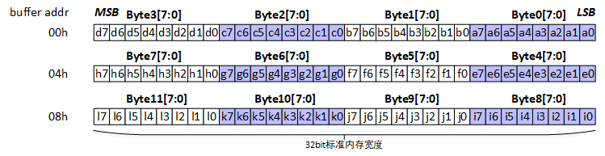

YUV PACKAGE 422格式各分量与内存各字节对应关系，以其中的YUYV格式为例。

**图 2**  YUV PACKAGE 422格式各分量与内存各字节对应关系<a name="fig317111362520"></a>  
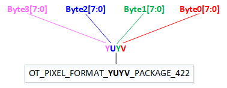

所有YUV PACKAGE 422格式各分量与内存各字节对应关系如下。

**表 1**  像素格式中各分量与内存各字节对应关系

<a name="table257201417382"></a>
<table><thead align="left"><tr id="row195751493811"><th class="cellrowborder" valign="top" width="44.48555144485552%" id="mcps1.2.6.1.1"><p id="p257151413813"><a name="p257151413813"></a><a name="p257151413813"></a>像素格式</p>
</th>
<th class="cellrowborder" valign="top" width="13.578642135786422%" id="mcps1.2.6.1.2"><p id="p7571414143813"><a name="p7571414143813"></a><a name="p7571414143813"></a>Byte3[7:0]</p>
</th>
<th class="cellrowborder" valign="top" width="13.878612138786123%" id="mcps1.2.6.1.3"><p id="p185731463810"><a name="p185731463810"></a><a name="p185731463810"></a>Byte2[7:0]</p>
</th>
<th class="cellrowborder" valign="top" width="14.638536146385361%" id="mcps1.2.6.1.4"><p id="p05712143389"><a name="p05712143389"></a><a name="p05712143389"></a>Byte1[7:0]</p>
</th>
<th class="cellrowborder" valign="top" width="13.418658134186584%" id="mcps1.2.6.1.5"><p id="p957131433817"><a name="p957131433817"></a><a name="p957131433817"></a>Byte0[7:0]</p>
</th>
</tr>
</thead>
<tbody><tr id="row1957131420388"><td class="cellrowborder" valign="top" width="44.48555144485552%" headers="mcps1.2.6.1.1 "><p id="p15574145386"><a name="p15574145386"></a><a name="p15574145386"></a>OT_PIXEL_FORMAT_YUYV_PACKAGE_422</p>
</td>
<td class="cellrowborder" valign="top" width="13.578642135786422%" headers="mcps1.2.6.1.2 "><p id="p115721413819"><a name="p115721413819"></a><a name="p115721413819"></a>Y0</p>
</td>
<td class="cellrowborder" valign="top" width="13.878612138786123%" headers="mcps1.2.6.1.3 "><p id="p1057314173812"><a name="p1057314173812"></a><a name="p1057314173812"></a>U0</p>
</td>
<td class="cellrowborder" valign="top" width="14.638536146385361%" headers="mcps1.2.6.1.4 "><p id="p1257191412382"><a name="p1257191412382"></a><a name="p1257191412382"></a>Y1</p>
</td>
<td class="cellrowborder" valign="top" width="13.418658134186584%" headers="mcps1.2.6.1.5 "><p id="p14577146380"><a name="p14577146380"></a><a name="p14577146380"></a>V0</p>
</td>
</tr>
<tr id="row05721416385"><td class="cellrowborder" valign="top" width="44.48555144485552%" headers="mcps1.2.6.1.1 "><p id="p16571714133816"><a name="p16571714133816"></a><a name="p16571714133816"></a>OT_PIXEL_FORMAT_YVYU_PACKAGE_422</p>
</td>
<td class="cellrowborder" valign="top" width="13.578642135786422%" headers="mcps1.2.6.1.2 "><p id="p12571014133817"><a name="p12571014133817"></a><a name="p12571014133817"></a>Y0</p>
</td>
<td class="cellrowborder" valign="top" width="13.878612138786123%" headers="mcps1.2.6.1.3 "><p id="p658101415386"><a name="p658101415386"></a><a name="p658101415386"></a>V0</p>
</td>
<td class="cellrowborder" valign="top" width="14.638536146385361%" headers="mcps1.2.6.1.4 "><p id="p1258121417389"><a name="p1258121417389"></a><a name="p1258121417389"></a>Y1</p>
</td>
<td class="cellrowborder" valign="top" width="13.418658134186584%" headers="mcps1.2.6.1.5 "><p id="p1581114173820"><a name="p1581114173820"></a><a name="p1581114173820"></a>U0</p>
</td>
</tr>
<tr id="row158514133818"><td class="cellrowborder" valign="top" width="44.48555144485552%" headers="mcps1.2.6.1.1 "><p id="p185871413818"><a name="p185871413818"></a><a name="p185871413818"></a>OT_PIXEL_FORMAT_UYVY_PACKAGE_422</p>
</td>
<td class="cellrowborder" valign="top" width="13.578642135786422%" headers="mcps1.2.6.1.2 "><p id="p258141463812"><a name="p258141463812"></a><a name="p258141463812"></a>U0</p>
</td>
<td class="cellrowborder" valign="top" width="13.878612138786123%" headers="mcps1.2.6.1.3 "><p id="p6589149382"><a name="p6589149382"></a><a name="p6589149382"></a>Y0</p>
</td>
<td class="cellrowborder" valign="top" width="14.638536146385361%" headers="mcps1.2.6.1.4 "><p id="p1758141413811"><a name="p1758141413811"></a><a name="p1758141413811"></a>V0</p>
</td>
<td class="cellrowborder" valign="top" width="13.418658134186584%" headers="mcps1.2.6.1.5 "><p id="p758161416387"><a name="p758161416387"></a><a name="p758161416387"></a>Y1</p>
</td>
</tr>
<tr id="row1558161414388"><td class="cellrowborder" valign="top" width="44.48555144485552%" headers="mcps1.2.6.1.1 "><p id="p1958101403817"><a name="p1958101403817"></a><a name="p1958101403817"></a>OT_PIXEL_FORMAT_VYUY_PACKAGE_422</p>
</td>
<td class="cellrowborder" valign="top" width="13.578642135786422%" headers="mcps1.2.6.1.2 "><p id="p165811413386"><a name="p165811413386"></a><a name="p165811413386"></a>V0</p>
</td>
<td class="cellrowborder" valign="top" width="13.878612138786123%" headers="mcps1.2.6.1.3 "><p id="p458171423811"><a name="p458171423811"></a><a name="p458171423811"></a>Y0</p>
</td>
<td class="cellrowborder" valign="top" width="14.638536146385361%" headers="mcps1.2.6.1.4 "><p id="p158131473816"><a name="p158131473816"></a><a name="p158131473816"></a>U0</p>
</td>
<td class="cellrowborder" valign="top" width="13.418658134186584%" headers="mcps1.2.6.1.5 "><p id="p145841416384"><a name="p145841416384"></a><a name="p145841416384"></a>Y1</p>
</td>
</tr>
<tr id="row85801411389"><td class="cellrowborder" valign="top" width="44.48555144485552%" headers="mcps1.2.6.1.1 "><p id="p1258131453817"><a name="p1258131453817"></a><a name="p1258131453817"></a>OT_PIXEL_FORMAT_YYUV_PACKAGE_422</p>
</td>
<td class="cellrowborder" valign="top" width="13.578642135786422%" headers="mcps1.2.6.1.2 "><p id="p115817149382"><a name="p115817149382"></a><a name="p115817149382"></a>Y0</p>
</td>
<td class="cellrowborder" valign="top" width="13.878612138786123%" headers="mcps1.2.6.1.3 "><p id="p45815147382"><a name="p45815147382"></a><a name="p45815147382"></a>Y1</p>
</td>
<td class="cellrowborder" valign="top" width="14.638536146385361%" headers="mcps1.2.6.1.4 "><p id="p165813141381"><a name="p165813141381"></a><a name="p165813141381"></a>U0</p>
</td>
<td class="cellrowborder" valign="top" width="13.418658134186584%" headers="mcps1.2.6.1.5 "><p id="p17581414203816"><a name="p17581414203816"></a><a name="p17581414203816"></a>V0</p>
</td>
</tr>
<tr id="row13584147388"><td class="cellrowborder" valign="top" width="44.48555144485552%" headers="mcps1.2.6.1.1 "><p id="p1858171412380"><a name="p1858171412380"></a><a name="p1858171412380"></a>OT_PIXEL_FORMAT_YYVU_PACKAGE_422</p>
</td>
<td class="cellrowborder" valign="top" width="13.578642135786422%" headers="mcps1.2.6.1.2 "><p id="p175811419384"><a name="p175811419384"></a><a name="p175811419384"></a>Y0</p>
</td>
<td class="cellrowborder" valign="top" width="13.878612138786123%" headers="mcps1.2.6.1.3 "><p id="p758414193813"><a name="p758414193813"></a><a name="p758414193813"></a>Y1</p>
</td>
<td class="cellrowborder" valign="top" width="14.638536146385361%" headers="mcps1.2.6.1.4 "><p id="p558141411382"><a name="p558141411382"></a><a name="p558141411382"></a>V0</p>
</td>
<td class="cellrowborder" valign="top" width="13.418658134186584%" headers="mcps1.2.6.1.5 "><p id="p458161483810"><a name="p458161483810"></a><a name="p458161483810"></a>U0</p>
</td>
</tr>
<tr id="row55810142386"><td class="cellrowborder" valign="top" width="44.48555144485552%" headers="mcps1.2.6.1.1 "><p id="p5591714173811"><a name="p5591714173811"></a><a name="p5591714173811"></a>OT_PIXEL_FORMAT_UVYY_PACKAGE_422</p>
</td>
<td class="cellrowborder" valign="top" width="13.578642135786422%" headers="mcps1.2.6.1.2 "><p id="p55911147387"><a name="p55911147387"></a><a name="p55911147387"></a>U0</p>
</td>
<td class="cellrowborder" valign="top" width="13.878612138786123%" headers="mcps1.2.6.1.3 "><p id="p205941410381"><a name="p205941410381"></a><a name="p205941410381"></a>V0</p>
</td>
<td class="cellrowborder" valign="top" width="14.638536146385361%" headers="mcps1.2.6.1.4 "><p id="p1159214153817"><a name="p1159214153817"></a><a name="p1159214153817"></a>Y0</p>
</td>
<td class="cellrowborder" valign="top" width="13.418658134186584%" headers="mcps1.2.6.1.5 "><p id="p125941411389"><a name="p125941411389"></a><a name="p125941411389"></a>Y1</p>
</td>
</tr>
<tr id="row559914203815"><td class="cellrowborder" valign="top" width="44.48555144485552%" headers="mcps1.2.6.1.1 "><p id="p1459414163813"><a name="p1459414163813"></a><a name="p1459414163813"></a>OT_PIXEL_FORMAT_VUYY_PACKAGE_422</p>
</td>
<td class="cellrowborder" valign="top" width="13.578642135786422%" headers="mcps1.2.6.1.2 "><p id="p11591214183820"><a name="p11591214183820"></a><a name="p11591214183820"></a>V0</p>
</td>
<td class="cellrowborder" valign="top" width="13.878612138786123%" headers="mcps1.2.6.1.3 "><p id="p25951413382"><a name="p25951413382"></a><a name="p25951413382"></a>U0</p>
</td>
<td class="cellrowborder" valign="top" width="14.638536146385361%" headers="mcps1.2.6.1.4 "><p id="p059101418387"><a name="p059101418387"></a><a name="p059101418387"></a>Y0</p>
</td>
<td class="cellrowborder" valign="top" width="13.418658134186584%" headers="mcps1.2.6.1.5 "><p id="p13591014173811"><a name="p13591014173811"></a><a name="p13591014173811"></a>Y1</p>
</td>
</tr>
<tr id="row259214113813"><td class="cellrowborder" valign="top" width="44.48555144485552%" headers="mcps1.2.6.1.1 "><p id="p135918144381"><a name="p135918144381"></a><a name="p135918144381"></a>OT_PIXEL_FORMAT_VY1UY0_PACKAGE_422</p>
</td>
<td class="cellrowborder" valign="top" width="13.578642135786422%" headers="mcps1.2.6.1.2 "><p id="p1259151418380"><a name="p1259151418380"></a><a name="p1259151418380"></a>V0</p>
</td>
<td class="cellrowborder" valign="top" width="13.878612138786123%" headers="mcps1.2.6.1.3 "><p id="p459514103810"><a name="p459514103810"></a><a name="p459514103810"></a>Y1</p>
</td>
<td class="cellrowborder" valign="top" width="14.638536146385361%" headers="mcps1.2.6.1.4 "><p id="p14591314143819"><a name="p14591314143819"></a><a name="p14591314143819"></a>U0</p>
</td>
<td class="cellrowborder" valign="top" width="13.418658134186584%" headers="mcps1.2.6.1.5 "><p id="p5597146383"><a name="p5597146383"></a><a name="p5597146383"></a>Y0</p>
</td>
</tr>
</tbody>
</table>

# VI<a name="ZH-CN_TOPIC_0000002441714901"></a>


## 热成像探测器对接<a name="ZH-CN_TOPIC_0000002408115738"></a>


### T0类型探测器配置<a name="ZH-CN_TOPIC_0000002408275594"></a>


#### CRG和管脚复用配置<a name="ZH-CN_TOPIC_0000002408275590"></a>

加载ko的时候使用如下命令：load\_ss928v100 -a –sensor1 t0，可根据具体情况在sysconfig中调整管脚复用，参照函数thermo\_clock\_config、thermo\_sensor\_pin\_mux配置。

#### MIPI配置<a name="ZH-CN_TOPIC_0000002441674977"></a>

无需配置。

#### VI配置<a name="ZH-CN_TOPIC_0000002441714721"></a>

#### VI DEV属性配置<a name="ZH-CN_TOPIC_0000002408115674"></a>

只能使用Dev1对接，intf\_mode配置为OT\_VI\_INTF\_MODE\_THERMO，其余配置与raw数据输入的配置相同，分辨率配置为656x520。

#### 热成像属性配置<a name="ZH-CN_TOPIC_0000002408275678"></a>

-   work\_mode配置为OT\_VI\_THERMO\_WORK\_MODE\_T0。
-   ooc\_frame\_info配置为328x520，位宽为16bit的raw数据输入。
-   cfg\_num配置为60。
-   sns\_cfg配置：

    ```
    {
    0xFE, 0xAA, 0x00, 0x00,
    0x4E, 0x20, 0xA2, 0xB8,
    0xD0, 0x26, 0xBA, 0x78,
    0x9E, 0xA6, 0xB4, 0xBE,
    0xFE, 0xFE, 0xA4, 0x86,
    0x02, 0x80, 0x34, 0xEC,
    0x0A, 0x42, 0x70, 0x0E,
    0xFC, 0x06, 0x24, 0xA4,
    0xA0, 0x98, 0x86, 0xC6,
    0x04, 0xD8, 0x5A, 0x9A,
    0xB6, 0x6C, 0x1A, 0xB6,
    0x70, 0x20, 0x08, 0x00,
    0x20, 0x08, 0x50, 0x98,
    0xCE, 0xD8, 0x3A, 0x34,
    0xF4, 0x38, 0x40, 0x00,
    }；
    ```

-   frame\_rate配置为50, 此参数暂时无效。
-   sd\_mux配置为\{ OT\_VI\_SD\_MUX\_T0\_SD0，OT\_VI\_SD\_MUX\_T0\_SD1, OT\_VI\_SD\_MUX\_BUTT, OT\_VI\_SD\_MUX\_BUTT\}，根据具体的硬件走线来设置。

### T1类型探测器配置<a name="ZH-CN_TOPIC_0000002441714833"></a>


#### CRG和管脚复用配置<a name="ZH-CN_TOPIC_0000002441674965"></a>

加载ko的时候使用如下命令：load\_ss928v100 -a -sensor0 t1，可根据具体情况在sysconfig中调整管脚复用，参照函数thermo\_clock\_config、thermo\_sensor\_pin\_mux配置。

#### MIPI配置（LVDS配置）<a name="ZH-CN_TOPIC_0000002408115534"></a>

1.  配置LVDS属性

    ```
    combo_dev_attr_t THERMO_T1_LVDS_ATTR =
    {
        .devno = 0,
        .input_mode = INPUT_MODE_LVDS,
        .data_rate = MIPI_DATA_RATE_X1,
        .img_rect = {4, 7, 160, 120},
        .lvds_attr = {
            .input_data_type = DATA_TYPE_RAW_8BIT,
            .wdr_mode = OT_LVDS_WDR_MODE_NONE,
            .sync_mode = LVDS_SYNC_MODE_SOF,
            .vsync_attr = {LVDS_VSYNC_NORMAL, 0, 0},
            .fid_attr = {LVDS_FID_NONE, 1},
            .data_endian = LVDS_ENDIAN_BIG,
            .sync_code_endian = LVDS_ENDIAN_BIG,
            .lane_id = {0, -1, -1, -1, -1, -1, -1, -1},
            .sync_code = {
                {
                   {0xec, 0xf1, 0xc7, 0xda},
                   {0xec, 0xf1, 0xc7, 0xda},
                   {0xec, 0xf1, 0xc7, 0xda},
                   {0xec, 0xf1, 0xc7, 0xda},
                },
                {
                   {0xec, 0xf1, 0xc7, 0xda},
                   {0xec, 0xf1, 0xc7, 0xda},
                   {0xec, 0xf1, 0xc7, 0xda},
                   {0xec, 0xf1, 0xc7, 0xda},
                },
                {
                   {0xec, 0xf1, 0xc7, 0xda},
                   {0xec, 0xf1, 0xc7, 0xda},
                   {0xec, 0xf1, 0xc7, 0xda},
                   {0xec, 0xf1, 0xc7, 0xda},
                },
                {
                   {0xec, 0xf1, 0xc7, 0xda},
                   {0xec, 0xf1, 0xc7, 0xda},
                   {0xec, 0xf1, 0xc7, 0xda},
                   {0xec, 0xf1, 0xc7, 0xda},
                },
                {
                   {0xec, 0xf1, 0xc7, 0xda},
                   {0xec, 0xf1, 0xc7, 0xda},
                   {0xec, 0xf1, 0xc7, 0xda},
                   {0xec, 0xf1, 0xc7, 0xda},
                },
                {
                   {0xec, 0xf1, 0xc7, 0xda},
                   {0xec, 0xf1, 0xc7, 0xda},
                   {0xec, 0xf1, 0xc7, 0xda},
                   {0xec, 0xf1, 0xc7, 0xda},
                },
                {
                   {0xec, 0xf1, 0xc7, 0xda},
                   {0xec, 0xf1, 0xc7, 0xda},
                   {0xec, 0xf1, 0xc7, 0xda},
                   {0xec, 0xf1, 0xc7, 0xda},
                },
                {
                   {0xec, 0xf1, 0xc7, 0xda},
                   {0xec, 0xf1, 0xc7, 0xda},
                   {0xec, 0xf1, 0xc7, 0xda},
                   {0xec, 0xf1, 0xc7, 0xda},
                },
            },
        }
    };
    ```

2.  调用mipi接口OT\_MIPI\_SET\_PHY\_CMVMODE配置cmv\_mode，设置cmv\_mode为PHY\_CMV\_GE1200MV。

#### VI配置<a name="ZH-CN_TOPIC_0000002408275438"></a>

#### VI DEV属性配置<a name="ZH-CN_TOPIC_0000002408115690"></a>

可以使用Dev0\~3，与raw数据输入的配置完全相同，分辨率配置为160x120。

#### 热成像属性配置<a name="ZH-CN_TOPIC_0000002408115602"></a>

-   work\_mode配置为OT\_VI\_THERMO\_WORK\_MODE\_T1。
-   ooc\_frame\_info配置为168x128，位宽为8bit的raw数据输入。
-   cfg\_num配置为40。
-   sns\_cfg配置：

    ```
    {
    0x43, 0x02, 0x72, 0x7C,
    0x25, 0x2E, 0x02, 0x15,
    0x40, 0x18, 0x19, 0x1A,
    0x82, 0x06, 0x04, 0x13,
    0x81, 0x7F, 0xC2, 0x00,
    0x00, 0x03, 0xC0, 0x0F,
    0xFF, 0xFF, 0xFF, 0xFE,
    0xAF, 0xEB, 0x6E, 0x2C,
    0x85, 0x16, 0x48, 0x80,
    0x00, 0x00, 0x00, 0x2F,
    }；
    ```

-   frame\_rate配置为25, 此参数暂时无效。
-   sd\_mux配置为\{ OT\_VI\_SD\_MUX\_T1\_SDA，OT\_VI\_SD\_MUX\_BUTT，OT\_VI\_SD\_MUX\_T1\_FS，OT\_VI\_SD\_MUX\_BUTT\}，根据具体的硬件走线来设置。

### T2类型探测器配置<a name="ZH-CN_TOPIC_0000002408275602"></a>


#### CRG和管脚复用配置<a name="ZH-CN_TOPIC_0000002408275618"></a>

加载ko的时候使用如下命令：load\_ss928v100 -a –sensor1 t2，可根据具体情况在sysconfig中调整管脚复用，参照函数thermo\_clock\_config、thermo\_sensor\_pin\_mux配置。

#### MIPI配置<a name="ZH-CN_TOPIC_0000002441674997"></a>

无需配置。

#### VI配置<a name="ZH-CN_TOPIC_0000002408115686"></a>

#### VI DEV属性配置<a name="ZH-CN_TOPIC_0000002408115578"></a>

只能使用Dev1对接，intf\_mode配置为OT\_VI\_INTF\_MODE\_THERMO，其余配置与raw数据输入的配置相同，分辨率配置为648x516。

#### 热成像属性配置<a name="ZH-CN_TOPIC_0000002408275482"></a>

-   work\_mode配置为OT\_VI\_THERMO\_WORK\_MODE\_T2。
-   ooc\_frame\_info配置为648x516，位宽为8bit的raw数据输入。
-   cfg\_num配置为48。
-   sns\_cfg配置：

    ```
    {
    0x40, 0x10, 0x03, 0xFF,
    0xC0, 0x01, 0x8C, 0xCB,
    0x2E, 0x20, 0x82, 0x0F,
    0x11, 0x60, 0x84, 0xB6,
    0xF3, 0xB8, 0x20, 0x00,
    0x00, 0x00, 0x7F, 0xFF,
    0xFF, 0xFF, 0xFF, 0x84,
    0x70, 0x00, 0x10, 0xAA,
    0x04, 0x00, 0x8C, 0x20,
    0xA3, 0xD0, 0x80, 0x00,
    0x57, 0x81, 0xF5, 0x74,
    0x32, 0x2C, 0x1E, 0xF0,
    }；
    ```

-   frame\_rate配置为50, 此参数暂时无效。
-   sd\_mux配置为\{OT\_VI\_SD\_MUX\_T2\_SDA0，OT\_VI\_SD\_MUX\_T2\_SDA1，OT\_VI\_SD\_MUX\_T2\_SDA2，OT\_VI\_SD\_MUX\_T2\_FS\}，根据具体的硬件走线来设置。

### T3类型探测器配置<a name="ZH-CN_TOPIC_0000002441714705"></a>


#### CRG和管脚复用配置<a name="ZH-CN_TOPIC_0000002441674961"></a>

加载ko的时候使用如下命令：load ss928v100 -a –sensor3 t3，可根据具体情况在sysconfig中调整管脚复用，参照函数thermo\_clock\_config、thermo\_t3\_pin\_mux配置。

#### MIPI配置<a name="ZH-CN_TOPIC_0000002408275466"></a>

无需配置。

#### VI配置<a name="ZH-CN_TOPIC_0000002408115730"></a>

**VI DEV属性配置<a name="section1862321191713"></a>**

只能使用Dev3对接，intf\_mode配置为OT\_VI\_INTF\_MODE\_BT656，按BT.656时序进行配置，宽高为800x300，VI\_PIPE按OT\_PIXEL\_FORMAT\_RGB\_BAYER\_8BPP配置输出。PIPE DUMP出来的图实际为400x300 16bit的raw数据。

接口模式：OT\_VI\_INTF\_MODE\_BT656

Mask设置：component\_mask\[0\] = 0x00FF0000, component\_mask\[1\] = 0x0

扫描格式：只支持逐行OT\_VI\_SCAN\_PROGRESSIVE

UV顺序：OT\_VI\_DATA\_SEQ\_UVUV

数据类型：OT\_VI\_DATA\_TYPE\_YUV

```
ot_vi_dev_attr vi_dev_attr = {
    .intf_mode = OT_VI_INTF_MODE_BT656,
    .work_mode = OT_VI_WORK_MODE_MULTIPLEX_1,
    .component_mask = {0x00FF0000, 0x0},
    .scan_mode = OT_VI_SCAN_PROGRESSIVE,
    .ad_chn_id = {-1, -1, -1, -1},
    .data_seq = OT_VI_DATA_SEQ_UVUV, 
    .sync_cfg = {
        .vsync           = OT_VI_VSYNC_PULSE,
        .vsync_neg       = OT_VI_VSYNC_NEG_LOW,
        .hsync           = OT_VI_HSYNC_VALID_SIG,
        .hsync_neg       = OT_VI_HSYNC_NEG_HIGH,
        .vsync_valid     = OT_VI_VSYNC_VALID_SIG,
        .vsync_valid_neg = OT_VI_VSYNC_VALID_NEG_HIGH,
        .timing_blank    = {
            /* hsync_hfb    hsync_act    hsync_hhb */
               0,           0,        0,
            /* vsync0_vhb   vsync0_act   vsync0_hhb */
               0,           0,         0,
            /* vsync1_vhb   vsync1_act   vsync1_hhb */
               0,           0,           0
        }
    },
    .data_type = OT_VI_DATA_TYPE_YUV,
    .data_reverse = TD_FALSE,
    .in_size = {1920, 1080},
    .data_rate = OT_DATA_RATE_X1,
};
```

**热成像属性配置<a name="section128665951714"></a>**

work\_mode配置为OT\_VI\_THERMO\_WORK\_MODE\_T3。

ooc\_frame\_info配置为500x846，位宽为8bit的raw数据输入。

cfg\_num：无需配置。

sns\_cfg：无需配置。

frame\_rate配置为25。

sd\_mux配置为\{OT\_VI\_SD\_MUX\_T2\_SDA0，OT\_VI\_SD\_MUX\_T2\_SDA1， OT\_VI\_SD\_MUX\_T2\_FS，OT\_VI\_SD\_MUX\_T2\_SDA2\}。

**热成像sensor初始化配置<a name="section11450191871811"></a>**

sensor通过i2c进行配置初始化及效果调节，需要在执行load脚本后进行配置，以下为sensor初始化样例。

```
####探测器输出配置########
i2c_write 0x2 0x82 0x7c 0xa9 1 1;
usleep 3000;
i2c_write 0x2 0x82 0x42 0x72 1 1;
i2c_write 0x2 0x82 0x41 0x05 1 1;
i2c_write 0x2 0x82 0x7c 0xab 1 1;
usleep 3000;
i2c_write 0x2 0x82 0x0e 0x26 1 1;
i2c_write 0x2 0x82 0x13 0x10 1 1;
i2c_write 0x2 0x82 0x7c 0xa8 1 1;
usleep 3000;
i2c_write 0x2 0x82 0x7c 0xa9 1 1;
usleep 3000;
i2c_write 0x2 0x82 0x1c 0x04 1 1;
i2c_write 0x2 0x82 0x0b 0xe0 1 1;
i2c_write 0x2 0x82 0x0c 0x2e 1 1;
i2c_write 0x2 0x82 0x7c 0xa8 1 1;
i2c_write 0x2 0x82 0x7c 0xab 1 1;
usleep 3000;
i2c_write 0x2 0x82 0x17 0x0f 1 1;
i2c_write 0x2 0x82 0x18 0x0f 1 1;
i2c_write 0x2 0x82 0x7c 0xa8 1 1;
usleep 3000;
i2c_write 0x2 0x82 0x02 0x90 1 1;
i2c_write 0x2 0x82 0x03 0x01 1 1;
i2c_write 0x2 0x82 0x04 0x2c 1 1;
i2c_write 0x2 0x82 0x05 0x01 1 1;
i2c_write 0x2 0x82 0x06 0x64 1 1;
i2c_write 0x2 0x82 0x07 0x00 1 1;
i2c_write 0x2 0x82 0x08 0x44 1 1;
i2c_write 0x2 0x82 0x09 0x02 1 1;
i2c_write 0x2 0x82 0x0a 0x00 1 1;
i2c_write 0x2 0x82 0x0b 0x00 1 1;
i2c_write 0x2 0x82 0x0c 0x90 1 1;
i2c_write 0x2 0x82 0x0d 0x01 1 1;
i2c_write 0x2 0x82 0x10 0x01 1 1;
i2c_write 0x2 0x82 0x18 0x3f 1 1;
i2c_write 0x2 0x82 0x19 0x3f 1 1;
i2c_write 0x2 0x82 0x1a 0x3f 1 1;
i2c_write 0x2 0x82 0x1b 0x01 1 1;
i2c_write 0x2 0x82 0x1c 0x00 1 1;
i2c_write 0x2 0x82 0x2f 0x00 1 1;
i2c_write 0x2 0x82 0x30 0x14 1 1;
i2c_write 0x2 0x82 0x31 0x02 1 1;
i2c_write 0x2 0x82 0x32 0x00 1 1;
i2c_write 0x2 0x82 0x01 0x01 1 1;
usleep 400000;
i2c_read 0x2 0x82 0x01 0x01 1 1;
i2c_write 0x2 0x82 0x7c 0xa8 1 1;
usleep 3000;
i2c_write 0x2 0x82 0x33 0x00 1 1;
i2c_write 0x2 0x82 0x2c 0x00 1 1;
i2c_write 0x2 0x82 0x0f 0x00 1 1;
i2c_write 0x2 0x82 0x7c 0xab 1 1;
usleep 3000;
i2c_write 0x2 0x82 0x07 0x20 1 1;
i2c_write 0x2 0x82 0x0b 0x88 1 1;
i2c_write 0x2 0x82 0x0c 0x00 1 1;
i2c_write 0x2 0x82 0x0e 0x26 1 1;
i2c_write 0x2 0x82 0x0f 0x48 1 1;
i2c_write 0x2 0x82 0x10 0xa1 1 1;
i2c_write 0x2 0x82 0x13 0x00 1 1;
i2c_write 0x2 0x82 0x14 0x80 1 1;
i2c_write 0x2 0x82 0x15 0x48 1 1;
i2c_write 0x2 0x82 0x1d 0x01 1 1;
i2c_write 0x2 0x82 0x1f 0x5a 1 1;
i2c_write 0x2 0x82 0x20 0x04 1 1;
i2c_write 0x2 0x82 0x7c 0xa8 1 1;
usleep 3000;
i2c_write 0x2 0x82 0x2c 0x05 1 1;
i2c_write 0x2 0x82 0x35 0x2c 1 1;
i2c_write 0x2 0x82 0x7c 0xa9 1 1;
usleep 3000;
i2c_write 0x2 0x82 0x21 0x50 1 1;
i2c_write 0x2 0x82 0x24 0x50 1 1;
i2c_write 0x2 0x82 0x41 0x57 1 1;
i2c_write 0x2 0x82 0x24 0xf0 1 1;
i2c_write 0x2 0x82 0x3e 0x06 1 1;
i2c_write 0x2 0x82 0x7c 0xab 1 1;
usleep 3000;
i2c_write 0x2 0x82 0x20 0xaf 1 1;
i2c_write 0x2 0x82 0x7c 0xa8 1 1;
```

## VI YUV时序配置<a name="ZH-CN_TOPIC_0000002441674917"></a>

VI进YUV的场景配置需要注意的地方比较多，首先要配置管脚复用，时钟选择（通过load脚本的-sensor参数传递，细节请参见\(sysconfig.c）然后对MIPI、VI设备和VI PIPE做配置，差异点如下。

> **须知：** 
>-   VI进YUV且Bypass ISP的场景下\(pipe属性中的bIspBypass配置为TD\_TRUE\)，强烈建议不起ISP业务，避免内存等资源的浪费。
>-   各接口的load脚本的参数，请参考各芯片的load脚本。
>-   接线时序不用会导致dev component\_mask配置不同，具体请参考《MPP媒体处理软件 V5.0 开发参考》“视频输入”章节的掩码配置介绍。


### BT.1120<a name="ZH-CN_TOPIC_0000002441714753"></a>


#### SYS\_CONFIG配置<a name="ZH-CN_TOPIC_0000002441674985"></a>

-   使用ko目录下的load\_ss928v100配置，sensor参数为bt1120，通过指定该参数配置bt1120的管脚复用：vi\_bt1120\_mode\_mux\(void\)，COMS时钟：

    coms\_clock\_config\(int index\) 等配置。

-   AD芯片默认使用sensor1时钟，若有其他使用场景可自行修改SYSCONFIG文件。

    ```
    ./load_ss928v100 –sensor0 sensor_xxx –sensor1 sensor_xxx –sensor2 sensor_xxx –sensor3 sensor_xxx
    ```

#### MIPI配置<a name="ZH-CN_TOPIC_0000002441714761"></a>

BT.1120时序不需要配置MIPI\_RX，建议不起MIPI\_RX业务。

#### VI DEV配置<a name="ZH-CN_TOPIC_0000002408115742"></a>

-   接口模式：OT\_VI\_INTF\_MODE\_BT1120
-   Mask设置：component\_mask\[0\] = 0x00FF0000，component\_mask\[1\] = 0xFF000000
-   扫描格式：只支持逐行OT\_VI\_SCAN\_PROGRESSIVE
-   UV顺序：UV顺序根据实际输入时序确定是OT\_VI\_DATA\_SEQ\_VUVU还是OT\_VI\_DATA\_SEQ\_UVUV
-   数据类型：BT.1120进YUV数据，因此是OT\_VI\_DATA\_TYPE\_YUV
-   SS928V100配置BT.1120时需使用VI DEV3。其管脚复用的配置在sysconfig文件已配置封装好，可通过对应load脚本指令进行对应的选择，详情请查看ko目录下的load\_ss928v100。

    ```
    ot_vi_dev_attr vi_bt1120_dev_attr = {
        .intf_mode = OT_VI_INTF_MODE_BT1120,
        .work_mode = OT_VI_WORK_MODE_MULTIPLEX_1,
        .component_mask = {0x00FF0000, 0xFF000000},
        .scan_mode = OT_VI_SCAN_PROGRESSIVE,
        .ad_chn_id = {-1, -1, -1, -1},
        .data_seq = OT_VI_DATA_SEQ_UVUV,
        .sync_cfg = {
            .vsync           = OT_VI_VSYNC_PULSE,
            .vsync_neg       = OT_VI_VSYNC_NEG_LOW,
            .hsync           = OT_VI_HSYNC_VALID_SIG,
            .hsync_neg       = OT_VI_HSYNC_NEG_HIGH,
            .vsync_valid     = OT_VI_VSYNC_VALID_SIG,
            .vsync_valid_neg = OT_VI_VSYNC_VALID_NEG_HIGH,
            .timing_blank    = {
                /* hsync_hfb    hsync_act    hsync_hhb */
                   0,           0,        0,
                /* vsync0_vhb   vsync0_act   vsync0_hhb */
                   0,           0,         0,
                /* vsync1_vhb   vsync1_act   vsync1_hhb */
                   0,           0,           0
            }
        },
        .data_type = OT_VI_DATA_TYPE_YUV,
        .data_reverse = TD_FALSE,
        .in_size = {1920, 1080},
        .data_rate = OT_DATA_RATE_X1,
    };
    ```

#### VI PIPE配置<a name="ZH-CN_TOPIC_0000002441675033"></a>

-   PIPE的ispbypass设置为TD\_TRUE。
-   PIPE的像素格式设置为OT\_PIXEL\_FORMAT\_YVU\_SEMIPLANAR\_422。
-   PIPE的bit位宽nBitWidth设置为OT\_DATA\_BIT\_WIDTH\_8。

    ```
    ot_vi_pipe_attr vi_bt1120_pipe_attr = {
        .pipe_bypass_mode = OT_VI_PIPE_BYPASS_NONE,
        .isp_bypass       = TD_TRUE,
        .size             = {1920, 1080},
        .pixel_format     = OT_PIXEL_FORMAT_YVU_SEMIPLANAR_422,
        .compress_mode  = OT_COMPRESS_MODE_NONE,
        .bit_width        = OT_DATA_BIT_WIDTH_8,
        .bit_align_mode   = OT_VI_BIT_ALIGN_MODE_HIGH,
        .frame_rate_ctrl   = {-1, -1},
    };
    ```

### BT.656<a name="ZH-CN_TOPIC_0000002441714881"></a>


#### SYS\_CONFIG配置<a name="ZH-CN_TOPIC_0000002441714821"></a>

-   使用ko目录下的load\_ss928v100配置，sensor参数为bt656，通过指定该参数配置bt656的管脚复用：vi\_bt1120\_mode\_mux\(void\)，COMS时钟：

    coms\_clock\_config\(int index\) 等配置。

-   AD芯片默认使用sensor1时钟，若有其他使用场景可自行修改SYSCONFIG文件。

```
./load_ss928v100 –sensor0 sensor_xxx –sensor1 sensor_xxx –sensor2 sensor_xxx –sensor3 sensor_xxx
```

#### MIPI配置<a name="ZH-CN_TOPIC_0000002408275570"></a>

BT.656时序不需要配置MIPI\_RX，建议不起MIPI\_RX业务。

#### VI DEV配置<a name="ZH-CN_TOPIC_0000002408275550"></a>

-   接口模式：OT\_VI\_INTF\_MODE\_BT656
-   Mask设置：component\_mask\[0\] = 0x00FF0000, component\_mask\[1\] = 0x0
-   扫描格式：只支持逐行OT\_VI\_SCAN\_PROGRESSIVE
-   UV顺序：UV顺序根据实际输入时序确定是OT\_VI\_DATA\_SEQ\_UYVY/OT\_VI\_DATA\_SEQ\_VYUY/OT\_VI\_DATA\_SEQ\_YUYV/OT\_VI\_DATA\_SEQ\_YVYU。
-   数据类型：BT.656进YUV数据，因此是OT\_VI\_DATA\_TYPE\_YUV
-   SS928V100配置BT.656时需使用VI DEV3。其管脚复用的配置在sysconfig文件已配置封装好，可通过对应load脚本指令进行对应的选择，详情请查看ko目录下的load\_ss928v100。

    ```
    ot_vi_dev_attr vi_bt656_dev_attr = {
        .intf_mode = OT_VI_INTF_MODE_BT656,
        .work_mode = OT_VI_WORK_MODE_MULTIPLEX_1,
        .component_mask = {0x00FF0000, 0x0},
        .scan_mode = OT_VI_SCAN_PROGRESSIVE,
        .ad_chn_id = {-1, -1, -1, -1},
        .data_seq = OT_VI_DATA_SEQ_UVUV, 
        .sync_cfg = {
            .vsync           = OT_VI_VSYNC_PULSE,
            .vsync_neg       = OT_VI_VSYNC_NEG_LOW,
            .hsync           = OT_VI_HSYNC_VALID_SIG,
            .hsync_neg       = OT_VI_HSYNC_NEG_HIGH,
            .vsync_valid     = OT_VI_VSYNC_VALID_SIG,
            .vsync_valid_neg = OT_VI_VSYNC_VALID_NEG_HIGH,
            .timing_blank    = {
                /* hsync_hfb    hsync_act    hsync_hhb */
                   0,           0,        0,
                /* vsync0_vhb   vsync0_act   vsync0_hhb */
                   0,           0,         0,
                /* vsync1_vhb   vsync1_act   vsync1_hhb */
                   0,           0,           0
            }
        },
        .data_type = OT_VI_DATA_TYPE_YUV,
        .data_reverse = TD_FALSE,
        .in_size = {1920, 1080},
        .data_rate = OT_DATA_RATE_X1,
    };
    ```

#### VI PIPE配置<a name="ZH-CN_TOPIC_0000002408115526"></a>

-   PIPE的ispbypass设置为TD\_TRUE。
-   PIPE的像素格式设置为OT\_PIXEL\_FORMAT\_YVU\_SEMIPLANAR\_422。
-   PIPE的bit位宽nBitWidth设置为OT\_DATA\_BIT\_WIDTH\_8。

    ```
    ot_vi_pipe_attr vi_bt1120_pipe_attr = {
        .pipe_bypass_mode = OT_VI_PIPE_BYPASS_NONE,
        .isp_bypass       = TD_TRUE,
        .size             = {1920, 1080},
        .pixel_format     = OT_PIXEL_FORMAT_YVU_SEMIPLANAR_422,
        .compress_mode  = OT_COMPRESS_MODE_NONE,
        .bit_width        = OT_DATA_BIT_WIDTH_8,
        .bit_align_mode   = OT_VI_BIT_ALIGN_MODE_HIGH,
        .frame_rate_ctrl   = {-1, -1},
    };
    ```

### MIPI\_YUV<a name="ZH-CN_TOPIC_0000002408275558"></a>


#### SYS\_CONFIG配置<a name="ZH-CN_TOPIC_0000002441714913"></a>

-   使用ko目录下的load\_ss928v100配置，sensor参数为mipi\_ad。
-   AD芯片默认使用sensor0时钟，若有其他使用场景可自行修改SYSCONFIG文件。

    ```
    ./load_ss928v100 –sensor0 sensor_xxx
    ```

#### MIPI配置<a name="ZH-CN_TOPIC_0000002441675045"></a>

-   配置MIPI输入模式为INPUT\_MODE\_MIPI。
-   MIPI属性输入数据类型input\_data\_type根据输入的数据类型设置，若输入YUV422则设置为DATA\_TYPE\_YUV422\_8BIT，输入为legacy YUV420则设置为DATA\_TYPE\_YUV420\_8BIT\_LEGACY， 输入为normal YUV420则设置为DATA\_TYPE\_YUV420\_8BIT\_NORMAL。

    ```
    combo_dev_attr_t MIPI_4lane_CHN0_2M_SP422_ATTR = {
        .devno = 0,
        .input_mode = INPUT_MODE_MIPI,
        .data_rate  = MIPI_DATA_RATE_X1,
        .img_rect   = {0, 0, 1920, 1080},
        .mipi_attr = {
            DATA_TYPE_YUV422_8BIT,
            OTOT_MIPI_WDR_MODE_NONE,
            {0, 1, 2, 3, -1, -1, -1, -1}
        }
    };
    ```

#### VI DEV配置<a name="ZH-CN_TOPIC_0000002408275682"></a>

-   接口模式：根据输入的数据类型设置，若输入YUV422则设置为OT\_VI\_INTF\_MODE\_MIPI\_YUV422，输入为legacy YUV420则设置为OT\_VI\_INTF\_MODE\_MIPI\_YUV420\_LEGACY，输入为normal YUV420则设置为OT\_VI\_INTF\_MODE\_MIPI\_YUV420\_NORM
-   Mask设置：component\_mask\[0\] = 0xFF000000，component\_mask\[1\] = 0x00FF0000
-   扫描格式：只支持逐行OT\_VI\_SCAN\_PROGRESSIVE
-   UV顺序：UV顺序根据实际输入时序确定是OT\_VI\_DATA\_SEQ\_VUVU还是OT\_VI\_DATA\_SEQ\_UVUV
-   数据类型：MIPI进YUV数据，因此是OT\_VI\_DATA\_TYPE\_YUV

    ```
    ot_vi_dev_attr vi_mipi_yuv422_dev_attr = {
        .intf_mode = OT_VI_INTF_MODE_MIPI_YUV422,
        .work_mode = OT_VI_WORK_MODE_MULTIPLEX_1,
        .component_mask = { 0xFF000000, 0x00FF0000},
        .scan_mode = OT_VI_SCAN_PROGRESSIVE,
        .ad_chn_id = {-1, -1, -1, -1},
        .data_seq = OT_VI_DATA_SEQ_UVUV,
        .sync_cfg = {
            .vsync           = OT_VI_VSYNC_PULSE,
            .vsync_neg       = OT_VI_VSYNC_NEG_LOW,
            .hsync           = OT_VI_HSYNC_VALID_SIG,
            .hsync_neg       = OT_VI_HSYNC_NEG_HIGH,
            .vsync_valid     = OT_VI_VSYNC_VALID_SIG,
            .vsync_valid_neg = OT_VI_VSYNC_VALID_NEG_HIGH,
            .timing_blank    = {
                /* hsync_hfb    hsync_act    hsync_hhb */
                   0,           0,        0,
                /* vsync0_vhb   vsync0_act   vsync0_hhb */
                   0,           0,         0,
                /* vsync1_vhb   vsync1_act   vsync1_hhb */
                   0,           0,           0
            }
        },
        .data_type = OT_VI_DATA_TYPE_YUV,
        .data_reverse = TD_FALSE,
        .in_size = {1920, 1080},
        .data_rate = OT_DATA_RATE_X1,
    };
    ```

#### VI PIPE配置<a name="ZH-CN_TOPIC_0000002441675001"></a>

-   PIPE的ispbypass设置为TD\_TRUE。
-   PIPE的像素格式设置为OT\_PIXEL\_FORMAT\_YVU\_SEMIPLANAR\_422。
-   PIPE的bit位宽nBitWidth设置为OT\_DATA\_BIT\_WIDTH\_8。

    ```
    ot_vi_pipe_attr vi_bt1120_pipe_attr = {
        .pipe_bypass_mode = OT_VI_PIPE_BYPASS_NONE,
        .isp_bypass       = TD_TRUE,
        .size             = {1920, 1080},
        .pixel_format     = OT_PIXEL_FORMAT_YVU_SEMIPLANAR_422,
        .compress_mode  = OT_COMPRESS_MODE_NONE,
        .bit_width        = OT_DATA_BIT_WIDTH_8,
        .bit_align_mode   = OT_VI_BIT_ALIGN_MODE_HIGH,
        .frame_rate_ctrl   = {-1, -1},
    };
    ```

### LVDS接YUV422<a name="ZH-CN_TOPIC_0000002441674861"></a>

使用LVDS的方式传输YUV422数据时，YC两分量按16bitRAW组织后传输。需注意的配置如下：

-   MIPI\_RX 配置lvds属性，input\_data\_type需配置为DATA\_TYPE\_RAW\_16BIT；
-   VI DEV属性 intf\_mode配置为OT\_VI\_INTF\_MODE\_MIPI，data\_type配置为OT\_VI\_DATA\_TYPE\_YUV；
-   VI PIPE属性 pixel\_format配置为实际的像素格式OT\_PIXEL\_FORMAT\_YUV\_SEMIPLANAR\_422，在VI PIPE按照YUV422写出。

## Stagger通路配置<a name="ZH-CN_TOPIC_0000002441714845"></a>

物理pipe数目有限时（SS928V100 物理pipe数目为4），若运行普通的行模式WDR/帧模式WDR会占用较多的物理pipe资源，此时所能调节的设备受限（以运行一组3to1 WDR为例，会占用3个物理pipe，此时只剩余1个空闲的物理pipe）。

若sensor使用同一个VC号写出所有的WDR帧（称为stagger模式），仅用一个物理pipe就可以接收多帧WDR数据，物理pipe写出多帧WDR raw后，可以按需拆分raw数据送给不同的虚拟pipe进行ISP的处理。简单示意流程如[图1](#fig7578163664419)所示。

**图 1**  简单示意流程图<a name="fig7578163664419"></a>  
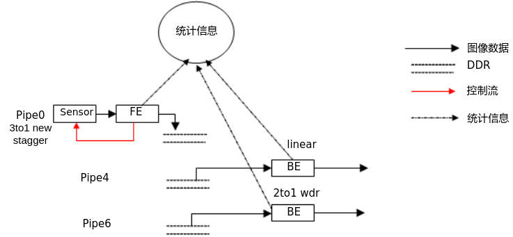

> **须知：** 
>-   约束sensor首先写出长帧数据，这样物理pipe可以提供长帧数据的AE统计信息。
>-   设置ss\_mpi\_vi\_set\_pipe\_frame\_source为OT\_VI\_PIPE\_FRAME\_SOURCE\_USER来bypass 物理pipe的BE的处理。
>-   假定WDR每帧数据的宽高为WIDTH \* HEIGHT，虚拟pipe通路的宽高配置为WIDTH \* HEIGHT，物理pipe宽高为WIDTH \* HEIGHT\_MAX,以3To1 stagger为例，HEIGHT\_MAX = 3\*（HEIGHT + l\_vs\_distance\_max），l\_vs\_distance\_max为长帧和短帧数据之间最大的行差。
>-   物理pipe写出的宽高与sensor输出的图像宽高要完全一致才能保证中断上报以及图像效果的正常，因此在适配sensor驱动时要格外注意delay\_frame\_num以及cfg2\_valid\_delay\_max的正确性。如果logmpp中出现“no eof int”的错误打印或者图像出现上下抖动的异常，请首先排查delay\_frame\_num以及cfg2\_valid\_delay\_max的配置值是否正确。
>-   特定sensor的WDR stagger模式下，如在帧起始配置曝光时间，sensor的长短帧曝光时间会分别生效，导致FE的物理pipe写出的宽高与sensor输出图像宽高不一致，logmpp中出现“no eof int”的错误打印或者图像出现上下抖动的异常。此时建议配置VI的中断类型为OT\_FRAME\_INTERRUPT\_EARLY，并配置适当行数（如总高度的一半，具体配置请查看sensor的DateSheet手册），延迟配置sensor时机，可解决上述问题。


### 物理pipe配置<a name="ZH-CN_TOPIC_0000002408115670"></a>

-   物理pipe工作现在线性模式下。
-   物理pipe接收数据的高度会随曝光变化而动态改变，为保证stagger数据的正常写出，VB、mipi宽高、vi dev宽高以及vi pipe的宽高的要配置为sensor所能写出的数据的最大的宽高\(WIDTH \*HEIGHT\_MAX\)。
-   如果使能stagger\_out\_split接口，pipe的属性需要配置成\(WIDTH \*HEIGH\)，从pipe就只输出第一帧图像。


#### MIPI配置<a name="ZH-CN_TOPIC_0000002441674869"></a>

img\_rect配置为\{0, 0, WIDTH,HEIGHT\_MAX\}

```
combo_dev_attr_t combo_dev_attr = {
    .devno = 0,
    .input_mode = INPUT_MODE_MIPI,
    .data_rate  = MIPI_DATA_RATE_X2,
    .img_rect   = {0, 0, WIDTH, HEIGHT_MAX},
    .mipi_attr = {
        DATA_TYPE_RAW_12BIT,
        OT_MIPI_WDR_MODE_NONE,
        {0, 1, 2, 3, -1, -1, -1, -1}
    }
```

#### VI DEV配置<a name="ZH-CN_TOPIC_0000002408275586"></a>

in\_size.height配置为HEIGHT\_MAX

```
ot_vi_dev_attr vi_dev_attr  = {
    .intf_mode = OT_VI_INTF_MODE_MIPI,
    .work_mode = OT_VI_WORK_MODE_MULTIPLEX_1,
    .component_mask = {0xfff00000, 0x00000000},
    .scan_mode = OT_VI_SCAN_PROGRESSIVE,
    .ad_chn_id = {-1, -1, -1, -1},
    .data_seq = OT_VI_DATA_SEQ_YVYU,
    .sync_cfg = {
        .vsync           = OT_VI_VSYNC_FIELD,
        .vsync_neg       = OT_VI_VSYNC_NEG_HIGH,
        .hsync           = OT_VI_HSYNC_VALID_SIG,
        .hsync_neg       = OT_VI_HSYNC_NEG_HIGH,
        .vsync_valid     = OT_VI_VSYNC_VALID_SIG,
        .vsync_valid_neg = OT_VI_VSYNC_VALID_NEG_HIGH,
        .timing_blank    = {
            /* hsync_hfb      hsync_act     hsync_hhb */
            0,                0,            0,
            /* vsync0_vhb     vsync0_act    vsync0_hhb */
            0,                0,            0,
            /* vsync1_vhb     vsync1_act    vsync1_hhb */
            0,                0,            0
        }
    },
    .data_type = OT_VI_DATA_TYPE_RAW,
    .data_reverse = TD_FALSE,
    .in_size = {WIDTH, HEIGHT_MAX},
    .data_rate = OT_DATA_RATE_X2,
};
```

#### VI PIPE配置<a name="ZH-CN_TOPIC_0000002441714925"></a>

-   PIPE的宽高设置为WIDTH \* HEIGHT\_MAX。
-   PIPE的compress\_mode设置为OT\_COMPRESS\_MODE\_NONE。

    ```
    ot_vi_pipe_attr vi_pipe_attr = {
        .pipe_bypass_mode = OT_VI_PIPE_BYPASS_NONE,
        .isp_bypass       = TD_FALSE,
        .size             = {WIDTH, HEIGHT_MAX},
        .pixel_format     = OT_PIXEL_FORMAT_RGB_BAYER_12BPP,
        .compress_mode  = OT_COMPRESS_MODE_NONE,
        .bit_width        = OT_DATA_BIT_WIDTH_8,
        .bit_align_mode   = OT_VI_BIT_ALIGN_MODE_HIGH,
        .frame_rate_ctrl   = {-1, -1},
    };
    ```

-   在ss\_mpi\_vi\_start\_pipe之前需要调用ss\_mpi\_vi\_set\_pipe\_param接口设置out\_mode为stagger模式输出（配置为OT\_VI\_OUT\_MODE\_2F1\_STAGGER/OT\_VI\_OUT\_MODE\_3F1\_STAGGER/OT\_VI\_OUT\_MODE\_4F1\_STAGGER）。
-   调用ss\_mpi\_vi\_set\_pipe\_frame\_source设置frame\_source为OT\_VI\_PIPE\_FRAME\_SOURCE\_USER来bypass 物理pipe BE的处理。

#### ISP配置<a name="ZH-CN_TOPIC_0000002408115758"></a>

-   在ISP mem\_init之前调用ss\_mpi\_isp\_set\_ctrl\_param接口配置alg\_run\_select为OT\_ISP\_ALG\_RUN\_FE\_ONLY（仅运行FE中的算法）。
-   pub\_attr中的wnd\_rect与sns\_size的宽高均配置为一帧图像的基础宽高WIDTH \* HEIGHT。

    ```
    ot_isp_pub_attr isp_pub_attr = {
        {0, 0, WIDTH, HEIGHT},
        {WIDTH, HEIGHT},
        25,
        OT_ISP_BAYER_BGGR,
        OT_WDR_MODE_NONE,
        0,
        0,
        0,
        {
            0,
            {0, 0, 0, 0},
        },
    }
    ```

-   Sensor驱动中需要根据曝光值每帧实时的更新ot\_isp\_sns\_regs\_info中的exp\_distance。
-   物理pipe使用ss\_mpi\_isp\_run来保证FE统计信息获取的及时性。

### 虚拟pipe配置<a name="ZH-CN_TOPIC_0000002441675053"></a>

-   虚拟pipe不需要配置MIPI和VI DEV。
-   从物理pipe获取raw数据，拆分成不同的WDR帧送给虚拟pipe，因此虚拟pipe通路的宽高为WIDTH \* HEIGHT
-   虚拟pipe设置ss\_mpi\_vi\_set\_pipe\_frame\_source为OT\_VI\_PIPE\_FRAME\_SOURCE\_USER，然后使用ss\_mpi\_isp\_run\_once + ss\_mpi\_vi\_send\_pipe\_raw的方式运行


#### VI PIPE配置<a name="ZH-CN_TOPIC_0000002408275446"></a>

-   PIPE的size配置为WIDTH \* HEIGHT
-   PIPE的pipe\_bypass\_mode设置为 OT\_VI\_PIPE\_BYPASS\_FE。

    ```
    ot_vi_pipe_attr vi_pipe_attr = {
        .pipe_bypass_mode = OT_VI_PIPE_BYPASS_FE,
        .isp_bypass       = TD_FALSE,
        .size             = {WIDTH, HEIGHT},
        .pixel_format     = OT_PIXEL_FORMAT_RGB_BAYER_12BPP,
        .compress_mode  = OT_COMPRESS_MODE_NONE,
        .bit_width        = OT_DATA_BIT_WIDTH_8,
        .bit_align_mode   = OT_VI_BIT_ALIGN_MODE_HIGH,
        .frame_rate_ctrl   = {-1, -1},
    };
    ```

-   调用ss\_mpi\_vi\_set\_pipe\_frame\_source设置frame\_source为OT\_VI\_PIPE\_FRAME\_SOURCE\_USER。

#### VI CHN配置<a name="ZH-CN_TOPIC_0000002408275614"></a>

CHN的size配置为WIDTH \* HEIGHT

```
ot_vi_chn_attr vi_chn_attr = {
    .size             = {WIDTH, HEIGHT},
    .pixel_format     = OT_PIXEL_FORMAT_YVU_SEMIPLANAR_420,
    .dynamic_range   = OT_DYNAMIC_RANGE_SDR8,
    .video_format     = OT_VIDEO_FORMAT_LINEAR,
    .compress_mode   = OT_COMPRESS_MODE_NONE,
    .mirror_en         = TD_FALSE,
    .flip_en            = TD_FALSE,
    .depth            = TD_FALSE,
    .frame_rate_ctrl    = {-1, -1},
};
```

#### WDR帧的拆分<a name="ZH-CN_TOPIC_0000002408275598"></a>

-   从物理pipe中获取video\_frame\_info
    -   调用ss\_mpi\_vi\_set\_pipe\_frame\_dump\_attr设置物理pipe的dump attr；
    -   在虚拟pipe的处理线程中，调用ss\_mpi\_vi\_get\_pipe\_frame获取video\_frame\_info。

-   基于获取到的video\_frame\_info，phys\_addr加偏移送给虚拟pipe，偏移与exposure\_distance相关，从isp\_frame\_info中获取。

```
td_phys_addr_t phys_addr = video_frame_info->video_frame.supplement.isp_info_phys_addr;
isp_frame_info = (ot_isp_frame_info *)ss_mpi_sys_mmap(phys_addr, sizeof(ot_isp_frame_info));
l_s_distance  = isp_frame_info->exposure_distance[0]; /* 长帧与中帧之间的行差 */
s_vs_distance = isp_frame_info->exposure_distance[1]; /* 中帧与短帧之间的行差 */
l_vs_distance = l_s_distance + s_vs_distance;
```

-   长帧数据frame\_info的配置

```
ot_vi_pipe_attr pipe_attr;
(td_void)memcpy_s(&long_frame_info, sizeof(ot_video_frame_info), video_frame_info, sizeof(ot_video_frame_info));
ss_mpi_vi_get_pipe_attr(virt_pipe, &pipe_attr);
long_frame_info.video_frame.width  = pipe_attr.size.width;
long_frame_info.video_frame.height  = pipe_attr.size.height;
src_stride = video_frame_info->video_frame.stride[0];
long_frame_info.video_frame.stride[0] = 3 * src_stride; /* 以3To1 stagger为例 */
```

-   中帧数据frame\_info的配置

```
ot_vi_pipe_attr pipe_attr;
(td_void)memcpy_s(&median_frame_info, sizeof(ot_video_frame_info), video_frame_info, sizeof(ot_video_frame_info));
ss_mpi_vi_get_pipe_attr(virt_pipe, &pipe_attr);
median_frame_info.video_frame.width  = pipe_attr.size.width;
median_frame_info.video_frame.height = pipe_attr.size.height;
src_stride = video_frame_info->video_frame.stride[0];
long_frame_info.video_frame.stride[0] = 3 * src_stride;
median_frame_info.video_frame.phys_addr[0] += (3 * l_s_distance + 1) * src_stride;
```

-   短帧数据frame\_info的配置

```
ot_vi_pipe_attr pipe_attr;
(td_void)memcpy_s(&short_frame_info, sizeof(ot_video_frame_info), video_frame_info, sizeof(ot_video_frame_info));
ss_mpi_vi_get_pipe_attr(virt_pipe, &pipe_attr);
short_frame_info.video_frame.width  = pipe_attr.size.width;
short_frame_info.video_frame.height = pipe_attr.size.height;
src_stride = video_frame_info->video_frame.stride[0];
short_frame_info.video_frame.stride[0] = 3 * src_stride;
short_frame_info.video_frame.phys_addr[0] += (3 * l_vs_distance + 2) * src_stride;
```

### Sensor适配<a name="ZH-CN_TOPIC_0000002408275518"></a>

-   frame\_info中长帧和短帧的distance当前需要在cmos\_get\_sns\_regs\_info根据曝光时间的变化进行动态计算得到。
-   Stagger 模式某sensor的distance的计算示例如下：

    ```
    td_u8 i;
    td_u32 l_s_diatance, s_vs_distance;
    sns_state->regs_info[0].i2c_data[0].data = high_8bits(long_exposure);
    sns_state->regs_info[0].i2c_data[1].data = low_8bits(long_exposure);
    sns_state->regs_info[0].i2c_data[2].data = high_8bits(median_exposure);
    sns_state->regs_info[0].i2c_data[3].data = low_8bits(median_exposure);
    sns_state->regs_info[0].i2c_data[4].data = high_8bits(short_exposure);
    sns_state->regs_info[0].i2c_data[5].data = low_8bits(short_exposure);
    l_s_diatance = (median_exposure + 3) * 2 + 1;
    s_vs_distance = (short_exposure + 3) * 2;
    sns_state->regs_info[0].exp_distance[0]  = l_s_diatance;
    sns_state->regs_info[0].exp_distance[1]  = s_vs_distance;
    for (i = 0; i < sns_state->regs_info[0].reg_num; i++) {
        sns_state->regs_info[0].i2c_data[i].update = TD_TRUE;
    }
    ```

-   cmos\_get\_sns\_regs\_info中cfg2\_valid\_delay\_max当前推荐配置为2。
-   物理pipe写出的宽高与sensor输出的图像宽高要完全一致才能保证中断上报以及图像效果的正常，因此在适配sensor驱动时要格外注意delay\_frame\_num以及cfg2\_valid\_delay\_max的正确性。如果logmpp中出现“no eof int”的错误打印或者图像出现上下抖动的异常，请首先排查delay\_frame\_num以及cfg2\_valid\_delay\_max的配置值是否正确。
-   HEIGHT\_MAX依赖于l\_vs\_distance\_max，l\_vs\_distance\_max当前建议配置sensor使用的最低帧率对应的l\_vs\_distance\_max，从而保证大于最低帧率以上的所有帧率的VB分配足够。

### Stagger通路的伪代码<a name="ZH-CN_TOPIC_0000002408115698"></a>

```
static sample_sns_type g_sns_type = SENSOR0_TYPE;
static sample_vi_cfg g_sns_ctrl_pipe_vi_cfg;
static sample_vi_cfg g_wdr_vi_cfg;
static sample_vi_cfg g_linear_vi_cfg;
 
typedef struct {
    ot_vi_pipe  sns_ctrl_pipe;
    ot_vi_pipe  wdr_pipe[2];
    ot_vi_pipe  linear_pipe;
    pthread_t   thread_id;
    td_bool     start;
} sample_stagger_thread_info;
 
static sample_stagger_thread_info g_stagger_thread_info;
 
static sample_vo_cfg g_vo_cfg = {
    .vo_dev            = SAMPLE_VO_DEV_UHD,
    .vo_intf_type      = OT_VO_INTF_HDMI,
    .intf_sync         = OT_VO_OUT_1080P30,
    .bg_color          = COLOR_RGB_BLACK,
    .pix_format        = OT_PIXEL_FORMAT_YVU_SEMIPLANAR_420,
    .disp_rect         = {0, 0, 1920, 1080},
    .image_size        = {1920, 1080},
    .vo_part_mode      = OT_VO_PARTITION_MODE_SINGLE,
    .dis_buf_len       = 3, /* 3: def buf len for single */
    .dst_dynamic_range = OT_DYNAMIC_RANGE_SDR8,
    .vo_mode           = VO_MODE_1MUX,
    .compress_mode     = OT_COMPRESS_MODE_NONE,
};
static void sample_vi_get_default_vb_config(ot_size *size, ot_vb_cfg *vb_cfg)
{
    ot_vb_calc_cfg calc_cfg;
    ot_pic_buf_attr buf_attr;
    (void)memset_s(vb_cfg, sizeof(ot_vb_cfg), 0, sizeof(ot_vb_cfg));
    vb_cfg->max_pool_cnt = 128;
    buf_attr.width         = size->width;
    buf_attr.height        = size->height;
    buf_attr.align         = OT_DEFAULT_ALIGN;
    buf_attr.bit_width     = OT_DATA_BIT_WIDTH_8;
    buf_attr.pixel_format  = OT_PIXEL_FORMAT_YVU_SEMIPLANAR_422;
    buf_attr.compress_mode = OT_COMPRESS_MODE_SEG;
    ot_common_get_pic_buf_cfg(&buf_attr, &calc_cfg);
    vb_cfg->common_pool[0].blk_size = calc_cfg.vb_size;
    vb_cfg->common_pool[0].blk_cnt  = 30;
}
 
static td_s32 sample_stagger_sys_init(ot_vi_vpss_mode_type mode_type, ot_vi_video_mode video_mode,
    sample_sns_type sns_type)
{
    int ret;
    ot_size size;
    ot_vb_cfg vb_cfg;
    unsigned int supplement_config;
         size.width  = 3840; /* WIDTH*/
    size.height = HEIGHT_MAX;
    sample_vi_get_default_vb_config(&size, &vb_cfg);
    supplement_config = OT_VB_SUPPLEMENT_BNR_MOT_MASK;
    sample_comm_sys_init_with_vb_supplement(&vb_cfg, supplement_config);
    if (ret != TD_SUCCESS) {
        return TD_FAILURE;
    }
    ret = sample_comm_vi_set_vi_vpss_mode(mode_type, video_mode);
    if (ret != TD_SUCCESS) {
        return TD_FAILURE;
    }
    return TD_SUCCESS;
}
 
static int sample_stagger_start_vo(sample_vo_mode vo_mode)
{
    g_vo_cfg.vo_mode = vo_mode;
    return sample_comm_vo_start_vo(&g_vo_cfg);
}
 
static void sample_vi_get_virt_vi_cfg_by_wdr_mode(ot_vi_pipe *virt_pipe, sample_vi_cfg *vi_cfg,
    unsigned int pipe_num, ot_size *virt_pipe_size, ot_wdr_mode wdr_mode)
{
    td_u8 i;
    ot_vi_bind_pipe *bind_pipe = TD_NULL;
    (void)memset_s(vi_cfg, sizeof(sample_vi_cfg), 0, sizeof(sample_vi_cfg));
    /* bind info */
    bind_pipe = &vi_cfg->bind_pipe;
    bind_pipe->pipe_num = pipe_num;
    for (i = 0; i < pipe_num; i++) {
        bind_pipe->pipe_id[i] = virt_pipe[i];
    }
    /* pipe info */
    sample_comm_vi_get_default_pipe_info(g_sns_type, &vi_cfg->bind_pipe, vi_cfg->pipe_info);
    for (i = 0; i < bind_pipe->pipe_num; i++) {
        vi_cfg->pipe_info[i].pipe_attr.size.width  = virt_pipe_size->width;
        vi_cfg->pipe_info[i].pipe_attr.size.height = virt_pipe_size->height;
        vi_cfg->pipe_info[i].chn_info[0].chn_attr.size.width   = virt_pipe_size->width;
        vi_cfg->pipe_info[i].chn_info[0].chn_attr.size.height  = virt_pipe_size->height;
        vi_cfg->pipe_info[i].pipe_attr.pipe_bypass_mode = OT_VI_PIPE_BYPASS_FE;
        vi_cfg->pipe_info[i].pipe_attr.compress_mode = OT_COMPRESS_MODE_NONE;
        vi_cfg->pipe_info[i].isp_info.isp_pub_attr.wdr_mode = wdr_mode;
        vi_cfg->pipe_info[i].isp_need_run = TD_FALSE;
    }
    vi_cfg->sns_info.bus_id = -1;
}
static int sample_stagger_bypass_be_module(ot_vi_pipe vi_pipe)
{
    int ret;
    ot_isp_ctrl_param isp_ctrl_param;
 
    ret = ss_mpi_isp_get_ctrl_param(vi_pipe, &isp_ctrl_param);
    if (ret != TD_SUCCESS) {
        sample_print("get isp ctrl param failed, ret: 0x%x!\n", ret);
        return ret;
    }
    isp_ctrl_param.alg_run_select = OT_ISP_ALG_RUN_FE_ONLY;
    ret = ss_mpi_isp_set_ctrl_param(vi_pipe, &isp_ctrl_param);
    if (ret != TD_SUCCESS) {
        sample_print("set isp ctrl param failed, ret: 0x%x!\n", ret);
        return ret;
    }
    return TD_SUCCESS;
}
 
static int sample_stagger_start_sns_ctrl_route(ot_vi_pipe sns_ctrl_pipe)
{
    int ret;
    /* byapss isp be module */
    sample_stagger_bypass_be_module(sns_ctrl_pipe);
    sample_comm_vi_get_default_vi_cfg(g_sns_type, &g_sns_ctrl_pipe_vi_cfg);
    g_sns_ctrl_pipe_vi_cfg.mipi_info.combo_dev_attr.img_rect.height = HEIGHT_MAX;
         g_sns_ctrl_pipe_vi_cfg.mipi_info.combo_dev_attr.img_rect.width  = WIDTH;
         g_sns_ctrl_pipe_vi_cfg.mipi_info.combo_dev_attr.img_rect.x = 0;
         g_sns_ctrl_pipe_vi_cfg.mipi_info.combo_dev_attr.img_rect.y = 0;
    g_sns_ctrl_pipe_vi_cfg.dev_info.in_size.width = WIDTH;
         g_sns_ctrl_pipe_vi_cfg.dev_info.in_size.height = HEIGHT_MAX;
         g_sns_ctrl_pipe_vi_cfg.dev_attr.data_rate = OT_DATA_RATE_X2;
         g_sns_ctrl_pipe_vi_cfg.pipe_info[0].pipe_attr.size.width = WIDTH;
    g_sns_ctrl_pipe_vi_cfg.pipe_info[0].pipe_attr.size.height = HEIGHT_MAX;
    g_sns_ctrl_pipe_vi_cfg.pipe_info[0].pipe_attr.compress_mode = OT_COMPRESS_MODE_NONE;
    g_sns_ctrl_pipe_vi_cfg.pipe_info[0].vi_pipe_param.out_mode  = OT_VI_OUT_MODE_3F1_STAGGER;
    ret = sample_comm_vi_start_vi(&g_sns_ctrl_pipe_vi_cfg);
    if (ret != TD_SUCCESS) {
        return ret;
    }
    ret = ss_mpi_vi_set_pipe_frame_source(sns_ctrl_pipe, OT_VI_PIPE_FRAME_SOURCE_USER);
    if (ret != TD_SUCCESS) {
        sample_print("set pipe frame source failed, ret: 0x%x!\n", ret);
        sample_comm_vi_stop_vi(&g_sns_ctrl_pipe_vi_cfg);
        return ret;
    }
    return TD_SUCCESS;
}
static void sample_stagger_stop_video_route(ot_vi_pipe video_pipe)
{
    sample_comm_vi_stop_vi(&g_sns_ctrl_pipe_vi_cfg);
}
static int sample_stagger_start_wdr_route(ot_vi_pipe *wdr_2to1_virt_pipe, ot_size *virt_pipe_size)
{
    int ret;
    sample_vi_get_virt_vi_cfg_by_wdr_mode(wdr_2to1_virt_pipe, &g_wdr_vi_cfg, 1, virt_pipe_size, OT_WDR_MODE_2To1_LINE);
    /* fusion grp info */
    g_wdr_vi_cfg.grp_info.grp_num = 1;
    g_wdr_vi_cfg.grp_info.fusion_grp[0] = 0;
    g_wdr_vi_cfg.grp_info.fusion_grp_attr[0].cache_line = virt_pipe_size->height;
    g_wdr_vi_cfg.grp_info.fusion_grp_attr[0].wdr_mode = OT_WDR_MODE_2To1_LINE;
    g_wdr_vi_cfg.grp_info.fusion_grp_attr[0].pipe_id[0] = wdr_2to1_virt_pipe[0];
    g_wdr_vi_cfg.grp_info.fusion_grp_attr[0].pipe_id[1] = wdr_2to1_virt_pipe[1];
    ret = sample_comm_vi_start_virt_pipe(&g_wdr_vi_cfg);
    if (ret != TD_SUCCESS) {
        return ret;
    }
    ret = ss_mpi_vi_set_pipe_frame_source(wdr_2to1_virt_pipe[0], OT_VI_PIPE_FRAME_SOURCE_USER);
    if (ret != TD_SUCCESS) {
        sample_print("set pipe frame source failed, ret: 0x%x!\n", ret);
        sample_comm_vi_stop_vi(&g_sns_ctrl_pipe_vi_cfg);
        return ret;
    }
    return TD_SUCCESS;
}
int sample_stagger_start_linear_route(ot_vi_pipe linear_pipe, ot_size *virt_pipe_size)
{
    int ret;
    sample_vi_get_virt_vi_cfg_by_wdr_mode(&linear_pipe, &g_linear_vi_cfg, 1, virt_pipe_size, OT_WDR_MODE_NONE);
    ret = sample_comm_vi_start_virt_pipe(&g_linear_vi_cfg);
    if (ret != TD_SUCCESS) {
        return ret;
    }
    ret = ss_mpi_vi_set_pipe_frame_source(linear_pipe, OT_VI_PIPE_FRAME_SOURCE_USER);
    if (ret != TD_SUCCESS) {
        sample_print("set pipe frame source failed, ret: 0x%x!\n", ret);
        return ret;
    }
    return TD_SUCCESS;
}
 
static void sample_stagger_stop_wdr_route(ot_vi_pipe video_pipe)
{
    sample_comm_vi_stop_virt_pipe(&g_wdr_vi_cfg);
}
 
static void sample_stagger_stop_linear_route(ot_vi_pipe video_pipe)
{
    sample_comm_vi_stop_virt_pipe(&g_linear_vi_cfg);
}
static int sample_stagger_start_vi_vo(ot_vi_pipe sns_ctrl_pipe, ot_vi_pipe wdr_pipe, ot_vi_pipe linear_pipe)
{
    int ret;
    const ot_vi_chn vi_chn = 0;
    const sample_vo_mode vo_mode = VO_MODE_4MUX;
    const ot_vo_layer vo_layer = 0;
    const ot_vo_chn vo_chn[4] = {0, 1, 2, 3};     /* 4: max chn num, 0/1/2/3 chn id */
    ret = sample_stagger_start_vo(vo_mode);
    if (ret != TD_SUCCESS) {
        return ret;
    }
    sample_comm_vi_bind_vo(sns_ctrl_pipe, vi_chn, vo_layer, vo_chn[0]);
    sample_comm_vi_bind_vo(wdr_pipe, vi_chn, vo_layer, vo_chn[1]);
    sample_comm_vi_bind_vo(linear_pipe, vi_chn, vo_layer, vo_chn[2]);
    return TD_SUCCESS;
}
static void sample_stagger_stop_vi_vo(ot_vi_pipe sns_ctrl_pipe, ot_vi_pipe wdr_pipe, ot_vi_pipe linear_pipe)
{
    const ot_vi_chn vi_chn = 0;
    const ot_vo_layer vo_layer = 0;
    const ot_vo_chn vo_chn[4] = {0, 1, 2, 3};     /* 4: max chn num, 0/1/2/3 chn id */
    sample_comm_vi_un_bind_vo(sns_ctrl_pipe, vi_chn, vo_layer, vo_chn[0]);
    sample_comm_vi_un_bind_vo(wdr_pipe, vi_chn, vo_layer, vo_chn[1]);
    sample_comm_vi_un_bind_vo(linear_pipe, vi_chn, vo_layer, vo_chn[2]);
    sample_comm_vo_stop_vo(&g_vo_cfg);
}
static void sample_stagger_send_frame_to_virt_pipe_process(ot_vi_pipe runonce_pipe,
    const ot_video_frame_info *frame_info[], int frame_num)
{
    int ret;
    int milli_sec = -1;
    ret = ss_mpi_isp_run_once(runonce_pipe);
    if (ret != TD_SUCCESS) {
        sample_print("isp run once failed!\n");
        return;
    }
    ret = ss_mpi_vi_send_pipe_raw(runonce_pipe, frame_info, frame_num, milli_sec);
    if (ret != TD_SUCCESS) {
        sample_print("mpi_vi_send_pipe_raw failed!\n");
        return;
    }
    ss_mpi_isp_get_vd_time_out(runonce_pipe, OT_ISP_VD_BE_END, milli_sec);
}
static void sample_stagger_send_frame_to_wdr_pipe(ot_vi_pipe master_pipe, ot_video_frame_info *src_frame_info)
{
    td_u8 i;
    int ret;
    unsigned int src_stride;
    ot_vi_pipe_attr pipe_attr;
    ot_isp_frame_info *isp_frame_info = TD_NULL;
    ot_video_frame_info frame_info[2]; /* 2to1 wdr */
    const ot_video_frame_info *virt_send_frame[OT_VI_MAX_WDR_FRAME_NUM];
    unsigned int l_vs_distance, l_s_distance, s_vs_distance;
    td_phys_addr_t phys_addr = src_frame_info->video_frame.supplement.isp_info_phys_addr;
    isp_frame_info = (ot_isp_frame_info *)ss_mpi_sys_mmap(phys_addr, sizeof(ot_isp_frame_info));
    if (isp_frame_info == TD_NULL) {
        printf("mmap isp frame info failed!\n");
        return;
    }
    l_s_distance  = isp_frame_info->exposure_distance[0];
    s_vs_distance = isp_frame_info->exposure_distance[1];
    l_vs_distance = l_s_distance + s_vs_distance;
    ss_mpi_sys_munmap(isp_frame_info, sizeof(ot_isp_frame_info));
    ret = ss_mpi_vi_get_pipe_attr(master_pipe, &pipe_attr);
    if (ret != TD_SUCCESS) {
        sample_print("vi get pipe attr failed!\n");
        return;
    }
    src_stride = src_frame_info->video_frame.stride[0];
    for (i = 0; i < 2; i++) {
        (void)memcpy_s(&frame_info[i], sizeof(ot_video_frame_info), src_frame_info, sizeof(ot_video_frame_info));
        frame_info[i].video_frame.width  = pipe_attr.size.width;
        frame_info[i].video_frame.height = pipe_attr.size.height;
        frame_info[i].video_frame.stride[0] = 3 * src_stride;
    }
    /* merge median and short */
    frame_info[0].video_frame.phys_addr[0] += (3 * l_vs_distance + 2) * src_stride; /* short */
    frame_info[1].video_frame.phys_addr[0] += (3 * l_s_distance + 1) * src_stride;  /* median */
    for (i = 0; i < 2; i++) {
        virt_send_frame[i] = &frame_info[i];
    }
    sample_stagger_send_frame_to_virt_pipe_process(master_pipe, virt_send_frame, 2);
}
 
static void sample_stagger_send_frame_to_linear_pipe(ot_vi_pipe vi_pipe, ot_video_frame_info *src_frame_info)
{
    int ret;
    unsigned int src_stride;
    ot_vi_pipe_attr pipe_attr;
    ot_video_frame_info frame_info;
    const ot_video_frame_info *virt_send_frame[OT_VI_MAX_WDR_FRAME_NUM];
    ret = ot_mpi_vi_get_pipe_attr(vi_pipe, &pipe_attr);
    if (ret != TD_SUCCESS) {
        sample_print("vi get pipe attr failed!\n");
        return;
    }
    src_stride = src_frame_info->video_frame.stride[0];
    (void)memcpy_s(&frame_info, sizeof(ot_video_frame_info), src_frame_info, sizeof(ot_video_frame_info));
    frame_info.video_frame.width  = pipe_attr.size.width;
    frame_info.video_frame.height = pipe_attr.size.height;
    frame_info.video_frame.stride[0] = 3 * src_stride;
    virt_send_frame[0] = &frame_info;
    sample_stagger_send_frame_to_virt_pipe_process(vi_pipe, virt_send_frame, 1);
}
static void sample_stagger_send_frame_to_virt_pipe(sample_stagger_thread_info *thread_info,
    ot_video_frame_info *src_frame_info)
{
    sample_stagger_send_frame_to_wdr_pipe(thread_info->wdr_pipe[0], src_frame_info);
    sample_stagger_send_frame_to_linear_pipe(thread_info->linear_pipe, src_frame_info);
}
static void *sample_stagger_thread(void *param)
{
    int ret;
    const int milli_sec = -1;
    ot_video_frame_info get_frame_info;
    ot_vi_frame_dump_attr dump_attr;
    sample_stagger_thread_info *thread_info = (sample_stagger_thread_info *)param;
    dump_attr.enable = TD_TRUE;
    dump_attr.depth = 2; /* 2: dump depth set 2 */
    ret = ss_mpi_vi_set_pipe_frame_dump_attr(thread_info->sns_ctrl_pipe, &dump_attr);
    if (ret != TD_SUCCESS) {
        sample_print("set pipe frame dump attr failed! ret:0x%x\n", ret);
        return TD_NULL;
    }
    while (thread_info->start == TD_TRUE) {
        ret = ss_mpi_vi_get_pipe_frame(thread_info->sns_ctrl_pipe, &get_frame_info, milli_sec);
        if (ret != TD_SUCCESS) {
            break;
        }
        sample_stagger_send_frame_to_virt_pipe(thread_info, &get_frame_info);
        ret = ss_mpi_vi_release_pipe_frame(thread_info->sns_ctrl_pipe, &get_frame_info);
        if (ret != TD_SUCCESS) {
            sample_print("release pipe frame failed!\n");
            break;
        }
    }
    dump_attr.enable = TD_FALSE;
    ss_mpi_vi_set_pipe_frame_dump_attr(thread_info->sns_ctrl_pipe, &dump_attr);
    return TD_NULL;
}
int sample_stagger_create_thread(ot_vi_pipe sns_ctrl_pipe, ot_vi_pipe wdr_pipe[], ot_vi_pipe linear_pipe)
{
    int ret;
    g_stagger_thread_info.sns_ctrl_pipe = sns_ctrl_pipe;
    g_stagger_thread_info.wdr_pipe[0] = wdr_pipe[0];
    g_stagger_thread_info.wdr_pipe[1] = wdr_pipe[1];
    g_stagger_thread_info.linear_pipe = linear_pipe;
    ret = pthread_create(&g_stagger_thread_info.thread_id, TD_NULL, sample_stagger_thread, &g_stagger_thread_info);
    if (ret != 0) {
        sample_print("create capture thread failed!\n");
        return TD_FAILURE;
    }
    g_stagger_thread_info.start = TD_TRUE;
    return TD_SUCCESS;
}
void sample_stagger_destroy_thread(ot_vi_pipe vi_pipe)
{
    if (g_stagger_thread_info.start == TD_TRUE) {
        g_stagger_thread_info.start = TD_FALSE;
        pthread_join(g_stagger_thread_info.thread_id, NULL);
    }
}
 
static int sample_3to1_stagger(void)
{
    int ret;
    const ot_vi_vpss_mode_type mode_type = OT_VI_OFFLINE_VPSS_OFFLINE;
    const ot_vi_video_mode video_mode = OT_VI_VIDEO_MODE_NORM;
    const ot_vi_pipe sns_ctrl_pipe = 0;
    ot_vi_pipe wdr_2to1_virt_pipe[2] = { 4, 5 };
    ot_vi_pipe linear_virt_pipe = 6;
    ot_size virt_pipe_size;
    ret = sample_stagger_sys_init(mode_type, video_mode, g_sns_type);
    if (ret != TD_SUCCESS) {
        goto sys_init_failed;
    }
    ret = sample_stagger_start_sns_ctrl_route(sns_ctrl_pipe);
    if (ret != TD_SUCCESS) {
        goto sns_ctrl_route_failed;
    }
    virt_pipe_size.width  = 3840;
    virt_pipe_size.height = 2160;
    ret = sample_stagger_start_wdr_route(&wdr_2to1_virt_pipe[0], &virt_pipe_size);
    if (ret != TD_SUCCESS) {
        goto start_wdr_route_failed;
    }
    ret = sample_stagger_start_linear_route(linear_virt_pipe, &virt_pipe_size);
    if (ret != TD_SUCCESS) {
        goto start_liear_route_failed;
    }
    ret = sample_stagger_start_vi_vo(sns_ctrl_pipe, wdr_2to1_virt_pipe[0], linear_virt_pipe);
    if (ret != TD_SUCCESS) {
        goto start_vo_failed;
    }
    ret = sample_stagger_create_thread(sns_ctrl_pipe, wdr_2to1_virt_pipe, linear_virt_pipe);
    if (ret != TD_SUCCESS) {
        goto create_stagger_thread_failed;
    }
sample_get_char();
 
    sample_stagger_destroy_thread(wdr_2to1_virt_pipe[0]);
create_stagger_thread_failed:
    sample_stagger_stop_vi_vo(sns_ctrl_pipe, wdr_2to1_virt_pipe[0], linear_virt_pipe);
start_vo_failed:
    sample_stagger_stop_linear_route(linear_virt_pipe);
start_liear_route_failed:
    sample_stagger_stop_wdr_route(wdr_2to1_virt_pipe[0]);
start_wdr_route_failed:
    sample_stagger_stop_video_route(sns_ctrl_pipe);
sns_ctrl_route_failed:
    sample_comm_sys_exit();
sys_init_failed:
    return ret;
}
```

# VPSS<a name="ZH-CN_TOPIC_0000002408275610"></a>


## 缩放效果优化<a name="ZH-CN_TOPIC_0000002408275566"></a>

【现象】

单张图源，分多块裁剪，每块放大一定倍数后显示到大屏，出现拼缝处线条无法对齐的情况。具体场景举例如下：

-   输入图像分辨率1664x1080，输出图像分辨率6656x1152，裁剪区域为裁剪区域为\(x, y, w, h\)。
-   block0：裁剪区域为\(0, 0, 384, 1080\)，输出分辨率1536x1152，宽放大四倍。
-   block1：裁剪区域为\(384, 0, 384, 1080\)，输出分辨率1536x1152，宽放大四倍。
-   block2：裁剪区域为\(768, 0, 384, 1080\)，输出分辨率1536x1152，宽放大四倍。
-   block3：裁剪区域为\(1152, 0, 384, 1080\)，输出分辨率1536x1152，宽放大四倍。
-   block4：裁剪区域为\(1536, 0, 128, 1080\)，输出分辨率512x1152，宽放大四倍。

【分析】

拼缝处无法对齐的效果问题是由于单个block内部水平放大时并未参考其他block的像素点导致。

【解决】

水平缩放时，每个块多裁剪一些像素，放大后再裁剪到预设的输出宽度。

水平缩放整数倍放大时可参考以下公式：

-   假设缩放倍数为N，切成M个block，每个block宽度为w，裁剪区域为\(x, y, w, h\)。
-   block0：输入裁剪区域为\(0, 0, w+4, h\)，水平缩放N倍，输出裁剪区域为\(0, 0, w\*N, h\)。
-   blocki：输入裁剪区域为\(0, i\*w-4, w+8, h\)，水平缩放N倍，输出裁剪区域为\(0, 4\*N, w\*N, h\)。
-   block\(M-1\)：输入裁剪区域为\(0, \(M-1\)\*w-4, w+4, h\)，水平缩放N倍，输出裁剪区域为\(0, 4\*N, w\*N, h\)。

水平缩放非整数倍放大时可先使用整数倍（向上取整）放大，按照整数倍公式处理后再缩小到预设输出分辨率。

# 音频<a name="ZH-CN_TOPIC_0000002441714869"></a>


## PC如何播放由MPP编码的音频码流<a name="ZH-CN_TOPIC_0000002408115770"></a>


### PC如何播放由MPP编码的音频G711/G726/ADPCM码流<a name="ZH-CN_TOPIC_0000002408115762"></a>

【现象】

由MPP编码的音频G711/G726/ADPCM码流不能直接用PC端软件播放。

【分析】

由MPP编码的音频码流，会在每一帧数据前添加一个语音帧头\(详见《MPP 媒体处理软件 V5.0 开发参考》“9.2.2.3 语音帧结构”章节\)，PC端软件不能识别语音帧头。

【解决】

PC端软件播放时，需要先去除每一帧数据前的语音帧头得到裸码流后，再添加WAV Header进行播放。去除语音帧头的操作如[图1](#fig929312992612)所示。

**图 1**  去除语音帧头示意图<a name="fig929312992612"></a>  
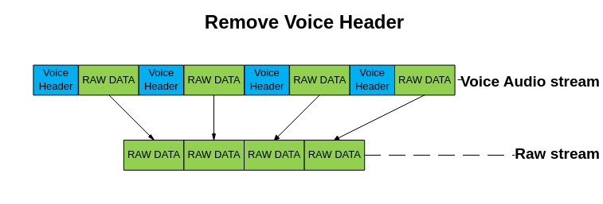

去除语音帧头参考代码：

```
int VoiceGetRawStream(short *voicedata, short *outdata, int samplelen)
{
    int len = 0, outlen = 0;
    short *copydata, *copyoutdata;
    int copysamplelen = 0;
 
    copysamplelen = samplelen;
    copydata = voicedata;
    copyoutdata = outdata;
 
    while(copysamplelen > 2)
    {
        len = copydata[1]&0x00ff;
        copysamplelen -= 2;
        copydata += 2;
        if(copysamplelen < len)
        {
            break;
        }
        memcpy(copyoutdata, copydata, len * sizeof(short));
        copyoutdata += len;
        copydata += len;
        copysamplelen -= len;
        outlen += len;
    }
 
    return outlen;
}
```

> **说明：** 
>-   ADPCM格式中，ADPCM\_DVI4和ADPCM\_ORG\_DVI4适用网络RTP传输使用，不能通过该方式在PC客户端上播放，详情请参考rfc35551标准。
>-   添加WAV Header的操作略，客户可以根据WAV Header标准参考链接1和参考链接2进行添加。

参考链接1：[https://msdn.microsoft.com/en-us/library/dd390970\(v=vs.85\).aspx](https://msdn.microsoft.com/en-us/library/dd390970(v=vs.85).aspx)

参考链接2：http://www.moon-soft.com/program/FORMAT/windows/wavec.htm

## MPP如何播放标准的音频码流<a name="ZH-CN_TOPIC_0000002408275490"></a>


### MPP如何播放标准的音频G711/G726/ADPCM码流<a name="ZH-CN_TOPIC_0000002408115718"></a>

【现象】

MPP不能直接播放标准的音频G711/G726/ADPCM码流。

【分析】

MPP为了兼容上一代芯片，要求在音频裸码流每帧数据前添加语音帧头才能播放。

【解决】

MPP播放标准的音频G711/G726/ADPCM码流时，需要先获取RAW流数据，再根据每帧数据长度PerSampleLen添加语音帧头才能播放。

1.  获取RAW流数据：

    如果码流添加了WAV Header，则需要先去除WAV Header。

2.  获取每帧数据长度PersampleLen\(计量单位为short型\)：

    **表 1**  每帧数据长度

    <a name="table7757252142910"></a>
    <table><thead align="left"><tr id="row482625292918"><th class="cellrowborder" valign="top" width="23.9%" id="mcps1.2.4.1.1"><p id="p282655220296"><a name="p282655220296"></a><a name="p282655220296"></a>编码格式</p>
    </th>
    <th class="cellrowborder" valign="top" width="22.61%" id="mcps1.2.4.1.2"><p id="p1482610522294"><a name="p1482610522294"></a><a name="p1482610522294"></a>每帧数据长度</p>
    </th>
    <th class="cellrowborder" valign="top" width="53.49%" id="mcps1.2.4.1.3"><p id="p582605215292"><a name="p582605215292"></a><a name="p582605215292"></a>备注</p>
    </th>
    </tr>
    </thead>
    <tbody><tr id="row582716523297"><td class="cellrowborder" valign="top" width="23.9%" headers="mcps1.2.4.1.1 "><p id="p2827165202910"><a name="p2827165202910"></a><a name="p2827165202910"></a>G711</p>
    </td>
    <td class="cellrowborder" valign="top" width="22.61%" headers="mcps1.2.4.1.2 "><p id="p188271852112917"><a name="p188271852112917"></a><a name="p188271852112917"></a>N*40</p>
    </td>
    <td class="cellrowborder" valign="top" width="53.49%" headers="mcps1.2.4.1.3 "><p id="p17827452182918"><a name="p17827452182918"></a><a name="p17827452182918"></a>N为[1,5]的任意正整数</p>
    </td>
    </tr>
    <tr id="row1382735202911"><td class="cellrowborder" valign="top" width="23.9%" headers="mcps1.2.4.1.1 "><p id="p2082718529297"><a name="p2082718529297"></a><a name="p2082718529297"></a>G726-16kbps</p>
    </td>
    <td class="cellrowborder" valign="top" width="22.61%" headers="mcps1.2.4.1.2 "><p id="p282716521294"><a name="p282716521294"></a><a name="p282716521294"></a>N *10</p>
    </td>
    <td class="cellrowborder" valign="top" width="53.49%" headers="mcps1.2.4.1.3 "><p id="p68271552122920"><a name="p68271552122920"></a><a name="p68271552122920"></a>N为[1,5] 的任意正整数</p>
    </td>
    </tr>
    <tr id="row198271952162917"><td class="cellrowborder" valign="top" width="23.9%" headers="mcps1.2.4.1.1 "><p id="p2827052162913"><a name="p2827052162913"></a><a name="p2827052162913"></a>G726-24kbps</p>
    </td>
    <td class="cellrowborder" valign="top" width="22.61%" headers="mcps1.2.4.1.2 "><p id="p5827175216292"><a name="p5827175216292"></a><a name="p5827175216292"></a>N *15</p>
    </td>
    <td class="cellrowborder" valign="top" width="53.49%" headers="mcps1.2.4.1.3 "><p id="p1482765282911"><a name="p1482765282911"></a><a name="p1482765282911"></a>N为[1,5] 的任意正整数</p>
    </td>
    </tr>
    <tr id="row98274525290"><td class="cellrowborder" valign="top" width="23.9%" headers="mcps1.2.4.1.1 "><p id="p382715528290"><a name="p382715528290"></a><a name="p382715528290"></a>G726-32kbps</p>
    </td>
    <td class="cellrowborder" valign="top" width="22.61%" headers="mcps1.2.4.1.2 "><p id="p282795232916"><a name="p282795232916"></a><a name="p282795232916"></a>N *20</p>
    </td>
    <td class="cellrowborder" valign="top" width="53.49%" headers="mcps1.2.4.1.3 "><p id="p782735211299"><a name="p782735211299"></a><a name="p782735211299"></a>N为[1,5] 的任意正整数</p>
    </td>
    </tr>
    <tr id="row782717525296"><td class="cellrowborder" valign="top" width="23.9%" headers="mcps1.2.4.1.1 "><p id="p1782775232918"><a name="p1782775232918"></a><a name="p1782775232918"></a>G726-40kbps</p>
    </td>
    <td class="cellrowborder" valign="top" width="22.61%" headers="mcps1.2.4.1.2 "><p id="p1482710521294"><a name="p1482710521294"></a><a name="p1482710521294"></a>N *25</p>
    </td>
    <td class="cellrowborder" valign="top" width="53.49%" headers="mcps1.2.4.1.3 "><p id="p1282795211297"><a name="p1282795211297"></a><a name="p1282795211297"></a>N为[1,5] 的任意正整数</p>
    </td>
    </tr>
    <tr id="row138271752202910"><td class="cellrowborder" valign="top" width="23.9%" headers="mcps1.2.4.1.1 "><p id="p882714521294"><a name="p882714521294"></a><a name="p882714521294"></a>IMA ADPCM</p>
    </td>
    <td class="cellrowborder" valign="top" width="22.61%" headers="mcps1.2.4.1.2 "><p id="p1827205212914"><a name="p1827205212914"></a><a name="p1827205212914"></a>每块字节数/2</p>
    </td>
    <td class="cellrowborder" valign="top" width="53.49%" headers="mcps1.2.4.1.3 "><p id="p882710524296"><a name="p882710524296"></a><a name="p882710524296"></a>每块字节数为IMA ADPCM的每块编码数据字节数，对应IMA ADPCM WAV Header的nblockalign (0x20-0x21, 2bytes)</p>
    </td>
    </tr>
    </tbody>
    </table>

    > **说明：** 
    >-   ADPCM格式中，仅支持IMA ADPCM格式，每采样点比特数\(wbitspersample\)只支持。
    >-   如果ADPCM码流添加了WAV Header，可以从WAV Header中获得每块字节数信息；如果为ADPCM裸码流，则需要从码流提供方获取每块字节数信息。
    >-   编码格式仅支持单声道编码格式。

3.  添加语音帧头：

    添加语音帧头的操作如[图1](#fig38842398312)所示：

    **图 1**  添加语音帧头示意图<a name="fig38842398312"></a>  
    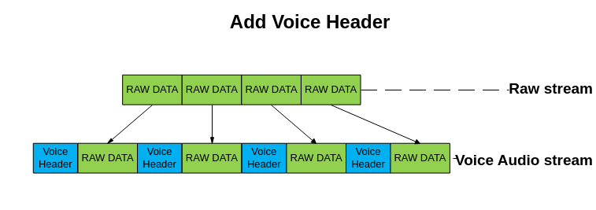

    添加语音帧头参考代码：

    ```
    int VoiceAddHeader(short *inputdata, short *voicedata, int PersampleLen,int inputsamplelen)
    {
        int len = 0, outlen = 0;
        short Header[2];
        short *copydata, *copyinputdata;
        int copysamplelen = 0;
     
        Header[0] = (short)(0x001<<8) & (0x0300);
        Header[1] = PersampleLen & 0x00ff;
     
        copysamplelen = inputsamplelen;
        copydata = voicedata;
        copyinputdata = inputdata;
     
        while(copysamplelen >= PersampleLen)
        {
            memcpy(copydata, Header, 2 * sizeof(short));
            outlen += 2;
            copydata += 2;
            memcpy(copydata, copyinputdata, PersampleLen * sizeof(short));
            copyinputdata += PersampleLen;
            copydata += PersampleLen;
            copysamplelen -= PersampleLen;
            outlen += PersampleLen;
        }
        return outlen;
    }
    ```

## 为什么使能VQE后会有高频部分缺失<a name="ZH-CN_TOPIC_0000002408275634"></a>


### 为什么使能VQE后会有高频部分缺失<a name="ZH-CN_TOPIC_0000002408275622"></a>

【现象】

配置AI采样率\(AISampleRate\)为32kHz，使能VQE功能，配置VQE工作采样率\(VQEWorkSampleRate\)为16kHz；使能重采样功能，配置输出采样率\(ResOutSampleRate\)为48kHz，分析输出序列，发现8kHz以上高频部分缺失。

【分析】

VQE实际工作采样率仅支持8kHz和16kHz，考虑到客户需要，MPP在VQE封装了重采样层以支持8kHz到48kHz的任意标准采样率处理。当客户配置AISampleRate = 32kHz，VQEWorkSampleRate = 16kHz，ResOutSampleRate = 48kHz时，重采样层会先将数据由32kHz重采样到16kHz，经过VQE处理后，再由16kHz重采样到48kHz输出。流程如[图1](#fig1162284414169)所示。

**图 1**  VQE处理流程图<a name="fig1162284414169"></a>  
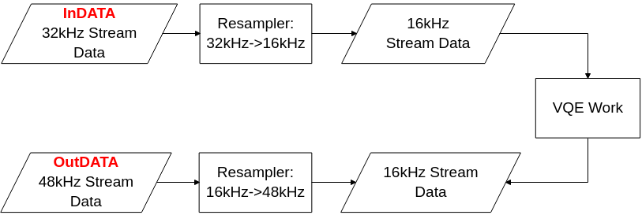

在进行Resampler：32kHz-\>16kHz时，造成了8kHz以上的高频部分缺失。

在当前应用场景中，输出序列的频段信息如下：

1.  不使能VQE，不使能重采样：按照AISampleRate/2输出信息频段。如配置AI采样率为48kHz，输出信息频段为0 – 24kHz。
2.  使能重采样，不使能VQE：取min\(AISampleRate, ResOutSampleRate\) /2 输出信息频段。如配置AI采样率16kHz，输出采样率32kHz，min\(AISampleRate, ResOutSampleRate\) = 16kHz，则输出信息频段为0 – 8kHz。
3.  使能VQE，不使能重采样：取min\(AISampleRate, VQEWorkSampleRate\) /2 输出信息频段。如配置AI采样率为32kHz，VQEWorkSampleRate为16kHz，min\(AISampleRate, VQEWorkSampleRate\) = 16kHz，则输出信息频段为0 – 8kHz。
4.  使能VQE，使能重采样：取min\(AISampleRate, VQEWorkSampleRate, ResOutSampleRate\) /2 输出信息频段。如配置AI采样率为32kHz，VQEWorkSampleRate为16kHz，重采样模块输出采样率为48kHz，则min\(AISampleRate, VQEWorkSampleRate, ResOutSampleRate\) = 16kHz，输出信息频段为0 – 8kHz。

> **说明：** 
>-   配置采样率后，输出信息频段为采样率的1/2。
>-   当前支持8kHz到48kHz标准采样率，分别为：8kHz，11.025kHz，12kHz，16kHz，22.05kHz，32kHz，44.1kHz，48kHz。
>-   AO处理流程类同AI处理流程。

## G726码流的pop音问题<a name="ZH-CN_TOPIC_0000002441675009"></a>

【现象】

在生成G726码流的过程中，反复销毁和创建编码通道，然后将获得的码流解码播放，发现存在pop音现象。

【分析】

G726协议编解码过程中需要使用到上一帧的历史信息作为预测编解码，这些历史信息在编解码每一帧的过程中不断更新，如果突然重启编码器，所有这些历史信息被复位，再次编码的时候用到了复位后的历史信息，导致与重置之前数据不衔接、有异常，解码时在重置编解码器的位置由于编码数据异常，从而会导致爆破音，用其他非MPP解码器解码也同样会出现pop音。对于需要依赖上一帧信息的编码协议，重置编解码器时，整个音频相关通路建议相应重置。

## 音频内置CODEC输出\(AO输出\)出现幅频响应异常<a name="ZH-CN_TOPIC_0000002441674925"></a>

【现象】

测试AUDIO CODEC（DAC）输出\(AO输出\)幅频响应，出现2KHz以上频段幅频响应严重衰减。

【分析】

这个是AUDIO CODEC控制寄存器（参考芯片手册）的dacl\_deemph和dacr\_deemph位开启去加重导致的。去加重是相对于预加重而言的，是对预加重的修正，如果输入给AO通道是经过预加重的音频信号，那么开启去加重功能可以恢复到正常频响；如果输入给AO通道的音频信号没有预加重，此时dacl\_deemph和dacr\_deemph位开启去加重（不为00），就会对幅频响应产生影响。本次测试是在关闭VQE功能下测试的。测试时，输入给AO通道的数据没有预加重，而AUDIO CODEC控制寄存器的dacl\_deemph和dacr\_deemph位未关闭（都不为00），故出现此问题。

【解决】

在AI通道，AUDIO CODEC控制寄存器是没有开设预加重功能的，所以AUDIO CODEC控制寄存器的dacl\_deemph和dacr\_deemph位默认是需要关闭的，都配置为00。预加重和去加重功能是匹配成对出现的，使用时需要注意。

【注意事项】

如果AUDIO CODEC控制寄存器没有dacl\_deemph和dacr\_deemph位则表示不支持去加重功能，此时需按默认配置使用，不允许额外配置。

## 静态库注册功能<a name="ZH-CN_TOPIC_0000002441675037"></a>

对于支持VQE静态库注册功能的芯片，可根据实际应用场景选用所需的声音质量增强及重采样模块，再通过ss\_mpi\_audio\_register\_vqe\_mod接口向音频系统注册选定的模块，具体使用方法参见《MPP 媒体处理软件 V5.0 开发参考》“音频”章节。

对于支持AAC静态库注册功能的芯片，可根据实际应用场景选择是否使用SBRENC、SBRDEC模块。当使用EAAC或者EAACPLUS编解码类型时，须在注册编解码器之前进行SBRENC、SBRDEC功能模块的静态注册，具体使用方法参见《音频组件 API参考》。

## 加载内置ACODEC模块出现pop音的解决方法<a name="ZH-CN_TOPIC_0000002441714885"></a>

【现象】

在加载内置acodec模块时，单板的音频输出端存在pop音。

【分析】

以SS625V100为例，其demo板功放的解mute操作在sys\_config模块中实现，对应函数为amp\_unmute\_pin\_mux\_ss625v100，而内置acodec模块的加载顺序在sys\_config模块之后，因此在acodec模块加载时功放已解mute，从而导致pop音。

【解决】

以SS625V100为例，将sys\_config模块中功放解mute的操作移至loadss625v100脚本中的insert\_audio操作之后。

## 如何对多声道的音频数据进行交织处理<a name="ZH-CN_TOPIC_0000002408115678"></a>

【现象】

MPP音频帧的不同声道数据地址是独立的，需要存放到同一个PCM文件。

【分析】

当音频的声道数多于一个时，音频数据的存放有两种格式，即交织的（interleave）和非交织的（non-interleave）。交织的是指同一个采样点的多声道数据依次放在一起；非交织的是指先放第一声道的所有采样点的数据，再放第二声道的所有采样点的数据，依次类推，直至全部声道存放完毕。

【解决】

以最常见的2声道为例，交织后的数据排布为L1/R1/L2/R2/…/Ln-1/Rn-1/Ln/Rn（L表示左声道，R表示右声道，数字表示第几个采样点）。

2声道音频数据交织的参考代码：

```
static td_void interleave_16bit(td_s16 *dest, td_s16 *src_left, td_s16 *src_right, td_u32 samples)
{
    td_u32 i;
 
    if ((dest == TD_NULL) || (src_left == TD_NULL) || (src_right == TD_NULL)) {
        return;
    }
 
    for (i = 0; i < samples; i++) {
        dest[2 * i] = *src_left; /* 2: 2chn */
        dest[2 * i + 1] = *src_right; /* 2: 2chn */
        src_left++;
        src_right++;
    }
}
```

## 如何对多声道的音频数据进行混音处理<a name="ZH-CN_TOPIC_0000002408275642"></a>

【现象】

多个声道的音频数据需要混音到单声道进行输出。

【分析】

当只有一个物理输出通道时，不同来源的声音要整合到同一个音轨进行播放。

【解决】

以最常见的2声道为例，可以考虑采用线性叠加的方式实现混音。需要注意的是，2声道线性叠加可能会导致溢出，可在混音前对左右声道分别进行限幅。

2声道音频数据混音的参考代码：

```
static td_void remix_16bit(td_s16 *dest, td_s16 *src_left, td_s16 *src_right, td_u32 samples)
{
    td_u32 i;
 
    if ((dest == TD_NULL) || (src_left == TD_NULL) || (src_right == TD_NULL)) {
        return;
    }
 
    for (i = 0; i < samples; i++) {
        dest[i] = (*src_left) + (*src_right);
        src_left++;
        src_right++;
    }
}
```

## AO播放出现pop音的解决方法<a name="ZH-CN_TOPIC_0000002408275542"></a>

【现象】

在往AO模块送音频帧的开始阶段，单板的音频输出端存在pop音。另外，在往AO模块送完音频帧之后，调节AO或者DAC的音量，单板的音频输出端也出现pop音。

【分析】

在往AO模块送音频帧时，最开始的采样点与之前最后一次的采样点的采样值差异较大，声音数据突变从而导致pop音。另外，在往AO模块送完音频帧之后，最后一次的采样点的采样值可能是较大的数值，此时调节后级的音量，也会出现声音数据突变从而导致pop音。

【解决】

在往AO模块送音频帧时，确保前1-2帧及最后1-2帧是静音数据或者是缓变的声音，即保证声音数据连续，且最后一个采样点是静音或者尽可能小的采样值。

## 音频时钟源被占用的解决方法<a name="ZH-CN_TOPIC_0000002408275670"></a>

【现象】

如果VO模块和音频使用同一个时钟源，在调整VO输出制式的时候，音频输入输出的声音出现变调或者断续等异常现象。

【分析】

在某些芯片上，VO模块和音频使用同一个时钟源，在调整VO输出制式的时候，会调整PLL的分频系数，从而影响到音频的时钟分频，导致音频的工作时钟或者输出时钟不正常。

【解决】

切换音频使用的时钟源，可通过ss\_mpi\_audio\_set\_mod\_param接口设置时钟源，使用方法请参考文档《MPP 媒体处理软件 V5.0 开发参考》中的“音频”章节。

## 音频AI与AO复用时钟功能的使用方法<a name="ZH-CN_TOPIC_0000002408115542"></a>

【现象】

在AI和AO对接内置codec，或者使用同一组I2S时钟管脚对接外置codec的输入输出时，需要设置AI与AO复用同一个时钟，此时要求二者的采样率保持一致。

【分析】

在AI和AO对接内置codec时，由于内置codec只有一组工作时钟，因此要求AI与AO复用同一个时钟。

在某些芯片上，由于I2S管脚资源有限，一般需要使用同一组I2S时钟管脚对接外置codec的输入输出，且以对接AO的时钟为基准，此时亦要求AI与AO复用同一个时钟。

此外，如果使用场景上要求AI与AO的时钟严格同步，即使二者对接的设备类型不一样，此时也要求AI与AO复用同一个时钟。

【解决】

在设置AI的设备属性时，clk\_share=1表示AI复用AO的时钟。需要注意的是，对于个别芯片，由于解决方案中的时钟选择已固定，clk\_share配置无效，详情请参考文档《MPP 媒体处理软件 V5.0 开发参考》中的“音频”章节。

# VO<a name="ZH-CN_TOPIC_0000002408275654"></a>


## VO用户时序如何配置<a name="ZH-CN_TOPIC_0000002408115734"></a>


### 时序结构配置<a name="ZH-CN_TOPIC_0000002441675025"></a>

在ss\_mpi\_vo\_set\_pub\_attr接口中配置pub\_attr\> intf\_sync为OT\_VO\_OUT\_USER，然后配置sync\_info结构体。关于sync\_info结构体中各参数的解释如下：

```
typedef struct {
    td_bool syncm; /* RW; sync mode(0:timing,as BT.656; 1:signal,as LCD) */
    td_bool iop; /* RW; interlaced or progressive display(0:i; 1:p) */
    td_u8 intfb; /* RW; interlaced bit width while output */
 
    td_u16 vact; /* RW; vertical active area */
    td_u16 vbb; /* RW; vertical back blank porch */
    td_u16 vfb; /* RW; vertical front blank porch */
 
    td_u16 hact; /* RW; horizontal active area */
    td_u16 hbb; /* RW; horizontal back blank porch */
    td_u16 hfb; /* RW; horizontal front blank porch */
    td_u16 hmid; /* RW; bottom horizontal active area */
 
    td_u16 bvact; /* RW; bottom vertical active area */
    td_u16 bvbb; /* RW; bottom vertical back blank porch */
    td_u16 bvfb; /* RW; bottom vertical front blank porch */
 
    td_u16 hpw; /* RW; horizontal pulse width */
    td_u16 vpw; /* RW; vertical pulse width */
 
    td_bool idv; /* RW; inverse data valid of output */
    td_bool ihs; /* RW; inverse horizontal synchronization signal */
    td_bool ivs; /* RW; inverse vertical synchronization signal */
} ot_vo_sync_info;
```

各参数说明，如[表1](#_Ref469323123)所示。

**表 1**  参数说明

<a name="_Ref469323123"></a>
<table><thead align="left"><tr id="row2640mcpsimp"><th class="cellrowborder" valign="top" width="18%" id="mcps1.2.3.1.1"><p id="p2642mcpsimp"><a name="p2642mcpsimp"></a><a name="p2642mcpsimp"></a>参数名称</p>
</th>
<th class="cellrowborder" valign="top" width="82%" id="mcps1.2.3.1.2"><p id="p2644mcpsimp"><a name="p2644mcpsimp"></a><a name="p2644mcpsimp"></a>说明</p>
</th>
</tr>
</thead>
<tbody><tr id="row2646mcpsimp"><td class="cellrowborder" valign="top" width="18%" headers="mcps1.2.3.1.1 "><p id="p2648mcpsimp"><a name="p2648mcpsimp"></a><a name="p2648mcpsimp"></a>syncm</p>
</td>
<td class="cellrowborder" valign="top" width="82%" headers="mcps1.2.3.1.2 "><p id="p2650mcpsimp"><a name="p2650mcpsimp"></a><a name="p2650mcpsimp"></a>同步模式，LCD选择1，表示信号同步。</p>
</td>
</tr>
<tr id="row2651mcpsimp"><td class="cellrowborder" valign="top" width="18%" headers="mcps1.2.3.1.1 "><p id="p2653mcpsimp"><a name="p2653mcpsimp"></a><a name="p2653mcpsimp"></a>iop</p>
</td>
<td class="cellrowborder" valign="top" width="82%" headers="mcps1.2.3.1.2 "><p id="p2655mcpsimp"><a name="p2655mcpsimp"></a><a name="p2655mcpsimp"></a>0为隔行，1为逐行，LCD一般配置1。</p>
</td>
</tr>
<tr id="row2656mcpsimp"><td class="cellrowborder" valign="top" width="18%" headers="mcps1.2.3.1.1 "><p id="p2658mcpsimp"><a name="p2658mcpsimp"></a><a name="p2658mcpsimp"></a>intfb</p>
</td>
<td class="cellrowborder" valign="top" width="82%" headers="mcps1.2.3.1.2 "><p id="p2660mcpsimp"><a name="p2660mcpsimp"></a><a name="p2660mcpsimp"></a>无效参数，可以忽略。</p>
</td>
</tr>
<tr id="row2661mcpsimp"><td class="cellrowborder" valign="top" width="18%" headers="mcps1.2.3.1.1 "><p id="p2663mcpsimp"><a name="p2663mcpsimp"></a><a name="p2663mcpsimp"></a>vact</p>
</td>
<td class="cellrowborder" valign="top" width="82%" headers="mcps1.2.3.1.2 "><p id="p2665mcpsimp"><a name="p2665mcpsimp"></a><a name="p2665mcpsimp"></a>垂直有效区，隔行输出时表示顶场垂直有效区。单位：行。</p>
</td>
</tr>
<tr id="row2666mcpsimp"><td class="cellrowborder" valign="top" width="18%" headers="mcps1.2.3.1.1 "><p id="p2668mcpsimp"><a name="p2668mcpsimp"></a><a name="p2668mcpsimp"></a>vbb</p>
</td>
<td class="cellrowborder" valign="top" width="82%" headers="mcps1.2.3.1.2 "><p id="p2670mcpsimp"><a name="p2670mcpsimp"></a><a name="p2670mcpsimp"></a>垂直消隐后肩，隔行输出时表示顶场垂直消隐后肩。单位：行。</p>
</td>
</tr>
<tr id="row2671mcpsimp"><td class="cellrowborder" valign="top" width="18%" headers="mcps1.2.3.1.1 "><p id="p2673mcpsimp"><a name="p2673mcpsimp"></a><a name="p2673mcpsimp"></a>vfb</p>
</td>
<td class="cellrowborder" valign="top" width="82%" headers="mcps1.2.3.1.2 "><p id="p2675mcpsimp"><a name="p2675mcpsimp"></a><a name="p2675mcpsimp"></a>垂直消隐前肩，隔行输出时表示顶场垂直消隐前肩。单位：行。</p>
</td>
</tr>
<tr id="row2676mcpsimp"><td class="cellrowborder" valign="top" width="18%" headers="mcps1.2.3.1.1 "><p id="p2678mcpsimp"><a name="p2678mcpsimp"></a><a name="p2678mcpsimp"></a>hact</p>
</td>
<td class="cellrowborder" valign="top" width="82%" headers="mcps1.2.3.1.2 "><p id="p2680mcpsimp"><a name="p2680mcpsimp"></a><a name="p2680mcpsimp"></a>水平有效区。单位：像素。</p>
</td>
</tr>
<tr id="row2681mcpsimp"><td class="cellrowborder" valign="top" width="18%" headers="mcps1.2.3.1.1 "><p id="p2683mcpsimp"><a name="p2683mcpsimp"></a><a name="p2683mcpsimp"></a>hbb</p>
</td>
<td class="cellrowborder" valign="top" width="82%" headers="mcps1.2.3.1.2 "><p id="p2685mcpsimp"><a name="p2685mcpsimp"></a><a name="p2685mcpsimp"></a>水平消隐后肩。单位：像素。</p>
</td>
</tr>
<tr id="row2686mcpsimp"><td class="cellrowborder" valign="top" width="18%" headers="mcps1.2.3.1.1 "><p id="p2688mcpsimp"><a name="p2688mcpsimp"></a><a name="p2688mcpsimp"></a>hfb</p>
</td>
<td class="cellrowborder" valign="top" width="82%" headers="mcps1.2.3.1.2 "><p id="p2690mcpsimp"><a name="p2690mcpsimp"></a><a name="p2690mcpsimp"></a>水平消隐前肩。单位：像素。</p>
</td>
</tr>
<tr id="row2691mcpsimp"><td class="cellrowborder" valign="top" width="18%" headers="mcps1.2.3.1.1 "><p id="p2693mcpsimp"><a name="p2693mcpsimp"></a><a name="p2693mcpsimp"></a>hmid</p>
</td>
<td class="cellrowborder" valign="top" width="82%" headers="mcps1.2.3.1.2 "><p id="p2695mcpsimp"><a name="p2695mcpsimp"></a><a name="p2695mcpsimp"></a>底场垂直同步有效像素值。</p>
</td>
</tr>
<tr id="row2696mcpsimp"><td class="cellrowborder" valign="top" width="18%" headers="mcps1.2.3.1.1 "><p id="p2698mcpsimp"><a name="p2698mcpsimp"></a><a name="p2698mcpsimp"></a>bvact</p>
</td>
<td class="cellrowborder" valign="top" width="82%" headers="mcps1.2.3.1.2 "><p id="p2700mcpsimp"><a name="p2700mcpsimp"></a><a name="p2700mcpsimp"></a>底场垂直有效区，隔行时有效。单位：行。</p>
</td>
</tr>
<tr id="row2701mcpsimp"><td class="cellrowborder" valign="top" width="18%" headers="mcps1.2.3.1.1 "><p id="p2703mcpsimp"><a name="p2703mcpsimp"></a><a name="p2703mcpsimp"></a>bvbb</p>
</td>
<td class="cellrowborder" valign="top" width="82%" headers="mcps1.2.3.1.2 "><p id="p2705mcpsimp"><a name="p2705mcpsimp"></a><a name="p2705mcpsimp"></a>底场垂直消隐后肩，隔行时有效。单位：行。</p>
</td>
</tr>
<tr id="row2706mcpsimp"><td class="cellrowborder" valign="top" width="18%" headers="mcps1.2.3.1.1 "><p id="p2708mcpsimp"><a name="p2708mcpsimp"></a><a name="p2708mcpsimp"></a>bvfb</p>
</td>
<td class="cellrowborder" valign="top" width="82%" headers="mcps1.2.3.1.2 "><p id="p2710mcpsimp"><a name="p2710mcpsimp"></a><a name="p2710mcpsimp"></a>底场垂直消隐前肩，隔行时有效。单位：行。</p>
</td>
</tr>
<tr id="row2711mcpsimp"><td class="cellrowborder" valign="top" width="18%" headers="mcps1.2.3.1.1 "><p id="p2713mcpsimp"><a name="p2713mcpsimp"></a><a name="p2713mcpsimp"></a>hpw</p>
</td>
<td class="cellrowborder" valign="top" width="82%" headers="mcps1.2.3.1.2 "><p id="p2715mcpsimp"><a name="p2715mcpsimp"></a><a name="p2715mcpsimp"></a>水平同步信号的宽度。单位：像素。</p>
</td>
</tr>
<tr id="row2716mcpsimp"><td class="cellrowborder" valign="top" width="18%" headers="mcps1.2.3.1.1 "><p id="p2718mcpsimp"><a name="p2718mcpsimp"></a><a name="p2718mcpsimp"></a>vpw</p>
</td>
<td class="cellrowborder" valign="top" width="82%" headers="mcps1.2.3.1.2 "><p id="p2720mcpsimp"><a name="p2720mcpsimp"></a><a name="p2720mcpsimp"></a>垂直同步信号的宽度。单位：行。</p>
</td>
</tr>
<tr id="row2721mcpsimp"><td class="cellrowborder" valign="top" width="18%" headers="mcps1.2.3.1.1 "><p id="p2723mcpsimp"><a name="p2723mcpsimp"></a><a name="p2723mcpsimp"></a>idv</p>
</td>
<td class="cellrowborder" valign="top" width="82%" headers="mcps1.2.3.1.2 "><p id="p2725mcpsimp"><a name="p2725mcpsimp"></a><a name="p2725mcpsimp"></a>数据有效信号的极性。配置0为高有效，配置1为低有效。</p>
</td>
</tr>
<tr id="row2726mcpsimp"><td class="cellrowborder" valign="top" width="18%" headers="mcps1.2.3.1.1 "><p id="p2728mcpsimp"><a name="p2728mcpsimp"></a><a name="p2728mcpsimp"></a>ihs</p>
</td>
<td class="cellrowborder" valign="top" width="82%" headers="mcps1.2.3.1.2 "><p id="p2730mcpsimp"><a name="p2730mcpsimp"></a><a name="p2730mcpsimp"></a>水平有效信号的极性，配置0为高有效，配置1为低有效。</p>
</td>
</tr>
<tr id="row2731mcpsimp"><td class="cellrowborder" valign="top" width="18%" headers="mcps1.2.3.1.1 "><p id="p2733mcpsimp"><a name="p2733mcpsimp"></a><a name="p2733mcpsimp"></a>ivs</p>
</td>
<td class="cellrowborder" valign="top" width="82%" headers="mcps1.2.3.1.2 "><p id="p2735mcpsimp"><a name="p2735mcpsimp"></a><a name="p2735mcpsimp"></a>垂直有效信号的极性，配置0为高有效，配置1为低有效。</p>
</td>
</tr>
</tbody>
</table>

下面以SS528V100上配置384\*288P@25fps的用户时序为例，sync\_info的配置如下：

```
pub_attr->sync.info. syncm = 0;
pub_attr->sync.info. iop = 1;
pub_attr->sync.info. intfb = 0;
pub_attr->sync.info. vact = 288;
pub_attr->sync.info. vbb = 200;
pub_attr->sync.info. vfb = 112;
pub_attr->sync.info. hact = 384;
pub_attr->sync.info. hbb = 300;
pub_attr->sync.info. hfb = 216;
pub_attr->sync.info. hmid = 1;
pub_attr->sync.info. bvact = 1;
pub_attr->sync.info. bvbb = 1;
pub_attr->sync.info. bvfb = 1;
pub_attr->sync.info. hpw = 4;
pub_attr->sync.info. vpw = 5;
pub_attr->sync.info. idv = 0;
pub_attr->sync.info. ihs = 0;
pub_attr->sync.info. ivs = 0;
```

此时，VO的时钟配置应该为（384+300+216）\*（288+200+112）\*25=13500000，即VO的时钟应该配置为13.5M。

计算公式为：

（有效宽+水平后消隐+水平前消隐）\*（有效高+垂直后消隐+垂直前消隐）\*帧率=时钟。

### 时钟大小配置<a name="ZH-CN_TOPIC_0000002441674973"></a>

通过ss\_mpi\_vo\_set\_user\_sync\_info接口来配置用户时序的时钟、分频比等信息。

具体的接口使用方法请参考文档《MPP 媒体处理软件 V5.0 开发参考》中的“视频输出”章节。

> **须知：** 
>在客户一些场景下需要特殊的时序如1080P59.94，通过ss\_mpi\_vo\_set\_user\_sync\_info接口调整PLL即可。在SS928V100的设备1中，如果也需要使用PLL，则需要先使用ss\_mpi\_audio\_set\_mod\_param接口（详细参考《MPP 媒体处理软件 V5.0 开发参考》的“音频”章节）将SPLL释放，然后通过配置SPLL的寄存器来改变时钟，SPLL的配置寄存器0地址：0x11010900，SPLL的配置寄存器1地址：0x11010904。

### 用户时序下HDMI接口<a name="ZH-CN_TOPIC_0000002441714905"></a>

当VO设置为用户时序时，HDMI也可能需要设置为用户时序，HDMI的用户时序配置方法如下：ot\_hdmi\_attr 的video\_format成员需配置为OT\_HDMI\_VIDEO\_FORMAT\_VESA\_CUSTOMER\_DEFINE，ot\_hdmi\_attr 的pix\_clk成员配置为自定义时序的像素时钟（单位：KHz），更加详细的设置方法参考《HDMI 开发参考》。

### 用户时序下MIPI\_TX接口<a name="ZH-CN_TOPIC_0000002408275646"></a>

MIPI\_TX没有用户时序的说法，无论VO设置为用户时序还是通过枚举选择了某个时序，MIPI\_TX接口都需要按照VO的时序结构，填充MIPI\_TX中combo\_dev\_cfg\_t结构体的对应成员。

## 切分割/画面切换<a name="ZH-CN_TOPIC_0000002441675005"></a>


### 通道属性发生变化<a name="ZH-CN_TOPIC_0000002408115746"></a>

切分割/画面切换：通道在显示状态下，其显示位置和大小发生变化。

### 建议的实现方式<a name="ZH-CN_TOPIC_0000002441675057"></a>

通道已经使能或显示的状态下，凡涉及到修改该通道属性（调用ss\_mpi\_vo\_set\_chn\_attr）（假设通道号为chn-x），建议按照以下步骤完成：

1.  设置通道所在层批处理begin（ss\_mpi\_vo\_batch\_begin）
2.  隐藏所有通道（ss\_mpi\_vo\_hide\_chn）
3.  设置目标通道chn-x （可以是多个通道）的通道属性（ss\_mpi\_vo\_set\_chn\_attr）
4.  显示所有通道（ss\_mpi\_vo\_show\_chn）
5.  设置通道所在层批处理end（ss\_mpi\_vo\_batch\_end）

可参考流程：

```
/*
* n --> m : change n chns to m chns.
* 设置目标通道chn-0,chn-1,…,chn-m的通道属性
*/
set_chn_m_attr(void)
{
    /* batch begin  */
    ret = ot_mpi_vo_batch_begin(0);
    if (TD_SUCCESS != ret) {
        sample_prt("ot_mpi_vo_batch_begin(0) failed!\n");
    }
    /* hide all n chns */
    for (i = 0; i < n; i++) {
        ret = ot_mpi_vo_hide_chn(0, i);
        if (TD_SUCCESS != ret) {
            sample_prt("ot_mpi_vo_hide_chn(0,%d) failed!\n", i);
        }
    }
    /* change all m chns’s attr */
    for (j = 0; j < m; j++) {
        ret = ot_mpi_vo_set_chn_attr(0, j, &chn_attr);
        if (TD_SUCCESS != ret) {
            sample_prt("ot_mpi_vo_set_chn_attr(0,%d) failed!\n", j);
        }
    }
    /* show all m chns*/
    for (i = 0; i < n; i++) {
        s32Ret = ot_mpi_vo_show_chn(0, i);
        if (TD_SUCCESS != s32Ret) {
            sample_prt("ot_mpi_vo_show_chn(0,%d) failed!\n", i);
        }
    }
    /* batch end */
    s32Ret = ot_mpi_vo_batch_end(0);
    if (TD_SUCCESS != s32Ret) {
        sample_prt("ot_mpi_vo_batch_end(0) failed!\n");
}
}
```

### 注意事项<a name="ZH-CN_TOPIC_0000002441675065"></a>

-   切分割/画面切换时建议使用批处理进行操作。
-   不使用批处理时，需严格按照[建议的实现方式](#ZH-CN_TOPIC_0000002441675057)中步骤2\~4进行操作，即设置完所有通道的通道属性之后，再统一显示所有通道。否则已显示通道会占用显示VB，导致其他通道在设置通道属性时无法重新分配显示VB，最终出现画面卡住。

## 视频同步方案<a name="ZH-CN_TOPIC_0000002441714873"></a>

视频同步是指一个芯片的不同VO设备或者不同芯片的VO设备实现视频同步输出。视频同步场景一般是多路切分的解码经过VPSS再送给多个VO设备进行拼接，为了保证拼接效果，需要对各VO设备进行视频同步操作。


### 实现原理<a name="ZH-CN_TOPIC_0000002441675073"></a>

视频同步方案的基本实现原理是保证对VO发送视频帧的同步以及VO输出时钟的同步。

-   时钟同步：

    通过模块参数dev\_clk\_ext\_en控制，在系统初始化之前置此模块参数为1（默认为0），代表VO设备的接口时钟由用户自己配置，在业务启动后，用户可以采用同时关闭各个VO设备时钟再开时钟的方式来保证各个设备时钟的同步输出。

-   发送帧同步：

    ot\_user驱动提供了对VO设备中断的响应函数，用户可以藉此设置监听响应机制，等到中断上报后再对VO设备做发送视频帧操作，用户可在此基础上自行增加一些同步发送帧机制。

-   设备开关：

    在时钟同步的基础上增加了对设备开关的外部调用函数ot\_vo\_enable\_dev\_export / ot\_vo\_disable\_dev\_export（需要保证接口时钟开启的时候进行操作），实现对各设备的同时显示和关闭。

调用者应有的声明格式：

-   extern td\_void ot\_vo\_enable\_dev\_export \(ot\_vo\_dev dev\);
-   extern td\_void ot\_vo\_disable\_dev\_export \(ot\_vo\_dev dev\);

### 建议的操作步骤<a name="ZH-CN_TOPIC_0000002441714829"></a>

视频同步方案建议按照以下步骤完成。

1.  启动业务，系统初始化前调用ss\_mpi\_vo\_set\_mod\_param接口配置模块参数dev\_clk\_ext\_en为1，客户在初始启动VO业务时仍然按照VO的标准流程调用MPI接口实现。此时VO设备接口时钟处于关闭状态。
2.  对VO设备接口时钟做开启动作，此处开启时钟仅仅对接口时钟相应的bit位进行操作。例如针对SS626V100，DHD0的接口时钟对应的是寄存器0x11018250\[4\]；DHD1的接口时钟对应的寄存器0x11018254\[4\]。
3.  调用内核态接口ot\_vo\_disable\_dev\_export关闭各VO设备。
4.  在解码启动之前，各对VO设备接口时钟同时做关闭开启动作，保证时钟的同步。
5.  调用内核态接口ot\_vo\_enable\_dev\_export启动各设备，启动解码发送帧。
6.  如果长期跑，各VO设备之间可能会出现时钟偏差，可在监听到此种情况后重复操作步骤3、步骤4、步骤5。

## 开机画面平滑/非平滑过渡<a name="ZH-CN_TOPIC_0000002441675069"></a>

平滑过渡是指开机画面平滑地切换至业务画面，期间不关闭VO以及HDMI、VGA、CVBS等接口的显示输出，画面过渡流畅，不黑屏，信号不中断，否则称切换过程为非平滑过渡。

-   开机画面：进入uboot后，使用开机画面命令或相关函数启动的画面。
-   业务画面：进入内核后，使用VO的MPI接口启动的画面。


### 操作步骤<a name="ZH-CN_TOPIC_0000002408275666"></a>

平滑过渡要求业务画面继续沿用开机画面下设置的设备号、接口类型和时序类型，操作步骤如下（以下步骤中接口类型相关的操作根据具体情况选择）：

1.  进入uboot界面，启动开机画面进行显示。
2.  进入内核界面，根据不同的接口可能有不同的操作：

    1.  操作MIPI\_TX：加载ko时设置平滑过渡模块参数g\_smooth 为1：insmod ot\_mipi\_tx.ko g\_smooth=1；
    2.  操作VO：使用ss\_mpi\_vo\_set\_pub\_attr设置设备属性，设备号dev、背景色bg\_color、接口类型intf\_type、时序类型intf\_sync设置、用户时序信息sync\_info（用户时序时有效）与开机画面一致；使用ss\_mpi\_vo\_enable使能设备；开机画面是用户时序时，注意业务画面不要使用ss\_mpi\_vo\_set\_user\_sync\_info配置时钟相关的参数（或者配成一样的时钟参数），这样，业务画面就会直接沿用开机画面的时钟配置，否则，如果ss\_mpi\_vo\_set\_user\_sync\_info配置了不同的时钟参数生效可能导致显示异常；
    3.  操作HDMI：正常开启HDMI的流程中去掉设置hdmi属性ss\_mpi\_hdmi\_set\_attr）的部分，这样做是为了使有开机画面情况下的内核操作步骤与无开机画面情况下的内核操作步骤能够尽量归一化；或者无任何HDMI操作，这样做切换将会更加的流畅；可根据实际需要进行选择；
    4.  操作MIPI\_TX：无任何MIPI\_TX操作；

    **预期效果**：视频层开机画面不再显示，图形层开机画面继续显示，未被视频层和图形层覆盖的区域将显示VO设备背景色（直通时显示开机画面背景色，非直通时显示业务画面背景色）。

3.  操作视频层：设置并使能视频层、通道；
4.  操作图形层：使用open操作文件/dev/fbn。

    **预期效果**：显示视频层业务画面，显示图形层业务画面，未被视频层和图形层覆盖的区域将显示VO设备背景色（直通时显示开机画面背景色，非直通时显示业务画面背景色）。

5.  按一般流程关闭业务画面。

非平滑过渡不要求业务画面继续沿用开机画面下设置的设备号、接口类型和时序，操作步骤如下（以下步骤中接口类型相关的操作根据具体情况选择）：

1.  进入uboot界面，启动开机画面显示。
2.  进入内核界面，根据不同的接口可能有不同的操作：

    1.  操作MIPI\_TX: 加载ko时设置平滑过渡模块参数g\_smooth 为0：insmod ot\_mipi\_tx.ko g\_smooth=0;
    2.  操作HDMI：调用HDMI相关接口ss\_mpi\_hdmi\_init，ss\_mpi\_hdmi\_open，ss\_mpi\_hdmi\_set\_attr，ss\_mpi\_hdmi\_start，ss\_mpi\_hdmi\_stop、ss\_mpi\_hdmi\_close、ss\_mpi\_hdmi\_deinit禁用HDMI；
    3.  操作MIPI\_TX：使用open打开文件/dev/ot\_mipi\_tx，然后调用OT\_MIPI\_TX\_DISABLE接口禁用MIPI\_TX设备；
    4.  操作VO：使用ss\_mpi\_vo\_set\_pub\_attr设置设备属性，设备号dev、背景色bg\_color、接口类型intf\_type、时序类型intf\_sync设置、用户时序信息sync\_info（用户时序时有效）与开机画面一致；调用接口ss\_mpi\_vo\_disable禁用VO设备；

    **预期效果**：开机画面停止显示或信号中断。

3.  使用ss\_mpi\_vo\_set\_pub\_attr设置新的设备属性，使用ss\_mpi\_vo\_enable使能设备；使用open操作文件/dev/fbn，以关闭图形层画面。调用HDMI的接口ss\_mpi\_hdmi\_init，ss\_mpi\_hdmi\_open，ss\_mpi\_hdmi\_set\_attr，ss\_mpi\_hdmi\_start，设置并使能HDMI；调用MIPI\_TX的接口OT\_MIPI\_TX\_SET\_DEV\_CFG，OT\_MIPI\_TX\_SET\_CMD，OT\_MIPI\_TX\_ENABLE，设置并使能MIPI\_TX。

    **预期效果**：视频层开机画面和图形层开机画面均不再显示，未被视频层和图形层覆盖的区域将显示VO设备背景色（直通时显示开机画面背景色，非直通时显示业务画面背景色）。

4.  操作视频层：设置并使能视频层、通道；
5.  操作图形层：操作文件/dev/fbn，另起图形层画面。
6.  按一般流程关闭业务画面。

## 数据透传<a name="ZH-CN_TOPIC_0000002408115710"></a>

数据透传是指输入VO的数据与VO输出的数据保持不变，使用VO提供的视频接口如MIPI、BT.1120可实现数据透传（以下简称“透传接口”）。数据透传场景中VO称为发送端，连接到透传接口的另一端称为接收端，透传场景设置步骤如下：

1.  设置VO输出接口为透传接口，调用ss\_mpi\_vo\_set\_dev\_param打开VO数据透传功能，按一般流程启动VO。
2.  根据VO接口类型，匹配设置接收端接口类型，如VO设置为BT.1120接口输出，则接收端设备需按照BT.1120接口进行配置，然后按一般流程启动接收端。


### BT.1120<a name="ZH-CN_TOPIC_0000002441674897"></a>

发送端VO的BT.1120配置可参考《MPP 媒体处理软件 V5.0 开发参考》“视频输出”章节。

接收端VI的BT.1120参考“[VI YUV时序配置](#ZH-CN_TOPIC_0000002441674917)”中的“BT.1120”小节。

### MIPI\_TX RAW16BIT格式透传<a name="ZH-CN_TOPIC_0000002441674857"></a>

发送端VO的MIPI\_TX配置可参考《MPP 媒体处理软件 V5.0 开发参考》“视频输出”章节。

发送端MIPI\_TX配置示例如下（以1920x1080分辨率为例）：

```
// mipi_tx
combo_dev_cfg_t mipi_tx_combo_dev_cfg = {
    .devno = 0,
    .lane_id = {
        0, 1, 2, 3,
    },
    .out_mode      = OUT_MODE_CSI,
    .video_mode    = BURST_MODE,
    .out_format    = OUT_FORMAT_RAW_16BIT,
    .sync_info     = {
        .hsa_pixels = 44 ,
        .hbp_pixels = 148 ,
        .hact_pixels = 1920,
        .hfp_pixels = 88,
        .vsa_lines = 5 ,
        .vbp_lines = 36,
        .vact_lines = 1080,
        .vfp_lines = 4,
    },
    .phy_data_rate = tx_phy_data_rate,
    .pixel_clk     = tx_pixel_clk,
};
```

对应的MIPI\_RX配置如下（以1920x1080分辨率为例）：

```
// mipi rx ext data (使用OT_MIPI_SET_EXT_DATA_TYPE接口设置)
vi_mipi_ext_data_attr ext_data_attr = 
{
    .ext_data_bit_width[0] = 16,
    .ext_data_bit_width[1] = 16,
    .ext_data_bit_width[2] = 16,
    .ext_data_type[0] = 0x2E,
    .ext_data_type[1] = 0x2E,
    .ext_data_type[2] = 0x2E,
};
 
// mipi_rx
combo_dev_attr_t mipi_rx_combo_dev_cfg =
{
    .devno = 0,
    .input_mode = INPUT_MODE_MIPI,
    .data_rate = MIPI_DATA_RATE_X1,
    .img_rect = {0, 0, 1920, 1080},
 
    {
        .mipi_attr =
        {
            DATA_TYPE_RAW_16BIT,
            OT_MIPI_WDR_MODE_NONE
            {0, 1, 2, 3, -1, -1, -1, -1}
        }
    }
};
```

### MIPI\_TX YVU422 SEMIPLANAR格式透传<a name="ZH-CN_TOPIC_0000002441674837"></a>

发送端VO的MIPI\_TX配置可参考《MPP 媒体处理软件 V5.0 开发参考》“视频输出”章节。

发送端MIPI\_TX配置示例如下（以1920x1080分辨率为例）：

```
// mipi_tx
combo_dev_cfg_t mipi_tx_combo_dev_cfg = {
    .devno = 0,
    .lane_id = {
        0, 1, 2, 3,
    },
    .out_mode      = OUT_MODE_CSI,
    .video_mode    = BURST_MODE,
    .out_format    = OUT_FORMAT_YUV422_8BIT,
    .sync_info     = {
        .hsa_pixels = 44 ,
        .hbp_pixels = 148 ,
        .hact_pixels = 1920,
        .hfp_pixels = 88,
        .vsa_lines = 5 ,
        .vbp_lines = 36,
        .vact_lines = 1080,
        .vfp_lines = 4,
    },
    .phy_data_rate = tx_phy_data_rate, /* 2259 */
    .pixel_clk     = tx_pixel_clk, /* 148500 */
};
```

对应的MIPI\_RX和VI设备配置如下（以1920x1080分辨率为例）：

```
// mipi_rx
combo_dev_attr_t mipi_rx_combo_dev_cfg =
{
    .devno = 0,
    .input_mode = INPUT_MODE_MIPI,
    .data_rate = MIPI_DATA_RATE_X1,
    .img_rect = {0, 0, 1920, 1080},
 
    {
        .mipi_attr =
        {
            DATA_TYPE_YUV422_8BIT,
            OT_MIPI_WDR_MODE_NONE
            {0, 1, 2, 3, -1, -1, -1, -1}
        }
    }
};
 
// vi设备
static ot_vi_dev_attr g_mipi_yuv422_dev_attr = {
    /* 接口模式 */
    .intf_mode = OT_VI_INTF_MODE_MIPI_YUV422,
 
    /* 1、2、4路工作模式, 无效参数 */
    .work_mode = OT_VI_WORK_MODE_MULTIPLEX_1,
 
    /* mask分量 */
    .component_mask = {0xFF000000,    0x3FC000},
 
         /* 逐行/隔行，不支持隔行 */
         .scan_mode = OT_VI_SCAN_PROGRESSIVE,
 
    /* ad chn id, 无效参数 */
    .ad_chn_id = {-1, -1, -1, -1},
 
    /* data seq */
    .data_seq = OT_VI_DATA_SEQ_UVUV,
 
    /* 时序同步配置 */
    .sync_cfg = {
        .vsync           = OT_VI_VSYNC_PULSE,
        .vsync_neg       = OT_VI_VSYNC_NEG_LOW,
        .hsync           = OT_VI_HSYNC_VALID_SIG,
        .hsync_neg       = OT_VI_HSYNC_NEG_HIGH,
        .vsync_valid     = OT_VI_VSYNC_VALID_SIG,
        .vsync_valid_neg = OT_VI_VSYNC_VALID_NEG_HIGH,
        .timing_blank    = {
            /* hsync_hfb    hsync_act    hsync_hhb */
               0,           1280,        0,
            /* vsync0_vhb   vsync0_act   vsync0_hhb */
               0,           720,         0,
            /* vsync1_vhb   vsync1_act   vsync1_hhb */
               0,           0,           0
        }
    },
 
    /* data type */
    .data_type = OT_VI_DATA_TYPE_YUV,
 
    /* data reverse */
    .data_reverse = TD_FALSE,
 
    /* input size */
    .in_size = {1920, 1080},
 
    /* data rate */
    .data_rate = OT_DATA_RATE_X1,
};
```

## 开机画面调试<a name="ZH-CN_TOPIC_0000002408115626"></a>


### tftp使用注意事项<a name="ZH-CN_TOPIC_0000002408115614"></a>

在uboot中调试使用startvl，startgx命令调试开机画面时，可能用到tftp命令，tftp命令使用示例如下所示：

```
# tftp 0x40000000 demo.jpg
```

通过tftp命令只能将文件下载到DDR前512MB的地址空间，第一个参数只能是DDR前512MB地址空间，即\[ddr\_start\_addr, ddr\_start\_addr + 0x20000000 – 1\]，ddr\_start\_addr表示DDR起始地址。

如果需要把文件加载到512M以上的地址空间，则可以先通过tftp命令将文件下载到512MB以内的地址空间，再通过cp.b命令将文件拷贝到512MB以上的地址空间，cp.b命令使用示例如下：

```
# cp.b 0x40000000 0x60000000 0x100
```

上述cp.b命令中，第一个参数为源地址，第二个参数为目的地址，第三个参数为长度。

# VENC<a name="ZH-CN_TOPIC_0000002441675029"></a>


## JPEG量化表配置注意事项<a name="ZH-CN_TOPIC_0000002441675061"></a>

目前的JPEG编码，如果配置的qfactor过低，会导致编码出来的JPEG图片出现偏色等现象，原因是色度的量化步长过大。用户可以通过调用ss\_mpi\_venc\_set\_jpeg\_param 接口修改色度的量化表，限制色度的量化步长，避免偏色等现象。具体的qfactor与量化表的关系请见RFC2435标准。修改色度的量化表有可能会导致JPEG图片容量变大，用户需要权衡图像质量和JPEG图像容量。

## JPEG发灰发蒙问题<a name="ZH-CN_TOPIC_0000002441674909"></a>

**具体表现**：与视频对比，JPEG图像发蒙，通透性不好。

**原因分析**：这是由于不同显示器或不同码流分析工具显示的差别导致的。有些分析工具在解析H.265或H.264视频码流时无法解析vui\_parameters\_present\_flag语法元素，导致人眼观看视频码流和YUV源时对比度不同。进而在对比视频码流和JPEG编码图片时，人眼感官两者清晰度不同，错误的判断JPEG图像效果有问题，发灰发蒙，其实JPEG编码后结果和原始YUV整体清晰度其实是保持一致的。

**解决方法**：

以MPC码流播放软件为例，修改播放软件配置，使视频录像的对比度与JPEG的对比度在人眼视觉上基本相当。

1.  将播放-\>滤镜-\>LAV Video Decoder\(internal\)-\>Hardware Decoder to use配置成None；

    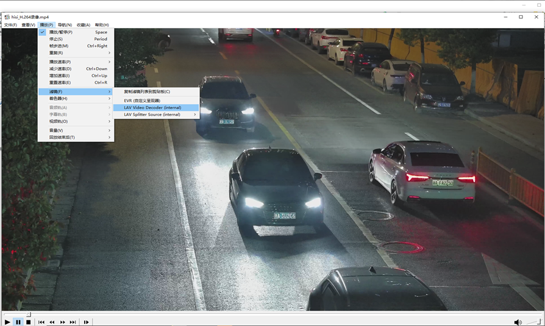

    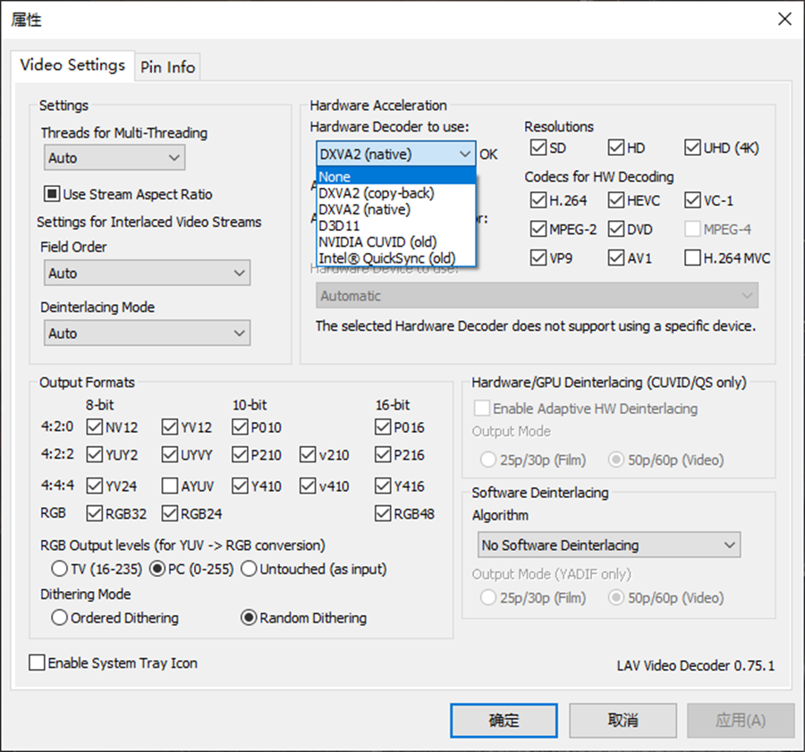

1.  查看-\>渲染器设置-\>输出范围设置为0\~255；

    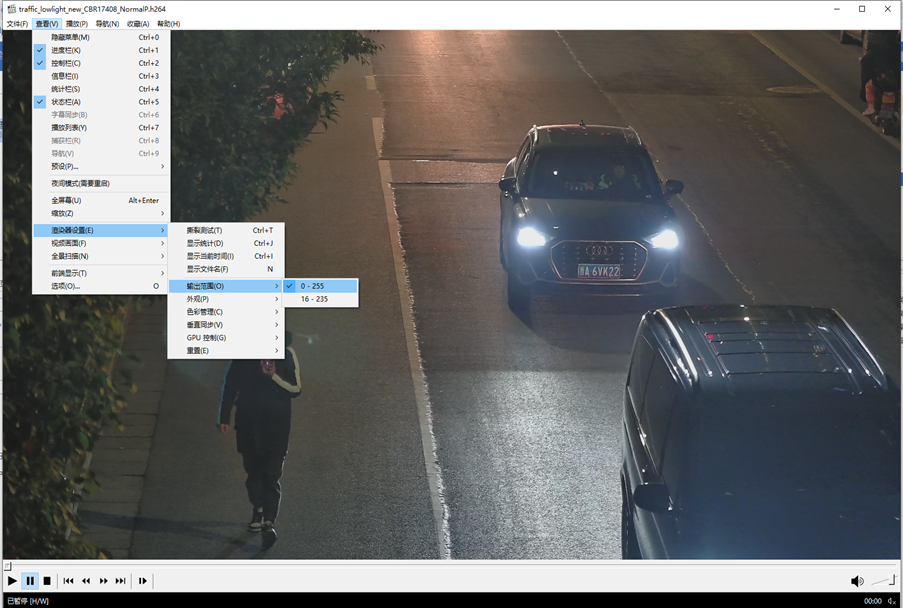

2.  选项-\>回放-\>输出-\>DirectShow设置为VMR-9\(未渲染\)；

    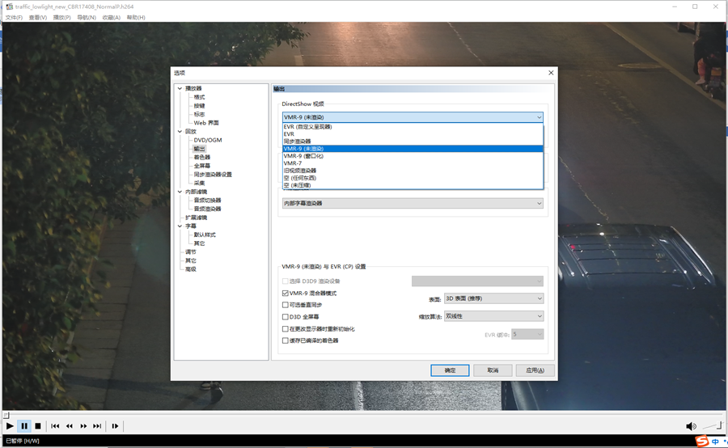

3.  关闭播放器再重新打开码流。

## P帧帧内刷新功能会有较明显的画面滚动效果<a name="ZH-CN_TOPIC_0000002408275474"></a>

**具体表现**：在P帧开启Intra Refresh功能，画面会出现较明显的滚动效果，面对纹理较多的场景更为明显。

**原因分析**：这个算法设计背景：I帧可能会带来带宽的突然增大，也可能会带来严重的呼吸效应，为消除这一部分的影响，将不再插I帧，而是在后续的P帧刷新一定行数的I块，但是I块和P块参考原理是不同的，I块是空域参考而P块是时域参考，由于参考的不连续性，就会导致在一些场景下出现轮动效应。

**解决方法**:

1.  找到背景非常平滑的场景；
2.  提升码率并同时调节refresh\_num参数，具体调整到多少需要根据场景进行尝试。

## H.264 AVBR 较其他平台码率有差异问题<a name="ZH-CN_TOPIC_0000002408115726"></a>

**具体表现**：H.264+AVBR在ss524/ss928平台比老版本芯片平台码率多20%\~30%，在复杂运动场景下，码率增多更加显著。

**原因分析**：在ss524/ss928平台在AVBR码控的设计上，为了解决码率降低带来的图像质量副作用，自适应的提升了一部分码率来平衡图像质量问题，因此在码率节省上对比其他老的芯片版本少。

**解决方法**：增加了在AVBR的param参数集里增加了save\_bitrate\_en开关，该参数使能之后可自适应节省背景区域的码率。码率节省程度与老版本芯片相当。

# VDEC<a name="ZH-CN_TOPIC_0000002408115562"></a>


## SS626V100 DDR大于3GB时部署MDC解码内存使用注意事项<a name="ZH-CN_TOPIC_0000002408115774"></a>

对于SS626V100解决方案，在部署模式选择为OT\_VDEC\_DEPLOYMENT\_MODE1时，由于MDC仅支持访问32bit地址空间，需要保证MDC侧业务使用的内存地址不能超过0x100000000。

解决方案：划分一部分32bit范围内的mmz空间，指定相应模块从这部分mmz中获取内存。涉及如下模块：vdec/vdec\_adapt/dcc/vfmw。mmz划分可参考文档《BSP FAQ》中1.2章节，指定mmz可参考接口ss\_mpi\_sys\_set\_mem\_cfg。需要注意base模块只能从anonymous区分配，模块中使用的mdc\_log\_buf需要共享给mdc使用，需要保证该buffer在32bit范围内，buf大小为68KB。

## SS626V100部署MDC解码模块vb使用注意事项<a name="ZH-CN_TOPIC_0000002408275578"></a>

1.  MDC解码通道的vb采用预先申请机制，VB需在通道创建之前初始化，另外，MDC侧通道和ARM侧通道需使用不同的模块vb池，MDC侧通道的模块vb池vb\_uid为OT\_VB\_UID\_VDEC\_ADAPT，ARM侧的通道为OT\_VB\_UID\_VDEC。
2.  MDC通道创建默认按照参考帧+显示帧+1的个数获取模块vb，vb大小按照通道宽高计算，因此在销毁重建通道时需要保证重建通道时vb资源足够。

## 不同场景下，销毁VDEC通道，VO显示差异说明<a name="ZH-CN_TOPIC_0000002441674937"></a>

场景1：VDEC-VO（VDEC系统绑定VO），销毁VDEC通道时，VO显示为背景色；

场景2：VDEC-VPSS-VO（VDEC系统绑定VPSS，VPSS系统绑定VO），销毁VDEC通道时，VO显示为最后一帧图像。

原因为在私有VB模式下，销毁VDEC通道或解绑定VDEC与后级模块时，VDEC会主动回收私有VB，造成场景1的VO无输入图像而显示背景色；场景2的VO可继续使用VPSS输出的VB而显示最后一帧。

## 解码及时性优化<a name="ZH-CN_TOPIC_0000002441714921"></a>

系统默认100Hz，解码时间可能存在10ms左右波动。如果对解码及时性要求较高，可以将系统HZ改为1000，同时修改ot\_user.c ot\_user.h：将VDEC\_SET\_SCHEDULER修改为1，修改函数ot\_sched\_setscheduler\_dec ot\_sched\_setscheduler\_stm ot\_sched\_setscheduler\_syn，将解码线程调度间隔sched\_period修改为1。这样可以降低解压延迟。

# 通路调试指南<a name="ZH-CN_TOPIC_0000002441714929"></a>


## VI通路调试<a name="ZH-CN_TOPIC_0000002441714801"></a>

> **须知：** 
>以下VI通路调试不适用于SS928V100解决方案。

VI的数据通路如下：

**图 1**  SS528V100/SS524V100/SS625V100/SS522V100/SS626V100的VI通路<a name="fig1511218112815"></a>  
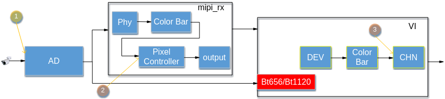

VI通路调试时经常会出现i2c读写错误、输出无图像等问题，下面提供一些常用的错误调试方法。


### i2c错误<a name="ZH-CN_TOPIC_0000002408115598"></a>

i2c常被用做配置AD使用，在VI的调试过程中，i2c的错误是一类很常见的错误，在i2c错误时候。可以使用内核i2c命令\(i2c\_read/i2c\_write\)器件来检查i2c是否异常。

在i2c错误时候，需要做下述错误排查：

-   检查物理硬件连接；
-   设备号和i2c地址，我们可以结合分析硬件和使用i2c命令排查此类错误；
-   检查load脚本加载时候的AD参数和实际单板AD器件是否匹配。

### 输出无图像和输出图像黑屏<a name="ZH-CN_TOPIC_0000002441714729"></a>

输出无图像和输出图像黑屏在VI通路调试初期是容易被大家混淆的两类错误。

1.  输出图像黑屏

    输出图像黑屏是在我们确认完通路正常后，但是VO输出无正确图像，此时的VO输出时有图的，只是图像为全黑，但mipi\_rx/VI信息都是正常的，此时会被很多人简单认为是无图像输出，需要大家仔细耐心的确认，在图像黑屏时候，对VI输入来说，问题一般是在[图1](VI通路调试.md#fig1511218112815)的**①**处，需要做的排查主要从录像机的连接。此类问题对VI来说比较容易排查，在此不作详述。

2.  输出无图像

    -   mipi\_rx无图

        如果通路数据通过mipi\_rx传输，可以通过cat /proc/umap/mipi\_rx检查mipi\_rx模块的“mipi detect info”的width/height，同时观察“mipi phy data info”中是否有数据在变动，以此来判断是否是mipi\_rx无图像。

        在mipi\_rx宽高错误，或者phy\_data/mipi\_data无数据时候，说明**②**（见[图1](VI通路调试.md#fig1511218112815)）数据异常或者mipi配置不正确，此时需要做下述错误排查：

        -   mipi\_rx配置检查；
        -   在排查异常出现在通路中的位置时候，可以借助mipi\_rx模块的Color Bar来辅助判断，由上图可见mipi\_rx中的Color Bar的位置，如果配置Color Bar功能时，后级模块能不能正常输出Color Bar，可以定位到图像异常由**②**（见[图1](VI通路调试.md#fig1511218112815)）位置之后的异常引起，即检查mipi的Pixel Controller和output模块的相关配置以及VI模块的异常；如果Color Bar配置后，后级模块输出正常，此时需要重点排查**②**（见）位置之前的模块，即是mipi\_rx的phy配置以及AD相关的软硬件配置。有关于Color Bar调试方法具体步骤参考下述[Color Bar调试](#ZH-CN_TOPIC_0000002441714897)。

        > **须知：** 
        >mipi\_rx问题排查仅仅在设置图像传输接口为mipi时候才使用，如果设置的VI的接口模式为BT.656/BT.1120时，不需要做此步骤的排查。

    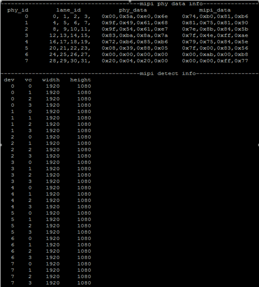

    -   VI无图像

        通过cat /proc/umap/vi命令，观察VI是否能检查到正确的宽高，可以用来辅助判断是否VI无图像问题，在检测到宽高错误时，说明[图1](VI通路调试.md#fig1511218112815)的**③**图像出现了异常，需要做下述错误排查：

        1.  cat /proc/interrupts查看是否上报VI中断，在VI无中断上报时，需要去检查VI前级模块（AD-\>VI或AD-\>mipi\_rx-\>VI）是否正常；在VI有中断上报时，可以通过cat /dev/logmpp查看VI是否上报异常中断，再针对不同的异常中断类型做相应的排查分析；
        2.  在检查到“vi phy detect info”中“valid\_width/valid\_height”异常，异常存在两类情况。

            其一：valid\_width/valid\_height值为0，此时一般VI也会没中断，需要根据A中无中断情况作排查；

            其二：宽高不断在跳变，并且宽高错误，此时一般VI也会上报错误中断，需要先在A错误中断类型相应排查，同时需要检查VI 的ot\_vi\_dev\_attr和ot\_vi\_chn\_attr是否正确配置。

        3.  在判断此类异常时发生的位置时候，可以借助VI的Color Bar，配置VI的Color Bar后，由[图1](VI通路调试.md#fig1511218112815)可见Color Bar所在的位置，配置Color Bar后，如果可以正常输出到后级模块看到图像，则可以定位到图像异常**②**（见）位置之前的通路异常引起，需要中断排查VI的DEV属性配置以及VI的前级模块异常；如果配置Color Bar后级模块依然不能输出正常Color Bar图像，此时需要重点排查VI模块的CHN属性配置以及VI后级模块的异常。VI模块的Color Bar具体步骤参考下述[Color Bar调试](#ZH-CN_TOPIC_0000002441714897)。

        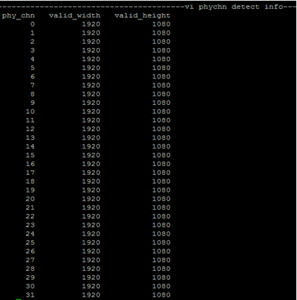

### CC err错误<a name="ZH-CN_TOPIC_0000002408115666"></a>

CC Err错误是指在VI的调试过程中，通过cat /proc/umap/vi查看VI的Proc信息时，发现“vi phychn status”栏中的cc\_err\_cnt不断递增的情况。

在出现CC Err错误时，需要做下述错误排查：

-   work\_mode复用参数的配置；
-   检查硬件连接。

### 丢中断<a name="ZH-CN_TOPIC_0000002441714817"></a>

丢中断是指在VI的调试过程中，通过cat /proc/umap/vi查看VI的Proc信息时，发现“vi phychn status”栏中的int\_cnt不断递增时，lost\_int不断增加的情况。

在出现丢中断错误时，需要做下述错误排查：

-   检查时序的对接；
-   检查mask的配置。

### Color Bar调试<a name="ZH-CN_TOPIC_0000002441714897"></a>

Color Bar主要是指一些图像通路调试中使用的常见纯色或者渐变色条。在通路的调试中，使用自生成时序实现的ColorBar主要用以定位问题在通路中发生的位置。在Color Bar调试候，需要先建立起VI-\>VO的基本通路，在根据在各个模块配置Color Bar的方式来推断问题发生的位置。

在VI的通路调试中，mipi\_rx和vi都具有color bar调试功能。

-   mipi\_rx的Color Bar配置：

    ```
         bspmm 0x173c1a00 0x1f7;  # colorbar_en
         bspmm 0x173c1a08 0x40D7; 
         bspmm 0x173c1a0c 0x52; 
         bspmm 0x173c1a10 0x437077f; 
    ```

    0x173c1a10寄存器为Color Bar的宽高寄存器，需要根据需要通路的实际宽高值来修改。Bit\[15:0\]表示图像的宽, Bit \[31:16\]表示图像的高。寄存器的配置值为实际的宽高值减1。

-   VI的Color Bar配置：（以Chn0为例）

    配置消隐区/有效区宽度：

    ```
         bspmm 0x17410380 0x20; #水平前消隐
         bspmm 0x17410384 0x780; #水平有效区
    ```

    根据图像宽高，配置实际的正确的图像宽度值。

    ```
          bspmm 0x17410388 0x20; #水平后消隐
          bspmm 0x1741038c 0x40; #垂直前消隐
          bspmm 0x17410390 0x438; #垂直有效区
    ```

    根据图像宽高，配置实际的正确的图像高度值。

    ```
         bspmm 0x17410394 0x80; #垂直后消隐区
    ```

    配置Color Bar功能：

    ```
         bspmm 0x17410344 0x80000089;
         bspmm 0x17410348 0x00000100;
         bspmm 0x1741034c 0x00FF0000; 
    ```

以上的寄存器，如果需要配置其他Chn的Color Bar，需要修改上述命令的基地址。

## VO通路调试<a name="ZH-CN_TOPIC_0000002408115702"></a>


### VO Color Bar使用说明<a name="ZH-CN_TOPIC_0000002441714809"></a>

在VO Color Bar调试前需要保证VO输出通路正常，以DHD0输出HDMI逐行时序水平Color Bar为例：

```
bspmm 0x17a0d000 0xe0000011;
```

当开启color bar时显示设备正常时会显示八条颜色各异的竖条，见下图。


### VO Color Bar配置<a name="ZH-CN_TOPIC_0000002408275582"></a>

-   VO模块支持输出水平Color Bar和垂直Color Bar用于逐行和隔行不同场景下问题定位。
-   VO模块支持设备输出YUV格式和RGB格式的Color Bar，对于HDMI接口可设置设备输出YUV格式Color Bar。对于VGA接口可设置设备输出RGB格式Color Bar，然后关闭接口上CSC观察Color Bar是否正常。
-   在隔行时序和逐行时序输出时配置有差异，对于设备不支持逐行时序的，例如DSD0的配置，则选择使用隔行时序配置。
-   不同设备的配置的寄存器地址不一样，设备分别对应的寄存器地址如下，更多配置见[表1](#_Ref28612008)。

    ```
    DHD0:
    bspmm 0x17a0d000 0xe0000011     //打开逐行时序的YUV输出的水平Color Bar
    bspmm 0x17a0d000 0x80000011     //恢复Color Bar
    bspmm 0x17a0d000 0xc0000011     //打开逐行时序的RGB输出的水平Color Bar
    bspmd.l 0x17a0d520      //先读取当前的VGA接口输出的CSC配置，例如为0x00700600
    bspmm 0x17a0d520 0x00300600     //关闭CSC开关csc_en，第22BIT从1变成0.
    bspmm 0x17a0d520 0x00700600     //恢复CSC开关csc_en，第22BIT从0变成1.
    bspmm 0x17a0d000 0x80000011     //恢复Color Bar
    DHD1:
    bspmm 0x17a0e000 0xe0000011     //打开逐行时序的YUV输出的水平Color Bar
    bspmm 0x17a0e000 0x80000011     //恢复Color Bar
    bspmm 0x17a0e000 0xc0000011     //打开逐行时序的RGB输出的水平Color Bar
    bspmd.l 0x17a0d520      //先读取当前的VGA接口输出的CSC配置，例如为0x00700600
    bspmm 0x17a0d520 0x00300600     //关闭CSC开关csc_en，第22BIT从1变成0.
    bspmm 0x17a0d520 0x00700600     //恢复CSC开关csc_en，第22BIT从0变成1.
    bspmm 0x17a0e000 0x80000011     //恢复Color Bar
    DSD0:
    bspmm 0x17a0f000 0xe0000001     //打开隔行时序的YUV输出的水平Color Bar
    bspmm 0x17a0f000 0x80000001     //恢复Color Bar
    ```

**表 1**  VO Color配置表

<a name="_Ref28612008"></a>
<table><thead align="left"><tr id="row3134mcpsimp"><th class="cellrowborder" valign="top" width="41%" id="mcps1.2.4.1.1"><p id="p3136mcpsimp"><a name="p3136mcpsimp"></a><a name="p3136mcpsimp"></a>Color Bar场景</p>
</th>
<th class="cellrowborder" valign="top" width="31%" id="mcps1.2.4.1.2"><p id="p3138mcpsimp"><a name="p3138mcpsimp"></a><a name="p3138mcpsimp"></a>配置Color Bar寄存器值</p>
</th>
<th class="cellrowborder" valign="top" width="28.000000000000004%" id="mcps1.2.4.1.3"><p id="p3140mcpsimp"><a name="p3140mcpsimp"></a><a name="p3140mcpsimp"></a>恢复Color Bar寄存器值</p>
</th>
</tr>
</thead>
<tbody><tr id="row3142mcpsimp"><td class="cellrowborder" valign="top" width="41%" headers="mcps1.2.4.1.1 "><p id="p3144mcpsimp"><a name="p3144mcpsimp"></a><a name="p3144mcpsimp"></a>逐行时序+水平Cbar+YUV输出</p>
</td>
<td class="cellrowborder" valign="top" width="31%" headers="mcps1.2.4.1.2 "><p id="p3146mcpsimp"><a name="p3146mcpsimp"></a><a name="p3146mcpsimp"></a>0xe0000011</p>
</td>
<td class="cellrowborder" valign="top" width="28.000000000000004%" headers="mcps1.2.4.1.3 "><p id="p3148mcpsimp"><a name="p3148mcpsimp"></a><a name="p3148mcpsimp"></a>0x80000011</p>
</td>
</tr>
<tr id="row3149mcpsimp"><td class="cellrowborder" valign="top" width="41%" headers="mcps1.2.4.1.1 "><p id="p3151mcpsimp"><a name="p3151mcpsimp"></a><a name="p3151mcpsimp"></a>逐行时序+垂直Cbar+YUV输出</p>
</td>
<td class="cellrowborder" valign="top" width="31%" headers="mcps1.2.4.1.2 "><p id="p3153mcpsimp"><a name="p3153mcpsimp"></a><a name="p3153mcpsimp"></a>0xe0040011</p>
</td>
<td class="cellrowborder" valign="top" width="28.000000000000004%" headers="mcps1.2.4.1.3 "><p id="p3155mcpsimp"><a name="p3155mcpsimp"></a><a name="p3155mcpsimp"></a>0x80000011</p>
</td>
</tr>
<tr id="row3156mcpsimp"><td class="cellrowborder" valign="top" width="41%" headers="mcps1.2.4.1.1 "><p id="p3158mcpsimp"><a name="p3158mcpsimp"></a><a name="p3158mcpsimp"></a>隔行时序+水平Cbar+YUV输出</p>
</td>
<td class="cellrowborder" valign="top" width="31%" headers="mcps1.2.4.1.2 "><p id="p3160mcpsimp"><a name="p3160mcpsimp"></a><a name="p3160mcpsimp"></a>0xe0000001</p>
</td>
<td class="cellrowborder" valign="top" width="28.000000000000004%" headers="mcps1.2.4.1.3 "><p id="p3162mcpsimp"><a name="p3162mcpsimp"></a><a name="p3162mcpsimp"></a>0x80000001</p>
</td>
</tr>
<tr id="row3163mcpsimp"><td class="cellrowborder" valign="top" width="41%" headers="mcps1.2.4.1.1 "><p id="p3165mcpsimp"><a name="p3165mcpsimp"></a><a name="p3165mcpsimp"></a>隔行时序+垂直Cbar+YUV输出</p>
</td>
<td class="cellrowborder" valign="top" width="31%" headers="mcps1.2.4.1.2 "><p id="p3167mcpsimp"><a name="p3167mcpsimp"></a><a name="p3167mcpsimp"></a>0xe0040001</p>
</td>
<td class="cellrowborder" valign="top" width="28.000000000000004%" headers="mcps1.2.4.1.3 "><p id="p3169mcpsimp"><a name="p3169mcpsimp"></a><a name="p3169mcpsimp"></a>0x80000001</p>
</td>
</tr>
<tr id="row3170mcpsimp"><td class="cellrowborder" valign="top" width="41%" headers="mcps1.2.4.1.1 "><p id="p3172mcpsimp"><a name="p3172mcpsimp"></a><a name="p3172mcpsimp"></a>逐行时序+水平Cbar+RGB输出</p>
</td>
<td class="cellrowborder" valign="top" width="31%" headers="mcps1.2.4.1.2 "><p id="p3174mcpsimp"><a name="p3174mcpsimp"></a><a name="p3174mcpsimp"></a>0xc0000011</p>
</td>
<td class="cellrowborder" valign="top" width="28.000000000000004%" headers="mcps1.2.4.1.3 "><p id="p3176mcpsimp"><a name="p3176mcpsimp"></a><a name="p3176mcpsimp"></a>0x80000011</p>
</td>
</tr>
<tr id="row3177mcpsimp"><td class="cellrowborder" valign="top" width="41%" headers="mcps1.2.4.1.1 "><p id="p3179mcpsimp"><a name="p3179mcpsimp"></a><a name="p3179mcpsimp"></a>逐行时序+垂直Cbar+RGB输出</p>
</td>
<td class="cellrowborder" valign="top" width="31%" headers="mcps1.2.4.1.2 "><p id="p3181mcpsimp"><a name="p3181mcpsimp"></a><a name="p3181mcpsimp"></a>0xc0040011</p>
</td>
<td class="cellrowborder" valign="top" width="28.000000000000004%" headers="mcps1.2.4.1.3 "><p id="p3183mcpsimp"><a name="p3183mcpsimp"></a><a name="p3183mcpsimp"></a>0x80000011</p>
</td>
</tr>
<tr id="row3184mcpsimp"><td class="cellrowborder" valign="top" width="41%" headers="mcps1.2.4.1.1 "><p id="p3186mcpsimp"><a name="p3186mcpsimp"></a><a name="p3186mcpsimp"></a>隔行时序+水平Cbar+RGB输出</p>
</td>
<td class="cellrowborder" valign="top" width="31%" headers="mcps1.2.4.1.2 "><p id="p3188mcpsimp"><a name="p3188mcpsimp"></a><a name="p3188mcpsimp"></a>0xc0000001</p>
</td>
<td class="cellrowborder" valign="top" width="28.000000000000004%" headers="mcps1.2.4.1.3 "><p id="p3190mcpsimp"><a name="p3190mcpsimp"></a><a name="p3190mcpsimp"></a>0x80000001</p>
</td>
</tr>
<tr id="row3191mcpsimp"><td class="cellrowborder" valign="top" width="41%" headers="mcps1.2.4.1.1 "><p id="p3193mcpsimp"><a name="p3193mcpsimp"></a><a name="p3193mcpsimp"></a>隔行时序+垂直Cbar+RGB输出</p>
</td>
<td class="cellrowborder" valign="top" width="31%" headers="mcps1.2.4.1.2 "><p id="p3195mcpsimp"><a name="p3195mcpsimp"></a><a name="p3195mcpsimp"></a>0xc0040001</p>
</td>
<td class="cellrowborder" valign="top" width="28.000000000000004%" headers="mcps1.2.4.1.3 "><p id="p3197mcpsimp"><a name="p3197mcpsimp"></a><a name="p3197mcpsimp"></a>0x80000001</p>
</td>
</tr>
</tbody>
</table>

## HDMI通路调试<a name="ZH-CN_TOPIC_0000002441674949"></a>


### Color bar使用说明<a name="ZH-CN_TOPIC_0000002408275534"></a>

```
命令：echo cbar arg > /proc/umap/hdmi0
arg：0  关闭color bar
arg：1  开启color bar
```

当开启color bar时显示设备正常时会显示八条颜色各异的竖条，见下图。


使用场景：

-   显示设备画面持续性出现异常\(如黑屏、绿屏、花屏、闪屏等\)；
-   显示设备画面瞬间出现异常\(如切换制式时瞬间花屏等\)。

原理：

-   Color bar是一幅固定的图像，其数据已固化在芯片内部。当color bar使能时，逻辑会将原有通路上传输的数据按照一定的编码格式替换为color bar。整个过程未改变其他逻辑模块的配置和工作状态，仅对HDMI输入的数据进行了替换。
-   若开启color bar后异常消失或相同操作下不再复现，那就说明异常很可能是出在数据层面 \(因为此操作过程中所有的配置没有改变，唯一改变的只是数据源\)。

### HDMI的color bar<a name="ZH-CN_TOPIC_0000002441714849"></a>

-   HDMI模块的color bar一般用于本模块功能冒烟。
-   与HDMI模块的时序发生器配合使用可以达到模块独立输出的目的。
-   单板没有时序输出时，可以使用HDMI的color bar来排除是否是HDMI内部逻辑有异常。
-   HDMI模块的color bar暂时没有提供debug命令，只能通过配置寄存器的方式打开。

命令：

```
bspmm 0x17B40840  0x0     //关闭color bar
bspmm 0x17B40840  0x11    //打开rgb编码格式的 color bar
bspmm 0x17B40840  0x2011  //打开yuv444编码格式的 color bar
bspmm 0x17B40800  0x15    //配置HDMI模块的时序发生器输出1080P60制式的时序
```

更多制式配置请参见[表1](#_Ref27747598)。

**表 1**  制式配置表

<a name="_Ref27747598"></a>
<table><thead align="left"><tr id="row3231mcpsimp"><th class="cellrowborder" valign="top" width="50%" id="mcps1.2.3.1.1"><p id="p3233mcpsimp"><a name="p3233mcpsimp"></a><a name="p3233mcpsimp"></a>制式</p>
</th>
<th class="cellrowborder" valign="top" width="50%" id="mcps1.2.3.1.2"><p id="p3235mcpsimp"><a name="p3235mcpsimp"></a><a name="p3235mcpsimp"></a>寄存器值</p>
</th>
</tr>
</thead>
<tbody><tr id="row3236mcpsimp"><td class="cellrowborder" valign="top" width="50%" headers="mcps1.2.3.1.1 "><p id="p3238mcpsimp"><a name="p3238mcpsimp"></a><a name="p3238mcpsimp"></a>720P60</p>
</td>
<td class="cellrowborder" valign="top" width="50%" headers="mcps1.2.3.1.2 "><p id="p3240mcpsimp"><a name="p3240mcpsimp"></a><a name="p3240mcpsimp"></a>0xD</p>
</td>
</tr>
<tr id="row3241mcpsimp"><td class="cellrowborder" valign="top" width="50%" headers="mcps1.2.3.1.1 "><p id="p3243mcpsimp"><a name="p3243mcpsimp"></a><a name="p3243mcpsimp"></a>1080P60</p>
</td>
<td class="cellrowborder" valign="top" width="50%" headers="mcps1.2.3.1.2 "><p id="p3245mcpsimp"><a name="p3245mcpsimp"></a><a name="p3245mcpsimp"></a>0x15</p>
</td>
</tr>
<tr id="row3246mcpsimp"><td class="cellrowborder" valign="top" width="50%" headers="mcps1.2.3.1.1 "><p id="p3248mcpsimp"><a name="p3248mcpsimp"></a><a name="p3248mcpsimp"></a>4K30</p>
</td>
<td class="cellrowborder" valign="top" width="50%" headers="mcps1.2.3.1.2 "><p id="p3250mcpsimp"><a name="p3250mcpsimp"></a><a name="p3250mcpsimp"></a>0x21</p>
</td>
</tr>
<tr id="row3251mcpsimp"><td class="cellrowborder" valign="top" width="50%" headers="mcps1.2.3.1.1 "><p id="p3253mcpsimp"><a name="p3253mcpsimp"></a><a name="p3253mcpsimp"></a>4K60</p>
</td>
<td class="cellrowborder" valign="top" width="50%" headers="mcps1.2.3.1.2 "><p id="p3255mcpsimp"><a name="p3255mcpsimp"></a><a name="p3255mcpsimp"></a>0x41</p>
</td>
</tr>
</tbody>
</table>

在模块已初始化的前提下\(CRG时钟、PHY指标参数\)，当配置好时序以及数据\(color bar\)后若显示设备能正常显示则说明HDMI模块的逻辑功能没有问题。

# 其它<a name="ZH-CN_TOPIC_0000002441674989"></a>


## 动态库<a name="ZH-CN_TOPIC_0000002408115754"></a>


### 为什么使用静态编译方式编译应用程序无法使用动态库<a name="ZH-CN_TOPIC_0000002441675021"></a>

【现象】

客户A现行文件系统/执行程序都是使用静态编译方式编译，以至于不能使用版本发布的动态库。

【分析】

当前ARM-Linux-GCC提供了3种编译方式，分别是静态编译，动态编译，半静态编译。其中：

-   静态编译\(-static -pthread -lrt -ldl\)将会将libc, libpthread, librt, libdl都编译到执行程序中，这样的编译方式将会不依赖任何系统动态库（即可独立执行），但无法使用动态库系统。
-   动态编译\(普通编译\)将会采取链接系统库的方式去链接/lib目录下的系统动态库，这样编译出来的程序需要依赖系统动态库，优点是系统动态库可以被多个可执行程序共用，如/bin目录下的busybox，mount等。
-   半静态编译\(-static-libgcc -static-libstdc++ -L. -pthread -lrt -ldl\)则会将gcc以及stdc++编译到可执行程序中去，其他系统库依然依赖系统动态库。这种编译方式，可以使用动态库系统，但是依然需要在系统目录下放置libc, libpthread, librt, libdl等文件。

【解决】

采取动态编译方式，在/lib目录下放置动态库依赖的系统文件ld-uClibc.so.0, libc.so.0, libpthread.so.0, librt.so.0, libdl.so.0即可。

### 为什么使用libss\_upvqe.a和libss\_dnvqe.a动态编译时出现重定义<a name="ZH-CN_TOPIC_0000002441714841"></a>

【现象】

客户B使用音频组件库的lbss\_upvqe.a和libss\_dnvqe.a编译成一个动态库，编译时发生重定义报错，编译语句为：

```
$(CC) -shared -o $@ -L. -Wl,--whole-archive libss_upvqe.a libss_dnvqe.a -Wl,--no-whole-archive
```

【分析】

libss\_upvqe.a和libss\_dnvqe.a中，都使用了一些共同的功能模块，以达到代码重用以及模块化的目的，并可以在编译成elf文件时节省文件空间。

在使用静态库编译动态库时，有3种方式：

-   直接使用-l方式编译，编译语句为：

    ```
    $(CC) -shared -o libshare.so -L. –lss_upvqe –lss_dnvqe
    ```

    该编译为链接编译，该方式编译生成后的libshare.so将不会链入静态库的函数符号；

-   使用-Wl,--whole-archive编译，编译语句为：

    ```
    $(CC) -shared -o $@ -L. -Wl,--whole-archive libss_upvqe.a libss_dnvqe.a -Wl,--no-whole-archive
    ```

    该编译方式能够将静态库中的函数符号都编译到libshare.so中，但是这种编译方式存在限制，libss\_upvqe.a和libss\_dnvqe.a中不能有同名的函数；

-   先将.a库分别拆成.o，再行编译.so，编译语句为：

    ```
    LIB_PATH = ./
    EXTERN_OBJ_DIR = ./EXTERN_OBJ
    LIBUPVQE_NAME = libss_upvqe.a
    LIBDNVQE_NAME = libss_dnvqe.a
    EXTERN_OBJ = $(EXTERN_OBJ_DIR)/*.o
    all: pre_mk $(TARGET) pre_clr
    pre_mk:
            @mkdir -p $(EXTERN_OBJ_DIR);
            @cp $(LIB_PATH)$(LIBUPVQE_NAME) $(EXTERN_OBJ_DIR);
            @cd $(EXTERN_OBJ_DIR); $(AR) -x $(LIBUPVQE_NAME);
            @cp $(LIB_PATH)$(LIBDNVQE_NAME) $(EXTERN_OBJ_DIR);
            @cd $(EXTERN_OBJ_DIR); $(AR) -x $(LIBDNVQE_NAME);
            
    $(TARGET):
            #$(CC) -shared -o $@ -L. libss_upvqe.so libss_dnvqe.so
            $(CC) -shared -o $@ -L. $(EXTERN_OBJ)
            
    pre_clr:
    @rm -rf $(EXTERN_OBJ_DIR);
    ```

> **说明：** 
>这种编译方式，则是先将libss\_upvqe.a和libss\_dnvqe.a分别先拆分成.o，再通过.o编译成.so文件。该方式能够将静态库中的函数符号加入.so文件中，并不会产生同名函数冲突。

【解决】

客户B编译时，采取了第二种编译方式，但是受限于libss\_upvqe.a和libss\_dnvqe.a中存在同名的函数，导致编译时报了重定义错误。基于此，客户可以使用第一种或者第三种编译方式，都可以顺利地生成libshare.so文件。

## 红外模式下编码块效应明显如何解决<a name="ZH-CN_TOPIC_0000002441714853"></a>

【现象】

在红外模式下，3DNR模块的IES强度较高时，画面整体毛刺感比较强烈。而在该模式下的画面纹理较少，因此这种毛刺感会造成平坦区域相对而言没有那么平坦，加大编码器压力。同时在光线变化的时候，帧与帧之间的亮度变化较大，因此在光线变化（例如人物走动，镜头遮挡等）产生时，编码器压力也会比较大。

【解决】

将3DNR模块中的IES在红外模式下设置为0（默认为4），该方法可显著提高红外模式下的编码效率。同时为了加强一定的去噪能力，将强去噪通道的TFR（HTFR）设置为56。

## DVR前端采集3840x480隔行场景性能优化<a name="ZH-CN_TOPIC_0000002441674981"></a>

DVR前端AD在切换分辨率的时候为了避免时钟的切换，往往把原低分辨率的图像（如960H）水平放大4倍（3840x480）送VI处理，这种场景下VI模块的压力较大，会影响系统性能。为避免因总线争抢对实时性要求较高的模块（如VO）的性能产生影响，建议在VI模块内部直接进行1/4丢点处理，而不用通过VPSS进行二次缩放。这样既可以降低带宽占用，又能节省VPSS性能。


### 模块KO之间的依赖关系<a name="ZH-CN_TOPIC_0000002408115662"></a>

-   每个加载上去的KO模块，有显式依赖关系的，lsmod查看时，会有Used by的标识。存在这种关系的KO之间需要按照顺序加载和相反顺序卸载.
-   有些模块KO是隐形依赖的，比如公共基础KO模块sys\_config.ko、xxx\_base.ko、xxx\_sys.ko、xxx\_tde.ko、xxx\_region.ko等需要先加载，这些KO模块若中途单独卸载再加载，可能引起一些异常。请重新依次按照顺序进行模块的卸载和加载。
-   另外一些共用的调度模块如xxx\_chnl.ko，供编码和region等模块调用，如卸载掉可能引起编码和region模块的异常。还有音频基础模块xxx\_aio.ko，其他音频模块KO对它没有显示依赖，但它是音频其他模块KO所不可缺少的。

## HDMI Hot Plug与功耗问题<a name="ZH-CN_TOPIC_0000002441714697"></a>

【现象】

在没有外接HDMI设备或者Hot Plug电平为低时，打开HDMI输出会产生额外的功耗。

【解决】

正常情况下，建议通过注册回调的方式来处理HDMI热插拔事件，当收到驱动上报的Hot Plug事件时调用ss\_mpi\_hdmi\_start 接口打开HDMI输出，否则不打开，以降低功耗。

个别不规范的显示设备可能Hot Plug一直为低，此时若需要HDMI输出可调用ss\_mpi\_hdmi\_start接口强制打开HDMI，不需要HDMI输出时调用ss\_mpi\_hdmi\_stop接口关闭HDMI输出。

## OSD的透明度和颜色问题<a name="ZH-CN_TOPIC_0000002441714685"></a>

【现象】

-   RGN打overlay到VPSS，像素格式ARGB4444，颜色0xffff透明度值达到最大，但图像还是有点透明。
-   RGN打overlay、或者vgs打osd，白色纯色块，出来纯色块颜色偏淡。

【说明】

OSD支持像素格式有ARGB1555、ARGB4444、ARGB8888，芯片处理都是转为为8bit，但是由于ARGB1555、ARGB4444每位元素都不够8位，逻辑会对它们进行移位，补足8位，精度不匹配，导致：透明度值达到最大，但图像还是有点透明、或纯色块颜色偏淡等现象。

## 启动VI部分通道黑屏问题<a name="ZH-CN_TOPIC_0000002408115766"></a>

【现象】

双沿模式下，业务起来后VI部分通道无图像。

【说明】

请勿修改驱动默认配置时钟的顺序，顺序错乱，可能导致芯片逻辑异常，AD时钟切换前，保证VI设备处于复位状态。

## 回放模式下反压VDEC失败问题<a name="ZH-CN_TOPIC_0000002441714893"></a>

【现象】

VDEC-VPSS-VO（1080P@60）回放通路下，VDEC帧率远高于VPSS帧率。

【说明】

在VDEC-VPSS-后级模块回放通路下，如果后级模块从vpss取帧及时，并有丢帧，使得vpss buf一直没满，就不会造成反压。例如：VO输出时序为1080P@60时，VDEC输出前后两帧PTS差值小于1/60秒时，VO会丢弃新帧，不会造成VDEC反压。

**注意**：VPSS设置为USER模式下也不会造成VDEC反压。

## MIPI\_RX管脚复用配置问题<a name="ZH-CN_TOPIC_0000002441714857"></a>

【现象】

MIPI模式时候，管脚复用被误配置为CMOS管脚，会导致MIPI\_RX的PHY被烧毁。

【说明】

在MIPI模式时候，管脚复用被误配置为CMOS管脚，将会出现烧坏MIPI\_RX的逻辑，因此MIPI\_RX在配置MIPI接口时候会强制管脚复用为MIPI\_RX管脚，避免MIPI\_RX的PHY被烧毁。

## VI修改用户图片使用的硬件定时器<a name="ZH-CN_TOPIC_0000002441675017"></a>

【现象】

VI启用用户图片后，会占用一个硬件定时器，默认使用timer7。

【说明】

可以修改VI使用的timer，但要注意不能修改为已被用于其他用途的timer。

修改方法为修改内核的dtsi文件，这里以SS528V100为例，其他解决方案类似。

默认使用timer7时，SS528V100.dtsi中vi相关配置如下：

```
vi: vi@0x17400000 {
                                        compatible = "vendor,vi";
                                        reg = <0x17400000 0x40000>,
                         <0x11003020 0x20>;
                                        reg-names = "VI_CAP", "vi_timer";
                                        interrupts = <GIC_SPI 158 IRQ_TYPE_LEVEL_HIGH>,
                          <GIC_SPI 11 IRQ_TYPE_LEVEL_HIGH>;
                                        interrupt-names = "VI_CAP", "vi_timer";
};
```

其中，0x11003020表示timer7的寄存器基址，11表示timer7的中断位 - 32。timer的基址和中断位，可查阅芯片手册的“系统”章节。

假如需要修改为timer5，则将vi配置修改为：

```
vi: vi@0x17400000 {
                                         compatible = "vendor,vi";
                                         reg = <0x17400000 0x40000>,
                           <0x11002020 0x20>;
                                         reg-names = "VI_CAP", "vi_timer";
                                         interrupts = <GIC_SPI 158 IRQ_TYPE_LEVEL_HIGH>,
                          <GIC_SPI 10 IRQ_TYPE_LEVEL_HIGH>;
                                         interrupt-names = "VI_CAP", "vi_timer";
};
```

## EARLY/ EARLY\_END模式下early\_line配置建议<a name="ZH-CN_TOPIC_0000002408115694"></a>

【现象】

EARLY/EARLY\_END模式下early\_line配置受系统响应及时性影响，会存在较大波动。提供EARLY中断响应时真实的cur\_line和历史最小的min\_line，提供配置early\_line的参考。

【说明】

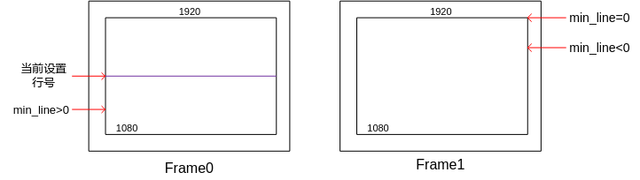

当cur\_line/min\_line为负数，表示响应时间跨帧到下一个帧起始之后；cur\_line/min\_line为0表示下一帧正在采集第0行的位置。

根据proc中的min\_line辅助信息，如果min\_line为负值或0值，实际参考设置的行号为：当前设置early\_line行号+跨帧到下帧的行数（绝对值）+消隐区的行数+预留安全值（安全值可以根据经验设置），即为early\_line（最小值为40）应该设置的数值；如果min\_line为正值，实际参考设置的行号可减小，满足安全设计值要求，可以达到省占用VB时间的目的。

或者可以使用以下方法训练得到应该设置的行数值： early\_line设置偏大（可为高度的2/3或者3/4），此时可以训练得到最差情况的early\_line值，实际参考设置的行号为：设置early\_line值-min\_line+预留安全值。

## HNR/智能业务切换流程说明<a name="ZH-CN_TOPIC_0000002408275658"></a>

【现象】

SS928V100平台HNR与智能SVP\__NNN_业务互斥，当前两种业务切换需要进行ko的卸载与加载。

注：SS927V100不支持SVP\__NNN_

【说明】

切换流程如下：

// 初始化

// 起媒体业务

// 起hnr业务 start hnr

// stop hnr

system\("rmmod ot\_pqp.ko"\);

system\("insmod ot\_svp\__nnn_.ko"\);

// 切换到SVP\__NNN_业务

// stop SVP\__NNN_业务

system\("rmmod ot\_svp\__nnn_.ko"\);

system\("insmod ot\_pqp.ko"\);

// 切换到HNR业务, start hnr

// stop hnr

// 退出媒体业务

## VO中断延迟问题<a name="ZH-CN_TOPIC_0000002441714789"></a>

【现象】


【说明】

出现以上log打印时，说明VO中断出现了延迟。

原因：当前硬件中断都是默认绑定到了CPU 0核上，业务负载较大时，瞬时出现了多个中断，从报中断到响应会延迟。

解决方案：将VO的中断绑定到其他CPU核上。例：将VO中断绑定到CPU 1核上。命令：echo 0x02 \> /proc/irq/70/smp\_affinity

## SS928V100 VI报buffer overflow中断丢帧问题<a name="ZH-CN_TOPIC_0000002408275630"></a>

【现象】


【原因】

出现以上log打印时，说明VI模块可能由于访问DDR的latency太大而导致未能在规定时间内顺利将数据写出完成。

【调试建议】

在加载ko之后，执行以下命令来减小VI latency：

```
bspmm 0x11144600 0x1160002;
bspmm 0x11144608 0x1160002;
bspmm 0x11144620 0xa3;
bspmm 0x11144624 0;
```

可能会出现执行不成功导致系统挂死的情况；在执行成功的情况下测试业务是否还会出现VI buffer overflow丢帧。

如果丢帧问题可以解决，将这四个寄存器改动配置到uboot表格中的qos\_ctrl子页的对应位置即可。

