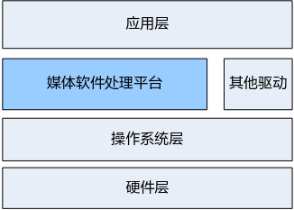
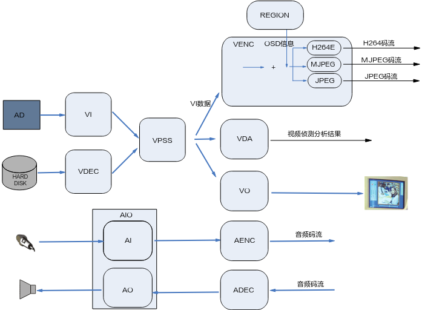

# 系统概述

## 概述

媒体处理软件平台\(Media Process Platform,简称MPP\)，可支持应用软件快速开发。该平台对应用软件屏蔽了芯片相关的复杂的底层处理，并对应用软件直接提供MPI（MPP Programe Interface）接口完成相应功能。

该平台支持应用软件快速开发以下功能：输入视频捕获、H.264/MJPEG/JPEG编码、H264/H.265解码、视频输出显示、视频图像前处理（包括去噪、增强、锐化、Deinterlace）、图像拼接、图像几何矫正、编码码流叠加OSD、视频侦测分析、智能分析、音频捕获及输出、音频编解码等功能。

## 系统架构

MPP平台支持的典型的系统层次如[图1](#fig240415391064)所示，主要分为以下层次：

-   硬件层

    硬件层由芯片加上必要的外围器件构成。外围器件包括Flash、DDR（Double Data-Rate）、视频Sensor或AD、音频AD等。

-   操作系统层

    基于Linux OS系统，如[表1](#_Ref477274650)所示。

**表 1**  Linux版本

<table><thead align="left"><tr id="row115mcpsimp"><th class="cellrowborder" valign="top" width="18%" id="mcps1.2.3.1.1">
版本号

</th>
<th class="cellrowborder" valign="top" width="82%" id="mcps1.2.3.1.2">
解决方案

</th>
</tr>
</thead>
<tbody><tr id="row120mcpsimp"><td class="cellrowborder" valign="top" width="18%" headers="mcps1.2.3.1.1 ">
Linux 4.19.y

</td>
<td class="cellrowborder" valign="top" width="82%" headers="mcps1.2.3.1.2 ">
SS528V100/SS625V100/SS524V100/SS522V100/SS928V100

</td>
</tr>
<tr id="row1565312151387"><td class="cellrowborder" valign="top" width="18%" headers="mcps1.2.3.1.1 ">
Linux 5.10.y

</td>
<td class="cellrowborder" valign="top" width="82%" headers="mcps1.2.3.1.2 ">
SS626V100

</td>
</tr>
</tbody>
</table>

-   媒体处理平台

    基于操作系统层，控制芯片完成相应的媒体处理功能。它对应用层屏蔽了硬件处理细节，并为应用层提供API接口完成相应功能。

-   其他驱动

    除媒体处理平台外, 为芯片的其他相关硬件处理单元提供了相应的驱动,包括GMAC、SDIO、I2C、USB、SSP等驱动。

-   应用层

    基于媒体处理平台及其他驱动，由用户开发的应用软件系统。

**图 1**  SSxx典型的系统层次图  

## 媒体处理平台架构

媒体处理平台的主要内部处理流程如[图1](#fig93963314913)所示，主要分为视频输入（VI）、视频处理（VPSS）、视频编码（VENC）、视频解码（VDEC）、视频输出\(VO\)、视频侦测分析\(VDA\)、视频拼接（AVS）、音频输入\(AI\)、音频输出\(AO\)、音频编码（AENC）、音频解码（ADEC）、区域管理（REGION）等模块。主要的处理流程介绍如下：

**图 1**  媒体处理平台内部处理流程图  

-   VI模块捕获视频图像，可对其做剪切、缩放、镜像等处理，并输出多路不同分辨率的图像数据。
-   解码模块对编码后的视频码流进行解码，并将解析后的图像数据送VPSS进行图像处理或直接送VO显示。可对H.264/H.265格式的视频码流进行解码。
-   VPSS模块接收VI和解码模块发送过来的图像，可对图像进行去噪、图像增强、锐化等处理，并实现同源输出多路不同分辨率的图像数据用于编码、预览或抓拍。
-   编码模块接收VI捕获并经VPSS处理后输出的图像数据，可叠加用户通过Region模块设置的OSD图像，然后按不同协议进行编码并输出相应码流。
-   VDA模块接收VI的输出图像，并进行移动侦测和遮挡侦测，最后输出侦测分析结果。
-   VO模块接收VPSS处理后的输出图像，可进行播放控制等处理，最后按用户配置的输出协议输出给外围视频设备。
-   AVS模块接收多路图像，进行拼接合成全景图像（仅SS928V100支持）。
-   AI模块捕获音频数据，然后AENC模块支持按多种音频协议对其进行编码，最后输出音频码流。
-   用户从网络或外围存储设备获取的音频码流可直接送给ADEC模块，ADEC支持解码多种不同的音频格式码流，解码后数据送给AO模块即可播放声音。

## mmz buffer进程隔离

### 背景介绍

媒体模块使用的图像、码流等buffer都是来自mmz，mmz buffer的分配、释放、映射等都是基于物理地址管理的。媒体API接口里关于图像、码流等的缓存buffer也是基于物理地址定义的，应用程序可通过API直接获取到图像buffer物理地址信息，也可以通过API接口把图像buffer的物理地址送入模块，在模块内存调用硬件IP对图像进行处理。由于物理地址本身是进程无关的，不像虚拟地址一样天然就具备进程隔离的属性，当产品被植入恶意进程时，恶意进程可通过API获取或者破坏正常业务媒体进程MMZ buffer里的数据。为了防止恶意进程可以访问到其它进程里的mmz buffer，需要对每一块mmz buffer增加进程隔离的管理属性，默认只有本进程能访问本进程分配的buffer，其它进程访问必须通过注册共享的方式。

大多数产品的媒体业务都在一个进程里，有些产品可能会把视频和智能部署在两个不同的进程，比如在视频进程创建VPSS组，在智能进程通过API直接获取VPSS某个通道的图像帧使用，这种场景下ss\_mpi\_vpss\_get\_chn\_frame接口就涉及被其它进程调用，vb就涉及被多进程访问的情况。mmz buffer支持进程隔离属性之后，为了方便应用程序多进程使用mmz buffer，制定了注册mmz buffer共享给特定进程的接口。

### 多进程共享方式介绍

-   记分配mmz buffer的进程为这个buffer的属主进程，默认只有属主进程具备本buffer的读写权限、映射权限、释放权限，其它进程没有。

-   记注册了共享的进程为这个buffer的共享进程，则共享进程具备本buffer的读写权限、映射权限，不具备释放权限。

-   mmz buffer的读写权限指的是媒体驱动所有涉及mmz buffer输入或输出的API只允许buffer的属主进程和共享进程调用，其它进程调用会返回失败。
-   mmz buffer的映射权限指的是ss\_mpi\_sys\_mmap和ss\_mpi\_sys\_mmap\_cached接口只允许buffer的属主进程和共享进程调用，其它进程调用会返回失败。
-   mmz buffer的释放权限指的是ss\_mpi\_sys\_mmz\_free接口只允许buffer的属主进程调用，其它进程调用会返回失败。
-   每一块mmz buffer的属主进程只有1个，特定的共享进程最多支持4个，同时支持不限进程id的共享方式。

mmz buffer多进程共享方式一共有三种：

-   第一种：注册共享给特定的进程id。
    -   通过ss\_mpi\_sys\_mem\_share接口将单个mmz buffer注册共享给特定的进程id。
    -   通过ss\_mpi\_vb\_pool\_share接口将单个vb池共享给特定的进程id。
    -   通过ss\_mpi\_isp\_mem\_share接口将单个isp pipe所有的统计信息共享给特定的进程id获取。

-   第二种：注册共享给所有进程。
    -   通过ss\_mpi\_sys\_mem\_share\_all接口将单个mmz buffer注册共享给所有进程。
    -   通过ss\_mpi\_vb\_pool\_share\_all接口将单个vb池共享给所有进程。
    -   通过ss\_mpi\_isp\_mem\_share\_all接口将单个isp pipe所有的统计信息共享给所有进程。

-   第三种：不需要注册共享，模块参数控制。
    -   通过加载ot\_osal.ko时设置模块参数mem\_process\_isolation=0关闭mmz buffer的进程隔离属性，关闭之后所有mmz buffer均可被所有进程访问和映射。
    -   模块参数mem\_process\_isolation的默认值为1。

**方式一是安全的多进程共享访问mmz buffer的方式，推荐使用方式一。方式二和方式三有较高的网络安全风险，不推荐产品使用，建议仅在实验室调试场景、对网络安全不敏感的场景（比如一些无需连网的设备、局域网设备等）使用，否则带来的网络安全风险由产品设备厂商自行承担。**

说明：

1、以上每一个share接口都有对应的unshare接口，参见具体API参考的接口描述。

2、mmz buffer的handle可通过ss\_mpi\_sys\_get\_mem\_info\_by\_phys或ss\_mpi\_sys\_get\_mem\_info\_by\_virt接口获取。

3、由于每一块vb都附带了几个小的supplement信息buffer，因此为了简化vb池的共享操作，制定了ss\_mpi\_vb\_pool\_share和ss\_mpi\_vb\_pool\_share\_all接口。

4、isp有不少获取统计信息的API参数里没有透传mmz buffer的物理地址，但接口内部在用户态里使用到了从内核态获取的mmz buffer，这类接口有在异步进程调用的场景（比如PQToosl进程），为了简化这类接口的多进程访问，制定了ss\_mpi\_isp\_mem\_share和ss\_mpi\_isp\_mem\_share\_all接口。

### 与mmz buffer进程隔离机制有关的API介绍

-   ss\_mpi\_sys\_mmz\_alloc：分配mmz buffer。

-   ss\_mpi\_sys\_mmz\_free：释放mmz buffer。

-   ss\_mpi\_sys\_mem\_share：将handle对应的mmz buffer共享给特定的进程id。
-   ss\_mpi\_sys\_mem\_unshare：解除handle对应的mmz buffer对进程id的共享。
-   ss\_mpi\_sys\_mem\_share\_all：将handle对应的mmz buffer以不限进程id的方式共享给所有进程。
-   ss\_mpi\_sys\_mem\_unshare\_all：解除handle对应的mmz buffer对所有进程的共享。
-   ss\_mpi\_sys\_get\_mem\_info\_by\_handle：通过handle获取mmz buffer的相关信息。
-   ss\_mpi\_sys\_get\_mem\_info\_by\_phys：通过物理地址获取mmz buffer的相关信息。
-   ss\_mpi\_sys\_get\_mem\_info\_by\_virt：通过用户态虚拟地址获取mmz buffer的相关信息。
-   ss\_mpi\_vb\_get\_common\_pool\_id：获取公共vb池的pool id。
-   ss\_mpi\_vb\_get\_mod\_common\_pool\_id：获取模块公共vb池的pool id。
-   ss\_mpi\_vb\_pool\_share：将pool id对应的vb池共享给特定的进程id。
-   ss\_mpi\_vb\_pool\_unshare：解除pool id对应的vb池对进程id的共享。
-   ss\_mpi\_vb\_pool\_share\_all：将pool id对应的vb池以不限进程id的方式共享给所有进程。
-   ss\_mpi\_vb\_pool\_unshare\_all：解除pool id对应的vb池对所有进程的共享。
-   ss\_mpi\_isp\_mem\_share：将isp统计信息共享给特定进程id获取。
-   ss\_mpi\_isp\_mem\_unshare：解除isp统计信息对特定进程id的共享。
-   ss\_mpi\_isp\_mem\_share\_all：将isp统计信息以不限进程id的方式共享给所有进程。
-   ss\_mpi\_isp\_mem\_unshare\_all：解除isp统计信息对所有进程的共享。
-   每一个媒体使用了mmz buffer的API，因模块接口太多，这里就不全部详尽列举。API中使用的mmz buffer主要分为3类：
    -   多模块之间轮转的buffer。比如vpss通道的获取图像帧接口ss\_mpi\_vpss\_get\_chn\_frame的图像信息ot\_video\_frame\_info，应用程序可从vpss通道获取图像帧到用户态，可在用户态通过map映射之后访问图像buffer，也可把这个图像直接发送给vo、svp、venc等模块。
    -   单模块的输出buffer。比如venc模块的获取码流接口ss\_mpi\_venc\_get\_stream的码流信息ot\_venc\_stream，接口参数中没有直接透传码流buffer的物理地址，而是在接口内部将码流buffer的物理地址获取到用户态之后进行map映射，返回进程所在的码流buffer对应的用户态虚拟地址给应用程序。
    -   单模块的输入buffer。比如venc模块的用户码率控制接口ss\_mpi\_venc\_send\_frame\_ex的码控信息ot\_venc\_user\_rc\_info，应用程序把每一帧的码控信息随帧送入venc模块，venc内部按用户配置的码控信息进行编码。

