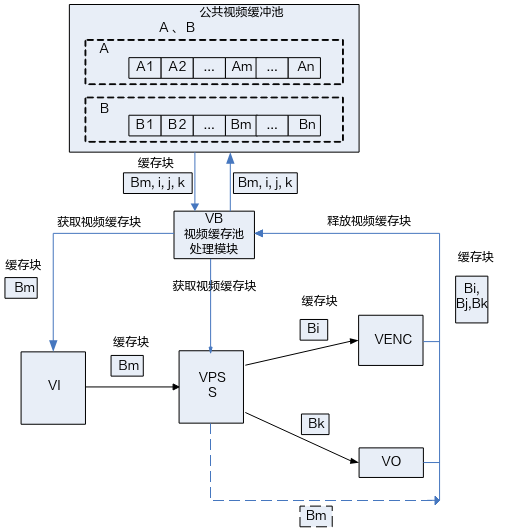

# 系统控制<a name="ZH-CN_TOPIC_0000002408259894"></a>


## 概述<a name="ZH-CN_TOPIC_0000002441659353"></a>

系统控制根据芯片特性，完成硬件各个部件的复位、基本初始化工作，同时负责完成MPP（Media Process Platform媒体处理平台）系统各个业务模块的初始化、去初始化以及管理MPP系统各个业务模块的工作状态、提供当前MPP系统的版本信息、提供大块物理内存管理等功能。

应用程序启动MPP业务前，必须完成MPP系统初始化工作。同理，应用程序退出MPP业务后，也要完成MPP系统去初始化工作，释放资源。

> **须知：** 
>-   无特殊说明，SS625V100/SS626V100的描述与SS528V100一致，SS524V100的描述与SS522V100一致**。**
>-   SS528V100、SS625V100和SS524V100不支持低延时、拼接和MCF

## 重要概念<a name="ZH-CN_TOPIC_0000002408259854"></a>


### 低延时<a name="ZH-CN_TOPIC_0000002441659161"></a>

低延时指图像写出指定的行数到DDR后，前端模块上报中断，把图像发给后端模块处理，可以减少通路延时，且前后端模块采用特定机制保证图像是先写后读，不会出现读图像错误。

> **须知：** 
>-   各模块低延时开启会与一些特定功能组合存在冲突，具体开启的方法及对应的限制参考各模块章节中相关的低延时描述。
>-   SS928V100/SS626V100支持低延时，支持的模块分别见[表1](#_Ref71645661)和[表2](#_Toc74057716)，未在列表中的模块不支持低延时。

**表 1**  SS928V100 支持低延时的模块列表

<a name="_Ref71645661"></a>
<table><thead align="left"><tr id="row6780mcpsimp"><th class="cellrowborder" valign="top" width="43%" id="mcps1.2.3.1.1"><p id="p6782mcpsimp"><a name="p6782mcpsimp"></a><a name="p6782mcpsimp"></a>支持低延时的模块</p>
</th>
<th class="cellrowborder" valign="top" width="56.99999999999999%" id="mcps1.2.3.1.2"><p id="p6784mcpsimp"><a name="p6784mcpsimp"></a><a name="p6784mcpsimp"></a>备注</p>
</th>
</tr>
</thead>
<tbody><tr id="row6786mcpsimp"><td class="cellrowborder" valign="top" width="43%" headers="mcps1.2.3.1.1 "><p id="p6788mcpsimp"><a name="p6788mcpsimp"></a><a name="p6788mcpsimp"></a>VI</p>
</td>
<td class="cellrowborder" valign="top" width="56.99999999999999%" headers="mcps1.2.3.1.2 "><p id="p6790mcpsimp"><a name="p6790mcpsimp"></a><a name="p6790mcpsimp"></a>支持输出低延时</p>
</td>
</tr>
<tr id="row6791mcpsimp"><td class="cellrowborder" valign="top" width="43%" headers="mcps1.2.3.1.1 "><p id="p6793mcpsimp"><a name="p6793mcpsimp"></a><a name="p6793mcpsimp"></a>MCF</p>
</td>
<td class="cellrowborder" valign="top" width="56.99999999999999%" headers="mcps1.2.3.1.2 "><p id="p6795mcpsimp"><a name="p6795mcpsimp"></a><a name="p6795mcpsimp"></a>支持输入、输出低延时</p>
</td>
</tr>
<tr id="row6796mcpsimp"><td class="cellrowborder" valign="top" width="43%" headers="mcps1.2.3.1.1 "><p id="p6798mcpsimp"><a name="p6798mcpsimp"></a><a name="p6798mcpsimp"></a>VPSS</p>
</td>
<td class="cellrowborder" valign="top" width="56.99999999999999%" headers="mcps1.2.3.1.2 "><p id="p6800mcpsimp"><a name="p6800mcpsimp"></a><a name="p6800mcpsimp"></a>支持输入、输出低延时</p>
</td>
</tr>
<tr id="row6801mcpsimp"><td class="cellrowborder" valign="top" width="43%" headers="mcps1.2.3.1.1 "><p id="p6803mcpsimp"><a name="p6803mcpsimp"></a><a name="p6803mcpsimp"></a>VO</p>
</td>
<td class="cellrowborder" valign="top" width="56.99999999999999%" headers="mcps1.2.3.1.2 "><p id="p6805mcpsimp"><a name="p6805mcpsimp"></a><a name="p6805mcpsimp"></a>支持输入低延时</p>
</td>
</tr>
<tr id="row6806mcpsimp"><td class="cellrowborder" valign="top" width="43%" headers="mcps1.2.3.1.1 "><p id="p6808mcpsimp"><a name="p6808mcpsimp"></a><a name="p6808mcpsimp"></a>VDEC</p>
</td>
<td class="cellrowborder" valign="top" width="56.99999999999999%" headers="mcps1.2.3.1.2 "><p id="p6810mcpsimp"><a name="p6810mcpsimp"></a><a name="p6810mcpsimp"></a>支持输入、输出低延时</p>
</td>
</tr>
<tr id="row6811mcpsimp"><td class="cellrowborder" valign="top" width="43%" headers="mcps1.2.3.1.1 "><p id="p6813mcpsimp"><a name="p6813mcpsimp"></a><a name="p6813mcpsimp"></a>VENC</p>
</td>
<td class="cellrowborder" valign="top" width="56.99999999999999%" headers="mcps1.2.3.1.2 "><p id="p6815mcpsimp"><a name="p6815mcpsimp"></a><a name="p6815mcpsimp"></a>支持输入、输出低延时</p>
</td>
</tr>
</tbody>
</table>

**表 2**  SS626V100 支持低延时的模块列表

<a name="_Toc74057716"></a>
<table><thead align="left"><tr id="row6821mcpsimp"><th class="cellrowborder" valign="top" width="43%" id="mcps1.2.3.1.1"><p id="p6823mcpsimp"><a name="p6823mcpsimp"></a><a name="p6823mcpsimp"></a>支持低延时的模块</p>
</th>
<th class="cellrowborder" valign="top" width="56.99999999999999%" id="mcps1.2.3.1.2"><p id="p6825mcpsimp"><a name="p6825mcpsimp"></a><a name="p6825mcpsimp"></a>备注</p>
</th>
</tr>
</thead>
<tbody><tr id="row6827mcpsimp"><td class="cellrowborder" valign="top" width="43%" headers="mcps1.2.3.1.1 "><p id="p6829mcpsimp"><a name="p6829mcpsimp"></a><a name="p6829mcpsimp"></a>VPSS</p>
</td>
<td class="cellrowborder" valign="top" width="56.99999999999999%" headers="mcps1.2.3.1.2 "><p id="p6831mcpsimp"><a name="p6831mcpsimp"></a><a name="p6831mcpsimp"></a>支持输入、输出低延时</p>
</td>
</tr>
<tr id="row6832mcpsimp"><td class="cellrowborder" valign="top" width="43%" headers="mcps1.2.3.1.1 "><p id="p6834mcpsimp"><a name="p6834mcpsimp"></a><a name="p6834mcpsimp"></a>VO</p>
</td>
<td class="cellrowborder" valign="top" width="56.99999999999999%" headers="mcps1.2.3.1.2 "><p id="p6836mcpsimp"><a name="p6836mcpsimp"></a><a name="p6836mcpsimp"></a>支持输入低延时</p>
</td>
</tr>
<tr id="row6837mcpsimp"><td class="cellrowborder" valign="top" width="43%" headers="mcps1.2.3.1.1 "><p id="p6839mcpsimp"><a name="p6839mcpsimp"></a><a name="p6839mcpsimp"></a>VDEC</p>
</td>
<td class="cellrowborder" valign="top" width="56.99999999999999%" headers="mcps1.2.3.1.2 "><p id="p6841mcpsimp"><a name="p6841mcpsimp"></a><a name="p6841mcpsimp"></a>支持输入、输出低延时</p>
</td>
</tr>
</tbody>
</table>

## 功能描述<a name="ZH-CN_TOPIC_0000002408100026"></a>


### 视频缓存池<a name="ZH-CN_TOPIC_0000002408259890"></a>

视频缓存池主要向媒体业务提供大块物理内存管理功能，负责内存的分配和回收，充分发挥内存缓存池的作用，让物理内存资源在各个媒体处理模块中合理使用。

一组大小相同、物理地址连续的缓存块组成一个视频缓存池。必须在系统初始化之前配置公共视频缓存池。根据业务的不同，公共缓存池的数量、缓存块的大小和数量不同。

所有的视频输入通道都可以从公共视频缓存池中获取视频缓存块用于保存采集的图像，如[图1](#fig17183122371915)中所示VI从公共视频缓存池B中获取视频缓存块Bm,缓存块Bm经 VI发送给VPSS，输入缓存块Bm经过VPSS处理之后被释放回公共视频缓存池。假设VPSS通道的工作模式是USER，则VPSS通道0从公共视频缓存池B中获取缓存块Bi作为输出图像缓存buffer发送给VENC，VPSS通道1从公共视频缓存池B中获取缓存块Bk作为输出图像缓存buffer发送给VO，Bi经VENC编码完之后释放回公共视频缓存池，Bk经VO显示完之后释放回公共视频缓存池。

**图 1**  典型的公共视频缓存池数据流图<a name="fig17183122371915"></a>  


不同类型的视频缓存池大小计算请参考代码ot\_buffer.h

> **须知：** 
>SS528V100/SS524V100当图像宽度小于等于256且是紧凑段压缩时，通过ot\_common\_get\_pic\_buf\_size接口获取到的内存大小与非紧凑段压缩大小相等。
>SS928V100分配MCF场景所需buffer时，如果mono路不是亮度单分量图像，则需使用ot\_vpss\_get\_mcf\_color\_buf\_size计算buffer大小。

**表 1**  ot\_buffer.h中视频缓存池大小计算接口简介

<a name="_Ref33545836"></a>
<table><thead align="left"><tr id="row4391mcpsimp"><th class="cellrowborder" valign="top" width="39%" id="mcps1.2.3.1.1"><p id="p4393mcpsimp"><a name="p4393mcpsimp"></a><a name="p4393mcpsimp"></a>视频缓存池大小计算接口</p>
</th>
<th class="cellrowborder" valign="top" width="61%" id="mcps1.2.3.1.2"><p id="p4395mcpsimp"><a name="p4395mcpsimp"></a><a name="p4395mcpsimp"></a>接口简介</p>
</th>
</tr>
</thead>
<tbody><tr id="row4397mcpsimp"><td class="cellrowborder" valign="top" width="39%" headers="mcps1.2.3.1.1 "><p id="ss_common_get_pic_buf_cfg"><a name="ss_common_get_pic_buf_cfg"></a><a name="ss_common_get_pic_buf_cfg"></a>ot_common_get_pic_buf_cfg</p>
</td>
<td class="cellrowborder" valign="top" width="61%" headers="mcps1.2.3.1.2 "><p id="p4400mcpsimp"><a name="p4400mcpsimp"></a><a name="p4400mcpsimp"></a>一般linear格式的YUV或者raw数据缓存池配置，VI/VPSS模块紧凑段压缩格式需使用单独计算接口</p>
</td>
</tr>
<tr id="row4401mcpsimp"><td class="cellrowborder" valign="top" width="39%" headers="mcps1.2.3.1.1 "><p id="p4403mcpsimp"><a name="p4403mcpsimp"></a><a name="p4403mcpsimp"></a>ot_common_get_pic_buf_size</p>
</td>
<td class="cellrowborder" valign="top" width="61%" headers="mcps1.2.3.1.2 "><p id="p4405mcpsimp"><a name="p4405mcpsimp"></a><a name="p4405mcpsimp"></a>一般linear格式的YUV或者raw数据缓存池大小，VI/VPSS模块紧凑段压缩格式需使用单独计算接口</p>
</td>
</tr>
<tr id="row4406mcpsimp"><td class="cellrowborder" valign="top" width="39%" headers="mcps1.2.3.1.1 "><p id="p4408mcpsimp"><a name="p4408mcpsimp"></a><a name="p4408mcpsimp"></a>ot_hnr_get_pic_buf_size</p>
</td>
<td class="cellrowborder" valign="top" width="61%" headers="mcps1.2.3.1.2 "><p id="p4410mcpsimp"><a name="p4410mcpsimp"></a><a name="p4410mcpsimp"></a>HNR使用的帧数据缓存池，仅SS928V100支持</p>
</td>
</tr>
<tr id="row1659635044014"><td class="cellrowborder" valign="top" width="39%" headers="mcps1.2.3.1.1 "><p id="p125966503408"><a name="p125966503408"></a><a name="p125966503408"></a>ot_common_vi_get_raw_buf_cfg_with_compress_ratio</p>
</td>
<td class="cellrowborder" valign="top" width="61%" headers="mcps1.2.3.1.2 "><p id="p1059655054019"><a name="p1059655054019"></a><a name="p1059655054019"></a>raw数据根据压缩率获取缓存池配置，仅SS928V100支持</p>
</td>
</tr>
<tr id="row4411mcpsimp"><td class="cellrowborder" valign="top" width="39%" headers="mcps1.2.3.1.1 "><p id="p4413mcpsimp"><a name="p4413mcpsimp"></a><a name="p4413mcpsimp"></a>ot_vdec_get_pic_buf_size</p>
</td>
<td class="cellrowborder" valign="top" width="61%" headers="mcps1.2.3.1.2 "><p id="p4415mcpsimp"><a name="p4415mcpsimp"></a><a name="p4415mcpsimp"></a>VDEC输出的YUV帧存缓存池</p>
</td>
</tr>
<tr id="row4416mcpsimp"><td class="cellrowborder" valign="top" width="39%" headers="mcps1.2.3.1.1 "><p id="p4418mcpsimp"><a name="p4418mcpsimp"></a><a name="p4418mcpsimp"></a>ot_vdec_get_tmv_buf_size</p>
</td>
<td class="cellrowborder" valign="top" width="61%" headers="mcps1.2.3.1.2 "><p id="p4420mcpsimp"><a name="p4420mcpsimp"></a><a name="p4420mcpsimp"></a>VDEC输出的Tmv数据缓存池</p>
</td>
</tr>
<tr id="row4421mcpsimp"><td class="cellrowborder" valign="top" width="39%" headers="mcps1.2.3.1.1 "><p id="p4423mcpsimp"><a name="p4423mcpsimp"></a><a name="p4423mcpsimp"></a>ot_venc_get_pic_info_buf_size</p>
</td>
<td class="cellrowborder" valign="top" width="61%" headers="mcps1.2.3.1.2 "><p id="p4425mcpsimp"><a name="p4425mcpsimp"></a><a name="p4425mcpsimp"></a>VENC Picture信息VB大小，支持帧节省模式计算</p>
</td>
</tr>
<tr id="row4426mcpsimp"><td class="cellrowborder" valign="top" width="39%" headers="mcps1.2.3.1.1 "><p id="p4428mcpsimp"><a name="p4428mcpsimp"></a><a name="p4428mcpsimp"></a>ot_venc_get_pic_buf_size</p>
</td>
<td class="cellrowborder" valign="top" width="61%" headers="mcps1.2.3.1.2 "><p id="p4430mcpsimp"><a name="p4430mcpsimp"></a><a name="p4430mcpsimp"></a>VENC Picture VB大小，支持帧节省模式计算</p>
</td>
</tr>
<tr id="row4431mcpsimp"><td class="cellrowborder" valign="top" width="39%" headers="mcps1.2.3.1.1 "><p id="p4433mcpsimp"><a name="p4433mcpsimp"></a><a name="p4433mcpsimp"></a>ot_venc_get_ref_buf_size</p>
</td>
<td class="cellrowborder" valign="top" width="61%" headers="mcps1.2.3.1.2 "><p id="p4435mcpsimp"><a name="p4435mcpsimp"></a><a name="p4435mcpsimp"></a>VENC参考帧大小，SS928V100/SS626V100不支持</p>
</td>
</tr>
<tr id="row4436mcpsimp"><td class="cellrowborder" valign="top" width="39%" headers="mcps1.2.3.1.1 "><p id="p4438mcpsimp"><a name="p4438mcpsimp"></a><a name="p4438mcpsimp"></a>ot_venc_get_ref_pic_info_buf_size</p>
</td>
<td class="cellrowborder" valign="top" width="61%" headers="mcps1.2.3.1.2 "><p id="p4440mcpsimp"><a name="p4440mcpsimp"></a><a name="p4440mcpsimp"></a>VENC参考帧信息（pme、pmeinfo、tmv）大小</p>
<p id="p1492375163114"><a name="p1492375163114"></a><a name="p1492375163114"></a>SS928V100/SS626V100不支持</p>
</td>
</tr>
<tr id="row4441mcpsimp"><td class="cellrowborder" valign="top" width="39%" headers="mcps1.2.3.1.1 "><p id="p4443mcpsimp"><a name="p4443mcpsimp"></a><a name="p4443mcpsimp"></a>ot_venc_get_qpmap_size</p>
</td>
<td class="cellrowborder" valign="top" width="61%" headers="mcps1.2.3.1.2 "><p id="p4445mcpsimp"><a name="p4445mcpsimp"></a><a name="p4445mcpsimp"></a>qpmap映射表大小</p>
</td>
</tr>
<tr id="row4446mcpsimp"><td class="cellrowborder" valign="top" width="39%" headers="mcps1.2.3.1.1 "><p id="p4448mcpsimp"><a name="p4448mcpsimp"></a><a name="p4448mcpsimp"></a>ot_venc_get_qpmap_stride</p>
</td>
<td class="cellrowborder" valign="top" width="61%" headers="mcps1.2.3.1.2 "><p id="p4450mcpsimp"><a name="p4450mcpsimp"></a><a name="p4450mcpsimp"></a>qpmap映射表stride</p>
</td>
</tr>
<tr id="row4461mcpsimp"><td class="cellrowborder" valign="top" width="39%" headers="mcps1.2.3.1.1 "><p id="p4463mcpsimp"><a name="p4463mcpsimp"></a><a name="p4463mcpsimp"></a>ot_venc_get_roimap_size</p>
</td>
<td class="cellrowborder" valign="top" width="61%" headers="mcps1.2.3.1.2 "><p id="p4465mcpsimp"><a name="p4465mcpsimp"></a><a name="p4465mcpsimp"></a>roi map映射表大小</p>
</td>
</tr>
<tr id="row4466mcpsimp"><td class="cellrowborder" valign="top" width="39%" headers="mcps1.2.3.1.1 "><p id="p4468mcpsimp"><a name="p4468mcpsimp"></a><a name="p4468mcpsimp"></a>ot_venc_get_roimap_stride</p>
</td>
<td class="cellrowborder" valign="top" width="61%" headers="mcps1.2.3.1.2 "><p id="p4470mcpsimp"><a name="p4470mcpsimp"></a><a name="p4470mcpsimp"></a>roi map映射表stride</p>
</td>
</tr>
<tr id="row087144619426"><td class="cellrowborder" valign="top" width="39%" headers="mcps1.2.3.1.1 "><p id="p13872194619421"><a name="p13872194619421"></a><a name="p13872194619421"></a>ot_venc_get_skip_weight_size</p>
</td>
<td class="cellrowborder" valign="top" width="61%" headers="mcps1.2.3.1.2 "><p id="p087234614218"><a name="p087234614218"></a><a name="p087234614218"></a>skip weight映射表大小</p>
</td>
</tr>
<tr id="row6443353154217"><td class="cellrowborder" valign="top" width="39%" headers="mcps1.2.3.1.1 "><p id="p174434534429"><a name="p174434534429"></a><a name="p174434534429"></a>ot_venc_get_skip_weight_stride</p>
</td>
<td class="cellrowborder" valign="top" width="61%" headers="mcps1.2.3.1.2 "><p id="p14432538425"><a name="p14432538425"></a><a name="p14432538425"></a>skip weight映射表stride</p>
</td>
</tr>
<tr id="row4471mcpsimp"><td class="cellrowborder" valign="top" width="39%" headers="mcps1.2.3.1.1 "><p id="p4473mcpsimp"><a name="p4473mcpsimp"></a><a name="p4473mcpsimp"></a>ot_avs_get_buf_size</p>
</td>
<td class="cellrowborder" valign="top" width="61%" headers="mcps1.2.3.1.2 "><p id="p4475mcpsimp"><a name="p4475mcpsimp"></a><a name="p4475mcpsimp"></a>AVS输入的YUV数据缓存池，仅SS928V100支持</p>
</td>
</tr>
<tr id="row4476mcpsimp"><td class="cellrowborder" valign="top" width="39%" headers="mcps1.2.3.1.1 "><p id="p4478mcpsimp"><a name="p4478mcpsimp"></a><a name="p4478mcpsimp"></a>ot_vpss_get_mcf_color_buf_size</p>
</td>
<td class="cellrowborder" valign="top" width="61%" headers="mcps1.2.3.1.2 "><p id="p4480mcpsimp"><a name="p4480mcpsimp"></a><a name="p4480mcpsimp"></a>MCF场景彩色通路VPSS通道VB大小，仅SS928V100支持</p>
</td>
</tr>
<tr id="row4481mcpsimp"><td class="cellrowborder" valign="top" width="39%" headers="mcps1.2.3.1.1 "><p id="p4483mcpsimp"><a name="p4483mcpsimp"></a><a name="p4483mcpsimp"></a>ot_vpss_get_mcf_mono_buf_size</p>
</td>
<td class="cellrowborder" valign="top" width="61%" headers="mcps1.2.3.1.2 "><p id="p4485mcpsimp"><a name="p4485mcpsimp"></a><a name="p4485mcpsimp"></a>MCF场景黑白通路VPSS通道VB大小，仅SS928V100支持</p>
</td>
</tr>
<tr id="row4486mcpsimp"><td class="cellrowborder" valign="top" width="39%" headers="mcps1.2.3.1.1 "><p id="p4488mcpsimp"><a name="p4488mcpsimp"></a><a name="p4488mcpsimp"></a>ot_common_get_vi_compact_seg_buf_size</p>
</td>
<td class="cellrowborder" valign="top" width="61%" headers="mcps1.2.3.1.2 "><p id="p4490mcpsimp"><a name="p4490mcpsimp"></a><a name="p4490mcpsimp"></a>VI输出的YUV数据缓存池大小，仅SS928V100支持</p>
</td>
</tr>
<tr id="row4491mcpsimp"><td class="cellrowborder" valign="top" width="39%" headers="mcps1.2.3.1.1 "><p id="p4493mcpsimp"><a name="p4493mcpsimp"></a><a name="p4493mcpsimp"></a>ot_common_get_vpss_compact_seg_buf_size</p>
</td>
<td class="cellrowborder" valign="top" width="61%" headers="mcps1.2.3.1.2 "><p id="p4495mcpsimp"><a name="p4495mcpsimp"></a><a name="p4495mcpsimp"></a>VPSS输出的YUV数据缓存池大小，仅SS928V100支持</p>
</td>
</tr>
</tbody>
</table>

### 系统绑定<a name="ZH-CN_TOPIC_0000002408099906"></a>

MPP提供系统绑定接口（[ss\_mpi\_sys\_bind](#ZH-CN_TOPIC_0000002441659349)），即通过数据接收者绑定数据源来建立两者之间的关联关系（只允许数据接收者绑定数据源）。绑定后，数据源生成的数据将自动发送给接收者。目前MPP支持的绑定关系如[表1](#_Ref289523395)所示。

**表 1**  MPP支持的绑定关系

<a name="_Ref289523395"></a>
<table><thead align="left"><tr id="row2513mcpsimp"><th class="cellrowborder" valign="top" width="33%" id="mcps1.2.3.1.1"><p id="p2515mcpsimp"><a name="p2515mcpsimp"></a><a name="p2515mcpsimp"></a>数据源</p>
</th>
<th class="cellrowborder" valign="top" width="67%" id="mcps1.2.3.1.2"><p id="p2517mcpsimp"><a name="p2517mcpsimp"></a><a name="p2517mcpsimp"></a>数据接收者</p>
</th>
</tr>
</thead>
<tbody><tr id="row2519mcpsimp"><td class="cellrowborder" rowspan="5" valign="top" width="33%" headers="mcps1.2.3.1.1 "><p id="p2521mcpsimp"><a name="p2521mcpsimp"></a><a name="p2521mcpsimp"></a>VI</p>
</td>
<td class="cellrowborder" valign="top" width="67%" headers="mcps1.2.3.1.2 "><p id="p2523mcpsimp"><a name="p2523mcpsimp"></a><a name="p2523mcpsimp"></a>VO</p>
</td>
</tr>
<tr id="row2524mcpsimp"><td class="cellrowborder" valign="top" headers="mcps1.2.3.1.1 "><p id="p2526mcpsimp"><a name="p2526mcpsimp"></a><a name="p2526mcpsimp"></a>VENC</p>
</td>
</tr>
<tr id="row2527mcpsimp"><td class="cellrowborder" valign="top" headers="mcps1.2.3.1.1 "><p id="p2529mcpsimp"><a name="p2529mcpsimp"></a><a name="p2529mcpsimp"></a>VPSS</p>
</td>
</tr>
<tr id="row2530mcpsimp"><td class="cellrowborder" valign="top" headers="mcps1.2.3.1.1 "><p id="p2532mcpsimp"><a name="p2532mcpsimp"></a><a name="p2532mcpsimp"></a>PCIV</p>
</td>
</tr>
<tr id="row2533mcpsimp"><td class="cellrowborder" valign="top" headers="mcps1.2.3.1.1 "><p id="p2535mcpsimp"><a name="p2535mcpsimp"></a><a name="p2535mcpsimp"></a>VI（虚拟PIPE）</p>
</td>
</tr>
<tr id="row2536mcpsimp"><td class="cellrowborder" rowspan="6" valign="top" width="33%" headers="mcps1.2.3.1.1 "><p id="p2538mcpsimp"><a name="p2538mcpsimp"></a><a name="p2538mcpsimp"></a>VPSS</p>
</td>
<td class="cellrowborder" valign="top" width="67%" headers="mcps1.2.3.1.2 "><p id="p2540mcpsimp"><a name="p2540mcpsimp"></a><a name="p2540mcpsimp"></a>VO</p>
</td>
</tr>
<tr id="row2541mcpsimp"><td class="cellrowborder" valign="top" headers="mcps1.2.3.1.1 "><p id="p2543mcpsimp"><a name="p2543mcpsimp"></a><a name="p2543mcpsimp"></a>VENC</p>
</td>
</tr>
<tr id="row2544mcpsimp"><td class="cellrowborder" valign="top" headers="mcps1.2.3.1.1 "><p id="p2546mcpsimp"><a name="p2546mcpsimp"></a><a name="p2546mcpsimp"></a>PCIV</p>
</td>
</tr>
<tr id="row2547mcpsimp"><td class="cellrowborder" valign="top" headers="mcps1.2.3.1.1 "><p id="p2549mcpsimp"><a name="p2549mcpsimp"></a><a name="p2549mcpsimp"></a>VPSS</p>
</td>
</tr>
<tr id="row2550mcpsimp"><td class="cellrowborder" valign="top" headers="mcps1.2.3.1.1 "><p id="p2552mcpsimp"><a name="p2552mcpsimp"></a><a name="p2552mcpsimp"></a>AVS</p>
</td>
</tr>
<tr id="row2553mcpsimp"><td class="cellrowborder" valign="top" headers="mcps1.2.3.1.1 "><p id="p2555mcpsimp"><a name="p2555mcpsimp"></a><a name="p2555mcpsimp"></a>VI（虚拟PIPE）</p>
</td>
</tr>
<tr id="row2556mcpsimp"><td class="cellrowborder" rowspan="5" valign="top" width="33%" headers="mcps1.2.3.1.1 "><p id="p2558mcpsimp"><a name="p2558mcpsimp"></a><a name="p2558mcpsimp"></a>VDEC</p>
</td>
<td class="cellrowborder" valign="top" width="67%" headers="mcps1.2.3.1.2 "><p id="p2560mcpsimp"><a name="p2560mcpsimp"></a><a name="p2560mcpsimp"></a>VPSS</p>
</td>
</tr>
<tr id="row2561mcpsimp"><td class="cellrowborder" valign="top" headers="mcps1.2.3.1.1 "><p id="p2563mcpsimp"><a name="p2563mcpsimp"></a><a name="p2563mcpsimp"></a>VO</p>
</td>
</tr>
<tr id="row2564mcpsimp"><td class="cellrowborder" valign="top" headers="mcps1.2.3.1.1 "><p id="p2566mcpsimp"><a name="p2566mcpsimp"></a><a name="p2566mcpsimp"></a>VENC</p>
</td>
</tr>
<tr id="row2567mcpsimp"><td class="cellrowborder" valign="top" headers="mcps1.2.3.1.1 "><p id="p2569mcpsimp"><a name="p2569mcpsimp"></a><a name="p2569mcpsimp"></a>PCIV</p>
</td>
</tr>
<tr id="row2570mcpsimp"><td class="cellrowborder" valign="top" headers="mcps1.2.3.1.1 "><p id="p2572mcpsimp"><a name="p2572mcpsimp"></a><a name="p2572mcpsimp"></a>VI（虚拟PIPE）</p>
</td>
</tr>
<tr id="row2573mcpsimp"><td class="cellrowborder" rowspan="5" valign="top" width="33%" headers="mcps1.2.3.1.1 "><p id="p2575mcpsimp"><a name="p2575mcpsimp"></a><a name="p2575mcpsimp"></a>VO（WBC）</p>
</td>
<td class="cellrowborder" valign="top" width="67%" headers="mcps1.2.3.1.2 "><p id="p2577mcpsimp"><a name="p2577mcpsimp"></a><a name="p2577mcpsimp"></a>VO</p>
</td>
</tr>
<tr id="row2578mcpsimp"><td class="cellrowborder" valign="top" headers="mcps1.2.3.1.1 "><p id="p2580mcpsimp"><a name="p2580mcpsimp"></a><a name="p2580mcpsimp"></a>VENC</p>
</td>
</tr>
<tr id="row2581mcpsimp"><td class="cellrowborder" valign="top" headers="mcps1.2.3.1.1 "><p id="p2583mcpsimp"><a name="p2583mcpsimp"></a><a name="p2583mcpsimp"></a>VPSS</p>
</td>
</tr>
<tr id="row2584mcpsimp"><td class="cellrowborder" valign="top" headers="mcps1.2.3.1.1 "><p id="p2586mcpsimp"><a name="p2586mcpsimp"></a><a name="p2586mcpsimp"></a>PCIV</p>
</td>
</tr>
<tr id="row2587mcpsimp"><td class="cellrowborder" valign="top" headers="mcps1.2.3.1.1 "><p id="p2589mcpsimp"><a name="p2589mcpsimp"></a><a name="p2589mcpsimp"></a>VI（虚拟PIPE）</p>
</td>
</tr>
<tr id="row2590mcpsimp"><td class="cellrowborder" rowspan="5" valign="top" width="33%" headers="mcps1.2.3.1.1 "><p id="p2592mcpsimp"><a name="p2592mcpsimp"></a><a name="p2592mcpsimp"></a>AVS</p>
</td>
<td class="cellrowborder" valign="top" width="67%" headers="mcps1.2.3.1.2 "><p id="p2594mcpsimp"><a name="p2594mcpsimp"></a><a name="p2594mcpsimp"></a>VPSS</p>
</td>
</tr>
<tr id="row2595mcpsimp"><td class="cellrowborder" valign="top" headers="mcps1.2.3.1.1 "><p id="p2597mcpsimp"><a name="p2597mcpsimp"></a><a name="p2597mcpsimp"></a>VENC</p>
</td>
</tr>
<tr id="row2598mcpsimp"><td class="cellrowborder" valign="top" headers="mcps1.2.3.1.1 "><p id="p2600mcpsimp"><a name="p2600mcpsimp"></a><a name="p2600mcpsimp"></a>VO</p>
</td>
</tr>
<tr id="row2601mcpsimp"><td class="cellrowborder" valign="top" headers="mcps1.2.3.1.1 "><p id="p2603mcpsimp"><a name="p2603mcpsimp"></a><a name="p2603mcpsimp"></a>PCIV</p>
</td>
</tr>
<tr id="row2604mcpsimp"><td class="cellrowborder" valign="top" headers="mcps1.2.3.1.1 "><p id="p2606mcpsimp"><a name="p2606mcpsimp"></a><a name="p2606mcpsimp"></a>VI（虚拟PIPE）</p>
</td>
</tr>
<tr id="row2607mcpsimp"><td class="cellrowborder" rowspan="2" valign="top" width="33%" headers="mcps1.2.3.1.1 "><p id="p2609mcpsimp"><a name="p2609mcpsimp"></a><a name="p2609mcpsimp"></a>AI</p>
</td>
<td class="cellrowborder" valign="top" width="67%" headers="mcps1.2.3.1.2 "><p id="p2611mcpsimp"><a name="p2611mcpsimp"></a><a name="p2611mcpsimp"></a>AENC</p>
</td>
</tr>
<tr id="row2612mcpsimp"><td class="cellrowborder" valign="top" headers="mcps1.2.3.1.1 "><p id="p2614mcpsimp"><a name="p2614mcpsimp"></a><a name="p2614mcpsimp"></a>AO</p>
</td>
</tr>
<tr id="row2615mcpsimp"><td class="cellrowborder" valign="top" width="33%" headers="mcps1.2.3.1.1 "><p id="p2617mcpsimp"><a name="p2617mcpsimp"></a><a name="p2617mcpsimp"></a>ADEC</p>
</td>
<td class="cellrowborder" valign="top" width="67%" headers="mcps1.2.3.1.2 "><p id="p2619mcpsimp"><a name="p2619mcpsimp"></a><a name="p2619mcpsimp"></a>AO</p>
</td>
</tr>
<tr id="row2620mcpsimp"><td class="cellrowborder" rowspan="3" valign="top" width="33%" headers="mcps1.2.3.1.1 "><p id="p2622mcpsimp"><a name="p2622mcpsimp"></a><a name="p2622mcpsimp"></a>PCIV</p>
</td>
<td class="cellrowborder" valign="top" width="67%" headers="mcps1.2.3.1.2 "><p id="p2624mcpsimp"><a name="p2624mcpsimp"></a><a name="p2624mcpsimp"></a>VPSS</p>
</td>
</tr>
<tr id="row2625mcpsimp"><td class="cellrowborder" valign="top" headers="mcps1.2.3.1.1 "><p id="p2627mcpsimp"><a name="p2627mcpsimp"></a><a name="p2627mcpsimp"></a>VENC</p>
</td>
</tr>
<tr id="row2628mcpsimp"><td class="cellrowborder" valign="top" headers="mcps1.2.3.1.1 "><p id="p2630mcpsimp"><a name="p2630mcpsimp"></a><a name="p2630mcpsimp"></a>VO</p>
</td>
</tr>
<tr id="row2631mcpsimp"><td class="cellrowborder" rowspan="4" valign="top" width="33%" headers="mcps1.2.3.1.1 "><p id="p2633mcpsimp"><a name="p2633mcpsimp"></a><a name="p2633mcpsimp"></a>MCF</p>
</td>
<td class="cellrowborder" valign="top" width="67%" headers="mcps1.2.3.1.2 "><p id="p2635mcpsimp"><a name="p2635mcpsimp"></a><a name="p2635mcpsimp"></a>VO</p>
</td>
</tr>
<tr id="row2636mcpsimp"><td class="cellrowborder" valign="top" headers="mcps1.2.3.1.1 "><p id="p2638mcpsimp"><a name="p2638mcpsimp"></a><a name="p2638mcpsimp"></a>VENC</p>
</td>
</tr>
<tr id="row2639mcpsimp"><td class="cellrowborder" valign="top" headers="mcps1.2.3.1.1 "><p id="p2641mcpsimp"><a name="p2641mcpsimp"></a><a name="p2641mcpsimp"></a>VPSS</p>
</td>
</tr>
<tr id="row2642mcpsimp"><td class="cellrowborder" valign="top" headers="mcps1.2.3.1.1 "><p id="p2644mcpsimp"><a name="p2644mcpsimp"></a><a name="p2644mcpsimp"></a>VI（虚拟PIPE）</p>
</td>
</tr>
</tbody>
</table>

### 强制销毁VB功能<a name="ZH-CN_TOPIC_0000002408259930"></a>

VB在占用状态时无法被销毁，插入xx\_base.ko时加上模块参数g\_vb\_force\_exit=1，即使VB正在被使用也可强制销毁，因此请谨慎使用此功能，需保证业务正常运行时不可主动销毁VB，必须待所有业务完全退出之后才能主动销毁VB。

> **须知：** 
>强制销毁VB功能是为了应用程序异常崩溃之后方便业务重启而设计的：用户态应用程序异常崩溃之后，应用程序已经无法按正常的业务退出流程操作，此时重启业务前须先进行[ss\_mpi\_sys\_exit](#ZH-CN_TOPIC_0000002441699041)和[ss\_mpi\_vb\_exit](#ZH-CN_TOPIC_0000002441699081)把上次应用程序异常崩溃之后无法销毁的VB资源先销毁，然后再进行正常的业务重启流程。

### VI和VPSS工作模式<a name="ZH-CN_TOPIC_0000002441699097"></a>

VI和VPSS各自的工作模式分为在线，离线，工作模式说明如[表1](#_Ref48202819)所示。

**表 1**  VI和VPSS的工作模式说明

<a name="_Ref48202819"></a>
<table><thead align="left"><tr id="row3392mcpsimp"><th class="cellrowborder" valign="top" width="20%" id="mcps1.2.4.1.1"><p id="p3394mcpsimp"><a name="p3394mcpsimp"></a><a name="p3394mcpsimp"></a>模式</p>
</th>
<th class="cellrowborder" valign="top" width="39%" id="mcps1.2.4.1.2"><p id="p3396mcpsimp"><a name="p3396mcpsimp"></a><a name="p3396mcpsimp"></a>VI_CAP与VI_PROC</p>
</th>
<th class="cellrowborder" valign="top" width="41%" id="mcps1.2.4.1.3"><p id="p3398mcpsimp"><a name="p3398mcpsimp"></a><a name="p3398mcpsimp"></a>VI_PROC与VPSS</p>
</th>
</tr>
</thead>
<tbody><tr id="row3400mcpsimp"><td class="cellrowborder" valign="top" width="20%" headers="mcps1.2.4.1.1 "><p id="p3402mcpsimp"><a name="p3402mcpsimp"></a><a name="p3402mcpsimp"></a>在线模式</p>
</td>
<td class="cellrowborder" valign="top" width="39%" headers="mcps1.2.4.1.2 "><p id="p3404mcpsimp"><a name="p3404mcpsimp"></a><a name="p3404mcpsimp"></a>VI_CAP与VI_PROC之间在线数据流传输，此模式下VI_CAP不会写出RAW数据到DDR，而是直接把数据流送给VI_PROC。</p>
</td>
<td class="cellrowborder" valign="top" width="41%" headers="mcps1.2.4.1.3 "><p id="p3406mcpsimp"><a name="p3406mcpsimp"></a><a name="p3406mcpsimp"></a>VI_PROC与VPSS之间的在线数据流传输，在此模式下VI_PROC不会写出YUV数据到DDR，而是直接把数据流送给VPSS。</p>
</td>
</tr>
<tr id="row3407mcpsimp"><td class="cellrowborder" valign="top" width="20%" headers="mcps1.2.4.1.1 "><p id="p3409mcpsimp"><a name="p3409mcpsimp"></a><a name="p3409mcpsimp"></a>离线模式</p>
</td>
<td class="cellrowborder" valign="top" width="39%" headers="mcps1.2.4.1.2 "><p id="p3411mcpsimp"><a name="p3411mcpsimp"></a><a name="p3411mcpsimp"></a>VI_CAP写出RAW数据到DDR，然后VI_PROC从DDR读取RAW数据进行后处理。</p>
</td>
<td class="cellrowborder" valign="top" width="41%" headers="mcps1.2.4.1.3 "><p id="p3413mcpsimp"><a name="p3413mcpsimp"></a><a name="p3413mcpsimp"></a>VI_PROC写出YUV数据到DDR，然后VPSS从DDR读取YUV数据进行后处理。</p>
</td>
</tr>
</tbody>
</table>

PIPE可以设置成多种工作模式，情况如下。

-   第0个PIPE可以有4种模式：
    -   VI在线VPSS离线
    -   VI在线VPSS在线
    -   VI离线VPSS离线
    -   VI离线VPSS在线

-   其他PIPE可以有2种模式：
    -   当第0个PIPE为VI离线VPSS在线时，绑定的其他PIPE只能设置VI离线VPSS在线。
    -   当第0个PIPE设置成其它模式时，绑定的其他PIPE只能为VI离线VPSS离线。

-   PIPE在不同的工作模式下可以进行切换，此时VI需要重建，情况如下：
    -   VI在线模式不能切换到VI离线模式。
    -   VI离线模式不能切换到VI在线模式。

> **说明：** 
>-   本文档中出现的“VI在线/离线”是指VI\_CAP与VI\_PROC之间的在线/离线模式。
>-   本文档中出现的“VPSS在线/离线”是指VI\_PROC与VPSS之间的在线/离线模式。

VI的PIPE工作模式请见[表2](#_Ref48202856)所示。

**表 2**  SS928V100 VI PIPE工作模式

<a name="_Ref48202856"></a>
<table><thead align="left"><tr id="row3445mcpsimp"><th class="cellrowborder" valign="top" width="32.67326732673268%" id="mcps1.2.6.1.1"><p id="p3447mcpsimp"><a name="p3447mcpsimp"></a><a name="p3447mcpsimp"></a>PIPE ID</p>
</th>
<th class="cellrowborder" valign="top" width="16.831683168316832%" id="mcps1.2.6.1.2"><p id="p3449mcpsimp"><a name="p3449mcpsimp"></a><a name="p3449mcpsimp"></a>0</p>
</th>
<th class="cellrowborder" valign="top" width="16.831683168316832%" id="mcps1.2.6.1.3"><p id="p3451mcpsimp"><a name="p3451mcpsimp"></a><a name="p3451mcpsimp"></a>1</p>
</th>
<th class="cellrowborder" valign="top" width="16.831683168316832%" id="mcps1.2.6.1.4"><p id="p3453mcpsimp"><a name="p3453mcpsimp"></a><a name="p3453mcpsimp"></a>2</p>
</th>
<th class="cellrowborder" valign="top" width="16.831683168316832%" id="mcps1.2.6.1.5"><p id="p3455mcpsimp"><a name="p3455mcpsimp"></a><a name="p3455mcpsimp"></a>3</p>
</th>
</tr>
</thead>
<tbody><tr id="row3456mcpsimp"><td class="cellrowborder" valign="top" width="32.67326732673268%" headers="mcps1.2.6.1.1 "><p id="p3458mcpsimp"><a name="p3458mcpsimp"></a><a name="p3458mcpsimp"></a>模式分布1</p>
</td>
<td class="cellrowborder" valign="top" width="16.831683168316832%" headers="mcps1.2.6.1.2 "><p id="p3460mcpsimp"><a name="p3460mcpsimp"></a><a name="p3460mcpsimp"></a>在线</p>
</td>
<td class="cellrowborder" valign="top" width="16.831683168316832%" headers="mcps1.2.6.1.3 "><p id="p3462mcpsimp"><a name="p3462mcpsimp"></a><a name="p3462mcpsimp"></a>离线</p>
</td>
<td class="cellrowborder" valign="top" width="16.831683168316832%" headers="mcps1.2.6.1.4 "><p id="p3464mcpsimp"><a name="p3464mcpsimp"></a><a name="p3464mcpsimp"></a>离线</p>
</td>
<td class="cellrowborder" valign="top" width="16.831683168316832%" headers="mcps1.2.6.1.5 "><p id="p3466mcpsimp"><a name="p3466mcpsimp"></a><a name="p3466mcpsimp"></a>离线</p>
</td>
</tr>
<tr id="row3467mcpsimp"><td class="cellrowborder" valign="top" width="32.67326732673268%" headers="mcps1.2.6.1.1 "><p id="p3469mcpsimp"><a name="p3469mcpsimp"></a><a name="p3469mcpsimp"></a>模式分布2</p>
</td>
<td class="cellrowborder" valign="top" width="16.831683168316832%" headers="mcps1.2.6.1.2 "><p id="p3471mcpsimp"><a name="p3471mcpsimp"></a><a name="p3471mcpsimp"></a>离线</p>
</td>
<td class="cellrowborder" valign="top" width="16.831683168316832%" headers="mcps1.2.6.1.3 "><p id="p3473mcpsimp"><a name="p3473mcpsimp"></a><a name="p3473mcpsimp"></a>离线</p>
</td>
<td class="cellrowborder" valign="top" width="16.831683168316832%" headers="mcps1.2.6.1.4 "><p id="p3475mcpsimp"><a name="p3475mcpsimp"></a><a name="p3475mcpsimp"></a>离线</p>
</td>
<td class="cellrowborder" valign="top" width="16.831683168316832%" headers="mcps1.2.6.1.5 "><p id="p3477mcpsimp"><a name="p3477mcpsimp"></a><a name="p3477mcpsimp"></a>离线</p>
</td>
</tr>
</tbody>
</table>

> **说明：** 
>对于SS928V100系列，当PIPE0为在线时，其他PIPE的离线模式只能用来获取PIPE FRAME，其他功能都不能使用，即不能使用VI\_PROC的功能。

### VI视频模式<a name="ZH-CN_TOPIC_0000002441699173"></a>

VI的视频模式分为两种：Normal模式和Advanced模式，默认为Normal模式。在单线性通路上，使用Advanced模式效果好，其它场景下使用Normal模式即可。该模式对VI所有的pipe生效。详见[ss\_mpi\_sys\_set\_vi\_video\_mode](#ZH-CN_TOPIC_0000002441699065)接口描述。

### logmpp日志<a name="ZH-CN_TOPIC_0000002408259870"></a>

系统运行日志信息记录在logmpp文件中，运行异常时可通过查看日志文件进行问题定位，查看命令为cat /dev/logmpp。

> **说明：** 
>对于SS626V100，解码通道部署在mdc上时，mdc日志记录在logmpp\_mdc文件中，查看命令为cat /dev/logmpp\_mdc。该功能需要使用低32bit的mmz地址，关闭该功能可在插入xx\_base.ko时加上模块参数g\_mdc\_log\_enable=0。

## API参考<a name="ZH-CN_TOPIC_0000002441699093"></a>

系统控制实现MPP（Media Process Platform）系统初始化、系统绑定解绑、获取MPP版本号、视频缓存池初始化、创建视频缓存池等功能。

该功能模块提供以下MPI：

-   [ss\_mpi\_sys\_set\_cfg](#ZH-CN_TOPIC_0000002441699005)：配置系统控制参数。
-   [ss\_mpi\_sys\_get\_cfg](#ZH-CN_TOPIC_0000002441699165)：获取系统控制参数。
-   [ss\_mpi\_sys\_init](#ZH-CN_TOPIC_0000002441699113)：初始化MPP系统。
-   [ss\_mpi\_sys\_exit](#ZH-CN_TOPIC_0000002441699041)：去初始化MPP系统。
-   [ss\_mpi\_sys\_bind](#ZH-CN_TOPIC_0000002441659349)：数据源到数据接收者绑定。
-   [ss\_mpi\_sys\_unbind](#ZH-CN_TOPIC_0000002408259862)：数据源到数据接收者解绑定。
-   [ss\_mpi\_sys\_get\_bind\_by\_dst](#ZH-CN_TOPIC_0000002441699177)：根据目标获取绑定的源。
-   [ss\_mpi\_sys\_get\_bind\_by\_src](#ZH-CN_TOPIC_0000002408259846)：根据源获取绑定的目标。
-   [ss\_mpi\_sys\_get\_version](#ZH-CN_TOPIC_0000002408259766)：获取MPP的版本号。
-   [ss\_mpi\_sys\_get\_chip\_id](#ZH-CN_TOPIC_0000002408259934)：获取当前芯片的ID。
-   [ss\_mpi\_sys\_get\_unique\_id](#ZH-CN_TOPIC_0000002408259882)：获取当前芯片的unique ID。
-   [ss\_mpi\_sys\_get\_custom\_code](#ZH-CN_TOPIC_0000002408259794)：获取当前芯片的custom code。
-   [ss\_mpi\_sys\_get\_cur\_pts](#ZH-CN_TOPIC_0000002408100034)：获取当前时间戳。
-   [ss\_mpi\_sys\_init\_pts\_base](#ZH-CN_TOPIC_0000002441699101)：初始化MPP时间戳。
-   [ss\_mpi\_sys\_sync\_pts](#ZH-CN_TOPIC_0000002408259942)：同步MPP时间戳。
-   [ss\_mpi\_sys\_mmap](#ZH-CN_TOPIC_0000002408259838)：memory存储映射接口。
-   [ss\_mpi\_sys\_mmap\_cached](#ZH-CN_TOPIC_0000002441659193)：存储带Cache映射接口。
-   [ss\_mpi\_sys\_munmap](#ZH-CN_TOPIC_0000002408100030)：存储反映射接口。
-   [ss\_mpi\_sys\_flush\_cache](#ZH-CN_TOPIC_0000002441659301)：刷新cache里的内容到内存并且使cache里的内容无效。
-   [ss\_mpi\_sys\_mmz\_alloc](#ZH-CN_TOPIC_0000002408099894)：在用户态分配MMZ内存。
-   [ss\_mpi\_sys\_mmz\_alloc\_cached](#ZH-CN_TOPIC_0000002408099998)：在用户态分配MMZ内存，该内存支持cache缓存。
-   [ss\_mpi\_sys\_mmz\_free](#ZH-CN_TOPIC_0000002408259866)：在用户态释放MMZ内存。
-   [ss\_mpi\_sys\_set\_mem\_cfg](#ZH-CN_TOPIC_0000002441699181)：设置模块设备通道使用内存的DDR名。
-   [ss\_mpi\_sys\_get\_mem\_cfg](#ZH-CN_TOPIC_0000002441659261)：获取模块设备通道使用的MMZ区域名称。
-   [ss\_mpi\_sys\_close\_fd](#ZH-CN_TOPIC_0000002408259770)：关闭所有SYS打开的日志、系统Fd。
-   [ss\_mpi\_sys\_get\_virt\_mem\_info](#ZH-CN_TOPIC_0000002441699169)：根据虚拟地址获取对应的内存信息。
-   [ss\_mpi\_sys\_set\_scale\_coef\_level](#ZH-CN_TOPIC_0000002441699117)：设置VPSS模块和VGS模块的缩放系数等级。
-   [ss\_mpi\_sys\_get\_scale\_coef\_level](#ZH-CN_TOPIC_0000002408099898)：获取VPSS和VGS缩放系数等级。
-   [ss\_mpi\_sys\_set\_time\_zone](#ZH-CN_TOPIC_0000002441659321)：设置时区信息。
-   [ss\_mpi\_sys\_get\_time\_zone](#ZH-CN_TOPIC_0000002408259878)：获取时区信息。
-   [ss\_mpi\_sys\_set\_gps\_info](#ZH-CN_TOPIC_0000002441659325)：设置GPS信息。
-   [ss\_mpi\_sys\_get\_gps\_info](#ZH-CN_TOPIC_0000002441699077)：获取GPS信息。
-   [ss\_mpi\_sys\_set\_schedule\_mode](#ZH-CN_TOPIC_0000002441659145)：设置系统调度模式。
-   [ss\_mpi\_sys\_get\_schedule\_mode](#ZH-CN_TOPIC_0000002408100022)：获取系统调度模式。
-   [ss\_mpi\_sys\_set\_vi\_vpss\_mode](#ZH-CN_TOPIC_0000002408099934)：设置VI，VPSS的工作模式。
-   [ss\_mpi\_sys\_get\_vi\_vpss\_mode](#ZH-CN_TOPIC_0000002408099822)：获取VI，VPSS的工作模式。
-   [ss\_mpi\_sys\_set\_vi\_video\_mode](#ZH-CN_TOPIC_0000002441699065)：设置VI视频模式。
-   [ss\_mpi\_sys\_get\_vi\_video\_mode](#ZH-CN_TOPIC_0000002408259822)：获取VI视频模式。
-   [ss\_mpi\_sys\_set\_raw\_frame\_compress\_param](#ZH-CN_TOPIC_0000002408099926)：设置RAW帧压缩参数。
-   [ss\_mpi\_sys\_get\_raw\_frame\_compress\_param](#ZH-CN_TOPIC_0000002408259834)：获取RAW帧压缩参数。
-   [ss\_mpi\_sys\_set\_tuning\_connect](#ZH-CN_TOPIC_0000002441698989)：设置Tuning工具连接。
-   [ss\_mpi\_sys\_get\_tuning\_connect](#ZH-CN_TOPIC_0000002408259926)：获取Tuning工具连接。
-   [ss\_mpi\_sys\_mem\_share](#ZH-CN_TOPIC_0000002441698965)：将handle对应的mmz buffer共享给特定的进程ID。
-   [ss\_mpi\_sys\_mem\_unshare](#ZH-CN_TOPIC_0000002441699053)：解除handle对应的mmz buffer对进程ID的共享。
-   [ss\_mpi\_sys\_mem\_share\_all](#ZH-CN_TOPIC_0000002408259818)：将handle对应的mmz buffer以不限进程ID的方式共享给所有进程。
-   [ss\_mpi\_sys\_mem\_unshare\_all](#ZH-CN_TOPIC_0000002441659237)：解除handle对应的mmz buffer对所有进程的共享。
-   [ss\_mpi\_sys\_get\_mem\_info\_by\_handle](#ZH-CN_TOPIC_0000002441659265)：通过handle获取mmz buffer的内存描述信息。
-   [ss\_mpi\_sys\_get\_mem\_info\_by\_phys](#ZH-CN_TOPIC_0000002408099870)：通过物理地址获取mmz buffer的内存描述信息。
-   [ss\_mpi\_sys\_get\_mem\_info\_by\_virt](#ZH-CN_TOPIC_0000002408259802)：通过用户态虚拟地址获取mmz buffer的内存描述信息。
-   [ss\_mpi\_vb\_set\_cfg](#ZH-CN_TOPIC_0000002441659277)：设置MPP视频缓存池属性。
-   [ss\_mpi\_vb\_get\_cfg](#ZH-CN_TOPIC_0000002441699029)：获取MPP视频缓存池属性。
-   [ss\_mpi\_vb\_init](#ZH-CN_TOPIC_0000002441659317)：初始化MPP视频缓存池。
-   [ss\_mpi\_vb\_exit](#ZH-CN_TOPIC_0000002441699081)：去初始化MPP视频缓存池。
-   [ss\_mpi\_vb\_create\_pool](#ZH-CN_TOPIC_0000002408100006)：创建一个用户视频缓存池。
-   [ss\_mpi\_vb\_create\_ext\_pool](#ZH-CN_TOPIC_0000002408099938)：创建一个虚拟视频缓存池。
-   [ss\_mpi\_vb\_destroy\_pool](#ZH-CN_TOPIC_0000002441659173)：销毁一个视频缓存池。
-   [ss\_mpi\_vb\_get\_blk](#ZH-CN_TOPIC_0000002441699141)：获取一个缓存块。
-   [ss\_mpi\_vb\_release\_blk](#ZH-CN_TOPIC_0000002408099958)：释放一个已经获取的缓存块。
-   [ss\_mpi\_vb\_insert\_buf\_to\_ext\_pool](#ZH-CN_TOPIC_0000002441659213)：添加一个缓存块到虚拟视频缓存池。
-   [ss\_mpi\_vb\_delete\_buf\_from\_ext\_pool](#ZH-CN_TOPIC_0000002441699145)：从虚拟视频缓存池中删除一个缓存块。
-   [ss\_mpi\_vb\_phys\_addr\_to\_handle](#ZH-CN_TOPIC_0000002408099946)：用户态通过缓存块的物理地址获取其句柄。
-   [ss\_mpi\_vb\_handle\_to\_phys\_addr](#ZH-CN_TOPIC_0000002441659329)：获取一个缓存块的物理地址。
-   [ss\_mpi\_vb\_handle\_to\_pool\_id](#ZH-CN_TOPIC_0000002408259918)：获取一个缓存块所在缓存池的ID。
-   [ss\_mpi\_vb\_get\_pool\_info](#ZH-CN_TOPIC_0000002408259754)：获取一个视频缓存池的信息。
-   [ss\_mpi\_vb\_init\_mod\_common\_pool](#ZH-CN_TOPIC_0000002408259902)：初始化模块公共视频缓冲池。
-   [ss\_mpi\_vb\_exit\_mod\_common\_pool](#ZH-CN_TOPIC_0000002408259858)：注销模块公共视频缓冲池。
-   [ss\_mpi\_vb\_set\_mod\_pool\_cfg](#ZH-CN_TOPIC_0000002408099882)：设置模块公共视频缓冲池属性。
-   [ss\_mpi\_vb\_get\_mod\_pool\_cfg](#ZH-CN_TOPIC_0000002441659189)：获取模块公共视频缓冲池属性。
-   [ss\_mpi\_vb\_inquire\_user\_cnt](#ZH-CN_TOPIC_0000002441699085)：查询缓存块使用计数信息。
-   [ss\_mpi\_vb\_get\_supplement\_addr](#ZH-CN_TOPIC_0000002408100010)：获取VB block内存的辅助信息。
-   [ss\_mpi\_vb\_set\_supplement\_cfg](#ZH-CN_TOPIC_0000002441699157)：设置VB内存的附加信息。
-   [ss\_mpi\_vb\_get\_supplement\_cfg](#ZH-CN_TOPIC_0000002408099854)：获取VB内存的附加信息。
-   [ss\_mpi\_vb\_get\_common\_pool\_id](#ZH-CN_TOPIC_0000002408099842)：获取公共VB池的pool ID。
-   [ss\_mpi\_vb\_get\_mod\_common\_pool\_id](#ZH-CN_TOPIC_0000002441699025)：获取模块公共VB池的pool ID。
-   [ss\_mpi\_vb\_pool\_share](#ZH-CN_TOPIC_0000002441659313)：将pool ID对应的VB池共享给特定的进程ID。
-   [ss\_mpi\_vb\_pool\_unshare](#ZH-CN_TOPIC_0000002441659357)：解除pool ID对应的VB池对进程ID的共享。
-   [ss\_mpi\_vb\_pool\_share\_all](#ZH-CN_TOPIC_0000002441659233)：将pool ID对应的VB池以不限进程ID的方式共享给所有进程。
-   [ss\_mpi\_vb\_pool\_unshare\_all](#ZH-CN_TOPIC_0000002441659345)：解除pool ID对应的VB池对所有进程的共享。
-   [ss\_mpi\_log\_set\_level\_cfg](#ZH-CN_TOPIC_0000002441699137)：设置日志等级。
-   [ss\_mpi\_log\_get\_level\_cfg](#ZH-CN_TOPIC_0000002441659281)：获取日志等级。
-   [ss\_mpi\_log\_set\_wait\_flag](#ZH-CN_TOPIC_0000002441659201)：设置读取日志时等待标志。
-   [ss\_mpi\_log\_read](#ZH-CN_TOPIC_0000002441659197)：读取日志。
-   [ss\_mpi\_log\_close](#ZH-CN_TOPIC_0000002441659273)：关闭日志文件。


### ss\_mpi\_sys\_set\_cfg<a name="ZH-CN_TOPIC_0000002441699005"></a>

【描述】

配置系统控制参数。

【语法】

```
td_s32 ss_mpi_sys_set_cfg(const ot_mpp_sys_cfg *sys_cfg);
```

【参数】

<a name="table11471mcpsimp"></a>
<table><thead align="left"><tr id="row11477mcpsimp"><th class="cellrowborder" valign="top" width="18%" id="mcps1.1.4.1.1"><p id="p11479mcpsimp"><a name="p11479mcpsimp"></a><a name="p11479mcpsimp"></a>参数名称</p>
</th>
<th class="cellrowborder" valign="top" width="65%" id="mcps1.1.4.1.2"><p id="p11481mcpsimp"><a name="p11481mcpsimp"></a><a name="p11481mcpsimp"></a>描述</p>
</th>
<th class="cellrowborder" valign="top" width="17%" id="mcps1.1.4.1.3"><p id="p11483mcpsimp"><a name="p11483mcpsimp"></a><a name="p11483mcpsimp"></a>输入/输出</p>
</th>
</tr>
</thead>
<tbody><tr id="row11485mcpsimp"><td class="cellrowborder" valign="top" width="18%" headers="mcps1.1.4.1.1 "><p id="p11487mcpsimp"><a name="p11487mcpsimp"></a><a name="p11487mcpsimp"></a>sys_cfg</p>
</td>
<td class="cellrowborder" valign="top" width="65%" headers="mcps1.1.4.1.2 "><p id="p11489mcpsimp"><a name="p11489mcpsimp"></a><a name="p11489mcpsimp"></a>系统控制参数指针。</p>
<p id="p11490mcpsimp"><a name="p11490mcpsimp"></a><a name="p11490mcpsimp"></a>静态属性（指只能在系统未初始化、未启用设备或通道时，才能设置的属性）。</p>
</td>
<td class="cellrowborder" valign="top" width="17%" headers="mcps1.1.4.1.3 "><p id="p11492mcpsimp"><a name="p11492mcpsimp"></a><a name="p11492mcpsimp"></a>输入</p>
</td>
</tr>
</tbody>
</table>

【返回值】

<a name="table11494mcpsimp"></a>
<table><thead align="left"><tr id="row11499mcpsimp"><th class="cellrowborder" valign="top" width="50%" id="mcps1.1.3.1.1"><p id="p11501mcpsimp"><a name="p11501mcpsimp"></a><a name="p11501mcpsimp"></a>返回值</p>
</th>
<th class="cellrowborder" valign="top" width="50%" id="mcps1.1.3.1.2"><p id="p11503mcpsimp"><a name="p11503mcpsimp"></a><a name="p11503mcpsimp"></a>描述</p>
</th>
</tr>
</thead>
<tbody><tr id="row11505mcpsimp"><td class="cellrowborder" valign="top" width="50%" headers="mcps1.1.3.1.1 "><p id="p11507mcpsimp"><a name="p11507mcpsimp"></a><a name="p11507mcpsimp"></a>0</p>
</td>
<td class="cellrowborder" valign="top" width="50%" headers="mcps1.1.3.1.2 "><p id="p11509mcpsimp"><a name="p11509mcpsimp"></a><a name="p11509mcpsimp"></a>成功。</p>
</td>
</tr>
<tr id="row11510mcpsimp"><td class="cellrowborder" valign="top" width="50%" headers="mcps1.1.3.1.1 "><p id="p11512mcpsimp"><a name="p11512mcpsimp"></a><a name="p11512mcpsimp"></a>非0</p>
</td>
<td class="cellrowborder" valign="top" width="50%" headers="mcps1.1.3.1.2 "><p id="p11514mcpsimp"><a name="p11514mcpsimp"></a><a name="p11514mcpsimp"></a>失败，其值参见<a href="错误码.md"><span xml:lang="fr-FR" id="ph11516mcpsimp"><a name="ph11516mcpsimp"></a><a name="ph11516mcpsimp"></a>错误码</span></a>。</p>
</td>
</tr>
</tbody>
</table>

【需求】

-   头文件：ot\_common\_sys.h、ss\_mpi\_sys.h
-   库文件：libss\_mpi.a

【注意】

-   只有在MPP整个系统处于未初始化状态，才可调用此函数配置MPP系统，否则会配置失败。
-   此接口功能暂时无效。

【举例】

无。

【相关主题】

[ot\_mpp\_sys\_cfg](#ZH-CN_TOPIC_0000002408259786)

### ss\_mpi\_sys\_get\_cfg<a name="ZH-CN_TOPIC_0000002441699165"></a>

【描述】

获取系统控制参数。

【语法】

```
td_s32 ss_mpi_sys_get_cfg(ot_mpp_sys_cfg *sys_cfg);
```

【参数】

<a name="table6157mcpsimp"></a>
<table><thead align="left"><tr id="row6163mcpsimp"><th class="cellrowborder" valign="top" width="18%" id="mcps1.1.4.1.1"><p id="p6165mcpsimp"><a name="p6165mcpsimp"></a><a name="p6165mcpsimp"></a>参数名称</p>
</th>
<th class="cellrowborder" valign="top" width="64%" id="mcps1.1.4.1.2"><p id="p6167mcpsimp"><a name="p6167mcpsimp"></a><a name="p6167mcpsimp"></a>描述</p>
</th>
<th class="cellrowborder" valign="top" width="18%" id="mcps1.1.4.1.3"><p id="p6169mcpsimp"><a name="p6169mcpsimp"></a><a name="p6169mcpsimp"></a>输入/输出</p>
</th>
</tr>
</thead>
<tbody><tr id="row6171mcpsimp"><td class="cellrowborder" valign="top" width="18%" headers="mcps1.1.4.1.1 "><p id="p6173mcpsimp"><a name="p6173mcpsimp"></a><a name="p6173mcpsimp"></a>sys_cfg</p>
</td>
<td class="cellrowborder" valign="top" width="64%" headers="mcps1.1.4.1.2 "><p id="p6175mcpsimp"><a name="p6175mcpsimp"></a><a name="p6175mcpsimp"></a>系统控制参数指针。</p>
<p id="p6176mcpsimp"><a name="p6176mcpsimp"></a><a name="p6176mcpsimp"></a>静态属性。</p>
</td>
<td class="cellrowborder" valign="top" width="18%" headers="mcps1.1.4.1.3 "><p id="p6178mcpsimp"><a name="p6178mcpsimp"></a><a name="p6178mcpsimp"></a>输出</p>
</td>
</tr>
</tbody>
</table>

【返回值】

<a name="table6180mcpsimp"></a>
<table><thead align="left"><tr id="row6185mcpsimp"><th class="cellrowborder" valign="top" width="50%" id="mcps1.1.3.1.1"><p id="p6187mcpsimp"><a name="p6187mcpsimp"></a><a name="p6187mcpsimp"></a>返回值</p>
</th>
<th class="cellrowborder" valign="top" width="50%" id="mcps1.1.3.1.2"><p id="p6189mcpsimp"><a name="p6189mcpsimp"></a><a name="p6189mcpsimp"></a>描述</p>
</th>
</tr>
</thead>
<tbody><tr id="row6191mcpsimp"><td class="cellrowborder" valign="top" width="50%" headers="mcps1.1.3.1.1 "><p id="p6193mcpsimp"><a name="p6193mcpsimp"></a><a name="p6193mcpsimp"></a>0</p>
</td>
<td class="cellrowborder" valign="top" width="50%" headers="mcps1.1.3.1.2 "><p id="p6195mcpsimp"><a name="p6195mcpsimp"></a><a name="p6195mcpsimp"></a>成功。</p>
</td>
</tr>
<tr id="row6196mcpsimp"><td class="cellrowborder" valign="top" width="50%" headers="mcps1.1.3.1.1 "><p id="p6198mcpsimp"><a name="p6198mcpsimp"></a><a name="p6198mcpsimp"></a>非0</p>
</td>
<td class="cellrowborder" valign="top" width="50%" headers="mcps1.1.3.1.2 "><p id="p6200mcpsimp"><a name="p6200mcpsimp"></a><a name="p6200mcpsimp"></a>失败，其值参见<a href="错误码.md"><span xml:lang="fr-FR" id="ph6202mcpsimp"><a name="ph6202mcpsimp"></a><a name="ph6202mcpsimp"></a>错误码</span></a>。</p>
</td>
</tr>
</tbody>
</table>

【需求】

-   头文件：ot\_common\_sys.h、ss\_mpi\_sys.h
-   库文件：libss\_mpi.a

【注意】

必须先调用[ss\_mpi\_sys\_set\_cfg](#ZH-CN_TOPIC_0000002441699005)成功后才能获取配置。

【举例】

无。

【相关主题】

[ss\_mpi\_sys\_set\_cfg](#ZH-CN_TOPIC_0000002441699005)

### ss\_mpi\_sys\_init<a name="ZH-CN_TOPIC_0000002441699113"></a>

【描述】

初始化MPP系统。包括音频输入输出、视频输入输出、视频编解码、视频叠加区域、视频处理、图形处理等模块都会被初始化。

【语法】

```
td_s32 ss_mpi_sys_init(td_void);
```

【参数】

无。

【返回值】

<a name="table10741mcpsimp"></a>
<table><thead align="left"><tr id="row10746mcpsimp"><th class="cellrowborder" valign="top" width="50%" id="mcps1.1.3.1.1"><p id="p10748mcpsimp"><a name="p10748mcpsimp"></a><a name="p10748mcpsimp"></a>返回值</p>
</th>
<th class="cellrowborder" valign="top" width="50%" id="mcps1.1.3.1.2"><p id="p10750mcpsimp"><a name="p10750mcpsimp"></a><a name="p10750mcpsimp"></a>描述</p>
</th>
</tr>
</thead>
<tbody><tr id="row10752mcpsimp"><td class="cellrowborder" valign="top" width="50%" headers="mcps1.1.3.1.1 "><p id="p10754mcpsimp"><a name="p10754mcpsimp"></a><a name="p10754mcpsimp"></a>0</p>
</td>
<td class="cellrowborder" valign="top" width="50%" headers="mcps1.1.3.1.2 "><p id="p10756mcpsimp"><a name="p10756mcpsimp"></a><a name="p10756mcpsimp"></a>成功。</p>
</td>
</tr>
<tr id="row10757mcpsimp"><td class="cellrowborder" valign="top" width="50%" headers="mcps1.1.3.1.1 "><p id="p10759mcpsimp"><a name="p10759mcpsimp"></a><a name="p10759mcpsimp"></a>非0</p>
</td>
<td class="cellrowborder" valign="top" width="50%" headers="mcps1.1.3.1.2 "><p id="p10761mcpsimp"><a name="p10761mcpsimp"></a><a name="p10761mcpsimp"></a>失败，其值参见<a href="错误码.md"><span xml:lang="fr-FR" id="ph10763mcpsimp"><a name="ph10763mcpsimp"></a><a name="ph10763mcpsimp"></a>错误码</span></a>。</p>
</td>
</tr>
</tbody>
</table>

【需求】

-   头文件：ot\_common\_sys.h、ss\_mpi\_sys.h
-   库文件：libss\_mpi.a

【注意】

-   由于MPP系统的正常运行依赖于缓存池，因此需要先调用[ss\_mpi\_vb\_init](#ZH-CN_TOPIC_0000002441659317)初始化缓存池，再初始化MPP系统，否则会导致业务运行异常。
-   如果多次初始化，仍会返回成功，但实际上系统不会对MPP的运行状态有任何影响。
-   只要有一个进程进行初始化即可，不需要所有的进程都做系统初始化的操作。
-   由于音频模块依赖用户态属性，故音频不支持多进程操作。用户需要保证音频的相关操作和[ss\_mpi\_vb\_init](#ZH-CN_TOPIC_0000002441659317)在同一个进程中。

【举例】

无。

【相关主题】

[ss\_mpi\_vb\_exit](#ZH-CN_TOPIC_0000002441699081)

### ss\_mpi\_sys\_exit<a name="ZH-CN_TOPIC_0000002441699041"></a>

【描述】

去初始化MPP系统。包括音频输入输出、视频输入输出、视频编解码、视频叠加区域、视频处理、图形处理等模块都会被销毁或者禁用。

【语法】

```
td_s32 ss_mpi_sys_exit(td_void);
```

【参数】

无。

【返回值】

<a name="table11122mcpsimp"></a>
<table><thead align="left"><tr id="row11127mcpsimp"><th class="cellrowborder" valign="top" width="50%" id="mcps1.1.3.1.1"><p id="p11129mcpsimp"><a name="p11129mcpsimp"></a><a name="p11129mcpsimp"></a>返回值</p>
</th>
<th class="cellrowborder" valign="top" width="50%" id="mcps1.1.3.1.2"><p id="p11131mcpsimp"><a name="p11131mcpsimp"></a><a name="p11131mcpsimp"></a>描述</p>
</th>
</tr>
</thead>
<tbody><tr id="row11133mcpsimp"><td class="cellrowborder" valign="top" width="50%" headers="mcps1.1.3.1.1 "><p id="p11135mcpsimp"><a name="p11135mcpsimp"></a><a name="p11135mcpsimp"></a>0</p>
</td>
<td class="cellrowborder" valign="top" width="50%" headers="mcps1.1.3.1.2 "><p id="p11137mcpsimp"><a name="p11137mcpsimp"></a><a name="p11137mcpsimp"></a>成功。</p>
</td>
</tr>
<tr id="row11138mcpsimp"><td class="cellrowborder" valign="top" width="50%" headers="mcps1.1.3.1.1 "><p id="p11140mcpsimp"><a name="p11140mcpsimp"></a><a name="p11140mcpsimp"></a>非0</p>
</td>
<td class="cellrowborder" valign="top" width="50%" headers="mcps1.1.3.1.2 "><p id="p11142mcpsimp"><a name="p11142mcpsimp"></a><a name="p11142mcpsimp"></a>失败，其值参见<a href="错误码.md"><span xml:lang="fr-FR" id="ph11144mcpsimp"><a name="ph11144mcpsimp"></a><a name="ph11144mcpsimp"></a>错误码</span></a>。</p>
</td>
</tr>
</tbody>
</table>

【需求】

-   头文件：ot\_common\_sys.h、ss\_mpi\_sys.h
-   库文件：libss\_mpi.a

【注意】

-   去初始化时，如果有阻塞在MPI上的用户进程，调用ss\_mpi\_sys\_exit会唤醒该阻塞进程，如果没有成功唤醒，则去初始化会失败。如果所有阻塞在MPI上的调用都返回，则可以成功去初始化。
-   可以反复去初始化，不返回失败。
-   由于系统去初始化不会销毁音频的编解码通道，因此这些通道的销毁需要用户主动进行。如果创建这些通道的进程退出，则通道随之被销毁。

【举例】

无。

【相关主题】

[ss\_mpi\_vb\_init](#ZH-CN_TOPIC_0000002441659317)

### ss\_mpi\_sys\_bind<a name="ZH-CN_TOPIC_0000002441659349"></a>

【描述】

数据源到数据接收者绑定接口。

【语法】

```
td_s32 ss_mpi_sys_bind(const ot_mpp_chn *src_chn, const ot_mpp_chn *dst_chn);
```

【参数】

<a name="table8533mcpsimp"></a>
<table><thead align="left"><tr id="row8539mcpsimp"><th class="cellrowborder" valign="top" width="18%" id="mcps1.1.4.1.1"><p id="p8541mcpsimp"><a name="p8541mcpsimp"></a><a name="p8541mcpsimp"></a>参数名称</p>
</th>
<th class="cellrowborder" valign="top" width="64%" id="mcps1.1.4.1.2"><p id="p8543mcpsimp"><a name="p8543mcpsimp"></a><a name="p8543mcpsimp"></a>描述</p>
</th>
<th class="cellrowborder" valign="top" width="18%" id="mcps1.1.4.1.3"><p id="p8545mcpsimp"><a name="p8545mcpsimp"></a><a name="p8545mcpsimp"></a>输入/输出</p>
</th>
</tr>
</thead>
<tbody><tr id="row8547mcpsimp"><td class="cellrowborder" valign="top" width="18%" headers="mcps1.1.4.1.1 "><p id="p8549mcpsimp"><a name="p8549mcpsimp"></a><a name="p8549mcpsimp"></a>src_chn</p>
</td>
<td class="cellrowborder" valign="top" width="64%" headers="mcps1.1.4.1.2 "><p id="p8551mcpsimp"><a name="p8551mcpsimp"></a><a name="p8551mcpsimp"></a>源通道指针。</p>
</td>
<td class="cellrowborder" valign="top" width="18%" headers="mcps1.1.4.1.3 "><p id="p8553mcpsimp"><a name="p8553mcpsimp"></a><a name="p8553mcpsimp"></a>输入</p>
</td>
</tr>
<tr id="row8554mcpsimp"><td class="cellrowborder" valign="top" width="18%" headers="mcps1.1.4.1.1 "><p id="p8556mcpsimp"><a name="p8556mcpsimp"></a><a name="p8556mcpsimp"></a>dst_chn</p>
</td>
<td class="cellrowborder" valign="top" width="64%" headers="mcps1.1.4.1.2 "><p id="p8558mcpsimp"><a name="p8558mcpsimp"></a><a name="p8558mcpsimp"></a>目的通道指针。</p>
</td>
<td class="cellrowborder" valign="top" width="18%" headers="mcps1.1.4.1.3 "><p id="p8560mcpsimp"><a name="p8560mcpsimp"></a><a name="p8560mcpsimp"></a>输入</p>
</td>
</tr>
</tbody>
</table>

【返回值】

<a name="table8562mcpsimp"></a>
<table><thead align="left"><tr id="row8567mcpsimp"><th class="cellrowborder" valign="top" width="50%" id="mcps1.1.3.1.1"><p id="p8569mcpsimp"><a name="p8569mcpsimp"></a><a name="p8569mcpsimp"></a>返回值</p>
</th>
<th class="cellrowborder" valign="top" width="50%" id="mcps1.1.3.1.2"><p id="p8571mcpsimp"><a name="p8571mcpsimp"></a><a name="p8571mcpsimp"></a>描述</p>
</th>
</tr>
</thead>
<tbody><tr id="row8573mcpsimp"><td class="cellrowborder" valign="top" width="50%" headers="mcps1.1.3.1.1 "><p id="p8575mcpsimp"><a name="p8575mcpsimp"></a><a name="p8575mcpsimp"></a>0</p>
</td>
<td class="cellrowborder" valign="top" width="50%" headers="mcps1.1.3.1.2 "><p id="p8577mcpsimp"><a name="p8577mcpsimp"></a><a name="p8577mcpsimp"></a>成功。</p>
</td>
</tr>
<tr id="row8578mcpsimp"><td class="cellrowborder" valign="top" width="50%" headers="mcps1.1.3.1.1 "><p id="p8580mcpsimp"><a name="p8580mcpsimp"></a><a name="p8580mcpsimp"></a>非0</p>
</td>
<td class="cellrowborder" valign="top" width="50%" headers="mcps1.1.3.1.2 "><p id="p8582mcpsimp"><a name="p8582mcpsimp"></a><a name="p8582mcpsimp"></a>失败，其值参见<a href="错误码.md"><span xml:lang="fr-FR" id="ph8584mcpsimp"><a name="ph8584mcpsimp"></a><a name="ph8584mcpsimp"></a>错误码</span></a>。</p>
</td>
</tr>
</tbody>
</table>

【需求】

-   头文件：ot\_common\_sys.h、ss\_mpi\_sys.h
-   库文件：libss\_mpi.a

【注意】

-   系统目前支持的绑定关系，请参见[表1](系统绑定.md#_Ref289523395)。
-   同一个数据接收者只能绑定一个数据源。
-   绑定是指数据源和数据接收者建立关联关系。绑定后，数据源生成的数据将自动发送给接收者。
-   VDEC作为数据源，是以通道为发送者，向其他模块发送数据，用户将设备号置为0，SDK不检查输入的设备号。
-   SS528V100/SS625V100/SS524V100/SS522V101/SS626V100 VI作为数据源，是以通道为发送者，向其他模块发送数据，用户将设备号置为0，SDK不检查输入的设备号。
-   SS928V100 VI作为数据源，是以设备（pipe）、通道（chn）为发送者，向其他模块发送数据；作为数据接收者时，以设备（pipe）、通道（chn）为接收者。
-   VO作为数据源发送回写\(WBC\)数据时，是以设备为发送者，向其他模块发送数据，用户将通道号置为0，SDK不检查输入的通道号。
-   VPSS作为数据接收者时，是以设备（GROUP）为接收者，接收其他模块发来的数据，用户将通道号置为0。
-   VENC作为数据接收者时，是以通道号为接收者，接收其他模块发过来的数据，用户将设备号置为0，SDK不检查输入的设备号。若VENC工作在OT\_VENC\_PIC\_RECV\_MULTI模式下，用户需要配置设备号，此时设备号实际用于指定输入源，可以使用OT\_VENC\_RECV\_SRC0、OT\_VENC\_RECV\_SRC1、OT\_VENC\_RECV\_SRC2、OT\_VENC\_RECV\_SRC3宏进行输入源指定。
-   AVS作为数据接收者，是以设备（GROUP）、通道（PIPE）为接收者。
-   MCF作为数据接收者，是以设备（GROUP）、通道（PIPE）为接收者。
-   其他情况均需指定设备号和通道号。

【举例】

无。

【相关主题】

[ss\_mpi\_sys\_unbind](#ZH-CN_TOPIC_0000002408259862)

### ss\_mpi\_sys\_unbind<a name="ZH-CN_TOPIC_0000002408259862"></a>

【描述】

数据源到数据接收者解绑定接口。

【语法】

```
td_s32 ss_mpi_sys_unbind(const ot_mpp_chn *src_chn, const ot_mpp_chn *dst_chn);
```

【参数】

<a name="table1383mcpsimp"></a>
<table><thead align="left"><tr id="row1389mcpsimp"><th class="cellrowborder" valign="top" width="25%" id="mcps1.1.4.1.1"><p id="p1391mcpsimp"><a name="p1391mcpsimp"></a><a name="p1391mcpsimp"></a>参数名称</p>
</th>
<th class="cellrowborder" valign="top" width="59%" id="mcps1.1.4.1.2"><p id="p1393mcpsimp"><a name="p1393mcpsimp"></a><a name="p1393mcpsimp"></a>描述</p>
</th>
<th class="cellrowborder" valign="top" width="16%" id="mcps1.1.4.1.3"><p id="p1395mcpsimp"><a name="p1395mcpsimp"></a><a name="p1395mcpsimp"></a>输入/输出</p>
</th>
</tr>
</thead>
<tbody><tr id="row1397mcpsimp"><td class="cellrowborder" valign="top" width="25%" headers="mcps1.1.4.1.1 "><p id="p1399mcpsimp"><a name="p1399mcpsimp"></a><a name="p1399mcpsimp"></a>src_chn</p>
</td>
<td class="cellrowborder" valign="top" width="59%" headers="mcps1.1.4.1.2 "><p id="p1401mcpsimp"><a name="p1401mcpsimp"></a><a name="p1401mcpsimp"></a>源通道指针。</p>
</td>
<td class="cellrowborder" valign="top" width="16%" headers="mcps1.1.4.1.3 "><p id="p1403mcpsimp"><a name="p1403mcpsimp"></a><a name="p1403mcpsimp"></a>输入</p>
</td>
</tr>
<tr id="row1404mcpsimp"><td class="cellrowborder" valign="top" width="25%" headers="mcps1.1.4.1.1 "><p id="p1406mcpsimp"><a name="p1406mcpsimp"></a><a name="p1406mcpsimp"></a>dst_chn</p>
</td>
<td class="cellrowborder" valign="top" width="59%" headers="mcps1.1.4.1.2 "><p id="p1408mcpsimp"><a name="p1408mcpsimp"></a><a name="p1408mcpsimp"></a>目的通道指针。</p>
</td>
<td class="cellrowborder" valign="top" width="16%" headers="mcps1.1.4.1.3 "><p id="p1410mcpsimp"><a name="p1410mcpsimp"></a><a name="p1410mcpsimp"></a>输入</p>
</td>
</tr>
</tbody>
</table>

【返回值】

<a name="table1412mcpsimp"></a>
<table><thead align="left"><tr id="row1417mcpsimp"><th class="cellrowborder" valign="top" width="50%" id="mcps1.1.3.1.1"><p id="p1419mcpsimp"><a name="p1419mcpsimp"></a><a name="p1419mcpsimp"></a>返回值</p>
</th>
<th class="cellrowborder" valign="top" width="50%" id="mcps1.1.3.1.2"><p id="p1421mcpsimp"><a name="p1421mcpsimp"></a><a name="p1421mcpsimp"></a>描述</p>
</th>
</tr>
</thead>
<tbody><tr id="row1423mcpsimp"><td class="cellrowborder" valign="top" width="50%" headers="mcps1.1.3.1.1 "><p id="p1425mcpsimp"><a name="p1425mcpsimp"></a><a name="p1425mcpsimp"></a>0</p>
</td>
<td class="cellrowborder" valign="top" width="50%" headers="mcps1.1.3.1.2 "><p id="p1427mcpsimp"><a name="p1427mcpsimp"></a><a name="p1427mcpsimp"></a>成功。</p>
</td>
</tr>
<tr id="row1428mcpsimp"><td class="cellrowborder" valign="top" width="50%" headers="mcps1.1.3.1.1 "><p id="p1430mcpsimp"><a name="p1430mcpsimp"></a><a name="p1430mcpsimp"></a>非0</p>
</td>
<td class="cellrowborder" valign="top" width="50%" headers="mcps1.1.3.1.2 "><p id="p1432mcpsimp"><a name="p1432mcpsimp"></a><a name="p1432mcpsimp"></a>失败，其值参见<a href="错误码.md"><span xml:lang="fr-FR" id="ph1434mcpsimp"><a name="ph1434mcpsimp"></a><a name="ph1434mcpsimp"></a>错误码</span></a>。</p>
</td>
</tr>
</tbody>
</table>

【需求】

-   头文件：ot\_common\_sys.h、ss\_mpi\_sys.h
-   库文件：libss\_mpi.a

【注意】

dst\_chn如果找不到绑定的源通道，则直接返回成功。如果找到了绑定的源通道，但是绑定的源通道和src\_chn不匹配，则返回失败。

【举例】

无。

【相关主题】

[ss\_mpi\_sys\_bind](#ZH-CN_TOPIC_0000002441659349)

### ss\_mpi\_sys\_get\_bind\_by\_dst<a name="ZH-CN_TOPIC_0000002441699177"></a>

【描述】

获取此通道上绑定的源通道的信息。

【语法】

```
td_s32 ss_mpi_sys_get_bind_by_dst(const ot_mpp_chn *dst_chn, ot_mpp_chn *src_chn);
```

【参数】

<a name="table4565mcpsimp"></a>
<table><thead align="left"><tr id="row4571mcpsimp"><th class="cellrowborder" valign="top" width="25%" id="mcps1.1.4.1.1"><p id="p4573mcpsimp"><a name="p4573mcpsimp"></a><a name="p4573mcpsimp"></a>参数名称</p>
</th>
<th class="cellrowborder" valign="top" width="59%" id="mcps1.1.4.1.2"><p id="p4575mcpsimp"><a name="p4575mcpsimp"></a><a name="p4575mcpsimp"></a>描述</p>
</th>
<th class="cellrowborder" valign="top" width="16%" id="mcps1.1.4.1.3"><p id="p4577mcpsimp"><a name="p4577mcpsimp"></a><a name="p4577mcpsimp"></a>输入/输出</p>
</th>
</tr>
</thead>
<tbody><tr id="row4579mcpsimp"><td class="cellrowborder" valign="top" width="25%" headers="mcps1.1.4.1.1 "><p id="p4581mcpsimp"><a name="p4581mcpsimp"></a><a name="p4581mcpsimp"></a>src_chn</p>
</td>
<td class="cellrowborder" valign="top" width="59%" headers="mcps1.1.4.1.2 "><p id="p4583mcpsimp"><a name="p4583mcpsimp"></a><a name="p4583mcpsimp"></a>源通道指针。</p>
</td>
<td class="cellrowborder" valign="top" width="16%" headers="mcps1.1.4.1.3 "><p id="p4585mcpsimp"><a name="p4585mcpsimp"></a><a name="p4585mcpsimp"></a>输出</p>
</td>
</tr>
<tr id="row4586mcpsimp"><td class="cellrowborder" valign="top" width="25%" headers="mcps1.1.4.1.1 "><p id="p4588mcpsimp"><a name="p4588mcpsimp"></a><a name="p4588mcpsimp"></a>dst_chn</p>
</td>
<td class="cellrowborder" valign="top" width="59%" headers="mcps1.1.4.1.2 "><p id="p4590mcpsimp"><a name="p4590mcpsimp"></a><a name="p4590mcpsimp"></a>目的通道指针。</p>
</td>
<td class="cellrowborder" valign="top" width="16%" headers="mcps1.1.4.1.3 "><p id="p4592mcpsimp"><a name="p4592mcpsimp"></a><a name="p4592mcpsimp"></a>输入</p>
</td>
</tr>
</tbody>
</table>

【返回值】

<a name="table4594mcpsimp"></a>
<table><thead align="left"><tr id="row4599mcpsimp"><th class="cellrowborder" valign="top" width="50%" id="mcps1.1.3.1.1"><p id="p4601mcpsimp"><a name="p4601mcpsimp"></a><a name="p4601mcpsimp"></a>返回值</p>
</th>
<th class="cellrowborder" valign="top" width="50%" id="mcps1.1.3.1.2"><p id="p4603mcpsimp"><a name="p4603mcpsimp"></a><a name="p4603mcpsimp"></a>描述</p>
</th>
</tr>
</thead>
<tbody><tr id="row4605mcpsimp"><td class="cellrowborder" valign="top" width="50%" headers="mcps1.1.3.1.1 "><p id="p4607mcpsimp"><a name="p4607mcpsimp"></a><a name="p4607mcpsimp"></a>0</p>
</td>
<td class="cellrowborder" valign="top" width="50%" headers="mcps1.1.3.1.2 "><p id="p4609mcpsimp"><a name="p4609mcpsimp"></a><a name="p4609mcpsimp"></a>成功。</p>
</td>
</tr>
<tr id="row4610mcpsimp"><td class="cellrowborder" valign="top" width="50%" headers="mcps1.1.3.1.1 "><p id="p4612mcpsimp"><a name="p4612mcpsimp"></a><a name="p4612mcpsimp"></a>非0</p>
</td>
<td class="cellrowborder" valign="top" width="50%" headers="mcps1.1.3.1.2 "><p id="p4614mcpsimp"><a name="p4614mcpsimp"></a><a name="p4614mcpsimp"></a>失败，其值参见<a href="错误码.md"><span xml:lang="fr-FR" id="ph4616mcpsimp"><a name="ph4616mcpsimp"></a><a name="ph4616mcpsimp"></a>错误码</span></a>。</p>
</td>
</tr>
</tbody>
</table>

【需求】

-   头文件：ot\_common\_sys.h、ss\_mpi\_sys.h
-   库文件：libss\_mpi.a

【注意】

无。

【举例】

无。

【相关主题】

-   [ss\_mpi\_sys\_bind](#ZH-CN_TOPIC_0000002441659349)
-   [ss\_mpi\_sys\_unbind](#ZH-CN_TOPIC_0000002408259862)

### ss\_mpi\_sys\_get\_bind\_by\_src<a name="ZH-CN_TOPIC_0000002408259846"></a>

【描述】

根据源获取绑定的目标。

【语法】

```
td_s32 ss_mpi_sys_get_bind_by_src(const ot_mpp_chn *src_chn, ot_mpp_bind_dst *bind_dst);
```

【参数】

<a name="table10994mcpsimp"></a>
<table><thead align="left"><tr id="row11000mcpsimp"><th class="cellrowborder" valign="top" width="25%" id="mcps1.1.4.1.1"><p id="p11002mcpsimp"><a name="p11002mcpsimp"></a><a name="p11002mcpsimp"></a>参数名称</p>
</th>
<th class="cellrowborder" valign="top" width="59%" id="mcps1.1.4.1.2"><p id="p11004mcpsimp"><a name="p11004mcpsimp"></a><a name="p11004mcpsimp"></a>描述</p>
</th>
<th class="cellrowborder" valign="top" width="16%" id="mcps1.1.4.1.3"><p id="p11006mcpsimp"><a name="p11006mcpsimp"></a><a name="p11006mcpsimp"></a>输入/输出</p>
</th>
</tr>
</thead>
<tbody><tr id="row11008mcpsimp"><td class="cellrowborder" valign="top" width="25%" headers="mcps1.1.4.1.1 "><p id="p11010mcpsimp"><a name="p11010mcpsimp"></a><a name="p11010mcpsimp"></a>src_chn</p>
</td>
<td class="cellrowborder" valign="top" width="59%" headers="mcps1.1.4.1.2 "><p id="p11012mcpsimp"><a name="p11012mcpsimp"></a><a name="p11012mcpsimp"></a>源通道指针。</p>
</td>
<td class="cellrowborder" valign="top" width="16%" headers="mcps1.1.4.1.3 "><p id="p11014mcpsimp"><a name="p11014mcpsimp"></a><a name="p11014mcpsimp"></a>输入</p>
</td>
</tr>
<tr id="row11015mcpsimp"><td class="cellrowborder" valign="top" width="25%" headers="mcps1.1.4.1.1 "><p id="p11017mcpsimp"><a name="p11017mcpsimp"></a><a name="p11017mcpsimp"></a>bind_dst</p>
</td>
<td class="cellrowborder" valign="top" width="59%" headers="mcps1.1.4.1.2 "><p id="p11019mcpsimp"><a name="p11019mcpsimp"></a><a name="p11019mcpsimp"></a>绑定的目的指针。</p>
</td>
<td class="cellrowborder" valign="top" width="16%" headers="mcps1.1.4.1.3 "><p id="p11021mcpsimp"><a name="p11021mcpsimp"></a><a name="p11021mcpsimp"></a>输出</p>
</td>
</tr>
</tbody>
</table>

【返回值】

<a name="table11023mcpsimp"></a>
<table><thead align="left"><tr id="row11028mcpsimp"><th class="cellrowborder" valign="top" width="50%" id="mcps1.1.3.1.1"><p id="p11030mcpsimp"><a name="p11030mcpsimp"></a><a name="p11030mcpsimp"></a>返回值</p>
</th>
<th class="cellrowborder" valign="top" width="50%" id="mcps1.1.3.1.2"><p id="p11032mcpsimp"><a name="p11032mcpsimp"></a><a name="p11032mcpsimp"></a>描述</p>
</th>
</tr>
</thead>
<tbody><tr id="row11034mcpsimp"><td class="cellrowborder" valign="top" width="50%" headers="mcps1.1.3.1.1 "><p id="p11036mcpsimp"><a name="p11036mcpsimp"></a><a name="p11036mcpsimp"></a>0</p>
</td>
<td class="cellrowborder" valign="top" width="50%" headers="mcps1.1.3.1.2 "><p id="p11038mcpsimp"><a name="p11038mcpsimp"></a><a name="p11038mcpsimp"></a>成功。</p>
</td>
</tr>
<tr id="row11039mcpsimp"><td class="cellrowborder" valign="top" width="50%" headers="mcps1.1.3.1.1 "><p id="p11041mcpsimp"><a name="p11041mcpsimp"></a><a name="p11041mcpsimp"></a>非0</p>
</td>
<td class="cellrowborder" valign="top" width="50%" headers="mcps1.1.3.1.2 "><p id="p11043mcpsimp"><a name="p11043mcpsimp"></a><a name="p11043mcpsimp"></a>失败，其值参见<a href="错误码.md"><span xml:lang="fr-FR" id="ph11045mcpsimp"><a name="ph11045mcpsimp"></a><a name="ph11045mcpsimp"></a>错误码</span></a>。</p>
</td>
</tr>
</tbody>
</table>

【需求】

-   头文件：ot\_common\_sys.h、ss\_mpi\_sys.h
-   库文件：libss\_mpi.a

【注意】

无。

【举例】

无。

【相关主题】

-   [ss\_mpi\_sys\_bind](#ZH-CN_TOPIC_0000002441659349)
-   [ss\_mpi\_sys\_unbind](#ZH-CN_TOPIC_0000002408259862)

### ss\_mpi\_sys\_get\_version<a name="ZH-CN_TOPIC_0000002408259766"></a>

【描述】

获取MPP的版本号。

【语法】

```
td_s32 ss_mpi_sys_get_version(ot_mpp_version *version);
```

【参数】

<a name="table5955mcpsimp"></a>
<table><thead align="left"><tr id="row5961mcpsimp"><th class="cellrowborder" valign="top" width="16%" id="mcps1.1.4.1.1"><p id="p5963mcpsimp"><a name="p5963mcpsimp"></a><a name="p5963mcpsimp"></a>参数名称</p>
</th>
<th class="cellrowborder" valign="top" width="66%" id="mcps1.1.4.1.2"><p id="p5965mcpsimp"><a name="p5965mcpsimp"></a><a name="p5965mcpsimp"></a>描述</p>
</th>
<th class="cellrowborder" valign="top" width="18%" id="mcps1.1.4.1.3"><p id="p5967mcpsimp"><a name="p5967mcpsimp"></a><a name="p5967mcpsimp"></a>输入/输出</p>
</th>
</tr>
</thead>
<tbody><tr id="row5969mcpsimp"><td class="cellrowborder" valign="top" width="16%" headers="mcps1.1.4.1.1 "><p id="p5971mcpsimp"><a name="p5971mcpsimp"></a><a name="p5971mcpsimp"></a>version</p>
</td>
<td class="cellrowborder" valign="top" width="66%" headers="mcps1.1.4.1.2 "><p id="p5973mcpsimp"><a name="p5973mcpsimp"></a><a name="p5973mcpsimp"></a>版本号描述指针。</p>
<p id="p5974mcpsimp"><a name="p5974mcpsimp"></a><a name="p5974mcpsimp"></a>动态属性（指在任何时刻都可以设置的属性）。</p>
</td>
<td class="cellrowborder" valign="top" width="18%" headers="mcps1.1.4.1.3 "><p id="p5976mcpsimp"><a name="p5976mcpsimp"></a><a name="p5976mcpsimp"></a>输出</p>
</td>
</tr>
</tbody>
</table>

【返回值】

<a name="table5978mcpsimp"></a>
<table><thead align="left"><tr id="row5983mcpsimp"><th class="cellrowborder" valign="top" width="50%" id="mcps1.1.3.1.1"><p id="p5985mcpsimp"><a name="p5985mcpsimp"></a><a name="p5985mcpsimp"></a>返回值</p>
</th>
<th class="cellrowborder" valign="top" width="50%" id="mcps1.1.3.1.2"><p id="p5987mcpsimp"><a name="p5987mcpsimp"></a><a name="p5987mcpsimp"></a>描述</p>
</th>
</tr>
</thead>
<tbody><tr id="row5989mcpsimp"><td class="cellrowborder" valign="top" width="50%" headers="mcps1.1.3.1.1 "><p id="p5991mcpsimp"><a name="p5991mcpsimp"></a><a name="p5991mcpsimp"></a>0</p>
</td>
<td class="cellrowborder" valign="top" width="50%" headers="mcps1.1.3.1.2 "><p id="p5993mcpsimp"><a name="p5993mcpsimp"></a><a name="p5993mcpsimp"></a>成功。</p>
</td>
</tr>
<tr id="row5994mcpsimp"><td class="cellrowborder" valign="top" width="50%" headers="mcps1.1.3.1.1 "><p id="p5996mcpsimp"><a name="p5996mcpsimp"></a><a name="p5996mcpsimp"></a>非0</p>
</td>
<td class="cellrowborder" valign="top" width="50%" headers="mcps1.1.3.1.2 "><p id="p5998mcpsimp"><a name="p5998mcpsimp"></a><a name="p5998mcpsimp"></a>失败，其值参见<a href="错误码.md"><span xml:lang="fr-FR" id="ph6000mcpsimp"><a name="ph6000mcpsimp"></a><a name="ph6000mcpsimp"></a>错误码</span></a>。</p>
</td>
</tr>
</tbody>
</table>

【需求】

-   头文件：ot\_common\_sys.h、ss\_mpi\_sys.h
-   库文件：libss\_mpi.a

【注意】

无。

【举例】

无。

【相关主题】

无。

### ss\_mpi\_sys\_get\_chip\_id<a name="ZH-CN_TOPIC_0000002408259934"></a>

【描述】

获取当前芯片的ID。

【语法】

```
td_s32 ss_mpi_sys_get_chip_id(td_u32 *chip_id);
```

【参数】

<a name="table8464mcpsimp"></a>
<table><thead align="left"><tr id="row8470mcpsimp"><th class="cellrowborder" valign="top" width="19.800000000000004%" id="mcps1.1.4.1.1"><p id="p8472mcpsimp"><a name="p8472mcpsimp"></a><a name="p8472mcpsimp"></a>参数名称</p>
</th>
<th class="cellrowborder" valign="top" width="64.36%" id="mcps1.1.4.1.2"><p id="p8474mcpsimp"><a name="p8474mcpsimp"></a><a name="p8474mcpsimp"></a>描述</p>
</th>
<th class="cellrowborder" valign="top" width="15.840000000000003%" id="mcps1.1.4.1.3"><p id="p8476mcpsimp"><a name="p8476mcpsimp"></a><a name="p8476mcpsimp"></a>输入/输出</p>
</th>
</tr>
</thead>
<tbody><tr id="row8478mcpsimp"><td class="cellrowborder" valign="top" width="19.800000000000004%" headers="mcps1.1.4.1.1 "><p id="p8480mcpsimp"><a name="p8480mcpsimp"></a><a name="p8480mcpsimp"></a>chip_id</p>
</td>
<td class="cellrowborder" valign="top" width="64.36%" headers="mcps1.1.4.1.2 "><p id="p8482mcpsimp"><a name="p8482mcpsimp"></a><a name="p8482mcpsimp"></a>芯片ID指针。</p>
</td>
<td class="cellrowborder" valign="top" width="15.840000000000003%" headers="mcps1.1.4.1.3 "><p id="p8484mcpsimp"><a name="p8484mcpsimp"></a><a name="p8484mcpsimp"></a>输出</p>
</td>
</tr>
</tbody>
</table>

【返回值】

<a name="table8486mcpsimp"></a>
<table><thead align="left"><tr id="row8491mcpsimp"><th class="cellrowborder" valign="top" width="43%" id="mcps1.1.3.1.1"><p id="p8493mcpsimp"><a name="p8493mcpsimp"></a><a name="p8493mcpsimp"></a>返回值</p>
</th>
<th class="cellrowborder" valign="top" width="56.99999999999999%" id="mcps1.1.3.1.2"><p id="p8495mcpsimp"><a name="p8495mcpsimp"></a><a name="p8495mcpsimp"></a>描述</p>
</th>
</tr>
</thead>
<tbody><tr id="row8497mcpsimp"><td class="cellrowborder" valign="top" width="43%" headers="mcps1.1.3.1.1 "><p id="p8499mcpsimp"><a name="p8499mcpsimp"></a><a name="p8499mcpsimp"></a>0</p>
</td>
<td class="cellrowborder" valign="top" width="56.99999999999999%" headers="mcps1.1.3.1.2 "><p id="p8501mcpsimp"><a name="p8501mcpsimp"></a><a name="p8501mcpsimp"></a>成功。</p>
</td>
</tr>
<tr id="row8502mcpsimp"><td class="cellrowborder" valign="top" width="43%" headers="mcps1.1.3.1.1 "><p id="p8504mcpsimp"><a name="p8504mcpsimp"></a><a name="p8504mcpsimp"></a>非0</p>
</td>
<td class="cellrowborder" valign="top" width="56.99999999999999%" headers="mcps1.1.3.1.2 "><p id="p8506mcpsimp"><a name="p8506mcpsimp"></a><a name="p8506mcpsimp"></a>失败，其值参见<a href="错误码.md"><span xml:lang="fr-FR" id="ph8508mcpsimp"><a name="ph8508mcpsimp"></a><a name="ph8508mcpsimp"></a>错误码</span></a>。</p>
</td>
</tr>
</tbody>
</table>

【需求】

-   头文件：ot\_common\_sys.h、ss\_mpi\_sys.h
-   库文件：libss\_mpi.a

【注意】

无。

【举例】

```
td_s32 ret;
td_u32 chip_id;
ret = ss_mpi_sys_get_chip_id(&chip_id);
if (TD_SUCCESS != ret) {
    return ret;
}
printf("chip id is %#x\n", chip_id);
```

【相关主题】

无。

### ss\_mpi\_sys\_get\_unique\_id<a name="ZH-CN_TOPIC_0000002408259882"></a>

【描述】

获取当前芯片的unique ID \(芯片唯一码\)。

【语法】

```
ss_mpi_sys_get_unique_id(ot_unique_id *unique_id);
```

【参数】

<a name="table3926mcpsimp"></a>
<table><thead align="left"><tr id="row3932mcpsimp"><th class="cellrowborder" valign="top" width="19.800000000000004%" id="mcps1.1.4.1.1"><p id="p3934mcpsimp"><a name="p3934mcpsimp"></a><a name="p3934mcpsimp"></a>参数名称</p>
</th>
<th class="cellrowborder" valign="top" width="64.36%" id="mcps1.1.4.1.2"><p id="p3936mcpsimp"><a name="p3936mcpsimp"></a><a name="p3936mcpsimp"></a>描述</p>
</th>
<th class="cellrowborder" valign="top" width="15.840000000000003%" id="mcps1.1.4.1.3"><p id="p3938mcpsimp"><a name="p3938mcpsimp"></a><a name="p3938mcpsimp"></a>输入/输出</p>
</th>
</tr>
</thead>
<tbody><tr id="row3940mcpsimp"><td class="cellrowborder" valign="top" width="19.800000000000004%" headers="mcps1.1.4.1.1 "><p id="p3942mcpsimp"><a name="p3942mcpsimp"></a><a name="p3942mcpsimp"></a>unique_id</p>
</td>
<td class="cellrowborder" valign="top" width="64.36%" headers="mcps1.1.4.1.2 "><p id="p3944mcpsimp"><a name="p3944mcpsimp"></a><a name="p3944mcpsimp"></a>芯片unique ID数据结构体指针。</p>
</td>
<td class="cellrowborder" valign="top" width="15.840000000000003%" headers="mcps1.1.4.1.3 "><p id="p3946mcpsimp"><a name="p3946mcpsimp"></a><a name="p3946mcpsimp"></a>输出</p>
</td>
</tr>
</tbody>
</table>

【返回值】

<a name="table3948mcpsimp"></a>
<table><thead align="left"><tr id="row3953mcpsimp"><th class="cellrowborder" valign="top" width="43%" id="mcps1.1.3.1.1"><p id="p3955mcpsimp"><a name="p3955mcpsimp"></a><a name="p3955mcpsimp"></a>返回值</p>
</th>
<th class="cellrowborder" valign="top" width="56.99999999999999%" id="mcps1.1.3.1.2"><p id="p3957mcpsimp"><a name="p3957mcpsimp"></a><a name="p3957mcpsimp"></a>描述</p>
</th>
</tr>
</thead>
<tbody><tr id="row3959mcpsimp"><td class="cellrowborder" valign="top" width="43%" headers="mcps1.1.3.1.1 "><p id="p3961mcpsimp"><a name="p3961mcpsimp"></a><a name="p3961mcpsimp"></a>0</p>
</td>
<td class="cellrowborder" valign="top" width="56.99999999999999%" headers="mcps1.1.3.1.2 "><p id="p3963mcpsimp"><a name="p3963mcpsimp"></a><a name="p3963mcpsimp"></a>成功。</p>
</td>
</tr>
<tr id="row3964mcpsimp"><td class="cellrowborder" valign="top" width="43%" headers="mcps1.1.3.1.1 "><p id="p3966mcpsimp"><a name="p3966mcpsimp"></a><a name="p3966mcpsimp"></a>非0</p>
</td>
<td class="cellrowborder" valign="top" width="56.99999999999999%" headers="mcps1.1.3.1.2 "><p id="p3968mcpsimp"><a name="p3968mcpsimp"></a><a name="p3968mcpsimp"></a>失败，其值参见<a href="错误码.md"><span xml:lang="fr-FR" id="ph3970mcpsimp"><a name="ph3970mcpsimp"></a><a name="ph3970mcpsimp"></a>错误码</span></a>。</p>
</td>
</tr>
</tbody>
</table>

【需求】

-   头文件：ot\_common\_sys.h、ss\_mpi\_sys.h
-   库文件：libss\_mpi.a

【注意】

无。

【相关主题】

无。

### ss\_mpi\_sys\_get\_custom\_code<a name="ZH-CN_TOPIC_0000002408259794"></a>

【描述】

获取当前芯片的custom code。

【语法】

```
td_s32 ss_mpi_sys_get_custom_code(td_u32 *custom_code);
```

【参数】

<a name="table10291mcpsimp"></a>
<table><thead align="left"><tr id="row10297mcpsimp"><th class="cellrowborder" valign="top" width="25%" id="mcps1.1.4.1.1"><p id="p10299mcpsimp"><a name="p10299mcpsimp"></a><a name="p10299mcpsimp"></a>参数名称</p>
</th>
<th class="cellrowborder" valign="top" width="56.99999999999999%" id="mcps1.1.4.1.2"><p id="p10301mcpsimp"><a name="p10301mcpsimp"></a><a name="p10301mcpsimp"></a>描述</p>
</th>
<th class="cellrowborder" valign="top" width="18%" id="mcps1.1.4.1.3"><p id="p10303mcpsimp"><a name="p10303mcpsimp"></a><a name="p10303mcpsimp"></a>输入/输出</p>
</th>
</tr>
</thead>
<tbody><tr id="row10305mcpsimp"><td class="cellrowborder" valign="top" width="25%" headers="mcps1.1.4.1.1 "><p id="p10307mcpsimp"><a name="p10307mcpsimp"></a><a name="p10307mcpsimp"></a>custom_code</p>
</td>
<td class="cellrowborder" valign="top" width="56.99999999999999%" headers="mcps1.1.4.1.2 "><p id="p10309mcpsimp"><a name="p10309mcpsimp"></a><a name="p10309mcpsimp"></a>芯片custom code指针。</p>
</td>
<td class="cellrowborder" valign="top" width="18%" headers="mcps1.1.4.1.3 "><p id="p10311mcpsimp"><a name="p10311mcpsimp"></a><a name="p10311mcpsimp"></a>输出</p>
</td>
</tr>
</tbody>
</table>

【返回值】

<a name="table10313mcpsimp"></a>
<table><thead align="left"><tr id="row10318mcpsimp"><th class="cellrowborder" valign="top" width="43%" id="mcps1.1.3.1.1"><p id="p10320mcpsimp"><a name="p10320mcpsimp"></a><a name="p10320mcpsimp"></a>返回值</p>
</th>
<th class="cellrowborder" valign="top" width="56.99999999999999%" id="mcps1.1.3.1.2"><p id="p10322mcpsimp"><a name="p10322mcpsimp"></a><a name="p10322mcpsimp"></a>描述</p>
</th>
</tr>
</thead>
<tbody><tr id="row10324mcpsimp"><td class="cellrowborder" valign="top" width="43%" headers="mcps1.1.3.1.1 "><p id="p10326mcpsimp"><a name="p10326mcpsimp"></a><a name="p10326mcpsimp"></a>0</p>
</td>
<td class="cellrowborder" valign="top" width="56.99999999999999%" headers="mcps1.1.3.1.2 "><p id="p10328mcpsimp"><a name="p10328mcpsimp"></a><a name="p10328mcpsimp"></a>成功。</p>
</td>
</tr>
<tr id="row10329mcpsimp"><td class="cellrowborder" valign="top" width="43%" headers="mcps1.1.3.1.1 "><p id="p10331mcpsimp"><a name="p10331mcpsimp"></a><a name="p10331mcpsimp"></a>非0</p>
</td>
<td class="cellrowborder" valign="top" width="56.99999999999999%" headers="mcps1.1.3.1.2 "><p id="p10333mcpsimp"><a name="p10333mcpsimp"></a><a name="p10333mcpsimp"></a>失败，其值参见<a href="错误码.md"><span xml:lang="fr-FR" id="ph10335mcpsimp"><a name="ph10335mcpsimp"></a><a name="ph10335mcpsimp"></a>错误码</span></a>。</p>
</td>
</tr>
</tbody>
</table>

【需求】

-   头文件：ot\_common\_sys.h、ss\_mpi\_sys.h
-   库文件：libss\_mpi.a

【注意】

无。

【举例】

```
td_s32 ret;
td_u32 c_code;
ret = ss_mpi_sys_get_custom_code(&c_code);
if (TD_SUCCESS != ret)
{
    return ret;
}
printf("custom code is %#x\n", c_code);
```

【相关主题】

无。

### ss\_mpi\_sys\_get\_cur\_pts<a name="ZH-CN_TOPIC_0000002408100034"></a>

【描述】

获取MPP的当前时间戳。

【语法】

```
td_s32 ss_mpi_sys_get_cur_pts(td_u64 *cur_pts);
```

【参数】

<a name="table10229mcpsimp"></a>
<table><thead align="left"><tr id="row10235mcpsimp"><th class="cellrowborder" valign="top" width="16.160000000000004%" id="mcps1.1.4.1.1"><p id="p10237mcpsimp"><a name="p10237mcpsimp"></a><a name="p10237mcpsimp"></a>参数名称</p>
</th>
<th class="cellrowborder" valign="top" width="67.68%" id="mcps1.1.4.1.2"><p id="p10239mcpsimp"><a name="p10239mcpsimp"></a><a name="p10239mcpsimp"></a>描述</p>
</th>
<th class="cellrowborder" valign="top" width="16.160000000000004%" id="mcps1.1.4.1.3"><p id="p10241mcpsimp"><a name="p10241mcpsimp"></a><a name="p10241mcpsimp"></a>输入/输出</p>
</th>
</tr>
</thead>
<tbody><tr id="row10243mcpsimp"><td class="cellrowborder" valign="top" width="16.160000000000004%" headers="mcps1.1.4.1.1 "><p id="p10245mcpsimp"><a name="p10245mcpsimp"></a><a name="p10245mcpsimp"></a>cur_pts</p>
</td>
<td class="cellrowborder" valign="top" width="67.68%" headers="mcps1.1.4.1.2 "><p id="p10247mcpsimp"><a name="p10247mcpsimp"></a><a name="p10247mcpsimp"></a>当前时间戳指针。</p>
</td>
<td class="cellrowborder" valign="top" width="16.160000000000004%" headers="mcps1.1.4.1.3 "><p id="p10249mcpsimp"><a name="p10249mcpsimp"></a><a name="p10249mcpsimp"></a>输出</p>
</td>
</tr>
</tbody>
</table>

【返回值】

<a name="table10251mcpsimp"></a>
<table><thead align="left"><tr id="row10256mcpsimp"><th class="cellrowborder" valign="top" width="50%" id="mcps1.1.3.1.1"><p id="p10258mcpsimp"><a name="p10258mcpsimp"></a><a name="p10258mcpsimp"></a>返回值</p>
</th>
<th class="cellrowborder" valign="top" width="50%" id="mcps1.1.3.1.2"><p id="p10260mcpsimp"><a name="p10260mcpsimp"></a><a name="p10260mcpsimp"></a>描述</p>
</th>
</tr>
</thead>
<tbody><tr id="row10262mcpsimp"><td class="cellrowborder" valign="top" width="50%" headers="mcps1.1.3.1.1 "><p id="p10264mcpsimp"><a name="p10264mcpsimp"></a><a name="p10264mcpsimp"></a>0</p>
</td>
<td class="cellrowborder" valign="top" width="50%" headers="mcps1.1.3.1.2 "><p id="p10266mcpsimp"><a name="p10266mcpsimp"></a><a name="p10266mcpsimp"></a>成功。</p>
</td>
</tr>
<tr id="row10267mcpsimp"><td class="cellrowborder" valign="top" width="50%" headers="mcps1.1.3.1.1 "><p id="p10269mcpsimp"><a name="p10269mcpsimp"></a><a name="p10269mcpsimp"></a>非0</p>
</td>
<td class="cellrowborder" valign="top" width="50%" headers="mcps1.1.3.1.2 "><p id="p10271mcpsimp"><a name="p10271mcpsimp"></a><a name="p10271mcpsimp"></a>失败，其值参见<a href="错误码.md"><span xml:lang="fr-FR" id="ph10273mcpsimp"><a name="ph10273mcpsimp"></a><a name="ph10273mcpsimp"></a>错误码</span></a>。</p>
</td>
</tr>
</tbody>
</table>

【需求】

-   头文件：ot\_common\_sys.h、ss\_mpi\_sys.h
-   库文件：libss\_mpi.a

【注意】

无。

【举例】

无。

【相关主题】

无。

### ss\_mpi\_sys\_init\_pts\_base<a name="ZH-CN_TOPIC_0000002441699101"></a>

【描述】

初始化MPP的时间戳基准。

【语法】

```
td_s32 ss_mpi_sys_init_pts_base(td_u64 pts_base);
```

【参数】

<a name="table7529mcpsimp"></a>
<table><thead align="left"><tr id="row7535mcpsimp"><th class="cellrowborder" valign="top" width="19%" id="mcps1.1.4.1.1"><p id="p7537mcpsimp"><a name="p7537mcpsimp"></a><a name="p7537mcpsimp"></a>参数名称</p>
</th>
<th class="cellrowborder" valign="top" width="62%" id="mcps1.1.4.1.2"><p id="p7539mcpsimp"><a name="p7539mcpsimp"></a><a name="p7539mcpsimp"></a>描述</p>
</th>
<th class="cellrowborder" valign="top" width="19%" id="mcps1.1.4.1.3"><p id="p7541mcpsimp"><a name="p7541mcpsimp"></a><a name="p7541mcpsimp"></a>输入/输出</p>
</th>
</tr>
</thead>
<tbody><tr id="row7543mcpsimp"><td class="cellrowborder" valign="top" width="19%" headers="mcps1.1.4.1.1 "><p id="p7545mcpsimp"><a name="p7545mcpsimp"></a><a name="p7545mcpsimp"></a>pts_base</p>
</td>
<td class="cellrowborder" valign="top" width="62%" headers="mcps1.1.4.1.2 "><p id="p7547mcpsimp"><a name="p7547mcpsimp"></a><a name="p7547mcpsimp"></a>时间戳基准。单位：微秒。</p>
</td>
<td class="cellrowborder" valign="top" width="19%" headers="mcps1.1.4.1.3 "><p id="p7549mcpsimp"><a name="p7549mcpsimp"></a><a name="p7549mcpsimp"></a>输入</p>
</td>
</tr>
</tbody>
</table>

【返回值】

<a name="table7551mcpsimp"></a>
<table><thead align="left"><tr id="row7556mcpsimp"><th class="cellrowborder" valign="top" width="50%" id="mcps1.1.3.1.1"><p id="p7558mcpsimp"><a name="p7558mcpsimp"></a><a name="p7558mcpsimp"></a>返回值</p>
</th>
<th class="cellrowborder" valign="top" width="50%" id="mcps1.1.3.1.2"><p id="p7560mcpsimp"><a name="p7560mcpsimp"></a><a name="p7560mcpsimp"></a>描述</p>
</th>
</tr>
</thead>
<tbody><tr id="row7562mcpsimp"><td class="cellrowborder" valign="top" width="50%" headers="mcps1.1.3.1.1 "><p id="p7564mcpsimp"><a name="p7564mcpsimp"></a><a name="p7564mcpsimp"></a>0</p>
</td>
<td class="cellrowborder" valign="top" width="50%" headers="mcps1.1.3.1.2 "><p id="p7566mcpsimp"><a name="p7566mcpsimp"></a><a name="p7566mcpsimp"></a>成功。</p>
</td>
</tr>
<tr id="row7567mcpsimp"><td class="cellrowborder" valign="top" width="50%" headers="mcps1.1.3.1.1 "><p id="p7569mcpsimp"><a name="p7569mcpsimp"></a><a name="p7569mcpsimp"></a>非0</p>
</td>
<td class="cellrowborder" valign="top" width="50%" headers="mcps1.1.3.1.2 "><p id="p7571mcpsimp"><a name="p7571mcpsimp"></a><a name="p7571mcpsimp"></a>失败，其值参见<a href="错误码.md"><span xml:lang="fr-FR" id="ph7573mcpsimp"><a name="ph7573mcpsimp"></a><a name="ph7573mcpsimp"></a>错误码</span></a>。</p>
</td>
</tr>
</tbody>
</table>

【需求】

-   头文件：ot\_common\_sys.h、ss\_mpi\_sys.h
-   库文件：libss\_mpi.a

【注意】

初始化时间戳基准会将当前系统的时间戳强制置成pts\_base，与系统原有时间戳没有任何约束。因此，建议在媒体业务没有启动时（例如操作系统刚启动），调用这个接口。如果媒体业务已经启动，建议调用[ss\_mpi\_sys\_sync\_pts](#ZH-CN_TOPIC_0000002408259942)进行时间戳微调。

【举例】

无。

【相关主题】

无。

### ss\_mpi\_sys\_sync\_pts<a name="ZH-CN_TOPIC_0000002408259942"></a>

【描述】

同步MPP的时间戳。

【语法】

```
td_s32 ss_mpi_sys_sync_pts(td_u64 pts_base);
```

【参数】

<a name="table9476mcpsimp"></a>
<table><thead align="left"><tr id="row9482mcpsimp"><th class="cellrowborder" valign="top" width="23%" id="mcps1.1.4.1.1"><p id="p9484mcpsimp"><a name="p9484mcpsimp"></a><a name="p9484mcpsimp"></a>参数名称</p>
</th>
<th class="cellrowborder" valign="top" width="61%" id="mcps1.1.4.1.2"><p id="p9486mcpsimp"><a name="p9486mcpsimp"></a><a name="p9486mcpsimp"></a>描述</p>
</th>
<th class="cellrowborder" valign="top" width="16%" id="mcps1.1.4.1.3"><p id="p9488mcpsimp"><a name="p9488mcpsimp"></a><a name="p9488mcpsimp"></a>输入/输出</p>
</th>
</tr>
</thead>
<tbody><tr id="row9490mcpsimp"><td class="cellrowborder" valign="top" width="23%" headers="mcps1.1.4.1.1 "><p id="p9492mcpsimp"><a name="p9492mcpsimp"></a><a name="p9492mcpsimp"></a>pts_base</p>
</td>
<td class="cellrowborder" valign="top" width="61%" headers="mcps1.1.4.1.2 "><p id="p9494mcpsimp"><a name="p9494mcpsimp"></a><a name="p9494mcpsimp"></a>时间戳基准。</p>
</td>
<td class="cellrowborder" valign="top" width="16%" headers="mcps1.1.4.1.3 "><p id="p9496mcpsimp"><a name="p9496mcpsimp"></a><a name="p9496mcpsimp"></a>输入</p>
</td>
</tr>
</tbody>
</table>

【返回值】

<a name="table9498mcpsimp"></a>
<table><thead align="left"><tr id="row9503mcpsimp"><th class="cellrowborder" valign="top" width="43%" id="mcps1.1.3.1.1"><p id="p9505mcpsimp"><a name="p9505mcpsimp"></a><a name="p9505mcpsimp"></a>返回值</p>
</th>
<th class="cellrowborder" valign="top" width="56.99999999999999%" id="mcps1.1.3.1.2"><p id="p9507mcpsimp"><a name="p9507mcpsimp"></a><a name="p9507mcpsimp"></a>描述</p>
</th>
</tr>
</thead>
<tbody><tr id="row9509mcpsimp"><td class="cellrowborder" valign="top" width="43%" headers="mcps1.1.3.1.1 "><p id="p9511mcpsimp"><a name="p9511mcpsimp"></a><a name="p9511mcpsimp"></a>0</p>
</td>
<td class="cellrowborder" valign="top" width="56.99999999999999%" headers="mcps1.1.3.1.2 "><p id="p9513mcpsimp"><a name="p9513mcpsimp"></a><a name="p9513mcpsimp"></a>成功。</p>
</td>
</tr>
<tr id="row9514mcpsimp"><td class="cellrowborder" valign="top" width="43%" headers="mcps1.1.3.1.1 "><p id="p9516mcpsimp"><a name="p9516mcpsimp"></a><a name="p9516mcpsimp"></a>非0</p>
</td>
<td class="cellrowborder" valign="top" width="56.99999999999999%" headers="mcps1.1.3.1.2 "><p id="p9518mcpsimp"><a name="p9518mcpsimp"></a><a name="p9518mcpsimp"></a>失败，其值参见<a href="错误码.md"><span xml:lang="fr-FR" id="ph9520mcpsimp"><a name="ph9520mcpsimp"></a><a name="ph9520mcpsimp"></a>错误码</span></a>。</p>
</td>
</tr>
</tbody>
</table>

【需求】

-   头文件：ot\_common\_sys.h、ss\_mpi\_sys.h
-   库文件：libss\_mpi.a

【注意】

对当前系统时间戳（微秒级）进行微调，微调后不会出现时间戳回退现象。在多片之间做同步时，由于单板的时钟源误差可能比较大，建议一秒钟进行一次时间戳微调。

【举例】

无。

【相关主题】

无。

### ss\_mpi\_sys\_mmap<a name="ZH-CN_TOPIC_0000002408259838"></a>

【描述】

memory存储映射接口。

【语法】

```
td_void *ss_mpi_sys_mmap(td_phys_addr_t phys_addr, td_u32 size);
```

【参数】

<a name="table6848mcpsimp"></a>
<table><thead align="left"><tr id="row6854mcpsimp"><th class="cellrowborder" valign="top" width="16%" id="mcps1.1.4.1.1"><p id="p6856mcpsimp"><a name="p6856mcpsimp"></a><a name="p6856mcpsimp"></a>参数名称</p>
</th>
<th class="cellrowborder" valign="top" width="64%" id="mcps1.1.4.1.2"><p id="p6858mcpsimp"><a name="p6858mcpsimp"></a><a name="p6858mcpsimp"></a>描述</p>
</th>
<th class="cellrowborder" valign="top" width="20%" id="mcps1.1.4.1.3"><p id="p6860mcpsimp"><a name="p6860mcpsimp"></a><a name="p6860mcpsimp"></a>输入/输出</p>
</th>
</tr>
</thead>
<tbody><tr id="row6862mcpsimp"><td class="cellrowborder" valign="top" width="16%" headers="mcps1.1.4.1.1 "><p id="p6864mcpsimp"><a name="p6864mcpsimp"></a><a name="p6864mcpsimp"></a>phys_addr</p>
</td>
<td class="cellrowborder" valign="top" width="64%" headers="mcps1.1.4.1.2 "><p id="p6866mcpsimp"><a name="p6866mcpsimp"></a><a name="p6866mcpsimp"></a>需映射的内存单元起始地址。</p>
</td>
<td class="cellrowborder" valign="top" width="20%" headers="mcps1.1.4.1.3 "><p id="p6868mcpsimp"><a name="p6868mcpsimp"></a><a name="p6868mcpsimp"></a>输入</p>
</td>
</tr>
<tr id="row6869mcpsimp"><td class="cellrowborder" valign="top" width="16%" headers="mcps1.1.4.1.1 "><p id="p6871mcpsimp"><a name="p6871mcpsimp"></a><a name="p6871mcpsimp"></a>size</p>
</td>
<td class="cellrowborder" valign="top" width="64%" headers="mcps1.1.4.1.2 "><p id="p6873mcpsimp"><a name="p6873mcpsimp"></a><a name="p6873mcpsimp"></a>映射的字节数，不能为0。</p>
</td>
<td class="cellrowborder" valign="top" width="20%" headers="mcps1.1.4.1.3 "><p id="p6875mcpsimp"><a name="p6875mcpsimp"></a><a name="p6875mcpsimp"></a>输入</p>
</td>
</tr>
</tbody>
</table>

【返回值】

<a name="table6877mcpsimp"></a>
<table><thead align="left"><tr id="row6882mcpsimp"><th class="cellrowborder" valign="top" width="50%" id="mcps1.1.3.1.1"><p id="p6884mcpsimp"><a name="p6884mcpsimp"></a><a name="p6884mcpsimp"></a>返回值</p>
</th>
<th class="cellrowborder" valign="top" width="50%" id="mcps1.1.3.1.2"><p id="p6886mcpsimp"><a name="p6886mcpsimp"></a><a name="p6886mcpsimp"></a>描述</p>
</th>
</tr>
</thead>
<tbody><tr id="row6888mcpsimp"><td class="cellrowborder" valign="top" width="50%" headers="mcps1.1.3.1.1 "><p id="p6890mcpsimp"><a name="p6890mcpsimp"></a><a name="p6890mcpsimp"></a>0</p>
</td>
<td class="cellrowborder" valign="top" width="50%" headers="mcps1.1.3.1.2 "><p id="p6892mcpsimp"><a name="p6892mcpsimp"></a><a name="p6892mcpsimp"></a>无效地址。</p>
</td>
</tr>
<tr id="row6893mcpsimp"><td class="cellrowborder" valign="top" width="50%" headers="mcps1.1.3.1.1 "><p id="p6895mcpsimp"><a name="p6895mcpsimp"></a><a name="p6895mcpsimp"></a>非0</p>
</td>
<td class="cellrowborder" valign="top" width="50%" headers="mcps1.1.3.1.2 "><p id="p6897mcpsimp"><a name="p6897mcpsimp"></a><a name="p6897mcpsimp"></a>有效地址</p>
</td>
</tr>
</tbody>
</table>

【需求】

-   头文件：ot\_common\_sys.h、ss\_mpi\_sys.h
-   库文件：libss\_mpi.a

【注意】

-   open的节点是dev/mmz\_userdev，在MMZ中实现映射非device类型（不可cache、可reorder）的DDR地址。
-   对于输入的地址和size，需在单个（已分配的）mmz buffer的地址范围内。
-   对应的解映射接口为[ss\_mpi\_sys\_munmap](#ZH-CN_TOPIC_0000002408100030)。

【举例】

无。

【相关主题】

[ss\_mpi\_sys\_munmap](#ZH-CN_TOPIC_0000002408100030)

### ss\_mpi\_sys\_mmap\_cached<a name="ZH-CN_TOPIC_0000002441659193"></a>

【描述】

存储映射接口，映射成cache属性。

【语法】

```
td_void *ss_mpi_sys_mmap_cached(td_phys_addr_t phys_addr, td_u32 size);
```

【参数】

<a name="table2441mcpsimp"></a>
<table><thead align="left"><tr id="row2447mcpsimp"><th class="cellrowborder" valign="top" width="16%" id="mcps1.1.4.1.1"><p id="p2449mcpsimp"><a name="p2449mcpsimp"></a><a name="p2449mcpsimp"></a>参数名称</p>
</th>
<th class="cellrowborder" valign="top" width="64%" id="mcps1.1.4.1.2"><p id="p2451mcpsimp"><a name="p2451mcpsimp"></a><a name="p2451mcpsimp"></a>描述</p>
</th>
<th class="cellrowborder" valign="top" width="20%" id="mcps1.1.4.1.3"><p id="p2453mcpsimp"><a name="p2453mcpsimp"></a><a name="p2453mcpsimp"></a>输入/输出</p>
</th>
</tr>
</thead>
<tbody><tr id="row2455mcpsimp"><td class="cellrowborder" valign="top" width="16%" headers="mcps1.1.4.1.1 "><p id="p2457mcpsimp"><a name="p2457mcpsimp"></a><a name="p2457mcpsimp"></a>phys_addr</p>
</td>
<td class="cellrowborder" valign="top" width="64%" headers="mcps1.1.4.1.2 "><p id="p2459mcpsimp"><a name="p2459mcpsimp"></a><a name="p2459mcpsimp"></a>需映射的内存单元起始地址。</p>
</td>
<td class="cellrowborder" valign="top" width="20%" headers="mcps1.1.4.1.3 "><p id="p2461mcpsimp"><a name="p2461mcpsimp"></a><a name="p2461mcpsimp"></a>输入</p>
</td>
</tr>
<tr id="row2462mcpsimp"><td class="cellrowborder" valign="top" width="16%" headers="mcps1.1.4.1.1 "><p id="p2464mcpsimp"><a name="p2464mcpsimp"></a><a name="p2464mcpsimp"></a>size</p>
</td>
<td class="cellrowborder" valign="top" width="64%" headers="mcps1.1.4.1.2 "><p id="p2466mcpsimp"><a name="p2466mcpsimp"></a><a name="p2466mcpsimp"></a>映射的字节数。不能为0。</p>
</td>
<td class="cellrowborder" valign="top" width="20%" headers="mcps1.1.4.1.3 "><p id="p2468mcpsimp"><a name="p2468mcpsimp"></a><a name="p2468mcpsimp"></a>输入</p>
</td>
</tr>
</tbody>
</table>

【返回值】

<a name="table2470mcpsimp"></a>
<table><thead align="left"><tr id="row2475mcpsimp"><th class="cellrowborder" valign="top" width="50%" id="mcps1.1.3.1.1"><p id="p2477mcpsimp"><a name="p2477mcpsimp"></a><a name="p2477mcpsimp"></a>返回值</p>
</th>
<th class="cellrowborder" valign="top" width="50%" id="mcps1.1.3.1.2"><p id="p2479mcpsimp"><a name="p2479mcpsimp"></a><a name="p2479mcpsimp"></a>描述</p>
</th>
</tr>
</thead>
<tbody><tr id="row2481mcpsimp"><td class="cellrowborder" valign="top" width="50%" headers="mcps1.1.3.1.1 "><p id="p2483mcpsimp"><a name="p2483mcpsimp"></a><a name="p2483mcpsimp"></a>0</p>
</td>
<td class="cellrowborder" valign="top" width="50%" headers="mcps1.1.3.1.2 "><p id="p2485mcpsimp"><a name="p2485mcpsimp"></a><a name="p2485mcpsimp"></a>无效地址。</p>
</td>
</tr>
<tr id="row2486mcpsimp"><td class="cellrowborder" valign="top" width="50%" headers="mcps1.1.3.1.1 "><p id="p2488mcpsimp"><a name="p2488mcpsimp"></a><a name="p2488mcpsimp"></a>非0</p>
</td>
<td class="cellrowborder" valign="top" width="50%" headers="mcps1.1.3.1.2 "><p id="p2490mcpsimp"><a name="p2490mcpsimp"></a><a name="p2490mcpsimp"></a>有效地址</p>
</td>
</tr>
</tbody>
</table>

【需求】

-   头文件：ot\_common\_sys.h、ss\_mpi\_sys.h
-   库文件：libss\_mpi.a

【注意】

对于输入的地址和size，需在单个（已分配的）mmz buffer的地址范围内。

【举例】

无。

【相关主题】

[ss\_mpi\_sys\_munmap](#ZH-CN_TOPIC_0000002408100030)

### ss\_mpi\_sys\_munmap<a name="ZH-CN_TOPIC_0000002408100030"></a>

【描述】

存储反映射接口。

【语法】

```
td_s32 ss_mpi_sys_munmap(td_void *virt_addr, td_u32 size);
```

【参数】

<a name="table5742mcpsimp"></a>
<table><thead align="left"><tr id="row5748mcpsimp"><th class="cellrowborder" valign="top" width="22.220000000000002%" id="mcps1.1.4.1.1"><p id="p5750mcpsimp"><a name="p5750mcpsimp"></a><a name="p5750mcpsimp"></a>参数名称</p>
</th>
<th class="cellrowborder" valign="top" width="60.61%" id="mcps1.1.4.1.2"><p id="p5752mcpsimp"><a name="p5752mcpsimp"></a><a name="p5752mcpsimp"></a>描述</p>
</th>
<th class="cellrowborder" valign="top" width="17.169999999999998%" id="mcps1.1.4.1.3"><p id="p5754mcpsimp"><a name="p5754mcpsimp"></a><a name="p5754mcpsimp"></a>输入/输出</p>
</th>
</tr>
</thead>
<tbody><tr id="row5756mcpsimp"><td class="cellrowborder" valign="top" width="22.220000000000002%" headers="mcps1.1.4.1.1 "><p id="p5758mcpsimp"><a name="p5758mcpsimp"></a><a name="p5758mcpsimp"></a>virt_addr</p>
</td>
<td class="cellrowborder" valign="top" width="60.61%" headers="mcps1.1.4.1.2 "><p id="p5760mcpsimp"><a name="p5760mcpsimp"></a><a name="p5760mcpsimp"></a>mmap后返回的地址。</p>
</td>
<td class="cellrowborder" valign="top" width="17.169999999999998%" headers="mcps1.1.4.1.3 "><p id="p5762mcpsimp"><a name="p5762mcpsimp"></a><a name="p5762mcpsimp"></a>输入</p>
</td>
</tr>
<tr id="row5763mcpsimp"><td class="cellrowborder" valign="top" width="22.220000000000002%" headers="mcps1.1.4.1.1 "><p id="p5765mcpsimp"><a name="p5765mcpsimp"></a><a name="p5765mcpsimp"></a>size</p>
</td>
<td class="cellrowborder" valign="top" width="60.61%" headers="mcps1.1.4.1.2 "><p id="p5767mcpsimp"><a name="p5767mcpsimp"></a><a name="p5767mcpsimp"></a>映射区的字节长度。</p>
</td>
<td class="cellrowborder" valign="top" width="17.169999999999998%" headers="mcps1.1.4.1.3 "><p id="p5769mcpsimp"><a name="p5769mcpsimp"></a><a name="p5769mcpsimp"></a>输入</p>
</td>
</tr>
</tbody>
</table>

【返回值】

<a name="table5771mcpsimp"></a>
<table><thead align="left"><tr id="row5776mcpsimp"><th class="cellrowborder" valign="top" width="50%" id="mcps1.1.3.1.1"><p id="p5778mcpsimp"><a name="p5778mcpsimp"></a><a name="p5778mcpsimp"></a>返回值</p>
</th>
<th class="cellrowborder" valign="top" width="50%" id="mcps1.1.3.1.2"><p id="p5780mcpsimp"><a name="p5780mcpsimp"></a><a name="p5780mcpsimp"></a>描述</p>
</th>
</tr>
</thead>
<tbody><tr id="row5782mcpsimp"><td class="cellrowborder" valign="top" width="50%" headers="mcps1.1.3.1.1 "><p id="p5784mcpsimp"><a name="p5784mcpsimp"></a><a name="p5784mcpsimp"></a>0</p>
</td>
<td class="cellrowborder" valign="top" width="50%" headers="mcps1.1.3.1.2 "><p id="p5786mcpsimp"><a name="p5786mcpsimp"></a><a name="p5786mcpsimp"></a>成功。</p>
</td>
</tr>
<tr id="row5787mcpsimp"><td class="cellrowborder" valign="top" width="50%" headers="mcps1.1.3.1.1 "><p id="p5789mcpsimp"><a name="p5789mcpsimp"></a><a name="p5789mcpsimp"></a>非0</p>
</td>
<td class="cellrowborder" valign="top" width="50%" headers="mcps1.1.3.1.2 "><p id="p5791mcpsimp"><a name="p5791mcpsimp"></a><a name="p5791mcpsimp"></a>失败，其值参见<a href="错误码.md"><span xml:lang="fr-FR" id="ph5793mcpsimp"><a name="ph5793mcpsimp"></a><a name="ph5793mcpsimp"></a>错误码</span></a>。</p>
</td>
</tr>
</tbody>
</table>

【需求】

-   头文件：ot\_common\_sys.h、ss\_mpi\_sys.h
-   库文件：libss\_mpi.a

【注意】

等同于系统munmap函数。

【举例】

无。

【相关主题】

[ss\_mpi\_sys\_mmap](#ZH-CN_TOPIC_0000002408259838)

### ss\_mpi\_sys\_flush\_cache<a name="ZH-CN_TOPIC_0000002441659301"></a>

【描述】

刷新cache里的内容到内存并且使cache里的内容无效。

【语法】

```
td_s32 ss_mpi_sys_flush_cache(td_phys_addr_t phys_addr, td_void *virt_addr, td_u32 size);
```

【参数】

<a name="table5306mcpsimp"></a>
<table><thead align="left"><tr id="row5312mcpsimp"><th class="cellrowborder" valign="top" width="21.21%" id="mcps1.1.4.1.1"><p id="p5314mcpsimp"><a name="p5314mcpsimp"></a><a name="p5314mcpsimp"></a>参数名称</p>
</th>
<th class="cellrowborder" valign="top" width="62.629999999999995%" id="mcps1.1.4.1.2"><p id="p5316mcpsimp"><a name="p5316mcpsimp"></a><a name="p5316mcpsimp"></a>描述</p>
</th>
<th class="cellrowborder" valign="top" width="16.16%" id="mcps1.1.4.1.3"><p id="p5318mcpsimp"><a name="p5318mcpsimp"></a><a name="p5318mcpsimp"></a>输入/输出</p>
</th>
</tr>
</thead>
<tbody><tr id="row5320mcpsimp"><td class="cellrowborder" valign="top" width="21.21%" headers="mcps1.1.4.1.1 "><p id="p5322mcpsimp"><a name="p5322mcpsimp"></a><a name="p5322mcpsimp"></a>phys_addr</p>
</td>
<td class="cellrowborder" valign="top" width="62.629999999999995%" headers="mcps1.1.4.1.2 "><p id="p5324mcpsimp"><a name="p5324mcpsimp"></a><a name="p5324mcpsimp"></a>待操作数据的起始物理地址。</p>
<p id="p5325mcpsimp"><a name="p5325mcpsimp"></a><a name="p5325mcpsimp"></a>需要4字节对齐。</p>
</td>
<td class="cellrowborder" valign="top" width="16.16%" headers="mcps1.1.4.1.3 "><p id="p5327mcpsimp"><a name="p5327mcpsimp"></a><a name="p5327mcpsimp"></a>输入</p>
</td>
</tr>
<tr id="row5328mcpsimp"><td class="cellrowborder" valign="top" width="21.21%" headers="mcps1.1.4.1.1 "><p id="p5330mcpsimp"><a name="p5330mcpsimp"></a><a name="p5330mcpsimp"></a>virt_addr</p>
</td>
<td class="cellrowborder" valign="top" width="62.629999999999995%" headers="mcps1.1.4.1.2 "><p id="p5332mcpsimp"><a name="p5332mcpsimp"></a><a name="p5332mcpsimp"></a>待操作数据的起始虚拟地址指针。</p>
<p id="p5333mcpsimp"><a name="p5333mcpsimp"></a><a name="p5333mcpsimp"></a>必须为用户态地址，且不能为空。</p>
<p id="p5334mcpsimp"><a name="p5334mcpsimp"></a><a name="p5334mcpsimp"></a>虚拟地址必须为物理地址映射的地址。</p>
</td>
<td class="cellrowborder" valign="top" width="16.16%" headers="mcps1.1.4.1.3 "><p id="p5336mcpsimp"><a name="p5336mcpsimp"></a><a name="p5336mcpsimp"></a>输入</p>
</td>
</tr>
<tr id="row5337mcpsimp"><td class="cellrowborder" valign="top" width="21.21%" headers="mcps1.1.4.1.1 "><p id="p5339mcpsimp"><a name="p5339mcpsimp"></a><a name="p5339mcpsimp"></a>size</p>
</td>
<td class="cellrowborder" valign="top" width="62.629999999999995%" headers="mcps1.1.4.1.2 "><p id="p5341mcpsimp"><a name="p5341mcpsimp"></a><a name="p5341mcpsimp"></a>待操作数据的大小。</p>
<p id="p5342mcpsimp"><a name="p5342mcpsimp"></a><a name="p5342mcpsimp"></a>不能为0。</p>
</td>
<td class="cellrowborder" valign="top" width="16.16%" headers="mcps1.1.4.1.3 "><p id="p5344mcpsimp"><a name="p5344mcpsimp"></a><a name="p5344mcpsimp"></a>输入</p>
</td>
</tr>
</tbody>
</table>

【返回值】

<a name="table5346mcpsimp"></a>
<table><thead align="left"><tr id="row5351mcpsimp"><th class="cellrowborder" valign="top" width="50%" id="mcps1.1.3.1.1"><p id="p5353mcpsimp"><a name="p5353mcpsimp"></a><a name="p5353mcpsimp"></a>返回值</p>
</th>
<th class="cellrowborder" valign="top" width="50%" id="mcps1.1.3.1.2"><p id="p5355mcpsimp"><a name="p5355mcpsimp"></a><a name="p5355mcpsimp"></a>描述</p>
</th>
</tr>
</thead>
<tbody><tr id="row5357mcpsimp"><td class="cellrowborder" valign="top" width="50%" headers="mcps1.1.3.1.1 "><p id="p5359mcpsimp"><a name="p5359mcpsimp"></a><a name="p5359mcpsimp"></a>0</p>
</td>
<td class="cellrowborder" valign="top" width="50%" headers="mcps1.1.3.1.2 "><p id="p5361mcpsimp"><a name="p5361mcpsimp"></a><a name="p5361mcpsimp"></a>成功。</p>
</td>
</tr>
<tr id="row5362mcpsimp"><td class="cellrowborder" valign="top" width="50%" headers="mcps1.1.3.1.1 "><p id="p5364mcpsimp"><a name="p5364mcpsimp"></a><a name="p5364mcpsimp"></a>非0</p>
</td>
<td class="cellrowborder" valign="top" width="50%" headers="mcps1.1.3.1.2 "><p id="p5366mcpsimp"><a name="p5366mcpsimp"></a><a name="p5366mcpsimp"></a>失败，其值参见<a href="错误码.md"><span xml:lang="fr-FR" id="ph5368mcpsimp"><a name="ph5368mcpsimp"></a><a name="ph5368mcpsimp"></a>错误码</span></a>。</p>
</td>
</tr>
</tbody>
</table>

【需求】

-   头文件：ot\_common\_sys.h、ss\_mpi\_sys.h
-   库文件：libss\_mpi.a

【注意】

-   当cache里的数据为最新数据时，为了保证不能直接访问cache的硬件\(如ive\)在访问内存时能够得到正确的数据，此时需要先调用此接口将cache里的内容更新到内存，这样，当硬件访问内存时，保证了数据的一致性和正确性。
-   此接口应与[ss\_mpi\_sys\_mmap\_cached](#ZH-CN_TOPIC_0000002441659193)或者[ss\_mpi\_sys\_mmz\_alloc\_cached](#ZH-CN_TOPIC_0000002408099998)接口配套使用。
-   用户需要确保传入参数的合法性。

【相关主题】

[ss\_mpi\_sys\_mmap\_cached](#ZH-CN_TOPIC_0000002441659193)

### ss\_mpi\_sys\_mmz\_alloc<a name="ZH-CN_TOPIC_0000002408099894"></a>

【描述】

在用户态分配MMZ内存。

【语法】

```
td_s32 ss_mpi_sys_mmz_alloc(td_phys_addr_t *phys_addr, td_void **virt_addr, const td_char *mmb, const td_char *zone, td_u32 len);
```

【参数】

<a name="table6645mcpsimp"></a>
<table><thead align="left"><tr id="row6651mcpsimp"><th class="cellrowborder" valign="top" width="28.999999999999996%" id="mcps1.1.4.1.1"><p id="p6653mcpsimp"><a name="p6653mcpsimp"></a><a name="p6653mcpsimp"></a>参数名称</p>
</th>
<th class="cellrowborder" valign="top" width="53%" id="mcps1.1.4.1.2"><p id="p6655mcpsimp"><a name="p6655mcpsimp"></a><a name="p6655mcpsimp"></a>描述</p>
</th>
<th class="cellrowborder" valign="top" width="18%" id="mcps1.1.4.1.3"><p id="p6657mcpsimp"><a name="p6657mcpsimp"></a><a name="p6657mcpsimp"></a>输入/输出</p>
</th>
</tr>
</thead>
<tbody><tr id="row6659mcpsimp"><td class="cellrowborder" valign="top" width="28.999999999999996%" headers="mcps1.1.4.1.1 "><p id="p6661mcpsimp"><a name="p6661mcpsimp"></a><a name="p6661mcpsimp"></a>phys_addr</p>
</td>
<td class="cellrowborder" valign="top" width="53%" headers="mcps1.1.4.1.2 "><p id="p6663mcpsimp"><a name="p6663mcpsimp"></a><a name="p6663mcpsimp"></a>物理地址指针。</p>
</td>
<td class="cellrowborder" valign="top" width="18%" headers="mcps1.1.4.1.3 "><p id="p6665mcpsimp"><a name="p6665mcpsimp"></a><a name="p6665mcpsimp"></a>输出</p>
</td>
</tr>
<tr id="row6666mcpsimp"><td class="cellrowborder" valign="top" width="28.999999999999996%" headers="mcps1.1.4.1.1 "><p id="p6668mcpsimp"><a name="p6668mcpsimp"></a><a name="p6668mcpsimp"></a>virt_addr</p>
</td>
<td class="cellrowborder" valign="top" width="53%" headers="mcps1.1.4.1.2 "><p id="p6670mcpsimp"><a name="p6670mcpsimp"></a><a name="p6670mcpsimp"></a>指向虚拟地址指针的指针。</p>
</td>
<td class="cellrowborder" valign="top" width="18%" headers="mcps1.1.4.1.3 "><p id="p6672mcpsimp"><a name="p6672mcpsimp"></a><a name="p6672mcpsimp"></a>输出</p>
</td>
</tr>
<tr id="row6673mcpsimp"><td class="cellrowborder" valign="top" width="28.999999999999996%" headers="mcps1.1.4.1.1 "><p id="p6675mcpsimp"><a name="p6675mcpsimp"></a><a name="p6675mcpsimp"></a>mmb</p>
</td>
<td class="cellrowborder" valign="top" width="53%" headers="mcps1.1.4.1.2 "><p id="p6677mcpsimp"><a name="p6677mcpsimp"></a><a name="p6677mcpsimp"></a>Mmb名称的字符串指针。</p>
</td>
<td class="cellrowborder" valign="top" width="18%" headers="mcps1.1.4.1.3 "><p id="p6679mcpsimp"><a name="p6679mcpsimp"></a><a name="p6679mcpsimp"></a>输入</p>
</td>
</tr>
<tr id="row6680mcpsimp"><td class="cellrowborder" valign="top" width="28.999999999999996%" headers="mcps1.1.4.1.1 "><p id="p6682mcpsimp"><a name="p6682mcpsimp"></a><a name="p6682mcpsimp"></a>zone</p>
</td>
<td class="cellrowborder" valign="top" width="53%" headers="mcps1.1.4.1.2 "><p id="p6684mcpsimp"><a name="p6684mcpsimp"></a><a name="p6684mcpsimp"></a>MMZ zone名称的字符串指针。</p>
</td>
<td class="cellrowborder" valign="top" width="18%" headers="mcps1.1.4.1.3 "><p id="p6686mcpsimp"><a name="p6686mcpsimp"></a><a name="p6686mcpsimp"></a>输入</p>
</td>
</tr>
<tr id="row6687mcpsimp"><td class="cellrowborder" valign="top" width="28.999999999999996%" headers="mcps1.1.4.1.1 "><p id="p6689mcpsimp"><a name="p6689mcpsimp"></a><a name="p6689mcpsimp"></a>len</p>
</td>
<td class="cellrowborder" valign="top" width="53%" headers="mcps1.1.4.1.2 "><p id="p6691mcpsimp"><a name="p6691mcpsimp"></a><a name="p6691mcpsimp"></a>内存块大小。</p>
</td>
<td class="cellrowborder" valign="top" width="18%" headers="mcps1.1.4.1.3 "><p id="p6693mcpsimp"><a name="p6693mcpsimp"></a><a name="p6693mcpsimp"></a>输入</p>
</td>
</tr>
</tbody>
</table>

【返回值】

<a name="table6695mcpsimp"></a>
<table><thead align="left"><tr id="row6700mcpsimp"><th class="cellrowborder" valign="top" width="50%" id="mcps1.1.3.1.1"><p id="p6702mcpsimp"><a name="p6702mcpsimp"></a><a name="p6702mcpsimp"></a>返回值</p>
</th>
<th class="cellrowborder" valign="top" width="50%" id="mcps1.1.3.1.2"><p id="p6704mcpsimp"><a name="p6704mcpsimp"></a><a name="p6704mcpsimp"></a>描述</p>
</th>
</tr>
</thead>
<tbody><tr id="row6706mcpsimp"><td class="cellrowborder" valign="top" width="50%" headers="mcps1.1.3.1.1 "><p id="p6708mcpsimp"><a name="p6708mcpsimp"></a><a name="p6708mcpsimp"></a>0</p>
</td>
<td class="cellrowborder" valign="top" width="50%" headers="mcps1.1.3.1.2 "><p id="p6710mcpsimp"><a name="p6710mcpsimp"></a><a name="p6710mcpsimp"></a>成功。</p>
</td>
</tr>
<tr id="row6711mcpsimp"><td class="cellrowborder" valign="top" width="50%" headers="mcps1.1.3.1.1 "><p id="p6713mcpsimp"><a name="p6713mcpsimp"></a><a name="p6713mcpsimp"></a>非0</p>
</td>
<td class="cellrowborder" valign="top" width="50%" headers="mcps1.1.3.1.2 "><p id="p6715mcpsimp"><a name="p6715mcpsimp"></a><a name="p6715mcpsimp"></a>失败，其值参见<a href="错误码.md"><span xml:lang="fr-FR" id="ph6717mcpsimp"><a name="ph6717mcpsimp"></a><a name="ph6717mcpsimp"></a>错误码</span></a>。</p>
</td>
</tr>
</tbody>
</table>

【需求】

-   头文件：ot\_common\_sys.h、ss\_mpi\_sys.h
-   库文件：libss\_mpi.a

【注意】

MMZ分为许多区域（Zone），每个区域下有多个Mmb，调用此接口在MMZ的名为\*zone的区域中分配一个名为\*mmb的内存块，大小为len，并返回物理地址和用户态虚拟地址指针。如果MMZ中有名为anonymous的区域，\*zone可设为NULL。如果\*mmb设为NULL，创建的Mmb分块名为“<null\>”。

【举例】

无。

【相关主题】

无。

### ss\_mpi\_sys\_mmz\_alloc\_cached<a name="ZH-CN_TOPIC_0000002408099998"></a>

【描述】

在用户态分配MMZ内存，该内存支持cache缓存。

【语法】

```
td_s32 ss_mpi_sys_mmz_alloc_cached(td_phys_addr_t *phys_addr, td_void **virt_addr, const td_char *mmb, const td_char *zone, td_u32 len);
```

【参数】

<a name="table8613mcpsimp"></a>
<table><thead align="left"><tr id="row8619mcpsimp"><th class="cellrowborder" valign="top" width="28.999999999999996%" id="mcps1.1.4.1.1"><p id="p8621mcpsimp"><a name="p8621mcpsimp"></a><a name="p8621mcpsimp"></a>参数名称</p>
</th>
<th class="cellrowborder" valign="top" width="55.00000000000001%" id="mcps1.1.4.1.2"><p id="p8623mcpsimp"><a name="p8623mcpsimp"></a><a name="p8623mcpsimp"></a>描述</p>
</th>
<th class="cellrowborder" valign="top" width="16%" id="mcps1.1.4.1.3"><p id="p8625mcpsimp"><a name="p8625mcpsimp"></a><a name="p8625mcpsimp"></a>输入/输出</p>
</th>
</tr>
</thead>
<tbody><tr id="row8627mcpsimp"><td class="cellrowborder" valign="top" width="28.999999999999996%" headers="mcps1.1.4.1.1 "><p id="p8629mcpsimp"><a name="p8629mcpsimp"></a><a name="p8629mcpsimp"></a>phys_addr</p>
</td>
<td class="cellrowborder" valign="top" width="55.00000000000001%" headers="mcps1.1.4.1.2 "><p id="p8631mcpsimp"><a name="p8631mcpsimp"></a><a name="p8631mcpsimp"></a>物理地址指针。</p>
</td>
<td class="cellrowborder" valign="top" width="16%" headers="mcps1.1.4.1.3 "><p id="p8633mcpsimp"><a name="p8633mcpsimp"></a><a name="p8633mcpsimp"></a>输出</p>
</td>
</tr>
<tr id="row8634mcpsimp"><td class="cellrowborder" valign="top" width="28.999999999999996%" headers="mcps1.1.4.1.1 "><p id="p8636mcpsimp"><a name="p8636mcpsimp"></a><a name="p8636mcpsimp"></a>virt_addr</p>
</td>
<td class="cellrowborder" valign="top" width="55.00000000000001%" headers="mcps1.1.4.1.2 "><p id="p8638mcpsimp"><a name="p8638mcpsimp"></a><a name="p8638mcpsimp"></a>指向虚拟地址指针的指针。</p>
</td>
<td class="cellrowborder" valign="top" width="16%" headers="mcps1.1.4.1.3 "><p id="p8640mcpsimp"><a name="p8640mcpsimp"></a><a name="p8640mcpsimp"></a>输出</p>
</td>
</tr>
<tr id="row8641mcpsimp"><td class="cellrowborder" valign="top" width="28.999999999999996%" headers="mcps1.1.4.1.1 "><p id="p8643mcpsimp"><a name="p8643mcpsimp"></a><a name="p8643mcpsimp"></a>mmb</p>
</td>
<td class="cellrowborder" valign="top" width="55.00000000000001%" headers="mcps1.1.4.1.2 "><p id="p8645mcpsimp"><a name="p8645mcpsimp"></a><a name="p8645mcpsimp"></a>Mmb名称的字符串指针。</p>
</td>
<td class="cellrowborder" valign="top" width="16%" headers="mcps1.1.4.1.3 "><p id="p8647mcpsimp"><a name="p8647mcpsimp"></a><a name="p8647mcpsimp"></a>输入</p>
</td>
</tr>
<tr id="row8648mcpsimp"><td class="cellrowborder" valign="top" width="28.999999999999996%" headers="mcps1.1.4.1.1 "><p id="p8650mcpsimp"><a name="p8650mcpsimp"></a><a name="p8650mcpsimp"></a>zone</p>
</td>
<td class="cellrowborder" valign="top" width="55.00000000000001%" headers="mcps1.1.4.1.2 "><p id="p8652mcpsimp"><a name="p8652mcpsimp"></a><a name="p8652mcpsimp"></a>MMZ zone名称的字符串指针。</p>
</td>
<td class="cellrowborder" valign="top" width="16%" headers="mcps1.1.4.1.3 "><p id="p8654mcpsimp"><a name="p8654mcpsimp"></a><a name="p8654mcpsimp"></a>输入</p>
</td>
</tr>
<tr id="row8655mcpsimp"><td class="cellrowborder" valign="top" width="28.999999999999996%" headers="mcps1.1.4.1.1 "><p id="p8657mcpsimp"><a name="p8657mcpsimp"></a><a name="p8657mcpsimp"></a>len</p>
</td>
<td class="cellrowborder" valign="top" width="55.00000000000001%" headers="mcps1.1.4.1.2 "><p id="p8659mcpsimp"><a name="p8659mcpsimp"></a><a name="p8659mcpsimp"></a>内存块大小。</p>
</td>
<td class="cellrowborder" valign="top" width="16%" headers="mcps1.1.4.1.3 "><p id="p8661mcpsimp"><a name="p8661mcpsimp"></a><a name="p8661mcpsimp"></a>输入</p>
</td>
</tr>
</tbody>
</table>

【返回值】

<a name="table8663mcpsimp"></a>
<table><thead align="left"><tr id="row8668mcpsimp"><th class="cellrowborder" valign="top" width="50%" id="mcps1.1.3.1.1"><p id="p8670mcpsimp"><a name="p8670mcpsimp"></a><a name="p8670mcpsimp"></a>返回值</p>
</th>
<th class="cellrowborder" valign="top" width="50%" id="mcps1.1.3.1.2"><p id="p8672mcpsimp"><a name="p8672mcpsimp"></a><a name="p8672mcpsimp"></a>描述</p>
</th>
</tr>
</thead>
<tbody><tr id="row8674mcpsimp"><td class="cellrowborder" valign="top" width="50%" headers="mcps1.1.3.1.1 "><p id="p8676mcpsimp"><a name="p8676mcpsimp"></a><a name="p8676mcpsimp"></a>0</p>
</td>
<td class="cellrowborder" valign="top" width="50%" headers="mcps1.1.3.1.2 "><p id="p8678mcpsimp"><a name="p8678mcpsimp"></a><a name="p8678mcpsimp"></a>成功。</p>
</td>
</tr>
<tr id="row8679mcpsimp"><td class="cellrowborder" valign="top" width="50%" headers="mcps1.1.3.1.1 "><p id="p8681mcpsimp"><a name="p8681mcpsimp"></a><a name="p8681mcpsimp"></a>非0</p>
</td>
<td class="cellrowborder" valign="top" width="50%" headers="mcps1.1.3.1.2 "><p id="p8683mcpsimp"><a name="p8683mcpsimp"></a><a name="p8683mcpsimp"></a>失败，其值参见<a href="错误码.md"><span xml:lang="fr-FR" id="ph8685mcpsimp"><a name="ph8685mcpsimp"></a><a name="ph8685mcpsimp"></a>错误码</span></a>。</p>
</td>
</tr>
</tbody>
</table>

【需求】

-   头文件：ot\_common\_sys.h、ss\_mpi\_sys.h
-   库文件：libss\_mpi.a

【注意】

-   本接口与[ss\_mpi\_sys\_mmz\_alloc](#ZH-CN_TOPIC_0000002408099894)接口的区别：通过本接口分配的内存支持cache缓存，对于频繁使用的内存，最好使用本接口分配内存，这样可以提高cpu读写的效率，提升系统性能，如用户在使用ive算子时，就存在大量数据频繁读写，此时使用此接口来分配内存，就能很好的提高cpu的效率。
-   当cpu访问此接口分配的内存时，会将内存中的数据放在cache中，而硬件设备\(如ive\)只能访问物理内存，不能访问cache的内容，对于这种cpu和硬件会共同操作的内存，需调用[ss\_mpi\_sys\_flush\_cache](#ZH-CN_TOPIC_0000002441659301)做好数据同步。

【举例】

无。

【相关主题】

-   [ss\_mpi\_sys\_mmz\_alloc](#ZH-CN_TOPIC_0000002408099894)
-   [ss\_mpi\_sys\_flush\_cache](#ZH-CN_TOPIC_0000002441659301)

### ss\_mpi\_sys\_mmz\_free<a name="ZH-CN_TOPIC_0000002408259866"></a>

【描述】

在用户态释放MMZ内存。

【语法】

```
td_s32 ss_mpi_sys_mmz_free(td_phys_addr_t phys_addr, td_void *virt_addr);
```

【参数】

<a name="table4637mcpsimp"></a>
<table><thead align="left"><tr id="row4643mcpsimp"><th class="cellrowborder" valign="top" width="21.21%" id="mcps1.1.4.1.1"><p id="p4645mcpsimp"><a name="p4645mcpsimp"></a><a name="p4645mcpsimp"></a>参数名称</p>
</th>
<th class="cellrowborder" valign="top" width="62.629999999999995%" id="mcps1.1.4.1.2"><p id="p4647mcpsimp"><a name="p4647mcpsimp"></a><a name="p4647mcpsimp"></a>描述</p>
</th>
<th class="cellrowborder" valign="top" width="16.16%" id="mcps1.1.4.1.3"><p id="p4649mcpsimp"><a name="p4649mcpsimp"></a><a name="p4649mcpsimp"></a>输入/输出</p>
</th>
</tr>
</thead>
<tbody><tr id="row4651mcpsimp"><td class="cellrowborder" valign="top" width="21.21%" headers="mcps1.1.4.1.1 "><p id="p4653mcpsimp"><a name="p4653mcpsimp"></a><a name="p4653mcpsimp"></a>phys_addr</p>
</td>
<td class="cellrowborder" valign="top" width="62.629999999999995%" headers="mcps1.1.4.1.2 "><p id="p4655mcpsimp"><a name="p4655mcpsimp"></a><a name="p4655mcpsimp"></a>物理地址。</p>
</td>
<td class="cellrowborder" valign="top" width="16.16%" headers="mcps1.1.4.1.3 "><p id="p4657mcpsimp"><a name="p4657mcpsimp"></a><a name="p4657mcpsimp"></a>输入</p>
</td>
</tr>
<tr id="row4658mcpsimp"><td class="cellrowborder" valign="top" width="21.21%" headers="mcps1.1.4.1.1 "><p id="p4660mcpsimp"><a name="p4660mcpsimp"></a><a name="p4660mcpsimp"></a>virt_addr</p>
</td>
<td class="cellrowborder" valign="top" width="62.629999999999995%" headers="mcps1.1.4.1.2 "><p id="p4662mcpsimp"><a name="p4662mcpsimp"></a><a name="p4662mcpsimp"></a>虚拟地址指针。</p>
</td>
<td class="cellrowborder" valign="top" width="16.16%" headers="mcps1.1.4.1.3 "><p id="p4664mcpsimp"><a name="p4664mcpsimp"></a><a name="p4664mcpsimp"></a>输入</p>
</td>
</tr>
</tbody>
</table>

【返回值】

<a name="table4666mcpsimp"></a>
<table><thead align="left"><tr id="row4671mcpsimp"><th class="cellrowborder" valign="top" width="50%" id="mcps1.1.3.1.1"><p id="p4673mcpsimp"><a name="p4673mcpsimp"></a><a name="p4673mcpsimp"></a>返回值</p>
</th>
<th class="cellrowborder" valign="top" width="50%" id="mcps1.1.3.1.2"><p id="p4675mcpsimp"><a name="p4675mcpsimp"></a><a name="p4675mcpsimp"></a>描述</p>
</th>
</tr>
</thead>
<tbody><tr id="row4677mcpsimp"><td class="cellrowborder" valign="top" width="50%" headers="mcps1.1.3.1.1 "><p id="p4679mcpsimp"><a name="p4679mcpsimp"></a><a name="p4679mcpsimp"></a>0</p>
</td>
<td class="cellrowborder" valign="top" width="50%" headers="mcps1.1.3.1.2 "><p id="p4681mcpsimp"><a name="p4681mcpsimp"></a><a name="p4681mcpsimp"></a>成功。</p>
</td>
</tr>
<tr id="row4682mcpsimp"><td class="cellrowborder" valign="top" width="50%" headers="mcps1.1.3.1.1 "><p id="p4684mcpsimp"><a name="p4684mcpsimp"></a><a name="p4684mcpsimp"></a>非0</p>
</td>
<td class="cellrowborder" valign="top" width="50%" headers="mcps1.1.3.1.2 "><p id="p4686mcpsimp"><a name="p4686mcpsimp"></a><a name="p4686mcpsimp"></a>失败，其值参见<a href="错误码.md"><span xml:lang="fr-FR" id="ph4688mcpsimp"><a name="ph4688mcpsimp"></a><a name="ph4688mcpsimp"></a>错误码</span></a>。</p>
</td>
</tr>
</tbody>
</table>

【需求】

-   头文件：ot\_common\_sys.h、ss\_mpi\_sys.h
-   库文件：libss\_mpi.a

【注意】

-   输入的地址必须为有效的物理地址，虚拟地址指针可以置为NULL。
-   不能释放正在进行flush操作的内存，否则会引发不可预知的异常。

【举例】

无。

【相关主题】

[ss\_mpi\_sys\_mmz\_alloc](#ZH-CN_TOPIC_0000002408099894)

### ss\_mpi\_sys\_set\_mem\_cfg<a name="ZH-CN_TOPIC_0000002441699181"></a>

【描述】

配置内存参数，设置模块设备通道使用的MMZ区域名称。

【语法】

```
td_s32 ss_mpi_sys_set_mem_cfg(const ot_mpp_chn *mpp_chn, const td_char *mmz_name);
```

【参数】

<a name="table7809mcpsimp"></a>
<table><thead align="left"><tr id="row7815mcpsimp"><th class="cellrowborder" valign="top" width="28.999999999999996%" id="mcps1.1.4.1.1"><p id="p7817mcpsimp"><a name="p7817mcpsimp"></a><a name="p7817mcpsimp"></a>参数名称</p>
</th>
<th class="cellrowborder" valign="top" width="53%" id="mcps1.1.4.1.2"><p id="p7819mcpsimp"><a name="p7819mcpsimp"></a><a name="p7819mcpsimp"></a>描述</p>
</th>
<th class="cellrowborder" valign="top" width="18%" id="mcps1.1.4.1.3"><p id="p7821mcpsimp"><a name="p7821mcpsimp"></a><a name="p7821mcpsimp"></a>输入/输出</p>
</th>
</tr>
</thead>
<tbody><tr id="row7823mcpsimp"><td class="cellrowborder" valign="top" width="28.999999999999996%" headers="mcps1.1.4.1.1 "><p id="p7825mcpsimp"><a name="p7825mcpsimp"></a><a name="p7825mcpsimp"></a>mpp_chn</p>
</td>
<td class="cellrowborder" valign="top" width="53%" headers="mcps1.1.4.1.2 "><p id="p7827mcpsimp"><a name="p7827mcpsimp"></a><a name="p7827mcpsimp"></a>模块设备通道信息。</p>
</td>
<td class="cellrowborder" valign="top" width="18%" headers="mcps1.1.4.1.3 "><p id="p7829mcpsimp"><a name="p7829mcpsimp"></a><a name="p7829mcpsimp"></a>输入</p>
</td>
</tr>
<tr id="row7830mcpsimp"><td class="cellrowborder" valign="top" width="28.999999999999996%" headers="mcps1.1.4.1.1 "><p id="p7832mcpsimp"><a name="p7832mcpsimp"></a><a name="p7832mcpsimp"></a>mmz_name</p>
</td>
<td class="cellrowborder" valign="top" width="53%" headers="mcps1.1.4.1.2 "><p id="p7834mcpsimp"><a name="p7834mcpsimp"></a><a name="p7834mcpsimp"></a>MMZ区域名称。</p>
</td>
<td class="cellrowborder" valign="top" width="18%" headers="mcps1.1.4.1.3 "><p id="p7836mcpsimp"><a name="p7836mcpsimp"></a><a name="p7836mcpsimp"></a>输入</p>
</td>
</tr>
</tbody>
</table>

【返回值】

<a name="table7838mcpsimp"></a>
<table><thead align="left"><tr id="row7843mcpsimp"><th class="cellrowborder" valign="top" width="50%" id="mcps1.1.3.1.1"><p id="p7845mcpsimp"><a name="p7845mcpsimp"></a><a name="p7845mcpsimp"></a>返回值</p>
</th>
<th class="cellrowborder" valign="top" width="50%" id="mcps1.1.3.1.2"><p id="p7847mcpsimp"><a name="p7847mcpsimp"></a><a name="p7847mcpsimp"></a>描述</p>
</th>
</tr>
</thead>
<tbody><tr id="row7849mcpsimp"><td class="cellrowborder" valign="top" width="50%" headers="mcps1.1.3.1.1 "><p id="p7851mcpsimp"><a name="p7851mcpsimp"></a><a name="p7851mcpsimp"></a>0</p>
</td>
<td class="cellrowborder" valign="top" width="50%" headers="mcps1.1.3.1.2 "><p id="p7853mcpsimp"><a name="p7853mcpsimp"></a><a name="p7853mcpsimp"></a>成功。</p>
</td>
</tr>
<tr id="row7854mcpsimp"><td class="cellrowborder" valign="top" width="50%" headers="mcps1.1.3.1.1 "><p id="p7856mcpsimp"><a name="p7856mcpsimp"></a><a name="p7856mcpsimp"></a>非0</p>
</td>
<td class="cellrowborder" valign="top" width="50%" headers="mcps1.1.3.1.2 "><p id="p7858mcpsimp"><a name="p7858mcpsimp"></a><a name="p7858mcpsimp"></a>失败，其值参见<a href="错误码.md"><span xml:lang="fr-FR" id="ph7860mcpsimp"><a name="ph7860mcpsimp"></a><a name="ph7860mcpsimp"></a>错误码</span></a>。</p>
</td>
</tr>
</tbody>
</table>

【需求】

-   头文件：ot\_common\_sys.h、ss\_mpi\_sys.h
-   库文件：libss\_mpi.a

【注意】

-   如无特殊说明，配置内存参数按照模块对应的通道设置。
-   输入的MMZ区域名称不存在，接口也会返回成功，但在业务运行过程中分配内存会失败。所以为了保证内存分配正确，输入的MMZ区域名称必须从MMZ区域划分时的名称中选择。
-   对VO模块做均分内存策略时，用户须保证同一设备号下的通道内存在同一个DDR上。如果不一致，SDK默认从该设备的通道0设置的DDR分配内存。
-   对VFMW模块设置使用的MMZ内存，各个通道共用的MMZ内存通过vfmw设备0通道0来设置，包括vfmw\(%d\)\_vdh\_msg、vfmw\_vdh\_ext、vfmw\_scd\_msg、vfmw\_mdma\_msg。各个通道独立使用的MMZ内存通过vdec对应的通道设置。
-   VENC模块的vedu\_hal内存通过venc设备0通道0设置，其他mmz内存通过venc对应的通道设置。
-   IVE模块不支持超过4G空间访问，请确保IVE输入输出内存在IVE对应的MMZ zone区域，不然会发生地址校验不通过的情况。若有指定IVE访问MMZ区域，那么只能访问从指定区域MMZ开始地址+\(4G - 1\)空间；若没有，那么只能访问的MMZ地址空间为MMZ匿名开始地址+\(4G - 1\)。
-   VDEC\_ADAPT模块vdec\_adp\_proc和vdec\_adp\_vb内存是通过通道0设置，其他mmz内存根据对应的通道设置。
-   DCC模块dcc\_msg\_buf内存是通过设备0通道0设置。

【举例】

无。

【相关主题】

[ss\_mpi\_sys\_get\_mem\_cfg](#ZH-CN_TOPIC_0000002441659261)

### ss\_mpi\_sys\_get\_mem\_cfg<a name="ZH-CN_TOPIC_0000002441659261"></a>

【描述】

获取模块设备通道使用的MMZ区域名称。

【语法】

```
td_s32 ss_mpi_sys_get_mem_cfg(const ot_mpp_chn *mpp_chn, td_char *mmz_name);
```

【参数】

<a name="table10097mcpsimp"></a>
<table><thead align="left"><tr id="row10103mcpsimp"><th class="cellrowborder" valign="top" width="21%" id="mcps1.1.4.1.1"><p id="p10105mcpsimp"><a name="p10105mcpsimp"></a><a name="p10105mcpsimp"></a>参数名称</p>
</th>
<th class="cellrowborder" valign="top" width="61%" id="mcps1.1.4.1.2"><p id="p10107mcpsimp"><a name="p10107mcpsimp"></a><a name="p10107mcpsimp"></a>描述</p>
</th>
<th class="cellrowborder" valign="top" width="18%" id="mcps1.1.4.1.3"><p id="p10109mcpsimp"><a name="p10109mcpsimp"></a><a name="p10109mcpsimp"></a>输入/输出</p>
</th>
</tr>
</thead>
<tbody><tr id="row10111mcpsimp"><td class="cellrowborder" valign="top" width="21%" headers="mcps1.1.4.1.1 "><p id="p10113mcpsimp"><a name="p10113mcpsimp"></a><a name="p10113mcpsimp"></a>mpp_chn</p>
</td>
<td class="cellrowborder" valign="top" width="61%" headers="mcps1.1.4.1.2 "><p id="p10115mcpsimp"><a name="p10115mcpsimp"></a><a name="p10115mcpsimp"></a>模块设备通道信息。</p>
</td>
<td class="cellrowborder" valign="top" width="18%" headers="mcps1.1.4.1.3 "><p id="p10117mcpsimp"><a name="p10117mcpsimp"></a><a name="p10117mcpsimp"></a>输入</p>
</td>
</tr>
<tr id="row10118mcpsimp"><td class="cellrowborder" valign="top" width="21%" headers="mcps1.1.4.1.1 "><p id="p10120mcpsimp"><a name="p10120mcpsimp"></a><a name="p10120mcpsimp"></a>mmz_name</p>
</td>
<td class="cellrowborder" valign="top" width="61%" headers="mcps1.1.4.1.2 "><p id="p10122mcpsimp"><a name="p10122mcpsimp"></a><a name="p10122mcpsimp"></a>MMZ区域的名称。</p>
</td>
<td class="cellrowborder" valign="top" width="18%" headers="mcps1.1.4.1.3 "><p id="p10124mcpsimp"><a name="p10124mcpsimp"></a><a name="p10124mcpsimp"></a>输出</p>
</td>
</tr>
</tbody>
</table>

【返回值】

<a name="table10126mcpsimp"></a>
<table><thead align="left"><tr id="row10131mcpsimp"><th class="cellrowborder" valign="top" width="50%" id="mcps1.1.3.1.1"><p id="p10133mcpsimp"><a name="p10133mcpsimp"></a><a name="p10133mcpsimp"></a>返回值</p>
</th>
<th class="cellrowborder" valign="top" width="50%" id="mcps1.1.3.1.2"><p id="p10135mcpsimp"><a name="p10135mcpsimp"></a><a name="p10135mcpsimp"></a>描述</p>
</th>
</tr>
</thead>
<tbody><tr id="row10137mcpsimp"><td class="cellrowborder" valign="top" width="50%" headers="mcps1.1.3.1.1 "><p id="p10139mcpsimp"><a name="p10139mcpsimp"></a><a name="p10139mcpsimp"></a>0</p>
</td>
<td class="cellrowborder" valign="top" width="50%" headers="mcps1.1.3.1.2 "><p id="p10141mcpsimp"><a name="p10141mcpsimp"></a><a name="p10141mcpsimp"></a>成功。</p>
</td>
</tr>
<tr id="row10142mcpsimp"><td class="cellrowborder" valign="top" width="50%" headers="mcps1.1.3.1.1 "><p id="p10144mcpsimp"><a name="p10144mcpsimp"></a><a name="p10144mcpsimp"></a>非0</p>
</td>
<td class="cellrowborder" valign="top" width="50%" headers="mcps1.1.3.1.2 "><p id="p10146mcpsimp"><a name="p10146mcpsimp"></a><a name="p10146mcpsimp"></a>失败，其值参见<a href="错误码.md"><span xml:lang="fr-FR" id="ph10148mcpsimp"><a name="ph10148mcpsimp"></a><a name="ph10148mcpsimp"></a>错误码</span></a>。</p>
</td>
</tr>
</tbody>
</table>

【需求】

-   头文件：ot\_common\_sys.h、ss\_mpi\_sys.h
-   库文件：libss\_mpi.a

【注意】

无。

【举例】

无。

【相关主题】

[ss\_mpi\_sys\_set\_mem\_cfg](#ZH-CN_TOPIC_0000002441699181)

### ss\_mpi\_sys\_close\_fd<a name="ZH-CN_TOPIC_0000002408259770"></a>

【描述】

关闭所有SYS打开的日志、系统Fd。

【语法】

```
td_s32 ss_mpi_sys_close_fd(td_void);
```

【参数】

无。

【返回值】

<a name="table1764mcpsimp"></a>
<table><thead align="left"><tr id="row1769mcpsimp"><th class="cellrowborder" valign="top" width="50%" id="mcps1.1.3.1.1"><p id="p1771mcpsimp"><a name="p1771mcpsimp"></a><a name="p1771mcpsimp"></a>返回值</p>
</th>
<th class="cellrowborder" valign="top" width="50%" id="mcps1.1.3.1.2"><p id="p1773mcpsimp"><a name="p1773mcpsimp"></a><a name="p1773mcpsimp"></a>描述</p>
</th>
</tr>
</thead>
<tbody><tr id="row1775mcpsimp"><td class="cellrowborder" valign="top" width="50%" headers="mcps1.1.3.1.1 "><p id="p1777mcpsimp"><a name="p1777mcpsimp"></a><a name="p1777mcpsimp"></a>0</p>
</td>
<td class="cellrowborder" valign="top" width="50%" headers="mcps1.1.3.1.2 "><p id="p1779mcpsimp"><a name="p1779mcpsimp"></a><a name="p1779mcpsimp"></a>成功。</p>
</td>
</tr>
<tr id="row1780mcpsimp"><td class="cellrowborder" valign="top" width="50%" headers="mcps1.1.3.1.1 "><p id="p1782mcpsimp"><a name="p1782mcpsimp"></a><a name="p1782mcpsimp"></a>非0</p>
</td>
<td class="cellrowborder" valign="top" width="50%" headers="mcps1.1.3.1.2 "><p id="p1784mcpsimp"><a name="p1784mcpsimp"></a><a name="p1784mcpsimp"></a>失败，其值参见<a href="错误码.md"><span xml:lang="fr-FR" id="ph1786mcpsimp"><a name="ph1786mcpsimp"></a><a name="ph1786mcpsimp"></a>错误码</span></a>。</p>
</td>
</tr>
</tbody>
</table>

【需求】

-   头文件：ot\_common\_sys.h、ss\_mpi\_sys.h
-   库文件：libss\_mpi.a

【注意】

建议该接口在所有模块都禁用后使用。

【举例】

无。

【相关主题】

无。

### ss\_mpi\_sys\_get\_virt\_mem\_info<a name="ZH-CN_TOPIC_0000002441699169"></a>

【描述】

根据虚拟地址获取对应的内存信息，包括物理地址及cached属性。

【语法】

```
td_s32 ss_mpi_sys_get_virt_mem_info(const void *virt_addr, ot_sys_virt_mem_info *mem_info);
```

【参数】

<a name="table10017mcpsimp"></a>
<table><thead align="left"><tr id="row10023mcpsimp"><th class="cellrowborder" valign="top" width="17%" id="mcps1.1.4.1.1"><p id="p10025mcpsimp"><a name="p10025mcpsimp"></a><a name="p10025mcpsimp"></a>参数名称</p>
</th>
<th class="cellrowborder" valign="top" width="65%" id="mcps1.1.4.1.2"><p id="p10027mcpsimp"><a name="p10027mcpsimp"></a><a name="p10027mcpsimp"></a>描述</p>
</th>
<th class="cellrowborder" valign="top" width="18%" id="mcps1.1.4.1.3"><p id="p10029mcpsimp"><a name="p10029mcpsimp"></a><a name="p10029mcpsimp"></a>输入/输出</p>
</th>
</tr>
</thead>
<tbody><tr id="row10031mcpsimp"><td class="cellrowborder" valign="top" width="17%" headers="mcps1.1.4.1.1 "><p id="p10033mcpsimp"><a name="p10033mcpsimp"></a><a name="p10033mcpsimp"></a>virt_addr</p>
</td>
<td class="cellrowborder" valign="top" width="65%" headers="mcps1.1.4.1.2 "><p id="p10035mcpsimp"><a name="p10035mcpsimp"></a><a name="p10035mcpsimp"></a>用户态虚拟地址。</p>
</td>
<td class="cellrowborder" valign="top" width="18%" headers="mcps1.1.4.1.3 "><p id="p10037mcpsimp"><a name="p10037mcpsimp"></a><a name="p10037mcpsimp"></a>输入</p>
</td>
</tr>
<tr id="row10038mcpsimp"><td class="cellrowborder" valign="top" width="17%" headers="mcps1.1.4.1.1 "><p id="p10040mcpsimp"><a name="p10040mcpsimp"></a><a name="p10040mcpsimp"></a>mem_info</p>
</td>
<td class="cellrowborder" valign="top" width="65%" headers="mcps1.1.4.1.2 "><p id="p10042mcpsimp"><a name="p10042mcpsimp"></a><a name="p10042mcpsimp"></a>虚拟地址对应的内存信息，含物理地址、cached属性等信息。</p>
</td>
<td class="cellrowborder" valign="top" width="18%" headers="mcps1.1.4.1.3 "><p id="p10044mcpsimp"><a name="p10044mcpsimp"></a><a name="p10044mcpsimp"></a>输出</p>
</td>
</tr>
</tbody>
</table>

【返回值】

<a name="table10046mcpsimp"></a>
<table><thead align="left"><tr id="row10051mcpsimp"><th class="cellrowborder" valign="top" width="50%" id="mcps1.1.3.1.1"><p id="p10053mcpsimp"><a name="p10053mcpsimp"></a><a name="p10053mcpsimp"></a>返回值</p>
</th>
<th class="cellrowborder" valign="top" width="50%" id="mcps1.1.3.1.2"><p id="p10055mcpsimp"><a name="p10055mcpsimp"></a><a name="p10055mcpsimp"></a>描述</p>
</th>
</tr>
</thead>
<tbody><tr id="row10057mcpsimp"><td class="cellrowborder" valign="top" width="50%" headers="mcps1.1.3.1.1 "><p id="p10059mcpsimp"><a name="p10059mcpsimp"></a><a name="p10059mcpsimp"></a>0</p>
</td>
<td class="cellrowborder" valign="top" width="50%" headers="mcps1.1.3.1.2 "><p id="p10061mcpsimp"><a name="p10061mcpsimp"></a><a name="p10061mcpsimp"></a>成功。</p>
</td>
</tr>
<tr id="row10062mcpsimp"><td class="cellrowborder" valign="top" width="50%" headers="mcps1.1.3.1.1 "><p id="p10064mcpsimp"><a name="p10064mcpsimp"></a><a name="p10064mcpsimp"></a>非0</p>
</td>
<td class="cellrowborder" valign="top" width="50%" headers="mcps1.1.3.1.2 "><p id="p10066mcpsimp"><a name="p10066mcpsimp"></a><a name="p10066mcpsimp"></a>失败，其值参见<a href="错误码.md"><span xml:lang="fr-FR" id="ph10068mcpsimp"><a name="ph10068mcpsimp"></a><a name="ph10068mcpsimp"></a>错误码</span></a>。</p>
</td>
</tr>
</tbody>
</table>

【需求】

-   头文件：ot\_common\_sys.h、ss\_mpi\_sys.h
-   库文件：libss\_mpi.a

【注意】

-   输入必须为用户态虚拟地址。
-   不支持跨进程使用。

【举例】

无。

【相关主题】

无。

### ss\_mpi\_sys\_set\_scale\_coef\_level<a name="ZH-CN_TOPIC_0000002441699117"></a>

【描述】

设置VPSS模块和VGS模块的缩放系数等级。

【语法】

```
td_s32 ss_mpi_sys_set_scale_coef_level(const ot_scale_range *scale_range, const ot_scale_coef_level *scale_coef_level);
```

【参数】

<a name="table6223mcpsimp"></a>
<table><thead align="left"><tr id="row6229mcpsimp"><th class="cellrowborder" valign="top" width="33.660000000000004%" id="mcps1.1.4.1.1"><p id="p6231mcpsimp"><a name="p6231mcpsimp"></a><a name="p6231mcpsimp"></a>参数名称</p>
</th>
<th class="cellrowborder" valign="top" width="50.5%" id="mcps1.1.4.1.2"><p id="p6233mcpsimp"><a name="p6233mcpsimp"></a><a name="p6233mcpsimp"></a>描述</p>
</th>
<th class="cellrowborder" valign="top" width="15.840000000000002%" id="mcps1.1.4.1.3"><p id="p6235mcpsimp"><a name="p6235mcpsimp"></a><a name="p6235mcpsimp"></a>输入/输出</p>
</th>
</tr>
</thead>
<tbody><tr id="row6237mcpsimp"><td class="cellrowborder" valign="top" width="33.660000000000004%" headers="mcps1.1.4.1.1 "><p id="p6239mcpsimp"><a name="p6239mcpsimp"></a><a name="p6239mcpsimp"></a>scale_range</p>
</td>
<td class="cellrowborder" valign="top" width="50.5%" headers="mcps1.1.4.1.2 "><p id="p6241mcpsimp"><a name="p6241mcpsimp"></a><a name="p6241mcpsimp"></a>缩放系数所对应的缩放范围。</p>
</td>
<td class="cellrowborder" valign="top" width="15.840000000000002%" headers="mcps1.1.4.1.3 "><p id="p6243mcpsimp"><a name="p6243mcpsimp"></a><a name="p6243mcpsimp"></a>输入</p>
</td>
</tr>
<tr id="row6244mcpsimp"><td class="cellrowborder" valign="top" width="33.660000000000004%" headers="mcps1.1.4.1.1 "><p id="p6246mcpsimp"><a name="p6246mcpsimp"></a><a name="p6246mcpsimp"></a>scale_coef_level</p>
</td>
<td class="cellrowborder" valign="top" width="50.5%" headers="mcps1.1.4.1.2 "><p id="p6248mcpsimp"><a name="p6248mcpsimp"></a><a name="p6248mcpsimp"></a>缩放系数等级</p>
</td>
<td class="cellrowborder" valign="top" width="15.840000000000002%" headers="mcps1.1.4.1.3 "><p id="p6250mcpsimp"><a name="p6250mcpsimp"></a><a name="p6250mcpsimp"></a>输入</p>
</td>
</tr>
</tbody>
</table>

【返回值】

<a name="table6252mcpsimp"></a>
<table><thead align="left"><tr id="row6257mcpsimp"><th class="cellrowborder" valign="top" width="50%" id="mcps1.1.3.1.1"><p id="p6259mcpsimp"><a name="p6259mcpsimp"></a><a name="p6259mcpsimp"></a>返回值</p>
</th>
<th class="cellrowborder" valign="top" width="50%" id="mcps1.1.3.1.2"><p id="p6261mcpsimp"><a name="p6261mcpsimp"></a><a name="p6261mcpsimp"></a>描述</p>
</th>
</tr>
</thead>
<tbody><tr id="row6263mcpsimp"><td class="cellrowborder" valign="top" width="50%" headers="mcps1.1.3.1.1 "><p id="p6265mcpsimp"><a name="p6265mcpsimp"></a><a name="p6265mcpsimp"></a>0</p>
</td>
<td class="cellrowborder" valign="top" width="50%" headers="mcps1.1.3.1.2 "><p id="p6267mcpsimp"><a name="p6267mcpsimp"></a><a name="p6267mcpsimp"></a>成功。</p>
</td>
</tr>
<tr id="row6268mcpsimp"><td class="cellrowborder" valign="top" width="50%" headers="mcps1.1.3.1.1 "><p id="p6270mcpsimp"><a name="p6270mcpsimp"></a><a name="p6270mcpsimp"></a>非0</p>
</td>
<td class="cellrowborder" valign="top" width="50%" headers="mcps1.1.3.1.2 "><p id="p6272mcpsimp"><a name="p6272mcpsimp"></a><a name="p6272mcpsimp"></a>失败，其值参见<a href="错误码.md"><span xml:lang="fr-FR" id="ph6274mcpsimp"><a name="ph6274mcpsimp"></a><a name="ph6274mcpsimp"></a>错误码</span></a>。</p>
</td>
</tr>
</tbody>
</table>

【需求】

-   头文件：ot\_common\_sys.h、ss\_mpi\_sys.h
-   库文件：libss\_mpi.a

【注意】

-   各个缩放比例下的缩放系数等级默认值请参考[ot\_scale\_coef\_level](#ZH-CN_TOPIC_0000002441699105)结构体的注意事项。
-   在保持缩放比例范围不变的情况下，增大缩放系数的等级时，会使该缩放比例范围的图像看起来更锐利，反之则更模糊。
-   在保持缩放比例范围不变的情况下，增大缩放系数的等级时，会使得画面锯齿程度变严重，用户可根据需求进行选择。

【举例】

无。

【相关主题】

无。

### ss\_mpi\_sys\_get\_scale\_coef\_level<a name="ZH-CN_TOPIC_0000002408099898"></a>

【描述】

获取VPSS和VGS缩放系数等级。

【语法】

```
td_s32 ss_mpi_sys_get_scale_coef_level(const ot_scale_range *scale_range, ot_scale_coef_level *scale_coef_level);
```

【参数】

<a name="table6924mcpsimp"></a>
<table><thead align="left"><tr id="row6930mcpsimp"><th class="cellrowborder" valign="top" width="26%" id="mcps1.1.4.1.1"><p id="p6932mcpsimp"><a name="p6932mcpsimp"></a><a name="p6932mcpsimp"></a>参数名称</p>
</th>
<th class="cellrowborder" valign="top" width="56.99999999999999%" id="mcps1.1.4.1.2"><p id="p6934mcpsimp"><a name="p6934mcpsimp"></a><a name="p6934mcpsimp"></a>描述</p>
</th>
<th class="cellrowborder" valign="top" width="17%" id="mcps1.1.4.1.3"><p id="p6936mcpsimp"><a name="p6936mcpsimp"></a><a name="p6936mcpsimp"></a>输入/输出</p>
</th>
</tr>
</thead>
<tbody><tr id="row6938mcpsimp"><td class="cellrowborder" valign="top" width="26%" headers="mcps1.1.4.1.1 "><p id="p6940mcpsimp"><a name="p6940mcpsimp"></a><a name="p6940mcpsimp"></a>scale_range</p>
</td>
<td class="cellrowborder" valign="top" width="56.99999999999999%" headers="mcps1.1.4.1.2 "><p id="p6942mcpsimp"><a name="p6942mcpsimp"></a><a name="p6942mcpsimp"></a>缩放系数所对应的缩放范围。</p>
</td>
<td class="cellrowborder" valign="top" width="17%" headers="mcps1.1.4.1.3 "><p id="p6944mcpsimp"><a name="p6944mcpsimp"></a><a name="p6944mcpsimp"></a>输入</p>
</td>
</tr>
<tr id="row6945mcpsimp"><td class="cellrowborder" valign="top" width="26%" headers="mcps1.1.4.1.1 "><p id="p6947mcpsimp"><a name="p6947mcpsimp"></a><a name="p6947mcpsimp"></a>scale_coef_level</p>
</td>
<td class="cellrowborder" valign="top" width="56.99999999999999%" headers="mcps1.1.4.1.2 "><p id="p6949mcpsimp"><a name="p6949mcpsimp"></a><a name="p6949mcpsimp"></a>缩放系数等级</p>
</td>
<td class="cellrowborder" valign="top" width="17%" headers="mcps1.1.4.1.3 "><p id="p6951mcpsimp"><a name="p6951mcpsimp"></a><a name="p6951mcpsimp"></a>输出</p>
</td>
</tr>
</tbody>
</table>

【返回值】

<a name="table6953mcpsimp"></a>
<table><thead align="left"><tr id="row6958mcpsimp"><th class="cellrowborder" valign="top" width="50%" id="mcps1.1.3.1.1"><p id="p6960mcpsimp"><a name="p6960mcpsimp"></a><a name="p6960mcpsimp"></a>返回值</p>
</th>
<th class="cellrowborder" valign="top" width="50%" id="mcps1.1.3.1.2"><p id="p6962mcpsimp"><a name="p6962mcpsimp"></a><a name="p6962mcpsimp"></a>描述</p>
</th>
</tr>
</thead>
<tbody><tr id="row6964mcpsimp"><td class="cellrowborder" valign="top" width="50%" headers="mcps1.1.3.1.1 "><p id="p6966mcpsimp"><a name="p6966mcpsimp"></a><a name="p6966mcpsimp"></a>0</p>
</td>
<td class="cellrowborder" valign="top" width="50%" headers="mcps1.1.3.1.2 "><p id="p6968mcpsimp"><a name="p6968mcpsimp"></a><a name="p6968mcpsimp"></a>成功。</p>
</td>
</tr>
<tr id="row6969mcpsimp"><td class="cellrowborder" valign="top" width="50%" headers="mcps1.1.3.1.1 "><p id="p6971mcpsimp"><a name="p6971mcpsimp"></a><a name="p6971mcpsimp"></a>非0</p>
</td>
<td class="cellrowborder" valign="top" width="50%" headers="mcps1.1.3.1.2 "><p id="p6973mcpsimp"><a name="p6973mcpsimp"></a><a name="p6973mcpsimp"></a>失败，其值参见<a href="错误码.md"><span xml:lang="fr-FR" id="ph6975mcpsimp"><a name="ph6975mcpsimp"></a><a name="ph6975mcpsimp"></a>错误码</span></a>。</p>
</td>
</tr>
</tbody>
</table>

【需求】

-   头文件：ot\_common\_sys.h、ss\_mpi\_sys.h
-   库文件：libss\_mpi.a

【注意】

无。

【举例】

无。

【相关主题】

无。

### ss\_mpi\_sys\_set\_time\_zone<a name="ZH-CN_TOPIC_0000002441659321"></a>

【描述】

设置时区信息。

【语法】

```
td_s32 ss_mpi_sys_set_time_zone(td_s32 time_zone);
```

【参数】

<a name="table10166mcpsimp"></a>
<table><thead align="left"><tr id="row10172mcpsimp"><th class="cellrowborder" valign="top" width="21%" id="mcps1.1.4.1.1"><p id="p10174mcpsimp"><a name="p10174mcpsimp"></a><a name="p10174mcpsimp"></a>参数名称</p>
</th>
<th class="cellrowborder" valign="top" width="59%" id="mcps1.1.4.1.2"><p id="p10176mcpsimp"><a name="p10176mcpsimp"></a><a name="p10176mcpsimp"></a>描述</p>
</th>
<th class="cellrowborder" valign="top" width="20%" id="mcps1.1.4.1.3"><p id="p10178mcpsimp"><a name="p10178mcpsimp"></a><a name="p10178mcpsimp"></a>输入/输出</p>
</th>
</tr>
</thead>
<tbody><tr id="row10180mcpsimp"><td class="cellrowborder" valign="top" width="21%" headers="mcps1.1.4.1.1 "><p id="p10182mcpsimp"><a name="p10182mcpsimp"></a><a name="p10182mcpsimp"></a>time_zone</p>
</td>
<td class="cellrowborder" valign="top" width="59%" headers="mcps1.1.4.1.2 "><p id="p10184mcpsimp"><a name="p10184mcpsimp"></a><a name="p10184mcpsimp"></a>时区，相对于UTC时间的偏移。</p>
<p id="p10185mcpsimp"><a name="p10185mcpsimp"></a><a name="p10185mcpsimp"></a>单位：秒。</p>
<p id="p10186mcpsimp"><a name="p10186mcpsimp"></a><a name="p10186mcpsimp"></a>取值范围：[-86400, 86400]，对应为[-24, 24]小时。</p>
</td>
<td class="cellrowborder" valign="top" width="20%" headers="mcps1.1.4.1.3 "><p id="p10188mcpsimp"><a name="p10188mcpsimp"></a><a name="p10188mcpsimp"></a>输入</p>
</td>
</tr>
</tbody>
</table>

【返回值】

<a name="table10190mcpsimp"></a>
<table><thead align="left"><tr id="row10195mcpsimp"><th class="cellrowborder" valign="top" width="50%" id="mcps1.1.3.1.1"><p id="p10197mcpsimp"><a name="p10197mcpsimp"></a><a name="p10197mcpsimp"></a>返回值</p>
</th>
<th class="cellrowborder" valign="top" width="50%" id="mcps1.1.3.1.2"><p id="p10199mcpsimp"><a name="p10199mcpsimp"></a><a name="p10199mcpsimp"></a>描述</p>
</th>
</tr>
</thead>
<tbody><tr id="row10201mcpsimp"><td class="cellrowborder" valign="top" width="50%" headers="mcps1.1.3.1.1 "><p id="p10203mcpsimp"><a name="p10203mcpsimp"></a><a name="p10203mcpsimp"></a>0</p>
</td>
<td class="cellrowborder" valign="top" width="50%" headers="mcps1.1.3.1.2 "><p id="p10205mcpsimp"><a name="p10205mcpsimp"></a><a name="p10205mcpsimp"></a>成功。</p>
</td>
</tr>
<tr id="row10206mcpsimp"><td class="cellrowborder" valign="top" width="50%" headers="mcps1.1.3.1.1 "><p id="p10208mcpsimp"><a name="p10208mcpsimp"></a><a name="p10208mcpsimp"></a>非0</p>
</td>
<td class="cellrowborder" valign="top" width="50%" headers="mcps1.1.3.1.2 "><p id="p10210mcpsimp"><a name="p10210mcpsimp"></a><a name="p10210mcpsimp"></a>失败，其值参见<a href="错误码.md"><span xml:lang="fr-FR" id="ph10212mcpsimp"><a name="ph10212mcpsimp"></a><a name="ph10212mcpsimp"></a>错误码</span></a>。</p>
</td>
</tr>
</tbody>
</table>

【需求】

-   头文件：ot\_common\_sys.h、ss\_mpi\_sys.h
-   库文件：libss\_mpi.a

【注意】

时区设置对JPEG DCF信息有效，设置后拍摄时间（UTC时间）将转换为本地时间。

【举例】

无。

【相关主题】

无。

### ss\_mpi\_sys\_get\_time\_zone<a name="ZH-CN_TOPIC_0000002408259878"></a>

【描述】

获取时区信息。

【语法】

```
td_s32 ss_mpi_sys_get_time_zone(td_s32 *time_zone);
```

【参数】

<a name="table9414mcpsimp"></a>
<table><thead align="left"><tr id="row9420mcpsimp"><th class="cellrowborder" valign="top" width="28.71%" id="mcps1.1.4.1.1"><p id="p9422mcpsimp"><a name="p9422mcpsimp"></a><a name="p9422mcpsimp"></a>参数名称</p>
</th>
<th class="cellrowborder" valign="top" width="53.47%" id="mcps1.1.4.1.2"><p id="p9424mcpsimp"><a name="p9424mcpsimp"></a><a name="p9424mcpsimp"></a>描述</p>
</th>
<th class="cellrowborder" valign="top" width="17.82%" id="mcps1.1.4.1.3"><p id="p9426mcpsimp"><a name="p9426mcpsimp"></a><a name="p9426mcpsimp"></a>输入/输出</p>
</th>
</tr>
</thead>
<tbody><tr id="row9428mcpsimp"><td class="cellrowborder" valign="top" width="28.71%" headers="mcps1.1.4.1.1 "><p id="p9430mcpsimp"><a name="p9430mcpsimp"></a><a name="p9430mcpsimp"></a>time_zone</p>
</td>
<td class="cellrowborder" valign="top" width="53.47%" headers="mcps1.1.4.1.2 "><p id="p9432mcpsimp"><a name="p9432mcpsimp"></a><a name="p9432mcpsimp"></a>时区，相对于UTC时间的偏移。</p>
<p id="p9433mcpsimp"><a name="p9433mcpsimp"></a><a name="p9433mcpsimp"></a>单位：秒。</p>
</td>
<td class="cellrowborder" valign="top" width="17.82%" headers="mcps1.1.4.1.3 "><p id="p9435mcpsimp"><a name="p9435mcpsimp"></a><a name="p9435mcpsimp"></a>输出</p>
</td>
</tr>
</tbody>
</table>

【返回值】

<a name="table9437mcpsimp"></a>
<table><thead align="left"><tr id="row9442mcpsimp"><th class="cellrowborder" valign="top" width="50%" id="mcps1.1.3.1.1"><p id="p9444mcpsimp"><a name="p9444mcpsimp"></a><a name="p9444mcpsimp"></a>返回值</p>
</th>
<th class="cellrowborder" valign="top" width="50%" id="mcps1.1.3.1.2"><p id="p9446mcpsimp"><a name="p9446mcpsimp"></a><a name="p9446mcpsimp"></a>描述</p>
</th>
</tr>
</thead>
<tbody><tr id="row9448mcpsimp"><td class="cellrowborder" valign="top" width="50%" headers="mcps1.1.3.1.1 "><p id="p9450mcpsimp"><a name="p9450mcpsimp"></a><a name="p9450mcpsimp"></a>0</p>
</td>
<td class="cellrowborder" valign="top" width="50%" headers="mcps1.1.3.1.2 "><p id="p9452mcpsimp"><a name="p9452mcpsimp"></a><a name="p9452mcpsimp"></a>成功。</p>
</td>
</tr>
<tr id="row9453mcpsimp"><td class="cellrowborder" valign="top" width="50%" headers="mcps1.1.3.1.1 "><p id="p9455mcpsimp"><a name="p9455mcpsimp"></a><a name="p9455mcpsimp"></a>非0</p>
</td>
<td class="cellrowborder" valign="top" width="50%" headers="mcps1.1.3.1.2 "><p id="p9457mcpsimp"><a name="p9457mcpsimp"></a><a name="p9457mcpsimp"></a>失败，其值参见<a href="错误码.md"><span xml:lang="fr-FR" id="ph9459mcpsimp"><a name="ph9459mcpsimp"></a><a name="ph9459mcpsimp"></a>错误码</span></a>。</p>
</td>
</tr>
</tbody>
</table>

【需求】

-   头文件：ot\_common\_sys.h、ss\_mpi\_sys.h
-   库文件：libss\_mpi.a

【注意】

无。

【举例】

无。

【相关主题】

无。

### ss\_mpi\_sys\_set\_gps\_info<a name="ZH-CN_TOPIC_0000002441659325"></a>

【描述】

设置GPS信息。

【语法】

```
td_s32 ss_mpi_sys_set_gps_info(const ot_gps_info *gps_info);
```

【参数】

<a name="table7233mcpsimp"></a>
<table><thead align="left"><tr id="row7239mcpsimp"><th class="cellrowborder" valign="top" width="25%" id="mcps1.1.4.1.1"><p id="p7241mcpsimp"><a name="p7241mcpsimp"></a><a name="p7241mcpsimp"></a>参数名称</p>
</th>
<th class="cellrowborder" valign="top" width="60%" id="mcps1.1.4.1.2"><p id="p7243mcpsimp"><a name="p7243mcpsimp"></a><a name="p7243mcpsimp"></a>描述</p>
</th>
<th class="cellrowborder" valign="top" width="15%" id="mcps1.1.4.1.3"><p id="p7245mcpsimp"><a name="p7245mcpsimp"></a><a name="p7245mcpsimp"></a>输入/输出</p>
</th>
</tr>
</thead>
<tbody><tr id="row7247mcpsimp"><td class="cellrowborder" valign="top" width="25%" headers="mcps1.1.4.1.1 "><p id="p7249mcpsimp"><a name="p7249mcpsimp"></a><a name="p7249mcpsimp"></a>gps_info</p>
</td>
<td class="cellrowborder" valign="top" width="60%" headers="mcps1.1.4.1.2 "><p id="p7251mcpsimp"><a name="p7251mcpsimp"></a><a name="p7251mcpsimp"></a>GPS信息</p>
</td>
<td class="cellrowborder" valign="top" width="15%" headers="mcps1.1.4.1.3 "><p id="p7253mcpsimp"><a name="p7253mcpsimp"></a><a name="p7253mcpsimp"></a>输入</p>
</td>
</tr>
</tbody>
</table>

【返回值】

<a name="table7255mcpsimp"></a>
<table><thead align="left"><tr id="row7260mcpsimp"><th class="cellrowborder" valign="top" width="50%" id="mcps1.1.3.1.1"><p id="p7262mcpsimp"><a name="p7262mcpsimp"></a><a name="p7262mcpsimp"></a>返回值</p>
</th>
<th class="cellrowborder" valign="top" width="50%" id="mcps1.1.3.1.2"><p id="p7264mcpsimp"><a name="p7264mcpsimp"></a><a name="p7264mcpsimp"></a>描述</p>
</th>
</tr>
</thead>
<tbody><tr id="row7266mcpsimp"><td class="cellrowborder" valign="top" width="50%" headers="mcps1.1.3.1.1 "><p id="p7268mcpsimp"><a name="p7268mcpsimp"></a><a name="p7268mcpsimp"></a>0</p>
</td>
<td class="cellrowborder" valign="top" width="50%" headers="mcps1.1.3.1.2 "><p id="p7270mcpsimp"><a name="p7270mcpsimp"></a><a name="p7270mcpsimp"></a>成功。</p>
</td>
</tr>
<tr id="row7271mcpsimp"><td class="cellrowborder" valign="top" width="50%" headers="mcps1.1.3.1.1 "><p id="p7273mcpsimp"><a name="p7273mcpsimp"></a><a name="p7273mcpsimp"></a>非0</p>
</td>
<td class="cellrowborder" valign="top" width="50%" headers="mcps1.1.3.1.2 "><p id="p7275mcpsimp"><a name="p7275mcpsimp"></a><a name="p7275mcpsimp"></a>失败，其值参见<a href="错误码.md"><span xml:lang="fr-FR" id="ph7277mcpsimp"><a name="ph7277mcpsimp"></a><a name="ph7277mcpsimp"></a>错误码</span></a>。</p>
</td>
</tr>
</tbody>
</table>

【需求】

-   头文件：ot\_common\_sys.h、ss\_mpi\_sys.h
-   库文件：libss\_mpi.a

【注意】

-   涉及敏感数据处理，用户在使用该接口时需要保证输入和输出数据的安全同时注意隐私保护，遵循当地法律法规。
-   GPS信息设置对JPEG DCF信息有效。

【举例】

无

【相关主题】

无

### ss\_mpi\_sys\_get\_gps\_info<a name="ZH-CN_TOPIC_0000002441699077"></a>

【描述】

获取GPS信息。

【语法】

```
td_s32 ss_mpi_sys_get_gps_info(ot_gps_info *gps_info);
```

【参数】

<a name="table1172mcpsimp"></a>
<table><thead align="left"><tr id="row1178mcpsimp"><th class="cellrowborder" valign="top" width="28.71%" id="mcps1.1.4.1.1"><p id="p1180mcpsimp"><a name="p1180mcpsimp"></a><a name="p1180mcpsimp"></a>参数名称</p>
</th>
<th class="cellrowborder" valign="top" width="53.47%" id="mcps1.1.4.1.2"><p id="p1182mcpsimp"><a name="p1182mcpsimp"></a><a name="p1182mcpsimp"></a>描述</p>
</th>
<th class="cellrowborder" valign="top" width="17.82%" id="mcps1.1.4.1.3"><p id="p1184mcpsimp"><a name="p1184mcpsimp"></a><a name="p1184mcpsimp"></a>输入/输出</p>
</th>
</tr>
</thead>
<tbody><tr id="row1186mcpsimp"><td class="cellrowborder" valign="top" width="28.71%" headers="mcps1.1.4.1.1 "><p id="p1188mcpsimp"><a name="p1188mcpsimp"></a><a name="p1188mcpsimp"></a>gps_info</p>
</td>
<td class="cellrowborder" valign="top" width="53.47%" headers="mcps1.1.4.1.2 "><p id="p1190mcpsimp"><a name="p1190mcpsimp"></a><a name="p1190mcpsimp"></a>GPS信息</p>
</td>
<td class="cellrowborder" valign="top" width="17.82%" headers="mcps1.1.4.1.3 "><p id="p1192mcpsimp"><a name="p1192mcpsimp"></a><a name="p1192mcpsimp"></a>输出</p>
</td>
</tr>
</tbody>
</table>

【返回值】

<a name="table1194mcpsimp"></a>
<table><thead align="left"><tr id="row1199mcpsimp"><th class="cellrowborder" valign="top" width="50%" id="mcps1.1.3.1.1"><p id="p1201mcpsimp"><a name="p1201mcpsimp"></a><a name="p1201mcpsimp"></a>返回值</p>
</th>
<th class="cellrowborder" valign="top" width="50%" id="mcps1.1.3.1.2"><p id="p1203mcpsimp"><a name="p1203mcpsimp"></a><a name="p1203mcpsimp"></a>描述</p>
</th>
</tr>
</thead>
<tbody><tr id="row1205mcpsimp"><td class="cellrowborder" valign="top" width="50%" headers="mcps1.1.3.1.1 "><p id="p1207mcpsimp"><a name="p1207mcpsimp"></a><a name="p1207mcpsimp"></a>0</p>
</td>
<td class="cellrowborder" valign="top" width="50%" headers="mcps1.1.3.1.2 "><p id="p1209mcpsimp"><a name="p1209mcpsimp"></a><a name="p1209mcpsimp"></a>成功。</p>
</td>
</tr>
<tr id="row1210mcpsimp"><td class="cellrowborder" valign="top" width="50%" headers="mcps1.1.3.1.1 "><p id="p1212mcpsimp"><a name="p1212mcpsimp"></a><a name="p1212mcpsimp"></a>非0</p>
</td>
<td class="cellrowborder" valign="top" width="50%" headers="mcps1.1.3.1.2 "><p id="p1214mcpsimp"><a name="p1214mcpsimp"></a><a name="p1214mcpsimp"></a>失败，其值参见<a href="错误码.md"><span xml:lang="fr-FR" id="ph1216mcpsimp"><a name="ph1216mcpsimp"></a><a name="ph1216mcpsimp"></a>错误码</span></a>。</p>
</td>
</tr>
</tbody>
</table>

【需求】

-   头文件：ot\_common\_sys.h、ss\_mpi\_sys.h
-   库文件：libss\_mpi.a

【注意】

涉及敏感数据处理，用户在使用该接口时需要保证输入和输出数据的安全同时注意隐私保护，遵循当地法律法规。

【举例】

无。

【相关主题】

无。

### ss\_mpi\_sys\_set\_schedule\_mode<a name="ZH-CN_TOPIC_0000002441659145"></a>

【描述】

设置系统调度模式。

【语法】

```
td_s32 ss_mpi_sys_set_schedule_mode(const ot_schedule_mode *schedule_mode);
```

【参数】

<a name="table10669mcpsimp"></a>
<table><thead align="left"><tr id="row10675mcpsimp"><th class="cellrowborder" valign="top" width="21%" id="mcps1.1.4.1.1"><p id="p10677mcpsimp"><a name="p10677mcpsimp"></a><a name="p10677mcpsimp"></a>参数名称</p>
</th>
<th class="cellrowborder" valign="top" width="60%" id="mcps1.1.4.1.2"><p id="p10679mcpsimp"><a name="p10679mcpsimp"></a><a name="p10679mcpsimp"></a>描述</p>
</th>
<th class="cellrowborder" valign="top" width="19%" id="mcps1.1.4.1.3"><p id="p10681mcpsimp"><a name="p10681mcpsimp"></a><a name="p10681mcpsimp"></a>输入/输出</p>
</th>
</tr>
</thead>
<tbody><tr id="row10683mcpsimp"><td class="cellrowborder" valign="top" width="21%" headers="mcps1.1.4.1.1 "><p id="p10685mcpsimp"><a name="p10685mcpsimp"></a><a name="p10685mcpsimp"></a>schedule_mode</p>
</td>
<td class="cellrowborder" valign="top" width="60%" headers="mcps1.1.4.1.2 "><p id="p10687mcpsimp"><a name="p10687mcpsimp"></a><a name="p10687mcpsimp"></a>系统调度模式的指针。</p>
<p id="p10688mcpsimp"><a name="p10688mcpsimp"></a><a name="p10688mcpsimp"></a>静态属性。</p>
</td>
<td class="cellrowborder" valign="top" width="19%" headers="mcps1.1.4.1.3 "><p id="p10690mcpsimp"><a name="p10690mcpsimp"></a><a name="p10690mcpsimp"></a>输入</p>
</td>
</tr>
</tbody>
</table>

【返回值】

<a name="table10692mcpsimp"></a>
<table><thead align="left"><tr id="row10697mcpsimp"><th class="cellrowborder" valign="top" width="50%" id="mcps1.1.3.1.1"><p id="p10699mcpsimp"><a name="p10699mcpsimp"></a><a name="p10699mcpsimp"></a>返回值</p>
</th>
<th class="cellrowborder" valign="top" width="50%" id="mcps1.1.3.1.2"><p id="p10701mcpsimp"><a name="p10701mcpsimp"></a><a name="p10701mcpsimp"></a>描述</p>
</th>
</tr>
</thead>
<tbody><tr id="row10703mcpsimp"><td class="cellrowborder" valign="top" width="50%" headers="mcps1.1.3.1.1 "><p id="p10705mcpsimp"><a name="p10705mcpsimp"></a><a name="p10705mcpsimp"></a>0</p>
</td>
<td class="cellrowborder" valign="top" width="50%" headers="mcps1.1.3.1.2 "><p id="p10707mcpsimp"><a name="p10707mcpsimp"></a><a name="p10707mcpsimp"></a>成功。</p>
</td>
</tr>
<tr id="row10708mcpsimp"><td class="cellrowborder" valign="top" width="50%" headers="mcps1.1.3.1.1 "><p id="p10710mcpsimp"><a name="p10710mcpsimp"></a><a name="p10710mcpsimp"></a>非0</p>
</td>
<td class="cellrowborder" valign="top" width="50%" headers="mcps1.1.3.1.2 "><p id="p10712mcpsimp"><a name="p10712mcpsimp"></a><a name="p10712mcpsimp"></a>失败，其值参见<a href="错误码.md"><span xml:lang="fr-FR" id="ph10714mcpsimp"><a name="ph10714mcpsimp"></a><a name="ph10714mcpsimp"></a>错误码</span></a>。</p>
</td>
</tr>
</tbody>
</table>

【需求】

-   头文件：ot\_common\_vb.h、ss\_mpi\_vb.h
-   库文件：libss\_mpi.a

【注意】

-   SS928V100不支持此接口。
-   必须在[ss\_mpi\_sys\_init](#ZH-CN_TOPIC_0000002441699113)后，所有的VDEC通道和所有的VPSS组创建前设置。
-   设置OT\_SCHEDULE\_QUICK模式时，如果vdec帧存VB来源为OT\_VB\_SRC\_PRIVATE时，接口返回不支持。
-   当配置为快速模式（OT\_SCHEDULE\_QUICK）时，整个系统会存在一定的约束，具体请参考《MPP 媒体处理软件 V5.0 FAQ》的1.9 Quick schedule注意事项。

【举例】

无。

【相关主题】

[ss\_mpi\_sys\_get\_schedule\_mode](#ZH-CN_TOPIC_0000002408100022)

### ss\_mpi\_sys\_get\_schedule\_mode<a name="ZH-CN_TOPIC_0000002408100022"></a>

【描述】

获取系统调度模式。

【语法】

```
td_s32 ss_mpi_sys_get_schedule_mode(ot_schedule_mode *schedule_mode);
```

【参数】

<a name="table4859mcpsimp"></a>
<table><thead align="left"><tr id="row4865mcpsimp"><th class="cellrowborder" valign="top" width="24%" id="mcps1.1.4.1.1"><p id="p4867mcpsimp"><a name="p4867mcpsimp"></a><a name="p4867mcpsimp"></a>参数名称</p>
</th>
<th class="cellrowborder" valign="top" width="60%" id="mcps1.1.4.1.2"><p id="p4869mcpsimp"><a name="p4869mcpsimp"></a><a name="p4869mcpsimp"></a>描述</p>
</th>
<th class="cellrowborder" valign="top" width="16%" id="mcps1.1.4.1.3"><p id="p4871mcpsimp"><a name="p4871mcpsimp"></a><a name="p4871mcpsimp"></a>输入/输出</p>
</th>
</tr>
</thead>
<tbody><tr id="row4873mcpsimp"><td class="cellrowborder" valign="top" width="24%" headers="mcps1.1.4.1.1 "><p id="p4875mcpsimp"><a name="p4875mcpsimp"></a><a name="p4875mcpsimp"></a>schedule_mode</p>
</td>
<td class="cellrowborder" valign="top" width="60%" headers="mcps1.1.4.1.2 "><p id="p4877mcpsimp"><a name="p4877mcpsimp"></a><a name="p4877mcpsimp"></a>系统调度模式的指针。</p>
<p id="p4878mcpsimp"><a name="p4878mcpsimp"></a><a name="p4878mcpsimp"></a>静态属性。</p>
</td>
<td class="cellrowborder" valign="top" width="16%" headers="mcps1.1.4.1.3 "><p id="p4880mcpsimp"><a name="p4880mcpsimp"></a><a name="p4880mcpsimp"></a>输出</p>
</td>
</tr>
</tbody>
</table>

【返回值】

<a name="table4882mcpsimp"></a>
<table><thead align="left"><tr id="row4887mcpsimp"><th class="cellrowborder" valign="top" width="50%" id="mcps1.1.3.1.1"><p id="p4889mcpsimp"><a name="p4889mcpsimp"></a><a name="p4889mcpsimp"></a>返回值</p>
</th>
<th class="cellrowborder" valign="top" width="50%" id="mcps1.1.3.1.2"><p id="p4891mcpsimp"><a name="p4891mcpsimp"></a><a name="p4891mcpsimp"></a>描述</p>
</th>
</tr>
</thead>
<tbody><tr id="row4893mcpsimp"><td class="cellrowborder" valign="top" width="50%" headers="mcps1.1.3.1.1 "><p id="p4895mcpsimp"><a name="p4895mcpsimp"></a><a name="p4895mcpsimp"></a>0</p>
</td>
<td class="cellrowborder" valign="top" width="50%" headers="mcps1.1.3.1.2 "><p id="p4897mcpsimp"><a name="p4897mcpsimp"></a><a name="p4897mcpsimp"></a>成功。</p>
</td>
</tr>
<tr id="row4898mcpsimp"><td class="cellrowborder" valign="top" width="50%" headers="mcps1.1.3.1.1 "><p id="p4900mcpsimp"><a name="p4900mcpsimp"></a><a name="p4900mcpsimp"></a>非0</p>
</td>
<td class="cellrowborder" valign="top" width="50%" headers="mcps1.1.3.1.2 "><p id="p4902mcpsimp"><a name="p4902mcpsimp"></a><a name="p4902mcpsimp"></a>失败，其值参见<a href="错误码.md"><span xml:lang="fr-FR" id="ph4904mcpsimp"><a name="ph4904mcpsimp"></a><a name="ph4904mcpsimp"></a>错误码</span></a>。</p>
</td>
</tr>
</tbody>
</table>

【需求】

-   头文件：ot\_common\_vb.h、ss\_mpi\_vb.h
-   库文件：libss\_mpi.a

【注意】

SS928V100不支持此接口。

【举例】

无。

【相关主题】

[ss\_mpi\_sys\_set\_schedule\_mode](#ZH-CN_TOPIC_0000002441659145)

### ss\_mpi\_sys\_set\_vi\_vpss\_mode<a name="ZH-CN_TOPIC_0000002408099934"></a>

【描述】

设置VI，VPSS工作模式。

【语法】

```
td_s32 ss_mpi_sys_set_vi_vpss_mode(const ot_vi_vpss_mode *vi_vpss_mode);
```

【参数】

<a name="table776mcpsimp"></a>
<table><thead align="left"><tr id="row782mcpsimp"><th class="cellrowborder" valign="top" width="25%" id="mcps1.1.4.1.1"><p id="p784mcpsimp"><a name="p784mcpsimp"></a><a name="p784mcpsimp"></a>参数名称</p>
</th>
<th class="cellrowborder" valign="top" width="60%" id="mcps1.1.4.1.2"><p id="p786mcpsimp"><a name="p786mcpsimp"></a><a name="p786mcpsimp"></a>描述</p>
</th>
<th class="cellrowborder" valign="top" width="15%" id="mcps1.1.4.1.3"><p id="p788mcpsimp"><a name="p788mcpsimp"></a><a name="p788mcpsimp"></a>输入/输出</p>
</th>
</tr>
</thead>
<tbody><tr id="row790mcpsimp"><td class="cellrowborder" valign="top" width="25%" headers="mcps1.1.4.1.1 "><p id="p792mcpsimp"><a name="p792mcpsimp"></a><a name="p792mcpsimp"></a>vi_vpss_mode</p>
</td>
<td class="cellrowborder" valign="top" width="60%" headers="mcps1.1.4.1.2 "><p id="p794mcpsimp"><a name="p794mcpsimp"></a><a name="p794mcpsimp"></a>VI，VPSS的工作模式</p>
</td>
<td class="cellrowborder" valign="top" width="15%" headers="mcps1.1.4.1.3 "><p id="p796mcpsimp"><a name="p796mcpsimp"></a><a name="p796mcpsimp"></a>输入</p>
</td>
</tr>
</tbody>
</table>

【返回值】

<a name="table798mcpsimp"></a>
<table><thead align="left"><tr id="row803mcpsimp"><th class="cellrowborder" valign="top" width="50%" id="mcps1.1.3.1.1"><p id="p805mcpsimp"><a name="p805mcpsimp"></a><a name="p805mcpsimp"></a>返回值</p>
</th>
<th class="cellrowborder" valign="top" width="50%" id="mcps1.1.3.1.2"><p id="p807mcpsimp"><a name="p807mcpsimp"></a><a name="p807mcpsimp"></a>描述</p>
</th>
</tr>
</thead>
<tbody><tr id="row809mcpsimp"><td class="cellrowborder" valign="top" width="50%" headers="mcps1.1.3.1.1 "><p id="p811mcpsimp"><a name="p811mcpsimp"></a><a name="p811mcpsimp"></a>0</p>
</td>
<td class="cellrowborder" valign="top" width="50%" headers="mcps1.1.3.1.2 "><p id="p813mcpsimp"><a name="p813mcpsimp"></a><a name="p813mcpsimp"></a>成功。</p>
</td>
</tr>
<tr id="row814mcpsimp"><td class="cellrowborder" valign="top" width="50%" headers="mcps1.1.3.1.1 "><p id="p816mcpsimp"><a name="p816mcpsimp"></a><a name="p816mcpsimp"></a>非0</p>
</td>
<td class="cellrowborder" valign="top" width="50%" headers="mcps1.1.3.1.2 "><p id="p818mcpsimp"><a name="p818mcpsimp"></a><a name="p818mcpsimp"></a>失败，其值参见<a href="错误码.md"><span xml:lang="fr-FR" id="ph820mcpsimp"><a name="ph820mcpsimp"></a><a name="ph820mcpsimp"></a>错误码</span></a>。</p>
</td>
</tr>
</tbody>
</table>

【需求】

-   头文件：ot\_common\_sys.h、ss\_mpi\_sys.h
-   库文件：libss\_mpi.a

【注意】

-   SS528V100/SS524V100不支持此接口。
-   必须在[ss\_mpi\_sys\_init](#ZH-CN_TOPIC_0000002441699113)后，所有的VI PIPE和所有的VPSS组创建前设置。

【举例】

无。

【相关主题】

无。

### ss\_mpi\_sys\_get\_vi\_vpss\_mode<a name="ZH-CN_TOPIC_0000002408099822"></a>

【描述】

获取VI，VPSS的工作模式。

【语法】

```
td_s32 ss_mpi_sys_get_vi_vpss_mode(ot_vi_vpss_mode *vi_vpss_mode);
```

【参数】

<a name="table5571mcpsimp"></a>
<table><thead align="left"><tr id="row5577mcpsimp"><th class="cellrowborder" valign="top" width="28.71%" id="mcps1.1.4.1.1"><p id="p5579mcpsimp"><a name="p5579mcpsimp"></a><a name="p5579mcpsimp"></a>参数名称</p>
</th>
<th class="cellrowborder" valign="top" width="53.47%" id="mcps1.1.4.1.2"><p id="p5581mcpsimp"><a name="p5581mcpsimp"></a><a name="p5581mcpsimp"></a>描述</p>
</th>
<th class="cellrowborder" valign="top" width="17.82%" id="mcps1.1.4.1.3"><p id="p5583mcpsimp"><a name="p5583mcpsimp"></a><a name="p5583mcpsimp"></a>输入/输出</p>
</th>
</tr>
</thead>
<tbody><tr id="row5585mcpsimp"><td class="cellrowborder" valign="top" width="28.71%" headers="mcps1.1.4.1.1 "><p id="p5587mcpsimp"><a name="p5587mcpsimp"></a><a name="p5587mcpsimp"></a>vi_vpss_mode</p>
</td>
<td class="cellrowborder" valign="top" width="53.47%" headers="mcps1.1.4.1.2 "><p id="p5589mcpsimp"><a name="p5589mcpsimp"></a><a name="p5589mcpsimp"></a>VI，VPSS的工作模式</p>
</td>
<td class="cellrowborder" valign="top" width="17.82%" headers="mcps1.1.4.1.3 "><p id="p5591mcpsimp"><a name="p5591mcpsimp"></a><a name="p5591mcpsimp"></a>输出</p>
</td>
</tr>
</tbody>
</table>

【返回值】

<a name="table5593mcpsimp"></a>
<table><thead align="left"><tr id="row5598mcpsimp"><th class="cellrowborder" valign="top" width="50%" id="mcps1.1.3.1.1"><p id="p5600mcpsimp"><a name="p5600mcpsimp"></a><a name="p5600mcpsimp"></a>返回值</p>
</th>
<th class="cellrowborder" valign="top" width="50%" id="mcps1.1.3.1.2"><p id="p5602mcpsimp"><a name="p5602mcpsimp"></a><a name="p5602mcpsimp"></a>描述</p>
</th>
</tr>
</thead>
<tbody><tr id="row5604mcpsimp"><td class="cellrowborder" valign="top" width="50%" headers="mcps1.1.3.1.1 "><p id="p5606mcpsimp"><a name="p5606mcpsimp"></a><a name="p5606mcpsimp"></a>0</p>
</td>
<td class="cellrowborder" valign="top" width="50%" headers="mcps1.1.3.1.2 "><p id="p5608mcpsimp"><a name="p5608mcpsimp"></a><a name="p5608mcpsimp"></a>成功。</p>
</td>
</tr>
<tr id="row5609mcpsimp"><td class="cellrowborder" valign="top" width="50%" headers="mcps1.1.3.1.1 "><p id="p5611mcpsimp"><a name="p5611mcpsimp"></a><a name="p5611mcpsimp"></a>非0</p>
</td>
<td class="cellrowborder" valign="top" width="50%" headers="mcps1.1.3.1.2 "><p id="p5613mcpsimp"><a name="p5613mcpsimp"></a><a name="p5613mcpsimp"></a>失败，其值参见<a href="错误码.md"><span xml:lang="fr-FR" id="ph5615mcpsimp"><a name="ph5615mcpsimp"></a><a name="ph5615mcpsimp"></a>错误码</span></a>。</p>
</td>
</tr>
</tbody>
</table>

【需求】

-   头文件：ot\_common\_sys.h、ss\_mpi\_sys.h
-   库文件：libss\_mpi.a

【注意】

SS528V100/SS524V100不支持此接口。

【举例】

无。

【相关主题】

无。

### ss\_mpi\_sys\_set\_vi\_video\_mode<a name="ZH-CN_TOPIC_0000002441699065"></a>

【描述】

设置VI视频模式。

【语法】

```
td_s32 ss_mpi_sys_set_vi_video_mode (ot_vi_video_mode video_mode);
```

【参数】

<a name="table4925mcpsimp"></a>
<table><thead align="left"><tr id="row4931mcpsimp"><th class="cellrowborder" valign="top" width="25%" id="mcps1.1.4.1.1"><p id="p4933mcpsimp"><a name="p4933mcpsimp"></a><a name="p4933mcpsimp"></a>参数名称</p>
</th>
<th class="cellrowborder" valign="top" width="60%" id="mcps1.1.4.1.2"><p id="p4935mcpsimp"><a name="p4935mcpsimp"></a><a name="p4935mcpsimp"></a>描述</p>
</th>
<th class="cellrowborder" valign="top" width="15%" id="mcps1.1.4.1.3"><p id="p4937mcpsimp"><a name="p4937mcpsimp"></a><a name="p4937mcpsimp"></a>输入/输出</p>
</th>
</tr>
</thead>
<tbody><tr id="row4939mcpsimp"><td class="cellrowborder" valign="top" width="25%" headers="mcps1.1.4.1.1 "><p xml:lang="fr-FR" id="p4941mcpsimp"><a name="p4941mcpsimp"></a><a name="p4941mcpsimp"></a>video_mode</p>
</td>
<td class="cellrowborder" valign="top" width="60%" headers="mcps1.1.4.1.2 "><p id="p4943mcpsimp"><a name="p4943mcpsimp"></a><a name="p4943mcpsimp"></a>VI视频模式</p>
</td>
<td class="cellrowborder" valign="top" width="15%" headers="mcps1.1.4.1.3 "><p id="p4945mcpsimp"><a name="p4945mcpsimp"></a><a name="p4945mcpsimp"></a>输入</p>
</td>
</tr>
</tbody>
</table>

【返回值】

<a name="table4947mcpsimp"></a>
<table><thead align="left"><tr id="row4952mcpsimp"><th class="cellrowborder" valign="top" width="50%" id="mcps1.1.3.1.1"><p id="p4954mcpsimp"><a name="p4954mcpsimp"></a><a name="p4954mcpsimp"></a>返回值</p>
</th>
<th class="cellrowborder" valign="top" width="50%" id="mcps1.1.3.1.2"><p id="p4956mcpsimp"><a name="p4956mcpsimp"></a><a name="p4956mcpsimp"></a>描述</p>
</th>
</tr>
</thead>
<tbody><tr id="row4958mcpsimp"><td class="cellrowborder" valign="top" width="50%" headers="mcps1.1.3.1.1 "><p id="p4960mcpsimp"><a name="p4960mcpsimp"></a><a name="p4960mcpsimp"></a>0</p>
</td>
<td class="cellrowborder" valign="top" width="50%" headers="mcps1.1.3.1.2 "><p id="p4962mcpsimp"><a name="p4962mcpsimp"></a><a name="p4962mcpsimp"></a>成功。</p>
</td>
</tr>
<tr id="row4963mcpsimp"><td class="cellrowborder" valign="top" width="50%" headers="mcps1.1.3.1.1 "><p id="p4965mcpsimp"><a name="p4965mcpsimp"></a><a name="p4965mcpsimp"></a>非0</p>
</td>
<td class="cellrowborder" valign="top" width="50%" headers="mcps1.1.3.1.2 "><p id="p4967mcpsimp"><a name="p4967mcpsimp"></a><a name="p4967mcpsimp"></a>失败，其值参见<a href="错误码.md"><span xml:lang="fr-FR" id="ph4969mcpsimp"><a name="ph4969mcpsimp"></a><a name="ph4969mcpsimp"></a>错误码</span></a>。</p>
</td>
</tr>
</tbody>
</table>

【需求】

-   头文件：ot\_common\_sys.h、ss\_mpi\_sys.h
-   库文件：libss\_mpi.a

【注意】

-   SS528V100/SS524V100不支持此接口。
-   必须在[ss\_mpi\_sys\_init](#ZH-CN_TOPIC_0000002441699113)后，所有的VI PIPE和所有的VPSS组创建前设置。

【举例】

无。

【相关主题】

无。

### ss\_mpi\_sys\_get\_vi\_video\_mode<a name="ZH-CN_TOPIC_0000002408259822"></a>

【描述】

获取VI视频模式。

【语法】

```
td_s32 ss_mpi_sys_get_vi_video_mode(ot_vi_video_mode *video_mode);
```

【参数】

<a name="table710mcpsimp"></a>
<table><thead align="left"><tr id="row716mcpsimp"><th class="cellrowborder" valign="top" width="28.71%" id="mcps1.1.4.1.1"><p id="p718mcpsimp"><a name="p718mcpsimp"></a><a name="p718mcpsimp"></a>参数名称</p>
</th>
<th class="cellrowborder" valign="top" width="53.47%" id="mcps1.1.4.1.2"><p id="p720mcpsimp"><a name="p720mcpsimp"></a><a name="p720mcpsimp"></a>描述</p>
</th>
<th class="cellrowborder" valign="top" width="17.82%" id="mcps1.1.4.1.3"><p id="p722mcpsimp"><a name="p722mcpsimp"></a><a name="p722mcpsimp"></a>输入/输出</p>
</th>
</tr>
</thead>
<tbody><tr id="row724mcpsimp"><td class="cellrowborder" valign="top" width="28.71%" headers="mcps1.1.4.1.1 "><p xml:lang="fr-FR" id="p726mcpsimp"><a name="p726mcpsimp"></a><a name="p726mcpsimp"></a>video_mode</p>
</td>
<td class="cellrowborder" valign="top" width="53.47%" headers="mcps1.1.4.1.2 "><p id="p728mcpsimp"><a name="p728mcpsimp"></a><a name="p728mcpsimp"></a>VI视频模式</p>
</td>
<td class="cellrowborder" valign="top" width="17.82%" headers="mcps1.1.4.1.3 "><p id="p730mcpsimp"><a name="p730mcpsimp"></a><a name="p730mcpsimp"></a>输出</p>
</td>
</tr>
</tbody>
</table>

【返回值】

<a name="table732mcpsimp"></a>
<table><thead align="left"><tr id="row737mcpsimp"><th class="cellrowborder" valign="top" width="50%" id="mcps1.1.3.1.1"><p id="p739mcpsimp"><a name="p739mcpsimp"></a><a name="p739mcpsimp"></a>返回值</p>
</th>
<th class="cellrowborder" valign="top" width="50%" id="mcps1.1.3.1.2"><p id="p741mcpsimp"><a name="p741mcpsimp"></a><a name="p741mcpsimp"></a>描述</p>
</th>
</tr>
</thead>
<tbody><tr id="row743mcpsimp"><td class="cellrowborder" valign="top" width="50%" headers="mcps1.1.3.1.1 "><p id="p745mcpsimp"><a name="p745mcpsimp"></a><a name="p745mcpsimp"></a>0</p>
</td>
<td class="cellrowborder" valign="top" width="50%" headers="mcps1.1.3.1.2 "><p id="p747mcpsimp"><a name="p747mcpsimp"></a><a name="p747mcpsimp"></a>成功。</p>
</td>
</tr>
<tr id="row748mcpsimp"><td class="cellrowborder" valign="top" width="50%" headers="mcps1.1.3.1.1 "><p id="p750mcpsimp"><a name="p750mcpsimp"></a><a name="p750mcpsimp"></a>非0</p>
</td>
<td class="cellrowborder" valign="top" width="50%" headers="mcps1.1.3.1.2 "><p id="p752mcpsimp"><a name="p752mcpsimp"></a><a name="p752mcpsimp"></a>失败，其值参见<a href="错误码.md"><span xml:lang="fr-FR" id="ph754mcpsimp"><a name="ph754mcpsimp"></a><a name="ph754mcpsimp"></a>错误码</span></a>。</p>
</td>
</tr>
</tbody>
</table>

【需求】

-   头文件：ot\_common\_sys.h、ss\_mpi\_sys.h
-   库文件：libss\_mpi.a

【注意】

-   SS528V100/SS524V100不支持此接口。
-   只有在单线性通路下开启HNR功能时视频模式才需要设置为Advanced模式。
-   Advanced模式下需要分配非压格式的raw buffer供VIPROC逻辑使用。

【举例】

无。

【相关主题】

无。

### ss\_mpi\_sys\_set\_raw\_frame\_compress\_param<a name="ZH-CN_TOPIC_0000002408099926"></a>

【描述】

设置VI模块RAW数据的帧压缩比。

【语法】

```
td_s32 ss_mpi_sys_set_raw_frame_compress_param(const ot_raw_frame_compress_param *compress_param);
```

【参数】

<a name="table3797mcpsimp"></a>
<table><thead align="left"><tr id="row3803mcpsimp"><th class="cellrowborder" valign="top" width="25%" id="mcps1.1.4.1.1"><p id="p3805mcpsimp"><a name="p3805mcpsimp"></a><a name="p3805mcpsimp"></a>参数名称</p>
</th>
<th class="cellrowborder" valign="top" width="60%" id="mcps1.1.4.1.2"><p id="p3807mcpsimp"><a name="p3807mcpsimp"></a><a name="p3807mcpsimp"></a>描述</p>
</th>
<th class="cellrowborder" valign="top" width="15%" id="mcps1.1.4.1.3"><p id="p3809mcpsimp"><a name="p3809mcpsimp"></a><a name="p3809mcpsimp"></a>输入/输出</p>
</th>
</tr>
</thead>
<tbody><tr id="row3811mcpsimp"><td class="cellrowborder" valign="top" width="25%" headers="mcps1.1.4.1.1 "><p xml:lang="fr-FR" id="p3813mcpsimp"><a name="p3813mcpsimp"></a><a name="p3813mcpsimp"></a>compress_param</p>
</td>
<td class="cellrowborder" valign="top" width="60%" headers="mcps1.1.4.1.2 "><p id="p3815mcpsimp"><a name="p3815mcpsimp"></a><a name="p3815mcpsimp"></a>压缩参数</p>
</td>
<td class="cellrowborder" valign="top" width="15%" headers="mcps1.1.4.1.3 "><p id="p3817mcpsimp"><a name="p3817mcpsimp"></a><a name="p3817mcpsimp"></a>输入</p>
</td>
</tr>
</tbody>
</table>

【返回值】

<a name="table3819mcpsimp"></a>
<table><thead align="left"><tr id="row3824mcpsimp"><th class="cellrowborder" valign="top" width="50%" id="mcps1.1.3.1.1"><p id="p3826mcpsimp"><a name="p3826mcpsimp"></a><a name="p3826mcpsimp"></a>返回值</p>
</th>
<th class="cellrowborder" valign="top" width="50%" id="mcps1.1.3.1.2"><p id="p3828mcpsimp"><a name="p3828mcpsimp"></a><a name="p3828mcpsimp"></a>描述</p>
</th>
</tr>
</thead>
<tbody><tr id="row3830mcpsimp"><td class="cellrowborder" valign="top" width="50%" headers="mcps1.1.3.1.1 "><p id="p3832mcpsimp"><a name="p3832mcpsimp"></a><a name="p3832mcpsimp"></a>0</p>
</td>
<td class="cellrowborder" valign="top" width="50%" headers="mcps1.1.3.1.2 "><p id="p3834mcpsimp"><a name="p3834mcpsimp"></a><a name="p3834mcpsimp"></a>成功。</p>
</td>
</tr>
<tr id="row3835mcpsimp"><td class="cellrowborder" valign="top" width="50%" headers="mcps1.1.3.1.1 "><p id="p3837mcpsimp"><a name="p3837mcpsimp"></a><a name="p3837mcpsimp"></a>非0</p>
</td>
<td class="cellrowborder" valign="top" width="50%" headers="mcps1.1.3.1.2 "><p id="p3839mcpsimp"><a name="p3839mcpsimp"></a><a name="p3839mcpsimp"></a>失败，其值参见<a href="错误码.md"><span xml:lang="fr-FR" id="ph3841mcpsimp"><a name="ph3841mcpsimp"></a><a name="ph3841mcpsimp"></a>错误码</span></a>。</p>
</td>
</tr>
</tbody>
</table>

【需求】

-   头文件：ot\_common\_sys.h、ss\_mpi\_sys.h
-   库文件：libss\_mpi.a

【注意】

-   SS528V100/SS524V100不支持此接口。
-   必须在[ss\_mpi\_sys\_init](#ZH-CN_TOPIC_0000002441699113)接口调用前才能调用。
-   调用[ss\_mpi\_sys\_exit](#ZH-CN_TOPIC_0000002441699041)后设置的值仍然有效。

【举例】

无。

【相关主题】

无。

### ss\_mpi\_sys\_get\_raw\_frame\_compress\_param<a name="ZH-CN_TOPIC_0000002408259834"></a>

【描述】

获取VI模块RAW数据的帧压缩比。

【语法】

```
td_s32 ss_mpi_sys_get_raw_frame_compress_param(ot_raw_frame_compress_param *compress_param);
```

【参数】

<a name="table6481mcpsimp"></a>
<table><thead align="left"><tr id="row6487mcpsimp"><th class="cellrowborder" valign="top" width="28.71%" id="mcps1.1.4.1.1"><p id="p6489mcpsimp"><a name="p6489mcpsimp"></a><a name="p6489mcpsimp"></a>参数名称</p>
</th>
<th class="cellrowborder" valign="top" width="53.47%" id="mcps1.1.4.1.2"><p id="p6491mcpsimp"><a name="p6491mcpsimp"></a><a name="p6491mcpsimp"></a>描述</p>
</th>
<th class="cellrowborder" valign="top" width="17.82%" id="mcps1.1.4.1.3"><p id="p6493mcpsimp"><a name="p6493mcpsimp"></a><a name="p6493mcpsimp"></a>输入/输出</p>
</th>
</tr>
</thead>
<tbody><tr id="row6495mcpsimp"><td class="cellrowborder" valign="top" width="28.71%" headers="mcps1.1.4.1.1 "><p xml:lang="fr-FR" id="p6497mcpsimp"><a name="p6497mcpsimp"></a><a name="p6497mcpsimp"></a>compress_param</p>
</td>
<td class="cellrowborder" valign="top" width="53.47%" headers="mcps1.1.4.1.2 "><p id="p6499mcpsimp"><a name="p6499mcpsimp"></a><a name="p6499mcpsimp"></a>压缩参数</p>
</td>
<td class="cellrowborder" valign="top" width="17.82%" headers="mcps1.1.4.1.3 "><p id="p6501mcpsimp"><a name="p6501mcpsimp"></a><a name="p6501mcpsimp"></a>输出</p>
</td>
</tr>
</tbody>
</table>

【返回值】

<a name="table6503mcpsimp"></a>
<table><thead align="left"><tr id="row6508mcpsimp"><th class="cellrowborder" valign="top" width="50%" id="mcps1.1.3.1.1"><p id="p6510mcpsimp"><a name="p6510mcpsimp"></a><a name="p6510mcpsimp"></a>返回值</p>
</th>
<th class="cellrowborder" valign="top" width="50%" id="mcps1.1.3.1.2"><p id="p6512mcpsimp"><a name="p6512mcpsimp"></a><a name="p6512mcpsimp"></a>描述</p>
</th>
</tr>
</thead>
<tbody><tr id="row6514mcpsimp"><td class="cellrowborder" valign="top" width="50%" headers="mcps1.1.3.1.1 "><p id="p6516mcpsimp"><a name="p6516mcpsimp"></a><a name="p6516mcpsimp"></a>0</p>
</td>
<td class="cellrowborder" valign="top" width="50%" headers="mcps1.1.3.1.2 "><p id="p6518mcpsimp"><a name="p6518mcpsimp"></a><a name="p6518mcpsimp"></a>成功。</p>
</td>
</tr>
<tr id="row6519mcpsimp"><td class="cellrowborder" valign="top" width="50%" headers="mcps1.1.3.1.1 "><p id="p6521mcpsimp"><a name="p6521mcpsimp"></a><a name="p6521mcpsimp"></a>非0</p>
</td>
<td class="cellrowborder" valign="top" width="50%" headers="mcps1.1.3.1.2 "><p id="p6523mcpsimp"><a name="p6523mcpsimp"></a><a name="p6523mcpsimp"></a>失败，其值参见<a href="错误码.md"><span xml:lang="fr-FR" id="ph6525mcpsimp"><a name="ph6525mcpsimp"></a><a name="ph6525mcpsimp"></a>错误码</span></a>。</p>
</td>
</tr>
</tbody>
</table>

【需求】

-   头文件：ot\_common\_sys.h、ss\_mpi\_sys.h
-   库文件：libss\_mpi.a

【注意】

SS528V100/SS524V100不支持此接口。

【举例】

无。

【相关主题】

无。

### ss\_mpi\_sys\_set\_tuning\_connect<a name="ZH-CN_TOPIC_0000002441698989"></a>

【描述】

设置Tuning工具连接。

【语法】

```
td_s32 ss_mpi_sys_set_tuning_connect (td_s32 connect);
```

【参数】

<a name="table2021mcpsimp"></a>
<table><thead align="left"><tr id="row2027mcpsimp"><th class="cellrowborder" valign="top" width="25%" id="mcps1.1.4.1.1"><p id="p2029mcpsimp"><a name="p2029mcpsimp"></a><a name="p2029mcpsimp"></a>参数名称</p>
</th>
<th class="cellrowborder" valign="top" width="34%" id="mcps1.1.4.1.2"><p id="p2031mcpsimp"><a name="p2031mcpsimp"></a><a name="p2031mcpsimp"></a>描述</p>
</th>
<th class="cellrowborder" valign="top" width="41%" id="mcps1.1.4.1.3"><p id="p2033mcpsimp"><a name="p2033mcpsimp"></a><a name="p2033mcpsimp"></a>输入/输出</p>
</th>
</tr>
</thead>
<tbody><tr id="row2035mcpsimp"><td class="cellrowborder" valign="top" width="25%" headers="mcps1.1.4.1.1 "><p id="p2037mcpsimp"><a name="p2037mcpsimp"></a><a name="p2037mcpsimp"></a>connect</p>
</td>
<td class="cellrowborder" valign="top" width="34%" headers="mcps1.1.4.1.2 "><p id="p2039mcpsimp"><a name="p2039mcpsimp"></a><a name="p2039mcpsimp"></a>Tuning工具连接值</p>
</td>
<td class="cellrowborder" valign="top" width="41%" headers="mcps1.1.4.1.3 "><p id="p2041mcpsimp"><a name="p2041mcpsimp"></a><a name="p2041mcpsimp"></a>输入</p>
<p id="p2042mcpsimp"><a name="p2042mcpsimp"></a><a name="p2042mcpsimp"></a>0：不允许Tuning工具连接</p>
<p id="p2043mcpsimp"><a name="p2043mcpsimp"></a><a name="p2043mcpsimp"></a>1：允许Tuning工具连接</p>
<p id="p2044mcpsimp"><a name="p2044mcpsimp"></a><a name="p2044mcpsimp"></a>其它值：保留</p>
</td>
</tr>
</tbody>
</table>

【返回值】

<a name="table2046mcpsimp"></a>
<table><thead align="left"><tr id="row2051mcpsimp"><th class="cellrowborder" valign="top" width="50%" id="mcps1.1.3.1.1"><p id="p2053mcpsimp"><a name="p2053mcpsimp"></a><a name="p2053mcpsimp"></a>返回值</p>
</th>
<th class="cellrowborder" valign="top" width="50%" id="mcps1.1.3.1.2"><p id="p2055mcpsimp"><a name="p2055mcpsimp"></a><a name="p2055mcpsimp"></a>描述</p>
</th>
</tr>
</thead>
<tbody><tr id="row2057mcpsimp"><td class="cellrowborder" valign="top" width="50%" headers="mcps1.1.3.1.1 "><p id="p2059mcpsimp"><a name="p2059mcpsimp"></a><a name="p2059mcpsimp"></a>0</p>
</td>
<td class="cellrowborder" valign="top" width="50%" headers="mcps1.1.3.1.2 "><p id="p2061mcpsimp"><a name="p2061mcpsimp"></a><a name="p2061mcpsimp"></a>成功。</p>
</td>
</tr>
</tbody>
</table>

【需求】

-   头文件：ot\_common\_sys.h、ss\_mpi\_sys.h
-   库文件：libss\_mpi.a

【注意】

-   SS528V100/SS524V100不支持此接口。
-   保留值目前按0处理。
-   第一次设置时可以设置为0或者1，其它任何情况下无论设置什么值内部都置为0。
-   SYS退出之后恢复默认值1。
-   connect为1时可正常接入PQTool等Tuning工具，connect为0时无法接入PQTool等Tuning工具。

【举例】

无

【相关主题】

无

### ss\_mpi\_sys\_get\_tuning\_connect<a name="ZH-CN_TOPIC_0000002408259926"></a>

【描述】

获取Tuning工具连接。

【语法】

```
td_s32 ss_mpi_sys_get_tuning_connect (td_s32 *connect);
```

【参数】

<a name="table11066mcpsimp"></a>
<table><thead align="left"><tr id="row11072mcpsimp"><th class="cellrowborder" valign="top" width="28.71%" id="mcps1.1.4.1.1"><p id="p11074mcpsimp"><a name="p11074mcpsimp"></a><a name="p11074mcpsimp"></a>参数名称</p>
</th>
<th class="cellrowborder" valign="top" width="53.47%" id="mcps1.1.4.1.2"><p id="p11076mcpsimp"><a name="p11076mcpsimp"></a><a name="p11076mcpsimp"></a>描述</p>
</th>
<th class="cellrowborder" valign="top" width="17.82%" id="mcps1.1.4.1.3"><p id="p11078mcpsimp"><a name="p11078mcpsimp"></a><a name="p11078mcpsimp"></a>输入/输出</p>
</th>
</tr>
</thead>
<tbody><tr id="row11080mcpsimp"><td class="cellrowborder" valign="top" width="28.71%" headers="mcps1.1.4.1.1 "><p id="p11082mcpsimp"><a name="p11082mcpsimp"></a><a name="p11082mcpsimp"></a>connect</p>
</td>
<td class="cellrowborder" valign="top" width="53.47%" headers="mcps1.1.4.1.2 "><p id="p11084mcpsimp"><a name="p11084mcpsimp"></a><a name="p11084mcpsimp"></a>Tuning工具连接值</p>
</td>
<td class="cellrowborder" valign="top" width="17.82%" headers="mcps1.1.4.1.3 "><p id="p11086mcpsimp"><a name="p11086mcpsimp"></a><a name="p11086mcpsimp"></a>输出</p>
</td>
</tr>
</tbody>
</table>

【返回值】

<a name="table11088mcpsimp"></a>
<table><thead align="left"><tr id="row11093mcpsimp"><th class="cellrowborder" valign="top" width="50%" id="mcps1.1.3.1.1"><p id="p11095mcpsimp"><a name="p11095mcpsimp"></a><a name="p11095mcpsimp"></a>返回值</p>
</th>
<th class="cellrowborder" valign="top" width="50%" id="mcps1.1.3.1.2"><p id="p11097mcpsimp"><a name="p11097mcpsimp"></a><a name="p11097mcpsimp"></a>描述</p>
</th>
</tr>
</thead>
<tbody><tr id="row11099mcpsimp"><td class="cellrowborder" valign="top" width="50%" headers="mcps1.1.3.1.1 "><p id="p11101mcpsimp"><a name="p11101mcpsimp"></a><a name="p11101mcpsimp"></a>0</p>
</td>
<td class="cellrowborder" valign="top" width="50%" headers="mcps1.1.3.1.2 "><p id="p11103mcpsimp"><a name="p11103mcpsimp"></a><a name="p11103mcpsimp"></a>成功。</p>
</td>
</tr>
</tbody>
</table>

【需求】

-   头文件：ot\_common\_sys.h、ss\_mpi\_sys.h
-   库文件：libss\_mpi.a

【注意】

SS528V100/SS524V100不支持此接口。

【举例】

无。

【相关主题】

无。

### ss\_mpi\_sys\_mem\_share<a name="ZH-CN_TOPIC_0000002441698965"></a>

【描述】

将handle对应的mmz buffer共享给特定的进程ID。

【语法】

```
td_s32 ss_mpi_sys_mem_share(const td_void *mem_handle, td_s32 pid);
```

【参数】

<a name="table3797mcpsimp"></a>
<table><thead align="left"><tr id="row3803mcpsimp"><th class="cellrowborder" valign="top" width="25%" id="mcps1.1.4.1.1"><p id="p3805mcpsimp"><a name="p3805mcpsimp"></a><a name="p3805mcpsimp"></a>参数名称</p>
</th>
<th class="cellrowborder" valign="top" width="53.480000000000004%" id="mcps1.1.4.1.2"><p id="p3807mcpsimp"><a name="p3807mcpsimp"></a><a name="p3807mcpsimp"></a>描述</p>
</th>
<th class="cellrowborder" valign="top" width="21.52%" id="mcps1.1.4.1.3"><p id="p3809mcpsimp"><a name="p3809mcpsimp"></a><a name="p3809mcpsimp"></a>输入/输出</p>
</th>
</tr>
</thead>
<tbody><tr id="row3811mcpsimp"><td class="cellrowborder" valign="top" width="25%" headers="mcps1.1.4.1.1 "><p xml:lang="fr-FR" id="p3813mcpsimp"><a name="p3813mcpsimp"></a><a name="p3813mcpsimp"></a>mem_handle</p>
</td>
<td class="cellrowborder" valign="top" width="53.480000000000004%" headers="mcps1.1.4.1.2 "><p id="p3815mcpsimp"><a name="p3815mcpsimp"></a><a name="p3815mcpsimp"></a>mmz buffer对应的handle</p>
</td>
<td class="cellrowborder" valign="top" width="21.52%" headers="mcps1.1.4.1.3 "><p id="p3817mcpsimp"><a name="p3817mcpsimp"></a><a name="p3817mcpsimp"></a>输入</p>
</td>
</tr>
<tr id="row04628172437"><td class="cellrowborder" valign="top" width="25%" headers="mcps1.1.4.1.1 "><p id="p15463717134320"><a name="p15463717134320"></a><a name="p15463717134320"></a>pid</p>
</td>
<td class="cellrowborder" valign="top" width="53.480000000000004%" headers="mcps1.1.4.1.2 "><p id="p84639174433"><a name="p84639174433"></a><a name="p84639174433"></a>进程ID</p>
</td>
<td class="cellrowborder" valign="top" width="21.52%" headers="mcps1.1.4.1.3 "><p id="p64633172432"><a name="p64633172432"></a><a name="p64633172432"></a>输入</p>
</td>
</tr>
</tbody>
</table>

【返回值】

<a name="table3819mcpsimp"></a>
<table><thead align="left"><tr id="row3824mcpsimp"><th class="cellrowborder" valign="top" width="50%" id="mcps1.1.3.1.1"><p id="p3826mcpsimp"><a name="p3826mcpsimp"></a><a name="p3826mcpsimp"></a>返回值</p>
</th>
<th class="cellrowborder" valign="top" width="50%" id="mcps1.1.3.1.2"><p id="p3828mcpsimp"><a name="p3828mcpsimp"></a><a name="p3828mcpsimp"></a>描述</p>
</th>
</tr>
</thead>
<tbody><tr id="row3830mcpsimp"><td class="cellrowborder" valign="top" width="50%" headers="mcps1.1.3.1.1 "><p id="p3832mcpsimp"><a name="p3832mcpsimp"></a><a name="p3832mcpsimp"></a>0</p>
</td>
<td class="cellrowborder" valign="top" width="50%" headers="mcps1.1.3.1.2 "><p id="p3834mcpsimp"><a name="p3834mcpsimp"></a><a name="p3834mcpsimp"></a>成功。</p>
</td>
</tr>
<tr id="row3835mcpsimp"><td class="cellrowborder" valign="top" width="50%" headers="mcps1.1.3.1.1 "><p id="p3837mcpsimp"><a name="p3837mcpsimp"></a><a name="p3837mcpsimp"></a>非0</p>
</td>
<td class="cellrowborder" valign="top" width="50%" headers="mcps1.1.3.1.2 "><p id="p3839mcpsimp"><a name="p3839mcpsimp"></a><a name="p3839mcpsimp"></a>失败，其值参见<a href="#ZH-CN_TOPIC_0000002441659157">错误码</a>。</p>
</td>
</tr>
</tbody>
</table>

【需求】

-   头文件：ot\_common\_sys.h、ss\_mpi\_sys.h
-   库文件：libss\_mpi.a

【注意】

-   只有分配mmz buffer的进程能注册共享，其它进程注册共享返回失败。
-   分配mmz buffer的进程不需要被共享，如果pid参数是分配mmz buffer的进程ID，接口返回失败。
-   如果mmz buffer已经是全进程共享的状态，接口返回失败。
-   1个mmz buffer最多可以允许5个进程ID共享（包含分配该mmz buffer的进程ID）。
-   重复共享给同一个进程ID，接口返回成功。
-   如果设置MMZ模块参数mem\_process\_isolation=0，此接口返回成功了也不会生效。

【举例】

无。

【相关主题】

[ss\_mpi\_sys\_mem\_unshare](#ZH-CN_TOPIC_0000002441699053)

### ss\_mpi\_sys\_mem\_unshare<a name="ZH-CN_TOPIC_0000002441699053"></a>

【描述】

解除handle对应的mmz buffer对进程ID的共享。

【语法】

```
td_s32 ss_mpi_sys_mem_unshare(const td_void *mem_handle, td_s32 pid);
```

【参数】

<a name="table207072044125619"></a>
<table><thead align="left"><tr id="row107071144135612"><th class="cellrowborder" valign="top" width="25%" id="mcps1.1.4.1.1"><p id="p3707194405616"><a name="p3707194405616"></a><a name="p3707194405616"></a>参数名称</p>
</th>
<th class="cellrowborder" valign="top" width="60%" id="mcps1.1.4.1.2"><p id="p15707144416566"><a name="p15707144416566"></a><a name="p15707144416566"></a>描述</p>
</th>
<th class="cellrowborder" valign="top" width="15%" id="mcps1.1.4.1.3"><p id="p97071444185616"><a name="p97071444185616"></a><a name="p97071444185616"></a>输入/输出</p>
</th>
</tr>
</thead>
<tbody><tr id="row5707104465617"><td class="cellrowborder" valign="top" width="25%" headers="mcps1.1.4.1.1 "><p xml:lang="fr-FR" id="p14707114415568"><a name="p14707114415568"></a><a name="p14707114415568"></a>mem_handle</p>
</td>
<td class="cellrowborder" valign="top" width="60%" headers="mcps1.1.4.1.2 "><p id="p167071344155610"><a name="p167071344155610"></a><a name="p167071344155610"></a>mmz buffer对应的handle</p>
</td>
<td class="cellrowborder" valign="top" width="15%" headers="mcps1.1.4.1.3 "><p id="p270724455614"><a name="p270724455614"></a><a name="p270724455614"></a>输入</p>
</td>
</tr>
<tr id="row19707194416569"><td class="cellrowborder" valign="top" width="25%" headers="mcps1.1.4.1.1 "><p id="p1370718441568"><a name="p1370718441568"></a><a name="p1370718441568"></a>pid</p>
</td>
<td class="cellrowborder" valign="top" width="60%" headers="mcps1.1.4.1.2 "><p id="p07073442565"><a name="p07073442565"></a><a name="p07073442565"></a>进程ID</p>
</td>
<td class="cellrowborder" valign="top" width="15%" headers="mcps1.1.4.1.3 "><p id="p4707134415619"><a name="p4707134415619"></a><a name="p4707134415619"></a>输入</p>
</td>
</tr>
</tbody>
</table>

【返回值】

<a name="table1670704416569"></a>
<table><thead align="left"><tr id="row137071844205617"><th class="cellrowborder" valign="top" width="50%" id="mcps1.1.3.1.1"><p id="p37071344115615"><a name="p37071344115615"></a><a name="p37071344115615"></a>返回值</p>
</th>
<th class="cellrowborder" valign="top" width="50%" id="mcps1.1.3.1.2"><p id="p0707114415568"><a name="p0707114415568"></a><a name="p0707114415568"></a>描述</p>
</th>
</tr>
</thead>
<tbody><tr id="row07071344115618"><td class="cellrowborder" valign="top" width="50%" headers="mcps1.1.3.1.1 "><p id="p18707184445610"><a name="p18707184445610"></a><a name="p18707184445610"></a>0</p>
</td>
<td class="cellrowborder" valign="top" width="50%" headers="mcps1.1.3.1.2 "><p id="p147071944105610"><a name="p147071944105610"></a><a name="p147071944105610"></a>成功。</p>
</td>
</tr>
<tr id="row5708644125619"><td class="cellrowborder" valign="top" width="50%" headers="mcps1.1.3.1.1 "><p id="p5708124419562"><a name="p5708124419562"></a><a name="p5708124419562"></a>非0</p>
</td>
<td class="cellrowborder" valign="top" width="50%" headers="mcps1.1.3.1.2 "><p id="p670814435616"><a name="p670814435616"></a><a name="p670814435616"></a>失败，其值参见<a href="错误码.md">错误码</a>。</p>
</td>
</tr>
</tbody>
</table>

【需求】

-   头文件：ot\_common\_sys.h、ss\_mpi\_sys.h
-   库文件：libss\_mpi.a

【注意】

-   分配mmz buffer的进程可以解除对非分配mmz buffer的进程ID的共享。
-   被共享的进程只能解除对本进程ID的共享。
-   如果mmz buffer已经是全进程共享的状态，接口返回失败。
-   重复解除对进程ID的共享，接口返回失败。
-   与[ss\_mpi\_sys\_mem\_share](#ZH-CN_TOPIC_0000002441698965)接口配对使用。
-   如果设置MMZ模块参数mem\_process\_isolation=0，此接口返回成功了也不会生效。

【举例】

无。

【相关主题】

[ss\_mpi\_sys\_mem\_share](#ZH-CN_TOPIC_0000002441698965)

### ss\_mpi\_sys\_mem\_share\_all<a name="ZH-CN_TOPIC_0000002408259818"></a>

【描述】

将handle对应的mmz buffer以不限进程ID的方式共享给所有进程。

【语法】

```
td_s32 ss_mpi_sys_mem_share_all(const td_void *mem_handle);
```

【参数】

<a name="table2774192832320"></a>
<table><thead align="left"><tr id="row12774182842315"><th class="cellrowborder" valign="top" width="25%" id="mcps1.1.4.1.1"><p id="p147745283235"><a name="p147745283235"></a><a name="p147745283235"></a>参数名称</p>
</th>
<th class="cellrowborder" valign="top" width="51.59%" id="mcps1.1.4.1.2"><p id="p57741828122318"><a name="p57741828122318"></a><a name="p57741828122318"></a>描述</p>
</th>
<th class="cellrowborder" valign="top" width="23.41%" id="mcps1.1.4.1.3"><p id="p11774122842310"><a name="p11774122842310"></a><a name="p11774122842310"></a>输入/输出</p>
</th>
</tr>
</thead>
<tbody><tr id="row777442862316"><td class="cellrowborder" valign="top" width="25%" headers="mcps1.1.4.1.1 "><p xml:lang="fr-FR" id="p10774828122312"><a name="p10774828122312"></a><a name="p10774828122312"></a>mem_handle</p>
</td>
<td class="cellrowborder" valign="top" width="51.59%" headers="mcps1.1.4.1.2 "><p id="p7774102811230"><a name="p7774102811230"></a><a name="p7774102811230"></a>mmz buffer对应的handle</p>
</td>
<td class="cellrowborder" valign="top" width="23.41%" headers="mcps1.1.4.1.3 "><p id="p977582811239"><a name="p977582811239"></a><a name="p977582811239"></a>输入</p>
</td>
</tr>
</tbody>
</table>

【返回值】

<a name="table127751628162314"></a>
<table><thead align="left"><tr id="row1377522814234"><th class="cellrowborder" valign="top" width="50%" id="mcps1.1.3.1.1"><p id="p18775122818234"><a name="p18775122818234"></a><a name="p18775122818234"></a>返回值</p>
</th>
<th class="cellrowborder" valign="top" width="50%" id="mcps1.1.3.1.2"><p id="p3775628152312"><a name="p3775628152312"></a><a name="p3775628152312"></a>描述</p>
</th>
</tr>
</thead>
<tbody><tr id="row67751287231"><td class="cellrowborder" valign="top" width="50%" headers="mcps1.1.3.1.1 "><p id="p1377522842314"><a name="p1377522842314"></a><a name="p1377522842314"></a>0</p>
</td>
<td class="cellrowborder" valign="top" width="50%" headers="mcps1.1.3.1.2 "><p id="p57751828152312"><a name="p57751828152312"></a><a name="p57751828152312"></a>成功。</p>
</td>
</tr>
<tr id="row10775128182314"><td class="cellrowborder" valign="top" width="50%" headers="mcps1.1.3.1.1 "><p id="p377572812311"><a name="p377572812311"></a><a name="p377572812311"></a>非0</p>
</td>
<td class="cellrowborder" valign="top" width="50%" headers="mcps1.1.3.1.2 "><p id="p127758283233"><a name="p127758283233"></a><a name="p127758283233"></a>失败，其值参见<a href="错误码.md">错误码</a>。</p>
</td>
</tr>
</tbody>
</table>

【需求】

-   头文件：ot\_common\_sys.h、ss\_mpi\_sys.h
-   库文件：libss\_mpi.a

【注意】

-   只有分配mmz buffer的进程能注册共享，其它进程注册共享返回失败。
-   重复共享给所有进程，接口返回成功。
-   如果设置MMZ模块参数mem\_process\_isolation=0，此接口返回成功了也不会生效。

【举例】

无。

【相关主题】

[ss\_mpi\_sys\_mem\_unshare\_all](#ZH-CN_TOPIC_0000002441659237)

### ss\_mpi\_sys\_mem\_unshare\_all<a name="ZH-CN_TOPIC_0000002441659237"></a>

【描述】

解除handle对应的mmz buffer对所有进程的共享。

【语法】

```
td_s32 ss_mpi_sys_mem_unshare_all(const td_void *mem_handle);
```

【参数】

<a name="table7906131102810"></a>
<table><thead align="left"><tr id="row49061911182814"><th class="cellrowborder" valign="top" width="25%" id="mcps1.1.4.1.1"><p id="p1590601113286"><a name="p1590601113286"></a><a name="p1590601113286"></a>参数名称</p>
</th>
<th class="cellrowborder" valign="top" width="55.300000000000004%" id="mcps1.1.4.1.2"><p id="p9906161102815"><a name="p9906161102815"></a><a name="p9906161102815"></a>描述</p>
</th>
<th class="cellrowborder" valign="top" width="19.7%" id="mcps1.1.4.1.3"><p id="p14906101122816"><a name="p14906101122816"></a><a name="p14906101122816"></a>输入/输出</p>
</th>
</tr>
</thead>
<tbody><tr id="row209067113280"><td class="cellrowborder" valign="top" width="25%" headers="mcps1.1.4.1.1 "><p xml:lang="fr-FR" id="p49061111112810"><a name="p49061111112810"></a><a name="p49061111112810"></a>mem_handle</p>
</td>
<td class="cellrowborder" valign="top" width="55.300000000000004%" headers="mcps1.1.4.1.2 "><p id="p159061911162819"><a name="p159061911162819"></a><a name="p159061911162819"></a>mmz buffer对应的handle</p>
</td>
<td class="cellrowborder" valign="top" width="19.7%" headers="mcps1.1.4.1.3 "><p id="p790661122815"><a name="p790661122815"></a><a name="p790661122815"></a>输入</p>
</td>
</tr>
</tbody>
</table>

【返回值】

<a name="table6907111116282"></a>
<table><thead align="left"><tr id="row1990731172817"><th class="cellrowborder" valign="top" width="50%" id="mcps1.1.3.1.1"><p id="p11907511112812"><a name="p11907511112812"></a><a name="p11907511112812"></a>返回值</p>
</th>
<th class="cellrowborder" valign="top" width="50%" id="mcps1.1.3.1.2"><p id="p0907181192811"><a name="p0907181192811"></a><a name="p0907181192811"></a>描述</p>
</th>
</tr>
</thead>
<tbody><tr id="row1790714115283"><td class="cellrowborder" valign="top" width="50%" headers="mcps1.1.3.1.1 "><p id="p5907191122812"><a name="p5907191122812"></a><a name="p5907191122812"></a>0</p>
</td>
<td class="cellrowborder" valign="top" width="50%" headers="mcps1.1.3.1.2 "><p id="p890716117282"><a name="p890716117282"></a><a name="p890716117282"></a>成功。</p>
</td>
</tr>
<tr id="row89071511152812"><td class="cellrowborder" valign="top" width="50%" headers="mcps1.1.3.1.1 "><p id="p490719115289"><a name="p490719115289"></a><a name="p490719115289"></a>非0</p>
</td>
<td class="cellrowborder" valign="top" width="50%" headers="mcps1.1.3.1.2 "><p id="p1690751117289"><a name="p1690751117289"></a><a name="p1690751117289"></a>失败，其值参见<a href="错误码.md">错误码</a>。</p>
</td>
</tr>
</tbody>
</table>

【需求】

-   头文件：ot\_common\_sys.h、ss\_mpi\_sys.h
-   库文件：libss\_mpi.a

【注意】

-   只有分配mmz buffer的进程可以解除对所有进程的共享。
-   重复解除对所有进程的共享，接口返回成功。
-   与[ss\_mpi\_sys\_mem\_share\_all](#ZH-CN_TOPIC_0000002408259818)接口配对使用。
-   调用此接口解除对所有进程共享的状态之后，仍然保留原有对进程ID的共享状态。
-   如果设置MMZ模块参数mem\_process\_isolation=0，此接口返回成功了也不会生效。

【举例】

无。

【相关主题】

[ss\_mpi\_sys\_mem\_share\_all](#ZH-CN_TOPIC_0000002408259818)

### ss\_mpi\_sys\_get\_mem\_info\_by\_handle<a name="ZH-CN_TOPIC_0000002441659265"></a>

【描述】

通过handle获取mmz buffer的内存描述信息。

【语法】

```
td_s32 ss_mpi_sys_get_mem_info_by_handle(const td_void *mem_handle, ot_sys_mem_info *mem_info);
```

【参数】

<a name="table197451167420"></a>
<table><thead align="left"><tr id="row774516114218"><th class="cellrowborder" valign="top" width="25%" id="mcps1.1.4.1.1"><p id="p147460618426"><a name="p147460618426"></a><a name="p147460618426"></a>参数名称</p>
</th>
<th class="cellrowborder" valign="top" width="53.900000000000006%" id="mcps1.1.4.1.2"><p id="p874686174216"><a name="p874686174216"></a><a name="p874686174216"></a>描述</p>
</th>
<th class="cellrowborder" valign="top" width="21.099999999999998%" id="mcps1.1.4.1.3"><p id="p19746186174210"><a name="p19746186174210"></a><a name="p19746186174210"></a>输入/输出</p>
</th>
</tr>
</thead>
<tbody><tr id="row137464634215"><td class="cellrowborder" valign="top" width="25%" headers="mcps1.1.4.1.1 "><p xml:lang="fr-FR" id="p97461963421"><a name="p97461963421"></a><a name="p97461963421"></a>mem_handle</p>
</td>
<td class="cellrowborder" valign="top" width="53.900000000000006%" headers="mcps1.1.4.1.2 "><p id="p167461369428"><a name="p167461369428"></a><a name="p167461369428"></a>mmz buffer对应的handle</p>
</td>
<td class="cellrowborder" valign="top" width="21.099999999999998%" headers="mcps1.1.4.1.3 "><p id="p874666164212"><a name="p874666164212"></a><a name="p874666164212"></a>输入</p>
</td>
</tr>
<tr id="row18805124124413"><td class="cellrowborder" valign="top" width="25%" headers="mcps1.1.4.1.1 "><p id="p180517417441"><a name="p180517417441"></a><a name="p180517417441"></a>mem_info</p>
</td>
<td class="cellrowborder" valign="top" width="53.900000000000006%" headers="mcps1.1.4.1.2 "><p id="p16805164114413"><a name="p16805164114413"></a><a name="p16805164114413"></a><span xml:lang="en-US" id="ph6357191784419"><a name="ph6357191784419"></a><a name="ph6357191784419"></a>mmz buffer的内存描述信息</span></p>
</td>
<td class="cellrowborder" valign="top" width="21.099999999999998%" headers="mcps1.1.4.1.3 "><p id="p1280514415449"><a name="p1280514415449"></a><a name="p1280514415449"></a>输出</p>
</td>
</tr>
</tbody>
</table>

【返回值】

<a name="table1274666104213"></a>
<table><thead align="left"><tr id="row147466619422"><th class="cellrowborder" valign="top" width="50%" id="mcps1.1.3.1.1"><p id="p17471663426"><a name="p17471663426"></a><a name="p17471663426"></a>返回值</p>
</th>
<th class="cellrowborder" valign="top" width="50%" id="mcps1.1.3.1.2"><p id="p1674717614219"><a name="p1674717614219"></a><a name="p1674717614219"></a>描述</p>
</th>
</tr>
</thead>
<tbody><tr id="row15747136104215"><td class="cellrowborder" valign="top" width="50%" headers="mcps1.1.3.1.1 "><p id="p117471369427"><a name="p117471369427"></a><a name="p117471369427"></a>0</p>
</td>
<td class="cellrowborder" valign="top" width="50%" headers="mcps1.1.3.1.2 "><p id="p87477620422"><a name="p87477620422"></a><a name="p87477620422"></a>成功。</p>
</td>
</tr>
<tr id="row97477694211"><td class="cellrowborder" valign="top" width="50%" headers="mcps1.1.3.1.1 "><p id="p67479684212"><a name="p67479684212"></a><a name="p67479684212"></a>非0</p>
</td>
<td class="cellrowborder" valign="top" width="50%" headers="mcps1.1.3.1.2 "><p id="p97471668429"><a name="p97471668429"></a><a name="p97471668429"></a>失败，其值参见<a href="错误码.md">错误码</a>。</p>
</td>
</tr>
</tbody>
</table>

【需求】

-   头文件：ot\_common\_sys.h、ss\_mpi\_sys.h
-   库文件：libss\_mpi.a

【注意】

-   只有分配mmz buffer的进程和被共享的进程可以通过handle获取mmz buffer的内存描述信息。
-   此接口获取的内存描述信息中，offset的值固定为0。
-   如果设置MMZ模块参数mem\_process\_isolation=0，参数合法即可获取mmz buffer的内存描述信息。

【举例】

无。

【相关主题】

-   [ss\_mpi\_sys\_mem\_share](#ZH-CN_TOPIC_0000002441698965)
-   [ss\_mpi\_sys\_mem\_unshare](#ZH-CN_TOPIC_0000002441699053)
-   [ss\_mpi\_sys\_mem\_share\_all](#ZH-CN_TOPIC_0000002408259818)
-   [ss\_mpi\_sys\_mem\_unshare\_all](#ZH-CN_TOPIC_0000002441659237)

### ss\_mpi\_sys\_get\_mem\_info\_by\_phys<a name="ZH-CN_TOPIC_0000002408099870"></a>

【描述】

通过物理地址获取mmz buffer的内存描述信息。

【语法】

```
td_s32 ss_mpi_sys_get_mem_info_by_phys(td_phys_addr_t phys_addr, ot_sys_mem_info *mem_info);
```

【参数】

<a name="table197018206490"></a>
<table><thead align="left"><tr id="row13701152074918"><th class="cellrowborder" valign="top" width="25%" id="mcps1.1.4.1.1"><p id="p1701920174913"><a name="p1701920174913"></a><a name="p1701920174913"></a>参数名称</p>
</th>
<th class="cellrowborder" valign="top" width="49.82%" id="mcps1.1.4.1.2"><p id="p1701420114917"><a name="p1701420114917"></a><a name="p1701420114917"></a>描述</p>
</th>
<th class="cellrowborder" valign="top" width="25.180000000000003%" id="mcps1.1.4.1.3"><p id="p270120207495"><a name="p270120207495"></a><a name="p270120207495"></a>输入/输出</p>
</th>
</tr>
</thead>
<tbody><tr id="row1470142034917"><td class="cellrowborder" valign="top" width="25%" headers="mcps1.1.4.1.1 "><p id="p41231840155017"><a name="p41231840155017"></a><a name="p41231840155017"></a>phys_addr</p>
</td>
<td class="cellrowborder" valign="top" width="49.82%" headers="mcps1.1.4.1.2 "><p id="p67015205494"><a name="p67015205494"></a><a name="p67015205494"></a>mmz buffer的物理地址。在buffer范围内的地址都可以，不一定是起始地址。</p>
</td>
<td class="cellrowborder" valign="top" width="25.180000000000003%" headers="mcps1.1.4.1.3 "><p id="p6702320144911"><a name="p6702320144911"></a><a name="p6702320144911"></a>输入</p>
</td>
</tr>
<tr id="row1870215206495"><td class="cellrowborder" valign="top" width="25%" headers="mcps1.1.4.1.1 "><p id="p167024206490"><a name="p167024206490"></a><a name="p167024206490"></a>mem_info</p>
</td>
<td class="cellrowborder" valign="top" width="49.82%" headers="mcps1.1.4.1.2 "><p id="p20702152016492"><a name="p20702152016492"></a><a name="p20702152016492"></a><span xml:lang="en-US" id="ph117021820124919"><a name="ph117021820124919"></a><a name="ph117021820124919"></a>mmz buffer的内存描述信息</span></p>
</td>
<td class="cellrowborder" valign="top" width="25.180000000000003%" headers="mcps1.1.4.1.3 "><p id="p147021220104910"><a name="p147021220104910"></a><a name="p147021220104910"></a>输出</p>
</td>
</tr>
</tbody>
</table>

【返回值】

<a name="table8702720164917"></a>
<table><thead align="left"><tr id="row117021204491"><th class="cellrowborder" valign="top" width="50%" id="mcps1.1.3.1.1"><p id="p9702102010490"><a name="p9702102010490"></a><a name="p9702102010490"></a>返回值</p>
</th>
<th class="cellrowborder" valign="top" width="50%" id="mcps1.1.3.1.2"><p id="p4702182010491"><a name="p4702182010491"></a><a name="p4702182010491"></a>描述</p>
</th>
</tr>
</thead>
<tbody><tr id="row137022209498"><td class="cellrowborder" valign="top" width="50%" headers="mcps1.1.3.1.1 "><p id="p18702122064919"><a name="p18702122064919"></a><a name="p18702122064919"></a>0</p>
</td>
<td class="cellrowborder" valign="top" width="50%" headers="mcps1.1.3.1.2 "><p id="p970292012497"><a name="p970292012497"></a><a name="p970292012497"></a>成功。</p>
</td>
</tr>
<tr id="row117021020114917"><td class="cellrowborder" valign="top" width="50%" headers="mcps1.1.3.1.1 "><p id="p1370216207496"><a name="p1370216207496"></a><a name="p1370216207496"></a>非0</p>
</td>
<td class="cellrowborder" valign="top" width="50%" headers="mcps1.1.3.1.2 "><p id="p6702182064916"><a name="p6702182064916"></a><a name="p6702182064916"></a>失败，其值参见<a href="错误码.md">错误码</a>。</p>
</td>
</tr>
</tbody>
</table>

【需求】

-   头文件：ot\_common\_sys.h、ss\_mpi\_sys.h
-   库文件：libss\_mpi.a

【注意】

-   只有分配mmz buffer的进程和被共享的进程可以通过物理地址获取mmz buffer的内存描述信息。
-   如果设置MMZ模块参数mem\_process\_isolation=0，参数合法即可获取mmz buffer的内存描述信息。

【举例】

无。

【相关主题】

-   [ss\_mpi\_sys\_mem\_share](#ZH-CN_TOPIC_0000002441698965)
-   [ss\_mpi\_sys\_mem\_unshare](#ZH-CN_TOPIC_0000002441699053)
-   [ss\_mpi\_sys\_mem\_share\_all](#ZH-CN_TOPIC_0000002408259818)
-   [ss\_mpi\_sys\_mem\_unshare\_all](#ZH-CN_TOPIC_0000002441659237)

### ss\_mpi\_sys\_get\_mem\_info\_by\_virt<a name="ZH-CN_TOPIC_0000002408259802"></a>

【描述】

通过用户态虚拟地址获取mmz buffer的内存描述信息。

【语法】

```
td_s32 ss_mpi_sys_get_mem_info_by_virt(const td_void *virt_addr, ot_sys_mem_info *mem_info);
```

【参数】

<a name="table1082782818545"></a>
<table><thead align="left"><tr id="row5827328125417"><th class="cellrowborder" valign="top" width="25%" id="mcps1.1.4.1.1"><p id="p158271328185417"><a name="p158271328185417"></a><a name="p158271328185417"></a>参数名称</p>
</th>
<th class="cellrowborder" valign="top" width="54.35%" id="mcps1.1.4.1.2"><p id="p1482762819545"><a name="p1482762819545"></a><a name="p1482762819545"></a>描述</p>
</th>
<th class="cellrowborder" valign="top" width="20.65%" id="mcps1.1.4.1.3"><p id="p108271928155414"><a name="p108271928155414"></a><a name="p108271928155414"></a>输入/输出</p>
</th>
</tr>
</thead>
<tbody><tr id="row14827132812549"><td class="cellrowborder" valign="top" width="25%" headers="mcps1.1.4.1.1 "><p id="p19827112895411"><a name="p19827112895411"></a><a name="p19827112895411"></a>virt_addr</p>
</td>
<td class="cellrowborder" valign="top" width="54.35%" headers="mcps1.1.4.1.2 "><p id="p782792814542"><a name="p782792814542"></a><a name="p782792814542"></a>用户态虚拟地址。在buffer范围内的地址都可以，不一定是起始地址。</p>
</td>
<td class="cellrowborder" valign="top" width="20.65%" headers="mcps1.1.4.1.3 "><p id="p208271328105419"><a name="p208271328105419"></a><a name="p208271328105419"></a>输入</p>
</td>
</tr>
<tr id="row16827192813546"><td class="cellrowborder" valign="top" width="25%" headers="mcps1.1.4.1.1 "><p id="p782716282543"><a name="p782716282543"></a><a name="p782716282543"></a>mem_info</p>
</td>
<td class="cellrowborder" valign="top" width="54.35%" headers="mcps1.1.4.1.2 "><p id="p178281528175411"><a name="p178281528175411"></a><a name="p178281528175411"></a><span xml:lang="en-US" id="ph1882818284547"><a name="ph1882818284547"></a><a name="ph1882818284547"></a>mmz buffer的内存描述信息</span></p>
</td>
<td class="cellrowborder" valign="top" width="20.65%" headers="mcps1.1.4.1.3 "><p id="p108281028155410"><a name="p108281028155410"></a><a name="p108281028155410"></a>输出</p>
</td>
</tr>
</tbody>
</table>

【返回值】

<a name="table78281228185414"></a>
<table><thead align="left"><tr id="row1982832813549"><th class="cellrowborder" valign="top" width="50%" id="mcps1.1.3.1.1"><p id="p128287287546"><a name="p128287287546"></a><a name="p128287287546"></a>返回值</p>
</th>
<th class="cellrowborder" valign="top" width="50%" id="mcps1.1.3.1.2"><p id="p1482820289542"><a name="p1482820289542"></a><a name="p1482820289542"></a>描述</p>
</th>
</tr>
</thead>
<tbody><tr id="row88281528165415"><td class="cellrowborder" valign="top" width="50%" headers="mcps1.1.3.1.1 "><p id="p12828828165414"><a name="p12828828165414"></a><a name="p12828828165414"></a>0</p>
</td>
<td class="cellrowborder" valign="top" width="50%" headers="mcps1.1.3.1.2 "><p id="p38281028175419"><a name="p38281028175419"></a><a name="p38281028175419"></a>成功。</p>
</td>
</tr>
<tr id="row1282852855410"><td class="cellrowborder" valign="top" width="50%" headers="mcps1.1.3.1.1 "><p id="p8828728105410"><a name="p8828728105410"></a><a name="p8828728105410"></a>非0</p>
</td>
<td class="cellrowborder" valign="top" width="50%" headers="mcps1.1.3.1.2 "><p id="p382852835415"><a name="p382852835415"></a><a name="p382852835415"></a>失败，其值参见<a href="错误码.md">错误码</a>。</p>
</td>
</tr>
</tbody>
</table>

【需求】

-   头文件：ot\_common\_sys.h、ss\_mpi\_sys.h
-   库文件：libss\_mpi.a

【注意】

无。

【举例】

无。

【相关主题】

-   [ss\_mpi\_sys\_mem\_share](#ZH-CN_TOPIC_0000002441698965)
-   [ss\_mpi\_sys\_mem\_unshare](#ZH-CN_TOPIC_0000002441699053)
-   [ss\_mpi\_sys\_mem\_share\_all](#ZH-CN_TOPIC_0000002408259818)
-   [ss\_mpi\_sys\_mem\_unshare\_all](#ZH-CN_TOPIC_0000002441659237)

### ss\_mpi\_vb\_set\_cfg<a name="ZH-CN_TOPIC_0000002441659277"></a>

【描述】

设置MPP视频缓存池属性。

【语法】

```
td_s32 ss_mpi_vb_set_cfg(const ot_vb_cfg *vb_cfg);
```

【参数】

<a name="table1499mcpsimp"></a>
<table><thead align="left"><tr id="row1505mcpsimp"><th class="cellrowborder" valign="top" width="19.8%" id="mcps1.1.4.1.1"><p id="p1507mcpsimp"><a name="p1507mcpsimp"></a><a name="p1507mcpsimp"></a>参数名称</p>
</th>
<th class="cellrowborder" valign="top" width="61.39%" id="mcps1.1.4.1.2"><p id="p1509mcpsimp"><a name="p1509mcpsimp"></a><a name="p1509mcpsimp"></a>描述</p>
</th>
<th class="cellrowborder" valign="top" width="18.81%" id="mcps1.1.4.1.3"><p id="p1511mcpsimp"><a name="p1511mcpsimp"></a><a name="p1511mcpsimp"></a>输入/输出</p>
</th>
</tr>
</thead>
<tbody><tr id="row1513mcpsimp"><td class="cellrowborder" valign="top" width="19.8%" headers="mcps1.1.4.1.1 "><p id="p1515mcpsimp"><a name="p1515mcpsimp"></a><a name="p1515mcpsimp"></a>vb_cfg</p>
</td>
<td class="cellrowborder" valign="top" width="61.39%" headers="mcps1.1.4.1.2 "><p id="p1517mcpsimp"><a name="p1517mcpsimp"></a><a name="p1517mcpsimp"></a>视频缓存池属性指针。</p>
<p id="p1518mcpsimp"><a name="p1518mcpsimp"></a><a name="p1518mcpsimp"></a>静态属性。</p>
</td>
<td class="cellrowborder" valign="top" width="18.81%" headers="mcps1.1.4.1.3 "><p id="p1520mcpsimp"><a name="p1520mcpsimp"></a><a name="p1520mcpsimp"></a>输入</p>
</td>
</tr>
</tbody>
</table>

【返回值】

<a name="table1522mcpsimp"></a>
<table><thead align="left"><tr id="row1527mcpsimp"><th class="cellrowborder" valign="top" width="50%" id="mcps1.1.3.1.1"><p id="p1529mcpsimp"><a name="p1529mcpsimp"></a><a name="p1529mcpsimp"></a>返回值</p>
</th>
<th class="cellrowborder" valign="top" width="50%" id="mcps1.1.3.1.2"><p id="p1531mcpsimp"><a name="p1531mcpsimp"></a><a name="p1531mcpsimp"></a>描述</p>
</th>
</tr>
</thead>
<tbody><tr id="row1533mcpsimp"><td class="cellrowborder" valign="top" width="50%" headers="mcps1.1.3.1.1 "><p id="p1535mcpsimp"><a name="p1535mcpsimp"></a><a name="p1535mcpsimp"></a>0</p>
</td>
<td class="cellrowborder" valign="top" width="50%" headers="mcps1.1.3.1.2 "><p id="p1537mcpsimp"><a name="p1537mcpsimp"></a><a name="p1537mcpsimp"></a>成功。</p>
</td>
</tr>
<tr id="row1538mcpsimp"><td class="cellrowborder" valign="top" width="50%" headers="mcps1.1.3.1.1 "><p id="p1540mcpsimp"><a name="p1540mcpsimp"></a><a name="p1540mcpsimp"></a>非0</p>
</td>
<td class="cellrowborder" valign="top" width="50%" headers="mcps1.1.3.1.2 "><p id="p1542mcpsimp"><a name="p1542mcpsimp"></a><a name="p1542mcpsimp"></a>失败，其值参见<a href="错误码.md"><span xml:lang="fr-FR" id="ph1544mcpsimp"><a name="ph1544mcpsimp"></a><a name="ph1544mcpsimp"></a>错误码</span></a>。</p>
</td>
</tr>
</tbody>
</table>

【需求】

-   头文件：ot\_common\_vb.h、ss\_mpi\_vb.h
-   库文件：libss\_mpi.a

【注意】

-   只能在系统处于未初始化的状态下，才可以设置缓存池属性，否则会返回失败。
-   video buf根据不同的应用场景需要不同的配置。配置规则参见[视频缓存池](#ZH-CN_TOPIC_0000002408259890)  。
-   公共缓存池中每个缓存块的大小应根据当前图像像素格式以及图像是否压缩而有所不同。具体分配大小请参考[ot\_vb\_cfg](#ZH-CN_TOPIC_0000002441659361)结构体中的描述。

【举例】

无。

【相关主题】

[ss\_mpi\_vb\_get\_cfg](#ZH-CN_TOPIC_0000002441699029)

### ss\_mpi\_vb\_get\_cfg<a name="ZH-CN_TOPIC_0000002441699029"></a>

【描述】

获取MPP视频缓存池属性。

【语法】

```
td_s32 ss_mpi_vb_get_cfg(ot_vb_cfg *vb_cfg);
```

【参数】

<a name="table6543mcpsimp"></a>
<table><thead align="left"><tr id="row6549mcpsimp"><th class="cellrowborder" valign="top" width="24%" id="mcps1.1.4.1.1"><p id="p6551mcpsimp"><a name="p6551mcpsimp"></a><a name="p6551mcpsimp"></a>参数名称</p>
</th>
<th class="cellrowborder" valign="top" width="60%" id="mcps1.1.4.1.2"><p id="p6553mcpsimp"><a name="p6553mcpsimp"></a><a name="p6553mcpsimp"></a>描述</p>
</th>
<th class="cellrowborder" valign="top" width="16%" id="mcps1.1.4.1.3"><p id="p6555mcpsimp"><a name="p6555mcpsimp"></a><a name="p6555mcpsimp"></a>输入/输出</p>
</th>
</tr>
</thead>
<tbody><tr id="row6557mcpsimp"><td class="cellrowborder" valign="top" width="24%" headers="mcps1.1.4.1.1 "><p id="p6559mcpsimp"><a name="p6559mcpsimp"></a><a name="p6559mcpsimp"></a>vb_cfg</p>
</td>
<td class="cellrowborder" valign="top" width="60%" headers="mcps1.1.4.1.2 "><p id="p6561mcpsimp"><a name="p6561mcpsimp"></a><a name="p6561mcpsimp"></a>视频缓存池属性指针。</p>
<p id="p6562mcpsimp"><a name="p6562mcpsimp"></a><a name="p6562mcpsimp"></a>静态属性。</p>
</td>
<td class="cellrowborder" valign="top" width="16%" headers="mcps1.1.4.1.3 "><p id="p6564mcpsimp"><a name="p6564mcpsimp"></a><a name="p6564mcpsimp"></a>输出</p>
</td>
</tr>
</tbody>
</table>

【返回值】

<a name="table6566mcpsimp"></a>
<table><thead align="left"><tr id="row6571mcpsimp"><th class="cellrowborder" valign="top" width="50%" id="mcps1.1.3.1.1"><p id="p6573mcpsimp"><a name="p6573mcpsimp"></a><a name="p6573mcpsimp"></a>返回值</p>
</th>
<th class="cellrowborder" valign="top" width="50%" id="mcps1.1.3.1.2"><p id="p6575mcpsimp"><a name="p6575mcpsimp"></a><a name="p6575mcpsimp"></a>描述</p>
</th>
</tr>
</thead>
<tbody><tr id="row6577mcpsimp"><td class="cellrowborder" valign="top" width="50%" headers="mcps1.1.3.1.1 "><p id="p6579mcpsimp"><a name="p6579mcpsimp"></a><a name="p6579mcpsimp"></a>0</p>
</td>
<td class="cellrowborder" valign="top" width="50%" headers="mcps1.1.3.1.2 "><p id="p6581mcpsimp"><a name="p6581mcpsimp"></a><a name="p6581mcpsimp"></a>成功。</p>
</td>
</tr>
<tr id="row6582mcpsimp"><td class="cellrowborder" valign="top" width="50%" headers="mcps1.1.3.1.1 "><p id="p6584mcpsimp"><a name="p6584mcpsimp"></a><a name="p6584mcpsimp"></a>非0</p>
</td>
<td class="cellrowborder" valign="top" width="50%" headers="mcps1.1.3.1.2 "><p id="p6586mcpsimp"><a name="p6586mcpsimp"></a><a name="p6586mcpsimp"></a>失败，其值参见<a href="错误码.md"><span xml:lang="fr-FR" id="ph6588mcpsimp"><a name="ph6588mcpsimp"></a><a name="ph6588mcpsimp"></a>错误码</span></a>。</p>
</td>
</tr>
</tbody>
</table>

【需求】

-   头文件：ot\_common\_vb.h、ss\_mpi\_vb.h
-   库文件：libss\_mpi.a

【注意】

必须先调用[ss\_mpi\_vb\_set\_cfg](#ZH-CN_TOPIC_0000002441659277)设置MPP视频缓存池属性，再获取属性。

【举例】

无。

【相关主题】

[ss\_mpi\_vb\_set\_cfg](#ZH-CN_TOPIC_0000002441659277)

### ss\_mpi\_vb\_init<a name="ZH-CN_TOPIC_0000002441659317"></a>

【描述】

初始化MPP视频缓存池。

【语法】

```
td_s32 ss_mpi_vb_init(td_void);
```

【参数】

无。

【返回值】

<a name="table8419mcpsimp"></a>
<table><thead align="left"><tr id="row8424mcpsimp"><th class="cellrowborder" valign="top" width="50%" id="mcps1.1.3.1.1"><p id="p8426mcpsimp"><a name="p8426mcpsimp"></a><a name="p8426mcpsimp"></a>返回值</p>
</th>
<th class="cellrowborder" valign="top" width="50%" id="mcps1.1.3.1.2"><p id="p8428mcpsimp"><a name="p8428mcpsimp"></a><a name="p8428mcpsimp"></a>描述</p>
</th>
</tr>
</thead>
<tbody><tr id="row8430mcpsimp"><td class="cellrowborder" valign="top" width="50%" headers="mcps1.1.3.1.1 "><p id="p8432mcpsimp"><a name="p8432mcpsimp"></a><a name="p8432mcpsimp"></a>0</p>
</td>
<td class="cellrowborder" valign="top" width="50%" headers="mcps1.1.3.1.2 "><p id="p8434mcpsimp"><a name="p8434mcpsimp"></a><a name="p8434mcpsimp"></a>成功。</p>
</td>
</tr>
<tr id="row8435mcpsimp"><td class="cellrowborder" valign="top" width="50%" headers="mcps1.1.3.1.1 "><p id="p8437mcpsimp"><a name="p8437mcpsimp"></a><a name="p8437mcpsimp"></a>非0</p>
</td>
<td class="cellrowborder" valign="top" width="50%" headers="mcps1.1.3.1.2 "><p id="p8439mcpsimp"><a name="p8439mcpsimp"></a><a name="p8439mcpsimp"></a>失败，其值参见<a href="错误码.md"><span xml:lang="fr-FR" id="ph8441mcpsimp"><a name="ph8441mcpsimp"></a><a name="ph8441mcpsimp"></a>错误码</span></a>。</p>
</td>
</tr>
</tbody>
</table>

【需求】

-   头文件：ot\_common\_vb.h、ss\_mpi\_vb.h
-   库文件：libss\_mpi.a

【注意】

-   必须先调用[ss\_mpi\_vb\_set\_cfg](#ZH-CN_TOPIC_0000002441659277)配置缓存池属性，再初始化缓存池，否则会失败。
-   可反复初始化，不返回失败。

【举例】

无。

【相关主题】

[ss\_mpi\_vb\_exit](#ZH-CN_TOPIC_0000002441699081)

### ss\_mpi\_vb\_exit<a name="ZH-CN_TOPIC_0000002441699081"></a>

【描述】

去初始化MPP视频缓存池。

【语法】

```
td_s32 ss_mpi_vb_exit(td_void);
```

【参数】

无。

【返回值】

<a name="table9624mcpsimp"></a>
<table><thead align="left"><tr id="row9629mcpsimp"><th class="cellrowborder" valign="top" width="50%" id="mcps1.1.3.1.1"><p id="p9631mcpsimp"><a name="p9631mcpsimp"></a><a name="p9631mcpsimp"></a>返回值</p>
</th>
<th class="cellrowborder" valign="top" width="50%" id="mcps1.1.3.1.2"><p id="p9633mcpsimp"><a name="p9633mcpsimp"></a><a name="p9633mcpsimp"></a>描述</p>
</th>
</tr>
</thead>
<tbody><tr id="row9635mcpsimp"><td class="cellrowborder" valign="top" width="50%" headers="mcps1.1.3.1.1 "><p id="p9637mcpsimp"><a name="p9637mcpsimp"></a><a name="p9637mcpsimp"></a>0</p>
</td>
<td class="cellrowborder" valign="top" width="50%" headers="mcps1.1.3.1.2 "><p id="p9639mcpsimp"><a name="p9639mcpsimp"></a><a name="p9639mcpsimp"></a>成功。</p>
</td>
</tr>
<tr id="row9640mcpsimp"><td class="cellrowborder" valign="top" width="50%" headers="mcps1.1.3.1.1 "><p id="p9642mcpsimp"><a name="p9642mcpsimp"></a><a name="p9642mcpsimp"></a>非0</p>
</td>
<td class="cellrowborder" valign="top" width="50%" headers="mcps1.1.3.1.2 "><p id="p9644mcpsimp"><a name="p9644mcpsimp"></a><a name="p9644mcpsimp"></a>失败，其值参见<a href="错误码.md"><span xml:lang="fr-FR" id="ph9646mcpsimp"><a name="ph9646mcpsimp"></a><a name="ph9646mcpsimp"></a>错误码</span></a>。</p>
</td>
</tr>
</tbody>
</table>

【需求】

-   头文件：ot\_common\_vb.h、ss\_mpi\_vb.h
-   库文件：libss\_mpi.a

【注意】

-   必须先调用[ss\_mpi\_sys\_exit](#ZH-CN_TOPIC_0000002441699041)去初始化MPP系统，再去初始化缓存池，否则返回失败。
-   可以反复去初始化，不返回失败。
-   去初始化不会清除先前对缓存池的配置。
-   退出VB池之前请确保VB池里的任何VB都没有被占用，否则无法退出。

【举例】

无。

【相关主题】

[ss\_mpi\_vb\_init](#ZH-CN_TOPIC_0000002441659317)

### ss\_mpi\_vb\_create\_pool<a name="ZH-CN_TOPIC_0000002408100006"></a>

【描述】

创建一个用户视频缓存池。

【语法】

```
ot_vb_pool ss_mpi_vb_create_pool(ot_vb_pool_cfg *vb_pool_cfg);
```

【参数】

<a name="table8207mcpsimp"></a>
<table><thead align="left"><tr id="row8213mcpsimp"><th class="cellrowborder" valign="top" width="19.8%" id="mcps1.1.4.1.1"><p id="p8215mcpsimp"><a name="p8215mcpsimp"></a><a name="p8215mcpsimp"></a>参数名称</p>
</th>
<th class="cellrowborder" valign="top" width="62.38%" id="mcps1.1.4.1.2"><p id="p8217mcpsimp"><a name="p8217mcpsimp"></a><a name="p8217mcpsimp"></a>描述</p>
</th>
<th class="cellrowborder" valign="top" width="17.82%" id="mcps1.1.4.1.3"><p id="p8219mcpsimp"><a name="p8219mcpsimp"></a><a name="p8219mcpsimp"></a>输入/输出</p>
</th>
</tr>
</thead>
<tbody><tr id="row8221mcpsimp"><td class="cellrowborder" valign="top" width="19.8%" headers="mcps1.1.4.1.1 "><p id="p8223mcpsimp"><a name="p8223mcpsimp"></a><a name="p8223mcpsimp"></a>vb_pool_cfg</p>
</td>
<td class="cellrowborder" valign="top" width="62.38%" headers="mcps1.1.4.1.2 "><p id="p8225mcpsimp"><a name="p8225mcpsimp"></a><a name="p8225mcpsimp"></a>缓存池配置属性参数指针。</p>
</td>
<td class="cellrowborder" valign="top" width="17.82%" headers="mcps1.1.4.1.3 "><p id="p8227mcpsimp"><a name="p8227mcpsimp"></a><a name="p8227mcpsimp"></a>输入</p>
</td>
</tr>
</tbody>
</table>

【返回值】

<a name="table8229mcpsimp"></a>
<table><thead align="left"><tr id="row8234mcpsimp"><th class="cellrowborder" valign="top" width="41%" id="mcps1.1.3.1.1"><p id="p8236mcpsimp"><a name="p8236mcpsimp"></a><a name="p8236mcpsimp"></a>返回值</p>
</th>
<th class="cellrowborder" valign="top" width="59%" id="mcps1.1.3.1.2"><p id="p8238mcpsimp"><a name="p8238mcpsimp"></a><a name="p8238mcpsimp"></a>描述</p>
</th>
</tr>
</thead>
<tbody><tr id="row8240mcpsimp"><td class="cellrowborder" valign="top" width="41%" headers="mcps1.1.3.1.1 "><p id="p8242mcpsimp"><a name="p8242mcpsimp"></a><a name="p8242mcpsimp"></a>非OT_VB_INVALID_POOL_ID</p>
</td>
<td class="cellrowborder" valign="top" width="59%" headers="mcps1.1.3.1.2 "><p id="p8244mcpsimp"><a name="p8244mcpsimp"></a><a name="p8244mcpsimp"></a>有效的缓存池ID号。</p>
</td>
</tr>
<tr id="row8245mcpsimp"><td class="cellrowborder" valign="top" width="41%" headers="mcps1.1.3.1.1 "><p id="p8247mcpsimp"><a name="p8247mcpsimp"></a><a name="p8247mcpsimp"></a>OT_VB_INVALID_POOL_ID</p>
</td>
<td class="cellrowborder" valign="top" width="59%" headers="mcps1.1.3.1.2 "><p id="p8249mcpsimp"><a name="p8249mcpsimp"></a><a name="p8249mcpsimp"></a>创建缓存池失败，可能是参数非法或者保留内存不够。</p>
</td>
</tr>
</tbody>
</table>

【需求】

-   头文件：ot\_common\_vb.h、ss\_mpi\_vb.h
-   库文件：libss\_mpi.a

【注意】

无。

【举例】

无。

【相关主题】

[ss\_mpi\_vb\_destroy\_pool](#ZH-CN_TOPIC_0000002441659173)

### ss\_mpi\_vb\_create\_ext\_pool<a name="ZH-CN_TOPIC_0000002408099938"></a>

【描述】

创建一个虚拟视频缓存池，池里没有缓存块。

【语法】

```
ot_vb_pool ss_mpi_vb_create_ext_pool (const ot_vb_pool_cfg *vb_pool_cfg);
```

【参数】

<a name="table4313mcpsimp"></a>
<table><thead align="left"><tr id="row4319mcpsimp"><th class="cellrowborder" valign="top" width="19.8%" id="mcps1.1.4.1.1"><p id="p4321mcpsimp"><a name="p4321mcpsimp"></a><a name="p4321mcpsimp"></a>参数名称</p>
</th>
<th class="cellrowborder" valign="top" width="62.38%" id="mcps1.1.4.1.2"><p id="p4323mcpsimp"><a name="p4323mcpsimp"></a><a name="p4323mcpsimp"></a>描述</p>
</th>
<th class="cellrowborder" valign="top" width="17.82%" id="mcps1.1.4.1.3"><p id="p4325mcpsimp"><a name="p4325mcpsimp"></a><a name="p4325mcpsimp"></a>输入/输出</p>
</th>
</tr>
</thead>
<tbody><tr id="row4327mcpsimp"><td class="cellrowborder" valign="top" width="19.8%" headers="mcps1.1.4.1.1 "><p id="p4329mcpsimp"><a name="p4329mcpsimp"></a><a name="p4329mcpsimp"></a>vb_pool_cfg</p>
</td>
<td class="cellrowborder" valign="top" width="62.38%" headers="mcps1.1.4.1.2 "><p id="p4331mcpsimp"><a name="p4331mcpsimp"></a><a name="p4331mcpsimp"></a>缓存池配置属性参数指针。</p>
</td>
<td class="cellrowborder" valign="top" width="17.82%" headers="mcps1.1.4.1.3 "><p id="p4333mcpsimp"><a name="p4333mcpsimp"></a><a name="p4333mcpsimp"></a>输入</p>
</td>
</tr>
</tbody>
</table>

【返回值】

<a name="table4335mcpsimp"></a>
<table><thead align="left"><tr id="row4340mcpsimp"><th class="cellrowborder" valign="top" width="38%" id="mcps1.1.3.1.1"><p id="p4342mcpsimp"><a name="p4342mcpsimp"></a><a name="p4342mcpsimp"></a>返回值</p>
</th>
<th class="cellrowborder" valign="top" width="62%" id="mcps1.1.3.1.2"><p id="p4344mcpsimp"><a name="p4344mcpsimp"></a><a name="p4344mcpsimp"></a>描述</p>
</th>
</tr>
</thead>
<tbody><tr id="row4346mcpsimp"><td class="cellrowborder" valign="top" width="38%" headers="mcps1.1.3.1.1 "><p id="p4348mcpsimp"><a name="p4348mcpsimp"></a><a name="p4348mcpsimp"></a>非OT_VB_INVALID_POOL_ID</p>
</td>
<td class="cellrowborder" valign="top" width="62%" headers="mcps1.1.3.1.2 "><p id="p4350mcpsimp"><a name="p4350mcpsimp"></a><a name="p4350mcpsimp"></a>有效的缓存池ID号。</p>
</td>
</tr>
<tr id="row4351mcpsimp"><td class="cellrowborder" valign="top" width="38%" headers="mcps1.1.3.1.1 "><p id="p4353mcpsimp"><a name="p4353mcpsimp"></a><a name="p4353mcpsimp"></a>OT_VB_INVALID_POOL_ID</p>
</td>
<td class="cellrowborder" valign="top" width="62%" headers="mcps1.1.3.1.2 "><p id="p4355mcpsimp"><a name="p4355mcpsimp"></a><a name="p4355mcpsimp"></a>创建缓存池失败，可能是参数非法或者保留内存不够。</p>
</td>
</tr>
</tbody>
</table>

【需求】

-   头文件：ot\_common\_vb.h、ss\_mpi\_vb.h
-   库文件：libss\_mpi.a

【注意】

-   此接口创建的缓存池是空的，VB不是在创建池子时分配的，而是来自外部，由外部程序分配。
-   用户不能从池子中获取缓存块。
-   虚拟视频缓存池不能作为模块的用户VB池，否则模块会获取不到VB。
-   vb\_pool\_cfg参数中，仅blk\_size和blk\_cnt有效，需要配置，其它成员保留，不需要配置，接口也不会检查。
-   用户可以调用[ss\_mpi\_vb\_destroy\_pool](#ZH-CN_TOPIC_0000002441659173)销毁缓存池，销毁时用户必须保证缓存池里没有实际的缓存块。

【举例】

无。

【相关主题】

-   [ss\_mpi\_vb\_insert\_buf\_to\_ext\_pool](#ZH-CN_TOPIC_0000002441659213)
-   [ss\_mpi\_vb\_delete\_buf\_from\_ext\_pool](#ZH-CN_TOPIC_0000002441699145)
-   [ss\_mpi\_vb\_destroy\_pool](#ZH-CN_TOPIC_0000002441659173)

### ss\_mpi\_vb\_destroy\_pool<a name="ZH-CN_TOPIC_0000002441659173"></a>

【描述】

销毁一个视频缓存池。

【语法】

```
td_s32 ss_mpi_vb_destroy_pool(ot_vb_pool pool);
```

【参数】

<a name="table8091mcpsimp"></a>
<table><thead align="left"><tr id="row8097mcpsimp"><th class="cellrowborder" valign="top" width="15.840000000000002%" id="mcps1.1.4.1.1"><p id="p8099mcpsimp"><a name="p8099mcpsimp"></a><a name="p8099mcpsimp"></a>参数名称</p>
</th>
<th class="cellrowborder" valign="top" width="68.32000000000001%" id="mcps1.1.4.1.2"><p id="p8101mcpsimp"><a name="p8101mcpsimp"></a><a name="p8101mcpsimp"></a>描述</p>
</th>
<th class="cellrowborder" valign="top" width="15.840000000000002%" id="mcps1.1.4.1.3"><p id="p8103mcpsimp"><a name="p8103mcpsimp"></a><a name="p8103mcpsimp"></a>输入/输出</p>
</th>
</tr>
</thead>
<tbody><tr id="row8105mcpsimp"><td class="cellrowborder" valign="top" width="15.840000000000002%" headers="mcps1.1.4.1.1 "><p id="p8107mcpsimp"><a name="p8107mcpsimp"></a><a name="p8107mcpsimp"></a>pool</p>
</td>
<td class="cellrowborder" valign="top" width="68.32000000000001%" headers="mcps1.1.4.1.2 "><p id="p8109mcpsimp"><a name="p8109mcpsimp"></a><a name="p8109mcpsimp"></a>缓存池ID号。</p>
<p id="p8110mcpsimp"><a name="p8110mcpsimp"></a><a name="p8110mcpsimp"></a>取值范围：[0, <a href="OT_VB_MAX_POOLS.md">OT_VB_MAX_POOLS</a>)。</p>
</td>
<td class="cellrowborder" valign="top" width="15.840000000000002%" headers="mcps1.1.4.1.3 "><p id="p8112mcpsimp"><a name="p8112mcpsimp"></a><a name="p8112mcpsimp"></a>输入</p>
</td>
</tr>
</tbody>
</table>

【返回值】

<a name="table8114mcpsimp"></a>
<table><thead align="left"><tr id="row8119mcpsimp"><th class="cellrowborder" valign="top" width="50%" id="mcps1.1.3.1.1"><p id="p8121mcpsimp"><a name="p8121mcpsimp"></a><a name="p8121mcpsimp"></a>返回值</p>
</th>
<th class="cellrowborder" valign="top" width="50%" id="mcps1.1.3.1.2"><p id="p8123mcpsimp"><a name="p8123mcpsimp"></a><a name="p8123mcpsimp"></a>描述</p>
</th>
</tr>
</thead>
<tbody><tr id="row8125mcpsimp"><td class="cellrowborder" valign="top" width="50%" headers="mcps1.1.3.1.1 "><p id="p8127mcpsimp"><a name="p8127mcpsimp"></a><a name="p8127mcpsimp"></a>0</p>
</td>
<td class="cellrowborder" valign="top" width="50%" headers="mcps1.1.3.1.2 "><p id="p8129mcpsimp"><a name="p8129mcpsimp"></a><a name="p8129mcpsimp"></a>成功。</p>
</td>
</tr>
<tr id="row8130mcpsimp"><td class="cellrowborder" valign="top" width="50%" headers="mcps1.1.3.1.1 "><p id="p8132mcpsimp"><a name="p8132mcpsimp"></a><a name="p8132mcpsimp"></a>非0</p>
</td>
<td class="cellrowborder" valign="top" width="50%" headers="mcps1.1.3.1.2 "><p id="p8134mcpsimp"><a name="p8134mcpsimp"></a><a name="p8134mcpsimp"></a>失败，其值参见<a href="错误码.md"><span xml:lang="fr-FR" id="ph8136mcpsimp"><a name="ph8136mcpsimp"></a><a name="ph8136mcpsimp"></a>错误码</span></a>。</p>
</td>
</tr>
</tbody>
</table>

【需求】

-   头文件：ot\_common\_vb.h、ss\_mpi\_vb.h
-   库文件：libss\_mpi.a

【注意】

-   销毁一个不存在的缓存池，则返回OT\_ERR\_VB\_UNEXIST。
-   在去初始化MPP缓存池时，所有的缓存池都将被销毁，包括用户态的缓存池。
-   退出VB池之前请确保VB池里的任何VB都没有被占用，否则无法退出。
-   \[0,  [OT\_VB\_MAX\_POOLS](#ZH-CN_TOPIC_0000002408259898)\)范围内的缓存池ID号，包括公共缓存池、模块公共缓存池、模块私有缓存池等的ID号。请确保Pool为[ss\_mpi\_vb\_create\_pool](#ZH-CN_TOPIC_0000002408100006)所创建的缓存池的ID号，否则会返回失败。
-   销毁VB池与创建VB池（或创建虚拟VB池）的操作，需要在同一个进程中执行。

【举例】

无。

【相关主题】

[ss\_mpi\_vb\_create\_pool](#ZH-CN_TOPIC_0000002408100006)

### ss\_mpi\_vb\_get\_blk<a name="ZH-CN_TOPIC_0000002441699141"></a>

【描述】

用户态获取一个缓存块。

【语法】

```
ot_vb_blk ss_mpi_vb_get_blk(ot_vb_pool pool, td_u64 blk_size, const td_char *mmz_name)
```

【参数】

<a name="table1568mcpsimp"></a>
<table><thead align="left"><tr id="row1574mcpsimp"><th class="cellrowborder" valign="top" width="25%" id="mcps1.1.4.1.1"><p id="p1576mcpsimp"><a name="p1576mcpsimp"></a><a name="p1576mcpsimp"></a>参数名称</p>
</th>
<th class="cellrowborder" valign="top" width="59%" id="mcps1.1.4.1.2"><p id="p1578mcpsimp"><a name="p1578mcpsimp"></a><a name="p1578mcpsimp"></a>描述</p>
</th>
<th class="cellrowborder" valign="top" width="16%" id="mcps1.1.4.1.3"><p id="p1580mcpsimp"><a name="p1580mcpsimp"></a><a name="p1580mcpsimp"></a>输入/输出</p>
</th>
</tr>
</thead>
<tbody><tr id="row1582mcpsimp"><td class="cellrowborder" valign="top" width="25%" headers="mcps1.1.4.1.1 "><p id="p1584mcpsimp"><a name="p1584mcpsimp"></a><a name="p1584mcpsimp"></a>pool</p>
</td>
<td class="cellrowborder" valign="top" width="59%" headers="mcps1.1.4.1.2 "><p id="p1586mcpsimp"><a name="p1586mcpsimp"></a><a name="p1586mcpsimp"></a>缓存池ID号。</p>
<p id="p1587mcpsimp"><a name="p1587mcpsimp"></a><a name="p1587mcpsimp"></a>取值范围：[0, <a href="OT_VB_MAX_POOLS.md">OT_VB_MAX_POOLS</a>)。</p>
</td>
<td class="cellrowborder" valign="top" width="16%" headers="mcps1.1.4.1.3 "><p id="p1589mcpsimp"><a name="p1589mcpsimp"></a><a name="p1589mcpsimp"></a>输入</p>
</td>
</tr>
<tr id="row1590mcpsimp"><td class="cellrowborder" valign="top" width="25%" headers="mcps1.1.4.1.1 "><p id="p1592mcpsimp"><a name="p1592mcpsimp"></a><a name="p1592mcpsimp"></a>blk_size</p>
</td>
<td class="cellrowborder" valign="top" width="59%" headers="mcps1.1.4.1.2 "><p id="p1594mcpsimp"><a name="p1594mcpsimp"></a><a name="p1594mcpsimp"></a>缓存块大小。</p>
<p id="p1595mcpsimp"><a name="p1595mcpsimp"></a><a name="p1595mcpsimp"></a>取值范围：数据类型全范围，以byte为单位。</p>
</td>
<td class="cellrowborder" valign="top" width="16%" headers="mcps1.1.4.1.3 "><p id="p1597mcpsimp"><a name="p1597mcpsimp"></a><a name="p1597mcpsimp"></a>输入</p>
</td>
</tr>
<tr id="row1598mcpsimp"><td class="cellrowborder" valign="top" width="25%" headers="mcps1.1.4.1.1 "><p id="p1600mcpsimp"><a name="p1600mcpsimp"></a><a name="p1600mcpsimp"></a>mmz_name</p>
</td>
<td class="cellrowborder" valign="top" width="59%" headers="mcps1.1.4.1.2 "><p id="p1602mcpsimp"><a name="p1602mcpsimp"></a><a name="p1602mcpsimp"></a>缓存池所在DDR的名字。</p>
</td>
<td class="cellrowborder" valign="top" width="16%" headers="mcps1.1.4.1.3 "><p id="p1604mcpsimp"><a name="p1604mcpsimp"></a><a name="p1604mcpsimp"></a>输入</p>
</td>
</tr>
</tbody>
</table>

【返回值】

<a name="table1606mcpsimp"></a>
<table><thead align="left"><tr id="row1611mcpsimp"><th class="cellrowborder" valign="top" width="50%" id="mcps1.1.3.1.1"><p id="p1613mcpsimp"><a name="p1613mcpsimp"></a><a name="p1613mcpsimp"></a>返回值</p>
</th>
<th class="cellrowborder" valign="top" width="50%" id="mcps1.1.3.1.2"><p id="p1615mcpsimp"><a name="p1615mcpsimp"></a><a name="p1615mcpsimp"></a>描述</p>
</th>
</tr>
</thead>
<tbody><tr id="row1617mcpsimp"><td class="cellrowborder" valign="top" width="50%" headers="mcps1.1.3.1.1 "><p id="p1619mcpsimp"><a name="p1619mcpsimp"></a><a name="p1619mcpsimp"></a>非OT_VB_INVALID_HANDLE</p>
</td>
<td class="cellrowborder" valign="top" width="50%" headers="mcps1.1.3.1.2 "><p id="p1621mcpsimp"><a name="p1621mcpsimp"></a><a name="p1621mcpsimp"></a>有效的缓存块句柄。</p>
</td>
</tr>
<tr id="row1622mcpsimp"><td class="cellrowborder" valign="top" width="50%" headers="mcps1.1.3.1.1 "><p id="p1624mcpsimp"><a name="p1624mcpsimp"></a><a name="p1624mcpsimp"></a>OT_VB_INVALID_HANDLE</p>
</td>
<td class="cellrowborder" valign="top" width="50%" headers="mcps1.1.3.1.2 "><p id="p1626mcpsimp"><a name="p1626mcpsimp"></a><a name="p1626mcpsimp"></a>获取缓存块失败。</p>
</td>
</tr>
</tbody>
</table>

【错误码】

无。

【需求】

-   头文件：ot\_common\_vb.h、ss\_mpi\_vb.h
-   库文件：libss\_mpi.a

【注意】

-   用户可以在创建一个缓存池之后，调用本接口从该缓存池中获取一个缓存块；即将第1个参数Pool设置为创建的缓存池ID；第2个参数blk\_size须小于或等于创建该缓存池时指定的缓存块大小。从指定缓存池获取缓存块时，参数mmz\_name无效。
-   如果用户需要从任意一个公共缓存池中获取一块指定大小的缓存块，则可以将第1个参数Pool设置为无效ID号（OT\_VB\_INVALID\_POOL\_ID），将第2个参数blk\_size设置为需要的缓存块大小，并指定要从哪个DDR上的公共缓存池获取缓存块。如果指定的DDR上并没有公共缓存池，那么将获取不到缓存块。如果mmz\_name等于NULL，则表示在没有命名的DDR上的公共缓存池获取缓存块。
-   公共缓存池主要用来存放VIU的捕获图像，因此，对公共缓存池的不当操作（如占用过多的缓存块）会影响MPP系统的正常运行。

【举例】

无。

【相关主题】

[ss\_mpi\_vb\_release\_blk](#ZH-CN_TOPIC_0000002408099958)

### ss\_mpi\_vb\_release\_blk<a name="ZH-CN_TOPIC_0000002408099958"></a>

【描述】

用户态释放一个已经获取的缓存块。

【语法】

```
td_s32 ss_mpi_vb_release_blk(ot_vb_blk vb_blk);
```

【参数】

<a name="table636mcpsimp"></a>
<table><thead align="left"><tr id="row642mcpsimp"><th class="cellrowborder" valign="top" width="15.840000000000002%" id="mcps1.1.4.1.1"><p id="p644mcpsimp"><a name="p644mcpsimp"></a><a name="p644mcpsimp"></a>参数名称</p>
</th>
<th class="cellrowborder" valign="top" width="68.32000000000001%" id="mcps1.1.4.1.2"><p id="p646mcpsimp"><a name="p646mcpsimp"></a><a name="p646mcpsimp"></a>描述</p>
</th>
<th class="cellrowborder" valign="top" width="15.840000000000002%" id="mcps1.1.4.1.3"><p id="p648mcpsimp"><a name="p648mcpsimp"></a><a name="p648mcpsimp"></a>输入/输出</p>
</th>
</tr>
</thead>
<tbody><tr id="row650mcpsimp"><td class="cellrowborder" valign="top" width="15.840000000000002%" headers="mcps1.1.4.1.1 "><p id="p652mcpsimp"><a name="p652mcpsimp"></a><a name="p652mcpsimp"></a>vb_blk</p>
</td>
<td class="cellrowborder" valign="top" width="68.32000000000001%" headers="mcps1.1.4.1.2 "><p id="p654mcpsimp"><a name="p654mcpsimp"></a><a name="p654mcpsimp"></a>缓存块句柄。</p>
</td>
<td class="cellrowborder" valign="top" width="15.840000000000002%" headers="mcps1.1.4.1.3 "><p id="p656mcpsimp"><a name="p656mcpsimp"></a><a name="p656mcpsimp"></a>输入</p>
</td>
</tr>
</tbody>
</table>

【返回值】

<a name="table658mcpsimp"></a>
<table><thead align="left"><tr id="row663mcpsimp"><th class="cellrowborder" valign="top" width="50%" id="mcps1.1.3.1.1"><p id="p665mcpsimp"><a name="p665mcpsimp"></a><a name="p665mcpsimp"></a>返回值</p>
</th>
<th class="cellrowborder" valign="top" width="50%" id="mcps1.1.3.1.2"><p id="p667mcpsimp"><a name="p667mcpsimp"></a><a name="p667mcpsimp"></a>描述</p>
</th>
</tr>
</thead>
<tbody><tr id="row669mcpsimp"><td class="cellrowborder" valign="top" width="50%" headers="mcps1.1.3.1.1 "><p id="p671mcpsimp"><a name="p671mcpsimp"></a><a name="p671mcpsimp"></a>0</p>
</td>
<td class="cellrowborder" valign="top" width="50%" headers="mcps1.1.3.1.2 "><p id="p673mcpsimp"><a name="p673mcpsimp"></a><a name="p673mcpsimp"></a>成功。</p>
</td>
</tr>
<tr id="row674mcpsimp"><td class="cellrowborder" valign="top" width="50%" headers="mcps1.1.3.1.1 "><p id="p676mcpsimp"><a name="p676mcpsimp"></a><a name="p676mcpsimp"></a>非0</p>
</td>
<td class="cellrowborder" valign="top" width="50%" headers="mcps1.1.3.1.2 "><p id="p678mcpsimp"><a name="p678mcpsimp"></a><a name="p678mcpsimp"></a>失败，其值参见<a href="错误码.md"><span xml:lang="fr-FR" id="ph680mcpsimp"><a name="ph680mcpsimp"></a><a name="ph680mcpsimp"></a>错误码</span></a>。</p>
</td>
</tr>
</tbody>
</table>

【需求】

-   头文件：ot\_common\_vb.h、ss\_mpi\_vb.h
-   库文件：libss\_mpi.a

【注意】

获取的缓存块使用完后，应该调用此接口释放缓存块。

【举例】

无。

【相关主题】

[ss\_mpi\_vb\_get\_blk](#ZH-CN_TOPIC_0000002441699141)

### ss\_mpi\_log\_set\_wait\_flag<a name="ZH-CN_TOPIC_0000002441659201"></a>

【描述】

设置读取日志时等待标志。

【语法】

```
td_s32 ss_mpi_log_set_wait_flag(td_bool flag);
```

【参数】

<a name="table9355mcpsimp"></a>
<table><thead align="left"><tr id="row9361mcpsimp"><th class="cellrowborder" valign="top" width="27%" id="mcps1.1.4.1.1"><p id="p9363mcpsimp"><a name="p9363mcpsimp"></a><a name="p9363mcpsimp"></a>参数名称</p>
</th>
<th class="cellrowborder" valign="top" width="55.00000000000001%" id="mcps1.1.4.1.2"><p id="p9365mcpsimp"><a name="p9365mcpsimp"></a><a name="p9365mcpsimp"></a>描述</p>
</th>
<th class="cellrowborder" valign="top" width="18%" id="mcps1.1.4.1.3"><p id="p9367mcpsimp"><a name="p9367mcpsimp"></a><a name="p9367mcpsimp"></a>输入/输出</p>
</th>
</tr>
</thead>
<tbody><tr id="row9369mcpsimp"><td class="cellrowborder" valign="top" width="27%" headers="mcps1.1.4.1.1 "><p id="p9371mcpsimp"><a name="p9371mcpsimp"></a><a name="p9371mcpsimp"></a>flag</p>
</td>
<td class="cellrowborder" valign="top" width="55.00000000000001%" headers="mcps1.1.4.1.2 "><p id="p9373mcpsimp"><a name="p9373mcpsimp"></a><a name="p9373mcpsimp"></a>读取日志时是否等待的标志。</p>
</td>
<td class="cellrowborder" valign="top" width="18%" headers="mcps1.1.4.1.3 "><p id="p9375mcpsimp"><a name="p9375mcpsimp"></a><a name="p9375mcpsimp"></a>输入</p>
</td>
</tr>
</tbody>
</table>

【返回值】

<a name="table9377mcpsimp"></a>
<table><thead align="left"><tr id="row9382mcpsimp"><th class="cellrowborder" valign="top" width="50%" id="mcps1.1.3.1.1"><p id="p9384mcpsimp"><a name="p9384mcpsimp"></a><a name="p9384mcpsimp"></a>返回值</p>
</th>
<th class="cellrowborder" valign="top" width="50%" id="mcps1.1.3.1.2"><p id="p9386mcpsimp"><a name="p9386mcpsimp"></a><a name="p9386mcpsimp"></a>描述</p>
</th>
</tr>
</thead>
<tbody><tr id="row9388mcpsimp"><td class="cellrowborder" valign="top" width="50%" headers="mcps1.1.3.1.1 "><p id="p9390mcpsimp"><a name="p9390mcpsimp"></a><a name="p9390mcpsimp"></a>0</p>
</td>
<td class="cellrowborder" valign="top" width="50%" headers="mcps1.1.3.1.2 "><p id="p9392mcpsimp"><a name="p9392mcpsimp"></a><a name="p9392mcpsimp"></a>成功。</p>
</td>
</tr>
<tr id="row9393mcpsimp"><td class="cellrowborder" valign="top" width="50%" headers="mcps1.1.3.1.1 "><p id="p9395mcpsimp"><a name="p9395mcpsimp"></a><a name="p9395mcpsimp"></a>非0</p>
</td>
<td class="cellrowborder" valign="top" width="50%" headers="mcps1.1.3.1.2 "><p id="p9397mcpsimp"><a name="p9397mcpsimp"></a><a name="p9397mcpsimp"></a>失败。</p>
</td>
</tr>
</tbody>
</table>

【需求】

-   头文件：ot\_common\_sys.h、ss\_mpi\_sys.h、ot\_debug.h
-   库文件：libss\_mpi.a

【注意】

无。

【举例】

无。

【相关主题】

无。

### ss\_mpi\_vb\_insert\_buf\_to\_ext\_pool<a name="ZH-CN_TOPIC_0000002441659213"></a>

【描述】

往虚拟视频缓存池里添加缓存块，此缓存块由用户自己分配，并且不在公共缓存池内。

【语法】

```
ot_vb_blk ss_mpi_vb_insert_buf_to_ext_pool(ot_vb_pool pool, td_phys_addr_t phys_addr, td_u64 size, td_bool is_filled);
```

【参数】

<a name="table2125mcpsimp"></a>
<table><thead align="left"><tr id="row2131mcpsimp"><th class="cellrowborder" valign="top" width="25%" id="mcps1.1.4.1.1"><p id="p2133mcpsimp"><a name="p2133mcpsimp"></a><a name="p2133mcpsimp"></a>参数名称</p>
</th>
<th class="cellrowborder" valign="top" width="59%" id="mcps1.1.4.1.2"><p id="p2135mcpsimp"><a name="p2135mcpsimp"></a><a name="p2135mcpsimp"></a>描述</p>
</th>
<th class="cellrowborder" valign="top" width="16%" id="mcps1.1.4.1.3"><p id="p2137mcpsimp"><a name="p2137mcpsimp"></a><a name="p2137mcpsimp"></a>输入/输出</p>
</th>
</tr>
</thead>
<tbody><tr id="row2139mcpsimp"><td class="cellrowborder" valign="top" width="25%" headers="mcps1.1.4.1.1 "><p id="p2141mcpsimp"><a name="p2141mcpsimp"></a><a name="p2141mcpsimp"></a>pool</p>
</td>
<td class="cellrowborder" valign="top" width="59%" headers="mcps1.1.4.1.2 "><p id="p2143mcpsimp"><a name="p2143mcpsimp"></a><a name="p2143mcpsimp"></a>缓存池ID号。</p>
<p id="p2144mcpsimp"><a name="p2144mcpsimp"></a><a name="p2144mcpsimp"></a>取值范围：[0, <a href="OT_VB_MAX_POOLS.md">OT_VB_MAX_POOLS</a>)。</p>
</td>
<td class="cellrowborder" valign="top" width="16%" headers="mcps1.1.4.1.3 "><p id="p2146mcpsimp"><a name="p2146mcpsimp"></a><a name="p2146mcpsimp"></a>输入</p>
</td>
</tr>
<tr id="row2147mcpsimp"><td class="cellrowborder" valign="top" width="25%" headers="mcps1.1.4.1.1 "><p id="p2149mcpsimp"><a name="p2149mcpsimp"></a><a name="p2149mcpsimp"></a>phys_addr</p>
</td>
<td class="cellrowborder" valign="top" width="59%" headers="mcps1.1.4.1.2 "><p id="p2151mcpsimp"><a name="p2151mcpsimp"></a><a name="p2151mcpsimp"></a>缓存块物理地址。</p>
<p id="p2152mcpsimp"><a name="p2152mcpsimp"></a><a name="p2152mcpsimp"></a>取值范围：有效的MMZ物理地址，256字节对齐。</p>
</td>
<td class="cellrowborder" valign="top" width="16%" headers="mcps1.1.4.1.3 "><p id="p2154mcpsimp"><a name="p2154mcpsimp"></a><a name="p2154mcpsimp"></a>输入</p>
</td>
</tr>
<tr id="row2155mcpsimp"><td class="cellrowborder" valign="top" width="25%" headers="mcps1.1.4.1.1 "><p id="p2157mcpsimp"><a name="p2157mcpsimp"></a><a name="p2157mcpsimp"></a>size</p>
</td>
<td class="cellrowborder" valign="top" width="59%" headers="mcps1.1.4.1.2 "><p id="p2159mcpsimp"><a name="p2159mcpsimp"></a><a name="p2159mcpsimp"></a>缓存块大小。</p>
<p id="p2160mcpsimp"><a name="p2160mcpsimp"></a><a name="p2160mcpsimp"></a>取值范围：不能超过4GB，以byte为单位。</p>
</td>
<td class="cellrowborder" valign="top" width="16%" headers="mcps1.1.4.1.3 "><p id="p2162mcpsimp"><a name="p2162mcpsimp"></a><a name="p2162mcpsimp"></a>输入</p>
</td>
</tr>
<tr id="row2163mcpsimp"><td class="cellrowborder" valign="top" width="25%" headers="mcps1.1.4.1.1 "><p id="p2165mcpsimp"><a name="p2165mcpsimp"></a><a name="p2165mcpsimp"></a>is_filled</p>
</td>
<td class="cellrowborder" valign="top" width="59%" headers="mcps1.1.4.1.2 "><p id="p2167mcpsimp"><a name="p2167mcpsimp"></a><a name="p2167mcpsimp"></a>保留参数。</p>
</td>
<td class="cellrowborder" valign="top" width="16%" headers="mcps1.1.4.1.3 "><p id="p2169mcpsimp"><a name="p2169mcpsimp"></a><a name="p2169mcpsimp"></a>输入</p>
</td>
</tr>
</tbody>
</table>

【返回值】

<a name="table2171mcpsimp"></a>
<table><thead align="left"><tr id="row2176mcpsimp"><th class="cellrowborder" valign="top" width="50%" id="mcps1.1.3.1.1"><p id="p2178mcpsimp"><a name="p2178mcpsimp"></a><a name="p2178mcpsimp"></a>返回值</p>
</th>
<th class="cellrowborder" valign="top" width="50%" id="mcps1.1.3.1.2"><p id="p2180mcpsimp"><a name="p2180mcpsimp"></a><a name="p2180mcpsimp"></a>描述</p>
</th>
</tr>
</thead>
<tbody><tr id="row2182mcpsimp"><td class="cellrowborder" valign="top" width="50%" headers="mcps1.1.3.1.1 "><p id="p2184mcpsimp"><a name="p2184mcpsimp"></a><a name="p2184mcpsimp"></a>非OT_VB_INVALID_HANDLE</p>
</td>
<td class="cellrowborder" valign="top" width="50%" headers="mcps1.1.3.1.2 "><p id="p2186mcpsimp"><a name="p2186mcpsimp"></a><a name="p2186mcpsimp"></a>有效的缓存块句柄。</p>
</td>
</tr>
<tr id="row2187mcpsimp"><td class="cellrowborder" valign="top" width="50%" headers="mcps1.1.3.1.1 "><p id="p2189mcpsimp"><a name="p2189mcpsimp"></a><a name="p2189mcpsimp"></a>OT_VB_INVALID_HANDLE</p>
</td>
<td class="cellrowborder" valign="top" width="50%" headers="mcps1.1.3.1.2 "><p id="p2191mcpsimp"><a name="p2191mcpsimp"></a><a name="p2191mcpsimp"></a>获取缓存块失败。</p>
</td>
</tr>
</tbody>
</table>

【需求】

-   头文件：ot\_common\_vb.h、ss\_mpi\_vb.h
-   库文件：libss\_mpi.a

【注意】

-   缓存块内存由用户自己分配和管理。此接口只是把缓存块添加到虚拟视频缓存池中。
-   pool必须是虚拟视频缓存池的ID号。
-   缓存块的大小必须和创建虚拟视频缓存池时指定的blk\_size保持一致。
-   缓存块添加到虚拟视频缓存池后，不能再调用[ss\_mpi\_vb\_get\_blk](#ZH-CN_TOPIC_0000002441699141)获取缓存块。
-   用户传递的物理地址需在有效的mmz地址范围内，且需要256字节对齐，接口会检查是否会存在地址冲突。
-   虚拟视频缓存池里缓存块的物理地址没有做虚拟地址映射，如果用户需要使用虚拟地址，请自己调用map函数映射。
-   用户可以调用[ss\_mpi\_vb\_delete\_buf\_from\_ext\_pool](#ZH-CN_TOPIC_0000002441699145)从缓存池里释放缓存块。释放后缓存块就不在缓存池里，用户如果需要再使用，需要再次调用此接口把缓存块增加到缓存池。
-   用户可以调用[ss\_mpi\_vb\_inquire\_user\_cnt](#ZH-CN_TOPIC_0000002441699085)查询此缓存块是否被占用。
-   用户添加缓存块和创建虚拟VB池的操作，需要在同一个进程中执行。

【举例】

无。

【相关主题】

-   [ss\_mpi\_vb\_create\_ext\_pool](#ZH-CN_TOPIC_0000002408099938)
-   [ss\_mpi\_vb\_delete\_buf\_from\_ext\_pool](#ZH-CN_TOPIC_0000002441699145)

### ss\_mpi\_vb\_delete\_buf\_from\_ext\_pool<a name="ZH-CN_TOPIC_0000002441699145"></a>

【描述】

用户从虚拟视频缓存池中释放一个缓存块。

【语法】

```
td_s32 ss_mpi_vb_delete_buf_from_ext_pool(ot_vb_blk block, td_s32 milli_sec);
```

【参数】

<a name="table3625mcpsimp"></a>
<table><thead align="left"><tr id="row3631mcpsimp"><th class="cellrowborder" valign="top" width="15.840000000000002%" id="mcps1.1.4.1.1"><p id="p3633mcpsimp"><a name="p3633mcpsimp"></a><a name="p3633mcpsimp"></a>参数名称</p>
</th>
<th class="cellrowborder" valign="top" width="68.32000000000001%" id="mcps1.1.4.1.2"><p id="p3635mcpsimp"><a name="p3635mcpsimp"></a><a name="p3635mcpsimp"></a>描述</p>
</th>
<th class="cellrowborder" valign="top" width="15.840000000000002%" id="mcps1.1.4.1.3"><p id="p3637mcpsimp"><a name="p3637mcpsimp"></a><a name="p3637mcpsimp"></a>输入/输出</p>
</th>
</tr>
</thead>
<tbody><tr id="row3639mcpsimp"><td class="cellrowborder" valign="top" width="15.840000000000002%" headers="mcps1.1.4.1.1 "><p id="p3641mcpsimp"><a name="p3641mcpsimp"></a><a name="p3641mcpsimp"></a>block</p>
</td>
<td class="cellrowborder" valign="top" width="68.32000000000001%" headers="mcps1.1.4.1.2 "><p id="p3643mcpsimp"><a name="p3643mcpsimp"></a><a name="p3643mcpsimp"></a>缓存块句柄。</p>
</td>
<td class="cellrowborder" valign="top" width="15.840000000000002%" headers="mcps1.1.4.1.3 "><p id="p3645mcpsimp"><a name="p3645mcpsimp"></a><a name="p3645mcpsimp"></a>输入</p>
</td>
</tr>
<tr id="row3646mcpsimp"><td class="cellrowborder" valign="top" width="15.840000000000002%" headers="mcps1.1.4.1.1 "><p id="p3648mcpsimp"><a name="p3648mcpsimp"></a><a name="p3648mcpsimp"></a>milli_sec</p>
</td>
<td class="cellrowborder" valign="top" width="68.32000000000001%" headers="mcps1.1.4.1.2 "><p id="p3650mcpsimp"><a name="p3650mcpsimp"></a><a name="p3650mcpsimp"></a>超时参数milli_sec设为-1时为阻塞接口；等于0时为非阻塞接口；大于0时为超时等待时间。超时时间的单位为毫秒（ms）。</p>
</td>
<td class="cellrowborder" valign="top" width="15.840000000000002%" headers="mcps1.1.4.1.3 "><p id="p3652mcpsimp"><a name="p3652mcpsimp"></a><a name="p3652mcpsimp"></a>输入</p>
</td>
</tr>
</tbody>
</table>

【返回值】

<a name="table3654mcpsimp"></a>
<table><thead align="left"><tr id="row3659mcpsimp"><th class="cellrowborder" valign="top" width="50%" id="mcps1.1.3.1.1"><p id="p3661mcpsimp"><a name="p3661mcpsimp"></a><a name="p3661mcpsimp"></a>返回值</p>
</th>
<th class="cellrowborder" valign="top" width="50%" id="mcps1.1.3.1.2"><p id="p3663mcpsimp"><a name="p3663mcpsimp"></a><a name="p3663mcpsimp"></a>描述</p>
</th>
</tr>
</thead>
<tbody><tr id="row3665mcpsimp"><td class="cellrowborder" valign="top" width="50%" headers="mcps1.1.3.1.1 "><p id="p3667mcpsimp"><a name="p3667mcpsimp"></a><a name="p3667mcpsimp"></a>0</p>
</td>
<td class="cellrowborder" valign="top" width="50%" headers="mcps1.1.3.1.2 "><p id="p3669mcpsimp"><a name="p3669mcpsimp"></a><a name="p3669mcpsimp"></a>成功。</p>
</td>
</tr>
<tr id="row3670mcpsimp"><td class="cellrowborder" valign="top" width="50%" headers="mcps1.1.3.1.1 "><p id="p3672mcpsimp"><a name="p3672mcpsimp"></a><a name="p3672mcpsimp"></a>非0</p>
</td>
<td class="cellrowborder" valign="top" width="50%" headers="mcps1.1.3.1.2 "><p id="p3674mcpsimp"><a name="p3674mcpsimp"></a><a name="p3674mcpsimp"></a>失败，其值参见<a href="错误码.md"><span xml:lang="fr-FR" id="ph3676mcpsimp"><a name="ph3676mcpsimp"></a><a name="ph3676mcpsimp"></a>错误码</span></a>。</p>
</td>
</tr>
</tbody>
</table>

【需求】

-   头文件：ot\_common\_vb.h、ss\_mpi\_vb.h
-   库文件：libss\_mpi.a

【注意】

-   应该调用此接口释放掉虚拟视频缓存池中不再使用的缓存块。
-   此接口只能释放虚拟视频缓存池的缓存块。

【举例】

无。

【相关主题】

-   [ss\_mpi\_vb\_create\_ext\_pool](#ZH-CN_TOPIC_0000002408099938)
-   [ss\_mpi\_vb\_insert\_buf\_to\_ext\_pool](#ZH-CN_TOPIC_0000002441659213)

### ss\_mpi\_vb\_phys\_addr\_to\_handle<a name="ZH-CN_TOPIC_0000002408099946"></a>

【描述】

用户态通过缓存块的物理地址获取其句柄。

【语法】

```
ot_vb_blk ss_mpi_vb_phys_addr_to_handle (td_phys_addr_t phys_addr);
```

【参数】

<a name="table107mcpsimp"></a>
<table><thead align="left"><tr id="row113mcpsimp"><th class="cellrowborder" valign="top" width="27%" id="mcps1.1.4.1.1"><p id="p115mcpsimp"><a name="p115mcpsimp"></a><a name="p115mcpsimp"></a>参数名称</p>
</th>
<th class="cellrowborder" valign="top" width="55.00000000000001%" id="mcps1.1.4.1.2"><p id="p117mcpsimp"><a name="p117mcpsimp"></a><a name="p117mcpsimp"></a>描述</p>
</th>
<th class="cellrowborder" valign="top" width="18%" id="mcps1.1.4.1.3"><p id="p119mcpsimp"><a name="p119mcpsimp"></a><a name="p119mcpsimp"></a>输入/输出</p>
</th>
</tr>
</thead>
<tbody><tr id="row121mcpsimp"><td class="cellrowborder" valign="top" width="27%" headers="mcps1.1.4.1.1 "><p id="p123mcpsimp"><a name="p123mcpsimp"></a><a name="p123mcpsimp"></a>phys_addr</p>
</td>
<td class="cellrowborder" valign="top" width="55.00000000000001%" headers="mcps1.1.4.1.2 "><p id="p125mcpsimp"><a name="p125mcpsimp"></a><a name="p125mcpsimp"></a>缓存块物理地址。</p>
</td>
<td class="cellrowborder" valign="top" width="18%" headers="mcps1.1.4.1.3 "><p id="p127mcpsimp"><a name="p127mcpsimp"></a><a name="p127mcpsimp"></a>输入</p>
</td>
</tr>
</tbody>
</table>

【返回值】

<a name="table129mcpsimp"></a>
<table><thead align="left"><tr id="row134mcpsimp"><th class="cellrowborder" valign="top" width="50%" id="mcps1.1.3.1.1"><p id="p136mcpsimp"><a name="p136mcpsimp"></a><a name="p136mcpsimp"></a>返回值</p>
</th>
<th class="cellrowborder" valign="top" width="50%" id="mcps1.1.3.1.2"><p id="p138mcpsimp"><a name="p138mcpsimp"></a><a name="p138mcpsimp"></a>描述</p>
</th>
</tr>
</thead>
<tbody><tr id="row140mcpsimp"><td class="cellrowborder" valign="top" width="50%" headers="mcps1.1.3.1.1 "><p id="p142mcpsimp"><a name="p142mcpsimp"></a><a name="p142mcpsimp"></a>非OT_VB_INVALID_HANDLE</p>
</td>
<td class="cellrowborder" valign="top" width="50%" headers="mcps1.1.3.1.2 "><p id="p144mcpsimp"><a name="p144mcpsimp"></a><a name="p144mcpsimp"></a>有效的缓存池句柄。</p>
</td>
</tr>
<tr id="row145mcpsimp"><td class="cellrowborder" valign="top" width="50%" headers="mcps1.1.3.1.1 "><p id="p147mcpsimp"><a name="p147mcpsimp"></a><a name="p147mcpsimp"></a>OT_VB_INVALID_HANDLE</p>
</td>
<td class="cellrowborder" valign="top" width="50%" headers="mcps1.1.3.1.2 "><p id="p149mcpsimp"><a name="p149mcpsimp"></a><a name="p149mcpsimp"></a>无效的缓存池句柄。</p>
</td>
</tr>
</tbody>
</table>

【错误码】

无。

【需求】

-   头文件：ot\_common\_vb.h、ss\_mpi\_vb.h
-   库文件：libss\_mpi.a

【注意】

物理地址应该是从MPP视频缓存池中获取的有效缓存块的地址。

【举例】

无。

【相关主题】

无。

### ss\_mpi\_vb\_handle\_to\_phys\_addr<a name="ZH-CN_TOPIC_0000002441659329"></a>

【描述】

用户态获取一个缓存块的物理地址。

【语法】

```
td_phys_addr_t ss_mpi_vb_handle_to_phys_addr(ot_vb_blk vb_blk);
```

【参数】

<a name="table1853mcpsimp"></a>
<table><thead align="left"><tr id="row1859mcpsimp"><th class="cellrowborder" valign="top" width="15.840000000000002%" id="mcps1.1.4.1.1"><p id="p1861mcpsimp"><a name="p1861mcpsimp"></a><a name="p1861mcpsimp"></a>参数名称</p>
</th>
<th class="cellrowborder" valign="top" width="68.32000000000001%" id="mcps1.1.4.1.2"><p id="p1863mcpsimp"><a name="p1863mcpsimp"></a><a name="p1863mcpsimp"></a>描述</p>
</th>
<th class="cellrowborder" valign="top" width="15.840000000000002%" id="mcps1.1.4.1.3"><p id="p1865mcpsimp"><a name="p1865mcpsimp"></a><a name="p1865mcpsimp"></a>输入/输出</p>
</th>
</tr>
</thead>
<tbody><tr id="row1867mcpsimp"><td class="cellrowborder" valign="top" width="15.840000000000002%" headers="mcps1.1.4.1.1 "><p id="p1869mcpsimp"><a name="p1869mcpsimp"></a><a name="p1869mcpsimp"></a>vb_blk</p>
</td>
<td class="cellrowborder" valign="top" width="68.32000000000001%" headers="mcps1.1.4.1.2 "><p id="p1871mcpsimp"><a name="p1871mcpsimp"></a><a name="p1871mcpsimp"></a>缓存块句柄。</p>
</td>
<td class="cellrowborder" valign="top" width="15.840000000000002%" headers="mcps1.1.4.1.3 "><p id="p1873mcpsimp"><a name="p1873mcpsimp"></a><a name="p1873mcpsimp"></a>输入</p>
</td>
</tr>
</tbody>
</table>

【返回值】

<a name="table1875mcpsimp"></a>
<table><thead align="left"><tr id="row1880mcpsimp"><th class="cellrowborder" valign="top" width="50%" id="mcps1.1.3.1.1"><p id="p1882mcpsimp"><a name="p1882mcpsimp"></a><a name="p1882mcpsimp"></a>返回值</p>
</th>
<th class="cellrowborder" valign="top" width="50%" id="mcps1.1.3.1.2"><p id="p1884mcpsimp"><a name="p1884mcpsimp"></a><a name="p1884mcpsimp"></a>描述</p>
</th>
</tr>
</thead>
<tbody><tr id="row1886mcpsimp"><td class="cellrowborder" valign="top" width="50%" headers="mcps1.1.3.1.1 "><p id="p1888mcpsimp"><a name="p1888mcpsimp"></a><a name="p1888mcpsimp"></a>0</p>
</td>
<td class="cellrowborder" valign="top" width="50%" headers="mcps1.1.3.1.2 "><p id="p1890mcpsimp"><a name="p1890mcpsimp"></a><a name="p1890mcpsimp"></a>无效返回值，缓存块句柄非法。</p>
</td>
</tr>
<tr id="row1891mcpsimp"><td class="cellrowborder" valign="top" width="50%" headers="mcps1.1.3.1.1 "><p id="p1893mcpsimp"><a name="p1893mcpsimp"></a><a name="p1893mcpsimp"></a>非0</p>
</td>
<td class="cellrowborder" valign="top" width="50%" headers="mcps1.1.3.1.2 "><p id="p1895mcpsimp"><a name="p1895mcpsimp"></a><a name="p1895mcpsimp"></a>有效物理地址。</p>
</td>
</tr>
</tbody>
</table>

【错误码】

无。

【需求】

-   头文件：ot\_common\_vb.h、ss\_mpi\_vb.h
-   库文件：libss\_mpi.a

【注意】

指定的缓存块应该是从MPP视频缓存池中获取的有效缓存块。

【举例】

无。

【相关主题】

无。

### ss\_mpi\_vb\_handle\_to\_pool\_id<a name="ZH-CN_TOPIC_0000002408259918"></a>

【描述】

用户态获取一个帧缓存块所在缓存池的ID。

【语法】

```
ot_vb_pool ss_mpi_vb_handle_to_pool_id(ot_vb_blk vb_blk);
```

【参数】

<a name="table7591mcpsimp"></a>
<table><thead align="left"><tr id="row7597mcpsimp"><th class="cellrowborder" valign="top" width="15.840000000000002%" id="mcps1.1.4.1.1"><p id="p7599mcpsimp"><a name="p7599mcpsimp"></a><a name="p7599mcpsimp"></a>参数名称</p>
</th>
<th class="cellrowborder" valign="top" width="68.32000000000001%" id="mcps1.1.4.1.2"><p id="p7601mcpsimp"><a name="p7601mcpsimp"></a><a name="p7601mcpsimp"></a>描述</p>
</th>
<th class="cellrowborder" valign="top" width="15.840000000000002%" id="mcps1.1.4.1.3"><p id="p7603mcpsimp"><a name="p7603mcpsimp"></a><a name="p7603mcpsimp"></a>输入/输出</p>
</th>
</tr>
</thead>
<tbody><tr id="row7605mcpsimp"><td class="cellrowborder" valign="top" width="15.840000000000002%" headers="mcps1.1.4.1.1 "><p id="p7607mcpsimp"><a name="p7607mcpsimp"></a><a name="p7607mcpsimp"></a>vb_blk</p>
</td>
<td class="cellrowborder" valign="top" width="68.32000000000001%" headers="mcps1.1.4.1.2 "><p id="p7609mcpsimp"><a name="p7609mcpsimp"></a><a name="p7609mcpsimp"></a>缓存块句柄。</p>
</td>
<td class="cellrowborder" valign="top" width="15.840000000000002%" headers="mcps1.1.4.1.3 "><p id="p7611mcpsimp"><a name="p7611mcpsimp"></a><a name="p7611mcpsimp"></a>输入</p>
</td>
</tr>
</tbody>
</table>

【返回值】

<a name="table7613mcpsimp"></a>
<table><thead align="left"><tr id="row7618mcpsimp"><th class="cellrowborder" valign="top" width="50%" id="mcps1.1.3.1.1"><p id="p7620mcpsimp"><a name="p7620mcpsimp"></a><a name="p7620mcpsimp"></a>返回值</p>
</th>
<th class="cellrowborder" valign="top" width="50%" id="mcps1.1.3.1.2"><p id="p7622mcpsimp"><a name="p7622mcpsimp"></a><a name="p7622mcpsimp"></a>描述</p>
</th>
</tr>
</thead>
<tbody><tr id="row7624mcpsimp"><td class="cellrowborder" valign="top" width="50%" headers="mcps1.1.3.1.1 "><p id="p7626mcpsimp"><a name="p7626mcpsimp"></a><a name="p7626mcpsimp"></a>非负数</p>
</td>
<td class="cellrowborder" valign="top" width="50%" headers="mcps1.1.3.1.2 "><p id="p7628mcpsimp"><a name="p7628mcpsimp"></a><a name="p7628mcpsimp"></a>有效的缓存池ID号。</p>
</td>
</tr>
<tr id="row7629mcpsimp"><td class="cellrowborder" valign="top" width="50%" headers="mcps1.1.3.1.1 "><p id="p7631mcpsimp"><a name="p7631mcpsimp"></a><a name="p7631mcpsimp"></a>负数</p>
</td>
<td class="cellrowborder" valign="top" width="50%" headers="mcps1.1.3.1.2 "><p id="p7633mcpsimp"><a name="p7633mcpsimp"></a><a name="p7633mcpsimp"></a>无效的缓存池ID号。</p>
</td>
</tr>
</tbody>
</table>

【错误码】

无。

【需求】

-   头文件：ot\_common\_vb.h、ss\_mpi\_vb.h
-   库文件：libss\_mpi.a

【注意】

指定的缓存块应该是从MPP视频缓存池中获取的有效缓存块。

【举例】

无。

【相关主题】

无。

### ss\_mpi\_vb\_get\_pool\_info<a name="ZH-CN_TOPIC_0000002408259754"></a>

【描述】

获取一个视频缓存池的信息。

【语法】

```
td_s32 ss_mpi_vb_get_pool_info(ot_vb_pool pool, ot_vb_pool_info *pool_info);
```

【参数】

<a name="table6993mcpsimp"></a>
<table><thead align="left"><tr id="row6999mcpsimp"><th class="cellrowborder" valign="top" width="25%" id="mcps1.1.4.1.1"><p id="p7001mcpsimp"><a name="p7001mcpsimp"></a><a name="p7001mcpsimp"></a>参数名称</p>
</th>
<th class="cellrowborder" valign="top" width="59%" id="mcps1.1.4.1.2"><p id="p7003mcpsimp"><a name="p7003mcpsimp"></a><a name="p7003mcpsimp"></a>描述</p>
</th>
<th class="cellrowborder" valign="top" width="16%" id="mcps1.1.4.1.3"><p id="p7005mcpsimp"><a name="p7005mcpsimp"></a><a name="p7005mcpsimp"></a>输入/输出</p>
</th>
</tr>
</thead>
<tbody><tr id="row7007mcpsimp"><td class="cellrowborder" valign="top" width="25%" headers="mcps1.1.4.1.1 "><p id="p7009mcpsimp"><a name="p7009mcpsimp"></a><a name="p7009mcpsimp"></a>pool</p>
</td>
<td class="cellrowborder" valign="top" width="59%" headers="mcps1.1.4.1.2 "><p id="p7011mcpsimp"><a name="p7011mcpsimp"></a><a name="p7011mcpsimp"></a>缓存池ID号。</p>
<p id="p7012mcpsimp"><a name="p7012mcpsimp"></a><a name="p7012mcpsimp"></a>取值范围：[0, <a href="OT_VB_MAX_POOLS.md">OT_VB_MAX_POOLS</a>)。</p>
</td>
<td class="cellrowborder" valign="top" width="16%" headers="mcps1.1.4.1.3 "><p id="p7015mcpsimp"><a name="p7015mcpsimp"></a><a name="p7015mcpsimp"></a>输入</p>
</td>
</tr>
<tr id="row7016mcpsimp"><td class="cellrowborder" valign="top" width="25%" headers="mcps1.1.4.1.1 "><p id="p7018mcpsimp"><a name="p7018mcpsimp"></a><a name="p7018mcpsimp"></a>pool_info</p>
</td>
<td class="cellrowborder" valign="top" width="59%" headers="mcps1.1.4.1.2 "><p id="p7020mcpsimp"><a name="p7020mcpsimp"></a><a name="p7020mcpsimp"></a>缓存池的信息。</p>
</td>
<td class="cellrowborder" valign="top" width="16%" headers="mcps1.1.4.1.3 "><p id="p7022mcpsimp"><a name="p7022mcpsimp"></a><a name="p7022mcpsimp"></a>输出</p>
</td>
</tr>
</tbody>
</table>

【返回值】

<a name="table7024mcpsimp"></a>
<table><thead align="left"><tr id="row7029mcpsimp"><th class="cellrowborder" valign="top" width="50%" id="mcps1.1.3.1.1"><p id="p7031mcpsimp"><a name="p7031mcpsimp"></a><a name="p7031mcpsimp"></a>返回值</p>
</th>
<th class="cellrowborder" valign="top" width="50%" id="mcps1.1.3.1.2"><p id="p7033mcpsimp"><a name="p7033mcpsimp"></a><a name="p7033mcpsimp"></a>描述</p>
</th>
</tr>
</thead>
<tbody><tr id="row7035mcpsimp"><td class="cellrowborder" valign="top" width="50%" headers="mcps1.1.3.1.1 "><p id="p7037mcpsimp"><a name="p7037mcpsimp"></a><a name="p7037mcpsimp"></a>0</p>
</td>
<td class="cellrowborder" valign="top" width="50%" headers="mcps1.1.3.1.2 "><p id="p7039mcpsimp"><a name="p7039mcpsimp"></a><a name="p7039mcpsimp"></a>成功。</p>
</td>
</tr>
<tr id="row7040mcpsimp"><td class="cellrowborder" valign="top" width="50%" headers="mcps1.1.3.1.1 "><p id="p7042mcpsimp"><a name="p7042mcpsimp"></a><a name="p7042mcpsimp"></a>非0</p>
</td>
<td class="cellrowborder" valign="top" width="50%" headers="mcps1.1.3.1.2 "><p id="p7044mcpsimp"><a name="p7044mcpsimp"></a><a name="p7044mcpsimp"></a>失败，其值参见<a href="错误码.md"><span xml:lang="fr-FR" id="ph7046mcpsimp"><a name="ph7046mcpsimp"></a><a name="ph7046mcpsimp"></a>错误码</span></a>。</p>
</td>
</tr>
</tbody>
</table>

【需求】

-   头文件：ot\_common\_vb.h、ss\_mpi\_vb.h
-   库文件：libss\_mpi.a

【注意】

必须输入合法的缓存池ID。

【举例】

无。

【相关主题】

无。

### ss\_mpi\_vb\_init\_mod\_common\_pool<a name="ZH-CN_TOPIC_0000002408259902"></a>

【描述】

初始化模块公共视频缓存池。

【语法】

```
td_s32 ss_mpi_vb_init_mod_common_pool(ot_vb_uid vb_uid);
```

【参数】

<a name="table9232mcpsimp"></a>
<table><thead align="left"><tr id="row9238mcpsimp"><th class="cellrowborder" valign="top" width="17%" id="mcps1.1.4.1.1"><p id="p9240mcpsimp"><a name="p9240mcpsimp"></a><a name="p9240mcpsimp"></a>参数名称</p>
</th>
<th class="cellrowborder" valign="top" width="65%" id="mcps1.1.4.1.2"><p id="p9242mcpsimp"><a name="p9242mcpsimp"></a><a name="p9242mcpsimp"></a>描述</p>
</th>
<th class="cellrowborder" valign="top" width="18%" id="mcps1.1.4.1.3"><p id="p9244mcpsimp"><a name="p9244mcpsimp"></a><a name="p9244mcpsimp"></a>输入/输出</p>
</th>
</tr>
</thead>
<tbody><tr id="row9246mcpsimp"><td class="cellrowborder" valign="top" width="17%" headers="mcps1.1.4.1.1 "><p id="p9248mcpsimp"><a name="p9248mcpsimp"></a><a name="p9248mcpsimp"></a>vb_uid</p>
</td>
<td class="cellrowborder" valign="top" width="65%" headers="mcps1.1.4.1.2 "><p id="p9250mcpsimp"><a name="p9250mcpsimp"></a><a name="p9250mcpsimp"></a>使用模块公共视频缓冲池的模块ID。</p>
</td>
<td class="cellrowborder" valign="top" width="18%" headers="mcps1.1.4.1.3 "><p id="p9252mcpsimp"><a name="p9252mcpsimp"></a><a name="p9252mcpsimp"></a>输入</p>
</td>
</tr>
</tbody>
</table>

【返回值】

<a name="table9254mcpsimp"></a>
<table><thead align="left"><tr id="row9259mcpsimp"><th class="cellrowborder" valign="top" width="50%" id="mcps1.1.3.1.1"><p id="p9261mcpsimp"><a name="p9261mcpsimp"></a><a name="p9261mcpsimp"></a>返回值</p>
</th>
<th class="cellrowborder" valign="top" width="50%" id="mcps1.1.3.1.2"><p id="p9263mcpsimp"><a name="p9263mcpsimp"></a><a name="p9263mcpsimp"></a>描述</p>
</th>
</tr>
</thead>
<tbody><tr id="row9265mcpsimp"><td class="cellrowborder" valign="top" width="50%" headers="mcps1.1.3.1.1 "><p id="p9267mcpsimp"><a name="p9267mcpsimp"></a><a name="p9267mcpsimp"></a>0</p>
</td>
<td class="cellrowborder" valign="top" width="50%" headers="mcps1.1.3.1.2 "><p id="p9269mcpsimp"><a name="p9269mcpsimp"></a><a name="p9269mcpsimp"></a>成功。</p>
</td>
</tr>
<tr id="row9270mcpsimp"><td class="cellrowborder" valign="top" width="50%" headers="mcps1.1.3.1.1 "><p id="p9272mcpsimp"><a name="p9272mcpsimp"></a><a name="p9272mcpsimp"></a>非0</p>
</td>
<td class="cellrowborder" valign="top" width="50%" headers="mcps1.1.3.1.2 "><p id="p9274mcpsimp"><a name="p9274mcpsimp"></a><a name="p9274mcpsimp"></a>失败，其值参见<a href="错误码.md"><span xml:lang="fr-FR" id="ph9276mcpsimp"><a name="ph9276mcpsimp"></a><a name="ph9276mcpsimp"></a>错误码</span></a>。</p>
</td>
</tr>
</tbody>
</table>

【需求】

-   头文件：ot\_common\_vb.h、ss\_mpi\_vb.h
-   库文件：libss\_mpi.a

【注意】

-   当前公共视频缓冲池仅适用于VDEC模块。
-   必须先调用[ss\_mpi\_vb\_init](#ZH-CN_TOPIC_0000002441659317)进行公共视频缓冲池初始化。
-   必须先调用[ss\_mpi\_vb\_set\_mod\_pool\_cfg](#ZH-CN_TOPIC_0000002408099882)配置缓存池属性，再初始化缓存池，否则会失败。
-   可反复初始化，不返回失败。
-   VDEC模块公共池仅在解码帧存分配方式使用模块公共VB池时才需要创建。

【举例】

无。

【相关主题】

[ss\_mpi\_vb\_exit\_mod\_common\_pool](#ZH-CN_TOPIC_0000002408259858)

### ss\_mpi\_vb\_exit\_mod\_common\_pool<a name="ZH-CN_TOPIC_0000002408259858"></a>

【描述】

退出模块公共视频缓存池。

【语法】

```
td_s32 ss_mpi_vb_exit_mod_common_pool(ot_vb_uid vb_uid);
```

【参数】

<a name="table5187mcpsimp"></a>
<table><thead align="left"><tr id="row5193mcpsimp"><th class="cellrowborder" valign="top" width="17%" id="mcps1.1.4.1.1"><p id="p5195mcpsimp"><a name="p5195mcpsimp"></a><a name="p5195mcpsimp"></a>参数名称</p>
</th>
<th class="cellrowborder" valign="top" width="65%" id="mcps1.1.4.1.2"><p id="p5197mcpsimp"><a name="p5197mcpsimp"></a><a name="p5197mcpsimp"></a>描述</p>
</th>
<th class="cellrowborder" valign="top" width="18%" id="mcps1.1.4.1.3"><p id="p5199mcpsimp"><a name="p5199mcpsimp"></a><a name="p5199mcpsimp"></a>输入/输出</p>
</th>
</tr>
</thead>
<tbody><tr id="row5201mcpsimp"><td class="cellrowborder" valign="top" width="17%" headers="mcps1.1.4.1.1 "><p id="p5203mcpsimp"><a name="p5203mcpsimp"></a><a name="p5203mcpsimp"></a>vb_uid</p>
</td>
<td class="cellrowborder" valign="top" width="65%" headers="mcps1.1.4.1.2 "><p id="p5205mcpsimp"><a name="p5205mcpsimp"></a><a name="p5205mcpsimp"></a>使用模块公共视频缓冲池的模块ID。</p>
</td>
<td class="cellrowborder" valign="top" width="18%" headers="mcps1.1.4.1.3 "><p id="p5207mcpsimp"><a name="p5207mcpsimp"></a><a name="p5207mcpsimp"></a>输入</p>
</td>
</tr>
</tbody>
</table>

【返回值】

<a name="table5209mcpsimp"></a>
<table><thead align="left"><tr id="row5214mcpsimp"><th class="cellrowborder" valign="top" width="50%" id="mcps1.1.3.1.1"><p id="p5216mcpsimp"><a name="p5216mcpsimp"></a><a name="p5216mcpsimp"></a>返回值</p>
</th>
<th class="cellrowborder" valign="top" width="50%" id="mcps1.1.3.1.2"><p id="p5218mcpsimp"><a name="p5218mcpsimp"></a><a name="p5218mcpsimp"></a>描述</p>
</th>
</tr>
</thead>
<tbody><tr id="row5220mcpsimp"><td class="cellrowborder" valign="top" width="50%" headers="mcps1.1.3.1.1 "><p id="p5222mcpsimp"><a name="p5222mcpsimp"></a><a name="p5222mcpsimp"></a>0</p>
</td>
<td class="cellrowborder" valign="top" width="50%" headers="mcps1.1.3.1.2 "><p id="p5224mcpsimp"><a name="p5224mcpsimp"></a><a name="p5224mcpsimp"></a>成功。</p>
</td>
</tr>
<tr id="row5225mcpsimp"><td class="cellrowborder" valign="top" width="50%" headers="mcps1.1.3.1.1 "><p id="p5227mcpsimp"><a name="p5227mcpsimp"></a><a name="p5227mcpsimp"></a>非0</p>
</td>
<td class="cellrowborder" valign="top" width="50%" headers="mcps1.1.3.1.2 "><p id="p5229mcpsimp"><a name="p5229mcpsimp"></a><a name="p5229mcpsimp"></a>失败，其值参见<a href="错误码.md"><span xml:lang="fr-FR" id="ph5231mcpsimp"><a name="ph5231mcpsimp"></a><a name="ph5231mcpsimp"></a>错误码</span></a>。</p>
</td>
</tr>
</tbody>
</table>

【需求】

-   头文件：ot\_common\_vb.h、ss\_mpi\_vb.h
-   库文件：libss\_mpi.a

【注意】

-   必须在[ss\_mpi\_vb\_exit](#ZH-CN_TOPIC_0000002441699081)之前调用该接口，否则返回失败。
-   可以反复退出，不返回失败。
-   退出后会清除先前对模块公共视频缓存池的配置。
-   退出VB池之前请确保VB池里的任何VB都没有被占用，否则无法退出。

【举例】

无。

【相关主题】

[ss\_mpi\_vb\_init\_mod\_common\_pool](#ZH-CN_TOPIC_0000002408259902)

### ss\_mpi\_vb\_set\_mod\_pool\_cfg<a name="ZH-CN_TOPIC_0000002408099882"></a>

【描述】

设置模块公共视频缓存池属性。

【语法】

```
td_s32 ss_mpi_vb_set_mod_pool_cfg(ot_vb_uid vb_uid, const ot_vb_cfg *vb_cfg);
```

【参数】

<a name="table8327mcpsimp"></a>
<table><thead align="left"><tr id="row8333mcpsimp"><th class="cellrowborder" valign="top" width="16.16%" id="mcps1.1.4.1.1"><p id="p8335mcpsimp"><a name="p8335mcpsimp"></a><a name="p8335mcpsimp"></a>参数名称</p>
</th>
<th class="cellrowborder" valign="top" width="62.629999999999995%" id="mcps1.1.4.1.2"><p id="p8337mcpsimp"><a name="p8337mcpsimp"></a><a name="p8337mcpsimp"></a>描述</p>
</th>
<th class="cellrowborder" valign="top" width="21.21%" id="mcps1.1.4.1.3"><p id="p8339mcpsimp"><a name="p8339mcpsimp"></a><a name="p8339mcpsimp"></a>输入/输出</p>
</th>
</tr>
</thead>
<tbody><tr id="row8341mcpsimp"><td class="cellrowborder" valign="top" width="16.16%" headers="mcps1.1.4.1.1 "><p id="p8343mcpsimp"><a name="p8343mcpsimp"></a><a name="p8343mcpsimp"></a>vb_uid</p>
</td>
<td class="cellrowborder" valign="top" width="62.629999999999995%" headers="mcps1.1.4.1.2 "><p id="p8345mcpsimp"><a name="p8345mcpsimp"></a><a name="p8345mcpsimp"></a>使用模块公共视频缓冲池的模块ID。</p>
</td>
<td class="cellrowborder" valign="top" width="21.21%" headers="mcps1.1.4.1.3 "><p id="p8347mcpsimp"><a name="p8347mcpsimp"></a><a name="p8347mcpsimp"></a>输入</p>
</td>
</tr>
<tr id="row8348mcpsimp"><td class="cellrowborder" valign="top" width="16.16%" headers="mcps1.1.4.1.1 "><p id="p8350mcpsimp"><a name="p8350mcpsimp"></a><a name="p8350mcpsimp"></a>vb_cfg</p>
</td>
<td class="cellrowborder" valign="top" width="62.629999999999995%" headers="mcps1.1.4.1.2 "><p id="p8352mcpsimp"><a name="p8352mcpsimp"></a><a name="p8352mcpsimp"></a>模块公共视频缓存池属性指针。</p>
<p id="p8353mcpsimp"><a name="p8353mcpsimp"></a><a name="p8353mcpsimp"></a>静态属性。</p>
</td>
<td class="cellrowborder" valign="top" width="21.21%" headers="mcps1.1.4.1.3 "><p id="p8355mcpsimp"><a name="p8355mcpsimp"></a><a name="p8355mcpsimp"></a>输入</p>
</td>
</tr>
</tbody>
</table>

【返回值】

<a name="table8357mcpsimp"></a>
<table><thead align="left"><tr id="row8362mcpsimp"><th class="cellrowborder" valign="top" width="50%" id="mcps1.1.3.1.1"><p id="p8364mcpsimp"><a name="p8364mcpsimp"></a><a name="p8364mcpsimp"></a>返回值</p>
</th>
<th class="cellrowborder" valign="top" width="50%" id="mcps1.1.3.1.2"><p id="p8366mcpsimp"><a name="p8366mcpsimp"></a><a name="p8366mcpsimp"></a>描述</p>
</th>
</tr>
</thead>
<tbody><tr id="row8368mcpsimp"><td class="cellrowborder" valign="top" width="50%" headers="mcps1.1.3.1.1 "><p id="p8370mcpsimp"><a name="p8370mcpsimp"></a><a name="p8370mcpsimp"></a>0</p>
</td>
<td class="cellrowborder" valign="top" width="50%" headers="mcps1.1.3.1.2 "><p id="p8372mcpsimp"><a name="p8372mcpsimp"></a><a name="p8372mcpsimp"></a>成功。</p>
</td>
</tr>
<tr id="row8373mcpsimp"><td class="cellrowborder" valign="top" width="50%" headers="mcps1.1.3.1.1 "><p id="p8375mcpsimp"><a name="p8375mcpsimp"></a><a name="p8375mcpsimp"></a>非0</p>
</td>
<td class="cellrowborder" valign="top" width="50%" headers="mcps1.1.3.1.2 "><p id="p8377mcpsimp"><a name="p8377mcpsimp"></a><a name="p8377mcpsimp"></a>失败，其值参见<a href="错误码.md"><span xml:lang="fr-FR" id="ph8379mcpsimp"><a name="ph8379mcpsimp"></a><a name="ph8379mcpsimp"></a>错误码</span></a>。</p>
</td>
</tr>
</tbody>
</table>

【需求】

-   头文件：ot\_common\_vb.h、ss\_mpi\_vb.h
-   库文件：libss\_mpi.a

【注意】

-   模块公共视频缓冲区的配置根据实际需要配置，否则会造成内存浪费。
-   如果模块VB已创建，再次配置返回错误码OT\_ERR\_VB\_BUSY。

【举例】

无。

【相关主题】

[ss\_mpi\_vb\_get\_mod\_pool\_cfg](#ZH-CN_TOPIC_0000002441659189)

### ss\_mpi\_vb\_get\_mod\_pool\_cfg<a name="ZH-CN_TOPIC_0000002441659189"></a>

【描述】

获取模块公共视频缓存池属性。

【语法】

```
td_s32 ss_mpi_vb_get_mod_pool_cfg(ot_vb_uid vb_uid, ot_vb_cfg *vb_cfg);
```

【参数】

<a name="table10789mcpsimp"></a>
<table><thead align="left"><tr id="row10795mcpsimp"><th class="cellrowborder" valign="top" width="15.840000000000002%" id="mcps1.1.4.1.1"><p id="p10797mcpsimp"><a name="p10797mcpsimp"></a><a name="p10797mcpsimp"></a>参数名称</p>
</th>
<th class="cellrowborder" valign="top" width="68.32000000000001%" id="mcps1.1.4.1.2"><p id="p10799mcpsimp"><a name="p10799mcpsimp"></a><a name="p10799mcpsimp"></a>描述</p>
</th>
<th class="cellrowborder" valign="top" width="15.840000000000002%" id="mcps1.1.4.1.3"><p id="p10801mcpsimp"><a name="p10801mcpsimp"></a><a name="p10801mcpsimp"></a>输入/输出</p>
</th>
</tr>
</thead>
<tbody><tr id="row10803mcpsimp"><td class="cellrowborder" valign="top" width="15.840000000000002%" headers="mcps1.1.4.1.1 "><p id="p10805mcpsimp"><a name="p10805mcpsimp"></a><a name="p10805mcpsimp"></a>vb_uid</p>
</td>
<td class="cellrowborder" valign="top" width="68.32000000000001%" headers="mcps1.1.4.1.2 "><p id="p10807mcpsimp"><a name="p10807mcpsimp"></a><a name="p10807mcpsimp"></a>使用模块公共视频缓冲池的模块ID。</p>
</td>
<td class="cellrowborder" valign="top" width="15.840000000000002%" headers="mcps1.1.4.1.3 "><p id="p10809mcpsimp"><a name="p10809mcpsimp"></a><a name="p10809mcpsimp"></a>输入</p>
</td>
</tr>
<tr id="row10810mcpsimp"><td class="cellrowborder" valign="top" width="15.840000000000002%" headers="mcps1.1.4.1.1 "><p id="p10812mcpsimp"><a name="p10812mcpsimp"></a><a name="p10812mcpsimp"></a>vb_cfg</p>
</td>
<td class="cellrowborder" valign="top" width="68.32000000000001%" headers="mcps1.1.4.1.2 "><p id="p10814mcpsimp"><a name="p10814mcpsimp"></a><a name="p10814mcpsimp"></a>模块公共视频缓存池属性指针。</p>
<p id="p10815mcpsimp"><a name="p10815mcpsimp"></a><a name="p10815mcpsimp"></a>静态属性。</p>
</td>
<td class="cellrowborder" valign="top" width="15.840000000000002%" headers="mcps1.1.4.1.3 "><p id="p10817mcpsimp"><a name="p10817mcpsimp"></a><a name="p10817mcpsimp"></a>输出</p>
</td>
</tr>
</tbody>
</table>

【返回值】

<a name="table10819mcpsimp"></a>
<table><thead align="left"><tr id="row10824mcpsimp"><th class="cellrowborder" valign="top" width="50%" id="mcps1.1.3.1.1"><p id="p10826mcpsimp"><a name="p10826mcpsimp"></a><a name="p10826mcpsimp"></a>返回值</p>
</th>
<th class="cellrowborder" valign="top" width="50%" id="mcps1.1.3.1.2"><p id="p10828mcpsimp"><a name="p10828mcpsimp"></a><a name="p10828mcpsimp"></a>描述</p>
</th>
</tr>
</thead>
<tbody><tr id="row10830mcpsimp"><td class="cellrowborder" valign="top" width="50%" headers="mcps1.1.3.1.1 "><p id="p10832mcpsimp"><a name="p10832mcpsimp"></a><a name="p10832mcpsimp"></a>0</p>
</td>
<td class="cellrowborder" valign="top" width="50%" headers="mcps1.1.3.1.2 "><p id="p10834mcpsimp"><a name="p10834mcpsimp"></a><a name="p10834mcpsimp"></a>成功。</p>
</td>
</tr>
<tr id="row10835mcpsimp"><td class="cellrowborder" valign="top" width="50%" headers="mcps1.1.3.1.1 "><p id="p10837mcpsimp"><a name="p10837mcpsimp"></a><a name="p10837mcpsimp"></a>非0</p>
</td>
<td class="cellrowborder" valign="top" width="50%" headers="mcps1.1.3.1.2 "><p id="p10839mcpsimp"><a name="p10839mcpsimp"></a><a name="p10839mcpsimp"></a>失败，其值参见<a href="错误码.md"><span xml:lang="fr-FR" id="ph10841mcpsimp"><a name="ph10841mcpsimp"></a><a name="ph10841mcpsimp"></a>错误码</span></a>。</p>
</td>
</tr>
</tbody>
</table>

【需求】

-   头文件：ot\_common\_vb.h、ss\_mpi\_vb.h
-   库文件：libss\_mpi.a

【注意】

必须先调用[ss\_mpi\_vb\_set\_mod\_pool\_cfg](#ZH-CN_TOPIC_0000002408099882)设置模块公共视频缓存池属性，再获取属性。

【举例】

无。

【相关主题】

[ss\_mpi\_vb\_set\_mod\_pool\_cfg](#ZH-CN_TOPIC_0000002408099882)

### ss\_mpi\_vb\_inquire\_user\_cnt<a name="ZH-CN_TOPIC_0000002441699085"></a>

【描述】

查询缓存块使用计数信息。

【语法】

```
td_s32 ss_mpi_vb_inquire_user_cnt(ot_vb_blk vb_blk);
```

【参数】

<a name="table2940mcpsimp"></a>
<table><thead align="left"><tr id="row2946mcpsimp"><th class="cellrowborder" valign="top" width="15.840000000000002%" id="mcps1.1.4.1.1"><p id="p2948mcpsimp"><a name="p2948mcpsimp"></a><a name="p2948mcpsimp"></a>参数名称</p>
</th>
<th class="cellrowborder" valign="top" width="68.32000000000001%" id="mcps1.1.4.1.2"><p id="p2950mcpsimp"><a name="p2950mcpsimp"></a><a name="p2950mcpsimp"></a>描述</p>
</th>
<th class="cellrowborder" valign="top" width="15.840000000000002%" id="mcps1.1.4.1.3"><p id="p2952mcpsimp"><a name="p2952mcpsimp"></a><a name="p2952mcpsimp"></a>输入/输出</p>
</th>
</tr>
</thead>
<tbody><tr id="row2954mcpsimp"><td class="cellrowborder" valign="top" width="15.840000000000002%" headers="mcps1.1.4.1.1 "><p id="p2956mcpsimp"><a name="p2956mcpsimp"></a><a name="p2956mcpsimp"></a>vb_blk</p>
</td>
<td class="cellrowborder" valign="top" width="68.32000000000001%" headers="mcps1.1.4.1.2 "><p id="p2958mcpsimp"><a name="p2958mcpsimp"></a><a name="p2958mcpsimp"></a>缓存块句柄。</p>
</td>
<td class="cellrowborder" valign="top" width="15.840000000000002%" headers="mcps1.1.4.1.3 "><p id="p2960mcpsimp"><a name="p2960mcpsimp"></a><a name="p2960mcpsimp"></a>输入</p>
</td>
</tr>
</tbody>
</table>

【返回值】

<a name="table2962mcpsimp"></a>
<table><thead align="left"><tr id="row2967mcpsimp"><th class="cellrowborder" valign="top" width="50%" id="mcps1.1.3.1.1"><p id="p2969mcpsimp"><a name="p2969mcpsimp"></a><a name="p2969mcpsimp"></a>返回值</p>
</th>
<th class="cellrowborder" valign="top" width="50%" id="mcps1.1.3.1.2"><p id="p2971mcpsimp"><a name="p2971mcpsimp"></a><a name="p2971mcpsimp"></a>描述</p>
</th>
</tr>
</thead>
<tbody><tr id="row2973mcpsimp"><td class="cellrowborder" valign="top" width="50%" headers="mcps1.1.3.1.1 "><p id="p2975mcpsimp"><a name="p2975mcpsimp"></a><a name="p2975mcpsimp"></a>OT_VB_INVALID_HANDLE</p>
</td>
<td class="cellrowborder" valign="top" width="50%" headers="mcps1.1.3.1.2 "><p id="p2977mcpsimp"><a name="p2977mcpsimp"></a><a name="p2977mcpsimp"></a>查询失败。</p>
</td>
</tr>
<tr id="row2978mcpsimp"><td class="cellrowborder" valign="top" width="50%" headers="mcps1.1.3.1.1 "><p id="p2980mcpsimp"><a name="p2980mcpsimp"></a><a name="p2980mcpsimp"></a>非OT_VB_INVALID_HANDLE</p>
</td>
<td class="cellrowborder" valign="top" width="50%" headers="mcps1.1.3.1.2 "><p id="p2982mcpsimp"><a name="p2982mcpsimp"></a><a name="p2982mcpsimp"></a>缓存块使用计数值。</p>
</td>
</tr>
</tbody>
</table>

【需求】

-   头文件：ot\_common\_vb.h、ss\_mpi\_vb.h
-   库文件：libss\_mpi.a

【注意】

无。

【举例】

无。

【相关主题】

无。

### ss\_mpi\_vb\_get\_supplement\_addr<a name="ZH-CN_TOPIC_0000002408100010"></a>

【描述】

获取VB block内存的辅助信息。

【语法】

```
td_s32 ss_mpi_vb_get_supplement_addr(ot_vb_blk vb_blk, ot_video_supplement *supplement);
```

【参数】

<a name="table10464mcpsimp"></a>
<table><thead align="left"><tr id="row10470mcpsimp"><th class="cellrowborder" valign="top" width="24%" id="mcps1.1.4.1.1"><p id="p10472mcpsimp"><a name="p10472mcpsimp"></a><a name="p10472mcpsimp"></a>参数名称</p>
</th>
<th class="cellrowborder" valign="top" width="57.99999999999999%" id="mcps1.1.4.1.2"><p id="p10474mcpsimp"><a name="p10474mcpsimp"></a><a name="p10474mcpsimp"></a>描述</p>
</th>
<th class="cellrowborder" valign="top" width="18%" id="mcps1.1.4.1.3"><p id="p10476mcpsimp"><a name="p10476mcpsimp"></a><a name="p10476mcpsimp"></a>输入/输出</p>
</th>
</tr>
</thead>
<tbody><tr id="row10478mcpsimp"><td class="cellrowborder" valign="top" width="24%" headers="mcps1.1.4.1.1 "><p id="p10480mcpsimp"><a name="p10480mcpsimp"></a><a name="p10480mcpsimp"></a>vb_blk</p>
</td>
<td class="cellrowborder" valign="top" width="57.99999999999999%" headers="mcps1.1.4.1.2 "><p id="p10482mcpsimp"><a name="p10482mcpsimp"></a><a name="p10482mcpsimp"></a>缓存块句柄。</p>
</td>
<td class="cellrowborder" valign="top" width="18%" headers="mcps1.1.4.1.3 "><p id="p10484mcpsimp"><a name="p10484mcpsimp"></a><a name="p10484mcpsimp"></a>输入</p>
</td>
</tr>
<tr id="row10485mcpsimp"><td class="cellrowborder" valign="top" width="24%" headers="mcps1.1.4.1.1 "><p id="p10487mcpsimp"><a name="p10487mcpsimp"></a><a name="p10487mcpsimp"></a>supplement</p>
</td>
<td class="cellrowborder" valign="top" width="57.99999999999999%" headers="mcps1.1.4.1.2 "><p id="p10489mcpsimp"><a name="p10489mcpsimp"></a><a name="p10489mcpsimp"></a>VB block内存的辅助信息。</p>
<p id="p10490mcpsimp"><a name="p10490mcpsimp"></a><a name="p10490mcpsimp"></a>如闪光帧类型、DCF信息等。</p>
</td>
<td class="cellrowborder" valign="top" width="18%" headers="mcps1.1.4.1.3 "><p id="p10492mcpsimp"><a name="p10492mcpsimp"></a><a name="p10492mcpsimp"></a>输出</p>
</td>
</tr>
</tbody>
</table>

【返回值】

<a name="table10494mcpsimp"></a>
<table><thead align="left"><tr id="row10499mcpsimp"><th class="cellrowborder" valign="top" width="50%" id="mcps1.1.3.1.1"><p id="p10501mcpsimp"><a name="p10501mcpsimp"></a><a name="p10501mcpsimp"></a>返回值</p>
</th>
<th class="cellrowborder" valign="top" width="50%" id="mcps1.1.3.1.2"><p id="p10503mcpsimp"><a name="p10503mcpsimp"></a><a name="p10503mcpsimp"></a>描述</p>
</th>
</tr>
</thead>
<tbody><tr id="row10505mcpsimp"><td class="cellrowborder" valign="top" width="50%" headers="mcps1.1.3.1.1 "><p id="p10507mcpsimp"><a name="p10507mcpsimp"></a><a name="p10507mcpsimp"></a>0</p>
</td>
<td class="cellrowborder" valign="top" width="50%" headers="mcps1.1.3.1.2 "><p id="p10509mcpsimp"><a name="p10509mcpsimp"></a><a name="p10509mcpsimp"></a>成功。</p>
</td>
</tr>
<tr id="row10510mcpsimp"><td class="cellrowborder" valign="top" width="50%" headers="mcps1.1.3.1.1 "><p id="p10512mcpsimp"><a name="p10512mcpsimp"></a><a name="p10512mcpsimp"></a>非0</p>
</td>
<td class="cellrowborder" valign="top" width="50%" headers="mcps1.1.3.1.2 "><p id="p10514mcpsimp"><a name="p10514mcpsimp"></a><a name="p10514mcpsimp"></a>失败，其值参见<a href="错误码.md"><span xml:lang="fr-FR" id="ph10516mcpsimp"><a name="ph10516mcpsimp"></a><a name="ph10516mcpsimp"></a>错误码</span></a>。</p>
</td>
</tr>
</tbody>
</table>

【需求】

-   头文件：ot\_common\_vb.h、ss\_mpi\_vb.h
-   库文件：libss\_mpi.a

【注意】

supplement保存的DCF地址信息为内核态虚拟地址。

【举例】

无

【相关主题】

无

### ss\_mpi\_vb\_set\_supplement\_cfg<a name="ZH-CN_TOPIC_0000002441699157"></a>

【描述】

设置VB内存的附加信息。

【语法】

```
td_s32 ss_mpi_vb_set_supplement_cfg(const ot_vb_supplement_cfg *supplement_cfg);
```

【参数】

<a name="table3037mcpsimp"></a>
<table><thead align="left"><tr id="row3043mcpsimp"><th class="cellrowborder" valign="top" width="30.303030303030305%" id="mcps1.1.4.1.1"><p id="p3045mcpsimp"><a name="p3045mcpsimp"></a><a name="p3045mcpsimp"></a>参数名称</p>
</th>
<th class="cellrowborder" valign="top" width="48.484848484848484%" id="mcps1.1.4.1.2"><p id="p3047mcpsimp"><a name="p3047mcpsimp"></a><a name="p3047mcpsimp"></a>描述</p>
</th>
<th class="cellrowborder" valign="top" width="21.21212121212121%" id="mcps1.1.4.1.3"><p id="p3049mcpsimp"><a name="p3049mcpsimp"></a><a name="p3049mcpsimp"></a>输入/输出</p>
</th>
</tr>
</thead>
<tbody><tr id="row3051mcpsimp"><td class="cellrowborder" valign="top" width="30.303030303030305%" headers="mcps1.1.4.1.1 "><p id="p3053mcpsimp"><a name="p3053mcpsimp"></a><a name="p3053mcpsimp"></a>supplement_cfg</p>
</td>
<td class="cellrowborder" valign="top" width="48.484848484848484%" headers="mcps1.1.4.1.2 "><p id="p3055mcpsimp"><a name="p3055mcpsimp"></a><a name="p3055mcpsimp"></a>VB内存附加信息控制结构体。</p>
<p id="p3056mcpsimp"><a name="p3056mcpsimp"></a><a name="p3056mcpsimp"></a>用于附加信息分配内存。</p>
</td>
<td class="cellrowborder" valign="top" width="21.21212121212121%" headers="mcps1.1.4.1.3 "><p id="p3058mcpsimp"><a name="p3058mcpsimp"></a><a name="p3058mcpsimp"></a>输入</p>
</td>
</tr>
</tbody>
</table>

【返回值】

<a name="table3060mcpsimp"></a>
<table><thead align="left"><tr id="row3065mcpsimp"><th class="cellrowborder" valign="top" width="50%" id="mcps1.1.3.1.1"><p id="p3067mcpsimp"><a name="p3067mcpsimp"></a><a name="p3067mcpsimp"></a>返回值</p>
</th>
<th class="cellrowborder" valign="top" width="50%" id="mcps1.1.3.1.2"><p id="p3069mcpsimp"><a name="p3069mcpsimp"></a><a name="p3069mcpsimp"></a>描述</p>
</th>
</tr>
</thead>
<tbody><tr id="row3071mcpsimp"><td class="cellrowborder" valign="top" width="50%" headers="mcps1.1.3.1.1 "><p id="p3073mcpsimp"><a name="p3073mcpsimp"></a><a name="p3073mcpsimp"></a>0</p>
</td>
<td class="cellrowborder" valign="top" width="50%" headers="mcps1.1.3.1.2 "><p id="p3075mcpsimp"><a name="p3075mcpsimp"></a><a name="p3075mcpsimp"></a>成功。</p>
</td>
</tr>
<tr id="row3076mcpsimp"><td class="cellrowborder" valign="top" width="50%" headers="mcps1.1.3.1.1 "><p id="p3078mcpsimp"><a name="p3078mcpsimp"></a><a name="p3078mcpsimp"></a>非0</p>
</td>
<td class="cellrowborder" valign="top" width="50%" headers="mcps1.1.3.1.2 "><p id="p3080mcpsimp"><a name="p3080mcpsimp"></a><a name="p3080mcpsimp"></a>失败，其值参见<a href="错误码.md"><span xml:lang="fr-FR" id="ph3082mcpsimp"><a name="ph3082mcpsimp"></a><a name="ph3082mcpsimp"></a>错误码</span></a>。</p>
</td>
</tr>
</tbody>
</table>

【需求】

-   头文件：ot\_common\_vb.h、ss\_mpi\_vb.h
-   库文件：libss\_mpi.a

【注意】

-   当前支持5种VB内存附加信息，分别为：
    -   DCF信息，对应结构体ot\_jpeg\_dcf。对应的MASK为OT\_VB\_SUPPLEMENT\_JPEG\_MASK。
    -   图像运动信息。无对应的结构体，对应的MASK为OT\_VB\_SUPPLEMENT\_MOTION\_DATA\_MASK。
    -   DNG信息，对应结构体为ot\_dng\_image\_dynamic\_info，对应的MASK为OT\_VB\_SUPPLEMENT\_DNG\_MASK。
    -   视频扩展补充信息。对应结构体为ot\_video\_supplement\_misc，对应的MASK为OT\_VB\_SUPPLEMENT\_MISC\_MASK，SS928V100配置无效。
    -   BNR信息。无对应结构体。对应的MASK为OT\_VB\_SUPPLEMENT\_BNR\_MOT\_MASK。

-   需要在ss\_mpi\_vb\_init前调用此接口，辅助信息才能生效。
-   SS528V100/SS524V100/SS626V100不支持此接口。

【举例】

无

【相关主题】

[ss\_mpi\_vb\_get\_supplement\_cfg](#ZH-CN_TOPIC_0000002408099854)

### ss\_mpi\_vb\_get\_supplement\_cfg<a name="ZH-CN_TOPIC_0000002408099854"></a>

【描述】

获取VB内存的附加信息。

【语法】

```
td_s32 ss_mpi_vb_get_supplement_cfg(ot_vb_supplement_cfg *supplement_cfg);
```

【参数】

<a name="table842mcpsimp"></a>
<table><thead align="left"><tr id="row848mcpsimp"><th class="cellrowborder" valign="top" width="28.999999999999996%" id="mcps1.1.4.1.1"><p id="p850mcpsimp"><a name="p850mcpsimp"></a><a name="p850mcpsimp"></a>参数名称</p>
</th>
<th class="cellrowborder" valign="top" width="55.00000000000001%" id="mcps1.1.4.1.2"><p id="p852mcpsimp"><a name="p852mcpsimp"></a><a name="p852mcpsimp"></a>描述</p>
</th>
<th class="cellrowborder" valign="top" width="16%" id="mcps1.1.4.1.3"><p id="p854mcpsimp"><a name="p854mcpsimp"></a><a name="p854mcpsimp"></a>输入/输出</p>
</th>
</tr>
</thead>
<tbody><tr id="row856mcpsimp"><td class="cellrowborder" valign="top" width="28.999999999999996%" headers="mcps1.1.4.1.1 "><p id="p858mcpsimp"><a name="p858mcpsimp"></a><a name="p858mcpsimp"></a>supplement_cfg</p>
</td>
<td class="cellrowborder" valign="top" width="55.00000000000001%" headers="mcps1.1.4.1.2 "><p id="p860mcpsimp"><a name="p860mcpsimp"></a><a name="p860mcpsimp"></a>VB内存附加信息控制结构体。</p>
<p id="p861mcpsimp"><a name="p861mcpsimp"></a><a name="p861mcpsimp"></a>用于附加信息分配内存。</p>
</td>
<td class="cellrowborder" valign="top" width="16%" headers="mcps1.1.4.1.3 "><p id="p863mcpsimp"><a name="p863mcpsimp"></a><a name="p863mcpsimp"></a>输出</p>
</td>
</tr>
</tbody>
</table>

【返回值】

<a name="table865mcpsimp"></a>
<table><thead align="left"><tr id="row870mcpsimp"><th class="cellrowborder" valign="top" width="50%" id="mcps1.1.3.1.1"><p id="p872mcpsimp"><a name="p872mcpsimp"></a><a name="p872mcpsimp"></a>返回值</p>
</th>
<th class="cellrowborder" valign="top" width="50%" id="mcps1.1.3.1.2"><p id="p874mcpsimp"><a name="p874mcpsimp"></a><a name="p874mcpsimp"></a>描述</p>
</th>
</tr>
</thead>
<tbody><tr id="row876mcpsimp"><td class="cellrowborder" valign="top" width="50%" headers="mcps1.1.3.1.1 "><p id="p878mcpsimp"><a name="p878mcpsimp"></a><a name="p878mcpsimp"></a>0</p>
</td>
<td class="cellrowborder" valign="top" width="50%" headers="mcps1.1.3.1.2 "><p id="p880mcpsimp"><a name="p880mcpsimp"></a><a name="p880mcpsimp"></a>成功。</p>
</td>
</tr>
<tr id="row881mcpsimp"><td class="cellrowborder" valign="top" width="50%" headers="mcps1.1.3.1.1 "><p id="p883mcpsimp"><a name="p883mcpsimp"></a><a name="p883mcpsimp"></a>非0</p>
</td>
<td class="cellrowborder" valign="top" width="50%" headers="mcps1.1.3.1.2 "><p id="p885mcpsimp"><a name="p885mcpsimp"></a><a name="p885mcpsimp"></a>失败，其值参见<a href="错误码.md"><span xml:lang="fr-FR" id="ph887mcpsimp"><a name="ph887mcpsimp"></a><a name="ph887mcpsimp"></a>错误码</span></a>。</p>
</td>
</tr>
</tbody>
</table>

【需求】

-   头文件：ot\_common\_vb.h、ss\_mpi\_vb.h
-   库文件：libss\_mpi.a

【注意】

SS528V100/SS524V100/SS626V100不支持此接口。

【举例】

无。

【相关主题】

[ss\_mpi\_vb\_set\_supplement\_cfg](#ZH-CN_TOPIC_0000002441699157)

### ss\_mpi\_vb\_get\_common\_pool\_id<a name="ZH-CN_TOPIC_0000002408099842"></a>

【描述】

获取公共VB池的pool ID。

【语法】

```
td_s32 ss_mpi_vb_get_common_pool_id(ot_vb_common_pools_id *pools_id);
```

【参数】

<a name="table107301340162919"></a>
<table><thead align="left"><tr id="row073014016298"><th class="cellrowborder" valign="top" width="25%" id="mcps1.1.4.1.1"><p id="p973015408296"><a name="p973015408296"></a><a name="p973015408296"></a>参数名称</p>
</th>
<th class="cellrowborder" valign="top" width="48.88%" id="mcps1.1.4.1.2"><p id="p1673054011294"><a name="p1673054011294"></a><a name="p1673054011294"></a>描述</p>
</th>
<th class="cellrowborder" valign="top" width="26.119999999999997%" id="mcps1.1.4.1.3"><p id="p1573014017293"><a name="p1573014017293"></a><a name="p1573014017293"></a>输入/输出</p>
</th>
</tr>
</thead>
<tbody><tr id="row1973016403292"><td class="cellrowborder" valign="top" width="25%" headers="mcps1.1.4.1.1 "><p id="p11730154010291"><a name="p11730154010291"></a><a name="p11730154010291"></a>pools_id</p>
</td>
<td class="cellrowborder" valign="top" width="48.88%" headers="mcps1.1.4.1.2 "><p id="p5730154018292"><a name="p5730154018292"></a><a name="p5730154018292"></a>当前所有公共VB池的pool ID</p>
</td>
<td class="cellrowborder" valign="top" width="26.119999999999997%" headers="mcps1.1.4.1.3 "><p id="p1973014014291"><a name="p1973014014291"></a><a name="p1973014014291"></a>输出</p>
</td>
</tr>
</tbody>
</table>

【返回值】

<a name="table107301340152912"></a>
<table><thead align="left"><tr id="row57306408293"><th class="cellrowborder" valign="top" width="50%" id="mcps1.1.3.1.1"><p id="p37301409294"><a name="p37301409294"></a><a name="p37301409294"></a>返回值</p>
</th>
<th class="cellrowborder" valign="top" width="50%" id="mcps1.1.3.1.2"><p id="p7731124020293"><a name="p7731124020293"></a><a name="p7731124020293"></a>描述</p>
</th>
</tr>
</thead>
<tbody><tr id="row7731114013298"><td class="cellrowborder" valign="top" width="50%" headers="mcps1.1.3.1.1 "><p id="p1573194015294"><a name="p1573194015294"></a><a name="p1573194015294"></a>0</p>
</td>
<td class="cellrowborder" valign="top" width="50%" headers="mcps1.1.3.1.2 "><p id="p9731144018294"><a name="p9731144018294"></a><a name="p9731144018294"></a>成功。</p>
</td>
</tr>
<tr id="row197311140182910"><td class="cellrowborder" valign="top" width="50%" headers="mcps1.1.3.1.1 "><p id="p673154013291"><a name="p673154013291"></a><a name="p673154013291"></a>非0</p>
</td>
<td class="cellrowborder" valign="top" width="50%" headers="mcps1.1.3.1.2 "><p id="p27311640182911"><a name="p27311640182911"></a><a name="p27311640182911"></a>失败，其值参见<a href="错误码.md">错误码</a>。</p>
</td>
</tr>
</tbody>
</table>

【需求】

-   头文件：ot\_common\_vb.h、ss\_mpi\_vb.h
-   库文件：libss\_mpi.a

【注意】

无。

【举例】

无。

【相关主题】

-   [ss\_mpi\_vb\_pool\_share](#ZH-CN_TOPIC_0000002441659313)
-   [ss\_mpi\_vb\_pool\_unshare](#ZH-CN_TOPIC_0000002441659357)
-   [ss\_mpi\_vb\_pool\_share\_all](#ZH-CN_TOPIC_0000002441659233)
-   [ss\_mpi\_vb\_pool\_unshare\_all](#ZH-CN_TOPIC_0000002441659345)

### ss\_mpi\_vb\_get\_mod\_common\_pool\_id<a name="ZH-CN_TOPIC_0000002441699025"></a>

【描述】

获取模块公共VB池的pool ID。

【语法】

```
td_s32 ss_mpi_vb_get_mod_common_pool_id(ot_vb_uid vb_uid, ot_vb_common_pools_id *pools_id);
```

【参数】

<a name="table1558112153315"></a>
<table><thead align="left"><tr id="row195822163317"><th class="cellrowborder" valign="top" width="25%" id="mcps1.1.4.1.1"><p id="p1358221339"><a name="p1358221339"></a><a name="p1358221339"></a>参数名称</p>
</th>
<th class="cellrowborder" valign="top" width="54%" id="mcps1.1.4.1.2"><p id="p15580214336"><a name="p15580214336"></a><a name="p15580214336"></a>描述</p>
</th>
<th class="cellrowborder" valign="top" width="21%" id="mcps1.1.4.1.3"><p id="p10582203315"><a name="p10582203315"></a><a name="p10582203315"></a>输入/输出</p>
</th>
</tr>
</thead>
<tbody><tr id="row184031434336"><td class="cellrowborder" valign="top" width="25%" headers="mcps1.1.4.1.1 "><p id="p44041843133320"><a name="p44041843133320"></a><a name="p44041843133320"></a>vb_uid</p>
</td>
<td class="cellrowborder" valign="top" width="54%" headers="mcps1.1.4.1.2 "><p id="p140474323316"><a name="p140474323316"></a><a name="p140474323316"></a>使用模块公共VB池的模块ID</p>
</td>
<td class="cellrowborder" valign="top" width="21%" headers="mcps1.1.4.1.3 "><p id="p24041443113313"><a name="p24041443113313"></a><a name="p24041443113313"></a>输入</p>
</td>
</tr>
<tr id="row11587253320"><td class="cellrowborder" valign="top" width="25%" headers="mcps1.1.4.1.1 "><p id="p16581921331"><a name="p16581921331"></a><a name="p16581921331"></a>pools_id</p>
</td>
<td class="cellrowborder" valign="top" width="54%" headers="mcps1.1.4.1.2 "><p id="p2582273318"><a name="p2582273318"></a><a name="p2582273318"></a>模块公共VB池的pool ID</p>
</td>
<td class="cellrowborder" valign="top" width="21%" headers="mcps1.1.4.1.3 "><p id="p558725333"><a name="p558725333"></a><a name="p558725333"></a>输出</p>
</td>
</tr>
</tbody>
</table>

【返回值】

<a name="table25810212336"></a>
<table><thead align="left"><tr id="row658112133313"><th class="cellrowborder" valign="top" width="50%" id="mcps1.1.3.1.1"><p id="p1959721334"><a name="p1959721334"></a><a name="p1959721334"></a>返回值</p>
</th>
<th class="cellrowborder" valign="top" width="50%" id="mcps1.1.3.1.2"><p id="p35912211336"><a name="p35912211336"></a><a name="p35912211336"></a>描述</p>
</th>
</tr>
</thead>
<tbody><tr id="row05917273316"><td class="cellrowborder" valign="top" width="50%" headers="mcps1.1.3.1.1 "><p id="p1059828339"><a name="p1059828339"></a><a name="p1059828339"></a>0</p>
</td>
<td class="cellrowborder" valign="top" width="50%" headers="mcps1.1.3.1.2 "><p id="p95918211337"><a name="p95918211337"></a><a name="p95918211337"></a>成功。</p>
</td>
</tr>
<tr id="row11591323337"><td class="cellrowborder" valign="top" width="50%" headers="mcps1.1.3.1.1 "><p id="p15912216335"><a name="p15912216335"></a><a name="p15912216335"></a>非0</p>
</td>
<td class="cellrowborder" valign="top" width="50%" headers="mcps1.1.3.1.2 "><p id="p55918211333"><a name="p55918211333"></a><a name="p55918211333"></a>失败，其值参见<a href="错误码.md">错误码</a>。</p>
</td>
</tr>
</tbody>
</table>

【需求】

-   头文件：ot\_common\_vb.h、ss\_mpi\_vb.h
-   库文件：libss\_mpi.a

【注意】

无。

【举例】

无。

【相关主题】

-   [ss\_mpi\_vb\_pool\_share](#ZH-CN_TOPIC_0000002441659313)
-   [ss\_mpi\_vb\_pool\_unshare](#ZH-CN_TOPIC_0000002441659357)
-   [ss\_mpi\_vb\_pool\_share\_all](#ZH-CN_TOPIC_0000002441659233)
-   [ss\_mpi\_vb\_pool\_unshare\_all](#ZH-CN_TOPIC_0000002441659345)

### ss\_mpi\_vb\_pool\_share<a name="ZH-CN_TOPIC_0000002441659313"></a>

【描述】

将pool ID对应的VB池共享给特定的进程ID。

【语法】

```
td_s32 ss_mpi_vb_pool_share(ot_vb_pool pool, td_s32 pid);
```

【参数】

<a name="table3797mcpsimp"></a>
<table><thead align="left"><tr id="row3803mcpsimp"><th class="cellrowborder" valign="top" width="25%" id="mcps1.1.4.1.1"><p id="p3805mcpsimp"><a name="p3805mcpsimp"></a><a name="p3805mcpsimp"></a>参数名称</p>
</th>
<th class="cellrowborder" valign="top" width="52.980000000000004%" id="mcps1.1.4.1.2"><p id="p3807mcpsimp"><a name="p3807mcpsimp"></a><a name="p3807mcpsimp"></a>描述</p>
</th>
<th class="cellrowborder" valign="top" width="22.02%" id="mcps1.1.4.1.3"><p id="p3809mcpsimp"><a name="p3809mcpsimp"></a><a name="p3809mcpsimp"></a>输入/输出</p>
</th>
</tr>
</thead>
<tbody><tr id="row3811mcpsimp"><td class="cellrowborder" valign="top" width="25%" headers="mcps1.1.4.1.1 "><p xml:lang="fr-FR" id="p3813mcpsimp"><a name="p3813mcpsimp"></a><a name="p3813mcpsimp"></a>pool</p>
</td>
<td class="cellrowborder" valign="top" width="52.980000000000004%" headers="mcps1.1.4.1.2 "><p id="p1085718138102"><a name="p1085718138102"></a><a name="p1085718138102"></a>视频缓存池ID号。</p>
<p id="p38574134101"><a name="p38574134101"></a><a name="p38574134101"></a>取值范围：[0, <a href="OT_VB_MAX_POOLS.md">OT_VB_MAX_POOLS</a>)</p>
</td>
<td class="cellrowborder" valign="top" width="22.02%" headers="mcps1.1.4.1.3 "><p id="p3817mcpsimp"><a name="p3817mcpsimp"></a><a name="p3817mcpsimp"></a>输入</p>
</td>
</tr>
<tr id="row04628172437"><td class="cellrowborder" valign="top" width="25%" headers="mcps1.1.4.1.1 "><p id="p15463717134320"><a name="p15463717134320"></a><a name="p15463717134320"></a>pid</p>
</td>
<td class="cellrowborder" valign="top" width="52.980000000000004%" headers="mcps1.1.4.1.2 "><p id="p84639174433"><a name="p84639174433"></a><a name="p84639174433"></a>进程ID</p>
</td>
<td class="cellrowborder" valign="top" width="22.02%" headers="mcps1.1.4.1.3 "><p id="p64633172432"><a name="p64633172432"></a><a name="p64633172432"></a>输入</p>
</td>
</tr>
</tbody>
</table>

【返回值】

<a name="table3819mcpsimp"></a>
<table><thead align="left"><tr id="row3824mcpsimp"><th class="cellrowborder" valign="top" width="50%" id="mcps1.1.3.1.1"><p id="p3826mcpsimp"><a name="p3826mcpsimp"></a><a name="p3826mcpsimp"></a>返回值</p>
</th>
<th class="cellrowborder" valign="top" width="50%" id="mcps1.1.3.1.2"><p id="p3828mcpsimp"><a name="p3828mcpsimp"></a><a name="p3828mcpsimp"></a>描述</p>
</th>
</tr>
</thead>
<tbody><tr id="row3830mcpsimp"><td class="cellrowborder" valign="top" width="50%" headers="mcps1.1.3.1.1 "><p id="p3832mcpsimp"><a name="p3832mcpsimp"></a><a name="p3832mcpsimp"></a>0</p>
</td>
<td class="cellrowborder" valign="top" width="50%" headers="mcps1.1.3.1.2 "><p id="p3834mcpsimp"><a name="p3834mcpsimp"></a><a name="p3834mcpsimp"></a>成功。</p>
</td>
</tr>
<tr id="row3835mcpsimp"><td class="cellrowborder" valign="top" width="50%" headers="mcps1.1.3.1.1 "><p id="p3837mcpsimp"><a name="p3837mcpsimp"></a><a name="p3837mcpsimp"></a>非0</p>
</td>
<td class="cellrowborder" valign="top" width="50%" headers="mcps1.1.3.1.2 "><p id="p3839mcpsimp"><a name="p3839mcpsimp"></a><a name="p3839mcpsimp"></a>失败，其值参见<a href="错误码.md">错误码</a>。</p>
</td>
</tr>
</tbody>
</table>

【需求】

-   头文件：ot\_common\_vb.h、ss\_mpi\_vb.h
-   库文件：libss\_mpi.a

【注意】

-   只有创建VB池的进程能注册共享，其它进程注册共享返回失败。
-   创建VB池的进程不需要被共享，如果pid参数是创建VB池的进程ID，接口返回失败。
-   如果VB池已经是全进程共享的状态，接口返回失败。
-   1个VB池最多可以允许5个进程ID共享（包含创建该VB池的进程ID）。
-   重复共享给同一个进程ID，接口返回成功。
-   如果是VB池的缓存块做共享给进程id的操作，等同于VB池共享给进程id。
-   不支持虚拟VB池。
-   如果设置MMZ模块参数mem\_process\_isolation=0，此接口返回成功了也不会生效。

【举例】

无。

【相关主题】

[ss\_mpi\_vb\_pool\_unshare](#ZH-CN_TOPIC_0000002441659357)

### ss\_mpi\_vb\_pool\_unshare<a name="ZH-CN_TOPIC_0000002441659357"></a>

【描述】

解除pool ID对应的VB池对进程ID的共享。

【语法】

```
td_s32 ss_mpi_vb_pool_unshare(ot_vb_pool pool, td_s32 pid);
```

【参数】

<a name="table207072044125619"></a>
<table><thead align="left"><tr id="row107071144135612"><th class="cellrowborder" valign="top" width="25%" id="mcps1.1.4.1.1"><p id="p3707194405616"><a name="p3707194405616"></a><a name="p3707194405616"></a>参数名称</p>
</th>
<th class="cellrowborder" valign="top" width="53.59%" id="mcps1.1.4.1.2"><p id="p15707144416566"><a name="p15707144416566"></a><a name="p15707144416566"></a>描述</p>
</th>
<th class="cellrowborder" valign="top" width="21.41%" id="mcps1.1.4.1.3"><p id="p97071444185616"><a name="p97071444185616"></a><a name="p97071444185616"></a>输入/输出</p>
</th>
</tr>
</thead>
<tbody><tr id="row5707104465617"><td class="cellrowborder" valign="top" width="25%" headers="mcps1.1.4.1.1 "><p xml:lang="fr-FR" id="p14707114415568"><a name="p14707114415568"></a><a name="p14707114415568"></a>pool</p>
</td>
<td class="cellrowborder" valign="top" width="53.59%" headers="mcps1.1.4.1.2 "><p id="p757115201719"><a name="p757115201719"></a><a name="p757115201719"></a>视频缓存池ID号。</p>
<p id="p14575511175"><a name="p14575511175"></a><a name="p14575511175"></a>取值范围：[0, <a href="OT_VB_MAX_POOLS.md">OT_VB_MAX_POOLS</a>)</p>
</td>
<td class="cellrowborder" valign="top" width="21.41%" headers="mcps1.1.4.1.3 "><p id="p270724455614"><a name="p270724455614"></a><a name="p270724455614"></a>输入</p>
</td>
</tr>
<tr id="row19707194416569"><td class="cellrowborder" valign="top" width="25%" headers="mcps1.1.4.1.1 "><p id="p1370718441568"><a name="p1370718441568"></a><a name="p1370718441568"></a>pid</p>
</td>
<td class="cellrowborder" valign="top" width="53.59%" headers="mcps1.1.4.1.2 "><p id="p07073442565"><a name="p07073442565"></a><a name="p07073442565"></a>进程ID</p>
</td>
<td class="cellrowborder" valign="top" width="21.41%" headers="mcps1.1.4.1.3 "><p id="p4707134415619"><a name="p4707134415619"></a><a name="p4707134415619"></a>输入</p>
</td>
</tr>
</tbody>
</table>

【返回值】

<a name="table1670704416569"></a>
<table><thead align="left"><tr id="row137071844205617"><th class="cellrowborder" valign="top" width="50%" id="mcps1.1.3.1.1"><p id="p37071344115615"><a name="p37071344115615"></a><a name="p37071344115615"></a>返回值</p>
</th>
<th class="cellrowborder" valign="top" width="50%" id="mcps1.1.3.1.2"><p id="p0707114415568"><a name="p0707114415568"></a><a name="p0707114415568"></a>描述</p>
</th>
</tr>
</thead>
<tbody><tr id="row07071344115618"><td class="cellrowborder" valign="top" width="50%" headers="mcps1.1.3.1.1 "><p id="p18707184445610"><a name="p18707184445610"></a><a name="p18707184445610"></a>0</p>
</td>
<td class="cellrowborder" valign="top" width="50%" headers="mcps1.1.3.1.2 "><p id="p147071944105610"><a name="p147071944105610"></a><a name="p147071944105610"></a>成功。</p>
</td>
</tr>
<tr id="row5708644125619"><td class="cellrowborder" valign="top" width="50%" headers="mcps1.1.3.1.1 "><p id="p5708124419562"><a name="p5708124419562"></a><a name="p5708124419562"></a>非0</p>
</td>
<td class="cellrowborder" valign="top" width="50%" headers="mcps1.1.3.1.2 "><p id="p670814435616"><a name="p670814435616"></a><a name="p670814435616"></a>失败，其值参见<a href="错误码.md">错误码</a>。</p>
</td>
</tr>
</tbody>
</table>

【需求】

-   头文件：ot\_common\_vb.h、ss\_mpi\_vb.h
-   库文件：libss\_mpi.a

【注意】

-   创建VB池的进程可以解除对非创建VB池的进程ID的共享。
-   被共享的进程只能解除对本进程ID的共享。
-   如果VB池已经是全进程共享的状态，接口返回失败。
-   重复解除对进程ID的共享，接口返回失败。
-   如果是VB池的缓存块做解除对进程id的共享操作，等同于VB池解除对进程id的共享。
-   与[ss\_mpi\_vb\_pool\_share](#ZH-CN_TOPIC_0000002441659313)接口配对使用。
-   不支持虚拟VB池。
-   如果设置MMZ模块参数mem\_process\_isolation=0，此接口返回成功了也不会生效。

【举例】

无。

【相关主题】

[ss\_mpi\_vb\_pool\_share](#ZH-CN_TOPIC_0000002441659313)

### ss\_mpi\_vb\_pool\_share\_all<a name="ZH-CN_TOPIC_0000002441659233"></a>

【描述】

将pool ID对应的VB池以不限进程ID的方式共享给所有进程。

【语法】

```
td_s32 ss_mpi_vb_pool_share_all(ot_vb_pool pool);
```

【参数】

<a name="table2774192832320"></a>
<table><thead align="left"><tr id="row12774182842315"><th class="cellrowborder" valign="top" width="25%" id="mcps1.1.4.1.1"><p id="p147745283235"><a name="p147745283235"></a><a name="p147745283235"></a>参数名称</p>
</th>
<th class="cellrowborder" valign="top" width="54%" id="mcps1.1.4.1.2"><p id="p57741828122318"><a name="p57741828122318"></a><a name="p57741828122318"></a>描述</p>
</th>
<th class="cellrowborder" valign="top" width="21%" id="mcps1.1.4.1.3"><p id="p11774122842310"><a name="p11774122842310"></a><a name="p11774122842310"></a>输入/输出</p>
</th>
</tr>
</thead>
<tbody><tr id="row777442862316"><td class="cellrowborder" valign="top" width="25%" headers="mcps1.1.4.1.1 "><p xml:lang="fr-FR" id="p10774828122312"><a name="p10774828122312"></a><a name="p10774828122312"></a>pool</p>
</td>
<td class="cellrowborder" valign="top" width="54%" headers="mcps1.1.4.1.2 "><p id="p13396102622011"><a name="p13396102622011"></a><a name="p13396102622011"></a>视频缓存池ID号。</p>
<p id="p18396122612208"><a name="p18396122612208"></a><a name="p18396122612208"></a>取值范围：[0, <a href="OT_VB_MAX_POOLS.md">OT_VB_MAX_POOLS</a>)</p>
</td>
<td class="cellrowborder" valign="top" width="21%" headers="mcps1.1.4.1.3 "><p id="p977582811239"><a name="p977582811239"></a><a name="p977582811239"></a>输入</p>
</td>
</tr>
</tbody>
</table>

【返回值】

<a name="table127751628162314"></a>
<table><thead align="left"><tr id="row1377522814234"><th class="cellrowborder" valign="top" width="50%" id="mcps1.1.3.1.1"><p id="p18775122818234"><a name="p18775122818234"></a><a name="p18775122818234"></a>返回值</p>
</th>
<th class="cellrowborder" valign="top" width="50%" id="mcps1.1.3.1.2"><p id="p3775628152312"><a name="p3775628152312"></a><a name="p3775628152312"></a>描述</p>
</th>
</tr>
</thead>
<tbody><tr id="row67751287231"><td class="cellrowborder" valign="top" width="50%" headers="mcps1.1.3.1.1 "><p id="p1377522842314"><a name="p1377522842314"></a><a name="p1377522842314"></a>0</p>
</td>
<td class="cellrowborder" valign="top" width="50%" headers="mcps1.1.3.1.2 "><p id="p57751828152312"><a name="p57751828152312"></a><a name="p57751828152312"></a>成功。</p>
</td>
</tr>
<tr id="row10775128182314"><td class="cellrowborder" valign="top" width="50%" headers="mcps1.1.3.1.1 "><p id="p377572812311"><a name="p377572812311"></a><a name="p377572812311"></a>非0</p>
</td>
<td class="cellrowborder" valign="top" width="50%" headers="mcps1.1.3.1.2 "><p id="p127758283233"><a name="p127758283233"></a><a name="p127758283233"></a>失败，其值参见<a href="错误码.md">错误码</a>。</p>
</td>
</tr>
</tbody>
</table>

【需求】

-   头文件：ot\_common\_vb.h、ss\_mpi\_vb.h
-   库文件：libss\_mpi.a

【注意】

-   只有创建VB池的进程能注册共享，其它进程注册共享返回失败。
-   重复共享给所有进程，接口返回成功。
-   不支持虚拟VB池。
-   如果设置MMZ模块参数mem\_process\_isolation=0，此接口返回成功了也不会生效。

【举例】

无。

【相关主题】

[ss\_mpi\_vb\_pool\_unshare\_all](#ZH-CN_TOPIC_0000002441659345)

### ss\_mpi\_vb\_pool\_unshare\_all<a name="ZH-CN_TOPIC_0000002441659345"></a>

【描述】

解除pool ID对应的VB池对所有进程的共享。

【语法】

```
td_s32 ss_mpi_vb_pool_unshare_all(ot_vb_pool pool);
```

【参数】

<a name="table7906131102810"></a>
<table><thead align="left"><tr id="row49061911182814"><th class="cellrowborder" valign="top" width="25%" id="mcps1.1.4.1.1"><p id="p1590601113286"><a name="p1590601113286"></a><a name="p1590601113286"></a>参数名称</p>
</th>
<th class="cellrowborder" valign="top" width="52.56999999999999%" id="mcps1.1.4.1.2"><p id="p9906161102815"><a name="p9906161102815"></a><a name="p9906161102815"></a>描述</p>
</th>
<th class="cellrowborder" valign="top" width="22.43%" id="mcps1.1.4.1.3"><p id="p14906101122816"><a name="p14906101122816"></a><a name="p14906101122816"></a>输入/输出</p>
</th>
</tr>
</thead>
<tbody><tr id="row209067113280"><td class="cellrowborder" valign="top" width="25%" headers="mcps1.1.4.1.1 "><p id="p097144222"><a name="p097144222"></a><a name="p097144222"></a>pool</p>
</td>
<td class="cellrowborder" valign="top" width="52.56999999999999%" headers="mcps1.1.4.1.2 "><p id="p2518111552214"><a name="p2518111552214"></a><a name="p2518111552214"></a>视频缓存池ID号。</p>
<p id="p8518101516227"><a name="p8518101516227"></a><a name="p8518101516227"></a>取值范围：[0, <a href="OT_VB_MAX_POOLS.md">OT_VB_MAX_POOLS</a>)</p>
</td>
<td class="cellrowborder" valign="top" width="22.43%" headers="mcps1.1.4.1.3 "><p id="p790661122815"><a name="p790661122815"></a><a name="p790661122815"></a>输入</p>
</td>
</tr>
</tbody>
</table>

【返回值】

<a name="table6907111116282"></a>
<table><thead align="left"><tr id="row1990731172817"><th class="cellrowborder" valign="top" width="50%" id="mcps1.1.3.1.1"><p id="p11907511112812"><a name="p11907511112812"></a><a name="p11907511112812"></a>返回值</p>
</th>
<th class="cellrowborder" valign="top" width="50%" id="mcps1.1.3.1.2"><p id="p0907181192811"><a name="p0907181192811"></a><a name="p0907181192811"></a>描述</p>
</th>
</tr>
</thead>
<tbody><tr id="row1790714115283"><td class="cellrowborder" valign="top" width="50%" headers="mcps1.1.3.1.1 "><p id="p5907191122812"><a name="p5907191122812"></a><a name="p5907191122812"></a>0</p>
</td>
<td class="cellrowborder" valign="top" width="50%" headers="mcps1.1.3.1.2 "><p id="p890716117282"><a name="p890716117282"></a><a name="p890716117282"></a>成功。</p>
</td>
</tr>
<tr id="row89071511152812"><td class="cellrowborder" valign="top" width="50%" headers="mcps1.1.3.1.1 "><p id="p490719115289"><a name="p490719115289"></a><a name="p490719115289"></a>非0</p>
</td>
<td class="cellrowborder" valign="top" width="50%" headers="mcps1.1.3.1.2 "><p id="p1690751117289"><a name="p1690751117289"></a><a name="p1690751117289"></a>失败，其值参见<a href="错误码.md">错误码</a>。</p>
</td>
</tr>
</tbody>
</table>

【需求】

-   头文件：ot\_common\_vb.h、ss\_mpi\_vb.h
-   库文件：libss\_mpi.a

【注意】

-   只有创建VB池的进程可以解除对所有进程的共享。
-   重复解除对所有进程的共享，接口返回成功。
-   与[ss\_mpi\_vb\_pool\_share\_all](#ZH-CN_TOPIC_0000002441659233)接口配对使用。
-   调用此接口解除对所有进程共享的状态之后，仍然保留原有对进程ID的共享状态。
-   不支持虚拟VB池。
-   如果设置MMZ模块参数mem\_process\_isolation=0，此接口返回成功了也不会生效。

【举例】

无。

【相关主题】

[ss\_mpi\_vb\_pool\_share\_all](#ZH-CN_TOPIC_0000002441659233)

### ss\_mpi\_log\_set\_level\_cfg<a name="ZH-CN_TOPIC_0000002441699137"></a>

【描述】

设置日志等级。

【语法】

```
td_s32 ss_mpi_log_set_level_cfg(ot_log_level_cfg *level_cfg);
```

【参数】

<a name="table4503mcpsimp"></a>
<table><thead align="left"><tr id="row4509mcpsimp"><th class="cellrowborder" valign="top" width="24%" id="mcps1.1.4.1.1"><p id="p4511mcpsimp"><a name="p4511mcpsimp"></a><a name="p4511mcpsimp"></a>参数名称</p>
</th>
<th class="cellrowborder" valign="top" width="57.99999999999999%" id="mcps1.1.4.1.2"><p id="p4513mcpsimp"><a name="p4513mcpsimp"></a><a name="p4513mcpsimp"></a>描述</p>
</th>
<th class="cellrowborder" valign="top" width="18%" id="mcps1.1.4.1.3"><p id="p4515mcpsimp"><a name="p4515mcpsimp"></a><a name="p4515mcpsimp"></a>输入/输出</p>
</th>
</tr>
</thead>
<tbody><tr id="row4517mcpsimp"><td class="cellrowborder" valign="top" width="24%" headers="mcps1.1.4.1.1 "><p id="p4519mcpsimp"><a name="p4519mcpsimp"></a><a name="p4519mcpsimp"></a>level_cfg</p>
</td>
<td class="cellrowborder" valign="top" width="57.99999999999999%" headers="mcps1.1.4.1.2 "><p id="p4521mcpsimp"><a name="p4521mcpsimp"></a><a name="p4521mcpsimp"></a>日志等级信息结构体。</p>
</td>
<td class="cellrowborder" valign="top" width="18%" headers="mcps1.1.4.1.3 "><p id="p4523mcpsimp"><a name="p4523mcpsimp"></a><a name="p4523mcpsimp"></a>输入</p>
</td>
</tr>
</tbody>
</table>

【返回值】

<a name="table4525mcpsimp"></a>
<table><thead align="left"><tr id="row4530mcpsimp"><th class="cellrowborder" valign="top" width="50%" id="mcps1.1.3.1.1"><p id="p4532mcpsimp"><a name="p4532mcpsimp"></a><a name="p4532mcpsimp"></a>返回值</p>
</th>
<th class="cellrowborder" valign="top" width="50%" id="mcps1.1.3.1.2"><p id="p4534mcpsimp"><a name="p4534mcpsimp"></a><a name="p4534mcpsimp"></a>描述</p>
</th>
</tr>
</thead>
<tbody><tr id="row4536mcpsimp"><td class="cellrowborder" valign="top" width="50%" headers="mcps1.1.3.1.1 "><p id="p4538mcpsimp"><a name="p4538mcpsimp"></a><a name="p4538mcpsimp"></a>0</p>
</td>
<td class="cellrowborder" valign="top" width="50%" headers="mcps1.1.3.1.2 "><p id="p4540mcpsimp"><a name="p4540mcpsimp"></a><a name="p4540mcpsimp"></a>成功。</p>
</td>
</tr>
<tr id="row4541mcpsimp"><td class="cellrowborder" valign="top" width="50%" headers="mcps1.1.3.1.1 "><p id="p4543mcpsimp"><a name="p4543mcpsimp"></a><a name="p4543mcpsimp"></a>非0</p>
</td>
<td class="cellrowborder" valign="top" width="50%" headers="mcps1.1.3.1.2 "><p id="p4545mcpsimp"><a name="p4545mcpsimp"></a><a name="p4545mcpsimp"></a>失败。</p>
</td>
</tr>
</tbody>
</table>

【需求】

-   头文件：ot\_common\_sys.h、ss\_mpi\_sys.h、ot\_debug.h
-   库文件：libss\_mpi.a

【注意】

-   当level\_cfg中的成员mod\_name设置为字符串“all”时，将设置全部模块的日志等级。否则，只设定mod\_id指定的模块的日志等级。
-   只能设置芯片支持的模块的日志等级，否则会失败。

【举例】

无。

【相关主题】

[ss\_mpi\_log\_get\_level\_cfg](#ZH-CN_TOPIC_0000002441659281)

### ss\_mpi\_log\_get\_level\_cfg<a name="ZH-CN_TOPIC_0000002441659281"></a>

【描述】

获取日志等级。

【语法】

```
td_s32 ss_mpi_log_get_level_cfg(ot_log_level_cfg *level_cfg);
```

【参数】

<a name="table4709mcpsimp"></a>
<table><thead align="left"><tr id="row4715mcpsimp"><th class="cellrowborder" valign="top" width="24%" id="mcps1.1.4.1.1"><p id="p4717mcpsimp"><a name="p4717mcpsimp"></a><a name="p4717mcpsimp"></a>参数名称</p>
</th>
<th class="cellrowborder" valign="top" width="57.99999999999999%" id="mcps1.1.4.1.2"><p id="p4719mcpsimp"><a name="p4719mcpsimp"></a><a name="p4719mcpsimp"></a>描述</p>
</th>
<th class="cellrowborder" valign="top" width="18%" id="mcps1.1.4.1.3"><p id="p4721mcpsimp"><a name="p4721mcpsimp"></a><a name="p4721mcpsimp"></a>输入/输出</p>
</th>
</tr>
</thead>
<tbody><tr id="row4723mcpsimp"><td class="cellrowborder" valign="top" width="24%" headers="mcps1.1.4.1.1 "><p id="p4725mcpsimp"><a name="p4725mcpsimp"></a><a name="p4725mcpsimp"></a>level_cfg</p>
</td>
<td class="cellrowborder" valign="top" width="57.99999999999999%" headers="mcps1.1.4.1.2 "><p id="p4727mcpsimp"><a name="p4727mcpsimp"></a><a name="p4727mcpsimp"></a>日志等级信息结构体。</p>
</td>
<td class="cellrowborder" valign="top" width="18%" headers="mcps1.1.4.1.3 "><p id="p4729mcpsimp"><a name="p4729mcpsimp"></a><a name="p4729mcpsimp"></a>输入</p>
</td>
</tr>
</tbody>
</table>

【返回值】

<a name="table4731mcpsimp"></a>
<table><thead align="left"><tr id="row4736mcpsimp"><th class="cellrowborder" valign="top" width="50%" id="mcps1.1.3.1.1"><p id="p4738mcpsimp"><a name="p4738mcpsimp"></a><a name="p4738mcpsimp"></a>返回值</p>
</th>
<th class="cellrowborder" valign="top" width="50%" id="mcps1.1.3.1.2"><p id="p4740mcpsimp"><a name="p4740mcpsimp"></a><a name="p4740mcpsimp"></a>描述</p>
</th>
</tr>
</thead>
<tbody><tr id="row4742mcpsimp"><td class="cellrowborder" valign="top" width="50%" headers="mcps1.1.3.1.1 "><p id="p4744mcpsimp"><a name="p4744mcpsimp"></a><a name="p4744mcpsimp"></a>0</p>
</td>
<td class="cellrowborder" valign="top" width="50%" headers="mcps1.1.3.1.2 "><p id="p4746mcpsimp"><a name="p4746mcpsimp"></a><a name="p4746mcpsimp"></a>成功。</p>
</td>
</tr>
<tr id="row4747mcpsimp"><td class="cellrowborder" valign="top" width="50%" headers="mcps1.1.3.1.1 "><p id="p4749mcpsimp"><a name="p4749mcpsimp"></a><a name="p4749mcpsimp"></a>非0</p>
</td>
<td class="cellrowborder" valign="top" width="50%" headers="mcps1.1.3.1.2 "><p id="p4751mcpsimp"><a name="p4751mcpsimp"></a><a name="p4751mcpsimp"></a>失败。</p>
</td>
</tr>
</tbody>
</table>

【需求】

-   头文件：ot\_common\_sys.h、ss\_mpi\_sys.h、ot\_debug.h
-   库文件：libss\_mpi.a

【注意】

无。

【举例】

无。

【相关主题】

[ss\_mpi\_log\_set\_level\_cfg](#ZH-CN_TOPIC_0000002441699137)

### ss\_mpi\_log\_read<a name="ZH-CN_TOPIC_0000002441659197"></a>

【描述】

读取日志。

【语法】

```
td_s32 ss_mpi_log_read(td_char *buf, td_u32 size);
```

【参数】

<a name="table9955mcpsimp"></a>
<table><thead align="left"><tr id="row9961mcpsimp"><th class="cellrowborder" valign="top" width="27%" id="mcps1.1.4.1.1"><p id="p9963mcpsimp"><a name="p9963mcpsimp"></a><a name="p9963mcpsimp"></a>参数名称</p>
</th>
<th class="cellrowborder" valign="top" width="55.00000000000001%" id="mcps1.1.4.1.2"><p id="p9965mcpsimp"><a name="p9965mcpsimp"></a><a name="p9965mcpsimp"></a>描述</p>
</th>
<th class="cellrowborder" valign="top" width="18%" id="mcps1.1.4.1.3"><p id="p9967mcpsimp"><a name="p9967mcpsimp"></a><a name="p9967mcpsimp"></a>输入/输出</p>
</th>
</tr>
</thead>
<tbody><tr id="row9969mcpsimp"><td class="cellrowborder" valign="top" width="27%" headers="mcps1.1.4.1.1 "><p id="p9971mcpsimp"><a name="p9971mcpsimp"></a><a name="p9971mcpsimp"></a>buf</p>
</td>
<td class="cellrowborder" valign="top" width="55.00000000000001%" headers="mcps1.1.4.1.2 "><p id="p9973mcpsimp"><a name="p9973mcpsimp"></a><a name="p9973mcpsimp"></a>用于存放日志的内存指针。</p>
</td>
<td class="cellrowborder" valign="top" width="18%" headers="mcps1.1.4.1.3 "><p id="p9975mcpsimp"><a name="p9975mcpsimp"></a><a name="p9975mcpsimp"></a>输出</p>
</td>
</tr>
<tr id="row9976mcpsimp"><td class="cellrowborder" valign="top" width="27%" headers="mcps1.1.4.1.1 "><p id="p9978mcpsimp"><a name="p9978mcpsimp"></a><a name="p9978mcpsimp"></a>size</p>
</td>
<td class="cellrowborder" valign="top" width="55.00000000000001%" headers="mcps1.1.4.1.2 "><p id="p9980mcpsimp"><a name="p9980mcpsimp"></a><a name="p9980mcpsimp"></a>读取日志的大小。</p>
</td>
<td class="cellrowborder" valign="top" width="18%" headers="mcps1.1.4.1.3 "><p id="p9982mcpsimp"><a name="p9982mcpsimp"></a><a name="p9982mcpsimp"></a>输入</p>
</td>
</tr>
</tbody>
</table>

【返回值】

<a name="table9984mcpsimp"></a>
<table><thead align="left"><tr id="row9989mcpsimp"><th class="cellrowborder" valign="top" width="50%" id="mcps1.1.3.1.1"><p id="p9991mcpsimp"><a name="p9991mcpsimp"></a><a name="p9991mcpsimp"></a>返回值</p>
</th>
<th class="cellrowborder" valign="top" width="50%" id="mcps1.1.3.1.2"><p id="p9993mcpsimp"><a name="p9993mcpsimp"></a><a name="p9993mcpsimp"></a>描述</p>
</th>
</tr>
</thead>
<tbody><tr id="row9995mcpsimp"><td class="cellrowborder" valign="top" width="50%" headers="mcps1.1.3.1.1 "><p id="p9997mcpsimp"><a name="p9997mcpsimp"></a><a name="p9997mcpsimp"></a>大于等于0</p>
</td>
<td class="cellrowborder" valign="top" width="50%" headers="mcps1.1.3.1.2 "><p id="p9999mcpsimp"><a name="p9999mcpsimp"></a><a name="p9999mcpsimp"></a>成功读取的日志的大小。</p>
</td>
</tr>
</tbody>
</table>

【需求】

-   头文件：ot\_common\_sys.h、ss\_mpi\_sys.h、ot\_debug.h
-   库文件：libss\_mpi.a

【注意】

无。

【举例】

无。

【相关主题】

无。

### ss\_mpi\_log\_close<a name="ZH-CN_TOPIC_0000002441659273"></a>

【描述】

关闭日志文件。

【语法】

```
td_void ss_mpi_log_close(td_void);
```

【参数】

无。

【返回值】

无。

【需求】

-   头文件：ot\_common\_sys.h、ss\_mpi\_sys.h、ot\_debug.h
-   库文件：libss\_mpi.a

【注意】

无。

【举例】

无。

【相关主题】

无。

## 数据类型<a name="ZH-CN_TOPIC_0000002441699125"></a>


### 基本数据类型<a name="ZH-CN_TOPIC_0000002408259922"></a>

基本数据类型定义如下：


#### 公共数据类型<a name="ZH-CN_TOPIC_0000002441699001"></a>

```
typedef unsigned char           td_uchar;
typedef unsigned char           td_u8;
typedef unsigned short          td_u16;
typedef unsigned int            td_u32;
typedef unsigned long           td_ulong;
typedef char                    td_char;
typedef signed char            td_s8;
typedef short                   td_s16;
typedef int                     td_s32;
typedef long                    td_slong;
typedef float                   td_float;
typedef double                  td_double;
typedef void                    td_void;
#ifndef _M_IX86
    typedef unsigned long long  td_u64;
    typedef long long           td_s64;
#else
    typedef unsigned __int64  td_u64;
    typedef __int64             td_s64;
#endif
typedef unsigned long int     td_phys_addr_t;
typedef td_u32                  td_handle;
typedef unsigned int           td_fr32;
typedef td_u32 				  ot_vb_pool;
typedef td_u32                  ot_vb_blk;
typedef enum {
    TD_FALSE = 0,
    TD_TRUE  = 1,
} td_bool;
#ifndef NULL
    #define NULL    0L
#endif
#define TD_NULL     0L
#define TD_SUCCESS  0
#define TD_FAILURE  (-1)
typedef td_s32 ot_ai_chn;
typedef td_s32 ot_ao_chn;
typedef td_s32 ot_aenc_chn;
typedef td_s32 ot_adec_chn;
typedef td_s32 ot_audio_dev;
typedef td_s32 ot_vi_dev;
typedef td_s32 ot_vi_pipe;
typedef td_s32 ot_vi_way;
typedef td_s32 ot_vi_chn;
typedef td_s32 ot_vi_grp;
typedef td_s32 ot_vo_dev;
typedef td_s32 ot_vo_layer;
typedef td_s32 ot_vo_chn;
typedef td_s32 ot_vo_wbc;
typedef td_s32 ot_gfx_layer;
typedef td_s32 ot_venc_chn;
typedef td_s32 ot_vdec_chn;
typedef td_s32 ot_ive_handle;
typedef td_s32 ot_fd_chn;
typedef td_s32 ot_md_chn;
typedef td_s32 ot_isp_dev;
typedef td_s32 ot_blk_dev;
typedef td_s32 ot_sensor_id;
typedef td_s32 ot_mipi_dev;
typedef td_s32 ot_slave_dev;
typedef td_s32 ot_svp_nnie_handle;
typedef td_s32 ot_svp_dsp_handle;
typedef td_s32 ot_svp_alg_chn;
typedef td_s32 ot_svp_mau_handle;
typedef td_s32 ot_vpss_grp;
typedef td_s32 ot_vpss_grp_pipe;
typedef td_s32 ot_vpss_chn;
typedef td_s32 ot_avs_grp;
typedef td_s32 ot_avs_pipe;
typedef td_s32 ot_avs_chn;
typedef td_s32 ot_mcf_grp;
typedef td_s32 ot_mcf_pipe;
typedef td_s32 ot_mcf_chn;
typedef td_s32 ot_vda_chn;
typedef td_s32 ot_pciv_chn;
/* 无效的通道号、无效的WAY号、无效的设备号、无效的句柄号、无效的PoolID、无效handle*/
#define OT_INVALID_CHN (-1)
#define OT_INVALID_WAY (-1)
#define OT_INVALID_LAYER (-1)
#define OT_INVALID_DEV (-1)
#define OT_INVALID_HANDLE (-1)
#define OT_INVALID_VALUE (-1)
#define OT_INVALID_TYPE (-1)
#define OT_VB_INVALID_POOL_ID             (-1U)
#define OT_VB_INVALID_HANDLE              (-1U)
/* 最大的公共视频缓存池个数 */
#define OT_VB_MAX_COMMON_POOLS              16
/* 最大的模块视频缓存池个数 */
#define OT_VB_MAX_MOD_COMMON_POOLS          16
/* 公共视频缓存池的owner id */
#define OT_POOL_OWNER_COMMON	-1
/* 私有视频缓存池的owner id */
#define OT_POOL_OWNER_PRIVATE	-2
/* 模块视频缓存池的owner id */
#define OT_POOL_OWNER_MODULE	-3
/* 用户视频缓存池的owner id */
#define OT_POOL_OWNER_USER  -4
/* VB附加信息JPEG DCF MASK */
#define OT_VB_SUPPLEMENT_JPEG_MASK 0x1
/* VB附加信息MOTION DATA MASK */
#define OT_VB_SUPPLEMENT_MOTION_DATA_MASK 0x2
/* VB附加信息DNG MASK */
#define OT_VB_SUPPLEMENT_DNG_MASK         0x4
/* VB附加信息MISC MASK */
#define OT_VB_SUPPLEMENT_MISC_MASK        0x8
/* VB附加信息BNR MOT MASK */
#define OT_VB_SUPPLEMENT_BNR_MOT_MASK   0x10
/* MMZ名字长度 */
#define OT_MAX_MMZ_NAME_LEN             32
/* 定义变量的首地址按8Bytes对齐的宏ATTRIBUTE */
#define OT_ALIGN_NUM 8
#define ATTRIBUTE __attribute__((aligned (OT_ALIGN_NUM)))
/* 定义指针变量高32位清零的宏COMPAT_POINTER */
#define OT_COMPAT_POINTER(ptr, type) \
    do { \
        td_u32 dest_addr_ = (td_u32) (td_uintptr_t)ptr; \
        ptr = (type)( td_uintptr_t) dest_addr_; \
    } while (0)
```

【注意事项】

Linux系统下，如果是内核态64位、用户态32位系统架构的应用场景，指针变量在内核态和用户态的长度是不一样的，在内核态是64bit长度，用户态是32bit长度，如果用户态指针指向的内存里面的数据需要与内核态有交互，则需要把用户态指针变量传递到内核态之后把高32bit的值清0，还原出一个真正的用户态指针。

#### OT\_VB\_MAX\_POOLS<a name="ZH-CN_TOPIC_0000002408259898"></a>

【说明】

最大的视频缓存池个数。

【定义】

```
#define  OT_VB_MAX_POOLS	768
```

【注意事项】

无。

【相关数据类型及接口】

无。

#### OT\_MAX\_COLOR\_COMPONENT<a name="ZH-CN_TOPIC_0000002408099950"></a>

【说明】

定义数据分量个数。

【定义】

```
#define OT_MAX_COLOR_COMPONENT             2
```

【注意事项】

无。

【相关数据类型及接口】

无。

#### OT\_MAX\_PRIVATE\_DATA\_NUM<a name="ZH-CN_TOPIC_0000002441699009"></a>

【说明】

定义私有数据个数。

【定义】

```
#define OT_MAX_PRIVATE_DATA_NUM            1
```

【注意事项】

无。

【相关数据类型及接口】

无。

#### OT\_QUAD\_POINT\_NUM<a name="ZH-CN_TOPIC_0000002408099878"></a>

【说明】

定义不规则四边形的坐标点个数。

【定义】

```
#define OT_QUAD_POINT_NUM                  4
```

【注意事项】

无。

【相关数据类型及接口】

无。

#### ot\_mod\_id<a name="ZH-CN_TOPIC_0000002441699089"></a>

【说明】

定义模块ID枚举类型。

【定义】

```
typedef enum {
    OT_ID_CMPI    = 0,
    OT_ID_VB      = 1,
    OT_ID_SYS     = 2,
    OT_ID_RGN      = 3,
    OT_ID_CHNL    = 4,
    OT_ID_VDEC    = 5,
    OT_ID_AVS     = 6,
    OT_ID_VPSS    = 7,
    OT_ID_VENC    = 8,
    OT_ID_SVP     = 9,
    OT_ID_H264E   = 10,
    OT_ID_JPEGE   = 11,
    OT_ID_H265E   = 13,
    OT_ID_JPEGD   = 14,
    OT_ID_VO      = 15,
    OT_ID_VI      = 16,
    OT_ID_DIS     = 17,
    OT_ID_VALG    = 18,
    OT_ID_RC      = 19,
    OT_ID_AIO     = 20,
    OT_ID_AI      = 21,
    OT_ID_AO      = 22,
    OT_ID_AENC    = 23,
    OT_ID_ADEC    = 24,
    OT_ID_VPU    = 25,
    OT_ID_PCIV    = 26,
    OT_ID_PCIVFMW = 27,
    OT_ID_ISP      = 28,
    OT_ID_IVE      = 29,
    OT_ID_USER    = 30,
    OT_ID_PROC    = 33,
    OT_ID_LOG     = 34,
    OT_ID_VFMW    = 35,
    OT_ID_GDC     = 37,
    OT_ID_PHOTO   = 38,
    OT_ID_FB      = 39,
    OT_ID_HDMI    = 40,
    OT_ID_VOIE    = 41,
    OT_ID_TDE     = 42,
    OT_ID_HDR      = 43,
    OT_ID_PRORES  = 44,
    OT_ID_VGS     = 45,
    OT_ID_FD      = 47,
    OT_ID_OD      = 48,
    OT_ID_LPR      = 50,
    OT_ID_SVP_NNIE     = 51,
    OT_ID_SVP_DSP      = 52,
    OT_ID_DPU_RECT     = 53,
    OT_ID_DPU_MATCH    = 54,
    OT_ID_MOTIONSENSOR = 55,
    OT_ID_MOTIONFUSION = 56,
    OT_ID_GYRODIS      = 57,
    OT_ID_PM           = 58,
    OT_ID_SVP_ALG      = 59,
    OT_ID_IVP          = 60,
    OT_ID_MCF          = 61,
    OT_ID_SVP_MAU      = 62,
    OT_ID_VDA           = 63,
    OT_ID_VPP           = 64,
    OT_ID_KCF           = 65,
    OT_ID_PQP          = 66,
    OT_ID_NNNDEV      = 67,
    OT_ID_AACPU        = 68,
    OT_ID_NNNDFX      = 69,
    OT_ID_TSFW        = 70,
    OT_ID_CIPHER       = 71,
    OT_ID_KLAD         = 72,
    OT_ID_KEYSLOT      = 73,
    OT_ID_OTP          = 74,
    OT_ID_VDEC_ADAPT   = 75,
    OT_ID_DCC          = 76,
    OT_ID_VDEC_SERVER  = 77,
    OT_ID_VFMW_MDC     = 78,
    OT_ID_VB_LOG     = 79,
    OT_ID_MCF_CALIBRATION = 80,
    OT_ID_SVP_NNN      = 81,
    OT_ID_HNR          = 82,
    OT_ID_SNAP         = 83,
    OT_ID_LOG_MDC      = 84,
    OT_ID_UVC          = 85,
    OT_ID_FISHEYE_CALIBRATION  = 86,
    OT_ID_BUTT,
```

```
} ot_mod_id;
```

【成员】

无。

【注意事项】

无。

**【**相关数据类型及接口**】**

无。

#### ot\_payload\_type<a name="ZH-CN_TOPIC_0000002441659309"></a>

【说明】

定义音视频净荷类型枚举。

【定义】

```
typedef enum {
        OT_PT_PCMU          = 0,
        OT_PT_1016          = 1,
        OT_PT_G721          = 2,
        OT_PT_GSM           = 3,
        OT_PT_G723          = 4,
        OT_PT_DVI4_8K       = 5,
        OT_PT_DVI4_16K      = 6,
        OT_PT_LPC           = 7,
        OT_PT_PCMA          = 8,
        OT_PT_G722          = 9,
        OT_PT_S16BE_STEREO  = 10,
        OT_PT_S16BE_MONO    = 11,
        OT_PT_QCELP         = 12,
        OT_PT_CN            = 13,
        OT_PT_MPEGAUDIO     = 14,
        OT_PT_G728          = 15,
        OT_PT_DVI4_3        = 16,
        OT_PT_DVI4_4        = 17,
        OT_PT_G729          = 18,
        OT_PT_G711A         = 19,
        OT_PT_G711U         = 20,
        OT_PT_G726          = 21,
        OT_PT_G729A         = 22,
        OT_PT_LPCM          = 23,
        OT_PT_CelB          = 25,
        OT_PT_JPEG          = 26,
        OT_PT_CUSM          = 27,
        OT_PT_NV            = 28,
        OT_PT_PICW          = 29,
        OT_PT_CPV           = 30,
        OT_PT_H261          = 31,
        OT_PT_MPEGVIDEO     = 32,
        OT_PT_MPEG2TS       = 33,
        OT_PT_H263          = 34,
        OT_PT_SPEG          = 35,
        OT_PT_MPEG2VIDEO    = 36,
        OT_PT_AAC           = 37,
        OT_PT_WMA9STD       = 38,
        OT_PT_HEAAC         = 39,
        OT_PT_PCM_VOICE     = 40,
        OT_PT_PCM_AUDIO     = 41,
        OT_PT_MP3           = 43,
        OT_PT_ADPCMA        = 49,
        OT_PT_AEC           = 50,
        OT_PT_X_LD          = 95,
        OT_PT_H264          = 96,
        OT_PT_D_GSM_HR      = 200,
        OT_PT_D_GSM_EFR     = 201,
        OT_PT_D_L8          = 202,
        OT_PT_D_RED         = 203,
        OT_PT_D_VDVI        = 204,
        OT_PT_D_BT656       = 220,
        OT_PT_D_H263_1998   = 221,
        OT_PT_D_MP1S        = 222,
        OT_PT_D_MP2P        = 223,
        OT_PT_D_BMPEG       = 224,
        OT_PT_MP4VIDEO      = 230,
        OT_PT_MP4AUDIO      = 237,
        OT_PT_VC1           = 238,
        OT_PT_JVC_ASF       = 255,
        OT_PT_D_AVI         = 256,
        OT_PT_DIVX3         = 257,
        OT_PT_AVS           = 258,
        OT_PT_REAL8         = 259,
        OT_PT_REAL9         = 260,
        OT_PT_VP6           = 261,
        OT_PT_VP6F          = 262,
        OT_PT_VP6A          = 263,
        OT_PT_SORENSON      = 264,
        OT_PT_H265          = 265,
        OT_PT_VP8           = 266,
        OT_PT_MVC           = 267,
        OT_PT_PNG           = 268,
        OT_PT_AMR           = 1001,
        OT_PT_MJPEG         = 1002,
        OT_PT_AMRWB         = 1003,
        OT_PT_PRORES        = 1006,
        OT_PT_OPUS          = 1007,
        OT_PT_BUTT
```

```
    } ot_payload_type;
```

【成员】

无。

【注意事项】

无。

【相关数据类型及接口】

-   ot\_venc\_chn\_attr
-   ot\_vdec\_chn\_attr
-   ot\_vdec\_chn\_status
-   ot\_vdec\_chn\_param
-   ot\_vdec\_protocol\_param
-   ot\_aenc\_chn\_attr
-   ot\_adec\_chn\_attr

#### ot\_vb\_uid<a name="ZH-CN_TOPIC_0000002441699161"></a>

【说明】

定义视频缓冲池的模块ID枚举类型。

【定义】

```
typedef enum {
    OT_VB_UID_VI = 0,
    OT_VB_UID_VO = 1,
    OT_VB_UID_VGS = 2,
    OT_VB_UID_VENC = 3,
    OT_VB_UID_VDEC = 4,
    OT_VB_UID_H265E = 5,
    OT_VB_UID_H264E = 6,
    OT_VB_UID_JPEGE = 7,
    OT_VB_UID_JPEGD =8,
    OT_VB_UID_VPSS = 9,
    OT_VB_UID_DIS = 10,
    OT_VB_UID_USER = 11,
    OT_VB_UID_PCIV = 12,
    OT_VB_UID_AI = 13,
    OT_VB_UID_AENC = 14,
    OT_VB_UID_RC = 15,
    OT_VB_UID_VFMW = 16,
    OT_VB_UID_GDC = 17,
    OT_VB_UID_AVS = 18,
    OT_VB_UID_DPU_RECT = 19,
    OT_VB_UID_DPU_MATCH = 20,
    OT_VB_UID_MCF = 21,
    OT_VB_UID_VDA = 22,
    OT_VB_UID_VPP = 23,
    OT_VB_UID_COMMON  = 24,
    OT_VB_UID_UVC = 25,
    OT_VB_UID_VDEC_ADAPT = 26,
    OT_VB_UID_BUTT = 27,
```

```
} ot_vb_uid
```

【成员】

无。

【注意事项】

无。

【相关数据类型及接口】

无。

#### ot\_op\_mode<a name="ZH-CN_TOPIC_0000002441659185"></a>

【说明】

定义操作模式枚举。

【定义】

```
typedef enum  {
    OT_OP_MODE_AUTO   = 0,
    OT_OP_MODE_MANUAL = 1,
    OT_OP_MODE_BUTT
} ot_op_mode;
```

【成员】

<a name="table9043mcpsimp"></a>
<table><thead align="left"><tr id="row9048mcpsimp"><th class="cellrowborder" valign="top" width="54%" id="mcps1.1.3.1.1"><p id="p9050mcpsimp"><a name="p9050mcpsimp"></a><a name="p9050mcpsimp"></a>成员名称</p>
</th>
<th class="cellrowborder" valign="top" width="46%" id="mcps1.1.3.1.2"><p id="p9052mcpsimp"><a name="p9052mcpsimp"></a><a name="p9052mcpsimp"></a>描述</p>
</th>
</tr>
</thead>
<tbody><tr id="row9054mcpsimp"><td class="cellrowborder" valign="top" width="54%" headers="mcps1.1.3.1.1 "><p id="p9056mcpsimp"><a name="p9056mcpsimp"></a><a name="p9056mcpsimp"></a>OT_OP_MODE_AUTO</p>
</td>
<td class="cellrowborder" valign="top" width="46%" headers="mcps1.1.3.1.2 "><p id="p9058mcpsimp"><a name="p9058mcpsimp"></a><a name="p9058mcpsimp"></a>自动模式，一般此模式使用程序内部的默认参数。</p>
</td>
</tr>
<tr id="row9059mcpsimp"><td class="cellrowborder" valign="top" width="54%" headers="mcps1.1.3.1.1 "><p id="p9061mcpsimp"><a name="p9061mcpsimp"></a><a name="p9061mcpsimp"></a>OT_OP_MODE_MANUAL</p>
</td>
<td class="cellrowborder" valign="top" width="46%" headers="mcps1.1.3.1.2 "><p id="p9063mcpsimp"><a name="p9063mcpsimp"></a><a name="p9063mcpsimp"></a>手动模式，一般此模式使用用户配置的参数。</p>
</td>
</tr>
</tbody>
</table>

【注意事项】

无。

【相关数据类型及接口】

ot\_venc\_cu\_pred

#### ot\_rotation<a name="ZH-CN_TOPIC_0000002408099994"></a>

【说明】

定义旋转角度枚举。

【定义】

```
typedef enum  {
    OT_ROTATION_0   = 0,
    OT_ROTATION_90  = 1,
    OT_ROTATION_180 = 2,
    OT_ROTATION_270 = 3,
    OT_ROTATION_BUTT
} ot_rotation;
```

【成员】

<a name="table4270mcpsimp"></a>
<table><thead align="left"><tr id="row4275mcpsimp"><th class="cellrowborder" valign="top" width="27%" id="mcps1.1.3.1.1"><p id="p4277mcpsimp"><a name="p4277mcpsimp"></a><a name="p4277mcpsimp"></a>成员名称</p>
</th>
<th class="cellrowborder" valign="top" width="73%" id="mcps1.1.3.1.2"><p id="p4279mcpsimp"><a name="p4279mcpsimp"></a><a name="p4279mcpsimp"></a>描述</p>
</th>
</tr>
</thead>
<tbody><tr id="row4281mcpsimp"><td class="cellrowborder" valign="top" width="27%" headers="mcps1.1.3.1.1 "><p id="p4283mcpsimp"><a name="p4283mcpsimp"></a><a name="p4283mcpsimp"></a>OT_ROTATION_0</p>
</td>
<td class="cellrowborder" valign="top" width="73%" headers="mcps1.1.3.1.2 "><p id="p4285mcpsimp"><a name="p4285mcpsimp"></a><a name="p4285mcpsimp"></a>不旋转，旋转0度。</p>
</td>
</tr>
<tr id="row4286mcpsimp"><td class="cellrowborder" valign="top" width="27%" headers="mcps1.1.3.1.1 "><p id="p4288mcpsimp"><a name="p4288mcpsimp"></a><a name="p4288mcpsimp"></a>OT_ROTATION_90</p>
</td>
<td class="cellrowborder" valign="top" width="73%" headers="mcps1.1.3.1.2 "><p id="p4290mcpsimp"><a name="p4290mcpsimp"></a><a name="p4290mcpsimp"></a>旋转90度。</p>
</td>
</tr>
<tr id="row4291mcpsimp"><td class="cellrowborder" valign="top" width="27%" headers="mcps1.1.3.1.1 "><p id="p4293mcpsimp"><a name="p4293mcpsimp"></a><a name="p4293mcpsimp"></a>OT_ROTATION_180</p>
</td>
<td class="cellrowborder" valign="top" width="73%" headers="mcps1.1.3.1.2 "><p id="p4295mcpsimp"><a name="p4295mcpsimp"></a><a name="p4295mcpsimp"></a>旋转180度。</p>
</td>
</tr>
<tr id="row4296mcpsimp"><td class="cellrowborder" valign="top" width="27%" headers="mcps1.1.3.1.1 "><p id="p4298mcpsimp"><a name="p4298mcpsimp"></a><a name="p4298mcpsimp"></a>OT_ROTATION_270</p>
</td>
<td class="cellrowborder" valign="top" width="73%" headers="mcps1.1.3.1.2 "><p id="p4300mcpsimp"><a name="p4300mcpsimp"></a><a name="p4300mcpsimp"></a>旋转270度。</p>
</td>
</tr>
</tbody>
</table>

【注意事项】

无。

【相关数据类型及接口】

无。

#### ot\_vb\_src<a name="ZH-CN_TOPIC_0000002441659217"></a>

【说明】

定义VB来源选择。

【定义】

```
typedef enum  {
    OT_VB_SRC_COMMON  = 0,
    OT_VB_SRC_MOD  = 1,
    OT_VB_SRC_PRIVATE = 2,
    OT_VB_SRC_USER    = 3,
    OT_VB_SRC_BUTT
} ot_vb_src;
```

【成员】

<a name="table1129mcpsimp"></a>
<table><thead align="left"><tr id="row1134mcpsimp"><th class="cellrowborder" valign="top" width="46%" id="mcps1.1.3.1.1"><p id="p1136mcpsimp"><a name="p1136mcpsimp"></a><a name="p1136mcpsimp"></a>成员名称</p>
</th>
<th class="cellrowborder" valign="top" width="54%" id="mcps1.1.3.1.2"><p id="p1138mcpsimp"><a name="p1138mcpsimp"></a><a name="p1138mcpsimp"></a>描述</p>
</th>
</tr>
</thead>
<tbody><tr id="row1140mcpsimp"><td class="cellrowborder" valign="top" width="46%" headers="mcps1.1.3.1.1 "><p id="p1142mcpsimp"><a name="p1142mcpsimp"></a><a name="p1142mcpsimp"></a>OT_VB_SRC_COMMON</p>
</td>
<td class="cellrowborder" valign="top" width="54%" headers="mcps1.1.3.1.2 "><p id="p1144mcpsimp"><a name="p1144mcpsimp"></a><a name="p1144mcpsimp"></a>公共VB。</p>
</td>
</tr>
<tr id="row1145mcpsimp"><td class="cellrowborder" valign="top" width="46%" headers="mcps1.1.3.1.1 "><p id="p1147mcpsimp"><a name="p1147mcpsimp"></a><a name="p1147mcpsimp"></a>OT_VB_SRC_MOD</p>
</td>
<td class="cellrowborder" valign="top" width="54%" headers="mcps1.1.3.1.2 "><p id="p1149mcpsimp"><a name="p1149mcpsimp"></a><a name="p1149mcpsimp"></a>模块VB。</p>
</td>
</tr>
<tr id="row1150mcpsimp"><td class="cellrowborder" valign="top" width="46%" headers="mcps1.1.3.1.1 "><p id="p1152mcpsimp"><a name="p1152mcpsimp"></a><a name="p1152mcpsimp"></a>OT_VB_SRC_PRIVATE</p>
</td>
<td class="cellrowborder" valign="top" width="54%" headers="mcps1.1.3.1.2 "><p id="p1154mcpsimp"><a name="p1154mcpsimp"></a><a name="p1154mcpsimp"></a>私有VB。</p>
</td>
</tr>
<tr id="row1155mcpsimp"><td class="cellrowborder" valign="top" width="46%" headers="mcps1.1.3.1.1 "><p id="p1157mcpsimp"><a name="p1157mcpsimp"></a><a name="p1157mcpsimp"></a>OT_VB_SRC_USER</p>
</td>
<td class="cellrowborder" valign="top" width="54%" headers="mcps1.1.3.1.2 "><p id="p1159mcpsimp"><a name="p1159mcpsimp"></a><a name="p1159mcpsimp"></a>用户VB。</p>
</td>
</tr>
</tbody>
</table>

【注意事项】

无。

【相关数据类型及接口】

无。

#### ot\_point<a name="ZH-CN_TOPIC_0000002408259778"></a>

【说明】

定义坐标信息结构体。

【定义】

```
typedef struct {
    td_s32 x;
    td_s32 y;
} ot_point;
```

【成员】

<a name="table182mcpsimp"></a>
<table><thead align="left"><tr id="row187mcpsimp"><th class="cellrowborder" valign="top" width="18%" id="mcps1.1.3.1.1"><p id="p189mcpsimp"><a name="p189mcpsimp"></a><a name="p189mcpsimp"></a>成员名称</p>
</th>
<th class="cellrowborder" valign="top" width="82%" id="mcps1.1.3.1.2"><p id="p191mcpsimp"><a name="p191mcpsimp"></a><a name="p191mcpsimp"></a>描述</p>
</th>
</tr>
</thead>
<tbody><tr id="row193mcpsimp"><td class="cellrowborder" valign="top" width="18%" headers="mcps1.1.3.1.1 "><p id="p195mcpsimp"><a name="p195mcpsimp"></a><a name="p195mcpsimp"></a>x</p>
</td>
<td class="cellrowborder" valign="top" width="82%" headers="mcps1.1.3.1.2 "><p id="p197mcpsimp"><a name="p197mcpsimp"></a><a name="p197mcpsimp"></a>横坐标。</p>
</td>
</tr>
<tr id="row198mcpsimp"><td class="cellrowborder" valign="top" width="18%" headers="mcps1.1.3.1.1 "><p id="p200mcpsimp"><a name="p200mcpsimp"></a><a name="p200mcpsimp"></a>y</p>
</td>
<td class="cellrowborder" valign="top" width="82%" headers="mcps1.1.3.1.2 "><p id="p202mcpsimp"><a name="p202mcpsimp"></a><a name="p202mcpsimp"></a>纵坐标。</p>
</td>
</tr>
</tbody>
</table>

【注意事项】

无。

【相关数据类型及接口】

-   ot\_rgn\_overlay\_chn\_attr
-   ot\_rgn\_quadrangle
-   ot\_rgn\_bmp\_update
-   ot\_vgs\_draw\_line
-   ot\_vgs\_quadrangle\_cover

#### ot\_size<a name="ZH-CN_TOPIC_0000002408099874"></a>

【说明】

定义大小信息结构体。

【定义】

```
typedef struct {
    td_u32 width;
    td_u32 height;
} ot_size;
```

【成员】

<a name="table6429mcpsimp"></a>
<table><thead align="left"><tr id="row6434mcpsimp"><th class="cellrowborder" valign="top" width="18%" id="mcps1.1.3.1.1"><p id="p6436mcpsimp"><a name="p6436mcpsimp"></a><a name="p6436mcpsimp"></a>成员名称</p>
</th>
<th class="cellrowborder" valign="top" width="82%" id="mcps1.1.3.1.2"><p id="p6438mcpsimp"><a name="p6438mcpsimp"></a><a name="p6438mcpsimp"></a>描述</p>
</th>
</tr>
</thead>
<tbody><tr id="row6440mcpsimp"><td class="cellrowborder" valign="top" width="18%" headers="mcps1.1.3.1.1 "><p id="p6442mcpsimp"><a name="p6442mcpsimp"></a><a name="p6442mcpsimp"></a>width</p>
</td>
<td class="cellrowborder" valign="top" width="82%" headers="mcps1.1.3.1.2 "><p id="p6444mcpsimp"><a name="p6444mcpsimp"></a><a name="p6444mcpsimp"></a>宽度。</p>
</td>
</tr>
<tr id="row6445mcpsimp"><td class="cellrowborder" valign="top" width="18%" headers="mcps1.1.3.1.1 "><p id="p6447mcpsimp"><a name="p6447mcpsimp"></a><a name="p6447mcpsimp"></a>height</p>
</td>
<td class="cellrowborder" valign="top" width="82%" headers="mcps1.1.3.1.2 "><p id="p6449mcpsimp"><a name="p6449mcpsimp"></a><a name="p6449mcpsimp"></a>高度。</p>
</td>
</tr>
</tbody>
</table>

【注意事项】

无。

【相关数据类型及接口】

-   ot\_rgn\_overlay\_attr
-   ot\_rgn\_overlayex\_attr
-   ot\_rgn\_canvas\_info
-   ot\_venc\_mpf\_cfg
-   ot\_vi\_chn\_attr
-   ot\_vo\_wbc\_attr
-   ot\_vo\_video\_layer\_attr

#### ot\_rect<a name="ZH-CN_TOPIC_0000002441699073"></a>

【说明】

定义矩形区域信息结构体。

【定义】

```
typedef struct {
    td_s32 x;
    td_s32 y;
    td_u32 width;
    td_u32 height;
} ot_rect;
```

【成员】

<a name="table5816mcpsimp"></a>
<table><thead align="left"><tr id="row5821mcpsimp"><th class="cellrowborder" valign="top" width="23%" id="mcps1.1.3.1.1"><p id="p5823mcpsimp"><a name="p5823mcpsimp"></a><a name="p5823mcpsimp"></a>成员名称</p>
</th>
<th class="cellrowborder" valign="top" width="77%" id="mcps1.1.3.1.2"><p id="p5825mcpsimp"><a name="p5825mcpsimp"></a><a name="p5825mcpsimp"></a>描述</p>
</th>
</tr>
</thead>
<tbody><tr id="row5827mcpsimp"><td class="cellrowborder" valign="top" width="23%" headers="mcps1.1.3.1.1 "><p id="p5829mcpsimp"><a name="p5829mcpsimp"></a><a name="p5829mcpsimp"></a>x</p>
</td>
<td class="cellrowborder" valign="top" width="77%" headers="mcps1.1.3.1.2 "><p id="p5831mcpsimp"><a name="p5831mcpsimp"></a><a name="p5831mcpsimp"></a>横坐标。</p>
</td>
</tr>
<tr id="row5832mcpsimp"><td class="cellrowborder" valign="top" width="23%" headers="mcps1.1.3.1.1 "><p id="p5834mcpsimp"><a name="p5834mcpsimp"></a><a name="p5834mcpsimp"></a>y</p>
</td>
<td class="cellrowborder" valign="top" width="77%" headers="mcps1.1.3.1.2 "><p id="p5836mcpsimp"><a name="p5836mcpsimp"></a><a name="p5836mcpsimp"></a>纵坐标。</p>
</td>
</tr>
<tr id="row5837mcpsimp"><td class="cellrowborder" valign="top" width="23%" headers="mcps1.1.3.1.1 "><p id="p5839mcpsimp"><a name="p5839mcpsimp"></a><a name="p5839mcpsimp"></a>width</p>
</td>
<td class="cellrowborder" valign="top" width="77%" headers="mcps1.1.3.1.2 "><p id="p5841mcpsimp"><a name="p5841mcpsimp"></a><a name="p5841mcpsimp"></a>宽度。</p>
</td>
</tr>
<tr id="row5842mcpsimp"><td class="cellrowborder" valign="top" width="23%" headers="mcps1.1.3.1.1 "><p id="p5844mcpsimp"><a name="p5844mcpsimp"></a><a name="p5844mcpsimp"></a>height</p>
</td>
<td class="cellrowborder" valign="top" width="77%" headers="mcps1.1.3.1.2 "><p id="p5846mcpsimp"><a name="p5846mcpsimp"></a><a name="p5846mcpsimp"></a>高度。</p>
</td>
</tr>
</tbody>
</table>

【注意事项】

无。

【相关数据类型及接口】

-   ot\_rgn\_mosaic\_chn\_attr
-   ot\_rgn\_mosaicex\_chn\_attr
-   ot\_venc\_roi\_attr
-   ot\_venc\_sse\_rgn
-   ot\_vgs\_osd
-   ot\_vi\_chn\_attr
-   [ot\_cover](#ot_cover)
-   ot\_mosaic
-   [ot\_crop\_info](#ot_crop_info)
-   ot\_aspect\_ratio
-   ot\_vo\_video\_layer\_attr
-   ot\_vo\_chn\_attr
-   ot\_vpss\_crop\_info
-   ot\_mcf\_crop\_info

#### ot\_coord<a name="ZH-CN_TOPIC_0000002408099990"></a>

【说明】

定义坐标模式。

【定义】

```
typedef enum {
    OT_COORD_ABS = 0,
    OT_COORD_RATIO,
    OT_COORD_BUTT
} ot_coord;
```

【成员】

<a name="table6738mcpsimp"></a>
<table><thead align="left"><tr id="row6743mcpsimp"><th class="cellrowborder" valign="top" width="32%" id="mcps1.1.3.1.1"><p id="p6745mcpsimp"><a name="p6745mcpsimp"></a><a name="p6745mcpsimp"></a>成员名称</p>
</th>
<th class="cellrowborder" valign="top" width="68%" id="mcps1.1.3.1.2"><p id="p6747mcpsimp"><a name="p6747mcpsimp"></a><a name="p6747mcpsimp"></a>描述</p>
</th>
</tr>
</thead>
<tbody><tr id="row6749mcpsimp"><td class="cellrowborder" valign="top" width="32%" headers="mcps1.1.3.1.1 "><p id="p6751mcpsimp"><a name="p6751mcpsimp"></a><a name="p6751mcpsimp"></a>OT_COORD_ABS</p>
</td>
<td class="cellrowborder" valign="top" width="68%" headers="mcps1.1.3.1.2 "><p id="p6753mcpsimp"><a name="p6753mcpsimp"></a><a name="p6753mcpsimp"></a>绝对坐标。</p>
</td>
</tr>
<tr id="row6754mcpsimp"><td class="cellrowborder" valign="top" width="32%" headers="mcps1.1.3.1.1 "><p id="p6756mcpsimp"><a name="p6756mcpsimp"></a><a name="p6756mcpsimp"></a>OT_COORD_RATIO</p>
</td>
<td class="cellrowborder" valign="top" width="68%" headers="mcps1.1.3.1.2 "><p id="p6758mcpsimp"><a name="p6758mcpsimp"></a><a name="p6758mcpsimp"></a>相对坐标。</p>
</td>
</tr>
</tbody>
</table>

【注意事项】

相对坐标，即坐标值是以与当前图像宽高的比率来表示，具体比率转换以实际使用接口为准。

【相关数据类型及接口】

-   ot\_rgn\_cover\_chn\_attr
-   ot\_vpss\_crop\_info
-   ot\_mcf\_crop\_info

#### ot\_border<a name="ZH-CN_TOPIC_0000002441699153"></a>

【说明】

定义边框属性结构体。

【定义】

```
typedef struct {
    td_u32 top_width;
    td_u32 bottom_width;
    td_u32 left_width;
    td_u32 right_width;
    td_u32 color;
} ot_border;
```

【成员】

<a name="table4811mcpsimp"></a>
<table><thead align="left"><tr id="row4816mcpsimp"><th class="cellrowborder" valign="top" width="36%" id="mcps1.1.3.1.1"><p id="p4818mcpsimp"><a name="p4818mcpsimp"></a><a name="p4818mcpsimp"></a>成员名称</p>
</th>
<th class="cellrowborder" valign="top" width="64%" id="mcps1.1.3.1.2"><p id="p4820mcpsimp"><a name="p4820mcpsimp"></a><a name="p4820mcpsimp"></a>描述</p>
</th>
</tr>
</thead>
<tbody><tr id="row4822mcpsimp"><td class="cellrowborder" valign="top" width="36%" headers="mcps1.1.3.1.1 "><p id="p4824mcpsimp"><a name="p4824mcpsimp"></a><a name="p4824mcpsimp"></a>top_width</p>
</td>
<td class="cellrowborder" valign="top" width="64%" headers="mcps1.1.3.1.2 "><p id="p4826mcpsimp"><a name="p4826mcpsimp"></a><a name="p4826mcpsimp"></a>边框顶部宽度，以像素为单位。</p>
</td>
</tr>
<tr id="row4827mcpsimp"><td class="cellrowborder" valign="top" width="36%" headers="mcps1.1.3.1.1 "><p id="p4829mcpsimp"><a name="p4829mcpsimp"></a><a name="p4829mcpsimp"></a>bottom_width</p>
</td>
<td class="cellrowborder" valign="top" width="64%" headers="mcps1.1.3.1.2 "><p id="p4831mcpsimp"><a name="p4831mcpsimp"></a><a name="p4831mcpsimp"></a>边框底部宽度，以像素为单位。</p>
</td>
</tr>
<tr id="row4832mcpsimp"><td class="cellrowborder" valign="top" width="36%" headers="mcps1.1.3.1.1 "><p id="p4834mcpsimp"><a name="p4834mcpsimp"></a><a name="p4834mcpsimp"></a>left_width</p>
</td>
<td class="cellrowborder" valign="top" width="64%" headers="mcps1.1.3.1.2 "><p id="p4836mcpsimp"><a name="p4836mcpsimp"></a><a name="p4836mcpsimp"></a>边框左边宽度，以像素为单位。</p>
</td>
</tr>
<tr id="row4837mcpsimp"><td class="cellrowborder" valign="top" width="36%" headers="mcps1.1.3.1.1 "><p id="p4839mcpsimp"><a name="p4839mcpsimp"></a><a name="p4839mcpsimp"></a>right_width</p>
</td>
<td class="cellrowborder" valign="top" width="64%" headers="mcps1.1.3.1.2 "><p id="p4841mcpsimp"><a name="p4841mcpsimp"></a><a name="p4841mcpsimp"></a>边框右边宽度，以像素为单位。</p>
</td>
</tr>
<tr id="row4842mcpsimp"><td class="cellrowborder" valign="top" width="36%" headers="mcps1.1.3.1.1 "><p id="p4844mcpsimp"><a name="p4844mcpsimp"></a><a name="p4844mcpsimp"></a>color</p>
</td>
<td class="cellrowborder" valign="top" width="64%" headers="mcps1.1.3.1.2 "><p id="p4846mcpsimp"><a name="p4846mcpsimp"></a><a name="p4846mcpsimp"></a>边框颜色，颜色格式为rgb888，u32的低24bit为有效位。‎</p>
</td>
</tr>
</tbody>
</table>

【注意事项】

无

【相关数据类型及接口】

ot\_vo\_border

#### ot\_cover<a name="ZH-CN_TOPIC_0000002408099902"></a>

【说明】

定义cover属性结构体。

【定义】

```
typedef struct {
    ot_cover_type              type;
    union {
        ot_rect                rect;
        ot_quad_cover          quad;
    };
    td_u32                     color;
} ot_cover;
```

【成员】

<a name="table3342mcpsimp"></a>
<table><thead align="left"><tr id="row3347mcpsimp"><th class="cellrowborder" valign="top" width="19%" id="mcps1.1.3.1.1"><p id="p3349mcpsimp"><a name="p3349mcpsimp"></a><a name="p3349mcpsimp"></a>成员名称</p>
</th>
<th class="cellrowborder" valign="top" width="81%" id="mcps1.1.3.1.2"><p id="p3351mcpsimp"><a name="p3351mcpsimp"></a><a name="p3351mcpsimp"></a>描述</p>
</th>
</tr>
</thead>
<tbody><tr id="row3353mcpsimp"><td class="cellrowborder" valign="top" width="19%" headers="mcps1.1.3.1.1 "><p id="p3355mcpsimp"><a name="p3355mcpsimp"></a><a name="p3355mcpsimp"></a>type</p>
</td>
<td class="cellrowborder" valign="top" width="81%" headers="mcps1.1.3.1.2 "><p id="p3357mcpsimp"><a name="p3357mcpsimp"></a><a name="p3357mcpsimp"></a>Cover类型</p>
</td>
</tr>
<tr id="row3358mcpsimp"><td class="cellrowborder" valign="top" width="19%" headers="mcps1.1.3.1.1 "><p id="p3360mcpsimp"><a name="p3360mcpsimp"></a><a name="p3360mcpsimp"></a>rect</p>
</td>
<td class="cellrowborder" valign="top" width="81%" headers="mcps1.1.3.1.2 "><p id="p3362mcpsimp"><a name="p3362mcpsimp"></a><a name="p3362mcpsimp"></a>矩形坐标</p>
</td>
</tr>
<tr id="row3363mcpsimp"><td class="cellrowborder" valign="top" width="19%" headers="mcps1.1.3.1.1 "><p id="p3365mcpsimp"><a name="p3365mcpsimp"></a><a name="p3365mcpsimp"></a>quad</p>
</td>
<td class="cellrowborder" valign="top" width="81%" headers="mcps1.1.3.1.2 "><p id="p3367mcpsimp"><a name="p3367mcpsimp"></a><a name="p3367mcpsimp"></a>任意四边形结构</p>
</td>
</tr>
<tr id="row3368mcpsimp"><td class="cellrowborder" valign="top" width="19%" headers="mcps1.1.3.1.1 "><p id="p3370mcpsimp"><a name="p3370mcpsimp"></a><a name="p3370mcpsimp"></a>color</p>
</td>
<td class="cellrowborder" valign="top" width="81%" headers="mcps1.1.3.1.2 "><p id="p3372mcpsimp"><a name="p3372mcpsimp"></a><a name="p3372mcpsimp"></a>cover颜色 格式为RGB888</p>
</td>
</tr>
</tbody>
</table>

【注意事项】

无。

【相关数据类型及接口】

-   [ot\_quad\_cover](#ot_quad_cover)
-   ot\_cover\_type
-   [ot\_rect](#ot_rect)

#### ot\_cover\_type<a name="ZH-CN_TOPIC_0000002408100002"></a>

【说明】

cover类型枚举。

【定义】

```
typedef enum {
    OT_COVER_RECT = 0,
    OT_COVER_QUAD,
    OT_COVER_BUTT
} ot_cover_type;
```

【成员】

<a name="table5027mcpsimp"></a>
<table><thead align="left"><tr id="row5032mcpsimp"><th class="cellrowborder" valign="top" width="26%" id="mcps1.1.3.1.1"><p id="p5034mcpsimp"><a name="p5034mcpsimp"></a><a name="p5034mcpsimp"></a>成员名称</p>
</th>
<th class="cellrowborder" valign="top" width="74%" id="mcps1.1.3.1.2"><p id="p5036mcpsimp"><a name="p5036mcpsimp"></a><a name="p5036mcpsimp"></a>描述</p>
</th>
</tr>
</thead>
<tbody><tr id="row5038mcpsimp"><td class="cellrowborder" valign="top" width="26%" headers="mcps1.1.3.1.1 "><p id="p5040mcpsimp"><a name="p5040mcpsimp"></a><a name="p5040mcpsimp"></a>OT_COVER_RECT</p>
</td>
<td class="cellrowborder" valign="top" width="74%" headers="mcps1.1.3.1.2 "><p id="p5042mcpsimp"><a name="p5042mcpsimp"></a><a name="p5042mcpsimp"></a>矩形</p>
</td>
</tr>
<tr id="row5043mcpsimp"><td class="cellrowborder" valign="top" width="26%" headers="mcps1.1.3.1.1 "><p id="p5045mcpsimp"><a name="p5045mcpsimp"></a><a name="p5045mcpsimp"></a>OT_COVER_QUAD</p>
</td>
<td class="cellrowborder" valign="top" width="74%" headers="mcps1.1.3.1.2 "><p id="p5047mcpsimp"><a name="p5047mcpsimp"></a><a name="p5047mcpsimp"></a>任意四边形</p>
</td>
</tr>
</tbody>
</table>

【注意事项】

无

【相关数据类型及接口】

-   [ot\_quad\_cover](#ot_quad_cover)
-   [ot\_rect](#ot_rect)

#### ot\_quad\_cover<a name="ZH-CN_TOPIC_0000002441699033"></a>

【说明】

定义不规则四边形Cover属性结构。

【定义】

```
typedef struct {
    td_bool        is_solid;
    td_u32         thick;
    ot_point       point[OT_QUAD_POINT_NUM];
} ot_quad_cover
```

【成员】

<a name="table9810mcpsimp"></a>
<table><thead align="left"><tr id="row9815mcpsimp"><th class="cellrowborder" valign="top" width="19%" id="mcps1.1.3.1.1"><p id="p9817mcpsimp"><a name="p9817mcpsimp"></a><a name="p9817mcpsimp"></a>成员名称</p>
</th>
<th class="cellrowborder" valign="top" width="81%" id="mcps1.1.3.1.2"><p id="p9819mcpsimp"><a name="p9819mcpsimp"></a><a name="p9819mcpsimp"></a>描述</p>
</th>
</tr>
</thead>
<tbody><tr id="row9821mcpsimp"><td class="cellrowborder" valign="top" width="19%" headers="mcps1.1.3.1.1 "><p id="p9823mcpsimp"><a name="p9823mcpsimp"></a><a name="p9823mcpsimp"></a>is_solid</p>
</td>
<td class="cellrowborder" valign="top" width="81%" headers="mcps1.1.3.1.2 "><p id="p9825mcpsimp"><a name="p9825mcpsimp"></a><a name="p9825mcpsimp"></a>是否实心</p>
</td>
</tr>
<tr id="row9826mcpsimp"><td class="cellrowborder" valign="top" width="19%" headers="mcps1.1.3.1.1 "><p id="p9828mcpsimp"><a name="p9828mcpsimp"></a><a name="p9828mcpsimp"></a>thick</p>
</td>
<td class="cellrowborder" valign="top" width="81%" headers="mcps1.1.3.1.2 "><p id="p9830mcpsimp"><a name="p9830mcpsimp"></a><a name="p9830mcpsimp"></a>空心线宽，取值范围为[OT_RGN_COVEREX_MIN_THICK, OT_RGN_COVEREX_MAX_THICK]，要求以2对齐。</p>
</td>
</tr>
<tr id="row9831mcpsimp"><td class="cellrowborder" valign="top" width="19%" headers="mcps1.1.3.1.1 "><p id="p9833mcpsimp"><a name="p9833mcpsimp"></a><a name="p9833mcpsimp"></a>point</p>
</td>
<td class="cellrowborder" valign="top" width="81%" headers="mcps1.1.3.1.2 "><p id="p9835mcpsimp"><a name="p9835mcpsimp"></a><a name="p9835mcpsimp"></a>任意四边形坐标</p>
</td>
</tr>
</tbody>
</table>

【注意事项】

任意四边形的四个点坐标不可以设置为同一点或者同一直线上。

【相关数据类型及接口】

[ot\_cover](#ot_cover)

#### ot\_mosaic<a name="ZH-CN_TOPIC_0000002441699013"></a>

【说明】

定义mosaic属性结构体。

【定义】

```
typedef struct {
    ot_mosaic_blk_size blk_size;
    ot_rect            rect;   /* RW; The rectangle area. */
} ot_mosaic;
```

【成员】

<a name="table3255mcpsimp"></a>
<table><thead align="left"><tr id="row3260mcpsimp"><th class="cellrowborder" valign="top" width="19%" id="mcps1.1.3.1.1"><p id="p3262mcpsimp"><a name="p3262mcpsimp"></a><a name="p3262mcpsimp"></a>成员名称</p>
</th>
<th class="cellrowborder" valign="top" width="81%" id="mcps1.1.3.1.2"><p id="p3264mcpsimp"><a name="p3264mcpsimp"></a><a name="p3264mcpsimp"></a>描述</p>
</th>
</tr>
</thead>
<tbody><tr id="row3266mcpsimp"><td class="cellrowborder" valign="top" width="19%" headers="mcps1.1.3.1.1 "><p id="p3268mcpsimp"><a name="p3268mcpsimp"></a><a name="p3268mcpsimp"></a>blk_size</p>
</td>
<td class="cellrowborder" valign="top" width="81%" headers="mcps1.1.3.1.2 "><p id="p3270mcpsimp"><a name="p3270mcpsimp"></a><a name="p3270mcpsimp"></a>Mosaic块大小</p>
</td>
</tr>
<tr id="row3271mcpsimp"><td class="cellrowborder" valign="top" width="19%" headers="mcps1.1.3.1.1 "><p id="p3273mcpsimp"><a name="p3273mcpsimp"></a><a name="p3273mcpsimp"></a>rect</p>
</td>
<td class="cellrowborder" valign="top" width="81%" headers="mcps1.1.3.1.2 "><p id="p3275mcpsimp"><a name="p3275mcpsimp"></a><a name="p3275mcpsimp"></a>矩形坐标</p>
</td>
</tr>
</tbody>
</table>

【注意事项】

无。

【相关数据类型及接口】

-   [ot\_quad\_cover](#ot_quad_cover)
-   [ot\_rect](#ot_rect)

#### ot\_mosaic\_blk\_size<a name="ZH-CN_TOPIC_0000002408099834"></a>

【说明】

Mosaic 块大小枚举。

【定义】

```
typedef enum  {
    OT_MOSAIC_BLK_SIZE_4 = 0, /* block size 4*4 of MOSAIC */
    OT_MOSAIC_BLK_SIZE_8, /* block size 8*8 of MOSAIC */
    OT_MOSAIC_BLK_SIZE_16,    /* block size 16*16 of MOSAIC */
    OT_MOSAIC_BLK_SIZE_32,    /* block size 32*32 of MOSAIC */
    OT_MOSAIC_BLK_SIZE_64,    /* block size 64*64 of MOSAIC */
    OT_MOSAIC_BLK_SIZE_128,   /* block size 128*128 of MOSAIC */
    OT_MOSAIC_BLK_SIZE_BUTT
} ot_mosaic_blk_size; 
```

【成员】

<a name="table10617mcpsimp"></a>
<table><thead align="left"><tr id="row10622mcpsimp"><th class="cellrowborder" valign="top" width="41%" id="mcps1.1.3.1.1"><p id="p10624mcpsimp"><a name="p10624mcpsimp"></a><a name="p10624mcpsimp"></a>成员名称</p>
</th>
<th class="cellrowborder" valign="top" width="59%" id="mcps1.1.3.1.2"><p id="p10626mcpsimp"><a name="p10626mcpsimp"></a><a name="p10626mcpsimp"></a>描述</p>
</th>
</tr>
</thead>
<tbody><tr id="row10628mcpsimp"><td class="cellrowborder" valign="top" width="41%" headers="mcps1.1.3.1.1 "><p id="p10630mcpsimp"><a name="p10630mcpsimp"></a><a name="p10630mcpsimp"></a>OT_MOSAIC_BLK_SIZE_4</p>
</td>
<td class="cellrowborder" valign="top" width="59%" headers="mcps1.1.3.1.2 "><p id="p10632mcpsimp"><a name="p10632mcpsimp"></a><a name="p10632mcpsimp"></a>4x4大小Mosaic块</p>
</td>
</tr>
<tr id="row10633mcpsimp"><td class="cellrowborder" valign="top" width="41%" headers="mcps1.1.3.1.1 "><p id="p10635mcpsimp"><a name="p10635mcpsimp"></a><a name="p10635mcpsimp"></a>OT_MOSAIC_BLK_SIZE_8</p>
</td>
<td class="cellrowborder" valign="top" width="59%" headers="mcps1.1.3.1.2 "><p id="p10637mcpsimp"><a name="p10637mcpsimp"></a><a name="p10637mcpsimp"></a>8x8大小Mosaic块</p>
</td>
</tr>
<tr id="row10638mcpsimp"><td class="cellrowborder" valign="top" width="41%" headers="mcps1.1.3.1.1 "><p id="p10640mcpsimp"><a name="p10640mcpsimp"></a><a name="p10640mcpsimp"></a>OT_MOSAIC_BLK_SIZE_16</p>
</td>
<td class="cellrowborder" valign="top" width="59%" headers="mcps1.1.3.1.2 "><p id="p10642mcpsimp"><a name="p10642mcpsimp"></a><a name="p10642mcpsimp"></a>16x16大小Mosaic块</p>
</td>
</tr>
<tr id="row10643mcpsimp"><td class="cellrowborder" valign="top" width="41%" headers="mcps1.1.3.1.1 "><p id="p10645mcpsimp"><a name="p10645mcpsimp"></a><a name="p10645mcpsimp"></a>OT_MOSAIC_BLK_SIZE_32</p>
</td>
<td class="cellrowborder" valign="top" width="59%" headers="mcps1.1.3.1.2 "><p id="p10647mcpsimp"><a name="p10647mcpsimp"></a><a name="p10647mcpsimp"></a>32x32大小Mosaic块</p>
</td>
</tr>
<tr id="row10648mcpsimp"><td class="cellrowborder" valign="top" width="41%" headers="mcps1.1.3.1.1 "><p id="p10650mcpsimp"><a name="p10650mcpsimp"></a><a name="p10650mcpsimp"></a>OT_MOSAIC_BLK_SIZE_64</p>
</td>
<td class="cellrowborder" valign="top" width="59%" headers="mcps1.1.3.1.2 "><p id="p10652mcpsimp"><a name="p10652mcpsimp"></a><a name="p10652mcpsimp"></a>64x64大小Mosaic块</p>
</td>
</tr>
<tr id="row10653mcpsimp"><td class="cellrowborder" valign="top" width="41%" headers="mcps1.1.3.1.1 "><p id="p10655mcpsimp"><a name="p10655mcpsimp"></a><a name="p10655mcpsimp"></a>OT_MOSAIC_BLK_SIZE_128</p>
</td>
<td class="cellrowborder" valign="top" width="59%" headers="mcps1.1.3.1.2 "><p id="p10657mcpsimp"><a name="p10657mcpsimp"></a><a name="p10657mcpsimp"></a>128x128大小Mosaic块</p>
</td>
</tr>
</tbody>
</table>

【注意事项】

无

【相关数据类型及接口】

无

#### ot\_corner\_rect\_type<a name="ZH-CN_TOPIC_0000002408099930"></a>

【说明】

定义corner\_rect形状枚举。

【定义】

```
typedef enum{
    OT_CORNER_RECT_TYPE_CORNER = 0,
    OT_CORNER_RECT_TYPE_FULL_LINE,
    OT_CORNER_RECT_TYPE_BUTT
}ot_corner_rect_type;
```

【成员】

<a name="table4773mcpsimp"></a>
<table><thead align="left"><tr id="row4778mcpsimp"><th class="cellrowborder" valign="top" width="51%" id="mcps1.1.3.1.1"><p id="p4780mcpsimp"><a name="p4780mcpsimp"></a><a name="p4780mcpsimp"></a>成员名称</p>
</th>
<th class="cellrowborder" valign="top" width="49%" id="mcps1.1.3.1.2"><p id="p4782mcpsimp"><a name="p4782mcpsimp"></a><a name="p4782mcpsimp"></a>描述</p>
</th>
</tr>
</thead>
<tbody><tr id="row4784mcpsimp"><td class="cellrowborder" valign="top" width="51%" headers="mcps1.1.3.1.1 "><p id="p4786mcpsimp"><a name="p4786mcpsimp"></a><a name="p4786mcpsimp"></a>OT_CORNER_RECT_TYPE_CORNER</p>
</td>
<td class="cellrowborder" valign="top" width="49%" headers="mcps1.1.3.1.2 "><p id="p4788mcpsimp"><a name="p4788mcpsimp"></a><a name="p4788mcpsimp"></a>角框</p>
</td>
</tr>
<tr id="row4789mcpsimp"><td class="cellrowborder" valign="top" width="51%" headers="mcps1.1.3.1.1 "><p id="p4791mcpsimp"><a name="p4791mcpsimp"></a><a name="p4791mcpsimp"></a>OT_CORNER_RECT_TYPE_FULL_LINE</p>
</td>
<td class="cellrowborder" valign="top" width="49%" headers="mcps1.1.3.1.2 "><p id="p4793mcpsimp"><a name="p4793mcpsimp"></a><a name="p4793mcpsimp"></a>线框</p>
</td>
</tr>
</tbody>
</table>

【注意事项】

无。

【相关数据类型及接口】

[ot\_corner\_rect\_attr](#ot_corner_rect_attr)

#### ot\_corner\_rect<a name="ZH-CN_TOPIC_0000002408259830"></a>

【说明】

定义corner\_rect位置结构体。

【定义】

```
typedef struct {
    ot_rect      rect;
    td_u32       hor_len;
    td_u32       ver_len;
    td_u32       thick;
} ot_corner_rect;
```

【成员】

<a name="table9852mcpsimp"></a>
<table><thead align="left"><tr id="row9857mcpsimp"><th class="cellrowborder" valign="top" width="19%" id="mcps1.1.3.1.1"><p id="p9859mcpsimp"><a name="p9859mcpsimp"></a><a name="p9859mcpsimp"></a>成员名称</p>
</th>
<th class="cellrowborder" valign="top" width="81%" id="mcps1.1.3.1.2"><p id="p9861mcpsimp"><a name="p9861mcpsimp"></a><a name="p9861mcpsimp"></a>描述</p>
</th>
</tr>
</thead>
<tbody><tr id="row9863mcpsimp"><td class="cellrowborder" valign="top" width="19%" headers="mcps1.1.3.1.1 "><p id="p9865mcpsimp"><a name="p9865mcpsimp"></a><a name="p9865mcpsimp"></a>rect</p>
</td>
<td class="cellrowborder" valign="top" width="81%" headers="mcps1.1.3.1.2 "><p id="p9867mcpsimp"><a name="p9867mcpsimp"></a><a name="p9867mcpsimp"></a>起始位置及宽高信息，参考ot_rect结构体描述。</p>
</td>
</tr>
<tr id="row9868mcpsimp"><td class="cellrowborder" valign="top" width="19%" headers="mcps1.1.3.1.1 "><p id="p9870mcpsimp"><a name="p9870mcpsimp"></a><a name="p9870mcpsimp"></a>hor_len</p>
</td>
<td class="cellrowborder" valign="top" width="81%" headers="mcps1.1.3.1.2 "><p id="p9872mcpsimp"><a name="p9872mcpsimp"></a><a name="p9872mcpsimp"></a>角框水平线长。</p>
</td>
</tr>
<tr id="row9873mcpsimp"><td class="cellrowborder" valign="top" width="19%" headers="mcps1.1.3.1.1 "><p id="p9875mcpsimp"><a name="p9875mcpsimp"></a><a name="p9875mcpsimp"></a>ver_len</p>
</td>
<td class="cellrowborder" valign="top" width="81%" headers="mcps1.1.3.1.2 "><p id="p9877mcpsimp"><a name="p9877mcpsimp"></a><a name="p9877mcpsimp"></a>角框竖直线长。</p>
</td>
</tr>
<tr id="row9878mcpsimp"><td class="cellrowborder" valign="top" width="19%" headers="mcps1.1.3.1.1 "><p id="p9880mcpsimp"><a name="p9880mcpsimp"></a><a name="p9880mcpsimp"></a>thick</p>
</td>
<td class="cellrowborder" valign="top" width="81%" headers="mcps1.1.3.1.2 "><p id="p9882mcpsimp"><a name="p9882mcpsimp"></a><a name="p9882mcpsimp"></a>角框线宽。</p>
</td>
</tr>
</tbody>
</table>

【注意事项】

无。

【相关数据类型及接口】

-   [ot\_rect](#ot_rect)
-   [ot\_corner\_rect\_attr](#ot_corner_rect_attr)

#### ot\_corner\_rect\_attr<a name="ZH-CN_TOPIC_0000002441699061"></a>

【说明】

定义corner\_rect属性结构体。

【定义】

```
typedef struct {
    ot_corner_rect_type    corner_rect_type;
    td_u32                 color;
} ot_corner_rect_attr;
```

【成员】

<a name="table6308mcpsimp"></a>
<table><thead align="left"><tr id="row6313mcpsimp"><th class="cellrowborder" valign="top" width="23%" id="mcps1.1.3.1.1"><p id="p6315mcpsimp"><a name="p6315mcpsimp"></a><a name="p6315mcpsimp"></a>成员名称</p>
</th>
<th class="cellrowborder" valign="top" width="77%" id="mcps1.1.3.1.2"><p id="p6317mcpsimp"><a name="p6317mcpsimp"></a><a name="p6317mcpsimp"></a>描述</p>
</th>
</tr>
</thead>
<tbody><tr id="row6319mcpsimp"><td class="cellrowborder" valign="top" width="23%" headers="mcps1.1.3.1.1 "><p id="p6321mcpsimp"><a name="p6321mcpsimp"></a><a name="p6321mcpsimp"></a>corner_rect_type</p>
</td>
<td class="cellrowborder" valign="top" width="77%" headers="mcps1.1.3.1.2 "><p id="p6323mcpsimp"><a name="p6323mcpsimp"></a><a name="p6323mcpsimp"></a>定义角框形状。</p>
</td>
</tr>
<tr id="row6324mcpsimp"><td class="cellrowborder" valign="top" width="23%" headers="mcps1.1.3.1.1 "><p id="p6326mcpsimp"><a name="p6326mcpsimp"></a><a name="p6326mcpsimp"></a>color</p>
</td>
<td class="cellrowborder" valign="top" width="77%" headers="mcps1.1.3.1.2 "><p id="p6328mcpsimp"><a name="p6328mcpsimp"></a><a name="p6328mcpsimp"></a>定义角框颜色。</p>
</td>
</tr>
</tbody>
</table>

【注意事项】

无。

【相关数据类型及接口】

-   [ot\_rect](#ot_rect)
-   [ot\_corner\_rect\_type](#ot_corner_rect_type)

#### ot\_crop\_info<a name="ZH-CN_TOPIC_0000002441698969"></a>

【说明】

定义CROP属性结构体。

【定义】

```
typedef struct {
    td_bool enable;
    ot_rect  rect;
} ot_crop_info;
```

【成员】

<a name="table1728mcpsimp"></a>
<table><thead align="left"><tr id="row1733mcpsimp"><th class="cellrowborder" valign="top" width="19%" id="mcps1.1.3.1.1"><p id="p1735mcpsimp"><a name="p1735mcpsimp"></a><a name="p1735mcpsimp"></a>成员名称</p>
</th>
<th class="cellrowborder" valign="top" width="81%" id="mcps1.1.3.1.2"><p id="p1737mcpsimp"><a name="p1737mcpsimp"></a><a name="p1737mcpsimp"></a>描述</p>
</th>
</tr>
</thead>
<tbody><tr id="row1739mcpsimp"><td class="cellrowborder" valign="top" width="19%" headers="mcps1.1.3.1.1 "><p id="p1741mcpsimp"><a name="p1741mcpsimp"></a><a name="p1741mcpsimp"></a>enable</p>
</td>
<td class="cellrowborder" valign="top" width="81%" headers="mcps1.1.3.1.2 "><p id="p1743mcpsimp"><a name="p1743mcpsimp"></a><a name="p1743mcpsimp"></a>Crop使能开关。</p>
</td>
</tr>
<tr id="row1744mcpsimp"><td class="cellrowborder" valign="top" width="19%" headers="mcps1.1.3.1.1 "><p id="p1746mcpsimp"><a name="p1746mcpsimp"></a><a name="p1746mcpsimp"></a>rect</p>
</td>
<td class="cellrowborder" valign="top" width="81%" headers="mcps1.1.3.1.2 "><p id="p1748mcpsimp"><a name="p1748mcpsimp"></a><a name="p1748mcpsimp"></a>Crop起始位置与宽高信息。</p>
</td>
</tr>
</tbody>
</table>

【注意事项】

无。

【相关数据类型及接口】

-   ot\_venc\_chn\_param
-   ss\_mpi\_vo\_set\_video\_layer\_crop
-   ss\_mpi\_vo\_get\_video\_layer\_crop

#### ot\_frame\_rate\_ctrl<a name="ZH-CN_TOPIC_0000002441659245"></a>

【说明】

定义帧率控制结构体。

【定义】

```
typedef struct {
    td_s32  src_frame_rate;        /* RW; source frame rate */
    td_s32  dst_frame_rate;        /* RW; dest frame rate */
} ot_frame_rate_ctrl;
```

【成员】

<a name="table5065mcpsimp"></a>
<table><thead align="left"><tr id="row5070mcpsimp"><th class="cellrowborder" valign="top" width="27%" id="mcps1.1.3.1.1"><p id="p5072mcpsimp"><a name="p5072mcpsimp"></a><a name="p5072mcpsimp"></a>成员名称</p>
</th>
<th class="cellrowborder" valign="top" width="73%" id="mcps1.1.3.1.2"><p id="p5074mcpsimp"><a name="p5074mcpsimp"></a><a name="p5074mcpsimp"></a>描述</p>
</th>
</tr>
</thead>
<tbody><tr id="row5076mcpsimp"><td class="cellrowborder" valign="top" width="27%" headers="mcps1.1.3.1.1 "><p id="p5078mcpsimp"><a name="p5078mcpsimp"></a><a name="p5078mcpsimp"></a>src_frame_rate</p>
</td>
<td class="cellrowborder" valign="top" width="73%" headers="mcps1.1.3.1.2 "><p id="p5080mcpsimp"><a name="p5080mcpsimp"></a><a name="p5080mcpsimp"></a>源帧率，即输入帧率。</p>
<p id="p5081mcpsimp"><a name="p5081mcpsimp"></a><a name="p5081mcpsimp"></a>取值范围-1或[1, 240]</p>
</td>
</tr>
<tr id="row5082mcpsimp"><td class="cellrowborder" valign="top" width="27%" headers="mcps1.1.3.1.1 "><p id="p5084mcpsimp"><a name="p5084mcpsimp"></a><a name="p5084mcpsimp"></a>dst_frame_rate</p>
</td>
<td class="cellrowborder" valign="top" width="73%" headers="mcps1.1.3.1.2 "><p id="p5086mcpsimp"><a name="p5086mcpsimp"></a><a name="p5086mcpsimp"></a>目的帧率，即输出帧率。</p>
<p id="p5087mcpsimp"><a name="p5087mcpsimp"></a><a name="p5087mcpsimp"></a>取值范围[-1, src_frame_rate]</p>
</td>
</tr>
</tbody>
</table>

【注意事项】

无。

【相关数据类型及接口】

-   ot\_venc\_chn\_param
-   ot\_vpss\_grp\_attr
-   ot\_vpss\_chn\_attr
-   ot\_mcf\_chn\_attr
-   ot\_mcf\_grp\_attr

#### ot\_video\_display\_mode<a name="ZH-CN_TOPIC_0000002441659149"></a>

【说明】

定义视频显示模式枚举。

【定义】

```
typedef enum  {
    OT_VIDEO_DISPLAY_MODE_PREVIEW  = 0,
    OT_VIDEO_DISPLAY_MODE_PLAYBACK = 1,
    OT_VIDEO_DISPLAY_MODE_BUTT
} ot_video_display_mode;
```

【成员】

<a name="table6611mcpsimp"></a>
<table><thead align="left"><tr id="row6616mcpsimp"><th class="cellrowborder" valign="top" width="68%" id="mcps1.1.3.1.1"><p id="p6618mcpsimp"><a name="p6618mcpsimp"></a><a name="p6618mcpsimp"></a>成员名称</p>
</th>
<th class="cellrowborder" valign="top" width="32%" id="mcps1.1.3.1.2"><p id="p6620mcpsimp"><a name="p6620mcpsimp"></a><a name="p6620mcpsimp"></a>描述</p>
</th>
</tr>
</thead>
<tbody><tr id="row6622mcpsimp"><td class="cellrowborder" valign="top" width="68%" headers="mcps1.1.3.1.1 "><p id="p6624mcpsimp"><a name="p6624mcpsimp"></a><a name="p6624mcpsimp"></a>OT_VIDEO_DISPLAY_MODE_PREVIEW</p>
</td>
<td class="cellrowborder" valign="top" width="32%" headers="mcps1.1.3.1.2 "><p id="p6626mcpsimp"><a name="p6626mcpsimp"></a><a name="p6626mcpsimp"></a>预览模式。</p>
</td>
</tr>
<tr id="row6627mcpsimp"><td class="cellrowborder" valign="top" width="68%" headers="mcps1.1.3.1.1 "><p id="p6629mcpsimp"><a name="p6629mcpsimp"></a><a name="p6629mcpsimp"></a>OT_VIDEO_DISPLAY_MODE_PLAYBACK</p>
</td>
<td class="cellrowborder" valign="top" width="32%" headers="mcps1.1.3.1.2 "><p id="p6631mcpsimp"><a name="p6631mcpsimp"></a><a name="p6631mcpsimp"></a>回放模式。</p>
</td>
</tr>
</tbody>
</table>

【注意事项】

无。

【相关数据类型及接口】

-   ss\_mpi\_vdec\_set\_display\_mode
-   ss\_mpi\_vdec\_get\_display\_mode

#### ot\_rotation\_view\_type<a name="ZH-CN_TOPIC_0000002441659153"></a>

【说明】

定义旋转的视野模式。

【定义】

```
typedef enum {
   OT_ROTATION_VIEW_TYPE_ALL      = 0, /* View all source Image,no lose*/
   OT_ROTATION_VIEW_TYPE_TYPICAL  = 1, /* View from rotation Image with source size,same lose*/
   OT_ROTATION_VIEW_TYPE_INSIDE   = 2, /* View with no black section,all  in dest Image*/
   OT_ROTATION_VIEW_TYPE_BUTT,
} ot_rotation_view_type;
```

【成员】

<a name="table3704mcpsimp"></a>
<table><thead align="left"><tr id="row3709mcpsimp"><th class="cellrowborder" valign="top" width="54%" id="mcps1.1.3.1.1"><p id="p3711mcpsimp"><a name="p3711mcpsimp"></a><a name="p3711mcpsimp"></a>成员名称</p>
</th>
<th class="cellrowborder" valign="top" width="46%" id="mcps1.1.3.1.2"><p id="p3713mcpsimp"><a name="p3713mcpsimp"></a><a name="p3713mcpsimp"></a>描述</p>
</th>
</tr>
</thead>
<tbody><tr id="row3715mcpsimp"><td class="cellrowborder" valign="top" width="54%" headers="mcps1.1.3.1.1 "><p id="p3717mcpsimp"><a name="p3717mcpsimp"></a><a name="p3717mcpsimp"></a>OT_ROTATION_VIEW_TYPE_ALL</p>
</td>
<td class="cellrowborder" valign="top" width="46%" headers="mcps1.1.3.1.2 "><p id="p3719mcpsimp"><a name="p3719mcpsimp"></a><a name="p3719mcpsimp"></a>全模式，保留所有的图像，无图像视野损失，但随着旋转角度改变带来较多的黑边。</p>
</td>
</tr>
<tr id="row3720mcpsimp"><td class="cellrowborder" valign="top" width="54%" headers="mcps1.1.3.1.1 "><p id="p3722mcpsimp"><a name="p3722mcpsimp"></a><a name="p3722mcpsimp"></a>OT_ROTATION_VIEW_TYPE_TYPICAL</p>
</td>
<td class="cellrowborder" valign="top" width="46%" headers="mcps1.1.3.1.2 "><p id="p3724mcpsimp"><a name="p3724mcpsimp"></a><a name="p3724mcpsimp"></a>典型模式，用原有视野截取旋转后图像，会有部分图像损失，也会留有一定量的黑边。</p>
</td>
</tr>
<tr id="row3725mcpsimp"><td class="cellrowborder" valign="top" width="54%" headers="mcps1.1.3.1.1 "><p id="p3727mcpsimp"><a name="p3727mcpsimp"></a><a name="p3727mcpsimp"></a>OT_ROTATION_VIEW_TYPE_INSIDE</p>
</td>
<td class="cellrowborder" valign="top" width="46%" headers="mcps1.1.3.1.2 "><p id="p3729mcpsimp"><a name="p3729mcpsimp"></a><a name="p3729mcpsimp"></a>无黑边模式，在旋转后图中选取无黑边的视野大小</p>
</td>
</tr>
</tbody>
</table>

【解决方案差异】

无。

【注意事项】

无。

【相关数据类型及接口】

[ot\_free\_rotation\_attr](#ot_free_rotation_attr)

#### ot\_free\_rotation\_attr<a name="ZH-CN_TOPIC_0000002441698961"></a>

【说明】

定义任意角度旋转属性。

【定义】

```
typedef struct {
    ot_rotation_view_type view_type;
    td_u32    angle;
    td_s32    center_x_offset;
    td_s32    center_y_offset;
    ot_size   dst_size;
} ot_free_rotation_attr;
```

【成员】

<a name="table9308mcpsimp"></a>
<table><thead align="left"><tr id="row9313mcpsimp"><th class="cellrowborder" valign="top" width="25%" id="mcps1.1.3.1.1"><p id="p9315mcpsimp"><a name="p9315mcpsimp"></a><a name="p9315mcpsimp"></a>成员名称</p>
</th>
<th class="cellrowborder" valign="top" width="75%" id="mcps1.1.3.1.2"><p id="p9317mcpsimp"><a name="p9317mcpsimp"></a><a name="p9317mcpsimp"></a>描述</p>
</th>
</tr>
</thead>
<tbody><tr id="row9319mcpsimp"><td class="cellrowborder" valign="top" width="25%" headers="mcps1.1.3.1.1 "><p id="p9321mcpsimp"><a name="p9321mcpsimp"></a><a name="p9321mcpsimp"></a>view_type</p>
</td>
<td class="cellrowborder" valign="top" width="75%" headers="mcps1.1.3.1.2 "><p id="p9323mcpsimp"><a name="p9323mcpsimp"></a><a name="p9323mcpsimp"></a>任意角度旋转的旋转模式，裁剪模式、全模式和典型模式。</p>
</td>
</tr>
<tr id="row9324mcpsimp"><td class="cellrowborder" valign="top" width="25%" headers="mcps1.1.3.1.1 "><p id="p9326mcpsimp"><a name="p9326mcpsimp"></a><a name="p9326mcpsimp"></a>angle</p>
</td>
<td class="cellrowborder" valign="top" width="75%" headers="mcps1.1.3.1.2 "><p id="p9328mcpsimp"><a name="p9328mcpsimp"></a><a name="p9328mcpsimp"></a>旋转的角度。任意角度旋转时范围：[0, 360]；高精度任意角度旋转时范围：[0, 36000]。</p>
</td>
</tr>
<tr id="row9329mcpsimp"><td class="cellrowborder" valign="top" width="25%" headers="mcps1.1.3.1.1 "><p id="p9331mcpsimp"><a name="p9331mcpsimp"></a><a name="p9331mcpsimp"></a>center_x_offset</p>
</td>
<td class="cellrowborder" valign="top" width="75%" headers="mcps1.1.3.1.2 "><p id="p9333mcpsimp"><a name="p9333mcpsimp"></a><a name="p9333mcpsimp"></a>旋转中心点相对图象中心点水平偏移。仅典型模式支持。范围是[-511, 511]。</p>
</td>
</tr>
<tr id="row9334mcpsimp"><td class="cellrowborder" valign="top" width="25%" headers="mcps1.1.3.1.1 "><p id="p9336mcpsimp"><a name="p9336mcpsimp"></a><a name="p9336mcpsimp"></a>center_y_offset</p>
</td>
<td class="cellrowborder" valign="top" width="75%" headers="mcps1.1.3.1.2 "><p id="p9338mcpsimp"><a name="p9338mcpsimp"></a><a name="p9338mcpsimp"></a>旋转中心点相对图象中心点垂直偏移。仅典型模式支持。范围是[-511, 511]</p>
</td>
</tr>
<tr id="row9339mcpsimp"><td class="cellrowborder" valign="top" width="25%" headers="mcps1.1.3.1.1 "><p id="p9341mcpsimp"><a name="p9341mcpsimp"></a><a name="p9341mcpsimp"></a>dst_size</p>
</td>
<td class="cellrowborder" valign="top" width="75%" headers="mcps1.1.3.1.2 "><p id="p9343mcpsimp"><a name="p9343mcpsimp"></a><a name="p9343mcpsimp"></a>旋转后的得到的图像大小，如果旋转后截取图像大小相对dst_size有变化，会对图像进行缩放处理。范围：[480x360, 8192x8192]。</p>
</td>
</tr>
</tbody>
</table>

【注意事项】

-   center\_x\_offset/ center\_y\_offset仅典型模式支持。
-   高精度任意角度旋转，单位：0.01°。

【相关数据类型及接口】

[ot\_rotation\_view\_type](#ot_rotation_view_type)

#### ot\_rotation\_type<a name="ZH-CN_TOPIC_0000002441699069"></a>

【说明】

定义旋转类型。

【定义】

```
typedef enum {
    OT_ROTATION_ANG_FIXED = 0,
    OT_ROTATION_ANG_FREE,
    OT_ROTATION_ANG_FREE_HP,
    OT_ROTATION_ANG_BUTT
} ot_rotation_type;
```

【成员】

<a name="table7497mcpsimp"></a>
<table><thead align="left"><tr id="row7502mcpsimp"><th class="cellrowborder" valign="top" width="48%" id="mcps1.1.3.1.1"><p id="p7504mcpsimp"><a name="p7504mcpsimp"></a><a name="p7504mcpsimp"></a>成员名称</p>
</th>
<th class="cellrowborder" valign="top" width="52%" id="mcps1.1.3.1.2"><p id="p7506mcpsimp"><a name="p7506mcpsimp"></a><a name="p7506mcpsimp"></a>描述</p>
</th>
</tr>
</thead>
<tbody><tr id="row7508mcpsimp"><td class="cellrowborder" valign="top" width="48%" headers="mcps1.1.3.1.1 "><p xml:lang="sv-SE" id="p7510mcpsimp"><a name="p7510mcpsimp"></a><a name="p7510mcpsimp"></a>OT_ROTATION_ANG_FIXED</p>
</td>
<td class="cellrowborder" valign="top" width="52%" headers="mcps1.1.3.1.2 "><p xml:lang="sv-SE" id="p7512mcpsimp"><a name="p7512mcpsimp"></a><a name="p7512mcpsimp"></a>固定角度旋转。</p>
</td>
</tr>
<tr id="row7513mcpsimp"><td class="cellrowborder" valign="top" width="48%" headers="mcps1.1.3.1.1 "><p xml:lang="sv-SE" id="p7515mcpsimp"><a name="p7515mcpsimp"></a><a name="p7515mcpsimp"></a>OT_ROTATION_ANG_FREE</p>
</td>
<td class="cellrowborder" valign="top" width="52%" headers="mcps1.1.3.1.2 "><p xml:lang="sv-SE" id="p7517mcpsimp"><a name="p7517mcpsimp"></a><a name="p7517mcpsimp"></a>任意角度旋转。</p>
</td>
</tr>
<tr id="row1763115533320"><td class="cellrowborder" valign="top" width="48%" headers="mcps1.1.3.1.1 "><p id="p8764355183315"><a name="p8764355183315"></a><a name="p8764355183315"></a>OT_ROTATION_ANG_FREE_HP</p>
</td>
<td class="cellrowborder" valign="top" width="52%" headers="mcps1.1.3.1.2 "><p id="p5764255113310"><a name="p5764255113310"></a><a name="p5764255113310"></a>高精度任意角度旋转。</p>
</td>
</tr>
</tbody>
</table>

【注意事项】

无。

【相关数据类型及接口】

[ot\_rotation\_attr](#ot_rotation_attr)

#### ot\_rotation\_attr<a name="ZH-CN_TOPIC_0000002441699133"></a>

【说明】

定义通道旋转属性。

【定义】

```
typedef struct {
    td_bool                  enable;
    ot_rotation_type    rotation_type;
    union {
        ot_rotation          rotation_fixed;
        ot_free_rotation_attr       rotation_free;
    };
} ot_rotation_attr;
```

【成员】

<a name="table5404mcpsimp"></a>
<table><thead align="left"><tr id="row5409mcpsimp"><th class="cellrowborder" valign="top" width="23%" id="mcps1.1.3.1.1"><p id="p5411mcpsimp"><a name="p5411mcpsimp"></a><a name="p5411mcpsimp"></a>成员名称</p>
</th>
<th class="cellrowborder" valign="top" width="77%" id="mcps1.1.3.1.2"><p id="p5413mcpsimp"><a name="p5413mcpsimp"></a><a name="p5413mcpsimp"></a>描述</p>
</th>
</tr>
</thead>
<tbody><tr id="row5415mcpsimp"><td class="cellrowborder" valign="top" width="23%" headers="mcps1.1.3.1.1 "><p xml:lang="sv-SE" id="p5417mcpsimp"><a name="p5417mcpsimp"></a><a name="p5417mcpsimp"></a>enable</p>
</td>
<td class="cellrowborder" valign="top" width="77%" headers="mcps1.1.3.1.2 "><p xml:lang="sv-SE" id="p5419mcpsimp"><a name="p5419mcpsimp"></a><a name="p5419mcpsimp"></a>控制旋转使能开关</p>
</td>
</tr>
<tr id="row5420mcpsimp"><td class="cellrowborder" valign="top" width="23%" headers="mcps1.1.3.1.1 "><p xml:lang="sv-SE" id="p5422mcpsimp"><a name="p5422mcpsimp"></a><a name="p5422mcpsimp"></a>rotation_type</p>
</td>
<td class="cellrowborder" valign="top" width="77%" headers="mcps1.1.3.1.2 "><p xml:lang="sv-SE" id="p5424mcpsimp"><a name="p5424mcpsimp"></a><a name="p5424mcpsimp"></a>旋转类型。</p>
</td>
</tr>
<tr id="row5425mcpsimp"><td class="cellrowborder" valign="top" width="23%" headers="mcps1.1.3.1.1 "><p xml:lang="sv-SE" id="p5427mcpsimp"><a name="p5427mcpsimp"></a><a name="p5427mcpsimp"></a>rotation_fixed</p>
</td>
<td class="cellrowborder" valign="top" width="77%" headers="mcps1.1.3.1.2 "><p xml:lang="sv-SE" id="p5429mcpsimp"><a name="p5429mcpsimp"></a><a name="p5429mcpsimp"></a><span xml:lang="en-US" id="ph5430mcpsimp"><a name="ph5430mcpsimp"></a><a name="ph5430mcpsimp"></a>固定角度旋转属性</span>，rotation_type为OT_ROTATION_ANG_FIXED时才生效。</p>
</td>
</tr>
<tr id="row5431mcpsimp"><td class="cellrowborder" valign="top" width="23%" headers="mcps1.1.3.1.1 "><p xml:lang="sv-SE" id="p5433mcpsimp"><a name="p5433mcpsimp"></a><a name="p5433mcpsimp"></a>rotation_free</p>
</td>
<td class="cellrowborder" valign="top" width="77%" headers="mcps1.1.3.1.2 "><p xml:lang="sv-SE" id="p5435mcpsimp"><a name="p5435mcpsimp"></a><a name="p5435mcpsimp"></a><span xml:lang="en-US" id="ph5436mcpsimp"><a name="ph5436mcpsimp"></a><a name="ph5436mcpsimp"></a>任意角度旋转属性</span>，rotation_type为OT_ROTATION_ANG_FREE或OT_ROTATION_ANG_FREE_HP时才生效。</p>
</td>
</tr>
</tbody>
</table>

【注意事项】

设置相应旋转时，需要打开使能开关enable。

【相关数据类型及接口】

-   ss\_mpi\_vpss\_get\_chn\_rotation
-   ss\_mpi\_mcf\_get\_chn\_rotation
-   [ot\_free\_rotation\_attr](#ot_free_rotation_attr)
-   [ot\_rotation\_type](#ot_rotation_type)
-   [ot\_rotation](#ot_rotation)

#### ot\_frame\_flag<a name="ZH-CN_TOPIC_0000002408259810"></a>

【说明】

定义帧的类型。

【定义】

```
typedef enum  {
    OT_FRAME_FLAG_SNAP_FLASH  = 0x1 << 0,
    OT_FRAME_FLAG_SNAP_CUR    = 0x1 << 1,
    OT_FRAME_FLAG_SNAP_REF    = 0x1 << 2,
    OT_FRAME_FLAG_SNAP_END    = 0x1 << 3,
    OT_FRAME_FLAG_MIRROR      = 0x1 << 4,
    OT_FRAME_FLAG_FLIP        = 0x1 << 5,
    OT_FRAME_FLAG_DGAIN_BYPASS = 0x1 << 6,
    OT_FRAME_FLAG_BUTT
} ot_frame_flag;
```

【成员】

<a name="table5464mcpsimp"></a>
<table><thead align="left"><tr id="row5469mcpsimp"><th class="cellrowborder" valign="top" width="59%" id="mcps1.1.3.1.1"><p id="p5471mcpsimp"><a name="p5471mcpsimp"></a><a name="p5471mcpsimp"></a>成员名称</p>
</th>
<th class="cellrowborder" valign="top" width="41%" id="mcps1.1.3.1.2"><p id="p5473mcpsimp"><a name="p5473mcpsimp"></a><a name="p5473mcpsimp"></a>描述</p>
</th>
</tr>
</thead>
<tbody><tr id="row5475mcpsimp"><td class="cellrowborder" valign="top" width="59%" headers="mcps1.1.3.1.1 "><p id="p5477mcpsimp"><a name="p5477mcpsimp"></a><a name="p5477mcpsimp"></a>OT_FRAME_FLAG_SNAP_FLASH</p>
</td>
<td class="cellrowborder" valign="top" width="41%" headers="mcps1.1.3.1.2 "><p id="p5479mcpsimp"><a name="p5479mcpsimp"></a><a name="p5479mcpsimp"></a>拍照时是否开启闪光灯。</p>
</td>
</tr>
<tr id="row5480mcpsimp"><td class="cellrowborder" valign="top" width="59%" headers="mcps1.1.3.1.1 "><p id="p5482mcpsimp"><a name="p5482mcpsimp"></a><a name="p5482mcpsimp"></a>OT_FRAME_FLAG_SNAP_CUR</p>
</td>
<td class="cellrowborder" valign="top" width="41%" headers="mcps1.1.3.1.2 "><p id="p5484mcpsimp"><a name="p5484mcpsimp"></a><a name="p5484mcpsimp"></a>拍照的有效数据帧。</p>
</td>
</tr>
<tr id="row5485mcpsimp"><td class="cellrowborder" valign="top" width="59%" headers="mcps1.1.3.1.1 "><p id="p5487mcpsimp"><a name="p5487mcpsimp"></a><a name="p5487mcpsimp"></a>OT_FRAME_FLAG_SNAP_REF</p>
</td>
<td class="cellrowborder" valign="top" width="41%" headers="mcps1.1.3.1.2 "><p id="p5489mcpsimp"><a name="p5489mcpsimp"></a><a name="p5489mcpsimp"></a>拍照帧的参考帧。</p>
</td>
</tr>
<tr id="row5490mcpsimp"><td class="cellrowborder" valign="top" width="59%" headers="mcps1.1.3.1.1 "><p id="p5492mcpsimp"><a name="p5492mcpsimp"></a><a name="p5492mcpsimp"></a>OT_FRAME_FLAG_SNAP_END</p>
</td>
<td class="cellrowborder" valign="top" width="41%" headers="mcps1.1.3.1.2 "><p id="p5494mcpsimp"><a name="p5494mcpsimp"></a><a name="p5494mcpsimp"></a>连拍的最后一张帧数据标示。</p>
</td>
</tr>
<tr id="row5495mcpsimp"><td class="cellrowborder" valign="top" width="59%" headers="mcps1.1.3.1.1 "><p id="p5497mcpsimp"><a name="p5497mcpsimp"></a><a name="p5497mcpsimp"></a>OT_FRAME_FLAG_MIRROR</p>
</td>
<td class="cellrowborder" valign="top" width="41%" headers="mcps1.1.3.1.2 "><p id="p5499mcpsimp"><a name="p5499mcpsimp"></a><a name="p5499mcpsimp"></a>mirror标识。</p>
</td>
</tr>
<tr id="row5500mcpsimp"><td class="cellrowborder" valign="top" width="59%" headers="mcps1.1.3.1.1 "><p id="p5502mcpsimp"><a name="p5502mcpsimp"></a><a name="p5502mcpsimp"></a>OT_FRAME_FLAG_FLIP</p>
</td>
<td class="cellrowborder" valign="top" width="41%" headers="mcps1.1.3.1.2 "><p id="p5504mcpsimp"><a name="p5504mcpsimp"></a><a name="p5504mcpsimp"></a>flip标识。</p>
</td>
</tr>
<tr id="row5505mcpsimp"><td class="cellrowborder" valign="top" width="59%" headers="mcps1.1.3.1.1 "><p id="p5507mcpsimp"><a name="p5507mcpsimp"></a><a name="p5507mcpsimp"></a>OT_FRAME_FLAG_DGAIN_BYPASS</p>
</td>
<td class="cellrowborder" valign="top" width="41%" headers="mcps1.1.3.1.2 "><p id="p5509mcpsimp"><a name="p5509mcpsimp"></a><a name="p5509mcpsimp"></a>isp dgain bypass功能标识。</p>
</td>
</tr>
</tbody>
</table>

【注意事项】

无。

【相关数据类型及接口】

无。

#### ot\_isp\_inner\_flag<a name="ZH-CN_TOPIC_0000002441699129"></a>

【说明】

定义帧的类型。

【定义】

```
typedef enum  {
    OT_ISP_INNER_FLAG_DGAIN_FORWARD = 0x1 << 0,
    OT_ISP_INNER_FLAG_BUTT
} ot_isp_inner_flag;
```

【成员】

<a name="table765535410548"></a>
<table><thead align="left"><tr id="row565585410543"><th class="cellrowborder" valign="top" width="59%" id="mcps1.1.3.1.1"><p id="p765595413547"><a name="p765595413547"></a><a name="p765595413547"></a>成员名称</p>
</th>
<th class="cellrowborder" valign="top" width="41%" id="mcps1.1.3.1.2"><p id="p665516544547"><a name="p665516544547"></a><a name="p665516544547"></a>描述</p>
</th>
</tr>
</thead>
<tbody><tr id="row126551854145414"><td class="cellrowborder" valign="top" width="59%" headers="mcps1.1.3.1.1 "><p id="p365555445419"><a name="p365555445419"></a><a name="p365555445419"></a>OT_ISP_INNER_FLAG_DGAIN_FORWARD</p>
</td>
<td class="cellrowborder" valign="top" width="41%" headers="mcps1.1.3.1.2 "><p id="p18655165465416"><a name="p18655165465416"></a><a name="p18655165465416"></a>isp dgain 前移功能标识。</p>
</td>
</tr>
</tbody>
</table>

【注意事项】

无。

【相关数据类型及接口】

无。

#### OT\_SRC\_LENS\_COEF\_NUM<a name="ZH-CN_TOPIC_0000002441659225"></a>

【说明】

镜头畸变表相关系数个数。

【定义】

```
#define OT_SRC_LENS_COEF_NUM  9
```

【注意事项】

无

【相关数据类型及接口】

无

#### OT\_DST\_LENS\_COEF\_NUM<a name="ZH-CN_TOPIC_0000002441659305"></a>

【说明】

镜头畸变表相关系数个数。

【定义】

```
#define OT_DST_LENS_COEF_NUM  14
```

【注意事项】

无

【相关数据类型及接口】

无

#### ot\_ldc\_v1\_attr<a name="ZH-CN_TOPIC_0000002408099890"></a>

【说明】

定义OT\_LDC\_V1版本的镜头畸变校正属性。

【定义】

```
typedef struct {
    td_bool    aspect;
    td_s32     x_ratio;
    td_s32     y_ratio;
    td_s32     xy_ratio;
    td_s32 center_x_offset;
    td_s32 center_y_offset;
    td_s32 distortion_ratio;
} ot_ldc_v1_attr;
```

【成员】

<a name="table5640mcpsimp"></a>
<table><thead align="left"><tr id="row5645mcpsimp"><th class="cellrowborder" valign="top" width="25%" id="mcps1.1.3.1.1"><p id="p5647mcpsimp"><a name="p5647mcpsimp"></a><a name="p5647mcpsimp"></a>成员名称</p>
</th>
<th class="cellrowborder" valign="top" width="75%" id="mcps1.1.3.1.2"><p id="p5649mcpsimp"><a name="p5649mcpsimp"></a><a name="p5649mcpsimp"></a>描述</p>
</th>
</tr>
</thead>
<tbody><tr id="row5651mcpsimp"><td class="cellrowborder" valign="top" width="25%" headers="mcps1.1.3.1.1 "><p id="p5653mcpsimp"><a name="p5653mcpsimp"></a><a name="p5653mcpsimp"></a>aspect</p>
</td>
<td class="cellrowborder" valign="top" width="75%" headers="mcps1.1.3.1.2 "><p id="p5655mcpsimp"><a name="p5655mcpsimp"></a><a name="p5655mcpsimp"></a>畸变校正类型。</p>
<p id="p5656mcpsimp"><a name="p5656mcpsimp"></a><a name="p5656mcpsimp"></a>aspect=0：不保持幅形比；</p>
<p id="p5657mcpsimp"><a name="p5657mcpsimp"></a><a name="p5657mcpsimp"></a>aspect=1：保持幅形比。</p>
</td>
</tr>
<tr id="row5658mcpsimp"><td class="cellrowborder" valign="top" width="25%" headers="mcps1.1.3.1.1 "><p id="p5660mcpsimp"><a name="p5660mcpsimp"></a><a name="p5660mcpsimp"></a>x_ratio</p>
</td>
<td class="cellrowborder" valign="top" width="75%" headers="mcps1.1.3.1.2 "><p id="p5662mcpsimp"><a name="p5662mcpsimp"></a><a name="p5662mcpsimp"></a>水平视场角大小，aspect=0有效；</p>
<p id="p5663mcpsimp"><a name="p5663mcpsimp"></a><a name="p5663mcpsimp"></a>其值为水平视场角介于最小视场角和最大视场角之间的一个比例。</p>
</td>
</tr>
<tr id="row5664mcpsimp"><td class="cellrowborder" valign="top" width="25%" headers="mcps1.1.3.1.1 "><p id="p5666mcpsimp"><a name="p5666mcpsimp"></a><a name="p5666mcpsimp"></a>y_ratio</p>
</td>
<td class="cellrowborder" valign="top" width="75%" headers="mcps1.1.3.1.2 "><p id="p5668mcpsimp"><a name="p5668mcpsimp"></a><a name="p5668mcpsimp"></a>垂直视场角大小，aspect=0有效；</p>
<p id="p5669mcpsimp"><a name="p5669mcpsimp"></a><a name="p5669mcpsimp"></a>其值为垂直视场角介于最小视场角和最大视场角之间的一个比例。</p>
</td>
</tr>
<tr id="row5670mcpsimp"><td class="cellrowborder" valign="top" width="25%" headers="mcps1.1.3.1.1 "><p id="p5672mcpsimp"><a name="p5672mcpsimp"></a><a name="p5672mcpsimp"></a>xy_ratio</p>
</td>
<td class="cellrowborder" valign="top" width="75%" headers="mcps1.1.3.1.2 "><p id="p5674mcpsimp"><a name="p5674mcpsimp"></a><a name="p5674mcpsimp"></a>整体视场角大小，包括水平视场角和垂直视场角，aspect=1有效；</p>
<p id="p5675mcpsimp"><a name="p5675mcpsimp"></a><a name="p5675mcpsimp"></a>其值为整体视场角介于最小视场角和最大视场角之间的一个比例。</p>
</td>
</tr>
<tr id="row5676mcpsimp"><td class="cellrowborder" valign="top" width="25%" headers="mcps1.1.3.1.1 "><p id="p5678mcpsimp"><a name="p5678mcpsimp"></a><a name="p5678mcpsimp"></a>center_x_offset</p>
</td>
<td class="cellrowborder" valign="top" width="75%" headers="mcps1.1.3.1.2 "><p id="p5680mcpsimp"><a name="p5680mcpsimp"></a><a name="p5680mcpsimp"></a>畸变中心点相对图象中心点水平偏移。</p>
</td>
</tr>
<tr id="row5681mcpsimp"><td class="cellrowborder" valign="top" width="25%" headers="mcps1.1.3.1.1 "><p id="p5683mcpsimp"><a name="p5683mcpsimp"></a><a name="p5683mcpsimp"></a>center_y_offset</p>
</td>
<td class="cellrowborder" valign="top" width="75%" headers="mcps1.1.3.1.2 "><p id="p5685mcpsimp"><a name="p5685mcpsimp"></a><a name="p5685mcpsimp"></a>畸变中心点相对图象中心点垂直偏移。</p>
</td>
</tr>
<tr id="row5686mcpsimp"><td class="cellrowborder" valign="top" width="25%" headers="mcps1.1.3.1.1 "><p id="p5688mcpsimp"><a name="p5688mcpsimp"></a><a name="p5688mcpsimp"></a>distortion_ratio</p>
</td>
<td class="cellrowborder" valign="top" width="75%" headers="mcps1.1.3.1.2 "><p id="p5690mcpsimp"><a name="p5690mcpsimp"></a><a name="p5690mcpsimp"></a>畸变程度。当开启展宽（Spread）时候，LDC的distortion_ratio取值范围只能为[0, 500]。</p>
</td>
</tr>
</tbody>
</table>

【注意事项】

SS928V100：

-   center\_x\_offset取值范围：\[-511, 511\]
-   center\_y\_offset取值范围：\[-511, 511\]；同时矫正中心点须落在图像内。
-   distortion\_ratio取值范围：\[-300, 500\]，其中\[-300, 0\)对应枕形模式，\[0, 500\]对应桶形模式。

SS528V100/SS524V100/SS626V100不支持此结构体。

【相关数据类型及接口】

无。

#### ot\_ldc\_v2\_attr<a name="ZH-CN_TOPIC_0000002441659181"></a>

【说明】

定义OT\_LDC\_V2版本的镜头畸变校正属性。

【定义】

```
typedef struct {
    td_s32 focal_len_x;
    td_s32 focal_len_y;
    td_s32 coord_shift_x;
    td_s32 coord_shift_y;
    td_s32 src_calibration_ratio[OT_SRC_LENS_COEF_NUM];
    td_s32 dst_calibration_ratio[OT_DST_LENS_COEF_NUM];
    td_s32 max_du;
} ot_ldc_v2_attr;
```

【成员】

<a name="table7337mcpsimp"></a>
<table><thead align="left"><tr id="row7342mcpsimp"><th class="cellrowborder" valign="top" width="30%" id="mcps1.1.3.1.1"><p id="p7344mcpsimp"><a name="p7344mcpsimp"></a><a name="p7344mcpsimp"></a>成员名称</p>
</th>
<th class="cellrowborder" valign="top" width="70%" id="mcps1.1.3.1.2"><p id="p7346mcpsimp"><a name="p7346mcpsimp"></a><a name="p7346mcpsimp"></a>描述</p>
</th>
</tr>
</thead>
<tbody><tr id="row7348mcpsimp"><td class="cellrowborder" valign="top" width="30%" headers="mcps1.1.3.1.1 "><p id="p7350mcpsimp"><a name="p7350mcpsimp"></a><a name="p7350mcpsimp"></a>focal_len_x</p>
</td>
<td class="cellrowborder" valign="top" width="70%" headers="mcps1.1.3.1.2 "><p id="p7352mcpsimp"><a name="p7352mcpsimp"></a><a name="p7352mcpsimp"></a>水平方向镜头有效焦距。</p>
<p id="p7353mcpsimp"><a name="p7353mcpsimp"></a><a name="p7353mcpsimp"></a>参数范围：[6400, 117341700]</p>
</td>
</tr>
<tr id="row7354mcpsimp"><td class="cellrowborder" valign="top" width="30%" headers="mcps1.1.3.1.1 "><p id="p7356mcpsimp"><a name="p7356mcpsimp"></a><a name="p7356mcpsimp"></a>focal_len_y</p>
</td>
<td class="cellrowborder" valign="top" width="70%" headers="mcps1.1.3.1.2 "><p id="p7358mcpsimp"><a name="p7358mcpsimp"></a><a name="p7358mcpsimp"></a>垂直方向镜头有效焦距。</p>
<p id="p7359mcpsimp"><a name="p7359mcpsimp"></a><a name="p7359mcpsimp"></a>参数范围：[6400, 117341700]</p>
</td>
</tr>
<tr id="row7360mcpsimp"><td class="cellrowborder" valign="top" width="30%" headers="mcps1.1.3.1.1 "><p id="p7362mcpsimp"><a name="p7362mcpsimp"></a><a name="p7362mcpsimp"></a>coord_shift_x</p>
</td>
<td class="cellrowborder" valign="top" width="70%" headers="mcps1.1.3.1.2 "><p id="p7364mcpsimp"><a name="p7364mcpsimp"></a><a name="p7364mcpsimp"></a>光心X坐标。</p>
<p id="p7365mcpsimp"><a name="p7365mcpsimp"></a><a name="p7365mcpsimp"></a>参数范围：[35* Width，65* Width], Width为图像宽</p>
</td>
</tr>
<tr id="row7366mcpsimp"><td class="cellrowborder" valign="top" width="30%" headers="mcps1.1.3.1.1 "><p id="p7368mcpsimp"><a name="p7368mcpsimp"></a><a name="p7368mcpsimp"></a>coord_shift_y</p>
</td>
<td class="cellrowborder" valign="top" width="70%" headers="mcps1.1.3.1.2 "><p id="p7370mcpsimp"><a name="p7370mcpsimp"></a><a name="p7370mcpsimp"></a>光心Y坐标。</p>
<p id="p7371mcpsimp"><a name="p7371mcpsimp"></a><a name="p7371mcpsimp"></a>参数范围：[35* Height，65* Height], Height为图像高。</p>
</td>
</tr>
<tr id="row7372mcpsimp"><td class="cellrowborder" valign="top" width="30%" headers="mcps1.1.3.1.1 "><p id="p7374mcpsimp"><a name="p7374mcpsimp"></a><a name="p7374mcpsimp"></a>src_calibration_ratio</p>
</td>
<td class="cellrowborder" valign="top" width="70%" headers="mcps1.1.3.1.2 "><p id="p7376mcpsimp"><a name="p7376mcpsimp"></a><a name="p7376mcpsimp"></a>镜头畸变系数，其中[0]固定为1*10^5，[8]的范围为[0,32*10^5]，其他成员范围均为[-16*10^5, 16*10^5]。</p>
</td>
</tr>
<tr id="row7377mcpsimp"><td class="cellrowborder" valign="top" width="30%" headers="mcps1.1.3.1.1 "><p id="p7379mcpsimp"><a name="p7379mcpsimp"></a><a name="p7379mcpsimp"></a>dst_calibration_ratio</p>
</td>
<td class="cellrowborder" valign="top" width="70%" headers="mcps1.1.3.1.2 "><p id="p7381mcpsimp"><a name="p7381mcpsimp"></a><a name="p7381mcpsimp"></a>镜头畸变系数。其中[12]、[13]的范围为[0, 16*10^5]，每个成员范围均为[-16*10^5, 16*10^5]。</p>
</td>
</tr>
<tr id="row7382mcpsimp"><td class="cellrowborder" valign="top" width="30%" headers="mcps1.1.3.1.1 "><p id="p7384mcpsimp"><a name="p7384mcpsimp"></a><a name="p7384mcpsimp"></a>max_du</p>
</td>
<td class="cellrowborder" valign="top" width="70%" headers="mcps1.1.3.1.2 "><p id="p7386mcpsimp"><a name="p7386mcpsimp"></a><a name="p7386mcpsimp"></a>镜头畸变系数。参数范围：[0,1&lt;&lt;20]。</p>
</td>
</tr>
</tbody>
</table>

【注意事项】

SS528V100/SS524V100/SS626V100不支持此结构体。

【相关数据类型及接口】

无。

#### ot\_ldc\_v3\_attr<a name="ZH-CN_TOPIC_0000002408099858"></a>

【说明】

定义OT\_LDC\_V3版本的镜头畸变校正属性。

【定义】

```
typedef struct {
    td_bool    aspect;
    td_s32     x_ratio;
    td_s32     y_ratio;
    td_s32     xy_ratio;
    td_s32 focal_len_x;
    td_s32 focal_len_y;
    td_s32 coord_shift_x;
    td_s32 coord_shift_y;
    td_s32 src_calibration_ratio[OT_SRC_LENS_COEF_NUM];
    td_s32 src_calibration_ratio_next[OT_SRC_LENS_COEF_NUM];
    td_u32 coef_intp_ratio;
} ot_ldc_v3_attr;
```

【成员】

<a name="table7898mcpsimp"></a>
<table><thead align="left"><tr id="row7903mcpsimp"><th class="cellrowborder" valign="top" width="34%" id="mcps1.1.3.1.1"><p id="p7905mcpsimp"><a name="p7905mcpsimp"></a><a name="p7905mcpsimp"></a>成员名称</p>
</th>
<th class="cellrowborder" valign="top" width="66%" id="mcps1.1.3.1.2"><p id="p7907mcpsimp"><a name="p7907mcpsimp"></a><a name="p7907mcpsimp"></a>描述</p>
</th>
</tr>
</thead>
<tbody><tr id="row7909mcpsimp"><td class="cellrowborder" valign="top" width="34%" headers="mcps1.1.3.1.1 "><p id="p7911mcpsimp"><a name="p7911mcpsimp"></a><a name="p7911mcpsimp"></a>aspect</p>
</td>
<td class="cellrowborder" valign="top" width="66%" headers="mcps1.1.3.1.2 "><p id="p7913mcpsimp"><a name="p7913mcpsimp"></a><a name="p7913mcpsimp"></a>畸变校正类型。</p>
<p id="p7914mcpsimp"><a name="p7914mcpsimp"></a><a name="p7914mcpsimp"></a>aspect=0：不保持幅形比；</p>
<p id="p7915mcpsimp"><a name="p7915mcpsimp"></a><a name="p7915mcpsimp"></a>aspect=1：保持幅形比。</p>
</td>
</tr>
<tr id="row7916mcpsimp"><td class="cellrowborder" valign="top" width="34%" headers="mcps1.1.3.1.1 "><p id="p7918mcpsimp"><a name="p7918mcpsimp"></a><a name="p7918mcpsimp"></a>x_ratio</p>
</td>
<td class="cellrowborder" valign="top" width="66%" headers="mcps1.1.3.1.2 "><p id="p7920mcpsimp"><a name="p7920mcpsimp"></a><a name="p7920mcpsimp"></a>水平视场角大小，aspect=0有效；</p>
<p id="p7921mcpsimp"><a name="p7921mcpsimp"></a><a name="p7921mcpsimp"></a>其值为水平视场角介于最小视场角和最大视场角之间的一个比例。</p>
</td>
</tr>
<tr id="row7922mcpsimp"><td class="cellrowborder" valign="top" width="34%" headers="mcps1.1.3.1.1 "><p id="p7924mcpsimp"><a name="p7924mcpsimp"></a><a name="p7924mcpsimp"></a>y_ratio</p>
</td>
<td class="cellrowborder" valign="top" width="66%" headers="mcps1.1.3.1.2 "><p id="p7926mcpsimp"><a name="p7926mcpsimp"></a><a name="p7926mcpsimp"></a>垂直视场角大小，aspect=0有效；</p>
<p id="p7927mcpsimp"><a name="p7927mcpsimp"></a><a name="p7927mcpsimp"></a>其值为垂直视场角介于最小视场角和最大视场角之间的一个比例。</p>
</td>
</tr>
<tr id="row7928mcpsimp"><td class="cellrowborder" valign="top" width="34%" headers="mcps1.1.3.1.1 "><p id="p7930mcpsimp"><a name="p7930mcpsimp"></a><a name="p7930mcpsimp"></a>xy_ration</p>
</td>
<td class="cellrowborder" valign="top" width="66%" headers="mcps1.1.3.1.2 "><p id="p7932mcpsimp"><a name="p7932mcpsimp"></a><a name="p7932mcpsimp"></a>整体视场角大小，包括水平视场角和垂直视场角，aspect=1有效；</p>
<p id="p7933mcpsimp"><a name="p7933mcpsimp"></a><a name="p7933mcpsimp"></a>其值为整体视场角介于最小视场角和最大视场角之间的一个比例。</p>
</td>
</tr>
<tr id="row7934mcpsimp"><td class="cellrowborder" valign="top" width="34%" headers="mcps1.1.3.1.1 "><p id="p7936mcpsimp"><a name="p7936mcpsimp"></a><a name="p7936mcpsimp"></a>focal_len_x</p>
</td>
<td class="cellrowborder" valign="top" width="66%" headers="mcps1.1.3.1.2 "><p id="p7938mcpsimp"><a name="p7938mcpsimp"></a><a name="p7938mcpsimp"></a>水平方向镜头有效焦距。</p>
<p id="p7939mcpsimp"><a name="p7939mcpsimp"></a><a name="p7939mcpsimp"></a>参数范围：[6400,3276700] .</p>
</td>
</tr>
<tr id="row7940mcpsimp"><td class="cellrowborder" valign="top" width="34%" headers="mcps1.1.3.1.1 "><p id="p7942mcpsimp"><a name="p7942mcpsimp"></a><a name="p7942mcpsimp"></a>focal_len_y</p>
</td>
<td class="cellrowborder" valign="top" width="66%" headers="mcps1.1.3.1.2 "><p id="p7944mcpsimp"><a name="p7944mcpsimp"></a><a name="p7944mcpsimp"></a>垂直方向镜头有效焦距。</p>
<p id="p7945mcpsimp"><a name="p7945mcpsimp"></a><a name="p7945mcpsimp"></a>参数范围：[6400, 3276700].</p>
</td>
</tr>
<tr id="row7946mcpsimp"><td class="cellrowborder" valign="top" width="34%" headers="mcps1.1.3.1.1 "><p id="p7948mcpsimp"><a name="p7948mcpsimp"></a><a name="p7948mcpsimp"></a>coord_shift_x</p>
</td>
<td class="cellrowborder" valign="top" width="66%" headers="mcps1.1.3.1.2 "><p id="p7950mcpsimp"><a name="p7950mcpsimp"></a><a name="p7950mcpsimp"></a>光心X坐标。</p>
<p id="p7951mcpsimp"><a name="p7951mcpsimp"></a><a name="p7951mcpsimp"></a>参数范围：[35* Width，65* Width], Width为图像宽</p>
</td>
</tr>
<tr id="row7952mcpsimp"><td class="cellrowborder" valign="top" width="34%" headers="mcps1.1.3.1.1 "><p id="p7954mcpsimp"><a name="p7954mcpsimp"></a><a name="p7954mcpsimp"></a>coord_shift_y</p>
</td>
<td class="cellrowborder" valign="top" width="66%" headers="mcps1.1.3.1.2 "><p id="p7956mcpsimp"><a name="p7956mcpsimp"></a><a name="p7956mcpsimp"></a>光心Y坐标。</p>
<p id="p7957mcpsimp"><a name="p7957mcpsimp"></a><a name="p7957mcpsimp"></a>参数范围：[35* Height，65* Height], Height为图像高。</p>
</td>
</tr>
<tr id="row7958mcpsimp"><td class="cellrowborder" valign="top" width="34%" headers="mcps1.1.3.1.1 "><p id="p7960mcpsimp"><a name="p7960mcpsimp"></a><a name="p7960mcpsimp"></a>src_calibration_ratio</p>
</td>
<td class="cellrowborder" valign="top" width="66%" headers="mcps1.1.3.1.2 "><p id="p7962mcpsimp"><a name="p7962mcpsimp"></a><a name="p7962mcpsimp"></a>镜头畸变系数，其中[0]固定为1*10^5，[4]，[5]，[6]，[7]固定为0，[8]固定为3200000，其他成员范围均为[-16*10^5, 16*10^5]。</p>
</td>
</tr>
<tr id="row7963mcpsimp"><td class="cellrowborder" valign="top" width="34%" headers="mcps1.1.3.1.1 "><p id="p7965mcpsimp"><a name="p7965mcpsimp"></a><a name="p7965mcpsimp"></a>src_calibration_ratio_next</p>
</td>
<td class="cellrowborder" valign="top" width="66%" headers="mcps1.1.3.1.2 "><p id="p7967mcpsimp"><a name="p7967mcpsimp"></a><a name="p7967mcpsimp"></a>镜头畸变系数，其中[0]固定为1*10^5，[4]，[5]，[6]，[7]固定为0，[8]固定为3200000，其他成员范围均为[-16*10^5, 16*10^5]。</p>
</td>
</tr>
<tr id="row7968mcpsimp"><td class="cellrowborder" valign="top" width="34%" headers="mcps1.1.3.1.1 "><p id="p7970mcpsimp"><a name="p7970mcpsimp"></a><a name="p7970mcpsimp"></a>coef_intp_ratio</p>
</td>
<td class="cellrowborder" valign="top" width="66%" headers="mcps1.1.3.1.2 "><p id="p7972mcpsimp"><a name="p7972mcpsimp"></a><a name="p7972mcpsimp"></a>镜头畸变系数。参数范围：[0,32768]。</p>
</td>
</tr>
</tbody>
</table>

【注意事项】

SS528V100/SS524V100/SS626V100不支持此结构体。

【相关数据类型及接口】

无。

#### ot\_ldc\_version<a name="ZH-CN_TOPIC_0000002408099942"></a>

【说明】

定义LDC版本。

【定义】

```
typedef enum  {
    OT_LDC_V1 = 1,
    OT_LDC_V2 = 2,
    OT_LDC_V3 = 3,
    OT_LDC_VERSION_BUTT
} ot_ldc_version;
```

【成员】

<a name="table1817mcpsimp"></a>
<table><thead align="left"><tr id="row1822mcpsimp"><th class="cellrowborder" valign="top" width="46%" id="mcps1.1.3.1.1"><p id="p1824mcpsimp"><a name="p1824mcpsimp"></a><a name="p1824mcpsimp"></a>成员名称</p>
</th>
<th class="cellrowborder" valign="top" width="54%" id="mcps1.1.3.1.2"><p id="p1826mcpsimp"><a name="p1826mcpsimp"></a><a name="p1826mcpsimp"></a>描述</p>
</th>
</tr>
</thead>
<tbody><tr id="row1828mcpsimp"><td class="cellrowborder" valign="top" width="46%" headers="mcps1.1.3.1.1 "><p id="p1830mcpsimp"><a name="p1830mcpsimp"></a><a name="p1830mcpsimp"></a>OT_LDC_V1</p>
</td>
<td class="cellrowborder" valign="top" width="54%" headers="mcps1.1.3.1.2 "><p id="p1832mcpsimp"><a name="p1832mcpsimp"></a><a name="p1832mcpsimp"></a>OT_LDC_V1版本</p>
</td>
</tr>
<tr id="row1833mcpsimp"><td class="cellrowborder" valign="top" width="46%" headers="mcps1.1.3.1.1 "><p id="p1835mcpsimp"><a name="p1835mcpsimp"></a><a name="p1835mcpsimp"></a>OT_LDC_V2</p>
</td>
<td class="cellrowborder" valign="top" width="54%" headers="mcps1.1.3.1.2 "><p id="p1837mcpsimp"><a name="p1837mcpsimp"></a><a name="p1837mcpsimp"></a>OT_LDC_V2版本</p>
</td>
</tr>
<tr id="row1838mcpsimp"><td class="cellrowborder" valign="top" width="46%" headers="mcps1.1.3.1.1 "><p id="p1840mcpsimp"><a name="p1840mcpsimp"></a><a name="p1840mcpsimp"></a>OT_LDC_V3</p>
</td>
<td class="cellrowborder" valign="top" width="54%" headers="mcps1.1.3.1.2 "><p id="p1842mcpsimp"><a name="p1842mcpsimp"></a><a name="p1842mcpsimp"></a>OT_LDC_V3版本</p>
</td>
</tr>
</tbody>
</table>

【注意事项】

SS528V100/SS524V100/SS626V100不支持此结构体。

【相关数据类型及接口】

无。

#### ot\_ldc\_attr<a name="ZH-CN_TOPIC_0000002441659293"></a>

【说明】

定义镜头畸变校正属性结构体。

【定义】

```
typedef struct {
    td_bool enable;
    ot_ldc_version ldc_version;
    union {
        ot_ldc_v1_attr ldc_v1_attr;
        ot_ldc_v2_attr ldc_v2_attr;
        ot_ldc_v3_attr ldc_v3_attr;
    };
} ot_ldc_attr;
```

【成员】

<a name="table1289mcpsimp"></a>
<table><thead align="left"><tr id="row1294mcpsimp"><th class="cellrowborder" valign="top" width="23%" id="mcps1.1.3.1.1"><p id="p1296mcpsimp"><a name="p1296mcpsimp"></a><a name="p1296mcpsimp"></a>成员名称</p>
</th>
<th class="cellrowborder" valign="top" width="77%" id="mcps1.1.3.1.2"><p id="p1298mcpsimp"><a name="p1298mcpsimp"></a><a name="p1298mcpsimp"></a>描述</p>
</th>
</tr>
</thead>
<tbody><tr id="row1300mcpsimp"><td class="cellrowborder" valign="top" width="23%" headers="mcps1.1.3.1.1 "><p xml:lang="sv-SE" id="p1302mcpsimp"><a name="p1302mcpsimp"></a><a name="p1302mcpsimp"></a>enable</p>
</td>
<td class="cellrowborder" valign="top" width="77%" headers="mcps1.1.3.1.2 "><p xml:lang="sv-SE" id="p1304mcpsimp"><a name="p1304mcpsimp"></a><a name="p1304mcpsimp"></a>控制LDC使能开关</p>
</td>
</tr>
<tr id="row1305mcpsimp"><td class="cellrowborder" valign="top" width="23%" headers="mcps1.1.3.1.1 "><p xml:lang="sv-SE" id="p1307mcpsimp"><a name="p1307mcpsimp"></a><a name="p1307mcpsimp"></a>ldc_version</p>
</td>
<td class="cellrowborder" valign="top" width="77%" headers="mcps1.1.3.1.2 "><p xml:lang="sv-SE" id="p1309mcpsimp"><a name="p1309mcpsimp"></a><a name="p1309mcpsimp"></a>LDC版本</p>
</td>
</tr>
<tr id="row1310mcpsimp"><td class="cellrowborder" valign="top" width="23%" headers="mcps1.1.3.1.1 "><p xml:lang="sv-SE" id="p1312mcpsimp"><a name="p1312mcpsimp"></a><a name="p1312mcpsimp"></a>ldc_v1_attr</p>
</td>
<td class="cellrowborder" valign="top" width="77%" headers="mcps1.1.3.1.2 "><p xml:lang="sv-SE" id="p1314mcpsimp"><a name="p1314mcpsimp"></a><a name="p1314mcpsimp"></a><span xml:lang="en-US" id="ph1315mcpsimp"><a name="ph1315mcpsimp"></a><a name="ph1315mcpsimp"></a>镜头畸变校正属性</span>，ldc_version为<span xml:lang="en-US" id="ph1316mcpsimp"><a name="ph1316mcpsimp"></a><a name="ph1316mcpsimp"></a>OT_LDC_V1</span>时才生效。</p>
</td>
</tr>
<tr id="row1317mcpsimp"><td class="cellrowborder" valign="top" width="23%" headers="mcps1.1.3.1.1 "><p xml:lang="sv-SE" id="p1319mcpsimp"><a name="p1319mcpsimp"></a><a name="p1319mcpsimp"></a>ldc_v2_attr</p>
</td>
<td class="cellrowborder" valign="top" width="77%" headers="mcps1.1.3.1.2 "><p xml:lang="sv-SE" id="p1321mcpsimp"><a name="p1321mcpsimp"></a><a name="p1321mcpsimp"></a><span xml:lang="en-US" id="ph1322mcpsimp"><a name="ph1322mcpsimp"></a><a name="ph1322mcpsimp"></a>镜头畸变校正属性</span>，ldc_version为<span xml:lang="en-US" id="ph1323mcpsimp"><a name="ph1323mcpsimp"></a><a name="ph1323mcpsimp"></a>OT_LDC_V2</span>时才生效。</p>
</td>
</tr>
<tr id="row1324mcpsimp"><td class="cellrowborder" valign="top" width="23%" headers="mcps1.1.3.1.1 "><p xml:lang="sv-SE" id="p1326mcpsimp"><a name="p1326mcpsimp"></a><a name="p1326mcpsimp"></a>ldc_v3_attr</p>
</td>
<td class="cellrowborder" valign="top" width="77%" headers="mcps1.1.3.1.2 "><p xml:lang="sv-SE" id="p1328mcpsimp"><a name="p1328mcpsimp"></a><a name="p1328mcpsimp"></a><span xml:lang="en-US" id="ph1329mcpsimp"><a name="ph1329mcpsimp"></a><a name="ph1329mcpsimp"></a>镜头畸变校正属性</span>，ldc_version为<span xml:lang="en-US" id="ph1330mcpsimp"><a name="ph1330mcpsimp"></a><a name="ph1330mcpsimp"></a>OT_LDC_V3</span>时才生效。</p>
</td>
</tr>
</tbody>
</table>

【注意事项】

-   设置LDC属性时，需要打开使能开关enable。
-   SS528V100/SS524V100/SS626V100不支持此结构体。

【相关数据类型及接口】

无。

#### ot\_spread\_attr<a name="ZH-CN_TOPIC_0000002441699049"></a>

【说明】

定义展宽属性的相关配置。

【定义】

```
typedef struct {
    td_bool enable;
    td_u32 spread_coef;
} ot_spread_attr;
```

【成员】

<a name="table3004mcpsimp"></a>
<table><thead align="left"><tr id="row3009mcpsimp"><th class="cellrowborder" valign="top" width="23%" id="mcps1.1.3.1.1"><p id="p3011mcpsimp"><a name="p3011mcpsimp"></a><a name="p3011mcpsimp"></a>成员名称</p>
</th>
<th class="cellrowborder" valign="top" width="77%" id="mcps1.1.3.1.2"><p id="p3013mcpsimp"><a name="p3013mcpsimp"></a><a name="p3013mcpsimp"></a>描述</p>
</th>
</tr>
</thead>
<tbody><tr id="row3015mcpsimp"><td class="cellrowborder" valign="top" width="23%" headers="mcps1.1.3.1.1 "><p xml:lang="sv-SE" id="p3017mcpsimp"><a name="p3017mcpsimp"></a><a name="p3017mcpsimp"></a>enable</p>
</td>
<td class="cellrowborder" valign="top" width="77%" headers="mcps1.1.3.1.2 "><p xml:lang="de-DE" id="p3019mcpsimp"><a name="p3019mcpsimp"></a><a name="p3019mcpsimp"></a>关闭或打开展宽功能。当开启展宽（Spread）时候，LDC的distortion_ratio取值范围只能为 [0, 500]，即只支持LDC的桶形模式。</p>
</td>
</tr>
<tr id="row3020mcpsimp"><td class="cellrowborder" valign="top" width="23%" headers="mcps1.1.3.1.1 "><p xml:lang="sv-SE" id="p3022mcpsimp"><a name="p3022mcpsimp"></a><a name="p3022mcpsimp"></a>spread_coef</p>
</td>
<td class="cellrowborder" valign="top" width="77%" headers="mcps1.1.3.1.2 "><p xml:lang="sv-SE" id="p3024mcpsimp"><a name="p3024mcpsimp"></a><a name="p3024mcpsimp"></a>展宽系数。取值范围：[0, 18]。</p>
</td>
</tr>
</tbody>
</table>

【注意事项】

SS528V100/SS524V100/SS626V100不支持此结构体。

【相关数据类型及接口】

无。

#### ot\_jpeg\_dcf<a name="ZH-CN_TOPIC_0000002441659229"></a>

【说明】

JPEG图片使用的DCF信息。

【定义】

```
typedef struct {
    td_u8           capture_time[OT_DCF_CAPTURE_TIME_LENGTH];
    td_bool         flash;
    td_u32          digital_zoom_ratio;
    ot_isp_dcf_info  isp_dcf_info;
} ot_jpeg_dcf;
```

【成员】

<a name="table1458mcpsimp"></a>
<table><thead align="left"><tr id="row1463mcpsimp"><th class="cellrowborder" valign="top" width="32%" id="mcps1.1.3.1.1"><p id="p1465mcpsimp"><a name="p1465mcpsimp"></a><a name="p1465mcpsimp"></a>成员名称</p>
</th>
<th class="cellrowborder" valign="top" width="68%" id="mcps1.1.3.1.2"><p id="p1467mcpsimp"><a name="p1467mcpsimp"></a><a name="p1467mcpsimp"></a>描述</p>
</th>
</tr>
</thead>
<tbody><tr id="row1469mcpsimp"><td class="cellrowborder" valign="top" width="32%" headers="mcps1.1.3.1.1 "><p id="p1471mcpsimp"><a name="p1471mcpsimp"></a><a name="p1471mcpsimp"></a>capture_time</p>
</td>
<td class="cellrowborder" valign="top" width="68%" headers="mcps1.1.3.1.2 "><p id="p1473mcpsimp"><a name="p1473mcpsimp"></a><a name="p1473mcpsimp"></a>Jpeg图片拍摄的时间。</p>
</td>
</tr>
<tr id="row1474mcpsimp"><td class="cellrowborder" valign="top" width="32%" headers="mcps1.1.3.1.1 "><p id="p1476mcpsimp"><a name="p1476mcpsimp"></a><a name="p1476mcpsimp"></a>flash</p>
</td>
<td class="cellrowborder" valign="top" width="68%" headers="mcps1.1.3.1.2 "><p id="p1478mcpsimp"><a name="p1478mcpsimp"></a><a name="p1478mcpsimp"></a>Jpeg照片拍摄的时候是否有闪光灯。</p>
</td>
</tr>
<tr id="row1479mcpsimp"><td class="cellrowborder" valign="top" width="32%" headers="mcps1.1.3.1.1 "><p id="p1481mcpsimp"><a name="p1481mcpsimp"></a><a name="p1481mcpsimp"></a>digital_zoom_ratio</p>
</td>
<td class="cellrowborder" valign="top" width="68%" headers="mcps1.1.3.1.2 "><p id="p1483mcpsimp"><a name="p1483mcpsimp"></a><a name="p1483mcpsimp"></a>Jpeg照片拍摄的时候的数码缩放倍数。</p>
</td>
</tr>
<tr id="row1484mcpsimp"><td class="cellrowborder" valign="top" width="32%" headers="mcps1.1.3.1.1 "><p id="p1486mcpsimp"><a name="p1486mcpsimp"></a><a name="p1486mcpsimp"></a>isp_dcf_info</p>
</td>
<td class="cellrowborder" valign="top" width="68%" headers="mcps1.1.3.1.2 "><p id="ss_isp_dcf_info"><a name="ss_isp_dcf_info"></a><a name="ss_isp_dcf_info"></a>DCF其他信息，ot_isp_dcf_info具体请参考《ISP 开发参考》。</p>
</td>
</tr>
</tbody>
</table>

【注意事项】

无。

【相关数据类型及接口】

ot\_isp\_dcf\_info

#### OT\_DCF\_CAPTURE\_TIME\_LENGTH<a name="ZH-CN_TOPIC_0000002408259886"></a>

【说明】

Jpeg图片拍摄的时间长度。

【定义】

```
#define OT_DCF_CAPTURE_TIME_LENGTH             20
```

【成员】

无

【注意事项】

无

【相关数据类型及接口】

无

#### ot\_isp\_fswdr\_mode<a name="ZH-CN_TOPIC_0000002408099838"></a>

【说明】

定义frame switch wdr 模式。

【定义】

```
typedef enum {
    OT_ISP_FSWDR_NORMAL_MODE          = 0x0,
    OT_ISP_FSWDR_LONG_FRAME_MODE      = 0x1,
    OT_ISP_FSWDR_AUTO_LONG_FRAME_MODE = 0x2,
    OT_ISP_FSWDR_MODE_BUTT
}ot_isp_fswdr_mode;
```

【成员】

<a name="table5464mcpsimp"></a>
<table><thead align="left"><tr id="row5469mcpsimp"><th class="cellrowborder" valign="top" width="59%" id="mcps1.1.3.1.1"><p id="p5471mcpsimp"><a name="p5471mcpsimp"></a><a name="p5471mcpsimp"></a>成员名称</p>
</th>
<th class="cellrowborder" valign="top" width="41%" id="mcps1.1.3.1.2"><p id="p5473mcpsimp"><a name="p5473mcpsimp"></a><a name="p5473mcpsimp"></a>描述</p>
</th>
</tr>
</thead>
<tbody><tr id="row5475mcpsimp"><td class="cellrowborder" valign="top" width="59%" headers="mcps1.1.3.1.1 "><p id="p1170716268352"><a name="p1170716268352"></a><a name="p1170716268352"></a>OT_ISP_FSWDR_NORMAL_MODE</p>
</td>
<td class="cellrowborder" valign="top" width="41%" headers="mcps1.1.3.1.2 "><p id="p5479mcpsimp"><a name="p5479mcpsimp"></a><a name="p5479mcpsimp"></a>WDR NORMAL模式。</p>
</td>
</tr>
<tr id="row5480mcpsimp"><td class="cellrowborder" valign="top" width="59%" headers="mcps1.1.3.1.1 "><p id="p20510113073516"><a name="p20510113073516"></a><a name="p20510113073516"></a>OT_ISP_FSWDR_LONG_FRAME_MODE</p>
</td>
<td class="cellrowborder" valign="top" width="41%" headers="mcps1.1.3.1.2 "><p id="p5484mcpsimp"><a name="p5484mcpsimp"></a><a name="p5484mcpsimp"></a>WDR长帧模式。</p>
</td>
</tr>
<tr id="row5485mcpsimp"><td class="cellrowborder" valign="top" width="59%" headers="mcps1.1.3.1.1 "><p id="p1561223315356"><a name="p1561223315356"></a><a name="p1561223315356"></a>OT_ISP_FSWDR_AUTO_LONG_FRAME_MODE</p>
</td>
<td class="cellrowborder" valign="top" width="41%" headers="mcps1.1.3.1.2 "><p id="p5489mcpsimp"><a name="p5489mcpsimp"></a><a name="p5489mcpsimp"></a>WDR自动长帧模式。</p>
</td>
</tr>
</tbody>
</table>

【注意事项】

无。

【相关数据类型及接口】

无。

#### ot\_isp\_frame\_info<a name="ZH-CN_TOPIC_0000002408259790"></a>

【说明】

ISP的实时信息。

【定义】

```
typedef struct {
    td_u32      iso;
    td_u32      exposure_time[OT_ISP_WDR_MAX_FRAME_NUM];
    td_u32      isp_dgain[OT_ISP_WDR_MAX_FRAME_NUM];
    td_u32      again[OT_ISP_WDR_MAX_FRAME_NUM];
    td_u32      dgain[OT_ISP_WDR_MAX_FRAME_NUM];
    ot_isp_fswdr_mode fs_wdr_mode;
    td_s32      fe_id[OT_ISP_WDR_MAX_FRAME_NUM];
    td_u32      ratio[3];
    td_u32      isp_nr_strength;
    td_u32      f_number;
    td_u32      sensor_id;
    td_u32      sensor_mode;
    td_u32      hmax_times;
    td_u32      vmax;
    td_u32      vc_num;
    td_u32      wb_gain[OT_ISP_WB_GAIN_NUM];
    td_u16      ccm[OT_ISP_CAP_CCM_NUM];
    td_u32      exposure_distance[OT_ISP_WDR_MAX_FRAME_NUM - 1];
    td_u32      inner_flag;
} ot_isp_frame_info;
```

【成员】

<a name="table4127mcpsimp"></a>
<table><thead align="left"><tr id="row4132mcpsimp"><th class="cellrowborder" valign="top" width="28.999999999999996%" id="mcps1.1.3.1.1"><p id="p4134mcpsimp"><a name="p4134mcpsimp"></a><a name="p4134mcpsimp"></a>成员名称</p>
</th>
<th class="cellrowborder" valign="top" width="71%" id="mcps1.1.3.1.2"><p id="p4136mcpsimp"><a name="p4136mcpsimp"></a><a name="p4136mcpsimp"></a>描述</p>
</th>
</tr>
</thead>
<tbody><tr id="row4138mcpsimp"><td class="cellrowborder" valign="top" width="28.999999999999996%" headers="mcps1.1.3.1.1 "><p id="p4140mcpsimp"><a name="p4140mcpsimp"></a><a name="p4140mcpsimp"></a>iso</p>
</td>
<td class="cellrowborder" valign="top" width="71%" headers="mcps1.1.3.1.2 "><p xml:lang="sv-SE" id="p4142mcpsimp"><a name="p4142mcpsimp"></a><a name="p4142mcpsimp"></a><span xml:lang="en-US" id="ph4143mcpsimp"><a name="ph4143mcpsimp"></a><a name="ph4143mcpsimp"></a>当前</span>sensor<span xml:lang="en-US" id="ph4144mcpsimp"><a name="ph4144mcpsimp"></a><a name="ph4144mcpsimp"></a>模拟增益</span>*sensor<span xml:lang="en-US" id="ph4145mcpsimp"><a name="ph4145mcpsimp"></a><a name="ph4145mcpsimp"></a>数字增益</span>*ISP<span xml:lang="en-US" id="ph4146mcpsimp"><a name="ph4146mcpsimp"></a><a name="ph4146mcpsimp"></a>数字增益</span>*100<span xml:lang="en-US" id="ph4147mcpsimp"><a name="ph4147mcpsimp"></a><a name="ph4147mcpsimp"></a>。</span></p>
</td>
</tr>
<tr id="row4148mcpsimp"><td class="cellrowborder" valign="top" width="28.999999999999996%" headers="mcps1.1.3.1.1 "><p id="p4150mcpsimp"><a name="p4150mcpsimp"></a><a name="p4150mcpsimp"></a>exposure_time</p>
</td>
<td class="cellrowborder" valign="top" width="71%" headers="mcps1.1.3.1.2 "><p id="p4152mcpsimp"><a name="p4152mcpsimp"></a><a name="p4152mcpsimp"></a>曝光时间，单位是微秒（us）。</p>
</td>
</tr>
<tr id="row4153mcpsimp"><td class="cellrowborder" valign="top" width="28.999999999999996%" headers="mcps1.1.3.1.1 "><p id="p4155mcpsimp"><a name="p4155mcpsimp"></a><a name="p4155mcpsimp"></a>isp_dgain</p>
</td>
<td class="cellrowborder" valign="top" width="71%" headers="mcps1.1.3.1.2 "><p id="p4157mcpsimp"><a name="p4157mcpsimp"></a><a name="p4157mcpsimp"></a>ISP数字增益。</p>
</td>
</tr>
<tr id="row4158mcpsimp"><td class="cellrowborder" valign="top" width="28.999999999999996%" headers="mcps1.1.3.1.1 "><p id="p4160mcpsimp"><a name="p4160mcpsimp"></a><a name="p4160mcpsimp"></a>again</p>
</td>
<td class="cellrowborder" valign="top" width="71%" headers="mcps1.1.3.1.2 "><p id="p4162mcpsimp"><a name="p4162mcpsimp"></a><a name="p4162mcpsimp"></a>Sensor的模拟增益。</p>
</td>
</tr>
<tr id="row4163mcpsimp"><td class="cellrowborder" valign="top" width="28.999999999999996%" headers="mcps1.1.3.1.1 "><p id="p4165mcpsimp"><a name="p4165mcpsimp"></a><a name="p4165mcpsimp"></a>dgain</p>
</td>
<td class="cellrowborder" valign="top" width="71%" headers="mcps1.1.3.1.2 "><p id="p4167mcpsimp"><a name="p4167mcpsimp"></a><a name="p4167mcpsimp"></a>Sensor的数字增益。</p>
</td>
</tr>
<tr id="row6851167173012"><td class="cellrowborder" valign="top" width="28.999999999999996%" headers="mcps1.1.3.1.1 "><p id="p785212743017"><a name="p785212743017"></a><a name="p785212743017"></a>fs_wdr_mode</p>
</td>
<td class="cellrowborder" valign="top" width="71%" headers="mcps1.1.3.1.2 "><p id="p1285247143013"><a name="p1285247143013"></a><a name="p1285247143013"></a>frame switch wdr 模式。</p>
</td>
</tr>
<tr id="row675514482288"><td class="cellrowborder" valign="top" width="28.999999999999996%" headers="mcps1.1.3.1.1 "><p id="p14755114815280"><a name="p14755114815280"></a><a name="p14755114815280"></a>fe_id</p>
</td>
<td class="cellrowborder" valign="top" width="71%" headers="mcps1.1.3.1.2 "><p id="p15755144822811"><a name="p15755144822811"></a><a name="p15755144822811"></a>fe通道号。</p>
</td>
</tr>
<tr id="row4168mcpsimp"><td class="cellrowborder" valign="top" width="28.999999999999996%" headers="mcps1.1.3.1.1 "><p id="p4170mcpsimp"><a name="p4170mcpsimp"></a><a name="p4170mcpsimp"></a>ratio</p>
</td>
<td class="cellrowborder" valign="top" width="71%" headers="mcps1.1.3.1.2 "><p id="p4172mcpsimp"><a name="p4172mcpsimp"></a><a name="p4172mcpsimp"></a>多帧合成WDR相邻2帧默认曝光比。</p>
</td>
</tr>
<tr id="row4173mcpsimp"><td class="cellrowborder" valign="top" width="28.999999999999996%" headers="mcps1.1.3.1.1 "><p id="p4175mcpsimp"><a name="p4175mcpsimp"></a><a name="p4175mcpsimp"></a>isp_nr_strength</p>
</td>
<td class="cellrowborder" valign="top" width="71%" headers="mcps1.1.3.1.2 "><p id="p4177mcpsimp"><a name="p4177mcpsimp"></a><a name="p4177mcpsimp"></a>ISP的NR强度。当前未支持，默认值为0。</p>
</td>
</tr>
<tr id="row4178mcpsimp"><td class="cellrowborder" valign="top" width="28.999999999999996%" headers="mcps1.1.3.1.1 "><p id="p4180mcpsimp"><a name="p4180mcpsimp"></a><a name="p4180mcpsimp"></a>f_number</p>
</td>
<td class="cellrowborder" valign="top" width="71%" headers="mcps1.1.3.1.2 "><p id="p4182mcpsimp"><a name="p4182mcpsimp"></a><a name="p4182mcpsimp"></a>当前使用的镜头的F值。</p>
</td>
</tr>
<tr id="row4183mcpsimp"><td class="cellrowborder" valign="top" width="28.999999999999996%" headers="mcps1.1.3.1.1 "><p id="p4185mcpsimp"><a name="p4185mcpsimp"></a><a name="p4185mcpsimp"></a>sensor_id</p>
</td>
<td class="cellrowborder" valign="top" width="71%" headers="mcps1.1.3.1.2 "><p id="p4187mcpsimp"><a name="p4187mcpsimp"></a><a name="p4187mcpsimp"></a>当前使用的sensorID。</p>
</td>
</tr>
<tr id="row4188mcpsimp"><td class="cellrowborder" valign="top" width="28.999999999999996%" headers="mcps1.1.3.1.1 "><p id="p4190mcpsimp"><a name="p4190mcpsimp"></a><a name="p4190mcpsimp"></a>sensor_mode</p>
</td>
<td class="cellrowborder" valign="top" width="71%" headers="mcps1.1.3.1.2 "><p id="p4192mcpsimp"><a name="p4192mcpsimp"></a><a name="p4192mcpsimp"></a>当前使用的sensor序列模式。</p>
</td>
</tr>
<tr id="row4193mcpsimp"><td class="cellrowborder" valign="top" width="28.999999999999996%" headers="mcps1.1.3.1.1 "><p id="p4195mcpsimp"><a name="p4195mcpsimp"></a><a name="p4195mcpsimp"></a>hmax_times</p>
</td>
<td class="cellrowborder" valign="top" width="71%" headers="mcps1.1.3.1.2 "><p id="p4197mcpsimp"><a name="p4197mcpsimp"></a><a name="p4197mcpsimp"></a>当前使用的sensor对应读出一行的时间，单位是纳秒（ns）。</p>
</td>
</tr>
<tr id="row4198mcpsimp"><td class="cellrowborder" valign="top" width="28.999999999999996%" headers="mcps1.1.3.1.1 "><p id="p4200mcpsimp"><a name="p4200mcpsimp"></a><a name="p4200mcpsimp"></a>vmax</p>
</td>
<td class="cellrowborder" valign="top" width="71%" headers="mcps1.1.3.1.2 "><p id="p4202mcpsimp"><a name="p4202mcpsimp"></a><a name="p4202mcpsimp"></a>sensor每帧实际生效的总行数，单位是行。</p>
</td>
</tr>
<tr id="row4203mcpsimp"><td class="cellrowborder" valign="top" width="28.999999999999996%" headers="mcps1.1.3.1.1 "><p id="p4205mcpsimp"><a name="p4205mcpsimp"></a><a name="p4205mcpsimp"></a>vc_num</p>
</td>
<td class="cellrowborder" valign="top" width="71%" headers="mcps1.1.3.1.2 "><p id="p4207mcpsimp"><a name="p4207mcpsimp"></a><a name="p4207mcpsimp"></a>当前采集的帧的序列号。当前未支持，默认值为0。</p>
</td>
</tr>
<tr id="row4208mcpsimp"><td class="cellrowborder" valign="top" width="28.999999999999996%" headers="mcps1.1.3.1.1 "><p id="p4210mcpsimp"><a name="p4210mcpsimp"></a><a name="p4210mcpsimp"></a>wb_gain</p>
</td>
<td class="cellrowborder" valign="top" width="71%" headers="mcps1.1.3.1.2 "><p id="p4212mcpsimp"><a name="p4212mcpsimp"></a><a name="p4212mcpsimp"></a>白平衡增益参数。</p>
</td>
</tr>
<tr id="row4213mcpsimp"><td class="cellrowborder" valign="top" width="28.999999999999996%" headers="mcps1.1.3.1.1 "><p id="p4215mcpsimp"><a name="p4215mcpsimp"></a><a name="p4215mcpsimp"></a>ccm</p>
</td>
<td class="cellrowborder" valign="top" width="71%" headers="mcps1.1.3.1.2 "><p id="p4217mcpsimp"><a name="p4217mcpsimp"></a><a name="p4217mcpsimp"></a>CCM矩阵参数。</p>
</td>
</tr>
<tr id="row4218mcpsimp"><td class="cellrowborder" valign="top" width="28.999999999999996%" headers="mcps1.1.3.1.1 "><p id="p4220mcpsimp"><a name="p4220mcpsimp"></a><a name="p4220mcpsimp"></a>exposure_distance</p>
</td>
<td class="cellrowborder" valign="top" width="71%" headers="mcps1.1.3.1.2 "><p id="p4222mcpsimp"><a name="p4222mcpsimp"></a><a name="p4222mcpsimp"></a>wdr模式下曝光行差。</p>
<p id="p4223mcpsimp"><a name="p4223mcpsimp"></a><a name="p4223mcpsimp"></a>具体请参考《ISP 开发参考》2.3小节</p>
</td>
</tr>
<tr id="row11401174695019"><td class="cellrowborder" valign="top" width="28.999999999999996%" headers="mcps1.1.3.1.1 "><p id="p144021346115020"><a name="p144021346115020"></a><a name="p144021346115020"></a>inner_flag</p>
</td>
<td class="cellrowborder" valign="top" width="71%" headers="mcps1.1.3.1.2 "><p id="p9214mcpsimp"><a name="p9214mcpsimp"></a><a name="p9214mcpsimp"></a>ISP当前帧的标记，使用<a href="ot_isp_inner_flag.md">ot_isp_inner_flag</a>里面的值标记，内部使用，可以按位或操作。</p>
</td>
</tr>
</tbody>
</table>

【注意事项】

无。

【相关数据类型及接口】

无。

#### ot\_isp\_hdr\_info<a name="ZH-CN_TOPIC_0000002408100038"></a>

【说明】

ISP的HDR信息。

【定义】

```
typedef struct {
    td_u32 color_temp;
    td_u16 ccm[9];
    td_u8  saturation;
} ot_isp_hdr_info;
```

【成员】

<a name="table1345mcpsimp"></a>
<table><thead align="left"><tr id="row1350mcpsimp"><th class="cellrowborder" valign="top" width="28.999999999999996%" id="mcps1.1.3.1.1"><p id="p1352mcpsimp"><a name="p1352mcpsimp"></a><a name="p1352mcpsimp"></a>成员名称</p>
</th>
<th class="cellrowborder" valign="top" width="71%" id="mcps1.1.3.1.2"><p id="p1354mcpsimp"><a name="p1354mcpsimp"></a><a name="p1354mcpsimp"></a>描述</p>
</th>
</tr>
</thead>
<tbody><tr id="row1356mcpsimp"><td class="cellrowborder" valign="top" width="28.999999999999996%" headers="mcps1.1.3.1.1 "><p id="p1358mcpsimp"><a name="p1358mcpsimp"></a><a name="p1358mcpsimp"></a>color_temp</p>
</td>
<td class="cellrowborder" valign="top" width="71%" headers="mcps1.1.3.1.2 "><p xml:lang="sv-SE" id="p1360mcpsimp"><a name="p1360mcpsimp"></a><a name="p1360mcpsimp"></a>色温</p>
</td>
</tr>
<tr id="row1361mcpsimp"><td class="cellrowborder" valign="top" width="28.999999999999996%" headers="mcps1.1.3.1.1 "><p id="p1363mcpsimp"><a name="p1363mcpsimp"></a><a name="p1363mcpsimp"></a>ccm</p>
</td>
<td class="cellrowborder" valign="top" width="71%" headers="mcps1.1.3.1.2 "><p id="p1365mcpsimp"><a name="p1365mcpsimp"></a><a name="p1365mcpsimp"></a>颜色矩阵</p>
</td>
</tr>
<tr id="row1366mcpsimp"><td class="cellrowborder" valign="top" width="28.999999999999996%" headers="mcps1.1.3.1.1 "><p id="p1368mcpsimp"><a name="p1368mcpsimp"></a><a name="p1368mcpsimp"></a>saturation</p>
</td>
<td class="cellrowborder" valign="top" width="71%" headers="mcps1.1.3.1.2 "><p id="p1370mcpsimp"><a name="p1370mcpsimp"></a><a name="p1370mcpsimp"></a>饱和度</p>
</td>
</tr>
</tbody>
</table>

【注意事项】

无。

【相关数据类型及接口】

无。

#### ot\_isp\_attach\_info<a name="ZH-CN_TOPIC_0000002408259758"></a>

【说明】

ISP的attach信息。

【定义】

```
typedef struct {
    ot_isp_hdr_info  isp_hdr;
    td_u32 iso;
    td_u32 init_iso;
    td_u8 sns_wdr_mode;
} ot_isp_attach_info;
```

【成员】

<a name="table10942mcpsimp"></a>
<table><thead align="left"><tr id="row10947mcpsimp"><th class="cellrowborder" valign="top" width="28.999999999999996%" id="mcps1.1.3.1.1"><p id="p10949mcpsimp"><a name="p10949mcpsimp"></a><a name="p10949mcpsimp"></a>成员名称</p>
</th>
<th class="cellrowborder" valign="top" width="71%" id="mcps1.1.3.1.2"><p id="p10951mcpsimp"><a name="p10951mcpsimp"></a><a name="p10951mcpsimp"></a>描述</p>
</th>
</tr>
</thead>
<tbody><tr id="row10953mcpsimp"><td class="cellrowborder" valign="top" width="28.999999999999996%" headers="mcps1.1.3.1.1 "><p id="p10955mcpsimp"><a name="p10955mcpsimp"></a><a name="p10955mcpsimp"></a>isp_hdr</p>
</td>
<td class="cellrowborder" valign="top" width="71%" headers="mcps1.1.3.1.2 "><p xml:lang="sv-SE" id="p10957mcpsimp"><a name="p10957mcpsimp"></a><a name="p10957mcpsimp"></a>Hdr相关的配置信息</p>
</td>
</tr>
<tr id="row10958mcpsimp"><td class="cellrowborder" valign="top" width="28.999999999999996%" headers="mcps1.1.3.1.1 "><p id="p10960mcpsimp"><a name="p10960mcpsimp"></a><a name="p10960mcpsimp"></a>iso</p>
</td>
<td class="cellrowborder" valign="top" width="71%" headers="mcps1.1.3.1.2 "><p id="p10962mcpsimp"><a name="p10962mcpsimp"></a><a name="p10962mcpsimp"></a>当前系统的iso信息</p>
</td>
</tr>
<tr id="row10963mcpsimp"><td class="cellrowborder" valign="top" width="28.999999999999996%" headers="mcps1.1.3.1.1 "><p id="p10965mcpsimp"><a name="p10965mcpsimp"></a><a name="p10965mcpsimp"></a>init_iso</p>
</td>
<td class="cellrowborder" valign="top" width="71%" headers="mcps1.1.3.1.2 "><p id="p10967mcpsimp"><a name="p10967mcpsimp"></a><a name="p10967mcpsimp"></a>初始的iso信息</p>
</td>
</tr>
<tr id="row10968mcpsimp"><td class="cellrowborder" valign="top" width="28.999999999999996%" headers="mcps1.1.3.1.1 "><p id="p10970mcpsimp"><a name="p10970mcpsimp"></a><a name="p10970mcpsimp"></a>sns_wdr_mode</p>
</td>
<td class="cellrowborder" valign="top" width="71%" headers="mcps1.1.3.1.2 "><p id="p10972mcpsimp"><a name="p10972mcpsimp"></a><a name="p10972mcpsimp"></a>Sensor的工作模式，指linear模式还是wdr模式</p>
</td>
</tr>
</tbody>
</table>

【注意事项】

无。

【相关数据类型及接口】

无。

#### ot\_isp\_colorgammut\_info<a name="ZH-CN_TOPIC_0000002408259842"></a>

【说明】

ISP的色域信息。

【定义】

```
typedef struct {
    ot_color_gamut color_gamut;
} ot_isp_colorgammut_info;
```

【成员】

<a name="table4238mcpsimp"></a>
<table><thead align="left"><tr id="row4243mcpsimp"><th class="cellrowborder" valign="top" width="28.999999999999996%" id="mcps1.1.3.1.1"><p id="p4245mcpsimp"><a name="p4245mcpsimp"></a><a name="p4245mcpsimp"></a>成员名称</p>
</th>
<th class="cellrowborder" valign="top" width="71%" id="mcps1.1.3.1.2"><p id="p4247mcpsimp"><a name="p4247mcpsimp"></a><a name="p4247mcpsimp"></a>描述</p>
</th>
</tr>
</thead>
<tbody><tr id="row4249mcpsimp"><td class="cellrowborder" valign="top" width="28.999999999999996%" headers="mcps1.1.3.1.1 "><p id="p4251mcpsimp"><a name="p4251mcpsimp"></a><a name="p4251mcpsimp"></a>color_gamut</p>
</td>
<td class="cellrowborder" valign="top" width="71%" headers="mcps1.1.3.1.2 "><p xml:lang="sv-SE" id="p4253mcpsimp"><a name="p4253mcpsimp"></a><a name="p4253mcpsimp"></a>颜色域信息</p>
</td>
</tr>
</tbody>
</table>

【注意事项】

无。

【相关数据类型及接口】

无。

#### ot\_dng\_rational<a name="ZH-CN_TOPIC_0000002441699109"></a>

【说明】

定义DNG的无符号除法结构体。

【定义】

```
typedef struct {
    td_u32 numerator;
    td_u32 denominator;
} ot_dng_rational;
```

【成员】

<a name="table8715mcpsimp"></a>
<table><thead align="left"><tr id="row8720mcpsimp"><th class="cellrowborder" valign="top" width="41%" id="mcps1.1.3.1.1"><p id="p8722mcpsimp"><a name="p8722mcpsimp"></a><a name="p8722mcpsimp"></a>成员名称</p>
</th>
<th class="cellrowborder" valign="top" width="59%" id="mcps1.1.3.1.2"><p id="p8724mcpsimp"><a name="p8724mcpsimp"></a><a name="p8724mcpsimp"></a>描述</p>
</th>
</tr>
</thead>
<tbody><tr id="row8726mcpsimp"><td class="cellrowborder" valign="top" width="41%" headers="mcps1.1.3.1.1 "><p id="p8728mcpsimp"><a name="p8728mcpsimp"></a><a name="p8728mcpsimp"></a>numerator</p>
</td>
<td class="cellrowborder" valign="top" width="59%" headers="mcps1.1.3.1.2 "><p xml:lang="sv-SE" id="p8730mcpsimp"><a name="p8730mcpsimp"></a><a name="p8730mcpsimp"></a>分子</p>
</td>
</tr>
<tr id="row8731mcpsimp"><td class="cellrowborder" valign="top" width="41%" headers="mcps1.1.3.1.1 "><p id="p8733mcpsimp"><a name="p8733mcpsimp"></a><a name="p8733mcpsimp"></a>denominator</p>
</td>
<td class="cellrowborder" valign="top" width="59%" headers="mcps1.1.3.1.2 "><p id="p8735mcpsimp"><a name="p8735mcpsimp"></a><a name="p8735mcpsimp"></a>分母</p>
</td>
</tr>
</tbody>
</table>

【注意事项】

无。

【相关数据类型及接口】

无。

#### ot\_dng\_image\_dynamic\_info<a name="ZH-CN_TOPIC_0000002408259814"></a>

【说明】

DNG格式的动态信息。

【定义】

```
typedef struct {
    td_u32 black_level[OT_ISP_BAYER_CHN];
    ot_dng_rational as_shot_neutral[OT_CFACOLORPLANE];
    td_double ad_noise_profile[OT_DNG_NP_SIZE];
} ot_dng_image_dynamic_info;
```

【成员】

<a name="table581mcpsimp"></a>
<table><thead align="left"><tr id="row586mcpsimp"><th class="cellrowborder" valign="top" width="45%" id="mcps1.1.3.1.1"><p id="p588mcpsimp"><a name="p588mcpsimp"></a><a name="p588mcpsimp"></a>成员名称</p>
</th>
<th class="cellrowborder" valign="top" width="55.00000000000001%" id="mcps1.1.3.1.2"><p id="p590mcpsimp"><a name="p590mcpsimp"></a><a name="p590mcpsimp"></a>描述</p>
</th>
</tr>
</thead>
<tbody><tr id="row592mcpsimp"><td class="cellrowborder" valign="top" width="45%" headers="mcps1.1.3.1.1 "><p id="p594mcpsimp"><a name="p594mcpsimp"></a><a name="p594mcpsimp"></a>black_level</p>
</td>
<td class="cellrowborder" valign="top" width="55.00000000000001%" headers="mcps1.1.3.1.2 "><p xml:lang="sv-SE" id="p596mcpsimp"><a name="p596mcpsimp"></a><a name="p596mcpsimp"></a>黑电平</p>
</td>
</tr>
<tr id="row597mcpsimp"><td class="cellrowborder" valign="top" width="45%" headers="mcps1.1.3.1.1 "><p id="p599mcpsimp"><a name="p599mcpsimp"></a><a name="p599mcpsimp"></a>as_shot_neutral</p>
</td>
<td class="cellrowborder" valign="top" width="55.00000000000001%" headers="mcps1.1.3.1.2 "><p id="p601mcpsimp"><a name="p601mcpsimp"></a><a name="p601mcpsimp"></a>白平衡系数</p>
</td>
</tr>
<tr id="row602mcpsimp"><td class="cellrowborder" valign="top" width="45%" headers="mcps1.1.3.1.1 "><p id="p604mcpsimp"><a name="p604mcpsimp"></a><a name="p604mcpsimp"></a>ad_noise_profile</p>
</td>
<td class="cellrowborder" valign="top" width="55.00000000000001%" headers="mcps1.1.3.1.2 "><p id="p606mcpsimp"><a name="p606mcpsimp"></a><a name="p606mcpsimp"></a>噪声特性表</p>
</td>
</tr>
</tbody>
</table>

【注意事项】

获取到的black\_level是12bit对应的黑电平。

【相关数据类型及接口】

无

#### OT\_ISP\_BAYER\_CHN<a name="ZH-CN_TOPIC_0000002408259806"></a>

【说明】

BAYER通道数。

【定义】

```
#define OT_ISP_BAYER_CHN                4
```

【成员】

无

【注意事项】

无

【相关数据类型及接口】

无

#### OT\_CFACOLORPLANE<a name="ZH-CN_TOPIC_0000002408099982"></a>

【说明】

滤色阵列的颜色分量。

【定义】

```
#define OT_CFACOLORPLANE                3
```

【成员】

无

【注意事项】

无

【相关数据类型及接口】

无

#### OT\_DNG\_NP\_SIZE<a name="ZH-CN_TOPIC_0000002441699017"></a>

【说明】

DNG NP大小。

【定义】

```
#define OT_DNG_NP_SIZE                 6
```

【成员】

无

【注意事项】

无

【相关数据类型及接口】

无

### 系统控制数据类型<a name="ZH-CN_TOPIC_0000002408259938"></a>

系统控制相关数据类型定义如下：

-   [OT\_MAX\_BIND\_DST\_NUM](#ZH-CN_TOPIC_0000002441659177)：定义绑定目标的最大个数。
-   [OT\_MAX\_VERSION\_NAME\_LEN](#ZH-CN_TOPIC_0000002441699057)：定义版本名称的最大长度。
-   [OT\_MAX\_MOD\_NAME\_LEN](#ZH-CN_TOPIC_0000002408099974)：定义模块名称的最大长度。
-   [OT\_UNIQUE\_ID\_NUM](#ZH-CN_TOPIC_0000002408259746)：定义unique ID长度
-   [ot\_mpp\_sys\_cfg](#ZH-CN_TOPIC_0000002408259786)：定义MPP系统控制属性结构体。
-   [ot\_mpp\_chn](#ZH-CN_TOPIC_0000002408099986)：定义模块设备通道结构体。
-   [ot\_mpp\_bind\_dst](#ZH-CN_TOPIC_0000002408259782)：定义MPP系统绑定目的信息结构体。
-   [ot\_mpp\_version](#ZH-CN_TOPIC_0000002408100042)：定义MPP版本描述结构体。
-   [ot\_sys\_virt\_mem\_info](#ZH-CN_TOPIC_0000002441698993)：定义虚拟内存信息结构体。
-   [ot\_sys\_mem\_info](#ZH-CN_TOPIC_0000002408099866)：定义mmz buffer的内存描述信息结构体。
-   [ot\_unique\_id](#ZH-CN_TOPIC_0000002441659333)：定义unique ID结构体。
-   [ot\_scale\_range\_type](#ZH-CN_TOPIC_0000002441659297)：定义VPSS和VGS的缩放比例范围的枚举类型。
-   [ot\_coef\_level](#ZH-CN_TOPIC_0000002441659169)：定义VPSS和VGS缩放系数等级的枚举类型。
-   [ot\_scale\_range](#ZH-CN_TOPIC_0000002408099886)：定义VPSS和VGS的水平和垂直缩放比例范围的结构体。
-   [ot\_scale\_coef\_level](#ZH-CN_TOPIC_0000002441699105)：定义VPSS和VGS水平亮度、水平色度、垂直亮度、垂直色度的缩放系数等级的结构体。
-   [ot\_vb\_pool\_info](#ZH-CN_TOPIC_0000002441659205)：定义视频缓存池信息结构体。
-   [ot\_vb\_cfg](#ZH-CN_TOPIC_0000002441659361)：定义视频缓存池属性结构体。
-   [ot\_vb\_pool\_cfg](#ZH-CN_TOPIC_0000002408259742)：定义视频缓存池属性结构体。
-   [ot\_vb\_remap\_mode](#ZH-CN_TOPIC_0000002408100014)：定义VB内核态虚拟地址映射模式。
-   [ot\_vb\_common\_pools\_id](#ZH-CN_TOPIC_0000002441659257)：定义公共VB池ID的结构体。
-   [ot\_log\_level\_cfg](#ZH-CN_TOPIC_0000002408099978)：定义日志等级信息结构体。
-   [ot\_vi\_vpss\_mode\_type](#ZH-CN_TOPIC_0000002441698985)：定义VI PIPE和VPSS组的工作模式。
-   [ot\_vi\_vpss\_mode](#ZH-CN_TOPIC_0000002441659209)：定义VI各个PIPE和VPSS各个组的工作模式。
-   [ot\_vi\_video\_mode](#ZH-CN_TOPIC_0000002408099966)：定义VI，VIDEO模式。
-   [ot\_ext\_chn\_src\_type](#ZH-CN_TOPIC_0000002441699021)：定义扩展通道的图像来源。
-   [ot\_raw\_frame\_compress\_param](#ZH-CN_TOPIC_0000002408259946)：定义VI模块RAW数据的压缩比。


#### OT\_MAX\_BIND\_DST\_NUM<a name="ZH-CN_TOPIC_0000002441659177"></a>

【说明】

定义绑定目标的最大个数。

【定义】

```
#define OT_MAX_BIND_DST_NUM         64
```

【注意事项】

无。

【相关数据类型及接口】

无。

#### OT\_MAX\_VERSION\_NAME\_LEN<a name="ZH-CN_TOPIC_0000002441699057"></a>

【说明】

定义版本名称的最大长度。

【定义】

```
#define OT_MAX_VERSION_NAME_LEN    64
```

【注意事项】

无。

【相关数据类型及接口】

无。

#### OT\_MAX\_MOD\_NAME\_LEN<a name="ZH-CN_TOPIC_0000002408099974"></a>

【说明】

定义模块名称的最大长度。

【定义】

```
#define OT_MAX_MOD_NAME_LEN 16
```

【注意事项】

无。

【相关数据类型及接口】

无。

#### OT\_UNIQUE\_ID\_NUM<a name="ZH-CN_TOPIC_0000002408259746"></a>

【说明】

定义unique ID长度。

【定义】

```
#define OT_UNIQUE_ID_NUM  6
```

【注意事项】

无。

【相关数据类型及接口】

无。

#### ot\_mpp\_sys\_cfg<a name="ZH-CN_TOPIC_0000002408259786"></a>

【说明】

定义MPP系统控制属性结构体。

【定义】

```
typedef struct {
    td_u32 align;
} ot_mpp_sys_cfg;
```

【成员】

<a name="table537mcpsimp"></a>
<table><thead align="left"><tr id="row542mcpsimp"><th class="cellrowborder" valign="top" width="28.999999999999996%" id="mcps1.1.3.1.1"><p id="p544mcpsimp"><a name="p544mcpsimp"></a><a name="p544mcpsimp"></a>成员名称</p>
</th>
<th class="cellrowborder" valign="top" width="71%" id="mcps1.1.3.1.2"><p id="p546mcpsimp"><a name="p546mcpsimp"></a><a name="p546mcpsimp"></a>描述</p>
</th>
</tr>
</thead>
<tbody><tr id="row548mcpsimp"><td class="cellrowborder" valign="top" width="28.999999999999996%" headers="mcps1.1.3.1.1 "><p id="p550mcpsimp"><a name="p550mcpsimp"></a><a name="p550mcpsimp"></a>align</p>
</td>
<td class="cellrowborder" valign="top" width="71%" headers="mcps1.1.3.1.2 "><p id="p552mcpsimp"><a name="p552mcpsimp"></a><a name="p552mcpsimp"></a>整个系统中使用图像的stride字节对齐数，保留功能，暂未生效。</p>
<p id="p553mcpsimp"><a name="p553mcpsimp"></a><a name="p553mcpsimp"></a>取值范围：[0, 1024]，其中0为自动模式，即使用系统默认的stride对齐。</p>
<p id="p554mcpsimp"><a name="p554mcpsimp"></a><a name="p554mcpsimp"></a>静态属性。</p>
</td>
</tr>
</tbody>
</table>

【注意事项】

-   align 为0时stride对齐使用自动模式，对齐要求跟随系统。
-   align 为非0时使用指定的stride对齐。
-   当align 小于芯片要求的stride对齐时，系统分配buffer和计算stride还是以芯片要求stride对齐为准。
-   当align不等于芯片要求的stride对齐倍数时，系统分配buffer和计算stride向上对齐到芯片要求stride对齐的倍数。

例：align设置为48，芯片要求32对齐时，系统分配buffer和计算stride时使用64对齐。

【相关数据类型及接口】

[ss\_mpi\_sys\_set\_cfg](#ZH-CN_TOPIC_0000002441699005)

#### ot\_mpp\_chn<a name="ZH-CN_TOPIC_0000002408099986"></a>

【说明】

定义模块设备通道结构体。

【定义】

```
typedef struct {
    ot_mod_id    mod_id;
    td_s32      dev_id;
    td_s32      chn_id;
} ot_mpp_chn;
```

【成员】

<a name="table5108mcpsimp"></a>
<table><thead align="left"><tr id="row5113mcpsimp"><th class="cellrowborder" valign="top" width="43%" id="mcps1.1.3.1.1"><p id="p5115mcpsimp"><a name="p5115mcpsimp"></a><a name="p5115mcpsimp"></a>成员名称</p>
</th>
<th class="cellrowborder" valign="top" width="56.99999999999999%" id="mcps1.1.3.1.2"><p id="p5117mcpsimp"><a name="p5117mcpsimp"></a><a name="p5117mcpsimp"></a>描述</p>
</th>
</tr>
</thead>
<tbody><tr id="row5119mcpsimp"><td class="cellrowborder" valign="top" width="43%" headers="mcps1.1.3.1.1 "><p id="p5121mcpsimp"><a name="p5121mcpsimp"></a><a name="p5121mcpsimp"></a>mod_id</p>
</td>
<td class="cellrowborder" valign="top" width="56.99999999999999%" headers="mcps1.1.3.1.2 "><p id="p5123mcpsimp"><a name="p5123mcpsimp"></a><a name="p5123mcpsimp"></a>模块号。</p>
</td>
</tr>
<tr id="row5124mcpsimp"><td class="cellrowborder" valign="top" width="43%" headers="mcps1.1.3.1.1 "><p id="p5126mcpsimp"><a name="p5126mcpsimp"></a><a name="p5126mcpsimp"></a>dev_id</p>
</td>
<td class="cellrowborder" valign="top" width="56.99999999999999%" headers="mcps1.1.3.1.2 "><p id="p5128mcpsimp"><a name="p5128mcpsimp"></a><a name="p5128mcpsimp"></a>设备号。</p>
</td>
</tr>
<tr id="row5129mcpsimp"><td class="cellrowborder" valign="top" width="43%" headers="mcps1.1.3.1.1 "><p id="p5131mcpsimp"><a name="p5131mcpsimp"></a><a name="p5131mcpsimp"></a>chn_id</p>
</td>
<td class="cellrowborder" valign="top" width="56.99999999999999%" headers="mcps1.1.3.1.2 "><p id="p5133mcpsimp"><a name="p5133mcpsimp"></a><a name="p5133mcpsimp"></a>通道号。</p>
</td>
</tr>
</tbody>
</table>

【注意事项】

无。

【相关数据类型及接口】

-   [ss\_mpi\_sys\_bind](#ZH-CN_TOPIC_0000002441659349)
-   [ss\_mpi\_sys\_unbind](#ZH-CN_TOPIC_0000002408259862)
-   [ss\_mpi\_sys\_get\_bind\_by\_dst](#ZH-CN_TOPIC_0000002441699177)

#### ot\_mpp\_bind\_dst<a name="ZH-CN_TOPIC_0000002408259782"></a>

【说明】

定义MPP系统绑定目的信息结构体。

【定义】

```
typedef struct {
    td_u32 num;
    ot_mpp_chn mpp_chn[OT_MAX_BIND_DST_NUM];
} ot_mpp_bind_dst;
```

【成员】

<a name="table5155mcpsimp"></a>
<table><thead align="left"><tr id="row5160mcpsimp"><th class="cellrowborder" valign="top" width="28.999999999999996%" id="mcps1.1.3.1.1"><p id="p5162mcpsimp"><a name="p5162mcpsimp"></a><a name="p5162mcpsimp"></a>成员名称</p>
</th>
<th class="cellrowborder" valign="top" width="71%" id="mcps1.1.3.1.2"><p id="p5164mcpsimp"><a name="p5164mcpsimp"></a><a name="p5164mcpsimp"></a>描述</p>
</th>
</tr>
</thead>
<tbody><tr id="row5166mcpsimp"><td class="cellrowborder" valign="top" width="28.999999999999996%" headers="mcps1.1.3.1.1 "><p id="p5168mcpsimp"><a name="p5168mcpsimp"></a><a name="p5168mcpsimp"></a>num</p>
</td>
<td class="cellrowborder" valign="top" width="71%" headers="mcps1.1.3.1.2 "><p id="p5170mcpsimp"><a name="p5170mcpsimp"></a><a name="p5170mcpsimp"></a>通过SYS绑定的目的数目。</p>
</td>
</tr>
<tr id="row5171mcpsimp"><td class="cellrowborder" valign="top" width="28.999999999999996%" headers="mcps1.1.3.1.1 "><p id="p5173mcpsimp"><a name="p5173mcpsimp"></a><a name="p5173mcpsimp"></a>mpp_chn</p>
</td>
<td class="cellrowborder" valign="top" width="71%" headers="mcps1.1.3.1.2 "><p id="p5175mcpsimp"><a name="p5175mcpsimp"></a><a name="p5175mcpsimp"></a>通过SYS绑定的目的模块通道信息结构体。</p>
</td>
</tr>
</tbody>
</table>

【注意事项】

无。

【相关数据类型及接口】

[ss\_mpi\_sys\_get\_bind\_by\_src](#ZH-CN_TOPIC_0000002408259846)

#### ot\_mpp\_version<a name="ZH-CN_TOPIC_0000002408100042"></a>

【说明】

定义MPI版本描述结构体。

【定义】

```
typedef struct {
    td_char version[OT_MAX_VERSION_NAME_LEN];
} ot_mpp_version;
```

【成员】

<a name="table2413mcpsimp"></a>
<table><thead align="left"><tr id="row2418mcpsimp"><th class="cellrowborder" valign="top" width="27%" id="mcps1.1.3.1.1"><p id="p2420mcpsimp"><a name="p2420mcpsimp"></a><a name="p2420mcpsimp"></a>成员名称</p>
</th>
<th class="cellrowborder" valign="top" width="73%" id="mcps1.1.3.1.2"><p id="p2422mcpsimp"><a name="p2422mcpsimp"></a><a name="p2422mcpsimp"></a>描述</p>
</th>
</tr>
</thead>
<tbody><tr id="row2424mcpsimp"><td class="cellrowborder" valign="top" width="27%" headers="mcps1.1.3.1.1 "><p id="p2426mcpsimp"><a name="p2426mcpsimp"></a><a name="p2426mcpsimp"></a>version</p>
</td>
<td class="cellrowborder" valign="top" width="73%" headers="mcps1.1.3.1.2 "><p id="p2428mcpsimp"><a name="p2428mcpsimp"></a><a name="p2428mcpsimp"></a>版本描述字符串。</p>
<p id="p2429mcpsimp"><a name="p2429mcpsimp"></a><a name="p2429mcpsimp"></a>比如“OT_VERSION=V1.0.4.0”</p>
</td>
</tr>
</tbody>
</table>

【注意事项】

无

【相关数据类型及接口】

[ss\_mpi\_sys\_get\_version](#ZH-CN_TOPIC_0000002408259766)

#### ot\_sys\_virt\_mem\_info<a name="ZH-CN_TOPIC_0000002441698993"></a>

【说明】

定义虚拟内存信息结构体。

【定义】

```
typedef struct {
    td_phys_addr_t phys_addr;
    td_bool is_cached;
} ot_sys_virt_mem_info;
```

【成员】

<a name="table4992mcpsimp"></a>
<table><thead align="left"><tr id="row4997mcpsimp"><th class="cellrowborder" valign="top" width="27%" id="mcps1.1.3.1.1"><p id="p4999mcpsimp"><a name="p4999mcpsimp"></a><a name="p4999mcpsimp"></a>成员名称</p>
</th>
<th class="cellrowborder" valign="top" width="73%" id="mcps1.1.3.1.2"><p id="p5001mcpsimp"><a name="p5001mcpsimp"></a><a name="p5001mcpsimp"></a>描述</p>
</th>
</tr>
</thead>
<tbody><tr id="row5003mcpsimp"><td class="cellrowborder" valign="top" width="27%" headers="mcps1.1.3.1.1 "><p id="p5005mcpsimp"><a name="p5005mcpsimp"></a><a name="p5005mcpsimp"></a>phys_addr</p>
</td>
<td class="cellrowborder" valign="top" width="73%" headers="mcps1.1.3.1.2 "><p id="p5007mcpsimp"><a name="p5007mcpsimp"></a><a name="p5007mcpsimp"></a>虚拟地址对应物理地址。</p>
</td>
</tr>
<tr id="row5008mcpsimp"><td class="cellrowborder" valign="top" width="27%" headers="mcps1.1.3.1.1 "><p id="p5010mcpsimp"><a name="p5010mcpsimp"></a><a name="p5010mcpsimp"></a>is_cached</p>
</td>
<td class="cellrowborder" valign="top" width="73%" headers="mcps1.1.3.1.2 "><p id="p5012mcpsimp"><a name="p5012mcpsimp"></a><a name="p5012mcpsimp"></a>是否为cached映射。</p>
</td>
</tr>
</tbody>
</table>

【注意事项】

无

【相关数据类型及接口】

[ss\_mpi\_sys\_get\_virt\_mem\_info](#ZH-CN_TOPIC_0000002441699169)

#### ot\_sys\_mem\_info<a name="ZH-CN_TOPIC_0000002408099866"></a>

【说明】

定义mmz buffer的内存描述信息结构体。

【定义】

```
typedef struct {
    td_phys_addr_t phys_addr;
    td_u64 offset;
    td_void *mem_handle;
} ot_sys_mem_info;
```

【成员】

<a name="table2878153716362"></a>
<table><thead align="left"><tr id="row1687813377369"><th class="cellrowborder" valign="top" width="27%" id="mcps1.1.3.1.1"><p id="p19878123718369"><a name="p19878123718369"></a><a name="p19878123718369"></a>成员名称</p>
</th>
<th class="cellrowborder" valign="top" width="73%" id="mcps1.1.3.1.2"><p id="p187853793613"><a name="p187853793613"></a><a name="p187853793613"></a>描述</p>
</th>
</tr>
</thead>
<tbody><tr id="row17878337193611"><td class="cellrowborder" valign="top" width="27%" headers="mcps1.1.3.1.1 "><p id="p087863763612"><a name="p087863763612"></a><a name="p087863763612"></a>phys_addr</p>
</td>
<td class="cellrowborder" valign="top" width="73%" headers="mcps1.1.3.1.2 "><p id="p1887853710367"><a name="p1887853710367"></a><a name="p1887853710367"></a>mmz buffer的起始物理地址。</p>
</td>
</tr>
<tr id="row987815376369"><td class="cellrowborder" valign="top" width="27%" headers="mcps1.1.3.1.1 "><p id="p687873773611"><a name="p687873773611"></a><a name="p687873773611"></a>offset</p>
</td>
<td class="cellrowborder" valign="top" width="73%" headers="mcps1.1.3.1.2 "><p id="p18879637153617"><a name="p18879637153617"></a><a name="p18879637153617"></a>当前查询的地址基于起始phys_addr的偏移。</p>
</td>
</tr>
<tr id="row276611403380"><td class="cellrowborder" valign="top" width="27%" headers="mcps1.1.3.1.1 "><p id="p8766340183811"><a name="p8766340183811"></a><a name="p8766340183811"></a>mem_handle</p>
</td>
<td class="cellrowborder" valign="top" width="73%" headers="mcps1.1.3.1.2 "><p id="p207661840193813"><a name="p207661840193813"></a><a name="p207661840193813"></a>mmz buffer对应的handle。</p>
</td>
</tr>
</tbody>
</table>

【注意事项】

无

【相关数据类型及接口】

-   [ss\_mpi\_sys\_get\_mem\_info\_by\_handle](#ZH-CN_TOPIC_0000002441659265)
-   [ss\_mpi\_sys\_get\_mem\_info\_by\_phys](#ZH-CN_TOPIC_0000002408099870)
-   [ss\_mpi\_sys\_get\_mem\_info\_by\_virt](#ZH-CN_TOPIC_0000002408259802)

#### ot\_unique\_id<a name="ZH-CN_TOPIC_0000002441659333"></a>

【说明】

定义unique ID结构体。

【定义】

```
typedef struct{
    td_u32 id[OT_UNIQUE_ID_NUM];
} ot_unique_id;
```

【成员】

<a name="table7299mcpsimp"></a>
<table><thead align="left"><tr id="row7304mcpsimp"><th class="cellrowborder" valign="top" width="27%" id="mcps1.1.3.1.1"><p id="p7306mcpsimp"><a name="p7306mcpsimp"></a><a name="p7306mcpsimp"></a>成员名称</p>
</th>
<th class="cellrowborder" valign="top" width="73%" id="mcps1.1.3.1.2"><p id="p7308mcpsimp"><a name="p7308mcpsimp"></a><a name="p7308mcpsimp"></a>描述</p>
</th>
</tr>
</thead>
<tbody><tr id="row7310mcpsimp"><td class="cellrowborder" valign="top" width="27%" headers="mcps1.1.3.1.1 "><p id="p7312mcpsimp"><a name="p7312mcpsimp"></a><a name="p7312mcpsimp"></a>id</p>
</td>
<td class="cellrowborder" valign="top" width="73%" headers="mcps1.1.3.1.2 "><p id="p7314mcpsimp"><a name="p7314mcpsimp"></a><a name="p7314mcpsimp"></a>unique ID，共OT_UNIQUE_ID_NUM个word长度。</p>
</td>
</tr>
</tbody>
</table>

【注意事项】

无

【相关数据类型及接口】

[ss\_mpi\_sys\_get\_unique\_id](#ZH-CN_TOPIC_0000002408259882)

#### ot\_scale\_range\_type<a name="ZH-CN_TOPIC_0000002441659297"></a>

【说明】

定义VPSS和VGS的缩放比例范围的枚举类型。

【定义】

```
typedef enum  {
    OT_SCALE_RANGE_0 = 0, /* scale range <   8/64 */
    OT_SCALE_RANGE_1, /* scale range >=  8/64 */
    OT_SCALE_RANGE_2, /* scale range >= 10/64 */
    OT_SCALE_RANGE_3, /* scale range >= 15/64 */
    OT_SCALE_RANGE_4, /* scale range >= 19/64 */
    OT_SCALE_RANGE_5, /* scale range >= 24/64 */
    OT_SCALE_RANGE_6, /* scale range >= 29/64 */
    OT_SCALE_RANGE_7, /* scale range >= 33/64 */
    OT_SCALE_RANGE_8, /* scale range >= 35/64 */
    OT_SCALE_RANGE_9, /* scale range >= 38/64 */
    OT_SCALE_RANGE_10, /* scale range >= 42/64 */
    OT_SCALE_RANGE_11, /* scale range >= 45/64 */
    OT_SCALE_RANGE_12, /* scale range >= 48/64 */
    OT_SCALE_RANGE_13, /* scale range >= 51/64 */
    OT_SCALE_RANGE_14, /* scale range >= 53/64 */
    OT_SCALE_RANGE_15, /* scale range >= 55/64 */
    OT_SCALE_RANGE_16, /* scale range >= 57/64 */
    OT_SCALE_RANGE_17, /* scale range >= 60/64 */
    OT_SCALE_RANGE_18, /* scale range >  1     */
    OT_SCALE_RANGE_BUTT,
} ot_scale_range_type;
```

【成员】

无

【注意事项】

无

【相关数据类型及接口】

-   [ss\_mpi\_sys\_set\_scale\_coef\_level](#ZH-CN_TOPIC_0000002441699117)
-   [ss\_mpi\_sys\_get\_scale\_coef\_level](#ZH-CN_TOPIC_0000002408099898)

#### ot\_coef\_level<a name="ZH-CN_TOPIC_0000002441659169"></a>

【说明】

定义VPSS和VGS缩放系数等级的枚举类型。

【定义】

```
typedef enum  {
    OT_COEF_LEVEL_0 = 0, /* coefficient level 0 */
    OT_COEF_LEVEL_1, /* coefficient level 1 */
    OT_COEF_LEVEL_2, /* coefficient level 2 */
    OT_COEF_LEVEL_3, /* coefficient level 3 */
    OT_COEF_LEVEL_4, /* coefficient level 4 */
    OT_COEF_LEVEL_5, /* coefficient level 5 */
    OT_COEF_LEVEL_6, /* coefficient level 6 */
    OT_COEF_LEVEL_7, /* coefficient level 7 */
    OT_COEF_LEVEL_8, /* coefficient level 8 */
    OT_COEF_LEVEL_9, /* coefficient level 9 */
    OT_COEF_LEVEL_10, /* coefficient level 10 */
    OT_COEF_LEVEL_11, /* coefficient level 11 */
    OT_COEF_LEVEL_12, /* coefficient level 12 */
    OT_COEF_LEVEL_13, /* coefficient level 13 */
    OT_COEF_LEVEL_14, /* coefficient level 14 */
    OT_COEF_LEVEL_15, /* coefficient level 15 */
    OT_COEF_LEVEL_16, /* coefficient level 16 */
    OT_COEF_LEVEL_17, /* coefficient level 17 */
    OT_COEF_LEVEL_18, /* coefficient level 18 */
    OT_COEF_LEVEL_BUTT,
} ot_coef_level;
```

【成员】

无

【注意事项】

无

【相关数据类型及接口】

-   [ss\_mpi\_sys\_set\_scale\_coef\_level](#ZH-CN_TOPIC_0000002441699117)
-   [ss\_mpi\_sys\_get\_scale\_coef\_level](#ZH-CN_TOPIC_0000002408099898)

#### ot\_scale\_range<a name="ZH-CN_TOPIC_0000002408099886"></a>

【说明】

定义VPSS和VGS的水平和垂直缩放比例范围的结构体。

【定义】

```
typedef struct {
    ot_scale_range_type hor;
    ot_scale_range_type ver;
} ot_scale_range;
```

【成员】

<a name="table10574mcpsimp"></a>
<table><thead align="left"><tr id="row10579mcpsimp"><th class="cellrowborder" valign="top" width="27%" id="mcps1.1.3.1.1"><p id="p10581mcpsimp"><a name="p10581mcpsimp"></a><a name="p10581mcpsimp"></a>成员名称</p>
</th>
<th class="cellrowborder" valign="top" width="73%" id="mcps1.1.3.1.2"><p id="p10583mcpsimp"><a name="p10583mcpsimp"></a><a name="p10583mcpsimp"></a>描述</p>
</th>
</tr>
</thead>
<tbody><tr id="row10585mcpsimp"><td class="cellrowborder" valign="top" width="27%" headers="mcps1.1.3.1.1 "><p id="p10587mcpsimp"><a name="p10587mcpsimp"></a><a name="p10587mcpsimp"></a>hor</p>
</td>
<td class="cellrowborder" valign="top" width="73%" headers="mcps1.1.3.1.2 "><p id="p10589mcpsimp"><a name="p10589mcpsimp"></a><a name="p10589mcpsimp"></a>水平缩放比例范围。</p>
</td>
</tr>
<tr id="row10590mcpsimp"><td class="cellrowborder" valign="top" width="27%" headers="mcps1.1.3.1.1 "><p id="p10592mcpsimp"><a name="p10592mcpsimp"></a><a name="p10592mcpsimp"></a>ver</p>
</td>
<td class="cellrowborder" valign="top" width="73%" headers="mcps1.1.3.1.2 "><p id="p10594mcpsimp"><a name="p10594mcpsimp"></a><a name="p10594mcpsimp"></a>垂直缩放比例范围。</p>
</td>
</tr>
</tbody>
</table>

【注意事项】

无

【相关数据类型及接口】

-   [ot\_scale\_coef\_level](#ot_scale_coef_level)
-   [ss\_mpi\_sys\_get\_scale\_coef\_level](#ZH-CN_TOPIC_0000002408099898)

#### ot\_scale\_coef\_level<a name="ZH-CN_TOPIC_0000002441699105"></a>

【说明】

定义VPSS和VGS水平亮度、水平色度、垂直亮度、垂直色度的缩放系数等级的结构体。

【定义】

```
typedef struct {
    ot_coef_level hor_luma; /* horizontal luminance   coefficient level */
    ot_coef_level hor_chroma; /* horizontal chrominance coefficient level */
    ot_coef_level ver_luma; /* vertical   luminance   coefficient level */
    ot_coef_level ver_chroma; /* vertical   chrominance coefficient level */
} ot_scale_coef_level;
```

【成员】

<a name="table2660mcpsimp"></a>
<table><thead align="left"><tr id="row2665mcpsimp"><th class="cellrowborder" valign="top" width="27%" id="mcps1.1.3.1.1"><p id="p2667mcpsimp"><a name="p2667mcpsimp"></a><a name="p2667mcpsimp"></a>成员名称</p>
</th>
<th class="cellrowborder" valign="top" width="73%" id="mcps1.1.3.1.2"><p id="p2669mcpsimp"><a name="p2669mcpsimp"></a><a name="p2669mcpsimp"></a>描述</p>
</th>
</tr>
</thead>
<tbody><tr id="row2671mcpsimp"><td class="cellrowborder" valign="top" width="27%" headers="mcps1.1.3.1.1 "><p id="p2673mcpsimp"><a name="p2673mcpsimp"></a><a name="p2673mcpsimp"></a>hor_luma</p>
</td>
<td class="cellrowborder" valign="top" width="73%" headers="mcps1.1.3.1.2 "><p id="p2675mcpsimp"><a name="p2675mcpsimp"></a><a name="p2675mcpsimp"></a>水平亮度的缩放系数等级。</p>
<p id="p2676mcpsimp"><a name="p2676mcpsimp"></a><a name="p2676mcpsimp"></a>取值范围：[OT_COEF_LEVEL_0，OT_COEF_LEVEL_18]</p>
</td>
</tr>
<tr id="row2677mcpsimp"><td class="cellrowborder" valign="top" width="27%" headers="mcps1.1.3.1.1 "><p id="p2679mcpsimp"><a name="p2679mcpsimp"></a><a name="p2679mcpsimp"></a>hor_chroma</p>
</td>
<td class="cellrowborder" valign="top" width="73%" headers="mcps1.1.3.1.2 "><p id="p2681mcpsimp"><a name="p2681mcpsimp"></a><a name="p2681mcpsimp"></a>水平色度的缩放系数等级。</p>
<p id="p2682mcpsimp"><a name="p2682mcpsimp"></a><a name="p2682mcpsimp"></a>取值范围：[OT_COEF_LEVEL_0，OT_COEF_LEVEL_18]</p>
</td>
</tr>
<tr id="row2683mcpsimp"><td class="cellrowborder" valign="top" width="27%" headers="mcps1.1.3.1.1 "><p id="p2685mcpsimp"><a name="p2685mcpsimp"></a><a name="p2685mcpsimp"></a>ver_luma</p>
</td>
<td class="cellrowborder" valign="top" width="73%" headers="mcps1.1.3.1.2 "><p id="p2687mcpsimp"><a name="p2687mcpsimp"></a><a name="p2687mcpsimp"></a>垂直亮度的缩放系数等级。</p>
<p id="p2688mcpsimp"><a name="p2688mcpsimp"></a><a name="p2688mcpsimp"></a>取值范围：[OT_COEF_LEVEL_0，OT_COEF_LEVEL_18]</p>
</td>
</tr>
<tr id="row2689mcpsimp"><td class="cellrowborder" valign="top" width="27%" headers="mcps1.1.3.1.1 "><p id="p2691mcpsimp"><a name="p2691mcpsimp"></a><a name="p2691mcpsimp"></a>ver_chroma</p>
</td>
<td class="cellrowborder" valign="top" width="73%" headers="mcps1.1.3.1.2 "><p id="p2693mcpsimp"><a name="p2693mcpsimp"></a><a name="p2693mcpsimp"></a>垂直色度的缩放系数等级。</p>
<p id="p2694mcpsimp"><a name="p2694mcpsimp"></a><a name="p2694mcpsimp"></a>取值范围：[OT_COEF_LEVEL_0，OT_COEF_LEVEL_18]</p>
</td>
</tr>
</tbody>
</table>

【注意事项】

各缩放比例下默认的缩放系数等级表，如[表1](#_Ref448999063)所示。

**表 1**  各缩放比例下默认缩放参数等级表

<a name="_Ref448999063"></a>
<table><thead align="left"><tr id="row2706mcpsimp"><th class="cellrowborder" valign="top" width="20%" id="mcps1.2.6.1.1"><p id="p2708mcpsimp"><a name="p2708mcpsimp"></a><a name="p2708mcpsimp"></a>缩放比例</p>
</th>
<th class="cellrowborder" valign="top" width="20%" id="mcps1.2.6.1.2"><p id="p2710mcpsimp"><a name="p2710mcpsimp"></a><a name="p2710mcpsimp"></a>水平亮度</p>
</th>
<th class="cellrowborder" valign="top" width="20%" id="mcps1.2.6.1.3"><p id="p2712mcpsimp"><a name="p2712mcpsimp"></a><a name="p2712mcpsimp"></a>水平色度</p>
</th>
<th class="cellrowborder" valign="top" width="20%" id="mcps1.2.6.1.4"><p id="p2714mcpsimp"><a name="p2714mcpsimp"></a><a name="p2714mcpsimp"></a>垂直亮度</p>
</th>
<th class="cellrowborder" valign="top" width="20%" id="mcps1.2.6.1.5"><p id="p2716mcpsimp"><a name="p2716mcpsimp"></a><a name="p2716mcpsimp"></a>垂直色度</p>
</th>
</tr>
</thead>
<tbody><tr id="row2718mcpsimp"><td class="cellrowborder" valign="top" width="20%" headers="mcps1.2.6.1.1 "><p id="p2720mcpsimp"><a name="p2720mcpsimp"></a><a name="p2720mcpsimp"></a>SR_0</p>
</td>
<td class="cellrowborder" valign="top" width="20%" headers="mcps1.2.6.1.2 "><p id="p2722mcpsimp"><a name="p2722mcpsimp"></a><a name="p2722mcpsimp"></a>CL_0</p>
</td>
<td class="cellrowborder" valign="top" width="20%" headers="mcps1.2.6.1.3 "><p id="p2724mcpsimp"><a name="p2724mcpsimp"></a><a name="p2724mcpsimp"></a>CL_0</p>
</td>
<td class="cellrowborder" valign="top" width="20%" headers="mcps1.2.6.1.4 "><p id="p2726mcpsimp"><a name="p2726mcpsimp"></a><a name="p2726mcpsimp"></a>CL_0</p>
</td>
<td class="cellrowborder" valign="top" width="20%" headers="mcps1.2.6.1.5 "><p id="p2728mcpsimp"><a name="p2728mcpsimp"></a><a name="p2728mcpsimp"></a>CL_0</p>
</td>
</tr>
<tr id="row2729mcpsimp"><td class="cellrowborder" valign="top" width="20%" headers="mcps1.2.6.1.1 "><p id="p2731mcpsimp"><a name="p2731mcpsimp"></a><a name="p2731mcpsimp"></a>SR_1</p>
</td>
<td class="cellrowborder" valign="top" width="20%" headers="mcps1.2.6.1.2 "><p id="p2733mcpsimp"><a name="p2733mcpsimp"></a><a name="p2733mcpsimp"></a>CL_1</p>
</td>
<td class="cellrowborder" valign="top" width="20%" headers="mcps1.2.6.1.3 "><p id="p2735mcpsimp"><a name="p2735mcpsimp"></a><a name="p2735mcpsimp"></a>CL_1</p>
</td>
<td class="cellrowborder" valign="top" width="20%" headers="mcps1.2.6.1.4 "><p id="p2737mcpsimp"><a name="p2737mcpsimp"></a><a name="p2737mcpsimp"></a>CL_1</p>
</td>
<td class="cellrowborder" valign="top" width="20%" headers="mcps1.2.6.1.5 "><p id="p2739mcpsimp"><a name="p2739mcpsimp"></a><a name="p2739mcpsimp"></a>CL_1</p>
</td>
</tr>
<tr id="row2740mcpsimp"><td class="cellrowborder" valign="top" width="20%" headers="mcps1.2.6.1.1 "><p id="p2742mcpsimp"><a name="p2742mcpsimp"></a><a name="p2742mcpsimp"></a>SR_2</p>
</td>
<td class="cellrowborder" valign="top" width="20%" headers="mcps1.2.6.1.2 "><p id="p2744mcpsimp"><a name="p2744mcpsimp"></a><a name="p2744mcpsimp"></a>CL_2</p>
</td>
<td class="cellrowborder" valign="top" width="20%" headers="mcps1.2.6.1.3 "><p id="p2746mcpsimp"><a name="p2746mcpsimp"></a><a name="p2746mcpsimp"></a>CL_2</p>
</td>
<td class="cellrowborder" valign="top" width="20%" headers="mcps1.2.6.1.4 "><p id="p2748mcpsimp"><a name="p2748mcpsimp"></a><a name="p2748mcpsimp"></a>CL_2</p>
</td>
<td class="cellrowborder" valign="top" width="20%" headers="mcps1.2.6.1.5 "><p id="p2750mcpsimp"><a name="p2750mcpsimp"></a><a name="p2750mcpsimp"></a>CL_2</p>
</td>
</tr>
<tr id="row2751mcpsimp"><td class="cellrowborder" valign="top" width="20%" headers="mcps1.2.6.1.1 "><p id="p2753mcpsimp"><a name="p2753mcpsimp"></a><a name="p2753mcpsimp"></a>SR_3</p>
</td>
<td class="cellrowborder" valign="top" width="20%" headers="mcps1.2.6.1.2 "><p id="p2755mcpsimp"><a name="p2755mcpsimp"></a><a name="p2755mcpsimp"></a>CL_3</p>
</td>
<td class="cellrowborder" valign="top" width="20%" headers="mcps1.2.6.1.3 "><p id="p2757mcpsimp"><a name="p2757mcpsimp"></a><a name="p2757mcpsimp"></a>CL_3</p>
</td>
<td class="cellrowborder" valign="top" width="20%" headers="mcps1.2.6.1.4 "><p id="p2759mcpsimp"><a name="p2759mcpsimp"></a><a name="p2759mcpsimp"></a>CL_3</p>
</td>
<td class="cellrowborder" valign="top" width="20%" headers="mcps1.2.6.1.5 "><p id="p2761mcpsimp"><a name="p2761mcpsimp"></a><a name="p2761mcpsimp"></a>CL_3</p>
</td>
</tr>
<tr id="row2762mcpsimp"><td class="cellrowborder" valign="top" width="20%" headers="mcps1.2.6.1.1 "><p id="p2764mcpsimp"><a name="p2764mcpsimp"></a><a name="p2764mcpsimp"></a>SR_4</p>
</td>
<td class="cellrowborder" valign="top" width="20%" headers="mcps1.2.6.1.2 "><p id="p2766mcpsimp"><a name="p2766mcpsimp"></a><a name="p2766mcpsimp"></a>CL_6</p>
</td>
<td class="cellrowborder" valign="top" width="20%" headers="mcps1.2.6.1.3 "><p id="p2768mcpsimp"><a name="p2768mcpsimp"></a><a name="p2768mcpsimp"></a>CL_4</p>
</td>
<td class="cellrowborder" valign="top" width="20%" headers="mcps1.2.6.1.4 "><p id="p2770mcpsimp"><a name="p2770mcpsimp"></a><a name="p2770mcpsimp"></a>CL_4</p>
</td>
<td class="cellrowborder" valign="top" width="20%" headers="mcps1.2.6.1.5 "><p id="p2772mcpsimp"><a name="p2772mcpsimp"></a><a name="p2772mcpsimp"></a>CL_6</p>
</td>
</tr>
<tr id="row2773mcpsimp"><td class="cellrowborder" valign="top" width="20%" headers="mcps1.2.6.1.1 "><p id="p2775mcpsimp"><a name="p2775mcpsimp"></a><a name="p2775mcpsimp"></a>SR_5</p>
</td>
<td class="cellrowborder" valign="top" width="20%" headers="mcps1.2.6.1.2 "><p id="p2777mcpsimp"><a name="p2777mcpsimp"></a><a name="p2777mcpsimp"></a>CL_6</p>
</td>
<td class="cellrowborder" valign="top" width="20%" headers="mcps1.2.6.1.3 "><p id="p2779mcpsimp"><a name="p2779mcpsimp"></a><a name="p2779mcpsimp"></a>CL_5</p>
</td>
<td class="cellrowborder" valign="top" width="20%" headers="mcps1.2.6.1.4 "><p id="p2781mcpsimp"><a name="p2781mcpsimp"></a><a name="p2781mcpsimp"></a>CL_5</p>
</td>
<td class="cellrowborder" valign="top" width="20%" headers="mcps1.2.6.1.5 "><p id="p2783mcpsimp"><a name="p2783mcpsimp"></a><a name="p2783mcpsimp"></a>CL_5</p>
</td>
</tr>
<tr id="row2784mcpsimp"><td class="cellrowborder" valign="top" width="20%" headers="mcps1.2.6.1.1 "><p id="p2786mcpsimp"><a name="p2786mcpsimp"></a><a name="p2786mcpsimp"></a>SR_6</p>
</td>
<td class="cellrowborder" valign="top" width="20%" headers="mcps1.2.6.1.2 "><p id="p2788mcpsimp"><a name="p2788mcpsimp"></a><a name="p2788mcpsimp"></a>CL_8</p>
</td>
<td class="cellrowborder" valign="top" width="20%" headers="mcps1.2.6.1.3 "><p id="p2790mcpsimp"><a name="p2790mcpsimp"></a><a name="p2790mcpsimp"></a>CL_12</p>
</td>
<td class="cellrowborder" valign="top" width="20%" headers="mcps1.2.6.1.4 "><p id="p2792mcpsimp"><a name="p2792mcpsimp"></a><a name="p2792mcpsimp"></a>CL_9</p>
</td>
<td class="cellrowborder" valign="top" width="20%" headers="mcps1.2.6.1.5 "><p id="p2794mcpsimp"><a name="p2794mcpsimp"></a><a name="p2794mcpsimp"></a>CL_12</p>
</td>
</tr>
<tr id="row2795mcpsimp"><td class="cellrowborder" valign="top" width="20%" headers="mcps1.2.6.1.1 "><p id="p2797mcpsimp"><a name="p2797mcpsimp"></a><a name="p2797mcpsimp"></a>SR_7</p>
</td>
<td class="cellrowborder" valign="top" width="20%" headers="mcps1.2.6.1.2 "><p id="p2799mcpsimp"><a name="p2799mcpsimp"></a><a name="p2799mcpsimp"></a>CL_8</p>
</td>
<td class="cellrowborder" valign="top" width="20%" headers="mcps1.2.6.1.3 "><p id="p2801mcpsimp"><a name="p2801mcpsimp"></a><a name="p2801mcpsimp"></a>CL_12</p>
</td>
<td class="cellrowborder" valign="top" width="20%" headers="mcps1.2.6.1.4 "><p id="p2803mcpsimp"><a name="p2803mcpsimp"></a><a name="p2803mcpsimp"></a>CL_9</p>
</td>
<td class="cellrowborder" valign="top" width="20%" headers="mcps1.2.6.1.5 "><p id="p2805mcpsimp"><a name="p2805mcpsimp"></a><a name="p2805mcpsimp"></a>CL_12</p>
</td>
</tr>
<tr id="row2806mcpsimp"><td class="cellrowborder" valign="top" width="20%" headers="mcps1.2.6.1.1 "><p id="p2808mcpsimp"><a name="p2808mcpsimp"></a><a name="p2808mcpsimp"></a>SR_8</p>
</td>
<td class="cellrowborder" valign="top" width="20%" headers="mcps1.2.6.1.2 "><p id="p2810mcpsimp"><a name="p2810mcpsimp"></a><a name="p2810mcpsimp"></a>CL_8</p>
</td>
<td class="cellrowborder" valign="top" width="20%" headers="mcps1.2.6.1.3 "><p id="p2812mcpsimp"><a name="p2812mcpsimp"></a><a name="p2812mcpsimp"></a>CL_12</p>
</td>
<td class="cellrowborder" valign="top" width="20%" headers="mcps1.2.6.1.4 "><p id="p2814mcpsimp"><a name="p2814mcpsimp"></a><a name="p2814mcpsimp"></a>CL_9</p>
</td>
<td class="cellrowborder" valign="top" width="20%" headers="mcps1.2.6.1.5 "><p id="p2816mcpsimp"><a name="p2816mcpsimp"></a><a name="p2816mcpsimp"></a>CL_12</p>
</td>
</tr>
<tr id="row2817mcpsimp"><td class="cellrowborder" valign="top" width="20%" headers="mcps1.2.6.1.1 "><p id="p2819mcpsimp"><a name="p2819mcpsimp"></a><a name="p2819mcpsimp"></a>SR_9</p>
</td>
<td class="cellrowborder" valign="top" width="20%" headers="mcps1.2.6.1.2 "><p id="p2821mcpsimp"><a name="p2821mcpsimp"></a><a name="p2821mcpsimp"></a>CL_9</p>
</td>
<td class="cellrowborder" valign="top" width="20%" headers="mcps1.2.6.1.3 "><p id="p2823mcpsimp"><a name="p2823mcpsimp"></a><a name="p2823mcpsimp"></a>CL_9</p>
</td>
<td class="cellrowborder" valign="top" width="20%" headers="mcps1.2.6.1.4 "><p id="p2825mcpsimp"><a name="p2825mcpsimp"></a><a name="p2825mcpsimp"></a>CL_9</p>
</td>
<td class="cellrowborder" valign="top" width="20%" headers="mcps1.2.6.1.5 "><p id="p2827mcpsimp"><a name="p2827mcpsimp"></a><a name="p2827mcpsimp"></a>CL_9</p>
</td>
</tr>
<tr id="row2828mcpsimp"><td class="cellrowborder" valign="top" width="20%" headers="mcps1.2.6.1.1 "><p id="p2830mcpsimp"><a name="p2830mcpsimp"></a><a name="p2830mcpsimp"></a>SR_10</p>
</td>
<td class="cellrowborder" valign="top" width="20%" headers="mcps1.2.6.1.2 "><p id="p2832mcpsimp"><a name="p2832mcpsimp"></a><a name="p2832mcpsimp"></a>CL_10</p>
</td>
<td class="cellrowborder" valign="top" width="20%" headers="mcps1.2.6.1.3 "><p id="p2834mcpsimp"><a name="p2834mcpsimp"></a><a name="p2834mcpsimp"></a>CL_10</p>
</td>
<td class="cellrowborder" valign="top" width="20%" headers="mcps1.2.6.1.4 "><p id="p2836mcpsimp"><a name="p2836mcpsimp"></a><a name="p2836mcpsimp"></a>CL_10</p>
</td>
<td class="cellrowborder" valign="top" width="20%" headers="mcps1.2.6.1.5 "><p id="p2838mcpsimp"><a name="p2838mcpsimp"></a><a name="p2838mcpsimp"></a>CL_10</p>
</td>
</tr>
<tr id="row2839mcpsimp"><td class="cellrowborder" valign="top" width="20%" headers="mcps1.2.6.1.1 "><p id="p2841mcpsimp"><a name="p2841mcpsimp"></a><a name="p2841mcpsimp"></a>SR_11</p>
</td>
<td class="cellrowborder" valign="top" width="20%" headers="mcps1.2.6.1.2 "><p id="p2843mcpsimp"><a name="p2843mcpsimp"></a><a name="p2843mcpsimp"></a>CL_11</p>
</td>
<td class="cellrowborder" valign="top" width="20%" headers="mcps1.2.6.1.3 "><p id="p2845mcpsimp"><a name="p2845mcpsimp"></a><a name="p2845mcpsimp"></a>CL_11</p>
</td>
<td class="cellrowborder" valign="top" width="20%" headers="mcps1.2.6.1.4 "><p id="p2847mcpsimp"><a name="p2847mcpsimp"></a><a name="p2847mcpsimp"></a>CL_11</p>
</td>
<td class="cellrowborder" valign="top" width="20%" headers="mcps1.2.6.1.5 "><p id="p2849mcpsimp"><a name="p2849mcpsimp"></a><a name="p2849mcpsimp"></a>CL_11</p>
</td>
</tr>
<tr id="row2850mcpsimp"><td class="cellrowborder" valign="top" width="20%" headers="mcps1.2.6.1.1 "><p id="p2852mcpsimp"><a name="p2852mcpsimp"></a><a name="p2852mcpsimp"></a>SR_12</p>
</td>
<td class="cellrowborder" valign="top" width="20%" headers="mcps1.2.6.1.2 "><p id="p2854mcpsimp"><a name="p2854mcpsimp"></a><a name="p2854mcpsimp"></a>CL_12</p>
</td>
<td class="cellrowborder" valign="top" width="20%" headers="mcps1.2.6.1.3 "><p id="p2856mcpsimp"><a name="p2856mcpsimp"></a><a name="p2856mcpsimp"></a>CL_12</p>
</td>
<td class="cellrowborder" valign="top" width="20%" headers="mcps1.2.6.1.4 "><p id="p2858mcpsimp"><a name="p2858mcpsimp"></a><a name="p2858mcpsimp"></a>CL_12</p>
</td>
<td class="cellrowborder" valign="top" width="20%" headers="mcps1.2.6.1.5 "><p id="p2860mcpsimp"><a name="p2860mcpsimp"></a><a name="p2860mcpsimp"></a>CL_12</p>
</td>
</tr>
<tr id="row2861mcpsimp"><td class="cellrowborder" valign="top" width="20%" headers="mcps1.2.6.1.1 "><p id="p2863mcpsimp"><a name="p2863mcpsimp"></a><a name="p2863mcpsimp"></a>SR_13</p>
</td>
<td class="cellrowborder" valign="top" width="20%" headers="mcps1.2.6.1.2 "><p id="p2865mcpsimp"><a name="p2865mcpsimp"></a><a name="p2865mcpsimp"></a>CL_13</p>
</td>
<td class="cellrowborder" valign="top" width="20%" headers="mcps1.2.6.1.3 "><p id="p2867mcpsimp"><a name="p2867mcpsimp"></a><a name="p2867mcpsimp"></a>CL_13</p>
</td>
<td class="cellrowborder" valign="top" width="20%" headers="mcps1.2.6.1.4 "><p id="p2869mcpsimp"><a name="p2869mcpsimp"></a><a name="p2869mcpsimp"></a>CL_13</p>
</td>
<td class="cellrowborder" valign="top" width="20%" headers="mcps1.2.6.1.5 "><p id="p2871mcpsimp"><a name="p2871mcpsimp"></a><a name="p2871mcpsimp"></a>CL_13</p>
</td>
</tr>
<tr id="row2872mcpsimp"><td class="cellrowborder" valign="top" width="20%" headers="mcps1.2.6.1.1 "><p id="p2874mcpsimp"><a name="p2874mcpsimp"></a><a name="p2874mcpsimp"></a>SR_14</p>
</td>
<td class="cellrowborder" valign="top" width="20%" headers="mcps1.2.6.1.2 "><p id="p2876mcpsimp"><a name="p2876mcpsimp"></a><a name="p2876mcpsimp"></a>CL_14</p>
</td>
<td class="cellrowborder" valign="top" width="20%" headers="mcps1.2.6.1.3 "><p id="p2878mcpsimp"><a name="p2878mcpsimp"></a><a name="p2878mcpsimp"></a>CL_14</p>
</td>
<td class="cellrowborder" valign="top" width="20%" headers="mcps1.2.6.1.4 "><p id="p2880mcpsimp"><a name="p2880mcpsimp"></a><a name="p2880mcpsimp"></a>CL_14</p>
</td>
<td class="cellrowborder" valign="top" width="20%" headers="mcps1.2.6.1.5 "><p id="p2882mcpsimp"><a name="p2882mcpsimp"></a><a name="p2882mcpsimp"></a>CL_14</p>
</td>
</tr>
<tr id="row2883mcpsimp"><td class="cellrowborder" valign="top" width="20%" headers="mcps1.2.6.1.1 "><p id="p2885mcpsimp"><a name="p2885mcpsimp"></a><a name="p2885mcpsimp"></a>SR_15</p>
</td>
<td class="cellrowborder" valign="top" width="20%" headers="mcps1.2.6.1.2 "><p id="p2887mcpsimp"><a name="p2887mcpsimp"></a><a name="p2887mcpsimp"></a>CL_15</p>
</td>
<td class="cellrowborder" valign="top" width="20%" headers="mcps1.2.6.1.3 "><p id="p2889mcpsimp"><a name="p2889mcpsimp"></a><a name="p2889mcpsimp"></a>CL_15</p>
</td>
<td class="cellrowborder" valign="top" width="20%" headers="mcps1.2.6.1.4 "><p id="p2891mcpsimp"><a name="p2891mcpsimp"></a><a name="p2891mcpsimp"></a>CL_15</p>
</td>
<td class="cellrowborder" valign="top" width="20%" headers="mcps1.2.6.1.5 "><p id="p2893mcpsimp"><a name="p2893mcpsimp"></a><a name="p2893mcpsimp"></a>CL_15</p>
</td>
</tr>
<tr id="row2894mcpsimp"><td class="cellrowborder" valign="top" width="20%" headers="mcps1.2.6.1.1 "><p id="p2896mcpsimp"><a name="p2896mcpsimp"></a><a name="p2896mcpsimp"></a>SR_16</p>
</td>
<td class="cellrowborder" valign="top" width="20%" headers="mcps1.2.6.1.2 "><p id="p2898mcpsimp"><a name="p2898mcpsimp"></a><a name="p2898mcpsimp"></a>CL_16</p>
</td>
<td class="cellrowborder" valign="top" width="20%" headers="mcps1.2.6.1.3 "><p id="p2900mcpsimp"><a name="p2900mcpsimp"></a><a name="p2900mcpsimp"></a>CL_16</p>
</td>
<td class="cellrowborder" valign="top" width="20%" headers="mcps1.2.6.1.4 "><p id="p2902mcpsimp"><a name="p2902mcpsimp"></a><a name="p2902mcpsimp"></a>CL_16</p>
</td>
<td class="cellrowborder" valign="top" width="20%" headers="mcps1.2.6.1.5 "><p id="p2904mcpsimp"><a name="p2904mcpsimp"></a><a name="p2904mcpsimp"></a>CL_16</p>
</td>
</tr>
<tr id="row2905mcpsimp"><td class="cellrowborder" valign="top" width="20%" headers="mcps1.2.6.1.1 "><p id="p2907mcpsimp"><a name="p2907mcpsimp"></a><a name="p2907mcpsimp"></a>SR_17</p>
</td>
<td class="cellrowborder" valign="top" width="20%" headers="mcps1.2.6.1.2 "><p id="p2909mcpsimp"><a name="p2909mcpsimp"></a><a name="p2909mcpsimp"></a>CL_17</p>
</td>
<td class="cellrowborder" valign="top" width="20%" headers="mcps1.2.6.1.3 "><p id="p2911mcpsimp"><a name="p2911mcpsimp"></a><a name="p2911mcpsimp"></a>CL_17</p>
</td>
<td class="cellrowborder" valign="top" width="20%" headers="mcps1.2.6.1.4 "><p id="p2913mcpsimp"><a name="p2913mcpsimp"></a><a name="p2913mcpsimp"></a>CL_17</p>
</td>
<td class="cellrowborder" valign="top" width="20%" headers="mcps1.2.6.1.5 "><p id="p2915mcpsimp"><a name="p2915mcpsimp"></a><a name="p2915mcpsimp"></a>CL_17</p>
</td>
</tr>
<tr id="row2916mcpsimp"><td class="cellrowborder" valign="top" width="20%" headers="mcps1.2.6.1.1 "><p id="p2918mcpsimp"><a name="p2918mcpsimp"></a><a name="p2918mcpsimp"></a>SR_18</p>
</td>
<td class="cellrowborder" valign="top" width="20%" headers="mcps1.2.6.1.2 "><p id="p2920mcpsimp"><a name="p2920mcpsimp"></a><a name="p2920mcpsimp"></a>CL_18</p>
</td>
<td class="cellrowborder" valign="top" width="20%" headers="mcps1.2.6.1.3 "><p id="p2922mcpsimp"><a name="p2922mcpsimp"></a><a name="p2922mcpsimp"></a>CL_18</p>
</td>
<td class="cellrowborder" valign="top" width="20%" headers="mcps1.2.6.1.4 "><p id="p2924mcpsimp"><a name="p2924mcpsimp"></a><a name="p2924mcpsimp"></a>CL_18</p>
</td>
<td class="cellrowborder" valign="top" width="20%" headers="mcps1.2.6.1.5 "><p id="p2926mcpsimp"><a name="p2926mcpsimp"></a><a name="p2926mcpsimp"></a>CL_18</p>
</td>
</tr>
</tbody>
</table>

注：（SR\_x表示OT\_ SCALE\_RANGE\_x，CL\_x表示OT\_ COEF\_LEVEL\_x）

【相关数据类型及接口】

-   [ss\_mpi\_sys\_set\_scale\_coef\_level](#ZH-CN_TOPIC_0000002441699117)
-   [ss\_mpi\_sys\_get\_scale\_coef\_level](#ZH-CN_TOPIC_0000002408099898)

#### ot\_vb\_pool\_info<a name="ZH-CN_TOPIC_0000002441659205"></a>

【说明】

定义视频缓存池信息结构体。

【定义】

```
typedef struct {
    td_u32 blk_cnt;
    td_u64 blk_size;
    td_u64 pool_size;
    td_phys_addr_t pool_phy_addr;
    ot_vb_remap_mode remap_mode;
} ot_vb_pool_info;
```

【成员】

<a name="table8279mcpsimp"></a>
<table><thead align="left"><tr id="row8284mcpsimp"><th class="cellrowborder" valign="top" width="30%" id="mcps1.1.3.1.1"><p id="p8286mcpsimp"><a name="p8286mcpsimp"></a><a name="p8286mcpsimp"></a>成员名称</p>
</th>
<th class="cellrowborder" valign="top" width="70%" id="mcps1.1.3.1.2"><p id="p8288mcpsimp"><a name="p8288mcpsimp"></a><a name="p8288mcpsimp"></a>描述</p>
</th>
</tr>
</thead>
<tbody><tr id="row8290mcpsimp"><td class="cellrowborder" valign="top" width="30%" headers="mcps1.1.3.1.1 "><p id="p8292mcpsimp"><a name="p8292mcpsimp"></a><a name="p8292mcpsimp"></a>blk_cnt</p>
</td>
<td class="cellrowborder" valign="top" width="70%" headers="mcps1.1.3.1.2 "><p id="p8294mcpsimp"><a name="p8294mcpsimp"></a><a name="p8294mcpsimp"></a>每个缓存池的缓存块个数。</p>
</td>
</tr>
<tr id="row8295mcpsimp"><td class="cellrowborder" valign="top" width="30%" headers="mcps1.1.3.1.1 "><p id="p8297mcpsimp"><a name="p8297mcpsimp"></a><a name="p8297mcpsimp"></a>blk_size</p>
</td>
<td class="cellrowborder" valign="top" width="70%" headers="mcps1.1.3.1.2 "><p id="p8299mcpsimp"><a name="p8299mcpsimp"></a><a name="p8299mcpsimp"></a>缓存块大小，以Byte为单位。</p>
</td>
</tr>
<tr id="row8300mcpsimp"><td class="cellrowborder" valign="top" width="30%" headers="mcps1.1.3.1.1 "><p id="p8302mcpsimp"><a name="p8302mcpsimp"></a><a name="p8302mcpsimp"></a>pool_size</p>
</td>
<td class="cellrowborder" valign="top" width="70%" headers="mcps1.1.3.1.2 "><p id="p8304mcpsimp"><a name="p8304mcpsimp"></a><a name="p8304mcpsimp"></a>缓存池大小，以Byte为单位。</p>
</td>
</tr>
<tr id="row8305mcpsimp"><td class="cellrowborder" valign="top" width="30%" headers="mcps1.1.3.1.1 "><p id="p8307mcpsimp"><a name="p8307mcpsimp"></a><a name="p8307mcpsimp"></a>pool_phy_addr</p>
</td>
<td class="cellrowborder" valign="top" width="70%" headers="mcps1.1.3.1.2 "><p id="p8309mcpsimp"><a name="p8309mcpsimp"></a><a name="p8309mcpsimp"></a>缓存池首地址。</p>
</td>
</tr>
<tr id="row8310mcpsimp"><td class="cellrowborder" valign="top" width="30%" headers="mcps1.1.3.1.1 "><p id="p8312mcpsimp"><a name="p8312mcpsimp"></a><a name="p8312mcpsimp"></a>remap_mode</p>
</td>
<td class="cellrowborder" valign="top" width="70%" headers="mcps1.1.3.1.2 "><p id="p8314mcpsimp"><a name="p8314mcpsimp"></a><a name="p8314mcpsimp"></a>VB的内核态虚拟地址映射模式。</p>
</td>
</tr>
</tbody>
</table>

【注意事项】

无

【相关数据类型及接口】

无

#### ot\_vb\_cfg<a name="ZH-CN_TOPIC_0000002441659361"></a>

【说明】

定义视频缓存池属性结构体。

【定义】

```
typedef struct {
    td_u32 max_pool_cnt;
    ot_vb_pool_cfg common_pool[OT_VB_MAX_COMMON_POOLS];
} ot_vb_cfg;
```

【成员】

<a name="table6022mcpsimp"></a>
<table><thead align="left"><tr id="row6027mcpsimp"><th class="cellrowborder" valign="top" width="30%" id="mcps1.1.3.1.1"><p id="p6029mcpsimp"><a name="p6029mcpsimp"></a><a name="p6029mcpsimp"></a>成员名称</p>
</th>
<th class="cellrowborder" valign="top" width="70%" id="mcps1.1.3.1.2"><p id="p6031mcpsimp"><a name="p6031mcpsimp"></a><a name="p6031mcpsimp"></a>描述</p>
</th>
</tr>
</thead>
<tbody><tr id="row6033mcpsimp"><td class="cellrowborder" valign="top" width="30%" headers="mcps1.1.3.1.1 "><p id="p6035mcpsimp"><a name="p6035mcpsimp"></a><a name="p6035mcpsimp"></a>max_pool_cnt</p>
</td>
<td class="cellrowborder" valign="top" width="70%" headers="mcps1.1.3.1.2 "><p id="p6037mcpsimp"><a name="p6037mcpsimp"></a><a name="p6037mcpsimp"></a>整个系统中可容纳的缓存池个数。</p>
<p id="p6038mcpsimp"><a name="p6038mcpsimp"></a><a name="p6038mcpsimp"></a>取值范围：(0, <a href="OT_VB_MAX_POOLS.md">OT_VB_MAX_POOLS</a>]</p>
<p id="p6040mcpsimp"><a name="p6040mcpsimp"></a><a name="p6040mcpsimp"></a>静态属性。</p>
<p id="p6041mcpsimp"><a name="p6041mcpsimp"></a><a name="p6041mcpsimp"></a>保留，目前内部固定取值<a href="OT_VB_MAX_POOLS.md">OT_VB_MAX_POOLS</a>。</p>
</td>
</tr>
<tr id="row6043mcpsimp"><td class="cellrowborder" valign="top" width="30%" headers="mcps1.1.3.1.1 "><p id="p6045mcpsimp"><a name="p6045mcpsimp"></a><a name="p6045mcpsimp"></a>common_pool</p>
</td>
<td class="cellrowborder" valign="top" width="70%" headers="mcps1.1.3.1.2 "><p id="p6047mcpsimp"><a name="p6047mcpsimp"></a><a name="p6047mcpsimp"></a>公共缓存池属性结构体。</p>
<p id="p6048mcpsimp"><a name="p6048mcpsimp"></a><a name="p6048mcpsimp"></a>静态属性。</p>
</td>
</tr>
</tbody>
</table>

【注意事项】

-   blk\_size等于0或blk\_cnt等于0，则对应的缓存池不会被创建。
-   建议整个结构体先memset为0再按需赋值。

【相关数据类型及接口】

[ss\_mpi\_vb\_set\_cfg](#ZH-CN_TOPIC_0000002441659277)

#### ot\_vb\_pool\_cfg<a name="ZH-CN_TOPIC_0000002408259742"></a>

【说明】

定义视频缓存池属性结构体。

【定义】

```
typedef struct {
    td_u64 blk_size;
    td_u32 blk_cnt;
    ot_vb_remap_mode remap_mode;
    td_char mmz_name[OT_MAX_MMZ_NAME_LEN];
} ot_vb_pool_cfg;
```

【成员】

<a name="table3872mcpsimp"></a>
<table><thead align="left"><tr id="row3877mcpsimp"><th class="cellrowborder" valign="top" width="24%" id="mcps1.1.3.1.1"><p id="p3879mcpsimp"><a name="p3879mcpsimp"></a><a name="p3879mcpsimp"></a>成员名称</p>
</th>
<th class="cellrowborder" valign="top" width="76%" id="mcps1.1.3.1.2"><p id="p3881mcpsimp"><a name="p3881mcpsimp"></a><a name="p3881mcpsimp"></a>描述</p>
</th>
</tr>
</thead>
<tbody><tr id="row3883mcpsimp"><td class="cellrowborder" valign="top" width="24%" headers="mcps1.1.3.1.1 "><p id="p3885mcpsimp"><a name="p3885mcpsimp"></a><a name="p3885mcpsimp"></a>blk_size</p>
</td>
<td class="cellrowborder" valign="top" width="76%" headers="mcps1.1.3.1.2 "><p id="p3887mcpsimp"><a name="p3887mcpsimp"></a><a name="p3887mcpsimp"></a>缓存块大小，以Byte为单位。</p>
</td>
</tr>
<tr id="row3888mcpsimp"><td class="cellrowborder" valign="top" width="24%" headers="mcps1.1.3.1.1 "><p id="p3890mcpsimp"><a name="p3890mcpsimp"></a><a name="p3890mcpsimp"></a>blk_cnt</p>
</td>
<td class="cellrowborder" valign="top" width="76%" headers="mcps1.1.3.1.2 "><p id="p3892mcpsimp"><a name="p3892mcpsimp"></a><a name="p3892mcpsimp"></a>每个缓存池的缓存块个数。</p>
<p id="p3893mcpsimp"><a name="p3893mcpsimp"></a><a name="p3893mcpsimp"></a>取值范围：[0, 10240]</p>
</td>
</tr>
<tr id="row3894mcpsimp"><td class="cellrowborder" valign="top" width="24%" headers="mcps1.1.3.1.1 "><p id="p3896mcpsimp"><a name="p3896mcpsimp"></a><a name="p3896mcpsimp"></a>remap_mode</p>
</td>
<td class="cellrowborder" valign="top" width="76%" headers="mcps1.1.3.1.2 "><p id="p3898mcpsimp"><a name="p3898mcpsimp"></a><a name="p3898mcpsimp"></a>VB的内核态虚拟地址映射模式。</p>
</td>
</tr>
<tr id="row3899mcpsimp"><td class="cellrowborder" valign="top" width="24%" headers="mcps1.1.3.1.1 "><p id="p3901mcpsimp"><a name="p3901mcpsimp"></a><a name="p3901mcpsimp"></a>mmz_name</p>
</td>
<td class="cellrowborder" valign="top" width="76%" headers="mcps1.1.3.1.2 "><p id="p3903mcpsimp"><a name="p3903mcpsimp"></a><a name="p3903mcpsimp"></a>当前缓存池从哪个MMZ区域分配内存。</p>
</td>
</tr>
</tbody>
</table>

【注意事项】

-   每个缓存块的大小blk\_size应根据当前图像宽高、像素格式、数据位宽、是否压缩等来计算。详细计算方法请参见[表1](视频缓存池.md#_Ref33545836)和代码ot\_buffer.h里面各种格式的图像存储计算公式。
-   分配VB时会对blk\_size进行256对齐操作。
-   该缓存池是从空闲MMZ内存中分配，一个缓存池包含若干个大小相同的缓存块。如果该缓存池的大小超过了保留内存中的空闲空间，则创建缓存池会失败。
-   用户需保证输入的DDR名字已经存在，如果输入不存在DDR的名字，会造成分不到内存。如果数组mmz\_name 被memset为0则表示在没有命名的DDR中创建缓存池。
-   用户需保证输入的blk\_cnt范围合法，如果输入blk\_cnt超出范围，创建缓存池会失败。

【相关数据类型及接口】

-   [ss\_mpi\_vb\_set\_cfg](#ZH-CN_TOPIC_0000002441659277)
-   [ss\_mpi\_vb\_create\_pool](#ZH-CN_TOPIC_0000002408100006)

#### ot\_vb\_remap\_mode<a name="ZH-CN_TOPIC_0000002408100014"></a>

【说明】

定义VB内核态虚拟地址映射模式。

【定义】

```
typedef enum {
    OT_VB_REMAP_MODE_NONE = 0,
    OT_VB_REMAP_MODE_NOCACHE = 1,
    OT_VB_REMAP_MODE_CACHED = 2,
    OT_VB_REMAP_MODE_BUTT
} ot_vb_remap_mode;
```

【成员】

<a name="table1238mcpsimp"></a>
<table><thead align="left"><tr id="row1243mcpsimp"><th class="cellrowborder" valign="top" width="52%" id="mcps1.1.3.1.1"><p id="p1245mcpsimp"><a name="p1245mcpsimp"></a><a name="p1245mcpsimp"></a>成员名称</p>
</th>
<th class="cellrowborder" valign="top" width="48%" id="mcps1.1.3.1.2"><p id="p1247mcpsimp"><a name="p1247mcpsimp"></a><a name="p1247mcpsimp"></a>描述</p>
</th>
</tr>
</thead>
<tbody><tr id="row1249mcpsimp"><td class="cellrowborder" valign="top" width="52%" headers="mcps1.1.3.1.1 "><p id="p1251mcpsimp"><a name="p1251mcpsimp"></a><a name="p1251mcpsimp"></a>OT_VB_REMAP_MODE_NONE</p>
</td>
<td class="cellrowborder" valign="top" width="48%" headers="mcps1.1.3.1.2 "><p id="p1253mcpsimp"><a name="p1253mcpsimp"></a><a name="p1253mcpsimp"></a>VB不映射内核态虚拟地址。</p>
</td>
</tr>
<tr id="row1254mcpsimp"><td class="cellrowborder" valign="top" width="52%" headers="mcps1.1.3.1.1 "><p id="p1256mcpsimp"><a name="p1256mcpsimp"></a><a name="p1256mcpsimp"></a>OT_VB_REMAP_MODE_NOCACHE</p>
</td>
<td class="cellrowborder" valign="top" width="48%" headers="mcps1.1.3.1.2 "><p id="p1258mcpsimp"><a name="p1258mcpsimp"></a><a name="p1258mcpsimp"></a>VB映射nocache属性的内核态虚拟地址。</p>
</td>
</tr>
<tr id="row1259mcpsimp"><td class="cellrowborder" valign="top" width="52%" headers="mcps1.1.3.1.1 "><p id="p1261mcpsimp"><a name="p1261mcpsimp"></a><a name="p1261mcpsimp"></a>OT_VB_REMAP_MODE_CACHED</p>
</td>
<td class="cellrowborder" valign="top" width="48%" headers="mcps1.1.3.1.2 "><p id="p1263mcpsimp"><a name="p1263mcpsimp"></a><a name="p1263mcpsimp"></a>VB映射cached属性的内核态虚拟地址。</p>
</td>
</tr>
</tbody>
</table>

【注意事项】

无

【相关数据类型及接口】

无

#### ot\_vb\_common\_pools\_id<a name="ZH-CN_TOPIC_0000002441659257"></a>

【说明】

定义公共VB池ID的结构体。

【定义】

```
typedef struct {
    td_u32 pool_cnt;
    ot_vb_pool pool[OT_VB_MAX_COMMON_POOLS];
} ot_vb_common_pools_id;
```

【成员】

<a name="table6022mcpsimp"></a>
<table><thead align="left"><tr id="row6027mcpsimp"><th class="cellrowborder" valign="top" width="30%" id="mcps1.1.3.1.1"><p id="p6029mcpsimp"><a name="p6029mcpsimp"></a><a name="p6029mcpsimp"></a>成员名称</p>
</th>
<th class="cellrowborder" valign="top" width="70%" id="mcps1.1.3.1.2"><p id="p6031mcpsimp"><a name="p6031mcpsimp"></a><a name="p6031mcpsimp"></a>描述</p>
</th>
</tr>
</thead>
<tbody><tr id="row6033mcpsimp"><td class="cellrowborder" valign="top" width="30%" headers="mcps1.1.3.1.1 "><p id="p6035mcpsimp"><a name="p6035mcpsimp"></a><a name="p6035mcpsimp"></a>pool_cnt</p>
</td>
<td class="cellrowborder" valign="top" width="70%" headers="mcps1.1.3.1.2 "><p id="p6037mcpsimp"><a name="p6037mcpsimp"></a><a name="p6037mcpsimp"></a>整个系统中公共VB池的个数。</p>
<p id="p6038mcpsimp"><a name="p6038mcpsimp"></a><a name="p6038mcpsimp"></a>取值范围：(0, <a href="OT_VB_MAX_POOLS.md">OT_VB_MAX_POOLS</a>]</p>
</td>
</tr>
<tr id="row6043mcpsimp"><td class="cellrowborder" valign="top" width="30%" headers="mcps1.1.3.1.1 "><p id="p6045mcpsimp"><a name="p6045mcpsimp"></a><a name="p6045mcpsimp"></a>pool</p>
</td>
<td class="cellrowborder" valign="top" width="70%" headers="mcps1.1.3.1.2 "><p id="p6048mcpsimp"><a name="p6048mcpsimp"></a><a name="p6048mcpsimp"></a>公共VB池ID号的数组。</p>
</td>
</tr>
</tbody>
</table>

【注意事项】

无。

【相关数据类型及接口】

-   [ss\_mpi\_vb\_get\_common\_pool\_id](#ZH-CN_TOPIC_0000002408099842)
-   [ss\_mpi\_vb\_get\_mod\_common\_pool\_id](#ZH-CN_TOPIC_0000002441699025)

#### ot\_log\_level\_cfg<a name="ZH-CN_TOPIC_0000002408099978"></a>

【说明】

定义日志等级信息结构体。

【定义】

```
typedef struct {
    ot_mod_id  mod_id;
    td_s32  level;
    td_char mod_name[OT_MAX_MOD_NAME_LEN];
} ot_log_level_cfg;
```

【成员】

<a name="table1985mcpsimp"></a>
<table><thead align="left"><tr id="row1990mcpsimp"><th class="cellrowborder" valign="top" width="24%" id="mcps1.1.3.1.1"><p id="p1992mcpsimp"><a name="p1992mcpsimp"></a><a name="p1992mcpsimp"></a>成员名称</p>
</th>
<th class="cellrowborder" valign="top" width="76%" id="mcps1.1.3.1.2"><p id="p1994mcpsimp"><a name="p1994mcpsimp"></a><a name="p1994mcpsimp"></a>描述</p>
</th>
</tr>
</thead>
<tbody><tr id="row1996mcpsimp"><td class="cellrowborder" valign="top" width="24%" headers="mcps1.1.3.1.1 "><p id="p1998mcpsimp"><a name="p1998mcpsimp"></a><a name="p1998mcpsimp"></a>mod_id</p>
</td>
<td class="cellrowborder" valign="top" width="76%" headers="mcps1.1.3.1.2 "><p id="p2000mcpsimp"><a name="p2000mcpsimp"></a><a name="p2000mcpsimp"></a>模块的ID。</p>
</td>
</tr>
<tr id="row2001mcpsimp"><td class="cellrowborder" valign="top" width="24%" headers="mcps1.1.3.1.1 "><p id="p2003mcpsimp"><a name="p2003mcpsimp"></a><a name="p2003mcpsimp"></a>level</p>
</td>
<td class="cellrowborder" valign="top" width="76%" headers="mcps1.1.3.1.2 "><p id="p2005mcpsimp"><a name="p2005mcpsimp"></a><a name="p2005mcpsimp"></a>日志等级。</p>
</td>
</tr>
<tr id="row2006mcpsimp"><td class="cellrowborder" valign="top" width="24%" headers="mcps1.1.3.1.1 "><p id="p2008mcpsimp"><a name="p2008mcpsimp"></a><a name="p2008mcpsimp"></a>mod_name</p>
</td>
<td class="cellrowborder" valign="top" width="76%" headers="mcps1.1.3.1.2 "><p id="p2010mcpsimp"><a name="p2010mcpsimp"></a><a name="p2010mcpsimp"></a>模块的名字。</p>
</td>
</tr>
</tbody>
</table>

【注意事项】

无。

【相关数据类型及接口】

无。

#### ot\_vi\_vpss\_mode\_type<a name="ZH-CN_TOPIC_0000002441698985"></a>

【说明】

定义VI PIPE和VPSS组的工作模式。

【定义】

```
typedef enum {
    OT_VI_OFFLINE_VPSS_OFFLINE = 0,
    OT_VI_OFFLINE_VPSS_ONLINE,
    OT_VI_ONLINE_VPSS_OFFLINE,
    OT_VI_ONLINE_VPSS_ONLINE,
    OT_VI_PARALLEL_VPSS_OFFLINE,
    OT_VI_PARALLEL_VPSS_PARALLEL,
    OT_VI_VPSS_MODE_BUTT
} ot_vi_vpss_mode_type;
```

【成员】

<a name="table8878mcpsimp"></a>
<table><thead align="left"><tr id="row8883mcpsimp"><th class="cellrowborder" valign="top" width="49%" id="mcps1.1.3.1.1"><p id="p8885mcpsimp"><a name="p8885mcpsimp"></a><a name="p8885mcpsimp"></a>成员名称</p>
</th>
<th class="cellrowborder" valign="top" width="51%" id="mcps1.1.3.1.2"><p id="p8887mcpsimp"><a name="p8887mcpsimp"></a><a name="p8887mcpsimp"></a>描述</p>
</th>
</tr>
</thead>
<tbody><tr id="row8889mcpsimp"><td class="cellrowborder" valign="top" width="49%" headers="mcps1.1.3.1.1 "><p id="p8891mcpsimp"><a name="p8891mcpsimp"></a><a name="p8891mcpsimp"></a>OT_VI_OFFLINE_VPSS_OFFLINE</p>
</td>
<td class="cellrowborder" valign="top" width="51%" headers="mcps1.1.3.1.2 "><p id="p8893mcpsimp"><a name="p8893mcpsimp"></a><a name="p8893mcpsimp"></a>VI离线，VPSS离线。</p>
</td>
</tr>
<tr id="row8894mcpsimp"><td class="cellrowborder" valign="top" width="49%" headers="mcps1.1.3.1.1 "><p id="p8896mcpsimp"><a name="p8896mcpsimp"></a><a name="p8896mcpsimp"></a>OT_VI_OFFLINE_VPSS_ONLINE</p>
</td>
<td class="cellrowborder" valign="top" width="51%" headers="mcps1.1.3.1.2 "><p id="p8898mcpsimp"><a name="p8898mcpsimp"></a><a name="p8898mcpsimp"></a>VI离线，VPSS在线。</p>
</td>
</tr>
<tr id="row8899mcpsimp"><td class="cellrowborder" valign="top" width="49%" headers="mcps1.1.3.1.1 "><p id="p8901mcpsimp"><a name="p8901mcpsimp"></a><a name="p8901mcpsimp"></a>OT_VI_ONLINE_VPSS_OFFLINE</p>
</td>
<td class="cellrowborder" valign="top" width="51%" headers="mcps1.1.3.1.2 "><p id="p8903mcpsimp"><a name="p8903mcpsimp"></a><a name="p8903mcpsimp"></a>VI在线，VPSS离线。</p>
</td>
</tr>
<tr id="row8904mcpsimp"><td class="cellrowborder" valign="top" width="49%" headers="mcps1.1.3.1.1 "><p id="p8906mcpsimp"><a name="p8906mcpsimp"></a><a name="p8906mcpsimp"></a>OT_VI_ONLINE_VPSS_ONLINE</p>
</td>
<td class="cellrowborder" valign="top" width="51%" headers="mcps1.1.3.1.2 "><p id="p8908mcpsimp"><a name="p8908mcpsimp"></a><a name="p8908mcpsimp"></a>VI在线，VPSS在线。</p>
</td>
</tr>
<tr id="row8909mcpsimp"><td class="cellrowborder" valign="top" width="49%" headers="mcps1.1.3.1.1 "><p id="p8911mcpsimp"><a name="p8911mcpsimp"></a><a name="p8911mcpsimp"></a>OT_VI_PARALLEL_VPSS_OFFLINE</p>
</td>
<td class="cellrowborder" valign="top" width="51%" headers="mcps1.1.3.1.2 "><p id="p8913mcpsimp"><a name="p8913mcpsimp"></a><a name="p8913mcpsimp"></a>VI并行，VPSS离线。</p>
</td>
</tr>
<tr id="row8914mcpsimp"><td class="cellrowborder" valign="top" width="49%" headers="mcps1.1.3.1.1 "><p id="p8916mcpsimp"><a name="p8916mcpsimp"></a><a name="p8916mcpsimp"></a>OT_VI_PARALLEL_VPSS_PARALLEL</p>
</td>
<td class="cellrowborder" valign="top" width="51%" headers="mcps1.1.3.1.2 "><p id="p8918mcpsimp"><a name="p8918mcpsimp"></a><a name="p8918mcpsimp"></a>VI并行，VPSS并行。</p>
</td>
</tr>
</tbody>
</table>

【注意事项】

-   OT\_VI\_OFFLINE\_VPSS\_ONLINE，OT\_VI\_ONLINE\_VPSS\_ONLINE模式下VI PIPE编号与VPSS GROUP号一一对应，数据从VI PIPE流动到VPSS GROUP，不需要软件设定绑定关系。
-   SS528V100/SS524V100/SS626V100不支持此结构体。

【相关数据类型及接口】

无

#### ot\_vi\_vpss\_mode<a name="ZH-CN_TOPIC_0000002441659209"></a>

【说明】

定义VI各个PIPE和VPSS各个组的工作模式。

【定义】

```
typedef struct {
    ot_vi_vpss_mode_type mode[OT_VI_MAX_PIPE_NUM];
} ot_vi_vpss_mode;
```

【成员】

<a name="table5709mcpsimp"></a>
<table><thead align="left"><tr id="row5714mcpsimp"><th class="cellrowborder" valign="top" width="24%" id="mcps1.1.3.1.1"><p id="p5716mcpsimp"><a name="p5716mcpsimp"></a><a name="p5716mcpsimp"></a>成员名称</p>
</th>
<th class="cellrowborder" valign="top" width="76%" id="mcps1.1.3.1.2"><p id="p5718mcpsimp"><a name="p5718mcpsimp"></a><a name="p5718mcpsimp"></a>描述</p>
</th>
</tr>
</thead>
<tbody><tr id="row5720mcpsimp"><td class="cellrowborder" valign="top" width="24%" headers="mcps1.1.3.1.1 "><p id="p5722mcpsimp"><a name="p5722mcpsimp"></a><a name="p5722mcpsimp"></a>mode</p>
</td>
<td class="cellrowborder" valign="top" width="76%" headers="mcps1.1.3.1.2 "><p id="p5724mcpsimp"><a name="p5724mcpsimp"></a><a name="p5724mcpsimp"></a>VI各个PIPE和VPSS各个组的工作模式。</p>
<p id="p5725mcpsimp"><a name="p5725mcpsimp"></a><a name="p5725mcpsimp"></a>OT_VI_MAX_PIPE_NUM具体请参考“视频输入”章节。</p>
</td>
</tr>
</tbody>
</table>

【注意事项】

-   SS928V100只支持OT\_VI\_OFFLINE\_VPSS\_OFFLINE，OT\_VI\_OFFLINE\_VPSS\_ONLINE，OT\_VI\_ONLINE\_VPSS\_OFFLINE，OT\_VI\_ONLINE\_VPSS\_ONLINE四种模式。
-   当设置OT\_VI\_OFFLINE\_VPSS\_ONLINE、OT\_VI\_ONLINE\_VPSS\_ONLINE时，对应VI PIPE pipe\_id和VPSS组 grp\_id必须保持一致。
-   SS528V100/SS524V100/SS626V100不支持此结构体。

【相关数据类型及接口】

-   [ss\_mpi\_sys\_set\_vi\_vpss\_mode](#ZH-CN_TOPIC_0000002408099934)
-   [ss\_mpi\_sys\_get\_vi\_vpss\_mode](#ZH-CN_TOPIC_0000002408099822)

#### ot\_vi\_video\_mode<a name="ZH-CN_TOPIC_0000002408099966"></a>

【说明】

定义VI，VIDEO模式。

【定义】

```
typedef enum {
    OT_VI_VIDEO_MODE_NORM = 0,
    OT_VI_VIDEO_MODE_ADVANCED,
    OT_VI_VIDEO_MODE_BUTT
} ot_vi_video_mode;
```

【成员】

<a name="table5524mcpsimp"></a>
<table><thead align="left"><tr id="row5529mcpsimp"><th class="cellrowborder" valign="top" width="45%" id="mcps1.1.3.1.1"><p id="p5531mcpsimp"><a name="p5531mcpsimp"></a><a name="p5531mcpsimp"></a>成员名称</p>
</th>
<th class="cellrowborder" valign="top" width="55.00000000000001%" id="mcps1.1.3.1.2"><p id="p5533mcpsimp"><a name="p5533mcpsimp"></a><a name="p5533mcpsimp"></a>描述</p>
</th>
</tr>
</thead>
<tbody><tr id="row5535mcpsimp"><td class="cellrowborder" valign="top" width="45%" headers="mcps1.1.3.1.1 "><p id="p5537mcpsimp"><a name="p5537mcpsimp"></a><a name="p5537mcpsimp"></a>OT_VI_VIDEO_MODE_NORM</p>
</td>
<td class="cellrowborder" valign="top" width="55.00000000000001%" headers="mcps1.1.3.1.2 "><p id="p5539mcpsimp"><a name="p5539mcpsimp"></a><a name="p5539mcpsimp"></a>普通模式。</p>
</td>
</tr>
<tr id="row5540mcpsimp"><td class="cellrowborder" valign="top" width="45%" headers="mcps1.1.3.1.1 "><p id="p5542mcpsimp"><a name="p5542mcpsimp"></a><a name="p5542mcpsimp"></a>OT_VI_VIDEO_MODE_ADVANCED</p>
</td>
<td class="cellrowborder" valign="top" width="55.00000000000001%" headers="mcps1.1.3.1.2 "><p id="p5544mcpsimp"><a name="p5544mcpsimp"></a><a name="p5544mcpsimp"></a>高级模式。</p>
</td>
</tr>
</tbody>
</table>

【注意事项】

SS528V100/SS524V100/SS626V100不支持此结构体。

【相关数据类型及接口】

-   [ss\_mpi\_sys\_set\_vi\_video\_mode](#ZH-CN_TOPIC_0000002441699065)
-   [ss\_mpi\_sys\_get\_vi\_video\_mode](#ZH-CN_TOPIC_0000002408259822)

#### ot\_ext\_chn\_src\_type<a name="ZH-CN_TOPIC_0000002441699021"></a>

【说明】

定义扩展通道的图像来源。

【定义】

```
typedef enum {
    OT_EXT_CHN_SRC_TYPE_TAIL = 0,
    OT_EXT_CHN_SRC_TYPE_BEFORE_FISHEYE,
    OT_EXT_CHN_SRC_TYPE_HEAD,
    OT_EXT_CHN_SRC_TYPE_BUTT
} ot_ext_chn_src_type;
```

【成员】

<a name="table2088mcpsimp"></a>
<table><thead align="left"><tr id="row2093mcpsimp"><th class="cellrowborder" valign="top" width="38.26%" id="mcps1.1.3.1.1"><p id="p2095mcpsimp"><a name="p2095mcpsimp"></a><a name="p2095mcpsimp"></a>成员名称</p>
</th>
<th class="cellrowborder" valign="top" width="61.739999999999995%" id="mcps1.1.3.1.2"><p id="p2097mcpsimp"><a name="p2097mcpsimp"></a><a name="p2097mcpsimp"></a>描述</p>
</th>
</tr>
</thead>
<tbody><tr id="row2099mcpsimp"><td class="cellrowborder" valign="top" width="38.26%" headers="mcps1.1.3.1.1 "><p id="p2101mcpsimp"><a name="p2101mcpsimp"></a><a name="p2101mcpsimp"></a>OT_EXT_CHN_SRC_TYPE_TAIL</p>
</td>
<td class="cellrowborder" valign="top" width="61.739999999999995%" headers="mcps1.1.3.1.2 "><p id="p2103mcpsimp"><a name="p2103mcpsimp"></a><a name="p2103mcpsimp"></a>扩展通道的图像来自物理通道后处理（DIS,LDC,SPREAD,CoverEx,LUMA,OVERLAYEx,Fisheye等）后的图像。</p>
</td>
</tr>
<tr id="row2105mcpsimp"><td class="cellrowborder" valign="top" width="38.26%" headers="mcps1.1.3.1.1 "><p id="p2107mcpsimp"><a name="p2107mcpsimp"></a><a name="p2107mcpsimp"></a>OT_EXT_CHN_SRC_TYPE_BEFORE_FISHEYE</p>
</td>
<td class="cellrowborder" valign="top" width="61.739999999999995%" headers="mcps1.1.3.1.2 "><p id="p2109mcpsimp"><a name="p2109mcpsimp"></a><a name="p2109mcpsimp"></a>扩展通道的图像来自物理通道后处理FISHEYE前的图像。</p>
</td>
</tr>
<tr id="row2110mcpsimp"><td class="cellrowborder" valign="top" width="38.26%" headers="mcps1.1.3.1.1 "><p id="p2112mcpsimp"><a name="p2112mcpsimp"></a><a name="p2112mcpsimp"></a>OT_EXT_CHN_SRC_TYPE_HEAD</p>
</td>
<td class="cellrowborder" valign="top" width="61.739999999999995%" headers="mcps1.1.3.1.2 "><p id="p2114mcpsimp"><a name="p2114mcpsimp"></a><a name="p2114mcpsimp"></a>扩展通道的图像来自物理通道后处理（DIS,LDC,SPREAD等）前的图像。</p>
</td>
</tr>
</tbody>
</table>

【注意事项】

SS528V100/SS524V100/SS626V100不支持此结构体。

【相关数据类型及接口】

无

#### ot\_raw\_frame\_compress\_param<a name="ZH-CN_TOPIC_0000002408259946"></a>

【说明】

定义VI模块RAW数据的压缩比。

【定义】

```
typedef struct {
    td_u32 comp_ratio_10_bit;
    td_u32 comp_ratio_12_bit;
    td_u32 comp_ratio_14_bit;
} ot_raw_frame_compress_param;
```

【成员】

<a name="table6078mcpsimp"></a>
<table><thead align="left"><tr id="row6083mcpsimp"><th class="cellrowborder" valign="top" width="32%" id="mcps1.1.3.1.1"><p id="p6085mcpsimp"><a name="p6085mcpsimp"></a><a name="p6085mcpsimp"></a>成员名称</p>
</th>
<th class="cellrowborder" valign="top" width="68%" id="mcps1.1.3.1.2"><p id="p6087mcpsimp"><a name="p6087mcpsimp"></a><a name="p6087mcpsimp"></a>描述</p>
</th>
</tr>
</thead>
<tbody><tr id="row6089mcpsimp"><td class="cellrowborder" valign="top" width="32%" headers="mcps1.1.3.1.1 "><p id="p6091mcpsimp"><a name="p6091mcpsimp"></a><a name="p6091mcpsimp"></a>comp_ratio_10_bit</p>
</td>
<td class="cellrowborder" valign="top" width="68%" headers="mcps1.1.3.1.2 "><p id="p6093mcpsimp"><a name="p6093mcpsimp"></a><a name="p6093mcpsimp"></a>VI 10bit RAW数据的压缩比。</p>
</td>
</tr>
<tr id="row6094mcpsimp"><td class="cellrowborder" valign="top" width="32%" headers="mcps1.1.3.1.1 "><p id="p6096mcpsimp"><a name="p6096mcpsimp"></a><a name="p6096mcpsimp"></a>comp_ratio_12_bit</p>
</td>
<td class="cellrowborder" valign="top" width="68%" headers="mcps1.1.3.1.2 "><p id="p6098mcpsimp"><a name="p6098mcpsimp"></a><a name="p6098mcpsimp"></a>VI 12bit RAW数据的压缩比。</p>
</td>
</tr>
<tr id="row6099mcpsimp"><td class="cellrowborder" valign="top" width="32%" headers="mcps1.1.3.1.1 "><p id="p6101mcpsimp"><a name="p6101mcpsimp"></a><a name="p6101mcpsimp"></a>comp_ratio_14_bit</p>
</td>
<td class="cellrowborder" valign="top" width="68%" headers="mcps1.1.3.1.2 "><p id="p6103mcpsimp"><a name="p6103mcpsimp"></a><a name="p6103mcpsimp"></a>VI 14bit RAW数据的压缩比。</p>
</td>
</tr>
</tbody>
</table>

【解决方案差异】

<a name="table6105mcpsimp"></a>
<table><thead align="left"><tr id="row6110mcpsimp"><th class="cellrowborder" valign="top" width="34%" id="mcps1.1.3.1.1"><p id="p6112mcpsimp"><a name="p6112mcpsimp"></a><a name="p6112mcpsimp"></a>解决方案类型</p>
</th>
<th class="cellrowborder" valign="top" width="66%" id="mcps1.1.3.1.2"><p id="p6114mcpsimp"><a name="p6114mcpsimp"></a><a name="p6114mcpsimp"></a>压缩比范围</p>
</th>
</tr>
</thead>
<tbody><tr id="row6116mcpsimp"><td class="cellrowborder" valign="top" width="34%" headers="mcps1.1.3.1.1 "><p id="p6118mcpsimp"><a name="p6118mcpsimp"></a><a name="p6118mcpsimp"></a>SS928V100</p>
</td>
<td class="cellrowborder" valign="top" width="66%" headers="mcps1.1.3.1.2 "><p id="p6120mcpsimp"><a name="p6120mcpsimp"></a><a name="p6120mcpsimp"></a>comp_ratio_10_bit：范围[1000, 4500]：默认值2000</p>
<p id="p6121mcpsimp"><a name="p6121mcpsimp"></a><a name="p6121mcpsimp"></a>comp_ratio_12_bit：范围[1000, 3700]：默认值2000</p>
<p id="p6122mcpsimp"><a name="p6122mcpsimp"></a><a name="p6122mcpsimp"></a>comp_ratio_14_bit：范围[1000, 3300]：默认值2000</p>
</td>
</tr>
</tbody>
</table>

【注意事项】

-   这里的压缩比是放大了1000倍，即压缩比=\(输入大小/输出大小\)\*1000。
-   当压缩比发生变化的时候，所需要的VB大小是不一样的，可以通过ot\_common\_get\_pic\_buf\_cfg函数计算VB大小。
-   当设置的压缩比超过默认值时，由于压缩算法的原因，可能会导致视觉上可见的损失，因而，为了保证压缩效果，建议用户设置的值不要超过默认值。
-   SS528V100/SS524V100/SS626V100不支持此结构体。

【相关数据类型及接口】

-   [ss\_mpi\_sys\_set\_raw\_frame\_compress\_param](#ZH-CN_TOPIC_0000002408099926)
-   [ss\_mpi\_sys\_get\_raw\_frame\_compress\_param](#ZH-CN_TOPIC_0000002408259834)

### 视频公共类型<a name="ZH-CN_TOPIC_0000002441659165"></a>

视频公共数据类型定义如下：

-   [OT\_GPS\_EXPRESS\_NUM](#ZH-CN_TOPIC_0000002441659337)：定义GPS经纬度数据个数。
-   [OT\_GPS\_GRP\_NUM](#ZH-CN_TOPIC_0000002441659289)：定义GPS经纬度维度。
-   [OT\_MAX\_COLOR\_COMPONENT](#ZH-CN_TOPIC_0000002408099850)：最大颜色分量个数。
-   [OT\_MAX\_PRIVATE\_DATA\_NUM](#ZH-CN_TOPIC_0000002441659221)：最大私有数据数目。
-   [OT\_MAX\_USER\_DATA\_NUM](#ZH-CN_TOPIC_0000002441659285)：最大用户数据数目。
-   [OT\_ISP\_WB\_GAIN\_NUM](#ZH-CN_TOPIC_0000002408259774)：WB颜色通道数。
-   [OT\_ISP\_CAP\_CCM\_NUM](#ZH-CN_TOPIC_0000002408259906)：颜色校正矩阵大小。
-   [ot\_aspect\_ratio\_type](#ZH-CN_TOPIC_0000002441698981)：定义幅型比类型。
-   [ot\_aspect\_ratio](#ZH-CN_TOPIC_0000002408100018)：定义幅型比信息。
-   [ot\_pixel\_format](#ZH-CN_TOPIC_0000002408259850)：定义像素格式类型。
-   [ot\_video\_field](#ZH-CN_TOPIC_0000002408259750)：定义视频图像帧场类型。
-   [ot\_color\_gamut](#ZH-CN_TOPIC_0000002441699037)：定义色域范围枚举。
-   [ot\_dynamic\_range](#ZH-CN_TOPIC_0000002408099962)：定义动态范围枚举。
-   [ot\_data\_bit\_width](#ZH-CN_TOPIC_0000002441698997)：定义数据位宽枚举。
-   [ot\_video\_supplement\_misc](#ZH-CN_TOPIC_0000002408259910)：定义视频扩展补充信息结构体。
-   [ot\_video\_supplement](#ZH-CN_TOPIC_0000002408099846)：定义视频图像帧补充信息。
-   [ot\_video\_frame](#ZH-CN_TOPIC_0000002441659341)：定义视频原始图像帧结构体。
-   [ot\_video\_frame\_info](#ZH-CN_TOPIC_0000002441659249)：定义视频图像帧信息结构体。
-   [ot\_vb\_calc\_cfg](#ZH-CN_TOPIC_0000002408259722)：定义视频图像帧各部分数据大小配置信息结构体。
-   [ot\_bmp](#ZH-CN_TOPIC_0000002408099830)：定义位图图像信息结构。
-   [ot\_video\_format](#ZH-CN_TOPIC_0000002408099922)：定义视频格式结构体。
-   [ot\_compress\_mode](#ZH-CN_TOPIC_0000002408099826)：定义视频压缩数据格式结构体。
-   [ot\_vb\_supplement\_cfg](#ZH-CN_TOPIC_0000002408259826)：定义VB辅助信息结构体。
-   [ot\_gps\_info](#ZH-CN_TOPIC_0000002408259734)：定义GPS信息结构体。
-   [ot\_frame\_interrupt\_type](#ZH-CN_TOPIC_0000002408259730)：定义帧中断类型的枚举。
-   [ot\_frame\_interrupt\_attr](#ZH-CN_TOPIC_0000002441659253)：定义帧中断属性结构体。
-   [ot\_data\_rate](#ZH-CN_TOPIC_0000002408259726)：定义设备的速率的枚举。
-   [ot\_wdr\_mode](#ZH-CN_TOPIC_0000002441659241)：定义WDR工作模式的枚举。
-   [ot\_isp\_config\_info](#ZH-CN_TOPIC_0000002408099970)：定义ISP配置信息结构体。
-   [ot\_low\_delay\_info](#ZH-CN_TOPIC_0000002408099862)：定义低延时信息结构体。
-   [ot\_schedule\_mode](#ZH-CN_TOPIC_0000002408259914)：定义调度模式的枚举。
-   [ot\_scale\_coef\_type](#ZH-CN_TOPIC_0000002441699045)：定义缩放系数类型的枚举。


#### OT\_GPS\_EXPRESS\_NUM<a name="ZH-CN_TOPIC_0000002441659337"></a>

【说明】

定义GPS经纬度数据个数。

【定义】

```
#define OT_GPS_EXPRESS_NUM   3
```

【注意事项】

无。

【相关数据类型及接口】

无。

#### OT\_GPS\_GRP\_NUM<a name="ZH-CN_TOPIC_0000002441659289"></a>

【说明】

定义GPS经纬度维度。

【定义】

```
#define OT_GPS_GRP_NUM   2
```

【注意事项】

无。

【相关数据类型及接口】

无。

#### OT\_MAX\_COLOR\_COMPONENT<a name="ZH-CN_TOPIC_0000002408099850"></a>

【说明】

最大颜色分量个数。

【定义】

```
#define  OT_MAX_COLOR_COMPONENT      2
```

【注意事项】

无。

【相关数据类型及接口】

无。

#### OT\_MAX\_PRIVATE\_DATA\_NUM<a name="ZH-CN_TOPIC_0000002441659221"></a>

【说明】

最大私有数据数目。

【定义】

```
#define  OT_MAX_PRIVATE_DATA_NUM     1
```

【注意事项】

无。

【相关数据类型及接口】

无。

#### OT\_MAX\_USER\_DATA\_NUM<a name="ZH-CN_TOPIC_0000002441659285"></a>

【说明】

最大用户数据数目。

【定义】

```
#define  OT_MAX_USER_DATA_NUM      2
```

【注意事项】

无。

【相关数据类型及接口】

无。

#### OT\_ISP\_WB\_GAIN\_NUM<a name="ZH-CN_TOPIC_0000002408259774"></a>

【说明】

WB颜色通道数。

【定义】

```
#define  OT_ISP_WB_GAIN_NUM      4
```

【注意事项】

无。

【相关数据类型及接口】

无。

#### OT\_ISP\_CAP\_CCM\_NUM<a name="ZH-CN_TOPIC_0000002408259906"></a>

【说明】

颜色校正矩阵大小。

【定义】

```
#define  OT_ISP_CAP_CCM_NUM      9
```

【注意事项】

无。

【相关数据类型及接口】

无。

#### ot\_aspect\_ratio\_type<a name="ZH-CN_TOPIC_0000002441698981"></a>

【说明】

定义幅型比类型。

【定义】

```
typedef enum  {
    OT_ASPECT_RATIO_NONE   = 0,        /* full screen */
    OT_ASPECT_RATIO_AUTO   = 1,        /* ratio no change, 1:1*/
    OT_ASPECT_RATIO_MANUAL = 2,        /* ratio manual set */
    OT_ASPECT_RATIO_BUTT
} ot_aspect_ratio_type;
```

【成员】

<a name="table11541mcpsimp"></a>
<table><thead align="left"><tr id="row11546mcpsimp"><th class="cellrowborder" valign="top" width="73%" id="mcps1.1.3.1.1"><p id="p11548mcpsimp"><a name="p11548mcpsimp"></a><a name="p11548mcpsimp"></a>成员名称</p>
</th>
<th class="cellrowborder" valign="top" width="27%" id="mcps1.1.3.1.2"><p id="p11550mcpsimp"><a name="p11550mcpsimp"></a><a name="p11550mcpsimp"></a>描述</p>
</th>
</tr>
</thead>
<tbody><tr id="row11552mcpsimp"><td class="cellrowborder" valign="top" width="73%" headers="mcps1.1.3.1.1 "><p id="p11554mcpsimp"><a name="p11554mcpsimp"></a><a name="p11554mcpsimp"></a>OT_ASPECT_RATIO_NONE</p>
</td>
<td class="cellrowborder" valign="top" width="27%" headers="mcps1.1.3.1.2 "><p id="p11556mcpsimp"><a name="p11556mcpsimp"></a><a name="p11556mcpsimp"></a>无幅型比。</p>
</td>
</tr>
<tr id="row11557mcpsimp"><td class="cellrowborder" valign="top" width="73%" headers="mcps1.1.3.1.1 "><p id="p11559mcpsimp"><a name="p11559mcpsimp"></a><a name="p11559mcpsimp"></a>OT_ASPECT_RATIO_AUTO</p>
</td>
<td class="cellrowborder" valign="top" width="27%" headers="mcps1.1.3.1.2 "><p id="p11561mcpsimp"><a name="p11561mcpsimp"></a><a name="p11561mcpsimp"></a>自动模式。</p>
</td>
</tr>
<tr id="row11562mcpsimp"><td class="cellrowborder" valign="top" width="73%" headers="mcps1.1.3.1.1 "><p id="p11564mcpsimp"><a name="p11564mcpsimp"></a><a name="p11564mcpsimp"></a>OT_ASPECT_RATIO_MANUAL</p>
</td>
<td class="cellrowborder" valign="top" width="27%" headers="mcps1.1.3.1.2 "><p id="p11566mcpsimp"><a name="p11566mcpsimp"></a><a name="p11566mcpsimp"></a>手动模式。</p>
</td>
</tr>
</tbody>
</table>

【注意事项】

无。

【相关数据类型及接口】

无。

#### ot\_aspect\_ratio<a name="ZH-CN_TOPIC_0000002408100018"></a>

【说明】

定义幅型比信息。

【定义】

```
typedef struct {
    ot_aspect_ratio_type mode;          /* aspect ratio mode: none/auto/manual */
    td_u32         bg_color;      /* background color, RGB 888 */
    ot_rect         video_rect;     /* valid in ASPECT_RATIO_MANUAL mode */
} ot_aspect_ratio;
```

【成员】

<a name="table3295mcpsimp"></a>
<table><thead align="left"><tr id="row3300mcpsimp"><th class="cellrowborder" valign="top" width="41%" id="mcps1.1.3.1.1"><p id="p3302mcpsimp"><a name="p3302mcpsimp"></a><a name="p3302mcpsimp"></a>成员名称</p>
</th>
<th class="cellrowborder" valign="top" width="59%" id="mcps1.1.3.1.2"><p id="p3304mcpsimp"><a name="p3304mcpsimp"></a><a name="p3304mcpsimp"></a>描述</p>
</th>
</tr>
</thead>
<tbody><tr id="row3306mcpsimp"><td class="cellrowborder" valign="top" width="41%" headers="mcps1.1.3.1.1 "><p id="p3308mcpsimp"><a name="p3308mcpsimp"></a><a name="p3308mcpsimp"></a>mode</p>
</td>
<td class="cellrowborder" valign="top" width="59%" headers="mcps1.1.3.1.2 "><p id="p3310mcpsimp"><a name="p3310mcpsimp"></a><a name="p3310mcpsimp"></a>幅型比类型。</p>
</td>
</tr>
<tr id="row3311mcpsimp"><td class="cellrowborder" valign="top" width="41%" headers="mcps1.1.3.1.1 "><p id="p3313mcpsimp"><a name="p3313mcpsimp"></a><a name="p3313mcpsimp"></a>bg_color</p>
</td>
<td class="cellrowborder" valign="top" width="59%" headers="mcps1.1.3.1.2 "><p id="p3315mcpsimp"><a name="p3315mcpsimp"></a><a name="p3315mcpsimp"></a>幅型比背景颜色。</p>
</td>
</tr>
<tr id="row3316mcpsimp"><td class="cellrowborder" valign="top" width="41%" headers="mcps1.1.3.1.1 "><p id="p3318mcpsimp"><a name="p3318mcpsimp"></a><a name="p3318mcpsimp"></a>video_rect</p>
</td>
<td class="cellrowborder" valign="top" width="59%" headers="mcps1.1.3.1.2 "><p id="p3320mcpsimp"><a name="p3320mcpsimp"></a><a name="p3320mcpsimp"></a>幅型比视频区域。</p>
</td>
</tr>
</tbody>
</table>

【注意事项】

无。

【相关数据类型及接口】

-   [ot\_aspect\_ratio\_type](#ZH-CN_TOPIC_0000002441698981)
-   ot\_vo\_chn\_param

#### ot\_pixel\_format<a name="ZH-CN_TOPIC_0000002408259850"></a>

【说明】

定义像素格式类型。

【定义】

```
typedef enum {
    OT_PIXEL_FORMAT_RGB_444 = 0,
    OT_PIXEL_FORMAT_RGB_555,
    OT_PIXEL_FORMAT_RGB_565,
    OT_PIXEL_FORMAT_RGB_888,
 
    OT_PIXEL_FORMAT_BGR_444,
    OT_PIXEL_FORMAT_BGR_555,
    OT_PIXEL_FORMAT_BGR_565,
    OT_PIXEL_FORMAT_BGR_888,
 
    OT_PIXEL_FORMAT_ARGB_1555,
    OT_PIXEL_FORMAT_ARGB_4444,
    OT_PIXEL_FORMAT_ARGB_8565,
    OT_PIXEL_FORMAT_ARGB_8888,
    OT_PIXEL_FORMAT_ARGB_2BPP,
    OT_PIXEL_FORMAT_ARGB_CLUT2,
    OT_PIXEL_FORMAT_ARGB_CLUT4,
 
    OT_PIXEL_FORMAT_ABGR_1555,
    OT_PIXEL_FORMAT_ABGR_4444,
    OT_PIXEL_FORMAT_ABGR_8565,
    OT_PIXEL_FORMAT_ABGR_8888,
 
    OT_PIXEL_FORMAT_RGB_BAYER_8BPP,
    OT_PIXEL_FORMAT_RGB_BAYER_10BPP,
    OT_PIXEL_FORMAT_RGB_BAYER_12BPP,
    OT_PIXEL_FORMAT_RGB_BAYER_14BPP,
    OT_PIXEL_FORMAT_RGB_BAYER_16BPP,
 
    OT_PIXEL_FORMAT_YVU_PLANAR_422,
    OT_PIXEL_FORMAT_YVU_PLANAR_420,
    OT_PIXEL_FORMAT_YVU_PLANAR_444,
 
    OT_PIXEL_FORMAT_YVU_SEMIPLANAR_422,
    OT_PIXEL_FORMAT_YVU_SEMIPLANAR_420,
    OT_PIXEL_FORMAT_YVU_SEMIPLANAR_444,
 
    OT_PIXEL_FORMAT_YUV_SEMIPLANAR_422,
    OT_PIXEL_FORMAT_YUV_SEMIPLANAR_420,
    OT_PIXEL_FORMAT_YUV_SEMIPLANAR_444,
 
    OT_PIXEL_FORMAT_YUYV_PACKAGE_422,
    OT_PIXEL_FORMAT_YVYU_PACKAGE_422,
    OT_PIXEL_FORMAT_UYVY_PACKAGE_422,
    OT_PIXEL_FORMAT_VYUY_PACKAGE_422,
    OT_PIXEL_FORMAT_YYUV_PACKAGE_422,
    OT_PIXEL_FORMAT_YYVU_PACKAGE_422,
    OT_PIXEL_FORMAT_UVYY_PACKAGE_422,
    OT_PIXEL_FORMAT_VUYY_PACKAGE_422,
    OT_PIXEL_FORMAT_VY1UY0_PACKAGE_422,
 
    OT_PIXEL_FORMAT_YUV_400,
    OT_PIXEL_FORMAT_UV_420,
 
    /* SVP data format */
    OT_PIXEL_FORMAT_BGR_888_PLANAR,
    OT_PIXEL_FORMAT_HSV_888_PACKAGE,
    OT_PIXEL_FORMAT_HSV_888_PLANAR,
    OT_PIXEL_FORMAT_LAB_888_PACKAGE,
    OT_PIXEL_FORMAT_LAB_888_PLANAR,
    OT_PIXEL_FORMAT_S8C1,
    OT_PIXEL_FORMAT_S8C2_PACKAGE,
    OT_PIXEL_FORMAT_S8C2_PLANAR,
    OT_PIXEL_FORMAT_S8C3_PLANAR,
    OT_PIXEL_FORMAT_S16C1,
    OT_PIXEL_FORMAT_U8C1,
    OT_PIXEL_FORMAT_U16C1,
    OT_PIXEL_FORMAT_S32C1,
    OT_PIXEL_FORMAT_U32C1,
    OT_PIXEL_FORMAT_U64C1,
    OT_PIXEL_FORMAT_S64C1,
 
    OT_PIXEL_FORMAT_BUTT
} ot_pixel_format;
```

【成员】

无。

【注意事项】

无。

【相关数据类型及接口】

-   ot\_rgn\_overlayex\_attr
-   ot\_rgn\_canvas\_info
-   ot\_vdec\_pic\_param
-   ot\_vgs\_osd
-   ot\_vi\_chn\_attr
-   ot\_video\_frame
-   ot\_vo\_video\_layer\_attr
-   ot\_bmp
-   ot\_vo\_wbc\_attr
-   ot\_vpss\_grp\_attr
-   ot\_vpss\_chn\_attr
-   ot\_mcf\_grp\_attr
-   ot\_mcf\_chn\_attr

#### ot\_video\_field<a name="ZH-CN_TOPIC_0000002408259750"></a>

【说明】

定义视频图像帧场类型。

【定义】

```
typedef enum  {
    OT_VIDEO_FIELD_TOP         = 1,    /* even field */
    OT_VIDEO_FIELD_BOTTOM      = 2,    /* odd field */
    OT_VIDEO_FIELD_INTERLACED  = 3,    /* two interlaced fields */
    OT_VIDEO_FIELD_FRAME       = 4,    /* frame */
    OT_VIDEO_FIELD_BUTT
} ot_video_field;
```

【成员】

<a name="table7069mcpsimp"></a>
<table><thead align="left"><tr id="row7074mcpsimp"><th class="cellrowborder" valign="top" width="59%" id="mcps1.1.3.1.1"><p id="p7076mcpsimp"><a name="p7076mcpsimp"></a><a name="p7076mcpsimp"></a>成员名称</p>
</th>
<th class="cellrowborder" valign="top" width="41%" id="mcps1.1.3.1.2"><p id="p7078mcpsimp"><a name="p7078mcpsimp"></a><a name="p7078mcpsimp"></a>描述</p>
</th>
</tr>
</thead>
<tbody><tr id="row7080mcpsimp"><td class="cellrowborder" valign="top" width="59%" headers="mcps1.1.3.1.1 "><p id="p7082mcpsimp"><a name="p7082mcpsimp"></a><a name="p7082mcpsimp"></a>OT_VIDEO_FIELD_TOP</p>
</td>
<td class="cellrowborder" valign="top" width="41%" headers="mcps1.1.3.1.2 "><p id="p7084mcpsimp"><a name="p7084mcpsimp"></a><a name="p7084mcpsimp"></a>顶场类型。</p>
</td>
</tr>
<tr id="row7085mcpsimp"><td class="cellrowborder" valign="top" width="59%" headers="mcps1.1.3.1.1 "><p id="p7087mcpsimp"><a name="p7087mcpsimp"></a><a name="p7087mcpsimp"></a>OT_VIDEO_FIELD_BOTTOM</p>
</td>
<td class="cellrowborder" valign="top" width="41%" headers="mcps1.1.3.1.2 "><p id="p7089mcpsimp"><a name="p7089mcpsimp"></a><a name="p7089mcpsimp"></a>底场类型。</p>
</td>
</tr>
<tr id="row7090mcpsimp"><td class="cellrowborder" valign="top" width="59%" headers="mcps1.1.3.1.1 "><p id="p7092mcpsimp"><a name="p7092mcpsimp"></a><a name="p7092mcpsimp"></a>OT_VIDEO_FIELD_INTERLACED</p>
</td>
<td class="cellrowborder" valign="top" width="41%" headers="mcps1.1.3.1.2 "><p id="p7094mcpsimp"><a name="p7094mcpsimp"></a><a name="p7094mcpsimp"></a>两场间插类型。</p>
</td>
</tr>
<tr id="row7095mcpsimp"><td class="cellrowborder" valign="top" width="59%" headers="mcps1.1.3.1.1 "><p id="p7097mcpsimp"><a name="p7097mcpsimp"></a><a name="p7097mcpsimp"></a>OT_VIDEO_FIELD_FRAME</p>
</td>
<td class="cellrowborder" valign="top" width="41%" headers="mcps1.1.3.1.2 "><p id="p7099mcpsimp"><a name="p7099mcpsimp"></a><a name="p7099mcpsimp"></a>帧类型。</p>
</td>
</tr>
</tbody>
</table>

【注意事项】

无。

【相关数据类型及接口】

[ot\_video\_frame](#ot_video_frame)

#### ot\_color\_gamut<a name="ZH-CN_TOPIC_0000002441699037"></a>

【说明】

定义色域范围枚举。

【定义】

```
typedef enum  {
    OT_COLOR_GAMUT_BT601 = 0,
    OT_COLOR_GAMUT_BT709,
    OT_COLOR_GAMUT_BT2020,
    OT_COLOR_GAMUT_USER,
    OT_COLOR_GAMUT_BUTT
} ot_color_gamut;
```

【成员】

<a name="table11171mcpsimp"></a>
<table><thead align="left"><tr id="row11176mcpsimp"><th class="cellrowborder" valign="top" width="55.00000000000001%" id="mcps1.1.3.1.1"><p id="p11178mcpsimp"><a name="p11178mcpsimp"></a><a name="p11178mcpsimp"></a>成员名称</p>
</th>
<th class="cellrowborder" valign="top" width="45%" id="mcps1.1.3.1.2"><p id="p11180mcpsimp"><a name="p11180mcpsimp"></a><a name="p11180mcpsimp"></a>描述</p>
</th>
</tr>
</thead>
<tbody><tr id="row11182mcpsimp"><td class="cellrowborder" valign="top" width="55.00000000000001%" headers="mcps1.1.3.1.1 "><p id="p11184mcpsimp"><a name="p11184mcpsimp"></a><a name="p11184mcpsimp"></a>OT_COLOR_GAMUT_BT601</p>
</td>
<td class="cellrowborder" valign="top" width="45%" headers="mcps1.1.3.1.2 "><p id="p11186mcpsimp"><a name="p11186mcpsimp"></a><a name="p11186mcpsimp"></a>BT601色域</p>
</td>
</tr>
<tr id="row11187mcpsimp"><td class="cellrowborder" valign="top" width="55.00000000000001%" headers="mcps1.1.3.1.1 "><p id="p11189mcpsimp"><a name="p11189mcpsimp"></a><a name="p11189mcpsimp"></a>OT_COLOR_GAMUT_BT709</p>
</td>
<td class="cellrowborder" valign="top" width="45%" headers="mcps1.1.3.1.2 "><p id="p11191mcpsimp"><a name="p11191mcpsimp"></a><a name="p11191mcpsimp"></a>BT709色域。</p>
</td>
</tr>
<tr id="row11192mcpsimp"><td class="cellrowborder" valign="top" width="55.00000000000001%" headers="mcps1.1.3.1.1 "><p id="p11194mcpsimp"><a name="p11194mcpsimp"></a><a name="p11194mcpsimp"></a>OT_COLOR_GAMUT_BT2020</p>
</td>
<td class="cellrowborder" valign="top" width="45%" headers="mcps1.1.3.1.2 "><p id="p11196mcpsimp"><a name="p11196mcpsimp"></a><a name="p11196mcpsimp"></a>BT2020色域。</p>
</td>
</tr>
<tr id="row11197mcpsimp"><td class="cellrowborder" valign="top" width="55.00000000000001%" headers="mcps1.1.3.1.1 "><p id="p11199mcpsimp"><a name="p11199mcpsimp"></a><a name="p11199mcpsimp"></a>OT_COLOR_GAMUT_USER</p>
</td>
<td class="cellrowborder" valign="top" width="45%" headers="mcps1.1.3.1.2 "><p id="p11201mcpsimp"><a name="p11201mcpsimp"></a><a name="p11201mcpsimp"></a>用户自定义的色域，非标准色域。</p>
</td>
</tr>
</tbody>
</table>

【注意事项】

-   各个色域范围的绿、蓝、红、白点坐标如下：

<a name="table11205mcpsimp"></a>
<table><thead align="left"><tr id="row11213mcpsimp"><th class="cellrowborder" rowspan="2" valign="top" id="mcps1.1.6.1.1"><p id="p11215mcpsimp"><a name="p11215mcpsimp"></a><a name="p11215mcpsimp"></a>ColorGamut</p>
</th>
<th class="cellrowborder" colspan="4" valign="top" id="mcps1.1.6.1.2"><p id="p11217mcpsimp"><a name="p11217mcpsimp"></a><a name="p11217mcpsimp"></a>Primary</p>
</th>
</tr>
<tr id="row11218mcpsimp"><th class="cellrowborder" valign="top" id="mcps1.1.6.2.1"><p id="p11220mcpsimp"><a name="p11220mcpsimp"></a><a name="p11220mcpsimp"></a>Green</p>
</th>
<th class="cellrowborder" valign="top" id="mcps1.1.6.2.2"><p id="p11222mcpsimp"><a name="p11222mcpsimp"></a><a name="p11222mcpsimp"></a>Blue</p>
</th>
<th class="cellrowborder" valign="top" id="mcps1.1.6.2.3"><p id="p11224mcpsimp"><a name="p11224mcpsimp"></a><a name="p11224mcpsimp"></a>Reg</p>
</th>
<th class="cellrowborder" valign="top" id="mcps1.1.6.2.4"><p id="p11226mcpsimp"><a name="p11226mcpsimp"></a><a name="p11226mcpsimp"></a>White</p>
</th>
</tr>
</thead>
<tbody><tr id="row11228mcpsimp"><td class="cellrowborder" valign="top" width="17%" headers="mcps1.1.6.1.1 mcps1.1.6.2.1 "><p id="p11230mcpsimp"><a name="p11230mcpsimp"></a><a name="p11230mcpsimp"></a>BT601</p>
</td>
<td class="cellrowborder" valign="top" width="21%" headers="mcps1.1.6.1.2 mcps1.1.6.2.2 "><p id="p11232mcpsimp"><a name="p11232mcpsimp"></a><a name="p11232mcpsimp"></a>（0.29, 0.60）</p>
</td>
<td class="cellrowborder" valign="top" width="21%" headers="mcps1.1.6.1.2 mcps1.1.6.2.3 "><p id="p11234mcpsimp"><a name="p11234mcpsimp"></a><a name="p11234mcpsimp"></a>(0.15, 0.06)</p>
</td>
<td class="cellrowborder" valign="top" width="19%" headers="mcps1.1.6.1.2 mcps1.1.6.2.4 "><p id="p11236mcpsimp"><a name="p11236mcpsimp"></a><a name="p11236mcpsimp"></a>(0.64, 0.33)</p>
</td>
<td class="cellrowborder" valign="top" width="22%" headers="mcps1.1.6.1.2 "><p id="p11238mcpsimp"><a name="p11238mcpsimp"></a><a name="p11238mcpsimp"></a>(0.3127, 0.3290)</p>
</td>
</tr>
<tr id="row11239mcpsimp"><td class="cellrowborder" valign="top" width="17%" headers="mcps1.1.6.1.1 mcps1.1.6.2.1 "><p id="p11241mcpsimp"><a name="p11241mcpsimp"></a><a name="p11241mcpsimp"></a>BT709</p>
</td>
<td class="cellrowborder" valign="top" width="21%" headers="mcps1.1.6.1.2 mcps1.1.6.2.2 "><p id="p11243mcpsimp"><a name="p11243mcpsimp"></a><a name="p11243mcpsimp"></a>(0.300, 0.600）</p>
</td>
<td class="cellrowborder" valign="top" width="21%" headers="mcps1.1.6.1.2 mcps1.1.6.2.3 "><p id="p11245mcpsimp"><a name="p11245mcpsimp"></a><a name="p11245mcpsimp"></a>(0.150, 0.060）</p>
</td>
<td class="cellrowborder" valign="top" width="19%" headers="mcps1.1.6.1.2 mcps1.1.6.2.4 "><p id="p11247mcpsimp"><a name="p11247mcpsimp"></a><a name="p11247mcpsimp"></a>(0.640, 0.330)</p>
</td>
<td class="cellrowborder" valign="top" width="22%" headers="mcps1.1.6.1.2 "><p id="p11249mcpsimp"><a name="p11249mcpsimp"></a><a name="p11249mcpsimp"></a>(0.3127, 0.3290)</p>
</td>
</tr>
<tr id="row11250mcpsimp"><td class="cellrowborder" valign="top" width="17%" headers="mcps1.1.6.1.1 mcps1.1.6.2.1 "><p id="p11252mcpsimp"><a name="p11252mcpsimp"></a><a name="p11252mcpsimp"></a>BT2020</p>
</td>
<td class="cellrowborder" valign="top" width="21%" headers="mcps1.1.6.1.2 mcps1.1.6.2.2 "><p id="p11254mcpsimp"><a name="p11254mcpsimp"></a><a name="p11254mcpsimp"></a>(0.170, 0.797)</p>
</td>
<td class="cellrowborder" valign="top" width="21%" headers="mcps1.1.6.1.2 mcps1.1.6.2.3 "><p id="p11256mcpsimp"><a name="p11256mcpsimp"></a><a name="p11256mcpsimp"></a>(0.131, 0.046)</p>
</td>
<td class="cellrowborder" valign="top" width="19%" headers="mcps1.1.6.1.2 mcps1.1.6.2.4 "><p id="p11258mcpsimp"><a name="p11258mcpsimp"></a><a name="p11258mcpsimp"></a>(0.708, 0.292)</p>
</td>
<td class="cellrowborder" valign="top" width="22%" headers="mcps1.1.6.1.2 "><p id="p11260mcpsimp"><a name="p11260mcpsimp"></a><a name="p11260mcpsimp"></a>(0.3127, 0.3290)</p>
</td>
</tr>
</tbody>
</table>

-   SS528V100/SS524V100支持BT601、BT709以及用户自定义色域，不支持BT2020。

【相关数据类型及接口】

无。

#### ot\_dynamic\_range<a name="ZH-CN_TOPIC_0000002408099962"></a>

【说明】

定义动态范围枚举。

【定义】

```
typedef enum  {
    OT_DYNAMIC_RANGE_SDR8 = 0,
    OT_DYNAMIC_RANGE_SDR10,
    OT_DYNAMIC_RANGE_HDR10,
    OT_DYNAMIC_RANGE_HLG,
    OT_DYNAMIC_RANGE_SLF,
    OT_DYNAMIC_RANGE_XDR,
    OT_DYNAMIC_RANGE_BUTT
} ot_dynamic_range;
```

【成员】

<a name="table1014mcpsimp"></a>
<table><thead align="left"><tr id="row1019mcpsimp"><th class="cellrowborder" valign="top" width="50%" id="mcps1.1.3.1.1"><p id="p1021mcpsimp"><a name="p1021mcpsimp"></a><a name="p1021mcpsimp"></a>成员名称</p>
</th>
<th class="cellrowborder" valign="top" width="50%" id="mcps1.1.3.1.2"><p id="p1023mcpsimp"><a name="p1023mcpsimp"></a><a name="p1023mcpsimp"></a>描述</p>
</th>
</tr>
</thead>
<tbody><tr id="row1025mcpsimp"><td class="cellrowborder" valign="top" width="50%" headers="mcps1.1.3.1.1 "><p id="p1027mcpsimp"><a name="p1027mcpsimp"></a><a name="p1027mcpsimp"></a>OT_DYNAMIC_RANGE_SDR8</p>
</td>
<td class="cellrowborder" valign="top" width="50%" headers="mcps1.1.3.1.2 "><p id="p1029mcpsimp"><a name="p1029mcpsimp"></a><a name="p1029mcpsimp"></a>8bit数据的标准动态范围。</p>
</td>
</tr>
<tr id="row1030mcpsimp"><td class="cellrowborder" valign="top" width="50%" headers="mcps1.1.3.1.1 "><p id="p1032mcpsimp"><a name="p1032mcpsimp"></a><a name="p1032mcpsimp"></a>OT_DYNAMIC_RANGE_SDR10</p>
</td>
<td class="cellrowborder" valign="top" width="50%" headers="mcps1.1.3.1.2 "><p id="p1034mcpsimp"><a name="p1034mcpsimp"></a><a name="p1034mcpsimp"></a>10bit数据的标准动态范围。</p>
</td>
</tr>
<tr id="row1035mcpsimp"><td class="cellrowborder" valign="top" width="50%" headers="mcps1.1.3.1.1 "><p id="p1037mcpsimp"><a name="p1037mcpsimp"></a><a name="p1037mcpsimp"></a>OT_DYNAMIC_RANGE_HDR10</p>
</td>
<td class="cellrowborder" valign="top" width="50%" headers="mcps1.1.3.1.2 "><p id="p1039mcpsimp"><a name="p1039mcpsimp"></a><a name="p1039mcpsimp"></a>10bit数据的高动态范围。</p>
</td>
</tr>
<tr id="row1040mcpsimp"><td class="cellrowborder" valign="top" width="50%" headers="mcps1.1.3.1.1 "><p id="p1042mcpsimp"><a name="p1042mcpsimp"></a><a name="p1042mcpsimp"></a>OT_DYNAMIC_RANGE_HLG</p>
</td>
<td class="cellrowborder" valign="top" width="50%" headers="mcps1.1.3.1.2 "><p id="p1044mcpsimp"><a name="p1044mcpsimp"></a><a name="p1044mcpsimp"></a>10bit数据的高动态范围。</p>
</td>
</tr>
<tr id="row1045mcpsimp"><td class="cellrowborder" valign="top" width="50%" headers="mcps1.1.3.1.1 "><p id="p1047mcpsimp"><a name="p1047mcpsimp"></a><a name="p1047mcpsimp"></a>OT_DYNAMIC_RANGE_SLF</p>
</td>
<td class="cellrowborder" valign="top" width="50%" headers="mcps1.1.3.1.2 "><p id="p1049mcpsimp"><a name="p1049mcpsimp"></a><a name="p1049mcpsimp"></a>暂时无效。</p>
</td>
</tr>
<tr id="row1050mcpsimp"><td class="cellrowborder" valign="top" width="50%" headers="mcps1.1.3.1.1 "><p id="p1052mcpsimp"><a name="p1052mcpsimp"></a><a name="p1052mcpsimp"></a>OT_DYNAMIC_RANGE_XDR</p>
</td>
<td class="cellrowborder" valign="top" width="50%" headers="mcps1.1.3.1.2 "><p id="p1054mcpsimp"><a name="p1054mcpsimp"></a><a name="p1054mcpsimp"></a>10bit数据，算法处理的一个中间类型数据，用户无需关心。</p>
</td>
</tr>
</tbody>
</table>

【注意事项】

-   各个动态范围对应的曲线如下：

<a name="table1058mcpsimp"></a>
<table><thead align="left"><tr id="row1063mcpsimp"><th class="cellrowborder" valign="top" width="25%" id="mcps1.1.3.1.1"><p id="p1065mcpsimp"><a name="p1065mcpsimp"></a><a name="p1065mcpsimp"></a>Dynamic Range</p>
</th>
<th class="cellrowborder" valign="top" width="75%" id="mcps1.1.3.1.2"><p id="p1067mcpsimp"><a name="p1067mcpsimp"></a><a name="p1067mcpsimp"></a>Transfer Characteristic</p>
</th>
</tr>
</thead>
<tbody><tr id="row1069mcpsimp"><td class="cellrowborder" valign="top" width="25%" headers="mcps1.1.3.1.1 "><p id="p1071mcpsimp"><a name="p1071mcpsimp"></a><a name="p1071mcpsimp"></a>SDR8/SDR10</p>
</td>
<td class="cellrowborder" valign="top" width="75%" headers="mcps1.1.3.1.2 "><p id="p1073mcpsimp"><a name="p1073mcpsimp"></a><a name="p1073mcpsimp"></a>V = α * Lc0.45 − (α − 1)	for 1 &gt;= Lc &gt;= β</p>
<p id="p1074mcpsimp"><a name="p1074mcpsimp"></a><a name="p1074mcpsimp"></a>V = 4.500 * Lc	for β &gt; Lc &gt;= 0</p>
</td>
</tr>
<tr id="row1075mcpsimp"><td class="cellrowborder" valign="top" width="25%" headers="mcps1.1.3.1.1 "><p id="p1077mcpsimp"><a name="p1077mcpsimp"></a><a name="p1077mcpsimp"></a>HDR10</p>
</td>
<td class="cellrowborder" valign="top" width="75%" headers="mcps1.1.3.1.2 "><p id="p1079mcpsimp"><a name="p1079mcpsimp"></a><a name="p1079mcpsimp"></a>V = ( ( c<sub xml:lang="en-GB" id="sub1080mcpsimp"><a name="sub1080mcpsimp"></a><a name="sub1080mcpsimp"></a>1</sub> + c<sub xml:lang="en-GB" id="sub1081mcpsimp"><a name="sub1081mcpsimp"></a><a name="sub1081mcpsimp"></a>2</sub> * L<sub xml:lang="en-GB" id="sub1082mcpsimp"><a name="sub1082mcpsimp"></a><a name="sub1082mcpsimp"></a>c</sub><sup id="sup1083mcpsimp"><a name="sup1083mcpsimp"></a><a name="sup1083mcpsimp"></a> n</sup> ) &divide; ( 1 + c<sub xml:lang="en-GB" id="sub1084mcpsimp"><a name="sub1084mcpsimp"></a><a name="sub1084mcpsimp"></a>3</sub> * L<sub xml:lang="en-GB" id="sub1085mcpsimp"><a name="sub1085mcpsimp"></a><a name="sub1085mcpsimp"></a>c</sub><sup id="sup1086mcpsimp"><a name="sup1086mcpsimp"></a><a name="sup1086mcpsimp"></a> n</sup> ) )<sup id="sup1087mcpsimp"><a name="sup1087mcpsimp"></a><a name="sup1087mcpsimp"></a>m</sup>	for all values of L<sub xml:lang="en-GB" id="sub1088mcpsimp"><a name="sub1088mcpsimp"></a><a name="sub1088mcpsimp"></a>c</sub></p>
<p id="p1089mcpsimp"><a name="p1089mcpsimp"></a><a name="p1089mcpsimp"></a>c<sub xml:lang="en-GB" id="sub1090mcpsimp"><a name="sub1090mcpsimp"></a><a name="sub1090mcpsimp"></a>1</sub> = c<sub xml:lang="en-GB" id="sub1091mcpsimp"><a name="sub1091mcpsimp"></a><a name="sub1091mcpsimp"></a>3</sub> − c<sub xml:lang="en-GB" id="sub1092mcpsimp"><a name="sub1092mcpsimp"></a><a name="sub1092mcpsimp"></a>2</sub> + 1 = 3424 &divide; 4096 = 0.8359375</p>
<p id="p1093mcpsimp"><a name="p1093mcpsimp"></a><a name="p1093mcpsimp"></a>c<sub xml:lang="en-GB" id="sub1094mcpsimp"><a name="sub1094mcpsimp"></a><a name="sub1094mcpsimp"></a>2</sub> = 32 * 2413 &divide; 4096 = 18.8515625</p>
<p id="p1095mcpsimp"><a name="p1095mcpsimp"></a><a name="p1095mcpsimp"></a>c<sub xml:lang="en-GB" id="sub1096mcpsimp"><a name="sub1096mcpsimp"></a><a name="sub1096mcpsimp"></a>3</sub> = 32 * 2392 &divide; 4096 = 18.6875</p>
<p id="p1097mcpsimp"><a name="p1097mcpsimp"></a><a name="p1097mcpsimp"></a>m = 128 * 2523 &divide; 4096 = 78.84375</p>
<p id="p1098mcpsimp"><a name="p1098mcpsimp"></a><a name="p1098mcpsimp"></a>n = 0.25 * 2610 &divide; 4096 = 0.1593017578125</p>
<p id="p1099mcpsimp"><a name="p1099mcpsimp"></a><a name="p1099mcpsimp"></a>for which L<sub id="sub1100mcpsimp"><a name="sub1100mcpsimp"></a><a name="sub1100mcpsimp"></a>c</sub> equal to 1 for peak white is ordinarily intended to correspond to a reference output luminance level of 10000 candelas per square metre</p>
</td>
</tr>
<tr id="row1101mcpsimp"><td class="cellrowborder" valign="top" width="25%" headers="mcps1.1.3.1.1 "><p id="p1103mcpsimp"><a name="p1103mcpsimp"></a><a name="p1103mcpsimp"></a>HLG</p>
</td>
<td class="cellrowborder" valign="top" width="75%" headers="mcps1.1.3.1.2 "><p id="p1105mcpsimp"><a name="p1105mcpsimp"></a><a name="p1105mcpsimp"></a>V = a * Ln( 12 * L<sub xml:lang="en-GB" id="sub1106mcpsimp"><a name="sub1106mcpsimp"></a><a name="sub1106mcpsimp"></a>c</sub> − b ) + c	for 1  &gt;=  L<sub xml:lang="en-GB" id="sub1107mcpsimp"><a name="sub1107mcpsimp"></a><a name="sub1107mcpsimp"></a>c</sub> &gt; 1 &divide; 12</p>
<p id="p1108mcpsimp"><a name="p1108mcpsimp"></a><a name="p1108mcpsimp"></a>V = Sqrt( 3 ) * L<sub xml:lang="en-GB" id="sub1109mcpsimp"><a name="sub1109mcpsimp"></a><a name="sub1109mcpsimp"></a>c</sub><sup xml:lang="en-GB" id="sup1110mcpsimp"><a name="sup1110mcpsimp"></a><a name="sup1110mcpsimp"></a>0.5</sup>	for 1 &divide; 12  &gt;=  L<sub xml:lang="en-GB" id="sub1111mcpsimp"><a name="sub1111mcpsimp"></a><a name="sub1111mcpsimp"></a>c</sub>  &gt;=  0</p>
<p id="p1112mcpsimp"><a name="p1112mcpsimp"></a><a name="p1112mcpsimp"></a>a = 0.17883277, b = 0.28466892, c = 0.55991073</p>
</td>
</tr>
</tbody>
</table>

-   SS528V100/SS524V100/SS928V100仅支持SDR8。

【相关数据类型及接口】

无。

#### ot\_data\_bit\_width<a name="ZH-CN_TOPIC_0000002441698997"></a>

【说明】

定义数据位宽枚举。

【定义】

```
typedef enum  {
    OT_DATA_BIT_WIDTH_8 = 0,
    OT_DATA_BIT_WIDTH_10,
    OT_DATA_BIT_WIDTH_12,
    OT_DATA_BIT_WIDTH_14,
    OT_DATA_BIT_WIDTH_16,
    OT_DATA_BIT_WIDTH_BUTT
} ot_data_bit_width;
```

【成员】

<a name="table7446mcpsimp"></a>
<table><thead align="left"><tr id="row7451mcpsimp"><th class="cellrowborder" valign="top" width="50%" id="mcps1.1.3.1.1"><p id="p7453mcpsimp"><a name="p7453mcpsimp"></a><a name="p7453mcpsimp"></a>成员名称</p>
</th>
<th class="cellrowborder" valign="top" width="50%" id="mcps1.1.3.1.2"><p id="p7455mcpsimp"><a name="p7455mcpsimp"></a><a name="p7455mcpsimp"></a>描述</p>
</th>
</tr>
</thead>
<tbody><tr id="row7457mcpsimp"><td class="cellrowborder" valign="top" width="50%" headers="mcps1.1.3.1.1 "><p id="p7459mcpsimp"><a name="p7459mcpsimp"></a><a name="p7459mcpsimp"></a>OT_DATA_BIT_WIDTH_8</p>
</td>
<td class="cellrowborder" valign="top" width="50%" headers="mcps1.1.3.1.2 "><p id="p7461mcpsimp"><a name="p7461mcpsimp"></a><a name="p7461mcpsimp"></a>8 bit数据位宽。</p>
</td>
</tr>
<tr id="row7462mcpsimp"><td class="cellrowborder" valign="top" width="50%" headers="mcps1.1.3.1.1 "><p id="p7464mcpsimp"><a name="p7464mcpsimp"></a><a name="p7464mcpsimp"></a>OT_DATA_BIT_WIDTH_10</p>
</td>
<td class="cellrowborder" valign="top" width="50%" headers="mcps1.1.3.1.2 "><p id="p7466mcpsimp"><a name="p7466mcpsimp"></a><a name="p7466mcpsimp"></a>10 bit数据位宽。</p>
</td>
</tr>
<tr id="row7467mcpsimp"><td class="cellrowborder" valign="top" width="50%" headers="mcps1.1.3.1.1 "><p id="p7469mcpsimp"><a name="p7469mcpsimp"></a><a name="p7469mcpsimp"></a>OT_DATA_BIT_WIDTH_12</p>
</td>
<td class="cellrowborder" valign="top" width="50%" headers="mcps1.1.3.1.2 "><p id="p7471mcpsimp"><a name="p7471mcpsimp"></a><a name="p7471mcpsimp"></a>12 bit数据位宽。</p>
</td>
</tr>
<tr id="row7472mcpsimp"><td class="cellrowborder" valign="top" width="50%" headers="mcps1.1.3.1.1 "><p id="p7474mcpsimp"><a name="p7474mcpsimp"></a><a name="p7474mcpsimp"></a>OT_DATA_BIT_WIDTH_14</p>
</td>
<td class="cellrowborder" valign="top" width="50%" headers="mcps1.1.3.1.2 "><p id="p7476mcpsimp"><a name="p7476mcpsimp"></a><a name="p7476mcpsimp"></a>14 bit数据位宽。</p>
</td>
</tr>
<tr id="row7477mcpsimp"><td class="cellrowborder" valign="top" width="50%" headers="mcps1.1.3.1.1 "><p id="p7479mcpsimp"><a name="p7479mcpsimp"></a><a name="p7479mcpsimp"></a>OT_DATA_BIT_WIDTH_16</p>
</td>
<td class="cellrowborder" valign="top" width="50%" headers="mcps1.1.3.1.2 "><p id="p7481mcpsimp"><a name="p7481mcpsimp"></a><a name="p7481mcpsimp"></a>16 bit数据位宽。</p>
</td>
</tr>
</tbody>
</table>

【注意事项】

无。

【相关数据类型及接口】

无。

#### ot\_video\_supplement\_misc<a name="ZH-CN_TOPIC_0000002408259910"></a>

【说明】

定义视频扩展补充信息结构体。

【定义】

```
typedef struct {
    td_s16              offset_top;
    td_s16              offset_left;
    td_s16              offset_bottom;
    td_s16              offset_right;
    td_u32              max_luma;
    td_u32              min_luma;
    td_u64              private_data[OT_MAX_PRIVATE_DATA_NUM];
} ot_video_supplement_misc;
```

【成员】

<a name="table9565mcpsimp"></a>
<table><thead align="left"><tr id="row9570mcpsimp"><th class="cellrowborder" valign="top" width="27%" id="mcps1.1.3.1.1"><p id="p9572mcpsimp"><a name="p9572mcpsimp"></a><a name="p9572mcpsimp"></a>成员名称</p>
</th>
<th class="cellrowborder" valign="top" width="73%" id="mcps1.1.3.1.2"><p id="p9574mcpsimp"><a name="p9574mcpsimp"></a><a name="p9574mcpsimp"></a>描述</p>
</th>
</tr>
</thead>
<tbody><tr id="row9576mcpsimp"><td class="cellrowborder" valign="top" width="27%" headers="mcps1.1.3.1.1 "><p id="p9578mcpsimp"><a name="p9578mcpsimp"></a><a name="p9578mcpsimp"></a>offset_top</p>
</td>
<td class="cellrowborder" valign="top" width="73%" headers="mcps1.1.3.1.2 "><p id="p9580mcpsimp"><a name="p9580mcpsimp"></a><a name="p9580mcpsimp"></a>图像顶部剪裁宽度。</p>
</td>
</tr>
<tr id="row9581mcpsimp"><td class="cellrowborder" valign="top" width="27%" headers="mcps1.1.3.1.1 "><p id="p9583mcpsimp"><a name="p9583mcpsimp"></a><a name="p9583mcpsimp"></a>offset_left</p>
</td>
<td class="cellrowborder" valign="top" width="73%" headers="mcps1.1.3.1.2 "><p id="p9585mcpsimp"><a name="p9585mcpsimp"></a><a name="p9585mcpsimp"></a>图像左侧剪裁宽度。</p>
</td>
</tr>
<tr id="row9586mcpsimp"><td class="cellrowborder" valign="top" width="27%" headers="mcps1.1.3.1.1 "><p id="p9588mcpsimp"><a name="p9588mcpsimp"></a><a name="p9588mcpsimp"></a>offset_bottom</p>
</td>
<td class="cellrowborder" valign="top" width="73%" headers="mcps1.1.3.1.2 "><p id="p9590mcpsimp"><a name="p9590mcpsimp"></a><a name="p9590mcpsimp"></a>图像底部剪裁宽度。</p>
</td>
</tr>
<tr id="row9591mcpsimp"><td class="cellrowborder" valign="top" width="27%" headers="mcps1.1.3.1.1 "><p id="p9593mcpsimp"><a name="p9593mcpsimp"></a><a name="p9593mcpsimp"></a>offset_right</p>
</td>
<td class="cellrowborder" valign="top" width="73%" headers="mcps1.1.3.1.2 "><p id="p9595mcpsimp"><a name="p9595mcpsimp"></a><a name="p9595mcpsimp"></a>图像右侧剪裁宽度。</p>
</td>
</tr>
<tr id="row9596mcpsimp"><td class="cellrowborder" valign="top" width="27%" headers="mcps1.1.3.1.1 "><p xml:lang="fr-FR" id="p9598mcpsimp"><a name="p9598mcpsimp"></a><a name="p9598mcpsimp"></a>max_luma</p>
</td>
<td class="cellrowborder" valign="top" width="73%" headers="mcps1.1.3.1.2 "><p id="p9600mcpsimp"><a name="p9600mcpsimp"></a><a name="p9600mcpsimp"></a>显示图像的最大亮度。</p>
</td>
</tr>
<tr id="row9601mcpsimp"><td class="cellrowborder" valign="top" width="27%" headers="mcps1.1.3.1.1 "><p xml:lang="fr-FR" id="p9603mcpsimp"><a name="p9603mcpsimp"></a><a name="p9603mcpsimp"></a>min_luma</p>
</td>
<td class="cellrowborder" valign="top" width="73%" headers="mcps1.1.3.1.2 "><p id="p9605mcpsimp"><a name="p9605mcpsimp"></a><a name="p9605mcpsimp"></a>显示图像的最小亮度。</p>
</td>
</tr>
<tr id="row9606mcpsimp"><td class="cellrowborder" valign="top" width="27%" headers="mcps1.1.3.1.1 "><p id="p9608mcpsimp"><a name="p9608mcpsimp"></a><a name="p9608mcpsimp"></a>private_data</p>
</td>
<td class="cellrowborder" valign="top" width="73%" headers="mcps1.1.3.1.2 "><p id="p9610mcpsimp"><a name="p9610mcpsimp"></a><a name="p9610mcpsimp"></a>私有数据。</p>
</td>
</tr>
</tbody>
</table>

【注意事项】

无。

【相关数据类型及接口】

[ot\_video\_supplement](#ot_video_supplement)

#### ot\_video\_supplement<a name="ZH-CN_TOPIC_0000002408099846"></a>

【说明】

定义视频图像帧补充信息。

【定义】

```
typedef struct {
    td_phys_addr_t    misc_info_phys_addr;
    td_phys_addr_t    jpeg_dcf_phys_addr;
    td_phys_addr_t    isp_info_phys_addr;
    td_phys_addr_t    low_delay_phys_addr;
    td_phys_addr_t    bnr_rnt_phys_addr;
    td_phys_addr_t    motion_data_phys_addr;
    td_phys_addr_t    frame_dng_phys_addr;
    td_void* ATTRIBUTE misc_info_virt_addr;
    td_void* ATTRIBUTE jpeg_dcf_virt_addr; 
    td_void* ATTRIBUTE isp_info_virt_addr; 
    td_void* ATTRIBUTE low_delay_virt_addr; 
    td_void* ATTRIBUTE bnr_mot_virt_addr;
    td_void* ATTRIBUTE motion_data_virt_addr;
    td_void* ATTRIBUTE frame_dng_virt_addr;
} ot_video_supplement;
```

【成员】

<a name="table7133mcpsimp"></a>
<table><thead align="left"><tr id="row7138mcpsimp"><th class="cellrowborder" valign="top" width="36%" id="mcps1.1.3.1.1"><p id="p7140mcpsimp"><a name="p7140mcpsimp"></a><a name="p7140mcpsimp"></a>成员名称</p>
</th>
<th class="cellrowborder" valign="top" width="64%" id="mcps1.1.3.1.2"><p id="p7142mcpsimp"><a name="p7142mcpsimp"></a><a name="p7142mcpsimp"></a>描述</p>
</th>
</tr>
</thead>
<tbody><tr id="row7144mcpsimp"><td class="cellrowborder" valign="top" width="36%" headers="mcps1.1.3.1.1 "><p id="p7146mcpsimp"><a name="p7146mcpsimp"></a><a name="p7146mcpsimp"></a>misc_info_phys_addr</p>
</td>
<td class="cellrowborder" valign="top" width="64%" headers="mcps1.1.3.1.2 "><p id="p7148mcpsimp"><a name="p7148mcpsimp"></a><a name="p7148mcpsimp"></a>视频扩展信息的物理地址</p>
</td>
</tr>
<tr id="row7149mcpsimp"><td class="cellrowborder" valign="top" width="36%" headers="mcps1.1.3.1.1 "><p id="p7151mcpsimp"><a name="p7151mcpsimp"></a><a name="p7151mcpsimp"></a>jpeg_dcf_phys_addr</p>
</td>
<td class="cellrowborder" valign="top" width="64%" headers="mcps1.1.3.1.2 "><p id="p7153mcpsimp"><a name="p7153mcpsimp"></a><a name="p7153mcpsimp"></a>Jpeg DCF信息的物理地址。</p>
</td>
</tr>
<tr id="row7154mcpsimp"><td class="cellrowborder" valign="top" width="36%" headers="mcps1.1.3.1.1 "><p id="p7156mcpsimp"><a name="p7156mcpsimp"></a><a name="p7156mcpsimp"></a>isp_info_phys_addr</p>
</td>
<td class="cellrowborder" valign="top" width="64%" headers="mcps1.1.3.1.2 "><p id="p7158mcpsimp"><a name="p7158mcpsimp"></a><a name="p7158mcpsimp"></a>ISP辅助信息的物理地址。</p>
</td>
</tr>
<tr id="row7159mcpsimp"><td class="cellrowborder" valign="top" width="36%" headers="mcps1.1.3.1.1 "><p id="p7161mcpsimp"><a name="p7161mcpsimp"></a><a name="p7161mcpsimp"></a>low_delay_phys_addr</p>
</td>
<td class="cellrowborder" valign="top" width="64%" headers="mcps1.1.3.1.2 "><p id="p7163mcpsimp"><a name="p7163mcpsimp"></a><a name="p7163mcpsimp"></a>低延时信息物理地址。</p>
</td>
</tr>
<tr id="row7164mcpsimp"><td class="cellrowborder" valign="top" width="36%" headers="mcps1.1.3.1.1 "><p id="p7166mcpsimp"><a name="p7166mcpsimp"></a><a name="p7166mcpsimp"></a>bnr_rnt_phys_addr</p>
</td>
<td class="cellrowborder" valign="top" width="64%" headers="mcps1.1.3.1.2 "><p id="p7168mcpsimp"><a name="p7168mcpsimp"></a><a name="p7168mcpsimp"></a>BNR信息物理地址。</p>
</td>
</tr>
<tr id="row7169mcpsimp"><td class="cellrowborder" valign="top" width="36%" headers="mcps1.1.3.1.1 "><p id="p7171mcpsimp"><a name="p7171mcpsimp"></a><a name="p7171mcpsimp"></a>motion_data_phys_addr</p>
</td>
<td class="cellrowborder" valign="top" width="64%" headers="mcps1.1.3.1.2 "><p id="p7173mcpsimp"><a name="p7173mcpsimp"></a><a name="p7173mcpsimp"></a>运动数据物理地址。</p>
</td>
</tr>
<tr id="row7174mcpsimp"><td class="cellrowborder" valign="top" width="36%" headers="mcps1.1.3.1.1 "><p id="p7176mcpsimp"><a name="p7176mcpsimp"></a><a name="p7176mcpsimp"></a>frame_dng_phys_addr</p>
</td>
<td class="cellrowborder" valign="top" width="64%" headers="mcps1.1.3.1.2 "><p id="p7178mcpsimp"><a name="p7178mcpsimp"></a><a name="p7178mcpsimp"></a>DNG信息的物理地址。</p>
</td>
</tr>
<tr id="row7179mcpsimp"><td class="cellrowborder" valign="top" width="36%" headers="mcps1.1.3.1.1 "><p id="p7181mcpsimp"><a name="p7181mcpsimp"></a><a name="p7181mcpsimp"></a>misc_info_virt_addr</p>
</td>
<td class="cellrowborder" valign="top" width="64%" headers="mcps1.1.3.1.2 "><p id="p7183mcpsimp"><a name="p7183mcpsimp"></a><a name="p7183mcpsimp"></a>视频扩展信息的虚拟地址</p>
</td>
</tr>
<tr id="row7184mcpsimp"><td class="cellrowborder" valign="top" width="36%" headers="mcps1.1.3.1.1 "><p id="p7186mcpsimp"><a name="p7186mcpsimp"></a><a name="p7186mcpsimp"></a>jpeg_dcf_virt_addr</p>
</td>
<td class="cellrowborder" valign="top" width="64%" headers="mcps1.1.3.1.2 "><p id="p7188mcpsimp"><a name="p7188mcpsimp"></a><a name="p7188mcpsimp"></a>Jpeg DCF信息的虚拟地址</p>
<p id="p7189mcpsimp"><a name="p7189mcpsimp"></a><a name="p7189mcpsimp"></a>内核态虚拟地址。</p>
</td>
</tr>
<tr id="row7190mcpsimp"><td class="cellrowborder" valign="top" width="36%" headers="mcps1.1.3.1.1 "><p id="p7192mcpsimp"><a name="p7192mcpsimp"></a><a name="p7192mcpsimp"></a>isp_info_virt_addr</p>
</td>
<td class="cellrowborder" valign="top" width="64%" headers="mcps1.1.3.1.2 "><p id="p7194mcpsimp"><a name="p7194mcpsimp"></a><a name="p7194mcpsimp"></a>ISP辅助信息的内核态虚拟地址。</p>
<p id="p7195mcpsimp"><a name="p7195mcpsimp"></a><a name="p7195mcpsimp"></a>内核态虚拟地址。</p>
</td>
</tr>
<tr id="row7196mcpsimp"><td class="cellrowborder" valign="top" width="36%" headers="mcps1.1.3.1.1 "><p id="p7198mcpsimp"><a name="p7198mcpsimp"></a><a name="p7198mcpsimp"></a>low_delay_virt_addr</p>
</td>
<td class="cellrowborder" valign="top" width="64%" headers="mcps1.1.3.1.2 "><p id="p7200mcpsimp"><a name="p7200mcpsimp"></a><a name="p7200mcpsimp"></a>低延时信息虚拟地址。</p>
<p id="p7201mcpsimp"><a name="p7201mcpsimp"></a><a name="p7201mcpsimp"></a>内核态虚拟地址。</p>
</td>
</tr>
<tr id="row7202mcpsimp"><td class="cellrowborder" valign="top" width="36%" headers="mcps1.1.3.1.1 "><p id="p7204mcpsimp"><a name="p7204mcpsimp"></a><a name="p7204mcpsimp"></a>bnr_mot_virt_addr</p>
</td>
<td class="cellrowborder" valign="top" width="64%" headers="mcps1.1.3.1.2 "><p id="p7206mcpsimp"><a name="p7206mcpsimp"></a><a name="p7206mcpsimp"></a>BNR信息虚拟地址。</p>
<p id="p7207mcpsimp"><a name="p7207mcpsimp"></a><a name="p7207mcpsimp"></a>内核态虚拟地址。</p>
</td>
</tr>
<tr id="row7208mcpsimp"><td class="cellrowborder" valign="top" width="36%" headers="mcps1.1.3.1.1 "><p id="p7210mcpsimp"><a name="p7210mcpsimp"></a><a name="p7210mcpsimp"></a>motion_data_virt_addr</p>
</td>
<td class="cellrowborder" valign="top" width="64%" headers="mcps1.1.3.1.2 "><p id="p7212mcpsimp"><a name="p7212mcpsimp"></a><a name="p7212mcpsimp"></a>运动数据虚拟地址。</p>
<p id="p7213mcpsimp"><a name="p7213mcpsimp"></a><a name="p7213mcpsimp"></a>内核态虚拟地址。</p>
</td>
</tr>
<tr id="row7214mcpsimp"><td class="cellrowborder" valign="top" width="36%" headers="mcps1.1.3.1.1 "><p id="p7216mcpsimp"><a name="p7216mcpsimp"></a><a name="p7216mcpsimp"></a>frame_dng_virt_addr</p>
</td>
<td class="cellrowborder" valign="top" width="64%" headers="mcps1.1.3.1.2 "><p id="p7218mcpsimp"><a name="p7218mcpsimp"></a><a name="p7218mcpsimp"></a>DNG格式信息的虚拟地址。</p>
<p id="p7219mcpsimp"><a name="p7219mcpsimp"></a><a name="p7219mcpsimp"></a>内核态虚拟地址。</p>
</td>
</tr>
</tbody>
</table>

【注意事项】

无。

【相关数据类型及接口】

[ot\_video\_frame](#ot_video_frame)

#### ot\_video\_frame<a name="ZH-CN_TOPIC_0000002441659341"></a>

【说明】

定义视频原始图像帧结构。

【定义】

```
typedef struct {
    td_u32              width;
    td_u32              height;
    ot_video_field       field;
    ot_pixel_format      pixel_format;
    ot_video_format      video_format;
    ot_compress_mode     compress_mode;
    ot_dynamic_range     dynamic_range;
    ot_color_gamut       color_gamut;
    td_u32              header_stride[OT_MAX_COLOR_COMPONENT];
    td_u32              stride[OT_MAX_COLOR_COMPONENT];
    td_phys_addr_t     header_phys_addr[OT_MAX_COLOR_COMPONENT];
    td_phys_addr_t     phys_addr[OT_MAX_COLOR_COMPONENT];
    td_void* ATTRIBUTE  header_virt_addr[OT_MAX_COLOR_COMPONENT];
    td_void* ATTRIBUTE  virt_addr[OT_MAX_COLOR_COMPONENT];
    td_u32              time_ref;
    td_u64              pts;
    td_u64              user_data[OT_MAX_USER_DATA_NUM];
    td_u32              frame_flag; /* frame_flag, can be OR operation. */
    ot_video_supplement  supplement;
} ot_video_frame;
```

【成员】

<a name="table9112mcpsimp"></a>
<table><thead align="left"><tr id="row9117mcpsimp"><th class="cellrowborder" valign="top" width="30%" id="mcps1.1.3.1.1"><p id="p9119mcpsimp"><a name="p9119mcpsimp"></a><a name="p9119mcpsimp"></a>成员名称</p>
</th>
<th class="cellrowborder" valign="top" width="70%" id="mcps1.1.3.1.2"><p id="p9121mcpsimp"><a name="p9121mcpsimp"></a><a name="p9121mcpsimp"></a>描述</p>
</th>
</tr>
</thead>
<tbody><tr id="row9123mcpsimp"><td class="cellrowborder" valign="top" width="30%" headers="mcps1.1.3.1.1 "><p xml:lang="de-DE" id="p9125mcpsimp"><a name="p9125mcpsimp"></a><a name="p9125mcpsimp"></a>width</p>
</td>
<td class="cellrowborder" valign="top" width="70%" headers="mcps1.1.3.1.2 "><p id="p9127mcpsimp"><a name="p9127mcpsimp"></a><a name="p9127mcpsimp"></a>图像宽度。</p>
</td>
</tr>
<tr id="row9128mcpsimp"><td class="cellrowborder" valign="top" width="30%" headers="mcps1.1.3.1.1 "><p id="p9130mcpsimp"><a name="p9130mcpsimp"></a><a name="p9130mcpsimp"></a>height</p>
</td>
<td class="cellrowborder" valign="top" width="70%" headers="mcps1.1.3.1.2 "><p id="p9132mcpsimp"><a name="p9132mcpsimp"></a><a name="p9132mcpsimp"></a>图像高度。</p>
</td>
</tr>
<tr id="row9133mcpsimp"><td class="cellrowborder" valign="top" width="30%" headers="mcps1.1.3.1.1 "><p id="p9135mcpsimp"><a name="p9135mcpsimp"></a><a name="p9135mcpsimp"></a>field</p>
</td>
<td class="cellrowborder" valign="top" width="70%" headers="mcps1.1.3.1.2 "><p id="p9137mcpsimp"><a name="p9137mcpsimp"></a><a name="p9137mcpsimp"></a>帧场模式。</p>
</td>
</tr>
<tr id="row9138mcpsimp"><td class="cellrowborder" valign="top" width="30%" headers="mcps1.1.3.1.1 "><p xml:lang="de-DE" id="p9140mcpsimp"><a name="p9140mcpsimp"></a><a name="p9140mcpsimp"></a>pixel_format</p>
</td>
<td class="cellrowborder" valign="top" width="70%" headers="mcps1.1.3.1.2 "><p id="p9142mcpsimp"><a name="p9142mcpsimp"></a><a name="p9142mcpsimp"></a>视频图像像素格式。</p>
</td>
</tr>
<tr id="row9143mcpsimp"><td class="cellrowborder" valign="top" width="30%" headers="mcps1.1.3.1.1 "><p id="p9145mcpsimp"><a name="p9145mcpsimp"></a><a name="p9145mcpsimp"></a>video_format</p>
</td>
<td class="cellrowborder" valign="top" width="70%" headers="mcps1.1.3.1.2 "><p id="p9147mcpsimp"><a name="p9147mcpsimp"></a><a name="p9147mcpsimp"></a>视频图像格式。</p>
</td>
</tr>
<tr id="row9148mcpsimp"><td class="cellrowborder" valign="top" width="30%" headers="mcps1.1.3.1.1 "><p id="p9150mcpsimp"><a name="p9150mcpsimp"></a><a name="p9150mcpsimp"></a>compress_mode</p>
</td>
<td class="cellrowborder" valign="top" width="70%" headers="mcps1.1.3.1.2 "><p id="p9152mcpsimp"><a name="p9152mcpsimp"></a><a name="p9152mcpsimp"></a>视频压缩模式。</p>
</td>
</tr>
<tr id="row9153mcpsimp"><td class="cellrowborder" valign="top" width="30%" headers="mcps1.1.3.1.1 "><p id="p9155mcpsimp"><a name="p9155mcpsimp"></a><a name="p9155mcpsimp"></a>dynamic_range</p>
</td>
<td class="cellrowborder" valign="top" width="70%" headers="mcps1.1.3.1.2 "><p id="p9157mcpsimp"><a name="p9157mcpsimp"></a><a name="p9157mcpsimp"></a>动态范围。</p>
</td>
</tr>
<tr id="row9158mcpsimp"><td class="cellrowborder" valign="top" width="30%" headers="mcps1.1.3.1.1 "><p id="p9160mcpsimp"><a name="p9160mcpsimp"></a><a name="p9160mcpsimp"></a>color_gamut</p>
</td>
<td class="cellrowborder" valign="top" width="70%" headers="mcps1.1.3.1.2 "><p id="p9162mcpsimp"><a name="p9162mcpsimp"></a><a name="p9162mcpsimp"></a>色域范围。</p>
</td>
</tr>
<tr id="row9163mcpsimp"><td class="cellrowborder" valign="top" width="30%" headers="mcps1.1.3.1.1 "><p id="p9165mcpsimp"><a name="p9165mcpsimp"></a><a name="p9165mcpsimp"></a>header_stride</p>
</td>
<td class="cellrowborder" valign="top" width="70%" headers="mcps1.1.3.1.2 "><p id="p9167mcpsimp"><a name="p9167mcpsimp"></a><a name="p9167mcpsimp"></a>图像压缩头跨距。</p>
</td>
</tr>
<tr id="row9168mcpsimp"><td class="cellrowborder" valign="top" width="30%" headers="mcps1.1.3.1.1 "><p id="p9170mcpsimp"><a name="p9170mcpsimp"></a><a name="p9170mcpsimp"></a>stride</p>
</td>
<td class="cellrowborder" valign="top" width="70%" headers="mcps1.1.3.1.2 "><p id="p9172mcpsimp"><a name="p9172mcpsimp"></a><a name="p9172mcpsimp"></a>图像数据跨距。</p>
</td>
</tr>
<tr id="row9173mcpsimp"><td class="cellrowborder" valign="top" width="30%" headers="mcps1.1.3.1.1 "><p id="p9175mcpsimp"><a name="p9175mcpsimp"></a><a name="p9175mcpsimp"></a>header_phys_addr</p>
</td>
<td class="cellrowborder" valign="top" width="70%" headers="mcps1.1.3.1.2 "><p id="p9177mcpsimp"><a name="p9177mcpsimp"></a><a name="p9177mcpsimp"></a>压缩头物理地址</p>
</td>
</tr>
<tr id="row9178mcpsimp"><td class="cellrowborder" valign="top" width="30%" headers="mcps1.1.3.1.1 "><p id="p9180mcpsimp"><a name="p9180mcpsimp"></a><a name="p9180mcpsimp"></a>header_virt_addr</p>
</td>
<td class="cellrowborder" valign="top" width="70%" headers="mcps1.1.3.1.2 "><p id="p9182mcpsimp"><a name="p9182mcpsimp"></a><a name="p9182mcpsimp"></a>压缩头虚拟地址。</p>
<p id="p9183mcpsimp"><a name="p9183mcpsimp"></a><a name="p9183mcpsimp"></a>内核态虚拟地址。</p>
</td>
</tr>
<tr id="row9184mcpsimp"><td class="cellrowborder" valign="top" width="30%" headers="mcps1.1.3.1.1 "><p id="p9186mcpsimp"><a name="p9186mcpsimp"></a><a name="p9186mcpsimp"></a>phys_addr</p>
</td>
<td class="cellrowborder" valign="top" width="70%" headers="mcps1.1.3.1.2 "><p id="p9188mcpsimp"><a name="p9188mcpsimp"></a><a name="p9188mcpsimp"></a>图像数据物理地址。</p>
</td>
</tr>
<tr id="row9189mcpsimp"><td class="cellrowborder" valign="top" width="30%" headers="mcps1.1.3.1.1 "><p id="p9191mcpsimp"><a name="p9191mcpsimp"></a><a name="p9191mcpsimp"></a>virt_addr</p>
</td>
<td class="cellrowborder" valign="top" width="70%" headers="mcps1.1.3.1.2 "><p id="p9193mcpsimp"><a name="p9193mcpsimp"></a><a name="p9193mcpsimp"></a>图像数据虚拟地址。</p>
<p id="p9194mcpsimp"><a name="p9194mcpsimp"></a><a name="p9194mcpsimp"></a>内核态虚拟地址。</p>
</td>
</tr>
<tr id="row9195mcpsimp"><td class="cellrowborder" valign="top" width="30%" headers="mcps1.1.3.1.1 "><p xml:lang="fr-FR" id="p9197mcpsimp"><a name="p9197mcpsimp"></a><a name="p9197mcpsimp"></a>time_ref</p>
</td>
<td class="cellrowborder" valign="top" width="70%" headers="mcps1.1.3.1.2 "><p id="p9199mcpsimp"><a name="p9199mcpsimp"></a><a name="p9199mcpsimp"></a>图像帧序列号。</p>
</td>
</tr>
<tr id="row9200mcpsimp"><td class="cellrowborder" valign="top" width="30%" headers="mcps1.1.3.1.1 "><p id="p9202mcpsimp"><a name="p9202mcpsimp"></a><a name="p9202mcpsimp"></a>pts</p>
</td>
<td class="cellrowborder" valign="top" width="70%" headers="mcps1.1.3.1.2 "><p id="p9204mcpsimp"><a name="p9204mcpsimp"></a><a name="p9204mcpsimp"></a>图像时间戳。</p>
</td>
</tr>
<tr id="row9205mcpsimp"><td class="cellrowborder" valign="top" width="30%" headers="mcps1.1.3.1.1 "><p id="p9207mcpsimp"><a name="p9207mcpsimp"></a><a name="p9207mcpsimp"></a>user_data</p>
</td>
<td class="cellrowborder" valign="top" width="70%" headers="mcps1.1.3.1.2 "><p id="p9209mcpsimp"><a name="p9209mcpsimp"></a><a name="p9209mcpsimp"></a>用户数据</p>
</td>
</tr>
<tr id="row9210mcpsimp"><td class="cellrowborder" valign="top" width="30%" headers="mcps1.1.3.1.1 "><p id="p9212mcpsimp"><a name="p9212mcpsimp"></a><a name="p9212mcpsimp"></a>frame_flag</p>
</td>
<td class="cellrowborder" valign="top" width="70%" headers="mcps1.1.3.1.2 "><p id="p9214mcpsimp"><a name="p9214mcpsimp"></a><a name="p9214mcpsimp"></a>当前帧的标记，使用<a href="ot_frame_flag.md">ot_frame_flag</a>里面的值标记，可以按位或操作。</p>
</td>
</tr>
<tr id="row9216mcpsimp"><td class="cellrowborder" valign="top" width="30%" headers="mcps1.1.3.1.1 "><p id="p9218mcpsimp"><a name="p9218mcpsimp"></a><a name="p9218mcpsimp"></a>supplement</p>
</td>
<td class="cellrowborder" valign="top" width="70%" headers="mcps1.1.3.1.2 "><p id="p9220mcpsimp"><a name="p9220mcpsimp"></a><a name="p9220mcpsimp"></a>图像的补充信息。</p>
</td>
</tr>
</tbody>
</table>

【注意事项】

无。

【相关数据类型及接口】

无。

#### ot\_video\_frame\_info<a name="ZH-CN_TOPIC_0000002441659249"></a>

【说明】

定义视频图像帧信息结构体。

【定义】

```
typedef struct {
    ot_video_frame video_frame;
    td_u32        pool_id;
    ot_mod_id      mod_id;
} ot_video_frame_info;
```

【成员】

<a name="table8025mcpsimp"></a>
<table><thead align="left"><tr id="row8030mcpsimp"><th class="cellrowborder" valign="top" width="27%" id="mcps1.1.3.1.1"><p id="p8032mcpsimp"><a name="p8032mcpsimp"></a><a name="p8032mcpsimp"></a>成员名称</p>
</th>
<th class="cellrowborder" valign="top" width="73%" id="mcps1.1.3.1.2"><p id="p8034mcpsimp"><a name="p8034mcpsimp"></a><a name="p8034mcpsimp"></a>描述</p>
</th>
</tr>
</thead>
<tbody><tr id="row8036mcpsimp"><td class="cellrowborder" valign="top" width="27%" headers="mcps1.1.3.1.1 "><p id="p8038mcpsimp"><a name="p8038mcpsimp"></a><a name="p8038mcpsimp"></a>video_frame</p>
</td>
<td class="cellrowborder" valign="top" width="73%" headers="mcps1.1.3.1.2 "><p id="p8040mcpsimp"><a name="p8040mcpsimp"></a><a name="p8040mcpsimp"></a>视频图像帧。</p>
</td>
</tr>
<tr id="row8041mcpsimp"><td class="cellrowborder" valign="top" width="27%" headers="mcps1.1.3.1.1 "><p id="p8043mcpsimp"><a name="p8043mcpsimp"></a><a name="p8043mcpsimp"></a>pool_id</p>
</td>
<td class="cellrowborder" valign="top" width="73%" headers="mcps1.1.3.1.2 "><p id="p8045mcpsimp"><a name="p8045mcpsimp"></a><a name="p8045mcpsimp"></a>视频缓存池ID。</p>
</td>
</tr>
<tr id="row8046mcpsimp"><td class="cellrowborder" valign="top" width="27%" headers="mcps1.1.3.1.1 "><p id="p8048mcpsimp"><a name="p8048mcpsimp"></a><a name="p8048mcpsimp"></a>mod_id</p>
</td>
<td class="cellrowborder" valign="top" width="73%" headers="mcps1.1.3.1.2 "><p id="p8050mcpsimp"><a name="p8050mcpsimp"></a><a name="p8050mcpsimp"></a>当前帧数据是由哪一个模块写出的。</p>
</td>
</tr>
</tbody>
</table>

【注意事项】

无。

【相关数据类型及接口】

[ot\_video\_frame](#ot_video_frame)

#### ot\_vb\_calc\_cfg<a name="ZH-CN_TOPIC_0000002408259722"></a>

【说明】

定义视频图像帧各部分数据大小配置信息结构体。

【定义】

```
typedef struct {
    td_u32 vb_size;
    td_u32 head_stride;
    td_u32 head_size;
    td_u32 head_y_size;
    td_u32 main_stride;
    td_u32 main_size;
    td_u32 main_y_size;
} ot_vb_calc_cfg;
```

【成员】

<a name="table2353mcpsimp"></a>
<table><thead align="left"><tr id="row2358mcpsimp"><th class="cellrowborder" valign="top" width="28.999999999999996%" id="mcps1.1.3.1.1"><p id="p2360mcpsimp"><a name="p2360mcpsimp"></a><a name="p2360mcpsimp"></a>成员名称</p>
</th>
<th class="cellrowborder" valign="top" width="71%" id="mcps1.1.3.1.2"><p id="p2362mcpsimp"><a name="p2362mcpsimp"></a><a name="p2362mcpsimp"></a>描述</p>
</th>
</tr>
</thead>
<tbody><tr id="row2364mcpsimp"><td class="cellrowborder" valign="top" width="28.999999999999996%" headers="mcps1.1.3.1.1 "><p id="p2366mcpsimp"><a name="p2366mcpsimp"></a><a name="p2366mcpsimp"></a>vb_size</p>
</td>
<td class="cellrowborder" valign="top" width="71%" headers="mcps1.1.3.1.2 "><p id="p2368mcpsimp"><a name="p2368mcpsimp"></a><a name="p2368mcpsimp"></a>视频图像帧总大小。</p>
</td>
</tr>
<tr id="row2369mcpsimp"><td class="cellrowborder" valign="top" width="28.999999999999996%" headers="mcps1.1.3.1.1 "><p id="p2371mcpsimp"><a name="p2371mcpsimp"></a><a name="p2371mcpsimp"></a>head_stride</p>
</td>
<td class="cellrowborder" valign="top" width="71%" headers="mcps1.1.3.1.2 "><p id="p2373mcpsimp"><a name="p2373mcpsimp"></a><a name="p2373mcpsimp"></a>视频图像帧压缩头stride。</p>
</td>
</tr>
<tr id="row2374mcpsimp"><td class="cellrowborder" valign="top" width="28.999999999999996%" headers="mcps1.1.3.1.1 "><p id="p2376mcpsimp"><a name="p2376mcpsimp"></a><a name="p2376mcpsimp"></a>head_size</p>
</td>
<td class="cellrowborder" valign="top" width="71%" headers="mcps1.1.3.1.2 "><p id="p2378mcpsimp"><a name="p2378mcpsimp"></a><a name="p2378mcpsimp"></a>视频图像帧压缩头总大小。</p>
</td>
</tr>
<tr id="row2379mcpsimp"><td class="cellrowborder" valign="top" width="28.999999999999996%" headers="mcps1.1.3.1.1 "><p id="p2381mcpsimp"><a name="p2381mcpsimp"></a><a name="p2381mcpsimp"></a>head_y_size</p>
</td>
<td class="cellrowborder" valign="top" width="71%" headers="mcps1.1.3.1.2 "><p id="p2383mcpsimp"><a name="p2383mcpsimp"></a><a name="p2383mcpsimp"></a>视频图像帧亮度压缩头大小</p>
</td>
</tr>
<tr id="row2384mcpsimp"><td class="cellrowborder" valign="top" width="28.999999999999996%" headers="mcps1.1.3.1.1 "><p id="p2386mcpsimp"><a name="p2386mcpsimp"></a><a name="p2386mcpsimp"></a>main_stride</p>
</td>
<td class="cellrowborder" valign="top" width="71%" headers="mcps1.1.3.1.2 "><p id="p2388mcpsimp"><a name="p2388mcpsimp"></a><a name="p2388mcpsimp"></a>视频图像帧主体数据stride</p>
</td>
</tr>
<tr id="row2389mcpsimp"><td class="cellrowborder" valign="top" width="28.999999999999996%" headers="mcps1.1.3.1.1 "><p id="p2391mcpsimp"><a name="p2391mcpsimp"></a><a name="p2391mcpsimp"></a>main_size</p>
</td>
<td class="cellrowborder" valign="top" width="71%" headers="mcps1.1.3.1.2 "><p id="p2393mcpsimp"><a name="p2393mcpsimp"></a><a name="p2393mcpsimp"></a>视频图像帧主体数据总大小</p>
</td>
</tr>
<tr id="row2394mcpsimp"><td class="cellrowborder" valign="top" width="28.999999999999996%" headers="mcps1.1.3.1.1 "><p id="p2396mcpsimp"><a name="p2396mcpsimp"></a><a name="p2396mcpsimp"></a>main_y_size</p>
</td>
<td class="cellrowborder" valign="top" width="71%" headers="mcps1.1.3.1.2 "><p id="p2398mcpsimp"><a name="p2398mcpsimp"></a><a name="p2398mcpsimp"></a>视频图像帧主体数据亮度大小</p>
</td>
</tr>
</tbody>
</table>

【注意事项】

无。

【相关数据类型及接口】

[ot\_video\_frame](#ot_video_frame)

#### ot\_bmp<a name="ZH-CN_TOPIC_0000002408099830"></a>

【说明】

定义位图图像信息结构。

【定义】

```
typedef struct {
    ot_pixel_format  pixel_format;  /* bitmap's pixel format */
    td_u32 width;               /* bitmap's width */
    td_u32 height;              /* bitmap's height */
    td_void* ATTRIBUTE data;      /* address of bitmap's data */
} ot_bmp;
```

【成员】

<a name="table9763mcpsimp"></a>
<table><thead align="left"><tr id="row9768mcpsimp"><th class="cellrowborder" valign="top" width="28.000000000000004%" id="mcps1.1.3.1.1"><p id="p9770mcpsimp"><a name="p9770mcpsimp"></a><a name="p9770mcpsimp"></a>成员名称</p>
</th>
<th class="cellrowborder" valign="top" width="72%" id="mcps1.1.3.1.2"><p id="p9772mcpsimp"><a name="p9772mcpsimp"></a><a name="p9772mcpsimp"></a>描述</p>
</th>
</tr>
</thead>
<tbody><tr id="row9774mcpsimp"><td class="cellrowborder" valign="top" width="28.000000000000004%" headers="mcps1.1.3.1.1 "><p id="p9776mcpsimp"><a name="p9776mcpsimp"></a><a name="p9776mcpsimp"></a>pixel_format</p>
</td>
<td class="cellrowborder" valign="top" width="72%" headers="mcps1.1.3.1.2 "><p id="p9778mcpsimp"><a name="p9778mcpsimp"></a><a name="p9778mcpsimp"></a>位图像素格式。</p>
</td>
</tr>
<tr id="row9779mcpsimp"><td class="cellrowborder" valign="top" width="28.000000000000004%" headers="mcps1.1.3.1.1 "><p id="p9781mcpsimp"><a name="p9781mcpsimp"></a><a name="p9781mcpsimp"></a>width</p>
</td>
<td class="cellrowborder" valign="top" width="72%" headers="mcps1.1.3.1.2 "><p id="p9783mcpsimp"><a name="p9783mcpsimp"></a><a name="p9783mcpsimp"></a>位图宽度。</p>
</td>
</tr>
<tr id="row9784mcpsimp"><td class="cellrowborder" valign="top" width="28.000000000000004%" headers="mcps1.1.3.1.1 "><p id="p9786mcpsimp"><a name="p9786mcpsimp"></a><a name="p9786mcpsimp"></a>height</p>
</td>
<td class="cellrowborder" valign="top" width="72%" headers="mcps1.1.3.1.2 "><p id="p9788mcpsimp"><a name="p9788mcpsimp"></a><a name="p9788mcpsimp"></a>位图高度。</p>
</td>
</tr>
<tr id="row9789mcpsimp"><td class="cellrowborder" valign="top" width="28.000000000000004%" headers="mcps1.1.3.1.1 "><p id="p9791mcpsimp"><a name="p9791mcpsimp"></a><a name="p9791mcpsimp"></a>data</p>
</td>
<td class="cellrowborder" valign="top" width="72%" headers="mcps1.1.3.1.2 "><p id="p9793mcpsimp"><a name="p9793mcpsimp"></a><a name="p9793mcpsimp"></a>位图数据。</p>
<p id="p9794mcpsimp"><a name="p9794mcpsimp"></a><a name="p9794mcpsimp"></a>用户态虚拟地址。</p>
</td>
</tr>
</tbody>
</table>

【注意事项】

无。

【相关数据类型及接口】

无。

#### ot\_video\_format<a name="ZH-CN_TOPIC_0000002408099922"></a>

【说明】

定义视频格式结构体。

【定义】

```
typedef enum  {
    OT_VIDEO_FORMAT_LINEAR = 0,       /* nature video line */
    OT_VIDEO_FORMAT_TILE_64x16,       /* tile cell: 64pixel x 16line */
    OT_VIDEO_FORMAT_TILE_16x8,        /* tile cell: 16pixel x 8line */
    OT_VIDEO_FORMAT_BUTT
} ot_video_format;
```

【成员】

<a name="table3748mcpsimp"></a>
<table><thead align="left"><tr id="row3753mcpsimp"><th class="cellrowborder" valign="top" width="48%" id="mcps1.1.3.1.1"><p id="p3755mcpsimp"><a name="p3755mcpsimp"></a><a name="p3755mcpsimp"></a>成员名称</p>
</th>
<th class="cellrowborder" valign="top" width="52%" id="mcps1.1.3.1.2"><p id="p3757mcpsimp"><a name="p3757mcpsimp"></a><a name="p3757mcpsimp"></a>描述</p>
</th>
</tr>
</thead>
<tbody><tr id="row3759mcpsimp"><td class="cellrowborder" valign="top" width="48%" headers="mcps1.1.3.1.1 "><p id="p3761mcpsimp"><a name="p3761mcpsimp"></a><a name="p3761mcpsimp"></a>OT_VIDEO_FORMAT_LINEAR</p>
</td>
<td class="cellrowborder" valign="top" width="52%" headers="mcps1.1.3.1.2 "><p id="p3763mcpsimp"><a name="p3763mcpsimp"></a><a name="p3763mcpsimp"></a>线性存储的视频格式。</p>
</td>
</tr>
<tr id="row3764mcpsimp"><td class="cellrowborder" valign="top" width="48%" headers="mcps1.1.3.1.1 "><p id="p3766mcpsimp"><a name="p3766mcpsimp"></a><a name="p3766mcpsimp"></a>OT_VIDEO_FORMAT_TILE_64x16</p>
</td>
<td class="cellrowborder" valign="top" width="52%" headers="mcps1.1.3.1.2 "><p id="p3768mcpsimp"><a name="p3768mcpsimp"></a><a name="p3768mcpsimp"></a>TILE格式存储的视频格式，其中tile的块大小为64像素宽，16行像素高。</p>
</td>
</tr>
<tr id="row3769mcpsimp"><td class="cellrowborder" valign="top" width="48%" headers="mcps1.1.3.1.1 "><p id="p3771mcpsimp"><a name="p3771mcpsimp"></a><a name="p3771mcpsimp"></a>OT_VIDEO_FORMAT_TILE_16x8</p>
</td>
<td class="cellrowborder" valign="top" width="52%" headers="mcps1.1.3.1.2 "><p id="p3773mcpsimp"><a name="p3773mcpsimp"></a><a name="p3773mcpsimp"></a>TILE格式存储的视频格式，其中tile的块大小为16像素宽，8行像素高。</p>
</td>
</tr>
</tbody>
</table>

【注意事项】

无。

#### ot\_compress\_mode<a name="ZH-CN_TOPIC_0000002408099826"></a>

【说明】

定义视频压缩数据格式结构体。

【定义】

```
typedef enum  {
    OT_COMPRESS_MODE_NONE = 0,
    OT_COMPRESS_MODE_SEG,
    OT_COMPRESS_MODE_SEG_COMPACT, 
    OT_COMPRESS_MODE_TILE,
    OT_COMPRESS_MODE_LINE,
    OT_COMPRESS_MODE_FRAME,
    OT_COMPRESS_MODE_BUTT
} ot_compress_mode;
```

【成员】

<a name="table7759mcpsimp"></a>
<table><thead align="left"><tr id="row7764mcpsimp"><th class="cellrowborder" valign="top" width="41%" id="mcps1.1.3.1.1"><p id="p7766mcpsimp"><a name="p7766mcpsimp"></a><a name="p7766mcpsimp"></a>成员名称</p>
</th>
<th class="cellrowborder" valign="top" width="59%" id="mcps1.1.3.1.2"><p id="p7768mcpsimp"><a name="p7768mcpsimp"></a><a name="p7768mcpsimp"></a>描述</p>
</th>
</tr>
</thead>
<tbody><tr id="row7770mcpsimp"><td class="cellrowborder" valign="top" width="41%" headers="mcps1.1.3.1.1 "><p id="p7772mcpsimp"><a name="p7772mcpsimp"></a><a name="p7772mcpsimp"></a>OT_COMPRESS_MODE_NONE</p>
</td>
<td class="cellrowborder" valign="top" width="59%" headers="mcps1.1.3.1.2 "><p id="p7774mcpsimp"><a name="p7774mcpsimp"></a><a name="p7774mcpsimp"></a>非压缩的视频格式。</p>
</td>
</tr>
<tr id="row7775mcpsimp"><td class="cellrowborder" valign="top" width="41%" headers="mcps1.1.3.1.1 "><p id="p7777mcpsimp"><a name="p7777mcpsimp"></a><a name="p7777mcpsimp"></a>OT_COMPRESS_MODE_SEG</p>
</td>
<td class="cellrowborder" valign="top" width="59%" headers="mcps1.1.3.1.2 "><p id="p7779mcpsimp"><a name="p7779mcpsimp"></a><a name="p7779mcpsimp"></a>段压缩的视频格式，按256 bytes为一段进行压缩。</p>
</td>
</tr>
<tr id="row7780mcpsimp"><td class="cellrowborder" valign="top" width="41%" headers="mcps1.1.3.1.1 "><p id="p7782mcpsimp"><a name="p7782mcpsimp"></a><a name="p7782mcpsimp"></a>OT_COMPRESS_MODE_SEG_COMPACT</p>
</td>
<td class="cellrowborder" valign="top" width="59%" headers="mcps1.1.3.1.2 "><p id="p7784mcpsimp"><a name="p7784mcpsimp"></a><a name="p7784mcpsimp"></a>紧凑段压缩的视频格式，按256 bytes为一段进行紧凑压缩。</p>
</td>
</tr>
<tr id="row7785mcpsimp"><td class="cellrowborder" valign="top" width="41%" headers="mcps1.1.3.1.1 "><p id="p7787mcpsimp"><a name="p7787mcpsimp"></a><a name="p7787mcpsimp"></a>OT_COMPRESS_MODE_TILE</p>
</td>
<td class="cellrowborder" valign="top" width="59%" headers="mcps1.1.3.1.2 "><p id="p7789mcpsimp"><a name="p7789mcpsimp"></a><a name="p7789mcpsimp"></a>Tile压缩的视频格式，按照Tile为一段进行压缩。</p>
</td>
</tr>
<tr id="row7790mcpsimp"><td class="cellrowborder" valign="top" width="41%" headers="mcps1.1.3.1.1 "><p id="p7792mcpsimp"><a name="p7792mcpsimp"></a><a name="p7792mcpsimp"></a>OT_COMPRESS_MODE_LINE</p>
</td>
<td class="cellrowborder" valign="top" width="59%" headers="mcps1.1.3.1.2 "><p id="p7794mcpsimp"><a name="p7794mcpsimp"></a><a name="p7794mcpsimp"></a>行压缩的视频格式，按照一行为一段进行压缩。</p>
</td>
</tr>
<tr id="row7795mcpsimp"><td class="cellrowborder" valign="top" width="41%" headers="mcps1.1.3.1.1 "><p id="p7797mcpsimp"><a name="p7797mcpsimp"></a><a name="p7797mcpsimp"></a>OT_COMPRESS_MODE_FRAME</p>
</td>
<td class="cellrowborder" valign="top" width="59%" headers="mcps1.1.3.1.2 "><p id="p7799mcpsimp"><a name="p7799mcpsimp"></a><a name="p7799mcpsimp"></a>帧压缩的视频格式，以一帧为单位进行压缩。</p>
</td>
</tr>
</tbody>
</table>

【注意事项】

无。

#### ot\_vb\_supplement\_cfg<a name="ZH-CN_TOPIC_0000002408259826"></a>

【说明】

定义VB附加信息结构体。

【定义】

```
typedef struct {
    td_u32 supplement_cfg;
} ot_vb_supplement_cfg;
```

【成员】

<a name="table7985mcpsimp"></a>
<table><thead align="left"><tr id="row7990mcpsimp"><th class="cellrowborder" valign="top" width="34%" id="mcps1.1.3.1.1"><p id="p7992mcpsimp"><a name="p7992mcpsimp"></a><a name="p7992mcpsimp"></a>成员名称</p>
</th>
<th class="cellrowborder" valign="top" width="66%" id="mcps1.1.3.1.2"><p id="p7994mcpsimp"><a name="p7994mcpsimp"></a><a name="p7994mcpsimp"></a>描述</p>
</th>
</tr>
</thead>
<tbody><tr id="row7996mcpsimp"><td class="cellrowborder" valign="top" width="34%" headers="mcps1.1.3.1.1 "><p id="p7998mcpsimp"><a name="p7998mcpsimp"></a><a name="p7998mcpsimp"></a>supplement_cfg</p>
</td>
<td class="cellrowborder" valign="top" width="66%" headers="mcps1.1.3.1.2 "><p id="p8000mcpsimp"><a name="p8000mcpsimp"></a><a name="p8000mcpsimp"></a>附加信息控制。</p>
</td>
</tr>
</tbody>
</table>

【注意事项】

当前支持5种附加信息，具体请参考[ss\_mpi\_vb\_set\_supplement\_cfg](#ZH-CN_TOPIC_0000002441699157)接口描述。

【相关数据类型及接口】

-   [ss\_mpi\_vb\_get\_supplement\_cfg](#ZH-CN_TOPIC_0000002408099854)
-   [ss\_mpi\_vb\_set\_supplement\_cfg](#ZH-CN_TOPIC_0000002441699157)

#### ot\_gps\_info<a name="ZH-CN_TOPIC_0000002408259734"></a>

【说明】

定义GPS信息结构体。

【定义】

```
typedef struct {
    td_char gps_latitude_ref;
    td_u32 gps_latitude[OT_GPS_EXPRESS_NUM][OT_GPS_GRP_NUM];
    td_char gps_longitude_ref;
    td_u32 gps_longitude[OT_GPS_EXPRESS_NUM][OT_GPS_GRP_NUM];
    td_u8 gps_altitude_ref;
    td_u32 gps_altitude[OT_GPS_GRP_NUM];
} ot_gps_info;
```

【成员】

<a name="table1666mcpsimp"></a>
<table><thead align="left"><tr id="row1671mcpsimp"><th class="cellrowborder" valign="top" width="30%" id="mcps1.1.3.1.1"><p id="p1673mcpsimp"><a name="p1673mcpsimp"></a><a name="p1673mcpsimp"></a>成员名称</p>
</th>
<th class="cellrowborder" valign="top" width="70%" id="mcps1.1.3.1.2"><p id="p1675mcpsimp"><a name="p1675mcpsimp"></a><a name="p1675mcpsimp"></a>描述</p>
</th>
</tr>
</thead>
<tbody><tr id="row1677mcpsimp"><td class="cellrowborder" valign="top" width="30%" headers="mcps1.1.3.1.1 "><p id="p1679mcpsimp"><a name="p1679mcpsimp"></a><a name="p1679mcpsimp"></a>gps_latitude_ref</p>
</td>
<td class="cellrowborder" valign="top" width="70%" headers="mcps1.1.3.1.2 "><p id="p1681mcpsimp"><a name="p1681mcpsimp"></a><a name="p1681mcpsimp"></a>GPS纬度参考。取值’N’或’S’，默认值为’N’。</p>
</td>
</tr>
<tr id="row1682mcpsimp"><td class="cellrowborder" valign="top" width="30%" headers="mcps1.1.3.1.1 "><p id="p1684mcpsimp"><a name="p1684mcpsimp"></a><a name="p1684mcpsimp"></a>gps_latitude</p>
</td>
<td class="cellrowborder" valign="top" width="70%" headers="mcps1.1.3.1.2 "><p id="p1686mcpsimp"><a name="p1686mcpsimp"></a><a name="p1686mcpsimp"></a>GPS纬度坐标。形式为度、分、秒三维，每一纬度数值表达包含分子分母两部分，每维数组中第一位数为分子，第二位数为分母，分母必须大于0，例如{dd/1, mm/1, ss/1}。默认值为{0/1,0/1,0/1}，表示0度0分0秒。</p>
</td>
</tr>
<tr id="row1687mcpsimp"><td class="cellrowborder" valign="top" width="30%" headers="mcps1.1.3.1.1 "><p id="p1689mcpsimp"><a name="p1689mcpsimp"></a><a name="p1689mcpsimp"></a>gps_longitude_ref</p>
</td>
<td class="cellrowborder" valign="top" width="70%" headers="mcps1.1.3.1.2 "><p id="p1691mcpsimp"><a name="p1691mcpsimp"></a><a name="p1691mcpsimp"></a>GPS经度参考。取值’E’或’W’，默认值为’E’。</p>
</td>
</tr>
<tr id="row1692mcpsimp"><td class="cellrowborder" valign="top" width="30%" headers="mcps1.1.3.1.1 "><p id="p1694mcpsimp"><a name="p1694mcpsimp"></a><a name="p1694mcpsimp"></a>gps_longitude</p>
</td>
<td class="cellrowborder" valign="top" width="70%" headers="mcps1.1.3.1.2 "><p id="p1696mcpsimp"><a name="p1696mcpsimp"></a><a name="p1696mcpsimp"></a>GPS经度坐标。形式为度、分、秒三维，每一纬度数值表达包含分子分母两部分，每维数组中第一位数为分子，第二位数为分母，分母必须大于0，例如{dd/1, mm/1, ss/1}。默认值为{0/1,0/1,0/1}，表示0度0分0秒。</p>
</td>
</tr>
<tr id="row1697mcpsimp"><td class="cellrowborder" valign="top" width="30%" headers="mcps1.1.3.1.1 "><p id="p1699mcpsimp"><a name="p1699mcpsimp"></a><a name="p1699mcpsimp"></a>gps_altitude_ref</p>
</td>
<td class="cellrowborder" valign="top" width="70%" headers="mcps1.1.3.1.2 "><p id="p1701mcpsimp"><a name="p1701mcpsimp"></a><a name="p1701mcpsimp"></a>GPS高度参考。取值0或1，默认值为0。</p>
<p id="p1702mcpsimp"><a name="p1702mcpsimp"></a><a name="p1702mcpsimp"></a>0：海平面参考，海平面向上；</p>
<p id="p1703mcpsimp"><a name="p1703mcpsimp"></a><a name="p1703mcpsimp"></a>1：海平面参考，海平面向下。</p>
</td>
</tr>
<tr id="row1704mcpsimp"><td class="cellrowborder" valign="top" width="30%" headers="mcps1.1.3.1.1 "><p id="p1706mcpsimp"><a name="p1706mcpsimp"></a><a name="p1706mcpsimp"></a>gps_altitude</p>
</td>
<td class="cellrowborder" valign="top" width="70%" headers="mcps1.1.3.1.2 "><p id="p1708mcpsimp"><a name="p1708mcpsimp"></a><a name="p1708mcpsimp"></a>GPS高度坐标。数值表达包含分子分母两部分，数组中第一位数为分子，第二位数为分母，分母必须大于0，例如hh/1。默认值为0/1，表示0米。</p>
<p id="p1709mcpsimp"><a name="p1709mcpsimp"></a><a name="p1709mcpsimp"></a>单位为米。</p>
</td>
</tr>
</tbody>
</table>

【注意事项】

无。

【相关数据类型及接口】

-   [ss\_mpi\_sys\_set\_gps\_info](#ZH-CN_TOPIC_0000002441659325)
-   [ss\_mpi\_sys\_get\_gps\_info](#ZH-CN_TOPIC_0000002441699077)

#### ot\_frame\_interrupt\_type<a name="ZH-CN_TOPIC_0000002408259730"></a>

【说明】

定义帧中断类型的枚举。

【定义】

```
typedef enum  {
    OT_FRAME_INTERRUPT_START,
    OT_FRAME_INTERRUPT_EARLY,
    OT_FRAME_INTERRUPT_EARLY_END,
    OT_FRAME_INTERRUPT_EARLY_EARLY,
    OT_FRAME_INTERRUPT_BUTT,
} ot_frame_interrupt_type;
```

【成员】

<a name="table9903mcpsimp"></a>
<table><thead align="left"><tr id="row9908mcpsimp"><th class="cellrowborder" valign="top" width="50%" id="mcps1.1.3.1.1"><p id="p9910mcpsimp"><a name="p9910mcpsimp"></a><a name="p9910mcpsimp"></a>成员名称</p>
</th>
<th class="cellrowborder" valign="top" width="50%" id="mcps1.1.3.1.2"><p id="p9912mcpsimp"><a name="p9912mcpsimp"></a><a name="p9912mcpsimp"></a>描述</p>
</th>
</tr>
</thead>
<tbody><tr id="row9914mcpsimp"><td class="cellrowborder" valign="top" width="50%" headers="mcps1.1.3.1.1 "><p id="p9916mcpsimp"><a name="p9916mcpsimp"></a><a name="p9916mcpsimp"></a>OT_FRAME_INTERRUPT_START</p>
</td>
<td class="cellrowborder" valign="top" width="50%" headers="mcps1.1.3.1.2 "><p id="p9918mcpsimp"><a name="p9918mcpsimp"></a><a name="p9918mcpsimp"></a>使用帧起始中断准备和发送。</p>
</td>
</tr>
<tr id="row9919mcpsimp"><td class="cellrowborder" valign="top" width="50%" headers="mcps1.1.3.1.1 "><p id="p9921mcpsimp"><a name="p9921mcpsimp"></a><a name="p9921mcpsimp"></a>OT_FRAME_INTERRUPT_EARLY</p>
</td>
<td class="cellrowborder" valign="top" width="50%" headers="mcps1.1.3.1.2 "><p id="p9923mcpsimp"><a name="p9923mcpsimp"></a><a name="p9923mcpsimp"></a>使用帧提前上报中断准备，帧起始中断发送。</p>
</td>
</tr>
<tr id="row9924mcpsimp"><td class="cellrowborder" valign="top" width="50%" headers="mcps1.1.3.1.1 "><p id="p9926mcpsimp"><a name="p9926mcpsimp"></a><a name="p9926mcpsimp"></a>OT_FRAME_INTERRUPT_EARLY_END</p>
</td>
<td class="cellrowborder" valign="top" width="50%" headers="mcps1.1.3.1.2 "><p id="p9928mcpsimp"><a name="p9928mcpsimp"></a><a name="p9928mcpsimp"></a>使用帧提前上报中断准备，帧完成中断发送。</p>
</td>
</tr>
<tr id="row9929mcpsimp"><td class="cellrowborder" valign="top" width="50%" headers="mcps1.1.3.1.1 "><p id="p9931mcpsimp"><a name="p9931mcpsimp"></a><a name="p9931mcpsimp"></a>OT_FRAME_INTERRUPT_EARLY_EARLY</p>
</td>
<td class="cellrowborder" valign="top" width="50%" headers="mcps1.1.3.1.2 "><p id="p9933mcpsimp"><a name="p9933mcpsimp"></a><a name="p9933mcpsimp"></a>使用帧提前上报中断准备和发送。</p>
</td>
</tr>
</tbody>
</table>

【注意事项】

OT\_FRAME\_INTERRUPT\_EARLY\_EARLY模式只推荐在VI-VO的低延迟场景使用，会存在VB被改写覆盖的风险。

【相关数据类型及接口】

无。

#### ot\_frame\_interrupt\_attr<a name="ZH-CN_TOPIC_0000002441659253"></a>

【说明】

定义帧中断属性结构体。

【定义】

```
typedef struct {
    ot_frame_interrupt_type interrupt_type;
    td_u32 early_line;
} ot_frame_interrupt_attr;
```

【成员】

<a name="table3593mcpsimp"></a>
<table><thead align="left"><tr id="row3598mcpsimp"><th class="cellrowborder" valign="top" width="25%" id="mcps1.1.3.1.1"><p id="p3600mcpsimp"><a name="p3600mcpsimp"></a><a name="p3600mcpsimp"></a>成员名称</p>
</th>
<th class="cellrowborder" valign="top" width="75%" id="mcps1.1.3.1.2"><p id="p3602mcpsimp"><a name="p3602mcpsimp"></a><a name="p3602mcpsimp"></a>描述</p>
</th>
</tr>
</thead>
<tbody><tr id="row3604mcpsimp"><td class="cellrowborder" valign="top" width="25%" headers="mcps1.1.3.1.1 "><p id="p3606mcpsimp"><a name="p3606mcpsimp"></a><a name="p3606mcpsimp"></a>interrupt_type</p>
</td>
<td class="cellrowborder" valign="top" width="75%" headers="mcps1.1.3.1.2 "><p id="p3608mcpsimp"><a name="p3608mcpsimp"></a><a name="p3608mcpsimp"></a>帧中断类型的枚举。</p>
</td>
</tr>
<tr id="row3609mcpsimp"><td class="cellrowborder" valign="top" width="25%" headers="mcps1.1.3.1.1 "><p id="p3611mcpsimp"><a name="p3611mcpsimp"></a><a name="p3611mcpsimp"></a>early_line</p>
</td>
<td class="cellrowborder" valign="top" width="75%" headers="mcps1.1.3.1.2 "><p id="p3613mcpsimp"><a name="p3613mcpsimp"></a><a name="p3613mcpsimp"></a>延时行号。</p>
<p id="p3614mcpsimp"><a name="p3614mcpsimp"></a><a name="p3614mcpsimp"></a>SS928V100最小值为0，其他最小值为40；最大值小于图像高度。</p>
</td>
</tr>
</tbody>
</table>

【注意事项】

当interrupt\_type为OT\_FRAME\_INTERRUPT\_START时，early\_line无效。

【相关数据类型及接口】

无。

#### ot\_data\_rate<a name="ZH-CN_TOPIC_0000002408259726"></a>

【说明】

定义设备的速率的枚举。

【定义】

```
typedef enum {
    OT_DATA_RATE_X1 = 0,
    OT_DATA_RATE_X2,
    OT_DATA_RATE_BUTT
} ot_data_rate;
```

【成员】

<a name="table7656mcpsimp"></a>
<table><thead align="left"><tr id="row7661mcpsimp"><th class="cellrowborder" valign="top" width="36%" id="mcps1.1.3.1.1"><p id="p7663mcpsimp"><a name="p7663mcpsimp"></a><a name="p7663mcpsimp"></a>成员名称</p>
</th>
<th class="cellrowborder" valign="top" width="64%" id="mcps1.1.3.1.2"><p id="p7665mcpsimp"><a name="p7665mcpsimp"></a><a name="p7665mcpsimp"></a>描述</p>
</th>
</tr>
</thead>
<tbody><tr id="row7667mcpsimp"><td class="cellrowborder" valign="top" width="36%" headers="mcps1.1.3.1.1 "><p id="p7669mcpsimp"><a name="p7669mcpsimp"></a><a name="p7669mcpsimp"></a>OT_DATA_RATE_X1</p>
</td>
<td class="cellrowborder" valign="top" width="64%" headers="mcps1.1.3.1.2 "><p id="p7671mcpsimp"><a name="p7671mcpsimp"></a><a name="p7671mcpsimp"></a>一拍一像素。</p>
</td>
</tr>
<tr id="row7672mcpsimp"><td class="cellrowborder" valign="top" width="36%" headers="mcps1.1.3.1.1 "><p id="p7674mcpsimp"><a name="p7674mcpsimp"></a><a name="p7674mcpsimp"></a>OT_DATA_RATE_X2</p>
</td>
<td class="cellrowborder" valign="top" width="64%" headers="mcps1.1.3.1.2 "><p id="p7676mcpsimp"><a name="p7676mcpsimp"></a><a name="p7676mcpsimp"></a>一拍二像素。</p>
</td>
</tr>
</tbody>
</table>

【注意事项】

SS528V100/SS524V100/SS626V100不支持此结构体。

【相关数据类型及接口】

无。

#### ot\_wdr\_mode<a name="ZH-CN_TOPIC_0000002441659241"></a>

【说明】

定义WDR工作模式的枚举。

【定义】

```
typedef enum {
    OT_WDR_MODE_NONE = 0,
    OT_WDR_MODE_BUILT_IN,
    OT_WDR_MODE_QUDRA,
    OT_WDR_MODE_2To1_LINE,
    OT_WDR_MODE_2To1_FRAME,
    OT_WDR_MODE_3To1_LINE,
    OT_WDR_MODE_3To1_FRAME,
    OT_WDR_MODE_4To1_LINE,
    OT_WDR_MODE_4To1_FRAME,
    OT_WDR_MODE_BUTT,
} ot_wdr_mode;
```

【成员】

<a name="table10871mcpsimp"></a>
<table><thead align="left"><tr id="row10876mcpsimp"><th class="cellrowborder" valign="top" width="45%" id="mcps1.1.3.1.1"><p id="p10878mcpsimp"><a name="p10878mcpsimp"></a><a name="p10878mcpsimp"></a>成员名称</p>
</th>
<th class="cellrowborder" valign="top" width="55.00000000000001%" id="mcps1.1.3.1.2"><p id="p10880mcpsimp"><a name="p10880mcpsimp"></a><a name="p10880mcpsimp"></a>描述</p>
</th>
</tr>
</thead>
<tbody><tr id="row10882mcpsimp"><td class="cellrowborder" valign="top" width="45%" headers="mcps1.1.3.1.1 "><p id="p10884mcpsimp"><a name="p10884mcpsimp"></a><a name="p10884mcpsimp"></a>OT_WDR_MODE_NONE</p>
</td>
<td class="cellrowborder" valign="top" width="55.00000000000001%" headers="mcps1.1.3.1.2 "><p xml:lang="sv-SE" id="p10886mcpsimp"><a name="p10886mcpsimp"></a><a name="p10886mcpsimp"></a>线性模式。</p>
</td>
</tr>
<tr id="row10887mcpsimp"><td class="cellrowborder" valign="top" width="45%" headers="mcps1.1.3.1.1 "><p id="p10889mcpsimp"><a name="p10889mcpsimp"></a><a name="p10889mcpsimp"></a>OT_WDR_MODE_BUILT_IN</p>
</td>
<td class="cellrowborder" valign="top" width="55.00000000000001%" headers="mcps1.1.3.1.2 "><p xml:lang="sv-SE" id="p10891mcpsimp"><a name="p10891mcpsimp"></a><a name="p10891mcpsimp"></a>Sensor合成WDR模式。</p>
</td>
</tr>
<tr id="row10892mcpsimp"><td class="cellrowborder" valign="top" width="45%" headers="mcps1.1.3.1.1 "><p id="p10894mcpsimp"><a name="p10894mcpsimp"></a><a name="p10894mcpsimp"></a>OT_WDR_MODE_QUDRA</p>
</td>
<td class="cellrowborder" valign="top" width="55.00000000000001%" headers="mcps1.1.3.1.2 "><p xml:lang="sv-SE" id="p10896mcpsimp"><a name="p10896mcpsimp"></a><a name="p10896mcpsimp"></a>QUDRA WDR模式。</p>
</td>
</tr>
<tr id="row10897mcpsimp"><td class="cellrowborder" valign="top" width="45%" headers="mcps1.1.3.1.1 "><p id="p10899mcpsimp"><a name="p10899mcpsimp"></a><a name="p10899mcpsimp"></a>OT_WDR_MODE_2To1_LINE</p>
</td>
<td class="cellrowborder" valign="top" width="55.00000000000001%" headers="mcps1.1.3.1.2 "><p xml:lang="sv-SE" id="p10901mcpsimp"><a name="p10901mcpsimp"></a><a name="p10901mcpsimp"></a>2帧合成行WDR模式。</p>
</td>
</tr>
<tr id="row10902mcpsimp"><td class="cellrowborder" valign="top" width="45%" headers="mcps1.1.3.1.1 "><p id="p10904mcpsimp"><a name="p10904mcpsimp"></a><a name="p10904mcpsimp"></a>OT_WDR_MODE_2To1_FRAME</p>
</td>
<td class="cellrowborder" valign="top" width="55.00000000000001%" headers="mcps1.1.3.1.2 "><p xml:lang="sv-SE" id="p10906mcpsimp"><a name="p10906mcpsimp"></a><a name="p10906mcpsimp"></a>2帧合成帧WDR模式。</p>
</td>
</tr>
<tr id="row10907mcpsimp"><td class="cellrowborder" valign="top" width="45%" headers="mcps1.1.3.1.1 "><p id="p10909mcpsimp"><a name="p10909mcpsimp"></a><a name="p10909mcpsimp"></a>OT_WDR_MODE_3To1_LINE</p>
</td>
<td class="cellrowborder" valign="top" width="55.00000000000001%" headers="mcps1.1.3.1.2 "><p xml:lang="sv-SE" id="p10911mcpsimp"><a name="p10911mcpsimp"></a><a name="p10911mcpsimp"></a>3帧合成行WDR模式。</p>
</td>
</tr>
<tr id="row10912mcpsimp"><td class="cellrowborder" valign="top" width="45%" headers="mcps1.1.3.1.1 "><p id="p10914mcpsimp"><a name="p10914mcpsimp"></a><a name="p10914mcpsimp"></a>OT_WDR_MODE_3To1_FRAME</p>
</td>
<td class="cellrowborder" valign="top" width="55.00000000000001%" headers="mcps1.1.3.1.2 "><p xml:lang="sv-SE" id="p10916mcpsimp"><a name="p10916mcpsimp"></a><a name="p10916mcpsimp"></a>3帧合成帧WDR模式。</p>
</td>
</tr>
<tr id="row10917mcpsimp"><td class="cellrowborder" valign="top" width="45%" headers="mcps1.1.3.1.1 "><p id="p10919mcpsimp"><a name="p10919mcpsimp"></a><a name="p10919mcpsimp"></a>OT_WDR_MODE_4To1_LINE</p>
</td>
<td class="cellrowborder" valign="top" width="55.00000000000001%" headers="mcps1.1.3.1.2 "><p xml:lang="sv-SE" id="p10921mcpsimp"><a name="p10921mcpsimp"></a><a name="p10921mcpsimp"></a>4帧合成行WDR模式。</p>
</td>
</tr>
<tr id="row10922mcpsimp"><td class="cellrowborder" valign="top" width="45%" headers="mcps1.1.3.1.1 "><p id="p10924mcpsimp"><a name="p10924mcpsimp"></a><a name="p10924mcpsimp"></a>OT_WDR_MODE_4To1_FRAME</p>
</td>
<td class="cellrowborder" valign="top" width="55.00000000000001%" headers="mcps1.1.3.1.2 "><p xml:lang="sv-SE" id="p10926mcpsimp"><a name="p10926mcpsimp"></a><a name="p10926mcpsimp"></a>4帧合成帧WDR模式。</p>
</td>
</tr>
</tbody>
</table>

【注意事项】

SS528V100/SS524V100/SS626V100不支持此结构体。

【相关数据类型及接口】

无。

#### ot\_isp\_config\_info<a name="ZH-CN_TOPIC_0000002408099970"></a>

【说明】

定义ISP配置信息。

【定义】

```
typedef struct {
    td_u32 iso;
    td_u32 isp_dgain;
    td_u32 exposure_time;
    td_u32 white_balance_gain[OT_ISP_WB_GAIN_NUM];
    td_u32 color_temperature;
    td_u16 cap_ccm[OT_ISP_CAP_CCM_NUM];
} ot_isp_config_info;
```

【成员】

<a name="table7700mcpsimp"></a>
<table><thead align="left"><tr id="row7705mcpsimp"><th class="cellrowborder" valign="top" width="45%" id="mcps1.1.3.1.1"><p id="p7707mcpsimp"><a name="p7707mcpsimp"></a><a name="p7707mcpsimp"></a>成员名称</p>
</th>
<th class="cellrowborder" valign="top" width="55.00000000000001%" id="mcps1.1.3.1.2"><p id="p7709mcpsimp"><a name="p7709mcpsimp"></a><a name="p7709mcpsimp"></a>描述</p>
</th>
</tr>
</thead>
<tbody><tr id="row7711mcpsimp"><td class="cellrowborder" valign="top" width="45%" headers="mcps1.1.3.1.1 "><p id="p7713mcpsimp"><a name="p7713mcpsimp"></a><a name="p7713mcpsimp"></a>iso</p>
</td>
<td class="cellrowborder" valign="top" width="55.00000000000001%" headers="mcps1.1.3.1.2 "><p xml:lang="sv-SE" id="p7715mcpsimp"><a name="p7715mcpsimp"></a><a name="p7715mcpsimp"></a>曝光ISO值。</p>
</td>
</tr>
<tr id="row7716mcpsimp"><td class="cellrowborder" valign="top" width="45%" headers="mcps1.1.3.1.1 "><p id="p7718mcpsimp"><a name="p7718mcpsimp"></a><a name="p7718mcpsimp"></a>isp_dgain</p>
</td>
<td class="cellrowborder" valign="top" width="55.00000000000001%" headers="mcps1.1.3.1.2 "><p id="p7720mcpsimp"><a name="p7720mcpsimp"></a><a name="p7720mcpsimp"></a>ISP的数字增益。</p>
</td>
</tr>
<tr id="row7721mcpsimp"><td class="cellrowborder" valign="top" width="45%" headers="mcps1.1.3.1.1 "><p id="p7723mcpsimp"><a name="p7723mcpsimp"></a><a name="p7723mcpsimp"></a>exposure_time</p>
</td>
<td class="cellrowborder" valign="top" width="55.00000000000001%" headers="mcps1.1.3.1.2 "><p id="p7725mcpsimp"><a name="p7725mcpsimp"></a><a name="p7725mcpsimp"></a>曝光时间。</p>
</td>
</tr>
<tr id="row7726mcpsimp"><td class="cellrowborder" valign="top" width="45%" headers="mcps1.1.3.1.1 "><p id="p7728mcpsimp"><a name="p7728mcpsimp"></a><a name="p7728mcpsimp"></a>white_balance_gain</p>
</td>
<td class="cellrowborder" valign="top" width="55.00000000000001%" headers="mcps1.1.3.1.2 "><p id="p7730mcpsimp"><a name="p7730mcpsimp"></a><a name="p7730mcpsimp"></a>R、Gr、Gb、B四颜色通道的增益，16bit精度表示。</p>
</td>
</tr>
<tr id="row7731mcpsimp"><td class="cellrowborder" valign="top" width="45%" headers="mcps1.1.3.1.1 "><p id="p7733mcpsimp"><a name="p7733mcpsimp"></a><a name="p7733mcpsimp"></a>color_temperature</p>
</td>
<td class="cellrowborder" valign="top" width="55.00000000000001%" headers="mcps1.1.3.1.2 "><p id="p7735mcpsimp"><a name="p7735mcpsimp"></a><a name="p7735mcpsimp"></a>当前检测的色温值。</p>
</td>
</tr>
<tr id="row7736mcpsimp"><td class="cellrowborder" valign="top" width="45%" headers="mcps1.1.3.1.1 "><p id="p7738mcpsimp"><a name="p7738mcpsimp"></a><a name="p7738mcpsimp"></a>cap_ccm</p>
</td>
<td class="cellrowborder" valign="top" width="55.00000000000001%" headers="mcps1.1.3.1.2 "><p id="p7740mcpsimp"><a name="p7740mcpsimp"></a><a name="p7740mcpsimp"></a>颜色还原矩阵。为3*3矩阵。</p>
</td>
</tr>
</tbody>
</table>

【注意事项】

SS528V100/SS524V100/SS626V100不支持此结构体。

【相关数据类型及接口】

无。

#### ot\_low\_delay\_info<a name="ZH-CN_TOPIC_0000002408099862"></a>

【说明】

定义视频低延时信息结构体。

【定义】

```
typedef struct {
    td_bool  enable;
    td_u32  line_cnt;
    td_bool  one_buf_en;
} ot_low_delay_info
```

【成员】

<a name="table5259mcpsimp"></a>
<table><thead align="left"><tr id="row5264mcpsimp"><th class="cellrowborder" valign="top" width="27%" id="mcps1.1.3.1.1"><p id="p5266mcpsimp"><a name="p5266mcpsimp"></a><a name="p5266mcpsimp"></a>成员名称</p>
</th>
<th class="cellrowborder" valign="top" width="73%" id="mcps1.1.3.1.2"><p id="p5268mcpsimp"><a name="p5268mcpsimp"></a><a name="p5268mcpsimp"></a>描述</p>
</th>
</tr>
</thead>
<tbody><tr id="row5270mcpsimp"><td class="cellrowborder" valign="top" width="27%" headers="mcps1.1.3.1.1 "><p id="p5272mcpsimp"><a name="p5272mcpsimp"></a><a name="p5272mcpsimp"></a>enable</p>
</td>
<td class="cellrowborder" valign="top" width="73%" headers="mcps1.1.3.1.2 "><p id="p5274mcpsimp"><a name="p5274mcpsimp"></a><a name="p5274mcpsimp"></a>低延时使能开关</p>
</td>
</tr>
<tr id="row5275mcpsimp"><td class="cellrowborder" valign="top" width="27%" headers="mcps1.1.3.1.1 "><p id="p5277mcpsimp"><a name="p5277mcpsimp"></a><a name="p5277mcpsimp"></a>line_cnt</p>
</td>
<td class="cellrowborder" valign="top" width="73%" headers="mcps1.1.3.1.2 "><p id="p5279mcpsimp"><a name="p5279mcpsimp"></a><a name="p5279mcpsimp"></a>低延时输出行号，最小值为16，最大值不超过图像高度，不建议设置行号太接近图像高度。</p>
</td>
</tr>
<tr id="row5280mcpsimp"><td class="cellrowborder" valign="top" width="27%" headers="mcps1.1.3.1.1 "><p id="p5282mcpsimp"><a name="p5282mcpsimp"></a><a name="p5282mcpsimp"></a>one_buf_en</p>
</td>
<td class="cellrowborder" valign="top" width="73%" headers="mcps1.1.3.1.2 "><p id="p5284mcpsimp"><a name="p5284mcpsimp"></a><a name="p5284mcpsimp"></a>是否开启one buffer</p>
</td>
</tr>
</tbody>
</table>

【注意事项】

SS528V100/SS524V100不支持此结构体。

【相关数据类型及接口】

无。

#### ot\_schedule\_mode<a name="ZH-CN_TOPIC_0000002408259914"></a>

【说明】

定义调度模式的枚举。

【定义】

```
typedef enum {
    OT_SCHEDULE_NORMAL = 0,
    OT_SCHEDULE_QUICK,
    OT_SCHEDULE_BUTT
} ot_schedule_mode;
```

【成员】

<a name="table7403mcpsimp"></a>
<table><thead align="left"><tr id="row7408mcpsimp"><th class="cellrowborder" valign="top" width="50%" id="mcps1.1.3.1.1"><p id="p7410mcpsimp"><a name="p7410mcpsimp"></a><a name="p7410mcpsimp"></a>成员名称</p>
</th>
<th class="cellrowborder" valign="top" width="50%" id="mcps1.1.3.1.2"><p id="p7412mcpsimp"><a name="p7412mcpsimp"></a><a name="p7412mcpsimp"></a>描述</p>
</th>
</tr>
</thead>
<tbody><tr id="row7414mcpsimp"><td class="cellrowborder" valign="top" width="50%" headers="mcps1.1.3.1.1 "><p xml:lang="fr-FR" id="p7416mcpsimp"><a name="p7416mcpsimp"></a><a name="p7416mcpsimp"></a>OT_SCHEDULE_NORMAL</p>
</td>
<td class="cellrowborder" valign="top" width="50%" headers="mcps1.1.3.1.2 "><p id="p7418mcpsimp"><a name="p7418mcpsimp"></a><a name="p7418mcpsimp"></a>正常调度模式。</p>
</td>
</tr>
<tr id="row7419mcpsimp"><td class="cellrowborder" valign="top" width="50%" headers="mcps1.1.3.1.1 "><p xml:lang="fr-FR" id="p7421mcpsimp"><a name="p7421mcpsimp"></a><a name="p7421mcpsimp"></a>OT_SCHEDULE_QUICK</p>
</td>
<td class="cellrowborder" valign="top" width="50%" headers="mcps1.1.3.1.2 "><p id="p7423mcpsimp"><a name="p7423mcpsimp"></a><a name="p7423mcpsimp"></a>快速调度模式。</p>
</td>
</tr>
</tbody>
</table>

【注意事项】

当配置为快速调度模式（OT\_SCHEDULE\_QUICK）时，整个系统会存在一定约束，具体请参考《MPP 媒体处理软件 V5.0 FAQ》的1.9 Quick schedule注意事项。

【相关数据类型及接口】

-   [ss\_mpi\_sys\_set\_schedule\_mode](#ZH-CN_TOPIC_0000002441659145)
-   [ss\_mpi\_sys\_get\_schedule\_mode](#ZH-CN_TOPIC_0000002408100022)

#### ot\_scale\_coef\_type<a name="ZH-CN_TOPIC_0000002441699045"></a>

【说明】

定义缩放系数类型的枚举。

【定义】

```
typedef enum {
    OT_SCALE_COEF_TYPE_NORMAL,
    OT_SCALE_COEF_TYPE_BILINEAR,
    OT_SCALE_COEF_TYPE_BUTT
} ot_scale_coef_type;
```

【成员】

<a name="table6172547144819"></a>
<table><thead align="left"><tr id="row1317210475486"><th class="cellrowborder" valign="top" width="50%" id="mcps1.1.3.1.1"><p id="p1217219475482"><a name="p1217219475482"></a><a name="p1217219475482"></a>成员名称</p>
</th>
<th class="cellrowborder" valign="top" width="50%" id="mcps1.1.3.1.2"><p id="p1717214473487"><a name="p1717214473487"></a><a name="p1717214473487"></a>描述</p>
</th>
</tr>
</thead>
<tbody><tr id="row18172147204811"><td class="cellrowborder" valign="top" width="50%" headers="mcps1.1.3.1.1 "><p xml:lang="fr-FR" id="p15172047184811"><a name="p15172047184811"></a><a name="p15172047184811"></a>OT_SCALE_COEF_TYPE_NORMAL</p>
</td>
<td class="cellrowborder" valign="top" width="50%" headers="mcps1.1.3.1.2 "><p id="p9172164710486"><a name="p9172164710486"></a><a name="p9172164710486"></a>正常缩放系数类型。</p>
</td>
</tr>
<tr id="row1617217474482"><td class="cellrowborder" valign="top" width="50%" headers="mcps1.1.3.1.1 "><p xml:lang="fr-FR" id="p31721647164811"><a name="p31721647164811"></a><a name="p31721647164811"></a>OT_SCALE_COEF_TYPE_BILINEAR</p>
</td>
<td class="cellrowborder" valign="top" width="50%" headers="mcps1.1.3.1.2 "><p id="p71722475483"><a name="p71722475483"></a><a name="p71722475483"></a>双线性缩放系数类型。</p>
</td>
</tr>
</tbody>
</table>

【注意事项】

当配置为正常缩放系数类型（OT\_SCALE\_COEF\_TYPE\_NORMAL）时，采用[ss\_mpi\_sys\_set\_scale\_coef\_level](#ZH-CN_TOPIC_0000002441699117)接口配置后生成的缩放系数对图像进行缩放；而配置为双线性缩放系数类型（OT\_SCALE\_COEF\_TYPE\_BILINEAR）时，采用双线性插值。

【相关数据类型及接口】

-   [ss\_mpi\_sys\_set\_scale\_coef\_level](#ZH-CN_TOPIC_0000002441699117)
-   ss\_mpi\_vpss\_set\_chn\_scale\_coef\_type
-   ss\_mpi\_vpss\_get\_chn\_scale\_coef\_ type

## 错误码<a name="ZH-CN_TOPIC_0000002441659157"></a>


### 系统控制错误码<a name="ZH-CN_TOPIC_0000002408099910"></a>

系统控制API错误码如下所示。

**表 1**  系统控制API错误码

<a name="_Ref248289800"></a>
<table><thead align="left"><tr id="row1917mcpsimp"><th class="cellrowborder" valign="top" width="20%" id="mcps1.2.4.1.1"><p id="p1919mcpsimp"><a name="p1919mcpsimp"></a><a name="p1919mcpsimp"></a>错误代码</p>
</th>
<th class="cellrowborder" valign="top" width="50%" id="mcps1.2.4.1.2"><p id="p1921mcpsimp"><a name="p1921mcpsimp"></a><a name="p1921mcpsimp"></a>宏定义</p>
</th>
<th class="cellrowborder" valign="top" width="30%" id="mcps1.2.4.1.3"><p id="p1923mcpsimp"><a name="p1923mcpsimp"></a><a name="p1923mcpsimp"></a>描述</p>
</th>
</tr>
</thead>
<tbody><tr id="row1925mcpsimp"><td class="cellrowborder" valign="top" width="20%" headers="mcps1.2.4.1.1 "><p id="p1927mcpsimp"><a name="p1927mcpsimp"></a><a name="p1927mcpsimp"></a>0xa0028007</p>
</td>
<td class="cellrowborder" valign="top" width="50%" headers="mcps1.2.4.1.2 "><p id="p1929mcpsimp"><a name="p1929mcpsimp"></a><a name="p1929mcpsimp"></a>OT_ERR_SYS_ILLEGAL_PARAM</p>
</td>
<td class="cellrowborder" valign="top" width="30%" headers="mcps1.2.4.1.3 "><p id="p1931mcpsimp"><a name="p1931mcpsimp"></a><a name="p1931mcpsimp"></a>参数设置无效</p>
</td>
</tr>
<tr id="row1932mcpsimp"><td class="cellrowborder" valign="top" width="20%" headers="mcps1.2.4.1.1 "><p id="p1934mcpsimp"><a name="p1934mcpsimp"></a><a name="p1934mcpsimp"></a>0xa002800a</p>
</td>
<td class="cellrowborder" valign="top" width="50%" headers="mcps1.2.4.1.2 "><p xml:lang="de-DE" id="p1936mcpsimp"><a name="p1936mcpsimp"></a><a name="p1936mcpsimp"></a>OT_ERR_SYS_NULL_PTR</p>
</td>
<td class="cellrowborder" valign="top" width="30%" headers="mcps1.2.4.1.3 "><p id="p1938mcpsimp"><a name="p1938mcpsimp"></a><a name="p1938mcpsimp"></a>空指针错误</p>
</td>
</tr>
<tr id="row1939mcpsimp"><td class="cellrowborder" valign="top" width="20%" headers="mcps1.2.4.1.1 "><p id="p1941mcpsimp"><a name="p1941mcpsimp"></a><a name="p1941mcpsimp"></a>0xa002800c</p>
</td>
<td class="cellrowborder" valign="top" width="50%" headers="mcps1.2.4.1.2 "><p id="p1943mcpsimp"><a name="p1943mcpsimp"></a><a name="p1943mcpsimp"></a>OT_ERR_SYS_NOT_SUPPORT</p>
</td>
<td class="cellrowborder" valign="top" width="30%" headers="mcps1.2.4.1.3 "><p id="p1945mcpsimp"><a name="p1945mcpsimp"></a><a name="p1945mcpsimp"></a>不支持的功能</p>
</td>
</tr>
<tr id="row1946mcpsimp"><td class="cellrowborder" valign="top" width="20%" headers="mcps1.2.4.1.1 "><p id="p1948mcpsimp"><a name="p1948mcpsimp"></a><a name="p1948mcpsimp"></a>0xa002800d</p>
</td>
<td class="cellrowborder" valign="top" width="50%" headers="mcps1.2.4.1.2 "><p id="OT_ERR_SYS_NOT_PERM"><a name="OT_ERR_SYS_NOT_PERM"></a><a name="OT_ERR_SYS_NOT_PERM"></a>OT_ERR_SYS_NOT_PERM</p>
</td>
<td class="cellrowborder" valign="top" width="30%" headers="mcps1.2.4.1.3 "><p id="p1951mcpsimp"><a name="p1951mcpsimp"></a><a name="p1951mcpsimp"></a>操作不允许</p>
</td>
</tr>
<tr id="row1952mcpsimp"><td class="cellrowborder" valign="top" width="20%" headers="mcps1.2.4.1.1 "><p id="p1954mcpsimp"><a name="p1954mcpsimp"></a><a name="p1954mcpsimp"></a>0xa0028014</p>
</td>
<td class="cellrowborder" valign="top" width="50%" headers="mcps1.2.4.1.2 "><p id="p1956mcpsimp"><a name="p1956mcpsimp"></a><a name="p1956mcpsimp"></a>OT_ERR_SYS_NO_MEM</p>
</td>
<td class="cellrowborder" valign="top" width="30%" headers="mcps1.2.4.1.3 "><p id="p1958mcpsimp"><a name="p1958mcpsimp"></a><a name="p1958mcpsimp"></a>分配内存失败，如系统内存不足</p>
</td>
</tr>
<tr id="row1959mcpsimp"><td class="cellrowborder" valign="top" width="20%" headers="mcps1.2.4.1.1 "><p id="p1961mcpsimp"><a name="p1961mcpsimp"></a><a name="p1961mcpsimp"></a>0xa0028018</p>
</td>
<td class="cellrowborder" valign="top" width="50%" headers="mcps1.2.4.1.2 "><p id="p1963mcpsimp"><a name="p1963mcpsimp"></a><a name="p1963mcpsimp"></a>OT_ERR_SYS_NOT_READY</p>
</td>
<td class="cellrowborder" valign="top" width="30%" headers="mcps1.2.4.1.3 "><p id="p1965mcpsimp"><a name="p1965mcpsimp"></a><a name="p1965mcpsimp"></a>系统控制属性未配置</p>
</td>
</tr>
<tr id="row1966mcpsimp"><td class="cellrowborder" valign="top" width="20%" headers="mcps1.2.4.1.1 "><p id="p1968mcpsimp"><a name="p1968mcpsimp"></a><a name="p1968mcpsimp"></a>0xa0028022</p>
</td>
<td class="cellrowborder" valign="top" width="50%" headers="mcps1.2.4.1.2 "><p id="p1970mcpsimp"><a name="p1970mcpsimp"></a><a name="p1970mcpsimp"></a>OT_ERR_SYS_BUSY</p>
</td>
<td class="cellrowborder" valign="top" width="30%" headers="mcps1.2.4.1.3 "><p id="p1972mcpsimp"><a name="p1972mcpsimp"></a><a name="p1972mcpsimp"></a>系统忙</p>
</td>
</tr>
</tbody>
</table>

### 视频缓存池错误码<a name="ZH-CN_TOPIC_0000002408099954"></a>

视频缓存池API错误码如下所示。

**表 1**  视频缓存池API错误码

<a name="_Ref248289817"></a>
<table><thead align="left"><tr id="row9673mcpsimp"><th class="cellrowborder" valign="top" width="19%" id="mcps1.2.4.1.1"><p id="p9675mcpsimp"><a name="p9675mcpsimp"></a><a name="p9675mcpsimp"></a>错误代码</p>
</th>
<th class="cellrowborder" valign="top" width="49%" id="mcps1.2.4.1.2"><p id="p9677mcpsimp"><a name="p9677mcpsimp"></a><a name="p9677mcpsimp"></a>宏定义</p>
</th>
<th class="cellrowborder" valign="top" width="32%" id="mcps1.2.4.1.3"><p id="p9679mcpsimp"><a name="p9679mcpsimp"></a><a name="p9679mcpsimp"></a>描述</p>
</th>
</tr>
</thead>
<tbody><tr id="row9681mcpsimp"><td class="cellrowborder" valign="top" width="19%" headers="mcps1.2.4.1.1 "><p id="p9683mcpsimp"><a name="p9683mcpsimp"></a><a name="p9683mcpsimp"></a>0xa0018007</p>
</td>
<td class="cellrowborder" valign="top" width="49%" headers="mcps1.2.4.1.2 "><p xml:lang="it-IT" id="p9685mcpsimp"><a name="p9685mcpsimp"></a><a name="p9685mcpsimp"></a>OT_ERR_VB_ILLEGAL_PARAM</p>
</td>
<td class="cellrowborder" valign="top" width="32%" headers="mcps1.2.4.1.3 "><p id="p9687mcpsimp"><a name="p9687mcpsimp"></a><a name="p9687mcpsimp"></a>参数设置无效</p>
</td>
</tr>
<tr id="row9688mcpsimp"><td class="cellrowborder" valign="top" width="19%" headers="mcps1.2.4.1.1 "><p id="p9690mcpsimp"><a name="p9690mcpsimp"></a><a name="p9690mcpsimp"></a>0xa0018009</p>
</td>
<td class="cellrowborder" valign="top" width="49%" headers="mcps1.2.4.1.2 "><p xml:lang="de-DE" id="p9692mcpsimp"><a name="p9692mcpsimp"></a><a name="p9692mcpsimp"></a>OT_ERR_VB_UNEXIST</p>
</td>
<td class="cellrowborder" valign="top" width="32%" headers="mcps1.2.4.1.3 "><p xml:lang="de-DE" id="p9694mcpsimp"><a name="p9694mcpsimp"></a><a name="p9694mcpsimp"></a>视频缓存池不存在</p>
</td>
</tr>
<tr id="row9695mcpsimp"><td class="cellrowborder" valign="top" width="19%" headers="mcps1.2.4.1.1 "><p id="p9697mcpsimp"><a name="p9697mcpsimp"></a><a name="p9697mcpsimp"></a>0xa001800a</p>
</td>
<td class="cellrowborder" valign="top" width="49%" headers="mcps1.2.4.1.2 "><p xml:lang="it-IT" id="p9699mcpsimp"><a name="p9699mcpsimp"></a><a name="p9699mcpsimp"></a>OT_ERR_VB_NULL_PTR</p>
</td>
<td class="cellrowborder" valign="top" width="32%" headers="mcps1.2.4.1.3 "><p id="p9701mcpsimp"><a name="p9701mcpsimp"></a><a name="p9701mcpsimp"></a>参数空指针错误</p>
</td>
</tr>
<tr id="row9702mcpsimp"><td class="cellrowborder" valign="top" width="19%" headers="mcps1.2.4.1.1 "><p id="p9704mcpsimp"><a name="p9704mcpsimp"></a><a name="p9704mcpsimp"></a>0xa001800c</p>
</td>
<td class="cellrowborder" valign="top" width="49%" headers="mcps1.2.4.1.2 "><p xml:lang="sv-SE" id="p9706mcpsimp"><a name="p9706mcpsimp"></a><a name="p9706mcpsimp"></a>OT_ERR_VB_NOT_SUPPORT</p>
</td>
<td class="cellrowborder" valign="top" width="32%" headers="mcps1.2.4.1.3 "><p id="p9708mcpsimp"><a name="p9708mcpsimp"></a><a name="p9708mcpsimp"></a>操作不支持</p>
</td>
</tr>
<tr id="row9709mcpsimp"><td class="cellrowborder" valign="top" width="19%" headers="mcps1.2.4.1.1 "><p id="p9711mcpsimp"><a name="p9711mcpsimp"></a><a name="p9711mcpsimp"></a>0xa001800d</p>
</td>
<td class="cellrowborder" valign="top" width="49%" headers="mcps1.2.4.1.2 "><p id="p9713mcpsimp"><a name="p9713mcpsimp"></a><a name="p9713mcpsimp"></a>OT_ERR_VB_NOT_PERM</p>
</td>
<td class="cellrowborder" valign="top" width="32%" headers="mcps1.2.4.1.3 "><p id="p9715mcpsimp"><a name="p9715mcpsimp"></a><a name="p9715mcpsimp"></a>操作不允许</p>
</td>
</tr>
<tr id="row9716mcpsimp"><td class="cellrowborder" valign="top" width="19%" headers="mcps1.2.4.1.1 "><p id="p9718mcpsimp"><a name="p9718mcpsimp"></a><a name="p9718mcpsimp"></a>0xa0018014</p>
</td>
<td class="cellrowborder" valign="top" width="49%" headers="mcps1.2.4.1.2 "><p xml:lang="de-DE" id="p9720mcpsimp"><a name="p9720mcpsimp"></a><a name="p9720mcpsimp"></a>OT_ERR_VB_NO_MEM</p>
</td>
<td class="cellrowborder" valign="top" width="32%" headers="mcps1.2.4.1.3 "><p xml:lang="de-DE" id="p9722mcpsimp"><a name="p9722mcpsimp"></a><a name="p9722mcpsimp"></a>分配内存失败</p>
</td>
</tr>
<tr id="row9723mcpsimp"><td class="cellrowborder" valign="top" width="19%" headers="mcps1.2.4.1.1 "><p id="p9725mcpsimp"><a name="p9725mcpsimp"></a><a name="p9725mcpsimp"></a>0xa0018015</p>
</td>
<td class="cellrowborder" valign="top" width="49%" headers="mcps1.2.4.1.2 "><p xml:lang="de-DE" id="p9727mcpsimp"><a name="p9727mcpsimp"></a><a name="p9727mcpsimp"></a>OT_ERR_VB_NO_BUF</p>
</td>
<td class="cellrowborder" valign="top" width="32%" headers="mcps1.2.4.1.3 "><p id="p9729mcpsimp"><a name="p9729mcpsimp"></a><a name="p9729mcpsimp"></a>分配缓存失败</p>
</td>
</tr>
<tr id="row9730mcpsimp"><td class="cellrowborder" valign="top" width="19%" headers="mcps1.2.4.1.1 "><p id="p9732mcpsimp"><a name="p9732mcpsimp"></a><a name="p9732mcpsimp"></a>0xa0018018</p>
</td>
<td class="cellrowborder" valign="top" width="49%" headers="mcps1.2.4.1.2 "><p id="p9734mcpsimp"><a name="p9734mcpsimp"></a><a name="p9734mcpsimp"></a>OT_ERR_VB_NOT_READY</p>
</td>
<td class="cellrowborder" valign="top" width="32%" headers="mcps1.2.4.1.3 "><p id="p9736mcpsimp"><a name="p9736mcpsimp"></a><a name="p9736mcpsimp"></a>系统控制属性未配置</p>
</td>
</tr>
<tr id="row9737mcpsimp"><td class="cellrowborder" valign="top" width="19%" headers="mcps1.2.4.1.1 "><p id="p9739mcpsimp"><a name="p9739mcpsimp"></a><a name="p9739mcpsimp"></a>0xa0018022</p>
</td>
<td class="cellrowborder" valign="top" width="49%" headers="mcps1.2.4.1.2 "><p id="p9741mcpsimp"><a name="p9741mcpsimp"></a><a name="p9741mcpsimp"></a>OT_ERR_VB_BUSY</p>
</td>
<td class="cellrowborder" valign="top" width="32%" headers="mcps1.2.4.1.3 "><p id="p9743mcpsimp"><a name="p9743mcpsimp"></a><a name="p9743mcpsimp"></a>系统忙</p>
</td>
</tr>
<tr id="row9744mcpsimp"><td class="cellrowborder" valign="top" width="19%" headers="mcps1.2.4.1.1 "><p id="p9746mcpsimp"><a name="p9746mcpsimp"></a><a name="p9746mcpsimp"></a>0xa0018023</p>
</td>
<td class="cellrowborder" valign="top" width="49%" headers="mcps1.2.4.1.2 "><p id="p9748mcpsimp"><a name="p9748mcpsimp"></a><a name="p9748mcpsimp"></a>OT_ERR_VB_SIZE_NOT_ENOUGH</p>
</td>
<td class="cellrowborder" valign="top" width="32%" headers="mcps1.2.4.1.3 "><p id="p9750mcpsimp"><a name="p9750mcpsimp"></a><a name="p9750mcpsimp"></a>VB块大小不够</p>
</td>
</tr>
</tbody>
</table>

## 各模块支持的输入/输出数据格式和压缩模式<a name="ZH-CN_TOPIC_0000002408259738"></a>


### SS528V100各模块输出支持的数据格式和压缩模式<a name="ZH-CN_TOPIC_0000002408099918"></a>

<a name="table11266mcpsimp"></a>
<table><thead align="left"><tr id="row11272mcpsimp"><th class="cellrowborder" valign="top" width="19%" id="mcps1.1.4.1.1"><p id="p11274mcpsimp"><a name="p11274mcpsimp"></a><a name="p11274mcpsimp"></a>模块</p>
</th>
<th class="cellrowborder" valign="top" width="38%" id="mcps1.1.4.1.2"><p id="p11276mcpsimp"><a name="p11276mcpsimp"></a><a name="p11276mcpsimp"></a>输出支持的数据格式</p>
</th>
<th class="cellrowborder" valign="top" width="43%" id="mcps1.1.4.1.3"><p id="p11278mcpsimp"><a name="p11278mcpsimp"></a><a name="p11278mcpsimp"></a>输出支持的压缩模式</p>
</th>
</tr>
</thead>
<tbody><tr id="row11280mcpsimp"><td class="cellrowborder" rowspan="2" valign="top" width="19%" headers="mcps1.1.4.1.1 "><p id="p11282mcpsimp"><a name="p11282mcpsimp"></a><a name="p11282mcpsimp"></a>VI for YUV</p>
</td>
<td class="cellrowborder" rowspan="2" valign="top" width="38%" headers="mcps1.1.4.1.2 "><p id="p11284mcpsimp"><a name="p11284mcpsimp"></a><a name="p11284mcpsimp"></a>OT_VIDEO_FORMAT_LINEAR</p>
</td>
<td class="cellrowborder" valign="top" width="43%" headers="mcps1.1.4.1.3 "><p id="p11286mcpsimp"><a name="p11286mcpsimp"></a><a name="p11286mcpsimp"></a>OT_COMPRESS_MODE_SEG</p>
</td>
</tr>
<tr id="row11287mcpsimp"><td class="cellrowborder" valign="top" headers="mcps1.1.4.1.1 "><p id="p11289mcpsimp"><a name="p11289mcpsimp"></a><a name="p11289mcpsimp"></a>OT_COMPRESS_MODE_SEG_COMPACT</p>
</td>
</tr>
<tr id="row11290mcpsimp"><td class="cellrowborder" rowspan="3" valign="top" width="19%" headers="mcps1.1.4.1.1 "><p id="p11292mcpsimp"><a name="p11292mcpsimp"></a><a name="p11292mcpsimp"></a>VPSS</p>
</td>
<td class="cellrowborder" rowspan="3" valign="top" width="38%" headers="mcps1.1.4.1.2 "><p id="p11294mcpsimp"><a name="p11294mcpsimp"></a><a name="p11294mcpsimp"></a>OT_VIDEO_FORMAT_LINEAR</p>
</td>
<td class="cellrowborder" valign="top" width="43%" headers="mcps1.1.4.1.3 "><p id="p11296mcpsimp"><a name="p11296mcpsimp"></a><a name="p11296mcpsimp"></a>OT_COMPRESS_MODE_SEG</p>
</td>
</tr>
<tr id="row11297mcpsimp"><td class="cellrowborder" valign="top" headers="mcps1.1.4.1.1 "><p id="p11299mcpsimp"><a name="p11299mcpsimp"></a><a name="p11299mcpsimp"></a>OT_COMPRESS_MODE_SEG_COMPACT</p>
</td>
</tr>
<tr id="row11300mcpsimp"><td class="cellrowborder" valign="top" headers="mcps1.1.4.1.1 "><p id="p11302mcpsimp"><a name="p11302mcpsimp"></a><a name="p11302mcpsimp"></a>OT_COMPRESS_MODE_LINE</p>
</td>
</tr>
<tr id="row11303mcpsimp"><td class="cellrowborder" rowspan="3" valign="top" width="19%" headers="mcps1.1.4.1.1 "><p id="p11305mcpsimp"><a name="p11305mcpsimp"></a><a name="p11305mcpsimp"></a>VGS</p>
</td>
<td class="cellrowborder" rowspan="3" valign="top" width="38%" headers="mcps1.1.4.1.2 "><p id="p11307mcpsimp"><a name="p11307mcpsimp"></a><a name="p11307mcpsimp"></a>OT_VIDEO_FORMAT_LINEAR</p>
</td>
<td class="cellrowborder" valign="top" width="43%" headers="mcps1.1.4.1.3 "><p id="p11309mcpsimp"><a name="p11309mcpsimp"></a><a name="p11309mcpsimp"></a>OT_COMPRESS_MODE_SEG</p>
</td>
</tr>
<tr id="row11310mcpsimp"><td class="cellrowborder" valign="top" headers="mcps1.1.4.1.1 "><p id="p11312mcpsimp"><a name="p11312mcpsimp"></a><a name="p11312mcpsimp"></a>OT_COMPRESS_MODE_SEG_COMPACT</p>
</td>
</tr>
<tr id="row11313mcpsimp"><td class="cellrowborder" valign="top" headers="mcps1.1.4.1.1 "><p id="p11315mcpsimp"><a name="p11315mcpsimp"></a><a name="p11315mcpsimp"></a>OT_COMPRESS_MODE_LINE</p>
</td>
</tr>
<tr id="row11316mcpsimp"><td class="cellrowborder" valign="top" width="19%" headers="mcps1.1.4.1.1 "><p id="p11318mcpsimp"><a name="p11318mcpsimp"></a><a name="p11318mcpsimp"></a>VO(WBC)</p>
</td>
<td class="cellrowborder" valign="top" width="38%" headers="mcps1.1.4.1.2 "><p id="p11320mcpsimp"><a name="p11320mcpsimp"></a><a name="p11320mcpsimp"></a>OT_VIDEO_FORMAT_LINEAR</p>
</td>
<td class="cellrowborder" valign="top" width="43%" headers="mcps1.1.4.1.3 "><p id="p11322mcpsimp"><a name="p11322mcpsimp"></a><a name="p11322mcpsimp"></a>OT_COMPRESS_MODE_SEG</p>
</td>
</tr>
<tr id="row11323mcpsimp"><td class="cellrowborder" valign="top" width="19%" headers="mcps1.1.4.1.1 "><p id="p11325mcpsimp"><a name="p11325mcpsimp"></a><a name="p11325mcpsimp"></a>VDEC for H264/H265</p>
</td>
<td class="cellrowborder" valign="top" width="38%" headers="mcps1.1.4.1.2 "><p id="p11327mcpsimp"><a name="p11327mcpsimp"></a><a name="p11327mcpsimp"></a>OT_VIDEO_FORMAT_TILE_64x16</p>
</td>
<td class="cellrowborder" valign="top" width="43%" headers="mcps1.1.4.1.3 "><p id="p11329mcpsimp"><a name="p11329mcpsimp"></a><a name="p11329mcpsimp"></a>OT_COMPRESS_MODE_TILE</p>
</td>
</tr>
<tr id="row11330mcpsimp"><td class="cellrowborder" valign="top" width="19%" headers="mcps1.1.4.1.1 "><p id="p11332mcpsimp"><a name="p11332mcpsimp"></a><a name="p11332mcpsimp"></a>VDEC for JPEG</p>
</td>
<td class="cellrowborder" valign="top" width="38%" headers="mcps1.1.4.1.2 "><p id="p11334mcpsimp"><a name="p11334mcpsimp"></a><a name="p11334mcpsimp"></a>OT_VIDEO_FORMAT_LINEAR</p>
</td>
<td class="cellrowborder" valign="top" width="43%" headers="mcps1.1.4.1.3 "><p id="p11336mcpsimp"><a name="p11336mcpsimp"></a><a name="p11336mcpsimp"></a>不支持压缩</p>
</td>
</tr>
<tr id="row11337mcpsimp"><td class="cellrowborder" valign="top" width="19%" headers="mcps1.1.4.1.1 "><p id="p11339mcpsimp"><a name="p11339mcpsimp"></a><a name="p11339mcpsimp"></a>TDE</p>
</td>
<td class="cellrowborder" valign="top" width="38%" headers="mcps1.1.4.1.2 "><p id="p11341mcpsimp"><a name="p11341mcpsimp"></a><a name="p11341mcpsimp"></a>OT_VIDEO_FORMAT_LINEAR</p>
</td>
<td class="cellrowborder" valign="top" width="43%" headers="mcps1.1.4.1.3 "><p id="p11343mcpsimp"><a name="p11343mcpsimp"></a><a name="p11343mcpsimp"></a>OT_COMPRESS_MODE_LINE</p>
</td>
</tr>
</tbody>
</table>

### SS528V100各模块输入支持的数据格式和压缩模式<a name="ZH-CN_TOPIC_0000002441659269"></a>

<a name="table3480mcpsimp"></a>
<table><thead align="left"><tr id="row3486mcpsimp"><th class="cellrowborder" valign="top" width="12.121212121212121%" id="mcps1.1.4.1.1"><p id="p3488mcpsimp"><a name="p3488mcpsimp"></a><a name="p3488mcpsimp"></a>模块</p>
</th>
<th class="cellrowborder" valign="top" width="39.39393939393939%" id="mcps1.1.4.1.2"><p id="p3490mcpsimp"><a name="p3490mcpsimp"></a><a name="p3490mcpsimp"></a>输入支持的数据格式</p>
</th>
<th class="cellrowborder" valign="top" width="48.484848484848484%" id="mcps1.1.4.1.3"><p id="p3492mcpsimp"><a name="p3492mcpsimp"></a><a name="p3492mcpsimp"></a>输入支持的压缩模式</p>
</th>
</tr>
</thead>
<tbody><tr id="row3494mcpsimp"><td class="cellrowborder" valign="top" width="12.121212121212121%" headers="mcps1.1.4.1.1 "><p id="p3496mcpsimp"><a name="p3496mcpsimp"></a><a name="p3496mcpsimp"></a>VI for YUV</p>
</td>
<td class="cellrowborder" valign="top" width="39.39393939393939%" headers="mcps1.1.4.1.2 "><p id="p3498mcpsimp"><a name="p3498mcpsimp"></a><a name="p3498mcpsimp"></a>OT_VIDEO_FORMAT_LINEAR</p>
</td>
<td class="cellrowborder" valign="top" width="48.484848484848484%" headers="mcps1.1.4.1.3 "><p id="p3500mcpsimp"><a name="p3500mcpsimp"></a><a name="p3500mcpsimp"></a>不支持压缩</p>
</td>
</tr>
<tr id="row3501mcpsimp"><td class="cellrowborder" rowspan="3" valign="top" width="12.121212121212121%" headers="mcps1.1.4.1.1 "><p id="p3503mcpsimp"><a name="p3503mcpsimp"></a><a name="p3503mcpsimp"></a>VPSS</p>
</td>
<td class="cellrowborder" rowspan="2" valign="top" width="39.39393939393939%" headers="mcps1.1.4.1.2 "><p id="p3505mcpsimp"><a name="p3505mcpsimp"></a><a name="p3505mcpsimp"></a>OT_VIDEO_FORMAT_LINEAR</p>
</td>
<td class="cellrowborder" valign="top" width="48.484848484848484%" headers="mcps1.1.4.1.3 "><p id="p3507mcpsimp"><a name="p3507mcpsimp"></a><a name="p3507mcpsimp"></a>OT_COMPRESS_MODE_SEG</p>
</td>
</tr>
<tr id="row3508mcpsimp"><td class="cellrowborder" valign="top" headers="mcps1.1.4.1.1 "><p id="p3510mcpsimp"><a name="p3510mcpsimp"></a><a name="p3510mcpsimp"></a>OT_COMPRESS_MODE_SEG_COMPACT</p>
</td>
</tr>
<tr id="row3511mcpsimp"><td class="cellrowborder" valign="top" headers="mcps1.1.4.1.1 "><p id="p3513mcpsimp"><a name="p3513mcpsimp"></a><a name="p3513mcpsimp"></a>OT_VIDEO_FORMAT_TILE_64x16</p>
</td>
<td class="cellrowborder" valign="top" headers="mcps1.1.4.1.2 "><p id="p3515mcpsimp"><a name="p3515mcpsimp"></a><a name="p3515mcpsimp"></a>OT_COMPRESS_MODE_TILE</p>
</td>
</tr>
<tr id="row3516mcpsimp"><td class="cellrowborder" rowspan="4" valign="top" width="12.121212121212121%" headers="mcps1.1.4.1.1 "><p id="p3518mcpsimp"><a name="p3518mcpsimp"></a><a name="p3518mcpsimp"></a>VGS</p>
</td>
<td class="cellrowborder" rowspan="3" valign="top" width="39.39393939393939%" headers="mcps1.1.4.1.2 "><p id="p3520mcpsimp"><a name="p3520mcpsimp"></a><a name="p3520mcpsimp"></a>OT_VIDEO_FORMAT_LINEAR</p>
</td>
<td class="cellrowborder" valign="top" width="48.484848484848484%" headers="mcps1.1.4.1.3 "><p id="p3522mcpsimp"><a name="p3522mcpsimp"></a><a name="p3522mcpsimp"></a>OT_COMPRESS_MODE_SEG</p>
</td>
</tr>
<tr id="row3523mcpsimp"><td class="cellrowborder" valign="top" headers="mcps1.1.4.1.1 "><p id="p3525mcpsimp"><a name="p3525mcpsimp"></a><a name="p3525mcpsimp"></a>OT_COMPRESS_MODE_SEG_COMPACT</p>
</td>
</tr>
<tr id="row3526mcpsimp"><td class="cellrowborder" valign="top" headers="mcps1.1.4.1.1 "><p id="p3528mcpsimp"><a name="p3528mcpsimp"></a><a name="p3528mcpsimp"></a>OT_COMPRESS_MODE_LINE</p>
</td>
</tr>
<tr id="row3529mcpsimp"><td class="cellrowborder" valign="top" headers="mcps1.1.4.1.1 "><p id="p3531mcpsimp"><a name="p3531mcpsimp"></a><a name="p3531mcpsimp"></a>OT_VIDEO_FORMAT_TILE_64x16</p>
</td>
<td class="cellrowborder" valign="top" headers="mcps1.1.4.1.2 "><p id="p3533mcpsimp"><a name="p3533mcpsimp"></a><a name="p3533mcpsimp"></a>OT_COMPRESS_MODE_TILE</p>
</td>
</tr>
<tr id="row3534mcpsimp"><td class="cellrowborder" valign="top" width="12.121212121212121%" headers="mcps1.1.4.1.1 "><p id="p3536mcpsimp"><a name="p3536mcpsimp"></a><a name="p3536mcpsimp"></a>VDA</p>
</td>
<td class="cellrowborder" valign="top" width="39.39393939393939%" headers="mcps1.1.4.1.2 "><p id="p3538mcpsimp"><a name="p3538mcpsimp"></a><a name="p3538mcpsimp"></a>OT_VIDEO_FORMAT_LINEAR</p>
</td>
<td class="cellrowborder" valign="top" width="48.484848484848484%" headers="mcps1.1.4.1.3 "><p id="p3540mcpsimp"><a name="p3540mcpsimp"></a><a name="p3540mcpsimp"></a>不支持压缩</p>
</td>
</tr>
<tr id="row3541mcpsimp"><td class="cellrowborder" rowspan="4" valign="top" width="12.121212121212121%" headers="mcps1.1.4.1.1 "><p id="p3543mcpsimp"><a name="p3543mcpsimp"></a><a name="p3543mcpsimp"></a>VO</p>
</td>
<td class="cellrowborder" rowspan="3" valign="top" width="39.39393939393939%" headers="mcps1.1.4.1.2 "><p id="p3545mcpsimp"><a name="p3545mcpsimp"></a><a name="p3545mcpsimp"></a>OT_VIDEO_FORMAT_LINEAR</p>
</td>
<td class="cellrowborder" valign="top" width="48.484848484848484%" headers="mcps1.1.4.1.3 "><p id="p3547mcpsimp"><a name="p3547mcpsimp"></a><a name="p3547mcpsimp"></a>OT_COMPRESS_MODE_SEG</p>
</td>
</tr>
<tr id="row3548mcpsimp"><td class="cellrowborder" valign="top" headers="mcps1.1.4.1.1 "><p id="p3550mcpsimp"><a name="p3550mcpsimp"></a><a name="p3550mcpsimp"></a>OT_COMPRESS_MODE_SEG_COMPACT</p>
</td>
</tr>
<tr id="row3551mcpsimp"><td class="cellrowborder" valign="top" headers="mcps1.1.4.1.1 "><p id="p3553mcpsimp"><a name="p3553mcpsimp"></a><a name="p3553mcpsimp"></a>OT_COMPRESS_MODE_LINE</p>
</td>
</tr>
<tr id="row3554mcpsimp"><td class="cellrowborder" valign="top" headers="mcps1.1.4.1.1 "><p id="p3556mcpsimp"><a name="p3556mcpsimp"></a><a name="p3556mcpsimp"></a>OT_VIDEO_FORMAT_TILE_64x16</p>
</td>
<td class="cellrowborder" valign="top" headers="mcps1.1.4.1.2 "><p id="p3558mcpsimp"><a name="p3558mcpsimp"></a><a name="p3558mcpsimp"></a>OT_COMPRESS_MODE_TILE</p>
</td>
</tr>
<tr id="row3559mcpsimp"><td class="cellrowborder" rowspan="2" valign="top" width="12.121212121212121%" headers="mcps1.1.4.1.1 "><p id="p3561mcpsimp"><a name="p3561mcpsimp"></a><a name="p3561mcpsimp"></a>VENC</p>
</td>
<td class="cellrowborder" rowspan="2" valign="top" width="39.39393939393939%" headers="mcps1.1.4.1.2 "><p id="p3563mcpsimp"><a name="p3563mcpsimp"></a><a name="p3563mcpsimp"></a>OT_VIDEO_FORMAT_LINEAR</p>
</td>
<td class="cellrowborder" valign="top" width="48.484848484848484%" headers="mcps1.1.4.1.3 "><p id="p3565mcpsimp"><a name="p3565mcpsimp"></a><a name="p3565mcpsimp"></a>OT_COMPRESS_MODE_SEG</p>
</td>
</tr>
<tr id="row3566mcpsimp"><td class="cellrowborder" valign="top" headers="mcps1.1.4.1.1 "><p id="p3568mcpsimp"><a name="p3568mcpsimp"></a><a name="p3568mcpsimp"></a>OT_COMPRESS_MODE_SEG_COMPACT</p>
</td>
</tr>
<tr id="row3569mcpsimp"><td class="cellrowborder" valign="top" width="12.121212121212121%" headers="mcps1.1.4.1.1 "><p id="p3571mcpsimp"><a name="p3571mcpsimp"></a><a name="p3571mcpsimp"></a>TDE</p>
</td>
<td class="cellrowborder" valign="top" width="39.39393939393939%" headers="mcps1.1.4.1.2 "><p id="p3573mcpsimp"><a name="p3573mcpsimp"></a><a name="p3573mcpsimp"></a>OT_VIDEO_FORMAT_LINEAR</p>
</td>
<td class="cellrowborder" valign="top" width="48.484848484848484%" headers="mcps1.1.4.1.3 "><p id="p3575mcpsimp"><a name="p3575mcpsimp"></a><a name="p3575mcpsimp"></a>不支持压缩</p>
</td>
</tr>
<tr id="row3576mcpsimp"><td class="cellrowborder" valign="top" width="12.121212121212121%" headers="mcps1.1.4.1.1 "><p id="p3578mcpsimp"><a name="p3578mcpsimp"></a><a name="p3578mcpsimp"></a>GFBG</p>
</td>
<td class="cellrowborder" valign="top" width="39.39393939393939%" headers="mcps1.1.4.1.2 "><p id="p3580mcpsimp"><a name="p3580mcpsimp"></a><a name="p3580mcpsimp"></a>OT_VIDEO_FORMAT_LINEAR</p>
</td>
<td class="cellrowborder" valign="top" width="48.484848484848484%" headers="mcps1.1.4.1.3 "><p id="p3582mcpsimp"><a name="p3582mcpsimp"></a><a name="p3582mcpsimp"></a>OT_COMPRESS_MODE_LINE</p>
</td>
</tr>
</tbody>
</table>

### SS524V100各模块输出支持的数据格式和压缩模式<a name="ZH-CN_TOPIC_0000002408259762"></a>

<a name="table5868mcpsimp"></a>
<table><thead align="left"><tr id="row5874mcpsimp"><th class="cellrowborder" valign="top" width="19%" id="mcps1.1.4.1.1"><p id="p5876mcpsimp"><a name="p5876mcpsimp"></a><a name="p5876mcpsimp"></a>模块</p>
</th>
<th class="cellrowborder" valign="top" width="38%" id="mcps1.1.4.1.2"><p id="p5878mcpsimp"><a name="p5878mcpsimp"></a><a name="p5878mcpsimp"></a>输出支持的数据格式</p>
</th>
<th class="cellrowborder" valign="top" width="43%" id="mcps1.1.4.1.3"><p id="p5880mcpsimp"><a name="p5880mcpsimp"></a><a name="p5880mcpsimp"></a>输出支持的压缩模式</p>
</th>
</tr>
</thead>
<tbody><tr id="row5882mcpsimp"><td class="cellrowborder" rowspan="2" valign="top" width="19%" headers="mcps1.1.4.1.1 "><p id="p5884mcpsimp"><a name="p5884mcpsimp"></a><a name="p5884mcpsimp"></a>VI for YUV</p>
</td>
<td class="cellrowborder" rowspan="2" valign="top" width="38%" headers="mcps1.1.4.1.2 "><p id="p5886mcpsimp"><a name="p5886mcpsimp"></a><a name="p5886mcpsimp"></a>OT_VIDEO_FORMAT_LINEAR</p>
</td>
<td class="cellrowborder" valign="top" width="43%" headers="mcps1.1.4.1.3 "><p id="p5888mcpsimp"><a name="p5888mcpsimp"></a><a name="p5888mcpsimp"></a>OT_COMPRESS_MODE_SEG</p>
</td>
</tr>
<tr id="row5889mcpsimp"><td class="cellrowborder" valign="top" headers="mcps1.1.4.1.1 "><p id="p5891mcpsimp"><a name="p5891mcpsimp"></a><a name="p5891mcpsimp"></a>OT_COMPRESS_MODE_SEG_COMPACT</p>
</td>
</tr>
<tr id="row5892mcpsimp"><td class="cellrowborder" rowspan="3" valign="top" width="19%" headers="mcps1.1.4.1.1 "><p id="p5894mcpsimp"><a name="p5894mcpsimp"></a><a name="p5894mcpsimp"></a>VPSS</p>
</td>
<td class="cellrowborder" rowspan="3" valign="top" width="38%" headers="mcps1.1.4.1.2 "><p id="p5896mcpsimp"><a name="p5896mcpsimp"></a><a name="p5896mcpsimp"></a>OT_VIDEO_FORMAT_LINEAR</p>
</td>
<td class="cellrowborder" valign="top" width="43%" headers="mcps1.1.4.1.3 "><p id="p5898mcpsimp"><a name="p5898mcpsimp"></a><a name="p5898mcpsimp"></a>OT_COMPRESS_MODE_SEG</p>
</td>
</tr>
<tr id="row5899mcpsimp"><td class="cellrowborder" valign="top" headers="mcps1.1.4.1.1 "><p id="p5901mcpsimp"><a name="p5901mcpsimp"></a><a name="p5901mcpsimp"></a>OT_COMPRESS_MODE_SEG_COMPACT</p>
</td>
</tr>
<tr id="row5902mcpsimp"><td class="cellrowborder" valign="top" headers="mcps1.1.4.1.1 "><p id="p5904mcpsimp"><a name="p5904mcpsimp"></a><a name="p5904mcpsimp"></a>OT_COMPRESS_MODE_LINE</p>
</td>
</tr>
<tr id="row5905mcpsimp"><td class="cellrowborder" rowspan="3" valign="top" width="19%" headers="mcps1.1.4.1.1 "><p id="p5907mcpsimp"><a name="p5907mcpsimp"></a><a name="p5907mcpsimp"></a>VGS</p>
</td>
<td class="cellrowborder" rowspan="3" valign="top" width="38%" headers="mcps1.1.4.1.2 "><p id="p5909mcpsimp"><a name="p5909mcpsimp"></a><a name="p5909mcpsimp"></a>OT_VIDEO_FORMAT_LINEAR</p>
</td>
<td class="cellrowborder" valign="top" width="43%" headers="mcps1.1.4.1.3 "><p id="p5911mcpsimp"><a name="p5911mcpsimp"></a><a name="p5911mcpsimp"></a>OT_COMPRESS_MODE_SEG</p>
</td>
</tr>
<tr id="row5912mcpsimp"><td class="cellrowborder" valign="top" headers="mcps1.1.4.1.1 "><p id="p5914mcpsimp"><a name="p5914mcpsimp"></a><a name="p5914mcpsimp"></a>OT_COMPRESS_MODE_SEG_COMPACT</p>
</td>
</tr>
<tr id="row5915mcpsimp"><td class="cellrowborder" valign="top" headers="mcps1.1.4.1.1 "><p id="p5917mcpsimp"><a name="p5917mcpsimp"></a><a name="p5917mcpsimp"></a>OT_COMPRESS_MODE_LINE</p>
</td>
</tr>
<tr id="row5918mcpsimp"><td class="cellrowborder" valign="top" width="19%" headers="mcps1.1.4.1.1 "><p id="p5920mcpsimp"><a name="p5920mcpsimp"></a><a name="p5920mcpsimp"></a>VO(WBC)</p>
</td>
<td class="cellrowborder" valign="top" width="38%" headers="mcps1.1.4.1.2 "><p id="p5922mcpsimp"><a name="p5922mcpsimp"></a><a name="p5922mcpsimp"></a>OT_VIDEO_FORMAT_LINEAR</p>
</td>
<td class="cellrowborder" valign="top" width="43%" headers="mcps1.1.4.1.3 "><p id="p5924mcpsimp"><a name="p5924mcpsimp"></a><a name="p5924mcpsimp"></a>OT_COMPRESS_MODE_SEG</p>
</td>
</tr>
<tr id="row5925mcpsimp"><td class="cellrowborder" valign="top" width="19%" headers="mcps1.1.4.1.1 "><p id="p5927mcpsimp"><a name="p5927mcpsimp"></a><a name="p5927mcpsimp"></a>VDEC for H264/H265</p>
</td>
<td class="cellrowborder" valign="top" width="38%" headers="mcps1.1.4.1.2 "><p id="p5929mcpsimp"><a name="p5929mcpsimp"></a><a name="p5929mcpsimp"></a>OT_VIDEO_FORMAT_TILE_64x16</p>
</td>
<td class="cellrowborder" valign="top" width="43%" headers="mcps1.1.4.1.3 "><p id="p5931mcpsimp"><a name="p5931mcpsimp"></a><a name="p5931mcpsimp"></a>OT_COMPRESS_MODE_TILE</p>
</td>
</tr>
<tr id="row5932mcpsimp"><td class="cellrowborder" valign="top" width="19%" headers="mcps1.1.4.1.1 "><p id="p5934mcpsimp"><a name="p5934mcpsimp"></a><a name="p5934mcpsimp"></a>VDEC for JPEG</p>
</td>
<td class="cellrowborder" valign="top" width="38%" headers="mcps1.1.4.1.2 "><p id="p5936mcpsimp"><a name="p5936mcpsimp"></a><a name="p5936mcpsimp"></a>OT_VIDEO_FORMAT_LINEAR</p>
</td>
<td class="cellrowborder" valign="top" width="43%" headers="mcps1.1.4.1.3 "><p id="p5938mcpsimp"><a name="p5938mcpsimp"></a><a name="p5938mcpsimp"></a>不支持压缩</p>
</td>
</tr>
<tr id="row5939mcpsimp"><td class="cellrowborder" valign="top" width="19%" headers="mcps1.1.4.1.1 "><p id="p5941mcpsimp"><a name="p5941mcpsimp"></a><a name="p5941mcpsimp"></a>TDE</p>
</td>
<td class="cellrowborder" valign="top" width="38%" headers="mcps1.1.4.1.2 "><p id="p5943mcpsimp"><a name="p5943mcpsimp"></a><a name="p5943mcpsimp"></a>OT_VIDEO_FORMAT_LINEAR</p>
</td>
<td class="cellrowborder" valign="top" width="43%" headers="mcps1.1.4.1.3 "><p id="p5945mcpsimp"><a name="p5945mcpsimp"></a><a name="p5945mcpsimp"></a>OT_COMPRESS_MODE_LINE</p>
</td>
</tr>
</tbody>
</table>

### SS524V100各模块输入支持的数据格式和压缩模式<a name="ZH-CN_TOPIC_0000002441699149"></a>

<a name="table10354mcpsimp"></a>
<table><thead align="left"><tr id="row10360mcpsimp"><th class="cellrowborder" valign="top" width="12.121212121212121%" id="mcps1.1.4.1.1"><p id="p10362mcpsimp"><a name="p10362mcpsimp"></a><a name="p10362mcpsimp"></a>模块</p>
</th>
<th class="cellrowborder" valign="top" width="39.39393939393939%" id="mcps1.1.4.1.2"><p id="p10364mcpsimp"><a name="p10364mcpsimp"></a><a name="p10364mcpsimp"></a>输入支持的数据格式</p>
</th>
<th class="cellrowborder" valign="top" width="48.484848484848484%" id="mcps1.1.4.1.3"><p id="p10366mcpsimp"><a name="p10366mcpsimp"></a><a name="p10366mcpsimp"></a>输入支持的压缩模式</p>
</th>
</tr>
</thead>
<tbody><tr id="row10368mcpsimp"><td class="cellrowborder" valign="top" width="12.121212121212121%" headers="mcps1.1.4.1.1 "><p id="p10370mcpsimp"><a name="p10370mcpsimp"></a><a name="p10370mcpsimp"></a>VI for YUV</p>
</td>
<td class="cellrowborder" valign="top" width="39.39393939393939%" headers="mcps1.1.4.1.2 "><p id="p10372mcpsimp"><a name="p10372mcpsimp"></a><a name="p10372mcpsimp"></a>OT_VIDEO_FORMAT_LINEAR</p>
</td>
<td class="cellrowborder" valign="top" width="48.484848484848484%" headers="mcps1.1.4.1.3 "><p id="p10374mcpsimp"><a name="p10374mcpsimp"></a><a name="p10374mcpsimp"></a>不支持压缩</p>
</td>
</tr>
<tr id="row10375mcpsimp"><td class="cellrowborder" rowspan="3" valign="top" width="12.121212121212121%" headers="mcps1.1.4.1.1 "><p id="p10377mcpsimp"><a name="p10377mcpsimp"></a><a name="p10377mcpsimp"></a>VPSS</p>
</td>
<td class="cellrowborder" rowspan="2" valign="top" width="39.39393939393939%" headers="mcps1.1.4.1.2 "><p id="p10379mcpsimp"><a name="p10379mcpsimp"></a><a name="p10379mcpsimp"></a>OT_VIDEO_FORMAT_LINEAR</p>
</td>
<td class="cellrowborder" valign="top" width="48.484848484848484%" headers="mcps1.1.4.1.3 "><p id="p10381mcpsimp"><a name="p10381mcpsimp"></a><a name="p10381mcpsimp"></a>OT_COMPRESS_MODE_SEG</p>
</td>
</tr>
<tr id="row10382mcpsimp"><td class="cellrowborder" valign="top" headers="mcps1.1.4.1.1 "><p id="p10384mcpsimp"><a name="p10384mcpsimp"></a><a name="p10384mcpsimp"></a>OT_COMPRESS_MODE_SEG_COMPACT</p>
</td>
</tr>
<tr id="row10385mcpsimp"><td class="cellrowborder" valign="top" headers="mcps1.1.4.1.1 "><p id="p10387mcpsimp"><a name="p10387mcpsimp"></a><a name="p10387mcpsimp"></a>OT_VIDEO_FORMAT_TILE_64x16</p>
</td>
<td class="cellrowborder" valign="top" headers="mcps1.1.4.1.2 "><p id="p10389mcpsimp"><a name="p10389mcpsimp"></a><a name="p10389mcpsimp"></a>OT_COMPRESS_MODE_TILE</p>
</td>
</tr>
<tr id="row10390mcpsimp"><td class="cellrowborder" rowspan="4" valign="top" width="12.121212121212121%" headers="mcps1.1.4.1.1 "><p id="p10392mcpsimp"><a name="p10392mcpsimp"></a><a name="p10392mcpsimp"></a>VGS</p>
</td>
<td class="cellrowborder" rowspan="3" valign="top" width="39.39393939393939%" headers="mcps1.1.4.1.2 "><p id="p10394mcpsimp"><a name="p10394mcpsimp"></a><a name="p10394mcpsimp"></a>OT_VIDEO_FORMAT_LINEAR</p>
</td>
<td class="cellrowborder" valign="top" width="48.484848484848484%" headers="mcps1.1.4.1.3 "><p id="p10396mcpsimp"><a name="p10396mcpsimp"></a><a name="p10396mcpsimp"></a>OT_COMPRESS_MODE_SEG</p>
</td>
</tr>
<tr id="row10397mcpsimp"><td class="cellrowborder" valign="top" headers="mcps1.1.4.1.1 "><p id="p10399mcpsimp"><a name="p10399mcpsimp"></a><a name="p10399mcpsimp"></a>OT_COMPRESS_MODE_SEG_COMPACT</p>
</td>
</tr>
<tr id="row10400mcpsimp"><td class="cellrowborder" valign="top" headers="mcps1.1.4.1.1 "><p id="p10402mcpsimp"><a name="p10402mcpsimp"></a><a name="p10402mcpsimp"></a>OT_COMPRESS_MODE_LINE</p>
</td>
</tr>
<tr id="row10403mcpsimp"><td class="cellrowborder" valign="top" headers="mcps1.1.4.1.1 "><p id="p10405mcpsimp"><a name="p10405mcpsimp"></a><a name="p10405mcpsimp"></a>OT_VIDEO_FORMAT_TILE_64x16</p>
</td>
<td class="cellrowborder" valign="top" headers="mcps1.1.4.1.2 "><p id="p10407mcpsimp"><a name="p10407mcpsimp"></a><a name="p10407mcpsimp"></a>OT_COMPRESS_MODE_TILE</p>
</td>
</tr>
<tr id="row10408mcpsimp"><td class="cellrowborder" valign="top" width="12.121212121212121%" headers="mcps1.1.4.1.1 "><p id="p10410mcpsimp"><a name="p10410mcpsimp"></a><a name="p10410mcpsimp"></a>VDA</p>
</td>
<td class="cellrowborder" valign="top" width="39.39393939393939%" headers="mcps1.1.4.1.2 "><p id="p10412mcpsimp"><a name="p10412mcpsimp"></a><a name="p10412mcpsimp"></a>OT_VIDEO_FORMAT_LINEAR</p>
</td>
<td class="cellrowborder" valign="top" width="48.484848484848484%" headers="mcps1.1.4.1.3 "><p id="p10414mcpsimp"><a name="p10414mcpsimp"></a><a name="p10414mcpsimp"></a>不支持压缩</p>
</td>
</tr>
<tr id="row10415mcpsimp"><td class="cellrowborder" rowspan="4" valign="top" width="12.121212121212121%" headers="mcps1.1.4.1.1 "><p id="p10417mcpsimp"><a name="p10417mcpsimp"></a><a name="p10417mcpsimp"></a>VO</p>
</td>
<td class="cellrowborder" rowspan="3" valign="top" width="39.39393939393939%" headers="mcps1.1.4.1.2 "><p id="p10419mcpsimp"><a name="p10419mcpsimp"></a><a name="p10419mcpsimp"></a>OT_VIDEO_FORMAT_LINEAR</p>
</td>
<td class="cellrowborder" valign="top" width="48.484848484848484%" headers="mcps1.1.4.1.3 "><p id="p10421mcpsimp"><a name="p10421mcpsimp"></a><a name="p10421mcpsimp"></a>OT_COMPRESS_MODE_SEG</p>
</td>
</tr>
<tr id="row10422mcpsimp"><td class="cellrowborder" valign="top" headers="mcps1.1.4.1.1 "><p id="p10424mcpsimp"><a name="p10424mcpsimp"></a><a name="p10424mcpsimp"></a>OT_COMPRESS_MODE_SEG_COMPACT</p>
</td>
</tr>
<tr id="row10425mcpsimp"><td class="cellrowborder" valign="top" headers="mcps1.1.4.1.1 "><p id="p10427mcpsimp"><a name="p10427mcpsimp"></a><a name="p10427mcpsimp"></a>OT_COMPRESS_MODE_LINE</p>
</td>
</tr>
<tr id="row10428mcpsimp"><td class="cellrowborder" valign="top" headers="mcps1.1.4.1.1 "><p id="p10430mcpsimp"><a name="p10430mcpsimp"></a><a name="p10430mcpsimp"></a>OT_VIDEO_FORMAT_TILE_64x16</p>
</td>
<td class="cellrowborder" valign="top" headers="mcps1.1.4.1.2 "><p id="p10432mcpsimp"><a name="p10432mcpsimp"></a><a name="p10432mcpsimp"></a>OT_COMPRESS_MODE_TILE</p>
</td>
</tr>
<tr id="row10433mcpsimp"><td class="cellrowborder" rowspan="2" valign="top" width="12.121212121212121%" headers="mcps1.1.4.1.1 "><p id="p10435mcpsimp"><a name="p10435mcpsimp"></a><a name="p10435mcpsimp"></a>VENC</p>
</td>
<td class="cellrowborder" rowspan="2" valign="top" width="39.39393939393939%" headers="mcps1.1.4.1.2 "><p id="p10437mcpsimp"><a name="p10437mcpsimp"></a><a name="p10437mcpsimp"></a>OT_VIDEO_FORMAT_LINEAR</p>
</td>
<td class="cellrowborder" valign="top" width="48.484848484848484%" headers="mcps1.1.4.1.3 "><p id="p10439mcpsimp"><a name="p10439mcpsimp"></a><a name="p10439mcpsimp"></a>OT_COMPRESS_MODE_SEG</p>
</td>
</tr>
<tr id="row10440mcpsimp"><td class="cellrowborder" valign="top" headers="mcps1.1.4.1.1 "><p id="p10442mcpsimp"><a name="p10442mcpsimp"></a><a name="p10442mcpsimp"></a>OT_COMPRESS_MODE_SEG_COMPACT</p>
</td>
</tr>
<tr id="row10443mcpsimp"><td class="cellrowborder" valign="top" width="12.121212121212121%" headers="mcps1.1.4.1.1 "><p id="p10445mcpsimp"><a name="p10445mcpsimp"></a><a name="p10445mcpsimp"></a>TDE</p>
</td>
<td class="cellrowborder" valign="top" width="39.39393939393939%" headers="mcps1.1.4.1.2 "><p id="p10447mcpsimp"><a name="p10447mcpsimp"></a><a name="p10447mcpsimp"></a>OT_VIDEO_FORMAT_LINEAR</p>
</td>
<td class="cellrowborder" valign="top" width="48.484848484848484%" headers="mcps1.1.4.1.3 "><p id="p10449mcpsimp"><a name="p10449mcpsimp"></a><a name="p10449mcpsimp"></a>不支持压缩</p>
</td>
</tr>
<tr id="row10450mcpsimp"><td class="cellrowborder" valign="top" width="12.121212121212121%" headers="mcps1.1.4.1.1 "><p id="p10452mcpsimp"><a name="p10452mcpsimp"></a><a name="p10452mcpsimp"></a>GFBG</p>
</td>
<td class="cellrowborder" valign="top" width="39.39393939393939%" headers="mcps1.1.4.1.2 "><p id="p10454mcpsimp"><a name="p10454mcpsimp"></a><a name="p10454mcpsimp"></a>OT_VIDEO_FORMAT_LINEAR</p>
</td>
<td class="cellrowborder" valign="top" width="48.484848484848484%" headers="mcps1.1.4.1.3 "><p id="p10456mcpsimp"><a name="p10456mcpsimp"></a><a name="p10456mcpsimp"></a>OT_COMPRESS_MODE_LINE</p>
</td>
</tr>
</tbody>
</table>

### SS928V100各模块输出支持的数据格式和压缩模式<a name="ZH-CN_TOPIC_0000002441698973"></a>

<a name="table8924mcpsimp"></a>
<table><thead align="left"><tr id="row8930mcpsimp"><th class="cellrowborder" valign="top" width="19%" id="mcps1.1.4.1.1"><p id="p8932mcpsimp"><a name="p8932mcpsimp"></a><a name="p8932mcpsimp"></a>模块</p>
</th>
<th class="cellrowborder" valign="top" width="38%" id="mcps1.1.4.1.2"><p id="p8934mcpsimp"><a name="p8934mcpsimp"></a><a name="p8934mcpsimp"></a>输出支持的数据格式</p>
</th>
<th class="cellrowborder" valign="top" width="43%" id="mcps1.1.4.1.3"><p id="p8936mcpsimp"><a name="p8936mcpsimp"></a><a name="p8936mcpsimp"></a>输出支持的压缩模式</p>
</th>
</tr>
</thead>
<tbody><tr id="row8938mcpsimp"><td class="cellrowborder" rowspan="2" valign="top" width="19%" headers="mcps1.1.4.1.1 "><p id="p8940mcpsimp"><a name="p8940mcpsimp"></a><a name="p8940mcpsimp"></a>VI for YUV</p>
</td>
<td class="cellrowborder" rowspan="2" valign="top" width="38%" headers="mcps1.1.4.1.2 "><p id="p8942mcpsimp"><a name="p8942mcpsimp"></a><a name="p8942mcpsimp"></a>OT_VIDEO_FORMAT_LINEAR</p>
</td>
<td class="cellrowborder" valign="top" width="43%" headers="mcps1.1.4.1.3 "><p id="p8944mcpsimp"><a name="p8944mcpsimp"></a><a name="p8944mcpsimp"></a>OT_COMPRESS_MODE_SEG</p>
</td>
</tr>
<tr id="row8945mcpsimp"><td class="cellrowborder" valign="top" headers="mcps1.1.4.1.1 "><p id="p8947mcpsimp"><a name="p8947mcpsimp"></a><a name="p8947mcpsimp"></a>OT_COMPRESS_MODE_SEG_COMPACT</p>
</td>
</tr>
<tr id="row8948mcpsimp"><td class="cellrowborder" rowspan="2" valign="top" width="19%" headers="mcps1.1.4.1.1 "><p id="p8950mcpsimp"><a name="p8950mcpsimp"></a><a name="p8950mcpsimp"></a>VI for RAW</p>
</td>
<td class="cellrowborder" rowspan="2" valign="top" width="38%" headers="mcps1.1.4.1.2 "><p id="p8952mcpsimp"><a name="p8952mcpsimp"></a><a name="p8952mcpsimp"></a>--</p>
</td>
<td class="cellrowborder" valign="top" width="43%" headers="mcps1.1.4.1.3 "><p id="p8954mcpsimp"><a name="p8954mcpsimp"></a><a name="p8954mcpsimp"></a>OT_COMPRESS_MODE_LINE</p>
</td>
</tr>
<tr id="row8955mcpsimp"><td class="cellrowborder" valign="top" headers="mcps1.1.4.1.1 "><p id="p8957mcpsimp"><a name="p8957mcpsimp"></a><a name="p8957mcpsimp"></a>OT_COMPRESS_MODE_FRAME</p>
</td>
</tr>
<tr id="row8958mcpsimp"><td class="cellrowborder" rowspan="3" valign="top" width="19%" headers="mcps1.1.4.1.1 "><p id="p8960mcpsimp"><a name="p8960mcpsimp"></a><a name="p8960mcpsimp"></a>VPSS</p>
</td>
<td class="cellrowborder" rowspan="2" valign="top" width="38%" headers="mcps1.1.4.1.2 "><p id="p8962mcpsimp"><a name="p8962mcpsimp"></a><a name="p8962mcpsimp"></a>OT_VIDEO_FORMAT_LINEAR</p>
</td>
<td class="cellrowborder" valign="top" width="43%" headers="mcps1.1.4.1.3 "><p id="p8964mcpsimp"><a name="p8964mcpsimp"></a><a name="p8964mcpsimp"></a>OT_COMPRESS_MODE_SEG</p>
</td>
</tr>
<tr id="row8965mcpsimp"><td class="cellrowborder" valign="top" headers="mcps1.1.4.1.1 "><p id="p8967mcpsimp"><a name="p8967mcpsimp"></a><a name="p8967mcpsimp"></a>OT_COMPRESS_MODE_SEG_COMPACT</p>
</td>
</tr>
<tr id="row8968mcpsimp"><td class="cellrowborder" valign="top" headers="mcps1.1.4.1.1 "><p id="p8970mcpsimp"><a name="p8970mcpsimp"></a><a name="p8970mcpsimp"></a>OT_VIDEO_FORMAT_TILE_16x8</p>
</td>
<td class="cellrowborder" valign="top" headers="mcps1.1.4.1.2 "><p id="p8972mcpsimp"><a name="p8972mcpsimp"></a><a name="p8972mcpsimp"></a>OT_COMPRESS_MODE_TILE</p>
</td>
</tr>
<tr id="row8973mcpsimp"><td class="cellrowborder" valign="top" width="19%" headers="mcps1.1.4.1.1 "><p id="p8975mcpsimp"><a name="p8975mcpsimp"></a><a name="p8975mcpsimp"></a>AVS</p>
</td>
<td class="cellrowborder" valign="top" width="38%" headers="mcps1.1.4.1.2 "><p id="p8977mcpsimp"><a name="p8977mcpsimp"></a><a name="p8977mcpsimp"></a>OT_VIDEO_FORMAT_LINEAR</p>
</td>
<td class="cellrowborder" valign="top" width="43%" headers="mcps1.1.4.1.3 "><p id="p8979mcpsimp"><a name="p8979mcpsimp"></a><a name="p8979mcpsimp"></a>OT_COMPRESS_MODE_SEG</p>
</td>
</tr>
<tr id="row8980mcpsimp"><td class="cellrowborder" rowspan="2" valign="top" width="19%" headers="mcps1.1.4.1.1 "><p id="p8982mcpsimp"><a name="p8982mcpsimp"></a><a name="p8982mcpsimp"></a>VGS</p>
</td>
<td class="cellrowborder" rowspan="2" valign="top" width="38%" headers="mcps1.1.4.1.2 "><p id="p8984mcpsimp"><a name="p8984mcpsimp"></a><a name="p8984mcpsimp"></a>OT_VIDEO_FORMAT_LINEAR</p>
</td>
<td class="cellrowborder" valign="top" width="43%" headers="mcps1.1.4.1.3 "><p id="p8986mcpsimp"><a name="p8986mcpsimp"></a><a name="p8986mcpsimp"></a>OT_COMPRESS_MODE_SEG</p>
</td>
</tr>
<tr id="row8987mcpsimp"><td class="cellrowborder" valign="top" headers="mcps1.1.4.1.1 "><p id="p8989mcpsimp"><a name="p8989mcpsimp"></a><a name="p8989mcpsimp"></a>OT_COMPRESS_MODE_SEG_COMPACT</p>
</td>
</tr>
<tr id="row8990mcpsimp"><td class="cellrowborder" valign="top" width="19%" headers="mcps1.1.4.1.1 "><p id="p8992mcpsimp"><a name="p8992mcpsimp"></a><a name="p8992mcpsimp"></a>GDC</p>
</td>
<td class="cellrowborder" valign="top" width="38%" headers="mcps1.1.4.1.2 "><p id="p8994mcpsimp"><a name="p8994mcpsimp"></a><a name="p8994mcpsimp"></a>OT_VIDEO_FORMAT_LINEAR</p>
</td>
<td class="cellrowborder" valign="top" width="43%" headers="mcps1.1.4.1.3 "><p id="p8996mcpsimp"><a name="p8996mcpsimp"></a><a name="p8996mcpsimp"></a>OT_COMPRESS_MODE_SEG</p>
</td>
</tr>
<tr id="row8997mcpsimp"><td class="cellrowborder" rowspan="2" valign="top" width="19%" headers="mcps1.1.4.1.1 "><p id="p8999mcpsimp"><a name="p8999mcpsimp"></a><a name="p8999mcpsimp"></a>VDEC for H264/H265</p>
</td>
<td class="cellrowborder" valign="top" width="38%" headers="mcps1.1.4.1.2 "><p id="p9001mcpsimp"><a name="p9001mcpsimp"></a><a name="p9001mcpsimp"></a>OT_VIDEO_FORMAT_TILE_64x16</p>
</td>
<td class="cellrowborder" valign="top" width="43%" headers="mcps1.1.4.1.3 "><p id="p9003mcpsimp"><a name="p9003mcpsimp"></a><a name="p9003mcpsimp"></a>OT_COMPRESS_MODE_TILE</p>
</td>
</tr>
<tr id="row9004mcpsimp"><td class="cellrowborder" valign="top" headers="mcps1.1.4.1.1 "><p id="p9006mcpsimp"><a name="p9006mcpsimp"></a><a name="p9006mcpsimp"></a>OT_VIDEO_FORMAT_LINEAR</p>
</td>
<td class="cellrowborder" valign="top" headers="mcps1.1.4.1.2 "><p id="p9008mcpsimp"><a name="p9008mcpsimp"></a><a name="p9008mcpsimp"></a>不支持压缩</p>
</td>
</tr>
<tr id="row9009mcpsimp"><td class="cellrowborder" valign="top" width="19%" headers="mcps1.1.4.1.1 "><p id="p9011mcpsimp"><a name="p9011mcpsimp"></a><a name="p9011mcpsimp"></a>VDEC for JPEG</p>
</td>
<td class="cellrowborder" valign="top" width="38%" headers="mcps1.1.4.1.2 "><p id="p9013mcpsimp"><a name="p9013mcpsimp"></a><a name="p9013mcpsimp"></a>OT_VIDEO_FORMAT_LINEAR</p>
</td>
<td class="cellrowborder" valign="top" width="43%" headers="mcps1.1.4.1.3 "><p id="p9015mcpsimp"><a name="p9015mcpsimp"></a><a name="p9015mcpsimp"></a>不支持压缩</p>
</td>
</tr>
<tr id="row9016mcpsimp"><td class="cellrowborder" valign="top" width="19%" headers="mcps1.1.4.1.1 "><p id="p9018mcpsimp"><a name="p9018mcpsimp"></a><a name="p9018mcpsimp"></a>TDE</p>
</td>
<td class="cellrowborder" valign="top" width="38%" headers="mcps1.1.4.1.2 "><p id="p9020mcpsimp"><a name="p9020mcpsimp"></a><a name="p9020mcpsimp"></a>OT_VIDEO_FORMAT_LINEAR</p>
</td>
<td class="cellrowborder" valign="top" width="43%" headers="mcps1.1.4.1.3 "><p id="p9022mcpsimp"><a name="p9022mcpsimp"></a><a name="p9022mcpsimp"></a>OT_COMPRESS_MODE_LINE</p>
</td>
</tr>
<tr id="row9023mcpsimp"><td class="cellrowborder" rowspan="2" valign="top" width="19%" headers="mcps1.1.4.1.1 "><p id="p9025mcpsimp"><a name="p9025mcpsimp"></a><a name="p9025mcpsimp"></a>MCF</p>
</td>
<td class="cellrowborder" rowspan="2" valign="top" width="38%" headers="mcps1.1.4.1.2 "><p id="p9027mcpsimp"><a name="p9027mcpsimp"></a><a name="p9027mcpsimp"></a>OT_VIDEO_FORMAT_LINEAR</p>
</td>
<td class="cellrowborder" valign="top" width="43%" headers="mcps1.1.4.1.3 "><p id="p9029mcpsimp"><a name="p9029mcpsimp"></a><a name="p9029mcpsimp"></a>OT_COMPRESS_MODE_SEG</p>
</td>
</tr>
<tr id="row9030mcpsimp"><td class="cellrowborder" valign="top" headers="mcps1.1.4.1.1 "><p id="p9032mcpsimp"><a name="p9032mcpsimp"></a><a name="p9032mcpsimp"></a>OT_COMPRESS_MODE_SEG_COMPACT</p>
</td>
</tr>
</tbody>
</table>

### SS928V100各模块输入支持的数据格式和压缩模式<a name="ZH-CN_TOPIC_0000002408099914"></a>

<a name="table3104mcpsimp"></a>
<table><thead align="left"><tr id="row3110mcpsimp"><th class="cellrowborder" valign="top" width="12%" id="mcps1.1.4.1.1"><p id="p3112mcpsimp"><a name="p3112mcpsimp"></a><a name="p3112mcpsimp"></a>模块</p>
</th>
<th class="cellrowborder" valign="top" width="43%" id="mcps1.1.4.1.2"><p id="p3114mcpsimp"><a name="p3114mcpsimp"></a><a name="p3114mcpsimp"></a>输入支持的数据格式</p>
</th>
<th class="cellrowborder" valign="top" width="45%" id="mcps1.1.4.1.3"><p id="p3116mcpsimp"><a name="p3116mcpsimp"></a><a name="p3116mcpsimp"></a>输入支持的压缩模式</p>
</th>
</tr>
</thead>
<tbody><tr id="row3118mcpsimp"><td class="cellrowborder" valign="top" width="12%" headers="mcps1.1.4.1.1 "><p id="p3120mcpsimp"><a name="p3120mcpsimp"></a><a name="p3120mcpsimp"></a>VI for YUV</p>
</td>
<td class="cellrowborder" valign="top" width="43%" headers="mcps1.1.4.1.2 "><p id="p3122mcpsimp"><a name="p3122mcpsimp"></a><a name="p3122mcpsimp"></a>OT_VIDEO_FORMAT_LINEAR</p>
</td>
<td class="cellrowborder" valign="top" width="45%" headers="mcps1.1.4.1.3 "><p id="p3124mcpsimp"><a name="p3124mcpsimp"></a><a name="p3124mcpsimp"></a>不支持压缩</p>
</td>
</tr>
<tr id="row3125mcpsimp"><td class="cellrowborder" rowspan="2" valign="top" width="12%" headers="mcps1.1.4.1.1 "><p id="p3127mcpsimp"><a name="p3127mcpsimp"></a><a name="p3127mcpsimp"></a>VI for RAW</p>
</td>
<td class="cellrowborder" rowspan="2" valign="top" width="43%" headers="mcps1.1.4.1.2 "><p id="p3129mcpsimp"><a name="p3129mcpsimp"></a><a name="p3129mcpsimp"></a>OT_VIDEO_FORMAT_LINEAR</p>
</td>
<td class="cellrowborder" valign="top" width="45%" headers="mcps1.1.4.1.3 "><p id="p3131mcpsimp"><a name="p3131mcpsimp"></a><a name="p3131mcpsimp"></a>OT_COMPRESS_MODE_LINE</p>
</td>
</tr>
<tr id="row3132mcpsimp"><td class="cellrowborder" valign="top" headers="mcps1.1.4.1.1 "><p id="p3134mcpsimp"><a name="p3134mcpsimp"></a><a name="p3134mcpsimp"></a>OT_COMPRESS_MODE_FRAME</p>
</td>
</tr>
<tr id="row3135mcpsimp"><td class="cellrowborder" rowspan="3" valign="top" width="12%" headers="mcps1.1.4.1.1 "><p id="p3137mcpsimp"><a name="p3137mcpsimp"></a><a name="p3137mcpsimp"></a>VPSS</p>
</td>
<td class="cellrowborder" rowspan="2" valign="top" width="43%" headers="mcps1.1.4.1.2 "><p id="p3139mcpsimp"><a name="p3139mcpsimp"></a><a name="p3139mcpsimp"></a>OT_VIDEO_FORMAT_LINEAR</p>
</td>
<td class="cellrowborder" valign="top" width="45%" headers="mcps1.1.4.1.3 "><p id="p3141mcpsimp"><a name="p3141mcpsimp"></a><a name="p3141mcpsimp"></a>OT_COMPRESS_MODE_SEG</p>
</td>
</tr>
<tr id="row3142mcpsimp"><td class="cellrowborder" valign="top" headers="mcps1.1.4.1.1 "><p id="p3144mcpsimp"><a name="p3144mcpsimp"></a><a name="p3144mcpsimp"></a>OT_COMPRESS_MODE_SEG_COMPACT</p>
</td>
</tr>
<tr id="row3145mcpsimp"><td class="cellrowborder" valign="top" headers="mcps1.1.4.1.1 "><p id="p3147mcpsimp"><a name="p3147mcpsimp"></a><a name="p3147mcpsimp"></a>OT_VIDEO_FORMAT_TILE_64x16</p>
</td>
<td class="cellrowborder" valign="top" headers="mcps1.1.4.1.2 "><p id="p3149mcpsimp"><a name="p3149mcpsimp"></a><a name="p3149mcpsimp"></a>OT_COMPRESS_MODE_TILE</p>
</td>
</tr>
<tr id="row3150mcpsimp"><td class="cellrowborder" valign="top" width="12%" headers="mcps1.1.4.1.1 "><p id="p3152mcpsimp"><a name="p3152mcpsimp"></a><a name="p3152mcpsimp"></a>AVS for BLEND</p>
</td>
<td class="cellrowborder" valign="top" width="43%" headers="mcps1.1.4.1.2 "><p id="p3154mcpsimp"><a name="p3154mcpsimp"></a><a name="p3154mcpsimp"></a>OT_VIDEO_FORMAT_TILE_16x8</p>
</td>
<td class="cellrowborder" valign="top" width="45%" headers="mcps1.1.4.1.3 "><p id="p3156mcpsimp"><a name="p3156mcpsimp"></a><a name="p3156mcpsimp"></a>OT_COMPRESS_MODE_TILE</p>
</td>
</tr>
<tr id="row3157mcpsimp"><td class="cellrowborder" rowspan="2" valign="top" width="12%" headers="mcps1.1.4.1.1 "><p id="p3159mcpsimp"><a name="p3159mcpsimp"></a><a name="p3159mcpsimp"></a>AVS for NOBLEND_VER</p>
</td>
<td class="cellrowborder" rowspan="2" valign="top" width="43%" headers="mcps1.1.4.1.2 "><p id="p3161mcpsimp"><a name="p3161mcpsimp"></a><a name="p3161mcpsimp"></a>OT_VIDEO_FORMAT_LINEAR</p>
</td>
<td class="cellrowborder" valign="top" width="45%" headers="mcps1.1.4.1.3 "><p id="p3163mcpsimp"><a name="p3163mcpsimp"></a><a name="p3163mcpsimp"></a>OT_COMPRESS_MODE_SEG</p>
</td>
</tr>
<tr id="row3164mcpsimp"><td class="cellrowborder" valign="top" headers="mcps1.1.4.1.1 "><p id="p3166mcpsimp"><a name="p3166mcpsimp"></a><a name="p3166mcpsimp"></a>OT_COMPRESS_MODE_SEG_COMPACT</p>
</td>
</tr>
<tr id="row3167mcpsimp"><td class="cellrowborder" valign="top" width="12%" headers="mcps1.1.4.1.1 "><p id="p3169mcpsimp"><a name="p3169mcpsimp"></a><a name="p3169mcpsimp"></a>AVS for NOBLEND_HOR/NOBLEND_QR</p>
</td>
<td class="cellrowborder" valign="top" width="43%" headers="mcps1.1.4.1.2 "><p id="p3171mcpsimp"><a name="p3171mcpsimp"></a><a name="p3171mcpsimp"></a>OT_VIDEO_FORMAT_LINEAR</p>
</td>
<td class="cellrowborder" valign="top" width="45%" headers="mcps1.1.4.1.3 "><p id="p3173mcpsimp"><a name="p3173mcpsimp"></a><a name="p3173mcpsimp"></a>OT_COMPRESS_MODE_SEG</p>
<p id="p1444132415515"><a name="p1444132415515"></a><a name="p1444132415515"></a>OT_COMPRESS_MODE_SEG_COMPACT（非压缩输出时）</p>
</td>
</tr>
<tr id="row3174mcpsimp"><td class="cellrowborder" rowspan="3" valign="top" width="12%" headers="mcps1.1.4.1.1 "><p id="p3176mcpsimp"><a name="p3176mcpsimp"></a><a name="p3176mcpsimp"></a>VGS</p>
</td>
<td class="cellrowborder" rowspan="2" valign="top" width="43%" headers="mcps1.1.4.1.2 "><p id="p3178mcpsimp"><a name="p3178mcpsimp"></a><a name="p3178mcpsimp"></a>OT_VIDEO_FORMAT_LINEAR</p>
</td>
<td class="cellrowborder" valign="top" width="45%" headers="mcps1.1.4.1.3 "><p id="p3180mcpsimp"><a name="p3180mcpsimp"></a><a name="p3180mcpsimp"></a>OT_COMPRESS_MODE_SEG</p>
</td>
</tr>
<tr id="row3181mcpsimp"><td class="cellrowborder" valign="top" headers="mcps1.1.4.1.1 "><p id="p3183mcpsimp"><a name="p3183mcpsimp"></a><a name="p3183mcpsimp"></a>OT_COMPRESS_MODE_SEG_COMPACT</p>
</td>
</tr>
<tr id="row3184mcpsimp"><td class="cellrowborder" valign="top" headers="mcps1.1.4.1.1 "><p id="p3186mcpsimp"><a name="p3186mcpsimp"></a><a name="p3186mcpsimp"></a>OT_VIDEO_FORMAT_TILE_64x16</p>
</td>
<td class="cellrowborder" valign="top" headers="mcps1.1.4.1.2 "><p id="p3188mcpsimp"><a name="p3188mcpsimp"></a><a name="p3188mcpsimp"></a>OT_COMPRESS_MODE_TILE</p>
</td>
</tr>
<tr id="row3189mcpsimp"><td class="cellrowborder" valign="top" width="12%" headers="mcps1.1.4.1.1 "><p id="p3191mcpsimp"><a name="p3191mcpsimp"></a><a name="p3191mcpsimp"></a>GDC</p>
</td>
<td class="cellrowborder" valign="top" width="43%" headers="mcps1.1.4.1.2 "><p id="p3193mcpsimp"><a name="p3193mcpsimp"></a><a name="p3193mcpsimp"></a>OT_VIDEO_FORMAT_LINEAR</p>
</td>
<td class="cellrowborder" valign="top" width="45%" headers="mcps1.1.4.1.3 "><p id="p3195mcpsimp"><a name="p3195mcpsimp"></a><a name="p3195mcpsimp"></a>不支持压缩</p>
</td>
</tr>
<tr id="row3196mcpsimp"><td class="cellrowborder" rowspan="3" valign="top" width="12%" headers="mcps1.1.4.1.1 "><p id="p3198mcpsimp"><a name="p3198mcpsimp"></a><a name="p3198mcpsimp"></a>VO</p>
</td>
<td class="cellrowborder" rowspan="2" valign="top" width="43%" headers="mcps1.1.4.1.2 "><p id="p3200mcpsimp"><a name="p3200mcpsimp"></a><a name="p3200mcpsimp"></a>OT_VIDEO_FORMAT_LINEAR</p>
</td>
<td class="cellrowborder" valign="top" width="45%" headers="mcps1.1.4.1.3 "><p id="p3202mcpsimp"><a name="p3202mcpsimp"></a><a name="p3202mcpsimp"></a>OT_COMPRESS_MODE_SEG</p>
</td>
</tr>
<tr id="row3203mcpsimp"><td class="cellrowborder" valign="top" headers="mcps1.1.4.1.1 "><p id="p3205mcpsimp"><a name="p3205mcpsimp"></a><a name="p3205mcpsimp"></a>OT_COMPRESS_MODE_SEG_COMPACT</p>
</td>
</tr>
<tr id="row3206mcpsimp"><td class="cellrowborder" valign="top" headers="mcps1.1.4.1.1 "><p id="p3208mcpsimp"><a name="p3208mcpsimp"></a><a name="p3208mcpsimp"></a>OT_VIDEO_FORMAT_TILE_64x16</p>
</td>
<td class="cellrowborder" valign="top" headers="mcps1.1.4.1.2 "><p id="p3210mcpsimp"><a name="p3210mcpsimp"></a><a name="p3210mcpsimp"></a>OT_COMPRESS_MODE_TILE</p>
</td>
</tr>
<tr id="row3211mcpsimp"><td class="cellrowborder" rowspan="2" valign="top" width="12%" headers="mcps1.1.4.1.1 "><p id="p3213mcpsimp"><a name="p3213mcpsimp"></a><a name="p3213mcpsimp"></a>VENC</p>
</td>
<td class="cellrowborder" rowspan="2" valign="top" width="43%" headers="mcps1.1.4.1.2 "><p id="p3215mcpsimp"><a name="p3215mcpsimp"></a><a name="p3215mcpsimp"></a>OT_VIDEO_FORMAT_LINEAR</p>
</td>
<td class="cellrowborder" valign="top" width="45%" headers="mcps1.1.4.1.3 "><p id="p3217mcpsimp"><a name="p3217mcpsimp"></a><a name="p3217mcpsimp"></a>OT_COMPRESS_MODE_SEG</p>
</td>
</tr>
<tr id="row3218mcpsimp"><td class="cellrowborder" valign="top" headers="mcps1.1.4.1.1 "><p id="p3220mcpsimp"><a name="p3220mcpsimp"></a><a name="p3220mcpsimp"></a>OT_COMPRESS_MODE_SEG_COMPACT</p>
</td>
</tr>
<tr id="row3221mcpsimp"><td class="cellrowborder" valign="top" width="12%" headers="mcps1.1.4.1.1 "><p id="p3223mcpsimp"><a name="p3223mcpsimp"></a><a name="p3223mcpsimp"></a>TDE</p>
</td>
<td class="cellrowborder" valign="top" width="43%" headers="mcps1.1.4.1.2 "><p id="p3225mcpsimp"><a name="p3225mcpsimp"></a><a name="p3225mcpsimp"></a>OT_VIDEO_FORMAT_LINEAR</p>
</td>
<td class="cellrowborder" valign="top" width="45%" headers="mcps1.1.4.1.3 "><p id="p3227mcpsimp"><a name="p3227mcpsimp"></a><a name="p3227mcpsimp"></a>不支持压缩</p>
</td>
</tr>
<tr id="row3228mcpsimp"><td class="cellrowborder" valign="top" width="12%" headers="mcps1.1.4.1.1 "><p id="p3230mcpsimp"><a name="p3230mcpsimp"></a><a name="p3230mcpsimp"></a>GFBG</p>
</td>
<td class="cellrowborder" valign="top" width="43%" headers="mcps1.1.4.1.2 "><p id="p3232mcpsimp"><a name="p3232mcpsimp"></a><a name="p3232mcpsimp"></a>OT_VIDEO_FORMAT_LINEAR</p>
</td>
<td class="cellrowborder" valign="top" width="45%" headers="mcps1.1.4.1.3 "><p id="p3234mcpsimp"><a name="p3234mcpsimp"></a><a name="p3234mcpsimp"></a>OT_COMPRESS_MODE_LINE</p>
</td>
</tr>
<tr id="row3235mcpsimp"><td class="cellrowborder" rowspan="2" valign="top" width="12%" headers="mcps1.1.4.1.1 "><p id="p3237mcpsimp"><a name="p3237mcpsimp"></a><a name="p3237mcpsimp"></a>MCF</p>
</td>
<td class="cellrowborder" rowspan="2" valign="top" width="43%" headers="mcps1.1.4.1.2 "><p id="p3239mcpsimp"><a name="p3239mcpsimp"></a><a name="p3239mcpsimp"></a>OT_VIDEO_FORMAT_LINEAR</p>
</td>
<td class="cellrowborder" valign="top" width="45%" headers="mcps1.1.4.1.3 "><p id="p3241mcpsimp"><a name="p3241mcpsimp"></a><a name="p3241mcpsimp"></a>OT_COMPRESS_MODE_SEG</p>
</td>
</tr>
<tr id="row3242mcpsimp"><td class="cellrowborder" valign="top" headers="mcps1.1.4.1.1 "><p id="p3244mcpsimp"><a name="p3244mcpsimp"></a><a name="p3244mcpsimp"></a>OT_COMPRESS_MODE_SEG_COMPACT</p>
</td>
</tr>
</tbody>
</table>

### SS626V100各模块输出支持的数据格式和压缩模式<a name="ZH-CN_TOPIC_0000002408259798"></a>

<a name="table11355mcpsimp"></a>
<table><thead align="left"><tr id="row11362mcpsimp"><th class="cellrowborder" valign="top" width="15%" id="mcps1.1.5.1.1"><p id="p11364mcpsimp"><a name="p11364mcpsimp"></a><a name="p11364mcpsimp"></a>模块</p>
</th>
<th class="cellrowborder" valign="top" width="35%" id="mcps1.1.5.1.2"><p id="p11366mcpsimp"><a name="p11366mcpsimp"></a><a name="p11366mcpsimp"></a>输出支持的数据格式</p>
</th>
<th class="cellrowborder" valign="top" width="35%" id="mcps1.1.5.1.3"><p id="p11368mcpsimp"><a name="p11368mcpsimp"></a><a name="p11368mcpsimp"></a>输出支持的压缩模式</p>
</th>
<th class="cellrowborder" valign="top" width="15%" id="mcps1.1.5.1.4"><p id="p11370mcpsimp"><a name="p11370mcpsimp"></a><a name="p11370mcpsimp"></a>备注</p>
</th>
</tr>
</thead>
<tbody><tr id="row11372mcpsimp"><td class="cellrowborder" rowspan="2" valign="top" width="15%" headers="mcps1.1.5.1.1 "><p id="p11374mcpsimp"><a name="p11374mcpsimp"></a><a name="p11374mcpsimp"></a>VI for YUV</p>
</td>
<td class="cellrowborder" rowspan="2" valign="top" width="35%" headers="mcps1.1.5.1.2 "><p id="p11376mcpsimp"><a name="p11376mcpsimp"></a><a name="p11376mcpsimp"></a>OT_VIDEO_FORMAT_LINEAR</p>
</td>
<td class="cellrowborder" valign="top" width="35%" headers="mcps1.1.5.1.3 "><p id="p11378mcpsimp"><a name="p11378mcpsimp"></a><a name="p11378mcpsimp"></a>OT_COMPRESS_MODE_SEG</p>
</td>
<td class="cellrowborder" rowspan="2" valign="top" width="15%" headers="mcps1.1.5.1.4 "><p id="p11380mcpsimp"><a name="p11380mcpsimp"></a><a name="p11380mcpsimp"></a>无</p>
</td>
</tr>
<tr id="row11381mcpsimp"><td class="cellrowborder" valign="top" headers="mcps1.1.5.1.1 "><p id="p11383mcpsimp"><a name="p11383mcpsimp"></a><a name="p11383mcpsimp"></a>OT_COMPRESS_MODE_SEG_COMPACT</p>
</td>
</tr>
<tr id="row11384mcpsimp"><td class="cellrowborder" rowspan="3" valign="top" width="15%" headers="mcps1.1.5.1.1 "><p id="p11386mcpsimp"><a name="p11386mcpsimp"></a><a name="p11386mcpsimp"></a>VPSS</p>
</td>
<td class="cellrowborder" rowspan="3" valign="top" width="35%" headers="mcps1.1.5.1.2 "><p id="p11388mcpsimp"><a name="p11388mcpsimp"></a><a name="p11388mcpsimp"></a>OT_VIDEO_FORMAT_LINEAR</p>
</td>
<td class="cellrowborder" valign="top" width="35%" headers="mcps1.1.5.1.3 "><p id="p11390mcpsimp"><a name="p11390mcpsimp"></a><a name="p11390mcpsimp"></a>OT_COMPRESS_MODE_SEG</p>
</td>
<td class="cellrowborder" rowspan="3" valign="top" width="15%" headers="mcps1.1.5.1.4 "><p id="p11392mcpsimp"><a name="p11392mcpsimp"></a><a name="p11392mcpsimp"></a>无</p>
</td>
</tr>
<tr id="row11393mcpsimp"><td class="cellrowborder" valign="top" headers="mcps1.1.5.1.1 "><p id="p11395mcpsimp"><a name="p11395mcpsimp"></a><a name="p11395mcpsimp"></a>OT_COMPRESS_MODE_SEG_COMPACT</p>
</td>
</tr>
<tr id="row11396mcpsimp"><td class="cellrowborder" valign="top" headers="mcps1.1.5.1.1 "><p id="p11398mcpsimp"><a name="p11398mcpsimp"></a><a name="p11398mcpsimp"></a>OT_COMPRESS_MODE_LINE</p>
</td>
</tr>
<tr id="row11399mcpsimp"><td class="cellrowborder" rowspan="3" valign="top" width="15%" headers="mcps1.1.5.1.1 "><p id="p11401mcpsimp"><a name="p11401mcpsimp"></a><a name="p11401mcpsimp"></a>VGS</p>
</td>
<td class="cellrowborder" rowspan="3" valign="top" width="35%" headers="mcps1.1.5.1.2 "><p id="p11403mcpsimp"><a name="p11403mcpsimp"></a><a name="p11403mcpsimp"></a>OT_VIDEO_FORMAT_LINEAR</p>
</td>
<td class="cellrowborder" valign="top" width="35%" headers="mcps1.1.5.1.3 "><p id="p11405mcpsimp"><a name="p11405mcpsimp"></a><a name="p11405mcpsimp"></a>OT_COMPRESS_MODE_SEG</p>
</td>
<td class="cellrowborder" rowspan="3" valign="top" width="15%" headers="mcps1.1.5.1.4 "><p id="p11407mcpsimp"><a name="p11407mcpsimp"></a><a name="p11407mcpsimp"></a>无</p>
</td>
</tr>
<tr id="row11408mcpsimp"><td class="cellrowborder" valign="top" headers="mcps1.1.5.1.1 "><p id="p11410mcpsimp"><a name="p11410mcpsimp"></a><a name="p11410mcpsimp"></a>OT_COMPRESS_MODE_SEG_COMPACT</p>
</td>
</tr>
<tr id="row11411mcpsimp"><td class="cellrowborder" valign="top" headers="mcps1.1.5.1.1 "><p id="p11413mcpsimp"><a name="p11413mcpsimp"></a><a name="p11413mcpsimp"></a>OT_COMPRESS_MODE_LINE</p>
</td>
</tr>
<tr id="row11414mcpsimp"><td class="cellrowborder" valign="top" width="15%" headers="mcps1.1.5.1.1 "><p id="p11416mcpsimp"><a name="p11416mcpsimp"></a><a name="p11416mcpsimp"></a>GDC</p>
</td>
<td class="cellrowborder" valign="top" width="35%" headers="mcps1.1.5.1.2 "><p id="p11418mcpsimp"><a name="p11418mcpsimp"></a><a name="p11418mcpsimp"></a>OT_VIDEO_FORMAT_LINEAR</p>
</td>
<td class="cellrowborder" valign="top" width="35%" headers="mcps1.1.5.1.3 "><p id="p11420mcpsimp"><a name="p11420mcpsimp"></a><a name="p11420mcpsimp"></a>OT_COMPRESS_MODE_SEG</p>
</td>
<td class="cellrowborder" valign="top" width="15%" headers="mcps1.1.5.1.4 "><p id="p11422mcpsimp"><a name="p11422mcpsimp"></a><a name="p11422mcpsimp"></a>无</p>
</td>
</tr>
<tr id="row11423mcpsimp"><td class="cellrowborder" valign="top" width="15%" headers="mcps1.1.5.1.1 "><p id="p11425mcpsimp"><a name="p11425mcpsimp"></a><a name="p11425mcpsimp"></a>VO(WBC)</p>
</td>
<td class="cellrowborder" valign="top" width="35%" headers="mcps1.1.5.1.2 "><p id="p11427mcpsimp"><a name="p11427mcpsimp"></a><a name="p11427mcpsimp"></a>OT_VIDEO_FORMAT_LINEAR</p>
</td>
<td class="cellrowborder" valign="top" width="35%" headers="mcps1.1.5.1.3 "><p id="p11429mcpsimp"><a name="p11429mcpsimp"></a><a name="p11429mcpsimp"></a>OT_COMPRESS_MODE_SEG</p>
</td>
<td class="cellrowborder" valign="top" width="15%" headers="mcps1.1.5.1.4 "><p id="p11431mcpsimp"><a name="p11431mcpsimp"></a><a name="p11431mcpsimp"></a>无</p>
</td>
</tr>
<tr id="row11432mcpsimp"><td class="cellrowborder" rowspan="2" valign="top" width="15%" headers="mcps1.1.5.1.1 "><p id="p11434mcpsimp"><a name="p11434mcpsimp"></a><a name="p11434mcpsimp"></a>VDEC for H264/H265</p>
</td>
<td class="cellrowborder" valign="top" width="35%" headers="mcps1.1.5.1.2 "><p id="p11436mcpsimp"><a name="p11436mcpsimp"></a><a name="p11436mcpsimp"></a>OT_VIDEO_FORMAT_TILE_64x16</p>
</td>
<td class="cellrowborder" valign="top" width="35%" headers="mcps1.1.5.1.3 "><p id="p11438mcpsimp"><a name="p11438mcpsimp"></a><a name="p11438mcpsimp"></a>OT_COMPRESS_MODE_TILE</p>
</td>
<td class="cellrowborder" rowspan="2" valign="top" width="15%" headers="mcps1.1.5.1.4 "><p id="p11440mcpsimp"><a name="p11440mcpsimp"></a><a name="p11440mcpsimp"></a>无</p>
</td>
</tr>
<tr id="row11441mcpsimp"><td class="cellrowborder" valign="top" headers="mcps1.1.5.1.1 "><p id="p11443mcpsimp"><a name="p11443mcpsimp"></a><a name="p11443mcpsimp"></a>OT_VIDEO_FORMAT_LINEAR</p>
</td>
<td class="cellrowborder" valign="top" headers="mcps1.1.5.1.2 "><p id="p11445mcpsimp"><a name="p11445mcpsimp"></a><a name="p11445mcpsimp"></a>不支持压缩</p>
</td>
</tr>
<tr id="row11446mcpsimp"><td class="cellrowborder" valign="top" width="15%" headers="mcps1.1.5.1.1 "><p id="p11448mcpsimp"><a name="p11448mcpsimp"></a><a name="p11448mcpsimp"></a>VDEC for JPEG</p>
</td>
<td class="cellrowborder" valign="top" width="35%" headers="mcps1.1.5.1.2 "><p id="p11450mcpsimp"><a name="p11450mcpsimp"></a><a name="p11450mcpsimp"></a>OT_VIDEO_FORMAT_LINEAR</p>
</td>
<td class="cellrowborder" valign="top" width="35%" headers="mcps1.1.5.1.3 "><p id="p11452mcpsimp"><a name="p11452mcpsimp"></a><a name="p11452mcpsimp"></a>不支持压缩</p>
</td>
<td class="cellrowborder" valign="top" width="15%" headers="mcps1.1.5.1.4 "><p id="p11454mcpsimp"><a name="p11454mcpsimp"></a><a name="p11454mcpsimp"></a>无</p>
</td>
</tr>
<tr id="row11455mcpsimp"><td class="cellrowborder" valign="top" width="15%" headers="mcps1.1.5.1.1 "><p id="p11457mcpsimp"><a name="p11457mcpsimp"></a><a name="p11457mcpsimp"></a>TDE</p>
</td>
<td class="cellrowborder" valign="top" width="35%" headers="mcps1.1.5.1.2 "><p id="p11459mcpsimp"><a name="p11459mcpsimp"></a><a name="p11459mcpsimp"></a>OT_VIDEO_FORMAT_LINEAR</p>
</td>
<td class="cellrowborder" valign="top" width="35%" headers="mcps1.1.5.1.3 "><p id="p11461mcpsimp"><a name="p11461mcpsimp"></a><a name="p11461mcpsimp"></a>OT_COMPRESS_MODE_LINE</p>
</td>
<td class="cellrowborder" valign="top" width="15%" headers="mcps1.1.5.1.4 "><p id="p11463mcpsimp"><a name="p11463mcpsimp"></a><a name="p11463mcpsimp"></a>无</p>
</td>
</tr>
</tbody>
</table>

### SS626V100各模块输入支持的数据格式和压缩模式<a name="ZH-CN_TOPIC_0000002441698977"></a>

<a name="table8741mcpsimp"></a>
<table><thead align="left"><tr id="row8748mcpsimp"><th class="cellrowborder" valign="top" width="15%" id="mcps1.1.5.1.1"><p id="p8750mcpsimp"><a name="p8750mcpsimp"></a><a name="p8750mcpsimp"></a>模块</p>
</th>
<th class="cellrowborder" valign="top" width="35%" id="mcps1.1.5.1.2"><p id="p8752mcpsimp"><a name="p8752mcpsimp"></a><a name="p8752mcpsimp"></a>输入支持的数据格式</p>
</th>
<th class="cellrowborder" valign="top" width="35%" id="mcps1.1.5.1.3"><p id="p8754mcpsimp"><a name="p8754mcpsimp"></a><a name="p8754mcpsimp"></a>输入支持的压缩模式</p>
</th>
<th class="cellrowborder" valign="top" width="15%" id="mcps1.1.5.1.4"><p id="p8756mcpsimp"><a name="p8756mcpsimp"></a><a name="p8756mcpsimp"></a>备注</p>
</th>
</tr>
</thead>
<tbody><tr id="row8758mcpsimp"><td class="cellrowborder" valign="top" width="15%" headers="mcps1.1.5.1.1 "><p id="p8760mcpsimp"><a name="p8760mcpsimp"></a><a name="p8760mcpsimp"></a>VI for YUV</p>
</td>
<td class="cellrowborder" valign="top" width="35%" headers="mcps1.1.5.1.2 "><p id="p8762mcpsimp"><a name="p8762mcpsimp"></a><a name="p8762mcpsimp"></a>OT_VIDEO_FORMAT_LINEAR</p>
</td>
<td class="cellrowborder" valign="top" width="35%" headers="mcps1.1.5.1.3 "><p id="p8764mcpsimp"><a name="p8764mcpsimp"></a><a name="p8764mcpsimp"></a>不支持压缩</p>
</td>
<td class="cellrowborder" valign="top" width="15%" headers="mcps1.1.5.1.4 "><p id="p8766mcpsimp"><a name="p8766mcpsimp"></a><a name="p8766mcpsimp"></a>无</p>
</td>
</tr>
<tr id="row8767mcpsimp"><td class="cellrowborder" rowspan="3" valign="top" width="15%" headers="mcps1.1.5.1.1 "><p id="p8769mcpsimp"><a name="p8769mcpsimp"></a><a name="p8769mcpsimp"></a>VPSS</p>
</td>
<td class="cellrowborder" rowspan="2" valign="top" width="35%" headers="mcps1.1.5.1.2 "><p id="p8771mcpsimp"><a name="p8771mcpsimp"></a><a name="p8771mcpsimp"></a>OT_VIDEO_FORMAT_LINEAR</p>
</td>
<td class="cellrowborder" valign="top" width="35%" headers="mcps1.1.5.1.3 "><p id="p8773mcpsimp"><a name="p8773mcpsimp"></a><a name="p8773mcpsimp"></a>OT_COMPRESS_MODE_SEG</p>
</td>
<td class="cellrowborder" rowspan="3" valign="top" width="15%" headers="mcps1.1.5.1.4 "><p id="p8775mcpsimp"><a name="p8775mcpsimp"></a><a name="p8775mcpsimp"></a>无</p>
</td>
</tr>
<tr id="row8776mcpsimp"><td class="cellrowborder" valign="top" headers="mcps1.1.5.1.1 "><p id="p8778mcpsimp"><a name="p8778mcpsimp"></a><a name="p8778mcpsimp"></a>OT_COMPRESS_MODE_SEG_COMPACT</p>
</td>
</tr>
<tr id="row8779mcpsimp"><td class="cellrowborder" valign="top" headers="mcps1.1.5.1.1 "><p id="p8781mcpsimp"><a name="p8781mcpsimp"></a><a name="p8781mcpsimp"></a>OT_VIDEO_FORMAT_TILE_64x16</p>
</td>
<td class="cellrowborder" valign="top" headers="mcps1.1.5.1.2 "><p id="p8783mcpsimp"><a name="p8783mcpsimp"></a><a name="p8783mcpsimp"></a>OT_COMPRESS_MODE_TILE</p>
</td>
</tr>
<tr id="row8784mcpsimp"><td class="cellrowborder" rowspan="4" valign="top" width="15%" headers="mcps1.1.5.1.1 "><p id="p8786mcpsimp"><a name="p8786mcpsimp"></a><a name="p8786mcpsimp"></a>VGS</p>
</td>
<td class="cellrowborder" rowspan="3" valign="top" width="35%" headers="mcps1.1.5.1.2 "><p id="p8788mcpsimp"><a name="p8788mcpsimp"></a><a name="p8788mcpsimp"></a>OT_VIDEO_FORMAT_LINEAR</p>
</td>
<td class="cellrowborder" valign="top" width="35%" headers="mcps1.1.5.1.3 "><p id="p8790mcpsimp"><a name="p8790mcpsimp"></a><a name="p8790mcpsimp"></a>OT_COMPRESS_MODE_SEG</p>
</td>
<td class="cellrowborder" rowspan="4" valign="top" width="15%" headers="mcps1.1.5.1.4 "><p id="p8792mcpsimp"><a name="p8792mcpsimp"></a><a name="p8792mcpsimp"></a>无</p>
</td>
</tr>
<tr id="row8793mcpsimp"><td class="cellrowborder" valign="top" headers="mcps1.1.5.1.1 "><p id="p8795mcpsimp"><a name="p8795mcpsimp"></a><a name="p8795mcpsimp"></a>OT_COMPRESS_MODE_SEG_COMPACT</p>
</td>
</tr>
<tr id="row8796mcpsimp"><td class="cellrowborder" valign="top" headers="mcps1.1.5.1.1 "><p id="p8798mcpsimp"><a name="p8798mcpsimp"></a><a name="p8798mcpsimp"></a>OT_COMPRESS_MODE_LINE</p>
</td>
</tr>
<tr id="row8799mcpsimp"><td class="cellrowborder" valign="top" headers="mcps1.1.5.1.1 "><p id="p8801mcpsimp"><a name="p8801mcpsimp"></a><a name="p8801mcpsimp"></a>OT_VIDEO_FORMAT_TILE_64x16</p>
</td>
<td class="cellrowborder" valign="top" headers="mcps1.1.5.1.2 "><p id="p8803mcpsimp"><a name="p8803mcpsimp"></a><a name="p8803mcpsimp"></a>OT_COMPRESS_MODE_TILE</p>
</td>
</tr>
<tr id="row8804mcpsimp"><td class="cellrowborder" valign="top" width="15%" headers="mcps1.1.5.1.1 "><p id="p8806mcpsimp"><a name="p8806mcpsimp"></a><a name="p8806mcpsimp"></a>GDC</p>
</td>
<td class="cellrowborder" valign="top" width="35%" headers="mcps1.1.5.1.2 "><p id="p8808mcpsimp"><a name="p8808mcpsimp"></a><a name="p8808mcpsimp"></a>OT_VIDEO_FORMAT_LINEAR</p>
</td>
<td class="cellrowborder" valign="top" width="35%" headers="mcps1.1.5.1.3 "><p id="p8810mcpsimp"><a name="p8810mcpsimp"></a><a name="p8810mcpsimp"></a>不支持压缩</p>
</td>
<td class="cellrowborder" valign="top" width="15%" headers="mcps1.1.5.1.4 "><p id="p8812mcpsimp"><a name="p8812mcpsimp"></a><a name="p8812mcpsimp"></a>无</p>
</td>
</tr>
<tr id="row8813mcpsimp"><td class="cellrowborder" valign="top" width="15%" headers="mcps1.1.5.1.1 "><p id="p8815mcpsimp"><a name="p8815mcpsimp"></a><a name="p8815mcpsimp"></a>VDA</p>
</td>
<td class="cellrowborder" valign="top" width="35%" headers="mcps1.1.5.1.2 "><p id="p8817mcpsimp"><a name="p8817mcpsimp"></a><a name="p8817mcpsimp"></a>OT_VIDEO_FORMAT_LINEAR</p>
</td>
<td class="cellrowborder" valign="top" width="35%" headers="mcps1.1.5.1.3 "><p id="p8819mcpsimp"><a name="p8819mcpsimp"></a><a name="p8819mcpsimp"></a>不支持压缩</p>
</td>
<td class="cellrowborder" valign="top" width="15%" headers="mcps1.1.5.1.4 "><p id="p8821mcpsimp"><a name="p8821mcpsimp"></a><a name="p8821mcpsimp"></a>无</p>
</td>
</tr>
<tr id="row8822mcpsimp"><td class="cellrowborder" rowspan="2" valign="top" width="15%" headers="mcps1.1.5.1.1 "><p id="p8824mcpsimp"><a name="p8824mcpsimp"></a><a name="p8824mcpsimp"></a>VO</p>
</td>
<td class="cellrowborder" rowspan="2" valign="top" width="35%" headers="mcps1.1.5.1.2 "><p id="p8826mcpsimp"><a name="p8826mcpsimp"></a><a name="p8826mcpsimp"></a>OT_VIDEO_FORMAT_LINEAR</p>
</td>
<td class="cellrowborder" valign="top" width="35%" headers="mcps1.1.5.1.3 "><p id="p8828mcpsimp"><a name="p8828mcpsimp"></a><a name="p8828mcpsimp"></a>OT_COMPRESS_MODE_SEG</p>
</td>
<td class="cellrowborder" rowspan="2" valign="top" width="15%" headers="mcps1.1.5.1.4 "><p id="p8830mcpsimp"><a name="p8830mcpsimp"></a><a name="p8830mcpsimp"></a>部分场景会调用VGS进行解压缩，具体请参考“视频输出”章节和VGS支持的数据和压缩格式</p>
</td>
</tr>
<tr id="row8831mcpsimp"><td class="cellrowborder" valign="top" headers="mcps1.1.5.1.1 "><p id="p8833mcpsimp"><a name="p8833mcpsimp"></a><a name="p8833mcpsimp"></a>OT_COMPRESS_MODE_LINE</p>
</td>
</tr>
<tr id="row8834mcpsimp"><td class="cellrowborder" rowspan="2" valign="top" width="15%" headers="mcps1.1.5.1.1 "><p id="p8836mcpsimp"><a name="p8836mcpsimp"></a><a name="p8836mcpsimp"></a>VENC</p>
</td>
<td class="cellrowborder" rowspan="2" valign="top" width="35%" headers="mcps1.1.5.1.2 "><p id="p8838mcpsimp"><a name="p8838mcpsimp"></a><a name="p8838mcpsimp"></a>OT_VIDEO_FORMAT_LINEAR</p>
</td>
<td class="cellrowborder" valign="top" width="35%" headers="mcps1.1.5.1.3 "><p id="p8840mcpsimp"><a name="p8840mcpsimp"></a><a name="p8840mcpsimp"></a>OT_COMPRESS_MODE_SEG</p>
</td>
<td class="cellrowborder" rowspan="2" valign="top" width="15%" headers="mcps1.1.5.1.4 "><p id="p8842mcpsimp"><a name="p8842mcpsimp"></a><a name="p8842mcpsimp"></a>其它情况，VENC会调用VGS进行数据格式转换，具体请参考VGS支持的数据和压缩格式</p>
</td>
</tr>
<tr id="row8843mcpsimp"><td class="cellrowborder" valign="top" headers="mcps1.1.5.1.1 "><p id="p8845mcpsimp"><a name="p8845mcpsimp"></a><a name="p8845mcpsimp"></a>OT_COMPRESS_MODE_SEG_COMPACT</p>
</td>
</tr>
<tr id="row8846mcpsimp"><td class="cellrowborder" valign="top" width="15%" headers="mcps1.1.5.1.1 "><p id="p8848mcpsimp"><a name="p8848mcpsimp"></a><a name="p8848mcpsimp"></a>TDE</p>
</td>
<td class="cellrowborder" valign="top" width="35%" headers="mcps1.1.5.1.2 "><p id="p8850mcpsimp"><a name="p8850mcpsimp"></a><a name="p8850mcpsimp"></a>OT_VIDEO_FORMAT_LINEAR</p>
</td>
<td class="cellrowborder" valign="top" width="35%" headers="mcps1.1.5.1.3 "><p id="p8852mcpsimp"><a name="p8852mcpsimp"></a><a name="p8852mcpsimp"></a>不支持压缩</p>
</td>
<td class="cellrowborder" valign="top" width="15%" headers="mcps1.1.5.1.4 "><p id="p8854mcpsimp"><a name="p8854mcpsimp"></a><a name="p8854mcpsimp"></a>无</p>
</td>
</tr>
<tr id="row8855mcpsimp"><td class="cellrowborder" valign="top" width="15%" headers="mcps1.1.5.1.1 "><p id="p8857mcpsimp"><a name="p8857mcpsimp"></a><a name="p8857mcpsimp"></a>GFBG</p>
</td>
<td class="cellrowborder" valign="top" width="35%" headers="mcps1.1.5.1.2 "><p id="p8859mcpsimp"><a name="p8859mcpsimp"></a><a name="p8859mcpsimp"></a>OT_VIDEO_FORMAT_LINEAR</p>
</td>
<td class="cellrowborder" valign="top" width="35%" headers="mcps1.1.5.1.3 "><p id="p8861mcpsimp"><a name="p8861mcpsimp"></a><a name="p8861mcpsimp"></a>OT_COMPRESS_MODE_LINE</p>
</td>
<td class="cellrowborder" valign="top" width="15%" headers="mcps1.1.5.1.4 "><p id="p8863mcpsimp"><a name="p8863mcpsimp"></a><a name="p8863mcpsimp"></a>无</p>
</td>
</tr>
</tbody>
</table>

