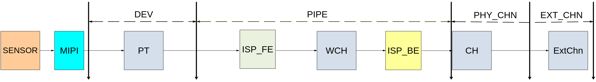
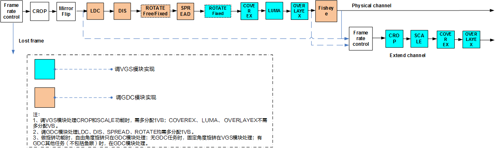

# 视频输入<a name="ZH-CN_TOPIC_0000002408258946"></a>


## 概述<a name="ZH-CN_TOPIC_0000002408258766"></a>

视频输入（VI）模块实现的功能：通过MIPI Rx\(含MIPI接口、LVDS接口和HISPI接口\)，BT.1120，BT.656，BT.601，DC等接口接收视频数据。VI将接收到的数据存入到指定的内存区域，在此过程中，VI可以对接收到的原始视频图像数据进行处理，实现视频数据的采集。

## 重要概念<a name="ZH-CN_TOPIC_0000002441657861"></a>

-   视频输入设备

    视频输入设备支持若干种时序输入，负责对时序进行解析。

-   视频输入物理PIPE

    视频输入PIPE绑定在设备后端，负责设备解析后的数据再处理。

-   视频输入虚拟PIPE

    视频输入虚拟PIPE不绑定设备，负责其他模块或用户发送过来的数据再处理。

-   视频物理通道

    物理通道负责将最终处理后的数据输出到DDR，在真正将数据输出到DDR之前，它可以实现裁剪等功能。

-   PIPE的工作模式

    详情请参考“系统控制”章节的“VI和VPSS”的工作模式描述。

-   掩码

    掩码用于指示VI设备的视频数据来源。

-   镜头畸变校正（LDC）

    镜头畸变校正，一些低端镜头容易产生图像畸变，需要根据畸变程度对其图像进行校正。

-   DIS

    DIS模块通过比较当前图像与前两帧图像采用不同自由度的防抖算法计算出当前图像在各个轴方向上的抖动偏移向量，然后根据抖动偏移向量对当前图像进行校正，从而起到防抖的效果。

-   BAS

    Bayer scaling，即Bayer域缩放。

-   提前上报中断

    提前上报中断指图像写出指定的行数到DDR后，VI上报一个中断，把图像发给后端模块处理，可以减少延时，但没有和低延时一样的硬件机制保证后端模块读图像不会出错。

## 功能描述<a name="ZH-CN_TOPIC_0000002408098718"></a>


### 功能框图<a name="ZH-CN_TOPIC_0000002408258918"></a>

**图 1**  VI在软件层次划分的4个部分<a name="fig2055755551718"></a>  


VI从软件上划分了输入设备（DEV），输入PIPE\(图示为物理PIPE，虚拟PIPE只包含ISP\_BE\)、物理通道（PHY\_CHN）、扩展通道（EXT\_CHN）四个层级。各芯片的设备、PIPE、通道个数差异如[表1](#_Ref510970631)所示。

**表 1**  设备/PIPE/通道的个数

<a name="_Ref510970631"></a>
<table><thead align="left"><tr id="row142mcpsimp"><th class="cellrowborder" rowspan="2" valign="top" width="20.53%" id="mcps1.2.7.1.1"><p id="p144mcpsimp"><a name="p144mcpsimp"></a><a name="p144mcpsimp"></a>解决方案</p>
</th>
<th class="cellrowborder" valign="top" width="15.47%" id="mcps1.2.7.1.2"><p id="p146mcpsimp"><a name="p146mcpsimp"></a><a name="p146mcpsimp"></a>DEV</p>
</th>
<th class="cellrowborder" valign="top" width="17%" id="mcps1.2.7.1.3"><p id="p148mcpsimp"><a name="p148mcpsimp"></a><a name="p148mcpsimp"></a>PHY_PIPE</p>
</th>
<th class="cellrowborder" valign="top" width="14.000000000000002%" id="mcps1.2.7.1.4"><p id="p150mcpsimp"><a name="p150mcpsimp"></a><a name="p150mcpsimp"></a>VIR_PIPE</p>
</th>
<th class="cellrowborder" valign="top" width="16%" id="mcps1.2.7.1.5"><p id="p152mcpsimp"><a name="p152mcpsimp"></a><a name="p152mcpsimp"></a>PHY_CHN</p>
</th>
<th class="cellrowborder" valign="top" width="17%" id="mcps1.2.7.1.6"><p id="p154mcpsimp"><a name="p154mcpsimp"></a><a name="p154mcpsimp"></a>EXT_CHN</p>
</th>
</tr>
<tr id="row155mcpsimp"><th class="cellrowborder" valign="top" id="mcps1.2.7.2.1"><p xml:lang="sv-SE" id="p157mcpsimp"><a name="p157mcpsimp"></a><a name="p157mcpsimp"></a>OT_VI_MAX_DEV_NUM</p>
</th>
<th class="cellrowborder" valign="top" id="mcps1.2.7.2.2"><p xml:lang="sv-SE" id="p159mcpsimp"><a name="p159mcpsimp"></a><a name="p159mcpsimp"></a><span xml:lang="en-US" id="ph160mcpsimp"><a name="ph160mcpsimp"></a><a name="ph160mcpsimp"></a>OT_VI</span>_MAX_PHYS_PIPE_NUM</p>
</th>
<th class="cellrowborder" valign="top" id="mcps1.2.7.2.3"><p xml:lang="sv-SE" id="p162mcpsimp"><a name="p162mcpsimp"></a><a name="p162mcpsimp"></a>OT_VI_MAX_VIRT_PIPE_NUM</p>
</th>
<th class="cellrowborder" valign="top" id="mcps1.2.7.2.4"><p xml:lang="sv-SE" id="p164mcpsimp"><a name="p164mcpsimp"></a><a name="p164mcpsimp"></a><span xml:lang="en-US" id="ph165mcpsimp"><a name="ph165mcpsimp"></a><a name="ph165mcpsimp"></a>OT_VI</span>_MAX_PHYS_CHN_NUM</p>
</th>
<th class="cellrowborder" valign="top" id="mcps1.2.7.2.5"><p xml:lang="sv-SE" id="p167mcpsimp"><a name="p167mcpsimp"></a><a name="p167mcpsimp"></a><span xml:lang="en-US" id="ph168mcpsimp"><a name="ph168mcpsimp"></a><a name="ph168mcpsimp"></a>OT_VI</span>_MAX_EXT_CHN_NUM</p>
</th>
</tr>
</thead>
<tbody><tr id="row170mcpsimp"><td class="cellrowborder" valign="top" width="20.53%" headers="mcps1.2.7.1.1 mcps1.2.7.2.1 "><p id="p172mcpsimp"><a name="p172mcpsimp"></a><a name="p172mcpsimp"></a>SS928V100</p>
</td>
<td class="cellrowborder" valign="top" width="15.47%" headers="mcps1.2.7.1.2 mcps1.2.7.2.2 "><p id="p174mcpsimp"><a name="p174mcpsimp"></a><a name="p174mcpsimp"></a>4</p>
</td>
<td class="cellrowborder" valign="top" width="17%" headers="mcps1.2.7.1.3 mcps1.2.7.2.3 "><p id="p176mcpsimp"><a name="p176mcpsimp"></a><a name="p176mcpsimp"></a>4</p>
</td>
<td class="cellrowborder" valign="top" width="14.000000000000002%" headers="mcps1.2.7.1.4 mcps1.2.7.2.4 "><p id="p178mcpsimp"><a name="p178mcpsimp"></a><a name="p178mcpsimp"></a>12</p>
</td>
<td class="cellrowborder" valign="top" width="16%" headers="mcps1.2.7.1.5 mcps1.2.7.2.5 "><p id="p180mcpsimp"><a name="p180mcpsimp"></a><a name="p180mcpsimp"></a>1</p>
</td>
<td class="cellrowborder" valign="top" width="17%" headers="mcps1.2.7.1.6 "><p id="p182mcpsimp"><a name="p182mcpsimp"></a><a name="p182mcpsimp"></a>8</p>
</td>
</tr>
</tbody>
</table>

-   SS928V100视频输入通道功能如[图2](#fig12122195920190)所示。

**图 2**  SS928V100 VI通道功能框图<a name="fig12122195920190"></a>  


### 视频输入设备<a name="ZH-CN_TOPIC_0000002441657925"></a>

所有VI设备都是相互独立的，支持时序解析。

### 视频输入PIPE<a name="ZH-CN_TOPIC_0000002441658365"></a>

VI的PIPE包含了ISP的相关处理功能，主要是对图像数据进行流水线处理，输出YUV图像格式给通道。PIPE的工作模式请参考“系统控制”章节的“VI和VPSS”的工作模式描述。

### 视频物理通道<a name="ZH-CN_TOPIC_0000002441658401"></a>

-   SS928V100 VI只有一个物理通道，支持8个扩展通道。
-   SS928V100物理通道支持的典型分辨率如3840x2160@60fps、3840x2160@30fps、1080p@240fps、1080p@120fps、1080p@60fps、1080p@30fps等。

### 视频扩展通道<a name="ZH-CN_TOPIC_0000002441698193"></a>

扩展通道是物理通道的扩展，扩展通道具备缩放、裁剪功能，它通过绑定物理通道，将物理通道输出作为自己的输入，然后输出用户设置的目标图像。

### BAS功能区分说明<a name="ZH-CN_TOPIC_0000002408098810"></a>

SS928V100有两个子模块支持BAS功能，如[表1](#_Ref48133205)所示。

**表 1**  子模块具体功能描述

<a name="_Ref48133205"></a>
<table><thead align="left"><tr id="row12538mcpsimp"><th class="cellrowborder" valign="top" width="35%" id="mcps1.2.3.1.1"><p id="p12540mcpsimp"><a name="p12540mcpsimp"></a><a name="p12540mcpsimp"></a>功能所属子模块</p>
</th>
<th class="cellrowborder" valign="top" width="65%" id="mcps1.2.3.1.2"><p id="p12542mcpsimp"><a name="p12542mcpsimp"></a><a name="p12542mcpsimp"></a>具体功能描述</p>
</th>
</tr>
</thead>
<tbody><tr id="row12543mcpsimp"><td class="cellrowborder" valign="top" width="35%" headers="mcps1.2.3.1.1 "><p id="p12545mcpsimp"><a name="p12545mcpsimp"></a><a name="p12545mcpsimp"></a>DEV</p>
</td>
<td class="cellrowborder" valign="top" width="65%" headers="mcps1.2.3.1.2 "><p id="p12547mcpsimp"><a name="p12547mcpsimp"></a><a name="p12547mcpsimp"></a>支持1、1/2、1/3的缩放和相位调整。</p>
</td>
</tr>
<tr id="row12548mcpsimp"><td class="cellrowborder" valign="top" width="35%" headers="mcps1.2.3.1.1 "><p id="p12550mcpsimp"><a name="p12550mcpsimp"></a><a name="p12550mcpsimp"></a>PIPE</p>
</td>
<td class="cellrowborder" valign="top" width="65%" headers="mcps1.2.3.1.2 "><p id="p12552mcpsimp"><a name="p12552mcpsimp"></a><a name="p12552mcpsimp"></a>只支持1/2的缩放，用户可以通过设置dump属性来获取bas帧。</p>
</td>
</tr>
</tbody>
</table>

### 绑定关系<a name="ZH-CN_TOPIC_0000002408258418"></a>

-   DEV和前端时序输入的接口有约束关系。例如SS928V100前端需要接入BT.1120，且选择了第0组BT.1120管脚，PIPE应该和DEV3绑定，才能正常接收数据。
-   SS928V100 DEV和时序输入接口的约束关系如[表1](#_Ref510971707)所示。

**表 1**  SS928V100 DEV与MIPI/BT.1120/BT.656/BT.601/DC接口的绑定关系

<a name="_Ref510971707"></a>
<table><thead align="left"><tr id="row210mcpsimp"><th class="cellrowborder" valign="top" width="15%" id="mcps1.2.6.1.1"><p id="p212mcpsimp"><a name="p212mcpsimp"></a><a name="p212mcpsimp"></a>VI DEV</p>
</th>
<th class="cellrowborder" valign="top" width="13%" id="mcps1.2.6.1.2"><p id="p214mcpsimp"><a name="p214mcpsimp"></a><a name="p214mcpsimp"></a>MIPI</p>
</th>
<th class="cellrowborder" valign="top" width="25%" id="mcps1.2.6.1.3"><p id="p216mcpsimp"><a name="p216mcpsimp"></a><a name="p216mcpsimp"></a>YUV420_LEGACY</p>
</th>
<th class="cellrowborder" valign="top" width="32%" id="mcps1.2.6.1.4"><p id="p218mcpsimp"><a name="p218mcpsimp"></a><a name="p218mcpsimp"></a>BT.1120/BT.656/BT.601</p>
</th>
<th class="cellrowborder" valign="top" width="15%" id="mcps1.2.6.1.5"><p id="p220mcpsimp"><a name="p220mcpsimp"></a><a name="p220mcpsimp"></a>DC</p>
</th>
</tr>
</thead>
<tbody><tr id="row222mcpsimp"><td class="cellrowborder" valign="top" width="15%" headers="mcps1.2.6.1.1 "><p id="p224mcpsimp"><a name="p224mcpsimp"></a><a name="p224mcpsimp"></a>0</p>
</td>
<td class="cellrowborder" valign="top" width="13%" headers="mcps1.2.6.1.2 "><p id="p226mcpsimp"><a name="p226mcpsimp"></a><a name="p226mcpsimp"></a>0</p>
</td>
<td class="cellrowborder" valign="top" width="25%" headers="mcps1.2.6.1.3 "><p id="p228mcpsimp"><a name="p228mcpsimp"></a><a name="p228mcpsimp"></a>0</p>
</td>
<td class="cellrowborder" valign="top" width="32%" headers="mcps1.2.6.1.4 "><p id="p230mcpsimp"><a name="p230mcpsimp"></a><a name="p230mcpsimp"></a>x</p>
</td>
<td class="cellrowborder" valign="top" width="15%" headers="mcps1.2.6.1.5 "><p id="p232mcpsimp"><a name="p232mcpsimp"></a><a name="p232mcpsimp"></a>x</p>
</td>
</tr>
<tr id="row233mcpsimp"><td class="cellrowborder" valign="top" width="15%" headers="mcps1.2.6.1.1 "><p id="p235mcpsimp"><a name="p235mcpsimp"></a><a name="p235mcpsimp"></a>1</p>
</td>
<td class="cellrowborder" valign="top" width="13%" headers="mcps1.2.6.1.2 "><p id="p237mcpsimp"><a name="p237mcpsimp"></a><a name="p237mcpsimp"></a>1</p>
</td>
<td class="cellrowborder" valign="top" width="25%" headers="mcps1.2.6.1.3 "><p id="p239mcpsimp"><a name="p239mcpsimp"></a><a name="p239mcpsimp"></a>x</p>
</td>
<td class="cellrowborder" valign="top" width="32%" headers="mcps1.2.6.1.4 "><p id="p241mcpsimp"><a name="p241mcpsimp"></a><a name="p241mcpsimp"></a>x</p>
</td>
<td class="cellrowborder" valign="top" width="15%" headers="mcps1.2.6.1.5 "><p id="p243mcpsimp"><a name="p243mcpsimp"></a><a name="p243mcpsimp"></a>x</p>
</td>
</tr>
<tr id="row244mcpsimp"><td class="cellrowborder" valign="top" width="15%" headers="mcps1.2.6.1.1 "><p id="p246mcpsimp"><a name="p246mcpsimp"></a><a name="p246mcpsimp"></a>2</p>
</td>
<td class="cellrowborder" valign="top" width="13%" headers="mcps1.2.6.1.2 "><p id="p248mcpsimp"><a name="p248mcpsimp"></a><a name="p248mcpsimp"></a>2</p>
</td>
<td class="cellrowborder" valign="top" width="25%" headers="mcps1.2.6.1.3 "><p id="p250mcpsimp"><a name="p250mcpsimp"></a><a name="p250mcpsimp"></a>1</p>
</td>
<td class="cellrowborder" valign="top" width="32%" headers="mcps1.2.6.1.4 "><p id="p252mcpsimp"><a name="p252mcpsimp"></a><a name="p252mcpsimp"></a>x</p>
</td>
<td class="cellrowborder" valign="top" width="15%" headers="mcps1.2.6.1.5 "><p id="p254mcpsimp"><a name="p254mcpsimp"></a><a name="p254mcpsimp"></a>x</p>
</td>
</tr>
<tr id="row255mcpsimp"><td class="cellrowborder" valign="top" width="15%" headers="mcps1.2.6.1.1 "><p id="p257mcpsimp"><a name="p257mcpsimp"></a><a name="p257mcpsimp"></a>3</p>
</td>
<td class="cellrowborder" valign="top" width="13%" headers="mcps1.2.6.1.2 "><p id="p259mcpsimp"><a name="p259mcpsimp"></a><a name="p259mcpsimp"></a>3</p>
</td>
<td class="cellrowborder" valign="top" width="25%" headers="mcps1.2.6.1.3 "><p id="p261mcpsimp"><a name="p261mcpsimp"></a><a name="p261mcpsimp"></a>x</p>
</td>
<td class="cellrowborder" valign="top" width="32%" headers="mcps1.2.6.1.4 "><p id="p263mcpsimp"><a name="p263mcpsimp"></a><a name="p263mcpsimp"></a>0</p>
</td>
<td class="cellrowborder" valign="top" width="15%" headers="mcps1.2.6.1.5 "><p id="p265mcpsimp"><a name="p265mcpsimp"></a><a name="p265mcpsimp"></a>0</p>
</td>
</tr>
</tbody>
</table>

“x”表示无效设备号，数字表示有效的设备ID。

-   DEV和PIPE的绑定关系：每个PIPE都可以与任意Dev绑定，PIPE销毁后，PIPE可以和DEV解绑定。

### 从模式<a name="ZH-CN_TOPIC_0000002441697853"></a>

从模式SENSOR，需要使用VI的从模式模块。从模式与VI的物理PIPE对应关系是固定的。用户需要根据SENSOR管脚的连线和[表1](#_Ref486405463)确定使用哪个从模式模块，然后选择对应的物理PIPE号创建物理PIPE，否则会没有数据，详细步骤如下：

1.  根据硬件原理图确认SENSOR管脚连接到了SENSOR\_HSx/ SENSOR\_VSx。
2.  根据[表1](#_Ref486405463)确定该SENSOR连接到从模式模块x。
3.  软件根据[表1](#_Ref486405463)确定在采集这个SENSOR的数据时可以使用编号为x的PIPE。

    **表 1**  从模式与PIPE的对应关系表

    <a name="_Ref486405463"></a>
    <table><thead align="left"><tr id="row286mcpsimp"><th class="cellrowborder" valign="top" width="24%" id="mcps1.2.6.1.1"><p id="p288mcpsimp"><a name="p288mcpsimp"></a><a name="p288mcpsimp"></a>解决方案</p>
    </th>
    <th class="cellrowborder" valign="top" width="12%" id="mcps1.2.6.1.2"><p id="p290mcpsimp"><a name="p290mcpsimp"></a><a name="p290mcpsimp"></a>从模式编号</p>
    </th>
    <th class="cellrowborder" valign="top" width="20%" id="mcps1.2.6.1.3"><p id="p292mcpsimp"><a name="p292mcpsimp"></a><a name="p292mcpsimp"></a>可连接SENSOR数目</p>
    </th>
    <th class="cellrowborder" valign="top" width="23%" id="mcps1.2.6.1.4"><p id="p294mcpsimp"><a name="p294mcpsimp"></a><a name="p294mcpsimp"></a>管脚名称</p>
    </th>
    <th class="cellrowborder" valign="top" width="21%" id="mcps1.2.6.1.5"><p id="p296mcpsimp"><a name="p296mcpsimp"></a><a name="p296mcpsimp"></a>默认使用PIPE的编号</p>
    </th>
    </tr>
    </thead>
    <tbody><tr id="row298mcpsimp"><td class="cellrowborder" rowspan="4" valign="top" width="24%" headers="mcps1.2.6.1.1 "><p id="p300mcpsimp"><a name="p300mcpsimp"></a><a name="p300mcpsimp"></a>SS928V100</p>
    </td>
    <td class="cellrowborder" valign="top" width="12%" headers="mcps1.2.6.1.2 "><p id="p302mcpsimp"><a name="p302mcpsimp"></a><a name="p302mcpsimp"></a>0</p>
    </td>
    <td class="cellrowborder" valign="top" width="20%" headers="mcps1.2.6.1.3 "><p id="p304mcpsimp"><a name="p304mcpsimp"></a><a name="p304mcpsimp"></a>2</p>
    </td>
    <td class="cellrowborder" valign="top" width="23%" headers="mcps1.2.6.1.4 "><p id="p306mcpsimp"><a name="p306mcpsimp"></a><a name="p306mcpsimp"></a>SENSOR_VS0</p>
    <p id="p307mcpsimp"><a name="p307mcpsimp"></a><a name="p307mcpsimp"></a>SENSOR_HS0</p>
    </td>
    <td class="cellrowborder" valign="top" width="21%" headers="mcps1.2.6.1.5 "><p id="p309mcpsimp"><a name="p309mcpsimp"></a><a name="p309mcpsimp"></a>PIPE：0</p>
    </td>
    </tr>
    <tr id="row310mcpsimp"><td class="cellrowborder" valign="top" headers="mcps1.2.6.1.1 "><p id="p312mcpsimp"><a name="p312mcpsimp"></a><a name="p312mcpsimp"></a>1</p>
    </td>
    <td class="cellrowborder" valign="top" headers="mcps1.2.6.1.2 "><p id="p314mcpsimp"><a name="p314mcpsimp"></a><a name="p314mcpsimp"></a>2</p>
    </td>
    <td class="cellrowborder" valign="top" headers="mcps1.2.6.1.3 "><p id="p316mcpsimp"><a name="p316mcpsimp"></a><a name="p316mcpsimp"></a>SENSOR_VS1</p>
    <p id="p317mcpsimp"><a name="p317mcpsimp"></a><a name="p317mcpsimp"></a>SENSOR_HS1</p>
    </td>
    <td class="cellrowborder" valign="top" headers="mcps1.2.6.1.4 "><p id="p319mcpsimp"><a name="p319mcpsimp"></a><a name="p319mcpsimp"></a>PIPE：1</p>
    </td>
    </tr>
    <tr id="row320mcpsimp"><td class="cellrowborder" valign="top" headers="mcps1.2.6.1.1 "><p id="p322mcpsimp"><a name="p322mcpsimp"></a><a name="p322mcpsimp"></a>2</p>
    </td>
    <td class="cellrowborder" valign="top" headers="mcps1.2.6.1.2 "><p id="p324mcpsimp"><a name="p324mcpsimp"></a><a name="p324mcpsimp"></a>2</p>
    </td>
    <td class="cellrowborder" valign="top" headers="mcps1.2.6.1.3 "><p id="p326mcpsimp"><a name="p326mcpsimp"></a><a name="p326mcpsimp"></a>SENSOR_VS2</p>
    <p id="p327mcpsimp"><a name="p327mcpsimp"></a><a name="p327mcpsimp"></a>SENSOR_HS2</p>
    </td>
    <td class="cellrowborder" valign="top" headers="mcps1.2.6.1.4 "><p id="p329mcpsimp"><a name="p329mcpsimp"></a><a name="p329mcpsimp"></a>PIPE：2</p>
    </td>
    </tr>
    <tr id="row330mcpsimp"><td class="cellrowborder" valign="top" headers="mcps1.2.6.1.1 "><p id="p332mcpsimp"><a name="p332mcpsimp"></a><a name="p332mcpsimp"></a>3</p>
    </td>
    <td class="cellrowborder" valign="top" headers="mcps1.2.6.1.2 "><p id="p334mcpsimp"><a name="p334mcpsimp"></a><a name="p334mcpsimp"></a>2</p>
    </td>
    <td class="cellrowborder" valign="top" headers="mcps1.2.6.1.3 "><p id="p336mcpsimp"><a name="p336mcpsimp"></a><a name="p336mcpsimp"></a>SENSOR_VS3</p>
    <p id="p337mcpsimp"><a name="p337mcpsimp"></a><a name="p337mcpsimp"></a>SENSOR_HS3</p>
    </td>
    <td class="cellrowborder" valign="top" headers="mcps1.2.6.1.4 "><p id="p339mcpsimp"><a name="p339mcpsimp"></a><a name="p339mcpsimp"></a>PIPE：3</p>
    </td>
    </tr>
    </tbody>
    </table>

    > **说明：** 
    >从模式和PIPE的对应关系默认是如[表1](#_Ref486405463)所示，如果需要修改，可以通过修改ISP相关的代码完成。

### 掩码配置<a name="ZH-CN_TOPIC_0000002441698117"></a>

掩码的高12bit对应着硬件线路的12个pin脚连接（D0到D15之间的任意连续12个pin脚即可，例如D4～D15），用户需要根据实际连接情况设置恰当的掩码配置，掩码的最高比特位对应的pin为D15，例如10bit输入的Sensor连接的pin为D6\~D15，掩码配置为0xFFC00000；同理如果是14bit输入时，对应的掩码配置为0xFFFC0000。

VI接入Data线序为由低到高，例如单分量接入时，D0为数据低比特位，D15为数据高比特位。

-   1路/2路5M或1080p图像输入场景（12bit输入）

    1路/2路5M或1080p图像输入场景下，设置VI设备属性时，可根据[表1](#_Ref331669300)配置掩码。

**表 1**  1路、2路5M或1080p场景下的掩码配置（12bit）

<a name="_Ref331669300"></a>
<table><thead align="left"><tr id="row354mcpsimp"><th class="cellrowborder" valign="top" width="24.75%" id="mcps1.2.4.1.1"><p id="p356mcpsimp"><a name="p356mcpsimp"></a><a name="p356mcpsimp"></a>设备号</p>
</th>
<th class="cellrowborder" valign="top" width="24.75%" id="mcps1.2.4.1.2"><p id="p358mcpsimp"><a name="p358mcpsimp"></a><a name="p358mcpsimp"></a>掩码0</p>
</th>
<th class="cellrowborder" valign="top" width="50.5%" id="mcps1.2.4.1.3"><p id="p360mcpsimp"><a name="p360mcpsimp"></a><a name="p360mcpsimp"></a>掩码1</p>
</th>
</tr>
</thead>
<tbody><tr id="row362mcpsimp"><td class="cellrowborder" valign="top" width="24.75%" headers="mcps1.2.4.1.1 "><p id="p364mcpsimp"><a name="p364mcpsimp"></a><a name="p364mcpsimp"></a>0</p>
</td>
<td class="cellrowborder" valign="top" width="24.75%" headers="mcps1.2.4.1.2 "><p id="p366mcpsimp"><a name="p366mcpsimp"></a><a name="p366mcpsimp"></a>0xFFF00000</p>
</td>
<td class="cellrowborder" valign="top" width="50.5%" headers="mcps1.2.4.1.3 "><p id="p368mcpsimp"><a name="p368mcpsimp"></a><a name="p368mcpsimp"></a>0x0</p>
</td>
</tr>
<tr id="row369mcpsimp"><td class="cellrowborder" valign="top" width="24.75%" headers="mcps1.2.4.1.1 "><p id="p371mcpsimp"><a name="p371mcpsimp"></a><a name="p371mcpsimp"></a>1</p>
</td>
<td class="cellrowborder" valign="top" width="24.75%" headers="mcps1.2.4.1.2 "><p id="p373mcpsimp"><a name="p373mcpsimp"></a><a name="p373mcpsimp"></a>0xFFF00000</p>
</td>
<td class="cellrowborder" valign="top" width="50.5%" headers="mcps1.2.4.1.3 "><p id="p375mcpsimp"><a name="p375mcpsimp"></a><a name="p375mcpsimp"></a>0x0</p>
</td>
</tr>
</tbody>
</table>

-   1路/2路BT.1120高清输入场景（16bit输入）

    1路/2路BT.1120高清图像输入场景下，设置VI设备属性时，可根据[表2](#_Ref391628558)配置掩码。

**表 2**  1路/2路BT.1120图像输入场景下的掩码配置（16bit）

<a name="_Ref391628558"></a>
<table><thead align="left"><tr id="row386mcpsimp"><th class="cellrowborder" valign="top" width="24.75%" id="mcps1.2.4.1.1"><p id="p388mcpsimp"><a name="p388mcpsimp"></a><a name="p388mcpsimp"></a>设备号</p>
</th>
<th class="cellrowborder" valign="top" width="24.75%" id="mcps1.2.4.1.2"><p id="p390mcpsimp"><a name="p390mcpsimp"></a><a name="p390mcpsimp"></a>掩码0</p>
</th>
<th class="cellrowborder" valign="top" width="50.5%" id="mcps1.2.4.1.3"><p id="p392mcpsimp"><a name="p392mcpsimp"></a><a name="p392mcpsimp"></a>掩码1</p>
</th>
</tr>
</thead>
<tbody><tr id="row394mcpsimp"><td class="cellrowborder" valign="top" width="24.75%" headers="mcps1.2.4.1.1 "><p id="p396mcpsimp"><a name="p396mcpsimp"></a><a name="p396mcpsimp"></a>0</p>
</td>
<td class="cellrowborder" valign="top" width="24.75%" headers="mcps1.2.4.1.2 "><p id="p398mcpsimp"><a name="p398mcpsimp"></a><a name="p398mcpsimp"></a>0xFF000000</p>
</td>
<td class="cellrowborder" valign="top" width="50.5%" headers="mcps1.2.4.1.3 "><p id="p400mcpsimp"><a name="p400mcpsimp"></a><a name="p400mcpsimp"></a>0x00FF0000</p>
</td>
</tr>
<tr id="row401mcpsimp"><td class="cellrowborder" valign="top" width="24.75%" headers="mcps1.2.4.1.1 "><p id="p403mcpsimp"><a name="p403mcpsimp"></a><a name="p403mcpsimp"></a>1</p>
</td>
<td class="cellrowborder" valign="top" width="24.75%" headers="mcps1.2.4.1.2 "><p id="p405mcpsimp"><a name="p405mcpsimp"></a><a name="p405mcpsimp"></a>0xFF000000</p>
</td>
<td class="cellrowborder" valign="top" width="50.5%" headers="mcps1.2.4.1.3 "><p id="p407mcpsimp"><a name="p407mcpsimp"></a><a name="p407mcpsimp"></a>0x00FF0000</p>
</td>
</tr>
</tbody>
</table>

-   1路/2路D1图像输入场景（8bit输入）

    1路/2路 图像输入场景下，设置VI设备属性时，可根据[表3](#_Ref331669304)配置掩码。

**表 3**  1路D1图像输入场景下的掩码配置（8bit）

<a name="_Ref331669304"></a>
<table><thead align="left"><tr id="row418mcpsimp"><th class="cellrowborder" valign="top" width="25%" id="mcps1.2.4.1.1"><p id="p420mcpsimp"><a name="p420mcpsimp"></a><a name="p420mcpsimp"></a>设备号</p>
</th>
<th class="cellrowborder" valign="top" width="28.999999999999996%" id="mcps1.2.4.1.2"><p id="p422mcpsimp"><a name="p422mcpsimp"></a><a name="p422mcpsimp"></a>掩码0</p>
</th>
<th class="cellrowborder" valign="top" width="46%" id="mcps1.2.4.1.3"><p id="p424mcpsimp"><a name="p424mcpsimp"></a><a name="p424mcpsimp"></a>掩码1</p>
</th>
</tr>
</thead>
<tbody><tr id="row426mcpsimp"><td class="cellrowborder" valign="top" width="25%" headers="mcps1.2.4.1.1 "><p id="p428mcpsimp"><a name="p428mcpsimp"></a><a name="p428mcpsimp"></a>0</p>
</td>
<td class="cellrowborder" valign="top" width="28.999999999999996%" headers="mcps1.2.4.1.2 "><p id="p430mcpsimp"><a name="p430mcpsimp"></a><a name="p430mcpsimp"></a>0xFF000000</p>
</td>
<td class="cellrowborder" valign="top" width="46%" headers="mcps1.2.4.1.3 "><p id="p432mcpsimp"><a name="p432mcpsimp"></a><a name="p432mcpsimp"></a>0x0</p>
</td>
</tr>
<tr id="row433mcpsimp"><td class="cellrowborder" valign="top" width="25%" headers="mcps1.2.4.1.1 "><p id="p435mcpsimp"><a name="p435mcpsimp"></a><a name="p435mcpsimp"></a>1</p>
</td>
<td class="cellrowborder" valign="top" width="28.999999999999996%" headers="mcps1.2.4.1.2 "><p id="p437mcpsimp"><a name="p437mcpsimp"></a><a name="p437mcpsimp"></a>0xFF000000</p>
</td>
<td class="cellrowborder" valign="top" width="46%" headers="mcps1.2.4.1.3 "><p id="p439mcpsimp"><a name="p439mcpsimp"></a><a name="p439mcpsimp"></a>0x0</p>
</td>
</tr>
</tbody>
</table>

## API参考<a name="ZH-CN_TOPIC_0000002408258506"></a>

VI模块实现Dev配置和使能、Dev和Pipe绑定、Grp配置、Pipe创建和使能、Chn配置和使能等功能。

该功能模块提供以下MPI：

-   [ss\_mpi\_vi\_set\_dev\_attr](#ZH-CN_TOPIC_0000002441697677)：设置VI设备属性。
-   [ss\_mpi\_vi\_get\_dev\_attr](#ZH-CN_TOPIC_0000002408099066)：获取VI设备属性。
-   [ss\_mpi\_vi\_set\_bas\_attr](#ZH-CN_TOPIC_0000002441658393)：设置VI BayerScale属性。
-   [ss\_mpi\_vi\_get\_bas\_attr](#ZH-CN_TOPIC_0000002408098774)：获取VI BayerScale属性。
-   [ss\_mpi\_vi\_enable\_dev](#ZH-CN_TOPIC_0000002408098518)：启用VI设备。
-   [ss\_mpi\_vi\_disable\_dev](#ZH-CN_TOPIC_0000002441658061)：禁用VI设备。
-   [ss\_mpi\_vi\_set\_thermo\_sns\_attr](#ZH-CN_TOPIC_0000002408258594)：设置热成像探测器的配置属性。
-   [ss\_mpi\_vi\_get\_thermo\_sns\_attr](#ZH-CN_TOPIC_0000002441697765)：获取热成像探测器的配置属性。
-   [ss\_mpi\_vi\_enable\_dev\_send\_frame](#ZH-CN_TOPIC_0000002441697685)：启用设备送帧功能。
-   [ss\_mpi\_vi\_disable\_dev\_send\_frame](#ZH-CN_TOPIC_0000002441658409)：禁用设备送帧功能。
-   [ss\_mpi\_vi\_send\_dev\_frame](#ZH-CN_TOPIC_0000002408258974)：配置设备送帧的帧信息。
-   [ss\_mpi\_vi\_set\_dev\_timing\_attr](#ZH-CN_TOPIC_0000002441697949)：设置设备自产生时序属性。
-   [ss\_mpi\_vi\_get\_dev\_timing\_attr](#ZH-CN_TOPIC_0000002408258434)：获取设备自产生时序属性。
-   [ss\_mpi\_vi\_set\_dev\_data\_attr](#ZH-CN_TOPIC_0000002408258662)：设置设备自产生数据属性。
-   [ss\_mpi\_vi\_get\_dev\_data\_attr](#ZH-CN_TOPIC_0000002408258814)：获取设备自产生数据属性。
-   [ss\_mpi\_vi\_bind](#ZH-CN_TOPIC_0000002408098590)：一对一绑定Dev和Pipe。
-   [ss\_mpi\_vi\_unbind](#ZH-CN_TOPIC_0000002441657837)：一对一解绑定Dev和Pipe。
-   [ss\_mpi\_vi\_get\_bind\_by\_dev](#ZH-CN_TOPIC_0000002408259002)：获取与Dev绑定的Pipe。
-   [ss\_mpi\_vi\_get\_bind\_by\_pipe](#ZH-CN_TOPIC_0000002441698221)：获取与Pipe绑定的Dev。
-   [ss\_mpi\_vi\_set\_wdr\_fusion\_grp\_attr](#ZH-CN_TOPIC_0000002408258702)：设置wdr合成组的属性。
-   [ss\_mpi\_vi\_get\_wdr\_fusion\_grp\_attr](#ZH-CN_TOPIC_0000002441657809)：获取wdr合成组的属性。
-   [ss\_mpi\_vi\_create\_pipe](#ZH-CN_TOPIC_0000002408098762)：创建一个VI PIPE。
-   [ss\_mpi\_vi\_destroy\_pipe](#ZH-CN_TOPIC_0000002408098898)：销毁一个VI PIPE。
-   [ss\_mpi\_vi\_set\_pipe\_attr](#ZH-CN_TOPIC_0000002441697805)：设置VI PIPE的属性。
-   [ss\_mpi\_vi\_get\_pipe\_attr](#ZH-CN_TOPIC_0000002408098506)：获取VI PIPE的属性。
-   [ss\_mpi\_vi\_start\_pipe](#ZH-CN_TOPIC_0000002408259010)：启用VI PIPE。
-   [ss\_mpi\_vi\_stop\_pipe](#ZH-CN_TOPIC_0000002408099054)：禁用VI PIPE。
-   [ss\_mpi\_vi\_set\_pipe\_pre\_crop](#ZH-CN_TOPIC_0000002441658117)：设置VI 物理PIPE输入端的裁剪功能属性。
-   [ss\_mpi\_vi\_get\_pipe\_pre\_crop](#ZH-CN_TOPIC_0000002441697633)：获取VI 物理PIPE输入端的裁剪功能属性。
-   [ss\_mpi\_vi\_set\_pipe\_post\_crop](#ZH-CN_TOPIC_0000002408258690)：设置VI 物理PIPE输出端的裁剪功能属性。
-   [ss\_mpi\_vi\_get\_pipe\_post\_crop](#ZH-CN_TOPIC_0000002408258826)：获取VI 物理PIPE输出端的裁剪功能属性。
-   [ss\_mpi\_vi\_set\_pipe\_frame\_dump\_attr](#ZH-CN_TOPIC_0000002408098630)：设置VI 物理PIPE dump图像帧属性。
-   [ss\_mpi\_vi\_get\_pipe\_frame\_dump\_attr](#ZH-CN_TOPIC_0000002408258442)：获取VI 物理PIPE dump图像帧属性。
-   [ss\_mpi\_vi\_get\_pipe\_frame](#ZH-CN_TOPIC_0000002441658209)：获取VI物理PIPE图像帧。
-   [ss\_mpi\_vi\_release\_pipe\_frame](#ZH-CN_TOPIC_0000002408258966)：释放VI 物理PIPE的图像帧。
-   [ss\_mpi\_vi\_set\_pipe\_fe\_out\_frame\_dump\_attr](#ZH-CN_TOPIC_0000002441657853)：设置VI 物理PIPE FE输出 dump图像帧属性。
-   [ss\_mpi\_vi\_get\_pipe\_fe\_out\_frame\_dump\_attr](#ZH-CN_TOPIC_0000002408098342)：获取VI 物理PIPE FE输出 dump图像帧属性。
-   [ss\_mpi\_vi\_get\_pipe\_fe\_out\_frame](#ZH-CN_TOPIC_0000002408099042)：获取VI物理PIPE FE输出图像帧。
-   [ss\_mpi\_vi\_release\_pipe\_fe\_out\_frame](#ZH-CN_TOPIC_0000002408098442)：释放VI 物理PIPE FE输出的图像帧。
-   [ss\_mpi\_vi\_set\_pipe\_private\_data\_dump\_attr](#ZH-CN_TOPIC_0000002441658077)：设置VI物理PIPE dump私有数据的属性。
-   [ss\_mpi\_vi\_get\_pipe\_private\_data\_dump\_attr](#ZH-CN_TOPIC_0000002408258366)：获取VI物理PIPE dump私有数据的属性。
-   [ss\_mpi\_vi\_get\_pipe\_private\_data](#ZH-CN_TOPIC_0000002408258846)：获取VI物理PIPE的私有数据。
-   [ss\_mpi\_vi\_release\_pipe\_private\_data](#ZH-CN_TOPIC_0000002408098670)：释放VI物理PIPE的私有数据。
-   [ss\_mpi\_vi\_set\_pipe\_bas\_frame\_dump\_attr](#ZH-CN_TOPIC_0000002441697701)：设置VI PIPE dump bas图像帧的属性。
-   [ss\_mpi\_vi\_get\_pipe\_bas\_frame\_dump\_attr](#ZH-CN_TOPIC_0000002441697609)：获取VI PIPE dump bas图像帧的属性。
-   [ss\_mpi\_vi\_get\_pipe\_bas\_frame](#ZH-CN_TOPIC_0000002441698057)：获取VI PIPE bas图像帧。
-   [ss\_mpi\_vi\_release\_pipe\_bas\_frame](#ZH-CN_TOPIC_0000002408099062)：释放VI PIPE bas图像帧。
-   [ss\_mpi\_vi\_set\_pipe\_frame\_source](#ZH-CN_TOPIC_0000002441658049)：设置VI PIPE数据的来源。
-   [ss\_mpi\_vi\_get\_pipe\_frame\_source](#ZH-CN_TOPIC_0000002441657797)：获取VI PIPE数据的来源。
-   [ss\_mpi\_vi\_set\_pipe\_param](#ZH-CN_TOPIC_0000002408098930)：设置VI PIPE参数。
-   [ss\_mpi\_vi\_get\_pipe\_param](#ZH-CN_TOPIC_0000002441697837)：获取VI PIPE参数。
-   [ss\_mpi\_vi\_enable\_pipe\_stagger\_out\_split](#ZH-CN_TOPIC_0000002441658385)：启用VI PIPE STAGGER模式输出拆分。
-   [ss\_mpi\_vi\_disable\_pipe\_stagger\_out\_split](#ZH-CN_TOPIC_0000002441698213)：禁用VI PIPE STAGGER模式输出拆分。
-   [ss\_mpi\_vi\_set\_pipe\_bnr\_buf\_num](#ZH-CN_TOPIC_0000002408098850)：设置VI PIPE bayernr buffer个数。
-   [ss\_mpi\_vi\_get\_pipe\_bnr\_buf\_num](#ZH-CN_TOPIC_0000002441698025)：获取VI PIPE bayernr buffer个数。
-   [ss\_mpi\_vi\_send\_pipe\_yuv](#ZH-CN_TOPIC_0000002408098526)：通过VI PIPE发送YUV数据。
-   [ss\_mpi\_vi\_send\_pipe\_raw](#ZH-CN_TOPIC_0000002441697621)：通过VI PIPE发送RAW数据。
-   [ss\_mpi\_vi\_query\_pipe\_status](#ZH-CN_TOPIC_0000002441658225)：查询VI PIPE状态。
-   [ss\_mpi\_vi\_enable\_pipe\_interrupt](#ZH-CN_TOPIC_0000002441698037)：启动VI 物理PIPE中断。
-   [ss\_mpi\_vi\_disable\_pipe\_interrupt](#ZH-CN_TOPIC_0000002441698177)：禁用VI 物理PIPE中断。
-   [ss\_mpi\_vi\_set\_pipe\_vc\_number](#ZH-CN_TOPIC_0000002408258378)：设置VI 物理PIPE对接前端sensor或者AD的VC号。
-   [ss\_mpi\_vi\_get\_pipe\_vc\_number](#ZH-CN_TOPIC_0000002408258854)：获取VI 物理PIPE对接前端sensor或者AD的VC号。
-   [ss\_mpi\_vi\_set\_pipe\_low\_delay\_attr](#ZH-CN_TOPIC_0000002408258530)：设置VI PIPE低延时属性。
-   [ss\_mpi\_vi\_get\_pipe\_low\_delay\_attr](#ZH-CN_TOPIC_0000002408258458)：获取VI PIPE低延时属性。
-   [ss\_mpi\_vi\_set\_pipe\_frame\_interrupt\_attr](#ZH-CN_TOPIC_0000002408098466)：设置VI PIPE上报中断属性。
-   [ss\_mpi\_vi\_get\_pipe\_frame\_interrupt\_attr](#ZH-CN_TOPIC_0000002441698065)：获取VI PIPE上报中断属性。
-   [ss\_mpi\_vi\_set\_pipe\_fisheye\_cfg](#ZH-CN_TOPIC_0000002408098862)：设置VI PIPE对应的鱼眼镜头LMF参数配置。
-   [ss\_mpi\_vi\_get\_pipe\_fisheye\_cfg](#ZH-CN_TOPIC_0000002441658345)：获取VI PIPE对应的鱼眼镜头LMF参数配置。
-   [ss\_mpi\_vi\_get\_pipe\_compress\_param](#ZH-CN_TOPIC_0000002408098426)：获取VI物理 PIPE的RAW压缩参数。
-   [ss\_mpi\_vi\_set\_user\_pic](#ZH-CN_TOPIC_0000002441698165)：设置用户图片，作为无视频信号时的插入图片。
-   [ss\_mpi\_vi\_enable\_user\_pic](#ZH-CN_TOPIC_0000002441657949)：启用VI PIPE插入用户图片。
-   [ss\_mpi\_vi\_disable\_user\_pic](#ZH-CN_TOPIC_0000002441697749)：禁用VI PIPE插入用户图片。
-   [ss\_mpi\_vi\_pipe\_set\_vb\_src](#ZH-CN_TOPIC_0000002408098310)：设置VI PIPE的VB来源。
-   [ss\_mpi\_vi\_pipe\_get\_vb\_src](#ZH-CN_TOPIC_0000002408099034)：获取VI PIPE的VB来源。
-   [ss\_mpi\_vi\_pipe\_attach\_vb\_pool](#ZH-CN_TOPIC_0000002441658197)：将VI的PIPE绑定到某个视频缓存VB池中。
-   [ss\_mpi\_vi\_pipe\_detach\_vb\_pool](#ZH-CN_TOPIC_0000002408099014)：将VI的PIPE从某个视频缓存VB池中解绑定。
-   [ss\_mpi\_vi\_get\_pipe\_fd](#ZH-CN_TOPIC_0000002408258342)：获取VI PIPE文件描述符。
-   [ss\_mpi\_vi\_set\_chn\_attr](#ZH-CN_TOPIC_0000002408099002)：设置VI通道属性。
-   [ss\_mpi\_vi\_get\_chn\_attr](#ZH-CN_TOPIC_0000002441697789)：获取VI通道属性。
-   [ss\_mpi\_vi\_set\_ext\_chn\_attr](#ZH-CN_TOPIC_0000002408098582)：设置VI扩展通道属性。
-   [ss\_mpi\_vi\_get\_ext\_chn\_attr](#ZH-CN_TOPIC_0000002408098454)：获取VI扩展通道属性。
-   [ss\_mpi\_vi\_enable\_chn](#ZH-CN_TOPIC_0000002408258726)：启用VI通道。
-   [ss\_mpi\_vi\_disable\_chn](#ZH-CN_TOPIC_0000002408258778)：禁用VI通道。
-   [ss\_mpi\_vi\_set\_chn\_crop](#ZH-CN_TOPIC_0000002408258938)：设置VI通道裁剪功能属性。
-   [ss\_mpi\_vi\_get\_chn\_crop](#ZH-CN_TOPIC_0000002408258330)：获取VI通道裁剪功能属性。
-   [ss\_mpi\_vi\_set\_chn\_rotation](#ZH-CN_TOPIC_0000002408258578)：设置VI图像旋转属性。
-   [ss\_mpi\_vi\_get\_chn\_rotation](#ZH-CN_TOPIC_0000002408098606)：获取VI图像旋转属性。
-   [ss\_mpi\_vi\_set\_chn\_ldc\_attr](#ZH-CN_TOPIC_0000002408098918)：设置VI镜头畸变校正（LDC）属性。
-   [ss\_mpi\_vi\_get\_chn\_ldc\_attr](#ZH-CN_TOPIC_0000002408258318)：获取VI镜头畸变校正（LDC）属性。
-   [ss\_mpi\_vi\_ldc\_pos\_query\_dst\_to\_src](#ZH-CN_TOPIC_0000002408258738)：根据镜头畸变校正（LDC）的输出图像坐标点查找输入图像的坐标点。
-   [ss\_mpi\_vi\_ldc\_pos\_query\_src\_to\_dst](#ZH-CN_TOPIC_0000002408098876)：根据镜头畸变校正（LDC）的输入图像坐标点查找输出图像的坐标点。
-   [ss\_mpi\_vi\_set\_chn\_spread\_attr](#ZH-CN_TOPIC_0000002408258390)：设置VI通道展宽属性。
-   [ss\_mpi\_vi\_get\_chn\_spread\_attr](#ZH-CN_TOPIC_0000002408098402)：获取VI通道展宽属性。
-   [ss\_mpi\_vi\_set\_chn\_fisheye](#ZH-CN_TOPIC_0000002441657997)：设置VI通道对应的鱼眼属性。
-   [ss\_mpi\_vi\_get\_chn\_fisheye](#ZH-CN_TOPIC_0000002441697773)：获取VI通道对应的鱼眼属性。
-   [ss\_mpi\_vi\_fisheye\_pos\_query\_dst\_to\_src](#ZH-CN_TOPIC_0000002408258834)：根据鱼眼校正输出图像坐标点查找源图像坐标点。
-   [ss\_mpi\_vi\_get\_chn\_rgn\_luma](#ZH-CN_TOPIC_0000002441697453)：获取指定图像区域的亮度总和。
-   [ss\_mpi\_vi\_set\_chn\_dis\_cfg](#ZH-CN_TOPIC_0000002408258606)：设置VI通道的DIS配置信息。
-   [ss\_mpi\_vi\_get\_chn\_dis\_cfg](#ZH-CN_TOPIC_0000002408098686)：获取VI通道的DIS配置信息。
-   [ss\_mpi\_vi\_set\_chn\_dis\_attr](#ZH-CN_TOPIC_0000002408098286)：设置VI通道的DIS属性。
-   [ss\_mpi\_vi\_get\_chn\_dis\_attr](#ZH-CN_TOPIC_0000002441657637)：获取VI通道的DIS属性。
-   [ss\_mpi\_vi\_set\_chn\_dis\_param](#ZH-CN_TOPIC_0000002441697485)：设置VI通道的DIS可选参数。
-   [ss\_mpi\_vi\_get\_chn\_dis\_param](#ZH-CN_TOPIC_0000002408258474)：获取VI通道的DIS的可选参数。
-   [ss\_mpi\_vi\_set\_chn\_dis\_wdr\_attr](#ZH-CN_TOPIC_0000002468735433)：设置VI通道的DIS WDR属性。
-   [ss\_mpi\_vi\_get\_chn\_dis\_wdr\_attr](#ZH-CN_TOPIC_0000002435176804)：获取VI通道的DIS WDR属性。
-   [ss\_mpi\_vi\_set\_chn\_fov\_correction\_attr](#ZH-CN_TOPIC_0000002408098698)：设置VI通道的视场角矫正属性。
-   [ss\_mpi\_vi\_get\_chn\_fov\_correction\_attr](#ZH-CN_TOPIC_0000002441697585)：获取VI通道的视场角矫正属性。
-   [ss\_mpi\_vi\_get\_chn\_frame](#ZH-CN_TOPIC_0000002441698001)：从VI通道获取采集的图像。
-   [ss\_mpi\_vi\_release\_chn\_frame](#ZH-CN_TOPIC_0000002408098798)：释放一帧从VI通道获取的图像。
-   [ss\_mpi\_vi\_set\_chn\_low\_delay\_attr](#ZH-CN_TOPIC_0000002408098478)：设置VI通道低延时属性。
-   [ss\_mpi\_vi\_get\_chn\_low\_delay\_attr](#ZH-CN_TOPIC_0000002408098418)：获取VI通道低延时属性。
-   [ss\_mpi\_vi\_set\_chn\_align](#ZH-CN_TOPIC_0000002441658013)：设置VI通道输出YUV数据的行stride对齐。
-   [ss\_mpi\_vi\_get\_chn\_align](#ZH-CN_TOPIC_0000002408098562)：获取VI通道输出YUV数据的行stride对齐。
-   [ss\_mpi\_vi\_chn\_set\_vb\_src](#ZH-CN_TOPIC_0000002408258930)：设置VI通道使用VB的来源。
-   [ss\_mpi\_vi\_chn\_get\_vb\_src](#ZH-CN_TOPIC_0000002441697573)：获取VI通道使用VB的来源。
-   [ss\_mpi\_vi\_chn\_attach\_vb\_pool](#ZH-CN_TOPIC_0000002441658173)：将VI通道绑定到某个视频缓存VB池中。
-   [ss\_mpi\_vi\_chn\_detach\_vb\_pool](#ZH-CN_TOPIC_0000002441658129)：将VI通道从某个视频缓存VB池中解绑定。
-   [ss\_mpi\_vi\_query\_chn\_status](#ZH-CN_TOPIC_0000002441697645)：查询VI通道的状态。
-   [ss\_mpi\_vi\_get\_chn\_fd](#ZH-CN_TOPIC_0000002441697533)：获取VI通道文件描述符。
-   [ss\_mpi\_vi\_set\_stitch\_grp\_attr](#ZH-CN_TOPIC_0000002441658233)：设置VI 的拼接组属性。
-   [ss\_mpi\_vi\_get\_stitch\_grp\_attr](#ZH-CN_TOPIC_0000002408258494)：获取VI 的拼接组属性。
-   [ss\_mpi\_vi\_set\_mod\_param](#ZH-CN_TOPIC_0000002441658357)：设置VI模块参数。
-   [ss\_mpi\_vi\_get\_mod\_param](#ZH-CN_TOPIC_0000002441657753)：获取VI模块参数。
-   [ss\_mpi\_vi\_close\_fd](#ZH-CN_TOPIC_0000002441697973)：关闭VI文件描述符。
-   [ss\_mpi\_vi\_chn\_set\_zoom\_in\_window](#ZH-CN_TOPIC_0000002527031287)：设置vi chn 裁剪放大属性。
-   [ss\_mpi\_vi\_chn\_get\_zoom\_in\_window](#ZH-CN_TOPIC_0000002494991556)：获取vi chn 裁剪放大属性。


### ss\_mpi\_vi\_set\_dev\_attr<a name="ZH-CN_TOPIC_0000002441697677"></a>

【描述】

设置VI设备属性。基本设备属性默认了部分芯片配置，满足绝大部分的sensor对接要求。

【语法】

```
td_s32 ss_mpi_vi_set_dev_attr(ot_vi_dev vi_dev, const ot_vi_dev_attr *dev_attr);
```

【参数】

<a name="table686mcpsimp"></a>
<table><thead align="left"><tr id="row692mcpsimp"><th class="cellrowborder" valign="top" width="18%" id="mcps1.1.4.1.1"><p id="p694mcpsimp"><a name="p694mcpsimp"></a><a name="p694mcpsimp"></a>参数名称</p>
</th>
<th class="cellrowborder" valign="top" width="66%" id="mcps1.1.4.1.2"><p id="p696mcpsimp"><a name="p696mcpsimp"></a><a name="p696mcpsimp"></a>描述</p>
</th>
<th class="cellrowborder" valign="top" width="16%" id="mcps1.1.4.1.3"><p id="p698mcpsimp"><a name="p698mcpsimp"></a><a name="p698mcpsimp"></a>输入/输出</p>
</th>
</tr>
</thead>
<tbody><tr id="row700mcpsimp"><td class="cellrowborder" valign="top" width="18%" headers="mcps1.1.4.1.1 "><p id="p702mcpsimp"><a name="p702mcpsimp"></a><a name="p702mcpsimp"></a>vi_dev</p>
</td>
<td class="cellrowborder" valign="top" width="66%" headers="mcps1.1.4.1.2 "><p id="p704mcpsimp"><a name="p704mcpsimp"></a><a name="p704mcpsimp"></a>VI设备号。</p>
<p id="p705mcpsimp"><a name="p705mcpsimp"></a><a name="p705mcpsimp"></a>取值范围：[0, <a href="#ZH-CN_TOPIC_0000002441698073">OT_VI<span xml:lang="sv-SE" id="ph707mcpsimp"><a name="ph707mcpsimp"></a><a name="ph707mcpsimp"></a>_</span>MAX_DEV_NUM</a>)。</p>
</td>
<td class="cellrowborder" valign="top" width="16%" headers="mcps1.1.4.1.3 "><p id="p709mcpsimp"><a name="p709mcpsimp"></a><a name="p709mcpsimp"></a>输入</p>
</td>
</tr>
<tr id="row710mcpsimp"><td class="cellrowborder" valign="top" width="18%" headers="mcps1.1.4.1.1 "><p xml:lang="sv-SE" id="p712mcpsimp"><a name="p712mcpsimp"></a><a name="p712mcpsimp"></a>dev_attr</p>
</td>
<td class="cellrowborder" valign="top" width="66%" headers="mcps1.1.4.1.2 "><p id="p714mcpsimp"><a name="p714mcpsimp"></a><a name="p714mcpsimp"></a>VI设备属性指针。</p>
<p id="p715mcpsimp"><a name="p715mcpsimp"></a><a name="p715mcpsimp"></a>静态属性。</p>
</td>
<td class="cellrowborder" valign="top" width="16%" headers="mcps1.1.4.1.3 "><p id="p717mcpsimp"><a name="p717mcpsimp"></a><a name="p717mcpsimp"></a>输入</p>
</td>
</tr>
</tbody>
</table>

【返回值】

<a name="table719mcpsimp"></a>
<table><thead align="left"><tr id="row724mcpsimp"><th class="cellrowborder" valign="top" width="12%" id="mcps1.1.3.1.1"><p id="p726mcpsimp"><a name="p726mcpsimp"></a><a name="p726mcpsimp"></a>返回值</p>
</th>
<th class="cellrowborder" valign="top" width="88%" id="mcps1.1.3.1.2"><p id="p728mcpsimp"><a name="p728mcpsimp"></a><a name="p728mcpsimp"></a>描述</p>
</th>
</tr>
</thead>
<tbody><tr id="row730mcpsimp"><td class="cellrowborder" valign="top" width="12%" headers="mcps1.1.3.1.1 "><p id="p732mcpsimp"><a name="p732mcpsimp"></a><a name="p732mcpsimp"></a>0</p>
</td>
<td class="cellrowborder" valign="top" width="88%" headers="mcps1.1.3.1.2 "><p id="p734mcpsimp"><a name="p734mcpsimp"></a><a name="p734mcpsimp"></a>成功。</p>
</td>
</tr>
<tr id="row735mcpsimp"><td class="cellrowborder" valign="top" width="12%" headers="mcps1.1.3.1.1 "><p id="p737mcpsimp"><a name="p737mcpsimp"></a><a name="p737mcpsimp"></a>非0</p>
</td>
<td class="cellrowborder" valign="top" width="88%" headers="mcps1.1.3.1.2 "><p id="p739mcpsimp"><a name="p739mcpsimp"></a><a name="p739mcpsimp"></a>失败，其值为<a href="错误码.md"><span xml:lang="fr-FR" id="ph741mcpsimp"><a name="ph741mcpsimp"></a><a name="ph741mcpsimp"></a>错误码</span></a>。</p>
</td>
</tr>
</tbody>
</table>

【解决方案差异】

无。

【需求】

-   头文件：ot\_common\_vi.h、ss\_mpi\_vi.h
-   库文件：libss\_mpi.a

【注意】

-   不支持BT.1120隔行输入。
-   在调用前要保证VI设备处于禁用状态。如果VI设备已处于使能状态，可以使用[ss\_mpi\_vi\_disable\_dev](#ZH-CN_TOPIC_0000002441658061)来禁用设备。
-   参数dev\_attr主要用来配置指定VI设备的视频接口模式，用于与外围camera、sensor或codec对接，支持的接口模式包括MIPI Rx（MIPI/LVDS/HISPI）、SLVS-EC。用户需要配置以下几类信息，具体属性意义参见“[数据类型](#ZH-CN_TOPIC_0000002408258714)”部分的说明：
    -   接口模式信息：接口模式为MIPI Rx（MIPI/LVDS/HISPI）等模式
    -   工作模式信息：1路、2路、4路复合模式
    -   数据布局信息：复合模式下多路数据的排布
    -   数据信息：逐行输入、YUV数据输入顺序
    -   同步时序信息：垂直、水平同步信号的属性

【举例】

无。

【相关主题】

[ss\_mpi\_vi\_get\_dev\_attr](#ZH-CN_TOPIC_0000002408099066)

### ss\_mpi\_vi\_get\_dev\_attr<a name="ZH-CN_TOPIC_0000002408099066"></a>

【描述】

获取VI设备属性。

【语法】

```
td_s32 ss_mpi_vi_get_dev_attr(ot_vi_dev vi_dev, ot_vi_dev_attr *dev_attr);
```

【参数】

<a name="table782mcpsimp"></a>
<table><thead align="left"><tr id="row788mcpsimp"><th class="cellrowborder" valign="top" width="20%" id="mcps1.1.4.1.1"><p id="p790mcpsimp"><a name="p790mcpsimp"></a><a name="p790mcpsimp"></a>参数名称</p>
</th>
<th class="cellrowborder" valign="top" width="62%" id="mcps1.1.4.1.2"><p id="p792mcpsimp"><a name="p792mcpsimp"></a><a name="p792mcpsimp"></a>描述</p>
</th>
<th class="cellrowborder" valign="top" width="18%" id="mcps1.1.4.1.3"><p id="p794mcpsimp"><a name="p794mcpsimp"></a><a name="p794mcpsimp"></a>输入/输出</p>
</th>
</tr>
</thead>
<tbody><tr id="row796mcpsimp"><td class="cellrowborder" valign="top" width="20%" headers="mcps1.1.4.1.1 "><p id="p798mcpsimp"><a name="p798mcpsimp"></a><a name="p798mcpsimp"></a>vi_dev</p>
</td>
<td class="cellrowborder" valign="top" width="62%" headers="mcps1.1.4.1.2 "><p id="p800mcpsimp"><a name="p800mcpsimp"></a><a name="p800mcpsimp"></a>VI设备号。</p>
<p id="p801mcpsimp"><a name="p801mcpsimp"></a><a name="p801mcpsimp"></a>取值范围：[0, <a href="OT_VI_MAX_DEV_NUM.md">OT_VI<span xml:lang="sv-SE" id="ph803mcpsimp"><a name="ph803mcpsimp"></a><a name="ph803mcpsimp"></a>_</span>MAX_DEV_NUM</a>)。</p>
</td>
<td class="cellrowborder" valign="top" width="18%" headers="mcps1.1.4.1.3 "><p id="p805mcpsimp"><a name="p805mcpsimp"></a><a name="p805mcpsimp"></a>输入</p>
</td>
</tr>
<tr id="row806mcpsimp"><td class="cellrowborder" valign="top" width="20%" headers="mcps1.1.4.1.1 "><p xml:lang="sv-SE" id="p808mcpsimp"><a name="p808mcpsimp"></a><a name="p808mcpsimp"></a>dev_attr</p>
</td>
<td class="cellrowborder" valign="top" width="62%" headers="mcps1.1.4.1.2 "><p id="p810mcpsimp"><a name="p810mcpsimp"></a><a name="p810mcpsimp"></a>VI设备属性指针。</p>
</td>
<td class="cellrowborder" valign="top" width="18%" headers="mcps1.1.4.1.3 "><p id="p812mcpsimp"><a name="p812mcpsimp"></a><a name="p812mcpsimp"></a>输出</p>
</td>
</tr>
</tbody>
</table>

【返回值】

<a name="table814mcpsimp"></a>
<table><thead align="left"><tr id="row819mcpsimp"><th class="cellrowborder" valign="top" width="12%" id="mcps1.1.3.1.1"><p id="p821mcpsimp"><a name="p821mcpsimp"></a><a name="p821mcpsimp"></a>返回值</p>
</th>
<th class="cellrowborder" valign="top" width="88%" id="mcps1.1.3.1.2"><p id="p823mcpsimp"><a name="p823mcpsimp"></a><a name="p823mcpsimp"></a>描述</p>
</th>
</tr>
</thead>
<tbody><tr id="row825mcpsimp"><td class="cellrowborder" valign="top" width="12%" headers="mcps1.1.3.1.1 "><p id="p827mcpsimp"><a name="p827mcpsimp"></a><a name="p827mcpsimp"></a>0</p>
</td>
<td class="cellrowborder" valign="top" width="88%" headers="mcps1.1.3.1.2 "><p id="p829mcpsimp"><a name="p829mcpsimp"></a><a name="p829mcpsimp"></a>成功。</p>
</td>
</tr>
<tr id="row830mcpsimp"><td class="cellrowborder" valign="top" width="12%" headers="mcps1.1.3.1.1 "><p id="p832mcpsimp"><a name="p832mcpsimp"></a><a name="p832mcpsimp"></a>非0</p>
</td>
<td class="cellrowborder" valign="top" width="88%" headers="mcps1.1.3.1.2 "><p id="p834mcpsimp"><a name="p834mcpsimp"></a><a name="p834mcpsimp"></a>失败，其值为<a href="错误码.md"><span xml:lang="fr-FR" id="ph836mcpsimp"><a name="ph836mcpsimp"></a><a name="ph836mcpsimp"></a>错误码</span></a>。</p>
</td>
</tr>
</tbody>
</table>

【解决方案差异】

无。

【需求】

-   头文件：ot\_common\_vi.h、ss\_mpi\_vi.h
-   库文件：libss\_mpi.a

【注意】

如果未设置VI设备属性，该接口将返回失败。

【举例】

无。

【相关主题】

[ss\_mpi\_vi\_set\_dev\_attr](#ZH-CN_TOPIC_0000002441697677)

### ss\_mpi\_vi\_set\_bas\_attr<a name="ZH-CN_TOPIC_0000002441658393"></a>

【描述】

设置VI BayerScale属性。

【语法】

```
td_s32 ss_mpi_vi_set_bas_attr(ot_vi_dev vi_dev, const ot_vi_bas_attr *bas_attr);
```

【参数】

<a name="table859mcpsimp"></a>
<table><thead align="left"><tr id="row865mcpsimp"><th class="cellrowborder" valign="top" width="20%" id="mcps1.1.4.1.1"><p id="p867mcpsimp"><a name="p867mcpsimp"></a><a name="p867mcpsimp"></a>参数名称</p>
</th>
<th class="cellrowborder" valign="top" width="62%" id="mcps1.1.4.1.2"><p id="p869mcpsimp"><a name="p869mcpsimp"></a><a name="p869mcpsimp"></a>描述</p>
</th>
<th class="cellrowborder" valign="top" width="18%" id="mcps1.1.4.1.3"><p id="p871mcpsimp"><a name="p871mcpsimp"></a><a name="p871mcpsimp"></a>输入/输出</p>
</th>
</tr>
</thead>
<tbody><tr id="row873mcpsimp"><td class="cellrowborder" valign="top" width="20%" headers="mcps1.1.4.1.1 "><p id="p875mcpsimp"><a name="p875mcpsimp"></a><a name="p875mcpsimp"></a>vi_dev</p>
</td>
<td class="cellrowborder" valign="top" width="62%" headers="mcps1.1.4.1.2 "><p id="p877mcpsimp"><a name="p877mcpsimp"></a><a name="p877mcpsimp"></a>VI设备号。</p>
<p id="p878mcpsimp"><a name="p878mcpsimp"></a><a name="p878mcpsimp"></a>取值：0。</p>
</td>
<td class="cellrowborder" valign="top" width="18%" headers="mcps1.1.4.1.3 "><p id="p880mcpsimp"><a name="p880mcpsimp"></a><a name="p880mcpsimp"></a>输入</p>
</td>
</tr>
<tr id="row881mcpsimp"><td class="cellrowborder" valign="top" width="20%" headers="mcps1.1.4.1.1 "><p xml:lang="sv-SE" id="p883mcpsimp"><a name="p883mcpsimp"></a><a name="p883mcpsimp"></a>bas_attr</p>
</td>
<td class="cellrowborder" valign="top" width="62%" headers="mcps1.1.4.1.2 "><p id="p885mcpsimp"><a name="p885mcpsimp"></a><a name="p885mcpsimp"></a>VI BayerScale属性指针。</p>
<p id="p886mcpsimp"><a name="p886mcpsimp"></a><a name="p886mcpsimp"></a>静态属性。</p>
</td>
<td class="cellrowborder" valign="top" width="18%" headers="mcps1.1.4.1.3 "><p id="p888mcpsimp"><a name="p888mcpsimp"></a><a name="p888mcpsimp"></a>输入</p>
</td>
</tr>
</tbody>
</table>

【返回值】

<a name="table890mcpsimp"></a>
<table><thead align="left"><tr id="row895mcpsimp"><th class="cellrowborder" valign="top" width="12%" id="mcps1.1.3.1.1"><p id="p897mcpsimp"><a name="p897mcpsimp"></a><a name="p897mcpsimp"></a>返回值</p>
</th>
<th class="cellrowborder" valign="top" width="88%" id="mcps1.1.3.1.2"><p id="p899mcpsimp"><a name="p899mcpsimp"></a><a name="p899mcpsimp"></a>描述</p>
</th>
</tr>
</thead>
<tbody><tr id="row901mcpsimp"><td class="cellrowborder" valign="top" width="12%" headers="mcps1.1.3.1.1 "><p id="p903mcpsimp"><a name="p903mcpsimp"></a><a name="p903mcpsimp"></a>0</p>
</td>
<td class="cellrowborder" valign="top" width="88%" headers="mcps1.1.3.1.2 "><p id="p905mcpsimp"><a name="p905mcpsimp"></a><a name="p905mcpsimp"></a>成功。</p>
</td>
</tr>
<tr id="row906mcpsimp"><td class="cellrowborder" valign="top" width="12%" headers="mcps1.1.3.1.1 "><p id="p908mcpsimp"><a name="p908mcpsimp"></a><a name="p908mcpsimp"></a>非0</p>
</td>
<td class="cellrowborder" valign="top" width="88%" headers="mcps1.1.3.1.2 "><p id="p910mcpsimp"><a name="p910mcpsimp"></a><a name="p910mcpsimp"></a>失败，其值为<a href="错误码.md"><span xml:lang="fr-FR" id="ph912mcpsimp"><a name="ph912mcpsimp"></a><a name="ph912mcpsimp"></a>错误码</span></a>。</p>
</td>
</tr>
</tbody>
</table>

【解决方案差异】

无。

【需求】

-   头文件：ot\_common\_vi.h、ss\_mpi\_vi.h
-   库文件：libss\_mpi.a

【注意】

-   wdr模式下不支持bas功能。
-   该接口在[ss\_mpi\_vi\_enable\_dev](#ZH-CN_TOPIC_0000002408098518)之前配置，在[ss\_mpi\_vi\_set\_dev\_attr](#ZH-CN_TOPIC_0000002441697677)之后配置。

【举例】

无。

【相关主题】

[ss\_mpi\_vi\_get\_bas\_attr](#ZH-CN_TOPIC_0000002408098774)

### ss\_mpi\_vi\_get\_bas\_attr<a name="ZH-CN_TOPIC_0000002408098774"></a>

【描述】

获取VI BayerScale属性。

【语法】

```
td_s32 ss_mpi_vi_get_bas_attr(ot_vi_dev vi_dev, ot_vi_bas_attr *bas_attr);
```

【参数】

<a name="table939mcpsimp"></a>
<table><thead align="left"><tr id="row945mcpsimp"><th class="cellrowborder" valign="top" width="20%" id="mcps1.1.4.1.1"><p id="p947mcpsimp"><a name="p947mcpsimp"></a><a name="p947mcpsimp"></a>参数名称</p>
</th>
<th class="cellrowborder" valign="top" width="62%" id="mcps1.1.4.1.2"><p id="p949mcpsimp"><a name="p949mcpsimp"></a><a name="p949mcpsimp"></a>描述</p>
</th>
<th class="cellrowborder" valign="top" width="18%" id="mcps1.1.4.1.3"><p id="p951mcpsimp"><a name="p951mcpsimp"></a><a name="p951mcpsimp"></a>输入/输出</p>
</th>
</tr>
</thead>
<tbody><tr id="row953mcpsimp"><td class="cellrowborder" valign="top" width="20%" headers="mcps1.1.4.1.1 "><p id="p955mcpsimp"><a name="p955mcpsimp"></a><a name="p955mcpsimp"></a>vi_dev</p>
</td>
<td class="cellrowborder" valign="top" width="62%" headers="mcps1.1.4.1.2 "><p id="p957mcpsimp"><a name="p957mcpsimp"></a><a name="p957mcpsimp"></a>VI设备号。</p>
<p id="p958mcpsimp"><a name="p958mcpsimp"></a><a name="p958mcpsimp"></a>取值：0。</p>
</td>
<td class="cellrowborder" valign="top" width="18%" headers="mcps1.1.4.1.3 "><p id="p960mcpsimp"><a name="p960mcpsimp"></a><a name="p960mcpsimp"></a>输入</p>
</td>
</tr>
<tr id="row961mcpsimp"><td class="cellrowborder" valign="top" width="20%" headers="mcps1.1.4.1.1 "><p xml:lang="sv-SE" id="p963mcpsimp"><a name="p963mcpsimp"></a><a name="p963mcpsimp"></a>bas_attr</p>
</td>
<td class="cellrowborder" valign="top" width="62%" headers="mcps1.1.4.1.2 "><p id="p965mcpsimp"><a name="p965mcpsimp"></a><a name="p965mcpsimp"></a>VI BayerScale属性指针。</p>
</td>
<td class="cellrowborder" valign="top" width="18%" headers="mcps1.1.4.1.3 "><p id="p967mcpsimp"><a name="p967mcpsimp"></a><a name="p967mcpsimp"></a>输出</p>
</td>
</tr>
</tbody>
</table>

【返回值】

<a name="table969mcpsimp"></a>
<table><thead align="left"><tr id="row974mcpsimp"><th class="cellrowborder" valign="top" width="12%" id="mcps1.1.3.1.1"><p id="p976mcpsimp"><a name="p976mcpsimp"></a><a name="p976mcpsimp"></a>返回值</p>
</th>
<th class="cellrowborder" valign="top" width="88%" id="mcps1.1.3.1.2"><p id="p978mcpsimp"><a name="p978mcpsimp"></a><a name="p978mcpsimp"></a>描述</p>
</th>
</tr>
</thead>
<tbody><tr id="row980mcpsimp"><td class="cellrowborder" valign="top" width="12%" headers="mcps1.1.3.1.1 "><p id="p982mcpsimp"><a name="p982mcpsimp"></a><a name="p982mcpsimp"></a>0</p>
</td>
<td class="cellrowborder" valign="top" width="88%" headers="mcps1.1.3.1.2 "><p id="p984mcpsimp"><a name="p984mcpsimp"></a><a name="p984mcpsimp"></a>成功。</p>
</td>
</tr>
<tr id="row985mcpsimp"><td class="cellrowborder" valign="top" width="12%" headers="mcps1.1.3.1.1 "><p id="p987mcpsimp"><a name="p987mcpsimp"></a><a name="p987mcpsimp"></a>非0</p>
</td>
<td class="cellrowborder" valign="top" width="88%" headers="mcps1.1.3.1.2 "><p id="p989mcpsimp"><a name="p989mcpsimp"></a><a name="p989mcpsimp"></a>失败，其值为<a href="错误码.md"><span xml:lang="fr-FR" id="ph991mcpsimp"><a name="ph991mcpsimp"></a><a name="ph991mcpsimp"></a>错误码</span></a>。</p>
</td>
</tr>
</tbody>
</table>

【解决方案差异】

无。

【需求】

-   头文件：ot\_common\_vi.h、ss\_mpi\_vi.h
-   库文件：libss\_mpi.a

【注意】

无。

【举例】

无。

【相关主题】

[ss\_mpi\_vi\_set\_bas\_attr](#ZH-CN_TOPIC_0000002441658393)

### ss\_mpi\_vi\_enable\_dev<a name="ZH-CN_TOPIC_0000002408098518"></a>

【描述】

启用VI设备。

【语法】

```
td_s32 ss_mpi_vi_enable_dev(ot_vi_dev vi_dev);
```

【参数】

<a name="table1011mcpsimp"></a>
<table><thead align="left"><tr id="row1017mcpsimp"><th class="cellrowborder" valign="top" width="15%" id="mcps1.1.4.1.1"><p id="p1019mcpsimp"><a name="p1019mcpsimp"></a><a name="p1019mcpsimp"></a>参数名称</p>
</th>
<th class="cellrowborder" valign="top" width="68%" id="mcps1.1.4.1.2"><p id="p1021mcpsimp"><a name="p1021mcpsimp"></a><a name="p1021mcpsimp"></a>描述</p>
</th>
<th class="cellrowborder" valign="top" width="17%" id="mcps1.1.4.1.3"><p id="p1023mcpsimp"><a name="p1023mcpsimp"></a><a name="p1023mcpsimp"></a>输入/输出</p>
</th>
</tr>
</thead>
<tbody><tr id="row1025mcpsimp"><td class="cellrowborder" valign="top" width="15%" headers="mcps1.1.4.1.1 "><p id="p1027mcpsimp"><a name="p1027mcpsimp"></a><a name="p1027mcpsimp"></a>vi_dev</p>
</td>
<td class="cellrowborder" valign="top" width="68%" headers="mcps1.1.4.1.2 "><p id="p1029mcpsimp"><a name="p1029mcpsimp"></a><a name="p1029mcpsimp"></a>VI设备号。</p>
<p id="p1030mcpsimp"><a name="p1030mcpsimp"></a><a name="p1030mcpsimp"></a>取值范围：[0, <a href="OT_VI_MAX_DEV_NUM.md">OT_VI<span xml:lang="sv-SE" id="ph1032mcpsimp"><a name="ph1032mcpsimp"></a><a name="ph1032mcpsimp"></a>_</span>MAX_DEV_NUM</a>)。</p>
</td>
<td class="cellrowborder" valign="top" width="17%" headers="mcps1.1.4.1.3 "><p id="p1034mcpsimp"><a name="p1034mcpsimp"></a><a name="p1034mcpsimp"></a>输入</p>
</td>
</tr>
</tbody>
</table>

【返回值】

<a name="table1036mcpsimp"></a>
<table><thead align="left"><tr id="row1041mcpsimp"><th class="cellrowborder" valign="top" width="12%" id="mcps1.1.3.1.1"><p id="p1043mcpsimp"><a name="p1043mcpsimp"></a><a name="p1043mcpsimp"></a>返回值</p>
</th>
<th class="cellrowborder" valign="top" width="88%" id="mcps1.1.3.1.2"><p id="p1045mcpsimp"><a name="p1045mcpsimp"></a><a name="p1045mcpsimp"></a>描述</p>
</th>
</tr>
</thead>
<tbody><tr id="row1047mcpsimp"><td class="cellrowborder" valign="top" width="12%" headers="mcps1.1.3.1.1 "><p id="p1049mcpsimp"><a name="p1049mcpsimp"></a><a name="p1049mcpsimp"></a>0</p>
</td>
<td class="cellrowborder" valign="top" width="88%" headers="mcps1.1.3.1.2 "><p id="p1051mcpsimp"><a name="p1051mcpsimp"></a><a name="p1051mcpsimp"></a>成功。</p>
</td>
</tr>
<tr id="row1052mcpsimp"><td class="cellrowborder" valign="top" width="12%" headers="mcps1.1.3.1.1 "><p id="p1054mcpsimp"><a name="p1054mcpsimp"></a><a name="p1054mcpsimp"></a>非0</p>
</td>
<td class="cellrowborder" valign="top" width="88%" headers="mcps1.1.3.1.2 "><p id="p1056mcpsimp"><a name="p1056mcpsimp"></a><a name="p1056mcpsimp"></a>失败，其值为<a href="错误码.md"><span xml:lang="fr-FR" id="ph1058mcpsimp"><a name="ph1058mcpsimp"></a><a name="ph1058mcpsimp"></a>错误码</span></a>。</p>
</td>
</tr>
</tbody>
</table>

【解决方案差异】

无。

【需求】

-   头文件：ot\_common\_vi.h、ss\_mpi\_vi.h
-   库文件：libss\_mpi.a

【注意】

-   启用前必须已经设置设备属性，否则返回失败。
-   可重复启用，不返回失败。

【举例】

无。

【相关主题】

[ss\_mpi\_vi\_disable\_dev](#ZH-CN_TOPIC_0000002441658061)

### ss\_mpi\_vi\_disable\_dev<a name="ZH-CN_TOPIC_0000002441658061"></a>

【描述】

禁用VI设备。

【语法】

```
td_s32 ss_mpi_vi_disable_dev(ot_vi_dev vi_dev);
```

【参数】

<a name="table1080mcpsimp"></a>
<table><thead align="left"><tr id="row1086mcpsimp"><th class="cellrowborder" valign="top" width="15%" id="mcps1.1.4.1.1"><p id="p1088mcpsimp"><a name="p1088mcpsimp"></a><a name="p1088mcpsimp"></a>参数名称</p>
</th>
<th class="cellrowborder" valign="top" width="69%" id="mcps1.1.4.1.2"><p id="p1090mcpsimp"><a name="p1090mcpsimp"></a><a name="p1090mcpsimp"></a>描述</p>
</th>
<th class="cellrowborder" valign="top" width="16%" id="mcps1.1.4.1.3"><p id="p1092mcpsimp"><a name="p1092mcpsimp"></a><a name="p1092mcpsimp"></a>输入/输出</p>
</th>
</tr>
</thead>
<tbody><tr id="row1094mcpsimp"><td class="cellrowborder" valign="top" width="15%" headers="mcps1.1.4.1.1 "><p id="p1096mcpsimp"><a name="p1096mcpsimp"></a><a name="p1096mcpsimp"></a>vi_dev</p>
</td>
<td class="cellrowborder" valign="top" width="69%" headers="mcps1.1.4.1.2 "><p id="p1098mcpsimp"><a name="p1098mcpsimp"></a><a name="p1098mcpsimp"></a>VI设备号。</p>
<p id="p1099mcpsimp"><a name="p1099mcpsimp"></a><a name="p1099mcpsimp"></a>取值范围：[0, <a href="OT_VI_MAX_DEV_NUM.md">OT_VI<span xml:lang="sv-SE" id="ph1101mcpsimp"><a name="ph1101mcpsimp"></a><a name="ph1101mcpsimp"></a>_</span>MAX_DEV_NUM</a>)。</p>
</td>
<td class="cellrowborder" valign="top" width="16%" headers="mcps1.1.4.1.3 "><p id="p1103mcpsimp"><a name="p1103mcpsimp"></a><a name="p1103mcpsimp"></a>输入</p>
</td>
</tr>
</tbody>
</table>

【返回值】

<a name="table1105mcpsimp"></a>
<table><thead align="left"><tr id="row1110mcpsimp"><th class="cellrowborder" valign="top" width="12%" id="mcps1.1.3.1.1"><p id="p1112mcpsimp"><a name="p1112mcpsimp"></a><a name="p1112mcpsimp"></a>返回值</p>
</th>
<th class="cellrowborder" valign="top" width="88%" id="mcps1.1.3.1.2"><p id="p1114mcpsimp"><a name="p1114mcpsimp"></a><a name="p1114mcpsimp"></a>描述</p>
</th>
</tr>
</thead>
<tbody><tr id="row1116mcpsimp"><td class="cellrowborder" valign="top" width="12%" headers="mcps1.1.3.1.1 "><p id="p1118mcpsimp"><a name="p1118mcpsimp"></a><a name="p1118mcpsimp"></a>0</p>
</td>
<td class="cellrowborder" valign="top" width="88%" headers="mcps1.1.3.1.2 "><p id="p1120mcpsimp"><a name="p1120mcpsimp"></a><a name="p1120mcpsimp"></a>成功。</p>
</td>
</tr>
<tr id="row1121mcpsimp"><td class="cellrowborder" valign="top" width="12%" headers="mcps1.1.3.1.1 "><p id="p1123mcpsimp"><a name="p1123mcpsimp"></a><a name="p1123mcpsimp"></a>非0</p>
</td>
<td class="cellrowborder" valign="top" width="88%" headers="mcps1.1.3.1.2 "><p id="p1125mcpsimp"><a name="p1125mcpsimp"></a><a name="p1125mcpsimp"></a>失败，其值为<a href="错误码.md"><span xml:lang="fr-FR" id="ph1127mcpsimp"><a name="ph1127mcpsimp"></a><a name="ph1127mcpsimp"></a>错误码</span></a>。</p>
</td>
</tr>
</tbody>
</table>

【解决方案差异】

无。

【需求】

-   头文件：ot\_common\_vi.h、ss\_mpi\_vi.h
-   库文件：libss\_mpi.a

【注意】

-   需先销毁所有与该VI设备绑定的物理PIPE后，再禁用VI设备。
-   可重复禁用，不返回失败。
-   支持低功耗处理，禁用VI设备后将完全关闭该设备，需要重新设置属性，才能使能VI设备。

【举例】

无。

【相关主题】

[ss\_mpi\_vi\_enable\_dev](#ZH-CN_TOPIC_0000002408098518)

### ss\_mpi\_vi\_set\_thermo\_sns\_attr<a name="ZH-CN_TOPIC_0000002408258594"></a>

【描述】

设置热成像探测器的配置属性。

【语法】

```
td_s32 ss_mpi_vi_set_thermo_sns_attr(ot_vi_dev vi_dev, const ot_vi_thermo_sns_attr *sns_attr);
```

【参数】

<a name="table1150mcpsimp"></a>
<table><thead align="left"><tr id="row1156mcpsimp"><th class="cellrowborder" valign="top" width="15%" id="mcps1.1.4.1.1"><p id="p1158mcpsimp"><a name="p1158mcpsimp"></a><a name="p1158mcpsimp"></a>参数名称</p>
</th>
<th class="cellrowborder" valign="top" width="68%" id="mcps1.1.4.1.2"><p id="p1160mcpsimp"><a name="p1160mcpsimp"></a><a name="p1160mcpsimp"></a>描述</p>
</th>
<th class="cellrowborder" valign="top" width="17%" id="mcps1.1.4.1.3"><p id="p1162mcpsimp"><a name="p1162mcpsimp"></a><a name="p1162mcpsimp"></a>输入/输出</p>
</th>
</tr>
</thead>
<tbody><tr id="row1164mcpsimp"><td class="cellrowborder" valign="top" width="15%" headers="mcps1.1.4.1.1 "><p id="p1166mcpsimp"><a name="p1166mcpsimp"></a><a name="p1166mcpsimp"></a>vi_dev</p>
</td>
<td class="cellrowborder" valign="top" width="68%" headers="mcps1.1.4.1.2 "><p id="p1168mcpsimp"><a name="p1168mcpsimp"></a><a name="p1168mcpsimp"></a>VI设备号。</p>
<p id="p1169mcpsimp"><a name="p1169mcpsimp"></a><a name="p1169mcpsimp"></a>取值范围：[0, <a href="OT_VI_MAX_DEV_NUM.md">OT_VI<span xml:lang="sv-SE" id="ph1171mcpsimp"><a name="ph1171mcpsimp"></a><a name="ph1171mcpsimp"></a>_</span>MAX_DEV_NUM</a>)。</p>
</td>
<td class="cellrowborder" valign="top" width="17%" headers="mcps1.1.4.1.3 "><p id="p1173mcpsimp"><a name="p1173mcpsimp"></a><a name="p1173mcpsimp"></a>输入</p>
</td>
</tr>
<tr id="row1174mcpsimp"><td class="cellrowborder" valign="top" width="15%" headers="mcps1.1.4.1.1 "><p id="p1176mcpsimp"><a name="p1176mcpsimp"></a><a name="p1176mcpsimp"></a>sns_attr</p>
</td>
<td class="cellrowborder" valign="top" width="68%" headers="mcps1.1.4.1.2 "><p id="p1178mcpsimp"><a name="p1178mcpsimp"></a><a name="p1178mcpsimp"></a>热成像探测器的配置属性。</p>
</td>
<td class="cellrowborder" valign="top" width="17%" headers="mcps1.1.4.1.3 "><p id="p1180mcpsimp"><a name="p1180mcpsimp"></a><a name="p1180mcpsimp"></a>输入</p>
</td>
</tr>
</tbody>
</table>

【返回值】

<a name="table1182mcpsimp"></a>
<table><thead align="left"><tr id="row1187mcpsimp"><th class="cellrowborder" valign="top" width="12%" id="mcps1.1.3.1.1"><p id="p1189mcpsimp"><a name="p1189mcpsimp"></a><a name="p1189mcpsimp"></a>返回值</p>
</th>
<th class="cellrowborder" valign="top" width="88%" id="mcps1.1.3.1.2"><p id="p1191mcpsimp"><a name="p1191mcpsimp"></a><a name="p1191mcpsimp"></a>描述</p>
</th>
</tr>
</thead>
<tbody><tr id="row1193mcpsimp"><td class="cellrowborder" valign="top" width="12%" headers="mcps1.1.3.1.1 "><p id="p1195mcpsimp"><a name="p1195mcpsimp"></a><a name="p1195mcpsimp"></a>0</p>
</td>
<td class="cellrowborder" valign="top" width="88%" headers="mcps1.1.3.1.2 "><p id="p1197mcpsimp"><a name="p1197mcpsimp"></a><a name="p1197mcpsimp"></a>成功。</p>
</td>
</tr>
<tr id="row1198mcpsimp"><td class="cellrowborder" valign="top" width="12%" headers="mcps1.1.3.1.1 "><p id="p1200mcpsimp"><a name="p1200mcpsimp"></a><a name="p1200mcpsimp"></a>非0</p>
</td>
<td class="cellrowborder" valign="top" width="88%" headers="mcps1.1.3.1.2 "><p id="p1202mcpsimp"><a name="p1202mcpsimp"></a><a name="p1202mcpsimp"></a>失败，其值为<a href="错误码.md"><span xml:lang="fr-FR" id="ph1204mcpsimp"><a name="ph1204mcpsimp"></a><a name="ph1204mcpsimp"></a>错误码</span></a>。</p>
</td>
</tr>
</tbody>
</table>

【解决方案差异】

<a name="table1206mcpsimp"></a>
<table><thead align="left"><tr id="row1211mcpsimp"><th class="cellrowborder" valign="top" width="43%" id="mcps1.1.3.1.1"><p id="p1213mcpsimp"><a name="p1213mcpsimp"></a><a name="p1213mcpsimp"></a>解决方案</p>
</th>
<th class="cellrowborder" valign="top" width="56.99999999999999%" id="mcps1.1.3.1.2"><p id="p1215mcpsimp"><a name="p1215mcpsimp"></a><a name="p1215mcpsimp"></a>支持的Dev ID</p>
</th>
</tr>
</thead>
<tbody><tr id="row1217mcpsimp"><td class="cellrowborder" valign="top" width="43%" headers="mcps1.1.3.1.1 "><p id="p1219mcpsimp"><a name="p1219mcpsimp"></a><a name="p1219mcpsimp"></a>SS928V100</p>
</td>
<td class="cellrowborder" valign="top" width="56.99999999999999%" headers="mcps1.1.3.1.2 "><p id="p1221mcpsimp"><a name="p1221mcpsimp"></a><a name="p1221mcpsimp"></a>只有Dev1支持热成像。</p>
</td>
</tr>
</tbody>
</table>

【需求】

-   头文件：ot\_common\_vi.h、ss\_mpi\_vi.h
-   库文件：libss\_mpi.a

【注意】

调用前必须已经使能设备，否则返回失败。

【举例】

无。

【相关主题】

[ss\_mpi\_vi\_get\_thermo\_sns\_attr](#ZH-CN_TOPIC_0000002441697765)

### ss\_mpi\_vi\_get\_thermo\_sns\_attr<a name="ZH-CN_TOPIC_0000002441697765"></a>

【描述】

获取热成像探测器的配置属性。

【语法】

```
td_s32 ss_mpi_vi_get_thermo_sns_attr(ot_vi_dev vi_dev, ot_vi_thermo_sns_attr *sns_attr);
```

【参数】

<a name="table1241mcpsimp"></a>
<table><thead align="left"><tr id="row1247mcpsimp"><th class="cellrowborder" valign="top" width="15%" id="mcps1.1.4.1.1"><p id="p1249mcpsimp"><a name="p1249mcpsimp"></a><a name="p1249mcpsimp"></a>参数名称</p>
</th>
<th class="cellrowborder" valign="top" width="69%" id="mcps1.1.4.1.2"><p id="p1251mcpsimp"><a name="p1251mcpsimp"></a><a name="p1251mcpsimp"></a>描述</p>
</th>
<th class="cellrowborder" valign="top" width="16%" id="mcps1.1.4.1.3"><p id="p1253mcpsimp"><a name="p1253mcpsimp"></a><a name="p1253mcpsimp"></a>输入/输出</p>
</th>
</tr>
</thead>
<tbody><tr id="row1255mcpsimp"><td class="cellrowborder" valign="top" width="15%" headers="mcps1.1.4.1.1 "><p id="p1257mcpsimp"><a name="p1257mcpsimp"></a><a name="p1257mcpsimp"></a>vi_dev</p>
</td>
<td class="cellrowborder" valign="top" width="69%" headers="mcps1.1.4.1.2 "><p id="p1259mcpsimp"><a name="p1259mcpsimp"></a><a name="p1259mcpsimp"></a>VI设备号。</p>
<p id="p1260mcpsimp"><a name="p1260mcpsimp"></a><a name="p1260mcpsimp"></a>取值范围：[0, <a href="OT_VI_MAX_DEV_NUM.md">OT_VI<span xml:lang="sv-SE" id="ph1262mcpsimp"><a name="ph1262mcpsimp"></a><a name="ph1262mcpsimp"></a>_</span>MAX_DEV_NUM</a>)。</p>
</td>
<td class="cellrowborder" valign="top" width="16%" headers="mcps1.1.4.1.3 "><p id="p1264mcpsimp"><a name="p1264mcpsimp"></a><a name="p1264mcpsimp"></a>输入</p>
</td>
</tr>
<tr id="row1265mcpsimp"><td class="cellrowborder" valign="top" width="15%" headers="mcps1.1.4.1.1 "><p id="p1267mcpsimp"><a name="p1267mcpsimp"></a><a name="p1267mcpsimp"></a>sns_attr</p>
</td>
<td class="cellrowborder" valign="top" width="69%" headers="mcps1.1.4.1.2 "><p id="p1269mcpsimp"><a name="p1269mcpsimp"></a><a name="p1269mcpsimp"></a>热成像探测器的配置属性。</p>
</td>
<td class="cellrowborder" valign="top" width="16%" headers="mcps1.1.4.1.3 "><p id="p1271mcpsimp"><a name="p1271mcpsimp"></a><a name="p1271mcpsimp"></a>输出</p>
</td>
</tr>
</tbody>
</table>

【返回值】

<a name="table1273mcpsimp"></a>
<table><thead align="left"><tr id="row1278mcpsimp"><th class="cellrowborder" valign="top" width="12%" id="mcps1.1.3.1.1"><p id="p1280mcpsimp"><a name="p1280mcpsimp"></a><a name="p1280mcpsimp"></a>返回值</p>
</th>
<th class="cellrowborder" valign="top" width="88%" id="mcps1.1.3.1.2"><p id="p1282mcpsimp"><a name="p1282mcpsimp"></a><a name="p1282mcpsimp"></a>描述</p>
</th>
</tr>
</thead>
<tbody><tr id="row1284mcpsimp"><td class="cellrowborder" valign="top" width="12%" headers="mcps1.1.3.1.1 "><p id="p1286mcpsimp"><a name="p1286mcpsimp"></a><a name="p1286mcpsimp"></a>0</p>
</td>
<td class="cellrowborder" valign="top" width="88%" headers="mcps1.1.3.1.2 "><p id="p1288mcpsimp"><a name="p1288mcpsimp"></a><a name="p1288mcpsimp"></a>成功。</p>
</td>
</tr>
<tr id="row1289mcpsimp"><td class="cellrowborder" valign="top" width="12%" headers="mcps1.1.3.1.1 "><p id="p1291mcpsimp"><a name="p1291mcpsimp"></a><a name="p1291mcpsimp"></a>非0</p>
</td>
<td class="cellrowborder" valign="top" width="88%" headers="mcps1.1.3.1.2 "><p id="p1293mcpsimp"><a name="p1293mcpsimp"></a><a name="p1293mcpsimp"></a>失败，其值为<a href="错误码.md"><span xml:lang="fr-FR" id="ph1295mcpsimp"><a name="ph1295mcpsimp"></a><a name="ph1295mcpsimp"></a>错误码</span></a>。</p>
</td>
</tr>
</tbody>
</table>

【解决方案差异】

无。

【需求】

-   头文件：ot\_common\_vi.h、ss\_mpi\_vi.h
-   库文件：libss\_mpi.a

【注意】

调用前必须先调用了[ss\_mpi\_vi\_set\_thermo\_sns\_attr](#ZH-CN_TOPIC_0000002408258594)接口。

【举例】

无。

【相关主题】

[ss\_mpi\_vi\_set\_thermo\_sns\_attr](#ZH-CN_TOPIC_0000002408258594)

### ss\_mpi\_vi\_enable\_dev\_send\_frame<a name="ZH-CN_TOPIC_0000002441697685"></a>

【描述】

启用设备送帧功能。

【语法】

```
td_s32 ss_mpi_vi_enable_dev_send_frame(ot_vi_dev vi_dev);
```

【参数】

<a name="table1318mcpsimp"></a>
<table><thead align="left"><tr id="row1324mcpsimp"><th class="cellrowborder" valign="top" width="15%" id="mcps1.1.4.1.1"><p id="p1326mcpsimp"><a name="p1326mcpsimp"></a><a name="p1326mcpsimp"></a>参数名称</p>
</th>
<th class="cellrowborder" valign="top" width="69%" id="mcps1.1.4.1.2"><p id="p1328mcpsimp"><a name="p1328mcpsimp"></a><a name="p1328mcpsimp"></a>描述</p>
</th>
<th class="cellrowborder" valign="top" width="16%" id="mcps1.1.4.1.3"><p id="p1330mcpsimp"><a name="p1330mcpsimp"></a><a name="p1330mcpsimp"></a>输入/输出</p>
</th>
</tr>
</thead>
<tbody><tr id="row1332mcpsimp"><td class="cellrowborder" valign="top" width="15%" headers="mcps1.1.4.1.1 "><p id="p1334mcpsimp"><a name="p1334mcpsimp"></a><a name="p1334mcpsimp"></a>vi_dev</p>
</td>
<td class="cellrowborder" valign="top" width="69%" headers="mcps1.1.4.1.2 "><p id="p1336mcpsimp"><a name="p1336mcpsimp"></a><a name="p1336mcpsimp"></a>VI设备号。</p>
<p id="p1337mcpsimp"><a name="p1337mcpsimp"></a><a name="p1337mcpsimp"></a>取值：0。</p>
</td>
<td class="cellrowborder" valign="top" width="16%" headers="mcps1.1.4.1.3 "><p id="p1339mcpsimp"><a name="p1339mcpsimp"></a><a name="p1339mcpsimp"></a>输入</p>
</td>
</tr>
</tbody>
</table>

【返回值】

<a name="table1341mcpsimp"></a>
<table><thead align="left"><tr id="row1346mcpsimp"><th class="cellrowborder" valign="top" width="12%" id="mcps1.1.3.1.1"><p id="p1348mcpsimp"><a name="p1348mcpsimp"></a><a name="p1348mcpsimp"></a>返回值</p>
</th>
<th class="cellrowborder" valign="top" width="88%" id="mcps1.1.3.1.2"><p id="p1350mcpsimp"><a name="p1350mcpsimp"></a><a name="p1350mcpsimp"></a>描述</p>
</th>
</tr>
</thead>
<tbody><tr id="row1352mcpsimp"><td class="cellrowborder" valign="top" width="12%" headers="mcps1.1.3.1.1 "><p id="p1354mcpsimp"><a name="p1354mcpsimp"></a><a name="p1354mcpsimp"></a>0</p>
</td>
<td class="cellrowborder" valign="top" width="88%" headers="mcps1.1.3.1.2 "><p id="p1356mcpsimp"><a name="p1356mcpsimp"></a><a name="p1356mcpsimp"></a>成功。</p>
</td>
</tr>
<tr id="row1357mcpsimp"><td class="cellrowborder" valign="top" width="12%" headers="mcps1.1.3.1.1 "><p id="p1359mcpsimp"><a name="p1359mcpsimp"></a><a name="p1359mcpsimp"></a>非0</p>
</td>
<td class="cellrowborder" valign="top" width="88%" headers="mcps1.1.3.1.2 "><p id="p1361mcpsimp"><a name="p1361mcpsimp"></a><a name="p1361mcpsimp"></a>失败，其值为<a href="错误码.md"><span xml:lang="fr-FR" id="ph1363mcpsimp"><a name="ph1363mcpsimp"></a><a name="ph1363mcpsimp"></a>错误码</span></a>。</p>
</td>
</tr>
</tbody>
</table>

【解决方案差异】

无。

【需求】

-   头文件：ot\_common\_vi.h、ss\_mpi\_vi.h
-   库文件：libss\_mpi.a

【注意】

-   必须已经启用设备，才能配置该接口送帧，否则会返回错误。
-   必须和[ss\_mpi\_vi\_disable\_dev\_send\_frame](#ZH-CN_TOPIC_0000002441658409)成对使用，否则会导致VB泄露。
-   dev自产生时序进行wdr模式灌raw时，不能使用pipe帧率控制对wdr长短帧帧率进行控制，否则可能出现wdr长短帧不匹配造成的wdr丢帧。

【举例】

无。

【相关主题】

[ss\_mpi\_vi\_disable\_dev\_send\_frame](#ZH-CN_TOPIC_0000002441658409)

### ss\_mpi\_vi\_disable\_dev\_send\_frame<a name="ZH-CN_TOPIC_0000002441658409"></a>

【描述】

禁用设备送帧功能。

【语法】

```
td_s32 ss_mpi_vi_disable_dev_send_frame(ot_vi_dev vi_dev);
```

【参数】

<a name="table1386mcpsimp"></a>
<table><thead align="left"><tr id="row1392mcpsimp"><th class="cellrowborder" valign="top" width="15%" id="mcps1.1.4.1.1"><p id="p1394mcpsimp"><a name="p1394mcpsimp"></a><a name="p1394mcpsimp"></a>参数名称</p>
</th>
<th class="cellrowborder" valign="top" width="69%" id="mcps1.1.4.1.2"><p id="p1396mcpsimp"><a name="p1396mcpsimp"></a><a name="p1396mcpsimp"></a>描述</p>
</th>
<th class="cellrowborder" valign="top" width="16%" id="mcps1.1.4.1.3"><p id="p1398mcpsimp"><a name="p1398mcpsimp"></a><a name="p1398mcpsimp"></a>输入/输出</p>
</th>
</tr>
</thead>
<tbody><tr id="row1400mcpsimp"><td class="cellrowborder" valign="top" width="15%" headers="mcps1.1.4.1.1 "><p id="p1402mcpsimp"><a name="p1402mcpsimp"></a><a name="p1402mcpsimp"></a>vi_dev</p>
</td>
<td class="cellrowborder" valign="top" width="69%" headers="mcps1.1.4.1.2 "><p id="p1404mcpsimp"><a name="p1404mcpsimp"></a><a name="p1404mcpsimp"></a>VI设备号。</p>
<p id="p1405mcpsimp"><a name="p1405mcpsimp"></a><a name="p1405mcpsimp"></a>取值：0。</p>
</td>
<td class="cellrowborder" valign="top" width="16%" headers="mcps1.1.4.1.3 "><p id="p1407mcpsimp"><a name="p1407mcpsimp"></a><a name="p1407mcpsimp"></a>输入</p>
</td>
</tr>
</tbody>
</table>

【返回值】

<a name="table1409mcpsimp"></a>
<table><thead align="left"><tr id="row1414mcpsimp"><th class="cellrowborder" valign="top" width="12%" id="mcps1.1.3.1.1"><p id="p1416mcpsimp"><a name="p1416mcpsimp"></a><a name="p1416mcpsimp"></a>返回值</p>
</th>
<th class="cellrowborder" valign="top" width="88%" id="mcps1.1.3.1.2"><p id="p1418mcpsimp"><a name="p1418mcpsimp"></a><a name="p1418mcpsimp"></a>描述</p>
</th>
</tr>
</thead>
<tbody><tr id="row1420mcpsimp"><td class="cellrowborder" valign="top" width="12%" headers="mcps1.1.3.1.1 "><p id="p1422mcpsimp"><a name="p1422mcpsimp"></a><a name="p1422mcpsimp"></a>0</p>
</td>
<td class="cellrowborder" valign="top" width="88%" headers="mcps1.1.3.1.2 "><p id="p1424mcpsimp"><a name="p1424mcpsimp"></a><a name="p1424mcpsimp"></a>成功。</p>
</td>
</tr>
<tr id="row1425mcpsimp"><td class="cellrowborder" valign="top" width="12%" headers="mcps1.1.3.1.1 "><p id="p1427mcpsimp"><a name="p1427mcpsimp"></a><a name="p1427mcpsimp"></a>非0</p>
</td>
<td class="cellrowborder" valign="top" width="88%" headers="mcps1.1.3.1.2 "><p id="p1429mcpsimp"><a name="p1429mcpsimp"></a><a name="p1429mcpsimp"></a>失败，其值为<a href="错误码.md"><span xml:lang="fr-FR" id="ph1431mcpsimp"><a name="ph1431mcpsimp"></a><a name="ph1431mcpsimp"></a>错误码</span></a>。</p>
</td>
</tr>
</tbody>
</table>

【解决方案差异】

无。

【需求】

-   头文件：ot\_common\_vi.h、ss\_mpi\_vi.h
-   库文件：libss\_mpi.a

【注意】

无。

【举例】

无。

【相关主题】

[ss\_mpi\_vi\_enable\_dev\_send\_frame](#ZH-CN_TOPIC_0000002441697685)

### ss\_mpi\_vi\_send\_dev\_frame<a name="ZH-CN_TOPIC_0000002408258974"></a>

【描述】

配置设备送帧的帧信息。

【语法】

```
td_s32 ss_mpi_vi_send_dev_frame(ot_vi_dev vi_dev, const ot_video_frame_info *frame_info, td_s32 milli_sec);
```

【参数】

<a name="table1452mcpsimp"></a>
<table><thead align="left"><tr id="row1458mcpsimp"><th class="cellrowborder" valign="top" width="15%" id="mcps1.1.4.1.1"><p id="p1460mcpsimp"><a name="p1460mcpsimp"></a><a name="p1460mcpsimp"></a>参数名称</p>
</th>
<th class="cellrowborder" valign="top" width="69%" id="mcps1.1.4.1.2"><p id="p1462mcpsimp"><a name="p1462mcpsimp"></a><a name="p1462mcpsimp"></a>描述</p>
</th>
<th class="cellrowborder" valign="top" width="16%" id="mcps1.1.4.1.3"><p id="p1464mcpsimp"><a name="p1464mcpsimp"></a><a name="p1464mcpsimp"></a>输入/输出</p>
</th>
</tr>
</thead>
<tbody><tr id="row1466mcpsimp"><td class="cellrowborder" valign="top" width="15%" headers="mcps1.1.4.1.1 "><p id="p1468mcpsimp"><a name="p1468mcpsimp"></a><a name="p1468mcpsimp"></a>vi_dev</p>
</td>
<td class="cellrowborder" valign="top" width="69%" headers="mcps1.1.4.1.2 "><p id="p1470mcpsimp"><a name="p1470mcpsimp"></a><a name="p1470mcpsimp"></a>VI设备号。</p>
<p id="p1471mcpsimp"><a name="p1471mcpsimp"></a><a name="p1471mcpsimp"></a>取值：0。</p>
</td>
<td class="cellrowborder" valign="top" width="16%" headers="mcps1.1.4.1.3 "><p id="p1473mcpsimp"><a name="p1473mcpsimp"></a><a name="p1473mcpsimp"></a>输入</p>
</td>
</tr>
<tr id="row1474mcpsimp"><td class="cellrowborder" valign="top" width="15%" headers="mcps1.1.4.1.1 "><p id="p1476mcpsimp"><a name="p1476mcpsimp"></a><a name="p1476mcpsimp"></a>frame_info</p>
</td>
<td class="cellrowborder" valign="top" width="69%" headers="mcps1.1.4.1.2 "><p id="p1478mcpsimp"><a name="p1478mcpsimp"></a><a name="p1478mcpsimp"></a>设备送帧的帧信息结构体。</p>
<p id="ot_video_frame_info"><a name="ot_video_frame_info"></a><a name="ot_video_frame_info"></a>ot_video_frame_info具体请参考“系统控制”章节。</p>
</td>
<td class="cellrowborder" valign="top" width="16%" headers="mcps1.1.4.1.3 "><p id="p1480mcpsimp"><a name="p1480mcpsimp"></a><a name="p1480mcpsimp"></a>输入</p>
</td>
</tr>
<tr id="row1481mcpsimp"><td class="cellrowborder" valign="top" width="15%" headers="mcps1.1.4.1.1 "><p id="p1483mcpsimp"><a name="p1483mcpsimp"></a><a name="p1483mcpsimp"></a>milli_sec</p>
</td>
<td class="cellrowborder" valign="top" width="69%" headers="mcps1.1.4.1.2 "><p id="p1485mcpsimp"><a name="p1485mcpsimp"></a><a name="p1485mcpsimp"></a>超时参数milli_sec：</p>
<p id="p1486mcpsimp"><a name="p1486mcpsimp"></a><a name="p1486mcpsimp"></a>-1表示阻塞模式；</p>
<p id="p1487mcpsimp"><a name="p1487mcpsimp"></a><a name="p1487mcpsimp"></a>0表示非阻塞模式；</p>
<p id="p1488mcpsimp"><a name="p1488mcpsimp"></a><a name="p1488mcpsimp"></a>大于0表示超时模式，超时时间的单位为毫秒（ms）。</p>
</td>
<td class="cellrowborder" valign="top" width="16%" headers="mcps1.1.4.1.3 "><p id="p1490mcpsimp"><a name="p1490mcpsimp"></a><a name="p1490mcpsimp"></a>输入</p>
</td>
</tr>
</tbody>
</table>

【返回值】

<a name="table1492mcpsimp"></a>
<table><thead align="left"><tr id="row1497mcpsimp"><th class="cellrowborder" valign="top" width="11%" id="mcps1.1.3.1.1"><p id="p1499mcpsimp"><a name="p1499mcpsimp"></a><a name="p1499mcpsimp"></a>返回值</p>
</th>
<th class="cellrowborder" valign="top" width="89%" id="mcps1.1.3.1.2"><p id="p1501mcpsimp"><a name="p1501mcpsimp"></a><a name="p1501mcpsimp"></a>描述</p>
</th>
</tr>
</thead>
<tbody><tr id="row1503mcpsimp"><td class="cellrowborder" valign="top" width="11%" headers="mcps1.1.3.1.1 "><p id="p1505mcpsimp"><a name="p1505mcpsimp"></a><a name="p1505mcpsimp"></a>0</p>
</td>
<td class="cellrowborder" valign="top" width="89%" headers="mcps1.1.3.1.2 "><p id="p1507mcpsimp"><a name="p1507mcpsimp"></a><a name="p1507mcpsimp"></a>成功。</p>
</td>
</tr>
<tr id="row1508mcpsimp"><td class="cellrowborder" valign="top" width="11%" headers="mcps1.1.3.1.1 "><p id="p1510mcpsimp"><a name="p1510mcpsimp"></a><a name="p1510mcpsimp"></a>非0</p>
</td>
<td class="cellrowborder" valign="top" width="89%" headers="mcps1.1.3.1.2 "><p id="p1512mcpsimp"><a name="p1512mcpsimp"></a><a name="p1512mcpsimp"></a>失败，其值为<a href="错误码.md"><span xml:lang="fr-FR" id="ph1514mcpsimp"><a name="ph1514mcpsimp"></a><a name="ph1514mcpsimp"></a>错误码</span></a>。</p>
</td>
</tr>
</tbody>
</table>

【解决方案差异】

无。

【需求】

-   头文件：ot\_common\_vi.h、ss\_mpi\_vi.h
-   库文件：libss\_mpi.a

【注意】

使用本接口时，需先调用[ss\_mpi\_vi\_enable\_dev\_send\_frame](#ZH-CN_TOPIC_0000002441697685)使能送帧。

【举例】

无。

【相关主题】

[ss\_mpi\_vi\_enable\_dev\_send\_frame](#ZH-CN_TOPIC_0000002441697685)

### ss\_mpi\_vi\_set\_dev\_timing\_attr<a name="ZH-CN_TOPIC_0000002441697949"></a>

【描述】

设置自产生时序属性。

【语法】

```
td_s32 ss_mpi_vi_set_dev_timing_attr(ot_vi_dev vi_dev, const ot_vi_dev_timing_attr *timing_attr);
```

【参数】

<a name="table1537mcpsimp"></a>
<table><thead align="left"><tr id="row1543mcpsimp"><th class="cellrowborder" valign="top" width="20%" id="mcps1.1.4.1.1"><p id="p1545mcpsimp"><a name="p1545mcpsimp"></a><a name="p1545mcpsimp"></a>参数名称</p>
</th>
<th class="cellrowborder" valign="top" width="62%" id="mcps1.1.4.1.2"><p id="p1547mcpsimp"><a name="p1547mcpsimp"></a><a name="p1547mcpsimp"></a>描述</p>
</th>
<th class="cellrowborder" valign="top" width="18%" id="mcps1.1.4.1.3"><p id="p1549mcpsimp"><a name="p1549mcpsimp"></a><a name="p1549mcpsimp"></a>输入/输出</p>
</th>
</tr>
</thead>
<tbody><tr id="row1551mcpsimp"><td class="cellrowborder" valign="top" width="20%" headers="mcps1.1.4.1.1 "><p id="p1553mcpsimp"><a name="p1553mcpsimp"></a><a name="p1553mcpsimp"></a>vi_dev</p>
</td>
<td class="cellrowborder" valign="top" width="62%" headers="mcps1.1.4.1.2 "><p id="p1555mcpsimp"><a name="p1555mcpsimp"></a><a name="p1555mcpsimp"></a>VI设备号。</p>
<p id="p1556mcpsimp"><a name="p1556mcpsimp"></a><a name="p1556mcpsimp"></a>取值范围：[0, <a href="OT_VI_MAX_DEV_NUM.md">OT_VI<span xml:lang="sv-SE" id="ph1558mcpsimp"><a name="ph1558mcpsimp"></a><a name="ph1558mcpsimp"></a>_</span>MAX_DEV_NUM</a>)</p>
</td>
<td class="cellrowborder" valign="top" width="18%" headers="mcps1.1.4.1.3 "><p id="p1560mcpsimp"><a name="p1560mcpsimp"></a><a name="p1560mcpsimp"></a>输入</p>
</td>
</tr>
<tr id="row1561mcpsimp"><td class="cellrowborder" valign="top" width="20%" headers="mcps1.1.4.1.1 "><p id="p1563mcpsimp"><a name="p1563mcpsimp"></a><a name="p1563mcpsimp"></a>timing_attr</p>
</td>
<td class="cellrowborder" valign="top" width="62%" headers="mcps1.1.4.1.2 "><p xml:lang="sv-SE" id="p1565mcpsimp"><a name="p1565mcpsimp"></a><a name="p1565mcpsimp"></a><span xml:lang="en-US" id="ph1566mcpsimp"><a name="ph1566mcpsimp"></a><a name="ph1566mcpsimp"></a>详见</span><a href="ot_vi_dev_timing_attr.md">ot_vi_dev_timing_attr</a><span xml:lang="en-US" id="ph1568mcpsimp"><a name="ph1568mcpsimp"></a><a name="ph1568mcpsimp"></a>说明</span></p>
</td>
<td class="cellrowborder" valign="top" width="18%" headers="mcps1.1.4.1.3 "><p id="p1570mcpsimp"><a name="p1570mcpsimp"></a><a name="p1570mcpsimp"></a>输入</p>
</td>
</tr>
</tbody>
</table>

【返回值】

<a name="table1572mcpsimp"></a>
<table><thead align="left"><tr id="row1577mcpsimp"><th class="cellrowborder" valign="top" width="27%" id="mcps1.1.3.1.1"><p id="p1579mcpsimp"><a name="p1579mcpsimp"></a><a name="p1579mcpsimp"></a>返回值</p>
</th>
<th class="cellrowborder" valign="top" width="73%" id="mcps1.1.3.1.2"><p id="p1581mcpsimp"><a name="p1581mcpsimp"></a><a name="p1581mcpsimp"></a>描述</p>
</th>
</tr>
</thead>
<tbody><tr id="row1583mcpsimp"><td class="cellrowborder" valign="top" width="27%" headers="mcps1.1.3.1.1 "><p id="p1585mcpsimp"><a name="p1585mcpsimp"></a><a name="p1585mcpsimp"></a>0</p>
</td>
<td class="cellrowborder" valign="top" width="73%" headers="mcps1.1.3.1.2 "><p id="p1587mcpsimp"><a name="p1587mcpsimp"></a><a name="p1587mcpsimp"></a>成功。</p>
</td>
</tr>
<tr id="row1588mcpsimp"><td class="cellrowborder" valign="top" width="27%" headers="mcps1.1.3.1.1 "><p id="p1590mcpsimp"><a name="p1590mcpsimp"></a><a name="p1590mcpsimp"></a>非0</p>
</td>
<td class="cellrowborder" valign="top" width="73%" headers="mcps1.1.3.1.2 "><p id="p1592mcpsimp"><a name="p1592mcpsimp"></a><a name="p1592mcpsimp"></a>失败，其值为<a href="错误码.md"><span xml:lang="fr-FR" id="ph1594mcpsimp"><a name="ph1594mcpsimp"></a><a name="ph1594mcpsimp"></a>错误码</span></a>。</p>
</td>
</tr>
</tbody>
</table>

【解决方案差异】

无

【需求】

头文件：ot\_common\_vi.h、ss\_mpi\_vi.h

【注意】

-   使用本接口前，需先配置DEV属性，并使能设备，否则返回失败。
-   使用自产生时序功能灌RAW时，需配置DEV的宽高与RAW文件的宽高保持一致。
-   使能自产生时序后，若不灌RAW，则无图像显示。
-   使能自产生时序后，从DEV灌RAW后VI输出帧率由配置自产生时序产生的有效帧率决定。
-   DEV配置X2速率时，使能自产生时序会导致时序异常。

【举例】

无。

【相关主题】

-   [ss\_mpi\_vi\_set\_dev\_attr](#ZH-CN_TOPIC_0000002441697677)
-   [ss\_mpi\_vi\_enable\_dev](#ZH-CN_TOPIC_0000002408098518)

### ss\_mpi\_vi\_get\_dev\_timing\_attr<a name="ZH-CN_TOPIC_0000002408258434"></a>

【描述】

获取自产生时序属性。

【语法】

```
td_s32 ss_mpi_vi_get_dev_timing_attr(ot_vi_dev vi_dev, ot_vi_dev_timing_attr *timing_attr);
```

【参数】

<a name="table1621mcpsimp"></a>
<table><thead align="left"><tr id="row1627mcpsimp"><th class="cellrowborder" valign="top" width="20%" id="mcps1.1.4.1.1"><p id="p1629mcpsimp"><a name="p1629mcpsimp"></a><a name="p1629mcpsimp"></a>参数名称</p>
</th>
<th class="cellrowborder" valign="top" width="62%" id="mcps1.1.4.1.2"><p id="p1631mcpsimp"><a name="p1631mcpsimp"></a><a name="p1631mcpsimp"></a>描述</p>
</th>
<th class="cellrowborder" valign="top" width="18%" id="mcps1.1.4.1.3"><p id="p1633mcpsimp"><a name="p1633mcpsimp"></a><a name="p1633mcpsimp"></a>输入/输出</p>
</th>
</tr>
</thead>
<tbody><tr id="row1635mcpsimp"><td class="cellrowborder" valign="top" width="20%" headers="mcps1.1.4.1.1 "><p id="p1637mcpsimp"><a name="p1637mcpsimp"></a><a name="p1637mcpsimp"></a>vi_dev</p>
</td>
<td class="cellrowborder" valign="top" width="62%" headers="mcps1.1.4.1.2 "><p id="p1639mcpsimp"><a name="p1639mcpsimp"></a><a name="p1639mcpsimp"></a>VI设备号。</p>
<p id="p1640mcpsimp"><a name="p1640mcpsimp"></a><a name="p1640mcpsimp"></a>取值范围：[0, <a href="OT_VI_MAX_DEV_NUM.md">OT_VI<span xml:lang="sv-SE" id="ph1642mcpsimp"><a name="ph1642mcpsimp"></a><a name="ph1642mcpsimp"></a>_</span>MAX_DEV_NUM</a>)</p>
</td>
<td class="cellrowborder" valign="top" width="18%" headers="mcps1.1.4.1.3 "><p id="p1644mcpsimp"><a name="p1644mcpsimp"></a><a name="p1644mcpsimp"></a>输入</p>
</td>
</tr>
<tr id="row1645mcpsimp"><td class="cellrowborder" valign="top" width="20%" headers="mcps1.1.4.1.1 "><p id="p1647mcpsimp"><a name="p1647mcpsimp"></a><a name="p1647mcpsimp"></a>timing_attr</p>
</td>
<td class="cellrowborder" valign="top" width="62%" headers="mcps1.1.4.1.2 "><p xml:lang="sv-SE" id="p1649mcpsimp"><a name="p1649mcpsimp"></a><a name="p1649mcpsimp"></a><span xml:lang="en-US" id="ph1650mcpsimp"><a name="ph1650mcpsimp"></a><a name="ph1650mcpsimp"></a>详见</span><a href="ot_vi_dev_timing_attr.md">ot_vi_dev_timing_attr</a><span xml:lang="en-US" id="ph1652mcpsimp"><a name="ph1652mcpsimp"></a><a name="ph1652mcpsimp"></a>说明</span></p>
</td>
<td class="cellrowborder" valign="top" width="18%" headers="mcps1.1.4.1.3 "><p id="p1654mcpsimp"><a name="p1654mcpsimp"></a><a name="p1654mcpsimp"></a>输出</p>
</td>
</tr>
</tbody>
</table>

【返回值】

<a name="table1656mcpsimp"></a>
<table><thead align="left"><tr id="row1661mcpsimp"><th class="cellrowborder" valign="top" width="25%" id="mcps1.1.3.1.1"><p id="p1663mcpsimp"><a name="p1663mcpsimp"></a><a name="p1663mcpsimp"></a>返回值</p>
</th>
<th class="cellrowborder" valign="top" width="75%" id="mcps1.1.3.1.2"><p id="p1665mcpsimp"><a name="p1665mcpsimp"></a><a name="p1665mcpsimp"></a>描述</p>
</th>
</tr>
</thead>
<tbody><tr id="row1667mcpsimp"><td class="cellrowborder" valign="top" width="25%" headers="mcps1.1.3.1.1 "><p id="p1669mcpsimp"><a name="p1669mcpsimp"></a><a name="p1669mcpsimp"></a>0</p>
</td>
<td class="cellrowborder" valign="top" width="75%" headers="mcps1.1.3.1.2 "><p id="p1671mcpsimp"><a name="p1671mcpsimp"></a><a name="p1671mcpsimp"></a>成功。</p>
</td>
</tr>
<tr id="row1672mcpsimp"><td class="cellrowborder" valign="top" width="25%" headers="mcps1.1.3.1.1 "><p id="p1674mcpsimp"><a name="p1674mcpsimp"></a><a name="p1674mcpsimp"></a>非0</p>
</td>
<td class="cellrowborder" valign="top" width="75%" headers="mcps1.1.3.1.2 "><p id="p1676mcpsimp"><a name="p1676mcpsimp"></a><a name="p1676mcpsimp"></a>失败，其值为<a href="错误码.md"><span xml:lang="fr-FR" id="ph1678mcpsimp"><a name="ph1678mcpsimp"></a><a name="ph1678mcpsimp"></a>错误码</span></a>。</p>
</td>
</tr>
</tbody>
</table>

【解决方案差异】

无。

【需求】

头文件：ot\_common\_vi.h 、ss\_mpi\_vi.h

【注意】

无。

【举例】

无。

【相关主题】

无。

### ss\_mpi\_vi\_set\_dev\_data\_attr<a name="ZH-CN_TOPIC_0000002408258662"></a>

【描述】

设置设备自产生数据属性。

【语法】

```
td_s32 ss_mpi_vi_set_dev_data_attr(ot_vi_dev vi_dev, const ot_vi_dev_data_attr *data_attr);
```

【参数】

<a name="table1697mcpsimp"></a>
<table><thead align="left"><tr id="row1703mcpsimp"><th class="cellrowborder" valign="top" width="20%" id="mcps1.1.4.1.1"><p id="p1705mcpsimp"><a name="p1705mcpsimp"></a><a name="p1705mcpsimp"></a>参数名称</p>
</th>
<th class="cellrowborder" valign="top" width="62%" id="mcps1.1.4.1.2"><p id="p1707mcpsimp"><a name="p1707mcpsimp"></a><a name="p1707mcpsimp"></a>描述</p>
</th>
<th class="cellrowborder" valign="top" width="18%" id="mcps1.1.4.1.3"><p id="p1709mcpsimp"><a name="p1709mcpsimp"></a><a name="p1709mcpsimp"></a>输入/输出</p>
</th>
</tr>
</thead>
<tbody><tr id="row1711mcpsimp"><td class="cellrowborder" valign="top" width="20%" headers="mcps1.1.4.1.1 "><p id="p1713mcpsimp"><a name="p1713mcpsimp"></a><a name="p1713mcpsimp"></a>vi_dev</p>
</td>
<td class="cellrowborder" valign="top" width="62%" headers="mcps1.1.4.1.2 "><p id="p1715mcpsimp"><a name="p1715mcpsimp"></a><a name="p1715mcpsimp"></a>VI设备号。</p>
<p id="p1716mcpsimp"><a name="p1716mcpsimp"></a><a name="p1716mcpsimp"></a>取值范围：[0, <a href="OT_VI_MAX_DEV_NUM.md">OT_VI<span xml:lang="sv-SE" id="ph1718mcpsimp"><a name="ph1718mcpsimp"></a><a name="ph1718mcpsimp"></a>_</span>MAX_DEV_NUM</a>)</p>
</td>
<td class="cellrowborder" valign="top" width="18%" headers="mcps1.1.4.1.3 "><p id="p1720mcpsimp"><a name="p1720mcpsimp"></a><a name="p1720mcpsimp"></a>输入</p>
</td>
</tr>
<tr id="row1721mcpsimp"><td class="cellrowborder" valign="top" width="20%" headers="mcps1.1.4.1.1 "><p id="p1723mcpsimp"><a name="p1723mcpsimp"></a><a name="p1723mcpsimp"></a>data_attr</p>
</td>
<td class="cellrowborder" valign="top" width="62%" headers="mcps1.1.4.1.2 "><p id="p1725mcpsimp"><a name="p1725mcpsimp"></a><a name="p1725mcpsimp"></a>VI设备自产生数据属性指针。</p>
<p id="p1726mcpsimp"><a name="p1726mcpsimp"></a><a name="p1726mcpsimp"></a>静态属性。</p>
</td>
<td class="cellrowborder" valign="top" width="18%" headers="mcps1.1.4.1.3 "><p id="p1728mcpsimp"><a name="p1728mcpsimp"></a><a name="p1728mcpsimp"></a>输入</p>
</td>
</tr>
</tbody>
</table>

【返回值】

<a name="table1730mcpsimp"></a>
<table><thead align="left"><tr id="row1735mcpsimp"><th class="cellrowborder" valign="top" width="25%" id="mcps1.1.3.1.1"><p id="p1737mcpsimp"><a name="p1737mcpsimp"></a><a name="p1737mcpsimp"></a>返回值</p>
</th>
<th class="cellrowborder" valign="top" width="75%" id="mcps1.1.3.1.2"><p id="p1739mcpsimp"><a name="p1739mcpsimp"></a><a name="p1739mcpsimp"></a>描述</p>
</th>
</tr>
</thead>
<tbody><tr id="row1741mcpsimp"><td class="cellrowborder" valign="top" width="25%" headers="mcps1.1.3.1.1 "><p id="p1743mcpsimp"><a name="p1743mcpsimp"></a><a name="p1743mcpsimp"></a>0</p>
</td>
<td class="cellrowborder" valign="top" width="75%" headers="mcps1.1.3.1.2 "><p id="p1745mcpsimp"><a name="p1745mcpsimp"></a><a name="p1745mcpsimp"></a>成功。</p>
</td>
</tr>
<tr id="row1746mcpsimp"><td class="cellrowborder" valign="top" width="25%" headers="mcps1.1.3.1.1 "><p id="p1748mcpsimp"><a name="p1748mcpsimp"></a><a name="p1748mcpsimp"></a>非0</p>
</td>
<td class="cellrowborder" valign="top" width="75%" headers="mcps1.1.3.1.2 "><p id="p1750mcpsimp"><a name="p1750mcpsimp"></a><a name="p1750mcpsimp"></a>失败，其值为<a href="错误码.md"><span xml:lang="fr-FR" id="ph1752mcpsimp"><a name="ph1752mcpsimp"></a><a name="ph1752mcpsimp"></a>错误码</span></a>。</p>
</td>
</tr>
</tbody>
</table>

【解决方案差异】

无。

【需求】

头文件：ot\_common\_vi.h、ss\_mpi\_vi.h

【注意】

使用本接口前，需先配置DEV属性，并使能设备，否则返回失败。

【举例】

无。

【相关主题】

[ss\_mpi\_vi\_get\_dev\_data\_attr](#ZH-CN_TOPIC_0000002408258814)

### ss\_mpi\_vi\_get\_dev\_data\_attr<a name="ZH-CN_TOPIC_0000002408258814"></a>

【描述】

获取设备自产生数据属性。

【语法】

```
td_s32 ss_mpi_vi_get_dev_data_attr(ot_vi_dev vi_dev, ot_vi_dev_data_attr*data_attr);
```

【参数】

<a name="table1772mcpsimp"></a>
<table><thead align="left"><tr id="row1778mcpsimp"><th class="cellrowborder" valign="top" width="20%" id="mcps1.1.4.1.1"><p id="p1780mcpsimp"><a name="p1780mcpsimp"></a><a name="p1780mcpsimp"></a>参数名称</p>
</th>
<th class="cellrowborder" valign="top" width="62%" id="mcps1.1.4.1.2"><p id="p1782mcpsimp"><a name="p1782mcpsimp"></a><a name="p1782mcpsimp"></a>描述</p>
</th>
<th class="cellrowborder" valign="top" width="18%" id="mcps1.1.4.1.3"><p id="p1784mcpsimp"><a name="p1784mcpsimp"></a><a name="p1784mcpsimp"></a>输入/输出</p>
</th>
</tr>
</thead>
<tbody><tr id="row1786mcpsimp"><td class="cellrowborder" valign="top" width="20%" headers="mcps1.1.4.1.1 "><p id="p1788mcpsimp"><a name="p1788mcpsimp"></a><a name="p1788mcpsimp"></a>vi_dev</p>
</td>
<td class="cellrowborder" valign="top" width="62%" headers="mcps1.1.4.1.2 "><p id="p1790mcpsimp"><a name="p1790mcpsimp"></a><a name="p1790mcpsimp"></a>VI设备号。</p>
<p id="p1791mcpsimp"><a name="p1791mcpsimp"></a><a name="p1791mcpsimp"></a>取值范围：[0, <a href="OT_VI_MAX_DEV_NUM.md">OT_VI<span xml:lang="sv-SE" id="ph1793mcpsimp"><a name="ph1793mcpsimp"></a><a name="ph1793mcpsimp"></a>_</span>MAX_DEV_NUM</a>)</p>
</td>
<td class="cellrowborder" valign="top" width="18%" headers="mcps1.1.4.1.3 "><p id="p1795mcpsimp"><a name="p1795mcpsimp"></a><a name="p1795mcpsimp"></a>输入</p>
</td>
</tr>
<tr id="row1796mcpsimp"><td class="cellrowborder" valign="top" width="20%" headers="mcps1.1.4.1.1 "><p id="p1798mcpsimp"><a name="p1798mcpsimp"></a><a name="p1798mcpsimp"></a>data_attr</p>
</td>
<td class="cellrowborder" valign="top" width="62%" headers="mcps1.1.4.1.2 "><p id="p1800mcpsimp"><a name="p1800mcpsimp"></a><a name="p1800mcpsimp"></a>VI设备自产生数据属性指针。</p>
</td>
<td class="cellrowborder" valign="top" width="18%" headers="mcps1.1.4.1.3 "><p id="p1802mcpsimp"><a name="p1802mcpsimp"></a><a name="p1802mcpsimp"></a>输出</p>
</td>
</tr>
</tbody>
</table>

【返回值】

<a name="table1804mcpsimp"></a>
<table><thead align="left"><tr id="row1809mcpsimp"><th class="cellrowborder" valign="top" width="25%" id="mcps1.1.3.1.1"><p id="p1811mcpsimp"><a name="p1811mcpsimp"></a><a name="p1811mcpsimp"></a>返回值</p>
</th>
<th class="cellrowborder" valign="top" width="75%" id="mcps1.1.3.1.2"><p id="p1813mcpsimp"><a name="p1813mcpsimp"></a><a name="p1813mcpsimp"></a>描述</p>
</th>
</tr>
</thead>
<tbody><tr id="row1815mcpsimp"><td class="cellrowborder" valign="top" width="25%" headers="mcps1.1.3.1.1 "><p id="p1817mcpsimp"><a name="p1817mcpsimp"></a><a name="p1817mcpsimp"></a>0</p>
</td>
<td class="cellrowborder" valign="top" width="75%" headers="mcps1.1.3.1.2 "><p id="p1819mcpsimp"><a name="p1819mcpsimp"></a><a name="p1819mcpsimp"></a>成功。</p>
</td>
</tr>
<tr id="row1820mcpsimp"><td class="cellrowborder" valign="top" width="25%" headers="mcps1.1.3.1.1 "><p id="p1822mcpsimp"><a name="p1822mcpsimp"></a><a name="p1822mcpsimp"></a>非0</p>
</td>
<td class="cellrowborder" valign="top" width="75%" headers="mcps1.1.3.1.2 "><p id="p1824mcpsimp"><a name="p1824mcpsimp"></a><a name="p1824mcpsimp"></a>失败，其值为<a href="错误码.md"><span xml:lang="fr-FR" id="ph1826mcpsimp"><a name="ph1826mcpsimp"></a><a name="ph1826mcpsimp"></a>错误码</span></a>。</p>
</td>
</tr>
</tbody>
</table>

【解决方案差异】

无。

【需求】

头文件：ot\_common\_vi.h、ss\_mpi\_vi.h

【注意】

无。

【举例】

无。

【相关主题】

[ss\_mpi\_vi\_set\_dev\_data\_attr](#ZH-CN_TOPIC_0000002408258662)

### ss\_mpi\_vi\_bind<a name="ZH-CN_TOPIC_0000002408098590"></a>

【描述】

一对一绑定Dev和Pipe。

【语法】

```
td_s32 ss_mpi_vi_bind(ot_vi_dev vi_dev, ot_vi_pipe vi_pipe);
```

【参数】

<a name="table1844mcpsimp"></a>
<table><thead align="left"><tr id="row1850mcpsimp"><th class="cellrowborder" valign="top" width="20%" id="mcps1.1.4.1.1"><p id="p1852mcpsimp"><a name="p1852mcpsimp"></a><a name="p1852mcpsimp"></a>参数名称</p>
</th>
<th class="cellrowborder" valign="top" width="62%" id="mcps1.1.4.1.2"><p id="p1854mcpsimp"><a name="p1854mcpsimp"></a><a name="p1854mcpsimp"></a>描述</p>
</th>
<th class="cellrowborder" valign="top" width="18%" id="mcps1.1.4.1.3"><p id="p1856mcpsimp"><a name="p1856mcpsimp"></a><a name="p1856mcpsimp"></a>输入/输出</p>
</th>
</tr>
</thead>
<tbody><tr id="row1858mcpsimp"><td class="cellrowborder" valign="top" width="20%" headers="mcps1.1.4.1.1 "><p id="p1860mcpsimp"><a name="p1860mcpsimp"></a><a name="p1860mcpsimp"></a>vi_dev</p>
</td>
<td class="cellrowborder" valign="top" width="62%" headers="mcps1.1.4.1.2 "><p id="p1862mcpsimp"><a name="p1862mcpsimp"></a><a name="p1862mcpsimp"></a>VI设备号。</p>
<p id="p1863mcpsimp"><a name="p1863mcpsimp"></a><a name="p1863mcpsimp"></a>取值范围：[0, <a href="OT_VI_MAX_DEV_NUM.md">OT_VI<span xml:lang="sv-SE" id="ph1865mcpsimp"><a name="ph1865mcpsimp"></a><a name="ph1865mcpsimp"></a>_</span>MAX_DEV_NUM</a>)。</p>
</td>
<td class="cellrowborder" valign="top" width="18%" headers="mcps1.1.4.1.3 "><p id="p1867mcpsimp"><a name="p1867mcpsimp"></a><a name="p1867mcpsimp"></a>输入</p>
</td>
</tr>
<tr id="row1868mcpsimp"><td class="cellrowborder" valign="top" width="20%" headers="mcps1.1.4.1.1 "><p id="p1870mcpsimp"><a name="p1870mcpsimp"></a><a name="p1870mcpsimp"></a>vi_pipe</p>
</td>
<td class="cellrowborder" valign="top" width="62%" headers="mcps1.1.4.1.2 "><p id="p1872mcpsimp"><a name="p1872mcpsimp"></a><a name="p1872mcpsimp"></a>VI 物理PIPE号。</p>
<p xml:lang="sv-SE" id="p1873mcpsimp"><a name="p1873mcpsimp"></a><a name="p1873mcpsimp"></a><span xml:lang="en-US" id="ph1874mcpsimp"><a name="ph1874mcpsimp"></a><a name="ph1874mcpsimp"></a>取值范围：[0, </span><a href="#ZH-CN_TOPIC_0000002441698249">OT_VI_MAX_PHYS_PIPE_NUM</a><span xml:lang="en-US" id="ph1876mcpsimp"><a name="ph1876mcpsimp"></a><a name="ph1876mcpsimp"></a>)。</span></p>
</td>
<td class="cellrowborder" valign="top" width="18%" headers="mcps1.1.4.1.3 "><p id="p1878mcpsimp"><a name="p1878mcpsimp"></a><a name="p1878mcpsimp"></a>输入</p>
</td>
</tr>
</tbody>
</table>

【返回值】

<a name="table1880mcpsimp"></a>
<table><thead align="left"><tr id="row1885mcpsimp"><th class="cellrowborder" valign="top" width="25%" id="mcps1.1.3.1.1"><p id="p1887mcpsimp"><a name="p1887mcpsimp"></a><a name="p1887mcpsimp"></a>返回值</p>
</th>
<th class="cellrowborder" valign="top" width="75%" id="mcps1.1.3.1.2"><p id="p1889mcpsimp"><a name="p1889mcpsimp"></a><a name="p1889mcpsimp"></a>描述</p>
</th>
</tr>
</thead>
<tbody><tr id="row1891mcpsimp"><td class="cellrowborder" valign="top" width="25%" headers="mcps1.1.3.1.1 "><p id="p1893mcpsimp"><a name="p1893mcpsimp"></a><a name="p1893mcpsimp"></a>0</p>
</td>
<td class="cellrowborder" valign="top" width="75%" headers="mcps1.1.3.1.2 "><p id="p1895mcpsimp"><a name="p1895mcpsimp"></a><a name="p1895mcpsimp"></a>成功。</p>
</td>
</tr>
<tr id="row1896mcpsimp"><td class="cellrowborder" valign="top" width="25%" headers="mcps1.1.3.1.1 "><p id="p1898mcpsimp"><a name="p1898mcpsimp"></a><a name="p1898mcpsimp"></a>非0</p>
</td>
<td class="cellrowborder" valign="top" width="75%" headers="mcps1.1.3.1.2 "><p id="p1900mcpsimp"><a name="p1900mcpsimp"></a><a name="p1900mcpsimp"></a>失败，其值为<a href="错误码.md"><span xml:lang="fr-FR" id="ph1902mcpsimp"><a name="ph1902mcpsimp"></a><a name="ph1902mcpsimp"></a>错误码</span></a>。</p>
</td>
</tr>
</tbody>
</table>

【解决方案差异】

无

【需求】

-   头文件：ot\_common\_vi.h、ss\_mpi\_vi.h
-   库文件：libss\_mpi.a

【注意】

-   必须先使能VI设备后才能绑定物理PIPE。
-   不支持动态绑定。
-   不支持绑定已经创建的PIPE。

【举例】

无。

【相关主题】

[ss\_mpi\_vi\_enable\_dev](#ZH-CN_TOPIC_0000002408098518)

### ss\_mpi\_vi\_unbind<a name="ZH-CN_TOPIC_0000002441657837"></a>

【描述】

一对一解绑定Dev和Pipe。

【语法】

```
td_s32 ss_mpi_vi_unbind(ot_vi_dev vi_dev, ot_vi_pipe vi_pipe);
```

【参数】

<a name="table1925mcpsimp"></a>
<table><thead align="left"><tr id="row1931mcpsimp"><th class="cellrowborder" valign="top" width="20%" id="mcps1.1.4.1.1"><p id="p1933mcpsimp"><a name="p1933mcpsimp"></a><a name="p1933mcpsimp"></a>参数名称</p>
</th>
<th class="cellrowborder" valign="top" width="62%" id="mcps1.1.4.1.2"><p id="p1935mcpsimp"><a name="p1935mcpsimp"></a><a name="p1935mcpsimp"></a>描述</p>
</th>
<th class="cellrowborder" valign="top" width="18%" id="mcps1.1.4.1.3"><p id="p1937mcpsimp"><a name="p1937mcpsimp"></a><a name="p1937mcpsimp"></a>输入/输出</p>
</th>
</tr>
</thead>
<tbody><tr id="row1939mcpsimp"><td class="cellrowborder" valign="top" width="20%" headers="mcps1.1.4.1.1 "><p id="p1941mcpsimp"><a name="p1941mcpsimp"></a><a name="p1941mcpsimp"></a>vi_dev</p>
</td>
<td class="cellrowborder" valign="top" width="62%" headers="mcps1.1.4.1.2 "><p id="p1943mcpsimp"><a name="p1943mcpsimp"></a><a name="p1943mcpsimp"></a>VI设备号。</p>
<p id="p1944mcpsimp"><a name="p1944mcpsimp"></a><a name="p1944mcpsimp"></a>取值范围：[0, <a href="OT_VI_MAX_DEV_NUM.md">OT_VI<span xml:lang="sv-SE" id="ph1946mcpsimp"><a name="ph1946mcpsimp"></a><a name="ph1946mcpsimp"></a>_</span>MAX_DEV_NUM</a>)。</p>
</td>
<td class="cellrowborder" valign="top" width="18%" headers="mcps1.1.4.1.3 "><p id="p1948mcpsimp"><a name="p1948mcpsimp"></a><a name="p1948mcpsimp"></a>输入</p>
</td>
</tr>
<tr id="row1949mcpsimp"><td class="cellrowborder" valign="top" width="20%" headers="mcps1.1.4.1.1 "><p id="p1951mcpsimp"><a name="p1951mcpsimp"></a><a name="p1951mcpsimp"></a>vi_pipe</p>
</td>
<td class="cellrowborder" valign="top" width="62%" headers="mcps1.1.4.1.2 "><p id="p1953mcpsimp"><a name="p1953mcpsimp"></a><a name="p1953mcpsimp"></a>VI 物理PIPE号。</p>
<p xml:lang="sv-SE" id="p1954mcpsimp"><a name="p1954mcpsimp"></a><a name="p1954mcpsimp"></a><span xml:lang="en-US" id="ph1955mcpsimp"><a name="ph1955mcpsimp"></a><a name="ph1955mcpsimp"></a>取值范围：[0, </span><a href="#ZH-CN_TOPIC_0000002441698249">OT_VI_MAX_PHYS_PIPE_NUM</a><span xml:lang="en-US" id="ph1957mcpsimp"><a name="ph1957mcpsimp"></a><a name="ph1957mcpsimp"></a>)。</span></p>
</td>
<td class="cellrowborder" valign="top" width="18%" headers="mcps1.1.4.1.3 "><p id="p1959mcpsimp"><a name="p1959mcpsimp"></a><a name="p1959mcpsimp"></a>输入</p>
</td>
</tr>
</tbody>
</table>

【返回值】

<a name="table1961mcpsimp"></a>
<table><thead align="left"><tr id="row1966mcpsimp"><th class="cellrowborder" valign="top" width="25%" id="mcps1.1.3.1.1"><p id="p1968mcpsimp"><a name="p1968mcpsimp"></a><a name="p1968mcpsimp"></a>返回值</p>
</th>
<th class="cellrowborder" valign="top" width="75%" id="mcps1.1.3.1.2"><p id="p1970mcpsimp"><a name="p1970mcpsimp"></a><a name="p1970mcpsimp"></a>描述</p>
</th>
</tr>
</thead>
<tbody><tr id="row1972mcpsimp"><td class="cellrowborder" valign="top" width="25%" headers="mcps1.1.3.1.1 "><p id="p1974mcpsimp"><a name="p1974mcpsimp"></a><a name="p1974mcpsimp"></a>0</p>
</td>
<td class="cellrowborder" valign="top" width="75%" headers="mcps1.1.3.1.2 "><p id="p1976mcpsimp"><a name="p1976mcpsimp"></a><a name="p1976mcpsimp"></a>成功。</p>
</td>
</tr>
<tr id="row1977mcpsimp"><td class="cellrowborder" valign="top" width="25%" headers="mcps1.1.3.1.1 "><p id="p1979mcpsimp"><a name="p1979mcpsimp"></a><a name="p1979mcpsimp"></a>非0</p>
</td>
<td class="cellrowborder" valign="top" width="75%" headers="mcps1.1.3.1.2 "><p id="p1981mcpsimp"><a name="p1981mcpsimp"></a><a name="p1981mcpsimp"></a>失败，其值为<a href="错误码.md"><span xml:lang="fr-FR" id="ph1983mcpsimp"><a name="ph1983mcpsimp"></a><a name="ph1983mcpsimp"></a>错误码</span></a>。</p>
</td>
</tr>
</tbody>
</table>

【解决方案差异】

无

【需求】

-   头文件：ot\_common\_vi.h、ss\_mpi\_vi.h
-   库文件：libss\_mpi.a

【注意】

必须先销毁物理PIPE再解绑定，否则返回失败。

【举例】

无。

【相关主题】

[ss\_mpi\_vi\_enable\_dev](#ZH-CN_TOPIC_0000002408098518)

### ss\_mpi\_vi\_get\_bind\_by\_dev<a name="ZH-CN_TOPIC_0000002408259002"></a>

【描述】

获取与Dev绑定的Pipe。

【语法】

```
td_s32 ss_mpi_vi_get_bind_by_dev(ot_vi_dev vi_dev, ot_vi_bind_pipe *bind_pipe);
```

【参数】

<a name="table2005mcpsimp"></a>
<table><thead align="left"><tr id="row2011mcpsimp"><th class="cellrowborder" valign="top" width="21%" id="mcps1.1.4.1.1"><p id="p2013mcpsimp"><a name="p2013mcpsimp"></a><a name="p2013mcpsimp"></a>参数名称</p>
</th>
<th class="cellrowborder" valign="top" width="61%" id="mcps1.1.4.1.2"><p id="p2015mcpsimp"><a name="p2015mcpsimp"></a><a name="p2015mcpsimp"></a>描述</p>
</th>
<th class="cellrowborder" valign="top" width="18%" id="mcps1.1.4.1.3"><p id="p2017mcpsimp"><a name="p2017mcpsimp"></a><a name="p2017mcpsimp"></a>输入/输出</p>
</th>
</tr>
</thead>
<tbody><tr id="row2019mcpsimp"><td class="cellrowborder" valign="top" width="21%" headers="mcps1.1.4.1.1 "><p id="p2021mcpsimp"><a name="p2021mcpsimp"></a><a name="p2021mcpsimp"></a>vi_dev</p>
</td>
<td class="cellrowborder" valign="top" width="61%" headers="mcps1.1.4.1.2 "><p id="p2023mcpsimp"><a name="p2023mcpsimp"></a><a name="p2023mcpsimp"></a>VI设备号。</p>
<p id="p2024mcpsimp"><a name="p2024mcpsimp"></a><a name="p2024mcpsimp"></a>取值范围：[0, <a href="OT_VI_MAX_DEV_NUM.md">OT_VI<span xml:lang="sv-SE" id="ph2026mcpsimp"><a name="ph2026mcpsimp"></a><a name="ph2026mcpsimp"></a>_</span>MAX_DEV_NUM</a>)。</p>
</td>
<td class="cellrowborder" valign="top" width="18%" headers="mcps1.1.4.1.3 "><p id="p2028mcpsimp"><a name="p2028mcpsimp"></a><a name="p2028mcpsimp"></a>输入</p>
</td>
</tr>
<tr id="row2029mcpsimp"><td class="cellrowborder" valign="top" width="21%" headers="mcps1.1.4.1.1 "><p id="p2031mcpsimp"><a name="p2031mcpsimp"></a><a name="p2031mcpsimp"></a>bind_pipe</p>
</td>
<td class="cellrowborder" valign="top" width="61%" headers="mcps1.1.4.1.2 "><p id="p2033mcpsimp"><a name="p2033mcpsimp"></a><a name="p2033mcpsimp"></a>绑定Dev的物理PIPE序号。</p>
<p xml:lang="sv-SE" id="p2034mcpsimp"><a name="p2034mcpsimp"></a><a name="p2034mcpsimp"></a><span xml:lang="en-US" id="ph2035mcpsimp"><a name="ph2035mcpsimp"></a><a name="ph2035mcpsimp"></a>取值范围：[0, </span><a href="#ZH-CN_TOPIC_0000002441698249">OT_VI_MAX_PHYS_PIPE_NUM</a><span xml:lang="en-US" id="ph2037mcpsimp"><a name="ph2037mcpsimp"></a><a name="ph2037mcpsimp"></a>)。</span></p>
</td>
<td class="cellrowborder" valign="top" width="18%" headers="mcps1.1.4.1.3 "><p id="p2039mcpsimp"><a name="p2039mcpsimp"></a><a name="p2039mcpsimp"></a>输出</p>
</td>
</tr>
</tbody>
</table>

【返回值】

<a name="table2041mcpsimp"></a>
<table><thead align="left"><tr id="row2046mcpsimp"><th class="cellrowborder" valign="top" width="25%" id="mcps1.1.3.1.1"><p id="p2048mcpsimp"><a name="p2048mcpsimp"></a><a name="p2048mcpsimp"></a>返回值</p>
</th>
<th class="cellrowborder" valign="top" width="75%" id="mcps1.1.3.1.2"><p id="p2050mcpsimp"><a name="p2050mcpsimp"></a><a name="p2050mcpsimp"></a>描述</p>
</th>
</tr>
</thead>
<tbody><tr id="row2052mcpsimp"><td class="cellrowborder" valign="top" width="25%" headers="mcps1.1.3.1.1 "><p id="p2054mcpsimp"><a name="p2054mcpsimp"></a><a name="p2054mcpsimp"></a>0</p>
</td>
<td class="cellrowborder" valign="top" width="75%" headers="mcps1.1.3.1.2 "><p id="p2056mcpsimp"><a name="p2056mcpsimp"></a><a name="p2056mcpsimp"></a>成功。</p>
</td>
</tr>
<tr id="row2057mcpsimp"><td class="cellrowborder" valign="top" width="25%" headers="mcps1.1.3.1.1 "><p id="p2059mcpsimp"><a name="p2059mcpsimp"></a><a name="p2059mcpsimp"></a>非0</p>
</td>
<td class="cellrowborder" valign="top" width="75%" headers="mcps1.1.3.1.2 "><p id="p2061mcpsimp"><a name="p2061mcpsimp"></a><a name="p2061mcpsimp"></a>失败，其值为<a href="错误码.md"><span xml:lang="fr-FR" id="ph2063mcpsimp"><a name="ph2063mcpsimp"></a><a name="ph2063mcpsimp"></a>错误码</span></a>。</p>
</td>
</tr>
</tbody>
</table>

【解决方案差异】

无。

【需求】

头文件：ot\_common\_vi.h、ss\_mpi\_vi.h

【注意】

无。

【举例】

无。

【相关主题】

[ss\_mpi\_vi\_bind](#ZH-CN_TOPIC_0000002408098590)

### ss\_mpi\_vi\_get\_bind\_by\_pipe<a name="ZH-CN_TOPIC_0000002441698221"></a>

【描述】

获取与Pipe绑定的Dev。

【语法】

```
td_s32 ss_mpi_vi_get_bind_by_pipe(ot_vi_pipe vi_pipe, ot_vi_dev *vi_dev);
```

【参数】

<a name="table2081mcpsimp"></a>
<table><thead align="left"><tr id="row2087mcpsimp"><th class="cellrowborder" valign="top" width="21%" id="mcps1.1.4.1.1"><p id="p2089mcpsimp"><a name="p2089mcpsimp"></a><a name="p2089mcpsimp"></a>参数名称</p>
</th>
<th class="cellrowborder" valign="top" width="61%" id="mcps1.1.4.1.2"><p id="p2091mcpsimp"><a name="p2091mcpsimp"></a><a name="p2091mcpsimp"></a>描述</p>
</th>
<th class="cellrowborder" valign="top" width="18%" id="mcps1.1.4.1.3"><p id="p2093mcpsimp"><a name="p2093mcpsimp"></a><a name="p2093mcpsimp"></a>输入/输出</p>
</th>
</tr>
</thead>
<tbody><tr id="row2095mcpsimp"><td class="cellrowborder" valign="top" width="21%" headers="mcps1.1.4.1.1 "><p id="p2097mcpsimp"><a name="p2097mcpsimp"></a><a name="p2097mcpsimp"></a>vi_pipe</p>
</td>
<td class="cellrowborder" valign="top" width="61%" headers="mcps1.1.4.1.2 "><p id="p2099mcpsimp"><a name="p2099mcpsimp"></a><a name="p2099mcpsimp"></a>VI 物理PIPE号。</p>
<p xml:lang="sv-SE" id="p2100mcpsimp"><a name="p2100mcpsimp"></a><a name="p2100mcpsimp"></a><span xml:lang="en-US" id="ph2101mcpsimp"><a name="ph2101mcpsimp"></a><a name="ph2101mcpsimp"></a>取值范围：[0, </span><a href="#ZH-CN_TOPIC_0000002441698249">OT_VI_MAX_PHYS_PIPE_NUM</a><span xml:lang="en-US" id="ph2103mcpsimp"><a name="ph2103mcpsimp"></a><a name="ph2103mcpsimp"></a>)。</span></p>
</td>
<td class="cellrowborder" valign="top" width="18%" headers="mcps1.1.4.1.3 "><p id="p2105mcpsimp"><a name="p2105mcpsimp"></a><a name="p2105mcpsimp"></a>输入</p>
</td>
</tr>
<tr id="row2106mcpsimp"><td class="cellrowborder" valign="top" width="21%" headers="mcps1.1.4.1.1 "><p id="p2108mcpsimp"><a name="p2108mcpsimp"></a><a name="p2108mcpsimp"></a>vi_dev</p>
</td>
<td class="cellrowborder" valign="top" width="61%" headers="mcps1.1.4.1.2 "><p id="p2110mcpsimp"><a name="p2110mcpsimp"></a><a name="p2110mcpsimp"></a>绑定PIPE的设备号。</p>
<p id="p2111mcpsimp"><a name="p2111mcpsimp"></a><a name="p2111mcpsimp"></a>取值范围：[0, <a href="OT_VI_MAX_DEV_NUM.md">OT_VI<span xml:lang="sv-SE" id="ph2113mcpsimp"><a name="ph2113mcpsimp"></a><a name="ph2113mcpsimp"></a>_</span>MAX_DEV_NUM</a>)。</p>
</td>
<td class="cellrowborder" valign="top" width="18%" headers="mcps1.1.4.1.3 "><p id="p2115mcpsimp"><a name="p2115mcpsimp"></a><a name="p2115mcpsimp"></a>输出</p>
</td>
</tr>
</tbody>
</table>

【返回值】

<a name="table2117mcpsimp"></a>
<table><thead align="left"><tr id="row2122mcpsimp"><th class="cellrowborder" valign="top" width="25%" id="mcps1.1.3.1.1"><p id="p2124mcpsimp"><a name="p2124mcpsimp"></a><a name="p2124mcpsimp"></a>返回值</p>
</th>
<th class="cellrowborder" valign="top" width="75%" id="mcps1.1.3.1.2"><p id="p2126mcpsimp"><a name="p2126mcpsimp"></a><a name="p2126mcpsimp"></a>描述</p>
</th>
</tr>
</thead>
<tbody><tr id="row2128mcpsimp"><td class="cellrowborder" valign="top" width="25%" headers="mcps1.1.3.1.1 "><p id="p2130mcpsimp"><a name="p2130mcpsimp"></a><a name="p2130mcpsimp"></a>0</p>
</td>
<td class="cellrowborder" valign="top" width="75%" headers="mcps1.1.3.1.2 "><p id="p2132mcpsimp"><a name="p2132mcpsimp"></a><a name="p2132mcpsimp"></a>成功。</p>
</td>
</tr>
<tr id="row2133mcpsimp"><td class="cellrowborder" valign="top" width="25%" headers="mcps1.1.3.1.1 "><p id="p2135mcpsimp"><a name="p2135mcpsimp"></a><a name="p2135mcpsimp"></a>非0</p>
</td>
<td class="cellrowborder" valign="top" width="75%" headers="mcps1.1.3.1.2 "><p id="p2137mcpsimp"><a name="p2137mcpsimp"></a><a name="p2137mcpsimp"></a>失败，其值为<a href="错误码.md"><span xml:lang="fr-FR" id="ph2139mcpsimp"><a name="ph2139mcpsimp"></a><a name="ph2139mcpsimp"></a>错误码</span></a>。</p>
</td>
</tr>
</tbody>
</table>

【解决方案差异】

无。

【需求】

头文件：ot\_common\_vi.h、ss\_mpi\_vi.h

【注意】

无。

【举例】

无。

【相关主题】

[ss\_mpi\_vi\_bind](#ZH-CN_TOPIC_0000002408098590)

### ss\_mpi\_vi\_set\_wdr\_fusion\_grp\_attr<a name="ZH-CN_TOPIC_0000002408258702"></a>

【描述】

设置wdr合成组的属性。

【语法】

```
td_s32 ss_mpi_vi_set_wdr_fusion_grp_attr(ot_vi_grp fusion_grp, const ot_vi_wdr_fusion_grp_attr *grp_attr);
```

【参数】

<a name="table2159mcpsimp"></a>
<table><thead align="left"><tr id="row2165mcpsimp"><th class="cellrowborder" valign="top" width="20%" id="mcps1.1.4.1.1"><p id="p2167mcpsimp"><a name="p2167mcpsimp"></a><a name="p2167mcpsimp"></a>参数名称</p>
</th>
<th class="cellrowborder" valign="top" width="62%" id="mcps1.1.4.1.2"><p id="p2169mcpsimp"><a name="p2169mcpsimp"></a><a name="p2169mcpsimp"></a>描述</p>
</th>
<th class="cellrowborder" valign="top" width="18%" id="mcps1.1.4.1.3"><p id="p2171mcpsimp"><a name="p2171mcpsimp"></a><a name="p2171mcpsimp"></a>输入/输出</p>
</th>
</tr>
</thead>
<tbody><tr id="row2173mcpsimp"><td class="cellrowborder" valign="top" width="20%" headers="mcps1.1.4.1.1 "><p id="p2175mcpsimp"><a name="p2175mcpsimp"></a><a name="p2175mcpsimp"></a>fusion_grp</p>
</td>
<td class="cellrowborder" valign="top" width="62%" headers="mcps1.1.4.1.2 "><p id="p2177mcpsimp"><a name="p2177mcpsimp"></a><a name="p2177mcpsimp"></a>wdr合成组的组号。</p>
<p id="p2178mcpsimp"><a name="p2178mcpsimp"></a><a name="p2178mcpsimp"></a>取值范围：</p>
<p xml:lang="sv-SE" id="p2179mcpsimp"><a name="p2179mcpsimp"></a><a name="p2179mcpsimp"></a><span xml:lang="en-US" id="ph2180mcpsimp"><a name="ph2180mcpsimp"></a><a name="ph2180mcpsimp"></a>[0, </span><a href="#ZH-CN_TOPIC_0000002441658157">OT_VI_MAX_WDR_FUSION_GRP_NUM</a><span xml:lang="en-US" id="ph2182mcpsimp"><a name="ph2182mcpsimp"></a><a name="ph2182mcpsimp"></a>)</span></p>
</td>
<td class="cellrowborder" valign="top" width="18%" headers="mcps1.1.4.1.3 "><p id="p2184mcpsimp"><a name="p2184mcpsimp"></a><a name="p2184mcpsimp"></a>输入</p>
</td>
</tr>
<tr id="row2185mcpsimp"><td class="cellrowborder" valign="top" width="20%" headers="mcps1.1.4.1.1 "><p id="p2187mcpsimp"><a name="p2187mcpsimp"></a><a name="p2187mcpsimp"></a>grp_attr</p>
</td>
<td class="cellrowborder" valign="top" width="62%" headers="mcps1.1.4.1.2 "><p id="p2189mcpsimp"><a name="p2189mcpsimp"></a><a name="p2189mcpsimp"></a>wdr合成组的属性指针。</p>
</td>
<td class="cellrowborder" valign="top" width="18%" headers="mcps1.1.4.1.3 "><p id="p2191mcpsimp"><a name="p2191mcpsimp"></a><a name="p2191mcpsimp"></a>输入</p>
</td>
</tr>
</tbody>
</table>

【返回值】

<a name="table2193mcpsimp"></a>
<table><thead align="left"><tr id="row2198mcpsimp"><th class="cellrowborder" valign="top" width="25%" id="mcps1.1.3.1.1"><p id="p2200mcpsimp"><a name="p2200mcpsimp"></a><a name="p2200mcpsimp"></a>返回值</p>
</th>
<th class="cellrowborder" valign="top" width="75%" id="mcps1.1.3.1.2"><p id="p2202mcpsimp"><a name="p2202mcpsimp"></a><a name="p2202mcpsimp"></a>描述</p>
</th>
</tr>
</thead>
<tbody><tr id="row2204mcpsimp"><td class="cellrowborder" valign="top" width="25%" headers="mcps1.1.3.1.1 "><p id="p2206mcpsimp"><a name="p2206mcpsimp"></a><a name="p2206mcpsimp"></a>0</p>
</td>
<td class="cellrowborder" valign="top" width="75%" headers="mcps1.1.3.1.2 "><p id="p2208mcpsimp"><a name="p2208mcpsimp"></a><a name="p2208mcpsimp"></a>成功。</p>
</td>
</tr>
<tr id="row2209mcpsimp"><td class="cellrowborder" valign="top" width="25%" headers="mcps1.1.3.1.1 "><p id="p2211mcpsimp"><a name="p2211mcpsimp"></a><a name="p2211mcpsimp"></a>非0</p>
</td>
<td class="cellrowborder" valign="top" width="75%" headers="mcps1.1.3.1.2 "><p id="p2213mcpsimp"><a name="p2213mcpsimp"></a><a name="p2213mcpsimp"></a>失败，其值为<a href="错误码.md"><span xml:lang="fr-FR" id="ph2215mcpsimp"><a name="ph2215mcpsimp"></a><a name="ph2215mcpsimp"></a>错误码</span></a>。</p>
</td>
</tr>
</tbody>
</table>

【解决方案差异】

无。

【需求】

头文件：ot\_common\_vi.h、ss\_mpi\_vi.h

【注意】

-   使用本接口，需先调用DEV和PIPE绑定接口，且grp\_attr中的pipe id都必须是与同一个Dev绑定的。
-   本接口需要在创建pipe前调用。
-   本接口支持更新grp\_attr的pipe\_id，如WDR模式和线性的切换，但不支持同一个pipe\_id绑定到两个grp\_attr。
-   WDR合成组的pipe\_id不能重复。
-   WDR模式下主pipe默认为pipe id最小的pipe，例如，wdr合成组pipe id为2、1、3，主pipe为pipe1；若配置pipe\_reverse为TRUE，则主pipe为pipe\_id最大的pipe，即pipe3。
-   pipe\_reverse为TRUE仅支持行模式WDR以及VI离线模式。
-   video mode为Advanced模式时不支持WDR。

【举例】

无。

【相关主题】

无。

### ss\_mpi\_vi\_get\_wdr\_fusion\_grp\_attr<a name="ZH-CN_TOPIC_0000002441657809"></a>

【描述】

获取wdr合成组的属性。

【语法】

```
td_s32 ss_mpi_vi_get_wdr_fusion_grp_attr(ot_vi_grp fusion_grp, ot_vi_wdr_fusion_grp_attr *grp_attr);
```

【参数】

<a name="table2240mcpsimp"></a>
<table><thead align="left"><tr id="row2246mcpsimp"><th class="cellrowborder" valign="top" width="20%" id="mcps1.1.4.1.1"><p id="p2248mcpsimp"><a name="p2248mcpsimp"></a><a name="p2248mcpsimp"></a>参数名称</p>
</th>
<th class="cellrowborder" valign="top" width="62%" id="mcps1.1.4.1.2"><p id="p2250mcpsimp"><a name="p2250mcpsimp"></a><a name="p2250mcpsimp"></a>描述</p>
</th>
<th class="cellrowborder" valign="top" width="18%" id="mcps1.1.4.1.3"><p id="p2252mcpsimp"><a name="p2252mcpsimp"></a><a name="p2252mcpsimp"></a>输入/输出</p>
</th>
</tr>
</thead>
<tbody><tr id="row2254mcpsimp"><td class="cellrowborder" valign="top" width="20%" headers="mcps1.1.4.1.1 "><p id="p2256mcpsimp"><a name="p2256mcpsimp"></a><a name="p2256mcpsimp"></a>fusion_grp</p>
</td>
<td class="cellrowborder" valign="top" width="62%" headers="mcps1.1.4.1.2 "><p id="p2258mcpsimp"><a name="p2258mcpsimp"></a><a name="p2258mcpsimp"></a>wdr合成组的组号。</p>
<p id="p2259mcpsimp"><a name="p2259mcpsimp"></a><a name="p2259mcpsimp"></a>取值范围：</p>
<p xml:lang="sv-SE" id="p2260mcpsimp"><a name="p2260mcpsimp"></a><a name="p2260mcpsimp"></a><span xml:lang="en-US" id="ph2261mcpsimp"><a name="ph2261mcpsimp"></a><a name="ph2261mcpsimp"></a>[0, </span><a href="#ZH-CN_TOPIC_0000002441658157">OT_VI_MAX_WDR_FUSION_GRP_NUM</a><span xml:lang="en-US" id="ph2263mcpsimp"><a name="ph2263mcpsimp"></a><a name="ph2263mcpsimp"></a>)</span></p>
</td>
<td class="cellrowborder" valign="top" width="18%" headers="mcps1.1.4.1.3 "><p id="p2265mcpsimp"><a name="p2265mcpsimp"></a><a name="p2265mcpsimp"></a>输入</p>
</td>
</tr>
<tr id="row2266mcpsimp"><td class="cellrowborder" valign="top" width="20%" headers="mcps1.1.4.1.1 "><p id="p2268mcpsimp"><a name="p2268mcpsimp"></a><a name="p2268mcpsimp"></a>grp_attr</p>
</td>
<td class="cellrowborder" valign="top" width="62%" headers="mcps1.1.4.1.2 "><p id="p2270mcpsimp"><a name="p2270mcpsimp"></a><a name="p2270mcpsimp"></a>wdr合成组的属性指针。</p>
</td>
<td class="cellrowborder" valign="top" width="18%" headers="mcps1.1.4.1.3 "><p id="p2272mcpsimp"><a name="p2272mcpsimp"></a><a name="p2272mcpsimp"></a>输出</p>
</td>
</tr>
</tbody>
</table>

【返回值】

<a name="table2274mcpsimp"></a>
<table><thead align="left"><tr id="row2279mcpsimp"><th class="cellrowborder" valign="top" width="25%" id="mcps1.1.3.1.1"><p id="p2281mcpsimp"><a name="p2281mcpsimp"></a><a name="p2281mcpsimp"></a>返回值</p>
</th>
<th class="cellrowborder" valign="top" width="75%" id="mcps1.1.3.1.2"><p id="p2283mcpsimp"><a name="p2283mcpsimp"></a><a name="p2283mcpsimp"></a>描述</p>
</th>
</tr>
</thead>
<tbody><tr id="row2285mcpsimp"><td class="cellrowborder" valign="top" width="25%" headers="mcps1.1.3.1.1 "><p id="p2287mcpsimp"><a name="p2287mcpsimp"></a><a name="p2287mcpsimp"></a>0</p>
</td>
<td class="cellrowborder" valign="top" width="75%" headers="mcps1.1.3.1.2 "><p id="p2289mcpsimp"><a name="p2289mcpsimp"></a><a name="p2289mcpsimp"></a>成功。</p>
</td>
</tr>
<tr id="row2290mcpsimp"><td class="cellrowborder" valign="top" width="25%" headers="mcps1.1.3.1.1 "><p id="p2292mcpsimp"><a name="p2292mcpsimp"></a><a name="p2292mcpsimp"></a>非0</p>
</td>
<td class="cellrowborder" valign="top" width="75%" headers="mcps1.1.3.1.2 "><p id="p2294mcpsimp"><a name="p2294mcpsimp"></a><a name="p2294mcpsimp"></a>失败，其值为<a href="错误码.md"><span xml:lang="fr-FR" id="ph2296mcpsimp"><a name="ph2296mcpsimp"></a><a name="ph2296mcpsimp"></a>错误码</span></a>。</p>
</td>
</tr>
</tbody>
</table>

【解决方案差异】

无。

【需求】

头文件：ot\_common\_vi.h、ss\_mpi\_vi.h

【注意】

本接口需要在设置WDR GROUP后调用。

【举例】

无。

【相关主题】

无。

### ss\_mpi\_vi\_create\_pipe<a name="ZH-CN_TOPIC_0000002408098762"></a>

【描述】

创建一个VI PIPE。

【语法】

```
td_s32 ss_mpi_vi_create_pipe(ot_vi_pipe vi_pipe, const ot_vi_pipe_attr*pipe_attr);
```

【参数】

<a name="table2315mcpsimp"></a>
<table><thead align="left"><tr id="row2321mcpsimp"><th class="cellrowborder" valign="top" width="15%" id="mcps1.1.4.1.1"><p id="p2323mcpsimp"><a name="p2323mcpsimp"></a><a name="p2323mcpsimp"></a>参数名称</p>
</th>
<th class="cellrowborder" valign="top" width="69%" id="mcps1.1.4.1.2"><p id="p2325mcpsimp"><a name="p2325mcpsimp"></a><a name="p2325mcpsimp"></a>描述</p>
</th>
<th class="cellrowborder" valign="top" width="16%" id="mcps1.1.4.1.3"><p id="p2327mcpsimp"><a name="p2327mcpsimp"></a><a name="p2327mcpsimp"></a>输入/输出</p>
</th>
</tr>
</thead>
<tbody><tr id="row2329mcpsimp"><td class="cellrowborder" valign="top" width="15%" headers="mcps1.1.4.1.1 "><p id="p2331mcpsimp"><a name="p2331mcpsimp"></a><a name="p2331mcpsimp"></a>vi_pipe</p>
</td>
<td class="cellrowborder" valign="top" width="69%" headers="mcps1.1.4.1.2 "><p id="p2333mcpsimp"><a name="p2333mcpsimp"></a><a name="p2333mcpsimp"></a>PIPE号。</p>
<p xml:lang="sv-SE" id="p2334mcpsimp"><a name="p2334mcpsimp"></a><a name="p2334mcpsimp"></a><span xml:lang="en-US" id="ph2335mcpsimp"><a name="ph2335mcpsimp"></a><a name="ph2335mcpsimp"></a>取值范围：[0, </span><a href="#ZH-CN_TOPIC_0000002408258246">OT_VI_MAX_PIPE_NUM</a><span xml:lang="en-US" id="ph2337mcpsimp"><a name="ph2337mcpsimp"></a><a name="ph2337mcpsimp"></a>)。</span></p>
</td>
<td class="cellrowborder" valign="top" width="16%" headers="mcps1.1.4.1.3 "><p id="p2339mcpsimp"><a name="p2339mcpsimp"></a><a name="p2339mcpsimp"></a>输入</p>
</td>
</tr>
<tr id="row2340mcpsimp"><td class="cellrowborder" valign="top" width="15%" headers="mcps1.1.4.1.1 "><p id="p2342mcpsimp"><a name="p2342mcpsimp"></a><a name="p2342mcpsimp"></a>pipe_attr</p>
</td>
<td class="cellrowborder" valign="top" width="69%" headers="mcps1.1.4.1.2 "><p id="p2344mcpsimp"><a name="p2344mcpsimp"></a><a name="p2344mcpsimp"></a>PIPE的属性结构体指针。</p>
<p id="p2345mcpsimp"><a name="p2345mcpsimp"></a><a name="p2345mcpsimp"></a>静态属性。</p>
</td>
<td class="cellrowborder" valign="top" width="16%" headers="mcps1.1.4.1.3 "><p id="p2347mcpsimp"><a name="p2347mcpsimp"></a><a name="p2347mcpsimp"></a>输入</p>
</td>
</tr>
</tbody>
</table>

【返回值】

<a name="table2349mcpsimp"></a>
<table><thead align="left"><tr id="row2354mcpsimp"><th class="cellrowborder" valign="top" width="25%" id="mcps1.1.3.1.1"><p id="p2356mcpsimp"><a name="p2356mcpsimp"></a><a name="p2356mcpsimp"></a>返回值</p>
</th>
<th class="cellrowborder" valign="top" width="75%" id="mcps1.1.3.1.2"><p id="p2358mcpsimp"><a name="p2358mcpsimp"></a><a name="p2358mcpsimp"></a>描述</p>
</th>
</tr>
</thead>
<tbody><tr id="row2360mcpsimp"><td class="cellrowborder" valign="top" width="25%" headers="mcps1.1.3.1.1 "><p id="p2362mcpsimp"><a name="p2362mcpsimp"></a><a name="p2362mcpsimp"></a>0</p>
</td>
<td class="cellrowborder" valign="top" width="75%" headers="mcps1.1.3.1.2 "><p id="p2364mcpsimp"><a name="p2364mcpsimp"></a><a name="p2364mcpsimp"></a>成功。</p>
</td>
</tr>
<tr id="row2365mcpsimp"><td class="cellrowborder" valign="top" width="25%" headers="mcps1.1.3.1.1 "><p id="p2367mcpsimp"><a name="p2367mcpsimp"></a><a name="p2367mcpsimp"></a>非0</p>
</td>
<td class="cellrowborder" valign="top" width="75%" headers="mcps1.1.3.1.2 "><p id="p2369mcpsimp"><a name="p2369mcpsimp"></a><a name="p2369mcpsimp"></a>失败，其值为<a href="错误码.md"><span xml:lang="fr-FR" id="ph2371mcpsimp"><a name="ph2371mcpsimp"></a><a name="ph2371mcpsimp"></a>错误码</span></a>。</p>
</td>
</tr>
</tbody>
</table>

【解决方案差异】

无。

【需求】

-   头文件：ot\_common\_vi.h、ss\_mpi\_vi.h
-   库文件：libss\_mpi.a

【注意】

-   物理PIPE属性中的size、pixel\_format、bit\_width等必须与前端进入VI的时序设置保持一致，否则会出现错误。
-   不支持重复创建。
-   当VI离线且输入图像大于4096时，不支持压缩。
-   WDR模式下需要创建多个物理PIPE绑定到同一个开了WDR的设备上，当进行切换时，需要把所有绑定到该设备的物理PIPE销毁再重建。不能使用上次使用过而未销毁的物理PIPE，否则可能造成错误。

【举例】

无。

【相关主题】

[ss\_mpi\_vi\_destroy\_pipe](#ZH-CN_TOPIC_0000002408098898)

### ss\_mpi\_vi\_destroy\_pipe<a name="ZH-CN_TOPIC_0000002408098898"></a>

【描述】

销毁一个VI PIPE。

【语法】

```
td_s32 ss_mpi_vi_destroy_pipe(ot_vi_pipe vi_pipe);
```

【参数】

<a name="table2395mcpsimp"></a>
<table><thead align="left"><tr id="row2401mcpsimp"><th class="cellrowborder" valign="top" width="20%" id="mcps1.1.4.1.1"><p id="p2403mcpsimp"><a name="p2403mcpsimp"></a><a name="p2403mcpsimp"></a>参数名称</p>
</th>
<th class="cellrowborder" valign="top" width="62%" id="mcps1.1.4.1.2"><p id="p2405mcpsimp"><a name="p2405mcpsimp"></a><a name="p2405mcpsimp"></a>描述</p>
</th>
<th class="cellrowborder" valign="top" width="18%" id="mcps1.1.4.1.3"><p id="p2407mcpsimp"><a name="p2407mcpsimp"></a><a name="p2407mcpsimp"></a>输入/输出</p>
</th>
</tr>
</thead>
<tbody><tr id="row2409mcpsimp"><td class="cellrowborder" valign="top" width="20%" headers="mcps1.1.4.1.1 "><p id="p2411mcpsimp"><a name="p2411mcpsimp"></a><a name="p2411mcpsimp"></a>vi_pipe</p>
</td>
<td class="cellrowborder" valign="top" width="62%" headers="mcps1.1.4.1.2 "><p id="p2413mcpsimp"><a name="p2413mcpsimp"></a><a name="p2413mcpsimp"></a>PIPE号。</p>
<p xml:lang="sv-SE" id="p2414mcpsimp"><a name="p2414mcpsimp"></a><a name="p2414mcpsimp"></a><span xml:lang="en-US" id="ph2415mcpsimp"><a name="ph2415mcpsimp"></a><a name="ph2415mcpsimp"></a>取值范围：[0, </span><a href="#ZH-CN_TOPIC_0000002408258246">OT_VI_MAX_PIPE_NUM</a><span xml:lang="en-US" id="ph2417mcpsimp"><a name="ph2417mcpsimp"></a><a name="ph2417mcpsimp"></a>)</span></p>
</td>
<td class="cellrowborder" valign="top" width="18%" headers="mcps1.1.4.1.3 "><p id="p2419mcpsimp"><a name="p2419mcpsimp"></a><a name="p2419mcpsimp"></a>输入</p>
</td>
</tr>
</tbody>
</table>

【返回值】

<a name="table2421mcpsimp"></a>
<table><thead align="left"><tr id="row2426mcpsimp"><th class="cellrowborder" valign="top" width="25%" id="mcps1.1.3.1.1"><p id="p2428mcpsimp"><a name="p2428mcpsimp"></a><a name="p2428mcpsimp"></a>返回值</p>
</th>
<th class="cellrowborder" valign="top" width="75%" id="mcps1.1.3.1.2"><p id="p2430mcpsimp"><a name="p2430mcpsimp"></a><a name="p2430mcpsimp"></a>描述</p>
</th>
</tr>
</thead>
<tbody><tr id="row2432mcpsimp"><td class="cellrowborder" valign="top" width="25%" headers="mcps1.1.3.1.1 "><p id="p2434mcpsimp"><a name="p2434mcpsimp"></a><a name="p2434mcpsimp"></a>0</p>
</td>
<td class="cellrowborder" valign="top" width="75%" headers="mcps1.1.3.1.2 "><p id="p2436mcpsimp"><a name="p2436mcpsimp"></a><a name="p2436mcpsimp"></a>成功。</p>
</td>
</tr>
<tr id="row2437mcpsimp"><td class="cellrowborder" valign="top" width="25%" headers="mcps1.1.3.1.1 "><p id="p2439mcpsimp"><a name="p2439mcpsimp"></a><a name="p2439mcpsimp"></a>非0</p>
</td>
<td class="cellrowborder" valign="top" width="75%" headers="mcps1.1.3.1.2 "><p id="p2441mcpsimp"><a name="p2441mcpsimp"></a><a name="p2441mcpsimp"></a>失败，其值为<a href="错误码.md"><span xml:lang="fr-FR" id="ph2443mcpsimp"><a name="ph2443mcpsimp"></a><a name="ph2443mcpsimp"></a>错误码</span></a>。</p>
</td>
</tr>
</tbody>
</table>

【解决方案差异】

无。

【需求】

头文件：ot\_common\_vi.h、ss\_mpi\_vi.h

【注意】

-   使用本接口前，需先调用[ss\_mpi\_vi\_stop\_pipe](#ZH-CN_TOPIC_0000002408099054)\(vi\_pipe\)停止PIPE，否则提示失败。
-   在未创建PIPE或重复销毁PIPE时，调用本接口，不会失败。

【举例】

无。

【相关主题】

[ss\_mpi\_vi\_create\_pipe](#ZH-CN_TOPIC_0000002408098762)

### ss\_mpi\_vi\_set\_pipe\_attr<a name="ZH-CN_TOPIC_0000002441697805"></a>

【描述】

设置VI PIPE的属性。

【语法】

```
td_s32 ss_mpi_vi_set_pipe_attr(ot_vi_pipe vi_pipe, const ot_vi_pipe_attr *pipe_attr);
```

【参数】

<a name="table2466mcpsimp"></a>
<table><thead align="left"><tr id="row2472mcpsimp"><th class="cellrowborder" valign="top" width="15%" id="mcps1.1.4.1.1"><p id="p2474mcpsimp"><a name="p2474mcpsimp"></a><a name="p2474mcpsimp"></a>参数名称</p>
</th>
<th class="cellrowborder" valign="top" width="69%" id="mcps1.1.4.1.2"><p id="p2476mcpsimp"><a name="p2476mcpsimp"></a><a name="p2476mcpsimp"></a>描述</p>
</th>
<th class="cellrowborder" valign="top" width="16%" id="mcps1.1.4.1.3"><p id="p2478mcpsimp"><a name="p2478mcpsimp"></a><a name="p2478mcpsimp"></a>输入/输出</p>
</th>
</tr>
</thead>
<tbody><tr id="row2480mcpsimp"><td class="cellrowborder" valign="top" width="15%" headers="mcps1.1.4.1.1 "><p id="p2482mcpsimp"><a name="p2482mcpsimp"></a><a name="p2482mcpsimp"></a>vi_pipe</p>
</td>
<td class="cellrowborder" valign="top" width="69%" headers="mcps1.1.4.1.2 "><p id="p2484mcpsimp"><a name="p2484mcpsimp"></a><a name="p2484mcpsimp"></a>PIPE号。</p>
<p xml:lang="sv-SE" id="p2485mcpsimp"><a name="p2485mcpsimp"></a><a name="p2485mcpsimp"></a><span xml:lang="en-US" id="ph2486mcpsimp"><a name="ph2486mcpsimp"></a><a name="ph2486mcpsimp"></a>取值范围：[0, </span><a href="#ZH-CN_TOPIC_0000002408258246">OT_VI_MAX_PIPE_NUM</a><span xml:lang="en-US" id="ph2488mcpsimp"><a name="ph2488mcpsimp"></a><a name="ph2488mcpsimp"></a>)。</span></p>
</td>
<td class="cellrowborder" valign="top" width="16%" headers="mcps1.1.4.1.3 "><p id="p2490mcpsimp"><a name="p2490mcpsimp"></a><a name="p2490mcpsimp"></a>输入</p>
</td>
</tr>
<tr id="row2491mcpsimp"><td class="cellrowborder" valign="top" width="15%" headers="mcps1.1.4.1.1 "><p id="p2493mcpsimp"><a name="p2493mcpsimp"></a><a name="p2493mcpsimp"></a>pipe_attr</p>
</td>
<td class="cellrowborder" valign="top" width="69%" headers="mcps1.1.4.1.2 "><p id="p2495mcpsimp"><a name="p2495mcpsimp"></a><a name="p2495mcpsimp"></a>PIPE的属性结构体指针。</p>
<p id="p2496mcpsimp"><a name="p2496mcpsimp"></a><a name="p2496mcpsimp"></a>静态属性。</p>
</td>
<td class="cellrowborder" valign="top" width="16%" headers="mcps1.1.4.1.3 "><p id="p2498mcpsimp"><a name="p2498mcpsimp"></a><a name="p2498mcpsimp"></a>输入</p>
</td>
</tr>
</tbody>
</table>

【返回值】

<a name="table2500mcpsimp"></a>
<table><thead align="left"><tr id="row2505mcpsimp"><th class="cellrowborder" valign="top" width="25%" id="mcps1.1.3.1.1"><p id="p2507mcpsimp"><a name="p2507mcpsimp"></a><a name="p2507mcpsimp"></a>返回值</p>
</th>
<th class="cellrowborder" valign="top" width="75%" id="mcps1.1.3.1.2"><p id="p2509mcpsimp"><a name="p2509mcpsimp"></a><a name="p2509mcpsimp"></a>描述</p>
</th>
</tr>
</thead>
<tbody><tr id="row2511mcpsimp"><td class="cellrowborder" valign="top" width="25%" headers="mcps1.1.3.1.1 "><p id="p2513mcpsimp"><a name="p2513mcpsimp"></a><a name="p2513mcpsimp"></a>0</p>
</td>
<td class="cellrowborder" valign="top" width="75%" headers="mcps1.1.3.1.2 "><p id="p2515mcpsimp"><a name="p2515mcpsimp"></a><a name="p2515mcpsimp"></a>成功。</p>
</td>
</tr>
<tr id="row2516mcpsimp"><td class="cellrowborder" valign="top" width="25%" headers="mcps1.1.3.1.1 "><p id="p2518mcpsimp"><a name="p2518mcpsimp"></a><a name="p2518mcpsimp"></a>非0</p>
</td>
<td class="cellrowborder" valign="top" width="75%" headers="mcps1.1.3.1.2 "><p id="p2520mcpsimp"><a name="p2520mcpsimp"></a><a name="p2520mcpsimp"></a>失败，其值为<a href="错误码.md"><span xml:lang="fr-FR" id="ph2522mcpsimp"><a name="ph2522mcpsimp"></a><a name="ph2522mcpsimp"></a>错误码</span></a>。</p>
</td>
</tr>
</tbody>
</table>

【解决方案差异】

无。

【需求】

-   头文件：ot\_common\_vi.h、ss\_mpi\_vi.h
-   库文件：libss\_mpi.a

【注意】

-   PIPE必须已创建
-   PIPE属性必须合法，其中部分静态属性不可动态设置，具体请参见[ot\_vi\_pipe\_attr](#ZH-CN_TOPIC_0000002441657721)。
-   当配置为[OT\_VI\_PIPE\_BYPASS\_BE](ot_vi_pipe_bypass_mode.md#VI_PIPE_BYPASS_BE)时，VI 通道类功能（如mirror/flip）不生效。
-   当配置OT\_COMPRESS\_MODE\_FRAME时，PIPE低延时、提前上报属性等功能不能使用。

【举例】

无。

【相关主题】

无

### ss\_mpi\_vi\_get\_pipe\_attr<a name="ZH-CN_TOPIC_0000002408098506"></a>

【描述】

获取VI PIPE的属性。

【语法】

```
td_s32 ss_mpi_vi_get_pipe_attr(ot_vi_pipe vi_pipe, ot_vi_pipe_attr *pipe_attr);
```

【参数】

<a name="table2551mcpsimp"></a>
<table><thead align="left"><tr id="row2557mcpsimp"><th class="cellrowborder" valign="top" width="20%" id="mcps1.1.4.1.1"><p id="p2559mcpsimp"><a name="p2559mcpsimp"></a><a name="p2559mcpsimp"></a>参数名称</p>
</th>
<th class="cellrowborder" valign="top" width="62%" id="mcps1.1.4.1.2"><p id="p2561mcpsimp"><a name="p2561mcpsimp"></a><a name="p2561mcpsimp"></a>描述</p>
</th>
<th class="cellrowborder" valign="top" width="18%" id="mcps1.1.4.1.3"><p id="p2563mcpsimp"><a name="p2563mcpsimp"></a><a name="p2563mcpsimp"></a>输入/输出</p>
</th>
</tr>
</thead>
<tbody><tr id="row2565mcpsimp"><td class="cellrowborder" valign="top" width="20%" headers="mcps1.1.4.1.1 "><p id="p2567mcpsimp"><a name="p2567mcpsimp"></a><a name="p2567mcpsimp"></a>vi_pipe</p>
</td>
<td class="cellrowborder" valign="top" width="62%" headers="mcps1.1.4.1.2 "><p id="p2569mcpsimp"><a name="p2569mcpsimp"></a><a name="p2569mcpsimp"></a>PIPE号。</p>
<p xml:lang="sv-SE" id="p2570mcpsimp"><a name="p2570mcpsimp"></a><a name="p2570mcpsimp"></a><span xml:lang="en-US" id="ph2571mcpsimp"><a name="ph2571mcpsimp"></a><a name="ph2571mcpsimp"></a>取值范围：[0, </span><a href="#ZH-CN_TOPIC_0000002408258246">OT_VI_MAX_PIPE_NUM</a><span xml:lang="en-US" id="ph2573mcpsimp"><a name="ph2573mcpsimp"></a><a name="ph2573mcpsimp"></a>)</span></p>
</td>
<td class="cellrowborder" valign="top" width="18%" headers="mcps1.1.4.1.3 "><p id="p2575mcpsimp"><a name="p2575mcpsimp"></a><a name="p2575mcpsimp"></a>输入</p>
</td>
</tr>
<tr id="row2576mcpsimp"><td class="cellrowborder" valign="top" width="20%" headers="mcps1.1.4.1.1 "><p id="p2578mcpsimp"><a name="p2578mcpsimp"></a><a name="p2578mcpsimp"></a>pipe_attr</p>
</td>
<td class="cellrowborder" valign="top" width="62%" headers="mcps1.1.4.1.2 "><p id="p2580mcpsimp"><a name="p2580mcpsimp"></a><a name="p2580mcpsimp"></a>PIPE的属性结构体指针。</p>
</td>
<td class="cellrowborder" valign="top" width="18%" headers="mcps1.1.4.1.3 "><p id="p2582mcpsimp"><a name="p2582mcpsimp"></a><a name="p2582mcpsimp"></a>输出</p>
</td>
</tr>
</tbody>
</table>

【返回值】

<a name="table2584mcpsimp"></a>
<table><thead align="left"><tr id="row2589mcpsimp"><th class="cellrowborder" valign="top" width="25%" id="mcps1.1.3.1.1"><p id="p2591mcpsimp"><a name="p2591mcpsimp"></a><a name="p2591mcpsimp"></a>返回值</p>
</th>
<th class="cellrowborder" valign="top" width="75%" id="mcps1.1.3.1.2"><p id="p2593mcpsimp"><a name="p2593mcpsimp"></a><a name="p2593mcpsimp"></a>描述</p>
</th>
</tr>
</thead>
<tbody><tr id="row2595mcpsimp"><td class="cellrowborder" valign="top" width="25%" headers="mcps1.1.3.1.1 "><p id="p2597mcpsimp"><a name="p2597mcpsimp"></a><a name="p2597mcpsimp"></a>0</p>
</td>
<td class="cellrowborder" valign="top" width="75%" headers="mcps1.1.3.1.2 "><p id="p2599mcpsimp"><a name="p2599mcpsimp"></a><a name="p2599mcpsimp"></a>成功。</p>
</td>
</tr>
<tr id="row2600mcpsimp"><td class="cellrowborder" valign="top" width="25%" headers="mcps1.1.3.1.1 "><p id="p2602mcpsimp"><a name="p2602mcpsimp"></a><a name="p2602mcpsimp"></a>非0</p>
</td>
<td class="cellrowborder" valign="top" width="75%" headers="mcps1.1.3.1.2 "><p id="p2604mcpsimp"><a name="p2604mcpsimp"></a><a name="p2604mcpsimp"></a>失败，其值为<a href="错误码.md"><span xml:lang="fr-FR" id="ph2606mcpsimp"><a name="ph2606mcpsimp"></a><a name="ph2606mcpsimp"></a>错误码</span></a>。</p>
</td>
</tr>
</tbody>
</table>

【解决方案差异】

无。

【需求】

头文件：ot\_common\_vi.h、ss\_mpi\_vi.h

【注意】

PIPE必须已创建

【举例】

无

【相关主题】

无

### ss\_mpi\_vi\_start\_pipe<a name="ZH-CN_TOPIC_0000002408259010"></a>

【描述】

启用VI PIPE。

【语法】

```
td_s32 ss_mpi_vi_start_pipe(ot_vi_pipe vi_pipe);
```

【参数】

<a name="table2623mcpsimp"></a>
<table><thead align="left"><tr id="row2629mcpsimp"><th class="cellrowborder" valign="top" width="15%" id="mcps1.1.4.1.1"><p id="p2631mcpsimp"><a name="p2631mcpsimp"></a><a name="p2631mcpsimp"></a>参数名称</p>
</th>
<th class="cellrowborder" valign="top" width="69%" id="mcps1.1.4.1.2"><p id="p2633mcpsimp"><a name="p2633mcpsimp"></a><a name="p2633mcpsimp"></a>描述</p>
</th>
<th class="cellrowborder" valign="top" width="16%" id="mcps1.1.4.1.3"><p id="p2635mcpsimp"><a name="p2635mcpsimp"></a><a name="p2635mcpsimp"></a>输入/输出</p>
</th>
</tr>
</thead>
<tbody><tr id="row2637mcpsimp"><td class="cellrowborder" valign="top" width="15%" headers="mcps1.1.4.1.1 "><p id="p2639mcpsimp"><a name="p2639mcpsimp"></a><a name="p2639mcpsimp"></a>vi_pipe</p>
</td>
<td class="cellrowborder" valign="top" width="69%" headers="mcps1.1.4.1.2 "><p id="p2641mcpsimp"><a name="p2641mcpsimp"></a><a name="p2641mcpsimp"></a>PIPE号。</p>
<p xml:lang="sv-SE" id="p2642mcpsimp"><a name="p2642mcpsimp"></a><a name="p2642mcpsimp"></a><span xml:lang="en-US" id="ph2643mcpsimp"><a name="ph2643mcpsimp"></a><a name="ph2643mcpsimp"></a>取值范围：[0, </span><a href="#ZH-CN_TOPIC_0000002408258246">OT_VI_MAX_PIPE_NUM</a><span xml:lang="en-US" id="ph2645mcpsimp"><a name="ph2645mcpsimp"></a><a name="ph2645mcpsimp"></a>)。</span></p>
</td>
<td class="cellrowborder" valign="top" width="16%" headers="mcps1.1.4.1.3 "><p id="p2647mcpsimp"><a name="p2647mcpsimp"></a><a name="p2647mcpsimp"></a>输入</p>
</td>
</tr>
</tbody>
</table>

【返回值】

<a name="table2649mcpsimp"></a>
<table><thead align="left"><tr id="row2654mcpsimp"><th class="cellrowborder" valign="top" width="25%" id="mcps1.1.3.1.1"><p id="p2656mcpsimp"><a name="p2656mcpsimp"></a><a name="p2656mcpsimp"></a>返回值</p>
</th>
<th class="cellrowborder" valign="top" width="75%" id="mcps1.1.3.1.2"><p id="p2658mcpsimp"><a name="p2658mcpsimp"></a><a name="p2658mcpsimp"></a>描述</p>
</th>
</tr>
</thead>
<tbody><tr id="row2660mcpsimp"><td class="cellrowborder" valign="top" width="25%" headers="mcps1.1.3.1.1 "><p id="p2662mcpsimp"><a name="p2662mcpsimp"></a><a name="p2662mcpsimp"></a>0</p>
</td>
<td class="cellrowborder" valign="top" width="75%" headers="mcps1.1.3.1.2 "><p id="p2664mcpsimp"><a name="p2664mcpsimp"></a><a name="p2664mcpsimp"></a>成功。</p>
</td>
</tr>
<tr id="row2665mcpsimp"><td class="cellrowborder" valign="top" width="25%" headers="mcps1.1.3.1.1 "><p id="p2667mcpsimp"><a name="p2667mcpsimp"></a><a name="p2667mcpsimp"></a>非0</p>
</td>
<td class="cellrowborder" valign="top" width="75%" headers="mcps1.1.3.1.2 "><p id="p2669mcpsimp"><a name="p2669mcpsimp"></a><a name="p2669mcpsimp"></a>失败，其值为<a href="错误码.md"><span xml:lang="fr-FR" id="ph2671mcpsimp"><a name="ph2671mcpsimp"></a><a name="ph2671mcpsimp"></a>错误码</span></a>。</p>
</td>
</tr>
</tbody>
</table>

【解决方案差异】

无。

【需求】

-   头文件：ot\_common\_vi.h、ss\_mpi\_vi.h
-   库文件：libss\_mpi.a

【注意】

-   PIPE必须已创建
-   重复调用该函数设置同一个PIPE返回成功。

【举例】

无。

【相关主题】

[ss\_mpi\_vi\_set\_dev\_attr](#ZH-CN_TOPIC_0000002441697677)

### ss\_mpi\_vi\_stop\_pipe<a name="ZH-CN_TOPIC_0000002408099054"></a>

【描述】

禁用VI PIPE。

【语法】

```
td_s32 ss_mpi_vi_stop_pipe(ot_vi_pipe vi_pipe);
```

【参数】

<a name="table2693mcpsimp"></a>
<table><thead align="left"><tr id="row2699mcpsimp"><th class="cellrowborder" valign="top" width="20%" id="mcps1.1.4.1.1"><p id="p2701mcpsimp"><a name="p2701mcpsimp"></a><a name="p2701mcpsimp"></a>参数名称</p>
</th>
<th class="cellrowborder" valign="top" width="62%" id="mcps1.1.4.1.2"><p id="p2703mcpsimp"><a name="p2703mcpsimp"></a><a name="p2703mcpsimp"></a>描述</p>
</th>
<th class="cellrowborder" valign="top" width="18%" id="mcps1.1.4.1.3"><p id="p2705mcpsimp"><a name="p2705mcpsimp"></a><a name="p2705mcpsimp"></a>输入/输出</p>
</th>
</tr>
</thead>
<tbody><tr id="row2707mcpsimp"><td class="cellrowborder" valign="top" width="20%" headers="mcps1.1.4.1.1 "><p id="p2709mcpsimp"><a name="p2709mcpsimp"></a><a name="p2709mcpsimp"></a>vi_pipe</p>
</td>
<td class="cellrowborder" valign="top" width="62%" headers="mcps1.1.4.1.2 "><p id="p2711mcpsimp"><a name="p2711mcpsimp"></a><a name="p2711mcpsimp"></a>PIPE号。</p>
<p xml:lang="sv-SE" id="p2712mcpsimp"><a name="p2712mcpsimp"></a><a name="p2712mcpsimp"></a><span xml:lang="en-US" id="ph2713mcpsimp"><a name="ph2713mcpsimp"></a><a name="ph2713mcpsimp"></a>取值范围：[0,</span><a href="#ZH-CN_TOPIC_0000002408258246">OT_VI_MAX_PIPE_NUM</a><span xml:lang="en-US" id="ph2715mcpsimp"><a name="ph2715mcpsimp"></a><a name="ph2715mcpsimp"></a>)</span></p>
</td>
<td class="cellrowborder" valign="top" width="18%" headers="mcps1.1.4.1.3 "><p id="p2717mcpsimp"><a name="p2717mcpsimp"></a><a name="p2717mcpsimp"></a>输入</p>
</td>
</tr>
</tbody>
</table>

【返回值】

<a name="table2719mcpsimp"></a>
<table><thead align="left"><tr id="row2724mcpsimp"><th class="cellrowborder" valign="top" width="25%" id="mcps1.1.3.1.1"><p id="p2726mcpsimp"><a name="p2726mcpsimp"></a><a name="p2726mcpsimp"></a>返回值</p>
</th>
<th class="cellrowborder" valign="top" width="75%" id="mcps1.1.3.1.2"><p id="p2728mcpsimp"><a name="p2728mcpsimp"></a><a name="p2728mcpsimp"></a>描述</p>
</th>
</tr>
</thead>
<tbody><tr id="row2730mcpsimp"><td class="cellrowborder" valign="top" width="25%" headers="mcps1.1.3.1.1 "><p id="p2732mcpsimp"><a name="p2732mcpsimp"></a><a name="p2732mcpsimp"></a>0</p>
</td>
<td class="cellrowborder" valign="top" width="75%" headers="mcps1.1.3.1.2 "><p id="p2734mcpsimp"><a name="p2734mcpsimp"></a><a name="p2734mcpsimp"></a>成功。</p>
</td>
</tr>
<tr id="row2735mcpsimp"><td class="cellrowborder" valign="top" width="25%" headers="mcps1.1.3.1.1 "><p id="p2737mcpsimp"><a name="p2737mcpsimp"></a><a name="p2737mcpsimp"></a>非0</p>
</td>
<td class="cellrowborder" valign="top" width="75%" headers="mcps1.1.3.1.2 "><p id="p2739mcpsimp"><a name="p2739mcpsimp"></a><a name="p2739mcpsimp"></a>失败，其值为<a href="错误码.md"><span xml:lang="fr-FR" id="ph2741mcpsimp"><a name="ph2741mcpsimp"></a><a name="ph2741mcpsimp"></a>错误码</span></a>。</p>
</td>
</tr>
</tbody>
</table>

【解决方案差异】

无。

【需求】

头文件：ot\_common\_vi.h、ss\_mpi\_vi.h

【注意】

-   PIPE必须已创建。
-   重复调用该函数设置同一个PIPE返回成功。

【举例】

无。

【相关主题】

[ss\_mpi\_vi\_set\_dev\_attr](#ZH-CN_TOPIC_0000002441697677)

### ss\_mpi\_vi\_set\_pipe\_pre\_crop<a name="ZH-CN_TOPIC_0000002441658117"></a>

【描述】

设置VI 物理PIPE输入端的裁剪功能属性。

【语法】

```
td_s32 ss_mpi_vi_set_pipe_pre_crop(ot_vi_pipe vi_pipe, const ot_crop_info *crop_info);
```

【参数】

<a name="table2763mcpsimp"></a>
<table><thead align="left"><tr id="row2769mcpsimp"><th class="cellrowborder" valign="top" width="15.840000000000002%" id="mcps1.1.4.1.1"><p id="p2771mcpsimp"><a name="p2771mcpsimp"></a><a name="p2771mcpsimp"></a>参数名称</p>
</th>
<th class="cellrowborder" valign="top" width="68.32000000000001%" id="mcps1.1.4.1.2"><p id="p2773mcpsimp"><a name="p2773mcpsimp"></a><a name="p2773mcpsimp"></a>描述</p>
</th>
<th class="cellrowborder" valign="top" width="15.840000000000002%" id="mcps1.1.4.1.3"><p id="p2775mcpsimp"><a name="p2775mcpsimp"></a><a name="p2775mcpsimp"></a>输入/输出</p>
</th>
</tr>
</thead>
<tbody><tr id="row2777mcpsimp"><td class="cellrowborder" valign="top" width="15.840000000000002%" headers="mcps1.1.4.1.1 "><p xml:lang="sv-SE" id="p2779mcpsimp"><a name="p2779mcpsimp"></a><a name="p2779mcpsimp"></a>vi_pipe</p>
</td>
<td class="cellrowborder" valign="top" width="68.32000000000001%" headers="mcps1.1.4.1.2 "><p id="p2781mcpsimp"><a name="p2781mcpsimp"></a><a name="p2781mcpsimp"></a>VI物理PIPE号。</p>
<p xml:lang="sv-SE" id="p2782mcpsimp"><a name="p2782mcpsimp"></a><a name="p2782mcpsimp"></a><span xml:lang="en-US" id="ph2783mcpsimp"><a name="ph2783mcpsimp"></a><a name="ph2783mcpsimp"></a>取值范围：[0, </span><a href="#ZH-CN_TOPIC_0000002441698249">OT_VI_MAX_PHYS_PIPE_NUM</a><span xml:lang="en-US" id="ph2785mcpsimp"><a name="ph2785mcpsimp"></a><a name="ph2785mcpsimp"></a>)</span></p>
</td>
<td class="cellrowborder" valign="top" width="15.840000000000002%" headers="mcps1.1.4.1.3 "><p id="p2787mcpsimp"><a name="p2787mcpsimp"></a><a name="p2787mcpsimp"></a>输入</p>
</td>
</tr>
<tr id="row2788mcpsimp"><td class="cellrowborder" valign="top" width="15.840000000000002%" headers="mcps1.1.4.1.1 "><p xml:lang="sv-SE" id="p2790mcpsimp"><a name="p2790mcpsimp"></a><a name="p2790mcpsimp"></a>crop_info</p>
</td>
<td class="cellrowborder" valign="top" width="68.32000000000001%" headers="mcps1.1.4.1.2 "><p id="p2792mcpsimp"><a name="p2792mcpsimp"></a><a name="p2792mcpsimp"></a>裁剪功能参数结构体。</p>
<p id="p2793mcpsimp"><a name="p2793mcpsimp"></a><a name="p2793mcpsimp"></a>静态属性。</p>
<p id="ot_crop_info"><a name="ot_crop_info"></a><a name="ot_crop_info"></a>ot_crop_info请查看“系统控制”章节。</p>
</td>
<td class="cellrowborder" valign="top" width="15.840000000000002%" headers="mcps1.1.4.1.3 "><p id="p2795mcpsimp"><a name="p2795mcpsimp"></a><a name="p2795mcpsimp"></a>输入</p>
</td>
</tr>
</tbody>
</table>

【返回值】

<a name="table2797mcpsimp"></a>
<table><thead align="left"><tr id="row2802mcpsimp"><th class="cellrowborder" valign="top" width="25%" id="mcps1.1.3.1.1"><p id="p2804mcpsimp"><a name="p2804mcpsimp"></a><a name="p2804mcpsimp"></a>返回值</p>
</th>
<th class="cellrowborder" valign="top" width="75%" id="mcps1.1.3.1.2"><p id="p2806mcpsimp"><a name="p2806mcpsimp"></a><a name="p2806mcpsimp"></a>描述</p>
</th>
</tr>
</thead>
<tbody><tr id="row2808mcpsimp"><td class="cellrowborder" valign="top" width="25%" headers="mcps1.1.3.1.1 "><p id="p2810mcpsimp"><a name="p2810mcpsimp"></a><a name="p2810mcpsimp"></a>0</p>
</td>
<td class="cellrowborder" valign="top" width="75%" headers="mcps1.1.3.1.2 "><p id="p2812mcpsimp"><a name="p2812mcpsimp"></a><a name="p2812mcpsimp"></a>成功。</p>
</td>
</tr>
<tr id="row2813mcpsimp"><td class="cellrowborder" valign="top" width="25%" headers="mcps1.1.3.1.1 "><p id="p2815mcpsimp"><a name="p2815mcpsimp"></a><a name="p2815mcpsimp"></a>非0</p>
</td>
<td class="cellrowborder" valign="top" width="75%" headers="mcps1.1.3.1.2 "><p id="p2817mcpsimp"><a name="p2817mcpsimp"></a><a name="p2817mcpsimp"></a>失败，其值为<a href="错误码.md"><span xml:lang="fr-FR" id="ph2819mcpsimp"><a name="ph2819mcpsimp"></a><a name="ph2819mcpsimp"></a>错误码</span></a>。</p>
</td>
</tr>
</tbody>
</table>

【解决方案差异】

无。

【需求】

-   头文件：ot\_common\_video.h、ss\_mpi\_vi.h
-   库文件：libss\_mpi.a

【注意】

-   PIPE必须已创建，否则会返回失败。
-   本接口需在Start Pipe前配置，启动PIPE后，不可调用。
-   crop\_info.rect.x+width需大于等于pipe\_attr.size.width，且需小于等于BAS输出的宽度，高度同理。
-   Crop属性的x/y需2对齐，宽高需4对齐。
-   配置pre\_crop后，需配置ISP的PUB属性小于或者等于PreCrop的宽高。
-   虚拟PIPE不支持。

【举例】

无。

【相关主题】

无。

### ss\_mpi\_vi\_get\_pipe\_pre\_crop<a name="ZH-CN_TOPIC_0000002441697633"></a>

【描述】

获取VI 物理PIPE输入端的裁剪功能属性。

【语法】

```
td_s32 ss_mpi_vi_get_pipe_pre_crop(ot_vi_pipe vi_pipe, ot_crop_info *crop_info);
```

【参数】

<a name="table2845mcpsimp"></a>
<table><thead align="left"><tr id="row2851mcpsimp"><th class="cellrowborder" valign="top" width="15.840000000000002%" id="mcps1.1.4.1.1"><p id="p2853mcpsimp"><a name="p2853mcpsimp"></a><a name="p2853mcpsimp"></a>参数名称</p>
</th>
<th class="cellrowborder" valign="top" width="68.32000000000001%" id="mcps1.1.4.1.2"><p id="p2855mcpsimp"><a name="p2855mcpsimp"></a><a name="p2855mcpsimp"></a>描述</p>
</th>
<th class="cellrowborder" valign="top" width="15.840000000000002%" id="mcps1.1.4.1.3"><p id="p2857mcpsimp"><a name="p2857mcpsimp"></a><a name="p2857mcpsimp"></a>输入/输出</p>
</th>
</tr>
</thead>
<tbody><tr id="row2859mcpsimp"><td class="cellrowborder" valign="top" width="15.840000000000002%" headers="mcps1.1.4.1.1 "><p id="p2861mcpsimp"><a name="p2861mcpsimp"></a><a name="p2861mcpsimp"></a>vi_pipe</p>
</td>
<td class="cellrowborder" valign="top" width="68.32000000000001%" headers="mcps1.1.4.1.2 "><p id="p2863mcpsimp"><a name="p2863mcpsimp"></a><a name="p2863mcpsimp"></a>VI 物理PIPE号。</p>
<p xml:lang="sv-SE" id="p2864mcpsimp"><a name="p2864mcpsimp"></a><a name="p2864mcpsimp"></a><span xml:lang="en-US" id="ph2865mcpsimp"><a name="ph2865mcpsimp"></a><a name="ph2865mcpsimp"></a>取值范围：[0, </span><a href="#ZH-CN_TOPIC_0000002441698249">OT_VI_MAX_PHYS_PIPE_NUM</a><span xml:lang="en-US" id="ph2867mcpsimp"><a name="ph2867mcpsimp"></a><a name="ph2867mcpsimp"></a>)</span></p>
</td>
<td class="cellrowborder" valign="top" width="15.840000000000002%" headers="mcps1.1.4.1.3 "><p id="p2869mcpsimp"><a name="p2869mcpsimp"></a><a name="p2869mcpsimp"></a>输入</p>
</td>
</tr>
<tr id="row2870mcpsimp"><td class="cellrowborder" valign="top" width="15.840000000000002%" headers="mcps1.1.4.1.1 "><p id="p2872mcpsimp"><a name="p2872mcpsimp"></a><a name="p2872mcpsimp"></a>crop_info</p>
</td>
<td class="cellrowborder" valign="top" width="68.32000000000001%" headers="mcps1.1.4.1.2 "><p id="p2874mcpsimp"><a name="p2874mcpsimp"></a><a name="p2874mcpsimp"></a>裁剪功能参数结构体</p>
</td>
<td class="cellrowborder" valign="top" width="15.840000000000002%" headers="mcps1.1.4.1.3 "><p id="p2876mcpsimp"><a name="p2876mcpsimp"></a><a name="p2876mcpsimp"></a>输出</p>
</td>
</tr>
</tbody>
</table>

【返回值】

<a name="table2878mcpsimp"></a>
<table><thead align="left"><tr id="row2883mcpsimp"><th class="cellrowborder" valign="top" width="25%" id="mcps1.1.3.1.1"><p id="p2885mcpsimp"><a name="p2885mcpsimp"></a><a name="p2885mcpsimp"></a>返回值</p>
</th>
<th class="cellrowborder" valign="top" width="75%" id="mcps1.1.3.1.2"><p id="p2887mcpsimp"><a name="p2887mcpsimp"></a><a name="p2887mcpsimp"></a>描述</p>
</th>
</tr>
</thead>
<tbody><tr id="row2889mcpsimp"><td class="cellrowborder" valign="top" width="25%" headers="mcps1.1.3.1.1 "><p id="p2891mcpsimp"><a name="p2891mcpsimp"></a><a name="p2891mcpsimp"></a>0</p>
</td>
<td class="cellrowborder" valign="top" width="75%" headers="mcps1.1.3.1.2 "><p id="p2893mcpsimp"><a name="p2893mcpsimp"></a><a name="p2893mcpsimp"></a>成功。</p>
</td>
</tr>
<tr id="row2894mcpsimp"><td class="cellrowborder" valign="top" width="25%" headers="mcps1.1.3.1.1 "><p id="p2896mcpsimp"><a name="p2896mcpsimp"></a><a name="p2896mcpsimp"></a>非0</p>
</td>
<td class="cellrowborder" valign="top" width="75%" headers="mcps1.1.3.1.2 "><p id="p2898mcpsimp"><a name="p2898mcpsimp"></a><a name="p2898mcpsimp"></a>失败，其值为<a href="错误码.md"><span xml:lang="fr-FR" id="ph2900mcpsimp"><a name="ph2900mcpsimp"></a><a name="ph2900mcpsimp"></a>错误码</span></a>。</p>
</td>
</tr>
</tbody>
</table>

【解决方案差异】

无。

【需求】

-   头文件：ot\_common\_video.h、ss\_mpi\_vi.h
-   库文件：libss\_mpi.a

【注意】

-   PIPE必须已创建，否则会返回失败。
-   虚拟PIPE不支持。

【举例】

无。

【相关主题】

无。

### ss\_mpi\_vi\_set\_pipe\_post\_crop<a name="ZH-CN_TOPIC_0000002408258690"></a>

【描述】

设置VI 物理PIPE输出端的裁剪功能属性。

【语法】

```
td_s32 ss_mpi_vi_set_pipe_post_crop(ot_vi_pipe vi_pipe, const ot_crop_info *crop_info);
```

【参数】

<a name="table2923mcpsimp"></a>
<table><thead align="left"><tr id="row2929mcpsimp"><th class="cellrowborder" valign="top" width="17%" id="mcps1.1.4.1.1"><p id="p2931mcpsimp"><a name="p2931mcpsimp"></a><a name="p2931mcpsimp"></a>参数名称</p>
</th>
<th class="cellrowborder" valign="top" width="68%" id="mcps1.1.4.1.2"><p id="p2933mcpsimp"><a name="p2933mcpsimp"></a><a name="p2933mcpsimp"></a>描述</p>
</th>
<th class="cellrowborder" valign="top" width="15%" id="mcps1.1.4.1.3"><p id="p2935mcpsimp"><a name="p2935mcpsimp"></a><a name="p2935mcpsimp"></a>输入/输出</p>
</th>
</tr>
</thead>
<tbody><tr id="row2937mcpsimp"><td class="cellrowborder" valign="top" width="17%" headers="mcps1.1.4.1.1 "><p id="p2939mcpsimp"><a name="p2939mcpsimp"></a><a name="p2939mcpsimp"></a>vi_pipe</p>
</td>
<td class="cellrowborder" valign="top" width="68%" headers="mcps1.1.4.1.2 "><p id="p2941mcpsimp"><a name="p2941mcpsimp"></a><a name="p2941mcpsimp"></a>VI 物理PIPE号。</p>
<p xml:lang="sv-SE" id="p2942mcpsimp"><a name="p2942mcpsimp"></a><a name="p2942mcpsimp"></a><span xml:lang="en-US" id="ph2943mcpsimp"><a name="ph2943mcpsimp"></a><a name="ph2943mcpsimp"></a>取值范围：[0, </span><a href="#ZH-CN_TOPIC_0000002441698249">OT_VI_MAX_PHYS_PIPE_NUM</a><span xml:lang="en-US" id="ph2945mcpsimp"><a name="ph2945mcpsimp"></a><a name="ph2945mcpsimp"></a>)</span></p>
</td>
<td class="cellrowborder" valign="top" width="15%" headers="mcps1.1.4.1.3 "><p id="p2947mcpsimp"><a name="p2947mcpsimp"></a><a name="p2947mcpsimp"></a>输入</p>
</td>
</tr>
<tr id="row2948mcpsimp"><td class="cellrowborder" valign="top" width="17%" headers="mcps1.1.4.1.1 "><p id="p2950mcpsimp"><a name="p2950mcpsimp"></a><a name="p2950mcpsimp"></a>crop_info</p>
</td>
<td class="cellrowborder" valign="top" width="68%" headers="mcps1.1.4.1.2 "><p id="p2952mcpsimp"><a name="p2952mcpsimp"></a><a name="p2952mcpsimp"></a>裁剪功能参数结构体。</p>
<p id="p2953mcpsimp"><a name="p2953mcpsimp"></a><a name="p2953mcpsimp"></a>静态属性。</p>
<p id="p2954mcpsimp"><a name="p2954mcpsimp"></a><a name="p2954mcpsimp"></a>ot_crop_info请查看“系统控制”章节。</p>
</td>
<td class="cellrowborder" valign="top" width="15%" headers="mcps1.1.4.1.3 "><p id="p2956mcpsimp"><a name="p2956mcpsimp"></a><a name="p2956mcpsimp"></a>输入</p>
</td>
</tr>
</tbody>
</table>

【返回值】

<a name="table2958mcpsimp"></a>
<table><thead align="left"><tr id="row2963mcpsimp"><th class="cellrowborder" valign="top" width="25%" id="mcps1.1.3.1.1"><p id="p2965mcpsimp"><a name="p2965mcpsimp"></a><a name="p2965mcpsimp"></a>返回值</p>
</th>
<th class="cellrowborder" valign="top" width="75%" id="mcps1.1.3.1.2"><p id="p2967mcpsimp"><a name="p2967mcpsimp"></a><a name="p2967mcpsimp"></a>描述</p>
</th>
</tr>
</thead>
<tbody><tr id="row2969mcpsimp"><td class="cellrowborder" valign="top" width="25%" headers="mcps1.1.3.1.1 "><p id="p2971mcpsimp"><a name="p2971mcpsimp"></a><a name="p2971mcpsimp"></a>0</p>
</td>
<td class="cellrowborder" valign="top" width="75%" headers="mcps1.1.3.1.2 "><p id="p2973mcpsimp"><a name="p2973mcpsimp"></a><a name="p2973mcpsimp"></a>成功。</p>
</td>
</tr>
<tr id="row2974mcpsimp"><td class="cellrowborder" valign="top" width="25%" headers="mcps1.1.3.1.1 "><p id="p2976mcpsimp"><a name="p2976mcpsimp"></a><a name="p2976mcpsimp"></a>非0</p>
</td>
<td class="cellrowborder" valign="top" width="75%" headers="mcps1.1.3.1.2 "><p id="p2978mcpsimp"><a name="p2978mcpsimp"></a><a name="p2978mcpsimp"></a>失败，其值为<a href="错误码.md"><span xml:lang="fr-FR" id="ph2980mcpsimp"><a name="ph2980mcpsimp"></a><a name="ph2980mcpsimp"></a>错误码</span></a>。</p>
</td>
</tr>
</tbody>
</table>

【解决方案差异】

无。

【需求】

-   头文件：ot\_common\_video.h、ss\_mpi\_vi.h
-   库文件：libss\_mpi.a

【注意】

-   PIPE必须已创建，否则会返回失败。
-   VI离线VPSS离线、VI离线VPSS在线时，不支持本接口。
-   Crop\_info.rect.x+width需小于等于pipe\_attr.size.width，且裁剪宽度需要大于等于32；高度同理。
-   支持动态配置pipe post crop属性。
-   Crop属性的x/y需2对齐，宽高需4对齐。
-   虚拟PIPE不支持。

【举例】

无。

【相关主题】

无。

### ss\_mpi\_vi\_get\_pipe\_post\_crop<a name="ZH-CN_TOPIC_0000002408258826"></a>

【描述】

获取VI 物理PIPE输出端的裁剪功能属性。

【语法】

```
td_s32 ss_mpi_vi_get_pipe_post_crop(ot_vi_pipe vi_pipe, ot_crop_info *crop_info);
```

【参数】

<a name="table3005mcpsimp"></a>
<table><thead align="left"><tr id="row3011mcpsimp"><th class="cellrowborder" valign="top" width="17%" id="mcps1.1.4.1.1"><p id="p3013mcpsimp"><a name="p3013mcpsimp"></a><a name="p3013mcpsimp"></a>参数名称</p>
</th>
<th class="cellrowborder" valign="top" width="68%" id="mcps1.1.4.1.2"><p id="p3015mcpsimp"><a name="p3015mcpsimp"></a><a name="p3015mcpsimp"></a>描述</p>
</th>
<th class="cellrowborder" valign="top" width="15%" id="mcps1.1.4.1.3"><p id="p3017mcpsimp"><a name="p3017mcpsimp"></a><a name="p3017mcpsimp"></a>输入/输出</p>
</th>
</tr>
</thead>
<tbody><tr id="row3019mcpsimp"><td class="cellrowborder" valign="top" width="17%" headers="mcps1.1.4.1.1 "><p id="p3021mcpsimp"><a name="p3021mcpsimp"></a><a name="p3021mcpsimp"></a>vi_pipe</p>
</td>
<td class="cellrowborder" valign="top" width="68%" headers="mcps1.1.4.1.2 "><p id="p3023mcpsimp"><a name="p3023mcpsimp"></a><a name="p3023mcpsimp"></a>VI 物理PIPE号。</p>
<p xml:lang="sv-SE" id="p3024mcpsimp"><a name="p3024mcpsimp"></a><a name="p3024mcpsimp"></a><span xml:lang="en-US" id="ph3025mcpsimp"><a name="ph3025mcpsimp"></a><a name="ph3025mcpsimp"></a>取值范围：[0, </span><a href="#ZH-CN_TOPIC_0000002441698249">OT_VI_MAX_PHYS_PIPE_NUM</a><span xml:lang="en-US" id="ph3027mcpsimp"><a name="ph3027mcpsimp"></a><a name="ph3027mcpsimp"></a>)</span></p>
</td>
<td class="cellrowborder" valign="top" width="15%" headers="mcps1.1.4.1.3 "><p id="p3029mcpsimp"><a name="p3029mcpsimp"></a><a name="p3029mcpsimp"></a>输入</p>
</td>
</tr>
<tr id="row3030mcpsimp"><td class="cellrowborder" valign="top" width="17%" headers="mcps1.1.4.1.1 "><p id="p3032mcpsimp"><a name="p3032mcpsimp"></a><a name="p3032mcpsimp"></a>crop_info</p>
</td>
<td class="cellrowborder" valign="top" width="68%" headers="mcps1.1.4.1.2 "><p id="p3034mcpsimp"><a name="p3034mcpsimp"></a><a name="p3034mcpsimp"></a>裁剪功能参数结构体</p>
</td>
<td class="cellrowborder" valign="top" width="15%" headers="mcps1.1.4.1.3 "><p id="p3036mcpsimp"><a name="p3036mcpsimp"></a><a name="p3036mcpsimp"></a>输出</p>
</td>
</tr>
</tbody>
</table>

【返回值】

<a name="table3038mcpsimp"></a>
<table><thead align="left"><tr id="row3043mcpsimp"><th class="cellrowborder" valign="top" width="25%" id="mcps1.1.3.1.1"><p id="p3045mcpsimp"><a name="p3045mcpsimp"></a><a name="p3045mcpsimp"></a>返回值</p>
</th>
<th class="cellrowborder" valign="top" width="75%" id="mcps1.1.3.1.2"><p id="p3047mcpsimp"><a name="p3047mcpsimp"></a><a name="p3047mcpsimp"></a>描述</p>
</th>
</tr>
</thead>
<tbody><tr id="row3049mcpsimp"><td class="cellrowborder" valign="top" width="25%" headers="mcps1.1.3.1.1 "><p id="p3051mcpsimp"><a name="p3051mcpsimp"></a><a name="p3051mcpsimp"></a>0</p>
</td>
<td class="cellrowborder" valign="top" width="75%" headers="mcps1.1.3.1.2 "><p id="p3053mcpsimp"><a name="p3053mcpsimp"></a><a name="p3053mcpsimp"></a>成功。</p>
</td>
</tr>
<tr id="row3054mcpsimp"><td class="cellrowborder" valign="top" width="25%" headers="mcps1.1.3.1.1 "><p id="p3056mcpsimp"><a name="p3056mcpsimp"></a><a name="p3056mcpsimp"></a>非0</p>
</td>
<td class="cellrowborder" valign="top" width="75%" headers="mcps1.1.3.1.2 "><p id="p3058mcpsimp"><a name="p3058mcpsimp"></a><a name="p3058mcpsimp"></a>失败，其值为<a href="错误码.md"><span xml:lang="fr-FR" id="ph3060mcpsimp"><a name="ph3060mcpsimp"></a><a name="ph3060mcpsimp"></a>错误码</span></a>。</p>
</td>
</tr>
</tbody>
</table>

【解决方案差异】

无。

【需求】

-   头文件：ot\_common\_video.h、ss\_mpi\_vi.h
-   库文件：libss\_mpi.a

【注意】

-   PIPE必须已创建，否则会返回失败。
-   VI离线VPSS离线、VI离线VPSS在线时，不支持本接口。
-   虚拟PIPE不支持。

【举例】

无。

【相关主题】

无。

### ss\_mpi\_vi\_set\_pipe\_frame\_dump\_attr<a name="ZH-CN_TOPIC_0000002408098630"></a>

【描述】

设置VI 物理PIPE dump图像帧属性。

【语法】

```
td_s32 ss_mpi_vi_set_pipe_frame_dump_attr(ot_vi_pipe vi_pipe, const ot_vi_frame_dump_attr *dump_attr);
```

【参数】

<a name="table3085mcpsimp"></a>
<table><thead align="left"><tr id="row3091mcpsimp"><th class="cellrowborder" valign="top" width="18%" id="mcps1.1.4.1.1"><p id="p3093mcpsimp"><a name="p3093mcpsimp"></a><a name="p3093mcpsimp"></a>参数名称</p>
</th>
<th class="cellrowborder" valign="top" width="66%" id="mcps1.1.4.1.2"><p id="p3095mcpsimp"><a name="p3095mcpsimp"></a><a name="p3095mcpsimp"></a>描述</p>
</th>
<th class="cellrowborder" valign="top" width="16%" id="mcps1.1.4.1.3"><p id="p3097mcpsimp"><a name="p3097mcpsimp"></a><a name="p3097mcpsimp"></a>输入/输出</p>
</th>
</tr>
</thead>
<tbody><tr id="row3099mcpsimp"><td class="cellrowborder" valign="top" width="18%" headers="mcps1.1.4.1.1 "><p id="p3101mcpsimp"><a name="p3101mcpsimp"></a><a name="p3101mcpsimp"></a>vi_pipe</p>
</td>
<td class="cellrowborder" valign="top" width="66%" headers="mcps1.1.4.1.2 "><p id="p3103mcpsimp"><a name="p3103mcpsimp"></a><a name="p3103mcpsimp"></a>物理PIPE号。</p>
<p xml:lang="sv-SE" id="p3104mcpsimp"><a name="p3104mcpsimp"></a><a name="p3104mcpsimp"></a><span xml:lang="en-US" id="ph3105mcpsimp"><a name="ph3105mcpsimp"></a><a name="ph3105mcpsimp"></a>取值范围：[0,</span> <a href="#ZH-CN_TOPIC_0000002441698249">OT_VI_MAX_PHYS_PIPE_NUM</a><span xml:lang="en-US" id="ph3107mcpsimp"><a name="ph3107mcpsimp"></a><a name="ph3107mcpsimp"></a>)。</span></p>
</td>
<td class="cellrowborder" valign="top" width="16%" headers="mcps1.1.4.1.3 "><p id="p3109mcpsimp"><a name="p3109mcpsimp"></a><a name="p3109mcpsimp"></a>输入</p>
</td>
</tr>
<tr id="row3110mcpsimp"><td class="cellrowborder" valign="top" width="18%" headers="mcps1.1.4.1.1 "><p id="p3112mcpsimp"><a name="p3112mcpsimp"></a><a name="p3112mcpsimp"></a>dump_attr</p>
</td>
<td class="cellrowborder" valign="top" width="66%" headers="mcps1.1.4.1.2 "><p id="p3114mcpsimp"><a name="p3114mcpsimp"></a><a name="p3114mcpsimp"></a>VI 物理PIPE dump的属性指针。</p>
</td>
<td class="cellrowborder" valign="top" width="16%" headers="mcps1.1.4.1.3 "><p id="p3116mcpsimp"><a name="p3116mcpsimp"></a><a name="p3116mcpsimp"></a>输入</p>
</td>
</tr>
</tbody>
</table>

【返回值】

<a name="table3118mcpsimp"></a>
<table><thead align="left"><tr id="row3123mcpsimp"><th class="cellrowborder" valign="top" width="25%" id="mcps1.1.3.1.1"><p id="p3125mcpsimp"><a name="p3125mcpsimp"></a><a name="p3125mcpsimp"></a>返回值</p>
</th>
<th class="cellrowborder" valign="top" width="75%" id="mcps1.1.3.1.2"><p id="p3127mcpsimp"><a name="p3127mcpsimp"></a><a name="p3127mcpsimp"></a>描述</p>
</th>
</tr>
</thead>
<tbody><tr id="row3129mcpsimp"><td class="cellrowborder" valign="top" width="25%" headers="mcps1.1.3.1.1 "><p id="p3131mcpsimp"><a name="p3131mcpsimp"></a><a name="p3131mcpsimp"></a>0</p>
</td>
<td class="cellrowborder" valign="top" width="75%" headers="mcps1.1.3.1.2 "><p id="p3133mcpsimp"><a name="p3133mcpsimp"></a><a name="p3133mcpsimp"></a>成功。</p>
</td>
</tr>
<tr id="row3134mcpsimp"><td class="cellrowborder" valign="top" width="25%" headers="mcps1.1.3.1.1 "><p id="p3136mcpsimp"><a name="p3136mcpsimp"></a><a name="p3136mcpsimp"></a>非0</p>
</td>
<td class="cellrowborder" valign="top" width="75%" headers="mcps1.1.3.1.2 "><p id="p3138mcpsimp"><a name="p3138mcpsimp"></a><a name="p3138mcpsimp"></a>失败，其值为<a href="错误码.md"><span xml:lang="fr-FR" id="ph3140mcpsimp"><a name="ph3140mcpsimp"></a><a name="ph3140mcpsimp"></a>错误码</span></a>。</p>
</td>
</tr>
</tbody>
</table>

【解决方案差异】

无。

【需求】

-   头文件：ot\_common\_vi.h、ss\_mpi\_vi.h
-   库文件：libss\_mpi.a

【注意】

-   PIPE必须已创建。
-   需要dump裁剪后的图像，可以在dump前设置pipe的裁剪。
-   需要dump压缩或者非压图像，可以在dump前设置pipe的属性以改变压缩类型。
-   虚拟PIPE不支持。

【举例】

无。

【相关主题】

无。

### ss\_mpi\_vi\_get\_pipe\_frame\_dump\_attr<a name="ZH-CN_TOPIC_0000002408258442"></a>

【描述】

获取VI 物理PIPE dump图像帧属性。

【语法】

```
td_s32 ss_mpi_vi_get_pipe_frame_dump_attr(ot_vi_pipe vi_pipe, ot_vi_frame_dump_attr *dump_attr);
```

【参数】

<a name="table3165mcpsimp"></a>
<table><thead align="left"><tr id="row3171mcpsimp"><th class="cellrowborder" valign="top" width="20%" id="mcps1.1.4.1.1"><p id="p3173mcpsimp"><a name="p3173mcpsimp"></a><a name="p3173mcpsimp"></a>参数名称</p>
</th>
<th class="cellrowborder" valign="top" width="62%" id="mcps1.1.4.1.2"><p id="p3175mcpsimp"><a name="p3175mcpsimp"></a><a name="p3175mcpsimp"></a>描述</p>
</th>
<th class="cellrowborder" valign="top" width="18%" id="mcps1.1.4.1.3"><p id="p3177mcpsimp"><a name="p3177mcpsimp"></a><a name="p3177mcpsimp"></a>输入/输出</p>
</th>
</tr>
</thead>
<tbody><tr id="row3179mcpsimp"><td class="cellrowborder" valign="top" width="20%" headers="mcps1.1.4.1.1 "><p id="p3181mcpsimp"><a name="p3181mcpsimp"></a><a name="p3181mcpsimp"></a>vi_pipe</p>
</td>
<td class="cellrowborder" valign="top" width="62%" headers="mcps1.1.4.1.2 "><p id="p3183mcpsimp"><a name="p3183mcpsimp"></a><a name="p3183mcpsimp"></a>物理PIPE号。</p>
<p xml:lang="sv-SE" id="p3184mcpsimp"><a name="p3184mcpsimp"></a><a name="p3184mcpsimp"></a><span xml:lang="en-US" id="ph3185mcpsimp"><a name="ph3185mcpsimp"></a><a name="ph3185mcpsimp"></a>取值范围：[0, </span><a href="#ZH-CN_TOPIC_0000002441698249">OT_VI_MAX_PHYS_PIPE_NUM</a><span xml:lang="en-US" id="ph3187mcpsimp"><a name="ph3187mcpsimp"></a><a name="ph3187mcpsimp"></a>)。</span></p>
</td>
<td class="cellrowborder" valign="top" width="18%" headers="mcps1.1.4.1.3 "><p id="p3189mcpsimp"><a name="p3189mcpsimp"></a><a name="p3189mcpsimp"></a>输入</p>
</td>
</tr>
<tr id="row3190mcpsimp"><td class="cellrowborder" valign="top" width="20%" headers="mcps1.1.4.1.1 "><p id="p3192mcpsimp"><a name="p3192mcpsimp"></a><a name="p3192mcpsimp"></a>dump_attr</p>
</td>
<td class="cellrowborder" valign="top" width="62%" headers="mcps1.1.4.1.2 "><p id="p3194mcpsimp"><a name="p3194mcpsimp"></a><a name="p3194mcpsimp"></a>VI 物理PIPE dump的属性指针。</p>
</td>
<td class="cellrowborder" valign="top" width="18%" headers="mcps1.1.4.1.3 "><p id="p3196mcpsimp"><a name="p3196mcpsimp"></a><a name="p3196mcpsimp"></a>输出</p>
</td>
</tr>
</tbody>
</table>

【返回值】

<a name="table3198mcpsimp"></a>
<table><thead align="left"><tr id="row3203mcpsimp"><th class="cellrowborder" valign="top" width="25%" id="mcps1.1.3.1.1"><p id="p3205mcpsimp"><a name="p3205mcpsimp"></a><a name="p3205mcpsimp"></a>返回值</p>
</th>
<th class="cellrowborder" valign="top" width="75%" id="mcps1.1.3.1.2"><p id="p3207mcpsimp"><a name="p3207mcpsimp"></a><a name="p3207mcpsimp"></a>描述</p>
</th>
</tr>
</thead>
<tbody><tr id="row3209mcpsimp"><td class="cellrowborder" valign="top" width="25%" headers="mcps1.1.3.1.1 "><p id="p3211mcpsimp"><a name="p3211mcpsimp"></a><a name="p3211mcpsimp"></a>0</p>
</td>
<td class="cellrowborder" valign="top" width="75%" headers="mcps1.1.3.1.2 "><p id="p3213mcpsimp"><a name="p3213mcpsimp"></a><a name="p3213mcpsimp"></a>成功。</p>
</td>
</tr>
<tr id="row3214mcpsimp"><td class="cellrowborder" valign="top" width="25%" headers="mcps1.1.3.1.1 "><p id="p3216mcpsimp"><a name="p3216mcpsimp"></a><a name="p3216mcpsimp"></a>非0</p>
</td>
<td class="cellrowborder" valign="top" width="75%" headers="mcps1.1.3.1.2 "><p id="p3218mcpsimp"><a name="p3218mcpsimp"></a><a name="p3218mcpsimp"></a>失败，其值为<a href="错误码.md"><span xml:lang="fr-FR" id="ph3220mcpsimp"><a name="ph3220mcpsimp"></a><a name="ph3220mcpsimp"></a>错误码</span></a>。</p>
</td>
</tr>
</tbody>
</table>

【解决方案差异】

无。

【需求】

头文件：ot\_common\_vi.h、ss\_mpi\_vi.h

【注意】

-   PIPE必须已创建。
-   虚拟PIPE不支持。

【举例】

无。

【相关主题】

无。

### ss\_mpi\_vi\_get\_pipe\_frame<a name="ZH-CN_TOPIC_0000002441658209"></a>

【描述】

获取VI物理PIPE图像帧。

【语法】

```
td_s32 ss_mpi_vi_get_pipe_frame(ot_vi_pipe vi_pipe, ot_video_frame_info *frame_info, td_s32 milli_sec);
```

【参数】

<a name="table3240mcpsimp"></a>
<table><thead align="left"><tr id="row3246mcpsimp"><th class="cellrowborder" valign="top" width="20%" id="mcps1.1.4.1.1"><p id="p3248mcpsimp"><a name="p3248mcpsimp"></a><a name="p3248mcpsimp"></a>参数名称</p>
</th>
<th class="cellrowborder" valign="top" width="62%" id="mcps1.1.4.1.2"><p id="p3250mcpsimp"><a name="p3250mcpsimp"></a><a name="p3250mcpsimp"></a>描述</p>
</th>
<th class="cellrowborder" valign="top" width="18%" id="mcps1.1.4.1.3"><p id="p3252mcpsimp"><a name="p3252mcpsimp"></a><a name="p3252mcpsimp"></a>输入/输出</p>
</th>
</tr>
</thead>
<tbody><tr id="row3254mcpsimp"><td class="cellrowborder" valign="top" width="20%" headers="mcps1.1.4.1.1 "><p id="p3256mcpsimp"><a name="p3256mcpsimp"></a><a name="p3256mcpsimp"></a>vi_pipe</p>
</td>
<td class="cellrowborder" valign="top" width="62%" headers="mcps1.1.4.1.2 "><p id="p3258mcpsimp"><a name="p3258mcpsimp"></a><a name="p3258mcpsimp"></a>物理PIPE号。</p>
<p xml:lang="sv-SE" id="p3259mcpsimp"><a name="p3259mcpsimp"></a><a name="p3259mcpsimp"></a><span xml:lang="en-US" id="ph3260mcpsimp"><a name="ph3260mcpsimp"></a><a name="ph3260mcpsimp"></a>取值范围：[0, </span><a href="#ZH-CN_TOPIC_0000002441698249">OT_VI_MAX_PHYS_PIPE_NUM</a><span xml:lang="en-US" id="ph3262mcpsimp"><a name="ph3262mcpsimp"></a><a name="ph3262mcpsimp"></a>)</span></p>
</td>
<td class="cellrowborder" valign="top" width="18%" headers="mcps1.1.4.1.3 "><p id="p3264mcpsimp"><a name="p3264mcpsimp"></a><a name="p3264mcpsimp"></a>输入</p>
</td>
</tr>
<tr id="row3265mcpsimp"><td class="cellrowborder" valign="top" width="20%" headers="mcps1.1.4.1.1 "><p id="p3267mcpsimp"><a name="p3267mcpsimp"></a><a name="p3267mcpsimp"></a>frame_info</p>
</td>
<td class="cellrowborder" valign="top" width="62%" headers="mcps1.1.4.1.2 "><p id="p3269mcpsimp"><a name="p3269mcpsimp"></a><a name="p3269mcpsimp"></a>VI PIPE帧信息结构体。</p>
</td>
<td class="cellrowborder" valign="top" width="18%" headers="mcps1.1.4.1.3 "><p id="p3271mcpsimp"><a name="p3271mcpsimp"></a><a name="p3271mcpsimp"></a>输出</p>
</td>
</tr>
<tr id="row3272mcpsimp"><td class="cellrowborder" valign="top" width="20%" headers="mcps1.1.4.1.1 "><p id="p3274mcpsimp"><a name="p3274mcpsimp"></a><a name="p3274mcpsimp"></a>milli_sec</p>
</td>
<td class="cellrowborder" valign="top" width="62%" headers="mcps1.1.4.1.2 "><p id="p3276mcpsimp"><a name="p3276mcpsimp"></a><a name="p3276mcpsimp"></a>超时参数milli_sec：</p>
<p id="p3277mcpsimp"><a name="p3277mcpsimp"></a><a name="p3277mcpsimp"></a>-1表示阻塞模式；</p>
<p id="p3278mcpsimp"><a name="p3278mcpsimp"></a><a name="p3278mcpsimp"></a>0表示非阻塞模式；</p>
<p id="p3279mcpsimp"><a name="p3279mcpsimp"></a><a name="p3279mcpsimp"></a>大于0表示超时模式，超时时间的单位为毫秒（ms）。</p>
</td>
<td class="cellrowborder" valign="top" width="18%" headers="mcps1.1.4.1.3 "><p id="p3281mcpsimp"><a name="p3281mcpsimp"></a><a name="p3281mcpsimp"></a>输入</p>
</td>
</tr>
</tbody>
</table>

【返回值】

<a name="table3283mcpsimp"></a>
<table><thead align="left"><tr id="row3288mcpsimp"><th class="cellrowborder" valign="top" width="25%" id="mcps1.1.3.1.1"><p id="p3290mcpsimp"><a name="p3290mcpsimp"></a><a name="p3290mcpsimp"></a>返回值</p>
</th>
<th class="cellrowborder" valign="top" width="75%" id="mcps1.1.3.1.2"><p id="p3292mcpsimp"><a name="p3292mcpsimp"></a><a name="p3292mcpsimp"></a>描述</p>
</th>
</tr>
</thead>
<tbody><tr id="row3294mcpsimp"><td class="cellrowborder" valign="top" width="25%" headers="mcps1.1.3.1.1 "><p id="p3296mcpsimp"><a name="p3296mcpsimp"></a><a name="p3296mcpsimp"></a>0</p>
</td>
<td class="cellrowborder" valign="top" width="75%" headers="mcps1.1.3.1.2 "><p id="p3298mcpsimp"><a name="p3298mcpsimp"></a><a name="p3298mcpsimp"></a>成功。</p>
</td>
</tr>
<tr id="row3299mcpsimp"><td class="cellrowborder" valign="top" width="25%" headers="mcps1.1.3.1.1 "><p id="p3301mcpsimp"><a name="p3301mcpsimp"></a><a name="p3301mcpsimp"></a>非0</p>
</td>
<td class="cellrowborder" valign="top" width="75%" headers="mcps1.1.3.1.2 "><p id="p3303mcpsimp"><a name="p3303mcpsimp"></a><a name="p3303mcpsimp"></a>失败，其值为<a href="错误码.md"><span xml:lang="fr-FR" id="ph3305mcpsimp"><a name="ph3305mcpsimp"></a><a name="ph3305mcpsimp"></a>错误码</span></a>。</p>
</td>
</tr>
</tbody>
</table>

【解决方案差异】

无。

【需求】

头文件：ot\_common\_vi.h、ss\_mpi\_vi.h

【注意】

-   PIPE必须已创建。
-   调用[ss\_mpi\_vi\_set\_pipe\_frame\_dump\_attr](#ZH-CN_TOPIC_0000002408098630)设置dump属性、使能dump、设置depth，否则获取不到帧数据。
-   虚拟PIPE不支持。

【举例】

无

【相关主题】

[ss\_mpi\_vi\_release\_pipe\_frame](#ZH-CN_TOPIC_0000002408258966)

### ss\_mpi\_vi\_release\_pipe\_frame<a name="ZH-CN_TOPIC_0000002408258966"></a>

【描述】

释放VI 物理PIPE的图像帧。

【语法】

```
td_s32 ss_mpi_vi_release_pipe_frame(ot_vi_pipe vi_pipe, const ot_video_frame_info *frame_info);
```

【参数】

<a name="table3328mcpsimp"></a>
<table><thead align="left"><tr id="row3334mcpsimp"><th class="cellrowborder" valign="top" width="21%" id="mcps1.1.4.1.1"><p id="p3336mcpsimp"><a name="p3336mcpsimp"></a><a name="p3336mcpsimp"></a>参数名称</p>
</th>
<th class="cellrowborder" valign="top" width="61%" id="mcps1.1.4.1.2"><p id="p3338mcpsimp"><a name="p3338mcpsimp"></a><a name="p3338mcpsimp"></a>描述</p>
</th>
<th class="cellrowborder" valign="top" width="18%" id="mcps1.1.4.1.3"><p id="p3340mcpsimp"><a name="p3340mcpsimp"></a><a name="p3340mcpsimp"></a>输入/输出</p>
</th>
</tr>
</thead>
<tbody><tr id="row3342mcpsimp"><td class="cellrowborder" valign="top" width="21%" headers="mcps1.1.4.1.1 "><p id="p3344mcpsimp"><a name="p3344mcpsimp"></a><a name="p3344mcpsimp"></a>vi_pipe</p>
</td>
<td class="cellrowborder" valign="top" width="61%" headers="mcps1.1.4.1.2 "><p id="p3346mcpsimp"><a name="p3346mcpsimp"></a><a name="p3346mcpsimp"></a>物理PIPE号。</p>
<p xml:lang="sv-SE" id="p3347mcpsimp"><a name="p3347mcpsimp"></a><a name="p3347mcpsimp"></a><span xml:lang="en-US" id="ph3348mcpsimp"><a name="ph3348mcpsimp"></a><a name="ph3348mcpsimp"></a>取值范围：[0, </span><a href="#ZH-CN_TOPIC_0000002441698249">OT_VI_MAX_PHYS_PIPE_NUM</a><span xml:lang="en-US" id="ph3350mcpsimp"><a name="ph3350mcpsimp"></a><a name="ph3350mcpsimp"></a>)</span></p>
</td>
<td class="cellrowborder" valign="top" width="18%" headers="mcps1.1.4.1.3 "><p id="p3352mcpsimp"><a name="p3352mcpsimp"></a><a name="p3352mcpsimp"></a>输入</p>
</td>
</tr>
<tr id="row3353mcpsimp"><td class="cellrowborder" valign="top" width="21%" headers="mcps1.1.4.1.1 "><p id="p3355mcpsimp"><a name="p3355mcpsimp"></a><a name="p3355mcpsimp"></a>frame_info</p>
</td>
<td class="cellrowborder" valign="top" width="61%" headers="mcps1.1.4.1.2 "><p id="p3357mcpsimp"><a name="p3357mcpsimp"></a><a name="p3357mcpsimp"></a>VI PIPE帧信息结构体。</p>
</td>
<td class="cellrowborder" valign="top" width="18%" headers="mcps1.1.4.1.3 "><p id="p3359mcpsimp"><a name="p3359mcpsimp"></a><a name="p3359mcpsimp"></a>输入</p>
</td>
</tr>
</tbody>
</table>

【返回值】

<a name="table3361mcpsimp"></a>
<table><thead align="left"><tr id="row3366mcpsimp"><th class="cellrowborder" valign="top" width="25%" id="mcps1.1.3.1.1"><p id="p3368mcpsimp"><a name="p3368mcpsimp"></a><a name="p3368mcpsimp"></a>返回值</p>
</th>
<th class="cellrowborder" valign="top" width="75%" id="mcps1.1.3.1.2"><p id="p3370mcpsimp"><a name="p3370mcpsimp"></a><a name="p3370mcpsimp"></a>描述</p>
</th>
</tr>
</thead>
<tbody><tr id="row3372mcpsimp"><td class="cellrowborder" valign="top" width="25%" headers="mcps1.1.3.1.1 "><p id="p3374mcpsimp"><a name="p3374mcpsimp"></a><a name="p3374mcpsimp"></a>0</p>
</td>
<td class="cellrowborder" valign="top" width="75%" headers="mcps1.1.3.1.2 "><p id="p3376mcpsimp"><a name="p3376mcpsimp"></a><a name="p3376mcpsimp"></a>成功。</p>
</td>
</tr>
<tr id="row3377mcpsimp"><td class="cellrowborder" valign="top" width="25%" headers="mcps1.1.3.1.1 "><p id="p3379mcpsimp"><a name="p3379mcpsimp"></a><a name="p3379mcpsimp"></a>非0</p>
</td>
<td class="cellrowborder" valign="top" width="75%" headers="mcps1.1.3.1.2 "><p id="p3381mcpsimp"><a name="p3381mcpsimp"></a><a name="p3381mcpsimp"></a>失败，其值为<a href="错误码.md"><span xml:lang="fr-FR" id="ph3383mcpsimp"><a name="ph3383mcpsimp"></a><a name="ph3383mcpsimp"></a>错误码</span></a>。</p>
</td>
</tr>
</tbody>
</table>

【解决方案差异】

无。

【需求】

头文件：ot\_common\_vi.h、ss\_mpi\_vi.h

【注意】

-   本接口调用次数需与[ss\_mpi\_vi\_get\_pipe\_frame](#ZH-CN_TOPIC_0000002441658209)匹配使用，释放次数过多则返回报错。
-   用户必须保证frame\_info结构中的信息与获取时一致，否则可能造成释放不成功。

【举例】

无。

【相关主题】

[ss\_mpi\_vi\_get\_pipe\_frame](#ZH-CN_TOPIC_0000002441658209)

### ss\_mpi\_vi\_set\_pipe\_fe\_out\_frame\_dump\_attr<a name="ZH-CN_TOPIC_0000002441657853"></a>

【描述】

设置VI 物理PIPE FE 输出 dump图像帧属性。

【语法】

```
td_s32 ss_mpi_vi_set_pipe_fe_out_frame_dump_attr(ot_vi_pipe vi_pipe, const ot_vi_frame_dump_attr *dump_attr);
```

【参数】

<a name="table3085mcpsimp"></a>
<table><thead align="left"><tr id="row3091mcpsimp"><th class="cellrowborder" valign="top" width="18%" id="mcps1.1.4.1.1"><p id="p3093mcpsimp"><a name="p3093mcpsimp"></a><a name="p3093mcpsimp"></a>参数名称</p>
</th>
<th class="cellrowborder" valign="top" width="66%" id="mcps1.1.4.1.2"><p id="p3095mcpsimp"><a name="p3095mcpsimp"></a><a name="p3095mcpsimp"></a>描述</p>
</th>
<th class="cellrowborder" valign="top" width="16%" id="mcps1.1.4.1.3"><p id="p3097mcpsimp"><a name="p3097mcpsimp"></a><a name="p3097mcpsimp"></a>输入/输出</p>
</th>
</tr>
</thead>
<tbody><tr id="row3099mcpsimp"><td class="cellrowborder" valign="top" width="18%" headers="mcps1.1.4.1.1 "><p id="p3101mcpsimp"><a name="p3101mcpsimp"></a><a name="p3101mcpsimp"></a>vi_pipe</p>
</td>
<td class="cellrowborder" valign="top" width="66%" headers="mcps1.1.4.1.2 "><p id="p3103mcpsimp"><a name="p3103mcpsimp"></a><a name="p3103mcpsimp"></a>物理PIPE号。</p>
<p xml:lang="sv-SE" id="p3104mcpsimp"><a name="p3104mcpsimp"></a><a name="p3104mcpsimp"></a><span xml:lang="en-US" id="ph3105mcpsimp"><a name="ph3105mcpsimp"></a><a name="ph3105mcpsimp"></a>取值范围：[0,</span> <a href="#ZH-CN_TOPIC_0000002441698249">OT_VI_MAX_PHYS_PIPE_NUM</a><span xml:lang="en-US" id="ph3107mcpsimp"><a name="ph3107mcpsimp"></a><a name="ph3107mcpsimp"></a>)。</span></p>
</td>
<td class="cellrowborder" valign="top" width="16%" headers="mcps1.1.4.1.3 "><p id="p3109mcpsimp"><a name="p3109mcpsimp"></a><a name="p3109mcpsimp"></a>输入</p>
</td>
</tr>
<tr id="row3110mcpsimp"><td class="cellrowborder" valign="top" width="18%" headers="mcps1.1.4.1.1 "><p id="p3112mcpsimp"><a name="p3112mcpsimp"></a><a name="p3112mcpsimp"></a>dump_attr</p>
</td>
<td class="cellrowborder" valign="top" width="66%" headers="mcps1.1.4.1.2 "><p id="p3114mcpsimp"><a name="p3114mcpsimp"></a><a name="p3114mcpsimp"></a>VI 物理PIPE dump的属性指针。</p>
</td>
<td class="cellrowborder" valign="top" width="16%" headers="mcps1.1.4.1.3 "><p id="p3116mcpsimp"><a name="p3116mcpsimp"></a><a name="p3116mcpsimp"></a>输入</p>
</td>
</tr>
</tbody>
</table>

【返回值】

<a name="table3118mcpsimp"></a>
<table><thead align="left"><tr id="row3123mcpsimp"><th class="cellrowborder" valign="top" width="25%" id="mcps1.1.3.1.1"><p id="p3125mcpsimp"><a name="p3125mcpsimp"></a><a name="p3125mcpsimp"></a>返回值</p>
</th>
<th class="cellrowborder" valign="top" width="75%" id="mcps1.1.3.1.2"><p id="p3127mcpsimp"><a name="p3127mcpsimp"></a><a name="p3127mcpsimp"></a>描述</p>
</th>
</tr>
</thead>
<tbody><tr id="row3129mcpsimp"><td class="cellrowborder" valign="top" width="25%" headers="mcps1.1.3.1.1 "><p id="p3131mcpsimp"><a name="p3131mcpsimp"></a><a name="p3131mcpsimp"></a>0</p>
</td>
<td class="cellrowborder" valign="top" width="75%" headers="mcps1.1.3.1.2 "><p id="p3133mcpsimp"><a name="p3133mcpsimp"></a><a name="p3133mcpsimp"></a>成功。</p>
</td>
</tr>
<tr id="row3134mcpsimp"><td class="cellrowborder" valign="top" width="25%" headers="mcps1.1.3.1.1 "><p id="p3136mcpsimp"><a name="p3136mcpsimp"></a><a name="p3136mcpsimp"></a>非0</p>
</td>
<td class="cellrowborder" valign="top" width="75%" headers="mcps1.1.3.1.2 "><p id="p3138mcpsimp"><a name="p3138mcpsimp"></a><a name="p3138mcpsimp"></a>失败，其值为<a href="错误码.md">错误码</a>。</p>
</td>
</tr>
</tbody>
</table>

【解决方案差异】

无。

【需求】

-   头文件：ot\_common\_vi.h、ss\_mpi\_vi.h
-   库文件：libss\_mpi.a

【注意】

-   PIPE必须已创建。
-   FE输出帧是 FE写出的原始帧，VI在线模式不支持该接口。
-   需要dump裁剪后的图像，可以在dump前设置pipe的裁剪。
-   需要dump压缩或者非压图像，可以在dump前设置pipe的属性以改变压缩类型。
-   虚拟PIPE不支持。

【举例】

无。

【相关主题】

无。

### ss\_mpi\_vi\_get\_pipe\_fe\_out\_frame\_dump\_attr<a name="ZH-CN_TOPIC_0000002408098342"></a>

【描述】

获取VI 物理PIPE FE输出 dump图像帧属性。

【语法】

```
td_s32 ss_mpi_vi_get_pipe_fe_out_frame_dump_attr(ot_vi_pipe vi_pipe, ot_vi_frame_dump_attr *dump_attr);
```

【参数】

<a name="table3165mcpsimp"></a>
<table><thead align="left"><tr id="row3171mcpsimp"><th class="cellrowborder" valign="top" width="20%" id="mcps1.1.4.1.1"><p id="p3173mcpsimp"><a name="p3173mcpsimp"></a><a name="p3173mcpsimp"></a>参数名称</p>
</th>
<th class="cellrowborder" valign="top" width="62%" id="mcps1.1.4.1.2"><p id="p3175mcpsimp"><a name="p3175mcpsimp"></a><a name="p3175mcpsimp"></a>描述</p>
</th>
<th class="cellrowborder" valign="top" width="18%" id="mcps1.1.4.1.3"><p id="p3177mcpsimp"><a name="p3177mcpsimp"></a><a name="p3177mcpsimp"></a>输入/输出</p>
</th>
</tr>
</thead>
<tbody><tr id="row3179mcpsimp"><td class="cellrowborder" valign="top" width="20%" headers="mcps1.1.4.1.1 "><p id="p3181mcpsimp"><a name="p3181mcpsimp"></a><a name="p3181mcpsimp"></a>vi_pipe</p>
</td>
<td class="cellrowborder" valign="top" width="62%" headers="mcps1.1.4.1.2 "><p id="p3183mcpsimp"><a name="p3183mcpsimp"></a><a name="p3183mcpsimp"></a>物理PIPE号。</p>
<p xml:lang="sv-SE" id="p3184mcpsimp"><a name="p3184mcpsimp"></a><a name="p3184mcpsimp"></a><span xml:lang="en-US" id="ph3185mcpsimp"><a name="ph3185mcpsimp"></a><a name="ph3185mcpsimp"></a>取值范围：[0, </span><a href="#ZH-CN_TOPIC_0000002441698249">OT_VI_MAX_PHYS_PIPE_NUM</a><span xml:lang="en-US" id="ph3187mcpsimp"><a name="ph3187mcpsimp"></a><a name="ph3187mcpsimp"></a>)。</span></p>
</td>
<td class="cellrowborder" valign="top" width="18%" headers="mcps1.1.4.1.3 "><p id="p3189mcpsimp"><a name="p3189mcpsimp"></a><a name="p3189mcpsimp"></a>输入</p>
</td>
</tr>
<tr id="row3190mcpsimp"><td class="cellrowborder" valign="top" width="20%" headers="mcps1.1.4.1.1 "><p id="p3192mcpsimp"><a name="p3192mcpsimp"></a><a name="p3192mcpsimp"></a>dump_attr</p>
</td>
<td class="cellrowborder" valign="top" width="62%" headers="mcps1.1.4.1.2 "><p id="p3194mcpsimp"><a name="p3194mcpsimp"></a><a name="p3194mcpsimp"></a>VI 物理PIPE dump的属性指针。</p>
</td>
<td class="cellrowborder" valign="top" width="18%" headers="mcps1.1.4.1.3 "><p id="p3196mcpsimp"><a name="p3196mcpsimp"></a><a name="p3196mcpsimp"></a>输出</p>
</td>
</tr>
</tbody>
</table>

【返回值】

<a name="table3198mcpsimp"></a>
<table><thead align="left"><tr id="row3203mcpsimp"><th class="cellrowborder" valign="top" width="25%" id="mcps1.1.3.1.1"><p id="p3205mcpsimp"><a name="p3205mcpsimp"></a><a name="p3205mcpsimp"></a>返回值</p>
</th>
<th class="cellrowborder" valign="top" width="75%" id="mcps1.1.3.1.2"><p id="p3207mcpsimp"><a name="p3207mcpsimp"></a><a name="p3207mcpsimp"></a>描述</p>
</th>
</tr>
</thead>
<tbody><tr id="row3209mcpsimp"><td class="cellrowborder" valign="top" width="25%" headers="mcps1.1.3.1.1 "><p id="p3211mcpsimp"><a name="p3211mcpsimp"></a><a name="p3211mcpsimp"></a>0</p>
</td>
<td class="cellrowborder" valign="top" width="75%" headers="mcps1.1.3.1.2 "><p id="p3213mcpsimp"><a name="p3213mcpsimp"></a><a name="p3213mcpsimp"></a>成功。</p>
</td>
</tr>
<tr id="row3214mcpsimp"><td class="cellrowborder" valign="top" width="25%" headers="mcps1.1.3.1.1 "><p id="p3216mcpsimp"><a name="p3216mcpsimp"></a><a name="p3216mcpsimp"></a>非0</p>
</td>
<td class="cellrowborder" valign="top" width="75%" headers="mcps1.1.3.1.2 "><p id="p3218mcpsimp"><a name="p3218mcpsimp"></a><a name="p3218mcpsimp"></a>失败，其值为<a href="错误码.md">错误码</a>。</p>
</td>
</tr>
</tbody>
</table>

【解决方案差异】

无。

【需求】

头文件：ot\_common\_vi.h、ss\_mpi\_vi.h

【注意】

-   PIPE必须已创建。
-   虚拟PIPE不支持。
-   VI在线模式不支持调用本接口。

【举例】

无。

【相关主题】

无。

### ss\_mpi\_vi\_get\_pipe\_fe\_out\_frame<a name="ZH-CN_TOPIC_0000002408099042"></a>

【描述】

获取VI物理PIPE FE输出的图像帧。

【语法】

```
td_s32 ss_mpi_vi_get_pipe_fe_out_frame(ot_vi_pipe vi_pipe, ot_video_frame_info *frame_info, td_s32 milli_sec);
```

【参数】

<a name="table3240mcpsimp"></a>
<table><thead align="left"><tr id="row3246mcpsimp"><th class="cellrowborder" valign="top" width="20%" id="mcps1.1.4.1.1"><p id="p3248mcpsimp"><a name="p3248mcpsimp"></a><a name="p3248mcpsimp"></a>参数名称</p>
</th>
<th class="cellrowborder" valign="top" width="62%" id="mcps1.1.4.1.2"><p id="p3250mcpsimp"><a name="p3250mcpsimp"></a><a name="p3250mcpsimp"></a>描述</p>
</th>
<th class="cellrowborder" valign="top" width="18%" id="mcps1.1.4.1.3"><p id="p3252mcpsimp"><a name="p3252mcpsimp"></a><a name="p3252mcpsimp"></a>输入/输出</p>
</th>
</tr>
</thead>
<tbody><tr id="row3254mcpsimp"><td class="cellrowborder" valign="top" width="20%" headers="mcps1.1.4.1.1 "><p id="p3256mcpsimp"><a name="p3256mcpsimp"></a><a name="p3256mcpsimp"></a>vi_pipe</p>
</td>
<td class="cellrowborder" valign="top" width="62%" headers="mcps1.1.4.1.2 "><p id="p3258mcpsimp"><a name="p3258mcpsimp"></a><a name="p3258mcpsimp"></a>物理PIPE号。</p>
<p xml:lang="sv-SE" id="p3259mcpsimp"><a name="p3259mcpsimp"></a><a name="p3259mcpsimp"></a><span xml:lang="en-US" id="ph3260mcpsimp"><a name="ph3260mcpsimp"></a><a name="ph3260mcpsimp"></a>取值范围：[0, </span><a href="#ZH-CN_TOPIC_0000002441698249">OT_VI_MAX_PHYS_PIPE_NUM</a><span xml:lang="en-US" id="ph3262mcpsimp"><a name="ph3262mcpsimp"></a><a name="ph3262mcpsimp"></a>)</span></p>
</td>
<td class="cellrowborder" valign="top" width="18%" headers="mcps1.1.4.1.3 "><p id="p3264mcpsimp"><a name="p3264mcpsimp"></a><a name="p3264mcpsimp"></a>输入</p>
</td>
</tr>
<tr id="row3265mcpsimp"><td class="cellrowborder" valign="top" width="20%" headers="mcps1.1.4.1.1 "><p id="p3267mcpsimp"><a name="p3267mcpsimp"></a><a name="p3267mcpsimp"></a>frame_info</p>
</td>
<td class="cellrowborder" valign="top" width="62%" headers="mcps1.1.4.1.2 "><p id="p3269mcpsimp"><a name="p3269mcpsimp"></a><a name="p3269mcpsimp"></a>VI PIPE帧信息结构体。</p>
</td>
<td class="cellrowborder" valign="top" width="18%" headers="mcps1.1.4.1.3 "><p id="p3271mcpsimp"><a name="p3271mcpsimp"></a><a name="p3271mcpsimp"></a>输出</p>
</td>
</tr>
<tr id="row3272mcpsimp"><td class="cellrowborder" valign="top" width="20%" headers="mcps1.1.4.1.1 "><p id="p3274mcpsimp"><a name="p3274mcpsimp"></a><a name="p3274mcpsimp"></a>milli_sec</p>
</td>
<td class="cellrowborder" valign="top" width="62%" headers="mcps1.1.4.1.2 "><p id="p3276mcpsimp"><a name="p3276mcpsimp"></a><a name="p3276mcpsimp"></a>超时参数milli_sec：</p>
<p id="p3277mcpsimp"><a name="p3277mcpsimp"></a><a name="p3277mcpsimp"></a>-1表示阻塞模式；</p>
<p id="p3278mcpsimp"><a name="p3278mcpsimp"></a><a name="p3278mcpsimp"></a>0表示非阻塞模式；</p>
<p id="p3279mcpsimp"><a name="p3279mcpsimp"></a><a name="p3279mcpsimp"></a>大于0表示超时模式，超时时间的单位为毫秒（ms）。</p>
</td>
<td class="cellrowborder" valign="top" width="18%" headers="mcps1.1.4.1.3 "><p id="p3281mcpsimp"><a name="p3281mcpsimp"></a><a name="p3281mcpsimp"></a>输入</p>
</td>
</tr>
</tbody>
</table>

【返回值】

<a name="table3283mcpsimp"></a>
<table><thead align="left"><tr id="row3288mcpsimp"><th class="cellrowborder" valign="top" width="25%" id="mcps1.1.3.1.1"><p id="p3290mcpsimp"><a name="p3290mcpsimp"></a><a name="p3290mcpsimp"></a>返回值</p>
</th>
<th class="cellrowborder" valign="top" width="75%" id="mcps1.1.3.1.2"><p id="p3292mcpsimp"><a name="p3292mcpsimp"></a><a name="p3292mcpsimp"></a>描述</p>
</th>
</tr>
</thead>
<tbody><tr id="row3294mcpsimp"><td class="cellrowborder" valign="top" width="25%" headers="mcps1.1.3.1.1 "><p id="p3296mcpsimp"><a name="p3296mcpsimp"></a><a name="p3296mcpsimp"></a>0</p>
</td>
<td class="cellrowborder" valign="top" width="75%" headers="mcps1.1.3.1.2 "><p id="p3298mcpsimp"><a name="p3298mcpsimp"></a><a name="p3298mcpsimp"></a>成功。</p>
</td>
</tr>
<tr id="row3299mcpsimp"><td class="cellrowborder" valign="top" width="25%" headers="mcps1.1.3.1.1 "><p id="p3301mcpsimp"><a name="p3301mcpsimp"></a><a name="p3301mcpsimp"></a>非0</p>
</td>
<td class="cellrowborder" valign="top" width="75%" headers="mcps1.1.3.1.2 "><p id="p3303mcpsimp"><a name="p3303mcpsimp"></a><a name="p3303mcpsimp"></a>失败，其值为<a href="错误码.md">错误码</a>。</p>
</td>
</tr>
</tbody>
</table>

【解决方案差异】

无。

【需求】

头文件：ot\_common\_vi.h、ss\_mpi\_vi.h

【注意】

-   PIPE必须已创建。
-   调用[ss\_mpi\_vi\_set\_pipe\_fe\_out\_frame\_dump\_attr](#ZH-CN_TOPIC_0000002441657853)设置dump属性、使能dump、设置depth，否则获取不到帧数据。
-   获取到的输出帧是 FE输出的原始帧数据，与stagger拆分模式一起使用时，可使用本接口获取到stagger完整帧数据，同时使用[ss\_mpi\_vi\_get\_pipe\_frame](#ZH-CN_TOPIC_0000002441658209)获取到拆分后的第一帧数据。
-   虚拟PIPE不支持。
-   VI在线模式不支持调用本接口。

【举例】

无

【相关主题】

[ss\_mpi\_vi\_release\_pipe\_fe\_out\_frame](#ZH-CN_TOPIC_0000002408098442)

### ss\_mpi\_vi\_release\_pipe\_fe\_out\_frame<a name="ZH-CN_TOPIC_0000002408098442"></a>

【描述】

释放VI 物理PIPE FE输出的图像帧。

【语法】

```
td_s32 ss_mpi_vi_release_pipe_fe_out_frame(ot_vi_pipe vi_pipe, const ot_video_frame_info *frame_info);
```

【参数】

<a name="table3328mcpsimp"></a>
<table><thead align="left"><tr id="row3334mcpsimp"><th class="cellrowborder" valign="top" width="21%" id="mcps1.1.4.1.1"><p id="p3336mcpsimp"><a name="p3336mcpsimp"></a><a name="p3336mcpsimp"></a>参数名称</p>
</th>
<th class="cellrowborder" valign="top" width="61%" id="mcps1.1.4.1.2"><p id="p3338mcpsimp"><a name="p3338mcpsimp"></a><a name="p3338mcpsimp"></a>描述</p>
</th>
<th class="cellrowborder" valign="top" width="18%" id="mcps1.1.4.1.3"><p id="p3340mcpsimp"><a name="p3340mcpsimp"></a><a name="p3340mcpsimp"></a>输入/输出</p>
</th>
</tr>
</thead>
<tbody><tr id="row3342mcpsimp"><td class="cellrowborder" valign="top" width="21%" headers="mcps1.1.4.1.1 "><p id="p3344mcpsimp"><a name="p3344mcpsimp"></a><a name="p3344mcpsimp"></a>vi_pipe</p>
</td>
<td class="cellrowborder" valign="top" width="61%" headers="mcps1.1.4.1.2 "><p id="p3346mcpsimp"><a name="p3346mcpsimp"></a><a name="p3346mcpsimp"></a>物理PIPE号。</p>
<p xml:lang="sv-SE" id="p3347mcpsimp"><a name="p3347mcpsimp"></a><a name="p3347mcpsimp"></a><span xml:lang="en-US" id="ph3348mcpsimp"><a name="ph3348mcpsimp"></a><a name="ph3348mcpsimp"></a>取值范围：[0, </span><a href="#ZH-CN_TOPIC_0000002441698249">OT_VI_MAX_PHYS_PIPE_NUM</a><span xml:lang="en-US" id="ph3350mcpsimp"><a name="ph3350mcpsimp"></a><a name="ph3350mcpsimp"></a>)</span></p>
</td>
<td class="cellrowborder" valign="top" width="18%" headers="mcps1.1.4.1.3 "><p id="p3352mcpsimp"><a name="p3352mcpsimp"></a><a name="p3352mcpsimp"></a>输入</p>
</td>
</tr>
<tr id="row3353mcpsimp"><td class="cellrowborder" valign="top" width="21%" headers="mcps1.1.4.1.1 "><p id="p3355mcpsimp"><a name="p3355mcpsimp"></a><a name="p3355mcpsimp"></a>frame_info</p>
</td>
<td class="cellrowborder" valign="top" width="61%" headers="mcps1.1.4.1.2 "><p id="p3357mcpsimp"><a name="p3357mcpsimp"></a><a name="p3357mcpsimp"></a>VI PIPE帧信息结构体。</p>
</td>
<td class="cellrowborder" valign="top" width="18%" headers="mcps1.1.4.1.3 "><p id="p3359mcpsimp"><a name="p3359mcpsimp"></a><a name="p3359mcpsimp"></a>输入</p>
</td>
</tr>
</tbody>
</table>

【返回值】

<a name="table3361mcpsimp"></a>
<table><thead align="left"><tr id="row3366mcpsimp"><th class="cellrowborder" valign="top" width="25%" id="mcps1.1.3.1.1"><p id="p3368mcpsimp"><a name="p3368mcpsimp"></a><a name="p3368mcpsimp"></a>返回值</p>
</th>
<th class="cellrowborder" valign="top" width="75%" id="mcps1.1.3.1.2"><p id="p3370mcpsimp"><a name="p3370mcpsimp"></a><a name="p3370mcpsimp"></a>描述</p>
</th>
</tr>
</thead>
<tbody><tr id="row3372mcpsimp"><td class="cellrowborder" valign="top" width="25%" headers="mcps1.1.3.1.1 "><p id="p3374mcpsimp"><a name="p3374mcpsimp"></a><a name="p3374mcpsimp"></a>0</p>
</td>
<td class="cellrowborder" valign="top" width="75%" headers="mcps1.1.3.1.2 "><p id="p3376mcpsimp"><a name="p3376mcpsimp"></a><a name="p3376mcpsimp"></a>成功。</p>
</td>
</tr>
<tr id="row3377mcpsimp"><td class="cellrowborder" valign="top" width="25%" headers="mcps1.1.3.1.1 "><p id="p3379mcpsimp"><a name="p3379mcpsimp"></a><a name="p3379mcpsimp"></a>非0</p>
</td>
<td class="cellrowborder" valign="top" width="75%" headers="mcps1.1.3.1.2 "><p id="p3381mcpsimp"><a name="p3381mcpsimp"></a><a name="p3381mcpsimp"></a>失败，其值为<a href="错误码.md">错误码</a>。</p>
</td>
</tr>
</tbody>
</table>

【解决方案差异】

无。

【需求】

头文件：ot\_common\_vi.h、ss\_mpi\_vi.h

【注意】

-   本接口调用次数需与[ss\_mpi\_vi\_get\_pipe\_fe\_out\_frame](#ZH-CN_TOPIC_0000002408099042)匹配使用，释放次数过多则返回报错。
-   用户必须保证frame\_info结构中的信息与获取时一致，否则可能造成释放不成功。

【举例】

无。

【相关主题】

[ss\_mpi\_vi\_get\_pipe\_fe\_out\_frame](#ZH-CN_TOPIC_0000002408099042)

### ss\_mpi\_vi\_set\_pipe\_private\_data\_dump\_attr<a name="ZH-CN_TOPIC_0000002441658077"></a>

【描述】

设置VI物理PIPE dump私有数据的属性。

【语法】

```
td_s32 ss_mpi_vi_set_pipe_private_data_dump_attr(ot_vi_pipe vi_pipe, const ot_vi_private_data_dump_attr *dump_attr);
```

【参数】

<a name="table3406mcpsimp"></a>
<table><thead align="left"><tr id="row3412mcpsimp"><th class="cellrowborder" valign="top" width="18%" id="mcps1.1.4.1.1"><p id="p3414mcpsimp"><a name="p3414mcpsimp"></a><a name="p3414mcpsimp"></a>参数名称</p>
</th>
<th class="cellrowborder" valign="top" width="66%" id="mcps1.1.4.1.2"><p id="p3416mcpsimp"><a name="p3416mcpsimp"></a><a name="p3416mcpsimp"></a>描述</p>
</th>
<th class="cellrowborder" valign="top" width="16%" id="mcps1.1.4.1.3"><p id="p3418mcpsimp"><a name="p3418mcpsimp"></a><a name="p3418mcpsimp"></a>输入/输出</p>
</th>
</tr>
</thead>
<tbody><tr id="row3420mcpsimp"><td class="cellrowborder" valign="top" width="18%" headers="mcps1.1.4.1.1 "><p id="p3422mcpsimp"><a name="p3422mcpsimp"></a><a name="p3422mcpsimp"></a>vi_pipe</p>
</td>
<td class="cellrowborder" valign="top" width="66%" headers="mcps1.1.4.1.2 "><p id="p3424mcpsimp"><a name="p3424mcpsimp"></a><a name="p3424mcpsimp"></a>物理PIPE号。</p>
<p xml:lang="sv-SE" id="p3425mcpsimp"><a name="p3425mcpsimp"></a><a name="p3425mcpsimp"></a><span xml:lang="en-US" id="ph3426mcpsimp"><a name="ph3426mcpsimp"></a><a name="ph3426mcpsimp"></a>取值范围：[0, </span><a href="#ZH-CN_TOPIC_0000002441698249">OT_VI_MAX_PHYS_PIPE_NUM</a><span xml:lang="en-US" id="ph3428mcpsimp"><a name="ph3428mcpsimp"></a><a name="ph3428mcpsimp"></a>)。</span></p>
</td>
<td class="cellrowborder" valign="top" width="16%" headers="mcps1.1.4.1.3 "><p id="p3430mcpsimp"><a name="p3430mcpsimp"></a><a name="p3430mcpsimp"></a>输入</p>
</td>
</tr>
<tr id="row3431mcpsimp"><td class="cellrowborder" valign="top" width="18%" headers="mcps1.1.4.1.1 "><p id="p3433mcpsimp"><a name="p3433mcpsimp"></a><a name="p3433mcpsimp"></a>dump_attr</p>
</td>
<td class="cellrowborder" valign="top" width="66%" headers="mcps1.1.4.1.2 "><p id="p3435mcpsimp"><a name="p3435mcpsimp"></a><a name="p3435mcpsimp"></a>VI 物理PIPE 私有数据dump的属性指针。</p>
<p id="p3436mcpsimp"><a name="p3436mcpsimp"></a><a name="p3436mcpsimp"></a>静态属性。</p>
</td>
<td class="cellrowborder" valign="top" width="16%" headers="mcps1.1.4.1.3 "><p id="p3438mcpsimp"><a name="p3438mcpsimp"></a><a name="p3438mcpsimp"></a>输入</p>
</td>
</tr>
</tbody>
</table>

【返回值】

<a name="table3440mcpsimp"></a>
<table><thead align="left"><tr id="row3445mcpsimp"><th class="cellrowborder" valign="top" width="25%" id="mcps1.1.3.1.1"><p id="p3447mcpsimp"><a name="p3447mcpsimp"></a><a name="p3447mcpsimp"></a>返回值</p>
</th>
<th class="cellrowborder" valign="top" width="75%" id="mcps1.1.3.1.2"><p id="p3449mcpsimp"><a name="p3449mcpsimp"></a><a name="p3449mcpsimp"></a>描述</p>
</th>
</tr>
</thead>
<tbody><tr id="row3451mcpsimp"><td class="cellrowborder" valign="top" width="25%" headers="mcps1.1.3.1.1 "><p id="p3453mcpsimp"><a name="p3453mcpsimp"></a><a name="p3453mcpsimp"></a>0</p>
</td>
<td class="cellrowborder" valign="top" width="75%" headers="mcps1.1.3.1.2 "><p id="p3455mcpsimp"><a name="p3455mcpsimp"></a><a name="p3455mcpsimp"></a>成功。</p>
</td>
</tr>
<tr id="row3456mcpsimp"><td class="cellrowborder" valign="top" width="25%" headers="mcps1.1.3.1.1 "><p id="p3458mcpsimp"><a name="p3458mcpsimp"></a><a name="p3458mcpsimp"></a>非0</p>
</td>
<td class="cellrowborder" valign="top" width="75%" headers="mcps1.1.3.1.2 "><p id="p3460mcpsimp"><a name="p3460mcpsimp"></a><a name="p3460mcpsimp"></a>失败，其值为<a href="错误码.md"><span xml:lang="fr-FR" id="ph3462mcpsimp"><a name="ph3462mcpsimp"></a><a name="ph3462mcpsimp"></a>错误码</span></a>。</p>
</td>
</tr>
</tbody>
</table>

【解决方案差异】

无。

【需求】

-   头文件：ot\_common\_vi.h、ss\_mpi\_vi.h
-   库文件：libss\_mpi.a

【注意】

-   PIPE必须已创建。
-   虚拟PIPE不支持。
-   private data使用公共VB，需要准备好公共VB池。

【举例】

无。

【相关主题】

无。

### ss\_mpi\_vi\_get\_pipe\_private\_data\_dump\_attr<a name="ZH-CN_TOPIC_0000002408258366"></a>

【描述】

获取VI物理PIPE dump私有数据的属性。

【语法】

```
td_s32 ss_mpi_vi_get_pipe_private_data_dump_attr(ot_vi_pipe vi_pipe, ot_vi_private_data_dump_attr*dump_attr);
```

【参数】

<a name="table3486mcpsimp"></a>
<table><thead align="left"><tr id="row3492mcpsimp"><th class="cellrowborder" valign="top" width="18%" id="mcps1.1.4.1.1"><p id="p3494mcpsimp"><a name="p3494mcpsimp"></a><a name="p3494mcpsimp"></a>参数名称</p>
</th>
<th class="cellrowborder" valign="top" width="66%" id="mcps1.1.4.1.2"><p id="p3496mcpsimp"><a name="p3496mcpsimp"></a><a name="p3496mcpsimp"></a>描述</p>
</th>
<th class="cellrowborder" valign="top" width="16%" id="mcps1.1.4.1.3"><p id="p3498mcpsimp"><a name="p3498mcpsimp"></a><a name="p3498mcpsimp"></a>输入/输出</p>
</th>
</tr>
</thead>
<tbody><tr id="row3500mcpsimp"><td class="cellrowborder" valign="top" width="18%" headers="mcps1.1.4.1.1 "><p id="p3502mcpsimp"><a name="p3502mcpsimp"></a><a name="p3502mcpsimp"></a>vi_pipe</p>
</td>
<td class="cellrowborder" valign="top" width="66%" headers="mcps1.1.4.1.2 "><p id="p3504mcpsimp"><a name="p3504mcpsimp"></a><a name="p3504mcpsimp"></a>物理PIPE号。</p>
<p xml:lang="sv-SE" id="p3505mcpsimp"><a name="p3505mcpsimp"></a><a name="p3505mcpsimp"></a><span xml:lang="en-US" id="ph3506mcpsimp"><a name="ph3506mcpsimp"></a><a name="ph3506mcpsimp"></a>取值范围：[0, </span><a href="#ZH-CN_TOPIC_0000002441698249">OT_VI_MAX_PHYS_PIPE_NUM</a><span xml:lang="en-US" id="ph3508mcpsimp"><a name="ph3508mcpsimp"></a><a name="ph3508mcpsimp"></a>)。</span></p>
</td>
<td class="cellrowborder" valign="top" width="16%" headers="mcps1.1.4.1.3 "><p id="p3510mcpsimp"><a name="p3510mcpsimp"></a><a name="p3510mcpsimp"></a>输入</p>
</td>
</tr>
<tr id="row3511mcpsimp"><td class="cellrowborder" valign="top" width="18%" headers="mcps1.1.4.1.1 "><p id="p3513mcpsimp"><a name="p3513mcpsimp"></a><a name="p3513mcpsimp"></a>dump_attr</p>
</td>
<td class="cellrowborder" valign="top" width="66%" headers="mcps1.1.4.1.2 "><p id="p3515mcpsimp"><a name="p3515mcpsimp"></a><a name="p3515mcpsimp"></a>VI 物理PIPE 私有数据dump的属性指针。</p>
</td>
<td class="cellrowborder" valign="top" width="16%" headers="mcps1.1.4.1.3 "><p id="p3517mcpsimp"><a name="p3517mcpsimp"></a><a name="p3517mcpsimp"></a>输出</p>
</td>
</tr>
</tbody>
</table>

【返回值】

<a name="table3519mcpsimp"></a>
<table><thead align="left"><tr id="row3524mcpsimp"><th class="cellrowborder" valign="top" width="25%" id="mcps1.1.3.1.1"><p id="p3526mcpsimp"><a name="p3526mcpsimp"></a><a name="p3526mcpsimp"></a>返回值</p>
</th>
<th class="cellrowborder" valign="top" width="75%" id="mcps1.1.3.1.2"><p id="p3528mcpsimp"><a name="p3528mcpsimp"></a><a name="p3528mcpsimp"></a>描述</p>
</th>
</tr>
</thead>
<tbody><tr id="row3530mcpsimp"><td class="cellrowborder" valign="top" width="25%" headers="mcps1.1.3.1.1 "><p id="p3532mcpsimp"><a name="p3532mcpsimp"></a><a name="p3532mcpsimp"></a>0</p>
</td>
<td class="cellrowborder" valign="top" width="75%" headers="mcps1.1.3.1.2 "><p id="p3534mcpsimp"><a name="p3534mcpsimp"></a><a name="p3534mcpsimp"></a>成功。</p>
</td>
</tr>
<tr id="row3535mcpsimp"><td class="cellrowborder" valign="top" width="25%" headers="mcps1.1.3.1.1 "><p id="p3537mcpsimp"><a name="p3537mcpsimp"></a><a name="p3537mcpsimp"></a>非0</p>
</td>
<td class="cellrowborder" valign="top" width="75%" headers="mcps1.1.3.1.2 "><p id="p3539mcpsimp"><a name="p3539mcpsimp"></a><a name="p3539mcpsimp"></a>失败，其值为<a href="错误码.md"><span xml:lang="fr-FR" id="ph3541mcpsimp"><a name="ph3541mcpsimp"></a><a name="ph3541mcpsimp"></a>错误码</span></a>。</p>
</td>
</tr>
</tbody>
</table>

【解决方案差异】

无。

【需求】

-   头文件：ot\_common\_vi.h、ss\_mpi\_vi.h
-   库文件：libss\_mpi.a

【注意】

-   PIPE必须已创建。
-   虚拟PIPE不支持。

【举例】

无。

【相关主题】

无。

### ss\_mpi\_vi\_get\_pipe\_private\_data<a name="ZH-CN_TOPIC_0000002408258846"></a>

【描述】

获取VI物理PIPE的私有数据。

【语法】

```
td_s32 ss_mpi_vi_get_pipe_private_data(ot_vi_pipe vi_pipe, ot_vi_private_data_info *data_info, td_s32 milli_sec);
```

【参数】

<a name="table3564mcpsimp"></a>
<table><thead align="left"><tr id="row3570mcpsimp"><th class="cellrowborder" valign="top" width="20%" id="mcps1.1.4.1.1"><p id="p3572mcpsimp"><a name="p3572mcpsimp"></a><a name="p3572mcpsimp"></a>参数名称</p>
</th>
<th class="cellrowborder" valign="top" width="62%" id="mcps1.1.4.1.2"><p id="p3574mcpsimp"><a name="p3574mcpsimp"></a><a name="p3574mcpsimp"></a>描述</p>
</th>
<th class="cellrowborder" valign="top" width="18%" id="mcps1.1.4.1.3"><p id="p3576mcpsimp"><a name="p3576mcpsimp"></a><a name="p3576mcpsimp"></a>输入/输出</p>
</th>
</tr>
</thead>
<tbody><tr id="row3578mcpsimp"><td class="cellrowborder" valign="top" width="20%" headers="mcps1.1.4.1.1 "><p id="p3580mcpsimp"><a name="p3580mcpsimp"></a><a name="p3580mcpsimp"></a>vi_pipe</p>
</td>
<td class="cellrowborder" valign="top" width="62%" headers="mcps1.1.4.1.2 "><p id="p3582mcpsimp"><a name="p3582mcpsimp"></a><a name="p3582mcpsimp"></a>物理PIPE号。</p>
<p xml:lang="sv-SE" id="p3583mcpsimp"><a name="p3583mcpsimp"></a><a name="p3583mcpsimp"></a><span xml:lang="en-US" id="ph3584mcpsimp"><a name="ph3584mcpsimp"></a><a name="ph3584mcpsimp"></a>取值范围：[0, </span><a href="#ZH-CN_TOPIC_0000002441698249">OT_VI_MAX_PHYS_PIPE_NUM</a><span xml:lang="en-US" id="ph3586mcpsimp"><a name="ph3586mcpsimp"></a><a name="ph3586mcpsimp"></a>)</span></p>
</td>
<td class="cellrowborder" valign="top" width="18%" headers="mcps1.1.4.1.3 "><p id="p3588mcpsimp"><a name="p3588mcpsimp"></a><a name="p3588mcpsimp"></a>输入</p>
</td>
</tr>
<tr id="row3589mcpsimp"><td class="cellrowborder" valign="top" width="20%" headers="mcps1.1.4.1.1 "><p id="p3591mcpsimp"><a name="p3591mcpsimp"></a><a name="p3591mcpsimp"></a>data_info</p>
</td>
<td class="cellrowborder" valign="top" width="62%" headers="mcps1.1.4.1.2 "><p id="p3593mcpsimp"><a name="p3593mcpsimp"></a><a name="p3593mcpsimp"></a>VI PIPE私有数据信息结构体。</p>
</td>
<td class="cellrowborder" valign="top" width="18%" headers="mcps1.1.4.1.3 "><p id="p3595mcpsimp"><a name="p3595mcpsimp"></a><a name="p3595mcpsimp"></a>输出</p>
</td>
</tr>
<tr id="row3596mcpsimp"><td class="cellrowborder" valign="top" width="20%" headers="mcps1.1.4.1.1 "><p id="p3598mcpsimp"><a name="p3598mcpsimp"></a><a name="p3598mcpsimp"></a>milli_sec</p>
</td>
<td class="cellrowborder" valign="top" width="62%" headers="mcps1.1.4.1.2 "><p id="p3600mcpsimp"><a name="p3600mcpsimp"></a><a name="p3600mcpsimp"></a>超时参数milli_sec：</p>
<p id="p3601mcpsimp"><a name="p3601mcpsimp"></a><a name="p3601mcpsimp"></a>-1表示阻塞模式；</p>
<p id="p3602mcpsimp"><a name="p3602mcpsimp"></a><a name="p3602mcpsimp"></a>0表示非阻塞模式；</p>
<p id="p3603mcpsimp"><a name="p3603mcpsimp"></a><a name="p3603mcpsimp"></a>大于0表示超时模式，超时时间的单位为毫秒（ms）。</p>
</td>
<td class="cellrowborder" valign="top" width="18%" headers="mcps1.1.4.1.3 "><p id="p3605mcpsimp"><a name="p3605mcpsimp"></a><a name="p3605mcpsimp"></a>输入</p>
</td>
</tr>
</tbody>
</table>

【返回值】

<a name="table3607mcpsimp"></a>
<table><thead align="left"><tr id="row3612mcpsimp"><th class="cellrowborder" valign="top" width="25%" id="mcps1.1.3.1.1"><p id="p3614mcpsimp"><a name="p3614mcpsimp"></a><a name="p3614mcpsimp"></a>返回值</p>
</th>
<th class="cellrowborder" valign="top" width="75%" id="mcps1.1.3.1.2"><p id="p3616mcpsimp"><a name="p3616mcpsimp"></a><a name="p3616mcpsimp"></a>描述</p>
</th>
</tr>
</thead>
<tbody><tr id="row3618mcpsimp"><td class="cellrowborder" valign="top" width="25%" headers="mcps1.1.3.1.1 "><p id="p3620mcpsimp"><a name="p3620mcpsimp"></a><a name="p3620mcpsimp"></a>0</p>
</td>
<td class="cellrowborder" valign="top" width="75%" headers="mcps1.1.3.1.2 "><p id="p3622mcpsimp"><a name="p3622mcpsimp"></a><a name="p3622mcpsimp"></a>成功。</p>
</td>
</tr>
<tr id="row3623mcpsimp"><td class="cellrowborder" valign="top" width="25%" headers="mcps1.1.3.1.1 "><p id="p3625mcpsimp"><a name="p3625mcpsimp"></a><a name="p3625mcpsimp"></a>非0</p>
</td>
<td class="cellrowborder" valign="top" width="75%" headers="mcps1.1.3.1.2 "><p id="p3627mcpsimp"><a name="p3627mcpsimp"></a><a name="p3627mcpsimp"></a>失败，其值为<a href="错误码.md"><span xml:lang="fr-FR" id="ph3629mcpsimp"><a name="ph3629mcpsimp"></a><a name="ph3629mcpsimp"></a>错误码</span></a>。</p>
</td>
</tr>
</tbody>
</table>

【解决方案差异】

无。

【需求】

头文件：ot\_common\_vi.h、ss\_mpi\_vi.h

【注意】

-   PIPE必须已创建。
-   调用[ss\_mpi\_vi\_set\_pipe\_private\_data\_dump\_attr](#ZH-CN_TOPIC_0000002441658077)设置dump属性、使能dump、设置depth，否则获取不到私有数据。
-   本接口不支持使用select模式获取帧数据。
-   虚拟PIPE不支持。

【举例】

无

【相关主题】

[ss\_mpi\_vi\_release\_pipe\_private\_data](#ZH-CN_TOPIC_0000002408098670)

### ss\_mpi\_vi\_release\_pipe\_private\_data<a name="ZH-CN_TOPIC_0000002408098670"></a>

【描述】

释放VI PIPE的私有数据。

【语法】

```
td_s32 ss_mpi_vi_release_pipe_private_data(ot_vi_pipe vi_pipe, const ot_vi_private_data_info *data_info);
```

【参数】

<a name="table3654mcpsimp"></a>
<table><thead align="left"><tr id="row3660mcpsimp"><th class="cellrowborder" valign="top" width="21%" id="mcps1.1.4.1.1"><p id="p3662mcpsimp"><a name="p3662mcpsimp"></a><a name="p3662mcpsimp"></a>参数名称</p>
</th>
<th class="cellrowborder" valign="top" width="61%" id="mcps1.1.4.1.2"><p id="p3664mcpsimp"><a name="p3664mcpsimp"></a><a name="p3664mcpsimp"></a>描述</p>
</th>
<th class="cellrowborder" valign="top" width="18%" id="mcps1.1.4.1.3"><p id="p3666mcpsimp"><a name="p3666mcpsimp"></a><a name="p3666mcpsimp"></a>输入/输出</p>
</th>
</tr>
</thead>
<tbody><tr id="row3668mcpsimp"><td class="cellrowborder" valign="top" width="21%" headers="mcps1.1.4.1.1 "><p id="p3670mcpsimp"><a name="p3670mcpsimp"></a><a name="p3670mcpsimp"></a>vi_pipe</p>
</td>
<td class="cellrowborder" valign="top" width="61%" headers="mcps1.1.4.1.2 "><p id="p3672mcpsimp"><a name="p3672mcpsimp"></a><a name="p3672mcpsimp"></a>物理PIPE号。</p>
<p xml:lang="sv-SE" id="p3673mcpsimp"><a name="p3673mcpsimp"></a><a name="p3673mcpsimp"></a><span xml:lang="en-US" id="ph3674mcpsimp"><a name="ph3674mcpsimp"></a><a name="ph3674mcpsimp"></a>取值范围：[0, </span><a href="#ZH-CN_TOPIC_0000002441698249">OT_VI_MAX_PHYS_PIPE_NUM</a><span xml:lang="en-US" id="ph3676mcpsimp"><a name="ph3676mcpsimp"></a><a name="ph3676mcpsimp"></a>)</span></p>
</td>
<td class="cellrowborder" valign="top" width="18%" headers="mcps1.1.4.1.3 "><p id="p3678mcpsimp"><a name="p3678mcpsimp"></a><a name="p3678mcpsimp"></a>输入</p>
</td>
</tr>
<tr id="row3679mcpsimp"><td class="cellrowborder" valign="top" width="21%" headers="mcps1.1.4.1.1 "><p id="p3681mcpsimp"><a name="p3681mcpsimp"></a><a name="p3681mcpsimp"></a>data_info</p>
</td>
<td class="cellrowborder" valign="top" width="61%" headers="mcps1.1.4.1.2 "><p id="p3683mcpsimp"><a name="p3683mcpsimp"></a><a name="p3683mcpsimp"></a>VI PIPE数据信息结构体。</p>
</td>
<td class="cellrowborder" valign="top" width="18%" headers="mcps1.1.4.1.3 "><p id="p3685mcpsimp"><a name="p3685mcpsimp"></a><a name="p3685mcpsimp"></a>输入</p>
</td>
</tr>
</tbody>
</table>

【返回值】

<a name="table3687mcpsimp"></a>
<table><thead align="left"><tr id="row3692mcpsimp"><th class="cellrowborder" valign="top" width="25%" id="mcps1.1.3.1.1"><p id="p3694mcpsimp"><a name="p3694mcpsimp"></a><a name="p3694mcpsimp"></a>返回值</p>
</th>
<th class="cellrowborder" valign="top" width="75%" id="mcps1.1.3.1.2"><p id="p3696mcpsimp"><a name="p3696mcpsimp"></a><a name="p3696mcpsimp"></a>描述</p>
</th>
</tr>
</thead>
<tbody><tr id="row3698mcpsimp"><td class="cellrowborder" valign="top" width="25%" headers="mcps1.1.3.1.1 "><p id="p3700mcpsimp"><a name="p3700mcpsimp"></a><a name="p3700mcpsimp"></a>0</p>
</td>
<td class="cellrowborder" valign="top" width="75%" headers="mcps1.1.3.1.2 "><p id="p3702mcpsimp"><a name="p3702mcpsimp"></a><a name="p3702mcpsimp"></a>成功。</p>
</td>
</tr>
<tr id="row3703mcpsimp"><td class="cellrowborder" valign="top" width="25%" headers="mcps1.1.3.1.1 "><p id="p3705mcpsimp"><a name="p3705mcpsimp"></a><a name="p3705mcpsimp"></a>非0</p>
</td>
<td class="cellrowborder" valign="top" width="75%" headers="mcps1.1.3.1.2 "><p id="p3707mcpsimp"><a name="p3707mcpsimp"></a><a name="p3707mcpsimp"></a>失败，其值为<a href="错误码.md"><span xml:lang="fr-FR" id="ph3709mcpsimp"><a name="ph3709mcpsimp"></a><a name="ph3709mcpsimp"></a>错误码</span></a>。</p>
</td>
</tr>
</tbody>
</table>

【解决方案差异】

无。

【需求】

头文件：ot\_common\_vi.h、ss\_mpi\_vi.h

【注意】

-   本接口调用次数需与[ss\_mpi\_vi\_get\_pipe\_private\_data](#ZH-CN_TOPIC_0000002408258846)匹配使用，释放次数过多则返回报错。
-   用户必须保证data\_info结构中的信息与获取时一致，否则可能造成释放不成功。

【举例】

无。

【相关主题】

[ss\_mpi\_vi\_get\_pipe\_private\_data](#ZH-CN_TOPIC_0000002408258846)

### ss\_mpi\_vi\_set\_pipe\_bas\_frame\_dump\_attr<a name="ZH-CN_TOPIC_0000002441697701"></a>

【描述】

设置VI PIPE dump bas图像帧的属性。

【语法】

```
td_s32 ss_mpi_vi_set_pipe_bas_frame_dump_attr(ot_vi_pipe vi_pipe, const ot_vi_frame_dump_attr *dump_attr);
```

【参数】

<a name="table3732mcpsimp"></a>
<table><thead align="left"><tr id="row3738mcpsimp"><th class="cellrowborder" valign="top" width="18%" id="mcps1.1.4.1.1"><p id="p3740mcpsimp"><a name="p3740mcpsimp"></a><a name="p3740mcpsimp"></a>参数名称</p>
</th>
<th class="cellrowborder" valign="top" width="66%" id="mcps1.1.4.1.2"><p id="p3742mcpsimp"><a name="p3742mcpsimp"></a><a name="p3742mcpsimp"></a>描述</p>
</th>
<th class="cellrowborder" valign="top" width="16%" id="mcps1.1.4.1.3"><p id="p3744mcpsimp"><a name="p3744mcpsimp"></a><a name="p3744mcpsimp"></a>输入/输出</p>
</th>
</tr>
</thead>
<tbody><tr id="row3746mcpsimp"><td class="cellrowborder" valign="top" width="18%" headers="mcps1.1.4.1.1 "><p id="p3748mcpsimp"><a name="p3748mcpsimp"></a><a name="p3748mcpsimp"></a>vi_pipe</p>
</td>
<td class="cellrowborder" valign="top" width="66%" headers="mcps1.1.4.1.2 "><p id="p3750mcpsimp"><a name="p3750mcpsimp"></a><a name="p3750mcpsimp"></a>物理PIPE号。</p>
<p xml:lang="sv-SE" id="p3751mcpsimp"><a name="p3751mcpsimp"></a><a name="p3751mcpsimp"></a><span xml:lang="en-US" id="ph3752mcpsimp"><a name="ph3752mcpsimp"></a><a name="ph3752mcpsimp"></a>取值范围：[0, </span><a href="#ZH-CN_TOPIC_0000002441698249">OT_VI_MAX_PHYS_PIPE_NUM</a><span xml:lang="en-US" id="ph3754mcpsimp"><a name="ph3754mcpsimp"></a><a name="ph3754mcpsimp"></a>)。</span></p>
</td>
<td class="cellrowborder" valign="top" width="16%" headers="mcps1.1.4.1.3 "><p id="p3756mcpsimp"><a name="p3756mcpsimp"></a><a name="p3756mcpsimp"></a>输入</p>
</td>
</tr>
<tr id="row3757mcpsimp"><td class="cellrowborder" valign="top" width="18%" headers="mcps1.1.4.1.1 "><p id="p3759mcpsimp"><a name="p3759mcpsimp"></a><a name="p3759mcpsimp"></a>dump_attr</p>
</td>
<td class="cellrowborder" valign="top" width="66%" headers="mcps1.1.4.1.2 "><p id="p3761mcpsimp"><a name="p3761mcpsimp"></a><a name="p3761mcpsimp"></a>VI 物理PIPE dump的属性指针。</p>
<p id="p3762mcpsimp"><a name="p3762mcpsimp"></a><a name="p3762mcpsimp"></a>静态属性。</p>
</td>
<td class="cellrowborder" valign="top" width="16%" headers="mcps1.1.4.1.3 "><p id="p3764mcpsimp"><a name="p3764mcpsimp"></a><a name="p3764mcpsimp"></a>输入</p>
</td>
</tr>
</tbody>
</table>

【返回值】

<a name="table3766mcpsimp"></a>
<table><thead align="left"><tr id="row3771mcpsimp"><th class="cellrowborder" valign="top" width="25%" id="mcps1.1.3.1.1"><p id="p3773mcpsimp"><a name="p3773mcpsimp"></a><a name="p3773mcpsimp"></a>返回值</p>
</th>
<th class="cellrowborder" valign="top" width="75%" id="mcps1.1.3.1.2"><p id="p3775mcpsimp"><a name="p3775mcpsimp"></a><a name="p3775mcpsimp"></a>描述</p>
</th>
</tr>
</thead>
<tbody><tr id="row3777mcpsimp"><td class="cellrowborder" valign="top" width="25%" headers="mcps1.1.3.1.1 "><p id="p3779mcpsimp"><a name="p3779mcpsimp"></a><a name="p3779mcpsimp"></a>0</p>
</td>
<td class="cellrowborder" valign="top" width="75%" headers="mcps1.1.3.1.2 "><p id="p3781mcpsimp"><a name="p3781mcpsimp"></a><a name="p3781mcpsimp"></a>成功。</p>
</td>
</tr>
<tr id="row3782mcpsimp"><td class="cellrowborder" valign="top" width="25%" headers="mcps1.1.3.1.1 "><p id="p3784mcpsimp"><a name="p3784mcpsimp"></a><a name="p3784mcpsimp"></a>非0</p>
</td>
<td class="cellrowborder" valign="top" width="75%" headers="mcps1.1.3.1.2 "><p id="p3786mcpsimp"><a name="p3786mcpsimp"></a><a name="p3786mcpsimp"></a>失败，其值为<a href="错误码.md"><span xml:lang="fr-FR" id="ph3788mcpsimp"><a name="ph3788mcpsimp"></a><a name="ph3788mcpsimp"></a>错误码</span></a>。</p>
</td>
</tr>
</tbody>
</table>

【解决方案差异】

无。

【需求】

-   头文件：ot\_common\_vi.h、ss\_mpi\_vi.h
-   库文件：libss\_mpi.a

【注意】

-   PIPE必须已创建。
-   虚拟PIPE不支持。
-   BAS图像只支持原始图像宽高的1/2缩放。
-   BAS图像帧使用公共VB，需要准备好公共VB池

【举例】

无。

【相关主题】

无。

### ss\_mpi\_vi\_get\_pipe\_bas\_frame\_dump\_attr<a name="ZH-CN_TOPIC_0000002441697609"></a>

【描述】

获取VI PIPE dump bas图像帧的属性。

【语法】

```
td_s32 ss_mpi_vi_get_pipe_bas_frame_dump_attr(ot_vi_pipe vi_pipe, ot_vi_frame_dump_attr *dump_attr);
```

【参数】

<a name="table3813mcpsimp"></a>
<table><thead align="left"><tr id="row3819mcpsimp"><th class="cellrowborder" valign="top" width="18%" id="mcps1.1.4.1.1"><p id="p3821mcpsimp"><a name="p3821mcpsimp"></a><a name="p3821mcpsimp"></a>参数名称</p>
</th>
<th class="cellrowborder" valign="top" width="66%" id="mcps1.1.4.1.2"><p id="p3823mcpsimp"><a name="p3823mcpsimp"></a><a name="p3823mcpsimp"></a>描述</p>
</th>
<th class="cellrowborder" valign="top" width="16%" id="mcps1.1.4.1.3"><p id="p3825mcpsimp"><a name="p3825mcpsimp"></a><a name="p3825mcpsimp"></a>输入/输出</p>
</th>
</tr>
</thead>
<tbody><tr id="row3827mcpsimp"><td class="cellrowborder" valign="top" width="18%" headers="mcps1.1.4.1.1 "><p id="p3829mcpsimp"><a name="p3829mcpsimp"></a><a name="p3829mcpsimp"></a>vi_pipe</p>
</td>
<td class="cellrowborder" valign="top" width="66%" headers="mcps1.1.4.1.2 "><p id="p3831mcpsimp"><a name="p3831mcpsimp"></a><a name="p3831mcpsimp"></a>物理PIPE号。</p>
<p xml:lang="sv-SE" id="p3832mcpsimp"><a name="p3832mcpsimp"></a><a name="p3832mcpsimp"></a><span xml:lang="en-US" id="ph3833mcpsimp"><a name="ph3833mcpsimp"></a><a name="ph3833mcpsimp"></a>取值范围：[0, </span><a href="#ZH-CN_TOPIC_0000002441698249">OT_VI_MAX_PHYS_PIPE_NUM</a><span xml:lang="en-US" id="ph3835mcpsimp"><a name="ph3835mcpsimp"></a><a name="ph3835mcpsimp"></a>)。</span></p>
</td>
<td class="cellrowborder" valign="top" width="16%" headers="mcps1.1.4.1.3 "><p id="p3837mcpsimp"><a name="p3837mcpsimp"></a><a name="p3837mcpsimp"></a>输入</p>
</td>
</tr>
<tr id="row3838mcpsimp"><td class="cellrowborder" valign="top" width="18%" headers="mcps1.1.4.1.1 "><p id="p3840mcpsimp"><a name="p3840mcpsimp"></a><a name="p3840mcpsimp"></a>dump_attr</p>
</td>
<td class="cellrowborder" valign="top" width="66%" headers="mcps1.1.4.1.2 "><p id="p3842mcpsimp"><a name="p3842mcpsimp"></a><a name="p3842mcpsimp"></a>VI 物理PIPE dump的属性指针。</p>
</td>
<td class="cellrowborder" valign="top" width="16%" headers="mcps1.1.4.1.3 "><p id="p3844mcpsimp"><a name="p3844mcpsimp"></a><a name="p3844mcpsimp"></a>输出</p>
</td>
</tr>
</tbody>
</table>

【返回值】

<a name="table3846mcpsimp"></a>
<table><thead align="left"><tr id="row3851mcpsimp"><th class="cellrowborder" valign="top" width="25%" id="mcps1.1.3.1.1"><p id="p3853mcpsimp"><a name="p3853mcpsimp"></a><a name="p3853mcpsimp"></a>返回值</p>
</th>
<th class="cellrowborder" valign="top" width="75%" id="mcps1.1.3.1.2"><p id="p3855mcpsimp"><a name="p3855mcpsimp"></a><a name="p3855mcpsimp"></a>描述</p>
</th>
</tr>
</thead>
<tbody><tr id="row3857mcpsimp"><td class="cellrowborder" valign="top" width="25%" headers="mcps1.1.3.1.1 "><p id="p3859mcpsimp"><a name="p3859mcpsimp"></a><a name="p3859mcpsimp"></a>0</p>
</td>
<td class="cellrowborder" valign="top" width="75%" headers="mcps1.1.3.1.2 "><p id="p3861mcpsimp"><a name="p3861mcpsimp"></a><a name="p3861mcpsimp"></a>成功。</p>
</td>
</tr>
<tr id="row3862mcpsimp"><td class="cellrowborder" valign="top" width="25%" headers="mcps1.1.3.1.1 "><p id="p3864mcpsimp"><a name="p3864mcpsimp"></a><a name="p3864mcpsimp"></a>非0</p>
</td>
<td class="cellrowborder" valign="top" width="75%" headers="mcps1.1.3.1.2 "><p id="p3866mcpsimp"><a name="p3866mcpsimp"></a><a name="p3866mcpsimp"></a>失败，其值为<a href="错误码.md"><span xml:lang="fr-FR" id="ph3868mcpsimp"><a name="ph3868mcpsimp"></a><a name="ph3868mcpsimp"></a>错误码</span></a>。</p>
</td>
</tr>
</tbody>
</table>

【解决方案差异】

无。

【需求】

-   头文件：ot\_common\_vi.h、ss\_mpi\_vi.h
-   库文件：libss\_mpi.a

【注意】

无。

【举例】

无。

【相关主题】

无。

### ss\_mpi\_vi\_get\_pipe\_bas\_frame<a name="ZH-CN_TOPIC_0000002441698057"></a>

【描述】

获取VI PIPE bas图像帧。

【语法】

```
td_s32 ss_mpi_vi_get_pipe_bas_frame(ot_vi_pipe vi_pipe, ot_video_frame_info *frame_info, td_s32 milli_sec);
```

【参数】

<a name="table3888mcpsimp"></a>
<table><thead align="left"><tr id="row3894mcpsimp"><th class="cellrowborder" valign="top" width="20%" id="mcps1.1.4.1.1"><p id="p3896mcpsimp"><a name="p3896mcpsimp"></a><a name="p3896mcpsimp"></a>参数名称</p>
</th>
<th class="cellrowborder" valign="top" width="62%" id="mcps1.1.4.1.2"><p id="p3898mcpsimp"><a name="p3898mcpsimp"></a><a name="p3898mcpsimp"></a>描述</p>
</th>
<th class="cellrowborder" valign="top" width="18%" id="mcps1.1.4.1.3"><p id="p3900mcpsimp"><a name="p3900mcpsimp"></a><a name="p3900mcpsimp"></a>输入/输出</p>
</th>
</tr>
</thead>
<tbody><tr id="row3902mcpsimp"><td class="cellrowborder" valign="top" width="20%" headers="mcps1.1.4.1.1 "><p id="p3904mcpsimp"><a name="p3904mcpsimp"></a><a name="p3904mcpsimp"></a>vi_pipe</p>
</td>
<td class="cellrowborder" valign="top" width="62%" headers="mcps1.1.4.1.2 "><p id="p3906mcpsimp"><a name="p3906mcpsimp"></a><a name="p3906mcpsimp"></a>物理PIPE号。</p>
<p xml:lang="sv-SE" id="p3907mcpsimp"><a name="p3907mcpsimp"></a><a name="p3907mcpsimp"></a><span xml:lang="en-US" id="ph3908mcpsimp"><a name="ph3908mcpsimp"></a><a name="ph3908mcpsimp"></a>取值范围：[0, </span><a href="#ZH-CN_TOPIC_0000002441698249">OT_VI_MAX_PHYS_PIPE_NUM</a><span xml:lang="en-US" id="ph3910mcpsimp"><a name="ph3910mcpsimp"></a><a name="ph3910mcpsimp"></a>)</span></p>
</td>
<td class="cellrowborder" valign="top" width="18%" headers="mcps1.1.4.1.3 "><p id="p3912mcpsimp"><a name="p3912mcpsimp"></a><a name="p3912mcpsimp"></a>输入</p>
</td>
</tr>
<tr id="row3913mcpsimp"><td class="cellrowborder" valign="top" width="20%" headers="mcps1.1.4.1.1 "><p id="p3915mcpsimp"><a name="p3915mcpsimp"></a><a name="p3915mcpsimp"></a>frame_info</p>
</td>
<td class="cellrowborder" valign="top" width="62%" headers="mcps1.1.4.1.2 "><p id="p3917mcpsimp"><a name="p3917mcpsimp"></a><a name="p3917mcpsimp"></a>VI PIPE帧信息结构体。</p>
</td>
<td class="cellrowborder" valign="top" width="18%" headers="mcps1.1.4.1.3 "><p id="p3919mcpsimp"><a name="p3919mcpsimp"></a><a name="p3919mcpsimp"></a>输出</p>
</td>
</tr>
<tr id="row3920mcpsimp"><td class="cellrowborder" valign="top" width="20%" headers="mcps1.1.4.1.1 "><p id="p3922mcpsimp"><a name="p3922mcpsimp"></a><a name="p3922mcpsimp"></a>milli_sec</p>
</td>
<td class="cellrowborder" valign="top" width="62%" headers="mcps1.1.4.1.2 "><p id="p3924mcpsimp"><a name="p3924mcpsimp"></a><a name="p3924mcpsimp"></a>超时参数milli_sec：</p>
<p id="p3925mcpsimp"><a name="p3925mcpsimp"></a><a name="p3925mcpsimp"></a>-1表示阻塞模式；</p>
<p id="p3926mcpsimp"><a name="p3926mcpsimp"></a><a name="p3926mcpsimp"></a>0表示非阻塞模式；</p>
<p id="p3927mcpsimp"><a name="p3927mcpsimp"></a><a name="p3927mcpsimp"></a>大于0表示超时模式，超时时间的单位为毫秒（ms）。</p>
</td>
<td class="cellrowborder" valign="top" width="18%" headers="mcps1.1.4.1.3 "><p id="p3929mcpsimp"><a name="p3929mcpsimp"></a><a name="p3929mcpsimp"></a>输入</p>
</td>
</tr>
</tbody>
</table>

【返回值】

<a name="table3931mcpsimp"></a>
<table><thead align="left"><tr id="row3936mcpsimp"><th class="cellrowborder" valign="top" width="25%" id="mcps1.1.3.1.1"><p id="p3938mcpsimp"><a name="p3938mcpsimp"></a><a name="p3938mcpsimp"></a>返回值</p>
</th>
<th class="cellrowborder" valign="top" width="75%" id="mcps1.1.3.1.2"><p id="p3940mcpsimp"><a name="p3940mcpsimp"></a><a name="p3940mcpsimp"></a>描述</p>
</th>
</tr>
</thead>
<tbody><tr id="row3942mcpsimp"><td class="cellrowborder" valign="top" width="25%" headers="mcps1.1.3.1.1 "><p id="p3944mcpsimp"><a name="p3944mcpsimp"></a><a name="p3944mcpsimp"></a>0</p>
</td>
<td class="cellrowborder" valign="top" width="75%" headers="mcps1.1.3.1.2 "><p id="p3946mcpsimp"><a name="p3946mcpsimp"></a><a name="p3946mcpsimp"></a>成功。</p>
</td>
</tr>
<tr id="row3947mcpsimp"><td class="cellrowborder" valign="top" width="25%" headers="mcps1.1.3.1.1 "><p id="p3949mcpsimp"><a name="p3949mcpsimp"></a><a name="p3949mcpsimp"></a>非0</p>
</td>
<td class="cellrowborder" valign="top" width="75%" headers="mcps1.1.3.1.2 "><p id="p3951mcpsimp"><a name="p3951mcpsimp"></a><a name="p3951mcpsimp"></a>失败，其值为<a href="错误码.md"><span xml:lang="fr-FR" id="ph3953mcpsimp"><a name="ph3953mcpsimp"></a><a name="ph3953mcpsimp"></a>错误码</span></a>。</p>
</td>
</tr>
</tbody>
</table>

【解决方案差异】

无。

【需求】

头文件：ot\_common\_vi.h、ss\_mpi\_vi.h

【注意】

-   PIPE必须已创建。
-   调用[ss\_mpi\_vi\_set\_pipe\_bas\_frame\_dump\_attr](#ZH-CN_TOPIC_0000002441697701)设置dump属性、使能dump、设置depth，否则获取不到raw数据。
-   本接口不支持使用select模式获取帧数据。
-   本接口获取的图像帧像素格式固定为raw12格式，不能修改。
-   虚拟PIPE不支持。

【举例】

无

【相关主题】

[ss\_mpi\_vi\_release\_pipe\_bas\_frame](#ZH-CN_TOPIC_0000002408099062)

### ss\_mpi\_vi\_release\_pipe\_bas\_frame<a name="ZH-CN_TOPIC_0000002408099062"></a>

【描述】

释放VI PIPE bas图像帧。

【语法】

```
td_s32 ss_mpi_vi_release_pipe_bas_frame(ot_vi_pipe vi_pipe, const ot_video_frame_info *frame_info);
```

【参数】

<a name="table3978mcpsimp"></a>
<table><thead align="left"><tr id="row3984mcpsimp"><th class="cellrowborder" valign="top" width="21%" id="mcps1.1.4.1.1"><p id="p3986mcpsimp"><a name="p3986mcpsimp"></a><a name="p3986mcpsimp"></a>参数名称</p>
</th>
<th class="cellrowborder" valign="top" width="61%" id="mcps1.1.4.1.2"><p id="p3988mcpsimp"><a name="p3988mcpsimp"></a><a name="p3988mcpsimp"></a>描述</p>
</th>
<th class="cellrowborder" valign="top" width="18%" id="mcps1.1.4.1.3"><p id="p3990mcpsimp"><a name="p3990mcpsimp"></a><a name="p3990mcpsimp"></a>输入/输出</p>
</th>
</tr>
</thead>
<tbody><tr id="row3992mcpsimp"><td class="cellrowborder" valign="top" width="21%" headers="mcps1.1.4.1.1 "><p id="p3994mcpsimp"><a name="p3994mcpsimp"></a><a name="p3994mcpsimp"></a>vi_pipe</p>
</td>
<td class="cellrowborder" valign="top" width="61%" headers="mcps1.1.4.1.2 "><p id="p3996mcpsimp"><a name="p3996mcpsimp"></a><a name="p3996mcpsimp"></a>物理PIPE号。</p>
<p xml:lang="sv-SE" id="p3997mcpsimp"><a name="p3997mcpsimp"></a><a name="p3997mcpsimp"></a><span xml:lang="en-US" id="ph3998mcpsimp"><a name="ph3998mcpsimp"></a><a name="ph3998mcpsimp"></a>取值范围：[0, </span><a href="#ZH-CN_TOPIC_0000002441698249">OT_VI_MAX_PHYS_PIPE_NUM</a><span xml:lang="en-US" id="ph4000mcpsimp"><a name="ph4000mcpsimp"></a><a name="ph4000mcpsimp"></a>)</span></p>
</td>
<td class="cellrowborder" valign="top" width="18%" headers="mcps1.1.4.1.3 "><p id="p4002mcpsimp"><a name="p4002mcpsimp"></a><a name="p4002mcpsimp"></a>输入</p>
</td>
</tr>
<tr id="row4003mcpsimp"><td class="cellrowborder" valign="top" width="21%" headers="mcps1.1.4.1.1 "><p id="p4005mcpsimp"><a name="p4005mcpsimp"></a><a name="p4005mcpsimp"></a>frame_info</p>
</td>
<td class="cellrowborder" valign="top" width="61%" headers="mcps1.1.4.1.2 "><p id="p4007mcpsimp"><a name="p4007mcpsimp"></a><a name="p4007mcpsimp"></a>VI PIPE帧信息结构体。</p>
</td>
<td class="cellrowborder" valign="top" width="18%" headers="mcps1.1.4.1.3 "><p id="p4009mcpsimp"><a name="p4009mcpsimp"></a><a name="p4009mcpsimp"></a>输入</p>
</td>
</tr>
</tbody>
</table>

【返回值】

<a name="table4011mcpsimp"></a>
<table><thead align="left"><tr id="row4016mcpsimp"><th class="cellrowborder" valign="top" width="25%" id="mcps1.1.3.1.1"><p id="p4018mcpsimp"><a name="p4018mcpsimp"></a><a name="p4018mcpsimp"></a>返回值</p>
</th>
<th class="cellrowborder" valign="top" width="75%" id="mcps1.1.3.1.2"><p id="p4020mcpsimp"><a name="p4020mcpsimp"></a><a name="p4020mcpsimp"></a>描述</p>
</th>
</tr>
</thead>
<tbody><tr id="row4022mcpsimp"><td class="cellrowborder" valign="top" width="25%" headers="mcps1.1.3.1.1 "><p id="p4024mcpsimp"><a name="p4024mcpsimp"></a><a name="p4024mcpsimp"></a>0</p>
</td>
<td class="cellrowborder" valign="top" width="75%" headers="mcps1.1.3.1.2 "><p id="p4026mcpsimp"><a name="p4026mcpsimp"></a><a name="p4026mcpsimp"></a>成功。</p>
</td>
</tr>
<tr id="row4027mcpsimp"><td class="cellrowborder" valign="top" width="25%" headers="mcps1.1.3.1.1 "><p id="p4029mcpsimp"><a name="p4029mcpsimp"></a><a name="p4029mcpsimp"></a>非0</p>
</td>
<td class="cellrowborder" valign="top" width="75%" headers="mcps1.1.3.1.2 "><p id="p4031mcpsimp"><a name="p4031mcpsimp"></a><a name="p4031mcpsimp"></a>失败，其值为<a href="错误码.md"><span xml:lang="fr-FR" id="ph4033mcpsimp"><a name="ph4033mcpsimp"></a><a name="ph4033mcpsimp"></a>错误码</span></a>。</p>
</td>
</tr>
</tbody>
</table>

【解决方案差异】

无。

【需求】

头文件：ot\_common\_vi.h、ss\_mpi\_vi.h

【注意】

-   本接口调用次数需与[ss\_mpi\_vi\_get\_pipe\_bas\_frame](#ZH-CN_TOPIC_0000002441698057)匹配使用，释放次数过多则返回报错。
-   用户必须保证frame\_info结构中的信息与获取时一致，否则可能造成释放不成功。

【举例】

无。

【相关主题】

[ss\_mpi\_vi\_get\_pipe\_bas\_frame](#ZH-CN_TOPIC_0000002441698057)

### ss\_mpi\_vi\_set\_pipe\_frame\_source<a name="ZH-CN_TOPIC_0000002441658049"></a>

【描述】

设置VI PIPE数据的来源。

【语法】

```
td_s32 ss_mpi_vi_set_pipe_frame_source(ot_vi_pipe vi_pipe, const ot_vi_pipe_frame_source frame_source);
```

【参数】

<a name="table4056mcpsimp"></a>
<table><thead align="left"><tr id="row4062mcpsimp"><th class="cellrowborder" valign="top" width="20%" id="mcps1.1.4.1.1"><p id="p4064mcpsimp"><a name="p4064mcpsimp"></a><a name="p4064mcpsimp"></a>参数名称</p>
</th>
<th class="cellrowborder" valign="top" width="62%" id="mcps1.1.4.1.2"><p id="p4066mcpsimp"><a name="p4066mcpsimp"></a><a name="p4066mcpsimp"></a>描述</p>
</th>
<th class="cellrowborder" valign="top" width="18%" id="mcps1.1.4.1.3"><p id="p4068mcpsimp"><a name="p4068mcpsimp"></a><a name="p4068mcpsimp"></a>输入/输出</p>
</th>
</tr>
</thead>
<tbody><tr id="row4070mcpsimp"><td class="cellrowborder" valign="top" width="20%" headers="mcps1.1.4.1.1 "><p id="p4072mcpsimp"><a name="p4072mcpsimp"></a><a name="p4072mcpsimp"></a>vi_pipe</p>
</td>
<td class="cellrowborder" valign="top" width="62%" headers="mcps1.1.4.1.2 "><p id="p4074mcpsimp"><a name="p4074mcpsimp"></a><a name="p4074mcpsimp"></a>PIPE号。</p>
<p xml:lang="sv-SE" id="p4075mcpsimp"><a name="p4075mcpsimp"></a><a name="p4075mcpsimp"></a><span xml:lang="en-US" id="ph4076mcpsimp"><a name="ph4076mcpsimp"></a><a name="ph4076mcpsimp"></a>取值范围：[0, </span><a href="#ZH-CN_TOPIC_0000002408258246">OT_VI_MAX_PIPE_NUM</a><span xml:lang="en-US" id="ph4078mcpsimp"><a name="ph4078mcpsimp"></a><a name="ph4078mcpsimp"></a>)</span></p>
</td>
<td class="cellrowborder" valign="top" width="18%" headers="mcps1.1.4.1.3 "><p id="p4080mcpsimp"><a name="p4080mcpsimp"></a><a name="p4080mcpsimp"></a>输入</p>
</td>
</tr>
<tr id="row4081mcpsimp"><td class="cellrowborder" valign="top" width="20%" headers="mcps1.1.4.1.1 "><p id="p4083mcpsimp"><a name="p4083mcpsimp"></a><a name="p4083mcpsimp"></a>frame_source</p>
</td>
<td class="cellrowborder" valign="top" width="62%" headers="mcps1.1.4.1.2 "><p id="p4085mcpsimp"><a name="p4085mcpsimp"></a><a name="p4085mcpsimp"></a>PIPE的数据来源。</p>
</td>
<td class="cellrowborder" valign="top" width="18%" headers="mcps1.1.4.1.3 "><p id="p4087mcpsimp"><a name="p4087mcpsimp"></a><a name="p4087mcpsimp"></a>输入</p>
</td>
</tr>
</tbody>
</table>

【返回值】

<a name="table4089mcpsimp"></a>
<table><thead align="left"><tr id="row4094mcpsimp"><th class="cellrowborder" valign="top" width="25%" id="mcps1.1.3.1.1"><p id="p4096mcpsimp"><a name="p4096mcpsimp"></a><a name="p4096mcpsimp"></a>返回值</p>
</th>
<th class="cellrowborder" valign="top" width="75%" id="mcps1.1.3.1.2"><p id="p4098mcpsimp"><a name="p4098mcpsimp"></a><a name="p4098mcpsimp"></a>描述</p>
</th>
</tr>
</thead>
<tbody><tr id="row4100mcpsimp"><td class="cellrowborder" valign="top" width="25%" headers="mcps1.1.3.1.1 "><p id="p4102mcpsimp"><a name="p4102mcpsimp"></a><a name="p4102mcpsimp"></a>0</p>
</td>
<td class="cellrowborder" valign="top" width="75%" headers="mcps1.1.3.1.2 "><p id="p4104mcpsimp"><a name="p4104mcpsimp"></a><a name="p4104mcpsimp"></a>成功。</p>
</td>
</tr>
<tr id="row4105mcpsimp"><td class="cellrowborder" valign="top" width="25%" headers="mcps1.1.3.1.1 "><p id="p4107mcpsimp"><a name="p4107mcpsimp"></a><a name="p4107mcpsimp"></a>非0</p>
</td>
<td class="cellrowborder" valign="top" width="75%" headers="mcps1.1.3.1.2 "><p id="p4109mcpsimp"><a name="p4109mcpsimp"></a><a name="p4109mcpsimp"></a>失败，其值为<a href="错误码.md"><span xml:lang="fr-FR" id="ph4111mcpsimp"><a name="ph4111mcpsimp"></a><a name="ph4111mcpsimp"></a>错误码</span></a>。</p>
</td>
</tr>
</tbody>
</table>

【解决方案差异】

无。

【需求】

头文件：ot\_common\_vi.h、ss\_mpi\_vi.h

【注意】

PIPE必须已创建。

【举例】

无。

【相关主题】

无。

### ss\_mpi\_vi\_get\_pipe\_frame\_source<a name="ZH-CN_TOPIC_0000002441657797"></a>

【描述】

获取VI PIPE数据的来源。

【语法】

```
td_s32 ss_mpi_vi_get_pipe_frame_source(ot_vi_pipe vi_pipe, ot_vi_pipe_frame_source *frame_source);
```

【参数】

<a name="table4130mcpsimp"></a>
<table><thead align="left"><tr id="row4136mcpsimp"><th class="cellrowborder" valign="top" width="20%" id="mcps1.1.4.1.1"><p id="p4138mcpsimp"><a name="p4138mcpsimp"></a><a name="p4138mcpsimp"></a>参数名称</p>
</th>
<th class="cellrowborder" valign="top" width="62%" id="mcps1.1.4.1.2"><p id="p4140mcpsimp"><a name="p4140mcpsimp"></a><a name="p4140mcpsimp"></a>描述</p>
</th>
<th class="cellrowborder" valign="top" width="18%" id="mcps1.1.4.1.3"><p id="p4142mcpsimp"><a name="p4142mcpsimp"></a><a name="p4142mcpsimp"></a>输入/输出</p>
</th>
</tr>
</thead>
<tbody><tr id="row4144mcpsimp"><td class="cellrowborder" valign="top" width="20%" headers="mcps1.1.4.1.1 "><p id="p4146mcpsimp"><a name="p4146mcpsimp"></a><a name="p4146mcpsimp"></a>vi_pipe</p>
</td>
<td class="cellrowborder" valign="top" width="62%" headers="mcps1.1.4.1.2 "><p id="p4148mcpsimp"><a name="p4148mcpsimp"></a><a name="p4148mcpsimp"></a>PIPE号。</p>
<p xml:lang="sv-SE" id="p4149mcpsimp"><a name="p4149mcpsimp"></a><a name="p4149mcpsimp"></a><span xml:lang="en-US" id="ph4150mcpsimp"><a name="ph4150mcpsimp"></a><a name="ph4150mcpsimp"></a>取值范围：[0, </span><a href="#ZH-CN_TOPIC_0000002408258246">OT_VI_MAX_PIPE_NUM</a><span xml:lang="en-US" id="ph4152mcpsimp"><a name="ph4152mcpsimp"></a><a name="ph4152mcpsimp"></a>)</span></p>
</td>
<td class="cellrowborder" valign="top" width="18%" headers="mcps1.1.4.1.3 "><p id="p4154mcpsimp"><a name="p4154mcpsimp"></a><a name="p4154mcpsimp"></a>输入</p>
</td>
</tr>
<tr id="row4155mcpsimp"><td class="cellrowborder" valign="top" width="20%" headers="mcps1.1.4.1.1 "><p id="p4157mcpsimp"><a name="p4157mcpsimp"></a><a name="p4157mcpsimp"></a>frame_source</p>
</td>
<td class="cellrowborder" valign="top" width="62%" headers="mcps1.1.4.1.2 "><p id="p4159mcpsimp"><a name="p4159mcpsimp"></a><a name="p4159mcpsimp"></a>PIPE的数据来源。</p>
</td>
<td class="cellrowborder" valign="top" width="18%" headers="mcps1.1.4.1.3 "><p id="p4161mcpsimp"><a name="p4161mcpsimp"></a><a name="p4161mcpsimp"></a>输出</p>
</td>
</tr>
</tbody>
</table>

【返回值】

<a name="table4163mcpsimp"></a>
<table><thead align="left"><tr id="row4168mcpsimp"><th class="cellrowborder" valign="top" width="25%" id="mcps1.1.3.1.1"><p id="p4170mcpsimp"><a name="p4170mcpsimp"></a><a name="p4170mcpsimp"></a>返回值</p>
</th>
<th class="cellrowborder" valign="top" width="75%" id="mcps1.1.3.1.2"><p id="p4172mcpsimp"><a name="p4172mcpsimp"></a><a name="p4172mcpsimp"></a>描述</p>
</th>
</tr>
</thead>
<tbody><tr id="row4174mcpsimp"><td class="cellrowborder" valign="top" width="25%" headers="mcps1.1.3.1.1 "><p id="p4176mcpsimp"><a name="p4176mcpsimp"></a><a name="p4176mcpsimp"></a>0</p>
</td>
<td class="cellrowborder" valign="top" width="75%" headers="mcps1.1.3.1.2 "><p id="p4178mcpsimp"><a name="p4178mcpsimp"></a><a name="p4178mcpsimp"></a>成功。</p>
</td>
</tr>
<tr id="row4179mcpsimp"><td class="cellrowborder" valign="top" width="25%" headers="mcps1.1.3.1.1 "><p id="p4181mcpsimp"><a name="p4181mcpsimp"></a><a name="p4181mcpsimp"></a>非0</p>
</td>
<td class="cellrowborder" valign="top" width="75%" headers="mcps1.1.3.1.2 "><p id="p4183mcpsimp"><a name="p4183mcpsimp"></a><a name="p4183mcpsimp"></a>失败，其值为<a href="错误码.md"><span xml:lang="fr-FR" id="ph4185mcpsimp"><a name="ph4185mcpsimp"></a><a name="ph4185mcpsimp"></a>错误码</span></a>。</p>
</td>
</tr>
</tbody>
</table>

【解决方案差异】

无。

【需求】

头文件：ot\_common\_vi.h、ss\_mpi\_vi.h

【注意】

PIPE必须已创建。

【举例】

无。

【相关主题】

无。

### ss\_mpi\_vi\_set\_pipe\_param<a name="ZH-CN_TOPIC_0000002408098930"></a>

【描述】

设置PIPE参数。

【语法】

```
td_s32 ss_mpi_vi_set_pipe_param(ot_vi_pipe vi_pipe, const ot_vi_pipe_param *pipe_param);
```

【参数】

<a name="table4204mcpsimp"></a>
<table><thead align="left"><tr id="row4210mcpsimp"><th class="cellrowborder" valign="top" width="20%" id="mcps1.1.4.1.1"><p id="p4212mcpsimp"><a name="p4212mcpsimp"></a><a name="p4212mcpsimp"></a>参数名称</p>
</th>
<th class="cellrowborder" valign="top" width="62%" id="mcps1.1.4.1.2"><p id="p4214mcpsimp"><a name="p4214mcpsimp"></a><a name="p4214mcpsimp"></a>描述</p>
</th>
<th class="cellrowborder" valign="top" width="18%" id="mcps1.1.4.1.3"><p id="p4216mcpsimp"><a name="p4216mcpsimp"></a><a name="p4216mcpsimp"></a>输入/输出</p>
</th>
</tr>
</thead>
<tbody><tr id="row4218mcpsimp"><td class="cellrowborder" valign="top" width="20%" headers="mcps1.1.4.1.1 "><p id="p4220mcpsimp"><a name="p4220mcpsimp"></a><a name="p4220mcpsimp"></a>vi_pipe</p>
</td>
<td class="cellrowborder" valign="top" width="62%" headers="mcps1.1.4.1.2 "><p id="p4222mcpsimp"><a name="p4222mcpsimp"></a><a name="p4222mcpsimp"></a>PIPE号。</p>
<p xml:lang="sv-SE" id="p4223mcpsimp"><a name="p4223mcpsimp"></a><a name="p4223mcpsimp"></a><span xml:lang="en-US" id="ph4224mcpsimp"><a name="ph4224mcpsimp"></a><a name="ph4224mcpsimp"></a>取值范围：[0, </span><a href="#ZH-CN_TOPIC_0000002441698249">OT_VI_MAX_PHYS_PIPE_NUM</a><span xml:lang="en-US" id="ph4226mcpsimp"><a name="ph4226mcpsimp"></a><a name="ph4226mcpsimp"></a>)</span></p>
</td>
<td class="cellrowborder" valign="top" width="18%" headers="mcps1.1.4.1.3 "><p id="p4228mcpsimp"><a name="p4228mcpsimp"></a><a name="p4228mcpsimp"></a>输入</p>
</td>
</tr>
<tr id="row4229mcpsimp"><td class="cellrowborder" valign="top" width="20%" headers="mcps1.1.4.1.1 "><p id="p4231mcpsimp"><a name="p4231mcpsimp"></a><a name="p4231mcpsimp"></a>pipe_param</p>
</td>
<td class="cellrowborder" valign="top" width="62%" headers="mcps1.1.4.1.2 "><p id="p4233mcpsimp"><a name="p4233mcpsimp"></a><a name="p4233mcpsimp"></a>VI PIPE参数，详见结构体定义。</p>
</td>
<td class="cellrowborder" valign="top" width="18%" headers="mcps1.1.4.1.3 "><p id="p4235mcpsimp"><a name="p4235mcpsimp"></a><a name="p4235mcpsimp"></a>输入</p>
</td>
</tr>
</tbody>
</table>

【返回值】

<a name="table4237mcpsimp"></a>
<table><thead align="left"><tr id="row4242mcpsimp"><th class="cellrowborder" valign="top" width="25%" id="mcps1.1.3.1.1"><p id="p4244mcpsimp"><a name="p4244mcpsimp"></a><a name="p4244mcpsimp"></a>返回值</p>
</th>
<th class="cellrowborder" valign="top" width="75%" id="mcps1.1.3.1.2"><p id="p4246mcpsimp"><a name="p4246mcpsimp"></a><a name="p4246mcpsimp"></a>描述</p>
</th>
</tr>
</thead>
<tbody><tr id="row4248mcpsimp"><td class="cellrowborder" valign="top" width="25%" headers="mcps1.1.3.1.1 "><p id="p4250mcpsimp"><a name="p4250mcpsimp"></a><a name="p4250mcpsimp"></a>0</p>
</td>
<td class="cellrowborder" valign="top" width="75%" headers="mcps1.1.3.1.2 "><p id="p4252mcpsimp"><a name="p4252mcpsimp"></a><a name="p4252mcpsimp"></a>成功。</p>
</td>
</tr>
<tr id="row4253mcpsimp"><td class="cellrowborder" valign="top" width="25%" headers="mcps1.1.3.1.1 "><p id="p4255mcpsimp"><a name="p4255mcpsimp"></a><a name="p4255mcpsimp"></a>非0</p>
</td>
<td class="cellrowborder" valign="top" width="75%" headers="mcps1.1.3.1.2 "><p id="p4257mcpsimp"><a name="p4257mcpsimp"></a><a name="p4257mcpsimp"></a>失败，其值为<a href="错误码.md"><span xml:lang="fr-FR" id="ph4259mcpsimp"><a name="ph4259mcpsimp"></a><a name="ph4259mcpsimp"></a>错误码</span></a>。</p>
</td>
</tr>
</tbody>
</table>

【解决方案差异】

无。

【需求】

头文件：ot\_common\_vi.h、ss\_mpi\_vi.h

【注意】

-   PIPE必须已创建。
-   请务必先调用[ss\_mpi\_vi\_get\_pipe\_param](#ZH-CN_TOPIC_0000002441697837)获取当前参数，再进行设置操作。

【举例】

无。

【相关主题】

[ss\_mpi\_vi\_get\_pipe\_param](#ZH-CN_TOPIC_0000002441697837)

### ss\_mpi\_vi\_get\_pipe\_param<a name="ZH-CN_TOPIC_0000002441697837"></a>

【描述】

获取PIPE参数。

【语法】

```
td_s32 ss_mpi_vi_get_pipe_param(ot_vi_pipe vi_pipe, ot_vi_pipe_param *pipe_param);
```

【参数】

<a name="table4282mcpsimp"></a>
<table><thead align="left"><tr id="row4288mcpsimp"><th class="cellrowborder" valign="top" width="20%" id="mcps1.1.4.1.1"><p id="p4290mcpsimp"><a name="p4290mcpsimp"></a><a name="p4290mcpsimp"></a>参数名称</p>
</th>
<th class="cellrowborder" valign="top" width="62%" id="mcps1.1.4.1.2"><p id="p4292mcpsimp"><a name="p4292mcpsimp"></a><a name="p4292mcpsimp"></a>描述</p>
</th>
<th class="cellrowborder" valign="top" width="18%" id="mcps1.1.4.1.3"><p id="p4294mcpsimp"><a name="p4294mcpsimp"></a><a name="p4294mcpsimp"></a>输入/输出</p>
</th>
</tr>
</thead>
<tbody><tr id="row4296mcpsimp"><td class="cellrowborder" valign="top" width="20%" headers="mcps1.1.4.1.1 "><p id="p4298mcpsimp"><a name="p4298mcpsimp"></a><a name="p4298mcpsimp"></a>vi_pipe</p>
</td>
<td class="cellrowborder" valign="top" width="62%" headers="mcps1.1.4.1.2 "><p id="p4300mcpsimp"><a name="p4300mcpsimp"></a><a name="p4300mcpsimp"></a>PIPE号。</p>
<p xml:lang="sv-SE" id="p4301mcpsimp"><a name="p4301mcpsimp"></a><a name="p4301mcpsimp"></a><span xml:lang="en-US" id="ph4302mcpsimp"><a name="ph4302mcpsimp"></a><a name="ph4302mcpsimp"></a>取值范围：[0, </span><a href="#ZH-CN_TOPIC_0000002441698249">OT_VI_MAX_PHYS_PIPE_NUM</a><span xml:lang="en-US" id="ph4304mcpsimp"><a name="ph4304mcpsimp"></a><a name="ph4304mcpsimp"></a>)</span></p>
</td>
<td class="cellrowborder" valign="top" width="18%" headers="mcps1.1.4.1.3 "><p id="p4306mcpsimp"><a name="p4306mcpsimp"></a><a name="p4306mcpsimp"></a>输入</p>
</td>
</tr>
<tr id="row4307mcpsimp"><td class="cellrowborder" valign="top" width="20%" headers="mcps1.1.4.1.1 "><p id="p4309mcpsimp"><a name="p4309mcpsimp"></a><a name="p4309mcpsimp"></a>pipe_param</p>
</td>
<td class="cellrowborder" valign="top" width="62%" headers="mcps1.1.4.1.2 "><p id="p4311mcpsimp"><a name="p4311mcpsimp"></a><a name="p4311mcpsimp"></a>VI PIPE参数，详见结构体定义。</p>
</td>
<td class="cellrowborder" valign="top" width="18%" headers="mcps1.1.4.1.3 "><p id="p4313mcpsimp"><a name="p4313mcpsimp"></a><a name="p4313mcpsimp"></a>输出</p>
</td>
</tr>
</tbody>
</table>

【返回值】

<a name="table4315mcpsimp"></a>
<table><thead align="left"><tr id="row4320mcpsimp"><th class="cellrowborder" valign="top" width="25%" id="mcps1.1.3.1.1"><p id="p4322mcpsimp"><a name="p4322mcpsimp"></a><a name="p4322mcpsimp"></a>返回值</p>
</th>
<th class="cellrowborder" valign="top" width="75%" id="mcps1.1.3.1.2"><p id="p4324mcpsimp"><a name="p4324mcpsimp"></a><a name="p4324mcpsimp"></a>描述</p>
</th>
</tr>
</thead>
<tbody><tr id="row4326mcpsimp"><td class="cellrowborder" valign="top" width="25%" headers="mcps1.1.3.1.1 "><p id="p4328mcpsimp"><a name="p4328mcpsimp"></a><a name="p4328mcpsimp"></a>0</p>
</td>
<td class="cellrowborder" valign="top" width="75%" headers="mcps1.1.3.1.2 "><p id="p4330mcpsimp"><a name="p4330mcpsimp"></a><a name="p4330mcpsimp"></a>成功。</p>
</td>
</tr>
<tr id="row4331mcpsimp"><td class="cellrowborder" valign="top" width="25%" headers="mcps1.1.3.1.1 "><p id="p4333mcpsimp"><a name="p4333mcpsimp"></a><a name="p4333mcpsimp"></a>非0</p>
</td>
<td class="cellrowborder" valign="top" width="75%" headers="mcps1.1.3.1.2 "><p id="p4335mcpsimp"><a name="p4335mcpsimp"></a><a name="p4335mcpsimp"></a>失败，其值为<a href="错误码.md"><span xml:lang="fr-FR" id="ph4337mcpsimp"><a name="ph4337mcpsimp"></a><a name="ph4337mcpsimp"></a>错误码</span></a>。</p>
</td>
</tr>
</tbody>
</table>

【解决方案差异】

无。

【需求】

头文件：ot\_common\_vi.h、ss\_mpi\_vi.h

【注意】

PIPE必须已创建。

【举例】

无。

【相关主题】

[ss\_mpi\_vi\_set\_pipe\_param](#ZH-CN_TOPIC_0000002408098930)

### ss\_mpi\_vi\_enable\_pipe\_stagger\_out\_split<a name="ZH-CN_TOPIC_0000002441658385"></a>

【描述】

启用VI PIPE STAGGER模式输出拆分，只送stagger多帧中的第一帧往后处理。

【语法】

```
td_s32 ss_mpi_vi_enable_pipe_stagger_out_split(ot_vi_pipe vi_pipe);
```

【参数】

<a name="table5557mcpsimp"></a>
<table><thead align="left"><tr id="row5563mcpsimp"><th class="cellrowborder" valign="top" width="15%" id="mcps1.1.4.1.1"><p id="p5565mcpsimp"><a name="p5565mcpsimp"></a><a name="p5565mcpsimp"></a>参数名称</p>
</th>
<th class="cellrowborder" valign="top" width="69%" id="mcps1.1.4.1.2"><p id="p5567mcpsimp"><a name="p5567mcpsimp"></a><a name="p5567mcpsimp"></a>描述</p>
</th>
<th class="cellrowborder" valign="top" width="16%" id="mcps1.1.4.1.3"><p id="p5569mcpsimp"><a name="p5569mcpsimp"></a><a name="p5569mcpsimp"></a>输入/输出</p>
</th>
</tr>
</thead>
<tbody><tr id="row5571mcpsimp"><td class="cellrowborder" valign="top" width="15%" headers="mcps1.1.4.1.1 "><p id="p5573mcpsimp"><a name="p5573mcpsimp"></a><a name="p5573mcpsimp"></a>vi_pipe</p>
</td>
<td class="cellrowborder" valign="top" width="69%" headers="mcps1.1.4.1.2 "><p id="p5575mcpsimp"><a name="p5575mcpsimp"></a><a name="p5575mcpsimp"></a>PIPE号。</p>
<p xml:lang="sv-SE" id="p5576mcpsimp"><a name="p5576mcpsimp"></a><a name="p5576mcpsimp"></a><span xml:lang="en-US" id="ph5577mcpsimp"><a name="ph5577mcpsimp"></a><a name="ph5577mcpsimp"></a>取值范围：[0, </span><a href="#ZH-CN_TOPIC_0000002441698249">OT_VI_MAX_PHYS_PIPE_NUM</a><span xml:lang="en-US" id="ph5579mcpsimp"><a name="ph5579mcpsimp"></a><a name="ph5579mcpsimp"></a>)。</span></p>
</td>
<td class="cellrowborder" valign="top" width="16%" headers="mcps1.1.4.1.3 "><p id="p5581mcpsimp"><a name="p5581mcpsimp"></a><a name="p5581mcpsimp"></a>输入</p>
</td>
</tr>
</tbody>
</table>

【返回值】

<a name="table5583mcpsimp"></a>
<table><thead align="left"><tr id="row5588mcpsimp"><th class="cellrowborder" valign="top" width="25%" id="mcps1.1.3.1.1"><p id="p5590mcpsimp"><a name="p5590mcpsimp"></a><a name="p5590mcpsimp"></a>返回值</p>
</th>
<th class="cellrowborder" valign="top" width="75%" id="mcps1.1.3.1.2"><p id="p5592mcpsimp"><a name="p5592mcpsimp"></a><a name="p5592mcpsimp"></a>描述</p>
</th>
</tr>
</thead>
<tbody><tr id="row5594mcpsimp"><td class="cellrowborder" valign="top" width="25%" headers="mcps1.1.3.1.1 "><p id="p5596mcpsimp"><a name="p5596mcpsimp"></a><a name="p5596mcpsimp"></a>0</p>
</td>
<td class="cellrowborder" valign="top" width="75%" headers="mcps1.1.3.1.2 "><p id="p5598mcpsimp"><a name="p5598mcpsimp"></a><a name="p5598mcpsimp"></a>成功。</p>
</td>
</tr>
<tr id="row5599mcpsimp"><td class="cellrowborder" valign="top" width="25%" headers="mcps1.1.3.1.1 "><p id="p5601mcpsimp"><a name="p5601mcpsimp"></a><a name="p5601mcpsimp"></a>非0</p>
</td>
<td class="cellrowborder" valign="top" width="75%" headers="mcps1.1.3.1.2 "><p id="p5603mcpsimp"><a name="p5603mcpsimp"></a><a name="p5603mcpsimp"></a>失败，其值为<a href="错误码.md">错误码</a>。</p>
</td>
</tr>
</tbody>
</table>

【解决方案差异】

无。

【需求】

-   头文件：ot\_common\_vi.h、ss\_mpi\_vi.h
-   库文件：libss\_mpi.a

【注意】

-   只支持VI离线模式。
-   启用本接口之前，需要先设置pipe\_param 输出模式为stagger模式。
-   PIPE必须已创建，且必须在start pipe前调用该接口。
-   调用本接口后，通过[ss\_mpi\_vi\_get\_pipe\_frame](#ZH-CN_TOPIC_0000002441658209)获取到的帧数据是stagger完整帧中的第一帧数据；使能本模式时，可使用[ss\_mpi\_vi\_get\_pipe\_fe\_out\_frame](#ZH-CN_TOPIC_0000002408099042)获取原始的完整帧数据。

【举例】

无。

【相关主题】

-   [ss\_mpi\_vi\_disable\_pipe\_stagger\_out\_split](#ZH-CN_TOPIC_0000002441698213)
-   [ss\_mpi\_vi\_set\_pipe\_param](#ZH-CN_TOPIC_0000002408098930)

### ss\_mpi\_vi\_disable\_pipe\_stagger\_out\_split<a name="ZH-CN_TOPIC_0000002441698213"></a>

【描述】

禁用VI PIPE STAGGER模式输出拆分。

【语法】

```
td_s32 ss_mpi_vi_disable_pipe_stagger_out_split(ot_vi_pipe vi_pipe);
```

【参数】

<a name="table5557mcpsimp"></a>
<table><thead align="left"><tr id="row5563mcpsimp"><th class="cellrowborder" valign="top" width="15%" id="mcps1.1.4.1.1"><p id="p5565mcpsimp"><a name="p5565mcpsimp"></a><a name="p5565mcpsimp"></a>参数名称</p>
</th>
<th class="cellrowborder" valign="top" width="69%" id="mcps1.1.4.1.2"><p id="p5567mcpsimp"><a name="p5567mcpsimp"></a><a name="p5567mcpsimp"></a>描述</p>
</th>
<th class="cellrowborder" valign="top" width="16%" id="mcps1.1.4.1.3"><p id="p5569mcpsimp"><a name="p5569mcpsimp"></a><a name="p5569mcpsimp"></a>输入/输出</p>
</th>
</tr>
</thead>
<tbody><tr id="row5571mcpsimp"><td class="cellrowborder" valign="top" width="15%" headers="mcps1.1.4.1.1 "><p id="p5573mcpsimp"><a name="p5573mcpsimp"></a><a name="p5573mcpsimp"></a>vi_pipe</p>
</td>
<td class="cellrowborder" valign="top" width="69%" headers="mcps1.1.4.1.2 "><p id="p5575mcpsimp"><a name="p5575mcpsimp"></a><a name="p5575mcpsimp"></a>PIPE号。</p>
<p xml:lang="sv-SE" id="p5576mcpsimp"><a name="p5576mcpsimp"></a><a name="p5576mcpsimp"></a><span xml:lang="en-US" id="ph5577mcpsimp"><a name="ph5577mcpsimp"></a><a name="ph5577mcpsimp"></a>取值范围：[0, </span><a href="#ZH-CN_TOPIC_0000002441698249">OT_VI_MAX_PHYS_PIPE_NUM</a><span xml:lang="en-US" id="ph5579mcpsimp"><a name="ph5579mcpsimp"></a><a name="ph5579mcpsimp"></a>)。</span></p>
</td>
<td class="cellrowborder" valign="top" width="16%" headers="mcps1.1.4.1.3 "><p id="p5581mcpsimp"><a name="p5581mcpsimp"></a><a name="p5581mcpsimp"></a>输入</p>
</td>
</tr>
</tbody>
</table>

【返回值】

<a name="table5583mcpsimp"></a>
<table><thead align="left"><tr id="row5588mcpsimp"><th class="cellrowborder" valign="top" width="25%" id="mcps1.1.3.1.1"><p id="p5590mcpsimp"><a name="p5590mcpsimp"></a><a name="p5590mcpsimp"></a>返回值</p>
</th>
<th class="cellrowborder" valign="top" width="75%" id="mcps1.1.3.1.2"><p id="p5592mcpsimp"><a name="p5592mcpsimp"></a><a name="p5592mcpsimp"></a>描述</p>
</th>
</tr>
</thead>
<tbody><tr id="row5594mcpsimp"><td class="cellrowborder" valign="top" width="25%" headers="mcps1.1.3.1.1 "><p id="p5596mcpsimp"><a name="p5596mcpsimp"></a><a name="p5596mcpsimp"></a>0</p>
</td>
<td class="cellrowborder" valign="top" width="75%" headers="mcps1.1.3.1.2 "><p id="p5598mcpsimp"><a name="p5598mcpsimp"></a><a name="p5598mcpsimp"></a>成功。</p>
</td>
</tr>
<tr id="row5599mcpsimp"><td class="cellrowborder" valign="top" width="25%" headers="mcps1.1.3.1.1 "><p id="p5601mcpsimp"><a name="p5601mcpsimp"></a><a name="p5601mcpsimp"></a>非0</p>
</td>
<td class="cellrowborder" valign="top" width="75%" headers="mcps1.1.3.1.2 "><p id="p5603mcpsimp"><a name="p5603mcpsimp"></a><a name="p5603mcpsimp"></a>失败，其值为<a href="错误码.md">错误码</a>。</p>
</td>
</tr>
</tbody>
</table>

【解决方案差异】

无。

【需求】

-   头文件：ot\_common\_vi.h、ss\_mpi\_vi.h
-   库文件：libss\_mpi.a

【注意】

-   只支持VI离线模式。
-   调用本接口之前，需要先设置pipe\_param 输出模式为stagger模式。
-   PIPE必须已创建，且必须在start pipe前调用该接口。

【举例】

无。

【相关主题】

-   [ss\_mpi\_vi\_enable\_pipe\_stagger\_out\_split](#ZH-CN_TOPIC_0000002441658385)
-   [ss\_mpi\_vi\_set\_pipe\_param](#ZH-CN_TOPIC_0000002408098930)

### ss\_mpi\_vi\_set\_pipe\_bnr\_buf\_num<a name="ZH-CN_TOPIC_0000002408098850"></a>

【描述】

设置VI PIPE bayernr buffer个数。

【语法】

```
td_s32 ss_ mpi_vi_set_pipe_bnr_buf_num(ot_vi_pipe vi_pipe, td_u32 buf_num);
```

【参数】

<a name="table59187514490"></a>
<table><thead align="left"><tr id="row29719513496"><th class="cellrowborder" valign="top" width="20.380000000000003%" id="mcps1.1.4.1.1"><p id="p149714564911"><a name="p149714564911"></a><a name="p149714564911"></a>参数名称</p>
</th>
<th class="cellrowborder" valign="top" width="61.7%" id="mcps1.1.4.1.2"><p id="p6971356493"><a name="p6971356493"></a><a name="p6971356493"></a>描述</p>
</th>
<th class="cellrowborder" valign="top" width="17.919999999999998%" id="mcps1.1.4.1.3"><p id="p19971357499"><a name="p19971357499"></a><a name="p19971357499"></a>输入/输出</p>
</th>
</tr>
</thead>
<tbody><tr id="row5971155174919"><td class="cellrowborder" valign="top" width="20.380000000000003%" headers="mcps1.1.4.1.1 "><p id="p209711759492"><a name="p209711759492"></a><a name="p209711759492"></a>vi_pipe</p>
</td>
<td class="cellrowborder" valign="top" width="61.7%" headers="mcps1.1.4.1.2 "><p id="p997110519499"><a name="p997110519499"></a><a name="p997110519499"></a>PIPE号。</p>
<p id="p179711594910"><a name="p179711594910"></a><a name="p179711594910"></a>取值范围：[0, <a href="#ZH-CN_TOPIC_0000002408258246">OT_VI_MAX_PIPE_NUM</a>)</p>
</td>
<td class="cellrowborder" valign="top" width="17.919999999999998%" headers="mcps1.1.4.1.3 "><p id="p18971205164910"><a name="p18971205164910"></a><a name="p18971205164910"></a>输入</p>
</td>
</tr>
<tr id="row179717518498"><td class="cellrowborder" valign="top" width="20.380000000000003%" headers="mcps1.1.4.1.1 "><p id="p1497135144918"><a name="p1497135144918"></a><a name="p1497135144918"></a>buf_num</p>
</td>
<td class="cellrowborder" valign="top" width="61.7%" headers="mcps1.1.4.1.2 "><p id="p59711755497"><a name="p59711755497"></a><a name="p59711755497"></a>Buffer 个数。</p>
<p id="p169713524915"><a name="p169713524915"></a><a name="p169713524915"></a>取值范围：[<a href="#ZH-CN_TOPIC_0000002408258630">OT_VI_MIN_BNR_BUF_NUM</a>, <a href="#ZH-CN_TOPIC_0000002441657981">OT_VI_MAX_BNR_BUF_NUM</a>]</p>
</td>
<td class="cellrowborder" valign="top" width="17.919999999999998%" headers="mcps1.1.4.1.3 "><p id="p1797117514498"><a name="p1797117514498"></a><a name="p1797117514498"></a>输入</p>
</td>
</tr>
</tbody>
</table>

【返回值】

<a name="table12931155493"></a>
<table><thead align="left"><tr id="row179718514913"><th class="cellrowborder" valign="top" width="24.95%" id="mcps1.1.3.1.1"><p id="p897112517498"><a name="p897112517498"></a><a name="p897112517498"></a>返回值</p>
</th>
<th class="cellrowborder" valign="top" width="75.05%" id="mcps1.1.3.1.2"><p id="p17971652493"><a name="p17971652493"></a><a name="p17971652493"></a>描述</p>
</th>
</tr>
</thead>
<tbody><tr id="row797113554917"><td class="cellrowborder" valign="top" width="24.95%" headers="mcps1.1.3.1.1 "><p id="p797116524915"><a name="p797116524915"></a><a name="p797116524915"></a>0</p>
</td>
<td class="cellrowborder" valign="top" width="75.05%" headers="mcps1.1.3.1.2 "><p id="p1797116515499"><a name="p1797116515499"></a><a name="p1797116515499"></a>成功。</p>
</td>
</tr>
<tr id="row1297116574914"><td class="cellrowborder" valign="top" width="24.95%" headers="mcps1.1.3.1.1 "><p id="p11971135174917"><a name="p11971135174917"></a><a name="p11971135174917"></a>非0</p>
</td>
<td class="cellrowborder" valign="top" width="75.05%" headers="mcps1.1.3.1.2 "><p id="p797115194912"><a name="p797115194912"></a><a name="p797115194912"></a>失败，其值为<a href="错误码.md">错误码</a>。</p>
</td>
</tr>
</tbody>
</table>

【解决方案差异】

无。

【需求】

头文件：ot\_common\_vi.h、ss\_mpi\_vi.h

【注意】

-   必须在pipe创建前使用，pipe创建后不可更改。
-   本接口默认可不调用，buffer个数默认值为 40。
-   VPSS在线时不需要buffer个数。

【举例】

无。

【相关主题】

[ss\_mpi\_vi\_get\_pipe\_bnr\_buf\_num](#ZH-CN_TOPIC_0000002441698025)

### ss\_mpi\_vi\_get\_pipe\_bnr\_buf\_num<a name="ZH-CN_TOPIC_0000002441698025"></a>

【描述】

获取VI PIPE bayernr buffer个数。

【语法】

```
td_s32 ss_mpi_vi_get_pipe_bnr_buf_num(ot_vi_pipe vi_pipe, td_u32 *buf_num);
```

【参数】

<a name="table111201227499"></a>
<table><thead align="left"><tr id="row516814222499"><th class="cellrowborder" valign="top" width="20.380000000000003%" id="mcps1.1.4.1.1"><p id="p61681122154916"><a name="p61681122154916"></a><a name="p61681122154916"></a>参数名称</p>
</th>
<th class="cellrowborder" valign="top" width="61.7%" id="mcps1.1.4.1.2"><p id="p316862210497"><a name="p316862210497"></a><a name="p316862210497"></a>描述</p>
</th>
<th class="cellrowborder" valign="top" width="17.919999999999998%" id="mcps1.1.4.1.3"><p id="p111681224499"><a name="p111681224499"></a><a name="p111681224499"></a>输入/输出</p>
</th>
</tr>
</thead>
<tbody><tr id="row616882274920"><td class="cellrowborder" valign="top" width="20.380000000000003%" headers="mcps1.1.4.1.1 "><p id="p161682226496"><a name="p161682226496"></a><a name="p161682226496"></a>vi_pipe</p>
</td>
<td class="cellrowborder" valign="top" width="61.7%" headers="mcps1.1.4.1.2 "><p id="p3168202216498"><a name="p3168202216498"></a><a name="p3168202216498"></a>PIPE号。</p>
<p id="p1316872214490"><a name="p1316872214490"></a><a name="p1316872214490"></a>取值范围：[0, <a href="#ZH-CN_TOPIC_0000002408258246">OT_VI_MAX_PIPE_NUM</a>)</p>
</td>
<td class="cellrowborder" valign="top" width="17.919999999999998%" headers="mcps1.1.4.1.3 "><p id="p1716812222494"><a name="p1716812222494"></a><a name="p1716812222494"></a>输入</p>
</td>
</tr>
<tr id="row191681322154915"><td class="cellrowborder" valign="top" width="20.380000000000003%" headers="mcps1.1.4.1.1 "><p id="p416817229497"><a name="p416817229497"></a><a name="p416817229497"></a>buf_num</p>
</td>
<td class="cellrowborder" valign="top" width="61.7%" headers="mcps1.1.4.1.2 "><p id="p171689229492"><a name="p171689229492"></a><a name="p171689229492"></a>Buffer 个数。</p>
<p id="p10168142264917"><a name="p10168142264917"></a><a name="p10168142264917"></a>取值范围：[<a href="#ZH-CN_TOPIC_0000002408258630">OT_VI_MIN_BNR_BUF_NUM</a>, <a href="#ZH-CN_TOPIC_0000002441657981">OT_VI_MAX_BNR_BUF_NUM</a>]</p>
</td>
<td class="cellrowborder" valign="top" width="17.919999999999998%" headers="mcps1.1.4.1.3 "><p id="p216814222492"><a name="p216814222492"></a><a name="p216814222492"></a>输出</p>
</td>
</tr>
</tbody>
</table>

【返回值】

<a name="table181321622194913"></a>
<table><thead align="left"><tr id="row18168102213499"><th class="cellrowborder" valign="top" width="24.95%" id="mcps1.1.3.1.1"><p id="p20168922104916"><a name="p20168922104916"></a><a name="p20168922104916"></a>返回值</p>
</th>
<th class="cellrowborder" valign="top" width="75.05%" id="mcps1.1.3.1.2"><p id="p10168192213496"><a name="p10168192213496"></a><a name="p10168192213496"></a>描述</p>
</th>
</tr>
</thead>
<tbody><tr id="row131681322204918"><td class="cellrowborder" valign="top" width="24.95%" headers="mcps1.1.3.1.1 "><p id="p1116862294920"><a name="p1116862294920"></a><a name="p1116862294920"></a>0</p>
</td>
<td class="cellrowborder" valign="top" width="75.05%" headers="mcps1.1.3.1.2 "><p id="p2168202254918"><a name="p2168202254918"></a><a name="p2168202254918"></a>成功。</p>
</td>
</tr>
<tr id="row171681922174918"><td class="cellrowborder" valign="top" width="24.95%" headers="mcps1.1.3.1.1 "><p id="p2016902219492"><a name="p2016902219492"></a><a name="p2016902219492"></a>非0</p>
</td>
<td class="cellrowborder" valign="top" width="75.05%" headers="mcps1.1.3.1.2 "><p id="p31694221494"><a name="p31694221494"></a><a name="p31694221494"></a>失败，其值为<a href="错误码.md">错误码</a>。</p>
</td>
</tr>
</tbody>
</table>

【解决方案差异】

无。

【需求】

头文件：ot\_common\_vi.h、ss\_mpi\_vi.h

【注意】

无。

【举例】

无。

【相关主题】

[ss\_mpi\_vi\_set\_pipe\_bnr\_buf\_num](#ZH-CN_TOPIC_0000002408098850)

### ss\_mpi\_vi\_send\_pipe\_yuv<a name="ZH-CN_TOPIC_0000002408098526"></a>

【描述】

通过VI PIPE发送YUV数据。

【语法】

```
td_s32 ss_mpi_vi_send_pipe_yuv(ot_vi_pipe vi_pipe, const ot_video_frame_info *frame_info, td_s32 milli_sec);
```

【参数】

<a name="table4356mcpsimp"></a>
<table><thead align="left"><tr id="row4362mcpsimp"><th class="cellrowborder" valign="top" width="20%" id="mcps1.1.4.1.1"><p id="p4364mcpsimp"><a name="p4364mcpsimp"></a><a name="p4364mcpsimp"></a>参数名称</p>
</th>
<th class="cellrowborder" valign="top" width="62%" id="mcps1.1.4.1.2"><p id="p4366mcpsimp"><a name="p4366mcpsimp"></a><a name="p4366mcpsimp"></a>描述</p>
</th>
<th class="cellrowborder" valign="top" width="18%" id="mcps1.1.4.1.3"><p id="p4368mcpsimp"><a name="p4368mcpsimp"></a><a name="p4368mcpsimp"></a>输入/输出</p>
</th>
</tr>
</thead>
<tbody><tr id="row4370mcpsimp"><td class="cellrowborder" valign="top" width="20%" headers="mcps1.1.4.1.1 "><p id="p4372mcpsimp"><a name="p4372mcpsimp"></a><a name="p4372mcpsimp"></a>vi_pipe</p>
</td>
<td class="cellrowborder" valign="top" width="62%" headers="mcps1.1.4.1.2 "><p id="p4374mcpsimp"><a name="p4374mcpsimp"></a><a name="p4374mcpsimp"></a>PIPE号。</p>
<p xml:lang="sv-SE" id="p4375mcpsimp"><a name="p4375mcpsimp"></a><a name="p4375mcpsimp"></a><span xml:lang="en-US" id="ph4376mcpsimp"><a name="ph4376mcpsimp"></a><a name="ph4376mcpsimp"></a>取值范围：[0, </span><a href="#ZH-CN_TOPIC_0000002408258246">OT_VI_MAX_PIPE_NUM</a><span xml:lang="en-US" id="ph4378mcpsimp"><a name="ph4378mcpsimp"></a><a name="ph4378mcpsimp"></a>)</span></p>
</td>
<td class="cellrowborder" valign="top" width="18%" headers="mcps1.1.4.1.3 "><p id="p4380mcpsimp"><a name="p4380mcpsimp"></a><a name="p4380mcpsimp"></a>输入</p>
</td>
</tr>
<tr id="row4381mcpsimp"><td class="cellrowborder" valign="top" width="20%" headers="mcps1.1.4.1.1 "><p id="p4383mcpsimp"><a name="p4383mcpsimp"></a><a name="p4383mcpsimp"></a>frame_info</p>
</td>
<td class="cellrowborder" valign="top" width="62%" headers="mcps1.1.4.1.2 "><p id="p4385mcpsimp"><a name="p4385mcpsimp"></a><a name="p4385mcpsimp"></a>VI帧信息结构体。具体描述请参见“系统控制”章节。</p>
</td>
<td class="cellrowborder" valign="top" width="18%" headers="mcps1.1.4.1.3 "><p id="p4387mcpsimp"><a name="p4387mcpsimp"></a><a name="p4387mcpsimp"></a>输入</p>
</td>
</tr>
<tr id="row4388mcpsimp"><td class="cellrowborder" valign="top" width="20%" headers="mcps1.1.4.1.1 "><p id="p4390mcpsimp"><a name="p4390mcpsimp"></a><a name="p4390mcpsimp"></a>milli_sec</p>
</td>
<td class="cellrowborder" valign="top" width="62%" headers="mcps1.1.4.1.2 "><p id="p4392mcpsimp"><a name="p4392mcpsimp"></a><a name="p4392mcpsimp"></a>超时参数milli_sec：</p>
<p id="p4393mcpsimp"><a name="p4393mcpsimp"></a><a name="p4393mcpsimp"></a>-1表示阻塞模式；</p>
<p id="p4394mcpsimp"><a name="p4394mcpsimp"></a><a name="p4394mcpsimp"></a>0表示非阻塞模式；</p>
<p id="p4395mcpsimp"><a name="p4395mcpsimp"></a><a name="p4395mcpsimp"></a>大于0表示超时模式，超时时间的单位为毫秒（ms）。</p>
</td>
<td class="cellrowborder" valign="top" width="18%" headers="mcps1.1.4.1.3 "><p id="p4397mcpsimp"><a name="p4397mcpsimp"></a><a name="p4397mcpsimp"></a>输入</p>
</td>
</tr>
</tbody>
</table>

【返回值】

<a name="table4399mcpsimp"></a>
<table><thead align="left"><tr id="row4404mcpsimp"><th class="cellrowborder" valign="top" width="25%" id="mcps1.1.3.1.1"><p id="p4406mcpsimp"><a name="p4406mcpsimp"></a><a name="p4406mcpsimp"></a>返回值</p>
</th>
<th class="cellrowborder" valign="top" width="75%" id="mcps1.1.3.1.2"><p id="p4408mcpsimp"><a name="p4408mcpsimp"></a><a name="p4408mcpsimp"></a>描述</p>
</th>
</tr>
</thead>
<tbody><tr id="row4410mcpsimp"><td class="cellrowborder" valign="top" width="25%" headers="mcps1.1.3.1.1 "><p id="p4412mcpsimp"><a name="p4412mcpsimp"></a><a name="p4412mcpsimp"></a>0</p>
</td>
<td class="cellrowborder" valign="top" width="75%" headers="mcps1.1.3.1.2 "><p id="p4414mcpsimp"><a name="p4414mcpsimp"></a><a name="p4414mcpsimp"></a>成功。</p>
</td>
</tr>
<tr id="row4415mcpsimp"><td class="cellrowborder" valign="top" width="25%" headers="mcps1.1.3.1.1 "><p id="p4417mcpsimp"><a name="p4417mcpsimp"></a><a name="p4417mcpsimp"></a>非0</p>
</td>
<td class="cellrowborder" valign="top" width="75%" headers="mcps1.1.3.1.2 "><p id="p4419mcpsimp"><a name="p4419mcpsimp"></a><a name="p4419mcpsimp"></a>失败，其值为<a href="错误码.md"><span xml:lang="fr-FR" id="ph4421mcpsimp"><a name="ph4421mcpsimp"></a><a name="ph4421mcpsimp"></a>错误码</span></a>。</p>
</td>
</tr>
</tbody>
</table>

【解决方案差异】

无。

【需求】

头文件：ot\_common\_vi.h、ss\_mpi\_vi.h

【注意】

-   PIPE必须已创建且启动。
-   送YUV首先需要通过[ss\_mpi\_vi\_set\_pipe\_frame\_source](#ZH-CN_TOPIC_0000002441658049)来设置PIPE的数据来源为OT\_VI\_PIPE\_FRAME\_SOURCE\_USER。
-   YUV数据的宽高必须与PIPE属性的size的宽高保持一致。
-   送下来的YUV帧信息必须为真实有效的VB。
-   YUV数据像素格式必须与PIPE属性的像素格式保持一致
-   YUV数据field必须为OT\_VIDEO\_FIELD\_FRAME。
-   YUV数据video\_format必须为OT\_VIDEO\_FORMAT\_LINEAR。
-   YUV数据compress\_mode必须为非压OT\_COMPRESS\_MODE\_NONE。
-   YUV数据动态范围dynamic\_range必须为OT\_DYNAMIC\_RANGE\_SDR8。YUV数据色域必须为合法值\[OT\_COLOR\_GAMUT\_BT601，OT\_COLOR\_GAMUT\_BUTT\)。
-   WDR模式不支持本接口。
-   从BE送YUV时，来自SENSOR的数据不会送给BE处理，BE只会处理用户送下来的帧数据。
-   VI在线VPSS在线模式、VI在线VPSS离线模式不支持本接口。

【举例】

无。

【相关主题】

无。

### ss\_mpi\_vi\_send\_pipe\_raw<a name="ZH-CN_TOPIC_0000002441697621"></a>

【描述】

通过VI PIPE发送RAW数据。

【语法】

```
td_s32 ss_mpi_vi_send_pipe_raw(ot_vi_pipe vi_pipe, const ot_video_frame_info *frame_info[], td_u32 frame_num, td_s32 milli_sec);
```

【参数】

<a name="table4452mcpsimp"></a>
<table><thead align="left"><tr id="row4458mcpsimp"><th class="cellrowborder" valign="top" width="23%" id="mcps1.1.4.1.1"><p id="p4460mcpsimp"><a name="p4460mcpsimp"></a><a name="p4460mcpsimp"></a>参数名称</p>
</th>
<th class="cellrowborder" valign="top" width="59%" id="mcps1.1.4.1.2"><p id="p4462mcpsimp"><a name="p4462mcpsimp"></a><a name="p4462mcpsimp"></a>描述</p>
</th>
<th class="cellrowborder" valign="top" width="18%" id="mcps1.1.4.1.3"><p id="p4464mcpsimp"><a name="p4464mcpsimp"></a><a name="p4464mcpsimp"></a>输入/输出</p>
</th>
</tr>
</thead>
<tbody><tr id="row4466mcpsimp"><td class="cellrowborder" valign="top" width="23%" headers="mcps1.1.4.1.1 "><p id="p4468mcpsimp"><a name="p4468mcpsimp"></a><a name="p4468mcpsimp"></a>vi_pipe</p>
</td>
<td class="cellrowborder" valign="top" width="59%" headers="mcps1.1.4.1.2 "><p id="p4470mcpsimp"><a name="p4470mcpsimp"></a><a name="p4470mcpsimp"></a>PIPE号。</p>
<p xml:lang="sv-SE" id="p4471mcpsimp"><a name="p4471mcpsimp"></a><a name="p4471mcpsimp"></a><span xml:lang="en-US" id="ph4472mcpsimp"><a name="ph4472mcpsimp"></a><a name="ph4472mcpsimp"></a>取值范围：[0, </span><a href="#ZH-CN_TOPIC_0000002408258246">OT_VI_MAX_PIPE_NUM</a><span xml:lang="en-US" id="ph4474mcpsimp"><a name="ph4474mcpsimp"></a><a name="ph4474mcpsimp"></a>)</span></p>
</td>
<td class="cellrowborder" valign="top" width="18%" headers="mcps1.1.4.1.3 "><p id="p4476mcpsimp"><a name="p4476mcpsimp"></a><a name="p4476mcpsimp"></a>输入</p>
</td>
</tr>
<tr id="row4477mcpsimp"><td class="cellrowborder" valign="top" width="23%" headers="mcps1.1.4.1.1 "><p id="p4479mcpsimp"><a name="p4479mcpsimp"></a><a name="p4479mcpsimp"></a>frame_info</p>
</td>
<td class="cellrowborder" valign="top" width="59%" headers="mcps1.1.4.1.2 "><p id="p4481mcpsimp"><a name="p4481mcpsimp"></a><a name="p4481mcpsimp"></a>RAW数据信息结构体指针数组</p>
</td>
<td class="cellrowborder" valign="top" width="18%" headers="mcps1.1.4.1.3 "><p id="p4483mcpsimp"><a name="p4483mcpsimp"></a><a name="p4483mcpsimp"></a>输入</p>
</td>
</tr>
<tr id="row4484mcpsimp"><td class="cellrowborder" valign="top" width="23%" headers="mcps1.1.4.1.1 "><p id="p4486mcpsimp"><a name="p4486mcpsimp"></a><a name="p4486mcpsimp"></a>frame_num</p>
</td>
<td class="cellrowborder" valign="top" width="59%" headers="mcps1.1.4.1.2 "><p id="p4488mcpsimp"><a name="p4488mcpsimp"></a><a name="p4488mcpsimp"></a>RAW数据的帧信息个数</p>
</td>
<td class="cellrowborder" valign="top" width="18%" headers="mcps1.1.4.1.3 "><p id="p4490mcpsimp"><a name="p4490mcpsimp"></a><a name="p4490mcpsimp"></a>输入</p>
</td>
</tr>
<tr id="row4491mcpsimp"><td class="cellrowborder" valign="top" width="23%" headers="mcps1.1.4.1.1 "><p id="p4493mcpsimp"><a name="p4493mcpsimp"></a><a name="p4493mcpsimp"></a>milli_sec</p>
</td>
<td class="cellrowborder" valign="top" width="59%" headers="mcps1.1.4.1.2 "><p id="p4495mcpsimp"><a name="p4495mcpsimp"></a><a name="p4495mcpsimp"></a>超时参数milli_sec：</p>
<p id="p4496mcpsimp"><a name="p4496mcpsimp"></a><a name="p4496mcpsimp"></a>-1表示阻塞模式；</p>
<p id="p4497mcpsimp"><a name="p4497mcpsimp"></a><a name="p4497mcpsimp"></a>0表示非阻塞模式；</p>
<p id="p4498mcpsimp"><a name="p4498mcpsimp"></a><a name="p4498mcpsimp"></a>大于0表示超时模式，超时时间的单位为毫秒（ms）。</p>
</td>
<td class="cellrowborder" valign="top" width="18%" headers="mcps1.1.4.1.3 "><p id="p4500mcpsimp"><a name="p4500mcpsimp"></a><a name="p4500mcpsimp"></a>输入</p>
</td>
</tr>
</tbody>
</table>

【返回值】

<a name="table4502mcpsimp"></a>
<table><thead align="left"><tr id="row4507mcpsimp"><th class="cellrowborder" valign="top" width="25%" id="mcps1.1.3.1.1"><p id="p4509mcpsimp"><a name="p4509mcpsimp"></a><a name="p4509mcpsimp"></a>返回值</p>
</th>
<th class="cellrowborder" valign="top" width="75%" id="mcps1.1.3.1.2"><p id="p4511mcpsimp"><a name="p4511mcpsimp"></a><a name="p4511mcpsimp"></a>描述</p>
</th>
</tr>
</thead>
<tbody><tr id="row4513mcpsimp"><td class="cellrowborder" valign="top" width="25%" headers="mcps1.1.3.1.1 "><p id="p4515mcpsimp"><a name="p4515mcpsimp"></a><a name="p4515mcpsimp"></a>0</p>
</td>
<td class="cellrowborder" valign="top" width="75%" headers="mcps1.1.3.1.2 "><p id="p4517mcpsimp"><a name="p4517mcpsimp"></a><a name="p4517mcpsimp"></a>成功。</p>
</td>
</tr>
<tr id="row4518mcpsimp"><td class="cellrowborder" valign="top" width="25%" headers="mcps1.1.3.1.1 "><p id="p4520mcpsimp"><a name="p4520mcpsimp"></a><a name="p4520mcpsimp"></a>非0</p>
</td>
<td class="cellrowborder" valign="top" width="75%" headers="mcps1.1.3.1.2 "><p id="p4522mcpsimp"><a name="p4522mcpsimp"></a><a name="p4522mcpsimp"></a>失败，其值为<a href="错误码.md"><span xml:lang="fr-FR" id="ph4524mcpsimp"><a name="ph4524mcpsimp"></a><a name="ph4524mcpsimp"></a>错误码</span></a>。</p>
</td>
</tr>
</tbody>
</table>

【解决方案差异】

无。

【需求】

头文件：ot\_common\_vi.h、ss\_mpi\_vi.h

【注意】

-   PIPE必须已创建且启动。
-   vi\_pipe必须为wdr融合的主pipe号。
-   送RAW首先需要通过[ss\_mpi\_vi\_set\_pipe\_frame\_source](#ZH-CN_TOPIC_0000002441658049)来设置PIPE的数据来源为OT\_VI\_PIPE\_FRAME\_SOURCE\_USER。
-   送一帧处理一帧，不会循环处理。
-   WDR的所有PIPE为离线模式，每个PIPE的RAW存放的顺序必须是短中长帧的顺序，目的是保证长短曝光帧的顺序正确，每个PIPE的RAW的属性\(宽高，像素格式，压缩等等\)要保持一致。
-   PIPE属性的IspBypass必须为TD\_FALSE。
-   送下来的RAW帧信息必须为真实有效的VB。
-   RAW数据像素格式必须与PIPE属性的像素格式保持一致。
-   RAW数据field必须为OT\_VIDEO\_FIELD\_FRAME。
-   RAW数据video\_format必须为OT\_VIDEO\_FORMAT\_LINEAR。
-   RAW数据compress\_mode必须为OT\_COMPRESS\_MODE\_NONE、OT\_COMPRESS\_MODE\_LINE、OT\_COMPRESS\_MODE\_FRAME。
-   RAW数据动态范围dynamic\_range必须为OT\_DYNAMIC\_RANGE\_SDR8。RAW数据色域必须为合法值\[OT\_COLOR\_GAMUT\_BT601，OT\_COLOR\_GAMUT\_BUTT\)。
-   VI在线VPSS在线模式、VI在线VPSS离线模式不支持本接口。

【举例】

无。

【相关主题】

无。

### ss\_mpi\_vi\_query\_pipe\_status<a name="ZH-CN_TOPIC_0000002441658225"></a>

【描述】

查询VI PIPE状态。

【语法】

```
td_s32 ss_mpi_vi_query_pipe_status(ot_vi_pipe vi_pipe, ot_vi_pipe_status *pipe_status);
```

【参数】

<a name="table4557mcpsimp"></a>
<table><thead align="left"><tr id="row4563mcpsimp"><th class="cellrowborder" valign="top" width="21.78%" id="mcps1.1.4.1.1"><p id="p4565mcpsimp"><a name="p4565mcpsimp"></a><a name="p4565mcpsimp"></a>参数名称</p>
</th>
<th class="cellrowborder" valign="top" width="60.4%" id="mcps1.1.4.1.2"><p id="p4567mcpsimp"><a name="p4567mcpsimp"></a><a name="p4567mcpsimp"></a>描述</p>
</th>
<th class="cellrowborder" valign="top" width="17.82%" id="mcps1.1.4.1.3"><p id="p4569mcpsimp"><a name="p4569mcpsimp"></a><a name="p4569mcpsimp"></a>输入/输出</p>
</th>
</tr>
</thead>
<tbody><tr id="row4571mcpsimp"><td class="cellrowborder" valign="top" width="21.78%" headers="mcps1.1.4.1.1 "><p xml:lang="sv-SE" id="p4573mcpsimp"><a name="p4573mcpsimp"></a><a name="p4573mcpsimp"></a>vi_pipe</p>
</td>
<td class="cellrowborder" valign="top" width="60.4%" headers="mcps1.1.4.1.2 "><p id="p4575mcpsimp"><a name="p4575mcpsimp"></a><a name="p4575mcpsimp"></a>物理PIPE号。</p>
</td>
<td class="cellrowborder" valign="top" width="17.82%" headers="mcps1.1.4.1.3 "><p id="p4577mcpsimp"><a name="p4577mcpsimp"></a><a name="p4577mcpsimp"></a>输入</p>
</td>
</tr>
<tr id="row4578mcpsimp"><td class="cellrowborder" valign="top" width="21.78%" headers="mcps1.1.4.1.1 "><p id="p4580mcpsimp"><a name="p4580mcpsimp"></a><a name="p4580mcpsimp"></a>pipe_status</p>
</td>
<td class="cellrowborder" valign="top" width="60.4%" headers="mcps1.1.4.1.2 "><p id="p4582mcpsimp"><a name="p4582mcpsimp"></a><a name="p4582mcpsimp"></a>PIPE状态信息。</p>
</td>
<td class="cellrowborder" valign="top" width="17.82%" headers="mcps1.1.4.1.3 "><p id="p4584mcpsimp"><a name="p4584mcpsimp"></a><a name="p4584mcpsimp"></a>输出</p>
</td>
</tr>
</tbody>
</table>

【返回值】

<a name="table4586mcpsimp"></a>
<table><thead align="left"><tr id="row4591mcpsimp"><th class="cellrowborder" valign="top" width="25%" id="mcps1.1.3.1.1"><p id="p4593mcpsimp"><a name="p4593mcpsimp"></a><a name="p4593mcpsimp"></a>返回值</p>
</th>
<th class="cellrowborder" valign="top" width="75%" id="mcps1.1.3.1.2"><p id="p4595mcpsimp"><a name="p4595mcpsimp"></a><a name="p4595mcpsimp"></a>描述</p>
</th>
</tr>
</thead>
<tbody><tr id="row4597mcpsimp"><td class="cellrowborder" valign="top" width="25%" headers="mcps1.1.3.1.1 "><p id="p4599mcpsimp"><a name="p4599mcpsimp"></a><a name="p4599mcpsimp"></a>0</p>
</td>
<td class="cellrowborder" valign="top" width="75%" headers="mcps1.1.3.1.2 "><p id="p4601mcpsimp"><a name="p4601mcpsimp"></a><a name="p4601mcpsimp"></a>成功。</p>
</td>
</tr>
<tr id="row4602mcpsimp"><td class="cellrowborder" valign="top" width="25%" headers="mcps1.1.3.1.1 "><p id="p4604mcpsimp"><a name="p4604mcpsimp"></a><a name="p4604mcpsimp"></a>非0</p>
</td>
<td class="cellrowborder" valign="top" width="75%" headers="mcps1.1.3.1.2 "><p id="p4606mcpsimp"><a name="p4606mcpsimp"></a><a name="p4606mcpsimp"></a>失败，其值为<a href="错误码.md"><span xml:lang="fr-FR" id="ph4608mcpsimp"><a name="ph4608mcpsimp"></a><a name="ph4608mcpsimp"></a>错误码</span></a>。</p>
</td>
</tr>
</tbody>
</table>

【解决方案差异】

无。

【需求】

头文件：ot\_common\_vi.h、ss\_mpi\_vi.h

【注意】

-   当PIPE处于VI在线VPSS在线模式，VI在线VPSS离线模式，不支持使用本接口。
-   PIPE必须已创建。
-   虚拟PIPE不支持。

【举例】

无。

【相关主题】

无。

### ss\_mpi\_vi\_enable\_pipe\_interrupt<a name="ZH-CN_TOPIC_0000002441698037"></a>

【描述】

启动VI 物理PIPE中断。

【语法】

```
td_s32 ss_mpi_vi_enable_pipe_interrupt(ot_vi_pipe vi_pipe);
```

【参数】

<a name="table4633mcpsimp"></a>
<table><thead align="left"><tr id="row4639mcpsimp"><th class="cellrowborder" valign="top" width="21.78%" id="mcps1.1.4.1.1"><p id="p4641mcpsimp"><a name="p4641mcpsimp"></a><a name="p4641mcpsimp"></a>参数名称</p>
</th>
<th class="cellrowborder" valign="top" width="60.4%" id="mcps1.1.4.1.2"><p id="p4643mcpsimp"><a name="p4643mcpsimp"></a><a name="p4643mcpsimp"></a>描述</p>
</th>
<th class="cellrowborder" valign="top" width="17.82%" id="mcps1.1.4.1.3"><p id="p4645mcpsimp"><a name="p4645mcpsimp"></a><a name="p4645mcpsimp"></a>输入/输出</p>
</th>
</tr>
</thead>
<tbody><tr id="row4647mcpsimp"><td class="cellrowborder" valign="top" width="21.78%" headers="mcps1.1.4.1.1 "><p xml:lang="sv-SE" id="p4649mcpsimp"><a name="p4649mcpsimp"></a><a name="p4649mcpsimp"></a>vi_pipe</p>
</td>
<td class="cellrowborder" valign="top" width="60.4%" headers="mcps1.1.4.1.2 "><p id="p4651mcpsimp"><a name="p4651mcpsimp"></a><a name="p4651mcpsimp"></a>物理PIPE号。</p>
</td>
<td class="cellrowborder" valign="top" width="17.82%" headers="mcps1.1.4.1.3 "><p id="p4653mcpsimp"><a name="p4653mcpsimp"></a><a name="p4653mcpsimp"></a>输入</p>
</td>
</tr>
</tbody>
</table>

【返回值】

<a name="table4655mcpsimp"></a>
<table><thead align="left"><tr id="row4660mcpsimp"><th class="cellrowborder" valign="top" width="25%" id="mcps1.1.3.1.1"><p id="p4662mcpsimp"><a name="p4662mcpsimp"></a><a name="p4662mcpsimp"></a>返回值</p>
</th>
<th class="cellrowborder" valign="top" width="75%" id="mcps1.1.3.1.2"><p id="p4664mcpsimp"><a name="p4664mcpsimp"></a><a name="p4664mcpsimp"></a>描述</p>
</th>
</tr>
</thead>
<tbody><tr id="row4666mcpsimp"><td class="cellrowborder" valign="top" width="25%" headers="mcps1.1.3.1.1 "><p id="p4668mcpsimp"><a name="p4668mcpsimp"></a><a name="p4668mcpsimp"></a>0</p>
</td>
<td class="cellrowborder" valign="top" width="75%" headers="mcps1.1.3.1.2 "><p id="p4670mcpsimp"><a name="p4670mcpsimp"></a><a name="p4670mcpsimp"></a>成功。</p>
</td>
</tr>
<tr id="row4671mcpsimp"><td class="cellrowborder" valign="top" width="25%" headers="mcps1.1.3.1.1 "><p id="p4673mcpsimp"><a name="p4673mcpsimp"></a><a name="p4673mcpsimp"></a>非0</p>
</td>
<td class="cellrowborder" valign="top" width="75%" headers="mcps1.1.3.1.2 "><p id="p4675mcpsimp"><a name="p4675mcpsimp"></a><a name="p4675mcpsimp"></a>失败，其值为<a href="错误码.md"><span xml:lang="fr-FR" id="ph4677mcpsimp"><a name="ph4677mcpsimp"></a><a name="ph4677mcpsimp"></a>错误码</span></a>。</p>
</td>
</tr>
</tbody>
</table>

【解决方案差异】

无。

【需求】

头文件：ot\_common\_vi.h、ss\_mpi\_vi.h

【注意】

-   PIPE必须已创建。
-   当PIPE处于VI在线，VPSS在线模式，不支持该接口。
-   虚拟PIPE不支持。

【举例】

无。

【相关主题】

[ss\_mpi\_vi\_disable\_pipe\_interrupt](#ZH-CN_TOPIC_0000002441698177)

### ss\_mpi\_vi\_disable\_pipe\_interrupt<a name="ZH-CN_TOPIC_0000002441698177"></a>

【描述】

禁用VI 物理PIPE中断。

【语法】

```
td_s32 ss_mpi_vi_disable_pipe_interrupt(ot_vi_pipe vi_pipe);
```

【参数】

<a name="table4700mcpsimp"></a>
<table><thead align="left"><tr id="row4706mcpsimp"><th class="cellrowborder" valign="top" width="21.78%" id="mcps1.1.4.1.1"><p id="p4708mcpsimp"><a name="p4708mcpsimp"></a><a name="p4708mcpsimp"></a>参数名称</p>
</th>
<th class="cellrowborder" valign="top" width="60.4%" id="mcps1.1.4.1.2"><p id="p4710mcpsimp"><a name="p4710mcpsimp"></a><a name="p4710mcpsimp"></a>描述</p>
</th>
<th class="cellrowborder" valign="top" width="17.82%" id="mcps1.1.4.1.3"><p id="p4712mcpsimp"><a name="p4712mcpsimp"></a><a name="p4712mcpsimp"></a>输入/输出</p>
</th>
</tr>
</thead>
<tbody><tr id="row4714mcpsimp"><td class="cellrowborder" valign="top" width="21.78%" headers="mcps1.1.4.1.1 "><p xml:lang="sv-SE" id="p4716mcpsimp"><a name="p4716mcpsimp"></a><a name="p4716mcpsimp"></a>vi_pipe</p>
</td>
<td class="cellrowborder" valign="top" width="60.4%" headers="mcps1.1.4.1.2 "><p id="p4718mcpsimp"><a name="p4718mcpsimp"></a><a name="p4718mcpsimp"></a>物理PIPE号。</p>
</td>
<td class="cellrowborder" valign="top" width="17.82%" headers="mcps1.1.4.1.3 "><p id="p4720mcpsimp"><a name="p4720mcpsimp"></a><a name="p4720mcpsimp"></a>输入</p>
</td>
</tr>
</tbody>
</table>

【返回值】

<a name="table4722mcpsimp"></a>
<table><thead align="left"><tr id="row4727mcpsimp"><th class="cellrowborder" valign="top" width="25%" id="mcps1.1.3.1.1"><p id="p4729mcpsimp"><a name="p4729mcpsimp"></a><a name="p4729mcpsimp"></a>返回值</p>
</th>
<th class="cellrowborder" valign="top" width="75%" id="mcps1.1.3.1.2"><p id="p4731mcpsimp"><a name="p4731mcpsimp"></a><a name="p4731mcpsimp"></a>描述</p>
</th>
</tr>
</thead>
<tbody><tr id="row4733mcpsimp"><td class="cellrowborder" valign="top" width="25%" headers="mcps1.1.3.1.1 "><p id="p4735mcpsimp"><a name="p4735mcpsimp"></a><a name="p4735mcpsimp"></a>0</p>
</td>
<td class="cellrowborder" valign="top" width="75%" headers="mcps1.1.3.1.2 "><p id="p4737mcpsimp"><a name="p4737mcpsimp"></a><a name="p4737mcpsimp"></a>成功。</p>
</td>
</tr>
<tr id="row4738mcpsimp"><td class="cellrowborder" valign="top" width="25%" headers="mcps1.1.3.1.1 "><p id="p4740mcpsimp"><a name="p4740mcpsimp"></a><a name="p4740mcpsimp"></a>非0</p>
</td>
<td class="cellrowborder" valign="top" width="75%" headers="mcps1.1.3.1.2 "><p id="p4742mcpsimp"><a name="p4742mcpsimp"></a><a name="p4742mcpsimp"></a>失败，其值为<a href="错误码.md"><span xml:lang="fr-FR" id="ph4744mcpsimp"><a name="ph4744mcpsimp"></a><a name="ph4744mcpsimp"></a>错误码</span></a>。</p>
</td>
</tr>
</tbody>
</table>

【解决方案差异】

无。

【需求】

头文件：ot\_common\_vi.h、ss\_mpi\_vi.h

【注意】

-   PIPE必须已创建。
-   当PIPE处于VI在线，VPSS在线模式，不支持该接口。
-   虚拟PIPE不支持。

【举例】

无。

【相关主题】

[ss\_mpi\_vi\_enable\_pipe\_interrupt](#ZH-CN_TOPIC_0000002441698037)

### ss\_mpi\_vi\_set\_pipe\_vc\_number<a name="ZH-CN_TOPIC_0000002408258378"></a>

【描述】

设置VI 物理PIPE对接前端sensor或者AD的VC号。

【语法】

```
td_s32 ss_mpi_vi_set_pipe_vc_number(ot_vi_pipe vi_pipe, td_u32 vc_number);
```

【参数】

<a name="table4768mcpsimp"></a>
<table><thead align="left"><tr id="row4774mcpsimp"><th class="cellrowborder" valign="top" width="20%" id="mcps1.1.4.1.1"><p id="p4776mcpsimp"><a name="p4776mcpsimp"></a><a name="p4776mcpsimp"></a>参数名称</p>
</th>
<th class="cellrowborder" valign="top" width="62%" id="mcps1.1.4.1.2"><p id="p4778mcpsimp"><a name="p4778mcpsimp"></a><a name="p4778mcpsimp"></a>描述</p>
</th>
<th class="cellrowborder" valign="top" width="18%" id="mcps1.1.4.1.3"><p id="p4780mcpsimp"><a name="p4780mcpsimp"></a><a name="p4780mcpsimp"></a>输入/输出</p>
</th>
</tr>
</thead>
<tbody><tr id="row4782mcpsimp"><td class="cellrowborder" valign="top" width="20%" headers="mcps1.1.4.1.1 "><p id="p4784mcpsimp"><a name="p4784mcpsimp"></a><a name="p4784mcpsimp"></a>vi_pipe</p>
</td>
<td class="cellrowborder" valign="top" width="62%" headers="mcps1.1.4.1.2 "><p id="p4786mcpsimp"><a name="p4786mcpsimp"></a><a name="p4786mcpsimp"></a>VI 物理PIPE号。</p>
<p xml:lang="sv-SE" id="p4787mcpsimp"><a name="p4787mcpsimp"></a><a name="p4787mcpsimp"></a><span xml:lang="en-US" id="ph4788mcpsimp"><a name="ph4788mcpsimp"></a><a name="ph4788mcpsimp"></a>取值范围：[0, </span><a href="#ZH-CN_TOPIC_0000002441698249">OT_VI_MAX_PHYS_PIPE_NUM</a><span xml:lang="en-US" id="ph4790mcpsimp"><a name="ph4790mcpsimp"></a><a name="ph4790mcpsimp"></a>)</span></p>
</td>
<td class="cellrowborder" valign="top" width="18%" headers="mcps1.1.4.1.3 "><p id="p4792mcpsimp"><a name="p4792mcpsimp"></a><a name="p4792mcpsimp"></a>输入</p>
</td>
</tr>
<tr id="row4793mcpsimp"><td class="cellrowborder" valign="top" width="20%" headers="mcps1.1.4.1.1 "><p id="p4795mcpsimp"><a name="p4795mcpsimp"></a><a name="p4795mcpsimp"></a>vc_number</p>
</td>
<td class="cellrowborder" valign="top" width="62%" headers="mcps1.1.4.1.2 "><p id="p4797mcpsimp"><a name="p4797mcpsimp"></a><a name="p4797mcpsimp"></a>VC号。</p>
</td>
<td class="cellrowborder" valign="top" width="18%" headers="mcps1.1.4.1.3 "><p id="p4799mcpsimp"><a name="p4799mcpsimp"></a><a name="p4799mcpsimp"></a>输入</p>
</td>
</tr>
</tbody>
</table>

【返回值】

<a name="table4801mcpsimp"></a>
<table><thead align="left"><tr id="row4806mcpsimp"><th class="cellrowborder" valign="top" width="25%" id="mcps1.1.3.1.1"><p id="p4808mcpsimp"><a name="p4808mcpsimp"></a><a name="p4808mcpsimp"></a>返回值</p>
</th>
<th class="cellrowborder" valign="top" width="75%" id="mcps1.1.3.1.2"><p id="p4810mcpsimp"><a name="p4810mcpsimp"></a><a name="p4810mcpsimp"></a>描述</p>
</th>
</tr>
</thead>
<tbody><tr id="row4812mcpsimp"><td class="cellrowborder" valign="top" width="25%" headers="mcps1.1.3.1.1 "><p id="p4814mcpsimp"><a name="p4814mcpsimp"></a><a name="p4814mcpsimp"></a>0</p>
</td>
<td class="cellrowborder" valign="top" width="75%" headers="mcps1.1.3.1.2 "><p id="p4816mcpsimp"><a name="p4816mcpsimp"></a><a name="p4816mcpsimp"></a>成功。</p>
</td>
</tr>
<tr id="row4817mcpsimp"><td class="cellrowborder" valign="top" width="25%" headers="mcps1.1.3.1.1 "><p id="p4819mcpsimp"><a name="p4819mcpsimp"></a><a name="p4819mcpsimp"></a>非0</p>
</td>
<td class="cellrowborder" valign="top" width="75%" headers="mcps1.1.3.1.2 "><p id="p4821mcpsimp"><a name="p4821mcpsimp"></a><a name="p4821mcpsimp"></a>失败，其值为<a href="错误码.md"><span xml:lang="fr-FR" id="ph4823mcpsimp"><a name="ph4823mcpsimp"></a><a name="ph4823mcpsimp"></a>错误码</span></a>。</p>
</td>
</tr>
</tbody>
</table>

【解决方案差异】

无。

【需求】

头文件：ss\_mpi\_vi.h

【注意】

-   必须在PIPE创建后，使能之前调用。
-   虚拟PIPE不支持。

【举例】

无。

【相关主题】

无。

### ss\_mpi\_vi\_get\_pipe\_vc\_number<a name="ZH-CN_TOPIC_0000002408258854"></a>

【描述】

获取VI 物理PIPE对接前端sensor或者AD的VC号。

【语法】

```
td_s32 ss_mpi_vi_get_pipe_vc_number(ot_vi_pipe vi_pipe, td_u32 *vc_number);
```

【参数】

<a name="table4842mcpsimp"></a>
<table><thead align="left"><tr id="row4848mcpsimp"><th class="cellrowborder" valign="top" width="22%" id="mcps1.1.4.1.1"><p id="p4850mcpsimp"><a name="p4850mcpsimp"></a><a name="p4850mcpsimp"></a>参数名称</p>
</th>
<th class="cellrowborder" valign="top" width="61%" id="mcps1.1.4.1.2"><p id="p4852mcpsimp"><a name="p4852mcpsimp"></a><a name="p4852mcpsimp"></a>描述</p>
</th>
<th class="cellrowborder" valign="top" width="17%" id="mcps1.1.4.1.3"><p id="p4854mcpsimp"><a name="p4854mcpsimp"></a><a name="p4854mcpsimp"></a>输入/输出</p>
</th>
</tr>
</thead>
<tbody><tr id="row4856mcpsimp"><td class="cellrowborder" valign="top" width="22%" headers="mcps1.1.4.1.1 "><p id="p4858mcpsimp"><a name="p4858mcpsimp"></a><a name="p4858mcpsimp"></a>vi_pipe</p>
</td>
<td class="cellrowborder" valign="top" width="61%" headers="mcps1.1.4.1.2 "><p id="p4860mcpsimp"><a name="p4860mcpsimp"></a><a name="p4860mcpsimp"></a>VI 物理PIPE号。</p>
<p xml:lang="sv-SE" id="p4861mcpsimp"><a name="p4861mcpsimp"></a><a name="p4861mcpsimp"></a><span xml:lang="en-US" id="ph4862mcpsimp"><a name="ph4862mcpsimp"></a><a name="ph4862mcpsimp"></a>取值范围：[0, </span><a href="#ZH-CN_TOPIC_0000002441698249">OT_VI_MAX_PHYS_PIPE_NUM</a><span xml:lang="en-US" id="ph4864mcpsimp"><a name="ph4864mcpsimp"></a><a name="ph4864mcpsimp"></a>)</span></p>
</td>
<td class="cellrowborder" valign="top" width="17%" headers="mcps1.1.4.1.3 "><p id="p4866mcpsimp"><a name="p4866mcpsimp"></a><a name="p4866mcpsimp"></a>输入</p>
</td>
</tr>
<tr id="row4867mcpsimp"><td class="cellrowborder" valign="top" width="22%" headers="mcps1.1.4.1.1 "><p id="p4869mcpsimp"><a name="p4869mcpsimp"></a><a name="p4869mcpsimp"></a>vc_number</p>
</td>
<td class="cellrowborder" valign="top" width="61%" headers="mcps1.1.4.1.2 "><p id="p4871mcpsimp"><a name="p4871mcpsimp"></a><a name="p4871mcpsimp"></a>VC号。</p>
</td>
<td class="cellrowborder" valign="top" width="17%" headers="mcps1.1.4.1.3 "><p id="p4873mcpsimp"><a name="p4873mcpsimp"></a><a name="p4873mcpsimp"></a>输出</p>
</td>
</tr>
</tbody>
</table>

【返回值】

<a name="table4875mcpsimp"></a>
<table><thead align="left"><tr id="row4880mcpsimp"><th class="cellrowborder" valign="top" width="25%" id="mcps1.1.3.1.1"><p id="p4882mcpsimp"><a name="p4882mcpsimp"></a><a name="p4882mcpsimp"></a>返回值</p>
</th>
<th class="cellrowborder" valign="top" width="75%" id="mcps1.1.3.1.2"><p id="p4884mcpsimp"><a name="p4884mcpsimp"></a><a name="p4884mcpsimp"></a>描述</p>
</th>
</tr>
</thead>
<tbody><tr id="row4886mcpsimp"><td class="cellrowborder" valign="top" width="25%" headers="mcps1.1.3.1.1 "><p id="p4888mcpsimp"><a name="p4888mcpsimp"></a><a name="p4888mcpsimp"></a>0</p>
</td>
<td class="cellrowborder" valign="top" width="75%" headers="mcps1.1.3.1.2 "><p id="p4890mcpsimp"><a name="p4890mcpsimp"></a><a name="p4890mcpsimp"></a>成功。</p>
</td>
</tr>
<tr id="row4891mcpsimp"><td class="cellrowborder" valign="top" width="25%" headers="mcps1.1.3.1.1 "><p id="p4893mcpsimp"><a name="p4893mcpsimp"></a><a name="p4893mcpsimp"></a>非0</p>
</td>
<td class="cellrowborder" valign="top" width="75%" headers="mcps1.1.3.1.2 "><p id="p4895mcpsimp"><a name="p4895mcpsimp"></a><a name="p4895mcpsimp"></a>失败，其值为<a href="错误码.md"><span xml:lang="fr-FR" id="ph4897mcpsimp"><a name="ph4897mcpsimp"></a><a name="ph4897mcpsimp"></a>错误码</span></a>。</p>
</td>
</tr>
</tbody>
</table>

【解决方案差异】

无。

【需求】

头文件：ss\_mpi\_vi.h

【注意】

-   必须在PIPE创建后调用。
-   虚拟PIPE不支持。

【举例】

无。

【相关主题】

无。

### ss\_mpi\_vi\_set\_pipe\_low\_delay\_attr<a name="ZH-CN_TOPIC_0000002408258530"></a>

【描述】

设置VI PIPE低延时属性。

【语法】

```
td_s32 ss_mpi_vi_set_pipe_low_delay_attr(ot_vi_pipe vi_pipe, const ot_low_delay_info *low_delay_info);
```

【参数】

<a name="table4916mcpsimp"></a>
<table><thead align="left"><tr id="row4922mcpsimp"><th class="cellrowborder" valign="top" width="23%" id="mcps1.1.4.1.1"><p id="p4924mcpsimp"><a name="p4924mcpsimp"></a><a name="p4924mcpsimp"></a>参数名称</p>
</th>
<th class="cellrowborder" valign="top" width="61%" id="mcps1.1.4.1.2"><p id="p4926mcpsimp"><a name="p4926mcpsimp"></a><a name="p4926mcpsimp"></a>描述</p>
</th>
<th class="cellrowborder" valign="top" width="16%" id="mcps1.1.4.1.3"><p id="p4928mcpsimp"><a name="p4928mcpsimp"></a><a name="p4928mcpsimp"></a>输入/输出</p>
</th>
</tr>
</thead>
<tbody><tr id="row4930mcpsimp"><td class="cellrowborder" valign="top" width="23%" headers="mcps1.1.4.1.1 "><p id="p4932mcpsimp"><a name="p4932mcpsimp"></a><a name="p4932mcpsimp"></a>vi_pipe</p>
</td>
<td class="cellrowborder" valign="top" width="61%" headers="mcps1.1.4.1.2 "><p id="p4934mcpsimp"><a name="p4934mcpsimp"></a><a name="p4934mcpsimp"></a>VI PIPE号。</p>
<p xml:lang="sv-SE" id="p4935mcpsimp"><a name="p4935mcpsimp"></a><a name="p4935mcpsimp"></a><span xml:lang="en-US" id="ph4936mcpsimp"><a name="ph4936mcpsimp"></a><a name="ph4936mcpsimp"></a>取值范围：[0, </span><a href="#ZH-CN_TOPIC_0000002441698249">OT_VI_MAX_PHYS_PIPE_NUM</a><span xml:lang="en-US" id="ph4938mcpsimp"><a name="ph4938mcpsimp"></a><a name="ph4938mcpsimp"></a>)</span></p>
<p id="ot_low_delay_info"><a name="ot_low_delay_info"></a><a name="ot_low_delay_info"></a>ot_low_delay_info具体请参考“系统控制”章节。</p>
</td>
<td class="cellrowborder" valign="top" width="16%" headers="mcps1.1.4.1.3 "><p id="p4940mcpsimp"><a name="p4940mcpsimp"></a><a name="p4940mcpsimp"></a>输入</p>
</td>
</tr>
<tr id="row4941mcpsimp"><td class="cellrowborder" valign="top" width="23%" headers="mcps1.1.4.1.1 "><p id="p4943mcpsimp"><a name="p4943mcpsimp"></a><a name="p4943mcpsimp"></a>low_delay_info</p>
</td>
<td class="cellrowborder" valign="top" width="61%" headers="mcps1.1.4.1.2 "><p id="p4945mcpsimp"><a name="p4945mcpsimp"></a><a name="p4945mcpsimp"></a>低延时功能参数结构体。</p>
<p id="p4946mcpsimp"><a name="p4946mcpsimp"></a><a name="p4946mcpsimp"></a>静态属性。</p>
</td>
<td class="cellrowborder" valign="top" width="16%" headers="mcps1.1.4.1.3 "><p id="p4948mcpsimp"><a name="p4948mcpsimp"></a><a name="p4948mcpsimp"></a>输入</p>
</td>
</tr>
</tbody>
</table>

【返回值】

<a name="table4950mcpsimp"></a>
<table><thead align="left"><tr id="row4955mcpsimp"><th class="cellrowborder" valign="top" width="25%" id="mcps1.1.3.1.1"><p id="p4957mcpsimp"><a name="p4957mcpsimp"></a><a name="p4957mcpsimp"></a>返回值</p>
</th>
<th class="cellrowborder" valign="top" width="75%" id="mcps1.1.3.1.2"><p id="p4959mcpsimp"><a name="p4959mcpsimp"></a><a name="p4959mcpsimp"></a>描述</p>
</th>
</tr>
</thead>
<tbody><tr id="row4961mcpsimp"><td class="cellrowborder" valign="top" width="25%" headers="mcps1.1.3.1.1 "><p id="p4963mcpsimp"><a name="p4963mcpsimp"></a><a name="p4963mcpsimp"></a>0</p>
</td>
<td class="cellrowborder" valign="top" width="75%" headers="mcps1.1.3.1.2 "><p id="p4965mcpsimp"><a name="p4965mcpsimp"></a><a name="p4965mcpsimp"></a>成功。</p>
</td>
</tr>
<tr id="row4966mcpsimp"><td class="cellrowborder" valign="top" width="25%" headers="mcps1.1.3.1.1 "><p id="p4968mcpsimp"><a name="p4968mcpsimp"></a><a name="p4968mcpsimp"></a>非0</p>
</td>
<td class="cellrowborder" valign="top" width="75%" headers="mcps1.1.3.1.2 "><p id="p4970mcpsimp"><a name="p4970mcpsimp"></a><a name="p4970mcpsimp"></a>失败，其值为<a href="错误码.md"><span xml:lang="fr-FR" id="ph4972mcpsimp"><a name="ph4972mcpsimp"></a><a name="ph4972mcpsimp"></a>错误码</span></a>。</p>
</td>
</tr>
</tbody>
</table>

【解决方案差异】

无。

【需求】

-   头文件：ot\_common\_vi.h、ss\_mpi\_vi.h
-   库文件：libss\_mpi.a

【注意】

-   PIPE必须已创建。
-   只有VI离线模式下支持该功能。
-   PIPE低延时与PIPE帧压缩冲突，不能同时使用。
-   PIPE低延时没有one\_buf功能，one\_buf\_en配置不生效。
-   离线WDR模式下需保证多路pipe同时打开低延时开关，行号配置一致，否则会出现错帧融合的现象。
-   离线多路时，开启多路PIPE低延时会影响系统性能，不建议开启多路PIPE低延时。

【举例】

无。

【相关主题】

无。

### ss\_mpi\_vi\_get\_pipe\_low\_delay\_attr<a name="ZH-CN_TOPIC_0000002408258458"></a>

【描述】

获取VI PIPE低延时属性。

【语法】

```
td_s32 ss_mpi_vi_get_pipe_low_delay_attr(ot_vi_pipe vi_pipe, ot_low_delay_info *low_delay_info);
```

【参数】

<a name="table4995mcpsimp"></a>
<table><thead align="left"><tr id="row5001mcpsimp"><th class="cellrowborder" valign="top" width="23%" id="mcps1.1.4.1.1"><p id="p5003mcpsimp"><a name="p5003mcpsimp"></a><a name="p5003mcpsimp"></a>参数名称</p>
</th>
<th class="cellrowborder" valign="top" width="60%" id="mcps1.1.4.1.2"><p id="p5005mcpsimp"><a name="p5005mcpsimp"></a><a name="p5005mcpsimp"></a>描述</p>
</th>
<th class="cellrowborder" valign="top" width="17%" id="mcps1.1.4.1.3"><p id="p5007mcpsimp"><a name="p5007mcpsimp"></a><a name="p5007mcpsimp"></a>输入/输出</p>
</th>
</tr>
</thead>
<tbody><tr id="row5009mcpsimp"><td class="cellrowborder" valign="top" width="23%" headers="mcps1.1.4.1.1 "><p id="p5011mcpsimp"><a name="p5011mcpsimp"></a><a name="p5011mcpsimp"></a>vi_pipe</p>
</td>
<td class="cellrowborder" valign="top" width="60%" headers="mcps1.1.4.1.2 "><p id="p5013mcpsimp"><a name="p5013mcpsimp"></a><a name="p5013mcpsimp"></a>VI PIPE号。</p>
<p xml:lang="sv-SE" id="p5014mcpsimp"><a name="p5014mcpsimp"></a><a name="p5014mcpsimp"></a><span xml:lang="en-US" id="ph5015mcpsimp"><a name="ph5015mcpsimp"></a><a name="ph5015mcpsimp"></a>取值范围：[0, </span><a href="#ZH-CN_TOPIC_0000002441698249">OT_VI_MAX_PHYS_PIPE_NUM</a><span xml:lang="en-US" id="ph5017mcpsimp"><a name="ph5017mcpsimp"></a><a name="ph5017mcpsimp"></a>)</span></p>
</td>
<td class="cellrowborder" valign="top" width="17%" headers="mcps1.1.4.1.3 "><p id="p5019mcpsimp"><a name="p5019mcpsimp"></a><a name="p5019mcpsimp"></a>输入</p>
</td>
</tr>
<tr id="row5020mcpsimp"><td class="cellrowborder" valign="top" width="23%" headers="mcps1.1.4.1.1 "><p id="p5022mcpsimp"><a name="p5022mcpsimp"></a><a name="p5022mcpsimp"></a>low_delay_info</p>
</td>
<td class="cellrowborder" valign="top" width="60%" headers="mcps1.1.4.1.2 "><p id="p5024mcpsimp"><a name="p5024mcpsimp"></a><a name="p5024mcpsimp"></a>低延时功能参数结构体。</p>
</td>
<td class="cellrowborder" valign="top" width="17%" headers="mcps1.1.4.1.3 "><p id="p5026mcpsimp"><a name="p5026mcpsimp"></a><a name="p5026mcpsimp"></a>输出</p>
</td>
</tr>
</tbody>
</table>

【返回值】

<a name="table5028mcpsimp"></a>
<table><thead align="left"><tr id="row5033mcpsimp"><th class="cellrowborder" valign="top" width="25%" id="mcps1.1.3.1.1"><p id="p5035mcpsimp"><a name="p5035mcpsimp"></a><a name="p5035mcpsimp"></a>返回值</p>
</th>
<th class="cellrowborder" valign="top" width="75%" id="mcps1.1.3.1.2"><p id="p5037mcpsimp"><a name="p5037mcpsimp"></a><a name="p5037mcpsimp"></a>描述</p>
</th>
</tr>
</thead>
<tbody><tr id="row5039mcpsimp"><td class="cellrowborder" valign="top" width="25%" headers="mcps1.1.3.1.1 "><p id="p5041mcpsimp"><a name="p5041mcpsimp"></a><a name="p5041mcpsimp"></a>0</p>
</td>
<td class="cellrowborder" valign="top" width="75%" headers="mcps1.1.3.1.2 "><p id="p5043mcpsimp"><a name="p5043mcpsimp"></a><a name="p5043mcpsimp"></a>成功。</p>
</td>
</tr>
<tr id="row5044mcpsimp"><td class="cellrowborder" valign="top" width="25%" headers="mcps1.1.3.1.1 "><p id="p5046mcpsimp"><a name="p5046mcpsimp"></a><a name="p5046mcpsimp"></a>非0</p>
</td>
<td class="cellrowborder" valign="top" width="75%" headers="mcps1.1.3.1.2 "><p id="p5048mcpsimp"><a name="p5048mcpsimp"></a><a name="p5048mcpsimp"></a>失败，其值为<a href="错误码.md"><span xml:lang="fr-FR" id="ph5050mcpsimp"><a name="ph5050mcpsimp"></a><a name="ph5050mcpsimp"></a>错误码</span></a>。</p>
</td>
</tr>
</tbody>
</table>

【解决方案差异】

无。

【需求】

-   头文件：ot\_common\_vi.h、ss\_mpi\_vi.h
-   库文件：libss\_mpi.a

【注意】

-   PIPE必须已创建。
-   只有VI离线模式下支持该功能。

【举例】

无。

【相关主题】

无。

### ss\_mpi\_vi\_set\_pipe\_frame\_interrupt\_attr<a name="ZH-CN_TOPIC_0000002408098466"></a>

【描述】

设置VI PIPE上报中断属性。

【语法】

```
td_s32 ss_mpi_vi_set_pipe_frame_interrupt_attr(ot_vi_pipe vi_pipe, const ot_frame_interrupt_attr *interrupt_attr);
```

【参数】

<a name="table5071mcpsimp"></a>
<table><thead align="left"><tr id="row5077mcpsimp"><th class="cellrowborder" valign="top" width="21.78%" id="mcps1.1.4.1.1"><p id="p5079mcpsimp"><a name="p5079mcpsimp"></a><a name="p5079mcpsimp"></a>参数名称</p>
</th>
<th class="cellrowborder" valign="top" width="60.4%" id="mcps1.1.4.1.2"><p id="p5081mcpsimp"><a name="p5081mcpsimp"></a><a name="p5081mcpsimp"></a>描述</p>
</th>
<th class="cellrowborder" valign="top" width="17.82%" id="mcps1.1.4.1.3"><p id="p5083mcpsimp"><a name="p5083mcpsimp"></a><a name="p5083mcpsimp"></a>输入/输出</p>
</th>
</tr>
</thead>
<tbody><tr id="row5085mcpsimp"><td class="cellrowborder" valign="top" width="21.78%" headers="mcps1.1.4.1.1 "><p id="p5087mcpsimp"><a name="p5087mcpsimp"></a><a name="p5087mcpsimp"></a>vi_pipe</p>
</td>
<td class="cellrowborder" valign="top" width="60.4%" headers="mcps1.1.4.1.2 "><p id="p5089mcpsimp"><a name="p5089mcpsimp"></a><a name="p5089mcpsimp"></a>VI PIPE号。</p>
<p xml:lang="sv-SE" id="p5090mcpsimp"><a name="p5090mcpsimp"></a><a name="p5090mcpsimp"></a><span xml:lang="en-US" id="ph5091mcpsimp"><a name="ph5091mcpsimp"></a><a name="ph5091mcpsimp"></a>取值范围：[0, </span><a href="#ZH-CN_TOPIC_0000002441698249">OT_VI_MAX_PHYS_PIPE_NUM</a><span xml:lang="en-US" id="ph5093mcpsimp"><a name="ph5093mcpsimp"></a><a name="ph5093mcpsimp"></a>)</span></p>
</td>
<td class="cellrowborder" valign="top" width="17.82%" headers="mcps1.1.4.1.3 "><p id="p5095mcpsimp"><a name="p5095mcpsimp"></a><a name="p5095mcpsimp"></a>输入</p>
</td>
</tr>
<tr id="row5096mcpsimp"><td class="cellrowborder" valign="top" width="21.78%" headers="mcps1.1.4.1.1 "><p xml:lang="sv-SE" id="p5098mcpsimp"><a name="p5098mcpsimp"></a><a name="p5098mcpsimp"></a>interrupt_attr</p>
</td>
<td class="cellrowborder" valign="top" width="60.4%" headers="mcps1.1.4.1.2 "><p id="ot_frame_interrupt_attr"><a name="ot_frame_interrupt_attr"></a><a name="ot_frame_interrupt_attr"></a>中断属性结构体指针。<span xml:lang="sv-SE" id="ph5100mcpsimp"><a name="ph5100mcpsimp"></a><a name="ph5100mcpsimp"></a>ot_frame_interrupt_attr</span>详情请查看“系统控制”章节。</p>
<p id="p5101mcpsimp"><a name="p5101mcpsimp"></a><a name="p5101mcpsimp"></a>静态属性。</p>
</td>
<td class="cellrowborder" valign="top" width="17.82%" headers="mcps1.1.4.1.3 "><p id="p5103mcpsimp"><a name="p5103mcpsimp"></a><a name="p5103mcpsimp"></a>输入</p>
</td>
</tr>
</tbody>
</table>

【返回值】

<a name="table5105mcpsimp"></a>
<table><thead align="left"><tr id="row5110mcpsimp"><th class="cellrowborder" valign="top" width="25%" id="mcps1.1.3.1.1"><p id="p5112mcpsimp"><a name="p5112mcpsimp"></a><a name="p5112mcpsimp"></a>返回值</p>
</th>
<th class="cellrowborder" valign="top" width="75%" id="mcps1.1.3.1.2"><p id="p5114mcpsimp"><a name="p5114mcpsimp"></a><a name="p5114mcpsimp"></a>描述</p>
</th>
</tr>
</thead>
<tbody><tr id="row5116mcpsimp"><td class="cellrowborder" valign="top" width="25%" headers="mcps1.1.3.1.1 "><p id="p5118mcpsimp"><a name="p5118mcpsimp"></a><a name="p5118mcpsimp"></a>0</p>
</td>
<td class="cellrowborder" valign="top" width="75%" headers="mcps1.1.3.1.2 "><p id="p5120mcpsimp"><a name="p5120mcpsimp"></a><a name="p5120mcpsimp"></a>成功。</p>
</td>
</tr>
<tr id="row5121mcpsimp"><td class="cellrowborder" valign="top" width="25%" headers="mcps1.1.3.1.1 "><p id="p5123mcpsimp"><a name="p5123mcpsimp"></a><a name="p5123mcpsimp"></a>非0</p>
</td>
<td class="cellrowborder" valign="top" width="75%" headers="mcps1.1.3.1.2 "><p id="p5125mcpsimp"><a name="p5125mcpsimp"></a><a name="p5125mcpsimp"></a>失败，其值为<a href="错误码.md"><span xml:lang="fr-FR" id="ph5127mcpsimp"><a name="ph5127mcpsimp"></a><a name="ph5127mcpsimp"></a>错误码</span></a>。</p>
</td>
</tr>
</tbody>
</table>

【解决方案差异】

无。

【需求】

-   头文件：ot\_common\_vi.h、ss\_mpi\_vi.h
-   库文件：libss\_mpi.a

【注意】

-   PIPE必须已经创建。
-   本接口必须在START PIPE前调用。
-   仅支持OT\_FRAME\_INTERRUPT\_START、OT\_FRAME\_INTERRUPT\_EARLY和OT\_FRAME\_INTERRUPT\_EARLY\_END三种类型。
-   early\_line用于设置VI硬件采集多少行后上报延时中断。
-   调用本接口用于节省内存占用：
    -   使用START模式时，VI驱动正常采集，没有省内存效果；
    -   使用EARLY模式时，可通过调大early\_line节省buffer占用时长，达到省内存的效果；
    -   early\_line设置越大，省一帧内存的概率越大，但early\_line调至接近高度时，可能会出现配置跨帧导致的效果异常或者丢帧问题，建议early\_line配置为**采集高度-100**；同时，early模式下VI采集中断响应数会增加一倍左右；
    -   使用EARLY\_END模式时，配置early\_line的效果同early模式；同时VI驱动会在采集END中断提前将帧信息送出，相比early模式更省内存，且减少了时序后消隐区的延时；early\_end模式下VI采集中断响应数会增加两倍左右。
    -   单路采集时建议使用early模式+低延时模式，替代early\_end模式，可起到即省内存，又更多的降低通路延时的作用。

-   在线WDR模式下，离线pipe不支持使用本接口。
-   离线WDR模式下配置early\_end模式，由于改变了组帧时机，需保证多路pipe同时配置为early\_end，否则可能会出现错帧融合的现象。

【举例】

无。

【相关主题】

[ss\_mpi\_vi\_get\_pipe\_frame\_interrupt\_attr](#ZH-CN_TOPIC_0000002441698065)

### ss\_mpi\_vi\_get\_pipe\_frame\_interrupt\_attr<a name="ZH-CN_TOPIC_0000002441698065"></a>

【描述】

获取VI PIPE上报中断属性。

【语法】

```
td_s32 ss_mpi_vi_get_pipe_frame_interrupt_attr(ot_vi_pipe vi_pipe, ot_frame_interrupt_attr *interrupt_attr);
```

【参数】

<a name="table5153mcpsimp"></a>
<table><thead align="left"><tr id="row5159mcpsimp"><th class="cellrowborder" valign="top" width="21.78%" id="mcps1.1.4.1.1"><p id="p5161mcpsimp"><a name="p5161mcpsimp"></a><a name="p5161mcpsimp"></a>参数名称</p>
</th>
<th class="cellrowborder" valign="top" width="60.4%" id="mcps1.1.4.1.2"><p id="p5163mcpsimp"><a name="p5163mcpsimp"></a><a name="p5163mcpsimp"></a>描述</p>
</th>
<th class="cellrowborder" valign="top" width="17.82%" id="mcps1.1.4.1.3"><p id="p5165mcpsimp"><a name="p5165mcpsimp"></a><a name="p5165mcpsimp"></a>输入/输出</p>
</th>
</tr>
</thead>
<tbody><tr id="row5167mcpsimp"><td class="cellrowborder" valign="top" width="21.78%" headers="mcps1.1.4.1.1 "><p id="p5169mcpsimp"><a name="p5169mcpsimp"></a><a name="p5169mcpsimp"></a>vi_pipe</p>
</td>
<td class="cellrowborder" valign="top" width="60.4%" headers="mcps1.1.4.1.2 "><p id="p5171mcpsimp"><a name="p5171mcpsimp"></a><a name="p5171mcpsimp"></a>VI PIPE号。</p>
<p xml:lang="sv-SE" id="p5172mcpsimp"><a name="p5172mcpsimp"></a><a name="p5172mcpsimp"></a><span xml:lang="en-US" id="ph5173mcpsimp"><a name="ph5173mcpsimp"></a><a name="ph5173mcpsimp"></a>取值范围：[0, </span><a href="#ZH-CN_TOPIC_0000002441698249">OT_VI_MAX_PHYS_PIPE_NUM</a><span xml:lang="en-US" id="ph5175mcpsimp"><a name="ph5175mcpsimp"></a><a name="ph5175mcpsimp"></a>)</span></p>
</td>
<td class="cellrowborder" valign="top" width="17.82%" headers="mcps1.1.4.1.3 "><p id="p5177mcpsimp"><a name="p5177mcpsimp"></a><a name="p5177mcpsimp"></a>输入</p>
</td>
</tr>
<tr id="row5178mcpsimp"><td class="cellrowborder" valign="top" width="21.78%" headers="mcps1.1.4.1.1 "><p xml:lang="sv-SE" id="p5180mcpsimp"><a name="p5180mcpsimp"></a><a name="p5180mcpsimp"></a>interrupt_attr</p>
</td>
<td class="cellrowborder" valign="top" width="60.4%" headers="mcps1.1.4.1.2 "><p id="p5182mcpsimp"><a name="p5182mcpsimp"></a><a name="p5182mcpsimp"></a>中断属性结构体指针。<span xml:lang="sv-SE" id="ph5183mcpsimp"><a name="ph5183mcpsimp"></a><a name="ph5183mcpsimp"></a>ot_frame_interrupt_attr</span>详情请查看“系统控制”章节。</p>
</td>
<td class="cellrowborder" valign="top" width="17.82%" headers="mcps1.1.4.1.3 "><p id="p5185mcpsimp"><a name="p5185mcpsimp"></a><a name="p5185mcpsimp"></a>输出</p>
</td>
</tr>
</tbody>
</table>

【返回值】

<a name="table5187mcpsimp"></a>
<table><thead align="left"><tr id="row5192mcpsimp"><th class="cellrowborder" valign="top" width="25%" id="mcps1.1.3.1.1"><p id="p5194mcpsimp"><a name="p5194mcpsimp"></a><a name="p5194mcpsimp"></a>返回值</p>
</th>
<th class="cellrowborder" valign="top" width="75%" id="mcps1.1.3.1.2"><p id="p5196mcpsimp"><a name="p5196mcpsimp"></a><a name="p5196mcpsimp"></a>描述</p>
</th>
</tr>
</thead>
<tbody><tr id="row5198mcpsimp"><td class="cellrowborder" valign="top" width="25%" headers="mcps1.1.3.1.1 "><p id="p5200mcpsimp"><a name="p5200mcpsimp"></a><a name="p5200mcpsimp"></a>0</p>
</td>
<td class="cellrowborder" valign="top" width="75%" headers="mcps1.1.3.1.2 "><p id="p5202mcpsimp"><a name="p5202mcpsimp"></a><a name="p5202mcpsimp"></a>成功。</p>
</td>
</tr>
<tr id="row5203mcpsimp"><td class="cellrowborder" valign="top" width="25%" headers="mcps1.1.3.1.1 "><p id="p5205mcpsimp"><a name="p5205mcpsimp"></a><a name="p5205mcpsimp"></a>非0</p>
</td>
<td class="cellrowborder" valign="top" width="75%" headers="mcps1.1.3.1.2 "><p id="p5207mcpsimp"><a name="p5207mcpsimp"></a><a name="p5207mcpsimp"></a>失败，其值为<a href="错误码.md"><span xml:lang="fr-FR" id="ph5209mcpsimp"><a name="ph5209mcpsimp"></a><a name="ph5209mcpsimp"></a>错误码</span></a>。</p>
</td>
</tr>
</tbody>
</table>

【解决方案差异】

无。

【需求】

-   头文件：ot\_common\_vi.h、ss\_mpi\_vi.h
-   库文件：libss\_mpi.a

【注意】

-   PIPE必须已创建。
-   默认为OT\_FRAME\_INTERRUPT\_START模式，延时行号为0；pipe销毁后会将中断属性重置为默认状态。

【举例】

无。

【相关主题】

[ss\_mpi\_vi\_set\_pipe\_frame\_interrupt\_attr](#ZH-CN_TOPIC_0000002408098466)

### ss\_mpi\_vi\_set\_pipe\_fisheye\_cfg<a name="ZH-CN_TOPIC_0000002408098862"></a>

【描述】

设置VI PIPE对应的鱼眼镜头LMF参数配置。

【语法】

```
td_s32 ss_mpi_vi_set_pipe_fisheye_cfg(ot_vi_pipe vi_pipe, const ot_fisheye_cfg *fisheye_cfg);
```

【参数】

<a name="table5231mcpsimp"></a>
<table><thead align="left"><tr id="row5237mcpsimp"><th class="cellrowborder" valign="top" width="23%" id="mcps1.1.4.1.1"><p id="p5239mcpsimp"><a name="p5239mcpsimp"></a><a name="p5239mcpsimp"></a>参数名称</p>
</th>
<th class="cellrowborder" valign="top" width="59%" id="mcps1.1.4.1.2"><p id="p5241mcpsimp"><a name="p5241mcpsimp"></a><a name="p5241mcpsimp"></a>描述</p>
</th>
<th class="cellrowborder" valign="top" width="18%" id="mcps1.1.4.1.3"><p id="p5243mcpsimp"><a name="p5243mcpsimp"></a><a name="p5243mcpsimp"></a>输入/输出</p>
</th>
</tr>
</thead>
<tbody><tr id="row5245mcpsimp"><td class="cellrowborder" valign="top" width="23%" headers="mcps1.1.4.1.1 "><p id="p5247mcpsimp"><a name="p5247mcpsimp"></a><a name="p5247mcpsimp"></a>vi_pipe</p>
</td>
<td class="cellrowborder" valign="top" width="59%" headers="mcps1.1.4.1.2 "><p id="p5249mcpsimp"><a name="p5249mcpsimp"></a><a name="p5249mcpsimp"></a>VI PIPE号。</p>
<p xml:lang="sv-SE" id="p5250mcpsimp"><a name="p5250mcpsimp"></a><a name="p5250mcpsimp"></a><span xml:lang="en-US" id="ph5251mcpsimp"><a name="ph5251mcpsimp"></a><a name="ph5251mcpsimp"></a>取值范围：[0, </span><a href="#ZH-CN_TOPIC_0000002408258246">OT_VI_MAX_PIPE_NUM</a><span xml:lang="en-US" id="ph5253mcpsimp"><a name="ph5253mcpsimp"></a><a name="ph5253mcpsimp"></a>)</span></p>
</td>
<td class="cellrowborder" valign="top" width="18%" headers="mcps1.1.4.1.3 "><p id="p5255mcpsimp"><a name="p5255mcpsimp"></a><a name="p5255mcpsimp"></a>输入</p>
</td>
</tr>
<tr id="row5256mcpsimp"><td class="cellrowborder" valign="top" width="23%" headers="mcps1.1.4.1.1 "><p id="p5258mcpsimp"><a name="p5258mcpsimp"></a><a name="p5258mcpsimp"></a>fisheye_cfg</p>
</td>
<td class="cellrowborder" valign="top" width="59%" headers="mcps1.1.4.1.2 "><p id="p5260mcpsimp"><a name="p5260mcpsimp"></a><a name="p5260mcpsimp"></a>鱼眼镜头LMF参数结构体，具体描述请参考“几何畸变矫正子系统”章节。</p>
<p id="p5261mcpsimp"><a name="p5261mcpsimp"></a><a name="p5261mcpsimp"></a>静态属性。</p>
</td>
<td class="cellrowborder" valign="top" width="18%" headers="mcps1.1.4.1.3 "><p id="p5263mcpsimp"><a name="p5263mcpsimp"></a><a name="p5263mcpsimp"></a>输入</p>
</td>
</tr>
</tbody>
</table>

【返回值】

<a name="table5265mcpsimp"></a>
<table><thead align="left"><tr id="row5270mcpsimp"><th class="cellrowborder" valign="top" width="25%" id="mcps1.1.3.1.1"><p id="p5272mcpsimp"><a name="p5272mcpsimp"></a><a name="p5272mcpsimp"></a>返回值</p>
</th>
<th class="cellrowborder" valign="top" width="75%" id="mcps1.1.3.1.2"><p id="p5274mcpsimp"><a name="p5274mcpsimp"></a><a name="p5274mcpsimp"></a>描述</p>
</th>
</tr>
</thead>
<tbody><tr id="row5276mcpsimp"><td class="cellrowborder" valign="top" width="25%" headers="mcps1.1.3.1.1 "><p id="p5278mcpsimp"><a name="p5278mcpsimp"></a><a name="p5278mcpsimp"></a>0</p>
</td>
<td class="cellrowborder" valign="top" width="75%" headers="mcps1.1.3.1.2 "><p id="p5280mcpsimp"><a name="p5280mcpsimp"></a><a name="p5280mcpsimp"></a>成功。</p>
</td>
</tr>
<tr id="row5281mcpsimp"><td class="cellrowborder" valign="top" width="25%" headers="mcps1.1.3.1.1 "><p id="p5283mcpsimp"><a name="p5283mcpsimp"></a><a name="p5283mcpsimp"></a>非0</p>
</td>
<td class="cellrowborder" valign="top" width="75%" headers="mcps1.1.3.1.2 "><p id="p5285mcpsimp"><a name="p5285mcpsimp"></a><a name="p5285mcpsimp"></a>失败，其值为<a href="错误码.md"><span xml:lang="fr-FR" id="ph5287mcpsimp"><a name="ph5287mcpsimp"></a><a name="ph5287mcpsimp"></a>错误码</span></a>。</p>
</td>
</tr>
</tbody>
</table>

【解决方案差异】

无。

【需求】

-   头文件：ot\_common\_gdc.h、ss\_mpi\_vi.h
-   库文件：libss\_mpi.a

【注意】

-   PIPE必须已创建。
-   VI在线VPSS在线模式、VI离线VPSS在线模式，不支持本接口。

【举例】

无。

【相关主题】

无。

### ss\_mpi\_vi\_get\_pipe\_fisheye\_cfg<a name="ZH-CN_TOPIC_0000002441658345"></a>

【描述】

获取VI PIPE对应的鱼眼镜头LMF参数配置。

【语法】

```
td_s32 ss_mpi_vi_get_pipe_fisheye_cfg(ot_vi_pipe vi_pipe, ot_fisheye_cfg *fisheye_cfg);
```

【参数】

<a name="table5308mcpsimp"></a>
<table><thead align="left"><tr id="row5314mcpsimp"><th class="cellrowborder" valign="top" width="23%" id="mcps1.1.4.1.1"><p id="p5316mcpsimp"><a name="p5316mcpsimp"></a><a name="p5316mcpsimp"></a>参数名称</p>
</th>
<th class="cellrowborder" valign="top" width="60%" id="mcps1.1.4.1.2"><p id="p5318mcpsimp"><a name="p5318mcpsimp"></a><a name="p5318mcpsimp"></a>描述</p>
</th>
<th class="cellrowborder" valign="top" width="17%" id="mcps1.1.4.1.3"><p id="p5320mcpsimp"><a name="p5320mcpsimp"></a><a name="p5320mcpsimp"></a>输入/输出</p>
</th>
</tr>
</thead>
<tbody><tr id="row5322mcpsimp"><td class="cellrowborder" valign="top" width="23%" headers="mcps1.1.4.1.1 "><p id="p5324mcpsimp"><a name="p5324mcpsimp"></a><a name="p5324mcpsimp"></a>vi_pipe</p>
</td>
<td class="cellrowborder" valign="top" width="60%" headers="mcps1.1.4.1.2 "><p id="p5326mcpsimp"><a name="p5326mcpsimp"></a><a name="p5326mcpsimp"></a>VI PIPE号。</p>
<p xml:lang="sv-SE" id="p5327mcpsimp"><a name="p5327mcpsimp"></a><a name="p5327mcpsimp"></a><span xml:lang="en-US" id="ph5328mcpsimp"><a name="ph5328mcpsimp"></a><a name="ph5328mcpsimp"></a>取值范围：[0, </span><a href="#ZH-CN_TOPIC_0000002408258246">OT_VI_MAX_PIPE_NUM</a><span xml:lang="en-US" id="ph5330mcpsimp"><a name="ph5330mcpsimp"></a><a name="ph5330mcpsimp"></a>)</span></p>
</td>
<td class="cellrowborder" valign="top" width="17%" headers="mcps1.1.4.1.3 "><p id="p5332mcpsimp"><a name="p5332mcpsimp"></a><a name="p5332mcpsimp"></a>输入</p>
</td>
</tr>
<tr id="row5333mcpsimp"><td class="cellrowborder" valign="top" width="23%" headers="mcps1.1.4.1.1 "><p id="p5335mcpsimp"><a name="p5335mcpsimp"></a><a name="p5335mcpsimp"></a>fisheye_cfg</p>
</td>
<td class="cellrowborder" valign="top" width="60%" headers="mcps1.1.4.1.2 "><p id="p5337mcpsimp"><a name="p5337mcpsimp"></a><a name="p5337mcpsimp"></a>鱼眼镜头LMF参数结构体，具体描述请参考“几何畸变矫正子系统”章节。</p>
</td>
<td class="cellrowborder" valign="top" width="17%" headers="mcps1.1.4.1.3 "><p id="p5339mcpsimp"><a name="p5339mcpsimp"></a><a name="p5339mcpsimp"></a>输出</p>
</td>
</tr>
</tbody>
</table>

【返回值】

<a name="table5341mcpsimp"></a>
<table><thead align="left"><tr id="row5346mcpsimp"><th class="cellrowborder" valign="top" width="25%" id="mcps1.1.3.1.1"><p id="p5348mcpsimp"><a name="p5348mcpsimp"></a><a name="p5348mcpsimp"></a>返回值</p>
</th>
<th class="cellrowborder" valign="top" width="75%" id="mcps1.1.3.1.2"><p id="p5350mcpsimp"><a name="p5350mcpsimp"></a><a name="p5350mcpsimp"></a>描述</p>
</th>
</tr>
</thead>
<tbody><tr id="row5352mcpsimp"><td class="cellrowborder" valign="top" width="25%" headers="mcps1.1.3.1.1 "><p id="p5354mcpsimp"><a name="p5354mcpsimp"></a><a name="p5354mcpsimp"></a>0</p>
</td>
<td class="cellrowborder" valign="top" width="75%" headers="mcps1.1.3.1.2 "><p id="p5356mcpsimp"><a name="p5356mcpsimp"></a><a name="p5356mcpsimp"></a>成功。</p>
</td>
</tr>
<tr id="row5357mcpsimp"><td class="cellrowborder" valign="top" width="25%" headers="mcps1.1.3.1.1 "><p id="p5359mcpsimp"><a name="p5359mcpsimp"></a><a name="p5359mcpsimp"></a>非0</p>
</td>
<td class="cellrowborder" valign="top" width="75%" headers="mcps1.1.3.1.2 "><p id="p5361mcpsimp"><a name="p5361mcpsimp"></a><a name="p5361mcpsimp"></a>失败，其值为<a href="错误码.md"><span xml:lang="fr-FR" id="ph5363mcpsimp"><a name="ph5363mcpsimp"></a><a name="ph5363mcpsimp"></a>错误码</span></a>。</p>
</td>
</tr>
</tbody>
</table>

【解决方案差异】

无。

【需求】

头文件：ot\_common\_gdc.h、ss\_mpi\_vi.h

【注意】

-   PIPE必须已创建。
-   VI在线VPSS在线模式、VI离线VPSS在线模式，不支持本接口。

【举例】

无

【相关主题】

无

### ss\_mpi\_vi\_get\_pipe\_compress\_param<a name="ZH-CN_TOPIC_0000002408098426"></a>

【描述】

获取VI物理 PIPE的RAW压缩参数。

【语法】

```
td_s32 ss_mpi_vi_get_pipe_compress_param(ot_vi_pipe vi_pipe, ot_vi_compress_param *compress_param);
```

【参数】

<a name="table5384mcpsimp"></a>
<table><thead align="left"><tr id="row5390mcpsimp"><th class="cellrowborder" valign="top" width="23%" id="mcps1.1.4.1.1"><p id="p5392mcpsimp"><a name="p5392mcpsimp"></a><a name="p5392mcpsimp"></a>参数名称</p>
</th>
<th class="cellrowborder" valign="top" width="63%" id="mcps1.1.4.1.2"><p id="p5394mcpsimp"><a name="p5394mcpsimp"></a><a name="p5394mcpsimp"></a>描述</p>
</th>
<th class="cellrowborder" valign="top" width="14.000000000000002%" id="mcps1.1.4.1.3"><p id="p5396mcpsimp"><a name="p5396mcpsimp"></a><a name="p5396mcpsimp"></a>输入/输出</p>
</th>
</tr>
</thead>
<tbody><tr id="row5398mcpsimp"><td class="cellrowborder" valign="top" width="23%" headers="mcps1.1.4.1.1 "><p id="p5400mcpsimp"><a name="p5400mcpsimp"></a><a name="p5400mcpsimp"></a>vi_pipe</p>
</td>
<td class="cellrowborder" valign="top" width="63%" headers="mcps1.1.4.1.2 "><p id="p5402mcpsimp"><a name="p5402mcpsimp"></a><a name="p5402mcpsimp"></a>物理PIPE号。</p>
<p xml:lang="sv-SE" id="p5403mcpsimp"><a name="p5403mcpsimp"></a><a name="p5403mcpsimp"></a><span xml:lang="en-US" id="ph5404mcpsimp"><a name="ph5404mcpsimp"></a><a name="ph5404mcpsimp"></a>取值范围：[0, </span><a href="#ZH-CN_TOPIC_0000002441698249">OT_VI_MAX_PHYS_PIPE_NUM</a><span xml:lang="en-US" id="ph5406mcpsimp"><a name="ph5406mcpsimp"></a><a name="ph5406mcpsimp"></a>)。</span></p>
</td>
<td class="cellrowborder" valign="top" width="14.000000000000002%" headers="mcps1.1.4.1.3 "><p id="p5408mcpsimp"><a name="p5408mcpsimp"></a><a name="p5408mcpsimp"></a>输入</p>
</td>
</tr>
<tr id="row5409mcpsimp"><td class="cellrowborder" valign="top" width="23%" headers="mcps1.1.4.1.1 "><p id="p5411mcpsimp"><a name="p5411mcpsimp"></a><a name="p5411mcpsimp"></a>compress_param</p>
</td>
<td class="cellrowborder" valign="top" width="63%" headers="mcps1.1.4.1.2 "><p id="p5413mcpsimp"><a name="p5413mcpsimp"></a><a name="p5413mcpsimp"></a>压缩参数的结构体。</p>
</td>
<td class="cellrowborder" valign="top" width="14.000000000000002%" headers="mcps1.1.4.1.3 "><p id="p5415mcpsimp"><a name="p5415mcpsimp"></a><a name="p5415mcpsimp"></a>输出</p>
</td>
</tr>
</tbody>
</table>

【返回值】

<a name="table5417mcpsimp"></a>
<table><thead align="left"><tr id="row5422mcpsimp"><th class="cellrowborder" valign="top" width="25%" id="mcps1.1.3.1.1"><p id="p5424mcpsimp"><a name="p5424mcpsimp"></a><a name="p5424mcpsimp"></a>返回值</p>
</th>
<th class="cellrowborder" valign="top" width="75%" id="mcps1.1.3.1.2"><p id="p5426mcpsimp"><a name="p5426mcpsimp"></a><a name="p5426mcpsimp"></a>描述</p>
</th>
</tr>
</thead>
<tbody><tr id="row5428mcpsimp"><td class="cellrowborder" valign="top" width="25%" headers="mcps1.1.3.1.1 "><p id="p5430mcpsimp"><a name="p5430mcpsimp"></a><a name="p5430mcpsimp"></a>0</p>
</td>
<td class="cellrowborder" valign="top" width="75%" headers="mcps1.1.3.1.2 "><p id="p5432mcpsimp"><a name="p5432mcpsimp"></a><a name="p5432mcpsimp"></a>成功。</p>
</td>
</tr>
<tr id="row5433mcpsimp"><td class="cellrowborder" valign="top" width="25%" headers="mcps1.1.3.1.1 "><p id="p5435mcpsimp"><a name="p5435mcpsimp"></a><a name="p5435mcpsimp"></a>非0</p>
</td>
<td class="cellrowborder" valign="top" width="75%" headers="mcps1.1.3.1.2 "><p id="p5437mcpsimp"><a name="p5437mcpsimp"></a><a name="p5437mcpsimp"></a>失败，其值为<a href="错误码.md"><span xml:lang="fr-FR" id="ph5439mcpsimp"><a name="ph5439mcpsimp"></a><a name="ph5439mcpsimp"></a>错误码</span></a>。</p>
</td>
</tr>
</tbody>
</table>

【解决方案差异】

无。

【需求】

-   头文件：ot\_common\_vi.h、ss\_mpi\_vi.h
-   库文件：libss\_mpi.a

【注意】

-   物理PIPE必须已创建。
-   若物理PIPE是非压，则返回失败。
-   虚拟PIPE不支持。

【举例】

无。

【相关主题】

无。

### ss\_mpi\_vi\_set\_user\_pic<a name="ZH-CN_TOPIC_0000002441698165"></a>

【描述】

设置用户图片，作为无视频信号时的插入图片。

【语法】

```
td_s32 ss_mpi_vi_set_user_pic(ot_vi_pipe vi_pipe, const ot_video_frame_info *user_pic_info);
```

【参数】

<a name="table5462mcpsimp"></a>
<table><thead align="left"><tr id="row5468mcpsimp"><th class="cellrowborder" valign="top" width="18.180000000000003%" id="mcps1.1.4.1.1"><p id="p5470mcpsimp"><a name="p5470mcpsimp"></a><a name="p5470mcpsimp"></a>参数名称</p>
</th>
<th class="cellrowborder" valign="top" width="66.67%" id="mcps1.1.4.1.2"><p id="p5472mcpsimp"><a name="p5472mcpsimp"></a><a name="p5472mcpsimp"></a>描述</p>
</th>
<th class="cellrowborder" valign="top" width="15.150000000000002%" id="mcps1.1.4.1.3"><p id="p5474mcpsimp"><a name="p5474mcpsimp"></a><a name="p5474mcpsimp"></a>输入/输出</p>
</th>
</tr>
</thead>
<tbody><tr id="row5476mcpsimp"><td class="cellrowborder" valign="top" width="18.180000000000003%" headers="mcps1.1.4.1.1 "><p id="p5478mcpsimp"><a name="p5478mcpsimp"></a><a name="p5478mcpsimp"></a>vi_pipe</p>
</td>
<td class="cellrowborder" valign="top" width="66.67%" headers="mcps1.1.4.1.2 "><p id="p5480mcpsimp"><a name="p5480mcpsimp"></a><a name="p5480mcpsimp"></a>PIPE号。</p>
<p xml:lang="sv-SE" id="p5481mcpsimp"><a name="p5481mcpsimp"></a><a name="p5481mcpsimp"></a><span xml:lang="en-US" id="ph5482mcpsimp"><a name="ph5482mcpsimp"></a><a name="ph5482mcpsimp"></a>取值范围：[0, </span><a href="#ZH-CN_TOPIC_0000002441698249">OT_VI_MAX_PHYS_PIPE_NUM</a><span xml:lang="en-US" id="ph5484mcpsimp"><a name="ph5484mcpsimp"></a><a name="ph5484mcpsimp"></a>)。</span></p>
</td>
<td class="cellrowborder" valign="top" width="15.150000000000002%" headers="mcps1.1.4.1.3 "><p id="p5486mcpsimp"><a name="p5486mcpsimp"></a><a name="p5486mcpsimp"></a>输入</p>
</td>
</tr>
<tr id="row5487mcpsimp"><td class="cellrowborder" valign="top" width="18.180000000000003%" headers="mcps1.1.4.1.1 "><p id="p5489mcpsimp"><a name="p5489mcpsimp"></a><a name="p5489mcpsimp"></a>user_pic_info</p>
</td>
<td class="cellrowborder" valign="top" width="66.67%" headers="mcps1.1.4.1.2 "><p id="p5491mcpsimp"><a name="p5491mcpsimp"></a><a name="p5491mcpsimp"></a>用户图片信息结构体。</p>
</td>
<td class="cellrowborder" valign="top" width="15.150000000000002%" headers="mcps1.1.4.1.3 "><p id="p5493mcpsimp"><a name="p5493mcpsimp"></a><a name="p5493mcpsimp"></a>输入</p>
</td>
</tr>
</tbody>
</table>

【返回值】

<a name="table5495mcpsimp"></a>
<table><thead align="left"><tr id="row5500mcpsimp"><th class="cellrowborder" valign="top" width="25%" id="mcps1.1.3.1.1"><p id="p5502mcpsimp"><a name="p5502mcpsimp"></a><a name="p5502mcpsimp"></a>返回值</p>
</th>
<th class="cellrowborder" valign="top" width="75%" id="mcps1.1.3.1.2"><p id="p5504mcpsimp"><a name="p5504mcpsimp"></a><a name="p5504mcpsimp"></a>描述</p>
</th>
</tr>
</thead>
<tbody><tr id="row5506mcpsimp"><td class="cellrowborder" valign="top" width="25%" headers="mcps1.1.3.1.1 "><p id="p5508mcpsimp"><a name="p5508mcpsimp"></a><a name="p5508mcpsimp"></a>0</p>
</td>
<td class="cellrowborder" valign="top" width="75%" headers="mcps1.1.3.1.2 "><p id="p5510mcpsimp"><a name="p5510mcpsimp"></a><a name="p5510mcpsimp"></a>成功。</p>
</td>
</tr>
<tr id="row5511mcpsimp"><td class="cellrowborder" valign="top" width="25%" headers="mcps1.1.3.1.1 "><p id="p5513mcpsimp"><a name="p5513mcpsimp"></a><a name="p5513mcpsimp"></a>非0</p>
</td>
<td class="cellrowborder" valign="top" width="75%" headers="mcps1.1.3.1.2 "><p id="p5515mcpsimp"><a name="p5515mcpsimp"></a><a name="p5515mcpsimp"></a>失败，其值为<a href="错误码.md"><span xml:lang="fr-FR" id="ph5517mcpsimp"><a name="ph5517mcpsimp"></a><a name="ph5517mcpsimp"></a>错误码</span></a>。</p>
</td>
</tr>
</tbody>
</table>

【解决方案差异】

无。

【需求】

-   头文件：ot\_common\_vi.h、ss\_mpi\_vi.h
-   库文件：libss\_mpi.a

【注意】

-   只支持VI离线模式。
-   WDR模式下从pipe不支持设置用户图片。
-   此接口只支持YUV图像模式，纯色模式需要用户分配VB调用VGS打COVER实现。
-   设置VI用户图片，用于将VI通道输出的视频帧图像修改为用户配置的指定YUV图像数据，而不是codec的视频数据；此接口需要与[ss\_mpi\_vi\_enable\_user\_pic](#ZH-CN_TOPIC_0000002441657949)、[ss\_mpi\_vi\_disable\_user\_pic](#ZH-CN_TOPIC_0000002441697749)配合使用。
-   当前端无时序时，用户图片的帧率依赖于PIPE属性里面的目标帧率配置，如果PIPE属性的目标帧率设置成15帧，这个PIPE的用户图片的帧率则为15帧，通道帧率则根据通道属性的帧率来确定。如果PIPE属性的目标帧率设置成-1，用户图片的帧率则为30帧。当前端有时序时，用户图片的帧率由前端时序帧率和目标帧率配置共同决定。
-   设置完用户图片后，即可调用ss\_mpi\_vi\_enable\_user\_pic接口对指定VI PIPE启用插入用户图片，此时VI PIPE的通道输出的数据即为所配置的图片YUV数据；一般用于视频信号丢失时，VI PIPE的通道输出NoVideo图片。

    配置的用户图片的宽高必须与VI PIPE大小相一致。

-   用户图片的视频帧信息结构中，需要设置图片的宽度、高度、行间隔、YUV格式以及Y分量和C分量数据的物理地址；可以从MPP公共缓冲池中获取一块相应大小的视频缓存块，从缓存块信息中得到存放YUV数据的物理地址，然后将物理地址映射到用户空间，即可对这块内存进行YUV数据的填充操作；**填充数据时需要遵循先存Y分量数据，再存UV分量间插数据的存储顺序（小端字节序先V后U）。**
-   VI模块在启用插入用户图片时，会直接使用设置的用户图片帧信息中的物理地址，因此设置完用户图片后，不应该释放或销毁其视频缓存块，除非确认不再使用。可以通过再次调用此接口设置另外一块 VideoBuffer以修改图片信息。
-   此功能与灌图功能互斥。若开启用户图片的同时，设置frame\_source为user进行PIPE灌图，则实际输出的为pipe灌图数据。
-   图像模式送下来的YUV帧信息必须为真实有效的VB。
-   图像模式YUV数据像素格式支持OT\_PIXEL\_FORMAT\_YVU\_SEMIPLANAR\_420、OT\_PIXEL\_FORMAT\_YVU\_SEMIPLANAR\_422、OT\_PIXEL\_FORMAT\_YUV\_400。
-   图像模式YUV数据field必须为OT\_VIDEO\_FIELD\_FRAME。
-   图像模式YUV数据video\_format必须为OT\_VIDEO\_FORMAT\_LINEAR。
-   图像模式YUV数据compress\_mode必须为非压OT\_COMPRESS\_MODE\_NONE。
-   图像模式YUV数据动态范围dynamic\_range必须为OT\_DYNAMIC\_RANGE\_SDR8。
-   图像模式YUV数据色域必须为合法值\[OT\_COLOR\_GAMUT\_BT601，OT\_COLOR\_GAMUT\_BUTT\)。

【相关主题】

-   [ss\_mpi\_vi\_enable\_user\_pic](#ZH-CN_TOPIC_0000002441657949)
-   [ss\_mpi\_vi\_disable\_user\_pic](#ZH-CN_TOPIC_0000002441697749)

### ss\_mpi\_vi\_enable\_user\_pic<a name="ZH-CN_TOPIC_0000002441657949"></a>

【描述】

启用VI PIPE插入用户图片。

【语法】

```
td_s32 ss_mpi_vi_enable_user_pic(ot_vi_pipe vi_pipe);
```

【参数】

<a name="table5557mcpsimp"></a>
<table><thead align="left"><tr id="row5563mcpsimp"><th class="cellrowborder" valign="top" width="15%" id="mcps1.1.4.1.1"><p id="p5565mcpsimp"><a name="p5565mcpsimp"></a><a name="p5565mcpsimp"></a>参数名称</p>
</th>
<th class="cellrowborder" valign="top" width="69%" id="mcps1.1.4.1.2"><p id="p5567mcpsimp"><a name="p5567mcpsimp"></a><a name="p5567mcpsimp"></a>描述</p>
</th>
<th class="cellrowborder" valign="top" width="16%" id="mcps1.1.4.1.3"><p id="p5569mcpsimp"><a name="p5569mcpsimp"></a><a name="p5569mcpsimp"></a>输入/输出</p>
</th>
</tr>
</thead>
<tbody><tr id="row5571mcpsimp"><td class="cellrowborder" valign="top" width="15%" headers="mcps1.1.4.1.1 "><p id="p5573mcpsimp"><a name="p5573mcpsimp"></a><a name="p5573mcpsimp"></a>vi_pipe</p>
</td>
<td class="cellrowborder" valign="top" width="69%" headers="mcps1.1.4.1.2 "><p id="p5575mcpsimp"><a name="p5575mcpsimp"></a><a name="p5575mcpsimp"></a>PIPE号。</p>
<p xml:lang="sv-SE" id="p5576mcpsimp"><a name="p5576mcpsimp"></a><a name="p5576mcpsimp"></a><span xml:lang="en-US" id="ph5577mcpsimp"><a name="ph5577mcpsimp"></a><a name="ph5577mcpsimp"></a>取值范围：[0, </span><a href="#ZH-CN_TOPIC_0000002441698249">OT_VI_MAX_PHYS_PIPE_NUM</a><span xml:lang="en-US" id="ph5579mcpsimp"><a name="ph5579mcpsimp"></a><a name="ph5579mcpsimp"></a>)。</span></p>
</td>
<td class="cellrowborder" valign="top" width="16%" headers="mcps1.1.4.1.3 "><p id="p5581mcpsimp"><a name="p5581mcpsimp"></a><a name="p5581mcpsimp"></a>输入</p>
</td>
</tr>
</tbody>
</table>

【返回值】

<a name="table5583mcpsimp"></a>
<table><thead align="left"><tr id="row5588mcpsimp"><th class="cellrowborder" valign="top" width="25%" id="mcps1.1.3.1.1"><p id="p5590mcpsimp"><a name="p5590mcpsimp"></a><a name="p5590mcpsimp"></a>返回值</p>
</th>
<th class="cellrowborder" valign="top" width="75%" id="mcps1.1.3.1.2"><p id="p5592mcpsimp"><a name="p5592mcpsimp"></a><a name="p5592mcpsimp"></a>描述</p>
</th>
</tr>
</thead>
<tbody><tr id="row5594mcpsimp"><td class="cellrowborder" valign="top" width="25%" headers="mcps1.1.3.1.1 "><p id="p5596mcpsimp"><a name="p5596mcpsimp"></a><a name="p5596mcpsimp"></a>0</p>
</td>
<td class="cellrowborder" valign="top" width="75%" headers="mcps1.1.3.1.2 "><p id="p5598mcpsimp"><a name="p5598mcpsimp"></a><a name="p5598mcpsimp"></a>成功。</p>
</td>
</tr>
<tr id="row5599mcpsimp"><td class="cellrowborder" valign="top" width="25%" headers="mcps1.1.3.1.1 "><p id="p5601mcpsimp"><a name="p5601mcpsimp"></a><a name="p5601mcpsimp"></a>非0</p>
</td>
<td class="cellrowborder" valign="top" width="75%" headers="mcps1.1.3.1.2 "><p id="p5603mcpsimp"><a name="p5603mcpsimp"></a><a name="p5603mcpsimp"></a>失败，其值为<a href="错误码.md"><span xml:lang="fr-FR" id="ph5605mcpsimp"><a name="ph5605mcpsimp"></a><a name="ph5605mcpsimp"></a>错误码</span></a>。</p>
</td>
</tr>
</tbody>
</table>

【解决方案差异】

无。

【需求】

-   头文件：ot\_common\_vi.h、ss\_mpi\_vi.h
-   库文件：libss\_mpi.a

【注意】

-   只支持VI离线模式。
-   启用插入用户图片之前，需要先设置用户图片帧信息。
-   启用插入用户图片之后，当前VI PIPE的通道即输出配置的用户图片帧数据。
-   PIPE必须已创建。
-   此接口可以重复调用。
-   使能用户图片时，设置的图片数据会经过BE处理，会导致有些功能无法支持。

【举例】

无。

【相关主题】

-   [ss\_mpi\_vi\_set\_user\_pic](#ZH-CN_TOPIC_0000002441698165)
-   [ss\_mpi\_vi\_disable\_user\_pic](#ZH-CN_TOPIC_0000002441697749)

### ss\_mpi\_vi\_disable\_user\_pic<a name="ZH-CN_TOPIC_0000002441697749"></a>

【描述】

禁用VI PIPE插入用户图片。

【语法】

```
td_s32 ss_mpi_vi_disable_user_pic(ot_vi_pipe vi_pipe);
```

【参数】

<a name="table5633mcpsimp"></a>
<table><thead align="left"><tr id="row5639mcpsimp"><th class="cellrowborder" valign="top" width="20%" id="mcps1.1.4.1.1"><p id="p5641mcpsimp"><a name="p5641mcpsimp"></a><a name="p5641mcpsimp"></a>参数名称</p>
</th>
<th class="cellrowborder" valign="top" width="62%" id="mcps1.1.4.1.2"><p id="p5643mcpsimp"><a name="p5643mcpsimp"></a><a name="p5643mcpsimp"></a>描述</p>
</th>
<th class="cellrowborder" valign="top" width="18%" id="mcps1.1.4.1.3"><p id="p5645mcpsimp"><a name="p5645mcpsimp"></a><a name="p5645mcpsimp"></a>输入/输出</p>
</th>
</tr>
</thead>
<tbody><tr id="row5647mcpsimp"><td class="cellrowborder" valign="top" width="20%" headers="mcps1.1.4.1.1 "><p id="p5649mcpsimp"><a name="p5649mcpsimp"></a><a name="p5649mcpsimp"></a>vi_pipe</p>
</td>
<td class="cellrowborder" valign="top" width="62%" headers="mcps1.1.4.1.2 "><p id="p5651mcpsimp"><a name="p5651mcpsimp"></a><a name="p5651mcpsimp"></a>PIPE号。</p>
<p xml:lang="sv-SE" id="p5652mcpsimp"><a name="p5652mcpsimp"></a><a name="p5652mcpsimp"></a><span xml:lang="en-US" id="ph5653mcpsimp"><a name="ph5653mcpsimp"></a><a name="ph5653mcpsimp"></a>取值范围：[0, </span><a href="#ZH-CN_TOPIC_0000002441698249">OT_VI_MAX_PHYS_PIPE_NUM</a><span xml:lang="en-US" id="ph5655mcpsimp"><a name="ph5655mcpsimp"></a><a name="ph5655mcpsimp"></a>)</span></p>
</td>
<td class="cellrowborder" valign="top" width="18%" headers="mcps1.1.4.1.3 "><p id="p5657mcpsimp"><a name="p5657mcpsimp"></a><a name="p5657mcpsimp"></a>输入</p>
</td>
</tr>
</tbody>
</table>

【返回值】

<a name="table5659mcpsimp"></a>
<table><thead align="left"><tr id="row5664mcpsimp"><th class="cellrowborder" valign="top" width="25%" id="mcps1.1.3.1.1"><p id="p5666mcpsimp"><a name="p5666mcpsimp"></a><a name="p5666mcpsimp"></a>返回值</p>
</th>
<th class="cellrowborder" valign="top" width="75%" id="mcps1.1.3.1.2"><p id="p5668mcpsimp"><a name="p5668mcpsimp"></a><a name="p5668mcpsimp"></a>描述</p>
</th>
</tr>
</thead>
<tbody><tr id="row5670mcpsimp"><td class="cellrowborder" valign="top" width="25%" headers="mcps1.1.3.1.1 "><p id="p5672mcpsimp"><a name="p5672mcpsimp"></a><a name="p5672mcpsimp"></a>0</p>
</td>
<td class="cellrowborder" valign="top" width="75%" headers="mcps1.1.3.1.2 "><p id="p5674mcpsimp"><a name="p5674mcpsimp"></a><a name="p5674mcpsimp"></a>成功。</p>
</td>
</tr>
<tr id="row5675mcpsimp"><td class="cellrowborder" valign="top" width="25%" headers="mcps1.1.3.1.1 "><p id="p5677mcpsimp"><a name="p5677mcpsimp"></a><a name="p5677mcpsimp"></a>非0</p>
</td>
<td class="cellrowborder" valign="top" width="75%" headers="mcps1.1.3.1.2 "><p id="p5679mcpsimp"><a name="p5679mcpsimp"></a><a name="p5679mcpsimp"></a>失败，其值为<a href="错误码.md"><span xml:lang="fr-FR" id="ph5681mcpsimp"><a name="ph5681mcpsimp"></a><a name="ph5681mcpsimp"></a>错误码</span></a>。</p>
</td>
</tr>
</tbody>
</table>

【解决方案差异】

无。

【需求】

头文件：ot\_common\_vi.h、ss\_mpi\_vi.h

【注意】

-   只支持VI离线模式。
-   VI通道不再需要输出用户图片时，应该调用此接口以恢复输出AD的原始视频数据。
-   此接口可以重复调用。
-   PIPE必须已创建。

【举例】

无。

【相关主题】

-   [ss\_mpi\_vi\_set\_user\_pic](#ZH-CN_TOPIC_0000002441698165)
-   [ss\_mpi\_vi\_enable\_user\_pic](#ZH-CN_TOPIC_0000002441657949)

### ss\_mpi\_vi\_pipe\_set\_vb\_src<a name="ZH-CN_TOPIC_0000002408098310"></a>

【描述】

设置VI PIPE的VB来源。

【语法】

```
td_s32 ss_mpi_vi_pipe_set_vb_src(ot_vi_pipe vi_pipe, ot_vb_src vb_src);
```

【参数】

<a name="table5707mcpsimp"></a>
<table><thead align="left"><tr id="row5713mcpsimp"><th class="cellrowborder" valign="top" width="20%" id="mcps1.1.4.1.1"><p id="p5715mcpsimp"><a name="p5715mcpsimp"></a><a name="p5715mcpsimp"></a>参数名称</p>
</th>
<th class="cellrowborder" valign="top" width="62%" id="mcps1.1.4.1.2"><p id="p5717mcpsimp"><a name="p5717mcpsimp"></a><a name="p5717mcpsimp"></a>描述</p>
</th>
<th class="cellrowborder" valign="top" width="18%" id="mcps1.1.4.1.3"><p id="p5719mcpsimp"><a name="p5719mcpsimp"></a><a name="p5719mcpsimp"></a>输入/输出</p>
</th>
</tr>
</thead>
<tbody><tr id="row5721mcpsimp"><td class="cellrowborder" valign="top" width="20%" headers="mcps1.1.4.1.1 "><p id="p5723mcpsimp"><a name="p5723mcpsimp"></a><a name="p5723mcpsimp"></a>vi_pipe</p>
</td>
<td class="cellrowborder" valign="top" width="62%" headers="mcps1.1.4.1.2 "><p id="p5725mcpsimp"><a name="p5725mcpsimp"></a><a name="p5725mcpsimp"></a>PIPE号。</p>
<p xml:lang="sv-SE" id="p5726mcpsimp"><a name="p5726mcpsimp"></a><a name="p5726mcpsimp"></a><span xml:lang="en-US" id="ph5727mcpsimp"><a name="ph5727mcpsimp"></a><a name="ph5727mcpsimp"></a>取值范围：[0,</span> <a href="#ZH-CN_TOPIC_0000002408258246">OT_VI_MAX_PIPE_NUM</a><span xml:lang="en-US" id="ph5729mcpsimp"><a name="ph5729mcpsimp"></a><a name="ph5729mcpsimp"></a>)</span></p>
</td>
<td class="cellrowborder" valign="top" width="18%" headers="mcps1.1.4.1.3 "><p id="p5731mcpsimp"><a name="p5731mcpsimp"></a><a name="p5731mcpsimp"></a>输入</p>
</td>
</tr>
<tr id="row5732mcpsimp"><td class="cellrowborder" valign="top" width="20%" headers="mcps1.1.4.1.1 "><p id="p5734mcpsimp"><a name="p5734mcpsimp"></a><a name="p5734mcpsimp"></a>vb_src</p>
</td>
<td class="cellrowborder" valign="top" width="62%" headers="mcps1.1.4.1.2 "><p id="p5736mcpsimp"><a name="p5736mcpsimp"></a><a name="p5736mcpsimp"></a>VB来源结构体指针。</p>
<p id="ss_vb_src"><a name="ss_vb_src"></a><a name="ss_vb_src"></a>ot_vb_src具体请参考 “系统控制章节”。</p>
</td>
<td class="cellrowborder" valign="top" width="18%" headers="mcps1.1.4.1.3 "><p id="p5738mcpsimp"><a name="p5738mcpsimp"></a><a name="p5738mcpsimp"></a>输入</p>
</td>
</tr>
</tbody>
</table>

【返回值】

<a name="table5740mcpsimp"></a>
<table><thead align="left"><tr id="row5745mcpsimp"><th class="cellrowborder" valign="top" width="25%" id="mcps1.1.3.1.1"><p id="p5747mcpsimp"><a name="p5747mcpsimp"></a><a name="p5747mcpsimp"></a>返回值</p>
</th>
<th class="cellrowborder" valign="top" width="75%" id="mcps1.1.3.1.2"><p id="p5749mcpsimp"><a name="p5749mcpsimp"></a><a name="p5749mcpsimp"></a>描述</p>
</th>
</tr>
</thead>
<tbody><tr id="row5751mcpsimp"><td class="cellrowborder" valign="top" width="25%" headers="mcps1.1.3.1.1 "><p id="p5753mcpsimp"><a name="p5753mcpsimp"></a><a name="p5753mcpsimp"></a>0</p>
</td>
<td class="cellrowborder" valign="top" width="75%" headers="mcps1.1.3.1.2 "><p id="p5755mcpsimp"><a name="p5755mcpsimp"></a><a name="p5755mcpsimp"></a>成功。</p>
</td>
</tr>
<tr id="row5756mcpsimp"><td class="cellrowborder" valign="top" width="25%" headers="mcps1.1.3.1.1 "><p id="p5758mcpsimp"><a name="p5758mcpsimp"></a><a name="p5758mcpsimp"></a>非0</p>
</td>
<td class="cellrowborder" valign="top" width="75%" headers="mcps1.1.3.1.2 "><p id="p5760mcpsimp"><a name="p5760mcpsimp"></a><a name="p5760mcpsimp"></a>失败，其值为<a href="错误码.md"><span xml:lang="fr-FR" id="ph5762mcpsimp"><a name="ph5762mcpsimp"></a><a name="ph5762mcpsimp"></a>错误码</span></a>。</p>
</td>
</tr>
</tbody>
</table>

【解决方案差异】

无。

【需求】

-   头文件：ot\_common\_vi.h、ss\_mpi\_vi.h
-   库文件：libss\_mpi.a

【注意】

-   本接口需要在创建PIPE之后调用。
-   支持动态配置vb来源。
-   vb来源只能设置为OT\_VB\_SRC\_COMMON，OT\_VB\_SRC\_USER。

【举例】

无。

【相关主题】

无。

### ss\_mpi\_vi\_pipe\_get\_vb\_src<a name="ZH-CN_TOPIC_0000002408099034"></a>

【描述】

获取VI PIPE的VB来源。

【语法】

```
td_s32 ss_mpi_vi_pipe_get_vb_src(ot_vi_pipe vi_pipe, ot_vb_src *vb_src);
```

【参数】

<a name="table5785mcpsimp"></a>
<table><thead align="left"><tr id="row5791mcpsimp"><th class="cellrowborder" valign="top" width="20%" id="mcps1.1.4.1.1"><p id="p5793mcpsimp"><a name="p5793mcpsimp"></a><a name="p5793mcpsimp"></a>参数名称</p>
</th>
<th class="cellrowborder" valign="top" width="62%" id="mcps1.1.4.1.2"><p id="p5795mcpsimp"><a name="p5795mcpsimp"></a><a name="p5795mcpsimp"></a>描述</p>
</th>
<th class="cellrowborder" valign="top" width="18%" id="mcps1.1.4.1.3"><p id="p5797mcpsimp"><a name="p5797mcpsimp"></a><a name="p5797mcpsimp"></a>输入/输出</p>
</th>
</tr>
</thead>
<tbody><tr id="row5799mcpsimp"><td class="cellrowborder" valign="top" width="20%" headers="mcps1.1.4.1.1 "><p id="p5801mcpsimp"><a name="p5801mcpsimp"></a><a name="p5801mcpsimp"></a>vi_pipe</p>
</td>
<td class="cellrowborder" valign="top" width="62%" headers="mcps1.1.4.1.2 "><p id="p5803mcpsimp"><a name="p5803mcpsimp"></a><a name="p5803mcpsimp"></a>PIPE号。</p>
<p xml:lang="sv-SE" id="p5804mcpsimp"><a name="p5804mcpsimp"></a><a name="p5804mcpsimp"></a><span xml:lang="en-US" id="ph5805mcpsimp"><a name="ph5805mcpsimp"></a><a name="ph5805mcpsimp"></a>取值范围：[0, </span><a href="#ZH-CN_TOPIC_0000002408258246">OT_VI_MAX_PIPE_NUM</a><span xml:lang="en-US" id="ph5807mcpsimp"><a name="ph5807mcpsimp"></a><a name="ph5807mcpsimp"></a>)</span></p>
</td>
<td class="cellrowborder" valign="top" width="18%" headers="mcps1.1.4.1.3 "><p id="p5809mcpsimp"><a name="p5809mcpsimp"></a><a name="p5809mcpsimp"></a>输入</p>
</td>
</tr>
<tr id="row5810mcpsimp"><td class="cellrowborder" valign="top" width="20%" headers="mcps1.1.4.1.1 "><p id="p5812mcpsimp"><a name="p5812mcpsimp"></a><a name="p5812mcpsimp"></a>vb_src</p>
</td>
<td class="cellrowborder" valign="top" width="62%" headers="mcps1.1.4.1.2 "><p id="p5814mcpsimp"><a name="p5814mcpsimp"></a><a name="p5814mcpsimp"></a>VB来源结构体指针。</p>
</td>
<td class="cellrowborder" valign="top" width="18%" headers="mcps1.1.4.1.3 "><p id="p5816mcpsimp"><a name="p5816mcpsimp"></a><a name="p5816mcpsimp"></a>输出</p>
</td>
</tr>
</tbody>
</table>

【返回值】

<a name="table5818mcpsimp"></a>
<table><thead align="left"><tr id="row5823mcpsimp"><th class="cellrowborder" valign="top" width="25%" id="mcps1.1.3.1.1"><p id="p5825mcpsimp"><a name="p5825mcpsimp"></a><a name="p5825mcpsimp"></a>返回值</p>
</th>
<th class="cellrowborder" valign="top" width="75%" id="mcps1.1.3.1.2"><p id="p5827mcpsimp"><a name="p5827mcpsimp"></a><a name="p5827mcpsimp"></a>描述</p>
</th>
</tr>
</thead>
<tbody><tr id="row5829mcpsimp"><td class="cellrowborder" valign="top" width="25%" headers="mcps1.1.3.1.1 "><p id="p5831mcpsimp"><a name="p5831mcpsimp"></a><a name="p5831mcpsimp"></a>0</p>
</td>
<td class="cellrowborder" valign="top" width="75%" headers="mcps1.1.3.1.2 "><p id="p5833mcpsimp"><a name="p5833mcpsimp"></a><a name="p5833mcpsimp"></a>成功。</p>
</td>
</tr>
<tr id="row5834mcpsimp"><td class="cellrowborder" valign="top" width="25%" headers="mcps1.1.3.1.1 "><p id="p5836mcpsimp"><a name="p5836mcpsimp"></a><a name="p5836mcpsimp"></a>非0</p>
</td>
<td class="cellrowborder" valign="top" width="75%" headers="mcps1.1.3.1.2 "><p id="p5838mcpsimp"><a name="p5838mcpsimp"></a><a name="p5838mcpsimp"></a>失败，其值为<a href="错误码.md"><span xml:lang="fr-FR" id="ph5840mcpsimp"><a name="ph5840mcpsimp"></a><a name="ph5840mcpsimp"></a>错误码</span></a>。</p>
</td>
</tr>
</tbody>
</table>

【解决方案差异】

无。

【需求】

-   头文件：ot\_common\_vi.h、ss\_mpi\_vi.h
-   库文件：libss\_mpi.a

【注意】

PIPE必须已创建。

【举例】

无。

【相关主题】

无。

### ss\_mpi\_vi\_pipe\_attach\_vb\_pool<a name="ZH-CN_TOPIC_0000002441658197"></a>

【描述】

将VI的PIPE绑定到某个视频缓存VB池中。

【语法】

```
td_s32 ss_mpi_vi_pipe_attach_vb_pool(ot_vi_pipe vi_pipe, ot_vb_pool vb_pool);
```

【参数】

<a name="table5859mcpsimp"></a>
<table><thead align="left"><tr id="row5865mcpsimp"><th class="cellrowborder" valign="top" width="20.200000000000003%" id="mcps1.1.4.1.1"><p id="p5867mcpsimp"><a name="p5867mcpsimp"></a><a name="p5867mcpsimp"></a>参数名称</p>
</th>
<th class="cellrowborder" valign="top" width="63.63999999999999%" id="mcps1.1.4.1.2"><p id="p5869mcpsimp"><a name="p5869mcpsimp"></a><a name="p5869mcpsimp"></a>描述</p>
</th>
<th class="cellrowborder" valign="top" width="16.16%" id="mcps1.1.4.1.3"><p id="p5871mcpsimp"><a name="p5871mcpsimp"></a><a name="p5871mcpsimp"></a>输入/输出</p>
</th>
</tr>
</thead>
<tbody><tr id="row5873mcpsimp"><td class="cellrowborder" valign="top" width="20.200000000000003%" headers="mcps1.1.4.1.1 "><p id="p5875mcpsimp"><a name="p5875mcpsimp"></a><a name="p5875mcpsimp"></a>vi_pipe</p>
</td>
<td class="cellrowborder" valign="top" width="63.63999999999999%" headers="mcps1.1.4.1.2 "><p id="p5877mcpsimp"><a name="p5877mcpsimp"></a><a name="p5877mcpsimp"></a>VI PIPE号。</p>
<p xml:lang="sv-SE" id="p5878mcpsimp"><a name="p5878mcpsimp"></a><a name="p5878mcpsimp"></a><span xml:lang="en-US" id="ph5879mcpsimp"><a name="ph5879mcpsimp"></a><a name="ph5879mcpsimp"></a>取值范围：[0, </span><a href="#ZH-CN_TOPIC_0000002408258246">OT_VI_MAX_PIPE_NUM</a><span xml:lang="en-US" id="ph5881mcpsimp"><a name="ph5881mcpsimp"></a><a name="ph5881mcpsimp"></a>)</span></p>
</td>
<td class="cellrowborder" valign="top" width="16.16%" headers="mcps1.1.4.1.3 "><p id="p5883mcpsimp"><a name="p5883mcpsimp"></a><a name="p5883mcpsimp"></a>输入</p>
</td>
</tr>
<tr id="row5884mcpsimp"><td class="cellrowborder" valign="top" width="20.200000000000003%" headers="mcps1.1.4.1.1 "><p id="p5886mcpsimp"><a name="p5886mcpsimp"></a><a name="p5886mcpsimp"></a>vb_pool</p>
</td>
<td class="cellrowborder" valign="top" width="63.63999999999999%" headers="mcps1.1.4.1.2 "><p id="p5888mcpsimp"><a name="p5888mcpsimp"></a><a name="p5888mcpsimp"></a>视频缓存VB池信息。具体请参见“系统控制”章节。</p>
</td>
<td class="cellrowborder" valign="top" width="16.16%" headers="mcps1.1.4.1.3 "><p id="p5890mcpsimp"><a name="p5890mcpsimp"></a><a name="p5890mcpsimp"></a>输入</p>
</td>
</tr>
</tbody>
</table>

【返回值】

<a name="table5892mcpsimp"></a>
<table><thead align="left"><tr id="row5897mcpsimp"><th class="cellrowborder" valign="top" width="25%" id="mcps1.1.3.1.1"><p id="p5899mcpsimp"><a name="p5899mcpsimp"></a><a name="p5899mcpsimp"></a>返回值</p>
</th>
<th class="cellrowborder" valign="top" width="75%" id="mcps1.1.3.1.2"><p id="p5901mcpsimp"><a name="p5901mcpsimp"></a><a name="p5901mcpsimp"></a>描述</p>
</th>
</tr>
</thead>
<tbody><tr id="row5903mcpsimp"><td class="cellrowborder" valign="top" width="25%" headers="mcps1.1.3.1.1 "><p id="p5905mcpsimp"><a name="p5905mcpsimp"></a><a name="p5905mcpsimp"></a>0</p>
</td>
<td class="cellrowborder" valign="top" width="75%" headers="mcps1.1.3.1.2 "><p id="p5907mcpsimp"><a name="p5907mcpsimp"></a><a name="p5907mcpsimp"></a>成功。</p>
</td>
</tr>
<tr id="row5908mcpsimp"><td class="cellrowborder" valign="top" width="25%" headers="mcps1.1.3.1.1 "><p id="p5910mcpsimp"><a name="p5910mcpsimp"></a><a name="p5910mcpsimp"></a>非0</p>
</td>
<td class="cellrowborder" valign="top" width="75%" headers="mcps1.1.3.1.2 "><p id="p5912mcpsimp"><a name="p5912mcpsimp"></a><a name="p5912mcpsimp"></a>失败，其值为<a href="错误码.md"><span xml:lang="fr-FR" id="ph5914mcpsimp"><a name="ph5914mcpsimp"></a><a name="ph5914mcpsimp"></a>错误码</span></a>。</p>
</td>
</tr>
</tbody>
</table>

【需求】

-   头文件：ss\_mpi\_vi.h、ot\_common\_vi.h
-   库文件：libss\_mpi.a

【解决方案差异】

无。

【注意】

-   PIPE必须已创建。
-   用户通常调用接口ss\_mpi\_vb\_create\_pool（参见“系统控制”章节）创建一个视频缓存VB池，再通过调用本接口把当前PIPE绑定到固定PoolId的VB池中。支持多个PIPE绑定到同一个VB池中。
-   当要切换当前组绑定的VB池时，只需再调一次本接口正确配置需要绑定到的VB池即可。
-   vb\_pool必须保证是已创建VB池的有效PoolId。
-   在调用[ss\_mpi\_vi\_pipe\_detach\_vb\_pool](#ZH-CN_TOPIC_0000002408099014)后，销毁创建的VB之前，需要保证VB没有被VI后端绑定的模块使用，可以通过sleep或清除后端模块通道缓存的方式先把VB都释放，再销毁缓存VB池。
-   需要配合[ss\_mpi\_vi\_pipe\_set\_vb\_src](#ZH-CN_TOPIC_0000002408098310)接口使用，可以动态切换。
    -   使用绑定用户VB池的方式，必须设置vb\_src为OT\_VB\_SRC\_USER。
    -   使用公共VB池的方式，必须设置vb\_src为OT\_VB\_SRC\_COMMON。

-   UserVB大小根据PIPE输出图像计算，具体计算公式参考ot\_buffer.h。

【举例】

无。

【相关主题】

-   [ss\_mpi\_vi\_pipe\_detach\_vb\_pool](#ZH-CN_TOPIC_0000002408099014)
-   [ss\_mpi\_vi\_set\_mod\_param](#ZH-CN_TOPIC_0000002441658357)

### ss\_mpi\_vi\_pipe\_detach\_vb\_pool<a name="ZH-CN_TOPIC_0000002408099014"></a>

【描述】

将VI的PIPE从某个视频缓存VB池中解绑定。

【语法】

```
td_s32 ss_mpi_vi_pipe_detach_vb_pool(ot_vi_pipe vi_pipe);
```

【参数】

<a name="table5955mcpsimp"></a>
<table><thead align="left"><tr id="row5961mcpsimp"><th class="cellrowborder" valign="top" width="20.200000000000003%" id="mcps1.1.4.1.1"><p id="p5963mcpsimp"><a name="p5963mcpsimp"></a><a name="p5963mcpsimp"></a>参数名称</p>
</th>
<th class="cellrowborder" valign="top" width="63.63999999999999%" id="mcps1.1.4.1.2"><p id="p5965mcpsimp"><a name="p5965mcpsimp"></a><a name="p5965mcpsimp"></a>描述</p>
</th>
<th class="cellrowborder" valign="top" width="16.16%" id="mcps1.1.4.1.3"><p id="p5967mcpsimp"><a name="p5967mcpsimp"></a><a name="p5967mcpsimp"></a>输入/输出</p>
</th>
</tr>
</thead>
<tbody><tr id="row5969mcpsimp"><td class="cellrowborder" valign="top" width="20.200000000000003%" headers="mcps1.1.4.1.1 "><p id="p5971mcpsimp"><a name="p5971mcpsimp"></a><a name="p5971mcpsimp"></a>vi_pipe</p>
</td>
<td class="cellrowborder" valign="top" width="63.63999999999999%" headers="mcps1.1.4.1.2 "><p id="p5973mcpsimp"><a name="p5973mcpsimp"></a><a name="p5973mcpsimp"></a>VI PIPE号。</p>
<p xml:lang="sv-SE" id="p5974mcpsimp"><a name="p5974mcpsimp"></a><a name="p5974mcpsimp"></a><span xml:lang="en-US" id="ph5975mcpsimp"><a name="ph5975mcpsimp"></a><a name="ph5975mcpsimp"></a>取值范围：[0, </span><a href="#ZH-CN_TOPIC_0000002408258246">OT_VI_MAX_PIPE_NUM</a><span xml:lang="en-US" id="ph5977mcpsimp"><a name="ph5977mcpsimp"></a><a name="ph5977mcpsimp"></a>)</span></p>
</td>
<td class="cellrowborder" valign="top" width="16.16%" headers="mcps1.1.4.1.3 "><p id="p5979mcpsimp"><a name="p5979mcpsimp"></a><a name="p5979mcpsimp"></a>输入</p>
</td>
</tr>
</tbody>
</table>

【返回值】

<a name="table5981mcpsimp"></a>
<table><thead align="left"><tr id="row5986mcpsimp"><th class="cellrowborder" valign="top" width="25%" id="mcps1.1.3.1.1"><p id="p5988mcpsimp"><a name="p5988mcpsimp"></a><a name="p5988mcpsimp"></a>返回值</p>
</th>
<th class="cellrowborder" valign="top" width="75%" id="mcps1.1.3.1.2"><p id="p5990mcpsimp"><a name="p5990mcpsimp"></a><a name="p5990mcpsimp"></a>描述</p>
</th>
</tr>
</thead>
<tbody><tr id="row5992mcpsimp"><td class="cellrowborder" valign="top" width="25%" headers="mcps1.1.3.1.1 "><p id="p5994mcpsimp"><a name="p5994mcpsimp"></a><a name="p5994mcpsimp"></a>0</p>
</td>
<td class="cellrowborder" valign="top" width="75%" headers="mcps1.1.3.1.2 "><p id="p5996mcpsimp"><a name="p5996mcpsimp"></a><a name="p5996mcpsimp"></a>成功。</p>
</td>
</tr>
<tr id="row5997mcpsimp"><td class="cellrowborder" valign="top" width="25%" headers="mcps1.1.3.1.1 "><p id="p5999mcpsimp"><a name="p5999mcpsimp"></a><a name="p5999mcpsimp"></a>非0</p>
</td>
<td class="cellrowborder" valign="top" width="75%" headers="mcps1.1.3.1.2 "><p id="p6001mcpsimp"><a name="p6001mcpsimp"></a><a name="p6001mcpsimp"></a>失败，其值为<a href="错误码.md"><span xml:lang="fr-FR" id="ph6003mcpsimp"><a name="ph6003mcpsimp"></a><a name="ph6003mcpsimp"></a>错误码</span></a>。</p>
</td>
</tr>
</tbody>
</table>

【需求】

-   头文件：ss\_mpi\_vi.h、ot\_common\_vi.h
-   库文件：libss\_mpi.a

【解决方案差异】

无。

【注意】

PIPE必须已创建。

【举例】

无。

【相关主题】

[ss\_mpi\_vi\_pipe\_attach\_vb\_pool](#ZH-CN_TOPIC_0000002441658197)

### ss\_mpi\_vi\_get\_pipe\_fd<a name="ZH-CN_TOPIC_0000002408258342"></a>

【描述】

获取VI PIPE文件描述符。

【语法】

```
td_s32 ss_mpi_vi_get_pipe_fd(ot_vi_pipe vi_pipe);
```

【参数】

<a name="table6024mcpsimp"></a>
<table><thead align="left"><tr id="row6030mcpsimp"><th class="cellrowborder" valign="top" width="20%" id="mcps1.1.4.1.1"><p id="p6032mcpsimp"><a name="p6032mcpsimp"></a><a name="p6032mcpsimp"></a>参数名称</p>
</th>
<th class="cellrowborder" valign="top" width="62%" id="mcps1.1.4.1.2"><p id="p6034mcpsimp"><a name="p6034mcpsimp"></a><a name="p6034mcpsimp"></a>描述</p>
</th>
<th class="cellrowborder" valign="top" width="18%" id="mcps1.1.4.1.3"><p id="p6036mcpsimp"><a name="p6036mcpsimp"></a><a name="p6036mcpsimp"></a>输入/输出</p>
</th>
</tr>
</thead>
<tbody><tr id="row6038mcpsimp"><td class="cellrowborder" valign="top" width="20%" headers="mcps1.1.4.1.1 "><p id="p6040mcpsimp"><a name="p6040mcpsimp"></a><a name="p6040mcpsimp"></a>vi_pipe</p>
</td>
<td class="cellrowborder" valign="top" width="62%" headers="mcps1.1.4.1.2 "><p id="p6042mcpsimp"><a name="p6042mcpsimp"></a><a name="p6042mcpsimp"></a>VI PIPE号。</p>
<p xml:lang="sv-SE" id="p6043mcpsimp"><a name="p6043mcpsimp"></a><a name="p6043mcpsimp"></a><span xml:lang="en-US" id="ph6044mcpsimp"><a name="ph6044mcpsimp"></a><a name="ph6044mcpsimp"></a>取值范围：[0, </span><a href="#ZH-CN_TOPIC_0000002408258246">OT_VI_MAX_PIPE_NUM</a><span xml:lang="en-US" id="ph6046mcpsimp"><a name="ph6046mcpsimp"></a><a name="ph6046mcpsimp"></a>)</span></p>
</td>
<td class="cellrowborder" valign="top" width="18%" headers="mcps1.1.4.1.3 "><p id="p6048mcpsimp"><a name="p6048mcpsimp"></a><a name="p6048mcpsimp"></a>输入</p>
</td>
</tr>
</tbody>
</table>

【返回值】

<a name="table6050mcpsimp"></a>
<table><thead align="left"><tr id="row6055mcpsimp"><th class="cellrowborder" valign="top" width="25%" id="mcps1.1.3.1.1"><p id="p6057mcpsimp"><a name="p6057mcpsimp"></a><a name="p6057mcpsimp"></a>返回值</p>
</th>
<th class="cellrowborder" valign="top" width="75%" id="mcps1.1.3.1.2"><p id="p6059mcpsimp"><a name="p6059mcpsimp"></a><a name="p6059mcpsimp"></a>描述</p>
</th>
</tr>
</thead>
<tbody><tr id="row6061mcpsimp"><td class="cellrowborder" valign="top" width="25%" headers="mcps1.1.3.1.1 "><p id="p6063mcpsimp"><a name="p6063mcpsimp"></a><a name="p6063mcpsimp"></a>正数值</p>
</td>
<td class="cellrowborder" valign="top" width="75%" headers="mcps1.1.3.1.2 "><p id="p6065mcpsimp"><a name="p6065mcpsimp"></a><a name="p6065mcpsimp"></a>有效返回值。</p>
</td>
</tr>
<tr id="row6066mcpsimp"><td class="cellrowborder" valign="top" width="25%" headers="mcps1.1.3.1.1 "><p id="p6068mcpsimp"><a name="p6068mcpsimp"></a><a name="p6068mcpsimp"></a>非正数值</p>
</td>
<td class="cellrowborder" valign="top" width="75%" headers="mcps1.1.3.1.2 "><p id="p6070mcpsimp"><a name="p6070mcpsimp"></a><a name="p6070mcpsimp"></a>无效返回值。</p>
</td>
</tr>
</tbody>
</table>

【解决方案差异】

无。

【需求】

头文件：ss\_mpi\_vi.h

【注意】

无。

【举例】

无。

【相关主题】

无。

### ss\_mpi\_vi\_set\_chn\_attr<a name="ZH-CN_TOPIC_0000002408099002"></a>

【描述】

设置VI通道属性。

【语法】

```
td_s32 ss_mpi_vi_set_chn_attr(ot_vi_pipe vi_pipe, ot_vi_chn vi_chn, const ot_vi_chn_attr *chn_attr);
```

【参数】

<a name="table6088mcpsimp"></a>
<table><thead align="left"><tr id="row6094mcpsimp"><th class="cellrowborder" valign="top" width="15%" id="mcps1.1.4.1.1"><p id="p6096mcpsimp"><a name="p6096mcpsimp"></a><a name="p6096mcpsimp"></a>参数名称</p>
</th>
<th class="cellrowborder" valign="top" width="65%" id="mcps1.1.4.1.2"><p id="p6098mcpsimp"><a name="p6098mcpsimp"></a><a name="p6098mcpsimp"></a>描述</p>
</th>
<th class="cellrowborder" valign="top" width="20%" id="mcps1.1.4.1.3"><p id="p6100mcpsimp"><a name="p6100mcpsimp"></a><a name="p6100mcpsimp"></a>输入/输出</p>
</th>
</tr>
</thead>
<tbody><tr id="row6102mcpsimp"><td class="cellrowborder" valign="top" width="15%" headers="mcps1.1.4.1.1 "><p id="p6104mcpsimp"><a name="p6104mcpsimp"></a><a name="p6104mcpsimp"></a>vi_pipe</p>
</td>
<td class="cellrowborder" valign="top" width="65%" headers="mcps1.1.4.1.2 "><p id="p6106mcpsimp"><a name="p6106mcpsimp"></a><a name="p6106mcpsimp"></a>VI PIPE号。</p>
<p xml:lang="sv-SE" id="p6107mcpsimp"><a name="p6107mcpsimp"></a><a name="p6107mcpsimp"></a><span xml:lang="en-US" id="ph6108mcpsimp"><a name="ph6108mcpsimp"></a><a name="ph6108mcpsimp"></a>取值范围：[0, </span><a href="#ZH-CN_TOPIC_0000002408258246">OT_VI_MAX_PIPE_NUM</a><span xml:lang="en-US" id="ph6110mcpsimp"><a name="ph6110mcpsimp"></a><a name="ph6110mcpsimp"></a>)</span></p>
</td>
<td class="cellrowborder" valign="top" width="20%" headers="mcps1.1.4.1.3 "><p id="p6112mcpsimp"><a name="p6112mcpsimp"></a><a name="p6112mcpsimp"></a>输入</p>
</td>
</tr>
<tr id="row6113mcpsimp"><td class="cellrowborder" valign="top" width="15%" headers="mcps1.1.4.1.1 "><p id="p6115mcpsimp"><a name="p6115mcpsimp"></a><a name="p6115mcpsimp"></a>vi_chn</p>
</td>
<td class="cellrowborder" valign="top" width="65%" headers="mcps1.1.4.1.2 "><p id="p6117mcpsimp"><a name="p6117mcpsimp"></a><a name="p6117mcpsimp"></a>VI通道号。</p>
<p xml:lang="sv-SE" id="p6118mcpsimp"><a name="p6118mcpsimp"></a><a name="p6118mcpsimp"></a><span xml:lang="en-US" id="ph6119mcpsimp"><a name="ph6119mcpsimp"></a><a name="ph6119mcpsimp"></a>取值范围：[0, </span><a href="#ZH-CN_TOPIC_0000002408099078">OT_VI_MAX_PHYS_CHN_NUM</a><span xml:lang="en-US" id="ph6121mcpsimp"><a name="ph6121mcpsimp"></a><a name="ph6121mcpsimp"></a>)</span></p>
</td>
<td class="cellrowborder" valign="top" width="20%" headers="mcps1.1.4.1.3 "><p id="p6123mcpsimp"><a name="p6123mcpsimp"></a><a name="p6123mcpsimp"></a>输入</p>
</td>
</tr>
<tr id="row6124mcpsimp"><td class="cellrowborder" valign="top" width="15%" headers="mcps1.1.4.1.1 "><p xml:lang="sv-SE" id="p6126mcpsimp"><a name="p6126mcpsimp"></a><a name="p6126mcpsimp"></a>chn_attr</p>
</td>
<td class="cellrowborder" valign="top" width="65%" headers="mcps1.1.4.1.2 "><p id="p6128mcpsimp"><a name="p6128mcpsimp"></a><a name="p6128mcpsimp"></a>VI通道属性结构体指针。</p>
</td>
<td class="cellrowborder" valign="top" width="20%" headers="mcps1.1.4.1.3 "><p id="p6130mcpsimp"><a name="p6130mcpsimp"></a><a name="p6130mcpsimp"></a>输入</p>
</td>
</tr>
</tbody>
</table>

【返回值】

<a name="table6132mcpsimp"></a>
<table><thead align="left"><tr id="row6137mcpsimp"><th class="cellrowborder" valign="top" width="25%" id="mcps1.1.3.1.1"><p id="p6139mcpsimp"><a name="p6139mcpsimp"></a><a name="p6139mcpsimp"></a>返回值</p>
</th>
<th class="cellrowborder" valign="top" width="75%" id="mcps1.1.3.1.2"><p id="p6141mcpsimp"><a name="p6141mcpsimp"></a><a name="p6141mcpsimp"></a>描述</p>
</th>
</tr>
</thead>
<tbody><tr id="row6143mcpsimp"><td class="cellrowborder" valign="top" width="25%" headers="mcps1.1.3.1.1 "><p id="p6145mcpsimp"><a name="p6145mcpsimp"></a><a name="p6145mcpsimp"></a>0</p>
</td>
<td class="cellrowborder" valign="top" width="75%" headers="mcps1.1.3.1.2 "><p id="p6147mcpsimp"><a name="p6147mcpsimp"></a><a name="p6147mcpsimp"></a>成功。</p>
</td>
</tr>
<tr id="row6148mcpsimp"><td class="cellrowborder" valign="top" width="25%" headers="mcps1.1.3.1.1 "><p id="p6150mcpsimp"><a name="p6150mcpsimp"></a><a name="p6150mcpsimp"></a>非0</p>
</td>
<td class="cellrowborder" valign="top" width="75%" headers="mcps1.1.3.1.2 "><p id="p6152mcpsimp"><a name="p6152mcpsimp"></a><a name="p6152mcpsimp"></a>失败，其值为<a href="错误码.md"><span xml:lang="fr-FR" id="ph6154mcpsimp"><a name="ph6154mcpsimp"></a><a name="ph6154mcpsimp"></a>错误码</span></a>。</p>
</td>
</tr>
</tbody>
</table>

【解决方案差异】

无

【需求】

-   头文件：ot\_common\_vi.h、ss\_mpi\_vi.h
-   库文件：libss\_mpi.a

【注意】

通道属性的各项配置限制如下：

-   目标图像大小size：
    -   必须配置，且大小需要在VI支持的范围。
    -   通道不支持缩放，通道size必须和pipe属性配置的size一致。

-   像素格式pixel\_format：
    -   输出像素格式支持semi-planar YVU420/semi-planar YVU422/YUV400和raw8/raw10/raw12/raw14/raw16格式。
    -   Rotation功能开启时，输出像素格式只支持semi-planar YVU420和YUV400。
    -   PIPE格式为semi-planar  YUV时，通道输出格式不能为raw格式。
    -   通道输出格式为raw格式时，不能支持mirror/flip。
    -   通道输出格式为raw格式时，不支持所有的通道后处理功能（DIS/LDC/Rotate等）。
    -   VPSS在线时不支持配置为raw格式。

-   动态范围dynamic\_range：
    -   DYNAMIC\_RANGE\_SDR8表示的是8bit数据，其余为10bit数据。
    -   VI只支持DYNAMIC\_RANGE\_SDR8。
    -   色域信息由ISP的CSC控制。

-   视频数据格式video\_format：

    所有通道都支持OT\_VIDEO\_FORMAT\_LINEAR格式。

-   压缩模式compress\_mode：

    支持段压缩OT\_COMPRESS\_MODE\_SEG；

    支持紧凑段压缩OT\_COMPRESS\_MODE\_SEG\_COMPACT；

    支持非压缩OT\_COMPRESS\_MODE\_NONE。

    通道图像宽度超过4096不支持紧凑段压缩。

    输出格式为raw格式时不支持压缩。

-   帧率控制frame\_rate\_ctrl：
    -   原始帧率src\_frame\_rate：如果不进行帧率控制，则该值设置为-1。
    -   目标帧率dst\_frame\_rate：如果不进行帧率控制，则该值设置为-1，否则必须设置原始帧率src\_frame\_rate的值，且目标帧率必须小于或等于原始帧率。

-   PIPE必须已创建，否则会返回失败。
-   物理通道开启紧凑段压缩后，不支持做CoverEX与OverlayEX的处理，以及LDC，SPREAD等GDC的处理。
-   通道FLIP使能与通道低延时功能互斥，不支持同时使用。
-   通道图像宽度超过4096不支持MIRROR使能。

【举例】

无。

【相关主题】

[ss\_mpi\_vi\_get\_chn\_attr](#ZH-CN_TOPIC_0000002441697789)

### ss\_mpi\_vi\_get\_chn\_attr<a name="ZH-CN_TOPIC_0000002441697789"></a>

【描述】

获取VI通道属性。

【语法】

```
td_s32 ss_mpi_vi_get_chn_attr(ot_vi_pipe vi_pipe, ot_vi_chn vi_chn, ot_vi_chn_attr *chn_attr);
```

【参数】

<a name="table6222mcpsimp"></a>
<table><thead align="left"><tr id="row6228mcpsimp"><th class="cellrowborder" valign="top" width="22%" id="mcps1.1.4.1.1"><p id="p6230mcpsimp"><a name="p6230mcpsimp"></a><a name="p6230mcpsimp"></a>参数名称</p>
</th>
<th class="cellrowborder" valign="top" width="67%" id="mcps1.1.4.1.2"><p id="p6232mcpsimp"><a name="p6232mcpsimp"></a><a name="p6232mcpsimp"></a>描述</p>
</th>
<th class="cellrowborder" valign="top" width="11%" id="mcps1.1.4.1.3"><p id="p6234mcpsimp"><a name="p6234mcpsimp"></a><a name="p6234mcpsimp"></a>输入/输出</p>
</th>
</tr>
</thead>
<tbody><tr id="row6236mcpsimp"><td class="cellrowborder" valign="top" width="22%" headers="mcps1.1.4.1.1 "><p id="p6238mcpsimp"><a name="p6238mcpsimp"></a><a name="p6238mcpsimp"></a>vi_pipe</p>
</td>
<td class="cellrowborder" valign="top" width="67%" headers="mcps1.1.4.1.2 "><p id="p6240mcpsimp"><a name="p6240mcpsimp"></a><a name="p6240mcpsimp"></a>VI PIPE号。</p>
<p xml:lang="sv-SE" id="p6241mcpsimp"><a name="p6241mcpsimp"></a><a name="p6241mcpsimp"></a><span xml:lang="en-US" id="ph6242mcpsimp"><a name="ph6242mcpsimp"></a><a name="ph6242mcpsimp"></a>取值范围：[0, </span><a href="#ZH-CN_TOPIC_0000002408258246">OT_VI_MAX_PIPE_NUM</a><span xml:lang="en-US" id="ph6244mcpsimp"><a name="ph6244mcpsimp"></a><a name="ph6244mcpsimp"></a>)</span></p>
</td>
<td class="cellrowborder" valign="top" width="11%" headers="mcps1.1.4.1.3 "><p id="p6246mcpsimp"><a name="p6246mcpsimp"></a><a name="p6246mcpsimp"></a>输入</p>
</td>
</tr>
<tr id="row6247mcpsimp"><td class="cellrowborder" valign="top" width="22%" headers="mcps1.1.4.1.1 "><p id="p6249mcpsimp"><a name="p6249mcpsimp"></a><a name="p6249mcpsimp"></a>vi_chn</p>
</td>
<td class="cellrowborder" valign="top" width="67%" headers="mcps1.1.4.1.2 "><p id="p6251mcpsimp"><a name="p6251mcpsimp"></a><a name="p6251mcpsimp"></a>VI通道号。</p>
<p xml:lang="sv-SE" id="p6252mcpsimp"><a name="p6252mcpsimp"></a><a name="p6252mcpsimp"></a><span xml:lang="en-US" id="ph6253mcpsimp"><a name="ph6253mcpsimp"></a><a name="ph6253mcpsimp"></a>取值范围：[0, </span><a href="#ZH-CN_TOPIC_0000002408099078">OT_VI_MAX_PHYS_CHN_NUM</a><span xml:lang="en-US" id="ph6255mcpsimp"><a name="ph6255mcpsimp"></a><a name="ph6255mcpsimp"></a>)</span></p>
</td>
<td class="cellrowborder" valign="top" width="11%" headers="mcps1.1.4.1.3 "><p id="p6257mcpsimp"><a name="p6257mcpsimp"></a><a name="p6257mcpsimp"></a>输入</p>
</td>
</tr>
<tr id="row6258mcpsimp"><td class="cellrowborder" valign="top" width="22%" headers="mcps1.1.4.1.1 "><p xml:lang="sv-SE" id="p6260mcpsimp"><a name="p6260mcpsimp"></a><a name="p6260mcpsimp"></a>chn_attr</p>
</td>
<td class="cellrowborder" valign="top" width="67%" headers="mcps1.1.4.1.2 "><p id="p6262mcpsimp"><a name="p6262mcpsimp"></a><a name="p6262mcpsimp"></a>VI通道属性结构体指针。</p>
</td>
<td class="cellrowborder" valign="top" width="11%" headers="mcps1.1.4.1.3 "><p id="p6264mcpsimp"><a name="p6264mcpsimp"></a><a name="p6264mcpsimp"></a>输出</p>
</td>
</tr>
</tbody>
</table>

【返回值】

<a name="table6266mcpsimp"></a>
<table><thead align="left"><tr id="row6271mcpsimp"><th class="cellrowborder" valign="top" width="25%" id="mcps1.1.3.1.1"><p id="p6273mcpsimp"><a name="p6273mcpsimp"></a><a name="p6273mcpsimp"></a>返回值</p>
</th>
<th class="cellrowborder" valign="top" width="75%" id="mcps1.1.3.1.2"><p id="p6275mcpsimp"><a name="p6275mcpsimp"></a><a name="p6275mcpsimp"></a>描述</p>
</th>
</tr>
</thead>
<tbody><tr id="row6277mcpsimp"><td class="cellrowborder" valign="top" width="25%" headers="mcps1.1.3.1.1 "><p id="p6279mcpsimp"><a name="p6279mcpsimp"></a><a name="p6279mcpsimp"></a>0</p>
</td>
<td class="cellrowborder" valign="top" width="75%" headers="mcps1.1.3.1.2 "><p id="p6281mcpsimp"><a name="p6281mcpsimp"></a><a name="p6281mcpsimp"></a>成功。</p>
</td>
</tr>
<tr id="row6282mcpsimp"><td class="cellrowborder" valign="top" width="25%" headers="mcps1.1.3.1.1 "><p id="p6284mcpsimp"><a name="p6284mcpsimp"></a><a name="p6284mcpsimp"></a>非0</p>
</td>
<td class="cellrowborder" valign="top" width="75%" headers="mcps1.1.3.1.2 "><p id="p6286mcpsimp"><a name="p6286mcpsimp"></a><a name="p6286mcpsimp"></a>失败，其值为<a href="错误码.md"><span xml:lang="fr-FR" id="ph6288mcpsimp"><a name="ph6288mcpsimp"></a><a name="ph6288mcpsimp"></a>错误码</span></a>。</p>
</td>
</tr>
</tbody>
</table>

【解决方案差异】

无。

【需求】

-   头文件：ot\_common\_vi.h、ss\_mpi\_vi.h
-   库文件：libss\_mpi.a

【注意】

-   PIPE必须已创建，否则会返回失败。
-   通道属性需先设置后，才可获取。

【举例】

无。

【相关主题】

[ss\_mpi\_vi\_set\_chn\_attr](#ZH-CN_TOPIC_0000002408099002)

### ss\_mpi\_vi\_set\_ext\_chn\_attr<a name="ZH-CN_TOPIC_0000002408098582"></a>

【描述】

设置VI扩展通道属性。

【语法】

```
td_s32 ss_mpi_vi_set_ext_chn_attr(ot_vi_pipe vi_pipe, ot_vi_chn vi_chn, const ot_vi_ext_chn_attr *ext_chn_attr);
```

【参数】

<a name="table6313mcpsimp"></a>
<table><thead align="left"><tr id="row6319mcpsimp"><th class="cellrowborder" valign="top" width="17%" id="mcps1.1.4.1.1"><p id="p6321mcpsimp"><a name="p6321mcpsimp"></a><a name="p6321mcpsimp"></a>参数名称</p>
</th>
<th class="cellrowborder" valign="top" width="68%" id="mcps1.1.4.1.2"><p id="p6323mcpsimp"><a name="p6323mcpsimp"></a><a name="p6323mcpsimp"></a>描述</p>
</th>
<th class="cellrowborder" valign="top" width="15%" id="mcps1.1.4.1.3"><p id="p6325mcpsimp"><a name="p6325mcpsimp"></a><a name="p6325mcpsimp"></a>输入/输出</p>
</th>
</tr>
</thead>
<tbody><tr id="row6327mcpsimp"><td class="cellrowborder" valign="top" width="17%" headers="mcps1.1.4.1.1 "><p id="p6329mcpsimp"><a name="p6329mcpsimp"></a><a name="p6329mcpsimp"></a>vi_pipe</p>
</td>
<td class="cellrowborder" valign="top" width="68%" headers="mcps1.1.4.1.2 "><p id="p6331mcpsimp"><a name="p6331mcpsimp"></a><a name="p6331mcpsimp"></a>VI PIPE号。</p>
<p xml:lang="sv-SE" id="p6332mcpsimp"><a name="p6332mcpsimp"></a><a name="p6332mcpsimp"></a><span xml:lang="en-US" id="ph6333mcpsimp"><a name="ph6333mcpsimp"></a><a name="ph6333mcpsimp"></a>取值范围：[0, </span><a href="#ZH-CN_TOPIC_0000002408258246">OT_VI_MAX_PIPE_NUM</a><span xml:lang="en-US" id="ph6335mcpsimp"><a name="ph6335mcpsimp"></a><a name="ph6335mcpsimp"></a>)</span></p>
</td>
<td class="cellrowborder" valign="top" width="15%" headers="mcps1.1.4.1.3 "><p id="p6337mcpsimp"><a name="p6337mcpsimp"></a><a name="p6337mcpsimp"></a>输入</p>
</td>
</tr>
<tr id="row6338mcpsimp"><td class="cellrowborder" valign="top" width="17%" headers="mcps1.1.4.1.1 "><p id="p6340mcpsimp"><a name="p6340mcpsimp"></a><a name="p6340mcpsimp"></a>vi_chn</p>
</td>
<td class="cellrowborder" valign="top" width="68%" headers="mcps1.1.4.1.2 "><p id="p6342mcpsimp"><a name="p6342mcpsimp"></a><a name="p6342mcpsimp"></a>VI通道号。</p>
<p xml:lang="sv-SE" id="p6343mcpsimp"><a name="p6343mcpsimp"></a><a name="p6343mcpsimp"></a><span xml:lang="en-US" id="ph6344mcpsimp"><a name="ph6344mcpsimp"></a><a name="ph6344mcpsimp"></a>取值范围：[</span><a href="#ZH-CN_TOPIC_0000002408099078">OT_VI_MAX_PHYS_CHN_NUM</a><span xml:lang="en-US" id="ph6346mcpsimp"><a name="ph6346mcpsimp"></a><a name="ph6346mcpsimp"></a>, </span><a href="#ZH-CN_TOPIC_0000002441657673">OT_VI_MAX_CHN_NUM</a><span xml:lang="en-US" id="ph6348mcpsimp"><a name="ph6348mcpsimp"></a><a name="ph6348mcpsimp"></a>)</span></p>
</td>
<td class="cellrowborder" valign="top" width="15%" headers="mcps1.1.4.1.3 "><p id="p6350mcpsimp"><a name="p6350mcpsimp"></a><a name="p6350mcpsimp"></a>输入</p>
</td>
</tr>
<tr id="row6351mcpsimp"><td class="cellrowborder" valign="top" width="17%" headers="mcps1.1.4.1.1 "><p id="p6353mcpsimp"><a name="p6353mcpsimp"></a><a name="p6353mcpsimp"></a>ext_chn_attr</p>
</td>
<td class="cellrowborder" valign="top" width="68%" headers="mcps1.1.4.1.2 "><p id="p6355mcpsimp"><a name="p6355mcpsimp"></a><a name="p6355mcpsimp"></a>扩展通道属性结构体指针。</p>
</td>
<td class="cellrowborder" valign="top" width="15%" headers="mcps1.1.4.1.3 "><p id="p6357mcpsimp"><a name="p6357mcpsimp"></a><a name="p6357mcpsimp"></a>输入</p>
</td>
</tr>
</tbody>
</table>

【返回值】

<a name="table6359mcpsimp"></a>
<table><thead align="left"><tr id="row6364mcpsimp"><th class="cellrowborder" valign="top" width="25%" id="mcps1.1.3.1.1"><p id="p6366mcpsimp"><a name="p6366mcpsimp"></a><a name="p6366mcpsimp"></a>返回值</p>
</th>
<th class="cellrowborder" valign="top" width="75%" id="mcps1.1.3.1.2"><p id="p6368mcpsimp"><a name="p6368mcpsimp"></a><a name="p6368mcpsimp"></a>描述</p>
</th>
</tr>
</thead>
<tbody><tr id="row6370mcpsimp"><td class="cellrowborder" valign="top" width="25%" headers="mcps1.1.3.1.1 "><p id="p6372mcpsimp"><a name="p6372mcpsimp"></a><a name="p6372mcpsimp"></a>0</p>
</td>
<td class="cellrowborder" valign="top" width="75%" headers="mcps1.1.3.1.2 "><p id="p6374mcpsimp"><a name="p6374mcpsimp"></a><a name="p6374mcpsimp"></a>成功。</p>
</td>
</tr>
<tr id="row6375mcpsimp"><td class="cellrowborder" valign="top" width="25%" headers="mcps1.1.3.1.1 "><p id="p6377mcpsimp"><a name="p6377mcpsimp"></a><a name="p6377mcpsimp"></a>非0</p>
</td>
<td class="cellrowborder" valign="top" width="75%" headers="mcps1.1.3.1.2 "><p id="p6379mcpsimp"><a name="p6379mcpsimp"></a><a name="p6379mcpsimp"></a>失败，其值为<a href="错误码.md"><span xml:lang="fr-FR" id="ph6381mcpsimp"><a name="ph6381mcpsimp"></a><a name="ph6381mcpsimp"></a>错误码</span></a>。</p>
</td>
</tr>
</tbody>
</table>

【解决方案差异】

无。

【需求】

-   头文件：ot\_common\_vi.h、ss\_mpi\_vi.h
-   库文件：libss\_mpi.a

【注意】

-   PIPE必须已创建，否则会返回失败。
-   扩展通道的输入绑定源必须为物理通道。
-   扩展通道以绑定的方式连接物理通道，每个扩展通道最多绑定一个物理通道。
-   VI在线VPSS在线模式、VI离线VPSS在线模式下，不支持本接口。
-   扩展通道开启紧凑段压缩后，不支持做CoverEX与OverlayEX的处理，即使设置CoverEX/OverlayEX也不会生效。
-   扩展通道的图像来源属性设置为OT\_EXT\_CHN\_SRC\_TYPE\_HEAD（请参考”系统控制”章节）时，被绑定的物理通道不支持做CoverEX与OverlayEX处理，即使设置CoverEX/OverlayEX也不会生效。

【举例】

无。

【相关主题】

[ss\_mpi\_vi\_get\_ext\_chn\_attr](#ZH-CN_TOPIC_0000002408098454)

### ss\_mpi\_vi\_get\_ext\_chn\_attr<a name="ZH-CN_TOPIC_0000002408098454"></a>

【描述】

获取VI扩展通道属性。

【语法】

```
td_s32 ss_mpi_vi_get_ext_chn_attr(ot_vi_pipe vi_pipe, ot_vi_chn vi_chn, ot_vi_ext_chn_attr *ext_chn_attr);
```

【参数】

<a name="table6410mcpsimp"></a>
<table><thead align="left"><tr id="row6416mcpsimp"><th class="cellrowborder" valign="top" width="21%" id="mcps1.1.4.1.1"><p id="p6418mcpsimp"><a name="p6418mcpsimp"></a><a name="p6418mcpsimp"></a>参数名称</p>
</th>
<th class="cellrowborder" valign="top" width="54%" id="mcps1.1.4.1.2"><p id="p6420mcpsimp"><a name="p6420mcpsimp"></a><a name="p6420mcpsimp"></a>描述</p>
</th>
<th class="cellrowborder" valign="top" width="25%" id="mcps1.1.4.1.3"><p id="p6422mcpsimp"><a name="p6422mcpsimp"></a><a name="p6422mcpsimp"></a>输入/输出</p>
</th>
</tr>
</thead>
<tbody><tr id="row6424mcpsimp"><td class="cellrowborder" valign="top" width="21%" headers="mcps1.1.4.1.1 "><p id="p6426mcpsimp"><a name="p6426mcpsimp"></a><a name="p6426mcpsimp"></a>vi_pipe</p>
</td>
<td class="cellrowborder" valign="top" width="54%" headers="mcps1.1.4.1.2 "><p id="p6428mcpsimp"><a name="p6428mcpsimp"></a><a name="p6428mcpsimp"></a>VI PIPE号。</p>
<p xml:lang="sv-SE" id="p6429mcpsimp"><a name="p6429mcpsimp"></a><a name="p6429mcpsimp"></a><span xml:lang="en-US" id="ph6430mcpsimp"><a name="ph6430mcpsimp"></a><a name="ph6430mcpsimp"></a>取值范围：[0, </span><a href="#ZH-CN_TOPIC_0000002408258246">OT_VI_MAX_PIPE_NUM</a><span xml:lang="en-US" id="ph6432mcpsimp"><a name="ph6432mcpsimp"></a><a name="ph6432mcpsimp"></a>)</span></p>
</td>
<td class="cellrowborder" valign="top" width="25%" headers="mcps1.1.4.1.3 "><p id="p6434mcpsimp"><a name="p6434mcpsimp"></a><a name="p6434mcpsimp"></a>输入</p>
</td>
</tr>
<tr id="row6435mcpsimp"><td class="cellrowborder" valign="top" width="21%" headers="mcps1.1.4.1.1 "><p id="p6437mcpsimp"><a name="p6437mcpsimp"></a><a name="p6437mcpsimp"></a>vi_chn</p>
</td>
<td class="cellrowborder" valign="top" width="54%" headers="mcps1.1.4.1.2 "><p id="p6439mcpsimp"><a name="p6439mcpsimp"></a><a name="p6439mcpsimp"></a>VI通道号。</p>
<p xml:lang="sv-SE" id="p6440mcpsimp"><a name="p6440mcpsimp"></a><a name="p6440mcpsimp"></a><span xml:lang="en-US" id="ph6441mcpsimp"><a name="ph6441mcpsimp"></a><a name="ph6441mcpsimp"></a>取值范围：[</span><a href="#ZH-CN_TOPIC_0000002408099078">OT_VI_MAX_PHYS_CHN_NUM</a><span xml:lang="en-US" id="ph6443mcpsimp"><a name="ph6443mcpsimp"></a><a name="ph6443mcpsimp"></a>, </span><a href="#ZH-CN_TOPIC_0000002441657673">OT_VI_MAX_CHN_NUM</a><span xml:lang="en-US" id="ph6445mcpsimp"><a name="ph6445mcpsimp"></a><a name="ph6445mcpsimp"></a>)</span></p>
</td>
<td class="cellrowborder" valign="top" width="25%" headers="mcps1.1.4.1.3 "><p id="p6447mcpsimp"><a name="p6447mcpsimp"></a><a name="p6447mcpsimp"></a>输入</p>
</td>
</tr>
<tr id="row6448mcpsimp"><td class="cellrowborder" valign="top" width="21%" headers="mcps1.1.4.1.1 "><p id="p6450mcpsimp"><a name="p6450mcpsimp"></a><a name="p6450mcpsimp"></a>ext_chn_attr</p>
</td>
<td class="cellrowborder" valign="top" width="54%" headers="mcps1.1.4.1.2 "><p id="p6452mcpsimp"><a name="p6452mcpsimp"></a><a name="p6452mcpsimp"></a>扩展通道属性结构体指针。</p>
</td>
<td class="cellrowborder" valign="top" width="25%" headers="mcps1.1.4.1.3 "><p id="p6454mcpsimp"><a name="p6454mcpsimp"></a><a name="p6454mcpsimp"></a>输出</p>
</td>
</tr>
</tbody>
</table>

【返回值】

<a name="table6456mcpsimp"></a>
<table><thead align="left"><tr id="row6461mcpsimp"><th class="cellrowborder" valign="top" width="25%" id="mcps1.1.3.1.1"><p id="p6463mcpsimp"><a name="p6463mcpsimp"></a><a name="p6463mcpsimp"></a>返回值</p>
</th>
<th class="cellrowborder" valign="top" width="75%" id="mcps1.1.3.1.2"><p id="p6465mcpsimp"><a name="p6465mcpsimp"></a><a name="p6465mcpsimp"></a>描述</p>
</th>
</tr>
</thead>
<tbody><tr id="row6467mcpsimp"><td class="cellrowborder" valign="top" width="25%" headers="mcps1.1.3.1.1 "><p id="p6469mcpsimp"><a name="p6469mcpsimp"></a><a name="p6469mcpsimp"></a>0</p>
</td>
<td class="cellrowborder" valign="top" width="75%" headers="mcps1.1.3.1.2 "><p id="p6471mcpsimp"><a name="p6471mcpsimp"></a><a name="p6471mcpsimp"></a>成功。</p>
</td>
</tr>
<tr id="row6472mcpsimp"><td class="cellrowborder" valign="top" width="25%" headers="mcps1.1.3.1.1 "><p id="p6474mcpsimp"><a name="p6474mcpsimp"></a><a name="p6474mcpsimp"></a>非0</p>
</td>
<td class="cellrowborder" valign="top" width="75%" headers="mcps1.1.3.1.2 "><p id="p6476mcpsimp"><a name="p6476mcpsimp"></a><a name="p6476mcpsimp"></a>失败，其值为<a href="错误码.md"><span xml:lang="fr-FR" id="ph6478mcpsimp"><a name="ph6478mcpsimp"></a><a name="ph6478mcpsimp"></a>错误码</span></a>。</p>
</td>
</tr>
</tbody>
</table>

【需求】

-   头文件：ot\_common\_vi.h、ss\_mpi\_vi.h
-   库文件：libss\_mpi.a

【注意】

-   PIPE必须已创建，否则会返回失败。
-   扩展通道属性需先设置后，才可获取。
-   VI在线VPSS在线模式、VI离线VPSS在线模式下，不支持本接口。

【举例】

无。

【相关主题】

[ss\_mpi\_vi\_set\_ext\_chn\_attr](#ZH-CN_TOPIC_0000002408098582)

### ss\_mpi\_vi\_enable\_chn<a name="ZH-CN_TOPIC_0000002408258726"></a>

【描述】

启用VI通道。

【语法】

```
td_s32 ss_mpi_vi_enable_chn(ot_vi_pipe vi_pipe, ot_vi_chn vi_chn);
```

【参数】

<a name="table6500mcpsimp"></a>
<table><thead align="left"><tr id="row6506mcpsimp"><th class="cellrowborder" valign="top" width="17%" id="mcps1.1.4.1.1"><p id="p6508mcpsimp"><a name="p6508mcpsimp"></a><a name="p6508mcpsimp"></a>参数名称</p>
</th>
<th class="cellrowborder" valign="top" width="68%" id="mcps1.1.4.1.2"><p id="p6510mcpsimp"><a name="p6510mcpsimp"></a><a name="p6510mcpsimp"></a>描述</p>
</th>
<th class="cellrowborder" valign="top" width="15%" id="mcps1.1.4.1.3"><p id="p6512mcpsimp"><a name="p6512mcpsimp"></a><a name="p6512mcpsimp"></a>输入/输出</p>
</th>
</tr>
</thead>
<tbody><tr id="row6514mcpsimp"><td class="cellrowborder" valign="top" width="17%" headers="mcps1.1.4.1.1 "><p id="p6516mcpsimp"><a name="p6516mcpsimp"></a><a name="p6516mcpsimp"></a>vi_pipe</p>
</td>
<td class="cellrowborder" valign="top" width="68%" headers="mcps1.1.4.1.2 "><p id="p6518mcpsimp"><a name="p6518mcpsimp"></a><a name="p6518mcpsimp"></a>VI PIPE号。</p>
<p xml:lang="sv-SE" id="p6519mcpsimp"><a name="p6519mcpsimp"></a><a name="p6519mcpsimp"></a><span xml:lang="en-US" id="ph6520mcpsimp"><a name="ph6520mcpsimp"></a><a name="ph6520mcpsimp"></a>取值范围：[0, </span><a href="#ZH-CN_TOPIC_0000002408258246">OT_VI_MAX_PIPE_NUM</a><span xml:lang="en-US" id="ph6522mcpsimp"><a name="ph6522mcpsimp"></a><a name="ph6522mcpsimp"></a>)</span></p>
</td>
<td class="cellrowborder" valign="top" width="15%" headers="mcps1.1.4.1.3 "><p id="p6524mcpsimp"><a name="p6524mcpsimp"></a><a name="p6524mcpsimp"></a>输入</p>
</td>
</tr>
<tr id="row6525mcpsimp"><td class="cellrowborder" valign="top" width="17%" headers="mcps1.1.4.1.1 "><p id="p6527mcpsimp"><a name="p6527mcpsimp"></a><a name="p6527mcpsimp"></a>vi_chn</p>
</td>
<td class="cellrowborder" valign="top" width="68%" headers="mcps1.1.4.1.2 "><p id="p6529mcpsimp"><a name="p6529mcpsimp"></a><a name="p6529mcpsimp"></a>VI通道号。</p>
<p xml:lang="sv-SE" id="p6530mcpsimp"><a name="p6530mcpsimp"></a><a name="p6530mcpsimp"></a><span xml:lang="en-US" id="ph6531mcpsimp"><a name="ph6531mcpsimp"></a><a name="ph6531mcpsimp"></a>取值范围：[0, </span><a href="#ZH-CN_TOPIC_0000002441657673">OT_VI_MAX_CHN_NUM</a><span xml:lang="en-US" id="ph6533mcpsimp"><a name="ph6533mcpsimp"></a><a name="ph6533mcpsimp"></a>)</span></p>
</td>
<td class="cellrowborder" valign="top" width="15%" headers="mcps1.1.4.1.3 "><p id="p6535mcpsimp"><a name="p6535mcpsimp"></a><a name="p6535mcpsimp"></a>输入</p>
</td>
</tr>
</tbody>
</table>

【返回值】

<a name="table6537mcpsimp"></a>
<table><thead align="left"><tr id="row6542mcpsimp"><th class="cellrowborder" valign="top" width="25%" id="mcps1.1.3.1.1"><p id="p6544mcpsimp"><a name="p6544mcpsimp"></a><a name="p6544mcpsimp"></a>返回值</p>
</th>
<th class="cellrowborder" valign="top" width="75%" id="mcps1.1.3.1.2"><p id="p6546mcpsimp"><a name="p6546mcpsimp"></a><a name="p6546mcpsimp"></a>描述</p>
</th>
</tr>
</thead>
<tbody><tr id="row6548mcpsimp"><td class="cellrowborder" valign="top" width="25%" headers="mcps1.1.3.1.1 "><p id="p6550mcpsimp"><a name="p6550mcpsimp"></a><a name="p6550mcpsimp"></a>0</p>
</td>
<td class="cellrowborder" valign="top" width="75%" headers="mcps1.1.3.1.2 "><p id="p6552mcpsimp"><a name="p6552mcpsimp"></a><a name="p6552mcpsimp"></a>成功。</p>
</td>
</tr>
<tr id="row6553mcpsimp"><td class="cellrowborder" valign="top" width="25%" headers="mcps1.1.3.1.1 "><p id="p6555mcpsimp"><a name="p6555mcpsimp"></a><a name="p6555mcpsimp"></a>非0</p>
</td>
<td class="cellrowborder" valign="top" width="75%" headers="mcps1.1.3.1.2 "><p id="p6557mcpsimp"><a name="p6557mcpsimp"></a><a name="p6557mcpsimp"></a>失败，其值为<a href="错误码.md"><span xml:lang="fr-FR" id="ph6559mcpsimp"><a name="ph6559mcpsimp"></a><a name="ph6559mcpsimp"></a>错误码</span></a>。</p>
</td>
</tr>
</tbody>
</table>

【解决方案差异】

无。

【需求】

-   头文件：ot\_common\_vi.h、ss\_mpi\_vi.h
-   库文件：libss\_mpi.a

【注意】

-   PIPE必须已创建，否则会返回失败。
-   必须先设置通道属性。
-   可重复启用VI通道，不返回失败。
-   VI在线VPSS在线模式、VI离线VPSS在线模式下，启动VI通道不生效，直接返回成功。

【举例】

无。

【相关主题】

[ss\_mpi\_vi\_disable\_chn](#ZH-CN_TOPIC_0000002408258778)

### ss\_mpi\_vi\_disable\_chn<a name="ZH-CN_TOPIC_0000002408258778"></a>

【描述】

禁用VI通道。

【语法】

```
td_s32 ss_mpi_vi_disable_chn(ot_vi_pipe vi_pipe, ot_vi_chn vi_chn);
```

【参数】

<a name="table6584mcpsimp"></a>
<table><thead align="left"><tr id="row6590mcpsimp"><th class="cellrowborder" valign="top" width="17%" id="mcps1.1.4.1.1"><p id="p6592mcpsimp"><a name="p6592mcpsimp"></a><a name="p6592mcpsimp"></a>参数名称</p>
</th>
<th class="cellrowborder" valign="top" width="68%" id="mcps1.1.4.1.2"><p id="p6594mcpsimp"><a name="p6594mcpsimp"></a><a name="p6594mcpsimp"></a>描述</p>
</th>
<th class="cellrowborder" valign="top" width="15%" id="mcps1.1.4.1.3"><p id="p6596mcpsimp"><a name="p6596mcpsimp"></a><a name="p6596mcpsimp"></a>输入/输出</p>
</th>
</tr>
</thead>
<tbody><tr id="row6598mcpsimp"><td class="cellrowborder" valign="top" width="17%" headers="mcps1.1.4.1.1 "><p id="p6600mcpsimp"><a name="p6600mcpsimp"></a><a name="p6600mcpsimp"></a>vi_pipe</p>
</td>
<td class="cellrowborder" valign="top" width="68%" headers="mcps1.1.4.1.2 "><p id="p6602mcpsimp"><a name="p6602mcpsimp"></a><a name="p6602mcpsimp"></a>VI PIPE号。</p>
<p xml:lang="sv-SE" id="p6603mcpsimp"><a name="p6603mcpsimp"></a><a name="p6603mcpsimp"></a><span xml:lang="en-US" id="ph6604mcpsimp"><a name="ph6604mcpsimp"></a><a name="ph6604mcpsimp"></a>取值范围：[0, </span><a href="#ZH-CN_TOPIC_0000002408258246">OT_VI_MAX_PIPE_NUM</a><span xml:lang="en-US" id="ph6606mcpsimp"><a name="ph6606mcpsimp"></a><a name="ph6606mcpsimp"></a>)</span></p>
</td>
<td class="cellrowborder" valign="top" width="15%" headers="mcps1.1.4.1.3 "><p id="p6608mcpsimp"><a name="p6608mcpsimp"></a><a name="p6608mcpsimp"></a>输入</p>
</td>
</tr>
<tr id="row6609mcpsimp"><td class="cellrowborder" valign="top" width="17%" headers="mcps1.1.4.1.1 "><p id="p6611mcpsimp"><a name="p6611mcpsimp"></a><a name="p6611mcpsimp"></a>vi_chn</p>
</td>
<td class="cellrowborder" valign="top" width="68%" headers="mcps1.1.4.1.2 "><p id="p6613mcpsimp"><a name="p6613mcpsimp"></a><a name="p6613mcpsimp"></a>VI通道号。</p>
<p xml:lang="sv-SE" id="p6614mcpsimp"><a name="p6614mcpsimp"></a><a name="p6614mcpsimp"></a><span xml:lang="en-US" id="ph6615mcpsimp"><a name="ph6615mcpsimp"></a><a name="ph6615mcpsimp"></a>取值范围：[0, </span><a href="#ZH-CN_TOPIC_0000002441657673">OT_VI_MAX_CHN_NUM</a><span xml:lang="en-US" id="ph6617mcpsimp"><a name="ph6617mcpsimp"></a><a name="ph6617mcpsimp"></a>)</span></p>
</td>
<td class="cellrowborder" valign="top" width="15%" headers="mcps1.1.4.1.3 "><p id="p6619mcpsimp"><a name="p6619mcpsimp"></a><a name="p6619mcpsimp"></a>输入</p>
</td>
</tr>
</tbody>
</table>

【返回值】

<a name="table6621mcpsimp"></a>
<table><thead align="left"><tr id="row6626mcpsimp"><th class="cellrowborder" valign="top" width="25%" id="mcps1.1.3.1.1"><p id="p6628mcpsimp"><a name="p6628mcpsimp"></a><a name="p6628mcpsimp"></a>返回值</p>
</th>
<th class="cellrowborder" valign="top" width="75%" id="mcps1.1.3.1.2"><p id="p6630mcpsimp"><a name="p6630mcpsimp"></a><a name="p6630mcpsimp"></a>描述</p>
</th>
</tr>
</thead>
<tbody><tr id="row6632mcpsimp"><td class="cellrowborder" valign="top" width="25%" headers="mcps1.1.3.1.1 "><p id="p6634mcpsimp"><a name="p6634mcpsimp"></a><a name="p6634mcpsimp"></a>0</p>
</td>
<td class="cellrowborder" valign="top" width="75%" headers="mcps1.1.3.1.2 "><p id="p6636mcpsimp"><a name="p6636mcpsimp"></a><a name="p6636mcpsimp"></a>成功。</p>
</td>
</tr>
<tr id="row6637mcpsimp"><td class="cellrowborder" valign="top" width="25%" headers="mcps1.1.3.1.1 "><p id="p6639mcpsimp"><a name="p6639mcpsimp"></a><a name="p6639mcpsimp"></a>非0</p>
</td>
<td class="cellrowborder" valign="top" width="75%" headers="mcps1.1.3.1.2 "><p id="p6641mcpsimp"><a name="p6641mcpsimp"></a><a name="p6641mcpsimp"></a>失败，其值为<a href="错误码.md"><span xml:lang="fr-FR" id="ph6643mcpsimp"><a name="ph6643mcpsimp"></a><a name="ph6643mcpsimp"></a>错误码</span></a>。</p>
</td>
</tr>
</tbody>
</table>

【解决方案差异】

无。

【需求】

-   头文件：ot\_common\_vi.h、ss\_mpi\_vi.h
-   库文件：libss\_mpi.a

【注意】

-   PIPE必须已创建，否则会返回失败。
-   可重复禁用VI通道，不返回失败。
-   VI在线VPSS在线模式、VI离线VPSS在线模式下，禁用VI通道不生效，直接返回成功。

【举例】

无。

【相关主题】

[ss\_mpi\_vi\_enable\_chn](#ZH-CN_TOPIC_0000002408258726)

### ss\_mpi\_vi\_set\_chn\_crop<a name="ZH-CN_TOPIC_0000002408258938"></a>

【描述】

设置VI通道裁剪功能属性。

【语法】

```
td_s32 ss_mpi_vi_set_chn_crop(ot_vi_pipe vi_pipe, ot_vi_chn vi_chn, const ot_vi_crop_info *crop_info);
```

【参数】

<a name="table6668mcpsimp"></a>
<table><thead align="left"><tr id="row6674mcpsimp"><th class="cellrowborder" valign="top" width="17%" id="mcps1.1.4.1.1"><p id="p6676mcpsimp"><a name="p6676mcpsimp"></a><a name="p6676mcpsimp"></a>参数名称</p>
</th>
<th class="cellrowborder" valign="top" width="68%" id="mcps1.1.4.1.2"><p id="p6678mcpsimp"><a name="p6678mcpsimp"></a><a name="p6678mcpsimp"></a>描述</p>
</th>
<th class="cellrowborder" valign="top" width="15%" id="mcps1.1.4.1.3"><p id="p6680mcpsimp"><a name="p6680mcpsimp"></a><a name="p6680mcpsimp"></a>输入/输出</p>
</th>
</tr>
</thead>
<tbody><tr id="row6682mcpsimp"><td class="cellrowborder" valign="top" width="17%" headers="mcps1.1.4.1.1 "><p id="p6684mcpsimp"><a name="p6684mcpsimp"></a><a name="p6684mcpsimp"></a>vi_pipe</p>
</td>
<td class="cellrowborder" valign="top" width="68%" headers="mcps1.1.4.1.2 "><p id="p6686mcpsimp"><a name="p6686mcpsimp"></a><a name="p6686mcpsimp"></a>VI PIPE号。</p>
<p xml:lang="sv-SE" id="p6687mcpsimp"><a name="p6687mcpsimp"></a><a name="p6687mcpsimp"></a><span xml:lang="en-US" id="ph6688mcpsimp"><a name="ph6688mcpsimp"></a><a name="ph6688mcpsimp"></a>取值范围：[0, </span><a href="#ZH-CN_TOPIC_0000002408258246">OT_VI_MAX_PIPE_NUM</a><span xml:lang="en-US" id="ph6690mcpsimp"><a name="ph6690mcpsimp"></a><a name="ph6690mcpsimp"></a>)</span></p>
</td>
<td class="cellrowborder" valign="top" width="15%" headers="mcps1.1.4.1.3 "><p id="p6692mcpsimp"><a name="p6692mcpsimp"></a><a name="p6692mcpsimp"></a>输入</p>
</td>
</tr>
<tr id="row6693mcpsimp"><td class="cellrowborder" valign="top" width="17%" headers="mcps1.1.4.1.1 "><p id="p6695mcpsimp"><a name="p6695mcpsimp"></a><a name="p6695mcpsimp"></a>vi_chn</p>
</td>
<td class="cellrowborder" valign="top" width="68%" headers="mcps1.1.4.1.2 "><p id="p6697mcpsimp"><a name="p6697mcpsimp"></a><a name="p6697mcpsimp"></a>VI通道号。</p>
<p xml:lang="sv-SE" id="p6698mcpsimp"><a name="p6698mcpsimp"></a><a name="p6698mcpsimp"></a><span xml:lang="en-US" id="ph6699mcpsimp"><a name="ph6699mcpsimp"></a><a name="ph6699mcpsimp"></a>取值范围：[0, </span><a href="#ZH-CN_TOPIC_0000002441657673">OT_VI_MAX_CHN_NUM</a><span xml:lang="en-US" id="ph6701mcpsimp"><a name="ph6701mcpsimp"></a><a name="ph6701mcpsimp"></a>)</span></p>
</td>
<td class="cellrowborder" valign="top" width="15%" headers="mcps1.1.4.1.3 "><p id="p6703mcpsimp"><a name="p6703mcpsimp"></a><a name="p6703mcpsimp"></a>输入</p>
</td>
</tr>
<tr id="row6704mcpsimp"><td class="cellrowborder" valign="top" width="17%" headers="mcps1.1.4.1.1 "><p xml:lang="sv-SE" id="p6706mcpsimp"><a name="p6706mcpsimp"></a><a name="p6706mcpsimp"></a>crop_info</p>
</td>
<td class="cellrowborder" valign="top" width="68%" headers="mcps1.1.4.1.2 "><p id="p6708mcpsimp"><a name="p6708mcpsimp"></a><a name="p6708mcpsimp"></a>裁剪功能参数结构体。</p>
</td>
<td class="cellrowborder" valign="top" width="15%" headers="mcps1.1.4.1.3 "><p id="p6710mcpsimp"><a name="p6710mcpsimp"></a><a name="p6710mcpsimp"></a>输入</p>
</td>
</tr>
</tbody>
</table>

【返回值】

<a name="table6712mcpsimp"></a>
<table><thead align="left"><tr id="row6717mcpsimp"><th class="cellrowborder" valign="top" width="25%" id="mcps1.1.3.1.1"><p id="p6719mcpsimp"><a name="p6719mcpsimp"></a><a name="p6719mcpsimp"></a>返回值</p>
</th>
<th class="cellrowborder" valign="top" width="75%" id="mcps1.1.3.1.2"><p id="p6721mcpsimp"><a name="p6721mcpsimp"></a><a name="p6721mcpsimp"></a>描述</p>
</th>
</tr>
</thead>
<tbody><tr id="row6723mcpsimp"><td class="cellrowborder" valign="top" width="25%" headers="mcps1.1.3.1.1 "><p id="p6725mcpsimp"><a name="p6725mcpsimp"></a><a name="p6725mcpsimp"></a>0</p>
</td>
<td class="cellrowborder" valign="top" width="75%" headers="mcps1.1.3.1.2 "><p id="p6727mcpsimp"><a name="p6727mcpsimp"></a><a name="p6727mcpsimp"></a>成功。</p>
</td>
</tr>
<tr id="row6728mcpsimp"><td class="cellrowborder" valign="top" width="25%" headers="mcps1.1.3.1.1 "><p id="p6730mcpsimp"><a name="p6730mcpsimp"></a><a name="p6730mcpsimp"></a>非0</p>
</td>
<td class="cellrowborder" valign="top" width="75%" headers="mcps1.1.3.1.2 "><p id="p6732mcpsimp"><a name="p6732mcpsimp"></a><a name="p6732mcpsimp"></a>失败，其值为<a href="错误码.md"><span xml:lang="fr-FR" id="ph6734mcpsimp"><a name="ph6734mcpsimp"></a><a name="ph6734mcpsimp"></a>错误码</span></a>。</p>
</td>
</tr>
</tbody>
</table>

【解决方案差异】

无。

【需求】

-   头文件：ot\_common\_vi.h、ss\_mpi\_vi.h
-   库文件：libss\_mpi.a

【注意】

-   PIPE必须已创建，否则会返回失败。
-   物理通道开启Gme Dis/Hybrid Dis/Ldc/Spread/Rotation/Fisheye后，为防止这些功能的输入图像大小发生变化，要求不能再设置裁剪属性。
-   VI在线VPSS在线模式、VI离线VPSS在线模式下，不支持本接口。
-   通道开启压缩且图像宽度大于4096时，不支持本接口。
-   通道开启低延时时，crop\_info裁剪的高度不能小于低延时行号。

【举例】

无。

【相关主题】

无。

### ss\_mpi\_vi\_get\_chn\_crop<a name="ZH-CN_TOPIC_0000002408258330"></a>

【描述】

获取VI通道裁剪功能属性。

【语法】

```
td_s32 ss_mpi_vi_get_chn_crop(ot_vi_pipe vi_pipe, ot_vi_chn vi_chn, ot_vi_crop_info *crop_info);
```

【参数】

<a name="table6760mcpsimp"></a>
<table><thead align="left"><tr id="row6766mcpsimp"><th class="cellrowborder" valign="top" width="17%" id="mcps1.1.4.1.1"><p id="p6768mcpsimp"><a name="p6768mcpsimp"></a><a name="p6768mcpsimp"></a>参数名称</p>
</th>
<th class="cellrowborder" valign="top" width="68%" id="mcps1.1.4.1.2"><p id="p6770mcpsimp"><a name="p6770mcpsimp"></a><a name="p6770mcpsimp"></a>描述</p>
</th>
<th class="cellrowborder" valign="top" width="15%" id="mcps1.1.4.1.3"><p id="p6772mcpsimp"><a name="p6772mcpsimp"></a><a name="p6772mcpsimp"></a>输入/输出</p>
</th>
</tr>
</thead>
<tbody><tr id="row6774mcpsimp"><td class="cellrowborder" valign="top" width="17%" headers="mcps1.1.4.1.1 "><p id="p6776mcpsimp"><a name="p6776mcpsimp"></a><a name="p6776mcpsimp"></a>vi_pipe</p>
</td>
<td class="cellrowborder" valign="top" width="68%" headers="mcps1.1.4.1.2 "><p id="p6778mcpsimp"><a name="p6778mcpsimp"></a><a name="p6778mcpsimp"></a>VI PIPE号。</p>
<p xml:lang="sv-SE" id="p6779mcpsimp"><a name="p6779mcpsimp"></a><a name="p6779mcpsimp"></a><span xml:lang="en-US" id="ph6780mcpsimp"><a name="ph6780mcpsimp"></a><a name="ph6780mcpsimp"></a>取值范围：[0, </span><a href="#ZH-CN_TOPIC_0000002408258246">OT_VI_MAX_PIPE_NUM</a><span xml:lang="en-US" id="ph6782mcpsimp"><a name="ph6782mcpsimp"></a><a name="ph6782mcpsimp"></a>)</span></p>
</td>
<td class="cellrowborder" valign="top" width="15%" headers="mcps1.1.4.1.3 "><p id="p6784mcpsimp"><a name="p6784mcpsimp"></a><a name="p6784mcpsimp"></a>输入</p>
</td>
</tr>
<tr id="row6785mcpsimp"><td class="cellrowborder" valign="top" width="17%" headers="mcps1.1.4.1.1 "><p id="p6787mcpsimp"><a name="p6787mcpsimp"></a><a name="p6787mcpsimp"></a>vi_chn</p>
</td>
<td class="cellrowborder" valign="top" width="68%" headers="mcps1.1.4.1.2 "><p id="p6789mcpsimp"><a name="p6789mcpsimp"></a><a name="p6789mcpsimp"></a>VI通道号。</p>
<p xml:lang="sv-SE" id="p6790mcpsimp"><a name="p6790mcpsimp"></a><a name="p6790mcpsimp"></a><span xml:lang="en-US" id="ph6791mcpsimp"><a name="ph6791mcpsimp"></a><a name="ph6791mcpsimp"></a>取值范围：[0, </span><a href="#ZH-CN_TOPIC_0000002441657673">OT_VI_MAX_CHN_NUM</a><span xml:lang="en-US" id="ph6793mcpsimp"><a name="ph6793mcpsimp"></a><a name="ph6793mcpsimp"></a>)</span></p>
</td>
<td class="cellrowborder" valign="top" width="15%" headers="mcps1.1.4.1.3 "><p id="p6795mcpsimp"><a name="p6795mcpsimp"></a><a name="p6795mcpsimp"></a>输入</p>
</td>
</tr>
<tr id="row6796mcpsimp"><td class="cellrowborder" valign="top" width="17%" headers="mcps1.1.4.1.1 "><p xml:lang="sv-SE" id="p6798mcpsimp"><a name="p6798mcpsimp"></a><a name="p6798mcpsimp"></a>crop_info</p>
</td>
<td class="cellrowborder" valign="top" width="68%" headers="mcps1.1.4.1.2 "><p id="p6800mcpsimp"><a name="p6800mcpsimp"></a><a name="p6800mcpsimp"></a>裁剪功能参数结构体。</p>
</td>
<td class="cellrowborder" valign="top" width="15%" headers="mcps1.1.4.1.3 "><p id="p6802mcpsimp"><a name="p6802mcpsimp"></a><a name="p6802mcpsimp"></a>输出</p>
</td>
</tr>
</tbody>
</table>

【返回值】

<a name="table6804mcpsimp"></a>
<table><thead align="left"><tr id="row6809mcpsimp"><th class="cellrowborder" valign="top" width="25%" id="mcps1.1.3.1.1"><p id="p6811mcpsimp"><a name="p6811mcpsimp"></a><a name="p6811mcpsimp"></a>返回值</p>
</th>
<th class="cellrowborder" valign="top" width="75%" id="mcps1.1.3.1.2"><p id="p6813mcpsimp"><a name="p6813mcpsimp"></a><a name="p6813mcpsimp"></a>描述</p>
</th>
</tr>
</thead>
<tbody><tr id="row6815mcpsimp"><td class="cellrowborder" valign="top" width="25%" headers="mcps1.1.3.1.1 "><p id="p6817mcpsimp"><a name="p6817mcpsimp"></a><a name="p6817mcpsimp"></a>0</p>
</td>
<td class="cellrowborder" valign="top" width="75%" headers="mcps1.1.3.1.2 "><p id="p6819mcpsimp"><a name="p6819mcpsimp"></a><a name="p6819mcpsimp"></a>成功。</p>
</td>
</tr>
<tr id="row6820mcpsimp"><td class="cellrowborder" valign="top" width="25%" headers="mcps1.1.3.1.1 "><p id="p6822mcpsimp"><a name="p6822mcpsimp"></a><a name="p6822mcpsimp"></a>非0</p>
</td>
<td class="cellrowborder" valign="top" width="75%" headers="mcps1.1.3.1.2 "><p id="p6824mcpsimp"><a name="p6824mcpsimp"></a><a name="p6824mcpsimp"></a>失败，其值为<a href="错误码.md"><span xml:lang="fr-FR" id="ph6826mcpsimp"><a name="ph6826mcpsimp"></a><a name="ph6826mcpsimp"></a>错误码</span></a>。</p>
</td>
</tr>
</tbody>
</table>

【解决方案差异】

无。

【需求】

-   头文件：ot\_common\_vi.h、ss\_mpi\_vi.h
-   库文件：libss\_mpi.a

【注意】

-   PIPE必须已创建，否则会返回失败。
-   VI在线VPSS在线模式、VI离线VPSS在线模式下，不支持本接口。

【举例】

无。

【相关主题】

无。

### ss\_mpi\_vi\_set\_chn\_rotation<a name="ZH-CN_TOPIC_0000002408258578"></a>

【描述】

设置VI图像旋转属性。

【语法】

```
td_s32 ss_mpi_vi_set_chn_rotation(ot_vi_pipe vi_pipe, ot_vi_chn vi_chn, const ot_rotation_attr *rotation_attr);
```

【参数】

<a name="table6848mcpsimp"></a>
<table><thead align="left"><tr id="row6854mcpsimp"><th class="cellrowborder" valign="top" width="21%" id="mcps1.1.4.1.1"><p id="p6856mcpsimp"><a name="p6856mcpsimp"></a><a name="p6856mcpsimp"></a>参数名称</p>
</th>
<th class="cellrowborder" valign="top" width="62%" id="mcps1.1.4.1.2"><p id="p6858mcpsimp"><a name="p6858mcpsimp"></a><a name="p6858mcpsimp"></a>描述</p>
</th>
<th class="cellrowborder" valign="top" width="17%" id="mcps1.1.4.1.3"><p id="p6860mcpsimp"><a name="p6860mcpsimp"></a><a name="p6860mcpsimp"></a>输入/输出</p>
</th>
</tr>
</thead>
<tbody><tr id="row6862mcpsimp"><td class="cellrowborder" valign="top" width="21%" headers="mcps1.1.4.1.1 "><p xml:lang="sv-SE" id="p6864mcpsimp"><a name="p6864mcpsimp"></a><a name="p6864mcpsimp"></a>vi_pipe</p>
</td>
<td class="cellrowborder" valign="top" width="62%" headers="mcps1.1.4.1.2 "><p id="p6866mcpsimp"><a name="p6866mcpsimp"></a><a name="p6866mcpsimp"></a>PIPE号。</p>
<p xml:lang="sv-SE" id="p6867mcpsimp"><a name="p6867mcpsimp"></a><a name="p6867mcpsimp"></a><span xml:lang="en-US" id="ph6868mcpsimp"><a name="ph6868mcpsimp"></a><a name="ph6868mcpsimp"></a>取值范围：[0, </span><a href="#ZH-CN_TOPIC_0000002408258246">OT_VI_MAX_PIPE_NUM</a><span xml:lang="en-US" id="ph6870mcpsimp"><a name="ph6870mcpsimp"></a><a name="ph6870mcpsimp"></a>)</span></p>
</td>
<td class="cellrowborder" valign="top" width="17%" headers="mcps1.1.4.1.3 "><p id="p6872mcpsimp"><a name="p6872mcpsimp"></a><a name="p6872mcpsimp"></a>输入</p>
</td>
</tr>
<tr id="row6873mcpsimp"><td class="cellrowborder" valign="top" width="21%" headers="mcps1.1.4.1.1 "><p xml:lang="sv-SE" id="p6875mcpsimp"><a name="p6875mcpsimp"></a><a name="p6875mcpsimp"></a>vi_chn</p>
</td>
<td class="cellrowborder" valign="top" width="62%" headers="mcps1.1.4.1.2 "><p id="p6877mcpsimp"><a name="p6877mcpsimp"></a><a name="p6877mcpsimp"></a>VI物理通道号。</p>
<p xml:lang="sv-SE" id="p6878mcpsimp"><a name="p6878mcpsimp"></a><a name="p6878mcpsimp"></a><span xml:lang="en-US" id="ph6879mcpsimp"><a name="ph6879mcpsimp"></a><a name="ph6879mcpsimp"></a>取值范围：[0, </span><a href="#ZH-CN_TOPIC_0000002408099078">OT_VI_MAX_PHYS_CHN_NUM</a><span xml:lang="en-US" id="ph6881mcpsimp"><a name="ph6881mcpsimp"></a><a name="ph6881mcpsimp"></a>)</span></p>
</td>
<td class="cellrowborder" valign="top" width="17%" headers="mcps1.1.4.1.3 "><p id="p6883mcpsimp"><a name="p6883mcpsimp"></a><a name="p6883mcpsimp"></a>输入</p>
</td>
</tr>
<tr id="row6884mcpsimp"><td class="cellrowborder" valign="top" width="21%" headers="mcps1.1.4.1.1 "><p xml:lang="sv-SE" id="p6886mcpsimp"><a name="p6886mcpsimp"></a><a name="p6886mcpsimp"></a>rotation_attr</p>
</td>
<td class="cellrowborder" valign="top" width="62%" headers="mcps1.1.4.1.2 "><p id="p6888mcpsimp"><a name="p6888mcpsimp"></a><a name="p6888mcpsimp"></a>旋转属性，具体描述请参见“系统控制”章节。</p>
<p id="p6889mcpsimp"><a name="p6889mcpsimp"></a><a name="p6889mcpsimp"></a>动态属性</p>
</td>
<td class="cellrowborder" valign="top" width="17%" headers="mcps1.1.4.1.3 "><p id="p6891mcpsimp"><a name="p6891mcpsimp"></a><a name="p6891mcpsimp"></a>输入</p>
</td>
</tr>
</tbody>
</table>

【返回值】

<a name="table6893mcpsimp"></a>
<table><thead align="left"><tr id="row6898mcpsimp"><th class="cellrowborder" valign="top" width="25%" id="mcps1.1.3.1.1"><p id="p6900mcpsimp"><a name="p6900mcpsimp"></a><a name="p6900mcpsimp"></a>返回值</p>
</th>
<th class="cellrowborder" valign="top" width="75%" id="mcps1.1.3.1.2"><p id="p6902mcpsimp"><a name="p6902mcpsimp"></a><a name="p6902mcpsimp"></a>描述</p>
</th>
</tr>
</thead>
<tbody><tr id="row6904mcpsimp"><td class="cellrowborder" valign="top" width="25%" headers="mcps1.1.3.1.1 "><p id="p6906mcpsimp"><a name="p6906mcpsimp"></a><a name="p6906mcpsimp"></a>0</p>
</td>
<td class="cellrowborder" valign="top" width="75%" headers="mcps1.1.3.1.2 "><p id="p6908mcpsimp"><a name="p6908mcpsimp"></a><a name="p6908mcpsimp"></a>成功。</p>
</td>
</tr>
<tr id="row6909mcpsimp"><td class="cellrowborder" valign="top" width="25%" headers="mcps1.1.3.1.1 "><p id="p6911mcpsimp"><a name="p6911mcpsimp"></a><a name="p6911mcpsimp"></a>非0</p>
</td>
<td class="cellrowborder" valign="top" width="75%" headers="mcps1.1.3.1.2 "><p id="p6913mcpsimp"><a name="p6913mcpsimp"></a><a name="p6913mcpsimp"></a>失败，其值为<a href="错误码.md"><span xml:lang="fr-FR" id="ph6915mcpsimp"><a name="ph6915mcpsimp"></a><a name="ph6915mcpsimp"></a>错误码</span></a>。</p>
</td>
</tr>
</tbody>
</table>

【解决方案差异】

无。

【需求】

-   头文件：ot\_common\_vi.h、ss\_mpi\_vi.h
-   库文件：libss\_mpi.a

【注意】

-   PIPE必须已创建。
-   必须在设置通道属性后才能设置此属性。
-   支持非场输出的semi-planar  420和YUV400图像的旋转。
-   仅支持90度、180度、270度的旋转、任意角度旋转和高精度任意角度旋转。
-   设置旋转后，物理通道输出的宽高可能会发生变化，但获取的通道属性中的通道宽高仍为用户设置值。比如720p输入的图像，在旋转90度、270度时，实际输出的图像大小为720x1280，但[ss\_mpi\_vi\_get\_chn\_attr](#ZH-CN_TOPIC_0000002441697789)获取的DestSize宽高仍为1280x 720。
-   开启固定角度旋转时，物理通道属性的压缩模式必须配置为非压缩。
-   VI在线VPSS在线模式、VI离线VPSS在线模式下，不支持本接口。

【举例】

无。

【相关主题】

无。

### ss\_mpi\_vi\_get\_chn\_rotation<a name="ZH-CN_TOPIC_0000002408098606"></a>

【描述】

获取VI图像旋转属性。

【语法】

```
td_s32 ss_mpi_vi_get_chn_rotation(ot_vi_pipe vi_pipe, ot_vi_chn vi_chn, ot_rotation_attr *rotation_attr);
```

【参数】

<a name="table6945mcpsimp"></a>
<table><thead align="left"><tr id="row6951mcpsimp"><th class="cellrowborder" valign="top" width="20%" id="mcps1.1.4.1.1"><p id="p6953mcpsimp"><a name="p6953mcpsimp"></a><a name="p6953mcpsimp"></a>参数名称</p>
</th>
<th class="cellrowborder" valign="top" width="62%" id="mcps1.1.4.1.2"><p id="p6955mcpsimp"><a name="p6955mcpsimp"></a><a name="p6955mcpsimp"></a>描述</p>
</th>
<th class="cellrowborder" valign="top" width="18%" id="mcps1.1.4.1.3"><p id="p6957mcpsimp"><a name="p6957mcpsimp"></a><a name="p6957mcpsimp"></a>输入/输出</p>
</th>
</tr>
</thead>
<tbody><tr id="row6959mcpsimp"><td class="cellrowborder" valign="top" width="20%" headers="mcps1.1.4.1.1 "><p xml:lang="sv-SE" id="p6961mcpsimp"><a name="p6961mcpsimp"></a><a name="p6961mcpsimp"></a>vi_pipe</p>
</td>
<td class="cellrowborder" valign="top" width="62%" headers="mcps1.1.4.1.2 "><p id="p6963mcpsimp"><a name="p6963mcpsimp"></a><a name="p6963mcpsimp"></a>PIPE号。</p>
<p xml:lang="sv-SE" id="p6964mcpsimp"><a name="p6964mcpsimp"></a><a name="p6964mcpsimp"></a><span xml:lang="en-US" id="ph6965mcpsimp"><a name="ph6965mcpsimp"></a><a name="ph6965mcpsimp"></a>取值范围：[0, </span><a href="#ZH-CN_TOPIC_0000002408258246">OT_VI_MAX_PIPE_NUM</a><span xml:lang="en-US" id="ph6967mcpsimp"><a name="ph6967mcpsimp"></a><a name="ph6967mcpsimp"></a>)</span></p>
</td>
<td class="cellrowborder" valign="top" width="18%" headers="mcps1.1.4.1.3 "><p id="p6969mcpsimp"><a name="p6969mcpsimp"></a><a name="p6969mcpsimp"></a>输入</p>
</td>
</tr>
<tr id="row6970mcpsimp"><td class="cellrowborder" valign="top" width="20%" headers="mcps1.1.4.1.1 "><p xml:lang="sv-SE" id="p6972mcpsimp"><a name="p6972mcpsimp"></a><a name="p6972mcpsimp"></a>vi_chn</p>
</td>
<td class="cellrowborder" valign="top" width="62%" headers="mcps1.1.4.1.2 "><p id="p6974mcpsimp"><a name="p6974mcpsimp"></a><a name="p6974mcpsimp"></a>VI物理通道号。</p>
<p xml:lang="sv-SE" id="p6975mcpsimp"><a name="p6975mcpsimp"></a><a name="p6975mcpsimp"></a><span xml:lang="en-US" id="ph6976mcpsimp"><a name="ph6976mcpsimp"></a><a name="ph6976mcpsimp"></a>取值范围：[0, </span><a href="#ZH-CN_TOPIC_0000002408099078">OT_VI_MAX_PHYS_CHN_NUM</a><span xml:lang="en-US" id="ph6978mcpsimp"><a name="ph6978mcpsimp"></a><a name="ph6978mcpsimp"></a>)</span></p>
</td>
<td class="cellrowborder" valign="top" width="18%" headers="mcps1.1.4.1.3 "><p id="p6980mcpsimp"><a name="p6980mcpsimp"></a><a name="p6980mcpsimp"></a>输入</p>
</td>
</tr>
<tr id="row6981mcpsimp"><td class="cellrowborder" valign="top" width="20%" headers="mcps1.1.4.1.1 "><p xml:lang="sv-SE" id="p6983mcpsimp"><a name="p6983mcpsimp"></a><a name="p6983mcpsimp"></a>rotation_attr</p>
</td>
<td class="cellrowborder" valign="top" width="62%" headers="mcps1.1.4.1.2 "><p id="p6985mcpsimp"><a name="p6985mcpsimp"></a><a name="p6985mcpsimp"></a>旋转属性，具体描述请参见“系统控制”章节。</p>
</td>
<td class="cellrowborder" valign="top" width="18%" headers="mcps1.1.4.1.3 "><p id="p6987mcpsimp"><a name="p6987mcpsimp"></a><a name="p6987mcpsimp"></a>输出</p>
</td>
</tr>
</tbody>
</table>

【返回值】

<a name="table6989mcpsimp"></a>
<table><thead align="left"><tr id="row6994mcpsimp"><th class="cellrowborder" valign="top" width="25%" id="mcps1.1.3.1.1"><p id="p6996mcpsimp"><a name="p6996mcpsimp"></a><a name="p6996mcpsimp"></a>返回值</p>
</th>
<th class="cellrowborder" valign="top" width="75%" id="mcps1.1.3.1.2"><p id="p6998mcpsimp"><a name="p6998mcpsimp"></a><a name="p6998mcpsimp"></a>描述</p>
</th>
</tr>
</thead>
<tbody><tr id="row7000mcpsimp"><td class="cellrowborder" valign="top" width="25%" headers="mcps1.1.3.1.1 "><p id="p7002mcpsimp"><a name="p7002mcpsimp"></a><a name="p7002mcpsimp"></a>0</p>
</td>
<td class="cellrowborder" valign="top" width="75%" headers="mcps1.1.3.1.2 "><p id="p7004mcpsimp"><a name="p7004mcpsimp"></a><a name="p7004mcpsimp"></a>成功。</p>
</td>
</tr>
<tr id="row7005mcpsimp"><td class="cellrowborder" valign="top" width="25%" headers="mcps1.1.3.1.1 "><p id="p7007mcpsimp"><a name="p7007mcpsimp"></a><a name="p7007mcpsimp"></a>非0</p>
</td>
<td class="cellrowborder" valign="top" width="75%" headers="mcps1.1.3.1.2 "><p id="p7009mcpsimp"><a name="p7009mcpsimp"></a><a name="p7009mcpsimp"></a>失败，其值为<a href="错误码.md"><span xml:lang="fr-FR" id="ph7011mcpsimp"><a name="ph7011mcpsimp"></a><a name="ph7011mcpsimp"></a>错误码</span></a>。</p>
</td>
</tr>
</tbody>
</table>

【解决方案差异】

无。

【需求】

-   头文件：ot\_common\_vi.h、ss\_mpi\_vi.h
-   库文件：libss\_mpi.a

【注意】

-   PIPE必须已创建。
-   VI在线VPSS在线模式、VI离线VPSS在线模式下，不支持本接口。

【举例】

无。

【相关主题】

[ss\_mpi\_vi\_set\_chn\_rotation](#ZH-CN_TOPIC_0000002408258578)

### ss\_mpi\_vi\_set\_chn\_ldc\_attr<a name="ZH-CN_TOPIC_0000002408098918"></a>

【描述】

设置VI镜头畸变校正（LDC）属性。

【语法】

```
td_s32 ss_mpi_vi_set_chn_ldc_attr(ot_vi_pipe vi_pipe, ot_vi_chn vi_chn, const ot_ldc_attr *ldc_attr);
```

【参数】

<a name="table7033mcpsimp"></a>
<table><thead align="left"><tr id="row7039mcpsimp"><th class="cellrowborder" valign="top" width="16%" id="mcps1.1.4.1.1"><p id="p7041mcpsimp"><a name="p7041mcpsimp"></a><a name="p7041mcpsimp"></a>参数名称</p>
</th>
<th class="cellrowborder" valign="top" width="68%" id="mcps1.1.4.1.2"><p id="p7043mcpsimp"><a name="p7043mcpsimp"></a><a name="p7043mcpsimp"></a>描述</p>
</th>
<th class="cellrowborder" valign="top" width="16%" id="mcps1.1.4.1.3"><p id="p7045mcpsimp"><a name="p7045mcpsimp"></a><a name="p7045mcpsimp"></a>输入/输出</p>
</th>
</tr>
</thead>
<tbody><tr id="row7047mcpsimp"><td class="cellrowborder" valign="top" width="16%" headers="mcps1.1.4.1.1 "><p xml:lang="sv-SE" id="p7049mcpsimp"><a name="p7049mcpsimp"></a><a name="p7049mcpsimp"></a>vi_pipe</p>
</td>
<td class="cellrowborder" valign="top" width="68%" headers="mcps1.1.4.1.2 "><p id="p7051mcpsimp"><a name="p7051mcpsimp"></a><a name="p7051mcpsimp"></a>PIPE号。</p>
<p xml:lang="sv-SE" id="p7052mcpsimp"><a name="p7052mcpsimp"></a><a name="p7052mcpsimp"></a><span xml:lang="en-US" id="ph7053mcpsimp"><a name="ph7053mcpsimp"></a><a name="ph7053mcpsimp"></a>取值范围：[0, </span><a href="#ZH-CN_TOPIC_0000002408258246">OT_VI_MAX_PIPE_NUM</a><span xml:lang="en-US" id="ph7055mcpsimp"><a name="ph7055mcpsimp"></a><a name="ph7055mcpsimp"></a>)</span></p>
</td>
<td class="cellrowborder" valign="top" width="16%" headers="mcps1.1.4.1.3 "><p id="p7057mcpsimp"><a name="p7057mcpsimp"></a><a name="p7057mcpsimp"></a>输入</p>
</td>
</tr>
<tr id="row7058mcpsimp"><td class="cellrowborder" valign="top" width="16%" headers="mcps1.1.4.1.1 "><p xml:lang="sv-SE" id="p7060mcpsimp"><a name="p7060mcpsimp"></a><a name="p7060mcpsimp"></a>vi_chn</p>
</td>
<td class="cellrowborder" valign="top" width="68%" headers="mcps1.1.4.1.2 "><p id="p7062mcpsimp"><a name="p7062mcpsimp"></a><a name="p7062mcpsimp"></a>VI物理通道号。</p>
<p xml:lang="sv-SE" id="p7063mcpsimp"><a name="p7063mcpsimp"></a><a name="p7063mcpsimp"></a><span xml:lang="en-US" id="ph7064mcpsimp"><a name="ph7064mcpsimp"></a><a name="ph7064mcpsimp"></a>取值范围：[0, </span><a href="#ZH-CN_TOPIC_0000002408099078">OT_VI_MAX_PHYS_CHN_NUM</a><span xml:lang="en-US" id="ph7066mcpsimp"><a name="ph7066mcpsimp"></a><a name="ph7066mcpsimp"></a>)</span></p>
</td>
<td class="cellrowborder" valign="top" width="16%" headers="mcps1.1.4.1.3 "><p id="p7068mcpsimp"><a name="p7068mcpsimp"></a><a name="p7068mcpsimp"></a>输入</p>
</td>
</tr>
<tr id="row7069mcpsimp"><td class="cellrowborder" valign="top" width="16%" headers="mcps1.1.4.1.1 "><p xml:lang="sv-SE" id="p7071mcpsimp"><a name="p7071mcpsimp"></a><a name="p7071mcpsimp"></a>ldc_attr</p>
</td>
<td class="cellrowborder" valign="top" width="68%" headers="mcps1.1.4.1.2 "><p id="p7073mcpsimp"><a name="p7073mcpsimp"></a><a name="p7073mcpsimp"></a>LDC属性结构体指针。</p>
<p id="p7074mcpsimp"><a name="p7074mcpsimp"></a><a name="p7074mcpsimp"></a>动态属性</p>
<p id="p7075mcpsimp"><a name="p7075mcpsimp"></a><a name="p7075mcpsimp"></a><span xml:lang="sv-SE" id="ph7076mcpsimp"><a name="ph7076mcpsimp"></a><a name="ph7076mcpsimp"></a>ot_ldc_attr</span>具体请参考“系统控制”章节。</p>
</td>
<td class="cellrowborder" valign="top" width="16%" headers="mcps1.1.4.1.3 "><p id="p7078mcpsimp"><a name="p7078mcpsimp"></a><a name="p7078mcpsimp"></a>输入</p>
</td>
</tr>
</tbody>
</table>

【返回值】

<a name="table7080mcpsimp"></a>
<table><thead align="left"><tr id="row7085mcpsimp"><th class="cellrowborder" valign="top" width="25%" id="mcps1.1.3.1.1"><p id="p7087mcpsimp"><a name="p7087mcpsimp"></a><a name="p7087mcpsimp"></a>返回值</p>
</th>
<th class="cellrowborder" valign="top" width="75%" id="mcps1.1.3.1.2"><p id="p7089mcpsimp"><a name="p7089mcpsimp"></a><a name="p7089mcpsimp"></a>描述</p>
</th>
</tr>
</thead>
<tbody><tr id="row7091mcpsimp"><td class="cellrowborder" valign="top" width="25%" headers="mcps1.1.3.1.1 "><p id="p7093mcpsimp"><a name="p7093mcpsimp"></a><a name="p7093mcpsimp"></a>0</p>
</td>
<td class="cellrowborder" valign="top" width="75%" headers="mcps1.1.3.1.2 "><p id="p7095mcpsimp"><a name="p7095mcpsimp"></a><a name="p7095mcpsimp"></a>成功。</p>
</td>
</tr>
<tr id="row7096mcpsimp"><td class="cellrowborder" valign="top" width="25%" headers="mcps1.1.3.1.1 "><p id="p7098mcpsimp"><a name="p7098mcpsimp"></a><a name="p7098mcpsimp"></a>非0</p>
</td>
<td class="cellrowborder" valign="top" width="75%" headers="mcps1.1.3.1.2 "><p id="p7100mcpsimp"><a name="p7100mcpsimp"></a><a name="p7100mcpsimp"></a>失败，其值为<a href="错误码.md"><span xml:lang="fr-FR" id="ph7102mcpsimp"><a name="ph7102mcpsimp"></a><a name="ph7102mcpsimp"></a>错误码</span></a>。</p>
</td>
</tr>
</tbody>
</table>

【解决方案差异】

无。

【需求】

-   头文件：ot\_common\_vi.h、ss\_mpi\_vi.h
-   库文件：libss\_mpi.a

【注意】

-   PIPE必须已创建。
-   该接口必须在设置通道属性后调用。
-   仅支持非场输出的图像。
-   仅支持物理通道的LDC设置。
-   VI在线VPSS在线模式、VI离线VPSS在线模式下，不支持本接口。
-   当开启展宽（Spread）时候，LDC V1的distortion\_ratio取值范围只能为  \[0, 500\]，即只支持LDC的桶形模式。
-   由于LDC会对图像进行几何拉伸或几何压缩，当输入图像存在明显噪声，在桶型矫正过后，可能存在图像四周噪声颗粒变大（四周被拉伸）的现象。可将LDC配置于3DNR之后改善此现象，即调用VPSS的接口ss\_mpi\_vpss\_set\_chn\_ldc\_attr\(此接口具体请参考“视频处理子系统”章节\)代替此接口来配置LDC。
-   SS928V100开启LDC V2功能，需要加载ss928v100\_gyrodis.ko文件；
-   LDC V2不能跟4轴或6轴DIS同时使用；
-   使用Gyro DIS时，必须设置LDC V2参数，请参考《图像质量调试工具使用指南》“DIS标定工具使用说明”章节。
    -   场景一：LDC V2+Gyro DIS效果，DIS设置为TRUE，LDC设置为TRUE。
    -   场景二：单独Gyro DIS效果，DIS设置为TRUE，LDC设置为FALSE。
    -   场景三：单独LDC V2效果，DIS设置为FALSE，LDC设置为TRUE。

-   LDC V2和LDC V3的参数需使用标定工具的参数，而不能用随意配置的参数。
-   LDC矫正有最小的宽高限制：OT\_LDC\_MIN\_IMAGE\_WIDTH，OT\_LDC\_MIN\_IMAGE\_HEIGHT请参考“几何畸变矫正子系统”。

【举例】

无。

【相关主题】

-   [ss\_mpi\_vi\_get\_chn\_ldc\_attr](#ZH-CN_TOPIC_0000002408258318)
-   [ss\_mpi\_vi\_set\_chn\_spread\_attr](#ZH-CN_TOPIC_0000002408258390)

### ss\_mpi\_vi\_get\_chn\_ldc\_attr<a name="ZH-CN_TOPIC_0000002408258318"></a>

【描述】

获取VI镜头畸变校正（LDC）属性。

【语法】

```
td_s32 ss_mpi_vi_get_chn_ldc_attr(ot_vi_pipe vi_pipe, ot_vi_chn vi_chn, ot_ldc_attr *ldc_attr);
```

【参数】

<a name="table7145mcpsimp"></a>
<table><thead align="left"><tr id="row7151mcpsimp"><th class="cellrowborder" valign="top" width="20%" id="mcps1.1.4.1.1"><p id="p7153mcpsimp"><a name="p7153mcpsimp"></a><a name="p7153mcpsimp"></a>参数名称</p>
</th>
<th class="cellrowborder" valign="top" width="60%" id="mcps1.1.4.1.2"><p id="p7155mcpsimp"><a name="p7155mcpsimp"></a><a name="p7155mcpsimp"></a>描述</p>
</th>
<th class="cellrowborder" valign="top" width="20%" id="mcps1.1.4.1.3"><p id="p7157mcpsimp"><a name="p7157mcpsimp"></a><a name="p7157mcpsimp"></a>输入/输出</p>
</th>
</tr>
</thead>
<tbody><tr id="row7159mcpsimp"><td class="cellrowborder" valign="top" width="20%" headers="mcps1.1.4.1.1 "><p xml:lang="sv-SE" id="p7161mcpsimp"><a name="p7161mcpsimp"></a><a name="p7161mcpsimp"></a>vi_pipe</p>
</td>
<td class="cellrowborder" valign="top" width="60%" headers="mcps1.1.4.1.2 "><p id="p7163mcpsimp"><a name="p7163mcpsimp"></a><a name="p7163mcpsimp"></a>PIPE号。</p>
<p xml:lang="sv-SE" id="p7164mcpsimp"><a name="p7164mcpsimp"></a><a name="p7164mcpsimp"></a><span xml:lang="en-US" id="ph7165mcpsimp"><a name="ph7165mcpsimp"></a><a name="ph7165mcpsimp"></a>取值范围：[0, </span><a href="#ZH-CN_TOPIC_0000002408258246">OT_VI_MAX_PIPE_NUM</a><span xml:lang="en-US" id="ph7167mcpsimp"><a name="ph7167mcpsimp"></a><a name="ph7167mcpsimp"></a>)</span></p>
</td>
<td class="cellrowborder" valign="top" width="20%" headers="mcps1.1.4.1.3 "><p id="p7169mcpsimp"><a name="p7169mcpsimp"></a><a name="p7169mcpsimp"></a>输入</p>
</td>
</tr>
<tr id="row7170mcpsimp"><td class="cellrowborder" valign="top" width="20%" headers="mcps1.1.4.1.1 "><p xml:lang="sv-SE" id="p7172mcpsimp"><a name="p7172mcpsimp"></a><a name="p7172mcpsimp"></a>vi_chn</p>
</td>
<td class="cellrowborder" valign="top" width="60%" headers="mcps1.1.4.1.2 "><p id="p7174mcpsimp"><a name="p7174mcpsimp"></a><a name="p7174mcpsimp"></a>VI物理通道号。</p>
<p xml:lang="sv-SE" id="p7175mcpsimp"><a name="p7175mcpsimp"></a><a name="p7175mcpsimp"></a><span xml:lang="en-US" id="ph7176mcpsimp"><a name="ph7176mcpsimp"></a><a name="ph7176mcpsimp"></a>取值范围：[0, </span><a href="#ZH-CN_TOPIC_0000002408099078">OT_VI_MAX_PHYS_CHN_NUM</a><span xml:lang="en-US" id="ph7178mcpsimp"><a name="ph7178mcpsimp"></a><a name="ph7178mcpsimp"></a>)</span></p>
</td>
<td class="cellrowborder" valign="top" width="20%" headers="mcps1.1.4.1.3 "><p id="p7180mcpsimp"><a name="p7180mcpsimp"></a><a name="p7180mcpsimp"></a>输入</p>
</td>
</tr>
<tr id="row7181mcpsimp"><td class="cellrowborder" valign="top" width="20%" headers="mcps1.1.4.1.1 "><p xml:lang="sv-SE" id="p7183mcpsimp"><a name="p7183mcpsimp"></a><a name="p7183mcpsimp"></a>ldc_attr</p>
</td>
<td class="cellrowborder" valign="top" width="60%" headers="mcps1.1.4.1.2 "><p id="p7185mcpsimp"><a name="p7185mcpsimp"></a><a name="p7185mcpsimp"></a>LDC属性结构体指针。</p>
<p id="p7186mcpsimp"><a name="p7186mcpsimp"></a><a name="p7186mcpsimp"></a>具体请参考“系统控制”章节。</p>
</td>
<td class="cellrowborder" valign="top" width="20%" headers="mcps1.1.4.1.3 "><p id="p7188mcpsimp"><a name="p7188mcpsimp"></a><a name="p7188mcpsimp"></a>输出</p>
</td>
</tr>
</tbody>
</table>

【返回值】

<a name="table7190mcpsimp"></a>
<table><thead align="left"><tr id="row7195mcpsimp"><th class="cellrowborder" valign="top" width="25%" id="mcps1.1.3.1.1"><p id="p7197mcpsimp"><a name="p7197mcpsimp"></a><a name="p7197mcpsimp"></a>返回值</p>
</th>
<th class="cellrowborder" valign="top" width="75%" id="mcps1.1.3.1.2"><p id="p7199mcpsimp"><a name="p7199mcpsimp"></a><a name="p7199mcpsimp"></a>描述</p>
</th>
</tr>
</thead>
<tbody><tr id="row7201mcpsimp"><td class="cellrowborder" valign="top" width="25%" headers="mcps1.1.3.1.1 "><p id="p7203mcpsimp"><a name="p7203mcpsimp"></a><a name="p7203mcpsimp"></a>0</p>
</td>
<td class="cellrowborder" valign="top" width="75%" headers="mcps1.1.3.1.2 "><p id="p7205mcpsimp"><a name="p7205mcpsimp"></a><a name="p7205mcpsimp"></a>成功。</p>
</td>
</tr>
<tr id="row7206mcpsimp"><td class="cellrowborder" valign="top" width="25%" headers="mcps1.1.3.1.1 "><p id="p7208mcpsimp"><a name="p7208mcpsimp"></a><a name="p7208mcpsimp"></a>非0</p>
</td>
<td class="cellrowborder" valign="top" width="75%" headers="mcps1.1.3.1.2 "><p id="p7210mcpsimp"><a name="p7210mcpsimp"></a><a name="p7210mcpsimp"></a>失败，其值为<a href="错误码.md"><span xml:lang="fr-FR" id="ph7212mcpsimp"><a name="ph7212mcpsimp"></a><a name="ph7212mcpsimp"></a>错误码</span></a>。</p>
</td>
</tr>
</tbody>
</table>

【解决方案差异】

无。

【需求】

-   头文件：ot\_common\_vi.h、ss\_mpi\_vi.h
-   库文件：libss\_mpi.a

【注意】

-   PIPE必须已创建。
-   VI在线VPSS在线模式、VI离线VPSS在线模式下，不支持本接口。

【举例】

无。

【相关主题】

[ss\_mpi\_vi\_set\_chn\_ldc\_attr](#ZH-CN_TOPIC_0000002408098918)

### ss\_mpi\_vi\_ldc\_pos\_query\_dst\_to\_src<a name="ZH-CN_TOPIC_0000002408258738"></a>

【描述】

根据镜头畸变校正（LDC）的输出图像坐标点查找输入图像的坐标点。

【语法】

```
td_s32 ss_mpi_vi_ldc_pos_query_dst_to_src(ot_vi_pipe vi_pipe, ot_vi_chn vi_chn, const ot_point *dst_point, ot_point *src_point);
```

【参数】

<a name="table7234mcpsimp"></a>
<table><thead align="left"><tr id="row7240mcpsimp"><th class="cellrowborder" valign="top" width="23%" id="mcps1.1.4.1.1"><p id="p7242mcpsimp"><a name="p7242mcpsimp"></a><a name="p7242mcpsimp"></a>参数名称</p>
</th>
<th class="cellrowborder" valign="top" width="59%" id="mcps1.1.4.1.2"><p id="p7244mcpsimp"><a name="p7244mcpsimp"></a><a name="p7244mcpsimp"></a>描述</p>
</th>
<th class="cellrowborder" valign="top" width="18%" id="mcps1.1.4.1.3"><p id="p7246mcpsimp"><a name="p7246mcpsimp"></a><a name="p7246mcpsimp"></a>输入/输出</p>
</th>
</tr>
</thead>
<tbody><tr id="row7248mcpsimp"><td class="cellrowborder" valign="top" width="23%" headers="mcps1.1.4.1.1 "><p id="p7250mcpsimp"><a name="p7250mcpsimp"></a><a name="p7250mcpsimp"></a>vi_pipe</p>
</td>
<td class="cellrowborder" valign="top" width="59%" headers="mcps1.1.4.1.2 "><p id="p7252mcpsimp"><a name="p7252mcpsimp"></a><a name="p7252mcpsimp"></a>PIPE号。</p>
<p xml:lang="sv-SE" id="p7253mcpsimp"><a name="p7253mcpsimp"></a><a name="p7253mcpsimp"></a><span xml:lang="en-US" id="ph7254mcpsimp"><a name="ph7254mcpsimp"></a><a name="ph7254mcpsimp"></a>取值范围：[0, </span><a href="#ZH-CN_TOPIC_0000002408258246">OT_VI_MAX_PIPE_NUM</a><span xml:lang="en-US" id="ph7256mcpsimp"><a name="ph7256mcpsimp"></a><a name="ph7256mcpsimp"></a>)</span></p>
</td>
<td class="cellrowborder" valign="top" width="18%" headers="mcps1.1.4.1.3 "><p id="p7258mcpsimp"><a name="p7258mcpsimp"></a><a name="p7258mcpsimp"></a>输入</p>
</td>
</tr>
<tr id="row7259mcpsimp"><td class="cellrowborder" valign="top" width="23%" headers="mcps1.1.4.1.1 "><p id="p7261mcpsimp"><a name="p7261mcpsimp"></a><a name="p7261mcpsimp"></a>vi_chn</p>
</td>
<td class="cellrowborder" valign="top" width="59%" headers="mcps1.1.4.1.2 "><p id="p7263mcpsimp"><a name="p7263mcpsimp"></a><a name="p7263mcpsimp"></a>VI通道号。</p>
<p xml:lang="sv-SE" id="p7264mcpsimp"><a name="p7264mcpsimp"></a><a name="p7264mcpsimp"></a><span xml:lang="en-US" id="ph7265mcpsimp"><a name="ph7265mcpsimp"></a><a name="ph7265mcpsimp"></a>取值范围：[0, </span><a href="#ZH-CN_TOPIC_0000002408099078">OT_VI_MAX_PHYS_CHN_NUM</a><span xml:lang="en-US" id="ph7267mcpsimp"><a name="ph7267mcpsimp"></a><a name="ph7267mcpsimp"></a>)</span></p>
</td>
<td class="cellrowborder" valign="top" width="18%" headers="mcps1.1.4.1.3 "><p id="p7269mcpsimp"><a name="p7269mcpsimp"></a><a name="p7269mcpsimp"></a>输入</p>
</td>
</tr>
<tr id="row7270mcpsimp"><td class="cellrowborder" valign="top" width="23%" headers="mcps1.1.4.1.1 "><p id="p7272mcpsimp"><a name="p7272mcpsimp"></a><a name="p7272mcpsimp"></a>dst_point</p>
</td>
<td class="cellrowborder" valign="top" width="59%" headers="mcps1.1.4.1.2 "><p id="p7274mcpsimp"><a name="p7274mcpsimp"></a><a name="p7274mcpsimp"></a>镜头畸变校正输出图像上需要查找映射关系的坐标点</p>
</td>
<td class="cellrowborder" valign="top" width="18%" headers="mcps1.1.4.1.3 "><p id="p7276mcpsimp"><a name="p7276mcpsimp"></a><a name="p7276mcpsimp"></a>输入</p>
</td>
</tr>
<tr id="row7277mcpsimp"><td class="cellrowborder" valign="top" width="23%" headers="mcps1.1.4.1.1 "><p id="p7279mcpsimp"><a name="p7279mcpsimp"></a><a name="p7279mcpsimp"></a>src_point</p>
</td>
<td class="cellrowborder" valign="top" width="59%" headers="mcps1.1.4.1.2 "><p id="p7281mcpsimp"><a name="p7281mcpsimp"></a><a name="p7281mcpsimp"></a>镜头畸变校正输入图像上查找到的坐标点</p>
<p id="p7282mcpsimp"><a name="p7282mcpsimp"></a><a name="p7282mcpsimp"></a>ot_point具体请参考“系统控制”章节。</p>
</td>
<td class="cellrowborder" valign="top" width="18%" headers="mcps1.1.4.1.3 "><p id="p7284mcpsimp"><a name="p7284mcpsimp"></a><a name="p7284mcpsimp"></a>输出</p>
</td>
</tr>
</tbody>
</table>

【返回值】

<a name="table7286mcpsimp"></a>
<table><thead align="left"><tr id="row7291mcpsimp"><th class="cellrowborder" valign="top" width="25%" id="mcps1.1.3.1.1"><p id="p7293mcpsimp"><a name="p7293mcpsimp"></a><a name="p7293mcpsimp"></a>返回值</p>
</th>
<th class="cellrowborder" valign="top" width="75%" id="mcps1.1.3.1.2"><p id="p7295mcpsimp"><a name="p7295mcpsimp"></a><a name="p7295mcpsimp"></a>描述</p>
</th>
</tr>
</thead>
<tbody><tr id="row7297mcpsimp"><td class="cellrowborder" valign="top" width="25%" headers="mcps1.1.3.1.1 "><p id="p7299mcpsimp"><a name="p7299mcpsimp"></a><a name="p7299mcpsimp"></a>0</p>
</td>
<td class="cellrowborder" valign="top" width="75%" headers="mcps1.1.3.1.2 "><p id="p7301mcpsimp"><a name="p7301mcpsimp"></a><a name="p7301mcpsimp"></a>成功。</p>
</td>
</tr>
<tr id="row7302mcpsimp"><td class="cellrowborder" valign="top" width="25%" headers="mcps1.1.3.1.1 "><p id="p7304mcpsimp"><a name="p7304mcpsimp"></a><a name="p7304mcpsimp"></a>非0</p>
</td>
<td class="cellrowborder" valign="top" width="75%" headers="mcps1.1.3.1.2 "><p id="p7306mcpsimp"><a name="p7306mcpsimp"></a><a name="p7306mcpsimp"></a>失败，其值为<a href="错误码.md"><span xml:lang="fr-FR" id="ph7308mcpsimp"><a name="ph7308mcpsimp"></a><a name="ph7308mcpsimp"></a>错误码</span></a>。</p>
</td>
</tr>
</tbody>
</table>

【解决方案差异】

无。

【需求】

-   头文件：ot\_common\_vi.h、ss\_mpi\_vi.h、ot\_common\_video.h
-   库文件：libss\_mpi.a

【注意】

-   PIPE必须已创建，否则会返回失败。
-   该接口仅支持OT\_LDC\_V1版本的LDC矫正。
-   必须LDC使能之后再调用，否则会返回失败。
-   使能LDC后，如果需要变动参数，要遵循参数变动、获取校正图像和启动坐标点查询的先后原则。如果在LDC参数变动之前就获取了矫正图像，可能导致查找到错误的坐标点。
-   VI在线VPSS在线模式、VI离线VPSS在线模式下，不支持本接口。

【举例】

无。

【相关主题】

[ss\_mpi\_vi\_set\_chn\_ldc\_attr](#ZH-CN_TOPIC_0000002408098918)

### ss\_mpi\_vi\_ldc\_pos\_query\_src\_to\_dst<a name="ZH-CN_TOPIC_0000002408098876"></a>

【描述】

根据镜头畸变校正（LDC）的输入图像坐标点查找输出图像的坐标点。

【语法】

```
td_s32 ss_mpi_vi_ldc_pos_query_src_to_dst(ot_vi_pipe vi_pipe, ot_vi_chn vi_chn, const ot_point *src_point, ot_point *dst_point);
```

【参数】

<a name="table7334mcpsimp"></a>
<table><thead align="left"><tr id="row7340mcpsimp"><th class="cellrowborder" valign="top" width="23%" id="mcps1.1.4.1.1"><p id="p7342mcpsimp"><a name="p7342mcpsimp"></a><a name="p7342mcpsimp"></a>参数名称</p>
</th>
<th class="cellrowborder" valign="top" width="59%" id="mcps1.1.4.1.2"><p id="p7344mcpsimp"><a name="p7344mcpsimp"></a><a name="p7344mcpsimp"></a>描述</p>
</th>
<th class="cellrowborder" valign="top" width="18%" id="mcps1.1.4.1.3"><p id="p7346mcpsimp"><a name="p7346mcpsimp"></a><a name="p7346mcpsimp"></a>输入/输出</p>
</th>
</tr>
</thead>
<tbody><tr id="row7348mcpsimp"><td class="cellrowborder" valign="top" width="23%" headers="mcps1.1.4.1.1 "><p id="p7350mcpsimp"><a name="p7350mcpsimp"></a><a name="p7350mcpsimp"></a>vi_pipe</p>
</td>
<td class="cellrowborder" valign="top" width="59%" headers="mcps1.1.4.1.2 "><p id="p7352mcpsimp"><a name="p7352mcpsimp"></a><a name="p7352mcpsimp"></a>PIPE号。</p>
<p xml:lang="sv-SE" id="p7353mcpsimp"><a name="p7353mcpsimp"></a><a name="p7353mcpsimp"></a><span xml:lang="en-US" id="ph7354mcpsimp"><a name="ph7354mcpsimp"></a><a name="ph7354mcpsimp"></a>取值范围：[0, </span><a href="#ZH-CN_TOPIC_0000002408258246">OT_VI_MAX_PIPE_NUM</a><span xml:lang="en-US" id="ph7356mcpsimp"><a name="ph7356mcpsimp"></a><a name="ph7356mcpsimp"></a>)</span></p>
</td>
<td class="cellrowborder" valign="top" width="18%" headers="mcps1.1.4.1.3 "><p id="p7358mcpsimp"><a name="p7358mcpsimp"></a><a name="p7358mcpsimp"></a>输入</p>
</td>
</tr>
<tr id="row7359mcpsimp"><td class="cellrowborder" valign="top" width="23%" headers="mcps1.1.4.1.1 "><p id="p7361mcpsimp"><a name="p7361mcpsimp"></a><a name="p7361mcpsimp"></a>vi_chn</p>
</td>
<td class="cellrowborder" valign="top" width="59%" headers="mcps1.1.4.1.2 "><p id="p7363mcpsimp"><a name="p7363mcpsimp"></a><a name="p7363mcpsimp"></a>VI通道号。</p>
<p xml:lang="sv-SE" id="p7364mcpsimp"><a name="p7364mcpsimp"></a><a name="p7364mcpsimp"></a><span xml:lang="en-US" id="ph7365mcpsimp"><a name="ph7365mcpsimp"></a><a name="ph7365mcpsimp"></a>取值范围：[0, </span><a href="#ZH-CN_TOPIC_0000002408099078">OT_VI_MAX_PHYS_CHN_NUM</a><span xml:lang="en-US" id="ph7367mcpsimp"><a name="ph7367mcpsimp"></a><a name="ph7367mcpsimp"></a>)</span></p>
</td>
<td class="cellrowborder" valign="top" width="18%" headers="mcps1.1.4.1.3 "><p id="p7369mcpsimp"><a name="p7369mcpsimp"></a><a name="p7369mcpsimp"></a>输入</p>
</td>
</tr>
<tr id="row7370mcpsimp"><td class="cellrowborder" valign="top" width="23%" headers="mcps1.1.4.1.1 "><p id="p7372mcpsimp"><a name="p7372mcpsimp"></a><a name="p7372mcpsimp"></a>src_point</p>
</td>
<td class="cellrowborder" valign="top" width="59%" headers="mcps1.1.4.1.2 "><p id="p7374mcpsimp"><a name="p7374mcpsimp"></a><a name="p7374mcpsimp"></a>镜头畸变校正输入图像上需要查找映射关系的坐标点</p>
</td>
<td class="cellrowborder" valign="top" width="18%" headers="mcps1.1.4.1.3 "><p id="p7376mcpsimp"><a name="p7376mcpsimp"></a><a name="p7376mcpsimp"></a>输入</p>
</td>
</tr>
<tr id="row7377mcpsimp"><td class="cellrowborder" valign="top" width="23%" headers="mcps1.1.4.1.1 "><p id="p7379mcpsimp"><a name="p7379mcpsimp"></a><a name="p7379mcpsimp"></a>dst_point</p>
</td>
<td class="cellrowborder" valign="top" width="59%" headers="mcps1.1.4.1.2 "><p id="p7381mcpsimp"><a name="p7381mcpsimp"></a><a name="p7381mcpsimp"></a>镜头畸变校正输出图像上查找到的坐标点</p>
<p id="p7382mcpsimp"><a name="p7382mcpsimp"></a><a name="p7382mcpsimp"></a>ot_point具体请参考“系统控制”章节。</p>
</td>
<td class="cellrowborder" valign="top" width="18%" headers="mcps1.1.4.1.3 "><p id="p7384mcpsimp"><a name="p7384mcpsimp"></a><a name="p7384mcpsimp"></a>输出</p>
</td>
</tr>
</tbody>
</table>

【返回值】

<a name="table7386mcpsimp"></a>
<table><thead align="left"><tr id="row7391mcpsimp"><th class="cellrowborder" valign="top" width="25%" id="mcps1.1.3.1.1"><p id="p7393mcpsimp"><a name="p7393mcpsimp"></a><a name="p7393mcpsimp"></a>返回值</p>
</th>
<th class="cellrowborder" valign="top" width="75%" id="mcps1.1.3.1.2"><p id="p7395mcpsimp"><a name="p7395mcpsimp"></a><a name="p7395mcpsimp"></a>描述</p>
</th>
</tr>
</thead>
<tbody><tr id="row7397mcpsimp"><td class="cellrowborder" valign="top" width="25%" headers="mcps1.1.3.1.1 "><p id="p7399mcpsimp"><a name="p7399mcpsimp"></a><a name="p7399mcpsimp"></a>0</p>
</td>
<td class="cellrowborder" valign="top" width="75%" headers="mcps1.1.3.1.2 "><p id="p7401mcpsimp"><a name="p7401mcpsimp"></a><a name="p7401mcpsimp"></a>成功。</p>
</td>
</tr>
<tr id="row7402mcpsimp"><td class="cellrowborder" valign="top" width="25%" headers="mcps1.1.3.1.1 "><p id="p7404mcpsimp"><a name="p7404mcpsimp"></a><a name="p7404mcpsimp"></a>非0</p>
</td>
<td class="cellrowborder" valign="top" width="75%" headers="mcps1.1.3.1.2 "><p id="p7406mcpsimp"><a name="p7406mcpsimp"></a><a name="p7406mcpsimp"></a>失败，其值为<a href="错误码.md"><span xml:lang="fr-FR" id="ph7408mcpsimp"><a name="ph7408mcpsimp"></a><a name="ph7408mcpsimp"></a>错误码</span></a>。</p>
</td>
</tr>
</tbody>
</table>

【解决方案差异】

无。

【需求】

-   头文件：ot\_common\_vi.h、ss\_mpi\_vi.h、ot\_common\_video.h
-   库文件：libss\_mpi.a

【注意】

-   PIPE必须已创建，否则会返回失败。
-   该接口仅支持OT\_LDC\_V1版本的LDC矫正。
-   必须LDC使能之后再调用，否则会返回失败。
-   使能LDC后，如果需要变动参数，要遵循参数变动、获取校正图像和启动坐标点查询的先后原则。如果在LDC参数变动之前就获取了矫正图像，可能导致查找到错误的坐标点。
-   VI在线VPSS在线模式、VI离线VPSS在线模式下，不支持本接口。

【举例】

无。

【相关主题】

[ss\_mpi\_vi\_set\_chn\_ldc\_attr](#ZH-CN_TOPIC_0000002408098918)

### ss\_mpi\_vi\_set\_chn\_spread\_attr<a name="ZH-CN_TOPIC_0000002408258390"></a>

【描述】

设置VI通道展宽属性。

【语法】

```
td_s32 ss_mpi_vi_set_chn_spread_attr(ot_vi_pipe vi_pipe, ot_vi_chn vi_chn, const ot_spread_attr *spread_attr);
```

【参数】

<a name="table7434mcpsimp"></a>
<table><thead align="left"><tr id="row7440mcpsimp"><th class="cellrowborder" valign="top" width="23%" id="mcps1.1.4.1.1"><p id="p7442mcpsimp"><a name="p7442mcpsimp"></a><a name="p7442mcpsimp"></a>参数名称</p>
</th>
<th class="cellrowborder" valign="top" width="59%" id="mcps1.1.4.1.2"><p id="p7444mcpsimp"><a name="p7444mcpsimp"></a><a name="p7444mcpsimp"></a>描述</p>
</th>
<th class="cellrowborder" valign="top" width="18%" id="mcps1.1.4.1.3"><p id="p7446mcpsimp"><a name="p7446mcpsimp"></a><a name="p7446mcpsimp"></a>输入/输出</p>
</th>
</tr>
</thead>
<tbody><tr id="row7448mcpsimp"><td class="cellrowborder" valign="top" width="23%" headers="mcps1.1.4.1.1 "><p xml:lang="sv-SE" id="p7450mcpsimp"><a name="p7450mcpsimp"></a><a name="p7450mcpsimp"></a>vi_pipe</p>
</td>
<td class="cellrowborder" valign="top" width="59%" headers="mcps1.1.4.1.2 "><p id="p7452mcpsimp"><a name="p7452mcpsimp"></a><a name="p7452mcpsimp"></a>PIPE号。</p>
<p xml:lang="sv-SE" id="p7453mcpsimp"><a name="p7453mcpsimp"></a><a name="p7453mcpsimp"></a><span xml:lang="en-US" id="ph7454mcpsimp"><a name="ph7454mcpsimp"></a><a name="ph7454mcpsimp"></a>取值范围：[0, </span><a href="#ZH-CN_TOPIC_0000002408258246">OT_VI_MAX_PIPE_NUM</a><span xml:lang="en-US" id="ph7456mcpsimp"><a name="ph7456mcpsimp"></a><a name="ph7456mcpsimp"></a>)</span></p>
</td>
<td class="cellrowborder" valign="top" width="18%" headers="mcps1.1.4.1.3 "><p id="p7458mcpsimp"><a name="p7458mcpsimp"></a><a name="p7458mcpsimp"></a>输入</p>
</td>
</tr>
<tr id="row7459mcpsimp"><td class="cellrowborder" valign="top" width="23%" headers="mcps1.1.4.1.1 "><p xml:lang="sv-SE" id="p7461mcpsimp"><a name="p7461mcpsimp"></a><a name="p7461mcpsimp"></a>vi_chn</p>
</td>
<td class="cellrowborder" valign="top" width="59%" headers="mcps1.1.4.1.2 "><p id="p7463mcpsimp"><a name="p7463mcpsimp"></a><a name="p7463mcpsimp"></a>VI物理通道号。</p>
<p xml:lang="sv-SE" id="p7464mcpsimp"><a name="p7464mcpsimp"></a><a name="p7464mcpsimp"></a><span xml:lang="en-US" id="ph7465mcpsimp"><a name="ph7465mcpsimp"></a><a name="ph7465mcpsimp"></a>取值范围：[0, </span><a href="#ZH-CN_TOPIC_0000002408099078">OT_VI_MAX_PHYS_CHN_NUM</a><span xml:lang="en-US" id="ph7467mcpsimp"><a name="ph7467mcpsimp"></a><a name="ph7467mcpsimp"></a>)</span></p>
</td>
<td class="cellrowborder" valign="top" width="18%" headers="mcps1.1.4.1.3 "><p id="p7469mcpsimp"><a name="p7469mcpsimp"></a><a name="p7469mcpsimp"></a>输入</p>
</td>
</tr>
<tr id="row7470mcpsimp"><td class="cellrowborder" valign="top" width="23%" headers="mcps1.1.4.1.1 "><p id="p7472mcpsimp"><a name="p7472mcpsimp"></a><a name="p7472mcpsimp"></a>spread_attr</p>
</td>
<td class="cellrowborder" valign="top" width="59%" headers="mcps1.1.4.1.2 "><p id="p7474mcpsimp"><a name="p7474mcpsimp"></a><a name="p7474mcpsimp"></a>展宽属性结构体指针，具体请参考“系统控制”章节。</p>
<p id="p7475mcpsimp"><a name="p7475mcpsimp"></a><a name="p7475mcpsimp"></a>动态属性</p>
</td>
<td class="cellrowborder" valign="top" width="18%" headers="mcps1.1.4.1.3 "><p id="p7477mcpsimp"><a name="p7477mcpsimp"></a><a name="p7477mcpsimp"></a>输入</p>
</td>
</tr>
</tbody>
</table>

【返回值】

<a name="table7479mcpsimp"></a>
<table><thead align="left"><tr id="row7484mcpsimp"><th class="cellrowborder" valign="top" width="25%" id="mcps1.1.3.1.1"><p id="p7486mcpsimp"><a name="p7486mcpsimp"></a><a name="p7486mcpsimp"></a>返回值</p>
</th>
<th class="cellrowborder" valign="top" width="75%" id="mcps1.1.3.1.2"><p id="p7488mcpsimp"><a name="p7488mcpsimp"></a><a name="p7488mcpsimp"></a>描述</p>
</th>
</tr>
</thead>
<tbody><tr id="row7490mcpsimp"><td class="cellrowborder" valign="top" width="25%" headers="mcps1.1.3.1.1 "><p id="p7492mcpsimp"><a name="p7492mcpsimp"></a><a name="p7492mcpsimp"></a>0</p>
</td>
<td class="cellrowborder" valign="top" width="75%" headers="mcps1.1.3.1.2 "><p id="p7494mcpsimp"><a name="p7494mcpsimp"></a><a name="p7494mcpsimp"></a>成功。</p>
</td>
</tr>
<tr id="row7495mcpsimp"><td class="cellrowborder" valign="top" width="25%" headers="mcps1.1.3.1.1 "><p id="p7497mcpsimp"><a name="p7497mcpsimp"></a><a name="p7497mcpsimp"></a>非0</p>
</td>
<td class="cellrowborder" valign="top" width="75%" headers="mcps1.1.3.1.2 "><p id="p7499mcpsimp"><a name="p7499mcpsimp"></a><a name="p7499mcpsimp"></a>失败，其值为<a href="错误码.md"><span xml:lang="fr-FR" id="ph7501mcpsimp"><a name="ph7501mcpsimp"></a><a name="ph7501mcpsimp"></a>错误码</span></a>。</p>
</td>
</tr>
</tbody>
</table>

【解决方案差异】

无。

【需求】

-   头文件：ot\_common\_video.h、ss\_mpi\_vi.h
-   库文件：libss\_mpi.a

【注意】

-   PIPE必须已创建。
-   该接口必须在设置通道属性后调用。
-   VI在线VPSS在线模式、VI离线VPSS在线模式下，不支持本接口。
-   当开启展宽（Spread）时候，LDC的distortion\_ratio取值范围只能为  \[0, 500\]，即只支持LDC的桶形模式。
-   展宽有最小输出宽高限制：OT\_SPREAD\_MIN\_IMAGE\_WIDTH等请参考“几何畸变矫正子系统”。

【举例】

无。

【相关主题】

-   [ss\_mpi\_vi\_set\_chn\_ldc\_attr](#ZH-CN_TOPIC_0000002408098918)
-   [ss\_mpi\_vi\_get\_chn\_ldc\_attr](#ZH-CN_TOPIC_0000002408258318)
-   [ss\_mpi\_vi\_get\_chn\_spread\_attr](#ZH-CN_TOPIC_0000002408098402)

### ss\_mpi\_vi\_get\_chn\_spread\_attr<a name="ZH-CN_TOPIC_0000002408098402"></a>

【描述】

获取VI通道展宽属性。

【语法】

```
td_s32 ss_mpi_vi_get_chn_spread_attr(ot_vi_pipe vi_pipe, ot_vi_chn vi_chn, ot_spread_attr *spread_attr);
```

【参数】

<a name="table7534mcpsimp"></a>
<table><thead align="left"><tr id="row7540mcpsimp"><th class="cellrowborder" valign="top" width="23%" id="mcps1.1.4.1.1"><p id="p7542mcpsimp"><a name="p7542mcpsimp"></a><a name="p7542mcpsimp"></a>参数名称</p>
</th>
<th class="cellrowborder" valign="top" width="59%" id="mcps1.1.4.1.2"><p id="p7544mcpsimp"><a name="p7544mcpsimp"></a><a name="p7544mcpsimp"></a>描述</p>
</th>
<th class="cellrowborder" valign="top" width="18%" id="mcps1.1.4.1.3"><p id="p7546mcpsimp"><a name="p7546mcpsimp"></a><a name="p7546mcpsimp"></a>输入/输出</p>
</th>
</tr>
</thead>
<tbody><tr id="row7548mcpsimp"><td class="cellrowborder" valign="top" width="23%" headers="mcps1.1.4.1.1 "><p xml:lang="sv-SE" id="p7550mcpsimp"><a name="p7550mcpsimp"></a><a name="p7550mcpsimp"></a>vi_pipe</p>
</td>
<td class="cellrowborder" valign="top" width="59%" headers="mcps1.1.4.1.2 "><p id="p7552mcpsimp"><a name="p7552mcpsimp"></a><a name="p7552mcpsimp"></a>PIPE号。</p>
<p xml:lang="sv-SE" id="p7553mcpsimp"><a name="p7553mcpsimp"></a><a name="p7553mcpsimp"></a><span xml:lang="en-US" id="ph7554mcpsimp"><a name="ph7554mcpsimp"></a><a name="ph7554mcpsimp"></a>取值范围：[0, </span><a href="#ZH-CN_TOPIC_0000002408258246">OT_VI_MAX_PIPE_NUM</a><span xml:lang="en-US" id="ph7556mcpsimp"><a name="ph7556mcpsimp"></a><a name="ph7556mcpsimp"></a>)</span></p>
</td>
<td class="cellrowborder" valign="top" width="18%" headers="mcps1.1.4.1.3 "><p id="p7558mcpsimp"><a name="p7558mcpsimp"></a><a name="p7558mcpsimp"></a>输入</p>
</td>
</tr>
<tr id="row7559mcpsimp"><td class="cellrowborder" valign="top" width="23%" headers="mcps1.1.4.1.1 "><p xml:lang="sv-SE" id="p7561mcpsimp"><a name="p7561mcpsimp"></a><a name="p7561mcpsimp"></a>vi_chn</p>
</td>
<td class="cellrowborder" valign="top" width="59%" headers="mcps1.1.4.1.2 "><p id="p7563mcpsimp"><a name="p7563mcpsimp"></a><a name="p7563mcpsimp"></a>VI物理通道号。</p>
<p xml:lang="sv-SE" id="p7564mcpsimp"><a name="p7564mcpsimp"></a><a name="p7564mcpsimp"></a><span xml:lang="en-US" id="ph7565mcpsimp"><a name="ph7565mcpsimp"></a><a name="ph7565mcpsimp"></a>取值范围：[0, </span><a href="#ZH-CN_TOPIC_0000002408099078">OT_VI_MAX_PHYS_CHN_NUM</a><span xml:lang="en-US" id="ph7567mcpsimp"><a name="ph7567mcpsimp"></a><a name="ph7567mcpsimp"></a>)</span></p>
</td>
<td class="cellrowborder" valign="top" width="18%" headers="mcps1.1.4.1.3 "><p id="p7569mcpsimp"><a name="p7569mcpsimp"></a><a name="p7569mcpsimp"></a>输入</p>
</td>
</tr>
<tr id="row7570mcpsimp"><td class="cellrowborder" valign="top" width="23%" headers="mcps1.1.4.1.1 "><p id="p7572mcpsimp"><a name="p7572mcpsimp"></a><a name="p7572mcpsimp"></a>spread_attr</p>
</td>
<td class="cellrowborder" valign="top" width="59%" headers="mcps1.1.4.1.2 "><p id="p7574mcpsimp"><a name="p7574mcpsimp"></a><a name="p7574mcpsimp"></a>展宽属性结构体指针，具体请参考“系统控制”章节。</p>
</td>
<td class="cellrowborder" valign="top" width="18%" headers="mcps1.1.4.1.3 "><p id="p7576mcpsimp"><a name="p7576mcpsimp"></a><a name="p7576mcpsimp"></a>输出</p>
</td>
</tr>
</tbody>
</table>

【返回值】

<a name="table7578mcpsimp"></a>
<table><thead align="left"><tr id="row7583mcpsimp"><th class="cellrowborder" valign="top" width="25%" id="mcps1.1.3.1.1"><p id="p7585mcpsimp"><a name="p7585mcpsimp"></a><a name="p7585mcpsimp"></a>返回值</p>
</th>
<th class="cellrowborder" valign="top" width="75%" id="mcps1.1.3.1.2"><p id="p7587mcpsimp"><a name="p7587mcpsimp"></a><a name="p7587mcpsimp"></a>描述</p>
</th>
</tr>
</thead>
<tbody><tr id="row7589mcpsimp"><td class="cellrowborder" valign="top" width="25%" headers="mcps1.1.3.1.1 "><p id="p7591mcpsimp"><a name="p7591mcpsimp"></a><a name="p7591mcpsimp"></a>0</p>
</td>
<td class="cellrowborder" valign="top" width="75%" headers="mcps1.1.3.1.2 "><p id="p7593mcpsimp"><a name="p7593mcpsimp"></a><a name="p7593mcpsimp"></a>成功。</p>
</td>
</tr>
<tr id="row7594mcpsimp"><td class="cellrowborder" valign="top" width="25%" headers="mcps1.1.3.1.1 "><p id="p7596mcpsimp"><a name="p7596mcpsimp"></a><a name="p7596mcpsimp"></a>非0</p>
</td>
<td class="cellrowborder" valign="top" width="75%" headers="mcps1.1.3.1.2 "><p id="p7598mcpsimp"><a name="p7598mcpsimp"></a><a name="p7598mcpsimp"></a>失败，其值为<a href="错误码.md"><span xml:lang="fr-FR" id="ph7600mcpsimp"><a name="ph7600mcpsimp"></a><a name="ph7600mcpsimp"></a>错误码</span></a>。</p>
</td>
</tr>
</tbody>
</table>

【解决方案差异】

无。

【需求】

-   头文件：ot\_common\_video.h、ss\_mpi\_vi.h
-   库文件：libss\_mpi.a

【注意】

-   PIPE必须已创建。
-   VI在线VPSS在线模式、VI离线VPSS在线模式下，不支持本接口。

【举例】

无。

【相关主题】

-   [ss\_mpi\_vi\_set\_chn\_ldc\_attr](#ZH-CN_TOPIC_0000002408098918)
-   [ss\_mpi\_vi\_get\_chn\_ldc\_attr](#ZH-CN_TOPIC_0000002408258318)
-   [ss\_mpi\_vi\_set\_chn\_spread\_attr](#ZH-CN_TOPIC_0000002408258390)

### ss\_mpi\_vi\_set\_chn\_fisheye<a name="ZH-CN_TOPIC_0000002441657997"></a>

【描述】

设置VI通道对应的鱼眼属性。

【语法】

```
td_s32 ss_mpi_vi_set_chn_fisheye(ot_vi_pipe vi_pipe, ot_vi_chn vi_chn, const ot_fisheye_correction_attr *correction_attr);
```

【参数】

<a name="table7627mcpsimp"></a>
<table><thead align="left"><tr id="row7633mcpsimp"><th class="cellrowborder" valign="top" width="23%" id="mcps1.1.4.1.1"><p id="p7635mcpsimp"><a name="p7635mcpsimp"></a><a name="p7635mcpsimp"></a>参数名称</p>
</th>
<th class="cellrowborder" valign="top" width="59%" id="mcps1.1.4.1.2"><p id="p7637mcpsimp"><a name="p7637mcpsimp"></a><a name="p7637mcpsimp"></a>描述</p>
</th>
<th class="cellrowborder" valign="top" width="18%" id="mcps1.1.4.1.3"><p id="p7639mcpsimp"><a name="p7639mcpsimp"></a><a name="p7639mcpsimp"></a>输入/输出</p>
</th>
</tr>
</thead>
<tbody><tr id="row7641mcpsimp"><td class="cellrowborder" valign="top" width="23%" headers="mcps1.1.4.1.1 "><p id="p7643mcpsimp"><a name="p7643mcpsimp"></a><a name="p7643mcpsimp"></a>vi_pipe</p>
</td>
<td class="cellrowborder" valign="top" width="59%" headers="mcps1.1.4.1.2 "><p id="p7645mcpsimp"><a name="p7645mcpsimp"></a><a name="p7645mcpsimp"></a>PIPE号。</p>
<p xml:lang="sv-SE" id="p7646mcpsimp"><a name="p7646mcpsimp"></a><a name="p7646mcpsimp"></a><span xml:lang="en-US" id="ph7647mcpsimp"><a name="ph7647mcpsimp"></a><a name="ph7647mcpsimp"></a>取值范围：[0, </span><a href="#ZH-CN_TOPIC_0000002408258246">OT_VI_MAX_PIPE_NUM</a><span xml:lang="en-US" id="ph7649mcpsimp"><a name="ph7649mcpsimp"></a><a name="ph7649mcpsimp"></a>)</span></p>
</td>
<td class="cellrowborder" valign="top" width="18%" headers="mcps1.1.4.1.3 "><p id="p7651mcpsimp"><a name="p7651mcpsimp"></a><a name="p7651mcpsimp"></a>输入</p>
</td>
</tr>
<tr id="row7652mcpsimp"><td class="cellrowborder" valign="top" width="23%" headers="mcps1.1.4.1.1 "><p id="p7654mcpsimp"><a name="p7654mcpsimp"></a><a name="p7654mcpsimp"></a>vi_chn</p>
</td>
<td class="cellrowborder" valign="top" width="59%" headers="mcps1.1.4.1.2 "><p id="p7656mcpsimp"><a name="p7656mcpsimp"></a><a name="p7656mcpsimp"></a>VI通道号。</p>
<p xml:lang="sv-SE" id="p7657mcpsimp"><a name="p7657mcpsimp"></a><a name="p7657mcpsimp"></a><span xml:lang="en-US" id="ph7658mcpsimp"><a name="ph7658mcpsimp"></a><a name="ph7658mcpsimp"></a>取值范围：[0, </span><a href="#ZH-CN_TOPIC_0000002408099078">OT_VI_MAX_PHYS_CHN_NUM</a><span xml:lang="en-US" id="ph7660mcpsimp"><a name="ph7660mcpsimp"></a><a name="ph7660mcpsimp"></a>)</span></p>
</td>
<td class="cellrowborder" valign="top" width="18%" headers="mcps1.1.4.1.3 "><p id="p7662mcpsimp"><a name="p7662mcpsimp"></a><a name="p7662mcpsimp"></a>输入</p>
</td>
</tr>
<tr id="row7663mcpsimp"><td class="cellrowborder" valign="top" width="23%" headers="mcps1.1.4.1.1 "><p id="p7665mcpsimp"><a name="p7665mcpsimp"></a><a name="p7665mcpsimp"></a>correction_attr</p>
</td>
<td class="cellrowborder" valign="top" width="59%" headers="mcps1.1.4.1.2 "><p id="p7667mcpsimp"><a name="p7667mcpsimp"></a><a name="p7667mcpsimp"></a>VI通道的鱼眼属性结构体指针，具体描述请参考“几何畸变矫正子系统”章节。</p>
<p id="p7668mcpsimp"><a name="p7668mcpsimp"></a><a name="p7668mcpsimp"></a>动态属性</p>
</td>
<td class="cellrowborder" valign="top" width="18%" headers="mcps1.1.4.1.3 "><p id="p7670mcpsimp"><a name="p7670mcpsimp"></a><a name="p7670mcpsimp"></a>输入</p>
</td>
</tr>
</tbody>
</table>

【返回值】

<a name="table7672mcpsimp"></a>
<table><thead align="left"><tr id="row7677mcpsimp"><th class="cellrowborder" valign="top" width="25%" id="mcps1.1.3.1.1"><p id="p7679mcpsimp"><a name="p7679mcpsimp"></a><a name="p7679mcpsimp"></a>返回值</p>
</th>
<th class="cellrowborder" valign="top" width="75%" id="mcps1.1.3.1.2"><p id="p7681mcpsimp"><a name="p7681mcpsimp"></a><a name="p7681mcpsimp"></a>描述</p>
</th>
</tr>
</thead>
<tbody><tr id="row7683mcpsimp"><td class="cellrowborder" valign="top" width="25%" headers="mcps1.1.3.1.1 "><p id="p7685mcpsimp"><a name="p7685mcpsimp"></a><a name="p7685mcpsimp"></a>0</p>
</td>
<td class="cellrowborder" valign="top" width="75%" headers="mcps1.1.3.1.2 "><p id="p7687mcpsimp"><a name="p7687mcpsimp"></a><a name="p7687mcpsimp"></a>成功。</p>
</td>
</tr>
<tr id="row7688mcpsimp"><td class="cellrowborder" valign="top" width="25%" headers="mcps1.1.3.1.1 "><p id="p7690mcpsimp"><a name="p7690mcpsimp"></a><a name="p7690mcpsimp"></a>非0</p>
</td>
<td class="cellrowborder" valign="top" width="75%" headers="mcps1.1.3.1.2 "><p id="p7692mcpsimp"><a name="p7692mcpsimp"></a><a name="p7692mcpsimp"></a>失败，其值为<a href="错误码.md"><span xml:lang="fr-FR" id="ph7694mcpsimp"><a name="ph7694mcpsimp"></a><a name="ph7694mcpsimp"></a>错误码</span></a>。</p>
</td>
</tr>
</tbody>
</table>

【解决方案差异】

无。

【需求】

-   头文件：ot\_common\_vi.h、ss\_mpi\_vi.h
-   库文件：libss\_mpi.a

【注意】

-   PIPE必须已创建，否则会返回失败
-   调用本接口前物理通道属性已配置。
-   开启了鱼眼矫正后，不支持动态改变通道Crop属性、通道旋转属性以及通道宽高属性。
-   VI在线VPSS在线模式、VI离线VPSS在线模式下，不支持本接口。
-   鱼眼校正三种校正模式：
    -   360全景模式支持地装和顶装；
    -   180全景模式支持壁装；
    -   normal模式支持地装，顶装，壁装。

-   鱼眼矫正有最小的输入输出宽高限制：OT\_FISHEYE\_MIN\_IN\_IMAGE\_HEIGHT等请参考“几何畸变矫正子系统”。

【举例】

无。

【相关主题】

[ss\_mpi\_vi\_get\_chn\_fisheye](#ZH-CN_TOPIC_0000002441697773)

### ss\_mpi\_vi\_get\_chn\_fisheye<a name="ZH-CN_TOPIC_0000002441697773"></a>

【描述】

获取VI通道对应的鱼眼属性。

【语法】

```
td_s32 ss_mpi_vi_get_chn_fisheye(ot_vi_pipe vi_pipe, ot_vi_chn vi_chn, ot_fisheye_correction_attr *correction_attr);
```

【参数】

<a name="table7724mcpsimp"></a>
<table><thead align="left"><tr id="row7730mcpsimp"><th class="cellrowborder" valign="top" width="23%" id="mcps1.1.4.1.1"><p id="p7732mcpsimp"><a name="p7732mcpsimp"></a><a name="p7732mcpsimp"></a>参数名称</p>
</th>
<th class="cellrowborder" valign="top" width="59%" id="mcps1.1.4.1.2"><p id="p7734mcpsimp"><a name="p7734mcpsimp"></a><a name="p7734mcpsimp"></a>描述</p>
</th>
<th class="cellrowborder" valign="top" width="18%" id="mcps1.1.4.1.3"><p id="p7736mcpsimp"><a name="p7736mcpsimp"></a><a name="p7736mcpsimp"></a>输入/输出</p>
</th>
</tr>
</thead>
<tbody><tr id="row7738mcpsimp"><td class="cellrowborder" valign="top" width="23%" headers="mcps1.1.4.1.1 "><p id="p7740mcpsimp"><a name="p7740mcpsimp"></a><a name="p7740mcpsimp"></a>vi_pipe</p>
</td>
<td class="cellrowborder" valign="top" width="59%" headers="mcps1.1.4.1.2 "><p id="p7742mcpsimp"><a name="p7742mcpsimp"></a><a name="p7742mcpsimp"></a>PIPE号。</p>
<p xml:lang="sv-SE" id="p7743mcpsimp"><a name="p7743mcpsimp"></a><a name="p7743mcpsimp"></a><span xml:lang="en-US" id="ph7744mcpsimp"><a name="ph7744mcpsimp"></a><a name="ph7744mcpsimp"></a>取值范围：[0, </span><a href="#ZH-CN_TOPIC_0000002408258246">OT_VI_MAX_PIPE_NUM</a><span xml:lang="en-US" id="ph7746mcpsimp"><a name="ph7746mcpsimp"></a><a name="ph7746mcpsimp"></a>)</span></p>
</td>
<td class="cellrowborder" valign="top" width="18%" headers="mcps1.1.4.1.3 "><p id="p7748mcpsimp"><a name="p7748mcpsimp"></a><a name="p7748mcpsimp"></a>输入</p>
</td>
</tr>
<tr id="row7749mcpsimp"><td class="cellrowborder" valign="top" width="23%" headers="mcps1.1.4.1.1 "><p id="p7751mcpsimp"><a name="p7751mcpsimp"></a><a name="p7751mcpsimp"></a>vi_chn</p>
</td>
<td class="cellrowborder" valign="top" width="59%" headers="mcps1.1.4.1.2 "><p id="p7753mcpsimp"><a name="p7753mcpsimp"></a><a name="p7753mcpsimp"></a>VI通道号。</p>
<p xml:lang="sv-SE" id="p7754mcpsimp"><a name="p7754mcpsimp"></a><a name="p7754mcpsimp"></a><span xml:lang="en-US" id="ph7755mcpsimp"><a name="ph7755mcpsimp"></a><a name="ph7755mcpsimp"></a>取值范围：[0, </span><a href="#ZH-CN_TOPIC_0000002408099078">OT_VI_MAX_PHYS_CHN_NUM</a><span xml:lang="en-US" id="ph7757mcpsimp"><a name="ph7757mcpsimp"></a><a name="ph7757mcpsimp"></a>)</span></p>
</td>
<td class="cellrowborder" valign="top" width="18%" headers="mcps1.1.4.1.3 "><p id="p7759mcpsimp"><a name="p7759mcpsimp"></a><a name="p7759mcpsimp"></a>输入</p>
</td>
</tr>
<tr id="row7760mcpsimp"><td class="cellrowborder" valign="top" width="23%" headers="mcps1.1.4.1.1 "><p id="p7762mcpsimp"><a name="p7762mcpsimp"></a><a name="p7762mcpsimp"></a>correction_attr</p>
</td>
<td class="cellrowborder" valign="top" width="59%" headers="mcps1.1.4.1.2 "><p id="p7764mcpsimp"><a name="p7764mcpsimp"></a><a name="p7764mcpsimp"></a>VI通道的鱼眼属性结构体指针，具体描述请参考“几何畸变矫正子系统”章节。</p>
</td>
<td class="cellrowborder" valign="top" width="18%" headers="mcps1.1.4.1.3 "><p id="p7766mcpsimp"><a name="p7766mcpsimp"></a><a name="p7766mcpsimp"></a>输出</p>
</td>
</tr>
</tbody>
</table>

【返回值】

<a name="table7768mcpsimp"></a>
<table><thead align="left"><tr id="row7773mcpsimp"><th class="cellrowborder" valign="top" width="25%" id="mcps1.1.3.1.1"><p id="p7775mcpsimp"><a name="p7775mcpsimp"></a><a name="p7775mcpsimp"></a>返回值</p>
</th>
<th class="cellrowborder" valign="top" width="75%" id="mcps1.1.3.1.2"><p id="p7777mcpsimp"><a name="p7777mcpsimp"></a><a name="p7777mcpsimp"></a>描述</p>
</th>
</tr>
</thead>
<tbody><tr id="row7779mcpsimp"><td class="cellrowborder" valign="top" width="25%" headers="mcps1.1.3.1.1 "><p id="p7781mcpsimp"><a name="p7781mcpsimp"></a><a name="p7781mcpsimp"></a>0</p>
</td>
<td class="cellrowborder" valign="top" width="75%" headers="mcps1.1.3.1.2 "><p id="p7783mcpsimp"><a name="p7783mcpsimp"></a><a name="p7783mcpsimp"></a>成功。</p>
</td>
</tr>
<tr id="row7784mcpsimp"><td class="cellrowborder" valign="top" width="25%" headers="mcps1.1.3.1.1 "><p id="p7786mcpsimp"><a name="p7786mcpsimp"></a><a name="p7786mcpsimp"></a>非0</p>
</td>
<td class="cellrowborder" valign="top" width="75%" headers="mcps1.1.3.1.2 "><p id="p7788mcpsimp"><a name="p7788mcpsimp"></a><a name="p7788mcpsimp"></a>失败，其值为<a href="错误码.md"><span xml:lang="fr-FR" id="ph7790mcpsimp"><a name="ph7790mcpsimp"></a><a name="ph7790mcpsimp"></a>错误码</span></a>。</p>
</td>
</tr>
</tbody>
</table>

【解决方案差异】

无。

【需求】

-   头文件：ot\_common\_vi.h、ss\_mpi\_vi.h
-   库文件：libss\_mpi.a

【注意】

-   PIPE必须已创建，否则会返回失败。
-   必需先设置才能获取，否则会获取失败。
-   VI在线VPSS在线模式、VI离线VPSS在线模式下，不支持本接口。

【举例】

无。

【相关主题】

[ss\_mpi\_vi\_set\_chn\_fisheye](#ZH-CN_TOPIC_0000002441657997)

### ss\_mpi\_vi\_fisheye\_pos\_query\_dst\_to\_src<a name="ZH-CN_TOPIC_0000002408258834"></a>

【描述】

根据鱼眼校正输出图像坐标点查找源图像坐标点。

【语法】

```
td_s32 ss_mpi_vi_fisheye_pos_query_dst_to_src(ot_vi_pipe vi_pipe, ot_vi_chn vi_chn, td_u32 region_index, const ot_point *dst_point, ot_point *src_point);
```

【参数】

<a name="table7814mcpsimp"></a>
<table><thead align="left"><tr id="row7820mcpsimp"><th class="cellrowborder" valign="top" width="23%" id="mcps1.1.4.1.1"><p id="p7822mcpsimp"><a name="p7822mcpsimp"></a><a name="p7822mcpsimp"></a>参数名称</p>
</th>
<th class="cellrowborder" valign="top" width="59%" id="mcps1.1.4.1.2"><p id="p7824mcpsimp"><a name="p7824mcpsimp"></a><a name="p7824mcpsimp"></a>描述</p>
</th>
<th class="cellrowborder" valign="top" width="18%" id="mcps1.1.4.1.3"><p id="p7826mcpsimp"><a name="p7826mcpsimp"></a><a name="p7826mcpsimp"></a>输入/输出</p>
</th>
</tr>
</thead>
<tbody><tr id="row7828mcpsimp"><td class="cellrowborder" valign="top" width="23%" headers="mcps1.1.4.1.1 "><p id="p7830mcpsimp"><a name="p7830mcpsimp"></a><a name="p7830mcpsimp"></a>vi_pipe</p>
</td>
<td class="cellrowborder" valign="top" width="59%" headers="mcps1.1.4.1.2 "><p id="p7832mcpsimp"><a name="p7832mcpsimp"></a><a name="p7832mcpsimp"></a>PIPE号。</p>
<p xml:lang="sv-SE" id="p7833mcpsimp"><a name="p7833mcpsimp"></a><a name="p7833mcpsimp"></a><span xml:lang="en-US" id="ph7834mcpsimp"><a name="ph7834mcpsimp"></a><a name="ph7834mcpsimp"></a>取值范围：[0, </span><a href="#ZH-CN_TOPIC_0000002408258246">OT_VI_MAX_PIPE_NUM</a><span xml:lang="en-US" id="ph7836mcpsimp"><a name="ph7836mcpsimp"></a><a name="ph7836mcpsimp"></a>)</span></p>
</td>
<td class="cellrowborder" valign="top" width="18%" headers="mcps1.1.4.1.3 "><p id="p7838mcpsimp"><a name="p7838mcpsimp"></a><a name="p7838mcpsimp"></a>输入</p>
</td>
</tr>
<tr id="row7839mcpsimp"><td class="cellrowborder" valign="top" width="23%" headers="mcps1.1.4.1.1 "><p id="p7841mcpsimp"><a name="p7841mcpsimp"></a><a name="p7841mcpsimp"></a>vi_chn</p>
</td>
<td class="cellrowborder" valign="top" width="59%" headers="mcps1.1.4.1.2 "><p id="p7843mcpsimp"><a name="p7843mcpsimp"></a><a name="p7843mcpsimp"></a>VI通道号。</p>
<p xml:lang="sv-SE" id="p7844mcpsimp"><a name="p7844mcpsimp"></a><a name="p7844mcpsimp"></a><span xml:lang="en-US" id="ph7845mcpsimp"><a name="ph7845mcpsimp"></a><a name="ph7845mcpsimp"></a>取值范围：[0, </span><a href="#ZH-CN_TOPIC_0000002408099078">OT_VI_MAX_PHYS_CHN_NUM</a><span xml:lang="en-US" id="ph7847mcpsimp"><a name="ph7847mcpsimp"></a><a name="ph7847mcpsimp"></a>)</span></p>
</td>
<td class="cellrowborder" valign="top" width="18%" headers="mcps1.1.4.1.3 "><p id="p7849mcpsimp"><a name="p7849mcpsimp"></a><a name="p7849mcpsimp"></a>输入</p>
</td>
</tr>
<tr id="row7850mcpsimp"><td class="cellrowborder" valign="top" width="23%" headers="mcps1.1.4.1.1 "><p id="p7852mcpsimp"><a name="p7852mcpsimp"></a><a name="p7852mcpsimp"></a>region_index</p>
</td>
<td class="cellrowborder" valign="top" width="59%" headers="mcps1.1.4.1.2 "><p id="p7854mcpsimp"><a name="p7854mcpsimp"></a><a name="p7854mcpsimp"></a>鱼眼校正区域号。</p>
<p id="p7855mcpsimp"><a name="p7855mcpsimp"></a><a name="p7855mcpsimp"></a>取值范围：[0, OT_FISHEYE_MAX_RGN_NUM - 1]</p>
<p id="p7856mcpsimp"><a name="p7856mcpsimp"></a><a name="p7856mcpsimp"></a>OT_FISHEYE_MAX_RGN_NUM具体描述请参考“几何畸变矫正子系统”章节。</p>
</td>
<td class="cellrowborder" valign="top" width="18%" headers="mcps1.1.4.1.3 "><p id="p7858mcpsimp"><a name="p7858mcpsimp"></a><a name="p7858mcpsimp"></a>输入</p>
</td>
</tr>
<tr id="row7859mcpsimp"><td class="cellrowborder" valign="top" width="23%" headers="mcps1.1.4.1.1 "><p id="p7861mcpsimp"><a name="p7861mcpsimp"></a><a name="p7861mcpsimp"></a>dst_point</p>
</td>
<td class="cellrowborder" valign="top" width="59%" headers="mcps1.1.4.1.2 "><p id="p7863mcpsimp"><a name="p7863mcpsimp"></a><a name="p7863mcpsimp"></a>鱼眼校正图上需要查找映射关系的坐标点</p>
</td>
<td class="cellrowborder" valign="top" width="18%" headers="mcps1.1.4.1.3 "><p id="p7865mcpsimp"><a name="p7865mcpsimp"></a><a name="p7865mcpsimp"></a>输入</p>
</td>
</tr>
<tr id="row7866mcpsimp"><td class="cellrowborder" valign="top" width="23%" headers="mcps1.1.4.1.1 "><p id="p7868mcpsimp"><a name="p7868mcpsimp"></a><a name="p7868mcpsimp"></a>src_point</p>
</td>
<td class="cellrowborder" valign="top" width="59%" headers="mcps1.1.4.1.2 "><p id="p7870mcpsimp"><a name="p7870mcpsimp"></a><a name="p7870mcpsimp"></a>鱼眼原图上查找到的坐标点</p>
<p id="p7871mcpsimp"><a name="p7871mcpsimp"></a><a name="p7871mcpsimp"></a>ot_point具体请参考“系统控制”章节。</p>
</td>
<td class="cellrowborder" valign="top" width="18%" headers="mcps1.1.4.1.3 "><p id="p7873mcpsimp"><a name="p7873mcpsimp"></a><a name="p7873mcpsimp"></a>输出</p>
</td>
</tr>
</tbody>
</table>

【返回值】

<a name="table7875mcpsimp"></a>
<table><thead align="left"><tr id="row7880mcpsimp"><th class="cellrowborder" valign="top" width="25%" id="mcps1.1.3.1.1"><p id="p7882mcpsimp"><a name="p7882mcpsimp"></a><a name="p7882mcpsimp"></a>返回值</p>
</th>
<th class="cellrowborder" valign="top" width="75%" id="mcps1.1.3.1.2"><p id="p7884mcpsimp"><a name="p7884mcpsimp"></a><a name="p7884mcpsimp"></a>描述</p>
</th>
</tr>
</thead>
<tbody><tr id="row7886mcpsimp"><td class="cellrowborder" valign="top" width="25%" headers="mcps1.1.3.1.1 "><p id="p7888mcpsimp"><a name="p7888mcpsimp"></a><a name="p7888mcpsimp"></a>0</p>
</td>
<td class="cellrowborder" valign="top" width="75%" headers="mcps1.1.3.1.2 "><p id="p7890mcpsimp"><a name="p7890mcpsimp"></a><a name="p7890mcpsimp"></a>成功。</p>
</td>
</tr>
<tr id="row7891mcpsimp"><td class="cellrowborder" valign="top" width="25%" headers="mcps1.1.3.1.1 "><p id="p7893mcpsimp"><a name="p7893mcpsimp"></a><a name="p7893mcpsimp"></a>非0</p>
</td>
<td class="cellrowborder" valign="top" width="75%" headers="mcps1.1.3.1.2 "><p id="p7895mcpsimp"><a name="p7895mcpsimp"></a><a name="p7895mcpsimp"></a>失败，其值为<a href="错误码.md"><span xml:lang="fr-FR" id="ph7897mcpsimp"><a name="ph7897mcpsimp"></a><a name="ph7897mcpsimp"></a>错误码</span></a>。</p>
</td>
</tr>
</tbody>
</table>

【解决方案差异】

无。

【需求】

-   头文件：ot\_common\_vi.h、ss\_mpi\_vi.h
-   库文件：libss\_mpi.a

【注意】

-   PIPE必须已创建，否则会返回失败。
-   必须鱼眼校正启动之后再调用，否则会返回失败。
-   启动鱼眼矫正后，如果需要变动参数，要遵循参数变动、获取校正图像和启动坐标点查询的先后原则。如果在鱼眼参数变动之前就获取了矫正图像，可能导致查找到错误的坐标点。
-   多区域时，每个区域的坐标点按照每个区域单独计算，不能按照拼接之后的图像来计算。
-   VI在线VPSS在线模式、VI离线VPSS在线模式下，不支持本接口。

【举例】

无。

【相关主题】

无。

### ss\_mpi\_vi\_get\_chn\_rgn\_luma<a name="ZH-CN_TOPIC_0000002441697453"></a>

【描述】

获取指定图像区域的亮度总和。该接口主要用于对遮挡区域进行亮度和统计，根据统计的亮度，进行反色处理，使遮挡区域更加明显。

【语法】

```
td_s32 ss_mpi_vi_get_chn_rgn_luma(ot_vi_pipe vi_pipe, ot_vi_chn vi_chn, td_u32 num, const ot_rect *rgn, td_u64 *luma_data, td_s32 milli_sec);
```

【参数】

<a name="table7922mcpsimp"></a>
<table><thead align="left"><tr id="row7928mcpsimp"><th class="cellrowborder" valign="top" width="20%" id="mcps1.1.4.1.1"><p id="p7930mcpsimp"><a name="p7930mcpsimp"></a><a name="p7930mcpsimp"></a>参数名称</p>
</th>
<th class="cellrowborder" valign="top" width="62%" id="mcps1.1.4.1.2"><p id="p7932mcpsimp"><a name="p7932mcpsimp"></a><a name="p7932mcpsimp"></a>描述</p>
</th>
<th class="cellrowborder" valign="top" width="18%" id="mcps1.1.4.1.3"><p id="p7934mcpsimp"><a name="p7934mcpsimp"></a><a name="p7934mcpsimp"></a>输入/输出</p>
</th>
</tr>
</thead>
<tbody><tr id="row7936mcpsimp"><td class="cellrowborder" valign="top" width="20%" headers="mcps1.1.4.1.1 "><p id="p7938mcpsimp"><a name="p7938mcpsimp"></a><a name="p7938mcpsimp"></a>vi_pipe</p>
</td>
<td class="cellrowborder" valign="top" width="62%" headers="mcps1.1.4.1.2 "><p id="p7940mcpsimp"><a name="p7940mcpsimp"></a><a name="p7940mcpsimp"></a>VI PIPE号。</p>
<p xml:lang="sv-SE" id="p7941mcpsimp"><a name="p7941mcpsimp"></a><a name="p7941mcpsimp"></a><span xml:lang="en-US" id="ph7942mcpsimp"><a name="ph7942mcpsimp"></a><a name="ph7942mcpsimp"></a>取值范围：[0, </span><a href="#ZH-CN_TOPIC_0000002408258246">OT_VI_MAX_PIPE_NUM</a><span xml:lang="en-US" id="ph7944mcpsimp"><a name="ph7944mcpsimp"></a><a name="ph7944mcpsimp"></a>)</span></p>
</td>
<td class="cellrowborder" valign="top" width="18%" headers="mcps1.1.4.1.3 "><p id="p7946mcpsimp"><a name="p7946mcpsimp"></a><a name="p7946mcpsimp"></a>输入</p>
</td>
</tr>
<tr id="row7947mcpsimp"><td class="cellrowborder" valign="top" width="20%" headers="mcps1.1.4.1.1 "><p id="p7949mcpsimp"><a name="p7949mcpsimp"></a><a name="p7949mcpsimp"></a>vi_chn</p>
</td>
<td class="cellrowborder" valign="top" width="62%" headers="mcps1.1.4.1.2 "><p id="p7951mcpsimp"><a name="p7951mcpsimp"></a><a name="p7951mcpsimp"></a>VI通道号。</p>
<p xml:lang="sv-SE" id="p7952mcpsimp"><a name="p7952mcpsimp"></a><a name="p7952mcpsimp"></a><span xml:lang="en-US" id="ph7953mcpsimp"><a name="ph7953mcpsimp"></a><a name="ph7953mcpsimp"></a>取值范围：[0,</span><a href="#ZH-CN_TOPIC_0000002408099078">OT_VI_MAX_PHYS_CHN_NUM</a><span xml:lang="en-US" id="ph7955mcpsimp"><a name="ph7955mcpsimp"></a><a name="ph7955mcpsimp"></a>)</span></p>
</td>
<td class="cellrowborder" valign="top" width="18%" headers="mcps1.1.4.1.3 "><p id="p7957mcpsimp"><a name="p7957mcpsimp"></a><a name="p7957mcpsimp"></a>输入</p>
</td>
</tr>
<tr id="row7958mcpsimp"><td class="cellrowborder" valign="top" width="20%" headers="mcps1.1.4.1.1 "><p id="p7960mcpsimp"><a name="p7960mcpsimp"></a><a name="p7960mcpsimp"></a>num</p>
</td>
<td class="cellrowborder" valign="top" width="62%" headers="mcps1.1.4.1.2 "><p id="p7962mcpsimp"><a name="p7962mcpsimp"></a><a name="p7962mcpsimp"></a>统计区域的个数</p>
</td>
<td class="cellrowborder" valign="top" width="18%" headers="mcps1.1.4.1.3 "><p id="p7964mcpsimp"><a name="p7964mcpsimp"></a><a name="p7964mcpsimp"></a>输入</p>
</td>
</tr>
<tr id="row7965mcpsimp"><td class="cellrowborder" valign="top" width="20%" headers="mcps1.1.4.1.1 "><p id="p7967mcpsimp"><a name="p7967mcpsimp"></a><a name="p7967mcpsimp"></a>rgn</p>
</td>
<td class="cellrowborder" valign="top" width="62%" headers="mcps1.1.4.1.2 "><p id="p7969mcpsimp"><a name="p7969mcpsimp"></a><a name="p7969mcpsimp"></a>区域信息，即起始位置、宽、高。</p>
</td>
<td class="cellrowborder" valign="top" width="18%" headers="mcps1.1.4.1.3 "><p id="p7971mcpsimp"><a name="p7971mcpsimp"></a><a name="p7971mcpsimp"></a>输入</p>
</td>
</tr>
<tr id="row7972mcpsimp"><td class="cellrowborder" valign="top" width="20%" headers="mcps1.1.4.1.1 "><p id="p7974mcpsimp"><a name="p7974mcpsimp"></a><a name="p7974mcpsimp"></a>luma_data</p>
</td>
<td class="cellrowborder" valign="top" width="62%" headers="mcps1.1.4.1.2 "><p id="p7976mcpsimp"><a name="p7976mcpsimp"></a><a name="p7976mcpsimp"></a>接收区域亮度和统计信息的内存指针，该内存大小应该大于或等于sizeof(td_u64)×num。</p>
</td>
<td class="cellrowborder" valign="top" width="18%" headers="mcps1.1.4.1.3 "><p id="p7978mcpsimp"><a name="p7978mcpsimp"></a><a name="p7978mcpsimp"></a>输出</p>
</td>
</tr>
<tr id="row7979mcpsimp"><td class="cellrowborder" valign="top" width="20%" headers="mcps1.1.4.1.1 "><p id="p7981mcpsimp"><a name="p7981mcpsimp"></a><a name="p7981mcpsimp"></a>milli_sec</p>
</td>
<td class="cellrowborder" valign="top" width="62%" headers="mcps1.1.4.1.2 "><p id="p7983mcpsimp"><a name="p7983mcpsimp"></a><a name="p7983mcpsimp"></a>超时参数milli_sec：</p>
<p id="p7984mcpsimp"><a name="p7984mcpsimp"></a><a name="p7984mcpsimp"></a>-1表示阻塞模式；</p>
<p id="p7985mcpsimp"><a name="p7985mcpsimp"></a><a name="p7985mcpsimp"></a>0表示非阻塞模式；</p>
<p id="p7986mcpsimp"><a name="p7986mcpsimp"></a><a name="p7986mcpsimp"></a>大于0表示超时模式，超时时间的单位为毫秒（ms）。</p>
</td>
<td class="cellrowborder" valign="top" width="18%" headers="mcps1.1.4.1.3 "><p id="p7988mcpsimp"><a name="p7988mcpsimp"></a><a name="p7988mcpsimp"></a>输入</p>
</td>
</tr>
</tbody>
</table>

【返回值】

<a name="table7990mcpsimp"></a>
<table><thead align="left"><tr id="row7995mcpsimp"><th class="cellrowborder" valign="top" width="25%" id="mcps1.1.3.1.1"><p id="p7997mcpsimp"><a name="p7997mcpsimp"></a><a name="p7997mcpsimp"></a>返回值</p>
</th>
<th class="cellrowborder" valign="top" width="75%" id="mcps1.1.3.1.2"><p id="p7999mcpsimp"><a name="p7999mcpsimp"></a><a name="p7999mcpsimp"></a>描述</p>
</th>
</tr>
</thead>
<tbody><tr id="row8001mcpsimp"><td class="cellrowborder" valign="top" width="25%" headers="mcps1.1.3.1.1 "><p id="p8003mcpsimp"><a name="p8003mcpsimp"></a><a name="p8003mcpsimp"></a>0</p>
</td>
<td class="cellrowborder" valign="top" width="75%" headers="mcps1.1.3.1.2 "><p id="p8005mcpsimp"><a name="p8005mcpsimp"></a><a name="p8005mcpsimp"></a>成功。</p>
</td>
</tr>
<tr id="row8006mcpsimp"><td class="cellrowborder" valign="top" width="25%" headers="mcps1.1.3.1.1 "><p id="p8008mcpsimp"><a name="p8008mcpsimp"></a><a name="p8008mcpsimp"></a>非0</p>
</td>
<td class="cellrowborder" valign="top" width="75%" headers="mcps1.1.3.1.2 "><p id="p8010mcpsimp"><a name="p8010mcpsimp"></a><a name="p8010mcpsimp"></a>失败，其值为<a href="错误码.md"><span xml:lang="fr-FR" id="ph8012mcpsimp"><a name="ph8012mcpsimp"></a><a name="ph8012mcpsimp"></a>错误码</span></a>。</p>
</td>
</tr>
</tbody>
</table>

【解决方案差异】

无。

【需求】

-   头文件：ot\_common\_vi.h、ss\_mpi\_vi.h
-   库文件：libss\_mpi.a

【注意】

-   PIPE必须已创建，否则会返回失败。
-   此接口针对的是VI通道的输出图像。获取亮度统计信息的时机是这些图像被用户获取或被发送到后端模块之前。
-   统计区域的起始坐标的确定分两种情况：如果不使能CROP，则起始坐标相对于原始图像的左上角坐标；如果使能CROP，则起始坐标相对于CROP以后的图像的左上角坐标。统计区域不得超出原始图像或CROP之后的图像区域。
-   VI在线VPSS在线模式、VI离线VPSS在线模式下，不支持本接口。

【举例】

无。

【相关主题】

无。

### ss\_mpi\_vi\_set\_chn\_dis\_cfg<a name="ZH-CN_TOPIC_0000002408258606"></a>

【描述】

设置VI通道的DIS配置信息。

【语法】

```
td_s32 ss_mpi_vi_set_chn_dis_cfg(ot_vi_pipe vi_pipe, ot_vi_chn vi_chn, const ot_dis_cfg *dis_cfg);
```

【参数】

<a name="table8037mcpsimp"></a>
<table><thead align="left"><tr id="row8043mcpsimp"><th class="cellrowborder" valign="top" width="20%" id="mcps1.1.4.1.1"><p id="p8045mcpsimp"><a name="p8045mcpsimp"></a><a name="p8045mcpsimp"></a>参数名称</p>
</th>
<th class="cellrowborder" valign="top" width="62%" id="mcps1.1.4.1.2"><p id="p8047mcpsimp"><a name="p8047mcpsimp"></a><a name="p8047mcpsimp"></a>描述</p>
</th>
<th class="cellrowborder" valign="top" width="18%" id="mcps1.1.4.1.3"><p id="p8049mcpsimp"><a name="p8049mcpsimp"></a><a name="p8049mcpsimp"></a>输入/输出</p>
</th>
</tr>
</thead>
<tbody><tr id="row8051mcpsimp"><td class="cellrowborder" valign="top" width="20%" headers="mcps1.1.4.1.1 "><p id="p8053mcpsimp"><a name="p8053mcpsimp"></a><a name="p8053mcpsimp"></a>vi_pipe</p>
</td>
<td class="cellrowborder" valign="top" width="62%" headers="mcps1.1.4.1.2 "><p id="p8055mcpsimp"><a name="p8055mcpsimp"></a><a name="p8055mcpsimp"></a>PIPE号。</p>
<p xml:lang="sv-SE" id="p8056mcpsimp"><a name="p8056mcpsimp"></a><a name="p8056mcpsimp"></a><span xml:lang="en-US" id="ph8057mcpsimp"><a name="ph8057mcpsimp"></a><a name="ph8057mcpsimp"></a>取值范围：[0, </span><a href="#ZH-CN_TOPIC_0000002408258246">OT_VI_MAX_PIPE_NUM</a><span xml:lang="en-US" id="ph8059mcpsimp"><a name="ph8059mcpsimp"></a><a name="ph8059mcpsimp"></a>)</span></p>
</td>
<td class="cellrowborder" valign="top" width="18%" headers="mcps1.1.4.1.3 "><p id="p8061mcpsimp"><a name="p8061mcpsimp"></a><a name="p8061mcpsimp"></a>输入</p>
</td>
</tr>
<tr id="row8062mcpsimp"><td class="cellrowborder" valign="top" width="20%" headers="mcps1.1.4.1.1 "><p id="p8064mcpsimp"><a name="p8064mcpsimp"></a><a name="p8064mcpsimp"></a>vi_chn</p>
</td>
<td class="cellrowborder" valign="top" width="62%" headers="mcps1.1.4.1.2 "><p id="p8066mcpsimp"><a name="p8066mcpsimp"></a><a name="p8066mcpsimp"></a>VI通道号。</p>
<p xml:lang="sv-SE" id="p8067mcpsimp"><a name="p8067mcpsimp"></a><a name="p8067mcpsimp"></a><span xml:lang="en-US" id="ph8068mcpsimp"><a name="ph8068mcpsimp"></a><a name="ph8068mcpsimp"></a>取值范围：[0, </span><a href="#ZH-CN_TOPIC_0000002408099078">OT_VI_MAX_PHYS_CHN_NUM</a><span xml:lang="en-US" id="ph8070mcpsimp"><a name="ph8070mcpsimp"></a><a name="ph8070mcpsimp"></a>)</span></p>
</td>
<td class="cellrowborder" valign="top" width="18%" headers="mcps1.1.4.1.3 "><p id="p8072mcpsimp"><a name="p8072mcpsimp"></a><a name="p8072mcpsimp"></a>输入</p>
</td>
</tr>
<tr id="row8073mcpsimp"><td class="cellrowborder" valign="top" width="20%" headers="mcps1.1.4.1.1 "><p id="p8075mcpsimp"><a name="p8075mcpsimp"></a><a name="p8075mcpsimp"></a>dis_cfg</p>
</td>
<td class="cellrowborder" valign="top" width="62%" headers="mcps1.1.4.1.2 "><p id="p8077mcpsimp"><a name="p8077mcpsimp"></a><a name="p8077mcpsimp"></a>DIS配置信息结构体。</p>
</td>
<td class="cellrowborder" valign="top" width="18%" headers="mcps1.1.4.1.3 "><p id="p8079mcpsimp"><a name="p8079mcpsimp"></a><a name="p8079mcpsimp"></a>输入</p>
</td>
</tr>
</tbody>
</table>

【返回值】

<a name="table8081mcpsimp"></a>
<table><thead align="left"><tr id="row8086mcpsimp"><th class="cellrowborder" valign="top" width="25%" id="mcps1.1.3.1.1"><p id="p8088mcpsimp"><a name="p8088mcpsimp"></a><a name="p8088mcpsimp"></a>返回值</p>
</th>
<th class="cellrowborder" valign="top" width="75%" id="mcps1.1.3.1.2"><p id="p8090mcpsimp"><a name="p8090mcpsimp"></a><a name="p8090mcpsimp"></a>描述</p>
</th>
</tr>
</thead>
<tbody><tr id="row8092mcpsimp"><td class="cellrowborder" valign="top" width="25%" headers="mcps1.1.3.1.1 "><p id="p8094mcpsimp"><a name="p8094mcpsimp"></a><a name="p8094mcpsimp"></a>0</p>
</td>
<td class="cellrowborder" valign="top" width="75%" headers="mcps1.1.3.1.2 "><p id="p8096mcpsimp"><a name="p8096mcpsimp"></a><a name="p8096mcpsimp"></a>成功。</p>
</td>
</tr>
<tr id="row8097mcpsimp"><td class="cellrowborder" valign="top" width="25%" headers="mcps1.1.3.1.1 "><p id="p8099mcpsimp"><a name="p8099mcpsimp"></a><a name="p8099mcpsimp"></a>非0</p>
</td>
<td class="cellrowborder" valign="top" width="75%" headers="mcps1.1.3.1.2 "><p id="p8101mcpsimp"><a name="p8101mcpsimp"></a><a name="p8101mcpsimp"></a>失败，其值为<a href="错误码.md"><span xml:lang="fr-FR" id="ph8103mcpsimp"><a name="ph8103mcpsimp"></a><a name="ph8103mcpsimp"></a>错误码</span></a>。</p>
</td>
</tr>
</tbody>
</table>

【解决方案差异】

无。

【需求】

-   头文件：ot\_common\_vi.h、ot\_common\_dis.h、ss\_mpi\_vi.h
-   库文件：libss\_mpi.a

【注意】

-   PIPE必须已创建，否则会返回失败。
-   在DIS使能且scale为TRUE时，crop\_ratio参数可以动态修改，其他情况要修改dis\_cfg中参数时，必须先关闭DIS再修改参数，不可动态修改。
-   1路pipe只支持1路通道防抖。
-   最多支持4路陀螺仪防抖。
-   VI在线VPSS在线模式、VI离线VPSS在线模式下，不支持本接口。

【举例】

无。

【相关主题】

[ss\_mpi\_vi\_get\_chn\_dis\_cfg](#ZH-CN_TOPIC_0000002408098686)

### ss\_mpi\_vi\_get\_chn\_dis\_cfg<a name="ZH-CN_TOPIC_0000002408098686"></a>

【描述】

获取VI通道的DIS配置信息。

【语法】

```
td_s32 ss_mpi_vi_get_chn_dis_cfg(ot_vi_pipe vi_pipe, ot_vi_chn vi_chn, ot_dis_cfg *dis_cfg);
```

【参数】

<a name="table8129mcpsimp"></a>
<table><thead align="left"><tr id="row8135mcpsimp"><th class="cellrowborder" valign="top" width="20%" id="mcps1.1.4.1.1"><p id="p8137mcpsimp"><a name="p8137mcpsimp"></a><a name="p8137mcpsimp"></a>参数名称</p>
</th>
<th class="cellrowborder" valign="top" width="62%" id="mcps1.1.4.1.2"><p id="p8139mcpsimp"><a name="p8139mcpsimp"></a><a name="p8139mcpsimp"></a>描述</p>
</th>
<th class="cellrowborder" valign="top" width="18%" id="mcps1.1.4.1.3"><p id="p8141mcpsimp"><a name="p8141mcpsimp"></a><a name="p8141mcpsimp"></a>输入/输出</p>
</th>
</tr>
</thead>
<tbody><tr id="row8143mcpsimp"><td class="cellrowborder" valign="top" width="20%" headers="mcps1.1.4.1.1 "><p id="p8145mcpsimp"><a name="p8145mcpsimp"></a><a name="p8145mcpsimp"></a>vi_pipe</p>
</td>
<td class="cellrowborder" valign="top" width="62%" headers="mcps1.1.4.1.2 "><p id="p8147mcpsimp"><a name="p8147mcpsimp"></a><a name="p8147mcpsimp"></a>PIPE号。</p>
<p xml:lang="sv-SE" id="p8148mcpsimp"><a name="p8148mcpsimp"></a><a name="p8148mcpsimp"></a><span xml:lang="en-US" id="ph8149mcpsimp"><a name="ph8149mcpsimp"></a><a name="ph8149mcpsimp"></a>取值范围：[0, </span><a href="#ZH-CN_TOPIC_0000002408258246">OT_VI_MAX_PIPE_NUM</a><span xml:lang="en-US" id="ph8151mcpsimp"><a name="ph8151mcpsimp"></a><a name="ph8151mcpsimp"></a>)</span></p>
</td>
<td class="cellrowborder" valign="top" width="18%" headers="mcps1.1.4.1.3 "><p id="p8153mcpsimp"><a name="p8153mcpsimp"></a><a name="p8153mcpsimp"></a>输入</p>
</td>
</tr>
<tr id="row8154mcpsimp"><td class="cellrowborder" valign="top" width="20%" headers="mcps1.1.4.1.1 "><p id="p8156mcpsimp"><a name="p8156mcpsimp"></a><a name="p8156mcpsimp"></a>vi_chn</p>
</td>
<td class="cellrowborder" valign="top" width="62%" headers="mcps1.1.4.1.2 "><p id="p8158mcpsimp"><a name="p8158mcpsimp"></a><a name="p8158mcpsimp"></a>VI通道号。</p>
<p xml:lang="sv-SE" id="p8159mcpsimp"><a name="p8159mcpsimp"></a><a name="p8159mcpsimp"></a><span xml:lang="en-US" id="ph8160mcpsimp"><a name="ph8160mcpsimp"></a><a name="ph8160mcpsimp"></a>取值范围：[0, </span><a href="#ZH-CN_TOPIC_0000002408099078">OT_VI_MAX_PHYS_CHN_NUM</a><span xml:lang="en-US" id="ph8162mcpsimp"><a name="ph8162mcpsimp"></a><a name="ph8162mcpsimp"></a>)</span></p>
</td>
<td class="cellrowborder" valign="top" width="18%" headers="mcps1.1.4.1.3 "><p id="p8164mcpsimp"><a name="p8164mcpsimp"></a><a name="p8164mcpsimp"></a>输入</p>
</td>
</tr>
<tr id="row8165mcpsimp"><td class="cellrowborder" valign="top" width="20%" headers="mcps1.1.4.1.1 "><p id="p8167mcpsimp"><a name="p8167mcpsimp"></a><a name="p8167mcpsimp"></a>dis_cfg</p>
</td>
<td class="cellrowborder" valign="top" width="62%" headers="mcps1.1.4.1.2 "><p id="p8169mcpsimp"><a name="p8169mcpsimp"></a><a name="p8169mcpsimp"></a>DIS配置信息结构体。</p>
</td>
<td class="cellrowborder" valign="top" width="18%" headers="mcps1.1.4.1.3 "><p id="p8171mcpsimp"><a name="p8171mcpsimp"></a><a name="p8171mcpsimp"></a>输出</p>
</td>
</tr>
</tbody>
</table>

【返回值】

<a name="table8173mcpsimp"></a>
<table><thead align="left"><tr id="row8178mcpsimp"><th class="cellrowborder" valign="top" width="25%" id="mcps1.1.3.1.1"><p id="p8180mcpsimp"><a name="p8180mcpsimp"></a><a name="p8180mcpsimp"></a>返回值</p>
</th>
<th class="cellrowborder" valign="top" width="75%" id="mcps1.1.3.1.2"><p id="p8182mcpsimp"><a name="p8182mcpsimp"></a><a name="p8182mcpsimp"></a>描述</p>
</th>
</tr>
</thead>
<tbody><tr id="row8184mcpsimp"><td class="cellrowborder" valign="top" width="25%" headers="mcps1.1.3.1.1 "><p id="p8186mcpsimp"><a name="p8186mcpsimp"></a><a name="p8186mcpsimp"></a>0</p>
</td>
<td class="cellrowborder" valign="top" width="75%" headers="mcps1.1.3.1.2 "><p id="p8188mcpsimp"><a name="p8188mcpsimp"></a><a name="p8188mcpsimp"></a>成功。</p>
</td>
</tr>
<tr id="row8189mcpsimp"><td class="cellrowborder" valign="top" width="25%" headers="mcps1.1.3.1.1 "><p id="p8191mcpsimp"><a name="p8191mcpsimp"></a><a name="p8191mcpsimp"></a>非0</p>
</td>
<td class="cellrowborder" valign="top" width="75%" headers="mcps1.1.3.1.2 "><p id="p8193mcpsimp"><a name="p8193mcpsimp"></a><a name="p8193mcpsimp"></a>失败，其值为<a href="错误码.md"><span xml:lang="fr-FR" id="ph8195mcpsimp"><a name="ph8195mcpsimp"></a><a name="ph8195mcpsimp"></a>错误码</span></a>。</p>
</td>
</tr>
</tbody>
</table>

【解决方案差异】

无。

【需求】

-   头文件：ot\_common\_vi.h、ot\_common\_dis.h、ss\_mpi\_vi.h
-   库文件：libss\_mpi.a

【注意】

-   PIPE必须已创建，否则会返回失败。
-   VI在线VPSS在线模式、VI离线VPSS在线模式下，不支持本接口。

【举例】

无。

【相关主题】

[ss\_mpi\_vi\_set\_chn\_dis\_cfg](#ZH-CN_TOPIC_0000002408258606)

### ss\_mpi\_vi\_set\_chn\_dis\_attr<a name="ZH-CN_TOPIC_0000002408098286"></a>

【描述】

设置VI通道的DIS属性。

【语法】

```
td_s32 ss_mpi_vi_set_chn_dis_attr(ot_vi_pipe vi_pipe, ot_vi_chn vi_chn, const ot_dis_attr *dis_attr);
```

【参数】

<a name="table8220mcpsimp"></a>
<table><thead align="left"><tr id="row8226mcpsimp"><th class="cellrowborder" valign="top" width="20%" id="mcps1.1.4.1.1"><p id="p8228mcpsimp"><a name="p8228mcpsimp"></a><a name="p8228mcpsimp"></a>参数名称</p>
</th>
<th class="cellrowborder" valign="top" width="62%" id="mcps1.1.4.1.2"><p id="p8230mcpsimp"><a name="p8230mcpsimp"></a><a name="p8230mcpsimp"></a>描述</p>
</th>
<th class="cellrowborder" valign="top" width="18%" id="mcps1.1.4.1.3"><p id="p8232mcpsimp"><a name="p8232mcpsimp"></a><a name="p8232mcpsimp"></a>输入/输出</p>
</th>
</tr>
</thead>
<tbody><tr id="row8234mcpsimp"><td class="cellrowborder" valign="top" width="20%" headers="mcps1.1.4.1.1 "><p id="p8236mcpsimp"><a name="p8236mcpsimp"></a><a name="p8236mcpsimp"></a>vi_pipe</p>
</td>
<td class="cellrowborder" valign="top" width="62%" headers="mcps1.1.4.1.2 "><p id="p8238mcpsimp"><a name="p8238mcpsimp"></a><a name="p8238mcpsimp"></a>PIPE号。</p>
<p xml:lang="sv-SE" id="p8239mcpsimp"><a name="p8239mcpsimp"></a><a name="p8239mcpsimp"></a><span xml:lang="en-US" id="ph8240mcpsimp"><a name="ph8240mcpsimp"></a><a name="ph8240mcpsimp"></a>取值范围：[0, </span><a href="#ZH-CN_TOPIC_0000002408258246">OT_VI_MAX_PIPE_NUM</a><span xml:lang="en-US" id="ph8242mcpsimp"><a name="ph8242mcpsimp"></a><a name="ph8242mcpsimp"></a>)</span></p>
</td>
<td class="cellrowborder" valign="top" width="18%" headers="mcps1.1.4.1.3 "><p id="p8244mcpsimp"><a name="p8244mcpsimp"></a><a name="p8244mcpsimp"></a>输入</p>
</td>
</tr>
<tr id="row8245mcpsimp"><td class="cellrowborder" valign="top" width="20%" headers="mcps1.1.4.1.1 "><p id="p8247mcpsimp"><a name="p8247mcpsimp"></a><a name="p8247mcpsimp"></a>vi_chn</p>
</td>
<td class="cellrowborder" valign="top" width="62%" headers="mcps1.1.4.1.2 "><p id="p8249mcpsimp"><a name="p8249mcpsimp"></a><a name="p8249mcpsimp"></a>VI通道号。</p>
<p xml:lang="sv-SE" id="p8250mcpsimp"><a name="p8250mcpsimp"></a><a name="p8250mcpsimp"></a><span xml:lang="en-US" id="ph8251mcpsimp"><a name="ph8251mcpsimp"></a><a name="ph8251mcpsimp"></a>取值范围：[0, </span><a href="#ZH-CN_TOPIC_0000002408099078">OT_VI_MAX_PHYS_CHN_NUM</a><span xml:lang="en-US" id="ph8253mcpsimp"><a name="ph8253mcpsimp"></a><a name="ph8253mcpsimp"></a>)</span></p>
</td>
<td class="cellrowborder" valign="top" width="18%" headers="mcps1.1.4.1.3 "><p id="p8255mcpsimp"><a name="p8255mcpsimp"></a><a name="p8255mcpsimp"></a>输入</p>
</td>
</tr>
<tr id="row8256mcpsimp"><td class="cellrowborder" valign="top" width="20%" headers="mcps1.1.4.1.1 "><p id="p8258mcpsimp"><a name="p8258mcpsimp"></a><a name="p8258mcpsimp"></a>dis_attr</p>
</td>
<td class="cellrowborder" valign="top" width="62%" headers="mcps1.1.4.1.2 "><p id="p8260mcpsimp"><a name="p8260mcpsimp"></a><a name="p8260mcpsimp"></a>DIS属性结构体指针。</p>
<p id="p8261mcpsimp"><a name="p8261mcpsimp"></a><a name="p8261mcpsimp"></a>动态属性</p>
</td>
<td class="cellrowborder" valign="top" width="18%" headers="mcps1.1.4.1.3 "><p id="p8263mcpsimp"><a name="p8263mcpsimp"></a><a name="p8263mcpsimp"></a>输入</p>
</td>
</tr>
</tbody>
</table>

【返回值】

<a name="table8265mcpsimp"></a>
<table><thead align="left"><tr id="row8270mcpsimp"><th class="cellrowborder" valign="top" width="25%" id="mcps1.1.3.1.1"><p id="p8272mcpsimp"><a name="p8272mcpsimp"></a><a name="p8272mcpsimp"></a>返回值</p>
</th>
<th class="cellrowborder" valign="top" width="75%" id="mcps1.1.3.1.2"><p id="p8274mcpsimp"><a name="p8274mcpsimp"></a><a name="p8274mcpsimp"></a>描述</p>
</th>
</tr>
</thead>
<tbody><tr id="row8276mcpsimp"><td class="cellrowborder" valign="top" width="25%" headers="mcps1.1.3.1.1 "><p id="p8278mcpsimp"><a name="p8278mcpsimp"></a><a name="p8278mcpsimp"></a>0</p>
</td>
<td class="cellrowborder" valign="top" width="75%" headers="mcps1.1.3.1.2 "><p id="p8280mcpsimp"><a name="p8280mcpsimp"></a><a name="p8280mcpsimp"></a>成功。</p>
</td>
</tr>
<tr id="row8281mcpsimp"><td class="cellrowborder" valign="top" width="25%" headers="mcps1.1.3.1.1 "><p id="p8283mcpsimp"><a name="p8283mcpsimp"></a><a name="p8283mcpsimp"></a>非0</p>
</td>
<td class="cellrowborder" valign="top" width="75%" headers="mcps1.1.3.1.2 "><p id="p8285mcpsimp"><a name="p8285mcpsimp"></a><a name="p8285mcpsimp"></a>失败，其值为<a href="错误码.md"><span xml:lang="fr-FR" id="ph8287mcpsimp"><a name="ph8287mcpsimp"></a><a name="ph8287mcpsimp"></a>错误码</span></a>。</p>
</td>
</tr>
</tbody>
</table>

【解决方案差异】

无。

【需求】

-   头文件：ot\_common\_vi.h、ot\_common\_dis.h、ss\_mpi\_vi.h
-   库文件：libss\_mpi.a

【注意】

-   PIPE必须已创建，否则会返回失败。
-   必须先使能VI通道和设置DIS 配置后，才能设置DIS属性。
-   1个PIPE只能使能一个通道的DIS功能。
-   最多支持4路陀螺仪防抖。
-   陀螺仪防抖场景不建议开启通道crop功能，否则会有效果问题。
-   使能GME DIS后，不支持开启对应物理通道的Mirror和Flip功能。
-   使能DIS，对应的通道不能使能裁剪功能，如果要裁剪后的图像做DIS，建议在前端MIPI或者ISP做裁剪。
-   使能DIS，同时DIS参数中scale=FALSE时候，不支持同时开启自由角度旋转属性。
-   修改DIS配置或修改通道的size和dynamic\_range属性，必须先关闭DIS。
-   VI在线VPSS在线模式、VI离线VPSS在线模式下，不支持本接口。
-   GME DIS不支持低延时，VI开启通道低延时再打开GME DIS，会将VI输出低延时自适应关闭。
-   使用HYBRID\_DIS需要调用DSP相关接口加载对应的DSP Bin，具体参考《SVP2.0 API 参考》；使用HYBRID\_DIS功能时不能操作DSP下电和去使能DSP核，否则会导致挂死。
-   使用HYBRID\_DIS需要调用ss\_mpi\_gdc\_set\_dsp\_lut\_cfg接口开启is\_dsp\_lut\_support，并绑定DSP核。

【举例】

无。

【相关主题】

-   [ss\_mpi\_vi\_set\_chn\_dis\_cfg](#ZH-CN_TOPIC_0000002408258606)
-   [ss\_mpi\_vi\_get\_chn\_dis\_cfg](#ZH-CN_TOPIC_0000002408098686)

### ss\_mpi\_vi\_get\_chn\_dis\_attr<a name="ZH-CN_TOPIC_0000002441657637"></a>

【描述】

获取VI通道的DIS属性。

【语法】

```
td_s32 ss_mpi_vi_get_chn_dis_attr(ot_vi_pipe vi_pipe, ot_vi_chn vi_chn, ot_dis_attr *dis_attr);
```

【参数】

<a name="table8321mcpsimp"></a>
<table><thead align="left"><tr id="row8327mcpsimp"><th class="cellrowborder" valign="top" width="20%" id="mcps1.1.4.1.1"><p id="p8329mcpsimp"><a name="p8329mcpsimp"></a><a name="p8329mcpsimp"></a>参数名称</p>
</th>
<th class="cellrowborder" valign="top" width="62%" id="mcps1.1.4.1.2"><p id="p8331mcpsimp"><a name="p8331mcpsimp"></a><a name="p8331mcpsimp"></a>描述</p>
</th>
<th class="cellrowborder" valign="top" width="18%" id="mcps1.1.4.1.3"><p id="p8333mcpsimp"><a name="p8333mcpsimp"></a><a name="p8333mcpsimp"></a>输入/输出</p>
</th>
</tr>
</thead>
<tbody><tr id="row8335mcpsimp"><td class="cellrowborder" valign="top" width="20%" headers="mcps1.1.4.1.1 "><p id="p8337mcpsimp"><a name="p8337mcpsimp"></a><a name="p8337mcpsimp"></a>vi_pipe</p>
</td>
<td class="cellrowborder" valign="top" width="62%" headers="mcps1.1.4.1.2 "><p id="p8339mcpsimp"><a name="p8339mcpsimp"></a><a name="p8339mcpsimp"></a>PIPE号。</p>
<p xml:lang="sv-SE" id="p8340mcpsimp"><a name="p8340mcpsimp"></a><a name="p8340mcpsimp"></a><span xml:lang="en-US" id="ph8341mcpsimp"><a name="ph8341mcpsimp"></a><a name="ph8341mcpsimp"></a>取值范围：[0, </span><a href="#ZH-CN_TOPIC_0000002408258246">OT_VI_MAX_PIPE_NUM</a><span xml:lang="en-US" id="ph8343mcpsimp"><a name="ph8343mcpsimp"></a><a name="ph8343mcpsimp"></a>)</span></p>
</td>
<td class="cellrowborder" valign="top" width="18%" headers="mcps1.1.4.1.3 "><p id="p8345mcpsimp"><a name="p8345mcpsimp"></a><a name="p8345mcpsimp"></a>输入</p>
</td>
</tr>
<tr id="row8346mcpsimp"><td class="cellrowborder" valign="top" width="20%" headers="mcps1.1.4.1.1 "><p id="p8348mcpsimp"><a name="p8348mcpsimp"></a><a name="p8348mcpsimp"></a>vi_chn</p>
</td>
<td class="cellrowborder" valign="top" width="62%" headers="mcps1.1.4.1.2 "><p id="p8350mcpsimp"><a name="p8350mcpsimp"></a><a name="p8350mcpsimp"></a>VI通道号。</p>
<p xml:lang="sv-SE" id="p8351mcpsimp"><a name="p8351mcpsimp"></a><a name="p8351mcpsimp"></a><span xml:lang="en-US" id="ph8352mcpsimp"><a name="ph8352mcpsimp"></a><a name="ph8352mcpsimp"></a>取值范围：[0, </span><a href="#ZH-CN_TOPIC_0000002408099078">OT_VI_MAX_PHYS_CHN_NUM</a><span xml:lang="en-US" id="ph8354mcpsimp"><a name="ph8354mcpsimp"></a><a name="ph8354mcpsimp"></a>)</span></p>
</td>
<td class="cellrowborder" valign="top" width="18%" headers="mcps1.1.4.1.3 "><p id="p8356mcpsimp"><a name="p8356mcpsimp"></a><a name="p8356mcpsimp"></a>输入</p>
</td>
</tr>
<tr id="row8357mcpsimp"><td class="cellrowborder" valign="top" width="20%" headers="mcps1.1.4.1.1 "><p id="p8359mcpsimp"><a name="p8359mcpsimp"></a><a name="p8359mcpsimp"></a>dis_attr</p>
</td>
<td class="cellrowborder" valign="top" width="62%" headers="mcps1.1.4.1.2 "><p id="p8361mcpsimp"><a name="p8361mcpsimp"></a><a name="p8361mcpsimp"></a>DIS属性结构体指针。</p>
</td>
<td class="cellrowborder" valign="top" width="18%" headers="mcps1.1.4.1.3 "><p id="p8363mcpsimp"><a name="p8363mcpsimp"></a><a name="p8363mcpsimp"></a>输出</p>
</td>
</tr>
</tbody>
</table>

【返回值】

<a name="table8365mcpsimp"></a>
<table><thead align="left"><tr id="row8370mcpsimp"><th class="cellrowborder" valign="top" width="25%" id="mcps1.1.3.1.1"><p id="p8372mcpsimp"><a name="p8372mcpsimp"></a><a name="p8372mcpsimp"></a>返回值</p>
</th>
<th class="cellrowborder" valign="top" width="75%" id="mcps1.1.3.1.2"><p id="p8374mcpsimp"><a name="p8374mcpsimp"></a><a name="p8374mcpsimp"></a>描述</p>
</th>
</tr>
</thead>
<tbody><tr id="row8376mcpsimp"><td class="cellrowborder" valign="top" width="25%" headers="mcps1.1.3.1.1 "><p id="p8378mcpsimp"><a name="p8378mcpsimp"></a><a name="p8378mcpsimp"></a>0</p>
</td>
<td class="cellrowborder" valign="top" width="75%" headers="mcps1.1.3.1.2 "><p id="p8380mcpsimp"><a name="p8380mcpsimp"></a><a name="p8380mcpsimp"></a>成功。</p>
</td>
</tr>
<tr id="row8381mcpsimp"><td class="cellrowborder" valign="top" width="25%" headers="mcps1.1.3.1.1 "><p id="p8383mcpsimp"><a name="p8383mcpsimp"></a><a name="p8383mcpsimp"></a>非0</p>
</td>
<td class="cellrowborder" valign="top" width="75%" headers="mcps1.1.3.1.2 "><p id="p8385mcpsimp"><a name="p8385mcpsimp"></a><a name="p8385mcpsimp"></a>失败，其值为<a href="错误码.md"><span xml:lang="fr-FR" id="ph8387mcpsimp"><a name="ph8387mcpsimp"></a><a name="ph8387mcpsimp"></a>错误码</span></a>。</p>
</td>
</tr>
</tbody>
</table>

【解决方案差异】

无。

【需求】

-   头文件：ot\_common\_vi.h、ot\_common\_dis.h、ss\_mpi\_vi.h
-   库文件：libss\_mpi.a

【注意】

-   PIPE必须已创建，否则会返回失败。
-   建议先设置DIS属性后，再使用该接口。
-   VI在线VPSS在线模式、VI离线VPSS在线模式下，不支持本接口。

【举例】

无。

【相关主题】

[ss\_mpi\_vi\_set\_chn\_dis\_cfg](#ZH-CN_TOPIC_0000002408258606)

### ss\_mpi\_vi\_set\_chn\_dis\_param<a name="ZH-CN_TOPIC_0000002441697485"></a>

【描述】

设置VI通道的DIS可选参数。

【语法】

```
td_s32 ss_mpi_vi_set_chn_dis_param(ot_vi_pipe vi_pipe, ot_vi_chn vi_chn, const ot_dis_param *dis_param);
```

【参数】

<a name="table8412mcpsimp"></a>
<table><thead align="left"><tr id="row8418mcpsimp"><th class="cellrowborder" valign="top" width="20%" id="mcps1.1.4.1.1"><p id="p8420mcpsimp"><a name="p8420mcpsimp"></a><a name="p8420mcpsimp"></a>参数名称</p>
</th>
<th class="cellrowborder" valign="top" width="62%" id="mcps1.1.4.1.2"><p id="p8422mcpsimp"><a name="p8422mcpsimp"></a><a name="p8422mcpsimp"></a>描述</p>
</th>
<th class="cellrowborder" valign="top" width="18%" id="mcps1.1.4.1.3"><p id="p8424mcpsimp"><a name="p8424mcpsimp"></a><a name="p8424mcpsimp"></a>输入/输出</p>
</th>
</tr>
</thead>
<tbody><tr id="row8426mcpsimp"><td class="cellrowborder" valign="top" width="20%" headers="mcps1.1.4.1.1 "><p id="p8428mcpsimp"><a name="p8428mcpsimp"></a><a name="p8428mcpsimp"></a>vi_pipe</p>
</td>
<td class="cellrowborder" valign="top" width="62%" headers="mcps1.1.4.1.2 "><p id="p8430mcpsimp"><a name="p8430mcpsimp"></a><a name="p8430mcpsimp"></a>PIPE号。</p>
<p xml:lang="sv-SE" id="p8431mcpsimp"><a name="p8431mcpsimp"></a><a name="p8431mcpsimp"></a><span xml:lang="en-US" id="ph8432mcpsimp"><a name="ph8432mcpsimp"></a><a name="ph8432mcpsimp"></a>取值范围：[0, </span><a href="#ZH-CN_TOPIC_0000002408258246">OT_VI_MAX_PIPE_NUM</a><span xml:lang="en-US" id="ph8434mcpsimp"><a name="ph8434mcpsimp"></a><a name="ph8434mcpsimp"></a>)</span></p>
</td>
<td class="cellrowborder" valign="top" width="18%" headers="mcps1.1.4.1.3 "><p id="p8436mcpsimp"><a name="p8436mcpsimp"></a><a name="p8436mcpsimp"></a>输入</p>
</td>
</tr>
<tr id="row8437mcpsimp"><td class="cellrowborder" valign="top" width="20%" headers="mcps1.1.4.1.1 "><p id="p8439mcpsimp"><a name="p8439mcpsimp"></a><a name="p8439mcpsimp"></a>vi_chn</p>
</td>
<td class="cellrowborder" valign="top" width="62%" headers="mcps1.1.4.1.2 "><p id="p8441mcpsimp"><a name="p8441mcpsimp"></a><a name="p8441mcpsimp"></a>VI通道号。</p>
<p xml:lang="sv-SE" id="p8442mcpsimp"><a name="p8442mcpsimp"></a><a name="p8442mcpsimp"></a><span xml:lang="en-US" id="ph8443mcpsimp"><a name="ph8443mcpsimp"></a><a name="ph8443mcpsimp"></a>取值范围：[0, </span><a href="#ZH-CN_TOPIC_0000002408099078">OT_VI_MAX_PHYS_CHN_NUM</a><span xml:lang="en-US" id="ph8445mcpsimp"><a name="ph8445mcpsimp"></a><a name="ph8445mcpsimp"></a>)</span></p>
</td>
<td class="cellrowborder" valign="top" width="18%" headers="mcps1.1.4.1.3 "><p id="p8447mcpsimp"><a name="p8447mcpsimp"></a><a name="p8447mcpsimp"></a>输入</p>
</td>
</tr>
<tr id="row8448mcpsimp"><td class="cellrowborder" valign="top" width="20%" headers="mcps1.1.4.1.1 "><p id="p8450mcpsimp"><a name="p8450mcpsimp"></a><a name="p8450mcpsimp"></a>dis_param</p>
</td>
<td class="cellrowborder" valign="top" width="62%" headers="mcps1.1.4.1.2 "><p id="p8452mcpsimp"><a name="p8452mcpsimp"></a><a name="p8452mcpsimp"></a>DIS可选参数结构体。</p>
</td>
<td class="cellrowborder" valign="top" width="18%" headers="mcps1.1.4.1.3 "><p id="p8454mcpsimp"><a name="p8454mcpsimp"></a><a name="p8454mcpsimp"></a>输入</p>
</td>
</tr>
</tbody>
</table>

【返回值】

<a name="table8456mcpsimp"></a>
<table><thead align="left"><tr id="row8461mcpsimp"><th class="cellrowborder" valign="top" width="25%" id="mcps1.1.3.1.1"><p id="p8463mcpsimp"><a name="p8463mcpsimp"></a><a name="p8463mcpsimp"></a>返回值</p>
</th>
<th class="cellrowborder" valign="top" width="75%" id="mcps1.1.3.1.2"><p id="p8465mcpsimp"><a name="p8465mcpsimp"></a><a name="p8465mcpsimp"></a>描述</p>
</th>
</tr>
</thead>
<tbody><tr id="row8467mcpsimp"><td class="cellrowborder" valign="top" width="25%" headers="mcps1.1.3.1.1 "><p id="p8469mcpsimp"><a name="p8469mcpsimp"></a><a name="p8469mcpsimp"></a>0</p>
</td>
<td class="cellrowborder" valign="top" width="75%" headers="mcps1.1.3.1.2 "><p id="p8471mcpsimp"><a name="p8471mcpsimp"></a><a name="p8471mcpsimp"></a>成功。</p>
</td>
</tr>
<tr id="row8472mcpsimp"><td class="cellrowborder" valign="top" width="25%" headers="mcps1.1.3.1.1 "><p id="p8474mcpsimp"><a name="p8474mcpsimp"></a><a name="p8474mcpsimp"></a>非0</p>
</td>
<td class="cellrowborder" valign="top" width="75%" headers="mcps1.1.3.1.2 "><p id="p8476mcpsimp"><a name="p8476mcpsimp"></a><a name="p8476mcpsimp"></a>失败，其值为<a href="错误码.md"><span xml:lang="fr-FR" id="ph8478mcpsimp"><a name="ph8478mcpsimp"></a><a name="ph8478mcpsimp"></a>错误码</span></a>。</p>
</td>
</tr>
</tbody>
</table>

【解决方案差异】

无。

【需求】

-   头文件：ot\_common\_vi.h、ot\_common\_dis.h、ss\_mpi\_vi.h
-   库文件：libss\_mpi.a

【注意】

-   PIPE必须已创建，否则会返回失败。
-   VI在线VPSS在线模式、VI离线VPSS在线模式下，不支持本接口。
-   该接口为可选调用，可以调整GME模式下的防抖效果，不调用使用默认值。
-   参数只在GME模式下有效果，GYRO模式下无效。

【举例】

无。

【相关主题】

-   [ss\_mpi\_vi\_set\_chn\_dis\_cfg](#ZH-CN_TOPIC_0000002408258606)
-   [ss\_mpi\_vi\_get\_chn\_dis\_cfg](#ZH-CN_TOPIC_0000002408098686)

### ss\_mpi\_vi\_get\_chn\_dis\_param<a name="ZH-CN_TOPIC_0000002408258474"></a>

【描述】

获取VI通道的DIS的可选参数。

【语法】

```
td_s32 ss_mpi_vi_get_chn_dis_param(ot_vi_pipe vi_pipe, ot_vi_chn vi_chn, ot_dis_param *dis_param);
```

【参数】

<a name="table8507mcpsimp"></a>
<table><thead align="left"><tr id="row8513mcpsimp"><th class="cellrowborder" valign="top" width="20%" id="mcps1.1.4.1.1"><p id="p8515mcpsimp"><a name="p8515mcpsimp"></a><a name="p8515mcpsimp"></a>参数名称</p>
</th>
<th class="cellrowborder" valign="top" width="62%" id="mcps1.1.4.1.2"><p id="p8517mcpsimp"><a name="p8517mcpsimp"></a><a name="p8517mcpsimp"></a>描述</p>
</th>
<th class="cellrowborder" valign="top" width="18%" id="mcps1.1.4.1.3"><p id="p8519mcpsimp"><a name="p8519mcpsimp"></a><a name="p8519mcpsimp"></a>输入/输出</p>
</th>
</tr>
</thead>
<tbody><tr id="row8521mcpsimp"><td class="cellrowborder" valign="top" width="20%" headers="mcps1.1.4.1.1 "><p id="p8523mcpsimp"><a name="p8523mcpsimp"></a><a name="p8523mcpsimp"></a>vi_pipe</p>
</td>
<td class="cellrowborder" valign="top" width="62%" headers="mcps1.1.4.1.2 "><p id="p8525mcpsimp"><a name="p8525mcpsimp"></a><a name="p8525mcpsimp"></a>PIPE号。</p>
<p xml:lang="sv-SE" id="p8526mcpsimp"><a name="p8526mcpsimp"></a><a name="p8526mcpsimp"></a><span xml:lang="en-US" id="ph8527mcpsimp"><a name="ph8527mcpsimp"></a><a name="ph8527mcpsimp"></a>取值范围：[0, </span><a href="#ZH-CN_TOPIC_0000002408258246">OT_VI_MAX_PIPE_NUM</a><span xml:lang="en-US" id="ph8529mcpsimp"><a name="ph8529mcpsimp"></a><a name="ph8529mcpsimp"></a>)</span></p>
</td>
<td class="cellrowborder" valign="top" width="18%" headers="mcps1.1.4.1.3 "><p id="p8531mcpsimp"><a name="p8531mcpsimp"></a><a name="p8531mcpsimp"></a>输入</p>
</td>
</tr>
<tr id="row8532mcpsimp"><td class="cellrowborder" valign="top" width="20%" headers="mcps1.1.4.1.1 "><p id="p8534mcpsimp"><a name="p8534mcpsimp"></a><a name="p8534mcpsimp"></a>vi_chn</p>
</td>
<td class="cellrowborder" valign="top" width="62%" headers="mcps1.1.4.1.2 "><p id="p8536mcpsimp"><a name="p8536mcpsimp"></a><a name="p8536mcpsimp"></a>VI通道号。</p>
<p xml:lang="sv-SE" id="p8537mcpsimp"><a name="p8537mcpsimp"></a><a name="p8537mcpsimp"></a><span xml:lang="en-US" id="ph8538mcpsimp"><a name="ph8538mcpsimp"></a><a name="ph8538mcpsimp"></a>取值范围：[0, </span><a href="#ZH-CN_TOPIC_0000002408099078">OT_VI_MAX_PHYS_CHN_NUM</a><span xml:lang="en-US" id="ph8540mcpsimp"><a name="ph8540mcpsimp"></a><a name="ph8540mcpsimp"></a>)</span></p>
</td>
<td class="cellrowborder" valign="top" width="18%" headers="mcps1.1.4.1.3 "><p id="p8542mcpsimp"><a name="p8542mcpsimp"></a><a name="p8542mcpsimp"></a>输入</p>
</td>
</tr>
<tr id="row8543mcpsimp"><td class="cellrowborder" valign="top" width="20%" headers="mcps1.1.4.1.1 "><p id="p8545mcpsimp"><a name="p8545mcpsimp"></a><a name="p8545mcpsimp"></a>dis_param</p>
</td>
<td class="cellrowborder" valign="top" width="62%" headers="mcps1.1.4.1.2 "><p id="p8547mcpsimp"><a name="p8547mcpsimp"></a><a name="p8547mcpsimp"></a>DIS可选参数结构体。</p>
</td>
<td class="cellrowborder" valign="top" width="18%" headers="mcps1.1.4.1.3 "><p id="p8549mcpsimp"><a name="p8549mcpsimp"></a><a name="p8549mcpsimp"></a>输出</p>
</td>
</tr>
</tbody>
</table>

【返回值】

<a name="table8551mcpsimp"></a>
<table><thead align="left"><tr id="row8556mcpsimp"><th class="cellrowborder" valign="top" width="25%" id="mcps1.1.3.1.1"><p id="p8558mcpsimp"><a name="p8558mcpsimp"></a><a name="p8558mcpsimp"></a>返回值</p>
</th>
<th class="cellrowborder" valign="top" width="75%" id="mcps1.1.3.1.2"><p id="p8560mcpsimp"><a name="p8560mcpsimp"></a><a name="p8560mcpsimp"></a>描述</p>
</th>
</tr>
</thead>
<tbody><tr id="row8562mcpsimp"><td class="cellrowborder" valign="top" width="25%" headers="mcps1.1.3.1.1 "><p id="p8564mcpsimp"><a name="p8564mcpsimp"></a><a name="p8564mcpsimp"></a>0</p>
</td>
<td class="cellrowborder" valign="top" width="75%" headers="mcps1.1.3.1.2 "><p id="p8566mcpsimp"><a name="p8566mcpsimp"></a><a name="p8566mcpsimp"></a>成功。</p>
</td>
</tr>
<tr id="row8567mcpsimp"><td class="cellrowborder" valign="top" width="25%" headers="mcps1.1.3.1.1 "><p id="p8569mcpsimp"><a name="p8569mcpsimp"></a><a name="p8569mcpsimp"></a>非0</p>
</td>
<td class="cellrowborder" valign="top" width="75%" headers="mcps1.1.3.1.2 "><p id="p8571mcpsimp"><a name="p8571mcpsimp"></a><a name="p8571mcpsimp"></a>失败，其值为<a href="错误码.md"><span xml:lang="fr-FR" id="ph8573mcpsimp"><a name="ph8573mcpsimp"></a><a name="ph8573mcpsimp"></a>错误码</span></a>。</p>
</td>
</tr>
</tbody>
</table>

【解决方案差异】

无。

【需求】

-   头文件：ot\_common\_vi.h、ot\_common\_dis.h、ss\_mpi\_vi.h
-   库文件：libss\_mpi.a

【注意】

-   PIPE必须已创建，否则会返回失败。
-   VI在线VPSS在线模式、VI离线VPSS在线模式下，不支持本接口。
-   参数只在GME模式下有效果，GYRO模式下无效。

【举例】

无。

【相关主题】

-   [ss\_mpi\_vi\_set\_chn\_dis\_cfg](#ZH-CN_TOPIC_0000002408258606)
-   [ss\_mpi\_vi\_get\_chn\_dis\_cfg](#ZH-CN_TOPIC_0000002408098686)

### ss\_mpi\_vi\_set\_chn\_dis\_wdr\_attr<a name="ZH-CN_TOPIC_0000002468735433"></a>

【描述】

设置VI通道的DIS WDR属性。

【语法】

```
td_s32 ss_mpi_vi_set_chn_dis_wdr_attr(ot_vi_pipe vi_pipe, ot_vi_chn vi_chn, const ot_dis_wdr_attr *dis_wdr_attr);
```

【参数】

<a name="table8220mcpsimp"></a>
<table><thead align="left"><tr id="row8226mcpsimp"><th class="cellrowborder" valign="top" width="20%" id="mcps1.1.4.1.1"><p id="p8228mcpsimp"><a name="p8228mcpsimp"></a><a name="p8228mcpsimp"></a>参数名称</p>
</th>
<th class="cellrowborder" valign="top" width="62%" id="mcps1.1.4.1.2"><p id="p8230mcpsimp"><a name="p8230mcpsimp"></a><a name="p8230mcpsimp"></a>描述</p>
</th>
<th class="cellrowborder" valign="top" width="18%" id="mcps1.1.4.1.3"><p id="p8232mcpsimp"><a name="p8232mcpsimp"></a><a name="p8232mcpsimp"></a>输入/输出</p>
</th>
</tr>
</thead>
<tbody><tr id="row8234mcpsimp"><td class="cellrowborder" valign="top" width="20%" headers="mcps1.1.4.1.1 "><p id="p8236mcpsimp"><a name="p8236mcpsimp"></a><a name="p8236mcpsimp"></a>vi_pipe</p>
</td>
<td class="cellrowborder" valign="top" width="62%" headers="mcps1.1.4.1.2 "><p id="p8238mcpsimp"><a name="p8238mcpsimp"></a><a name="p8238mcpsimp"></a>PIPE号。</p>
<p xml:lang="sv-SE" id="p8239mcpsimp"><a name="p8239mcpsimp"></a><a name="p8239mcpsimp"></a>取值范围：[0, <a href="#ZH-CN_TOPIC_0000002408258246">OT_VI_MAX_PIPE_NUM</a>)</p>
</td>
<td class="cellrowborder" valign="top" width="18%" headers="mcps1.1.4.1.3 "><p id="p8244mcpsimp"><a name="p8244mcpsimp"></a><a name="p8244mcpsimp"></a>输入</p>
</td>
</tr>
<tr id="row8245mcpsimp"><td class="cellrowborder" valign="top" width="20%" headers="mcps1.1.4.1.1 "><p id="p8247mcpsimp"><a name="p8247mcpsimp"></a><a name="p8247mcpsimp"></a>vi_chn</p>
</td>
<td class="cellrowborder" valign="top" width="62%" headers="mcps1.1.4.1.2 "><p id="p8249mcpsimp"><a name="p8249mcpsimp"></a><a name="p8249mcpsimp"></a>VI通道号。</p>
<p xml:lang="sv-SE" id="p8250mcpsimp"><a name="p8250mcpsimp"></a><a name="p8250mcpsimp"></a>取值范围：[0, <a href="#ZH-CN_TOPIC_0000002408099078">OT_VI_MAX_PHYS_CHN_NUM</a>)</p>
</td>
<td class="cellrowborder" valign="top" width="18%" headers="mcps1.1.4.1.3 "><p id="p8255mcpsimp"><a name="p8255mcpsimp"></a><a name="p8255mcpsimp"></a>输入</p>
</td>
</tr>
<tr id="row8256mcpsimp"><td class="cellrowborder" valign="top" width="20%" headers="mcps1.1.4.1.1 "><p id="p8258mcpsimp"><a name="p8258mcpsimp"></a><a name="p8258mcpsimp"></a>dis_wdr_attr</p>
</td>
<td class="cellrowborder" valign="top" width="62%" headers="mcps1.1.4.1.2 "><p id="p8260mcpsimp"><a name="p8260mcpsimp"></a><a name="p8260mcpsimp"></a>DIS WDR属性结构体指针。</p>
<p id="p8261mcpsimp"><a name="p8261mcpsimp"></a><a name="p8261mcpsimp"></a>动态属性。</p>
</td>
<td class="cellrowborder" valign="top" width="18%" headers="mcps1.1.4.1.3 "><p id="p8263mcpsimp"><a name="p8263mcpsimp"></a><a name="p8263mcpsimp"></a>输入</p>
</td>
</tr>
</tbody>
</table>

【返回值】

<a name="table8265mcpsimp"></a>
<table><thead align="left"><tr id="row8270mcpsimp"><th class="cellrowborder" valign="top" width="25%" id="mcps1.1.3.1.1"><p id="p8272mcpsimp"><a name="p8272mcpsimp"></a><a name="p8272mcpsimp"></a>返回值</p>
</th>
<th class="cellrowborder" valign="top" width="75%" id="mcps1.1.3.1.2"><p id="p8274mcpsimp"><a name="p8274mcpsimp"></a><a name="p8274mcpsimp"></a>描述</p>
</th>
</tr>
</thead>
<tbody><tr id="row8276mcpsimp"><td class="cellrowborder" valign="top" width="25%" headers="mcps1.1.3.1.1 "><p id="p8278mcpsimp"><a name="p8278mcpsimp"></a><a name="p8278mcpsimp"></a>0</p>
</td>
<td class="cellrowborder" valign="top" width="75%" headers="mcps1.1.3.1.2 "><p id="p8280mcpsimp"><a name="p8280mcpsimp"></a><a name="p8280mcpsimp"></a>成功。</p>
</td>
</tr>
<tr id="row8281mcpsimp"><td class="cellrowborder" valign="top" width="25%" headers="mcps1.1.3.1.1 "><p id="p8283mcpsimp"><a name="p8283mcpsimp"></a><a name="p8283mcpsimp"></a>非0</p>
</td>
<td class="cellrowborder" valign="top" width="75%" headers="mcps1.1.3.1.2 "><p id="p8285mcpsimp"><a name="p8285mcpsimp"></a><a name="p8285mcpsimp"></a>失败，其值为<a href="错误码.md"><span xml:lang="fr-FR" id="ph8573mcpsimp"><a name="ph8573mcpsimp"></a><a name="ph8573mcpsimp"></a>错误码</span></a>。</p>
</td>
</tr>
</tbody>
</table>

【解决方案差异】

无。

【需求】

-   头文件：ot\_common\_vi.h、ot\_common\_dis.h、ss\_mpi\_vi.h
-   库文件：libss\_mpi.a

【注意】

-   PIPE必须已创建，否则会返回失败。
-   VI在线VPSS在线模式、VI离线VPSS在线模式下，不支持本接口。
-   参数只在GYRO模式下有效果，GME模式下无效。参数只在wdr\_mode为2to1 wdr、3to1 wdr模式下有效果。
-   在fswdr\_mode为OT\_ISP\_FSWDR\_LONG\_FRAME\_MODE模式时固定匹配长帧，参数设置无效；fswdr\_mode为OT\_ISP\_FSWDR\_AUTO\_LONG\_FRAME\_MODE模式时，若切换到了长帧模式，也会固定匹配长帧，此时参数设置无效。
-   该接口为可选调用，不调用使用默认值，开启WDR和GYRO\_DIS后默认 match\_frame 为长帧。
-   使用dis\_wdr\_attr功能时需要调用ss\_mpi\_vb\_set\_supplement\_cfg（请参考“系统控制”章节）接口添加VB的图像运动附加信息，对应的MASK为OT\_VB\_SUPPLEMENT\_MOTION\_DATA\_MASK。
-   match\_frame 参数含义：WDR模式为2TO1时，0为匹配短帧，1为匹配长帧；WDR模式为3TO1时，0为短帧，1为中帧，2为长帧。
-   WDR模式的陀螺仪防抖主要针对匹配帧图像作防抖矫正，非匹配帧部分的图像防抖效果差于预期的陀螺仪防抖效果。

【举例】

无。

【相关主题】

[ss\_mpi\_vi\_get\_chn\_dis\_wdr\_attr](#ZH-CN_TOPIC_0000002435176804)

### ss\_mpi\_vi\_get\_chn\_dis\_wdr\_attr<a name="ZH-CN_TOPIC_0000002435176804"></a>

【描述】

获取VI通道的DIS WDR属性。

【语法】

```
td_s32 ss_mpi_vi_get_chn_dis_wdr_attr(ot_vi_pipe vi_pipe, ot_vi_chn vi_chn, ot_dis_wdr_attr *dis_wdr_attr);
```

【参数】

<a name="table8321mcpsimp"></a>
<table><thead align="left"><tr id="row8327mcpsimp"><th class="cellrowborder" valign="top" width="20%" id="mcps1.1.4.1.1"><p id="p8329mcpsimp"><a name="p8329mcpsimp"></a><a name="p8329mcpsimp"></a>参数名称</p>
</th>
<th class="cellrowborder" valign="top" width="62%" id="mcps1.1.4.1.2"><p id="p8331mcpsimp"><a name="p8331mcpsimp"></a><a name="p8331mcpsimp"></a>描述</p>
</th>
<th class="cellrowborder" valign="top" width="18%" id="mcps1.1.4.1.3"><p id="p8333mcpsimp"><a name="p8333mcpsimp"></a><a name="p8333mcpsimp"></a>输入/输出</p>
</th>
</tr>
</thead>
<tbody><tr id="row8335mcpsimp"><td class="cellrowborder" valign="top" width="20%" headers="mcps1.1.4.1.1 "><p id="p8337mcpsimp"><a name="p8337mcpsimp"></a><a name="p8337mcpsimp"></a>vi_pipe</p>
</td>
<td class="cellrowborder" valign="top" width="62%" headers="mcps1.1.4.1.2 "><p id="p8339mcpsimp"><a name="p8339mcpsimp"></a><a name="p8339mcpsimp"></a>PIPE号。</p>
<p xml:lang="sv-SE" id="p8340mcpsimp"><a name="p8340mcpsimp"></a><a name="p8340mcpsimp"></a>取值范围：[0, <a href="#ZH-CN_TOPIC_0000002408258246">OT_VI_MAX_PIPE_NUM</a>)</p>
</td>
<td class="cellrowborder" valign="top" width="18%" headers="mcps1.1.4.1.3 "><p id="p8345mcpsimp"><a name="p8345mcpsimp"></a><a name="p8345mcpsimp"></a>输入</p>
</td>
</tr>
<tr id="row8346mcpsimp"><td class="cellrowborder" valign="top" width="20%" headers="mcps1.1.4.1.1 "><p id="p8348mcpsimp"><a name="p8348mcpsimp"></a><a name="p8348mcpsimp"></a>vi_chn</p>
</td>
<td class="cellrowborder" valign="top" width="62%" headers="mcps1.1.4.1.2 "><p id="p8350mcpsimp"><a name="p8350mcpsimp"></a><a name="p8350mcpsimp"></a>VI通道号。</p>
<p xml:lang="sv-SE" id="p8351mcpsimp"><a name="p8351mcpsimp"></a><a name="p8351mcpsimp"></a>取值范围：[0, <a href="#ZH-CN_TOPIC_0000002408099078">OT_VI_MAX_PHYS_CHN_NUM</a>)</p>
</td>
<td class="cellrowborder" valign="top" width="18%" headers="mcps1.1.4.1.3 "><p id="p8356mcpsimp"><a name="p8356mcpsimp"></a><a name="p8356mcpsimp"></a>输入</p>
</td>
</tr>
<tr id="row8357mcpsimp"><td class="cellrowborder" valign="top" width="20%" headers="mcps1.1.4.1.1 "><p id="p8359mcpsimp"><a name="p8359mcpsimp"></a><a name="p8359mcpsimp"></a>dis_wdr_attr</p>
</td>
<td class="cellrowborder" valign="top" width="62%" headers="mcps1.1.4.1.2 "><p id="p8361mcpsimp"><a name="p8361mcpsimp"></a><a name="p8361mcpsimp"></a>DIS WDR属性结构体指针。</p>
</td>
<td class="cellrowborder" valign="top" width="18%" headers="mcps1.1.4.1.3 "><p id="p8363mcpsimp"><a name="p8363mcpsimp"></a><a name="p8363mcpsimp"></a>输出</p>
</td>
</tr>
</tbody>
</table>

【返回值】

<a name="table8365mcpsimp"></a>
<table><thead align="left"><tr id="row8370mcpsimp"><th class="cellrowborder" valign="top" width="25%" id="mcps1.1.3.1.1"><p id="p8372mcpsimp"><a name="p8372mcpsimp"></a><a name="p8372mcpsimp"></a>返回值</p>
</th>
<th class="cellrowborder" valign="top" width="75%" id="mcps1.1.3.1.2"><p id="p8374mcpsimp"><a name="p8374mcpsimp"></a><a name="p8374mcpsimp"></a>描述</p>
</th>
</tr>
</thead>
<tbody><tr id="row8376mcpsimp"><td class="cellrowborder" valign="top" width="25%" headers="mcps1.1.3.1.1 "><p id="p8378mcpsimp"><a name="p8378mcpsimp"></a><a name="p8378mcpsimp"></a>0</p>
</td>
<td class="cellrowborder" valign="top" width="75%" headers="mcps1.1.3.1.2 "><p id="p8380mcpsimp"><a name="p8380mcpsimp"></a><a name="p8380mcpsimp"></a>成功。</p>
</td>
</tr>
<tr id="row8381mcpsimp"><td class="cellrowborder" valign="top" width="25%" headers="mcps1.1.3.1.1 "><p id="p8383mcpsimp"><a name="p8383mcpsimp"></a><a name="p8383mcpsimp"></a>非0</p>
</td>
<td class="cellrowborder" valign="top" width="75%" headers="mcps1.1.3.1.2 "><p id="p8385mcpsimp"><a name="p8385mcpsimp"></a><a name="p8385mcpsimp"></a>失败，其值为<a href="错误码.md"><span xml:lang="fr-FR" id="ph8573mcpsimp"><a name="ph8573mcpsimp"></a><a name="ph8573mcpsimp"></a>错误码</span></a>。</p>
</td>
</tr>
</tbody>
</table>

【解决方案差异】

无。

【需求】

-   头文件：ot\_common\_vi.h、ot\_common\_dis.h、ss\_mpi\_vi.h
-   库文件：libss\_mpi.a

【注意】

-   PIPE必须已创建，否则会返回失败。
-   VI在线VPSS在线模式、VI离线VPSS在线模式下，不支持本接口。
-   参数只在GYRO模式下有效果，GME模式下无效。

【举例】

无。

【相关主题】

[ss\_mpi\_vi\_set\_chn\_dis\_wdr\_attr](#ZH-CN_TOPIC_0000002468735433)

### ss\_mpi\_vi\_set\_chn\_fov\_correction\_attr<a name="ZH-CN_TOPIC_0000002408098698"></a>

【描述】

设置VI通道的视场角矫正属性。

【语法】

```
td_s32 ss_mpi_vi_set_chn_fov_correction_attr(ot_vi_pipe vi_pipe, ot_vi_chn vi_chn, const ot_vi_fov_correction_attr *fov_correction_attr);
```

【参数】

<a name="table8601mcpsimp"></a>
<table><thead align="left"><tr id="row8607mcpsimp"><th class="cellrowborder" valign="top" width="25%" id="mcps1.1.4.1.1"><p id="p8609mcpsimp"><a name="p8609mcpsimp"></a><a name="p8609mcpsimp"></a>参数名称</p>
</th>
<th class="cellrowborder" valign="top" width="59%" id="mcps1.1.4.1.2"><p id="p8611mcpsimp"><a name="p8611mcpsimp"></a><a name="p8611mcpsimp"></a>描述</p>
</th>
<th class="cellrowborder" valign="top" width="16%" id="mcps1.1.4.1.3"><p id="p8613mcpsimp"><a name="p8613mcpsimp"></a><a name="p8613mcpsimp"></a>输入/输出</p>
</th>
</tr>
</thead>
<tbody><tr id="row8615mcpsimp"><td class="cellrowborder" valign="top" width="25%" headers="mcps1.1.4.1.1 "><p id="p8617mcpsimp"><a name="p8617mcpsimp"></a><a name="p8617mcpsimp"></a>vi_pipe</p>
</td>
<td class="cellrowborder" valign="top" width="59%" headers="mcps1.1.4.1.2 "><p id="p8619mcpsimp"><a name="p8619mcpsimp"></a><a name="p8619mcpsimp"></a>PIPE号。</p>
<p xml:lang="sv-SE" id="p8620mcpsimp"><a name="p8620mcpsimp"></a><a name="p8620mcpsimp"></a><span xml:lang="en-US" id="ph8621mcpsimp"><a name="ph8621mcpsimp"></a><a name="ph8621mcpsimp"></a>取值范围：[0, </span><a href="#ZH-CN_TOPIC_0000002408258246">OT_VI_MAX_PIPE_NUM</a><span xml:lang="en-US" id="ph8623mcpsimp"><a name="ph8623mcpsimp"></a><a name="ph8623mcpsimp"></a>)</span></p>
</td>
<td class="cellrowborder" valign="top" width="16%" headers="mcps1.1.4.1.3 "><p id="p8625mcpsimp"><a name="p8625mcpsimp"></a><a name="p8625mcpsimp"></a>输入</p>
</td>
</tr>
<tr id="row8626mcpsimp"><td class="cellrowborder" valign="top" width="25%" headers="mcps1.1.4.1.1 "><p id="p8628mcpsimp"><a name="p8628mcpsimp"></a><a name="p8628mcpsimp"></a>vi_chn</p>
</td>
<td class="cellrowborder" valign="top" width="59%" headers="mcps1.1.4.1.2 "><p id="p8630mcpsimp"><a name="p8630mcpsimp"></a><a name="p8630mcpsimp"></a>VI通道号。</p>
<p xml:lang="sv-SE" id="p8631mcpsimp"><a name="p8631mcpsimp"></a><a name="p8631mcpsimp"></a><span xml:lang="en-US" id="ph8632mcpsimp"><a name="ph8632mcpsimp"></a><a name="ph8632mcpsimp"></a>取值范围：[0, </span><a href="#ZH-CN_TOPIC_0000002408099078">OT_VI_MAX_PHYS_CHN_NUM</a><span xml:lang="en-US" id="ph8634mcpsimp"><a name="ph8634mcpsimp"></a><a name="ph8634mcpsimp"></a>)</span></p>
</td>
<td class="cellrowborder" valign="top" width="16%" headers="mcps1.1.4.1.3 "><p id="p8636mcpsimp"><a name="p8636mcpsimp"></a><a name="p8636mcpsimp"></a>输入</p>
</td>
</tr>
<tr id="row8637mcpsimp"><td class="cellrowborder" valign="top" width="25%" headers="mcps1.1.4.1.1 "><p id="p8639mcpsimp"><a name="p8639mcpsimp"></a><a name="p8639mcpsimp"></a>fov_correction_attr</p>
</td>
<td class="cellrowborder" valign="top" width="59%" headers="mcps1.1.4.1.2 "><p id="p8641mcpsimp"><a name="p8641mcpsimp"></a><a name="p8641mcpsimp"></a>视场角矫正的结构体。</p>
<p id="p8642mcpsimp"><a name="p8642mcpsimp"></a><a name="p8642mcpsimp"></a>取值范围请参考《黑白彩色双路融合 开发参考》文档。</p>
</td>
<td class="cellrowborder" valign="top" width="16%" headers="mcps1.1.4.1.3 "><p id="p8644mcpsimp"><a name="p8644mcpsimp"></a><a name="p8644mcpsimp"></a>输入</p>
</td>
</tr>
</tbody>
</table>

【返回值】

<a name="table8646mcpsimp"></a>
<table><thead align="left"><tr id="row8651mcpsimp"><th class="cellrowborder" valign="top" width="25%" id="mcps1.1.3.1.1"><p id="p8653mcpsimp"><a name="p8653mcpsimp"></a><a name="p8653mcpsimp"></a>返回值</p>
</th>
<th class="cellrowborder" valign="top" width="75%" id="mcps1.1.3.1.2"><p id="p8655mcpsimp"><a name="p8655mcpsimp"></a><a name="p8655mcpsimp"></a>描述</p>
</th>
</tr>
</thead>
<tbody><tr id="row8657mcpsimp"><td class="cellrowborder" valign="top" width="25%" headers="mcps1.1.3.1.1 "><p id="p8659mcpsimp"><a name="p8659mcpsimp"></a><a name="p8659mcpsimp"></a>0</p>
</td>
<td class="cellrowborder" valign="top" width="75%" headers="mcps1.1.3.1.2 "><p id="p8661mcpsimp"><a name="p8661mcpsimp"></a><a name="p8661mcpsimp"></a>成功。</p>
</td>
</tr>
<tr id="row8662mcpsimp"><td class="cellrowborder" valign="top" width="25%" headers="mcps1.1.3.1.1 "><p id="p8664mcpsimp"><a name="p8664mcpsimp"></a><a name="p8664mcpsimp"></a>非0</p>
</td>
<td class="cellrowborder" valign="top" width="75%" headers="mcps1.1.3.1.2 "><p id="p8666mcpsimp"><a name="p8666mcpsimp"></a><a name="p8666mcpsimp"></a>失败，其值为<a href="错误码.md"><span xml:lang="fr-FR" id="ph8668mcpsimp"><a name="ph8668mcpsimp"></a><a name="ph8668mcpsimp"></a>错误码</span></a>。</p>
</td>
</tr>
</tbody>
</table>

【解决方案差异】

无。

【需求】

-   头文件：ot\_common\_vi.h、ss\_mpi\_vi.h
-   库文件：libss\_mpi.a

【注意】

-   PIPE必须已创建，否则会返回失败。
-   VI在线VPSS在线模式、VI离线VPSS在线模式下，不支持本接口。
-   开启视场角矫正后，通道的GME DIS、ROTATION、SPREAD功能不生效。
-   开启视场角矫正后，支持GME DIS的still crop模式。

【举例】

无。

【相关主题】

[ss\_mpi\_vi\_get\_chn\_fov\_correction\_attr](#ZH-CN_TOPIC_0000002441697585)

### ss\_mpi\_vi\_get\_chn\_fov\_correction\_attr<a name="ZH-CN_TOPIC_0000002441697585"></a>

【描述】

获取VI通道的视场角矫正属性。

【语法】

```
td_s32 ss_mpi_vi_get_chn_fov_correction_attr (ot_vi_pipe vi_pipe, ot_vi_chn vi_chn, ot_vi_fov_correction_attr *fov_correction_attr);
```

【参数】

<a name="table8693mcpsimp"></a>
<table><thead align="left"><tr id="row8699mcpsimp"><th class="cellrowborder" valign="top" width="25%" id="mcps1.1.4.1.1"><p id="p8701mcpsimp"><a name="p8701mcpsimp"></a><a name="p8701mcpsimp"></a>参数名称</p>
</th>
<th class="cellrowborder" valign="top" width="59%" id="mcps1.1.4.1.2"><p id="p8703mcpsimp"><a name="p8703mcpsimp"></a><a name="p8703mcpsimp"></a>描述</p>
</th>
<th class="cellrowborder" valign="top" width="16%" id="mcps1.1.4.1.3"><p id="p8705mcpsimp"><a name="p8705mcpsimp"></a><a name="p8705mcpsimp"></a>输入/输出</p>
</th>
</tr>
</thead>
<tbody><tr id="row8707mcpsimp"><td class="cellrowborder" valign="top" width="25%" headers="mcps1.1.4.1.1 "><p id="p8709mcpsimp"><a name="p8709mcpsimp"></a><a name="p8709mcpsimp"></a>vi_pipe</p>
</td>
<td class="cellrowborder" valign="top" width="59%" headers="mcps1.1.4.1.2 "><p id="p8711mcpsimp"><a name="p8711mcpsimp"></a><a name="p8711mcpsimp"></a>PIPE号。</p>
<p xml:lang="sv-SE" id="p8712mcpsimp"><a name="p8712mcpsimp"></a><a name="p8712mcpsimp"></a><span xml:lang="en-US" id="ph8713mcpsimp"><a name="ph8713mcpsimp"></a><a name="ph8713mcpsimp"></a>取值范围：[0, </span><a href="#ZH-CN_TOPIC_0000002408258246">OT_VI_MAX_PIPE_NUM</a><span xml:lang="en-US" id="ph8715mcpsimp"><a name="ph8715mcpsimp"></a><a name="ph8715mcpsimp"></a>)</span></p>
</td>
<td class="cellrowborder" valign="top" width="16%" headers="mcps1.1.4.1.3 "><p id="p8717mcpsimp"><a name="p8717mcpsimp"></a><a name="p8717mcpsimp"></a>输入</p>
</td>
</tr>
<tr id="row8718mcpsimp"><td class="cellrowborder" valign="top" width="25%" headers="mcps1.1.4.1.1 "><p id="p8720mcpsimp"><a name="p8720mcpsimp"></a><a name="p8720mcpsimp"></a>vi_chn</p>
</td>
<td class="cellrowborder" valign="top" width="59%" headers="mcps1.1.4.1.2 "><p id="p8722mcpsimp"><a name="p8722mcpsimp"></a><a name="p8722mcpsimp"></a>VI通道号。</p>
<p xml:lang="sv-SE" id="p8723mcpsimp"><a name="p8723mcpsimp"></a><a name="p8723mcpsimp"></a><span xml:lang="en-US" id="ph8724mcpsimp"><a name="ph8724mcpsimp"></a><a name="ph8724mcpsimp"></a>取值范围：[0, </span><a href="#ZH-CN_TOPIC_0000002408099078">OT_VI_MAX_PHYS_CHN_NUM</a><span xml:lang="en-US" id="ph8726mcpsimp"><a name="ph8726mcpsimp"></a><a name="ph8726mcpsimp"></a>)</span></p>
</td>
<td class="cellrowborder" valign="top" width="16%" headers="mcps1.1.4.1.3 "><p id="p8728mcpsimp"><a name="p8728mcpsimp"></a><a name="p8728mcpsimp"></a>输入</p>
</td>
</tr>
<tr id="row8729mcpsimp"><td class="cellrowborder" valign="top" width="25%" headers="mcps1.1.4.1.1 "><p id="p8731mcpsimp"><a name="p8731mcpsimp"></a><a name="p8731mcpsimp"></a>fov_correction_attr</p>
</td>
<td class="cellrowborder" valign="top" width="59%" headers="mcps1.1.4.1.2 "><p id="p8733mcpsimp"><a name="p8733mcpsimp"></a><a name="p8733mcpsimp"></a>视场角矫正的结构体。</p>
</td>
<td class="cellrowborder" valign="top" width="16%" headers="mcps1.1.4.1.3 "><p id="p8735mcpsimp"><a name="p8735mcpsimp"></a><a name="p8735mcpsimp"></a>输出</p>
</td>
</tr>
</tbody>
</table>

【返回值】

<a name="table8737mcpsimp"></a>
<table><thead align="left"><tr id="row8742mcpsimp"><th class="cellrowborder" valign="top" width="25%" id="mcps1.1.3.1.1"><p id="p8744mcpsimp"><a name="p8744mcpsimp"></a><a name="p8744mcpsimp"></a>返回值</p>
</th>
<th class="cellrowborder" valign="top" width="75%" id="mcps1.1.3.1.2"><p id="p8746mcpsimp"><a name="p8746mcpsimp"></a><a name="p8746mcpsimp"></a>描述</p>
</th>
</tr>
</thead>
<tbody><tr id="row8748mcpsimp"><td class="cellrowborder" valign="top" width="25%" headers="mcps1.1.3.1.1 "><p id="p8750mcpsimp"><a name="p8750mcpsimp"></a><a name="p8750mcpsimp"></a>0</p>
</td>
<td class="cellrowborder" valign="top" width="75%" headers="mcps1.1.3.1.2 "><p id="p8752mcpsimp"><a name="p8752mcpsimp"></a><a name="p8752mcpsimp"></a>成功。</p>
</td>
</tr>
<tr id="row8753mcpsimp"><td class="cellrowborder" valign="top" width="25%" headers="mcps1.1.3.1.1 "><p id="p8755mcpsimp"><a name="p8755mcpsimp"></a><a name="p8755mcpsimp"></a>非0</p>
</td>
<td class="cellrowborder" valign="top" width="75%" headers="mcps1.1.3.1.2 "><p id="p8757mcpsimp"><a name="p8757mcpsimp"></a><a name="p8757mcpsimp"></a>失败，其值为<a href="错误码.md"><span xml:lang="fr-FR" id="ph8759mcpsimp"><a name="ph8759mcpsimp"></a><a name="ph8759mcpsimp"></a>错误码</span></a>。</p>
</td>
</tr>
</tbody>
</table>

【解决方案差异】

无。

【需求】

-   头文件：ot\_common\_vi.h、ss\_mpi\_vi.h
-   库文件：libss\_mpi.a

【注意】

-   PIPE必须已创建，否则会返回失败。
-   VI在线VPSS在线模式、VI离线VPSS在线模式下，不支持本接口。

【举例】

无。

【相关主题】

[ss\_mpi\_vi\_set\_chn\_fov\_correction\_attr](#ZH-CN_TOPIC_0000002408098698)

### ss\_mpi\_vi\_get\_chn\_frame<a name="ZH-CN_TOPIC_0000002441698001"></a>

【描述】

从VI通道获取采集的图像。

【语法】

```
td_s32 ss_mpi_vi_get_chn_frame(ot_vi_pipe vi_pipe, ot_vi_chn vi_chn, ot_video_frame_info *frame_info, td_s32 milli_sec);
```

【参数】

<a name="table8783mcpsimp"></a>
<table><thead align="left"><tr id="row8789mcpsimp"><th class="cellrowborder" valign="top" width="21.000000000000004%" id="mcps1.1.4.1.1"><p id="p8791mcpsimp"><a name="p8791mcpsimp"></a><a name="p8791mcpsimp"></a>参数名称</p>
</th>
<th class="cellrowborder" valign="top" width="57.00000000000001%" id="mcps1.1.4.1.2"><p id="p8793mcpsimp"><a name="p8793mcpsimp"></a><a name="p8793mcpsimp"></a>描述</p>
</th>
<th class="cellrowborder" valign="top" width="22.000000000000004%" id="mcps1.1.4.1.3"><p id="p8795mcpsimp"><a name="p8795mcpsimp"></a><a name="p8795mcpsimp"></a>输入/输出</p>
</th>
</tr>
</thead>
<tbody><tr id="row8797mcpsimp"><td class="cellrowborder" valign="top" width="21.000000000000004%" headers="mcps1.1.4.1.1 "><p id="p8799mcpsimp"><a name="p8799mcpsimp"></a><a name="p8799mcpsimp"></a>vi_pipe</p>
</td>
<td class="cellrowborder" valign="top" width="57.00000000000001%" headers="mcps1.1.4.1.2 "><p id="p8801mcpsimp"><a name="p8801mcpsimp"></a><a name="p8801mcpsimp"></a>VI PIPE号。</p>
<p xml:lang="sv-SE" id="p8802mcpsimp"><a name="p8802mcpsimp"></a><a name="p8802mcpsimp"></a><span xml:lang="en-US" id="ph8803mcpsimp"><a name="ph8803mcpsimp"></a><a name="ph8803mcpsimp"></a>取值范围：[0, </span><a href="#ZH-CN_TOPIC_0000002408258246">OT_VI_MAX_PIPE_NUM</a><span xml:lang="en-US" id="ph8805mcpsimp"><a name="ph8805mcpsimp"></a><a name="ph8805mcpsimp"></a>)</span></p>
</td>
<td class="cellrowborder" valign="top" width="22.000000000000004%" headers="mcps1.1.4.1.3 "><p id="p8807mcpsimp"><a name="p8807mcpsimp"></a><a name="p8807mcpsimp"></a>输入</p>
</td>
</tr>
<tr id="row8808mcpsimp"><td class="cellrowborder" valign="top" width="21.000000000000004%" headers="mcps1.1.4.1.1 "><p id="p8810mcpsimp"><a name="p8810mcpsimp"></a><a name="p8810mcpsimp"></a>vi_chn</p>
</td>
<td class="cellrowborder" valign="top" width="57.00000000000001%" headers="mcps1.1.4.1.2 "><p id="p8812mcpsimp"><a name="p8812mcpsimp"></a><a name="p8812mcpsimp"></a>VI通道号。</p>
<p xml:lang="sv-SE" id="p8813mcpsimp"><a name="p8813mcpsimp"></a><a name="p8813mcpsimp"></a><span xml:lang="en-US" id="ph8814mcpsimp"><a name="ph8814mcpsimp"></a><a name="ph8814mcpsimp"></a>取值范围：[0, </span><a href="#ZH-CN_TOPIC_0000002441657673">OT_VI_MAX_CHN_NUM</a><span xml:lang="en-US" id="ph8816mcpsimp"><a name="ph8816mcpsimp"></a><a name="ph8816mcpsimp"></a>)</span></p>
</td>
<td class="cellrowborder" valign="top" width="22.000000000000004%" headers="mcps1.1.4.1.3 "><p id="p8818mcpsimp"><a name="p8818mcpsimp"></a><a name="p8818mcpsimp"></a>输入</p>
</td>
</tr>
<tr id="row8819mcpsimp"><td class="cellrowborder" valign="top" width="21.000000000000004%" headers="mcps1.1.4.1.1 "><p id="p8821mcpsimp"><a name="p8821mcpsimp"></a><a name="p8821mcpsimp"></a>frame_info</p>
</td>
<td class="cellrowborder" valign="top" width="57.00000000000001%" headers="mcps1.1.4.1.2 "><p id="p8823mcpsimp"><a name="p8823mcpsimp"></a><a name="p8823mcpsimp"></a>VI帧信息结构体。具体描述请参见“系统控制”章节。</p>
</td>
<td class="cellrowborder" valign="top" width="22.000000000000004%" headers="mcps1.1.4.1.3 "><p id="p8825mcpsimp"><a name="p8825mcpsimp"></a><a name="p8825mcpsimp"></a>输出</p>
</td>
</tr>
<tr id="row8826mcpsimp"><td class="cellrowborder" valign="top" width="21.000000000000004%" headers="mcps1.1.4.1.1 "><p id="p8828mcpsimp"><a name="p8828mcpsimp"></a><a name="p8828mcpsimp"></a>milli_sec</p>
</td>
<td class="cellrowborder" valign="top" width="57.00000000000001%" headers="mcps1.1.4.1.2 "><p id="p8830mcpsimp"><a name="p8830mcpsimp"></a><a name="p8830mcpsimp"></a>超时参数milli_sec：</p>
<p id="p8831mcpsimp"><a name="p8831mcpsimp"></a><a name="p8831mcpsimp"></a>-1表示阻塞模式；</p>
<p id="p8832mcpsimp"><a name="p8832mcpsimp"></a><a name="p8832mcpsimp"></a>0表示非阻塞模式；</p>
<p id="p8833mcpsimp"><a name="p8833mcpsimp"></a><a name="p8833mcpsimp"></a>大于0表示超时模式，超时时间的单位为毫秒（ms）。</p>
</td>
<td class="cellrowborder" valign="top" width="22.000000000000004%" headers="mcps1.1.4.1.3 "><p id="p8835mcpsimp"><a name="p8835mcpsimp"></a><a name="p8835mcpsimp"></a>输入</p>
</td>
</tr>
</tbody>
</table>

【返回值】

<a name="table8837mcpsimp"></a>
<table><thead align="left"><tr id="row8842mcpsimp"><th class="cellrowborder" valign="top" width="25%" id="mcps1.1.3.1.1"><p id="p8844mcpsimp"><a name="p8844mcpsimp"></a><a name="p8844mcpsimp"></a>返回值</p>
</th>
<th class="cellrowborder" valign="top" width="75%" id="mcps1.1.3.1.2"><p id="p8846mcpsimp"><a name="p8846mcpsimp"></a><a name="p8846mcpsimp"></a>描述</p>
</th>
</tr>
</thead>
<tbody><tr id="row8848mcpsimp"><td class="cellrowborder" valign="top" width="25%" headers="mcps1.1.3.1.1 "><p id="p8850mcpsimp"><a name="p8850mcpsimp"></a><a name="p8850mcpsimp"></a>0</p>
</td>
<td class="cellrowborder" valign="top" width="75%" headers="mcps1.1.3.1.2 "><p id="p8852mcpsimp"><a name="p8852mcpsimp"></a><a name="p8852mcpsimp"></a>成功。</p>
</td>
</tr>
<tr id="row8853mcpsimp"><td class="cellrowborder" valign="top" width="25%" headers="mcps1.1.3.1.1 "><p id="p8855mcpsimp"><a name="p8855mcpsimp"></a><a name="p8855mcpsimp"></a>非0</p>
</td>
<td class="cellrowborder" valign="top" width="75%" headers="mcps1.1.3.1.2 "><p id="p8857mcpsimp"><a name="p8857mcpsimp"></a><a name="p8857mcpsimp"></a>失败，其值为<a href="错误码.md"><span xml:lang="fr-FR" id="ph8859mcpsimp"><a name="ph8859mcpsimp"></a><a name="ph8859mcpsimp"></a>错误码</span></a>。</p>
</td>
</tr>
</tbody>
</table>

【解决方案差异】

无。

【需求】

-   头文件：ot\_common\_vi.h、ss\_mpi\_vi.h
-   库文件：libss\_mpi.a

【注意】

-   PIPE必须已创建，否则会返回失败。
-   此接口可以获取指定VI通道的视频图像信息。图像信息主要包括：图像的宽度、高度、像素格式、时间戳以及YUV各分量的物理地址等等。
-   此接口需在通道已启用，且通道队列深度不为0，才能获取到图像。
-   支持多次获取后再释放，但建议获取和释放接口配对使用。
-   获取的物理地址信息来自MPP内部使用的VideoBuffer，因此使用完之后，必须要调用[ss\_mpi\_vi\_release\_chn\_frame](#ZH-CN_TOPIC_0000002408098798)  接口释放其内存。
-   phys\_addr\[0\]和phys\_addr\[1\]分别指向图像的亮度分量和色度分量的物理地址。
-   调用该接口获取图像，不会对后端绑定的模块有影响。如后端绑定VO显示，可以在显示过程中获取图像，VO仍正常显示，不会受到影响。
-   当milli\_sec设为-1时，表示阻塞模式，程序一直等待，直到获取到图像才返回。如果milli\_sec大于0时，表示非阻塞模式，参数的单位是毫秒，指超时时间，在此时间内如果没有获取到图像，则超时返回。
-   VI在线VPSS在线模式、VI离线VPSS在线模式下，不支持本接口。

【举例】

无。

【相关主题】

-   [ss\_mpi\_vi\_release\_chn\_frame](#ZH-CN_TOPIC_0000002408098798)
-   [ss\_mpi\_vi\_set\_chn\_attr](#ZH-CN_TOPIC_0000002408099002)

### ss\_mpi\_vi\_release\_chn\_frame<a name="ZH-CN_TOPIC_0000002408098798"></a>

【描述】

释放一帧从VI通道获取的图像。

【语法】

```
td_s32 ss_mpi_vi_release_chn_frame(ot_vi_pipe vi_pipe, ot_vi_chn vi_chn, const ot_video_frame_info *frame_info);
```

【参数】

<a name="table8894mcpsimp"></a>
<table><thead align="left"><tr id="row8900mcpsimp"><th class="cellrowborder" valign="top" width="21.000000000000004%" id="mcps1.1.4.1.1"><p id="p8902mcpsimp"><a name="p8902mcpsimp"></a><a name="p8902mcpsimp"></a>参数名称</p>
</th>
<th class="cellrowborder" valign="top" width="58.00000000000001%" id="mcps1.1.4.1.2"><p id="p8904mcpsimp"><a name="p8904mcpsimp"></a><a name="p8904mcpsimp"></a>描述</p>
</th>
<th class="cellrowborder" valign="top" width="21.000000000000004%" id="mcps1.1.4.1.3"><p id="p8906mcpsimp"><a name="p8906mcpsimp"></a><a name="p8906mcpsimp"></a>输入/输出</p>
</th>
</tr>
</thead>
<tbody><tr id="row8908mcpsimp"><td class="cellrowborder" valign="top" width="21.000000000000004%" headers="mcps1.1.4.1.1 "><p id="p8910mcpsimp"><a name="p8910mcpsimp"></a><a name="p8910mcpsimp"></a>vi_pipe</p>
</td>
<td class="cellrowborder" valign="top" width="58.00000000000001%" headers="mcps1.1.4.1.2 "><p id="p8912mcpsimp"><a name="p8912mcpsimp"></a><a name="p8912mcpsimp"></a>VI PIPE号。</p>
<p xml:lang="sv-SE" id="p8913mcpsimp"><a name="p8913mcpsimp"></a><a name="p8913mcpsimp"></a><span xml:lang="en-US" id="ph8914mcpsimp"><a name="ph8914mcpsimp"></a><a name="ph8914mcpsimp"></a>取值范围：[0, </span><a href="#ZH-CN_TOPIC_0000002408258246">OT_VI_MAX_PIPE_NUM</a><span xml:lang="en-US" id="ph8916mcpsimp"><a name="ph8916mcpsimp"></a><a name="ph8916mcpsimp"></a>)</span></p>
<p id="p8917mcpsimp"><a name="p8917mcpsimp"></a><a name="p8917mcpsimp"></a>具体描述请参见“系统控制”章节。</p>
</td>
<td class="cellrowborder" valign="top" width="21.000000000000004%" headers="mcps1.1.4.1.3 "><p id="p8919mcpsimp"><a name="p8919mcpsimp"></a><a name="p8919mcpsimp"></a>输入</p>
</td>
</tr>
<tr id="row8920mcpsimp"><td class="cellrowborder" valign="top" width="21.000000000000004%" headers="mcps1.1.4.1.1 "><p id="p8922mcpsimp"><a name="p8922mcpsimp"></a><a name="p8922mcpsimp"></a>vi_chn</p>
</td>
<td class="cellrowborder" valign="top" width="58.00000000000001%" headers="mcps1.1.4.1.2 "><p id="p8924mcpsimp"><a name="p8924mcpsimp"></a><a name="p8924mcpsimp"></a>VI通道号。</p>
<p xml:lang="sv-SE" id="p8925mcpsimp"><a name="p8925mcpsimp"></a><a name="p8925mcpsimp"></a><span xml:lang="en-US" id="ph8926mcpsimp"><a name="ph8926mcpsimp"></a><a name="ph8926mcpsimp"></a>取值范围：[0, </span><a href="#ZH-CN_TOPIC_0000002441657673">OT_VI_MAX_CHN_NUM</a><span xml:lang="en-US" id="ph8928mcpsimp"><a name="ph8928mcpsimp"></a><a name="ph8928mcpsimp"></a>)</span></p>
<p id="p8929mcpsimp"><a name="p8929mcpsimp"></a><a name="p8929mcpsimp"></a>具体描述请参见“系统控制”章节。</p>
</td>
<td class="cellrowborder" valign="top" width="21.000000000000004%" headers="mcps1.1.4.1.3 "><p id="p8931mcpsimp"><a name="p8931mcpsimp"></a><a name="p8931mcpsimp"></a>输入</p>
</td>
</tr>
<tr id="row8932mcpsimp"><td class="cellrowborder" valign="top" width="21.000000000000004%" headers="mcps1.1.4.1.1 "><p id="p8934mcpsimp"><a name="p8934mcpsimp"></a><a name="p8934mcpsimp"></a>frame_info</p>
</td>
<td class="cellrowborder" valign="top" width="58.00000000000001%" headers="mcps1.1.4.1.2 "><p id="p8936mcpsimp"><a name="p8936mcpsimp"></a><a name="p8936mcpsimp"></a>VI帧信息结构体。</p>
<p id="p8937mcpsimp"><a name="p8937mcpsimp"></a><a name="p8937mcpsimp"></a>具体描述请参见“系统控制”章节。</p>
</td>
<td class="cellrowborder" valign="top" width="21.000000000000004%" headers="mcps1.1.4.1.3 "><p id="p8939mcpsimp"><a name="p8939mcpsimp"></a><a name="p8939mcpsimp"></a>输入</p>
</td>
</tr>
</tbody>
</table>

【返回值】

<a name="table8941mcpsimp"></a>
<table><thead align="left"><tr id="row8946mcpsimp"><th class="cellrowborder" valign="top" width="25%" id="mcps1.1.3.1.1"><p id="p8948mcpsimp"><a name="p8948mcpsimp"></a><a name="p8948mcpsimp"></a>返回值</p>
</th>
<th class="cellrowborder" valign="top" width="75%" id="mcps1.1.3.1.2"><p id="p8950mcpsimp"><a name="p8950mcpsimp"></a><a name="p8950mcpsimp"></a>描述</p>
</th>
</tr>
</thead>
<tbody><tr id="row8952mcpsimp"><td class="cellrowborder" valign="top" width="25%" headers="mcps1.1.3.1.1 "><p id="p8954mcpsimp"><a name="p8954mcpsimp"></a><a name="p8954mcpsimp"></a>0</p>
</td>
<td class="cellrowborder" valign="top" width="75%" headers="mcps1.1.3.1.2 "><p id="p8956mcpsimp"><a name="p8956mcpsimp"></a><a name="p8956mcpsimp"></a>成功。</p>
</td>
</tr>
<tr id="row8957mcpsimp"><td class="cellrowborder" valign="top" width="25%" headers="mcps1.1.3.1.1 "><p id="p8959mcpsimp"><a name="p8959mcpsimp"></a><a name="p8959mcpsimp"></a>非0</p>
</td>
<td class="cellrowborder" valign="top" width="75%" headers="mcps1.1.3.1.2 "><p id="p8961mcpsimp"><a name="p8961mcpsimp"></a><a name="p8961mcpsimp"></a>失败，其值为<a href="错误码.md"><span xml:lang="fr-FR" id="ph8963mcpsimp"><a name="ph8963mcpsimp"></a><a name="ph8963mcpsimp"></a>错误码</span></a>。</p>
</td>
</tr>
</tbody>
</table>

【解决方案差异】

无。

【需求】

-   头文件：ot\_common\_vi.h、ss\_mpi\_vi.h
-   库文件：libss\_mpi.a

【注意】

-   此接口必须与[ss\_mpi\_vi\_get\_chn\_frame](#ZH-CN_TOPIC_0000002441698001)配对使用。
-   用户必须保证frame\_info结构中的信息与获取时一致，否则可能造成释放不成功。

【举例】

无。

【相关主题】

[ss\_mpi\_vi\_get\_chn\_frame](#ZH-CN_TOPIC_0000002441698001)

### ss\_mpi\_vi\_set\_chn\_low\_delay\_attr<a name="ZH-CN_TOPIC_0000002408098478"></a>

【描述】

设置VI通道低延时属性。

【语法】

```
td_s32 ss_mpi_vi_set_chn_low_delay_attr(ot_vi_pipe vi_pipe, ot_vi_chn vi_chn, const ot_low_delay_info *low_delay_info);
```

【参数】

<a name="table8987mcpsimp"></a>
<table><thead align="left"><tr id="row8993mcpsimp"><th class="cellrowborder" valign="top" width="21.21%" id="mcps1.1.4.1.1"><p id="p8995mcpsimp"><a name="p8995mcpsimp"></a><a name="p8995mcpsimp"></a>参数名称</p>
</th>
<th class="cellrowborder" valign="top" width="62.629999999999995%" id="mcps1.1.4.1.2"><p id="p8997mcpsimp"><a name="p8997mcpsimp"></a><a name="p8997mcpsimp"></a>描述</p>
</th>
<th class="cellrowborder" valign="top" width="16.16%" id="mcps1.1.4.1.3"><p id="p8999mcpsimp"><a name="p8999mcpsimp"></a><a name="p8999mcpsimp"></a>输入/输出</p>
</th>
</tr>
</thead>
<tbody><tr id="row9001mcpsimp"><td class="cellrowborder" valign="top" width="21.21%" headers="mcps1.1.4.1.1 "><p id="p9003mcpsimp"><a name="p9003mcpsimp"></a><a name="p9003mcpsimp"></a>vi_pipe</p>
</td>
<td class="cellrowborder" valign="top" width="62.629999999999995%" headers="mcps1.1.4.1.2 "><p id="p9005mcpsimp"><a name="p9005mcpsimp"></a><a name="p9005mcpsimp"></a>VI PIPE号。</p>
<p xml:lang="sv-SE" id="p9006mcpsimp"><a name="p9006mcpsimp"></a><a name="p9006mcpsimp"></a><span xml:lang="en-US" id="ph9007mcpsimp"><a name="ph9007mcpsimp"></a><a name="ph9007mcpsimp"></a>取值范围：[0, </span><a href="#ZH-CN_TOPIC_0000002408258246">OT_VI_MAX_PIPE_NUM</a><span xml:lang="en-US" id="ph9009mcpsimp"><a name="ph9009mcpsimp"></a><a name="ph9009mcpsimp"></a>)</span></p>
</td>
<td class="cellrowborder" valign="top" width="16.16%" headers="mcps1.1.4.1.3 "><p id="p9011mcpsimp"><a name="p9011mcpsimp"></a><a name="p9011mcpsimp"></a>输入</p>
</td>
</tr>
<tr id="row9012mcpsimp"><td class="cellrowborder" valign="top" width="21.21%" headers="mcps1.1.4.1.1 "><p id="p9014mcpsimp"><a name="p9014mcpsimp"></a><a name="p9014mcpsimp"></a>vi_chn</p>
</td>
<td class="cellrowborder" valign="top" width="62.629999999999995%" headers="mcps1.1.4.1.2 "><p id="p9016mcpsimp"><a name="p9016mcpsimp"></a><a name="p9016mcpsimp"></a>VI通道号。</p>
<p xml:lang="sv-SE" id="p9017mcpsimp"><a name="p9017mcpsimp"></a><a name="p9017mcpsimp"></a><span xml:lang="en-US" id="ph9018mcpsimp"><a name="ph9018mcpsimp"></a><a name="ph9018mcpsimp"></a>取值范围：[0, </span><a href="#ZH-CN_TOPIC_0000002441657673">OT_VI_MAX_CHN_NUM</a><span xml:lang="en-US" id="ph9020mcpsimp"><a name="ph9020mcpsimp"></a><a name="ph9020mcpsimp"></a>)</span></p>
</td>
<td class="cellrowborder" valign="top" width="16.16%" headers="mcps1.1.4.1.3 "><p id="p9022mcpsimp"><a name="p9022mcpsimp"></a><a name="p9022mcpsimp"></a>输入</p>
</td>
</tr>
<tr id="row9023mcpsimp"><td class="cellrowborder" valign="top" width="21.21%" headers="mcps1.1.4.1.1 "><p id="p9025mcpsimp"><a name="p9025mcpsimp"></a><a name="p9025mcpsimp"></a>low_delay_info</p>
</td>
<td class="cellrowborder" valign="top" width="62.629999999999995%" headers="mcps1.1.4.1.2 "><p id="p9027mcpsimp"><a name="p9027mcpsimp"></a><a name="p9027mcpsimp"></a>低延时功能参数结构体。</p>
</td>
<td class="cellrowborder" valign="top" width="16.16%" headers="mcps1.1.4.1.3 "><p id="p9029mcpsimp"><a name="p9029mcpsimp"></a><a name="p9029mcpsimp"></a>输入</p>
</td>
</tr>
</tbody>
</table>

【返回值】

<a name="table9031mcpsimp"></a>
<table><thead align="left"><tr id="row9036mcpsimp"><th class="cellrowborder" valign="top" width="25%" id="mcps1.1.3.1.1"><p id="p9038mcpsimp"><a name="p9038mcpsimp"></a><a name="p9038mcpsimp"></a>返回值</p>
</th>
<th class="cellrowborder" valign="top" width="75%" id="mcps1.1.3.1.2"><p id="p9040mcpsimp"><a name="p9040mcpsimp"></a><a name="p9040mcpsimp"></a>描述</p>
</th>
</tr>
</thead>
<tbody><tr id="row9042mcpsimp"><td class="cellrowborder" valign="top" width="25%" headers="mcps1.1.3.1.1 "><p id="p9044mcpsimp"><a name="p9044mcpsimp"></a><a name="p9044mcpsimp"></a>0</p>
</td>
<td class="cellrowborder" valign="top" width="75%" headers="mcps1.1.3.1.2 "><p id="p9046mcpsimp"><a name="p9046mcpsimp"></a><a name="p9046mcpsimp"></a>成功。</p>
</td>
</tr>
<tr id="row9047mcpsimp"><td class="cellrowborder" valign="top" width="25%" headers="mcps1.1.3.1.1 "><p id="p9049mcpsimp"><a name="p9049mcpsimp"></a><a name="p9049mcpsimp"></a>非0</p>
</td>
<td class="cellrowborder" valign="top" width="75%" headers="mcps1.1.3.1.2 "><p id="p9051mcpsimp"><a name="p9051mcpsimp"></a><a name="p9051mcpsimp"></a>失败，其值为<a href="错误码.md"><span xml:lang="fr-FR" id="ph9053mcpsimp"><a name="ph9053mcpsimp"></a><a name="ph9053mcpsimp"></a>错误码</span></a>。</p>
</td>
</tr>
</tbody>
</table>

【解决方案差异】

无。

【需求】

-   头文件：ot\_common\_vi.h、ss\_mpi\_vi.h
-   库文件：libss\_mpi.a

【注意】

-   PIPE必须已创建。
-   只有VI在线VPSS离线、VI离线VPSS离线模式下支持该功能。
-   低延时按最小延时的策略来做自适应。
-   当通道设置chn\_crop时，低延时行号应小于通道crop的高度。
-   chn低延时没有one\_buf功能，one\_buf\_en配置不生效。

【举例】

无。

【相关主题】

无。

### ss\_mpi\_vi\_get\_chn\_low\_delay\_attr<a name="ZH-CN_TOPIC_0000002408098418"></a>

【描述】

获取VI通道低延时属性。

【语法】

```
td_s32 ss_mpi_vi_get_chn_low_delay_attr(ot_vi_pipe vi_pipe, ot_vi_chn vi_chn, ot_low_delay_info *low_delay_info);
```

【参数】

<a name="table9077mcpsimp"></a>
<table><thead align="left"><tr id="row9083mcpsimp"><th class="cellrowborder" valign="top" width="23%" id="mcps1.1.4.1.1"><p id="p9085mcpsimp"><a name="p9085mcpsimp"></a><a name="p9085mcpsimp"></a>参数名称</p>
</th>
<th class="cellrowborder" valign="top" width="60%" id="mcps1.1.4.1.2"><p id="p9087mcpsimp"><a name="p9087mcpsimp"></a><a name="p9087mcpsimp"></a>描述</p>
</th>
<th class="cellrowborder" valign="top" width="17%" id="mcps1.1.4.1.3"><p id="p9089mcpsimp"><a name="p9089mcpsimp"></a><a name="p9089mcpsimp"></a>输入/输出</p>
</th>
</tr>
</thead>
<tbody><tr id="row9091mcpsimp"><td class="cellrowborder" valign="top" width="23%" headers="mcps1.1.4.1.1 "><p id="p9093mcpsimp"><a name="p9093mcpsimp"></a><a name="p9093mcpsimp"></a>vi_pipe</p>
</td>
<td class="cellrowborder" valign="top" width="60%" headers="mcps1.1.4.1.2 "><p id="p9095mcpsimp"><a name="p9095mcpsimp"></a><a name="p9095mcpsimp"></a>VI PIPE号。</p>
<p xml:lang="sv-SE" id="p9096mcpsimp"><a name="p9096mcpsimp"></a><a name="p9096mcpsimp"></a><span xml:lang="en-US" id="ph9097mcpsimp"><a name="ph9097mcpsimp"></a><a name="ph9097mcpsimp"></a>取值范围：[0, </span><a href="#ZH-CN_TOPIC_0000002408258246">OT_VI_MAX_PIPE_NUM</a><span xml:lang="en-US" id="ph9099mcpsimp"><a name="ph9099mcpsimp"></a><a name="ph9099mcpsimp"></a>)</span></p>
</td>
<td class="cellrowborder" valign="top" width="17%" headers="mcps1.1.4.1.3 "><p id="p9101mcpsimp"><a name="p9101mcpsimp"></a><a name="p9101mcpsimp"></a>输入</p>
</td>
</tr>
<tr id="row9102mcpsimp"><td class="cellrowborder" valign="top" width="23%" headers="mcps1.1.4.1.1 "><p id="p9104mcpsimp"><a name="p9104mcpsimp"></a><a name="p9104mcpsimp"></a>vi_chn</p>
</td>
<td class="cellrowborder" valign="top" width="60%" headers="mcps1.1.4.1.2 "><p id="p9106mcpsimp"><a name="p9106mcpsimp"></a><a name="p9106mcpsimp"></a>VI通道号。</p>
<p xml:lang="sv-SE" id="p9107mcpsimp"><a name="p9107mcpsimp"></a><a name="p9107mcpsimp"></a><span xml:lang="en-US" id="ph9108mcpsimp"><a name="ph9108mcpsimp"></a><a name="ph9108mcpsimp"></a>取值范围：[0, </span><a href="#ZH-CN_TOPIC_0000002441657673">OT_VI_MAX_CHN_NUM</a><span xml:lang="en-US" id="ph9110mcpsimp"><a name="ph9110mcpsimp"></a><a name="ph9110mcpsimp"></a>)</span></p>
</td>
<td class="cellrowborder" valign="top" width="17%" headers="mcps1.1.4.1.3 "><p id="p9112mcpsimp"><a name="p9112mcpsimp"></a><a name="p9112mcpsimp"></a>输入</p>
</td>
</tr>
<tr id="row9113mcpsimp"><td class="cellrowborder" valign="top" width="23%" headers="mcps1.1.4.1.1 "><p id="p9115mcpsimp"><a name="p9115mcpsimp"></a><a name="p9115mcpsimp"></a>low_delay_info</p>
</td>
<td class="cellrowborder" valign="top" width="60%" headers="mcps1.1.4.1.2 "><p id="p9117mcpsimp"><a name="p9117mcpsimp"></a><a name="p9117mcpsimp"></a>低延时功能参数结构体。</p>
</td>
<td class="cellrowborder" valign="top" width="17%" headers="mcps1.1.4.1.3 "><p id="p9119mcpsimp"><a name="p9119mcpsimp"></a><a name="p9119mcpsimp"></a>输出</p>
</td>
</tr>
</tbody>
</table>

【返回值】

<a name="table9121mcpsimp"></a>
<table><thead align="left"><tr id="row9126mcpsimp"><th class="cellrowborder" valign="top" width="25%" id="mcps1.1.3.1.1"><p id="p9128mcpsimp"><a name="p9128mcpsimp"></a><a name="p9128mcpsimp"></a>返回值</p>
</th>
<th class="cellrowborder" valign="top" width="75%" id="mcps1.1.3.1.2"><p id="p9130mcpsimp"><a name="p9130mcpsimp"></a><a name="p9130mcpsimp"></a>描述</p>
</th>
</tr>
</thead>
<tbody><tr id="row9132mcpsimp"><td class="cellrowborder" valign="top" width="25%" headers="mcps1.1.3.1.1 "><p id="p9134mcpsimp"><a name="p9134mcpsimp"></a><a name="p9134mcpsimp"></a>0</p>
</td>
<td class="cellrowborder" valign="top" width="75%" headers="mcps1.1.3.1.2 "><p id="p9136mcpsimp"><a name="p9136mcpsimp"></a><a name="p9136mcpsimp"></a>成功。</p>
</td>
</tr>
<tr id="row9137mcpsimp"><td class="cellrowborder" valign="top" width="25%" headers="mcps1.1.3.1.1 "><p id="p9139mcpsimp"><a name="p9139mcpsimp"></a><a name="p9139mcpsimp"></a>非0</p>
</td>
<td class="cellrowborder" valign="top" width="75%" headers="mcps1.1.3.1.2 "><p id="p9141mcpsimp"><a name="p9141mcpsimp"></a><a name="p9141mcpsimp"></a>失败，其值为<a href="错误码.md"><span xml:lang="fr-FR" id="ph9143mcpsimp"><a name="ph9143mcpsimp"></a><a name="ph9143mcpsimp"></a>错误码</span></a>。</p>
</td>
</tr>
</tbody>
</table>

【解决方案差异】

无。

【需求】

-   头文件：ot\_common\_vi.h、ss\_mpi\_vi.h
-   库文件：libss\_mpi.a

【注意】

-   PIPE必须已创建。
-   只有VI在线VPSS离线、VI离线VPSS离线模式下支持该功能。

【举例】

无。

【相关主题】

无。

### ss\_mpi\_vi\_set\_chn\_align<a name="ZH-CN_TOPIC_0000002441658013"></a>

【描述】

设置VI通道输出YUV数据的行stride对齐。

【语法】

```
td_s32 ss_mpi_vi_set_chn_align(ot_vi_pipe vi_pipe, ot_vi_chn vi_chn, td_u32 align);
```

【参数】

<a name="table9164mcpsimp"></a>
<table><thead align="left"><tr id="row9170mcpsimp"><th class="cellrowborder" valign="top" width="15%" id="mcps1.1.4.1.1"><p id="p9172mcpsimp"><a name="p9172mcpsimp"></a><a name="p9172mcpsimp"></a>参数名称</p>
</th>
<th class="cellrowborder" valign="top" width="69%" id="mcps1.1.4.1.2"><p id="p9174mcpsimp"><a name="p9174mcpsimp"></a><a name="p9174mcpsimp"></a>描述</p>
</th>
<th class="cellrowborder" valign="top" width="16%" id="mcps1.1.4.1.3"><p id="p9176mcpsimp"><a name="p9176mcpsimp"></a><a name="p9176mcpsimp"></a>输入/输出</p>
</th>
</tr>
</thead>
<tbody><tr id="row9178mcpsimp"><td class="cellrowborder" valign="top" width="15%" headers="mcps1.1.4.1.1 "><p id="p9180mcpsimp"><a name="p9180mcpsimp"></a><a name="p9180mcpsimp"></a>vi_pipe</p>
</td>
<td class="cellrowborder" valign="top" width="69%" headers="mcps1.1.4.1.2 "><p id="p9182mcpsimp"><a name="p9182mcpsimp"></a><a name="p9182mcpsimp"></a>PIPE号。</p>
<p xml:lang="sv-SE" id="p9183mcpsimp"><a name="p9183mcpsimp"></a><a name="p9183mcpsimp"></a><span xml:lang="en-US" id="ph9184mcpsimp"><a name="ph9184mcpsimp"></a><a name="ph9184mcpsimp"></a>取值范围：[0, </span><a href="#ZH-CN_TOPIC_0000002408258246">OT_VI_MAX_PIPE_NUM</a><span xml:lang="en-US" id="ph9186mcpsimp"><a name="ph9186mcpsimp"></a><a name="ph9186mcpsimp"></a>)。</span></p>
</td>
<td class="cellrowborder" valign="top" width="16%" headers="mcps1.1.4.1.3 "><p id="p9188mcpsimp"><a name="p9188mcpsimp"></a><a name="p9188mcpsimp"></a>输入</p>
</td>
</tr>
<tr id="row9189mcpsimp"><td class="cellrowborder" valign="top" width="15%" headers="mcps1.1.4.1.1 "><p id="p9191mcpsimp"><a name="p9191mcpsimp"></a><a name="p9191mcpsimp"></a>vi_chn</p>
</td>
<td class="cellrowborder" valign="top" width="69%" headers="mcps1.1.4.1.2 "><p id="p9193mcpsimp"><a name="p9193mcpsimp"></a><a name="p9193mcpsimp"></a>VI通道号。</p>
<p xml:lang="sv-SE" id="p9194mcpsimp"><a name="p9194mcpsimp"></a><a name="p9194mcpsimp"></a><span xml:lang="en-US" id="ph9195mcpsimp"><a name="ph9195mcpsimp"></a><a name="ph9195mcpsimp"></a>取值范围：[0, </span><a href="#ZH-CN_TOPIC_0000002441657673">OT_VI_MAX_CHN_NUM</a><span xml:lang="en-US" id="ph9197mcpsimp"><a name="ph9197mcpsimp"></a><a name="ph9197mcpsimp"></a>)</span></p>
</td>
<td class="cellrowborder" valign="top" width="16%" headers="mcps1.1.4.1.3 "><p id="p9199mcpsimp"><a name="p9199mcpsimp"></a><a name="p9199mcpsimp"></a>输入</p>
</td>
</tr>
<tr id="row9200mcpsimp"><td class="cellrowborder" valign="top" width="15%" headers="mcps1.1.4.1.1 "><p id="p9202mcpsimp"><a name="p9202mcpsimp"></a><a name="p9202mcpsimp"></a>align</p>
</td>
<td class="cellrowborder" valign="top" width="69%" headers="mcps1.1.4.1.2 "><p id="p9204mcpsimp"><a name="p9204mcpsimp"></a><a name="p9204mcpsimp"></a>VI通道输出YUV数据的行stride对齐，单位为Byte。</p>
<p id="p9205mcpsimp"><a name="p9205mcpsimp"></a><a name="p9205mcpsimp"></a>取值范围：[0, 1024]</p>
</td>
<td class="cellrowborder" valign="top" width="16%" headers="mcps1.1.4.1.3 "><p id="p9207mcpsimp"><a name="p9207mcpsimp"></a><a name="p9207mcpsimp"></a>输入</p>
</td>
</tr>
</tbody>
</table>

【返回值】

<a name="table9209mcpsimp"></a>
<table><thead align="left"><tr id="row9214mcpsimp"><th class="cellrowborder" valign="top" width="25%" id="mcps1.1.3.1.1"><p id="p9216mcpsimp"><a name="p9216mcpsimp"></a><a name="p9216mcpsimp"></a>返回值</p>
</th>
<th class="cellrowborder" valign="top" width="75%" id="mcps1.1.3.1.2"><p id="p9218mcpsimp"><a name="p9218mcpsimp"></a><a name="p9218mcpsimp"></a>描述</p>
</th>
</tr>
</thead>
<tbody><tr id="row9220mcpsimp"><td class="cellrowborder" valign="top" width="25%" headers="mcps1.1.3.1.1 "><p id="p9222mcpsimp"><a name="p9222mcpsimp"></a><a name="p9222mcpsimp"></a>0</p>
</td>
<td class="cellrowborder" valign="top" width="75%" headers="mcps1.1.3.1.2 "><p id="p9224mcpsimp"><a name="p9224mcpsimp"></a><a name="p9224mcpsimp"></a>成功。</p>
</td>
</tr>
<tr id="row9225mcpsimp"><td class="cellrowborder" valign="top" width="25%" headers="mcps1.1.3.1.1 "><p id="p9227mcpsimp"><a name="p9227mcpsimp"></a><a name="p9227mcpsimp"></a>非0</p>
</td>
<td class="cellrowborder" valign="top" width="75%" headers="mcps1.1.3.1.2 "><p id="p9229mcpsimp"><a name="p9229mcpsimp"></a><a name="p9229mcpsimp"></a>失败，其值为<a href="错误码.md"><span xml:lang="fr-FR" id="ph9231mcpsimp"><a name="ph9231mcpsimp"></a><a name="ph9231mcpsimp"></a>错误码</span></a>。</p>
</td>
</tr>
</tbody>
</table>

【解决方案差异】

无。

【需求】

-   头文件：ot\_common\_vi.h、ss\_mpi\_vi.h
-   库文件：libss\_mpi.a

【注意】

-   PIPE必须已创建。
-   align为0时stride对齐使用自动模式，对齐要求跟随系统。
-   align为非0时使用指定的stride对齐。
-   当align小于芯片要求的stride对齐时，系统分配buffer和计算stride还是以芯片要求stride对齐为准。
-   当align不等于芯片要求的stride对齐倍数时，系统分配buffer和计算stride向上对齐到芯片要求stride对齐的倍数。

    例：align设置为48，芯片要求32对齐时，系统分配buffer和计算stride时使用64对齐。

-   拍照后处理算法输入的YUV数据stride需要128Bytes对齐，因此需要调用本接口配置VI输出的YUV数据stride对齐。
-   VI在线VPSS在线模式、VI离线VPSS在线模式下，不支持本接口。

【举例】

无。

【相关主题】

[ss\_mpi\_vi\_get\_chn\_align](#ZH-CN_TOPIC_0000002408098562)

### ss\_mpi\_vi\_get\_chn\_align<a name="ZH-CN_TOPIC_0000002408098562"></a>

【描述】

获取VI通道输出YUV数据的行stride对齐。

【语法】

```
td_s32 ss_mpi_vi_get_chn_align(ot_vi_pipe vi_pipe, ot_vi_chn vi_chn, td_u32 *align);
```

【参数】

<a name="table9259mcpsimp"></a>
<table><thead align="left"><tr id="row9265mcpsimp"><th class="cellrowborder" valign="top" width="15%" id="mcps1.1.4.1.1"><p id="p9267mcpsimp"><a name="p9267mcpsimp"></a><a name="p9267mcpsimp"></a>参数名称</p>
</th>
<th class="cellrowborder" valign="top" width="69%" id="mcps1.1.4.1.2"><p id="p9269mcpsimp"><a name="p9269mcpsimp"></a><a name="p9269mcpsimp"></a>描述</p>
</th>
<th class="cellrowborder" valign="top" width="16%" id="mcps1.1.4.1.3"><p id="p9271mcpsimp"><a name="p9271mcpsimp"></a><a name="p9271mcpsimp"></a>输入/输出</p>
</th>
</tr>
</thead>
<tbody><tr id="row9273mcpsimp"><td class="cellrowborder" valign="top" width="15%" headers="mcps1.1.4.1.1 "><p id="p9275mcpsimp"><a name="p9275mcpsimp"></a><a name="p9275mcpsimp"></a>vi_pipe</p>
</td>
<td class="cellrowborder" valign="top" width="69%" headers="mcps1.1.4.1.2 "><p id="p9277mcpsimp"><a name="p9277mcpsimp"></a><a name="p9277mcpsimp"></a>PIPE号。</p>
<p xml:lang="sv-SE" id="p9278mcpsimp"><a name="p9278mcpsimp"></a><a name="p9278mcpsimp"></a><span xml:lang="en-US" id="ph9279mcpsimp"><a name="ph9279mcpsimp"></a><a name="ph9279mcpsimp"></a>取值范围：[0, </span><a href="#ZH-CN_TOPIC_0000002408258246">OT_VI_MAX_PIPE_NUM</a><span xml:lang="en-US" id="ph9281mcpsimp"><a name="ph9281mcpsimp"></a><a name="ph9281mcpsimp"></a>)。</span></p>
</td>
<td class="cellrowborder" valign="top" width="16%" headers="mcps1.1.4.1.3 "><p id="p9283mcpsimp"><a name="p9283mcpsimp"></a><a name="p9283mcpsimp"></a>输入</p>
</td>
</tr>
<tr id="row9284mcpsimp"><td class="cellrowborder" valign="top" width="15%" headers="mcps1.1.4.1.1 "><p id="p9286mcpsimp"><a name="p9286mcpsimp"></a><a name="p9286mcpsimp"></a>vi_chn</p>
</td>
<td class="cellrowborder" valign="top" width="69%" headers="mcps1.1.4.1.2 "><p id="p9288mcpsimp"><a name="p9288mcpsimp"></a><a name="p9288mcpsimp"></a>VI通道号。</p>
<p xml:lang="sv-SE" id="p9289mcpsimp"><a name="p9289mcpsimp"></a><a name="p9289mcpsimp"></a><span xml:lang="en-US" id="ph9290mcpsimp"><a name="ph9290mcpsimp"></a><a name="ph9290mcpsimp"></a>取值范围：[0, </span><a href="#ZH-CN_TOPIC_0000002441657673">OT_VI_MAX_CHN_NUM</a><span xml:lang="en-US" id="ph9292mcpsimp"><a name="ph9292mcpsimp"></a><a name="ph9292mcpsimp"></a>)</span></p>
</td>
<td class="cellrowborder" valign="top" width="16%" headers="mcps1.1.4.1.3 "><p id="p9294mcpsimp"><a name="p9294mcpsimp"></a><a name="p9294mcpsimp"></a>输入</p>
</td>
</tr>
<tr id="row9295mcpsimp"><td class="cellrowborder" valign="top" width="15%" headers="mcps1.1.4.1.1 "><p id="p9297mcpsimp"><a name="p9297mcpsimp"></a><a name="p9297mcpsimp"></a>align</p>
</td>
<td class="cellrowborder" valign="top" width="69%" headers="mcps1.1.4.1.2 "><p id="p9299mcpsimp"><a name="p9299mcpsimp"></a><a name="p9299mcpsimp"></a>VI通道输出YUV数据的行stride对齐，单位为Byte。</p>
<p id="p9300mcpsimp"><a name="p9300mcpsimp"></a><a name="p9300mcpsimp"></a>取值范围：[0, 1024]</p>
</td>
<td class="cellrowborder" valign="top" width="16%" headers="mcps1.1.4.1.3 "><p id="p9302mcpsimp"><a name="p9302mcpsimp"></a><a name="p9302mcpsimp"></a>输出</p>
</td>
</tr>
</tbody>
</table>

【返回值】

<a name="table9304mcpsimp"></a>
<table><thead align="left"><tr id="row9309mcpsimp"><th class="cellrowborder" valign="top" width="25%" id="mcps1.1.3.1.1"><p id="p9311mcpsimp"><a name="p9311mcpsimp"></a><a name="p9311mcpsimp"></a>返回值</p>
</th>
<th class="cellrowborder" valign="top" width="75%" id="mcps1.1.3.1.2"><p id="p9313mcpsimp"><a name="p9313mcpsimp"></a><a name="p9313mcpsimp"></a>描述</p>
</th>
</tr>
</thead>
<tbody><tr id="row9315mcpsimp"><td class="cellrowborder" valign="top" width="25%" headers="mcps1.1.3.1.1 "><p id="p9317mcpsimp"><a name="p9317mcpsimp"></a><a name="p9317mcpsimp"></a>0</p>
</td>
<td class="cellrowborder" valign="top" width="75%" headers="mcps1.1.3.1.2 "><p id="p9319mcpsimp"><a name="p9319mcpsimp"></a><a name="p9319mcpsimp"></a>成功。</p>
</td>
</tr>
<tr id="row9320mcpsimp"><td class="cellrowborder" valign="top" width="25%" headers="mcps1.1.3.1.1 "><p id="p9322mcpsimp"><a name="p9322mcpsimp"></a><a name="p9322mcpsimp"></a>非0</p>
</td>
<td class="cellrowborder" valign="top" width="75%" headers="mcps1.1.3.1.2 "><p id="p9324mcpsimp"><a name="p9324mcpsimp"></a><a name="p9324mcpsimp"></a>失败，其值为<a href="错误码.md"><span xml:lang="fr-FR" id="ph9326mcpsimp"><a name="ph9326mcpsimp"></a><a name="ph9326mcpsimp"></a>错误码</span></a>。</p>
</td>
</tr>
</tbody>
</table>

【解决方案差异】

无。

【需求】

-   头文件：ot\_common\_vi.h、ss\_mpi\_vi.h
-   库文件：libss\_mpi.a

【注意】

-   PIPE必须已创建。
-   VI在线VPSS在线模式、VI离线VPSS在线模式下，不支持本接口。

【举例】

无。

【相关主题】

[ss\_mpi\_vi\_set\_chn\_align](#ZH-CN_TOPIC_0000002441658013)

### ss\_mpi\_vi\_chn\_set\_vb\_src<a name="ZH-CN_TOPIC_0000002408258930"></a>

【描述】

设置VI通道使用VB的来源。

【语法】

```
td_s32 ss_mpi_vi_chn_set_vb_src(ot_vi_pipe vi_pipe, ot_vi_chn vi_chn, ot_vb_src vb_src);
```

【参数】

<a name="table9349mcpsimp"></a>
<table><thead align="left"><tr id="row9355mcpsimp"><th class="cellrowborder" valign="top" width="20%" id="mcps1.1.4.1.1"><p id="p9357mcpsimp"><a name="p9357mcpsimp"></a><a name="p9357mcpsimp"></a>参数名称</p>
</th>
<th class="cellrowborder" valign="top" width="62%" id="mcps1.1.4.1.2"><p id="p9359mcpsimp"><a name="p9359mcpsimp"></a><a name="p9359mcpsimp"></a>描述</p>
</th>
<th class="cellrowborder" valign="top" width="18%" id="mcps1.1.4.1.3"><p id="p9361mcpsimp"><a name="p9361mcpsimp"></a><a name="p9361mcpsimp"></a>输入/输出</p>
</th>
</tr>
</thead>
<tbody><tr id="row9363mcpsimp"><td class="cellrowborder" valign="top" width="20%" headers="mcps1.1.4.1.1 "><p id="p9365mcpsimp"><a name="p9365mcpsimp"></a><a name="p9365mcpsimp"></a>vi_pipe</p>
</td>
<td class="cellrowborder" valign="top" width="62%" headers="mcps1.1.4.1.2 "><p id="p9367mcpsimp"><a name="p9367mcpsimp"></a><a name="p9367mcpsimp"></a>PIPE号。</p>
<p xml:lang="sv-SE" id="p9368mcpsimp"><a name="p9368mcpsimp"></a><a name="p9368mcpsimp"></a><span xml:lang="en-US" id="ph9369mcpsimp"><a name="ph9369mcpsimp"></a><a name="ph9369mcpsimp"></a>取值范围：[0, </span><a href="#ZH-CN_TOPIC_0000002408258246">OT_VI_MAX_PIPE_NUM</a><span xml:lang="en-US" id="ph9371mcpsimp"><a name="ph9371mcpsimp"></a><a name="ph9371mcpsimp"></a>)</span></p>
</td>
<td class="cellrowborder" valign="top" width="18%" headers="mcps1.1.4.1.3 "><p id="p9373mcpsimp"><a name="p9373mcpsimp"></a><a name="p9373mcpsimp"></a>输入</p>
</td>
</tr>
<tr id="row9374mcpsimp"><td class="cellrowborder" valign="top" width="20%" headers="mcps1.1.4.1.1 "><p id="p9376mcpsimp"><a name="p9376mcpsimp"></a><a name="p9376mcpsimp"></a>vi_chn</p>
</td>
<td class="cellrowborder" valign="top" width="62%" headers="mcps1.1.4.1.2 "><p id="p9378mcpsimp"><a name="p9378mcpsimp"></a><a name="p9378mcpsimp"></a>VI通道号。</p>
<p xml:lang="sv-SE" id="p9379mcpsimp"><a name="p9379mcpsimp"></a><a name="p9379mcpsimp"></a><span xml:lang="en-US" id="ph9380mcpsimp"><a name="ph9380mcpsimp"></a><a name="ph9380mcpsimp"></a>取值范围：[0, </span><a href="#ZH-CN_TOPIC_0000002441657673">OT_VI_MAX_CHN_NUM</a><span xml:lang="en-US" id="ph9382mcpsimp"><a name="ph9382mcpsimp"></a><a name="ph9382mcpsimp"></a>)</span></p>
</td>
<td class="cellrowborder" valign="top" width="18%" headers="mcps1.1.4.1.3 "><p id="p9384mcpsimp"><a name="p9384mcpsimp"></a><a name="p9384mcpsimp"></a>输入</p>
</td>
</tr>
<tr id="row9385mcpsimp"><td class="cellrowborder" valign="top" width="20%" headers="mcps1.1.4.1.1 "><p id="p9387mcpsimp"><a name="p9387mcpsimp"></a><a name="p9387mcpsimp"></a>vb_src</p>
</td>
<td class="cellrowborder" valign="top" width="62%" headers="mcps1.1.4.1.2 "><p id="p9389mcpsimp"><a name="p9389mcpsimp"></a><a name="p9389mcpsimp"></a>VB来源结构体指针。</p>
</td>
<td class="cellrowborder" valign="top" width="18%" headers="mcps1.1.4.1.3 "><p id="p139541259592"><a name="p139541259592"></a><a name="p139541259592"></a>输入</p>
</td>
</tr>
</tbody>
</table>

【返回值】

<a name="table9393mcpsimp"></a>
<table><thead align="left"><tr id="row9398mcpsimp"><th class="cellrowborder" valign="top" width="25%" id="mcps1.1.3.1.1"><p id="p9400mcpsimp"><a name="p9400mcpsimp"></a><a name="p9400mcpsimp"></a>返回值</p>
</th>
<th class="cellrowborder" valign="top" width="75%" id="mcps1.1.3.1.2"><p id="p9402mcpsimp"><a name="p9402mcpsimp"></a><a name="p9402mcpsimp"></a>描述</p>
</th>
</tr>
</thead>
<tbody><tr id="row9404mcpsimp"><td class="cellrowborder" valign="top" width="25%" headers="mcps1.1.3.1.1 "><p id="p9406mcpsimp"><a name="p9406mcpsimp"></a><a name="p9406mcpsimp"></a>0</p>
</td>
<td class="cellrowborder" valign="top" width="75%" headers="mcps1.1.3.1.2 "><p id="p9408mcpsimp"><a name="p9408mcpsimp"></a><a name="p9408mcpsimp"></a>成功。</p>
</td>
</tr>
<tr id="row9409mcpsimp"><td class="cellrowborder" valign="top" width="25%" headers="mcps1.1.3.1.1 "><p id="p9411mcpsimp"><a name="p9411mcpsimp"></a><a name="p9411mcpsimp"></a>非0</p>
</td>
<td class="cellrowborder" valign="top" width="75%" headers="mcps1.1.3.1.2 "><p id="p9413mcpsimp"><a name="p9413mcpsimp"></a><a name="p9413mcpsimp"></a>失败，其值为<a href="错误码.md"><span xml:lang="fr-FR" id="ph9415mcpsimp"><a name="ph9415mcpsimp"></a><a name="ph9415mcpsimp"></a>错误码</span></a>。</p>
</td>
</tr>
</tbody>
</table>

【解决方案差异】

无。

【需求】

-   头文件：ot\_common\_vi.h、ss\_mpi\_vi.h
-   库文件：libss\_mpi.a

【注意】

无。

【举例】

无。

【相关主题】

无。

### ss\_mpi\_vi\_chn\_get\_vb\_src<a name="ZH-CN_TOPIC_0000002441697573"></a>

【描述】

获取VI通道使用VB的来源。

【语法】

```
td_s32 ss_mpi_vi_chn_get_vb_src(ot_vi_pipe vi_pipe, ot_vi_chn vi_chn, ot_vb_src *vb_src);
```

【参数】

<a name="table9435mcpsimp"></a>
<table><thead align="left"><tr id="row9441mcpsimp"><th class="cellrowborder" valign="top" width="20%" id="mcps1.1.4.1.1"><p id="p9443mcpsimp"><a name="p9443mcpsimp"></a><a name="p9443mcpsimp"></a>参数名称</p>
</th>
<th class="cellrowborder" valign="top" width="62%" id="mcps1.1.4.1.2"><p id="p9445mcpsimp"><a name="p9445mcpsimp"></a><a name="p9445mcpsimp"></a>描述</p>
</th>
<th class="cellrowborder" valign="top" width="18%" id="mcps1.1.4.1.3"><p id="p9447mcpsimp"><a name="p9447mcpsimp"></a><a name="p9447mcpsimp"></a>输入/输出</p>
</th>
</tr>
</thead>
<tbody><tr id="row9449mcpsimp"><td class="cellrowborder" valign="top" width="20%" headers="mcps1.1.4.1.1 "><p id="p9451mcpsimp"><a name="p9451mcpsimp"></a><a name="p9451mcpsimp"></a>vi_pipe</p>
</td>
<td class="cellrowborder" valign="top" width="62%" headers="mcps1.1.4.1.2 "><p id="p9453mcpsimp"><a name="p9453mcpsimp"></a><a name="p9453mcpsimp"></a>PIPE号。</p>
<p xml:lang="sv-SE" id="p9454mcpsimp"><a name="p9454mcpsimp"></a><a name="p9454mcpsimp"></a><span xml:lang="en-US" id="ph9455mcpsimp"><a name="ph9455mcpsimp"></a><a name="ph9455mcpsimp"></a>取值范围：[0, </span><a href="#ZH-CN_TOPIC_0000002408258246">OT_VI_MAX_PIPE_NUM</a><span xml:lang="en-US" id="ph9457mcpsimp"><a name="ph9457mcpsimp"></a><a name="ph9457mcpsimp"></a>)。</span></p>
</td>
<td class="cellrowborder" valign="top" width="18%" headers="mcps1.1.4.1.3 "><p id="p9459mcpsimp"><a name="p9459mcpsimp"></a><a name="p9459mcpsimp"></a>输入</p>
</td>
</tr>
<tr id="row9460mcpsimp"><td class="cellrowborder" valign="top" width="20%" headers="mcps1.1.4.1.1 "><p id="p9462mcpsimp"><a name="p9462mcpsimp"></a><a name="p9462mcpsimp"></a>vi_chn</p>
</td>
<td class="cellrowborder" valign="top" width="62%" headers="mcps1.1.4.1.2 "><p id="p9464mcpsimp"><a name="p9464mcpsimp"></a><a name="p9464mcpsimp"></a>VI通道号。</p>
<p xml:lang="sv-SE" id="p9465mcpsimp"><a name="p9465mcpsimp"></a><a name="p9465mcpsimp"></a><span xml:lang="en-US" id="ph9466mcpsimp"><a name="ph9466mcpsimp"></a><a name="ph9466mcpsimp"></a>取值范围：[0, </span><a href="#ZH-CN_TOPIC_0000002441657673">OT_VI_MAX_CHN_NUM</a><span xml:lang="en-US" id="ph9468mcpsimp"><a name="ph9468mcpsimp"></a><a name="ph9468mcpsimp"></a>)</span></p>
</td>
<td class="cellrowborder" valign="top" width="18%" headers="mcps1.1.4.1.3 "><p id="p9470mcpsimp"><a name="p9470mcpsimp"></a><a name="p9470mcpsimp"></a>输入</p>
</td>
</tr>
<tr id="row9471mcpsimp"><td class="cellrowborder" valign="top" width="20%" headers="mcps1.1.4.1.1 "><p id="p9473mcpsimp"><a name="p9473mcpsimp"></a><a name="p9473mcpsimp"></a>vb_src</p>
</td>
<td class="cellrowborder" valign="top" width="62%" headers="mcps1.1.4.1.2 "><p id="p9475mcpsimp"><a name="p9475mcpsimp"></a><a name="p9475mcpsimp"></a>VB来源结构体指针。</p>
</td>
<td class="cellrowborder" valign="top" width="18%" headers="mcps1.1.4.1.3 "><p id="p9477mcpsimp"><a name="p9477mcpsimp"></a><a name="p9477mcpsimp"></a>输出</p>
</td>
</tr>
</tbody>
</table>

【返回值】

<a name="table9479mcpsimp"></a>
<table><thead align="left"><tr id="row9484mcpsimp"><th class="cellrowborder" valign="top" width="25%" id="mcps1.1.3.1.1"><p id="p9486mcpsimp"><a name="p9486mcpsimp"></a><a name="p9486mcpsimp"></a>返回值</p>
</th>
<th class="cellrowborder" valign="top" width="75%" id="mcps1.1.3.1.2"><p id="p9488mcpsimp"><a name="p9488mcpsimp"></a><a name="p9488mcpsimp"></a>描述</p>
</th>
</tr>
</thead>
<tbody><tr id="row9490mcpsimp"><td class="cellrowborder" valign="top" width="25%" headers="mcps1.1.3.1.1 "><p id="p9492mcpsimp"><a name="p9492mcpsimp"></a><a name="p9492mcpsimp"></a>0</p>
</td>
<td class="cellrowborder" valign="top" width="75%" headers="mcps1.1.3.1.2 "><p id="p9494mcpsimp"><a name="p9494mcpsimp"></a><a name="p9494mcpsimp"></a>成功。</p>
</td>
</tr>
<tr id="row9495mcpsimp"><td class="cellrowborder" valign="top" width="25%" headers="mcps1.1.3.1.1 "><p id="p9497mcpsimp"><a name="p9497mcpsimp"></a><a name="p9497mcpsimp"></a>非0</p>
</td>
<td class="cellrowborder" valign="top" width="75%" headers="mcps1.1.3.1.2 "><p id="p9499mcpsimp"><a name="p9499mcpsimp"></a><a name="p9499mcpsimp"></a>失败，其值为<a href="错误码.md"><span xml:lang="fr-FR" id="ph9501mcpsimp"><a name="ph9501mcpsimp"></a><a name="ph9501mcpsimp"></a>错误码</span></a>。</p>
</td>
</tr>
</tbody>
</table>

【解决方案差异】

无。

【需求】

-   头文件：ot\_common\_vi.h、ss\_mpi\_vi.h
-   库文件：libss\_mpi.a

【注意】

无。

【举例】

无。

【相关主题】

无。

### ss\_mpi\_vi\_chn\_attach\_vb\_pool<a name="ZH-CN_TOPIC_0000002441658173"></a>

【描述】

将VI PIPE的通道绑定到某个视频缓存VB池中。

【语法】

```
td_s32 ss_mpi_vi_chn_attach_vb_pool(ot_vi_pipe vi_pipe, ot_vi_chn vi_chn, ot_vb_pool vb_pool);
```

【参数】

<a name="table9520mcpsimp"></a>
<table><thead align="left"><tr id="row9526mcpsimp"><th class="cellrowborder" valign="top" width="20.200000000000003%" id="mcps1.1.4.1.1"><p id="p9528mcpsimp"><a name="p9528mcpsimp"></a><a name="p9528mcpsimp"></a>参数名称</p>
</th>
<th class="cellrowborder" valign="top" width="63.63999999999999%" id="mcps1.1.4.1.2"><p id="p9530mcpsimp"><a name="p9530mcpsimp"></a><a name="p9530mcpsimp"></a>描述</p>
</th>
<th class="cellrowborder" valign="top" width="16.16%" id="mcps1.1.4.1.3"><p id="p9532mcpsimp"><a name="p9532mcpsimp"></a><a name="p9532mcpsimp"></a>输入/输出</p>
</th>
</tr>
</thead>
<tbody><tr id="row9534mcpsimp"><td class="cellrowborder" valign="top" width="20.200000000000003%" headers="mcps1.1.4.1.1 "><p id="p9536mcpsimp"><a name="p9536mcpsimp"></a><a name="p9536mcpsimp"></a>vi_pipe</p>
</td>
<td class="cellrowborder" valign="top" width="63.63999999999999%" headers="mcps1.1.4.1.2 "><p id="p9538mcpsimp"><a name="p9538mcpsimp"></a><a name="p9538mcpsimp"></a>VI PIPE号。</p>
<p xml:lang="sv-SE" id="p9539mcpsimp"><a name="p9539mcpsimp"></a><a name="p9539mcpsimp"></a><span xml:lang="en-US" id="ph9540mcpsimp"><a name="ph9540mcpsimp"></a><a name="ph9540mcpsimp"></a>取值范围：[0, </span><a href="#ZH-CN_TOPIC_0000002408258246">OT_VI_MAX_PIPE_NUM</a><span xml:lang="en-US" id="ph9542mcpsimp"><a name="ph9542mcpsimp"></a><a name="ph9542mcpsimp"></a>)</span></p>
</td>
<td class="cellrowborder" valign="top" width="16.16%" headers="mcps1.1.4.1.3 "><p id="p9544mcpsimp"><a name="p9544mcpsimp"></a><a name="p9544mcpsimp"></a>输入</p>
</td>
</tr>
<tr id="row9545mcpsimp"><td class="cellrowborder" valign="top" width="20.200000000000003%" headers="mcps1.1.4.1.1 "><p id="p9547mcpsimp"><a name="p9547mcpsimp"></a><a name="p9547mcpsimp"></a>vi_chn</p>
</td>
<td class="cellrowborder" valign="top" width="63.63999999999999%" headers="mcps1.1.4.1.2 "><p id="p9549mcpsimp"><a name="p9549mcpsimp"></a><a name="p9549mcpsimp"></a>VI通道号。</p>
<p xml:lang="sv-SE" id="p9550mcpsimp"><a name="p9550mcpsimp"></a><a name="p9550mcpsimp"></a><span xml:lang="en-US" id="ph9551mcpsimp"><a name="ph9551mcpsimp"></a><a name="ph9551mcpsimp"></a>取值范围：[0, </span><a href="#ZH-CN_TOPIC_0000002441657673">OT_VI_MAX_CHN_NUM</a><span xml:lang="en-US" id="ph9553mcpsimp"><a name="ph9553mcpsimp"></a><a name="ph9553mcpsimp"></a>)</span></p>
</td>
<td class="cellrowborder" valign="top" width="16.16%" headers="mcps1.1.4.1.3 "><p id="p9555mcpsimp"><a name="p9555mcpsimp"></a><a name="p9555mcpsimp"></a>输入</p>
</td>
</tr>
<tr id="row9556mcpsimp"><td class="cellrowborder" valign="top" width="20.200000000000003%" headers="mcps1.1.4.1.1 "><p id="p9558mcpsimp"><a name="p9558mcpsimp"></a><a name="p9558mcpsimp"></a>vb_pool</p>
</td>
<td class="cellrowborder" valign="top" width="63.63999999999999%" headers="mcps1.1.4.1.2 "><p id="p9560mcpsimp"><a name="p9560mcpsimp"></a><a name="p9560mcpsimp"></a>视频缓存VB池信息。</p>
</td>
<td class="cellrowborder" valign="top" width="16.16%" headers="mcps1.1.4.1.3 "><p id="p9562mcpsimp"><a name="p9562mcpsimp"></a><a name="p9562mcpsimp"></a>输入</p>
</td>
</tr>
</tbody>
</table>

【返回值】

<a name="table9564mcpsimp"></a>
<table><thead align="left"><tr id="row9569mcpsimp"><th class="cellrowborder" valign="top" width="25%" id="mcps1.1.3.1.1"><p id="p9571mcpsimp"><a name="p9571mcpsimp"></a><a name="p9571mcpsimp"></a>返回值</p>
</th>
<th class="cellrowborder" valign="top" width="75%" id="mcps1.1.3.1.2"><p id="p9573mcpsimp"><a name="p9573mcpsimp"></a><a name="p9573mcpsimp"></a>描述</p>
</th>
</tr>
</thead>
<tbody><tr id="row9575mcpsimp"><td class="cellrowborder" valign="top" width="25%" headers="mcps1.1.3.1.1 "><p id="p9577mcpsimp"><a name="p9577mcpsimp"></a><a name="p9577mcpsimp"></a>0</p>
</td>
<td class="cellrowborder" valign="top" width="75%" headers="mcps1.1.3.1.2 "><p id="p9579mcpsimp"><a name="p9579mcpsimp"></a><a name="p9579mcpsimp"></a>成功。</p>
</td>
</tr>
<tr id="row9580mcpsimp"><td class="cellrowborder" valign="top" width="25%" headers="mcps1.1.3.1.1 "><p id="p9582mcpsimp"><a name="p9582mcpsimp"></a><a name="p9582mcpsimp"></a>非0</p>
</td>
<td class="cellrowborder" valign="top" width="75%" headers="mcps1.1.3.1.2 "><p id="p9584mcpsimp"><a name="p9584mcpsimp"></a><a name="p9584mcpsimp"></a>失败，其值为<a href="错误码.md"><span xml:lang="fr-FR" id="ph9586mcpsimp"><a name="ph9586mcpsimp"></a><a name="ph9586mcpsimp"></a>错误码</span></a>。</p>
</td>
</tr>
</tbody>
</table>

【需求】

-   头文件：ss\_mpi\_vi.h、ot\_common\_vi.h
-   库文件：libss\_mpi.a

【解决方案差异】

无。

【注意】

-   PIPE必须已创建。
-   用户通常调用接口ss\_mpi\_vb\_create\_pool（参见“系统控制”章节）创建一个视频缓存VB池，再通过调用本接口把当前CHN绑定到固定PoolId的VB池中。支持多个CHN绑定到同一个VB池中。
-   当要切换当前组绑定的VB池时，只需再调一次接口本接口正确配置需要绑定到的VB池即可。
-   vb\_pool必须保证是已创建VB池的有效PoolId。
-   在调用[ss\_mpi\_vi\_chn\_detach\_vb\_pool](#ZH-CN_TOPIC_0000002441658129)后，销毁创建的VB之前，需要保证VB没有被VI后端绑定的模块使用，可以通过sleep或清除后端模块通道缓存的方式先把VB都释放，再销毁缓存VB池。
-   需要配合[ss\_mpi\_vi\_chn\_set\_vb\_src](#ZH-CN_TOPIC_0000002408258930)接口使用，可以动态切换。
    -   使用绑定用户VB池的方式，必须设置vb\_src为OT\_VB\_SRC\_USER。
    -   使用公共VB池的方式，必须设置vb\_src为OT\_VB\_SRC\_COMMON。

-   UserVB大小根据CHN输出图像计算，具体计算公式参考ot\_buffer.h。

【举例】

无。

【相关主题】

-   [ss\_mpi\_vi\_chn\_detach\_vb\_pool](#ZH-CN_TOPIC_0000002441658129)
-   [ss\_mpi\_vi\_set\_mod\_param](#ZH-CN_TOPIC_0000002441658357)

### ss\_mpi\_vi\_chn\_detach\_vb\_pool<a name="ZH-CN_TOPIC_0000002441658129"></a>

【描述】

将VI PIPE的通道从某个视频缓存VB池中解绑定。

【语法】

```
td_s32 ss_mpi_vi_chn_detach_vb_pool(ot_vi_pipe vi_pipe, ot_vi_chn vi_chn);
```

【参数】

<a name="table9628mcpsimp"></a>
<table><thead align="left"><tr id="row9634mcpsimp"><th class="cellrowborder" valign="top" width="20.200000000000003%" id="mcps1.1.4.1.1"><p id="p9636mcpsimp"><a name="p9636mcpsimp"></a><a name="p9636mcpsimp"></a>参数名称</p>
</th>
<th class="cellrowborder" valign="top" width="63.63999999999999%" id="mcps1.1.4.1.2"><p id="p9638mcpsimp"><a name="p9638mcpsimp"></a><a name="p9638mcpsimp"></a>描述</p>
</th>
<th class="cellrowborder" valign="top" width="16.16%" id="mcps1.1.4.1.3"><p id="p9640mcpsimp"><a name="p9640mcpsimp"></a><a name="p9640mcpsimp"></a>输入/输出</p>
</th>
</tr>
</thead>
<tbody><tr id="row9642mcpsimp"><td class="cellrowborder" valign="top" width="20.200000000000003%" headers="mcps1.1.4.1.1 "><p id="p9644mcpsimp"><a name="p9644mcpsimp"></a><a name="p9644mcpsimp"></a>vi_pipe</p>
</td>
<td class="cellrowborder" valign="top" width="63.63999999999999%" headers="mcps1.1.4.1.2 "><p id="p9646mcpsimp"><a name="p9646mcpsimp"></a><a name="p9646mcpsimp"></a>VI PIPE号。</p>
<p xml:lang="sv-SE" id="p9647mcpsimp"><a name="p9647mcpsimp"></a><a name="p9647mcpsimp"></a><span xml:lang="en-US" id="ph9648mcpsimp"><a name="ph9648mcpsimp"></a><a name="ph9648mcpsimp"></a>取值范围：[0, </span><a href="#ZH-CN_TOPIC_0000002408258246">OT_VI_MAX_PIPE_NUM</a><span xml:lang="en-US" id="ph9650mcpsimp"><a name="ph9650mcpsimp"></a><a name="ph9650mcpsimp"></a>)</span></p>
</td>
<td class="cellrowborder" valign="top" width="16.16%" headers="mcps1.1.4.1.3 "><p id="p9652mcpsimp"><a name="p9652mcpsimp"></a><a name="p9652mcpsimp"></a>输入</p>
</td>
</tr>
<tr id="row9653mcpsimp"><td class="cellrowborder" valign="top" width="20.200000000000003%" headers="mcps1.1.4.1.1 "><p id="p9655mcpsimp"><a name="p9655mcpsimp"></a><a name="p9655mcpsimp"></a>vi_chn</p>
</td>
<td class="cellrowborder" valign="top" width="63.63999999999999%" headers="mcps1.1.4.1.2 "><p id="p9657mcpsimp"><a name="p9657mcpsimp"></a><a name="p9657mcpsimp"></a>VI通道号。</p>
<p xml:lang="sv-SE" id="p9658mcpsimp"><a name="p9658mcpsimp"></a><a name="p9658mcpsimp"></a><span xml:lang="en-US" id="ph9659mcpsimp"><a name="ph9659mcpsimp"></a><a name="ph9659mcpsimp"></a>取值范围：[0, </span><a href="#ZH-CN_TOPIC_0000002441657673">OT_VI_MAX_CHN_NUM</a><span xml:lang="en-US" id="ph9661mcpsimp"><a name="ph9661mcpsimp"></a><a name="ph9661mcpsimp"></a>)</span></p>
</td>
<td class="cellrowborder" valign="top" width="16.16%" headers="mcps1.1.4.1.3 "><p id="p9663mcpsimp"><a name="p9663mcpsimp"></a><a name="p9663mcpsimp"></a>输入</p>
</td>
</tr>
</tbody>
</table>

【返回值】

<a name="table9665mcpsimp"></a>
<table><thead align="left"><tr id="row9670mcpsimp"><th class="cellrowborder" valign="top" width="25%" id="mcps1.1.3.1.1"><p id="p9672mcpsimp"><a name="p9672mcpsimp"></a><a name="p9672mcpsimp"></a>返回值</p>
</th>
<th class="cellrowborder" valign="top" width="75%" id="mcps1.1.3.1.2"><p id="p9674mcpsimp"><a name="p9674mcpsimp"></a><a name="p9674mcpsimp"></a>描述</p>
</th>
</tr>
</thead>
<tbody><tr id="row9676mcpsimp"><td class="cellrowborder" valign="top" width="25%" headers="mcps1.1.3.1.1 "><p id="p9678mcpsimp"><a name="p9678mcpsimp"></a><a name="p9678mcpsimp"></a>0</p>
</td>
<td class="cellrowborder" valign="top" width="75%" headers="mcps1.1.3.1.2 "><p id="p9680mcpsimp"><a name="p9680mcpsimp"></a><a name="p9680mcpsimp"></a>成功。</p>
</td>
</tr>
<tr id="row9681mcpsimp"><td class="cellrowborder" valign="top" width="25%" headers="mcps1.1.3.1.1 "><p id="p9683mcpsimp"><a name="p9683mcpsimp"></a><a name="p9683mcpsimp"></a>非0</p>
</td>
<td class="cellrowborder" valign="top" width="75%" headers="mcps1.1.3.1.2 "><p id="p9685mcpsimp"><a name="p9685mcpsimp"></a><a name="p9685mcpsimp"></a>失败，其值为<a href="错误码.md"><span xml:lang="fr-FR" id="ph9687mcpsimp"><a name="ph9687mcpsimp"></a><a name="ph9687mcpsimp"></a>错误码</span></a>。</p>
</td>
</tr>
</tbody>
</table>

【需求】

-   头文件：ss\_mpi\_vi.h、ot\_common\_vi.h
-   库文件：libss\_mpi.a

【解决方案差异】

无。

【注意】

PIPE必须已创建。

【举例】

无。

【相关主题】

-   [ss\_mpi\_vi\_chn\_attach\_vb\_pool](#ZH-CN_TOPIC_0000002441658173)
-   [ss\_mpi\_vi\_set\_mod\_param](#ZH-CN_TOPIC_0000002441658357)

### ss\_mpi\_vi\_query\_chn\_status<a name="ZH-CN_TOPIC_0000002441697645"></a>

【描述】

查询VI通道的状态。

【语法】

```
td_s32 ss_mpi_vi_query_chn_status(ot_vi_pipe vi_pipe, ot_vi_chn vi_chn, ot_vi_chn_status *chn_status);
```

【参数】

<a name="table9713mcpsimp"></a>
<table><thead align="left"><tr id="row9719mcpsimp"><th class="cellrowborder" valign="top" width="16%" id="mcps1.1.4.1.1"><p id="p9721mcpsimp"><a name="p9721mcpsimp"></a><a name="p9721mcpsimp"></a>参数名称</p>
</th>
<th class="cellrowborder" valign="top" width="68%" id="mcps1.1.4.1.2"><p id="p9723mcpsimp"><a name="p9723mcpsimp"></a><a name="p9723mcpsimp"></a>描述</p>
</th>
<th class="cellrowborder" valign="top" width="16%" id="mcps1.1.4.1.3"><p id="p9725mcpsimp"><a name="p9725mcpsimp"></a><a name="p9725mcpsimp"></a>输入/输出</p>
</th>
</tr>
</thead>
<tbody><tr id="row9727mcpsimp"><td class="cellrowborder" valign="top" width="16%" headers="mcps1.1.4.1.1 "><p id="p9729mcpsimp"><a name="p9729mcpsimp"></a><a name="p9729mcpsimp"></a>vi_pipe</p>
</td>
<td class="cellrowborder" valign="top" width="68%" headers="mcps1.1.4.1.2 "><p id="p9731mcpsimp"><a name="p9731mcpsimp"></a><a name="p9731mcpsimp"></a>PIPE号。</p>
<p xml:lang="sv-SE" id="p9732mcpsimp"><a name="p9732mcpsimp"></a><a name="p9732mcpsimp"></a><span xml:lang="en-US" id="ph9733mcpsimp"><a name="ph9733mcpsimp"></a><a name="ph9733mcpsimp"></a>取值范围：[0, </span><a href="#ZH-CN_TOPIC_0000002408258246">OT_VI_MAX_PIPE_NUM</a><span xml:lang="en-US" id="ph9735mcpsimp"><a name="ph9735mcpsimp"></a><a name="ph9735mcpsimp"></a>)</span></p>
</td>
<td class="cellrowborder" valign="top" width="16%" headers="mcps1.1.4.1.3 "><p id="p9737mcpsimp"><a name="p9737mcpsimp"></a><a name="p9737mcpsimp"></a>输入</p>
</td>
</tr>
<tr id="row9738mcpsimp"><td class="cellrowborder" valign="top" width="16%" headers="mcps1.1.4.1.1 "><p id="p9740mcpsimp"><a name="p9740mcpsimp"></a><a name="p9740mcpsimp"></a>vi_chn</p>
</td>
<td class="cellrowborder" valign="top" width="68%" headers="mcps1.1.4.1.2 "><p id="p9742mcpsimp"><a name="p9742mcpsimp"></a><a name="p9742mcpsimp"></a>VI通道号。</p>
<p xml:lang="sv-SE" id="p9743mcpsimp"><a name="p9743mcpsimp"></a><a name="p9743mcpsimp"></a><span xml:lang="en-US" id="ph9744mcpsimp"><a name="ph9744mcpsimp"></a><a name="ph9744mcpsimp"></a>取值范围：[0, </span><a href="#ZH-CN_TOPIC_0000002408099078">OT_VI_MAX_PHYS_CHN_NUM</a><span xml:lang="en-US" id="ph9746mcpsimp"><a name="ph9746mcpsimp"></a><a name="ph9746mcpsimp"></a>)</span></p>
</td>
<td class="cellrowborder" valign="top" width="16%" headers="mcps1.1.4.1.3 "><p id="p9748mcpsimp"><a name="p9748mcpsimp"></a><a name="p9748mcpsimp"></a>输入</p>
</td>
</tr>
<tr id="row9749mcpsimp"><td class="cellrowborder" valign="top" width="16%" headers="mcps1.1.4.1.1 "><p id="p9751mcpsimp"><a name="p9751mcpsimp"></a><a name="p9751mcpsimp"></a>chn_status</p>
</td>
<td class="cellrowborder" valign="top" width="68%" headers="mcps1.1.4.1.2 "><p id="p9753mcpsimp"><a name="p9753mcpsimp"></a><a name="p9753mcpsimp"></a>VI通道状态。</p>
</td>
<td class="cellrowborder" valign="top" width="16%" headers="mcps1.1.4.1.3 "><p id="p9755mcpsimp"><a name="p9755mcpsimp"></a><a name="p9755mcpsimp"></a>输出</p>
</td>
</tr>
</tbody>
</table>

【返回值】

<a name="table9757mcpsimp"></a>
<table><thead align="left"><tr id="row9762mcpsimp"><th class="cellrowborder" valign="top" width="25%" id="mcps1.1.3.1.1"><p id="p9764mcpsimp"><a name="p9764mcpsimp"></a><a name="p9764mcpsimp"></a>返回值</p>
</th>
<th class="cellrowborder" valign="top" width="75%" id="mcps1.1.3.1.2"><p id="p9766mcpsimp"><a name="p9766mcpsimp"></a><a name="p9766mcpsimp"></a>描述</p>
</th>
</tr>
</thead>
<tbody><tr id="row9768mcpsimp"><td class="cellrowborder" valign="top" width="25%" headers="mcps1.1.3.1.1 "><p id="p9770mcpsimp"><a name="p9770mcpsimp"></a><a name="p9770mcpsimp"></a>0</p>
</td>
<td class="cellrowborder" valign="top" width="75%" headers="mcps1.1.3.1.2 "><p id="p9772mcpsimp"><a name="p9772mcpsimp"></a><a name="p9772mcpsimp"></a>成功。</p>
</td>
</tr>
<tr id="row9773mcpsimp"><td class="cellrowborder" valign="top" width="25%" headers="mcps1.1.3.1.1 "><p id="p9775mcpsimp"><a name="p9775mcpsimp"></a><a name="p9775mcpsimp"></a>非0</p>
</td>
<td class="cellrowborder" valign="top" width="75%" headers="mcps1.1.3.1.2 "><p id="p9777mcpsimp"><a name="p9777mcpsimp"></a><a name="p9777mcpsimp"></a>失败，其值为<a href="错误码.md"><span xml:lang="fr-FR" id="ph9779mcpsimp"><a name="ph9779mcpsimp"></a><a name="ph9779mcpsimp"></a>错误码</span></a>。</p>
</td>
</tr>
</tbody>
</table>

【解决方案差异】

无。

【需求】

-   头文件：ot\_common\_vi.h、ss\_mpi\_vi.h、ot\_common\_video.h
-   库文件：libss\_mpi.a

【注意】

PIPE必须已创建。

【举例】

无。

【相关主题】

无。

### ss\_mpi\_vi\_get\_chn\_fd<a name="ZH-CN_TOPIC_0000002441697533"></a>

【描述】

获取VI通道文件描述符。

【语法】

```
td_s32 ss_mpi_vi_get_chn_fd(ot_vi_pipe vi_pipe, ot_vi_chn vi_chn);
```

【参数】

<a name="table9798mcpsimp"></a>
<table><thead align="left"><tr id="row9804mcpsimp"><th class="cellrowborder" valign="top" width="20%" id="mcps1.1.4.1.1"><p id="p9806mcpsimp"><a name="p9806mcpsimp"></a><a name="p9806mcpsimp"></a>参数名称</p>
</th>
<th class="cellrowborder" valign="top" width="60%" id="mcps1.1.4.1.2"><p id="p9808mcpsimp"><a name="p9808mcpsimp"></a><a name="p9808mcpsimp"></a>描述</p>
</th>
<th class="cellrowborder" valign="top" width="20%" id="mcps1.1.4.1.3"><p id="p9810mcpsimp"><a name="p9810mcpsimp"></a><a name="p9810mcpsimp"></a>输入/输出</p>
</th>
</tr>
</thead>
<tbody><tr id="row9812mcpsimp"><td class="cellrowborder" valign="top" width="20%" headers="mcps1.1.4.1.1 "><p id="p9814mcpsimp"><a name="p9814mcpsimp"></a><a name="p9814mcpsimp"></a>vi_pipe</p>
</td>
<td class="cellrowborder" valign="top" width="60%" headers="mcps1.1.4.1.2 "><p id="p9816mcpsimp"><a name="p9816mcpsimp"></a><a name="p9816mcpsimp"></a>PIPE号。</p>
<p xml:lang="sv-SE" id="p9817mcpsimp"><a name="p9817mcpsimp"></a><a name="p9817mcpsimp"></a><span xml:lang="en-US" id="ph9818mcpsimp"><a name="ph9818mcpsimp"></a><a name="ph9818mcpsimp"></a>取值范围：[0, </span><a href="#ZH-CN_TOPIC_0000002408258246">OT_VI_MAX_PIPE_NUM</a><span xml:lang="en-US" id="ph9820mcpsimp"><a name="ph9820mcpsimp"></a><a name="ph9820mcpsimp"></a>)</span></p>
</td>
<td class="cellrowborder" valign="top" width="20%" headers="mcps1.1.4.1.3 "><p id="p9822mcpsimp"><a name="p9822mcpsimp"></a><a name="p9822mcpsimp"></a>输入</p>
</td>
</tr>
<tr id="row9823mcpsimp"><td class="cellrowborder" valign="top" width="20%" headers="mcps1.1.4.1.1 "><p id="p9825mcpsimp"><a name="p9825mcpsimp"></a><a name="p9825mcpsimp"></a>vi_chn</p>
</td>
<td class="cellrowborder" valign="top" width="60%" headers="mcps1.1.4.1.2 "><p id="p9827mcpsimp"><a name="p9827mcpsimp"></a><a name="p9827mcpsimp"></a>VI通道号。</p>
<p xml:lang="sv-SE" id="p9828mcpsimp"><a name="p9828mcpsimp"></a><a name="p9828mcpsimp"></a><span xml:lang="en-US" id="ph9829mcpsimp"><a name="ph9829mcpsimp"></a><a name="ph9829mcpsimp"></a>取值范围：[0, </span><a href="#ZH-CN_TOPIC_0000002441657673">OT_VI_MAX_CHN_NUM</a><span xml:lang="en-US" id="ph9831mcpsimp"><a name="ph9831mcpsimp"></a><a name="ph9831mcpsimp"></a>)</span></p>
</td>
<td class="cellrowborder" valign="top" width="20%" headers="mcps1.1.4.1.3 "><p id="p9833mcpsimp"><a name="p9833mcpsimp"></a><a name="p9833mcpsimp"></a>输入</p>
</td>
</tr>
</tbody>
</table>

【返回值】

<a name="table9835mcpsimp"></a>
<table><thead align="left"><tr id="row9840mcpsimp"><th class="cellrowborder" valign="top" width="25%" id="mcps1.1.3.1.1"><p id="p9842mcpsimp"><a name="p9842mcpsimp"></a><a name="p9842mcpsimp"></a>返回值</p>
</th>
<th class="cellrowborder" valign="top" width="75%" id="mcps1.1.3.1.2"><p id="p9844mcpsimp"><a name="p9844mcpsimp"></a><a name="p9844mcpsimp"></a>描述</p>
</th>
</tr>
</thead>
<tbody><tr id="row9846mcpsimp"><td class="cellrowborder" valign="top" width="25%" headers="mcps1.1.3.1.1 "><p id="p9848mcpsimp"><a name="p9848mcpsimp"></a><a name="p9848mcpsimp"></a>正数值</p>
</td>
<td class="cellrowborder" valign="top" width="75%" headers="mcps1.1.3.1.2 "><p id="p9850mcpsimp"><a name="p9850mcpsimp"></a><a name="p9850mcpsimp"></a>有效返回值。</p>
</td>
</tr>
<tr id="row9851mcpsimp"><td class="cellrowborder" valign="top" width="25%" headers="mcps1.1.3.1.1 "><p id="p9853mcpsimp"><a name="p9853mcpsimp"></a><a name="p9853mcpsimp"></a>非正数值</p>
</td>
<td class="cellrowborder" valign="top" width="75%" headers="mcps1.1.3.1.2 "><p id="p9855mcpsimp"><a name="p9855mcpsimp"></a><a name="p9855mcpsimp"></a>无效返回值。</p>
</td>
</tr>
</tbody>
</table>

【解决方案差异】

无。

【需求】

头文件：ss\_mpi\_vi.h

【注意】

无。

【举例】

无。

【相关主题】

无。

### ss\_mpi\_vi\_set\_stitch\_grp\_attr<a name="ZH-CN_TOPIC_0000002441658233"></a>

【描述】

设置VI 的拼接组属性。

【语法】

```
td_s32 ss_mpi_vi_set_stitch_grp_attr(ot_vi_grp stitch_grp, const ot_vi_stitch_grp_attr *stitch_grp_attr);
```

【参数】

<a name="table9874mcpsimp"></a>
<table><thead align="left"><tr id="row9880mcpsimp"><th class="cellrowborder" valign="top" width="20.200000000000003%" id="mcps1.1.4.1.1"><p id="p9882mcpsimp"><a name="p9882mcpsimp"></a><a name="p9882mcpsimp"></a>参数名称</p>
</th>
<th class="cellrowborder" valign="top" width="65.66%" id="mcps1.1.4.1.2"><p id="p9884mcpsimp"><a name="p9884mcpsimp"></a><a name="p9884mcpsimp"></a>描述</p>
</th>
<th class="cellrowborder" valign="top" width="14.14%" id="mcps1.1.4.1.3"><p id="p9886mcpsimp"><a name="p9886mcpsimp"></a><a name="p9886mcpsimp"></a>输入/输出</p>
</th>
</tr>
</thead>
<tbody><tr id="row9888mcpsimp"><td class="cellrowborder" valign="top" width="20.200000000000003%" headers="mcps1.1.4.1.1 "><p id="p9890mcpsimp"><a name="p9890mcpsimp"></a><a name="p9890mcpsimp"></a>stitch_grp</p>
</td>
<td class="cellrowborder" valign="top" width="65.66%" headers="mcps1.1.4.1.2 "><p id="p9892mcpsimp"><a name="p9892mcpsimp"></a><a name="p9892mcpsimp"></a>拼接组号。</p>
<p xml:lang="sv-SE" id="p9893mcpsimp"><a name="p9893mcpsimp"></a><a name="p9893mcpsimp"></a><span xml:lang="en-US" id="ph9894mcpsimp"><a name="ph9894mcpsimp"></a><a name="ph9894mcpsimp"></a>取值范围：[0, </span><a href="#ZH-CN_TOPIC_0000002408098750">OT_VI_MAX_STITCH_GRP_NUM</a><span xml:lang="en-US" id="ph9896mcpsimp"><a name="ph9896mcpsimp"></a><a name="ph9896mcpsimp"></a>)。</span></p>
</td>
<td class="cellrowborder" valign="top" width="14.14%" headers="mcps1.1.4.1.3 "><p id="p9898mcpsimp"><a name="p9898mcpsimp"></a><a name="p9898mcpsimp"></a>输入</p>
</td>
</tr>
<tr id="row9899mcpsimp"><td class="cellrowborder" valign="top" width="20.200000000000003%" headers="mcps1.1.4.1.1 "><p id="p9901mcpsimp"><a name="p9901mcpsimp"></a><a name="p9901mcpsimp"></a>stitch_grp_attr</p>
</td>
<td class="cellrowborder" valign="top" width="65.66%" headers="mcps1.1.4.1.2 "><p id="p9903mcpsimp"><a name="p9903mcpsimp"></a><a name="p9903mcpsimp"></a>拼接组的属性结构体指针。</p>
</td>
<td class="cellrowborder" valign="top" width="14.14%" headers="mcps1.1.4.1.3 "><p id="p9905mcpsimp"><a name="p9905mcpsimp"></a><a name="p9905mcpsimp"></a>输入</p>
</td>
</tr>
</tbody>
</table>

【返回值】

<a name="table9907mcpsimp"></a>
<table><thead align="left"><tr id="row9912mcpsimp"><th class="cellrowborder" valign="top" width="25%" id="mcps1.1.3.1.1"><p id="p9914mcpsimp"><a name="p9914mcpsimp"></a><a name="p9914mcpsimp"></a>返回值</p>
</th>
<th class="cellrowborder" valign="top" width="75%" id="mcps1.1.3.1.2"><p id="p9916mcpsimp"><a name="p9916mcpsimp"></a><a name="p9916mcpsimp"></a>描述</p>
</th>
</tr>
</thead>
<tbody><tr id="row9918mcpsimp"><td class="cellrowborder" valign="top" width="25%" headers="mcps1.1.3.1.1 "><p id="p9920mcpsimp"><a name="p9920mcpsimp"></a><a name="p9920mcpsimp"></a>0</p>
</td>
<td class="cellrowborder" valign="top" width="75%" headers="mcps1.1.3.1.2 "><p id="p9922mcpsimp"><a name="p9922mcpsimp"></a><a name="p9922mcpsimp"></a>成功。</p>
</td>
</tr>
<tr id="row9923mcpsimp"><td class="cellrowborder" valign="top" width="25%" headers="mcps1.1.3.1.1 "><p id="p9925mcpsimp"><a name="p9925mcpsimp"></a><a name="p9925mcpsimp"></a>非0</p>
</td>
<td class="cellrowborder" valign="top" width="75%" headers="mcps1.1.3.1.2 "><p id="p9927mcpsimp"><a name="p9927mcpsimp"></a><a name="p9927mcpsimp"></a>失败，其值为<a href="错误码.md"><span xml:lang="fr-FR" id="ph9929mcpsimp"><a name="ph9929mcpsimp"></a><a name="ph9929mcpsimp"></a>错误码</span></a>。</p>
</td>
</tr>
</tbody>
</table>

【解决方案差异】

无。

【需求】

-   头文件：ot\_common\_vi.h、ss\_mpi\_vi.h
-   库文件：libss\_mpi.a

【注意】

-   必须在PIPE创建之前设置VI拼接组属性。
-   拼接组属性中的stitch\_en表示拼接组的使能，不允许重复设置为TD\_TRUE，如果已经为TD\_TRUE，重新设置拼接组属性，必须先设置为TD\_FALSE，再重新设置。
-   拼接组属性的PIPE必须不重复。
-   拼接组的PIPE必须是相同的工作模式，比如都是VI离线，VPSS离线模式。
-   拼接的sensor时序必须保持同步，如果相差大于max\_pts\_gap，则会出现同步不上的现象。
-   当设置为同步模式的时候，拼接的sensor时序必须一致\(同时上报帧起始\)，否则效果可能不一致。
-   当设置为同步模式的时候，拼接组的PIPE必须是相同的工作模式且必须是VI离线，VPSS离线，或者VI离线，VPSS在线。
-   使用送帧+isp\_runonce做多pipe拼接时，需要调用者自己保证多帧间的同步；使用pipe送帧的场景下不支持拼接sync模式，会导致通路异常。

【举例】

无。

【相关主题】

无。

### ss\_mpi\_vi\_get\_stitch\_grp\_attr<a name="ZH-CN_TOPIC_0000002408258494"></a>

【描述】

获取VI 的拼接组属性。

【语法】

```
td_s32 ss_mpi_vi_get_stitch_grp_attr(ot_vi_grp stitch_grp, ot_vi_stitch_grp_attr *stitch_grp_attr);
```

【参数】

<a name="table9957mcpsimp"></a>
<table><thead align="left"><tr id="row9963mcpsimp"><th class="cellrowborder" valign="top" width="22%" id="mcps1.1.4.1.1"><p id="p9965mcpsimp"><a name="p9965mcpsimp"></a><a name="p9965mcpsimp"></a>参数名称</p>
</th>
<th class="cellrowborder" valign="top" width="62%" id="mcps1.1.4.1.2"><p id="p9967mcpsimp"><a name="p9967mcpsimp"></a><a name="p9967mcpsimp"></a>描述</p>
</th>
<th class="cellrowborder" valign="top" width="16%" id="mcps1.1.4.1.3"><p id="p9969mcpsimp"><a name="p9969mcpsimp"></a><a name="p9969mcpsimp"></a>输入/输出</p>
</th>
</tr>
</thead>
<tbody><tr id="row9971mcpsimp"><td class="cellrowborder" valign="top" width="22%" headers="mcps1.1.4.1.1 "><p id="p9973mcpsimp"><a name="p9973mcpsimp"></a><a name="p9973mcpsimp"></a>stitch_grp</p>
</td>
<td class="cellrowborder" valign="top" width="62%" headers="mcps1.1.4.1.2 "><p id="p9975mcpsimp"><a name="p9975mcpsimp"></a><a name="p9975mcpsimp"></a>拼接组号。</p>
<p xml:lang="sv-SE" id="p9976mcpsimp"><a name="p9976mcpsimp"></a><a name="p9976mcpsimp"></a><span xml:lang="en-US" id="ph9977mcpsimp"><a name="ph9977mcpsimp"></a><a name="ph9977mcpsimp"></a>取值范围：[0, </span><a href="#ZH-CN_TOPIC_0000002408098750">OT_VI_MAX_STITCH_GRP_NUM</a><span xml:lang="en-US" id="ph9979mcpsimp"><a name="ph9979mcpsimp"></a><a name="ph9979mcpsimp"></a>)。</span></p>
</td>
<td class="cellrowborder" valign="top" width="16%" headers="mcps1.1.4.1.3 "><p id="p9981mcpsimp"><a name="p9981mcpsimp"></a><a name="p9981mcpsimp"></a>输入</p>
</td>
</tr>
<tr id="row9982mcpsimp"><td class="cellrowborder" valign="top" width="22%" headers="mcps1.1.4.1.1 "><p id="p9984mcpsimp"><a name="p9984mcpsimp"></a><a name="p9984mcpsimp"></a>stitch_grp_attr</p>
</td>
<td class="cellrowborder" valign="top" width="62%" headers="mcps1.1.4.1.2 "><p id="p9986mcpsimp"><a name="p9986mcpsimp"></a><a name="p9986mcpsimp"></a>拼接组的属性结构体指针。</p>
</td>
<td class="cellrowborder" valign="top" width="16%" headers="mcps1.1.4.1.3 "><p id="p9988mcpsimp"><a name="p9988mcpsimp"></a><a name="p9988mcpsimp"></a>输出</p>
</td>
</tr>
</tbody>
</table>

【返回值】

<a name="table9990mcpsimp"></a>
<table><thead align="left"><tr id="row9995mcpsimp"><th class="cellrowborder" valign="top" width="25%" id="mcps1.1.3.1.1"><p id="p9997mcpsimp"><a name="p9997mcpsimp"></a><a name="p9997mcpsimp"></a>返回值</p>
</th>
<th class="cellrowborder" valign="top" width="75%" id="mcps1.1.3.1.2"><p id="p9999mcpsimp"><a name="p9999mcpsimp"></a><a name="p9999mcpsimp"></a>描述</p>
</th>
</tr>
</thead>
<tbody><tr id="row10001mcpsimp"><td class="cellrowborder" valign="top" width="25%" headers="mcps1.1.3.1.1 "><p id="p10003mcpsimp"><a name="p10003mcpsimp"></a><a name="p10003mcpsimp"></a>0</p>
</td>
<td class="cellrowborder" valign="top" width="75%" headers="mcps1.1.3.1.2 "><p id="p10005mcpsimp"><a name="p10005mcpsimp"></a><a name="p10005mcpsimp"></a>成功。</p>
</td>
</tr>
<tr id="row10006mcpsimp"><td class="cellrowborder" valign="top" width="25%" headers="mcps1.1.3.1.1 "><p id="p10008mcpsimp"><a name="p10008mcpsimp"></a><a name="p10008mcpsimp"></a>非0</p>
</td>
<td class="cellrowborder" valign="top" width="75%" headers="mcps1.1.3.1.2 "><p id="p10010mcpsimp"><a name="p10010mcpsimp"></a><a name="p10010mcpsimp"></a>失败，其值为<a href="错误码.md"><span xml:lang="fr-FR" id="ph10012mcpsimp"><a name="ph10012mcpsimp"></a><a name="ph10012mcpsimp"></a>错误码</span></a>。</p>
</td>
</tr>
</tbody>
</table>

【解决方案差异】

无。

【需求】

头文件：ot\_common\_vi.h、ss\_mpi\_vi.h

【注意】

必须先设置拼接组的属性才能使用本接口。

【举例】

无。

【相关主题】

无。

### ss\_mpi\_vi\_set\_mod\_param<a name="ZH-CN_TOPIC_0000002441658357"></a>

【描述】

设置VI模块参数。

【语法】

```
td_s32 ss_mpi_vi_set_mod_param(const ot_vi_mod_param *mod_param);
```

【参数】

<a name="table10031mcpsimp"></a>
<table><thead align="left"><tr id="row10037mcpsimp"><th class="cellrowborder" valign="top" width="17%" id="mcps1.1.4.1.1"><p id="p10039mcpsimp"><a name="p10039mcpsimp"></a><a name="p10039mcpsimp"></a>参数名称</p>
</th>
<th class="cellrowborder" valign="top" width="62%" id="mcps1.1.4.1.2"><p id="p10041mcpsimp"><a name="p10041mcpsimp"></a><a name="p10041mcpsimp"></a>描述</p>
</th>
<th class="cellrowborder" valign="top" width="21%" id="mcps1.1.4.1.3"><p id="p10043mcpsimp"><a name="p10043mcpsimp"></a><a name="p10043mcpsimp"></a>输入/输出</p>
</th>
</tr>
</thead>
<tbody><tr id="row10045mcpsimp"><td class="cellrowborder" valign="top" width="17%" headers="mcps1.1.4.1.1 "><p id="p10047mcpsimp"><a name="p10047mcpsimp"></a><a name="p10047mcpsimp"></a>mod_param</p>
</td>
<td class="cellrowborder" valign="top" width="62%" headers="mcps1.1.4.1.2 "><p id="p10049mcpsimp"><a name="p10049mcpsimp"></a><a name="p10049mcpsimp"></a>VI模块参数结构体。</p>
</td>
<td class="cellrowborder" valign="top" width="21%" headers="mcps1.1.4.1.3 "><p id="p10051mcpsimp"><a name="p10051mcpsimp"></a><a name="p10051mcpsimp"></a>输入</p>
</td>
</tr>
</tbody>
</table>

【返回值】

<a name="table10053mcpsimp"></a>
<table><thead align="left"><tr id="row10058mcpsimp"><th class="cellrowborder" valign="top" width="25%" id="mcps1.1.3.1.1"><p id="p10060mcpsimp"><a name="p10060mcpsimp"></a><a name="p10060mcpsimp"></a>返回值</p>
</th>
<th class="cellrowborder" valign="top" width="75%" id="mcps1.1.3.1.2"><p id="p10062mcpsimp"><a name="p10062mcpsimp"></a><a name="p10062mcpsimp"></a>描述</p>
</th>
</tr>
</thead>
<tbody><tr id="row10064mcpsimp"><td class="cellrowborder" valign="top" width="25%" headers="mcps1.1.3.1.1 "><p id="p10066mcpsimp"><a name="p10066mcpsimp"></a><a name="p10066mcpsimp"></a>0</p>
</td>
<td class="cellrowborder" valign="top" width="75%" headers="mcps1.1.3.1.2 "><p id="p10068mcpsimp"><a name="p10068mcpsimp"></a><a name="p10068mcpsimp"></a>成功。</p>
</td>
</tr>
<tr id="row10069mcpsimp"><td class="cellrowborder" valign="top" width="25%" headers="mcps1.1.3.1.1 "><p id="p10071mcpsimp"><a name="p10071mcpsimp"></a><a name="p10071mcpsimp"></a>非0</p>
</td>
<td class="cellrowborder" valign="top" width="75%" headers="mcps1.1.3.1.2 "><p id="p10073mcpsimp"><a name="p10073mcpsimp"></a><a name="p10073mcpsimp"></a>失败，其值为<a href="错误码.md"><span xml:lang="fr-FR" id="ph10075mcpsimp"><a name="ph10075mcpsimp"></a><a name="ph10075mcpsimp"></a>错误码</span></a>。</p>
</td>
</tr>
</tbody>
</table>

【解决方案差异】

无。

【需求】

-   头文件：ot\_common\_vi.h、ss\_mpi\_vi.h
-   库文件：libss\_mpi.a

【注意】

-   必须在所有VI设备设置，PIPE创建之前设置VI模块参数。
-   VI控制是否丢帧，PIPE丢帧取决于PIPE是否有数据写出，如果有数据写出则丢帧策略有效，否则丢帧策略无效。
-   当PIPE处于VI在线VPSS在线时，由于VI通道无帧数据输出，因此VI通道丢帧失效。
-   暂不支持此接口。

【举例】

无。

【相关主题】

无。

### ss\_mpi\_vi\_get\_mod\_param<a name="ZH-CN_TOPIC_0000002441657753"></a>

【描述】

获取VI模块参数。

【语法】

```
td_s32 ss_mpi_vi_get_mod_param(ot_vi_mod_param *mod_param);
```

【参数】

<a name="table10100mcpsimp"></a>
<table><thead align="left"><tr id="row10106mcpsimp"><th class="cellrowborder" valign="top" width="17%" id="mcps1.1.4.1.1"><p id="p10108mcpsimp"><a name="p10108mcpsimp"></a><a name="p10108mcpsimp"></a>参数名称</p>
</th>
<th class="cellrowborder" valign="top" width="62%" id="mcps1.1.4.1.2"><p id="p10110mcpsimp"><a name="p10110mcpsimp"></a><a name="p10110mcpsimp"></a>描述</p>
</th>
<th class="cellrowborder" valign="top" width="21%" id="mcps1.1.4.1.3"><p id="p10112mcpsimp"><a name="p10112mcpsimp"></a><a name="p10112mcpsimp"></a>输入/输出</p>
</th>
</tr>
</thead>
<tbody><tr id="row10114mcpsimp"><td class="cellrowborder" valign="top" width="17%" headers="mcps1.1.4.1.1 "><p id="p10116mcpsimp"><a name="p10116mcpsimp"></a><a name="p10116mcpsimp"></a>mod_param</p>
</td>
<td class="cellrowborder" valign="top" width="62%" headers="mcps1.1.4.1.2 "><p id="p10118mcpsimp"><a name="p10118mcpsimp"></a><a name="p10118mcpsimp"></a>VI模块参数结构体。</p>
</td>
<td class="cellrowborder" valign="top" width="21%" headers="mcps1.1.4.1.3 "><p id="p10120mcpsimp"><a name="p10120mcpsimp"></a><a name="p10120mcpsimp"></a>输出</p>
</td>
</tr>
</tbody>
</table>

【返回值】

<a name="table10122mcpsimp"></a>
<table><thead align="left"><tr id="row10127mcpsimp"><th class="cellrowborder" valign="top" width="25%" id="mcps1.1.3.1.1"><p id="p10129mcpsimp"><a name="p10129mcpsimp"></a><a name="p10129mcpsimp"></a>返回值</p>
</th>
<th class="cellrowborder" valign="top" width="75%" id="mcps1.1.3.1.2"><p id="p10131mcpsimp"><a name="p10131mcpsimp"></a><a name="p10131mcpsimp"></a>描述</p>
</th>
</tr>
</thead>
<tbody><tr id="row10133mcpsimp"><td class="cellrowborder" valign="top" width="25%" headers="mcps1.1.3.1.1 "><p id="p10135mcpsimp"><a name="p10135mcpsimp"></a><a name="p10135mcpsimp"></a>0</p>
</td>
<td class="cellrowborder" valign="top" width="75%" headers="mcps1.1.3.1.2 "><p id="p10137mcpsimp"><a name="p10137mcpsimp"></a><a name="p10137mcpsimp"></a>成功。</p>
</td>
</tr>
<tr id="row10138mcpsimp"><td class="cellrowborder" valign="top" width="25%" headers="mcps1.1.3.1.1 "><p id="p10140mcpsimp"><a name="p10140mcpsimp"></a><a name="p10140mcpsimp"></a>非0</p>
</td>
<td class="cellrowborder" valign="top" width="75%" headers="mcps1.1.3.1.2 "><p id="p10142mcpsimp"><a name="p10142mcpsimp"></a><a name="p10142mcpsimp"></a>失败，其值为<a href="错误码.md"><span xml:lang="fr-FR" id="ph10144mcpsimp"><a name="ph10144mcpsimp"></a><a name="ph10144mcpsimp"></a>错误码</span></a>。</p>
</td>
</tr>
</tbody>
</table>

【解决方案差异】

无。

【需求】

-   头文件：ot\_common\_vi.h、ss\_mpi\_vi.h
-   库文件：libss\_mpi.a

【注意】

暂不支持此接口。

【举例】

无。

【相关主题】

无。

### ss\_mpi\_vi\_close\_fd<a name="ZH-CN_TOPIC_0000002441697973"></a>

【描述】

关闭VI文件描述符。

【语法】

```
td_s32 ss_mpi_vi_close_fd(td_void);
```

【参数】

<a name="table10163mcpsimp"></a>
<table><thead align="left"><tr id="row10169mcpsimp"><th class="cellrowborder" valign="top" width="17%" id="mcps1.1.4.1.1"><p id="p10171mcpsimp"><a name="p10171mcpsimp"></a><a name="p10171mcpsimp"></a>参数名称</p>
</th>
<th class="cellrowborder" valign="top" width="62%" id="mcps1.1.4.1.2"><p id="p10173mcpsimp"><a name="p10173mcpsimp"></a><a name="p10173mcpsimp"></a>描述</p>
</th>
<th class="cellrowborder" valign="top" width="21%" id="mcps1.1.4.1.3"><p id="p10175mcpsimp"><a name="p10175mcpsimp"></a><a name="p10175mcpsimp"></a>输入/输出</p>
</th>
</tr>
</thead>
<tbody><tr id="row10177mcpsimp"><td class="cellrowborder" valign="top" width="17%" headers="mcps1.1.4.1.1 "><p id="p10179mcpsimp"><a name="p10179mcpsimp"></a><a name="p10179mcpsimp"></a>td_void</p>
</td>
<td class="cellrowborder" valign="top" width="62%" headers="mcps1.1.4.1.2 "><p id="p10181mcpsimp"><a name="p10181mcpsimp"></a><a name="p10181mcpsimp"></a>-</p>
</td>
<td class="cellrowborder" valign="top" width="21%" headers="mcps1.1.4.1.3 "><p id="p10183mcpsimp"><a name="p10183mcpsimp"></a><a name="p10183mcpsimp"></a>输入</p>
</td>
</tr>
</tbody>
</table>

【返回值】

<a name="table10185mcpsimp"></a>
<table><thead align="left"><tr id="row10190mcpsimp"><th class="cellrowborder" valign="top" width="25%" id="mcps1.1.3.1.1"><p id="p10192mcpsimp"><a name="p10192mcpsimp"></a><a name="p10192mcpsimp"></a>返回值</p>
</th>
<th class="cellrowborder" valign="top" width="75%" id="mcps1.1.3.1.2"><p id="p10194mcpsimp"><a name="p10194mcpsimp"></a><a name="p10194mcpsimp"></a>描述</p>
</th>
</tr>
</thead>
<tbody><tr id="row10196mcpsimp"><td class="cellrowborder" valign="top" width="25%" headers="mcps1.1.3.1.1 "><p id="p10198mcpsimp"><a name="p10198mcpsimp"></a><a name="p10198mcpsimp"></a>0</p>
</td>
<td class="cellrowborder" valign="top" width="75%" headers="mcps1.1.3.1.2 "><p id="p10200mcpsimp"><a name="p10200mcpsimp"></a><a name="p10200mcpsimp"></a>成功。</p>
</td>
</tr>
<tr id="row10201mcpsimp"><td class="cellrowborder" valign="top" width="25%" headers="mcps1.1.3.1.1 "><p id="p10203mcpsimp"><a name="p10203mcpsimp"></a><a name="p10203mcpsimp"></a>非0</p>
</td>
<td class="cellrowborder" valign="top" width="75%" headers="mcps1.1.3.1.2 "><p id="p10205mcpsimp"><a name="p10205mcpsimp"></a><a name="p10205mcpsimp"></a>失败，其值为<a href="错误码.md"><span xml:lang="fr-FR" id="ph10207mcpsimp"><a name="ph10207mcpsimp"></a><a name="ph10207mcpsimp"></a>错误码</span></a>。</p>
</td>
</tr>
</tbody>
</table>

【解决方案差异】

无。

【需求】

头文件：ss\_mpi\_vi.h

【注意】

该接口不支持多线程调用。

【举例】

无。

【相关主题】

无。

### ss\_mpi\_vi\_chn\_set\_zoom\_in\_window<a name="ZH-CN_TOPIC_0000002527031287"></a>

【描述】

设置vi chn 裁剪放大属性。

【语法】

```
td_s32 ss_mpi_vi_chn_set_zoom_in_window(ot_vi_pipe vi_pipe, ot_vi_chn vi_chn, const ot_zoom_attr *zoom_attr);
```

【参数】

<a name="table7430mcpsimp"></a>
<table><thead align="left"><tr id="row7436mcpsimp"><th class="cellrowborder" valign="top" width="15%" id="mcps1.1.4.1.1"><p id="p7438mcpsimp"><a name="p7438mcpsimp"></a><a name="p7438mcpsimp"></a>参数名称</p>
</th>
<th class="cellrowborder" valign="top" width="69%" id="mcps1.1.4.1.2"><p id="p7440mcpsimp"><a name="p7440mcpsimp"></a><a name="p7440mcpsimp"></a>描述</p>
</th>
<th class="cellrowborder" valign="top" width="16%" id="mcps1.1.4.1.3"><p id="p7442mcpsimp"><a name="p7442mcpsimp"></a><a name="p7442mcpsimp"></a>输入/输出</p>
</th>
</tr>
</thead>
<tbody><tr id="row7444mcpsimp"><td class="cellrowborder" valign="top" width="15%" headers="mcps1.1.4.1.1 "><p id="p997111585512"><a name="p997111585512"></a><a name="p997111585512"></a>vi_pipe</p>
</td>
<td class="cellrowborder" valign="top" width="69%" headers="mcps1.1.4.1.2 "><p id="p297120519559"><a name="p297120519559"></a><a name="p297120519559"></a>PIPE号。</p>
<p id="p1697155175511"><a name="p1697155175511"></a><a name="p1697155175511"></a>取值范围：[0, <a href="#ZH-CN_TOPIC_0000002408258246">OT_VI_MAX_PIPE_NUM</a>)</p>
</td>
<td class="cellrowborder" valign="top" width="16%" headers="mcps1.1.4.1.3 "><p id="p49711054552"><a name="p49711054552"></a><a name="p49711054552"></a>输入</p>
</td>
</tr>
<tr id="row209572115414"><td class="cellrowborder" valign="top" width="15%" headers="mcps1.1.4.1.1 "><p id="p189712515556"><a name="p189712515556"></a><a name="p189712515556"></a>vi_chn</p>
</td>
<td class="cellrowborder" valign="top" width="69%" headers="mcps1.1.4.1.2 "><p id="p15971205135519"><a name="p15971205135519"></a><a name="p15971205135519"></a>VI通道号。</p>
<p id="p149718517558"><a name="p149718517558"></a><a name="p149718517558"></a>取值范围：[0, <a href="#ZH-CN_TOPIC_0000002408099078">OT_VI_MAX_PHYS_CHN_NUM</a>)</p>
</td>
<td class="cellrowborder" valign="top" width="16%" headers="mcps1.1.4.1.3 "><p id="p29711455555"><a name="p29711455555"></a><a name="p29711455555"></a>输入</p>
</td>
</tr>
<tr id="row132091250181511"><td class="cellrowborder" valign="top" width="15%" headers="mcps1.1.4.1.1 "><p id="p142091350111512"><a name="p142091350111512"></a><a name="p142091350111512"></a>zoom_attr</p>
</td>
<td class="cellrowborder" valign="top" width="69%" headers="mcps1.1.4.1.2 "><p id="p767616249411"><a name="p767616249411"></a><a name="p767616249411"></a>vi chn 裁剪放大属性</p>
</td>
<td class="cellrowborder" valign="top" width="16%" headers="mcps1.1.4.1.3 "><p id="p520945018153"><a name="p520945018153"></a><a name="p520945018153"></a>输入</p>
</td>
</tr>
</tbody>
</table>

【返回值】

<a name="table7463mcpsimp"></a>
<table><thead align="left"><tr id="row7468mcpsimp"><th class="cellrowborder" valign="top" width="34.82%" id="mcps1.1.3.1.1"><p id="p7470mcpsimp"><a name="p7470mcpsimp"></a><a name="p7470mcpsimp"></a>返回值</p>
</th>
<th class="cellrowborder" valign="top" width="65.18%" id="mcps1.1.3.1.2"><p id="p7472mcpsimp"><a name="p7472mcpsimp"></a><a name="p7472mcpsimp"></a>描述</p>
</th>
</tr>
</thead>
<tbody><tr id="row7474mcpsimp"><td class="cellrowborder" valign="top" width="34.82%" headers="mcps1.1.3.1.1 "><p id="p7476mcpsimp"><a name="p7476mcpsimp"></a><a name="p7476mcpsimp"></a>0</p>
</td>
<td class="cellrowborder" valign="top" width="65.18%" headers="mcps1.1.3.1.2 "><p id="p7478mcpsimp"><a name="p7478mcpsimp"></a><a name="p7478mcpsimp"></a>成功。</p>
</td>
</tr>
<tr id="row7479mcpsimp"><td class="cellrowborder" valign="top" width="34.82%" headers="mcps1.1.3.1.1 "><p id="p7481mcpsimp"><a name="p7481mcpsimp"></a><a name="p7481mcpsimp"></a>非0</p>
</td>
<td class="cellrowborder" valign="top" width="65.18%" headers="mcps1.1.3.1.2 "><p id="p4972125195517"><a name="p4972125195517"></a><a name="p4972125195517"></a>失败，其值为<a href="错误码.md"><span xml:lang="fr-FR" id="ph10207mcpsimp"><a name="ph10207mcpsimp"></a><a name="ph10207mcpsimp"></a>错误码</span></a>。</p>
</td>
</tr>
</tbody>
</table>

【需求】

-   头文件：ot\_common\_vi.h、ss\_mpi\_vi.h
-   库文件：libss\_mpi.a

【注意】

-   pipe必须已创建。
-   若crop\_mode为OT\_COORD\_RATIO（相对坐标模式）：

    使用crop\_rect的成员时应进行转换，计算公式为：

    x = 起始点坐标\*原始图像宽度/1000，合法取值范围：\[0, 999\]。计算完成后将进行取整和对齐操作。公式同样适用于纵坐标计算，x为转换后的坐标。

    width=区域宽度\*实际图像宽度/1000，区域宽度取值范围：\[1, 1000\]。计算完成后将进行取整和对齐操作。公式同样适用于区域高度计算，width为转换后的宽度。

-   在相对模式进行裁剪时，裁剪区域的坐标取值范围为\[0, 999\]，裁剪区域的宽高取值范围为\[1, 1000\]。
-   如果裁剪放大区域超出图像范围，则自动裁剪至图像的有效范围区域。
-   裁剪区域的起始点坐标和宽高需满足2像素对齐要求。

-   无论是相对还是绝对裁剪放大，实际裁剪放大区域的宽高不能小于输入图像宽高的1/8，起始点必须位于图像范围内，不允许使用负坐标。
-   zoom\_in\_window不支持与gyro组合。
-   当通道的宽高改变时，需要去重新设置zoom属性，否则可能导致效果异常。

【举例】

无。

【相关主题】

[ss\_mpi\_vi\_chn\_get\_zoom\_in\_window](#ZH-CN_TOPIC_0000002494991556)

### ss\_mpi\_vi\_chn\_get\_zoom\_in\_window<a name="ZH-CN_TOPIC_0000002494991556"></a>

【描述】

获取vi chn 裁剪放大属性。

【语法】

```
td_s32 ss_mpi_vi_chn_get_zoom_in_window(ot_vi_pipe vi_pipe, ot_vi_chn vi_chn, ot_zoom_attr *zoom_attr)
```

【参数】

<a name="table1525530475"></a>
<table><thead align="left"><tr id="row4252301671"><th class="cellrowborder" valign="top" width="15%" id="mcps1.1.4.1.1"><p id="p182593014715"><a name="p182593014715"></a><a name="p182593014715"></a>参数名称</p>
</th>
<th class="cellrowborder" valign="top" width="69%" id="mcps1.1.4.1.2"><p id="p8259301179"><a name="p8259301179"></a><a name="p8259301179"></a>描述</p>
</th>
<th class="cellrowborder" valign="top" width="16%" id="mcps1.1.4.1.3"><p id="p125183014711"><a name="p125183014711"></a><a name="p125183014711"></a>输入/输出</p>
</th>
</tr>
</thead>
<tbody><tr id="row3251130675"><td class="cellrowborder" valign="top" width="15%" headers="mcps1.1.4.1.1 "><p id="p92553013713"><a name="p92553013713"></a><a name="p92553013713"></a>vi_pipe</p>
</td>
<td class="cellrowborder" valign="top" width="69%" headers="mcps1.1.4.1.2 "><p id="p9251630578"><a name="p9251630578"></a><a name="p9251630578"></a>PIPE号。</p>
<p id="p192593013720"><a name="p192593013720"></a><a name="p192593013720"></a>取值范围：[0, <a href="#ZH-CN_TOPIC_0000002408258246">OT_VI_MAX_PIPE_NUM</a>)</p>
</td>
<td class="cellrowborder" valign="top" width="16%" headers="mcps1.1.4.1.3 "><p id="p2252307717"><a name="p2252307717"></a><a name="p2252307717"></a>输入</p>
</td>
</tr>
<tr id="row2259308712"><td class="cellrowborder" valign="top" width="15%" headers="mcps1.1.4.1.1 "><p id="p17251530573"><a name="p17251530573"></a><a name="p17251530573"></a>vi_chn</p>
</td>
<td class="cellrowborder" valign="top" width="69%" headers="mcps1.1.4.1.2 "><p id="p32517303717"><a name="p32517303717"></a><a name="p32517303717"></a>VI通道号。</p>
<p id="p172533019716"><a name="p172533019716"></a><a name="p172533019716"></a>取值范围：[0, <a href="#ZH-CN_TOPIC_0000002408099078">OT_VI_MAX_PHYS_CHN_NUM</a>)</p>
</td>
<td class="cellrowborder" valign="top" width="16%" headers="mcps1.1.4.1.3 "><p id="p0251301377"><a name="p0251301377"></a><a name="p0251301377"></a>输入</p>
</td>
</tr>
<tr id="row2254305713"><td class="cellrowborder" valign="top" width="15%" headers="mcps1.1.4.1.1 "><p id="p11253309716"><a name="p11253309716"></a><a name="p11253309716"></a>zoom_attr</p>
</td>
<td class="cellrowborder" valign="top" width="69%" headers="mcps1.1.4.1.2 "><p id="p17252301275"><a name="p17252301275"></a><a name="p17252301275"></a>vi chn 裁剪放大属性</p>
</td>
<td class="cellrowborder" valign="top" width="16%" headers="mcps1.1.4.1.3 "><p id="p5254301714"><a name="p5254301714"></a><a name="p5254301714"></a>输出</p>
</td>
</tr>
</tbody>
</table>

【返回值】

<a name="table144481144506"></a>
<table><thead align="left"><tr id="row11448144414011"><th class="cellrowborder" valign="top" width="50%" id="mcps1.1.3.1.1"><p id="p34481744107"><a name="p34481744107"></a><a name="p34481744107"></a>返回值</p>
</th>
<th class="cellrowborder" valign="top" width="50%" id="mcps1.1.3.1.2"><p id="p19448944409"><a name="p19448944409"></a><a name="p19448944409"></a>描述</p>
</th>
</tr>
</thead>
<tbody><tr id="row7448114412016"><td class="cellrowborder" valign="top" width="50%" headers="mcps1.1.3.1.1 "><p id="p18448344400"><a name="p18448344400"></a><a name="p18448344400"></a>0</p>
</td>
<td class="cellrowborder" valign="top" width="50%" headers="mcps1.1.3.1.2 "><p id="p944817441204"><a name="p944817441204"></a><a name="p944817441204"></a>成功。</p>
</td>
</tr>
<tr id="row154481444601"><td class="cellrowborder" valign="top" width="50%" headers="mcps1.1.3.1.1 "><p id="p7448114414012"><a name="p7448114414012"></a><a name="p7448114414012"></a>非0</p>
</td>
<td class="cellrowborder" valign="top" width="50%" headers="mcps1.1.3.1.2 "><p id="p4972125195517"><a name="p4972125195517"></a><a name="p4972125195517"></a>失败，其值为<a href="错误码.md"><span xml:lang="fr-FR" id="ph10207mcpsimp"><a name="ph10207mcpsimp"></a><a name="ph10207mcpsimp"></a>错误码</span></a>。</p>
</td>
</tr>
</tbody>
</table>

【需求】

-   头文件：ot\_common\_vi.h、ss\_mpi\_vi.h
-   库文件：libss\_mpi.a

【注意】

-   pipe必须已创建。

【举例】

无。

【相关主题】

[ss\_mpi\_vi\_chn\_set\_zoom\_in\_window](#ZH-CN_TOPIC_0000002527031287)

## 数据类型<a name="ZH-CN_TOPIC_0000002408258714"></a>

视频输入相关数据类型定义如下：

-   [OT\_VI\_MAX\_SNS\_CFG\_NUM](#ZH-CN_TOPIC_0000002441657781): 时序配置数据的最大个数。
-   [OT\_VI\_MAX\_SD\_MUX\_NUM](#ZH-CN_TOPIC_0000002408258982): SD管脚复用的最大个数。
-   [OT\_VI\_MAX\_DEV\_NUM](#ZH-CN_TOPIC_0000002441698073)：定义VI设备的最大个数。
-   [OT\_VI\_MAX\_PHYS\_PIPE\_NUM](#ZH-CN_TOPIC_0000002441698249)：定义VI 物理PIPE的最大个数。
-   [OT\_VI\_MAX\_VIRT\_PIPE\_NUM](#ZH-CN_TOPIC_0000002441698185)：定义VI 虚拟PIPE的最大个数。
-   [OT\_VI\_MAX\_PIPE\_NUM](#ZH-CN_TOPIC_0000002408258246)：定义VI PIPE的最大个数。
-   [OT\_VI\_MAX\_STITCH\_GRP\_NUM](#ZH-CN_TOPIC_0000002408098750)：定义VI拼接组的最大个数。
-   [OT\_VI\_MAX\_WDR\_FUSION\_GRP\_NUM](#ZH-CN_TOPIC_0000002441658157)：定义VI WDR融合组的最大个数。
-   [OT\_VI\_MAX\_WDR\_FRAME\_NUM](#ZH-CN_TOPIC_0000002441657761): 定义VI WDR融合组合成帧的最大个数。
-   [OT\_VI\_MAX\_PHYS\_CHN\_NUM](#ZH-CN_TOPIC_0000002408099078)：定义VI物理通道的最大个数。
-   [OT\_VI\_MAX\_EXT\_CHN\_NUM](#ZH-CN_TOPIC_0000002408258522)：定义VI扩展通道的最大个数。
-   [OT\_VI\_EXT\_CHN\_START](#ZH-CN_TOPIC_0000002441698257)：定义VI扩展通道的起始通道号。
-   [OT\_VI\_MAX\_EXTCHN\_BIND\_PER\_CHN](#ZH-CN_TOPIC_0000002408098646)：定义VI单个通道可绑定的扩展通道最大个数。
-   [OT\_VI\_MAX\_CHN\_NUM](#ZH-CN_TOPIC_0000002441657673)：定义VI物理通道和扩展通道的总个数。
-   [OT\_VI\_DEV\_MIN\_WIDTH](#ZH-CN_TOPIC_0000002408258678)：VI设备捕获图像的最小宽度。
-   [OT\_VI\_DEV\_MIN\_HEIGHT](#ZH-CN_TOPIC_0000002441658141)：VI设备捕获图像的最小高度。
-   [OT\_VI\_DEV\_MAX\_WIDTH](#ZH-CN_TOPIC_0000002441697597)：VI设备捕获图像的最大宽度。
-   [OT\_VI\_DEV\_MAX\_HEIGHT](#ZH-CN_TOPIC_0000002441698241)：VI设备捕获图像的最大高度。
-   [OT\_VI\_PIPE\_OFFLINE\_MIN\_WIDTH](#ZH-CN_TOPIC_0000002441657941)：VI PIPE离线处理图像的最小宽度。
-   [OT\_VI\_PIPE\_OFFLINE\_MIN\_HEIGHT](#ZH-CN_TOPIC_0000002408099094)：VI PIPE离线处理图像的最小高度。
-   [OT\_VI\_PIPE\_OFFLINE\_MAX\_WIDTH](#ZH-CN_TOPIC_0000002408258562)：离线模式下VI PIPE处理图像的最大宽度。
-   [OT\_VI\_PIPE\_OFFLINE\_MAX\_HEIGHT](#ZH-CN_TOPIC_0000002408258274)：VI PIPE离线处理图像的最大高度。
-   [OT\_VI\_PIPE\_ONLINE\_MIN\_WIDTH](#ZH-CN_TOPIC_0000002441697937)：在线模式下VI PIPE处理图像的最小宽度。
-   [OT\_VI\_PIPE\_ONLINE\_MIN\_HEIGHT](#ZH-CN_TOPIC_0000002408098734)：在线模式下VI PIPE处理图像的最小高度。
-   [OT\_VI\_PIPE\_ONLINE\_MAX\_WIDTH](#ZH-CN_TOPIC_0000002408258354)：在线模式下VI PIPE处理图像的最大宽度。
-   [OT\_VI\_PIPE\_ONLINE\_MAX\_HEIGHT](#ZH-CN_TOPIC_0000002441658429)：在线模式下VI PIPE处理图像的最大高度。
-   [OT\_VI\_PHYS\_CHN\_OFFLINE\_MIN\_WIDTH](#ZH-CN_TOPIC_0000002408098614)：VI物理通道离线支持的最小宽度。
-   [OT\_VI\_PHYS\_CHN\_OFFLINE\_MIN\_HEIGHT](#ZH-CN_TOPIC_0000002441698265)：VI物理通道离线支持的最小高度。
-   [OT\_VI\_PHYS\_CHN\_OFFLINE\_MAX\_WIDTH](#ZH-CN_TOPIC_0000002441658245)：VI物理通道离线支持的最大宽度。
-   [OT\_VI\_PHYS\_CHN\_OFFLINE\_MAX\_HEIGHT](#ZH-CN_TOPIC_0000002441657701)：VI物理通道离线支持的最大高度。
-   [OT\_VI\_PHYS\_CHN\_ONLINE\_MIN\_WIDTH](#ZH-CN_TOPIC_0000002441658109)：VI物理通道在线支持的最小宽度。
-   [OT\_VI\_PHYS\_CHN\_ONLINE\_MIN\_HEIGHT](#ZH-CN_TOPIC_0000002408258638)：VI物理通道在线支持的最小高度。
-   [OT\_VI\_PHYS\_CHN\_ONLINE\_MAX\_WIDTH](#ZH-CN_TOPIC_0000002441657773)：VI物理通道在线支持的最大宽度。
-   [OT\_VI\_PHYS\_CHN\_ONLINE\_MAX\_HEIGHT](#ZH-CN_TOPIC_0000002441658417)：VI物理通道在线支持的最大高度。
-   [OT\_VI\_EXT\_CHN\_MIN\_WIDTH](#ZH-CN_TOPIC_0000002408258546)：VI扩展通道支持的最小宽度。
-   [OT\_VI\_EXT\_CHN\_MIN\_HEIGHT](#ZH-CN_TOPIC_0000002441658437)：VI扩展通道支持的最小高度。
-   [OT\_VI\_EXT\_CHN\_MAX\_WIDTH](#ZH-CN_TOPIC_0000002441698085)：VI扩展通道支持的最大宽度。
-   [OT\_VI\_EXT\_CHN\_MAX\_HEIGHT](#ZH-CN_TOPIC_0000002441697513)：VI扩展通道支持的最大高度。
-   [OT\_VI\_EXT\_CHN\_MAX\_ZOOMIN](#ZH-CN_TOPIC_0000002441697909)：VI扩展通道支持的最大放大倍数。
-   [OT\_VI\_EXT\_CHN\_MAX\_ZOOMOUT](#ZH-CN_TOPIC_0000002441697885)：VI扩展通道支持的最大缩小倍数。
-   [OT\_VI\_COMPRESS\_PARAM\_SIZE](#ZH-CN_TOPIC_0000002441657737)：VI RAW数据压缩参数的大小。
-   [OT\_VI\_COMPRESS\_PARAM\_SIZE](#ZH-CN_TOPIC_0000002441657737)：VI RAW数据压缩参数的大小。
-   [OT\_VI\_MIN\_BNR\_BUF\_NUM](#ZH-CN_TOPIC_0000002408258630)：VI bayernr buffer个数的最小值。
-   [OT\_VI\_MAX\_BNR\_BUF\_NUM](#ZH-CN_TOPIC_0000002441657981)：VI bayernr buffer个数的最大值。
-   [OT\_VI\_MAX\_AD\_CHN\_NUM](#ZH-CN_TOPIC_0000002408258790)：VI设备属性中ad\_chn\_id的个数。
-   [OT\_VI\_COMPONENT\_MASK\_NUM](#ZH-CN_TOPIC_0000002441657965)：VI设备属性中Component mask 的个数。
-   [OT\_VI\_INVALID\_FRAME\_RATE](#ZH-CN_TOPIC_0000002408099030)：VI帧率控制的宏，当原始帧率和目标帧率都为该宏时，不做帧率控制。
-   [OT\_VI\_CORRECTION\_COEF\_NUM](#ZH-CN_TOPIC_0000002408098910)：通道视场角矫正时PMF系数大小。
-   [ot\_vi\_intf\_mode](#ZH-CN_TOPIC_0000002441658253)：定义视频设备的接口模式。
-   [ot\_vi\_work\_mode](#ZH-CN_TOPIC_0000002408098962)：定义视频设备的复合工作模式。
-   [ot\_vi\_scan\_mode](#ZH-CN_TOPIC_0000002441658093)：定义视频设备接收的是隔行或逐行输入图像。
-   [ot\_vi\_data\_seq](#ZH-CN_TOPIC_0000002441697561)：定义视频设备接收的YUV数据的数据排列顺序。
-   [ot\_vi\_vsync](#ZH-CN_TOPIC_0000002408098894)：定义视频设备输入数据的垂直同步信号类型。
-   [ot\_vi\_vsync\_neg](#ZH-CN_TOPIC_0000002441657877)：定义视频设备输入数据垂直同步信号的极性。
-   [ot\_vi\_hsync](#ZH-CN_TOPIC_0000002441698197)：定义视频设备输入数据的水平同步信号类型。
-   [ot\_vi\_hsync\_neg](#ZH-CN_TOPIC_0000002441697961)：定义视频设备输入数据水平同步信号的极性。
-   [ot\_vi\_vsync\_valid](#ZH-CN_TOPIC_0000002441698093)：定义视频设备输入数据的垂直有效同步信号类型。
-   [ot\_vi\_vsync\_valid\_neg](#ZH-CN_TOPIC_0000002441698141)：定义视频设备输入数据垂直有效同步信号的极性。
-   [ot\_vi\_timing\_blank](#ZH-CN_TOPIC_0000002441697921)：定义视频设备输入时序的消隐信息。
-   [ot\_vi\_sync\_cfg](#ZH-CN_TOPIC_0000002408098362)：定义视频设备接收BT.601、DC、BT.656和BT.1120时序的同步信息。
-   [ot\_vi\_data\_type](#ZH-CN_TOPIC_0000002408258810)：VI输入数据类型枚举。
-   [ot\_vi\_dev\_attr](#ZH-CN_TOPIC_0000002408098546)：定义视频输入设备的属性。
-   [ot\_vi\_rephase\_mode](#ZH-CN_TOPIC_0000002441658369)：定义bayer域相位调整类型。
-   [ot\_vi\_rephase\_attr](#ZH-CN_TOPIC_0000002408098786)：定义bayer域相位调整属性。
-   [ot\_vi\_scale\_attr](#ZH-CN_TOPIC_0000002441658273)：定义bayer域缩放属性。
-   [ot\_vi\_bas\_attr](#ZH-CN_TOPIC_0000002441658313)：定义bayer域属性。
-   [ot\_vi\_thermo\_work\_mode](#ZH-CN_TOPIC_0000002408258870): 定义热成像探测器的工作类型。
-   [ot\_vi\_sd\_mux](#ZH-CN_TOPIC_0000002408258294): 定义热成像输出的管脚乱序。
-   [ot\_vi\_thermo\_sns\_attr](#ZH-CN_TOPIC_0000002441698205): 定义热成像探测器的配置属性。
-   [ot\_vi\_dev\_timing\_attr](#ZH-CN_TOPIC_0000002441697717)：定义VI DEV自产生时序属性。
-   [ot\_vi\_dev\_data\_attr](#ZH-CN_TOPIC_0000002408258958)：定义VI DEV自产生数据属性。
-   [ot\_vi\_bind\_pipe](#ZH-CN_TOPIC_0000002441698013)：定义VI DEV与PIPE的绑定关系。
-   [ot\_vi\_wdr\_fusion\_grp\_attr](#ZH-CN_TOPIC_0000002441658293)：定义wdr 融合组的属性。
-   [ot\_vi\_pipe\_bypass\_mode](#ZH-CN_TOPIC_0000002441658337)：定义VI PIPE的Bypass模式。
-   [ot\_vi\_bit\_align\_mode](#ZH-CN_TOPIC_0000002408098942)：定义VI PIPE写出16bit Raw时是高/低位对齐。
-   [ot\_vi\_pipe\_attr](#ZH-CN_TOPIC_0000002441657721)：定义VI PIPE属性。
-   [ot\_vi\_frame\_dump\_attr](#ZH-CN_TOPIC_0000002408258950)：定义VI PIPE dump frame属性。
-   [ot\_vi\_private\_data\_mode](#ZH-CN_TOPIC_0000002441657893)：定义VI PIPE dump 私有数据的类型。
-   [ot\_vi\_private\_data\_dump\_attr](#ZH-CN_TOPIC_0000002441658377)：定义VI PIPE dump私有数据的属性。
-   [ot\_vi\_private\_data\_info](#ZH-CN_TOPIC_0000002408098838)：定义VI PIPE 私有数据相关的信息。
-   [ot\_vi\_pipe\_param](#ZH-CN_TOPIC_0000002408258402)：定义VI PIPE参数。
-   [ot\_vi\_pipe\_frame\_source](#ZH-CN_TOPIC_0000002441698101)：定义VI PIPE输入帧的来源。
-   [ot\_vi\_pipe\_status](#ZH-CN_TOPIC_0000002408098386)：定义VI PIPE的运行状态。
-   [ot\_vi\_compress\_param](#ZH-CN_TOPIC_0000002408098826)：定义压缩参数的大小。
-   [ot\_vi\_chn\_attr](#ZH-CN_TOPIC_0000002441697741)：定义VI通道的属性。
-   [ot\_vi\_ext\_chn\_attr](#ZH-CN_TOPIC_0000002408258994)：定义VI扩展通道的属性。
-   [ot\_vi\_crop\_info](#ZH-CN_TOPIC_0000002441658185)：定义VI通道的crop信息。
-   [ot\_vi\_chn\_status](#ZH-CN_TOPIC_0000002441697821)：定义VI通道的运行状态。
-   [ot\_vi\_stitch\_cfg\_mode](#ZH-CN_TOPIC_0000002441657821)：定义VI拼接的配置模式。
-   [ot\_vi\_stitch\_grp\_attr](#ZH-CN_TOPIC_0000002408098978)：定义VI拼接组的属性。
-   [ot\_vi\_mod\_param](#ZH-CN_TOPIC_0000002408259018)：定义VI的模块参数。
-   [OT\_DIS\_MAX\_IMAGE\_WIDTH](#ZH-CN_TOPIC_0000002441697985)：定义DIS的最大图像宽度。
-   [OT\_DIS\_MAX\_IMAGE\_HEIGHT](#ZH-CN_TOPIC_0000002441657913)：定义DIS的最大图像高度。
-   [OT\_DIS\_MIN\_IMAGE\_WIDTH](#ZH-CN_TOPIC_0000002408099022)：定义DIS的最小图像宽度。
-   [OT\_DIS\_MIN\_IMAGE\_HEIGHT](#ZH-CN_TOPIC_0000002441658025)：定义DIS的最小图像高度。
-   [ot\_dis\_mode](#ZH-CN_TOPIC_0000002408258210)：定义DIS防抖算法模式。
-   [ot\_dis\_motion\_level](#ZH-CN_TOPIC_0000002408098486)：定义镜头的运动级别。
-   [ot\_dis\_pdt\_type](#ZH-CN_TOPIC_0000002408258894)：定义使用DIS的产品形态。
-   [ot\_dis\_cfg](#ZH-CN_TOPIC_0000002441698229)：定义DIS的配置信息。
-   [ot\_dis\_attr](#ZH-CN_TOPIC_0000002408258754)：定义DIS属性。
-   [ot\_dis\_param](#ZH-CN_TOPIC_0000002441697657)：定义DIS可选参数。
-   [ot\_dis\_wdr\_attr](#ZH-CN_TOPIC_0000002435089138)：定义DIS WDR属性。
-   [ot\_vi\_fov\_correction\_attr](#ZH-CN_TOPIC_0000002408099086)：定义视场角矫正属性。


### OT\_VI\_MAX\_SNS\_CFG\_NUM<a name="ZH-CN_TOPIC_0000002441657781"></a>

【说明】

时序配置数据的最大个数。

【定义】

```
#define OT_VI_MAX_SNS_CFG_NUM     64U
```

【注意事项】

无。

【相关数据类型及接口】

无。

### OT\_VI\_MAX\_SD\_MUX\_NUM<a name="ZH-CN_TOPIC_0000002408258982"></a>

【说明】

SD管脚复用的最大个数。

【定义】

```
#define  OT_VI_MAX_SD_MUX_NUM  4U
```

【注意事项】

无。

【相关数据类型及接口】

无。

### OT\_VI\_MAX\_DEV\_NUM<a name="ZH-CN_TOPIC_0000002441698073"></a>

【说明】

定义VI设备的最大个数。

【定义】

不同项目对应具体信息请参见[表1](功能框图.md#_Ref510970631)。

### OT\_VI\_MAX\_PHYS\_PIPE\_NUM<a name="ZH-CN_TOPIC_0000002441698249"></a>

【说明】

定义VI 物理PIPE的最大个数。

【定义】

不同项目对应具体信息请参见[表1](功能框图.md#_Ref510970631)。

### OT\_VI\_MAX\_VIRT\_PIPE\_NUM<a name="ZH-CN_TOPIC_0000002441698185"></a>

【说明】

定义VI虚拟 PIPE的最大个数。

【定义】

不同项目对应具体信息请参见[表1](功能框图.md#_Ref510970631)。

### OT\_VI\_MAX\_PIPE\_NUM<a name="ZH-CN_TOPIC_0000002408258246"></a>

【说明】

定义VI PIPE的最大个数。

【定义】

```
#define OT_VI_MAX_PIPE_NUM  (OT_VI_MAX_PHYS_PIPE_NUM + OT_VI_MAX_VIRT_PIPE_NUM)
```

【注意事项】

无。

【相关数据类型及接口】

无。

### OT\_VI\_MAX\_STITCH\_GRP\_NUM<a name="ZH-CN_TOPIC_0000002408098750"></a>

【说明】

定义VI 拼接组的最大个数。

【定义】

```
#define OT_VI_MAX_STITCH_GRP_NUM   4
```

【注意事项】

无。

【相关数据类型及接口】

无。

### OT\_VI\_MAX\_WDR\_FUSION\_GRP\_NUM<a name="ZH-CN_TOPIC_0000002441658157"></a>

【说明】

定义VI WDR融合组的最大个数。

【定义】

```
#define OT_VI_MAX_WDR_FUSION_GRP_NUM   OT_VI_MAX_PIPE_NUM
```

【注意事项】

无。

【相关数据类型及接口】

无。

### OT\_VI\_MAX\_WDR\_FRAME\_NUM<a name="ZH-CN_TOPIC_0000002441657761"></a>

【说明】

定义VI WDR融合组合成帧的最大个数。

【定义】

```
#define OT_VI_MAX_WDR_FRAME_NUM           3
```

【注意事项】

无。

【相关数据类型及接口】

无。

### OT\_VI\_MAX\_PHYS\_CHN\_NUM<a name="ZH-CN_TOPIC_0000002408099078"></a>

【说明】

定义VI物理通道的最大个数。

【定义】

不同项目对应具体信息请参见[表1](功能框图.md#_Ref510970631)。

### OT\_VI\_MAX\_EXT\_CHN\_NUM<a name="ZH-CN_TOPIC_0000002408258522"></a>

【说明】

定义VI扩展通道的最大个数。

【定义】

不同项目对应具体信息请参见[表1](功能框图.md#_Ref510970631)。

### OT\_VI\_EXT\_CHN\_START<a name="ZH-CN_TOPIC_0000002441698257"></a>

【说明】

定义VI扩展通道的起始通道号。

【定义】

```
#define OT_VI_EXT_CHN_START            OT_VI_MAX_PHYS_CHN_NUM
```

【注意事项】

无。

【相关数据类型及接口】

无。

### OT\_VI\_MAX\_EXTCHN\_BIND\_PER\_CHN<a name="ZH-CN_TOPIC_0000002408098646"></a>

【说明】

定义VI单个通道可绑定的扩展通道最大个数。

【定义】

```
#define OT_VI_MAX_EXTCHN_BIND_PER_CHN  8
```

【注意事项】

无。

【相关数据类型及接口】

无。

### OT\_VI\_MAX\_CHN\_NUM<a name="ZH-CN_TOPIC_0000002441657673"></a>

【说明】

定义VI物理通道和扩展通道的总个数。

【定义】

```
#define OT_VI_MAX_CHN_NUM  (OT_VI_MAX_PHYS_CHN_NUM + OT_VI_MAX_EXT_CHN_NUM)
```

【注意事项】

无。

【相关数据类型及接口】

无。

### OT\_VI\_DEV\_MIN\_WIDTH<a name="ZH-CN_TOPIC_0000002408258678"></a>

【说明】

VI设备捕获图像的最小宽度。

【定义】

```
#define OT_VI_DEV_MIN_WIDTH       120
```

【注意事项】

无。

【相关数据类型及接口】

无。

### OT\_VI\_DEV\_MIN\_HEIGHT<a name="ZH-CN_TOPIC_0000002441658141"></a>

【说明】

VI设备捕获图像的最小高度。

【定义】

```
#define OT_VI_DEV_MIN_HEIGHT      88
```

【注意事项】

无。

【相关数据类型及接口】

无。

### OT\_VI\_DEV\_MAX\_WIDTH<a name="ZH-CN_TOPIC_0000002441697597"></a>

【说明】

VI设备捕获图像的最大宽度。

【定义】

SS928V100：

```
#define OT_VI_DEV_MAX_WIDTH       8192
```

【注意事项】

无。

【相关数据类型及接口】

[ss\_mpi\_vi\_set\_dev\_attr](#ZH-CN_TOPIC_0000002441697677)

### OT\_VI\_DEV\_MAX\_HEIGHT<a name="ZH-CN_TOPIC_0000002441698241"></a>

【说明】

VI设备捕获图像的最大高度。

【定义】

SS928V100：

```
#define OT_VI_DEV_MAX_HEIGHT       8192
```

【注意事项】

无

【相关数据类型及接口】

[ss\_mpi\_vi\_set\_dev\_attr](#ZH-CN_TOPIC_0000002441697677)

### OT\_VI\_PIPE\_OFFLINE\_MIN\_WIDTH<a name="ZH-CN_TOPIC_0000002441657941"></a>

【说明】

VI PIPE离线处理图像的最小宽度。

【定义】

```
#define OT_VI_PIPE_OFFLINE_MIN_WIDTH       120
```

【注意事项】

无

【相关数据类型及接口】

无。

### OT\_VI\_PIPE\_OFFLINE\_MIN\_HEIGHT<a name="ZH-CN_TOPIC_0000002408099094"></a>

【说明】

VI PIPE离线处理图像的最小高度。

【定义】

```
#define OT_VI_PIPE_OFFLINE_MIN_HEIGHT      88
```

【注意事项】

无。

【相关数据类型及接口】

无。

### OT\_VI\_PIPE\_OFFLINE\_MAX\_WIDTH<a name="ZH-CN_TOPIC_0000002408258562"></a>

【说明】

离线模式下VI PIPE处理图像的最大宽度。

【定义】

```
#define OT_VI_PIPE_OFFLINE_MAX_WIDTH       8192
```

【注意事项】

无

【相关数据类型及接口】

无

### OT\_VI\_PIPE\_OFFLINE\_MAX\_HEIGHT<a name="ZH-CN_TOPIC_0000002408258274"></a>

【说明】

VI PIPE离线处理图像的最大高度。

【定义】

```
#define OT_VI_PIPE_OFFLINE_MAX_HEIGHT       8192
```

【注意事项】

无。

【相关数据类型及接口】

无

### OT\_VI\_PIPE\_ONLINE\_MIN\_WIDTH<a name="ZH-CN_TOPIC_0000002441697937"></a>

【说明】

在线模式下，VI PIPE处理图像的最小宽度。

【定义】

```
#define OT_VI_PIPE_ONLINE_MIN_WIDTH       120
```

【注意事项】

无

【相关数据类型及接口】

无

### OT\_VI\_PIPE\_ONLINE\_MIN\_HEIGHT<a name="ZH-CN_TOPIC_0000002408098734"></a>

【说明】

在线模式下，VI PIPE处理图像的最小高度。

【定义】

```
#define OT_VI_PIPE_ONLINE_MIN_HEIGHT       88
```

【注意事项】

无

【相关数据类型及接口】

无

### OT\_VI\_PIPE\_ONLINE\_MAX\_WIDTH<a name="ZH-CN_TOPIC_0000002408258354"></a>

【说明】

在线模式下，VI PIPE处理图像的最大宽度。

【定义】

SS928V100：

```
#define OT_VI_PIPE_ONLINE_MAX_WIDTH       4096
```

【注意事项】

无。

【相关数据类型及接口】

无

### OT\_VI\_PIPE\_ONLINE\_MAX\_HEIGHT<a name="ZH-CN_TOPIC_0000002441658429"></a>

【说明】

在线模式下，VI PIPE处理图像的最大高度。

【定义】

SS928V100：

```
#define OT_VI_PIPE_ONLINE_MAX_HEIGHT       8192
```

【注意事项】

无。

【相关数据类型及接口】

无

### OT\_VI\_PHYS\_CHN\_OFFLINE\_MIN\_WIDTH<a name="ZH-CN_TOPIC_0000002408098614"></a>

【说明】

VI物理通道离线支持的最小宽度。

【定义】

```
#define OT_VI_PHYS_CHN_OFFLINE_MIN_WIDTH       120
```

【注意事项】

无

【相关数据类型及接口】

无

### OT\_VI\_PHYS\_CHN\_OFFLINE\_MIN\_HEIGHT<a name="ZH-CN_TOPIC_0000002441698265"></a>

【说明】

VI物理通道离线支持的最小高度。

【定义】

```
#define OT_VI_PHYS_CHN_OFFLINE_MIN_HEIGHT       88
```

【注意事项】

无

【相关数据类型及接口】

无

### OT\_VI\_PHYS\_CHN\_OFFLINE\_MAX\_WIDTH<a name="ZH-CN_TOPIC_0000002441658245"></a>

【说明】

VI物理通道离线支持的最大宽度。

【定义】

SS928V100:

```
#define OT_VI_PHYS_CHN_OFFLINE_MAX_WIDTH       8192
```

【注意事项】

无

【相关数据类型及接口】

无

### OT\_VI\_PHYS\_CHN\_OFFLINE\_MAX\_HEIGHT<a name="ZH-CN_TOPIC_0000002441657701"></a>

【说明】

VI物理通道离线支持的最大高度。

【定义】

```
#define OT_VI_PHYS_CHN_OFFLINE_MAX_HEIGHT       8192
```

【注意事项】

无

【相关数据类型及接口】

无

### OT\_VI\_PHYS\_CHN\_ONLINE\_MIN\_WIDTH<a name="ZH-CN_TOPIC_0000002441658109"></a>

【说明】

VI物理通道在线支持的最小宽度。

【定义】

```
#define OT_VI_PHYS_CHN_ONLINE_MIN_WIDTH       120
```

【注意事项】

无

【相关数据类型及接口】

无

### OT\_VI\_PHYS\_CHN\_ONLINE\_MIN\_HEIGHT<a name="ZH-CN_TOPIC_0000002408258638"></a>

【说明】

VI物理通道在线支持的最小高度。

【定义】

```
#define OT_VI_PHYS_CHN_ONLINE_MIN_HEIGHT       88
```

【注意事项】

无

【相关数据类型及接口】

无

### OT\_VI\_PHYS\_CHN\_ONLINE\_MAX\_WIDTH<a name="ZH-CN_TOPIC_0000002441657773"></a>

【说明】

VI物理通道在线支持的最大宽度。

【定义】

```
#define OT_VI_PHYS_CHN_ONLINE MAX_WIDTH       4096
```

【注意事项】

无

【相关数据类型及接口】

无

### OT\_VI\_PHYS\_CHN\_ONLINE\_MAX\_HEIGHT<a name="ZH-CN_TOPIC_0000002441658417"></a>

【说明】

VI物理通道在线支持的最大高度。

【定义】

```
#define OT_VI_PHYS_CHN_ONLINE_MAX_HEIGHT       8192
```

【注意事项】

无

【相关数据类型及接口】

无

### OT\_VI\_EXT\_CHN\_MIN\_WIDTH<a name="ZH-CN_TOPIC_0000002408258546"></a>

【说明】

VI扩展通道支持的最小宽度。

【定义】

```
#define OT_VI_EXT_CHN_MIN_WIDTH    32
```

【注意事项】

无

【相关数据类型及接口】

无

### OT\_VI\_EXT\_CHN\_MIN\_HEIGHT<a name="ZH-CN_TOPIC_0000002441658437"></a>

【说明】

VI扩展通道支持的最小高度。

【定义】

```
#define OT_VI_EXT_CHN_MIN_HEIGHT     32
```

【注意事项】

无

【相关数据类型及接口】

无

### OT\_VI\_EXT\_CHN\_MAX\_WIDTH<a name="ZH-CN_TOPIC_0000002441698085"></a>

【说明】

VI扩展通道支持的最大宽度。

【定义】

```
#define OT_VI_EXT_CHN_MAX_WIDTH    8192
```

【注意事项】

无

【相关数据类型及接口】

无

### OT\_VI\_EXT\_CHN\_MAX\_HEIGHT<a name="ZH-CN_TOPIC_0000002441697513"></a>

【说明】

VI扩展通道支持的最大高度。

【定义】

```
#define OT_VI_EXT_CHN_MAX_HEIGHT     8192
```

【注意事项】

无

【相关数据类型及接口】

无

### OT\_VI\_EXT\_CHN\_MAX\_ZOOMIN<a name="ZH-CN_TOPIC_0000002441697909"></a>

【说明】

VI扩展通道支持的最大放大倍数。

【定义】

```
#define OT_VI_EXT_CHN_MAX_ZOOMIN         16
```

【注意事项】

无。

【相关数据类型及接口】

[OT\_VI\_EXT\_CHN\_MAX\_ZOOMOUT](#ZH-CN_TOPIC_0000002441697885)

### OT\_VI\_EXT\_CHN\_MAX\_ZOOMOUT<a name="ZH-CN_TOPIC_0000002441697885"></a>

【说明】

VI扩展通道支持的最大缩小倍数。

【定义】

```
#define OT_VI_EXT_CHN_MAX_ZOOMOUT        30
```

【注意事项】

无。

【相关数据类型及接口】

[OT\_VI\_EXT\_CHN\_MAX\_ZOOMIN](#ZH-CN_TOPIC_0000002441697909)

### OT\_VI\_COMPRESS\_PARAM\_SIZE<a name="ZH-CN_TOPIC_0000002441657737"></a>

【说明】

VI RAW数据压缩参数的大小。

【定义】

```
#define OT_VI_COMPRESS_PARAM_SIZE          152
```

【注意事项】

无。

【相关数据类型及接口】

无。

### OT\_VI\_MIN\_BNR\_BUF\_NUM<a name="ZH-CN_TOPIC_0000002408258630"></a>

【说明】

VI bayernr buffer个数的最小值。

【定义】

```
#define OT_VI_MIN_BNR_BUF_NUM             8
```

【注意事项】

无。

【相关数据类型及接口】

无。

### OT\_VI\_MAX\_BNR\_BUF\_NUM<a name="ZH-CN_TOPIC_0000002441657981"></a>

【说明】

VI bayernr buffer个数的最大值。

【定义】

```
#define OT_VI_MAX_BNR_BUF_NUM             128
```

【注意事项】

无。

【相关数据类型及接口】

无。

### OT\_VI\_MAX\_AD\_CHN\_NUM<a name="ZH-CN_TOPIC_0000002408258790"></a>

【说明】

VI设备属性中ad\_chn\_id的个数。

【定义】

```
#define OT_VI_MAX_AD_CHN_NUM            (4UL)
```

【注意事项】

无

【相关数据类型及接口】

无

### OT\_VI\_COMPONENT\_MASK\_NUM<a name="ZH-CN_TOPIC_0000002441657965"></a>

【说明】

VI设备属性中Component mask 的个数。

【定义】

```
#define OT_VI_COMPONENT_MASK_NUM             (2UL)
```

【注意事项】

无

【相关数据类型及接口】

无。

### OT\_VI\_INVALID\_FRAME\_RATE<a name="ZH-CN_TOPIC_0000002408099030"></a>

【说明】

VI帧率控制的宏，当原始帧率和目标帧率都为该宏时，不做帧率控制。

【定义】

```
#define OT_VI_INVALID_FRAME_RATE  (-1)
```

【注意事项】

无。

【相关数据类型及接口】

无。

### OT\_VI\_CORRECTION\_COEF\_NUM<a name="ZH-CN_TOPIC_0000002408098910"></a>

【说明】

通道视场角矫正时PMF系数大小。

【定义】

```
#define OT_VI_CORRECTION_COEF_NUM   9
```

【注意事项】

无。

【相关数据类型及接口】

[ot\_vi\_fov\_correction\_attr](#ZH-CN_TOPIC_0000002408099086)

### ot\_vi\_intf\_mode<a name="ZH-CN_TOPIC_0000002441658253"></a>

【说明】

定义视频设备的接口模式。

【定义】

```
typedef enum {
    OT_VI_INTF_MODE_BT656 = 0,
    OT_VI_INTF_MODE_BT601, 
    OT_VI_INTF_MODE_DC, 
    OT_VI_INTF_MODE_BT1120, 
    OT_VI_INTF_MODE_MIPI,
    OT_VI_INTF_MODE_MIPI_YUV420_NORM,
    OT_VI_INTF_MODE_MIPI_YUV420_LEGACY,
    OT_VI_INTF_MODE_MIPI_YUV422,
    OT_VI_INTF_MODE_THERMO,
    OT_VI_INTF_MODE_BUTT
} ot_vi_intf_mode;
```

【成员】

<a name="table11000mcpsimp"></a>
<table><thead align="left"><tr id="row11005mcpsimp"><th class="cellrowborder" valign="top" width="43%" id="mcps1.1.3.1.1"><p id="p11007mcpsimp"><a name="p11007mcpsimp"></a><a name="p11007mcpsimp"></a>成员名称</p>
</th>
<th class="cellrowborder" valign="top" width="56.99999999999999%" id="mcps1.1.3.1.2"><p id="p11009mcpsimp"><a name="p11009mcpsimp"></a><a name="p11009mcpsimp"></a>描述</p>
</th>
</tr>
</thead>
<tbody><tr id="row11011mcpsimp"><td class="cellrowborder" valign="top" width="43%" headers="mcps1.1.3.1.1 "><p xml:lang="sv-SE" id="p11013mcpsimp"><a name="p11013mcpsimp"></a><a name="p11013mcpsimp"></a>OT_VI_INTF_MODE_BT656</p>
</td>
<td class="cellrowborder" valign="top" width="56.99999999999999%" headers="mcps1.1.3.1.2 "><p id="p11015mcpsimp"><a name="p11015mcpsimp"></a><a name="p11015mcpsimp"></a>输入数据的协议符合标准BT.656协议，端口数据输入模式为亮度色度分离模式，分量模式为单分量。</p>
</td>
</tr>
<tr id="row11016mcpsimp"><td class="cellrowborder" valign="top" width="43%" headers="mcps1.1.3.1.1 "><p xml:lang="sv-SE" id="p11018mcpsimp"><a name="p11018mcpsimp"></a><a name="p11018mcpsimp"></a>OT_VI_INTF_MODE_BT601</p>
</td>
<td class="cellrowborder" valign="top" width="56.99999999999999%" headers="mcps1.1.3.1.2 "><p id="p11020mcpsimp"><a name="p11020mcpsimp"></a><a name="p11020mcpsimp"></a>输入数据的协议符合标准BT.601协议，端口数据输入模式为亮度色度复合模式，分量模式为单分量。</p>
</td>
</tr>
<tr id="row11021mcpsimp"><td class="cellrowborder" valign="top" width="43%" headers="mcps1.1.3.1.1 "><p xml:lang="sv-SE" id="p11023mcpsimp"><a name="p11023mcpsimp"></a><a name="p11023mcpsimp"></a>OT_VI_INTF_MODE_DC</p>
</td>
<td class="cellrowborder" valign="top" width="56.99999999999999%" headers="mcps1.1.3.1.2 "><p id="p11025mcpsimp"><a name="p11025mcpsimp"></a><a name="p11025mcpsimp"></a>输入数据的协议为Digital camera协议，端口数据输入模式为亮度色度复合模式，分量模式为单分量。</p>
</td>
</tr>
<tr id="row11026mcpsimp"><td class="cellrowborder" valign="top" width="43%" headers="mcps1.1.3.1.1 "><p xml:lang="sv-SE" id="p11028mcpsimp"><a name="p11028mcpsimp"></a><a name="p11028mcpsimp"></a>OT_VI_INTF_MODE_BT1120</p>
</td>
<td class="cellrowborder" valign="top" width="56.99999999999999%" headers="mcps1.1.3.1.2 "><p id="p11030mcpsimp"><a name="p11030mcpsimp"></a><a name="p11030mcpsimp"></a>输入数据的协议符合标准BT.1120协议（BT656+双分量），端口数据输入模式为亮度色度分离模式，分量模式为双分量。</p>
</td>
</tr>
<tr id="row11031mcpsimp"><td class="cellrowborder" valign="top" width="43%" headers="mcps1.1.3.1.1 "><p xml:lang="sv-SE" id="p11033mcpsimp"><a name="p11033mcpsimp"></a><a name="p11033mcpsimp"></a>OT_VI_INTF_MODE_MIPI</p>
</td>
<td class="cellrowborder" valign="top" width="56.99999999999999%" headers="mcps1.1.3.1.2 "><p id="p11035mcpsimp"><a name="p11035mcpsimp"></a><a name="p11035mcpsimp"></a>输入数据符合MIPI/LVDS/SUBLVDS/HISPI协议，用于传输RAW数据。</p>
</td>
</tr>
<tr id="row11036mcpsimp"><td class="cellrowborder" valign="top" width="43%" headers="mcps1.1.3.1.1 "><p xml:lang="sv-SE" id="p11038mcpsimp"><a name="p11038mcpsimp"></a><a name="p11038mcpsimp"></a>OT_VI_INTF_MODE_MIPI_YUV420_NORM</p>
</td>
<td class="cellrowborder" valign="top" width="56.99999999999999%" headers="mcps1.1.3.1.2 "><p id="p11040mcpsimp"><a name="p11040mcpsimp"></a><a name="p11040mcpsimp"></a>输入数据符合MIPI协议，用于传输YUV420 normal模式的数据。</p>
</td>
</tr>
<tr id="row11041mcpsimp"><td class="cellrowborder" valign="top" width="43%" headers="mcps1.1.3.1.1 "><p id="p11043mcpsimp"><a name="p11043mcpsimp"></a><a name="p11043mcpsimp"></a>OT_VI_INTF_MODE_MIPI_YUV420_LEGACY</p>
</td>
<td class="cellrowborder" valign="top" width="56.99999999999999%" headers="mcps1.1.3.1.2 "><p id="p11045mcpsimp"><a name="p11045mcpsimp"></a><a name="p11045mcpsimp"></a>输入数据符合MIPI协议，用于传输YUV420 legacy模式的数据。</p>
</td>
</tr>
<tr id="row11046mcpsimp"><td class="cellrowborder" valign="top" width="43%" headers="mcps1.1.3.1.1 "><p xml:lang="sv-SE" id="p11048mcpsimp"><a name="p11048mcpsimp"></a><a name="p11048mcpsimp"></a>OT_VI_INTF_MODE_MIPI_YUV422</p>
</td>
<td class="cellrowborder" valign="top" width="56.99999999999999%" headers="mcps1.1.3.1.2 "><p id="p11050mcpsimp"><a name="p11050mcpsimp"></a><a name="p11050mcpsimp"></a>输入数据符合MIPI协议，用于传输YUV422数据。</p>
</td>
</tr>
<tr id="row11051mcpsimp"><td class="cellrowborder" valign="top" width="43%" headers="mcps1.1.3.1.1 "><p xml:lang="sv-SE" id="p11053mcpsimp"><a name="p11053mcpsimp"></a><a name="p11053mcpsimp"></a>OT_VI_INTF_MODE_THERMO</p>
</td>
<td class="cellrowborder" valign="top" width="56.99999999999999%" headers="mcps1.1.3.1.2 "><p xml:lang="sv-SE" id="p11055mcpsimp"><a name="p11055mcpsimp"></a><a name="p11055mcpsimp"></a>热成像工作模式为OT_VI_THERMO_WORK_MODE_T0或者OT_VI_THERMO_WORK_MODE_T2时，用于传输热成像探测器的数据。</p>
</td>
</tr>
</tbody>
</table>

【解决方案差异】

无

【注意事项】

无

【相关数据类型及接口】

-   [ot\_vi\_dev\_attr](#ZH-CN_TOPIC_0000002408098546)
-   [ss\_mpi\_vi\_set\_dev\_attr](#ZH-CN_TOPIC_0000002441697677)

### ot\_vi\_work\_mode<a name="ZH-CN_TOPIC_0000002408098962"></a>

【说明】

定义视频设备的复合工作模式。

【定义】

```
typedef enum {
    OT_VI_WORK_MODE_MULTIPLEX_1 = 0,
    OT_VI_WORK_MODE_MULTIPLEX_2,
    OT_VI_WORK_MODE_MULTIPLEX_4,
    OT_VI_WORK_MODE_BUTT
} ot_vi_work_mode;
```

【成员】

<a name="table11078mcpsimp"></a>
<table><thead align="left"><tr id="row11083mcpsimp"><th class="cellrowborder" valign="top" width="49%" id="mcps1.1.3.1.1"><p id="p11085mcpsimp"><a name="p11085mcpsimp"></a><a name="p11085mcpsimp"></a>成员名称</p>
</th>
<th class="cellrowborder" valign="top" width="51%" id="mcps1.1.3.1.2"><p id="p11087mcpsimp"><a name="p11087mcpsimp"></a><a name="p11087mcpsimp"></a>描述</p>
</th>
</tr>
</thead>
<tbody><tr id="row11089mcpsimp"><td class="cellrowborder" valign="top" width="49%" headers="mcps1.1.3.1.1 "><p xml:lang="sv-SE" id="p11091mcpsimp"><a name="p11091mcpsimp"></a><a name="p11091mcpsimp"></a>OT_VI_WORK_MODE_MULTIPLEX_1</p>
</td>
<td class="cellrowborder" valign="top" width="51%" headers="mcps1.1.3.1.2 "><p id="p11093mcpsimp"><a name="p11093mcpsimp"></a><a name="p11093mcpsimp"></a>1路复合工作模式。</p>
</td>
</tr>
<tr id="row11094mcpsimp"><td class="cellrowborder" valign="top" width="49%" headers="mcps1.1.3.1.1 "><p xml:lang="sv-SE" id="p11096mcpsimp"><a name="p11096mcpsimp"></a><a name="p11096mcpsimp"></a>OT_VI_WORK_MODE_MULTIPLEX_2</p>
</td>
<td class="cellrowborder" valign="top" width="51%" headers="mcps1.1.3.1.2 "><p id="p11098mcpsimp"><a name="p11098mcpsimp"></a><a name="p11098mcpsimp"></a>2路复合工作模式，输入数据的协议必须为标准BT.656协议。</p>
</td>
</tr>
<tr id="row11099mcpsimp"><td class="cellrowborder" valign="top" width="49%" headers="mcps1.1.3.1.1 "><p xml:lang="sv-SE" id="p11101mcpsimp"><a name="p11101mcpsimp"></a><a name="p11101mcpsimp"></a>OT_VI_WORK_MODE_MULTIPLEX_4</p>
</td>
<td class="cellrowborder" valign="top" width="51%" headers="mcps1.1.3.1.2 "><p id="p11103mcpsimp"><a name="p11103mcpsimp"></a><a name="p11103mcpsimp"></a>4路复合工作模式，输入数据的协议必须为标准BT.656协议。</p>
</td>
</tr>
</tbody>
</table>

【注意事项】

当该项设为2路或4路复合工作模式时，设备输入的协议必须是BT.656协议。1路复合工作模式没有限制。

【相关数据类型及接口】

-   [ot\_vi\_dev\_attr](#ZH-CN_TOPIC_0000002408098546)
-   [ss\_mpi\_vi\_set\_dev\_attr](#ZH-CN_TOPIC_0000002441697677)

### ot\_vi\_scan\_mode<a name="ZH-CN_TOPIC_0000002441658093"></a>

【说明】

定义视频设备接收的是隔行或逐行输入图像。

【定义】

```
typedef enum {
    OT_VI_SCAN_PROGRESSIVE = 0,
    OT_VI_SCAN_INTERLACED,
    OT_VI_SCAN_BUTT
} ot_vi_scan_mode;
```

【成员】

<a name="table11122mcpsimp"></a>
<table><thead align="left"><tr id="row11127mcpsimp"><th class="cellrowborder" valign="top" width="45%" id="mcps1.1.3.1.1"><p id="p11129mcpsimp"><a name="p11129mcpsimp"></a><a name="p11129mcpsimp"></a>成员名称</p>
</th>
<th class="cellrowborder" valign="top" width="55.00000000000001%" id="mcps1.1.3.1.2"><p id="p11131mcpsimp"><a name="p11131mcpsimp"></a><a name="p11131mcpsimp"></a>描述</p>
</th>
</tr>
</thead>
<tbody><tr id="row11133mcpsimp"><td class="cellrowborder" valign="top" width="45%" headers="mcps1.1.3.1.1 "><p xml:lang="sv-SE" id="p11135mcpsimp"><a name="p11135mcpsimp"></a><a name="p11135mcpsimp"></a>OT_VI_SCAN_PROGRESSIVE</p>
</td>
<td class="cellrowborder" valign="top" width="55.00000000000001%" headers="mcps1.1.3.1.2 "><p id="p11137mcpsimp"><a name="p11137mcpsimp"></a><a name="p11137mcpsimp"></a>VI输入为逐行图像。</p>
</td>
</tr>
<tr id="row11138mcpsimp"><td class="cellrowborder" valign="top" width="45%" headers="mcps1.1.3.1.1 "><p xml:lang="sv-SE" id="p11140mcpsimp"><a name="p11140mcpsimp"></a><a name="p11140mcpsimp"></a>OT_VI_SCAN_INTERLACED</p>
</td>
<td class="cellrowborder" valign="top" width="55.00000000000001%" headers="mcps1.1.3.1.2 "><p id="p11142mcpsimp"><a name="p11142mcpsimp"></a><a name="p11142mcpsimp"></a>VI输入为隔行图像。</p>
</td>
</tr>
</tbody>
</table>

【注意事项】

仅支持OT\_VI\_SCAN\_PROGRESSIVE。

【相关数据类型及接口】

-   [ot\_vi\_dev\_attr](#ZH-CN_TOPIC_0000002408098546)
-   [ss\_mpi\_vi\_set\_dev\_attr](#ZH-CN_TOPIC_0000002441697677)

### ot\_vi\_data\_seq<a name="ZH-CN_TOPIC_0000002441697561"></a>

【说明】

定义视频设备接收的YUV数据的数据排列顺序。

【定义】

```
typedef enum {
    OT_VI_DATA_SEQ_VUVU = 0,
    OT_VI_DATA_SEQ_UVUV,     
    OT_VI_DATA_SEQ_UYVY,
    OT_VI_DATA_SEQ_VYUY,
    OT_VI_DATA_SEQ_YUYV,
    OT_VI_DATA_SEQ_YVYU,
    OT_VI_DATA_SEQ_BUTT
} ot_vi_data_seq;
```

【成员】

<a name="table11166mcpsimp"></a>
<table><thead align="left"><tr id="row11171mcpsimp"><th class="cellrowborder" valign="top" width="36%" id="mcps1.1.3.1.1"><p id="p11173mcpsimp"><a name="p11173mcpsimp"></a><a name="p11173mcpsimp"></a>成员名称</p>
</th>
<th class="cellrowborder" valign="top" width="64%" id="mcps1.1.3.1.2"><p id="p11175mcpsimp"><a name="p11175mcpsimp"></a><a name="p11175mcpsimp"></a>描述</p>
</th>
</tr>
</thead>
<tbody><tr id="row11177mcpsimp"><td class="cellrowborder" valign="top" width="36%" headers="mcps1.1.3.1.1 "><p xml:lang="sv-SE" id="p11179mcpsimp"><a name="p11179mcpsimp"></a><a name="p11179mcpsimp"></a>OT_VI_DATA_SEQ_VUVU</p>
</td>
<td class="cellrowborder" valign="top" width="64%" headers="mcps1.1.3.1.2 "><p id="p11181mcpsimp"><a name="p11181mcpsimp"></a><a name="p11181mcpsimp"></a>YUV数据通过分离模式输入时，C分量的输入排列顺序为VUVU。</p>
</td>
</tr>
<tr id="row11182mcpsimp"><td class="cellrowborder" valign="top" width="36%" headers="mcps1.1.3.1.1 "><p xml:lang="sv-SE" id="p11184mcpsimp"><a name="p11184mcpsimp"></a><a name="p11184mcpsimp"></a>OT_VI_DATA_SEQ_UVUV</p>
</td>
<td class="cellrowborder" valign="top" width="64%" headers="mcps1.1.3.1.2 "><p id="p11186mcpsimp"><a name="p11186mcpsimp"></a><a name="p11186mcpsimp"></a>YUV数据通过分离模式输入时，C分量的输入排列顺序为UVUV。</p>
</td>
</tr>
<tr id="row11187mcpsimp"><td class="cellrowborder" valign="top" width="36%" headers="mcps1.1.3.1.1 "><p xml:lang="sv-SE" id="p11189mcpsimp"><a name="p11189mcpsimp"></a><a name="p11189mcpsimp"></a>OT_VI_DATA_SEQ_UYVY</p>
</td>
<td class="cellrowborder" valign="top" width="64%" headers="mcps1.1.3.1.2 "><p id="p11191mcpsimp"><a name="p11191mcpsimp"></a><a name="p11191mcpsimp"></a>YUV数据通过复合模式输入时，顺序为<span xml:lang="sv-SE" id="ph11192mcpsimp"><a name="ph11192mcpsimp"></a><a name="ph11192mcpsimp"></a>UYVY</span>。</p>
</td>
</tr>
<tr id="row11193mcpsimp"><td class="cellrowborder" valign="top" width="36%" headers="mcps1.1.3.1.1 "><p xml:lang="sv-SE" id="p11195mcpsimp"><a name="p11195mcpsimp"></a><a name="p11195mcpsimp"></a>OT_VI_DATA_SEQ_VYUY</p>
</td>
<td class="cellrowborder" valign="top" width="64%" headers="mcps1.1.3.1.2 "><p id="p11197mcpsimp"><a name="p11197mcpsimp"></a><a name="p11197mcpsimp"></a>YUV数据通过复合模式输入时，顺序为<span xml:lang="sv-SE" id="ph11198mcpsimp"><a name="ph11198mcpsimp"></a><a name="ph11198mcpsimp"></a>VYUY</span>。</p>
</td>
</tr>
<tr id="row11199mcpsimp"><td class="cellrowborder" valign="top" width="36%" headers="mcps1.1.3.1.1 "><p xml:lang="sv-SE" id="p11201mcpsimp"><a name="p11201mcpsimp"></a><a name="p11201mcpsimp"></a>OT_VI_DATA_SEQ_YUYV</p>
</td>
<td class="cellrowborder" valign="top" width="64%" headers="mcps1.1.3.1.2 "><p id="p11203mcpsimp"><a name="p11203mcpsimp"></a><a name="p11203mcpsimp"></a>YUV数据通过复合模式输入时，顺序为<span xml:lang="sv-SE" id="ph11204mcpsimp"><a name="ph11204mcpsimp"></a><a name="ph11204mcpsimp"></a>YUYV</span>。</p>
</td>
</tr>
<tr id="row11205mcpsimp"><td class="cellrowborder" valign="top" width="36%" headers="mcps1.1.3.1.1 "><p xml:lang="sv-SE" id="p11207mcpsimp"><a name="p11207mcpsimp"></a><a name="p11207mcpsimp"></a>OT_VI_DATA_SEQ_YVYU</p>
</td>
<td class="cellrowborder" valign="top" width="64%" headers="mcps1.1.3.1.2 "><p id="p11209mcpsimp"><a name="p11209mcpsimp"></a><a name="p11209mcpsimp"></a>YUV数据通过复合模式输入时，顺序为<span xml:lang="sv-SE" id="ph11210mcpsimp"><a name="ph11210mcpsimp"></a><a name="ph11210mcpsimp"></a>YVYU</span>。</p>
</td>
</tr>
</tbody>
</table>

【注意事项】

无。

【相关数据类型及接口】

-   [ot\_vi\_dev\_attr](#ZH-CN_TOPIC_0000002408098546)
-   [ss\_mpi\_vi\_set\_dev\_attr](#ZH-CN_TOPIC_0000002441697677)

### ot\_vi\_vsync<a name="ZH-CN_TOPIC_0000002408098894"></a>

【说明】

定义视频设备输入数据的垂直同步信号类型。

【定义】

```
typedef enum {
    OT_VI_VSYNC_FIELD = 0,
    OT_VI_VSYNC_PULSE,
    OT_VI_VSYNC_BUTT
} ot_vi_vsync;
```

【成员】

<a name="table11229mcpsimp"></a>
<table><thead align="left"><tr id="row11234mcpsimp"><th class="cellrowborder" valign="top" width="31%" id="mcps1.1.3.1.1"><p id="p11236mcpsimp"><a name="p11236mcpsimp"></a><a name="p11236mcpsimp"></a>成员名称</p>
</th>
<th class="cellrowborder" valign="top" width="69%" id="mcps1.1.3.1.2"><p id="p11238mcpsimp"><a name="p11238mcpsimp"></a><a name="p11238mcpsimp"></a>描述</p>
</th>
</tr>
</thead>
<tbody><tr id="row11240mcpsimp"><td class="cellrowborder" valign="top" width="31%" headers="mcps1.1.3.1.1 "><p xml:lang="sv-SE" id="p11242mcpsimp"><a name="p11242mcpsimp"></a><a name="p11242mcpsimp"></a>OT_VI_VSYNC_FIELD</p>
</td>
<td class="cellrowborder" valign="top" width="69%" headers="mcps1.1.3.1.2 "><p xml:lang="sv-SE" id="p11244mcpsimp"><a name="p11244mcpsimp"></a><a name="p11244mcpsimp"></a>垂直同步翻转模式，即翻转一次表示一场。BT.601模式下表示场号，DC模式下表示行有效信号。</p>
</td>
</tr>
<tr id="row11245mcpsimp"><td class="cellrowborder" valign="top" width="31%" headers="mcps1.1.3.1.1 "><p xml:lang="sv-SE" id="p11247mcpsimp"><a name="p11247mcpsimp"></a><a name="p11247mcpsimp"></a>OT_VI_VSYNC_PULSE</p>
</td>
<td class="cellrowborder" valign="top" width="69%" headers="mcps1.1.3.1.2 "><p xml:lang="sv-SE" id="p11249mcpsimp"><a name="p11249mcpsimp"></a><a name="p11249mcpsimp"></a>垂直同步脉冲模式，即一个脉冲到来表示新的一帧或一场。</p>
</td>
</tr>
</tbody>
</table>

【注意事项】

无。

【相关数据类型及接口】

-   [ot\_vi\_vsync\_neg](#ZH-CN_TOPIC_0000002441657877)
-   [ot\_vi\_sync\_cfg](#ZH-CN_TOPIC_0000002408098362)

### ot\_vi\_vsync\_neg<a name="ZH-CN_TOPIC_0000002441657877"></a>

【说明】

定义视频设备输入数据垂直同步信号的极性。

【定义】

```
typedef enum {
    OT_VI_VSYNC_NEG_HIGH = 0,
    OT_VI_VSYNC_NEG_LOW,
    OT_VI_VSYNC_NEG_BUTT
} ot_vi_vsync_neg;
```

【成员】

<a name="table11269mcpsimp"></a>
<table><thead align="left"><tr id="row11274mcpsimp"><th class="cellrowborder" valign="top" width="36%" id="mcps1.1.3.1.1"><p id="p11276mcpsimp"><a name="p11276mcpsimp"></a><a name="p11276mcpsimp"></a>成员名称</p>
</th>
<th class="cellrowborder" valign="top" width="64%" id="mcps1.1.3.1.2"><p id="p11278mcpsimp"><a name="p11278mcpsimp"></a><a name="p11278mcpsimp"></a>描述</p>
</th>
</tr>
</thead>
<tbody><tr id="row11280mcpsimp"><td class="cellrowborder" valign="top" width="36%" headers="mcps1.1.3.1.1 "><p xml:lang="sv-SE" id="p11282mcpsimp"><a name="p11282mcpsimp"></a><a name="p11282mcpsimp"></a>OT_VI_VSYNC_NEG_HIGH</p>
</td>
<td class="cellrowborder" valign="top" width="64%" headers="mcps1.1.3.1.2 "><p xml:lang="sv-SE" id="p11284mcpsimp"><a name="p11284mcpsimp"></a><a name="p11284mcpsimp"></a>若ot_vi_vsync = OT_VI_VSYNC_FIELD，则表示偶数场的vsync信号为高电平；</p>
<p xml:lang="sv-SE" id="p11285mcpsimp"><a name="p11285mcpsimp"></a><a name="p11285mcpsimp"></a>若ot_vi_vsync = OT_VI_VSYNC_PULSE，则表示vsync同步脉冲为正脉冲。</p>
</td>
</tr>
<tr id="row11286mcpsimp"><td class="cellrowborder" valign="top" width="36%" headers="mcps1.1.3.1.1 "><p xml:lang="sv-SE" id="p11288mcpsimp"><a name="p11288mcpsimp"></a><a name="p11288mcpsimp"></a>OT_VI_VSYNC_NEG_LOW</p>
</td>
<td class="cellrowborder" valign="top" width="64%" headers="mcps1.1.3.1.2 "><p xml:lang="sv-SE" id="p11290mcpsimp"><a name="p11290mcpsimp"></a><a name="p11290mcpsimp"></a>若ot_vi_vsync = OT_VI_VSYNC_FIELD，则表示偶数场的vsync信号为低电平；</p>
<p xml:lang="sv-SE" id="p11291mcpsimp"><a name="p11291mcpsimp"></a><a name="p11291mcpsimp"></a>若ot_vi_vsync = OT_VI_VSYNC_PULSE，则表示vsync同步脉冲为负脉冲。</p>
</td>
</tr>
</tbody>
</table>

【注意事项】

无。

【相关数据类型及接口】

-   [ot\_vi\_vsync](#ZH-CN_TOPIC_0000002408098894)
-   [ot\_vi\_sync\_cfg](#ZH-CN_TOPIC_0000002408098362)

### ot\_vi\_hsync<a name="ZH-CN_TOPIC_0000002441698197"></a>

【说明】

定义视频设备输入数据的水平同步信号类型。

【定义】

```
typedef enum {
    OT_VI_HSYNC_VALID_SIG = 0,
    OT_VI_HSYNC_PULSE,
    OT_VI_HSYNC_BUTT
} ot_vi_hsync;
```

【成员】

<a name="table11310mcpsimp"></a>
<table><thead align="left"><tr id="row11315mcpsimp"><th class="cellrowborder" valign="top" width="45%" id="mcps1.1.3.1.1"><p id="p11317mcpsimp"><a name="p11317mcpsimp"></a><a name="p11317mcpsimp"></a>成员名称</p>
</th>
<th class="cellrowborder" valign="top" width="55.00000000000001%" id="mcps1.1.3.1.2"><p id="p11319mcpsimp"><a name="p11319mcpsimp"></a><a name="p11319mcpsimp"></a>描述</p>
</th>
</tr>
</thead>
<tbody><tr id="row11321mcpsimp"><td class="cellrowborder" valign="top" width="45%" headers="mcps1.1.3.1.1 "><p xml:lang="sv-SE" id="p11323mcpsimp"><a name="p11323mcpsimp"></a><a name="p11323mcpsimp"></a>OT_VI_HSYNC_VALID_SIG</p>
</td>
<td class="cellrowborder" valign="top" width="55.00000000000001%" headers="mcps1.1.3.1.2 "><p xml:lang="sv-SE" id="p11325mcpsimp"><a name="p11325mcpsimp"></a><a name="p11325mcpsimp"></a>水平同步数据有效信号。</p>
</td>
</tr>
<tr id="row11326mcpsimp"><td class="cellrowborder" valign="top" width="45%" headers="mcps1.1.3.1.1 "><p xml:lang="sv-SE" id="p11328mcpsimp"><a name="p11328mcpsimp"></a><a name="p11328mcpsimp"></a>OT_VI_HSYNC_PULSE</p>
</td>
<td class="cellrowborder" valign="top" width="55.00000000000001%" headers="mcps1.1.3.1.2 "><p xml:lang="sv-SE" id="p11330mcpsimp"><a name="p11330mcpsimp"></a><a name="p11330mcpsimp"></a>水平同步脉冲信号。</p>
</td>
</tr>
</tbody>
</table>

【注意事项】

无。

【相关数据类型及接口】

-   [ot\_vi\_hsync\_neg](#ZH-CN_TOPIC_0000002441697961)
-   [ot\_vi\_sync\_cfg](#ZH-CN_TOPIC_0000002408098362)

### ot\_vi\_hsync\_neg<a name="ZH-CN_TOPIC_0000002441697961"></a>

【说明】

定义视频设备输入数据水平同步信号的极性。

【定义】

```
typedef enum {
    OT_VI_HSYNC_NEG_HIGH = 0,
    OT_VI_HSYNC_NEG_LOW,
    OT_VI_HSYNC_NEG_BUTT
} ot_vi_hsync_neg;
```

【成员】

<a name="table11349mcpsimp"></a>
<table><thead align="left"><tr id="row11354mcpsimp"><th class="cellrowborder" valign="top" width="36%" id="mcps1.1.3.1.1"><p id="p11356mcpsimp"><a name="p11356mcpsimp"></a><a name="p11356mcpsimp"></a>成员名称</p>
</th>
<th class="cellrowborder" valign="top" width="64%" id="mcps1.1.3.1.2"><p id="p11358mcpsimp"><a name="p11358mcpsimp"></a><a name="p11358mcpsimp"></a>描述</p>
</th>
</tr>
</thead>
<tbody><tr id="row11360mcpsimp"><td class="cellrowborder" valign="top" width="36%" headers="mcps1.1.3.1.1 "><p xml:lang="sv-SE" id="p11362mcpsimp"><a name="p11362mcpsimp"></a><a name="p11362mcpsimp"></a>OT_VI_HSYNC_NEG_HIGH</p>
</td>
<td class="cellrowborder" valign="top" width="64%" headers="mcps1.1.3.1.2 "><p xml:lang="sv-SE" id="p11364mcpsimp"><a name="p11364mcpsimp"></a><a name="p11364mcpsimp"></a>若ot_vi_hsync = OT_VI_SYNC_VALID_SIG则高电平表示有效数据；</p>
<p xml:lang="sv-SE" id="p11365mcpsimp"><a name="p11365mcpsimp"></a><a name="p11365mcpsimp"></a>若ot_vi_hsync = OT_VI_SYNC_PULSE，则正脉冲表示同步脉冲。</p>
</td>
</tr>
<tr id="row11366mcpsimp"><td class="cellrowborder" valign="top" width="36%" headers="mcps1.1.3.1.1 "><p xml:lang="sv-SE" id="p11368mcpsimp"><a name="p11368mcpsimp"></a><a name="p11368mcpsimp"></a>OT_VI_HSYNC_NEG_LOW</p>
</td>
<td class="cellrowborder" valign="top" width="64%" headers="mcps1.1.3.1.2 "><p xml:lang="sv-SE" id="p11370mcpsimp"><a name="p11370mcpsimp"></a><a name="p11370mcpsimp"></a>若ot_vi_hsync = OT_VI_SYNC_VALID_SIG，则低电平表示有效数据；</p>
<p xml:lang="sv-SE" id="p11371mcpsimp"><a name="p11371mcpsimp"></a><a name="p11371mcpsimp"></a>若ot_vi_hsync = OT_VI_SYNC_PULSE，则负脉冲表示同步脉冲。</p>
</td>
</tr>
</tbody>
</table>

【注意事项】

无。

【相关数据类型及接口】

-   [ot\_vi\_hsync](#ZH-CN_TOPIC_0000002441698197)
-   [ot\_vi\_sync\_cfg](#ZH-CN_TOPIC_0000002408098362)

### ot\_vi\_vsync\_valid<a name="ZH-CN_TOPIC_0000002441698093"></a>

【说明】

定义视频设备输入数据的垂直有效同步信号类型。

【定义】

```
typedef enum {
    OT_VI_VSYNC_NORM_PULSE = 0,
    OT_VI_VSYNC_VALID_SIG,
    OT_VI_VSYNC_VALID_BUTT
} ot_vi_vsync_valid;
```

【成员】

<a name="table11390mcpsimp"></a>
<table><thead align="left"><tr id="row11395mcpsimp"><th class="cellrowborder" valign="top" width="41%" id="mcps1.1.3.1.1"><p id="p11397mcpsimp"><a name="p11397mcpsimp"></a><a name="p11397mcpsimp"></a>成员名称</p>
</th>
<th class="cellrowborder" valign="top" width="59%" id="mcps1.1.3.1.2"><p id="p11399mcpsimp"><a name="p11399mcpsimp"></a><a name="p11399mcpsimp"></a>描述</p>
</th>
</tr>
</thead>
<tbody><tr id="row11401mcpsimp"><td class="cellrowborder" valign="top" width="41%" headers="mcps1.1.3.1.1 "><p xml:lang="sv-SE" id="p11403mcpsimp"><a name="p11403mcpsimp"></a><a name="p11403mcpsimp"></a>OT_VI_VSYNC_NORM_PULSE</p>
</td>
<td class="cellrowborder" valign="top" width="59%" headers="mcps1.1.3.1.2 "><p xml:lang="sv-SE" id="p11405mcpsimp"><a name="p11405mcpsimp"></a><a name="p11405mcpsimp"></a>表示垂直有效同步标识。</p>
</td>
</tr>
<tr id="row11406mcpsimp"><td class="cellrowborder" valign="top" width="41%" headers="mcps1.1.3.1.1 "><p xml:lang="sv-SE" id="p11408mcpsimp"><a name="p11408mcpsimp"></a><a name="p11408mcpsimp"></a>OT_VI_VSYNC_VALID_SIG</p>
</td>
<td class="cellrowborder" valign="top" width="59%" headers="mcps1.1.3.1.2 "><p xml:lang="sv-SE" id="p11410mcpsimp"><a name="p11410mcpsimp"></a><a name="p11410mcpsimp"></a>表示垂直同步时序行有效信号。</p>
</td>
</tr>
</tbody>
</table>

【注意事项】

DC/BT.656/BT.1120模式下需要配置该项。

【相关数据类型及接口】

-   [ot\_vi\_vsync](#ZH-CN_TOPIC_0000002408098894)
-   [ot\_vi\_vsync\_valid\_neg](#ZH-CN_TOPIC_0000002441698141)
-   [ot\_vi\_sync\_cfg](#ZH-CN_TOPIC_0000002408098362)

### ot\_vi\_vsync\_valid\_neg<a name="ZH-CN_TOPIC_0000002441698141"></a>

【说明】

定义视频设备输入数据垂直有效同步信号的极性。

【定义】

```
typedef enum {
    OT_VI_VSYNC_VALID_NEG_HIGH = 0,
    OT_VI_VSYNC_VALID_NEG_LOW,
    OT_VI_VSYNC_VALID_NEG_BUTT
} ot_vi_vsync_valid_neg;
```

【成员】

<a name="table11432mcpsimp"></a>
<table><thead align="left"><tr id="row11437mcpsimp"><th class="cellrowborder" valign="top" width="45%" id="mcps1.1.3.1.1"><p id="p11439mcpsimp"><a name="p11439mcpsimp"></a><a name="p11439mcpsimp"></a>成员名称</p>
</th>
<th class="cellrowborder" valign="top" width="55.00000000000001%" id="mcps1.1.3.1.2"><p id="p11441mcpsimp"><a name="p11441mcpsimp"></a><a name="p11441mcpsimp"></a>描述</p>
</th>
</tr>
</thead>
<tbody><tr id="row11443mcpsimp"><td class="cellrowborder" valign="top" width="45%" headers="mcps1.1.3.1.1 "><p xml:lang="sv-SE" id="p11445mcpsimp"><a name="p11445mcpsimp"></a><a name="p11445mcpsimp"></a>OT_VI_VSYNC_VALID_NEG_HIGH</p>
</td>
<td class="cellrowborder" valign="top" width="55.00000000000001%" headers="mcps1.1.3.1.2 "><p xml:lang="sv-SE" id="p11447mcpsimp"><a name="p11447mcpsimp"></a><a name="p11447mcpsimp"></a>若ot_vi_vsync_valid = OT_VI_VSYNC_VALID_SIG，则表示高电平为有效信号。</p>
</td>
</tr>
<tr id="row11448mcpsimp"><td class="cellrowborder" valign="top" width="45%" headers="mcps1.1.3.1.1 "><p xml:lang="sv-SE" id="p11450mcpsimp"><a name="p11450mcpsimp"></a><a name="p11450mcpsimp"></a>OT_VI_VSYNC_VALID_NEG_LOW</p>
</td>
<td class="cellrowborder" valign="top" width="55.00000000000001%" headers="mcps1.1.3.1.2 "><p xml:lang="sv-SE" id="p11452mcpsimp"><a name="p11452mcpsimp"></a><a name="p11452mcpsimp"></a>若ot_vi_vsync_valid = OT_VI_VSYNC_VALID_SIG，则表示低电平为有效信号。</p>
</td>
</tr>
</tbody>
</table>

【注意事项】

只有在ot\_vi\_vsync\_valid = OT\_VI\_VSYNC\_VALID\_SIG时，该项才有效。

【相关数据类型及接口】

-   [ot\_vi\_vsync\_valid](#ZH-CN_TOPIC_0000002441698093)
-   [ot\_vi\_sync\_cfg](#ZH-CN_TOPIC_0000002408098362)

### ot\_vi\_timing\_blank<a name="ZH-CN_TOPIC_0000002441697921"></a>

【说明】

定义视频设备输入时序的消隐信息。

【定义】

```
typedef struct {
    td_u32 hsync_hfb;
    td_u32 hsync_act;
    td_u32 hsync_hbb;
    td_u32 vsync_vfb;
    td_u32 vsync_vact;
    td_u32 vsync_vbb;
    td_u32 vsync_vbfb;
    td_u32 vsync_vbact;
    td_u32 vsync_vbbb;
} ot_vi_timing_blank;
```

【成员】

<a name="table11478mcpsimp"></a>
<table><thead align="left"><tr id="row11483mcpsimp"><th class="cellrowborder" valign="top" width="25%" id="mcps1.1.3.1.1"><p id="p11485mcpsimp"><a name="p11485mcpsimp"></a><a name="p11485mcpsimp"></a>成员名称</p>
</th>
<th class="cellrowborder" valign="top" width="75%" id="mcps1.1.3.1.2"><p id="p11487mcpsimp"><a name="p11487mcpsimp"></a><a name="p11487mcpsimp"></a>描述</p>
</th>
</tr>
</thead>
<tbody><tr id="row11489mcpsimp"><td class="cellrowborder" valign="top" width="25%" headers="mcps1.1.3.1.1 "><p xml:lang="sv-SE" id="p11491mcpsimp"><a name="p11491mcpsimp"></a><a name="p11491mcpsimp"></a>hsync_hfb</p>
</td>
<td class="cellrowborder" valign="top" width="75%" headers="mcps1.1.3.1.2 "><p xml:lang="sv-SE" id="p11493mcpsimp"><a name="p11493mcpsimp"></a><a name="p11493mcpsimp"></a>水平前消隐区宽度。</p>
</td>
</tr>
<tr id="row11494mcpsimp"><td class="cellrowborder" valign="top" width="25%" headers="mcps1.1.3.1.1 "><p xml:lang="sv-SE" id="p11496mcpsimp"><a name="p11496mcpsimp"></a><a name="p11496mcpsimp"></a>hsync_act</p>
</td>
<td class="cellrowborder" valign="top" width="75%" headers="mcps1.1.3.1.2 "><p xml:lang="sv-SE" id="p11498mcpsimp"><a name="p11498mcpsimp"></a><a name="p11498mcpsimp"></a>水平有效宽度。</p>
</td>
</tr>
<tr id="row11499mcpsimp"><td class="cellrowborder" valign="top" width="25%" headers="mcps1.1.3.1.1 "><p xml:lang="sv-SE" id="p11501mcpsimp"><a name="p11501mcpsimp"></a><a name="p11501mcpsimp"></a>hsync_hbb</p>
</td>
<td class="cellrowborder" valign="top" width="75%" headers="mcps1.1.3.1.2 "><p xml:lang="sv-SE" id="p11503mcpsimp"><a name="p11503mcpsimp"></a><a name="p11503mcpsimp"></a>水平后消隐区宽度</p>
</td>
</tr>
<tr id="row11504mcpsimp"><td class="cellrowborder" valign="top" width="25%" headers="mcps1.1.3.1.1 "><p xml:lang="sv-SE" id="p11506mcpsimp"><a name="p11506mcpsimp"></a><a name="p11506mcpsimp"></a>vsync_vfb</p>
</td>
<td class="cellrowborder" valign="top" width="75%" headers="mcps1.1.3.1.2 "><p xml:lang="sv-SE" id="p11508mcpsimp"><a name="p11508mcpsimp"></a><a name="p11508mcpsimp"></a>帧图像或隔行输入时奇场图像的垂直前消隐区高度。</p>
</td>
</tr>
<tr id="row11509mcpsimp"><td class="cellrowborder" valign="top" width="25%" headers="mcps1.1.3.1.1 "><p xml:lang="sv-SE" id="p11511mcpsimp"><a name="p11511mcpsimp"></a><a name="p11511mcpsimp"></a>vsync_vact</p>
</td>
<td class="cellrowborder" valign="top" width="75%" headers="mcps1.1.3.1.2 "><p xml:lang="sv-SE" id="p11513mcpsimp"><a name="p11513mcpsimp"></a><a name="p11513mcpsimp"></a>帧图像或隔行输入时奇场垂直有效高度。</p>
</td>
</tr>
<tr id="row11514mcpsimp"><td class="cellrowborder" valign="top" width="25%" headers="mcps1.1.3.1.1 "><p xml:lang="sv-SE" id="p11516mcpsimp"><a name="p11516mcpsimp"></a><a name="p11516mcpsimp"></a>vsync_vbb</p>
</td>
<td class="cellrowborder" valign="top" width="75%" headers="mcps1.1.3.1.2 "><p xml:lang="sv-SE" id="p11518mcpsimp"><a name="p11518mcpsimp"></a><a name="p11518mcpsimp"></a>帧图像或隔行输入时奇场垂直后消隐区高度。</p>
</td>
</tr>
<tr id="row11519mcpsimp"><td class="cellrowborder" valign="top" width="25%" headers="mcps1.1.3.1.1 "><p xml:lang="sv-SE" id="p11521mcpsimp"><a name="p11521mcpsimp"></a><a name="p11521mcpsimp"></a>vsync_vbfb</p>
</td>
<td class="cellrowborder" valign="top" width="75%" headers="mcps1.1.3.1.2 "><p xml:lang="sv-SE" id="p11523mcpsimp"><a name="p11523mcpsimp"></a><a name="p11523mcpsimp"></a>隔行输入时偶场垂直前消隐区高度（帧输入时无效）。</p>
</td>
</tr>
<tr id="row11524mcpsimp"><td class="cellrowborder" valign="top" width="25%" headers="mcps1.1.3.1.1 "><p xml:lang="sv-SE" id="p11526mcpsimp"><a name="p11526mcpsimp"></a><a name="p11526mcpsimp"></a>vsync_vbact</p>
</td>
<td class="cellrowborder" valign="top" width="75%" headers="mcps1.1.3.1.2 "><p xml:lang="sv-SE" id="p11528mcpsimp"><a name="p11528mcpsimp"></a><a name="p11528mcpsimp"></a>隔行输入时偶场垂直有效高度（帧输入时无效）。</p>
</td>
</tr>
<tr id="row11529mcpsimp"><td class="cellrowborder" valign="top" width="25%" headers="mcps1.1.3.1.1 "><p xml:lang="sv-SE" id="p11531mcpsimp"><a name="p11531mcpsimp"></a><a name="p11531mcpsimp"></a>vsync_vbbb</p>
</td>
<td class="cellrowborder" valign="top" width="75%" headers="mcps1.1.3.1.2 "><p xml:lang="sv-SE" id="p11533mcpsimp"><a name="p11533mcpsimp"></a><a name="p11533mcpsimp"></a>隔行输入时偶场垂直后消隐区高度（帧输入时无效）。</p>
</td>
</tr>
</tbody>
</table>

【注意事项】

该结构体只有在BT.601时生效，其他时序无效。

【相关数据类型及接口】

[ot\_vi\_sync\_cfg](#ZH-CN_TOPIC_0000002408098362)

### ot\_vi\_sync\_cfg<a name="ZH-CN_TOPIC_0000002408098362"></a>

【说明】

定义视频设备接收BT.601、DC、BT.656和BT.1120时序的同步信息。

【定义】

```
typedef struct {
    ot_vi_vsync           vsync;
    ot_vi_vsync_neg       vsync_neg;
    ot_vi_hsync           hsync;
    ot_vi_hsync_neg       hsync_neg;
    ot_vi_vsync_valid     vsync_valid;
    ot_vi_vsync_valid_neg vsync_valid_neg;
    ot_vi_timing_blank    timing_blank;
} ot_vi_sync_cfg;
```

【成员】

<a name="table11562mcpsimp"></a>
<table><thead align="left"><tr id="row11567mcpsimp"><th class="cellrowborder" valign="top" width="45%" id="mcps1.1.3.1.1"><p id="p11569mcpsimp"><a name="p11569mcpsimp"></a><a name="p11569mcpsimp"></a>成员名称</p>
</th>
<th class="cellrowborder" valign="top" width="55.00000000000001%" id="mcps1.1.3.1.2"><p id="p11571mcpsimp"><a name="p11571mcpsimp"></a><a name="p11571mcpsimp"></a>描述</p>
</th>
</tr>
</thead>
<tbody><tr id="row11573mcpsimp"><td class="cellrowborder" valign="top" width="45%" headers="mcps1.1.3.1.1 "><p xml:lang="sv-SE" id="p11575mcpsimp"><a name="p11575mcpsimp"></a><a name="p11575mcpsimp"></a>vsync</p>
</td>
<td class="cellrowborder" valign="top" width="55.00000000000001%" headers="mcps1.1.3.1.2 "><p id="p11577mcpsimp"><a name="p11577mcpsimp"></a><a name="p11577mcpsimp"></a>垂直同步信号类型。</p>
</td>
</tr>
<tr id="row11578mcpsimp"><td class="cellrowborder" valign="top" width="45%" headers="mcps1.1.3.1.1 "><p xml:lang="sv-SE" id="p11580mcpsimp"><a name="p11580mcpsimp"></a><a name="p11580mcpsimp"></a>vsync_neg</p>
</td>
<td class="cellrowborder" valign="top" width="55.00000000000001%" headers="mcps1.1.3.1.2 "><p id="p11582mcpsimp"><a name="p11582mcpsimp"></a><a name="p11582mcpsimp"></a>垂直同步信号的极性。</p>
</td>
</tr>
<tr id="row11583mcpsimp"><td class="cellrowborder" valign="top" width="45%" headers="mcps1.1.3.1.1 "><p xml:lang="sv-SE" id="p11585mcpsimp"><a name="p11585mcpsimp"></a><a name="p11585mcpsimp"></a>hsync</p>
</td>
<td class="cellrowborder" valign="top" width="55.00000000000001%" headers="mcps1.1.3.1.2 "><p id="p11587mcpsimp"><a name="p11587mcpsimp"></a><a name="p11587mcpsimp"></a>水平同步信号类型。</p>
</td>
</tr>
<tr id="row11588mcpsimp"><td class="cellrowborder" valign="top" width="45%" headers="mcps1.1.3.1.1 "><p xml:lang="sv-SE" id="p11590mcpsimp"><a name="p11590mcpsimp"></a><a name="p11590mcpsimp"></a>hsync_neg</p>
</td>
<td class="cellrowborder" valign="top" width="55.00000000000001%" headers="mcps1.1.3.1.2 "><p id="p11592mcpsimp"><a name="p11592mcpsimp"></a><a name="p11592mcpsimp"></a>水平同步信号的极性。</p>
</td>
</tr>
<tr id="row11593mcpsimp"><td class="cellrowborder" valign="top" width="45%" headers="mcps1.1.3.1.1 "><p xml:lang="sv-SE" id="p11595mcpsimp"><a name="p11595mcpsimp"></a><a name="p11595mcpsimp"></a>vsync_valid</p>
</td>
<td class="cellrowborder" valign="top" width="55.00000000000001%" headers="mcps1.1.3.1.2 "><p id="p11597mcpsimp"><a name="p11597mcpsimp"></a><a name="p11597mcpsimp"></a>垂直有效同步信号类型。</p>
</td>
</tr>
<tr id="row11598mcpsimp"><td class="cellrowborder" valign="top" width="45%" headers="mcps1.1.3.1.1 "><p xml:lang="sv-SE" id="p11600mcpsimp"><a name="p11600mcpsimp"></a><a name="p11600mcpsimp"></a>vsync_valid_neg</p>
</td>
<td class="cellrowborder" valign="top" width="55.00000000000001%" headers="mcps1.1.3.1.2 "><p id="p11602mcpsimp"><a name="p11602mcpsimp"></a><a name="p11602mcpsimp"></a>垂直有效同步信号的极性。</p>
</td>
</tr>
<tr id="row11603mcpsimp"><td class="cellrowborder" valign="top" width="45%" headers="mcps1.1.3.1.1 "><p xml:lang="sv-SE" id="p11605mcpsimp"><a name="p11605mcpsimp"></a><a name="p11605mcpsimp"></a>timing_blank</p>
</td>
<td class="cellrowborder" valign="top" width="55.00000000000001%" headers="mcps1.1.3.1.2 "><p id="p11607mcpsimp"><a name="p11607mcpsimp"></a><a name="p11607mcpsimp"></a>输入时序的消隐信息。</p>
</td>
</tr>
</tbody>
</table>

【注意事项】

-   此部分同步信息详细配置可参考《MPP 媒体处理软件V5.0 FAQ》2.2小节“VI YUV时序配置”。
-   BT.601模式下，垂直同步信号只需配置vsync和vsync\_neg即可，它们分别表示管脚OT\_VI\_P\_VSYNC\_FIELD的垂直同步信号类型和垂直同步信号的极性，两者决定了采用何种垂直同步时序。
    -   vsync配置为OT\_VI\_VSYNC\_FIELD，BT.601模式下表示场号。此时，如果vsync\_neg配置为OT\_VI\_VSYNC\_NEG\_HIGH，则高电平表示偶场，低电平表示奇场；如果vsync\_neg配置为OT\_VI\_VSYNC\_NEG\_LOW，则低电平表示偶场，高电平表示奇场。
    -   vsync配置为OT\_VI\_VSYNC\_PULSE，表示垂直同步脉冲，即一个脉冲到来表示新的一场或一帧。此时，如果vsync\_neg配置为OT\_VI\_VSYNC\_NEG\_HIGH，则正脉冲表示垂直同步脉冲；如果vsync\_neg配置为OT\_VI\_VSYNC\_NEG\_LOW，则负脉冲表示垂直同步脉冲。

-   DC/BT.656/BT.1120模式下，垂直同步信号需要配置vsync、vsync\_valid和 vsync\_valid\_neg三项，它们分别表示管脚OT\_VI\_P\_VSYNC\_FIELD的垂直同步信号类型、垂直同步信号标识和垂直有效信号极性。vsync\_valid\_neg只有在vsync\_valid配为OT\_VI\_VSYNC\_VALID\_SIG时有效。
    -   vsync配置为OT\_VI\_VSYNC\_PULSE，表示垂直时序脉冲方式。如果在垂直消隐区内hsync信号仍有效，则vsync\_valid需配置为OT\_VI\_VSYNC\_VALID\_SIG选择垂直有效标识，同时vsync\_valid\_neg需要配置为OT\_VI\_VSYNC\_VALID\_NEG\_HIGH（或OT\_VI\_VSYNC\_VALID\_NEG\_LOW），以表示高（低）电平有效，其他情况不需关注此属性。
    -   如果输入时序为垂直时序行有效方式，只需将vsync配置为OT\_VI\_VSYNC\_FIELD即可。
    -   标准BT.656、BT.1120同步信息配置可参考《MPP 媒体处理软件V5.0 FAQ》2.2小节“VI YUV时序配置”。

-   hsync和  hsync\_neg分别表示管脚VI\_P\_HSYNC\_VD的水平同步信号类型和水平同步信号的极性，两者决定了采用何种水平同步时序。
    -   hsync配置为OT\_VI\_HSYNC\_VALID\_SIG，表示数据有效信号。此时，如果hsync\_neg配置为OT\_VI\_HSYNC\_NEG\_HIGH，则高电平表示数据有效；如果hsync\_neg配置为OT\_VI\_HSYNC\_NEG\_LOW，则低电平表示数据有效。
    -   hsync配置为OT\_VI\_HSYNC\_PULSE，表示水平同步脉冲信号，即一个脉冲到来表示新一行的开始。此时，如果hsync\_neg配置为OT\_VI\_HSYNC\_NEG\_HIGH，则正脉冲表示水平同步脉冲；如果hsync\_neg配置为OT\_VI\_HSYNC\_NEG\_LOW，则负脉冲表示水平同步脉冲。

对于消隐信息，水平或垂直的有效数据方式不需要配消隐区。

SSxx支持的具体时序介绍请参见芯片手册。

【相关数据类型及接口】

-   [ot\_vi\_dev\_attr](#ZH-CN_TOPIC_0000002408098546)
-   [ss\_mpi\_vi\_set\_dev\_attr](#ZH-CN_TOPIC_0000002441697677)

### ot\_vi\_data\_type<a name="ZH-CN_TOPIC_0000002408258810"></a>

【说明】

VI输入数据类型枚举。

【定义】

```
typedef enum {
    OT_VI_DATA_TYPE_RAW = 0,
    OT_VI_DATA_TYPE_YUV,
    OT_VI_DATA_TYPE_BUTT
} ot_vi_data_type;
```

【成员】

<a name="table11674mcpsimp"></a>
<table><thead align="left"><tr id="row11679mcpsimp"><th class="cellrowborder" valign="top" width="35%" id="mcps1.1.3.1.1"><p id="p11681mcpsimp"><a name="p11681mcpsimp"></a><a name="p11681mcpsimp"></a>成员名称</p>
</th>
<th class="cellrowborder" valign="top" width="65%" id="mcps1.1.3.1.2"><p id="p11683mcpsimp"><a name="p11683mcpsimp"></a><a name="p11683mcpsimp"></a>描述</p>
</th>
</tr>
</thead>
<tbody><tr id="row11685mcpsimp"><td class="cellrowborder" valign="top" width="35%" headers="mcps1.1.3.1.1 "><p id="p11687mcpsimp"><a name="p11687mcpsimp"></a><a name="p11687mcpsimp"></a>OT_VI_DATA_TYPE_RAW</p>
</td>
<td class="cellrowborder" valign="top" width="65%" headers="mcps1.1.3.1.2 "><p id="p11689mcpsimp"><a name="p11689mcpsimp"></a><a name="p11689mcpsimp"></a>输入数据类型为RAW，VI前端一般接的是sensor。</p>
</td>
</tr>
<tr id="row11690mcpsimp"><td class="cellrowborder" valign="top" width="35%" headers="mcps1.1.3.1.1 "><p id="p11692mcpsimp"><a name="p11692mcpsimp"></a><a name="p11692mcpsimp"></a>OT_VI_DATA_TYPE_YUV</p>
</td>
<td class="cellrowborder" valign="top" width="65%" headers="mcps1.1.3.1.2 "><p id="p11694mcpsimp"><a name="p11694mcpsimp"></a><a name="p11694mcpsimp"></a>输入数据类型为YUV，VI前端一般接的是AD。</p>
</td>
</tr>
</tbody>
</table>

【注意事项】

无。

【相关数据类型及接口】

-   [ot\_vi\_dev\_attr](#ZH-CN_TOPIC_0000002408098546)
-   [ss\_mpi\_vi\_set\_dev\_attr](#ZH-CN_TOPIC_0000002441697677)

### ot\_vi\_dev\_attr<a name="ZH-CN_TOPIC_0000002408098546"></a>

【说明】

定义视频输入设备的属性。

【定义】

```
typedef struct {
    ot_vi_intf_mode      intf_mode;
    ot_vi_work_mode    work_mode;
    td_u32               component_mask[OT_VI_COMPONENT_MASK_NUM];    
    ot_vi_scan_mode      scan_mode;
    td_s32               ad_chn_id[OT_VI_MAX_AD_CHN_NUM];
    ot_vi_data_seq       data_seq;
    ot_vi_sync_cfg      sync_cfg;
    ot_vi_data_type      data_type;
    td_bool              data_reverse;
    ot_size              in_size;
    ot_data_rate         data_rate;
} ot_vi_dev_attr;
```

【成员】

<a name="table12585mcpsimp"></a>
<table><thead align="left"><tr id="row12590mcpsimp"><th class="cellrowborder" valign="top" width="30%" id="mcps1.1.3.1.1"><p id="p12592mcpsimp"><a name="p12592mcpsimp"></a><a name="p12592mcpsimp"></a>成员名称</p>
</th>
<th class="cellrowborder" valign="top" width="70%" id="mcps1.1.3.1.2"><p id="p12594mcpsimp"><a name="p12594mcpsimp"></a><a name="p12594mcpsimp"></a>描述</p>
</th>
</tr>
</thead>
<tbody><tr id="row12596mcpsimp"><td class="cellrowborder" valign="top" width="30%" headers="mcps1.1.3.1.1 "><p xml:lang="sv-SE" id="p12598mcpsimp"><a name="p12598mcpsimp"></a><a name="p12598mcpsimp"></a>intf_mode</p>
</td>
<td class="cellrowborder" valign="top" width="70%" headers="mcps1.1.3.1.2 "><p xml:lang="sv-SE" id="p12600mcpsimp"><a name="p12600mcpsimp"></a><a name="p12600mcpsimp"></a>接口模式<span xml:lang="en-US" id="ph12601mcpsimp"><a name="ph12601mcpsimp"></a><a name="ph12601mcpsimp"></a>。</span></p>
</td>
</tr>
<tr id="row12602mcpsimp"><td class="cellrowborder" valign="top" width="30%" headers="mcps1.1.3.1.1 "><p xml:lang="sv-SE" id="p12604mcpsimp"><a name="p12604mcpsimp"></a><a name="p12604mcpsimp"></a>work_mode</p>
</td>
<td class="cellrowborder" valign="top" width="70%" headers="mcps1.1.3.1.2 "><p xml:lang="sv-SE" id="p12606mcpsimp"><a name="p12606mcpsimp"></a><a name="p12606mcpsimp"></a>1、2、4路复合工作模式，必须设置为OT_VI_WORK_MODE_MULTIPLEX_1<span xml:lang="en-US" id="ph12607mcpsimp"><a name="ph12607mcpsimp"></a><a name="ph12607mcpsimp"></a>。</span></p>
</td>
</tr>
<tr id="row12608mcpsimp"><td class="cellrowborder" valign="top" width="30%" headers="mcps1.1.3.1.1 "><p xml:lang="sv-SE" id="p12610mcpsimp"><a name="p12610mcpsimp"></a><a name="p12610mcpsimp"></a>component_mask</p>
</td>
<td class="cellrowborder" valign="top" width="70%" headers="mcps1.1.3.1.2 "><p id="p12612mcpsimp"><a name="p12612mcpsimp"></a><a name="p12612mcpsimp"></a>分量掩码配置。当intf_mode = OT_VI_INTF_MODE_BT1120时，需要配置Y（对应该变量数组的0下标）和C（对应该变量数组的1下标）的分量掩码，其他模式时配置单分量掩码（对应该变量数组的0下标），另一个分量（对应该变量数组的1下标）配成0x0。</p>
</td>
</tr>
<tr id="row12613mcpsimp"><td class="cellrowborder" valign="top" width="30%" headers="mcps1.1.3.1.1 "><p xml:lang="sv-SE" id="p12615mcpsimp"><a name="p12615mcpsimp"></a><a name="p12615mcpsimp"></a>scan_mode</p>
</td>
<td class="cellrowborder" valign="top" width="70%" headers="mcps1.1.3.1.2 "><p xml:lang="sv-SE" id="p12617mcpsimp"><a name="p12617mcpsimp"></a><a name="p12617mcpsimp"></a>输入扫描模式 (逐行、隔行)。</p>
</td>
</tr>
<tr id="row12618mcpsimp"><td class="cellrowborder" valign="top" width="30%" headers="mcps1.1.3.1.1 "><p xml:lang="sv-SE" id="p12620mcpsimp"><a name="p12620mcpsimp"></a><a name="p12620mcpsimp"></a>ad_chn_id</p>
</td>
<td class="cellrowborder" valign="top" width="70%" headers="mcps1.1.3.1.2 "><p xml:lang="sv-SE" id="p12622mcpsimp"><a name="p12622mcpsimp"></a><a name="p12622mcpsimp"></a>取值范围：[-1, 3]，推荐统一设置为默认值-1，无效参数，不做参数检查。</p>
</td>
</tr>
<tr id="row12623mcpsimp"><td class="cellrowborder" valign="top" width="30%" headers="mcps1.1.3.1.1 "><p xml:lang="sv-SE" id="p12625mcpsimp"><a name="p12625mcpsimp"></a><a name="p12625mcpsimp"></a>data_seq</p>
</td>
<td class="cellrowborder" valign="top" width="70%" headers="mcps1.1.3.1.2 "><p xml:lang="sv-SE" id="p12627mcpsimp"><a name="p12627mcpsimp"></a><a name="p12627mcpsimp"></a>输入数据顺序 (仅支持yuv格式)</p>
</td>
</tr>
<tr id="row12628mcpsimp"><td class="cellrowborder" valign="top" width="30%" headers="mcps1.1.3.1.1 "><p xml:lang="sv-SE" id="p12630mcpsimp"><a name="p12630mcpsimp"></a><a name="p12630mcpsimp"></a>sync_cfg</p>
</td>
<td class="cellrowborder" valign="top" width="70%" headers="mcps1.1.3.1.2 "><p xml:lang="sv-SE" id="p12632mcpsimp"><a name="p12632mcpsimp"></a><a name="p12632mcpsimp"></a>同步时序配置。</p>
</td>
</tr>
<tr id="row12633mcpsimp"><td class="cellrowborder" valign="top" width="30%" headers="mcps1.1.3.1.1 "><p xml:lang="sv-SE" id="p12635mcpsimp"><a name="p12635mcpsimp"></a><a name="p12635mcpsimp"></a>data_type</p>
</td>
<td class="cellrowborder" valign="top" width="70%" headers="mcps1.1.3.1.2 "><p xml:lang="sv-SE" id="p12637mcpsimp"><a name="p12637mcpsimp"></a><a name="p12637mcpsimp"></a>输入数据类型，Sensor输入一般为Raw，AD输入一般为YUV。</p>
</td>
</tr>
<tr id="row12638mcpsimp"><td class="cellrowborder" valign="top" width="30%" headers="mcps1.1.3.1.1 "><p xml:lang="sv-SE" id="p12640mcpsimp"><a name="p12640mcpsimp"></a><a name="p12640mcpsimp"></a>data_reverse</p>
</td>
<td class="cellrowborder" valign="top" width="70%" headers="mcps1.1.3.1.2 "><p xml:lang="sv-SE" id="p12642mcpsimp"><a name="p12642mcpsimp"></a><a name="p12642mcpsimp"></a>因为走线约束等硬件原因，<span xml:lang="en-US" id="ph12643mcpsimp"><a name="ph12643mcpsimp"></a><a name="ph12643mcpsimp"></a>有可能出现</span>AD/Sensor<span xml:lang="en-US" id="ph12644mcpsimp"><a name="ph12644mcpsimp"></a><a name="ph12644mcpsimp"></a>的数据线与</span>VI<span xml:lang="en-US" id="ph12645mcpsimp"><a name="ph12645mcpsimp"></a><a name="ph12645mcpsimp"></a>数据线连接数据高低位反接</span>，<span xml:lang="en-US" id="ph12646mcpsimp"><a name="ph12646mcpsimp"></a><a name="ph12646mcpsimp"></a>比如</span>，AD_DATA0<span xml:lang="en-US" id="ph12647mcpsimp"><a name="ph12647mcpsimp"></a><a name="ph12647mcpsimp"></a>与</span>VIU_DATA7<span xml:lang="en-US" id="ph12648mcpsimp"><a name="ph12648mcpsimp"></a><a name="ph12648mcpsimp"></a>连接</span>，AD_DATA7<span xml:lang="en-US" id="ph12649mcpsimp"><a name="ph12649mcpsimp"></a><a name="ph12649mcpsimp"></a>与</span>VIU_DATA0<span xml:lang="en-US" id="ph12650mcpsimp"><a name="ph12650mcpsimp"></a><a name="ph12650mcpsimp"></a>连接</span>，<span xml:lang="en-US" id="ph12651mcpsimp"><a name="ph12651mcpsimp"></a><a name="ph12651mcpsimp"></a>以此类推。当AD/Sensor管脚与VI管脚正向连接时，取</span>data_reverse = TD_FALSE；当反向连接时，取data_reverse = TD_TRUE。</p>
</td>
</tr>
<tr id="row12652mcpsimp"><td class="cellrowborder" valign="top" width="30%" headers="mcps1.1.3.1.1 "><p xml:lang="sv-SE" id="p12654mcpsimp"><a name="p12654mcpsimp"></a><a name="p12654mcpsimp"></a>in_size</p>
</td>
<td class="cellrowborder" valign="top" width="70%" headers="mcps1.1.3.1.2 "><p xml:lang="sv-SE" id="p12656mcpsimp"><a name="p12656mcpsimp"></a><a name="p12656mcpsimp"></a>VI设备可设置要捕获图像的高宽。</p>
<p xml:lang="sv-SE" id="p12657mcpsimp"><a name="p12657mcpsimp"></a><a name="p12657mcpsimp"></a>捕获图像的最小宽高与最大宽高：</p>
<p xml:lang="sv-SE" id="p12658mcpsimp"><a name="p12658mcpsimp"></a><a name="p12658mcpsimp"></a>宽度：[<a href="#ZH-CN_TOPIC_0000002408258678">OT_VI_DEV_MIN_WIDTH</a>, <a href="OT_VI_DEV_MAX_WIDTH.md"><span xml:lang="de-DE" id="ph12661mcpsimp"><a name="ph12661mcpsimp"></a><a name="ph12661mcpsimp"></a>OT_VI_DEV_MAX_WIDTH</span></a>]</p>
<p xml:lang="sv-SE" id="p12662mcpsimp"><a name="p12662mcpsimp"></a><a name="p12662mcpsimp"></a>高度：[<a href="#ZH-CN_TOPIC_0000002441658141">OT_VI_DEV_MIN_HEIGHT</a>, <a href="OT_VI_DEV_MAX_HEIGHT.md"><span xml:lang="de-DE" id="ph12665mcpsimp"><a name="ph12665mcpsimp"></a><a name="ph12665mcpsimp"></a>OT_VI_DEV_MAX_HEIGHT</span></a>]</p>
</td>
</tr>
<tr id="row12666mcpsimp"><td class="cellrowborder" valign="top" width="30%" headers="mcps1.1.3.1.1 "><p xml:lang="sv-SE" id="p12668mcpsimp"><a name="p12668mcpsimp"></a><a name="p12668mcpsimp"></a>data_rate</p>
</td>
<td class="cellrowborder" valign="top" width="70%" headers="mcps1.1.3.1.2 "><p id="p12670mcpsimp"><a name="p12670mcpsimp"></a><a name="p12670mcpsimp"></a>设备的速率。</p>
<p id="p12671mcpsimp"><a name="p12671mcpsimp"></a><a name="p12671mcpsimp"></a>参数详情请参考“系统控制”章节。</p>
</td>
</tr>
</tbody>
</table>

【解决方案差异】

无

【注意事项】

-   in\_size中width必须等于实际输入图像的宽度，height必须等于实际输入图像的高度，否则会导致没有图像输出。
-   只有dev0支持OT\_DATA\_RATE\_X2。data\_rate的值需与mipi\_data\_rate\_t（详情请参考MIPI\_RX章节）保持一致。
-   OT\_DATA\_RATE\_X2通路配置：MIPI0配置为MIPI\_DATA\_RATE\_X2，DEV0配置OT\_DATA\_RATE\_X2，DEV0绑定PIPE0，其他通路若需要一拍二像素写出，需要bypass isp；VI在线且非WDR模式时，不支持一拍二像素通路，会导致通道采集失败。
-   当接口模式为OT\_VI\_INTF\_MODE\_MIPI\_YUV420\_NORM，OT\_VI\_INTF\_MODE\_MIPI\_YUV420\_LEGACY，OT\_VI\_INTF\_MODE\_MIPI\_YUV422时data\_reverse必须为TD\_FALSE，且掩码的设置必须为component\_mask\[0\] = 0xFF000000，component\_mask\[1\] = 0x00FF0000，即高8bit输入Y数据，低8bit输入C数据，否则会导致图像异常或无图像等现像。

【相关数据类型及接口】

[ot\_vi\_rephase\_mode](#ZH-CN_TOPIC_0000002441658369)

### ot\_vi\_rephase\_mode<a name="ZH-CN_TOPIC_0000002441658369"></a>

【说明】

定义bayer域相位调整类型。

【定义】

```
typedef enum {
    OT_VI_REPHASE_MODE_NONE = 0,
    OT_VI_REPHASE_MODE_SKIP_1_2,
    OT_VI_REPHASE_MODE_SKIP_1_3,
    OT_VI_REPHASE_MODE_BINNING_1_2,
    OT_VI_REPHASE_MODE_BINNING_1_3,
    OT_VI_REPHASE_MODE_BUTT
} ot_vi_rephase_mode;
```

【成员】

<a name="table12704mcpsimp"></a>
<table><thead align="left"><tr id="row12709mcpsimp"><th class="cellrowborder" valign="top" width="52%" id="mcps1.1.3.1.1"><p id="p12711mcpsimp"><a name="p12711mcpsimp"></a><a name="p12711mcpsimp"></a>成员名称</p>
</th>
<th class="cellrowborder" valign="top" width="48%" id="mcps1.1.3.1.2"><p id="p12713mcpsimp"><a name="p12713mcpsimp"></a><a name="p12713mcpsimp"></a>描述</p>
</th>
</tr>
</thead>
<tbody><tr id="row12714mcpsimp"><td class="cellrowborder" valign="top" width="52%" headers="mcps1.1.3.1.1 "><p xml:lang="sv-SE" id="p12716mcpsimp"><a name="p12716mcpsimp"></a><a name="p12716mcpsimp"></a>OT_VI_REPHASE_MODE_NONE</p>
</td>
<td class="cellrowborder" valign="top" width="48%" headers="mcps1.1.3.1.2 "><p xml:lang="sv-SE" id="p12718mcpsimp"><a name="p12718mcpsimp"></a><a name="p12718mcpsimp"></a>不进行相位调整。</p>
</td>
</tr>
<tr id="row12719mcpsimp"><td class="cellrowborder" valign="top" width="52%" headers="mcps1.1.3.1.1 "><p xml:lang="sv-SE" id="p12721mcpsimp"><a name="p12721mcpsimp"></a><a name="p12721mcpsimp"></a>OT_VI_REPHASE_MODE_SKIP_1_2</p>
</td>
<td class="cellrowborder" valign="top" width="48%" headers="mcps1.1.3.1.2 "><p xml:lang="sv-SE" id="p12723mcpsimp"><a name="p12723mcpsimp"></a><a name="p12723mcpsimp"></a>进行SKIP1/2类型的调整。</p>
</td>
</tr>
<tr id="row12724mcpsimp"><td class="cellrowborder" valign="top" width="52%" headers="mcps1.1.3.1.1 "><p xml:lang="sv-SE" id="p12726mcpsimp"><a name="p12726mcpsimp"></a><a name="p12726mcpsimp"></a>OT_VI_REPHASE_MODE_SKIP_1_3</p>
</td>
<td class="cellrowborder" valign="top" width="48%" headers="mcps1.1.3.1.2 "><p xml:lang="sv-SE" id="p12728mcpsimp"><a name="p12728mcpsimp"></a><a name="p12728mcpsimp"></a>进行SKIP1/3类型的调整。</p>
</td>
</tr>
<tr id="row12729mcpsimp"><td class="cellrowborder" valign="top" width="52%" headers="mcps1.1.3.1.1 "><p xml:lang="sv-SE" id="p12731mcpsimp"><a name="p12731mcpsimp"></a><a name="p12731mcpsimp"></a>OT_VI_REPHASE_MODE_BINNING_1_2</p>
</td>
<td class="cellrowborder" valign="top" width="48%" headers="mcps1.1.3.1.2 "><p xml:lang="sv-SE" id="p12733mcpsimp"><a name="p12733mcpsimp"></a><a name="p12733mcpsimp"></a>进行BINNING1/2类型的调整。</p>
</td>
</tr>
<tr id="row12734mcpsimp"><td class="cellrowborder" valign="top" width="52%" headers="mcps1.1.3.1.1 "><p xml:lang="sv-SE" id="p12736mcpsimp"><a name="p12736mcpsimp"></a><a name="p12736mcpsimp"></a>OT_VI_REPHASE_MODE_BINNING_1_3</p>
</td>
<td class="cellrowborder" valign="top" width="48%" headers="mcps1.1.3.1.2 "><p xml:lang="sv-SE" id="p12738mcpsimp"><a name="p12738mcpsimp"></a><a name="p12738mcpsimp"></a>进行BINNING1/3类型的调整。</p>
</td>
</tr>
</tbody>
</table>

【注意事项】

当前端sensor进行了相应的调整后，为了保持好的图像质量就需要在采集的时候进行相应的调整。

【相关数据类型及接口】

[ot\_vi\_rephase\_attr](#ZH-CN_TOPIC_0000002408098786)

### ot\_vi\_rephase\_attr<a name="ZH-CN_TOPIC_0000002408098786"></a>

【说明】

定义bayer域相位调整属性。

【定义】

```
typedef struct {
    ot_vi_rephase_mode hor_rephase_mode;
    ot_vi_rephase_mode ver_rephase_mode;
} ot_vi_rephase_attr;
```

【成员】

<a name="table12755mcpsimp"></a>
<table><thead align="left"><tr id="row12760mcpsimp"><th class="cellrowborder" valign="top" width="38%" id="mcps1.1.3.1.1"><p id="p12762mcpsimp"><a name="p12762mcpsimp"></a><a name="p12762mcpsimp"></a>成员名称</p>
</th>
<th class="cellrowborder" valign="top" width="62%" id="mcps1.1.3.1.2"><p id="p12764mcpsimp"><a name="p12764mcpsimp"></a><a name="p12764mcpsimp"></a>描述</p>
</th>
</tr>
</thead>
<tbody><tr id="row12765mcpsimp"><td class="cellrowborder" valign="top" width="38%" headers="mcps1.1.3.1.1 "><p xml:lang="sv-SE" id="p12767mcpsimp"><a name="p12767mcpsimp"></a><a name="p12767mcpsimp"></a>hor_rephase_mode</p>
</td>
<td class="cellrowborder" valign="top" width="62%" headers="mcps1.1.3.1.2 "><p xml:lang="sv-SE" id="p12769mcpsimp"><a name="p12769mcpsimp"></a><a name="p12769mcpsimp"></a>水平相位调整类型。</p>
</td>
</tr>
<tr id="row12770mcpsimp"><td class="cellrowborder" valign="top" width="38%" headers="mcps1.1.3.1.1 "><p xml:lang="sv-SE" id="p12772mcpsimp"><a name="p12772mcpsimp"></a><a name="p12772mcpsimp"></a>ver_rephase_mode</p>
</td>
<td class="cellrowborder" valign="top" width="62%" headers="mcps1.1.3.1.2 "><p xml:lang="sv-SE" id="p12774mcpsimp"><a name="p12774mcpsimp"></a><a name="p12774mcpsimp"></a>垂直相位调整类型。</p>
</td>
</tr>
</tbody>
</table>

【注意事项】

无。

【相关数据类型及接口】

[ot\_vi\_bas\_attr](#ZH-CN_TOPIC_0000002441658313)

### ot\_vi\_scale\_attr<a name="ZH-CN_TOPIC_0000002441658273"></a>

【说明】

定义bayer域缩放属性。

【定义】

```
typedef struct {
    ot_size out_size;
} ot_vi_scale_attr;
```

【成员】

<a name="table12788mcpsimp"></a>
<table><thead align="left"><tr id="row12793mcpsimp"><th class="cellrowborder" valign="top" width="38%" id="mcps1.1.3.1.1"><p id="p12795mcpsimp"><a name="p12795mcpsimp"></a><a name="p12795mcpsimp"></a>成员名称</p>
</th>
<th class="cellrowborder" valign="top" width="62%" id="mcps1.1.3.1.2"><p id="p12797mcpsimp"><a name="p12797mcpsimp"></a><a name="p12797mcpsimp"></a>描述</p>
</th>
</tr>
</thead>
<tbody><tr id="row12798mcpsimp"><td class="cellrowborder" valign="top" width="38%" headers="mcps1.1.3.1.1 "><p xml:lang="sv-SE" id="p12800mcpsimp"><a name="p12800mcpsimp"></a><a name="p12800mcpsimp"></a>out_size</p>
</td>
<td class="cellrowborder" valign="top" width="62%" headers="mcps1.1.3.1.2 "><p xml:lang="sv-SE" id="p12802mcpsimp"><a name="p12802mcpsimp"></a><a name="p12802mcpsimp"></a>缩放之后的宽与高。</p>
</td>
</tr>
</tbody>
</table>

【解决方案差异】

无

【注意事项】

-   WDR模式下不支持BAS。
-   前端输入YUV数据，则不支持BAS。
-   前端RAW数据位宽大于14bit不支持BAS。

【相关数据类型及接口】

[ot\_vi\_bas\_attr](#ZH-CN_TOPIC_0000002441658313)

### ot\_vi\_bas\_attr<a name="ZH-CN_TOPIC_0000002441658313"></a>

【说明】

定义bayer域属性。

【定义】

```
typedef struct {
    td_bool            enable;
    ot_vi_scale_attr   scale_attr;
    ot_vi_rephase_attr rephase_attr;
} ot_vi_bas_attr;
```

【成员】

<a name="table12825mcpsimp"></a>
<table><thead align="left"><tr id="row12830mcpsimp"><th class="cellrowborder" valign="top" width="38%" id="mcps1.1.3.1.1"><p id="p12832mcpsimp"><a name="p12832mcpsimp"></a><a name="p12832mcpsimp"></a>成员名称</p>
</th>
<th class="cellrowborder" valign="top" width="62%" id="mcps1.1.3.1.2"><p id="p12834mcpsimp"><a name="p12834mcpsimp"></a><a name="p12834mcpsimp"></a>描述</p>
</th>
</tr>
</thead>
<tbody><tr id="row12835mcpsimp"><td class="cellrowborder" valign="top" width="38%" headers="mcps1.1.3.1.1 "><p xml:lang="sv-SE" id="p12837mcpsimp"><a name="p12837mcpsimp"></a><a name="p12837mcpsimp"></a>enable</p>
</td>
<td class="cellrowborder" valign="top" width="62%" headers="mcps1.1.3.1.2 "><p xml:lang="sv-SE" id="p12839mcpsimp"><a name="p12839mcpsimp"></a><a name="p12839mcpsimp"></a>Bayer scale功能是否使能。</p>
</td>
</tr>
<tr id="row12840mcpsimp"><td class="cellrowborder" valign="top" width="38%" headers="mcps1.1.3.1.1 "><p xml:lang="sv-SE" id="p12842mcpsimp"><a name="p12842mcpsimp"></a><a name="p12842mcpsimp"></a>scale_attr</p>
</td>
<td class="cellrowborder" valign="top" width="62%" headers="mcps1.1.3.1.2 "><p xml:lang="sv-SE" id="p12844mcpsimp"><a name="p12844mcpsimp"></a><a name="p12844mcpsimp"></a>Bayer域缩放属性。</p>
</td>
</tr>
<tr id="row12845mcpsimp"><td class="cellrowborder" valign="top" width="38%" headers="mcps1.1.3.1.1 "><p xml:lang="sv-SE" id="p12847mcpsimp"><a name="p12847mcpsimp"></a><a name="p12847mcpsimp"></a>rephase_attr</p>
</td>
<td class="cellrowborder" valign="top" width="62%" headers="mcps1.1.3.1.2 "><p xml:lang="sv-SE" id="p12849mcpsimp"><a name="p12849mcpsimp"></a><a name="p12849mcpsimp"></a>Bayer域相位调整属性。</p>
</td>
</tr>
</tbody>
</table>

【注意事项】

-   BAS只支持1倍，2倍或者3倍缩小。
-   Rephase限制：BAS 打开rephase功能时（rephase的调整类型不是设置成OT\_VI\_REPHASE\_MODE\_NONE时），前端输入的宽度有限制，SS928V100最大输入宽度为2114，否则图像会出现异常。
-   当DEV0开BAS功能时，只有PIPE0绑定在DEV0上才会得到BAS后的数据，其他PIPE绑定到DEV0无BAS效果。

【相关数据类型及接口】

[ss\_mpi\_vi\_set\_bas\_attr](#ZH-CN_TOPIC_0000002441658393)

### ot\_vi\_thermo\_work\_mode<a name="ZH-CN_TOPIC_0000002408258870"></a>

【说明】

定义热成像探测器的工作类型。

【定义】

```
typedef enum {
    OT_VI_THERMO_WORK_MODE_T0 = 0,
    OT_VI_THERMO_WORK_MODE_T1,
    OT_VI_THERMO_WORK_MODE_T2,
    OT_VI_THERMO_WORK_MODE_T3,
    OT_VI_THERMO_WORK_MODE_BUTT,
} ot_vi_thermo_work_mode;
```

【成员】

<a name="table12870mcpsimp"></a>
<table><thead align="left"><tr id="row12875mcpsimp"><th class="cellrowborder" valign="top" width="47%" id="mcps1.1.3.1.1"><p id="p12877mcpsimp"><a name="p12877mcpsimp"></a><a name="p12877mcpsimp"></a>成员名称</p>
</th>
<th class="cellrowborder" valign="top" width="53%" id="mcps1.1.3.1.2"><p id="p12879mcpsimp"><a name="p12879mcpsimp"></a><a name="p12879mcpsimp"></a>描述</p>
</th>
</tr>
</thead>
<tbody><tr id="row12880mcpsimp"><td class="cellrowborder" valign="top" width="47%" headers="mcps1.1.3.1.1 "><p xml:lang="sv-SE" id="p12882mcpsimp"><a name="p12882mcpsimp"></a><a name="p12882mcpsimp"></a>OT_VI_THERMO_WORK_MODE_T0</p>
</td>
<td class="cellrowborder" valign="top" width="53%" headers="mcps1.1.3.1.2 "><p xml:lang="sv-SE" id="p12884mcpsimp"><a name="p12884mcpsimp"></a><a name="p12884mcpsimp"></a>用于对接T0时序类型的热成像探测器。</p>
</td>
</tr>
<tr id="row12885mcpsimp"><td class="cellrowborder" valign="top" width="47%" headers="mcps1.1.3.1.1 "><p xml:lang="sv-SE" id="p12887mcpsimp"><a name="p12887mcpsimp"></a><a name="p12887mcpsimp"></a>OT_VI_THERMO_WORK_MODE_T1</p>
</td>
<td class="cellrowborder" valign="top" width="53%" headers="mcps1.1.3.1.2 "><p xml:lang="sv-SE" id="p12889mcpsimp"><a name="p12889mcpsimp"></a><a name="p12889mcpsimp"></a>用于对接T1时序类型的热成像探测器。</p>
</td>
</tr>
<tr id="row12890mcpsimp"><td class="cellrowborder" valign="top" width="47%" headers="mcps1.1.3.1.1 "><p xml:lang="sv-SE" id="p12892mcpsimp"><a name="p12892mcpsimp"></a><a name="p12892mcpsimp"></a>OT_VI_THERMO_WORK_MODE_T2</p>
</td>
<td class="cellrowborder" valign="top" width="53%" headers="mcps1.1.3.1.2 "><p xml:lang="sv-SE" id="p12894mcpsimp"><a name="p12894mcpsimp"></a><a name="p12894mcpsimp"></a>用于对接T2时序类型的热成像探测器。</p>
</td>
</tr>
<tr id="row12895mcpsimp"><td class="cellrowborder" valign="top" width="47%" headers="mcps1.1.3.1.1 "><p xml:lang="sv-SE" id="p12897mcpsimp"><a name="p12897mcpsimp"></a><a name="p12897mcpsimp"></a>OT_VI_THERMO_WORK_MODE_T3</p>
</td>
<td class="cellrowborder" valign="top" width="53%" headers="mcps1.1.3.1.2 "><p xml:lang="sv-SE" id="p12899mcpsimp"><a name="p12899mcpsimp"></a><a name="p12899mcpsimp"></a>用于对接T3时序类型的热成像探测器。</p>
</td>
</tr>
</tbody>
</table>

【注意事项】

无。

【相关数据类型及接口】

[ot\_vi\_thermo\_sns\_attr](#ZH-CN_TOPIC_0000002441698205)

### ot\_vi\_sd\_mux<a name="ZH-CN_TOPIC_0000002408258294"></a>

【说明】

定义热成像输出的管脚乱序。


【定义】

```
typedef enum {
    OT_VI_SD_MUX_T0_SD0 = 0,
    OT_VI_SD_MUX_T0_SD1,
    OT_VI_SD_MUX_T1_SDA,
    OT_VI_SD_MUX_T1_FS,
    OT_VI_SD_MUX_T2_SDA0,
    OT_VI_SD_MUX_T2_SDA1,
    OT_VI_SD_MUX_T2_SDA2,
    OT_VI_SD_MUX_T2_FS,
    OT_VI_SD_MUX_BUTT
} ot_vi_sd_mux;
```

【成员】

<a name="table12922mcpsimp"></a>
<table><thead align="left"><tr id="row12927mcpsimp"><th class="cellrowborder" valign="top" width="38%" id="mcps1.1.3.1.1"><p id="p12929mcpsimp"><a name="p12929mcpsimp"></a><a name="p12929mcpsimp"></a>成员名称</p>
</th>
<th class="cellrowborder" valign="top" width="62%" id="mcps1.1.3.1.2"><p id="p12931mcpsimp"><a name="p12931mcpsimp"></a><a name="p12931mcpsimp"></a>描述</p>
</th>
</tr>
</thead>
<tbody><tr id="row12933mcpsimp"><td class="cellrowborder" valign="top" width="38%" headers="mcps1.1.3.1.1 "><p xml:lang="sv-SE" id="p12935mcpsimp"><a name="p12935mcpsimp"></a><a name="p12935mcpsimp"></a>OT_VI_SD_MUX_T0_SD0</p>
</td>
<td class="cellrowborder" valign="top" width="62%" headers="mcps1.1.3.1.2 "><p xml:lang="sv-SE" id="p12937mcpsimp"><a name="p12937mcpsimp"></a><a name="p12937mcpsimp"></a>T0类型的热成像探测器输出管脚SD0。</p>
</td>
</tr>
<tr id="row12938mcpsimp"><td class="cellrowborder" valign="top" width="38%" headers="mcps1.1.3.1.1 "><p id="p12940mcpsimp"><a name="p12940mcpsimp"></a><a name="p12940mcpsimp"></a>OT_VI_SD_MUX_T0_SD1</p>
</td>
<td class="cellrowborder" valign="top" width="62%" headers="mcps1.1.3.1.2 "><p xml:lang="sv-SE" id="p12942mcpsimp"><a name="p12942mcpsimp"></a><a name="p12942mcpsimp"></a>T0类型的热成像探测器输出管脚SD1。</p>
</td>
</tr>
<tr id="row12943mcpsimp"><td class="cellrowborder" valign="top" width="38%" headers="mcps1.1.3.1.1 "><p id="p12945mcpsimp"><a name="p12945mcpsimp"></a><a name="p12945mcpsimp"></a>OT_VI_SD_MUX_T1_SDA</p>
</td>
<td class="cellrowborder" valign="top" width="62%" headers="mcps1.1.3.1.2 "><p xml:lang="sv-SE" id="p12947mcpsimp"><a name="p12947mcpsimp"></a><a name="p12947mcpsimp"></a>T1类型的热成像探测器输出管脚SDA。</p>
</td>
</tr>
<tr id="row12948mcpsimp"><td class="cellrowborder" valign="top" width="38%" headers="mcps1.1.3.1.1 "><p id="p12950mcpsimp"><a name="p12950mcpsimp"></a><a name="p12950mcpsimp"></a>OT_VI_SD_MUX_T1_FS</p>
</td>
<td class="cellrowborder" valign="top" width="62%" headers="mcps1.1.3.1.2 "><p xml:lang="sv-SE" id="p12952mcpsimp"><a name="p12952mcpsimp"></a><a name="p12952mcpsimp"></a>T1类型的热成像探测器输出管脚FS。</p>
</td>
</tr>
<tr id="row12953mcpsimp"><td class="cellrowborder" valign="top" width="38%" headers="mcps1.1.3.1.1 "><p id="p12955mcpsimp"><a name="p12955mcpsimp"></a><a name="p12955mcpsimp"></a>OT_VI_SD_MUX_T2_SDA0</p>
</td>
<td class="cellrowborder" valign="top" width="62%" headers="mcps1.1.3.1.2 "><p xml:lang="sv-SE" id="p12957mcpsimp"><a name="p12957mcpsimp"></a><a name="p12957mcpsimp"></a>T2类型的热成像探测器输出管脚SDA0。</p>
</td>
</tr>
<tr id="row12958mcpsimp"><td class="cellrowborder" valign="top" width="38%" headers="mcps1.1.3.1.1 "><p id="p12960mcpsimp"><a name="p12960mcpsimp"></a><a name="p12960mcpsimp"></a>OT_VI_SD_MUX_T2_SDA1</p>
</td>
<td class="cellrowborder" valign="top" width="62%" headers="mcps1.1.3.1.2 "><p xml:lang="sv-SE" id="p12962mcpsimp"><a name="p12962mcpsimp"></a><a name="p12962mcpsimp"></a>T2类型的热成像探测器输出管脚SDA1。</p>
</td>
</tr>
<tr id="row12963mcpsimp"><td class="cellrowborder" valign="top" width="38%" headers="mcps1.1.3.1.1 "><p id="p12965mcpsimp"><a name="p12965mcpsimp"></a><a name="p12965mcpsimp"></a>OT_VI_SD_MUX_T2_SDA2</p>
</td>
<td class="cellrowborder" valign="top" width="62%" headers="mcps1.1.3.1.2 "><p xml:lang="sv-SE" id="p12967mcpsimp"><a name="p12967mcpsimp"></a><a name="p12967mcpsimp"></a>T2类型的热成像探测器输出管脚SDA2。</p>
</td>
</tr>
<tr id="row12968mcpsimp"><td class="cellrowborder" valign="top" width="38%" headers="mcps1.1.3.1.1 "><p id="p12970mcpsimp"><a name="p12970mcpsimp"></a><a name="p12970mcpsimp"></a>OT_VI_SD_MUX_T2_FS</p>
</td>
<td class="cellrowborder" valign="top" width="62%" headers="mcps1.1.3.1.2 "><p xml:lang="sv-SE" id="p12972mcpsimp"><a name="p12972mcpsimp"></a><a name="p12972mcpsimp"></a>T2类型的热成像探测器输出管脚FS。</p>
</td>
</tr>
</tbody>
</table>

【注意事项】

每一类热成像探测器只能配置对应类型的管脚，如T0类型的热成像探测器只能配置OT\_VI\_SD\_MUX\_T0\_SD0和OT\_VI\_SD\_MUX\_T0\_SD1，其余管脚配置为OT\_VI\_SD\_MUX\_BUTT。

【相关数据类型及接口】

[ss\_mpi\_vi\_set\_thermo\_sns\_attr](#ZH-CN_TOPIC_0000002408258594)

### ot\_vi\_thermo\_sns\_attr<a name="ZH-CN_TOPIC_0000002441698205"></a>

【说明】

定义热成像探测器的配置属性。

【定义】

```
typedef struct {
    ot_vi_thermo_work_mode work_mode;
    ot_video_frame_info    ooc_frame_info;
    td_u32                 cfg_num;
    td_u8                  sns_cfg[OT_VI_MAX_SNS_CFG_NUM];
    td_u32                 frame_rate;
    ot_vi_sd_mux           sd_mux[OT_VI_MAX_SD_MUX_NUM];
} ot_vi_thermo_sns_attr;
```

【成员】

<a name="table12999mcpsimp"></a>
<table><thead align="left"><tr id="row13004mcpsimp"><th class="cellrowborder" valign="top" width="38%" id="mcps1.1.3.1.1"><p id="p13006mcpsimp"><a name="p13006mcpsimp"></a><a name="p13006mcpsimp"></a>成员名称</p>
</th>
<th class="cellrowborder" valign="top" width="62%" id="mcps1.1.3.1.2"><p id="p13008mcpsimp"><a name="p13008mcpsimp"></a><a name="p13008mcpsimp"></a>描述</p>
</th>
</tr>
</thead>
<tbody><tr id="row13010mcpsimp"><td class="cellrowborder" valign="top" width="38%" headers="mcps1.1.3.1.1 "><p xml:lang="sv-SE" id="p13012mcpsimp"><a name="p13012mcpsimp"></a><a name="p13012mcpsimp"></a>work_mode</p>
</td>
<td class="cellrowborder" valign="top" width="62%" headers="mcps1.1.3.1.2 "><p xml:lang="sv-SE" id="p13014mcpsimp"><a name="p13014mcpsimp"></a><a name="p13014mcpsimp"></a>热成像探测器的工作模式类型。</p>
</td>
</tr>
<tr id="row13015mcpsimp"><td class="cellrowborder" valign="top" width="38%" headers="mcps1.1.3.1.1 "><p xml:lang="sv-SE" id="p13017mcpsimp"><a name="p13017mcpsimp"></a><a name="p13017mcpsimp"></a>ooc_frame_info</p>
</td>
<td class="cellrowborder" valign="top" width="62%" headers="mcps1.1.3.1.2 "><p xml:lang="sv-SE" id="p13019mcpsimp"><a name="p13019mcpsimp"></a><a name="p13019mcpsimp"></a>OOC校正数据输入，数据高位对齐读入。</p>
</td>
</tr>
<tr id="row13020mcpsimp"><td class="cellrowborder" valign="top" width="38%" headers="mcps1.1.3.1.1 "><p xml:lang="sv-SE" id="p13022mcpsimp"><a name="p13022mcpsimp"></a><a name="p13022mcpsimp"></a>cfg_num</p>
</td>
<td class="cellrowborder" valign="top" width="62%" headers="mcps1.1.3.1.2 "><p xml:lang="sv-SE" id="p13024mcpsimp"><a name="p13024mcpsimp"></a><a name="p13024mcpsimp"></a>时序配置数据的个数。</p>
</td>
</tr>
<tr id="row13025mcpsimp"><td class="cellrowborder" valign="top" width="38%" headers="mcps1.1.3.1.1 "><p xml:lang="sv-SE" id="p13027mcpsimp"><a name="p13027mcpsimp"></a><a name="p13027mcpsimp"></a>sns_cfg</p>
</td>
<td class="cellrowborder" valign="top" width="62%" headers="mcps1.1.3.1.2 "><p xml:lang="sv-SE" id="p13029mcpsimp"><a name="p13029mcpsimp"></a><a name="p13029mcpsimp"></a>时序配置具体的数据。</p>
</td>
</tr>
<tr id="row13030mcpsimp"><td class="cellrowborder" valign="top" width="38%" headers="mcps1.1.3.1.1 "><p xml:lang="sv-SE" id="p13032mcpsimp"><a name="p13032mcpsimp"></a><a name="p13032mcpsimp"></a>frame_rate</p>
</td>
<td class="cellrowborder" valign="top" width="62%" headers="mcps1.1.3.1.2 "><p xml:lang="sv-SE" id="p13034mcpsimp"><a name="p13034mcpsimp"></a><a name="p13034mcpsimp"></a>输出帧率，此参数暂时不支持。</p>
</td>
</tr>
<tr id="row13035mcpsimp"><td class="cellrowborder" valign="top" width="38%" headers="mcps1.1.3.1.1 "><p xml:lang="sv-SE" id="p13037mcpsimp"><a name="p13037mcpsimp"></a><a name="p13037mcpsimp"></a>sd_mux</p>
</td>
<td class="cellrowborder" valign="top" width="62%" headers="mcps1.1.3.1.2 "><p xml:lang="sv-SE" id="p13039mcpsimp"><a name="p13039mcpsimp"></a><a name="p13039mcpsimp"></a>输出管脚的乱序配置。</p>
</td>
</tr>
</tbody>
</table>

【注意事项】

-   OOC校正数据只支持raw数据输入。
-   配置的cfg\_num最大值不能超过[OT\_VI\_MAX\_SNS\_CFG\_NUM](#ZH-CN_TOPIC_0000002441657781)。

【相关数据类型及接口】

-   [ss\_mpi\_vi\_set\_thermo\_sns\_attr](#ZH-CN_TOPIC_0000002408258594)
-   [ss\_mpi\_vi\_get\_thermo\_sns\_attr](#ZH-CN_TOPIC_0000002441697765)

### ot\_vi\_dev\_timing\_attr<a name="ZH-CN_TOPIC_0000002441697717"></a>

【说明】

定义VI DEV自生成时序属性。

【定义】

```
typedef struct {
    td_bool enable;
    td_u32  frame_rate;
} ot_vi_dev_timing_attr;
```

【成员】

<a name="table13061mcpsimp"></a>
<table><thead align="left"><tr id="row13066mcpsimp"><th class="cellrowborder" valign="top" width="38%" id="mcps1.1.3.1.1"><p id="p13068mcpsimp"><a name="p13068mcpsimp"></a><a name="p13068mcpsimp"></a>成员名称</p>
</th>
<th class="cellrowborder" valign="top" width="62%" id="mcps1.1.3.1.2"><p id="p13070mcpsimp"><a name="p13070mcpsimp"></a><a name="p13070mcpsimp"></a>描述</p>
</th>
</tr>
</thead>
<tbody><tr id="row13071mcpsimp"><td class="cellrowborder" valign="top" width="38%" headers="mcps1.1.3.1.1 "><p xml:lang="sv-SE" id="p13073mcpsimp"><a name="p13073mcpsimp"></a><a name="p13073mcpsimp"></a>enable</p>
</td>
<td class="cellrowborder" valign="top" width="62%" headers="mcps1.1.3.1.2 "><p xml:lang="sv-SE" id="p13075mcpsimp"><a name="p13075mcpsimp"></a><a name="p13075mcpsimp"></a>自产生时序使能开关。</p>
</td>
</tr>
<tr id="row13076mcpsimp"><td class="cellrowborder" valign="top" width="38%" headers="mcps1.1.3.1.1 "><p xml:lang="sv-SE" id="p13078mcpsimp"><a name="p13078mcpsimp"></a><a name="p13078mcpsimp"></a>frame_rate</p>
</td>
<td class="cellrowborder" valign="top" width="62%" headers="mcps1.1.3.1.2 "><p xml:lang="sv-SE" id="p13080mcpsimp"><a name="p13080mcpsimp"></a><a name="p13080mcpsimp"></a>自产生时序的帧率。</p>
</td>
</tr>
</tbody>
</table>

【注意事项】

-   使用此功能时，需配置Sensor类型与RAW数据文件的宽高相等，如均为4000px\*3000px或者3840px\*2160px。
-   当使能自产生时序后，若用户设置的帧率超过设备最大帧率时，系统自动以设备最大帧率为有效值；同时用户设置的帧率必须大于0，否则返回错误。
-   设备最大帧率由设备对应的时钟clk、设备宽高共同决定。

【相关数据类型及接口】

[ss\_mpi\_vi\_set\_dev\_timing\_attr](#ZH-CN_TOPIC_0000002441697949)

### ot\_vi\_dev\_data\_attr<a name="ZH-CN_TOPIC_0000002408258958"></a>

【说明】

定义VI DEV自生成数据属性。

【定义】

```
typedef struct {
    td_bool enable;
} ot_vi_dev_data_attr;
```

【成员】

<a name="table13096mcpsimp"></a>
<table><thead align="left"><tr id="row13101mcpsimp"><th class="cellrowborder" valign="top" width="38%" id="mcps1.1.3.1.1"><p id="p13103mcpsimp"><a name="p13103mcpsimp"></a><a name="p13103mcpsimp"></a>成员名称</p>
</th>
<th class="cellrowborder" valign="top" width="62%" id="mcps1.1.3.1.2"><p id="p13105mcpsimp"><a name="p13105mcpsimp"></a><a name="p13105mcpsimp"></a>描述</p>
</th>
</tr>
</thead>
<tbody><tr id="row13106mcpsimp"><td class="cellrowborder" valign="top" width="38%" headers="mcps1.1.3.1.1 "><p xml:lang="sv-SE" id="p13108mcpsimp"><a name="p13108mcpsimp"></a><a name="p13108mcpsimp"></a>enable</p>
</td>
<td class="cellrowborder" valign="top" width="62%" headers="mcps1.1.3.1.2 "><p xml:lang="sv-SE" id="p13110mcpsimp"><a name="p13110mcpsimp"></a><a name="p13110mcpsimp"></a>自产生数据使能开关。</p>
</td>
</tr>
</tbody>
</table>

【注意事项】

无。

【相关数据类型及接口】

[ss\_mpi\_vi\_set\_dev\_data\_attr](#ZH-CN_TOPIC_0000002408258662)

### ot\_vi\_bind\_pipe<a name="ZH-CN_TOPIC_0000002441698013"></a>

【说明】

定义VI DEV与PIPE的绑定关系。

【定义】

```
typedef struct {
    td_u32     pipe_num;
    ot_vi_pipe  pipe_id[OT_VI_MAX_PHYS_PIPE_NUM];
} ot_vi_bind_pipe;
```

【成员】

<a name="table13127mcpsimp"></a>
<table><thead align="left"><tr id="row13132mcpsimp"><th class="cellrowborder" valign="top" width="41%" id="mcps1.1.3.1.1"><p id="p13134mcpsimp"><a name="p13134mcpsimp"></a><a name="p13134mcpsimp"></a>成员名称</p>
</th>
<th class="cellrowborder" valign="top" width="59%" id="mcps1.1.3.1.2"><p id="p13136mcpsimp"><a name="p13136mcpsimp"></a><a name="p13136mcpsimp"></a>描述</p>
</th>
</tr>
</thead>
<tbody><tr id="row13138mcpsimp"><td class="cellrowborder" valign="top" width="41%" headers="mcps1.1.3.1.1 "><p xml:lang="sv-SE" id="p13140mcpsimp"><a name="p13140mcpsimp"></a><a name="p13140mcpsimp"></a>pipe_num</p>
</td>
<td class="cellrowborder" valign="top" width="59%" headers="mcps1.1.3.1.2 "><p id="p13142mcpsimp"><a name="p13142mcpsimp"></a><a name="p13142mcpsimp"></a>该VI Dev所绑定的PIPE数目，取值范围[1, <a href="#ZH-CN_TOPIC_0000002441698249">OT_VI_MAX_PHYS_PIPE_NUM</a>]。</p>
</td>
</tr>
<tr id="row13145mcpsimp"><td class="cellrowborder" valign="top" width="41%" headers="mcps1.1.3.1.1 "><p xml:lang="sv-SE" id="p13147mcpsimp"><a name="p13147mcpsimp"></a><a name="p13147mcpsimp"></a>pipe_id</p>
</td>
<td class="cellrowborder" valign="top" width="59%" headers="mcps1.1.3.1.2 "><p id="p13149mcpsimp"><a name="p13149mcpsimp"></a><a name="p13149mcpsimp"></a>该VI Dev绑定的PIPE号。</p>
</td>
</tr>
</tbody>
</table>

【注意事项】

无。

【相关数据类型及接口】

[ss\_mpi\_vi\_get\_bind\_by\_dev](#ZH-CN_TOPIC_0000002408259002)

### ot\_vi\_wdr\_fusion\_grp\_attr<a name="ZH-CN_TOPIC_0000002441658293"></a>

【说明】

定义VI WDR融合组的属性。

【定义】

```
typedef struct {
    ot_wdr_mode wdr_mode;
    td_u32      cache_line;
    ot_vi_pipe   pipe_id[OT_VI_MAX_WDR_FRAME_NUM];
    td_bool      pipe_reverse;
} ot_vi_wdr_fusion_grp_attr;
```

【成员】

<a name="table13167mcpsimp"></a>
<table><thead align="left"><tr id="row13172mcpsimp"><th class="cellrowborder" valign="top" width="34%" id="mcps1.1.3.1.1"><p id="p13174mcpsimp"><a name="p13174mcpsimp"></a><a name="p13174mcpsimp"></a>成员名称</p>
</th>
<th class="cellrowborder" valign="top" width="66%" id="mcps1.1.3.1.2"><p id="p13176mcpsimp"><a name="p13176mcpsimp"></a><a name="p13176mcpsimp"></a>描述</p>
</th>
</tr>
</thead>
<tbody><tr id="row13178mcpsimp"><td class="cellrowborder" valign="top" width="34%" headers="mcps1.1.3.1.1 "><p xml:lang="sv-SE" id="p13180mcpsimp"><a name="p13180mcpsimp"></a><a name="p13180mcpsimp"></a>wdr_mode</p>
</td>
<td class="cellrowborder" valign="top" width="66%" headers="mcps1.1.3.1.2 "><p id="p13182mcpsimp"><a name="p13182mcpsimp"></a><a name="p13182mcpsimp"></a>WDR工作模式，分为帧模式、行模式、非WDR等三大类。</p>
</td>
</tr>
<tr id="row13183mcpsimp"><td class="cellrowborder" valign="top" width="34%" headers="mcps1.1.3.1.1 "><p xml:lang="sv-SE" id="p13185mcpsimp"><a name="p13185mcpsimp"></a><a name="p13185mcpsimp"></a>cache_line</p>
</td>
<td class="cellrowborder" valign="top" width="66%" headers="mcps1.1.3.1.2 "><p id="p13187mcpsimp"><a name="p13187mcpsimp"></a><a name="p13187mcpsimp"></a>在线行模式WDR，离线PIPE数据缓存的行数。</p>
<p id="p13188mcpsimp"><a name="p13188mcpsimp"></a><a name="p13188mcpsimp"></a><span xml:lang="sv-SE" id="ph13189mcpsimp"><a name="ph13189mcpsimp"></a><a name="ph13189mcpsimp"></a>取值</span>范围：[1，PIPE的图像高度size.height]。根据带宽的使用情况和sensor的曝光行差等因素来调节到合适值。</p>
</td>
</tr>
<tr id="row13190mcpsimp"><td class="cellrowborder" valign="top" width="34%" headers="mcps1.1.3.1.1 "><p xml:lang="sv-SE" id="p13192mcpsimp"><a name="p13192mcpsimp"></a><a name="p13192mcpsimp"></a>pipe_id</p>
</td>
<td class="cellrowborder" valign="top" width="66%" headers="mcps1.1.3.1.2 "><p id="p13194mcpsimp"><a name="p13194mcpsimp"></a><a name="p13194mcpsimp"></a>确定哪几个pipe的数据要做WDR融合。</p>
</td>
</tr>
<tr id="row20485959141213"><td class="cellrowborder" valign="top" width="34%" headers="mcps1.1.3.1.1 "><p id="p44853594120"><a name="p44853594120"></a><a name="p44853594120"></a>pipe_reverse</p>
</td>
<td class="cellrowborder" valign="top" width="66%" headers="mcps1.1.3.1.2 "><p id="p184854599122"><a name="p184854599122"></a><a name="p184854599122"></a>WDR融合组主pipe反转标记，设置为TRUE时最大的pipe_id为融合主pipe，FALSE时最小的pipe_id为融合主pipe。</p>
</td>
</tr>
</tbody>
</table>

【解决方案差异】

<a name="table13196mcpsimp"></a>
<table><thead align="left"><tr id="row13202mcpsimp"><th class="cellrowborder" valign="top" width="32%" id="mcps1.1.4.1.1"><p id="p13204mcpsimp"><a name="p13204mcpsimp"></a><a name="p13204mcpsimp"></a>解决方案</p>
</th>
<th class="cellrowborder" valign="top" width="46%" id="mcps1.1.4.1.2"><p id="p13206mcpsimp"><a name="p13206mcpsimp"></a><a name="p13206mcpsimp"></a>支持的WDR模式</p>
</th>
<th class="cellrowborder" valign="top" width="22%" id="mcps1.1.4.1.3"><p id="p13208mcpsimp"><a name="p13208mcpsimp"></a><a name="p13208mcpsimp"></a>支持缓存行数</p>
</th>
</tr>
</thead>
<tbody><tr id="row13210mcpsimp"><td class="cellrowborder" valign="top" width="32%" headers="mcps1.1.4.1.1 "><p id="p13212mcpsimp"><a name="p13212mcpsimp"></a><a name="p13212mcpsimp"></a>SS928V100</p>
</td>
<td class="cellrowborder" valign="top" width="46%" headers="mcps1.1.4.1.2 "><p id="p13214mcpsimp"><a name="p13214mcpsimp"></a><a name="p13214mcpsimp"></a>OT_WDR_MODE_NONE,</p>
<p id="p13215mcpsimp"><a name="p13215mcpsimp"></a><a name="p13215mcpsimp"></a>OT_WDR_MODE_BUILT_IN,</p>
<p id="p13216mcpsimp"><a name="p13216mcpsimp"></a><a name="p13216mcpsimp"></a>OT_WDR_MODE_2To1_LINE,</p>
<p id="p13217mcpsimp"><a name="p13217mcpsimp"></a><a name="p13217mcpsimp"></a>OT_WDR_MODE_2To1_FRAME,</p>
<p id="p13218mcpsimp"><a name="p13218mcpsimp"></a><a name="p13218mcpsimp"></a>OT_WDR_MODE_3To1_LINE,</p>
</td>
<td class="cellrowborder" valign="top" width="22%" headers="mcps1.1.4.1.3 "><p id="p13221mcpsimp"><a name="p13221mcpsimp"></a><a name="p13221mcpsimp"></a>支持。</p>
</td>
</tr>
</tbody>
</table>

【注意事项】

-   芯片跑在线WDR时，cache\_line需被VI DEV高度整除；需大于长短帧曝光的第一行的行数差距，需大于100。
-   若配置后出现图像效果异常时，则需调节配置的卷绕行数。推荐配置为DEV高度的一半。
-   在线WDR时，会创建一个私有VB；离线WDR时，使用公共VB轮转。
-   WDR卷绕的配置可减小在线WDR私有VB的大小，仅在线WDR行模式才支持。
-   线性模式可不配置WDR组，若配置，则cache\_line不能配置为0，否则会配置失败。
-   pipe\_reverse须配合[ss\_mpi\_vi\_set\_pipe\_vc\_number](#ZH-CN_TOPIC_0000002408258378)接口使用，在需要将长短帧交换FE处理的场景下使用：如2To1模式下FE0处理长帧，FE1处理短帧，需设置pipe\_reverse为TRUE，同时交换两路pipe的vc\_number。
-   配置WDR组属性后，获取对应isp统计信息需要从对应的WDR主pipe获取；如pipe0, 1做wdr融合，若配置了pipe\_reverse，则需要从pipe1\(isp1\)上获取统计信息，此时isp通路也只需要起isp1，不需要配置isp0。

【相关数据类型及接口】

[ss\_mpi\_vi\_set\_wdr\_fusion\_grp\_attr](#ZH-CN_TOPIC_0000002408258702)

### ot\_vi\_pipe\_bypass\_mode<a name="ZH-CN_TOPIC_0000002441658337"></a>

【说明】

定义VI PIPE的Bypass模式。

【定义】

```
typedef enum {
    OT_VI_PIPE_BYPASS_NONE = 0,
    OT_VI_PIPE_BYPASS_FE,
    OT_VI_PIPE_BYPASS_BE,
    OT_VI_PIPE_BYPASS_BUTT
} ot_vi_pipe_bypass_mode;
```

【成员】

<a name="table13246mcpsimp"></a>
<table><thead align="left"><tr id="row13251mcpsimp"><th class="cellrowborder" valign="top" width="39%" id="mcps1.1.3.1.1"><p id="p13253mcpsimp"><a name="p13253mcpsimp"></a><a name="p13253mcpsimp"></a>成员名称</p>
</th>
<th class="cellrowborder" valign="top" width="61%" id="mcps1.1.3.1.2"><p id="p13255mcpsimp"><a name="p13255mcpsimp"></a><a name="p13255mcpsimp"></a>描述</p>
</th>
</tr>
</thead>
<tbody><tr id="row13257mcpsimp"><td class="cellrowborder" valign="top" width="39%" headers="mcps1.1.3.1.1 "><p xml:lang="sv-SE" id="p13259mcpsimp"><a name="p13259mcpsimp"></a><a name="p13259mcpsimp"></a>OT_VI_PIPE_BYPASS_NONE</p>
</td>
<td class="cellrowborder" valign="top" width="61%" headers="mcps1.1.3.1.2 "><p id="p13261mcpsimp"><a name="p13261mcpsimp"></a><a name="p13261mcpsimp"></a>VI的数据经过FE与BE处理。</p>
</td>
</tr>
<tr id="row13262mcpsimp"><td class="cellrowborder" valign="top" width="39%" headers="mcps1.1.3.1.1 "><p xml:lang="sv-SE" id="p13264mcpsimp"><a name="p13264mcpsimp"></a><a name="p13264mcpsimp"></a>OT_VI_PIPE_BYPASS_FE</p>
</td>
<td class="cellrowborder" valign="top" width="61%" headers="mcps1.1.3.1.2 "><p id="p13266mcpsimp"><a name="p13266mcpsimp"></a><a name="p13266mcpsimp"></a>VI的数据不经过FE处理，只经过BE处理。</p>
</td>
</tr>
<tr id="row13267mcpsimp"><td class="cellrowborder" valign="top" width="39%" headers="mcps1.1.3.1.1 "><p xml:lang="sv-SE" id="VI_PIPE_BYPASS_BE"><a name="VI_PIPE_BYPASS_BE"></a><a name="VI_PIPE_BYPASS_BE"></a>OT_VI_PIPE_BYPASS_BE</p>
</td>
<td class="cellrowborder" valign="top" width="61%" headers="mcps1.1.3.1.2 "><p id="p13270mcpsimp"><a name="p13270mcpsimp"></a><a name="p13270mcpsimp"></a>VI的数据经过FE处理，不经过BE处理。</p>
</td>
</tr>
</tbody>
</table>

【注意事项】

无。

【相关数据类型及接口】

[ot\_vi\_pipe\_attr](#ZH-CN_TOPIC_0000002441657721)

### ot\_vi\_bit\_align\_mode<a name="ZH-CN_TOPIC_0000002408098942"></a>

【说明】

定义VI PIPE写出16bit Raw时是高/低位对齐。

【定义】

```
typedef enum {
    OT_VI_BIT_ALIGN_MODE_HIGH = 0,
    OT_VI_BIT_ALIGN_MODE_LOW,
    OT_VI_BIT_ALIGN_MODE_BUTT
} ot_vi_bit_align_mode;
```

【成员】

<a name="table13287mcpsimp"></a>
<table><thead align="left"><tr id="row13292mcpsimp"><th class="cellrowborder" valign="top" width="43%" id="mcps1.1.3.1.1"><p id="p13294mcpsimp"><a name="p13294mcpsimp"></a><a name="p13294mcpsimp"></a>成员名称</p>
</th>
<th class="cellrowborder" valign="top" width="56.99999999999999%" id="mcps1.1.3.1.2"><p id="p13296mcpsimp"><a name="p13296mcpsimp"></a><a name="p13296mcpsimp"></a>描述</p>
</th>
</tr>
</thead>
<tbody><tr id="row13298mcpsimp"><td class="cellrowborder" valign="top" width="43%" headers="mcps1.1.3.1.1 "><p xml:lang="sv-SE" id="p13300mcpsimp"><a name="p13300mcpsimp"></a><a name="p13300mcpsimp"></a>OT_VI_BIT_ALIGN_MODE_HIGH</p>
</td>
<td class="cellrowborder" valign="top" width="56.99999999999999%" headers="mcps1.1.3.1.2 "><p id="p13302mcpsimp"><a name="p13302mcpsimp"></a><a name="p13302mcpsimp"></a>VI 16bit Raw有效数据高位对齐。</p>
</td>
</tr>
<tr id="row13303mcpsimp"><td class="cellrowborder" valign="top" width="43%" headers="mcps1.1.3.1.1 "><p xml:lang="sv-SE" id="p13305mcpsimp"><a name="p13305mcpsimp"></a><a name="p13305mcpsimp"></a>OT_VI_BIT_ALIGN_MODE_LOW</p>
</td>
<td class="cellrowborder" valign="top" width="56.99999999999999%" headers="mcps1.1.3.1.2 "><p id="p13307mcpsimp"><a name="p13307mcpsimp"></a><a name="p13307mcpsimp"></a>VI 16bit Raw有效数据低位对齐。</p>
</td>
</tr>
</tbody>
</table>

【注意事项】

该参数在pixel\_format = OT\_PIXEL\_FORMAT\_RGB\_BAYER\_16BPP时生效。

【相关数据类型及接口】

[ot\_vi\_pipe\_attr](#ZH-CN_TOPIC_0000002441657721)

### ot\_vi\_pipe\_attr<a name="ZH-CN_TOPIC_0000002441657721"></a>

【说明】

定义VI PIPE属性。

【定义】

```
typedef struct {
    ot_vi_pipe_bypass_mode pipe_bypass_mode;
    td_bool                isp_bypass;
    ot_size                size;
    ot_pixel_format        pixel_format;
    ot_compress_mode       compress_mode;
    ot_data_bit_width      bit_width;
    ot_vi_bit_align_mode   bit_align_mode;
    ot_frame_rate_ctrl     frame_rate_ctrl
} ot_vi_pipe_attr;
```

【成员】

<a name="table13333mcpsimp"></a>
<table><thead align="left"><tr id="row13338mcpsimp"><th class="cellrowborder" valign="top" width="26%" id="mcps1.1.3.1.1"><p id="p13340mcpsimp"><a name="p13340mcpsimp"></a><a name="p13340mcpsimp"></a>成员名称</p>
</th>
<th class="cellrowborder" valign="top" width="74%" id="mcps1.1.3.1.2"><p id="p13342mcpsimp"><a name="p13342mcpsimp"></a><a name="p13342mcpsimp"></a>描述</p>
</th>
</tr>
</thead>
<tbody><tr id="row13344mcpsimp"><td class="cellrowborder" valign="top" width="26%" headers="mcps1.1.3.1.1 "><p xml:lang="sv-SE" id="p13346mcpsimp"><a name="p13346mcpsimp"></a><a name="p13346mcpsimp"></a>pipe_bypass_mode</p>
</td>
<td class="cellrowborder" valign="top" width="74%" headers="mcps1.1.3.1.2 "><p id="p13348mcpsimp"><a name="p13348mcpsimp"></a><a name="p13348mcpsimp"></a>VI PIPE的Bypass模式。</p>
<p id="p13349mcpsimp"><a name="p13349mcpsimp"></a><a name="p13349mcpsimp"></a>静态属性<span xml:lang="sv-SE" id="ph13350mcpsimp"><a name="ph13350mcpsimp"></a><a name="ph13350mcpsimp"></a>，</span>创建<span xml:lang="sv-SE" id="ph13351mcpsimp"><a name="ph13351mcpsimp"></a><a name="ph13351mcpsimp"></a>PIPE</span>时设定<span xml:lang="sv-SE" id="ph13352mcpsimp"><a name="ph13352mcpsimp"></a><a name="ph13352mcpsimp"></a>，</span>不可更改。</p>
</td>
</tr>
<tr id="row13353mcpsimp"><td class="cellrowborder" valign="top" width="26%" headers="mcps1.1.3.1.1 "><p xml:lang="sv-SE" id="p13355mcpsimp"><a name="p13355mcpsimp"></a><a name="p13355mcpsimp"></a>isp_bypass</p>
</td>
<td class="cellrowborder" valign="top" width="74%" headers="mcps1.1.3.1.2 "><p xml:lang="sv-SE" id="p13357mcpsimp"><a name="p13357mcpsimp"></a><a name="p13357mcpsimp"></a>ISP<span xml:lang="en-US" id="ph13358mcpsimp"><a name="ph13358mcpsimp"></a><a name="ph13358mcpsimp"></a>是否</span>bypass<span xml:lang="en-US" id="ph13359mcpsimp"><a name="ph13359mcpsimp"></a><a name="ph13359mcpsimp"></a>。</span></p>
<p xml:lang="sv-SE" id="p13360mcpsimp"><a name="p13360mcpsimp"></a><a name="p13360mcpsimp"></a>TD_FALSE：ISP<span xml:lang="en-US" id="ph13361mcpsimp"><a name="ph13361mcpsimp"></a><a name="ph13361mcpsimp"></a>正常运行</span>。</p>
<p xml:lang="sv-SE" id="p13362mcpsimp"><a name="p13362mcpsimp"></a><a name="p13362mcpsimp"></a>TD_TRUE：ISP bypass，<span xml:lang="en-US" id="ph13363mcpsimp"><a name="ph13363mcpsimp"></a><a name="ph13363mcpsimp"></a>不运行</span>ISP<span xml:lang="en-US" id="ph13364mcpsimp"><a name="ph13364mcpsimp"></a><a name="ph13364mcpsimp"></a>。</span></p>
<p id="p13365mcpsimp"><a name="p13365mcpsimp"></a><a name="p13365mcpsimp"></a>静态属性<span xml:lang="sv-SE" id="ph13366mcpsimp"><a name="ph13366mcpsimp"></a><a name="ph13366mcpsimp"></a>，</span>创建<span xml:lang="sv-SE" id="ph13367mcpsimp"><a name="ph13367mcpsimp"></a><a name="ph13367mcpsimp"></a>PIPE</span>时设定<span xml:lang="sv-SE" id="ph13368mcpsimp"><a name="ph13368mcpsimp"></a><a name="ph13368mcpsimp"></a>，</span>不可更改。</p>
</td>
</tr>
<tr id="row13369mcpsimp"><td class="cellrowborder" valign="top" width="26%" headers="mcps1.1.3.1.1 "><p xml:lang="sv-SE" id="p13371mcpsimp"><a name="p13371mcpsimp"></a><a name="p13371mcpsimp"></a>size</p>
</td>
<td class="cellrowborder" valign="top" width="74%" headers="mcps1.1.3.1.2 "><p id="p13373mcpsimp"><a name="p13373mcpsimp"></a><a name="p13373mcpsimp"></a>输入图像宽高。</p>
<p id="p13374mcpsimp"><a name="p13374mcpsimp"></a><a name="p13374mcpsimp"></a>静态属性<span xml:lang="sv-SE" id="ph13375mcpsimp"><a name="ph13375mcpsimp"></a><a name="ph13375mcpsimp"></a>，</span>创建<span xml:lang="sv-SE" id="ph13376mcpsimp"><a name="ph13376mcpsimp"></a><a name="ph13376mcpsimp"></a>PIPE</span>时设定<span xml:lang="sv-SE" id="ph13377mcpsimp"><a name="ph13377mcpsimp"></a><a name="ph13377mcpsimp"></a>，</span>不可更改。</p>
<p id="p13378mcpsimp"><a name="p13378mcpsimp"></a><a name="p13378mcpsimp"></a>在线模式下宽高取值范围<span xml:lang="sv-SE" id="ph13379mcpsimp"><a name="ph13379mcpsimp"></a><a name="ph13379mcpsimp"></a>：</span></p>
<p xml:lang="de-DE" id="p13380mcpsimp"><a name="p13380mcpsimp"></a><a name="p13380mcpsimp"></a><span xml:lang="sv-SE" id="ph13381mcpsimp"><a name="ph13381mcpsimp"></a><a name="ph13381mcpsimp"></a>[</span><a href="#ZH-CN_TOPIC_0000002441697937">OT_VI_PIPE_ONLINE_MIN_WIDTH</a><span xml:lang="sv-SE" id="ph13383mcpsimp"><a name="ph13383mcpsimp"></a><a name="ph13383mcpsimp"></a>,</span> <a href="#ZH-CN_TOPIC_0000002408258354">OT_VI_PIPE_ONLINE_MAX_WIDTH</a><span xml:lang="sv-SE" id="ph13385mcpsimp"><a name="ph13385mcpsimp"></a><a name="ph13385mcpsimp"></a>] [</span><a href="#ZH-CN_TOPIC_0000002408098734">OT_VI_PIPE_ONLINE_MIN_HEIGHT</a><span xml:lang="sv-SE" id="ph13387mcpsimp"><a name="ph13387mcpsimp"></a><a name="ph13387mcpsimp"></a>, </span><a href="#ZH-CN_TOPIC_0000002441658429">OT_VI_PIPE_ONLINE_MAX_HEIGHT</a><span xml:lang="sv-SE" id="ph13389mcpsimp"><a name="ph13389mcpsimp"></a><a name="ph13389mcpsimp"></a>]</span></p>
<p xml:lang="sv-SE" id="p13390mcpsimp"><a name="p13390mcpsimp"></a><a name="p13390mcpsimp"></a>离线模式下取值范围：</p>
<p xml:lang="de-DE" id="p13391mcpsimp"><a name="p13391mcpsimp"></a><a name="p13391mcpsimp"></a><span xml:lang="sv-SE" id="ph13392mcpsimp"><a name="ph13392mcpsimp"></a><a name="ph13392mcpsimp"></a>[</span><a href="#ZH-CN_TOPIC_0000002441657941">OT_VI_PIPE_OFFLINE_MIN_WIDTH</a><span xml:lang="sv-SE" id="ph13394mcpsimp"><a name="ph13394mcpsimp"></a><a name="ph13394mcpsimp"></a>, </span><a href="#ZH-CN_TOPIC_0000002408258562">OT_VI_PIPE_OFFLINE_MAX_WIDTH</a><span xml:lang="sv-SE" id="ph13396mcpsimp"><a name="ph13396mcpsimp"></a><a name="ph13396mcpsimp"></a>]</span></p>
<p xml:lang="sv-SE" id="p13397mcpsimp"><a name="p13397mcpsimp"></a><a name="p13397mcpsimp"></a>[<a href="OT_VI_PIPE_OFFLINE_MIN_HEIGHT.md"><span xml:lang="de-DE" id="ph13399mcpsimp"><a name="ph13399mcpsimp"></a><a name="ph13399mcpsimp"></a>OT_VI_PIPE_OFFLINE_MIN_HEIGHT</span></a>, <a href="#ZH-CN_TOPIC_0000002408258274">OT_VI_PIPE_OFFLINE_MAX_HEIGHT</a>]</p>
</td>
</tr>
<tr id="row13401mcpsimp"><td class="cellrowborder" valign="top" width="26%" headers="mcps1.1.3.1.1 "><p xml:lang="sv-SE" id="p13403mcpsimp"><a name="p13403mcpsimp"></a><a name="p13403mcpsimp"></a>pixel_format</p>
</td>
<td class="cellrowborder" valign="top" width="74%" headers="mcps1.1.3.1.2 "><p xml:lang="sv-SE" id="p13405mcpsimp"><a name="p13405mcpsimp"></a><a name="p13405mcpsimp"></a>像素格式。</p>
</td>
</tr>
<tr id="row13406mcpsimp"><td class="cellrowborder" valign="top" width="26%" headers="mcps1.1.3.1.1 "><p id="p13408mcpsimp"><a name="p13408mcpsimp"></a><a name="p13408mcpsimp"></a>compress_mode</p>
</td>
<td class="cellrowborder" valign="top" width="74%" headers="mcps1.1.3.1.2 "><p id="p13410mcpsimp"><a name="p13410mcpsimp"></a><a name="p13410mcpsimp"></a>数据压缩格式。具体信息请参考“系统控制”章节。</p>
</td>
</tr>
<tr id="row13411mcpsimp"><td class="cellrowborder" valign="top" width="26%" headers="mcps1.1.3.1.1 "><p xml:lang="sv-SE" id="p13413mcpsimp"><a name="p13413mcpsimp"></a><a name="p13413mcpsimp"></a>bit_width</p>
</td>
<td class="cellrowborder" valign="top" width="74%" headers="mcps1.1.3.1.2 "><p xml:lang="sv-SE" id="p13415mcpsimp"><a name="p13415mcpsimp"></a><a name="p13415mcpsimp"></a>输入图像的bit位宽。</p>
<p id="p13416mcpsimp"><a name="p13416mcpsimp"></a><a name="p13416mcpsimp"></a>静态属性<span xml:lang="sv-SE" id="ph13417mcpsimp"><a name="ph13417mcpsimp"></a><a name="ph13417mcpsimp"></a>，</span>创建<span xml:lang="sv-SE" id="ph13418mcpsimp"><a name="ph13418mcpsimp"></a><a name="ph13418mcpsimp"></a>PIPE</span>时设定<span xml:lang="sv-SE" id="ph13419mcpsimp"><a name="ph13419mcpsimp"></a><a name="ph13419mcpsimp"></a>，</span>不可更改，仅当像素格式pixel_format为YUV像素格式时有效。</p>
</td>
</tr>
<tr id="row13420mcpsimp"><td class="cellrowborder" valign="top" width="26%" headers="mcps1.1.3.1.1 "><p xml:lang="sv-SE" id="p13422mcpsimp"><a name="p13422mcpsimp"></a><a name="p13422mcpsimp"></a>bit_align_mode</p>
</td>
<td class="cellrowborder" valign="top" width="74%" headers="mcps1.1.3.1.2 "><p xml:lang="sv-SE" id="p13424mcpsimp"><a name="p13424mcpsimp"></a><a name="p13424mcpsimp"></a>VI PIPE写出16bit Raw时是高/低位对齐。</p>
</td>
</tr>
<tr id="row13425mcpsimp"><td class="cellrowborder" valign="top" width="26%" headers="mcps1.1.3.1.1 "><p xml:lang="sv-SE" id="p13427mcpsimp"><a name="p13427mcpsimp"></a><a name="p13427mcpsimp"></a>frame_rate_ctrl</p>
</td>
<td class="cellrowborder" valign="top" width="74%" headers="mcps1.1.3.1.2 "><p xml:lang="sv-SE" id="p13429mcpsimp"><a name="p13429mcpsimp"></a><a name="p13429mcpsimp"></a>帧率控制。</p>
<p id="p13430mcpsimp"><a name="p13430mcpsimp"></a><a name="p13430mcpsimp"></a>取值范围请参考“系统控制”章节。</p>
</td>
</tr>
</tbody>
</table>

【解决方案差异】

<a name="table13432mcpsimp"></a>
<table><thead align="left"><tr id="row13439mcpsimp"><th class="cellrowborder" valign="top" width="19.801980198019802%" id="mcps1.1.5.1.1"><p id="p13441mcpsimp"><a name="p13441mcpsimp"></a><a name="p13441mcpsimp"></a>解决方案</p>
</th>
<th class="cellrowborder" valign="top" width="19.801980198019802%" id="mcps1.1.5.1.2"><p id="p13443mcpsimp"><a name="p13443mcpsimp"></a><a name="p13443mcpsimp"></a>pixel_format的取值范围差异：</p>
</th>
<th class="cellrowborder" valign="top" width="26.732673267326728%" id="mcps1.1.5.1.3"><p id="p13445mcpsimp"><a name="p13445mcpsimp"></a><a name="p13445mcpsimp"></a>compress_mode<span xml:lang="sv-SE" id="ph13446mcpsimp"><a name="ph13446mcpsimp"></a><a name="ph13446mcpsimp"></a>的取值范围差异：</span></p>
</th>
<th class="cellrowborder" valign="top" width="33.663366336633665%" id="mcps1.1.5.1.4"><p id="p13448mcpsimp"><a name="p13448mcpsimp"></a><a name="p13448mcpsimp"></a>pipe_bypass_mode<span xml:lang="sv-SE" id="ph13449mcpsimp"><a name="ph13449mcpsimp"></a><a name="ph13449mcpsimp"></a>的取值范围差异：</span></p>
</th>
</tr>
</thead>
<tbody><tr id="row13451mcpsimp"><td class="cellrowborder" valign="top" width="19.801980198019802%" headers="mcps1.1.5.1.1 "><p id="p13453mcpsimp"><a name="p13453mcpsimp"></a><a name="p13453mcpsimp"></a>SS928V100</p>
</td>
<td class="cellrowborder" valign="top" width="19.801980198019802%" headers="mcps1.1.5.1.2 "><p id="p13455mcpsimp"><a name="p13455mcpsimp"></a><a name="p13455mcpsimp"></a>支持RAW格式和YUV数据格式。</p>
</td>
<td class="cellrowborder" valign="top" width="26.732673267326728%" headers="mcps1.1.5.1.3 "><p xml:lang="sv-SE" id="p13457mcpsimp"><a name="p13457mcpsimp"></a><a name="p13457mcpsimp"></a>线性模式时，支持非压、行压缩和帧压缩模式。</p>
<p xml:lang="sv-SE" id="p13458mcpsimp"><a name="p13458mcpsimp"></a><a name="p13458mcpsimp"></a>WDR模式时，支持非压和行压缩模式；帧压缩模式只有WDR离线支持，WDR在线不支持。</p>
</td>
<td class="cellrowborder" valign="top" width="33.663366336633665%" headers="mcps1.1.5.1.4 "><p xml:lang="sv-SE" id="p13460mcpsimp"><a name="p13460mcpsimp"></a><a name="p13460mcpsimp"></a>虚拟PIPE只支持OT_VI_PIPE_BYPASS_FE。</p>
</td>
</tr>
</tbody>
</table>

【注意事项】

-   pixel\_format定义当前PIPE接收的图像像素格式，当为Raw数据时，可以动态修改为不同位宽的像素格式（位宽低于实际输入Raw位宽时有精度损失），当为YUV格式数据时，可以动态修改为SP420，SP422，但是建议与输入保持一致，否则可能导致图像异常。
-   isp\_bypass表示是否bypass ISP的算法。
    -   当输入为Raw数据时，须设置为TD\_FALSE才能正常输出通道YUV数据。
    -   当输入为YUV时，则可以设置为TD\_TRUE或者TD\_FALSE。
    -   当YUV需要获取AF统计信息和YUV图像处理时，isp\_bypass参数设置成TD\_FALSE；
    -   当YUV不需要经过ISP处理时，isp\_bypass参数设置成TD\_TRUE，同时强烈建议不起ISP业务，避免内存等资源的浪费。

-   当参数pipe\_bypass\_mode设置成OT\_VI\_PIPE\_BYPASS\_BE时，不支持从该PIPE灌YUV。
-   当参数pipe\_bypass\_mode设置成OT\_VI\_PIPE\_BYPASS\_BE时，PIPE只能处于OT\_VI\_OFFLINE\_VPSS\_OFFLINE模式。
-   compress\_mode表示压缩类型，所有支持的数据类型都支持非压缩。当输入数据像素格式为OT\_PIXEL\_FORMAT\_RGB\_BAYER\_10BPP，OT\_PIXEL\_FORMAT\_RGB\_BAYER\_12BPP，OT\_PIXEL\_FORMAT\_RGB\_BAYER\_14BPP时，线性模式下压缩类型支持OT\_COMPRESS\_MODE\_LINE和OT\_COMPRESS\_MODE\_FRAME，WDR模式下支持OT\_COMPRESS\_MODE\_LINE，当输入数据为YUV数据时不支持压缩。
-   像素格式为OT\_PIXEL\_FORMAT\_RGB\_BAYER\_16BPP和OT\_PIXEL\_FORMAT\_RGB\_BAYER\_8BPP时，不支持压缩。
-   参数bit\_width表示输入数据类型为YUV时的数据位宽，不能动态设置，SS928V100不支持10bit的YUV数据输入。
-   参数size需与ot\_isp\_pub\_attr的wnd\_rect宽高保持一致，宽高必须保持4对齐。
-   PIPE的帧率控制只有离线或者使能了dump属性才有效。
-   bit\_align\_mode通常场景下都设置成OT\_VI\_BIT\_ALIGN\_MODE\_HIGH，VI离线场景下如果需要设置成OT\_VI\_BIT\_ALIGN\_MODE\_LOW，需要设置frame\_source为OT\_VI\_PIPE\_FRAME\_SOURCE\_USER，不能送给pipe处理，否则后端图像会出现异常（因为低位对齐后数据变小而成黑色图像）。

【相关数据类型及接口】

-   [ss\_mpi\_vi\_create\_pipe](#ZH-CN_TOPIC_0000002408098762)
-   [ss\_mpi\_vi\_set\_pipe\_attr](#ZH-CN_TOPIC_0000002441697805)
-   [ss\_mpi\_vi\_get\_pipe\_attr](#ZH-CN_TOPIC_0000002408098506)

### ot\_vi\_frame\_dump\_attr<a name="ZH-CN_TOPIC_0000002408258950"></a>

【说明】

定义VI PIPE dump frame属性。

【定义】

```
typedef struct {
  td_bool enable;
  td_u32  depth;
} ot_vi_frame_dump_attr;
```

【成员】

<a name="table13497mcpsimp"></a>
<table><thead align="left"><tr id="row13502mcpsimp"><th class="cellrowborder" valign="top" width="25%" id="mcps1.1.3.1.1"><p id="p13504mcpsimp"><a name="p13504mcpsimp"></a><a name="p13504mcpsimp"></a>成员名称</p>
</th>
<th class="cellrowborder" valign="top" width="75%" id="mcps1.1.3.1.2"><p id="p13506mcpsimp"><a name="p13506mcpsimp"></a><a name="p13506mcpsimp"></a>描述</p>
</th>
</tr>
</thead>
<tbody><tr id="row13508mcpsimp"><td class="cellrowborder" valign="top" width="25%" headers="mcps1.1.3.1.1 "><p xml:lang="sv-SE" id="p13510mcpsimp"><a name="p13510mcpsimp"></a><a name="p13510mcpsimp"></a>enable</p>
</td>
<td class="cellrowborder" valign="top" width="75%" headers="mcps1.1.3.1.2 "><p id="p13512mcpsimp"><a name="p13512mcpsimp"></a><a name="p13512mcpsimp"></a>是否使能dump图像帧。</p>
</td>
</tr>
<tr id="row13513mcpsimp"><td class="cellrowborder" valign="top" width="25%" headers="mcps1.1.3.1.1 "><p xml:lang="sv-SE" id="p13515mcpsimp"><a name="p13515mcpsimp"></a><a name="p13515mcpsimp"></a>depth</p>
</td>
<td class="cellrowborder" valign="top" width="75%" headers="mcps1.1.3.1.2 "><p id="p13517mcpsimp"><a name="p13517mcpsimp"></a><a name="p13517mcpsimp"></a>Dump图像帧的队列深度。取值范围：[0, 8]。</p>
</td>
</tr>
</tbody>
</table>

【解决方案差异】

无。

【注意事项】

无。

【相关数据类型及接口】

-   [ss\_mpi\_vi\_set\_pipe\_frame\_dump\_attr](#ZH-CN_TOPIC_0000002408098630)
-   [ss\_mpi\_vi\_get\_pipe\_frame\_dump\_attr](#ZH-CN_TOPIC_0000002408258442)

### ot\_vi\_private\_data\_mode<a name="ZH-CN_TOPIC_0000002441657893"></a>

【说明】

定义VI PIPE dump 私有数据的类型。

【定义】

```
typedef enum {
    OT_VI_PRIVATE_DATA_MODE_BACK = 0,
    OT_VI_PRIVATE_DATA_MODE_FRONT,
    OT_VI_PRIVATE_DATA_MODE_BUTT
} ot_vi_private_data_mode;
```

【成员】

<a name="table13540mcpsimp"></a>
<table><thead align="left"><tr id="row13545mcpsimp"><th class="cellrowborder" valign="top" width="52%" id="mcps1.1.3.1.1"><p id="p13547mcpsimp"><a name="p13547mcpsimp"></a><a name="p13547mcpsimp"></a>成员名称</p>
</th>
<th class="cellrowborder" valign="top" width="48%" id="mcps1.1.3.1.2"><p id="p13549mcpsimp"><a name="p13549mcpsimp"></a><a name="p13549mcpsimp"></a>描述</p>
</th>
</tr>
</thead>
<tbody><tr id="row13551mcpsimp"><td class="cellrowborder" valign="top" width="52%" headers="mcps1.1.3.1.1 "><p xml:lang="sv-SE" id="p13553mcpsimp"><a name="p13553mcpsimp"></a><a name="p13553mcpsimp"></a>OT_VI_PRIVATE_DATA_MODE_BACK</p>
</td>
<td class="cellrowborder" valign="top" width="48%" headers="mcps1.1.3.1.2 "><p id="p13555mcpsimp"><a name="p13555mcpsimp"></a><a name="p13555mcpsimp"></a>私有数据在帧信息的后消隐区。</p>
</td>
</tr>
<tr id="row13556mcpsimp"><td class="cellrowborder" valign="top" width="52%" headers="mcps1.1.3.1.1 "><p xml:lang="sv-SE" id="p13558mcpsimp"><a name="p13558mcpsimp"></a><a name="p13558mcpsimp"></a>OT_VI_PRIVATE_DATA_MODE_FRONT</p>
</td>
<td class="cellrowborder" valign="top" width="48%" headers="mcps1.1.3.1.2 "><p id="p13560mcpsimp"><a name="p13560mcpsimp"></a><a name="p13560mcpsimp"></a>私有数据在帧信息的前消隐区。</p>
</td>
</tr>
</tbody>
</table>

【解决方案差异】

无。

【注意事项】

无。

【相关数据类型及接口】

-   [ss\_mpi\_vi\_set\_pipe\_private\_data\_dump\_attr](#ZH-CN_TOPIC_0000002441658077)
-   [ss\_mpi\_vi\_get\_pipe\_private\_data\_dump\_attr](#ZH-CN_TOPIC_0000002408258366)

### ot\_vi\_private\_data\_dump\_attr<a name="ZH-CN_TOPIC_0000002441658377"></a>

【说明】

定义VI PIPE dump 私有数据属性。

【定义】

```
typedef struct {
    td_bool enable;
    ot_vi_private_data_mode data_mode;
    td_u32  depth;
    td_u32  data_size;
} ot_vi_private_data_dump_attr;
```

【成员】

<a name="table13585mcpsimp"></a>
<table><thead align="left"><tr id="row13590mcpsimp"><th class="cellrowborder" valign="top" width="25%" id="mcps1.1.3.1.1"><p id="p13592mcpsimp"><a name="p13592mcpsimp"></a><a name="p13592mcpsimp"></a>成员名称</p>
</th>
<th class="cellrowborder" valign="top" width="75%" id="mcps1.1.3.1.2"><p id="p13594mcpsimp"><a name="p13594mcpsimp"></a><a name="p13594mcpsimp"></a>描述</p>
</th>
</tr>
</thead>
<tbody><tr id="row13596mcpsimp"><td class="cellrowborder" valign="top" width="25%" headers="mcps1.1.3.1.1 "><p xml:lang="sv-SE" id="p13598mcpsimp"><a name="p13598mcpsimp"></a><a name="p13598mcpsimp"></a>enable</p>
</td>
<td class="cellrowborder" valign="top" width="75%" headers="mcps1.1.3.1.2 "><p id="p13600mcpsimp"><a name="p13600mcpsimp"></a><a name="p13600mcpsimp"></a>是否使能dump私有数据。</p>
</td>
</tr>
<tr id="row13601mcpsimp"><td class="cellrowborder" valign="top" width="25%" headers="mcps1.1.3.1.1 "><p xml:lang="sv-SE" id="p13603mcpsimp"><a name="p13603mcpsimp"></a><a name="p13603mcpsimp"></a>data_mode</p>
</td>
<td class="cellrowborder" valign="top" width="75%" headers="mcps1.1.3.1.2 "><p xml:lang="sv-SE" id="p13605mcpsimp"><a name="p13605mcpsimp"></a><a name="p13605mcpsimp"></a>VI PIPE dump 私有数据的类型。</p>
</td>
</tr>
<tr id="row13606mcpsimp"><td class="cellrowborder" valign="top" width="25%" headers="mcps1.1.3.1.1 "><p xml:lang="sv-SE" id="p13608mcpsimp"><a name="p13608mcpsimp"></a><a name="p13608mcpsimp"></a>depth</p>
</td>
<td class="cellrowborder" valign="top" width="75%" headers="mcps1.1.3.1.2 "><p id="p13610mcpsimp"><a name="p13610mcpsimp"></a><a name="p13610mcpsimp"></a>Dump私有数据的队列深度。取值范围：[0, 8]。</p>
</td>
</tr>
<tr id="row13611mcpsimp"><td class="cellrowborder" valign="top" width="25%" headers="mcps1.1.3.1.1 "><p xml:lang="sv-SE" id="p13613mcpsimp"><a name="p13613mcpsimp"></a><a name="p13613mcpsimp"></a>data_size</p>
</td>
<td class="cellrowborder" valign="top" width="75%" headers="mcps1.1.3.1.2 "><p id="p13615mcpsimp"><a name="p13615mcpsimp"></a><a name="p13615mcpsimp"></a>私有数据的大小，单位：Byte</p>
</td>
</tr>
</tbody>
</table>

【解决方案差异】

无。

【注意事项】

无。

【相关数据类型及接口】

-   [ss\_mpi\_vi\_set\_pipe\_private\_data\_dump\_attr](#ZH-CN_TOPIC_0000002441658077)
-   [ss\_mpi\_vi\_get\_pipe\_private\_data\_dump\_attr](#ZH-CN_TOPIC_0000002408258366)

### ot\_vi\_private\_data\_info<a name="ZH-CN_TOPIC_0000002408098838"></a>

【说明】

定义VI PIPE 私有数据相关的信息。

【定义】

```
typedef struct {
    td_u32 pool_id;
    td_u64 phys_addr;
    td_u64 pts;
} ot_vi_private_data_info;
```

【成员】

<a name="table13638mcpsimp"></a>
<table><thead align="left"><tr id="row13643mcpsimp"><th class="cellrowborder" valign="top" width="25%" id="mcps1.1.3.1.1"><p id="p13645mcpsimp"><a name="p13645mcpsimp"></a><a name="p13645mcpsimp"></a>成员名称</p>
</th>
<th class="cellrowborder" valign="top" width="75%" id="mcps1.1.3.1.2"><p id="p13647mcpsimp"><a name="p13647mcpsimp"></a><a name="p13647mcpsimp"></a>描述</p>
</th>
</tr>
</thead>
<tbody><tr id="row13649mcpsimp"><td class="cellrowborder" valign="top" width="25%" headers="mcps1.1.3.1.1 "><p xml:lang="sv-SE" id="p13651mcpsimp"><a name="p13651mcpsimp"></a><a name="p13651mcpsimp"></a>pool_id</p>
</td>
<td class="cellrowborder" valign="top" width="75%" headers="mcps1.1.3.1.2 "><p id="p13653mcpsimp"><a name="p13653mcpsimp"></a><a name="p13653mcpsimp"></a>私有数据使用pool id。</p>
</td>
</tr>
<tr id="row13654mcpsimp"><td class="cellrowborder" valign="top" width="25%" headers="mcps1.1.3.1.1 "><p xml:lang="sv-SE" id="p13656mcpsimp"><a name="p13656mcpsimp"></a><a name="p13656mcpsimp"></a>phys_addr</p>
</td>
<td class="cellrowborder" valign="top" width="75%" headers="mcps1.1.3.1.2 "><p id="p13658mcpsimp"><a name="p13658mcpsimp"></a><a name="p13658mcpsimp"></a>私有数据的物理地址。</p>
</td>
</tr>
<tr id="row13659mcpsimp"><td class="cellrowborder" valign="top" width="25%" headers="mcps1.1.3.1.1 "><p xml:lang="sv-SE" id="p13661mcpsimp"><a name="p13661mcpsimp"></a><a name="p13661mcpsimp"></a>pts</p>
</td>
<td class="cellrowborder" valign="top" width="75%" headers="mcps1.1.3.1.2 "><p id="p13663mcpsimp"><a name="p13663mcpsimp"></a><a name="p13663mcpsimp"></a>私有数据的时间戳，用于与图像帧同步。</p>
</td>
</tr>
</tbody>
</table>

【解决方案差异】

无。

【注意事项】

无。

【相关数据类型及接口】

-   [ss\_mpi\_vi\_get\_pipe\_private\_data](#ZH-CN_TOPIC_0000002408258846)
-   [ss\_mpi\_vi\_release\_pipe\_private\_data](#ZH-CN_TOPIC_0000002408098670)

### ot\_vi\_out\_mode<a name="ZH-CN_TOPIC_0000002441658265"></a>

【说明】

定义VI Stagger 模式。

【定义】

```
typedef enum {
    OT_VI_OUT_MODE_NORM = 0,
    OT_VI_OUT_MODE_2F1_STAGGER,
    OT_VI_OUT_MODE_3F1_STAGGER,
    OT_VI_OUT_MODE_4F1_STAGGER,
    OT_VI_OUT_MODE_BUTT
} ot_vi_out_mode;
```

【成员】

<a name="table13687mcpsimp"></a>
<table><thead align="left"><tr id="row13692mcpsimp"><th class="cellrowborder" valign="top" width="47%" id="mcps1.1.3.1.1"><p id="p13694mcpsimp"><a name="p13694mcpsimp"></a><a name="p13694mcpsimp"></a>成员名称</p>
</th>
<th class="cellrowborder" valign="top" width="53%" id="mcps1.1.3.1.2"><p id="p13696mcpsimp"><a name="p13696mcpsimp"></a><a name="p13696mcpsimp"></a>描述</p>
</th>
</tr>
</thead>
<tbody><tr id="row13698mcpsimp"><td class="cellrowborder" valign="top" width="47%" headers="mcps1.1.3.1.1 "><p id="p13700mcpsimp"><a name="p13700mcpsimp"></a><a name="p13700mcpsimp"></a>OT_VI_OUT_MODE_NORM</p>
</td>
<td class="cellrowborder" valign="top" width="53%" headers="mcps1.1.3.1.2 "><p id="p13702mcpsimp"><a name="p13702mcpsimp"></a><a name="p13702mcpsimp"></a>正常采集模式。</p>
</td>
</tr>
<tr id="row13703mcpsimp"><td class="cellrowborder" valign="top" width="47%" headers="mcps1.1.3.1.1 "><p id="p13705mcpsimp"><a name="p13705mcpsimp"></a><a name="p13705mcpsimp"></a>OT_VI_OUT_MODE_2F1_STAGGER</p>
</td>
<td class="cellrowborder" valign="top" width="53%" headers="mcps1.1.3.1.2 "><p id="p13707mcpsimp"><a name="p13707mcpsimp"></a><a name="p13707mcpsimp"></a>两帧采集stagger模式。</p>
</td>
</tr>
<tr id="row13708mcpsimp"><td class="cellrowborder" valign="top" width="47%" headers="mcps1.1.3.1.1 "><p id="p13710mcpsimp"><a name="p13710mcpsimp"></a><a name="p13710mcpsimp"></a>OT_VI_OUT_MODE_3F1_STAGGER</p>
</td>
<td class="cellrowborder" valign="top" width="53%" headers="mcps1.1.3.1.2 "><p id="p13712mcpsimp"><a name="p13712mcpsimp"></a><a name="p13712mcpsimp"></a>三帧采集stagger模式。</p>
</td>
</tr>
<tr id="row13713mcpsimp"><td class="cellrowborder" valign="top" width="47%" headers="mcps1.1.3.1.1 "><p id="p13715mcpsimp"><a name="p13715mcpsimp"></a><a name="p13715mcpsimp"></a>OT_VI_OUT_MODE_4F1_STAGGER</p>
</td>
<td class="cellrowborder" valign="top" width="53%" headers="mcps1.1.3.1.2 "><p id="p13717mcpsimp"><a name="p13717mcpsimp"></a><a name="p13717mcpsimp"></a>四帧采集stagger模式。</p>
</td>
</tr>
</tbody>
</table>

【注意事项】

无。

【相关数据类型及接口】

-   [ss\_mpi\_vi\_set\_pipe\_param](#ZH-CN_TOPIC_0000002408098930)
-   [ss\_mpi\_vi\_get\_pipe\_param](#ZH-CN_TOPIC_0000002441697837)

### ot\_vi\_pipe\_param<a name="ZH-CN_TOPIC_0000002408258402"></a>

【说明】

定义VI PIPE参数。

【定义】

```
typedef struct {
    td_bool discard_pro_pic_en;
    ot_vi_out_mode out_mode;
    ot_data_rate data_rate;
} ot_vi_pipe_param;
```

【成员】

<a name="table13736mcpsimp"></a>
<table><thead align="left"><tr id="row13741mcpsimp"><th class="cellrowborder" valign="top" width="34%" id="mcps1.1.3.1.1"><p id="p13743mcpsimp"><a name="p13743mcpsimp"></a><a name="p13743mcpsimp"></a>成员名称</p>
</th>
<th class="cellrowborder" valign="top" width="66%" id="mcps1.1.3.1.2"><p id="p13745mcpsimp"><a name="p13745mcpsimp"></a><a name="p13745mcpsimp"></a>描述</p>
</th>
</tr>
</thead>
<tbody><tr id="row13747mcpsimp"><td class="cellrowborder" valign="top" width="34%" headers="mcps1.1.3.1.1 "><p id="p13749mcpsimp"><a name="p13749mcpsimp"></a><a name="p13749mcpsimp"></a>discard_pro_pic_en</p>
</td>
<td class="cellrowborder" valign="top" width="66%" headers="mcps1.1.3.1.2 "><p id="p13751mcpsimp"><a name="p13751mcpsimp"></a><a name="p13751mcpsimp"></a>双pipe pro模式抓拍下，视频路是否丢掉长曝光帧。</p>
</td>
</tr>
<tr id="row13752mcpsimp"><td class="cellrowborder" valign="top" width="34%" headers="mcps1.1.3.1.1 "><p id="p13754mcpsimp"><a name="p13754mcpsimp"></a><a name="p13754mcpsimp"></a>out_mode</p>
</td>
<td class="cellrowborder" valign="top" width="66%" headers="mcps1.1.3.1.2 "><p id="p13756mcpsimp"><a name="p13756mcpsimp"></a><a name="p13756mcpsimp"></a>pipe stagger模式。</p>
</td>
</tr>
<tr id="row1199815479177"><td class="cellrowborder" valign="top" width="34%" headers="mcps1.1.3.1.1 "><p id="p13447531171"><a name="p13447531171"></a><a name="p13447531171"></a>data_rate</p>
</td>
<td class="cellrowborder" valign="top" width="66%" headers="mcps1.1.3.1.2 "><p id="p4442531176"><a name="p4442531176"></a><a name="p4442531176"></a>pipe 写出速率。</p>
</td>
</tr>
</tbody>
</table>

【注意事项】

-   data\_rate参数用于将wdr时序线性接入的场景，将pipe默认的DATA\_RATE\_X2调成DATA\_RATE\_X1。
-   out\_mode 仅支持在start pipe之前修改，pipe 启动后再修改out\_mode将返回报错。
-   out\_mode 配置为stagger模式，与pipe pre\_crop功能、设备bas功能互斥。
-   VI在线模式不支持修改out\_mode为stagger模式。

【相关数据类型及接口】

-   [ss\_mpi\_vi\_set\_pipe\_param](#ZH-CN_TOPIC_0000002408098930)
-   [ss\_mpi\_vi\_get\_pipe\_param](#ZH-CN_TOPIC_0000002441697837)

### ot\_vi\_pipe\_frame\_source<a name="ZH-CN_TOPIC_0000002441698101"></a>

【说明】

定义VI PIPE数据的来源类型。

【定义】

```
typedef enum {
    OT_VI_PIPE_FRAME_SOURCE_FE = 0,
    OT_VI_PIPE_FRAME_SOURCE_USER,
    OT_VI_PIPE_FRAME_SOURCE_BUTT
} ot_vi_pipe_frame_source;
```

【成员】

<a name="table13775mcpsimp"></a>
<table><thead align="left"><tr id="row13780mcpsimp"><th class="cellrowborder" valign="top" width="50%" id="mcps1.1.3.1.1"><p id="p13782mcpsimp"><a name="p13782mcpsimp"></a><a name="p13782mcpsimp"></a>成员名称</p>
</th>
<th class="cellrowborder" valign="top" width="50%" id="mcps1.1.3.1.2"><p id="p13784mcpsimp"><a name="p13784mcpsimp"></a><a name="p13784mcpsimp"></a>描述</p>
</th>
</tr>
</thead>
<tbody><tr id="row13786mcpsimp"><td class="cellrowborder" valign="top" width="50%" headers="mcps1.1.3.1.1 "><p id="p13788mcpsimp"><a name="p13788mcpsimp"></a><a name="p13788mcpsimp"></a>OT_VI_PIPE_FRAME_SOURCE_FE</p>
</td>
<td class="cellrowborder" valign="top" width="50%" headers="mcps1.1.3.1.2 "><p id="p13790mcpsimp"><a name="p13790mcpsimp"></a><a name="p13790mcpsimp"></a>数据来自于前端FE，默认模式。</p>
</td>
</tr>
<tr id="row13791mcpsimp"><td class="cellrowborder" valign="top" width="50%" headers="mcps1.1.3.1.1 "><p id="p13793mcpsimp"><a name="p13793mcpsimp"></a><a name="p13793mcpsimp"></a>OT_VI_PIPE_FRAME_SOURCE_USER</p>
</td>
<td class="cellrowborder" valign="top" width="50%" headers="mcps1.1.3.1.2 "><p id="p13795mcpsimp"><a name="p13795mcpsimp"></a><a name="p13795mcpsimp"></a>数据来自用户送进来的数据。</p>
</td>
</tr>
</tbody>
</table>

【注意事项】

无。

【相关数据类型及接口】

-   [ss\_mpi\_vi\_set\_pipe\_frame\_source](#ZH-CN_TOPIC_0000002441658049)
-   [ss\_mpi\_vi\_get\_pipe\_frame\_source](#ZH-CN_TOPIC_0000002441657797)

### ot\_vi\_pipe\_status<a name="ZH-CN_TOPIC_0000002408098386"></a>

【说明】

定义VI PIPE的状态信息。

【定义】

```
typedef struct {
    td_bool enable; 
    td_u32  frame_rate; 
    td_u32  interrupt_cnt; 
    td_u32  lost_frame_cnt;
    td_u32  vb_fail_cnt; 
    ot_size size;
} ot_vi_pipe_status;
```

【成员】

<a name="table13817mcpsimp"></a>
<table><thead align="left"><tr id="row13822mcpsimp"><th class="cellrowborder" valign="top" width="45%" id="mcps1.1.3.1.1"><p id="p13824mcpsimp"><a name="p13824mcpsimp"></a><a name="p13824mcpsimp"></a>成员名称</p>
</th>
<th class="cellrowborder" valign="top" width="55.00000000000001%" id="mcps1.1.3.1.2"><p id="p13826mcpsimp"><a name="p13826mcpsimp"></a><a name="p13826mcpsimp"></a>描述</p>
</th>
</tr>
</thead>
<tbody><tr id="row13828mcpsimp"><td class="cellrowborder" valign="top" width="45%" headers="mcps1.1.3.1.1 "><p id="p13830mcpsimp"><a name="p13830mcpsimp"></a><a name="p13830mcpsimp"></a>enable</p>
</td>
<td class="cellrowborder" valign="top" width="55.00000000000001%" headers="mcps1.1.3.1.2 "><p id="p13832mcpsimp"><a name="p13832mcpsimp"></a><a name="p13832mcpsimp"></a>当前PIPE是否使能。</p>
</td>
</tr>
<tr id="row13833mcpsimp"><td class="cellrowborder" valign="top" width="45%" headers="mcps1.1.3.1.1 "><p id="p13835mcpsimp"><a name="p13835mcpsimp"></a><a name="p13835mcpsimp"></a>frame_rate</p>
</td>
<td class="cellrowborder" valign="top" width="55.00000000000001%" headers="mcps1.1.3.1.2 "><p id="p13837mcpsimp"><a name="p13837mcpsimp"></a><a name="p13837mcpsimp"></a>VI PIPE的实时帧率。</p>
</td>
</tr>
<tr id="row13838mcpsimp"><td class="cellrowborder" valign="top" width="45%" headers="mcps1.1.3.1.1 "><p id="p13840mcpsimp"><a name="p13840mcpsimp"></a><a name="p13840mcpsimp"></a>interrupt_cnt</p>
</td>
<td class="cellrowborder" valign="top" width="55.00000000000001%" headers="mcps1.1.3.1.2 "><p id="p13842mcpsimp"><a name="p13842mcpsimp"></a><a name="p13842mcpsimp"></a>中断计数。</p>
</td>
</tr>
<tr id="row13843mcpsimp"><td class="cellrowborder" valign="top" width="45%" headers="mcps1.1.3.1.1 "><p id="p13845mcpsimp"><a name="p13845mcpsimp"></a><a name="p13845mcpsimp"></a>lost_frame_cnt</p>
</td>
<td class="cellrowborder" valign="top" width="55.00000000000001%" headers="mcps1.1.3.1.2 "><p id="p13847mcpsimp"><a name="p13847mcpsimp"></a><a name="p13847mcpsimp"></a>丢帧计数。</p>
</td>
</tr>
<tr id="row13848mcpsimp"><td class="cellrowborder" valign="top" width="45%" headers="mcps1.1.3.1.1 "><p id="p13850mcpsimp"><a name="p13850mcpsimp"></a><a name="p13850mcpsimp"></a>vb_fail_cnt</p>
</td>
<td class="cellrowborder" valign="top" width="55.00000000000001%" headers="mcps1.1.3.1.2 "><p id="p13852mcpsimp"><a name="p13852mcpsimp"></a><a name="p13852mcpsimp"></a>VB申请失败计数。</p>
</td>
</tr>
<tr id="row13853mcpsimp"><td class="cellrowborder" valign="top" width="45%" headers="mcps1.1.3.1.1 "><p id="p13855mcpsimp"><a name="p13855mcpsimp"></a><a name="p13855mcpsimp"></a>size</p>
</td>
<td class="cellrowborder" valign="top" width="55.00000000000001%" headers="mcps1.1.3.1.2 "><p id="p13857mcpsimp"><a name="p13857mcpsimp"></a><a name="p13857mcpsimp"></a>PIPE当前图像大小。</p>
</td>
</tr>
</tbody>
</table>

【注意事项】

-   当PIPE处于VI离线，VPSS离线模式，所有字段都有效。
-   当PIPE处于VI离线，VPSS在线模式，所有字段都有效。
-   当使能了用户图片，frame\_rate无效。
-   用户从BE送RAW，送YUV不会统计到frame\_rate中。
-   用户从FE送RAW，当PIPE处于VI在线，VPSS离线或者VI在线，VPSS在线，如果未使能dump功能，由于无帧数据输出，则frame\_rate无效。

【相关数据类型及接口】

[ss\_mpi\_vi\_query\_pipe\_status](#ZH-CN_TOPIC_0000002441658225)

### ot\_vi\_compress\_param<a name="ZH-CN_TOPIC_0000002408098826"></a>

【说明】

定义VI PIPE的RAW数据压缩参数。

【定义】

```
typedef struct {
    td_u8 compress_param[OT_VI_COMPRESS_PARAM_SIZE];
} ot_vi_compress_param;
```

【成员】

<a name="table13894mcpsimp"></a>
<table><thead align="left"><tr id="row13899mcpsimp"><th class="cellrowborder" valign="top" width="36%" id="mcps1.1.3.1.1"><p id="p13901mcpsimp"><a name="p13901mcpsimp"></a><a name="p13901mcpsimp"></a>成员名称</p>
</th>
<th class="cellrowborder" valign="top" width="64%" id="mcps1.1.3.1.2"><p id="p13903mcpsimp"><a name="p13903mcpsimp"></a><a name="p13903mcpsimp"></a>描述</p>
</th>
</tr>
</thead>
<tbody><tr id="row13905mcpsimp"><td class="cellrowborder" valign="top" width="36%" headers="mcps1.1.3.1.1 "><p xml:lang="sv-SE" id="p13907mcpsimp"><a name="p13907mcpsimp"></a><a name="p13907mcpsimp"></a>compress_param</p>
</td>
<td class="cellrowborder" valign="top" width="64%" headers="mcps1.1.3.1.2 "><p id="p13909mcpsimp"><a name="p13909mcpsimp"></a><a name="p13909mcpsimp"></a>压缩参数。</p>
</td>
</tr>
</tbody>
</table>

【注意事项】

无。

【相关数据类型及接口】

[ss\_mpi\_vi\_get\_pipe\_compress\_param](#ZH-CN_TOPIC_0000002408098426)

### ot\_vi\_chn\_attr<a name="ZH-CN_TOPIC_0000002441697741"></a>

【说明】

定义VI通道属性。

【定义】

```
typedef struct {
    ot_size              size;
    ot_pixel_format      pixel_format;
    ot_dynamic_range     dynamic_range;
    ot_video_format      video_format;
    ot_compress_mode     compress_mode;
    td_bool              mirror_en;
    td_bool              flip_en;
    td_u32               depth;
    ot_frame_rate_ctrl   frame_rate_ctrl;
} ot_vi_chn_attr;
```

【成员】

<a name="table13932mcpsimp"></a>
<table><thead align="left"><tr id="row13937mcpsimp"><th class="cellrowborder" valign="top" width="25%" id="mcps1.1.3.1.1"><p id="p13939mcpsimp"><a name="p13939mcpsimp"></a><a name="p13939mcpsimp"></a>成员名称</p>
</th>
<th class="cellrowborder" valign="top" width="75%" id="mcps1.1.3.1.2"><p id="p13941mcpsimp"><a name="p13941mcpsimp"></a><a name="p13941mcpsimp"></a>描述</p>
</th>
</tr>
</thead>
<tbody><tr id="row13943mcpsimp"><td class="cellrowborder" valign="top" width="25%" headers="mcps1.1.3.1.1 "><p xml:lang="sv-SE" id="p13945mcpsimp"><a name="p13945mcpsimp"></a><a name="p13945mcpsimp"></a>size</p>
</td>
<td class="cellrowborder" valign="top" width="75%" headers="mcps1.1.3.1.2 "><p xml:lang="sv-SE" id="p13947mcpsimp"><a name="p13947mcpsimp"></a><a name="p13947mcpsimp"></a>目标图像大小<span xml:lang="en-US" id="ph13948mcpsimp"><a name="ph13948mcpsimp"></a><a name="ph13948mcpsimp"></a>。</span></p>
<p id="p13949mcpsimp"><a name="p13949mcpsimp"></a><a name="p13949mcpsimp"></a>目标图像的最小宽高与最大宽高：</p>
<p id="p13950mcpsimp"><a name="p13950mcpsimp"></a><a name="p13950mcpsimp"></a>在线模式下宽度<span xml:lang="de-DE" id="ph13951mcpsimp"><a name="ph13951mcpsimp"></a><a name="ph13951mcpsimp"></a>：</span></p>
<p xml:lang="de-DE" id="p13952mcpsimp"><a name="p13952mcpsimp"></a><a name="p13952mcpsimp"></a>[<a href="#ZH-CN_TOPIC_0000002441658109">OT_VI_PHYS_CHN_ONLINE_MIN_WIDTH</a>，<a href="#ZH-CN_TOPIC_0000002441657773">OT_VI_PHYS_CHN_ONLINE_MAX_WIDTH</a>]</p>
<p id="p13955mcpsimp"><a name="p13955mcpsimp"></a><a name="p13955mcpsimp"></a>在线模式下高度<span xml:lang="de-DE" id="ph13956mcpsimp"><a name="ph13956mcpsimp"></a><a name="ph13956mcpsimp"></a>：</span></p>
<p xml:lang="de-DE" id="p13957mcpsimp"><a name="p13957mcpsimp"></a><a name="p13957mcpsimp"></a>[<a href="#ZH-CN_TOPIC_0000002408258638">OT_VI_PHYS_CHN_ONLINE_MIN_HEIGHT</a>，<a href="#ZH-CN_TOPIC_0000002441658417">OT_VI_PHYS_CHN_ONLINE_MAX_HEIGHT</a>]</p>
<p id="p13960mcpsimp"><a name="p13960mcpsimp"></a><a name="p13960mcpsimp"></a>离线模式下宽度<span xml:lang="de-DE" id="ph13961mcpsimp"><a name="ph13961mcpsimp"></a><a name="ph13961mcpsimp"></a>：</span></p>
<p xml:lang="de-DE" id="p13962mcpsimp"><a name="p13962mcpsimp"></a><a name="p13962mcpsimp"></a>[<a href="#ZH-CN_TOPIC_0000002408098614">OT_VI_PHYS_CHN_OFFLINE_MIN_WIDTH</a>，<a href="#ZH-CN_TOPIC_0000002441658245">OT_VI_PHYS_CHN_OFFLINE_MAX_WIDTH</a>]</p>
<p id="p13965mcpsimp"><a name="p13965mcpsimp"></a><a name="p13965mcpsimp"></a>离线模式下高度<span xml:lang="de-DE" id="ph13966mcpsimp"><a name="ph13966mcpsimp"></a><a name="ph13966mcpsimp"></a>：</span></p>
<p xml:lang="de-DE" id="p13967mcpsimp"><a name="p13967mcpsimp"></a><a name="p13967mcpsimp"></a>[<a href="#ZH-CN_TOPIC_0000002441698265">OT_VI_PHYS_CHN_OFFLINE_MIN_HEIGHT</a>，<a href="#ZH-CN_TOPIC_0000002441657701">OT_VI_PHYS_CHN_OFFLINE_MAX_HEIGHT</a>]</p>
</td>
</tr>
<tr id="row13970mcpsimp"><td class="cellrowborder" valign="top" width="25%" headers="mcps1.1.3.1.1 "><p xml:lang="sv-SE" id="p13972mcpsimp"><a name="p13972mcpsimp"></a><a name="p13972mcpsimp"></a>pixel_format</p>
</td>
<td class="cellrowborder" valign="top" width="75%" headers="mcps1.1.3.1.2 "><p id="p13974mcpsimp"><a name="p13974mcpsimp"></a><a name="p13974mcpsimp"></a><span xml:lang="sv-SE" id="ph13975mcpsimp"><a name="ph13975mcpsimp"></a><a name="ph13975mcpsimp"></a>目标图像像素格式。</span>具体描述请参见“系统控制”章节。</p>
<p id="p13976mcpsimp"><a name="p13976mcpsimp"></a><a name="p13976mcpsimp"></a>设置CHN时设定，可动态更改。</p>
</td>
</tr>
<tr id="row13977mcpsimp"><td class="cellrowborder" valign="top" width="25%" headers="mcps1.1.3.1.1 "><p xml:lang="sv-SE" id="p13979mcpsimp"><a name="p13979mcpsimp"></a><a name="p13979mcpsimp"></a>dynamic_range</p>
</td>
<td class="cellrowborder" valign="top" width="75%" headers="mcps1.1.3.1.2 "><p xml:lang="sv-SE" id="p13981mcpsimp"><a name="p13981mcpsimp"></a><a name="p13981mcpsimp"></a>目标图像动态范围<span xml:lang="en-US" id="ph13982mcpsimp"><a name="ph13982mcpsimp"></a><a name="ph13982mcpsimp"></a>。</span></p>
<p id="p13983mcpsimp"><a name="p13983mcpsimp"></a><a name="p13983mcpsimp"></a>静态属性，设置CHN时设定，不可更改。</p>
<p id="p13984mcpsimp"><a name="p13984mcpsimp"></a><a name="p13984mcpsimp"></a>具体描述请参见“系统控制”章节。</p>
</td>
</tr>
<tr id="row13985mcpsimp"><td class="cellrowborder" valign="top" width="25%" headers="mcps1.1.3.1.1 "><p xml:lang="sv-SE" id="p13987mcpsimp"><a name="p13987mcpsimp"></a><a name="p13987mcpsimp"></a>video_format</p>
</td>
<td class="cellrowborder" valign="top" width="75%" headers="mcps1.1.3.1.2 "><p xml:lang="sv-SE" id="p13989mcpsimp"><a name="p13989mcpsimp"></a><a name="p13989mcpsimp"></a>目标图像视频数据格式。</p>
<p id="p13990mcpsimp"><a name="p13990mcpsimp"></a><a name="p13990mcpsimp"></a>具体描述请参见“系统控制”章节。</p>
</td>
</tr>
<tr id="row13991mcpsimp"><td class="cellrowborder" valign="top" width="25%" headers="mcps1.1.3.1.1 "><p xml:lang="sv-SE" id="p13993mcpsimp"><a name="p13993mcpsimp"></a><a name="p13993mcpsimp"></a>compress_mode</p>
</td>
<td class="cellrowborder" valign="top" width="75%" headers="mcps1.1.3.1.2 "><p xml:lang="sv-SE" id="p13995mcpsimp"><a name="p13995mcpsimp"></a><a name="p13995mcpsimp"></a>目标图像压缩格式。</p>
<p id="p13996mcpsimp"><a name="p13996mcpsimp"></a><a name="p13996mcpsimp"></a>具体描述请参见“系统控制”章节。</p>
</td>
</tr>
<tr id="row13997mcpsimp"><td class="cellrowborder" valign="top" width="25%" headers="mcps1.1.3.1.1 "><p xml:lang="sv-SE" id="p13999mcpsimp"><a name="p13999mcpsimp"></a><a name="p13999mcpsimp"></a>mirror_en</p>
</td>
<td class="cellrowborder" valign="top" width="75%" headers="mcps1.1.3.1.2 "><p xml:lang="sv-SE" id="p14001mcpsimp"><a name="p14001mcpsimp"></a><a name="p14001mcpsimp"></a>Mirror使能开关。</p>
<p id="p14002mcpsimp"><a name="p14002mcpsimp"></a><a name="p14002mcpsimp"></a>TD_FALSE：不使能；</p>
<p id="p14003mcpsimp"><a name="p14003mcpsimp"></a><a name="p14003mcpsimp"></a>TD_TRUE：使能。</p>
</td>
</tr>
<tr id="row14004mcpsimp"><td class="cellrowborder" valign="top" width="25%" headers="mcps1.1.3.1.1 "><p xml:lang="sv-SE" id="p14006mcpsimp"><a name="p14006mcpsimp"></a><a name="p14006mcpsimp"></a>flip_en</p>
</td>
<td class="cellrowborder" valign="top" width="75%" headers="mcps1.1.3.1.2 "><p xml:lang="sv-SE" id="p14008mcpsimp"><a name="p14008mcpsimp"></a><a name="p14008mcpsimp"></a>Flip使能开关。</p>
<p id="p14009mcpsimp"><a name="p14009mcpsimp"></a><a name="p14009mcpsimp"></a>TD_FALSE：不使能；</p>
<p id="p14010mcpsimp"><a name="p14010mcpsimp"></a><a name="p14010mcpsimp"></a>TD_TRUE：使能。</p>
</td>
</tr>
<tr id="row14011mcpsimp"><td class="cellrowborder" valign="top" width="25%" headers="mcps1.1.3.1.1 "><p xml:lang="sv-SE" id="p14013mcpsimp"><a name="p14013mcpsimp"></a><a name="p14013mcpsimp"></a>depth</p>
</td>
<td class="cellrowborder" valign="top" width="75%" headers="mcps1.1.3.1.2 "><p xml:lang="sv-SE" id="p14015mcpsimp"><a name="p14015mcpsimp"></a><a name="p14015mcpsimp"></a>用户获取图像的队列深度，取值范围：[0, 8]</p>
</td>
</tr>
<tr id="row14016mcpsimp"><td class="cellrowborder" valign="top" width="25%" headers="mcps1.1.3.1.1 "><p xml:lang="sv-SE" id="p14018mcpsimp"><a name="p14018mcpsimp"></a><a name="p14018mcpsimp"></a>frame_rate_ctrl</p>
</td>
<td class="cellrowborder" valign="top" width="75%" headers="mcps1.1.3.1.2 "><p xml:lang="sv-SE" id="p14020mcpsimp"><a name="p14020mcpsimp"></a><a name="p14020mcpsimp"></a>帧率控制。</p>
<p xml:lang="sv-SE" id="p14021mcpsimp"><a name="p14021mcpsimp"></a><a name="p14021mcpsimp"></a>源帧率取值范围：(0, 240]，以及-1。</p>
<p xml:lang="sv-SE" id="p14022mcpsimp"><a name="p14022mcpsimp"></a><a name="p14022mcpsimp"></a>目标帧率取值范围：[-1, 240]</p>
<p id="p14023mcpsimp"><a name="p14023mcpsimp"></a><a name="p14023mcpsimp"></a>当源帧率为-1时，目标帧率必须为-1(不进行帧率控制)，其他情况下，目标帧率不能大于源帧率<span xml:lang="sv-SE" id="ph14024mcpsimp"><a name="ph14024mcpsimp"></a><a name="ph14024mcpsimp"></a>。</span></p>
<p id="p14025mcpsimp"><a name="p14025mcpsimp"></a><a name="p14025mcpsimp"></a>具体描述请参见“系统控制”章节。</p>
</td>
</tr>
</tbody>
</table>

【解决方案差异】

无

【注意事项】

-   若LDC/ROTATION\_FREE/SPREAD/DIS使能，size不可动态更改，视频数据格式为线性。
-   如果ROTATION已经设置成90/180/270旋转，通道属性不能设置成压缩。
-   若GME DIS使能，不能使能MIRROR，FLIP，缩放，CROP。
-   宽高必须4对齐。

【相关数据类型及接口】

-   [ss\_mpi\_vi\_set\_chn\_attr](#ZH-CN_TOPIC_0000002408099002)
-   [ss\_mpi\_vi\_get\_chn\_attr](#ZH-CN_TOPIC_0000002441697789)

### ot\_vi\_ext\_chn\_attr<a name="ZH-CN_TOPIC_0000002408258994"></a>

【说明】

定义VI扩展通道属性。

【定义】

```
typedef struct {
    ot_vi_chn           bind_chn;
    ot_ext_chn_src_type src_type;
    ot_size             size;
    ot_pixel_format     pixel_format;
    ot_video_format          video_format;
    ot_dynamic_range       dynamic_range;
    ot_compress_mode    compress_mode;
    td_u32              depth;
    ot_frame_rate_ctrl frame_rate_ctrl; 
} ot_vi_ext_chn_attr;
```

【成员】

<a name="table14059mcpsimp"></a>
<table><thead align="left"><tr id="row14064mcpsimp"><th class="cellrowborder" valign="top" width="22%" id="mcps1.1.3.1.1"><p id="p14066mcpsimp"><a name="p14066mcpsimp"></a><a name="p14066mcpsimp"></a>成员名称</p>
</th>
<th class="cellrowborder" valign="top" width="78%" id="mcps1.1.3.1.2"><p id="p14068mcpsimp"><a name="p14068mcpsimp"></a><a name="p14068mcpsimp"></a>描述</p>
</th>
</tr>
</thead>
<tbody><tr id="row14070mcpsimp"><td class="cellrowborder" valign="top" width="22%" headers="mcps1.1.3.1.1 "><p xml:lang="sv-SE" id="p14072mcpsimp"><a name="p14072mcpsimp"></a><a name="p14072mcpsimp"></a>bind_chn</p>
</td>
<td class="cellrowborder" valign="top" width="78%" headers="mcps1.1.3.1.2 "><p xml:lang="sv-SE" id="p14074mcpsimp"><a name="p14074mcpsimp"></a><a name="p14074mcpsimp"></a>绑定的源物理通道。</p>
</td>
</tr>
<tr id="row14075mcpsimp"><td class="cellrowborder" valign="top" width="22%" headers="mcps1.1.3.1.1 "><p xml:lang="sv-SE" id="p14077mcpsimp"><a name="p14077mcpsimp"></a><a name="p14077mcpsimp"></a>src_type</p>
</td>
<td class="cellrowborder" valign="top" width="78%" headers="mcps1.1.3.1.2 "><p xml:lang="sv-SE" id="p14079mcpsimp"><a name="p14079mcpsimp"></a><a name="p14079mcpsimp"></a>定义扩展通道的图像来源。</p>
<p id="p14080mcpsimp"><a name="p14080mcpsimp"></a><a name="p14080mcpsimp"></a>具体描述请参见“系统控制”章节。</p>
</td>
</tr>
<tr id="row14081mcpsimp"><td class="cellrowborder" valign="top" width="22%" headers="mcps1.1.3.1.1 "><p xml:lang="sv-SE" id="p14083mcpsimp"><a name="p14083mcpsimp"></a><a name="p14083mcpsimp"></a>size</p>
</td>
<td class="cellrowborder" valign="top" width="78%" headers="mcps1.1.3.1.2 "><p xml:lang="sv-SE" id="p14085mcpsimp"><a name="p14085mcpsimp"></a><a name="p14085mcpsimp"></a>目标图像大小<span xml:lang="en-US" id="ph14086mcpsimp"><a name="ph14086mcpsimp"></a><a name="ph14086mcpsimp"></a>。</span></p>
<p id="p14087mcpsimp"><a name="p14087mcpsimp"></a><a name="p14087mcpsimp"></a>目标图像的最小宽高与最大宽高：</p>
<p id="p14088mcpsimp"><a name="p14088mcpsimp"></a><a name="p14088mcpsimp"></a>宽度：</p>
<p xml:lang="de-DE" id="p14089mcpsimp"><a name="p14089mcpsimp"></a><a name="p14089mcpsimp"></a><span xml:lang="en-US" id="ph14090mcpsimp"><a name="ph14090mcpsimp"></a><a name="ph14090mcpsimp"></a>[</span><a href="#ZH-CN_TOPIC_0000002408258546">OT_VI_EXT_CHN_MIN_WIDTH</a><span xml:lang="en-US" id="ph14092mcpsimp"><a name="ph14092mcpsimp"></a><a name="ph14092mcpsimp"></a>，</span><a href="#ZH-CN_TOPIC_0000002441698085">OT_VI_EXT_CHN_MAX_WIDTH</a><span xml:lang="en-US" id="ph14094mcpsimp"><a name="ph14094mcpsimp"></a><a name="ph14094mcpsimp"></a>]</span></p>
<p id="p14095mcpsimp"><a name="p14095mcpsimp"></a><a name="p14095mcpsimp"></a>高度：</p>
<p xml:lang="de-DE" id="p14096mcpsimp"><a name="p14096mcpsimp"></a><a name="p14096mcpsimp"></a><span xml:lang="en-US" id="ph14097mcpsimp"><a name="ph14097mcpsimp"></a><a name="ph14097mcpsimp"></a>[</span><a href="#ZH-CN_TOPIC_0000002441658437">OT_VI_EXT_CHN_MIN_HEIGHT</a><span xml:lang="en-US" id="ph14099mcpsimp"><a name="ph14099mcpsimp"></a><a name="ph14099mcpsimp"></a>，</span><a href="#ZH-CN_TOPIC_0000002441697513">OT_VI_EXT_CHN_MAX_HEIGHT</a><span xml:lang="en-US" id="ph14101mcpsimp"><a name="ph14101mcpsimp"></a><a name="ph14101mcpsimp"></a>]</span></p>
</td>
</tr>
<tr id="row14102mcpsimp"><td class="cellrowborder" valign="top" width="22%" headers="mcps1.1.3.1.1 "><p xml:lang="sv-SE" id="p14104mcpsimp"><a name="p14104mcpsimp"></a><a name="p14104mcpsimp"></a>pixel_format</p>
</td>
<td class="cellrowborder" valign="top" width="78%" headers="mcps1.1.3.1.2 "><p id="p14106mcpsimp"><a name="p14106mcpsimp"></a><a name="p14106mcpsimp"></a><span xml:lang="sv-SE" id="ph14107mcpsimp"><a name="ph14107mcpsimp"></a><a name="ph14107mcpsimp"></a>目标图像像素格式。</span>具体描述请参见“系统控制”章节。</p>
</td>
</tr>
<tr id="row14108mcpsimp"><td class="cellrowborder" valign="top" width="22%" headers="mcps1.1.3.1.1 "><p xml:lang="sv-SE" id="p14110mcpsimp"><a name="p14110mcpsimp"></a><a name="p14110mcpsimp"></a>video_format</p>
</td>
<td class="cellrowborder" valign="top" width="78%" headers="mcps1.1.3.1.2 "><p id="p14112mcpsimp"><a name="p14112mcpsimp"></a><a name="p14112mcpsimp"></a><span xml:lang="sv-SE" id="ph14113mcpsimp"><a name="ph14113mcpsimp"></a><a name="ph14113mcpsimp"></a>目标图像视频数据格式。</span>具体描述请参见“系统控制”章节。</p>
</td>
</tr>
<tr id="row14114mcpsimp"><td class="cellrowborder" valign="top" width="22%" headers="mcps1.1.3.1.1 "><p xml:lang="sv-SE" id="p14116mcpsimp"><a name="p14116mcpsimp"></a><a name="p14116mcpsimp"></a>dynamic_range</p>
</td>
<td class="cellrowborder" valign="top" width="78%" headers="mcps1.1.3.1.2 "><p id="p14118mcpsimp"><a name="p14118mcpsimp"></a><a name="p14118mcpsimp"></a><span xml:lang="sv-SE" id="ph14119mcpsimp"><a name="ph14119mcpsimp"></a><a name="ph14119mcpsimp"></a>目标图像动态范围</span>。具体描述请参见“系统控制”章节。</p>
</td>
</tr>
<tr id="row14120mcpsimp"><td class="cellrowborder" valign="top" width="22%" headers="mcps1.1.3.1.1 "><p xml:lang="sv-SE" id="p14122mcpsimp"><a name="p14122mcpsimp"></a><a name="p14122mcpsimp"></a>compress_mode</p>
</td>
<td class="cellrowborder" valign="top" width="78%" headers="mcps1.1.3.1.2 "><p id="p14124mcpsimp"><a name="p14124mcpsimp"></a><a name="p14124mcpsimp"></a><span xml:lang="sv-SE" id="ph14125mcpsimp"><a name="ph14125mcpsimp"></a><a name="ph14125mcpsimp"></a>目标图像压缩格式。</span>具体描述请参见“系统控制”章节。</p>
</td>
</tr>
<tr id="row14126mcpsimp"><td class="cellrowborder" valign="top" width="22%" headers="mcps1.1.3.1.1 "><p xml:lang="sv-SE" id="p14128mcpsimp"><a name="p14128mcpsimp"></a><a name="p14128mcpsimp"></a>depth</p>
</td>
<td class="cellrowborder" valign="top" width="78%" headers="mcps1.1.3.1.2 "><p xml:lang="sv-SE" id="p14130mcpsimp"><a name="p14130mcpsimp"></a><a name="p14130mcpsimp"></a>用户获取图像的队列深度，取值范围：[0, 8]。</p>
</td>
</tr>
<tr id="row14131mcpsimp"><td class="cellrowborder" valign="top" width="22%" headers="mcps1.1.3.1.1 "><p xml:lang="sv-SE" id="p14133mcpsimp"><a name="p14133mcpsimp"></a><a name="p14133mcpsimp"></a>frame_rate_ctrl</p>
</td>
<td class="cellrowborder" valign="top" width="78%" headers="mcps1.1.3.1.2 "><p xml:lang="sv-SE" id="p14135mcpsimp"><a name="p14135mcpsimp"></a><a name="p14135mcpsimp"></a>帧率控制。</p>
<p xml:lang="sv-SE" id="p14136mcpsimp"><a name="p14136mcpsimp"></a><a name="p14136mcpsimp"></a>源帧率取值范围：(0, 240]，以及-1。</p>
<p xml:lang="sv-SE" id="p14137mcpsimp"><a name="p14137mcpsimp"></a><a name="p14137mcpsimp"></a>目标帧率取值范围：[-1, 240]。</p>
<p id="p14138mcpsimp"><a name="p14138mcpsimp"></a><a name="p14138mcpsimp"></a>当源帧率为-1时，目标帧率必须为-1(不进行帧率控制)，其他情况下，目标帧率不能大于源帧率<span xml:lang="sv-SE" id="ph14139mcpsimp"><a name="ph14139mcpsimp"></a><a name="ph14139mcpsimp"></a>。</span></p>
<p id="p14140mcpsimp"><a name="p14140mcpsimp"></a><a name="p14140mcpsimp"></a>具体描述请参见“系统控制”章节。</p>
</td>
</tr>
</tbody>
</table>

【解决方案差异】

无

【注意事项】

扩展通道宽高必须4对齐。

【相关数据类型及接口】

-   [ss\_mpi\_vi\_set\_ext\_chn\_attr](#ZH-CN_TOPIC_0000002408098582)
-   [ss\_mpi\_vi\_get\_ext\_chn\_attr](#ZH-CN_TOPIC_0000002408098454)

### ot\_vi\_crop\_info<a name="ZH-CN_TOPIC_0000002441658185"></a>

【说明】

定义VI CROP信息结构体。

【定义】

```
typedef struct {
    td_bool  enable;
    ot_coord crop_mode;
    ot_rect  rect;
} ot_vi_crop_info;
```

【成员】

<a name="table14162mcpsimp"></a>
<table><thead align="left"><tr id="row14167mcpsimp"><th class="cellrowborder" valign="top" width="25%" id="mcps1.1.3.1.1"><p id="p14169mcpsimp"><a name="p14169mcpsimp"></a><a name="p14169mcpsimp"></a>成员名称</p>
</th>
<th class="cellrowborder" valign="top" width="75%" id="mcps1.1.3.1.2"><p id="p14171mcpsimp"><a name="p14171mcpsimp"></a><a name="p14171mcpsimp"></a>描述</p>
</th>
</tr>
</thead>
<tbody><tr id="row14173mcpsimp"><td class="cellrowborder" valign="top" width="25%" headers="mcps1.1.3.1.1 "><p xml:lang="sv-SE" id="p14175mcpsimp"><a name="p14175mcpsimp"></a><a name="p14175mcpsimp"></a>enable</p>
</td>
<td class="cellrowborder" valign="top" width="75%" headers="mcps1.1.3.1.2 "><p id="p14177mcpsimp"><a name="p14177mcpsimp"></a><a name="p14177mcpsimp"></a>CROP使能开关。</p>
</td>
</tr>
<tr id="row14178mcpsimp"><td class="cellrowborder" valign="top" width="25%" headers="mcps1.1.3.1.1 "><p xml:lang="sv-SE" id="p14180mcpsimp"><a name="p14180mcpsimp"></a><a name="p14180mcpsimp"></a>crop_mode</p>
</td>
<td class="cellrowborder" valign="top" width="75%" headers="mcps1.1.3.1.2 "><p id="p14182mcpsimp"><a name="p14182mcpsimp"></a><a name="p14182mcpsimp"></a>CROP起点坐标模式。</p>
</td>
</tr>
<tr id="row14183mcpsimp"><td class="cellrowborder" valign="top" width="25%" headers="mcps1.1.3.1.1 "><p xml:lang="sv-SE" id="p14185mcpsimp"><a name="p14185mcpsimp"></a><a name="p14185mcpsimp"></a>rect</p>
</td>
<td class="cellrowborder" valign="top" width="75%" headers="mcps1.1.3.1.2 "><p xml:lang="sv-SE" id="p14187mcpsimp"><a name="p14187mcpsimp"></a><a name="p14187mcpsimp"></a>CROP的矩形区域<span xml:lang="en-US" id="ph14188mcpsimp"><a name="ph14188mcpsimp"></a><a name="ph14188mcpsimp"></a>。</span></p>
<p xml:lang="sv-SE" id="p14189mcpsimp"><a name="p14189mcpsimp"></a><a name="p14189mcpsimp"></a>OT_COORD_ABS<span xml:lang="en-US" id="ph14190mcpsimp"><a name="ph14190mcpsimp"></a><a name="ph14190mcpsimp"></a>模式下的取值范围如下</span>：</p>
<a name="ul14191mcpsimp"></a><a name="ul14191mcpsimp"></a><ul id="ul14191mcpsimp"><li xml:lang="sv-SE">rect.x<span xml:lang="en-US" id="ph14193mcpsimp"><a name="ph14193mcpsimp"></a><a name="ph14193mcpsimp"></a>在</span>[0, <span xml:lang="en-US" id="ph14194mcpsimp"><a name="ph14194mcpsimp"></a><a name="ph14194mcpsimp"></a>通道最大宽度</span> – 1]</li><li xml:lang="sv-SE">rect.y<span xml:lang="en-US" id="ph14196mcpsimp"><a name="ph14196mcpsimp"></a><a name="ph14196mcpsimp"></a>在</span>[0, <span xml:lang="en-US" id="ph14197mcpsimp"><a name="ph14197mcpsimp"></a><a name="ph14197mcpsimp"></a>通道最大高度</span> – 1]</li><li>rect.width在[通道最小宽度，通道最大宽度]</li><li>rect.height在[通道最小高度，通道最大高度]</li></ul>
</td>
</tr>
</tbody>
</table>

【解决方案差异】

无

【注意事项】

-   若crop\_mode为OT\_COORD\_RATIO（相对坐标模式），使用rect的成员时应做转换，计算公式为：
    -   x = 起始点坐标x原始图像宽度/1000，合法取值范围\[0, 999\]，计算完成后会进行取整操作和对齐操作。公式同样适用于纵坐标计算，X/Y坐标都是2对齐。
    -   width =区域宽度x实际图像宽度/1000，区域宽度取值范围\[1, 1000\]。计算完成后会进行取整操作和2字节对齐操作。公式同样适用于区域高度计算。
    -   计算后的宽高不能小于通道支持的最小宽高。

-   若crop\_mode为OT\_COORD\_ABS（绝对坐标模式），X/Y坐标都是要求2对齐，宽高要求2对齐。

【相关数据类型及接口】

-   [ss\_mpi\_vi\_set\_chn\_crop](#ZH-CN_TOPIC_0000002408258938)
-   [ss\_mpi\_vi\_get\_chn\_crop](#ZH-CN_TOPIC_0000002408258330)

### ot\_vi\_chn\_status<a name="ZH-CN_TOPIC_0000002441697821"></a>

【说明】

定义VI 通道的状态信息。

【定义】

```
typedef struct {
    td_bool enable;
    td_u32  frame_rate;
    td_u32  lost_frame_cnt;
    td_u32  vb_fail_cnt;
    ot_size size;
} ot_vi_chn_status;
```

【成员】

<a name="table14237mcpsimp"></a>
<table><thead align="left"><tr id="row14242mcpsimp"><th class="cellrowborder" valign="top" width="45%" id="mcps1.1.3.1.1"><p id="p14244mcpsimp"><a name="p14244mcpsimp"></a><a name="p14244mcpsimp"></a>成员名称</p>
</th>
<th class="cellrowborder" valign="top" width="55.00000000000001%" id="mcps1.1.3.1.2"><p id="p14246mcpsimp"><a name="p14246mcpsimp"></a><a name="p14246mcpsimp"></a>描述</p>
</th>
</tr>
</thead>
<tbody><tr id="row14248mcpsimp"><td class="cellrowborder" valign="top" width="45%" headers="mcps1.1.3.1.1 "><p xml:lang="sv-SE" id="p14250mcpsimp"><a name="p14250mcpsimp"></a><a name="p14250mcpsimp"></a>enable</p>
</td>
<td class="cellrowborder" valign="top" width="55.00000000000001%" headers="mcps1.1.3.1.2 "><p id="p14252mcpsimp"><a name="p14252mcpsimp"></a><a name="p14252mcpsimp"></a>当前通道是否使能。</p>
<p id="p14253mcpsimp"><a name="p14253mcpsimp"></a><a name="p14253mcpsimp"></a>0：不使能；</p>
<p id="p14254mcpsimp"><a name="p14254mcpsimp"></a><a name="p14254mcpsimp"></a>1：使能。</p>
</td>
</tr>
<tr id="row14255mcpsimp"><td class="cellrowborder" valign="top" width="45%" headers="mcps1.1.3.1.1 "><p xml:lang="sv-SE" id="p14257mcpsimp"><a name="p14257mcpsimp"></a><a name="p14257mcpsimp"></a>frame_rate</p>
</td>
<td class="cellrowborder" valign="top" width="55.00000000000001%" headers="mcps1.1.3.1.2 "><p id="p14259mcpsimp"><a name="p14259mcpsimp"></a><a name="p14259mcpsimp"></a>VI 通道的实时帧率。</p>
</td>
</tr>
<tr id="row14260mcpsimp"><td class="cellrowborder" valign="top" width="45%" headers="mcps1.1.3.1.1 "><p xml:lang="sv-SE" id="p14262mcpsimp"><a name="p14262mcpsimp"></a><a name="p14262mcpsimp"></a>lost_frame_cnt</p>
</td>
<td class="cellrowborder" valign="top" width="55.00000000000001%" headers="mcps1.1.3.1.2 "><p id="p14264mcpsimp"><a name="p14264mcpsimp"></a><a name="p14264mcpsimp"></a>丢帧计数。</p>
</td>
</tr>
<tr id="row14265mcpsimp"><td class="cellrowborder" valign="top" width="45%" headers="mcps1.1.3.1.1 "><p xml:lang="sv-SE" id="p14267mcpsimp"><a name="p14267mcpsimp"></a><a name="p14267mcpsimp"></a>vb_fail_cnt</p>
</td>
<td class="cellrowborder" valign="top" width="55.00000000000001%" headers="mcps1.1.3.1.2 "><p id="p14269mcpsimp"><a name="p14269mcpsimp"></a><a name="p14269mcpsimp"></a>VB申请失败计数。</p>
</td>
</tr>
<tr id="row14270mcpsimp"><td class="cellrowborder" valign="top" width="45%" headers="mcps1.1.3.1.1 "><p id="p14272mcpsimp"><a name="p14272mcpsimp"></a><a name="p14272mcpsimp"></a>size</p>
</td>
<td class="cellrowborder" valign="top" width="55.00000000000001%" headers="mcps1.1.3.1.2 "><p id="p14274mcpsimp"><a name="p14274mcpsimp"></a><a name="p14274mcpsimp"></a>通道当前图像大小。</p>
</td>
</tr>
</tbody>
</table>

【注意事项】

-   当PIPE处于VI离线，VPSS离线模式，所有字段都有效。
-   当PIPE处于VI离线，VPSS在线模式，该接口不支持。
-   当PIPE处于VI在线，VPSS离线模式，所有字段都有效。
-   当PIPE处于VI在线，VPSS在线模式，该接口不支持。

【相关数据类型及接口】

[ss\_mpi\_vi\_query\_chn\_status](#ZH-CN_TOPIC_0000002441697645)

### ot\_vi\_stitch\_cfg\_mode<a name="ZH-CN_TOPIC_0000002441657821"></a>

【说明】

定义拼接组ISP配置的同步方式。

【定义】

```
typedef enum {
    OT_VI_STITCH_CFG_MODE_NORM = 0,
    OT_VI_STITCH_CFG_MODE_SYNC,
    OT_VI_STITCH_CFG_MODE_BUTT
} ot_vi_stitch_cfg_mode;
```

【成员】

<a name="table11713mcpsimp"></a>
<table><thead align="left"><tr id="row11718mcpsimp"><th class="cellrowborder" valign="top" width="47%" id="mcps1.1.3.1.1"><p id="p11720mcpsimp"><a name="p11720mcpsimp"></a><a name="p11720mcpsimp"></a>成员名称</p>
</th>
<th class="cellrowborder" valign="top" width="53%" id="mcps1.1.3.1.2"><p id="p11722mcpsimp"><a name="p11722mcpsimp"></a><a name="p11722mcpsimp"></a>描述</p>
</th>
</tr>
</thead>
<tbody><tr id="row11724mcpsimp"><td class="cellrowborder" valign="top" width="47%" headers="mcps1.1.3.1.1 "><p xml:lang="sv-SE" id="p11726mcpsimp"><a name="p11726mcpsimp"></a><a name="p11726mcpsimp"></a>OT_VI_STITCH_CFG_MODE_NORM</p>
</td>
<td class="cellrowborder" valign="top" width="53%" headers="mcps1.1.3.1.2 "><p id="p11728mcpsimp"><a name="p11728mcpsimp"></a><a name="p11728mcpsimp"></a>拼接组内的PIPE独立使用对应ISP的配置。</p>
</td>
</tr>
<tr id="row11729mcpsimp"><td class="cellrowborder" valign="top" width="47%" headers="mcps1.1.3.1.1 "><p xml:lang="sv-SE" id="p11731mcpsimp"><a name="p11731mcpsimp"></a><a name="p11731mcpsimp"></a>OT_VI_STITCH_CFG_MODE_SYNC</p>
</td>
<td class="cellrowborder" valign="top" width="53%" headers="mcps1.1.3.1.2 "><p id="p11733mcpsimp"><a name="p11733mcpsimp"></a><a name="p11733mcpsimp"></a>拼接组内的PIPE共同使用拼接组内第0个PIPE对应ISP的配置。</p>
</td>
</tr>
</tbody>
</table>

【解决方案差异】

无。

【注意事项】

无。

【相关数据类型及接口】

[ot\_vi\_stitch\_grp\_attr](#ZH-CN_TOPIC_0000002408098978)

### ot\_vi\_stitch\_grp\_attr<a name="ZH-CN_TOPIC_0000002408098978"></a>

【说明】

定义VI 拼接组的属性。

【定义】

```
typedef struct {
    td_bool               stitch_en;
    ot_vi_stitch_cfg_mode cfg_mode;
    td_u32                max_pts_gap;
    td_u32                pipe_num;
    ot_vi_pipe            pipe_id[OT_VI_MAX_PHYS_PIPE_NUM];
} ot_vi_stitch_grp_attr;
```

【成员】

<a name="table11755mcpsimp"></a>
<table><thead align="left"><tr id="row11760mcpsimp"><th class="cellrowborder" valign="top" width="25%" id="mcps1.1.3.1.1"><p id="p11762mcpsimp"><a name="p11762mcpsimp"></a><a name="p11762mcpsimp"></a>成员名称</p>
</th>
<th class="cellrowborder" valign="top" width="75%" id="mcps1.1.3.1.2"><p id="p11764mcpsimp"><a name="p11764mcpsimp"></a><a name="p11764mcpsimp"></a>描述</p>
</th>
</tr>
</thead>
<tbody><tr id="row11766mcpsimp"><td class="cellrowborder" valign="top" width="25%" headers="mcps1.1.3.1.1 "><p xml:lang="sv-SE" id="p11768mcpsimp"><a name="p11768mcpsimp"></a><a name="p11768mcpsimp"></a>stitch_en</p>
</td>
<td class="cellrowborder" valign="top" width="75%" headers="mcps1.1.3.1.2 "><p id="p11770mcpsimp"><a name="p11770mcpsimp"></a><a name="p11770mcpsimp"></a>是否使能拼接组。</p>
</td>
</tr>
<tr id="row11771mcpsimp"><td class="cellrowborder" valign="top" width="25%" headers="mcps1.1.3.1.1 "><p id="p11773mcpsimp"><a name="p11773mcpsimp"></a><a name="p11773mcpsimp"></a>cfg_mode</p>
</td>
<td class="cellrowborder" valign="top" width="75%" headers="mcps1.1.3.1.2 "><p id="p11775mcpsimp"><a name="p11775mcpsimp"></a><a name="p11775mcpsimp"></a>拼接组ISP配置的同步方式。</p>
</td>
</tr>
<tr id="row11776mcpsimp"><td class="cellrowborder" valign="top" width="25%" headers="mcps1.1.3.1.1 "><p id="p11778mcpsimp"><a name="p11778mcpsimp"></a><a name="p11778mcpsimp"></a>max_pts_gap</p>
</td>
<td class="cellrowborder" valign="top" width="75%" headers="mcps1.1.3.1.2 "><p id="p11780mcpsimp"><a name="p11780mcpsimp"></a><a name="p11780mcpsimp"></a>多路拼接图像之间的最大时间间隔，单位us。</p>
</td>
</tr>
<tr id="row11781mcpsimp"><td class="cellrowborder" valign="top" width="25%" headers="mcps1.1.3.1.1 "><p xml:lang="sv-SE" id="p11783mcpsimp"><a name="p11783mcpsimp"></a><a name="p11783mcpsimp"></a>pipe_num</p>
</td>
<td class="cellrowborder" valign="top" width="75%" headers="mcps1.1.3.1.2 "><p id="p11785mcpsimp"><a name="p11785mcpsimp"></a><a name="p11785mcpsimp"></a>拼接组包含的VI PIPE数目<span xml:lang="sv-SE" id="ph11786mcpsimp"><a name="ph11786mcpsimp"></a><a name="ph11786mcpsimp"></a>。</span></p>
<p xml:lang="sv-SE" id="p11787mcpsimp"><a name="p11787mcpsimp"></a><a name="p11787mcpsimp"></a><span xml:lang="en-US" id="ph11788mcpsimp"><a name="ph11788mcpsimp"></a><a name="ph11788mcpsimp"></a>取值范围：[2, </span><a href="#ZH-CN_TOPIC_0000002441698249">OT_VI_MAX_PHYS_PIPE_NUM</a>]</p>
</td>
</tr>
<tr id="row11790mcpsimp"><td class="cellrowborder" valign="top" width="25%" headers="mcps1.1.3.1.1 "><p xml:lang="sv-SE" id="p11792mcpsimp"><a name="p11792mcpsimp"></a><a name="p11792mcpsimp"></a>pipe_id</p>
</td>
<td class="cellrowborder" valign="top" width="75%" headers="mcps1.1.3.1.2 "><p xml:lang="sv-SE" id="p11794mcpsimp"><a name="p11794mcpsimp"></a><a name="p11794mcpsimp"></a>拼接组包含的PIPE号<span xml:lang="en-US" id="ph11795mcpsimp"><a name="ph11795mcpsimp"></a><a name="ph11795mcpsimp"></a>。</span></p>
</td>
</tr>
</tbody>
</table>

【解决方案差异】

无。

【注意事项】

-   一个PIPE最多只能属于一个拼接组。
-   SYNC模式不支持虚拟pipe设置拼接属性。

【相关数据类型及接口】

-   [ss\_mpi\_vi\_set\_stitch\_grp\_attr](#ZH-CN_TOPIC_0000002441658233)
-   [ss\_mpi\_vi\_get\_stitch\_grp\_attr](#ZH-CN_TOPIC_0000002408258494)

### ot\_vi\_mod\_param<a name="ZH-CN_TOPIC_0000002408259018"></a>

【说明】

定义VI模块参数。

【定义】

```
typedef struct {
    td_s32 detect_err_frame;
    td_u32 drop_err_frame;
} ot_vi_mod_param;
```

【成员】

<a name="table11818mcpsimp"></a>
<table><thead align="left"><tr id="row11823mcpsimp"><th class="cellrowborder" valign="top" width="28.999999999999996%" id="mcps1.1.3.1.1"><p id="p11825mcpsimp"><a name="p11825mcpsimp"></a><a name="p11825mcpsimp"></a>成员名称</p>
</th>
<th class="cellrowborder" valign="top" width="71%" id="mcps1.1.3.1.2"><p id="p11827mcpsimp"><a name="p11827mcpsimp"></a><a name="p11827mcpsimp"></a>描述</p>
</th>
</tr>
</thead>
<tbody><tr id="row11829mcpsimp"><td class="cellrowborder" valign="top" width="28.999999999999996%" headers="mcps1.1.3.1.1 "><p xml:lang="sv-SE" id="p11831mcpsimp"><a name="p11831mcpsimp"></a><a name="p11831mcpsimp"></a>detect_err_frame</p>
</td>
<td class="cellrowborder" valign="top" width="71%" headers="mcps1.1.3.1.2 "><p id="p11833mcpsimp"><a name="p11833mcpsimp"></a><a name="p11833mcpsimp"></a>该参数表示是否由客户来控制VI的时序异常实时检测。</p>
<a name="ul11834mcpsimp"></a><a name="ul11834mcpsimp"></a><ul id="ul11834mcpsimp"><li>大于0：由用户控制；</li><li>等于0：由SDK来控制实时检测，只要检测到错误图像就丢帧；</li><li>小于0：关闭错误检测功能。</li></ul>
<p id="p11838mcpsimp"><a name="p11838mcpsimp"></a><a name="p11838mcpsimp"></a>默认值为0。</p>
</td>
</tr>
<tr id="row11839mcpsimp"><td class="cellrowborder" valign="top" width="28.999999999999996%" headers="mcps1.1.3.1.1 "><p xml:lang="sv-SE" id="p11841mcpsimp"><a name="p11841mcpsimp"></a><a name="p11841mcpsimp"></a>drop_err_frame</p>
</td>
<td class="cellrowborder" valign="top" width="71%" headers="mcps1.1.3.1.2 "><p id="p11843mcpsimp"><a name="p11843mcpsimp"></a><a name="p11843mcpsimp"></a>该参数表示当检测到图像错误时，连续丢多少帧(不管后面的图像是否正确)。</p>
<a name="ul11844mcpsimp"></a><a name="ul11844mcpsimp"></a><ul id="ul11844mcpsimp"><li>0：表示不开启连续丢帧功能，只丢弃当前的错误帧；</li><li>大于0：连续丢drop_err_frame帧(含当前帧)。</li></ul>
<p id="p11847mcpsimp"><a name="p11847mcpsimp"></a><a name="p11847mcpsimp"></a>默认值为0。</p>
</td>
</tr>
</tbody>
</table>

【注意事项】

无。

【相关数据类型及接口】

-   [ss\_mpi\_vi\_set\_mod\_param](#ZH-CN_TOPIC_0000002441658357)
-   [ss\_mpi\_vi\_get\_mod\_param](#ZH-CN_TOPIC_0000002441657753)

### OT\_DIS\_MAX\_IMAGE\_WIDTH<a name="ZH-CN_TOPIC_0000002441697985"></a>

【说明】

定义DIS的最大图像宽度。

【定义】

```
#define  OT_DIS_MAX_IMAGE_WIDTH     (8192)
```

【注意事项】

<a name="table11862mcpsimp"></a>
<table><thead align="left"><tr id="row11867mcpsimp"><th class="cellrowborder" valign="top" width="36%" id="mcps1.1.3.1.1"><p id="p11869mcpsimp"><a name="p11869mcpsimp"></a><a name="p11869mcpsimp"></a>解决方案</p>
</th>
<th class="cellrowborder" valign="top" width="64%" id="mcps1.1.3.1.2"><p xml:lang="sv-SE" id="p11871mcpsimp"><a name="p11871mcpsimp"></a><a name="p11871mcpsimp"></a>DIS的最大图像<span xml:lang="en-US" id="ph11872mcpsimp"><a name="ph11872mcpsimp"></a><a name="ph11872mcpsimp"></a>宽度</span></p>
</th>
</tr>
</thead>
<tbody><tr id="row11873mcpsimp"><td class="cellrowborder" valign="top" width="36%" headers="mcps1.1.3.1.1 "><p id="p11875mcpsimp"><a name="p11875mcpsimp"></a><a name="p11875mcpsimp"></a>SS928V100</p>
</td>
<td class="cellrowborder" valign="top" width="64%" headers="mcps1.1.3.1.2 "><p id="p11877mcpsimp"><a name="p11877mcpsimp"></a><a name="p11877mcpsimp"></a>8192</p>
</td>
</tr>
</tbody>
</table>

【相关数据类型及接口】

无。

### OT\_DIS\_MAX\_IMAGE\_HEIGHT<a name="ZH-CN_TOPIC_0000002441657913"></a>

【说明】

定义DIS的最大图像高度。

【定义】

```
#define OT_DIS_MAX_IMAGE_HEIGHT     (8192)
```

【注意事项】

<a name="table11886mcpsimp"></a>
<table><thead align="left"><tr id="row11891mcpsimp"><th class="cellrowborder" valign="top" width="48%" id="mcps1.1.3.1.1"><p id="p11893mcpsimp"><a name="p11893mcpsimp"></a><a name="p11893mcpsimp"></a>解决方案</p>
</th>
<th class="cellrowborder" valign="top" width="52%" id="mcps1.1.3.1.2"><p xml:lang="sv-SE" id="p11895mcpsimp"><a name="p11895mcpsimp"></a><a name="p11895mcpsimp"></a>DIS的最大图像高<span xml:lang="en-US" id="ph11896mcpsimp"><a name="ph11896mcpsimp"></a><a name="ph11896mcpsimp"></a>度</span></p>
</th>
</tr>
</thead>
<tbody><tr id="row11897mcpsimp"><td class="cellrowborder" valign="top" width="48%" headers="mcps1.1.3.1.1 "><p id="p11899mcpsimp"><a name="p11899mcpsimp"></a><a name="p11899mcpsimp"></a>SS928V100</p>
</td>
<td class="cellrowborder" valign="top" width="52%" headers="mcps1.1.3.1.2 "><p id="p11901mcpsimp"><a name="p11901mcpsimp"></a><a name="p11901mcpsimp"></a>8192</p>
</td>
</tr>
</tbody>
</table>

【相关数据类型及接口】

无。

### OT\_DIS\_MIN\_IMAGE\_WIDTH<a name="ZH-CN_TOPIC_0000002408099022"></a>

【说明】

定义DIS的最小图像宽度。

【定义】

```
#define OT_DIS_MIN_IMAGE_WIDTH     (160)
```

【注意事项】

无。

【相关数据类型及接口】

无。

### OT\_DIS\_MIN\_IMAGE\_HEIGHT<a name="ZH-CN_TOPIC_0000002441658025"></a>

【说明】

定义DIS的最小图像高度。

【定义】

```
#define OT_DIS_MIN_IMAGE_HEIGHT    (120)
```

【注意事项】

无。

【相关数据类型及接口】

无。

### ot\_dis\_mode<a name="ZH-CN_TOPIC_0000002408258210"></a>

【说明】

定义DIS防抖算法模式。

【定义】

```
typedef enum {
    OT_DIS_MODE_4_DOF_GME = 0,       /* Only use with GME in 4 dof. */
    OT_DIS_MODE_6_DOF_GME,           /* Only use with GME in 6 dof. */
    OT_DIS_MODE_GYRO,                /* Only use with gyro in 6 dof. */
    OT_DIS_MODE_HYBRID,              /* Use with gyro and gme. */
    OT_DIS_MODE_BUTT,
} ot_dis_mode;
```

【成员】

<a name="table11936mcpsimp"></a>
<table><thead align="left"><tr id="row11941mcpsimp"><th class="cellrowborder" valign="top" width="41%" id="mcps1.1.3.1.1"><p id="p11943mcpsimp"><a name="p11943mcpsimp"></a><a name="p11943mcpsimp"></a>成员名称</p>
</th>
<th class="cellrowborder" valign="top" width="59%" id="mcps1.1.3.1.2"><p id="p11945mcpsimp"><a name="p11945mcpsimp"></a><a name="p11945mcpsimp"></a>描述</p>
</th>
</tr>
</thead>
<tbody><tr id="row11946mcpsimp"><td class="cellrowborder" valign="top" width="41%" headers="mcps1.1.3.1.1 "><p xml:lang="sv-SE" id="p11948mcpsimp"><a name="p11948mcpsimp"></a><a name="p11948mcpsimp"></a>OT_DIS_MODE_4_DOF_GME</p>
</td>
<td class="cellrowborder" valign="top" width="59%" headers="mcps1.1.3.1.2 "><p xml:lang="sv-SE" id="p11950mcpsimp"><a name="p11950mcpsimp"></a><a name="p11950mcpsimp"></a>四自由度GME算法，不使用陀螺仪</p>
</td>
</tr>
<tr id="row11951mcpsimp"><td class="cellrowborder" valign="top" width="41%" headers="mcps1.1.3.1.1 "><p xml:lang="sv-SE" id="p11953mcpsimp"><a name="p11953mcpsimp"></a><a name="p11953mcpsimp"></a>OT_DIS_MODE_6_DOF_GME</p>
</td>
<td class="cellrowborder" valign="top" width="59%" headers="mcps1.1.3.1.2 "><p xml:lang="sv-SE" id="p11955mcpsimp"><a name="p11955mcpsimp"></a><a name="p11955mcpsimp"></a>六自由度GME算法，不使用陀螺仪</p>
</td>
</tr>
<tr id="row11956mcpsimp"><td class="cellrowborder" valign="top" width="41%" headers="mcps1.1.3.1.1 "><p xml:lang="sv-SE" id="p11958mcpsimp"><a name="p11958mcpsimp"></a><a name="p11958mcpsimp"></a>OT_DIS_MODE_GYRO</p>
</td>
<td class="cellrowborder" valign="top" width="59%" headers="mcps1.1.3.1.2 "><p xml:lang="sv-SE" id="p11960mcpsimp"><a name="p11960mcpsimp"></a><a name="p11960mcpsimp"></a>陀螺仪算法，不使用GME</p>
</td>
</tr>
<tr id="row183812611585"><td class="cellrowborder" valign="top" width="41%" headers="mcps1.1.3.1.1 "><p id="p683952685815"><a name="p683952685815"></a><a name="p683952685815"></a>OT_DIS_MODE_HYBRID</p>
</td>
<td class="cellrowborder" valign="top" width="59%" headers="mcps1.1.3.1.2 "><p id="p10839142645814"><a name="p10839142645814"></a><a name="p10839142645814"></a>混合防抖算法，使用陀螺仪和GME</p>
</td>
</tr>
</tbody>
</table>

【注意事项】

-   仅SS928V100支持DIS的OT\_DIS\_MODE\_GYRO模式。
-   仅SS928V100支持DIS的OT\_DIS\_MODE\_HYBRID模式，HYBRID模式支持的最大图像分辨率为4096x4096。

【相关数据类型及接口】

-   [ss\_mpi\_vi\_set\_chn\_dis\_cfg](#ZH-CN_TOPIC_0000002408258606)
-   [ss\_mpi\_vi\_get\_chn\_dis\_cfg](#ZH-CN_TOPIC_0000002408098686)

### ot\_dis\_motion\_level<a name="ZH-CN_TOPIC_0000002408098486"></a>

【说明】

定义镜头的运动级别。

【定义】

```
typedef enum {
    OT_DIS_MOTION_LEVEL_LOW = 0,   /* Low motion level. */
    OT_DIS_MOTION_LEVEL_NORM,      /* Normal motion level. */
    OT_DIS_MOTION_LEVEL_HIGH,      /* High motion level. */
    OT_DIS_MOTION_LEVEL_BUTT
} ot_dis_motion_level;
```

【成员】

<a name="table11982mcpsimp"></a>
<table><thead align="left"><tr id="row11987mcpsimp"><th class="cellrowborder" valign="top" width="48%" id="mcps1.1.3.1.1"><p id="p11989mcpsimp"><a name="p11989mcpsimp"></a><a name="p11989mcpsimp"></a>成员名称</p>
</th>
<th class="cellrowborder" valign="top" width="52%" id="mcps1.1.3.1.2"><p id="p11991mcpsimp"><a name="p11991mcpsimp"></a><a name="p11991mcpsimp"></a>描述</p>
</th>
</tr>
</thead>
<tbody><tr id="row11992mcpsimp"><td class="cellrowborder" valign="top" width="48%" headers="mcps1.1.3.1.1 "><p xml:lang="sv-SE" id="p11994mcpsimp"><a name="p11994mcpsimp"></a><a name="p11994mcpsimp"></a>OT_DIS_MOTION_LEVEL_LOW</p>
</td>
<td class="cellrowborder" valign="top" width="52%" headers="mcps1.1.3.1.2 "><p id="p11996mcpsimp"><a name="p11996mcpsimp"></a><a name="p11996mcpsimp"></a>低级别运动，镜头小幅度运动。</p>
</td>
</tr>
<tr id="row11997mcpsimp"><td class="cellrowborder" valign="top" width="48%" headers="mcps1.1.3.1.1 "><p xml:lang="sv-SE" id="p11999mcpsimp"><a name="p11999mcpsimp"></a><a name="p11999mcpsimp"></a>OT_DIS_MOTION_LEVEL_NORM</p>
</td>
<td class="cellrowborder" valign="top" width="52%" headers="mcps1.1.3.1.2 "><p id="p12001mcpsimp"><a name="p12001mcpsimp"></a><a name="p12001mcpsimp"></a>正常级别运动，镜头正常幅度运动。</p>
</td>
</tr>
<tr id="row12002mcpsimp"><td class="cellrowborder" valign="top" width="48%" headers="mcps1.1.3.1.1 "><p xml:lang="sv-SE" id="p12004mcpsimp"><a name="p12004mcpsimp"></a><a name="p12004mcpsimp"></a>OT_DIS_MOTION_LEVEL_HIGH</p>
</td>
<td class="cellrowborder" valign="top" width="52%" headers="mcps1.1.3.1.2 "><p id="p12006mcpsimp"><a name="p12006mcpsimp"></a><a name="p12006mcpsimp"></a>高级别运动，镜头大幅度运动。</p>
</td>
</tr>
</tbody>
</table>

【注意事项】

SS928V100不支持OT\_DIS\_MOTION\_LEVEL\_LOW。

【相关数据类型及接口】

-   [ss\_mpi\_vi\_set\_chn\_dis\_cfg](#ZH-CN_TOPIC_0000002408258606)
-   [ss\_mpi\_vi\_get\_chn\_dis\_cfg](#ZH-CN_TOPIC_0000002408098686)

### ot\_dis\_pdt\_type<a name="ZH-CN_TOPIC_0000002408258894"></a>

【说明】

定义使用DIS的产品形态。

【定义】

```
typedef enum {
    OT_DIS_PDT_TYPE_RECORDER = 0,   /* RECORDER product type. */
    OT_DIS_PDT_TYPE_DV,        /* DV product type. */
    OT_DIS_PDT_TYPE_DRONE,     /* DRONE product type. */
    OT_DIS_PDT_TYPE_BUTT
} ot_dis_pdt_type;
```

【成员】

<a name="table12031mcpsimp"></a>
<table><thead align="left"><tr id="row12036mcpsimp"><th class="cellrowborder" valign="top" width="55.00000000000001%" id="mcps1.1.3.1.1"><p id="p12038mcpsimp"><a name="p12038mcpsimp"></a><a name="p12038mcpsimp"></a>成员名称</p>
</th>
<th class="cellrowborder" valign="top" width="45%" id="mcps1.1.3.1.2"><p id="p12040mcpsimp"><a name="p12040mcpsimp"></a><a name="p12040mcpsimp"></a>描述</p>
</th>
</tr>
</thead>
<tbody><tr id="row12042mcpsimp"><td class="cellrowborder" valign="top" width="55.00000000000001%" headers="mcps1.1.3.1.1 "><p xml:lang="sv-SE" id="p12044mcpsimp"><a name="p12044mcpsimp"></a><a name="p12044mcpsimp"></a>OT_DIS_PDT_TYPE_<em id="i12045mcpsimp"><a name="i12045mcpsimp"></a><a name="i12045mcpsimp"></a>RECORDER</em></p>
</td>
<td class="cellrowborder" valign="top" width="45%" headers="mcps1.1.3.1.2 "><p xml:lang="sv-SE" id="p12047mcpsimp"><a name="p12047mcpsimp"></a><a name="p12047mcpsimp"></a><em id="i12048mcpsimp"><a name="i12048mcpsimp"></a><a name="i12048mcpsimp"></a>录像机</em>产品形态。</p>
</td>
</tr>
<tr id="row12049mcpsimp"><td class="cellrowborder" valign="top" width="55.00000000000001%" headers="mcps1.1.3.1.1 "><p xml:lang="sv-SE" id="p12051mcpsimp"><a name="p12051mcpsimp"></a><a name="p12051mcpsimp"></a>OT_DIS_PDT_TYPE_DV</p>
</td>
<td class="cellrowborder" valign="top" width="45%" headers="mcps1.1.3.1.2 "><p xml:lang="sv-SE" id="p12053mcpsimp"><a name="p12053mcpsimp"></a><a name="p12053mcpsimp"></a>DV产品形态<span xml:lang="en-US" id="ph12054mcpsimp"><a name="ph12054mcpsimp"></a><a name="ph12054mcpsimp"></a>。</span></p>
</td>
</tr>
<tr id="row12055mcpsimp"><td class="cellrowborder" valign="top" width="55.00000000000001%" headers="mcps1.1.3.1.1 "><p xml:lang="sv-SE" id="p12057mcpsimp"><a name="p12057mcpsimp"></a><a name="p12057mcpsimp"></a>OT_DIS_PDT_TYPE_DRONE</p>
</td>
<td class="cellrowborder" valign="top" width="45%" headers="mcps1.1.3.1.2 "><p id="p12059mcpsimp"><a name="p12059mcpsimp"></a><a name="p12059mcpsimp"></a>无人机产品形态。</p>
</td>
</tr>
</tbody>
</table>

【注意事项】

无。

【相关数据类型及接口】

-   [ss\_mpi\_vi\_set\_chn\_dis\_cfg](#ZH-CN_TOPIC_0000002408258606)
-   [ss\_mpi\_vi\_get\_chn\_dis\_cfg](#ZH-CN_TOPIC_0000002408098686)

### ot\_dis\_cfg<a name="ZH-CN_TOPIC_0000002441698229"></a>

【说明】

定义DIS的配置信息。

【定义】

```
typedef struct {
    ot_dis_mode         mode;
    ot_dis_motion_level  motion_level;
    ot_dis_pdt_type     pdt_type;
    td_u32              buf_num;
    td_u32              crop_ratio;
    td_u32              frame_rate;
    td_bool             camera_steady;
    td_bool             scale;
} ot_dis_cfg;
```

【成员】

<a name="table12088mcpsimp"></a>
<table><thead align="left"><tr id="row12093mcpsimp"><th class="cellrowborder" valign="top" width="24%" id="mcps1.1.3.1.1"><p id="p12095mcpsimp"><a name="p12095mcpsimp"></a><a name="p12095mcpsimp"></a>成员名称</p>
</th>
<th class="cellrowborder" valign="top" width="76%" id="mcps1.1.3.1.2"><p id="p12097mcpsimp"><a name="p12097mcpsimp"></a><a name="p12097mcpsimp"></a>描述</p>
</th>
</tr>
</thead>
<tbody><tr id="row12099mcpsimp"><td class="cellrowborder" valign="top" width="24%" headers="mcps1.1.3.1.1 "><p xml:lang="sv-SE" id="p12101mcpsimp"><a name="p12101mcpsimp"></a><a name="p12101mcpsimp"></a>mode</p>
</td>
<td class="cellrowborder" valign="top" width="76%" headers="mcps1.1.3.1.2 "><p id="p12103mcpsimp"><a name="p12103mcpsimp"></a><a name="p12103mcpsimp"></a>DIS中使用不同自由度防抖算法，共有3种不同算法。</p>
</td>
</tr>
<tr id="row12104mcpsimp"><td class="cellrowborder" valign="top" width="24%" headers="mcps1.1.3.1.1 "><p xml:lang="sv-SE" id="p12106mcpsimp"><a name="p12106mcpsimp"></a><a name="p12106mcpsimp"></a>motion_level</p>
</td>
<td class="cellrowborder" valign="top" width="76%" headers="mcps1.1.3.1.2 "><p id="p12108mcpsimp"><a name="p12108mcpsimp"></a><a name="p12108mcpsimp"></a>Camera的运动级别。仅对GME和HYBRID模式有效。</p>
</td>
</tr>
<tr id="row12109mcpsimp"><td class="cellrowborder" valign="top" width="24%" headers="mcps1.1.3.1.1 "><p xml:lang="sv-SE" id="p12111mcpsimp"><a name="p12111mcpsimp"></a><a name="p12111mcpsimp"></a>pdt_type</p>
</td>
<td class="cellrowborder" valign="top" width="76%" headers="mcps1.1.3.1.2 "><p id="p12113mcpsimp"><a name="p12113mcpsimp"></a><a name="p12113mcpsimp"></a>使用DIS的产品形态，当前支持<em id="i12114mcpsimp"><a name="i12114mcpsimp"></a><a name="i12114mcpsimp"></a>录像机</em>、DV和无人机。</p>
</td>
</tr>
<tr id="row12115mcpsimp"><td class="cellrowborder" valign="top" width="24%" headers="mcps1.1.3.1.1 "><p xml:lang="sv-SE" id="p12117mcpsimp"><a name="p12117mcpsimp"></a><a name="p12117mcpsimp"></a>buf_num</p>
</td>
<td class="cellrowborder" valign="top" width="76%" headers="mcps1.1.3.1.2 "><p id="p12119mcpsimp"><a name="p12119mcpsimp"></a><a name="p12119mcpsimp"></a>DIS用于缓存图像的buf数目，在DIS输出帧率偶尔出现丢帧时，可以增加缓存buf数。</p>
<p id="p12120mcpsimp"><a name="p12120mcpsimp"></a><a name="p12120mcpsimp"></a>取值范围：[5,10]。仅对GME和HYBRID模式有效。</p>
</td>
</tr>
<tr id="row12121mcpsimp"><td class="cellrowborder" valign="top" width="24%" headers="mcps1.1.3.1.1 "><p xml:lang="sv-SE" id="p12123mcpsimp"><a name="p12123mcpsimp"></a><a name="p12123mcpsimp"></a>crop_ratio</p>
</td>
<td class="cellrowborder" valign="top" width="76%" headers="mcps1.1.3.1.2 "><p id="p12125mcpsimp"><a name="p12125mcpsimp"></a><a name="p12125mcpsimp"></a>DIS输出图像的裁剪比例。</p>
<p id="p12126mcpsimp"><a name="p12126mcpsimp"></a><a name="p12126mcpsimp"></a>取值范围：[50,98]</p>
</td>
</tr>
<tr id="row12127mcpsimp"><td class="cellrowborder" valign="top" width="24%" headers="mcps1.1.3.1.1 "><p xml:lang="sv-SE" id="p12129mcpsimp"><a name="p12129mcpsimp"></a><a name="p12129mcpsimp"></a>frame_rate</p>
</td>
<td class="cellrowborder" valign="top" width="76%" headers="mcps1.1.3.1.2 "><p id="p12131mcpsimp"><a name="p12131mcpsimp"></a><a name="p12131mcpsimp"></a>设置帧率。</p>
<p xml:lang="x-NONE" id="p12132mcpsimp"><a name="p12132mcpsimp"></a><a name="p12132mcpsimp"></a>取值范围：</p>
<p xml:lang="x-NONE" id="p12133mcpsimp"><a name="p12133mcpsimp"></a><a name="p12133mcpsimp"></a>SS928V100：[1, 120]</p>
<p id="p12134mcpsimp"><a name="p12134mcpsimp"></a><a name="p12134mcpsimp"></a>请设置为VI输出的实际帧率。</p>
<p id="p12135mcpsimp"><a name="p12135mcpsimp"></a><a name="p12135mcpsimp"></a>为了获得较好的防抖效果，建议帧率25帧以上。</p>
<a name="ul12136mcpsimp"></a><a name="ul12136mcpsimp"></a><ul id="ul12136mcpsimp"><li>当防抖模式为OT_DIS_MODE_4_DOF_GME/OT_DIS_MODE_6_DOF_GME时，低帧率会导致两帧间隔变大，两帧之间抖动幅度增加，同时，rolling shutter现象也更加严重，预期可能会出现防抖效果下降，特别是在抖动幅度大的场景;</li><li>当防抖模式为DIS_MODE_GYRO；除了对防抖效果的影响和GME一致外，随着帧率的降低，陀螺仪的最高采样率将下降。当最小帧率为20时，陀螺仪采样率不能高于2.5KHz。当最小帧率为15时，陀螺仪采样率不能高于1.8KHz。</li></ul>
</td>
</tr>
<tr id="row12139mcpsimp"><td class="cellrowborder" valign="top" width="24%" headers="mcps1.1.3.1.1 "><p xml:lang="sv-SE" id="p12141mcpsimp"><a name="p12141mcpsimp"></a><a name="p12141mcpsimp"></a>camera_steady</p>
</td>
<td class="cellrowborder" valign="top" width="76%" headers="mcps1.1.3.1.2 "><p id="p12143mcpsimp"><a name="p12143mcpsimp"></a><a name="p12143mcpsimp"></a>镜头是否固定静止的。</p>
</td>
</tr>
<tr id="row12144mcpsimp"><td class="cellrowborder" valign="top" width="24%" headers="mcps1.1.3.1.1 "><p xml:lang="sv-SE" id="p12146mcpsimp"><a name="p12146mcpsimp"></a><a name="p12146mcpsimp"></a>scale</p>
</td>
<td class="cellrowborder" valign="top" width="76%" headers="mcps1.1.3.1.2 "><p id="p12148mcpsimp"><a name="p12148mcpsimp"></a><a name="p12148mcpsimp"></a>Crop后的输出图像是否进行放大。当前DIS提供Crop后的输出图像是否进行放大操作选择。如果用户不想采用在DIS放大功能，可以选择在后端的VPSS进行放大操作。</p>
<p id="p12149mcpsimp"><a name="p12149mcpsimp"></a><a name="p12149mcpsimp"></a><span xml:lang="sv-SE" id="ph12150mcpsimp"><a name="ph12150mcpsimp"></a><a name="ph12150mcpsimp"></a>scale</span>为false的情况下输出图像宽高等于输入宽高乘以<span xml:lang="sv-SE" id="ph12151mcpsimp"><a name="ph12151mcpsimp"></a><a name="ph12151mcpsimp"></a>crop_ratio</span>，输出宽高是2对齐的。</p>
</td>
</tr>
</tbody>
</table>

【注意事项】

-   camera\_steady只在_录像机_产品形态下有效，在DV和无人机产品形态下会默认设置为TD\_FALSE。
-   ot\_dis\_cfg中的参数除crop\_ratio外，其他参数都不可动态修改，如果需要修改，必须先关闭DIS，再动态修改ot\_dis\_cfg中的参数。
-   对于crop\_ratio参数：
    -   scale为TRUE时，crop\_ratio可以调用接口[ss\_mpi\_vi\_set\_chn\_dis\_cfg](#ZH-CN_TOPIC_0000002408258606)动态修改。
    -   scale为FALSE时，crop\_ratio不可以动态修改，必须先关闭DIS，再动态修改crop\_ratio值。

-   对于参数未有任何修改，但调用[ss\_mpi\_vi\_set\_chn\_dis\_cfg](#ZH-CN_TOPIC_0000002408258606)重复设置时，接口返回成功。

【相关数据类型及接口】

-   [ss\_mpi\_vi\_set\_chn\_dis\_cfg](#ZH-CN_TOPIC_0000002408258606)
-   [ss\_mpi\_vi\_get\_chn\_dis\_cfg](#ZH-CN_TOPIC_0000002408098686)
-   [ss\_mpi\_vi\_set\_chn\_dis\_attr](#ZH-CN_TOPIC_0000002408098286)
-   [ss\_mpi\_vi\_get\_chn\_dis\_attr](#ZH-CN_TOPIC_0000002441657637)

### ot\_dis\_attr<a name="ZH-CN_TOPIC_0000002408258754"></a>

【说明】

定义DIS属性。

【定义】

```
typedef struct {
    td_bool enable;
    td_bool gdc_bypass;
    td_u32  moving_subject_level;
    td_s32  rolling_shutter_coef;
    td_s32  timelag;
    td_u32  hor_limit;
    td_u32  ver_limit;
    td_bool still_crop;
    td_u32  strength;
} ot_dis_attr;
```

【成员】

<a name="table12206mcpsimp"></a>
<table><thead align="left"><tr id="row12211mcpsimp"><th class="cellrowborder" valign="top" width="39%" id="mcps1.1.3.1.1"><p id="p12213mcpsimp"><a name="p12213mcpsimp"></a><a name="p12213mcpsimp"></a>成员名称</p>
</th>
<th class="cellrowborder" valign="top" width="61%" id="mcps1.1.3.1.2"><p id="p12215mcpsimp"><a name="p12215mcpsimp"></a><a name="p12215mcpsimp"></a>描述</p>
</th>
</tr>
</thead>
<tbody><tr id="row12217mcpsimp"><td class="cellrowborder" valign="top" width="39%" headers="mcps1.1.3.1.1 "><p xml:lang="sv-SE" id="p12219mcpsimp"><a name="p12219mcpsimp"></a><a name="p12219mcpsimp"></a>enable</p>
</td>
<td class="cellrowborder" valign="top" width="61%" headers="mcps1.1.3.1.2 "><p id="p12221mcpsimp"><a name="p12221mcpsimp"></a><a name="p12221mcpsimp"></a>DIS使能开关。</p>
<p id="p12222mcpsimp"><a name="p12222mcpsimp"></a><a name="p12222mcpsimp"></a>TD_FALSE：不使能；</p>
<p id="p12223mcpsimp"><a name="p12223mcpsimp"></a><a name="p12223mcpsimp"></a>TD_TRUE：使能。</p>
</td>
</tr>
<tr id="row12224mcpsimp"><td class="cellrowborder" valign="top" width="39%" headers="mcps1.1.3.1.1 "><p xml:lang="sv-SE" id="p12226mcpsimp"><a name="p12226mcpsimp"></a><a name="p12226mcpsimp"></a>gdc_bypass</p>
</td>
<td class="cellrowborder" valign="top" width="61%" headers="mcps1.1.3.1.2 "><p xml:lang="sv-SE" id="p12228mcpsimp"><a name="p12228mcpsimp"></a><a name="p12228mcpsimp"></a>DIS<span xml:lang="en-US" id="ph12229mcpsimp"><a name="ph12229mcpsimp"></a><a name="ph12229mcpsimp"></a>功能中是否</span>Bypass GDC的<span xml:lang="en-US" id="ph12230mcpsimp"><a name="ph12230mcpsimp"></a><a name="ph12230mcpsimp"></a>开关。</span></p>
<p xml:lang="sv-SE" id="p12231mcpsimp"><a name="p12231mcpsimp"></a><a name="p12231mcpsimp"></a>TD_FALSE：<span xml:lang="en-US" id="ph12232mcpsimp"><a name="ph12232mcpsimp"></a><a name="ph12232mcpsimp"></a>不使能</span>Bypass GDC<span xml:lang="en-US" id="ph12233mcpsimp"><a name="ph12233mcpsimp"></a><a name="ph12233mcpsimp"></a>功能</span>，<span xml:lang="en-US" id="ph12234mcpsimp"><a name="ph12234mcpsimp"></a><a name="ph12234mcpsimp"></a>即正常调用</span>GDC<span xml:lang="en-US" id="ph12235mcpsimp"><a name="ph12235mcpsimp"></a><a name="ph12235mcpsimp"></a>做</span>PMF<span xml:lang="en-US" id="ph12236mcpsimp"><a name="ph12236mcpsimp"></a><a name="ph12236mcpsimp"></a>矫正</span>；</p>
<p xml:lang="sv-SE" id="p12237mcpsimp"><a name="p12237mcpsimp"></a><a name="p12237mcpsimp"></a>TD_TRUE：<span xml:lang="en-US" id="ph12238mcpsimp"><a name="ph12238mcpsimp"></a><a name="ph12238mcpsimp"></a>使能</span>Bypass GDC<span xml:lang="en-US" id="ph12239mcpsimp"><a name="ph12239mcpsimp"></a><a name="ph12239mcpsimp"></a>功能</span>，<span xml:lang="en-US" id="ph12240mcpsimp"><a name="ph12240mcpsimp"></a><a name="ph12240mcpsimp"></a>即不调用</span>GDC<span xml:lang="en-US" id="ph12241mcpsimp"><a name="ph12241mcpsimp"></a><a name="ph12241mcpsimp"></a>做</span>PMF<span xml:lang="en-US" id="ph12242mcpsimp"><a name="ph12242mcpsimp"></a><a name="ph12242mcpsimp"></a>矫正。</span></p>
</td>
</tr>
<tr id="row12243mcpsimp"><td class="cellrowborder" valign="top" width="39%" headers="mcps1.1.3.1.1 "><p xml:lang="sv-SE" id="p12245mcpsimp"><a name="p12245mcpsimp"></a><a name="p12245mcpsimp"></a>moving_subject_level</p>
</td>
<td class="cellrowborder" valign="top" width="61%" headers="mcps1.1.3.1.2 "><p id="p12247mcpsimp"><a name="p12247mcpsimp"></a><a name="p12247mcpsimp"></a>用于判断物体是否是运动的级别，取值范围：[0,7]。仅对GME和HYBRID模式有效。级别越大，防抖效果越弱。值越小，运动过程中越稳定，但更容易出现偏移情况。值较大时，运动过程中背景抖动幅度大，但能够改善图像偏移现象。</p>
<p id="p12248mcpsimp"><a name="p12248mcpsimp"></a><a name="p12248mcpsimp"></a>请根据具体应用场景设置级别大小。</p>
</td>
</tr>
<tr id="row12249mcpsimp"><td class="cellrowborder" valign="top" width="39%" headers="mcps1.1.3.1.1 "><p xml:lang="sv-SE" id="p12251mcpsimp"><a name="p12251mcpsimp"></a><a name="p12251mcpsimp"></a>rolling_shutter_coef</p>
</td>
<td class="cellrowborder" valign="top" width="61%" headers="mcps1.1.3.1.2 "><p id="p12253mcpsimp"><a name="p12253mcpsimp"></a><a name="p12253mcpsimp"></a>校正rolling shutter现象的校正参数。</p>
<p id="p12254mcpsimp"><a name="p12254mcpsimp"></a><a name="p12254mcpsimp"></a>取值范围：[0, 1000]</p>
</td>
</tr>
<tr id="row12255mcpsimp"><td class="cellrowborder" valign="top" width="39%" headers="mcps1.1.3.1.1 "><p xml:lang="sv-SE" id="p12257mcpsimp"><a name="p12257mcpsimp"></a><a name="p12257mcpsimp"></a>timelag</p>
</td>
<td class="cellrowborder" valign="top" width="61%" headers="mcps1.1.3.1.2 "><p id="p12259mcpsimp"><a name="p12259mcpsimp"></a><a name="p12259mcpsimp"></a>帧起始时间和陀螺仪数据采集时间的时间差，取值范围：[-2000000, 2000000]，单位为微秒。仅对GYRO和HYBRID模式有效。当值设置较大时会发生丢帧卡死。</p>
</td>
</tr>
<tr id="row12260mcpsimp"><td class="cellrowborder" valign="top" width="39%" headers="mcps1.1.3.1.1 "><p xml:lang="sv-SE" id="p12262mcpsimp"><a name="p12262mcpsimp"></a><a name="p12262mcpsimp"></a>hor_limit</p>
</td>
<td class="cellrowborder" valign="top" width="61%" headers="mcps1.1.3.1.2 "><p id="p12264mcpsimp"><a name="p12264mcpsimp"></a><a name="p12264mcpsimp"></a>水平偏移限制，取值范围：[0,1000]。仅对GME和HYBRID模式有效。当大面积物体经过引起背景拖拽的水平偏移超过一定幅度时就不进行防抖。偏移幅度计算：2047 * <span xml:lang="sv-SE" id="ph12265mcpsimp"><a name="ph12265mcpsimp"></a><a name="ph12265mcpsimp"></a>hor_limit</span>/1000。</p>
</td>
</tr>
<tr id="row12266mcpsimp"><td class="cellrowborder" valign="top" width="39%" headers="mcps1.1.3.1.1 "><p xml:lang="sv-SE" id="p12268mcpsimp"><a name="p12268mcpsimp"></a><a name="p12268mcpsimp"></a>ver_limit</p>
</td>
<td class="cellrowborder" valign="top" width="61%" headers="mcps1.1.3.1.2 "><p id="p12270mcpsimp"><a name="p12270mcpsimp"></a><a name="p12270mcpsimp"></a>垂直偏移限制，取值范围：[0,1000]。仅对GME和HYBRID模式有效。当大面积物体经过引起背景拖拽的垂直偏移超过一定幅度时就不进行防抖。偏移幅度计算：2047 * <span xml:lang="sv-SE" id="ph12271mcpsimp"><a name="ph12271mcpsimp"></a><a name="ph12271mcpsimp"></a>ver_limit</span>/1000。</p>
</td>
</tr>
<tr id="row12272mcpsimp"><td class="cellrowborder" valign="top" width="39%" headers="mcps1.1.3.1.1 "><p xml:lang="sv-SE" id="p12274mcpsimp"><a name="p12274mcpsimp"></a><a name="p12274mcpsimp"></a>still_crop</p>
</td>
<td class="cellrowborder" valign="top" width="61%" headers="mcps1.1.3.1.2 "><p id="p197662045135510"><a name="p197662045135510"></a><a name="p197662045135510"></a>DIS防抖效果开关，默认为FALSE，当DIS使能为TRUE时生效。</p>
<p id="p732792715411"><a name="p732792715411"></a><a name="p732792715411"></a>TD_FALSE:   有DIS防抖效果，图像保持裁剪比例输出。</p>
<p id="p61554619562"><a name="p61554619562"></a><a name="p61554619562"></a>TD_TRUE:   没有DIS防抖效果，图像保持裁剪比例输出。</p>
</td>
</tr>
<tr id="row12277mcpsimp"><td class="cellrowborder" valign="top" width="39%" headers="mcps1.1.3.1.1 "><p xml:lang="sv-SE" id="p12279mcpsimp"><a name="p12279mcpsimp"></a><a name="p12279mcpsimp"></a>strength</p>
</td>
<td class="cellrowborder" valign="top" width="61%" headers="mcps1.1.3.1.2 "><p id="p12281mcpsimp"><a name="p12281mcpsimp"></a><a name="p12281mcpsimp"></a>陀螺仪防抖的强度控制，取值范围：[0,1024]。仅对GYRO和HYBRID模式有效，对GME模式无效，默认强度为1024。</p>
</td>
</tr>
</tbody>
</table>

【注意事项】

-   hor\_limit和ver\_limit只在camera\_steady为TD\_TRUE时生效，当camera\_steady为TD\_FALSE时，会默认设置为最大值。
-   在SS928V100上不建议使用gdc\_bypass参数作为DIS功能开关，默认设置其值为TD\_FALSE，当设置为TD\_TRUE时，DIS的PMF矫正功能不生效。使用中，如果不想使能DIS，请设置DIS开关enable为TD\_FALSE；如果想使能DIS,请把DIS开关enable设置为TD\_TRUE，同时把gdc\_bypass设置为TD\_FALSE。

【相关数据类型及接口】

-   [ss\_mpi\_vi\_set\_chn\_dis\_attr](#ZH-CN_TOPIC_0000002408098286)
-   [ss\_mpi\_vi\_get\_chn\_dis\_attr](#ZH-CN_TOPIC_0000002441657637)

### ot\_dis\_param<a name="ZH-CN_TOPIC_0000002441697657"></a>

【说明】

定义DIS可选参数。

【定义】

```
typedef struct {
    td_u32 large_motion_stable_coef;
    td_u32 low_freq_motion_preserve;
    td_u32 low_freq_motion_freq;
    td_bool fpd_adaptive_en;
} ot_dis_param;
```

【成员】

<a name="table12305mcpsimp"></a>
<table><thead align="left"><tr id="row12310mcpsimp"><th class="cellrowborder" valign="top" width="39%" id="mcps1.1.3.1.1"><p id="p12312mcpsimp"><a name="p12312mcpsimp"></a><a name="p12312mcpsimp"></a>成员名称</p>
</th>
<th class="cellrowborder" valign="top" width="61%" id="mcps1.1.3.1.2"><p id="p12314mcpsimp"><a name="p12314mcpsimp"></a><a name="p12314mcpsimp"></a>描述</p>
</th>
</tr>
</thead>
<tbody><tr id="row12316mcpsimp"><td class="cellrowborder" valign="top" width="39%" headers="mcps1.1.3.1.1 "><p xml:lang="sv-SE" id="p12318mcpsimp"><a name="p12318mcpsimp"></a><a name="p12318mcpsimp"></a>large_motion_stable_coef</p>
</td>
<td class="cellrowborder" valign="top" width="61%" headers="mcps1.1.3.1.2 "><p id="p12320mcpsimp"><a name="p12320mcpsimp"></a><a name="p12320mcpsimp"></a>大幅度运动的防抖衰减参数。取值范围[0, 100]。默认值及具体参数效果参见《DIS 调试指南》。</p>
</td>
</tr>
<tr id="row12321mcpsimp"><td class="cellrowborder" valign="top" width="39%" headers="mcps1.1.3.1.1 "><p xml:lang="sv-SE" id="p12323mcpsimp"><a name="p12323mcpsimp"></a><a name="p12323mcpsimp"></a>low_freq_motion_preserve</p>
</td>
<td class="cellrowborder" valign="top" width="61%" headers="mcps1.1.3.1.2 "><p id="p12325mcpsimp"><a name="p12325mcpsimp"></a><a name="p12325mcpsimp"></a>低频运动的保留程度。取值范围[0, 100]。默认值及具体参数效果参见《DIS 调试指南》。</p>
</td>
</tr>
<tr id="row12326mcpsimp"><td class="cellrowborder" valign="top" width="39%" headers="mcps1.1.3.1.1 "><p xml:lang="sv-SE" id="p12328mcpsimp"><a name="p12328mcpsimp"></a><a name="p12328mcpsimp"></a>low_freq_motion_freq</p>
</td>
<td class="cellrowborder" valign="top" width="61%" headers="mcps1.1.3.1.2 "><p id="p12330mcpsimp"><a name="p12330mcpsimp"></a><a name="p12330mcpsimp"></a>低频运动的截止频率。取值范围[0, 100]。默认值及具体参数效果参见《DIS 调试指南》。</p>
</td>
</tr>
<tr id="row1859175422115"><td class="cellrowborder" valign="top" width="39%" headers="mcps1.1.3.1.1 "><p id="p1459165472117"><a name="p1459165472117"></a><a name="p1459165472117"></a>fpd_adaptive_en</p>
</td>
<td class="cellrowborder" valign="top" width="61%" headers="mcps1.1.3.1.2 "><p id="p159154192110"><a name="p159154192110"></a><a name="p159154192110"></a>自适应查找特征点对数阈值的开关。默认值及具体参数效果参见《DIS 调试指南》。</p>
<p id="p12222mcpsimp"><a name="p12222mcpsimp"></a><a name="p12222mcpsimp"></a>TD_FALSE：不使能自适应查找特征点阈值功能；</p>
<p id="p12223mcpsimp"><a name="p12223mcpsimp"></a><a name="p12223mcpsimp"></a>TD_TRUE：使能自适应查找特征点阈值功能。</p>
</td>
</tr>
</tbody>
</table>

【注意事项】

-   参数只在GME和HYBRID模式下有效，不配置使用默认参数。
-   算法特征点对数的阈值默认是30对，fpd\_adaptive\_en使能后会自适应降低阈值，最低降低到10对，fpd\_adaptive\_en关闭、enable开关关闭或still\_crop开关打开后，特征点阈值都会恢复成默认的30。

【相关数据类型及接口】

-   [ss\_mpi\_vi\_set\_chn\_dis\_param](#ZH-CN_TOPIC_0000002441697485)
-   [ss\_mpi\_vi\_get\_chn\_dis\_param](#ZH-CN_TOPIC_0000002408258474)

### ot\_dis\_wdr\_attr<a name="ZH-CN_TOPIC_0000002435089138"></a>

【说明】

定义DIS WDR属性。

【定义】

```
typedef struct {
    td_u32 match_frame;
} ot_dis_wdr_attr;
```

【成员】

<a name="table14418143115710"></a>
<table><thead align="left"><tr id="row1041814310579"><th class="cellrowborder" valign="top" width="39%" id="mcps1.1.3.1.1"><p id="p184185325713"><a name="p184185325713"></a><a name="p184185325713"></a>成员名称</p>
</th>
<th class="cellrowborder" valign="top" width="61%" id="mcps1.1.3.1.2"><p id="p144186375715"><a name="p144186375715"></a><a name="p144186375715"></a>描述</p>
</th>
</tr>
</thead>
<tbody><tr id="row341853155714"><td class="cellrowborder" valign="top" width="39%" headers="mcps1.1.3.1.1 "><p xml:lang="sv-SE" id="p1741814395710"><a name="p1741814395710"></a><a name="p1741814395710"></a>match_frame</p>
</td>
<td class="cellrowborder" valign="top" width="61%" headers="mcps1.1.3.1.2 "><p id="p18275192395710"><a name="p18275192395710"></a><a name="p18275192395710"></a>WDR 匹配帧参数。</p>
<p id="p2418163145716"><a name="p2418163145716"></a><a name="p2418163145716"></a>WDR模式为2TO1时取值范围[0, 1]，0为匹配短帧，1为匹配长帧；</p>
<p id="p12491627105712"><a name="p12491627105712"></a><a name="p12491627105712"></a>WDR模式为3TO1时取值范围[0, 2]，0为匹配短帧，1为匹配中帧，2为匹配长帧。</p>
</td>
</tr>
</tbody>
</table>

【注意事项】

参数只在GYRO模式下有效，不配置使用默认参数

【相关数据类型及接口】

-   [ss\_mpi\_vi\_set\_chn\_dis\_wdr\_attr](#ZH-CN_TOPIC_0000002468735433)
-   [ss\_mpi\_vi\_get\_chn\_dis\_wdr\_attr](#ZH-CN_TOPIC_0000002435176804)

### ot\_vi\_fov\_correction\_attr<a name="ZH-CN_TOPIC_0000002408099086"></a>

【说明】

定义视场角矫正属性。

【定义】

```
typedef struct {
    td_bool enable;
    td_s64 correction_coef[OT_VI_CORRECTION_COEF_NUM]; /* matrix for match the two */
} ot_vi_fov_correction_attr;
```

【成员】

<a name="table12351mcpsimp"></a>
<table><thead align="left"><tr id="row12356mcpsimp"><th class="cellrowborder" valign="top" width="39%" id="mcps1.1.3.1.1"><p id="p12358mcpsimp"><a name="p12358mcpsimp"></a><a name="p12358mcpsimp"></a>成员名称</p>
</th>
<th class="cellrowborder" valign="top" width="61%" id="mcps1.1.3.1.2"><p id="p12360mcpsimp"><a name="p12360mcpsimp"></a><a name="p12360mcpsimp"></a>描述</p>
</th>
</tr>
</thead>
<tbody><tr id="row12362mcpsimp"><td class="cellrowborder" valign="top" width="39%" headers="mcps1.1.3.1.1 "><p xml:lang="sv-SE" id="p12364mcpsimp"><a name="p12364mcpsimp"></a><a name="p12364mcpsimp"></a>enable</p>
</td>
<td class="cellrowborder" valign="top" width="61%" headers="mcps1.1.3.1.2 "><p id="p12366mcpsimp"><a name="p12366mcpsimp"></a><a name="p12366mcpsimp"></a>视场角是否使能。</p>
</td>
</tr>
<tr id="row12367mcpsimp"><td class="cellrowborder" valign="top" width="39%" headers="mcps1.1.3.1.1 "><p xml:lang="sv-SE" id="p12369mcpsimp"><a name="p12369mcpsimp"></a><a name="p12369mcpsimp"></a>correction_coef</p>
</td>
<td class="cellrowborder" valign="top" width="61%" headers="mcps1.1.3.1.2 "><p id="p12371mcpsimp"><a name="p12371mcpsimp"></a><a name="p12371mcpsimp"></a>视场角矫正PMF系数。</p>
</td>
</tr>
</tbody>
</table>

【注意事项】

无。

【相关数据类型及接口】

-   [ss\_mpi\_vi\_set\_chn\_fov\_correction\_attr](#ZH-CN_TOPIC_0000002408098698)
-   [ss\_mpi\_vi\_get\_chn\_fov\_correction\_attr](#ZH-CN_TOPIC_0000002441697585)

## 错误码<a name="ZH-CN_TOPIC_0000002441697873"></a>

视频输入API错误码如下所示。

**表 1**  视频输入API错误码

<a name="_Ref248290030"></a>
<table><thead align="left"><tr id="row12389mcpsimp"><th class="cellrowborder" valign="top" width="19.801980198019802%" id="mcps1.2.4.1.1"><p id="p12391mcpsimp"><a name="p12391mcpsimp"></a><a name="p12391mcpsimp"></a>错误代码</p>
</th>
<th class="cellrowborder" valign="top" width="48.51485148514851%" id="mcps1.2.4.1.2"><p id="p12393mcpsimp"><a name="p12393mcpsimp"></a><a name="p12393mcpsimp"></a>宏定义</p>
</th>
<th class="cellrowborder" valign="top" width="31.683168316831683%" id="mcps1.2.4.1.3"><p id="p12395mcpsimp"><a name="p12395mcpsimp"></a><a name="p12395mcpsimp"></a>描述</p>
</th>
</tr>
</thead>
<tbody><tr id="row12397mcpsimp"><td class="cellrowborder" valign="top" width="19.801980198019802%" headers="mcps1.2.4.1.1 "><p id="p12399mcpsimp"><a name="p12399mcpsimp"></a><a name="p12399mcpsimp"></a>0xa0108001</p>
</td>
<td class="cellrowborder" valign="top" width="48.51485148514851%" headers="mcps1.2.4.1.2 "><p id="p12401mcpsimp"><a name="p12401mcpsimp"></a><a name="p12401mcpsimp"></a>OT_ERR_VI_INVALID_DEV_ID</p>
</td>
<td class="cellrowborder" valign="top" width="31.683168316831683%" headers="mcps1.2.4.1.3 "><p id="p12403mcpsimp"><a name="p12403mcpsimp"></a><a name="p12403mcpsimp"></a>视频输入设备号无效</p>
</td>
</tr>
<tr id="row12404mcpsimp"><td class="cellrowborder" valign="top" width="19.801980198019802%" headers="mcps1.2.4.1.1 "><p id="p12406mcpsimp"><a name="p12406mcpsimp"></a><a name="p12406mcpsimp"></a>0xa0108002</p>
</td>
<td class="cellrowborder" valign="top" width="48.51485148514851%" headers="mcps1.2.4.1.2 "><p id="p12408mcpsimp"><a name="p12408mcpsimp"></a><a name="p12408mcpsimp"></a>OT_ERR_VI_INVALID_PIPE_ID</p>
</td>
<td class="cellrowborder" valign="top" width="31.683168316831683%" headers="mcps1.2.4.1.3 "><p id="p12410mcpsimp"><a name="p12410mcpsimp"></a><a name="p12410mcpsimp"></a>视频输入PIPE号无效</p>
</td>
</tr>
<tr id="row12411mcpsimp"><td class="cellrowborder" valign="top" width="19.801980198019802%" headers="mcps1.2.4.1.1 "><p id="p12413mcpsimp"><a name="p12413mcpsimp"></a><a name="p12413mcpsimp"></a>0xa0108003</p>
</td>
<td class="cellrowborder" valign="top" width="48.51485148514851%" headers="mcps1.2.4.1.2 "><p xml:lang="sv-SE" id="p12415mcpsimp"><a name="p12415mcpsimp"></a><a name="p12415mcpsimp"></a>OT_ERR_VI_INVALID_CHN_ID</p>
</td>
<td class="cellrowborder" valign="top" width="31.683168316831683%" headers="mcps1.2.4.1.3 "><p id="p12417mcpsimp"><a name="p12417mcpsimp"></a><a name="p12417mcpsimp"></a>视频输入通道号无效</p>
</td>
</tr>
<tr id="row12418mcpsimp"><td class="cellrowborder" valign="top" width="19.801980198019802%" headers="mcps1.2.4.1.1 "><p id="p12420mcpsimp"><a name="p12420mcpsimp"></a><a name="p12420mcpsimp"></a>0xa0108005</p>
</td>
<td class="cellrowborder" valign="top" width="48.51485148514851%" headers="mcps1.2.4.1.2 "><p xml:lang="sv-SE" id="p12422mcpsimp"><a name="p12422mcpsimp"></a><a name="p12422mcpsimp"></a>OT_ERR_VI_INVALID_GRP_ID</p>
</td>
<td class="cellrowborder" valign="top" width="31.683168316831683%" headers="mcps1.2.4.1.3 "><p id="p12424mcpsimp"><a name="p12424mcpsimp"></a><a name="p12424mcpsimp"></a>视频输入组号无效</p>
</td>
</tr>
<tr id="row12425mcpsimp"><td class="cellrowborder" valign="top" width="19.801980198019802%" headers="mcps1.2.4.1.1 "><p id="p12427mcpsimp"><a name="p12427mcpsimp"></a><a name="p12427mcpsimp"></a>0xa0108007</p>
</td>
<td class="cellrowborder" valign="top" width="48.51485148514851%" headers="mcps1.2.4.1.2 "><p xml:lang="sv-SE" id="p12429mcpsimp"><a name="p12429mcpsimp"></a><a name="p12429mcpsimp"></a>OT_ERR_VI_ILLEGAL_PARAM</p>
</td>
<td class="cellrowborder" valign="top" width="31.683168316831683%" headers="mcps1.2.4.1.3 "><p id="p12431mcpsimp"><a name="p12431mcpsimp"></a><a name="p12431mcpsimp"></a>视频输入参数设置无效</p>
</td>
</tr>
<tr id="row12432mcpsimp"><td class="cellrowborder" valign="top" width="19.801980198019802%" headers="mcps1.2.4.1.1 "><p id="p12434mcpsimp"><a name="p12434mcpsimp"></a><a name="p12434mcpsimp"></a>0xa010800a</p>
</td>
<td class="cellrowborder" valign="top" width="48.51485148514851%" headers="mcps1.2.4.1.2 "><p xml:lang="sv-SE" id="p12436mcpsimp"><a name="p12436mcpsimp"></a><a name="p12436mcpsimp"></a>OT_ERR_VI_NULL_PTR</p>
</td>
<td class="cellrowborder" valign="top" width="31.683168316831683%" headers="mcps1.2.4.1.3 "><p id="p12438mcpsimp"><a name="p12438mcpsimp"></a><a name="p12438mcpsimp"></a>输入参数空指针错误</p>
</td>
</tr>
<tr id="row12439mcpsimp"><td class="cellrowborder" valign="top" width="19.801980198019802%" headers="mcps1.2.4.1.1 "><p id="p12441mcpsimp"><a name="p12441mcpsimp"></a><a name="p12441mcpsimp"></a>0xa010800b</p>
</td>
<td class="cellrowborder" valign="top" width="48.51485148514851%" headers="mcps1.2.4.1.2 "><p id="p12443mcpsimp"><a name="p12443mcpsimp"></a><a name="p12443mcpsimp"></a>OT_ERR_VI_NOT_CFG</p>
</td>
<td class="cellrowborder" valign="top" width="31.683168316831683%" headers="mcps1.2.4.1.3 "><p id="p12445mcpsimp"><a name="p12445mcpsimp"></a><a name="p12445mcpsimp"></a>视频设备或通道属性未配置</p>
</td>
</tr>
<tr id="row12446mcpsimp"><td class="cellrowborder" valign="top" width="19.801980198019802%" headers="mcps1.2.4.1.1 "><p id="p12448mcpsimp"><a name="p12448mcpsimp"></a><a name="p12448mcpsimp"></a>0xa010800c</p>
</td>
<td class="cellrowborder" valign="top" width="48.51485148514851%" headers="mcps1.2.4.1.2 "><p id="p12450mcpsimp"><a name="p12450mcpsimp"></a><a name="p12450mcpsimp"></a>OT_ERR_VI_NOT_SUPPORT</p>
</td>
<td class="cellrowborder" valign="top" width="31.683168316831683%" headers="mcps1.2.4.1.3 "><p id="p12452mcpsimp"><a name="p12452mcpsimp"></a><a name="p12452mcpsimp"></a>操作不支持</p>
</td>
</tr>
<tr id="row12453mcpsimp"><td class="cellrowborder" valign="top" width="19.801980198019802%" headers="mcps1.2.4.1.1 "><p id="p12455mcpsimp"><a name="p12455mcpsimp"></a><a name="p12455mcpsimp"></a>0xa010800d</p>
</td>
<td class="cellrowborder" valign="top" width="48.51485148514851%" headers="mcps1.2.4.1.2 "><p id="p12457mcpsimp"><a name="p12457mcpsimp"></a><a name="p12457mcpsimp"></a>OT_ERR_VI_NOT_PERM</p>
</td>
<td class="cellrowborder" valign="top" width="31.683168316831683%" headers="mcps1.2.4.1.3 "><p id="p12459mcpsimp"><a name="p12459mcpsimp"></a><a name="p12459mcpsimp"></a>操作不允许</p>
</td>
</tr>
<tr id="row12460mcpsimp"><td class="cellrowborder" valign="top" width="19.801980198019802%" headers="mcps1.2.4.1.1 "><p id="p12462mcpsimp"><a name="p12462mcpsimp"></a><a name="p12462mcpsimp"></a>0xa0108010</p>
</td>
<td class="cellrowborder" valign="top" width="48.51485148514851%" headers="mcps1.2.4.1.2 "><p id="p12464mcpsimp"><a name="p12464mcpsimp"></a><a name="p12464mcpsimp"></a>OT_ERR_VI_NOT_ENABLE</p>
</td>
<td class="cellrowborder" valign="top" width="31.683168316831683%" headers="mcps1.2.4.1.3 "><p id="p12466mcpsimp"><a name="p12466mcpsimp"></a><a name="p12466mcpsimp"></a>视频输入设备或通道未启用</p>
</td>
</tr>
<tr id="row12467mcpsimp"><td class="cellrowborder" valign="top" width="19.801980198019802%" headers="mcps1.2.4.1.1 "><p id="p12469mcpsimp"><a name="p12469mcpsimp"></a><a name="p12469mcpsimp"></a>0xa0108011</p>
</td>
<td class="cellrowborder" valign="top" width="48.51485148514851%" headers="mcps1.2.4.1.2 "><p xml:lang="sv-SE" id="p12471mcpsimp"><a name="p12471mcpsimp"></a><a name="p12471mcpsimp"></a>OT_ERR_VI_NOT_DISABLE</p>
</td>
<td class="cellrowborder" valign="top" width="31.683168316831683%" headers="mcps1.2.4.1.3 "><p id="p12473mcpsimp"><a name="p12473mcpsimp"></a><a name="p12473mcpsimp"></a>视频输入设备或通道未禁用</p>
</td>
</tr>
<tr id="row12474mcpsimp"><td class="cellrowborder" valign="top" width="19.801980198019802%" headers="mcps1.2.4.1.1 "><p id="p12476mcpsimp"><a name="p12476mcpsimp"></a><a name="p12476mcpsimp"></a>0xa0108014</p>
</td>
<td class="cellrowborder" valign="top" width="48.51485148514851%" headers="mcps1.2.4.1.2 "><p id="p12478mcpsimp"><a name="p12478mcpsimp"></a><a name="p12478mcpsimp"></a>OT_ERR_VI_NO_MEM</p>
</td>
<td class="cellrowborder" valign="top" width="31.683168316831683%" headers="mcps1.2.4.1.3 "><p id="p12480mcpsimp"><a name="p12480mcpsimp"></a><a name="p12480mcpsimp"></a>分配内存失败</p>
</td>
</tr>
<tr id="row12481mcpsimp"><td class="cellrowborder" valign="top" width="19.801980198019802%" headers="mcps1.2.4.1.1 "><p id="p12483mcpsimp"><a name="p12483mcpsimp"></a><a name="p12483mcpsimp"></a>0xa0108016</p>
</td>
<td class="cellrowborder" valign="top" width="48.51485148514851%" headers="mcps1.2.4.1.2 "><p xml:lang="da-DK" id="p12485mcpsimp"><a name="p12485mcpsimp"></a><a name="p12485mcpsimp"></a>OT_ERR_VI_BUF_EMPTY</p>
</td>
<td class="cellrowborder" valign="top" width="31.683168316831683%" headers="mcps1.2.4.1.3 "><p id="p12487mcpsimp"><a name="p12487mcpsimp"></a><a name="p12487mcpsimp"></a>视频输入缓存为空</p>
</td>
</tr>
<tr id="row12488mcpsimp"><td class="cellrowborder" valign="top" width="19.801980198019802%" headers="mcps1.2.4.1.1 "><p id="p12490mcpsimp"><a name="p12490mcpsimp"></a><a name="p12490mcpsimp"></a>0xa0108017</p>
</td>
<td class="cellrowborder" valign="top" width="48.51485148514851%" headers="mcps1.2.4.1.2 "><p xml:lang="sv-SE" id="p12492mcpsimp"><a name="p12492mcpsimp"></a><a name="p12492mcpsimp"></a>OT_ERR_VI_BUF_FULL</p>
</td>
<td class="cellrowborder" valign="top" width="31.683168316831683%" headers="mcps1.2.4.1.3 "><p id="p12494mcpsimp"><a name="p12494mcpsimp"></a><a name="p12494mcpsimp"></a>视频输入缓存为满</p>
</td>
</tr>
<tr id="row12495mcpsimp"><td class="cellrowborder" valign="top" width="19.801980198019802%" headers="mcps1.2.4.1.1 "><p id="p12497mcpsimp"><a name="p12497mcpsimp"></a><a name="p12497mcpsimp"></a>0xa0108018</p>
</td>
<td class="cellrowborder" valign="top" width="48.51485148514851%" headers="mcps1.2.4.1.2 "><p id="p12499mcpsimp"><a name="p12499mcpsimp"></a><a name="p12499mcpsimp"></a>OT_ERR_VI_NOT_READY</p>
</td>
<td class="cellrowborder" valign="top" width="31.683168316831683%" headers="mcps1.2.4.1.3 "><p id="p12501mcpsimp"><a name="p12501mcpsimp"></a><a name="p12501mcpsimp"></a>视频输入系统未初始化</p>
</td>
</tr>
<tr id="row12502mcpsimp"><td class="cellrowborder" valign="top" width="19.801980198019802%" headers="mcps1.2.4.1.1 "><p id="p12504mcpsimp"><a name="p12504mcpsimp"></a><a name="p12504mcpsimp"></a>0xa0108020</p>
</td>
<td class="cellrowborder" valign="top" width="48.51485148514851%" headers="mcps1.2.4.1.2 "><p id="p12506mcpsimp"><a name="p12506mcpsimp"></a><a name="p12506mcpsimp"></a>OT_ERR_VI_TIMEOUT</p>
</td>
<td class="cellrowborder" valign="top" width="31.683168316831683%" headers="mcps1.2.4.1.3 "><p id="p12508mcpsimp"><a name="p12508mcpsimp"></a><a name="p12508mcpsimp"></a>视频配置属性超时</p>
</td>
</tr>
<tr id="row12509mcpsimp"><td class="cellrowborder" valign="top" width="19.801980198019802%" headers="mcps1.2.4.1.1 "><p id="p12511mcpsimp"><a name="p12511mcpsimp"></a><a name="p12511mcpsimp"></a>0xa0108022</p>
</td>
<td class="cellrowborder" valign="top" width="48.51485148514851%" headers="mcps1.2.4.1.2 "><p id="p12513mcpsimp"><a name="p12513mcpsimp"></a><a name="p12513mcpsimp"></a>OT_ERR_VI_BUSY</p>
</td>
<td class="cellrowborder" valign="top" width="31.683168316831683%" headers="mcps1.2.4.1.3 "><p id="p12515mcpsimp"><a name="p12515mcpsimp"></a><a name="p12515mcpsimp"></a>视频输入系统忙</p>
</td>
</tr>
<tr id="row12516mcpsimp"><td class="cellrowborder" valign="top" width="19.801980198019802%" headers="mcps1.2.4.1.1 "><p id="p12518mcpsimp"><a name="p12518mcpsimp"></a><a name="p12518mcpsimp"></a>0xa0108024</p>
</td>
<td class="cellrowborder" valign="top" width="48.51485148514851%" headers="mcps1.2.4.1.2 "><p id="p12520mcpsimp"><a name="p12520mcpsimp"></a><a name="p12520mcpsimp"></a>OT_ERR_VI_NOT_BINDED</p>
</td>
<td class="cellrowborder" valign="top" width="31.683168316831683%" headers="mcps1.2.4.1.3 "><p id="p12522mcpsimp"><a name="p12522mcpsimp"></a><a name="p12522mcpsimp"></a>视频通道未绑定</p>
</td>
</tr>
<tr id="row12523mcpsimp"><td class="cellrowborder" valign="top" width="19.801980198019802%" headers="mcps1.2.4.1.1 "><p id="p12525mcpsimp"><a name="p12525mcpsimp"></a><a name="p12525mcpsimp"></a>0xa0108025</p>
</td>
<td class="cellrowborder" valign="top" width="48.51485148514851%" headers="mcps1.2.4.1.2 "><p id="p12527mcpsimp"><a name="p12527mcpsimp"></a><a name="p12527mcpsimp"></a>OT_ERR_VI_BINDED</p>
</td>
<td class="cellrowborder" valign="top" width="31.683168316831683%" headers="mcps1.2.4.1.3 "><p id="p12529mcpsimp"><a name="p12529mcpsimp"></a><a name="p12529mcpsimp"></a>视频通道已绑定</p>
</td>
</tr>
</tbody>
</table>

