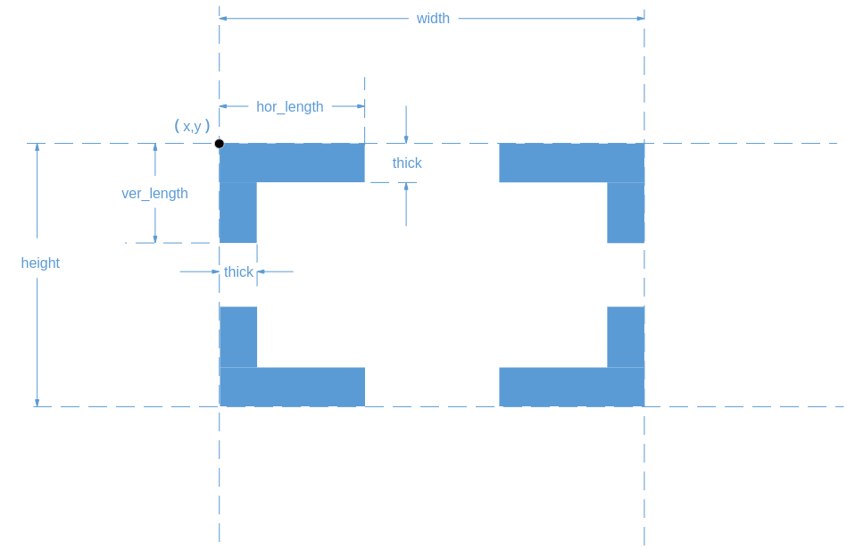

# 概述<a name="ZH-CN_TOPIC_0000002470925724"></a>

VO（Video Output，视频输出）模块主动从内存相应位置读取视频和图形数据，并通过相应的显示设备输出视频和图形。解决方案支持的显示/回写设备、视频层和图形层情况如[表1](#_Ref321934127)所示。

**表 1**  解决方案支持的显示/回写设备、视频层和图形层

<a name="_Ref321934127"></a>
<table><thead align="left"><tr id="row118mcpsimp"><th class="cellrowborder" valign="top" id="mcps1.2.12.1.1"><p id="p120mcpsimp"><a name="p120mcpsimp"></a><a name="p120mcpsimp"></a>解决方案</p>
</th>
<th class="cellrowborder" colspan="3" valign="top" id="mcps1.2.12.1.2"><p id="p122mcpsimp"><a name="p122mcpsimp"></a><a name="p122mcpsimp"></a>超高清显示设备DHD0</p>
</th>
<th class="cellrowborder" colspan="3" valign="top" id="mcps1.2.12.1.3"><p id="p124mcpsimp"><a name="p124mcpsimp"></a><a name="p124mcpsimp"></a>高清显示设备DHD1</p>
</th>
<th class="cellrowborder" colspan="2" valign="top" id="mcps1.2.12.1.4"><p id="p126mcpsimp"><a name="p126mcpsimp"></a><a name="p126mcpsimp"></a>标清显示设备DSD0</p>
</th>
<th class="cellrowborder" colspan="2" valign="top" id="mcps1.2.12.1.5"><p id="p128mcpsimp"><a name="p128mcpsimp"></a><a name="p128mcpsimp"></a>回写设备WD</p>
</th>
</tr>
</thead>
<tbody><tr id="row130mcpsimp"><td class="cellrowborder" valign="top" width="10.000000000000002%" headers="mcps1.2.12.1.1 "><p id="p132mcpsimp"><a name="p132mcpsimp"></a><a name="p132mcpsimp"></a>SS528V100</p>
</td>
<td class="cellrowborder" valign="top" width="9.000000000000002%" headers="mcps1.2.12.1.2 "><p id="p134mcpsimp"><a name="p134mcpsimp"></a><a name="p134mcpsimp"></a>视频层VHD0</p>
</td>
<td class="cellrowborder" valign="top" width="9.000000000000002%" headers="mcps1.2.12.1.2 "><p id="p136mcpsimp"><a name="p136mcpsimp"></a><a name="p136mcpsimp"></a>视频层VHD2</p>
</td>
<td class="cellrowborder" valign="top" width="9.000000000000002%" headers="mcps1.2.12.1.2 "><p id="p138mcpsimp"><a name="p138mcpsimp"></a><a name="p138mcpsimp"></a>图形层G0</p>
<p id="p139mcpsimp"><a name="p139mcpsimp"></a><a name="p139mcpsimp"></a>图形层G2</p>
<p id="p140mcpsimp"><a name="p140mcpsimp"></a><a name="p140mcpsimp"></a>图形层G3</p>
</td>
<td class="cellrowborder" valign="top" width="8.000000000000002%" headers="mcps1.2.12.1.3 "><p id="p142mcpsimp"><a name="p142mcpsimp"></a><a name="p142mcpsimp"></a>视频层VHD1</p>
</td>
<td class="cellrowborder" valign="top" width="9.000000000000002%" headers="mcps1.2.12.1.3 "><p id="p144mcpsimp"><a name="p144mcpsimp"></a><a name="p144mcpsimp"></a>视频层VHD2</p>
</td>
<td class="cellrowborder" valign="top" width="10.000000000000002%" headers="mcps1.2.12.1.3 "><p id="p146mcpsimp"><a name="p146mcpsimp"></a><a name="p146mcpsimp"></a>图形层G1</p>
<p id="p147mcpsimp"><a name="p147mcpsimp"></a><a name="p147mcpsimp"></a>图形层G2</p>
<p id="p148mcpsimp"><a name="p148mcpsimp"></a><a name="p148mcpsimp"></a>图形层G3</p>
</td>
<td class="cellrowborder" valign="top" width="7.000000000000002%" headers="mcps1.2.12.1.4 "><p id="p150mcpsimp"><a name="p150mcpsimp"></a><a name="p150mcpsimp"></a>视频层VSD0</p>
</td>
<td class="cellrowborder" valign="top" width="10.000000000000002%" headers="mcps1.2.12.1.4 "><p id="p152mcpsimp"><a name="p152mcpsimp"></a><a name="p152mcpsimp"></a>图形层G2</p>
<p id="p153mcpsimp"><a name="p153mcpsimp"></a><a name="p153mcpsimp"></a>图形层G3</p>
</td>
<td class="cellrowborder" valign="top" width="9.000000000000002%" headers="mcps1.2.12.1.5 "><p id="p155mcpsimp"><a name="p155mcpsimp"></a><a name="p155mcpsimp"></a>设备级回写自DHD0/DHD1</p>
</td>
<td class="cellrowborder" valign="top" width="10.000000000000002%" headers="mcps1.2.12.1.5 "><p id="p157mcpsimp"><a name="p157mcpsimp"></a><a name="p157mcpsimp"></a>视频层回写自VHD0/VHD1</p>
</td>
</tr>
<tr id="row158mcpsimp"><td class="cellrowborder" valign="top" width="10.000000000000002%" headers="mcps1.2.12.1.1 "><p id="p160mcpsimp"><a name="p160mcpsimp"></a><a name="p160mcpsimp"></a>SS625V100</p>
</td>
<td class="cellrowborder" valign="top" width="9.000000000000002%" headers="mcps1.2.12.1.2 "><p id="p162mcpsimp"><a name="p162mcpsimp"></a><a name="p162mcpsimp"></a>视频层VHD0</p>
</td>
<td class="cellrowborder" valign="top" width="9.000000000000002%" headers="mcps1.2.12.1.2 "><p id="p164mcpsimp"><a name="p164mcpsimp"></a><a name="p164mcpsimp"></a>视频层VHD2</p>
</td>
<td class="cellrowborder" valign="top" width="9.000000000000002%" headers="mcps1.2.12.1.2 "><p id="p166mcpsimp"><a name="p166mcpsimp"></a><a name="p166mcpsimp"></a>图形层G0</p>
<p id="p167mcpsimp"><a name="p167mcpsimp"></a><a name="p167mcpsimp"></a>图形层G2</p>
<p id="p168mcpsimp"><a name="p168mcpsimp"></a><a name="p168mcpsimp"></a>图形层G3</p>
</td>
<td class="cellrowborder" valign="top" width="8.000000000000002%" headers="mcps1.2.12.1.3 "><p id="p170mcpsimp"><a name="p170mcpsimp"></a><a name="p170mcpsimp"></a>视频层VHD1</p>
</td>
<td class="cellrowborder" valign="top" width="9.000000000000002%" headers="mcps1.2.12.1.3 "><p id="p172mcpsimp"><a name="p172mcpsimp"></a><a name="p172mcpsimp"></a>视频层VHD2</p>
</td>
<td class="cellrowborder" valign="top" width="10.000000000000002%" headers="mcps1.2.12.1.3 "><p id="p174mcpsimp"><a name="p174mcpsimp"></a><a name="p174mcpsimp"></a>图形层G1</p>
<p id="p175mcpsimp"><a name="p175mcpsimp"></a><a name="p175mcpsimp"></a>图形层G2</p>
<p id="p176mcpsimp"><a name="p176mcpsimp"></a><a name="p176mcpsimp"></a>图形层G3</p>
</td>
<td class="cellrowborder" valign="top" width="7.000000000000002%" headers="mcps1.2.12.1.4 "><p id="p178mcpsimp"><a name="p178mcpsimp"></a><a name="p178mcpsimp"></a>视频层VSD0</p>
</td>
<td class="cellrowborder" valign="top" width="10.000000000000002%" headers="mcps1.2.12.1.4 "><p id="p180mcpsimp"><a name="p180mcpsimp"></a><a name="p180mcpsimp"></a>图形层G2</p>
<p id="p181mcpsimp"><a name="p181mcpsimp"></a><a name="p181mcpsimp"></a>图形层G3</p>
</td>
<td class="cellrowborder" valign="top" width="9.000000000000002%" headers="mcps1.2.12.1.5 "><p id="p183mcpsimp"><a name="p183mcpsimp"></a><a name="p183mcpsimp"></a>设备级回写自DHD0/DHD1</p>
</td>
<td class="cellrowborder" valign="top" width="10.000000000000002%" headers="mcps1.2.12.1.5 "><p id="p185mcpsimp"><a name="p185mcpsimp"></a><a name="p185mcpsimp"></a>视频层回写自VHD0/VHD1</p>
</td>
</tr>
<tr id="row186mcpsimp"><td class="cellrowborder" valign="top" width="10.000000000000002%" headers="mcps1.2.12.1.1 "><p id="p188mcpsimp"><a name="p188mcpsimp"></a><a name="p188mcpsimp"></a>SS524V100</p>
</td>
<td class="cellrowborder" valign="top" width="9.000000000000002%" headers="mcps1.2.12.1.2 "><p id="p190mcpsimp"><a name="p190mcpsimp"></a><a name="p190mcpsimp"></a>视频层VHD0</p>
</td>
<td class="cellrowborder" valign="top" width="9.000000000000002%" headers="mcps1.2.12.1.2 "><p id="p192mcpsimp"><a name="p192mcpsimp"></a><a name="p192mcpsimp"></a>视频层VHD2</p>
</td>
<td class="cellrowborder" valign="top" width="9.000000000000002%" headers="mcps1.2.12.1.2 "><p id="p194mcpsimp"><a name="p194mcpsimp"></a><a name="p194mcpsimp"></a>图形层G0</p>
<p id="p195mcpsimp"><a name="p195mcpsimp"></a><a name="p195mcpsimp"></a>图形层G2</p>
<p id="p196mcpsimp"><a name="p196mcpsimp"></a><a name="p196mcpsimp"></a>图形层G3</p>
</td>
<td class="cellrowborder" valign="top" width="8.000000000000002%" headers="mcps1.2.12.1.3 "><p id="p198mcpsimp"><a name="p198mcpsimp"></a><a name="p198mcpsimp"></a>视频层VHD1</p>
</td>
<td class="cellrowborder" valign="top" width="9.000000000000002%" headers="mcps1.2.12.1.3 "><p id="p200mcpsimp"><a name="p200mcpsimp"></a><a name="p200mcpsimp"></a>视频层VHD2</p>
</td>
<td class="cellrowborder" valign="top" width="10.000000000000002%" headers="mcps1.2.12.1.3 "><p id="p202mcpsimp"><a name="p202mcpsimp"></a><a name="p202mcpsimp"></a>图形层G1</p>
<p id="p203mcpsimp"><a name="p203mcpsimp"></a><a name="p203mcpsimp"></a>图形层G2</p>
<p id="p204mcpsimp"><a name="p204mcpsimp"></a><a name="p204mcpsimp"></a>图形层G3</p>
</td>
<td class="cellrowborder" valign="top" width="7.000000000000002%" headers="mcps1.2.12.1.4 "><p id="p206mcpsimp"><a name="p206mcpsimp"></a><a name="p206mcpsimp"></a>视频层VSD0</p>
</td>
<td class="cellrowborder" valign="top" width="10.000000000000002%" headers="mcps1.2.12.1.4 "><p id="p208mcpsimp"><a name="p208mcpsimp"></a><a name="p208mcpsimp"></a>图形层G2</p>
<p id="p209mcpsimp"><a name="p209mcpsimp"></a><a name="p209mcpsimp"></a>图形层G3</p>
</td>
<td class="cellrowborder" valign="top" width="9.000000000000002%" headers="mcps1.2.12.1.5 "><p id="p211mcpsimp"><a name="p211mcpsimp"></a><a name="p211mcpsimp"></a>设备级回写自DHD0/DHD1</p>
</td>
<td class="cellrowborder" valign="top" width="10.000000000000002%" headers="mcps1.2.12.1.5 "><p id="p213mcpsimp"><a name="p213mcpsimp"></a><a name="p213mcpsimp"></a>视频层回写自VHD0/VHD1</p>
</td>
</tr>
<tr id="row214mcpsimp"><td class="cellrowborder" valign="top" width="10.000000000000002%" headers="mcps1.2.12.1.1 "><p id="p216mcpsimp"><a name="p216mcpsimp"></a><a name="p216mcpsimp"></a>SS522V101</p>
</td>
<td class="cellrowborder" valign="top" width="9.000000000000002%" headers="mcps1.2.12.1.2 "><p id="p218mcpsimp"><a name="p218mcpsimp"></a><a name="p218mcpsimp"></a>视频层VHD0</p>
</td>
<td class="cellrowborder" valign="top" width="9.000000000000002%" headers="mcps1.2.12.1.2 "><p id="p220mcpsimp"><a name="p220mcpsimp"></a><a name="p220mcpsimp"></a>视频层VHD2</p>
</td>
<td class="cellrowborder" valign="top" width="9.000000000000002%" headers="mcps1.2.12.1.2 "><p id="p222mcpsimp"><a name="p222mcpsimp"></a><a name="p222mcpsimp"></a>图形层G0</p>
<p id="p223mcpsimp"><a name="p223mcpsimp"></a><a name="p223mcpsimp"></a>图形层G2</p>
<p id="p224mcpsimp"><a name="p224mcpsimp"></a><a name="p224mcpsimp"></a>图形层G3</p>
</td>
<td class="cellrowborder" valign="top" width="8.000000000000002%" headers="mcps1.2.12.1.3 "><p id="p226mcpsimp"><a name="p226mcpsimp"></a><a name="p226mcpsimp"></a>-</p>
</td>
<td class="cellrowborder" valign="top" width="9.000000000000002%" headers="mcps1.2.12.1.3 "><p id="p228mcpsimp"><a name="p228mcpsimp"></a><a name="p228mcpsimp"></a>-</p>
</td>
<td class="cellrowborder" valign="top" width="10.000000000000002%" headers="mcps1.2.12.1.3 "><p id="p230mcpsimp"><a name="p230mcpsimp"></a><a name="p230mcpsimp"></a>-</p>
</td>
<td class="cellrowborder" valign="top" width="7.000000000000002%" headers="mcps1.2.12.1.4 "><p id="p232mcpsimp"><a name="p232mcpsimp"></a><a name="p232mcpsimp"></a>视频层VSD0</p>
</td>
<td class="cellrowborder" valign="top" width="10.000000000000002%" headers="mcps1.2.12.1.4 "><p id="p234mcpsimp"><a name="p234mcpsimp"></a><a name="p234mcpsimp"></a>图形层G2</p>
<p id="p235mcpsimp"><a name="p235mcpsimp"></a><a name="p235mcpsimp"></a>图形层G3</p>
</td>
<td class="cellrowborder" valign="top" width="9.000000000000002%" headers="mcps1.2.12.1.5 "><p id="p237mcpsimp"><a name="p237mcpsimp"></a><a name="p237mcpsimp"></a>设备级回写自DHD0</p>
</td>
<td class="cellrowborder" valign="top" width="10.000000000000002%" headers="mcps1.2.12.1.5 "><p id="p239mcpsimp"><a name="p239mcpsimp"></a><a name="p239mcpsimp"></a>视频层回写自VHD0</p>
</td>
</tr>
<tr id="row240mcpsimp"><td class="cellrowborder" valign="top" width="10.000000000000002%" headers="mcps1.2.12.1.1 "><p id="p242mcpsimp"><a name="p242mcpsimp"></a><a name="p242mcpsimp"></a>SS928V100</p>
</td>
<td class="cellrowborder" valign="top" width="9.000000000000002%" headers="mcps1.2.12.1.2 "><p id="p244mcpsimp"><a name="p244mcpsimp"></a><a name="p244mcpsimp"></a>视频层VHD0</p>
</td>
<td class="cellrowborder" valign="top" width="9.000000000000002%" headers="mcps1.2.12.1.2 "><p id="p246mcpsimp"><a name="p246mcpsimp"></a><a name="p246mcpsimp"></a>视频层VHD2</p>
</td>
<td class="cellrowborder" valign="top" width="9.000000000000002%" headers="mcps1.2.12.1.2 "><p id="p248mcpsimp"><a name="p248mcpsimp"></a><a name="p248mcpsimp"></a>图形层G0</p>
<p id="p249mcpsimp"><a name="p249mcpsimp"></a><a name="p249mcpsimp"></a>图形层G3</p>
</td>
<td class="cellrowborder" valign="top" width="8.000000000000002%" headers="mcps1.2.12.1.3 "><p id="p251mcpsimp"><a name="p251mcpsimp"></a><a name="p251mcpsimp"></a>视频层VHD1</p>
</td>
<td class="cellrowborder" valign="top" width="9.000000000000002%" headers="mcps1.2.12.1.3 "><p id="p253mcpsimp"><a name="p253mcpsimp"></a><a name="p253mcpsimp"></a>视频层VHD2</p>
</td>
<td class="cellrowborder" valign="top" width="10.000000000000002%" headers="mcps1.2.12.1.3 "><p id="p255mcpsimp"><a name="p255mcpsimp"></a><a name="p255mcpsimp"></a>图形层G1</p>
<p id="p256mcpsimp"><a name="p256mcpsimp"></a><a name="p256mcpsimp"></a>图形层G3</p>
</td>
<td class="cellrowborder" valign="top" width="7.000000000000002%" headers="mcps1.2.12.1.4 "><p id="p258mcpsimp"><a name="p258mcpsimp"></a><a name="p258mcpsimp"></a>-</p>
</td>
<td class="cellrowborder" valign="top" width="10.000000000000002%" headers="mcps1.2.12.1.4 "><p id="p260mcpsimp"><a name="p260mcpsimp"></a><a name="p260mcpsimp"></a>-</p>
</td>
<td class="cellrowborder" valign="top" width="9.000000000000002%" headers="mcps1.2.12.1.5 "><p id="p262mcpsimp"><a name="p262mcpsimp"></a><a name="p262mcpsimp"></a>-</p>
</td>
<td class="cellrowborder" valign="top" width="10.000000000000002%" headers="mcps1.2.12.1.5 "><p id="p264mcpsimp"><a name="p264mcpsimp"></a><a name="p264mcpsimp"></a>-</p>
</td>
</tr>
<tr id="row265mcpsimp"><td class="cellrowborder" valign="top" width="10.000000000000002%" headers="mcps1.2.12.1.1 "><p id="p267mcpsimp"><a name="p267mcpsimp"></a><a name="p267mcpsimp"></a>SS626V100</p>
</td>
<td class="cellrowborder" valign="top" width="9.000000000000002%" headers="mcps1.2.12.1.2 "><p id="p269mcpsimp"><a name="p269mcpsimp"></a><a name="p269mcpsimp"></a>视频层VHD0</p>
</td>
<td class="cellrowborder" valign="top" width="9.000000000000002%" headers="mcps1.2.12.1.2 "><p id="p271mcpsimp"><a name="p271mcpsimp"></a><a name="p271mcpsimp"></a>视频层VHD2</p>
</td>
<td class="cellrowborder" valign="top" width="9.000000000000002%" headers="mcps1.2.12.1.2 "><p id="p273mcpsimp"><a name="p273mcpsimp"></a><a name="p273mcpsimp"></a>图形层G0</p>
<p id="p274mcpsimp"><a name="p274mcpsimp"></a><a name="p274mcpsimp"></a>图形层G2</p>
<p id="p275mcpsimp"><a name="p275mcpsimp"></a><a name="p275mcpsimp"></a>图形层G3</p>
</td>
<td class="cellrowborder" valign="top" width="8.000000000000002%" headers="mcps1.2.12.1.3 "><p id="p277mcpsimp"><a name="p277mcpsimp"></a><a name="p277mcpsimp"></a>视频层VHD1</p>
</td>
<td class="cellrowborder" valign="top" width="9.000000000000002%" headers="mcps1.2.12.1.3 "><p id="p279mcpsimp"><a name="p279mcpsimp"></a><a name="p279mcpsimp"></a>视频层VHD2</p>
<p id="p280mcpsimp"><a name="p280mcpsimp"></a><a name="p280mcpsimp"></a>视频层VSD0</p>
</td>
<td class="cellrowborder" valign="top" width="10.000000000000002%" headers="mcps1.2.12.1.3 "><p id="p282mcpsimp"><a name="p282mcpsimp"></a><a name="p282mcpsimp"></a>图形层G1</p>
<p id="p283mcpsimp"><a name="p283mcpsimp"></a><a name="p283mcpsimp"></a>图形层G2</p>
<p id="p284mcpsimp"><a name="p284mcpsimp"></a><a name="p284mcpsimp"></a>图形层G3</p>
<p id="p285mcpsimp"><a name="p285mcpsimp"></a><a name="p285mcpsimp"></a>图形层G4</p>
</td>
<td class="cellrowborder" valign="top" width="7.000000000000002%" headers="mcps1.2.12.1.4 "><p id="p287mcpsimp"><a name="p287mcpsimp"></a><a name="p287mcpsimp"></a>视频层VSD0</p>
</td>
<td class="cellrowborder" valign="top" width="10.000000000000002%" headers="mcps1.2.12.1.4 "><p id="p289mcpsimp"><a name="p289mcpsimp"></a><a name="p289mcpsimp"></a>图形层G2</p>
<p id="p290mcpsimp"><a name="p290mcpsimp"></a><a name="p290mcpsimp"></a>图形层G4</p>
</td>
<td class="cellrowborder" valign="top" width="9.000000000000002%" headers="mcps1.2.12.1.5 "><p id="p292mcpsimp"><a name="p292mcpsimp"></a><a name="p292mcpsimp"></a>设备级回写自DHD0/DHD1</p>
</td>
<td class="cellrowborder" valign="top" width="10.000000000000002%" headers="mcps1.2.12.1.5 "><p id="p294mcpsimp"><a name="p294mcpsimp"></a><a name="p294mcpsimp"></a>视频层回写自VHD0/VHD1</p>
</td>
</tr>
</tbody>
</table>

注：缩写解释

DHD0：Device HD0，高清设备0。

DHD1：Device HD1，高清设备1。

DSD0：Device SD0，标清设备0。

VHD0：Video layer of DHD0，视频层0。

VHD1：Video layer of DHD1，视频层1。

VHD2：Video PIP layer，视频层2。

VSD0：Video layer of DSD0，标清视频层0。

图形层G0：Graphic layer 0，图形层0。

图形层G1：Graphic layer 1，图形层1。

图形层G2：Graphic layer 2，图形层2。

图形层G3：Graphic layer 3，图形层3。

图形层G4：Graphic layer 4，图形层4。

WD：Write Back Channel Device，回写通道设备。

# 基本概念<a name="ZH-CN_TOPIC_0000002471085714"></a>

-   超高清、高清和标清显示设备

    SDK将高清和标清显示设备分别标示为DHDx（Device High Definition x）和DSDx（Device Standard Definition x），其中，x为索引号，从0开始取值，表示第几路高清/标清显示设备。例如第0路高清设备标示为DHD0，第0路标清显示设备标示为DSD0。所有高清和标清显示设备又可分别简称为HD和SD设备。由于DHD0能够支持到4K（3840x2160）的时序，因此DHD0也可以称之为超高清显示设备。

-   视频层

    对于固定在每个显示设备上面对应的视频层，SDK也对应采取VHDx（Video layer of HD x）和VSDx（Video layer of SD x）来标示。解决方案支持显示设备的情况请参见[表1](概述.md#_Ref321934127)。HD设备功能对比参考[表1](#_Ref400548960)。VHD视频层功能对比如[表2](#table123621823184220)所示。视频层和显示设备的实际显示分辨率依赖于具体输出接口，设备上视频输出接口支持的最大时序见[表1](#_Ref400548960)所示。

**表 1**  解决方案设备和输出接口时序规格

<a name="_Ref400548960"></a>
<table><thead align="left"><tr id="row16682mcpsimp"><th class="cellrowborder" valign="top" width="14.000000000000002%" id="mcps1.2.6.1.1"><p id="p16684mcpsimp"><a name="p16684mcpsimp"></a><a name="p16684mcpsimp"></a>解决方案</p>
</th>
<th class="cellrowborder" valign="top" width="11%" id="mcps1.2.6.1.2"><p id="p16686mcpsimp"><a name="p16686mcpsimp"></a><a name="p16686mcpsimp"></a>设备号</p>
</th>
<th class="cellrowborder" valign="top" width="19%" id="mcps1.2.6.1.3"><p id="p16688mcpsimp"><a name="p16688mcpsimp"></a><a name="p16688mcpsimp"></a>输出接口</p>
</th>
<th class="cellrowborder" valign="top" width="28.000000000000004%" id="mcps1.2.6.1.4"><p id="p16690mcpsimp"><a name="p16690mcpsimp"></a><a name="p16690mcpsimp"></a>最大输出时序</p>
</th>
<th class="cellrowborder" valign="top" width="28.000000000000004%" id="mcps1.2.6.1.5"><p id="p16692mcpsimp"><a name="p16692mcpsimp"></a><a name="p16692mcpsimp"></a>叠加拼接显示</p>
</th>
</tr>
</thead>
<tbody><tr id="row16694mcpsimp"><td class="cellrowborder" rowspan="7" valign="top" width="14.000000000000002%" headers="mcps1.2.6.1.1 "><p id="p16696mcpsimp"><a name="p16696mcpsimp"></a><a name="p16696mcpsimp"></a>SS528V100</p>
</td>
<td class="cellrowborder" rowspan="3" valign="top" width="11%" headers="mcps1.2.6.1.2 "><p id="p16698mcpsimp"><a name="p16698mcpsimp"></a><a name="p16698mcpsimp"></a>DHD0</p>
</td>
<td class="cellrowborder" valign="top" width="19%" headers="mcps1.2.6.1.3 "><p id="p16700mcpsimp"><a name="p16700mcpsimp"></a><a name="p16700mcpsimp"></a>HDMI</p>
</td>
<td class="cellrowborder" valign="top" width="28.000000000000004%" headers="mcps1.2.6.1.4 "><p id="p16702mcpsimp"><a name="p16702mcpsimp"></a><a name="p16702mcpsimp"></a>4096x2160@60</p>
</td>
<td class="cellrowborder" rowspan="3" valign="top" width="28.000000000000004%" headers="mcps1.2.6.1.5 "><p id="p16704mcpsimp"><a name="p16704mcpsimp"></a><a name="p16704mcpsimp"></a>PIP层可绑定到此设备上，且可以修改VHD0和VHD2层的优先级，VGS叠加。</p>
</td>
</tr>
<tr id="row16705mcpsimp"><td class="cellrowborder" valign="top" headers="mcps1.2.6.1.1 "><p id="p16707mcpsimp"><a name="p16707mcpsimp"></a><a name="p16707mcpsimp"></a>BT.1120</p>
</td>
<td class="cellrowborder" valign="top" headers="mcps1.2.6.1.2 "><p id="p16709mcpsimp"><a name="p16709mcpsimp"></a><a name="p16709mcpsimp"></a>3840x2160@30</p>
</td>
</tr>
<tr id="row16710mcpsimp"><td class="cellrowborder" valign="top" headers="mcps1.2.6.1.1 "><p id="p16712mcpsimp"><a name="p16712mcpsimp"></a><a name="p16712mcpsimp"></a>VGA</p>
</td>
<td class="cellrowborder" valign="top" headers="mcps1.2.6.1.2 "><p id="p16714mcpsimp"><a name="p16714mcpsimp"></a><a name="p16714mcpsimp"></a>2560x1600@60</p>
</td>
</tr>
<tr id="row16715mcpsimp"><td class="cellrowborder" rowspan="3" valign="top" headers="mcps1.2.6.1.1 "><p id="p16717mcpsimp"><a name="p16717mcpsimp"></a><a name="p16717mcpsimp"></a>DHD1</p>
</td>
<td class="cellrowborder" valign="top" headers="mcps1.2.6.1.2 "><p id="p16719mcpsimp"><a name="p16719mcpsimp"></a><a name="p16719mcpsimp"></a>HDMI</p>
</td>
<td class="cellrowborder" valign="top" headers="mcps1.2.6.1.3 "><p id="p16721mcpsimp"><a name="p16721mcpsimp"></a><a name="p16721mcpsimp"></a>4096x2160@30</p>
</td>
<td class="cellrowborder" rowspan="3" valign="top" headers="mcps1.2.6.1.4 "><p id="p16723mcpsimp"><a name="p16723mcpsimp"></a><a name="p16723mcpsimp"></a>PIP层可绑定到此设备上，且可以修改VHD1和VHD2层的优先级，VGS叠加</p>
</td>
</tr>
<tr id="row16724mcpsimp"><td class="cellrowborder" valign="top" headers="mcps1.2.6.1.1 "><p id="p16726mcpsimp"><a name="p16726mcpsimp"></a><a name="p16726mcpsimp"></a>BT.1120</p>
</td>
<td class="cellrowborder" valign="top" headers="mcps1.2.6.1.2 "><p id="p16728mcpsimp"><a name="p16728mcpsimp"></a><a name="p16728mcpsimp"></a>3840x2160@30</p>
</td>
</tr>
<tr id="row16729mcpsimp"><td class="cellrowborder" valign="top" headers="mcps1.2.6.1.1 "><p id="p16731mcpsimp"><a name="p16731mcpsimp"></a><a name="p16731mcpsimp"></a>VGA</p>
</td>
<td class="cellrowborder" valign="top" headers="mcps1.2.6.1.2 "><p id="p16733mcpsimp"><a name="p16733mcpsimp"></a><a name="p16733mcpsimp"></a>2560x1600@60</p>
</td>
</tr>
<tr id="row16734mcpsimp"><td class="cellrowborder" valign="top" headers="mcps1.2.6.1.1 "><p id="p16736mcpsimp"><a name="p16736mcpsimp"></a><a name="p16736mcpsimp"></a>DSD0</p>
</td>
<td class="cellrowborder" valign="top" headers="mcps1.2.6.1.2 "><p id="p16738mcpsimp"><a name="p16738mcpsimp"></a><a name="p16738mcpsimp"></a>CVBS</p>
</td>
<td class="cellrowborder" valign="top" headers="mcps1.2.6.1.3 "><p id="p16740mcpsimp"><a name="p16740mcpsimp"></a><a name="p16740mcpsimp"></a>PAL, NTSC</p>
</td>
<td class="cellrowborder" valign="top" headers="mcps1.2.6.1.4 "><p id="p16742mcpsimp"><a name="p16742mcpsimp"></a><a name="p16742mcpsimp"></a>VGS叠加</p>
</td>
</tr>
<tr id="row16743mcpsimp"><td class="cellrowborder" rowspan="7" valign="top" width="14.000000000000002%" headers="mcps1.2.6.1.1 "><p id="p16745mcpsimp"><a name="p16745mcpsimp"></a><a name="p16745mcpsimp"></a>SS625V100</p>
</td>
<td class="cellrowborder" rowspan="3" valign="top" width="11%" headers="mcps1.2.6.1.2 "><p id="p16747mcpsimp"><a name="p16747mcpsimp"></a><a name="p16747mcpsimp"></a>DHD0</p>
</td>
<td class="cellrowborder" valign="top" width="19%" headers="mcps1.2.6.1.3 "><p id="p16749mcpsimp"><a name="p16749mcpsimp"></a><a name="p16749mcpsimp"></a>HDMI</p>
</td>
<td class="cellrowborder" valign="top" width="28.000000000000004%" headers="mcps1.2.6.1.4 "><p id="p16751mcpsimp"><a name="p16751mcpsimp"></a><a name="p16751mcpsimp"></a>4096x2160@30</p>
</td>
<td class="cellrowborder" rowspan="3" valign="top" width="28.000000000000004%" headers="mcps1.2.6.1.5 "><p id="p16753mcpsimp"><a name="p16753mcpsimp"></a><a name="p16753mcpsimp"></a>PIP层可绑定到此设备上，且可以修改VHD0和VHD2层的优先级，VGS叠加。</p>
</td>
</tr>
<tr id="row16754mcpsimp"><td class="cellrowborder" valign="top" headers="mcps1.2.6.1.1 "><p id="p16756mcpsimp"><a name="p16756mcpsimp"></a><a name="p16756mcpsimp"></a>BT.1120</p>
</td>
<td class="cellrowborder" valign="top" headers="mcps1.2.6.1.2 "><p id="p16758mcpsimp"><a name="p16758mcpsimp"></a><a name="p16758mcpsimp"></a>1920x1080@60</p>
</td>
</tr>
<tr id="row16759mcpsimp"><td class="cellrowborder" valign="top" headers="mcps1.2.6.1.1 "><p id="p16761mcpsimp"><a name="p16761mcpsimp"></a><a name="p16761mcpsimp"></a>VGA</p>
</td>
<td class="cellrowborder" valign="top" headers="mcps1.2.6.1.2 "><p id="p16763mcpsimp"><a name="p16763mcpsimp"></a><a name="p16763mcpsimp"></a>2560x1600@60</p>
</td>
</tr>
<tr id="row16764mcpsimp"><td class="cellrowborder" rowspan="3" valign="top" headers="mcps1.2.6.1.1 "><p id="p16766mcpsimp"><a name="p16766mcpsimp"></a><a name="p16766mcpsimp"></a>DHD1</p>
</td>
<td class="cellrowborder" valign="top" headers="mcps1.2.6.1.2 "><p id="p16768mcpsimp"><a name="p16768mcpsimp"></a><a name="p16768mcpsimp"></a>HDMI</p>
</td>
<td class="cellrowborder" valign="top" headers="mcps1.2.6.1.3 "><p id="p16770mcpsimp"><a name="p16770mcpsimp"></a><a name="p16770mcpsimp"></a>2560x1600@60</p>
</td>
<td class="cellrowborder" rowspan="3" valign="top" headers="mcps1.2.6.1.4 "><p id="p16772mcpsimp"><a name="p16772mcpsimp"></a><a name="p16772mcpsimp"></a>PIP层可绑定到此设备上，且可以修改VHD1和VHD2层的优先级，VGS叠加</p>
</td>
</tr>
<tr id="row16773mcpsimp"><td class="cellrowborder" valign="top" headers="mcps1.2.6.1.1 "><p id="p16775mcpsimp"><a name="p16775mcpsimp"></a><a name="p16775mcpsimp"></a>BT.1120</p>
</td>
<td class="cellrowborder" valign="top" headers="mcps1.2.6.1.2 "><p id="p16777mcpsimp"><a name="p16777mcpsimp"></a><a name="p16777mcpsimp"></a>2560x1600@60</p>
</td>
</tr>
<tr id="row16778mcpsimp"><td class="cellrowborder" valign="top" headers="mcps1.2.6.1.1 "><p id="p16780mcpsimp"><a name="p16780mcpsimp"></a><a name="p16780mcpsimp"></a>VGA</p>
</td>
<td class="cellrowborder" valign="top" headers="mcps1.2.6.1.2 "><p id="p16782mcpsimp"><a name="p16782mcpsimp"></a><a name="p16782mcpsimp"></a>1920x1080@60</p>
</td>
</tr>
<tr id="row16783mcpsimp"><td class="cellrowborder" valign="top" headers="mcps1.2.6.1.1 "><p id="p16785mcpsimp"><a name="p16785mcpsimp"></a><a name="p16785mcpsimp"></a>DSD0</p>
</td>
<td class="cellrowborder" valign="top" headers="mcps1.2.6.1.2 "><p id="p16787mcpsimp"><a name="p16787mcpsimp"></a><a name="p16787mcpsimp"></a>CVBS</p>
</td>
<td class="cellrowborder" valign="top" headers="mcps1.2.6.1.3 "><p id="p16789mcpsimp"><a name="p16789mcpsimp"></a><a name="p16789mcpsimp"></a>PAL, NTSC</p>
</td>
<td class="cellrowborder" valign="top" headers="mcps1.2.6.1.4 "><p id="p16791mcpsimp"><a name="p16791mcpsimp"></a><a name="p16791mcpsimp"></a>VGS叠加</p>
</td>
</tr>
<tr id="row16792mcpsimp"><td class="cellrowborder" rowspan="9" valign="top" width="14.000000000000002%" headers="mcps1.2.6.1.1 "><p id="p16794mcpsimp"><a name="p16794mcpsimp"></a><a name="p16794mcpsimp"></a>SS524V100</p>
</td>
<td class="cellrowborder" rowspan="4" valign="top" width="11%" headers="mcps1.2.6.1.2 "><p id="p16796mcpsimp"><a name="p16796mcpsimp"></a><a name="p16796mcpsimp"></a>DHD0</p>
</td>
<td class="cellrowborder" valign="top" width="19%" headers="mcps1.2.6.1.3 "><p id="p16798mcpsimp"><a name="p16798mcpsimp"></a><a name="p16798mcpsimp"></a>HDMI</p>
</td>
<td class="cellrowborder" valign="top" width="28.000000000000004%" headers="mcps1.2.6.1.4 "><p id="p16800mcpsimp"><a name="p16800mcpsimp"></a><a name="p16800mcpsimp"></a>3840x2160@30</p>
</td>
<td class="cellrowborder" rowspan="4" valign="top" width="28.000000000000004%" headers="mcps1.2.6.1.5 "><p id="p16802mcpsimp"><a name="p16802mcpsimp"></a><a name="p16802mcpsimp"></a>PIP层可绑定到此设备上，且可以修改VHD0和VHD2层的优先级，VGS叠加。</p>
</td>
</tr>
<tr id="row16803mcpsimp"><td class="cellrowborder" valign="top" headers="mcps1.2.6.1.1 "><p id="p16805mcpsimp"><a name="p16805mcpsimp"></a><a name="p16805mcpsimp"></a>BT.1120</p>
</td>
<td class="cellrowborder" valign="top" headers="mcps1.2.6.1.2 "><p id="p16807mcpsimp"><a name="p16807mcpsimp"></a><a name="p16807mcpsimp"></a>1920x1080@60</p>
</td>
</tr>
<tr id="row16808mcpsimp"><td class="cellrowborder" valign="top" headers="mcps1.2.6.1.1 "><p id="p16810mcpsimp"><a name="p16810mcpsimp"></a><a name="p16810mcpsimp"></a>VGA</p>
</td>
<td class="cellrowborder" valign="top" headers="mcps1.2.6.1.2 "><p id="p16812mcpsimp"><a name="p16812mcpsimp"></a><a name="p16812mcpsimp"></a>2560x1600@60</p>
</td>
</tr>
<tr id="row16813mcpsimp"><td class="cellrowborder" valign="top" headers="mcps1.2.6.1.1 "><p id="p16815mcpsimp"><a name="p16815mcpsimp"></a><a name="p16815mcpsimp"></a>BT.656</p>
</td>
<td class="cellrowborder" valign="top" headers="mcps1.2.6.1.2 "><p id="p16817mcpsimp"><a name="p16817mcpsimp"></a><a name="p16817mcpsimp"></a>1920x1080@30（需配置用户时序）</p>
</td>
</tr>
<tr id="row16818mcpsimp"><td class="cellrowborder" rowspan="4" valign="top" headers="mcps1.2.6.1.1 "><p id="p16820mcpsimp"><a name="p16820mcpsimp"></a><a name="p16820mcpsimp"></a>DHD1</p>
</td>
<td class="cellrowborder" valign="top" headers="mcps1.2.6.1.2 "><p id="p16822mcpsimp"><a name="p16822mcpsimp"></a><a name="p16822mcpsimp"></a>HDMI</p>
</td>
<td class="cellrowborder" valign="top" headers="mcps1.2.6.1.3 "><p id="p16824mcpsimp"><a name="p16824mcpsimp"></a><a name="p16824mcpsimp"></a>1920x1080@60</p>
</td>
<td class="cellrowborder" rowspan="4" valign="top" headers="mcps1.2.6.1.4 "><p id="p16826mcpsimp"><a name="p16826mcpsimp"></a><a name="p16826mcpsimp"></a>PIP层可绑定到此设备上，且可以修改VHD1和VHD2层的优先级，VGS叠加</p>
</td>
</tr>
<tr id="row16827mcpsimp"><td class="cellrowborder" valign="top" headers="mcps1.2.6.1.1 "><p id="p16829mcpsimp"><a name="p16829mcpsimp"></a><a name="p16829mcpsimp"></a>BT.1120</p>
</td>
<td class="cellrowborder" valign="top" headers="mcps1.2.6.1.2 "><p id="p16831mcpsimp"><a name="p16831mcpsimp"></a><a name="p16831mcpsimp"></a>1920x1080@60</p>
</td>
</tr>
<tr id="row16832mcpsimp"><td class="cellrowborder" valign="top" headers="mcps1.2.6.1.1 "><p id="p16834mcpsimp"><a name="p16834mcpsimp"></a><a name="p16834mcpsimp"></a>VGA</p>
</td>
<td class="cellrowborder" valign="top" headers="mcps1.2.6.1.2 "><p id="p16836mcpsimp"><a name="p16836mcpsimp"></a><a name="p16836mcpsimp"></a>1920x1080@60</p>
</td>
</tr>
<tr id="row16837mcpsimp"><td class="cellrowborder" valign="top" headers="mcps1.2.6.1.1 "><p id="p16839mcpsimp"><a name="p16839mcpsimp"></a><a name="p16839mcpsimp"></a>BT.656</p>
</td>
<td class="cellrowborder" valign="top" headers="mcps1.2.6.1.2 "><p id="p16841mcpsimp"><a name="p16841mcpsimp"></a><a name="p16841mcpsimp"></a>1920x1080@30（需配置用户时序）</p>
</td>
</tr>
<tr id="row16842mcpsimp"><td class="cellrowborder" valign="top" headers="mcps1.2.6.1.1 "><p id="p16844mcpsimp"><a name="p16844mcpsimp"></a><a name="p16844mcpsimp"></a>DSD0</p>
</td>
<td class="cellrowborder" valign="top" headers="mcps1.2.6.1.2 "><p id="p16846mcpsimp"><a name="p16846mcpsimp"></a><a name="p16846mcpsimp"></a>CVBS</p>
</td>
<td class="cellrowborder" valign="top" headers="mcps1.2.6.1.3 "><p id="p16848mcpsimp"><a name="p16848mcpsimp"></a><a name="p16848mcpsimp"></a>PAL, NTSC</p>
</td>
<td class="cellrowborder" valign="top" headers="mcps1.2.6.1.4 "><p id="p16850mcpsimp"><a name="p16850mcpsimp"></a><a name="p16850mcpsimp"></a>VGS叠加</p>
</td>
</tr>
<tr id="row16851mcpsimp"><td class="cellrowborder" rowspan="6" valign="top" width="14.000000000000002%" headers="mcps1.2.6.1.1 "><p id="p16853mcpsimp"><a name="p16853mcpsimp"></a><a name="p16853mcpsimp"></a>SS522V101</p>
</td>
<td class="cellrowborder" rowspan="5" valign="top" width="11%" headers="mcps1.2.6.1.2 "><p id="p16855mcpsimp"><a name="p16855mcpsimp"></a><a name="p16855mcpsimp"></a>DHD0</p>
</td>
<td class="cellrowborder" valign="top" width="19%" headers="mcps1.2.6.1.3 "><p id="p16857mcpsimp"><a name="p16857mcpsimp"></a><a name="p16857mcpsimp"></a>HDMI</p>
</td>
<td class="cellrowborder" valign="top" width="28.000000000000004%" headers="mcps1.2.6.1.4 "><p id="p16859mcpsimp"><a name="p16859mcpsimp"></a><a name="p16859mcpsimp"></a>3840x2160@30</p>
</td>
<td class="cellrowborder" rowspan="5" valign="top" width="28.000000000000004%" headers="mcps1.2.6.1.5 "><p id="p16861mcpsimp"><a name="p16861mcpsimp"></a><a name="p16861mcpsimp"></a>PIP层可绑定到此设备上，且可以修改VHD0和VHD2层的优先级，VGS叠加。</p>
</td>
</tr>
<tr id="row16862mcpsimp"><td class="cellrowborder" valign="top" headers="mcps1.2.6.1.1 "><p id="p16864mcpsimp"><a name="p16864mcpsimp"></a><a name="p16864mcpsimp"></a>BT.1120</p>
</td>
<td class="cellrowborder" valign="top" headers="mcps1.2.6.1.2 "><p id="p16866mcpsimp"><a name="p16866mcpsimp"></a><a name="p16866mcpsimp"></a>1920x1080@60</p>
</td>
</tr>
<tr id="row16867mcpsimp"><td class="cellrowborder" valign="top" headers="mcps1.2.6.1.1 "><p id="p16869mcpsimp"><a name="p16869mcpsimp"></a><a name="p16869mcpsimp"></a>VGA</p>
</td>
<td class="cellrowborder" valign="top" headers="mcps1.2.6.1.2 "><p id="p16871mcpsimp"><a name="p16871mcpsimp"></a><a name="p16871mcpsimp"></a>1920x1080@60</p>
</td>
</tr>
<tr id="row16872mcpsimp"><td class="cellrowborder" valign="top" headers="mcps1.2.6.1.1 "><p id="p16874mcpsimp"><a name="p16874mcpsimp"></a><a name="p16874mcpsimp"></a>BT.656</p>
</td>
<td class="cellrowborder" valign="top" headers="mcps1.2.6.1.2 "><p id="p16876mcpsimp"><a name="p16876mcpsimp"></a><a name="p16876mcpsimp"></a>1920x1080@30（需配置用户时序）</p>
</td>
</tr>
<tr id="row16877mcpsimp"><td class="cellrowborder" valign="top" headers="mcps1.2.6.1.1 "><p id="p16879mcpsimp"><a name="p16879mcpsimp"></a><a name="p16879mcpsimp"></a>RGB_16BIT</p>
<p id="p16880mcpsimp"><a name="p16880mcpsimp"></a><a name="p16880mcpsimp"></a>RGB_18BIT</p>
<p id="p16881mcpsimp"><a name="p16881mcpsimp"></a><a name="p16881mcpsimp"></a>RGB_24BIT</p>
</td>
<td class="cellrowborder" valign="top" headers="mcps1.2.6.1.2 "><p id="p16883mcpsimp"><a name="p16883mcpsimp"></a><a name="p16883mcpsimp"></a>1280x720@60（需配置用户时序）</p>
</td>
</tr>
<tr id="row16884mcpsimp"><td class="cellrowborder" valign="top" headers="mcps1.2.6.1.1 "><p id="p16886mcpsimp"><a name="p16886mcpsimp"></a><a name="p16886mcpsimp"></a>DSD0</p>
</td>
<td class="cellrowborder" valign="top" headers="mcps1.2.6.1.2 "><p id="p16888mcpsimp"><a name="p16888mcpsimp"></a><a name="p16888mcpsimp"></a>CVBS</p>
</td>
<td class="cellrowborder" valign="top" headers="mcps1.2.6.1.3 "><p id="p16890mcpsimp"><a name="p16890mcpsimp"></a><a name="p16890mcpsimp"></a>PAL, NTSC</p>
</td>
<td class="cellrowborder" valign="top" headers="mcps1.2.6.1.4 "><p id="p16892mcpsimp"><a name="p16892mcpsimp"></a><a name="p16892mcpsimp"></a>VGS叠加</p>
</td>
</tr>
<tr id="row16893mcpsimp"><td class="cellrowborder" rowspan="10" valign="top" width="14.000000000000002%" headers="mcps1.2.6.1.1 "><p id="p16895mcpsimp"><a name="p16895mcpsimp"></a><a name="p16895mcpsimp"></a>SS928V100</p>
</td>
<td class="cellrowborder" rowspan="5" valign="top" width="11%" headers="mcps1.2.6.1.2 "><p id="p16897mcpsimp"><a name="p16897mcpsimp"></a><a name="p16897mcpsimp"></a>DHD0</p>
</td>
<td class="cellrowborder" valign="top" width="19%" headers="mcps1.2.6.1.3 "><p id="p16899mcpsimp"><a name="p16899mcpsimp"></a><a name="p16899mcpsimp"></a>HDMI</p>
</td>
<td class="cellrowborder" valign="top" width="28.000000000000004%" headers="mcps1.2.6.1.4 "><p id="p16901mcpsimp"><a name="p16901mcpsimp"></a><a name="p16901mcpsimp"></a>3840x2160@60</p>
</td>
<td class="cellrowborder" rowspan="5" valign="top" width="28.000000000000004%" headers="mcps1.2.6.1.5 "><p id="p16903mcpsimp"><a name="p16903mcpsimp"></a><a name="p16903mcpsimp"></a>PIP层可绑定到此设备上，且可以修改VHD0和VHD2层的优先级，VGS叠加。</p>
</td>
</tr>
<tr id="row16904mcpsimp"><td class="cellrowborder" valign="top" headers="mcps1.2.6.1.1 "><p id="p16906mcpsimp"><a name="p16906mcpsimp"></a><a name="p16906mcpsimp"></a>MIPI</p>
<p id="p16907mcpsimp"><a name="p16907mcpsimp"></a><a name="p16907mcpsimp"></a>MIPI_SLAVE</p>
</td>
<td class="cellrowborder" valign="top" headers="mcps1.2.6.1.2 "><p id="p16909mcpsimp"><a name="p16909mcpsimp"></a><a name="p16909mcpsimp"></a>3840x2160@60</p>
</td>
</tr>
<tr id="row16910mcpsimp"><td class="cellrowborder" valign="top" headers="mcps1.2.6.1.1 "><p id="p16912mcpsimp"><a name="p16912mcpsimp"></a><a name="p16912mcpsimp"></a>BT.1120</p>
</td>
<td class="cellrowborder" valign="top" headers="mcps1.2.6.1.2 "><p id="p16914mcpsimp"><a name="p16914mcpsimp"></a><a name="p16914mcpsimp"></a>1920x1080@60</p>
</td>
</tr>
<tr id="row16915mcpsimp"><td class="cellrowborder" valign="top" headers="mcps1.2.6.1.1 "><p id="p16917mcpsimp"><a name="p16917mcpsimp"></a><a name="p16917mcpsimp"></a>BT.656</p>
</td>
<td class="cellrowborder" valign="top" headers="mcps1.2.6.1.2 "><p id="p16919mcpsimp"><a name="p16919mcpsimp"></a><a name="p16919mcpsimp"></a>1920x1080@30（需配置用户时序）</p>
</td>
</tr>
<tr id="row16920mcpsimp"><td class="cellrowborder" valign="top" headers="mcps1.2.6.1.1 "><p id="p16922mcpsimp"><a name="p16922mcpsimp"></a><a name="p16922mcpsimp"></a>RGB_6BIT</p>
<p id="p16923mcpsimp"><a name="p16923mcpsimp"></a><a name="p16923mcpsimp"></a>RGB_8BIT</p>
<p id="p16924mcpsimp"><a name="p16924mcpsimp"></a><a name="p16924mcpsimp"></a>RGB_16BIT</p>
<p id="p16925mcpsimp"><a name="p16925mcpsimp"></a><a name="p16925mcpsimp"></a>RGB_18BIT</p>
<p id="p16926mcpsimp"><a name="p16926mcpsimp"></a><a name="p16926mcpsimp"></a>RGB_24BIT</p>
</td>
<td class="cellrowborder" valign="top" headers="mcps1.2.6.1.2 "><p id="p16928mcpsimp"><a name="p16928mcpsimp"></a><a name="p16928mcpsimp"></a>1920x1080@60（需配置用户时序）</p>
</td>
</tr>
<tr id="row16929mcpsimp"><td class="cellrowborder" rowspan="5" valign="top" headers="mcps1.2.6.1.1 "><p id="p16931mcpsimp"><a name="p16931mcpsimp"></a><a name="p16931mcpsimp"></a>DHD1</p>
</td>
<td class="cellrowborder" valign="top" headers="mcps1.2.6.1.2 "><p id="p16933mcpsimp"><a name="p16933mcpsimp"></a><a name="p16933mcpsimp"></a>MIPI</p>
<p id="p16934mcpsimp"><a name="p16934mcpsimp"></a><a name="p16934mcpsimp"></a>MIPI_SLAVE</p>
</td>
<td class="cellrowborder" valign="top" headers="mcps1.2.6.1.3 "><p id="p16936mcpsimp"><a name="p16936mcpsimp"></a><a name="p16936mcpsimp"></a>1920x1080@60</p>
</td>
<td class="cellrowborder" rowspan="5" valign="top" headers="mcps1.2.6.1.4 "><p id="p16938mcpsimp"><a name="p16938mcpsimp"></a><a name="p16938mcpsimp"></a>PIP层可绑定到此设备上，且可以修改VHD1和VHD2层的优先级，VGS叠加</p>
</td>
</tr>
<tr id="row16939mcpsimp"><td class="cellrowborder" valign="top" headers="mcps1.2.6.1.1 "><p id="p16941mcpsimp"><a name="p16941mcpsimp"></a><a name="p16941mcpsimp"></a>BT.1120</p>
</td>
<td class="cellrowborder" valign="top" headers="mcps1.2.6.1.2 "><p id="p16943mcpsimp"><a name="p16943mcpsimp"></a><a name="p16943mcpsimp"></a>1920x1080@60</p>
</td>
</tr>
<tr id="row16944mcpsimp"><td class="cellrowborder" valign="top" headers="mcps1.2.6.1.1 "><p id="p16946mcpsimp"><a name="p16946mcpsimp"></a><a name="p16946mcpsimp"></a>BT.656</p>
</td>
<td class="cellrowborder" valign="top" headers="mcps1.2.6.1.2 "><p id="p16948mcpsimp"><a name="p16948mcpsimp"></a><a name="p16948mcpsimp"></a>1920x1080@30（需配置用户时序）</p>
</td>
</tr>
<tr id="row16949mcpsimp"><td class="cellrowborder" valign="top" headers="mcps1.2.6.1.1 "><p id="p16951mcpsimp"><a name="p16951mcpsimp"></a><a name="p16951mcpsimp"></a>RGB_6BIT</p>
<p id="p16952mcpsimp"><a name="p16952mcpsimp"></a><a name="p16952mcpsimp"></a>RGB_8BIT</p>
<p id="p16953mcpsimp"><a name="p16953mcpsimp"></a><a name="p16953mcpsimp"></a>RGB_16BIT</p>
<p id="p16954mcpsimp"><a name="p16954mcpsimp"></a><a name="p16954mcpsimp"></a>RGB_18BIT</p>
<p id="p16955mcpsimp"><a name="p16955mcpsimp"></a><a name="p16955mcpsimp"></a>RGB_24BIT</p>
</td>
<td class="cellrowborder" valign="top" headers="mcps1.2.6.1.2 "><p id="p16957mcpsimp"><a name="p16957mcpsimp"></a><a name="p16957mcpsimp"></a>1920x1080@60（需配置用户时序）</p>
</td>
</tr>
<tr id="row16958mcpsimp"><td class="cellrowborder" valign="top" headers="mcps1.2.6.1.1 "><p id="p16960mcpsimp"><a name="p16960mcpsimp"></a><a name="p16960mcpsimp"></a>CVBS</p>
</td>
<td class="cellrowborder" valign="top" headers="mcps1.2.6.1.2 "><p id="p16962mcpsimp"><a name="p16962mcpsimp"></a><a name="p16962mcpsimp"></a>PAL, NTSC</p>
</td>
</tr>
<tr id="row16963mcpsimp"><td class="cellrowborder" rowspan="9" valign="top" width="14.000000000000002%" headers="mcps1.2.6.1.1 "><p id="p16965mcpsimp"><a name="p16965mcpsimp"></a><a name="p16965mcpsimp"></a>SS626V100</p>
</td>
<td class="cellrowborder" rowspan="4" valign="top" width="11%" headers="mcps1.2.6.1.2 "><p id="p16967mcpsimp"><a name="p16967mcpsimp"></a><a name="p16967mcpsimp"></a>DHD0</p>
</td>
<td class="cellrowborder" valign="top" width="19%" headers="mcps1.2.6.1.3 "><p id="p16969mcpsimp"><a name="p16969mcpsimp"></a><a name="p16969mcpsimp"></a>HDMI</p>
<p id="p16970mcpsimp"><a name="p16970mcpsimp"></a><a name="p16970mcpsimp"></a>HDMI1</p>
</td>
<td class="cellrowborder" valign="top" width="28.000000000000004%" headers="mcps1.2.6.1.4 "><p id="p16972mcpsimp"><a name="p16972mcpsimp"></a><a name="p16972mcpsimp"></a>4096x2160@60</p>
</td>
<td class="cellrowborder" rowspan="4" valign="top" width="28.000000000000004%" headers="mcps1.2.6.1.5 "><p id="p16974mcpsimp"><a name="p16974mcpsimp"></a><a name="p16974mcpsimp"></a>PIP层可绑定到此设备上，且可以修改VHD0和VHD2层的优先级，VGS叠加。</p>
</td>
</tr>
<tr id="row16975mcpsimp"><td class="cellrowborder" valign="top" headers="mcps1.2.6.1.1 "><p id="p16977mcpsimp"><a name="p16977mcpsimp"></a><a name="p16977mcpsimp"></a>BT.1120</p>
</td>
<td class="cellrowborder" valign="top" headers="mcps1.2.6.1.2 "><p id="p16979mcpsimp"><a name="p16979mcpsimp"></a><a name="p16979mcpsimp"></a>3840x2160@30</p>
</td>
</tr>
<tr id="row16980mcpsimp"><td class="cellrowborder" valign="top" headers="mcps1.2.6.1.1 "><p id="p16982mcpsimp"><a name="p16982mcpsimp"></a><a name="p16982mcpsimp"></a>VGA</p>
</td>
<td class="cellrowborder" valign="top" headers="mcps1.2.6.1.2 "><p id="p16984mcpsimp"><a name="p16984mcpsimp"></a><a name="p16984mcpsimp"></a>2560x1600@60</p>
</td>
</tr>
<tr id="row16985mcpsimp"><td class="cellrowborder" valign="top" headers="mcps1.2.6.1.1 "><p id="p16987mcpsimp"><a name="p16987mcpsimp"></a><a name="p16987mcpsimp"></a>BT.656</p>
</td>
<td class="cellrowborder" valign="top" headers="mcps1.2.6.1.2 "><p id="p16989mcpsimp"><a name="p16989mcpsimp"></a><a name="p16989mcpsimp"></a>1920x1080@30（需配置用户时序）</p>
</td>
</tr>
<tr id="row16990mcpsimp"><td class="cellrowborder" rowspan="4" valign="top" headers="mcps1.2.6.1.1 "><p id="p16992mcpsimp"><a name="p16992mcpsimp"></a><a name="p16992mcpsimp"></a>DHD1</p>
</td>
<td class="cellrowborder" valign="top" headers="mcps1.2.6.1.2 "><p id="p16994mcpsimp"><a name="p16994mcpsimp"></a><a name="p16994mcpsimp"></a>HDMI</p>
<p id="p0719182112514"><a name="p0719182112514"></a><a name="p0719182112514"></a>HDMI1</p>
</td>
<td class="cellrowborder" valign="top" headers="mcps1.2.6.1.3 "><p id="p16996mcpsimp"><a name="p16996mcpsimp"></a><a name="p16996mcpsimp"></a>4096x2160@60</p>
</td>
<td class="cellrowborder" rowspan="4" valign="top" headers="mcps1.2.6.1.4 "><p id="p16998mcpsimp"><a name="p16998mcpsimp"></a><a name="p16998mcpsimp"></a>PIP层可绑定到此设备上，且可以修改VHD1和VHD2层的优先级，VGS叠加</p>
</td>
</tr>
<tr id="row16999mcpsimp"><td class="cellrowborder" valign="top" headers="mcps1.2.6.1.1 "><p id="p17001mcpsimp"><a name="p17001mcpsimp"></a><a name="p17001mcpsimp"></a>BT.1120</p>
</td>
<td class="cellrowborder" valign="top" headers="mcps1.2.6.1.2 "><p id="p17003mcpsimp"><a name="p17003mcpsimp"></a><a name="p17003mcpsimp"></a>3840x2160@30</p>
</td>
</tr>
<tr id="row17004mcpsimp"><td class="cellrowborder" valign="top" headers="mcps1.2.6.1.1 "><p id="p17006mcpsimp"><a name="p17006mcpsimp"></a><a name="p17006mcpsimp"></a>VGA</p>
</td>
<td class="cellrowborder" valign="top" headers="mcps1.2.6.1.2 "><p id="p17008mcpsimp"><a name="p17008mcpsimp"></a><a name="p17008mcpsimp"></a>2560x1600@60</p>
</td>
</tr>
<tr id="row17009mcpsimp"><td class="cellrowborder" valign="top" headers="mcps1.2.6.1.1 "><p id="p17011mcpsimp"><a name="p17011mcpsimp"></a><a name="p17011mcpsimp"></a>BT.656</p>
</td>
<td class="cellrowborder" valign="top" headers="mcps1.2.6.1.2 "><p id="p17013mcpsimp"><a name="p17013mcpsimp"></a><a name="p17013mcpsimp"></a>1920x1080@30（需配置用户时序）</p>
</td>
</tr>
<tr id="row17014mcpsimp"><td class="cellrowborder" valign="top" headers="mcps1.2.6.1.1 "><p id="p17016mcpsimp"><a name="p17016mcpsimp"></a><a name="p17016mcpsimp"></a>DSD0</p>
</td>
<td class="cellrowborder" valign="top" headers="mcps1.2.6.1.2 "><p id="p17018mcpsimp"><a name="p17018mcpsimp"></a><a name="p17018mcpsimp"></a>CVBS</p>
</td>
<td class="cellrowborder" valign="top" headers="mcps1.2.6.1.3 "><p id="p17020mcpsimp"><a name="p17020mcpsimp"></a><a name="p17020mcpsimp"></a>PAL, NTSC</p>
</td>
<td class="cellrowborder" valign="top" headers="mcps1.2.6.1.4 "><p id="p17022mcpsimp"><a name="p17022mcpsimp"></a><a name="p17022mcpsimp"></a>VGS叠加</p>
</td>
</tr>
</tbody>
</table>

> **须知：** 
>2160P@60fps时序输出时，存在性能限制：G0层ARGB8888格式所支持的最大分辨率为1080P。建议此时G0层采用1080P分辨率（格式不限）、同时开启图形层放大功能，将G0层在线放大到2160P进行显示；或者采用2160P分辨率、ARGB1555或ARGB4444格式。
>所有时序参数配置时，接口都应该关闭，配置完成后再使能接口。

SS528V100输出性能受输入数据带宽限制，视频SP420格式最大支持总共2160p@90fps输入，图形ARGB1555格式最大支持总共2160p@75fps输入。具体使用可参照如下示例：

-   DHD0、DHD1、DSD0分别使用2160p@60fps、1080p@60fps、D1@60fps同时输出时，PIP层V2输入最大支持1080P，G0输入为ARGB8888格式时最大支持1080P（配合在线放大）、输入为ARGB1555格式时最大支持2160P。
-   DHD0、DHD1、DSD0分别使用2160p@30fps、2160p@30fps、D1@60fps同时输出时，PIP层V2输入最大支持2160P，G0输入为ARGB8888格式时最大支持1080P（配合在线放大）、输入为ARGB1555格式时最大支持2160P，G1输入为ARGB8888格式时最大支持1080P（非全屏）、ARGB1555格式时最大支持2160P。
-   DHD0、DHD1、DSD0分别使用2160p@30fps、1080p@60fps、D1@60fps同时输出时，PIP层V2输入最大支持2160P，G0输入为ARGB8888格式时最大支持1080P（配合在线放大）、输入为ARGB1555格式时最大支持2160P。
-   DHD0、DSD0分别使用2160p@60fps、D1@60fps同时输出，DHD1不输出时，PIP层V2输入最大支持2160P，G0输入为ARGB8888格式最大支持1080P（配合在线放大）、输入为ARGB1555格式时最大支持2160P。

    **表 2**  解决方案视频层规格

    <a name="table123621823184220"></a>
    <table><thead align="left"><tr id="row12530172314212"><th class="cellrowborder" rowspan="2" valign="top" id="mcps1.2.8.1.1"><p id="p15481927194617"><a name="p15481927194617"></a><a name="p15481927194617"></a>解决方案</p>
    </th>
    <th class="cellrowborder" rowspan="2" valign="top" id="mcps1.2.8.1.2"><p id="p85481427114614"><a name="p85481427114614"></a><a name="p85481427114614"></a>视频层</p>
    </th>
    <th class="cellrowborder" rowspan="2" valign="top" id="mcps1.2.8.1.3"><p id="p9530142364214"><a name="p9530142364214"></a><a name="p9530142364214"></a>动态绑定能力</p>
    </th>
    <th class="cellrowborder" rowspan="2" valign="top" id="mcps1.2.8.1.4"><p id="p155301923164216"><a name="p155301923164216"></a><a name="p155301923164216"></a>缩放能力</p>
    </th>
    <th class="cellrowborder" rowspan="2" valign="top" id="mcps1.2.8.1.5"><p id="p853012384211"><a name="p853012384211"></a><a name="p853012384211"></a>VO解压能力</p>
    </th>
    <th class="cellrowborder" colspan="2" valign="top" id="mcps1.2.8.1.6"><p id="p653032318428"><a name="p653032318428"></a><a name="p653032318428"></a>支持通道数</p>
    </th>
    </tr>
    <tr id="row354792794615"><th class="cellrowborder" valign="top" id="mcps1.2.8.2.1"><p id="p205481727114610"><a name="p205481727114610"></a><a name="p205481727114610"></a>SINGLE模式</p>
    </th>
    <th class="cellrowborder" valign="top" id="mcps1.2.8.2.2"><p id="p654819278463"><a name="p654819278463"></a><a name="p654819278463"></a>MULTI模式</p>
    </th>
    </tr>
    </thead>
    <tbody><tr id="row253032324213"><td class="cellrowborder" rowspan="4" valign="top" width="10.927814437112577%" headers="mcps1.2.8.1.1 mcps1.2.8.2.1 "><p id="p12530162313425"><a name="p12530162313425"></a><a name="p12530162313425"></a>SS528V100</p>
    </td>
    <td class="cellrowborder" valign="top" width="10.937812437512498%" headers="mcps1.2.8.1.2 mcps1.2.8.2.2 "><p id="p12530123194219"><a name="p12530123194219"></a><a name="p12530123194219"></a>VHD0</p>
    </td>
    <td class="cellrowborder" valign="top" width="24.30513897220556%" headers="mcps1.2.8.1.3 "><p id="p195303239426"><a name="p195303239426"></a><a name="p195303239426"></a>不支持</p>
    <p id="p1653020238424"><a name="p1653020238424"></a><a name="p1653020238424"></a>（固定绑定在对应的DHD0设备上）</p>
    </td>
    <td class="cellrowborder" valign="top" width="12.267546490701859%" headers="mcps1.2.8.1.4 "><p id="p14530202317429"><a name="p14530202317429"></a><a name="p14530202317429"></a>支持放大</p>
    </td>
    <td class="cellrowborder" valign="top" width="21.655668866226755%" headers="mcps1.2.8.1.5 "><p id="p7530132313424"><a name="p7530132313424"></a><a name="p7530132313424"></a>支持通道解压，支持行解压</p>
    </td>
    <td class="cellrowborder" valign="top" width="10.037992401519697%" headers="mcps1.2.8.1.6 "><p id="p453010235423"><a name="p453010235423"></a><a name="p453010235423"></a>64</p>
    </td>
    <td class="cellrowborder" valign="top" width="9.868026394721054%" headers="mcps1.2.8.1.6 "><p id="p17530162316428"><a name="p17530162316428"></a><a name="p17530162316428"></a>64</p>
    </td>
    </tr>
    <tr id="row155305233428"><td class="cellrowborder" valign="top" headers="mcps1.2.8.1.1 mcps1.2.8.2.1 "><p id="p11530423104212"><a name="p11530423104212"></a><a name="p11530423104212"></a>VHD1</p>
    </td>
    <td class="cellrowborder" valign="top" headers="mcps1.2.8.1.2 mcps1.2.8.2.2 "><p id="p16530523104219"><a name="p16530523104219"></a><a name="p16530523104219"></a>不支持</p>
    <p id="p4530182310421"><a name="p4530182310421"></a><a name="p4530182310421"></a>（固定绑定在对应的DHD1设备上）</p>
    </td>
    <td class="cellrowborder" valign="top" headers="mcps1.2.8.1.3 "><p id="p175306231426"><a name="p175306231426"></a><a name="p175306231426"></a>不支持</p>
    </td>
    <td class="cellrowborder" valign="top" headers="mcps1.2.8.1.4 "><p id="p35301523134215"><a name="p35301523134215"></a><a name="p35301523134215"></a>支持通道解压，支持行解压和非紧凑段解压</p>
    </td>
    <td class="cellrowborder" valign="top" headers="mcps1.2.8.1.5 "><p id="p6530423124216"><a name="p6530423124216"></a><a name="p6530423124216"></a>64</p>
    </td>
    <td class="cellrowborder" valign="top" headers="mcps1.2.8.1.6 "><p id="p1553015236424"><a name="p1553015236424"></a><a name="p1553015236424"></a>64</p>
    </td>
    </tr>
    <tr id="row10530102394217"><td class="cellrowborder" valign="top" headers="mcps1.2.8.1.1 mcps1.2.8.2.1 "><p id="p1153017234428"><a name="p1153017234428"></a><a name="p1153017234428"></a>VHD2</p>
    </td>
    <td class="cellrowborder" valign="top" headers="mcps1.2.8.1.2 mcps1.2.8.2.2 "><p id="p195301923134212"><a name="p195301923134212"></a><a name="p195301923134212"></a>支持</p>
    <p id="p35301235427"><a name="p35301235427"></a><a name="p35301235427"></a>（可以选择绑定在DHD0、DHD1设备上）</p>
    </td>
    <td class="cellrowborder" valign="top" headers="mcps1.2.8.1.3 "><p id="p17530172317427"><a name="p17530172317427"></a><a name="p17530172317427"></a>不支持</p>
    </td>
    <td class="cellrowborder" valign="top" headers="mcps1.2.8.1.4 "><p id="p11531142310421"><a name="p11531142310421"></a><a name="p11531142310421"></a>支持通道解压，支持行解压和非紧凑段解压</p>
    </td>
    <td class="cellrowborder" valign="top" headers="mcps1.2.8.1.5 "><p id="p125311523134213"><a name="p125311523134213"></a><a name="p125311523134213"></a>64</p>
    </td>
    <td class="cellrowborder" valign="top" headers="mcps1.2.8.1.6 "><p id="p953142313421"><a name="p953142313421"></a><a name="p953142313421"></a>-</p>
    </td>
    </tr>
    <tr id="row453116233427"><td class="cellrowborder" valign="top" headers="mcps1.2.8.1.1 mcps1.2.8.2.1 "><p id="p7531423124218"><a name="p7531423124218"></a><a name="p7531423124218"></a>VSD0</p>
    </td>
    <td class="cellrowborder" valign="top" headers="mcps1.2.8.1.2 mcps1.2.8.2.2 "><p id="p353172364210"><a name="p353172364210"></a><a name="p353172364210"></a>不支持</p>
    <p id="p12531182304212"><a name="p12531182304212"></a><a name="p12531182304212"></a>（固定绑定在对应的DSD0设备上）</p>
    </td>
    <td class="cellrowborder" valign="top" headers="mcps1.2.8.1.3 "><p id="p175318233426"><a name="p175318233426"></a><a name="p175318233426"></a>不支持</p>
    </td>
    <td class="cellrowborder" valign="top" headers="mcps1.2.8.1.4 "><p id="p11531122311428"><a name="p11531122311428"></a><a name="p11531122311428"></a>不支持</p>
    </td>
    <td class="cellrowborder" valign="top" headers="mcps1.2.8.1.5 "><p id="p18531123184219"><a name="p18531123184219"></a><a name="p18531123184219"></a>64</p>
    </td>
    <td class="cellrowborder" valign="top" headers="mcps1.2.8.1.6 "><p id="p15531132315425"><a name="p15531132315425"></a><a name="p15531132315425"></a>-</p>
    </td>
    </tr>
    <tr id="row653112318421"><td class="cellrowborder" rowspan="4" valign="top" width="10.927814437112577%" headers="mcps1.2.8.1.1 mcps1.2.8.2.1 "><p id="p1653152314427"><a name="p1653152314427"></a><a name="p1653152314427"></a>SS625V100</p>
    </td>
    <td class="cellrowborder" valign="top" width="10.937812437512498%" headers="mcps1.2.8.1.2 mcps1.2.8.2.2 "><p id="p95311423194219"><a name="p95311423194219"></a><a name="p95311423194219"></a>VHD0</p>
    </td>
    <td class="cellrowborder" valign="top" width="24.30513897220556%" headers="mcps1.2.8.1.3 "><p id="p55311623174213"><a name="p55311623174213"></a><a name="p55311623174213"></a>不支持</p>
    <p id="p4531102317423"><a name="p4531102317423"></a><a name="p4531102317423"></a>（固定绑定在对应的DHD0设备上）</p>
    </td>
    <td class="cellrowborder" valign="top" width="12.267546490701859%" headers="mcps1.2.8.1.4 "><p id="p155314235426"><a name="p155314235426"></a><a name="p155314235426"></a>支持放大</p>
    </td>
    <td class="cellrowborder" valign="top" width="21.655668866226755%" headers="mcps1.2.8.1.5 "><p id="p2531172316424"><a name="p2531172316424"></a><a name="p2531172316424"></a>支持通道解压，支持行解压</p>
    </td>
    <td class="cellrowborder" valign="top" width="10.037992401519697%" headers="mcps1.2.8.1.6 "><p id="p1653117232425"><a name="p1653117232425"></a><a name="p1653117232425"></a>49</p>
    </td>
    <td class="cellrowborder" valign="top" width="9.868026394721054%" headers="mcps1.2.8.1.6 "><p id="p1153172334214"><a name="p1153172334214"></a><a name="p1153172334214"></a>49</p>
    </td>
    </tr>
    <tr id="row053152384210"><td class="cellrowborder" valign="top" headers="mcps1.2.8.1.1 mcps1.2.8.2.1 "><p id="p9531182310425"><a name="p9531182310425"></a><a name="p9531182310425"></a>VHD1</p>
    </td>
    <td class="cellrowborder" valign="top" headers="mcps1.2.8.1.2 mcps1.2.8.2.2 "><p id="p18531122344219"><a name="p18531122344219"></a><a name="p18531122344219"></a>不支持</p>
    <p id="p8531102374214"><a name="p8531102374214"></a><a name="p8531102374214"></a>（固定绑定在对应的DHD1设备上）</p>
    </td>
    <td class="cellrowborder" valign="top" headers="mcps1.2.8.1.3 "><p id="p14531623204213"><a name="p14531623204213"></a><a name="p14531623204213"></a>不支持</p>
    </td>
    <td class="cellrowborder" valign="top" headers="mcps1.2.8.1.4 "><p id="p16531172334214"><a name="p16531172334214"></a><a name="p16531172334214"></a>支持通道解压，支持行解压和非紧凑段解压</p>
    </td>
    <td class="cellrowborder" valign="top" headers="mcps1.2.8.1.5 "><p id="p2531523194210"><a name="p2531523194210"></a><a name="p2531523194210"></a>49</p>
    </td>
    <td class="cellrowborder" valign="top" headers="mcps1.2.8.1.6 "><p id="p6531523114213"><a name="p6531523114213"></a><a name="p6531523114213"></a>49</p>
    </td>
    </tr>
    <tr id="row353142315429"><td class="cellrowborder" valign="top" headers="mcps1.2.8.1.1 mcps1.2.8.2.1 "><p id="p55315239423"><a name="p55315239423"></a><a name="p55315239423"></a>VHD2</p>
    </td>
    <td class="cellrowborder" valign="top" headers="mcps1.2.8.1.2 mcps1.2.8.2.2 "><p id="p1053192310423"><a name="p1053192310423"></a><a name="p1053192310423"></a>支持</p>
    <p id="p18531132324215"><a name="p18531132324215"></a><a name="p18531132324215"></a>（可以选择绑定在DHD0、DHD1设备上）</p>
    </td>
    <td class="cellrowborder" valign="top" headers="mcps1.2.8.1.3 "><p id="p45311923154216"><a name="p45311923154216"></a><a name="p45311923154216"></a>不支持</p>
    </td>
    <td class="cellrowborder" valign="top" headers="mcps1.2.8.1.4 "><p id="p95311723144220"><a name="p95311723144220"></a><a name="p95311723144220"></a>支持通道解压，支持行解压和非紧凑段解压</p>
    </td>
    <td class="cellrowborder" valign="top" headers="mcps1.2.8.1.5 "><p id="p3531523154213"><a name="p3531523154213"></a><a name="p3531523154213"></a>49</p>
    </td>
    <td class="cellrowborder" valign="top" headers="mcps1.2.8.1.6 "><p id="p75311823174210"><a name="p75311823174210"></a><a name="p75311823174210"></a>-</p>
    </td>
    </tr>
    <tr id="row10531192319423"><td class="cellrowborder" valign="top" headers="mcps1.2.8.1.1 mcps1.2.8.2.1 "><p id="p0531023134218"><a name="p0531023134218"></a><a name="p0531023134218"></a>VSD0</p>
    </td>
    <td class="cellrowborder" valign="top" headers="mcps1.2.8.1.2 mcps1.2.8.2.2 "><p id="p25311923104220"><a name="p25311923104220"></a><a name="p25311923104220"></a>不支持</p>
    <p id="p753112238426"><a name="p753112238426"></a><a name="p753112238426"></a>（固定绑定在对应的DSD0设备上）</p>
    </td>
    <td class="cellrowborder" valign="top" headers="mcps1.2.8.1.3 "><p id="p1531102312426"><a name="p1531102312426"></a><a name="p1531102312426"></a>不支持</p>
    </td>
    <td class="cellrowborder" valign="top" headers="mcps1.2.8.1.4 "><p id="p25318234428"><a name="p25318234428"></a><a name="p25318234428"></a>不支持</p>
    </td>
    <td class="cellrowborder" valign="top" headers="mcps1.2.8.1.5 "><p id="p2531152317423"><a name="p2531152317423"></a><a name="p2531152317423"></a>49</p>
    </td>
    <td class="cellrowborder" valign="top" headers="mcps1.2.8.1.6 "><p id="p12531152318428"><a name="p12531152318428"></a><a name="p12531152318428"></a>-</p>
    </td>
    </tr>
    <tr id="row2532102310422"><td class="cellrowborder" rowspan="4" valign="top" width="10.927814437112577%" headers="mcps1.2.8.1.1 mcps1.2.8.2.1 "><p id="p155321923194218"><a name="p155321923194218"></a><a name="p155321923194218"></a>SS524V100</p>
    </td>
    <td class="cellrowborder" valign="top" width="10.937812437512498%" headers="mcps1.2.8.1.2 mcps1.2.8.2.2 "><p id="p35321323154215"><a name="p35321323154215"></a><a name="p35321323154215"></a>VHD0</p>
    </td>
    <td class="cellrowborder" valign="top" width="24.30513897220556%" headers="mcps1.2.8.1.3 "><p id="p2532142314219"><a name="p2532142314219"></a><a name="p2532142314219"></a>不支持</p>
    <p id="p653252314211"><a name="p653252314211"></a><a name="p653252314211"></a>（固定绑定在对应的DHD0设备上）</p>
    </td>
    <td class="cellrowborder" valign="top" width="12.267546490701859%" headers="mcps1.2.8.1.4 "><p id="p1853272324210"><a name="p1853272324210"></a><a name="p1853272324210"></a>支持放大</p>
    </td>
    <td class="cellrowborder" valign="top" width="21.655668866226755%" headers="mcps1.2.8.1.5 "><p id="p10532923184215"><a name="p10532923184215"></a><a name="p10532923184215"></a>支持通道解压，支持行解压</p>
    </td>
    <td class="cellrowborder" valign="top" width="10.037992401519697%" headers="mcps1.2.8.1.6 "><p id="p18532423194214"><a name="p18532423194214"></a><a name="p18532423194214"></a>64</p>
    </td>
    <td class="cellrowborder" valign="top" width="9.868026394721054%" headers="mcps1.2.8.1.6 "><p id="p5532923154210"><a name="p5532923154210"></a><a name="p5532923154210"></a>16</p>
    </td>
    </tr>
    <tr id="row18532112344217"><td class="cellrowborder" valign="top" headers="mcps1.2.8.1.1 mcps1.2.8.2.1 "><p id="p125321723164214"><a name="p125321723164214"></a><a name="p125321723164214"></a>VHD1</p>
    </td>
    <td class="cellrowborder" valign="top" headers="mcps1.2.8.1.2 mcps1.2.8.2.2 "><p id="p20532142394219"><a name="p20532142394219"></a><a name="p20532142394219"></a>不支持</p>
    <p id="p753222374216"><a name="p753222374216"></a><a name="p753222374216"></a>（固定绑定在对应的DHD1设备上）</p>
    </td>
    <td class="cellrowborder" valign="top" headers="mcps1.2.8.1.3 "><p id="p16532182319427"><a name="p16532182319427"></a><a name="p16532182319427"></a>不支持</p>
    </td>
    <td class="cellrowborder" valign="top" headers="mcps1.2.8.1.4 "><p id="p853242314220"><a name="p853242314220"></a><a name="p853242314220"></a>支持通道解压，支持行解压和非紧凑段解压（仅SINGLE模式支持非紧凑段解压）</p>
    </td>
    <td class="cellrowborder" valign="top" headers="mcps1.2.8.1.5 "><p id="p18532122314428"><a name="p18532122314428"></a><a name="p18532122314428"></a>64</p>
    </td>
    <td class="cellrowborder" valign="top" headers="mcps1.2.8.1.6 "><p id="p753218239422"><a name="p753218239422"></a><a name="p753218239422"></a>16</p>
    </td>
    </tr>
    <tr id="row153262317424"><td class="cellrowborder" valign="top" headers="mcps1.2.8.1.1 mcps1.2.8.2.1 "><p id="p1153212233428"><a name="p1153212233428"></a><a name="p1153212233428"></a>VHD2</p>
    </td>
    <td class="cellrowborder" valign="top" headers="mcps1.2.8.1.2 mcps1.2.8.2.2 "><p id="p7532102318429"><a name="p7532102318429"></a><a name="p7532102318429"></a>支持</p>
    <p id="p175324238428"><a name="p175324238428"></a><a name="p175324238428"></a>（可以选择绑定在DHD0、DHD1设备上）</p>
    </td>
    <td class="cellrowborder" valign="top" headers="mcps1.2.8.1.3 "><p id="p175321123124214"><a name="p175321123124214"></a><a name="p175321123124214"></a>不支持</p>
    </td>
    <td class="cellrowborder" valign="top" headers="mcps1.2.8.1.4 "><p id="p1653212374215"><a name="p1653212374215"></a><a name="p1653212374215"></a>支持通道解压，支持行解压和非紧凑段解压</p>
    </td>
    <td class="cellrowborder" valign="top" headers="mcps1.2.8.1.5 "><p id="p135327231427"><a name="p135327231427"></a><a name="p135327231427"></a>64</p>
    </td>
    <td class="cellrowborder" valign="top" headers="mcps1.2.8.1.6 "><p id="p1053292384210"><a name="p1053292384210"></a><a name="p1053292384210"></a>-</p>
    </td>
    </tr>
    <tr id="row1153217232424"><td class="cellrowborder" valign="top" headers="mcps1.2.8.1.1 mcps1.2.8.2.1 "><p id="p1532142313421"><a name="p1532142313421"></a><a name="p1532142313421"></a>VSD0</p>
    </td>
    <td class="cellrowborder" valign="top" headers="mcps1.2.8.1.2 mcps1.2.8.2.2 "><p id="p5532223184210"><a name="p5532223184210"></a><a name="p5532223184210"></a>不支持</p>
    <p id="p4532102344216"><a name="p4532102344216"></a><a name="p4532102344216"></a>（固定绑定在对应的DSD0设备上）</p>
    </td>
    <td class="cellrowborder" valign="top" headers="mcps1.2.8.1.3 "><p id="p1653292318427"><a name="p1653292318427"></a><a name="p1653292318427"></a>不支持</p>
    </td>
    <td class="cellrowborder" valign="top" headers="mcps1.2.8.1.4 "><p id="p10532182374212"><a name="p10532182374212"></a><a name="p10532182374212"></a>不支持</p>
    </td>
    <td class="cellrowborder" valign="top" headers="mcps1.2.8.1.5 "><p id="p253242311429"><a name="p253242311429"></a><a name="p253242311429"></a>64</p>
    </td>
    <td class="cellrowborder" valign="top" headers="mcps1.2.8.1.6 "><p id="p0532202310421"><a name="p0532202310421"></a><a name="p0532202310421"></a>-</p>
    </td>
    </tr>
    <tr id="row115324234421"><td class="cellrowborder" rowspan="3" valign="top" width="10.927814437112577%" headers="mcps1.2.8.1.1 mcps1.2.8.2.1 "><p id="p17532323134219"><a name="p17532323134219"></a><a name="p17532323134219"></a>SS522V101</p>
    </td>
    <td class="cellrowborder" valign="top" width="10.937812437512498%" headers="mcps1.2.8.1.2 mcps1.2.8.2.2 "><p id="p75321723154217"><a name="p75321723154217"></a><a name="p75321723154217"></a>VHD0</p>
    </td>
    <td class="cellrowborder" valign="top" width="24.30513897220556%" headers="mcps1.2.8.1.3 "><p id="p953232344218"><a name="p953232344218"></a><a name="p953232344218"></a>不支持</p>
    <p id="p45321523104214"><a name="p45321523104214"></a><a name="p45321523104214"></a>（固定绑定在对应的DHD0设备上）</p>
    </td>
    <td class="cellrowborder" valign="top" width="12.267546490701859%" headers="mcps1.2.8.1.4 "><p id="p1253272334218"><a name="p1253272334218"></a><a name="p1253272334218"></a>支持放大</p>
    </td>
    <td class="cellrowborder" valign="top" width="21.655668866226755%" headers="mcps1.2.8.1.5 "><p id="p15321123144212"><a name="p15321123144212"></a><a name="p15321123144212"></a>支持通道解压，支持行解压</p>
    </td>
    <td class="cellrowborder" valign="top" width="10.037992401519697%" headers="mcps1.2.8.1.6 "><p id="p11532423154213"><a name="p11532423154213"></a><a name="p11532423154213"></a>64</p>
    </td>
    <td class="cellrowborder" valign="top" width="9.868026394721054%" headers="mcps1.2.8.1.6 "><p id="p4532122374217"><a name="p4532122374217"></a><a name="p4532122374217"></a>16</p>
    </td>
    </tr>
    <tr id="row1753362316427"><td class="cellrowborder" valign="top" headers="mcps1.2.8.1.1 mcps1.2.8.2.1 "><p id="p4533172316425"><a name="p4533172316425"></a><a name="p4533172316425"></a>VHD2</p>
    </td>
    <td class="cellrowborder" valign="top" headers="mcps1.2.8.1.2 mcps1.2.8.2.2 "><p id="p75339235425"><a name="p75339235425"></a><a name="p75339235425"></a>支持</p>
    <p id="p1353392316423"><a name="p1353392316423"></a><a name="p1353392316423"></a>（可以选择绑定在DHD0设备上）</p>
    </td>
    <td class="cellrowborder" valign="top" headers="mcps1.2.8.1.3 "><p id="p1053332315425"><a name="p1053332315425"></a><a name="p1053332315425"></a>不支持</p>
    </td>
    <td class="cellrowborder" valign="top" headers="mcps1.2.8.1.4 "><p id="p14533122364214"><a name="p14533122364214"></a><a name="p14533122364214"></a>支持通道解压，支持行解压和非紧凑段解压</p>
    </td>
    <td class="cellrowborder" valign="top" headers="mcps1.2.8.1.5 "><p id="p185330234422"><a name="p185330234422"></a><a name="p185330234422"></a>64</p>
    </td>
    <td class="cellrowborder" valign="top" headers="mcps1.2.8.1.6 "><p id="p15533122364216"><a name="p15533122364216"></a><a name="p15533122364216"></a>-</p>
    </td>
    </tr>
    <tr id="row5533202394218"><td class="cellrowborder" valign="top" headers="mcps1.2.8.1.1 mcps1.2.8.2.1 "><p id="p35335234424"><a name="p35335234424"></a><a name="p35335234424"></a>VSD0</p>
    </td>
    <td class="cellrowborder" valign="top" headers="mcps1.2.8.1.2 mcps1.2.8.2.2 "><p id="p153312374216"><a name="p153312374216"></a><a name="p153312374216"></a>不支持</p>
    <p id="p185331323114211"><a name="p185331323114211"></a><a name="p185331323114211"></a>（固定绑定在对应的DSD0设备上）</p>
    </td>
    <td class="cellrowborder" valign="top" headers="mcps1.2.8.1.3 "><p id="p553342344215"><a name="p553342344215"></a><a name="p553342344215"></a>不支持</p>
    </td>
    <td class="cellrowborder" valign="top" headers="mcps1.2.8.1.4 "><p id="p153362364214"><a name="p153362364214"></a><a name="p153362364214"></a>不支持</p>
    </td>
    <td class="cellrowborder" valign="top" headers="mcps1.2.8.1.5 "><p id="p453392354219"><a name="p453392354219"></a><a name="p453392354219"></a>64</p>
    </td>
    <td class="cellrowborder" valign="top" headers="mcps1.2.8.1.6 "><p id="p18533523184214"><a name="p18533523184214"></a><a name="p18533523184214"></a>-</p>
    </td>
    </tr>
    <tr id="row195339239427"><td class="cellrowborder" rowspan="3" valign="top" width="10.927814437112577%" headers="mcps1.2.8.1.1 mcps1.2.8.2.1 "><p id="p95336232427"><a name="p95336232427"></a><a name="p95336232427"></a>SS928V100</p>
    </td>
    <td class="cellrowborder" valign="top" width="10.937812437512498%" headers="mcps1.2.8.1.2 mcps1.2.8.2.2 "><p id="p18533202374213"><a name="p18533202374213"></a><a name="p18533202374213"></a>VHD0</p>
    </td>
    <td class="cellrowborder" valign="top" width="24.30513897220556%" headers="mcps1.2.8.1.3 "><p id="p1653352354218"><a name="p1653352354218"></a><a name="p1653352354218"></a>不支持</p>
    <p id="p35331234427"><a name="p35331234427"></a><a name="p35331234427"></a>（固定绑定在对应的DHD0设备上）</p>
    </td>
    <td class="cellrowborder" valign="top" width="12.267546490701859%" headers="mcps1.2.8.1.4 "><p id="p55331236428"><a name="p55331236428"></a><a name="p55331236428"></a>不支持</p>
    </td>
    <td class="cellrowborder" valign="top" width="21.655668866226755%" headers="mcps1.2.8.1.5 "><p id="p553317238423"><a name="p553317238423"></a><a name="p553317238423"></a>支持通道解压，支持紧凑段解压和非紧凑段解压（仅SINGLE模式支持解压）</p>
    </td>
    <td class="cellrowborder" valign="top" width="10.037992401519697%" headers="mcps1.2.8.1.6 "><p id="p753392344218"><a name="p753392344218"></a><a name="p753392344218"></a>64</p>
    </td>
    <td class="cellrowborder" valign="top" width="9.868026394721054%" headers="mcps1.2.8.1.6 "><p id="p7533723144219"><a name="p7533723144219"></a><a name="p7533723144219"></a>64</p>
    </td>
    </tr>
    <tr id="row1053311231422"><td class="cellrowborder" valign="top" headers="mcps1.2.8.1.1 mcps1.2.8.2.1 "><p id="p95331823154220"><a name="p95331823154220"></a><a name="p95331823154220"></a>VHD1</p>
    </td>
    <td class="cellrowborder" valign="top" headers="mcps1.2.8.1.2 mcps1.2.8.2.2 "><p id="p85331923114211"><a name="p85331923114211"></a><a name="p85331923114211"></a>不支持</p>
    <p id="p10533162394211"><a name="p10533162394211"></a><a name="p10533162394211"></a>（固定绑定在对应的DHD1设备上）</p>
    </td>
    <td class="cellrowborder" valign="top" headers="mcps1.2.8.1.3 "><p id="p18533182374218"><a name="p18533182374218"></a><a name="p18533182374218"></a>不支持</p>
    </td>
    <td class="cellrowborder" valign="top" headers="mcps1.2.8.1.4 "><p id="p11533152394210"><a name="p11533152394210"></a><a name="p11533152394210"></a>不支持</p>
    </td>
    <td class="cellrowborder" valign="top" headers="mcps1.2.8.1.5 "><p id="p19534182394217"><a name="p19534182394217"></a><a name="p19534182394217"></a>64</p>
    </td>
    <td class="cellrowborder" valign="top" headers="mcps1.2.8.1.6 "><p id="p155341623124213"><a name="p155341623124213"></a><a name="p155341623124213"></a>-</p>
    </td>
    </tr>
    <tr id="row14534152354218"><td class="cellrowborder" valign="top" headers="mcps1.2.8.1.1 mcps1.2.8.2.1 "><p id="p1153452315429"><a name="p1153452315429"></a><a name="p1153452315429"></a>VHD2</p>
    </td>
    <td class="cellrowborder" valign="top" headers="mcps1.2.8.1.2 mcps1.2.8.2.2 "><p id="p9534523164218"><a name="p9534523164218"></a><a name="p9534523164218"></a>支持</p>
    <p id="p14534923204214"><a name="p14534923204214"></a><a name="p14534923204214"></a>（可以选择绑定在DHD0、DHD1设备上）</p>
    </td>
    <td class="cellrowborder" valign="top" headers="mcps1.2.8.1.3 "><p id="p185343232421"><a name="p185343232421"></a><a name="p185343232421"></a>不支持</p>
    </td>
    <td class="cellrowborder" valign="top" headers="mcps1.2.8.1.4 "><p id="p6534122304216"><a name="p6534122304216"></a><a name="p6534122304216"></a>不支持</p>
    </td>
    <td class="cellrowborder" valign="top" headers="mcps1.2.8.1.5 "><p id="p1353411239428"><a name="p1353411239428"></a><a name="p1353411239428"></a>64</p>
    </td>
    <td class="cellrowborder" valign="top" headers="mcps1.2.8.1.6 "><p id="p5534182374212"><a name="p5534182374212"></a><a name="p5534182374212"></a>-</p>
    </td>
    </tr>
    <tr id="row853412324217"><td class="cellrowborder" rowspan="4" valign="top" width="10.927814437112577%" headers="mcps1.2.8.1.1 mcps1.2.8.2.1 "><p id="p3534623124212"><a name="p3534623124212"></a><a name="p3534623124212"></a>SS626V100</p>
    </td>
    <td class="cellrowborder" valign="top" width="10.937812437512498%" headers="mcps1.2.8.1.2 mcps1.2.8.2.2 "><p id="p165341923204217"><a name="p165341923204217"></a><a name="p165341923204217"></a>VHD0</p>
    </td>
    <td class="cellrowborder" valign="top" width="24.30513897220556%" headers="mcps1.2.8.1.3 "><p id="p17534122312424"><a name="p17534122312424"></a><a name="p17534122312424"></a>不支持</p>
    <p id="p353410236427"><a name="p353410236427"></a><a name="p353410236427"></a>（固定绑定在对应的DHD0设备上）</p>
    </td>
    <td class="cellrowborder" valign="top" width="12.267546490701859%" headers="mcps1.2.8.1.4 "><p id="p1534323124214"><a name="p1534323124214"></a><a name="p1534323124214"></a>不支持</p>
    </td>
    <td class="cellrowborder" valign="top" width="21.655668866226755%" headers="mcps1.2.8.1.5 "><p id="p10534102318424"><a name="p10534102318424"></a><a name="p10534102318424"></a>支持通道解压，支持行解压</p>
    </td>
    <td class="cellrowborder" valign="top" width="10.037992401519697%" headers="mcps1.2.8.1.6 "><p id="p13534132319423"><a name="p13534132319423"></a><a name="p13534132319423"></a>128</p>
    </td>
    <td class="cellrowborder" valign="top" width="9.868026394721054%" headers="mcps1.2.8.1.6 "><p id="p8534162316428"><a name="p8534162316428"></a><a name="p8534162316428"></a>64</p>
    </td>
    </tr>
    <tr id="row185341723174219"><td class="cellrowborder" valign="top" headers="mcps1.2.8.1.1 mcps1.2.8.2.1 "><p id="p853412237424"><a name="p853412237424"></a><a name="p853412237424"></a>VHD1</p>
    </td>
    <td class="cellrowborder" valign="top" headers="mcps1.2.8.1.2 mcps1.2.8.2.2 "><p id="p35341235424"><a name="p35341235424"></a><a name="p35341235424"></a>不支持</p>
    <p id="p153422304219"><a name="p153422304219"></a><a name="p153422304219"></a>（固定绑定在对应的DHD1设备上）</p>
    </td>
    <td class="cellrowborder" valign="top" headers="mcps1.2.8.1.3 "><p id="p35341523174210"><a name="p35341523174210"></a><a name="p35341523174210"></a>不支持</p>
    </td>
    <td class="cellrowborder" valign="top" headers="mcps1.2.8.1.4 "><p id="p85341123204216"><a name="p85341123204216"></a><a name="p85341123204216"></a>支持通道解压，支持行解压和非紧凑段解压（仅SINGLE模式支持非紧凑段解压）</p>
    </td>
    <td class="cellrowborder" valign="top" headers="mcps1.2.8.1.5 "><p id="p185341123134213"><a name="p185341123134213"></a><a name="p185341123134213"></a>128</p>
    </td>
    <td class="cellrowborder" valign="top" headers="mcps1.2.8.1.6 "><p id="p11535122314211"><a name="p11535122314211"></a><a name="p11535122314211"></a>64</p>
    </td>
    </tr>
    <tr id="row1653532310427"><td class="cellrowborder" valign="top" headers="mcps1.2.8.1.1 mcps1.2.8.2.1 "><p id="p14535132354215"><a name="p14535132354215"></a><a name="p14535132354215"></a>VHD2</p>
    </td>
    <td class="cellrowborder" valign="top" headers="mcps1.2.8.1.2 mcps1.2.8.2.2 "><p id="p12535152319424"><a name="p12535152319424"></a><a name="p12535152319424"></a>支持</p>
    <p id="p13535122354214"><a name="p13535122354214"></a><a name="p13535122354214"></a>（可以选择绑定在DHD0、DHD1设备上）</p>
    </td>
    <td class="cellrowborder" valign="top" headers="mcps1.2.8.1.3 "><p id="p05354233428"><a name="p05354233428"></a><a name="p05354233428"></a>不支持</p>
    </td>
    <td class="cellrowborder" valign="top" headers="mcps1.2.8.1.4 "><p id="p75350237428"><a name="p75350237428"></a><a name="p75350237428"></a>支持通道解压，支持行解压和非紧凑段解压</p>
    </td>
    <td class="cellrowborder" valign="top" headers="mcps1.2.8.1.5 "><p id="p8535723124215"><a name="p8535723124215"></a><a name="p8535723124215"></a>128</p>
    </td>
    <td class="cellrowborder" valign="top" headers="mcps1.2.8.1.6 "><p id="p1453592318427"><a name="p1453592318427"></a><a name="p1453592318427"></a>-</p>
    </td>
    </tr>
    <tr id="row3535142304220"><td class="cellrowborder" valign="top" headers="mcps1.2.8.1.1 mcps1.2.8.2.1 "><p id="p75359234429"><a name="p75359234429"></a><a name="p75359234429"></a>VSD0</p>
    </td>
    <td class="cellrowborder" valign="top" headers="mcps1.2.8.1.2 mcps1.2.8.2.2 "><p id="p15535132364216"><a name="p15535132364216"></a><a name="p15535132364216"></a>支持</p>
    <p id="p1753552394218"><a name="p1753552394218"></a><a name="p1753552394218"></a>（可以选择绑定在DHD1、DSD0设备上）</p>
    </td>
    <td class="cellrowborder" valign="top" headers="mcps1.2.8.1.3 "><p id="p353519234429"><a name="p353519234429"></a><a name="p353519234429"></a>不支持</p>
    </td>
    <td class="cellrowborder" valign="top" headers="mcps1.2.8.1.4 "><p id="p8535723104217"><a name="p8535723104217"></a><a name="p8535723104217"></a>支持通道解压，支持行解压和非紧凑段解压</p>
    </td>
    <td class="cellrowborder" valign="top" headers="mcps1.2.8.1.5 "><p id="p1353532394215"><a name="p1353532394215"></a><a name="p1353532394215"></a>128</p>
    </td>
    <td class="cellrowborder" valign="top" headers="mcps1.2.8.1.6 "><p id="p14535102313428"><a name="p14535102313428"></a><a name="p14535102313428"></a>-</p>
    </td>
    </tr>
    </tbody>
    </table>

-   视频回写

    将回写设备称之为WD（Write Back Channel Device）。回写功能：捕获视频层和设备级的视频数据，可用于显示和编码。回写设备的使用依赖于被回写的设备，既可以回写设备级（视频层与图形层叠加后）的视频数据，也可以回写视频层的数据。

-   通道
    -   SDK将通道归属于视频层管理，一个视频层上可显示多个视频，每一个视频显示区域称为一个通道，视频被限制通道内，通道被限制在视频层内。对于一个视频层，其上面的通道都是独立的。同时，不同的视频层上的通道也是独立的。对于通道的排号上面不存在跨层的连续。
    -   对于系统绑定，应该使用视频层号和通道号来进行绑定配置；另外，对于回写的图像作为输出源时，需要使用回写内容所在的设备号和0通道号进行绑定配置。
    -   SINGLE模式下：源图像缩放到通道区域大小。
    -   MULTI模式下：显示为源图像与通道显示区域交集。

-   视频层放大
    -   视频层支持放大情况下：img\_size<display\_rect时，img\_size放大（最大放大15倍）到display\_rect显示；img\_size\>display\_rect时，显示为img\_size与display\_rect的交集。
    -   视频层不支持放大情况下：显示为img\_size与display\_rect的交集。
    -   对于SS528V100/SS625V100/SS928V100，所有视频层MULTI模式下不支持放大。对于SS524V100/SS522V101，支持放大的视频层在MULTI模式下仅支持全屏放大，即display\_rect等于设备大小，否则显示为img\_size与display\_rect的交集。对于SS626V100，不支持视频层放大功能。

> **须知：** 
>-   裁剪是指视频层属性中画布大小img\_size中的宽高大于显示设备分辨率大小display\_rect中的宽高时，对画布进行裁剪以符合显示分辨率大小。
>-   缩放是指视频层属性中显示设备分辨率大小display\_rect中的宽高大于画布大小img\_size中的宽高时，对画布进行放大以符合显示分辨率大小。

-   通道优先级

    VO软件上支持多个通道同时输出显示，按照优先级顺序对输出图像进行叠加，当各个通道的画面有重叠区域时，优先级高的图像显示在上层，如果各个通道优先级一致，则通道号越大的默认优先级越高。

-   分辨率

    分辨率主要有以下3种概念：

    -   设备分辨率指该设备的输出有效像素点数，由设备时序决定。
    -   显示分辨率指画面在显示设备上的有效显示区域，由视频层属性中的display\_rect成员决定。
    -   画布分辨率指VGS拼接时使用的一块输出视频数据的内存区域，由视频层属性中的img\_size决定。直通时无此定义。
    -   图像分辨率指图像本身的有效像素点数，由实际的显示图像分辨率决定。

-   局部放大
    -   通道支持将显示画面上的一部分图像进行放大显示，放大显示的源区域从源图像上截取，放大显示的目标区域是该显示通道的通道大小；
    -   局部放大在水平方向和垂直方向所支持的最大比例为16倍。

-   视频层或图形层绑定
    -   视频层或图形层绑定是指支持将特定的某个视频层或图形层绑定到某个设备上，可动态绑定的视频层或图形层默认绑定到的设备见[ss\_mpi\_vo\_bind\_layer](#ZH-CN_TOPIC_0000002470925692)。
    -   以SS528V100的图形层为例，支持4个图形层（G0，G1，G2，G3），G0固定绑定到DHD0上，G1固定绑定到DHD1上，即G0只能与VHD0叠加显示，G1只能与VHD1叠加显示；G2和G3可动态绑定到DHD0，DHD1，DSD0，即G2和G3或者与VHD0叠加显示，或者与VHD1叠加显示，或者与VSD0叠加显示，G2默认绑定在DHD0上，G3默认绑定在DSD0上。

-   单画面直通模式

    单画面直通模式是指在SINGLE模式下，VO通道中的图像不经过VGS模块处理而直接显示出来，节省一次VGS搬移过程，并且VO无需申请私有内存，但是需要满足以下条件才会选择走直通模式：

    -   VO通道使能，且只有一个通道显示；
    -   VO没有显示OSD和COVER；
    -   VO没有使能画线；
    -   VO没有使能角框；
    -   VO没有使能边框（或使能边框，且设置边框上下左右宽度全为0）；
    -   VO没有使能抗闪；
    -   VO没有电子放大；
    -   VO没有开启镜像；
    -   VO通道图像像素格式和视频层设置的像素格式一致；
    -   VO通道图像视频格式为LINEAR\(包括LINEAR DISCRETE格式\)
    -   VO通道图像大小\(FrameSize\)=通道大小\(ChnRect\)=画布大小\(ImageSize\)
    -   视频层输入图像帧起始地址要16字节对齐；
    -   视频层输入图像压缩格式满足VO视频层硬件解压能力时，具体视频层支持解压能力见[表2](#table123621823184220)；
    -   VO接收到的数据不具有以下特征：紧凑段压缩且带有mirror帧标记；mirror帧标记可通过VO的直接前级模块（如VPSS接口ss\_mpi\_vpss\_set\_chn\_attr）设置。（仅适用于SS928V100）

    如果不满足直通模式的条件，由于VO默认不分配内存，因此需要在使能视频层之前调[ss\_mpi\_vo\_set\_video\_layer\_attr](#ZH-CN_TOPIC_0000002471085684)接口设置缓冲长度来确定分配内存，否则VO将不会输出视频显示。

-   解压和压缩
    -   视频数据解压。支持输入源图像是压缩数据（格式为行压缩），VO会进行解压显示。解压功能是视频层的功能，在MULTI模式下（MULTI模式见[基本概念](#ZH-CN_TOPIC_0000002471085714)“SINGLE模式和MULTI模式”）所有视频层支持的压缩模式或压缩模式组合见[表3](#_Ref34158714)。SINGLE模式下，若VO支持解压缩能力，则由VO进行解压缩，否则将调用VGS进行解压缩。

**表 3**  解决方案视频层解压缩规格

<a name="_Ref34158714"></a>
<table><thead align="left"><tr id="row17450mcpsimp"><th class="cellrowborder" valign="top" width="14.000000000000002%" id="mcps1.2.6.1.1"><p id="p17452mcpsimp"><a name="p17452mcpsimp"></a><a name="p17452mcpsimp"></a>解决方案</p>
</th>
<th class="cellrowborder" valign="top" width="13%" id="mcps1.2.6.1.2"><p id="p17454mcpsimp"><a name="p17454mcpsimp"></a><a name="p17454mcpsimp"></a>视频层</p>
</th>
<th class="cellrowborder" valign="top" width="25%" id="mcps1.2.6.1.3"><p id="p17456mcpsimp"><a name="p17456mcpsimp"></a><a name="p17456mcpsimp"></a>输入</p>
</th>
<th class="cellrowborder" valign="top" width="21%" id="mcps1.2.6.1.4"><p id="p17458mcpsimp"><a name="p17458mcpsimp"></a><a name="p17458mcpsimp"></a>MULTI模式</p>
</th>
<th class="cellrowborder" valign="top" width="27%" id="mcps1.2.6.1.5"><p id="p17460mcpsimp"><a name="p17460mcpsimp"></a><a name="p17460mcpsimp"></a>SINGLE模式</p>
</th>
</tr>
</thead>
<tbody><tr id="row17462mcpsimp"><td class="cellrowborder" rowspan="27" valign="top" width="14.000000000000002%" headers="mcps1.2.6.1.1 "><p id="p17464mcpsimp"><a name="p17464mcpsimp"></a><a name="p17464mcpsimp"></a>SS528V100/SS625V100</p>
</td>
<td class="cellrowborder" rowspan="9" valign="top" width="13%" headers="mcps1.2.6.1.2 "><p id="p17466mcpsimp"><a name="p17466mcpsimp"></a><a name="p17466mcpsimp"></a>VHD0</p>
</td>
<td class="cellrowborder" valign="top" width="25%" headers="mcps1.2.6.1.3 "><p id="p17468mcpsimp"><a name="p17468mcpsimp"></a><a name="p17468mcpsimp"></a>非压缩图像</p>
</td>
<td class="cellrowborder" valign="top" width="21%" headers="mcps1.2.6.1.4 "><p id="p17470mcpsimp"><a name="p17470mcpsimp"></a><a name="p17470mcpsimp"></a>支持</p>
</td>
<td class="cellrowborder" rowspan="9" valign="top" width="27%" headers="mcps1.2.6.1.5 "><p id="p17472mcpsimp"><a name="p17472mcpsimp"></a><a name="p17472mcpsimp"></a>支持</p>
</td>
</tr>
<tr id="row17473mcpsimp"><td class="cellrowborder" valign="top" headers="mcps1.2.6.1.1 "><p id="p17475mcpsimp"><a name="p17475mcpsimp"></a><a name="p17475mcpsimp"></a>行压缩图像</p>
</td>
<td class="cellrowborder" valign="top" headers="mcps1.2.6.1.2 "><p id="p17477mcpsimp"><a name="p17477mcpsimp"></a><a name="p17477mcpsimp"></a>支持</p>
</td>
</tr>
<tr id="row17478mcpsimp"><td class="cellrowborder" valign="top" headers="mcps1.2.6.1.1 "><p id="p17480mcpsimp"><a name="p17480mcpsimp"></a><a name="p17480mcpsimp"></a>非紧凑段压缩图像</p>
</td>
<td class="cellrowborder" valign="top" headers="mcps1.2.6.1.2 "><p id="p17482mcpsimp"><a name="p17482mcpsimp"></a><a name="p17482mcpsimp"></a>不支持</p>
</td>
</tr>
<tr id="row17483mcpsimp"><td class="cellrowborder" valign="top" headers="mcps1.2.6.1.1 "><p id="p17485mcpsimp"><a name="p17485mcpsimp"></a><a name="p17485mcpsimp"></a>紧凑型段压缩图像</p>
</td>
<td class="cellrowborder" valign="top" headers="mcps1.2.6.1.2 "><p id="p17487mcpsimp"><a name="p17487mcpsimp"></a><a name="p17487mcpsimp"></a>不支持</p>
</td>
</tr>
<tr id="row17488mcpsimp"><td class="cellrowborder" valign="top" headers="mcps1.2.6.1.1 "><p id="p17490mcpsimp"><a name="p17490mcpsimp"></a><a name="p17490mcpsimp"></a>同时非压和行压</p>
</td>
<td class="cellrowborder" valign="top" headers="mcps1.2.6.1.2 "><p id="p17492mcpsimp"><a name="p17492mcpsimp"></a><a name="p17492mcpsimp"></a>支持</p>
</td>
</tr>
<tr id="row17493mcpsimp"><td class="cellrowborder" valign="top" headers="mcps1.2.6.1.1 "><p id="p17495mcpsimp"><a name="p17495mcpsimp"></a><a name="p17495mcpsimp"></a>同时非压和非紧凑段压</p>
</td>
<td class="cellrowborder" valign="top" headers="mcps1.2.6.1.2 "><p id="p17497mcpsimp"><a name="p17497mcpsimp"></a><a name="p17497mcpsimp"></a>不支持</p>
</td>
</tr>
<tr id="row17498mcpsimp"><td class="cellrowborder" valign="top" headers="mcps1.2.6.1.1 "><p id="p17500mcpsimp"><a name="p17500mcpsimp"></a><a name="p17500mcpsimp"></a>同时行压和非紧凑段压</p>
</td>
<td class="cellrowborder" valign="top" headers="mcps1.2.6.1.2 "><p id="p17502mcpsimp"><a name="p17502mcpsimp"></a><a name="p17502mcpsimp"></a>不支持</p>
</td>
</tr>
<tr id="row17503mcpsimp"><td class="cellrowborder" valign="top" headers="mcps1.2.6.1.1 "><p id="p17505mcpsimp"><a name="p17505mcpsimp"></a><a name="p17505mcpsimp"></a>同时非压，行压和非紧凑段压</p>
</td>
<td class="cellrowborder" valign="top" headers="mcps1.2.6.1.2 "><p id="p17507mcpsimp"><a name="p17507mcpsimp"></a><a name="p17507mcpsimp"></a>不支持</p>
</td>
</tr>
<tr id="row17508mcpsimp"><td class="cellrowborder" valign="top" headers="mcps1.2.6.1.1 "><p id="p17510mcpsimp"><a name="p17510mcpsimp"></a><a name="p17510mcpsimp"></a>TILE压缩</p>
</td>
<td class="cellrowborder" valign="top" headers="mcps1.2.6.1.2 "><p id="p17512mcpsimp"><a name="p17512mcpsimp"></a><a name="p17512mcpsimp"></a>不支持</p>
</td>
</tr>
<tr id="row17513mcpsimp"><td class="cellrowborder" rowspan="9" valign="top" headers="mcps1.2.6.1.1 "><p id="p17515mcpsimp"><a name="p17515mcpsimp"></a><a name="p17515mcpsimp"></a>VHD1</p>
</td>
<td class="cellrowborder" valign="top" headers="mcps1.2.6.1.2 "><p id="p17517mcpsimp"><a name="p17517mcpsimp"></a><a name="p17517mcpsimp"></a>非压缩图像</p>
</td>
<td class="cellrowborder" valign="top" headers="mcps1.2.6.1.3 "><p id="p17519mcpsimp"><a name="p17519mcpsimp"></a><a name="p17519mcpsimp"></a>支持</p>
</td>
<td class="cellrowborder" rowspan="9" valign="top" headers="mcps1.2.6.1.4 "><p id="p17521mcpsimp"><a name="p17521mcpsimp"></a><a name="p17521mcpsimp"></a>同VHD0</p>
</td>
</tr>
<tr id="row17522mcpsimp"><td class="cellrowborder" valign="top" headers="mcps1.2.6.1.1 "><p id="p17524mcpsimp"><a name="p17524mcpsimp"></a><a name="p17524mcpsimp"></a>行压缩图像</p>
</td>
<td class="cellrowborder" valign="top" headers="mcps1.2.6.1.2 "><p id="p17526mcpsimp"><a name="p17526mcpsimp"></a><a name="p17526mcpsimp"></a>支持</p>
</td>
</tr>
<tr id="row17527mcpsimp"><td class="cellrowborder" valign="top" headers="mcps1.2.6.1.1 "><p id="p17529mcpsimp"><a name="p17529mcpsimp"></a><a name="p17529mcpsimp"></a>非紧凑段压缩图像</p>
</td>
<td class="cellrowborder" valign="top" headers="mcps1.2.6.1.2 "><p id="p17531mcpsimp"><a name="p17531mcpsimp"></a><a name="p17531mcpsimp"></a>支持</p>
</td>
</tr>
<tr id="row17532mcpsimp"><td class="cellrowborder" valign="top" headers="mcps1.2.6.1.1 "><p id="p17534mcpsimp"><a name="p17534mcpsimp"></a><a name="p17534mcpsimp"></a>紧凑型段压缩图像</p>
</td>
<td class="cellrowborder" valign="top" headers="mcps1.2.6.1.2 "><p id="p17536mcpsimp"><a name="p17536mcpsimp"></a><a name="p17536mcpsimp"></a>不支持</p>
</td>
</tr>
<tr id="row17537mcpsimp"><td class="cellrowborder" valign="top" headers="mcps1.2.6.1.1 "><p id="p17539mcpsimp"><a name="p17539mcpsimp"></a><a name="p17539mcpsimp"></a>同时非压和行压</p>
</td>
<td class="cellrowborder" valign="top" headers="mcps1.2.6.1.2 "><p id="p17541mcpsimp"><a name="p17541mcpsimp"></a><a name="p17541mcpsimp"></a>支持</p>
</td>
</tr>
<tr id="row17542mcpsimp"><td class="cellrowborder" valign="top" headers="mcps1.2.6.1.1 "><p id="p17544mcpsimp"><a name="p17544mcpsimp"></a><a name="p17544mcpsimp"></a>同时非压和非紧凑段压</p>
</td>
<td class="cellrowborder" valign="top" headers="mcps1.2.6.1.2 "><p id="p17546mcpsimp"><a name="p17546mcpsimp"></a><a name="p17546mcpsimp"></a>不支持</p>
</td>
</tr>
<tr id="row17547mcpsimp"><td class="cellrowborder" valign="top" headers="mcps1.2.6.1.1 "><p id="p17549mcpsimp"><a name="p17549mcpsimp"></a><a name="p17549mcpsimp"></a>同时行压和非紧凑段压</p>
</td>
<td class="cellrowborder" valign="top" headers="mcps1.2.6.1.2 "><p id="p17551mcpsimp"><a name="p17551mcpsimp"></a><a name="p17551mcpsimp"></a>不支持</p>
</td>
</tr>
<tr id="row17552mcpsimp"><td class="cellrowborder" valign="top" headers="mcps1.2.6.1.1 "><p id="p17554mcpsimp"><a name="p17554mcpsimp"></a><a name="p17554mcpsimp"></a>同时非压，行压和非紧凑段压</p>
</td>
<td class="cellrowborder" valign="top" headers="mcps1.2.6.1.2 "><p id="p17556mcpsimp"><a name="p17556mcpsimp"></a><a name="p17556mcpsimp"></a>不支持</p>
</td>
</tr>
<tr id="row17557mcpsimp"><td class="cellrowborder" valign="top" headers="mcps1.2.6.1.1 "><p id="p17559mcpsimp"><a name="p17559mcpsimp"></a><a name="p17559mcpsimp"></a>TILE压缩</p>
</td>
<td class="cellrowborder" valign="top" headers="mcps1.2.6.1.2 "><p id="p17561mcpsimp"><a name="p17561mcpsimp"></a><a name="p17561mcpsimp"></a>不支持</p>
</td>
</tr>
<tr id="row17562mcpsimp"><td class="cellrowborder" rowspan="9" valign="top" headers="mcps1.2.6.1.1 "><p id="p17564mcpsimp"><a name="p17564mcpsimp"></a><a name="p17564mcpsimp"></a>VHD2/VSD0</p>
</td>
<td class="cellrowborder" valign="top" headers="mcps1.2.6.1.2 "><p id="p17566mcpsimp"><a name="p17566mcpsimp"></a><a name="p17566mcpsimp"></a>非压缩图像</p>
</td>
<td class="cellrowborder" rowspan="9" valign="top" headers="mcps1.2.6.1.3 "><p id="p17568mcpsimp"><a name="p17568mcpsimp"></a><a name="p17568mcpsimp"></a>不涉及</p>
<p id="p17569mcpsimp"><a name="p17569mcpsimp"></a><a name="p17569mcpsimp"></a>（不支持MULTI模式）</p>
</td>
<td class="cellrowborder" rowspan="9" valign="top" headers="mcps1.2.6.1.4 "><p id="p17571mcpsimp"><a name="p17571mcpsimp"></a><a name="p17571mcpsimp"></a>同VHD0</p>
</td>
</tr>
<tr id="row17572mcpsimp"><td class="cellrowborder" valign="top" headers="mcps1.2.6.1.1 "><p id="p17574mcpsimp"><a name="p17574mcpsimp"></a><a name="p17574mcpsimp"></a>行压缩图像</p>
</td>
</tr>
<tr id="row17575mcpsimp"><td class="cellrowborder" valign="top" headers="mcps1.2.6.1.1 "><p id="p17577mcpsimp"><a name="p17577mcpsimp"></a><a name="p17577mcpsimp"></a>非紧凑段压缩图像</p>
</td>
</tr>
<tr id="row17578mcpsimp"><td class="cellrowborder" valign="top" headers="mcps1.2.6.1.1 "><p id="p17580mcpsimp"><a name="p17580mcpsimp"></a><a name="p17580mcpsimp"></a>紧凑型段压缩图像</p>
</td>
</tr>
<tr id="row17581mcpsimp"><td class="cellrowborder" valign="top" headers="mcps1.2.6.1.1 "><p id="p17583mcpsimp"><a name="p17583mcpsimp"></a><a name="p17583mcpsimp"></a>同时非压和行压</p>
</td>
</tr>
<tr id="row17584mcpsimp"><td class="cellrowborder" valign="top" headers="mcps1.2.6.1.1 "><p id="p17586mcpsimp"><a name="p17586mcpsimp"></a><a name="p17586mcpsimp"></a>同时非压和非紧凑段压</p>
</td>
</tr>
<tr id="row17587mcpsimp"><td class="cellrowborder" valign="top" headers="mcps1.2.6.1.1 "><p id="p17589mcpsimp"><a name="p17589mcpsimp"></a><a name="p17589mcpsimp"></a>同时行压和非紧凑段压</p>
</td>
</tr>
<tr id="row17590mcpsimp"><td class="cellrowborder" valign="top" headers="mcps1.2.6.1.1 "><p id="p17592mcpsimp"><a name="p17592mcpsimp"></a><a name="p17592mcpsimp"></a>同时非压，行压和非紧凑段压</p>
</td>
</tr>
<tr id="row17593mcpsimp"><td class="cellrowborder" valign="top" headers="mcps1.2.6.1.1 "><p id="p17595mcpsimp"><a name="p17595mcpsimp"></a><a name="p17595mcpsimp"></a>TILE压缩</p>
</td>
</tr>
<tr id="row17596mcpsimp"><td class="cellrowborder" rowspan="27" valign="top" width="14.000000000000002%" headers="mcps1.2.6.1.1 "><p id="p17598mcpsimp"><a name="p17598mcpsimp"></a><a name="p17598mcpsimp"></a>SS524V100</p>
</td>
<td class="cellrowborder" rowspan="9" valign="top" width="13%" headers="mcps1.2.6.1.2 "><p id="p17600mcpsimp"><a name="p17600mcpsimp"></a><a name="p17600mcpsimp"></a>VHD0</p>
</td>
<td class="cellrowborder" valign="top" width="25%" headers="mcps1.2.6.1.3 "><p id="p17602mcpsimp"><a name="p17602mcpsimp"></a><a name="p17602mcpsimp"></a>非压缩图像</p>
</td>
<td class="cellrowborder" valign="top" width="21%" headers="mcps1.2.6.1.4 "><p id="p17604mcpsimp"><a name="p17604mcpsimp"></a><a name="p17604mcpsimp"></a>支持</p>
</td>
<td class="cellrowborder" rowspan="9" valign="top" width="27%" headers="mcps1.2.6.1.5 "><p id="p17606mcpsimp"><a name="p17606mcpsimp"></a><a name="p17606mcpsimp"></a>支持</p>
</td>
</tr>
<tr id="row17607mcpsimp"><td class="cellrowborder" valign="top" headers="mcps1.2.6.1.1 "><p id="p17609mcpsimp"><a name="p17609mcpsimp"></a><a name="p17609mcpsimp"></a>行压缩图像</p>
</td>
<td class="cellrowborder" valign="top" headers="mcps1.2.6.1.2 "><p id="p17611mcpsimp"><a name="p17611mcpsimp"></a><a name="p17611mcpsimp"></a>支持</p>
</td>
</tr>
<tr id="row17612mcpsimp"><td class="cellrowborder" valign="top" headers="mcps1.2.6.1.1 "><p id="p17614mcpsimp"><a name="p17614mcpsimp"></a><a name="p17614mcpsimp"></a>非紧凑段压缩图像</p>
</td>
<td class="cellrowborder" valign="top" headers="mcps1.2.6.1.2 "><p id="p17616mcpsimp"><a name="p17616mcpsimp"></a><a name="p17616mcpsimp"></a>不支持</p>
</td>
</tr>
<tr id="row17617mcpsimp"><td class="cellrowborder" valign="top" headers="mcps1.2.6.1.1 "><p id="p17619mcpsimp"><a name="p17619mcpsimp"></a><a name="p17619mcpsimp"></a>紧凑型段压缩图像</p>
</td>
<td class="cellrowborder" valign="top" headers="mcps1.2.6.1.2 "><p id="p17621mcpsimp"><a name="p17621mcpsimp"></a><a name="p17621mcpsimp"></a>不支持</p>
</td>
</tr>
<tr id="row17622mcpsimp"><td class="cellrowborder" valign="top" headers="mcps1.2.6.1.1 "><p id="p17624mcpsimp"><a name="p17624mcpsimp"></a><a name="p17624mcpsimp"></a>同时非压和行压</p>
</td>
<td class="cellrowborder" valign="top" headers="mcps1.2.6.1.2 "><p id="p17626mcpsimp"><a name="p17626mcpsimp"></a><a name="p17626mcpsimp"></a>支持</p>
</td>
</tr>
<tr id="row17627mcpsimp"><td class="cellrowborder" valign="top" headers="mcps1.2.6.1.1 "><p id="p17629mcpsimp"><a name="p17629mcpsimp"></a><a name="p17629mcpsimp"></a>同时非压和非紧凑段压</p>
</td>
<td class="cellrowborder" valign="top" headers="mcps1.2.6.1.2 "><p id="p17631mcpsimp"><a name="p17631mcpsimp"></a><a name="p17631mcpsimp"></a>不支持</p>
</td>
</tr>
<tr id="row17632mcpsimp"><td class="cellrowborder" valign="top" headers="mcps1.2.6.1.1 "><p id="p17634mcpsimp"><a name="p17634mcpsimp"></a><a name="p17634mcpsimp"></a>同时行压和非紧凑段压</p>
</td>
<td class="cellrowborder" valign="top" headers="mcps1.2.6.1.2 "><p id="p17636mcpsimp"><a name="p17636mcpsimp"></a><a name="p17636mcpsimp"></a>不支持</p>
</td>
</tr>
<tr id="row17637mcpsimp"><td class="cellrowborder" valign="top" headers="mcps1.2.6.1.1 "><p id="p17639mcpsimp"><a name="p17639mcpsimp"></a><a name="p17639mcpsimp"></a>同时非压，行压和非紧凑段压</p>
</td>
<td class="cellrowborder" valign="top" headers="mcps1.2.6.1.2 "><p id="p17641mcpsimp"><a name="p17641mcpsimp"></a><a name="p17641mcpsimp"></a>不支持</p>
</td>
</tr>
<tr id="row17642mcpsimp"><td class="cellrowborder" valign="top" headers="mcps1.2.6.1.1 "><p id="p17644mcpsimp"><a name="p17644mcpsimp"></a><a name="p17644mcpsimp"></a>TILE压缩</p>
</td>
<td class="cellrowborder" valign="top" headers="mcps1.2.6.1.2 "><p id="p17646mcpsimp"><a name="p17646mcpsimp"></a><a name="p17646mcpsimp"></a>不支持</p>
</td>
</tr>
<tr id="row17647mcpsimp"><td class="cellrowborder" rowspan="9" valign="top" headers="mcps1.2.6.1.1 "><p id="p17649mcpsimp"><a name="p17649mcpsimp"></a><a name="p17649mcpsimp"></a>VHD1</p>
</td>
<td class="cellrowborder" valign="top" headers="mcps1.2.6.1.2 "><p id="p17651mcpsimp"><a name="p17651mcpsimp"></a><a name="p17651mcpsimp"></a>非压缩图像</p>
</td>
<td class="cellrowborder" valign="top" headers="mcps1.2.6.1.3 "><p id="p17653mcpsimp"><a name="p17653mcpsimp"></a><a name="p17653mcpsimp"></a>支持</p>
</td>
<td class="cellrowborder" rowspan="9" valign="top" headers="mcps1.2.6.1.4 "><p id="p17655mcpsimp"><a name="p17655mcpsimp"></a><a name="p17655mcpsimp"></a>同VHD0</p>
</td>
</tr>
<tr id="row17656mcpsimp"><td class="cellrowborder" valign="top" headers="mcps1.2.6.1.1 "><p id="p17658mcpsimp"><a name="p17658mcpsimp"></a><a name="p17658mcpsimp"></a>行压缩图像</p>
</td>
<td class="cellrowborder" valign="top" headers="mcps1.2.6.1.2 "><p id="p17660mcpsimp"><a name="p17660mcpsimp"></a><a name="p17660mcpsimp"></a>支持</p>
</td>
</tr>
<tr id="row17661mcpsimp"><td class="cellrowborder" valign="top" headers="mcps1.2.6.1.1 "><p id="p17663mcpsimp"><a name="p17663mcpsimp"></a><a name="p17663mcpsimp"></a>非紧凑段压缩图像</p>
</td>
<td class="cellrowborder" valign="top" headers="mcps1.2.6.1.2 "><p id="p17665mcpsimp"><a name="p17665mcpsimp"></a><a name="p17665mcpsimp"></a>不支持</p>
</td>
</tr>
<tr id="row17666mcpsimp"><td class="cellrowborder" valign="top" headers="mcps1.2.6.1.1 "><p id="p17668mcpsimp"><a name="p17668mcpsimp"></a><a name="p17668mcpsimp"></a>紧凑型段压缩图像</p>
</td>
<td class="cellrowborder" valign="top" headers="mcps1.2.6.1.2 "><p id="p17670mcpsimp"><a name="p17670mcpsimp"></a><a name="p17670mcpsimp"></a>不支持</p>
</td>
</tr>
<tr id="row17671mcpsimp"><td class="cellrowborder" valign="top" headers="mcps1.2.6.1.1 "><p id="p17673mcpsimp"><a name="p17673mcpsimp"></a><a name="p17673mcpsimp"></a>同时非压和行压</p>
</td>
<td class="cellrowborder" valign="top" headers="mcps1.2.6.1.2 "><p id="p17675mcpsimp"><a name="p17675mcpsimp"></a><a name="p17675mcpsimp"></a>支持</p>
</td>
</tr>
<tr id="row17676mcpsimp"><td class="cellrowborder" valign="top" headers="mcps1.2.6.1.1 "><p id="p17678mcpsimp"><a name="p17678mcpsimp"></a><a name="p17678mcpsimp"></a>同时非压和非紧凑段压</p>
</td>
<td class="cellrowborder" valign="top" headers="mcps1.2.6.1.2 "><p id="p17680mcpsimp"><a name="p17680mcpsimp"></a><a name="p17680mcpsimp"></a>不支持</p>
</td>
</tr>
<tr id="row17681mcpsimp"><td class="cellrowborder" valign="top" headers="mcps1.2.6.1.1 "><p id="p17683mcpsimp"><a name="p17683mcpsimp"></a><a name="p17683mcpsimp"></a>同时行压和非紧凑段压</p>
</td>
<td class="cellrowborder" valign="top" headers="mcps1.2.6.1.2 "><p id="p17685mcpsimp"><a name="p17685mcpsimp"></a><a name="p17685mcpsimp"></a>不支持</p>
</td>
</tr>
<tr id="row17686mcpsimp"><td class="cellrowborder" valign="top" headers="mcps1.2.6.1.1 "><p id="p17688mcpsimp"><a name="p17688mcpsimp"></a><a name="p17688mcpsimp"></a>同时非压，行压和非紧凑段压</p>
</td>
<td class="cellrowborder" valign="top" headers="mcps1.2.6.1.2 "><p id="p17690mcpsimp"><a name="p17690mcpsimp"></a><a name="p17690mcpsimp"></a>不支持</p>
</td>
</tr>
<tr id="row17691mcpsimp"><td class="cellrowborder" valign="top" headers="mcps1.2.6.1.1 "><p id="p17693mcpsimp"><a name="p17693mcpsimp"></a><a name="p17693mcpsimp"></a>其他LINEAR格式图像</p>
</td>
<td class="cellrowborder" valign="top" headers="mcps1.2.6.1.2 "><p id="p17695mcpsimp"><a name="p17695mcpsimp"></a><a name="p17695mcpsimp"></a>不支持</p>
</td>
</tr>
<tr id="row17696mcpsimp"><td class="cellrowborder" rowspan="9" valign="top" headers="mcps1.2.6.1.1 "><p id="p17698mcpsimp"><a name="p17698mcpsimp"></a><a name="p17698mcpsimp"></a>VHD2/VSD0</p>
</td>
<td class="cellrowborder" valign="top" headers="mcps1.2.6.1.2 "><p id="p17700mcpsimp"><a name="p17700mcpsimp"></a><a name="p17700mcpsimp"></a>非压缩图像</p>
</td>
<td class="cellrowborder" rowspan="9" valign="top" headers="mcps1.2.6.1.3 "><p id="p17702mcpsimp"><a name="p17702mcpsimp"></a><a name="p17702mcpsimp"></a>不涉及</p>
<p id="p17703mcpsimp"><a name="p17703mcpsimp"></a><a name="p17703mcpsimp"></a>（不支持MULTI模式）</p>
</td>
<td class="cellrowborder" rowspan="9" valign="top" headers="mcps1.2.6.1.4 "><p id="p17705mcpsimp"><a name="p17705mcpsimp"></a><a name="p17705mcpsimp"></a>同VHD0</p>
</td>
</tr>
<tr id="row17706mcpsimp"><td class="cellrowborder" valign="top" headers="mcps1.2.6.1.1 "><p id="p17708mcpsimp"><a name="p17708mcpsimp"></a><a name="p17708mcpsimp"></a>行压缩图像</p>
</td>
</tr>
<tr id="row17709mcpsimp"><td class="cellrowborder" valign="top" headers="mcps1.2.6.1.1 "><p id="p17711mcpsimp"><a name="p17711mcpsimp"></a><a name="p17711mcpsimp"></a>非紧凑段压缩图像</p>
</td>
</tr>
<tr id="row17712mcpsimp"><td class="cellrowborder" valign="top" headers="mcps1.2.6.1.1 "><p id="p17714mcpsimp"><a name="p17714mcpsimp"></a><a name="p17714mcpsimp"></a>紧凑型段压缩图像</p>
</td>
</tr>
<tr id="row17715mcpsimp"><td class="cellrowborder" valign="top" headers="mcps1.2.6.1.1 "><p id="p17717mcpsimp"><a name="p17717mcpsimp"></a><a name="p17717mcpsimp"></a>同时非压和行压</p>
</td>
</tr>
<tr id="row17718mcpsimp"><td class="cellrowborder" valign="top" headers="mcps1.2.6.1.1 "><p id="p17720mcpsimp"><a name="p17720mcpsimp"></a><a name="p17720mcpsimp"></a>同时非压和非紧凑段压</p>
</td>
</tr>
<tr id="row17721mcpsimp"><td class="cellrowborder" valign="top" headers="mcps1.2.6.1.1 "><p id="p17723mcpsimp"><a name="p17723mcpsimp"></a><a name="p17723mcpsimp"></a>同时行压和非紧凑段压</p>
</td>
</tr>
<tr id="row17724mcpsimp"><td class="cellrowborder" valign="top" headers="mcps1.2.6.1.1 "><p id="p17726mcpsimp"><a name="p17726mcpsimp"></a><a name="p17726mcpsimp"></a>同时非压，行压和非紧凑段压</p>
</td>
</tr>
<tr id="row17727mcpsimp"><td class="cellrowborder" valign="top" headers="mcps1.2.6.1.1 "><p id="p17729mcpsimp"><a name="p17729mcpsimp"></a><a name="p17729mcpsimp"></a>TILE压缩</p>
</td>
</tr>
<tr id="row17730mcpsimp"><td class="cellrowborder" rowspan="18" valign="top" width="14.000000000000002%" headers="mcps1.2.6.1.1 "><p id="p17732mcpsimp"><a name="p17732mcpsimp"></a><a name="p17732mcpsimp"></a>SS522V101</p>
</td>
<td class="cellrowborder" rowspan="9" valign="top" width="13%" headers="mcps1.2.6.1.2 "><p id="p17734mcpsimp"><a name="p17734mcpsimp"></a><a name="p17734mcpsimp"></a>VHD0</p>
</td>
<td class="cellrowborder" valign="top" width="25%" headers="mcps1.2.6.1.3 "><p id="p17736mcpsimp"><a name="p17736mcpsimp"></a><a name="p17736mcpsimp"></a>非压缩图像</p>
</td>
<td class="cellrowborder" valign="top" width="21%" headers="mcps1.2.6.1.4 "><p id="p17738mcpsimp"><a name="p17738mcpsimp"></a><a name="p17738mcpsimp"></a>支持</p>
</td>
<td class="cellrowborder" rowspan="9" valign="top" width="27%" headers="mcps1.2.6.1.5 "><p id="p17740mcpsimp"><a name="p17740mcpsimp"></a><a name="p17740mcpsimp"></a>支持</p>
</td>
</tr>
<tr id="row17741mcpsimp"><td class="cellrowborder" valign="top" headers="mcps1.2.6.1.1 "><p id="p17743mcpsimp"><a name="p17743mcpsimp"></a><a name="p17743mcpsimp"></a>行压缩图像</p>
</td>
<td class="cellrowborder" valign="top" headers="mcps1.2.6.1.2 "><p id="p17745mcpsimp"><a name="p17745mcpsimp"></a><a name="p17745mcpsimp"></a>支持</p>
</td>
</tr>
<tr id="row17746mcpsimp"><td class="cellrowborder" valign="top" headers="mcps1.2.6.1.1 "><p id="p17748mcpsimp"><a name="p17748mcpsimp"></a><a name="p17748mcpsimp"></a>非紧凑段压缩图像</p>
</td>
<td class="cellrowborder" valign="top" headers="mcps1.2.6.1.2 "><p id="p17750mcpsimp"><a name="p17750mcpsimp"></a><a name="p17750mcpsimp"></a>不支持</p>
</td>
</tr>
<tr id="row17751mcpsimp"><td class="cellrowborder" valign="top" headers="mcps1.2.6.1.1 "><p id="p17753mcpsimp"><a name="p17753mcpsimp"></a><a name="p17753mcpsimp"></a>紧凑型段压缩图像</p>
</td>
<td class="cellrowborder" valign="top" headers="mcps1.2.6.1.2 "><p id="p17755mcpsimp"><a name="p17755mcpsimp"></a><a name="p17755mcpsimp"></a>不支持</p>
</td>
</tr>
<tr id="row17756mcpsimp"><td class="cellrowborder" valign="top" headers="mcps1.2.6.1.1 "><p id="p17758mcpsimp"><a name="p17758mcpsimp"></a><a name="p17758mcpsimp"></a>同时非压和行压</p>
</td>
<td class="cellrowborder" valign="top" headers="mcps1.2.6.1.2 "><p id="p17760mcpsimp"><a name="p17760mcpsimp"></a><a name="p17760mcpsimp"></a>支持</p>
</td>
</tr>
<tr id="row17761mcpsimp"><td class="cellrowborder" valign="top" headers="mcps1.2.6.1.1 "><p id="p17763mcpsimp"><a name="p17763mcpsimp"></a><a name="p17763mcpsimp"></a>同时非压和非紧凑段压</p>
</td>
<td class="cellrowborder" valign="top" headers="mcps1.2.6.1.2 "><p id="p17765mcpsimp"><a name="p17765mcpsimp"></a><a name="p17765mcpsimp"></a>不支持</p>
</td>
</tr>
<tr id="row17766mcpsimp"><td class="cellrowborder" valign="top" headers="mcps1.2.6.1.1 "><p id="p17768mcpsimp"><a name="p17768mcpsimp"></a><a name="p17768mcpsimp"></a>同时行压和非紧凑段压</p>
</td>
<td class="cellrowborder" valign="top" headers="mcps1.2.6.1.2 "><p id="p17770mcpsimp"><a name="p17770mcpsimp"></a><a name="p17770mcpsimp"></a>不支持</p>
</td>
</tr>
<tr id="row17771mcpsimp"><td class="cellrowborder" valign="top" headers="mcps1.2.6.1.1 "><p id="p17773mcpsimp"><a name="p17773mcpsimp"></a><a name="p17773mcpsimp"></a>同时非压，行压和非紧凑段压</p>
</td>
<td class="cellrowborder" valign="top" headers="mcps1.2.6.1.2 "><p id="p17775mcpsimp"><a name="p17775mcpsimp"></a><a name="p17775mcpsimp"></a>不支持</p>
</td>
</tr>
<tr id="row17776mcpsimp"><td class="cellrowborder" valign="top" headers="mcps1.2.6.1.1 "><p id="p17778mcpsimp"><a name="p17778mcpsimp"></a><a name="p17778mcpsimp"></a>TILE压缩</p>
</td>
<td class="cellrowborder" valign="top" headers="mcps1.2.6.1.2 "><p id="p17780mcpsimp"><a name="p17780mcpsimp"></a><a name="p17780mcpsimp"></a>不支持</p>
</td>
</tr>
<tr id="row17781mcpsimp"><td class="cellrowborder" rowspan="9" valign="top" headers="mcps1.2.6.1.1 "><p id="p17783mcpsimp"><a name="p17783mcpsimp"></a><a name="p17783mcpsimp"></a>VHD2/VSD0</p>
</td>
<td class="cellrowborder" valign="top" headers="mcps1.2.6.1.2 "><p id="p17785mcpsimp"><a name="p17785mcpsimp"></a><a name="p17785mcpsimp"></a>非压缩图像</p>
</td>
<td class="cellrowborder" rowspan="9" valign="top" headers="mcps1.2.6.1.3 "><p id="p17787mcpsimp"><a name="p17787mcpsimp"></a><a name="p17787mcpsimp"></a>不涉及</p>
<p id="p17788mcpsimp"><a name="p17788mcpsimp"></a><a name="p17788mcpsimp"></a>（不支持MULTI模式）</p>
</td>
<td class="cellrowborder" rowspan="9" valign="top" headers="mcps1.2.6.1.4 "><p id="p17790mcpsimp"><a name="p17790mcpsimp"></a><a name="p17790mcpsimp"></a>同VHD0</p>
</td>
</tr>
<tr id="row17791mcpsimp"><td class="cellrowborder" valign="top" headers="mcps1.2.6.1.1 "><p id="p17793mcpsimp"><a name="p17793mcpsimp"></a><a name="p17793mcpsimp"></a>行压缩图像</p>
</td>
</tr>
<tr id="row17794mcpsimp"><td class="cellrowborder" valign="top" headers="mcps1.2.6.1.1 "><p id="p17796mcpsimp"><a name="p17796mcpsimp"></a><a name="p17796mcpsimp"></a>非紧凑段压缩图像</p>
</td>
</tr>
<tr id="row17797mcpsimp"><td class="cellrowborder" valign="top" headers="mcps1.2.6.1.1 "><p id="p17799mcpsimp"><a name="p17799mcpsimp"></a><a name="p17799mcpsimp"></a>紧凑型段压缩图像</p>
</td>
</tr>
<tr id="row17800mcpsimp"><td class="cellrowborder" valign="top" headers="mcps1.2.6.1.1 "><p id="p17802mcpsimp"><a name="p17802mcpsimp"></a><a name="p17802mcpsimp"></a>同时非压和行压</p>
</td>
</tr>
<tr id="row17803mcpsimp"><td class="cellrowborder" valign="top" headers="mcps1.2.6.1.1 "><p id="p17805mcpsimp"><a name="p17805mcpsimp"></a><a name="p17805mcpsimp"></a>同时非压和非紧凑段压</p>
</td>
</tr>
<tr id="row17806mcpsimp"><td class="cellrowborder" valign="top" headers="mcps1.2.6.1.1 "><p id="p17808mcpsimp"><a name="p17808mcpsimp"></a><a name="p17808mcpsimp"></a>同时行压和非紧凑段压</p>
</td>
</tr>
<tr id="row17809mcpsimp"><td class="cellrowborder" valign="top" headers="mcps1.2.6.1.1 "><p id="p17811mcpsimp"><a name="p17811mcpsimp"></a><a name="p17811mcpsimp"></a>同时非压，行压和非紧凑段压</p>
</td>
</tr>
<tr id="row17812mcpsimp"><td class="cellrowborder" valign="top" headers="mcps1.2.6.1.1 "><p id="p17814mcpsimp"><a name="p17814mcpsimp"></a><a name="p17814mcpsimp"></a>TILE压缩</p>
</td>
</tr>
<tr id="row17815mcpsimp"><td class="cellrowborder" rowspan="18" valign="top" width="14.000000000000002%" headers="mcps1.2.6.1.1 "><p id="p17817mcpsimp"><a name="p17817mcpsimp"></a><a name="p17817mcpsimp"></a>SS928V100</p>
</td>
<td class="cellrowborder" rowspan="9" valign="top" width="13%" headers="mcps1.2.6.1.2 "><p id="p17819mcpsimp"><a name="p17819mcpsimp"></a><a name="p17819mcpsimp"></a>VHD0</p>
</td>
<td class="cellrowborder" valign="top" width="25%" headers="mcps1.2.6.1.3 "><p id="p17821mcpsimp"><a name="p17821mcpsimp"></a><a name="p17821mcpsimp"></a>非压缩图像</p>
</td>
<td class="cellrowborder" valign="top" width="21%" headers="mcps1.2.6.1.4 "><p id="p17823mcpsimp"><a name="p17823mcpsimp"></a><a name="p17823mcpsimp"></a>支持</p>
</td>
<td class="cellrowborder" valign="top" width="27%" headers="mcps1.2.6.1.5 "><p id="p17825mcpsimp"><a name="p17825mcpsimp"></a><a name="p17825mcpsimp"></a>支持</p>
</td>
</tr>
<tr id="row17826mcpsimp"><td class="cellrowborder" valign="top" headers="mcps1.2.6.1.1 "><p id="p17828mcpsimp"><a name="p17828mcpsimp"></a><a name="p17828mcpsimp"></a>行压缩图像</p>
</td>
<td class="cellrowborder" rowspan="8" valign="top" headers="mcps1.2.6.1.2 "><p id="p17830mcpsimp"><a name="p17830mcpsimp"></a><a name="p17830mcpsimp"></a>不支持</p>
</td>
<td class="cellrowborder" valign="top" headers="mcps1.2.6.1.3 "><p id="p17832mcpsimp"><a name="p17832mcpsimp"></a><a name="p17832mcpsimp"></a>不支持</p>
</td>
</tr>
<tr id="row17833mcpsimp"><td class="cellrowborder" valign="top" headers="mcps1.2.6.1.1 "><p id="p17835mcpsimp"><a name="p17835mcpsimp"></a><a name="p17835mcpsimp"></a>非紧凑段压缩图像</p>
</td>
<td class="cellrowborder" rowspan="2" valign="top" headers="mcps1.2.6.1.2 "><p id="p17837mcpsimp"><a name="p17837mcpsimp"></a><a name="p17837mcpsimp"></a>支持</p>
</td>
</tr>
<tr id="row17838mcpsimp"><td class="cellrowborder" valign="top" headers="mcps1.2.6.1.1 "><p id="p17840mcpsimp"><a name="p17840mcpsimp"></a><a name="p17840mcpsimp"></a>紧凑型段压缩图像</p>
</td>
</tr>
<tr id="row17841mcpsimp"><td class="cellrowborder" valign="top" headers="mcps1.2.6.1.1 "><p id="p17843mcpsimp"><a name="p17843mcpsimp"></a><a name="p17843mcpsimp"></a>同时非压和行压</p>
</td>
<td class="cellrowborder" valign="top" headers="mcps1.2.6.1.2 "><p id="p17845mcpsimp"><a name="p17845mcpsimp"></a><a name="p17845mcpsimp"></a>不支持</p>
</td>
</tr>
<tr id="row17846mcpsimp"><td class="cellrowborder" valign="top" headers="mcps1.2.6.1.1 "><p id="p17848mcpsimp"><a name="p17848mcpsimp"></a><a name="p17848mcpsimp"></a>同时非压和非紧凑段压</p>
</td>
<td class="cellrowborder" valign="top" headers="mcps1.2.6.1.2 "><p id="p17850mcpsimp"><a name="p17850mcpsimp"></a><a name="p17850mcpsimp"></a>支持</p>
</td>
</tr>
<tr id="row17851mcpsimp"><td class="cellrowborder" valign="top" headers="mcps1.2.6.1.1 "><p id="p17853mcpsimp"><a name="p17853mcpsimp"></a><a name="p17853mcpsimp"></a>同时行压和非紧凑段压</p>
</td>
<td class="cellrowborder" rowspan="2" valign="top" headers="mcps1.2.6.1.2 "><p id="p17855mcpsimp"><a name="p17855mcpsimp"></a><a name="p17855mcpsimp"></a>不支持</p>
</td>
</tr>
<tr id="row17856mcpsimp"><td class="cellrowborder" valign="top" headers="mcps1.2.6.1.1 "><p id="p17858mcpsimp"><a name="p17858mcpsimp"></a><a name="p17858mcpsimp"></a>同时非压，行压和非紧凑段压</p>
</td>
</tr>
<tr id="row17859mcpsimp"><td class="cellrowborder" valign="top" headers="mcps1.2.6.1.1 "><p id="p17861mcpsimp"><a name="p17861mcpsimp"></a><a name="p17861mcpsimp"></a>TILE压缩</p>
</td>
<td class="cellrowborder" valign="top" headers="mcps1.2.6.1.2 "><p id="p17863mcpsimp"><a name="p17863mcpsimp"></a><a name="p17863mcpsimp"></a>支持</p>
</td>
</tr>
<tr id="row17864mcpsimp"><td class="cellrowborder" rowspan="9" valign="top" headers="mcps1.2.6.1.1 "><p id="p17866mcpsimp"><a name="p17866mcpsimp"></a><a name="p17866mcpsimp"></a>VHD1/VHD2</p>
</td>
<td class="cellrowborder" valign="top" headers="mcps1.2.6.1.2 "><p id="p17868mcpsimp"><a name="p17868mcpsimp"></a><a name="p17868mcpsimp"></a>非压缩图像</p>
</td>
<td class="cellrowborder" rowspan="9" valign="top" headers="mcps1.2.6.1.3 "><p id="p17870mcpsimp"><a name="p17870mcpsimp"></a><a name="p17870mcpsimp"></a>不涉及</p>
<p id="p17871mcpsimp"><a name="p17871mcpsimp"></a><a name="p17871mcpsimp"></a>（不支持MULTI模式）</p>
</td>
<td class="cellrowborder" rowspan="9" valign="top" headers="mcps1.2.6.1.4 "><p id="p17873mcpsimp"><a name="p17873mcpsimp"></a><a name="p17873mcpsimp"></a>同VHD0</p>
</td>
</tr>
<tr id="row17874mcpsimp"><td class="cellrowborder" valign="top" headers="mcps1.2.6.1.1 "><p id="p17876mcpsimp"><a name="p17876mcpsimp"></a><a name="p17876mcpsimp"></a>行压缩图像</p>
</td>
</tr>
<tr id="row17877mcpsimp"><td class="cellrowborder" valign="top" headers="mcps1.2.6.1.1 "><p id="p17879mcpsimp"><a name="p17879mcpsimp"></a><a name="p17879mcpsimp"></a>非紧凑段压缩图像</p>
</td>
</tr>
<tr id="row17880mcpsimp"><td class="cellrowborder" valign="top" headers="mcps1.2.6.1.1 "><p id="p17882mcpsimp"><a name="p17882mcpsimp"></a><a name="p17882mcpsimp"></a>紧凑型段压缩图像</p>
</td>
</tr>
<tr id="row17883mcpsimp"><td class="cellrowborder" valign="top" headers="mcps1.2.6.1.1 "><p id="p17885mcpsimp"><a name="p17885mcpsimp"></a><a name="p17885mcpsimp"></a>同时非压和行压</p>
</td>
</tr>
<tr id="row17886mcpsimp"><td class="cellrowborder" valign="top" headers="mcps1.2.6.1.1 "><p id="p17888mcpsimp"><a name="p17888mcpsimp"></a><a name="p17888mcpsimp"></a>同时非压和非紧凑段压</p>
</td>
</tr>
<tr id="row17889mcpsimp"><td class="cellrowborder" valign="top" headers="mcps1.2.6.1.1 "><p id="p17891mcpsimp"><a name="p17891mcpsimp"></a><a name="p17891mcpsimp"></a>同时行压和非紧凑段压</p>
</td>
</tr>
<tr id="row17892mcpsimp"><td class="cellrowborder" valign="top" headers="mcps1.2.6.1.1 "><p id="p17894mcpsimp"><a name="p17894mcpsimp"></a><a name="p17894mcpsimp"></a>同时非压，行压和非紧凑段压</p>
</td>
</tr>
<tr id="row17895mcpsimp"><td class="cellrowborder" valign="top" headers="mcps1.2.6.1.1 "><p id="p17897mcpsimp"><a name="p17897mcpsimp"></a><a name="p17897mcpsimp"></a>其他LINEAR格式图像</p>
</td>
</tr>
<tr id="row17898mcpsimp"><td class="cellrowborder" rowspan="27" valign="top" width="14.000000000000002%" headers="mcps1.2.6.1.1 "><p id="p17900mcpsimp"><a name="p17900mcpsimp"></a><a name="p17900mcpsimp"></a>SS626V100</p>
</td>
<td class="cellrowborder" rowspan="9" valign="top" width="13%" headers="mcps1.2.6.1.2 "><p id="p17902mcpsimp"><a name="p17902mcpsimp"></a><a name="p17902mcpsimp"></a>VHD0</p>
</td>
<td class="cellrowborder" valign="top" width="25%" headers="mcps1.2.6.1.3 "><p id="p17904mcpsimp"><a name="p17904mcpsimp"></a><a name="p17904mcpsimp"></a>非压缩图像</p>
</td>
<td class="cellrowborder" valign="top" width="21%" headers="mcps1.2.6.1.4 "><p id="p17906mcpsimp"><a name="p17906mcpsimp"></a><a name="p17906mcpsimp"></a>支持</p>
</td>
<td class="cellrowborder" rowspan="9" valign="top" width="27%" headers="mcps1.2.6.1.5 "><p id="p17908mcpsimp"><a name="p17908mcpsimp"></a><a name="p17908mcpsimp"></a>支持</p>
</td>
</tr>
<tr id="row17909mcpsimp"><td class="cellrowborder" valign="top" headers="mcps1.2.6.1.1 "><p id="p17911mcpsimp"><a name="p17911mcpsimp"></a><a name="p17911mcpsimp"></a>行压缩图像</p>
</td>
<td class="cellrowborder" valign="top" headers="mcps1.2.6.1.2 "><p id="p17913mcpsimp"><a name="p17913mcpsimp"></a><a name="p17913mcpsimp"></a>支持</p>
</td>
</tr>
<tr id="row17914mcpsimp"><td class="cellrowborder" valign="top" headers="mcps1.2.6.1.1 "><p id="p17916mcpsimp"><a name="p17916mcpsimp"></a><a name="p17916mcpsimp"></a>非紧凑段压缩图像</p>
</td>
<td class="cellrowborder" valign="top" headers="mcps1.2.6.1.2 "><p id="p17918mcpsimp"><a name="p17918mcpsimp"></a><a name="p17918mcpsimp"></a>不支持</p>
</td>
</tr>
<tr id="row17919mcpsimp"><td class="cellrowborder" valign="top" headers="mcps1.2.6.1.1 "><p id="p17921mcpsimp"><a name="p17921mcpsimp"></a><a name="p17921mcpsimp"></a>紧凑型段压缩图像</p>
</td>
<td class="cellrowborder" valign="top" headers="mcps1.2.6.1.2 "><p id="p17923mcpsimp"><a name="p17923mcpsimp"></a><a name="p17923mcpsimp"></a>不支持</p>
</td>
</tr>
<tr id="row17924mcpsimp"><td class="cellrowborder" valign="top" headers="mcps1.2.6.1.1 "><p id="p17926mcpsimp"><a name="p17926mcpsimp"></a><a name="p17926mcpsimp"></a>同时非压和行压</p>
</td>
<td class="cellrowborder" valign="top" headers="mcps1.2.6.1.2 "><p id="p17928mcpsimp"><a name="p17928mcpsimp"></a><a name="p17928mcpsimp"></a>支持</p>
</td>
</tr>
<tr id="row17929mcpsimp"><td class="cellrowborder" valign="top" headers="mcps1.2.6.1.1 "><p id="p17931mcpsimp"><a name="p17931mcpsimp"></a><a name="p17931mcpsimp"></a>同时非压和非紧凑段压</p>
</td>
<td class="cellrowborder" valign="top" headers="mcps1.2.6.1.2 "><p id="p17933mcpsimp"><a name="p17933mcpsimp"></a><a name="p17933mcpsimp"></a>不支持</p>
</td>
</tr>
<tr id="row17934mcpsimp"><td class="cellrowborder" valign="top" headers="mcps1.2.6.1.1 "><p id="p17936mcpsimp"><a name="p17936mcpsimp"></a><a name="p17936mcpsimp"></a>同时行压和非紧凑段压</p>
</td>
<td class="cellrowborder" valign="top" headers="mcps1.2.6.1.2 "><p id="p17938mcpsimp"><a name="p17938mcpsimp"></a><a name="p17938mcpsimp"></a>不支持</p>
</td>
</tr>
<tr id="row17939mcpsimp"><td class="cellrowborder" valign="top" headers="mcps1.2.6.1.1 "><p id="p17941mcpsimp"><a name="p17941mcpsimp"></a><a name="p17941mcpsimp"></a>同时非压，行压和非紧凑段压</p>
</td>
<td class="cellrowborder" valign="top" headers="mcps1.2.6.1.2 "><p id="p17943mcpsimp"><a name="p17943mcpsimp"></a><a name="p17943mcpsimp"></a>不支持</p>
</td>
</tr>
<tr id="row17944mcpsimp"><td class="cellrowborder" valign="top" headers="mcps1.2.6.1.1 "><p id="p17946mcpsimp"><a name="p17946mcpsimp"></a><a name="p17946mcpsimp"></a>TILE压缩</p>
</td>
<td class="cellrowborder" valign="top" headers="mcps1.2.6.1.2 "><p id="p17948mcpsimp"><a name="p17948mcpsimp"></a><a name="p17948mcpsimp"></a>不支持</p>
</td>
</tr>
<tr id="row17949mcpsimp"><td class="cellrowborder" rowspan="9" valign="top" headers="mcps1.2.6.1.1 "><p id="p17951mcpsimp"><a name="p17951mcpsimp"></a><a name="p17951mcpsimp"></a>VHD1</p>
</td>
<td class="cellrowborder" valign="top" headers="mcps1.2.6.1.2 "><p id="p17953mcpsimp"><a name="p17953mcpsimp"></a><a name="p17953mcpsimp"></a>非压缩图像</p>
</td>
<td class="cellrowborder" valign="top" headers="mcps1.2.6.1.3 "><p id="p17955mcpsimp"><a name="p17955mcpsimp"></a><a name="p17955mcpsimp"></a>支持</p>
</td>
<td class="cellrowborder" rowspan="9" valign="top" headers="mcps1.2.6.1.4 "><p id="p17957mcpsimp"><a name="p17957mcpsimp"></a><a name="p17957mcpsimp"></a>同VHD0</p>
</td>
</tr>
<tr id="row17958mcpsimp"><td class="cellrowborder" valign="top" headers="mcps1.2.6.1.1 "><p id="p17960mcpsimp"><a name="p17960mcpsimp"></a><a name="p17960mcpsimp"></a>行压缩图像</p>
</td>
<td class="cellrowborder" valign="top" headers="mcps1.2.6.1.2 "><p id="p17962mcpsimp"><a name="p17962mcpsimp"></a><a name="p17962mcpsimp"></a>支持</p>
</td>
</tr>
<tr id="row17963mcpsimp"><td class="cellrowborder" valign="top" headers="mcps1.2.6.1.1 "><p id="p17965mcpsimp"><a name="p17965mcpsimp"></a><a name="p17965mcpsimp"></a>非紧凑段压缩图像</p>
</td>
<td class="cellrowborder" valign="top" headers="mcps1.2.6.1.2 "><p id="p17967mcpsimp"><a name="p17967mcpsimp"></a><a name="p17967mcpsimp"></a>不支持</p>
</td>
</tr>
<tr id="row17968mcpsimp"><td class="cellrowborder" valign="top" headers="mcps1.2.6.1.1 "><p id="p17970mcpsimp"><a name="p17970mcpsimp"></a><a name="p17970mcpsimp"></a>紧凑型段压缩图像</p>
</td>
<td class="cellrowborder" valign="top" headers="mcps1.2.6.1.2 "><p id="p17972mcpsimp"><a name="p17972mcpsimp"></a><a name="p17972mcpsimp"></a>不支持</p>
</td>
</tr>
<tr id="row17973mcpsimp"><td class="cellrowborder" valign="top" headers="mcps1.2.6.1.1 "><p id="p17975mcpsimp"><a name="p17975mcpsimp"></a><a name="p17975mcpsimp"></a>同时非压和行压</p>
</td>
<td class="cellrowborder" valign="top" headers="mcps1.2.6.1.2 "><p id="p17977mcpsimp"><a name="p17977mcpsimp"></a><a name="p17977mcpsimp"></a>支持</p>
</td>
</tr>
<tr id="row17978mcpsimp"><td class="cellrowborder" valign="top" headers="mcps1.2.6.1.1 "><p id="p17980mcpsimp"><a name="p17980mcpsimp"></a><a name="p17980mcpsimp"></a>同时非压和非紧凑段压</p>
</td>
<td class="cellrowborder" valign="top" headers="mcps1.2.6.1.2 "><p id="p17982mcpsimp"><a name="p17982mcpsimp"></a><a name="p17982mcpsimp"></a>不支持</p>
</td>
</tr>
<tr id="row17983mcpsimp"><td class="cellrowborder" valign="top" headers="mcps1.2.6.1.1 "><p id="p17985mcpsimp"><a name="p17985mcpsimp"></a><a name="p17985mcpsimp"></a>同时行压和非紧凑段压</p>
</td>
<td class="cellrowborder" valign="top" headers="mcps1.2.6.1.2 "><p id="p17987mcpsimp"><a name="p17987mcpsimp"></a><a name="p17987mcpsimp"></a>不支持</p>
</td>
</tr>
<tr id="row17988mcpsimp"><td class="cellrowborder" valign="top" headers="mcps1.2.6.1.1 "><p id="p17990mcpsimp"><a name="p17990mcpsimp"></a><a name="p17990mcpsimp"></a>同时非压，行压和非紧凑段压</p>
</td>
<td class="cellrowborder" valign="top" headers="mcps1.2.6.1.2 "><p id="p17992mcpsimp"><a name="p17992mcpsimp"></a><a name="p17992mcpsimp"></a>不支持</p>
</td>
</tr>
<tr id="row17993mcpsimp"><td class="cellrowborder" valign="top" headers="mcps1.2.6.1.1 "><p id="p17995mcpsimp"><a name="p17995mcpsimp"></a><a name="p17995mcpsimp"></a>其他LINEAR格式图像</p>
</td>
<td class="cellrowborder" valign="top" headers="mcps1.2.6.1.2 "><p id="p17997mcpsimp"><a name="p17997mcpsimp"></a><a name="p17997mcpsimp"></a>不支持</p>
</td>
</tr>
<tr id="row17998mcpsimp"><td class="cellrowborder" rowspan="9" valign="top" headers="mcps1.2.6.1.1 "><p id="p18000mcpsimp"><a name="p18000mcpsimp"></a><a name="p18000mcpsimp"></a>VHD2/VSD0</p>
</td>
<td class="cellrowborder" valign="top" headers="mcps1.2.6.1.2 "><p id="p18002mcpsimp"><a name="p18002mcpsimp"></a><a name="p18002mcpsimp"></a>非压缩图像</p>
</td>
<td class="cellrowborder" rowspan="9" valign="top" headers="mcps1.2.6.1.3 "><p id="p18004mcpsimp"><a name="p18004mcpsimp"></a><a name="p18004mcpsimp"></a>不涉及</p>
<p id="p18005mcpsimp"><a name="p18005mcpsimp"></a><a name="p18005mcpsimp"></a>（不支持MULTI模式）</p>
</td>
<td class="cellrowborder" rowspan="9" valign="top" headers="mcps1.2.6.1.4 "><p id="p18007mcpsimp"><a name="p18007mcpsimp"></a><a name="p18007mcpsimp"></a>同VHD0</p>
</td>
</tr>
<tr id="row18008mcpsimp"><td class="cellrowborder" valign="top" headers="mcps1.2.6.1.1 "><p id="p18010mcpsimp"><a name="p18010mcpsimp"></a><a name="p18010mcpsimp"></a>行压缩图像</p>
</td>
</tr>
<tr id="row18011mcpsimp"><td class="cellrowborder" valign="top" headers="mcps1.2.6.1.1 "><p id="p18013mcpsimp"><a name="p18013mcpsimp"></a><a name="p18013mcpsimp"></a>非紧凑段压缩图像</p>
</td>
</tr>
<tr id="row18014mcpsimp"><td class="cellrowborder" valign="top" headers="mcps1.2.6.1.1 "><p id="p18016mcpsimp"><a name="p18016mcpsimp"></a><a name="p18016mcpsimp"></a>紧凑型段压缩图像</p>
</td>
</tr>
<tr id="row18017mcpsimp"><td class="cellrowborder" valign="top" headers="mcps1.2.6.1.1 "><p id="p18019mcpsimp"><a name="p18019mcpsimp"></a><a name="p18019mcpsimp"></a>同时非压和行压</p>
</td>
</tr>
<tr id="row18020mcpsimp"><td class="cellrowborder" valign="top" headers="mcps1.2.6.1.1 "><p id="p18022mcpsimp"><a name="p18022mcpsimp"></a><a name="p18022mcpsimp"></a>同时非压和非紧凑段压</p>
</td>
</tr>
<tr id="row18023mcpsimp"><td class="cellrowborder" valign="top" headers="mcps1.2.6.1.1 "><p id="p18025mcpsimp"><a name="p18025mcpsimp"></a><a name="p18025mcpsimp"></a>同时行压和非紧凑段压</p>
</td>
</tr>
<tr id="row18026mcpsimp"><td class="cellrowborder" valign="top" headers="mcps1.2.6.1.1 "><p id="p18028mcpsimp"><a name="p18028mcpsimp"></a><a name="p18028mcpsimp"></a>同时非压，行压和非紧凑段压</p>
</td>
</tr>
<tr id="row18029mcpsimp"><td class="cellrowborder" valign="top" headers="mcps1.2.6.1.1 "><p id="p18031mcpsimp"><a name="p18031mcpsimp"></a><a name="p18031mcpsimp"></a>TILE压缩</p>
</td>
</tr>
</tbody>
</table>

-   低功耗策略

    VO模块使用低功耗策略，在模块加载后或者设备禁用后VO时钟是关闭的，这时候手动读写VO模块的寄存器可能会有读写错误或者卡死的现象。

-   旋转

    VO支持对进入通道前的图像进行旋转操作。对通道设置旋转角度，旋转是作用于进入通道前的图像的。旋转的典型应用是将DHD0上的图像回写出来，送到DHD1显示，若DHD1接的是竖屏，则可设置DHD1上的通道旋转90度或270度进行显示。

-   输入和输出数据格式

    VO支持输入和输出指定格式的数据，其中，输出是指回写数据到DDR。支持的输入输出数据格式见解决方案支持的输入输出数据格式表。表中PIXEL FORMAT、VIDEO FORMAT、 COMPRESS MODE和DYNAMIC RANGE项分别列出了支持的输入输出像素格式、视频格式、压缩模式和视频动态范围，表中数据格式可参“2 系统控制”章节。

    特别说明：

    -   VO支持TILE格式仅在SINGLE模式时调用VGS支持。
    -   VO支持LINEAR格式的SEG\_COMPACT压缩模式仅在SINGLE模式时调用VGS支持。

**表 4**  解决方案支持的输入输出数据格式

<a name="_Ref501125642"></a>
<table><thead align="left"><tr id="row18051mcpsimp"><th class="cellrowborder" valign="top" width="19.79%" id="mcps1.2.5.1.1"><p id="p18053mcpsimp"><a name="p18053mcpsimp"></a><a name="p18053mcpsimp"></a>解决方案</p>
</th>
<th class="cellrowborder" valign="top" width="27.99%" id="mcps1.2.5.1.2"><p id="p1717032134712"><a name="p1717032134712"></a><a name="p1717032134712"></a>数据格式</p>
</th>
<th class="cellrowborder" valign="top" width="32.56%" id="mcps1.2.5.1.3"><p id="p18055mcpsimp"><a name="p18055mcpsimp"></a><a name="p18055mcpsimp"></a>输入</p>
</th>
<th class="cellrowborder" valign="top" width="19.66%" id="mcps1.2.5.1.4"><p id="p18057mcpsimp"><a name="p18057mcpsimp"></a><a name="p18057mcpsimp"></a>输出</p>
</th>
</tr>
</thead>
<tbody><tr id="row18059mcpsimp"><td class="cellrowborder" rowspan="5" valign="top" width="19.79%" headers="mcps1.2.5.1.1 "><p id="p18061mcpsimp"><a name="p18061mcpsimp"></a><a name="p18061mcpsimp"></a>SS528V100</p>
</td>
<td class="cellrowborder" valign="top" width="27.99%" headers="mcps1.2.5.1.2 "><p id="p18063mcpsimp"><a name="p18063mcpsimp"></a><a name="p18063mcpsimp"></a>PIXEL FORMAT</p>
</td>
<td class="cellrowborder" valign="top" width="32.56%" headers="mcps1.2.5.1.3 "><a name="ul18065mcpsimp"></a><a name="ul18065mcpsimp"></a><ul id="ul18065mcpsimp"><li>YVU SEMIPLANAR 422<a name="ul18067mcpsimp"></a><a name="ul18067mcpsimp"></a><ul id="ul18067mcpsimp"><li>YVU SEMIPLANAR 420</li><li>YUV SEMIPLANAR 422</li><li>YUV SEMIPLANAR 420</li><li>YUV 400</li><li>ARGB 1555</li><li>ARGB 4444</li><li>ARGB 8888</li></ul>
</li></ul>
</td>
<td class="cellrowborder" valign="top" width="19.66%" headers="mcps1.2.5.1.4 "><a name="ul18076mcpsimp"></a><a name="ul18076mcpsimp"></a><ul id="ul18076mcpsimp"><li>YVU SEMIPLANAR 422</li><li>YVU SEMIPLANAR 420</li></ul>
</td>
</tr>
<tr id="row18079mcpsimp"><td class="cellrowborder" valign="top" headers="mcps1.2.5.1.1 "><p id="p18081mcpsimp"><a name="p18081mcpsimp"></a><a name="p18081mcpsimp"></a>VIDEO FORMAT</p>
</td>
<td class="cellrowborder" valign="top" headers="mcps1.2.5.1.2 "><a name="ul18083mcpsimp"></a><a name="ul18083mcpsimp"></a><ul id="ul18083mcpsimp"><li>LINEAR</li><li>TILE</li></ul>
</td>
<td class="cellrowborder" valign="top" headers="mcps1.2.5.1.3 "><p id="p18087mcpsimp"><a name="p18087mcpsimp"></a><a name="p18087mcpsimp"></a>LINEAR</p>
</td>
</tr>
<tr id="row18088mcpsimp"><td class="cellrowborder" valign="top" headers="mcps1.2.5.1.1 "><p id="p18090mcpsimp"><a name="p18090mcpsimp"></a><a name="p18090mcpsimp"></a>COMPRESS MODE</p>
</td>
<td class="cellrowborder" valign="top" headers="mcps1.2.5.1.2 "><a name="ul18092mcpsimp"></a><a name="ul18092mcpsimp"></a><ul id="ul18092mcpsimp"><li>NONE</li><li>SEG</li><li>SEG_COMPACT</li><li>TILE</li><li>LINE</li></ul>
</td>
<td class="cellrowborder" valign="top" headers="mcps1.2.5.1.3 "><p id="p18099mcpsimp"><a name="p18099mcpsimp"></a><a name="p18099mcpsimp"></a>NONE</p>
<p id="p18100mcpsimp"><a name="p18100mcpsimp"></a><a name="p18100mcpsimp"></a>SEG</p>
</td>
</tr>
<tr id="row18101mcpsimp"><td class="cellrowborder" valign="top" headers="mcps1.2.5.1.1 "><p id="p18103mcpsimp"><a name="p18103mcpsimp"></a><a name="p18103mcpsimp"></a>DYNAMIC RANGE</p>
</td>
<td class="cellrowborder" valign="top" headers="mcps1.2.5.1.2 "><p id="p18105mcpsimp"><a name="p18105mcpsimp"></a><a name="p18105mcpsimp"></a>SDR8</p>
</td>
<td class="cellrowborder" valign="top" headers="mcps1.2.5.1.3 "><p id="p18107mcpsimp"><a name="p18107mcpsimp"></a><a name="p18107mcpsimp"></a>SDR8</p>
</td>
</tr>
<tr id="row18108mcpsimp"><td class="cellrowborder" valign="top" headers="mcps1.2.5.1.1 "><p id="p18110mcpsimp"><a name="p18110mcpsimp"></a><a name="p18110mcpsimp"></a>COLOR GAMUT</p>
</td>
<td class="cellrowborder" valign="top" headers="mcps1.2.5.1.2 "><a name="ul18112mcpsimp"></a><a name="ul18112mcpsimp"></a><ul id="ul18112mcpsimp"><li>BT601</li><li>BT709</li><li>USER</li></ul>
</td>
<td class="cellrowborder" valign="top" headers="mcps1.2.5.1.3 "><a name="ul18117mcpsimp"></a><a name="ul18117mcpsimp"></a><ul id="ul18117mcpsimp"><li>BT601</li><li>BT709</li><li>USER</li></ul>
</td>
</tr>
<tr id="row18121mcpsimp"><td class="cellrowborder" rowspan="5" valign="top" width="19.79%" headers="mcps1.2.5.1.1 "><p id="p18123mcpsimp"><a name="p18123mcpsimp"></a><a name="p18123mcpsimp"></a>SS625V100</p>
</td>
<td class="cellrowborder" valign="top" width="27.99%" headers="mcps1.2.5.1.2 "><p id="p18125mcpsimp"><a name="p18125mcpsimp"></a><a name="p18125mcpsimp"></a>PIXEL FORMAT</p>
</td>
<td class="cellrowborder" valign="top" width="32.56%" headers="mcps1.2.5.1.3 "><a name="ul18127mcpsimp"></a><a name="ul18127mcpsimp"></a><ul id="ul18127mcpsimp"><li>YVU SEMIPLANAR 422</li><li>YVU SEMIPLANAR 420</li><li>YUV SEMIPLANAR 422</li><li>YUV SEMIPLANAR 420</li><li>YUV 400</li><li>ARGB 1555</li><li>ARGB 4444</li><li>ARGB 8888</li></ul>
</td>
<td class="cellrowborder" valign="top" width="19.66%" headers="mcps1.2.5.1.4 "><a name="ul18137mcpsimp"></a><a name="ul18137mcpsimp"></a><ul id="ul18137mcpsimp"><li>YVU SEMIPLANAR 422</li><li>YVU SEMIPLANAR 420</li></ul>
</td>
</tr>
<tr id="row18140mcpsimp"><td class="cellrowborder" valign="top" headers="mcps1.2.5.1.1 "><p id="p18142mcpsimp"><a name="p18142mcpsimp"></a><a name="p18142mcpsimp"></a>VIDEO FORMAT</p>
</td>
<td class="cellrowborder" valign="top" headers="mcps1.2.5.1.2 "><a name="ul18144mcpsimp"></a><a name="ul18144mcpsimp"></a><ul id="ul18144mcpsimp"><li>LINEAR</li><li>TILE</li></ul>
</td>
<td class="cellrowborder" valign="top" headers="mcps1.2.5.1.3 "><p id="p18148mcpsimp"><a name="p18148mcpsimp"></a><a name="p18148mcpsimp"></a>LINEAR</p>
</td>
</tr>
<tr id="row18149mcpsimp"><td class="cellrowborder" valign="top" headers="mcps1.2.5.1.1 "><p id="p18151mcpsimp"><a name="p18151mcpsimp"></a><a name="p18151mcpsimp"></a>COMPRESS MODE</p>
</td>
<td class="cellrowborder" valign="top" headers="mcps1.2.5.1.2 "><a name="ul18153mcpsimp"></a><a name="ul18153mcpsimp"></a><ul id="ul18153mcpsimp"><li>NONE</li><li>SEG</li><li>SEG_COMPACT</li><li>TILE</li><li>LINE</li></ul>
</td>
<td class="cellrowborder" valign="top" headers="mcps1.2.5.1.3 "><a name="ul18160mcpsimp"></a><a name="ul18160mcpsimp"></a><ul id="ul18160mcpsimp"><li>NONE</li><li>SEG</li></ul>
</td>
</tr>
<tr id="row18163mcpsimp"><td class="cellrowborder" valign="top" headers="mcps1.2.5.1.1 "><p id="p18165mcpsimp"><a name="p18165mcpsimp"></a><a name="p18165mcpsimp"></a>DYNAMIC RANGE</p>
</td>
<td class="cellrowborder" valign="top" headers="mcps1.2.5.1.2 "><p id="p18167mcpsimp"><a name="p18167mcpsimp"></a><a name="p18167mcpsimp"></a>SDR8</p>
</td>
<td class="cellrowborder" valign="top" headers="mcps1.2.5.1.3 "><p id="p18169mcpsimp"><a name="p18169mcpsimp"></a><a name="p18169mcpsimp"></a>SDR8</p>
</td>
</tr>
<tr id="row18170mcpsimp"><td class="cellrowborder" valign="top" headers="mcps1.2.5.1.1 "><p id="p18172mcpsimp"><a name="p18172mcpsimp"></a><a name="p18172mcpsimp"></a>COLOR GAMUT</p>
</td>
<td class="cellrowborder" valign="top" headers="mcps1.2.5.1.2 "><a name="ul18174mcpsimp"></a><a name="ul18174mcpsimp"></a><ul id="ul18174mcpsimp"><li>BT601</li><li>BT709</li><li>USER</li></ul>
</td>
<td class="cellrowborder" valign="top" headers="mcps1.2.5.1.3 "><a name="ul18179mcpsimp"></a><a name="ul18179mcpsimp"></a><ul id="ul18179mcpsimp"><li>BT601</li><li>BT709</li><li>USER</li></ul>
</td>
</tr>
<tr id="row18183mcpsimp"><td class="cellrowborder" rowspan="5" valign="top" width="19.79%" headers="mcps1.2.5.1.1 "><p id="p18185mcpsimp"><a name="p18185mcpsimp"></a><a name="p18185mcpsimp"></a>SS524V100/SS522V101</p>
</td>
<td class="cellrowborder" valign="top" width="27.99%" headers="mcps1.2.5.1.2 "><p id="p18187mcpsimp"><a name="p18187mcpsimp"></a><a name="p18187mcpsimp"></a>PIXEL FORMAT</p>
</td>
<td class="cellrowborder" valign="top" width="32.56%" headers="mcps1.2.5.1.3 "><a name="ul18189mcpsimp"></a><a name="ul18189mcpsimp"></a><ul id="ul18189mcpsimp"><li>YVU SEMIPLANAR 422</li><li>YVU SEMIPLANAR 420</li><li>YUV SEMIPLANAR 422</li><li>YUV SEMIPLANAR 420</li><li>YUV 400</li><li>ARGB 1555</li><li>ARGB 4444</li><li>ARGB 8888</li></ul>
</td>
<td class="cellrowborder" valign="top" width="19.66%" headers="mcps1.2.5.1.4 "><a name="ul18199mcpsimp"></a><a name="ul18199mcpsimp"></a><ul id="ul18199mcpsimp"><li>YVU SEMIPLANAR 422</li><li>YVU SEMIPLANAR 420</li></ul>
</td>
</tr>
<tr id="row18202mcpsimp"><td class="cellrowborder" valign="top" headers="mcps1.2.5.1.1 "><p id="p18204mcpsimp"><a name="p18204mcpsimp"></a><a name="p18204mcpsimp"></a>VIDEO FORMAT</p>
</td>
<td class="cellrowborder" valign="top" headers="mcps1.2.5.1.2 "><a name="ul18206mcpsimp"></a><a name="ul18206mcpsimp"></a><ul id="ul18206mcpsimp"><li>LINEAR</li><li>TILE</li></ul>
</td>
<td class="cellrowborder" valign="top" headers="mcps1.2.5.1.3 "><p id="p18210mcpsimp"><a name="p18210mcpsimp"></a><a name="p18210mcpsimp"></a>LINEAR</p>
</td>
</tr>
<tr id="row18211mcpsimp"><td class="cellrowborder" valign="top" headers="mcps1.2.5.1.1 "><p id="p18213mcpsimp"><a name="p18213mcpsimp"></a><a name="p18213mcpsimp"></a>COMPRESS MODE</p>
</td>
<td class="cellrowborder" valign="top" headers="mcps1.2.5.1.2 "><a name="ul18215mcpsimp"></a><a name="ul18215mcpsimp"></a><ul id="ul18215mcpsimp"><li>NONE</li><li>SEG</li><li>SEG_COMPACT</li><li>TILE</li><li>LINE</li></ul>
</td>
<td class="cellrowborder" valign="top" headers="mcps1.2.5.1.3 "><a name="ul18222mcpsimp"></a><a name="ul18222mcpsimp"></a><ul id="ul18222mcpsimp"><li>NONE</li><li>SEG</li></ul>
</td>
</tr>
<tr id="row18225mcpsimp"><td class="cellrowborder" valign="top" headers="mcps1.2.5.1.1 "><p id="p18227mcpsimp"><a name="p18227mcpsimp"></a><a name="p18227mcpsimp"></a>DYNAMIC RANGE</p>
</td>
<td class="cellrowborder" valign="top" headers="mcps1.2.5.1.2 "><p id="p18229mcpsimp"><a name="p18229mcpsimp"></a><a name="p18229mcpsimp"></a>SDR8</p>
</td>
<td class="cellrowborder" valign="top" headers="mcps1.2.5.1.3 "><p id="p18231mcpsimp"><a name="p18231mcpsimp"></a><a name="p18231mcpsimp"></a>SDR8</p>
</td>
</tr>
<tr id="row18232mcpsimp"><td class="cellrowborder" valign="top" headers="mcps1.2.5.1.1 "><p id="p18234mcpsimp"><a name="p18234mcpsimp"></a><a name="p18234mcpsimp"></a>COLOR GAMUT</p>
</td>
<td class="cellrowborder" valign="top" headers="mcps1.2.5.1.2 "><a name="ul18236mcpsimp"></a><a name="ul18236mcpsimp"></a><ul id="ul18236mcpsimp"><li>BT601</li><li>BT709</li><li>USER</li></ul>
</td>
<td class="cellrowborder" valign="top" headers="mcps1.2.5.1.3 "><a name="ul18241mcpsimp"></a><a name="ul18241mcpsimp"></a><ul id="ul18241mcpsimp"><li>BT601</li><li>BT709</li><li>USER</li></ul>
</td>
</tr>
<tr id="row18245mcpsimp"><td class="cellrowborder" rowspan="5" valign="top" width="19.79%" headers="mcps1.2.5.1.1 "><p id="p18247mcpsimp"><a name="p18247mcpsimp"></a><a name="p18247mcpsimp"></a>SS928V100</p>
</td>
<td class="cellrowborder" valign="top" width="27.99%" headers="mcps1.2.5.1.2 "><p id="p18249mcpsimp"><a name="p18249mcpsimp"></a><a name="p18249mcpsimp"></a>PIXEL FORMAT</p>
</td>
<td class="cellrowborder" valign="top" width="32.56%" headers="mcps1.2.5.1.3 "><a name="ul18251mcpsimp"></a><a name="ul18251mcpsimp"></a><ul id="ul18251mcpsimp"><li>YVU SEMIPLANAR 422</li><li>YVU SEMIPLANAR 420</li><li>YUV SEMIPLANAR 422</li><li>YUV SEMIPLANAR 420</li><li>YUV 400</li><li>ARGB 1555</li><li>ARGB 4444</li><li>ARGB 8888</li><li>RGB_BAYER_16BPP</li></ul>
</td>
<td class="cellrowborder" valign="top" width="19.66%" headers="mcps1.2.5.1.4 "><p id="p18264mcpsimp"><a name="p18264mcpsimp"></a><a name="p18264mcpsimp"></a>-</p>
</td>
</tr>
<tr id="row18265mcpsimp"><td class="cellrowborder" valign="top" headers="mcps1.2.5.1.1 "><p id="p18267mcpsimp"><a name="p18267mcpsimp"></a><a name="p18267mcpsimp"></a>VIDEO FORMAT</p>
</td>
<td class="cellrowborder" valign="top" headers="mcps1.2.5.1.2 "><a name="ul18269mcpsimp"></a><a name="ul18269mcpsimp"></a><ul id="ul18269mcpsimp"><li>LINEAR</li><li>TILE</li></ul>
</td>
<td class="cellrowborder" valign="top" headers="mcps1.2.5.1.3 "><p id="p18273mcpsimp"><a name="p18273mcpsimp"></a><a name="p18273mcpsimp"></a>-</p>
</td>
</tr>
<tr id="row18274mcpsimp"><td class="cellrowborder" valign="top" headers="mcps1.2.5.1.1 "><p id="p18276mcpsimp"><a name="p18276mcpsimp"></a><a name="p18276mcpsimp"></a>COMPRESS MODE</p>
</td>
<td class="cellrowborder" valign="top" headers="mcps1.2.5.1.2 "><a name="ul18278mcpsimp"></a><a name="ul18278mcpsimp"></a><ul id="ul18278mcpsimp"><li>NONE</li><li>SEG</li><li>SEG_COMPACT</li><li>TILE</li></ul>
</td>
<td class="cellrowborder" valign="top" headers="mcps1.2.5.1.3 "><p id="p18284mcpsimp"><a name="p18284mcpsimp"></a><a name="p18284mcpsimp"></a>-</p>
</td>
</tr>
<tr id="row18285mcpsimp"><td class="cellrowborder" valign="top" headers="mcps1.2.5.1.1 "><p id="p18287mcpsimp"><a name="p18287mcpsimp"></a><a name="p18287mcpsimp"></a>DYNAMIC RANGE</p>
</td>
<td class="cellrowborder" valign="top" headers="mcps1.2.5.1.2 "><p id="p18289mcpsimp"><a name="p18289mcpsimp"></a><a name="p18289mcpsimp"></a>SDR8</p>
</td>
<td class="cellrowborder" valign="top" headers="mcps1.2.5.1.3 "><p id="p18291mcpsimp"><a name="p18291mcpsimp"></a><a name="p18291mcpsimp"></a>-</p>
</td>
</tr>
<tr id="row18292mcpsimp"><td class="cellrowborder" valign="top" headers="mcps1.2.5.1.1 "><p id="p18294mcpsimp"><a name="p18294mcpsimp"></a><a name="p18294mcpsimp"></a>COLOR GAMUT</p>
</td>
<td class="cellrowborder" valign="top" headers="mcps1.2.5.1.2 "><a name="ul18296mcpsimp"></a><a name="ul18296mcpsimp"></a><ul id="ul18296mcpsimp"><li>BT601</li><li>BT709</li><li>USER</li></ul>
</td>
<td class="cellrowborder" valign="top" headers="mcps1.2.5.1.3 "><p id="p18301mcpsimp"><a name="p18301mcpsimp"></a><a name="p18301mcpsimp"></a>-</p>
</td>
</tr>
<tr id="row18302mcpsimp"><td class="cellrowborder" rowspan="5" valign="top" width="19.79%" headers="mcps1.2.5.1.1 "><p id="p18304mcpsimp"><a name="p18304mcpsimp"></a><a name="p18304mcpsimp"></a>SS626V100</p>
</td>
<td class="cellrowborder" valign="top" width="27.99%" headers="mcps1.2.5.1.2 "><p id="p18306mcpsimp"><a name="p18306mcpsimp"></a><a name="p18306mcpsimp"></a>PIXEL FORMAT</p>
</td>
<td class="cellrowborder" valign="top" width="32.56%" headers="mcps1.2.5.1.3 "><a name="ul18308mcpsimp"></a><a name="ul18308mcpsimp"></a><ul id="ul18308mcpsimp"><li>YVU SEMIPLANAR 422</li><li>YVU SEMIPLANAR 420</li><li>YUV SEMIPLANAR 422</li><li>YUV SEMIPLANAR 420</li><li>YUV 400</li><li>ARGB 1555</li><li>ARGB 4444</li><li>ARGB 8888</li></ul>
</td>
<td class="cellrowborder" valign="top" width="19.66%" headers="mcps1.2.5.1.4 "><a name="ul18319mcpsimp"></a><a name="ul18319mcpsimp"></a><ul id="ul18319mcpsimp"><li>YVU SEMIPLANAR 422</li><li>YVU SEMIPLANAR 420</li></ul>
</td>
</tr>
<tr id="row18322mcpsimp"><td class="cellrowborder" valign="top" headers="mcps1.2.5.1.1 "><p id="p18324mcpsimp"><a name="p18324mcpsimp"></a><a name="p18324mcpsimp"></a>VIDEO FORMAT</p>
</td>
<td class="cellrowborder" valign="top" headers="mcps1.2.5.1.2 "><a name="ul18326mcpsimp"></a><a name="ul18326mcpsimp"></a><ul id="ul18326mcpsimp"><li>LINEAR</li><li>TILE</li></ul>
</td>
<td class="cellrowborder" valign="top" headers="mcps1.2.5.1.3 "><p id="p18330mcpsimp"><a name="p18330mcpsimp"></a><a name="p18330mcpsimp"></a>LINEAR</p>
</td>
</tr>
<tr id="row18331mcpsimp"><td class="cellrowborder" valign="top" headers="mcps1.2.5.1.1 "><p id="p18333mcpsimp"><a name="p18333mcpsimp"></a><a name="p18333mcpsimp"></a>COMPRESS MODE</p>
</td>
<td class="cellrowborder" valign="top" headers="mcps1.2.5.1.2 "><a name="ul18335mcpsimp"></a><a name="ul18335mcpsimp"></a><ul id="ul18335mcpsimp"><li>NONE</li><li>SEG</li><li>SEG_COMPACT</li><li>TILE</li><li>LINE</li></ul>
</td>
<td class="cellrowborder" valign="top" headers="mcps1.2.5.1.3 "><a name="ul18342mcpsimp"></a><a name="ul18342mcpsimp"></a><ul id="ul18342mcpsimp"><li>NONE</li><li>SEG</li></ul>
</td>
</tr>
<tr id="row18345mcpsimp"><td class="cellrowborder" valign="top" headers="mcps1.2.5.1.1 "><p id="p18347mcpsimp"><a name="p18347mcpsimp"></a><a name="p18347mcpsimp"></a>DYNAMIC RANGE</p>
</td>
<td class="cellrowborder" valign="top" headers="mcps1.2.5.1.2 "><p id="p18349mcpsimp"><a name="p18349mcpsimp"></a><a name="p18349mcpsimp"></a>SDR8</p>
</td>
<td class="cellrowborder" valign="top" headers="mcps1.2.5.1.3 "><p id="p18351mcpsimp"><a name="p18351mcpsimp"></a><a name="p18351mcpsimp"></a>SDR8</p>
</td>
</tr>
<tr id="row18352mcpsimp"><td class="cellrowborder" valign="top" headers="mcps1.2.5.1.1 "><p id="p18354mcpsimp"><a name="p18354mcpsimp"></a><a name="p18354mcpsimp"></a>COLOR GAMUT</p>
</td>
<td class="cellrowborder" valign="top" headers="mcps1.2.5.1.2 "><a name="ul18356mcpsimp"></a><a name="ul18356mcpsimp"></a><ul id="ul18356mcpsimp"><li>BT601</li><li>BT709</li><li>USER</li></ul>
</td>
<td class="cellrowborder" valign="top" headers="mcps1.2.5.1.3 "><a name="ul18361mcpsimp"></a><a name="ul18361mcpsimp"></a><ul id="ul18361mcpsimp"><li>BT601</li><li>BT709</li><li>USER</li></ul>
</td>
</tr>
</tbody>
</table>

-   SINGLE模式和MULTI模式

    SINGLE模式和MULTI模式是对支持多区域的视频层而言的，即硬件支持多区域，见解决方案视频层规格表的“支持通道数——MULTI模式”列，为区别于软件上的通道概念，此处称为多区域。SINGLE模式表示在硬件上配置一个显示区域，MULTI模式是在硬件上配置多个显示区域（大于等于1个区域）。注意将多区域与通道区别开来，SINGLE模式和MULTI模式下都可以实现多通道显示，前者其所有通道被组织成一幅图像显示在一个区域内，后者其每个通道独立并独占一个显示区域。另外，一个视频层只能工作在其中一种模式下。

-   像素格式转换
    -   SINGLE模式非直通时支持像素格式转换，如果输入图像的像素格式和视频层的像素格式不相同，可调用VGS做像素格式转换。
    -   MULTI模式下不支持像素格式转换，输入图像的像素格式须和视频层像素格式相同。

-   虚拟设备

    虚拟设备是软件上的概念，没有实际对应的物理设备。

    -   内部处理流程：虚拟设备只支持SINGLE模式，通过VGS实现缩放，并叠加为一整幅图像。
    -   发送虚拟设备图像：虚拟设备支持通过用户态线程调用[ss\_mpi\_vo\_get\_screen\_frame](#ZH-CN_TOPIC_0000002504085581)接口获取虚拟设备对应视频层的图像，并发送给其他模块；也支持sys\_bind的方式在内核态向其他模块发送虚拟设备图像。
    -   时序限制：根据用户设置的时序，虚拟设备决定VGS最终叠加出来的图像大小和帧率。例如：虚拟设备的时序被设置为1080P60，虚拟设备将发送1920x1080@60fps的图像给其他模块。需要注意的是，这里是在理论情况下的假定，虚拟设备的输出时序，还需考虑VGS的性能和以及当前整系统的总业务量大小。

    支持OT\_VO\_MAX\_VIRT\_DEV\_NUM个虚拟设备，设备号为\(OT\_VO\_VIRT\_DEV\_0\)～\(OT\_VO\_VIRT\_DEV\_0 + OT\_VO\_MAX\_VIRT\_DEV\_NUM-1\)，对应的虚拟视频层为ot\_vo\_get\_virt\_layer \(vo\_virt\_dev\)，每个虚拟视频层上最多支持OT\_VO\_MAX\_CHN\_NUM个通道。

-   负载检测

    设备输出接口为OT\_VO\_INTF\_CVBS和OT\_VO\_INTF\_VGA时，支持自动负载检测。

    -   基本原理：周期性检测CVBS和VGA接口是否有线缆连接，当检测到没有线缆连接时，驱动会自动将DAC下电从而达到降低功耗的目的。
    -   配置检测周期：可通过配置VO模块参数vdac\_detect\_cycle来配置负载检测周期，检测周期以帧中断为单位，例如vdac\_detect\_cycle=50，设备CVBS接口输出配置时序为OT\_VO\_OUT\_PAL时，检测周期为2秒\(50/25\), 当配置时序为OT\_VO\_OUT\_NTSC时，检测周期为1.67秒\(50/30\)。当配置负载检测周期为0时，将关闭自动负载检测功能。

-   数据透传

    数据透传，即vo bypass功能。数据输入VO，VO内部不对数据进行修改（不调用对数据有修改的接口），通过特定接口（BT.1120或MIPI）将数据传输出去，输入数据与输出数据保持不变，详见接口[ss\_mpi\_vo\_set\_dev\_param](#ZH-CN_TOPIC_0000002470925704)。

-   低延时

    VO支持低延时帧输入，对接前端低延时输出帧。VO仅在single模式下支持输入低延时帧，且输入低延时帧时不能开启旋转。非bypass的情况下VO调用VGS后返回的是非低延时的帧。multi模式时VO会直接丢帧。SS626V100不支持低延时帧输入VGS。

    注：仅SS928V100/SS626V100 VHD0、VHD1视频层支持。

-   角框功能

    角框相关属性如[图1](#fig116195315430)所示，每个角框以下属性独立可配：x, y, width, height, hor\_length, ver\_length。在VO中，VGS一次任务或者一帧图像中所有角框的颜色和类型（角框、线框）一致，颜色和类型以区域层次最大的角框为准，区域层次相同时，则以最后一个角框为准。

    **图 1**  角框示意图<a name="fig116195315430"></a>  
    

# API参考<a name="ZH-CN_TOPIC_0000002504085579"></a>

视频输出（VO）实现启用视频输出设备或通道、发送视频数据到输出通道等功能。该功能模块提供以下API（Application Programming Interface，应用程序编程接口），下面分别从设备、视频层、通道、回写、图形层等方面进行介绍：

注意：以下接口参数中的设备号、接口类型、视频层号、通道号、回写设备号、图形层号取值范围为通用范围，对于不同解决方案，物理设备和接口的具体取值范围参见[表1](概述.md#_Ref321934127)、[表1](基本概念.md#_Ref400548960)和[表2](基本概念.md#table123621823184220)。

设备相关API如下：

-   [ss\_mpi\_vo\_enable](#ZH-CN_TOPIC_0000002471085632)：使能视频输出设备。
-   [ss\_mpi\_vo\_disable](#ZH-CN_TOPIC_0000002471085646)：禁用视频输出设备。
-   [ss\_mpi\_vo\_set\_pub\_attr](#ZH-CN_TOPIC_0000002470925634)：设置视频输出设备的公共属性。
-   [ss\_mpi\_vo\_get\_pub\_attr](#ZH-CN_TOPIC_0000002470925728)：获取视频输出设备的公共属性。
-   [ss\_mpi\_vo\_set\_dev\_param](#ZH-CN_TOPIC_0000002470925704)：设置视频输出设备的参数。
-   [ss\_mpi\_vo\_get\_dev\_param](#ZH-CN_TOPIC_0000002503965653)：获取视频输出设备的参数。
-   [ss\_mpi\_vo\_close\_fd](#ZH-CN_TOPIC_0000002504085541)：关闭所有视频输出设备的Fd。
-   [ss\_mpi\_vo\_set\_dev\_frame\_rate](#ZH-CN_TOPIC_0000002504085549)：设置设备用户时序下设备帧率。
-   [ss\_mpi\_vo\_get\_dev\_frame\_rate](#ZH-CN_TOPIC_0000002470925676)：获取设备帧率。
-   [ss\_mpi\_vo\_set\_user\_sync\_info](#ZH-CN_TOPIC_0000002471085686)：设置用户接口时序信息。
-   [ss\_mpi\_vo\_get\_user\_sync\_info](#ZH-CN_TOPIC_0000002470925644)：获取用户接口时序信息。
-   [ss\_mpi\_vo\_set\_mod\_param](#ZH-CN_TOPIC_0000002503965665)：设置模块参数。
-   [ss\_mpi\_vo\_get\_mod\_param](#ZH-CN_TOPIC_0000002503965679)：获取模块参数。
-   [ss\_mpi\_vo\_set\_vtth](#ZH-CN_TOPIC_0000002503965687)：设置设备垂直时序中断门限。
-   [ss\_mpi\_vo\_get\_vtth](#ZH-CN_TOPIC_0000002471085724)：获取设备垂直时序中断门限。
-   [ss\_mpi\_vo\_set\_less\_buf\_attr](#ZH-CN_TOPIC_0000002470925706)：设置设备省buffer属性信息。
-   [ss\_mpi\_vo\_get\_less\_buf\_attr](#ZH-CN_TOPIC_0000002503965675)：获取设备省buffer属性信息。
-   [ss\_mpi\_vo\_set\_user\_notify\_attr](#ZH-CN_TOPIC_0000002503965663)：设置设备用户通知属性信息。
-   [ss\_mpi\_vo\_get\_user\_notify\_attr](#ZH-CN_TOPIC_0000002504085527)：获取设备用户通知属性信息。

接口相关API如下：

-   [ss\_mpi\_vo\_query\_intf\_status](#ZH-CN_TOPIC_0000002470925640)：查询设备接口的连接状态。
-   [ss\_mpi\_vo\_set\_vga\_param](#ZH-CN_TOPIC_0000002504085555)：设置设备VGA接口输出图像效果。
-   [ss\_mpi\_vo\_get\_vga\_param](#ZH-CN_TOPIC_0000002504085593)：获取设备VGA接口输出图像效果。
-   [ss\_mpi\_vo\_set\_hdmi\_param](#ZH-CN_TOPIC_0000002470925716)：设置设备HDMI接口输出图像效果。
-   [ss\_mpi\_vo\_get\_hdmi\_param](#ZH-CN_TOPIC_0000002471085628)：获取设备HDMI接口输出图像效果。
-   [ss\_mpi\_vo\_set\_hdmi1\_param](#ZH-CN_TOPIC_0000002503965685)：设置设备HDMI1接口输出图像效果。
-   [ss\_mpi\_vo\_get\_hdmi1\_param](#ZH-CN_TOPIC_0000002470925662)：获取设备HDMI1接口输出图像效果。
-   [ss\_mpi\_vo\_set\_rgb\_param](#ZH-CN_TOPIC_0000002470925688)：设置设备RGB输出图像效果。
-   [ss\_mpi\_vo\_get\_rgb\_param](#ZH-CN_TOPIC_0000002470925710)：获取设备RGB输出图像效果。
-   [ss\_mpi\_vo\_set\_bt\_param](#ZH-CN_TOPIC_0000002471085656)：设置设备BT.1120或BT.656输出图像效果。
-   [ss\_mpi\_vo\_get\_bt\_param](#ZH-CN_TOPIC_0000002470925686)：获取设备BT.1120或BT.656输出图像效果。
-   [ss\_mpi\_vo\_set\_mipi\_param](#ZH-CN_TOPIC_0000002471085704)：设置设备MIPI或MIPI\_SLAVE输出图像效果。
-   [ss\_mpi\_vo\_get\_mipi\_param](#ZH-CN_TOPIC_0000002504085545)：获取设备MIPI或MIPI\_SLAVE输出图像效果。

视频层相关API如下：

-   [ss\_mpi\_vo\_enable\_video\_layer](#ZH-CN_TOPIC_0000002503965609)：使能视频层。
-   [ss\_mpi\_vo\_disable\_video\_layer](#ZH-CN_TOPIC_0000002504085523)：禁用视频层。
-   [ss\_mpi\_vo\_set\_video\_layer\_attr](#ZH-CN_TOPIC_0000002471085684)：设置视频层属性。
-   [ss\_mpi\_vo\_get\_video\_layer\_attr](#ZH-CN_TOPIC_0000002503965615)：获取视频层属性。
-   [ss\_mpi\_vo\_set\_video\_layer\_param](#ZH-CN_TOPIC_0000002470925726)：设置视频层参数。
-   [ss\_mpi\_vo\_get\_video\_layer\_param](#ZH-CN_TOPIC_0000002504085571)：获取视频层参数。
-   [ss\_mpi\_vo\_set\_video\_layer\_crop](#ZH-CN_TOPIC_0000002503965667)：设置视频层CROP功能属性。
-   [ss\_mpi\_vo\_get\_video\_layer\_crop](#ZH-CN_TOPIC_0000002471085690)：获取视频层CROP功能属性。
-   [ss\_mpi\_vo\_set\_video\_layer\_early\_display](#ZH-CN_TOPIC_0000002471085642)：设置视频层是否开启提前显示功能。
-   [ss\_mpi\_vo\_get\_video\_layer\_early\_display](#ZH-CN_TOPIC_0000002470925740)：获取视频层是否开启提前显示功能。
-   [ss\_mpi\_vo\_set\_play\_toleration](#ZH-CN_TOPIC_0000002503965579)：设置视频层上的播放容忍度。
-   [ss\_mpi\_vo\_get\_play\_toleration](#ZH-CN_TOPIC_0000002503965671)：获取视频层上的播放容忍度。
-   [ss\_mpi\_vo\_batch\_begin](#ZH-CN_TOPIC_0000002470925668)：设置视频层上的批处理开始。
-   [ss\_mpi\_vo\_batch\_end](#ZH-CN_TOPIC_0000002504085515)：设置视频层上的批处理结束。
-   [ss\_mpi\_vo\_get\_screen\_frame](#ZH-CN_TOPIC_0000002504085581)：获取视频层上的输出图像帧。
-   [ss\_mpi\_vo\_release\_screen\_frame](#ZH-CN_TOPIC_0000002470925638)：释放视频层上的输出图像帧。

视频层和图形层公共相关API如下：

-   [ss\_mpi\_vo\_set\_layer\_priority](#ZH-CN_TOPIC_0000002471085716)：设置视频层或图形层优先级。
-   [ss\_mpi\_vo\_get\_layer\_priority](#ZH-CN_TOPIC_0000002470925652)：获取视频层或图形层优先级。
-   [ss\_mpi\_vo\_set\_layer\_csc](#ZH-CN_TOPIC_0000002503965631)：设置视频层或图形层输出图像效果。。
-   [ss\_mpi\_vo\_get\_layer\_csc](#ZH-CN_TOPIC_0000002503965657)：获取视频层或图形层输出图像效果。
-   [ss\_mpi\_vo\_bind\_layer](#ZH-CN_TOPIC_0000002470925692)：绑定视频层和图形层到某个设备。
-   [ss\_mpi\_vo\_unbind\_layer](#ZH-CN_TOPIC_0000002470925670)：从某个设备解绑定视频层或图形层。

通道相关API如下：

-   [ss\_mpi\_vo\_enable\_chn](#ZH-CN_TOPIC_0000002504085575)：启用指定的视频输出通道。
-   [ss\_mpi\_vo\_disable\_chn](#ZH-CN_TOPIC_0000002471085692)：禁用指定的视频输出通道。
-   [ss\_mpi\_vo\_set\_chn\_attr](#ZH-CN_TOPIC_0000002503965659)：设置指定视频输出通道的属性。
-   [ss\_mpi\_vo\_get\_chn\_attr](#ZH-CN_TOPIC_0000002503965625)：获取指定视频输出通道的属性。
-   [ss\_mpi\_vo\_set\_chn\_param](#ZH-CN_TOPIC_0000002471085680)：设置通道参数（幅型比参数）。
-   [ss\_mpi\_vo\_get\_chn\_param](#ZH-CN_TOPIC_0000002470925696)：获取通道参数（幅型比参数）。
-   [ss\_mpi\_vo\_set\_chn\_display\_pos](#ZH-CN_TOPIC_0000002503965591)：设置指定视频输出通道的显示位置。
-   [ss\_mpi\_vo\_get\_chn\_display\_pos](#ZH-CN_TOPIC_0000002503965601)：获取指定视频输出通道的显示位置。
-   [ss\_mpi\_vo\_get\_chn\_frame](#ZH-CN_TOPIC_0000002471085626)：获取输出通道图像数据。
-   [ss\_mpi\_vo\_release\_chn\_frame](#ZH-CN_TOPIC_0000002470925656)：释放输出通道图像数据。
-   [ss\_mpi\_vo\_send\_frame](#ZH-CN_TOPIC_0000002470925680)：将视频图像送入指定视频输出通道显示。
-   [ss\_mpi\_vo\_set\_chn\_frame\_rate](#ZH-CN_TOPIC_0000002471085634)：设置指定视频输出通道的显示帧率。
-   [ss\_mpi\_vo\_get\_chn\_frame\_rate](#ZH-CN_TOPIC_0000002504085513)：获取指定视频输出通道的显示帧率。
-   [ss\_mpi\_vo\_pause\_chn](#ZH-CN_TOPIC_0000002470925714)：暂停指定的视频输出通道。
-   [ss\_mpi\_vo\_resume\_chn](#ZH-CN_TOPIC_0000002470925718)：恢复指定的视频输出通道。
-   [ss\_mpi\_vo\_step\_chn](#ZH-CN_TOPIC_0000002471085648)：单帧播放指定的视频输出通道。
-   [ss\_mpi\_vo\_refresh\_chn](#ZH-CN_TOPIC_0000002504085599)：刷新指定的视频输出通道。
-   [ss\_mpi\_vo\_show\_chn](#ZH-CN_TOPIC_0000002471085698)：设置显示通道。
-   [ss\_mpi\_vo\_hide\_chn](#ZH-CN_TOPIC_0000002470925648)：设置隐藏通道。
-   [ss\_mpi\_vo\_set\_zoom\_in\_window](#ZH-CN_TOPIC_0000002471085730)：设置视频输出局部放大窗口。
-   [ss\_mpi\_vo\_get\_zoom\_in\_window](#ZH-CN_TOPIC_0000002504085605)：获取视频输出局部放大窗口参数。
-   [ss\_mpi\_vo\_get\_chn\_pts](#ZH-CN_TOPIC_0000002471085696)：获取指定视频输出通道当前显示图像的时间戳。
-   [ss\_mpi\_vo\_query\_chn\_status](#ZH-CN_TOPIC_0000002503965611)：查询视频输出通道状态。
-   [ss\_mpi\_vo\_clear\_chn\_buf](#ZH-CN_TOPIC_0000002471085732)：清空指定输出通道的缓存buffer数据。
-   [ss\_mpi\_vo\_set\_chn\_border](#ZH-CN_TOPIC_0000002504085551)：设置指定输出通道的边框属性。
-   [ss\_mpi\_vo\_get\_chn\_border](#ZH-CN_TOPIC_0000002504085519)：获取指定输出通道的边框属性。
-   [ss\_mpi\_vo\_set\_chn\_recv\_threshold](#ZH-CN_TOPIC_0000002471085664)：设置视频输出通道的显示门限值。
-   [ss\_mpi\_vo\_get\_chn\_recv\_threshold](#ZH-CN_TOPIC_0000002504085517)：获取视频输出通道的显示门限值。
-   [ss\_mpi\_vo\_set\_chn\_rotation](#ZH-CN_TOPIC_0000002503965587)：设置视频输出通道旋转角度。
-   [ss\_mpi\_vo\_get\_chn\_rotation](#ZH-CN_TOPIC_0000002471085694)：获取视频输出通道旋转角度。
-   [ss\_mpi\_vo\_set\_chn\_mirror](#ZH-CN_TOPIC_0000002504085563)：设置视频输出通道镜像类型。
-   [ss\_mpi\_vo\_get\_chn\_mirror](#ZH-CN_TOPIC_0000002470925720)：获取视频输出通道镜像类型。
-   [ss\_mpi\_vo\_get\_chn\_rgn\_luma](#ZH-CN_TOPIC_0000002503965673)：获取区域亮度信息。

回写相关API如下：

-   [ss\_mpi\_vo\_set\_wbc\_src](#ZH-CN_TOPIC_0000002504085503)：设置指定回写设备的回写源。
-   [ss\_mpi\_vo\_get\_wbc\_src](#ZH-CN_TOPIC_0000002503965633)：获取指定回写设备的回写源。
-   [ss\_mpi\_vo\_enable\_wbc](#ZH-CN_TOPIC_0000002503965595)：启用指定的回写设备。
-   [ss\_mpi\_vo\_disable\_wbc](#ZH-CN_TOPIC_0000002471085654)：禁用指定的回写设备。
-   [ss\_mpi\_vo\_set\_wbc\_attr](#ZH-CN_TOPIC_0000002503965661)：设置指定回写设备的属性。
-   [ss\_mpi\_vo\_get\_wbc\_attr](#ZH-CN_TOPIC_0000002470925636)：获取指定回写设备的属性。
-   [ss\_mpi\_vo\_set\_wbc\_mode](#ZH-CN_TOPIC_0000002471085726)：设置指定回写设备的回写模式。
-   [ss\_mpi\_vo\_get\_wbc\_mode](#ZH-CN_TOPIC_0000002470925712)：获取指定回写设备的回写模式。
-   [ss\_mpi\_vo\_set\_wbc\_depth](#ZH-CN_TOPIC_0000002470925682)：设置指定回写设备的回写深度。
-   [ss\_mpi\_vo\_get\_wbc\_depth](#ZH-CN_TOPIC_0000002503965639)：获取指定回写设备的回写深度。
-   [ss\_mpi\_vo\_get\_wbc\_frame](#ZH-CN_TOPIC_0000002471085636)：获取回写视频数据。
-   [ss\_mpi\_vo\_release\_wbc\_frame](#ZH-CN_TOPIC_0000002503965605)：释放回写视频数据。

级联相关API如下：

-   [ss\_mpi\_vo\_set\_cas\_attr](#ZH-CN_TOPIC_0000002470925666)：设置级联属性。
-   [ss\_mpi\_vo\_get\_cas\_attr](#ZH-CN_TOPIC_0000002504085525)：获取级联属性。
-   [ss\_mpi\_vo\_enable\_cas\_dev](#ZH-CN_TOPIC_0000002503965635)：使能级联扩展设备。
-   [ss\_mpi\_vo\_disable\_cas\_dev](#ZH-CN_TOPIC_0000002503965645)：禁用级联扩展设备。
-   [ss\_mpi\_vo\_set\_cas\_pattern](#ZH-CN_TOPIC_0000002470925674)：设置视频级联画面样式。
-   [ss\_mpi\_vo\_get\_cas\_pattern](#ZH-CN_TOPIC_0000002471085666)：获取视频级联画面样式。
-   [ss\_mpi\_vo\_bind\_cas\_chn](#ZH-CN_TOPIC_0000002504085587)：绑定级联区域与视频输出通道。
-   [ss\_mpi\_vo\_unbind\_cas\_chn](#ZH-CN_TOPIC_0000002471085662)：解绑定级联区域与视频输出通道。
-   [ss\_mpi\_vo\_enable\_cas](#ZH-CN_TOPIC_0000002470925736)：使能视频级联。
-   [ss\_mpi\_vo\_disable\_cas](#ZH-CN_TOPIC_0000002504085547)：禁用视频级联。

导出函数相关API如下：

-   [ot\_vo\_enable\_dev\_export](#ZH-CN_TOPIC_0000002503965603)：内核态导出函数。
-   [ot\_vo\_disable\_dev\_export](#ZH-CN_TOPIC_0000002504085509)：内核态导出函数。
-   [ot\_vo\_get\_export\_symbol](#ZH-CN_TOPIC_0000002504085553)：内核态导出函数，用于注册中断回调函数。


## 设备相关API<a name="ZH-CN_TOPIC_0000002471085674"></a>


### ss\_mpi\_vo\_enable<a name="ZH-CN_TOPIC_0000002471085632"></a>

【描述】

使能视频输出设备。

【语法】

```
td_s32 ss_mpi_vo_enable(ot_vo_dev dev);
```

【参数】

<a name="table589mcpsimp"></a>
<table><thead align="left"><tr id="row595mcpsimp"><th class="cellrowborder" valign="top" width="15%" id="mcps1.1.4.1.1"><p id="p597mcpsimp"><a name="p597mcpsimp"></a><a name="p597mcpsimp"></a>参数名称</p>
</th>
<th class="cellrowborder" valign="top" width="67%" id="mcps1.1.4.1.2"><p id="p599mcpsimp"><a name="p599mcpsimp"></a><a name="p599mcpsimp"></a>描述</p>
</th>
<th class="cellrowborder" valign="top" width="18%" id="mcps1.1.4.1.3"><p id="p601mcpsimp"><a name="p601mcpsimp"></a><a name="p601mcpsimp"></a>输入/输出</p>
</th>
</tr>
</thead>
<tbody><tr id="row603mcpsimp"><td class="cellrowborder" valign="top" width="15%" headers="mcps1.1.4.1.1 "><p id="p605mcpsimp"><a name="p605mcpsimp"></a><a name="p605mcpsimp"></a>dev</p>
</td>
<td class="cellrowborder" valign="top" width="67%" headers="mcps1.1.4.1.2 "><p id="p607mcpsimp"><a name="p607mcpsimp"></a><a name="p607mcpsimp"></a>视频输出设备号。</p>
<p id="p608mcpsimp"><a name="p608mcpsimp"></a><a name="p608mcpsimp"></a>取值范围：[0, OT_VO_MAX_DEV_NUM - OT_VO_MAX_CAS_DEV_NUM)。</p>
</td>
<td class="cellrowborder" valign="top" width="18%" headers="mcps1.1.4.1.3 "><p id="p612mcpsimp"><a name="p612mcpsimp"></a><a name="p612mcpsimp"></a>输入</p>
</td>
</tr>
</tbody>
</table>

【返回值】

<a name="table614mcpsimp"></a>
<table><thead align="left"><tr id="row619mcpsimp"><th class="cellrowborder" valign="top" width="50%" id="mcps1.1.3.1.1"><p id="p621mcpsimp"><a name="p621mcpsimp"></a><a name="p621mcpsimp"></a>返回值</p>
</th>
<th class="cellrowborder" valign="top" width="50%" id="mcps1.1.3.1.2"><p id="p623mcpsimp"><a name="p623mcpsimp"></a><a name="p623mcpsimp"></a>描述</p>
</th>
</tr>
</thead>
<tbody><tr id="row625mcpsimp"><td class="cellrowborder" valign="top" width="50%" headers="mcps1.1.3.1.1 "><p id="p627mcpsimp"><a name="p627mcpsimp"></a><a name="p627mcpsimp"></a>0</p>
</td>
<td class="cellrowborder" valign="top" width="50%" headers="mcps1.1.3.1.2 "><p id="p629mcpsimp"><a name="p629mcpsimp"></a><a name="p629mcpsimp"></a>成功。</p>
</td>
</tr>
<tr id="row630mcpsimp"><td class="cellrowborder" valign="top" width="50%" headers="mcps1.1.3.1.1 "><p id="p632mcpsimp"><a name="p632mcpsimp"></a><a name="p632mcpsimp"></a>非0</p>
</td>
<td class="cellrowborder" valign="top" width="50%" headers="mcps1.1.3.1.2 "><p id="p634mcpsimp"><a name="p634mcpsimp"></a><a name="p634mcpsimp"></a>失败，参见<span xml:lang="fr-FR" id="ph1207164494116"><a name="ph1207164494116"></a><a name="ph1207164494116"></a>错误码</span>。</p>
</td>
</tr>
</tbody>
</table>

【需求】

-   头文件：ss\_mpi\_vo.h、ot\_common\_vo.h
-   库文件：libss\_mpi.a

【注意】

-   由于系统没有初始化设备为使能状态，所以在使用视频输出功能前必须先进行设备使能操作。
-   在调用设备使能前，必须对设备公共属性进行配置，否则返回设备未配置错误。
-   如果设备已经使能，调用此接口则返回未禁用错误，不支持重复使能。
-   为使开机画面能够平滑地过渡到业务画面，此接口会检查VO硬件是否已经使能，如果已使能则返回成功，且业务画面将沿用开机画面已设置的设备、接口和时序配置进行显示。如果希望业务画面更改VO的设备或接口或时序配置，则需要先使用[ss\_mpi\_vo\_set\_pub\_attr](#ZH-CN_TOPIC_0000002470925634)设置设备属性，设备号dev、背景色bg\_color、接口类型intf\_type、时序类型intf\_sync设置、用户时序信息sync\_info（用户时序时有效）与开机画面一致，再调用[ss\_mpi\_vo\_disable](#ZH-CN_TOPIC_0000002471085646)接口，强制禁用VO硬件后再使能。具体开机画面过渡到业务画面可参考《MPP 媒体处理软件 V5.0 FAQ》。
-   各个dev的使用说明详见ot\_vo\_dev。

【举例】

```
td_s32 ret;
ot_vo_dev dev = 0;
ot_vo_pub_attr pub_attr;
ret = ss_mpi_vo_get_pub_attr(dev, &pub_attr);
if (ret != TD_SUCCESS)
{
    printf("Get device attributes failed with error code %#x!\n", ret);
    return TD_FAILURE;
}
pub_attr.bg_color = 0xff;
pub_attr.intf_type = OT_VO_INTF_HDMI;
pub_attr.intf_sync = OT_VO_OUT_1280x1024_60;
ret = ss_mpi_vo_set_pub_attr(dev, &pub_attr);
if (ret != TD_SUCCESS)
{
    printf("Set device attributes failed with errno %#x!\n", ret);
    return TD_FAILURE;
}
ret = ss_mpi_vo_enable(dev);
if (ret != TD_SUCCESS)
{
    printf("Disable vo dev %d failed with errno %#x!\n", dev, ret);
    return TD_FAILURE;
}
ret = ss_mpi_vo_disable(dev);
if (ret != TD_SUCCESS)
{
    printf("Disable vo dev %d failed with errno %#x!\n", dev, ret);
    return TD_FAILURE;
}
ret = ss_mpi_vo_close_fd();
if (ret != TD_SUCCESS)
{
    printf("Some device is not disable with errno %#x!\n", dev, ret);
    return TD_FAILURE;
}
```

【相关主题】

[ss\_mpi\_vo\_disable](#ZH-CN_TOPIC_0000002471085646)

### ss\_mpi\_vo\_disable<a name="ZH-CN_TOPIC_0000002471085646"></a>

【描述】

禁用视频输出设备。

【语法】

```
td_s32 ss_mpi_vo_disable(ot_vo_dev dev);
```

【参数】

<a name="table698mcpsimp"></a>
<table><thead align="left"><tr id="row704mcpsimp"><th class="cellrowborder" valign="top" width="15.150000000000002%" id="mcps1.1.4.1.1"><p id="p706mcpsimp"><a name="p706mcpsimp"></a><a name="p706mcpsimp"></a>参数名称</p>
</th>
<th class="cellrowborder" valign="top" width="69.7%" id="mcps1.1.4.1.2"><p id="p708mcpsimp"><a name="p708mcpsimp"></a><a name="p708mcpsimp"></a>描述</p>
</th>
<th class="cellrowborder" valign="top" width="15.150000000000002%" id="mcps1.1.4.1.3"><p id="p710mcpsimp"><a name="p710mcpsimp"></a><a name="p710mcpsimp"></a>输入/输出</p>
</th>
</tr>
</thead>
<tbody><tr id="row712mcpsimp"><td class="cellrowborder" valign="top" width="15.150000000000002%" headers="mcps1.1.4.1.1 "><p id="p714mcpsimp"><a name="p714mcpsimp"></a><a name="p714mcpsimp"></a>dev</p>
</td>
<td class="cellrowborder" valign="top" width="69.7%" headers="mcps1.1.4.1.2 "><p id="p716mcpsimp"><a name="p716mcpsimp"></a><a name="p716mcpsimp"></a>视频输出设备号。</p>
<p id="p717mcpsimp"><a name="p717mcpsimp"></a><a name="p717mcpsimp"></a>取值范围：[0, OT_VO_MAX_DEV_NUM - OT_VO_MAX_CAS_DEV_NUM)。</p>
</td>
<td class="cellrowborder" valign="top" width="15.150000000000002%" headers="mcps1.1.4.1.3 "><p id="p721mcpsimp"><a name="p721mcpsimp"></a><a name="p721mcpsimp"></a>输入</p>
</td>
</tr>
</tbody>
</table>

【返回值】

<a name="table723mcpsimp"></a>
<table><thead align="left"><tr id="row728mcpsimp"><th class="cellrowborder" valign="top" width="50%" id="mcps1.1.3.1.1"><p id="p730mcpsimp"><a name="p730mcpsimp"></a><a name="p730mcpsimp"></a>返回值</p>
</th>
<th class="cellrowborder" valign="top" width="50%" id="mcps1.1.3.1.2"><p id="p732mcpsimp"><a name="p732mcpsimp"></a><a name="p732mcpsimp"></a>描述</p>
</th>
</tr>
</thead>
<tbody><tr id="row734mcpsimp"><td class="cellrowborder" valign="top" width="50%" headers="mcps1.1.3.1.1 "><p id="p736mcpsimp"><a name="p736mcpsimp"></a><a name="p736mcpsimp"></a>0</p>
</td>
<td class="cellrowborder" valign="top" width="50%" headers="mcps1.1.3.1.2 "><p id="p738mcpsimp"><a name="p738mcpsimp"></a><a name="p738mcpsimp"></a>成功。</p>
</td>
</tr>
<tr id="row739mcpsimp"><td class="cellrowborder" valign="top" width="50%" headers="mcps1.1.3.1.1 "><p id="p741mcpsimp"><a name="p741mcpsimp"></a><a name="p741mcpsimp"></a>非0</p>
</td>
<td class="cellrowborder" valign="top" width="50%" headers="mcps1.1.3.1.2 "><p id="p743mcpsimp"><a name="p743mcpsimp"></a><a name="p743mcpsimp"></a>失败，参见<span xml:lang="fr-FR" id="ph17119192104217"><a name="ph17119192104217"></a><a name="ph17119192104217"></a>错误码</span>。</p>
</td>
</tr>
</tbody>
</table>

【需求】

-   头文件：ss\_mpi\_vo.h、ot\_common\_vo.h
-   库文件：libss\_mpi.a

【注意】

-   设备禁用前必须先禁用该设备上的视频层。
-   设备禁用前，如果有使能WBC，则必须先禁用WBC。
-   设备禁用后需要重新设置设备公共属性，才可使能设备。
-   从开机画面过渡到业务画面的非平滑过渡场景时，需要先禁用设备。禁用设备前需要先设置设备公共属性，否则直接禁用设备会报错。用户需要保证公共属性和开机画面保持一致，否则可能会导致一些接口输出黑屏等异常问题。具体开机画面过渡到业务画面可参考《MPP 媒体处理软件 V5.0 FAQ》。

【举例】

请参见[ss\_mpi\_vo\_enable](#ZH-CN_TOPIC_0000002471085632)的举例。

【相关主题】

-   [ss\_mpi\_vo\_enable](#ZH-CN_TOPIC_0000002471085632)
-   ss\_mpi\_sys\_exit

### ss\_mpi\_vo\_set\_pub\_attr<a name="ZH-CN_TOPIC_0000002470925634"></a>

【描述】

配置视频输出设备的公共属性。

【语法】

```
td_s32 ss_mpi_vo_set_pub_attr(ot_vo_dev dev, const ot_vo_pub_attr *pub_attr);
```

【参数】

<a name="table772mcpsimp"></a>
<table><thead align="left"><tr id="row778mcpsimp"><th class="cellrowborder" valign="top" width="15.840000000000002%" id="mcps1.1.4.1.1"><p id="p780mcpsimp"><a name="p780mcpsimp"></a><a name="p780mcpsimp"></a>参数名称</p>
</th>
<th class="cellrowborder" valign="top" width="68.32000000000001%" id="mcps1.1.4.1.2"><p id="p782mcpsimp"><a name="p782mcpsimp"></a><a name="p782mcpsimp"></a>描述</p>
</th>
<th class="cellrowborder" valign="top" width="15.840000000000002%" id="mcps1.1.4.1.3"><p id="p784mcpsimp"><a name="p784mcpsimp"></a><a name="p784mcpsimp"></a>输入/输出</p>
</th>
</tr>
</thead>
<tbody><tr id="row786mcpsimp"><td class="cellrowborder" valign="top" width="15.840000000000002%" headers="mcps1.1.4.1.1 "><p id="p788mcpsimp"><a name="p788mcpsimp"></a><a name="p788mcpsimp"></a>dev</p>
</td>
<td class="cellrowborder" valign="top" width="68.32000000000001%" headers="mcps1.1.4.1.2 "><p id="p790mcpsimp"><a name="p790mcpsimp"></a><a name="p790mcpsimp"></a>视频输出设备号。</p>
<p id="p791mcpsimp"><a name="p791mcpsimp"></a><a name="p791mcpsimp"></a>取值范围：[0, OT_VO_MAX_DEV_NUM - OT_VO_MAX_CAS_DEV_NUM)。</p>
</td>
<td class="cellrowborder" valign="top" width="15.840000000000002%" headers="mcps1.1.4.1.3 "><p id="p795mcpsimp"><a name="p795mcpsimp"></a><a name="p795mcpsimp"></a>输入</p>
</td>
</tr>
<tr id="row796mcpsimp"><td class="cellrowborder" valign="top" width="15.840000000000002%" headers="mcps1.1.4.1.1 "><p id="p798mcpsimp"><a name="p798mcpsimp"></a><a name="p798mcpsimp"></a>pub_attr</p>
</td>
<td class="cellrowborder" valign="top" width="68.32000000000001%" headers="mcps1.1.4.1.2 "><p id="p800mcpsimp"><a name="p800mcpsimp"></a><a name="p800mcpsimp"></a>视频输出设备公共属性结构体指针。</p>
<p id="p801mcpsimp"><a name="p801mcpsimp"></a><a name="p801mcpsimp"></a>静态属性。</p>
</td>
<td class="cellrowborder" valign="top" width="15.840000000000002%" headers="mcps1.1.4.1.3 "><p id="p803mcpsimp"><a name="p803mcpsimp"></a><a name="p803mcpsimp"></a>输入</p>
</td>
</tr>
</tbody>
</table>

【返回值】

<a name="table805mcpsimp"></a>
<table><thead align="left"><tr id="row810mcpsimp"><th class="cellrowborder" valign="top" width="48%" id="mcps1.1.3.1.1"><p id="p812mcpsimp"><a name="p812mcpsimp"></a><a name="p812mcpsimp"></a>返回值</p>
</th>
<th class="cellrowborder" valign="top" width="52%" id="mcps1.1.3.1.2"><p id="p814mcpsimp"><a name="p814mcpsimp"></a><a name="p814mcpsimp"></a>描述</p>
</th>
</tr>
</thead>
<tbody><tr id="row816mcpsimp"><td class="cellrowborder" valign="top" width="48%" headers="mcps1.1.3.1.1 "><p id="p818mcpsimp"><a name="p818mcpsimp"></a><a name="p818mcpsimp"></a>0</p>
</td>
<td class="cellrowborder" valign="top" width="52%" headers="mcps1.1.3.1.2 "><p id="p820mcpsimp"><a name="p820mcpsimp"></a><a name="p820mcpsimp"></a>成功。</p>
</td>
</tr>
<tr id="row821mcpsimp"><td class="cellrowborder" valign="top" width="48%" headers="mcps1.1.3.1.1 "><p id="p823mcpsimp"><a name="p823mcpsimp"></a><a name="p823mcpsimp"></a>非0</p>
</td>
<td class="cellrowborder" valign="top" width="52%" headers="mcps1.1.3.1.2 "><p id="p825mcpsimp"><a name="p825mcpsimp"></a><a name="p825mcpsimp"></a>失败，参见<span xml:lang="fr-FR" id="ph871315129429"><a name="ph871315129429"></a><a name="ph871315129429"></a>错误码</span>。</p>
</td>
</tr>
</tbody>
</table>

【需求】

-   头文件：ss\_mpi\_vo.h、ot\_common\_vo.h
-   库文件：libss\_mpi.a

【注意】

-   视频输出设备属性，必须在执行[ss\_mpi\_vo\_enable](#ZH-CN_TOPIC_0000002471085632)前配置。
-   各个dev的使用说明详见ot\_vo\_dev。
-   视频输出设备属性的使用说明详见ot\_vo\_pub\_attr章节。
-   SS524V100、SS626V100 的输出接口 BT1120/BT656 不能在不同的VO设备上同时输出。
-   SS928V100 的输出接口 MIPI/BT1120/BT656/LCD 不能在不同的VO设备上同时输出。

【举例】

请参见[ss\_mpi\_vo\_enable](#ZH-CN_TOPIC_0000002471085632)的举例。

【相关主题】

[ss\_mpi\_vo\_get\_pub\_attr](#ZH-CN_TOPIC_0000002470925728)

### ss\_mpi\_vo\_get\_pub\_attr<a name="ZH-CN_TOPIC_0000002470925728"></a>

【描述】

获取视频输出设备的公共属性。

【语法】

```
td_s32 ss_mpi_vo_get_pub_attr(ot_vo_dev dev, ot_vo_pub_attr *pub_attr);
```

【参数】

<a name="table854mcpsimp"></a>
<table><thead align="left"><tr id="row860mcpsimp"><th class="cellrowborder" valign="top" width="16.43%" id="mcps1.1.4.1.1"><p id="p862mcpsimp"><a name="p862mcpsimp"></a><a name="p862mcpsimp"></a>参数名称</p>
</th>
<th class="cellrowborder" valign="top" width="68.57%" id="mcps1.1.4.1.2"><p id="p864mcpsimp"><a name="p864mcpsimp"></a><a name="p864mcpsimp"></a>描述</p>
</th>
<th class="cellrowborder" valign="top" width="15%" id="mcps1.1.4.1.3"><p id="p866mcpsimp"><a name="p866mcpsimp"></a><a name="p866mcpsimp"></a>输入/输出</p>
</th>
</tr>
</thead>
<tbody><tr id="row868mcpsimp"><td class="cellrowborder" valign="top" width="16.43%" headers="mcps1.1.4.1.1 "><p id="p870mcpsimp"><a name="p870mcpsimp"></a><a name="p870mcpsimp"></a>dev</p>
</td>
<td class="cellrowborder" valign="top" width="68.57%" headers="mcps1.1.4.1.2 "><p id="p872mcpsimp"><a name="p872mcpsimp"></a><a name="p872mcpsimp"></a>视频输出设备号。</p>
<p id="p873mcpsimp"><a name="p873mcpsimp"></a><a name="p873mcpsimp"></a>取值范围：[0, OT_VO_MAX_DEV_NUM - OT_VO_MAX_CAS_DEV_NUM)。</p>
</td>
<td class="cellrowborder" valign="top" width="15%" headers="mcps1.1.4.1.3 "><p id="p877mcpsimp"><a name="p877mcpsimp"></a><a name="p877mcpsimp"></a>输入</p>
</td>
</tr>
<tr id="row878mcpsimp"><td class="cellrowborder" valign="top" width="16.43%" headers="mcps1.1.4.1.1 "><p id="p880mcpsimp"><a name="p880mcpsimp"></a><a name="p880mcpsimp"></a>pub_attr</p>
</td>
<td class="cellrowborder" valign="top" width="68.57%" headers="mcps1.1.4.1.2 "><p id="p882mcpsimp"><a name="p882mcpsimp"></a><a name="p882mcpsimp"></a>视频输出设备公共属性结构体指针。</p>
</td>
<td class="cellrowborder" valign="top" width="15%" headers="mcps1.1.4.1.3 "><p id="p884mcpsimp"><a name="p884mcpsimp"></a><a name="p884mcpsimp"></a>输出</p>
</td>
</tr>
</tbody>
</table>

【返回值】

<a name="table886mcpsimp"></a>
<table><thead align="left"><tr id="row891mcpsimp"><th class="cellrowborder" valign="top" width="50%" id="mcps1.1.3.1.1"><p id="p893mcpsimp"><a name="p893mcpsimp"></a><a name="p893mcpsimp"></a>返回值</p>
</th>
<th class="cellrowborder" valign="top" width="50%" id="mcps1.1.3.1.2"><p id="p895mcpsimp"><a name="p895mcpsimp"></a><a name="p895mcpsimp"></a>描述</p>
</th>
</tr>
</thead>
<tbody><tr id="row897mcpsimp"><td class="cellrowborder" valign="top" width="50%" headers="mcps1.1.3.1.1 "><p id="p899mcpsimp"><a name="p899mcpsimp"></a><a name="p899mcpsimp"></a>0</p>
</td>
<td class="cellrowborder" valign="top" width="50%" headers="mcps1.1.3.1.2 "><p id="p901mcpsimp"><a name="p901mcpsimp"></a><a name="p901mcpsimp"></a>成功。</p>
</td>
</tr>
<tr id="row902mcpsimp"><td class="cellrowborder" valign="top" width="50%" headers="mcps1.1.3.1.1 "><p id="p904mcpsimp"><a name="p904mcpsimp"></a><a name="p904mcpsimp"></a>非0</p>
</td>
<td class="cellrowborder" valign="top" width="50%" headers="mcps1.1.3.1.2 "><p id="p906mcpsimp"><a name="p906mcpsimp"></a><a name="p906mcpsimp"></a>失败，参见<span xml:lang="fr-FR" id="ph9813163034213"><a name="ph9813163034213"></a><a name="ph9813163034213"></a>错误码</span>。</p>
</td>
</tr>
</tbody>
</table>

【需求】

-   头文件：ss\_mpi\_vo.h、ot\_common\_vo.h
-   库文件：libss\_mpi.a

【注意】

-   在设置设备公共属性前先获取属性，就可以只设置需要改变的配置项。
-   对于SS626V100，配置为OT\_VO\_OUT\_7680x4320\_30时序后，该接口获取的背景默认是黑色，即0x0。

【举例】

请参见[ss\_mpi\_vo\_enable](#ZH-CN_TOPIC_0000002471085632)的举例。

【相关主题】

[ss\_mpi\_vo\_set\_pub\_attr](#ZH-CN_TOPIC_0000002470925634)

### ss\_mpi\_vo\_set\_dev\_param<a name="ZH-CN_TOPIC_0000002470925704"></a>

【描述】

配置视频输出设备的参数。

【语法】

```
td_s32 ss_mpi_vo_set_dev_param(ot_vo_dev dev, const ot_vo_dev_param *dev_param);
```

【参数】

<a name="table929mcpsimp"></a>
<table><thead align="left"><tr id="row935mcpsimp"><th class="cellrowborder" valign="top" width="16%" id="mcps1.1.4.1.1"><p id="p937mcpsimp"><a name="p937mcpsimp"></a><a name="p937mcpsimp"></a>参数名称</p>
</th>
<th class="cellrowborder" valign="top" width="69%" id="mcps1.1.4.1.2"><p id="p939mcpsimp"><a name="p939mcpsimp"></a><a name="p939mcpsimp"></a>描述</p>
</th>
<th class="cellrowborder" valign="top" width="15%" id="mcps1.1.4.1.3"><p id="p941mcpsimp"><a name="p941mcpsimp"></a><a name="p941mcpsimp"></a>输入/输出</p>
</th>
</tr>
</thead>
<tbody><tr id="row943mcpsimp"><td class="cellrowborder" valign="top" width="16%" headers="mcps1.1.4.1.1 "><p id="p945mcpsimp"><a name="p945mcpsimp"></a><a name="p945mcpsimp"></a>dev</p>
</td>
<td class="cellrowborder" valign="top" width="69%" headers="mcps1.1.4.1.2 "><p id="p947mcpsimp"><a name="p947mcpsimp"></a><a name="p947mcpsimp"></a>视频输出设备号。</p>
<p id="p948mcpsimp"><a name="p948mcpsimp"></a><a name="p948mcpsimp"></a>取值范围：[0, OT_VO_MAX_PHYS_DEV_NUM)。</p>
</td>
<td class="cellrowborder" valign="top" width="15%" headers="mcps1.1.4.1.3 "><p id="p951mcpsimp"><a name="p951mcpsimp"></a><a name="p951mcpsimp"></a>输入</p>
</td>
</tr>
<tr id="row952mcpsimp"><td class="cellrowborder" valign="top" width="16%" headers="mcps1.1.4.1.1 "><p id="p954mcpsimp"><a name="p954mcpsimp"></a><a name="p954mcpsimp"></a>dev_param</p>
</td>
<td class="cellrowborder" valign="top" width="69%" headers="mcps1.1.4.1.2 "><p id="p956mcpsimp"><a name="p956mcpsimp"></a><a name="p956mcpsimp"></a>视频输出设备参数结构体指针。</p>
<p id="p957mcpsimp"><a name="p957mcpsimp"></a><a name="p957mcpsimp"></a>静态属性。</p>
</td>
<td class="cellrowborder" valign="top" width="15%" headers="mcps1.1.4.1.3 "><p id="p959mcpsimp"><a name="p959mcpsimp"></a><a name="p959mcpsimp"></a>输入</p>
</td>
</tr>
</tbody>
</table>

【返回值】

<a name="table961mcpsimp"></a>
<table><thead align="left"><tr id="row966mcpsimp"><th class="cellrowborder" valign="top" width="48%" id="mcps1.1.3.1.1"><p id="p968mcpsimp"><a name="p968mcpsimp"></a><a name="p968mcpsimp"></a>返回值</p>
</th>
<th class="cellrowborder" valign="top" width="52%" id="mcps1.1.3.1.2"><p id="p970mcpsimp"><a name="p970mcpsimp"></a><a name="p970mcpsimp"></a>描述</p>
</th>
</tr>
</thead>
<tbody><tr id="row972mcpsimp"><td class="cellrowborder" valign="top" width="48%" headers="mcps1.1.3.1.1 "><p id="p974mcpsimp"><a name="p974mcpsimp"></a><a name="p974mcpsimp"></a>0</p>
</td>
<td class="cellrowborder" valign="top" width="52%" headers="mcps1.1.3.1.2 "><p id="p976mcpsimp"><a name="p976mcpsimp"></a><a name="p976mcpsimp"></a>成功。</p>
</td>
</tr>
<tr id="row977mcpsimp"><td class="cellrowborder" valign="top" width="48%" headers="mcps1.1.3.1.1 "><p id="p979mcpsimp"><a name="p979mcpsimp"></a><a name="p979mcpsimp"></a>非0</p>
</td>
<td class="cellrowborder" valign="top" width="52%" headers="mcps1.1.3.1.2 "><p id="p981mcpsimp"><a name="p981mcpsimp"></a><a name="p981mcpsimp"></a>失败，参见<span xml:lang="fr-FR" id="ph1679644012426"><a name="ph1679644012426"></a><a name="ph1679644012426"></a>错误码</span>。</p>
</td>
</tr>
</tbody>
</table>

【需求】

-   头文件：ss\_mpi\_vo.h、ot\_common\_vo.h
-   库文件：libss\_mpi.a

【注意】

-   必须在执行[ss\_mpi\_vo\_set\_pub\_attr](#ZH-CN_TOPIC_0000002470925634)之后配置。
-   视频输出设备参数，必须在执行[ss\_mpi\_vo\_enable](#ZH-CN_TOPIC_0000002471085632)前配置。
-   只有物理设备支持该接口。
-   仅在设备接口设置为BT.1120或MIPI或MIPI\_SLAVE时支持设备参数的设置。
-   透传通用注意事项：
    -   图像大小=通道大小=视频层img\_size=视频层显示大小disp\_rect=设备时序大小dev\_size。
    -   VO设置为single模式，视频层输入格式设置为OT\_PIXEL\_FORMAT\_YVU\_SEMIPLANAR\_422。
    -   VO通道上未开旋转、OSD、COVER、LINE、角框、BORDER、抗闪等改变图像数据的功能。
    -   VO视频层需要设置为单位矩阵。
    -   未叠加PIP，未叠加图形层，仅一个视频层全屏显示。

-   MIPI或MIPI\_SLAVE接口RAW16BIT格式透传注意事项：
    -   支持像素格式OT\_PIXEL\_FORMAT\_RGB\_BAYER\_16BPP的数据。
    -   mipi接口上，未使用[ss\_mpi\_vo\_set\_mipi\_param](#ZH-CN_TOPIC_0000002471085704)进行亮度、对比度、色调、饱和度等转换，mipi接口需要设置为单位矩阵。
    -   mipi tx配置为OUT\_FORMAT\_RAW\_16BIT格式输出（通过调用mipi tx相关接口OT\_MIPI\_TX\_SET\_DEV\_CFG）。
    -   通过[ss\_mpi\_vo\_set\_video\_layer\_attr](#ZH-CN_TOPIC_0000002471085684)接口，把display\_buf\_len设置为3或其他非0值。

-   MIPI或MIPI\_SLAVE接口YVU422 SEMIPLANAR格式透传注意事项：
    -   支持像素格式OT\_PIXEL\_FORMAT\_YVU\_SEMIPLANAR\_422的数据。
    -   mipi接口上，未使用[ss\_mpi\_vo\_set\_mipi\_param](#ZH-CN_TOPIC_0000002471085704)进行亮度、对比度、色调、饱和度等转换，mipi接口需要设置为单位矩阵。
    -   mipi tx配置为OT\_PIXEL\_FORMAT\_YVU\_SEMIPLANAR\_422格式输出（通过调用mipi tx相关接口OT\_MIPI\_TX\_SET\_DEV\_CFG）。

-   BT.1120接口透传注意事项：
    -   仅支持像素格式OT\_PIXEL\_FORMAT\_YVU\_SEMIPLANAR\_422的数据。
    -   BT.1120接口上，未使用[ss\_mpi\_vo\_set\_bt\_param](#ZH-CN_TOPIC_0000002471085656)进行yc互换，bit位倒序。
    -   要求数据本身是clip的，亮度Y范围\[16, 235\]，色度C范围\[16, 240\]，因为BT.1120接口对数据做了clip处理。

-   视频输出设备参数的使用说明详见 ot\_vo\_dev\_param。

【举例】

无。

【相关主题】

[ss\_mpi\_vo\_get\_dev\_param](#ZH-CN_TOPIC_0000002503965653)

### ss\_mpi\_vo\_get\_dev\_param<a name="ZH-CN_TOPIC_0000002503965653"></a>

【描述】

获取视频输出设备的参数。

【语法】

```
td_s32 ss_mpi_vo_get_dev_param(ot_vo_dev dev, ot_vo_dev_param *dev_param);
```

【参数】

<a name="table1036mcpsimp"></a>
<table><thead align="left"><tr id="row1042mcpsimp"><th class="cellrowborder" valign="top" width="16%" id="mcps1.1.4.1.1"><p id="p1044mcpsimp"><a name="p1044mcpsimp"></a><a name="p1044mcpsimp"></a>参数名称</p>
</th>
<th class="cellrowborder" valign="top" width="69%" id="mcps1.1.4.1.2"><p id="p1046mcpsimp"><a name="p1046mcpsimp"></a><a name="p1046mcpsimp"></a>描述</p>
</th>
<th class="cellrowborder" valign="top" width="15%" id="mcps1.1.4.1.3"><p id="p1048mcpsimp"><a name="p1048mcpsimp"></a><a name="p1048mcpsimp"></a>输入/输出</p>
</th>
</tr>
</thead>
<tbody><tr id="row1050mcpsimp"><td class="cellrowborder" valign="top" width="16%" headers="mcps1.1.4.1.1 "><p id="p1052mcpsimp"><a name="p1052mcpsimp"></a><a name="p1052mcpsimp"></a>dev</p>
</td>
<td class="cellrowborder" valign="top" width="69%" headers="mcps1.1.4.1.2 "><p id="p1054mcpsimp"><a name="p1054mcpsimp"></a><a name="p1054mcpsimp"></a>视频输出设备号。</p>
<p id="p1055mcpsimp"><a name="p1055mcpsimp"></a><a name="p1055mcpsimp"></a>取值范围：[0, OT_VO_MAX_PHYS_DEV_NUM)。</p>
</td>
<td class="cellrowborder" valign="top" width="15%" headers="mcps1.1.4.1.3 "><p id="p1058mcpsimp"><a name="p1058mcpsimp"></a><a name="p1058mcpsimp"></a>输入</p>
</td>
</tr>
<tr id="row1059mcpsimp"><td class="cellrowborder" valign="top" width="16%" headers="mcps1.1.4.1.1 "><p id="p1061mcpsimp"><a name="p1061mcpsimp"></a><a name="p1061mcpsimp"></a>dev_param</p>
</td>
<td class="cellrowborder" valign="top" width="69%" headers="mcps1.1.4.1.2 "><p id="p1063mcpsimp"><a name="p1063mcpsimp"></a><a name="p1063mcpsimp"></a>视频输出设备参数结构体指针。</p>
</td>
<td class="cellrowborder" valign="top" width="15%" headers="mcps1.1.4.1.3 "><p id="p1065mcpsimp"><a name="p1065mcpsimp"></a><a name="p1065mcpsimp"></a>输出</p>
</td>
</tr>
</tbody>
</table>

【返回值】

<a name="table1067mcpsimp"></a>
<table><thead align="left"><tr id="row1072mcpsimp"><th class="cellrowborder" valign="top" width="50%" id="mcps1.1.3.1.1"><p id="p1074mcpsimp"><a name="p1074mcpsimp"></a><a name="p1074mcpsimp"></a>返回值</p>
</th>
<th class="cellrowborder" valign="top" width="50%" id="mcps1.1.3.1.2"><p id="p1076mcpsimp"><a name="p1076mcpsimp"></a><a name="p1076mcpsimp"></a>描述</p>
</th>
</tr>
</thead>
<tbody><tr id="row1078mcpsimp"><td class="cellrowborder" valign="top" width="50%" headers="mcps1.1.3.1.1 "><p id="p1080mcpsimp"><a name="p1080mcpsimp"></a><a name="p1080mcpsimp"></a>0</p>
</td>
<td class="cellrowborder" valign="top" width="50%" headers="mcps1.1.3.1.2 "><p id="p1082mcpsimp"><a name="p1082mcpsimp"></a><a name="p1082mcpsimp"></a>成功。</p>
</td>
</tr>
<tr id="row1083mcpsimp"><td class="cellrowborder" valign="top" width="50%" headers="mcps1.1.3.1.1 "><p id="p1085mcpsimp"><a name="p1085mcpsimp"></a><a name="p1085mcpsimp"></a>非0</p>
</td>
<td class="cellrowborder" valign="top" width="50%" headers="mcps1.1.3.1.2 "><p id="p1087mcpsimp"><a name="p1087mcpsimp"></a><a name="p1087mcpsimp"></a>失败，参见<span xml:lang="fr-FR" id="ph1437195524215"><a name="ph1437195524215"></a><a name="ph1437195524215"></a>错误码</span>。</p>
</td>
</tr>
</tbody>
</table>

【需求】

-   头文件：ss\_mpi\_vo.h、ot\_common\_vo.h
-   库文件：libss\_mpi.a

【注意】

-   只有物理设备支持该接口。
-   必须在执行[ss\_mpi\_vo\_set\_pub\_attr](#ZH-CN_TOPIC_0000002470925634)之后获取。
-   仅在设备接口设置为BT.1120或MIPI或MIPI\_SLAVE时支持设备参数的获取。

【举例】

无。

【相关主题】

[ss\_mpi\_vo\_set\_dev\_param](#ZH-CN_TOPIC_0000002470925704)

### ss\_mpi\_vo\_close\_fd<a name="ZH-CN_TOPIC_0000002504085541"></a>

【描述】

关闭所有视频输出设备的Fd。

【语法】

```
td_s32 ss_mpi_vo_close_fd(td_void);
```

【参数】

无。

【返回值】

<a name="table1113mcpsimp"></a>
<table><thead align="left"><tr id="row1118mcpsimp"><th class="cellrowborder" valign="top" width="50%" id="mcps1.1.3.1.1"><p id="p1120mcpsimp"><a name="p1120mcpsimp"></a><a name="p1120mcpsimp"></a>返回值</p>
</th>
<th class="cellrowborder" valign="top" width="50%" id="mcps1.1.3.1.2"><p id="p1122mcpsimp"><a name="p1122mcpsimp"></a><a name="p1122mcpsimp"></a>描述</p>
</th>
</tr>
</thead>
<tbody><tr id="row1124mcpsimp"><td class="cellrowborder" valign="top" width="50%" headers="mcps1.1.3.1.1 "><p id="p1126mcpsimp"><a name="p1126mcpsimp"></a><a name="p1126mcpsimp"></a>0</p>
</td>
<td class="cellrowborder" valign="top" width="50%" headers="mcps1.1.3.1.2 "><p id="p1128mcpsimp"><a name="p1128mcpsimp"></a><a name="p1128mcpsimp"></a>成功。</p>
</td>
</tr>
<tr id="row1129mcpsimp"><td class="cellrowborder" valign="top" width="50%" headers="mcps1.1.3.1.1 "><p id="p1131mcpsimp"><a name="p1131mcpsimp"></a><a name="p1131mcpsimp"></a>非0</p>
</td>
<td class="cellrowborder" valign="top" width="50%" headers="mcps1.1.3.1.2 "><p id="p1133mcpsimp"><a name="p1133mcpsimp"></a><a name="p1133mcpsimp"></a>失败，参见<span xml:lang="fr-FR" id="ph1492117124313"><a name="ph1492117124313"></a><a name="ph1492117124313"></a>错误码</span>。</p>
</td>
</tr>
</tbody>
</table>

【需求】

-   头文件：ss\_mpi\_vo.h、ot\_common\_vo.h
-   库文件：libss\_mpi.a

【注意】

-   此接口不能与其它mpi接口同时调用，用户必须保证此接口与其它接口在时间上是串行调用的。
-   本接口用于关闭VO设备文件句柄，在设备都禁用后，建议使用该接口。

【举例】

请参见[ss\_mpi\_vo\_enable](#ZH-CN_TOPIC_0000002471085632)的举例。

【相关主题】

[ss\_mpi\_vo\_enable](#ZH-CN_TOPIC_0000002471085632)

### ss\_mpi\_vo\_set\_dev\_frame\_rate<a name="ZH-CN_TOPIC_0000002504085549"></a>

【描述】

设置设备用户时序下设备帧率。

【语法】

```
td_s32 ss_mpi_vo_set_dev_frame_rate(ot_vo_dev dev, td_u32 frame_rate);
```

【参数】

<a name="table1157mcpsimp"></a>
<table><thead align="left"><tr id="row1163mcpsimp"><th class="cellrowborder" valign="top" width="19%" id="mcps1.1.4.1.1"><p id="p1165mcpsimp"><a name="p1165mcpsimp"></a><a name="p1165mcpsimp"></a>参数名称</p>
</th>
<th class="cellrowborder" valign="top" width="65%" id="mcps1.1.4.1.2"><p id="p1167mcpsimp"><a name="p1167mcpsimp"></a><a name="p1167mcpsimp"></a>描述</p>
</th>
<th class="cellrowborder" valign="top" width="16%" id="mcps1.1.4.1.3"><p id="p1169mcpsimp"><a name="p1169mcpsimp"></a><a name="p1169mcpsimp"></a>输入/输出</p>
</th>
</tr>
</thead>
<tbody><tr id="row1171mcpsimp"><td class="cellrowborder" valign="top" width="19%" headers="mcps1.1.4.1.1 "><p id="p1173mcpsimp"><a name="p1173mcpsimp"></a><a name="p1173mcpsimp"></a>dev</p>
</td>
<td class="cellrowborder" valign="top" width="65%" headers="mcps1.1.4.1.2 "><p id="p1175mcpsimp"><a name="p1175mcpsimp"></a><a name="p1175mcpsimp"></a>视频输出设备号。</p>
<p id="p1176mcpsimp"><a name="p1176mcpsimp"></a><a name="p1176mcpsimp"></a>取值范围：[0, OT_VO_MAX_DEV_NUM - OT_VO_MAX_CAS_DEV_NUM)。</p>
</td>
<td class="cellrowborder" valign="top" width="16%" headers="mcps1.1.4.1.3 "><p id="p1180mcpsimp"><a name="p1180mcpsimp"></a><a name="p1180mcpsimp"></a>输入</p>
</td>
</tr>
<tr id="row1181mcpsimp"><td class="cellrowborder" valign="top" width="19%" headers="mcps1.1.4.1.1 "><p id="p1183mcpsimp"><a name="p1183mcpsimp"></a><a name="p1183mcpsimp"></a>frame_rate</p>
</td>
<td class="cellrowborder" valign="top" width="65%" headers="mcps1.1.4.1.2 "><p id="p1185mcpsimp"><a name="p1185mcpsimp"></a><a name="p1185mcpsimp"></a>设备帧率。</p>
<p id="p1186mcpsimp"><a name="p1186mcpsimp"></a><a name="p1186mcpsimp"></a>取值范围：(0, 240]</p>
</td>
<td class="cellrowborder" valign="top" width="16%" headers="mcps1.1.4.1.3 "><p id="p1188mcpsimp"><a name="p1188mcpsimp"></a><a name="p1188mcpsimp"></a>输入</p>
</td>
</tr>
</tbody>
</table>

【返回值】

<a name="table1190mcpsimp"></a>
<table><thead align="left"><tr id="row1195mcpsimp"><th class="cellrowborder" valign="top" width="50%" id="mcps1.1.3.1.1"><p id="p1197mcpsimp"><a name="p1197mcpsimp"></a><a name="p1197mcpsimp"></a>返回值</p>
</th>
<th class="cellrowborder" valign="top" width="50%" id="mcps1.1.3.1.2"><p id="p1199mcpsimp"><a name="p1199mcpsimp"></a><a name="p1199mcpsimp"></a>描述</p>
</th>
</tr>
</thead>
<tbody><tr id="row1201mcpsimp"><td class="cellrowborder" valign="top" width="50%" headers="mcps1.1.3.1.1 "><p id="p1203mcpsimp"><a name="p1203mcpsimp"></a><a name="p1203mcpsimp"></a>0</p>
</td>
<td class="cellrowborder" valign="top" width="50%" headers="mcps1.1.3.1.2 "><p id="p1205mcpsimp"><a name="p1205mcpsimp"></a><a name="p1205mcpsimp"></a>成功。</p>
</td>
</tr>
<tr id="row1206mcpsimp"><td class="cellrowborder" valign="top" width="50%" headers="mcps1.1.3.1.1 "><p id="p1208mcpsimp"><a name="p1208mcpsimp"></a><a name="p1208mcpsimp"></a>非0</p>
</td>
<td class="cellrowborder" valign="top" width="50%" headers="mcps1.1.3.1.2 "><p id="p1210mcpsimp"><a name="p1210mcpsimp"></a><a name="p1210mcpsimp"></a>失败，其值为<span xml:lang="fr-FR" id="ph11171612124319"><a name="ph11171612124319"></a><a name="ph11171612124319"></a>错误码</span>。</p>
</td>
</tr>
</tbody>
</table>

【需求】

-   头文件：ss\_mpi\_vo.h、ot\_common\_vo.h
-   库文件：libss\_mpi.a

【注意】

-   只能在用户时序下使用。
-   只能在调用[ss\_mpi\_vo\_set\_pub\_attr](#ZH-CN_TOPIC_0000002470925634)之后、[ss\_mpi\_vo\_enable](#ZH-CN_TOPIC_0000002471085632)之前调用。

【举例】

无。

【相关主题】

[ss\_mpi\_vo\_get\_dev\_frame\_rate](#ZH-CN_TOPIC_0000002470925676)

### ss\_mpi\_vo\_get\_dev\_frame\_rate<a name="ZH-CN_TOPIC_0000002470925676"></a>

【描述】

获取设备帧率。

【语法】

```
td_s32 ss_mpi_vo_get_dev_frame_rate(ot_vo_dev dev, td_u32 *frame_rate);
```

【参数】

<a name="table1235mcpsimp"></a>
<table><thead align="left"><tr id="row1241mcpsimp"><th class="cellrowborder" valign="top" width="19%" id="mcps1.1.4.1.1"><p id="p1243mcpsimp"><a name="p1243mcpsimp"></a><a name="p1243mcpsimp"></a>参数名称</p>
</th>
<th class="cellrowborder" valign="top" width="65%" id="mcps1.1.4.1.2"><p id="p1245mcpsimp"><a name="p1245mcpsimp"></a><a name="p1245mcpsimp"></a>描述</p>
</th>
<th class="cellrowborder" valign="top" width="16%" id="mcps1.1.4.1.3"><p id="p1247mcpsimp"><a name="p1247mcpsimp"></a><a name="p1247mcpsimp"></a>输入/输出</p>
</th>
</tr>
</thead>
<tbody><tr id="row1249mcpsimp"><td class="cellrowborder" valign="top" width="19%" headers="mcps1.1.4.1.1 "><p id="p1251mcpsimp"><a name="p1251mcpsimp"></a><a name="p1251mcpsimp"></a>dev</p>
</td>
<td class="cellrowborder" valign="top" width="65%" headers="mcps1.1.4.1.2 "><p id="p1253mcpsimp"><a name="p1253mcpsimp"></a><a name="p1253mcpsimp"></a>视频输出设备号。</p>
<p id="p1254mcpsimp"><a name="p1254mcpsimp"></a><a name="p1254mcpsimp"></a>取值范围：[0, OT_VO_MAX_DEV_NUM - OT_VO_MAX_CAS_DEV_NUM)。</p>
</td>
<td class="cellrowborder" valign="top" width="16%" headers="mcps1.1.4.1.3 "><p id="p1258mcpsimp"><a name="p1258mcpsimp"></a><a name="p1258mcpsimp"></a>输入</p>
</td>
</tr>
<tr id="row1259mcpsimp"><td class="cellrowborder" valign="top" width="19%" headers="mcps1.1.4.1.1 "><p id="p1261mcpsimp"><a name="p1261mcpsimp"></a><a name="p1261mcpsimp"></a>frame_rate</p>
</td>
<td class="cellrowborder" valign="top" width="65%" headers="mcps1.1.4.1.2 "><p id="p1263mcpsimp"><a name="p1263mcpsimp"></a><a name="p1263mcpsimp"></a>td_u32类型的指针。</p>
</td>
<td class="cellrowborder" valign="top" width="16%" headers="mcps1.1.4.1.3 "><p id="p1265mcpsimp"><a name="p1265mcpsimp"></a><a name="p1265mcpsimp"></a>输出</p>
</td>
</tr>
</tbody>
</table>

【返回值】

<a name="table1267mcpsimp"></a>
<table><thead align="left"><tr id="row1272mcpsimp"><th class="cellrowborder" valign="top" width="50%" id="mcps1.1.3.1.1"><p id="p1274mcpsimp"><a name="p1274mcpsimp"></a><a name="p1274mcpsimp"></a>返回值</p>
</th>
<th class="cellrowborder" valign="top" width="50%" id="mcps1.1.3.1.2"><p id="p1276mcpsimp"><a name="p1276mcpsimp"></a><a name="p1276mcpsimp"></a>描述</p>
</th>
</tr>
</thead>
<tbody><tr id="row1278mcpsimp"><td class="cellrowborder" valign="top" width="50%" headers="mcps1.1.3.1.1 "><p id="p1280mcpsimp"><a name="p1280mcpsimp"></a><a name="p1280mcpsimp"></a>0</p>
</td>
<td class="cellrowborder" valign="top" width="50%" headers="mcps1.1.3.1.2 "><p id="p1282mcpsimp"><a name="p1282mcpsimp"></a><a name="p1282mcpsimp"></a>成功。</p>
</td>
</tr>
<tr id="row1283mcpsimp"><td class="cellrowborder" valign="top" width="50%" headers="mcps1.1.3.1.1 "><p id="p1285mcpsimp"><a name="p1285mcpsimp"></a><a name="p1285mcpsimp"></a>非0</p>
</td>
<td class="cellrowborder" valign="top" width="50%" headers="mcps1.1.3.1.2 "><p id="p1287mcpsimp"><a name="p1287mcpsimp"></a><a name="p1287mcpsimp"></a>失败，其值为<span xml:lang="fr-FR" id="ph1952331913431"><a name="ph1952331913431"></a><a name="ph1952331913431"></a>错误码</span>。</p>
</td>
</tr>
</tbody>
</table>

【需求】

-   头文件：ss\_mpi\_vo.h、ot\_common\_vo.h
-   库文件：libss\_mpi.a

【注意】

无。

【举例】

无。

【相关主题】

[ss\_mpi\_vo\_set\_dev\_frame\_rate](#ZH-CN_TOPIC_0000002504085549)

### ss\_mpi\_vo\_set\_user\_sync\_info<a name="ZH-CN_TOPIC_0000002471085686"></a>

【描述】

设置用户接口时序信息，用于配置时钟源、时钟大小和时钟分频比。

【语法】

```
td_s32 ss_mpi_vo_set_user_sync_info(ot_vo_dev dev, const ot_vo_user_sync_info *sync_info);
```

【参数】

<a name="table1310mcpsimp"></a>
<table><thead align="left"><tr id="row1316mcpsimp"><th class="cellrowborder" valign="top" width="19%" id="mcps1.1.4.1.1"><p id="p1318mcpsimp"><a name="p1318mcpsimp"></a><a name="p1318mcpsimp"></a>参数名称</p>
</th>
<th class="cellrowborder" valign="top" width="65%" id="mcps1.1.4.1.2"><p id="p1320mcpsimp"><a name="p1320mcpsimp"></a><a name="p1320mcpsimp"></a>描述</p>
</th>
<th class="cellrowborder" valign="top" width="16%" id="mcps1.1.4.1.3"><p id="p1322mcpsimp"><a name="p1322mcpsimp"></a><a name="p1322mcpsimp"></a>输入/输出</p>
</th>
</tr>
</thead>
<tbody><tr id="row1324mcpsimp"><td class="cellrowborder" valign="top" width="19%" headers="mcps1.1.4.1.1 "><p id="p1326mcpsimp"><a name="p1326mcpsimp"></a><a name="p1326mcpsimp"></a>dev</p>
</td>
<td class="cellrowborder" valign="top" width="65%" headers="mcps1.1.4.1.2 "><p id="p1328mcpsimp"><a name="p1328mcpsimp"></a><a name="p1328mcpsimp"></a>视频输出设备号。</p>
<p id="p1329mcpsimp"><a name="p1329mcpsimp"></a><a name="p1329mcpsimp"></a>取值范围：[0, OT_VO_MAX_PHYS_DEV_NUM)。</p>
</td>
<td class="cellrowborder" valign="top" width="16%" headers="mcps1.1.4.1.3 "><p id="p1332mcpsimp"><a name="p1332mcpsimp"></a><a name="p1332mcpsimp"></a>输入</p>
</td>
</tr>
<tr id="row1333mcpsimp"><td class="cellrowborder" valign="top" width="19%" headers="mcps1.1.4.1.1 "><p id="p1335mcpsimp"><a name="p1335mcpsimp"></a><a name="p1335mcpsimp"></a>sync_info</p>
</td>
<td class="cellrowborder" valign="top" width="65%" headers="mcps1.1.4.1.2 "><p id="p1337mcpsimp"><a name="p1337mcpsimp"></a><a name="p1337mcpsimp"></a>用户时序信息指针。</p>
</td>
<td class="cellrowborder" valign="top" width="16%" headers="mcps1.1.4.1.3 "><p id="p1339mcpsimp"><a name="p1339mcpsimp"></a><a name="p1339mcpsimp"></a>输入</p>
</td>
</tr>
</tbody>
</table>

【返回值】

<a name="table1341mcpsimp"></a>
<table><thead align="left"><tr id="row1346mcpsimp"><th class="cellrowborder" valign="top" width="50%" id="mcps1.1.3.1.1"><p id="p1348mcpsimp"><a name="p1348mcpsimp"></a><a name="p1348mcpsimp"></a>返回值</p>
</th>
<th class="cellrowborder" valign="top" width="50%" id="mcps1.1.3.1.2"><p id="p1350mcpsimp"><a name="p1350mcpsimp"></a><a name="p1350mcpsimp"></a>描述</p>
</th>
</tr>
</thead>
<tbody><tr id="row1352mcpsimp"><td class="cellrowborder" valign="top" width="50%" headers="mcps1.1.3.1.1 "><p id="p1354mcpsimp"><a name="p1354mcpsimp"></a><a name="p1354mcpsimp"></a>0</p>
</td>
<td class="cellrowborder" valign="top" width="50%" headers="mcps1.1.3.1.2 "><p id="p1356mcpsimp"><a name="p1356mcpsimp"></a><a name="p1356mcpsimp"></a>成功。</p>
</td>
</tr>
<tr id="row1357mcpsimp"><td class="cellrowborder" valign="top" width="50%" headers="mcps1.1.3.1.1 "><p id="p1359mcpsimp"><a name="p1359mcpsimp"></a><a name="p1359mcpsimp"></a>非0</p>
</td>
<td class="cellrowborder" valign="top" width="50%" headers="mcps1.1.3.1.2 "><p id="p1361mcpsimp"><a name="p1361mcpsimp"></a><a name="p1361mcpsimp"></a>失败，其值为错误码。</p>
</td>
</tr>
</tbody>
</table>

【需求】

-   头文件：ss\_mpi\_vo.h、ot\_common\_vo.h
-   库文件：libss\_mpi.a

【注意】

-   在调用该接口前，必须对设备公共属性进行配置。
-   只有物理设备支持设置用户时序时钟信息。
-   只有设备接口时序是用户时序时才支持设置用户时序时钟信息。
-   时钟源类型和时钟大小为静态信息，必须在执行[ss\_mpi\_vo\_enable](#ZH-CN_TOPIC_0000002471085632)前配置。
-   具体用户时序调试方法可参考《MPP 媒体处理软件 V5.0 FAQ》，用户时序时钟相关的配置可参考ot\_vo\_user\_sync\_info。

【举例】

```
td_s32 ret = TD_SUCCESS;
td_u32 frame_rate = 60;
ot_vo_pub_attr pub_attr;
ot_vo_user_sync_info user_info = {0};
/* Fill pub attr */
pub_attr.intf_type = OT_VO_INTF_HDMI;
pub_attr.intf_sync = OT_VO_OUT_USER;
pub_attr.sync_info.syncm = 0;
pub_attr.sync_info.iop = 1;
pub_attr.sync_info.intfb = 1;
pub_attr.sync_info.vact = 1920;
pub_attr.sync_info.vbb = 36;
pub_attr.sync_info.vfb = 16;
pub_attr.sync_info.hact = 1080;
pub_attr.sync_info.hbb = 28;
pub_attr.sync_info.hfb = 130;
pub_attr.sync_info.hmid = 1;
pub_attr.sync_info.bvact = 1;
pub_attr.sync_info.bvbb = 1;
pub_attr.sync_info.bvfb = 1;
pub_attr.sync_info.hpw = 24;
pub_attr.sync_info.vpw = 4;
pub_attr.sync_info.idv = 0;
pub_attr.sync_info.ihs = 0;
pub_attr.sync_info.ivs = 0;
/* Set dev pub attr */
ret = ss_mpi_vo_set_pub_attr(dev, &pub_attr);
if (ret != TD_SUCCESS)
{
    printf(“Set dev pub attr failed with %x.\n”,ret);
    return TD_FAILURE;
}
/* Fill user sync info */
user_info.user_sync_attr.clk_src = OT_VO_CLK_SRC_PLL;
user_info.user_sync_attr.vo_pll.fb_div = 99;
user_info.user_sync_attr.vo_pll.frac = 0;
user_info.user_sync_attr.vo_pll.ref_div = 2;
user_info.user_sync_attr.vo_pll.post_div1 = 2;
user_info.user_sync_attr.vo_pll.post_div2 = 1;
user_info.dev_div = 4;
/* Set user interface sync info */
ret = ss_mpi_vo_set_user_sync_info (dev, &user_info);
if (ret != TD_SUCCESS)
{
    printf(“Set user interface sync info failed with %x.\n”,ret);
    return TD_FAILURE;
}
ret = ss_mpi_vo_set_dev_frame_rate(dev, frame_rate);
if (ret != TD_SUCCESS)
{
    printf(“Set dev frame rate failed with %x.\n”,ret);
    return TD_FAILURE;
}
ret = ss_mpi_vo_enable(dev);
if (ret != TD_SUCCESS)
{
    printf(“Enable vo dev failed with %x.\n”,ret);
    return TD_FAILURE;
}
```

【相关主题】

-   [ss\_mpi\_vo\_set\_pub\_attr](#ZH-CN_TOPIC_0000002470925634)
-   [ss\_mpi\_vo\_get\_user\_sync\_info](#ZH-CN_TOPIC_0000002470925644)
-   [ss\_mpi\_vo\_set\_dev\_frame\_rate](#ZH-CN_TOPIC_0000002504085549)

### ss\_mpi\_vo\_get\_user\_sync\_info<a name="ZH-CN_TOPIC_0000002470925644"></a>

【描述】

获取用户接口时序信息。

【语法】

```
td_s32 ss_mpi_vo_get_user_sync_info(ot_vo_dev dev, ot_vo_user_sync_info *sync_info);
```

【参数】

<a name="table1459mcpsimp"></a>
<table><thead align="left"><tr id="row1465mcpsimp"><th class="cellrowborder" valign="top" width="19%" id="mcps1.1.4.1.1"><p id="p1467mcpsimp"><a name="p1467mcpsimp"></a><a name="p1467mcpsimp"></a>参数名称</p>
</th>
<th class="cellrowborder" valign="top" width="65%" id="mcps1.1.4.1.2"><p id="p1469mcpsimp"><a name="p1469mcpsimp"></a><a name="p1469mcpsimp"></a>描述</p>
</th>
<th class="cellrowborder" valign="top" width="16%" id="mcps1.1.4.1.3"><p id="p1471mcpsimp"><a name="p1471mcpsimp"></a><a name="p1471mcpsimp"></a>输入/输出</p>
</th>
</tr>
</thead>
<tbody><tr id="row1473mcpsimp"><td class="cellrowborder" valign="top" width="19%" headers="mcps1.1.4.1.1 "><p id="p1475mcpsimp"><a name="p1475mcpsimp"></a><a name="p1475mcpsimp"></a>dev</p>
</td>
<td class="cellrowborder" valign="top" width="65%" headers="mcps1.1.4.1.2 "><p id="p1477mcpsimp"><a name="p1477mcpsimp"></a><a name="p1477mcpsimp"></a>视频输出设备号。</p>
<p id="p1478mcpsimp"><a name="p1478mcpsimp"></a><a name="p1478mcpsimp"></a>取值范围：[0, OT_VO_MAX_PHYS_DEV_NUM)。</p>
</td>
<td class="cellrowborder" valign="top" width="16%" headers="mcps1.1.4.1.3 "><p id="p1481mcpsimp"><a name="p1481mcpsimp"></a><a name="p1481mcpsimp"></a>输入</p>
</td>
</tr>
<tr id="row1482mcpsimp"><td class="cellrowborder" valign="top" width="19%" headers="mcps1.1.4.1.1 "><p id="p1484mcpsimp"><a name="p1484mcpsimp"></a><a name="p1484mcpsimp"></a>sync_info</p>
</td>
<td class="cellrowborder" valign="top" width="65%" headers="mcps1.1.4.1.2 "><p id="p1486mcpsimp"><a name="p1486mcpsimp"></a><a name="p1486mcpsimp"></a>用户时序信息指针。</p>
</td>
<td class="cellrowborder" valign="top" width="16%" headers="mcps1.1.4.1.3 "><p id="p1488mcpsimp"><a name="p1488mcpsimp"></a><a name="p1488mcpsimp"></a>输出</p>
</td>
</tr>
</tbody>
</table>

【返回值】

<a name="table1490mcpsimp"></a>
<table><thead align="left"><tr id="row1495mcpsimp"><th class="cellrowborder" valign="top" width="50%" id="mcps1.1.3.1.1"><p id="p1497mcpsimp"><a name="p1497mcpsimp"></a><a name="p1497mcpsimp"></a>返回值</p>
</th>
<th class="cellrowborder" valign="top" width="50%" id="mcps1.1.3.1.2"><p id="p1499mcpsimp"><a name="p1499mcpsimp"></a><a name="p1499mcpsimp"></a>描述</p>
</th>
</tr>
</thead>
<tbody><tr id="row1501mcpsimp"><td class="cellrowborder" valign="top" width="50%" headers="mcps1.1.3.1.1 "><p id="p1503mcpsimp"><a name="p1503mcpsimp"></a><a name="p1503mcpsimp"></a>0</p>
</td>
<td class="cellrowborder" valign="top" width="50%" headers="mcps1.1.3.1.2 "><p id="p1505mcpsimp"><a name="p1505mcpsimp"></a><a name="p1505mcpsimp"></a>成功。</p>
</td>
</tr>
<tr id="row1506mcpsimp"><td class="cellrowborder" valign="top" width="50%" headers="mcps1.1.3.1.1 "><p id="p1508mcpsimp"><a name="p1508mcpsimp"></a><a name="p1508mcpsimp"></a>非0</p>
</td>
<td class="cellrowborder" valign="top" width="50%" headers="mcps1.1.3.1.2 "><p id="p1510mcpsimp"><a name="p1510mcpsimp"></a><a name="p1510mcpsimp"></a>失败，其值为错误码。</p>
</td>
</tr>
</tbody>
</table>

【需求】

-   头文件：ss\_mpi\_vo.h、ot\_common\_vo.h
-   库文件：libss\_mpi.a

【注意】

-   在调用该接口前，必须对设备公共属性进行配置。
-   只有物理设备支持获取用户时序时钟信息。
-   只有设备接口时序是用户时序时才支持获取用户时序时钟信息。

【举例】

无

【相关主题】

-   [ss\_mpi\_vo\_set\_pub\_attr](#ZH-CN_TOPIC_0000002470925634)
-   [ss\_mpi\_vo\_set\_user\_sync\_info](#ZH-CN_TOPIC_0000002471085686)

### ss\_mpi\_vo\_set\_mod\_param<a name="ZH-CN_TOPIC_0000002503965665"></a>

【描述】

设置模块参数。

【语法】

```
td_s32 ss_mpi_vo_set_mod_param(const ot_vo_mod_param *mod_param);
```

【参数】

<a name="table1538mcpsimp"></a>
<table><thead align="left"><tr id="row1544mcpsimp"><th class="cellrowborder" valign="top" width="19%" id="mcps1.1.4.1.1"><p id="p1546mcpsimp"><a name="p1546mcpsimp"></a><a name="p1546mcpsimp"></a>参数名称</p>
</th>
<th class="cellrowborder" valign="top" width="65%" id="mcps1.1.4.1.2"><p id="p1548mcpsimp"><a name="p1548mcpsimp"></a><a name="p1548mcpsimp"></a>描述</p>
</th>
<th class="cellrowborder" valign="top" width="16%" id="mcps1.1.4.1.3"><p id="p1550mcpsimp"><a name="p1550mcpsimp"></a><a name="p1550mcpsimp"></a>输入/输出</p>
</th>
</tr>
</thead>
<tbody><tr id="row1552mcpsimp"><td class="cellrowborder" valign="top" width="19%" headers="mcps1.1.4.1.1 "><p id="p1554mcpsimp"><a name="p1554mcpsimp"></a><a name="p1554mcpsimp"></a>mod_param</p>
</td>
<td class="cellrowborder" valign="top" width="65%" headers="mcps1.1.4.1.2 "><p id="p1556mcpsimp"><a name="p1556mcpsimp"></a><a name="p1556mcpsimp"></a>模块参数结构体指针。</p>
</td>
<td class="cellrowborder" valign="top" width="16%" headers="mcps1.1.4.1.3 "><p id="p1558mcpsimp"><a name="p1558mcpsimp"></a><a name="p1558mcpsimp"></a>输入</p>
</td>
</tr>
</tbody>
</table>

【返回值】

<a name="table1560mcpsimp"></a>
<table><thead align="left"><tr id="row1565mcpsimp"><th class="cellrowborder" valign="top" width="50%" id="mcps1.1.3.1.1"><p id="p1567mcpsimp"><a name="p1567mcpsimp"></a><a name="p1567mcpsimp"></a>返回值</p>
</th>
<th class="cellrowborder" valign="top" width="50%" id="mcps1.1.3.1.2"><p id="p1569mcpsimp"><a name="p1569mcpsimp"></a><a name="p1569mcpsimp"></a>描述</p>
</th>
</tr>
</thead>
<tbody><tr id="row1571mcpsimp"><td class="cellrowborder" valign="top" width="50%" headers="mcps1.1.3.1.1 "><p id="p1573mcpsimp"><a name="p1573mcpsimp"></a><a name="p1573mcpsimp"></a>0</p>
</td>
<td class="cellrowborder" valign="top" width="50%" headers="mcps1.1.3.1.2 "><p id="p1575mcpsimp"><a name="p1575mcpsimp"></a><a name="p1575mcpsimp"></a>成功。</p>
</td>
</tr>
<tr id="row1576mcpsimp"><td class="cellrowborder" valign="top" width="50%" headers="mcps1.1.3.1.1 "><p id="p1578mcpsimp"><a name="p1578mcpsimp"></a><a name="p1578mcpsimp"></a>非0</p>
</td>
<td class="cellrowborder" valign="top" width="50%" headers="mcps1.1.3.1.2 "><p id="p1580mcpsimp"><a name="p1580mcpsimp"></a><a name="p1580mcpsimp"></a>失败，其值为<span xml:lang="fr-FR" id="ph111135444313"><a name="ph111135444313"></a><a name="ph111135444313"></a>错误码</span>。</p>
</td>
</tr>
</tbody>
</table>

【需求】

-   头文件：ss\_mpi\_vo.h、ot\_common\_vo.h
-   库文件：libss\_mpi.a

【注意】

-   调用这个接口的时候不能有物理设备使能。
-   模块参数只会在加载VO驱动的时候进行初始化。

【举例】

无。

【相关主题】

[ss\_mpi\_vo\_get\_mod\_param](#ZH-CN_TOPIC_0000002503965679)

### ss\_mpi\_vo\_get\_mod\_param<a name="ZH-CN_TOPIC_0000002503965679"></a>

【描述】

获取模块参数。

【语法】

```
td_s32 ss_mpi_vo_get_mod_param(ot_vo_mod_param *mod_param);
```

【参数】

<a name="table1604mcpsimp"></a>
<table><thead align="left"><tr id="row1610mcpsimp"><th class="cellrowborder" valign="top" width="23%" id="mcps1.1.4.1.1"><p id="p1612mcpsimp"><a name="p1612mcpsimp"></a><a name="p1612mcpsimp"></a>参数名称</p>
</th>
<th class="cellrowborder" valign="top" width="53%" id="mcps1.1.4.1.2"><p id="p1614mcpsimp"><a name="p1614mcpsimp"></a><a name="p1614mcpsimp"></a>描述</p>
</th>
<th class="cellrowborder" valign="top" width="24%" id="mcps1.1.4.1.3"><p id="p1616mcpsimp"><a name="p1616mcpsimp"></a><a name="p1616mcpsimp"></a>输入/输出</p>
</th>
</tr>
</thead>
<tbody><tr id="row1618mcpsimp"><td class="cellrowborder" valign="top" width="23%" headers="mcps1.1.4.1.1 "><p id="p1620mcpsimp"><a name="p1620mcpsimp"></a><a name="p1620mcpsimp"></a>mod_param</p>
</td>
<td class="cellrowborder" valign="top" width="53%" headers="mcps1.1.4.1.2 "><p id="p1622mcpsimp"><a name="p1622mcpsimp"></a><a name="p1622mcpsimp"></a>模块参数结构体指针。</p>
</td>
<td class="cellrowborder" valign="top" width="24%" headers="mcps1.1.4.1.3 "><p id="p1624mcpsimp"><a name="p1624mcpsimp"></a><a name="p1624mcpsimp"></a>输出</p>
</td>
</tr>
</tbody>
</table>

【返回值】

<a name="table1626mcpsimp"></a>
<table><thead align="left"><tr id="row1631mcpsimp"><th class="cellrowborder" valign="top" width="50%" id="mcps1.1.3.1.1"><p id="p1633mcpsimp"><a name="p1633mcpsimp"></a><a name="p1633mcpsimp"></a>返回值</p>
</th>
<th class="cellrowborder" valign="top" width="50%" id="mcps1.1.3.1.2"><p id="p1635mcpsimp"><a name="p1635mcpsimp"></a><a name="p1635mcpsimp"></a>描述</p>
</th>
</tr>
</thead>
<tbody><tr id="row1637mcpsimp"><td class="cellrowborder" valign="top" width="50%" headers="mcps1.1.3.1.1 "><p id="p1639mcpsimp"><a name="p1639mcpsimp"></a><a name="p1639mcpsimp"></a>0</p>
</td>
<td class="cellrowborder" valign="top" width="50%" headers="mcps1.1.3.1.2 "><p id="p1641mcpsimp"><a name="p1641mcpsimp"></a><a name="p1641mcpsimp"></a>成功。</p>
</td>
</tr>
<tr id="row1642mcpsimp"><td class="cellrowborder" valign="top" width="50%" headers="mcps1.1.3.1.1 "><p id="p1644mcpsimp"><a name="p1644mcpsimp"></a><a name="p1644mcpsimp"></a>非0</p>
</td>
<td class="cellrowborder" valign="top" width="50%" headers="mcps1.1.3.1.2 "><p id="p1646mcpsimp"><a name="p1646mcpsimp"></a><a name="p1646mcpsimp"></a>失败，其值为<span xml:lang="fr-FR" id="ph19696140104412"><a name="ph19696140104412"></a><a name="ph19696140104412"></a>错误码</span>。</p>
</td>
</tr>
</tbody>
</table>

【需求】

-   头文件：ss\_mpi\_vo.h、ot\_common\_vo.h
-   库文件：libss\_mpi.a

【注意】

无。

【举例】

无。

【相关主题】

[ss\_mpi\_vo\_set\_mod\_param](#ZH-CN_TOPIC_0000002503965665)

### ss\_mpi\_vo\_set\_vtth<a name="ZH-CN_TOPIC_0000002503965687"></a>

【描述】

设置设备垂直时序中断门限。

【语法】

```
td_s32 ss_mpi_vo_set_vtth(ot_vo_dev dev, td_u32 vtth);
```

【参数】

<a name="table1667mcpsimp"></a>
<table><thead align="left"><tr id="row1673mcpsimp"><th class="cellrowborder" valign="top" width="21%" id="mcps1.1.4.1.1"><p id="p1675mcpsimp"><a name="p1675mcpsimp"></a><a name="p1675mcpsimp"></a>参数名称</p>
</th>
<th class="cellrowborder" valign="top" width="65%" id="mcps1.1.4.1.2"><p id="p1677mcpsimp"><a name="p1677mcpsimp"></a><a name="p1677mcpsimp"></a>描述</p>
</th>
<th class="cellrowborder" valign="top" width="14.000000000000002%" id="mcps1.1.4.1.3"><p id="p1679mcpsimp"><a name="p1679mcpsimp"></a><a name="p1679mcpsimp"></a>输入/输出</p>
</th>
</tr>
</thead>
<tbody><tr id="row1681mcpsimp"><td class="cellrowborder" valign="top" width="21%" headers="mcps1.1.4.1.1 "><p id="p1683mcpsimp"><a name="p1683mcpsimp"></a><a name="p1683mcpsimp"></a>dev</p>
</td>
<td class="cellrowborder" valign="top" width="65%" headers="mcps1.1.4.1.2 "><p id="p1685mcpsimp"><a name="p1685mcpsimp"></a><a name="p1685mcpsimp"></a>视频输出设备号。</p>
<p id="p1686mcpsimp"><a name="p1686mcpsimp"></a><a name="p1686mcpsimp"></a>取值范围：[0, OT_VO_MAX_PHYS_DEV_NUM)。</p>
</td>
<td class="cellrowborder" valign="top" width="14.000000000000002%" headers="mcps1.1.4.1.3 "><p id="p1689mcpsimp"><a name="p1689mcpsimp"></a><a name="p1689mcpsimp"></a>输入</p>
</td>
</tr>
<tr id="row1690mcpsimp"><td class="cellrowborder" valign="top" width="21%" headers="mcps1.1.4.1.1 "><p id="p1692mcpsimp"><a name="p1692mcpsimp"></a><a name="p1692mcpsimp"></a>vtth</p>
</td>
<td class="cellrowborder" valign="top" width="65%" headers="mcps1.1.4.1.2 "><p id="p1694mcpsimp"><a name="p1694mcpsimp"></a><a name="p1694mcpsimp"></a>门限值，表示在时序的倒数第vtth行（包括消隐区）处上报垂直时序中断。</p>
<p id="p1695mcpsimp"><a name="p1695mcpsimp"></a><a name="p1695mcpsimp"></a>取值范围：[2, 8191]</p>
</td>
<td class="cellrowborder" valign="top" width="14.000000000000002%" headers="mcps1.1.4.1.3 "><p id="p1697mcpsimp"><a name="p1697mcpsimp"></a><a name="p1697mcpsimp"></a>输入</p>
</td>
</tr>
</tbody>
</table>

【返回值】

<a name="table1699mcpsimp"></a>
<table><thead align="left"><tr id="row1704mcpsimp"><th class="cellrowborder" valign="top" width="50%" id="mcps1.1.3.1.1"><p id="p1706mcpsimp"><a name="p1706mcpsimp"></a><a name="p1706mcpsimp"></a>返回值</p>
</th>
<th class="cellrowborder" valign="top" width="50%" id="mcps1.1.3.1.2"><p id="p1708mcpsimp"><a name="p1708mcpsimp"></a><a name="p1708mcpsimp"></a>描述</p>
</th>
</tr>
</thead>
<tbody><tr id="row1710mcpsimp"><td class="cellrowborder" valign="top" width="50%" headers="mcps1.1.3.1.1 "><p id="p1712mcpsimp"><a name="p1712mcpsimp"></a><a name="p1712mcpsimp"></a>0</p>
</td>
<td class="cellrowborder" valign="top" width="50%" headers="mcps1.1.3.1.2 "><p id="p1714mcpsimp"><a name="p1714mcpsimp"></a><a name="p1714mcpsimp"></a>成功。</p>
</td>
</tr>
<tr id="row1715mcpsimp"><td class="cellrowborder" valign="top" width="50%" headers="mcps1.1.3.1.1 "><p id="p1717mcpsimp"><a name="p1717mcpsimp"></a><a name="p1717mcpsimp"></a>非0</p>
</td>
<td class="cellrowborder" valign="top" width="50%" headers="mcps1.1.3.1.2 "><p id="p1719mcpsimp"><a name="p1719mcpsimp"></a><a name="p1719mcpsimp"></a>失败，其值为<span xml:lang="fr-FR" id="ph9716138184414"><a name="ph9716138184414"></a><a name="ph9716138184414"></a>错误码</span>。</p>
</td>
</tr>
</tbody>
</table>

【需求】

-   头文件：ss\_mpi\_vo.h、ot\_common\_vo.h
-   库文件：libss\_mpi.a

【注意】

-   因业务量大，中断处理被延迟响应时，可能有花屏或者闪屏风险，可通过本接口调大门限值，使垂直时序中断提前上报。
-   低延时处理中可以调小门限值，减小延时，尽快显示。
-   调用前需保证设备未使能。
-   只有物理设备支持设置门限值。
-   用户必须保证设置的门限值不超过当前时序的垂直总行数\(逐行：垂直有效区vact + 垂直消隐后肩vbb + 垂直消隐前肩vfb，隔行：\(垂直有效区vact + 垂直消隐后肩vbb + 垂直消隐前肩vfb +底场垂直有效区bvact +底场垂直消隐后肩bvbb +底场垂直消隐前肩bvfb\) /2行\(向下取整\)），如果超过，会在启动设备时报错：非法参数。
-   默认垂直时序中断门限为以下公式的计算结果（向下取整）为准，在[ss\_mpi\_vo\_enable](#ZH-CN_TOPIC_0000002471085632)中进行计算：

    vtth1 = vtth\_time x frame\_vertical\_all x dev\_frame\_rate / 1000ms；

<a name="table1736mcpsimp"></a>
<table><thead align="left"><tr id="row1741mcpsimp"><th class="cellrowborder" valign="top" width="30%" id="mcps1.1.3.1.1"><p id="p1743mcpsimp"><a name="p1743mcpsimp"></a><a name="p1743mcpsimp"></a>公式参数名称</p>
</th>
<th class="cellrowborder" valign="top" width="70%" id="mcps1.1.3.1.2"><p id="p1745mcpsimp"><a name="p1745mcpsimp"></a><a name="p1745mcpsimp"></a>描述</p>
</th>
</tr>
</thead>
<tbody><tr id="row1747mcpsimp"><td class="cellrowborder" valign="top" width="30%" headers="mcps1.1.3.1.1 "><p id="p1749mcpsimp"><a name="p1749mcpsimp"></a><a name="p1749mcpsimp"></a>vtth_time</p>
</td>
<td class="cellrowborder" valign="top" width="70%" headers="mcps1.1.3.1.2 "><a name="ul1751mcpsimp"></a><a name="ul1751mcpsimp"></a><ul id="ul1751mcpsimp"><li>SS528V100/SS625V100/SS524V100/SS522V101/SS626V100：8ms</li><li>SS928V100：6ms</li></ul>
</td>
</tr>
<tr id="row1754mcpsimp"><td class="cellrowborder" valign="top" width="30%" headers="mcps1.1.3.1.1 "><p id="p1756mcpsimp"><a name="p1756mcpsimp"></a><a name="p1756mcpsimp"></a>frame_vertical_all</p>
</td>
<td class="cellrowborder" valign="top" width="70%" headers="mcps1.1.3.1.2 "><p id="p1758mcpsimp"><a name="p1758mcpsimp"></a><a name="p1758mcpsimp"></a>逐行：frame_vertical_all = vact + vbb + vfb</p>
<p id="p1759mcpsimp"><a name="p1759mcpsimp"></a><a name="p1759mcpsimp"></a>隔行：frame_vertical_all = vact + vbb + vfb + bvact + bvbb + bvfb</p>
</td>
</tr>
<tr id="row1760mcpsimp"><td class="cellrowborder" valign="top" width="30%" headers="mcps1.1.3.1.1 "><p id="p1762mcpsimp"><a name="p1762mcpsimp"></a><a name="p1762mcpsimp"></a>dev_frame_rate</p>
</td>
<td class="cellrowborder" valign="top" width="70%" headers="mcps1.1.3.1.2 "><p id="p1764mcpsimp"><a name="p1764mcpsimp"></a><a name="p1764mcpsimp"></a>设备时序帧率。</p>
<p id="p124681048141111"><a name="p124681048141111"></a><a name="p124681048141111"></a>非用户时序下，逐行时序如：OT_VO_OUT_1080P60取60，隔行时序如：OT_VO_OUT_1080I60取30。</p>
<p id="p1765mcpsimp"><a name="p1765mcpsimp"></a><a name="p1765mcpsimp"></a>（用户时序时取60或接口<a href="#ZH-CN_TOPIC_0000002504085549">ss_mpi_vo_set_dev_frame_rate</a>设置的值）</p>
</td>
</tr>
</tbody>
</table>

默认情况下，非用户时序各时序计算结果如下：

<a name="table1768mcpsimp"></a>
<table><thead align="left"><tr id="row1777mcpsimp"><th class="cellrowborder" rowspan="2" valign="top" id="mcps1.1.7.1.1"><p id="p1779mcpsimp"><a name="p1779mcpsimp"></a><a name="p1779mcpsimp"></a>时序名称</p>
</th>
<th class="cellrowborder" colspan="2" valign="top" id="mcps1.1.7.1.2"><p id="p1781mcpsimp"><a name="p1781mcpsimp"></a><a name="p1781mcpsimp"></a>默认vtth1值</p>
</th>
<th class="cellrowborder" rowspan="2" valign="top" id="mcps1.1.7.1.3"><p id="p1783mcpsimp"><a name="p1783mcpsimp"></a><a name="p1783mcpsimp"></a>时序名称</p>
</th>
<th class="cellrowborder" colspan="2" valign="top" id="mcps1.1.7.1.4"><p id="p1785mcpsimp"><a name="p1785mcpsimp"></a><a name="p1785mcpsimp"></a>默认vtth1值</p>
</th>
</tr>
<tr id="row1786mcpsimp"><th class="cellrowborder" valign="top" id="mcps1.1.7.2.1"><p id="p1788mcpsimp"><a name="p1788mcpsimp"></a><a name="p1788mcpsimp"></a>6ms</p>
</th>
<th class="cellrowborder" valign="top" id="mcps1.1.7.2.2"><p id="p1790mcpsimp"><a name="p1790mcpsimp"></a><a name="p1790mcpsimp"></a>8ms</p>
</th>
<th class="cellrowborder" valign="top" id="mcps1.1.7.2.3"><p id="p1792mcpsimp"><a name="p1792mcpsimp"></a><a name="p1792mcpsimp"></a>6ms</p>
</th>
<th class="cellrowborder" valign="top" id="mcps1.1.7.2.4"><p id="p1794mcpsimp"><a name="p1794mcpsimp"></a><a name="p1794mcpsimp"></a>8ms</p>
</th>
</tr>
</thead>
<tbody><tr id="row1796mcpsimp"><td class="cellrowborder" valign="top" width="29.75%" headers="mcps1.1.7.1.1 mcps1.1.7.2.1 "><p id="p1798mcpsimp"><a name="p1798mcpsimp"></a><a name="p1798mcpsimp"></a>OT_VO_OUT_PAL</p>
<p id="p1799mcpsimp"><a name="p1799mcpsimp"></a><a name="p1799mcpsimp"></a>OT_VO_OUT_NTSC</p>
<p id="p1800mcpsimp"><a name="p1800mcpsimp"></a><a name="p1800mcpsimp"></a>OT_VO_OUT_960H_PAL</p>
<p id="p1801mcpsimp"><a name="p1801mcpsimp"></a><a name="p1801mcpsimp"></a>OT_VO_OUT_960H_NTSC</p>
<p id="p1802mcpsimp"><a name="p1802mcpsimp"></a><a name="p1802mcpsimp"></a>OT_VO_OUT_640x480_60</p>
<p id="p1803mcpsimp"><a name="p1803mcpsimp"></a><a name="p1803mcpsimp"></a>OT_VO_OUT_480P60</p>
<p id="p1804mcpsimp"><a name="p1804mcpsimp"></a><a name="p1804mcpsimp"></a>OT_VO_OUT_576P50</p>
<p id="p1805mcpsimp"><a name="p1805mcpsimp"></a><a name="p1805mcpsimp"></a>OT_VO_OUT_800x600_60</p>
<p id="p1806mcpsimp"><a name="p1806mcpsimp"></a><a name="p1806mcpsimp"></a>OT_VO_OUT_1024x768_60</p>
<p id="p1807mcpsimp"><a name="p1807mcpsimp"></a><a name="p1807mcpsimp"></a>OT_VO_OUT_720P50</p>
<p id="p1808mcpsimp"><a name="p1808mcpsimp"></a><a name="p1808mcpsimp"></a>OT_VO_OUT_720P60</p>
<p id="p1809mcpsimp"><a name="p1809mcpsimp"></a><a name="p1809mcpsimp"></a>OT_VO_OUT_1280x800_60</p>
<p id="p1810mcpsimp"><a name="p1810mcpsimp"></a><a name="p1810mcpsimp"></a>OT_VO_OUT_1280x1024_60</p>
<p id="p1811mcpsimp"><a name="p1811mcpsimp"></a><a name="p1811mcpsimp"></a>OT_VO_OUT_1366x768_60</p>
<p id="p1812mcpsimp"><a name="p1812mcpsimp"></a><a name="p1812mcpsimp"></a>OT_VO_OUT_1400x1050_60</p>
<p id="p1813mcpsimp"><a name="p1813mcpsimp"></a><a name="p1813mcpsimp"></a>OT_VO_OUT_1440x900_60</p>
<p id="p1814mcpsimp"><a name="p1814mcpsimp"></a><a name="p1814mcpsimp"></a>OT_VO_OUT_1600x1200_60</p>
<p id="p1815mcpsimp"><a name="p1815mcpsimp"></a><a name="p1815mcpsimp"></a>OT_VO_OUT_1680x1050_60</p>
<p id="p1816mcpsimp"><a name="p1816mcpsimp"></a><a name="p1816mcpsimp"></a>OT_VO_OUT_1080P24</p>
<p id="p1817mcpsimp"><a name="p1817mcpsimp"></a><a name="p1817mcpsimp"></a>OT_VO_OUT_1080P25</p>
<p id="p1818mcpsimp"><a name="p1818mcpsimp"></a><a name="p1818mcpsimp"></a>OT_VO_OUT_1080P30</p>
<p id="p1819mcpsimp"><a name="p1819mcpsimp"></a><a name="p1819mcpsimp"></a>OT_VO_OUT_1080I50</p>
<p id="p1820mcpsimp"><a name="p1820mcpsimp"></a><a name="p1820mcpsimp"></a>OT_VO_OUT_1080I60</p>
<p id="p1821mcpsimp"><a name="p1821mcpsimp"></a><a name="p1821mcpsimp"></a>OT_VO_OUT_1080P50</p>
</td>
<td class="cellrowborder" valign="top" width="10.25%" headers="mcps1.1.7.1.2 mcps1.1.7.2.2 "><p id="p1823mcpsimp"><a name="p1823mcpsimp"></a><a name="p1823mcpsimp"></a>93</p>
<p id="p1824mcpsimp"><a name="p1824mcpsimp"></a><a name="p1824mcpsimp"></a>94</p>
<p id="p1825mcpsimp"><a name="p1825mcpsimp"></a><a name="p1825mcpsimp"></a>187</p>
<p id="p1826mcpsimp"><a name="p1826mcpsimp"></a><a name="p1826mcpsimp"></a>189</p>
<p id="p1827mcpsimp"><a name="p1827mcpsimp"></a><a name="p1827mcpsimp"></a>189</p>
<p id="p1828mcpsimp"><a name="p1828mcpsimp"></a><a name="p1828mcpsimp"></a>189</p>
<p id="p1829mcpsimp"><a name="p1829mcpsimp"></a><a name="p1829mcpsimp"></a>187</p>
<p id="p1830mcpsimp"><a name="p1830mcpsimp"></a><a name="p1830mcpsimp"></a>226</p>
<p id="p1831mcpsimp"><a name="p1831mcpsimp"></a><a name="p1831mcpsimp"></a>290</p>
<p id="p1832mcpsimp"><a name="p1832mcpsimp"></a><a name="p1832mcpsimp"></a>225</p>
<p id="p1833mcpsimp"><a name="p1833mcpsimp"></a><a name="p1833mcpsimp"></a>270</p>
<p id="p1834mcpsimp"><a name="p1834mcpsimp"></a><a name="p1834mcpsimp"></a>299</p>
<p id="p1835mcpsimp"><a name="p1835mcpsimp"></a><a name="p1835mcpsimp"></a>383</p>
<p id="p1836mcpsimp"><a name="p1836mcpsimp"></a><a name="p1836mcpsimp"></a>287</p>
<p id="p1837mcpsimp"><a name="p1837mcpsimp"></a><a name="p1837mcpsimp"></a>392</p>
<p id="p1838mcpsimp"><a name="p1838mcpsimp"></a><a name="p1838mcpsimp"></a>336</p>
<p id="p1839mcpsimp"><a name="p1839mcpsimp"></a><a name="p1839mcpsimp"></a>450</p>
<p id="p1840mcpsimp"><a name="p1840mcpsimp"></a><a name="p1840mcpsimp"></a>392</p>
<p id="p1841mcpsimp"><a name="p1841mcpsimp"></a><a name="p1841mcpsimp"></a>162</p>
<p id="p1842mcpsimp"><a name="p1842mcpsimp"></a><a name="p1842mcpsimp"></a>168</p>
<p id="p1843mcpsimp"><a name="p1843mcpsimp"></a><a name="p1843mcpsimp"></a>202</p>
<p id="p1844mcpsimp"><a name="p1844mcpsimp"></a><a name="p1844mcpsimp"></a>168</p>
<p id="p1845mcpsimp"><a name="p1845mcpsimp"></a><a name="p1845mcpsimp"></a>202</p>
<p id="p1846mcpsimp"><a name="p1846mcpsimp"></a><a name="p1846mcpsimp"></a>337</p>
</td>
<td class="cellrowborder" valign="top" width="9%" headers="mcps1.1.7.1.2 mcps1.1.7.2.3 "><p id="p1848mcpsimp"><a name="p1848mcpsimp"></a><a name="p1848mcpsimp"></a>125</p>
<p id="p1849mcpsimp"><a name="p1849mcpsimp"></a><a name="p1849mcpsimp"></a>126</p>
<p id="p1850mcpsimp"><a name="p1850mcpsimp"></a><a name="p1850mcpsimp"></a>250</p>
<p id="p1851mcpsimp"><a name="p1851mcpsimp"></a><a name="p1851mcpsimp"></a>252</p>
<p id="p1852mcpsimp"><a name="p1852mcpsimp"></a><a name="p1852mcpsimp"></a>252</p>
<p id="p1853mcpsimp"><a name="p1853mcpsimp"></a><a name="p1853mcpsimp"></a>252</p>
<p id="p1854mcpsimp"><a name="p1854mcpsimp"></a><a name="p1854mcpsimp"></a>250</p>
<p id="p1855mcpsimp"><a name="p1855mcpsimp"></a><a name="p1855mcpsimp"></a>301</p>
<p id="p1856mcpsimp"><a name="p1856mcpsimp"></a><a name="p1856mcpsimp"></a>386</p>
<p id="p1857mcpsimp"><a name="p1857mcpsimp"></a><a name="p1857mcpsimp"></a>300</p>
<p id="p1858mcpsimp"><a name="p1858mcpsimp"></a><a name="p1858mcpsimp"></a>360</p>
<p id="p1859mcpsimp"><a name="p1859mcpsimp"></a><a name="p1859mcpsimp"></a>398</p>
<p id="p1860mcpsimp"><a name="p1860mcpsimp"></a><a name="p1860mcpsimp"></a>511</p>
<p id="p1861mcpsimp"><a name="p1861mcpsimp"></a><a name="p1861mcpsimp"></a>383</p>
<p id="p1862mcpsimp"><a name="p1862mcpsimp"></a><a name="p1862mcpsimp"></a>522</p>
<p id="p1863mcpsimp"><a name="p1863mcpsimp"></a><a name="p1863mcpsimp"></a>448</p>
<p id="p1864mcpsimp"><a name="p1864mcpsimp"></a><a name="p1864mcpsimp"></a>600</p>
<p id="p1865mcpsimp"><a name="p1865mcpsimp"></a><a name="p1865mcpsimp"></a>522</p>
<p id="p1866mcpsimp"><a name="p1866mcpsimp"></a><a name="p1866mcpsimp"></a>216</p>
<p id="p1867mcpsimp"><a name="p1867mcpsimp"></a><a name="p1867mcpsimp"></a>225</p>
<p id="p1868mcpsimp"><a name="p1868mcpsimp"></a><a name="p1868mcpsimp"></a>270</p>
<p id="p1869mcpsimp"><a name="p1869mcpsimp"></a><a name="p1869mcpsimp"></a>225</p>
<p id="p1870mcpsimp"><a name="p1870mcpsimp"></a><a name="p1870mcpsimp"></a>270</p>
<p id="p1871mcpsimp"><a name="p1871mcpsimp"></a><a name="p1871mcpsimp"></a>450</p>
</td>
<td class="cellrowborder" valign="top" width="31%" headers="mcps1.1.7.1.3 mcps1.1.7.2.4 "><p id="p1873mcpsimp"><a name="p1873mcpsimp"></a><a name="p1873mcpsimp"></a>OT_VO_OUT_1080P60</p>
<p id="p1874mcpsimp"><a name="p1874mcpsimp"></a><a name="p1874mcpsimp"></a>OT_VO_OUT_1920x1200_60</p>
<p id="p1875mcpsimp"><a name="p1875mcpsimp"></a><a name="p1875mcpsimp"></a>OT_VO_OUT_1920x2160_30</p>
<p id="p1876mcpsimp"><a name="p1876mcpsimp"></a><a name="p1876mcpsimp"></a>OT_VO_OUT_2560x1440_30</p>
<p id="p1877mcpsimp"><a name="p1877mcpsimp"></a><a name="p1877mcpsimp"></a>OT_VO_OUT_2560x1440_60</p>
<p id="p1878mcpsimp"><a name="p1878mcpsimp"></a><a name="p1878mcpsimp"></a>OT_VO_OUT_2560x1600_60</p>
<p id="p1879mcpsimp"><a name="p1879mcpsimp"></a><a name="p1879mcpsimp"></a>OT_VO_OUT_3840x2160_24</p>
<p id="p1880mcpsimp"><a name="p1880mcpsimp"></a><a name="p1880mcpsimp"></a>OT_VO_OUT_3840x2160_25</p>
<p id="p1881mcpsimp"><a name="p1881mcpsimp"></a><a name="p1881mcpsimp"></a>OT_VO_OUT_3840x2160_30</p>
<p id="p1882mcpsimp"><a name="p1882mcpsimp"></a><a name="p1882mcpsimp"></a>OT_VO_OUT_3840x2160_50</p>
<p id="p1883mcpsimp"><a name="p1883mcpsimp"></a><a name="p1883mcpsimp"></a>OT_VO_OUT_3840x2160_60</p>
<p id="p1884mcpsimp"><a name="p1884mcpsimp"></a><a name="p1884mcpsimp"></a>OT_VO_OUT_4096x2160_24</p>
<p id="p1885mcpsimp"><a name="p1885mcpsimp"></a><a name="p1885mcpsimp"></a>OT_VO_OUT_4096x2160_25</p>
<p id="p1886mcpsimp"><a name="p1886mcpsimp"></a><a name="p1886mcpsimp"></a>OT_VO_OUT_4096x2160_30</p>
<p id="p1887mcpsimp"><a name="p1887mcpsimp"></a><a name="p1887mcpsimp"></a>OT_VO_OUT_4096x2160_50</p>
<p id="p1888mcpsimp"><a name="p1888mcpsimp"></a><a name="p1888mcpsimp"></a>OT_VO_OUT_4096x2160_60</p>
<p id="p1889mcpsimp"><a name="p1889mcpsimp"></a><a name="p1889mcpsimp"></a>OT_VO_OUT_7680x4320_30</p>
<p id="p1890mcpsimp"><a name="p1890mcpsimp"></a><a name="p1890mcpsimp"></a>OT_VO_OUT_240x320_50</p>
<p id="p1891mcpsimp"><a name="p1891mcpsimp"></a><a name="p1891mcpsimp"></a>OT_VO_OUT_320x240_50</p>
<p id="p1892mcpsimp"><a name="p1892mcpsimp"></a><a name="p1892mcpsimp"></a>OT_VO_OUT_240x320_60</p>
<p id="p1893mcpsimp"><a name="p1893mcpsimp"></a><a name="p1893mcpsimp"></a>OT_VO_OUT_320x240_60</p>
<p id="p1894mcpsimp"><a name="p1894mcpsimp"></a><a name="p1894mcpsimp"></a>OT_VO_OUT_800x600_50</p>
<p id="p1895mcpsimp"><a name="p1895mcpsimp"></a><a name="p1895mcpsimp"></a>OT_VO_OUT_720x1280_60</p>
<p id="p1896mcpsimp"><a name="p1896mcpsimp"></a><a name="p1896mcpsimp"></a>OT_VO_OUT_1080x1920_60</p>
</td>
<td class="cellrowborder" valign="top" width="10%" headers="mcps1.1.7.1.4 "><p id="p1898mcpsimp"><a name="p1898mcpsimp"></a><a name="p1898mcpsimp"></a>405</p>
<p id="p1899mcpsimp"><a name="p1899mcpsimp"></a><a name="p1899mcpsimp"></a>444</p>
<p id="p1900mcpsimp"><a name="p1900mcpsimp"></a><a name="p1900mcpsimp"></a>403</p>
<p id="p1901mcpsimp"><a name="p1901mcpsimp"></a><a name="p1901mcpsimp"></a>266</p>
<p id="p1902mcpsimp"><a name="p1902mcpsimp"></a><a name="p1902mcpsimp"></a>532</p>
<p id="p1903mcpsimp"><a name="p1903mcpsimp"></a><a name="p1903mcpsimp"></a>592</p>
<p id="p1904mcpsimp"><a name="p1904mcpsimp"></a><a name="p1904mcpsimp"></a>324</p>
<p id="p1905mcpsimp"><a name="p1905mcpsimp"></a><a name="p1905mcpsimp"></a>337</p>
<p id="p1906mcpsimp"><a name="p1906mcpsimp"></a><a name="p1906mcpsimp"></a>405</p>
<p id="p1907mcpsimp"><a name="p1907mcpsimp"></a><a name="p1907mcpsimp"></a>675</p>
<p id="p1908mcpsimp"><a name="p1908mcpsimp"></a><a name="p1908mcpsimp"></a>810</p>
<p id="p1909mcpsimp"><a name="p1909mcpsimp"></a><a name="p1909mcpsimp"></a>324</p>
<p id="p1910mcpsimp"><a name="p1910mcpsimp"></a><a name="p1910mcpsimp"></a>337</p>
<p id="p1911mcpsimp"><a name="p1911mcpsimp"></a><a name="p1911mcpsimp"></a>405</p>
<p id="p1912mcpsimp"><a name="p1912mcpsimp"></a><a name="p1912mcpsimp"></a>675</p>
<p id="p1913mcpsimp"><a name="p1913mcpsimp"></a><a name="p1913mcpsimp"></a>810</p>
<p id="p1914mcpsimp"><a name="p1914mcpsimp"></a><a name="p1914mcpsimp"></a>792</p>
<p id="p1915mcpsimp"><a name="p1915mcpsimp"></a><a name="p1915mcpsimp"></a>100</p>
<p id="p1916mcpsimp"><a name="p1916mcpsimp"></a><a name="p1916mcpsimp"></a>73</p>
<p id="p1917mcpsimp"><a name="p1917mcpsimp"></a><a name="p1917mcpsimp"></a>118</p>
<p id="p1918mcpsimp"><a name="p1918mcpsimp"></a><a name="p1918mcpsimp"></a>95</p>
<p id="p1919mcpsimp"><a name="p1919mcpsimp"></a><a name="p1919mcpsimp"></a>190</p>
<p id="p1920mcpsimp"><a name="p1920mcpsimp"></a><a name="p1920mcpsimp"></a>472</p>
<p id="p1921mcpsimp"><a name="p1921mcpsimp"></a><a name="p1921mcpsimp"></a>709</p>
</td>
<td class="cellrowborder" valign="top" width="10%" headers="mcps1.1.7.1.4 "><p id="p1923mcpsimp"><a name="p1923mcpsimp"></a><a name="p1923mcpsimp"></a>540</p>
<p id="p1924mcpsimp"><a name="p1924mcpsimp"></a><a name="p1924mcpsimp"></a>592</p>
<p id="p1925mcpsimp"><a name="p1925mcpsimp"></a><a name="p1925mcpsimp"></a>537</p>
<p id="p1926mcpsimp"><a name="p1926mcpsimp"></a><a name="p1926mcpsimp"></a>355</p>
<p id="p1927mcpsimp"><a name="p1927mcpsimp"></a><a name="p1927mcpsimp"></a>710</p>
<p id="p1928mcpsimp"><a name="p1928mcpsimp"></a><a name="p1928mcpsimp"></a>790</p>
<p id="p1929mcpsimp"><a name="p1929mcpsimp"></a><a name="p1929mcpsimp"></a>432</p>
<p id="p1930mcpsimp"><a name="p1930mcpsimp"></a><a name="p1930mcpsimp"></a>450</p>
<p id="p1931mcpsimp"><a name="p1931mcpsimp"></a><a name="p1931mcpsimp"></a>540</p>
<p id="p1932mcpsimp"><a name="p1932mcpsimp"></a><a name="p1932mcpsimp"></a>900</p>
<p id="p1933mcpsimp"><a name="p1933mcpsimp"></a><a name="p1933mcpsimp"></a>1080</p>
<p id="p1934mcpsimp"><a name="p1934mcpsimp"></a><a name="p1934mcpsimp"></a>432</p>
<p id="p1935mcpsimp"><a name="p1935mcpsimp"></a><a name="p1935mcpsimp"></a>450</p>
<p id="p1936mcpsimp"><a name="p1936mcpsimp"></a><a name="p1936mcpsimp"></a>540</p>
<p id="p1937mcpsimp"><a name="p1937mcpsimp"></a><a name="p1937mcpsimp"></a>900</p>
<p id="p1938mcpsimp"><a name="p1938mcpsimp"></a><a name="p1938mcpsimp"></a>1080</p>
<p id="p1939mcpsimp"><a name="p1939mcpsimp"></a><a name="p1939mcpsimp"></a>1056</p>
<p id="p1940mcpsimp"><a name="p1940mcpsimp"></a><a name="p1940mcpsimp"></a>133</p>
<p id="p1941mcpsimp"><a name="p1941mcpsimp"></a><a name="p1941mcpsimp"></a>97</p>
<p id="p1942mcpsimp"><a name="p1942mcpsimp"></a><a name="p1942mcpsimp"></a>157</p>
<p id="p1943mcpsimp"><a name="p1943mcpsimp"></a><a name="p1943mcpsimp"></a>126</p>
<p id="p1944mcpsimp"><a name="p1944mcpsimp"></a><a name="p1944mcpsimp"></a>254</p>
<p id="p1945mcpsimp"><a name="p1945mcpsimp"></a><a name="p1945mcpsimp"></a>629</p>
<p id="p1946mcpsimp"><a name="p1946mcpsimp"></a><a name="p1946mcpsimp"></a>946</p>
</td>
</tr>
</tbody>
</table>

默认情况下，设置为用户时序时，若计算结果超过垂直总行数，则默认值取：vertical\_all -1

-   垂直总行数（逐行）：vertical\_all = vact + vbb + vfb
-   垂直总行数（隔行）：vertical\_all = \(vact + vbb + vfb + bvact + bvbb + bvfb\) / 2。

【举例】

无。

【相关主题】

[ss\_mpi\_vo\_get\_vtth](#ZH-CN_TOPIC_0000002471085724)

### ss\_mpi\_vo\_get\_vtth<a name="ZH-CN_TOPIC_0000002471085724"></a>

【描述】

获取设备垂直时序中断门限值。

【语法】

```
td_s32 ss_mpi_vo_get_vtth(ot_vo_dev dev, td_u32 *vtth);
```

【参数】

<a name="table1962mcpsimp"></a>
<table><thead align="left"><tr id="row1968mcpsimp"><th class="cellrowborder" valign="top" width="19%" id="mcps1.1.4.1.1"><p id="p1970mcpsimp"><a name="p1970mcpsimp"></a><a name="p1970mcpsimp"></a>参数名称</p>
</th>
<th class="cellrowborder" valign="top" width="65%" id="mcps1.1.4.1.2"><p id="p1972mcpsimp"><a name="p1972mcpsimp"></a><a name="p1972mcpsimp"></a>描述</p>
</th>
<th class="cellrowborder" valign="top" width="16%" id="mcps1.1.4.1.3"><p id="p1974mcpsimp"><a name="p1974mcpsimp"></a><a name="p1974mcpsimp"></a>输入/输出</p>
</th>
</tr>
</thead>
<tbody><tr id="row1976mcpsimp"><td class="cellrowborder" valign="top" width="19%" headers="mcps1.1.4.1.1 "><p id="p1978mcpsimp"><a name="p1978mcpsimp"></a><a name="p1978mcpsimp"></a>dev</p>
</td>
<td class="cellrowborder" valign="top" width="65%" headers="mcps1.1.4.1.2 "><p id="p1980mcpsimp"><a name="p1980mcpsimp"></a><a name="p1980mcpsimp"></a>视频输出设备号。</p>
<p id="p1981mcpsimp"><a name="p1981mcpsimp"></a><a name="p1981mcpsimp"></a>取值范围：[0, OT_VO_MAX_PHYS_DEV_NUM)。</p>
</td>
<td class="cellrowborder" valign="top" width="16%" headers="mcps1.1.4.1.3 "><p id="p1984mcpsimp"><a name="p1984mcpsimp"></a><a name="p1984mcpsimp"></a>输入</p>
</td>
</tr>
<tr id="row1985mcpsimp"><td class="cellrowborder" valign="top" width="19%" headers="mcps1.1.4.1.1 "><p id="p1987mcpsimp"><a name="p1987mcpsimp"></a><a name="p1987mcpsimp"></a>vtth</p>
</td>
<td class="cellrowborder" valign="top" width="65%" headers="mcps1.1.4.1.2 "><p id="p1989mcpsimp"><a name="p1989mcpsimp"></a><a name="p1989mcpsimp"></a>垂直时序门限值指针。</p>
</td>
<td class="cellrowborder" valign="top" width="16%" headers="mcps1.1.4.1.3 "><p id="p1991mcpsimp"><a name="p1991mcpsimp"></a><a name="p1991mcpsimp"></a>输出</p>
</td>
</tr>
</tbody>
</table>

【返回值】

<a name="table1993mcpsimp"></a>
<table><thead align="left"><tr id="row1998mcpsimp"><th class="cellrowborder" valign="top" width="50%" id="mcps1.1.3.1.1"><p id="p2000mcpsimp"><a name="p2000mcpsimp"></a><a name="p2000mcpsimp"></a>返回值</p>
</th>
<th class="cellrowborder" valign="top" width="50%" id="mcps1.1.3.1.2"><p id="p2002mcpsimp"><a name="p2002mcpsimp"></a><a name="p2002mcpsimp"></a>描述</p>
</th>
</tr>
</thead>
<tbody><tr id="row2004mcpsimp"><td class="cellrowborder" valign="top" width="50%" headers="mcps1.1.3.1.1 "><p id="p2006mcpsimp"><a name="p2006mcpsimp"></a><a name="p2006mcpsimp"></a>0</p>
</td>
<td class="cellrowborder" valign="top" width="50%" headers="mcps1.1.3.1.2 "><p id="p2008mcpsimp"><a name="p2008mcpsimp"></a><a name="p2008mcpsimp"></a>成功。</p>
</td>
</tr>
<tr id="row2009mcpsimp"><td class="cellrowborder" valign="top" width="50%" headers="mcps1.1.3.1.1 "><p id="p2011mcpsimp"><a name="p2011mcpsimp"></a><a name="p2011mcpsimp"></a>非0</p>
</td>
<td class="cellrowborder" valign="top" width="50%" headers="mcps1.1.3.1.2 "><p id="p2013mcpsimp"><a name="p2013mcpsimp"></a><a name="p2013mcpsimp"></a>失败，其值为<span xml:lang="fr-FR" id="ph16839141818447"><a name="ph16839141818447"></a><a name="ph16839141818447"></a>错误码</span>。</p>
</td>
</tr>
</tbody>
</table>

【需求】

-   头文件：ss\_mpi\_vo.h、ot\_common\_vo.h
-   库文件：libss\_mpi.a

【注意】

-   只有物理设备支持获取门限值。
-   在[ss\_mpi\_vo\_enable](#ZH-CN_TOPIC_0000002471085632)之前，未曾调用过[ss\_mpi\_vo\_set\_vtth](#ZH-CN_TOPIC_0000002503965687)，调用此接口获取到的初始值为240（高清设备），100（标清设备）；在[ss\_mpi\_vo\_enable](#ZH-CN_TOPIC_0000002471085632)之后获取的是默认值（请见[ss\_mpi\_vo\_set\_vtth](#ZH-CN_TOPIC_0000002503965687)）或者设置的值。

【举例】

无。

【相关主题】

[ss\_mpi\_vo\_set\_vtth](#ZH-CN_TOPIC_0000002503965687)

### ss\_mpi\_vo\_set\_less\_buf\_attr<a name="ZH-CN_TOPIC_0000002470925706"></a>

【描述】

设置设备省buffer属性信息。

【语法】

```
td_s32 ss_mpi_vo_set_less_buf_attr(ot_vo_dev dev, const ot_vo_less_buf_attr *less_buf_attr);
```

【参数】

<a name="table2043mcpsimp"></a>
<table><thead align="left"><tr id="row2049mcpsimp"><th class="cellrowborder" valign="top" width="19%" id="mcps1.1.4.1.1"><p id="p2051mcpsimp"><a name="p2051mcpsimp"></a><a name="p2051mcpsimp"></a>参数名称</p>
</th>
<th class="cellrowborder" valign="top" width="65%" id="mcps1.1.4.1.2"><p id="p2053mcpsimp"><a name="p2053mcpsimp"></a><a name="p2053mcpsimp"></a>描述</p>
</th>
<th class="cellrowborder" valign="top" width="16%" id="mcps1.1.4.1.3"><p id="p2055mcpsimp"><a name="p2055mcpsimp"></a><a name="p2055mcpsimp"></a>输入/输出</p>
</th>
</tr>
</thead>
<tbody><tr id="row2057mcpsimp"><td class="cellrowborder" valign="top" width="19%" headers="mcps1.1.4.1.1 "><p id="p2059mcpsimp"><a name="p2059mcpsimp"></a><a name="p2059mcpsimp"></a>dev</p>
</td>
<td class="cellrowborder" valign="top" width="65%" headers="mcps1.1.4.1.2 "><p id="p2061mcpsimp"><a name="p2061mcpsimp"></a><a name="p2061mcpsimp"></a>视频输出设备号。</p>
<p id="p2062mcpsimp"><a name="p2062mcpsimp"></a><a name="p2062mcpsimp"></a>取值范围：[0, OT_VO_MAX_PHYS_DEV_NUM)。</p>
</td>
<td class="cellrowborder" valign="top" width="16%" headers="mcps1.1.4.1.3 "><p id="p2065mcpsimp"><a name="p2065mcpsimp"></a><a name="p2065mcpsimp"></a>输入</p>
</td>
</tr>
<tr id="row2066mcpsimp"><td class="cellrowborder" valign="top" width="19%" headers="mcps1.1.4.1.1 "><p id="p2068mcpsimp"><a name="p2068mcpsimp"></a><a name="p2068mcpsimp"></a>less_buf_attr</p>
</td>
<td class="cellrowborder" valign="top" width="65%" headers="mcps1.1.4.1.2 "><p id="p2070mcpsimp"><a name="p2070mcpsimp"></a><a name="p2070mcpsimp"></a>设备省BUF属性信息指针。</p>
</td>
<td class="cellrowborder" valign="top" width="16%" headers="mcps1.1.4.1.3 "><p id="p2072mcpsimp"><a name="p2072mcpsimp"></a><a name="p2072mcpsimp"></a>输入</p>
</td>
</tr>
</tbody>
</table>

【返回值】

<a name="table2074mcpsimp"></a>
<table><thead align="left"><tr id="row2079mcpsimp"><th class="cellrowborder" valign="top" width="50%" id="mcps1.1.3.1.1"><p id="p2081mcpsimp"><a name="p2081mcpsimp"></a><a name="p2081mcpsimp"></a>返回值</p>
</th>
<th class="cellrowborder" valign="top" width="50%" id="mcps1.1.3.1.2"><p id="p2083mcpsimp"><a name="p2083mcpsimp"></a><a name="p2083mcpsimp"></a>描述</p>
</th>
</tr>
</thead>
<tbody><tr id="row2085mcpsimp"><td class="cellrowborder" valign="top" width="50%" headers="mcps1.1.3.1.1 "><p id="p2087mcpsimp"><a name="p2087mcpsimp"></a><a name="p2087mcpsimp"></a>0</p>
</td>
<td class="cellrowborder" valign="top" width="50%" headers="mcps1.1.3.1.2 "><p id="p2089mcpsimp"><a name="p2089mcpsimp"></a><a name="p2089mcpsimp"></a>成功。</p>
</td>
</tr>
<tr id="row2090mcpsimp"><td class="cellrowborder" valign="top" width="50%" headers="mcps1.1.3.1.1 "><p id="p2092mcpsimp"><a name="p2092mcpsimp"></a><a name="p2092mcpsimp"></a>非0</p>
</td>
<td class="cellrowborder" valign="top" width="50%" headers="mcps1.1.3.1.2 "><p id="p2094mcpsimp"><a name="p2094mcpsimp"></a><a name="p2094mcpsimp"></a>失败，其值为<span xml:lang="fr-FR" id="ph86321328124410"><a name="ph86321328124410"></a><a name="ph86321328124410"></a>错误码</span>。</p>
</td>
</tr>
</tbody>
</table>

【差异说明】

<a name="table2098mcpsimp"></a>
<table><thead align="left"><tr id="row2103mcpsimp"><th class="cellrowborder" valign="top" width="48%" id="mcps1.1.3.1.1"><p id="p2105mcpsimp"><a name="p2105mcpsimp"></a><a name="p2105mcpsimp"></a>解决方案</p>
</th>
<th class="cellrowborder" valign="top" width="52%" id="mcps1.1.3.1.2"><p id="p2107mcpsimp"><a name="p2107mcpsimp"></a><a name="p2107mcpsimp"></a>描述</p>
</th>
</tr>
</thead>
<tbody><tr id="row2109mcpsimp"><td class="cellrowborder" valign="top" width="48%" headers="mcps1.1.3.1.1 "><p id="p2111mcpsimp"><a name="p2111mcpsimp"></a><a name="p2111mcpsimp"></a>SS528V100/SS625V100/SS524V100/SS522V101/SS626V100</p>
</td>
<td class="cellrowborder" valign="top" width="52%" headers="mcps1.1.3.1.2 "><p id="p2113mcpsimp"><a name="p2113mcpsimp"></a><a name="p2113mcpsimp"></a>支持。</p>
</td>
</tr>
<tr id="row2114mcpsimp"><td class="cellrowborder" valign="top" width="48%" headers="mcps1.1.3.1.1 "><p id="p2116mcpsimp"><a name="p2116mcpsimp"></a><a name="p2116mcpsimp"></a>SS928V100</p>
</td>
<td class="cellrowborder" valign="top" width="52%" headers="mcps1.1.3.1.2 "><p id="p2118mcpsimp"><a name="p2118mcpsimp"></a><a name="p2118mcpsimp"></a>不支持。</p>
</td>
</tr>
</tbody>
</table>

【需求】

-   头文件：ss\_mpi\_vo.h、ot\_common\_vo.h
-   库文件：libss\_mpi.a

【注意】

-   属性less\_buf\_attr成员enable配置为使能，此时VO会增加一个中断来加快buf的轮转。
-   配合[ss\_mpi\_vo\_set\_video\_layer\_attr](#ZH-CN_TOPIC_0000002471085684)接口使用，可以把display\_buf\_len设置为3（MULTI模式）或2（SINGLE模式），需根据具体场景来设置。
-   设备使能之后只支持动态修改省BUF属性中的VTTH值，不支持动态修改省BUF属性中的enable开关。
-   只有物理设备才支持设置省BUF属性。
-   less\_buf\_attr.vtth默认值为2，取值范围为\[2, 8191\]。
-   设置值不能大于[ss\_mpi\_vo\_set\_vtth](#ZH-CN_TOPIC_0000002503965687)设置的vtth值或vtth的默认值，否则在接口[ss\_mpi\_vo\_enable](#ZH-CN_TOPIC_0000002471085632)报错：非法参数。
-   在SINGLE模式下，且buflen设置为2，如果设置less\_buf\_attr.vtth为\[2, vfb\]（vfb为时序的垂直消隐前肩），使中断上报行数落在vfb内，可保证显示正常；如果设置less\_buf\_attr.vtth为\[vfb, vtth\]，使中断上报行数落在vact内（vact为时序的垂直有效区），则可能发生花屏，原因是在less\_buf\_attr.vtth处VO会将正在显示的VB提交给VGS进行绘制，此时可适当调小less\_buf\_attr.vtth。
-   VO省buf的vtth值vtth2的取值范围是\[2,vtth1\],其中最大值vtth1为[ss\_mpi\_vo\_set\_vtth](#ZH-CN_TOPIC_0000002503965687)设置的vtth值。在快速调度场景时，如果vtth2接近最小值2，可以保证VO无裂屏风险，但是可能会导致帧率不够或丢帧。如果vtth2接近最大值vtth1，快速调度可保证帧率足够，但是存在裂屏风险。当通道数目较少，图像分辨率较大，建议vtth2配置等于最大值vtth1。当通道数目较大，图像分辨率较小，建议vtth2配置接近最小值2，保证无裂屏风险。
-   VO省buf功能和VO用户通知功能不能同时开启，否则在接口处报错。
-   请参考上文中的【差异说明】查看支持或者不支持本接口的解决方案。

【举例】

无。

【相关主题】

[ss\_mpi\_vo\_get\_less\_buf\_attr](#ZH-CN_TOPIC_0000002503965675)

### ss\_mpi\_vo\_get\_less\_buf\_attr<a name="ZH-CN_TOPIC_0000002503965675"></a>

【描述】

获取设备省buffer属性信息。

【语法】

```
td_s32 ss_mpi_vo_get_less_buf_attr(ot_vo_dev dev, ot_vo_less_buf_attr *less_buf_attr);
```

【参数】

<a name="table2162mcpsimp"></a>
<table><thead align="left"><tr id="row2168mcpsimp"><th class="cellrowborder" valign="top" width="19%" id="mcps1.1.4.1.1"><p id="p2170mcpsimp"><a name="p2170mcpsimp"></a><a name="p2170mcpsimp"></a>参数名称</p>
</th>
<th class="cellrowborder" valign="top" width="65%" id="mcps1.1.4.1.2"><p id="p2172mcpsimp"><a name="p2172mcpsimp"></a><a name="p2172mcpsimp"></a>描述</p>
</th>
<th class="cellrowborder" valign="top" width="16%" id="mcps1.1.4.1.3"><p id="p2174mcpsimp"><a name="p2174mcpsimp"></a><a name="p2174mcpsimp"></a>输入/输出</p>
</th>
</tr>
</thead>
<tbody><tr id="row2176mcpsimp"><td class="cellrowborder" valign="top" width="19%" headers="mcps1.1.4.1.1 "><p id="p2178mcpsimp"><a name="p2178mcpsimp"></a><a name="p2178mcpsimp"></a>dev</p>
</td>
<td class="cellrowborder" valign="top" width="65%" headers="mcps1.1.4.1.2 "><p id="p2180mcpsimp"><a name="p2180mcpsimp"></a><a name="p2180mcpsimp"></a>视频输出设备号。</p>
<p id="p2181mcpsimp"><a name="p2181mcpsimp"></a><a name="p2181mcpsimp"></a>取值范围：[0, OT_VO_MAX_PHYS_DEV_NUM)。</p>
</td>
<td class="cellrowborder" valign="top" width="16%" headers="mcps1.1.4.1.3 "><p id="p2184mcpsimp"><a name="p2184mcpsimp"></a><a name="p2184mcpsimp"></a>输入</p>
</td>
</tr>
<tr id="row2185mcpsimp"><td class="cellrowborder" valign="top" width="19%" headers="mcps1.1.4.1.1 "><p id="p2187mcpsimp"><a name="p2187mcpsimp"></a><a name="p2187mcpsimp"></a>less_buf_attr</p>
</td>
<td class="cellrowborder" valign="top" width="65%" headers="mcps1.1.4.1.2 "><p id="p2189mcpsimp"><a name="p2189mcpsimp"></a><a name="p2189mcpsimp"></a>设备省BUF属性信息指针</p>
</td>
<td class="cellrowborder" valign="top" width="16%" headers="mcps1.1.4.1.3 "><p id="p2191mcpsimp"><a name="p2191mcpsimp"></a><a name="p2191mcpsimp"></a>输出</p>
</td>
</tr>
</tbody>
</table>

【返回值】

<a name="table2193mcpsimp"></a>
<table><thead align="left"><tr id="row2198mcpsimp"><th class="cellrowborder" valign="top" width="50%" id="mcps1.1.3.1.1"><p id="p2200mcpsimp"><a name="p2200mcpsimp"></a><a name="p2200mcpsimp"></a>返回值</p>
</th>
<th class="cellrowborder" valign="top" width="50%" id="mcps1.1.3.1.2"><p id="p2202mcpsimp"><a name="p2202mcpsimp"></a><a name="p2202mcpsimp"></a>描述</p>
</th>
</tr>
</thead>
<tbody><tr id="row2204mcpsimp"><td class="cellrowborder" valign="top" width="50%" headers="mcps1.1.3.1.1 "><p id="p2206mcpsimp"><a name="p2206mcpsimp"></a><a name="p2206mcpsimp"></a>0</p>
</td>
<td class="cellrowborder" valign="top" width="50%" headers="mcps1.1.3.1.2 "><p id="p2208mcpsimp"><a name="p2208mcpsimp"></a><a name="p2208mcpsimp"></a>成功。</p>
</td>
</tr>
<tr id="row2209mcpsimp"><td class="cellrowborder" valign="top" width="50%" headers="mcps1.1.3.1.1 "><p id="p2211mcpsimp"><a name="p2211mcpsimp"></a><a name="p2211mcpsimp"></a>非0</p>
</td>
<td class="cellrowborder" valign="top" width="50%" headers="mcps1.1.3.1.2 "><p id="p2213mcpsimp"><a name="p2213mcpsimp"></a><a name="p2213mcpsimp"></a>失败，其值为<span xml:lang="fr-FR" id="ph665518389441"><a name="ph665518389441"></a><a name="ph665518389441"></a>错误码</span>。</p>
</td>
</tr>
</tbody>
</table>

【差异说明】

<a name="table2217mcpsimp"></a>
<table><thead align="left"><tr id="row2222mcpsimp"><th class="cellrowborder" valign="top" width="48%" id="mcps1.1.3.1.1"><p id="p2224mcpsimp"><a name="p2224mcpsimp"></a><a name="p2224mcpsimp"></a>解决方案</p>
</th>
<th class="cellrowborder" valign="top" width="52%" id="mcps1.1.3.1.2"><p id="p2226mcpsimp"><a name="p2226mcpsimp"></a><a name="p2226mcpsimp"></a>描述</p>
</th>
</tr>
</thead>
<tbody><tr id="row2228mcpsimp"><td class="cellrowborder" valign="top" width="48%" headers="mcps1.1.3.1.1 "><p id="p2230mcpsimp"><a name="p2230mcpsimp"></a><a name="p2230mcpsimp"></a>SS528V100/SS625V100/SS524V100/SS522V101/SS626V100</p>
</td>
<td class="cellrowborder" valign="top" width="52%" headers="mcps1.1.3.1.2 "><p id="p2232mcpsimp"><a name="p2232mcpsimp"></a><a name="p2232mcpsimp"></a>支持。</p>
</td>
</tr>
<tr id="row2233mcpsimp"><td class="cellrowborder" valign="top" width="48%" headers="mcps1.1.3.1.1 "><p id="p2235mcpsimp"><a name="p2235mcpsimp"></a><a name="p2235mcpsimp"></a>SS928V100</p>
</td>
<td class="cellrowborder" valign="top" width="52%" headers="mcps1.1.3.1.2 "><p id="p2237mcpsimp"><a name="p2237mcpsimp"></a><a name="p2237mcpsimp"></a>不支持。</p>
</td>
</tr>
</tbody>
</table>

【需求】

-   头文件：ss\_mpi\_vo.h、ot\_common\_vo.h
-   库文件：libss\_mpi.a

【注意】

请参考上文中的【差异说明】查看支持或者不支持本接口的解决方案。

【举例】

无。

【相关主题】

[ss\_mpi\_vo\_set\_less\_buf\_attr](#ZH-CN_TOPIC_0000002470925706)

### ss\_mpi\_vo\_set\_user\_notify\_attr<a name="ZH-CN_TOPIC_0000002503965663"></a>

【描述】

设置设备用户通知属性信息。

【语法】

```
td_s32 ss_mpi_vo_set_user_notify_attr(ot_vo_dev dev, const ot_vo_user_notify_attr *user_notify_attr);
```

【参数】

<a name="table2043mcpsimp"></a>
<table><thead align="left"><tr id="row2049mcpsimp"><th class="cellrowborder" valign="top" width="19%" id="mcps1.1.4.1.1"><p id="p2051mcpsimp"><a name="p2051mcpsimp"></a><a name="p2051mcpsimp"></a>参数名称</p>
</th>
<th class="cellrowborder" valign="top" width="65%" id="mcps1.1.4.1.2"><p id="p2053mcpsimp"><a name="p2053mcpsimp"></a><a name="p2053mcpsimp"></a>描述</p>
</th>
<th class="cellrowborder" valign="top" width="16%" id="mcps1.1.4.1.3"><p id="p2055mcpsimp"><a name="p2055mcpsimp"></a><a name="p2055mcpsimp"></a>输入/输出</p>
</th>
</tr>
</thead>
<tbody><tr id="row2057mcpsimp"><td class="cellrowborder" valign="top" width="19%" headers="mcps1.1.4.1.1 "><p id="p2059mcpsimp"><a name="p2059mcpsimp"></a><a name="p2059mcpsimp"></a>dev</p>
</td>
<td class="cellrowborder" valign="top" width="65%" headers="mcps1.1.4.1.2 "><p id="p2061mcpsimp"><a name="p2061mcpsimp"></a><a name="p2061mcpsimp"></a>视频输出设备号。</p>
<p id="p2062mcpsimp"><a name="p2062mcpsimp"></a><a name="p2062mcpsimp"></a>取值范围：[0, OT_VO_MAX_PHYS_DEV_NUM)。</p>
</td>
<td class="cellrowborder" valign="top" width="16%" headers="mcps1.1.4.1.3 "><p id="p2065mcpsimp"><a name="p2065mcpsimp"></a><a name="p2065mcpsimp"></a>输入</p>
</td>
</tr>
<tr id="row2066mcpsimp"><td class="cellrowborder" valign="top" width="19%" headers="mcps1.1.4.1.1 "><p id="p4713132916237"><a name="p4713132916237"></a><a name="p4713132916237"></a>user_notify_attr</p>
</td>
<td class="cellrowborder" valign="top" width="65%" headers="mcps1.1.4.1.2 "><p id="p2070mcpsimp"><a name="p2070mcpsimp"></a><a name="p2070mcpsimp"></a>设备用户通知属性信息指针。</p>
</td>
<td class="cellrowborder" valign="top" width="16%" headers="mcps1.1.4.1.3 "><p id="p2072mcpsimp"><a name="p2072mcpsimp"></a><a name="p2072mcpsimp"></a>输入</p>
</td>
</tr>
</tbody>
</table>

【返回值】

<a name="table2074mcpsimp"></a>
<table><thead align="left"><tr id="row2079mcpsimp"><th class="cellrowborder" valign="top" width="50%" id="mcps1.1.3.1.1"><p id="p2081mcpsimp"><a name="p2081mcpsimp"></a><a name="p2081mcpsimp"></a>返回值</p>
</th>
<th class="cellrowborder" valign="top" width="50%" id="mcps1.1.3.1.2"><p id="p2083mcpsimp"><a name="p2083mcpsimp"></a><a name="p2083mcpsimp"></a>描述</p>
</th>
</tr>
</thead>
<tbody><tr id="row2085mcpsimp"><td class="cellrowborder" valign="top" width="50%" headers="mcps1.1.3.1.1 "><p id="p2087mcpsimp"><a name="p2087mcpsimp"></a><a name="p2087mcpsimp"></a>0</p>
</td>
<td class="cellrowborder" valign="top" width="50%" headers="mcps1.1.3.1.2 "><p id="p2089mcpsimp"><a name="p2089mcpsimp"></a><a name="p2089mcpsimp"></a>成功。</p>
</td>
</tr>
<tr id="row2090mcpsimp"><td class="cellrowborder" valign="top" width="50%" headers="mcps1.1.3.1.1 "><p id="p2092mcpsimp"><a name="p2092mcpsimp"></a><a name="p2092mcpsimp"></a>非0</p>
</td>
<td class="cellrowborder" valign="top" width="50%" headers="mcps1.1.3.1.2 "><p id="p2094mcpsimp"><a name="p2094mcpsimp"></a><a name="p2094mcpsimp"></a>失败，其值为错误码。</p>
</td>
</tr>
</tbody>
</table>

【差异说明】

<a name="table2098mcpsimp"></a>
<table><thead align="left"><tr id="row2103mcpsimp"><th class="cellrowborder" valign="top" width="48%" id="mcps1.1.3.1.1"><p id="p2105mcpsimp"><a name="p2105mcpsimp"></a><a name="p2105mcpsimp"></a>解决方案</p>
</th>
<th class="cellrowborder" valign="top" width="52%" id="mcps1.1.3.1.2"><p id="p2107mcpsimp"><a name="p2107mcpsimp"></a><a name="p2107mcpsimp"></a>描述</p>
</th>
</tr>
</thead>
<tbody><tr id="row2109mcpsimp"><td class="cellrowborder" valign="top" width="48%" headers="mcps1.1.3.1.1 "><p id="p2111mcpsimp"><a name="p2111mcpsimp"></a><a name="p2111mcpsimp"></a>SS528V100/SS625V100/SS524V100/SS522V101/SS626V100</p>
</td>
<td class="cellrowborder" valign="top" width="52%" headers="mcps1.1.3.1.2 "><p id="p2113mcpsimp"><a name="p2113mcpsimp"></a><a name="p2113mcpsimp"></a>支持。</p>
</td>
</tr>
<tr id="row2114mcpsimp"><td class="cellrowborder" valign="top" width="48%" headers="mcps1.1.3.1.1 "><p id="p2116mcpsimp"><a name="p2116mcpsimp"></a><a name="p2116mcpsimp"></a>SS928V100</p>
</td>
<td class="cellrowborder" valign="top" width="52%" headers="mcps1.1.3.1.2 "><p id="p2118mcpsimp"><a name="p2118mcpsimp"></a><a name="p2118mcpsimp"></a>不支持。</p>
</td>
</tr>
</tbody>
</table>

【需求】

-   头文件：ss\_mpi\_vo.h、ot\_common\_vo.h
-   库文件：libss\_mpi.a

【注意】

-   属性user\_notify\_attr成员enable配置为使能，此时VO会增加一个中断来回调ot\_user模块中ot\_user\_notify\_vo\_user\_event函数。
-   设备使能之后只支持动态修改用户通知属性中的VTTH值，不支持动态修改用户通知属性中的enable开关。
-   只有物理设备才支持设置用户通知属性。
-   user\_notify\_attr.vtth默认值为2，取值范围为\[2, 8191\]。
-   用户必须保证设置的门限值不超过当前时序的垂直总行数\(逐行：垂直有效区vact + 垂直消隐后肩vbb + 垂直消隐前肩vfb，隔行：\(垂直有效区vact + 垂直消隐后肩vbb + 垂直消隐前肩vfb +底场垂直有效区bvact +底场垂直消隐后肩bvbb +底场垂直消隐前肩bvfb\) /2行\(向下取整\)），如果超过，会在启动设备时报错：非法参数。默认垂直时序中断门限的计算方式请参考[ss\_mpi\_vo\_set\_vtth](#ZH-CN_TOPIC_0000002503965687)接口描述中的注意事项。
-   VO用户通知功能和VO省buf功能不能同时开启，否则会在接口处报错。
-   请参考上文中的【差异说明】查看支持或者不支持本接口的解决方案。

【举例】

无。

【相关主题】

[ss\_mpi\_vo\_get\_user\_notify\_attr](#ZH-CN_TOPIC_0000002504085527)

### ss\_mpi\_vo\_get\_user\_notify\_attr<a name="ZH-CN_TOPIC_0000002504085527"></a>

【描述】

获取设备用户通知属性信息。

【语法】

```
td_s32 ss_mpi_vo_get_user_notify_attr(ot_vo_dev dev, ot_vo_user_notify_attr *user_notify_attr);
```

【参数】

<a name="table155681321162720"></a>
<table><thead align="left"><tr id="row156942120274"><th class="cellrowborder" valign="top" width="19%" id="mcps1.1.4.1.1"><p id="p16569202122713"><a name="p16569202122713"></a><a name="p16569202122713"></a>参数名称</p>
</th>
<th class="cellrowborder" valign="top" width="65%" id="mcps1.1.4.1.2"><p id="p85691021102715"><a name="p85691021102715"></a><a name="p85691021102715"></a>描述</p>
</th>
<th class="cellrowborder" valign="top" width="16%" id="mcps1.1.4.1.3"><p id="p12569152112715"><a name="p12569152112715"></a><a name="p12569152112715"></a>输入/输出</p>
</th>
</tr>
</thead>
<tbody><tr id="row155694214272"><td class="cellrowborder" valign="top" width="19%" headers="mcps1.1.4.1.1 "><p id="p13569221182713"><a name="p13569221182713"></a><a name="p13569221182713"></a>dev</p>
</td>
<td class="cellrowborder" valign="top" width="65%" headers="mcps1.1.4.1.2 "><p id="p145690210278"><a name="p145690210278"></a><a name="p145690210278"></a>视频输出设备号。</p>
<p id="p1569182122719"><a name="p1569182122719"></a><a name="p1569182122719"></a>取值范围：[0, OT_VO_MAX_PHYS_DEV_NUM)。</p>
</td>
<td class="cellrowborder" valign="top" width="16%" headers="mcps1.1.4.1.3 "><p id="p1956922116272"><a name="p1956922116272"></a><a name="p1956922116272"></a>输入</p>
</td>
</tr>
<tr id="row956982119271"><td class="cellrowborder" valign="top" width="19%" headers="mcps1.1.4.1.1 "><p id="p9569321162712"><a name="p9569321162712"></a><a name="p9569321162712"></a>user_notify_attr</p>
</td>
<td class="cellrowborder" valign="top" width="65%" headers="mcps1.1.4.1.2 "><p id="p15569162152716"><a name="p15569162152716"></a><a name="p15569162152716"></a>设备用户通知属性信息指针。</p>
</td>
<td class="cellrowborder" valign="top" width="16%" headers="mcps1.1.4.1.3 "><p id="p165694210273"><a name="p165694210273"></a><a name="p165694210273"></a>输出</p>
</td>
</tr>
</tbody>
</table>

【返回值】

<a name="table55691021132710"></a>
<table><thead align="left"><tr id="row156932152711"><th class="cellrowborder" valign="top" width="50%" id="mcps1.1.3.1.1"><p id="p5569162122712"><a name="p5569162122712"></a><a name="p5569162122712"></a>返回值</p>
</th>
<th class="cellrowborder" valign="top" width="50%" id="mcps1.1.3.1.2"><p id="p19569121102713"><a name="p19569121102713"></a><a name="p19569121102713"></a>描述</p>
</th>
</tr>
</thead>
<tbody><tr id="row1456916213273"><td class="cellrowborder" valign="top" width="50%" headers="mcps1.1.3.1.1 "><p id="p13569192172710"><a name="p13569192172710"></a><a name="p13569192172710"></a>0</p>
</td>
<td class="cellrowborder" valign="top" width="50%" headers="mcps1.1.3.1.2 "><p id="p16570132152719"><a name="p16570132152719"></a><a name="p16570132152719"></a>成功。</p>
</td>
</tr>
<tr id="row3570162119275"><td class="cellrowborder" valign="top" width="50%" headers="mcps1.1.3.1.1 "><p id="p1057062112716"><a name="p1057062112716"></a><a name="p1057062112716"></a>非0</p>
</td>
<td class="cellrowborder" valign="top" width="50%" headers="mcps1.1.3.1.2 "><p id="p9570162172715"><a name="p9570162172715"></a><a name="p9570162172715"></a>失败，其值为错误码。</p>
</td>
</tr>
</tbody>
</table>

【差异说明】

<a name="table35702219274"></a>
<table><thead align="left"><tr id="row45704215272"><th class="cellrowborder" valign="top" width="48%" id="mcps1.1.3.1.1"><p id="p195701121182712"><a name="p195701121182712"></a><a name="p195701121182712"></a>解决方案</p>
</th>
<th class="cellrowborder" valign="top" width="52%" id="mcps1.1.3.1.2"><p id="p5570112152711"><a name="p5570112152711"></a><a name="p5570112152711"></a>描述</p>
</th>
</tr>
</thead>
<tbody><tr id="row2570821182711"><td class="cellrowborder" valign="top" width="48%" headers="mcps1.1.3.1.1 "><p id="p11570142162716"><a name="p11570142162716"></a><a name="p11570142162716"></a>SS528V100/SS625V100/SS524V100/SS522V101/SS626V100</p>
</td>
<td class="cellrowborder" valign="top" width="52%" headers="mcps1.1.3.1.2 "><p id="p115701219271"><a name="p115701219271"></a><a name="p115701219271"></a>支持。</p>
</td>
</tr>
<tr id="row3570132122717"><td class="cellrowborder" valign="top" width="48%" headers="mcps1.1.3.1.1 "><p id="p1957011214274"><a name="p1957011214274"></a><a name="p1957011214274"></a>SS928V100</p>
</td>
<td class="cellrowborder" valign="top" width="52%" headers="mcps1.1.3.1.2 "><p id="p13570112113270"><a name="p13570112113270"></a><a name="p13570112113270"></a>不支持。</p>
</td>
</tr>
</tbody>
</table>

【需求】

-   头文件：ss\_mpi\_vo.h、ot\_common\_vo.h
-   库文件：libss\_mpi.a

【注意】

请参考上文中的【差异说明】查看支持或者不支持本接口的解决方案。

【举例】

无

【相关主题】

[ss\_mpi\_vo\_set\_user\_notify\_attr](#ZH-CN_TOPIC_0000002503965663)

## 接口相关API<a name="ZH-CN_TOPIC_0000002504085603"></a>


### ss\_mpi\_vo\_query\_intf\_status<a name="ZH-CN_TOPIC_0000002470925640"></a>

【描述】

查询VGA/CVBS的连接状态。

【语法】

```
td_s32 ss_mpi_vo_query_intf_status(ot_vo_intf_type intf_type, ot_vo_intf_status *status);
```

【参数】

<a name="table2261mcpsimp"></a>
<table><thead align="left"><tr id="row2267mcpsimp"><th class="cellrowborder" valign="top" width="19%" id="mcps1.1.4.1.1"><p id="p2269mcpsimp"><a name="p2269mcpsimp"></a><a name="p2269mcpsimp"></a>参数名称</p>
</th>
<th class="cellrowborder" valign="top" width="65%" id="mcps1.1.4.1.2"><p id="p2271mcpsimp"><a name="p2271mcpsimp"></a><a name="p2271mcpsimp"></a>描述</p>
</th>
<th class="cellrowborder" valign="top" width="16%" id="mcps1.1.4.1.3"><p id="p2273mcpsimp"><a name="p2273mcpsimp"></a><a name="p2273mcpsimp"></a>输入/输出</p>
</th>
</tr>
</thead>
<tbody><tr id="row2275mcpsimp"><td class="cellrowborder" valign="top" width="19%" headers="mcps1.1.4.1.1 "><p id="p2277mcpsimp"><a name="p2277mcpsimp"></a><a name="p2277mcpsimp"></a>intf_type</p>
</td>
<td class="cellrowborder" valign="top" width="65%" headers="mcps1.1.4.1.2 "><p id="p2279mcpsimp"><a name="p2279mcpsimp"></a><a name="p2279mcpsimp"></a>设备接口。</p>
<p id="p2280mcpsimp"><a name="p2280mcpsimp"></a><a name="p2280mcpsimp"></a>取值范围：OT_VO_INTF_CVBS和OT_VO_INTF_VGA。</p>
</td>
<td class="cellrowborder" valign="top" width="16%" headers="mcps1.1.4.1.3 "><p id="p2282mcpsimp"><a name="p2282mcpsimp"></a><a name="p2282mcpsimp"></a>输入</p>
</td>
</tr>
<tr id="row2283mcpsimp"><td class="cellrowborder" valign="top" width="19%" headers="mcps1.1.4.1.1 "><p id="p2285mcpsimp"><a name="p2285mcpsimp"></a><a name="p2285mcpsimp"></a>status</p>
</td>
<td class="cellrowborder" valign="top" width="65%" headers="mcps1.1.4.1.2 "><p id="p2287mcpsimp"><a name="p2287mcpsimp"></a><a name="p2287mcpsimp"></a>接口状态指针。</p>
</td>
<td class="cellrowborder" valign="top" width="16%" headers="mcps1.1.4.1.3 "><p id="p2289mcpsimp"><a name="p2289mcpsimp"></a><a name="p2289mcpsimp"></a>输出</p>
</td>
</tr>
</tbody>
</table>

【返回值】

<a name="table2291mcpsimp"></a>
<table><thead align="left"><tr id="row2296mcpsimp"><th class="cellrowborder" valign="top" width="50%" id="mcps1.1.3.1.1"><p id="p2298mcpsimp"><a name="p2298mcpsimp"></a><a name="p2298mcpsimp"></a>返回值</p>
</th>
<th class="cellrowborder" valign="top" width="50%" id="mcps1.1.3.1.2"><p id="p2300mcpsimp"><a name="p2300mcpsimp"></a><a name="p2300mcpsimp"></a>描述</p>
</th>
</tr>
</thead>
<tbody><tr id="row2302mcpsimp"><td class="cellrowborder" valign="top" width="50%" headers="mcps1.1.3.1.1 "><p id="p2304mcpsimp"><a name="p2304mcpsimp"></a><a name="p2304mcpsimp"></a>0</p>
</td>
<td class="cellrowborder" valign="top" width="50%" headers="mcps1.1.3.1.2 "><p id="p2306mcpsimp"><a name="p2306mcpsimp"></a><a name="p2306mcpsimp"></a>成功。</p>
</td>
</tr>
<tr id="row2307mcpsimp"><td class="cellrowborder" valign="top" width="50%" headers="mcps1.1.3.1.1 "><p id="p2309mcpsimp"><a name="p2309mcpsimp"></a><a name="p2309mcpsimp"></a>非0</p>
</td>
<td class="cellrowborder" valign="top" width="50%" headers="mcps1.1.3.1.2 "><p id="p2311mcpsimp"><a name="p2311mcpsimp"></a><a name="p2311mcpsimp"></a>失败，其值为<span xml:lang="fr-FR" id="ph1370014384515"><a name="ph1370014384515"></a><a name="ph1370014384515"></a>错误码</span>。</p>
</td>
</tr>
</tbody>
</table>

【需求】

-   头文件：ss\_mpi\_vo.h、ot\_common\_vo.h
-   库文件：libss\_mpi.a

【注意】

-   如果使能VGA检测，需要设置模块参数ot\_vo\_mod\_param  成员vga\_detect\_en为使能。
-   不支持查询同时输入OT\_VO\_INTF\_CVBS和OT\_VO\_INTF\_VGA接口类型的状态。

【举例】

无。

【相关主题】

无。

### ss\_mpi\_vo\_set\_vga\_param<a name="ZH-CN_TOPIC_0000002504085555"></a>

【描述】

设置设备VGA输出图像效果。

【语法】

```
td_s32 ss_mpi_vo_set_vga_param(ot_vo_dev dev, const ot_vo_vga_param *vga_param);
```

【参数】

<a name="table2337mcpsimp"></a>
<table><thead align="left"><tr id="row2343mcpsimp"><th class="cellrowborder" valign="top" width="19%" id="mcps1.1.4.1.1"><p id="p2345mcpsimp"><a name="p2345mcpsimp"></a><a name="p2345mcpsimp"></a>参数名称</p>
</th>
<th class="cellrowborder" valign="top" width="65%" id="mcps1.1.4.1.2"><p id="p2347mcpsimp"><a name="p2347mcpsimp"></a><a name="p2347mcpsimp"></a>描述</p>
</th>
<th class="cellrowborder" valign="top" width="16%" id="mcps1.1.4.1.3"><p id="p2349mcpsimp"><a name="p2349mcpsimp"></a><a name="p2349mcpsimp"></a>输入/输出</p>
</th>
</tr>
</thead>
<tbody><tr id="row2351mcpsimp"><td class="cellrowborder" valign="top" width="19%" headers="mcps1.1.4.1.1 "><p id="p2353mcpsimp"><a name="p2353mcpsimp"></a><a name="p2353mcpsimp"></a>dev</p>
</td>
<td class="cellrowborder" valign="top" width="65%" headers="mcps1.1.4.1.2 "><p id="p2355mcpsimp"><a name="p2355mcpsimp"></a><a name="p2355mcpsimp"></a>视频输出设备号。</p>
<p id="p2356mcpsimp"><a name="p2356mcpsimp"></a><a name="p2356mcpsimp"></a>取值范围：[0, OT_VO_MAX_PHYS_DEV_NUM)。</p>
</td>
<td class="cellrowborder" valign="top" width="16%" headers="mcps1.1.4.1.3 "><p id="p2358mcpsimp"><a name="p2358mcpsimp"></a><a name="p2358mcpsimp"></a>输入</p>
</td>
</tr>
<tr id="row2359mcpsimp"><td class="cellrowborder" valign="top" width="19%" headers="mcps1.1.4.1.1 "><p id="p2361mcpsimp"><a name="p2361mcpsimp"></a><a name="p2361mcpsimp"></a>vga_param</p>
</td>
<td class="cellrowborder" valign="top" width="65%" headers="mcps1.1.4.1.2 "><p id="p2363mcpsimp"><a name="p2363mcpsimp"></a><a name="p2363mcpsimp"></a>VGA图像输出效果结构体指针。</p>
</td>
<td class="cellrowborder" valign="top" width="16%" headers="mcps1.1.4.1.3 "><p id="p2365mcpsimp"><a name="p2365mcpsimp"></a><a name="p2365mcpsimp"></a>输入</p>
</td>
</tr>
</tbody>
</table>

【返回值】

<a name="table2367mcpsimp"></a>
<table><thead align="left"><tr id="row2372mcpsimp"><th class="cellrowborder" valign="top" width="50%" id="mcps1.1.3.1.1"><p id="p2374mcpsimp"><a name="p2374mcpsimp"></a><a name="p2374mcpsimp"></a>返回值</p>
</th>
<th class="cellrowborder" valign="top" width="50%" id="mcps1.1.3.1.2"><p id="p2376mcpsimp"><a name="p2376mcpsimp"></a><a name="p2376mcpsimp"></a>描述</p>
</th>
</tr>
</thead>
<tbody><tr id="row2378mcpsimp"><td class="cellrowborder" valign="top" width="50%" headers="mcps1.1.3.1.1 "><p id="p2380mcpsimp"><a name="p2380mcpsimp"></a><a name="p2380mcpsimp"></a>0</p>
</td>
<td class="cellrowborder" valign="top" width="50%" headers="mcps1.1.3.1.2 "><p id="p2382mcpsimp"><a name="p2382mcpsimp"></a><a name="p2382mcpsimp"></a>成功。</p>
</td>
</tr>
<tr id="row2383mcpsimp"><td class="cellrowborder" valign="top" width="50%" headers="mcps1.1.3.1.1 "><p id="p2385mcpsimp"><a name="p2385mcpsimp"></a><a name="p2385mcpsimp"></a>非0</p>
</td>
<td class="cellrowborder" valign="top" width="50%" headers="mcps1.1.3.1.2 "><p id="p2387mcpsimp"><a name="p2387mcpsimp"></a><a name="p2387mcpsimp"></a>失败，其值为<span xml:lang="fr-FR" id="ph1769971110458"><a name="ph1769971110458"></a><a name="ph1769971110458"></a>错误码</span></p>
</td>
</tr>
</tbody>
</table>

【差异说明】

<a name="table2391mcpsimp"></a>
<table><thead align="left"><tr id="row2396mcpsimp"><th class="cellrowborder" valign="top" width="41%" id="mcps1.1.3.1.1"><p id="p2398mcpsimp"><a name="p2398mcpsimp"></a><a name="p2398mcpsimp"></a>解决方案</p>
</th>
<th class="cellrowborder" valign="top" width="59%" id="mcps1.1.3.1.2"><p id="p2400mcpsimp"><a name="p2400mcpsimp"></a><a name="p2400mcpsimp"></a>描述</p>
</th>
</tr>
</thead>
<tbody><tr id="row2402mcpsimp"><td class="cellrowborder" valign="top" width="41%" headers="mcps1.1.3.1.1 "><p id="p2404mcpsimp"><a name="p2404mcpsimp"></a><a name="p2404mcpsimp"></a>SS528V100/SS625V100/SS524V100/SS522V101/SS626V100</p>
</td>
<td class="cellrowborder" valign="top" width="59%" headers="mcps1.1.3.1.2 "><p id="p2406mcpsimp"><a name="p2406mcpsimp"></a><a name="p2406mcpsimp"></a>支持。</p>
</td>
</tr>
<tr id="row2407mcpsimp"><td class="cellrowborder" valign="top" width="41%" headers="mcps1.1.3.1.1 "><p id="p2409mcpsimp"><a name="p2409mcpsimp"></a><a name="p2409mcpsimp"></a>SS928V100</p>
</td>
<td class="cellrowborder" valign="top" width="59%" headers="mcps1.1.3.1.2 "><p id="p2411mcpsimp"><a name="p2411mcpsimp"></a><a name="p2411mcpsimp"></a>不支持。</p>
</td>
</tr>
</tbody>
</table>

【需求】

-   头文件：ss\_mpi\_vo.h、ot\_common\_vo.h
-   库文件：libss\_mpi.a

【注意】

-   该接口主要用于调节VGA的输出效果，包括亮度、对比度、色调、饱和度和DAC增益和锐化强度。
-   只有物理设备支持该接口。
-   设备接口未配置成VGA时返回失败。
-   禁用设备时会将亮度、对比度、色调、饱和度、CSC转换矩阵、DAC增益的值恢复为默认值。
-   [ss\_mpi\_vo\_set\_layer\_csc](#ZH-CN_TOPIC_0000002503965631)接口中对亮度、对比度、色调、饱和度的调节会影响到该设备的所有接口的图像输出效果。本接口对亮度、对比度、色调、饱和度的调节仅影响该设备的VGA接口的图像输出效果。如果同时调用这两个接口，VGA的图像输出效果是叠加的效果。
-   请参考上文中的【差异说明】查看支持或者不支持本接口的解决方案。

【举例】

无。

【相关主题】

[ss\_mpi\_vo\_get\_vga\_param](#ZH-CN_TOPIC_0000002504085593)

### ss\_mpi\_vo\_get\_vga\_param<a name="ZH-CN_TOPIC_0000002504085593"></a>

【描述】

获取设备VGA输出图像效果。

【语法】

```
td_s32 ss_mpi_vo_get_vga_param(ot_vo_dev dev, ot_vo_vga_param *vga_param);
```

【参数】

<a name="table2442mcpsimp"></a>
<table><thead align="left"><tr id="row2448mcpsimp"><th class="cellrowborder" valign="top" width="19%" id="mcps1.1.4.1.1"><p id="p2450mcpsimp"><a name="p2450mcpsimp"></a><a name="p2450mcpsimp"></a>参数名称</p>
</th>
<th class="cellrowborder" valign="top" width="65%" id="mcps1.1.4.1.2"><p id="p2452mcpsimp"><a name="p2452mcpsimp"></a><a name="p2452mcpsimp"></a>描述</p>
</th>
<th class="cellrowborder" valign="top" width="16%" id="mcps1.1.4.1.3"><p id="p2454mcpsimp"><a name="p2454mcpsimp"></a><a name="p2454mcpsimp"></a>输入/输出</p>
</th>
</tr>
</thead>
<tbody><tr id="row2456mcpsimp"><td class="cellrowborder" valign="top" width="19%" headers="mcps1.1.4.1.1 "><p id="p2458mcpsimp"><a name="p2458mcpsimp"></a><a name="p2458mcpsimp"></a>dev</p>
</td>
<td class="cellrowborder" valign="top" width="65%" headers="mcps1.1.4.1.2 "><p id="p2460mcpsimp"><a name="p2460mcpsimp"></a><a name="p2460mcpsimp"></a>视频输出设备号。</p>
<p id="p2461mcpsimp"><a name="p2461mcpsimp"></a><a name="p2461mcpsimp"></a>取值范围：[0, OT_VO_MAX_PHYS_DEV_NUM)。</p>
</td>
<td class="cellrowborder" valign="top" width="16%" headers="mcps1.1.4.1.3 "><p id="p2464mcpsimp"><a name="p2464mcpsimp"></a><a name="p2464mcpsimp"></a>输入</p>
</td>
</tr>
<tr id="row2465mcpsimp"><td class="cellrowborder" valign="top" width="19%" headers="mcps1.1.4.1.1 "><p id="p2467mcpsimp"><a name="p2467mcpsimp"></a><a name="p2467mcpsimp"></a>vga_param</p>
</td>
<td class="cellrowborder" valign="top" width="65%" headers="mcps1.1.4.1.2 "><p id="p2469mcpsimp"><a name="p2469mcpsimp"></a><a name="p2469mcpsimp"></a>VGA图像输出效果结构体指针。</p>
</td>
<td class="cellrowborder" valign="top" width="16%" headers="mcps1.1.4.1.3 "><p id="p2471mcpsimp"><a name="p2471mcpsimp"></a><a name="p2471mcpsimp"></a>输出</p>
</td>
</tr>
</tbody>
</table>

【返回值】

<a name="table2473mcpsimp"></a>
<table><thead align="left"><tr id="row2478mcpsimp"><th class="cellrowborder" valign="top" width="50%" id="mcps1.1.3.1.1"><p id="p2480mcpsimp"><a name="p2480mcpsimp"></a><a name="p2480mcpsimp"></a>返回值</p>
</th>
<th class="cellrowborder" valign="top" width="50%" id="mcps1.1.3.1.2"><p id="p2482mcpsimp"><a name="p2482mcpsimp"></a><a name="p2482mcpsimp"></a>描述</p>
</th>
</tr>
</thead>
<tbody><tr id="row2484mcpsimp"><td class="cellrowborder" valign="top" width="50%" headers="mcps1.1.3.1.1 "><p id="p2486mcpsimp"><a name="p2486mcpsimp"></a><a name="p2486mcpsimp"></a>0</p>
</td>
<td class="cellrowborder" valign="top" width="50%" headers="mcps1.1.3.1.2 "><p id="p2488mcpsimp"><a name="p2488mcpsimp"></a><a name="p2488mcpsimp"></a>成功。</p>
</td>
</tr>
<tr id="row2489mcpsimp"><td class="cellrowborder" valign="top" width="50%" headers="mcps1.1.3.1.1 "><p id="p2491mcpsimp"><a name="p2491mcpsimp"></a><a name="p2491mcpsimp"></a>非0</p>
</td>
<td class="cellrowborder" valign="top" width="50%" headers="mcps1.1.3.1.2 "><p id="p2493mcpsimp"><a name="p2493mcpsimp"></a><a name="p2493mcpsimp"></a>失败，其值为<span xml:lang="fr-FR" id="ph1734111111482"><a name="ph1734111111482"></a><a name="ph1734111111482"></a>错误码</span>。</p>
</td>
</tr>
</tbody>
</table>

【差异说明】

<a name="table2497mcpsimp"></a>
<table><thead align="left"><tr id="row2502mcpsimp"><th class="cellrowborder" valign="top" width="41%" id="mcps1.1.3.1.1"><p id="p2504mcpsimp"><a name="p2504mcpsimp"></a><a name="p2504mcpsimp"></a>解决方案</p>
</th>
<th class="cellrowborder" valign="top" width="59%" id="mcps1.1.3.1.2"><p id="p2506mcpsimp"><a name="p2506mcpsimp"></a><a name="p2506mcpsimp"></a>描述</p>
</th>
</tr>
</thead>
<tbody><tr id="row2508mcpsimp"><td class="cellrowborder" valign="top" width="41%" headers="mcps1.1.3.1.1 "><p id="p2510mcpsimp"><a name="p2510mcpsimp"></a><a name="p2510mcpsimp"></a>SS528V100/SS625V100/SS524V100/SS522V101/SS626V100</p>
</td>
<td class="cellrowborder" valign="top" width="59%" headers="mcps1.1.3.1.2 "><p id="p2512mcpsimp"><a name="p2512mcpsimp"></a><a name="p2512mcpsimp"></a>支持</p>
</td>
</tr>
<tr id="row2513mcpsimp"><td class="cellrowborder" valign="top" width="41%" headers="mcps1.1.3.1.1 "><p id="p2515mcpsimp"><a name="p2515mcpsimp"></a><a name="p2515mcpsimp"></a>SS928V100</p>
</td>
<td class="cellrowborder" valign="top" width="59%" headers="mcps1.1.3.1.2 "><p id="p2517mcpsimp"><a name="p2517mcpsimp"></a><a name="p2517mcpsimp"></a>不支持</p>
</td>
</tr>
</tbody>
</table>

【需求】

-   头文件：ss\_mpi\_vo.h、ot\_common\_vo.h
-   库文件：libss\_mpi.a

【注意】

-   只有物理设备支持该接口。
-   设备接口未配置成VGA时返回失败。
-   请参考上文中的【差异说明】查看支持或者不支持本接口的解决方案。

【举例】

无。

【相关主题】

[ss\_mpi\_vo\_set\_vga\_param](#ZH-CN_TOPIC_0000002504085555)

### ss\_mpi\_vo\_set\_hdmi\_param<a name="ZH-CN_TOPIC_0000002470925716"></a>

【描述】

设置设备HDMI输出图像效果。

【语法】

```
td_s32 ss_mpi_vo_set_hdmi_param(ot_vo_dev dev, const ot_vo_hdmi_param *hdmi_param);
```

【参数】

<a name="table2542mcpsimp"></a>
<table><thead align="left"><tr id="row2548mcpsimp"><th class="cellrowborder" valign="top" width="19%" id="mcps1.1.4.1.1"><p id="p2550mcpsimp"><a name="p2550mcpsimp"></a><a name="p2550mcpsimp"></a>参数名称</p>
</th>
<th class="cellrowborder" valign="top" width="65%" id="mcps1.1.4.1.2"><p id="p2552mcpsimp"><a name="p2552mcpsimp"></a><a name="p2552mcpsimp"></a>描述</p>
</th>
<th class="cellrowborder" valign="top" width="16%" id="mcps1.1.4.1.3"><p id="p2554mcpsimp"><a name="p2554mcpsimp"></a><a name="p2554mcpsimp"></a>输入/输出</p>
</th>
</tr>
</thead>
<tbody><tr id="row2556mcpsimp"><td class="cellrowborder" valign="top" width="19%" headers="mcps1.1.4.1.1 "><p id="p2558mcpsimp"><a name="p2558mcpsimp"></a><a name="p2558mcpsimp"></a>dev</p>
</td>
<td class="cellrowborder" valign="top" width="65%" headers="mcps1.1.4.1.2 "><p id="p2560mcpsimp"><a name="p2560mcpsimp"></a><a name="p2560mcpsimp"></a>视频输出设备号。</p>
<p id="p2561mcpsimp"><a name="p2561mcpsimp"></a><a name="p2561mcpsimp"></a>取值范围：[0, OT_VO_MAX_PHYS_DEV_NUM)。</p>
</td>
<td class="cellrowborder" valign="top" width="16%" headers="mcps1.1.4.1.3 "><p id="p2564mcpsimp"><a name="p2564mcpsimp"></a><a name="p2564mcpsimp"></a>输入</p>
</td>
</tr>
<tr id="row2565mcpsimp"><td class="cellrowborder" valign="top" width="19%" headers="mcps1.1.4.1.1 "><p id="p2567mcpsimp"><a name="p2567mcpsimp"></a><a name="p2567mcpsimp"></a>hdmi_param</p>
</td>
<td class="cellrowborder" valign="top" width="65%" headers="mcps1.1.4.1.2 "><p id="p2569mcpsimp"><a name="p2569mcpsimp"></a><a name="p2569mcpsimp"></a>HDMI图像输出效果结构体指针。</p>
</td>
<td class="cellrowborder" valign="top" width="16%" headers="mcps1.1.4.1.3 "><p id="p2571mcpsimp"><a name="p2571mcpsimp"></a><a name="p2571mcpsimp"></a>输入</p>
</td>
</tr>
</tbody>
</table>

【返回值】

<a name="table2573mcpsimp"></a>
<table><thead align="left"><tr id="row2578mcpsimp"><th class="cellrowborder" valign="top" width="50%" id="mcps1.1.3.1.1"><p id="p2580mcpsimp"><a name="p2580mcpsimp"></a><a name="p2580mcpsimp"></a>返回值</p>
</th>
<th class="cellrowborder" valign="top" width="50%" id="mcps1.1.3.1.2"><p id="p2582mcpsimp"><a name="p2582mcpsimp"></a><a name="p2582mcpsimp"></a>描述</p>
</th>
</tr>
</thead>
<tbody><tr id="row2584mcpsimp"><td class="cellrowborder" valign="top" width="50%" headers="mcps1.1.3.1.1 "><p id="p2586mcpsimp"><a name="p2586mcpsimp"></a><a name="p2586mcpsimp"></a>0</p>
</td>
<td class="cellrowborder" valign="top" width="50%" headers="mcps1.1.3.1.2 "><p id="p2588mcpsimp"><a name="p2588mcpsimp"></a><a name="p2588mcpsimp"></a>成功。</p>
</td>
</tr>
<tr id="row2589mcpsimp"><td class="cellrowborder" valign="top" width="50%" headers="mcps1.1.3.1.1 "><p id="p2591mcpsimp"><a name="p2591mcpsimp"></a><a name="p2591mcpsimp"></a>非0</p>
</td>
<td class="cellrowborder" valign="top" width="50%" headers="mcps1.1.3.1.2 "><p id="p2593mcpsimp"><a name="p2593mcpsimp"></a><a name="p2593mcpsimp"></a>失败，其值为<span xml:lang="fr-FR" id="ph8299191811486"><a name="ph8299191811486"></a><a name="ph8299191811486"></a>错误码</span>。</p>
</td>
</tr>
</tbody>
</table>

【需求】

-   头文件：ss\_mpi\_vo.h、ot\_common\_vo.h
-   库文件：libss\_mpi.a

【注意】

-   该接口主要用于调节HDMI的输出效果，包括亮度、对比度、色调、饱和度。
-   只有物理设备支持该接口。
-   设备接口未配置成HDMI时返回失败。
-   禁用设备时会将亮度、对比度、色调、饱和度、CSC转换矩阵的值恢复为默认值。
-   [ss\_mpi\_vo\_set\_layer\_csc](#ZH-CN_TOPIC_0000002503965631)接口中对亮度、对比度、色调、饱和度的调节会影响到该设备的所有接口的图像输出效果。本接口对亮度、对比度、色调、饱和度的调节仅影响该设备的HDMI接口的图像输出效果。如果同时调用这两个接口，HDMI的图像输出效果是叠加的效果。
-   此接口支持动态切换csc属性（亮度、对比度、色调、饱和度），不支持动态设置hdmi\_param的csc矩阵类型：
    -   只设置动态csc属性，具体操作流程如下：
        -   调用ss\_mpi\_vo\_get\_hdmi\_param获取当前HDMI输出的csc矩阵属性；
        -   调用本接口设置hdmi\_param，确保csc\_matrix矩阵类型不发生改变。

    -   设置csc矩阵类型时需要先关闭HDMI输出，设置完成后重新启动HDMI，具体操作流程如下：
        -   调用ss\_mpi\_hdmi\_stop \(请参见《HDMI开发参考》\)关闭HDMI输出；
        -   调用ss\_mpi\_vo\_get\_hdmi\_param获取当前HDMI输出的csc矩阵属性；
        -   调用本接口设置hdmi\_param；
        -   设置完成后调用ss\_mpi\_hdmi\_start \(请参见《HDMI开发参考》\)重新打开HDMI输出。

【举例】

无。

【相关主题】

[ss\_mpi\_vo\_get\_hdmi\_param](#ZH-CN_TOPIC_0000002471085628)

### ss\_mpi\_vo\_get\_hdmi\_param<a name="ZH-CN_TOPIC_0000002471085628"></a>

【描述】

获取设备HDMI输出图像效果。

【语法】

```
td_s32 ss_mpi_vo_get_hdmi_param(ot_vo_dev dev, ot_vo_hdmi_param *hdmi_param);
```

【参数】

<a name="table2631mcpsimp"></a>
<table><thead align="left"><tr id="row2637mcpsimp"><th class="cellrowborder" valign="top" width="19%" id="mcps1.1.4.1.1"><p id="p2639mcpsimp"><a name="p2639mcpsimp"></a><a name="p2639mcpsimp"></a>参数名称</p>
</th>
<th class="cellrowborder" valign="top" width="65%" id="mcps1.1.4.1.2"><p id="p2641mcpsimp"><a name="p2641mcpsimp"></a><a name="p2641mcpsimp"></a>描述</p>
</th>
<th class="cellrowborder" valign="top" width="16%" id="mcps1.1.4.1.3"><p id="p2643mcpsimp"><a name="p2643mcpsimp"></a><a name="p2643mcpsimp"></a>输入/输出</p>
</th>
</tr>
</thead>
<tbody><tr id="row2645mcpsimp"><td class="cellrowborder" valign="top" width="19%" headers="mcps1.1.4.1.1 "><p id="p2647mcpsimp"><a name="p2647mcpsimp"></a><a name="p2647mcpsimp"></a>dev</p>
</td>
<td class="cellrowborder" valign="top" width="65%" headers="mcps1.1.4.1.2 "><p id="p2649mcpsimp"><a name="p2649mcpsimp"></a><a name="p2649mcpsimp"></a>视频输出设备号。</p>
<p id="p2650mcpsimp"><a name="p2650mcpsimp"></a><a name="p2650mcpsimp"></a>取值范围：[0, OT_VO_MAX_PHYS_DEV_NUM)。</p>
</td>
<td class="cellrowborder" valign="top" width="16%" headers="mcps1.1.4.1.3 "><p id="p2653mcpsimp"><a name="p2653mcpsimp"></a><a name="p2653mcpsimp"></a>输入</p>
</td>
</tr>
<tr id="row2654mcpsimp"><td class="cellrowborder" valign="top" width="19%" headers="mcps1.1.4.1.1 "><p id="p2656mcpsimp"><a name="p2656mcpsimp"></a><a name="p2656mcpsimp"></a>hdmi_param</p>
</td>
<td class="cellrowborder" valign="top" width="65%" headers="mcps1.1.4.1.2 "><p id="p2658mcpsimp"><a name="p2658mcpsimp"></a><a name="p2658mcpsimp"></a>HDMI图像输出效果结构体指针。</p>
</td>
<td class="cellrowborder" valign="top" width="16%" headers="mcps1.1.4.1.3 "><p id="p2660mcpsimp"><a name="p2660mcpsimp"></a><a name="p2660mcpsimp"></a>输出</p>
</td>
</tr>
</tbody>
</table>

【返回值】

<a name="table2662mcpsimp"></a>
<table><thead align="left"><tr id="row2667mcpsimp"><th class="cellrowborder" valign="top" width="20%" id="mcps1.1.3.1.1"><p id="p2669mcpsimp"><a name="p2669mcpsimp"></a><a name="p2669mcpsimp"></a>返回值</p>
</th>
<th class="cellrowborder" valign="top" width="80%" id="mcps1.1.3.1.2"><p id="p2671mcpsimp"><a name="p2671mcpsimp"></a><a name="p2671mcpsimp"></a>描述</p>
</th>
</tr>
</thead>
<tbody><tr id="row2673mcpsimp"><td class="cellrowborder" valign="top" width="20%" headers="mcps1.1.3.1.1 "><p id="p2675mcpsimp"><a name="p2675mcpsimp"></a><a name="p2675mcpsimp"></a>0</p>
</td>
<td class="cellrowborder" valign="top" width="80%" headers="mcps1.1.3.1.2 "><p id="p2677mcpsimp"><a name="p2677mcpsimp"></a><a name="p2677mcpsimp"></a>成功。</p>
</td>
</tr>
<tr id="row2678mcpsimp"><td class="cellrowborder" valign="top" width="20%" headers="mcps1.1.3.1.1 "><p id="p2680mcpsimp"><a name="p2680mcpsimp"></a><a name="p2680mcpsimp"></a>非0</p>
</td>
<td class="cellrowborder" valign="top" width="80%" headers="mcps1.1.3.1.2 "><p id="p2682mcpsimp"><a name="p2682mcpsimp"></a><a name="p2682mcpsimp"></a>失败，其值为<span xml:lang="fr-FR" id="ph1960320260486"><a name="ph1960320260486"></a><a name="ph1960320260486"></a>错误码</span></p>
</td>
</tr>
</tbody>
</table>

【需求】

-   头文件：ss\_mpi\_vo.h、ot\_common\_vo.h
-   库文件：libss\_mpi.a

【注意】

-   只有物理设备支持该接口。
-   设备接口未配置成HDMI时返回失败。

【举例】

无。

【相关主题】

[ss\_mpi\_vo\_set\_hdmi\_param](#ZH-CN_TOPIC_0000002470925716)

### ss\_mpi\_vo\_set\_hdmi1\_param<a name="ZH-CN_TOPIC_0000002503965685"></a>

【描述】

设置设备HDMI1输出图像效果。

【语法】

```
td_s32 ss_mpi_vo_set_hdmi1_param(ot_vo_dev dev, const ot_vo_hdmi_param *hdmi1_param)
```

【参数】

<a name="table2708mcpsimp"></a>
<table><thead align="left"><tr id="row2714mcpsimp"><th class="cellrowborder" valign="top" width="19%" id="mcps1.1.4.1.1"><p id="p2716mcpsimp"><a name="p2716mcpsimp"></a><a name="p2716mcpsimp"></a>参数名称</p>
</th>
<th class="cellrowborder" valign="top" width="65%" id="mcps1.1.4.1.2"><p id="p2718mcpsimp"><a name="p2718mcpsimp"></a><a name="p2718mcpsimp"></a>描述</p>
</th>
<th class="cellrowborder" valign="top" width="16%" id="mcps1.1.4.1.3"><p id="p2720mcpsimp"><a name="p2720mcpsimp"></a><a name="p2720mcpsimp"></a>输入/输出</p>
</th>
</tr>
</thead>
<tbody><tr id="row2722mcpsimp"><td class="cellrowborder" valign="top" width="19%" headers="mcps1.1.4.1.1 "><p id="p2724mcpsimp"><a name="p2724mcpsimp"></a><a name="p2724mcpsimp"></a>dev</p>
</td>
<td class="cellrowborder" valign="top" width="65%" headers="mcps1.1.4.1.2 "><p id="p2726mcpsimp"><a name="p2726mcpsimp"></a><a name="p2726mcpsimp"></a>视频输出设备号。</p>
<p id="p2727mcpsimp"><a name="p2727mcpsimp"></a><a name="p2727mcpsimp"></a>取值范围：[0, OT_VO_MAX_PHYS_DEV_NUM)。</p>
</td>
<td class="cellrowborder" valign="top" width="16%" headers="mcps1.1.4.1.3 "><p id="p2730mcpsimp"><a name="p2730mcpsimp"></a><a name="p2730mcpsimp"></a>输入</p>
</td>
</tr>
<tr id="row2731mcpsimp"><td class="cellrowborder" valign="top" width="19%" headers="mcps1.1.4.1.1 "><p id="p2733mcpsimp"><a name="p2733mcpsimp"></a><a name="p2733mcpsimp"></a>hdmi1_param</p>
</td>
<td class="cellrowborder" valign="top" width="65%" headers="mcps1.1.4.1.2 "><p id="p2735mcpsimp"><a name="p2735mcpsimp"></a><a name="p2735mcpsimp"></a>HDMI1图像输出效果结构体指针。</p>
</td>
<td class="cellrowborder" valign="top" width="16%" headers="mcps1.1.4.1.3 "><p id="p2737mcpsimp"><a name="p2737mcpsimp"></a><a name="p2737mcpsimp"></a>输入</p>
</td>
</tr>
</tbody>
</table>

【返回值】

<a name="table2739mcpsimp"></a>
<table><thead align="left"><tr id="row2744mcpsimp"><th class="cellrowborder" valign="top" width="50%" id="mcps1.1.3.1.1"><p id="p2746mcpsimp"><a name="p2746mcpsimp"></a><a name="p2746mcpsimp"></a>返回值</p>
</th>
<th class="cellrowborder" valign="top" width="50%" id="mcps1.1.3.1.2"><p id="p2748mcpsimp"><a name="p2748mcpsimp"></a><a name="p2748mcpsimp"></a>描述</p>
</th>
</tr>
</thead>
<tbody><tr id="row2750mcpsimp"><td class="cellrowborder" valign="top" width="50%" headers="mcps1.1.3.1.1 "><p id="p2752mcpsimp"><a name="p2752mcpsimp"></a><a name="p2752mcpsimp"></a>0</p>
</td>
<td class="cellrowborder" valign="top" width="50%" headers="mcps1.1.3.1.2 "><p id="p2754mcpsimp"><a name="p2754mcpsimp"></a><a name="p2754mcpsimp"></a>成功。</p>
</td>
</tr>
<tr id="row2755mcpsimp"><td class="cellrowborder" valign="top" width="50%" headers="mcps1.1.3.1.1 "><p id="p2757mcpsimp"><a name="p2757mcpsimp"></a><a name="p2757mcpsimp"></a>非0</p>
</td>
<td class="cellrowborder" valign="top" width="50%" headers="mcps1.1.3.1.2 "><p id="p2759mcpsimp"><a name="p2759mcpsimp"></a><a name="p2759mcpsimp"></a>失败，其值为<span xml:lang="fr-FR" id="ph511819335483"><a name="ph511819335483"></a><a name="ph511819335483"></a>错误码</span>。</p>
</td>
</tr>
</tbody>
</table>

【差异说明】

<a name="table2763mcpsimp"></a>
<table><thead align="left"><tr id="row2768mcpsimp"><th class="cellrowborder" valign="top" width="45%" id="mcps1.1.3.1.1"><p id="p2770mcpsimp"><a name="p2770mcpsimp"></a><a name="p2770mcpsimp"></a>解决方案</p>
</th>
<th class="cellrowborder" valign="top" width="55.00000000000001%" id="mcps1.1.3.1.2"><p id="p2772mcpsimp"><a name="p2772mcpsimp"></a><a name="p2772mcpsimp"></a>描述</p>
</th>
</tr>
</thead>
<tbody><tr id="row2774mcpsimp"><td class="cellrowborder" valign="top" width="45%" headers="mcps1.1.3.1.1 "><p id="p2776mcpsimp"><a name="p2776mcpsimp"></a><a name="p2776mcpsimp"></a>SS528V100/SS625V100/SS524V100/SS522V101/SS928V100</p>
</td>
<td class="cellrowborder" valign="top" width="55.00000000000001%" headers="mcps1.1.3.1.2 "><p id="p2778mcpsimp"><a name="p2778mcpsimp"></a><a name="p2778mcpsimp"></a>不支持。</p>
</td>
</tr>
<tr id="row2779mcpsimp"><td class="cellrowborder" valign="top" width="45%" headers="mcps1.1.3.1.1 "><p id="p2781mcpsimp"><a name="p2781mcpsimp"></a><a name="p2781mcpsimp"></a>SS626V100</p>
</td>
<td class="cellrowborder" valign="top" width="55.00000000000001%" headers="mcps1.1.3.1.2 "><p id="p2783mcpsimp"><a name="p2783mcpsimp"></a><a name="p2783mcpsimp"></a>支持</p>
</td>
</tr>
</tbody>
</table>

【需求】

-   头文件：ss\_mpi\_vo.h、ot\_common\_vo.h
-   库文件：libss\_mpi.a

【注意】

-   该接口主要用于调节HDMI1的输出效果，包括亮度、对比度、色调、饱和度。
-   只有物理设备支持该接口。
-   设备接口未配置成HDMI1时返回失败。
-   禁用设备时会将亮度、对比度、色调、饱和度、CSC转换矩阵的值恢复为默认值。
-   [ss\_mpi\_vo\_set\_layer\_csc](#ZH-CN_TOPIC_0000002503965631)接口中对亮度、对比度、色调、饱和度的调节会影响到该设备的所有接口的图像输出效果。本接口对亮度、对比度、色调、饱和度的调节仅影响该设备的HDMI1接口的图像输出效果。如果同时调用这两个接口，HDMI1的图像输出效果是叠加的效果。
-   此接口支持动态切换csc属性（亮度、对比度、色调、饱和度），不支持动态设置hdmi\_param1的csc矩阵类型。
    -   只设置动态csc属性，具体操作流程如下：
        -   调用[ss\_mpi\_vo\_get\_hdmi1\_param](#ZH-CN_TOPIC_0000002470925662)获取当前HDMI1输出的csc矩阵属性；
        -   调用本接口设置hdmi\_param1，确保csc\_matrix矩阵类型不发生改变。

    -   设置csc矩阵类型时需要先关闭HDMI1输出，设置完成后重新启动HDMI1，具体操作流程如下：
        -   调用ss\_mpi\_hdmi\_stop \(请参见《HDMI开发参考》\)关闭HDMI1输出；
        -   调用[ss\_mpi\_vo\_get\_hdmi1\_param](#ZH-CN_TOPIC_0000002470925662)获取当前HDMI1输出的csc矩阵属性；
        -   调用本接口设置hdmi\_param1；
        -   设置完成后调用ss\_mpi\_hdmi\_start \(请参见《HDMI开发参考》\)重新打开HDMI1输出。

-   请参考上文中的【差异说明】查看支持或者不支持本接口的解决方案。

【举例】

无。

【相关主题】

[ss\_mpi\_vo\_get\_hdmi1\_param](#ZH-CN_TOPIC_0000002470925662)

### ss\_mpi\_vo\_get\_hdmi1\_param<a name="ZH-CN_TOPIC_0000002470925662"></a>

【描述】

获取设备HDMI1输出图像效果。

【语法】

```
td_s32 ss_mpi_vo_get_hdmi1_param(ot_vo_dev dev, ot_vo_hdmi_param *hdmi1_param);
```

【参数】

<a name="table2820mcpsimp"></a>
<table><thead align="left"><tr id="row2826mcpsimp"><th class="cellrowborder" valign="top" width="19%" id="mcps1.1.4.1.1"><p id="p2828mcpsimp"><a name="p2828mcpsimp"></a><a name="p2828mcpsimp"></a>参数名称</p>
</th>
<th class="cellrowborder" valign="top" width="65%" id="mcps1.1.4.1.2"><p id="p2830mcpsimp"><a name="p2830mcpsimp"></a><a name="p2830mcpsimp"></a>描述</p>
</th>
<th class="cellrowborder" valign="top" width="16%" id="mcps1.1.4.1.3"><p id="p2832mcpsimp"><a name="p2832mcpsimp"></a><a name="p2832mcpsimp"></a>输入/输出</p>
</th>
</tr>
</thead>
<tbody><tr id="row2834mcpsimp"><td class="cellrowborder" valign="top" width="19%" headers="mcps1.1.4.1.1 "><p id="p2836mcpsimp"><a name="p2836mcpsimp"></a><a name="p2836mcpsimp"></a>dev</p>
</td>
<td class="cellrowborder" valign="top" width="65%" headers="mcps1.1.4.1.2 "><p id="p2838mcpsimp"><a name="p2838mcpsimp"></a><a name="p2838mcpsimp"></a>视频输出设备号。</p>
<p id="p2839mcpsimp"><a name="p2839mcpsimp"></a><a name="p2839mcpsimp"></a>取值范围：[0, OT_VO_MAX_PHYS_DEV_NUM)。</p>
</td>
<td class="cellrowborder" valign="top" width="16%" headers="mcps1.1.4.1.3 "><p id="p2842mcpsimp"><a name="p2842mcpsimp"></a><a name="p2842mcpsimp"></a>输入</p>
</td>
</tr>
<tr id="row2843mcpsimp"><td class="cellrowborder" valign="top" width="19%" headers="mcps1.1.4.1.1 "><p id="p2845mcpsimp"><a name="p2845mcpsimp"></a><a name="p2845mcpsimp"></a>hdmi1_param</p>
</td>
<td class="cellrowborder" valign="top" width="65%" headers="mcps1.1.4.1.2 "><p id="p2847mcpsimp"><a name="p2847mcpsimp"></a><a name="p2847mcpsimp"></a>HDMI1图像输出效果结构体指针。</p>
</td>
<td class="cellrowborder" valign="top" width="16%" headers="mcps1.1.4.1.3 "><p id="p2849mcpsimp"><a name="p2849mcpsimp"></a><a name="p2849mcpsimp"></a>输出</p>
</td>
</tr>
</tbody>
</table>

【返回值】

<a name="table2851mcpsimp"></a>
<table><thead align="left"><tr id="row2856mcpsimp"><th class="cellrowborder" valign="top" width="20%" id="mcps1.1.3.1.1"><p id="p2858mcpsimp"><a name="p2858mcpsimp"></a><a name="p2858mcpsimp"></a>返回值</p>
</th>
<th class="cellrowborder" valign="top" width="80%" id="mcps1.1.3.1.2"><p id="p2860mcpsimp"><a name="p2860mcpsimp"></a><a name="p2860mcpsimp"></a>描述</p>
</th>
</tr>
</thead>
<tbody><tr id="row2862mcpsimp"><td class="cellrowborder" valign="top" width="20%" headers="mcps1.1.3.1.1 "><p id="p2864mcpsimp"><a name="p2864mcpsimp"></a><a name="p2864mcpsimp"></a>0</p>
</td>
<td class="cellrowborder" valign="top" width="80%" headers="mcps1.1.3.1.2 "><p id="p2866mcpsimp"><a name="p2866mcpsimp"></a><a name="p2866mcpsimp"></a>成功。</p>
</td>
</tr>
<tr id="row2867mcpsimp"><td class="cellrowborder" valign="top" width="20%" headers="mcps1.1.3.1.1 "><p id="p2869mcpsimp"><a name="p2869mcpsimp"></a><a name="p2869mcpsimp"></a>非0</p>
</td>
<td class="cellrowborder" valign="top" width="80%" headers="mcps1.1.3.1.2 "><p id="p2871mcpsimp"><a name="p2871mcpsimp"></a><a name="p2871mcpsimp"></a>失败，其值为<span xml:lang="fr-FR" id="ph57021740124818"><a name="ph57021740124818"></a><a name="ph57021740124818"></a>错误码</span></p>
</td>
</tr>
</tbody>
</table>

【差异说明】

<a name="table2875mcpsimp"></a>
<table><thead align="left"><tr id="row2880mcpsimp"><th class="cellrowborder" valign="top" width="41%" id="mcps1.1.3.1.1"><p id="p2882mcpsimp"><a name="p2882mcpsimp"></a><a name="p2882mcpsimp"></a>解决方案</p>
</th>
<th class="cellrowborder" valign="top" width="59%" id="mcps1.1.3.1.2"><p id="p2884mcpsimp"><a name="p2884mcpsimp"></a><a name="p2884mcpsimp"></a>描述</p>
</th>
</tr>
</thead>
<tbody><tr id="row2886mcpsimp"><td class="cellrowborder" valign="top" width="41%" headers="mcps1.1.3.1.1 "><p id="p2888mcpsimp"><a name="p2888mcpsimp"></a><a name="p2888mcpsimp"></a>SS528V100/SS625V100/SS524V100/SS522V101/SS928V100</p>
</td>
<td class="cellrowborder" valign="top" width="59%" headers="mcps1.1.3.1.2 "><p id="p2890mcpsimp"><a name="p2890mcpsimp"></a><a name="p2890mcpsimp"></a>不支持。</p>
</td>
</tr>
<tr id="row2891mcpsimp"><td class="cellrowborder" valign="top" width="41%" headers="mcps1.1.3.1.1 "><p id="p2893mcpsimp"><a name="p2893mcpsimp"></a><a name="p2893mcpsimp"></a>SS626V100</p>
</td>
<td class="cellrowborder" valign="top" width="59%" headers="mcps1.1.3.1.2 "><p id="p2895mcpsimp"><a name="p2895mcpsimp"></a><a name="p2895mcpsimp"></a>支持</p>
</td>
</tr>
</tbody>
</table>

【需求】

-   头文件：ss\_mpi\_vo.h、ot\_common\_vo.h
-   库文件：libss\_mpi.a

【注意】

-   只有物理设备支持该接口。
-   设备接口未配置成HDMI1时返回失败。
-   请参考上文中的【差异说明】查看支持或者不支持本接口的解决方案。

【举例】

无。

【相关主题】

[ss\_mpi\_vo\_set\_hdmi1\_param](#ZH-CN_TOPIC_0000002503965685)

### ss\_mpi\_vo\_set\_rgb\_param<a name="ZH-CN_TOPIC_0000002470925688"></a>

【描述】

设置设备RGB输出图像效果。

【语法】

```
td_s32 ss_mpi_vo_set_rgb_param(ot_vo_dev dev, const ot_vo_rgb_param *rgb_param);
```

【参数】

<a name="table2920mcpsimp"></a>
<table><thead align="left"><tr id="row2926mcpsimp"><th class="cellrowborder" valign="top" width="19%" id="mcps1.1.4.1.1"><p id="p2928mcpsimp"><a name="p2928mcpsimp"></a><a name="p2928mcpsimp"></a>参数名称</p>
</th>
<th class="cellrowborder" valign="top" width="65%" id="mcps1.1.4.1.2"><p id="p2930mcpsimp"><a name="p2930mcpsimp"></a><a name="p2930mcpsimp"></a>描述</p>
</th>
<th class="cellrowborder" valign="top" width="16%" id="mcps1.1.4.1.3"><p id="p2932mcpsimp"><a name="p2932mcpsimp"></a><a name="p2932mcpsimp"></a>输入/输出</p>
</th>
</tr>
</thead>
<tbody><tr id="row2934mcpsimp"><td class="cellrowborder" valign="top" width="19%" headers="mcps1.1.4.1.1 "><p id="p2936mcpsimp"><a name="p2936mcpsimp"></a><a name="p2936mcpsimp"></a>dev</p>
</td>
<td class="cellrowborder" valign="top" width="65%" headers="mcps1.1.4.1.2 "><p id="p2938mcpsimp"><a name="p2938mcpsimp"></a><a name="p2938mcpsimp"></a>视频输出设备号。</p>
<p id="p2939mcpsimp"><a name="p2939mcpsimp"></a><a name="p2939mcpsimp"></a>取值范围：[0, OT_VO_MAX_PHYS_DEV_NUM)。</p>
</td>
<td class="cellrowborder" valign="top" width="16%" headers="mcps1.1.4.1.3 "><p id="p2942mcpsimp"><a name="p2942mcpsimp"></a><a name="p2942mcpsimp"></a>输入</p>
</td>
</tr>
<tr id="row2943mcpsimp"><td class="cellrowborder" valign="top" width="19%" headers="mcps1.1.4.1.1 "><p id="p2945mcpsimp"><a name="p2945mcpsimp"></a><a name="p2945mcpsimp"></a>rgb_param</p>
</td>
<td class="cellrowborder" valign="top" width="65%" headers="mcps1.1.4.1.2 "><p id="p2947mcpsimp"><a name="p2947mcpsimp"></a><a name="p2947mcpsimp"></a>RGB图像输出效果结构体指针。</p>
</td>
<td class="cellrowborder" valign="top" width="16%" headers="mcps1.1.4.1.3 "><p id="p2949mcpsimp"><a name="p2949mcpsimp"></a><a name="p2949mcpsimp"></a>输入</p>
</td>
</tr>
</tbody>
</table>

【返回值】

<a name="table2951mcpsimp"></a>
<table><thead align="left"><tr id="row2956mcpsimp"><th class="cellrowborder" valign="top" width="50%" id="mcps1.1.3.1.1"><p id="p2958mcpsimp"><a name="p2958mcpsimp"></a><a name="p2958mcpsimp"></a>返回值</p>
</th>
<th class="cellrowborder" valign="top" width="50%" id="mcps1.1.3.1.2"><p id="p2960mcpsimp"><a name="p2960mcpsimp"></a><a name="p2960mcpsimp"></a>描述</p>
</th>
</tr>
</thead>
<tbody><tr id="row2962mcpsimp"><td class="cellrowborder" valign="top" width="50%" headers="mcps1.1.3.1.1 "><p id="p2964mcpsimp"><a name="p2964mcpsimp"></a><a name="p2964mcpsimp"></a>0</p>
</td>
<td class="cellrowborder" valign="top" width="50%" headers="mcps1.1.3.1.2 "><p id="p2966mcpsimp"><a name="p2966mcpsimp"></a><a name="p2966mcpsimp"></a>成功。</p>
</td>
</tr>
<tr id="row2967mcpsimp"><td class="cellrowborder" valign="top" width="50%" headers="mcps1.1.3.1.1 "><p id="p2969mcpsimp"><a name="p2969mcpsimp"></a><a name="p2969mcpsimp"></a>非0</p>
</td>
<td class="cellrowborder" valign="top" width="50%" headers="mcps1.1.3.1.2 "><p id="p2971mcpsimp"><a name="p2971mcpsimp"></a><a name="p2971mcpsimp"></a>失败，其值为<span xml:lang="fr-FR" id="ph181924472488"><a name="ph181924472488"></a><a name="ph181924472488"></a>错误码</span>。</p>
</td>
</tr>
</tbody>
</table>

【差异说明】

<a name="table2975mcpsimp"></a>
<table><thead align="left"><tr id="row2980mcpsimp"><th class="cellrowborder" valign="top" width="34%" id="mcps1.1.3.1.1"><p id="p2982mcpsimp"><a name="p2982mcpsimp"></a><a name="p2982mcpsimp"></a>解决方案</p>
</th>
<th class="cellrowborder" valign="top" width="66%" id="mcps1.1.3.1.2"><p id="p2984mcpsimp"><a name="p2984mcpsimp"></a><a name="p2984mcpsimp"></a>描述</p>
</th>
</tr>
</thead>
<tbody><tr id="row2986mcpsimp"><td class="cellrowborder" valign="top" width="34%" headers="mcps1.1.3.1.1 "><p id="p2988mcpsimp"><a name="p2988mcpsimp"></a><a name="p2988mcpsimp"></a>SS528V100/SS625V100/SS524V100/SS626V100</p>
</td>
<td class="cellrowborder" valign="top" width="66%" headers="mcps1.1.3.1.2 "><p id="p2990mcpsimp"><a name="p2990mcpsimp"></a><a name="p2990mcpsimp"></a>不支持。</p>
</td>
</tr>
<tr id="row2991mcpsimp"><td class="cellrowborder" valign="top" width="34%" headers="mcps1.1.3.1.1 "><p id="p2993mcpsimp"><a name="p2993mcpsimp"></a><a name="p2993mcpsimp"></a>SS522V101/SS928V100</p>
</td>
<td class="cellrowborder" valign="top" width="66%" headers="mcps1.1.3.1.2 "><p id="p2995mcpsimp"><a name="p2995mcpsimp"></a><a name="p2995mcpsimp"></a>支持。</p>
</td>
</tr>
</tbody>
</table>

【需求】

-   头文件：ss\_mpi\_vo.h、ot\_common\_vo.h
-   库文件：libss\_mpi.a

【注意】

-   禁用设备时会将亮度、对比度、色调、饱和度、CSC转换矩阵、rgb反向、bit位倒序的值恢复为默认值。
-   只有物理设备支持该接口。
-   设备接口未配置成RGB时返回失败。
-   [ss\_mpi\_vo\_set\_layer\_csc](#ZH-CN_TOPIC_0000002503965631)接口中对亮度、对比度、色调、饱和度的调节会影响到该设备的所有接口的图像输出效果。本接口中对亮度、对比度、色调、饱和度、CSC转换矩阵、rgb反向、bit位倒序的调节仅影响该设备的RGB的图像输出效果。如果同时调用这两个接口，RGB的图像输出效果是叠加的效果。
-   请参考上文中的【差异说明】查看支持或者不支持本接口的解决方案。

【举例】

无。

【相关主题】

[ss\_mpi\_vo\_get\_rgb\_param](#ZH-CN_TOPIC_0000002470925710)

### ss\_mpi\_vo\_get\_rgb\_param<a name="ZH-CN_TOPIC_0000002470925710"></a>

【描述】

获取设备RGB输出图像效果。

【语法】

```
td_s32 ss_mpi_vo_get_rgb_param(ot_vo_dev dev, ot_vo_rgb_param *rgb_param);
```

【参数】

<a name="table3025mcpsimp"></a>
<table><thead align="left"><tr id="row3031mcpsimp"><th class="cellrowborder" valign="top" width="19%" id="mcps1.1.4.1.1"><p id="p3033mcpsimp"><a name="p3033mcpsimp"></a><a name="p3033mcpsimp"></a>参数名称</p>
</th>
<th class="cellrowborder" valign="top" width="65%" id="mcps1.1.4.1.2"><p id="p3035mcpsimp"><a name="p3035mcpsimp"></a><a name="p3035mcpsimp"></a>描述</p>
</th>
<th class="cellrowborder" valign="top" width="16%" id="mcps1.1.4.1.3"><p id="p3037mcpsimp"><a name="p3037mcpsimp"></a><a name="p3037mcpsimp"></a>输入/输出</p>
</th>
</tr>
</thead>
<tbody><tr id="row3039mcpsimp"><td class="cellrowborder" valign="top" width="19%" headers="mcps1.1.4.1.1 "><p id="p3041mcpsimp"><a name="p3041mcpsimp"></a><a name="p3041mcpsimp"></a>dev</p>
</td>
<td class="cellrowborder" valign="top" width="65%" headers="mcps1.1.4.1.2 "><p id="p3043mcpsimp"><a name="p3043mcpsimp"></a><a name="p3043mcpsimp"></a>视频输出设备号。</p>
<p id="p3044mcpsimp"><a name="p3044mcpsimp"></a><a name="p3044mcpsimp"></a>取值范围：[0, OT_VO_MAX_PHYS_DEV_NUM)。</p>
</td>
<td class="cellrowborder" valign="top" width="16%" headers="mcps1.1.4.1.3 "><p id="p3047mcpsimp"><a name="p3047mcpsimp"></a><a name="p3047mcpsimp"></a>输入</p>
</td>
</tr>
<tr id="row3048mcpsimp"><td class="cellrowborder" valign="top" width="19%" headers="mcps1.1.4.1.1 "><p id="p3050mcpsimp"><a name="p3050mcpsimp"></a><a name="p3050mcpsimp"></a>rgb_param</p>
</td>
<td class="cellrowborder" valign="top" width="65%" headers="mcps1.1.4.1.2 "><p id="p3052mcpsimp"><a name="p3052mcpsimp"></a><a name="p3052mcpsimp"></a>RGB图像输出效果结构体指针。</p>
</td>
<td class="cellrowborder" valign="top" width="16%" headers="mcps1.1.4.1.3 "><p id="p3054mcpsimp"><a name="p3054mcpsimp"></a><a name="p3054mcpsimp"></a>输出</p>
</td>
</tr>
</tbody>
</table>

【返回值】

<a name="table3056mcpsimp"></a>
<table><thead align="left"><tr id="row3061mcpsimp"><th class="cellrowborder" valign="top" width="50%" id="mcps1.1.3.1.1"><p id="p3063mcpsimp"><a name="p3063mcpsimp"></a><a name="p3063mcpsimp"></a>返回值</p>
</th>
<th class="cellrowborder" valign="top" width="50%" id="mcps1.1.3.1.2"><p id="p3065mcpsimp"><a name="p3065mcpsimp"></a><a name="p3065mcpsimp"></a>描述</p>
</th>
</tr>
</thead>
<tbody><tr id="row3067mcpsimp"><td class="cellrowborder" valign="top" width="50%" headers="mcps1.1.3.1.1 "><p id="p3069mcpsimp"><a name="p3069mcpsimp"></a><a name="p3069mcpsimp"></a>0</p>
</td>
<td class="cellrowborder" valign="top" width="50%" headers="mcps1.1.3.1.2 "><p id="p3071mcpsimp"><a name="p3071mcpsimp"></a><a name="p3071mcpsimp"></a>成功。</p>
</td>
</tr>
<tr id="row3072mcpsimp"><td class="cellrowborder" valign="top" width="50%" headers="mcps1.1.3.1.1 "><p id="p3074mcpsimp"><a name="p3074mcpsimp"></a><a name="p3074mcpsimp"></a>非0</p>
</td>
<td class="cellrowborder" valign="top" width="50%" headers="mcps1.1.3.1.2 "><p id="p3076mcpsimp"><a name="p3076mcpsimp"></a><a name="p3076mcpsimp"></a>失败，其值为<span xml:lang="fr-FR" id="ph1833085414481"><a name="ph1833085414481"></a><a name="ph1833085414481"></a>错误码</span></p>
</td>
</tr>
</tbody>
</table>

【差异说明】

<a name="table3080mcpsimp"></a>
<table><thead align="left"><tr id="row3085mcpsimp"><th class="cellrowborder" valign="top" width="48%" id="mcps1.1.3.1.1"><p id="p3087mcpsimp"><a name="p3087mcpsimp"></a><a name="p3087mcpsimp"></a>解决方案</p>
</th>
<th class="cellrowborder" valign="top" width="52%" id="mcps1.1.3.1.2"><p id="p3089mcpsimp"><a name="p3089mcpsimp"></a><a name="p3089mcpsimp"></a>描述</p>
</th>
</tr>
</thead>
<tbody><tr id="row3091mcpsimp"><td class="cellrowborder" valign="top" width="48%" headers="mcps1.1.3.1.1 "><p id="p3093mcpsimp"><a name="p3093mcpsimp"></a><a name="p3093mcpsimp"></a>SS528V100/SS625V100/SS524V100/SS626V100</p>
</td>
<td class="cellrowborder" valign="top" width="52%" headers="mcps1.1.3.1.2 "><p id="p3095mcpsimp"><a name="p3095mcpsimp"></a><a name="p3095mcpsimp"></a>不支持。</p>
</td>
</tr>
<tr id="row3096mcpsimp"><td class="cellrowborder" valign="top" width="48%" headers="mcps1.1.3.1.1 "><p id="p3098mcpsimp"><a name="p3098mcpsimp"></a><a name="p3098mcpsimp"></a>SS522V101/SS928V100</p>
</td>
<td class="cellrowborder" valign="top" width="52%" headers="mcps1.1.3.1.2 "><p id="p3100mcpsimp"><a name="p3100mcpsimp"></a><a name="p3100mcpsimp"></a>支持。</p>
</td>
</tr>
</tbody>
</table>

【需求】

-   头文件：ss\_mpi\_vo.h、ot\_common\_vo.h
-   库文件：libss\_mpi.a

【注意】

-   只有物理设备支持该接口。
-   设备接口未配置成RGB时返回失败。
-   请参考上文中的【差异说明】查看支持或者不支持本接口的解决方案。

【举例】

无。

【相关主题】

[ss\_mpi\_vo\_set\_rgb\_param](#ZH-CN_TOPIC_0000002470925688)

### ss\_mpi\_vo\_set\_bt\_param<a name="ZH-CN_TOPIC_0000002471085656"></a>

【描述】

设置设备BT.1120或BT.656输出图像效果。

【语法】

```
td_s32 ss_mpi_vo_set_bt_param(ot_vo_dev dev, const ot_vo_bt_param *bt_param);
```

【参数】

<a name="table3125mcpsimp"></a>
<table><thead align="left"><tr id="row3131mcpsimp"><th class="cellrowborder" valign="top" width="19%" id="mcps1.1.4.1.1"><p id="p3133mcpsimp"><a name="p3133mcpsimp"></a><a name="p3133mcpsimp"></a>参数名称</p>
</th>
<th class="cellrowborder" valign="top" width="65%" id="mcps1.1.4.1.2"><p id="p3135mcpsimp"><a name="p3135mcpsimp"></a><a name="p3135mcpsimp"></a>描述</p>
</th>
<th class="cellrowborder" valign="top" width="16%" id="mcps1.1.4.1.3"><p id="p3137mcpsimp"><a name="p3137mcpsimp"></a><a name="p3137mcpsimp"></a>输入/输出</p>
</th>
</tr>
</thead>
<tbody><tr id="row3139mcpsimp"><td class="cellrowborder" valign="top" width="19%" headers="mcps1.1.4.1.1 "><p id="p3141mcpsimp"><a name="p3141mcpsimp"></a><a name="p3141mcpsimp"></a>dev</p>
</td>
<td class="cellrowborder" valign="top" width="65%" headers="mcps1.1.4.1.2 "><p id="p3143mcpsimp"><a name="p3143mcpsimp"></a><a name="p3143mcpsimp"></a>视频输出设备号。</p>
<p id="p3144mcpsimp"><a name="p3144mcpsimp"></a><a name="p3144mcpsimp"></a>取值范围：[0, OT_VO_MAX_PHYS_DEV_NUM)。</p>
</td>
<td class="cellrowborder" valign="top" width="16%" headers="mcps1.1.4.1.3 "><p id="p3147mcpsimp"><a name="p3147mcpsimp"></a><a name="p3147mcpsimp"></a>输入</p>
</td>
</tr>
<tr id="row3148mcpsimp"><td class="cellrowborder" valign="top" width="19%" headers="mcps1.1.4.1.1 "><p id="p3150mcpsimp"><a name="p3150mcpsimp"></a><a name="p3150mcpsimp"></a>bt_param</p>
</td>
<td class="cellrowborder" valign="top" width="65%" headers="mcps1.1.4.1.2 "><p id="p3152mcpsimp"><a name="p3152mcpsimp"></a><a name="p3152mcpsimp"></a>BT.1120或BT.656图像输出效果结构体指针。</p>
</td>
<td class="cellrowborder" valign="top" width="16%" headers="mcps1.1.4.1.3 "><p id="p3154mcpsimp"><a name="p3154mcpsimp"></a><a name="p3154mcpsimp"></a>输入</p>
</td>
</tr>
</tbody>
</table>

【返回值】

<a name="table3156mcpsimp"></a>
<table><thead align="left"><tr id="row3161mcpsimp"><th class="cellrowborder" valign="top" width="50%" id="mcps1.1.3.1.1"><p id="p3163mcpsimp"><a name="p3163mcpsimp"></a><a name="p3163mcpsimp"></a>返回值</p>
</th>
<th class="cellrowborder" valign="top" width="50%" id="mcps1.1.3.1.2"><p id="p3165mcpsimp"><a name="p3165mcpsimp"></a><a name="p3165mcpsimp"></a>描述</p>
</th>
</tr>
</thead>
<tbody><tr id="row3167mcpsimp"><td class="cellrowborder" valign="top" width="50%" headers="mcps1.1.3.1.1 "><p id="p3169mcpsimp"><a name="p3169mcpsimp"></a><a name="p3169mcpsimp"></a>0</p>
</td>
<td class="cellrowborder" valign="top" width="50%" headers="mcps1.1.3.1.2 "><p id="p3171mcpsimp"><a name="p3171mcpsimp"></a><a name="p3171mcpsimp"></a>成功。</p>
</td>
</tr>
<tr id="row3172mcpsimp"><td class="cellrowborder" valign="top" width="50%" headers="mcps1.1.3.1.1 "><p id="p3174mcpsimp"><a name="p3174mcpsimp"></a><a name="p3174mcpsimp"></a>非0</p>
</td>
<td class="cellrowborder" valign="top" width="50%" headers="mcps1.1.3.1.2 "><p id="p3176mcpsimp"><a name="p3176mcpsimp"></a><a name="p3176mcpsimp"></a>失败，其值为<span xml:lang="fr-FR" id="ph1496180164913"><a name="ph1496180164913"></a><a name="ph1496180164913"></a>错误码</span>。</p>
</td>
</tr>
</tbody>
</table>

【需求】

-   头文件：ss\_mpi\_vo.h、ot\_common\_vo.h
-   库文件：libss\_mpi.a

【注意】

-   禁用设备时会将yc反向、bit位倒序的值恢复为默认值。
-   只有物理设备支持该接口。
-   设备接口未配置成BT.1120或BT.656时返回失败。
-   [ss\_mpi\_vo\_set\_layer\_csc](#ZH-CN_TOPIC_0000002503965631)接口中对亮度、对比度、色调、饱和度的调节会影响到该设备的所有接口的图像输出效果。本接口中对yc反向、bit位倒序的调节仅影响该设备的BT.1120或BT.656的图像输出效果。如果同时调用这两个接口，BT.1120或BT.656的图像输出效果是叠加的效果。
-   如果动态设置yc反向或yc反向+bit位倒序，则导致BT.1120控制信号发生变化，继而产生短暂的信号输出异常现象。
-   单双沿配置输出clk\_edge只支持在设备使能前配置，设备使能后不能动态修改单双沿配置，可以动态修改其他属性值。
-   默认情况下，接口时序超过OT\_VO\_OUT\_3840x2160\_24或用户时序大于等于297MHz，BT.1120接口输出时会默认双沿输出，其他时序会默认单沿输出。如果调用此接口配置单双沿配置后以接口配置为准。
-   单双沿配置输出clk\_edge和级联属性\(ot\_vo\_cas\_attr\)中的 cas\_edge\_mode属性都控制BT.1120接口的单双沿输出，当级联属性配置使用时，以级联属性的配置为准，当前接口配置为无效值。

【举例】

无。

【相关主题】

[ss\_mpi\_vo\_get\_bt\_param](#ZH-CN_TOPIC_0000002470925686)

### ss\_mpi\_vo\_get\_bt\_param<a name="ZH-CN_TOPIC_0000002470925686"></a>

【描述】

获取设备BT.1120或BT.656输出图像效果。

【语法】

```
td_s32 ss_mpi_vo_get_bt_param(ot_vo_dev dev, ot_vo_bt_param *bt_param);
```

【参数】

<a name="table3208mcpsimp"></a>
<table><thead align="left"><tr id="row3214mcpsimp"><th class="cellrowborder" valign="top" width="19%" id="mcps1.1.4.1.1"><p id="p3216mcpsimp"><a name="p3216mcpsimp"></a><a name="p3216mcpsimp"></a>参数名称</p>
</th>
<th class="cellrowborder" valign="top" width="65%" id="mcps1.1.4.1.2"><p id="p3218mcpsimp"><a name="p3218mcpsimp"></a><a name="p3218mcpsimp"></a>描述</p>
</th>
<th class="cellrowborder" valign="top" width="16%" id="mcps1.1.4.1.3"><p id="p3220mcpsimp"><a name="p3220mcpsimp"></a><a name="p3220mcpsimp"></a>输入/输出</p>
</th>
</tr>
</thead>
<tbody><tr id="row3222mcpsimp"><td class="cellrowborder" valign="top" width="19%" headers="mcps1.1.4.1.1 "><p id="p3224mcpsimp"><a name="p3224mcpsimp"></a><a name="p3224mcpsimp"></a>dev</p>
</td>
<td class="cellrowborder" valign="top" width="65%" headers="mcps1.1.4.1.2 "><p id="p3226mcpsimp"><a name="p3226mcpsimp"></a><a name="p3226mcpsimp"></a>视频输出设备号。</p>
<p id="p3227mcpsimp"><a name="p3227mcpsimp"></a><a name="p3227mcpsimp"></a>取值范围：[0, OT_VO_MAX_PHYS_DEV_NUM)。</p>
</td>
<td class="cellrowborder" valign="top" width="16%" headers="mcps1.1.4.1.3 "><p id="p3230mcpsimp"><a name="p3230mcpsimp"></a><a name="p3230mcpsimp"></a>输入</p>
</td>
</tr>
<tr id="row3231mcpsimp"><td class="cellrowborder" valign="top" width="19%" headers="mcps1.1.4.1.1 "><p id="p3233mcpsimp"><a name="p3233mcpsimp"></a><a name="p3233mcpsimp"></a>bt_param</p>
</td>
<td class="cellrowborder" valign="top" width="65%" headers="mcps1.1.4.1.2 "><p xml:lang="pt-BR" id="p3235mcpsimp"><a name="p3235mcpsimp"></a><a name="p3235mcpsimp"></a>BT.1120或BT.656<span xml:lang="en-US" id="ph3236mcpsimp"><a name="ph3236mcpsimp"></a><a name="ph3236mcpsimp"></a>图像输出效果结构体指针。</span></p>
</td>
<td class="cellrowborder" valign="top" width="16%" headers="mcps1.1.4.1.3 "><p id="p3238mcpsimp"><a name="p3238mcpsimp"></a><a name="p3238mcpsimp"></a>输出</p>
</td>
</tr>
</tbody>
</table>

【返回值】

<a name="table3240mcpsimp"></a>
<table><thead align="left"><tr id="row3245mcpsimp"><th class="cellrowborder" valign="top" width="50%" id="mcps1.1.3.1.1"><p id="p3247mcpsimp"><a name="p3247mcpsimp"></a><a name="p3247mcpsimp"></a>返回值</p>
</th>
<th class="cellrowborder" valign="top" width="50%" id="mcps1.1.3.1.2"><p id="p3249mcpsimp"><a name="p3249mcpsimp"></a><a name="p3249mcpsimp"></a>描述</p>
</th>
</tr>
</thead>
<tbody><tr id="row3251mcpsimp"><td class="cellrowborder" valign="top" width="50%" headers="mcps1.1.3.1.1 "><p id="p3253mcpsimp"><a name="p3253mcpsimp"></a><a name="p3253mcpsimp"></a>0</p>
</td>
<td class="cellrowborder" valign="top" width="50%" headers="mcps1.1.3.1.2 "><p id="p3255mcpsimp"><a name="p3255mcpsimp"></a><a name="p3255mcpsimp"></a>成功。</p>
</td>
</tr>
<tr id="row3256mcpsimp"><td class="cellrowborder" valign="top" width="50%" headers="mcps1.1.3.1.1 "><p id="p3258mcpsimp"><a name="p3258mcpsimp"></a><a name="p3258mcpsimp"></a>非0</p>
</td>
<td class="cellrowborder" valign="top" width="50%" headers="mcps1.1.3.1.2 "><p id="p3260mcpsimp"><a name="p3260mcpsimp"></a><a name="p3260mcpsimp"></a>失败，其值为<span xml:lang="fr-FR" id="ph1658047144918"><a name="ph1658047144918"></a><a name="ph1658047144918"></a>错误码</span></p>
</td>
</tr>
</tbody>
</table>

【需求】

-   头文件：ss\_mpi\_vo.h、ot\_common\_vo.h
-   库文件：libss\_mpi.a

【注意】

-   只有物理设备支持该接口。
-   设备接口未配置成BT.1120或BT.656时返回失败。
-   默认情况下，没有调用bt参数接口时，设备使能前获取时钟沿配置是单沿，使能后获取是不同时序的默认配置，见[ss\_mpi\_vo\_set\_bt\_param](#ZH-CN_TOPIC_0000002471085656)接口描述。

【举例】

无。

【相关主题】

[ss\_mpi\_vo\_set\_bt\_param](#ZH-CN_TOPIC_0000002471085656)

### ss\_mpi\_vo\_set\_mipi\_param<a name="ZH-CN_TOPIC_0000002471085704"></a>

【描述】

设置设备MIPI或MIPI\_SLAVE输出图像效果。

【语法】

```
td_s32 ss_mpi_vo_set_mipi_param(ot_vo_dev dev, const ot_vo_mipi_param *mipi_param);
```

【参数】

<a name="table3287mcpsimp"></a>
<table><thead align="left"><tr id="row3293mcpsimp"><th class="cellrowborder" valign="top" width="19%" id="mcps1.1.4.1.1"><p id="p3295mcpsimp"><a name="p3295mcpsimp"></a><a name="p3295mcpsimp"></a>参数名称</p>
</th>
<th class="cellrowborder" valign="top" width="65%" id="mcps1.1.4.1.2"><p id="p3297mcpsimp"><a name="p3297mcpsimp"></a><a name="p3297mcpsimp"></a>描述</p>
</th>
<th class="cellrowborder" valign="top" width="16%" id="mcps1.1.4.1.3"><p id="p3299mcpsimp"><a name="p3299mcpsimp"></a><a name="p3299mcpsimp"></a>输入/输出</p>
</th>
</tr>
</thead>
<tbody><tr id="row3301mcpsimp"><td class="cellrowborder" valign="top" width="19%" headers="mcps1.1.4.1.1 "><p id="p3303mcpsimp"><a name="p3303mcpsimp"></a><a name="p3303mcpsimp"></a>dev</p>
</td>
<td class="cellrowborder" valign="top" width="65%" headers="mcps1.1.4.1.2 "><p id="p3305mcpsimp"><a name="p3305mcpsimp"></a><a name="p3305mcpsimp"></a>视频输出设备号。</p>
<p id="p3306mcpsimp"><a name="p3306mcpsimp"></a><a name="p3306mcpsimp"></a>取值范围：[0, OT_VO_MAX_PHYS_DEV_NUM)。</p>
</td>
<td class="cellrowborder" valign="top" width="16%" headers="mcps1.1.4.1.3 "><p id="p3309mcpsimp"><a name="p3309mcpsimp"></a><a name="p3309mcpsimp"></a>输入</p>
</td>
</tr>
<tr id="row3310mcpsimp"><td class="cellrowborder" valign="top" width="19%" headers="mcps1.1.4.1.1 "><p id="p3312mcpsimp"><a name="p3312mcpsimp"></a><a name="p3312mcpsimp"></a>mipi_param</p>
</td>
<td class="cellrowborder" valign="top" width="65%" headers="mcps1.1.4.1.2 "><p id="p3314mcpsimp"><a name="p3314mcpsimp"></a><a name="p3314mcpsimp"></a>MIPI<span xml:lang="pt-BR" id="ph3315mcpsimp"><a name="ph3315mcpsimp"></a><a name="ph3315mcpsimp"></a>或MIPI_SLAVE</span>图像输出效果结构体指针。</p>
</td>
<td class="cellrowborder" valign="top" width="16%" headers="mcps1.1.4.1.3 "><p id="p3317mcpsimp"><a name="p3317mcpsimp"></a><a name="p3317mcpsimp"></a>输入</p>
</td>
</tr>
</tbody>
</table>

【返回值】

<a name="table3319mcpsimp"></a>
<table><thead align="left"><tr id="row3324mcpsimp"><th class="cellrowborder" valign="top" width="50%" id="mcps1.1.3.1.1"><p id="p3326mcpsimp"><a name="p3326mcpsimp"></a><a name="p3326mcpsimp"></a>返回值</p>
</th>
<th class="cellrowborder" valign="top" width="50%" id="mcps1.1.3.1.2"><p id="p3328mcpsimp"><a name="p3328mcpsimp"></a><a name="p3328mcpsimp"></a>描述</p>
</th>
</tr>
</thead>
<tbody><tr id="row3330mcpsimp"><td class="cellrowborder" valign="top" width="50%" headers="mcps1.1.3.1.1 "><p id="p3332mcpsimp"><a name="p3332mcpsimp"></a><a name="p3332mcpsimp"></a>0</p>
</td>
<td class="cellrowborder" valign="top" width="50%" headers="mcps1.1.3.1.2 "><p id="p3334mcpsimp"><a name="p3334mcpsimp"></a><a name="p3334mcpsimp"></a>成功。</p>
</td>
</tr>
<tr id="row3335mcpsimp"><td class="cellrowborder" valign="top" width="50%" headers="mcps1.1.3.1.1 "><p id="p3337mcpsimp"><a name="p3337mcpsimp"></a><a name="p3337mcpsimp"></a>非0</p>
</td>
<td class="cellrowborder" valign="top" width="50%" headers="mcps1.1.3.1.2 "><p id="p3339mcpsimp"><a name="p3339mcpsimp"></a><a name="p3339mcpsimp"></a>失败，其值为<span xml:lang="fr-FR" id="ph68911414194914"><a name="ph68911414194914"></a><a name="ph68911414194914"></a>错误码</span>。</p>
</td>
</tr>
</tbody>
</table>

【差异说明】

<a name="table3343mcpsimp"></a>
<table><thead align="left"><tr id="row3348mcpsimp"><th class="cellrowborder" valign="top" width="46%" id="mcps1.1.3.1.1"><p id="p3350mcpsimp"><a name="p3350mcpsimp"></a><a name="p3350mcpsimp"></a>解决方案</p>
</th>
<th class="cellrowborder" valign="top" width="54%" id="mcps1.1.3.1.2"><p id="p3352mcpsimp"><a name="p3352mcpsimp"></a><a name="p3352mcpsimp"></a>描述</p>
</th>
</tr>
</thead>
<tbody><tr id="row3354mcpsimp"><td class="cellrowborder" valign="top" width="46%" headers="mcps1.1.3.1.1 "><p id="p3356mcpsimp"><a name="p3356mcpsimp"></a><a name="p3356mcpsimp"></a>SS528V100/SS625V100/SS524V100/SS522V101/SS626V100</p>
</td>
<td class="cellrowborder" valign="top" width="54%" headers="mcps1.1.3.1.2 "><p id="p3358mcpsimp"><a name="p3358mcpsimp"></a><a name="p3358mcpsimp"></a>不支持</p>
</td>
</tr>
<tr id="row3359mcpsimp"><td class="cellrowborder" valign="top" width="46%" headers="mcps1.1.3.1.1 "><p id="p3361mcpsimp"><a name="p3361mcpsimp"></a><a name="p3361mcpsimp"></a>SS928V100</p>
</td>
<td class="cellrowborder" valign="top" width="54%" headers="mcps1.1.3.1.2 "><p id="p3363mcpsimp"><a name="p3363mcpsimp"></a><a name="p3363mcpsimp"></a>支持。</p>
</td>
</tr>
</tbody>
</table>

【需求】

-   头文件：ss\_mpi\_vo.h、ot\_common\_vo.h
-   库文件：libss\_mpi.a

【注意】

-   该接口主要用于调节MIPI或MIPI\_SLAVE的输出效果，包括亮度、对比度、色调、饱和度。
-   只有物理设备支持该接口。
-   设备接口未配置成MIPI或MIPI\_SLAVE时返回失败。
-   禁用设备时会将亮度、对比度、色调、饱和度、CSC转换矩阵的值恢复为默认值。
-   [ss\_mpi\_vo\_set\_layer\_csc](#ZH-CN_TOPIC_0000002503965631)接口中对亮度、对比度、色调、饱和度的调节会影响到该设备的所有接口的图像输出效果。本接口中对亮度、对比度、色调、饱和度的调节仅影响该设备的MIPI接口的图像输出效果。如果同时调用这两个接口，MIPI或MIPI\_SLAVE的图像输出效果是叠加的效果。
-   请参考上文中的【差异说明】查看支持或者不支持本接口的解决方案。

【举例】

无。

【相关主题】

[ss\_mpi\_vo\_get\_mipi\_param](#ZH-CN_TOPIC_0000002504085545)

### ss\_mpi\_vo\_get\_mipi\_param<a name="ZH-CN_TOPIC_0000002504085545"></a>

【描述】

获取设备MIPI或MIPI\_SLAVE输出图像效果。

【语法】

```
td_s32 ss_mpi_vo_get_mipi_param(ot_vo_dev dev, ot_vo_mipi_param *mipi_param);
```

【参数】

<a name="table3397mcpsimp"></a>
<table><thead align="left"><tr id="row3403mcpsimp"><th class="cellrowborder" valign="top" width="19%" id="mcps1.1.4.1.1"><p id="p3405mcpsimp"><a name="p3405mcpsimp"></a><a name="p3405mcpsimp"></a>参数名称</p>
</th>
<th class="cellrowborder" valign="top" width="65%" id="mcps1.1.4.1.2"><p id="p3407mcpsimp"><a name="p3407mcpsimp"></a><a name="p3407mcpsimp"></a>描述</p>
</th>
<th class="cellrowborder" valign="top" width="16%" id="mcps1.1.4.1.3"><p id="p3409mcpsimp"><a name="p3409mcpsimp"></a><a name="p3409mcpsimp"></a>输入/输出</p>
</th>
</tr>
</thead>
<tbody><tr id="row3411mcpsimp"><td class="cellrowborder" valign="top" width="19%" headers="mcps1.1.4.1.1 "><p id="p3413mcpsimp"><a name="p3413mcpsimp"></a><a name="p3413mcpsimp"></a>dev</p>
</td>
<td class="cellrowborder" valign="top" width="65%" headers="mcps1.1.4.1.2 "><p id="p3415mcpsimp"><a name="p3415mcpsimp"></a><a name="p3415mcpsimp"></a>视频输出设备号。</p>
<p id="p3416mcpsimp"><a name="p3416mcpsimp"></a><a name="p3416mcpsimp"></a>取值范围：[0, OT_VO_MAX_PHYS_DEV_NUM)。</p>
</td>
<td class="cellrowborder" valign="top" width="16%" headers="mcps1.1.4.1.3 "><p id="p3419mcpsimp"><a name="p3419mcpsimp"></a><a name="p3419mcpsimp"></a>输入</p>
</td>
</tr>
<tr id="row3420mcpsimp"><td class="cellrowborder" valign="top" width="19%" headers="mcps1.1.4.1.1 "><p id="p3422mcpsimp"><a name="p3422mcpsimp"></a><a name="p3422mcpsimp"></a>mipi_param</p>
</td>
<td class="cellrowborder" valign="top" width="65%" headers="mcps1.1.4.1.2 "><p xml:lang="pt-BR" id="p3424mcpsimp"><a name="p3424mcpsimp"></a><a name="p3424mcpsimp"></a>MIPI或MIPI_SLAVE<span xml:lang="en-US" id="ph3425mcpsimp"><a name="ph3425mcpsimp"></a><a name="ph3425mcpsimp"></a>图像输出效果结构体指针。</span></p>
</td>
<td class="cellrowborder" valign="top" width="16%" headers="mcps1.1.4.1.3 "><p id="p3427mcpsimp"><a name="p3427mcpsimp"></a><a name="p3427mcpsimp"></a>输出</p>
</td>
</tr>
</tbody>
</table>

【返回值】

<a name="table3429mcpsimp"></a>
<table><thead align="left"><tr id="row3434mcpsimp"><th class="cellrowborder" valign="top" width="50%" id="mcps1.1.3.1.1"><p id="p3436mcpsimp"><a name="p3436mcpsimp"></a><a name="p3436mcpsimp"></a>返回值</p>
</th>
<th class="cellrowborder" valign="top" width="50%" id="mcps1.1.3.1.2"><p id="p3438mcpsimp"><a name="p3438mcpsimp"></a><a name="p3438mcpsimp"></a>描述</p>
</th>
</tr>
</thead>
<tbody><tr id="row3440mcpsimp"><td class="cellrowborder" valign="top" width="50%" headers="mcps1.1.3.1.1 "><p id="p3442mcpsimp"><a name="p3442mcpsimp"></a><a name="p3442mcpsimp"></a>0</p>
</td>
<td class="cellrowborder" valign="top" width="50%" headers="mcps1.1.3.1.2 "><p id="p3444mcpsimp"><a name="p3444mcpsimp"></a><a name="p3444mcpsimp"></a>成功。</p>
</td>
</tr>
<tr id="row3445mcpsimp"><td class="cellrowborder" valign="top" width="50%" headers="mcps1.1.3.1.1 "><p id="p3447mcpsimp"><a name="p3447mcpsimp"></a><a name="p3447mcpsimp"></a>非0</p>
</td>
<td class="cellrowborder" valign="top" width="50%" headers="mcps1.1.3.1.2 "><p id="p3449mcpsimp"><a name="p3449mcpsimp"></a><a name="p3449mcpsimp"></a>失败，其值为<span xml:lang="fr-FR" id="ph183494234493"><a name="ph183494234493"></a><a name="ph183494234493"></a>错误码</span>。</p>
</td>
</tr>
</tbody>
</table>

【差异说明】

<a name="table3453mcpsimp"></a>
<table><thead align="left"><tr id="row3458mcpsimp"><th class="cellrowborder" valign="top" width="41%" id="mcps1.1.3.1.1"><p id="p3460mcpsimp"><a name="p3460mcpsimp"></a><a name="p3460mcpsimp"></a>解决方案</p>
</th>
<th class="cellrowborder" valign="top" width="59%" id="mcps1.1.3.1.2"><p id="p3462mcpsimp"><a name="p3462mcpsimp"></a><a name="p3462mcpsimp"></a>描述</p>
</th>
</tr>
</thead>
<tbody><tr id="row3464mcpsimp"><td class="cellrowborder" valign="top" width="41%" headers="mcps1.1.3.1.1 "><p id="p3466mcpsimp"><a name="p3466mcpsimp"></a><a name="p3466mcpsimp"></a>SS528V100/SS625V100/SS524V100/SS522V101/SS626V100</p>
</td>
<td class="cellrowborder" valign="top" width="59%" headers="mcps1.1.3.1.2 "><p id="p3468mcpsimp"><a name="p3468mcpsimp"></a><a name="p3468mcpsimp"></a>不支持。</p>
</td>
</tr>
<tr id="row3469mcpsimp"><td class="cellrowborder" valign="top" width="41%" headers="mcps1.1.3.1.1 "><p id="p3471mcpsimp"><a name="p3471mcpsimp"></a><a name="p3471mcpsimp"></a>SS928V100</p>
</td>
<td class="cellrowborder" valign="top" width="59%" headers="mcps1.1.3.1.2 "><p id="p3473mcpsimp"><a name="p3473mcpsimp"></a><a name="p3473mcpsimp"></a>支持。</p>
</td>
</tr>
</tbody>
</table>

【需求】

-   头文件：ss\_mpi\_vo.h、ot\_common\_vo.h
-   库文件：libss\_mpi.a

【注意】

-   只有物理设备支持该接口。
-   设备接口未配置成MIPI或MIPI\_SLAVE时返回失败。
-   请参考上文中的【差异说明】查看支持或者不支持本接口的解决方案。

【举例】

无。

【相关主题】

[ss\_mpi\_vo\_set\_mipi\_param](#ZH-CN_TOPIC_0000002471085704)

## 视频层相关API<a name="ZH-CN_TOPIC_0000002471085644"></a>


### ss\_mpi\_vo\_enable\_video\_layer<a name="ZH-CN_TOPIC_0000002503965609"></a>

【描述】

使能视频层。

【语法】

```
td_s32 ss_mpi_vo_enable_video_layer(ot_vo_layer layer);
```

【参数】

<a name="table3496mcpsimp"></a>
<table><thead align="left"><tr id="row3502mcpsimp"><th class="cellrowborder" valign="top" width="15.840000000000002%" id="mcps1.1.4.1.1"><p id="p3504mcpsimp"><a name="p3504mcpsimp"></a><a name="p3504mcpsimp"></a>参数名称</p>
</th>
<th class="cellrowborder" valign="top" width="68.32000000000001%" id="mcps1.1.4.1.2"><p id="p3506mcpsimp"><a name="p3506mcpsimp"></a><a name="p3506mcpsimp"></a>描述</p>
</th>
<th class="cellrowborder" valign="top" width="15.840000000000002%" id="mcps1.1.4.1.3"><p id="p3508mcpsimp"><a name="p3508mcpsimp"></a><a name="p3508mcpsimp"></a>输入/输出</p>
</th>
</tr>
</thead>
<tbody><tr id="row3510mcpsimp"><td class="cellrowborder" valign="top" width="15.840000000000002%" headers="mcps1.1.4.1.1 "><p id="p3512mcpsimp"><a name="p3512mcpsimp"></a><a name="p3512mcpsimp"></a>layer</p>
</td>
<td class="cellrowborder" valign="top" width="68.32000000000001%" headers="mcps1.1.4.1.2 "><p id="p3514mcpsimp"><a name="p3514mcpsimp"></a><a name="p3514mcpsimp"></a>视频输出视频层号。</p>
<p id="p3515mcpsimp"><a name="p3515mcpsimp"></a><a name="p3515mcpsimp"></a>取值范围：[0, OT_VO_MAX_LAYER_NUM)。不支持图形层和级联视频层。</p>
</td>
<td class="cellrowborder" valign="top" width="15.840000000000002%" headers="mcps1.1.4.1.3 "><p id="p3518mcpsimp"><a name="p3518mcpsimp"></a><a name="p3518mcpsimp"></a>输入</p>
</td>
</tr>
</tbody>
</table>

【返回值】

<a name="table3520mcpsimp"></a>
<table><thead align="left"><tr id="row3525mcpsimp"><th class="cellrowborder" valign="top" width="50%" id="mcps1.1.3.1.1"><p id="p3527mcpsimp"><a name="p3527mcpsimp"></a><a name="p3527mcpsimp"></a>返回值</p>
</th>
<th class="cellrowborder" valign="top" width="50%" id="mcps1.1.3.1.2"><p id="p3529mcpsimp"><a name="p3529mcpsimp"></a><a name="p3529mcpsimp"></a>描述</p>
</th>
</tr>
</thead>
<tbody><tr id="row3531mcpsimp"><td class="cellrowborder" valign="top" width="50%" headers="mcps1.1.3.1.1 "><p id="p3533mcpsimp"><a name="p3533mcpsimp"></a><a name="p3533mcpsimp"></a>0</p>
</td>
<td class="cellrowborder" valign="top" width="50%" headers="mcps1.1.3.1.2 "><p id="p3535mcpsimp"><a name="p3535mcpsimp"></a><a name="p3535mcpsimp"></a>成功。</p>
</td>
</tr>
<tr id="row3536mcpsimp"><td class="cellrowborder" valign="top" width="50%" headers="mcps1.1.3.1.1 "><p id="p3538mcpsimp"><a name="p3538mcpsimp"></a><a name="p3538mcpsimp"></a>非0</p>
</td>
<td class="cellrowborder" valign="top" width="50%" headers="mcps1.1.3.1.2 "><p id="p3540mcpsimp"><a name="p3540mcpsimp"></a><a name="p3540mcpsimp"></a>失败，参见<span xml:lang="fr-FR" id="ph99711233104915"><a name="ph99711233104915"></a><a name="ph99711233104915"></a>错误码</span>。</p>
</td>
</tr>
</tbody>
</table>

【需求】

-   头文件：ss\_mpi\_vo.h、ot\_common\_vo.h
-   库文件：libss\_mpi.a

【注意】

-   视频层使能前必须保证该视频层所绑定的设备处于使能状态。
-   视频层使能前必须保证该视频层已经配置。
-   物理视频层所绑定的设备配置为OT\_VO\_OUT\_7680x4320\_30时序时，不支持使能该视频层。
-   各个视频层的使用说明详见ot\_vo\_layer。

【举例】

```
td_s32 ret;
ot_vo_layer layer = 0;
ot_rect rect;
ot_vo_video_layer_attr layer_attr;
 
ret = ss_mpi_vo_get_video_layer_attr(layer, &layer_attr);
if (ret != TD_SUCCESS)
{
    printf("Get video layer attributes failed with errno %#x!\n", ret);
    return TD_FAILURE;
}
layer_attr.display_rect.x = 0;
layer_attr.display_rect.y = 0;
layer_attr.display_rect.width = 720;
layer_attr.display_rect.height = 576;
layer_attr.img_size.width = 720;
layer_attr.img_size.height = 576;
layer_attr.display_frame_rate = 25；
layer_attr.pixel_format = OT_PIXEL_FORMAT_YVU_SEMIPLANAR_422；
layer_attr.double_frame_en = TD_FALSE;
layer_attr.cluster_mode_en = TD_FALSE;
layer_attr.dst_dynamic_range = OT_DYNAMIC_RANGE_SDR8;
layer_attr.display_buf_len = 4;
layer_attr.partition_mode = OT_VO_PARTITION_MODE_SINGLE;
layer_attr.compress_mode = OT_COMPRESS_MODE_NONE;
 
ret = ss_mpi_vo_set_video_layer_attr(layer, &layer_attr);
if (ret != TD_SUCCESS)
{
    printf("Set video layer attributes failed with errno %#x!\n", ret);
    return TD_FAILURE;
}
 
ret = ss_mpi_vo_enable_video_layer(layer);
if (ret != TD_SUCCESS)
{
    printf("Enable video layer failed with errno %#x!\n", ret);
    return TD_FAILURE;
}
 
ret = ss_mpi_vo_disable_video_layer(layer);
if (ret != TD_SUCCESS)
{
    printf("Disable video layer failed with errno %#x!\n", ret);
    return TD_FAILURE;
}
```

【相关主题】

[ss\_mpi\_vo\_disable\_video\_layer](#ZH-CN_TOPIC_0000002504085523)

### ss\_mpi\_vo\_disable\_video\_layer<a name="ZH-CN_TOPIC_0000002504085523"></a>

【描述】

禁用视频层。

【语法】

```
td_s32 ss_mpi_vo_disable_video_layer(ot_vo_layer layer);
```

【参数】

<a name="table3606mcpsimp"></a>
<table><thead align="left"><tr id="row3612mcpsimp"><th class="cellrowborder" valign="top" width="15.840000000000002%" id="mcps1.1.4.1.1"><p id="p3614mcpsimp"><a name="p3614mcpsimp"></a><a name="p3614mcpsimp"></a>参数名称</p>
</th>
<th class="cellrowborder" valign="top" width="68.32000000000001%" id="mcps1.1.4.1.2"><p id="p3616mcpsimp"><a name="p3616mcpsimp"></a><a name="p3616mcpsimp"></a>描述</p>
</th>
<th class="cellrowborder" valign="top" width="15.840000000000002%" id="mcps1.1.4.1.3"><p id="p3618mcpsimp"><a name="p3618mcpsimp"></a><a name="p3618mcpsimp"></a>输入/输出</p>
</th>
</tr>
</thead>
<tbody><tr id="row3620mcpsimp"><td class="cellrowborder" valign="top" width="15.840000000000002%" headers="mcps1.1.4.1.1 "><p id="p3622mcpsimp"><a name="p3622mcpsimp"></a><a name="p3622mcpsimp"></a>layer</p>
</td>
<td class="cellrowborder" valign="top" width="68.32000000000001%" headers="mcps1.1.4.1.2 "><p id="p3624mcpsimp"><a name="p3624mcpsimp"></a><a name="p3624mcpsimp"></a>视频输出视频层号。</p>
<p id="p3625mcpsimp"><a name="p3625mcpsimp"></a><a name="p3625mcpsimp"></a>取值范围：[0, OT_VO_MAX_LAYER_NUM)。不支持图形层和级联视频层。</p>
</td>
<td class="cellrowborder" valign="top" width="15.840000000000002%" headers="mcps1.1.4.1.3 "><p id="p3628mcpsimp"><a name="p3628mcpsimp"></a><a name="p3628mcpsimp"></a>输入</p>
</td>
</tr>
</tbody>
</table>

【返回值】

<a name="table3630mcpsimp"></a>
<table><thead align="left"><tr id="row3635mcpsimp"><th class="cellrowborder" valign="top" width="50%" id="mcps1.1.3.1.1"><p id="p3637mcpsimp"><a name="p3637mcpsimp"></a><a name="p3637mcpsimp"></a>返回值</p>
</th>
<th class="cellrowborder" valign="top" width="50%" id="mcps1.1.3.1.2"><p id="p3639mcpsimp"><a name="p3639mcpsimp"></a><a name="p3639mcpsimp"></a>描述</p>
</th>
</tr>
</thead>
<tbody><tr id="row3641mcpsimp"><td class="cellrowborder" valign="top" width="50%" headers="mcps1.1.3.1.1 "><p id="p3643mcpsimp"><a name="p3643mcpsimp"></a><a name="p3643mcpsimp"></a>0</p>
</td>
<td class="cellrowborder" valign="top" width="50%" headers="mcps1.1.3.1.2 "><p id="p3645mcpsimp"><a name="p3645mcpsimp"></a><a name="p3645mcpsimp"></a>成功。</p>
</td>
</tr>
<tr id="row3646mcpsimp"><td class="cellrowborder" valign="top" width="50%" headers="mcps1.1.3.1.1 "><p id="p3648mcpsimp"><a name="p3648mcpsimp"></a><a name="p3648mcpsimp"></a>非0</p>
</td>
<td class="cellrowborder" valign="top" width="50%" headers="mcps1.1.3.1.2 "><p id="p3650mcpsimp"><a name="p3650mcpsimp"></a><a name="p3650mcpsimp"></a>失败，参见<span xml:lang="fr-FR" id="ph1883641114910"><a name="ph1883641114910"></a><a name="ph1883641114910"></a>错误码</span>。</p>
</td>
</tr>
</tbody>
</table>

【需求】

-   头文件：ss\_mpi\_vo.h、ot\_common\_vo.h
-   库文件：libss\_mpi.a

【注意】

-   视频层禁用前必须保证其上的通道全部禁用。
-   在禁用视频层时，非直通情况下，如果用户没有释放从VO获取的图像buffer资源，该接口会返回OT\_ERR\_VO\_BUSY的错误码，表示VO创建的VB资源没有释放。多见于用户调用获取屏幕图像未释放的情况下。
-   在禁用视频层时，如果用户选择了WBC数据源为OT\_VO\_WBC\_SRC\_VIDEO模式，则必须保证将该设备的WBC功能禁用。

【举例】

请参见[ss\_mpi\_vo\_enable\_video\_layer](#ZH-CN_TOPIC_0000002503965609)的举例。

【相关主题】

[ss\_mpi\_vo\_enable\_video\_layer](#ZH-CN_TOPIC_0000002503965609)

### ss\_mpi\_vo\_set\_video\_layer\_attr<a name="ZH-CN_TOPIC_0000002471085684"></a>

【描述】

设置视频层属性。

【语法】

```
td_s32 ss_mpi_vo_set_video_layer_attr(ot_vo_layer layer, const ot_vo_video_layer_attr *layer_attr);
```

【参数】

<a name="table3678mcpsimp"></a>
<table><thead align="left"><tr id="row3684mcpsimp"><th class="cellrowborder" valign="top" width="23%" id="mcps1.1.4.1.1"><p id="p3686mcpsimp"><a name="p3686mcpsimp"></a><a name="p3686mcpsimp"></a>参数名称</p>
</th>
<th class="cellrowborder" valign="top" width="60%" id="mcps1.1.4.1.2"><p id="p3688mcpsimp"><a name="p3688mcpsimp"></a><a name="p3688mcpsimp"></a>描述</p>
</th>
<th class="cellrowborder" valign="top" width="17%" id="mcps1.1.4.1.3"><p id="p3690mcpsimp"><a name="p3690mcpsimp"></a><a name="p3690mcpsimp"></a>输入/输出</p>
</th>
</tr>
</thead>
<tbody><tr id="row3692mcpsimp"><td class="cellrowborder" valign="top" width="23%" headers="mcps1.1.4.1.1 "><p id="p3694mcpsimp"><a name="p3694mcpsimp"></a><a name="p3694mcpsimp"></a>layer</p>
</td>
<td class="cellrowborder" valign="top" width="60%" headers="mcps1.1.4.1.2 "><p id="p3696mcpsimp"><a name="p3696mcpsimp"></a><a name="p3696mcpsimp"></a>视频输出视频层号。</p>
<p id="p3697mcpsimp"><a name="p3697mcpsimp"></a><a name="p3697mcpsimp"></a>取值范围：[0, OT_VO_MAX_LAYER_NUM)。不支持图形层和级联视频层。</p>
</td>
<td class="cellrowborder" valign="top" width="17%" headers="mcps1.1.4.1.3 "><p id="p3700mcpsimp"><a name="p3700mcpsimp"></a><a name="p3700mcpsimp"></a>输入</p>
</td>
</tr>
<tr id="row3701mcpsimp"><td class="cellrowborder" valign="top" width="23%" headers="mcps1.1.4.1.1 "><p id="p3703mcpsimp"><a name="p3703mcpsimp"></a><a name="p3703mcpsimp"></a>layer_attr</p>
</td>
<td class="cellrowborder" valign="top" width="60%" headers="mcps1.1.4.1.2 "><p id="p3705mcpsimp"><a name="p3705mcpsimp"></a><a name="p3705mcpsimp"></a>视频层属性结构体指针。</p>
</td>
<td class="cellrowborder" valign="top" width="17%" headers="mcps1.1.4.1.3 "><p id="p3707mcpsimp"><a name="p3707mcpsimp"></a><a name="p3707mcpsimp"></a>输入</p>
</td>
</tr>
</tbody>
</table>

【返回值】

<a name="table3709mcpsimp"></a>
<table><thead align="left"><tr id="row3714mcpsimp"><th class="cellrowborder" valign="top" width="50%" id="mcps1.1.3.1.1"><p id="p3716mcpsimp"><a name="p3716mcpsimp"></a><a name="p3716mcpsimp"></a>返回值</p>
</th>
<th class="cellrowborder" valign="top" width="50%" id="mcps1.1.3.1.2"><p id="p3718mcpsimp"><a name="p3718mcpsimp"></a><a name="p3718mcpsimp"></a>描述</p>
</th>
</tr>
</thead>
<tbody><tr id="row3720mcpsimp"><td class="cellrowborder" valign="top" width="50%" headers="mcps1.1.3.1.1 "><p id="p3722mcpsimp"><a name="p3722mcpsimp"></a><a name="p3722mcpsimp"></a>0</p>
</td>
<td class="cellrowborder" valign="top" width="50%" headers="mcps1.1.3.1.2 "><p id="p3724mcpsimp"><a name="p3724mcpsimp"></a><a name="p3724mcpsimp"></a>成功。</p>
</td>
</tr>
<tr id="row3725mcpsimp"><td class="cellrowborder" valign="top" width="50%" headers="mcps1.1.3.1.1 "><p id="p3727mcpsimp"><a name="p3727mcpsimp"></a><a name="p3727mcpsimp"></a>非0</p>
</td>
<td class="cellrowborder" valign="top" width="50%" headers="mcps1.1.3.1.2 "><p id="p3729mcpsimp"><a name="p3729mcpsimp"></a><a name="p3729mcpsimp"></a>失败，参见<span xml:lang="fr-FR" id="ph17219145074911"><a name="ph17219145074911"></a><a name="ph17219145074911"></a>错误码</span>。</p>
</td>
</tr>
</tbody>
</table>

【需求】

-   头文件：ss\_mpi\_vo.h、ot\_common\_vo.h
-   库文件：libss\_mpi.a

【注意】

-   需要在视频层所绑定的设备处于使能状态时才能设置视频层属性。
-   设置视频层属性（SINGLE模式下除了layer\_attr中display\_rect的x,y,width,height）必须在视频层禁用的情况下进行。
-   视频层属性的使用说明详见ot\_vo\_video\_layer\_attr。

【举例】

请参见[ss\_mpi\_vo\_enable\_video\_layer](#ZH-CN_TOPIC_0000002503965609)的举例。

【相关主题】

[ss\_mpi\_vo\_get\_video\_layer\_attr](#ZH-CN_TOPIC_0000002503965615)

### ss\_mpi\_vo\_get\_video\_layer\_attr<a name="ZH-CN_TOPIC_0000002503965615"></a>

【描述】

获取视频层属性。

【语法】

```
td_s32 ss_mpi_vo_get_video_layer_attr(ot_vo_layer layer, ot_vo_video_layer_attr *layer_attr);
```

【参数】

<a name="table3756mcpsimp"></a>
<table><thead align="left"><tr id="row3762mcpsimp"><th class="cellrowborder" valign="top" width="23%" id="mcps1.1.4.1.1"><p id="p3764mcpsimp"><a name="p3764mcpsimp"></a><a name="p3764mcpsimp"></a>参数名称</p>
</th>
<th class="cellrowborder" valign="top" width="59%" id="mcps1.1.4.1.2"><p id="p3766mcpsimp"><a name="p3766mcpsimp"></a><a name="p3766mcpsimp"></a>描述</p>
</th>
<th class="cellrowborder" valign="top" width="18%" id="mcps1.1.4.1.3"><p id="p3768mcpsimp"><a name="p3768mcpsimp"></a><a name="p3768mcpsimp"></a>输入/输出</p>
</th>
</tr>
</thead>
<tbody><tr id="row3770mcpsimp"><td class="cellrowborder" valign="top" width="23%" headers="mcps1.1.4.1.1 "><p id="p3772mcpsimp"><a name="p3772mcpsimp"></a><a name="p3772mcpsimp"></a>layer</p>
</td>
<td class="cellrowborder" valign="top" width="59%" headers="mcps1.1.4.1.2 "><p id="p3774mcpsimp"><a name="p3774mcpsimp"></a><a name="p3774mcpsimp"></a>视频输出视频层号。</p>
<p id="p3775mcpsimp"><a name="p3775mcpsimp"></a><a name="p3775mcpsimp"></a>取值范围：[0, OT_VO_MAX_LAYER_NUM)。不支持图形层和级联视频层。</p>
</td>
<td class="cellrowborder" valign="top" width="18%" headers="mcps1.1.4.1.3 "><p id="p3778mcpsimp"><a name="p3778mcpsimp"></a><a name="p3778mcpsimp"></a>输入</p>
</td>
</tr>
<tr id="row3779mcpsimp"><td class="cellrowborder" valign="top" width="23%" headers="mcps1.1.4.1.1 "><p id="p3781mcpsimp"><a name="p3781mcpsimp"></a><a name="p3781mcpsimp"></a>layer_attr</p>
</td>
<td class="cellrowborder" valign="top" width="59%" headers="mcps1.1.4.1.2 "><p id="p3783mcpsimp"><a name="p3783mcpsimp"></a><a name="p3783mcpsimp"></a>视频层属性结构体指针。</p>
</td>
<td class="cellrowborder" valign="top" width="18%" headers="mcps1.1.4.1.3 "><p id="p3785mcpsimp"><a name="p3785mcpsimp"></a><a name="p3785mcpsimp"></a>输出</p>
</td>
</tr>
</tbody>
</table>

【返回值】

<a name="table3787mcpsimp"></a>
<table><thead align="left"><tr id="row3792mcpsimp"><th class="cellrowborder" valign="top" width="50%" id="mcps1.1.3.1.1"><p id="p3794mcpsimp"><a name="p3794mcpsimp"></a><a name="p3794mcpsimp"></a>返回值</p>
</th>
<th class="cellrowborder" valign="top" width="50%" id="mcps1.1.3.1.2"><p id="p3796mcpsimp"><a name="p3796mcpsimp"></a><a name="p3796mcpsimp"></a>描述</p>
</th>
</tr>
</thead>
<tbody><tr id="row3798mcpsimp"><td class="cellrowborder" valign="top" width="50%" headers="mcps1.1.3.1.1 "><p id="p3800mcpsimp"><a name="p3800mcpsimp"></a><a name="p3800mcpsimp"></a>0</p>
</td>
<td class="cellrowborder" valign="top" width="50%" headers="mcps1.1.3.1.2 "><p id="p3802mcpsimp"><a name="p3802mcpsimp"></a><a name="p3802mcpsimp"></a>成功。</p>
</td>
</tr>
<tr id="row3803mcpsimp"><td class="cellrowborder" valign="top" width="50%" headers="mcps1.1.3.1.1 "><p id="p3805mcpsimp"><a name="p3805mcpsimp"></a><a name="p3805mcpsimp"></a>非0</p>
</td>
<td class="cellrowborder" valign="top" width="50%" headers="mcps1.1.3.1.2 "><p id="p3807mcpsimp"><a name="p3807mcpsimp"></a><a name="p3807mcpsimp"></a>失败，参见<span xml:lang="fr-FR" id="ph95729595491"><a name="ph95729595491"></a><a name="ph95729595491"></a>错误码</span>。</p>
</td>
</tr>
</tbody>
</table>

【需求】

-   头文件：ss\_mpi\_vo.h、ot\_common\_vo.h
-   库文件：libss\_mpi.a

【注意】

建议在设置视频层属性前先调用此接口获取视频层属性。

【举例】

请参见[ss\_mpi\_vo\_enable\_video\_layer](#ZH-CN_TOPIC_0000002503965609)的举例。

【相关主题】

[ss\_mpi\_vo\_set\_video\_layer\_attr](#ZH-CN_TOPIC_0000002471085684)

### ss\_mpi\_vo\_set\_video\_layer\_param<a name="ZH-CN_TOPIC_0000002470925726"></a>

【描述】

配置视频层的参数，可用于幅型比功能。

【语法】

```
td_s32 ss_mpi_vo_set_video_layer_param(ot_vo_layer layer, const ot_vo_layer_param *layer_param);
```

【参数】

<a name="table3830mcpsimp"></a>
<table><thead align="left"><tr id="row3836mcpsimp"><th class="cellrowborder" valign="top" width="17.17%" id="mcps1.1.4.1.1"><p id="p3838mcpsimp"><a name="p3838mcpsimp"></a><a name="p3838mcpsimp"></a>参数名称</p>
</th>
<th class="cellrowborder" valign="top" width="63.64000000000001%" id="mcps1.1.4.1.2"><p id="p3840mcpsimp"><a name="p3840mcpsimp"></a><a name="p3840mcpsimp"></a>描述</p>
</th>
<th class="cellrowborder" valign="top" width="19.19%" id="mcps1.1.4.1.3"><p id="p3842mcpsimp"><a name="p3842mcpsimp"></a><a name="p3842mcpsimp"></a>输入/输出</p>
</th>
</tr>
</thead>
<tbody><tr id="row3844mcpsimp"><td class="cellrowborder" valign="top" width="17.17%" headers="mcps1.1.4.1.1 "><p id="p3846mcpsimp"><a name="p3846mcpsimp"></a><a name="p3846mcpsimp"></a>layer</p>
</td>
<td class="cellrowborder" valign="top" width="63.64000000000001%" headers="mcps1.1.4.1.2 "><p id="p3848mcpsimp"><a name="p3848mcpsimp"></a><a name="p3848mcpsimp"></a>视频层号。</p>
<p id="p3849mcpsimp"><a name="p3849mcpsimp"></a><a name="p3849mcpsimp"></a>取值范围：[0, OT_VO_MAX_PHYS_VIDEO_LAYER_NUM)。</p>
</td>
<td class="cellrowborder" valign="top" width="19.19%" headers="mcps1.1.4.1.3 "><p id="p3852mcpsimp"><a name="p3852mcpsimp"></a><a name="p3852mcpsimp"></a>输入</p>
</td>
</tr>
<tr id="row3853mcpsimp"><td class="cellrowborder" valign="top" width="17.17%" headers="mcps1.1.4.1.1 "><p id="p3855mcpsimp"><a name="p3855mcpsimp"></a><a name="p3855mcpsimp"></a>layer_param</p>
</td>
<td class="cellrowborder" valign="top" width="63.64000000000001%" headers="mcps1.1.4.1.2 "><p id="p3857mcpsimp"><a name="p3857mcpsimp"></a><a name="p3857mcpsimp"></a>视频层参数指针。</p>
</td>
<td class="cellrowborder" valign="top" width="19.19%" headers="mcps1.1.4.1.3 "><p id="p3859mcpsimp"><a name="p3859mcpsimp"></a><a name="p3859mcpsimp"></a>输入</p>
</td>
</tr>
</tbody>
</table>

【返回值】

<a name="table3861mcpsimp"></a>
<table><thead align="left"><tr id="row3866mcpsimp"><th class="cellrowborder" valign="top" width="50%" id="mcps1.1.3.1.1"><p id="p3868mcpsimp"><a name="p3868mcpsimp"></a><a name="p3868mcpsimp"></a>返回值</p>
</th>
<th class="cellrowborder" valign="top" width="50%" id="mcps1.1.3.1.2"><p id="p3870mcpsimp"><a name="p3870mcpsimp"></a><a name="p3870mcpsimp"></a>描述</p>
</th>
</tr>
</thead>
<tbody><tr id="row3872mcpsimp"><td class="cellrowborder" valign="top" width="50%" headers="mcps1.1.3.1.1 "><p id="p3874mcpsimp"><a name="p3874mcpsimp"></a><a name="p3874mcpsimp"></a>0</p>
</td>
<td class="cellrowborder" valign="top" width="50%" headers="mcps1.1.3.1.2 "><p id="p3876mcpsimp"><a name="p3876mcpsimp"></a><a name="p3876mcpsimp"></a>成功。</p>
</td>
</tr>
<tr id="row3877mcpsimp"><td class="cellrowborder" valign="top" width="50%" headers="mcps1.1.3.1.1 "><p id="p3879mcpsimp"><a name="p3879mcpsimp"></a><a name="p3879mcpsimp"></a>非0</p>
</td>
<td class="cellrowborder" valign="top" width="50%" headers="mcps1.1.3.1.2 "><p id="p3881mcpsimp"><a name="p3881mcpsimp"></a><a name="p3881mcpsimp"></a>失败，参见<span xml:lang="fr-FR" id="ph1035711635011"><a name="ph1035711635011"></a><a name="ph1035711635011"></a>错误码</span>。</p>
</td>
</tr>
</tbody>
</table>

【差异说明】

<a name="table3885mcpsimp"></a>
<table><thead align="left"><tr id="row3890mcpsimp"><th class="cellrowborder" valign="top" width="48%" id="mcps1.1.3.1.1"><p id="p3892mcpsimp"><a name="p3892mcpsimp"></a><a name="p3892mcpsimp"></a>解决方案</p>
</th>
<th class="cellrowborder" valign="top" width="52%" id="mcps1.1.3.1.2"><p id="p3894mcpsimp"><a name="p3894mcpsimp"></a><a name="p3894mcpsimp"></a>描述</p>
</th>
</tr>
</thead>
<tbody><tr id="row3895mcpsimp"><td class="cellrowborder" valign="top" width="48%" headers="mcps1.1.3.1.1 "><p id="p3897mcpsimp"><a name="p3897mcpsimp"></a><a name="p3897mcpsimp"></a>SS528V100/SS625V100/SS524V100/SS522V101/SS928V100/SS626V100</p>
</td>
<td class="cellrowborder" valign="top" width="52%" headers="mcps1.1.3.1.2 "><p id="p3899mcpsimp"><a name="p3899mcpsimp"></a><a name="p3899mcpsimp"></a>不支持</p>
</td>
</tr>
</tbody>
</table>

【需求】

-   头文件：ss\_mpi\_vo.h、ot\_common\_vo.h
-   库文件：libss\_mpi.a

【注意】

请参考上文中的【差异说明】查看支持或者不支持本接口的解决方案。

【举例】

无

【相关主题】

[ss\_mpi\_vo\_get\_video\_layer\_param](#ZH-CN_TOPIC_0000002504085571)

### ss\_mpi\_vo\_get\_video\_layer\_param<a name="ZH-CN_TOPIC_0000002504085571"></a>

【描述】

获取视频层的参数。

【语法】

```
td_s32 ss_mpi_vo_get_video_layer_param(ot_vo_layer layer, ot_vo_layer_param *layer_param);
```

【参数】

<a name="table3919mcpsimp"></a>
<table><thead align="left"><tr id="row3925mcpsimp"><th class="cellrowborder" valign="top" width="17%" id="mcps1.1.4.1.1"><p id="p3927mcpsimp"><a name="p3927mcpsimp"></a><a name="p3927mcpsimp"></a>参数名称</p>
</th>
<th class="cellrowborder" valign="top" width="65%" id="mcps1.1.4.1.2"><p id="p3929mcpsimp"><a name="p3929mcpsimp"></a><a name="p3929mcpsimp"></a>描述</p>
</th>
<th class="cellrowborder" valign="top" width="18%" id="mcps1.1.4.1.3"><p id="p3931mcpsimp"><a name="p3931mcpsimp"></a><a name="p3931mcpsimp"></a>输入/输出</p>
</th>
</tr>
</thead>
<tbody><tr id="row3933mcpsimp"><td class="cellrowborder" valign="top" width="17%" headers="mcps1.1.4.1.1 "><p id="p3935mcpsimp"><a name="p3935mcpsimp"></a><a name="p3935mcpsimp"></a>layer</p>
</td>
<td class="cellrowborder" valign="top" width="65%" headers="mcps1.1.4.1.2 "><p id="p3937mcpsimp"><a name="p3937mcpsimp"></a><a name="p3937mcpsimp"></a>视频输出视频层号。</p>
<p id="p3938mcpsimp"><a name="p3938mcpsimp"></a><a name="p3938mcpsimp"></a>取值范围：[0, OT_VO_MAX_PHYS_VIDEO_LAYER_NUM)。</p>
</td>
<td class="cellrowborder" valign="top" width="18%" headers="mcps1.1.4.1.3 "><p id="p3941mcpsimp"><a name="p3941mcpsimp"></a><a name="p3941mcpsimp"></a>输入</p>
</td>
</tr>
<tr id="row3942mcpsimp"><td class="cellrowborder" valign="top" width="17%" headers="mcps1.1.4.1.1 "><p id="p3944mcpsimp"><a name="p3944mcpsimp"></a><a name="p3944mcpsimp"></a>layer_param</p>
</td>
<td class="cellrowborder" valign="top" width="65%" headers="mcps1.1.4.1.2 "><p id="p3946mcpsimp"><a name="p3946mcpsimp"></a><a name="p3946mcpsimp"></a>视频层参数指针。</p>
</td>
<td class="cellrowborder" valign="top" width="18%" headers="mcps1.1.4.1.3 "><p id="p3948mcpsimp"><a name="p3948mcpsimp"></a><a name="p3948mcpsimp"></a>输出</p>
</td>
</tr>
</tbody>
</table>

【返回值】

<a name="table3950mcpsimp"></a>
<table><thead align="left"><tr id="row3955mcpsimp"><th class="cellrowborder" valign="top" width="50%" id="mcps1.1.3.1.1"><p id="p3957mcpsimp"><a name="p3957mcpsimp"></a><a name="p3957mcpsimp"></a>返回值</p>
</th>
<th class="cellrowborder" valign="top" width="50%" id="mcps1.1.3.1.2"><p id="p3959mcpsimp"><a name="p3959mcpsimp"></a><a name="p3959mcpsimp"></a>描述</p>
</th>
</tr>
</thead>
<tbody><tr id="row3961mcpsimp"><td class="cellrowborder" valign="top" width="50%" headers="mcps1.1.3.1.1 "><p id="p3963mcpsimp"><a name="p3963mcpsimp"></a><a name="p3963mcpsimp"></a>0</p>
</td>
<td class="cellrowborder" valign="top" width="50%" headers="mcps1.1.3.1.2 "><p id="p3965mcpsimp"><a name="p3965mcpsimp"></a><a name="p3965mcpsimp"></a>成功。</p>
</td>
</tr>
<tr id="row3966mcpsimp"><td class="cellrowborder" valign="top" width="50%" headers="mcps1.1.3.1.1 "><p id="p3968mcpsimp"><a name="p3968mcpsimp"></a><a name="p3968mcpsimp"></a>非0</p>
</td>
<td class="cellrowborder" valign="top" width="50%" headers="mcps1.1.3.1.2 "><p id="p3970mcpsimp"><a name="p3970mcpsimp"></a><a name="p3970mcpsimp"></a>失败，参见<span xml:lang="fr-FR" id="ph0561612115016"><a name="ph0561612115016"></a><a name="ph0561612115016"></a>错误码</span>。</p>
</td>
</tr>
</tbody>
</table>

【差异说明】

<a name="table3974mcpsimp"></a>
<table><thead align="left"><tr id="row3979mcpsimp"><th class="cellrowborder" valign="top" width="48%" id="mcps1.1.3.1.1"><p id="p3981mcpsimp"><a name="p3981mcpsimp"></a><a name="p3981mcpsimp"></a>解决方案</p>
</th>
<th class="cellrowborder" valign="top" width="52%" id="mcps1.1.3.1.2"><p id="p3983mcpsimp"><a name="p3983mcpsimp"></a><a name="p3983mcpsimp"></a>描述</p>
</th>
</tr>
</thead>
<tbody><tr id="row3984mcpsimp"><td class="cellrowborder" valign="top" width="48%" headers="mcps1.1.3.1.1 "><p id="p3986mcpsimp"><a name="p3986mcpsimp"></a><a name="p3986mcpsimp"></a>SS528V100/SS625V100/SS524V100/SS522V101/SS928V100/SS626V100</p>
</td>
<td class="cellrowborder" valign="top" width="52%" headers="mcps1.1.3.1.2 "><p id="p3988mcpsimp"><a name="p3988mcpsimp"></a><a name="p3988mcpsimp"></a>不支持</p>
</td>
</tr>
</tbody>
</table>

【需求】

-   头文件：ss\_mpi\_vo.h、ot\_common\_vo.h
-   库文件：libss\_mpi.a

【注意】

请参考上文中的【差异说明】查看支持或者不支持本接口的解决方案。

【举例】

无

【相关主题】

[ss\_mpi\_vo\_set\_video\_layer\_param](#ZH-CN_TOPIC_0000002470925726)

### ss\_mpi\_vo\_set\_video\_layer\_crop<a name="ZH-CN_TOPIC_0000002503965667"></a>

【描述】

设置视频层CROP功能属性。

【语法】

```
td_s32 ss_mpi_vo_set_video_layer_crop(ot_vo_layer layer, const ot_crop_info *crop_info);
```

【参数】

<a name="table4008mcpsimp"></a>
<table><thead align="left"><tr id="row4014mcpsimp"><th class="cellrowborder" valign="top" width="19%" id="mcps1.1.4.1.1"><p id="p4016mcpsimp"><a name="p4016mcpsimp"></a><a name="p4016mcpsimp"></a>参数名称</p>
</th>
<th class="cellrowborder" valign="top" width="65%" id="mcps1.1.4.1.2"><p id="p4018mcpsimp"><a name="p4018mcpsimp"></a><a name="p4018mcpsimp"></a>描述</p>
</th>
<th class="cellrowborder" valign="top" width="16%" id="mcps1.1.4.1.3"><p id="p4020mcpsimp"><a name="p4020mcpsimp"></a><a name="p4020mcpsimp"></a>输入/输出</p>
</th>
</tr>
</thead>
<tbody><tr id="row4022mcpsimp"><td class="cellrowborder" valign="top" width="19%" headers="mcps1.1.4.1.1 "><p id="p4024mcpsimp"><a name="p4024mcpsimp"></a><a name="p4024mcpsimp"></a>layer</p>
</td>
<td class="cellrowborder" valign="top" width="65%" headers="mcps1.1.4.1.2 "><p id="p4026mcpsimp"><a name="p4026mcpsimp"></a><a name="p4026mcpsimp"></a>视频输出视频层号。</p>
<p id="p4027mcpsimp"><a name="p4027mcpsimp"></a><a name="p4027mcpsimp"></a>取值范围：[0, OT_VO_MAX_PHYS_VIDEO_LAYER_NUM)。</p>
</td>
<td class="cellrowborder" valign="top" width="16%" headers="mcps1.1.4.1.3 "><p id="p4030mcpsimp"><a name="p4030mcpsimp"></a><a name="p4030mcpsimp"></a>输入</p>
</td>
</tr>
<tr id="row4031mcpsimp"><td class="cellrowborder" valign="top" width="19%" headers="mcps1.1.4.1.1 "><p xml:lang="it-IT" id="p4033mcpsimp"><a name="p4033mcpsimp"></a><a name="p4033mcpsimp"></a>crop_info</p>
</td>
<td class="cellrowborder" valign="top" width="65%" headers="mcps1.1.4.1.2 "><p id="p4035mcpsimp"><a name="p4035mcpsimp"></a><a name="p4035mcpsimp"></a>视频层CROP属性结构体指针。</p>
<p id="p4036mcpsimp"><a name="p4036mcpsimp"></a><a name="p4036mcpsimp"></a><span xml:lang="it-IT" id="ph4037mcpsimp"><a name="ph4037mcpsimp"></a><a name="ph4037mcpsimp"></a>ot_crop_info</span>具体参考“系统控制”章节。</p>
</td>
<td class="cellrowborder" valign="top" width="16%" headers="mcps1.1.4.1.3 "><p id="p4039mcpsimp"><a name="p4039mcpsimp"></a><a name="p4039mcpsimp"></a>输入</p>
</td>
</tr>
</tbody>
</table>

【返回值】

<a name="table4041mcpsimp"></a>
<table><thead align="left"><tr id="row4046mcpsimp"><th class="cellrowborder" valign="top" width="50%" id="mcps1.1.3.1.1"><p id="p4048mcpsimp"><a name="p4048mcpsimp"></a><a name="p4048mcpsimp"></a>返回值</p>
</th>
<th class="cellrowborder" valign="top" width="50%" id="mcps1.1.3.1.2"><p id="p4050mcpsimp"><a name="p4050mcpsimp"></a><a name="p4050mcpsimp"></a>描述</p>
</th>
</tr>
</thead>
<tbody><tr id="row4052mcpsimp"><td class="cellrowborder" valign="top" width="50%" headers="mcps1.1.3.1.1 "><p id="p4054mcpsimp"><a name="p4054mcpsimp"></a><a name="p4054mcpsimp"></a>0</p>
</td>
<td class="cellrowborder" valign="top" width="50%" headers="mcps1.1.3.1.2 "><p id="p4056mcpsimp"><a name="p4056mcpsimp"></a><a name="p4056mcpsimp"></a>成功。</p>
</td>
</tr>
<tr id="row4057mcpsimp"><td class="cellrowborder" valign="top" width="50%" headers="mcps1.1.3.1.1 "><p id="p4059mcpsimp"><a name="p4059mcpsimp"></a><a name="p4059mcpsimp"></a>非0</p>
</td>
<td class="cellrowborder" valign="top" width="50%" headers="mcps1.1.3.1.2 "><p id="p4061mcpsimp"><a name="p4061mcpsimp"></a><a name="p4061mcpsimp"></a>失败，参见<span xml:lang="fr-FR" id="ph4219418155013"><a name="ph4219418155013"></a><a name="ph4219418155013"></a>错误码</span>。</p>
</td>
</tr>
</tbody>
</table>

【需求】

-   头文件：ss\_mpi\_vo.h、ot\_common\_vo.h
-   库文件：libss\_mpi.a

【注意】

-   仅在物理视频层的SINGLE模式下支持。
-   接口需要在设置视频层属性之后调用。
-   CROP的起点和宽高要求2对齐，并且Crop的区域不能超出视频层属性中img\_size。
-   当设备输出时序为隔行时，且格式为YVU420 SEMIPLANAR或YUV420 SEMIPLANAR时，CROP高度height要求4对齐。
-   CROP的宽高均不能小于32。
-   如果使能了CROP功能，视频层幅型比功能不生效。
-   如果视频层使能了CROP功能，开启了回写功能并且回写源为该视频层时，CROP会改变回写的大小，回写大小和回写目标大小的限制参考[ss\_mpi\_vo\_set\_wbc\_attr](#ZH-CN_TOPIC_0000002503965661)接口的描述。

【举例】

无

【相关主题】

[ss\_mpi\_vo\_get\_video\_layer\_crop](#ZH-CN_TOPIC_0000002471085690)

### ss\_mpi\_vo\_get\_video\_layer\_crop<a name="ZH-CN_TOPIC_0000002471085690"></a>

【描述】

获取视频层CROP功能属性。

【语法】

```
td_s32 ss_mpi_vo_get_video_layer_crop(ot_vo_layer layer, ot_crop_info *crop_info);
```

【参数】

<a name="table4091mcpsimp"></a>
<table><thead align="left"><tr id="row4097mcpsimp"><th class="cellrowborder" valign="top" width="19%" id="mcps1.1.4.1.1"><p id="p4099mcpsimp"><a name="p4099mcpsimp"></a><a name="p4099mcpsimp"></a>参数名称</p>
</th>
<th class="cellrowborder" valign="top" width="65%" id="mcps1.1.4.1.2"><p id="p4101mcpsimp"><a name="p4101mcpsimp"></a><a name="p4101mcpsimp"></a>描述</p>
</th>
<th class="cellrowborder" valign="top" width="16%" id="mcps1.1.4.1.3"><p id="p4103mcpsimp"><a name="p4103mcpsimp"></a><a name="p4103mcpsimp"></a>输入/输出</p>
</th>
</tr>
</thead>
<tbody><tr id="row4105mcpsimp"><td class="cellrowborder" valign="top" width="19%" headers="mcps1.1.4.1.1 "><p id="p4107mcpsimp"><a name="p4107mcpsimp"></a><a name="p4107mcpsimp"></a>layer</p>
</td>
<td class="cellrowborder" valign="top" width="65%" headers="mcps1.1.4.1.2 "><p id="p4109mcpsimp"><a name="p4109mcpsimp"></a><a name="p4109mcpsimp"></a>视频输出视频层号。</p>
<p id="p4110mcpsimp"><a name="p4110mcpsimp"></a><a name="p4110mcpsimp"></a>取值范围：[0, OT_VO_MAX_PHYS_VIDEO_LAYER_NUM)</p>
</td>
<td class="cellrowborder" valign="top" width="16%" headers="mcps1.1.4.1.3 "><p id="p4113mcpsimp"><a name="p4113mcpsimp"></a><a name="p4113mcpsimp"></a>输入</p>
</td>
</tr>
<tr id="row4114mcpsimp"><td class="cellrowborder" valign="top" width="19%" headers="mcps1.1.4.1.1 "><p xml:lang="it-IT" id="p4116mcpsimp"><a name="p4116mcpsimp"></a><a name="p4116mcpsimp"></a>crop_info</p>
</td>
<td class="cellrowborder" valign="top" width="65%" headers="mcps1.1.4.1.2 "><p id="p4118mcpsimp"><a name="p4118mcpsimp"></a><a name="p4118mcpsimp"></a>视频层CROP属性结构体指针。</p>
<p id="p4119mcpsimp"><a name="p4119mcpsimp"></a><a name="p4119mcpsimp"></a><span xml:lang="it-IT" id="ph4120mcpsimp"><a name="ph4120mcpsimp"></a><a name="ph4120mcpsimp"></a>ot_crop_info</span>具体参考“系统控制”章节。</p>
</td>
<td class="cellrowborder" valign="top" width="16%" headers="mcps1.1.4.1.3 "><p id="p4122mcpsimp"><a name="p4122mcpsimp"></a><a name="p4122mcpsimp"></a>输出</p>
</td>
</tr>
</tbody>
</table>

【返回值】

<a name="table4124mcpsimp"></a>
<table><thead align="left"><tr id="row4129mcpsimp"><th class="cellrowborder" valign="top" width="50%" id="mcps1.1.3.1.1"><p id="p4131mcpsimp"><a name="p4131mcpsimp"></a><a name="p4131mcpsimp"></a>返回值</p>
</th>
<th class="cellrowborder" valign="top" width="50%" id="mcps1.1.3.1.2"><p id="p4133mcpsimp"><a name="p4133mcpsimp"></a><a name="p4133mcpsimp"></a>描述</p>
</th>
</tr>
</thead>
<tbody><tr id="row4135mcpsimp"><td class="cellrowborder" valign="top" width="50%" headers="mcps1.1.3.1.1 "><p id="p4137mcpsimp"><a name="p4137mcpsimp"></a><a name="p4137mcpsimp"></a>0</p>
</td>
<td class="cellrowborder" valign="top" width="50%" headers="mcps1.1.3.1.2 "><p id="p4139mcpsimp"><a name="p4139mcpsimp"></a><a name="p4139mcpsimp"></a>成功。</p>
</td>
</tr>
<tr id="row4140mcpsimp"><td class="cellrowborder" valign="top" width="50%" headers="mcps1.1.3.1.1 "><p id="p4142mcpsimp"><a name="p4142mcpsimp"></a><a name="p4142mcpsimp"></a>非0</p>
</td>
<td class="cellrowborder" valign="top" width="50%" headers="mcps1.1.3.1.2 "><p id="p4144mcpsimp"><a name="p4144mcpsimp"></a><a name="p4144mcpsimp"></a>失败，参见<span xml:lang="fr-FR" id="ph1146702315509"><a name="ph1146702315509"></a><a name="ph1146702315509"></a>错误码</span>。</p>
</td>
</tr>
</tbody>
</table>

【需求】

-   头文件：ss\_mpi\_vo.h、ot\_common\_vo.h
-   库文件：libss\_mpi.a

【注意】

仅在物理视频层的SINGLE模式下支持。

【举例】

无

【相关主题】

[ss\_mpi\_vo\_set\_video\_layer\_crop](#ZH-CN_TOPIC_0000002503965667)

### ss\_mpi\_vo\_set\_video\_layer\_early\_display<a name="ZH-CN_TOPIC_0000002471085642"></a>

【描述】

设置视频层是否开启提前显示功能。

【语法】

```
td_s32 ss_mpi_vo_set_video_layer_early_display(ot_vo_layer layer, td_bool early_display_en);
```

【参数】

<a name="table4166mcpsimp"></a>
<table><thead align="left"><tr id="row4172mcpsimp"><th class="cellrowborder" valign="top" width="22.770000000000003%" id="mcps1.1.4.1.1"><p id="p4174mcpsimp"><a name="p4174mcpsimp"></a><a name="p4174mcpsimp"></a>参数名称</p>
</th>
<th class="cellrowborder" valign="top" width="59.41%" id="mcps1.1.4.1.2"><p id="p4176mcpsimp"><a name="p4176mcpsimp"></a><a name="p4176mcpsimp"></a>描述</p>
</th>
<th class="cellrowborder" valign="top" width="17.82%" id="mcps1.1.4.1.3"><p id="p4178mcpsimp"><a name="p4178mcpsimp"></a><a name="p4178mcpsimp"></a>输入/输出</p>
</th>
</tr>
</thead>
<tbody><tr id="row4180mcpsimp"><td class="cellrowborder" valign="top" width="22.770000000000003%" headers="mcps1.1.4.1.1 "><p id="p4182mcpsimp"><a name="p4182mcpsimp"></a><a name="p4182mcpsimp"></a>layer</p>
</td>
<td class="cellrowborder" valign="top" width="59.41%" headers="mcps1.1.4.1.2 "><p id="p4184mcpsimp"><a name="p4184mcpsimp"></a><a name="p4184mcpsimp"></a>视频输出视频层号。</p>
<p id="p4185mcpsimp"><a name="p4185mcpsimp"></a><a name="p4185mcpsimp"></a>取值范围：[0, OT_VO_MAX_PHYS_VIDEO_LAYER_NUM)。</p>
</td>
<td class="cellrowborder" valign="top" width="17.82%" headers="mcps1.1.4.1.3 "><p id="p4188mcpsimp"><a name="p4188mcpsimp"></a><a name="p4188mcpsimp"></a>输入</p>
</td>
</tr>
<tr id="row4189mcpsimp"><td class="cellrowborder" valign="top" width="22.770000000000003%" headers="mcps1.1.4.1.1 "><p xml:lang="it-IT" id="p4191mcpsimp"><a name="p4191mcpsimp"></a><a name="p4191mcpsimp"></a>early_display_en</p>
</td>
<td class="cellrowborder" valign="top" width="59.41%" headers="mcps1.1.4.1.2 "><p id="p4193mcpsimp"><a name="p4193mcpsimp"></a><a name="p4193mcpsimp"></a>是否开启提前显示功能，默认值TD_FALSE。</p>
<p id="p4194mcpsimp"><a name="p4194mcpsimp"></a><a name="p4194mcpsimp"></a>TD_TRUE：开启提前显示</p>
<p id="p4195mcpsimp"><a name="p4195mcpsimp"></a><a name="p4195mcpsimp"></a>TD_FALSE：关闭提前显示</p>
</td>
<td class="cellrowborder" valign="top" width="17.82%" headers="mcps1.1.4.1.3 "><p id="p4197mcpsimp"><a name="p4197mcpsimp"></a><a name="p4197mcpsimp"></a>输入</p>
</td>
</tr>
</tbody>
</table>

【返回值】

<a name="table4199mcpsimp"></a>
<table><thead align="left"><tr id="row4204mcpsimp"><th class="cellrowborder" valign="top" width="50%" id="mcps1.1.3.1.1"><p id="p4206mcpsimp"><a name="p4206mcpsimp"></a><a name="p4206mcpsimp"></a>返回值</p>
</th>
<th class="cellrowborder" valign="top" width="50%" id="mcps1.1.3.1.2"><p id="p4208mcpsimp"><a name="p4208mcpsimp"></a><a name="p4208mcpsimp"></a>描述</p>
</th>
</tr>
</thead>
<tbody><tr id="row4210mcpsimp"><td class="cellrowborder" valign="top" width="50%" headers="mcps1.1.3.1.1 "><p id="p4212mcpsimp"><a name="p4212mcpsimp"></a><a name="p4212mcpsimp"></a>0</p>
</td>
<td class="cellrowborder" valign="top" width="50%" headers="mcps1.1.3.1.2 "><p id="p4214mcpsimp"><a name="p4214mcpsimp"></a><a name="p4214mcpsimp"></a>成功。</p>
</td>
</tr>
<tr id="row4215mcpsimp"><td class="cellrowborder" valign="top" width="50%" headers="mcps1.1.3.1.1 "><p id="p4217mcpsimp"><a name="p4217mcpsimp"></a><a name="p4217mcpsimp"></a>非0</p>
</td>
<td class="cellrowborder" valign="top" width="50%" headers="mcps1.1.3.1.2 "><p id="p4219mcpsimp"><a name="p4219mcpsimp"></a><a name="p4219mcpsimp"></a>失败，参见<span xml:lang="fr-FR" id="ph324163115509"><a name="ph324163115509"></a><a name="ph324163115509"></a>错误码</span>。</p>
</td>
</tr>
</tbody>
</table>

【需求】

-   头文件：ss\_mpi\_vo.h、ot\_common\_vo.h
-   库文件：libss\_mpi.a

【注意】

-   只有物理设备的层才支持配置提前显示标记。
-   只有SINGLE模式的层才支持配置提前显示标记。
-   必须在配置视频层属性后配置提前显示标记。
-   必须在视频层使能前配置提前显示标记，不支持动态配置。

    视频层提前显示标记用于控制VO的显示流程中VGS处理完的帧是在当前帧中显示，还是在下一帧中显示。如果默认配置成关闭提前显示时，会在下一帧中显示，可以保证VGS有足够的时间可以处理完。如果配置成开启提前显示，可以直接在当前帧中显示VGS处理完后帧，可以降低VO的显示延时，但是此配置会导致VGS来不及处理完就到了显示点，此时可能会导致裂屏和显示图像异常等问题。客户可以通过调用接口[ss\_mpi\_vo\_set\_vtth](#ZH-CN_TOPIC_0000002503965687)调整VO的提前中断垂直时序用于给VGS足够的时间，保证在满足低延时的要求下不影响画面的正常显示。

【举例】

无

【相关主题】

[ss\_mpi\_vo\_get\_video\_layer\_early\_display](#ZH-CN_TOPIC_0000002470925740)

### ss\_mpi\_vo\_get\_video\_layer\_early\_display<a name="ZH-CN_TOPIC_0000002470925740"></a>

【描述】

获取视频层是否开启提前显示功能。

【语法】

```
td_s32 ss_mpi_vo_get_video_layer_early_display(ot_vo_layer layer, td_bool *early_display_en);
```

【参数】

<a name="table4247mcpsimp"></a>
<table><thead align="left"><tr id="row4253mcpsimp"><th class="cellrowborder" valign="top" width="22.770000000000003%" id="mcps1.1.4.1.1"><p id="p4255mcpsimp"><a name="p4255mcpsimp"></a><a name="p4255mcpsimp"></a>参数名称</p>
</th>
<th class="cellrowborder" valign="top" width="59.41%" id="mcps1.1.4.1.2"><p id="p4257mcpsimp"><a name="p4257mcpsimp"></a><a name="p4257mcpsimp"></a>描述</p>
</th>
<th class="cellrowborder" valign="top" width="17.82%" id="mcps1.1.4.1.3"><p id="p4259mcpsimp"><a name="p4259mcpsimp"></a><a name="p4259mcpsimp"></a>输入/输出</p>
</th>
</tr>
</thead>
<tbody><tr id="row4261mcpsimp"><td class="cellrowborder" valign="top" width="22.770000000000003%" headers="mcps1.1.4.1.1 "><p id="p4263mcpsimp"><a name="p4263mcpsimp"></a><a name="p4263mcpsimp"></a>layer</p>
</td>
<td class="cellrowborder" valign="top" width="59.41%" headers="mcps1.1.4.1.2 "><p id="p4265mcpsimp"><a name="p4265mcpsimp"></a><a name="p4265mcpsimp"></a>视频输出视频层号。</p>
<p id="p4266mcpsimp"><a name="p4266mcpsimp"></a><a name="p4266mcpsimp"></a>取值范围：[0, OT_VO_MAX_PHYS_VIDEO_LAYER_NUM)</p>
</td>
<td class="cellrowborder" valign="top" width="17.82%" headers="mcps1.1.4.1.3 "><p id="p4269mcpsimp"><a name="p4269mcpsimp"></a><a name="p4269mcpsimp"></a>输入</p>
</td>
</tr>
<tr id="row4270mcpsimp"><td class="cellrowborder" valign="top" width="22.770000000000003%" headers="mcps1.1.4.1.1 "><p xml:lang="it-IT" id="p4272mcpsimp"><a name="p4272mcpsimp"></a><a name="p4272mcpsimp"></a>early_display_en</p>
</td>
<td class="cellrowborder" valign="top" width="59.41%" headers="mcps1.1.4.1.2 "><p id="p4274mcpsimp"><a name="p4274mcpsimp"></a><a name="p4274mcpsimp"></a>td_bool类型指针。</p>
</td>
<td class="cellrowborder" valign="top" width="17.82%" headers="mcps1.1.4.1.3 "><p id="p4276mcpsimp"><a name="p4276mcpsimp"></a><a name="p4276mcpsimp"></a>输出</p>
</td>
</tr>
</tbody>
</table>

【返回值】

<a name="table4278mcpsimp"></a>
<table><thead align="left"><tr id="row4283mcpsimp"><th class="cellrowborder" valign="top" width="50%" id="mcps1.1.3.1.1"><p id="p4285mcpsimp"><a name="p4285mcpsimp"></a><a name="p4285mcpsimp"></a>返回值</p>
</th>
<th class="cellrowborder" valign="top" width="50%" id="mcps1.1.3.1.2"><p id="p4287mcpsimp"><a name="p4287mcpsimp"></a><a name="p4287mcpsimp"></a>描述</p>
</th>
</tr>
</thead>
<tbody><tr id="row4289mcpsimp"><td class="cellrowborder" valign="top" width="50%" headers="mcps1.1.3.1.1 "><p id="p4291mcpsimp"><a name="p4291mcpsimp"></a><a name="p4291mcpsimp"></a>0</p>
</td>
<td class="cellrowborder" valign="top" width="50%" headers="mcps1.1.3.1.2 "><p id="p4293mcpsimp"><a name="p4293mcpsimp"></a><a name="p4293mcpsimp"></a>成功。</p>
</td>
</tr>
<tr id="row4294mcpsimp"><td class="cellrowborder" valign="top" width="50%" headers="mcps1.1.3.1.1 "><p id="p4296mcpsimp"><a name="p4296mcpsimp"></a><a name="p4296mcpsimp"></a>非0</p>
</td>
<td class="cellrowborder" valign="top" width="50%" headers="mcps1.1.3.1.2 "><p id="p4298mcpsimp"><a name="p4298mcpsimp"></a><a name="p4298mcpsimp"></a>失败，参见<span xml:lang="fr-FR" id="ph317273710505"><a name="ph317273710505"></a><a name="ph317273710505"></a>错误码</span>。</p>
</td>
</tr>
</tbody>
</table>

【需求】

-   头文件：ss\_mpi\_vo.h、ot\_common\_vo.h
-   库文件：libss\_mpi.a

【注意】

-   只有物理设备的层才支持获取提前显示标记。
-   只有SINGLE模式的层才支持获取提前显示标记。
-   必须在配置视频层属性后获取提前显示标记。
-   视频层默认提前显示标记：关闭。

【举例】

无

【相关主题】

[ss\_mpi\_vo\_set\_video\_layer\_early\_display](#ZH-CN_TOPIC_0000002471085642)

### ss\_mpi\_vo\_set\_play\_toleration<a name="ZH-CN_TOPIC_0000002503965579"></a>

【描述】

设置播放容忍度。

【语法】

```
td_s32 ss_mpi_vo_set_play_toleration(ot_vo_layer layer, td_u32 toleration);
```

【参数】

<a name="table4323mcpsimp"></a>
<table><thead align="left"><tr id="row4329mcpsimp"><th class="cellrowborder" valign="top" width="23%" id="mcps1.1.4.1.1"><p id="p4331mcpsimp"><a name="p4331mcpsimp"></a><a name="p4331mcpsimp"></a>参数名称</p>
</th>
<th class="cellrowborder" valign="top" width="61%" id="mcps1.1.4.1.2"><p id="p4333mcpsimp"><a name="p4333mcpsimp"></a><a name="p4333mcpsimp"></a>描述</p>
</th>
<th class="cellrowborder" valign="top" width="16%" id="mcps1.1.4.1.3"><p id="p4335mcpsimp"><a name="p4335mcpsimp"></a><a name="p4335mcpsimp"></a>输入/输出</p>
</th>
</tr>
</thead>
<tbody><tr id="row4337mcpsimp"><td class="cellrowborder" valign="top" width="23%" headers="mcps1.1.4.1.1 "><p id="p4339mcpsimp"><a name="p4339mcpsimp"></a><a name="p4339mcpsimp"></a>layer</p>
</td>
<td class="cellrowborder" valign="top" width="61%" headers="mcps1.1.4.1.2 "><p id="p4341mcpsimp"><a name="p4341mcpsimp"></a><a name="p4341mcpsimp"></a>视频输出视频层号。</p>
<p id="p4342mcpsimp"><a name="p4342mcpsimp"></a><a name="p4342mcpsimp"></a>取值范围：[0, OT_VO_MAX_LAYER_NUM)。</p>
<p id="p4344mcpsimp"><a name="p4344mcpsimp"></a><a name="p4344mcpsimp"></a>不支持图形层。</p>
</td>
<td class="cellrowborder" valign="top" width="16%" headers="mcps1.1.4.1.3 "><p id="p4346mcpsimp"><a name="p4346mcpsimp"></a><a name="p4346mcpsimp"></a>输入</p>
</td>
</tr>
<tr id="row4347mcpsimp"><td class="cellrowborder" valign="top" width="23%" headers="mcps1.1.4.1.1 "><p id="p4349mcpsimp"><a name="p4349mcpsimp"></a><a name="p4349mcpsimp"></a>toleration</p>
</td>
<td class="cellrowborder" valign="top" width="61%" headers="mcps1.1.4.1.2 "><p id="p4351mcpsimp"><a name="p4351mcpsimp"></a><a name="p4351mcpsimp"></a>播放容忍度，单位：毫秒。</p>
<p id="p4352mcpsimp"><a name="p4352mcpsimp"></a><a name="p4352mcpsimp"></a>默认值：10000ms。</p>
<p id="p4353mcpsimp"><a name="p4353mcpsimp"></a><a name="p4353mcpsimp"></a>取值范围：[1, 100000]</p>
</td>
<td class="cellrowborder" valign="top" width="16%" headers="mcps1.1.4.1.3 "><p id="p4355mcpsimp"><a name="p4355mcpsimp"></a><a name="p4355mcpsimp"></a>输入</p>
</td>
</tr>
</tbody>
</table>

【返回值】

<a name="table4357mcpsimp"></a>
<table><thead align="left"><tr id="row4362mcpsimp"><th class="cellrowborder" valign="top" width="41%" id="mcps1.1.3.1.1"><p id="p4364mcpsimp"><a name="p4364mcpsimp"></a><a name="p4364mcpsimp"></a>返回值</p>
</th>
<th class="cellrowborder" valign="top" width="59%" id="mcps1.1.3.1.2"><p id="p4366mcpsimp"><a name="p4366mcpsimp"></a><a name="p4366mcpsimp"></a>描述</p>
</th>
</tr>
</thead>
<tbody><tr id="row4368mcpsimp"><td class="cellrowborder" valign="top" width="41%" headers="mcps1.1.3.1.1 "><p id="p4370mcpsimp"><a name="p4370mcpsimp"></a><a name="p4370mcpsimp"></a>0</p>
</td>
<td class="cellrowborder" valign="top" width="59%" headers="mcps1.1.3.1.2 "><p id="p4372mcpsimp"><a name="p4372mcpsimp"></a><a name="p4372mcpsimp"></a>成功。</p>
</td>
</tr>
<tr id="row4373mcpsimp"><td class="cellrowborder" valign="top" width="41%" headers="mcps1.1.3.1.1 "><p id="p4375mcpsimp"><a name="p4375mcpsimp"></a><a name="p4375mcpsimp"></a>非0</p>
</td>
<td class="cellrowborder" valign="top" width="59%" headers="mcps1.1.3.1.2 "><p id="p4377mcpsimp"><a name="p4377mcpsimp"></a><a name="p4377mcpsimp"></a>失败，参见<span xml:lang="fr-FR" id="ph039314375015"><a name="ph039314375015"></a><a name="ph039314375015"></a>错误码</span>。</p>
</td>
</tr>
</tbody>
</table>

【需求】

-   头文件：ss\_mpi\_vo.h、ot\_common\_vo.h
-   库文件：libss\_mpi.a

【注意】

-   调用前需保证视频层已使能。
-   接口参数toleration以毫秒（ms）为单位。
-   当两帧（当前接收到的帧与目标帧或预测帧）解码数据的时间戳之差的绝对值超过容忍度时，系统将重置时间戳，以当前帧的时间戳为起点，对回放图像进行帧率控制。播放容忍度仅对回放的播放控制生效，对预览的播放控制无效。

【举例】

```
td_s32 ret;
ot_vo_dev dev = 1;
ot_vo_layer layer = 1;
ot_vo_pub_attr pub_attr;
ot_vo_video_layer_attr layer_attr;
td_u32 toleration;
 
ret = ss_mpi_vo_get_pub_attr(dev, &pub_attr);
if (ret != TD_SUCCESS)
{
    printf("Get device attributes failed with error code %#x!\n", ret);
    return TD_FAILURE;
}
 
pub_attr.bg_color = 0xff;
pub_attr.intf_type = OT_VO_INTF_HDMI;
pub_attr.intf_sync = OT_VO_OUT_1280x1024_60;
 
ret = ss_mpi_vo_set_pub_attr(dev, &pub_attr);
if (ret != TD_SUCCESS)
{
    printf("Set device attributes failed with errno %#x!\n", ret);
    return TD_FAILURE;
}
 
ret = ss_mpi_vo_enable(dev);
if (ret != TD_SUCCESS)
{
    printf("Enable vo dev %d failed with errno %#x!\n", dev, ret);
    return TD_FAILURE;
}
/* configure and enable vo layer 1 */
……..
ret = ss_mpi_vo_get_play_toleration(layer, &toleration);
if (ret != TD_SUCCESS)
{
    printf("Get play toleration failed with error code %#x!\n", ret);
    return TD_FAILURE;
}
toleration = 5000;
ret = ss_mpi_vo_set_play_toleration(layer, toleration);
if (ret != TD_SUCCESS)
{
    printf("Set play toleration failed with error code %#x!\n", ret);
    return TD_FAILURE;
}
```

【相关主题】

[ss\_mpi\_vo\_get\_play\_toleration](#ZH-CN_TOPIC_0000002503965671)

### ss\_mpi\_vo\_get\_play\_toleration<a name="ZH-CN_TOPIC_0000002503965671"></a>

【描述】

获取播放容忍度。

【语法】

```
td_s32 ss_mpi_vo_get_play_toleration(ot_vo_layer layer, td_u32 *toleration);
```

【参数】

<a name="table4442mcpsimp"></a>
<table><thead align="left"><tr id="row4448mcpsimp"><th class="cellrowborder" valign="top" width="19%" id="mcps1.1.4.1.1"><p id="p4450mcpsimp"><a name="p4450mcpsimp"></a><a name="p4450mcpsimp"></a>参数名称</p>
</th>
<th class="cellrowborder" valign="top" width="65%" id="mcps1.1.4.1.2"><p id="p4452mcpsimp"><a name="p4452mcpsimp"></a><a name="p4452mcpsimp"></a>描述</p>
</th>
<th class="cellrowborder" valign="top" width="16%" id="mcps1.1.4.1.3"><p id="p4454mcpsimp"><a name="p4454mcpsimp"></a><a name="p4454mcpsimp"></a>输入/输出</p>
</th>
</tr>
</thead>
<tbody><tr id="row4456mcpsimp"><td class="cellrowborder" valign="top" width="19%" headers="mcps1.1.4.1.1 "><p id="p4458mcpsimp"><a name="p4458mcpsimp"></a><a name="p4458mcpsimp"></a>layer</p>
</td>
<td class="cellrowborder" valign="top" width="65%" headers="mcps1.1.4.1.2 "><p id="p4460mcpsimp"><a name="p4460mcpsimp"></a><a name="p4460mcpsimp"></a>视频输出视频层号。</p>
<p id="p4461mcpsimp"><a name="p4461mcpsimp"></a><a name="p4461mcpsimp"></a>取值范围：[0, OT_VO_MAX_LAYER_NUM)。</p>
<p id="p4463mcpsimp"><a name="p4463mcpsimp"></a><a name="p4463mcpsimp"></a>不支持图形层。</p>
</td>
<td class="cellrowborder" valign="top" width="16%" headers="mcps1.1.4.1.3 "><p id="p4465mcpsimp"><a name="p4465mcpsimp"></a><a name="p4465mcpsimp"></a>输入</p>
</td>
</tr>
<tr id="row4466mcpsimp"><td class="cellrowborder" valign="top" width="19%" headers="mcps1.1.4.1.1 "><p id="p4468mcpsimp"><a name="p4468mcpsimp"></a><a name="p4468mcpsimp"></a>toleration</p>
</td>
<td class="cellrowborder" valign="top" width="65%" headers="mcps1.1.4.1.2 "><p id="p4470mcpsimp"><a name="p4470mcpsimp"></a><a name="p4470mcpsimp"></a>td_u32类型的指针。</p>
</td>
<td class="cellrowborder" valign="top" width="16%" headers="mcps1.1.4.1.3 "><p id="p4472mcpsimp"><a name="p4472mcpsimp"></a><a name="p4472mcpsimp"></a>输出</p>
</td>
</tr>
</tbody>
</table>

【返回值】

<a name="table4474mcpsimp"></a>
<table><thead align="left"><tr id="row4479mcpsimp"><th class="cellrowborder" valign="top" width="50%" id="mcps1.1.3.1.1"><p id="p4481mcpsimp"><a name="p4481mcpsimp"></a><a name="p4481mcpsimp"></a>返回值</p>
</th>
<th class="cellrowborder" valign="top" width="50%" id="mcps1.1.3.1.2"><p id="p4483mcpsimp"><a name="p4483mcpsimp"></a><a name="p4483mcpsimp"></a>描述</p>
</th>
</tr>
</thead>
<tbody><tr id="row4485mcpsimp"><td class="cellrowborder" valign="top" width="50%" headers="mcps1.1.3.1.1 "><p id="p4487mcpsimp"><a name="p4487mcpsimp"></a><a name="p4487mcpsimp"></a>0</p>
</td>
<td class="cellrowborder" valign="top" width="50%" headers="mcps1.1.3.1.2 "><p id="p4489mcpsimp"><a name="p4489mcpsimp"></a><a name="p4489mcpsimp"></a>成功。</p>
</td>
</tr>
<tr id="row4490mcpsimp"><td class="cellrowborder" valign="top" width="50%" headers="mcps1.1.3.1.1 "><p id="p4492mcpsimp"><a name="p4492mcpsimp"></a><a name="p4492mcpsimp"></a>非0</p>
</td>
<td class="cellrowborder" valign="top" width="50%" headers="mcps1.1.3.1.2 "><p id="p4494mcpsimp"><a name="p4494mcpsimp"></a><a name="p4494mcpsimp"></a>失败，参见<span xml:lang="fr-FR" id="ph0271145265017"><a name="ph0271145265017"></a><a name="ph0271145265017"></a>错误码</span>。</p>
</td>
</tr>
</tbody>
</table>

【需求】

-   头文件：ss\_mpi\_vo.h、ot\_common\_vo.h
-   库文件：libss\_mpi.a

【注意】

调用前需保证视频层已使能。

【举例】

无

【相关主题】

[ss\_mpi\_vo\_set\_play\_toleration](#ZH-CN_TOPIC_0000002503965579)

### ss\_mpi\_vo\_batch\_begin<a name="ZH-CN_TOPIC_0000002470925668"></a>

【描述】

设置视频层上的批处理开始。

【语法】

```
td_s32 ss_mpi_vo_batch_begin(ot_vo_layer layer);
```

【参数】

<a name="table4516mcpsimp"></a>
<table><thead align="left"><tr id="row4522mcpsimp"><th class="cellrowborder" valign="top" width="15.150000000000002%" id="mcps1.1.4.1.1"><p id="p4524mcpsimp"><a name="p4524mcpsimp"></a><a name="p4524mcpsimp"></a>参数名称</p>
</th>
<th class="cellrowborder" valign="top" width="69.7%" id="mcps1.1.4.1.2"><p id="p4526mcpsimp"><a name="p4526mcpsimp"></a><a name="p4526mcpsimp"></a>描述</p>
</th>
<th class="cellrowborder" valign="top" width="15.150000000000002%" id="mcps1.1.4.1.3"><p id="p4528mcpsimp"><a name="p4528mcpsimp"></a><a name="p4528mcpsimp"></a>输入/输出</p>
</th>
</tr>
</thead>
<tbody><tr id="row4530mcpsimp"><td class="cellrowborder" valign="top" width="15.150000000000002%" headers="mcps1.1.4.1.1 "><p id="p4532mcpsimp"><a name="p4532mcpsimp"></a><a name="p4532mcpsimp"></a>layer</p>
</td>
<td class="cellrowborder" valign="top" width="69.7%" headers="mcps1.1.4.1.2 "><p id="p4534mcpsimp"><a name="p4534mcpsimp"></a><a name="p4534mcpsimp"></a>视频输出视频层号。</p>
<p id="p4535mcpsimp"><a name="p4535mcpsimp"></a><a name="p4535mcpsimp"></a>取值范围：[0, OT_VO_MAX_LAYER_NUM)。</p>
<p id="p4537mcpsimp"><a name="p4537mcpsimp"></a><a name="p4537mcpsimp"></a>不支持图形层。</p>
</td>
<td class="cellrowborder" valign="top" width="15.150000000000002%" headers="mcps1.1.4.1.3 "><p id="p4539mcpsimp"><a name="p4539mcpsimp"></a><a name="p4539mcpsimp"></a>输入</p>
</td>
</tr>
</tbody>
</table>

【返回值】

<a name="table4541mcpsimp"></a>
<table><thead align="left"><tr id="row4546mcpsimp"><th class="cellrowborder" valign="top" width="50%" id="mcps1.1.3.1.1"><p id="p4548mcpsimp"><a name="p4548mcpsimp"></a><a name="p4548mcpsimp"></a>返回值</p>
</th>
<th class="cellrowborder" valign="top" width="50%" id="mcps1.1.3.1.2"><p id="p4550mcpsimp"><a name="p4550mcpsimp"></a><a name="p4550mcpsimp"></a>描述</p>
</th>
</tr>
</thead>
<tbody><tr id="row4552mcpsimp"><td class="cellrowborder" valign="top" width="50%" headers="mcps1.1.3.1.1 "><p id="p4554mcpsimp"><a name="p4554mcpsimp"></a><a name="p4554mcpsimp"></a>0</p>
</td>
<td class="cellrowborder" valign="top" width="50%" headers="mcps1.1.3.1.2 "><p id="p4556mcpsimp"><a name="p4556mcpsimp"></a><a name="p4556mcpsimp"></a>成功。</p>
</td>
</tr>
<tr id="row4557mcpsimp"><td class="cellrowborder" valign="top" width="50%" headers="mcps1.1.3.1.1 "><p id="p4559mcpsimp"><a name="p4559mcpsimp"></a><a name="p4559mcpsimp"></a>非0</p>
</td>
<td class="cellrowborder" valign="top" width="50%" headers="mcps1.1.3.1.2 "><p id="p4561mcpsimp"><a name="p4561mcpsimp"></a><a name="p4561mcpsimp"></a>失败，参见<span xml:lang="fr-FR" id="ph138641058125017"><a name="ph138641058125017"></a><a name="ph138641058125017"></a>错误码</span>。</p>
</td>
</tr>
</tbody>
</table>

【需求】

-   头文件：ss\_mpi\_vo.h、ot\_common\_vo.h
-   库文件：libss\_mpi.a

【注意】

-   此接口可对通道的动态操作进行批处理，支持批处理的接口：设置通道属性[ss\_mpi\_vo\_set\_chn\_attr](#ZH-CN_TOPIC_0000002503965659)、通道显示[ss\_mpi\_vo\_show\_chn](#ZH-CN_TOPIC_0000002471085698)、通道隐藏[ss\_mpi\_vo\_hide\_chn](#ZH-CN_TOPIC_0000002470925648)、使能通道[ss\_mpi\_vo\_enable\_chn](#ZH-CN_TOPIC_0000002504085575)、禁用通道[ss\_mpi\_vo\_disable\_chn](#ZH-CN_TOPIC_0000002471085692)、通道位置[ss\_mpi\_vo\_set\_chn\_display\_pos](#ZH-CN_TOPIC_0000002503965591)。当VO切换画面大小或显示隐藏时，需要重新准备内存并保证切换的及时性，因此建议的调用顺序为：在begin和end接口之间调用设置通道属性、通道显示、通道隐藏等接口，对视频层上的多个通道进行批处理操作。
-   本接口和[ss\_mpi\_vo\_batch\_end](#ZH-CN_TOPIC_0000002504085515)接口要配对使用，批处理中的通道操作都是在接口调用之后才生效。
-   如果begin接口之后，没有调用end接口，再次调用begin接口，则VO会把之前的通道操作清除掉再重新开始记录。

【举例】

```
td_s32 ret;
td_s32 i;
ot_vo_dev dev = 0;
ot_vo_layer layer = 0;
ot_vo_pub_attr pub_attr;
ot_vo_chn_attr chnAttr[4];
 
memset(&pub_attr, 0, sizeof(ot_vo_pub_attr));
pub_attr.intf_type= OT_VO_INTF_HDMI;  /*HDMI */
pub_attr.intf_sync = OT_VO_OUT_1080P60 ; /*1080P60*/
pub_attr.bg_color = 0x0;
 
/* set public attribute of vo device */
ret = ss_mpi_vo_set_pub_attr(dev, &pub_attr);
if (TD_SUCCESS != ret)
{
         printf("vo set pub attr failed! \n");
         return ret;
}
 
/* enable vo device */
ret = ss_mpi_vo_enable(dev);
if (ret != TD_SUCCESS)
{
         printf("enable vo device failed! \n");
         return ret;
}
/* configure and enable vo layer 0                                          */
……..
/* configure and enable vo channel                                          */
for (i = 0; i < 4; i++)
{
    chnAttr[i].deflicker_en = TD_FALSE;
    chnAttr[i].priority = 1;
    chnAttr[i].rect.x = 960*(i%2);
    chnAttr[i].rect.y = 540*(i/2);
    chnAttr[i].rect.width = 960;
    chnAttr[i].rect.height = 540;
 
    /* set attribute of vo chn*/
    ret = ss_mpi_vo_set_chn_attr(layer, i, &chnAttr[i]);
    if (ret != TD_SUCCESS)
    {
              printf("vo set dev %d chn %d attr failed! \n", layer, i);
              return ret;
    }
 
    /* enable vo chn */
    ret = ss_mpi_vo_enable_chn(layer, i);
    if (ret != TD_SUCCESS)
    {
              printf("enable vo layer %d chn %d failed! \n", layer,i);
              return ret;
    }
}
 
/* do somethng else                                                         */
sleep(20);
 
/* set channel attributes begin                                             */
ret = ss_mpi_vo_batch_begin(layer);
if (ret != TD_SUCCESS)
{
    printf("set batch begin failed!\n");
    return ret;
}
 
/* reset channel attributes                                                 
 * we just show channel 0 and 1 on screen, and scale them as vertical
* half 1080P
 */
for (i = 0; i < 2; i++)
{
    chnAttr[i].deflicker_en = TD_FALSE;
    chnAttr[i].priority = 1;
    chnAttr[i].rect.x = 960*(i%2);
    chnAttr[i].rect.y = 540*(i/2);
    chnAttr[i].rect.width = 960;
    chnAttr[i].rect.height = 1080;
 
    /* set attribute of vo chn*/
    ret = ss_mpi_vo_set_chn_attr(layer, i, &chnAttr[i]);
    if (ret != TD_SUCCESS)
    {
              printf("vo set chn %d attr failed! \n", i);
              return ret;
    }
}
 
/* hide channel 2 and 3
 * we do this just for saving bandwidth
 */
for (i = 2; i < 4; i++)
{
    ret = ss_mpi_vo_hide_chn(layer,i);
    if (ret != TD_SUCCESS)
    {
        printf("vo hide channel %d failed!\n", i);
        return TD_FAILURE;
    }
}
 
/* set batch end                                               */
ret = ss_mpi_vo_batch_end(layer);
if (ret != TD_SUCCESS)
{
    printf("set batch end failed!\n");
    return ret;
}
 
/* do somethng else                                                         */
sleep(20);
 
/* set batch begin                                             */
ret = ss_mpi_vo_batch_begin(layer);
if (ret != TD_SUCCESS)
{
    printf("set batch begin failed!\n");
    return ret;
}
 
/* reset channel attributes      
 * now we set them back as 4 960x540 on screen
 */
for (i = 0; i < 4; i++)
{
    chnAttr[i].deflicker_en = TD_FALSE;
    chnAttr[i].priority = 1;
    chnAttr[i].rect.x = 960*(i%2);
    chnAttr[i].rect.y = 540*(i/2);
    chnAttr[i].rect.width = 960;
    chnAttr[i].rect.height = 540;
 
    /* set attribute of vo chn*/
    ret = ss_mpi_vo_set_chn_attr(layer,i, &chnAttr[i]);
    if (TD_SUCCESS != ret)
    {
              printf("vo set chn %d attr failed! \n", i);
              return ret;
    }
}
 
/* show channel 2 and 3                                                     */
for (i = 2; i < 4; i++)
{
    ret = ss_mpi_vo_show_chn(layer,i);
    if (ret != TD_SUCCESS)
    {
        printf("vo show channel %d failed!\n", i);
        return TD_FAILURE;
    }
}
 
/* set batch end                                               */
ret = ss_mpi_vo_batch_end(layer);
if (ret != TD_SUCCESS)
{
    printf("set attributes end failed!\n");
    return ret;
}
 
/* do somethng else                                                         */
sleep(20);
 
/* disable all channels                                                     */
for (i = 0; i < 4; i++)
{
    ret = ss_mpi_vo_disable_chn(layer, i);
    if (ret != TD_SUCCESS)
    {
        printf("vo disable chn %d failed!\n", i);
        return ret;
    }
}
/* disable layer                                                         */
………………..
/* disable vo                                                             */
(void) ss_mpi_vo_disable(dev);
```

【相关主题】

[ss\_mpi\_vo\_batch\_end](#ZH-CN_TOPIC_0000002504085515)

### ss\_mpi\_vo\_batch\_end<a name="ZH-CN_TOPIC_0000002504085515"></a>

【描述】

设置视频层上的批处理结束。

【语法】

```
td_s32 ss_mpi_vo_batch_end(ot_vo_layer layer);
```

【参数】

<a name="table4777mcpsimp"></a>
<table><thead align="left"><tr id="row4783mcpsimp"><th class="cellrowborder" valign="top" width="15.150000000000002%" id="mcps1.1.4.1.1"><p id="p4785mcpsimp"><a name="p4785mcpsimp"></a><a name="p4785mcpsimp"></a>参数名称</p>
</th>
<th class="cellrowborder" valign="top" width="69.7%" id="mcps1.1.4.1.2"><p id="p4787mcpsimp"><a name="p4787mcpsimp"></a><a name="p4787mcpsimp"></a>描述</p>
</th>
<th class="cellrowborder" valign="top" width="15.150000000000002%" id="mcps1.1.4.1.3"><p id="p4789mcpsimp"><a name="p4789mcpsimp"></a><a name="p4789mcpsimp"></a>输入/输出</p>
</th>
</tr>
</thead>
<tbody><tr id="row4791mcpsimp"><td class="cellrowborder" valign="top" width="15.150000000000002%" headers="mcps1.1.4.1.1 "><p id="p4793mcpsimp"><a name="p4793mcpsimp"></a><a name="p4793mcpsimp"></a>layer</p>
</td>
<td class="cellrowborder" valign="top" width="69.7%" headers="mcps1.1.4.1.2 "><p id="p4795mcpsimp"><a name="p4795mcpsimp"></a><a name="p4795mcpsimp"></a>视频输出视频层号。</p>
<p id="p4796mcpsimp"><a name="p4796mcpsimp"></a><a name="p4796mcpsimp"></a>取值范围：[0, OT_VO_MAX_LAYER_NUM)。</p>
<p id="p4798mcpsimp"><a name="p4798mcpsimp"></a><a name="p4798mcpsimp"></a>不支持图形层。</p>
</td>
<td class="cellrowborder" valign="top" width="15.150000000000002%" headers="mcps1.1.4.1.3 "><p id="p4800mcpsimp"><a name="p4800mcpsimp"></a><a name="p4800mcpsimp"></a>输入</p>
</td>
</tr>
</tbody>
</table>

【返回值】

<a name="table4802mcpsimp"></a>
<table><thead align="left"><tr id="row4807mcpsimp"><th class="cellrowborder" valign="top" width="50%" id="mcps1.1.3.1.1"><p id="p4809mcpsimp"><a name="p4809mcpsimp"></a><a name="p4809mcpsimp"></a>返回值</p>
</th>
<th class="cellrowborder" valign="top" width="50%" id="mcps1.1.3.1.2"><p id="p4811mcpsimp"><a name="p4811mcpsimp"></a><a name="p4811mcpsimp"></a>描述</p>
</th>
</tr>
</thead>
<tbody><tr id="row4813mcpsimp"><td class="cellrowborder" valign="top" width="50%" headers="mcps1.1.3.1.1 "><p id="p4815mcpsimp"><a name="p4815mcpsimp"></a><a name="p4815mcpsimp"></a>0</p>
</td>
<td class="cellrowborder" valign="top" width="50%" headers="mcps1.1.3.1.2 "><p id="p4817mcpsimp"><a name="p4817mcpsimp"></a><a name="p4817mcpsimp"></a>成功。</p>
</td>
</tr>
<tr id="row4818mcpsimp"><td class="cellrowborder" valign="top" width="50%" headers="mcps1.1.3.1.1 "><p id="p4820mcpsimp"><a name="p4820mcpsimp"></a><a name="p4820mcpsimp"></a>非0</p>
</td>
<td class="cellrowborder" valign="top" width="50%" headers="mcps1.1.3.1.2 "><p id="p4822mcpsimp"><a name="p4822mcpsimp"></a><a name="p4822mcpsimp"></a>失败，参见<span xml:lang="fr-FR" id="ph0155171005117"><a name="ph0155171005117"></a><a name="ph0155171005117"></a>错误码</span>。</p>
</td>
</tr>
</tbody>
</table>

【需求】

-   头文件：ss\_mpi\_vo.h、ot\_common\_vo.h
-   库文件：libss\_mpi.a

【注意】

-   调用前需保证[ss\_mpi\_vo\_batch\_begin](#ZH-CN_TOPIC_0000002470925668)已经调用。
-   begin和end接口要配对使用，否则BEGIN后的通道操作不会生效。
-   在调用END接口时，必须要保证相应的通道操作的正确性。

【举例】

请参见[ss\_mpi\_vo\_batch\_begin](#ZH-CN_TOPIC_0000002470925668)的举例。

【相关主题】

[ss\_mpi\_vo\_batch\_begin](#ZH-CN_TOPIC_0000002470925668)

### ss\_mpi\_vo\_get\_screen\_frame<a name="ZH-CN_TOPIC_0000002504085581"></a>

【描述】

获取输出屏幕图像数据。

【语法】

```
td_s32 ss_mpi_vo_get_screen_frame(ot_vo_layer layer, ot_video_frame_info *frame_info, td_s32 milli_sec);
```

【参数】

<a name="table4851mcpsimp"></a>
<table><thead align="left"><tr id="row4857mcpsimp"><th class="cellrowborder" valign="top" width="19%" id="mcps1.1.4.1.1"><p id="p4859mcpsimp"><a name="p4859mcpsimp"></a><a name="p4859mcpsimp"></a>参数名称</p>
</th>
<th class="cellrowborder" valign="top" width="63%" id="mcps1.1.4.1.2"><p id="p4861mcpsimp"><a name="p4861mcpsimp"></a><a name="p4861mcpsimp"></a>描述</p>
</th>
<th class="cellrowborder" valign="top" width="18%" id="mcps1.1.4.1.3"><p id="p4863mcpsimp"><a name="p4863mcpsimp"></a><a name="p4863mcpsimp"></a>输入/输出</p>
</th>
</tr>
</thead>
<tbody><tr id="row4865mcpsimp"><td class="cellrowborder" valign="top" width="19%" headers="mcps1.1.4.1.1 "><p id="p4867mcpsimp"><a name="p4867mcpsimp"></a><a name="p4867mcpsimp"></a>layer</p>
</td>
<td class="cellrowborder" valign="top" width="63%" headers="mcps1.1.4.1.2 "><p id="p4869mcpsimp"><a name="p4869mcpsimp"></a><a name="p4869mcpsimp"></a>视频输出视频层号。</p>
<p id="p4870mcpsimp"><a name="p4870mcpsimp"></a><a name="p4870mcpsimp"></a>取值范围：[0, OT_VO_MAX_LAYER_NUM)。</p>
<p id="p4872mcpsimp"><a name="p4872mcpsimp"></a><a name="p4872mcpsimp"></a>不支持图形层。</p>
</td>
<td class="cellrowborder" valign="top" width="18%" headers="mcps1.1.4.1.3 "><p id="p4874mcpsimp"><a name="p4874mcpsimp"></a><a name="p4874mcpsimp"></a>输入</p>
</td>
</tr>
<tr id="row4875mcpsimp"><td class="cellrowborder" valign="top" width="19%" headers="mcps1.1.4.1.1 "><p id="p4877mcpsimp"><a name="p4877mcpsimp"></a><a name="p4877mcpsimp"></a>frame_info</p>
</td>
<td class="cellrowborder" valign="top" width="63%" headers="mcps1.1.4.1.2 "><p id="p4879mcpsimp"><a name="p4879mcpsimp"></a><a name="p4879mcpsimp"></a>获取的输出屏幕图像数据信息结构体指针。</p>
</td>
<td class="cellrowborder" valign="top" width="18%" headers="mcps1.1.4.1.3 "><p id="p4881mcpsimp"><a name="p4881mcpsimp"></a><a name="p4881mcpsimp"></a>输出</p>
</td>
</tr>
<tr id="row4882mcpsimp"><td class="cellrowborder" valign="top" width="19%" headers="mcps1.1.4.1.1 "><p id="p4884mcpsimp"><a name="p4884mcpsimp"></a><a name="p4884mcpsimp"></a>milli_sec</p>
</td>
<td class="cellrowborder" valign="top" width="63%" headers="mcps1.1.4.1.2 "><p id="p4886mcpsimp"><a name="p4886mcpsimp"></a><a name="p4886mcpsimp"></a>超时时间。单位：ms</p>
</td>
<td class="cellrowborder" valign="top" width="18%" headers="mcps1.1.4.1.3 "><p id="p4888mcpsimp"><a name="p4888mcpsimp"></a><a name="p4888mcpsimp"></a>输入</p>
</td>
</tr>
</tbody>
</table>

【返回值】

<a name="table4890mcpsimp"></a>
<table><thead align="left"><tr id="row4895mcpsimp"><th class="cellrowborder" valign="top" width="50%" id="mcps1.1.3.1.1"><p id="p4897mcpsimp"><a name="p4897mcpsimp"></a><a name="p4897mcpsimp"></a>返回值</p>
</th>
<th class="cellrowborder" valign="top" width="50%" id="mcps1.1.3.1.2"><p id="p4899mcpsimp"><a name="p4899mcpsimp"></a><a name="p4899mcpsimp"></a>描述</p>
</th>
</tr>
</thead>
<tbody><tr id="row4901mcpsimp"><td class="cellrowborder" valign="top" width="50%" headers="mcps1.1.3.1.1 "><p id="p4903mcpsimp"><a name="p4903mcpsimp"></a><a name="p4903mcpsimp"></a>0</p>
</td>
<td class="cellrowborder" valign="top" width="50%" headers="mcps1.1.3.1.2 "><p id="p4905mcpsimp"><a name="p4905mcpsimp"></a><a name="p4905mcpsimp"></a>成功。</p>
</td>
</tr>
<tr id="row4906mcpsimp"><td class="cellrowborder" valign="top" width="50%" headers="mcps1.1.3.1.1 "><p id="p4908mcpsimp"><a name="p4908mcpsimp"></a><a name="p4908mcpsimp"></a>非0</p>
</td>
<td class="cellrowborder" valign="top" width="50%" headers="mcps1.1.3.1.2 "><p id="p4910mcpsimp"><a name="p4910mcpsimp"></a><a name="p4910mcpsimp"></a>失败，参见<span xml:lang="fr-FR" id="ph116614185514"><a name="ph116614185514"></a><a name="ph116614185514"></a>错误码</span>。</p>
</td>
</tr>
</tbody>
</table>

【需求】

-   头文件：ss\_mpi\_vo.h、ot\_common\_vo.h
-   库文件：libss\_mpi.a

【注意】

-   调用前需保证视频层已经使能。
-   该接口支持阻塞式获取屏幕图像，milli\_sec为-1时表示阻塞获取，一直等到屏幕有图像为止；milli\_sec为0时表示非阻塞获取；milli\_sec \> 0时，表示阻塞等待时间，超过该时间则不再等待。
-   可以多次调用，获取后应保证及时的释放。
-   该接口只能用于调试使用，不支持用于其它的操作。
-   若视频层上未有任何通道使能或所有通道上未接收到任何数据，则用户调用此接口将无法获取屏幕图像。
-   该接口获取的图像含有时间戳，该时间戳表示图像拼接（非直通）或图像生成（直通）时的时间信息，如果用户不希望采用该时间戳进行编码，可以自行修改时间戳信息。
-   该接口只在OT\_VO\_PARTITION\_MODE\_SINGLE模式下支持。

【举例】

无

【相关主题】

[ss\_mpi\_vo\_release\_screen\_frame](#ZH-CN_TOPIC_0000002470925638)

### ss\_mpi\_vo\_release\_screen\_frame<a name="ZH-CN_TOPIC_0000002470925638"></a>

【描述】

释放输出屏幕图像数据。

【语法】

```
td_s32 ss_mpi_vo_release_screen_frame(ot_vo_layer layer, const ot_video_frame_info *frame_info);
```

【参数】

<a name="table4943mcpsimp"></a>
<table><thead align="left"><tr id="row4949mcpsimp"><th class="cellrowborder" valign="top" width="19%" id="mcps1.1.4.1.1"><p id="p4951mcpsimp"><a name="p4951mcpsimp"></a><a name="p4951mcpsimp"></a>参数名称</p>
</th>
<th class="cellrowborder" valign="top" width="65%" id="mcps1.1.4.1.2"><p id="p4953mcpsimp"><a name="p4953mcpsimp"></a><a name="p4953mcpsimp"></a>描述</p>
</th>
<th class="cellrowborder" valign="top" width="16%" id="mcps1.1.4.1.3"><p id="p4955mcpsimp"><a name="p4955mcpsimp"></a><a name="p4955mcpsimp"></a>输入/输出</p>
</th>
</tr>
</thead>
<tbody><tr id="row4957mcpsimp"><td class="cellrowborder" valign="top" width="19%" headers="mcps1.1.4.1.1 "><p id="p4959mcpsimp"><a name="p4959mcpsimp"></a><a name="p4959mcpsimp"></a>layer</p>
</td>
<td class="cellrowborder" valign="top" width="65%" headers="mcps1.1.4.1.2 "><p id="p4961mcpsimp"><a name="p4961mcpsimp"></a><a name="p4961mcpsimp"></a>视频输出视频层号。</p>
<p id="p4962mcpsimp"><a name="p4962mcpsimp"></a><a name="p4962mcpsimp"></a>取值范围：[0, OT_VO_MAX_LAYER_NUM)。</p>
<p id="p4964mcpsimp"><a name="p4964mcpsimp"></a><a name="p4964mcpsimp"></a>不支持图形层。</p>
</td>
<td class="cellrowborder" valign="top" width="16%" headers="mcps1.1.4.1.3 "><p id="p4966mcpsimp"><a name="p4966mcpsimp"></a><a name="p4966mcpsimp"></a>输入</p>
</td>
</tr>
<tr id="row4967mcpsimp"><td class="cellrowborder" valign="top" width="19%" headers="mcps1.1.4.1.1 "><p id="p4969mcpsimp"><a name="p4969mcpsimp"></a><a name="p4969mcpsimp"></a>frame_info</p>
</td>
<td class="cellrowborder" valign="top" width="65%" headers="mcps1.1.4.1.2 "><p id="p4971mcpsimp"><a name="p4971mcpsimp"></a><a name="p4971mcpsimp"></a>释放的输出屏幕图像数据信息结构体指针。</p>
</td>
<td class="cellrowborder" valign="top" width="16%" headers="mcps1.1.4.1.3 "><p id="p4973mcpsimp"><a name="p4973mcpsimp"></a><a name="p4973mcpsimp"></a>输入</p>
</td>
</tr>
</tbody>
</table>

【返回值】

<a name="table4975mcpsimp"></a>
<table><thead align="left"><tr id="row4980mcpsimp"><th class="cellrowborder" valign="top" width="50%" id="mcps1.1.3.1.1"><p id="p4982mcpsimp"><a name="p4982mcpsimp"></a><a name="p4982mcpsimp"></a>返回值</p>
</th>
<th class="cellrowborder" valign="top" width="50%" id="mcps1.1.3.1.2"><p id="p4984mcpsimp"><a name="p4984mcpsimp"></a><a name="p4984mcpsimp"></a>描述</p>
</th>
</tr>
</thead>
<tbody><tr id="row4986mcpsimp"><td class="cellrowborder" valign="top" width="50%" headers="mcps1.1.3.1.1 "><p id="p4988mcpsimp"><a name="p4988mcpsimp"></a><a name="p4988mcpsimp"></a>0</p>
</td>
<td class="cellrowborder" valign="top" width="50%" headers="mcps1.1.3.1.2 "><p id="p4990mcpsimp"><a name="p4990mcpsimp"></a><a name="p4990mcpsimp"></a>成功。</p>
</td>
</tr>
<tr id="row4991mcpsimp"><td class="cellrowborder" valign="top" width="50%" headers="mcps1.1.3.1.1 "><p id="p4993mcpsimp"><a name="p4993mcpsimp"></a><a name="p4993mcpsimp"></a>非0</p>
</td>
<td class="cellrowborder" valign="top" width="50%" headers="mcps1.1.3.1.2 "><p id="p4995mcpsimp"><a name="p4995mcpsimp"></a><a name="p4995mcpsimp"></a>失败，参见<span xml:lang="fr-FR" id="ph7165192705117"><a name="ph7165192705117"></a><a name="ph7165192705117"></a>错误码</span>。</p>
</td>
</tr>
</tbody>
</table>

【需求】

-   头文件：ss\_mpi\_vo.h、ot\_common\_vo.h
-   库文件：libss\_mpi.a

【注意】

-   禁用视频层前要释放已经获取到的屏幕图像。
-   获取操作应保证与释放操作配对。
-   不允许重复释放。

【举例】

无

【相关主题】

[ss\_mpi\_vo\_get\_screen\_frame](#ZH-CN_TOPIC_0000002504085581)

## 视频层和图形层相关API<a name="ZH-CN_TOPIC_0000002470925678"></a>


### ss\_mpi\_vo\_set\_layer\_priority<a name="ZH-CN_TOPIC_0000002471085716"></a>

【描述】

设置视频层或图形层的优先级。

【语法】

```
td_s32 ss_mpi_vo_set_layer_priority(ot_vo_layer layer, td_u32 priority);
```

【参数】

<a name="table5020mcpsimp"></a>
<table><thead align="left"><tr id="row5026mcpsimp"><th class="cellrowborder" valign="top" width="11%" id="mcps1.1.4.1.1"><p id="p5028mcpsimp"><a name="p5028mcpsimp"></a><a name="p5028mcpsimp"></a>参数名称</p>
</th>
<th class="cellrowborder" valign="top" width="68%" id="mcps1.1.4.1.2"><p id="p5030mcpsimp"><a name="p5030mcpsimp"></a><a name="p5030mcpsimp"></a>描述</p>
</th>
<th class="cellrowborder" valign="top" width="21%" id="mcps1.1.4.1.3"><p id="p5032mcpsimp"><a name="p5032mcpsimp"></a><a name="p5032mcpsimp"></a>输入/输出</p>
</th>
</tr>
</thead>
<tbody><tr id="row5034mcpsimp"><td class="cellrowborder" valign="top" width="11%" headers="mcps1.1.4.1.1 "><p id="p5036mcpsimp"><a name="p5036mcpsimp"></a><a name="p5036mcpsimp"></a>layer</p>
</td>
<td class="cellrowborder" valign="top" width="68%" headers="mcps1.1.4.1.2 "><p id="p5038mcpsimp"><a name="p5038mcpsimp"></a><a name="p5038mcpsimp"></a>视频层或图形层号。</p>
<p id="p5039mcpsimp"><a name="p5039mcpsimp"></a><a name="p5039mcpsimp"></a>取值范围：[0, OT_VO_MAX_PHYS_LAYER_NUM)。</p>
</td>
<td class="cellrowborder" valign="top" width="21%" headers="mcps1.1.4.1.3 "><p id="p5042mcpsimp"><a name="p5042mcpsimp"></a><a name="p5042mcpsimp"></a>输入</p>
</td>
</tr>
<tr id="row5043mcpsimp"><td class="cellrowborder" valign="top" width="11%" headers="mcps1.1.4.1.1 "><p id="p5045mcpsimp"><a name="p5045mcpsimp"></a><a name="p5045mcpsimp"></a>priority</p>
</td>
<td class="cellrowborder" valign="top" width="68%" headers="mcps1.1.4.1.2 "><p id="p5047mcpsimp"><a name="p5047mcpsimp"></a><a name="p5047mcpsimp"></a>视频层或图形层的优先级。</p>
<p id="p5048mcpsimp"><a name="p5048mcpsimp"></a><a name="p5048mcpsimp"></a>取值范围：</p>
<p id="p5049mcpsimp"><a name="p5049mcpsimp"></a><a name="p5049mcpsimp"></a>SS528V100/SS625V100/SS524V100/SS626V100：</p>
<a name="ul5050mcpsimp"></a><a name="ul5050mcpsimp"></a><ul id="ul5050mcpsimp"><li>DHD0：[0, 4]</li><li>DHD1：[0, 4]</li><li>DSD0：[0, 2]</li></ul>
<p id="p5054mcpsimp"><a name="p5054mcpsimp"></a><a name="p5054mcpsimp"></a>SS522V101：</p>
<a name="ul5055mcpsimp"></a><a name="ul5055mcpsimp"></a><ul id="ul5055mcpsimp"><li>DHD0：[0, 4]</li><li>DSD0：[0, 2]</li></ul>
<p id="p5058mcpsimp"><a name="p5058mcpsimp"></a><a name="p5058mcpsimp"></a>SS928V100：</p>
<a name="ul5059mcpsimp"></a><a name="ul5059mcpsimp"></a><ul id="ul5059mcpsimp"><li>DHD0：[0, 3]</li></ul>
<a name="ul5061mcpsimp"></a><a name="ul5061mcpsimp"></a><ul id="ul5061mcpsimp"><li>DHD1：[0, 3]</li></ul>
</td>
<td class="cellrowborder" valign="top" width="21%" headers="mcps1.1.4.1.3 "><p id="p5064mcpsimp"><a name="p5064mcpsimp"></a><a name="p5064mcpsimp"></a>输入</p>
</td>
</tr>
</tbody>
</table>

【返回值】

<a name="table5066mcpsimp"></a>
<table><thead align="left"><tr id="row5071mcpsimp"><th class="cellrowborder" valign="top" width="50%" id="mcps1.1.3.1.1"><p id="p5073mcpsimp"><a name="p5073mcpsimp"></a><a name="p5073mcpsimp"></a>返回值</p>
</th>
<th class="cellrowborder" valign="top" width="50%" id="mcps1.1.3.1.2"><p id="p5075mcpsimp"><a name="p5075mcpsimp"></a><a name="p5075mcpsimp"></a>描述</p>
</th>
</tr>
</thead>
<tbody><tr id="row5077mcpsimp"><td class="cellrowborder" valign="top" width="50%" headers="mcps1.1.3.1.1 "><p id="p5079mcpsimp"><a name="p5079mcpsimp"></a><a name="p5079mcpsimp"></a>0</p>
</td>
<td class="cellrowborder" valign="top" width="50%" headers="mcps1.1.3.1.2 "><p id="p5081mcpsimp"><a name="p5081mcpsimp"></a><a name="p5081mcpsimp"></a>成功。</p>
</td>
</tr>
<tr id="row5082mcpsimp"><td class="cellrowborder" valign="top" width="50%" headers="mcps1.1.3.1.1 "><p id="p5084mcpsimp"><a name="p5084mcpsimp"></a><a name="p5084mcpsimp"></a>非0</p>
</td>
<td class="cellrowborder" valign="top" width="50%" headers="mcps1.1.3.1.2 "><p id="p5086mcpsimp"><a name="p5086mcpsimp"></a><a name="p5086mcpsimp"></a>失败，参见<span xml:lang="fr-FR" id="ph136611358511"><a name="ph136611358511"></a><a name="ph136611358511"></a>错误码</span>。</p>
</td>
</tr>
</tbody>
</table>

【差异说明】

<a name="table5090mcpsimp"></a>
<table><thead align="left"><tr id="row5095mcpsimp"><th class="cellrowborder" valign="top" width="28.999999999999996%" id="mcps1.1.3.1.1"><p id="p5097mcpsimp"><a name="p5097mcpsimp"></a><a name="p5097mcpsimp"></a>解决方案</p>
</th>
<th class="cellrowborder" valign="top" width="71%" id="mcps1.1.3.1.2"><p id="p5099mcpsimp"><a name="p5099mcpsimp"></a><a name="p5099mcpsimp"></a>描述</p>
</th>
</tr>
</thead>
<tbody><tr id="row5101mcpsimp"><td class="cellrowborder" valign="top" width="28.999999999999996%" headers="mcps1.1.3.1.1 "><p id="p5103mcpsimp"><a name="p5103mcpsimp"></a><a name="p5103mcpsimp"></a>SS528V100/SS625V100/SS524V100</p>
</td>
<td class="cellrowborder" valign="top" width="71%" headers="mcps1.1.3.1.2 "><p id="p5105mcpsimp"><a name="p5105mcpsimp"></a><a name="p5105mcpsimp"></a>默认优先级：</p>
<a name="ul5106mcpsimp"></a><a name="ul5106mcpsimp"></a><ul id="ul5106mcpsimp"><li>DHD0：</li></ul>
<p id="p5108mcpsimp"><a name="p5108mcpsimp"></a><a name="p5108mcpsimp"></a>0：VHD0</p>
<p id="p5109mcpsimp"><a name="p5109mcpsimp"></a><a name="p5109mcpsimp"></a>1：VHD2</p>
<p id="p5110mcpsimp"><a name="p5110mcpsimp"></a><a name="p5110mcpsimp"></a>2：G0</p>
<p id="p5111mcpsimp"><a name="p5111mcpsimp"></a><a name="p5111mcpsimp"></a>3：- (默认给G3预留)</p>
<p id="p5112mcpsimp"><a name="p5112mcpsimp"></a><a name="p5112mcpsimp"></a>4：G2</p>
<a name="ul5113mcpsimp"></a><a name="ul5113mcpsimp"></a><ul id="ul5113mcpsimp"><li>DHD1:</li></ul>
<p id="p5115mcpsimp"><a name="p5115mcpsimp"></a><a name="p5115mcpsimp"></a>0：VHD1</p>
<p id="p5116mcpsimp"><a name="p5116mcpsimp"></a><a name="p5116mcpsimp"></a>1：- (默认给VHD2预留)</p>
<p id="p5117mcpsimp"><a name="p5117mcpsimp"></a><a name="p5117mcpsimp"></a>2：G1</p>
<p id="p5118mcpsimp"><a name="p5118mcpsimp"></a><a name="p5118mcpsimp"></a>3：- (默认给G3预留)</p>
<p id="p5119mcpsimp"><a name="p5119mcpsimp"></a><a name="p5119mcpsimp"></a>4：- (默认给G2预留)</p>
<a name="ul5120mcpsimp"></a><a name="ul5120mcpsimp"></a><ul id="ul5120mcpsimp"><li>DSD0:</li></ul>
<p id="p5122mcpsimp"><a name="p5122mcpsimp"></a><a name="p5122mcpsimp"></a>0：VSD0</p>
<p id="p5123mcpsimp"><a name="p5123mcpsimp"></a><a name="p5123mcpsimp"></a>1：G3</p>
<p id="p5124mcpsimp"><a name="p5124mcpsimp"></a><a name="p5124mcpsimp"></a>2：- (默认给G2预留)</p>
</td>
</tr>
<tr id="row5125mcpsimp"><td class="cellrowborder" valign="top" width="28.999999999999996%" headers="mcps1.1.3.1.1 "><p id="p5127mcpsimp"><a name="p5127mcpsimp"></a><a name="p5127mcpsimp"></a>SS522V101</p>
</td>
<td class="cellrowborder" valign="top" width="71%" headers="mcps1.1.3.1.2 "><p id="p5129mcpsimp"><a name="p5129mcpsimp"></a><a name="p5129mcpsimp"></a>默认优先级：</p>
<a name="ul5130mcpsimp"></a><a name="ul5130mcpsimp"></a><ul id="ul5130mcpsimp"><li>DHD0：</li></ul>
<p id="p5132mcpsimp"><a name="p5132mcpsimp"></a><a name="p5132mcpsimp"></a>0：VHD0</p>
<p id="p5133mcpsimp"><a name="p5133mcpsimp"></a><a name="p5133mcpsimp"></a>1：VHD2</p>
<p id="p5134mcpsimp"><a name="p5134mcpsimp"></a><a name="p5134mcpsimp"></a>2：G0</p>
<p id="p5135mcpsimp"><a name="p5135mcpsimp"></a><a name="p5135mcpsimp"></a>3：- (默认给G3预留)</p>
<p id="p5136mcpsimp"><a name="p5136mcpsimp"></a><a name="p5136mcpsimp"></a>4：G2</p>
<a name="ul5137mcpsimp"></a><a name="ul5137mcpsimp"></a><ul id="ul5137mcpsimp"><li>DSD0:</li></ul>
<p id="p5139mcpsimp"><a name="p5139mcpsimp"></a><a name="p5139mcpsimp"></a>0：VSD0</p>
<p id="p5140mcpsimp"><a name="p5140mcpsimp"></a><a name="p5140mcpsimp"></a>1：G3</p>
<p id="p5141mcpsimp"><a name="p5141mcpsimp"></a><a name="p5141mcpsimp"></a>2：- (默认给G2预留)</p>
</td>
</tr>
<tr id="row5142mcpsimp"><td class="cellrowborder" valign="top" width="28.999999999999996%" headers="mcps1.1.3.1.1 "><p id="p5144mcpsimp"><a name="p5144mcpsimp"></a><a name="p5144mcpsimp"></a>SS928V100</p>
</td>
<td class="cellrowborder" valign="top" width="71%" headers="mcps1.1.3.1.2 "><p id="p5146mcpsimp"><a name="p5146mcpsimp"></a><a name="p5146mcpsimp"></a>默认优先级：</p>
<a name="ul5147mcpsimp"></a><a name="ul5147mcpsimp"></a><ul id="ul5147mcpsimp"><li>DHD0：</li></ul>
<p id="p5149mcpsimp"><a name="p5149mcpsimp"></a><a name="p5149mcpsimp"></a>0：VHD0</p>
<p id="p5150mcpsimp"><a name="p5150mcpsimp"></a><a name="p5150mcpsimp"></a>1：VHD2</p>
<p id="p5151mcpsimp"><a name="p5151mcpsimp"></a><a name="p5151mcpsimp"></a>2：G0</p>
<p id="p5152mcpsimp"><a name="p5152mcpsimp"></a><a name="p5152mcpsimp"></a>3：- (默认给G3预留)</p>
<a name="ul5153mcpsimp"></a><a name="ul5153mcpsimp"></a><ul id="ul5153mcpsimp"><li>DHD1:</li></ul>
<p id="p5155mcpsimp"><a name="p5155mcpsimp"></a><a name="p5155mcpsimp"></a>0：VHD1</p>
<p id="p5156mcpsimp"><a name="p5156mcpsimp"></a><a name="p5156mcpsimp"></a>1：- (默认给VHD2预留)</p>
<p id="p5157mcpsimp"><a name="p5157mcpsimp"></a><a name="p5157mcpsimp"></a>2：G1</p>
<p id="p5158mcpsimp"><a name="p5158mcpsimp"></a><a name="p5158mcpsimp"></a>3：- (默认给G3预留)</p>
</td>
</tr>
<tr id="row5159mcpsimp"><td class="cellrowborder" valign="top" width="28.999999999999996%" headers="mcps1.1.3.1.1 "><p id="p5161mcpsimp"><a name="p5161mcpsimp"></a><a name="p5161mcpsimp"></a>SS626V100</p>
</td>
<td class="cellrowborder" valign="top" width="71%" headers="mcps1.1.3.1.2 "><p id="p5163mcpsimp"><a name="p5163mcpsimp"></a><a name="p5163mcpsimp"></a>默认优先级：</p>
<a name="ul5164mcpsimp"></a><a name="ul5164mcpsimp"></a><ul id="ul5164mcpsimp"><li>DHD0：</li></ul>
<p id="p5166mcpsimp"><a name="p5166mcpsimp"></a><a name="p5166mcpsimp"></a>0：VHD0</p>
<p id="p5167mcpsimp"><a name="p5167mcpsimp"></a><a name="p5167mcpsimp"></a>1：VHD2</p>
<p id="p5168mcpsimp"><a name="p5168mcpsimp"></a><a name="p5168mcpsimp"></a>2：G0</p>
<p id="p5169mcpsimp"><a name="p5169mcpsimp"></a><a name="p5169mcpsimp"></a>3：G3</p>
<p id="p5170mcpsimp"><a name="p5170mcpsimp"></a><a name="p5170mcpsimp"></a>4：G2</p>
<a name="ul5171mcpsimp"></a><a name="ul5171mcpsimp"></a><ul id="ul5171mcpsimp"><li>DHD1：</li></ul>
<p id="p5173mcpsimp"><a name="p5173mcpsimp"></a><a name="p5173mcpsimp"></a>0：VHD1</p>
<p id="p5174mcpsimp"><a name="p5174mcpsimp"></a><a name="p5174mcpsimp"></a>1：- (默认给VHD2/VSD0预留)</p>
<p id="p5175mcpsimp"><a name="p5175mcpsimp"></a><a name="p5175mcpsimp"></a>2：G1</p>
<p id="p5176mcpsimp"><a name="p5176mcpsimp"></a><a name="p5176mcpsimp"></a>3：- (默认给G4预留)</p>
<p id="p5177mcpsimp"><a name="p5177mcpsimp"></a><a name="p5177mcpsimp"></a>4：- (默认给G2预留)</p>
<a name="ul5178mcpsimp"></a><a name="ul5178mcpsimp"></a><ul id="ul5178mcpsimp"><li>DSD0:</li></ul>
<p id="p5180mcpsimp"><a name="p5180mcpsimp"></a><a name="p5180mcpsimp"></a>0：VSD0</p>
<p id="p5181mcpsimp"><a name="p5181mcpsimp"></a><a name="p5181mcpsimp"></a>1：G4</p>
<p id="p5182mcpsimp"><a name="p5182mcpsimp"></a><a name="p5182mcpsimp"></a>2：- (默认给G2预留)</p>
</td>
</tr>
</tbody>
</table>

【需求】

-   头文件：ss\_mpi\_vo.h、ot\_common\_vo.h、ot\_defines.h
-   库文件：libss\_mpi.a

【注意】

-   本接口被调用时，layer视频层或图形层必须已经绑定在某个dev设备上。
-   只有物理设备上的视频层或图形层支持设置优先级。
-   绑定层到设备时会赋值一个默认的优先级，具体行为见层绑定接口。
-   如果在视频层或图形层layer绑定的设备dev上，需要设置layer的优先级为priority，但是已经有视频层或图形层layer\_old配置优先级priority，那么，将优先保障layer的设置，同时将layer的默认优先级赋值给视频层或图形层layer\_old。例如，视频层VHD2和VHD0都绑定在DHD0上面，且他们的优先级分别为1和0。若视频层VHD2调用设置优先级接口设置优先级为0，那么就会有优先级的冲突，这时，将VHD2层的优先级设置为0，并将VHD2层原始的优先级1赋值给VHD0。
-   请参考上文中的【差异说明】查看支持或者不支持本接口的解决方案。

【举例】

```
td_s32 ret;
ot_vo_dev dev = 0;
ot_vo_layer layer = 2;
td_u32 priority;
ret = ss_mpi_vo_get_layer_priority(layer, &priority);
if (ret != TD_SUCCESS)
{
    printf("Pip video layer get the priority failed with errno %#x!\n", dev, ret);
    return TD_FAILURE;
}
priority = 0;
ret = ss_mpi_vo_set_layer_priority(layer, priority);
if (ret != TD_SUCCESS)
{
    printf("Pip video layer set the priority failed with errno %#x!\n", dev, ret);
    return TD_FAILURE;
}
```

【相关主题】

[ss\_mpi\_vo\_get\_layer\_priority](#ZH-CN_TOPIC_0000002470925652)

### ss\_mpi\_vo\_get\_layer\_priority<a name="ZH-CN_TOPIC_0000002470925652"></a>

【描述】

获取视频层的优先级。

【语法】

```
td_s32 ss_mpi_vo_get_layer_priority(ot_vo_layer layer, td_u32 *priority);
```

【参数】

<a name="table5222mcpsimp"></a>
<table><thead align="left"><tr id="row5228mcpsimp"><th class="cellrowborder" valign="top" width="16%" id="mcps1.1.4.1.1"><p id="p5230mcpsimp"><a name="p5230mcpsimp"></a><a name="p5230mcpsimp"></a>参数名称</p>
</th>
<th class="cellrowborder" valign="top" width="66%" id="mcps1.1.4.1.2"><p id="p5232mcpsimp"><a name="p5232mcpsimp"></a><a name="p5232mcpsimp"></a>描述</p>
</th>
<th class="cellrowborder" valign="top" width="18%" id="mcps1.1.4.1.3"><p id="p5234mcpsimp"><a name="p5234mcpsimp"></a><a name="p5234mcpsimp"></a>输入/输出</p>
</th>
</tr>
</thead>
<tbody><tr id="row5236mcpsimp"><td class="cellrowborder" valign="top" width="16%" headers="mcps1.1.4.1.1 "><p id="p5238mcpsimp"><a name="p5238mcpsimp"></a><a name="p5238mcpsimp"></a>layer</p>
</td>
<td class="cellrowborder" valign="top" width="66%" headers="mcps1.1.4.1.2 "><p id="p5240mcpsimp"><a name="p5240mcpsimp"></a><a name="p5240mcpsimp"></a>视频层或图形层号。</p>
<p id="p5241mcpsimp"><a name="p5241mcpsimp"></a><a name="p5241mcpsimp"></a>取值范围：[0, OT_VO_MAX_PHYS_LAYER_NUM)。</p>
</td>
<td class="cellrowborder" valign="top" width="18%" headers="mcps1.1.4.1.3 "><p id="p5244mcpsimp"><a name="p5244mcpsimp"></a><a name="p5244mcpsimp"></a>输入</p>
</td>
</tr>
<tr id="row5245mcpsimp"><td class="cellrowborder" valign="top" width="16%" headers="mcps1.1.4.1.1 "><p id="p5247mcpsimp"><a name="p5247mcpsimp"></a><a name="p5247mcpsimp"></a>priority</p>
</td>
<td class="cellrowborder" valign="top" width="66%" headers="mcps1.1.4.1.2 "><p id="p5249mcpsimp"><a name="p5249mcpsimp"></a><a name="p5249mcpsimp"></a>视频层或图形层优先级指针。</p>
</td>
<td class="cellrowborder" valign="top" width="18%" headers="mcps1.1.4.1.3 "><p id="p5251mcpsimp"><a name="p5251mcpsimp"></a><a name="p5251mcpsimp"></a>输出</p>
</td>
</tr>
</tbody>
</table>

【返回值】

<a name="table5253mcpsimp"></a>
<table><thead align="left"><tr id="row5258mcpsimp"><th class="cellrowborder" valign="top" width="50%" id="mcps1.1.3.1.1"><p id="p5260mcpsimp"><a name="p5260mcpsimp"></a><a name="p5260mcpsimp"></a>返回值</p>
</th>
<th class="cellrowborder" valign="top" width="50%" id="mcps1.1.3.1.2"><p id="p5262mcpsimp"><a name="p5262mcpsimp"></a><a name="p5262mcpsimp"></a>描述</p>
</th>
</tr>
</thead>
<tbody><tr id="row5264mcpsimp"><td class="cellrowborder" valign="top" width="50%" headers="mcps1.1.3.1.1 "><p id="p5266mcpsimp"><a name="p5266mcpsimp"></a><a name="p5266mcpsimp"></a>0</p>
</td>
<td class="cellrowborder" valign="top" width="50%" headers="mcps1.1.3.1.2 "><p id="p5268mcpsimp"><a name="p5268mcpsimp"></a><a name="p5268mcpsimp"></a>成功。</p>
</td>
</tr>
<tr id="row5269mcpsimp"><td class="cellrowborder" valign="top" width="50%" headers="mcps1.1.3.1.1 "><p id="p5271mcpsimp"><a name="p5271mcpsimp"></a><a name="p5271mcpsimp"></a>非0</p>
</td>
<td class="cellrowborder" valign="top" width="50%" headers="mcps1.1.3.1.2 "><p id="p5273mcpsimp"><a name="p5273mcpsimp"></a><a name="p5273mcpsimp"></a>失败，参见<span xml:lang="fr-FR" id="ph131882451515"><a name="ph131882451515"></a><a name="ph131882451515"></a>错误码</span>。</p>
</td>
</tr>
</tbody>
</table>

【需求】

-   头文件：ss\_mpi\_vo.h、ot\_common\_vo.h
-   库文件：libss\_mpi.a

【注意】

无

【举例】

请参见[ss\_mpi\_vo\_set\_layer\_priority](#ZH-CN_TOPIC_0000002471085716)的举例。

【相关主题】

[ss\_mpi\_vo\_set\_layer\_priority](#ZH-CN_TOPIC_0000002471085716)

### ss\_mpi\_vo\_set\_layer\_csc<a name="ZH-CN_TOPIC_0000002503965631"></a>

【描述】

设置视频层或图形层输出图像效果。

【语法】

```
td_s32 ss_mpi_vo_set_layer_csc(ot_vo_layer layer, const ot_vo_csc *csc);
```

【参数】

<a name="table5297mcpsimp"></a>
<table><thead align="left"><tr id="row5303mcpsimp"><th class="cellrowborder" valign="top" width="19%" id="mcps1.1.4.1.1"><p id="p5305mcpsimp"><a name="p5305mcpsimp"></a><a name="p5305mcpsimp"></a>参数名称</p>
</th>
<th class="cellrowborder" valign="top" width="65%" id="mcps1.1.4.1.2"><p id="p5307mcpsimp"><a name="p5307mcpsimp"></a><a name="p5307mcpsimp"></a>描述</p>
</th>
<th class="cellrowborder" valign="top" width="16%" id="mcps1.1.4.1.3"><p id="p5309mcpsimp"><a name="p5309mcpsimp"></a><a name="p5309mcpsimp"></a>输入/输出</p>
</th>
</tr>
</thead>
<tbody><tr id="row5311mcpsimp"><td class="cellrowborder" valign="top" width="19%" headers="mcps1.1.4.1.1 "><p id="p5313mcpsimp"><a name="p5313mcpsimp"></a><a name="p5313mcpsimp"></a>layer</p>
</td>
<td class="cellrowborder" valign="top" width="65%" headers="mcps1.1.4.1.2 "><p id="p5315mcpsimp"><a name="p5315mcpsimp"></a><a name="p5315mcpsimp"></a>视频层或图形层号。</p>
<p id="p5316mcpsimp"><a name="p5316mcpsimp"></a><a name="p5316mcpsimp"></a>取值范围：[0, OT_VO_MAX_PHYS_LAYER_NUM)。</p>
</td>
<td class="cellrowborder" valign="top" width="16%" headers="mcps1.1.4.1.3 "><p id="p5319mcpsimp"><a name="p5319mcpsimp"></a><a name="p5319mcpsimp"></a>输入</p>
</td>
</tr>
<tr id="row5320mcpsimp"><td class="cellrowborder" valign="top" width="19%" headers="mcps1.1.4.1.1 "><p id="p5322mcpsimp"><a name="p5322mcpsimp"></a><a name="p5322mcpsimp"></a>csc</p>
</td>
<td class="cellrowborder" valign="top" width="65%" headers="mcps1.1.4.1.2 "><p id="p5324mcpsimp"><a name="p5324mcpsimp"></a><a name="p5324mcpsimp"></a>视频层或图形层图像输出效果结构体指针。</p>
</td>
<td class="cellrowborder" valign="top" width="16%" headers="mcps1.1.4.1.3 "><p id="p5326mcpsimp"><a name="p5326mcpsimp"></a><a name="p5326mcpsimp"></a>输入</p>
</td>
</tr>
</tbody>
</table>

【返回值】

<a name="table5328mcpsimp"></a>
<table><thead align="left"><tr id="row5333mcpsimp"><th class="cellrowborder" valign="top" width="28.999999999999996%" id="mcps1.1.3.1.1"><p id="p5335mcpsimp"><a name="p5335mcpsimp"></a><a name="p5335mcpsimp"></a>返回值</p>
</th>
<th class="cellrowborder" valign="top" width="71%" id="mcps1.1.3.1.2"><p id="p5337mcpsimp"><a name="p5337mcpsimp"></a><a name="p5337mcpsimp"></a>描述</p>
</th>
</tr>
</thead>
<tbody><tr id="row5339mcpsimp"><td class="cellrowborder" valign="top" width="28.999999999999996%" headers="mcps1.1.3.1.1 "><p id="p5341mcpsimp"><a name="p5341mcpsimp"></a><a name="p5341mcpsimp"></a>0</p>
</td>
<td class="cellrowborder" valign="top" width="71%" headers="mcps1.1.3.1.2 "><p id="p5343mcpsimp"><a name="p5343mcpsimp"></a><a name="p5343mcpsimp"></a>成功。</p>
</td>
</tr>
<tr id="row5344mcpsimp"><td class="cellrowborder" valign="top" width="28.999999999999996%" headers="mcps1.1.3.1.1 "><p id="p5346mcpsimp"><a name="p5346mcpsimp"></a><a name="p5346mcpsimp"></a>非0</p>
</td>
<td class="cellrowborder" valign="top" width="71%" headers="mcps1.1.3.1.2 "><p id="p5348mcpsimp"><a name="p5348mcpsimp"></a><a name="p5348mcpsimp"></a>失败，参见<span xml:lang="fr-FR" id="ph1583210509512"><a name="ph1583210509512"></a><a name="ph1583210509512"></a>错误码</span>。</p>
</td>
</tr>
</tbody>
</table>

【差异说明】

<a name="table5352mcpsimp"></a>
<table><thead align="left"><tr id="row5357mcpsimp"><th class="cellrowborder" valign="top" width="28.999999999999996%" id="mcps1.1.3.1.1"><p id="p5359mcpsimp"><a name="p5359mcpsimp"></a><a name="p5359mcpsimp"></a>解决方案</p>
</th>
<th class="cellrowborder" valign="top" width="71%" id="mcps1.1.3.1.2"><p id="p5361mcpsimp"><a name="p5361mcpsimp"></a><a name="p5361mcpsimp"></a>描述</p>
</th>
</tr>
</thead>
<tbody><tr id="row5363mcpsimp"><td class="cellrowborder" valign="top" width="28.999999999999996%" headers="mcps1.1.3.1.1 "><p id="p5365mcpsimp"><a name="p5365mcpsimp"></a><a name="p5365mcpsimp"></a>SS528V100/SS625V100/SS524V100/SS522V101/SS928V100/SS626V100</p>
</td>
<td class="cellrowborder" valign="top" width="71%" headers="mcps1.1.3.1.2 "><p id="p5367mcpsimp"><a name="p5367mcpsimp"></a><a name="p5367mcpsimp"></a>luma、contrast、hue、saturation取值范围：[0, 100]，默认值：50。</p>
<p id="p5368mcpsimp"><a name="p5368mcpsimp"></a><a name="p5368mcpsimp"></a>ex_csc_en取值范围：[0, 1]，默认值：0。</p>
<p id="p5369mcpsimp"><a name="p5369mcpsimp"></a><a name="p5369mcpsimp"></a>视频层csc_matrix默认值：OT_VO_CSC_MATRIX_BT601FULL_TO_BT601FULL。可以选择：OT_VO_CSC_MATRIX_BT601LIMIT_TO_BT601LIMIT到</p>
<p id="p5370mcpsimp"><a name="p5370mcpsimp"></a><a name="p5370mcpsimp"></a>OT_VO_CSC_MATRIX_BT709FULL_TO_BT709FULL</p>
<p id="p5371mcpsimp"><a name="p5371mcpsimp"></a><a name="p5371mcpsimp"></a>图形层csc_matrix默认值：OT_VO_CSC_MATRIX_RGBFULL_TO_BT601FULL。</p>
<p id="p5372mcpsimp"><a name="p5372mcpsimp"></a><a name="p5372mcpsimp"></a>可以选择：</p>
<p id="p5373mcpsimp"><a name="p5373mcpsimp"></a><a name="p5373mcpsimp"></a>OT_VO_CSC_MATRIX_RGBFULL_TO_BT601LIMIT</p>
<p id="p5374mcpsimp"><a name="p5374mcpsimp"></a><a name="p5374mcpsimp"></a>OT_VO_CSC_MATRIX_RGBFULL_TO_BT601FULL</p>
<p id="p5375mcpsimp"><a name="p5375mcpsimp"></a><a name="p5375mcpsimp"></a>OT_VO_CSC_MATRIX_RGBFULL_TO_BT709LIMIT</p>
<p id="p5376mcpsimp"><a name="p5376mcpsimp"></a><a name="p5376mcpsimp"></a>OT_VO_CSC_MATRIX_RGBFULL_TO_BT709FULL</p>
</td>
</tr>
</tbody>
</table>

【需求】

-   头文件：ss\_mpi\_vo.h、ot\_common\_vo.h
-   库文件：libss\_mpi.a

【注意】

-   该接口主要用于调节图像的输出效果，包括亮度、对比度、色调、饱和度，其取值范围均为\[0, 100\]。
-   禁用视频层时会将亮度、对比度、色调、饱和度的值恢复为默认值，CSC转换矩阵恢复为默认值。
-   停止和启动图形层后gfbg模块会将亮度、对比度、色调、饱和度、CSC转换矩阵恢复成默认值。但是VO图形层的CSC配置没有恢复，保留历史配置的值。通过CSC获取接口和PROC显示的CSC配置还是历史配置的值，如果希望重新配置图形层CSC，在启动图形层后再调用接口重新配置图形层CSC。
-   只有物理设备上的视频层才支持设置CSC。
-   图形层没有启动前不允许设置CSC。
-   请参考上文中的【差异说明】查看支持或者不支持本接口的解决方案。

【举例】

无

【相关主题】

[ss\_mpi\_vo\_get\_layer\_csc](#ZH-CN_TOPIC_0000002503965657)

### ss\_mpi\_vo\_get\_layer\_csc<a name="ZH-CN_TOPIC_0000002503965657"></a>

【描述】

获取视频层或图形层输出图像效果。

【语法】

```
td_s32 ss_mpi_vo_get_layer_csc(ot_vo_layer layer, ot_vo_csc *csc);
```

【参数】

<a name="table5405mcpsimp"></a>
<table><thead align="left"><tr id="row5411mcpsimp"><th class="cellrowborder" valign="top" width="19%" id="mcps1.1.4.1.1"><p id="p5413mcpsimp"><a name="p5413mcpsimp"></a><a name="p5413mcpsimp"></a>参数名称</p>
</th>
<th class="cellrowborder" valign="top" width="65%" id="mcps1.1.4.1.2"><p id="p5415mcpsimp"><a name="p5415mcpsimp"></a><a name="p5415mcpsimp"></a>描述</p>
</th>
<th class="cellrowborder" valign="top" width="16%" id="mcps1.1.4.1.3"><p id="p5417mcpsimp"><a name="p5417mcpsimp"></a><a name="p5417mcpsimp"></a>输入/输出</p>
</th>
</tr>
</thead>
<tbody><tr id="row5419mcpsimp"><td class="cellrowborder" valign="top" width="19%" headers="mcps1.1.4.1.1 "><p id="p5421mcpsimp"><a name="p5421mcpsimp"></a><a name="p5421mcpsimp"></a>layer</p>
</td>
<td class="cellrowborder" valign="top" width="65%" headers="mcps1.1.4.1.2 "><p id="p5423mcpsimp"><a name="p5423mcpsimp"></a><a name="p5423mcpsimp"></a>视频层或图形层号。</p>
<p id="p5424mcpsimp"><a name="p5424mcpsimp"></a><a name="p5424mcpsimp"></a>取值范围：[0, OT_VO_MAX_PHYS_LAYER_NUM)。</p>
</td>
<td class="cellrowborder" valign="top" width="16%" headers="mcps1.1.4.1.3 "><p id="p5427mcpsimp"><a name="p5427mcpsimp"></a><a name="p5427mcpsimp"></a>输入</p>
</td>
</tr>
<tr id="row5428mcpsimp"><td class="cellrowborder" valign="top" width="19%" headers="mcps1.1.4.1.1 "><p id="p5430mcpsimp"><a name="p5430mcpsimp"></a><a name="p5430mcpsimp"></a>csc</p>
</td>
<td class="cellrowborder" valign="top" width="65%" headers="mcps1.1.4.1.2 "><p id="p5432mcpsimp"><a name="p5432mcpsimp"></a><a name="p5432mcpsimp"></a>视频层或图形层图像输出效果结构体指针。</p>
</td>
<td class="cellrowborder" valign="top" width="16%" headers="mcps1.1.4.1.3 "><p id="p5434mcpsimp"><a name="p5434mcpsimp"></a><a name="p5434mcpsimp"></a>输出</p>
</td>
</tr>
</tbody>
</table>

【返回值】

<a name="table5436mcpsimp"></a>
<table><thead align="left"><tr id="row5441mcpsimp"><th class="cellrowborder" valign="top" width="50%" id="mcps1.1.3.1.1"><p id="p5443mcpsimp"><a name="p5443mcpsimp"></a><a name="p5443mcpsimp"></a>返回值</p>
</th>
<th class="cellrowborder" valign="top" width="50%" id="mcps1.1.3.1.2"><p id="p5445mcpsimp"><a name="p5445mcpsimp"></a><a name="p5445mcpsimp"></a>描述</p>
</th>
</tr>
</thead>
<tbody><tr id="row5447mcpsimp"><td class="cellrowborder" valign="top" width="50%" headers="mcps1.1.3.1.1 "><p id="p5449mcpsimp"><a name="p5449mcpsimp"></a><a name="p5449mcpsimp"></a>0</p>
</td>
<td class="cellrowborder" valign="top" width="50%" headers="mcps1.1.3.1.2 "><p id="p5451mcpsimp"><a name="p5451mcpsimp"></a><a name="p5451mcpsimp"></a>成功。</p>
</td>
</tr>
<tr id="row5452mcpsimp"><td class="cellrowborder" valign="top" width="50%" headers="mcps1.1.3.1.1 "><p id="p5454mcpsimp"><a name="p5454mcpsimp"></a><a name="p5454mcpsimp"></a>非0</p>
</td>
<td class="cellrowborder" valign="top" width="50%" headers="mcps1.1.3.1.2 "><p id="p5456mcpsimp"><a name="p5456mcpsimp"></a><a name="p5456mcpsimp"></a>失败，参见<span xml:lang="fr-FR" id="ph6298195625116"><a name="ph6298195625116"></a><a name="ph6298195625116"></a>错误码</span>。</p>
</td>
</tr>
</tbody>
</table>

【需求】

-   头文件：ss\_mpi\_vo.h、ot\_common\_vo.h
-   库文件：libss\_mpi.a

【注意】

-   该接口主要用于获取图像的输出效果，包括亮度、对比度、色调、饱和度，其取值范围均为\[0, 100\]。
-   图形层没有启动前不允许获取CSC。

【举例】

无

【相关主题】

[ss\_mpi\_vo\_set\_layer\_csc](#ZH-CN_TOPIC_0000002503965631)

### ss\_mpi\_vo\_bind\_layer<a name="ZH-CN_TOPIC_0000002470925692"></a>

【描述】

绑定视频层或图形层到某个设备。

【语法】

```
td_s32 ss_mpi_vo_bind_layer(ot_vo_layer layer, ot_vo_dev dev);
```

【参数】

<a name="table5480mcpsimp"></a>
<table><thead align="left"><tr id="row5486mcpsimp"><th class="cellrowborder" valign="top" width="17%" id="mcps1.1.4.1.1"><p id="p5488mcpsimp"><a name="p5488mcpsimp"></a><a name="p5488mcpsimp"></a>参数名称</p>
</th>
<th class="cellrowborder" valign="top" width="65%" id="mcps1.1.4.1.2"><p id="p5490mcpsimp"><a name="p5490mcpsimp"></a><a name="p5490mcpsimp"></a>描述</p>
</th>
<th class="cellrowborder" valign="top" width="18%" id="mcps1.1.4.1.3"><p id="p5492mcpsimp"><a name="p5492mcpsimp"></a><a name="p5492mcpsimp"></a>输入/输出</p>
</th>
</tr>
</thead>
<tbody><tr id="row5494mcpsimp"><td class="cellrowborder" valign="top" width="17%" headers="mcps1.1.4.1.1 "><p id="p5496mcpsimp"><a name="p5496mcpsimp"></a><a name="p5496mcpsimp"></a>layer</p>
</td>
<td class="cellrowborder" valign="top" width="65%" headers="mcps1.1.4.1.2 "><p id="p5498mcpsimp"><a name="p5498mcpsimp"></a><a name="p5498mcpsimp"></a>视频层或图形层号。</p>
<p id="p5499mcpsimp"><a name="p5499mcpsimp"></a><a name="p5499mcpsimp"></a>取值范围：[0, OT_VO_MAX_PHYS_LAYER_NUM)。</p>
</td>
<td class="cellrowborder" valign="top" width="18%" headers="mcps1.1.4.1.3 "><p id="p5502mcpsimp"><a name="p5502mcpsimp"></a><a name="p5502mcpsimp"></a>输入</p>
</td>
</tr>
<tr id="row5503mcpsimp"><td class="cellrowborder" valign="top" width="17%" headers="mcps1.1.4.1.1 "><p id="p5505mcpsimp"><a name="p5505mcpsimp"></a><a name="p5505mcpsimp"></a>dev</p>
</td>
<td class="cellrowborder" valign="top" width="65%" headers="mcps1.1.4.1.2 "><p id="p5507mcpsimp"><a name="p5507mcpsimp"></a><a name="p5507mcpsimp"></a>设备号。</p>
<p id="p5508mcpsimp"><a name="p5508mcpsimp"></a><a name="p5508mcpsimp"></a>取值范围：[0, OT_VO_MAX_PHYS_DEV_NUM)。</p>
</td>
<td class="cellrowborder" valign="top" width="18%" headers="mcps1.1.4.1.3 "><p id="p5511mcpsimp"><a name="p5511mcpsimp"></a><a name="p5511mcpsimp"></a>输入</p>
</td>
</tr>
</tbody>
</table>

【返回值】

<a name="table5513mcpsimp"></a>
<table><thead align="left"><tr id="row5518mcpsimp"><th class="cellrowborder" valign="top" width="50%" id="mcps1.1.3.1.1"><p id="p5520mcpsimp"><a name="p5520mcpsimp"></a><a name="p5520mcpsimp"></a>返回值</p>
</th>
<th class="cellrowborder" valign="top" width="50%" id="mcps1.1.3.1.2"><p id="p5522mcpsimp"><a name="p5522mcpsimp"></a><a name="p5522mcpsimp"></a>描述</p>
</th>
</tr>
</thead>
<tbody><tr id="row5524mcpsimp"><td class="cellrowborder" valign="top" width="50%" headers="mcps1.1.3.1.1 "><p id="p5526mcpsimp"><a name="p5526mcpsimp"></a><a name="p5526mcpsimp"></a>0</p>
</td>
<td class="cellrowborder" valign="top" width="50%" headers="mcps1.1.3.1.2 "><p id="p5528mcpsimp"><a name="p5528mcpsimp"></a><a name="p5528mcpsimp"></a>成功。</p>
</td>
</tr>
<tr id="row5529mcpsimp"><td class="cellrowborder" valign="top" width="50%" headers="mcps1.1.3.1.1 "><p id="p5531mcpsimp"><a name="p5531mcpsimp"></a><a name="p5531mcpsimp"></a>非0</p>
</td>
<td class="cellrowborder" valign="top" width="50%" headers="mcps1.1.3.1.2 "><p id="p5533mcpsimp"><a name="p5533mcpsimp"></a><a name="p5533mcpsimp"></a>失败，参见<span xml:lang="fr-FR" id="ph52766414528"><a name="ph52766414528"></a><a name="ph52766414528"></a>错误码</span>。</p>
</td>
</tr>
</tbody>
</table>

【差异说明】

<a name="table5537mcpsimp"></a>
<table><thead align="left"><tr id="row5542mcpsimp"><th class="cellrowborder" valign="top" width="28.999999999999996%" id="mcps1.1.3.1.1"><p id="p5544mcpsimp"><a name="p5544mcpsimp"></a><a name="p5544mcpsimp"></a>解决方案</p>
</th>
<th class="cellrowborder" valign="top" width="71%" id="mcps1.1.3.1.2"><p id="p5546mcpsimp"><a name="p5546mcpsimp"></a><a name="p5546mcpsimp"></a>描述</p>
</th>
</tr>
</thead>
<tbody><tr id="row5548mcpsimp"><td class="cellrowborder" valign="top" width="28.999999999999996%" headers="mcps1.1.3.1.1 "><p id="p5550mcpsimp"><a name="p5550mcpsimp"></a><a name="p5550mcpsimp"></a>SS528V100/SS625V100/SS524V100/ SS522V101</p>
</td>
<td class="cellrowborder" valign="top" width="71%" headers="mcps1.1.3.1.2 "><p id="p5552mcpsimp"><a name="p5552mcpsimp"></a><a name="p5552mcpsimp"></a>可动态绑定的视频层或图形层默认绑定到的设备：</p>
<a name="ul5553mcpsimp"></a><a name="ul5553mcpsimp"></a><ul id="ul5553mcpsimp"><li>VHD2: DHD0</li><li>G2: DHD0</li><li>G3: DSD0</li></ul>
</td>
</tr>
<tr id="row5557mcpsimp"><td class="cellrowborder" valign="top" width="28.999999999999996%" headers="mcps1.1.3.1.1 "><p id="p5559mcpsimp"><a name="p5559mcpsimp"></a><a name="p5559mcpsimp"></a>SS928V100</p>
</td>
<td class="cellrowborder" valign="top" width="71%" headers="mcps1.1.3.1.2 "><p id="p5561mcpsimp"><a name="p5561mcpsimp"></a><a name="p5561mcpsimp"></a>可动态绑定的视频层或图形层默认绑定到的设备：</p>
<a name="ul5562mcpsimp"></a><a name="ul5562mcpsimp"></a><ul id="ul5562mcpsimp"><li>VHD2: DHD0</li><li>G3: DHD0</li></ul>
</td>
</tr>
<tr id="row5565mcpsimp"><td class="cellrowborder" valign="top" width="28.999999999999996%" headers="mcps1.1.3.1.1 "><p id="p5567mcpsimp"><a name="p5567mcpsimp"></a><a name="p5567mcpsimp"></a>SS626V100</p>
</td>
<td class="cellrowborder" valign="top" width="71%" headers="mcps1.1.3.1.2 "><p id="p5569mcpsimp"><a name="p5569mcpsimp"></a><a name="p5569mcpsimp"></a>可动态绑定的视频层或图形层默认绑定到的设备：</p>
<a name="ul5570mcpsimp"></a><a name="ul5570mcpsimp"></a><ul id="ul5570mcpsimp"><li>VHD2: DHD0</li><li>VSD0: DSD0</li><li>G2: DHD0</li><li>G3: DHD0</li><li>G4: DSD0</li></ul>
</td>
</tr>
</tbody>
</table>

【需求】

-   头文件：ss\_mpi\_vo.h、ot\_common\_vo.h
-   库文件：libss\_mpi.a

【注意】

-   PIP层默认绑定在高清设备DHD0上面，如果希望将该层绑定到DHD1上面，则在调用该接口之前先解除与DHD0的绑定。
-   PIP层支持绑定到DHD0/DHD1。鼠标层G2支持绑定到DHD0/DHD1/DSD0，图形层G3支持绑定到DHD0/DHD1/DSD0。
-   对视频层已经存在的绑定关系，支持重复绑定。
-   对图形层已经存在的绑定关系，不支持重复绑定。
-   不能在视频层或图形层使能的情况下，调用该接口设置绑定关系。
-   每个层绑定到设备时，都会被默认给定一个优先级。默认的优先级是优先找层在设备上默认的优先级，如果默认优先级被占用，视频层按照所有优先级从小到大索引的原则找到一个最小的优先级，图形层按照所有优先级从大到小索引的原则找到一个最大的优先级，对绑定的层配置优先级。

【举例】

```
td_s32 ret;
ot_vo_dev dev = 1;
ot_vo_layer layer = 2;
td_u32 priority;
 
ret = ss_mpi_vo_unbind_layer(layer, dev);
if (ret != TD_SUCCESS)
{
    printf("Pip video layer unbind to dev 0 failed with errno %#x!\n", dev, ret);
    return TD_FAILURE;
}
 
ret = ss_mpi_vo_bind_layer(layer ,dev);
if (ret != TD_SUCCESS)
{
    printf("Pip video layer bind to dev %d failed with errno %#x!\n", dev, ret);
    return TD_FAILURE;
}
 
ret = ss_mpi_vo_get_layer_priority(layer, &priority);
if (ret != TD_SUCCESS)
{
    printf("Pip video layer get the priority failed with errno %#x!\n", dev, ret);
    return TD_FAILURE;
}
```

【相关主题】

[ss\_mpi\_vo\_unbind\_layer](#ZH-CN_TOPIC_0000002470925670)

### ss\_mpi\_vo\_unbind\_layer<a name="ZH-CN_TOPIC_0000002470925670"></a>

【描述】

从某个设备解绑定视频层或图形层。

【语法】

```
td_s32 ss_mpi_vo_unbind_layer(ot_vo_layer layer, ot_vo_dev dev);
```

【参数】

<a name="table5622mcpsimp"></a>
<table><thead align="left"><tr id="row5628mcpsimp"><th class="cellrowborder" valign="top" width="17%" id="mcps1.1.4.1.1"><p id="p5630mcpsimp"><a name="p5630mcpsimp"></a><a name="p5630mcpsimp"></a>参数名称</p>
</th>
<th class="cellrowborder" valign="top" width="65%" id="mcps1.1.4.1.2"><p id="p5632mcpsimp"><a name="p5632mcpsimp"></a><a name="p5632mcpsimp"></a>描述</p>
</th>
<th class="cellrowborder" valign="top" width="18%" id="mcps1.1.4.1.3"><p id="p5634mcpsimp"><a name="p5634mcpsimp"></a><a name="p5634mcpsimp"></a>输入/输出</p>
</th>
</tr>
</thead>
<tbody><tr id="row5636mcpsimp"><td class="cellrowborder" valign="top" width="17%" headers="mcps1.1.4.1.1 "><p id="p5638mcpsimp"><a name="p5638mcpsimp"></a><a name="p5638mcpsimp"></a>layer</p>
</td>
<td class="cellrowborder" valign="top" width="65%" headers="mcps1.1.4.1.2 "><p id="p5640mcpsimp"><a name="p5640mcpsimp"></a><a name="p5640mcpsimp"></a>视频层或图形层号。</p>
<p id="p5641mcpsimp"><a name="p5641mcpsimp"></a><a name="p5641mcpsimp"></a>取值范围：[0, OT_VO_MAX_PHYS_LAYER_NUM)。</p>
</td>
<td class="cellrowborder" valign="top" width="18%" headers="mcps1.1.4.1.3 "><p id="p5644mcpsimp"><a name="p5644mcpsimp"></a><a name="p5644mcpsimp"></a>输入</p>
</td>
</tr>
<tr id="row5645mcpsimp"><td class="cellrowborder" valign="top" width="17%" headers="mcps1.1.4.1.1 "><p id="p5647mcpsimp"><a name="p5647mcpsimp"></a><a name="p5647mcpsimp"></a>dev</p>
</td>
<td class="cellrowborder" valign="top" width="65%" headers="mcps1.1.4.1.2 "><p id="p5649mcpsimp"><a name="p5649mcpsimp"></a><a name="p5649mcpsimp"></a>设备号。</p>
<p id="p5650mcpsimp"><a name="p5650mcpsimp"></a><a name="p5650mcpsimp"></a>取值范围：[0, OT_VO_MAX_PHYS_DEV_NUM)。</p>
</td>
<td class="cellrowborder" valign="top" width="18%" headers="mcps1.1.4.1.3 "><p id="p5653mcpsimp"><a name="p5653mcpsimp"></a><a name="p5653mcpsimp"></a>输入</p>
</td>
</tr>
</tbody>
</table>

【返回值】

<a name="table5655mcpsimp"></a>
<table><thead align="left"><tr id="row5660mcpsimp"><th class="cellrowborder" valign="top" width="50%" id="mcps1.1.3.1.1"><p id="p5662mcpsimp"><a name="p5662mcpsimp"></a><a name="p5662mcpsimp"></a>返回值</p>
</th>
<th class="cellrowborder" valign="top" width="50%" id="mcps1.1.3.1.2"><p id="p5664mcpsimp"><a name="p5664mcpsimp"></a><a name="p5664mcpsimp"></a>描述</p>
</th>
</tr>
</thead>
<tbody><tr id="row5666mcpsimp"><td class="cellrowborder" valign="top" width="50%" headers="mcps1.1.3.1.1 "><p id="p5668mcpsimp"><a name="p5668mcpsimp"></a><a name="p5668mcpsimp"></a>0</p>
</td>
<td class="cellrowborder" valign="top" width="50%" headers="mcps1.1.3.1.2 "><p id="p5670mcpsimp"><a name="p5670mcpsimp"></a><a name="p5670mcpsimp"></a>成功。</p>
</td>
</tr>
<tr id="row5671mcpsimp"><td class="cellrowborder" valign="top" width="50%" headers="mcps1.1.3.1.1 "><p id="p5673mcpsimp"><a name="p5673mcpsimp"></a><a name="p5673mcpsimp"></a>非0</p>
</td>
<td class="cellrowborder" valign="top" width="50%" headers="mcps1.1.3.1.2 "><p id="p5675mcpsimp"><a name="p5675mcpsimp"></a><a name="p5675mcpsimp"></a>失败，参见<span xml:lang="fr-FR" id="ph18428181215527"><a name="ph18428181215527"></a><a name="ph18428181215527"></a>错误码</span>。</p>
</td>
</tr>
</tbody>
</table>

【需求】

-   头文件：ss\_mpi\_vo.h、ot\_common\_vo.h
-   库文件：libss\_mpi.a

【注意】

-   将视频层或图形层从设备解除绑定前，必须禁用视频层或图形层。
-   重复解绑定返回成功。
-   需要保证传入的dev是传入layer支持绑定的设备号。
-   不强制要求传入的形参dev必须是之前layer层绑定的设备号，用户调用此接口就视为解除layer层的绑定关系。

【举例】

请参见[ss\_mpi\_vo\_bind\_layer](#ZH-CN_TOPIC_0000002470925692)的举例。

【相关主题】

[ss\_mpi\_vo\_bind\_layer](#ZH-CN_TOPIC_0000002470925692)

## 通道相关API<a name="ZH-CN_TOPIC_0000002504085531"></a>


### ss\_mpi\_vo\_enable\_chn<a name="ZH-CN_TOPIC_0000002504085575"></a>

【描述】

使能指定的视频输出通道。

【语法】

```
td_s32 ss_mpi_vo_enable_chn (ot_vo_layer layer, ot_vo_chn chn);
```

【参数】

<a name="table5703mcpsimp"></a>
<table><thead align="left"><tr id="row5709mcpsimp"><th class="cellrowborder" valign="top" width="15.150000000000002%" id="mcps1.1.4.1.1"><p id="p5711mcpsimp"><a name="p5711mcpsimp"></a><a name="p5711mcpsimp"></a>参数名称</p>
</th>
<th class="cellrowborder" valign="top" width="68.69000000000001%" id="mcps1.1.4.1.2"><p id="p5713mcpsimp"><a name="p5713mcpsimp"></a><a name="p5713mcpsimp"></a>描述</p>
</th>
<th class="cellrowborder" valign="top" width="16.160000000000004%" id="mcps1.1.4.1.3"><p id="p5715mcpsimp"><a name="p5715mcpsimp"></a><a name="p5715mcpsimp"></a>输入/输出</p>
</th>
</tr>
</thead>
<tbody><tr id="row5717mcpsimp"><td class="cellrowborder" valign="top" width="15.150000000000002%" headers="mcps1.1.4.1.1 "><p id="p5719mcpsimp"><a name="p5719mcpsimp"></a><a name="p5719mcpsimp"></a>layer</p>
</td>
<td class="cellrowborder" valign="top" width="68.69000000000001%" headers="mcps1.1.4.1.2 "><p id="p5721mcpsimp"><a name="p5721mcpsimp"></a><a name="p5721mcpsimp"></a>视频输出视频层号。</p>
<p id="p5722mcpsimp"><a name="p5722mcpsimp"></a><a name="p5722mcpsimp"></a>取值范围：[0, OT_VO_MAX_LAYER_NUM)。不支持图形层。</p>
</td>
<td class="cellrowborder" valign="top" width="16.160000000000004%" headers="mcps1.1.4.1.3 "><p id="p5725mcpsimp"><a name="p5725mcpsimp"></a><a name="p5725mcpsimp"></a>输入</p>
</td>
</tr>
<tr id="row5726mcpsimp"><td class="cellrowborder" valign="top" width="15.150000000000002%" headers="mcps1.1.4.1.1 "><p id="p5728mcpsimp"><a name="p5728mcpsimp"></a><a name="p5728mcpsimp"></a>chn</p>
</td>
<td class="cellrowborder" valign="top" width="68.69000000000001%" headers="mcps1.1.4.1.2 "><p id="p5730mcpsimp"><a name="p5730mcpsimp"></a><a name="p5730mcpsimp"></a>视频输出通道号。</p>
<p id="p5731mcpsimp"><a name="p5731mcpsimp"></a><a name="p5731mcpsimp"></a>取值范围：[0, OT_VO_MAX_CHN_NUM)。</p>
</td>
<td class="cellrowborder" valign="top" width="16.160000000000004%" headers="mcps1.1.4.1.3 "><p id="p5734mcpsimp"><a name="p5734mcpsimp"></a><a name="p5734mcpsimp"></a>输入</p>
</td>
</tr>
</tbody>
</table>

【返回值】

<a name="table5736mcpsimp"></a>
<table><thead align="left"><tr id="row5741mcpsimp"><th class="cellrowborder" valign="top" width="50%" id="mcps1.1.3.1.1"><p id="p5743mcpsimp"><a name="p5743mcpsimp"></a><a name="p5743mcpsimp"></a>返回值</p>
</th>
<th class="cellrowborder" valign="top" width="50%" id="mcps1.1.3.1.2"><p id="p5745mcpsimp"><a name="p5745mcpsimp"></a><a name="p5745mcpsimp"></a>描述</p>
</th>
</tr>
</thead>
<tbody><tr id="row5747mcpsimp"><td class="cellrowborder" valign="top" width="50%" headers="mcps1.1.3.1.1 "><p id="p5749mcpsimp"><a name="p5749mcpsimp"></a><a name="p5749mcpsimp"></a>0</p>
</td>
<td class="cellrowborder" valign="top" width="50%" headers="mcps1.1.3.1.2 "><p id="p5751mcpsimp"><a name="p5751mcpsimp"></a><a name="p5751mcpsimp"></a>成功。</p>
</td>
</tr>
<tr id="row5752mcpsimp"><td class="cellrowborder" valign="top" width="50%" headers="mcps1.1.3.1.1 "><p id="p5754mcpsimp"><a name="p5754mcpsimp"></a><a name="p5754mcpsimp"></a>非0</p>
</td>
<td class="cellrowborder" valign="top" width="50%" headers="mcps1.1.3.1.2 "><p id="p5756mcpsimp"><a name="p5756mcpsimp"></a><a name="p5756mcpsimp"></a>失败，参见<span xml:lang="fr-FR" id="ph15401623145216"><a name="ph15401623145216"></a><a name="ph15401623145216"></a>错误码</span>。</p>
</td>
</tr>
</tbody>
</table>

【需求】

-   头文件：ss\_mpi\_vo.h、ot\_common\_vo.h
-   库文件：libss\_mpi.a

【注意】

-   调用前必须保证视频层绑定关系存在，否则将返回失败。
-   调用前必须使能相应设备上的视频层。
-   通道使能前必须进行通道配置，否则返回通道未配置的错误。
-   允许重复使能同一视频输出通道，不返回失败。

【举例】

```
ot_vo_dev dev = 0;
ot_vo_layer layer = 0;
ot_vo_chn chn = 0;
ot_vo_chn_attr chn_attr;
 
ret = ss_mpi_vo_get_chn_attr(layer, chn, &chn_attr);
if (ret != TD_SUCCESS)
{
    printf("Get channel attr failed with errno %#x!\n", ret);
    return TD_FAILURE;
}
 
chn_attr.priority = 0;
chn_attr.rect.x = 0;
chn_attr.rect.y = 0;
chn_attr.rect.width = 720;
chn_attr.rect.height = 576;
 
ret = ss_mpi_vo_set_chn_attr(layer, chn, &chn_attr);
if (ret != TD_SUCCESS)
{
    printf("Set channel attr failed with errno %#x!\n", ret);
    return TD_FAILURE;
}
 
ret = ss_mpi_vo_enable_chn(layer, chn);
if (ret != TD_SUCCESS)
{
    printf("Enable channel failed with errno %#x!\n", ret);
    return TD_FAILURE;
}
 
ret = ss_mpi_vo_disable_chn(layer, chn);
if (ret != TD_SUCCESS)
{
    printf("Disable channel failed with errno %#x!\n", ret);
    return TD_FAILURE;
}
```

【相关主题】

[ss\_mpi\_vo\_disable\_chn](#ZH-CN_TOPIC_0000002471085692)

### ss\_mpi\_vo\_disable\_chn<a name="ZH-CN_TOPIC_0000002471085692"></a>

【描述】

禁用指定的视频输出通道。

【语法】

```
td_s32 ss_mpi_vo_disable_chn(ot_vo_layer layer, ot_vo_chn chn);
```

【参数】

<a name="table5814mcpsimp"></a>
<table><thead align="left"><tr id="row5820mcpsimp"><th class="cellrowborder" valign="top" width="15.150000000000002%" id="mcps1.1.4.1.1"><p id="p5822mcpsimp"><a name="p5822mcpsimp"></a><a name="p5822mcpsimp"></a>参数名称</p>
</th>
<th class="cellrowborder" valign="top" width="69.7%" id="mcps1.1.4.1.2"><p id="p5824mcpsimp"><a name="p5824mcpsimp"></a><a name="p5824mcpsimp"></a>描述</p>
</th>
<th class="cellrowborder" valign="top" width="15.150000000000002%" id="mcps1.1.4.1.3"><p id="p5826mcpsimp"><a name="p5826mcpsimp"></a><a name="p5826mcpsimp"></a>输入/输出</p>
</th>
</tr>
</thead>
<tbody><tr id="row5828mcpsimp"><td class="cellrowborder" valign="top" width="15.150000000000002%" headers="mcps1.1.4.1.1 "><p id="p5830mcpsimp"><a name="p5830mcpsimp"></a><a name="p5830mcpsimp"></a>layer</p>
</td>
<td class="cellrowborder" valign="top" width="69.7%" headers="mcps1.1.4.1.2 "><p id="p5832mcpsimp"><a name="p5832mcpsimp"></a><a name="p5832mcpsimp"></a>视频输出视频层号。</p>
<p id="p5833mcpsimp"><a name="p5833mcpsimp"></a><a name="p5833mcpsimp"></a>取值范围：[0, OT_VO_MAX_LAYER_NUM)。不支持图形层。</p>
</td>
<td class="cellrowborder" valign="top" width="15.150000000000002%" headers="mcps1.1.4.1.3 "><p id="p5836mcpsimp"><a name="p5836mcpsimp"></a><a name="p5836mcpsimp"></a>输入</p>
</td>
</tr>
<tr id="row5837mcpsimp"><td class="cellrowborder" valign="top" width="15.150000000000002%" headers="mcps1.1.4.1.1 "><p id="p5839mcpsimp"><a name="p5839mcpsimp"></a><a name="p5839mcpsimp"></a>chn</p>
</td>
<td class="cellrowborder" valign="top" width="69.7%" headers="mcps1.1.4.1.2 "><p id="p5841mcpsimp"><a name="p5841mcpsimp"></a><a name="p5841mcpsimp"></a>视频输出通道号。</p>
<p id="p5842mcpsimp"><a name="p5842mcpsimp"></a><a name="p5842mcpsimp"></a>取值范围：[0, OT_VO_MAX_CHN_NUM)。</p>
</td>
<td class="cellrowborder" valign="top" width="15.150000000000002%" headers="mcps1.1.4.1.3 "><p id="p5845mcpsimp"><a name="p5845mcpsimp"></a><a name="p5845mcpsimp"></a>输入</p>
</td>
</tr>
</tbody>
</table>

【返回值】

<a name="table5847mcpsimp"></a>
<table><thead align="left"><tr id="row5852mcpsimp"><th class="cellrowborder" valign="top" width="50%" id="mcps1.1.3.1.1"><p id="p5854mcpsimp"><a name="p5854mcpsimp"></a><a name="p5854mcpsimp"></a>返回值</p>
</th>
<th class="cellrowborder" valign="top" width="50%" id="mcps1.1.3.1.2"><p id="p5856mcpsimp"><a name="p5856mcpsimp"></a><a name="p5856mcpsimp"></a>描述</p>
</th>
</tr>
</thead>
<tbody><tr id="row5858mcpsimp"><td class="cellrowborder" valign="top" width="50%" headers="mcps1.1.3.1.1 "><p id="p5860mcpsimp"><a name="p5860mcpsimp"></a><a name="p5860mcpsimp"></a>0</p>
</td>
<td class="cellrowborder" valign="top" width="50%" headers="mcps1.1.3.1.2 "><p id="p5862mcpsimp"><a name="p5862mcpsimp"></a><a name="p5862mcpsimp"></a>成功。</p>
</td>
</tr>
<tr id="row5863mcpsimp"><td class="cellrowborder" valign="top" width="50%" headers="mcps1.1.3.1.1 "><p id="p5865mcpsimp"><a name="p5865mcpsimp"></a><a name="p5865mcpsimp"></a>非0</p>
</td>
<td class="cellrowborder" valign="top" width="50%" headers="mcps1.1.3.1.2 "><p id="p5867mcpsimp"><a name="p5867mcpsimp"></a><a name="p5867mcpsimp"></a>失败，参见<span xml:lang="fr-FR" id="ph816043211523"><a name="ph816043211523"></a><a name="ph816043211523"></a>错误码</span>。</p>
</td>
</tr>
</tbody>
</table>

【需求】

-   头文件：ss\_mpi\_vo.h、ot\_common\_vo.h
-   库文件：libss\_mpi.a

【注意】

-   允许重复禁用同一视频输出通道，不返回失败。
-   当高清设备的通道绑定VPSS时，建议先调用本接口停止通道后，再解绑定VO通道与VPSS通道的绑定关系，否则，可能出现OT\_ERR\_VO\_BUSY的超时返回错误。

【举例】

请参见[ss\_mpi\_vo\_enable\_chn](#ZH-CN_TOPIC_0000002504085575)的举例。

【相关主题】

[ss\_mpi\_vo\_enable\_chn](#ZH-CN_TOPIC_0000002504085575)

### ss\_mpi\_vo\_set\_chn\_attr<a name="ZH-CN_TOPIC_0000002503965659"></a>

【描述】

配置指定视频输出通道的属性。

【语法】

```
td_s32 ss_mpi_vo_set_chn_attr(ot_vo_layer layer, ot_vo_chn chn, const ot_vo_chn_attr *chn_attr);
```

【参数】

<a name="table5895mcpsimp"></a>
<table><thead align="left"><tr id="row5901mcpsimp"><th class="cellrowborder" valign="top" width="15%" id="mcps1.1.4.1.1"><p id="p5903mcpsimp"><a name="p5903mcpsimp"></a><a name="p5903mcpsimp"></a>参数名称</p>
</th>
<th class="cellrowborder" valign="top" width="69%" id="mcps1.1.4.1.2"><p id="p5905mcpsimp"><a name="p5905mcpsimp"></a><a name="p5905mcpsimp"></a>描述</p>
</th>
<th class="cellrowborder" valign="top" width="16%" id="mcps1.1.4.1.3"><p id="p5907mcpsimp"><a name="p5907mcpsimp"></a><a name="p5907mcpsimp"></a>输入/输出</p>
</th>
</tr>
</thead>
<tbody><tr id="row5909mcpsimp"><td class="cellrowborder" valign="top" width="15%" headers="mcps1.1.4.1.1 "><p id="p5911mcpsimp"><a name="p5911mcpsimp"></a><a name="p5911mcpsimp"></a>layer</p>
</td>
<td class="cellrowborder" valign="top" width="69%" headers="mcps1.1.4.1.2 "><p id="p5913mcpsimp"><a name="p5913mcpsimp"></a><a name="p5913mcpsimp"></a>视频输出视频层号。</p>
<p id="p5914mcpsimp"><a name="p5914mcpsimp"></a><a name="p5914mcpsimp"></a>取值范围：[0, OT_VO_MAX_LAYER_NUM)。不支持图形层。</p>
</td>
<td class="cellrowborder" valign="top" width="16%" headers="mcps1.1.4.1.3 "><p id="p5917mcpsimp"><a name="p5917mcpsimp"></a><a name="p5917mcpsimp"></a>输入</p>
</td>
</tr>
<tr id="row5918mcpsimp"><td class="cellrowborder" valign="top" width="15%" headers="mcps1.1.4.1.1 "><p id="p5920mcpsimp"><a name="p5920mcpsimp"></a><a name="p5920mcpsimp"></a>chn</p>
</td>
<td class="cellrowborder" valign="top" width="69%" headers="mcps1.1.4.1.2 "><p id="p5922mcpsimp"><a name="p5922mcpsimp"></a><a name="p5922mcpsimp"></a>视频输出通道的通道号。</p>
<p id="p5923mcpsimp"><a name="p5923mcpsimp"></a><a name="p5923mcpsimp"></a>取值范围：[0, OT_VO_MAX_CHN_NUM)。</p>
</td>
<td class="cellrowborder" valign="top" width="16%" headers="mcps1.1.4.1.3 "><p id="p5926mcpsimp"><a name="p5926mcpsimp"></a><a name="p5926mcpsimp"></a>输入</p>
</td>
</tr>
<tr id="row5927mcpsimp"><td class="cellrowborder" valign="top" width="15%" headers="mcps1.1.4.1.1 "><p id="p5929mcpsimp"><a name="p5929mcpsimp"></a><a name="p5929mcpsimp"></a>chn_attr</p>
</td>
<td class="cellrowborder" valign="top" width="69%" headers="mcps1.1.4.1.2 "><p id="p5931mcpsimp"><a name="p5931mcpsimp"></a><a name="p5931mcpsimp"></a>视频通道属性指针。</p>
</td>
<td class="cellrowborder" valign="top" width="16%" headers="mcps1.1.4.1.3 "><p id="p5933mcpsimp"><a name="p5933mcpsimp"></a><a name="p5933mcpsimp"></a>输入</p>
</td>
</tr>
</tbody>
</table>

【返回值】

<a name="table5935mcpsimp"></a>
<table><thead align="left"><tr id="row5940mcpsimp"><th class="cellrowborder" valign="top" width="50%" id="mcps1.1.3.1.1"><p id="p5942mcpsimp"><a name="p5942mcpsimp"></a><a name="p5942mcpsimp"></a>返回值</p>
</th>
<th class="cellrowborder" valign="top" width="50%" id="mcps1.1.3.1.2"><p id="p5944mcpsimp"><a name="p5944mcpsimp"></a><a name="p5944mcpsimp"></a>描述</p>
</th>
</tr>
</thead>
<tbody><tr id="row5946mcpsimp"><td class="cellrowborder" valign="top" width="50%" headers="mcps1.1.3.1.1 "><p id="p5948mcpsimp"><a name="p5948mcpsimp"></a><a name="p5948mcpsimp"></a>0</p>
</td>
<td class="cellrowborder" valign="top" width="50%" headers="mcps1.1.3.1.2 "><p id="p5950mcpsimp"><a name="p5950mcpsimp"></a><a name="p5950mcpsimp"></a>成功。</p>
</td>
</tr>
<tr id="row5951mcpsimp"><td class="cellrowborder" valign="top" width="50%" headers="mcps1.1.3.1.1 "><p id="p5953mcpsimp"><a name="p5953mcpsimp"></a><a name="p5953mcpsimp"></a>非0</p>
</td>
<td class="cellrowborder" valign="top" width="50%" headers="mcps1.1.3.1.2 "><p id="p5955mcpsimp"><a name="p5955mcpsimp"></a><a name="p5955mcpsimp"></a>失败，参见<a href="zh-cn_topic_0000002503965647.md"><span xml:lang="fr-FR" id="ph5957mcpsimp"><a name="ph5957mcpsimp"></a><a name="ph5957mcpsimp"></a>错误码</span></a>。</p>
</td>
</tr>
</tbody>
</table>

【需求】

-   头文件：ss\_mpi\_vo.h、ot\_common\_vo.h
-   库文件：libss\_mpi.a

【注意】

-   属性中的优先级，数值越大优先级越高。

    优先级有0～[OT\_VO\_MAX\_CHN\_NUM](zh-cn_topic_0000002504085567.md)-1，视频层在SINGLE模式下，当多个通道有重叠的显示区域时，优先级高的通道图像将覆盖优先级低的通道。优先级相同的各通道有重叠时，默认通道号大的图像将覆盖通道号小的通道图像。视频层在MULTI模式下，通道不可重叠。

-   通道显示区域不能超过视频层属性中设定的画布大小\(img\_size大小\)。
-   该接口为动态设置接口，可在VO设备使能且相应视频层已配置的情况下调用。
-   设备的通道属性rect需2对齐，且宽高必须不小于32。在隔行时序MULTI模式且像素格式为SEMIPLANAR\_420时，rect的高度必须4对齐。起始点的纵坐标建议按照4对齐配置，否则可能会出现不可预料的图像质量问题。
-   如果有视频层放大的情况，rect是放大前视频层上的通道原始的起始位置和宽高，放大后的通道的显示起始位置和宽高会按视频层放大的比例偏移或放大。

【举例】

请参见[ss\_mpi\_vo\_enable\_chn](#ZH-CN_TOPIC_0000002504085575)的举例。

【相关主题】

[ss\_mpi\_vo\_get\_chn\_attr](#ZH-CN_TOPIC_0000002503965625)

### ss\_mpi\_vo\_get\_chn\_attr<a name="ZH-CN_TOPIC_0000002503965625"></a>

【描述】

获取指定视频输出通道的属性。

【语法】

```
td_s32 ss_mpi_vo_get_chn_attr(ot_vo_layer layer, ot_vo_chn chn, ot_vo_chn_attr *chn_attr);
```

【参数】

<a name="table5986mcpsimp"></a>
<table><thead align="left"><tr id="row5993mcpsimp"><th class="cellrowborder" valign="top" id="mcps1.1.5.1.1"><p id="p5995mcpsimp"><a name="p5995mcpsimp"></a><a name="p5995mcpsimp"></a>参数名称</p>
</th>
<th class="cellrowborder" colspan="2" valign="top" id="mcps1.1.5.1.2"><p id="p5997mcpsimp"><a name="p5997mcpsimp"></a><a name="p5997mcpsimp"></a>描述</p>
</th>
<th class="cellrowborder" valign="top" id="mcps1.1.5.1.3"><p id="p5999mcpsimp"><a name="p5999mcpsimp"></a><a name="p5999mcpsimp"></a>输入/输出</p>
</th>
</tr>
</thead>
<tbody><tr id="row777363720186"><td class="cellrowborder" valign="top" headers="mcps1.1.5.1.1 "><p id="p33023453182"><a name="p33023453182"></a><a name="p33023453182"></a>layer</p>
</td>
<td class="cellrowborder" colspan="2" valign="top" headers="mcps1.1.5.1.2 "><p id="p1030204521816"><a name="p1030204521816"></a><a name="p1030204521816"></a>视频输出视频层号。</p>
<p id="p1030213455185"><a name="p1030213455185"></a><a name="p1030213455185"></a>取值范围：[0, OT_VO_MAX_LAYER_NUM)。不支持图形层。</p>
<p id="p37733377188"><a name="p37733377188"></a><a name="p37733377188"></a></p>
</td>
<td class="cellrowborder" valign="top" headers="mcps1.1.5.1.3 "><p id="p27731637161815"><a name="p27731637161815"></a><a name="p27731637161815"></a>输入</p>
</td>
</tr>
<tr id="row6010mcpsimp"><td class="cellrowborder" valign="top" headers="mcps1.1.5.1.1 "><p id="p6012mcpsimp"><a name="p6012mcpsimp"></a><a name="p6012mcpsimp"></a>chn</p>
</td>
<td class="cellrowborder" colspan="2" valign="top" headers="mcps1.1.5.1.2 "><p id="p6014mcpsimp"><a name="p6014mcpsimp"></a><a name="p6014mcpsimp"></a>视频输出通道的通道号。</p>
<p id="p6015mcpsimp"><a name="p6015mcpsimp"></a><a name="p6015mcpsimp"></a>取值范围：[0, OT_VO_MAX_CHN_NUM)。</p>
</td>
<td class="cellrowborder" valign="top" headers="mcps1.1.5.1.3 "><p id="p6018mcpsimp"><a name="p6018mcpsimp"></a><a name="p6018mcpsimp"></a>输入</p>
</td>
</tr>
<tr id="row6019mcpsimp"><td class="cellrowborder" valign="top" headers="mcps1.1.5.1.1 "><p id="p6021mcpsimp"><a name="p6021mcpsimp"></a><a name="p6021mcpsimp"></a>chn_attr</p>
</td>
<td class="cellrowborder" colspan="2" valign="top" headers="mcps1.1.5.1.2 "><p id="p6023mcpsimp"><a name="p6023mcpsimp"></a><a name="p6023mcpsimp"></a>视频通道属性指针。</p>
</td>
<td class="cellrowborder" valign="top" headers="mcps1.1.5.1.3 "><p id="p6025mcpsimp"><a name="p6025mcpsimp"></a><a name="p6025mcpsimp"></a>输出</p>
</td>
</tr>
</tbody>
</table>

【返回值】

<a name="table6027mcpsimp"></a>
<table><thead align="left"><tr id="row6032mcpsimp"><th class="cellrowborder" valign="top" width="50%" id="mcps1.1.3.1.1"><p id="p6034mcpsimp"><a name="p6034mcpsimp"></a><a name="p6034mcpsimp"></a>返回值</p>
</th>
<th class="cellrowborder" valign="top" width="50%" id="mcps1.1.3.1.2"><p id="p6036mcpsimp"><a name="p6036mcpsimp"></a><a name="p6036mcpsimp"></a>描述</p>
</th>
</tr>
</thead>
<tbody><tr id="row6038mcpsimp"><td class="cellrowborder" valign="top" width="50%" headers="mcps1.1.3.1.1 "><p id="p6040mcpsimp"><a name="p6040mcpsimp"></a><a name="p6040mcpsimp"></a>0</p>
</td>
<td class="cellrowborder" valign="top" width="50%" headers="mcps1.1.3.1.2 "><p id="p6042mcpsimp"><a name="p6042mcpsimp"></a><a name="p6042mcpsimp"></a>成功。</p>
</td>
</tr>
<tr id="row6043mcpsimp"><td class="cellrowborder" valign="top" width="50%" headers="mcps1.1.3.1.1 "><p id="p6045mcpsimp"><a name="p6045mcpsimp"></a><a name="p6045mcpsimp"></a>非0</p>
</td>
<td class="cellrowborder" valign="top" width="50%" headers="mcps1.1.3.1.2 "><p id="p6047mcpsimp"><a name="p6047mcpsimp"></a><a name="p6047mcpsimp"></a>失败，参见<a href="zh-cn_topic_0000002503965647.md"><span xml:lang="fr-FR" id="ph6049mcpsimp"><a name="ph6049mcpsimp"></a><a name="ph6049mcpsimp"></a>错误码</span></a>。</p>
</td>
</tr>
</tbody>
</table>

【需求】

-   头文件：ss\_mpi\_vo.h、ot\_common\_vo.h
-   库文件：libss\_mpi.a

【注意】

无

【举例】

请参见[ss\_mpi\_vo\_enable\_chn](#ZH-CN_TOPIC_0000002504085575)的举例。

【相关主题】

[ss\_mpi\_vo\_set\_chn\_attr](#ZH-CN_TOPIC_0000002503965659)

### ss\_mpi\_vo\_set\_chn\_param<a name="ZH-CN_TOPIC_0000002471085680"></a>

【描述】

配置指定视频输出通道的参数，用于幅型比功能。

【语法】

```
td_s32 ss_mpi_vo_set_chn_param(ot_vo_layer layer, ot_vo_chn chn, const ot_vo_chn_param *chn_param);
```

【参数】

<a name="table6071mcpsimp"></a>
<table><thead align="left"><tr id="row6077mcpsimp"><th class="cellrowborder" valign="top" width="17%" id="mcps1.1.4.1.1"><p id="p6079mcpsimp"><a name="p6079mcpsimp"></a><a name="p6079mcpsimp"></a>参数名称</p>
</th>
<th class="cellrowborder" valign="top" width="63%" id="mcps1.1.4.1.2"><p id="p6081mcpsimp"><a name="p6081mcpsimp"></a><a name="p6081mcpsimp"></a>描述</p>
</th>
<th class="cellrowborder" valign="top" width="20%" id="mcps1.1.4.1.3"><p id="p6083mcpsimp"><a name="p6083mcpsimp"></a><a name="p6083mcpsimp"></a>输入/输出</p>
</th>
</tr>
</thead>
<tbody><tr id="row6085mcpsimp"><td class="cellrowborder" valign="top" width="17%" headers="mcps1.1.4.1.1 "><p id="p6087mcpsimp"><a name="p6087mcpsimp"></a><a name="p6087mcpsimp"></a>layer</p>
</td>
<td class="cellrowborder" valign="top" width="63%" headers="mcps1.1.4.1.2 "><p id="p6089mcpsimp"><a name="p6089mcpsimp"></a><a name="p6089mcpsimp"></a>视频输出视频层号。</p>
<p id="p6090mcpsimp"><a name="p6090mcpsimp"></a><a name="p6090mcpsimp"></a>取值范围：[0, OT_VO_MAX_LAYER_NUM)。不支持图形层。</p>
</td>
<td class="cellrowborder" valign="top" width="20%" headers="mcps1.1.4.1.3 "><p id="p6093mcpsimp"><a name="p6093mcpsimp"></a><a name="p6093mcpsimp"></a>输入</p>
</td>
</tr>
<tr id="row6094mcpsimp"><td class="cellrowborder" valign="top" width="17%" headers="mcps1.1.4.1.1 "><p id="p6096mcpsimp"><a name="p6096mcpsimp"></a><a name="p6096mcpsimp"></a>chn</p>
</td>
<td class="cellrowborder" valign="top" width="63%" headers="mcps1.1.4.1.2 "><p id="p6098mcpsimp"><a name="p6098mcpsimp"></a><a name="p6098mcpsimp"></a>视频输出通道的通道号。</p>
<p id="p6099mcpsimp"><a name="p6099mcpsimp"></a><a name="p6099mcpsimp"></a>取值范围：[0, OT_VO_MAX_CHN_NUM)。</p>
</td>
<td class="cellrowborder" valign="top" width="20%" headers="mcps1.1.4.1.3 "><p id="p6102mcpsimp"><a name="p6102mcpsimp"></a><a name="p6102mcpsimp"></a>输入</p>
</td>
</tr>
<tr id="row6103mcpsimp"><td class="cellrowborder" valign="top" width="17%" headers="mcps1.1.4.1.1 "><p id="p6105mcpsimp"><a name="p6105mcpsimp"></a><a name="p6105mcpsimp"></a>chn_param</p>
</td>
<td class="cellrowborder" valign="top" width="63%" headers="mcps1.1.4.1.2 "><p id="p6107mcpsimp"><a name="p6107mcpsimp"></a><a name="p6107mcpsimp"></a>视频通道参数指针。</p>
</td>
<td class="cellrowborder" valign="top" width="20%" headers="mcps1.1.4.1.3 "><p id="p6109mcpsimp"><a name="p6109mcpsimp"></a><a name="p6109mcpsimp"></a>输入</p>
</td>
</tr>
</tbody>
</table>

【返回值】

<a name="table6111mcpsimp"></a>
<table><thead align="left"><tr id="row6116mcpsimp"><th class="cellrowborder" valign="top" width="50%" id="mcps1.1.3.1.1"><p id="p6118mcpsimp"><a name="p6118mcpsimp"></a><a name="p6118mcpsimp"></a>返回值</p>
</th>
<th class="cellrowborder" valign="top" width="50%" id="mcps1.1.3.1.2"><p id="p6120mcpsimp"><a name="p6120mcpsimp"></a><a name="p6120mcpsimp"></a>描述</p>
</th>
</tr>
</thead>
<tbody><tr id="row6122mcpsimp"><td class="cellrowborder" valign="top" width="50%" headers="mcps1.1.3.1.1 "><p id="p6124mcpsimp"><a name="p6124mcpsimp"></a><a name="p6124mcpsimp"></a>0</p>
</td>
<td class="cellrowborder" valign="top" width="50%" headers="mcps1.1.3.1.2 "><p id="p6126mcpsimp"><a name="p6126mcpsimp"></a><a name="p6126mcpsimp"></a>成功。</p>
</td>
</tr>
<tr id="row6127mcpsimp"><td class="cellrowborder" valign="top" width="50%" headers="mcps1.1.3.1.1 "><p id="p6129mcpsimp"><a name="p6129mcpsimp"></a><a name="p6129mcpsimp"></a>非0</p>
</td>
<td class="cellrowborder" valign="top" width="50%" headers="mcps1.1.3.1.2 "><p id="p6131mcpsimp"><a name="p6131mcpsimp"></a><a name="p6131mcpsimp"></a>失败，参见<span xml:lang="fr-FR" id="ph17233358165214"><a name="ph17233358165214"></a><a name="ph17233358165214"></a>错误码</span>。</p>
</td>
</tr>
</tbody>
</table>

【差异说明】

<a name="table6135mcpsimp"></a>
<table><thead align="left"><tr id="row6140mcpsimp"><th class="cellrowborder" valign="top" width="46%" id="mcps1.1.3.1.1"><p id="p6142mcpsimp"><a name="p6142mcpsimp"></a><a name="p6142mcpsimp"></a>解决方案</p>
</th>
<th class="cellrowborder" valign="top" width="54%" id="mcps1.1.3.1.2"><p id="p6144mcpsimp"><a name="p6144mcpsimp"></a><a name="p6144mcpsimp"></a>描述</p>
</th>
</tr>
</thead>
<tbody><tr id="row6145mcpsimp"><td class="cellrowborder" valign="top" width="46%" headers="mcps1.1.3.1.1 "><p id="p6147mcpsimp"><a name="p6147mcpsimp"></a><a name="p6147mcpsimp"></a>SS528V100/SS625V100/SS524V100/SS522V101/SS626V100</p>
</td>
<td class="cellrowborder" valign="top" width="54%" headers="mcps1.1.3.1.2 "><p id="p6149mcpsimp"><a name="p6149mcpsimp"></a><a name="p6149mcpsimp"></a>支持。</p>
</td>
</tr>
<tr id="row6150mcpsimp"><td class="cellrowborder" valign="top" width="46%" headers="mcps1.1.3.1.1 "><p id="p6152mcpsimp"><a name="p6152mcpsimp"></a><a name="p6152mcpsimp"></a>SS928V100</p>
</td>
<td class="cellrowborder" valign="top" width="54%" headers="mcps1.1.3.1.2 "><p id="p6154mcpsimp"><a name="p6154mcpsimp"></a><a name="p6154mcpsimp"></a>不支持。</p>
</td>
</tr>
</tbody>
</table>

【需求】

-   头文件：ss\_mpi\_vo.h、ot\_common\_vo.h
-   库文件：libss\_mpi.a

【注意】

-   该接口为动态设置接口，可在VO设备使能且相应视频层和通道属性已配置的情况下调用。
-   VO在MULTI模式下时需要与VPSS配合使用，仅支持VPSS在AUTO模式下（AUTO模式，USER模式，可参考“01-5 视频处理子系统”章节）的幅型比功能。VPSS-AUTO模式绑定VO时，可通过参数对通道进行幅型比设置。VPSS-USER模式绑定VO时，接口参数无效。
-   在MULTI和SINGLE模式下均支持幅型比功能。
-   请参考上文中的【差异说明】查看支持或者不支持本接口的解决方案。

【举例】

```
ot_vo_dev dev = 0;
ot_vo_layer layer = 0;
ot_vo_chn chn = 0;
ot_vo_chn_attr chn_attr;
ot_vo_chn_param chn_param;
 
ret = ss_mpi_vo_get_chn_attr(layer, chn, &chn_attr);
if (ret != TD_SUCCESS)
{
    printf("Get channel attr failed with errno %#x!\n", ret);
    return TD_FAILURE;
}
 
chn_attr.priority = 0;
chn_attr.rect.x = 0;
chn_attr.rect.y = 0;
chn_attr.rect.width = 720;
chn_attr.rect.height = 576;
 
ret = ss_mpi_vo_set_chn_attr(layer, chn, &chn_attr);
if (ret != TD_SUCCESS)
{
    printf("Set channel attr failed with errno %#x!\n", ret);
    return TD_FAILURE;
}
 
ret = ss_mpi_vo_get_chn_param(layer, chn, &chn_param);
if (ret != TD_SUCCESS)
{
    printf("Get channel param failed with errno %#x!\n", ret);
    return TD_FAILURE;
}
 
chn_param.aspect_ratio.mode = OT_ASPECT_RATIO_MANUAL;
chn_param.aspect_ratio.video_rect.x = 0;
chn_param.aspect_ratio.video_rect.y = 90;
chn_param.aspect_ratio.video_rect.width = 720;
chn_param.aspect_ratio.video_rect.height = 396;
chn_param.aspect_ratio.bg_color = 0xff0000;
 
ret = ss_mpi_vo_set_chn_param(layer, chn, &chn_param);
if (ret != TD_SUCCESS)
{
    printf("Set channel param failed with errno %#x!\n", ret);
    return TD_FAILURE;
}
 
ret = ss_mpi_vo_enable_chn(layer, chn);
if (ret != TD_SUCCESS)
{
    printf("Enable channel failed with errno %#x!\n", ret);
    return TD_FAILURE;
}
 
ret = ss_mpi_vo_disable_chn(layer, chn);
if (ret != TD_SUCCESS)
{
    printf("Disable channel failed with errno %#x!\n", ret);
    return TD_FAILURE;
}
```

【相关主题】

[ss\_mpi\_vo\_get\_chn\_param](#ZH-CN_TOPIC_0000002470925696)

### ss\_mpi\_vo\_get\_chn\_param<a name="ZH-CN_TOPIC_0000002470925696"></a>

【描述】

获取指定视频输出通道的参数。

【语法】

```
td_s32 ss_mpi_vo_get_chn_param(ot_vo_layer layer, ot_vo_chn chn, ot_vo_chn_param *chn_param);
```

【参数】

<a name="table6230mcpsimp"></a>
<table><thead align="left"><tr id="row6236mcpsimp"><th class="cellrowborder" valign="top" width="17%" id="mcps1.1.4.1.1"><p id="p6238mcpsimp"><a name="p6238mcpsimp"></a><a name="p6238mcpsimp"></a>参数名称</p>
</th>
<th class="cellrowborder" valign="top" width="65%" id="mcps1.1.4.1.2"><p id="p6240mcpsimp"><a name="p6240mcpsimp"></a><a name="p6240mcpsimp"></a>描述</p>
</th>
<th class="cellrowborder" valign="top" width="18%" id="mcps1.1.4.1.3"><p id="p6242mcpsimp"><a name="p6242mcpsimp"></a><a name="p6242mcpsimp"></a>输入/输出</p>
</th>
</tr>
</thead>
<tbody><tr id="row6244mcpsimp"><td class="cellrowborder" valign="top" width="17%" headers="mcps1.1.4.1.1 "><p id="p6246mcpsimp"><a name="p6246mcpsimp"></a><a name="p6246mcpsimp"></a>layer</p>
</td>
<td class="cellrowborder" valign="top" width="65%" headers="mcps1.1.4.1.2 "><p id="p6248mcpsimp"><a name="p6248mcpsimp"></a><a name="p6248mcpsimp"></a>视频输出视频层号。</p>
<p id="p6249mcpsimp"><a name="p6249mcpsimp"></a><a name="p6249mcpsimp"></a>取值范围：[0, OT_VO_MAX_LAYER_NUM)。</p>
<p id="p6251mcpsimp"><a name="p6251mcpsimp"></a><a name="p6251mcpsimp"></a>不支持图形层。</p>
</td>
<td class="cellrowborder" valign="top" width="18%" headers="mcps1.1.4.1.3 "><p id="p6253mcpsimp"><a name="p6253mcpsimp"></a><a name="p6253mcpsimp"></a>输入</p>
</td>
</tr>
<tr id="row6254mcpsimp"><td class="cellrowborder" valign="top" width="17%" headers="mcps1.1.4.1.1 "><p id="p6256mcpsimp"><a name="p6256mcpsimp"></a><a name="p6256mcpsimp"></a>chn</p>
</td>
<td class="cellrowborder" valign="top" width="65%" headers="mcps1.1.4.1.2 "><p id="p6258mcpsimp"><a name="p6258mcpsimp"></a><a name="p6258mcpsimp"></a>视频输出通道的通道号。</p>
<p id="p6259mcpsimp"><a name="p6259mcpsimp"></a><a name="p6259mcpsimp"></a>取值范围：[0, OT_VO_MAX_CHN_NUM)。</p>
</td>
<td class="cellrowborder" valign="top" width="18%" headers="mcps1.1.4.1.3 "><p id="p6262mcpsimp"><a name="p6262mcpsimp"></a><a name="p6262mcpsimp"></a>输入</p>
</td>
</tr>
<tr id="row6263mcpsimp"><td class="cellrowborder" valign="top" width="17%" headers="mcps1.1.4.1.1 "><p id="p6265mcpsimp"><a name="p6265mcpsimp"></a><a name="p6265mcpsimp"></a>chn_param</p>
</td>
<td class="cellrowborder" valign="top" width="65%" headers="mcps1.1.4.1.2 "><p id="p6267mcpsimp"><a name="p6267mcpsimp"></a><a name="p6267mcpsimp"></a>视频通道参数指针。</p>
</td>
<td class="cellrowborder" valign="top" width="18%" headers="mcps1.1.4.1.3 "><p id="p6269mcpsimp"><a name="p6269mcpsimp"></a><a name="p6269mcpsimp"></a>输出</p>
</td>
</tr>
</tbody>
</table>

【返回值】

<a name="table6271mcpsimp"></a>
<table><thead align="left"><tr id="row6276mcpsimp"><th class="cellrowborder" valign="top" width="50%" id="mcps1.1.3.1.1"><p id="p6278mcpsimp"><a name="p6278mcpsimp"></a><a name="p6278mcpsimp"></a>返回值</p>
</th>
<th class="cellrowborder" valign="top" width="50%" id="mcps1.1.3.1.2"><p id="p6280mcpsimp"><a name="p6280mcpsimp"></a><a name="p6280mcpsimp"></a>描述</p>
</th>
</tr>
</thead>
<tbody><tr id="row6282mcpsimp"><td class="cellrowborder" valign="top" width="50%" headers="mcps1.1.3.1.1 "><p id="p6284mcpsimp"><a name="p6284mcpsimp"></a><a name="p6284mcpsimp"></a>0</p>
</td>
<td class="cellrowborder" valign="top" width="50%" headers="mcps1.1.3.1.2 "><p id="p6286mcpsimp"><a name="p6286mcpsimp"></a><a name="p6286mcpsimp"></a>成功。</p>
</td>
</tr>
<tr id="row6287mcpsimp"><td class="cellrowborder" valign="top" width="50%" headers="mcps1.1.3.1.1 "><p id="p6289mcpsimp"><a name="p6289mcpsimp"></a><a name="p6289mcpsimp"></a>非0</p>
</td>
<td class="cellrowborder" valign="top" width="50%" headers="mcps1.1.3.1.2 "><p id="p6291mcpsimp"><a name="p6291mcpsimp"></a><a name="p6291mcpsimp"></a>失败，参见<span xml:lang="fr-FR" id="ph878811111538"><a name="ph878811111538"></a><a name="ph878811111538"></a>错误码</span>。</p>
</td>
</tr>
</tbody>
</table>

【差异说明】

<a name="table6295mcpsimp"></a>
<table><thead align="left"><tr id="row6300mcpsimp"><th class="cellrowborder" valign="top" width="46%" id="mcps1.1.3.1.1"><p id="p6302mcpsimp"><a name="p6302mcpsimp"></a><a name="p6302mcpsimp"></a>解决方案</p>
</th>
<th class="cellrowborder" valign="top" width="54%" id="mcps1.1.3.1.2"><p id="p6304mcpsimp"><a name="p6304mcpsimp"></a><a name="p6304mcpsimp"></a>描述</p>
</th>
</tr>
</thead>
<tbody><tr id="row6305mcpsimp"><td class="cellrowborder" valign="top" width="46%" headers="mcps1.1.3.1.1 "><p id="p6307mcpsimp"><a name="p6307mcpsimp"></a><a name="p6307mcpsimp"></a>SS528V100/SS625V100/SS524V100/SS522V101/SS626V100</p>
</td>
<td class="cellrowborder" valign="top" width="54%" headers="mcps1.1.3.1.2 "><p id="p6309mcpsimp"><a name="p6309mcpsimp"></a><a name="p6309mcpsimp"></a>支持。</p>
</td>
</tr>
<tr id="row6310mcpsimp"><td class="cellrowborder" valign="top" width="46%" headers="mcps1.1.3.1.1 "><p id="p6312mcpsimp"><a name="p6312mcpsimp"></a><a name="p6312mcpsimp"></a>SS928V100</p>
</td>
<td class="cellrowborder" valign="top" width="54%" headers="mcps1.1.3.1.2 "><p id="p6314mcpsimp"><a name="p6314mcpsimp"></a><a name="p6314mcpsimp"></a>不支持。</p>
</td>
</tr>
</tbody>
</table>

【需求】

-   头文件：ss\_mpi\_vo.h、ot\_common\_vo.h
-   库文件：libss\_mpi.a

【注意】

-   在MULTI和SINGLE模式下均支持幅型比功能。
-   请参考上文中的【差异说明】查看支持或者不支持本接口的解决方案。

【举例】

请参见[ss\_mpi\_vo\_set\_chn\_param](#ZH-CN_TOPIC_0000002471085680)的举例。

【相关主题】

[ss\_mpi\_vo\_set\_chn\_param](#ZH-CN_TOPIC_0000002471085680)

### ss\_mpi\_vo\_set\_chn\_display\_pos<a name="ZH-CN_TOPIC_0000002503965591"></a>

【描述】

设置指定视频输出通道的显示位置。

【语法】

```
td_s32 ss_mpi_vo_set_chn_display_pos(ot_vo_layer layer, ot_vo_chn chn, const ot_point *display_pos);
```

【参数】

<a name="table6337mcpsimp"></a>
<table><thead align="left"><tr id="row6343mcpsimp"><th class="cellrowborder" valign="top" width="17%" id="mcps1.1.4.1.1"><p id="p6345mcpsimp"><a name="p6345mcpsimp"></a><a name="p6345mcpsimp"></a>参数名称</p>
</th>
<th class="cellrowborder" valign="top" width="65%" id="mcps1.1.4.1.2"><p id="p6347mcpsimp"><a name="p6347mcpsimp"></a><a name="p6347mcpsimp"></a>描述</p>
</th>
<th class="cellrowborder" valign="top" width="18%" id="mcps1.1.4.1.3"><p id="p6349mcpsimp"><a name="p6349mcpsimp"></a><a name="p6349mcpsimp"></a>输入/输出</p>
</th>
</tr>
</thead>
<tbody><tr id="row6351mcpsimp"><td class="cellrowborder" valign="top" width="17%" headers="mcps1.1.4.1.1 "><p id="p6353mcpsimp"><a name="p6353mcpsimp"></a><a name="p6353mcpsimp"></a>layer</p>
</td>
<td class="cellrowborder" valign="top" width="65%" headers="mcps1.1.4.1.2 "><p id="p6355mcpsimp"><a name="p6355mcpsimp"></a><a name="p6355mcpsimp"></a>视频输出视频层号。</p>
<p id="p6356mcpsimp"><a name="p6356mcpsimp"></a><a name="p6356mcpsimp"></a>取值范围：[0, OT_VO_MAX_LAYER_NUM)。不支持图形层。</p>
</td>
<td class="cellrowborder" valign="top" width="18%" headers="mcps1.1.4.1.3 "><p id="p6359mcpsimp"><a name="p6359mcpsimp"></a><a name="p6359mcpsimp"></a>输入</p>
</td>
</tr>
<tr id="row6360mcpsimp"><td class="cellrowborder" valign="top" width="17%" headers="mcps1.1.4.1.1 "><p id="p6362mcpsimp"><a name="p6362mcpsimp"></a><a name="p6362mcpsimp"></a>chn</p>
</td>
<td class="cellrowborder" valign="top" width="65%" headers="mcps1.1.4.1.2 "><p id="p6364mcpsimp"><a name="p6364mcpsimp"></a><a name="p6364mcpsimp"></a>视频输出通道的通道号。</p>
<p id="p6365mcpsimp"><a name="p6365mcpsimp"></a><a name="p6365mcpsimp"></a>取值范围：[0, OT_VO_MAX_CHN_NUM)。</p>
</td>
<td class="cellrowborder" valign="top" width="18%" headers="mcps1.1.4.1.3 "><p id="p6368mcpsimp"><a name="p6368mcpsimp"></a><a name="p6368mcpsimp"></a>输入</p>
</td>
</tr>
<tr id="row6369mcpsimp"><td class="cellrowborder" valign="top" width="17%" headers="mcps1.1.4.1.1 "><p id="p6371mcpsimp"><a name="p6371mcpsimp"></a><a name="p6371mcpsimp"></a>display_pos</p>
</td>
<td class="cellrowborder" valign="top" width="65%" headers="mcps1.1.4.1.2 "><p id="p6373mcpsimp"><a name="p6373mcpsimp"></a><a name="p6373mcpsimp"></a>通道显示位置。</p>
</td>
<td class="cellrowborder" valign="top" width="18%" headers="mcps1.1.4.1.3 "><p id="p6375mcpsimp"><a name="p6375mcpsimp"></a><a name="p6375mcpsimp"></a>输入</p>
</td>
</tr>
</tbody>
</table>

【返回值】

<a name="table6377mcpsimp"></a>
<table><thead align="left"><tr id="row6382mcpsimp"><th class="cellrowborder" valign="top" width="50%" id="mcps1.1.3.1.1"><p id="p6384mcpsimp"><a name="p6384mcpsimp"></a><a name="p6384mcpsimp"></a>返回值</p>
</th>
<th class="cellrowborder" valign="top" width="50%" id="mcps1.1.3.1.2"><p id="p6386mcpsimp"><a name="p6386mcpsimp"></a><a name="p6386mcpsimp"></a>描述</p>
</th>
</tr>
</thead>
<tbody><tr id="row6388mcpsimp"><td class="cellrowborder" valign="top" width="50%" headers="mcps1.1.3.1.1 "><p id="p6390mcpsimp"><a name="p6390mcpsimp"></a><a name="p6390mcpsimp"></a>0</p>
</td>
<td class="cellrowborder" valign="top" width="50%" headers="mcps1.1.3.1.2 "><p id="p6392mcpsimp"><a name="p6392mcpsimp"></a><a name="p6392mcpsimp"></a>成功。</p>
</td>
</tr>
<tr id="row6393mcpsimp"><td class="cellrowborder" valign="top" width="50%" headers="mcps1.1.3.1.1 "><p id="p6395mcpsimp"><a name="p6395mcpsimp"></a><a name="p6395mcpsimp"></a>非0</p>
</td>
<td class="cellrowborder" valign="top" width="50%" headers="mcps1.1.3.1.2 "><p id="p6397mcpsimp"><a name="p6397mcpsimp"></a><a name="p6397mcpsimp"></a>失败，参见<span xml:lang="fr-FR" id="ph5918172111535"><a name="ph5918172111535"></a><a name="ph5918172111535"></a>错误码</span>。</p>
</td>
</tr>
</tbody>
</table>

【需求】

-   头文件：ss\_mpi\_vo.h、ot\_common\_vo.h
-   库文件：libss\_mpi.a

【注意】

-   该接口用于设置通道的实际显示位置，仅适用于MULTI模式下的视频层。
    -   默认情况下，VO设备从视频层的左上角开始显示视频层画布上的通道，设置通道属性时设定了通道在画布上的位置，通道在画布上的位置即为默认的显示位置。
    -   希望节省视频层内存时，可以将视频层的画布大小（img\_size）设置为实际显示图像需要的内存大小，显示区域大小（display\_rect）设置为VO设备输出分辨率大小。这样设置对视频层而言，不会将画布放大到整个显示区域（一般情况下，高清设备的普通视频层这样设置时会将画布放大到整个显示区域。标清设备的画布大小和显示区域大小必须一致）。
    -   当调用该接口设置通道的显示位置时，新的显示位置将取代默认值，成为VO设备上通道的实际显示位置。

-   通道显示位置不能超过视频层属性中设定的显示区域display\_rect的范围。
-   调用该接口前必须先设置通道属性。
-   通道显示位置的（x，y）必须2对齐。
-   该接口可以动态设置，并支持批处理。建议用户使用批处理方式设置通道的实际显示位置。
-   通道显示位置的（x，y）设置为（-1，-1）时表示恢复通道原有的默认显示位置，用户需注意恢复通道原有的默认显示位置时不要与其他通道的区域产出重叠。建议用户使用批处理方式恢复通道的默认显示位置。
-   该接口设置的显示位置（x,y）在通道disable之后仍然有效，用户再使能通道，该通道的显示位置仍然为（x,y）；若用户需要恢复默认的显示位置，需要手动的去设置显示位置为（-1，-1）。
-   视频层属性ot\_vo\_video\_layer\_attr的cluster\_mode\_en为TRUE时才支持该接口。

【举例】

```
ot_vo_dev dev = 0;
ot_vo_layer layer = 0;
ot_vo_chn chn = 0;
ot_vo_chn_attr chn_attr;
ot_vo_video_layer_attr layer_attr;
ot_point display_pos;
……
layer_attr.display_rect.x = 0;
layer_attr.display_rect.y = 0;
layer_attr.display_rect.width = 1920;
layer_attr.display_rect.height = 1080;
layer_attr.img_size.width = 720;
layer_attr.img_size.height = 576;
layer_attr.display_frame_rate = 25;
layer_attr.pixel_format = OT_PIXEL_FORMAT_YVU_SEMIPLANAR_422;
layer_attr.double_frame_en = TD_FALSE;
layer_attr.cluster_mode_en = TD_TRUE;
layer_attr.dst_dynamic_range = OT_DYNAMIC_RANGE_SDR8;
layer_attr.display_buf_len = 4;
layer_attr.partition_mode = OT_VO_PARTITION_MODE_MULTI;
layer_attr.compress_mode = OT_COMPRESS_MODE_NONE;
 
chn_attr.priority = 1;
chn_attr.rect.x = 0;
chn_attr.rect.y = 0;
chn_attr.rect.width = 720;
chn_attr.rect.height = 576;
chn_attr.deflicker_en = TD_FALSE;
 
ret = ss_mpi_vo_set_chn_attr(layer, chn, &chn_attr);
if (ret != TD_SUCCESS)
{
    printf("Set channel attr failed with errno %#x!\n", ret);
    return TD_FAILURE;
}
 
ret = ss_mpi_vo_enable_chn(layer, chn);
if (ret != TD_SUCCESS)
{
    printf("Enable channel failed with errno %#x!\n", ret);
    return TD_FAILURE;
}
 
display_pos.x = 500;
display_pos.y = 500;
ret = ss_mpi_vo_set_chn_display_pos(layer, chn, &display_pos);
if (ret != TD_SUCCESS)
{
    printf("Set channel display position failed with errno %#x!\n", ret);
    return TD_FAILURE;
}
 
ret = ss_mpi_vo_disable_chn(layer, chn);
if (ret != TD_SUCCESS)
{
    printf("Disable channel failed with errno %#x!\n", ret);
    return TD_FAILURE;
}
isplay_pos.y = 500;
ret = ss_mpi_vo_set_chn_display_pos(layer, chn, &display_pos);
if (ret != TD_SUCCESS)
{
printf("Set channel display position failed with errno %#x!\n", ret);
return TD_FAILURE;
}
ret = ss_mpi_vo_disable_chn(layer, chn);
if (ret != TD_SUCCESS)
{
printf("Disable channel failed with errno %#x!\n", ret);
return TD_FAILURE;
}
```

【相关主题】

[ss\_mpi\_vo\_get\_chn\_display\_pos](#ZH-CN_TOPIC_0000002503965601)

### ss\_mpi\_vo\_get\_chn\_display\_pos<a name="ZH-CN_TOPIC_0000002503965601"></a>

【描述】

获取指定视频输出通道的显示位置。

【语法】

```
td_s32 ss_mpi_vo_get_chn_display_pos(ot_vo_layer layer, ot_vo_chn chn, ot_point *display_pos);
```

【参数】

<a name="table6484mcpsimp"></a>
<table><thead align="left"><tr id="row6490mcpsimp"><th class="cellrowborder" valign="top" width="17%" id="mcps1.1.4.1.1"><p id="p6492mcpsimp"><a name="p6492mcpsimp"></a><a name="p6492mcpsimp"></a>参数名称</p>
</th>
<th class="cellrowborder" valign="top" width="69%" id="mcps1.1.4.1.2"><p id="p6494mcpsimp"><a name="p6494mcpsimp"></a><a name="p6494mcpsimp"></a>描述</p>
</th>
<th class="cellrowborder" valign="top" width="14.000000000000002%" id="mcps1.1.4.1.3"><p id="p6496mcpsimp"><a name="p6496mcpsimp"></a><a name="p6496mcpsimp"></a>输入/输出</p>
</th>
</tr>
</thead>
<tbody><tr id="row6498mcpsimp"><td class="cellrowborder" valign="top" width="17%" headers="mcps1.1.4.1.1 "><p id="p6500mcpsimp"><a name="p6500mcpsimp"></a><a name="p6500mcpsimp"></a>layer</p>
</td>
<td class="cellrowborder" valign="top" width="69%" headers="mcps1.1.4.1.2 "><p id="p6502mcpsimp"><a name="p6502mcpsimp"></a><a name="p6502mcpsimp"></a>视频输出视频层号。</p>
<p id="p6503mcpsimp"><a name="p6503mcpsimp"></a><a name="p6503mcpsimp"></a>取值范围：[0, OT_VO_MAX_LAYER_NUM)，不支持图形层。</p>
</td>
<td class="cellrowborder" valign="top" width="14.000000000000002%" headers="mcps1.1.4.1.3 "><p id="p6506mcpsimp"><a name="p6506mcpsimp"></a><a name="p6506mcpsimp"></a>输入</p>
</td>
</tr>
<tr id="row6507mcpsimp"><td class="cellrowborder" valign="top" width="17%" headers="mcps1.1.4.1.1 "><p id="p6509mcpsimp"><a name="p6509mcpsimp"></a><a name="p6509mcpsimp"></a>chn</p>
</td>
<td class="cellrowborder" valign="top" width="69%" headers="mcps1.1.4.1.2 "><p id="p6511mcpsimp"><a name="p6511mcpsimp"></a><a name="p6511mcpsimp"></a>视频输出通道的通道号。</p>
<p id="p6512mcpsimp"><a name="p6512mcpsimp"></a><a name="p6512mcpsimp"></a>取值范围：[0, OT_VO_MAX_CHN_NUM)。</p>
</td>
<td class="cellrowborder" valign="top" width="14.000000000000002%" headers="mcps1.1.4.1.3 "><p id="p6515mcpsimp"><a name="p6515mcpsimp"></a><a name="p6515mcpsimp"></a>输入</p>
</td>
</tr>
<tr id="row6516mcpsimp"><td class="cellrowborder" valign="top" width="17%" headers="mcps1.1.4.1.1 "><p id="p6518mcpsimp"><a name="p6518mcpsimp"></a><a name="p6518mcpsimp"></a>display_pos</p>
</td>
<td class="cellrowborder" valign="top" width="69%" headers="mcps1.1.4.1.2 "><p id="p6520mcpsimp"><a name="p6520mcpsimp"></a><a name="p6520mcpsimp"></a>视频通道显示位置属性指针。</p>
</td>
<td class="cellrowborder" valign="top" width="14.000000000000002%" headers="mcps1.1.4.1.3 "><p id="p6522mcpsimp"><a name="p6522mcpsimp"></a><a name="p6522mcpsimp"></a>输出</p>
</td>
</tr>
</tbody>
</table>

【返回值】

<a name="table6524mcpsimp"></a>
<table><thead align="left"><tr id="row6529mcpsimp"><th class="cellrowborder" valign="top" width="50%" id="mcps1.1.3.1.1"><p id="p6531mcpsimp"><a name="p6531mcpsimp"></a><a name="p6531mcpsimp"></a>返回值</p>
</th>
<th class="cellrowborder" valign="top" width="50%" id="mcps1.1.3.1.2"><p id="p6533mcpsimp"><a name="p6533mcpsimp"></a><a name="p6533mcpsimp"></a>描述</p>
</th>
</tr>
</thead>
<tbody><tr id="row6535mcpsimp"><td class="cellrowborder" valign="top" width="50%" headers="mcps1.1.3.1.1 "><p id="p6537mcpsimp"><a name="p6537mcpsimp"></a><a name="p6537mcpsimp"></a>0</p>
</td>
<td class="cellrowborder" valign="top" width="50%" headers="mcps1.1.3.1.2 "><p id="p6539mcpsimp"><a name="p6539mcpsimp"></a><a name="p6539mcpsimp"></a>成功。</p>
</td>
</tr>
<tr id="row6540mcpsimp"><td class="cellrowborder" valign="top" width="50%" headers="mcps1.1.3.1.1 "><p id="p6542mcpsimp"><a name="p6542mcpsimp"></a><a name="p6542mcpsimp"></a>非0</p>
</td>
<td class="cellrowborder" valign="top" width="50%" headers="mcps1.1.3.1.2 "><p id="p6544mcpsimp"><a name="p6544mcpsimp"></a><a name="p6544mcpsimp"></a>失败，参见<span xml:lang="fr-FR" id="ph488413413536"><a name="ph488413413536"></a><a name="ph488413413536"></a>错误码</span>。</p>
</td>
</tr>
</tbody>
</table>

【需求】

-   头文件：ss\_mpi\_vo.h、ot\_common\_vo.h
-   库文件：libss\_mpi.a

【注意】

视频层工作在MULTI模式下，并且视频层属性ot\_vo\_video\_layer\_attr的cluster\_mode\_en为TRUE时才支持该接口。

【相关主题】

[ss\_mpi\_vo\_set\_chn\_display\_pos](#ZH-CN_TOPIC_0000002503965591)

### ss\_mpi\_vo\_get\_chn\_frame<a name="ZH-CN_TOPIC_0000002471085626"></a>

【描述】

获取通道帧。

【语法】

```
td_s32 ss_mpi_vo_get_chn_frame(ot_vo_layer layer, ot_vo_chn chn, ot_video_frame_info *frame_info, td_s32 milli_sec);
```

【参数】

<a name="table6568mcpsimp"></a>
<table><thead align="left"><tr id="row6574mcpsimp"><th class="cellrowborder" valign="top" width="21%" id="mcps1.1.4.1.1"><p id="p6576mcpsimp"><a name="p6576mcpsimp"></a><a name="p6576mcpsimp"></a>参数名称</p>
</th>
<th class="cellrowborder" valign="top" width="63%" id="mcps1.1.4.1.2"><p id="p6578mcpsimp"><a name="p6578mcpsimp"></a><a name="p6578mcpsimp"></a>描述</p>
</th>
<th class="cellrowborder" valign="top" width="16%" id="mcps1.1.4.1.3"><p id="p6580mcpsimp"><a name="p6580mcpsimp"></a><a name="p6580mcpsimp"></a>输入/输出</p>
</th>
</tr>
</thead>
<tbody><tr id="row6582mcpsimp"><td class="cellrowborder" valign="top" width="21%" headers="mcps1.1.4.1.1 "><p id="p6584mcpsimp"><a name="p6584mcpsimp"></a><a name="p6584mcpsimp"></a>layer</p>
</td>
<td class="cellrowborder" valign="top" width="63%" headers="mcps1.1.4.1.2 "><p id="p6586mcpsimp"><a name="p6586mcpsimp"></a><a name="p6586mcpsimp"></a>视频输出视频层号。</p>
<p id="p6587mcpsimp"><a name="p6587mcpsimp"></a><a name="p6587mcpsimp"></a>取值范围：[0, OT_VO_MAX_LAYER_NUM)。不支持图形层。</p>
</td>
<td class="cellrowborder" valign="top" width="16%" headers="mcps1.1.4.1.3 "><p id="p6590mcpsimp"><a name="p6590mcpsimp"></a><a name="p6590mcpsimp"></a>输入</p>
</td>
</tr>
<tr id="row6591mcpsimp"><td class="cellrowborder" valign="top" width="21%" headers="mcps1.1.4.1.1 "><p id="p6593mcpsimp"><a name="p6593mcpsimp"></a><a name="p6593mcpsimp"></a>chn</p>
</td>
<td class="cellrowborder" valign="top" width="63%" headers="mcps1.1.4.1.2 "><p id="p6595mcpsimp"><a name="p6595mcpsimp"></a><a name="p6595mcpsimp"></a>视频输出通道的通道号。</p>
<p id="p6596mcpsimp"><a name="p6596mcpsimp"></a><a name="p6596mcpsimp"></a>取值范围：[0, OT_VO_MAX_CHN_NUM)。</p>
</td>
<td class="cellrowborder" valign="top" width="16%" headers="mcps1.1.4.1.3 "><p id="p6599mcpsimp"><a name="p6599mcpsimp"></a><a name="p6599mcpsimp"></a>输入</p>
</td>
</tr>
<tr id="row6600mcpsimp"><td class="cellrowborder" valign="top" width="21%" headers="mcps1.1.4.1.1 "><p xml:lang="pt-BR" id="p6602mcpsimp"><a name="p6602mcpsimp"></a><a name="p6602mcpsimp"></a>frame_info</p>
</td>
<td class="cellrowborder" valign="top" width="63%" headers="mcps1.1.4.1.2 "><p id="p6604mcpsimp"><a name="p6604mcpsimp"></a><a name="p6604mcpsimp"></a>视频数据信息指针。</p>
<p xml:lang="pt-BR" id="ot_video_frame_info"><a name="ot_video_frame_info"></a><a name="ot_video_frame_info"></a>ot_video_frame_info请参考“系统控制”章节。</p>
</td>
<td class="cellrowborder" valign="top" width="16%" headers="mcps1.1.4.1.3 "><p id="p6606mcpsimp"><a name="p6606mcpsimp"></a><a name="p6606mcpsimp"></a>输出</p>
</td>
</tr>
<tr id="row6607mcpsimp"><td class="cellrowborder" valign="top" width="21%" headers="mcps1.1.4.1.1 "><p id="p6609mcpsimp"><a name="p6609mcpsimp"></a><a name="p6609mcpsimp"></a>milli_sec</p>
</td>
<td class="cellrowborder" valign="top" width="63%" headers="mcps1.1.4.1.2 "><p id="p6611mcpsimp"><a name="p6611mcpsimp"></a><a name="p6611mcpsimp"></a>超时时间。单位：ms</p>
</td>
<td class="cellrowborder" valign="top" width="16%" headers="mcps1.1.4.1.3 "><p id="p6613mcpsimp"><a name="p6613mcpsimp"></a><a name="p6613mcpsimp"></a>输入</p>
</td>
</tr>
</tbody>
</table>

【返回值】

<a name="table6615mcpsimp"></a>
<table><thead align="left"><tr id="row6620mcpsimp"><th class="cellrowborder" valign="top" width="32%" id="mcps1.1.3.1.1"><p id="p6622mcpsimp"><a name="p6622mcpsimp"></a><a name="p6622mcpsimp"></a>返回值</p>
</th>
<th class="cellrowborder" valign="top" width="68%" id="mcps1.1.3.1.2"><p id="p6624mcpsimp"><a name="p6624mcpsimp"></a><a name="p6624mcpsimp"></a>描述</p>
</th>
</tr>
</thead>
<tbody><tr id="row6626mcpsimp"><td class="cellrowborder" valign="top" width="32%" headers="mcps1.1.3.1.1 "><p id="p6628mcpsimp"><a name="p6628mcpsimp"></a><a name="p6628mcpsimp"></a>0</p>
</td>
<td class="cellrowborder" valign="top" width="68%" headers="mcps1.1.3.1.2 "><p id="p6630mcpsimp"><a name="p6630mcpsimp"></a><a name="p6630mcpsimp"></a>成功。</p>
</td>
</tr>
<tr id="row6631mcpsimp"><td class="cellrowborder" valign="top" width="32%" headers="mcps1.1.3.1.1 "><p id="p6633mcpsimp"><a name="p6633mcpsimp"></a><a name="p6633mcpsimp"></a>非0</p>
</td>
<td class="cellrowborder" valign="top" width="68%" headers="mcps1.1.3.1.2 "><p id="p6635mcpsimp"><a name="p6635mcpsimp"></a><a name="p6635mcpsimp"></a>失败，参见<span xml:lang="fr-FR" id="ph133521445145319"><a name="ph133521445145319"></a><a name="ph133521445145319"></a>错误码</span>。</p>
</td>
</tr>
</tbody>
</table>

【需求】

-   头文件：ss\_mpi\_vo.h、ot\_common\_vo.h
-   库文件：libss\_mpi.a

【注意】

-   调用该接口前必须保证通道已经使能。
-   该接口支持阻塞式获取通道帧，milli\_sec为-1时表示阻塞获取，一直等到通道有图像为止；milli\_sec为0时表示非阻塞获取；milli\_sec \> 0时，表示阻塞等待时间，超过该时间则不再等待。
-   获取后应保证及时的释放，调用[ss\_mpi\_vo\_release\_chn\_frame](#ZH-CN_TOPIC_0000002470925656)可释放通道帧。
-   使能低延时状态下使用该接口可能get出未完成的帧。
-   前端绑定为VPSS模块且VPSS通道设置为AUTO模式时，回放模式下前端送帧的帧信息中PTS为0时，VO内部会修改通道帧信息中PTS值用于帧率控制。此时获取到的通道帧的pts会跟前端送帧的pts不一致。

【举例】

无

【相关主题】

无

### ss\_mpi\_vo\_release\_chn\_frame<a name="ZH-CN_TOPIC_0000002470925656"></a>

【描述】

释放输出通道图像数据。

【语法】

```
td_s32 ss_mpi_vo_release_chn_frame(ot_vo_layer layer, ot_vo_chn chn, const ot_video_frame_info *frame_info);
```

【参数】

<a name="table6664mcpsimp"></a>
<table><thead align="left"><tr id="row6670mcpsimp"><th class="cellrowborder" valign="top" width="19%" id="mcps1.1.4.1.1"><p id="p6672mcpsimp"><a name="p6672mcpsimp"></a><a name="p6672mcpsimp"></a>参数名称</p>
</th>
<th class="cellrowborder" valign="top" width="65%" id="mcps1.1.4.1.2"><p id="p6674mcpsimp"><a name="p6674mcpsimp"></a><a name="p6674mcpsimp"></a>描述</p>
</th>
<th class="cellrowborder" valign="top" width="16%" id="mcps1.1.4.1.3"><p id="p6676mcpsimp"><a name="p6676mcpsimp"></a><a name="p6676mcpsimp"></a>输入/输出</p>
</th>
</tr>
</thead>
<tbody><tr id="row6678mcpsimp"><td class="cellrowborder" valign="top" width="19%" headers="mcps1.1.4.1.1 "><p id="p6680mcpsimp"><a name="p6680mcpsimp"></a><a name="p6680mcpsimp"></a>layer</p>
</td>
<td class="cellrowborder" valign="top" width="65%" headers="mcps1.1.4.1.2 "><p id="p6682mcpsimp"><a name="p6682mcpsimp"></a><a name="p6682mcpsimp"></a>视频输出视频层号。</p>
<p id="p6683mcpsimp"><a name="p6683mcpsimp"></a><a name="p6683mcpsimp"></a>取值范围：[0, OT_VO_MAX_LAYER_NUM)。不支持图形层。</p>
</td>
<td class="cellrowborder" valign="top" width="16%" headers="mcps1.1.4.1.3 "><p id="p6686mcpsimp"><a name="p6686mcpsimp"></a><a name="p6686mcpsimp"></a>输入</p>
</td>
</tr>
<tr id="row6687mcpsimp"><td class="cellrowborder" valign="top" width="19%" headers="mcps1.1.4.1.1 "><p id="p6689mcpsimp"><a name="p6689mcpsimp"></a><a name="p6689mcpsimp"></a>chn</p>
</td>
<td class="cellrowborder" valign="top" width="65%" headers="mcps1.1.4.1.2 "><p id="p6691mcpsimp"><a name="p6691mcpsimp"></a><a name="p6691mcpsimp"></a>视频输出通道的通道号。</p>
<p id="p6692mcpsimp"><a name="p6692mcpsimp"></a><a name="p6692mcpsimp"></a>取值范围：[0, OT_VO_MAX_CHN_NUM)。</p>
</td>
<td class="cellrowborder" valign="top" width="16%" headers="mcps1.1.4.1.3 "><p id="p6695mcpsimp"><a name="p6695mcpsimp"></a><a name="p6695mcpsimp"></a>输入</p>
</td>
</tr>
<tr id="row6696mcpsimp"><td class="cellrowborder" valign="top" width="19%" headers="mcps1.1.4.1.1 "><p id="p6698mcpsimp"><a name="p6698mcpsimp"></a><a name="p6698mcpsimp"></a>frame_info</p>
</td>
<td class="cellrowborder" valign="top" width="65%" headers="mcps1.1.4.1.2 "><p id="p6700mcpsimp"><a name="p6700mcpsimp"></a><a name="p6700mcpsimp"></a>释放的输出通道图像数据信息结构体指针。</p>
</td>
<td class="cellrowborder" valign="top" width="16%" headers="mcps1.1.4.1.3 "><p id="p6702mcpsimp"><a name="p6702mcpsimp"></a><a name="p6702mcpsimp"></a>输入</p>
</td>
</tr>
</tbody>
</table>

【返回值】

<a name="table6704mcpsimp"></a>
<table><thead align="left"><tr id="row6709mcpsimp"><th class="cellrowborder" valign="top" width="50%" id="mcps1.1.3.1.1"><p id="p6711mcpsimp"><a name="p6711mcpsimp"></a><a name="p6711mcpsimp"></a>返回值</p>
</th>
<th class="cellrowborder" valign="top" width="50%" id="mcps1.1.3.1.2"><p id="p6713mcpsimp"><a name="p6713mcpsimp"></a><a name="p6713mcpsimp"></a>描述</p>
</th>
</tr>
</thead>
<tbody><tr id="row6715mcpsimp"><td class="cellrowborder" valign="top" width="50%" headers="mcps1.1.3.1.1 "><p id="p6717mcpsimp"><a name="p6717mcpsimp"></a><a name="p6717mcpsimp"></a>0</p>
</td>
<td class="cellrowborder" valign="top" width="50%" headers="mcps1.1.3.1.2 "><p id="p6719mcpsimp"><a name="p6719mcpsimp"></a><a name="p6719mcpsimp"></a>成功。</p>
</td>
</tr>
<tr id="row6720mcpsimp"><td class="cellrowborder" valign="top" width="50%" headers="mcps1.1.3.1.1 "><p id="p6722mcpsimp"><a name="p6722mcpsimp"></a><a name="p6722mcpsimp"></a>非0</p>
</td>
<td class="cellrowborder" valign="top" width="50%" headers="mcps1.1.3.1.2 "><p id="p6724mcpsimp"><a name="p6724mcpsimp"></a><a name="p6724mcpsimp"></a>失败，参见<span xml:lang="fr-FR" id="ph154360545539"><a name="ph154360545539"></a><a name="ph154360545539"></a>错误码</span>。</p>
</td>
</tr>
</tbody>
</table>

【需求】

-   头文件：ss\_mpi\_vo.h、ot\_common\_vo.h
-   库文件：libss\_mpi.a

【注意】

-   获取操作应保证与释放操作配对。
-   不允许重复调用本接口。

【举例】

无

【相关主题】

[ss\_mpi\_vo\_get\_chn\_frame](#ZH-CN_TOPIC_0000002471085626)

### ss\_mpi\_vo\_send\_frame<a name="ZH-CN_TOPIC_0000002470925680"></a>

【描述】

将视频图像送入指定输出通道显示。

【语法】

```
td_s32 ss_mpi_vo_send_frame(ot_vo_layer layer, ot_vo_chn chn, const ot_video_frame_info *frame_info, td_s32 milli_sec);
```

【参数】

<a name="table6751mcpsimp"></a>
<table><thead align="left"><tr id="row6757mcpsimp"><th class="cellrowborder" valign="top" width="20%" id="mcps1.1.4.1.1"><p id="p6759mcpsimp"><a name="p6759mcpsimp"></a><a name="p6759mcpsimp"></a>参数名称</p>
</th>
<th class="cellrowborder" valign="top" width="65%" id="mcps1.1.4.1.2"><p id="p6761mcpsimp"><a name="p6761mcpsimp"></a><a name="p6761mcpsimp"></a>描述</p>
</th>
<th class="cellrowborder" valign="top" width="15%" id="mcps1.1.4.1.3"><p id="p6763mcpsimp"><a name="p6763mcpsimp"></a><a name="p6763mcpsimp"></a>输入/输出</p>
</th>
</tr>
</thead>
<tbody><tr id="row6765mcpsimp"><td class="cellrowborder" valign="top" width="20%" headers="mcps1.1.4.1.1 "><p id="p6767mcpsimp"><a name="p6767mcpsimp"></a><a name="p6767mcpsimp"></a>layer</p>
</td>
<td class="cellrowborder" valign="top" width="65%" headers="mcps1.1.4.1.2 "><p id="p6769mcpsimp"><a name="p6769mcpsimp"></a><a name="p6769mcpsimp"></a>视频输出视频层号。</p>
<p id="p6770mcpsimp"><a name="p6770mcpsimp"></a><a name="p6770mcpsimp"></a>取值范围：[0, OT_VO_MAX_LAYER_NUM)。不支持图形层。</p>
</td>
<td class="cellrowborder" valign="top" width="15%" headers="mcps1.1.4.1.3 "><p id="p6773mcpsimp"><a name="p6773mcpsimp"></a><a name="p6773mcpsimp"></a>输入</p>
</td>
</tr>
<tr id="row6774mcpsimp"><td class="cellrowborder" valign="top" width="20%" headers="mcps1.1.4.1.1 "><p id="p6776mcpsimp"><a name="p6776mcpsimp"></a><a name="p6776mcpsimp"></a>chn</p>
</td>
<td class="cellrowborder" valign="top" width="65%" headers="mcps1.1.4.1.2 "><p id="p6778mcpsimp"><a name="p6778mcpsimp"></a><a name="p6778mcpsimp"></a>视频输出通道的通道号。</p>
<p id="p6779mcpsimp"><a name="p6779mcpsimp"></a><a name="p6779mcpsimp"></a>取值范围：[0, OT_VO_MAX_CHN_NUM)。</p>
</td>
<td class="cellrowborder" valign="top" width="15%" headers="mcps1.1.4.1.3 "><p id="p6782mcpsimp"><a name="p6782mcpsimp"></a><a name="p6782mcpsimp"></a>输入</p>
</td>
</tr>
<tr id="row6783mcpsimp"><td class="cellrowborder" valign="top" width="20%" headers="mcps1.1.4.1.1 "><p xml:lang="pt-BR" id="p6785mcpsimp"><a name="p6785mcpsimp"></a><a name="p6785mcpsimp"></a>frame_info</p>
</td>
<td class="cellrowborder" valign="top" width="65%" headers="mcps1.1.4.1.2 "><p id="p6787mcpsimp"><a name="p6787mcpsimp"></a><a name="p6787mcpsimp"></a>视频数据信息指针。</p>
</td>
<td class="cellrowborder" valign="top" width="15%" headers="mcps1.1.4.1.3 "><p id="p6789mcpsimp"><a name="p6789mcpsimp"></a><a name="p6789mcpsimp"></a>输入</p>
</td>
</tr>
<tr id="row6790mcpsimp"><td class="cellrowborder" valign="top" width="20%" headers="mcps1.1.4.1.1 "><p xml:lang="pt-BR" id="p6792mcpsimp"><a name="p6792mcpsimp"></a><a name="p6792mcpsimp"></a>milli_sec</p>
</td>
<td class="cellrowborder" valign="top" width="65%" headers="mcps1.1.4.1.2 "><p id="p6794mcpsimp"><a name="p6794mcpsimp"></a><a name="p6794mcpsimp"></a>超时时间。单位：ms</p>
</td>
<td class="cellrowborder" valign="top" width="15%" headers="mcps1.1.4.1.3 "><p id="p6796mcpsimp"><a name="p6796mcpsimp"></a><a name="p6796mcpsimp"></a>输入</p>
</td>
</tr>
</tbody>
</table>

【返回值】

<a name="table6798mcpsimp"></a>
<table><thead align="left"><tr id="row6803mcpsimp"><th class="cellrowborder" valign="top" width="50%" id="mcps1.1.3.1.1"><p id="p6805mcpsimp"><a name="p6805mcpsimp"></a><a name="p6805mcpsimp"></a>返回值</p>
</th>
<th class="cellrowborder" valign="top" width="50%" id="mcps1.1.3.1.2"><p id="p6807mcpsimp"><a name="p6807mcpsimp"></a><a name="p6807mcpsimp"></a>描述</p>
</th>
</tr>
</thead>
<tbody><tr id="row6809mcpsimp"><td class="cellrowborder" valign="top" width="50%" headers="mcps1.1.3.1.1 "><p id="p6811mcpsimp"><a name="p6811mcpsimp"></a><a name="p6811mcpsimp"></a>0</p>
</td>
<td class="cellrowborder" valign="top" width="50%" headers="mcps1.1.3.1.2 "><p id="p6813mcpsimp"><a name="p6813mcpsimp"></a><a name="p6813mcpsimp"></a>成功。</p>
</td>
</tr>
<tr id="row6814mcpsimp"><td class="cellrowborder" valign="top" width="50%" headers="mcps1.1.3.1.1 "><p id="p6816mcpsimp"><a name="p6816mcpsimp"></a><a name="p6816mcpsimp"></a>非0</p>
</td>
<td class="cellrowborder" valign="top" width="50%" headers="mcps1.1.3.1.2 "><p id="p6818mcpsimp"><a name="p6818mcpsimp"></a><a name="p6818mcpsimp"></a>失败，参见<span xml:lang="fr-FR" id="ph91064125412"><a name="ph91064125412"></a><a name="ph91064125412"></a>错误码</span>。</p>
</td>
</tr>
</tbody>
</table>

【需求】

-   头文件：ss\_mpi\_vo.h、ot\_common\_vo.h
-   库文件：libss\_mpi.a

【注意】

-   调用该接口前必须保证通道已经使能。
-   该接口支持阻塞式发送，milli\_sec为-1时表示阻塞发送，一直等到有图像发送为止；milli\_sec为0时表示非阻塞发送；milli\_sec \> 0时，表示阻塞等待时间，超过该时间则不再等待。
-   输入视频数据信息要符合VO数据的要求。宽和高需要与实际图像宽高相符，且均不能小于32，宽高要求以2对齐。像素格式为SPYCbCr420、SPYCbCr422、SPYCrCb420、SPYCrCb422或者单分量格式。视频格式支持LINEAR和TILE格式。LINEAR视频格式的压缩模式支持非压缩，行压缩，紧凑型段压缩和非紧凑段压缩模式，通道支持的具体的确切的压缩模式与对应视频层相同，以[表3](基本概念.md#_Ref34158714)为准。TILE视频格式的压缩模式支持非压缩，TILE压缩。

【举例】

无

【相关主题】

无

### ss\_mpi\_vo\_set\_chn\_frame\_rate<a name="ZH-CN_TOPIC_0000002471085634"></a>

【描述】

设置指定视频输出通道的显示帧率。

【语法】

```
td_s32 ss_mpi_vo_set_chn_frame_rate(ot_vo_layer layer, ot_vo_chn chn, td_s32 frame_rate);
```

【参数】

<a name="table6844mcpsimp"></a>
<table><thead align="left"><tr id="row6850mcpsimp"><th class="cellrowborder" valign="top" width="22.220000000000002%" id="mcps1.1.4.1.1"><p id="p6852mcpsimp"><a name="p6852mcpsimp"></a><a name="p6852mcpsimp"></a>参数名称</p>
</th>
<th class="cellrowborder" valign="top" width="62.629999999999995%" id="mcps1.1.4.1.2"><p id="p6854mcpsimp"><a name="p6854mcpsimp"></a><a name="p6854mcpsimp"></a>描述</p>
</th>
<th class="cellrowborder" valign="top" width="15.15%" id="mcps1.1.4.1.3"><p id="p6856mcpsimp"><a name="p6856mcpsimp"></a><a name="p6856mcpsimp"></a>输入/输出</p>
</th>
</tr>
</thead>
<tbody><tr id="row6858mcpsimp"><td class="cellrowborder" valign="top" width="22.220000000000002%" headers="mcps1.1.4.1.1 "><p id="p6860mcpsimp"><a name="p6860mcpsimp"></a><a name="p6860mcpsimp"></a>layer</p>
</td>
<td class="cellrowborder" valign="top" width="62.629999999999995%" headers="mcps1.1.4.1.2 "><p id="p6862mcpsimp"><a name="p6862mcpsimp"></a><a name="p6862mcpsimp"></a>视频输出视频层号。</p>
<p id="p6863mcpsimp"><a name="p6863mcpsimp"></a><a name="p6863mcpsimp"></a>取值范围：[0, OT_VO_MAX_LAYER_NUM)。不支持图形层。</p>
</td>
<td class="cellrowborder" valign="top" width="15.15%" headers="mcps1.1.4.1.3 "><p id="p6866mcpsimp"><a name="p6866mcpsimp"></a><a name="p6866mcpsimp"></a>输入</p>
</td>
</tr>
<tr id="row6867mcpsimp"><td class="cellrowborder" valign="top" width="22.220000000000002%" headers="mcps1.1.4.1.1 "><p id="p6869mcpsimp"><a name="p6869mcpsimp"></a><a name="p6869mcpsimp"></a>chn</p>
</td>
<td class="cellrowborder" valign="top" width="62.629999999999995%" headers="mcps1.1.4.1.2 "><p id="p6871mcpsimp"><a name="p6871mcpsimp"></a><a name="p6871mcpsimp"></a>视频输出通道的通道号。</p>
<p id="p6872mcpsimp"><a name="p6872mcpsimp"></a><a name="p6872mcpsimp"></a>取值范围：[0, OT_VO_MAX_CHN_NUM)。</p>
</td>
<td class="cellrowborder" valign="top" width="15.15%" headers="mcps1.1.4.1.3 "><p id="p6875mcpsimp"><a name="p6875mcpsimp"></a><a name="p6875mcpsimp"></a>输入</p>
</td>
</tr>
<tr id="row6876mcpsimp"><td class="cellrowborder" valign="top" width="22.220000000000002%" headers="mcps1.1.4.1.1 "><p id="p6878mcpsimp"><a name="p6878mcpsimp"></a><a name="p6878mcpsimp"></a>frame_rate</p>
</td>
<td class="cellrowborder" valign="top" width="62.629999999999995%" headers="mcps1.1.4.1.2 "><p id="p6880mcpsimp"><a name="p6880mcpsimp"></a><a name="p6880mcpsimp"></a>视频通道显示帧率。</p>
</td>
<td class="cellrowborder" valign="top" width="15.15%" headers="mcps1.1.4.1.3 "><p id="p6882mcpsimp"><a name="p6882mcpsimp"></a><a name="p6882mcpsimp"></a>输入</p>
</td>
</tr>
</tbody>
</table>

【返回值】

<a name="table6884mcpsimp"></a>
<table><thead align="left"><tr id="row6889mcpsimp"><th class="cellrowborder" valign="top" width="41%" id="mcps1.1.3.1.1"><p id="p6891mcpsimp"><a name="p6891mcpsimp"></a><a name="p6891mcpsimp"></a>返回值</p>
</th>
<th class="cellrowborder" valign="top" width="59%" id="mcps1.1.3.1.2"><p id="p6893mcpsimp"><a name="p6893mcpsimp"></a><a name="p6893mcpsimp"></a>描述</p>
</th>
</tr>
</thead>
<tbody><tr id="row6895mcpsimp"><td class="cellrowborder" valign="top" width="41%" headers="mcps1.1.3.1.1 "><p id="p6897mcpsimp"><a name="p6897mcpsimp"></a><a name="p6897mcpsimp"></a>0</p>
</td>
<td class="cellrowborder" valign="top" width="59%" headers="mcps1.1.3.1.2 "><p id="p6899mcpsimp"><a name="p6899mcpsimp"></a><a name="p6899mcpsimp"></a>成功。</p>
</td>
</tr>
<tr id="row6900mcpsimp"><td class="cellrowborder" valign="top" width="41%" headers="mcps1.1.3.1.1 "><p id="p6902mcpsimp"><a name="p6902mcpsimp"></a><a name="p6902mcpsimp"></a>非0</p>
</td>
<td class="cellrowborder" valign="top" width="59%" headers="mcps1.1.3.1.2 "><p id="p6904mcpsimp"><a name="p6904mcpsimp"></a><a name="p6904mcpsimp"></a>失败，参见<span xml:lang="fr-FR" id="ph63342121549"><a name="ph63342121549"></a><a name="ph63342121549"></a>错误码</span>。</p>
</td>
</tr>
</tbody>
</table>

【需求】

-   头文件：ss\_mpi\_vo.h、ot\_common\_vo.h
-   库文件：libss\_mpi.a

【注意】

-   需先设置VO相应视频输出通道属性，才能调用此接口，否则返回失败。
-   帧率可设置为Nx（其中N为\[-64，+64\]的任意整数，x为设备帧率）。负数的倍数用于倒放操作，此时需要用户来倒序送图像到VO，即送时间戳递减的图像。
-   调用[ss\_mpi\_vo\_enable\_chn](#ZH-CN_TOPIC_0000002504085575)接口会使通道重置为正常速度播放，因此，建议在通道使能后再调用本接口进行播放控制。
-   在通道禁用的情况下，调用[ss\_mpi\_vo\_set\_chn\_attr](#ZH-CN_TOPIC_0000002503965659)接口会将通道帧率重置为显示帧率。通道帧率为通道的输入的图像的帧率，显示帧率为通道最终要显示的帧率，显示帧率可以在视频层属性处设置。
-   在解码回放场景中，如果送来的帧的PTS为0，则VO会自动打上合适的PTS，如果用户希望使用自己设置的PTS，则设置的PTS不能出现0和非0混合的情况。

【举例】

```
ot_vo_dev dev = 0;
ot_vo_layer layer = 0;
ot_vo_chn chn = 0;
td_s32 chn_frame_rate = 30;
ret = ss_mpi_vo_set_chn_frame_rate(layer, chn, chn_frame_rate);
if (ret != TD_SUCCESS)
{
    printf("Set channel %d frame rate failed with errno %#x!\n", chn, ret);
    return TD_FAILURE;
}
```

【相关主题】

无

### ss\_mpi\_vo\_get\_chn\_frame\_rate<a name="ZH-CN_TOPIC_0000002504085513"></a>

【描述】

获取指定视频输出通道的显示帧率。

【语法】

```
td_s32 ss_mpi_vo_get_chn_frame_rate(ot_vo_layer layer, ot_vo_chn chn, td_s32 *frame_rate);
```

【参数】

<a name="table6941mcpsimp"></a>
<table><thead align="left"><tr id="row6947mcpsimp"><th class="cellrowborder" valign="top" width="22.220000000000002%" id="mcps1.1.4.1.1"><p id="p6949mcpsimp"><a name="p6949mcpsimp"></a><a name="p6949mcpsimp"></a>参数名称</p>
</th>
<th class="cellrowborder" valign="top" width="62.629999999999995%" id="mcps1.1.4.1.2"><p id="p6951mcpsimp"><a name="p6951mcpsimp"></a><a name="p6951mcpsimp"></a>描述</p>
</th>
<th class="cellrowborder" valign="top" width="15.15%" id="mcps1.1.4.1.3"><p id="p6953mcpsimp"><a name="p6953mcpsimp"></a><a name="p6953mcpsimp"></a>输入/输出</p>
</th>
</tr>
</thead>
<tbody><tr id="row6955mcpsimp"><td class="cellrowborder" valign="top" width="22.220000000000002%" headers="mcps1.1.4.1.1 "><p id="p6957mcpsimp"><a name="p6957mcpsimp"></a><a name="p6957mcpsimp"></a>layer</p>
</td>
<td class="cellrowborder" valign="top" width="62.629999999999995%" headers="mcps1.1.4.1.2 "><p id="p6959mcpsimp"><a name="p6959mcpsimp"></a><a name="p6959mcpsimp"></a>视频输出视频层号。</p>
<p id="p6960mcpsimp"><a name="p6960mcpsimp"></a><a name="p6960mcpsimp"></a>取值范围：[0, OT_VO_MAX_LAYER_NUM)。不支持图形层。</p>
</td>
<td class="cellrowborder" valign="top" width="15.15%" headers="mcps1.1.4.1.3 "><p id="p6963mcpsimp"><a name="p6963mcpsimp"></a><a name="p6963mcpsimp"></a>输入</p>
</td>
</tr>
<tr id="row6964mcpsimp"><td class="cellrowborder" valign="top" width="22.220000000000002%" headers="mcps1.1.4.1.1 "><p id="p6966mcpsimp"><a name="p6966mcpsimp"></a><a name="p6966mcpsimp"></a>chn</p>
</td>
<td class="cellrowborder" valign="top" width="62.629999999999995%" headers="mcps1.1.4.1.2 "><p id="p6968mcpsimp"><a name="p6968mcpsimp"></a><a name="p6968mcpsimp"></a>视频输出通道的通道号。</p>
<p id="p6969mcpsimp"><a name="p6969mcpsimp"></a><a name="p6969mcpsimp"></a>取值范围：[0, OT_VO_MAX_CHN_NUM)。</p>
</td>
<td class="cellrowborder" valign="top" width="15.15%" headers="mcps1.1.4.1.3 "><p id="p6972mcpsimp"><a name="p6972mcpsimp"></a><a name="p6972mcpsimp"></a>输入</p>
</td>
</tr>
<tr id="row6973mcpsimp"><td class="cellrowborder" valign="top" width="22.220000000000002%" headers="mcps1.1.4.1.1 "><p id="p6975mcpsimp"><a name="p6975mcpsimp"></a><a name="p6975mcpsimp"></a>frame_rate</p>
</td>
<td class="cellrowborder" valign="top" width="62.629999999999995%" headers="mcps1.1.4.1.2 "><p id="p6977mcpsimp"><a name="p6977mcpsimp"></a><a name="p6977mcpsimp"></a>视频通道显示帧率指针。</p>
</td>
<td class="cellrowborder" valign="top" width="15.15%" headers="mcps1.1.4.1.3 "><p id="p6979mcpsimp"><a name="p6979mcpsimp"></a><a name="p6979mcpsimp"></a>输出</p>
</td>
</tr>
</tbody>
</table>

【返回值】

<a name="table6981mcpsimp"></a>
<table><thead align="left"><tr id="row6986mcpsimp"><th class="cellrowborder" valign="top" width="50%" id="mcps1.1.3.1.1"><p id="p6988mcpsimp"><a name="p6988mcpsimp"></a><a name="p6988mcpsimp"></a>返回值</p>
</th>
<th class="cellrowborder" valign="top" width="50%" id="mcps1.1.3.1.2"><p id="p6990mcpsimp"><a name="p6990mcpsimp"></a><a name="p6990mcpsimp"></a>描述</p>
</th>
</tr>
</thead>
<tbody><tr id="row6992mcpsimp"><td class="cellrowborder" valign="top" width="50%" headers="mcps1.1.3.1.1 "><p id="p6994mcpsimp"><a name="p6994mcpsimp"></a><a name="p6994mcpsimp"></a>0</p>
</td>
<td class="cellrowborder" valign="top" width="50%" headers="mcps1.1.3.1.2 "><p id="p6996mcpsimp"><a name="p6996mcpsimp"></a><a name="p6996mcpsimp"></a>成功。</p>
</td>
</tr>
<tr id="row6997mcpsimp"><td class="cellrowborder" valign="top" width="50%" headers="mcps1.1.3.1.1 "><p id="p6999mcpsimp"><a name="p6999mcpsimp"></a><a name="p6999mcpsimp"></a>非0</p>
</td>
<td class="cellrowborder" valign="top" width="50%" headers="mcps1.1.3.1.2 "><p id="p7001mcpsimp"><a name="p7001mcpsimp"></a><a name="p7001mcpsimp"></a>失败，其值为<span xml:lang="fr-FR" id="ph1972692116548"><a name="ph1972692116548"></a><a name="ph1972692116548"></a>错误码</span>。</p>
</td>
</tr>
</tbody>
</table>

【需求】

-   头文件：ss\_mpi\_vo.h、ot\_common\_vo.h
-   库文件：libss\_mpi.a

【注意】

获取的为用户配置的帧率，如未设置则返回满帧率。

【举例】

```
ot_vo_dev dev = 0;
ot_vo_layer layer = 0；
ot_vo_chn chn = 0;
td_s32 chn_frame_rate;
ret = ss_mpi_vo_get_chn_frame_rate(layer, chn, &chn_frame_rate);
if (ret != TD_SUCCESS)
{
    printf("Set channel %d frame rate failed with errno %#x!\n", chn, ret);
    return TD_FAILURE;
}
printf("Channel %d frame rate is %d.\n", chn, chn_frame_rate);
```

【相关主题】

无

### ss\_mpi\_vo\_pause\_chn<a name="ZH-CN_TOPIC_0000002470925714"></a>

【描述】

暂停指定的视频输出通道。

【语法】

```
td_s32 ss_mpi_vo_pause_chn(ot_vo_layer layer, ot_vo_chn chn);
```

【参数】

<a name="table7032mcpsimp"></a>
<table><thead align="left"><tr id="row7038mcpsimp"><th class="cellrowborder" valign="top" width="15.150000000000002%" id="mcps1.1.4.1.1"><p id="p7040mcpsimp"><a name="p7040mcpsimp"></a><a name="p7040mcpsimp"></a>参数名称</p>
</th>
<th class="cellrowborder" valign="top" width="68.69000000000001%" id="mcps1.1.4.1.2"><p id="p7042mcpsimp"><a name="p7042mcpsimp"></a><a name="p7042mcpsimp"></a>描述</p>
</th>
<th class="cellrowborder" valign="top" width="16.160000000000004%" id="mcps1.1.4.1.3"><p id="p7044mcpsimp"><a name="p7044mcpsimp"></a><a name="p7044mcpsimp"></a>输入/输出</p>
</th>
</tr>
</thead>
<tbody><tr id="row7046mcpsimp"><td class="cellrowborder" valign="top" width="15.150000000000002%" headers="mcps1.1.4.1.1 "><p id="p7048mcpsimp"><a name="p7048mcpsimp"></a><a name="p7048mcpsimp"></a>layer</p>
</td>
<td class="cellrowborder" valign="top" width="68.69000000000001%" headers="mcps1.1.4.1.2 "><p id="p7050mcpsimp"><a name="p7050mcpsimp"></a><a name="p7050mcpsimp"></a>视频输出视频层号。</p>
<p id="p7051mcpsimp"><a name="p7051mcpsimp"></a><a name="p7051mcpsimp"></a>取值范围：[0, OT_VO_MAX_LAYER_NUM)。不支持图形层。</p>
</td>
<td class="cellrowborder" valign="top" width="16.160000000000004%" headers="mcps1.1.4.1.3 "><p id="p7054mcpsimp"><a name="p7054mcpsimp"></a><a name="p7054mcpsimp"></a>输入</p>
</td>
</tr>
<tr id="row7055mcpsimp"><td class="cellrowborder" valign="top" width="15.150000000000002%" headers="mcps1.1.4.1.1 "><p id="p7057mcpsimp"><a name="p7057mcpsimp"></a><a name="p7057mcpsimp"></a>chn</p>
</td>
<td class="cellrowborder" valign="top" width="68.69000000000001%" headers="mcps1.1.4.1.2 "><p id="p7059mcpsimp"><a name="p7059mcpsimp"></a><a name="p7059mcpsimp"></a>视频输出通道号。</p>
<p id="p7060mcpsimp"><a name="p7060mcpsimp"></a><a name="p7060mcpsimp"></a>取值范围：[0, OT_VO_MAX_CHN_NUM)。</p>
</td>
<td class="cellrowborder" valign="top" width="16.160000000000004%" headers="mcps1.1.4.1.3 "><p id="p7063mcpsimp"><a name="p7063mcpsimp"></a><a name="p7063mcpsimp"></a>输入</p>
</td>
</tr>
</tbody>
</table>

【返回值】

<a name="table7065mcpsimp"></a>
<table><thead align="left"><tr id="row7070mcpsimp"><th class="cellrowborder" valign="top" width="50%" id="mcps1.1.3.1.1"><p id="p7072mcpsimp"><a name="p7072mcpsimp"></a><a name="p7072mcpsimp"></a>返回值</p>
</th>
<th class="cellrowborder" valign="top" width="50%" id="mcps1.1.3.1.2"><p id="p7074mcpsimp"><a name="p7074mcpsimp"></a><a name="p7074mcpsimp"></a>描述</p>
</th>
</tr>
</thead>
<tbody><tr id="row7076mcpsimp"><td class="cellrowborder" valign="top" width="50%" headers="mcps1.1.3.1.1 "><p id="p7078mcpsimp"><a name="p7078mcpsimp"></a><a name="p7078mcpsimp"></a>0</p>
</td>
<td class="cellrowborder" valign="top" width="50%" headers="mcps1.1.3.1.2 "><p id="p7080mcpsimp"><a name="p7080mcpsimp"></a><a name="p7080mcpsimp"></a>成功。</p>
</td>
</tr>
<tr id="row7081mcpsimp"><td class="cellrowborder" valign="top" width="50%" headers="mcps1.1.3.1.1 "><p id="p7083mcpsimp"><a name="p7083mcpsimp"></a><a name="p7083mcpsimp"></a>非0</p>
</td>
<td class="cellrowborder" valign="top" width="50%" headers="mcps1.1.3.1.2 "><p id="p7085mcpsimp"><a name="p7085mcpsimp"></a><a name="p7085mcpsimp"></a>失败，其值为<span xml:lang="fr-FR" id="ph127501429105419"><a name="ph127501429105419"></a><a name="ph127501429105419"></a>错误码</span>。</p>
</td>
</tr>
</tbody>
</table>

【需求】

-   头文件：ss\_mpi\_vo.h、ot\_common\_vo.h
-   库文件：libss\_mpi.a

【注意】

-   VI-VO预览时不推荐使用此接口。
-   允许重复暂停同一通道，不返回失败。

【举例】

```
td_s32 ret;
ot_vo_dev dev = 0;
ot_vo_layer layer = 0;
ot_vo_chn chn = 0;
 
...
 
/* enable vo chn */
ret = ss_mpi_vo_enable_chn(layer, chn);
if (ret != TD_SUCCESS)
{
         printf("enable vo chn failed! \n");
         return ret;
}
 
/* pause current vo channel */
ret = ss_mpi_vo_pause_chn(layer, chn);
if (ret != TD_SUCCESS)
{
         printf("pause vo chn failed! \n");
         return ret;
}
 
/* resume current vo channel */
ret = ss_mpi_vo_resume_chn(layer, chn);
if (ret != TD_SUCCESS)
{
         printf("resume vo chn failed! \n");
         return ret;
}
 
while (getchar() != ‘q’)
{
/* step forward current vo channel */
ret = ss_mpi_vo_step_chn(layer, chn);
if (ret != TD_SUCCESS)
{
                  printf("step play vo chn failed! \n");
                  return ret;
}
}
 
/* resume current vo channel */
ret = ss_mpi_vo_resume_chn(layer, chn);
if (ret != TD_SUCCESS)
{
         printf("resume vo chn failed! \n");
         return ret;
}
 
ret = ss_mpi_vo_disable_chn(layer, chn);
if (ret != TD_SUCCESS)
{
         printf("disable vo chn failed! \n");
         return ret;
}
```

【相关主题】

[ss\_mpi\_vo\_resume\_chn](#ZH-CN_TOPIC_0000002470925718)

### ss\_mpi\_vo\_resume\_chn<a name="ZH-CN_TOPIC_0000002470925718"></a>

【描述】

恢复指定的视频输出通道。

【语法】

```
td_s32 ss_mpi_vo_resume_chn(ot_vo_layer layer, ot_vo_chn chn);
```

【参数】

<a name="table7157mcpsimp"></a>
<table><thead align="left"><tr id="row7163mcpsimp"><th class="cellrowborder" valign="top" width="15.150000000000002%" id="mcps1.1.4.1.1"><p id="p7165mcpsimp"><a name="p7165mcpsimp"></a><a name="p7165mcpsimp"></a>参数名称</p>
</th>
<th class="cellrowborder" valign="top" width="68.69000000000001%" id="mcps1.1.4.1.2"><p id="p7167mcpsimp"><a name="p7167mcpsimp"></a><a name="p7167mcpsimp"></a>描述</p>
</th>
<th class="cellrowborder" valign="top" width="16.160000000000004%" id="mcps1.1.4.1.3"><p id="p7169mcpsimp"><a name="p7169mcpsimp"></a><a name="p7169mcpsimp"></a>输入/输出</p>
</th>
</tr>
</thead>
<tbody><tr id="row7171mcpsimp"><td class="cellrowborder" valign="top" width="15.150000000000002%" headers="mcps1.1.4.1.1 "><p id="p7173mcpsimp"><a name="p7173mcpsimp"></a><a name="p7173mcpsimp"></a>layer</p>
</td>
<td class="cellrowborder" valign="top" width="68.69000000000001%" headers="mcps1.1.4.1.2 "><p id="p7175mcpsimp"><a name="p7175mcpsimp"></a><a name="p7175mcpsimp"></a>视频输出视频层号。</p>
<p id="p7176mcpsimp"><a name="p7176mcpsimp"></a><a name="p7176mcpsimp"></a>取值范围：[0, OT_VO_MAX_LAYER_NUM)。不支持图形层。</p>
</td>
<td class="cellrowborder" valign="top" width="16.160000000000004%" headers="mcps1.1.4.1.3 "><p id="p7179mcpsimp"><a name="p7179mcpsimp"></a><a name="p7179mcpsimp"></a>输入</p>
</td>
</tr>
<tr id="row7180mcpsimp"><td class="cellrowborder" valign="top" width="15.150000000000002%" headers="mcps1.1.4.1.1 "><p id="p7182mcpsimp"><a name="p7182mcpsimp"></a><a name="p7182mcpsimp"></a>chn</p>
</td>
<td class="cellrowborder" valign="top" width="68.69000000000001%" headers="mcps1.1.4.1.2 "><p id="p7184mcpsimp"><a name="p7184mcpsimp"></a><a name="p7184mcpsimp"></a>视频输出通道号。</p>
<p id="p7185mcpsimp"><a name="p7185mcpsimp"></a><a name="p7185mcpsimp"></a>取值范围：[0, OT_VO_MAX_CHN_NUM)。</p>
</td>
<td class="cellrowborder" valign="top" width="16.160000000000004%" headers="mcps1.1.4.1.3 "><p id="p7188mcpsimp"><a name="p7188mcpsimp"></a><a name="p7188mcpsimp"></a>输入</p>
</td>
</tr>
</tbody>
</table>

【返回值】

<a name="table7190mcpsimp"></a>
<table><thead align="left"><tr id="row7195mcpsimp"><th class="cellrowborder" valign="top" width="50%" id="mcps1.1.3.1.1"><p id="p7197mcpsimp"><a name="p7197mcpsimp"></a><a name="p7197mcpsimp"></a>返回值</p>
</th>
<th class="cellrowborder" valign="top" width="50%" id="mcps1.1.3.1.2"><p id="p7199mcpsimp"><a name="p7199mcpsimp"></a><a name="p7199mcpsimp"></a>描述</p>
</th>
</tr>
</thead>
<tbody><tr id="row7201mcpsimp"><td class="cellrowborder" valign="top" width="50%" headers="mcps1.1.3.1.1 "><p id="p7203mcpsimp"><a name="p7203mcpsimp"></a><a name="p7203mcpsimp"></a>0</p>
</td>
<td class="cellrowborder" valign="top" width="50%" headers="mcps1.1.3.1.2 "><p id="p7205mcpsimp"><a name="p7205mcpsimp"></a><a name="p7205mcpsimp"></a>成功。</p>
</td>
</tr>
<tr id="row7206mcpsimp"><td class="cellrowborder" valign="top" width="50%" headers="mcps1.1.3.1.1 "><p id="p7208mcpsimp"><a name="p7208mcpsimp"></a><a name="p7208mcpsimp"></a>非0</p>
</td>
<td class="cellrowborder" valign="top" width="50%" headers="mcps1.1.3.1.2 "><p id="p7210mcpsimp"><a name="p7210mcpsimp"></a><a name="p7210mcpsimp"></a>失败，其值为<span xml:lang="fr-FR" id="ph9820123895412"><a name="ph9820123895412"></a><a name="ph9820123895412"></a>错误码</span>。</p>
</td>
</tr>
</tbody>
</table>

【需求】

-   头文件：ss\_mpi\_vo.h、ot\_common\_vo.h
-   库文件：libss\_mpi.a

【注意】

允许重复恢复同一通道，不返回失败。

【举例】

请参见[ss\_mpi\_vo\_pause\_chn](#ZH-CN_TOPIC_0000002470925714)的举例。

【相关主题】

无

### ss\_mpi\_vo\_step\_chn<a name="ZH-CN_TOPIC_0000002471085648"></a>

【描述】

单帧播放指定的视频输出通道。

【语法】

```
td_s32 ss_mpi_vo_step_chn(ot_vo_layer layer, ot_vo_chn chn);
```

【参数】

<a name="table7232mcpsimp"></a>
<table><thead align="left"><tr id="row7238mcpsimp"><th class="cellrowborder" valign="top" width="15.150000000000002%" id="mcps1.1.4.1.1"><p id="p7240mcpsimp"><a name="p7240mcpsimp"></a><a name="p7240mcpsimp"></a>参数名称</p>
</th>
<th class="cellrowborder" valign="top" width="68.69000000000001%" id="mcps1.1.4.1.2"><p id="p7242mcpsimp"><a name="p7242mcpsimp"></a><a name="p7242mcpsimp"></a>描述</p>
</th>
<th class="cellrowborder" valign="top" width="16.160000000000004%" id="mcps1.1.4.1.3"><p id="p7244mcpsimp"><a name="p7244mcpsimp"></a><a name="p7244mcpsimp"></a>输入/输出</p>
</th>
</tr>
</thead>
<tbody><tr id="row7246mcpsimp"><td class="cellrowborder" valign="top" width="15.150000000000002%" headers="mcps1.1.4.1.1 "><p id="p7248mcpsimp"><a name="p7248mcpsimp"></a><a name="p7248mcpsimp"></a>layer</p>
</td>
<td class="cellrowborder" valign="top" width="68.69000000000001%" headers="mcps1.1.4.1.2 "><p id="p7250mcpsimp"><a name="p7250mcpsimp"></a><a name="p7250mcpsimp"></a>视频输出视频层号。</p>
<p id="p7251mcpsimp"><a name="p7251mcpsimp"></a><a name="p7251mcpsimp"></a>取值范围：[0, OT_VO_MAX_LAYER_NUM)。不支持图形层。</p>
</td>
<td class="cellrowborder" valign="top" width="16.160000000000004%" headers="mcps1.1.4.1.3 "><p id="p7254mcpsimp"><a name="p7254mcpsimp"></a><a name="p7254mcpsimp"></a>输入</p>
</td>
</tr>
<tr id="row7255mcpsimp"><td class="cellrowborder" valign="top" width="15.150000000000002%" headers="mcps1.1.4.1.1 "><p id="p7257mcpsimp"><a name="p7257mcpsimp"></a><a name="p7257mcpsimp"></a>chn</p>
</td>
<td class="cellrowborder" valign="top" width="68.69000000000001%" headers="mcps1.1.4.1.2 "><p id="p7259mcpsimp"><a name="p7259mcpsimp"></a><a name="p7259mcpsimp"></a>视频输出通道号。</p>
<p id="p7260mcpsimp"><a name="p7260mcpsimp"></a><a name="p7260mcpsimp"></a>取值范围：[0, OT_VO_MAX_CHN_NUM)。</p>
</td>
<td class="cellrowborder" valign="top" width="16.160000000000004%" headers="mcps1.1.4.1.3 "><p id="p7263mcpsimp"><a name="p7263mcpsimp"></a><a name="p7263mcpsimp"></a>输入</p>
</td>
</tr>
</tbody>
</table>

【返回值】

<a name="table7265mcpsimp"></a>
<table><thead align="left"><tr id="row7270mcpsimp"><th class="cellrowborder" valign="top" width="38%" id="mcps1.1.3.1.1"><p id="p7272mcpsimp"><a name="p7272mcpsimp"></a><a name="p7272mcpsimp"></a>返回值</p>
</th>
<th class="cellrowborder" valign="top" width="62%" id="mcps1.1.3.1.2"><p id="p7274mcpsimp"><a name="p7274mcpsimp"></a><a name="p7274mcpsimp"></a>描述</p>
</th>
</tr>
</thead>
<tbody><tr id="row7276mcpsimp"><td class="cellrowborder" valign="top" width="38%" headers="mcps1.1.3.1.1 "><p id="p7278mcpsimp"><a name="p7278mcpsimp"></a><a name="p7278mcpsimp"></a>0</p>
</td>
<td class="cellrowborder" valign="top" width="62%" headers="mcps1.1.3.1.2 "><p id="p7280mcpsimp"><a name="p7280mcpsimp"></a><a name="p7280mcpsimp"></a>成功。</p>
</td>
</tr>
<tr id="row7281mcpsimp"><td class="cellrowborder" valign="top" width="38%" headers="mcps1.1.3.1.1 "><p id="p7283mcpsimp"><a name="p7283mcpsimp"></a><a name="p7283mcpsimp"></a>非0</p>
</td>
<td class="cellrowborder" valign="top" width="62%" headers="mcps1.1.3.1.2 "><p id="p7285mcpsimp"><a name="p7285mcpsimp"></a><a name="p7285mcpsimp"></a>失败，其值为<span xml:lang="fr-FR" id="ph1254694611549"><a name="ph1254694611549"></a><a name="ph1254694611549"></a>错误码</span>。</p>
</td>
</tr>
</tbody>
</table>

【需求】

-   头文件：ss\_mpi\_vo.h、ot\_common\_vo.h
-   库文件：libss\_mpi.a

【注意】

-   恢复正常播放使用[ss\_mpi\_vo\_resume\_chn](#ZH-CN_TOPIC_0000002470925718)接口。
-   VI-VO预览时不推荐使用此接口。
-   当前帧是预览模式且VPSS配置AUTO模式时，此接口无步进效果，VPSS不处理此帧。

【举例】

请参见[ss\_mpi\_vo\_pause\_chn](#ZH-CN_TOPIC_0000002470925714)的举例。

【相关主题】

[ss\_mpi\_vo\_resume\_chn](#ZH-CN_TOPIC_0000002470925718)

### ss\_mpi\_vo\_refresh\_chn<a name="ZH-CN_TOPIC_0000002504085599"></a>

【描述】

刷新指定的视频输出通道。

【语法】

```
td_s32 ss_mpi_vo_refresh_chn(ot_vo_layer layer, ot_vo_chn chn);
```

【参数】

<a name="table7311mcpsimp"></a>
<table><thead align="left"><tr id="row7317mcpsimp"><th class="cellrowborder" valign="top" width="15.150000000000002%" id="mcps1.1.4.1.1"><p id="p7319mcpsimp"><a name="p7319mcpsimp"></a><a name="p7319mcpsimp"></a>参数名称</p>
</th>
<th class="cellrowborder" valign="top" width="68.69000000000001%" id="mcps1.1.4.1.2"><p id="p7321mcpsimp"><a name="p7321mcpsimp"></a><a name="p7321mcpsimp"></a>描述</p>
</th>
<th class="cellrowborder" valign="top" width="16.160000000000004%" id="mcps1.1.4.1.3"><p id="p7323mcpsimp"><a name="p7323mcpsimp"></a><a name="p7323mcpsimp"></a>输入/输出</p>
</th>
</tr>
</thead>
<tbody><tr id="row7325mcpsimp"><td class="cellrowborder" valign="top" width="15.150000000000002%" headers="mcps1.1.4.1.1 "><p id="p7327mcpsimp"><a name="p7327mcpsimp"></a><a name="p7327mcpsimp"></a>layer</p>
</td>
<td class="cellrowborder" valign="top" width="68.69000000000001%" headers="mcps1.1.4.1.2 "><p id="p7329mcpsimp"><a name="p7329mcpsimp"></a><a name="p7329mcpsimp"></a>视频输出视频层号。</p>
<p id="p7330mcpsimp"><a name="p7330mcpsimp"></a><a name="p7330mcpsimp"></a>取值范围：[0, OT_VO_MAX_LAYER_NUM)。不支持图形层。</p>
</td>
<td class="cellrowborder" valign="top" width="16.160000000000004%" headers="mcps1.1.4.1.3 "><p id="p7333mcpsimp"><a name="p7333mcpsimp"></a><a name="p7333mcpsimp"></a>输入</p>
</td>
</tr>
<tr id="row7334mcpsimp"><td class="cellrowborder" valign="top" width="15.150000000000002%" headers="mcps1.1.4.1.1 "><p id="p7336mcpsimp"><a name="p7336mcpsimp"></a><a name="p7336mcpsimp"></a>chn</p>
</td>
<td class="cellrowborder" valign="top" width="68.69000000000001%" headers="mcps1.1.4.1.2 "><p id="p7338mcpsimp"><a name="p7338mcpsimp"></a><a name="p7338mcpsimp"></a>视频输出通道号。</p>
<p id="p7339mcpsimp"><a name="p7339mcpsimp"></a><a name="p7339mcpsimp"></a>取值范围：[0, OT_VO_MAX_CHN_NUM)。</p>
</td>
<td class="cellrowborder" valign="top" width="16.160000000000004%" headers="mcps1.1.4.1.3 "><p id="p7342mcpsimp"><a name="p7342mcpsimp"></a><a name="p7342mcpsimp"></a>输入</p>
</td>
</tr>
</tbody>
</table>

【返回值】

<a name="table7344mcpsimp"></a>
<table><thead align="left"><tr id="row7349mcpsimp"><th class="cellrowborder" valign="top" width="50%" id="mcps1.1.3.1.1"><p id="p7351mcpsimp"><a name="p7351mcpsimp"></a><a name="p7351mcpsimp"></a>返回值</p>
</th>
<th class="cellrowborder" valign="top" width="50%" id="mcps1.1.3.1.2"><p id="p7353mcpsimp"><a name="p7353mcpsimp"></a><a name="p7353mcpsimp"></a>描述</p>
</th>
</tr>
</thead>
<tbody><tr id="row7355mcpsimp"><td class="cellrowborder" valign="top" width="50%" headers="mcps1.1.3.1.1 "><p id="p7357mcpsimp"><a name="p7357mcpsimp"></a><a name="p7357mcpsimp"></a>0</p>
</td>
<td class="cellrowborder" valign="top" width="50%" headers="mcps1.1.3.1.2 "><p id="p7359mcpsimp"><a name="p7359mcpsimp"></a><a name="p7359mcpsimp"></a>成功。</p>
</td>
</tr>
<tr id="row7360mcpsimp"><td class="cellrowborder" valign="top" width="50%" headers="mcps1.1.3.1.1 "><p id="p7362mcpsimp"><a name="p7362mcpsimp"></a><a name="p7362mcpsimp"></a>非0</p>
</td>
<td class="cellrowborder" valign="top" width="50%" headers="mcps1.1.3.1.2 "><p id="p7364mcpsimp"><a name="p7364mcpsimp"></a><a name="p7364mcpsimp"></a>失败，其值为<span xml:lang="fr-FR" id="ph692635485413"><a name="ph692635485413"></a><a name="ph692635485413"></a>错误码</span>。</p>
</td>
</tr>
</tbody>
</table>

【需求】

-   头文件：ss\_mpi\_vo.h、ot\_common\_vo.h
-   库文件：libss\_mpi.a

【注意】

-   主要应用场景是解码回放中，MULTI模式下暂停时的电子放大场景。MULTI模式的电子放大场景是通过对VPSS Group调用ss\_mpi\_vpss\_set\_grp\_crop（详见“视频处理子系统”章节）接口来实现，当MULTI模式暂停时，VPSS裁剪后的图像不能送给VO，此时调用本接口刷新视频输出通道即可。
-   该接口还适用于解码低帧率下的电子放大场景。
-   该接口调用后立即生效，因此应该在调用ss\_mpi\_vpss\_set\_grp\_crop接口之后调用，否则视频输出通道刷新的是VPSS裁剪之前的图像。
-   该接口在正常播放时看不到任何效果，包括快进慢放。
-   SINGLE模式下不支持该接口。该接口不适用于VI-VO预览场景。

【举例】

```
td_s32 ret;
ot_vo_dev dev = 0;
ot_vo_layer layer = 0;
ot_vo_chn chn = 0;
 
...
 
/* enable vo chn */
ret = ss_mpi_vo_enable_chn(layer, chn);
if (ret != TD_SUCCESS)
{
         printf("enable vo chn failed! \n");
         return ret;
}
 
/* pause current vo channel */
ret = ss_mpi_vo_pause_chn(layer, chn);
if (ret != TD_SUCCESS)
{
         printf("pause vo chn failed! \n");
         return ret;
}
 
/* set vpss clip config */
...
 
/* refresh current vo channel */
ret = ss_mpi_vo_refresh_chn(layer, chn);
if (ret != TD_SUCCESS)
{
         printf("refresh vo chn failed! \n");
         return ret;
}
 
ret = ss_mpi_vo_ disable_chn(layer, chn);
if (ret != TD_SUCCESS)
{
         printf("disable vo chn failed! \n");
         return ret;
}
```

【相关主题】

[ss\_mpi\_vo\_resume\_chn](#ZH-CN_TOPIC_0000002470925718)

### ss\_mpi\_vo\_show\_chn<a name="ZH-CN_TOPIC_0000002471085698"></a>

【描述】

显示指定通道。

【语法】

```
td_s32 ss_mpi_vo_show_chn(ot_vo_layer layer, ot_vo_chn chn);
```

【参数】

<a name="table7425mcpsimp"></a>
<table><thead align="left"><tr id="row7431mcpsimp"><th class="cellrowborder" valign="top" width="19%" id="mcps1.1.4.1.1"><p id="p7433mcpsimp"><a name="p7433mcpsimp"></a><a name="p7433mcpsimp"></a>参数名称</p>
</th>
<th class="cellrowborder" valign="top" width="65%" id="mcps1.1.4.1.2"><p id="p7435mcpsimp"><a name="p7435mcpsimp"></a><a name="p7435mcpsimp"></a>描述</p>
</th>
<th class="cellrowborder" valign="top" width="16%" id="mcps1.1.4.1.3"><p id="p7437mcpsimp"><a name="p7437mcpsimp"></a><a name="p7437mcpsimp"></a>输入/输出</p>
</th>
</tr>
</thead>
<tbody><tr id="row7439mcpsimp"><td class="cellrowborder" valign="top" width="19%" headers="mcps1.1.4.1.1 "><p id="p7441mcpsimp"><a name="p7441mcpsimp"></a><a name="p7441mcpsimp"></a>layer</p>
</td>
<td class="cellrowborder" valign="top" width="65%" headers="mcps1.1.4.1.2 "><p id="p7443mcpsimp"><a name="p7443mcpsimp"></a><a name="p7443mcpsimp"></a>视频输出视频层号。</p>
<p id="p7444mcpsimp"><a name="p7444mcpsimp"></a><a name="p7444mcpsimp"></a>取值范围：[0, OT_VO_MAX_LAYER_NUM)。不支持图形层。</p>
</td>
<td class="cellrowborder" valign="top" width="16%" headers="mcps1.1.4.1.3 "><p id="p7447mcpsimp"><a name="p7447mcpsimp"></a><a name="p7447mcpsimp"></a>输入</p>
</td>
</tr>
<tr id="row7448mcpsimp"><td class="cellrowborder" valign="top" width="19%" headers="mcps1.1.4.1.1 "><p id="p7450mcpsimp"><a name="p7450mcpsimp"></a><a name="p7450mcpsimp"></a>chn</p>
</td>
<td class="cellrowborder" valign="top" width="65%" headers="mcps1.1.4.1.2 "><p id="p7452mcpsimp"><a name="p7452mcpsimp"></a><a name="p7452mcpsimp"></a>视频输出通道的通道号。</p>
<p id="p7453mcpsimp"><a name="p7453mcpsimp"></a><a name="p7453mcpsimp"></a>取值范围：[0, OT_VO_MAX_CHN_NUM)。</p>
</td>
<td class="cellrowborder" valign="top" width="16%" headers="mcps1.1.4.1.3 "><p id="p7456mcpsimp"><a name="p7456mcpsimp"></a><a name="p7456mcpsimp"></a>输入</p>
</td>
</tr>
</tbody>
</table>

【返回值】

<a name="table7458mcpsimp"></a>
<table><thead align="left"><tr id="row7463mcpsimp"><th class="cellrowborder" valign="top" width="50%" id="mcps1.1.3.1.1"><p id="p7465mcpsimp"><a name="p7465mcpsimp"></a><a name="p7465mcpsimp"></a>返回值</p>
</th>
<th class="cellrowborder" valign="top" width="50%" id="mcps1.1.3.1.2"><p id="p7467mcpsimp"><a name="p7467mcpsimp"></a><a name="p7467mcpsimp"></a>描述</p>
</th>
</tr>
</thead>
<tbody><tr id="row7469mcpsimp"><td class="cellrowborder" valign="top" width="50%" headers="mcps1.1.3.1.1 "><p id="p7471mcpsimp"><a name="p7471mcpsimp"></a><a name="p7471mcpsimp"></a>0</p>
</td>
<td class="cellrowborder" valign="top" width="50%" headers="mcps1.1.3.1.2 "><p id="p7473mcpsimp"><a name="p7473mcpsimp"></a><a name="p7473mcpsimp"></a>成功。</p>
</td>
</tr>
<tr id="row7474mcpsimp"><td class="cellrowborder" valign="top" width="50%" headers="mcps1.1.3.1.1 "><p id="p7476mcpsimp"><a name="p7476mcpsimp"></a><a name="p7476mcpsimp"></a>非0</p>
</td>
<td class="cellrowborder" valign="top" width="50%" headers="mcps1.1.3.1.2 "><p id="p7478mcpsimp"><a name="p7478mcpsimp"></a><a name="p7478mcpsimp"></a>失败，其值为<span xml:lang="fr-FR" id="ph1026317355519"><a name="ph1026317355519"></a><a name="ph1026317355519"></a>错误码</span>。</p>
</td>
</tr>
</tbody>
</table>

【需求】

-   头文件：ss\_mpi\_vo.h、ot\_common\_vo.h
-   库文件：libss\_mpi.a

【注意】

-   调用前需保证视频输出通道所在的视频层已经使能。
-   默认情况下通道处于显示状态。

【举例】

无。

【相关主题】

[ss\_mpi\_vo\_hide\_chn](#ZH-CN_TOPIC_0000002470925648)

### ss\_mpi\_vo\_hide\_chn<a name="ZH-CN_TOPIC_0000002470925648"></a>

【描述】

隐藏指定通道。

【语法】

```
td_s32 ss_mpi_vo_hide_chn(ot_vo_layer layer, ot_vo_chn chn);
```

【参数】

<a name="table7504mcpsimp"></a>
<table><thead align="left"><tr id="row7510mcpsimp"><th class="cellrowborder" valign="top" width="19%" id="mcps1.1.4.1.1"><p id="p7512mcpsimp"><a name="p7512mcpsimp"></a><a name="p7512mcpsimp"></a>参数名称</p>
</th>
<th class="cellrowborder" valign="top" width="65%" id="mcps1.1.4.1.2"><p id="p7514mcpsimp"><a name="p7514mcpsimp"></a><a name="p7514mcpsimp"></a>描述</p>
</th>
<th class="cellrowborder" valign="top" width="16%" id="mcps1.1.4.1.3"><p id="p7516mcpsimp"><a name="p7516mcpsimp"></a><a name="p7516mcpsimp"></a>输入/输出</p>
</th>
</tr>
</thead>
<tbody><tr id="row7518mcpsimp"><td class="cellrowborder" valign="top" width="19%" headers="mcps1.1.4.1.1 "><p id="p7520mcpsimp"><a name="p7520mcpsimp"></a><a name="p7520mcpsimp"></a>layer</p>
</td>
<td class="cellrowborder" valign="top" width="65%" headers="mcps1.1.4.1.2 "><p id="p7522mcpsimp"><a name="p7522mcpsimp"></a><a name="p7522mcpsimp"></a>视频输出视频层号。</p>
<p id="p7523mcpsimp"><a name="p7523mcpsimp"></a><a name="p7523mcpsimp"></a>取值范围：[0, OT_VO_MAX_LAYER_NUM)。不支持图形层。</p>
</td>
<td class="cellrowborder" valign="top" width="16%" headers="mcps1.1.4.1.3 "><p id="p7526mcpsimp"><a name="p7526mcpsimp"></a><a name="p7526mcpsimp"></a>输入</p>
</td>
</tr>
<tr id="row7527mcpsimp"><td class="cellrowborder" valign="top" width="19%" headers="mcps1.1.4.1.1 "><p id="p7529mcpsimp"><a name="p7529mcpsimp"></a><a name="p7529mcpsimp"></a>chn</p>
</td>
<td class="cellrowborder" valign="top" width="65%" headers="mcps1.1.4.1.2 "><p id="p7531mcpsimp"><a name="p7531mcpsimp"></a><a name="p7531mcpsimp"></a>视频输出通道的通道号。</p>
<p id="p7532mcpsimp"><a name="p7532mcpsimp"></a><a name="p7532mcpsimp"></a>取值范围：[0, OT_VO_MAX_CHN_NUM)。</p>
</td>
<td class="cellrowborder" valign="top" width="16%" headers="mcps1.1.4.1.3 "><p id="p7535mcpsimp"><a name="p7535mcpsimp"></a><a name="p7535mcpsimp"></a>输入</p>
</td>
</tr>
</tbody>
</table>

【返回值】

<a name="table7537mcpsimp"></a>
<table><thead align="left"><tr id="row7542mcpsimp"><th class="cellrowborder" valign="top" width="50%" id="mcps1.1.3.1.1"><p id="p7544mcpsimp"><a name="p7544mcpsimp"></a><a name="p7544mcpsimp"></a>返回值</p>
</th>
<th class="cellrowborder" valign="top" width="50%" id="mcps1.1.3.1.2"><p id="p7546mcpsimp"><a name="p7546mcpsimp"></a><a name="p7546mcpsimp"></a>描述</p>
</th>
</tr>
</thead>
<tbody><tr id="row7548mcpsimp"><td class="cellrowborder" valign="top" width="50%" headers="mcps1.1.3.1.1 "><p id="p7550mcpsimp"><a name="p7550mcpsimp"></a><a name="p7550mcpsimp"></a>0</p>
</td>
<td class="cellrowborder" valign="top" width="50%" headers="mcps1.1.3.1.2 "><p id="p7552mcpsimp"><a name="p7552mcpsimp"></a><a name="p7552mcpsimp"></a>成功。</p>
</td>
</tr>
<tr id="row7553mcpsimp"><td class="cellrowborder" valign="top" width="50%" headers="mcps1.1.3.1.1 "><p id="p7555mcpsimp"><a name="p7555mcpsimp"></a><a name="p7555mcpsimp"></a>非0</p>
</td>
<td class="cellrowborder" valign="top" width="50%" headers="mcps1.1.3.1.2 "><p id="p7557mcpsimp"><a name="p7557mcpsimp"></a><a name="p7557mcpsimp"></a>失败，参见<span xml:lang="fr-FR" id="ph2512811165513"><a name="ph2512811165513"></a><a name="ph2512811165513"></a>错误码</span>。</p>
</td>
</tr>
</tbody>
</table>

【需求】

-   头文件：ss\_mpi\_vo.h、ot\_common\_vo.h
-   库文件：libss\_mpi.a

【注意】

-   当高清设备的通道绑定VPSS时，建议先调用本接口隐藏通道后，再解绑定VO通道与VPSS通道的绑定关系，否则，可能出现OT\_ERR\_VO\_BUSY的超时返回错误。
-   当MULTI模式时，隐藏通道会释放当前通道存在的所有帧信息，在暂停回放场景恢复显示时，如果需要停留在隐藏前一帧，需要前端开启backup帧，并且调用[ss\_mpi\_vo\_refresh\_chn](#ZH-CN_TOPIC_0000002504085599)接口步进新的一帧。在暂停预览场景时，不保证恢复显示后画面的恢复。

【举例】

无。

【相关主题】

-   [ss\_mpi\_vo\_show\_chn](#ZH-CN_TOPIC_0000002471085698)
-   [ss\_mpi\_vo\_refresh\_chn](#ZH-CN_TOPIC_0000002504085599)

### ss\_mpi\_vo\_set\_zoom\_in\_window<a name="ZH-CN_TOPIC_0000002471085730"></a>

【描述】

设置视频输出局部放大窗口。

【语法】

```
td_s32 ss_mpi_vo_set_zoom_in_window(ot_vo_layer layer, ot_vo_chn chn, const ot_vo_zoom_attr *zoom_attr);
```

【参数】

<a name="table7583mcpsimp"></a>
<table><thead align="left"><tr id="row7589mcpsimp"><th class="cellrowborder" valign="top" width="26.26%" id="mcps1.1.4.1.1"><p id="p7591mcpsimp"><a name="p7591mcpsimp"></a><a name="p7591mcpsimp"></a>参数名称</p>
</th>
<th class="cellrowborder" valign="top" width="58.589999999999996%" id="mcps1.1.4.1.2"><p id="p7593mcpsimp"><a name="p7593mcpsimp"></a><a name="p7593mcpsimp"></a>描述</p>
</th>
<th class="cellrowborder" valign="top" width="15.15%" id="mcps1.1.4.1.3"><p id="p7595mcpsimp"><a name="p7595mcpsimp"></a><a name="p7595mcpsimp"></a>输入/输出</p>
</th>
</tr>
</thead>
<tbody><tr id="row7597mcpsimp"><td class="cellrowborder" valign="top" width="26.26%" headers="mcps1.1.4.1.1 "><p id="p7599mcpsimp"><a name="p7599mcpsimp"></a><a name="p7599mcpsimp"></a>layer</p>
</td>
<td class="cellrowborder" valign="top" width="58.589999999999996%" headers="mcps1.1.4.1.2 "><p id="p7601mcpsimp"><a name="p7601mcpsimp"></a><a name="p7601mcpsimp"></a>视频输出视频层号。</p>
<p id="p7602mcpsimp"><a name="p7602mcpsimp"></a><a name="p7602mcpsimp"></a>取值范围：[0, OT_VO_MAX_LAYER_NUM)。不支持图形层。</p>
</td>
<td class="cellrowborder" valign="top" width="15.15%" headers="mcps1.1.4.1.3 "><p id="p7605mcpsimp"><a name="p7605mcpsimp"></a><a name="p7605mcpsimp"></a>输入</p>
</td>
</tr>
<tr id="row7606mcpsimp"><td class="cellrowborder" valign="top" width="26.26%" headers="mcps1.1.4.1.1 "><p id="p7608mcpsimp"><a name="p7608mcpsimp"></a><a name="p7608mcpsimp"></a>chn</p>
</td>
<td class="cellrowborder" valign="top" width="58.589999999999996%" headers="mcps1.1.4.1.2 "><p id="p7610mcpsimp"><a name="p7610mcpsimp"></a><a name="p7610mcpsimp"></a>视频输出通道的通道号。</p>
<p id="p7611mcpsimp"><a name="p7611mcpsimp"></a><a name="p7611mcpsimp"></a>取值范围：[0, OT_VO_MAX_CHN_NUM)。</p>
</td>
<td class="cellrowborder" valign="top" width="15.15%" headers="mcps1.1.4.1.3 "><p id="p7614mcpsimp"><a name="p7614mcpsimp"></a><a name="p7614mcpsimp"></a>输入</p>
</td>
</tr>
<tr id="row7615mcpsimp"><td class="cellrowborder" valign="top" width="26.26%" headers="mcps1.1.4.1.1 "><p id="p7617mcpsimp"><a name="p7617mcpsimp"></a><a name="p7617mcpsimp"></a>zoom_attr</p>
</td>
<td class="cellrowborder" valign="top" width="58.589999999999996%" headers="mcps1.1.4.1.2 "><p id="p7619mcpsimp"><a name="p7619mcpsimp"></a><a name="p7619mcpsimp"></a>局部放大属性结构体。</p>
</td>
<td class="cellrowborder" valign="top" width="15.15%" headers="mcps1.1.4.1.3 "><p id="p7621mcpsimp"><a name="p7621mcpsimp"></a><a name="p7621mcpsimp"></a>输入</p>
</td>
</tr>
</tbody>
</table>

【返回值】

<a name="table7623mcpsimp"></a>
<table><thead align="left"><tr id="row7628mcpsimp"><th class="cellrowborder" valign="top" width="50%" id="mcps1.1.3.1.1"><p id="p7630mcpsimp"><a name="p7630mcpsimp"></a><a name="p7630mcpsimp"></a>返回值</p>
</th>
<th class="cellrowborder" valign="top" width="50%" id="mcps1.1.3.1.2"><p id="p7632mcpsimp"><a name="p7632mcpsimp"></a><a name="p7632mcpsimp"></a>描述</p>
</th>
</tr>
</thead>
<tbody><tr id="row7634mcpsimp"><td class="cellrowborder" valign="top" width="50%" headers="mcps1.1.3.1.1 "><p id="p7636mcpsimp"><a name="p7636mcpsimp"></a><a name="p7636mcpsimp"></a>0</p>
</td>
<td class="cellrowborder" valign="top" width="50%" headers="mcps1.1.3.1.2 "><p id="p7638mcpsimp"><a name="p7638mcpsimp"></a><a name="p7638mcpsimp"></a>成功。</p>
</td>
</tr>
<tr id="row7639mcpsimp"><td class="cellrowborder" valign="top" width="50%" headers="mcps1.1.3.1.1 "><p id="p7641mcpsimp"><a name="p7641mcpsimp"></a><a name="p7641mcpsimp"></a>非0</p>
</td>
<td class="cellrowborder" valign="top" width="50%" headers="mcps1.1.3.1.2 "><p id="p7643mcpsimp"><a name="p7643mcpsimp"></a><a name="p7643mcpsimp"></a>失败，参见<span xml:lang="fr-FR" id="ph87511025185517"><a name="ph87511025185517"></a><a name="ph87511025185517"></a>错误码</span>。</p>
</td>
</tr>
</tbody>
</table>

【需求】

-   头文件：ss\_mpi\_vo.h、ot\_common\_vo.h
-   库文件：libss\_mpi.a

【注意】

-   调用前必须先使能视频输出设备，并且配置视频输出公共属性。
-   调用前必须保证视频层已经配置。
-   调用前必须保证视频层属性中display\_buf\_len显示BUF长度不能为0。
-   该接口对MULTI模式和SINGLE模式具有不同的意义。

    MULTI模式下压缩图像时无效果，非压缩图像时该接口的作用在于截取一部分VO通道的图像数据，不经放大，直接在区域上显示，不足的部分显示背景色。

    SINGLE模式通过VGS实现对单个通道的缩放，该接口的作用在于截取一部分VO通道的图像数据，并利用VGS缩放到通道大小，实现局部放大的功能。

-   支持两种截取VO通道源数据的方式：按位置和按比例。详见ot\_vo\_zoom\_attr。
-   在视频级联的主片上，利用局部放大功能在级联的图像上选取不同区域进行多画面拼接。

【举例】

```
/* define input parameter */
td_s32 ret;
ot_vo_dev dev = 0;
ot_vo_layer layer = 0;
ot_vo_chn chn = 0;
ot_vo_zoom_attr zoom_attr, zoom_attr_get;
/*
 * we should enable VO and VO channel first!
 * TODO: enable operation.
 */
zoom_attr.zoom_type = OT_VO_ZOOM_IN_RECT;
zoom_attr.zoom_rect.x = 128;
zoom_attr.zoom_rect.y = 128;
zoom_attr.zoom_rect.width = 200;
zoom_attr.zoom_rect.height = 200;
 
/* set zoom window */
ret = ss_mpi_vo_set_zoom_in_window(layer, chn, & zoom_attr);
if (ret != TD_SUCCESS)
{
    printf("Set zoom attribute failed, ret = %#x.\n", ret);
    return TD_FAILURE;
}
 
/* get current zoom window parameter */
ret = ss_mpi_vo_get_zoom_in_window(layer, chn, &zoom_attr_get);
if (ret != TD_SUCCESS)
{
    printf("Get zoom attribute failed, ret = %#x.\n", ret);
    return TD_FAILURE;
}
printf("Current zoom window is (%d,%d,%d,%d)!\n",
           zoom_attr_get.zoom_rect.x,
         zoom_attr_get.zoom_rect.y, 
         zoom_attr_get.zoom_rect.width,
         zoom_attr_get.zoom_rect.height);
/*
 * TODO: something else ...
 */
zoom_attr.zoom_rect.x = 0;
zoom_attr.zoom_rect.y = 0;
zoom_attr.zoom_rect.width = 0;
zoom_attr.zoom_rect.height = 0;
 
/* cancel zoom window, we use (0,0,0,0) to recover */
ret = ss_mpi_vo_set_zoom_in_window(layer, chn, &zoom_attr);
if (ret != TD_SUCCESS)
{
    printf("Recover zoom attribute failed, ret = %#x.\n", ret);
    return TD_FAILURE;
}
```

【相关主题】

[ss\_mpi\_vo\_get\_zoom\_in\_window](#ZH-CN_TOPIC_0000002504085605)

### ss\_mpi\_vo\_get\_zoom\_in\_window<a name="ZH-CN_TOPIC_0000002504085605"></a>

【描述】

获取视频输出局部放大窗口。

【语法】

```
td_s32 ss_mpi_vo_get_zoom_in_window(ot_vo_layer layer, ot_vo_chn chn, ot_vo_zoom_attr *zoom_attr);
```

【参数】

<a name="table7725mcpsimp"></a>
<table><thead align="left"><tr id="row7731mcpsimp"><th class="cellrowborder" valign="top" width="26.26%" id="mcps1.1.4.1.1"><p id="p7733mcpsimp"><a name="p7733mcpsimp"></a><a name="p7733mcpsimp"></a>参数名称</p>
</th>
<th class="cellrowborder" valign="top" width="57.58%" id="mcps1.1.4.1.2"><p id="p7735mcpsimp"><a name="p7735mcpsimp"></a><a name="p7735mcpsimp"></a>描述</p>
</th>
<th class="cellrowborder" valign="top" width="16.16%" id="mcps1.1.4.1.3"><p id="p7737mcpsimp"><a name="p7737mcpsimp"></a><a name="p7737mcpsimp"></a>输入/输出</p>
</th>
</tr>
</thead>
<tbody><tr id="row7739mcpsimp"><td class="cellrowborder" valign="top" width="26.26%" headers="mcps1.1.4.1.1 "><p id="p7741mcpsimp"><a name="p7741mcpsimp"></a><a name="p7741mcpsimp"></a>layer</p>
</td>
<td class="cellrowborder" valign="top" width="57.58%" headers="mcps1.1.4.1.2 "><p id="p7743mcpsimp"><a name="p7743mcpsimp"></a><a name="p7743mcpsimp"></a>视频输出视频层号。</p>
<p id="p7744mcpsimp"><a name="p7744mcpsimp"></a><a name="p7744mcpsimp"></a>取值范围：[0, OT_VO_MAX_LAYER_NUM)。不支持图形层。</p>
</td>
<td class="cellrowborder" valign="top" width="16.16%" headers="mcps1.1.4.1.3 "><p id="p7747mcpsimp"><a name="p7747mcpsimp"></a><a name="p7747mcpsimp"></a>输入</p>
</td>
</tr>
<tr id="row7748mcpsimp"><td class="cellrowborder" valign="top" width="26.26%" headers="mcps1.1.4.1.1 "><p id="p7750mcpsimp"><a name="p7750mcpsimp"></a><a name="p7750mcpsimp"></a>chn</p>
</td>
<td class="cellrowborder" valign="top" width="57.58%" headers="mcps1.1.4.1.2 "><p id="p7752mcpsimp"><a name="p7752mcpsimp"></a><a name="p7752mcpsimp"></a>视频输出通道的通道号。</p>
<p id="p7753mcpsimp"><a name="p7753mcpsimp"></a><a name="p7753mcpsimp"></a>取值范围：[0, OT_VO_MAX_CHN_NUM)。</p>
</td>
<td class="cellrowborder" valign="top" width="16.16%" headers="mcps1.1.4.1.3 "><p id="p7756mcpsimp"><a name="p7756mcpsimp"></a><a name="p7756mcpsimp"></a>输入</p>
</td>
</tr>
<tr id="row7757mcpsimp"><td class="cellrowborder" valign="top" width="26.26%" headers="mcps1.1.4.1.1 "><p id="p7759mcpsimp"><a name="p7759mcpsimp"></a><a name="p7759mcpsimp"></a>zoom_attr</p>
</td>
<td class="cellrowborder" valign="top" width="57.58%" headers="mcps1.1.4.1.2 "><p id="p7761mcpsimp"><a name="p7761mcpsimp"></a><a name="p7761mcpsimp"></a>局部放大属性结构体指针。</p>
</td>
<td class="cellrowborder" valign="top" width="16.16%" headers="mcps1.1.4.1.3 "><p id="p7763mcpsimp"><a name="p7763mcpsimp"></a><a name="p7763mcpsimp"></a>输出</p>
</td>
</tr>
</tbody>
</table>

【返回值】

<a name="table7765mcpsimp"></a>
<table><thead align="left"><tr id="row7770mcpsimp"><th class="cellrowborder" valign="top" width="32%" id="mcps1.1.3.1.1"><p id="p7772mcpsimp"><a name="p7772mcpsimp"></a><a name="p7772mcpsimp"></a>返回值</p>
</th>
<th class="cellrowborder" valign="top" width="68%" id="mcps1.1.3.1.2"><p id="p7774mcpsimp"><a name="p7774mcpsimp"></a><a name="p7774mcpsimp"></a>描述</p>
</th>
</tr>
</thead>
<tbody><tr id="row7776mcpsimp"><td class="cellrowborder" valign="top" width="32%" headers="mcps1.1.3.1.1 "><p id="p7778mcpsimp"><a name="p7778mcpsimp"></a><a name="p7778mcpsimp"></a>0</p>
</td>
<td class="cellrowborder" valign="top" width="68%" headers="mcps1.1.3.1.2 "><p id="p7780mcpsimp"><a name="p7780mcpsimp"></a><a name="p7780mcpsimp"></a>成功。</p>
</td>
</tr>
<tr id="row7781mcpsimp"><td class="cellrowborder" valign="top" width="32%" headers="mcps1.1.3.1.1 "><p id="p7783mcpsimp"><a name="p7783mcpsimp"></a><a name="p7783mcpsimp"></a>非0</p>
</td>
<td class="cellrowborder" valign="top" width="68%" headers="mcps1.1.3.1.2 "><p id="p7785mcpsimp"><a name="p7785mcpsimp"></a><a name="p7785mcpsimp"></a>失败，参见<span xml:lang="fr-FR" id="ph1094543712553"><a name="ph1094543712553"></a><a name="ph1094543712553"></a>错误码</span>。</p>
</td>
</tr>
</tbody>
</table>

【需求】

-   头文件：ss\_mpi\_vo.h、ot\_common\_vo.h
-   库文件：libss\_mpi.a

【注意】

如果没有设置局部放大窗口，默认获取到（0, 0, 0, 0）。

【举例】

请参见[ss\_mpi\_vo\_set\_zoom\_in\_window](#ZH-CN_TOPIC_0000002471085730)的举例。

【相关主题】

[ss\_mpi\_vo\_set\_zoom\_in\_window](#ZH-CN_TOPIC_0000002471085730)

### ss\_mpi\_vo\_get\_chn\_pts<a name="ZH-CN_TOPIC_0000002471085696"></a>

【描述】

获取指定视频输出通道正在显示图像的时间戳。

【语法】

```
td_s32 ss_mpi_vo_get_chn_pts(ot_vo_layer layer, ot_vo_chn chn, td_u64 *chn_pts);
```

【参数】

<a name="table7808mcpsimp"></a>
<table><thead align="left"><tr id="row7814mcpsimp"><th class="cellrowborder" valign="top" width="21%" id="mcps1.1.4.1.1"><p id="p7816mcpsimp"><a name="p7816mcpsimp"></a><a name="p7816mcpsimp"></a>参数名称</p>
</th>
<th class="cellrowborder" valign="top" width="62%" id="mcps1.1.4.1.2"><p id="p7818mcpsimp"><a name="p7818mcpsimp"></a><a name="p7818mcpsimp"></a>描述</p>
</th>
<th class="cellrowborder" valign="top" width="17%" id="mcps1.1.4.1.3"><p id="p7820mcpsimp"><a name="p7820mcpsimp"></a><a name="p7820mcpsimp"></a>输入/输出</p>
</th>
</tr>
</thead>
<tbody><tr id="row7822mcpsimp"><td class="cellrowborder" valign="top" width="21%" headers="mcps1.1.4.1.1 "><p id="p7824mcpsimp"><a name="p7824mcpsimp"></a><a name="p7824mcpsimp"></a>layer</p>
</td>
<td class="cellrowborder" valign="top" width="62%" headers="mcps1.1.4.1.2 "><p id="p7826mcpsimp"><a name="p7826mcpsimp"></a><a name="p7826mcpsimp"></a>视频输出视频层号。</p>
<p id="p7827mcpsimp"><a name="p7827mcpsimp"></a><a name="p7827mcpsimp"></a>取值范围：[0, OT_VO_MAX_LAYER_NUM)。不支持图形层。</p>
</td>
<td class="cellrowborder" valign="top" width="17%" headers="mcps1.1.4.1.3 "><p id="p7830mcpsimp"><a name="p7830mcpsimp"></a><a name="p7830mcpsimp"></a>输入</p>
</td>
</tr>
<tr id="row7831mcpsimp"><td class="cellrowborder" valign="top" width="21%" headers="mcps1.1.4.1.1 "><p id="p7833mcpsimp"><a name="p7833mcpsimp"></a><a name="p7833mcpsimp"></a>chn</p>
</td>
<td class="cellrowborder" valign="top" width="62%" headers="mcps1.1.4.1.2 "><p id="p7835mcpsimp"><a name="p7835mcpsimp"></a><a name="p7835mcpsimp"></a>视频输出通道的通道号。</p>
<p id="p7836mcpsimp"><a name="p7836mcpsimp"></a><a name="p7836mcpsimp"></a>取值范围：[0, OT_VO_MAX_CHN_NUM)。</p>
</td>
<td class="cellrowborder" valign="top" width="17%" headers="mcps1.1.4.1.3 "><p id="p7839mcpsimp"><a name="p7839mcpsimp"></a><a name="p7839mcpsimp"></a>输入</p>
</td>
</tr>
<tr id="row7840mcpsimp"><td class="cellrowborder" valign="top" width="21%" headers="mcps1.1.4.1.1 "><p id="p7842mcpsimp"><a name="p7842mcpsimp"></a><a name="p7842mcpsimp"></a>chn_pts</p>
</td>
<td class="cellrowborder" valign="top" width="62%" headers="mcps1.1.4.1.2 "><p id="p7844mcpsimp"><a name="p7844mcpsimp"></a><a name="p7844mcpsimp"></a>通道时间戳指针。</p>
</td>
<td class="cellrowborder" valign="top" width="17%" headers="mcps1.1.4.1.3 "><p id="p7846mcpsimp"><a name="p7846mcpsimp"></a><a name="p7846mcpsimp"></a>输出</p>
</td>
</tr>
</tbody>
</table>

【返回值】

<a name="table7848mcpsimp"></a>
<table><thead align="left"><tr id="row7853mcpsimp"><th class="cellrowborder" valign="top" width="50%" id="mcps1.1.3.1.1"><p id="p7855mcpsimp"><a name="p7855mcpsimp"></a><a name="p7855mcpsimp"></a>返回值</p>
</th>
<th class="cellrowborder" valign="top" width="50%" id="mcps1.1.3.1.2"><p id="p7857mcpsimp"><a name="p7857mcpsimp"></a><a name="p7857mcpsimp"></a>描述</p>
</th>
</tr>
</thead>
<tbody><tr id="row7859mcpsimp"><td class="cellrowborder" valign="top" width="50%" headers="mcps1.1.3.1.1 "><p id="p7861mcpsimp"><a name="p7861mcpsimp"></a><a name="p7861mcpsimp"></a>0</p>
</td>
<td class="cellrowborder" valign="top" width="50%" headers="mcps1.1.3.1.2 "><p id="p7863mcpsimp"><a name="p7863mcpsimp"></a><a name="p7863mcpsimp"></a>成功。</p>
</td>
</tr>
<tr id="row7864mcpsimp"><td class="cellrowborder" valign="top" width="50%" headers="mcps1.1.3.1.1 "><p id="p7866mcpsimp"><a name="p7866mcpsimp"></a><a name="p7866mcpsimp"></a>非0</p>
</td>
<td class="cellrowborder" valign="top" width="50%" headers="mcps1.1.3.1.2 "><p id="p7868mcpsimp"><a name="p7868mcpsimp"></a><a name="p7868mcpsimp"></a>失败，其值为<span xml:lang="fr-FR" id="ph09271250115510"><a name="ph09271250115510"></a><a name="ph09271250115510"></a>错误码</span>。</p>
</td>
</tr>
</tbody>
</table>

【需求】

-   头文件：ss\_mpi\_vo.h、ot\_common\_vo.h
-   库文件：libss\_mpi.a

【注意】

-   调用前需保证视频层使能，视频通道使能。
-   解码通过系统绑定的方式向VO发送视频帧时，如果解码帧的pts为0，VO会从0开始，按照每帧的播放时间间隔打上时间戳，以确保每帧播放一次。其他情况下不会改动视频源的时间戳。

【举例】

```
td_s32 ret;
ot_vo_dev dev = 0;
ot_vo_layer layer = 0;
ot_vo_chn chn = 0;
td_u64 chn_pts;
ret = ss_mpi_vo_get_chn_pts(layer, chn, &chn_pts);
if (ret != TD_SUCCESS)
{
    printf("Get channel %d pts failed with errno %#x!\n", chn, ret);
    return TD_FAILURE;
}
printf("Channel %d pts is %llu.\n", chn, chn_pts);
```

【相关主题】

无

### ss\_mpi\_vo\_query\_chn\_status<a name="ZH-CN_TOPIC_0000002503965611"></a>

【描述】

查询视频输出通道状态。

【语法】

```
td_s32 ss_mpi_vo_query_chn_status(ot_vo_layer layer, ot_vo_chn chn, ot_vo_chn_status *status);
```

【参数】

<a name="table7905mcpsimp"></a>
<table><thead align="left"><tr id="row7911mcpsimp"><th class="cellrowborder" valign="top" width="19%" id="mcps1.1.4.1.1"><p id="p7913mcpsimp"><a name="p7913mcpsimp"></a><a name="p7913mcpsimp"></a>参数名称</p>
</th>
<th class="cellrowborder" valign="top" width="65%" id="mcps1.1.4.1.2"><p id="p7915mcpsimp"><a name="p7915mcpsimp"></a><a name="p7915mcpsimp"></a>描述</p>
</th>
<th class="cellrowborder" valign="top" width="16%" id="mcps1.1.4.1.3"><p id="p7917mcpsimp"><a name="p7917mcpsimp"></a><a name="p7917mcpsimp"></a>输入/输出</p>
</th>
</tr>
</thead>
<tbody><tr id="row7919mcpsimp"><td class="cellrowborder" valign="top" width="19%" headers="mcps1.1.4.1.1 "><p id="p7921mcpsimp"><a name="p7921mcpsimp"></a><a name="p7921mcpsimp"></a>layer</p>
</td>
<td class="cellrowborder" valign="top" width="65%" headers="mcps1.1.4.1.2 "><p id="p7923mcpsimp"><a name="p7923mcpsimp"></a><a name="p7923mcpsimp"></a>视频输出视频层号。</p>
<p id="p7924mcpsimp"><a name="p7924mcpsimp"></a><a name="p7924mcpsimp"></a>取值范围：[0, OT_VO_MAX_LAYER_NUM)。不支持图形层。</p>
</td>
<td class="cellrowborder" valign="top" width="16%" headers="mcps1.1.4.1.3 "><p id="p7927mcpsimp"><a name="p7927mcpsimp"></a><a name="p7927mcpsimp"></a>输入</p>
</td>
</tr>
<tr id="row7928mcpsimp"><td class="cellrowborder" valign="top" width="19%" headers="mcps1.1.4.1.1 "><p id="p7930mcpsimp"><a name="p7930mcpsimp"></a><a name="p7930mcpsimp"></a>chn</p>
</td>
<td class="cellrowborder" valign="top" width="65%" headers="mcps1.1.4.1.2 "><p id="p7932mcpsimp"><a name="p7932mcpsimp"></a><a name="p7932mcpsimp"></a>视频输出通道的通道号。</p>
<p id="p7933mcpsimp"><a name="p7933mcpsimp"></a><a name="p7933mcpsimp"></a>取值范围：[0, OT_VO_MAX_CHN_NUM)。</p>
</td>
<td class="cellrowborder" valign="top" width="16%" headers="mcps1.1.4.1.3 "><p id="p7936mcpsimp"><a name="p7936mcpsimp"></a><a name="p7936mcpsimp"></a>输入</p>
</td>
</tr>
<tr id="row7937mcpsimp"><td class="cellrowborder" valign="top" width="19%" headers="mcps1.1.4.1.1 "><p id="p7939mcpsimp"><a name="p7939mcpsimp"></a><a name="p7939mcpsimp"></a>status</p>
</td>
<td class="cellrowborder" valign="top" width="65%" headers="mcps1.1.4.1.2 "><p id="p7941mcpsimp"><a name="p7941mcpsimp"></a><a name="p7941mcpsimp"></a>通道状态结构体指针。</p>
</td>
<td class="cellrowborder" valign="top" width="16%" headers="mcps1.1.4.1.3 "><p id="p7943mcpsimp"><a name="p7943mcpsimp"></a><a name="p7943mcpsimp"></a>输出</p>
</td>
</tr>
</tbody>
</table>

【返回值】

<a name="table7945mcpsimp"></a>
<table><thead align="left"><tr id="row7950mcpsimp"><th class="cellrowborder" valign="top" width="50%" id="mcps1.1.3.1.1"><p id="p7952mcpsimp"><a name="p7952mcpsimp"></a><a name="p7952mcpsimp"></a>返回值</p>
</th>
<th class="cellrowborder" valign="top" width="50%" id="mcps1.1.3.1.2"><p id="p7954mcpsimp"><a name="p7954mcpsimp"></a><a name="p7954mcpsimp"></a>描述</p>
</th>
</tr>
</thead>
<tbody><tr id="row7956mcpsimp"><td class="cellrowborder" valign="top" width="50%" headers="mcps1.1.3.1.1 "><p id="p7958mcpsimp"><a name="p7958mcpsimp"></a><a name="p7958mcpsimp"></a>0</p>
</td>
<td class="cellrowborder" valign="top" width="50%" headers="mcps1.1.3.1.2 "><p id="p7960mcpsimp"><a name="p7960mcpsimp"></a><a name="p7960mcpsimp"></a>成功。</p>
</td>
</tr>
<tr id="row7961mcpsimp"><td class="cellrowborder" valign="top" width="50%" headers="mcps1.1.3.1.1 "><p id="p7963mcpsimp"><a name="p7963mcpsimp"></a><a name="p7963mcpsimp"></a>非0</p>
</td>
<td class="cellrowborder" valign="top" width="50%" headers="mcps1.1.3.1.2 "><p id="p7965mcpsimp"><a name="p7965mcpsimp"></a><a name="p7965mcpsimp"></a>失败，参见<span xml:lang="fr-FR" id="ph950615145617"><a name="ph950615145617"></a><a name="ph950615145617"></a>错误码</span>。</p>
</td>
</tr>
</tbody>
</table>

【需求】

-   头文件：ss\_mpi\_vo.h、ot\_common\_vo.h
-   库文件：libss\_mpi.a

【注意】

-   调用前需保证视频设备使能。
-   调用前需要保证所要查询的通道已经使能。
-   可以多次调用获取通道状态接口。

【举例】

```
td_s32 ret;
ot_vo_dev dev = 0;
ot_vo_layer layer = 0;
ot_vo_chn chn = 0;
ot_vo_chn_status chn_status;
/* enable vo device and vo channel */
…
ret = ss_mpi_vo_query_chn_status(layer, chn, & chn_status);
if (TD_SUCCESS != ret)
{
    printf(“Query channel status failed with errorcode %#x!\n”, ret);
    return TD_FAILURE;
}
printf(“Current vo dev %d channel %d has %d VB occupied!\n”,
dev, chn, chn_status.chn_buf_used);
```

【相关主题】

无

### ss\_mpi\_vo\_clear\_chn\_buf<a name="ZH-CN_TOPIC_0000002471085732"></a>

【描述】

清空指定输出通道的缓存buffer数据。

【语法】

```
td_s32 ss_mpi_vo_clear_chn_buf(ot_vo_layer layer, ot_vo_chn chn, td_bool is_clear_all);
```

【参数】

<a name="table8007mcpsimp"></a>
<table><thead align="left"><tr id="row8013mcpsimp"><th class="cellrowborder" valign="top" width="19%" id="mcps1.1.4.1.1"><p id="p8015mcpsimp"><a name="p8015mcpsimp"></a><a name="p8015mcpsimp"></a>参数名称</p>
</th>
<th class="cellrowborder" valign="top" width="65%" id="mcps1.1.4.1.2"><p id="p8017mcpsimp"><a name="p8017mcpsimp"></a><a name="p8017mcpsimp"></a>描述</p>
</th>
<th class="cellrowborder" valign="top" width="16%" id="mcps1.1.4.1.3"><p id="p8019mcpsimp"><a name="p8019mcpsimp"></a><a name="p8019mcpsimp"></a>输入/输出</p>
</th>
</tr>
</thead>
<tbody><tr id="row8021mcpsimp"><td class="cellrowborder" valign="top" width="19%" headers="mcps1.1.4.1.1 "><p id="p8023mcpsimp"><a name="p8023mcpsimp"></a><a name="p8023mcpsimp"></a>layer</p>
</td>
<td class="cellrowborder" valign="top" width="65%" headers="mcps1.1.4.1.2 "><p id="p8025mcpsimp"><a name="p8025mcpsimp"></a><a name="p8025mcpsimp"></a>视频输出视频层号。</p>
<p id="p8026mcpsimp"><a name="p8026mcpsimp"></a><a name="p8026mcpsimp"></a>取值范围：[0, OT_VO_MAX_LAYER_NUM)。不支持图形层。</p>
</td>
<td class="cellrowborder" valign="top" width="16%" headers="mcps1.1.4.1.3 "><p id="p8029mcpsimp"><a name="p8029mcpsimp"></a><a name="p8029mcpsimp"></a>输入</p>
</td>
</tr>
<tr id="row8030mcpsimp"><td class="cellrowborder" valign="top" width="19%" headers="mcps1.1.4.1.1 "><p id="p8032mcpsimp"><a name="p8032mcpsimp"></a><a name="p8032mcpsimp"></a>chn</p>
</td>
<td class="cellrowborder" valign="top" width="65%" headers="mcps1.1.4.1.2 "><p id="p8034mcpsimp"><a name="p8034mcpsimp"></a><a name="p8034mcpsimp"></a>视频输出通道的通道号。</p>
<p id="p8035mcpsimp"><a name="p8035mcpsimp"></a><a name="p8035mcpsimp"></a>取值范围：[0, OT_VO_MAX_CHN_NUM)。</p>
</td>
<td class="cellrowborder" valign="top" width="16%" headers="mcps1.1.4.1.3 "><p id="p8038mcpsimp"><a name="p8038mcpsimp"></a><a name="p8038mcpsimp"></a>输入</p>
</td>
</tr>
<tr id="row8039mcpsimp"><td class="cellrowborder" valign="top" width="19%" headers="mcps1.1.4.1.1 "><p id="p8041mcpsimp"><a name="p8041mcpsimp"></a><a name="p8041mcpsimp"></a>is_clear_all</p>
</td>
<td class="cellrowborder" valign="top" width="65%" headers="mcps1.1.4.1.2 "><p id="p8043mcpsimp"><a name="p8043mcpsimp"></a><a name="p8043mcpsimp"></a>是否将通道<span xml:lang="pt-BR" id="ph8044mcpsimp"><a name="ph8044mcpsimp"></a><a name="ph8044mcpsimp"></a>buffer</span>中的数据全部清空。取值范围：</p>
<a name="ul8045mcpsimp"></a><a name="ul8045mcpsimp"></a><ul id="ul8045mcpsimp"><li>TD_TRUE：将通道<span xml:lang="pt-BR" id="ph8047mcpsimp"><a name="ph8047mcpsimp"></a><a name="ph8047mcpsimp"></a>buffer</span>中的数据全部清空，此时屏幕上该通道的区域将无图像显示，直到有新的图像数据到来。</li><li>TD_FALSE：在通道<span xml:lang="pt-BR" id="ph8049mcpsimp"><a name="ph8049mcpsimp"></a><a name="ph8049mcpsimp"></a>buffer</span>中保留一幅图像数据，而将其他数据清空。</li></ul>
</td>
<td class="cellrowborder" valign="top" width="16%" headers="mcps1.1.4.1.3 "><p id="p8051mcpsimp"><a name="p8051mcpsimp"></a><a name="p8051mcpsimp"></a>输入</p>
</td>
</tr>
</tbody>
</table>

【返回值】

<a name="table8053mcpsimp"></a>
<table><thead align="left"><tr id="row8058mcpsimp"><th class="cellrowborder" valign="top" width="50%" id="mcps1.1.3.1.1"><p id="p8060mcpsimp"><a name="p8060mcpsimp"></a><a name="p8060mcpsimp"></a>返回值</p>
</th>
<th class="cellrowborder" valign="top" width="50%" id="mcps1.1.3.1.2"><p id="p8062mcpsimp"><a name="p8062mcpsimp"></a><a name="p8062mcpsimp"></a>描述</p>
</th>
</tr>
</thead>
<tbody><tr id="row8064mcpsimp"><td class="cellrowborder" valign="top" width="50%" headers="mcps1.1.3.1.1 "><p id="p8066mcpsimp"><a name="p8066mcpsimp"></a><a name="p8066mcpsimp"></a>0</p>
</td>
<td class="cellrowborder" valign="top" width="50%" headers="mcps1.1.3.1.2 "><p id="p8068mcpsimp"><a name="p8068mcpsimp"></a><a name="p8068mcpsimp"></a>成功。</p>
</td>
</tr>
<tr id="row8069mcpsimp"><td class="cellrowborder" valign="top" width="50%" headers="mcps1.1.3.1.1 "><p id="p8071mcpsimp"><a name="p8071mcpsimp"></a><a name="p8071mcpsimp"></a>非0</p>
</td>
<td class="cellrowborder" valign="top" width="50%" headers="mcps1.1.3.1.2 "><p id="p8073mcpsimp"><a name="p8073mcpsimp"></a><a name="p8073mcpsimp"></a>失败，参见<span xml:lang="fr-FR" id="ph133441912175616"><a name="ph133441912175616"></a><a name="ph133441912175616"></a>错误码</span>。</p>
</td>
</tr>
</tbody>
</table>

【需求】

-   头文件：ss\_mpi\_vo.h、ot\_common\_vo.h
-   库文件：libss\_mpi.a

【注意】

-   用户可以调用此接口实现清除VO通道buffer的功能。
-   如果传入参数是is\_clear\_all为TD\_FALSE时，建议在保证当前有显示帧的情况下，在调用清除当前队列中的帧。例如在暂停场景下的画面切换时，会清空当前显示帧，并且只会进一帧，如果此时清除当前队列中帧，会导致通道无显示帧导致无法显示。

【举例】

```
Td_s32 ret;
ot_vo_dev dev = 0;
ot_vo_layer layer = 0;
ot_vo_chn chn = 0;
td_bool is_clear_all = TD_TRUE;
ret = ss_mpi_vo_clear_chn_buf(layer, chn, is_clear_all);
if (ret != TD_SUCCESS)
{
    printf("Clear channel %d buf failed with errno %#x!\n", chn, ret);
    return TD_FAILURE;
}
```

【相关主题】

无

### ss\_mpi\_vo\_set\_chn\_border<a name="ZH-CN_TOPIC_0000002504085551"></a>

【描述】

设置通道的边框属性。

【语法】

```
td_s32 ss_mpi_vo_set_chn_border(ot_vo_layer layer, ot_vo_chn chn, const ot_vo_border *border);
```

【参数】

<a name="table8108mcpsimp"></a>
<table><thead align="left"><tr id="row8114mcpsimp"><th class="cellrowborder" valign="top" width="15%" id="mcps1.1.4.1.1"><p id="p8116mcpsimp"><a name="p8116mcpsimp"></a><a name="p8116mcpsimp"></a>参数名称</p>
</th>
<th class="cellrowborder" valign="top" width="69%" id="mcps1.1.4.1.2"><p id="p8118mcpsimp"><a name="p8118mcpsimp"></a><a name="p8118mcpsimp"></a>描述</p>
</th>
<th class="cellrowborder" valign="top" width="16%" id="mcps1.1.4.1.3"><p id="p8120mcpsimp"><a name="p8120mcpsimp"></a><a name="p8120mcpsimp"></a>输入/输出</p>
</th>
</tr>
</thead>
<tbody><tr id="row8122mcpsimp"><td class="cellrowborder" valign="top" width="15%" headers="mcps1.1.4.1.1 "><p id="p8124mcpsimp"><a name="p8124mcpsimp"></a><a name="p8124mcpsimp"></a>layer</p>
</td>
<td class="cellrowborder" valign="top" width="69%" headers="mcps1.1.4.1.2 "><p id="p8126mcpsimp"><a name="p8126mcpsimp"></a><a name="p8126mcpsimp"></a>视频输出视频层号。</p>
<p id="p8127mcpsimp"><a name="p8127mcpsimp"></a><a name="p8127mcpsimp"></a>取值范围：[0, OT_VO_MAX_LAYER_NUM)。不支持图形层。</p>
</td>
<td class="cellrowborder" valign="top" width="16%" headers="mcps1.1.4.1.3 "><p id="p8130mcpsimp"><a name="p8130mcpsimp"></a><a name="p8130mcpsimp"></a>输入</p>
</td>
</tr>
<tr id="row8131mcpsimp"><td class="cellrowborder" valign="top" width="15%" headers="mcps1.1.4.1.1 "><p id="p8133mcpsimp"><a name="p8133mcpsimp"></a><a name="p8133mcpsimp"></a>chn</p>
</td>
<td class="cellrowborder" valign="top" width="69%" headers="mcps1.1.4.1.2 "><p id="p8135mcpsimp"><a name="p8135mcpsimp"></a><a name="p8135mcpsimp"></a>视频输出通道的通道号。</p>
<p id="p8136mcpsimp"><a name="p8136mcpsimp"></a><a name="p8136mcpsimp"></a>取值范围：[0, OT_VO_MAX_CHN_NUM)。</p>
</td>
<td class="cellrowborder" valign="top" width="16%" headers="mcps1.1.4.1.3 "><p id="p8139mcpsimp"><a name="p8139mcpsimp"></a><a name="p8139mcpsimp"></a>输入</p>
</td>
</tr>
<tr id="row8140mcpsimp"><td class="cellrowborder" valign="top" width="15%" headers="mcps1.1.4.1.1 "><p id="p8142mcpsimp"><a name="p8142mcpsimp"></a><a name="p8142mcpsimp"></a>border</p>
</td>
<td class="cellrowborder" valign="top" width="69%" headers="mcps1.1.4.1.2 "><p id="p8144mcpsimp"><a name="p8144mcpsimp"></a><a name="p8144mcpsimp"></a>视频通道边框属性指针。</p>
</td>
<td class="cellrowborder" valign="top" width="16%" headers="mcps1.1.4.1.3 "><p id="p8146mcpsimp"><a name="p8146mcpsimp"></a><a name="p8146mcpsimp"></a>输入</p>
</td>
</tr>
</tbody>
</table>

【返回值】

<a name="table8148mcpsimp"></a>
<table><thead align="left"><tr id="row8153mcpsimp"><th class="cellrowborder" valign="top" width="50%" id="mcps1.1.3.1.1"><p id="p8155mcpsimp"><a name="p8155mcpsimp"></a><a name="p8155mcpsimp"></a>返回值</p>
</th>
<th class="cellrowborder" valign="top" width="50%" id="mcps1.1.3.1.2"><p id="p8157mcpsimp"><a name="p8157mcpsimp"></a><a name="p8157mcpsimp"></a>描述</p>
</th>
</tr>
</thead>
<tbody><tr id="row8159mcpsimp"><td class="cellrowborder" valign="top" width="50%" headers="mcps1.1.3.1.1 "><p id="p8161mcpsimp"><a name="p8161mcpsimp"></a><a name="p8161mcpsimp"></a>0</p>
</td>
<td class="cellrowborder" valign="top" width="50%" headers="mcps1.1.3.1.2 "><p id="p8163mcpsimp"><a name="p8163mcpsimp"></a><a name="p8163mcpsimp"></a>成功。</p>
</td>
</tr>
<tr id="row8164mcpsimp"><td class="cellrowborder" valign="top" width="50%" headers="mcps1.1.3.1.1 "><p id="p8166mcpsimp"><a name="p8166mcpsimp"></a><a name="p8166mcpsimp"></a>非0</p>
</td>
<td class="cellrowborder" valign="top" width="50%" headers="mcps1.1.3.1.2 "><p id="p8168mcpsimp"><a name="p8168mcpsimp"></a><a name="p8168mcpsimp"></a>失败，参见<span xml:lang="fr-FR" id="ph14663152114564"><a name="ph14663152114564"></a><a name="ph14663152114564"></a>错误码</span>。</p>
</td>
</tr>
</tbody>
</table>

【需求】

-   头文件：ss\_mpi\_vo.h、ot\_common\_vo.h
-   库文件：libss\_mpi.a

【注意】

-   调用前必须配置相应视频层。
-   该接口作用于视频层上的通道，使通道具有边框效果，通道边框在VO模块通过调用VGS拼接图像的过程中进行边框的处理。
-   MULTI模式下不支持该接口。
-   VO边框属性要求宽度在范围\[0, 14\]取值，并且为偶数。
-   当视频层的显示buffer长度配置成0，表示直通模式时，此时由于不能调用VGS处理边框，固不支持设置边框使能，可以支持设置边框去使能。
-   该接口允许设置边框各边的宽度不一致，支持不同的边框宽度不一样。

【相关主题】

无。

### ss\_mpi\_vo\_get\_chn\_border<a name="ZH-CN_TOPIC_0000002504085519"></a>

【描述】

获取通道的边框属性。

【语法】

```
td_s32 ss_mpi_vo_get_chn_border(ot_vo_layer layer, ot_vo_chn chn, ot_vo_border *border);
```

【参数】

<a name="table8195mcpsimp"></a>
<table><thead align="left"><tr id="row8201mcpsimp"><th class="cellrowborder" valign="top" width="15%" id="mcps1.1.4.1.1"><p id="p8203mcpsimp"><a name="p8203mcpsimp"></a><a name="p8203mcpsimp"></a>参数名称</p>
</th>
<th class="cellrowborder" valign="top" width="69%" id="mcps1.1.4.1.2"><p id="p8205mcpsimp"><a name="p8205mcpsimp"></a><a name="p8205mcpsimp"></a>描述</p>
</th>
<th class="cellrowborder" valign="top" width="16%" id="mcps1.1.4.1.3"><p id="p8207mcpsimp"><a name="p8207mcpsimp"></a><a name="p8207mcpsimp"></a>输入/输出</p>
</th>
</tr>
</thead>
<tbody><tr id="row8209mcpsimp"><td class="cellrowborder" valign="top" width="15%" headers="mcps1.1.4.1.1 "><p id="p8211mcpsimp"><a name="p8211mcpsimp"></a><a name="p8211mcpsimp"></a>layer</p>
</td>
<td class="cellrowborder" valign="top" width="69%" headers="mcps1.1.4.1.2 "><p id="p8213mcpsimp"><a name="p8213mcpsimp"></a><a name="p8213mcpsimp"></a>视频输出视频层号。</p>
<p id="p8214mcpsimp"><a name="p8214mcpsimp"></a><a name="p8214mcpsimp"></a>取值范围：[0, OT_VO_MAX_LAYER_NUM)。不支持图形层。</p>
</td>
<td class="cellrowborder" valign="top" width="16%" headers="mcps1.1.4.1.3 "><p id="p8217mcpsimp"><a name="p8217mcpsimp"></a><a name="p8217mcpsimp"></a>输入</p>
</td>
</tr>
<tr id="row8218mcpsimp"><td class="cellrowborder" valign="top" width="15%" headers="mcps1.1.4.1.1 "><p id="p8220mcpsimp"><a name="p8220mcpsimp"></a><a name="p8220mcpsimp"></a>chn</p>
</td>
<td class="cellrowborder" valign="top" width="69%" headers="mcps1.1.4.1.2 "><p id="p8222mcpsimp"><a name="p8222mcpsimp"></a><a name="p8222mcpsimp"></a>视频输出通道的通道号。</p>
<p id="p8223mcpsimp"><a name="p8223mcpsimp"></a><a name="p8223mcpsimp"></a>取值范围：[0, OT_VO_MAX_CHN_NUM)。</p>
</td>
<td class="cellrowborder" valign="top" width="16%" headers="mcps1.1.4.1.3 "><p id="p8226mcpsimp"><a name="p8226mcpsimp"></a><a name="p8226mcpsimp"></a>输入</p>
</td>
</tr>
<tr id="row8227mcpsimp"><td class="cellrowborder" valign="top" width="15%" headers="mcps1.1.4.1.1 "><p id="p8229mcpsimp"><a name="p8229mcpsimp"></a><a name="p8229mcpsimp"></a>border</p>
</td>
<td class="cellrowborder" valign="top" width="69%" headers="mcps1.1.4.1.2 "><p id="p8231mcpsimp"><a name="p8231mcpsimp"></a><a name="p8231mcpsimp"></a>视频通道边框属性指针。</p>
</td>
<td class="cellrowborder" valign="top" width="16%" headers="mcps1.1.4.1.3 "><p id="p8233mcpsimp"><a name="p8233mcpsimp"></a><a name="p8233mcpsimp"></a>输出</p>
</td>
</tr>
</tbody>
</table>

【返回值】

<a name="table8235mcpsimp"></a>
<table><thead align="left"><tr id="row8240mcpsimp"><th class="cellrowborder" valign="top" width="50%" id="mcps1.1.3.1.1"><p id="p8242mcpsimp"><a name="p8242mcpsimp"></a><a name="p8242mcpsimp"></a>返回值</p>
</th>
<th class="cellrowborder" valign="top" width="50%" id="mcps1.1.3.1.2"><p id="p8244mcpsimp"><a name="p8244mcpsimp"></a><a name="p8244mcpsimp"></a>描述</p>
</th>
</tr>
</thead>
<tbody><tr id="row8246mcpsimp"><td class="cellrowborder" valign="top" width="50%" headers="mcps1.1.3.1.1 "><p id="p8248mcpsimp"><a name="p8248mcpsimp"></a><a name="p8248mcpsimp"></a>0</p>
</td>
<td class="cellrowborder" valign="top" width="50%" headers="mcps1.1.3.1.2 "><p id="p8250mcpsimp"><a name="p8250mcpsimp"></a><a name="p8250mcpsimp"></a>成功。</p>
</td>
</tr>
<tr id="row8251mcpsimp"><td class="cellrowborder" valign="top" width="50%" headers="mcps1.1.3.1.1 "><p id="p8253mcpsimp"><a name="p8253mcpsimp"></a><a name="p8253mcpsimp"></a>非0</p>
</td>
<td class="cellrowborder" valign="top" width="50%" headers="mcps1.1.3.1.2 "><p id="p8255mcpsimp"><a name="p8255mcpsimp"></a><a name="p8255mcpsimp"></a>失败，参见<span xml:lang="fr-FR" id="ph03093019562"><a name="ph03093019562"></a><a name="ph03093019562"></a>错误码</span>。</p>
</td>
</tr>
</tbody>
</table>

【需求】

-   头文件：ss\_mpi\_vo.h、ot\_common\_vo.h
-   库文件：libss\_mpi.a

【注意】

-   调用前必须配置相应视频层。
-   MULTI模式下不支持该接口。

【举例】

无。

【相关主题】

无。

### ss\_mpi\_vo\_set\_chn\_recv\_threshold<a name="ZH-CN_TOPIC_0000002471085664"></a>

【描述】

设置视频输出通道的显示门限值。主要应用场景：PCIV级联，从片传输图像到主片进行预览显示时，由于传输到主片的图像的时间间隔是不均匀的，可能造成通道待显示图像超过默认的门限值，引起丢帧卡顿现象，需要调大门限值。

【语法】

```
td_s32 ss_mpi_vo_set_chn_recv_threshold(ot_vo_layer layer, ot_vo_chn chn, td_u32 threshold);
```

【参数】

<a name="table8279mcpsimp"></a>
<table><thead align="left"><tr id="row8285mcpsimp"><th class="cellrowborder" valign="top" width="19%" id="mcps1.1.4.1.1"><p id="p8287mcpsimp"><a name="p8287mcpsimp"></a><a name="p8287mcpsimp"></a>参数名称</p>
</th>
<th class="cellrowborder" valign="top" width="65%" id="mcps1.1.4.1.2"><p id="p8289mcpsimp"><a name="p8289mcpsimp"></a><a name="p8289mcpsimp"></a>描述</p>
</th>
<th class="cellrowborder" valign="top" width="16%" id="mcps1.1.4.1.3"><p id="p8291mcpsimp"><a name="p8291mcpsimp"></a><a name="p8291mcpsimp"></a>输入/输出</p>
</th>
</tr>
</thead>
<tbody><tr id="row8293mcpsimp"><td class="cellrowborder" valign="top" width="19%" headers="mcps1.1.4.1.1 "><p id="p8295mcpsimp"><a name="p8295mcpsimp"></a><a name="p8295mcpsimp"></a>layer</p>
</td>
<td class="cellrowborder" valign="top" width="65%" headers="mcps1.1.4.1.2 "><p id="p8297mcpsimp"><a name="p8297mcpsimp"></a><a name="p8297mcpsimp"></a>视频输出视频层号。</p>
<p id="p8298mcpsimp"><a name="p8298mcpsimp"></a><a name="p8298mcpsimp"></a>取值范围：[0, OT_VO_MAX_LAYER_NUM)。不支持图形层。</p>
</td>
<td class="cellrowborder" valign="top" width="16%" headers="mcps1.1.4.1.3 "><p id="p8301mcpsimp"><a name="p8301mcpsimp"></a><a name="p8301mcpsimp"></a>输入</p>
</td>
</tr>
<tr id="row8302mcpsimp"><td class="cellrowborder" valign="top" width="19%" headers="mcps1.1.4.1.1 "><p id="p8304mcpsimp"><a name="p8304mcpsimp"></a><a name="p8304mcpsimp"></a>chn</p>
</td>
<td class="cellrowborder" valign="top" width="65%" headers="mcps1.1.4.1.2 "><p id="p8306mcpsimp"><a name="p8306mcpsimp"></a><a name="p8306mcpsimp"></a>视频输出通道的通道号。</p>
<p id="p8307mcpsimp"><a name="p8307mcpsimp"></a><a name="p8307mcpsimp"></a>取值范围：[0, OT_VO_MAX_CHN_NUM)。</p>
</td>
<td class="cellrowborder" valign="top" width="16%" headers="mcps1.1.4.1.3 "><p id="p8310mcpsimp"><a name="p8310mcpsimp"></a><a name="p8310mcpsimp"></a>输入</p>
</td>
</tr>
<tr id="row8311mcpsimp"><td class="cellrowborder" valign="top" width="19%" headers="mcps1.1.4.1.1 "><p id="p8313mcpsimp"><a name="p8313mcpsimp"></a><a name="p8313mcpsimp"></a>threshold</p>
</td>
<td class="cellrowborder" valign="top" width="65%" headers="mcps1.1.4.1.2 "><p id="p8315mcpsimp"><a name="p8315mcpsimp"></a><a name="p8315mcpsimp"></a>视频输出通道的显示门限值。</p>
</td>
<td class="cellrowborder" valign="top" width="16%" headers="mcps1.1.4.1.3 "><p id="p8317mcpsimp"><a name="p8317mcpsimp"></a><a name="p8317mcpsimp"></a>输入</p>
</td>
</tr>
</tbody>
</table>

【返回值】

<a name="table8319mcpsimp"></a>
<table><thead align="left"><tr id="row8324mcpsimp"><th class="cellrowborder" valign="top" width="50%" id="mcps1.1.3.1.1"><p id="p8326mcpsimp"><a name="p8326mcpsimp"></a><a name="p8326mcpsimp"></a>返回值</p>
</th>
<th class="cellrowborder" valign="top" width="50%" id="mcps1.1.3.1.2"><p id="p8328mcpsimp"><a name="p8328mcpsimp"></a><a name="p8328mcpsimp"></a>描述</p>
</th>
</tr>
</thead>
<tbody><tr id="row8330mcpsimp"><td class="cellrowborder" valign="top" width="50%" headers="mcps1.1.3.1.1 "><p id="p8332mcpsimp"><a name="p8332mcpsimp"></a><a name="p8332mcpsimp"></a>0</p>
</td>
<td class="cellrowborder" valign="top" width="50%" headers="mcps1.1.3.1.2 "><p id="p8334mcpsimp"><a name="p8334mcpsimp"></a><a name="p8334mcpsimp"></a>成功。</p>
</td>
</tr>
<tr id="row8335mcpsimp"><td class="cellrowborder" valign="top" width="50%" headers="mcps1.1.3.1.1 "><p id="p8337mcpsimp"><a name="p8337mcpsimp"></a><a name="p8337mcpsimp"></a>非0</p>
</td>
<td class="cellrowborder" valign="top" width="50%" headers="mcps1.1.3.1.2 "><p id="p8339mcpsimp"><a name="p8339mcpsimp"></a><a name="p8339mcpsimp"></a>失败，其值为<span xml:lang="fr-FR" id="ph117686375560"><a name="ph117686375560"></a><a name="ph117686375560"></a>错误码</span>。</p>
</td>
</tr>
</tbody>
</table>

【需求】

-   头文件：ss\_mpi\_vo.h、ot\_common\_vo.h
-   库文件：libss\_mpi.a

【注意】

-   调用前必须使能相应视频层。
-   MULTI模式下显示门限取值范围为\[3, 8\]，默认门限为3，表示该通道图像总的待显示帧数为3；SINGLE模式下显示门限取值范围为\[2, 8\]，默认门限为3，表示该通道图像总的待显示帧数为3，该通道缓冲队列最多可接收2帧图像，再加上正在（或即将）显示的一帧图像，即总的待显示帧数为3。
-   门限值越小，预览延时越小，反之越大，因此，正常情况下，不建议用户调大门限。
-   门限值越大，缓冲队列中待显示的图像就可能越多，有可能占用更多的内存。为了减少内存占用，可以将门限值调小。
-   可动态调整门限值，但建议在通道使能前设置好。如需恢复默认值，需由用户调用本接口将门限设回默认值。
-   VPSS以AUTO模式绑定VO，当VPSS通道输入或输出性能超过3840x2160@60（或7680x4320@15）时，VPSS处理一帧的时间耗费得更多，VO通道节点被占用的时间也更久，此时，可以将门限值设置为4以满足VPSS帧率不波动，VO均匀显示。

【举例】

无

【相关主题】

[ss\_mpi\_vo\_get\_chn\_recv\_threshold](#ZH-CN_TOPIC_0000002504085517)

### ss\_mpi\_vo\_get\_chn\_recv\_threshold<a name="ZH-CN_TOPIC_0000002504085517"></a>

【描述】

获取视频输出通道的显示门限值。

【语法】

```
td_s32 ss_mpi_vo_get_chn_recv_threshold(ot_vo_layer layer, ot_vo_chn chn, td_u32 *threshold);
```

【参数】

<a name="table8368mcpsimp"></a>
<table><thead align="left"><tr id="row8374mcpsimp"><th class="cellrowborder" valign="top" width="19%" id="mcps1.1.4.1.1"><p id="p8376mcpsimp"><a name="p8376mcpsimp"></a><a name="p8376mcpsimp"></a>参数名称</p>
</th>
<th class="cellrowborder" valign="top" width="65%" id="mcps1.1.4.1.2"><p id="p8378mcpsimp"><a name="p8378mcpsimp"></a><a name="p8378mcpsimp"></a>描述</p>
</th>
<th class="cellrowborder" valign="top" width="16%" id="mcps1.1.4.1.3"><p id="p8380mcpsimp"><a name="p8380mcpsimp"></a><a name="p8380mcpsimp"></a>输入/输出</p>
</th>
</tr>
</thead>
<tbody><tr id="row8382mcpsimp"><td class="cellrowborder" valign="top" width="19%" headers="mcps1.1.4.1.1 "><p id="p8384mcpsimp"><a name="p8384mcpsimp"></a><a name="p8384mcpsimp"></a>layer</p>
</td>
<td class="cellrowborder" valign="top" width="65%" headers="mcps1.1.4.1.2 "><p id="p8386mcpsimp"><a name="p8386mcpsimp"></a><a name="p8386mcpsimp"></a>视频输出视频层号。</p>
<p id="p8387mcpsimp"><a name="p8387mcpsimp"></a><a name="p8387mcpsimp"></a>取值范围：[0, OT_VO_MAX_LAYER_NUM)。不支持图形层。</p>
</td>
<td class="cellrowborder" valign="top" width="16%" headers="mcps1.1.4.1.3 "><p id="p8390mcpsimp"><a name="p8390mcpsimp"></a><a name="p8390mcpsimp"></a>输入</p>
</td>
</tr>
<tr id="row8391mcpsimp"><td class="cellrowborder" valign="top" width="19%" headers="mcps1.1.4.1.1 "><p id="p8393mcpsimp"><a name="p8393mcpsimp"></a><a name="p8393mcpsimp"></a>chn</p>
</td>
<td class="cellrowborder" valign="top" width="65%" headers="mcps1.1.4.1.2 "><p id="p8395mcpsimp"><a name="p8395mcpsimp"></a><a name="p8395mcpsimp"></a>视频输出通道的通道号。</p>
<p id="p8396mcpsimp"><a name="p8396mcpsimp"></a><a name="p8396mcpsimp"></a>取值范围：[0, OT_VO_MAX_CHN_NUM)。</p>
</td>
<td class="cellrowborder" valign="top" width="16%" headers="mcps1.1.4.1.3 "><p id="p8399mcpsimp"><a name="p8399mcpsimp"></a><a name="p8399mcpsimp"></a>输入</p>
</td>
</tr>
<tr id="row8400mcpsimp"><td class="cellrowborder" valign="top" width="19%" headers="mcps1.1.4.1.1 "><p id="p8402mcpsimp"><a name="p8402mcpsimp"></a><a name="p8402mcpsimp"></a>threshold</p>
</td>
<td class="cellrowborder" valign="top" width="65%" headers="mcps1.1.4.1.2 "><p id="p8404mcpsimp"><a name="p8404mcpsimp"></a><a name="p8404mcpsimp"></a>视频输出通道的显示门限值指针。</p>
</td>
<td class="cellrowborder" valign="top" width="16%" headers="mcps1.1.4.1.3 "><p id="p8406mcpsimp"><a name="p8406mcpsimp"></a><a name="p8406mcpsimp"></a>输出</p>
</td>
</tr>
</tbody>
</table>

【返回值】

<a name="table8408mcpsimp"></a>
<table><thead align="left"><tr id="row8413mcpsimp"><th class="cellrowborder" valign="top" width="50%" id="mcps1.1.3.1.1"><p id="p8415mcpsimp"><a name="p8415mcpsimp"></a><a name="p8415mcpsimp"></a>返回值</p>
</th>
<th class="cellrowborder" valign="top" width="50%" id="mcps1.1.3.1.2"><p id="p8417mcpsimp"><a name="p8417mcpsimp"></a><a name="p8417mcpsimp"></a>描述</p>
</th>
</tr>
</thead>
<tbody><tr id="row8419mcpsimp"><td class="cellrowborder" valign="top" width="50%" headers="mcps1.1.3.1.1 "><p id="p8421mcpsimp"><a name="p8421mcpsimp"></a><a name="p8421mcpsimp"></a>0</p>
</td>
<td class="cellrowborder" valign="top" width="50%" headers="mcps1.1.3.1.2 "><p id="p8423mcpsimp"><a name="p8423mcpsimp"></a><a name="p8423mcpsimp"></a>成功。</p>
</td>
</tr>
<tr id="row8424mcpsimp"><td class="cellrowborder" valign="top" width="50%" headers="mcps1.1.3.1.1 "><p id="p8426mcpsimp"><a name="p8426mcpsimp"></a><a name="p8426mcpsimp"></a>非0</p>
</td>
<td class="cellrowborder" valign="top" width="50%" headers="mcps1.1.3.1.2 "><p id="p8428mcpsimp"><a name="p8428mcpsimp"></a><a name="p8428mcpsimp"></a>失败，其值为<span xml:lang="fr-FR" id="ph75321246195610"><a name="ph75321246195610"></a><a name="ph75321246195610"></a>错误码</span>。</p>
</td>
</tr>
</tbody>
</table>

【需求】

-   头文件：ss\_mpi\_vo.h、ot\_common\_vo.h
-   库文件：libss\_mpi.a

【注意】

在调用[ss\_mpi\_vo\_set\_chn\_recv\_threshold](#ZH-CN_TOPIC_0000002471085664)之后调用本接口将获取到[ss\_mpi\_vo\_set\_chn\_recv\_threshold](#ZH-CN_TOPIC_0000002471085664)设置的门限值。

【举例】

无

【相关主题】

[ss\_mpi\_vo\_set\_chn\_recv\_threshold](#ZH-CN_TOPIC_0000002471085664)

### ss\_mpi\_vo\_set\_chn\_rotation<a name="ZH-CN_TOPIC_0000002503965587"></a>

【描述】

设置指定视频输出通道的旋转角度。对通道设置旋转角度，该旋转角度将作用于进入通道的视频图像，具体效果是对图像旋转相应的角度后再进行显示。

【语法】

```
td_s32 ss_mpi_vo_set_chn_rotation(ot_vo_layer layer, ot_vo_chn chn, ot_rotation rotation);
```

【参数】

<a name="table8452mcpsimp"></a>
<table><thead align="left"><tr id="row8458mcpsimp"><th class="cellrowborder" valign="top" width="19%" id="mcps1.1.4.1.1"><p id="p8460mcpsimp"><a name="p8460mcpsimp"></a><a name="p8460mcpsimp"></a>参数名称</p>
</th>
<th class="cellrowborder" valign="top" width="65%" id="mcps1.1.4.1.2"><p id="p8462mcpsimp"><a name="p8462mcpsimp"></a><a name="p8462mcpsimp"></a>描述</p>
</th>
<th class="cellrowborder" valign="top" width="16%" id="mcps1.1.4.1.3"><p id="p8464mcpsimp"><a name="p8464mcpsimp"></a><a name="p8464mcpsimp"></a>输入/输出</p>
</th>
</tr>
</thead>
<tbody><tr id="row8466mcpsimp"><td class="cellrowborder" valign="top" width="19%" headers="mcps1.1.4.1.1 "><p id="p8468mcpsimp"><a name="p8468mcpsimp"></a><a name="p8468mcpsimp"></a>layer</p>
</td>
<td class="cellrowborder" valign="top" width="65%" headers="mcps1.1.4.1.2 "><p id="p8470mcpsimp"><a name="p8470mcpsimp"></a><a name="p8470mcpsimp"></a>视频层号。</p>
<p id="p8471mcpsimp"><a name="p8471mcpsimp"></a><a name="p8471mcpsimp"></a>取值范围：[0, OT_VO_MAX_LAYER_NUM)。不支持图形层。</p>
</td>
<td class="cellrowborder" valign="top" width="16%" headers="mcps1.1.4.1.3 "><p id="p8474mcpsimp"><a name="p8474mcpsimp"></a><a name="p8474mcpsimp"></a>输入</p>
</td>
</tr>
<tr id="row8475mcpsimp"><td class="cellrowborder" valign="top" width="19%" headers="mcps1.1.4.1.1 "><p id="p8477mcpsimp"><a name="p8477mcpsimp"></a><a name="p8477mcpsimp"></a>chn</p>
</td>
<td class="cellrowborder" valign="top" width="65%" headers="mcps1.1.4.1.2 "><p id="p8479mcpsimp"><a name="p8479mcpsimp"></a><a name="p8479mcpsimp"></a>通道号。</p>
<p id="p8480mcpsimp"><a name="p8480mcpsimp"></a><a name="p8480mcpsimp"></a>取值范围：[0, OT_VO_MAX_CHN_NUM)。</p>
</td>
<td class="cellrowborder" valign="top" width="16%" headers="mcps1.1.4.1.3 "><p id="p8483mcpsimp"><a name="p8483mcpsimp"></a><a name="p8483mcpsimp"></a>输入</p>
</td>
</tr>
<tr id="row8484mcpsimp"><td class="cellrowborder" valign="top" width="19%" headers="mcps1.1.4.1.1 "><p xml:lang="pt-BR" id="p8486mcpsimp"><a name="p8486mcpsimp"></a><a name="p8486mcpsimp"></a>rotation</p>
</td>
<td class="cellrowborder" valign="top" width="65%" headers="mcps1.1.4.1.2 "><p id="p8488mcpsimp"><a name="p8488mcpsimp"></a><a name="p8488mcpsimp"></a>旋转角度枚举值。</p>
<p id="p8489mcpsimp"><a name="p8489mcpsimp"></a><a name="p8489mcpsimp"></a>取值范围：{OT_ROTATION_0, OT_ROTATION_90, OT_ROTATION_180, OT_ROTATION_270}。</p>
<p id="p8490mcpsimp"><a name="p8490mcpsimp"></a><a name="p8490mcpsimp"></a>rotation默认值：OT_ROTATION_0。</p>
</td>
<td class="cellrowborder" valign="top" width="16%" headers="mcps1.1.4.1.3 "><p id="p8492mcpsimp"><a name="p8492mcpsimp"></a><a name="p8492mcpsimp"></a>输入</p>
</td>
</tr>
</tbody>
</table>

【返回值】

<a name="table8494mcpsimp"></a>
<table><thead align="left"><tr id="row8499mcpsimp"><th class="cellrowborder" valign="top" width="50%" id="mcps1.1.3.1.1"><p id="p8501mcpsimp"><a name="p8501mcpsimp"></a><a name="p8501mcpsimp"></a>返回值</p>
</th>
<th class="cellrowborder" valign="top" width="50%" id="mcps1.1.3.1.2"><p id="p8503mcpsimp"><a name="p8503mcpsimp"></a><a name="p8503mcpsimp"></a>描述</p>
</th>
</tr>
</thead>
<tbody><tr id="row8505mcpsimp"><td class="cellrowborder" valign="top" width="50%" headers="mcps1.1.3.1.1 "><p id="p8507mcpsimp"><a name="p8507mcpsimp"></a><a name="p8507mcpsimp"></a>0</p>
</td>
<td class="cellrowborder" valign="top" width="50%" headers="mcps1.1.3.1.2 "><p id="p8509mcpsimp"><a name="p8509mcpsimp"></a><a name="p8509mcpsimp"></a>成功。</p>
</td>
</tr>
<tr id="row8510mcpsimp"><td class="cellrowborder" valign="top" width="50%" headers="mcps1.1.3.1.1 "><p id="p8512mcpsimp"><a name="p8512mcpsimp"></a><a name="p8512mcpsimp"></a>非0</p>
</td>
<td class="cellrowborder" valign="top" width="50%" headers="mcps1.1.3.1.2 "><p id="p8514mcpsimp"><a name="p8514mcpsimp"></a><a name="p8514mcpsimp"></a>失败，其值为<span xml:lang="fr-FR" id="ph088735515617"><a name="ph088735515617"></a><a name="ph088735515617"></a>错误码</span>。</p>
</td>
</tr>
</tbody>
</table>

【差异说明】

<a name="table8518mcpsimp"></a>
<table><thead align="left"><tr id="row8523mcpsimp"><th class="cellrowborder" valign="top" width="46%" id="mcps1.1.3.1.1"><p id="p8525mcpsimp"><a name="p8525mcpsimp"></a><a name="p8525mcpsimp"></a>解决方案</p>
</th>
<th class="cellrowborder" valign="top" width="54%" id="mcps1.1.3.1.2"><p id="p8527mcpsimp"><a name="p8527mcpsimp"></a><a name="p8527mcpsimp"></a>描述</p>
</th>
</tr>
</thead>
<tbody><tr id="row8529mcpsimp"><td class="cellrowborder" valign="top" width="46%" headers="mcps1.1.3.1.1 "><p id="p8531mcpsimp"><a name="p8531mcpsimp"></a><a name="p8531mcpsimp"></a>SS528V100/SS625V100/SS524V100/SS522V101/SS626V100</p>
</td>
<td class="cellrowborder" valign="top" width="54%" headers="mcps1.1.3.1.2 "><p id="p8533mcpsimp"><a name="p8533mcpsimp"></a><a name="p8533mcpsimp"></a>支持tile格式图像旋转。</p>
</td>
</tr>
<tr id="row8534mcpsimp"><td class="cellrowborder" valign="top" width="46%" headers="mcps1.1.3.1.1 "><p id="p8536mcpsimp"><a name="p8536mcpsimp"></a><a name="p8536mcpsimp"></a>SS928V100</p>
</td>
<td class="cellrowborder" valign="top" width="54%" headers="mcps1.1.3.1.2 "><p id="p8538mcpsimp"><a name="p8538mcpsimp"></a><a name="p8538mcpsimp"></a>不支持tile格式图像旋转。</p>
</td>
</tr>
</tbody>
</table>

【需求】

-   头文件：ss\_mpi\_vo.h、ot\_common\_vo.h
-   库文件：libss\_mpi.a

【注意】

-   设置旋转的角度只能是OT\_ROTATION\_0 , OT\_ROTATION\_90, OT\_ROTATION\_180, OT\_ROTATION\_270其中之一。
-   VO在SINGLE模式下才会生效。
-   VO在MULTI模式下通道不支持旋转，即使对通道设置了旋转角度，也不生效。
-   请参考上文中的【差异说明】查看支持或者不支持本接口的解决方案。

【举例】

```
td_s32 s32ChnNum = 1;
td_s32 ret;
ot_vo_dev dev = 0;
ot_vo_layer layer = 0;
ot_rect rect;
ot_vo_video_layer_attr layer_attr;
ot_vo_pub_attr pub_attr;
ot_vo_chn chn = 0;
ot_vo_chn_attr chn_attr;
ot_rotation rotation;
 
/* System initilization */
……
 
/* Start vo */
/* Initialize device */
ret = ss_mpi_vo_get_pub_attr(dev, &pub_attr);
if (ret != TD_SUCCESS)
{
    printf("Get device attributes failed with error code %#x!\n", ret);
    return TD_FAILURE;
}
pub_attr.bg_color = 0xff;
pub_attr.intf_type = OT_VO_INTF_HDMI;
pub_attr.intf_sync = OT_VO_OUT_1280x1024_60;
ret = ss_mpi_vo_set_pub_attr(dev, &pub_attr);
if (ret != TD_SUCCESS)
{
    printf("Set device attributes failed with errno %#x!\n", ret);
    return TD_FAILURE;
}
ret = ss_mpi_vo_enable(dev);
if (ret != TD_SUCCESS)
{
    printf("Enable vo dev %d failed with errno %#x!\n", dev, ret);
    return TD_FAILURE;
}
 
/* Initialize video layer */
ret = ss_mpi_vo_get_video_layer_attr(layer, &layer_attr);
if (ret != TD_SUCCESS)
{
    printf("Get video layer attributes failed with errno %#x!\n", ret);
    return TD_FAILURE;
}
layer_attr.display_rect.x      = 0;
layer_attr.display_rect.y      = 0;
layer_attr.display_rect.width  = 1920;
layer_attr.display_rect.height = 1080;
layer_attr.img_size.width  = 1920;
layer_attr.img_size.height = 1080;
layer_attr.display_frame_rate = 30；
layer_attr.pixel_format = OT_PIXEL_FORMAT_YVU_SEMIPLANAR_420；
layer_attr.double_frame_en = TD_FALSE;
layer_attr.cluster_mode_en = TD_FALSE;
ret = ss_mpi_vo_set_video_layer_attr(layer, &layer_attr);
if (ret != TD_SUCCESS)
{
    printf("Set video layer attributes failed with errno %#x!\n", ret);
    return TD_FAILURE;
}
ret = ss_mpi_vo_enable_video_layer(layer);
if (ret != TD_SUCCESS)
{
    printf("Enable video layer failed with errno %#x!\n", ret);
    return TD_FAILURE;
}
/* Initialize channel */
ret = ss_mpi_vo_get_chn_attr(layer, chn, &chn_attr);
if (ret != TD_SUCCESS)
{
    printf("Get channel attr failed with errno %#x!\n", ret);
    return TD_FAILURE;
}
 
chn_attr.priority = 0;
chn_attr.rect.x = 0;
chn_attr.rect.y = 0;
chn_attr.rect.width = 720;
chn_attr.rect.height = 576;
 
ret = ss_mpi_vo_set_chn_attr(layer, chn, &chn_attr);
if (ret != TD_SUCCESS)
{
    printf("Set channel attr failed with errno %#x!\n", ret);
    return TD_FAILURE;
}
 
ret = ss_mpi_vo_enable_chn(layer, chn);
if (ret != TD_SUCCESS)
{
    printf("Enable channel failed with errno %#x!\n", ret);
    return TD_FAILURE;
}
 
/* Rotate 90 degrees to the channel */
ret = ss_mpi_vo_set_chn_rotation(layer, chn, OT_ROTATION_90);
if (ret != TD_SUCCESS)
{
    printf("Set channel rotation failed with errno %#x!\n", ret);
    return TD_FAILURE;
} 
/* Get rotation degrees of the channel */
ret = ss_mpi_vo_get_chn_rotation(layer, chn, &rotation);
if (ret != TD_SUCCESS)
{
    printf("Get channel rotation failed with errno %#x!\n", ret);
    return TD_FAILURE;
} 
 
/* User threads */
…
/* Disable chn. See ss_mpi_vo_disable_chn */
/* Disable video layer. See ss_mpi_vo_disable_video_layer */
/* Disable device. See ss_mpi_vo_disable*/
```

【相关主题】

[ss\_mpi\_vo\_get\_chn\_rotation](#ZH-CN_TOPIC_0000002471085694)

### ss\_mpi\_vo\_get\_chn\_rotation<a name="ZH-CN_TOPIC_0000002471085694"></a>

【描述】

获取指定视频输出通道的旋转角度。

【语法】

```
td_s32 ss_mpi_vo_get_chn_rotation(ot_vo_layer layer, ot_vo_chn chn, ot_rotation *rotation);
```

【参数】

<a name="table8668mcpsimp"></a>
<table><thead align="left"><tr id="row8674mcpsimp"><th class="cellrowborder" valign="top" width="19%" id="mcps1.1.4.1.1"><p id="p8676mcpsimp"><a name="p8676mcpsimp"></a><a name="p8676mcpsimp"></a>参数名称</p>
</th>
<th class="cellrowborder" valign="top" width="65%" id="mcps1.1.4.1.2"><p id="p8678mcpsimp"><a name="p8678mcpsimp"></a><a name="p8678mcpsimp"></a>描述</p>
</th>
<th class="cellrowborder" valign="top" width="16%" id="mcps1.1.4.1.3"><p id="p8680mcpsimp"><a name="p8680mcpsimp"></a><a name="p8680mcpsimp"></a>输入/输出</p>
</th>
</tr>
</thead>
<tbody><tr id="row8682mcpsimp"><td class="cellrowborder" valign="top" width="19%" headers="mcps1.1.4.1.1 "><p id="p8684mcpsimp"><a name="p8684mcpsimp"></a><a name="p8684mcpsimp"></a>layer</p>
</td>
<td class="cellrowborder" valign="top" width="65%" headers="mcps1.1.4.1.2 "><p id="p8686mcpsimp"><a name="p8686mcpsimp"></a><a name="p8686mcpsimp"></a>视频层号。</p>
<p id="p8687mcpsimp"><a name="p8687mcpsimp"></a><a name="p8687mcpsimp"></a>取值范围：[0, OT_VO_MAX_LAYER_NUM)。不支持图形层。</p>
</td>
<td class="cellrowborder" valign="top" width="16%" headers="mcps1.1.4.1.3 "><p id="p8690mcpsimp"><a name="p8690mcpsimp"></a><a name="p8690mcpsimp"></a>输入</p>
</td>
</tr>
<tr id="row8691mcpsimp"><td class="cellrowborder" valign="top" width="19%" headers="mcps1.1.4.1.1 "><p id="p8693mcpsimp"><a name="p8693mcpsimp"></a><a name="p8693mcpsimp"></a>chn</p>
</td>
<td class="cellrowborder" valign="top" width="65%" headers="mcps1.1.4.1.2 "><p id="p8695mcpsimp"><a name="p8695mcpsimp"></a><a name="p8695mcpsimp"></a>通道号。</p>
<p id="p8696mcpsimp"><a name="p8696mcpsimp"></a><a name="p8696mcpsimp"></a>取值范围：[0, OT_VO_MAX_CHN_NUM)。</p>
</td>
<td class="cellrowborder" valign="top" width="16%" headers="mcps1.1.4.1.3 "><p id="p8699mcpsimp"><a name="p8699mcpsimp"></a><a name="p8699mcpsimp"></a>输入</p>
</td>
</tr>
<tr id="row8700mcpsimp"><td class="cellrowborder" valign="top" width="19%" headers="mcps1.1.4.1.1 "><p id="p8702mcpsimp"><a name="p8702mcpsimp"></a><a name="p8702mcpsimp"></a>rotation</p>
</td>
<td class="cellrowborder" valign="top" width="65%" headers="mcps1.1.4.1.2 "><p id="p8704mcpsimp"><a name="p8704mcpsimp"></a><a name="p8704mcpsimp"></a>旋转角度枚举变量指针。</p>
</td>
<td class="cellrowborder" valign="top" width="16%" headers="mcps1.1.4.1.3 "><p id="p8706mcpsimp"><a name="p8706mcpsimp"></a><a name="p8706mcpsimp"></a>输出</p>
</td>
</tr>
</tbody>
</table>

【返回值】

<a name="table8708mcpsimp"></a>
<table><thead align="left"><tr id="row8713mcpsimp"><th class="cellrowborder" valign="top" width="50%" id="mcps1.1.3.1.1"><p id="p8715mcpsimp"><a name="p8715mcpsimp"></a><a name="p8715mcpsimp"></a>返回值</p>
</th>
<th class="cellrowborder" valign="top" width="50%" id="mcps1.1.3.1.2"><p id="p8717mcpsimp"><a name="p8717mcpsimp"></a><a name="p8717mcpsimp"></a>描述</p>
</th>
</tr>
</thead>
<tbody><tr id="row8719mcpsimp"><td class="cellrowborder" valign="top" width="50%" headers="mcps1.1.3.1.1 "><p id="p8721mcpsimp"><a name="p8721mcpsimp"></a><a name="p8721mcpsimp"></a>0</p>
</td>
<td class="cellrowborder" valign="top" width="50%" headers="mcps1.1.3.1.2 "><p id="p8723mcpsimp"><a name="p8723mcpsimp"></a><a name="p8723mcpsimp"></a>成功。</p>
</td>
</tr>
<tr id="row8724mcpsimp"><td class="cellrowborder" valign="top" width="50%" headers="mcps1.1.3.1.1 "><p id="p8726mcpsimp"><a name="p8726mcpsimp"></a><a name="p8726mcpsimp"></a>非0</p>
</td>
<td class="cellrowborder" valign="top" width="50%" headers="mcps1.1.3.1.2 "><p id="p8728mcpsimp"><a name="p8728mcpsimp"></a><a name="p8728mcpsimp"></a>失败，其值为<span xml:lang="fr-FR" id="ph14257812574"><a name="ph14257812574"></a><a name="ph14257812574"></a>错误码</span>。</p>
</td>
</tr>
</tbody>
</table>

【需求】

-   头文件：ss\_mpi\_vo.h、ot\_common\_vo.h
-   库文件：libss\_mpi.a

【注意】

MULTI模式下不支持该接口。

【举例】

查看[ss\_mpi\_vo\_set\_chn\_rotation](#ZH-CN_TOPIC_0000002503965587)中的【举例】。

【相关主题】

[ss\_mpi\_vo\_set\_chn\_rotation](#ZH-CN_TOPIC_0000002503965587)

### ss\_mpi\_vo\_set\_chn\_mirror<a name="ZH-CN_TOPIC_0000002504085563"></a>

【描述】

设置视频输出通道镜像类型。

【语法】

```
td_s32 ss_mpi_vo_set_chn_mirror(ot_vo_layer layer, ot_vo_chn chn, ot_vo_mirror_mode mirror_mode);
```

【参数】

<a name="table8754mcpsimp"></a>
<table><thead align="left"><tr id="row8760mcpsimp"><th class="cellrowborder" valign="top" width="19%" id="mcps1.1.4.1.1"><p id="p8762mcpsimp"><a name="p8762mcpsimp"></a><a name="p8762mcpsimp"></a>参数名称</p>
</th>
<th class="cellrowborder" valign="top" width="65%" id="mcps1.1.4.1.2"><p id="p8764mcpsimp"><a name="p8764mcpsimp"></a><a name="p8764mcpsimp"></a>描述</p>
</th>
<th class="cellrowborder" valign="top" width="16%" id="mcps1.1.4.1.3"><p id="p8766mcpsimp"><a name="p8766mcpsimp"></a><a name="p8766mcpsimp"></a>输入/输出</p>
</th>
</tr>
</thead>
<tbody><tr id="row8768mcpsimp"><td class="cellrowborder" valign="top" width="19%" headers="mcps1.1.4.1.1 "><p id="p8770mcpsimp"><a name="p8770mcpsimp"></a><a name="p8770mcpsimp"></a>layer</p>
</td>
<td class="cellrowborder" valign="top" width="65%" headers="mcps1.1.4.1.2 "><p id="p8772mcpsimp"><a name="p8772mcpsimp"></a><a name="p8772mcpsimp"></a>视频层号。</p>
<p id="p8773mcpsimp"><a name="p8773mcpsimp"></a><a name="p8773mcpsimp"></a>取值范围：[0, OT_VO_MAX_LAYER_NUM)。不支持图形层。</p>
</td>
<td class="cellrowborder" valign="top" width="16%" headers="mcps1.1.4.1.3 "><p id="p8776mcpsimp"><a name="p8776mcpsimp"></a><a name="p8776mcpsimp"></a>输入</p>
</td>
</tr>
<tr id="row8777mcpsimp"><td class="cellrowborder" valign="top" width="19%" headers="mcps1.1.4.1.1 "><p id="p8779mcpsimp"><a name="p8779mcpsimp"></a><a name="p8779mcpsimp"></a>chn</p>
</td>
<td class="cellrowborder" valign="top" width="65%" headers="mcps1.1.4.1.2 "><p id="p8781mcpsimp"><a name="p8781mcpsimp"></a><a name="p8781mcpsimp"></a>通道号。</p>
<p id="p8782mcpsimp"><a name="p8782mcpsimp"></a><a name="p8782mcpsimp"></a>取值范围：[0, OT_VO_MAX_CHN_NUM)。</p>
</td>
<td class="cellrowborder" valign="top" width="16%" headers="mcps1.1.4.1.3 "><p id="p8785mcpsimp"><a name="p8785mcpsimp"></a><a name="p8785mcpsimp"></a>输入</p>
</td>
</tr>
<tr id="row8786mcpsimp"><td class="cellrowborder" valign="top" width="19%" headers="mcps1.1.4.1.1 "><p xml:lang="pt-BR" id="p8788mcpsimp"><a name="p8788mcpsimp"></a><a name="p8788mcpsimp"></a>mirror_mode</p>
</td>
<td class="cellrowborder" valign="top" width="65%" headers="mcps1.1.4.1.2 "><p id="p8790mcpsimp"><a name="p8790mcpsimp"></a><a name="p8790mcpsimp"></a>镜像类型枚举值。</p>
<p id="p8791mcpsimp"><a name="p8791mcpsimp"></a><a name="p8791mcpsimp"></a>取值范围：{OT_VO_MIRROR_NONE, OT_VO_MIRROR_HOR, OT_VO_MIRROR_VER, OT_VO_MIRROR_BOTH}。</p>
<p id="p8792mcpsimp"><a name="p8792mcpsimp"></a><a name="p8792mcpsimp"></a><span xml:lang="pt-BR" id="ph8793mcpsimp"><a name="ph8793mcpsimp"></a><a name="ph8793mcpsimp"></a>mirror_mode</span>默认值：OT_VO_MIRROR_NONE。</p>
</td>
<td class="cellrowborder" valign="top" width="16%" headers="mcps1.1.4.1.3 "><p id="p8795mcpsimp"><a name="p8795mcpsimp"></a><a name="p8795mcpsimp"></a>输入</p>
</td>
</tr>
</tbody>
</table>

【返回值】

<a name="table8797mcpsimp"></a>
<table><thead align="left"><tr id="row8802mcpsimp"><th class="cellrowborder" valign="top" width="50%" id="mcps1.1.3.1.1"><p id="p8804mcpsimp"><a name="p8804mcpsimp"></a><a name="p8804mcpsimp"></a>返回值</p>
</th>
<th class="cellrowborder" valign="top" width="50%" id="mcps1.1.3.1.2"><p id="p8806mcpsimp"><a name="p8806mcpsimp"></a><a name="p8806mcpsimp"></a>描述</p>
</th>
</tr>
</thead>
<tbody><tr id="row8808mcpsimp"><td class="cellrowborder" valign="top" width="50%" headers="mcps1.1.3.1.1 "><p id="p8810mcpsimp"><a name="p8810mcpsimp"></a><a name="p8810mcpsimp"></a>0</p>
</td>
<td class="cellrowborder" valign="top" width="50%" headers="mcps1.1.3.1.2 "><p id="p8812mcpsimp"><a name="p8812mcpsimp"></a><a name="p8812mcpsimp"></a>成功。</p>
</td>
</tr>
<tr id="row8813mcpsimp"><td class="cellrowborder" valign="top" width="50%" headers="mcps1.1.3.1.1 "><p id="p8815mcpsimp"><a name="p8815mcpsimp"></a><a name="p8815mcpsimp"></a>非0</p>
</td>
<td class="cellrowborder" valign="top" width="50%" headers="mcps1.1.3.1.2 "><p id="p8817mcpsimp"><a name="p8817mcpsimp"></a><a name="p8817mcpsimp"></a>失败，其值为<span xml:lang="fr-FR" id="ph11528617195719"><a name="ph11528617195719"></a><a name="ph11528617195719"></a>错误码</span>。</p>
</td>
</tr>
</tbody>
</table>

【需求】

-   头文件：ss\_mpi\_vo.h、ot\_common\_vo.h
-   库文件：libss\_mpi.a

【注意】

-   调用前必须配置相应视频层。
-   该接口作用于视频层上的通道，使通道具有镜像效果，通道镜像在VO模块通过调用VGS拼接图像的过程中进行镜像的处理。
-   MULTI模式下不支持该接口。
-   当视频层的显示buffer长度配置成0，表示直通模式时，此时由于不能调用VGS处理镜像，固不支持设置镜像镜像为非NONE，可以支持设置镜像类型为NONE。

【举例】

无

【相关主题】

[ss\_mpi\_vo\_get\_chn\_mirror](#ZH-CN_TOPIC_0000002470925720)

### ss\_mpi\_vo\_get\_chn\_mirror<a name="ZH-CN_TOPIC_0000002470925720"></a>

【描述】

获取视频输出通道镜像类型。

【语法】

```
td_s32 ss_mpi_vo_get_chn_mirror(ot_vo_layer layer, ot_vo_chn chn, ot_vo_mirror_mode *mirror_mode);
```

【参数】

<a name="table8845mcpsimp"></a>
<table><thead align="left"><tr id="row8851mcpsimp"><th class="cellrowborder" valign="top" width="19%" id="mcps1.1.4.1.1"><p id="p8853mcpsimp"><a name="p8853mcpsimp"></a><a name="p8853mcpsimp"></a>参数名称</p>
</th>
<th class="cellrowborder" valign="top" width="65%" id="mcps1.1.4.1.2"><p id="p8855mcpsimp"><a name="p8855mcpsimp"></a><a name="p8855mcpsimp"></a>描述</p>
</th>
<th class="cellrowborder" valign="top" width="16%" id="mcps1.1.4.1.3"><p id="p8857mcpsimp"><a name="p8857mcpsimp"></a><a name="p8857mcpsimp"></a>输入/输出</p>
</th>
</tr>
</thead>
<tbody><tr id="row8859mcpsimp"><td class="cellrowborder" valign="top" width="19%" headers="mcps1.1.4.1.1 "><p id="p8861mcpsimp"><a name="p8861mcpsimp"></a><a name="p8861mcpsimp"></a>layer</p>
</td>
<td class="cellrowborder" valign="top" width="65%" headers="mcps1.1.4.1.2 "><p id="p8863mcpsimp"><a name="p8863mcpsimp"></a><a name="p8863mcpsimp"></a>视频层号。</p>
<p id="p8864mcpsimp"><a name="p8864mcpsimp"></a><a name="p8864mcpsimp"></a>取值范围：[0, OT_VO_MAX_LAYER_NUM)。不支持图形层。</p>
</td>
<td class="cellrowborder" valign="top" width="16%" headers="mcps1.1.4.1.3 "><p id="p8867mcpsimp"><a name="p8867mcpsimp"></a><a name="p8867mcpsimp"></a>输入</p>
</td>
</tr>
<tr id="row8868mcpsimp"><td class="cellrowborder" valign="top" width="19%" headers="mcps1.1.4.1.1 "><p id="p8870mcpsimp"><a name="p8870mcpsimp"></a><a name="p8870mcpsimp"></a>chn</p>
</td>
<td class="cellrowborder" valign="top" width="65%" headers="mcps1.1.4.1.2 "><p id="p8872mcpsimp"><a name="p8872mcpsimp"></a><a name="p8872mcpsimp"></a>通道号。</p>
<p id="p8873mcpsimp"><a name="p8873mcpsimp"></a><a name="p8873mcpsimp"></a>取值范围：[0, OT_VO_MAX_CHN_NUM)。</p>
</td>
<td class="cellrowborder" valign="top" width="16%" headers="mcps1.1.4.1.3 "><p id="p8876mcpsimp"><a name="p8876mcpsimp"></a><a name="p8876mcpsimp"></a>输入</p>
</td>
</tr>
<tr id="row8877mcpsimp"><td class="cellrowborder" valign="top" width="19%" headers="mcps1.1.4.1.1 "><p id="p8879mcpsimp"><a name="p8879mcpsimp"></a><a name="p8879mcpsimp"></a>mirror_mode</p>
</td>
<td class="cellrowborder" valign="top" width="65%" headers="mcps1.1.4.1.2 "><p id="p8881mcpsimp"><a name="p8881mcpsimp"></a><a name="p8881mcpsimp"></a>镜像类型枚举变量指针。</p>
</td>
<td class="cellrowborder" valign="top" width="16%" headers="mcps1.1.4.1.3 "><p id="p8883mcpsimp"><a name="p8883mcpsimp"></a><a name="p8883mcpsimp"></a>输出</p>
</td>
</tr>
</tbody>
</table>

【返回值】

<a name="table8885mcpsimp"></a>
<table><thead align="left"><tr id="row8890mcpsimp"><th class="cellrowborder" valign="top" width="50%" id="mcps1.1.3.1.1"><p id="p8892mcpsimp"><a name="p8892mcpsimp"></a><a name="p8892mcpsimp"></a>返回值</p>
</th>
<th class="cellrowborder" valign="top" width="50%" id="mcps1.1.3.1.2"><p id="p8894mcpsimp"><a name="p8894mcpsimp"></a><a name="p8894mcpsimp"></a>描述</p>
</th>
</tr>
</thead>
<tbody><tr id="row8896mcpsimp"><td class="cellrowborder" valign="top" width="50%" headers="mcps1.1.3.1.1 "><p id="p8898mcpsimp"><a name="p8898mcpsimp"></a><a name="p8898mcpsimp"></a>0</p>
</td>
<td class="cellrowborder" valign="top" width="50%" headers="mcps1.1.3.1.2 "><p id="p8900mcpsimp"><a name="p8900mcpsimp"></a><a name="p8900mcpsimp"></a>成功。</p>
</td>
</tr>
<tr id="row8901mcpsimp"><td class="cellrowborder" valign="top" width="50%" headers="mcps1.1.3.1.1 "><p id="p8903mcpsimp"><a name="p8903mcpsimp"></a><a name="p8903mcpsimp"></a>非0</p>
</td>
<td class="cellrowborder" valign="top" width="50%" headers="mcps1.1.3.1.2 "><p id="p8905mcpsimp"><a name="p8905mcpsimp"></a><a name="p8905mcpsimp"></a>失败，其值为<span xml:lang="fr-FR" id="ph1958162518574"><a name="ph1958162518574"></a><a name="ph1958162518574"></a>错误码</span>。</p>
</td>
</tr>
</tbody>
</table>

【需求】

-   头文件：ss\_mpi\_vo.h、ot\_common\_vo.h
-   库文件：libss\_mpi.a

【注意】

-   调用前必须配置相应视频层。
-   MULTI模式下不支持该接口。

【举例】

无。

【相关主题】

[ss\_mpi\_vo\_set\_chn\_mirror](#ZH-CN_TOPIC_0000002504085563)

### ss\_mpi\_vo\_get\_chn\_rgn\_luma<a name="ZH-CN_TOPIC_0000002503965673"></a>

【描述】

获取指定图像区域的亮度总和。该接口主要用于对遮挡区域进行亮度和统计，根据统计的亮度，进行反色处理，使遮挡区域更加明显。

【语法】

```
td_s32 ss_mpi_vo_get_chn_rgn_luma(ot_vo_layer layer, ot_vo_chn chn, td_u32 num, const ot_rect *rgn, td_u64 *luma_data, td_s32 milli_sec);
```

【参数】

<a name="table8929mcpsimp"></a>
<table><thead align="left"><tr id="row8935mcpsimp"><th class="cellrowborder" valign="top" width="21%" id="mcps1.1.4.1.1"><p id="p8937mcpsimp"><a name="p8937mcpsimp"></a><a name="p8937mcpsimp"></a>参数名称</p>
</th>
<th class="cellrowborder" valign="top" width="63%" id="mcps1.1.4.1.2"><p id="p8939mcpsimp"><a name="p8939mcpsimp"></a><a name="p8939mcpsimp"></a>描述</p>
</th>
<th class="cellrowborder" valign="top" width="16%" id="mcps1.1.4.1.3"><p id="p8941mcpsimp"><a name="p8941mcpsimp"></a><a name="p8941mcpsimp"></a>输入/输出</p>
</th>
</tr>
</thead>
<tbody><tr id="row8943mcpsimp"><td class="cellrowborder" valign="top" width="21%" headers="mcps1.1.4.1.1 "><p id="p8945mcpsimp"><a name="p8945mcpsimp"></a><a name="p8945mcpsimp"></a>layer</p>
</td>
<td class="cellrowborder" valign="top" width="63%" headers="mcps1.1.4.1.2 "><p id="p8947mcpsimp"><a name="p8947mcpsimp"></a><a name="p8947mcpsimp"></a>视频输出视频层号。</p>
<p id="p8948mcpsimp"><a name="p8948mcpsimp"></a><a name="p8948mcpsimp"></a>取值范围：[0, OT_VO_MAX_LAYER_NUM)。不支持图形层。</p>
</td>
<td class="cellrowborder" valign="top" width="16%" headers="mcps1.1.4.1.3 "><p id="p8951mcpsimp"><a name="p8951mcpsimp"></a><a name="p8951mcpsimp"></a>输入</p>
</td>
</tr>
<tr id="row8952mcpsimp"><td class="cellrowborder" valign="top" width="21%" headers="mcps1.1.4.1.1 "><p id="p8954mcpsimp"><a name="p8954mcpsimp"></a><a name="p8954mcpsimp"></a>chn</p>
</td>
<td class="cellrowborder" valign="top" width="63%" headers="mcps1.1.4.1.2 "><p id="p8956mcpsimp"><a name="p8956mcpsimp"></a><a name="p8956mcpsimp"></a>视频输出通道的通道号。</p>
<p id="p8957mcpsimp"><a name="p8957mcpsimp"></a><a name="p8957mcpsimp"></a>取值范围：[0, OT_VO_MAX_CHN_NUM)。</p>
</td>
<td class="cellrowborder" valign="top" width="16%" headers="mcps1.1.4.1.3 "><p id="p8960mcpsimp"><a name="p8960mcpsimp"></a><a name="p8960mcpsimp"></a>输入</p>
</td>
</tr>
<tr id="row8961mcpsimp"><td class="cellrowborder" valign="top" width="21%" headers="mcps1.1.4.1.1 "><p id="p8963mcpsimp"><a name="p8963mcpsimp"></a><a name="p8963mcpsimp"></a>num</p>
</td>
<td class="cellrowborder" valign="top" width="63%" headers="mcps1.1.4.1.2 "><p id="p8965mcpsimp"><a name="p8965mcpsimp"></a><a name="p8965mcpsimp"></a>统计区域的个数。</p>
</td>
<td class="cellrowborder" valign="top" width="16%" headers="mcps1.1.4.1.3 "><p id="p8967mcpsimp"><a name="p8967mcpsimp"></a><a name="p8967mcpsimp"></a>输入</p>
</td>
</tr>
<tr id="row8968mcpsimp"><td class="cellrowborder" valign="top" width="21%" headers="mcps1.1.4.1.1 "><p id="p8970mcpsimp"><a name="p8970mcpsimp"></a><a name="p8970mcpsimp"></a>rgn</p>
</td>
<td class="cellrowborder" valign="top" width="63%" headers="mcps1.1.4.1.2 "><p id="p8972mcpsimp"><a name="p8972mcpsimp"></a><a name="p8972mcpsimp"></a>统计区域属性信息，即起始位置、宽、高。</p>
<p id="p8973mcpsimp"><a name="p8973mcpsimp"></a><a name="p8973mcpsimp"></a>取值范围：</p>
<p id="p8974mcpsimp"><a name="p8974mcpsimp"></a><a name="p8974mcpsimp"></a>x: [0, 16382]</p>
<p id="p8975mcpsimp"><a name="p8975mcpsimp"></a><a name="p8975mcpsimp"></a>y: [0, 8190]</p>
<p id="p8976mcpsimp"><a name="p8976mcpsimp"></a><a name="p8976mcpsimp"></a>width: [2, 16384]</p>
<p id="p8977mcpsimp"><a name="p8977mcpsimp"></a><a name="p8977mcpsimp"></a>height: [2, 8192]</p>
</td>
<td class="cellrowborder" valign="top" width="16%" headers="mcps1.1.4.1.3 "><p id="p8979mcpsimp"><a name="p8979mcpsimp"></a><a name="p8979mcpsimp"></a>输入</p>
</td>
</tr>
<tr id="row8980mcpsimp"><td class="cellrowborder" valign="top" width="21%" headers="mcps1.1.4.1.1 "><p id="p8982mcpsimp"><a name="p8982mcpsimp"></a><a name="p8982mcpsimp"></a>luma_data</p>
</td>
<td class="cellrowborder" valign="top" width="63%" headers="mcps1.1.4.1.2 "><p id="p8984mcpsimp"><a name="p8984mcpsimp"></a><a name="p8984mcpsimp"></a>接收区域亮度和统计信息的内存指针，该内存大小应该大于或等于sizeof(td_u64)×num。</p>
</td>
<td class="cellrowborder" valign="top" width="16%" headers="mcps1.1.4.1.3 "><p id="p8986mcpsimp"><a name="p8986mcpsimp"></a><a name="p8986mcpsimp"></a>输出</p>
</td>
</tr>
<tr id="row8987mcpsimp"><td class="cellrowborder" valign="top" width="21%" headers="mcps1.1.4.1.1 "><p id="p8989mcpsimp"><a name="p8989mcpsimp"></a><a name="p8989mcpsimp"></a>milli_sec</p>
</td>
<td class="cellrowborder" valign="top" width="63%" headers="mcps1.1.4.1.2 "><p id="p8991mcpsimp"><a name="p8991mcpsimp"></a><a name="p8991mcpsimp"></a>超时参数milli_sec设为-1时，为阻塞接口；0时为非阻塞接口；大于0时为超时等待时间。超时时间的单位为毫秒（ms）。</p>
</td>
<td class="cellrowborder" valign="top" width="16%" headers="mcps1.1.4.1.3 "><p id="p8993mcpsimp"><a name="p8993mcpsimp"></a><a name="p8993mcpsimp"></a>输入</p>
</td>
</tr>
</tbody>
</table>

【返回值】

<a name="table8995mcpsimp"></a>
<table><thead align="left"><tr id="row9000mcpsimp"><th class="cellrowborder" valign="top" width="50%" id="mcps1.1.3.1.1"><p id="p9002mcpsimp"><a name="p9002mcpsimp"></a><a name="p9002mcpsimp"></a>返回值</p>
</th>
<th class="cellrowborder" valign="top" width="50%" id="mcps1.1.3.1.2"><p id="p9004mcpsimp"><a name="p9004mcpsimp"></a><a name="p9004mcpsimp"></a>描述</p>
</th>
</tr>
</thead>
<tbody><tr id="row9006mcpsimp"><td class="cellrowborder" valign="top" width="50%" headers="mcps1.1.3.1.1 "><p id="p9008mcpsimp"><a name="p9008mcpsimp"></a><a name="p9008mcpsimp"></a>0</p>
</td>
<td class="cellrowborder" valign="top" width="50%" headers="mcps1.1.3.1.2 "><p id="p9010mcpsimp"><a name="p9010mcpsimp"></a><a name="p9010mcpsimp"></a>成功。</p>
</td>
</tr>
<tr id="row9011mcpsimp"><td class="cellrowborder" valign="top" width="50%" headers="mcps1.1.3.1.1 "><p id="p9013mcpsimp"><a name="p9013mcpsimp"></a><a name="p9013mcpsimp"></a>非0</p>
</td>
<td class="cellrowborder" valign="top" width="50%" headers="mcps1.1.3.1.2 "><p id="p9015mcpsimp"><a name="p9015mcpsimp"></a><a name="p9015mcpsimp"></a>失败，参见<span xml:lang="fr-FR" id="ph239693518576"><a name="ph239693518576"></a><a name="ph239693518576"></a>错误码</span>。</p>
</td>
</tr>
</tbody>
</table>

【需求】

-   头文件：ss\_mpi\_vo.h、ot\_common\_vo.h
-   库文件：libss\_mpi.a

【注意】

-   调用接口前，该通道必须使能。
-   该接口只使用于OT\_VO\_PARTITION\_MODE\_SINGLE模式下的视频层通道，否则返回错误；OT\_VO\_PARTITION\_MODE\_MULTI模式下的亮度信息获取可以在VPSS处理部分获取。
-   统计区域的数量最大为64个区域。
-   统计区域属性信息rgn要求2对齐。
-   统计区域的起始坐标的确定分两种情况：如果不使能CROP，则起始坐标相对于原始图像的左上角坐标；如果使能CROP，则起始坐标相对于CROP以后的图像的左上角坐标。

【举例】

无。

【相关主题】

无。

## 回写相关API<a name="ZH-CN_TOPIC_0000002503965597"></a>


### ss\_mpi\_vo\_set\_wbc\_src<a name="ZH-CN_TOPIC_0000002504085503"></a>

【描述】

设置回写设备的回写源，可设置从设备回写还是从设备的视频层回写。

【语法】

```
td_s32 ss_mpi_vo_set_wbc_src(ot_vo_wbc wbc, const ot_vo_wbc_src *wbc_src);
```

【参数】

<a name="table9045mcpsimp"></a>
<table><thead align="left"><tr id="row9051mcpsimp"><th class="cellrowborder" valign="top" width="19%" id="mcps1.1.4.1.1"><p id="p9053mcpsimp"><a name="p9053mcpsimp"></a><a name="p9053mcpsimp"></a>参数名称</p>
</th>
<th class="cellrowborder" valign="top" width="65%" id="mcps1.1.4.1.2"><p id="p9055mcpsimp"><a name="p9055mcpsimp"></a><a name="p9055mcpsimp"></a>描述</p>
</th>
<th class="cellrowborder" valign="top" width="16%" id="mcps1.1.4.1.3"><p id="p9057mcpsimp"><a name="p9057mcpsimp"></a><a name="p9057mcpsimp"></a>输入/输出</p>
</th>
</tr>
</thead>
<tbody><tr id="row9059mcpsimp"><td class="cellrowborder" valign="top" width="19%" headers="mcps1.1.4.1.1 "><p id="p9061mcpsimp"><a name="p9061mcpsimp"></a><a name="p9061mcpsimp"></a>wbc</p>
</td>
<td class="cellrowborder" valign="top" width="65%" headers="mcps1.1.4.1.2 "><p id="p9063mcpsimp"><a name="p9063mcpsimp"></a><a name="p9063mcpsimp"></a>回写设备号。</p>
<p id="p9064mcpsimp"><a name="p9064mcpsimp"></a><a name="p9064mcpsimp"></a>取值范围：[0, OT_VO_MAX_WBC_NUM)。</p>
</td>
<td class="cellrowborder" valign="top" width="16%" headers="mcps1.1.4.1.3 "><p id="p9067mcpsimp"><a name="p9067mcpsimp"></a><a name="p9067mcpsimp"></a>输入</p>
</td>
</tr>
<tr id="row9068mcpsimp"><td class="cellrowborder" valign="top" width="19%" headers="mcps1.1.4.1.1 "><p id="p9070mcpsimp"><a name="p9070mcpsimp"></a><a name="p9070mcpsimp"></a>wbc_src</p>
</td>
<td class="cellrowborder" valign="top" width="65%" headers="mcps1.1.4.1.2 "><p id="p9072mcpsimp"><a name="p9072mcpsimp"></a><a name="p9072mcpsimp"></a>回写源结构体指针。</p>
</td>
<td class="cellrowborder" valign="top" width="16%" headers="mcps1.1.4.1.3 "><p id="p9074mcpsimp"><a name="p9074mcpsimp"></a><a name="p9074mcpsimp"></a>输入</p>
</td>
</tr>
</tbody>
</table>

【返回值】

<a name="table9076mcpsimp"></a>
<table><thead align="left"><tr id="row9081mcpsimp"><th class="cellrowborder" valign="top" width="50%" id="mcps1.1.3.1.1"><p id="p9083mcpsimp"><a name="p9083mcpsimp"></a><a name="p9083mcpsimp"></a>返回值</p>
</th>
<th class="cellrowborder" valign="top" width="50%" id="mcps1.1.3.1.2"><p id="p9085mcpsimp"><a name="p9085mcpsimp"></a><a name="p9085mcpsimp"></a>描述</p>
</th>
</tr>
</thead>
<tbody><tr id="row9087mcpsimp"><td class="cellrowborder" valign="top" width="50%" headers="mcps1.1.3.1.1 "><p id="p9089mcpsimp"><a name="p9089mcpsimp"></a><a name="p9089mcpsimp"></a>0</p>
</td>
<td class="cellrowborder" valign="top" width="50%" headers="mcps1.1.3.1.2 "><p id="p9091mcpsimp"><a name="p9091mcpsimp"></a><a name="p9091mcpsimp"></a>成功。</p>
</td>
</tr>
<tr id="row9092mcpsimp"><td class="cellrowborder" valign="top" width="50%" headers="mcps1.1.3.1.1 "><p id="p9094mcpsimp"><a name="p9094mcpsimp"></a><a name="p9094mcpsimp"></a>非0</p>
</td>
<td class="cellrowborder" valign="top" width="50%" headers="mcps1.1.3.1.2 "><p id="p9096mcpsimp"><a name="p9096mcpsimp"></a><a name="p9096mcpsimp"></a>失败，其值为<span xml:lang="fr-FR" id="ph9258164735711"><a name="ph9258164735711"></a><a name="ph9258164735711"></a>错误码</span>。</p>
</td>
</tr>
</tbody>
</table>

【差异说明】

<a name="table9100mcpsimp"></a>
<table><thead align="left"><tr id="row9105mcpsimp"><th class="cellrowborder" valign="top" width="34%" id="mcps1.1.3.1.1"><p id="p9107mcpsimp"><a name="p9107mcpsimp"></a><a name="p9107mcpsimp"></a>解决方案</p>
</th>
<th class="cellrowborder" valign="top" width="66%" id="mcps1.1.3.1.2"><p id="p9109mcpsimp"><a name="p9109mcpsimp"></a><a name="p9109mcpsimp"></a>wbc取值范围</p>
</th>
</tr>
</thead>
<tbody><tr id="row9111mcpsimp"><td class="cellrowborder" valign="top" width="34%" headers="mcps1.1.3.1.1 "><p id="p9113mcpsimp"><a name="p9113mcpsimp"></a><a name="p9113mcpsimp"></a>SS528V100/SS625V100/SS524V100/SS626V100</p>
</td>
<td class="cellrowborder" valign="top" width="66%" headers="mcps1.1.3.1.2 "><p id="p9115mcpsimp"><a name="p9115mcpsimp"></a><a name="p9115mcpsimp"></a>[0, OT_VO_MAX_WBC_NUM)。</p>
<p id="p9117mcpsimp"><a name="p9117mcpsimp"></a><a name="p9117mcpsimp"></a>1、解决方案只支持一个回写通路，所以wbc只有一个值：0</p>
<p id="p9118mcpsimp"><a name="p9118mcpsimp"></a><a name="p9118mcpsimp"></a>2、回写源可以为：视频层VHD0；设备DHD0；视频层VHD1；设备DHD1。</p>
<p id="p9119mcpsimp"><a name="p9119mcpsimp"></a><a name="p9119mcpsimp"></a>3、回写源类型只能为OT_VO_WBC_SRC_DEV或者OT_VO_WBC_SRC_VIDEO。</p>
</td>
</tr>
<tr id="row9120mcpsimp"><td class="cellrowborder" valign="top" width="34%" headers="mcps1.1.3.1.1 "><p id="p9122mcpsimp"><a name="p9122mcpsimp"></a><a name="p9122mcpsimp"></a>SS522V101</p>
</td>
<td class="cellrowborder" valign="top" width="66%" headers="mcps1.1.3.1.2 "><p id="p9124mcpsimp"><a name="p9124mcpsimp"></a><a name="p9124mcpsimp"></a>[0, OT_VO_MAX_WBC_NUM)。</p>
<p id="p9126mcpsimp"><a name="p9126mcpsimp"></a><a name="p9126mcpsimp"></a>1、解决方案只支持一个回写通路，所以wbc只有一个值：0</p>
<p id="p9127mcpsimp"><a name="p9127mcpsimp"></a><a name="p9127mcpsimp"></a>2、回写源可以为：视频层VHD0；设备DHD0。</p>
<p id="p9128mcpsimp"><a name="p9128mcpsimp"></a><a name="p9128mcpsimp"></a>3、回写源类型只能为OT_VO_WBC_SRC_DEV或者OT_VO_WBC_SRC_VIDEO。</p>
</td>
</tr>
<tr id="row9129mcpsimp"><td class="cellrowborder" valign="top" width="34%" headers="mcps1.1.3.1.1 "><p id="p9131mcpsimp"><a name="p9131mcpsimp"></a><a name="p9131mcpsimp"></a>SS928V100</p>
</td>
<td class="cellrowborder" valign="top" width="66%" headers="mcps1.1.3.1.2 "><p id="p9133mcpsimp"><a name="p9133mcpsimp"></a><a name="p9133mcpsimp"></a>不支持。</p>
</td>
</tr>
</tbody>
</table>

【需求】

-   头文件：ss\_mpi\_vo.h、ot\_common\_vo.h
-   库文件：libss\_mpi.a

【注意】

-   回写源设置为设备时，可以回写出视频层和图形层叠加的数据；回写源设置为视频层时，只能回写出视频层的数据。
-   设置回写源之前不能对回写属性进行设置。
-   SINGLE模式下，回写源设置为视频层，且幅型比为手动模式OT\_ASPECT\_RATIO\_MANUAL，有幅型比时，则回写输出的视频内容没有幅型比。
-   回写源设置为视频层，当视频层上面没有任何通道处使能状态时，视频层会进入禁用状态，此时回写设备没有输出。
-   请参考上文中的【差异说明】查看支持或者不支持本接口的解决方案。

【举例】

无。

【相关主题】

-   [ss\_mpi\_vo\_get\_wbc\_src](#ZH-CN_TOPIC_0000002503965633)
-   [ss\_mpi\_vo\_set\_video\_layer\_param](#ZH-CN_TOPIC_0000002470925726)

### ss\_mpi\_vo\_get\_wbc\_src<a name="ZH-CN_TOPIC_0000002503965633"></a>

【描述】

获取回写设备的回写源。

【语法】

```
td_s32 ss_mpi_vo_get_wbc_src(ot_vo_wbc wbc, ot_vo_wbc_src *wbc_src);
```

【参数】

<a name="table9162mcpsimp"></a>
<table><thead align="left"><tr id="row9168mcpsimp"><th class="cellrowborder" valign="top" width="19%" id="mcps1.1.4.1.1"><p id="p9170mcpsimp"><a name="p9170mcpsimp"></a><a name="p9170mcpsimp"></a>参数名称</p>
</th>
<th class="cellrowborder" valign="top" width="65%" id="mcps1.1.4.1.2"><p id="p9172mcpsimp"><a name="p9172mcpsimp"></a><a name="p9172mcpsimp"></a>描述</p>
</th>
<th class="cellrowborder" valign="top" width="16%" id="mcps1.1.4.1.3"><p id="p9174mcpsimp"><a name="p9174mcpsimp"></a><a name="p9174mcpsimp"></a>输入/输出</p>
</th>
</tr>
</thead>
<tbody><tr id="row9176mcpsimp"><td class="cellrowborder" valign="top" width="19%" headers="mcps1.1.4.1.1 "><p id="p9178mcpsimp"><a name="p9178mcpsimp"></a><a name="p9178mcpsimp"></a>wbc</p>
</td>
<td class="cellrowborder" valign="top" width="65%" headers="mcps1.1.4.1.2 "><p id="p9180mcpsimp"><a name="p9180mcpsimp"></a><a name="p9180mcpsimp"></a>回写设备号。</p>
<p id="p9181mcpsimp"><a name="p9181mcpsimp"></a><a name="p9181mcpsimp"></a>取值范围：[0, OT_VO_MAX_WBC_NUM)。</p>
</td>
<td class="cellrowborder" valign="top" width="16%" headers="mcps1.1.4.1.3 "><p id="p9184mcpsimp"><a name="p9184mcpsimp"></a><a name="p9184mcpsimp"></a>输入</p>
</td>
</tr>
<tr id="row9185mcpsimp"><td class="cellrowborder" valign="top" width="19%" headers="mcps1.1.4.1.1 "><p id="p9187mcpsimp"><a name="p9187mcpsimp"></a><a name="p9187mcpsimp"></a>wbc_src</p>
</td>
<td class="cellrowborder" valign="top" width="65%" headers="mcps1.1.4.1.2 "><p id="p9189mcpsimp"><a name="p9189mcpsimp"></a><a name="p9189mcpsimp"></a>回写源结构体指针。</p>
</td>
<td class="cellrowborder" valign="top" width="16%" headers="mcps1.1.4.1.3 "><p id="p9191mcpsimp"><a name="p9191mcpsimp"></a><a name="p9191mcpsimp"></a>输出</p>
</td>
</tr>
</tbody>
</table>

【返回值】

<a name="table9193mcpsimp"></a>
<table><thead align="left"><tr id="row9198mcpsimp"><th class="cellrowborder" valign="top" width="50%" id="mcps1.1.3.1.1"><p id="p9200mcpsimp"><a name="p9200mcpsimp"></a><a name="p9200mcpsimp"></a>返回值</p>
</th>
<th class="cellrowborder" valign="top" width="50%" id="mcps1.1.3.1.2"><p id="p9202mcpsimp"><a name="p9202mcpsimp"></a><a name="p9202mcpsimp"></a>描述</p>
</th>
</tr>
</thead>
<tbody><tr id="row9204mcpsimp"><td class="cellrowborder" valign="top" width="50%" headers="mcps1.1.3.1.1 "><p id="p9206mcpsimp"><a name="p9206mcpsimp"></a><a name="p9206mcpsimp"></a>0</p>
</td>
<td class="cellrowborder" valign="top" width="50%" headers="mcps1.1.3.1.2 "><p id="p9208mcpsimp"><a name="p9208mcpsimp"></a><a name="p9208mcpsimp"></a>成功。</p>
</td>
</tr>
<tr id="row9209mcpsimp"><td class="cellrowborder" valign="top" width="50%" headers="mcps1.1.3.1.1 "><p id="p9211mcpsimp"><a name="p9211mcpsimp"></a><a name="p9211mcpsimp"></a>非0</p>
</td>
<td class="cellrowborder" valign="top" width="50%" headers="mcps1.1.3.1.2 "><p id="p9213mcpsimp"><a name="p9213mcpsimp"></a><a name="p9213mcpsimp"></a>失败，其值为<span xml:lang="fr-FR" id="ph2064985925710"><a name="ph2064985925710"></a><a name="ph2064985925710"></a>错误码</span>。</p>
</td>
</tr>
</tbody>
</table>

【差异说明】

<a name="table9217mcpsimp"></a>
<table><thead align="left"><tr id="row9222mcpsimp"><th class="cellrowborder" valign="top" width="46%" id="mcps1.1.3.1.1"><p id="p9224mcpsimp"><a name="p9224mcpsimp"></a><a name="p9224mcpsimp"></a>解决方案</p>
</th>
<th class="cellrowborder" valign="top" width="54%" id="mcps1.1.3.1.2"><p id="p9226mcpsimp"><a name="p9226mcpsimp"></a><a name="p9226mcpsimp"></a>描述</p>
</th>
</tr>
</thead>
<tbody><tr id="row9227mcpsimp"><td class="cellrowborder" valign="top" width="46%" headers="mcps1.1.3.1.1 "><p id="p9229mcpsimp"><a name="p9229mcpsimp"></a><a name="p9229mcpsimp"></a>SS528V100/SS625V100/SS524V100/SS522V101/SS626V100</p>
</td>
<td class="cellrowborder" valign="top" width="54%" headers="mcps1.1.3.1.2 "><p id="p9231mcpsimp"><a name="p9231mcpsimp"></a><a name="p9231mcpsimp"></a>支持。</p>
</td>
</tr>
<tr id="row9232mcpsimp"><td class="cellrowborder" valign="top" width="46%" headers="mcps1.1.3.1.1 "><p id="p9234mcpsimp"><a name="p9234mcpsimp"></a><a name="p9234mcpsimp"></a>SS928V100</p>
</td>
<td class="cellrowborder" valign="top" width="54%" headers="mcps1.1.3.1.2 "><p id="p9236mcpsimp"><a name="p9236mcpsimp"></a><a name="p9236mcpsimp"></a>不支持。</p>
</td>
</tr>
</tbody>
</table>

【需求】

-   头文件：ss\_mpi\_vo.h、ot\_common\_vo.h
-   库文件：libss\_mpi.a

【注意】

-   未设置回写源时，该接口返回默认的回写源。
-   请参考上文中的【差异说明】查看支持或者不支持本接口的解决方案。

【举例】

无。

【相关主题】

[ss\_mpi\_vo\_set\_wbc\_src](#ZH-CN_TOPIC_0000002504085503)

### ss\_mpi\_vo\_enable\_wbc<a name="ZH-CN_TOPIC_0000002503965595"></a>

【描述】

使能回写设备。

【语法】

```
td_s32 ss_mpi_vo_enable_wbc(ot_vo_wbc wbc);
```

【参数】

<a name="table9257mcpsimp"></a>
<table><thead align="left"><tr id="row9263mcpsimp"><th class="cellrowborder" valign="top" width="19%" id="mcps1.1.4.1.1"><p id="p9265mcpsimp"><a name="p9265mcpsimp"></a><a name="p9265mcpsimp"></a>参数名称</p>
</th>
<th class="cellrowborder" valign="top" width="65%" id="mcps1.1.4.1.2"><p id="p9267mcpsimp"><a name="p9267mcpsimp"></a><a name="p9267mcpsimp"></a>描述</p>
</th>
<th class="cellrowborder" valign="top" width="16%" id="mcps1.1.4.1.3"><p id="p9269mcpsimp"><a name="p9269mcpsimp"></a><a name="p9269mcpsimp"></a>输入/输出</p>
</th>
</tr>
</thead>
<tbody><tr id="row9271mcpsimp"><td class="cellrowborder" valign="top" width="19%" headers="mcps1.1.4.1.1 "><p id="p9273mcpsimp"><a name="p9273mcpsimp"></a><a name="p9273mcpsimp"></a>wbc</p>
</td>
<td class="cellrowborder" valign="top" width="65%" headers="mcps1.1.4.1.2 "><p id="p9275mcpsimp"><a name="p9275mcpsimp"></a><a name="p9275mcpsimp"></a>回写设备号。</p>
<p id="p9276mcpsimp"><a name="p9276mcpsimp"></a><a name="p9276mcpsimp"></a>取值范围：[0, OT_VO_MAX_WBC_NUM)。</p>
</td>
<td class="cellrowborder" valign="top" width="16%" headers="mcps1.1.4.1.3 "><p id="p9279mcpsimp"><a name="p9279mcpsimp"></a><a name="p9279mcpsimp"></a>输入</p>
</td>
</tr>
</tbody>
</table>

【返回值】

<a name="table9281mcpsimp"></a>
<table><thead align="left"><tr id="row9286mcpsimp"><th class="cellrowborder" valign="top" width="50%" id="mcps1.1.3.1.1"><p id="p9288mcpsimp"><a name="p9288mcpsimp"></a><a name="p9288mcpsimp"></a>返回值</p>
</th>
<th class="cellrowborder" valign="top" width="50%" id="mcps1.1.3.1.2"><p id="p9290mcpsimp"><a name="p9290mcpsimp"></a><a name="p9290mcpsimp"></a>描述</p>
</th>
</tr>
</thead>
<tbody><tr id="row9292mcpsimp"><td class="cellrowborder" valign="top" width="50%" headers="mcps1.1.3.1.1 "><p id="p9294mcpsimp"><a name="p9294mcpsimp"></a><a name="p9294mcpsimp"></a>0</p>
</td>
<td class="cellrowborder" valign="top" width="50%" headers="mcps1.1.3.1.2 "><p id="p9296mcpsimp"><a name="p9296mcpsimp"></a><a name="p9296mcpsimp"></a>成功。</p>
</td>
</tr>
<tr id="row9297mcpsimp"><td class="cellrowborder" valign="top" width="50%" headers="mcps1.1.3.1.1 "><p id="p9299mcpsimp"><a name="p9299mcpsimp"></a><a name="p9299mcpsimp"></a>非0</p>
</td>
<td class="cellrowborder" valign="top" width="50%" headers="mcps1.1.3.1.2 "><p id="p9301mcpsimp"><a name="p9301mcpsimp"></a><a name="p9301mcpsimp"></a>失败，其值为<span xml:lang="fr-FR" id="ph131361652582"><a name="ph131361652582"></a><a name="ph131361652582"></a>错误码</span>。</p>
</td>
</tr>
</tbody>
</table>

【差异说明】

<a name="table9305mcpsimp"></a>
<table><thead align="left"><tr id="row9310mcpsimp"><th class="cellrowborder" valign="top" width="46%" id="mcps1.1.3.1.1"><p id="p9312mcpsimp"><a name="p9312mcpsimp"></a><a name="p9312mcpsimp"></a>解决方案</p>
</th>
<th class="cellrowborder" valign="top" width="54%" id="mcps1.1.3.1.2"><p id="p9314mcpsimp"><a name="p9314mcpsimp"></a><a name="p9314mcpsimp"></a>描述</p>
</th>
</tr>
</thead>
<tbody><tr id="row9315mcpsimp"><td class="cellrowborder" valign="top" width="46%" headers="mcps1.1.3.1.1 "><p id="p9317mcpsimp"><a name="p9317mcpsimp"></a><a name="p9317mcpsimp"></a>SS528V100/SS625V100/SS524V100/SS522V101/SS626V100</p>
</td>
<td class="cellrowborder" valign="top" width="54%" headers="mcps1.1.3.1.2 "><p id="p9319mcpsimp"><a name="p9319mcpsimp"></a><a name="p9319mcpsimp"></a>支持。</p>
</td>
</tr>
<tr id="row9320mcpsimp"><td class="cellrowborder" valign="top" width="46%" headers="mcps1.1.3.1.1 "><p id="p9322mcpsimp"><a name="p9322mcpsimp"></a><a name="p9322mcpsimp"></a>SS928V100</p>
</td>
<td class="cellrowborder" valign="top" width="54%" headers="mcps1.1.3.1.2 "><p id="p9324mcpsimp"><a name="p9324mcpsimp"></a><a name="p9324mcpsimp"></a>不支持。</p>
</td>
</tr>
</tbody>
</table>

【需求】

-   头文件：ss\_mpi\_vo.h、ot\_common\_vo.h
-   库文件：libss\_mpi.a

【注意】

-   支持回写功能的设备存在解决方案差异，下文统一用devx设备描述。
-   devx设备必须先使能。
-   必须先设置视频回写属性，再使能视频回写功能。
-   重复使能视频回写返回成功。
-   如果使能devx设备后立即使能WBC，由于在短时间内devx可能还没接收到VI或其他模块发送的图像数据，此时devx会显示背景色，WBC也将回写背景色。且如果WBC回写模式OT\_VO\_WBC\_MODE\_PROGRESSIVE\_TO\_INTERLACED（将两帧图像分别回写成顶底场图像，最终形成一帧图像），此时两帧图像可能刚好一帧是背景色图像，另一帧是数据图像，此时回写合成的一帧图像将一场是背景色另一场是图像数据。因此，建议使能devx后，等待该设备显示图像数据后再使能WBC回写功能。
-   请参考上文中的【差异说明】查看支持或者不支持本接口的解决方案。

【举例】

```
……
td_s32 ret;
ot_vo_wbc_attr wbc_attr;
ot_vo_wbc_mode wbc_mode;
wbc_attr.target_size.width = 720;
wbc_attr.target_size.height = 576;
wbc_attr.pixel_format = OT_PIXEL_FORMAT_YVU_SEMIPLANAR_422;
wbc_attr.frame_rate = 25;
wbc_attr.dynamic_range = OT_COMPRESS_MODE_NONE;
wbc_attr.compress_mode = OT_COMPRESS_MODE_NONE;
 
ret = ss_mpi_vo_set_wbc_attr(0, &wbc_attr);
if (ret != TD_SUCCESS)
{
    printf("Set wbc attr failed!\n");
    return TD_FAILURE;
}
ret = ss_mpi_vo_get_wbc_mode(0, &wbc_mode);
if (ret != TD_SUCCESS)
{
    printf("Get wbc mode failed!\n");
    return TD_FAILURE;
}
printf(“Get wbc mode %d\n”, wbc_mode);
wbc_mode = ot_vo_wbc_MODE_NOMAL;
ret = ss_mpi_vo_set_wbc_mode(0, wbc_mode);
if (ret != TD_SUCCESS)
{
    printf("Set wbc mode failed!\n");
    return TD_FAILURE;
}
 
/* enable wbc */
ret = ss_mpi_vo_enable_wbc(0);
if (ret != TD_SUCCESS)
{
    printf("Enable wbc failed!\n");
    return TD_FAILURE;
}
ret = ss_mpi_vo_get_wbc_attr(0, &wbc_attr);
if (ret != TD_SUCCESS)
{
    printf("Get wbc attr failed!\n");
    return TD_FAILURE;
}
 
/* do some process, i.e. */
 
/* disable wbc */
ret = ss_mpi_vo_disable_wbc(0);
if (ret != TD_SUCCESS)
{
    printf("Disable wbc failed!\n");
    return TD_FAILURE;
}
```

【相关主题】

[ss\_mpi\_vo\_disable\_wbc](#ZH-CN_TOPIC_0000002471085654)

### ss\_mpi\_vo\_disable\_wbc<a name="ZH-CN_TOPIC_0000002471085654"></a>

【描述】

禁用回写设备。

【语法】

```
td_s32 ss_mpi_vo_disable_wbc(ot_vo_wbc wbc);
```

【参数】

<a name="table9399mcpsimp"></a>
<table><thead align="left"><tr id="row9405mcpsimp"><th class="cellrowborder" valign="top" width="19%" id="mcps1.1.4.1.1"><p id="p9407mcpsimp"><a name="p9407mcpsimp"></a><a name="p9407mcpsimp"></a>参数名称</p>
</th>
<th class="cellrowborder" valign="top" width="65%" id="mcps1.1.4.1.2"><p id="p9409mcpsimp"><a name="p9409mcpsimp"></a><a name="p9409mcpsimp"></a>描述</p>
</th>
<th class="cellrowborder" valign="top" width="16%" id="mcps1.1.4.1.3"><p id="p9411mcpsimp"><a name="p9411mcpsimp"></a><a name="p9411mcpsimp"></a>输入/输出</p>
</th>
</tr>
</thead>
<tbody><tr id="row9413mcpsimp"><td class="cellrowborder" valign="top" width="19%" headers="mcps1.1.4.1.1 "><p id="p9415mcpsimp"><a name="p9415mcpsimp"></a><a name="p9415mcpsimp"></a>wbc</p>
</td>
<td class="cellrowborder" valign="top" width="65%" headers="mcps1.1.4.1.2 "><p id="p9417mcpsimp"><a name="p9417mcpsimp"></a><a name="p9417mcpsimp"></a>回写设备号。</p>
<p id="p9418mcpsimp"><a name="p9418mcpsimp"></a><a name="p9418mcpsimp"></a>取值范围：[0, OT_VO_MAX_WBC_NUM)</p>
</td>
<td class="cellrowborder" valign="top" width="16%" headers="mcps1.1.4.1.3 "><p id="p9421mcpsimp"><a name="p9421mcpsimp"></a><a name="p9421mcpsimp"></a>输入</p>
</td>
</tr>
</tbody>
</table>

【返回值】

<a name="table9423mcpsimp"></a>
<table><thead align="left"><tr id="row9428mcpsimp"><th class="cellrowborder" valign="top" width="50%" id="mcps1.1.3.1.1"><p id="p9430mcpsimp"><a name="p9430mcpsimp"></a><a name="p9430mcpsimp"></a>返回值</p>
</th>
<th class="cellrowborder" valign="top" width="50%" id="mcps1.1.3.1.2"><p id="p9432mcpsimp"><a name="p9432mcpsimp"></a><a name="p9432mcpsimp"></a>描述</p>
</th>
</tr>
</thead>
<tbody><tr id="row9434mcpsimp"><td class="cellrowborder" valign="top" width="50%" headers="mcps1.1.3.1.1 "><p id="p9436mcpsimp"><a name="p9436mcpsimp"></a><a name="p9436mcpsimp"></a>0</p>
</td>
<td class="cellrowborder" valign="top" width="50%" headers="mcps1.1.3.1.2 "><p id="p9438mcpsimp"><a name="p9438mcpsimp"></a><a name="p9438mcpsimp"></a>成功。</p>
</td>
</tr>
<tr id="row9439mcpsimp"><td class="cellrowborder" valign="top" width="50%" headers="mcps1.1.3.1.1 "><p id="p9441mcpsimp"><a name="p9441mcpsimp"></a><a name="p9441mcpsimp"></a>非0</p>
</td>
<td class="cellrowborder" valign="top" width="50%" headers="mcps1.1.3.1.2 "><p id="p9443mcpsimp"><a name="p9443mcpsimp"></a><a name="p9443mcpsimp"></a>失败，其值为<span xml:lang="fr-FR" id="ph161772159584"><a name="ph161772159584"></a><a name="ph161772159584"></a>错误码</span>。</p>
</td>
</tr>
</tbody>
</table>

【差异说明】

<a name="table9447mcpsimp"></a>
<table><thead align="left"><tr id="row9452mcpsimp"><th class="cellrowborder" valign="top" width="46%" id="mcps1.1.3.1.1"><p id="p9454mcpsimp"><a name="p9454mcpsimp"></a><a name="p9454mcpsimp"></a>解决方案</p>
</th>
<th class="cellrowborder" valign="top" width="54%" id="mcps1.1.3.1.2"><p id="p9456mcpsimp"><a name="p9456mcpsimp"></a><a name="p9456mcpsimp"></a>描述</p>
</th>
</tr>
</thead>
<tbody><tr id="row9457mcpsimp"><td class="cellrowborder" valign="top" width="46%" headers="mcps1.1.3.1.1 "><p id="p9459mcpsimp"><a name="p9459mcpsimp"></a><a name="p9459mcpsimp"></a>SS528V100/SS625V100/SS524V100/SS522V101/SS626V100</p>
</td>
<td class="cellrowborder" valign="top" width="54%" headers="mcps1.1.3.1.2 "><p id="p9461mcpsimp"><a name="p9461mcpsimp"></a><a name="p9461mcpsimp"></a>支持。</p>
</td>
</tr>
<tr id="row9462mcpsimp"><td class="cellrowborder" valign="top" width="46%" headers="mcps1.1.3.1.1 "><p id="p9464mcpsimp"><a name="p9464mcpsimp"></a><a name="p9464mcpsimp"></a>SS928V100</p>
</td>
<td class="cellrowborder" valign="top" width="54%" headers="mcps1.1.3.1.2 "><p id="p9466mcpsimp"><a name="p9466mcpsimp"></a><a name="p9466mcpsimp"></a>不支持。</p>
</td>
</tr>
</tbody>
</table>

【需求】

-   头文件：ss\_mpi\_vo.h、ot\_common\_vo.h
-   库文件：libss\_mpi.a

【注意】

-   重复禁用视频回写返回成功。
-   禁用视频回写后，会把视频回写源，视频回写属性和视频回写模式恢复为默认值，再次使能视频回写时，需要重新设置。
-   请参考上文中的【差异说明】查看支持或者不支持本接口的解决方案。

【举例】

请参考[ss\_mpi\_vo\_enable\_wbc](#ZH-CN_TOPIC_0000002503965595)。

【相关主题】

[ss\_mpi\_vo\_enable\_wbc](#ZH-CN_TOPIC_0000002503965595)

### ss\_mpi\_vo\_set\_wbc\_attr<a name="ZH-CN_TOPIC_0000002503965661"></a>

【描述】

设置回写设备属性。

【语法】

```
td_s32 ss_mpi_vo_set_wbc_attr(ot_vo_wbc wbc, const ot_vo_wbc_attr *wbc_attr);
```

【参数】

<a name="table9491mcpsimp"></a>
<table><thead align="left"><tr id="row9497mcpsimp"><th class="cellrowborder" valign="top" width="19%" id="mcps1.1.4.1.1"><p id="p9499mcpsimp"><a name="p9499mcpsimp"></a><a name="p9499mcpsimp"></a>参数名称</p>
</th>
<th class="cellrowborder" valign="top" width="65%" id="mcps1.1.4.1.2"><p id="p9501mcpsimp"><a name="p9501mcpsimp"></a><a name="p9501mcpsimp"></a>描述</p>
</th>
<th class="cellrowborder" valign="top" width="16%" id="mcps1.1.4.1.3"><p id="p9503mcpsimp"><a name="p9503mcpsimp"></a><a name="p9503mcpsimp"></a>输入/输出</p>
</th>
</tr>
</thead>
<tbody><tr id="row9505mcpsimp"><td class="cellrowborder" valign="top" width="19%" headers="mcps1.1.4.1.1 "><p id="p9507mcpsimp"><a name="p9507mcpsimp"></a><a name="p9507mcpsimp"></a>wbc</p>
</td>
<td class="cellrowborder" valign="top" width="65%" headers="mcps1.1.4.1.2 "><p id="p9509mcpsimp"><a name="p9509mcpsimp"></a><a name="p9509mcpsimp"></a>回写设备号。</p>
<p id="p9510mcpsimp"><a name="p9510mcpsimp"></a><a name="p9510mcpsimp"></a>取值范围：[0, OT_VO_MAX_WBC_NUM)</p>
</td>
<td class="cellrowborder" valign="top" width="16%" headers="mcps1.1.4.1.3 "><p id="p9513mcpsimp"><a name="p9513mcpsimp"></a><a name="p9513mcpsimp"></a>输入</p>
</td>
</tr>
<tr id="row9514mcpsimp"><td class="cellrowborder" valign="top" width="19%" headers="mcps1.1.4.1.1 "><p id="p9516mcpsimp"><a name="p9516mcpsimp"></a><a name="p9516mcpsimp"></a>wbc_attr</p>
</td>
<td class="cellrowborder" valign="top" width="65%" headers="mcps1.1.4.1.2 "><p id="p9518mcpsimp"><a name="p9518mcpsimp"></a><a name="p9518mcpsimp"></a>回写设备属性结构体指针。</p>
</td>
<td class="cellrowborder" valign="top" width="16%" headers="mcps1.1.4.1.3 "><p id="p9520mcpsimp"><a name="p9520mcpsimp"></a><a name="p9520mcpsimp"></a>输入</p>
</td>
</tr>
</tbody>
</table>

【返回值】

<a name="table9522mcpsimp"></a>
<table><thead align="left"><tr id="row9527mcpsimp"><th class="cellrowborder" valign="top" width="50%" id="mcps1.1.3.1.1"><p id="p9529mcpsimp"><a name="p9529mcpsimp"></a><a name="p9529mcpsimp"></a>返回值</p>
</th>
<th class="cellrowborder" valign="top" width="50%" id="mcps1.1.3.1.2"><p id="p9531mcpsimp"><a name="p9531mcpsimp"></a><a name="p9531mcpsimp"></a>描述</p>
</th>
</tr>
</thead>
<tbody><tr id="row9533mcpsimp"><td class="cellrowborder" valign="top" width="50%" headers="mcps1.1.3.1.1 "><p id="p9535mcpsimp"><a name="p9535mcpsimp"></a><a name="p9535mcpsimp"></a>0</p>
</td>
<td class="cellrowborder" valign="top" width="50%" headers="mcps1.1.3.1.2 "><p id="p9537mcpsimp"><a name="p9537mcpsimp"></a><a name="p9537mcpsimp"></a>成功。</p>
</td>
</tr>
<tr id="row9538mcpsimp"><td class="cellrowborder" valign="top" width="50%" headers="mcps1.1.3.1.1 "><p id="p9540mcpsimp"><a name="p9540mcpsimp"></a><a name="p9540mcpsimp"></a>非0</p>
</td>
<td class="cellrowborder" valign="top" width="50%" headers="mcps1.1.3.1.2 "><p id="p9542mcpsimp"><a name="p9542mcpsimp"></a><a name="p9542mcpsimp"></a>失败，其值为<span xml:lang="fr-FR" id="ph11462319586"><a name="ph11462319586"></a><a name="ph11462319586"></a>错误码</span>。</p>
</td>
</tr>
</tbody>
</table>

【差异说明】

<a name="table9546mcpsimp"></a>
<table><thead align="left"><tr id="row9551mcpsimp"><th class="cellrowborder" valign="top" width="46%" id="mcps1.1.3.1.1"><p id="p9553mcpsimp"><a name="p9553mcpsimp"></a><a name="p9553mcpsimp"></a>解决方案</p>
</th>
<th class="cellrowborder" valign="top" width="54%" id="mcps1.1.3.1.2"><p id="p9555mcpsimp"><a name="p9555mcpsimp"></a><a name="p9555mcpsimp"></a>描述</p>
</th>
</tr>
</thead>
<tbody><tr id="row9556mcpsimp"><td class="cellrowborder" valign="top" width="46%" headers="mcps1.1.3.1.1 "><p id="p9558mcpsimp"><a name="p9558mcpsimp"></a><a name="p9558mcpsimp"></a>SS528V100/SS625V100/SS524V100/SS522V101/SS626V100</p>
</td>
<td class="cellrowborder" valign="top" width="54%" headers="mcps1.1.3.1.2 "><p id="p9560mcpsimp"><a name="p9560mcpsimp"></a><a name="p9560mcpsimp"></a>支持。</p>
</td>
</tr>
<tr id="row9561mcpsimp"><td class="cellrowborder" valign="top" width="46%" headers="mcps1.1.3.1.1 "><p id="p9563mcpsimp"><a name="p9563mcpsimp"></a><a name="p9563mcpsimp"></a>SS928V100</p>
</td>
<td class="cellrowborder" valign="top" width="54%" headers="mcps1.1.3.1.2 "><p id="p9565mcpsimp"><a name="p9565mcpsimp"></a><a name="p9565mcpsimp"></a>不支持。</p>
</td>
</tr>
</tbody>
</table>

【需求】

-   头文件：ss\_mpi\_vo.h、ot\_common\_vo.h
-   库文件：libss\_mpi.a

【注意】

-   当回写源为设备时，回写大小为设备大小。当回写源为视频层时，在MULTI模式下为视频层显示大小，在SINGLE模式下为图像实际显示的大小。
-   属性中的目标大小不能超过回写大小，且确保需要缩小的倍数在WBC允许的缩小倍数范围内。SPYCbCr422格式图像最大支持15倍缩小，SPYCbCr420格式最大支持7.5（15/2）倍缩小。
-   WBC回写模式设为OT\_VO\_WBC\_MODE\_PROGRESSIVE\_TO\_INTERLACED时，SPYCbCr422格式的图像最大支持缩放7.5（15/2）倍缩小，SPYCbCr420格式最大支持3.75（15/4）倍缩小。
-   该接口为动态设置接口，可在WBC视频回写使能的情况下调用。
-   视频回写属性中，宽高必须大于等于128，且2对齐。
-   视频回写属性中，宽高范围最大支持为1920\*1080。
-   设置视频回写属性时必须先设置视频回写源。
-   支持回写输出压缩数据，仅支持非紧凑段压缩。
-   回写视频的动态范围仅支持SDR8。
-   输出视频像素格式支持YVU420和YVU422。
-   属性中的帧率用于控制回写帧率，若设置的帧率超过设备帧率，则回写帧率以实际回写帧率为准；若设置的帧率小于等于设备帧率，则回写帧率以设置的帧率为准。
-   请参考上文中的【差异说明】查看支持或者不支持本接口的解决方案。

【举例】

请参见[ss\_mpi\_vo\_enable\_wbc](#ZH-CN_TOPIC_0000002503965595)的举例。

【相关主题】

[ss\_mpi\_vo\_get\_wbc\_attr](#ZH-CN_TOPIC_0000002470925636)

### ss\_mpi\_vo\_get\_wbc\_attr<a name="ZH-CN_TOPIC_0000002470925636"></a>

【描述】

获取回写设备属性。

【语法】

```
td_s32 ss_mpi_vo_get_wbc_attr(ot_vo_wbc wbc, ot_vo_wbc_attr *wbc_attr);
```

【参数】

<a name="table9599mcpsimp"></a>
<table><thead align="left"><tr id="row9605mcpsimp"><th class="cellrowborder" valign="top" width="19%" id="mcps1.1.4.1.1"><p id="p9607mcpsimp"><a name="p9607mcpsimp"></a><a name="p9607mcpsimp"></a>参数名称</p>
</th>
<th class="cellrowborder" valign="top" width="65%" id="mcps1.1.4.1.2"><p id="p9609mcpsimp"><a name="p9609mcpsimp"></a><a name="p9609mcpsimp"></a>描述</p>
</th>
<th class="cellrowborder" valign="top" width="16%" id="mcps1.1.4.1.3"><p id="p9611mcpsimp"><a name="p9611mcpsimp"></a><a name="p9611mcpsimp"></a>输入/输出</p>
</th>
</tr>
</thead>
<tbody><tr id="row9613mcpsimp"><td class="cellrowborder" valign="top" width="19%" headers="mcps1.1.4.1.1 "><p id="p9615mcpsimp"><a name="p9615mcpsimp"></a><a name="p9615mcpsimp"></a>wbc</p>
</td>
<td class="cellrowborder" valign="top" width="65%" headers="mcps1.1.4.1.2 "><p id="p9617mcpsimp"><a name="p9617mcpsimp"></a><a name="p9617mcpsimp"></a>回写设备号。</p>
<p id="p9618mcpsimp"><a name="p9618mcpsimp"></a><a name="p9618mcpsimp"></a>取值范围：[0, OT_VO_MAX_WBC_NUM)</p>
</td>
<td class="cellrowborder" valign="top" width="16%" headers="mcps1.1.4.1.3 "><p id="p9621mcpsimp"><a name="p9621mcpsimp"></a><a name="p9621mcpsimp"></a>输入</p>
</td>
</tr>
<tr id="row9622mcpsimp"><td class="cellrowborder" valign="top" width="19%" headers="mcps1.1.4.1.1 "><p id="p9624mcpsimp"><a name="p9624mcpsimp"></a><a name="p9624mcpsimp"></a>wbc_attr</p>
</td>
<td class="cellrowborder" valign="top" width="65%" headers="mcps1.1.4.1.2 "><p id="p9626mcpsimp"><a name="p9626mcpsimp"></a><a name="p9626mcpsimp"></a>回写设备属性结构体指针。</p>
</td>
<td class="cellrowborder" valign="top" width="16%" headers="mcps1.1.4.1.3 "><p id="p9628mcpsimp"><a name="p9628mcpsimp"></a><a name="p9628mcpsimp"></a>输出</p>
</td>
</tr>
</tbody>
</table>

【返回值】

<a name="table9630mcpsimp"></a>
<table><thead align="left"><tr id="row9635mcpsimp"><th class="cellrowborder" valign="top" width="50%" id="mcps1.1.3.1.1"><p id="p9637mcpsimp"><a name="p9637mcpsimp"></a><a name="p9637mcpsimp"></a>返回值</p>
</th>
<th class="cellrowborder" valign="top" width="50%" id="mcps1.1.3.1.2"><p id="p9639mcpsimp"><a name="p9639mcpsimp"></a><a name="p9639mcpsimp"></a>描述</p>
</th>
</tr>
</thead>
<tbody><tr id="row9641mcpsimp"><td class="cellrowborder" valign="top" width="50%" headers="mcps1.1.3.1.1 "><p id="p9643mcpsimp"><a name="p9643mcpsimp"></a><a name="p9643mcpsimp"></a>0</p>
</td>
<td class="cellrowborder" valign="top" width="50%" headers="mcps1.1.3.1.2 "><p id="p9645mcpsimp"><a name="p9645mcpsimp"></a><a name="p9645mcpsimp"></a>成功。</p>
</td>
</tr>
<tr id="row9646mcpsimp"><td class="cellrowborder" valign="top" width="50%" headers="mcps1.1.3.1.1 "><p id="p9648mcpsimp"><a name="p9648mcpsimp"></a><a name="p9648mcpsimp"></a>非0</p>
</td>
<td class="cellrowborder" valign="top" width="50%" headers="mcps1.1.3.1.2 "><p id="p9650mcpsimp"><a name="p9650mcpsimp"></a><a name="p9650mcpsimp"></a>失败，其值为<span xml:lang="fr-FR" id="ph6670112820589"><a name="ph6670112820589"></a><a name="ph6670112820589"></a>错误码</span>。</p>
</td>
</tr>
</tbody>
</table>

【差异说明】

<a name="table9654mcpsimp"></a>
<table><thead align="left"><tr id="row9659mcpsimp"><th class="cellrowborder" valign="top" width="46%" id="mcps1.1.3.1.1"><p id="p9661mcpsimp"><a name="p9661mcpsimp"></a><a name="p9661mcpsimp"></a>解决方案</p>
</th>
<th class="cellrowborder" valign="top" width="54%" id="mcps1.1.3.1.2"><p id="p9663mcpsimp"><a name="p9663mcpsimp"></a><a name="p9663mcpsimp"></a>描述</p>
</th>
</tr>
</thead>
<tbody><tr id="row9664mcpsimp"><td class="cellrowborder" valign="top" width="46%" headers="mcps1.1.3.1.1 "><p id="p9666mcpsimp"><a name="p9666mcpsimp"></a><a name="p9666mcpsimp"></a>SS528V100/SS625V100/SS524V100/SS522V101/SS626V100</p>
</td>
<td class="cellrowborder" valign="top" width="54%" headers="mcps1.1.3.1.2 "><p id="p9668mcpsimp"><a name="p9668mcpsimp"></a><a name="p9668mcpsimp"></a>支持。</p>
</td>
</tr>
<tr id="row9669mcpsimp"><td class="cellrowborder" valign="top" width="46%" headers="mcps1.1.3.1.1 "><p id="p9671mcpsimp"><a name="p9671mcpsimp"></a><a name="p9671mcpsimp"></a>SS928V100</p>
</td>
<td class="cellrowborder" valign="top" width="54%" headers="mcps1.1.3.1.2 "><p id="p9673mcpsimp"><a name="p9673mcpsimp"></a><a name="p9673mcpsimp"></a>不支持。</p>
</td>
</tr>
</tbody>
</table>

【需求】

-   头文件：ss\_mpi\_vo.h、ot\_common\_vo.h
-   库文件：libss\_mpi.a

【注意】

请参考上文中的【差异说明】查看支持或者不支持本接口的解决方案。

【举例】

请参见[ss\_mpi\_vo\_enable\_wbc](#ZH-CN_TOPIC_0000002503965595)的举例。

【相关主题】

[ss\_mpi\_vo\_set\_wbc\_attr](#ZH-CN_TOPIC_0000002503965661)

### ss\_mpi\_vo\_set\_wbc\_mode<a name="ZH-CN_TOPIC_0000002471085726"></a>

【描述】

设置回写设备的回写模式。

【语法】

```
td_s32 ss_mpi_vo_set_wbc_mode(ot_vo_wbc wbc, ot_vo_wbc_mode wbc_mode);
```

【参数】

<a name="table9695mcpsimp"></a>
<table><thead align="left"><tr id="row9701mcpsimp"><th class="cellrowborder" valign="top" width="19%" id="mcps1.1.4.1.1"><p id="p9703mcpsimp"><a name="p9703mcpsimp"></a><a name="p9703mcpsimp"></a>参数名称</p>
</th>
<th class="cellrowborder" valign="top" width="65%" id="mcps1.1.4.1.2"><p id="p9705mcpsimp"><a name="p9705mcpsimp"></a><a name="p9705mcpsimp"></a>描述</p>
</th>
<th class="cellrowborder" valign="top" width="16%" id="mcps1.1.4.1.3"><p id="p9707mcpsimp"><a name="p9707mcpsimp"></a><a name="p9707mcpsimp"></a>输入/输出</p>
</th>
</tr>
</thead>
<tbody><tr id="row9709mcpsimp"><td class="cellrowborder" valign="top" width="19%" headers="mcps1.1.4.1.1 "><p id="p9711mcpsimp"><a name="p9711mcpsimp"></a><a name="p9711mcpsimp"></a>wbc</p>
</td>
<td class="cellrowborder" valign="top" width="65%" headers="mcps1.1.4.1.2 "><p id="p9713mcpsimp"><a name="p9713mcpsimp"></a><a name="p9713mcpsimp"></a>回写设备号。</p>
<p id="p9714mcpsimp"><a name="p9714mcpsimp"></a><a name="p9714mcpsimp"></a>取值范围：[0, OT_VO_MAX_WBC_NUM)</p>
</td>
<td class="cellrowborder" valign="top" width="16%" headers="mcps1.1.4.1.3 "><p id="p9717mcpsimp"><a name="p9717mcpsimp"></a><a name="p9717mcpsimp"></a>输入</p>
</td>
</tr>
<tr id="row9718mcpsimp"><td class="cellrowborder" valign="top" width="19%" headers="mcps1.1.4.1.1 "><p id="p9720mcpsimp"><a name="p9720mcpsimp"></a><a name="p9720mcpsimp"></a>wbc_mode</p>
</td>
<td class="cellrowborder" valign="top" width="65%" headers="mcps1.1.4.1.2 "><p id="p9722mcpsimp"><a name="p9722mcpsimp"></a><a name="p9722mcpsimp"></a>回写模式枚举变量。</p>
</td>
<td class="cellrowborder" valign="top" width="16%" headers="mcps1.1.4.1.3 "><p id="p9724mcpsimp"><a name="p9724mcpsimp"></a><a name="p9724mcpsimp"></a>输入</p>
</td>
</tr>
</tbody>
</table>

【返回值】

<a name="table9726mcpsimp"></a>
<table><thead align="left"><tr id="row9731mcpsimp"><th class="cellrowborder" valign="top" width="50%" id="mcps1.1.3.1.1"><p id="p9733mcpsimp"><a name="p9733mcpsimp"></a><a name="p9733mcpsimp"></a>返回值</p>
</th>
<th class="cellrowborder" valign="top" width="50%" id="mcps1.1.3.1.2"><p id="p9735mcpsimp"><a name="p9735mcpsimp"></a><a name="p9735mcpsimp"></a>描述</p>
</th>
</tr>
</thead>
<tbody><tr id="row9737mcpsimp"><td class="cellrowborder" valign="top" width="50%" headers="mcps1.1.3.1.1 "><p id="p9739mcpsimp"><a name="p9739mcpsimp"></a><a name="p9739mcpsimp"></a>0</p>
</td>
<td class="cellrowborder" valign="top" width="50%" headers="mcps1.1.3.1.2 "><p id="p9741mcpsimp"><a name="p9741mcpsimp"></a><a name="p9741mcpsimp"></a>成功。</p>
</td>
</tr>
<tr id="row9742mcpsimp"><td class="cellrowborder" valign="top" width="50%" headers="mcps1.1.3.1.1 "><p id="p9744mcpsimp"><a name="p9744mcpsimp"></a><a name="p9744mcpsimp"></a>非0</p>
</td>
<td class="cellrowborder" valign="top" width="50%" headers="mcps1.1.3.1.2 "><p id="p9746mcpsimp"><a name="p9746mcpsimp"></a><a name="p9746mcpsimp"></a>失败，其值为<span xml:lang="fr-FR" id="ph361813475819"><a name="ph361813475819"></a><a name="ph361813475819"></a>错误码</span>。</p>
</td>
</tr>
</tbody>
</table>

【差异说明】

<a name="table9750mcpsimp"></a>
<table><thead align="left"><tr id="row9755mcpsimp"><th class="cellrowborder" valign="top" width="46%" id="mcps1.1.3.1.1"><p id="p9757mcpsimp"><a name="p9757mcpsimp"></a><a name="p9757mcpsimp"></a>解决方案</p>
</th>
<th class="cellrowborder" valign="top" width="54%" id="mcps1.1.3.1.2"><p id="p9759mcpsimp"><a name="p9759mcpsimp"></a><a name="p9759mcpsimp"></a>描述</p>
</th>
</tr>
</thead>
<tbody><tr id="row9760mcpsimp"><td class="cellrowborder" valign="top" width="46%" headers="mcps1.1.3.1.1 "><p id="p9762mcpsimp"><a name="p9762mcpsimp"></a><a name="p9762mcpsimp"></a>SS528V100/SS625V100/SS524V100/SS522V101/SS626V100</p>
</td>
<td class="cellrowborder" valign="top" width="54%" headers="mcps1.1.3.1.2 "><p id="p9764mcpsimp"><a name="p9764mcpsimp"></a><a name="p9764mcpsimp"></a>支持。</p>
</td>
</tr>
<tr id="row9765mcpsimp"><td class="cellrowborder" valign="top" width="46%" headers="mcps1.1.3.1.1 "><p id="p9767mcpsimp"><a name="p9767mcpsimp"></a><a name="p9767mcpsimp"></a>SS928V100</p>
</td>
<td class="cellrowborder" valign="top" width="54%" headers="mcps1.1.3.1.2 "><p id="p9769mcpsimp"><a name="p9769mcpsimp"></a><a name="p9769mcpsimp"></a>不支持。</p>
</td>
</tr>
</tbody>
</table>

【需求】

-   头文件：ss\_mpi\_vo.h、ot\_common\_vo.h
-   库文件：libss\_mpi.a

【注意】

-   该接口为静态接口，必须先禁用WBC后才能改变模式。
-   回写模式选择为逐行转隔行模式或者丢弃重复帧模式下，且回写源上面的设备为叠加了多个视频层，同时回写源选择为回写设备的情况下，要求回写源设备上的视频层的显示帧率相同，若是不同，则会有问题。
-   请参考上文中的【差异说明】查看支持或者不支持本接口的解决方案。

【举例】

无

【相关主题】

[ss\_mpi\_vo\_get\_wbc\_mode](#ZH-CN_TOPIC_0000002470925712)

### ss\_mpi\_vo\_get\_wbc\_mode<a name="ZH-CN_TOPIC_0000002470925712"></a>

【描述】

获取回写设备的回写模式。

【语法】

```
td_s32 ss_mpi_vo_get_wbc_mode(ot_vo_wbc wbc, ot_vo_wbc_mode *wbc_mode);
```

【参数】

<a name="table9793mcpsimp"></a>
<table><thead align="left"><tr id="row9799mcpsimp"><th class="cellrowborder" valign="top" width="19%" id="mcps1.1.4.1.1"><p id="p9801mcpsimp"><a name="p9801mcpsimp"></a><a name="p9801mcpsimp"></a>参数名称</p>
</th>
<th class="cellrowborder" valign="top" width="65%" id="mcps1.1.4.1.2"><p id="p9803mcpsimp"><a name="p9803mcpsimp"></a><a name="p9803mcpsimp"></a>描述</p>
</th>
<th class="cellrowborder" valign="top" width="16%" id="mcps1.1.4.1.3"><p id="p9805mcpsimp"><a name="p9805mcpsimp"></a><a name="p9805mcpsimp"></a>输入/输出</p>
</th>
</tr>
</thead>
<tbody><tr id="row9807mcpsimp"><td class="cellrowborder" valign="top" width="19%" headers="mcps1.1.4.1.1 "><p id="p9809mcpsimp"><a name="p9809mcpsimp"></a><a name="p9809mcpsimp"></a>wbc</p>
</td>
<td class="cellrowborder" valign="top" width="65%" headers="mcps1.1.4.1.2 "><p id="p9811mcpsimp"><a name="p9811mcpsimp"></a><a name="p9811mcpsimp"></a>回写设备号。</p>
<p id="p9812mcpsimp"><a name="p9812mcpsimp"></a><a name="p9812mcpsimp"></a>取值范围：[0, OT_VO_MAX_WBC_NUM)</p>
</td>
<td class="cellrowborder" valign="top" width="16%" headers="mcps1.1.4.1.3 "><p id="p9815mcpsimp"><a name="p9815mcpsimp"></a><a name="p9815mcpsimp"></a>输入</p>
</td>
</tr>
<tr id="row9816mcpsimp"><td class="cellrowborder" valign="top" width="19%" headers="mcps1.1.4.1.1 "><p id="p9818mcpsimp"><a name="p9818mcpsimp"></a><a name="p9818mcpsimp"></a>wbc_mode</p>
</td>
<td class="cellrowborder" valign="top" width="65%" headers="mcps1.1.4.1.2 "><p id="p9820mcpsimp"><a name="p9820mcpsimp"></a><a name="p9820mcpsimp"></a>回写模式枚举变量指针。</p>
</td>
<td class="cellrowborder" valign="top" width="16%" headers="mcps1.1.4.1.3 "><p id="p9822mcpsimp"><a name="p9822mcpsimp"></a><a name="p9822mcpsimp"></a>输出</p>
</td>
</tr>
</tbody>
</table>

【返回值】

<a name="table9824mcpsimp"></a>
<table><thead align="left"><tr id="row9829mcpsimp"><th class="cellrowborder" valign="top" width="50%" id="mcps1.1.3.1.1"><p id="p9831mcpsimp"><a name="p9831mcpsimp"></a><a name="p9831mcpsimp"></a>返回值</p>
</th>
<th class="cellrowborder" valign="top" width="50%" id="mcps1.1.3.1.2"><p id="p9833mcpsimp"><a name="p9833mcpsimp"></a><a name="p9833mcpsimp"></a>描述</p>
</th>
</tr>
</thead>
<tbody><tr id="row9835mcpsimp"><td class="cellrowborder" valign="top" width="50%" headers="mcps1.1.3.1.1 "><p id="p9837mcpsimp"><a name="p9837mcpsimp"></a><a name="p9837mcpsimp"></a>0</p>
</td>
<td class="cellrowborder" valign="top" width="50%" headers="mcps1.1.3.1.2 "><p id="p9839mcpsimp"><a name="p9839mcpsimp"></a><a name="p9839mcpsimp"></a>成功。</p>
</td>
</tr>
<tr id="row9840mcpsimp"><td class="cellrowborder" valign="top" width="50%" headers="mcps1.1.3.1.1 "><p id="p9842mcpsimp"><a name="p9842mcpsimp"></a><a name="p9842mcpsimp"></a>非0</p>
</td>
<td class="cellrowborder" valign="top" width="50%" headers="mcps1.1.3.1.2 "><p id="p9844mcpsimp"><a name="p9844mcpsimp"></a><a name="p9844mcpsimp"></a>失败，其值为<span xml:lang="fr-FR" id="ph194623404588"><a name="ph194623404588"></a><a name="ph194623404588"></a>错误码</span>。</p>
</td>
</tr>
</tbody>
</table>

【差异说明】

<a name="table9848mcpsimp"></a>
<table><thead align="left"><tr id="row9853mcpsimp"><th class="cellrowborder" valign="top" width="56.99999999999999%" id="mcps1.1.3.1.1"><p id="p9855mcpsimp"><a name="p9855mcpsimp"></a><a name="p9855mcpsimp"></a>解决方案</p>
</th>
<th class="cellrowborder" valign="top" width="43%" id="mcps1.1.3.1.2"><p id="p9857mcpsimp"><a name="p9857mcpsimp"></a><a name="p9857mcpsimp"></a>描述</p>
</th>
</tr>
</thead>
<tbody><tr id="row9858mcpsimp"><td class="cellrowborder" valign="top" width="56.99999999999999%" headers="mcps1.1.3.1.1 "><p id="p9860mcpsimp"><a name="p9860mcpsimp"></a><a name="p9860mcpsimp"></a>SS528V100/SS625V100/SS524V100/SS522V101/SS626V100</p>
</td>
<td class="cellrowborder" valign="top" width="43%" headers="mcps1.1.3.1.2 "><p id="p9862mcpsimp"><a name="p9862mcpsimp"></a><a name="p9862mcpsimp"></a>支持。</p>
</td>
</tr>
<tr id="row9863mcpsimp"><td class="cellrowborder" valign="top" width="56.99999999999999%" headers="mcps1.1.3.1.1 "><p id="p9865mcpsimp"><a name="p9865mcpsimp"></a><a name="p9865mcpsimp"></a>SS928V100</p>
</td>
<td class="cellrowborder" valign="top" width="43%" headers="mcps1.1.3.1.2 "><p id="p9867mcpsimp"><a name="p9867mcpsimp"></a><a name="p9867mcpsimp"></a>不支持。</p>
</td>
</tr>
</tbody>
</table>

【需求】

-   头文件：ss\_mpi\_vo.h、ot\_common\_vo.h
-   库文件：libss\_mpi.a

【注意】

请参考上文中的【差异说明】查看支持或者不支持本接口的解决方案。

【举例】

无

【相关主题】

[ss\_mpi\_vo\_set\_wbc\_mode](#ZH-CN_TOPIC_0000002471085726)

### ss\_mpi\_vo\_set\_wbc\_depth<a name="ZH-CN_TOPIC_0000002470925682"></a>

【描述】

设置回写设备的回写深度。

【语法】

```
td_s32 ss_mpi_vo_set_wbc_depth(ot_vo_wbc wbc, td_u32 depth);
```

【参数】

<a name="table9886mcpsimp"></a>
<table><thead align="left"><tr id="row9892mcpsimp"><th class="cellrowborder" valign="top" width="19%" id="mcps1.1.4.1.1"><p id="p9894mcpsimp"><a name="p9894mcpsimp"></a><a name="p9894mcpsimp"></a>参数名称</p>
</th>
<th class="cellrowborder" valign="top" width="65%" id="mcps1.1.4.1.2"><p id="p9896mcpsimp"><a name="p9896mcpsimp"></a><a name="p9896mcpsimp"></a>描述</p>
</th>
<th class="cellrowborder" valign="top" width="16%" id="mcps1.1.4.1.3"><p id="p9898mcpsimp"><a name="p9898mcpsimp"></a><a name="p9898mcpsimp"></a>输入/输出</p>
</th>
</tr>
</thead>
<tbody><tr id="row9900mcpsimp"><td class="cellrowborder" valign="top" width="19%" headers="mcps1.1.4.1.1 "><p id="p9902mcpsimp"><a name="p9902mcpsimp"></a><a name="p9902mcpsimp"></a>wbc</p>
</td>
<td class="cellrowborder" valign="top" width="65%" headers="mcps1.1.4.1.2 "><p id="p9904mcpsimp"><a name="p9904mcpsimp"></a><a name="p9904mcpsimp"></a>回写设备号。</p>
<p id="p9905mcpsimp"><a name="p9905mcpsimp"></a><a name="p9905mcpsimp"></a>取值范围：[0, OT_VO_MAX_WBC_NUM)</p>
</td>
<td class="cellrowborder" valign="top" width="16%" headers="mcps1.1.4.1.3 "><p id="p9908mcpsimp"><a name="p9908mcpsimp"></a><a name="p9908mcpsimp"></a>输入</p>
</td>
</tr>
<tr id="row9909mcpsimp"><td class="cellrowborder" valign="top" width="19%" headers="mcps1.1.4.1.1 "><p id="p9911mcpsimp"><a name="p9911mcpsimp"></a><a name="p9911mcpsimp"></a>depth</p>
</td>
<td class="cellrowborder" valign="top" width="65%" headers="mcps1.1.4.1.2 "><p id="p9913mcpsimp"><a name="p9913mcpsimp"></a><a name="p9913mcpsimp"></a>回写设备回写深度。</p>
<p id="p9914mcpsimp"><a name="p9914mcpsimp"></a><a name="p9914mcpsimp"></a>取值范围：[0, 8]。</p>
</td>
<td class="cellrowborder" valign="top" width="16%" headers="mcps1.1.4.1.3 "><p id="p9916mcpsimp"><a name="p9916mcpsimp"></a><a name="p9916mcpsimp"></a>输入</p>
</td>
</tr>
</tbody>
</table>

【返回值】

<a name="table9918mcpsimp"></a>
<table><thead align="left"><tr id="row9923mcpsimp"><th class="cellrowborder" valign="top" width="50%" id="mcps1.1.3.1.1"><p id="p9925mcpsimp"><a name="p9925mcpsimp"></a><a name="p9925mcpsimp"></a>返回值</p>
</th>
<th class="cellrowborder" valign="top" width="50%" id="mcps1.1.3.1.2"><p id="p9927mcpsimp"><a name="p9927mcpsimp"></a><a name="p9927mcpsimp"></a>描述</p>
</th>
</tr>
</thead>
<tbody><tr id="row9929mcpsimp"><td class="cellrowborder" valign="top" width="50%" headers="mcps1.1.3.1.1 "><p id="p9931mcpsimp"><a name="p9931mcpsimp"></a><a name="p9931mcpsimp"></a>0</p>
</td>
<td class="cellrowborder" valign="top" width="50%" headers="mcps1.1.3.1.2 "><p id="p9933mcpsimp"><a name="p9933mcpsimp"></a><a name="p9933mcpsimp"></a>成功。</p>
</td>
</tr>
<tr id="row9934mcpsimp"><td class="cellrowborder" valign="top" width="50%" headers="mcps1.1.3.1.1 "><p id="p9936mcpsimp"><a name="p9936mcpsimp"></a><a name="p9936mcpsimp"></a>非0</p>
</td>
<td class="cellrowborder" valign="top" width="50%" headers="mcps1.1.3.1.2 "><p id="p9938mcpsimp"><a name="p9938mcpsimp"></a><a name="p9938mcpsimp"></a>失败，其值为<span xml:lang="fr-FR" id="ph1096115516588"><a name="ph1096115516588"></a><a name="ph1096115516588"></a>错误码</span>。</p>
</td>
</tr>
</tbody>
</table>

【差异说明】

<a name="table9942mcpsimp"></a>
<table><thead align="left"><tr id="row9947mcpsimp"><th class="cellrowborder" valign="top" width="46%" id="mcps1.1.3.1.1"><p id="p9949mcpsimp"><a name="p9949mcpsimp"></a><a name="p9949mcpsimp"></a>解决方案</p>
</th>
<th class="cellrowborder" valign="top" width="54%" id="mcps1.1.3.1.2"><p id="p9951mcpsimp"><a name="p9951mcpsimp"></a><a name="p9951mcpsimp"></a>描述</p>
</th>
</tr>
</thead>
<tbody><tr id="row9952mcpsimp"><td class="cellrowborder" valign="top" width="46%" headers="mcps1.1.3.1.1 "><p id="p9954mcpsimp"><a name="p9954mcpsimp"></a><a name="p9954mcpsimp"></a>SS528V100/SS625V100/SS524V100/SS522V101/SS626V100</p>
</td>
<td class="cellrowborder" valign="top" width="54%" headers="mcps1.1.3.1.2 "><p id="p9956mcpsimp"><a name="p9956mcpsimp"></a><a name="p9956mcpsimp"></a>支持。</p>
</td>
</tr>
<tr id="row9957mcpsimp"><td class="cellrowborder" valign="top" width="46%" headers="mcps1.1.3.1.1 "><p id="p9959mcpsimp"><a name="p9959mcpsimp"></a><a name="p9959mcpsimp"></a>SS928V100</p>
</td>
<td class="cellrowborder" valign="top" width="54%" headers="mcps1.1.3.1.2 "><p id="p9961mcpsimp"><a name="p9961mcpsimp"></a><a name="p9961mcpsimp"></a>不支持。</p>
</td>
</tr>
</tbody>
</table>

【需求】

-   头文件：ss\_mpi\_vo.h、ot\_common\_vo.h
-   库文件：libss\_mpi.a

【注意】

-   用户可以获取回写图像用于编码、显示或其他目的，设置视频回写图像的缓存深度可以让用户获取回写图像时不丢失视频帧。
-   请参考上文中的【差异说明】查看支持或者不支持本接口的解决方案。

【举例】

```
td_s32 ret;
ot_vo_dev dev = 1;
ot_vo_wbc wbc = 0;
td_u32 depth;
ot_video_frame_info *frame_info = (ot_video_frame_info *)malloc(sizeof(ot_video_frame_info));
 
ret = ss_mpi_vo_get_wbc_depth (wbc, &depth);
if (ret != TD_SUCCESS)
{
    printf("Get wbc depth failed with error code %#x!\n", ret);
    return TD_FAILURE;
}
 
depth = 10;
 
ret = ss_mpi_vo_set_wbc_depth(wbc, depth);
if (ret != TD_SUCCESS)
{
    printf("Set wbc depth failed with error code %#x!\n", ret);
    return TD_FAILURE;
}
 
ret = ss_mpi_vo_get_wbc_frame(wbc, frame_info);
if (ret != TD_SUCCESS)
{
    printf("Get wbc screen frame failed!\n");
    return TD_FAILURE;
}
 
/* do some process, i.e. store file or do JPEG encodeing ... */
ret = ss_mpi_vo_release_wbc_frame(wbc, frame_info);
if (ret != TD_SUCCESS)
{
    printf("Release wbc screen frame failed!\n");
    return TD_FAILURE;
}
```

【相关主题】

[ss\_mpi\_vo\_get\_wbc\_depth](#ZH-CN_TOPIC_0000002503965639)

### ss\_mpi\_vo\_get\_wbc\_depth<a name="ZH-CN_TOPIC_0000002503965639"></a>

【描述】

获取回写设备的回写深度。

【语法】

```
td_s32 ss_mpi_vo_get_wbc_depth(ot_vo_wbc wbc, td_u32 *depth);
```

【参数】

<a name="table10012mcpsimp"></a>
<table><thead align="left"><tr id="row10018mcpsimp"><th class="cellrowborder" valign="top" width="19%" id="mcps1.1.4.1.1"><p id="p10020mcpsimp"><a name="p10020mcpsimp"></a><a name="p10020mcpsimp"></a>参数名称</p>
</th>
<th class="cellrowborder" valign="top" width="65%" id="mcps1.1.4.1.2"><p id="p10022mcpsimp"><a name="p10022mcpsimp"></a><a name="p10022mcpsimp"></a>描述</p>
</th>
<th class="cellrowborder" valign="top" width="16%" id="mcps1.1.4.1.3"><p id="p10024mcpsimp"><a name="p10024mcpsimp"></a><a name="p10024mcpsimp"></a>输入/输出</p>
</th>
</tr>
</thead>
<tbody><tr id="row10026mcpsimp"><td class="cellrowborder" valign="top" width="19%" headers="mcps1.1.4.1.1 "><p id="p10028mcpsimp"><a name="p10028mcpsimp"></a><a name="p10028mcpsimp"></a>wbc</p>
</td>
<td class="cellrowborder" valign="top" width="65%" headers="mcps1.1.4.1.2 "><p id="p10030mcpsimp"><a name="p10030mcpsimp"></a><a name="p10030mcpsimp"></a>回写设备号。</p>
<p id="p10031mcpsimp"><a name="p10031mcpsimp"></a><a name="p10031mcpsimp"></a>取值范围：[0, OT_VO_MAX_WBC_NUM)</p>
</td>
<td class="cellrowborder" valign="top" width="16%" headers="mcps1.1.4.1.3 "><p id="p10034mcpsimp"><a name="p10034mcpsimp"></a><a name="p10034mcpsimp"></a>输入</p>
</td>
</tr>
<tr id="row10035mcpsimp"><td class="cellrowborder" valign="top" width="19%" headers="mcps1.1.4.1.1 "><p id="p10037mcpsimp"><a name="p10037mcpsimp"></a><a name="p10037mcpsimp"></a>depth</p>
</td>
<td class="cellrowborder" valign="top" width="65%" headers="mcps1.1.4.1.2 "><p id="p10039mcpsimp"><a name="p10039mcpsimp"></a><a name="p10039mcpsimp"></a>回写设备回写深度指针。</p>
</td>
<td class="cellrowborder" valign="top" width="16%" headers="mcps1.1.4.1.3 "><p id="p10041mcpsimp"><a name="p10041mcpsimp"></a><a name="p10041mcpsimp"></a>输出</p>
</td>
</tr>
</tbody>
</table>

【返回值】

<a name="table10043mcpsimp"></a>
<table><thead align="left"><tr id="row10048mcpsimp"><th class="cellrowborder" valign="top" width="50%" id="mcps1.1.3.1.1"><p id="p10050mcpsimp"><a name="p10050mcpsimp"></a><a name="p10050mcpsimp"></a>返回值</p>
</th>
<th class="cellrowborder" valign="top" width="50%" id="mcps1.1.3.1.2"><p id="p10052mcpsimp"><a name="p10052mcpsimp"></a><a name="p10052mcpsimp"></a>描述</p>
</th>
</tr>
</thead>
<tbody><tr id="row10054mcpsimp"><td class="cellrowborder" valign="top" width="50%" headers="mcps1.1.3.1.1 "><p id="p10056mcpsimp"><a name="p10056mcpsimp"></a><a name="p10056mcpsimp"></a>0</p>
</td>
<td class="cellrowborder" valign="top" width="50%" headers="mcps1.1.3.1.2 "><p id="p10058mcpsimp"><a name="p10058mcpsimp"></a><a name="p10058mcpsimp"></a>成功。</p>
</td>
</tr>
<tr id="row10059mcpsimp"><td class="cellrowborder" valign="top" width="50%" headers="mcps1.1.3.1.1 "><p id="p10061mcpsimp"><a name="p10061mcpsimp"></a><a name="p10061mcpsimp"></a>非0</p>
</td>
<td class="cellrowborder" valign="top" width="50%" headers="mcps1.1.3.1.2 "><p id="p10063mcpsimp"><a name="p10063mcpsimp"></a><a name="p10063mcpsimp"></a>失败，其值为<span xml:lang="fr-FR" id="ph725813375917"><a name="ph725813375917"></a><a name="ph725813375917"></a>错误码</span>。</p>
</td>
</tr>
</tbody>
</table>

【差异说明】

<a name="table10067mcpsimp"></a>
<table><thead align="left"><tr id="row10072mcpsimp"><th class="cellrowborder" valign="top" width="46%" id="mcps1.1.3.1.1"><p id="p10074mcpsimp"><a name="p10074mcpsimp"></a><a name="p10074mcpsimp"></a>解决方案</p>
</th>
<th class="cellrowborder" valign="top" width="54%" id="mcps1.1.3.1.2"><p id="p10076mcpsimp"><a name="p10076mcpsimp"></a><a name="p10076mcpsimp"></a>描述</p>
</th>
</tr>
</thead>
<tbody><tr id="row10077mcpsimp"><td class="cellrowborder" valign="top" width="46%" headers="mcps1.1.3.1.1 "><p id="p10079mcpsimp"><a name="p10079mcpsimp"></a><a name="p10079mcpsimp"></a>SS528V100/SS625V100/SS524V100/SS522V101/SS626V100</p>
</td>
<td class="cellrowborder" valign="top" width="54%" headers="mcps1.1.3.1.2 "><p id="p10081mcpsimp"><a name="p10081mcpsimp"></a><a name="p10081mcpsimp"></a>支持。</p>
</td>
</tr>
<tr id="row10082mcpsimp"><td class="cellrowborder" valign="top" width="46%" headers="mcps1.1.3.1.1 "><p id="p10084mcpsimp"><a name="p10084mcpsimp"></a><a name="p10084mcpsimp"></a>SS928V100</p>
</td>
<td class="cellrowborder" valign="top" width="54%" headers="mcps1.1.3.1.2 "><p id="p10086mcpsimp"><a name="p10086mcpsimp"></a><a name="p10086mcpsimp"></a>不支持。</p>
</td>
</tr>
</tbody>
</table>

【需求】

-   头文件：ss\_mpi\_vo.h、ot\_common\_vo.h
-   库文件：libss\_mpi.a

【注意】

请参考上文中的【差异说明】查看支持或者不支持本接口的解决方案。

【举例】

请参见[ss\_mpi\_vo\_set\_wbc\_depth](#ZH-CN_TOPIC_0000002470925682)的举例。

【相关主题】

[ss\_mpi\_vo\_set\_wbc\_depth](#ZH-CN_TOPIC_0000002470925682)

### ss\_mpi\_vo\_get\_wbc\_frame<a name="ZH-CN_TOPIC_0000002471085636"></a>

【描述】

获取回写设备的输出图像数据。

【语法】

```
td_s32 ss_mpi_vo_get_wbc_frame(ot_vo_wbc wbc, ot_video_frame_info *frame_info, td_s32 milli_sec);
```

【参数】

<a name="table10108mcpsimp"></a>
<table><thead align="left"><tr id="row10114mcpsimp"><th class="cellrowborder" valign="top" width="19%" id="mcps1.1.4.1.1"><p id="p10116mcpsimp"><a name="p10116mcpsimp"></a><a name="p10116mcpsimp"></a>参数名称</p>
</th>
<th class="cellrowborder" valign="top" width="65%" id="mcps1.1.4.1.2"><p id="p10118mcpsimp"><a name="p10118mcpsimp"></a><a name="p10118mcpsimp"></a>描述</p>
</th>
<th class="cellrowborder" valign="top" width="16%" id="mcps1.1.4.1.3"><p id="p10120mcpsimp"><a name="p10120mcpsimp"></a><a name="p10120mcpsimp"></a>输入/输出</p>
</th>
</tr>
</thead>
<tbody><tr id="row10122mcpsimp"><td class="cellrowborder" valign="top" width="19%" headers="mcps1.1.4.1.1 "><p id="p10124mcpsimp"><a name="p10124mcpsimp"></a><a name="p10124mcpsimp"></a>wbc</p>
</td>
<td class="cellrowborder" valign="top" width="65%" headers="mcps1.1.4.1.2 "><p id="p10126mcpsimp"><a name="p10126mcpsimp"></a><a name="p10126mcpsimp"></a>回写设备号。</p>
<p id="p10127mcpsimp"><a name="p10127mcpsimp"></a><a name="p10127mcpsimp"></a>取值范围：[0, OT_VO_MAX_WBC_NUM)</p>
</td>
<td class="cellrowborder" valign="top" width="16%" headers="mcps1.1.4.1.3 "><p id="p10130mcpsimp"><a name="p10130mcpsimp"></a><a name="p10130mcpsimp"></a>输入</p>
</td>
</tr>
<tr id="row10131mcpsimp"><td class="cellrowborder" valign="top" width="19%" headers="mcps1.1.4.1.1 "><p id="p10133mcpsimp"><a name="p10133mcpsimp"></a><a name="p10133mcpsimp"></a>frame_info</p>
</td>
<td class="cellrowborder" valign="top" width="65%" headers="mcps1.1.4.1.2 "><p id="p10135mcpsimp"><a name="p10135mcpsimp"></a><a name="p10135mcpsimp"></a>获取的回写输出图像数据信息结构体指针。</p>
</td>
<td class="cellrowborder" valign="top" width="16%" headers="mcps1.1.4.1.3 "><p id="p10137mcpsimp"><a name="p10137mcpsimp"></a><a name="p10137mcpsimp"></a>输出</p>
</td>
</tr>
<tr id="row10138mcpsimp"><td class="cellrowborder" valign="top" width="19%" headers="mcps1.1.4.1.1 "><p id="p10140mcpsimp"><a name="p10140mcpsimp"></a><a name="p10140mcpsimp"></a>milli_sec</p>
</td>
<td class="cellrowborder" valign="top" width="65%" headers="mcps1.1.4.1.2 "><p id="p10142mcpsimp"><a name="p10142mcpsimp"></a><a name="p10142mcpsimp"></a>超时时间。单位：ms。</p>
<p id="p10143mcpsimp"><a name="p10143mcpsimp"></a><a name="p10143mcpsimp"></a>超时参数milli_sec设为-1时，为阻塞接口，为0时为非阻塞接口，大于0时为超时等待时间。</p>
</td>
<td class="cellrowborder" valign="top" width="16%" headers="mcps1.1.4.1.3 "><p id="p10145mcpsimp"><a name="p10145mcpsimp"></a><a name="p10145mcpsimp"></a>输入</p>
</td>
</tr>
</tbody>
</table>

【返回值】

<a name="table10147mcpsimp"></a>
<table><thead align="left"><tr id="row10152mcpsimp"><th class="cellrowborder" valign="top" width="50%" id="mcps1.1.3.1.1"><p id="p10154mcpsimp"><a name="p10154mcpsimp"></a><a name="p10154mcpsimp"></a>返回值</p>
</th>
<th class="cellrowborder" valign="top" width="50%" id="mcps1.1.3.1.2"><p id="p10156mcpsimp"><a name="p10156mcpsimp"></a><a name="p10156mcpsimp"></a>描述</p>
</th>
</tr>
</thead>
<tbody><tr id="row10158mcpsimp"><td class="cellrowborder" valign="top" width="50%" headers="mcps1.1.3.1.1 "><p id="p10160mcpsimp"><a name="p10160mcpsimp"></a><a name="p10160mcpsimp"></a>0</p>
</td>
<td class="cellrowborder" valign="top" width="50%" headers="mcps1.1.3.1.2 "><p id="p10162mcpsimp"><a name="p10162mcpsimp"></a><a name="p10162mcpsimp"></a>成功。</p>
</td>
</tr>
<tr id="row10163mcpsimp"><td class="cellrowborder" valign="top" width="50%" headers="mcps1.1.3.1.1 "><p id="p10165mcpsimp"><a name="p10165mcpsimp"></a><a name="p10165mcpsimp"></a>非0</p>
</td>
<td class="cellrowborder" valign="top" width="50%" headers="mcps1.1.3.1.2 "><p id="p10167mcpsimp"><a name="p10167mcpsimp"></a><a name="p10167mcpsimp"></a>失败，其值为<span xml:lang="fr-FR" id="ph1288199165914"><a name="ph1288199165914"></a><a name="ph1288199165914"></a>错误码</span>。</p>
</td>
</tr>
</tbody>
</table>

【差异说明】

<a name="table10171mcpsimp"></a>
<table><thead align="left"><tr id="row10176mcpsimp"><th class="cellrowborder" valign="top" width="46%" id="mcps1.1.3.1.1"><p id="p10178mcpsimp"><a name="p10178mcpsimp"></a><a name="p10178mcpsimp"></a>解决方案</p>
</th>
<th class="cellrowborder" valign="top" width="54%" id="mcps1.1.3.1.2"><p id="p10180mcpsimp"><a name="p10180mcpsimp"></a><a name="p10180mcpsimp"></a>描述</p>
</th>
</tr>
</thead>
<tbody><tr id="row10181mcpsimp"><td class="cellrowborder" valign="top" width="46%" headers="mcps1.1.3.1.1 "><p id="p10183mcpsimp"><a name="p10183mcpsimp"></a><a name="p10183mcpsimp"></a>SS528V100/SS625V100/SS524V100/SS522V101/SS626V100</p>
</td>
<td class="cellrowborder" valign="top" width="54%" headers="mcps1.1.3.1.2 "><p id="p10185mcpsimp"><a name="p10185mcpsimp"></a><a name="p10185mcpsimp"></a>支持。</p>
</td>
</tr>
<tr id="row10186mcpsimp"><td class="cellrowborder" valign="top" width="46%" headers="mcps1.1.3.1.1 "><p id="p10188mcpsimp"><a name="p10188mcpsimp"></a><a name="p10188mcpsimp"></a>SS928V100</p>
</td>
<td class="cellrowborder" valign="top" width="54%" headers="mcps1.1.3.1.2 "><p id="p10190mcpsimp"><a name="p10190mcpsimp"></a><a name="p10190mcpsimp"></a>不支持。</p>
</td>
</tr>
</tbody>
</table>

【需求】

-   头文件：ss\_mpi\_vo.h、ot\_common\_vo.h
-   库文件：libss\_mpi.a

【注意】

-   获取操作应保证与释放操作配对。
-   调用前应先设置视频回写缓存深度为大于0的值，否则获取不到图像。
-   调用前应该视频回写使能，否则获取不到图像。
-   获取后应保证及时的释放。
-   请参考上文中的【差异说明】查看支持或者不支持本接口的解决方案。

【举例】

请参见[ss\_mpi\_vo\_set\_wbc\_depth](#ZH-CN_TOPIC_0000002470925682)的举例。

【相关主题】

[ss\_mpi\_vo\_release\_wbc\_frame](#ZH-CN_TOPIC_0000002503965605)

### ss\_mpi\_vo\_release\_wbc\_frame<a name="ZH-CN_TOPIC_0000002503965605"></a>

【描述】

释放回写设备的输出图像数据。

【语法】

```
td_s32 ss_mpi_vo_release_wbc_frame(ot_vo_wbc wbc, const ot_video_frame_info *frame_info);
```

【参数】

<a name="table10217mcpsimp"></a>
<table><thead align="left"><tr id="row10223mcpsimp"><th class="cellrowborder" valign="top" width="19%" id="mcps1.1.4.1.1"><p id="p10225mcpsimp"><a name="p10225mcpsimp"></a><a name="p10225mcpsimp"></a>参数名称</p>
</th>
<th class="cellrowborder" valign="top" width="65%" id="mcps1.1.4.1.2"><p id="p10227mcpsimp"><a name="p10227mcpsimp"></a><a name="p10227mcpsimp"></a>描述</p>
</th>
<th class="cellrowborder" valign="top" width="16%" id="mcps1.1.4.1.3"><p id="p10229mcpsimp"><a name="p10229mcpsimp"></a><a name="p10229mcpsimp"></a>输入/输出</p>
</th>
</tr>
</thead>
<tbody><tr id="row10231mcpsimp"><td class="cellrowborder" valign="top" width="19%" headers="mcps1.1.4.1.1 "><p id="p10233mcpsimp"><a name="p10233mcpsimp"></a><a name="p10233mcpsimp"></a>wbc</p>
</td>
<td class="cellrowborder" valign="top" width="65%" headers="mcps1.1.4.1.2 "><p id="p10235mcpsimp"><a name="p10235mcpsimp"></a><a name="p10235mcpsimp"></a>回写设备号。</p>
<p id="p10236mcpsimp"><a name="p10236mcpsimp"></a><a name="p10236mcpsimp"></a>取值范围：[0, OT_VO_MAX_WBC_NUM)</p>
</td>
<td class="cellrowborder" valign="top" width="16%" headers="mcps1.1.4.1.3 "><p id="p10239mcpsimp"><a name="p10239mcpsimp"></a><a name="p10239mcpsimp"></a>输入</p>
</td>
</tr>
<tr id="row10240mcpsimp"><td class="cellrowborder" valign="top" width="19%" headers="mcps1.1.4.1.1 "><p id="p10242mcpsimp"><a name="p10242mcpsimp"></a><a name="p10242mcpsimp"></a>frame_info</p>
</td>
<td class="cellrowborder" valign="top" width="65%" headers="mcps1.1.4.1.2 "><p id="p10244mcpsimp"><a name="p10244mcpsimp"></a><a name="p10244mcpsimp"></a>释放的输出通道图像数据信息结构体指针。</p>
</td>
<td class="cellrowborder" valign="top" width="16%" headers="mcps1.1.4.1.3 "><p id="p10246mcpsimp"><a name="p10246mcpsimp"></a><a name="p10246mcpsimp"></a>输入</p>
</td>
</tr>
</tbody>
</table>

【返回值】

<a name="table10248mcpsimp"></a>
<table><thead align="left"><tr id="row10253mcpsimp"><th class="cellrowborder" valign="top" width="50%" id="mcps1.1.3.1.1"><p id="p10255mcpsimp"><a name="p10255mcpsimp"></a><a name="p10255mcpsimp"></a>返回值</p>
</th>
<th class="cellrowborder" valign="top" width="50%" id="mcps1.1.3.1.2"><p id="p10257mcpsimp"><a name="p10257mcpsimp"></a><a name="p10257mcpsimp"></a>描述</p>
</th>
</tr>
</thead>
<tbody><tr id="row10259mcpsimp"><td class="cellrowborder" valign="top" width="50%" headers="mcps1.1.3.1.1 "><p id="p10261mcpsimp"><a name="p10261mcpsimp"></a><a name="p10261mcpsimp"></a>0</p>
</td>
<td class="cellrowborder" valign="top" width="50%" headers="mcps1.1.3.1.2 "><p id="p10263mcpsimp"><a name="p10263mcpsimp"></a><a name="p10263mcpsimp"></a>成功。</p>
</td>
</tr>
<tr id="row10264mcpsimp"><td class="cellrowborder" valign="top" width="50%" headers="mcps1.1.3.1.1 "><p id="p10266mcpsimp"><a name="p10266mcpsimp"></a><a name="p10266mcpsimp"></a>非0</p>
</td>
<td class="cellrowborder" valign="top" width="50%" headers="mcps1.1.3.1.2 "><p id="p10268mcpsimp"><a name="p10268mcpsimp"></a><a name="p10268mcpsimp"></a>失败，其值为<span xml:lang="fr-FR" id="ph12636917195919"><a name="ph12636917195919"></a><a name="ph12636917195919"></a>错误码</span>。</p>
</td>
</tr>
</tbody>
</table>

【差异说明】

<a name="table10272mcpsimp"></a>
<table><thead align="left"><tr id="row10277mcpsimp"><th class="cellrowborder" valign="top" width="46%" id="mcps1.1.3.1.1"><p id="p10279mcpsimp"><a name="p10279mcpsimp"></a><a name="p10279mcpsimp"></a>解决方案</p>
</th>
<th class="cellrowborder" valign="top" width="54%" id="mcps1.1.3.1.2"><p id="p10281mcpsimp"><a name="p10281mcpsimp"></a><a name="p10281mcpsimp"></a>描述</p>
</th>
</tr>
</thead>
<tbody><tr id="row10282mcpsimp"><td class="cellrowborder" valign="top" width="46%" headers="mcps1.1.3.1.1 "><p id="p10284mcpsimp"><a name="p10284mcpsimp"></a><a name="p10284mcpsimp"></a>SS528V100/SS625V100/SS524V100/SS522V101/SS626V100</p>
</td>
<td class="cellrowborder" valign="top" width="54%" headers="mcps1.1.3.1.2 "><p id="p10286mcpsimp"><a name="p10286mcpsimp"></a><a name="p10286mcpsimp"></a>支持。</p>
</td>
</tr>
<tr id="row10287mcpsimp"><td class="cellrowborder" valign="top" width="46%" headers="mcps1.1.3.1.1 "><p id="p10289mcpsimp"><a name="p10289mcpsimp"></a><a name="p10289mcpsimp"></a>SS928V100</p>
</td>
<td class="cellrowborder" valign="top" width="54%" headers="mcps1.1.3.1.2 "><p id="p10291mcpsimp"><a name="p10291mcpsimp"></a><a name="p10291mcpsimp"></a>不支持。</p>
</td>
</tr>
</tbody>
</table>

【需求】

-   头文件：ss\_mpi\_vo.h、ot\_common\_vo.h
-   库文件：libss\_mpi.a

【注意】

-   获取操作应保证与释放操作配对。
-   不允许重复释放。
-   请参考上文中的【差异说明】查看支持或者不支持本接口的解决方案。

【举例】

请参见[ss\_mpi\_vo\_set\_wbc\_depth](#ZH-CN_TOPIC_0000002470925682)的举例。

【相关主题】

[ss\_mpi\_vo\_get\_wbc\_frame](#ZH-CN_TOPIC_0000002471085636)

## 级联相关API<a name="ZH-CN_TOPIC_0000002504085539"></a>


### ss\_mpi\_vo\_set\_cas\_attr<a name="ZH-CN_TOPIC_0000002470925666"></a>

【描述】

设置视频级联属性。

【语法】

```
td_s32 ss_mpi_vo_set_cas_attr(const ot_vo_cas_attr *cas_attr);
```

【参数】

<a name="table10318mcpsimp"></a>
<table><thead align="left"><tr id="row10324mcpsimp"><th class="cellrowborder" valign="top" width="19%" id="mcps1.1.4.1.1"><p id="p10326mcpsimp"><a name="p10326mcpsimp"></a><a name="p10326mcpsimp"></a>参数名称</p>
</th>
<th class="cellrowborder" valign="top" width="65%" id="mcps1.1.4.1.2"><p id="p10328mcpsimp"><a name="p10328mcpsimp"></a><a name="p10328mcpsimp"></a>描述</p>
</th>
<th class="cellrowborder" valign="top" width="16%" id="mcps1.1.4.1.3"><p id="p10330mcpsimp"><a name="p10330mcpsimp"></a><a name="p10330mcpsimp"></a>输入/输出</p>
</th>
</tr>
</thead>
<tbody><tr id="row10332mcpsimp"><td class="cellrowborder" valign="top" width="19%" headers="mcps1.1.4.1.1 "><p id="p10334mcpsimp"><a name="p10334mcpsimp"></a><a name="p10334mcpsimp"></a>cas_attr</p>
</td>
<td class="cellrowborder" valign="top" width="65%" headers="mcps1.1.4.1.2 "><p id="p10336mcpsimp"><a name="p10336mcpsimp"></a><a name="p10336mcpsimp"></a>视频输出级联属性指针。</p>
</td>
<td class="cellrowborder" valign="top" width="16%" headers="mcps1.1.4.1.3 "><p id="p10338mcpsimp"><a name="p10338mcpsimp"></a><a name="p10338mcpsimp"></a>输入</p>
</td>
</tr>
</tbody>
</table>

【返回值】

<a name="table10340mcpsimp"></a>
<table><thead align="left"><tr id="row10345mcpsimp"><th class="cellrowborder" valign="top" width="50%" id="mcps1.1.3.1.1"><p id="p10347mcpsimp"><a name="p10347mcpsimp"></a><a name="p10347mcpsimp"></a>返回值</p>
</th>
<th class="cellrowborder" valign="top" width="50%" id="mcps1.1.3.1.2"><p id="p10349mcpsimp"><a name="p10349mcpsimp"></a><a name="p10349mcpsimp"></a>描述</p>
</th>
</tr>
</thead>
<tbody><tr id="row10351mcpsimp"><td class="cellrowborder" valign="top" width="50%" headers="mcps1.1.3.1.1 "><p id="p10353mcpsimp"><a name="p10353mcpsimp"></a><a name="p10353mcpsimp"></a>0</p>
</td>
<td class="cellrowborder" valign="top" width="50%" headers="mcps1.1.3.1.2 "><p id="p10355mcpsimp"><a name="p10355mcpsimp"></a><a name="p10355mcpsimp"></a>成功。</p>
</td>
</tr>
<tr id="row10356mcpsimp"><td class="cellrowborder" valign="top" width="50%" headers="mcps1.1.3.1.1 "><p id="p10358mcpsimp"><a name="p10358mcpsimp"></a><a name="p10358mcpsimp"></a>非0</p>
</td>
<td class="cellrowborder" valign="top" width="50%" headers="mcps1.1.3.1.2 "><p id="p10360mcpsimp"><a name="p10360mcpsimp"></a><a name="p10360mcpsimp"></a>失败，其值为<span xml:lang="fr-FR" id="ph86442022145914"><a name="ph86442022145914"></a><a name="ph86442022145914"></a>错误码</span>。</p>
</td>
</tr>
</tbody>
</table>

【差异说明】

<a name="table10364mcpsimp"></a>
<table><thead align="left"><tr id="row10369mcpsimp"><th class="cellrowborder" valign="top" width="30%" id="mcps1.1.3.1.1"><p id="p10371mcpsimp"><a name="p10371mcpsimp"></a><a name="p10371mcpsimp"></a>解决方案</p>
</th>
<th class="cellrowborder" valign="top" width="70%" id="mcps1.1.3.1.2"><p id="p10373mcpsimp"><a name="p10373mcpsimp"></a><a name="p10373mcpsimp"></a>描述</p>
</th>
</tr>
</thead>
<tbody><tr id="row10374mcpsimp"><td class="cellrowborder" valign="top" width="30%" headers="mcps1.1.3.1.1 "><p id="p10376mcpsimp"><a name="p10376mcpsimp"></a><a name="p10376mcpsimp"></a>SS528V100</p>
</td>
<td class="cellrowborder" valign="top" width="70%" headers="mcps1.1.3.1.2 "><p id="p10378mcpsimp"><a name="p10378mcpsimp"></a><a name="p10378mcpsimp"></a>SS528V100级联支持64/32区域类型。</p>
<p id="p10379mcpsimp"><a name="p10379mcpsimp"></a><a name="p10379mcpsimp"></a>SS528V100级联支持1080P60奇数帧和偶数帧分别传输两路不同的数据。</p>
</td>
</tr>
<tr id="row10380mcpsimp"><td class="cellrowborder" valign="top" width="30%" headers="mcps1.1.3.1.1 "><p id="p10382mcpsimp"><a name="p10382mcpsimp"></a><a name="p10382mcpsimp"></a>SS625V100/SS524V100/SS522V101/SS928V100/SS626V100</p>
</td>
<td class="cellrowborder" valign="top" width="70%" headers="mcps1.1.3.1.2 "><p id="p10384mcpsimp"><a name="p10384mcpsimp"></a><a name="p10384mcpsimp"></a>不支持级联。</p>
</td>
</tr>
</tbody>
</table>

【需求】

-   头文件：ss\_mpi\_vo.h、ot\_common\_vo.h
-   库文件：libss\_mpi.a

【注意】

-   设置视频级联属性时必须保证设备已禁用，即要先设置视频级联属性再使能设备。
-   如果级联对应的物理设备已配置属性时，设置级联属性会返回不允许。
-   属性中的is\_slave标识主从模式。级联的第一片设置为主模式，其它级联设备设置为从模式。
-   属性中的cas\_mode标识单路双路模式。
    -   级联双路模式支持1080P60奇数帧和偶数帧分别传输两路不同的数据，即相当于双路1080P30。
    -   级联单路模式支持3840x2160@30、1080P60和1080P30。
    -   属性中的cas\_edge\_mode标识单沿或双沿数据传输（SS528V100视频级联口输出3840x2160@30fps和3840x2160@25fps时，只支持双沿采样模式）。

-   如果有多片SS528V100作为从片且级联时序为3840x2160@30fps时，所有的SS528V100从片都必须设置为双沿采样模式，且总级联片数不能超过三片。
-   SS528V100的从片从模式不支持双路模式，超过三片级联场景只支持单路模式。
-   SS528V100的从片从模式不支持OT\_VO\_OUT\_640x480\_60，OT\_VO\_OUT\_480P60和OT\_VO\_OUT\_576P50时序。
-   请参考上文中的【差异说明】查看支持或者不支持本接口的解决方案。

【举例】

无。

【相关主题】

-   [ss\_mpi\_vo\_get\_cas\_attr](#ZH-CN_TOPIC_0000002504085525)
-   [ss\_mpi\_vo\_set\_pub\_attr](#ZH-CN_TOPIC_0000002470925634)

### ss\_mpi\_vo\_get\_cas\_attr<a name="ZH-CN_TOPIC_0000002504085525"></a>

【描述】

获取视频级联属性。

【语法】

```
td_s32 ss_mpi_vo_get_cas_attr(ot_vo_cas_attr *cas_attr);
```

【参数】

<a name="table10420mcpsimp"></a>
<table><thead align="left"><tr id="row10426mcpsimp"><th class="cellrowborder" valign="top" width="19%" id="mcps1.1.4.1.1"><p id="p10428mcpsimp"><a name="p10428mcpsimp"></a><a name="p10428mcpsimp"></a>参数名称</p>
</th>
<th class="cellrowborder" valign="top" width="65%" id="mcps1.1.4.1.2"><p id="p10430mcpsimp"><a name="p10430mcpsimp"></a><a name="p10430mcpsimp"></a>描述</p>
</th>
<th class="cellrowborder" valign="top" width="16%" id="mcps1.1.4.1.3"><p id="p10432mcpsimp"><a name="p10432mcpsimp"></a><a name="p10432mcpsimp"></a>输入/输出</p>
</th>
</tr>
</thead>
<tbody><tr id="row10434mcpsimp"><td class="cellrowborder" valign="top" width="19%" headers="mcps1.1.4.1.1 "><p id="p10436mcpsimp"><a name="p10436mcpsimp"></a><a name="p10436mcpsimp"></a>cas_attr</p>
</td>
<td class="cellrowborder" valign="top" width="65%" headers="mcps1.1.4.1.2 "><p id="p10438mcpsimp"><a name="p10438mcpsimp"></a><a name="p10438mcpsimp"></a>视频级联属性结构体指针。</p>
</td>
<td class="cellrowborder" valign="top" width="16%" headers="mcps1.1.4.1.3 "><p id="p10440mcpsimp"><a name="p10440mcpsimp"></a><a name="p10440mcpsimp"></a>输出</p>
</td>
</tr>
</tbody>
</table>

【返回值】

<a name="table10442mcpsimp"></a>
<table><thead align="left"><tr id="row10447mcpsimp"><th class="cellrowborder" valign="top" width="50%" id="mcps1.1.3.1.1"><p id="p10449mcpsimp"><a name="p10449mcpsimp"></a><a name="p10449mcpsimp"></a>返回值</p>
</th>
<th class="cellrowborder" valign="top" width="50%" id="mcps1.1.3.1.2"><p id="p10451mcpsimp"><a name="p10451mcpsimp"></a><a name="p10451mcpsimp"></a>描述</p>
</th>
</tr>
</thead>
<tbody><tr id="row10453mcpsimp"><td class="cellrowborder" valign="top" width="50%" headers="mcps1.1.3.1.1 "><p id="p10455mcpsimp"><a name="p10455mcpsimp"></a><a name="p10455mcpsimp"></a>0</p>
</td>
<td class="cellrowborder" valign="top" width="50%" headers="mcps1.1.3.1.2 "><p id="p10457mcpsimp"><a name="p10457mcpsimp"></a><a name="p10457mcpsimp"></a>成功。</p>
</td>
</tr>
<tr id="row10458mcpsimp"><td class="cellrowborder" valign="top" width="50%" headers="mcps1.1.3.1.1 "><p id="p10460mcpsimp"><a name="p10460mcpsimp"></a><a name="p10460mcpsimp"></a>非0</p>
</td>
<td class="cellrowborder" valign="top" width="50%" headers="mcps1.1.3.1.2 "><p id="p10462mcpsimp"><a name="p10462mcpsimp"></a><a name="p10462mcpsimp"></a>失败，其值为<span xml:lang="fr-FR" id="ph962183020599"><a name="ph962183020599"></a><a name="ph962183020599"></a>错误码</span>。</p>
</td>
</tr>
</tbody>
</table>

【差异说明】

<a name="table10466mcpsimp"></a>
<table><thead align="left"><tr id="row10471mcpsimp"><th class="cellrowborder" valign="top" width="30%" id="mcps1.1.3.1.1"><p id="p10473mcpsimp"><a name="p10473mcpsimp"></a><a name="p10473mcpsimp"></a>解决方案</p>
</th>
<th class="cellrowborder" valign="top" width="70%" id="mcps1.1.3.1.2"><p id="p10475mcpsimp"><a name="p10475mcpsimp"></a><a name="p10475mcpsimp"></a>描述</p>
</th>
</tr>
</thead>
<tbody><tr id="row10476mcpsimp"><td class="cellrowborder" valign="top" width="30%" headers="mcps1.1.3.1.1 "><p id="p10478mcpsimp"><a name="p10478mcpsimp"></a><a name="p10478mcpsimp"></a>SS528V100</p>
</td>
<td class="cellrowborder" valign="top" width="70%" headers="mcps1.1.3.1.2 "><p id="p10480mcpsimp"><a name="p10480mcpsimp"></a><a name="p10480mcpsimp"></a>支持级联。</p>
</td>
</tr>
<tr id="row10481mcpsimp"><td class="cellrowborder" valign="top" width="30%" headers="mcps1.1.3.1.1 "><p id="p10483mcpsimp"><a name="p10483mcpsimp"></a><a name="p10483mcpsimp"></a>SS625V100/SS524V100/SS522V101/SS928V100/SS626V100</p>
</td>
<td class="cellrowborder" valign="top" width="70%" headers="mcps1.1.3.1.2 "><p id="p10485mcpsimp"><a name="p10485mcpsimp"></a><a name="p10485mcpsimp"></a>不支持级联。</p>
</td>
</tr>
</tbody>
</table>

【需求】

-   头文件：ss\_mpi\_vo.h、ot\_common\_vo.h
-   库文件：libss\_mpi.a

【注意】

请参考上文中的【差异说明】查看支持或者不支持本接口的解决方案。

【举例】

无。

【相关主题】

[ss\_mpi\_vo\_set\_cas\_attr](#ZH-CN_TOPIC_0000002470925666)

### ss\_mpi\_vo\_enable\_cas\_dev<a name="ZH-CN_TOPIC_0000002503965635"></a>

【描述】

使能级联扩展设备。

【语法】

```
td_s32 ss_mpi_vo_enable_cas_dev (ot_vo_dev cas_dev);
```

【参数】

<a name="table10505mcpsimp"></a>
<table><thead align="left"><tr id="row10511mcpsimp"><th class="cellrowborder" valign="top" width="19%" id="mcps1.1.4.1.1"><p id="p10513mcpsimp"><a name="p10513mcpsimp"></a><a name="p10513mcpsimp"></a>参数名称</p>
</th>
<th class="cellrowborder" valign="top" width="65%" id="mcps1.1.4.1.2"><p id="p10515mcpsimp"><a name="p10515mcpsimp"></a><a name="p10515mcpsimp"></a>描述</p>
</th>
<th class="cellrowborder" valign="top" width="16%" id="mcps1.1.4.1.3"><p id="p10517mcpsimp"><a name="p10517mcpsimp"></a><a name="p10517mcpsimp"></a>输入/输出</p>
</th>
</tr>
</thead>
<tbody><tr id="row10519mcpsimp"><td class="cellrowborder" valign="top" width="19%" headers="mcps1.1.4.1.1 "><p id="p10521mcpsimp"><a name="p10521mcpsimp"></a><a name="p10521mcpsimp"></a>cas_dev</p>
</td>
<td class="cellrowborder" valign="top" width="65%" headers="mcps1.1.4.1.2 "><p id="p10523mcpsimp"><a name="p10523mcpsimp"></a><a name="p10523mcpsimp"></a>级联扩展设备。</p>
<p id="p10524mcpsimp"><a name="p10524mcpsimp"></a><a name="p10524mcpsimp"></a>取值范围：[OT_VO_CAS_DEV_1, OT_VO_CAS_DEV_2]。</p>
</td>
<td class="cellrowborder" valign="top" width="16%" headers="mcps1.1.4.1.3 "><p id="p10528mcpsimp"><a name="p10528mcpsimp"></a><a name="p10528mcpsimp"></a>输入</p>
</td>
</tr>
</tbody>
</table>

【返回值】

<a name="table10530mcpsimp"></a>
<table><thead align="left"><tr id="row10535mcpsimp"><th class="cellrowborder" valign="top" width="50%" id="mcps1.1.3.1.1"><p id="p10537mcpsimp"><a name="p10537mcpsimp"></a><a name="p10537mcpsimp"></a>返回值</p>
</th>
<th class="cellrowborder" valign="top" width="50%" id="mcps1.1.3.1.2"><p id="p10539mcpsimp"><a name="p10539mcpsimp"></a><a name="p10539mcpsimp"></a>描述</p>
</th>
</tr>
</thead>
<tbody><tr id="row10541mcpsimp"><td class="cellrowborder" valign="top" width="50%" headers="mcps1.1.3.1.1 "><p id="p10543mcpsimp"><a name="p10543mcpsimp"></a><a name="p10543mcpsimp"></a>0</p>
</td>
<td class="cellrowborder" valign="top" width="50%" headers="mcps1.1.3.1.2 "><p id="p10545mcpsimp"><a name="p10545mcpsimp"></a><a name="p10545mcpsimp"></a>成功。</p>
</td>
</tr>
<tr id="row10546mcpsimp"><td class="cellrowborder" valign="top" width="50%" headers="mcps1.1.3.1.1 "><p id="p10548mcpsimp"><a name="p10548mcpsimp"></a><a name="p10548mcpsimp"></a>非0</p>
</td>
<td class="cellrowborder" valign="top" width="50%" headers="mcps1.1.3.1.2 "><p id="p10550mcpsimp"><a name="p10550mcpsimp"></a><a name="p10550mcpsimp"></a>失败，其值为<span xml:lang="fr-FR" id="ph155883713591"><a name="ph155883713591"></a><a name="ph155883713591"></a>错误码</span>。</p>
</td>
</tr>
</tbody>
</table>

【差异说明】

<a name="table10554mcpsimp"></a>
<table><thead align="left"><tr id="row10559mcpsimp"><th class="cellrowborder" valign="top" width="30%" id="mcps1.1.3.1.1"><p id="p10561mcpsimp"><a name="p10561mcpsimp"></a><a name="p10561mcpsimp"></a>解决方案</p>
</th>
<th class="cellrowborder" valign="top" width="70%" id="mcps1.1.3.1.2"><p id="p10563mcpsimp"><a name="p10563mcpsimp"></a><a name="p10563mcpsimp"></a>描述</p>
</th>
</tr>
</thead>
<tbody><tr id="row10564mcpsimp"><td class="cellrowborder" valign="top" width="30%" headers="mcps1.1.3.1.1 "><p id="p10566mcpsimp"><a name="p10566mcpsimp"></a><a name="p10566mcpsimp"></a>SS528V100</p>
</td>
<td class="cellrowborder" valign="top" width="70%" headers="mcps1.1.3.1.2 "><p id="p10568mcpsimp"><a name="p10568mcpsimp"></a><a name="p10568mcpsimp"></a>支持级联。</p>
</td>
</tr>
<tr id="row10569mcpsimp"><td class="cellrowborder" valign="top" width="30%" headers="mcps1.1.3.1.1 "><p id="p10571mcpsimp"><a name="p10571mcpsimp"></a><a name="p10571mcpsimp"></a>SS625V100/SS524V100/SS522V101/SS928V100/SS626V100</p>
</td>
<td class="cellrowborder" valign="top" width="70%" headers="mcps1.1.3.1.2 "><p id="p10573mcpsimp"><a name="p10573mcpsimp"></a><a name="p10573mcpsimp"></a>不支持级联。</p>
</td>
</tr>
</tbody>
</table>

【需求】

-   头文件：ss\_mpi\_vo.h、ot\_common\_vo.h
-   库文件：libss\_mpi.a

【注意】

-   级联扩展设备是一个软件概念，不是实际的硬件设备。
-   级联属性设置为双路模式时，需使能两个级联扩展设备（OT\_VO\_CAS\_DEV\_1和OT\_VO\_CAS\_DEV\_2）传输级联数据。
-   级联属性设置为单路模式时，只能使能级联扩展设备OT\_VO\_CAS\_DEV\_1。
-   需要在级联设备dev0的视频层使能后才能调用此接口，使能级联扩展设备。
-   级联扩展设备不需要设置硬件相关的设备公共属性、视频层属性，只需对级联设备dev0设置以上属性即可。
-   级联情况下，级联设备dev0的通道不可用，其他模块需绑定级联扩展设备的通道发送数据。
-   请参考上文中的【差异说明】查看支持或者不支持本接口的解决方案。

【举例】

无。

【相关主题】

[ss\_mpi\_vo\_disable\_cas\_dev](#ZH-CN_TOPIC_0000002503965645)

### ss\_mpi\_vo\_disable\_cas\_dev<a name="ZH-CN_TOPIC_0000002503965645"></a>

【描述】

禁用级联扩展设备。

【语法】

```
td_s32 ss_mpi_vo_disable_cas_dev(ot_vo_dev cas_dev);
```

【参数】

<a name="table10603mcpsimp"></a>
<table><thead align="left"><tr id="row10609mcpsimp"><th class="cellrowborder" valign="top" width="19%" id="mcps1.1.4.1.1"><p id="p10611mcpsimp"><a name="p10611mcpsimp"></a><a name="p10611mcpsimp"></a>参数名称</p>
</th>
<th class="cellrowborder" valign="top" width="65%" id="mcps1.1.4.1.2"><p id="p10613mcpsimp"><a name="p10613mcpsimp"></a><a name="p10613mcpsimp"></a>描述</p>
</th>
<th class="cellrowborder" valign="top" width="16%" id="mcps1.1.4.1.3"><p id="p10615mcpsimp"><a name="p10615mcpsimp"></a><a name="p10615mcpsimp"></a>输入/输出</p>
</th>
</tr>
</thead>
<tbody><tr id="row10617mcpsimp"><td class="cellrowborder" valign="top" width="19%" headers="mcps1.1.4.1.1 "><p id="p10619mcpsimp"><a name="p10619mcpsimp"></a><a name="p10619mcpsimp"></a>cas_dev</p>
</td>
<td class="cellrowborder" valign="top" width="65%" headers="mcps1.1.4.1.2 "><p id="p10621mcpsimp"><a name="p10621mcpsimp"></a><a name="p10621mcpsimp"></a>级联扩展设备。</p>
<p id="p10622mcpsimp"><a name="p10622mcpsimp"></a><a name="p10622mcpsimp"></a>取值范围：[OT_VO_CAS_DEV_1, OT_VO_CAS_DEV_2]。</p>
</td>
<td class="cellrowborder" valign="top" width="16%" headers="mcps1.1.4.1.3 "><p id="p10626mcpsimp"><a name="p10626mcpsimp"></a><a name="p10626mcpsimp"></a>输入</p>
</td>
</tr>
</tbody>
</table>

【返回值】

<a name="table10628mcpsimp"></a>
<table><thead align="left"><tr id="row10633mcpsimp"><th class="cellrowborder" valign="top" width="50%" id="mcps1.1.3.1.1"><p id="p10635mcpsimp"><a name="p10635mcpsimp"></a><a name="p10635mcpsimp"></a>返回值</p>
</th>
<th class="cellrowborder" valign="top" width="50%" id="mcps1.1.3.1.2"><p id="p10637mcpsimp"><a name="p10637mcpsimp"></a><a name="p10637mcpsimp"></a>描述</p>
</th>
</tr>
</thead>
<tbody><tr id="row10639mcpsimp"><td class="cellrowborder" valign="top" width="50%" headers="mcps1.1.3.1.1 "><p id="p10641mcpsimp"><a name="p10641mcpsimp"></a><a name="p10641mcpsimp"></a>0</p>
</td>
<td class="cellrowborder" valign="top" width="50%" headers="mcps1.1.3.1.2 "><p id="p10643mcpsimp"><a name="p10643mcpsimp"></a><a name="p10643mcpsimp"></a>成功。</p>
</td>
</tr>
<tr id="row10644mcpsimp"><td class="cellrowborder" valign="top" width="50%" headers="mcps1.1.3.1.1 "><p id="p10646mcpsimp"><a name="p10646mcpsimp"></a><a name="p10646mcpsimp"></a>非0</p>
</td>
<td class="cellrowborder" valign="top" width="50%" headers="mcps1.1.3.1.2 "><p id="p10648mcpsimp"><a name="p10648mcpsimp"></a><a name="p10648mcpsimp"></a>失败，其值为<span xml:lang="fr-FR" id="ph49751012001"><a name="ph49751012001"></a><a name="ph49751012001"></a>错误码</span>。</p>
</td>
</tr>
</tbody>
</table>

【差异说明】

<a name="table10652mcpsimp"></a>
<table><thead align="left"><tr id="row10657mcpsimp"><th class="cellrowborder" valign="top" width="30%" id="mcps1.1.3.1.1"><p id="p10659mcpsimp"><a name="p10659mcpsimp"></a><a name="p10659mcpsimp"></a>解决方案</p>
</th>
<th class="cellrowborder" valign="top" width="70%" id="mcps1.1.3.1.2"><p id="p10661mcpsimp"><a name="p10661mcpsimp"></a><a name="p10661mcpsimp"></a>描述</p>
</th>
</tr>
</thead>
<tbody><tr id="row10662mcpsimp"><td class="cellrowborder" valign="top" width="30%" headers="mcps1.1.3.1.1 "><p id="p10664mcpsimp"><a name="p10664mcpsimp"></a><a name="p10664mcpsimp"></a>SS528V100</p>
</td>
<td class="cellrowborder" valign="top" width="70%" headers="mcps1.1.3.1.2 "><p id="p10666mcpsimp"><a name="p10666mcpsimp"></a><a name="p10666mcpsimp"></a>支持级联。</p>
</td>
</tr>
<tr id="row10667mcpsimp"><td class="cellrowborder" valign="top" width="30%" headers="mcps1.1.3.1.1 "><p id="p10669mcpsimp"><a name="p10669mcpsimp"></a><a name="p10669mcpsimp"></a>SS625V100/SS524V100/SS522V101/SS928V100/SS626V100</p>
</td>
<td class="cellrowborder" valign="top" width="70%" headers="mcps1.1.3.1.2 "><p id="p10671mcpsimp"><a name="p10671mcpsimp"></a><a name="p10671mcpsimp"></a>不支持级联。</p>
</td>
</tr>
</tbody>
</table>

【需求】

-   头文件：ss\_mpi\_vo.h、ot\_common\_vo.h
-   库文件：libss\_mpi.a

【注意】

-   重复禁用视为成功。
-   必须先禁用级联扩展设备上的所有通道。
-   请参考上文中的【差异说明】查看支持或者不支持本接口的解决方案。

【举例】

无。

【相关主题】

[ss\_mpi\_vo\_enable\_cas\_dev](#ZH-CN_TOPIC_0000002503965635)

### ss\_mpi\_vo\_set\_cas\_pattern<a name="ZH-CN_TOPIC_0000002470925674"></a>

【描述】

设置视频级联画面样式。

【语法】

```
td_s32 ss_mpi_vo_set_cas_pattern(ot_vo_dev cas_dev, td_u32 pattern);
```

【参数】

<a name="table10694mcpsimp"></a>
<table><thead align="left"><tr id="row10700mcpsimp"><th class="cellrowborder" valign="top" width="19%" id="mcps1.1.4.1.1"><p id="p10702mcpsimp"><a name="p10702mcpsimp"></a><a name="p10702mcpsimp"></a>参数名称</p>
</th>
<th class="cellrowborder" valign="top" width="65%" id="mcps1.1.4.1.2"><p id="p10704mcpsimp"><a name="p10704mcpsimp"></a><a name="p10704mcpsimp"></a>描述</p>
</th>
<th class="cellrowborder" valign="top" width="16%" id="mcps1.1.4.1.3"><p id="p10706mcpsimp"><a name="p10706mcpsimp"></a><a name="p10706mcpsimp"></a>输入/输出</p>
</th>
</tr>
</thead>
<tbody><tr id="row10708mcpsimp"><td class="cellrowborder" valign="top" width="19%" headers="mcps1.1.4.1.1 "><p id="p10710mcpsimp"><a name="p10710mcpsimp"></a><a name="p10710mcpsimp"></a>cas_dev</p>
</td>
<td class="cellrowborder" valign="top" width="65%" headers="mcps1.1.4.1.2 "><p id="p10712mcpsimp"><a name="p10712mcpsimp"></a><a name="p10712mcpsimp"></a>级联扩展设备。</p>
<p id="p10713mcpsimp"><a name="p10713mcpsimp"></a><a name="p10713mcpsimp"></a>取值范围：[OT_VO_CAS_DEV_1, OT_VO_CAS_DEV_2]</p>
</td>
<td class="cellrowborder" valign="top" width="16%" headers="mcps1.1.4.1.3 "><p id="p10717mcpsimp"><a name="p10717mcpsimp"></a><a name="p10717mcpsimp"></a>输入</p>
</td>
</tr>
<tr id="row10718mcpsimp"><td class="cellrowborder" valign="top" width="19%" headers="mcps1.1.4.1.1 "><p id="p10720mcpsimp"><a name="p10720mcpsimp"></a><a name="p10720mcpsimp"></a>pattern</p>
</td>
<td class="cellrowborder" valign="top" width="65%" headers="mcps1.1.4.1.2 "><p id="p10722mcpsimp"><a name="p10722mcpsimp"></a><a name="p10722mcpsimp"></a>视频级联画面布局样式。</p>
<p id="p10723mcpsimp"><a name="p10723mcpsimp"></a><a name="p10723mcpsimp"></a>取值范围：[0, OT_VO_MAX_CAS_PATTERN)</p>
</td>
<td class="cellrowborder" valign="top" width="16%" headers="mcps1.1.4.1.3 "><p id="p10726mcpsimp"><a name="p10726mcpsimp"></a><a name="p10726mcpsimp"></a>输入</p>
</td>
</tr>
</tbody>
</table>

【返回值】

<a name="table10728mcpsimp"></a>
<table><thead align="left"><tr id="row10733mcpsimp"><th class="cellrowborder" valign="top" width="50%" id="mcps1.1.3.1.1"><p id="p10735mcpsimp"><a name="p10735mcpsimp"></a><a name="p10735mcpsimp"></a>返回值</p>
</th>
<th class="cellrowborder" valign="top" width="50%" id="mcps1.1.3.1.2"><p id="p10737mcpsimp"><a name="p10737mcpsimp"></a><a name="p10737mcpsimp"></a>描述</p>
</th>
</tr>
</thead>
<tbody><tr id="row10739mcpsimp"><td class="cellrowborder" valign="top" width="50%" headers="mcps1.1.3.1.1 "><p id="p10741mcpsimp"><a name="p10741mcpsimp"></a><a name="p10741mcpsimp"></a>0</p>
</td>
<td class="cellrowborder" valign="top" width="50%" headers="mcps1.1.3.1.2 "><p id="p10743mcpsimp"><a name="p10743mcpsimp"></a><a name="p10743mcpsimp"></a>成功。</p>
</td>
</tr>
<tr id="row10744mcpsimp"><td class="cellrowborder" valign="top" width="50%" headers="mcps1.1.3.1.1 "><p id="p10746mcpsimp"><a name="p10746mcpsimp"></a><a name="p10746mcpsimp"></a>非0</p>
</td>
<td class="cellrowborder" valign="top" width="50%" headers="mcps1.1.3.1.2 "><p id="p10748mcpsimp"><a name="p10748mcpsimp"></a><a name="p10748mcpsimp"></a>失败，其值为<span xml:lang="fr-FR" id="ph167266228013"><a name="ph167266228013"></a><a name="ph167266228013"></a>错误码</span>。</p>
</td>
</tr>
</tbody>
</table>

【差异说明】

<a name="table10752mcpsimp"></a>
<table><thead align="left"><tr id="row10757mcpsimp"><th class="cellrowborder" valign="top" width="30%" id="mcps1.1.3.1.1"><p id="p10759mcpsimp"><a name="p10759mcpsimp"></a><a name="p10759mcpsimp"></a>解决方案</p>
</th>
<th class="cellrowborder" valign="top" width="70%" id="mcps1.1.3.1.2"><p id="p10761mcpsimp"><a name="p10761mcpsimp"></a><a name="p10761mcpsimp"></a>描述</p>
</th>
</tr>
</thead>
<tbody><tr id="row10762mcpsimp"><td class="cellrowborder" valign="top" width="30%" headers="mcps1.1.3.1.1 "><p id="p10764mcpsimp"><a name="p10764mcpsimp"></a><a name="p10764mcpsimp"></a>SS528V100</p>
</td>
<td class="cellrowborder" valign="top" width="70%" headers="mcps1.1.3.1.2 "><p id="p10766mcpsimp"><a name="p10766mcpsimp"></a><a name="p10766mcpsimp"></a>支持级联。</p>
</td>
</tr>
<tr id="row10767mcpsimp"><td class="cellrowborder" valign="top" width="30%" headers="mcps1.1.3.1.1 "><p id="p10769mcpsimp"><a name="p10769mcpsimp"></a><a name="p10769mcpsimp"></a>SS625V100/SS524V100/SS522V101/SS928V100/SS626V100</p>
</td>
<td class="cellrowborder" valign="top" width="70%" headers="mcps1.1.3.1.2 "><p id="p10771mcpsimp"><a name="p10771mcpsimp"></a><a name="p10771mcpsimp"></a>不支持级联。</p>
</td>
</tr>
</tbody>
</table>

【需求】

-   头文件：ss\_mpi\_vo.h、ot\_common\_vo.h
-   库文件：libss\_mpi.a

【注意】

画面布局样式是一个小于128的正整数，它的主要作用是检测各片之间传输图像的一致性。即如果要保证图像传输的正确性，就必须保证各片的pattern一致。

-   用pattern来标识当前画面布局样式，如4画面、9画面、16画面的pattern对应设置为4、9、16。设置的pattetrn值不必和画面布局样式中的画面个数一致，只要保证各片设置的pattern值一致即可，如也可以用1来表示每个片子上都是16分屏的画面布局。
-   使用pattern的另一个作用是确保多画面切换时的同步性。当级联的片子正在进行4画面显示时，其中一片先切换到9画面，而其它片子陆续切换为9画面，如果pattern始终不变，画面就会在切换过程中出现错误的几帧。但是如果在4画面时pattern设置为4，在9画面时pattern设置为9，那么切换过程中出现的错误图像就会被丢弃，保证画面切换的正确性。
-   请参考上文中的【差异说明】查看支持或者不支持本接口的解决方案。

【举例】

无。

【相关主题】

[ss\_mpi\_vo\_get\_cas\_pattern](#ZH-CN_TOPIC_0000002471085666)

### ss\_mpi\_vo\_get\_cas\_pattern<a name="ZH-CN_TOPIC_0000002471085666"></a>

【描述】

获取视频级联画面样式。

【语法】

```
td_s32 ss_mpi_vo_get_cas_pattern(ot_vo_dev cas_dev, td_u32 *pattern);
```

【参数】

<a name="table10795mcpsimp"></a>
<table><thead align="left"><tr id="row10801mcpsimp"><th class="cellrowborder" valign="top" width="19%" id="mcps1.1.4.1.1"><p id="p10803mcpsimp"><a name="p10803mcpsimp"></a><a name="p10803mcpsimp"></a>参数名称</p>
</th>
<th class="cellrowborder" valign="top" width="65%" id="mcps1.1.4.1.2"><p id="p10805mcpsimp"><a name="p10805mcpsimp"></a><a name="p10805mcpsimp"></a>描述</p>
</th>
<th class="cellrowborder" valign="top" width="16%" id="mcps1.1.4.1.3"><p id="p10807mcpsimp"><a name="p10807mcpsimp"></a><a name="p10807mcpsimp"></a>输入/输出</p>
</th>
</tr>
</thead>
<tbody><tr id="row10809mcpsimp"><td class="cellrowborder" valign="top" width="19%" headers="mcps1.1.4.1.1 "><p id="p10811mcpsimp"><a name="p10811mcpsimp"></a><a name="p10811mcpsimp"></a>cas_dev</p>
</td>
<td class="cellrowborder" valign="top" width="65%" headers="mcps1.1.4.1.2 "><p id="p10813mcpsimp"><a name="p10813mcpsimp"></a><a name="p10813mcpsimp"></a>级联扩展设备。</p>
<p id="p10814mcpsimp"><a name="p10814mcpsimp"></a><a name="p10814mcpsimp"></a>取值范围：[OT_VO_CAS_DEV_1, OT_VO_CAS_DEV_2]。</p>
</td>
<td class="cellrowborder" valign="top" width="16%" headers="mcps1.1.4.1.3 "><p id="p10818mcpsimp"><a name="p10818mcpsimp"></a><a name="p10818mcpsimp"></a>输入</p>
</td>
</tr>
<tr id="row10819mcpsimp"><td class="cellrowborder" valign="top" width="19%" headers="mcps1.1.4.1.1 "><p id="p10821mcpsimp"><a name="p10821mcpsimp"></a><a name="p10821mcpsimp"></a>pattern</p>
</td>
<td class="cellrowborder" valign="top" width="65%" headers="mcps1.1.4.1.2 "><p id="p10823mcpsimp"><a name="p10823mcpsimp"></a><a name="p10823mcpsimp"></a>视频级联画面布局样式指针。</p>
</td>
<td class="cellrowborder" valign="top" width="16%" headers="mcps1.1.4.1.3 "><p id="p10825mcpsimp"><a name="p10825mcpsimp"></a><a name="p10825mcpsimp"></a>输出</p>
</td>
</tr>
</tbody>
</table>

【返回值】

<a name="table10827mcpsimp"></a>
<table><thead align="left"><tr id="row10832mcpsimp"><th class="cellrowborder" valign="top" width="50%" id="mcps1.1.3.1.1"><p id="p10834mcpsimp"><a name="p10834mcpsimp"></a><a name="p10834mcpsimp"></a>返回值</p>
</th>
<th class="cellrowborder" valign="top" width="50%" id="mcps1.1.3.1.2"><p id="p10836mcpsimp"><a name="p10836mcpsimp"></a><a name="p10836mcpsimp"></a>描述</p>
</th>
</tr>
</thead>
<tbody><tr id="row10838mcpsimp"><td class="cellrowborder" valign="top" width="50%" headers="mcps1.1.3.1.1 "><p id="p10840mcpsimp"><a name="p10840mcpsimp"></a><a name="p10840mcpsimp"></a>0</p>
</td>
<td class="cellrowborder" valign="top" width="50%" headers="mcps1.1.3.1.2 "><p id="p10842mcpsimp"><a name="p10842mcpsimp"></a><a name="p10842mcpsimp"></a>成功。</p>
</td>
</tr>
<tr id="row10843mcpsimp"><td class="cellrowborder" valign="top" width="50%" headers="mcps1.1.3.1.1 "><p id="p10845mcpsimp"><a name="p10845mcpsimp"></a><a name="p10845mcpsimp"></a>非0</p>
</td>
<td class="cellrowborder" valign="top" width="50%" headers="mcps1.1.3.1.2 "><p id="p10847mcpsimp"><a name="p10847mcpsimp"></a><a name="p10847mcpsimp"></a>失败，其值为<span xml:lang="fr-FR" id="ph1691852918012"><a name="ph1691852918012"></a><a name="ph1691852918012"></a>错误码</span>。</p>
</td>
</tr>
</tbody>
</table>

【差异说明】

<a name="table10851mcpsimp"></a>
<table><thead align="left"><tr id="row10856mcpsimp"><th class="cellrowborder" valign="top" width="30%" id="mcps1.1.3.1.1"><p id="p10858mcpsimp"><a name="p10858mcpsimp"></a><a name="p10858mcpsimp"></a>解决方案</p>
</th>
<th class="cellrowborder" valign="top" width="70%" id="mcps1.1.3.1.2"><p id="p10860mcpsimp"><a name="p10860mcpsimp"></a><a name="p10860mcpsimp"></a>描述</p>
</th>
</tr>
</thead>
<tbody><tr id="row10861mcpsimp"><td class="cellrowborder" valign="top" width="30%" headers="mcps1.1.3.1.1 "><p id="p10863mcpsimp"><a name="p10863mcpsimp"></a><a name="p10863mcpsimp"></a>SS528V100</p>
</td>
<td class="cellrowborder" valign="top" width="70%" headers="mcps1.1.3.1.2 "><p id="p10865mcpsimp"><a name="p10865mcpsimp"></a><a name="p10865mcpsimp"></a>支持级联。</p>
</td>
</tr>
<tr id="row10866mcpsimp"><td class="cellrowborder" valign="top" width="30%" headers="mcps1.1.3.1.1 "><p id="p10868mcpsimp"><a name="p10868mcpsimp"></a><a name="p10868mcpsimp"></a>SS625V100/SS524V100/SS522V101/SS928V100/SS626V100</p>
</td>
<td class="cellrowborder" valign="top" width="70%" headers="mcps1.1.3.1.2 "><p id="p10870mcpsimp"><a name="p10870mcpsimp"></a><a name="p10870mcpsimp"></a>不支持级联。</p>
</td>
</tr>
</tbody>
</table>

【需求】

-   头文件：ss\_mpi\_vo.h、ot\_common\_vo.h
-   库文件：libss\_mpi.a

【注意】

请参考上文中的【差异说明】查看支持或者不支持本接口的解决方案。

【举例】

无。

【相关主题】

[ss\_mpi\_vo\_set\_cas\_pattern](#ZH-CN_TOPIC_0000002470925674)

### ss\_mpi\_vo\_bind\_cas\_chn<a name="ZH-CN_TOPIC_0000002504085587"></a>

【描述】

绑定级联区域与视频输出通道。

【语法】

```
td_s32 ss_mpi_vo_bind_cas_chn(td_u32 pos, ot_vo_dev cas_dev, ot_vo_chn chn);
```

【参数】

<a name="table10893mcpsimp"></a>
<table><thead align="left"><tr id="row10899mcpsimp"><th class="cellrowborder" valign="top" width="19%" id="mcps1.1.4.1.1"><p id="p10901mcpsimp"><a name="p10901mcpsimp"></a><a name="p10901mcpsimp"></a>参数名称</p>
</th>
<th class="cellrowborder" valign="top" width="65%" id="mcps1.1.4.1.2"><p id="p10903mcpsimp"><a name="p10903mcpsimp"></a><a name="p10903mcpsimp"></a>描述</p>
</th>
<th class="cellrowborder" valign="top" width="16%" id="mcps1.1.4.1.3"><p id="p10905mcpsimp"><a name="p10905mcpsimp"></a><a name="p10905mcpsimp"></a>输入/输出</p>
</th>
</tr>
</thead>
<tbody><tr id="row10907mcpsimp"><td class="cellrowborder" valign="top" width="19%" headers="mcps1.1.4.1.1 "><p xml:lang="pt-BR" id="p10909mcpsimp"><a name="p10909mcpsimp"></a><a name="p10909mcpsimp"></a>pos</p>
</td>
<td class="cellrowborder" valign="top" width="65%" headers="mcps1.1.4.1.2 "><p id="p10911mcpsimp"><a name="p10911mcpsimp"></a><a name="p10911mcpsimp"></a>视频级联位置编号。</p>
<p id="p10912mcpsimp"><a name="p10912mcpsimp"></a><a name="p10912mcpsimp"></a>取值范围：[0, OT_VO_MAX_CAS_POS_32RGN)或[0, OT_VO_MAX_CAS_POS_64RGN)。</p>
</td>
<td class="cellrowborder" valign="top" width="16%" headers="mcps1.1.4.1.3 "><p id="p10916mcpsimp"><a name="p10916mcpsimp"></a><a name="p10916mcpsimp"></a>输入</p>
</td>
</tr>
<tr id="row10917mcpsimp"><td class="cellrowborder" valign="top" width="19%" headers="mcps1.1.4.1.1 "><p xml:lang="pt-BR" id="p10919mcpsimp"><a name="p10919mcpsimp"></a><a name="p10919mcpsimp"></a>cas_dev</p>
</td>
<td class="cellrowborder" valign="top" width="65%" headers="mcps1.1.4.1.2 "><p id="p10921mcpsimp"><a name="p10921mcpsimp"></a><a name="p10921mcpsimp"></a>级联扩展设备。</p>
<p id="p10922mcpsimp"><a name="p10922mcpsimp"></a><a name="p10922mcpsimp"></a>取值范围：[OT_VO_CAS_DEV_1, OT_VO_CAS_DEV_2]。</p>
</td>
<td class="cellrowborder" valign="top" width="16%" headers="mcps1.1.4.1.3 "><p id="p10926mcpsimp"><a name="p10926mcpsimp"></a><a name="p10926mcpsimp"></a>输入</p>
</td>
</tr>
<tr id="row10927mcpsimp"><td class="cellrowborder" valign="top" width="19%" headers="mcps1.1.4.1.1 "><p xml:lang="pt-BR" id="p10929mcpsimp"><a name="p10929mcpsimp"></a><a name="p10929mcpsimp"></a>chn</p>
</td>
<td class="cellrowborder" valign="top" width="65%" headers="mcps1.1.4.1.2 "><p id="p10931mcpsimp"><a name="p10931mcpsimp"></a><a name="p10931mcpsimp"></a>视频层通道号。</p>
<p id="p10932mcpsimp"><a name="p10932mcpsimp"></a><a name="p10932mcpsimp"></a>取值范围：[0, OT_VO_MAX_CHN_NUM)。</p>
</td>
<td class="cellrowborder" valign="top" width="16%" headers="mcps1.1.4.1.3 "><p id="p10935mcpsimp"><a name="p10935mcpsimp"></a><a name="p10935mcpsimp"></a>输入</p>
</td>
</tr>
</tbody>
</table>

【返回值】

<a name="table10937mcpsimp"></a>
<table><thead align="left"><tr id="row10942mcpsimp"><th class="cellrowborder" valign="top" width="50%" id="mcps1.1.3.1.1"><p id="p10944mcpsimp"><a name="p10944mcpsimp"></a><a name="p10944mcpsimp"></a>返回值</p>
</th>
<th class="cellrowborder" valign="top" width="50%" id="mcps1.1.3.1.2"><p id="p10946mcpsimp"><a name="p10946mcpsimp"></a><a name="p10946mcpsimp"></a>描述</p>
</th>
</tr>
</thead>
<tbody><tr id="row10948mcpsimp"><td class="cellrowborder" valign="top" width="50%" headers="mcps1.1.3.1.1 "><p id="p10950mcpsimp"><a name="p10950mcpsimp"></a><a name="p10950mcpsimp"></a>0</p>
</td>
<td class="cellrowborder" valign="top" width="50%" headers="mcps1.1.3.1.2 "><p id="p10952mcpsimp"><a name="p10952mcpsimp"></a><a name="p10952mcpsimp"></a>成功。</p>
</td>
</tr>
<tr id="row10953mcpsimp"><td class="cellrowborder" valign="top" width="50%" headers="mcps1.1.3.1.1 "><p id="p10955mcpsimp"><a name="p10955mcpsimp"></a><a name="p10955mcpsimp"></a>非0</p>
</td>
<td class="cellrowborder" valign="top" width="50%" headers="mcps1.1.3.1.2 "><p id="p10957mcpsimp"><a name="p10957mcpsimp"></a><a name="p10957mcpsimp"></a>失败，其值为<span xml:lang="fr-FR" id="ph1762612461606"><a name="ph1762612461606"></a><a name="ph1762612461606"></a>错误码</span>。</p>
</td>
</tr>
</tbody>
</table>

【差异说明】

<a name="table10961mcpsimp"></a>
<table><thead align="left"><tr id="row10966mcpsimp"><th class="cellrowborder" valign="top" width="30%" id="mcps1.1.3.1.1"><p id="p10968mcpsimp"><a name="p10968mcpsimp"></a><a name="p10968mcpsimp"></a>解决方案</p>
</th>
<th class="cellrowborder" valign="top" width="70%" id="mcps1.1.3.1.2"><p id="p10970mcpsimp"><a name="p10970mcpsimp"></a><a name="p10970mcpsimp"></a>描述</p>
</th>
</tr>
</thead>
<tbody><tr id="row10971mcpsimp"><td class="cellrowborder" valign="top" width="30%" headers="mcps1.1.3.1.1 "><p id="p10973mcpsimp"><a name="p10973mcpsimp"></a><a name="p10973mcpsimp"></a>SS528V100</p>
</td>
<td class="cellrowborder" valign="top" width="70%" headers="mcps1.1.3.1.2 "><p id="p10975mcpsimp"><a name="p10975mcpsimp"></a><a name="p10975mcpsimp"></a>支持级联。</p>
</td>
</tr>
<tr id="row10976mcpsimp"><td class="cellrowborder" valign="top" width="30%" headers="mcps1.1.3.1.1 "><p id="p10978mcpsimp"><a name="p10978mcpsimp"></a><a name="p10978mcpsimp"></a>SS625V100/SS524V100/SS522V101/SS928V100/SS626V100</p>
</td>
<td class="cellrowborder" valign="top" width="70%" headers="mcps1.1.3.1.2 "><p id="p10980mcpsimp"><a name="p10980mcpsimp"></a><a name="p10980mcpsimp"></a>不支持级联。</p>
</td>
</tr>
</tbody>
</table>

【需求】

-   头文件：ss\_mpi\_vo.h、ot\_common\_vo.h
-   库文件：libss\_mpi.a

【注意】

-   视频级联位置编号必须在所有的级联解决方案上是唯一标识的。
-   级联扩展设备未使能时绑定区域会返回错误。
-   级联属性设置为64区域时，Pos取值范围为\[0, 63\]；级联属性设置为32区域时，Pos取值范围为\[0, 31\]。
-   不管是一个片子内通道的Pos，还是多个级联片子间通道的Pos值都不能有重复，如果存在两个或者两个以上通道的Pos值相同，传输图像就会错误。Pos相当于给Chn取了个别名，所有需要级联的通道都必须有一个名字区别于其它通道，这样才能保证传输图像的正确性。
-   此接口支持批处理操作，并建议在ss\_mpi\_vo\_batch\_begin和ss\_mpi\_vo\_batch\_end之间调用。
-   请参考上文中的【差异说明】查看支持或者不支持本接口的解决方案。

【举例】

无。

【相关主题】

[ss\_mpi\_vo\_unbind\_cas\_chn](#ZH-CN_TOPIC_0000002471085662)

### ss\_mpi\_vo\_unbind\_cas\_chn<a name="ZH-CN_TOPIC_0000002471085662"></a>

【描述】

解绑定级联区域与视频输出通道。

【语法】

```
td_s32 ss_mpi_vo_unbind_cas_chn(td_u32 pos, ot_vo_dev cas_dev, ot_vo_chn chn);
```

【参数】

<a name="table11011mcpsimp"></a>
<table><thead align="left"><tr id="row11017mcpsimp"><th class="cellrowborder" valign="top" width="19%" id="mcps1.1.4.1.1"><p id="p11019mcpsimp"><a name="p11019mcpsimp"></a><a name="p11019mcpsimp"></a>参数名称</p>
</th>
<th class="cellrowborder" valign="top" width="65%" id="mcps1.1.4.1.2"><p id="p11021mcpsimp"><a name="p11021mcpsimp"></a><a name="p11021mcpsimp"></a>描述</p>
</th>
<th class="cellrowborder" valign="top" width="16%" id="mcps1.1.4.1.3"><p id="p11023mcpsimp"><a name="p11023mcpsimp"></a><a name="p11023mcpsimp"></a>输入/输出</p>
</th>
</tr>
</thead>
<tbody><tr id="row11025mcpsimp"><td class="cellrowborder" valign="top" width="19%" headers="mcps1.1.4.1.1 "><p xml:lang="pt-BR" id="p11027mcpsimp"><a name="p11027mcpsimp"></a><a name="p11027mcpsimp"></a>pos</p>
</td>
<td class="cellrowborder" valign="top" width="65%" headers="mcps1.1.4.1.2 "><p id="p11029mcpsimp"><a name="p11029mcpsimp"></a><a name="p11029mcpsimp"></a>视频级联位置编号。</p>
<p id="p11030mcpsimp"><a name="p11030mcpsimp"></a><a name="p11030mcpsimp"></a>取值范围：[0, OT_VO_MAX_CAS_POS_32RGN)或[0, OT_VO_MAX_CAS_POS_64RGN)。</p>
</td>
<td class="cellrowborder" valign="top" width="16%" headers="mcps1.1.4.1.3 "><p id="p11034mcpsimp"><a name="p11034mcpsimp"></a><a name="p11034mcpsimp"></a>输入</p>
</td>
</tr>
<tr id="row11035mcpsimp"><td class="cellrowborder" valign="top" width="19%" headers="mcps1.1.4.1.1 "><p xml:lang="pt-BR" id="p11037mcpsimp"><a name="p11037mcpsimp"></a><a name="p11037mcpsimp"></a>cas_dev</p>
</td>
<td class="cellrowborder" valign="top" width="65%" headers="mcps1.1.4.1.2 "><p id="p11039mcpsimp"><a name="p11039mcpsimp"></a><a name="p11039mcpsimp"></a>级联扩展设备。</p>
<p id="p11040mcpsimp"><a name="p11040mcpsimp"></a><a name="p11040mcpsimp"></a>取值范围：[OT_VO_CAS_DEV_1, OT_VO_CAS_DEV_2]。</p>
</td>
<td class="cellrowborder" valign="top" width="16%" headers="mcps1.1.4.1.3 "><p id="p11044mcpsimp"><a name="p11044mcpsimp"></a><a name="p11044mcpsimp"></a>输入</p>
</td>
</tr>
<tr id="row11045mcpsimp"><td class="cellrowborder" valign="top" width="19%" headers="mcps1.1.4.1.1 "><p xml:lang="pt-BR" id="p11047mcpsimp"><a name="p11047mcpsimp"></a><a name="p11047mcpsimp"></a>chn</p>
</td>
<td class="cellrowborder" valign="top" width="65%" headers="mcps1.1.4.1.2 "><p id="p11049mcpsimp"><a name="p11049mcpsimp"></a><a name="p11049mcpsimp"></a>视频层通道号。</p>
<p id="p11050mcpsimp"><a name="p11050mcpsimp"></a><a name="p11050mcpsimp"></a>取值范围：[0, OT_VO_MAX_CHN_NUM)。</p>
</td>
<td class="cellrowborder" valign="top" width="16%" headers="mcps1.1.4.1.3 "><p id="p11053mcpsimp"><a name="p11053mcpsimp"></a><a name="p11053mcpsimp"></a>输入</p>
</td>
</tr>
</tbody>
</table>

【返回值】

<a name="table11055mcpsimp"></a>
<table><thead align="left"><tr id="row11060mcpsimp"><th class="cellrowborder" valign="top" width="50%" id="mcps1.1.3.1.1"><p id="p11062mcpsimp"><a name="p11062mcpsimp"></a><a name="p11062mcpsimp"></a>返回值</p>
</th>
<th class="cellrowborder" valign="top" width="50%" id="mcps1.1.3.1.2"><p id="p11064mcpsimp"><a name="p11064mcpsimp"></a><a name="p11064mcpsimp"></a>描述</p>
</th>
</tr>
</thead>
<tbody><tr id="row11066mcpsimp"><td class="cellrowborder" valign="top" width="50%" headers="mcps1.1.3.1.1 "><p id="p11068mcpsimp"><a name="p11068mcpsimp"></a><a name="p11068mcpsimp"></a>0</p>
</td>
<td class="cellrowborder" valign="top" width="50%" headers="mcps1.1.3.1.2 "><p id="p11070mcpsimp"><a name="p11070mcpsimp"></a><a name="p11070mcpsimp"></a>成功。</p>
</td>
</tr>
<tr id="row11071mcpsimp"><td class="cellrowborder" valign="top" width="50%" headers="mcps1.1.3.1.1 "><p id="p11073mcpsimp"><a name="p11073mcpsimp"></a><a name="p11073mcpsimp"></a>非0</p>
</td>
<td class="cellrowborder" valign="top" width="50%" headers="mcps1.1.3.1.2 "><p id="p11075mcpsimp"><a name="p11075mcpsimp"></a><a name="p11075mcpsimp"></a>失败，其值为<span xml:lang="fr-FR" id="ph87135715112"><a name="ph87135715112"></a><a name="ph87135715112"></a>错误码</span>。</p>
</td>
</tr>
</tbody>
</table>

【差异说明】

<a name="table11079mcpsimp"></a>
<table><thead align="left"><tr id="row11084mcpsimp"><th class="cellrowborder" valign="top" width="30%" id="mcps1.1.3.1.1"><p id="p11086mcpsimp"><a name="p11086mcpsimp"></a><a name="p11086mcpsimp"></a>解决方案</p>
</th>
<th class="cellrowborder" valign="top" width="70%" id="mcps1.1.3.1.2"><p id="p11088mcpsimp"><a name="p11088mcpsimp"></a><a name="p11088mcpsimp"></a>描述</p>
</th>
</tr>
</thead>
<tbody><tr id="row11089mcpsimp"><td class="cellrowborder" valign="top" width="30%" headers="mcps1.1.3.1.1 "><p id="p11091mcpsimp"><a name="p11091mcpsimp"></a><a name="p11091mcpsimp"></a>SS528V100</p>
</td>
<td class="cellrowborder" valign="top" width="70%" headers="mcps1.1.3.1.2 "><p id="p11093mcpsimp"><a name="p11093mcpsimp"></a><a name="p11093mcpsimp"></a>支持级联。</p>
</td>
</tr>
<tr id="row11094mcpsimp"><td class="cellrowborder" valign="top" width="30%" headers="mcps1.1.3.1.1 "><p id="p11096mcpsimp"><a name="p11096mcpsimp"></a><a name="p11096mcpsimp"></a>SS625V100/SS524V100/SS522V101/SS928V100/SS626V100</p>
</td>
<td class="cellrowborder" valign="top" width="70%" headers="mcps1.1.3.1.2 "><p id="p11098mcpsimp"><a name="p11098mcpsimp"></a><a name="p11098mcpsimp"></a>不支持级联。</p>
</td>
</tr>
</tbody>
</table>

【需求】

-   头文件：ss\_mpi\_vo.h、ot\_common\_vo.h
-   库文件：libss\_mpi.a

【注意】

-   视频级联位置编号必须在所有的级联片子上是唯一标识的。
-   级联属性设置为64区域时，Pos取值范围为\[0, 63\]；级联属性设置为32区域时，Pos取值范围为\[0, 31\]。
-   此接口支持批处理操作，并建议在[ss\_mpi\_vo\_batch\_begin](#ZH-CN_TOPIC_0000002470925668)和[ss\_mpi\_vo\_batch\_end](#ZH-CN_TOPIC_0000002504085515)之间调用。
-   禁用通道前，请先调用此接口解除通道与位置之间的绑定关系。
-   请参考上文中的【差异说明】查看支持或者不支持本接口的解决方案。

【举例】

无。

【相关主题】

[ss\_mpi\_vo\_bind\_cas\_chn](#ZH-CN_TOPIC_0000002504085587)

### ss\_mpi\_vo\_enable\_cas<a name="ZH-CN_TOPIC_0000002470925736"></a>

【描述】

使能视频级联。

【语法】

```
td_s32 ss_mpi_vo_enable_cas(td_void);
```

【参数】

无。

【返回值】

<a name="table11126mcpsimp"></a>
<table><thead align="left"><tr id="row11131mcpsimp"><th class="cellrowborder" valign="top" width="50%" id="mcps1.1.3.1.1"><p id="p11133mcpsimp"><a name="p11133mcpsimp"></a><a name="p11133mcpsimp"></a>返回值</p>
</th>
<th class="cellrowborder" valign="top" width="50%" id="mcps1.1.3.1.2"><p id="p11135mcpsimp"><a name="p11135mcpsimp"></a><a name="p11135mcpsimp"></a>描述</p>
</th>
</tr>
</thead>
<tbody><tr id="row11137mcpsimp"><td class="cellrowborder" valign="top" width="50%" headers="mcps1.1.3.1.1 "><p id="p11139mcpsimp"><a name="p11139mcpsimp"></a><a name="p11139mcpsimp"></a>0</p>
</td>
<td class="cellrowborder" valign="top" width="50%" headers="mcps1.1.3.1.2 "><p id="p11141mcpsimp"><a name="p11141mcpsimp"></a><a name="p11141mcpsimp"></a>成功。</p>
</td>
</tr>
<tr id="row11142mcpsimp"><td class="cellrowborder" valign="top" width="50%" headers="mcps1.1.3.1.1 "><p id="p11144mcpsimp"><a name="p11144mcpsimp"></a><a name="p11144mcpsimp"></a>非0</p>
</td>
<td class="cellrowborder" valign="top" width="50%" headers="mcps1.1.3.1.2 "><p id="p11146mcpsimp"><a name="p11146mcpsimp"></a><a name="p11146mcpsimp"></a>失败，其值为<span xml:lang="fr-FR" id="ph15474132015115"><a name="ph15474132015115"></a><a name="ph15474132015115"></a>错误码</span>。</p>
</td>
</tr>
</tbody>
</table>

【差异说明】

<a name="table11150mcpsimp"></a>
<table><thead align="left"><tr id="row11155mcpsimp"><th class="cellrowborder" valign="top" width="43%" id="mcps1.1.3.1.1"><p id="p11157mcpsimp"><a name="p11157mcpsimp"></a><a name="p11157mcpsimp"></a>解决方案</p>
</th>
<th class="cellrowborder" valign="top" width="56.99999999999999%" id="mcps1.1.3.1.2"><p id="p11159mcpsimp"><a name="p11159mcpsimp"></a><a name="p11159mcpsimp"></a>描述</p>
</th>
</tr>
</thead>
<tbody><tr id="row11160mcpsimp"><td class="cellrowborder" valign="top" width="43%" headers="mcps1.1.3.1.1 "><p id="p11162mcpsimp"><a name="p11162mcpsimp"></a><a name="p11162mcpsimp"></a>SS528V100</p>
</td>
<td class="cellrowborder" valign="top" width="56.99999999999999%" headers="mcps1.1.3.1.2 "><p id="p11164mcpsimp"><a name="p11164mcpsimp"></a><a name="p11164mcpsimp"></a>支持级联。</p>
</td>
</tr>
<tr id="row11165mcpsimp"><td class="cellrowborder" valign="top" width="43%" headers="mcps1.1.3.1.1 "><p id="p11167mcpsimp"><a name="p11167mcpsimp"></a><a name="p11167mcpsimp"></a>SS625V100/SS524V100/SS522V101/SS928V100/SS626V100</p>
</td>
<td class="cellrowborder" valign="top" width="56.99999999999999%" headers="mcps1.1.3.1.2 "><p id="p11169mcpsimp"><a name="p11169mcpsimp"></a><a name="p11169mcpsimp"></a>不支持级联。</p>
</td>
</tr>
</tbody>
</table>

【需求】

-   头文件：ss\_mpi\_vo.h、ot\_common\_vo.h
-   库文件：libss\_mpi.a

【注意】

-   级联只能在设备dev0上进行。
-   级联使能前必须保证设置级联属性、设备dev0使能和该设备上的视频层使能。
-   请参考上文中的【差异说明】查看支持或者不支持本接口的解决方案。

【举例】

无。

【相关主题】

[ss\_mpi\_vo\_disable\_cas](#ZH-CN_TOPIC_0000002504085547)

### ss\_mpi\_vo\_disable\_cas<a name="ZH-CN_TOPIC_0000002504085547"></a>

【描述】

禁用视频级联。

【语法】

```
td_s32 ss_mpi_vo_disable_cas(td_void);
```

【参数】

无。

【返回值】

<a name="table11193mcpsimp"></a>
<table><thead align="left"><tr id="row11198mcpsimp"><th class="cellrowborder" valign="top" width="50%" id="mcps1.1.3.1.1"><p id="p11200mcpsimp"><a name="p11200mcpsimp"></a><a name="p11200mcpsimp"></a>返回值</p>
</th>
<th class="cellrowborder" valign="top" width="50%" id="mcps1.1.3.1.2"><p id="p11202mcpsimp"><a name="p11202mcpsimp"></a><a name="p11202mcpsimp"></a>描述</p>
</th>
</tr>
</thead>
<tbody><tr id="row11204mcpsimp"><td class="cellrowborder" valign="top" width="50%" headers="mcps1.1.3.1.1 "><p id="p11206mcpsimp"><a name="p11206mcpsimp"></a><a name="p11206mcpsimp"></a>0</p>
</td>
<td class="cellrowborder" valign="top" width="50%" headers="mcps1.1.3.1.2 "><p id="p11208mcpsimp"><a name="p11208mcpsimp"></a><a name="p11208mcpsimp"></a>成功。</p>
</td>
</tr>
<tr id="row11209mcpsimp"><td class="cellrowborder" valign="top" width="50%" headers="mcps1.1.3.1.1 "><p id="p11211mcpsimp"><a name="p11211mcpsimp"></a><a name="p11211mcpsimp"></a>非0</p>
</td>
<td class="cellrowborder" valign="top" width="50%" headers="mcps1.1.3.1.2 "><p id="p11213mcpsimp"><a name="p11213mcpsimp"></a><a name="p11213mcpsimp"></a>失败，其值为<span xml:lang="fr-FR" id="ph144771724917"><a name="ph144771724917"></a><a name="ph144771724917"></a>错误码</span>。</p>
</td>
</tr>
</tbody>
</table>

【差异说明】

<a name="table11217mcpsimp"></a>
<table><thead align="left"><tr id="row11222mcpsimp"><th class="cellrowborder" valign="top" width="56.99999999999999%" id="mcps1.1.3.1.1"><p id="p11224mcpsimp"><a name="p11224mcpsimp"></a><a name="p11224mcpsimp"></a>解决方案</p>
</th>
<th class="cellrowborder" valign="top" width="43%" id="mcps1.1.3.1.2"><p id="p11226mcpsimp"><a name="p11226mcpsimp"></a><a name="p11226mcpsimp"></a>描述</p>
</th>
</tr>
</thead>
<tbody><tr id="row11227mcpsimp"><td class="cellrowborder" valign="top" width="56.99999999999999%" headers="mcps1.1.3.1.1 "><p id="p11229mcpsimp"><a name="p11229mcpsimp"></a><a name="p11229mcpsimp"></a>SS528V100</p>
</td>
<td class="cellrowborder" valign="top" width="43%" headers="mcps1.1.3.1.2 "><p id="p11231mcpsimp"><a name="p11231mcpsimp"></a><a name="p11231mcpsimp"></a>支持级联。</p>
</td>
</tr>
<tr id="row11232mcpsimp"><td class="cellrowborder" valign="top" width="56.99999999999999%" headers="mcps1.1.3.1.1 "><p id="p11234mcpsimp"><a name="p11234mcpsimp"></a><a name="p11234mcpsimp"></a>SS625V100/SS524V100/SS522V101/SS928V100/SS626V100</p>
</td>
<td class="cellrowborder" valign="top" width="43%" headers="mcps1.1.3.1.2 "><p id="p11236mcpsimp"><a name="p11236mcpsimp"></a><a name="p11236mcpsimp"></a>不支持级联。</p>
</td>
</tr>
</tbody>
</table>

【需求】

-   头文件：ss\_mpi\_vo.h、ot\_common\_vo.h
-   库文件：libss\_mpi.a

【注意】

请参考上文中的【差异说明】查看支持或者不支持本接口的解决方案。

【举例】

无。

【相关主题】

[ss\_mpi\_vo\_enable\_cas](#ZH-CN_TOPIC_0000002470925736)

## 导出函数相关API<a name="ZH-CN_TOPIC_0000002471085658"></a>


### ot\_vo\_enable\_dev\_export<a name="ZH-CN_TOPIC_0000002503965603"></a>

【描述】

内核态导出函数，用于客户外部调用，用于使能设备。

【语法】

```
td_void ot_vo_enable_dev_export(ot_vo_dev dev);
```

【参数】

<a name="table11256mcpsimp"></a>
<table><thead align="left"><tr id="row11262mcpsimp"><th class="cellrowborder" valign="top" width="15%" id="mcps1.1.4.1.1"><p id="p11264mcpsimp"><a name="p11264mcpsimp"></a><a name="p11264mcpsimp"></a>参数名称</p>
</th>
<th class="cellrowborder" valign="top" width="67%" id="mcps1.1.4.1.2"><p id="p11266mcpsimp"><a name="p11266mcpsimp"></a><a name="p11266mcpsimp"></a>描述</p>
</th>
<th class="cellrowborder" valign="top" width="18%" id="mcps1.1.4.1.3"><p id="p11268mcpsimp"><a name="p11268mcpsimp"></a><a name="p11268mcpsimp"></a>输入/输出</p>
</th>
</tr>
</thead>
<tbody><tr id="row11270mcpsimp"><td class="cellrowborder" valign="top" width="15%" headers="mcps1.1.4.1.1 "><p id="p11272mcpsimp"><a name="p11272mcpsimp"></a><a name="p11272mcpsimp"></a>dev</p>
</td>
<td class="cellrowborder" valign="top" width="67%" headers="mcps1.1.4.1.2 "><p id="p11274mcpsimp"><a name="p11274mcpsimp"></a><a name="p11274mcpsimp"></a>视频输出设备号。</p>
<p id="p11275mcpsimp"><a name="p11275mcpsimp"></a><a name="p11275mcpsimp"></a>取值范围：[0, OT_VO_MAX_PHYS_DEV_NUM)。</p>
</td>
<td class="cellrowborder" valign="top" width="18%" headers="mcps1.1.4.1.3 "><p id="p11278mcpsimp"><a name="p11278mcpsimp"></a><a name="p11278mcpsimp"></a>输入</p>
</td>
</tr>
</tbody>
</table>

【返回值】

无

【需求】

头文件：ss\_mpi\_vo.h、ot\_common\_vo.h

【注意】

-   ot\_vo\_enable\_dev\_export函数提取了[ss\_mpi\_vo\_enable](#ZH-CN_TOPIC_0000002471085632)接口启动时序的功能，提供给外部调用，主要用于多片视频同步方案，用户可以启动VO业务后再调用此接口，以达到多片时序相位同步的目的。
-   系统未初始化或已经去初始化情况下，调用此接口无效果。
-   内核态使用，只能在 ot\_user.ko 中使用。

【举例】

无

【相关主题】

ot\_vo\_disable\_dev\_export

### ot\_vo\_disable\_dev\_export<a name="ZH-CN_TOPIC_0000002504085509"></a>

【描述】

内核态导出函数，用于客户外部调用，用于去使能设备。

【语法】

```
td_void ot_vo_disable_dev_export(ot_vo_dev dev);
```

【参数】

<a name="table11302mcpsimp"></a>
<table><thead align="left"><tr id="row11308mcpsimp"><th class="cellrowborder" valign="top" width="15.150000000000002%" id="mcps1.1.4.1.1"><p id="p11310mcpsimp"><a name="p11310mcpsimp"></a><a name="p11310mcpsimp"></a>参数名称</p>
</th>
<th class="cellrowborder" valign="top" width="69.7%" id="mcps1.1.4.1.2"><p id="p11312mcpsimp"><a name="p11312mcpsimp"></a><a name="p11312mcpsimp"></a>描述</p>
</th>
<th class="cellrowborder" valign="top" width="15.150000000000002%" id="mcps1.1.4.1.3"><p id="p11314mcpsimp"><a name="p11314mcpsimp"></a><a name="p11314mcpsimp"></a>输入/输出</p>
</th>
</tr>
</thead>
<tbody><tr id="row11316mcpsimp"><td class="cellrowborder" valign="top" width="15.150000000000002%" headers="mcps1.1.4.1.1 "><p id="p11318mcpsimp"><a name="p11318mcpsimp"></a><a name="p11318mcpsimp"></a>dev</p>
</td>
<td class="cellrowborder" valign="top" width="69.7%" headers="mcps1.1.4.1.2 "><p id="p11320mcpsimp"><a name="p11320mcpsimp"></a><a name="p11320mcpsimp"></a>视频输出设备号。</p>
<p id="p11321mcpsimp"><a name="p11321mcpsimp"></a><a name="p11321mcpsimp"></a>取值范围：[0, OT_VO_MAX_PHYS_DEV_NUM)。</p>
</td>
<td class="cellrowborder" valign="top" width="15.150000000000002%" headers="mcps1.1.4.1.3 "><p id="p11324mcpsimp"><a name="p11324mcpsimp"></a><a name="p11324mcpsimp"></a>输入</p>
</td>
</tr>
</tbody>
</table>

【返回值】

无

【需求】

头文件：ss\_mpi\_vo.h、ot\_common\_vo.h

【注意】

-   ot\_vo\_disable\_dev\_export函数提取了[ss\_mpi\_vo\_disable](#ZH-CN_TOPIC_0000002471085646)接口关闭时序的功能，提供给外部调用，主要用于多片视频同步方案，用户结合ot\_vo\_enable\_dev\_export使用，以达到多片时序相位同步的目的。
-   系统未初始化或已经去初始化情况下，调用此接口无效果。
-   内核态使用，只能在 ot\_user.ko 中使用。

【举例】

无。

【相关主题】

ot\_vo\_enable\_dev\_export

### ot\_vo\_get\_export\_symbol<a name="ZH-CN_TOPIC_0000002504085553"></a>

【描述】

内核态导出函数，用于注册中断回调函数。

【语法】

```
ot_vo_export_symbol *ot_vo_get_export_symbol(td_void);
```

【参数】

无。

【返回值】

ot\_vo\_export\_symbol结构体指针。

【需求】

头文件：ot\_vo\_export.h

【注意】

-   在内核态使用。
-   若解决方案不支持则返回空指针。
-   只能在 ot\_user.ko 中使用。

【举例】

无。

【相关主题】

ot\_vo\_export\_symbol

