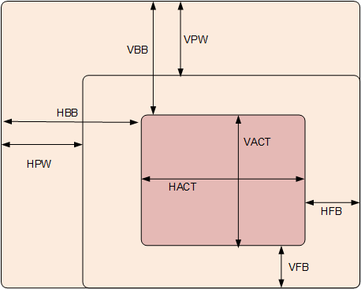
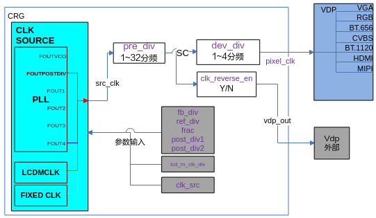
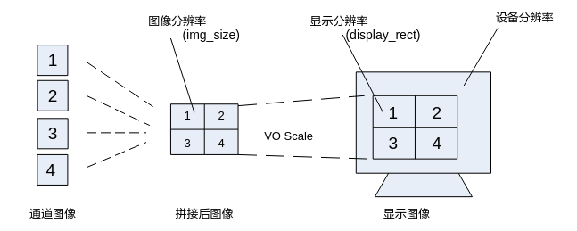
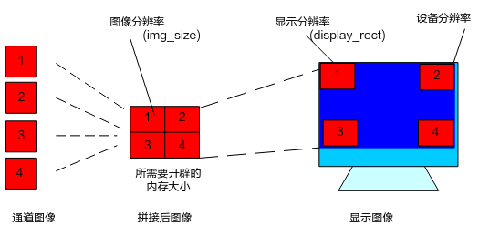
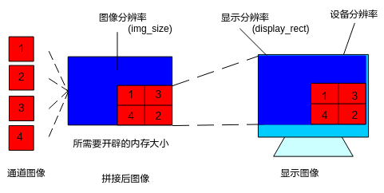
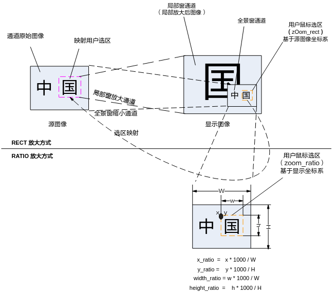

# 数据类型<a name="ZH-CN_TOPIC_0000002504085595"></a>

视频输出相关数据类型定义如下：

-   [OT\_VO\_MAX\_PHYS\_DEV\_NUM](#ZH-CN_TOPIC_0000002504085559)：定义视频输出物理设备最大个数。
-   [OT\_VO\_MAX\_VIRT\_DEV\_NUM](#ZH-CN_TOPIC_0000002504085601)：定义视频输出虚拟设备最大个数。
-   [OT\_VO\_MAX\_CAS\_DEV\_NUM](#ZH-CN_TOPIC_0000002503965613)：定义视频输出级联设备最大个数。
-   [OT\_VO\_MAX\_DEV\_NUM](#ZH-CN_TOPIC_0000002470925732)：定义视频输出设备最大个数。
-   [OT\_VO\_VIRT\_DEV\_0](#ZH-CN_TOPIC_0000002470925654)：定义虚拟设备0的设备号。
-   [OT\_VO\_VIRT\_DEV\_1](#ZH-CN_TOPIC_0000002503965607)：定义虚拟设备1的设备号。
-   [OT\_VO\_VIRT\_DEV\_2](#ZH-CN_TOPIC_0000002471085650)：定义虚拟设备2的设备号。
-   [OT\_VO\_VIRT\_DEV\_3](#ZH-CN_TOPIC_0000002504085589)：定义虚拟设备3的设备号。
-   [OT\_VO\_CAS\_DEV\_1](#ZH-CN_TOPIC_0000002471085638)：定义级联设备1的设备号。
-   [OT\_VO\_CAS\_DEV\_2](#ZH-CN_TOPIC_0000002471085660)：定义级联设备2的设备号。
-   [OT\_VO\_MAX\_PHYS\_VIDEO\_LAYER\_NUM](#ZH-CN_TOPIC_0000002504085565)：定义视频输出物理视频层最大个数。
-   [OT\_VO\_MAX\_GFX\_LAYER\_NUM](#ZH-CN_TOPIC_0000002470925738)：定义视频输出图形层最大个数。
-   [OT\_VO\_MAX\_PHYS\_LAYER\_NUM](#ZH-CN_TOPIC_0000002504085591)：定义视频输出物理视频层和图形层最大个数。
-   [OT\_VO\_MAX\_LAYER\_NUM](#ZH-CN_TOPIC_0000002504085535)：定义所有视频层和图形层最大个数。
-   [OT\_VO\_MAX\_LAYER\_IN\_DEV](#ZH-CN_TOPIC_0000002504085499)：定义每个设备中最大的（视频）层数。
-   [OT\_VO\_LAYER\_V0](#ZH-CN_TOPIC_0000002504085501)：定义视频层0的层号。
-   [OT\_VO\_LAYER\_V1](#ZH-CN_TOPIC_0000002503965589)：定义视频层1的层号。
-   [OT\_VO\_LAYER\_V2](#ZH-CN_TOPIC_0000002504085507)：定义视频层2的层号。
-   [OT\_VO\_LAYER\_V3](#ZH-CN_TOPIC_0000002503965669)：定义视频层3的层号。
-   [OT\_VO\_LAYER\_G0](#ZH-CN_TOPIC_0000002504085511)：定义图形层0的层号。
-   [OT\_VO\_LAYER\_G1](#ZH-CN_TOPIC_0000002471085682)：定义图形层1的层号。
-   [OT\_VO\_LAYER\_G2](#ZH-CN_TOPIC_0000002504085597)：定义图形层2的层号。
-   [OT\_VO\_LAYER\_G3](#ZH-CN_TOPIC_0000002503965585)：定义图形层3的层号。
-   [OT\_VO\_LAYER\_G4](#ZH-CN_TOPIC_0000002470925702)：定义图形层4的层号。
-   [ot\_vo\_get\_virt\_layer](#ZH-CN_TOPIC_0000002504085529)：定义获取虚拟设备对应的虚拟视频层号宏。
-   [ot\_vo\_get\_cas\_layer](#ZH-CN_TOPIC_0000002471085688)：定义获取级联设备对应的级联设备视频层号宏。
-   [OT\_VO\_MAX\_PRIORITY](#ZH-CN_TOPIC_0000002470925700)：定义视频层最大优先级。
-   [OT\_VO\_MIN\_TOLERATE](#ZH-CN_TOPIC_0000002504085537)：定义最小的播放容忍度。
-   [OT\_VO\_MAX\_TOLERATE](#ZH-CN_TOPIC_0000002471085712)：定义最大的播放容忍度。
-   [OT\_VO\_MAX\_CHN\_NUM](#ZH-CN_TOPIC_0000002504085567)：定义通道最大个数。
-   [OT\_VO\_MIN\_CHN\_WIDTH](#ZH-CN_TOPIC_0000002504085561)：定义通道最小宽度。
-   [OT\_VO\_MIN\_CHN\_HEIGHT](#ZH-CN_TOPIC_0000002470925694)：定义通道最小高度。
-   [OT\_VO\_MAX\_IMG\_WIDTH](#ZH-CN_TOPIC_0000002504085557)：定义VO处理图像最大宽度。
-   [OT\_VO\_MAX\_IMG\_HEIGHT](#ZH-CN_TOPIC_0000002470925650)：定义VO处理图像最大高度。
-   [OT\_VO\_MAX\_ZOOM\_RATIO](#ZH-CN_TOPIC_0000002504085497)：定义最大缩放比例。
-   [OT\_VO\_MAX\_NODE\_NUM](#ZH-CN_TOPIC_0000002470925734)：定义最大节点个数。
-   [OT\_VO\_MAX\_WBC\_NUM](#ZH-CN_TOPIC_0000002471085700)：定义回写设备最大个数。
-   [OT\_VO\_MAX\_CAS\_PATTERN](#ZH-CN_TOPIC_0000002504085505)：定义最大的级联样式。
-   [OT\_VO\_MAX\_CAS\_POS\_32RGN](#ZH-CN_TOPIC_0000002504085585)：定义32区域最大的级联位置。
-   [OT\_VO\_MAX\_CAS\_POS\_64RGN](#ZH-CN_TOPIC_0000002503965681)：定义64区域最大的级联位置。
-   [ot\_vo\_dev](#ZH-CN_TOPIC_0000002470925690)：定义设备号。
-   [ot\_vo\_layer](#ZH-CN_TOPIC_0000002504085573)：定义视频层号。
-   [ot\_vo\_chn](#ZH-CN_TOPIC_0000002503965655)：定义通道号。
-   [ot\_vo\_wbc](#ZH-CN_TOPIC_0000002471085640)：定义回写通路号。
-   [ot\_vo\_intf\_type](#ZH-CN_TOPIC_0000002471085652)：定义接口类型。
-   [ot\_vo\_intf\_sync](#ZH-CN_TOPIC_0000002470925660)：定义时序类型。
-   [ot\_vo\_sync\_info](#ZH-CN_TOPIC_0000002503965623)：定义时序信息。
-   [ot\_vo\_pub\_attr](#ZH-CN_TOPIC_0000002470925730)：定义视频输出设备属性结构体。
-   [ot\_vo\_dev\_param](#ZH-CN_TOPIC_0000002504085543)：定义VO视频输出设备参数结构体。
-   [ot\_vo\_mod\_param](#ZH-CN_TOPIC_0000002503965643)：VO模块参数。
-   [ot\_vo\_clk\_src](#ZH-CN_TOPIC_0000002470925708)：VO设备的时钟源类型。
-   [ot\_vo\_fixed\_clk](#ZH-CN_TOPIC_0000002470925722)：VO固定时钟频点类型。
-   [ot\_vo\_pll](#ZH-CN_TOPIC_0000002471085706)：用户接口时序PLL信息，用于配置PLL.
-   [ot\_vo\_user\_sync\_attr](#ZH-CN_TOPIC_0000002470925672)：用户接口时序属性，包括配置时钟源类型、时钟大小（时钟源输出的大小）配置信息。
-   [ot\_vo\_user\_sync\_info](#ZH-CN_TOPIC_0000002503965651)：用户接口时序信息，包括配置时钟源类型、时钟大小、时钟分频比和时钟相位。
-   [ot\_vo\_less\_buf\_attr](#ZH-CN_TOPIC_0000002471085718)：VO模块省BUF属性参数。
-   [ot\_vo\_user\_notify\_attr](#ZH-CN_TOPIC_0000002503965617)：VO模块用户通知属性参数。
-   [ot\_vo\_intf\_plug\_status](#ZH-CN_TOPIC_0000002503965627)：定义VGA/CVBS接口连接状态类型。
-   [ot\_vo\_intf\_status](#ZH-CN_TOPIC_0000002471085630)：定义VGA/CVBS接口状态结构体。
-   [ot\_vo\_csc\_matrix](#ZH-CN_TOPIC_0000002503965583)：定义CSC转换矩阵。
-   [ot\_vo\_csc](#ZH-CN_TOPIC_0000002471085670)：定义图像输出效果结构体。
-   [ot\_vo\_vga\_param](#ZH-CN_TOPIC_0000002503965621)：定义VGA图像输出效果结构体。
-   [ot\_vo\_hdmi\_param](#ZH-CN_TOPIC_0000002471085710)：定义HDMI图像输出效果结构体。
-   [ot\_vo\_rgb\_param](#ZH-CN_TOPIC_0000002471085720)：定义RGB图像输出效果结构体。
-   [ot\_vo\_clk\_edge](#ZH-CN_TOPIC_0000002471085708)：定义时钟单沿双沿类型。
-   [ot\_vo\_bt\_param](#ZH-CN_TOPIC_0000002503965683)：定义BT.1120或BT.656图像输出效果结构体。
-   [ot\_vo\_mipi\_param](#ZH-CN_TOPIC_0000002470925698)：定义MIPI图像输出效果结构体。
-   [ot\_vo\_partition\_mode](#ZH-CN_TOPIC_0000002504085583)：定义视频层分割模式枚举类型。
-   [ot\_vo\_video\_layer\_attr](#ZH-CN_TOPIC_0000002503965649)：定义视频层属性结构体。
-   [ot\_vo\_layer\_param](#ZH-CN_TOPIC_0000002503965599)：定义视频层参数，用于调整视频层内视频内容的显示效果。
-   [ot\_vo\_chn\_attr](#ZH-CN_TOPIC_0000002471085702)：定义视频输出通道属性结构体。
-   [ot\_vo\_chn\_param](#ZH-CN_TOPIC_0000002503965581)：定义视频输出通道参数（幅型比）结构体。
-   [ot\_vo\_zoom\_in\_type](#ZH-CN_TOPIC_0000002503965593)：定义局部放大类型。
-   [ot\_vo\_zoom\_ratio](#ZH-CN_TOPIC_0000002471085728)：定义按比例局部放大结构体。
-   [ot\_vo\_zoom\_attr](#ZH-CN_TOPIC_0000002471085668)：定义局部放大属性结构体。
-   [ot\_vo\_border](#ZH-CN_TOPIC_0000002471085722)：定义边框属性结构体。
-   [ot\_vo\_mirror\_mode](#ZH-CN_TOPIC_0000002504085577)：定义通道的镜像类型。
-   [ot\_vo\_chn\_status](#ZH-CN_TOPIC_0000002504085521)：定义视频输出通道状态结构体。
-   [ot\_vo\_wbc\_attr](#ZH-CN_TOPIC_0000002471085672)：定义视频回写的属性。
-   [ot\_vo\_wbc\_mode](#ZH-CN_TOPIC_0000002503965641)：定义视频回写的模式。
-   [ot\_vo\_wbc\_src\_type](#ZH-CN_TOPIC_0000002503965629)：定义视频回写源的类型。
-   [ot\_vo\_wbc\_src](#ZH-CN_TOPIC_0000002503965619)：定义视频回写源。
-   [ot\_vo\_cas\_mode](#ZH-CN_TOPIC_0000002503965677)：定义级联的单路双路模式。
-   [ot\_vo\_cas\_data\_transmission\_mode](#ZH-CN_TOPIC_0000002471085676)：定义级联的单双沿数据传输模式。
-   [ot\_vo\_cas\_rgn](#ZH-CN_TOPIC_0000002471085678)：定义级联的区域类型
-   [ot\_vo\_cas\_attr](#ZH-CN_TOPIC_0000002470925658)：定义级联属性。
-   [ot\_vo\_export\_callback](#ZH-CN_TOPIC_0000002504085569)：定义中断回调通知函数结构。
-   [ot\_vo\_export\_symbol](#ZH-CN_TOPIC_0000002470925642)：定义注册中断回调函数结构体。
-   [ot\_vo\_register\_export\_callback](#ZH-CN_TOPIC_0000002470925664)：定义注册中断回调钩子函数。


## OT\_VO\_MAX\_PHYS\_DEV\_NUM<a name="ZH-CN_TOPIC_0000002504085559"></a>

【说明】

定义视频输出物理设备最大个数。

【定义】

SS528V100/SS625V100/SS524V100/SS522V101/SS626V100:

```
#define OT_VO_MAX_PHYS_DEV_NUM      3
```

SS928V100:

```
#define OT_VO_MAX_PHYS_DEV_NUM      2
```

【解决方案差异】

<a name="table11583mcpsimp"></a>
<table><thead align="left"><tr id="row11588mcpsimp"><th class="cellrowborder" valign="top" width="53%" id="mcps1.1.3.1.1"><p id="p11590mcpsimp"><a name="p11590mcpsimp"></a><a name="p11590mcpsimp"></a>解决方案</p>
</th>
<th class="cellrowborder" valign="top" width="47%" id="mcps1.1.3.1.2"><p id="p11592mcpsimp"><a name="p11592mcpsimp"></a><a name="p11592mcpsimp"></a>描述</p>
</th>
</tr>
</thead>
<tbody><tr id="row11594mcpsimp"><td class="cellrowborder" valign="top" width="53%" headers="mcps1.1.3.1.1 "><p id="p11596mcpsimp"><a name="p11596mcpsimp"></a><a name="p11596mcpsimp"></a>SS528V100/SS625V100/SS524V100/SS522V101<span xml:lang="x-NONE" id="ph11597mcpsimp"><a name="ph11597mcpsimp"></a><a name="ph11597mcpsimp"></a>/SS626V100</span></p>
</td>
<td class="cellrowborder" valign="top" width="47%" headers="mcps1.1.3.1.2 "><p id="p11599mcpsimp"><a name="p11599mcpsimp"></a><a name="p11599mcpsimp"></a>最多3个物理设备</p>
</td>
</tr>
<tr id="row11600mcpsimp"><td class="cellrowborder" valign="top" width="53%" headers="mcps1.1.3.1.1 "><p id="p11602mcpsimp"><a name="p11602mcpsimp"></a><a name="p11602mcpsimp"></a>SS928V100</p>
</td>
<td class="cellrowborder" valign="top" width="47%" headers="mcps1.1.3.1.2 "><p id="p11604mcpsimp"><a name="p11604mcpsimp"></a><a name="p11604mcpsimp"></a>最多2个物理设备</p>
</td>
</tr>
</tbody>
</table>

【注意事项】

SS522V101不支持DHD1。

【相关数据类型及接口】

无。

## OT\_VO\_MAX\_VIRT\_DEV\_NUM<a name="ZH-CN_TOPIC_0000002504085601"></a>

【说明】

定义视频输出虚拟设备最大个数。

【定义】

SS528V100/SS625V100/SS524V100/SS522V101/SS928V100/SS626V100:

```
#define OT_VO_MAX_VIRT_DEV_NUM     32
```

【解决方案差异】

<a name="table11619mcpsimp"></a>
<table><thead align="left"><tr id="row11624mcpsimp"><th class="cellrowborder" valign="top" width="41%" id="mcps1.1.3.1.1"><p id="p11626mcpsimp"><a name="p11626mcpsimp"></a><a name="p11626mcpsimp"></a>解决方案</p>
</th>
<th class="cellrowborder" valign="top" width="59%" id="mcps1.1.3.1.2"><p id="p11628mcpsimp"><a name="p11628mcpsimp"></a><a name="p11628mcpsimp"></a>描述</p>
</th>
</tr>
</thead>
<tbody><tr id="row11630mcpsimp"><td class="cellrowborder" valign="top" width="41%" headers="mcps1.1.3.1.1 "><p id="p11632mcpsimp"><a name="p11632mcpsimp"></a><a name="p11632mcpsimp"></a>SS528V100/SS625V100/SS524V100/SS522V101/SS928V100<span xml:lang="x-NONE" id="ph11633mcpsimp"><a name="ph11633mcpsimp"></a><a name="ph11633mcpsimp"></a>/SS626V100</span></p>
</td>
<td class="cellrowborder" valign="top" width="59%" headers="mcps1.1.3.1.2 "><p id="p11635mcpsimp"><a name="p11635mcpsimp"></a><a name="p11635mcpsimp"></a>最多32个虚拟设备</p>
</td>
</tr>
</tbody>
</table>

【注意事项】

无。

【相关数据类型及接口】

无。

## OT\_VO\_MAX\_CAS\_DEV\_NUM<a name="ZH-CN_TOPIC_0000002503965613"></a>

【说明】

定义视频输出级联扩展设备最大个数。

【定义】

SS528V100:

```
#define OT_VO_MAX_CAS_DEV_NUM      2
```

SS625V100/SS524V100/SS522V101/SS928V100/SS626V100:

```
#define OT_VO_MAX_CAS_DEV_NUM      0
```

【解决方案差异】

<a name="table11650mcpsimp"></a>
<table><thead align="left"><tr id="row11655mcpsimp"><th class="cellrowborder" valign="top" width="46%" id="mcps1.1.3.1.1"><p id="p11657mcpsimp"><a name="p11657mcpsimp"></a><a name="p11657mcpsimp"></a>解决方案</p>
</th>
<th class="cellrowborder" valign="top" width="54%" id="mcps1.1.3.1.2"><p id="p11659mcpsimp"><a name="p11659mcpsimp"></a><a name="p11659mcpsimp"></a>描述</p>
</th>
</tr>
</thead>
<tbody><tr id="row11661mcpsimp"><td class="cellrowborder" valign="top" width="46%" headers="mcps1.1.3.1.1 "><p id="p11663mcpsimp"><a name="p11663mcpsimp"></a><a name="p11663mcpsimp"></a>SS528V100</p>
</td>
<td class="cellrowborder" valign="top" width="54%" headers="mcps1.1.3.1.2 "><p id="p11665mcpsimp"><a name="p11665mcpsimp"></a><a name="p11665mcpsimp"></a>最多2个级联扩展设备</p>
</td>
</tr>
<tr id="row11666mcpsimp"><td class="cellrowborder" valign="top" width="46%" headers="mcps1.1.3.1.1 "><p id="p11668mcpsimp"><a name="p11668mcpsimp"></a><a name="p11668mcpsimp"></a>SS625V100/SS524V100/SS522V101 /SS928V100<span xml:lang="x-NONE" id="ph11669mcpsimp"><a name="ph11669mcpsimp"></a><a name="ph11669mcpsimp"></a>/SS626V100</span></p>
</td>
<td class="cellrowborder" valign="top" width="54%" headers="mcps1.1.3.1.2 "><p id="p11671mcpsimp"><a name="p11671mcpsimp"></a><a name="p11671mcpsimp"></a>不支持</p>
</td>
</tr>
</tbody>
</table>

【注意事项】

无。

【相关数据类型及接口】

无。

## OT\_VO\_MAX\_DEV\_NUM<a name="ZH-CN_TOPIC_0000002470925732"></a>

【说明】

定义视频输出设备最大个数。

【定义】

SS528V100/SS625V100/SS524V100/SS522V101/SS928V100/SS626V100:

```
#define OT_VO_MAX_DEV_NUM          (OT_VO_MAX_PHYS_DEV_NUM + OT_VO_MAX_VIRT_DEV_NUM + OT_VO_MAX_CAS_DEV_NUM)
```

【解决方案差异】

<a name="table11687mcpsimp"></a>
<table><thead align="left"><tr id="row11692mcpsimp"><th class="cellrowborder" valign="top" width="41%" id="mcps1.1.3.1.1"><p id="p11694mcpsimp"><a name="p11694mcpsimp"></a><a name="p11694mcpsimp"></a>解决方案</p>
</th>
<th class="cellrowborder" valign="top" width="59%" id="mcps1.1.3.1.2"><p id="p11696mcpsimp"><a name="p11696mcpsimp"></a><a name="p11696mcpsimp"></a>描述</p>
</th>
</tr>
</thead>
<tbody><tr id="row11698mcpsimp"><td class="cellrowborder" valign="top" width="41%" headers="mcps1.1.3.1.1 "><p id="p11700mcpsimp"><a name="p11700mcpsimp"></a><a name="p11700mcpsimp"></a>SS528V100</p>
</td>
<td class="cellrowborder" valign="top" width="59%" headers="mcps1.1.3.1.2 "><p id="p11702mcpsimp"><a name="p11702mcpsimp"></a><a name="p11702mcpsimp"></a>最多(OT_VO_MAX_PHYS_DEV_NUM + OT_VO_MAX_VIRT_DEV_NUM + <a href="#ZH-CN_TOPIC_0000002503965613">OT_VO_MAX_CAS_DEV_NUM</a>) 37个设备</p>
</td>
</tr>
<tr id="row11704mcpsimp"><td class="cellrowborder" valign="top" width="41%" headers="mcps1.1.3.1.1 "><p id="p11706mcpsimp"><a name="p11706mcpsimp"></a><a name="p11706mcpsimp"></a>SS625V100</p>
</td>
<td class="cellrowborder" valign="top" width="59%" headers="mcps1.1.3.1.2 "><p id="p11708mcpsimp"><a name="p11708mcpsimp"></a><a name="p11708mcpsimp"></a>最多(OT_VO_MAX_PHYS_DEV_NUM + OT_VO_MAX_VIRT_DEV_NUM + <a href="OT_VO_MAX_CAS_DEV_NUM.md">OT_VO_MAX_CAS_DEV_NUM</a>) 35个设备</p>
</td>
</tr>
<tr id="row11710mcpsimp"><td class="cellrowborder" valign="top" width="41%" headers="mcps1.1.3.1.1 "><p id="p11712mcpsimp"><a name="p11712mcpsimp"></a><a name="p11712mcpsimp"></a>SS524V100/SS522V101</p>
</td>
<td class="cellrowborder" valign="top" width="59%" headers="mcps1.1.3.1.2 "><p id="p11714mcpsimp"><a name="p11714mcpsimp"></a><a name="p11714mcpsimp"></a>最多(OT_VO_MAX_PHYS_DEV_NUM + OT_VO_MAX_VIRT_DEV_NUM + <a href="OT_VO_MAX_CAS_DEV_NUM.md">OT_VO_MAX_CAS_DEV_NUM</a>) 35个设备</p>
</td>
</tr>
<tr id="row11716mcpsimp"><td class="cellrowborder" valign="top" width="41%" headers="mcps1.1.3.1.1 "><p id="p11718mcpsimp"><a name="p11718mcpsimp"></a><a name="p11718mcpsimp"></a>SS928V100</p>
</td>
<td class="cellrowborder" valign="top" width="59%" headers="mcps1.1.3.1.2 "><p id="p11720mcpsimp"><a name="p11720mcpsimp"></a><a name="p11720mcpsimp"></a>最多(OT_VO_MAX_PHYS_DEV_NUM + OT_VO_MAX_VIRT_DEV_NUM + <a href="OT_VO_MAX_CAS_DEV_NUM.md">OT_VO_MAX_CAS_DEV_NUM</a>) 34个设备</p>
</td>
</tr>
<tr id="row11722mcpsimp"><td class="cellrowborder" valign="top" width="41%" headers="mcps1.1.3.1.1 "><p id="p11724mcpsimp"><a name="p11724mcpsimp"></a><a name="p11724mcpsimp"></a>SS626V100</p>
</td>
<td class="cellrowborder" valign="top" width="59%" headers="mcps1.1.3.1.2 "><p id="p11726mcpsimp"><a name="p11726mcpsimp"></a><a name="p11726mcpsimp"></a>最多(OT_VO_MAX_PHYS_DEV_NUM + OT_VO_MAX_VIRT_DEV_NUM + <a href="OT_VO_MAX_CAS_DEV_NUM.md">OT_VO_MAX_CAS_DEV_NUM</a>) 35个设备</p>
</td>
</tr>
</tbody>
</table>

【注意事项】

SS522V101不支持DHD1。

【相关数据类型及接口】

无。

## OT\_VO\_VIRT\_DEV\_0<a name="ZH-CN_TOPIC_0000002470925654"></a>

【说明】

定义虚拟设备0的设备号。

【定义】

SS528V100/SS625V100/SS524V100/SS522V101/SS626V100：

```
#define OT_VO_VIRT_DEV_0           3
```

SS928V100：

```
#define OT_VO_VIRT_DEV_0           2
```

【解决方案差异】

<a name="table11744mcpsimp"></a>
<table><thead align="left"><tr id="row11749mcpsimp"><th class="cellrowborder" valign="top" width="37%" id="mcps1.1.3.1.1"><p id="p11751mcpsimp"><a name="p11751mcpsimp"></a><a name="p11751mcpsimp"></a>解决方案</p>
</th>
<th class="cellrowborder" valign="top" width="63%" id="mcps1.1.3.1.2"><p id="p11753mcpsimp"><a name="p11753mcpsimp"></a><a name="p11753mcpsimp"></a>描述</p>
</th>
</tr>
</thead>
<tbody><tr id="row11755mcpsimp"><td class="cellrowborder" valign="top" width="37%" headers="mcps1.1.3.1.1 "><p id="p11757mcpsimp"><a name="p11757mcpsimp"></a><a name="p11757mcpsimp"></a>SS528V100/SS625V100/SS524V100/SS522V101<span xml:lang="x-NONE" id="ph11758mcpsimp"><a name="ph11758mcpsimp"></a><a name="ph11758mcpsimp"></a>/SS626V100</span></p>
</td>
<td class="cellrowborder" valign="top" width="63%" headers="mcps1.1.3.1.2 "><p id="p11760mcpsimp"><a name="p11760mcpsimp"></a><a name="p11760mcpsimp"></a>虚拟设备0设备号为3</p>
</td>
</tr>
<tr id="row11761mcpsimp"><td class="cellrowborder" valign="top" width="37%" headers="mcps1.1.3.1.1 "><p id="p11763mcpsimp"><a name="p11763mcpsimp"></a><a name="p11763mcpsimp"></a>SS928V100</p>
</td>
<td class="cellrowborder" valign="top" width="63%" headers="mcps1.1.3.1.2 "><p id="p11765mcpsimp"><a name="p11765mcpsimp"></a><a name="p11765mcpsimp"></a>虚拟设备0设备号为2</p>
</td>
</tr>
</tbody>
</table>

【注意事项】

无。

【相关数据类型及接口】

无。

## OT\_VO\_VIRT\_DEV\_1<a name="ZH-CN_TOPIC_0000002503965607"></a>

【说明】

定义虚拟设备1的设备号。

【定义】

SS528V100/SS625V100/SS524V100/SS522V101/SS626V100：

```
#define OT_VO_VIRT_DEV_1           4
```

SS928V100：

```
#define OT_VO_VIRT_DEV_1           3
```

【解决方案差异】

<a name="table11782mcpsimp"></a>
<table><thead align="left"><tr id="row11787mcpsimp"><th class="cellrowborder" valign="top" width="41%" id="mcps1.1.3.1.1"><p id="p11789mcpsimp"><a name="p11789mcpsimp"></a><a name="p11789mcpsimp"></a>解决方案</p>
</th>
<th class="cellrowborder" valign="top" width="59%" id="mcps1.1.3.1.2"><p id="p11791mcpsimp"><a name="p11791mcpsimp"></a><a name="p11791mcpsimp"></a>描述</p>
</th>
</tr>
</thead>
<tbody><tr id="row11793mcpsimp"><td class="cellrowborder" valign="top" width="41%" headers="mcps1.1.3.1.1 "><p id="p11795mcpsimp"><a name="p11795mcpsimp"></a><a name="p11795mcpsimp"></a>SS528V100/SS625V100/SS524V100/SS522V101<span xml:lang="x-NONE" id="ph11796mcpsimp"><a name="ph11796mcpsimp"></a><a name="ph11796mcpsimp"></a>/SS626V100</span></p>
</td>
<td class="cellrowborder" valign="top" width="59%" headers="mcps1.1.3.1.2 "><p id="p11798mcpsimp"><a name="p11798mcpsimp"></a><a name="p11798mcpsimp"></a>虚拟设备1设备号为4</p>
</td>
</tr>
<tr id="row11799mcpsimp"><td class="cellrowborder" valign="top" width="41%" headers="mcps1.1.3.1.1 "><p id="p11801mcpsimp"><a name="p11801mcpsimp"></a><a name="p11801mcpsimp"></a>SS928V100</p>
</td>
<td class="cellrowborder" valign="top" width="59%" headers="mcps1.1.3.1.2 "><p id="p11803mcpsimp"><a name="p11803mcpsimp"></a><a name="p11803mcpsimp"></a>虚拟设备1设备号为3</p>
</td>
</tr>
</tbody>
</table>

【注意事项】

无。

【相关数据类型及接口】

无。

## OT\_VO\_VIRT\_DEV\_2<a name="ZH-CN_TOPIC_0000002471085650"></a>

【说明】

定义虚拟设备2的设备号。

【定义】

SS528V100/SS625V100/SS524V100/SS522V101/SS626V100：

```
#define OT_VO_VIRT_DEV_2           5
```

SS928V100：

```
#define OT_VO_VIRT_DEV_2           4
```

【解决方案差异】

<a name="table11820mcpsimp"></a>
<table><thead align="left"><tr id="row11825mcpsimp"><th class="cellrowborder" valign="top" width="34%" id="mcps1.1.3.1.1"><p id="p11827mcpsimp"><a name="p11827mcpsimp"></a><a name="p11827mcpsimp"></a>解决方案</p>
</th>
<th class="cellrowborder" valign="top" width="66%" id="mcps1.1.3.1.2"><p id="p11829mcpsimp"><a name="p11829mcpsimp"></a><a name="p11829mcpsimp"></a>描述</p>
</th>
</tr>
</thead>
<tbody><tr id="row11831mcpsimp"><td class="cellrowborder" valign="top" width="34%" headers="mcps1.1.3.1.1 "><p id="p11833mcpsimp"><a name="p11833mcpsimp"></a><a name="p11833mcpsimp"></a>SS528V100/SS625V100/SS524V100/SS522V101<span xml:lang="x-NONE" id="ph11834mcpsimp"><a name="ph11834mcpsimp"></a><a name="ph11834mcpsimp"></a>/SS626V100</span></p>
</td>
<td class="cellrowborder" valign="top" width="66%" headers="mcps1.1.3.1.2 "><p id="p11836mcpsimp"><a name="p11836mcpsimp"></a><a name="p11836mcpsimp"></a>虚拟设备2设备号为5</p>
</td>
</tr>
<tr id="row11837mcpsimp"><td class="cellrowborder" valign="top" width="34%" headers="mcps1.1.3.1.1 "><p id="p11839mcpsimp"><a name="p11839mcpsimp"></a><a name="p11839mcpsimp"></a>SS928V100</p>
</td>
<td class="cellrowborder" valign="top" width="66%" headers="mcps1.1.3.1.2 "><p id="p11841mcpsimp"><a name="p11841mcpsimp"></a><a name="p11841mcpsimp"></a>虚拟设备2设备号为4</p>
</td>
</tr>
</tbody>
</table>

【注意事项】

无。

【相关数据类型及接口】

无。

## OT\_VO\_VIRT\_DEV\_3<a name="ZH-CN_TOPIC_0000002504085589"></a>

【说明】

定义虚拟设备3的设备号。

【定义】

SS528V100/SS625V100/SS524V100/SS522V101/SS626V100：

```
#define OT_VO_VIRT_DEV_3           6
```

SS928V100：

```
#define OT_VO_VIRT_DEV_3           5
```

【解决方案差异】

<a name="table11858mcpsimp"></a>
<table><thead align="left"><tr id="row11863mcpsimp"><th class="cellrowborder" valign="top" width="49%" id="mcps1.1.3.1.1"><p id="p11865mcpsimp"><a name="p11865mcpsimp"></a><a name="p11865mcpsimp"></a>解决方案</p>
</th>
<th class="cellrowborder" valign="top" width="51%" id="mcps1.1.3.1.2"><p id="p11867mcpsimp"><a name="p11867mcpsimp"></a><a name="p11867mcpsimp"></a>描述</p>
</th>
</tr>
</thead>
<tbody><tr id="row11869mcpsimp"><td class="cellrowborder" valign="top" width="49%" headers="mcps1.1.3.1.1 "><p id="p11871mcpsimp"><a name="p11871mcpsimp"></a><a name="p11871mcpsimp"></a>SS528V100/SS625V100/SS524V100/SS522V101<span xml:lang="x-NONE" id="ph11872mcpsimp"><a name="ph11872mcpsimp"></a><a name="ph11872mcpsimp"></a>/SS626V100</span></p>
</td>
<td class="cellrowborder" valign="top" width="51%" headers="mcps1.1.3.1.2 "><p id="p11874mcpsimp"><a name="p11874mcpsimp"></a><a name="p11874mcpsimp"></a>虚拟设备3设备号为6</p>
</td>
</tr>
<tr id="row11875mcpsimp"><td class="cellrowborder" valign="top" width="49%" headers="mcps1.1.3.1.1 "><p id="p11877mcpsimp"><a name="p11877mcpsimp"></a><a name="p11877mcpsimp"></a>SS928V100</p>
</td>
<td class="cellrowborder" valign="top" width="51%" headers="mcps1.1.3.1.2 "><p id="p11879mcpsimp"><a name="p11879mcpsimp"></a><a name="p11879mcpsimp"></a>虚拟设备3设备号为5</p>
</td>
</tr>
</tbody>
</table>

【注意事项】

无。

【相关数据类型及接口】

无。

## OT\_VO\_CAS\_DEV\_1<a name="ZH-CN_TOPIC_0000002471085638"></a>

【说明】

定义级联设备1的设备号。

【定义】

SS528V100：

```
#define OT_VO_CAS_DEV_1          35
```

【解决方案差异】

<a name="table11891mcpsimp"></a>
<table><thead align="left"><tr id="row11896mcpsimp"><th class="cellrowborder" valign="top" width="42%" id="mcps1.1.3.1.1"><p id="p11898mcpsimp"><a name="p11898mcpsimp"></a><a name="p11898mcpsimp"></a>解决方案</p>
</th>
<th class="cellrowborder" valign="top" width="57.99999999999999%" id="mcps1.1.3.1.2"><p id="p11900mcpsimp"><a name="p11900mcpsimp"></a><a name="p11900mcpsimp"></a>描述</p>
</th>
</tr>
</thead>
<tbody><tr id="row11902mcpsimp"><td class="cellrowborder" valign="top" width="42%" headers="mcps1.1.3.1.1 "><p id="p11904mcpsimp"><a name="p11904mcpsimp"></a><a name="p11904mcpsimp"></a>SS528V100</p>
</td>
<td class="cellrowborder" valign="top" width="57.99999999999999%" headers="mcps1.1.3.1.2 "><p id="p11906mcpsimp"><a name="p11906mcpsimp"></a><a name="p11906mcpsimp"></a>级联设备1设备号为35</p>
</td>
</tr>
<tr id="row11907mcpsimp"><td class="cellrowborder" valign="top" width="42%" headers="mcps1.1.3.1.1 "><p id="p11909mcpsimp"><a name="p11909mcpsimp"></a><a name="p11909mcpsimp"></a>SS625V100/SS524V100/SS522V101/SS928V100<span xml:lang="x-NONE" id="ph11910mcpsimp"><a name="ph11910mcpsimp"></a><a name="ph11910mcpsimp"></a>/SS626V100</span></p>
</td>
<td class="cellrowborder" valign="top" width="57.99999999999999%" headers="mcps1.1.3.1.2 "><p id="p11912mcpsimp"><a name="p11912mcpsimp"></a><a name="p11912mcpsimp"></a>不支持</p>
</td>
</tr>
</tbody>
</table>

【注意事项】

无。

【相关数据类型及接口】

无。

## OT\_VO\_CAS\_DEV\_2<a name="ZH-CN_TOPIC_0000002471085660"></a>

【说明】

定义级联设备2的设备号。

【定义】

SS528V100

```
#define OT_VO_CAS_DEV_2          36
```

【解决方案差异】

<a name="table11924mcpsimp"></a>
<table><thead align="left"><tr id="row11929mcpsimp"><th class="cellrowborder" valign="top" width="37%" id="mcps1.1.3.1.1"><p id="p11931mcpsimp"><a name="p11931mcpsimp"></a><a name="p11931mcpsimp"></a>解决方案</p>
</th>
<th class="cellrowborder" valign="top" width="63%" id="mcps1.1.3.1.2"><p id="p11933mcpsimp"><a name="p11933mcpsimp"></a><a name="p11933mcpsimp"></a>描述</p>
</th>
</tr>
</thead>
<tbody><tr id="row11935mcpsimp"><td class="cellrowborder" valign="top" width="37%" headers="mcps1.1.3.1.1 "><p id="p11937mcpsimp"><a name="p11937mcpsimp"></a><a name="p11937mcpsimp"></a>SS528V100</p>
</td>
<td class="cellrowborder" valign="top" width="63%" headers="mcps1.1.3.1.2 "><p id="p11939mcpsimp"><a name="p11939mcpsimp"></a><a name="p11939mcpsimp"></a>级联设备2设备号为36</p>
</td>
</tr>
<tr id="row11940mcpsimp"><td class="cellrowborder" valign="top" width="37%" headers="mcps1.1.3.1.1 "><p id="p11942mcpsimp"><a name="p11942mcpsimp"></a><a name="p11942mcpsimp"></a>SS625V100/SS524V100/SS522V101/SS928V100<span xml:lang="x-NONE" id="ph11943mcpsimp"><a name="ph11943mcpsimp"></a><a name="ph11943mcpsimp"></a>/SS626V100</span></p>
</td>
<td class="cellrowborder" valign="top" width="63%" headers="mcps1.1.3.1.2 "><p id="p11945mcpsimp"><a name="p11945mcpsimp"></a><a name="p11945mcpsimp"></a>不支持</p>
</td>
</tr>
</tbody>
</table>

【注意事项】

无。

【相关数据类型及接口】

无。

## OT\_VO\_MAX\_PHYS\_VIDEO\_LAYER\_NUM<a name="ZH-CN_TOPIC_0000002504085565"></a>

【说明】

定义物理视频层最大个数。

【定义】

SS528V100/SS625V100/SS524V100/SS522V101/SS626V100:

```
#define OT_VO_MAX_PHYS_VIDEO_LAYER_NUM        4
```

SS928V100:

```
#define OT_VO_MAX_PHYS_VIDEO_LAYER_NUM        3
```

【解决方案差异】

<a name="table11962mcpsimp"></a>
<table><thead align="left"><tr id="row11967mcpsimp"><th class="cellrowborder" valign="top" width="52%" id="mcps1.1.3.1.1"><p id="p11969mcpsimp"><a name="p11969mcpsimp"></a><a name="p11969mcpsimp"></a>解决方案</p>
</th>
<th class="cellrowborder" valign="top" width="48%" id="mcps1.1.3.1.2"><p id="p11971mcpsimp"><a name="p11971mcpsimp"></a><a name="p11971mcpsimp"></a>描述</p>
</th>
</tr>
</thead>
<tbody><tr id="row11973mcpsimp"><td class="cellrowborder" valign="top" width="52%" headers="mcps1.1.3.1.1 "><p id="p11975mcpsimp"><a name="p11975mcpsimp"></a><a name="p11975mcpsimp"></a>SS528V100/SS625V100/SS524V100/SS522V101<span xml:lang="x-NONE" id="ph11976mcpsimp"><a name="ph11976mcpsimp"></a><a name="ph11976mcpsimp"></a>/SS626V100</span></p>
</td>
<td class="cellrowborder" valign="top" width="48%" headers="mcps1.1.3.1.2 "><p id="p11978mcpsimp"><a name="p11978mcpsimp"></a><a name="p11978mcpsimp"></a>最多4个物理视频层。</p>
</td>
</tr>
<tr id="row11979mcpsimp"><td class="cellrowborder" valign="top" width="52%" headers="mcps1.1.3.1.1 "><p id="p11981mcpsimp"><a name="p11981mcpsimp"></a><a name="p11981mcpsimp"></a>SS928V100</p>
</td>
<td class="cellrowborder" valign="top" width="48%" headers="mcps1.1.3.1.2 "><p id="p11983mcpsimp"><a name="p11983mcpsimp"></a><a name="p11983mcpsimp"></a>最多3个物理视频层。</p>
</td>
</tr>
</tbody>
</table>

【注意事项】

SS522V101不支持VHD1。

【相关数据类型及接口】

无。

## OT\_VO\_MAX\_GFX\_LAYER\_NUM<a name="ZH-CN_TOPIC_0000002470925738"></a>

【说明】

定义图形层最大个数。

【定义】

SS528V100/SS625V100/SS524V100/SS522V101:

```
#define OT_VO_MAX_GFX_LAYER_NUM       4
```

SS928V100:

```
#define OT_VO_MAX_GFX_LAYER_NUM       3
```

SS626V100:

```
#define OT_VO_MAX_GFX_LAYER_NUM       5
```

【解决方案差异】

<a name="table12000mcpsimp"></a>
<table><thead align="left"><tr id="row12005mcpsimp"><th class="cellrowborder" valign="top" width="52%" id="mcps1.1.3.1.1"><p id="p12007mcpsimp"><a name="p12007mcpsimp"></a><a name="p12007mcpsimp"></a>解决方案</p>
</th>
<th class="cellrowborder" valign="top" width="48%" id="mcps1.1.3.1.2"><p id="p12009mcpsimp"><a name="p12009mcpsimp"></a><a name="p12009mcpsimp"></a>描述</p>
</th>
</tr>
</thead>
<tbody><tr id="row12011mcpsimp"><td class="cellrowborder" valign="top" width="52%" headers="mcps1.1.3.1.1 "><p id="p12013mcpsimp"><a name="p12013mcpsimp"></a><a name="p12013mcpsimp"></a>SS528V100/SS625V100/SS524V100/SS522V101</p>
</td>
<td class="cellrowborder" valign="top" width="48%" headers="mcps1.1.3.1.2 "><p id="p12015mcpsimp"><a name="p12015mcpsimp"></a><a name="p12015mcpsimp"></a>最多4个图形层。</p>
</td>
</tr>
<tr id="row12016mcpsimp"><td class="cellrowborder" valign="top" width="52%" headers="mcps1.1.3.1.1 "><p id="p12018mcpsimp"><a name="p12018mcpsimp"></a><a name="p12018mcpsimp"></a>SS928V100</p>
</td>
<td class="cellrowborder" valign="top" width="48%" headers="mcps1.1.3.1.2 "><p id="p12020mcpsimp"><a name="p12020mcpsimp"></a><a name="p12020mcpsimp"></a>最多3个图形层。</p>
</td>
</tr>
<tr id="row12021mcpsimp"><td class="cellrowborder" valign="top" width="52%" headers="mcps1.1.3.1.1 "><p id="p12023mcpsimp"><a name="p12023mcpsimp"></a><a name="p12023mcpsimp"></a>SS626V100</p>
</td>
<td class="cellrowborder" valign="top" width="48%" headers="mcps1.1.3.1.2 "><p id="p12025mcpsimp"><a name="p12025mcpsimp"></a><a name="p12025mcpsimp"></a>最多5个图形层。</p>
</td>
</tr>
</tbody>
</table>

【注意事项】

SS522V101不支持G1。

【相关数据类型及接口】

无。

## OT\_VO\_MAX\_PHYS\_LAYER\_NUM<a name="ZH-CN_TOPIC_0000002504085591"></a>

【说明】

定义物理视频层和图形层最大个数。

【定义】

SS528V100/SS625V100/SS524V100/SS522V101/SS928V100/SS626V100:

```
#define OT_VO_MAX_PHYS_LAYER_NUM         (OT_VO_MAX_PHYS_VIDEO_LAYER_NUM + OT_VO_MAX_GFX_LAYER_NUM)
```

【解决方案差异】

<a name="table12041mcpsimp"></a>
<table><thead align="left"><tr id="row12046mcpsimp"><th class="cellrowborder" valign="top" width="52%" id="mcps1.1.3.1.1"><p id="p12048mcpsimp"><a name="p12048mcpsimp"></a><a name="p12048mcpsimp"></a>解决方案</p>
</th>
<th class="cellrowborder" valign="top" width="48%" id="mcps1.1.3.1.2"><p id="p12050mcpsimp"><a name="p12050mcpsimp"></a><a name="p12050mcpsimp"></a>描述</p>
</th>
</tr>
</thead>
<tbody><tr id="row12052mcpsimp"><td class="cellrowborder" valign="top" width="52%" headers="mcps1.1.3.1.1 "><p id="p12054mcpsimp"><a name="p12054mcpsimp"></a><a name="p12054mcpsimp"></a>SS528V100/SS625V100/SS524V100/SS522V101</p>
</td>
<td class="cellrowborder" valign="top" width="48%" headers="mcps1.1.3.1.2 "><p id="p12056mcpsimp"><a name="p12056mcpsimp"></a><a name="p12056mcpsimp"></a>最多(OT_VO_MAX_PHYS_VIDEO_LAYER_NUM + OT_VO_MAX_GFX_LAYER_NUM)共8个物理视频层和图形层。</p>
</td>
</tr>
<tr id="row12057mcpsimp"><td class="cellrowborder" valign="top" width="52%" headers="mcps1.1.3.1.1 "><p id="p12059mcpsimp"><a name="p12059mcpsimp"></a><a name="p12059mcpsimp"></a>SS928V100</p>
</td>
<td class="cellrowborder" valign="top" width="48%" headers="mcps1.1.3.1.2 "><p id="p12061mcpsimp"><a name="p12061mcpsimp"></a><a name="p12061mcpsimp"></a>最多(OT_VO_MAX_PHYS_VIDEO_LAYER_NUM + OT_VO_MAX_GFX_LAYER_NUM)共6个物理视频层和图形层。</p>
</td>
</tr>
<tr id="row12062mcpsimp"><td class="cellrowborder" valign="top" width="52%" headers="mcps1.1.3.1.1 "><p id="p12064mcpsimp"><a name="p12064mcpsimp"></a><a name="p12064mcpsimp"></a>SS626V100</p>
</td>
<td class="cellrowborder" valign="top" width="48%" headers="mcps1.1.3.1.2 "><p id="p12066mcpsimp"><a name="p12066mcpsimp"></a><a name="p12066mcpsimp"></a>最多(OT_VO_MAX_PHYS_VIDEO_LAYER_NUM + OT_VO_MAX_GFX_LAYER_NUM)共9个物理视频层和图形层。</p>
</td>
</tr>
</tbody>
</table>

【注意事项】

SS522V101不支持VHD1和G1。

【相关数据类型及接口】

无。

## OT\_VO\_MAX\_LAYER\_NUM<a name="ZH-CN_TOPIC_0000002504085535"></a>

【说明】

定义所有视频层和图形层最大个数。

【定义】

SS528V100/SS625V100/SS524V100/SS522V101/SS928V100/SS626V100:

```
#define OT_VO_MAX_LAYER_NUM (OT_VO_MAX_PHYS_LAYER_NUM + OT_VO_MAX_VIRT_DEV_NUM + OT_VO_MAX_CAS_DEV_NUM)
```

【解决方案差异】

<a name="table12083mcpsimp"></a>
<table><thead align="left"><tr id="row12088mcpsimp"><th class="cellrowborder" valign="top" width="39%" id="mcps1.1.3.1.1"><p id="p12090mcpsimp"><a name="p12090mcpsimp"></a><a name="p12090mcpsimp"></a>解决方案</p>
</th>
<th class="cellrowborder" valign="top" width="61%" id="mcps1.1.3.1.2"><p id="p12092mcpsimp"><a name="p12092mcpsimp"></a><a name="p12092mcpsimp"></a>描述</p>
</th>
</tr>
</thead>
<tbody><tr id="row12094mcpsimp"><td class="cellrowborder" valign="top" width="39%" headers="mcps1.1.3.1.1 "><p id="p12096mcpsimp"><a name="p12096mcpsimp"></a><a name="p12096mcpsimp"></a>SS528V100</p>
</td>
<td class="cellrowborder" valign="top" width="61%" headers="mcps1.1.3.1.2 "><p id="p12098mcpsimp"><a name="p12098mcpsimp"></a><a name="p12098mcpsimp"></a>最多(OT_VO_MAX_PHYS_LAYER_NUM + OT_VO_MAX_VIRT_DEV_NUM + <a href="OT_VO_MAX_CAS_DEV_NUM.md">OT_VO_MAX_CAS_DEV_NUM</a>)共42个视频层和图形层。</p>
</td>
</tr>
<tr id="row12100mcpsimp"><td class="cellrowborder" valign="top" width="39%" headers="mcps1.1.3.1.1 "><p id="p12102mcpsimp"><a name="p12102mcpsimp"></a><a name="p12102mcpsimp"></a>SS625V100</p>
</td>
<td class="cellrowborder" valign="top" width="61%" headers="mcps1.1.3.1.2 "><p id="p12104mcpsimp"><a name="p12104mcpsimp"></a><a name="p12104mcpsimp"></a>最多(OT_VO_MAX_PHYS_LAYER_NUM + OT_VO_MAX_VIRT_DEV_NUM + <a href="OT_VO_MAX_CAS_DEV_NUM.md">OT_VO_MAX_CAS_DEV_NUM</a>)共40个视频层和图形层。</p>
</td>
</tr>
<tr id="row12106mcpsimp"><td class="cellrowborder" valign="top" width="39%" headers="mcps1.1.3.1.1 "><p id="p12108mcpsimp"><a name="p12108mcpsimp"></a><a name="p12108mcpsimp"></a>SS524V100/SS522V101</p>
</td>
<td class="cellrowborder" valign="top" width="61%" headers="mcps1.1.3.1.2 "><p id="p12110mcpsimp"><a name="p12110mcpsimp"></a><a name="p12110mcpsimp"></a>最多(OT_VO_MAX_PHYS_LAYER_NUM + OT_VO_MAX_VIRT_DEV_NUM + <a href="OT_VO_MAX_CAS_DEV_NUM.md">OT_VO_MAX_CAS_DEV_NUM</a>)共40个视频层和图形层。</p>
</td>
</tr>
<tr id="row12112mcpsimp"><td class="cellrowborder" valign="top" width="39%" headers="mcps1.1.3.1.1 "><p id="p12114mcpsimp"><a name="p12114mcpsimp"></a><a name="p12114mcpsimp"></a>SS928V100</p>
</td>
<td class="cellrowborder" valign="top" width="61%" headers="mcps1.1.3.1.2 "><p id="p12116mcpsimp"><a name="p12116mcpsimp"></a><a name="p12116mcpsimp"></a>最多(OT_VO_MAX_PHYS_LAYER_NUM + OT_VO_MAX_VIRT_DEV_NUM + <a href="OT_VO_MAX_CAS_DEV_NUM.md">OT_VO_MAX_CAS_DEV_NUM</a>)共38个视频层和图形层。</p>
</td>
</tr>
<tr id="row12118mcpsimp"><td class="cellrowborder" valign="top" width="39%" headers="mcps1.1.3.1.1 "><p id="p12120mcpsimp"><a name="p12120mcpsimp"></a><a name="p12120mcpsimp"></a>SS626V100</p>
</td>
<td class="cellrowborder" valign="top" width="61%" headers="mcps1.1.3.1.2 "><p id="p12122mcpsimp"><a name="p12122mcpsimp"></a><a name="p12122mcpsimp"></a>最多(OT_VO_MAX_PHYS_LAYER_NUM + OT_VO_MAX_VIRT_DEV_NUM + <a href="OT_VO_MAX_CAS_DEV_NUM.md">OT_VO_MAX_CAS_DEV_NUM</a>)共41个视频层和图形层。</p>
</td>
</tr>
</tbody>
</table>

【注意事项】

SS522V101不支持VHD1和G1。

【相关数据类型及接口】

无。

## OT\_VO\_MAX\_LAYER\_IN\_DEV<a name="ZH-CN_TOPIC_0000002504085499"></a>

【说明】

每个设备上最大的视频层数。

【定义】

SS528V100/SS625V100/SS524V100/SS522V101/SS928V100/SS626V100：

```
#define OT_VO_MAX_LAYER_IN_DEV   2
```

【解决方案差异】

<a name="table12137mcpsimp"></a>
<table><thead align="left"><tr id="row12142mcpsimp"><th class="cellrowborder" valign="top" width="56.99999999999999%" id="mcps1.1.3.1.1"><p id="p12144mcpsimp"><a name="p12144mcpsimp"></a><a name="p12144mcpsimp"></a>解决方案</p>
</th>
<th class="cellrowborder" valign="top" width="43%" id="mcps1.1.3.1.2"><p id="p12146mcpsimp"><a name="p12146mcpsimp"></a><a name="p12146mcpsimp"></a>描述</p>
</th>
</tr>
</thead>
<tbody><tr id="row12148mcpsimp"><td class="cellrowborder" valign="top" width="56.99999999999999%" headers="mcps1.1.3.1.1 "><p id="p12150mcpsimp"><a name="p12150mcpsimp"></a><a name="p12150mcpsimp"></a>SS528V100/SS625V100/SS524V100/SS522V101/SS928V100<span xml:lang="x-NONE" id="ph12151mcpsimp"><a name="ph12151mcpsimp"></a><a name="ph12151mcpsimp"></a>/SS626V100</span></p>
</td>
<td class="cellrowborder" valign="top" width="43%" headers="mcps1.1.3.1.2 "><p id="p12153mcpsimp"><a name="p12153mcpsimp"></a><a name="p12153mcpsimp"></a>最多2个视频层。</p>
</td>
</tr>
</tbody>
</table>

【注意事项】

仅指视频层，不包括图形层。

【相关数据类型及接口】

无。

## OT\_VO\_LAYER\_V0<a name="ZH-CN_TOPIC_0000002504085501"></a>

【说明】

定义视频层0的层号。

【定义】

SS528V100/SS625V100/SS524V100/SS522V101/SS928V100/SS626V100：

```
#define OT_VO_LAYER_V0           0
```

【解决方案差异】

<a name="table12167mcpsimp"></a>
<table><thead align="left"><tr id="row12172mcpsimp"><th class="cellrowborder" valign="top" width="43%" id="mcps1.1.3.1.1"><p id="p12174mcpsimp"><a name="p12174mcpsimp"></a><a name="p12174mcpsimp"></a>解决方案</p>
</th>
<th class="cellrowborder" valign="top" width="56.99999999999999%" id="mcps1.1.3.1.2"><p id="p12176mcpsimp"><a name="p12176mcpsimp"></a><a name="p12176mcpsimp"></a>描述</p>
</th>
</tr>
</thead>
<tbody><tr id="row12178mcpsimp"><td class="cellrowborder" valign="top" width="43%" headers="mcps1.1.3.1.1 "><p id="p12180mcpsimp"><a name="p12180mcpsimp"></a><a name="p12180mcpsimp"></a>SS528V100/SS625V100/SS524V100/SS522V101 /SS928V100<span xml:lang="x-NONE" id="ph12181mcpsimp"><a name="ph12181mcpsimp"></a><a name="ph12181mcpsimp"></a>/SS626V100</span></p>
</td>
<td class="cellrowborder" valign="top" width="56.99999999999999%" headers="mcps1.1.3.1.2 "><p id="p12183mcpsimp"><a name="p12183mcpsimp"></a><a name="p12183mcpsimp"></a>视频层0层号为0</p>
</td>
</tr>
</tbody>
</table>

【注意事项】

无。

【相关数据类型及接口】

无。

## OT\_VO\_LAYER\_V1<a name="ZH-CN_TOPIC_0000002503965589"></a>

【说明】

定义视频层1的层号。

【定义】

SS528V100/SS625V100/SS524V100/SS522V101/SS928V100/SS626V100：

```
#define OT_VO_LAYER_V1           1
```

【解决方案差异】

<a name="table12197mcpsimp"></a>
<table><thead align="left"><tr id="row12202mcpsimp"><th class="cellrowborder" valign="top" width="64%" id="mcps1.1.3.1.1"><p id="p12204mcpsimp"><a name="p12204mcpsimp"></a><a name="p12204mcpsimp"></a>解决方案</p>
</th>
<th class="cellrowborder" valign="top" width="36%" id="mcps1.1.3.1.2"><p id="p12206mcpsimp"><a name="p12206mcpsimp"></a><a name="p12206mcpsimp"></a>描述</p>
</th>
</tr>
</thead>
<tbody><tr id="row12208mcpsimp"><td class="cellrowborder" valign="top" width="64%" headers="mcps1.1.3.1.1 "><p id="p12210mcpsimp"><a name="p12210mcpsimp"></a><a name="p12210mcpsimp"></a>SS528V100/SS625V100/SS524V100/SS928V100<span xml:lang="x-NONE" id="ph12211mcpsimp"><a name="ph12211mcpsimp"></a><a name="ph12211mcpsimp"></a>/SS626V100</span></p>
</td>
<td class="cellrowborder" valign="top" width="36%" headers="mcps1.1.3.1.2 "><p id="p12213mcpsimp"><a name="p12213mcpsimp"></a><a name="p12213mcpsimp"></a>视频层1层号为1</p>
</td>
</tr>
<tr id="row12214mcpsimp"><td class="cellrowborder" valign="top" width="64%" headers="mcps1.1.3.1.1 "><p id="p12216mcpsimp"><a name="p12216mcpsimp"></a><a name="p12216mcpsimp"></a>SS522V101</p>
</td>
<td class="cellrowborder" valign="top" width="36%" headers="mcps1.1.3.1.2 "><p id="p12218mcpsimp"><a name="p12218mcpsimp"></a><a name="p12218mcpsimp"></a>不支持</p>
</td>
</tr>
</tbody>
</table>

【注意事项】

无。

【相关数据类型及接口】

无。

## OT\_VO\_LAYER\_V2<a name="ZH-CN_TOPIC_0000002504085507"></a>

【说明】

定义视频层2的层号。

【定义】

SS528V100/SS625V100/SS524V100/SS522V101/SS928V100/SS626V100：

```
#define OT_VO_LAYER_V2          2
```

【解决方案差异】

<a name="table12232mcpsimp"></a>
<table><thead align="left"><tr id="row12237mcpsimp"><th class="cellrowborder" valign="top" width="76%" id="mcps1.1.3.1.1"><p id="p12239mcpsimp"><a name="p12239mcpsimp"></a><a name="p12239mcpsimp"></a>解决方案</p>
</th>
<th class="cellrowborder" valign="top" width="24%" id="mcps1.1.3.1.2"><p id="p12241mcpsimp"><a name="p12241mcpsimp"></a><a name="p12241mcpsimp"></a>描述</p>
</th>
</tr>
</thead>
<tbody><tr id="row12243mcpsimp"><td class="cellrowborder" valign="top" width="76%" headers="mcps1.1.3.1.1 "><p id="p12245mcpsimp"><a name="p12245mcpsimp"></a><a name="p12245mcpsimp"></a>SS528V100/SS625V100/SS524V100/SS522V101 /SS928V100<span xml:lang="x-NONE" id="ph12246mcpsimp"><a name="ph12246mcpsimp"></a><a name="ph12246mcpsimp"></a>/SS626V100</span></p>
</td>
<td class="cellrowborder" valign="top" width="24%" headers="mcps1.1.3.1.2 "><p id="p12248mcpsimp"><a name="p12248mcpsimp"></a><a name="p12248mcpsimp"></a>视频层2层号为2</p>
</td>
</tr>
</tbody>
</table>

【注意事项】

无。

【相关数据类型及接口】

无。

## OT\_VO\_LAYER\_V3<a name="ZH-CN_TOPIC_0000002503965669"></a>

【说明】

定义视频层3的层号。

【定义】

SS528V100/SS625V100/SS524V100/SS522V101/SS626V100：

```
#define OT_VO_LAYER_V3           3
```

【解决方案差异】

<a name="table12262mcpsimp"></a>
<table><thead align="left"><tr id="row12267mcpsimp"><th class="cellrowborder" valign="top" width="41%" id="mcps1.1.3.1.1"><p id="p12269mcpsimp"><a name="p12269mcpsimp"></a><a name="p12269mcpsimp"></a>解决方案</p>
</th>
<th class="cellrowborder" valign="top" width="59%" id="mcps1.1.3.1.2"><p id="p12271mcpsimp"><a name="p12271mcpsimp"></a><a name="p12271mcpsimp"></a>描述</p>
</th>
</tr>
</thead>
<tbody><tr id="row12273mcpsimp"><td class="cellrowborder" valign="top" width="41%" headers="mcps1.1.3.1.1 "><p id="p12275mcpsimp"><a name="p12275mcpsimp"></a><a name="p12275mcpsimp"></a>SS528V100/SS625V100/SS524V100/SS522V101<span xml:lang="x-NONE" id="ph12276mcpsimp"><a name="ph12276mcpsimp"></a><a name="ph12276mcpsimp"></a>/SS626V100</span></p>
</td>
<td class="cellrowborder" valign="top" width="59%" headers="mcps1.1.3.1.2 "><p id="p12278mcpsimp"><a name="p12278mcpsimp"></a><a name="p12278mcpsimp"></a>视频层3层号为3</p>
</td>
</tr>
<tr id="row12279mcpsimp"><td class="cellrowborder" valign="top" width="41%" headers="mcps1.1.3.1.1 "><p id="p12281mcpsimp"><a name="p12281mcpsimp"></a><a name="p12281mcpsimp"></a>SS928V100</p>
</td>
<td class="cellrowborder" valign="top" width="59%" headers="mcps1.1.3.1.2 "><p id="p12283mcpsimp"><a name="p12283mcpsimp"></a><a name="p12283mcpsimp"></a>不支持</p>
</td>
</tr>
</tbody>
</table>

【注意事项】

无。

【相关数据类型及接口】

无。

## OT\_VO\_LAYER\_G0<a name="ZH-CN_TOPIC_0000002504085511"></a>

【说明】

定义图形层0的层号。

【定义】

SS528V100/SS625V100/SS524V100/SS522V101/SS626V100：

```
#define OT_VO_LAYER_G0           4
```

SS928V100：

```
#define OT_VO_LAYER_G0           3
```

【解决方案差异】

<a name="table12299mcpsimp"></a>
<table><thead align="left"><tr id="row12304mcpsimp"><th class="cellrowborder" valign="top" width="35%" id="mcps1.1.3.1.1"><p id="p12306mcpsimp"><a name="p12306mcpsimp"></a><a name="p12306mcpsimp"></a>解决方案</p>
</th>
<th class="cellrowborder" valign="top" width="65%" id="mcps1.1.3.1.2"><p id="p12308mcpsimp"><a name="p12308mcpsimp"></a><a name="p12308mcpsimp"></a>描述</p>
</th>
</tr>
</thead>
<tbody><tr id="row12310mcpsimp"><td class="cellrowborder" valign="top" width="35%" headers="mcps1.1.3.1.1 "><p id="p12312mcpsimp"><a name="p12312mcpsimp"></a><a name="p12312mcpsimp"></a>SS528V100/SS625V100/SS524V100/SS522V101<span xml:lang="x-NONE" id="ph12313mcpsimp"><a name="ph12313mcpsimp"></a><a name="ph12313mcpsimp"></a>/SS626V100</span></p>
</td>
<td class="cellrowborder" valign="top" width="65%" headers="mcps1.1.3.1.2 "><p id="p12315mcpsimp"><a name="p12315mcpsimp"></a><a name="p12315mcpsimp"></a>图形层0层号为4</p>
</td>
</tr>
<tr id="row12316mcpsimp"><td class="cellrowborder" valign="top" width="35%" headers="mcps1.1.3.1.1 "><p id="p12318mcpsimp"><a name="p12318mcpsimp"></a><a name="p12318mcpsimp"></a>SS928V100</p>
</td>
<td class="cellrowborder" valign="top" width="65%" headers="mcps1.1.3.1.2 "><p id="p12320mcpsimp"><a name="p12320mcpsimp"></a><a name="p12320mcpsimp"></a>图形层0层号为3</p>
</td>
</tr>
</tbody>
</table>

【注意事项】

无。

【相关数据类型及接口】

无。

## OT\_VO\_LAYER\_G1<a name="ZH-CN_TOPIC_0000002471085682"></a>

【说明】

定义图形层1的层号。

【定义】

SS528V100/SS625V100/SS524V100/SS522V101/SS626V100：

```
#define OT_VO_LAYER_G1           5
```

SS928V100：

```
#define OT_VO_LAYER_G1           4
```

【解决方案差异】

<a name="table12336mcpsimp"></a>
<table><thead align="left"><tr id="row12341mcpsimp"><th class="cellrowborder" valign="top" width="52%" id="mcps1.1.3.1.1"><p id="p12343mcpsimp"><a name="p12343mcpsimp"></a><a name="p12343mcpsimp"></a>解决方案</p>
</th>
<th class="cellrowborder" valign="top" width="48%" id="mcps1.1.3.1.2"><p id="p12345mcpsimp"><a name="p12345mcpsimp"></a><a name="p12345mcpsimp"></a>描述</p>
</th>
</tr>
</thead>
<tbody><tr id="row12347mcpsimp"><td class="cellrowborder" valign="top" width="52%" headers="mcps1.1.3.1.1 "><p id="p12349mcpsimp"><a name="p12349mcpsimp"></a><a name="p12349mcpsimp"></a>SS528V100/SS625V100/SS524V100<span xml:lang="x-NONE" id="ph12350mcpsimp"><a name="ph12350mcpsimp"></a><a name="ph12350mcpsimp"></a>/SS626V100</span></p>
</td>
<td class="cellrowborder" valign="top" width="48%" headers="mcps1.1.3.1.2 "><p id="p12352mcpsimp"><a name="p12352mcpsimp"></a><a name="p12352mcpsimp"></a>图形层1层号为5</p>
</td>
</tr>
<tr id="row12353mcpsimp"><td class="cellrowborder" valign="top" width="52%" headers="mcps1.1.3.1.1 "><p id="p12355mcpsimp"><a name="p12355mcpsimp"></a><a name="p12355mcpsimp"></a>SS522V101</p>
</td>
<td class="cellrowborder" valign="top" width="48%" headers="mcps1.1.3.1.2 "><p id="p12357mcpsimp"><a name="p12357mcpsimp"></a><a name="p12357mcpsimp"></a>不支持</p>
</td>
</tr>
<tr id="row12358mcpsimp"><td class="cellrowborder" valign="top" width="52%" headers="mcps1.1.3.1.1 "><p id="p12360mcpsimp"><a name="p12360mcpsimp"></a><a name="p12360mcpsimp"></a>SS928V100</p>
</td>
<td class="cellrowborder" valign="top" width="48%" headers="mcps1.1.3.1.2 "><p id="p12362mcpsimp"><a name="p12362mcpsimp"></a><a name="p12362mcpsimp"></a>图形层1层号为4</p>
</td>
</tr>
</tbody>
</table>

【注意事项】

无。

【相关数据类型及接口】

无。

## OT\_VO\_LAYER\_G2<a name="ZH-CN_TOPIC_0000002504085597"></a>

【说明】

定义图形层2的层号。

【定义】

SS528V100/SS625V100/SS524V100/SS522V101/SS626V100：

```
#define OT_VO_LAYER_G2          6
```

【解决方案差异】

<a name="table12376mcpsimp"></a>
<table><thead align="left"><tr id="row12381mcpsimp"><th class="cellrowborder" valign="top" width="36%" id="mcps1.1.3.1.1"><p id="p12383mcpsimp"><a name="p12383mcpsimp"></a><a name="p12383mcpsimp"></a>解决方案</p>
</th>
<th class="cellrowborder" valign="top" width="64%" id="mcps1.1.3.1.2"><p id="p12385mcpsimp"><a name="p12385mcpsimp"></a><a name="p12385mcpsimp"></a>描述</p>
</th>
</tr>
</thead>
<tbody><tr id="row12387mcpsimp"><td class="cellrowborder" valign="top" width="36%" headers="mcps1.1.3.1.1 "><p id="p12389mcpsimp"><a name="p12389mcpsimp"></a><a name="p12389mcpsimp"></a>SS528V100/SS625V100/SS524V100/SS522V101<span xml:lang="x-NONE" id="ph12390mcpsimp"><a name="ph12390mcpsimp"></a><a name="ph12390mcpsimp"></a>/SS626V100</span></p>
</td>
<td class="cellrowborder" valign="top" width="64%" headers="mcps1.1.3.1.2 "><p id="p12392mcpsimp"><a name="p12392mcpsimp"></a><a name="p12392mcpsimp"></a>图形层2层号为6</p>
</td>
</tr>
<tr id="row12393mcpsimp"><td class="cellrowborder" valign="top" width="36%" headers="mcps1.1.3.1.1 "><p id="p12395mcpsimp"><a name="p12395mcpsimp"></a><a name="p12395mcpsimp"></a>SS928V100</p>
</td>
<td class="cellrowborder" valign="top" width="64%" headers="mcps1.1.3.1.2 "><p id="p12397mcpsimp"><a name="p12397mcpsimp"></a><a name="p12397mcpsimp"></a>不支持</p>
</td>
</tr>
</tbody>
</table>

【注意事项】

无。

【相关数据类型及接口】

无。

## OT\_VO\_LAYER\_G3<a name="ZH-CN_TOPIC_0000002503965585"></a>

【说明】

定义图形层3的层号。

【定义】

SS528V100/SS625V100/SS524V100/SS522V101/SS626V100：

```
#define OT_VO_LAYER_G3           7
```

SS928V100：

```
#define OT_VO_LAYER_G3           5
```

【解决方案差异】

<a name="table12413mcpsimp"></a>
<table><thead align="left"><tr id="row12418mcpsimp"><th class="cellrowborder" valign="top" width="35%" id="mcps1.1.3.1.1"><p id="p12420mcpsimp"><a name="p12420mcpsimp"></a><a name="p12420mcpsimp"></a>解决方案</p>
</th>
<th class="cellrowborder" valign="top" width="65%" id="mcps1.1.3.1.2"><p id="p12422mcpsimp"><a name="p12422mcpsimp"></a><a name="p12422mcpsimp"></a>描述</p>
</th>
</tr>
</thead>
<tbody><tr id="row12424mcpsimp"><td class="cellrowborder" valign="top" width="35%" headers="mcps1.1.3.1.1 "><p id="p12426mcpsimp"><a name="p12426mcpsimp"></a><a name="p12426mcpsimp"></a>SS528V100/SS625V100/SS524V100/SS522V101<span xml:lang="x-NONE" id="ph12427mcpsimp"><a name="ph12427mcpsimp"></a><a name="ph12427mcpsimp"></a>/SS626V100</span></p>
</td>
<td class="cellrowborder" valign="top" width="65%" headers="mcps1.1.3.1.2 "><p id="p12429mcpsimp"><a name="p12429mcpsimp"></a><a name="p12429mcpsimp"></a>图形层3层号为7</p>
</td>
</tr>
<tr id="row12430mcpsimp"><td class="cellrowborder" valign="top" width="35%" headers="mcps1.1.3.1.1 "><p id="p12432mcpsimp"><a name="p12432mcpsimp"></a><a name="p12432mcpsimp"></a>SS928V100</p>
</td>
<td class="cellrowborder" valign="top" width="65%" headers="mcps1.1.3.1.2 "><p id="p12434mcpsimp"><a name="p12434mcpsimp"></a><a name="p12434mcpsimp"></a>图形层3层号为5</p>
</td>
</tr>
</tbody>
</table>

【注意事项】

无。

【相关数据类型及接口】

无。

## OT\_VO\_LAYER\_G4<a name="ZH-CN_TOPIC_0000002470925702"></a>

【说明】

定义图形层4的层号。

【定义】

SS626V100：

```
#define OT_VO_LAYER_G4           8
```

【解决方案差异】

<a name="table12447mcpsimp"></a>
<table><thead align="left"><tr id="row12452mcpsimp"><th class="cellrowborder" valign="top" width="35%" id="mcps1.1.3.1.1"><p id="p12454mcpsimp"><a name="p12454mcpsimp"></a><a name="p12454mcpsimp"></a>解决方案</p>
</th>
<th class="cellrowborder" valign="top" width="65%" id="mcps1.1.3.1.2"><p id="p12456mcpsimp"><a name="p12456mcpsimp"></a><a name="p12456mcpsimp"></a>描述</p>
</th>
</tr>
</thead>
<tbody><tr id="row12458mcpsimp"><td class="cellrowborder" valign="top" width="35%" headers="mcps1.1.3.1.1 "><p xml:lang="x-NONE" id="p12460mcpsimp"><a name="p12460mcpsimp"></a><a name="p12460mcpsimp"></a>SS626V100</p>
</td>
<td class="cellrowborder" valign="top" width="65%" headers="mcps1.1.3.1.2 "><p id="p12462mcpsimp"><a name="p12462mcpsimp"></a><a name="p12462mcpsimp"></a>图形层4层号为8</p>
</td>
</tr>
<tr id="row12463mcpsimp"><td class="cellrowborder" valign="top" width="35%" headers="mcps1.1.3.1.1 "><p id="p12465mcpsimp"><a name="p12465mcpsimp"></a><a name="p12465mcpsimp"></a>SS528V100/SS625V100/SS524V100/SS522V101<span xml:lang="x-NONE" id="ph12466mcpsimp"><a name="ph12466mcpsimp"></a><a name="ph12466mcpsimp"></a>/</span>SS928V100</p>
</td>
<td class="cellrowborder" valign="top" width="65%" headers="mcps1.1.3.1.2 "><p id="p12468mcpsimp"><a name="p12468mcpsimp"></a><a name="p12468mcpsimp"></a>不支持</p>
</td>
</tr>
</tbody>
</table>

【注意事项】

无。

【相关数据类型及接口】

无。

## ot\_vo\_get\_virt\_layer<a name="ZH-CN_TOPIC_0000002504085529"></a>

【说明】

定义获取虚拟设备对应的虚拟视频层号宏。

【定义】

SS528V100/SS625V100/SS524V100/SS522V101：

```
#define ot_vo_get_virt_layer(vo_virt_dev) ((vo_virt_dev) + 5)
```

SS928V100：

```
#define ot_vo_get_virt_layer(vo_virt_dev) ((vo_virt_dev) + 4)
```

SS626V100：

```
#define ot_vo_get_virt_layer(vo_virt_dev) ((vo_virt_dev) + 6)
```

【解决方案差异】

<a name="table12485mcpsimp"></a>
<table><thead align="left"><tr id="row12490mcpsimp"><th class="cellrowborder" valign="top" width="42%" id="mcps1.1.3.1.1"><p id="p12492mcpsimp"><a name="p12492mcpsimp"></a><a name="p12492mcpsimp"></a>解决方案</p>
</th>
<th class="cellrowborder" valign="top" width="57.99999999999999%" id="mcps1.1.3.1.2"><p id="p12494mcpsimp"><a name="p12494mcpsimp"></a><a name="p12494mcpsimp"></a>描述</p>
</th>
</tr>
</thead>
<tbody><tr id="row12496mcpsimp"><td class="cellrowborder" valign="top" width="42%" headers="mcps1.1.3.1.1 "><p id="p12498mcpsimp"><a name="p12498mcpsimp"></a><a name="p12498mcpsimp"></a>SS528V100/SS625V100/SS524V100/SS522V101</p>
</td>
<td class="cellrowborder" valign="top" width="57.99999999999999%" headers="mcps1.1.3.1.2 "><p id="p12500mcpsimp"><a name="p12500mcpsimp"></a><a name="p12500mcpsimp"></a>虚拟设备视频层为虚拟设备号加5</p>
</td>
</tr>
<tr id="row12501mcpsimp"><td class="cellrowborder" valign="top" width="42%" headers="mcps1.1.3.1.1 "><p id="p12503mcpsimp"><a name="p12503mcpsimp"></a><a name="p12503mcpsimp"></a>SS928V100</p>
</td>
<td class="cellrowborder" valign="top" width="57.99999999999999%" headers="mcps1.1.3.1.2 "><p id="p12505mcpsimp"><a name="p12505mcpsimp"></a><a name="p12505mcpsimp"></a>虚拟设备视频层为虚拟设备号加4</p>
</td>
</tr>
<tr id="row12506mcpsimp"><td class="cellrowborder" valign="top" width="42%" headers="mcps1.1.3.1.1 "><p id="p12508mcpsimp"><a name="p12508mcpsimp"></a><a name="p12508mcpsimp"></a>SS626V100</p>
</td>
<td class="cellrowborder" valign="top" width="57.99999999999999%" headers="mcps1.1.3.1.2 "><p id="p12510mcpsimp"><a name="p12510mcpsimp"></a><a name="p12510mcpsimp"></a>虚拟设备视频层为虚拟设备号加6</p>
</td>
</tr>
</tbody>
</table>

【注意事项】

无。

【相关数据类型及接口】

无。

## ot\_vo\_get\_cas\_layer<a name="ZH-CN_TOPIC_0000002471085688"></a>

【说明】

定义获取级联设备对应的级联设备视频层号宏。

【定义】

SS528V100：

```
#define ot_vo_get_cas_layer(vo_cas_dev)   ((vo_cas_dev) + 5)
```

【解决方案差异】

<a name="table12522mcpsimp"></a>
<table><thead align="left"><tr id="row12527mcpsimp"><th class="cellrowborder" valign="top" width="41%" id="mcps1.1.3.1.1"><p id="p12529mcpsimp"><a name="p12529mcpsimp"></a><a name="p12529mcpsimp"></a>解决方案</p>
</th>
<th class="cellrowborder" valign="top" width="59%" id="mcps1.1.3.1.2"><p id="p12531mcpsimp"><a name="p12531mcpsimp"></a><a name="p12531mcpsimp"></a>描述</p>
</th>
</tr>
</thead>
<tbody><tr id="row12533mcpsimp"><td class="cellrowborder" valign="top" width="41%" headers="mcps1.1.3.1.1 "><p id="p12535mcpsimp"><a name="p12535mcpsimp"></a><a name="p12535mcpsimp"></a>SS528V100</p>
</td>
<td class="cellrowborder" valign="top" width="59%" headers="mcps1.1.3.1.2 "><p id="p12537mcpsimp"><a name="p12537mcpsimp"></a><a name="p12537mcpsimp"></a>级联设备视频层为级联设备号加5</p>
</td>
</tr>
<tr id="row12538mcpsimp"><td class="cellrowborder" valign="top" width="41%" headers="mcps1.1.3.1.1 "><p id="p12540mcpsimp"><a name="p12540mcpsimp"></a><a name="p12540mcpsimp"></a>SS625V100/SS524V100/SS522V101/SS928V100/SS626V100</p>
</td>
<td class="cellrowborder" valign="top" width="59%" headers="mcps1.1.3.1.2 "><p id="p12542mcpsimp"><a name="p12542mcpsimp"></a><a name="p12542mcpsimp"></a>不支持级联</p>
</td>
</tr>
</tbody>
</table>

【注意事项】

无。

【相关数据类型及接口】

无。

## OT\_VO\_MAX\_PRIORITY<a name="ZH-CN_TOPIC_0000002470925700"></a>

【说明】

定义视频层和图形层最大优先级。

【定义】

SS528V100/SS625V100/SS524V100/SS522V101/SS626V100:

```
#define OT_VO_MAX_PRIORITY  4
```

SS928V100:

```
#define OT_VO_MAX_PRIORITY  3
```

【解决方案差异】

<a name="table12557mcpsimp"></a>
<table><thead align="left"><tr id="row12562mcpsimp"><th class="cellrowborder" valign="top" width="52%" id="mcps1.1.3.1.1"><p id="p12564mcpsimp"><a name="p12564mcpsimp"></a><a name="p12564mcpsimp"></a>解决方案</p>
</th>
<th class="cellrowborder" valign="top" width="48%" id="mcps1.1.3.1.2"><p id="p12566mcpsimp"><a name="p12566mcpsimp"></a><a name="p12566mcpsimp"></a>描述</p>
</th>
</tr>
</thead>
<tbody><tr id="row12568mcpsimp"><td class="cellrowborder" valign="top" width="52%" headers="mcps1.1.3.1.1 "><p id="p12570mcpsimp"><a name="p12570mcpsimp"></a><a name="p12570mcpsimp"></a>SS528V100/SS625V100/SS524V100/SS522V101/SS626V100</p>
</td>
<td class="cellrowborder" valign="top" width="48%" headers="mcps1.1.3.1.2 "><p id="p12572mcpsimp"><a name="p12572mcpsimp"></a><a name="p12572mcpsimp"></a>视频层最大优先级为4。</p>
</td>
</tr>
<tr id="row12573mcpsimp"><td class="cellrowborder" valign="top" width="52%" headers="mcps1.1.3.1.1 "><p id="p12575mcpsimp"><a name="p12575mcpsimp"></a><a name="p12575mcpsimp"></a>SS928V100</p>
</td>
<td class="cellrowborder" valign="top" width="48%" headers="mcps1.1.3.1.2 "><p id="p12577mcpsimp"><a name="p12577mcpsimp"></a><a name="p12577mcpsimp"></a>视频层最大优先级为3。</p>
</td>
</tr>
</tbody>
</table>

【注意事项】

无。

【相关数据类型及接口】

无。

## OT\_VO\_MIN\_TOLERATE<a name="ZH-CN_TOPIC_0000002504085537"></a>

【说明】

定义最小的播放容忍度，单位是毫秒（ms）。

【定义】

```
#define OT_VO_MIN_TOLERATE         1
```

【注意事项】

无。

【相关数据类型及接口】

无。

## OT\_VO\_MAX\_TOLERATE<a name="ZH-CN_TOPIC_0000002471085712"></a>

【说明】

定义最大的播放容忍度，单位是毫秒（ms）。

【定义】

```
#define OT_VO_MAX_TOLERATE         100000
```

【注意事项】

无。

【相关数据类型及接口】

无。

## OT\_VO\_MAX\_CHN\_NUM<a name="ZH-CN_TOPIC_0000002504085567"></a>

【说明】

定义通道最大个数。

【定义】

SS528V100/SS524V100/SS522V101/SS928V100：

```
#define OT_VO_MAX_CHN_NUM          64
```

SS625V100：

```
#define OT_VO_MAX_CHN_NUM          49
```

SS626V100：

```
#define OT_VO_MAX_CHN_NUM          128
```

【解决方案差异】

<a name="table12611mcpsimp"></a>
<table><thead align="left"><tr id="row12616mcpsimp"><th class="cellrowborder" valign="top" width="48%" id="mcps1.1.3.1.1"><p id="p12618mcpsimp"><a name="p12618mcpsimp"></a><a name="p12618mcpsimp"></a>解决方案</p>
</th>
<th class="cellrowborder" valign="top" width="52%" id="mcps1.1.3.1.2"><p id="p12620mcpsimp"><a name="p12620mcpsimp"></a><a name="p12620mcpsimp"></a>描述</p>
</th>
</tr>
</thead>
<tbody><tr id="row12622mcpsimp"><td class="cellrowborder" valign="top" width="48%" headers="mcps1.1.3.1.1 "><p id="p12624mcpsimp"><a name="p12624mcpsimp"></a><a name="p12624mcpsimp"></a>SS528V100/SS524V100/SS522V101/SS928V100</p>
</td>
<td class="cellrowborder" valign="top" width="52%" headers="mcps1.1.3.1.2 "><p id="p12626mcpsimp"><a name="p12626mcpsimp"></a><a name="p12626mcpsimp"></a>最多支持64个通道。</p>
</td>
</tr>
<tr id="row12627mcpsimp"><td class="cellrowborder" valign="top" width="48%" headers="mcps1.1.3.1.1 "><p id="p12629mcpsimp"><a name="p12629mcpsimp"></a><a name="p12629mcpsimp"></a>SS625V100</p>
</td>
<td class="cellrowborder" valign="top" width="52%" headers="mcps1.1.3.1.2 "><p id="p12631mcpsimp"><a name="p12631mcpsimp"></a><a name="p12631mcpsimp"></a>最多支持49个通道。</p>
</td>
</tr>
<tr id="row12632mcpsimp"><td class="cellrowborder" valign="top" width="48%" headers="mcps1.1.3.1.1 "><p id="p12634mcpsimp"><a name="p12634mcpsimp"></a><a name="p12634mcpsimp"></a>SS626V100</p>
</td>
<td class="cellrowborder" valign="top" width="52%" headers="mcps1.1.3.1.2 "><p id="p12636mcpsimp"><a name="p12636mcpsimp"></a><a name="p12636mcpsimp"></a>最多支持128个通道。</p>
</td>
</tr>
</tbody>
</table>

【注意事项】

API接口的通道号检查时最大通道数OT\_VO\_MAX\_CHN\_NUM使用以上的【解决方案差异】中的值。

【相关数据类型及接口】

无。

## OT\_VO\_MIN\_CHN\_WIDTH<a name="ZH-CN_TOPIC_0000002504085561"></a>

【说明】

定义通道最小宽度。

【定义】

```
#define OT_VO_MIN_CHN_WIDTH        32
```

【注意事项】

无。

【相关数据类型及接口】

无。

## OT\_VO\_MIN\_CHN\_HEIGHT<a name="ZH-CN_TOPIC_0000002470925694"></a>

【说明】

定义通道最小高度。

【定义】

```
#define OT_VO_MIN_CHN_HEIGHT       32
```

【注意事项】

无。

【相关数据类型及接口】

无。

## OT\_VO\_MAX\_IMG\_WIDTH<a name="ZH-CN_TOPIC_0000002504085557"></a>

【说明】

定义VO处理图像最大宽度。

【定义】

```
#define OT_VO_MAX_IMG_WIDTH                16384
```

【注意事项】

无。

【相关数据类型及接口】

无。

## OT\_VO\_MAX\_IMG\_HEIGHT<a name="ZH-CN_TOPIC_0000002470925650"></a>

【说明】

定义VO处理图像最大高度。

【定义】

```
#define OT_VO_MAX_IMG_HEIGHT               8192
```

【注意事项】

无。

【相关数据类型及接口】

无。

## OT\_VO\_MAX\_ZOOM\_RATIO<a name="ZH-CN_TOPIC_0000002504085497"></a>

【说明】

定义最大缩放比例。

【定义】

```
#define OT_VO_MAX_ZOOM_RATIO       1000
```

【注意事项】

无。

【相关数据类型及接口】

无。

## OT\_VO\_MAX\_NODE\_NUM<a name="ZH-CN_TOPIC_0000002470925734"></a>

【说明】

定义最大节点个数。

【定义】

```
#define OT_VO_MAX_NODE_NUM      16
```

【注意事项】

无。

【相关数据类型及接口】

无。

## OT\_VO\_MAX\_WBC\_NUM<a name="ZH-CN_TOPIC_0000002471085700"></a>

【说明】

定义回写设备最大个数。

【定义】

SS528V100/SS625V100/SS524V100/SS522V101/SS626V100：

```
#define VO_MAX_WBC_NUM              1
```

SS928V100：

```
#define VO_MAX_WBC_NUM              0
```

【注意事项】

无。

【相关数据类型及接口】

无。

## OT\_VO\_MAX\_CAS\_PATTERN<a name="ZH-CN_TOPIC_0000002504085505"></a>

【说明】

定义最大的级联样式。

【定义】

SS528V100：

```
#define OT_VO_MAX_CAS_PATTERN         128
```

【解决方案差异】

<a name="table12717mcpsimp"></a>
<table><thead align="left"><tr id="row12722mcpsimp"><th class="cellrowborder" valign="top" width="41%" id="mcps1.1.3.1.1"><p id="p12724mcpsimp"><a name="p12724mcpsimp"></a><a name="p12724mcpsimp"></a>解决方案</p>
</th>
<th class="cellrowborder" valign="top" width="59%" id="mcps1.1.3.1.2"><p id="p12726mcpsimp"><a name="p12726mcpsimp"></a><a name="p12726mcpsimp"></a>描述</p>
</th>
</tr>
</thead>
<tbody><tr id="row12728mcpsimp"><td class="cellrowborder" valign="top" width="41%" headers="mcps1.1.3.1.1 "><p id="p12730mcpsimp"><a name="p12730mcpsimp"></a><a name="p12730mcpsimp"></a>SS528V100</p>
</td>
<td class="cellrowborder" valign="top" width="59%" headers="mcps1.1.3.1.2 "><p id="p12732mcpsimp"><a name="p12732mcpsimp"></a><a name="p12732mcpsimp"></a>最多128个级联样式。</p>
</td>
</tr>
<tr id="row12733mcpsimp"><td class="cellrowborder" valign="top" width="41%" headers="mcps1.1.3.1.1 "><p id="p12735mcpsimp"><a name="p12735mcpsimp"></a><a name="p12735mcpsimp"></a>SS625V100/SS524V100/SS522V101/SS928V100/SS626V100</p>
</td>
<td class="cellrowborder" valign="top" width="59%" headers="mcps1.1.3.1.2 "><p id="p12737mcpsimp"><a name="p12737mcpsimp"></a><a name="p12737mcpsimp"></a>不支持。</p>
</td>
</tr>
</tbody>
</table>

【注意事项】

无。

【相关数据类型及接口】

无。

## OT\_VO\_MAX\_CAS\_POS\_32RGN<a name="ZH-CN_TOPIC_0000002504085585"></a>

【说明】

定义32区域最大的级联位置。

【定义】

SS528V100：

```
#define OT_VO_MAX_CAS_POS_32RGN         32
```

【解决方案差异】

<a name="table12749mcpsimp"></a>
<table><thead align="left"><tr id="row12754mcpsimp"><th class="cellrowborder" valign="top" width="41%" id="mcps1.1.3.1.1"><p id="p12756mcpsimp"><a name="p12756mcpsimp"></a><a name="p12756mcpsimp"></a>解决方案</p>
</th>
<th class="cellrowborder" valign="top" width="59%" id="mcps1.1.3.1.2"><p id="p12758mcpsimp"><a name="p12758mcpsimp"></a><a name="p12758mcpsimp"></a>描述</p>
</th>
</tr>
</thead>
<tbody><tr id="row12760mcpsimp"><td class="cellrowborder" valign="top" width="41%" headers="mcps1.1.3.1.1 "><p id="p12762mcpsimp"><a name="p12762mcpsimp"></a><a name="p12762mcpsimp"></a>SS528V100</p>
</td>
<td class="cellrowborder" valign="top" width="59%" headers="mcps1.1.3.1.2 "><p id="p12764mcpsimp"><a name="p12764mcpsimp"></a><a name="p12764mcpsimp"></a>最大32区域。</p>
</td>
</tr>
<tr id="row12765mcpsimp"><td class="cellrowborder" valign="top" width="41%" headers="mcps1.1.3.1.1 "><p id="p12767mcpsimp"><a name="p12767mcpsimp"></a><a name="p12767mcpsimp"></a>SS625V100/SS524V100/SS522V101/SS928V100/SS626V100</p>
</td>
<td class="cellrowborder" valign="top" width="59%" headers="mcps1.1.3.1.2 "><p id="p12769mcpsimp"><a name="p12769mcpsimp"></a><a name="p12769mcpsimp"></a>不支持。</p>
</td>
</tr>
</tbody>
</table>

【注意事项】

无。

【相关数据类型及接口】

无。

## OT\_VO\_MAX\_CAS\_POS\_64RGN<a name="ZH-CN_TOPIC_0000002503965681"></a>

【说明】

定义64区域最大的级联位置。

【定义】

SS528V100：

```
#define OT_VO_MAX_CAS_POS_64RGN         64
```

【解决方案差异】

<a name="table12781mcpsimp"></a>
<table><thead align="left"><tr id="row12786mcpsimp"><th class="cellrowborder" valign="top" width="41%" id="mcps1.1.3.1.1"><p id="p12788mcpsimp"><a name="p12788mcpsimp"></a><a name="p12788mcpsimp"></a>解决方案</p>
</th>
<th class="cellrowborder" valign="top" width="59%" id="mcps1.1.3.1.2"><p id="p12790mcpsimp"><a name="p12790mcpsimp"></a><a name="p12790mcpsimp"></a>描述</p>
</th>
</tr>
</thead>
<tbody><tr id="row12792mcpsimp"><td class="cellrowborder" valign="top" width="41%" headers="mcps1.1.3.1.1 "><p id="p12794mcpsimp"><a name="p12794mcpsimp"></a><a name="p12794mcpsimp"></a>SS528V100</p>
</td>
<td class="cellrowborder" valign="top" width="59%" headers="mcps1.1.3.1.2 "><p id="p12796mcpsimp"><a name="p12796mcpsimp"></a><a name="p12796mcpsimp"></a>最大64区域。</p>
</td>
</tr>
<tr id="row12797mcpsimp"><td class="cellrowborder" valign="top" width="41%" headers="mcps1.1.3.1.1 "><p id="p12799mcpsimp"><a name="p12799mcpsimp"></a><a name="p12799mcpsimp"></a>SS625V100/SS524V100/SS522V101/SS928V100/SS626V100</p>
</td>
<td class="cellrowborder" valign="top" width="59%" headers="mcps1.1.3.1.2 "><p id="p12801mcpsimp"><a name="p12801mcpsimp"></a><a name="p12801mcpsimp"></a>不支持。</p>
</td>
</tr>
</tbody>
</table>

【注意事项】

无。

【相关数据类型及接口】

无。

## ot\_vo\_dev<a name="ZH-CN_TOPIC_0000002470925690"></a>

【说明】

定义设备号。

【定义】

```
typedef td_s32 ot_vo_dev;
```

【成员】

<a name="table12812mcpsimp"></a>
<table><thead align="left"><tr id="row12817mcpsimp"><th class="cellrowborder" valign="top" width="37%" id="mcps1.1.3.1.1"><p id="p12819mcpsimp"><a name="p12819mcpsimp"></a><a name="p12819mcpsimp"></a>解决方案</p>
</th>
<th class="cellrowborder" valign="top" width="63%" id="mcps1.1.3.1.2"><p id="p12821mcpsimp"><a name="p12821mcpsimp"></a><a name="p12821mcpsimp"></a>描述</p>
</th>
</tr>
</thead>
<tbody><tr id="row12823mcpsimp"><td class="cellrowborder" valign="top" width="37%" headers="mcps1.1.3.1.1 "><p id="p12825mcpsimp"><a name="p12825mcpsimp"></a><a name="p12825mcpsimp"></a>SS528V100/SS625V100/SS524V100/SS626V100</p>
</td>
<td class="cellrowborder" valign="top" width="63%" headers="mcps1.1.3.1.2 "><p id="p12827mcpsimp"><a name="p12827mcpsimp"></a><a name="p12827mcpsimp"></a>视频输出模块有3个视频输出设备，如下定义：</p>
<p id="p12828mcpsimp"><a name="p12828mcpsimp"></a><a name="p12828mcpsimp"></a>0：DHD0设备，即高清显示设备0。</p>
<p id="p12829mcpsimp"><a name="p12829mcpsimp"></a><a name="p12829mcpsimp"></a>1：DHD1设备，即高清显示设备1。</p>
<p id="p12830mcpsimp"><a name="p12830mcpsimp"></a><a name="p12830mcpsimp"></a>2：DSD0设备，即标清显示设备2。</p>
</td>
</tr>
<tr id="row12831mcpsimp"><td class="cellrowborder" valign="top" width="37%" headers="mcps1.1.3.1.1 "><p id="p12833mcpsimp"><a name="p12833mcpsimp"></a><a name="p12833mcpsimp"></a>SS522V101</p>
</td>
<td class="cellrowborder" valign="top" width="63%" headers="mcps1.1.3.1.2 "><p id="p12835mcpsimp"><a name="p12835mcpsimp"></a><a name="p12835mcpsimp"></a>视频输出模块有2个视频输出设备，如下定义：</p>
<p id="p12836mcpsimp"><a name="p12836mcpsimp"></a><a name="p12836mcpsimp"></a>0：DHD0设备，即高清显示设备0。</p>
<p id="p12837mcpsimp"><a name="p12837mcpsimp"></a><a name="p12837mcpsimp"></a>2：DSD0设备，即标清显示设备2。</p>
</td>
</tr>
<tr id="row12838mcpsimp"><td class="cellrowborder" valign="top" width="37%" headers="mcps1.1.3.1.1 "><p id="p12840mcpsimp"><a name="p12840mcpsimp"></a><a name="p12840mcpsimp"></a>SS928V100</p>
</td>
<td class="cellrowborder" valign="top" width="63%" headers="mcps1.1.3.1.2 "><p id="p12842mcpsimp"><a name="p12842mcpsimp"></a><a name="p12842mcpsimp"></a>视频输出模块有2个视频输出设备，如下定义：</p>
<p id="p12843mcpsimp"><a name="p12843mcpsimp"></a><a name="p12843mcpsimp"></a>0：DHD0设备，即高清显示设备0。</p>
<p id="p12844mcpsimp"><a name="p12844mcpsimp"></a><a name="p12844mcpsimp"></a>1：DHD1设备，即高清显示设备1。</p>
</td>
</tr>
</tbody>
</table>

【解决方案差异】

无。

【注意事项】

无。

【相关数据类型及接口】

[ot\_vo\_pub\_attr](#ot_vo_pub_attr)

## ot\_vo\_layer<a name="ZH-CN_TOPIC_0000002504085573"></a>

【说明】

定义视频层号。

【定义】

```
typedef td_s32 ot_vo_layer;
```

【成员】

<a name="table12858mcpsimp"></a>
<table><thead align="left"><tr id="row12863mcpsimp"><th class="cellrowborder" valign="top" width="34%" id="mcps1.1.3.1.1"><p id="p12865mcpsimp"><a name="p12865mcpsimp"></a><a name="p12865mcpsimp"></a>解决方案</p>
</th>
<th class="cellrowborder" valign="top" width="66%" id="mcps1.1.3.1.2"><p id="p12867mcpsimp"><a name="p12867mcpsimp"></a><a name="p12867mcpsimp"></a>描述</p>
</th>
</tr>
</thead>
<tbody><tr id="row12869mcpsimp"><td class="cellrowborder" valign="top" width="34%" headers="mcps1.1.3.1.1 "><p id="p12871mcpsimp"><a name="p12871mcpsimp"></a><a name="p12871mcpsimp"></a>SS528V100/SS625V100/SS524V100</p>
</td>
<td class="cellrowborder" valign="top" width="66%" headers="mcps1.1.3.1.2 "><p id="p12873mcpsimp"><a name="p12873mcpsimp"></a><a name="p12873mcpsimp"></a>视频输出模块有4个视频层和4个图形层，如下定义：</p>
<p id="p12874mcpsimp"><a name="p12874mcpsimp"></a><a name="p12874mcpsimp"></a>0：OT_VO_LAYER_V0，即视频层0；</p>
<p id="p12875mcpsimp"><a name="p12875mcpsimp"></a><a name="p12875mcpsimp"></a>1：OT_VO_LAYER_V1，即视频层1；</p>
<p id="p12876mcpsimp"><a name="p12876mcpsimp"></a><a name="p12876mcpsimp"></a>2：OT_VO_LAYER_V2，即视频层2，用作PIP层；</p>
<p id="p12877mcpsimp"><a name="p12877mcpsimp"></a><a name="p12877mcpsimp"></a>3：OT_VO_LAYER_V3，即视频层3。</p>
<p id="p12878mcpsimp"><a name="p12878mcpsimp"></a><a name="p12878mcpsimp"></a>4：OT_VO_LAYER_G0，即图形层0。</p>
<p id="p12879mcpsimp"><a name="p12879mcpsimp"></a><a name="p12879mcpsimp"></a>5：OT_VO_LAYER_G1，即图形层1。</p>
<p id="p12880mcpsimp"><a name="p12880mcpsimp"></a><a name="p12880mcpsimp"></a>6：OT_VO_LAYER_G2，即图形层2，用作鼠标层。</p>
<p id="p12881mcpsimp"><a name="p12881mcpsimp"></a><a name="p12881mcpsimp"></a>7：OT_VO_LAYER_G3，即图形层3。</p>
</td>
</tr>
<tr id="row12882mcpsimp"><td class="cellrowborder" valign="top" width="34%" headers="mcps1.1.3.1.1 "><p id="p12884mcpsimp"><a name="p12884mcpsimp"></a><a name="p12884mcpsimp"></a>SS522V101</p>
</td>
<td class="cellrowborder" valign="top" width="66%" headers="mcps1.1.3.1.2 "><p id="p12886mcpsimp"><a name="p12886mcpsimp"></a><a name="p12886mcpsimp"></a>视频输出模块有3个视频层和3个图形层，如下定义：</p>
<p id="p12887mcpsimp"><a name="p12887mcpsimp"></a><a name="p12887mcpsimp"></a>0：OT_VO_LAYER_V0，即视频层0；</p>
<p id="p12888mcpsimp"><a name="p12888mcpsimp"></a><a name="p12888mcpsimp"></a>2：OT_VO_LAYER_V2，即视频层2，用作PIP层；</p>
<p id="p12889mcpsimp"><a name="p12889mcpsimp"></a><a name="p12889mcpsimp"></a>3：OT_VO_LAYER_V3，即视频层3。</p>
<p id="p12890mcpsimp"><a name="p12890mcpsimp"></a><a name="p12890mcpsimp"></a>4：OT_VO_LAYER_G0，即图形层0。</p>
<p id="p12891mcpsimp"><a name="p12891mcpsimp"></a><a name="p12891mcpsimp"></a>6：OT_VO_LAYER_G2，即图形层2，用作鼠标层。</p>
<p id="p12892mcpsimp"><a name="p12892mcpsimp"></a><a name="p12892mcpsimp"></a>7：OT_VO_LAYER_G3，即图形层3。</p>
</td>
</tr>
<tr id="row12893mcpsimp"><td class="cellrowborder" valign="top" width="34%" headers="mcps1.1.3.1.1 "><p id="p12895mcpsimp"><a name="p12895mcpsimp"></a><a name="p12895mcpsimp"></a>SS928V100</p>
</td>
<td class="cellrowborder" valign="top" width="66%" headers="mcps1.1.3.1.2 "><p id="p12897mcpsimp"><a name="p12897mcpsimp"></a><a name="p12897mcpsimp"></a>视频输出模块有3个视频层和3个图形层，如下定义：</p>
<p id="p12898mcpsimp"><a name="p12898mcpsimp"></a><a name="p12898mcpsimp"></a>0：OT_VO_LAYER_V0，即视频层0；</p>
<p id="p12899mcpsimp"><a name="p12899mcpsimp"></a><a name="p12899mcpsimp"></a>1：OT_VO_LAYER_V1，即视频层1；</p>
<p id="p12900mcpsimp"><a name="p12900mcpsimp"></a><a name="p12900mcpsimp"></a>2：OT_VO_LAYER_V2，即视频层2，用作PIP层；</p>
<p id="p12901mcpsimp"><a name="p12901mcpsimp"></a><a name="p12901mcpsimp"></a>3：OT_VO_LAYER_G0，即图形层0。</p>
<p id="p12902mcpsimp"><a name="p12902mcpsimp"></a><a name="p12902mcpsimp"></a>4：OT_VO_LAYER_G1，即图形层1。</p>
<p id="p12903mcpsimp"><a name="p12903mcpsimp"></a><a name="p12903mcpsimp"></a>5：OT_VO_LAYER_G3，即图形层3。</p>
</td>
</tr>
<tr id="row12904mcpsimp"><td class="cellrowborder" valign="top" width="34%" headers="mcps1.1.3.1.1 "><p id="p12906mcpsimp"><a name="p12906mcpsimp"></a><a name="p12906mcpsimp"></a>SS626V100</p>
</td>
<td class="cellrowborder" valign="top" width="66%" headers="mcps1.1.3.1.2 "><p id="p12908mcpsimp"><a name="p12908mcpsimp"></a><a name="p12908mcpsimp"></a>视频输出模块有4个视频层和5个图形层，如下定义：</p>
<p id="p12909mcpsimp"><a name="p12909mcpsimp"></a><a name="p12909mcpsimp"></a>0：OT_VO_LAYER_V0，即视频层0；</p>
<p id="p12910mcpsimp"><a name="p12910mcpsimp"></a><a name="p12910mcpsimp"></a>1：OT_VO_LAYER_V1，即视频层1；</p>
<p id="p12911mcpsimp"><a name="p12911mcpsimp"></a><a name="p12911mcpsimp"></a>2：OT_VO_LAYER_V2，即视频层2，用作PIP层；</p>
<p id="p12912mcpsimp"><a name="p12912mcpsimp"></a><a name="p12912mcpsimp"></a>3：OT_VO_LAYER_V3，即视频层3，用作PIP层或标清视频层；</p>
<p id="p12913mcpsimp"><a name="p12913mcpsimp"></a><a name="p12913mcpsimp"></a>4：OT_VO_LAYER_G0，即图形层0。</p>
<p id="p12914mcpsimp"><a name="p12914mcpsimp"></a><a name="p12914mcpsimp"></a>5：OT_VO_LAYER_G1，即图形层1。</p>
<p id="p12915mcpsimp"><a name="p12915mcpsimp"></a><a name="p12915mcpsimp"></a>6：OT_VO_LAYER_G2，即图形层2，用作鼠标层。</p>
<p id="p12916mcpsimp"><a name="p12916mcpsimp"></a><a name="p12916mcpsimp"></a>7：OT_VO_LAYER_G3，即图形层3。</p>
<p id="p12917mcpsimp"><a name="p12917mcpsimp"></a><a name="p12917mcpsimp"></a>8：OT_VO_LAYER_G4，即图形层4。</p>
</td>
</tr>
</tbody>
</table>

【解决方案差异】

<a name="table12919mcpsimp"></a>
<table><thead align="left"><tr id="row12924mcpsimp"><th class="cellrowborder" valign="top" width="36%" id="mcps1.1.3.1.1"><p id="p12926mcpsimp"><a name="p12926mcpsimp"></a><a name="p12926mcpsimp"></a>解决方案</p>
</th>
<th class="cellrowborder" valign="top" width="64%" id="mcps1.1.3.1.2"><p id="p12928mcpsimp"><a name="p12928mcpsimp"></a><a name="p12928mcpsimp"></a>描述</p>
</th>
</tr>
</thead>
<tbody><tr id="row12930mcpsimp"><td class="cellrowborder" valign="top" width="36%" headers="mcps1.1.3.1.1 "><p id="p12932mcpsimp"><a name="p12932mcpsimp"></a><a name="p12932mcpsimp"></a>SS528V100/SS625V100/SS524V100</p>
</td>
<td class="cellrowborder" valign="top" width="64%" headers="mcps1.1.3.1.2 "><p id="p12934mcpsimp"><a name="p12934mcpsimp"></a><a name="p12934mcpsimp"></a>V0/V1/V3/G0/G1视频层和图形层固定绑定在相应的设备上面，PIP视频层V2可以选择绑定在设备DHD0或DHD1上，鼠标层G2可以选择绑定到设备DHD0/DHD1/DSD0上，图形层G3可以选择绑定到设备DHD0/DHD1/DSD0上。</p>
</td>
</tr>
<tr id="row12935mcpsimp"><td class="cellrowborder" valign="top" width="36%" headers="mcps1.1.3.1.1 "><p id="p12937mcpsimp"><a name="p12937mcpsimp"></a><a name="p12937mcpsimp"></a>SS522V101</p>
</td>
<td class="cellrowborder" valign="top" width="64%" headers="mcps1.1.3.1.2 "><p id="p12939mcpsimp"><a name="p12939mcpsimp"></a><a name="p12939mcpsimp"></a>V0/V3/G0视频层和图形层固定绑定在相应的设备上面，PIP视频层V2可以选择绑定在设备DHD0上，鼠标层G2可以选择绑定到设备DHD0/DSD0上，图形层G3可以选择绑定到设备DHD0/DSD0上。</p>
</td>
</tr>
<tr id="row12940mcpsimp"><td class="cellrowborder" valign="top" width="36%" headers="mcps1.1.3.1.1 "><p id="p12942mcpsimp"><a name="p12942mcpsimp"></a><a name="p12942mcpsimp"></a>SS928V100</p>
</td>
<td class="cellrowborder" valign="top" width="64%" headers="mcps1.1.3.1.2 "><p id="p12944mcpsimp"><a name="p12944mcpsimp"></a><a name="p12944mcpsimp"></a>V0/V1/G0/G1视频层和图形层固定绑定在相应的设备上面，PIP视频层V2可以选择绑定在设备DHD0或DHD1上，图形层G3可以选择绑定到设备DHD0/DHD1上。</p>
</td>
</tr>
<tr id="row12945mcpsimp"><td class="cellrowborder" valign="top" width="36%" headers="mcps1.1.3.1.1 "><p id="p12947mcpsimp"><a name="p12947mcpsimp"></a><a name="p12947mcpsimp"></a>SS626V100</p>
</td>
<td class="cellrowborder" valign="top" width="64%" headers="mcps1.1.3.1.2 "><p id="p12949mcpsimp"><a name="p12949mcpsimp"></a><a name="p12949mcpsimp"></a>V0/V1 /G0/G1视频层和图形层固定绑定在相应的设备上面，PIP视频层V2可以选择绑定在设备DHD0或DHD1上，V3可选择绑定在DHD1或DSD0上，鼠标层G2可以选择绑定到设备DHD0/DHD1/DSD0上，图形层G3可以选择绑定到设备DHD0/DHD1上，图形层G4可以选择绑定到设备DHD1/ DSD0上。</p>
<p id="p12950mcpsimp"><a name="p12950mcpsimp"></a><a name="p12950mcpsimp"></a>V2和V3不能同时绑定到DHD1上，G3和G4不能同时绑定到DHD1上。</p>
</td>
</tr>
</tbody>
</table>

【注意事项】

无。

【相关数据类型及接口】

[ot\_vo\_video\_layer\_attr](#ot_vo_video_layer_attr)

## ot\_vo\_chn<a name="ZH-CN_TOPIC_0000002503965655"></a>

【说明】

定义通道号。

【定义】

```
typedef td_s32 ot_vo_chn;
```

【解决方案差异】

无。

【注意事项】

无。

【相关数据类型及接口】

[ot\_vo\_chn\_attr](#ot_vo_chn_attr)

## ot\_vo\_wbc<a name="ZH-CN_TOPIC_0000002471085640"></a>

【说明】

定义回写通路号。

【定义】

```
typedef td_s32 ot_vo_wbc;
```

【成员】

<a name="table12974mcpsimp"></a>
<table><thead align="left"><tr id="row12979mcpsimp"><th class="cellrowborder" valign="top" width="55.00000000000001%" id="mcps1.1.3.1.1"><p id="p12981mcpsimp"><a name="p12981mcpsimp"></a><a name="p12981mcpsimp"></a>解决方案</p>
</th>
<th class="cellrowborder" valign="top" width="45%" id="mcps1.1.3.1.2"><p id="p12983mcpsimp"><a name="p12983mcpsimp"></a><a name="p12983mcpsimp"></a>描述</p>
</th>
</tr>
</thead>
<tbody><tr id="row12985mcpsimp"><td class="cellrowborder" valign="top" width="55.00000000000001%" headers="mcps1.1.3.1.1 "><p id="p12987mcpsimp"><a name="p12987mcpsimp"></a><a name="p12987mcpsimp"></a>SS528V100/SS625V100/SS524V100/SS522V101/SS626V100</p>
</td>
<td class="cellrowborder" valign="top" width="45%" headers="mcps1.1.3.1.2 "><p id="p12989mcpsimp"><a name="p12989mcpsimp"></a><a name="p12989mcpsimp"></a>只支持一条回写通路，即同时只能回写一个源。</p>
<p id="p12990mcpsimp"><a name="p12990mcpsimp"></a><a name="p12990mcpsimp"></a>ot_vo_wbc的取值为0。</p>
</td>
</tr>
<tr id="row12991mcpsimp"><td class="cellrowborder" valign="top" width="55.00000000000001%" headers="mcps1.1.3.1.1 "><p id="p12993mcpsimp"><a name="p12993mcpsimp"></a><a name="p12993mcpsimp"></a>SS928V100</p>
</td>
<td class="cellrowborder" valign="top" width="45%" headers="mcps1.1.3.1.2 "><p id="p12995mcpsimp"><a name="p12995mcpsimp"></a><a name="p12995mcpsimp"></a>不支持。</p>
</td>
</tr>
</tbody>
</table>

【注意事项】

无。

【相关数据类型及接口】

ss\_mpi\_vo\_enable\_wbc

## ot\_vo\_intf\_type<a name="ZH-CN_TOPIC_0000002471085652"></a>

【说明】

定义接口类型。

【定义】

```
#define OT_VO_INTF_CVBS                   (0x01L << 0)
#define OT_VO_INTF_VGA                    (0x01L << 1)
#define OT_VO_INTF_BT656                  (0x01L << 2)
#define OT_VO_INTF_BT1120                 (0x01L << 3)
#define OT_VO_INTF_HDMI                   (0x01L << 4)
#define OT_VO_INTF_RGB_6BIT               (0x01L << 5)
#define OT_VO_INTF_RGB_8BIT               (0x01L << 6)
#define OT_VO_INTF_RGB_16BIT              (0x01L << 7)
#define OT_VO_INTF_RGB_18BIT              (0x01L << 8)
#define OT_VO_INTF_RGB_24BIT              (0x01L << 9)
#define OT_VO_INTF_MIPI                   (0x01L << 10)
#define OT_VO_INTF_MIPI_SLAVE             (0x01L << 11)
#define OT_VO_INTF_HDMI1                  (0x01L << 12)
typedef td_u32 ot_vo_intf_type;
```

【注意事项】

无。

【相关数据类型及接口】

ss\_mpi\_vo\_set\_pub\_attr

## ot\_vo\_intf\_sync<a name="ZH-CN_TOPIC_0000002470925660"></a>

【说明】

定义时序类型枚举。

【定义】

```
typedef enum {
    OT_VO_OUT_PAL = 0,
    OT_VO_OUT_NTSC = 1,
    OT_VO_OUT_960H_PAL = 2,
    OT_VO_OUT_960H_NTSC = 3,
 
    OT_VO_OUT_640x480_60 = 4,
    OT_VO_OUT_480P60 = 5,
    OT_VO_OUT_576P50 = 6,
    OT_VO_OUT_800x600_60 = 7,
    OT_VO_OUT_1024x768_60 = 8,
    OT_VO_OUT_720P50 = 9,
    OT_VO_OUT_720P60 = 10,
    OT_VO_OUT_1280x800_60 = 11,
    OT_VO_OUT_1280x1024_60 = 12,
    OT_VO_OUT_1366x768_60 = 13,
    OT_VO_OUT_1400x1050_60 = 14,
    OT_VO_OUT_1440x900_60 = 15,
    OT_VO_OUT_1680x1050_60 = 16,
 
    OT_VO_OUT_1080P24 = 17,
    OT_VO_OUT_1080P25 = 18,
    OT_VO_OUT_1080P30 = 19,
    OT_VO_OUT_1080I50 = 20,
    OT_VO_OUT_1080I60 = 21,
    OT_VO_OUT_1080P50 = 22,
    OT_VO_OUT_1080P60 = 23,
 
    OT_VO_OUT_1600x1200_60 = 24,
    OT_VO_OUT_1920x1200_60 = 25,
    OT_VO_OUT_1920x2160_30 = 26,
    OT_VO_OUT_2560x1440_30 = 27,
    OT_VO_OUT_2560x1440_60 = 28,
    OT_VO_OUT_2560x1600_60 = 29,
 
    OT_VO_OUT_3840x2160_24 = 30,
    OT_VO_OUT_3840x2160_25 = 31,
    OT_VO_OUT_3840x2160_30 = 32,
    OT_VO_OUT_3840x2160_50 = 33,
    OT_VO_OUT_3840x2160_60 = 34,
    OT_VO_OUT_4096x2160_24 = 35,
    OT_VO_OUT_4096x2160_25 = 36,
    OT_VO_OUT_4096x2160_30 = 37,
    OT_VO_OUT_4096x2160_50 = 38,
    OT_VO_OUT_4096x2160_60 = 39,
    OT_VO_OUT_7680x4320_30 = 40,
 
    OT_VO_OUT_240x320_50 = 41,
    OT_VO_OUT_320x240_50 = 42,
    OT_VO_OUT_240x320_60 = 43,
    OT_VO_OUT_320x240_60 = 44,
    OT_VO_OUT_800x600_50 = 45,
 
    OT_VO_OUT_720x1280_60 = 46,
    OT_VO_OUT_1080x1920_60 = 47,
 
    OT_VO_OUT_USER = 48,
 
    OT_VO_OUT_BUTT,
} ot_vo_intf_sync;
```

【注意事项】

无。

【相关数据类型及接口】

ss\_mpi\_vo\_set\_pub\_attr

## ot\_vo\_sync\_info<a name="ZH-CN_TOPIC_0000002503965623"></a>

【说明】

定义时序信息结构体。

【定义】

```
typedef struct {
    td_bool syncm;
    td_bool iop;
    td_u8 intfb;
 
    td_u16 vact;
    td_u16 vbb;
    td_u16 vfb;
 
    td_u16 hact;
    td_u16 hbb;
    td_u16 hfb;
    td_u16 hmid;
 
    td_u16 bvact;
    td_u16 bvbb;
    td_u16 bvfb;
 
    td_u16 hpw;
    td_u16 vpw;
 
    td_bool idv;
    td_bool ihs;
    td_bool ivs;
} ot_vo_sync_info;
```

【成员】

<a name="_Ref27574376"></a>
<table><thead align="left"><tr id="row13115mcpsimp"><th class="cellrowborder" valign="top" width="14.000000000000002%" id="mcps1.1.3.1.1"><p id="p13117mcpsimp"><a name="p13117mcpsimp"></a><a name="p13117mcpsimp"></a>成员名称</p>
</th>
<th class="cellrowborder" valign="top" width="86%" id="mcps1.1.3.1.2"><p id="p13119mcpsimp"><a name="p13119mcpsimp"></a><a name="p13119mcpsimp"></a>描述</p>
</th>
</tr>
</thead>
<tbody><tr id="row13121mcpsimp"><td class="cellrowborder" valign="top" width="14.000000000000002%" headers="mcps1.1.3.1.1 "><p id="p13123mcpsimp"><a name="p13123mcpsimp"></a><a name="p13123mcpsimp"></a>syncm</p>
</td>
<td class="cellrowborder" valign="top" width="86%" headers="mcps1.1.3.1.2 "><p id="p13125mcpsimp"><a name="p13125mcpsimp"></a><a name="p13125mcpsimp"></a>同步模式，RGB接口选择1，表示信号同步。</p>
<p id="p13126mcpsimp"><a name="p13126mcpsimp"></a><a name="p13126mcpsimp"></a>取值范围：[0, 1]</p>
</td>
</tr>
<tr id="row13127mcpsimp"><td class="cellrowborder" valign="top" width="14.000000000000002%" headers="mcps1.1.3.1.1 "><p id="p13129mcpsimp"><a name="p13129mcpsimp"></a><a name="p13129mcpsimp"></a>iop</p>
</td>
<td class="cellrowborder" valign="top" width="86%" headers="mcps1.1.3.1.2 "><p id="p13131mcpsimp"><a name="p13131mcpsimp"></a><a name="p13131mcpsimp"></a>0为隔行，1为逐行，RGB接口一般配置为1。</p>
<p id="p13132mcpsimp"><a name="p13132mcpsimp"></a><a name="p13132mcpsimp"></a>取值范围：[0, 1]</p>
</td>
</tr>
<tr id="row13133mcpsimp"><td class="cellrowborder" valign="top" width="14.000000000000002%" headers="mcps1.1.3.1.1 "><p id="p13135mcpsimp"><a name="p13135mcpsimp"></a><a name="p13135mcpsimp"></a>intfb</p>
</td>
<td class="cellrowborder" valign="top" width="86%" headers="mcps1.1.3.1.2 "><p id="p13137mcpsimp"><a name="p13137mcpsimp"></a><a name="p13137mcpsimp"></a>无效参数，可以忽略。</p>
<p id="p13138mcpsimp"><a name="p13138mcpsimp"></a><a name="p13138mcpsimp"></a>取值范围：[0, 255]</p>
</td>
</tr>
<tr id="row13139mcpsimp"><td class="cellrowborder" valign="top" width="14.000000000000002%" headers="mcps1.1.3.1.1 "><p id="p13141mcpsimp"><a name="p13141mcpsimp"></a><a name="p13141mcpsimp"></a>vact</p>
</td>
<td class="cellrowborder" valign="top" width="86%" headers="mcps1.1.3.1.2 "><p id="p13143mcpsimp"><a name="p13143mcpsimp"></a><a name="p13143mcpsimp"></a>垂直有效区，隔行输出时表示顶场垂直有效区。单位：行。</p>
<p id="p13144mcpsimp"><a name="p13144mcpsimp"></a><a name="p13144mcpsimp"></a>取值范围：[100, 4320]</p>
</td>
</tr>
<tr id="row13145mcpsimp"><td class="cellrowborder" valign="top" width="14.000000000000002%" headers="mcps1.1.3.1.1 "><p id="p13147mcpsimp"><a name="p13147mcpsimp"></a><a name="p13147mcpsimp"></a>vbb</p>
</td>
<td class="cellrowborder" valign="top" width="86%" headers="mcps1.1.3.1.2 "><p id="p13149mcpsimp"><a name="p13149mcpsimp"></a><a name="p13149mcpsimp"></a>垂直消隐后肩，隔行输出时表示顶场垂直消隐后肩。单位：行。</p>
<p id="p13150mcpsimp"><a name="p13150mcpsimp"></a><a name="p13150mcpsimp"></a>取值范围：[1, 256]</p>
</td>
</tr>
<tr id="row13151mcpsimp"><td class="cellrowborder" valign="top" width="14.000000000000002%" headers="mcps1.1.3.1.1 "><p id="p13153mcpsimp"><a name="p13153mcpsimp"></a><a name="p13153mcpsimp"></a>vfb</p>
</td>
<td class="cellrowborder" valign="top" width="86%" headers="mcps1.1.3.1.2 "><p id="p13155mcpsimp"><a name="p13155mcpsimp"></a><a name="p13155mcpsimp"></a>垂直消隐前肩，隔行输出时表示顶场垂直消隐前肩。单位：行。</p>
<p id="p13156mcpsimp"><a name="p13156mcpsimp"></a><a name="p13156mcpsimp"></a>取值范围：[1, 256]</p>
</td>
</tr>
<tr id="row13157mcpsimp"><td class="cellrowborder" valign="top" width="14.000000000000002%" headers="mcps1.1.3.1.1 "><p id="p13159mcpsimp"><a name="p13159mcpsimp"></a><a name="p13159mcpsimp"></a>hact</p>
</td>
<td class="cellrowborder" valign="top" width="86%" headers="mcps1.1.3.1.2 "><p id="p13161mcpsimp"><a name="p13161mcpsimp"></a><a name="p13161mcpsimp"></a>水平有效区。单位：像素。</p>
<p id="p13162mcpsimp"><a name="p13162mcpsimp"></a><a name="p13162mcpsimp"></a>取值范围：[1, 4096]</p>
</td>
</tr>
<tr id="row13163mcpsimp"><td class="cellrowborder" valign="top" width="14.000000000000002%" headers="mcps1.1.3.1.1 "><p id="p13165mcpsimp"><a name="p13165mcpsimp"></a><a name="p13165mcpsimp"></a>hbb</p>
</td>
<td class="cellrowborder" valign="top" width="86%" headers="mcps1.1.3.1.2 "><p id="p13167mcpsimp"><a name="p13167mcpsimp"></a><a name="p13167mcpsimp"></a>水平消隐后肩。单位：像素。</p>
<p id="p13168mcpsimp"><a name="p13168mcpsimp"></a><a name="p13168mcpsimp"></a>取值范围：[1, 65535]</p>
</td>
</tr>
<tr id="row13169mcpsimp"><td class="cellrowborder" valign="top" width="14.000000000000002%" headers="mcps1.1.3.1.1 "><p id="p13171mcpsimp"><a name="p13171mcpsimp"></a><a name="p13171mcpsimp"></a>hfb</p>
</td>
<td class="cellrowborder" valign="top" width="86%" headers="mcps1.1.3.1.2 "><p id="p13173mcpsimp"><a name="p13173mcpsimp"></a><a name="p13173mcpsimp"></a>水平消隐前肩。单位：像素。</p>
<p id="p13174mcpsimp"><a name="p13174mcpsimp"></a><a name="p13174mcpsimp"></a>取值范围：[1, 65535]</p>
</td>
</tr>
<tr id="row13175mcpsimp"><td class="cellrowborder" valign="top" width="14.000000000000002%" headers="mcps1.1.3.1.1 "><p id="p13177mcpsimp"><a name="p13177mcpsimp"></a><a name="p13177mcpsimp"></a>hmid</p>
</td>
<td class="cellrowborder" valign="top" width="86%" headers="mcps1.1.3.1.2 "><p id="p13179mcpsimp"><a name="p13179mcpsimp"></a><a name="p13179mcpsimp"></a>底场垂直同步有效像素值。</p>
<p id="p13180mcpsimp"><a name="p13180mcpsimp"></a><a name="p13180mcpsimp"></a>取值范围：[0, 65535]</p>
</td>
</tr>
<tr id="row13181mcpsimp"><td class="cellrowborder" valign="top" width="14.000000000000002%" headers="mcps1.1.3.1.1 "><p id="p13183mcpsimp"><a name="p13183mcpsimp"></a><a name="p13183mcpsimp"></a>bvact</p>
</td>
<td class="cellrowborder" valign="top" width="86%" headers="mcps1.1.3.1.2 "><p id="p13185mcpsimp"><a name="p13185mcpsimp"></a><a name="p13185mcpsimp"></a>底场垂直有效区，隔行时有效。单位：行。</p>
<p id="p13186mcpsimp"><a name="p13186mcpsimp"></a><a name="p13186mcpsimp"></a>取值范围：[0, 4096]</p>
</td>
</tr>
<tr id="row13187mcpsimp"><td class="cellrowborder" valign="top" width="14.000000000000002%" headers="mcps1.1.3.1.1 "><p id="p13189mcpsimp"><a name="p13189mcpsimp"></a><a name="p13189mcpsimp"></a>bvbb</p>
</td>
<td class="cellrowborder" valign="top" width="86%" headers="mcps1.1.3.1.2 "><p id="p13191mcpsimp"><a name="p13191mcpsimp"></a><a name="p13191mcpsimp"></a>底场垂直消隐后肩，隔行时有效。单位：行。</p>
<p id="p13192mcpsimp"><a name="p13192mcpsimp"></a><a name="p13192mcpsimp"></a>取值范围：[0, 256]</p>
</td>
</tr>
<tr id="row13193mcpsimp"><td class="cellrowborder" valign="top" width="14.000000000000002%" headers="mcps1.1.3.1.1 "><p id="p13195mcpsimp"><a name="p13195mcpsimp"></a><a name="p13195mcpsimp"></a>bvfb</p>
</td>
<td class="cellrowborder" valign="top" width="86%" headers="mcps1.1.3.1.2 "><p id="p13197mcpsimp"><a name="p13197mcpsimp"></a><a name="p13197mcpsimp"></a>底场垂直消隐前肩，隔行时有效。单位：行。</p>
<p id="p13198mcpsimp"><a name="p13198mcpsimp"></a><a name="p13198mcpsimp"></a>取值范围：[0, 256]。</p>
</td>
</tr>
<tr id="row13199mcpsimp"><td class="cellrowborder" valign="top" width="14.000000000000002%" headers="mcps1.1.3.1.1 "><p id="p13201mcpsimp"><a name="p13201mcpsimp"></a><a name="p13201mcpsimp"></a>hpw</p>
</td>
<td class="cellrowborder" valign="top" width="86%" headers="mcps1.1.3.1.2 "><p id="p13203mcpsimp"><a name="p13203mcpsimp"></a><a name="p13203mcpsimp"></a>水平同步信号的宽度。单位：像素。</p>
<p id="p13204mcpsimp"><a name="p13204mcpsimp"></a><a name="p13204mcpsimp"></a>取值范围：[1, 65535]</p>
</td>
</tr>
<tr id="row13205mcpsimp"><td class="cellrowborder" valign="top" width="14.000000000000002%" headers="mcps1.1.3.1.1 "><p id="p13207mcpsimp"><a name="p13207mcpsimp"></a><a name="p13207mcpsimp"></a>vpw</p>
</td>
<td class="cellrowborder" valign="top" width="86%" headers="mcps1.1.3.1.2 "><p id="p13209mcpsimp"><a name="p13209mcpsimp"></a><a name="p13209mcpsimp"></a>垂直同步信号的宽度。单位：行。</p>
<p id="p13210mcpsimp"><a name="p13210mcpsimp"></a><a name="p13210mcpsimp"></a>取值范围：[1, 256]</p>
</td>
</tr>
<tr id="row13211mcpsimp"><td class="cellrowborder" valign="top" width="14.000000000000002%" headers="mcps1.1.3.1.1 "><p id="p13213mcpsimp"><a name="p13213mcpsimp"></a><a name="p13213mcpsimp"></a>idv</p>
</td>
<td class="cellrowborder" valign="top" width="86%" headers="mcps1.1.3.1.2 "><p id="p13215mcpsimp"><a name="p13215mcpsimp"></a><a name="p13215mcpsimp"></a>数据有效信号的极性。配置0为高有效，配置1为低有效。</p>
<p id="p13216mcpsimp"><a name="p13216mcpsimp"></a><a name="p13216mcpsimp"></a>取值范围：[0, 1]</p>
</td>
</tr>
<tr id="row13217mcpsimp"><td class="cellrowborder" valign="top" width="14.000000000000002%" headers="mcps1.1.3.1.1 "><p id="p13219mcpsimp"><a name="p13219mcpsimp"></a><a name="p13219mcpsimp"></a>ihs</p>
</td>
<td class="cellrowborder" valign="top" width="86%" headers="mcps1.1.3.1.2 "><p id="p13221mcpsimp"><a name="p13221mcpsimp"></a><a name="p13221mcpsimp"></a>水平有效信号的极性，配置0为高有效，配置1为低有效。</p>
<p id="p13222mcpsimp"><a name="p13222mcpsimp"></a><a name="p13222mcpsimp"></a>取值范围：[0, 1]</p>
</td>
</tr>
<tr id="row13223mcpsimp"><td class="cellrowborder" valign="top" width="14.000000000000002%" headers="mcps1.1.3.1.1 "><p id="p13225mcpsimp"><a name="p13225mcpsimp"></a><a name="p13225mcpsimp"></a>ivs</p>
</td>
<td class="cellrowborder" valign="top" width="86%" headers="mcps1.1.3.1.2 "><p id="p13227mcpsimp"><a name="p13227mcpsimp"></a><a name="p13227mcpsimp"></a>垂直有效信号的极性，配置0为高有效，配置1为低有效。</p>
<p id="p13228mcpsimp"><a name="p13228mcpsimp"></a><a name="p13228mcpsimp"></a>取值范围：[0, 1]</p>
</td>
</tr>
</tbody>
</table>

**图 1**  时序信息结构示意图<a name="fig1542613311207"></a>  


**表 1**  时序像素时钟计算公式

<a name="table13230mcpsimp"></a>
<table><thead align="left"><tr id="row13235mcpsimp"><th class="cellrowborder" valign="top" width="14.000000000000002%" id="mcps1.2.3.1.1"><p id="p13237mcpsimp"><a name="p13237mcpsimp"></a><a name="p13237mcpsimp"></a>像素时钟</p>
<p id="p13238mcpsimp"><a name="p13238mcpsimp"></a><a name="p13238mcpsimp"></a>pixel_clk</p>
</th>
<th class="cellrowborder" valign="top" width="86%" id="mcps1.2.3.1.2"><p id="p13240mcpsimp"><a name="p13240mcpsimp"></a><a name="p13240mcpsimp"></a>计算公式(MHz)</p>
</th>
</tr>
</thead>
<tbody><tr id="row13242mcpsimp"><td class="cellrowborder" valign="top" width="14.000000000000002%" headers="mcps1.2.3.1.1 "><p id="p13244mcpsimp"><a name="p13244mcpsimp"></a><a name="p13244mcpsimp"></a>逐行时序</p>
</td>
<td class="cellrowborder" valign="top" width="86%" headers="mcps1.2.3.1.2 "><p id="p13246mcpsimp"><a name="p13246mcpsimp"></a><a name="p13246mcpsimp"></a>(hbb+hact+hfb)*(vbb+vact+vfb) * frame_rate / 1000000</p>
</td>
</tr>
<tr id="row13247mcpsimp"><td class="cellrowborder" valign="top" width="14.000000000000002%" headers="mcps1.2.3.1.1 "><p id="p13249mcpsimp"><a name="p13249mcpsimp"></a><a name="p13249mcpsimp"></a>隔行时序</p>
</td>
<td class="cellrowborder" valign="top" width="86%" headers="mcps1.2.3.1.2 "><p id="p13251mcpsimp"><a name="p13251mcpsimp"></a><a name="p13251mcpsimp"></a>(hbb+hact+hfb)*(vbb+vact+vfb +bvbb+bvact+bvfb) * frame_rate / 1000000</p>
</td>
</tr>
</tbody>
</table>

【注意事项】

-   如[图1](#fig1542613311207)所示，配置消隐区时，水平消隐后肩hbb已经包含水平同步信号的宽度hpw；垂直消隐后肩vbb已经包含垂直同步信号高度vpw（隔行时，底场垂直消隐后肩bvbb已经包含vpw）。
-   内部只做以下参数检查：
    -   hact、hbb、hfb、vbb、vfb、hpw、vpw要求不能为0。
    -   vact要求大于等于100。
    -   idv、ihs、ivs只能为TD\_TRUE或TD\_FALSE。
    -   在iop为TD\_FALSE时，要求bvact、bvbb和bvfb不能为0。用户须自行保证时序配置的正确性。

【相关数据类型及接口】

ss\_mpi\_vo\_set\_pub\_attr

## ot\_vo\_pub\_attr<a name="ZH-CN_TOPIC_0000002470925730"></a>

【说明】

定义视频输出公共属性结构体。

【定义】

```
typedef struct {
    td_u32                bg_color;
    ot_vo_intf_type        intf_type;
    ot_vo_intf_sync        intf_sync;
    ot_vo_sync_info        sync_info;
} ot_vo_pub_attr;
```

【成员】

<a name="table13279mcpsimp"></a>
<table><thead align="left"><tr id="row13284mcpsimp"><th class="cellrowborder" valign="top" width="15%" id="mcps1.1.3.1.1"><p id="p13286mcpsimp"><a name="p13286mcpsimp"></a><a name="p13286mcpsimp"></a>成员名称</p>
</th>
<th class="cellrowborder" valign="top" width="85%" id="mcps1.1.3.1.2"><p id="p13288mcpsimp"><a name="p13288mcpsimp"></a><a name="p13288mcpsimp"></a>描述</p>
</th>
</tr>
</thead>
<tbody><tr id="row13290mcpsimp"><td class="cellrowborder" valign="top" width="15%" headers="mcps1.1.3.1.1 "><p id="p13292mcpsimp"><a name="p13292mcpsimp"></a><a name="p13292mcpsimp"></a>bg_color</p>
</td>
<td class="cellrowborder" valign="top" width="85%" headers="mcps1.1.3.1.2 "><p id="p13294mcpsimp"><a name="p13294mcpsimp"></a><a name="p13294mcpsimp"></a>设备背景色，表示方法RGB888。</p>
</td>
</tr>
<tr id="row13295mcpsimp"><td class="cellrowborder" valign="top" width="15%" headers="mcps1.1.3.1.1 "><p id="p13297mcpsimp"><a name="p13297mcpsimp"></a><a name="p13297mcpsimp"></a>intf_type</p>
</td>
<td class="cellrowborder" valign="top" width="85%" headers="mcps1.1.3.1.2 "><p id="p13299mcpsimp"><a name="p13299mcpsimp"></a><a name="p13299mcpsimp"></a>接口类型，可选择以下值或组合：</p>
<p id="p13300mcpsimp"><a name="p13300mcpsimp"></a><a name="p13300mcpsimp"></a>OT_VO_INTF_CVBS</p>
<p id="p13301mcpsimp"><a name="p13301mcpsimp"></a><a name="p13301mcpsimp"></a>OT_VO_INTF_VGA</p>
<p id="p13302mcpsimp"><a name="p13302mcpsimp"></a><a name="p13302mcpsimp"></a>OT_VO_INTF_BT656</p>
<p id="p13303mcpsimp"><a name="p13303mcpsimp"></a><a name="p13303mcpsimp"></a>OT_VO_INTF_BT1120</p>
<p id="p13304mcpsimp"><a name="p13304mcpsimp"></a><a name="p13304mcpsimp"></a>OT_VO_INTF_HDMI</p>
<p id="p13305mcpsimp"><a name="p13305mcpsimp"></a><a name="p13305mcpsimp"></a>OT_VO_INTF_RGB_6BIT</p>
<p id="p13306mcpsimp"><a name="p13306mcpsimp"></a><a name="p13306mcpsimp"></a>OT_VO_INTF_RGB_8BIT</p>
<p id="p13307mcpsimp"><a name="p13307mcpsimp"></a><a name="p13307mcpsimp"></a>OT_VO_INTF_RGB_16BIT</p>
<p id="p13308mcpsimp"><a name="p13308mcpsimp"></a><a name="p13308mcpsimp"></a>OT_VO_INTF_RGB_18BIT</p>
<p id="p13309mcpsimp"><a name="p13309mcpsimp"></a><a name="p13309mcpsimp"></a>OT_VO_INTF_RGB_24BIT</p>
<p id="p13310mcpsimp"><a name="p13310mcpsimp"></a><a name="p13310mcpsimp"></a>OT_VO_INTF_MIPI</p>
<p id="p13311mcpsimp"><a name="p13311mcpsimp"></a><a name="p13311mcpsimp"></a>OT_VO_INTF_MIPI_SLAVE</p>
<p xml:lang="pt-BR" id="p13312mcpsimp"><a name="p13312mcpsimp"></a><a name="p13312mcpsimp"></a>OT_VO_INTF_HDMI1</p>
</td>
</tr>
<tr id="row13313mcpsimp"><td class="cellrowborder" valign="top" width="15%" headers="mcps1.1.3.1.1 "><p id="p13315mcpsimp"><a name="p13315mcpsimp"></a><a name="p13315mcpsimp"></a>intf_sync</p>
</td>
<td class="cellrowborder" valign="top" width="85%" headers="mcps1.1.3.1.2 "><p id="p13317mcpsimp"><a name="p13317mcpsimp"></a><a name="p13317mcpsimp"></a>接口时序。</p>
</td>
</tr>
<tr id="row13318mcpsimp"><td class="cellrowborder" valign="top" width="15%" headers="mcps1.1.3.1.1 "><p id="p13320mcpsimp"><a name="p13320mcpsimp"></a><a name="p13320mcpsimp"></a>sync_info</p>
</td>
<td class="cellrowborder" valign="top" width="85%" headers="mcps1.1.3.1.2 "><p id="p13322mcpsimp"><a name="p13322mcpsimp"></a><a name="p13322mcpsimp"></a>接口时序信息。</p>
<p id="p13323mcpsimp"><a name="p13323mcpsimp"></a><a name="p13323mcpsimp"></a>intf_sync配置用户时序OT_VO_OUT_USER时，该结构体生效。</p>
</td>
</tr>
</tbody>
</table>

【注意事项】

-   对于SS626V100，配置为OT\_VO\_OUT\_7680x4320\_30时序时，背景色配置无效，默认显示为黑色。
-   虚拟设备的接口类型为无用参数，不做参数检查。虚拟设备支持的时序为\[OT\_VO\_OUT\_PAL, OT\_VO\_OUT\_USER\]。
-   当接口时序配置为OT\_VO\_OUT\_USER时，sync\_info定义的时序结构才会生效，表示用户自定义的时序结构。
-   支持多接口同源输出，解决方案各设备支持情况见[表1](#table13120152482310)。同时使用多个接口类型示意：intf\_type = OT\_VO\_INTF\_BT1120 | OT\_VO\_INTF\_HDMI。

    输出时序支持情况：同源输出接口支持的时序的交集。

-   接口支持的时序范围见[表2](#_Ref21975484)。
-   互斥使用的接口列表：列表中的接口，同一时刻仅能使用其中一种，见[表3](#_Ref66804759)。
-   所有接口均支持用户时序。
-   配置设备属性在设备下一次使能时生效。
-   支持BT.1120接口输出时序OT\_VO\_OUT\_3840x2160\_24到OT\_VO\_OUT\_3840x2160\_30时序默认使用双沿148.5Mhz输出，其他时序默认使用单沿输出，对接的外设转换设备时要注意适配。
-   对于SS626V100，配置为OT\_VO\_OUT\_7680x4320\_30时序时，请参考《SUHD开发参考》。

**表 1**  多接口同源输出

<a name="table13120152482310"></a>
<table><thead align="left"><tr id="row11175142452317"><th class="cellrowborder" rowspan="2" valign="top" id="mcps1.2.5.1.1"><p id="p121754246236"><a name="p121754246236"></a><a name="p121754246236"></a>解决方案</p>
</th>
<th class="cellrowborder" colspan="3" valign="top" id="mcps1.2.5.1.2"><p id="p017572419236"><a name="p017572419236"></a><a name="p017572419236"></a>多接口同源输出</p>
</th>
</tr>
<tr id="row5338182112111"><th class="cellrowborder" valign="top" id="mcps1.2.5.2.1"><p id="p6175132413238"><a name="p6175132413238"></a><a name="p6175132413238"></a>DHD0</p>
</th>
<th class="cellrowborder" valign="top" id="mcps1.2.5.2.2"><p id="p71768246233"><a name="p71768246233"></a><a name="p71768246233"></a>DHD1</p>
</th>
<th class="cellrowborder" valign="top" id="mcps1.2.5.2.3"><p id="p117642432318"><a name="p117642432318"></a><a name="p117642432318"></a>DSD0</p>
</th>
</tr>
</thead>
<tbody><tr id="row14176224102315"><td class="cellrowborder" valign="top" width="23.97239723972397%" headers="mcps1.2.5.1.1 mcps1.2.5.2.1 "><p id="p01763246238"><a name="p01763246238"></a><a name="p01763246238"></a>SS528V100/SS625V100/SS524V100</p>
</td>
<td class="cellrowborder" valign="top" width="31.92319231923192%" headers="mcps1.2.5.1.2 mcps1.2.5.2.2 "><p id="p41761324162310"><a name="p41761324162310"></a><a name="p41761324162310"></a>OT_VO_INTF_BT1120 |</p>
<p id="p1817614247234"><a name="p1817614247234"></a><a name="p1817614247234"></a>OT_VO_INTF_HDMI |</p>
<p id="p16176192410233"><a name="p16176192410233"></a><a name="p16176192410233"></a>OT_VO_INTF_VGA</p>
</td>
<td class="cellrowborder" valign="top" width="22.052205220522055%" headers="mcps1.2.5.1.2 mcps1.2.5.2.3 "><p id="p517618246232"><a name="p517618246232"></a><a name="p517618246232"></a>同DHD0</p>
</td>
<td class="cellrowborder" valign="top" width="22.052205220522055%" headers="mcps1.2.5.1.2 "><p id="p717602420230"><a name="p717602420230"></a><a name="p717602420230"></a>不支持</p>
</td>
</tr>
<tr id="row51765244235"><td class="cellrowborder" valign="top" width="23.97239723972397%" headers="mcps1.2.5.1.1 mcps1.2.5.2.1 "><p id="p15176132432318"><a name="p15176132432318"></a><a name="p15176132432318"></a>SS522V101</p>
</td>
<td class="cellrowborder" valign="top" width="31.92319231923192%" headers="mcps1.2.5.1.2 mcps1.2.5.2.2 "><p id="p817612442315"><a name="p817612442315"></a><a name="p817612442315"></a>OT_VO_INTF_BT1120 |</p>
<p id="p5176724142311"><a name="p5176724142311"></a><a name="p5176724142311"></a>OT_VO_INTF_HDMI |</p>
<p id="p1117602492314"><a name="p1117602492314"></a><a name="p1117602492314"></a>OT_VO_INTF_VGA</p>
</td>
<td class="cellrowborder" valign="top" width="22.052205220522055%" headers="mcps1.2.5.1.2 mcps1.2.5.2.3 "><p id="p317782412315"><a name="p317782412315"></a><a name="p317782412315"></a>不涉及</p>
</td>
<td class="cellrowborder" valign="top" width="22.052205220522055%" headers="mcps1.2.5.1.2 "><p id="p1177162442311"><a name="p1177162442311"></a><a name="p1177162442311"></a>不支持</p>
</td>
</tr>
<tr id="row1317710244236"><td class="cellrowborder" rowspan="2" valign="top" width="23.97239723972397%" headers="mcps1.2.5.1.1 mcps1.2.5.2.1 "><p id="p12177824192313"><a name="p12177824192313"></a><a name="p12177824192313"></a>SS928V100</p>
</td>
<td class="cellrowborder" valign="top" width="31.92319231923192%" headers="mcps1.2.5.1.2 mcps1.2.5.2.2 "><p id="p3177102419234"><a name="p3177102419234"></a><a name="p3177102419234"></a>OT_VO_INTF_BT1120 |</p>
<p id="p717782462313"><a name="p717782462313"></a><a name="p717782462313"></a>OT_VO_INTF_HDMI</p>
</td>
<td class="cellrowborder" rowspan="2" valign="top" width="22.052205220522055%" headers="mcps1.2.5.1.2 mcps1.2.5.2.3 "><p id="p17177132414235"><a name="p17177132414235"></a><a name="p17177132414235"></a>不支持</p>
</td>
<td class="cellrowborder" rowspan="2" valign="top" width="22.052205220522055%" headers="mcps1.2.5.1.2 "><p id="p817762417230"><a name="p817762417230"></a><a name="p817762417230"></a>不涉及</p>
</td>
</tr>
<tr id="row101771224192311"><td class="cellrowborder" valign="top" headers="mcps1.2.5.1.1 mcps1.2.5.2.1 "><p id="p517712415232"><a name="p517712415232"></a><a name="p517712415232"></a>OT_VO_INTF_HDMI |</p>
<p id="p131779246234"><a name="p131779246234"></a><a name="p131779246234"></a>OT_VO_INTF_MIPI</p>
</td>
</tr>
<tr id="row111771024172318"><td class="cellrowborder" valign="top" width="23.97239723972397%" headers="mcps1.2.5.1.1 mcps1.2.5.2.1 "><p id="p71773240239"><a name="p71773240239"></a><a name="p71773240239"></a>SS626V100</p>
</td>
<td class="cellrowborder" valign="top" width="31.92319231923192%" headers="mcps1.2.5.1.2 mcps1.2.5.2.2 "><p id="p217716249237"><a name="p217716249237"></a><a name="p217716249237"></a>OT_VO_INTF_BT1120 |</p>
<p id="p7177152442316"><a name="p7177152442316"></a><a name="p7177152442316"></a>OT_VO_INTF_HDMI |</p>
<p id="p1717713242231"><a name="p1717713242231"></a><a name="p1717713242231"></a>OT_VO_INTF_HDMI1 |</p>
<p id="p171779243239"><a name="p171779243239"></a><a name="p171779243239"></a>OT_VO_INTF_VGA</p>
</td>
<td class="cellrowborder" valign="top" width="22.052205220522055%" headers="mcps1.2.5.1.2 mcps1.2.5.2.3 "><p id="p9177122416234"><a name="p9177122416234"></a><a name="p9177122416234"></a>同DHD0</p>
</td>
<td class="cellrowborder" valign="top" width="22.052205220522055%" headers="mcps1.2.5.1.2 "><p id="p5177152452315"><a name="p5177152452315"></a><a name="p5177152452315"></a>不支持</p>
</td>
</tr>
</tbody>
</table>

**表 2**  接口支持时序范围

<a name="_Ref21975484"></a>
<table><thead align="left"><tr id="row13414mcpsimp"><th class="cellrowborder" rowspan="2" valign="top" id="mcps1.2.6.1.1"><p id="p13416mcpsimp"><a name="p13416mcpsimp"></a><a name="p13416mcpsimp"></a>解决方案</p>
</th>
<th class="cellrowborder" rowspan="2" valign="top" id="mcps1.2.6.1.2"><p id="p13418mcpsimp"><a name="p13418mcpsimp"></a><a name="p13418mcpsimp"></a>接口</p>
<p id="p13419mcpsimp"><a name="p13419mcpsimp"></a><a name="p13419mcpsimp"></a>intf_type</p>
</th>
<th class="cellrowborder" colspan="3" valign="top" id="mcps1.2.6.1.3"><p id="p13421mcpsimp"><a name="p13421mcpsimp"></a><a name="p13421mcpsimp"></a>时序范围</p>
<p id="p13422mcpsimp"><a name="p13422mcpsimp"></a><a name="p13422mcpsimp"></a>intf_sync</p>
</th>
</tr>
<tr id="row13423mcpsimp"><th class="cellrowborder" valign="top" id="mcps1.2.6.2.1"><p id="p13425mcpsimp"><a name="p13425mcpsimp"></a><a name="p13425mcpsimp"></a>DHD0</p>
</th>
<th class="cellrowborder" valign="top" id="mcps1.2.6.2.2"><p id="p13427mcpsimp"><a name="p13427mcpsimp"></a><a name="p13427mcpsimp"></a>DHD1</p>
</th>
<th class="cellrowborder" valign="top" id="mcps1.2.6.2.3"><p id="p13429mcpsimp"><a name="p13429mcpsimp"></a><a name="p13429mcpsimp"></a>DSD0</p>
</th>
</tr>
</thead>
<tbody><tr id="row13431mcpsimp"><td class="cellrowborder" rowspan="4" valign="top" width="20%" headers="mcps1.2.6.1.1 mcps1.2.6.2.1 "><p id="p13433mcpsimp"><a name="p13433mcpsimp"></a><a name="p13433mcpsimp"></a>SS528V100</p>
</td>
<td class="cellrowborder" valign="top" width="18%" headers="mcps1.2.6.1.2 mcps1.2.6.2.2 "><p id="p13435mcpsimp"><a name="p13435mcpsimp"></a><a name="p13435mcpsimp"></a>OT_VO_INTF_BT1120</p>
</td>
<td class="cellrowborder" valign="top" width="27%" headers="mcps1.2.6.1.3 mcps1.2.6.2.3 "><p id="p13437mcpsimp"><a name="p13437mcpsimp"></a><a name="p13437mcpsimp"></a>[OT_VO_OUT_640x480_60, OT_VO_OUT_3840x2160_30],</p>
<p id="p13438mcpsimp"><a name="p13438mcpsimp"></a><a name="p13438mcpsimp"></a>OT_VO_OUT_USER</p>
</td>
<td class="cellrowborder" valign="top" width="21%" headers="mcps1.2.6.1.3 "><p id="p13440mcpsimp"><a name="p13440mcpsimp"></a><a name="p13440mcpsimp"></a>同DHD0</p>
</td>
<td class="cellrowborder" valign="top" width="14.000000000000002%" headers="mcps1.2.6.1.3 "><p id="p13442mcpsimp"><a name="p13442mcpsimp"></a><a name="p13442mcpsimp"></a>不支持</p>
</td>
</tr>
<tr id="row13443mcpsimp"><td class="cellrowborder" valign="top" headers="mcps1.2.6.1.1 mcps1.2.6.2.1 "><p id="p13445mcpsimp"><a name="p13445mcpsimp"></a><a name="p13445mcpsimp"></a>OT_VO_INTF_HDMI</p>
</td>
<td class="cellrowborder" valign="top" headers="mcps1.2.6.1.2 mcps1.2.6.2.2 "><p id="p13447mcpsimp"><a name="p13447mcpsimp"></a><a name="p13447mcpsimp"></a>[OT_VO_OUT_640x480_60, OT_VO_OUT_3840x2160_60] ,</p>
<p id="p13448mcpsimp"><a name="p13448mcpsimp"></a><a name="p13448mcpsimp"></a>OT_VO_OUT_USER</p>
</td>
<td class="cellrowborder" valign="top" headers="mcps1.2.6.1.3 mcps1.2.6.2.3 "><p id="p13450mcpsimp"><a name="p13450mcpsimp"></a><a name="p13450mcpsimp"></a>[OT_VO_OUT_640x480_60, OT_VO_OUT_3840x2160_30],</p>
<p id="p13451mcpsimp"><a name="p13451mcpsimp"></a><a name="p13451mcpsimp"></a>OT_VO_OUT_USER</p>
</td>
<td class="cellrowborder" valign="top" headers="mcps1.2.6.1.3 "><p id="p13453mcpsimp"><a name="p13453mcpsimp"></a><a name="p13453mcpsimp"></a>不支持</p>
</td>
</tr>
<tr id="row13454mcpsimp"><td class="cellrowborder" valign="top" headers="mcps1.2.6.1.1 mcps1.2.6.2.1 "><p id="p13456mcpsimp"><a name="p13456mcpsimp"></a><a name="p13456mcpsimp"></a>OT_VO_INTF_VGA</p>
</td>
<td class="cellrowborder" valign="top" headers="mcps1.2.6.1.2 mcps1.2.6.2.2 "><p id="p13458mcpsimp"><a name="p13458mcpsimp"></a><a name="p13458mcpsimp"></a>[OT_VO_OUT_640x480_60, OT_VO_OUT_2560x1600_60] ，其中不支持如下三个时序OT_VO_OUT_1920x2160_30，OT_VO_OUT_2560x1440_30，OT_VO_OUT_2560x1440_60,</p>
<p id="p13459mcpsimp"><a name="p13459mcpsimp"></a><a name="p13459mcpsimp"></a>OT_VO_OUT_USER</p>
</td>
<td class="cellrowborder" valign="top" headers="mcps1.2.6.1.3 mcps1.2.6.2.3 "><p id="p13461mcpsimp"><a name="p13461mcpsimp"></a><a name="p13461mcpsimp"></a>同DHD0</p>
</td>
<td class="cellrowborder" valign="top" headers="mcps1.2.6.1.3 "><p id="p13463mcpsimp"><a name="p13463mcpsimp"></a><a name="p13463mcpsimp"></a>不支持</p>
</td>
</tr>
<tr id="row13464mcpsimp"><td class="cellrowborder" valign="top" headers="mcps1.2.6.1.1 mcps1.2.6.2.1 "><p id="p13466mcpsimp"><a name="p13466mcpsimp"></a><a name="p13466mcpsimp"></a>OT_VO_INTF_CVBS</p>
</td>
<td class="cellrowborder" valign="top" headers="mcps1.2.6.1.2 mcps1.2.6.2.2 "><p id="p13468mcpsimp"><a name="p13468mcpsimp"></a><a name="p13468mcpsimp"></a>不支持</p>
</td>
<td class="cellrowborder" valign="top" headers="mcps1.2.6.1.3 mcps1.2.6.2.3 "><p id="p13470mcpsimp"><a name="p13470mcpsimp"></a><a name="p13470mcpsimp"></a>不支持</p>
</td>
<td class="cellrowborder" valign="top" headers="mcps1.2.6.1.3 "><p id="p13472mcpsimp"><a name="p13472mcpsimp"></a><a name="p13472mcpsimp"></a>[OT_VO_OUT_PAL, OT_VO_OUT_NTSC],</p>
<p id="p13473mcpsimp"><a name="p13473mcpsimp"></a><a name="p13473mcpsimp"></a>OT_VO_OUT_USER</p>
</td>
</tr>
<tr id="row13474mcpsimp"><td class="cellrowborder" rowspan="4" valign="top" width="20%" headers="mcps1.2.6.1.1 mcps1.2.6.2.1 "><p id="p13476mcpsimp"><a name="p13476mcpsimp"></a><a name="p13476mcpsimp"></a>SS625V100</p>
</td>
<td class="cellrowborder" valign="top" width="18%" headers="mcps1.2.6.1.2 mcps1.2.6.2.2 "><p id="p13478mcpsimp"><a name="p13478mcpsimp"></a><a name="p13478mcpsimp"></a>OT_VO_INTF_BT1120</p>
</td>
<td class="cellrowborder" valign="top" width="27%" headers="mcps1.2.6.1.3 mcps1.2.6.2.3 "><p id="p13480mcpsimp"><a name="p13480mcpsimp"></a><a name="p13480mcpsimp"></a>[OT_VO_OUT_640x480_60, OT_VO_OUT_1080P60],</p>
<p id="p13481mcpsimp"><a name="p13481mcpsimp"></a><a name="p13481mcpsimp"></a>OT_VO_OUT_USER</p>
</td>
<td class="cellrowborder" valign="top" width="21%" headers="mcps1.2.6.1.3 "><p id="p13483mcpsimp"><a name="p13483mcpsimp"></a><a name="p13483mcpsimp"></a>同DHD0</p>
</td>
<td class="cellrowborder" valign="top" width="14.000000000000002%" headers="mcps1.2.6.1.3 "><p id="p13485mcpsimp"><a name="p13485mcpsimp"></a><a name="p13485mcpsimp"></a>不支持</p>
</td>
</tr>
<tr id="row13486mcpsimp"><td class="cellrowborder" valign="top" headers="mcps1.2.6.1.1 mcps1.2.6.2.1 "><p id="p13488mcpsimp"><a name="p13488mcpsimp"></a><a name="p13488mcpsimp"></a>OT_VO_INTF_HDMI</p>
</td>
<td class="cellrowborder" valign="top" headers="mcps1.2.6.1.2 mcps1.2.6.2.2 "><p id="p13490mcpsimp"><a name="p13490mcpsimp"></a><a name="p13490mcpsimp"></a>[OT_VO_OUT_640x480_60, OT_VO_OUT_3840x2160_30] ,</p>
<p id="p13491mcpsimp"><a name="p13491mcpsimp"></a><a name="p13491mcpsimp"></a>OT_VO_OUT_USER</p>
</td>
<td class="cellrowborder" valign="top" headers="mcps1.2.6.1.3 mcps1.2.6.2.3 "><p id="p13493mcpsimp"><a name="p13493mcpsimp"></a><a name="p13493mcpsimp"></a>[OT_VO_OUT_640x480_60, OT_VO_OUT_1080P60],</p>
<p id="p13494mcpsimp"><a name="p13494mcpsimp"></a><a name="p13494mcpsimp"></a>OT_VO_OUT_USER</p>
</td>
<td class="cellrowborder" valign="top" headers="mcps1.2.6.1.3 "><p id="p13496mcpsimp"><a name="p13496mcpsimp"></a><a name="p13496mcpsimp"></a>不支持</p>
</td>
</tr>
<tr id="row13497mcpsimp"><td class="cellrowborder" valign="top" headers="mcps1.2.6.1.1 mcps1.2.6.2.1 "><p id="p13499mcpsimp"><a name="p13499mcpsimp"></a><a name="p13499mcpsimp"></a>OT_VO_INTF_VGA</p>
</td>
<td class="cellrowborder" valign="top" headers="mcps1.2.6.1.2 mcps1.2.6.2.2 "><p id="p13501mcpsimp"><a name="p13501mcpsimp"></a><a name="p13501mcpsimp"></a>[OT_VO_OUT_640x480_60, OT_VO_OUT_1080P60] ,</p>
<p id="p13502mcpsimp"><a name="p13502mcpsimp"></a><a name="p13502mcpsimp"></a>OT_VO_OUT_USER</p>
</td>
<td class="cellrowborder" valign="top" headers="mcps1.2.6.1.3 mcps1.2.6.2.3 "><p id="p13504mcpsimp"><a name="p13504mcpsimp"></a><a name="p13504mcpsimp"></a>同DHD0</p>
</td>
<td class="cellrowborder" valign="top" headers="mcps1.2.6.1.3 "><p id="p13506mcpsimp"><a name="p13506mcpsimp"></a><a name="p13506mcpsimp"></a>不支持</p>
</td>
</tr>
<tr id="row13507mcpsimp"><td class="cellrowborder" valign="top" headers="mcps1.2.6.1.1 mcps1.2.6.2.1 "><p id="p13509mcpsimp"><a name="p13509mcpsimp"></a><a name="p13509mcpsimp"></a>OT_VO_INTF_CVBS</p>
</td>
<td class="cellrowborder" valign="top" headers="mcps1.2.6.1.2 mcps1.2.6.2.2 "><p id="p13511mcpsimp"><a name="p13511mcpsimp"></a><a name="p13511mcpsimp"></a>不支持</p>
</td>
<td class="cellrowborder" valign="top" headers="mcps1.2.6.1.3 mcps1.2.6.2.3 "><p id="p13513mcpsimp"><a name="p13513mcpsimp"></a><a name="p13513mcpsimp"></a>不支持</p>
</td>
<td class="cellrowborder" valign="top" headers="mcps1.2.6.1.3 "><p id="p13515mcpsimp"><a name="p13515mcpsimp"></a><a name="p13515mcpsimp"></a>[OT_VO_OUT_PAL, OT_VO_OUT_NTSC],</p>
<p id="p13516mcpsimp"><a name="p13516mcpsimp"></a><a name="p13516mcpsimp"></a>OT_VO_OUT_USER</p>
</td>
</tr>
<tr id="row13517mcpsimp"><td class="cellrowborder" rowspan="5" valign="top" width="20%" headers="mcps1.2.6.1.1 mcps1.2.6.2.1 "><p id="p13519mcpsimp"><a name="p13519mcpsimp"></a><a name="p13519mcpsimp"></a>SS524V100</p>
</td>
<td class="cellrowborder" valign="top" width="18%" headers="mcps1.2.6.1.2 mcps1.2.6.2.2 "><p id="p13521mcpsimp"><a name="p13521mcpsimp"></a><a name="p13521mcpsimp"></a>OT_VO_INTF_BT1120</p>
</td>
<td class="cellrowborder" valign="top" width="27%" headers="mcps1.2.6.1.3 mcps1.2.6.2.3 "><p id="p13523mcpsimp"><a name="p13523mcpsimp"></a><a name="p13523mcpsimp"></a>[OT_VO_OUT_640x480_60, OT_VO_OUT_1080P60],</p>
<p id="p13524mcpsimp"><a name="p13524mcpsimp"></a><a name="p13524mcpsimp"></a>OT_VO_OUT_USER</p>
</td>
<td class="cellrowborder" valign="top" width="21%" headers="mcps1.2.6.1.3 "><p id="p13526mcpsimp"><a name="p13526mcpsimp"></a><a name="p13526mcpsimp"></a>同DHD0</p>
</td>
<td class="cellrowborder" valign="top" width="14.000000000000002%" headers="mcps1.2.6.1.3 "><p id="p13528mcpsimp"><a name="p13528mcpsimp"></a><a name="p13528mcpsimp"></a>不支持</p>
</td>
</tr>
<tr id="row13529mcpsimp"><td class="cellrowborder" valign="top" headers="mcps1.2.6.1.1 mcps1.2.6.2.1 "><p id="p13531mcpsimp"><a name="p13531mcpsimp"></a><a name="p13531mcpsimp"></a>OT_VO_INTF_HDMI</p>
</td>
<td class="cellrowborder" valign="top" headers="mcps1.2.6.1.2 mcps1.2.6.2.2 "><p id="p13533mcpsimp"><a name="p13533mcpsimp"></a><a name="p13533mcpsimp"></a>[OT_VO_OUT_640x480_60, OT_VO_OUT_3840x2160_30],</p>
<p id="p13534mcpsimp"><a name="p13534mcpsimp"></a><a name="p13534mcpsimp"></a>OT_VO_OUT_USER</p>
</td>
<td class="cellrowborder" valign="top" headers="mcps1.2.6.1.3 mcps1.2.6.2.3 "><p id="p13536mcpsimp"><a name="p13536mcpsimp"></a><a name="p13536mcpsimp"></a>[OT_VO_OUT_640x480_60, OT_VO_OUT_1080P60],</p>
<p id="p13537mcpsimp"><a name="p13537mcpsimp"></a><a name="p13537mcpsimp"></a>OT_VO_OUT_USER</p>
</td>
<td class="cellrowborder" valign="top" headers="mcps1.2.6.1.3 "><p id="p13539mcpsimp"><a name="p13539mcpsimp"></a><a name="p13539mcpsimp"></a>不支持</p>
</td>
</tr>
<tr id="row13540mcpsimp"><td class="cellrowborder" valign="top" headers="mcps1.2.6.1.1 mcps1.2.6.2.1 "><p id="p13542mcpsimp"><a name="p13542mcpsimp"></a><a name="p13542mcpsimp"></a>OT_VO_INTF_VGA</p>
</td>
<td class="cellrowborder" valign="top" headers="mcps1.2.6.1.2 mcps1.2.6.2.2 "><p id="p13544mcpsimp"><a name="p13544mcpsimp"></a><a name="p13544mcpsimp"></a>[OT_VO_OUT_640x480_60, OT_VO_OUT_2560x1600_60] ，其中不支持如下三个时序OT_VO_OUT_1920x2160_30，OT_VO_OUT_2560x1440_30，OT_VO_OUT_2560x1440_60,</p>
<p id="p13545mcpsimp"><a name="p13545mcpsimp"></a><a name="p13545mcpsimp"></a>OT_VO_OUT_USER</p>
</td>
<td class="cellrowborder" valign="top" headers="mcps1.2.6.1.3 mcps1.2.6.2.3 "><p id="p13547mcpsimp"><a name="p13547mcpsimp"></a><a name="p13547mcpsimp"></a>[OT_VO_OUT_640x480_60, OT_VO_OUT_1080P60],</p>
<p id="p13548mcpsimp"><a name="p13548mcpsimp"></a><a name="p13548mcpsimp"></a>OT_VO_OUT_USER</p>
</td>
<td class="cellrowborder" valign="top" headers="mcps1.2.6.1.3 "><p id="p13550mcpsimp"><a name="p13550mcpsimp"></a><a name="p13550mcpsimp"></a>不支持</p>
</td>
</tr>
<tr id="row13551mcpsimp"><td class="cellrowborder" valign="top" headers="mcps1.2.6.1.1 mcps1.2.6.2.1 "><p id="p13553mcpsimp"><a name="p13553mcpsimp"></a><a name="p13553mcpsimp"></a>OT_VO_INTF_BT656</p>
</td>
<td class="cellrowborder" valign="top" headers="mcps1.2.6.1.2 mcps1.2.6.2.2 "><p id="p13555mcpsimp"><a name="p13555mcpsimp"></a><a name="p13555mcpsimp"></a>[OT_VO_OUT_PAL, OT_VO_OUT_NTSC], OT_VO_OUT_USER</p>
</td>
<td class="cellrowborder" valign="top" headers="mcps1.2.6.1.3 mcps1.2.6.2.3 "><p id="p13557mcpsimp"><a name="p13557mcpsimp"></a><a name="p13557mcpsimp"></a>同DHD0</p>
</td>
<td class="cellrowborder" valign="top" headers="mcps1.2.6.1.3 "><p id="p13559mcpsimp"><a name="p13559mcpsimp"></a><a name="p13559mcpsimp"></a>不支持</p>
</td>
</tr>
<tr id="row13560mcpsimp"><td class="cellrowborder" valign="top" headers="mcps1.2.6.1.1 mcps1.2.6.2.1 "><p id="p13562mcpsimp"><a name="p13562mcpsimp"></a><a name="p13562mcpsimp"></a>OT_VO_INTF_CVBS</p>
</td>
<td class="cellrowborder" valign="top" headers="mcps1.2.6.1.2 mcps1.2.6.2.2 "><p id="p13564mcpsimp"><a name="p13564mcpsimp"></a><a name="p13564mcpsimp"></a>不支持</p>
</td>
<td class="cellrowborder" valign="top" headers="mcps1.2.6.1.3 mcps1.2.6.2.3 "><p id="p13566mcpsimp"><a name="p13566mcpsimp"></a><a name="p13566mcpsimp"></a>不支持</p>
</td>
<td class="cellrowborder" valign="top" headers="mcps1.2.6.1.3 "><p id="p13568mcpsimp"><a name="p13568mcpsimp"></a><a name="p13568mcpsimp"></a>[OT_VO_OUT_PAL, OT_VO_OUT_NTSC],</p>
<p id="p13569mcpsimp"><a name="p13569mcpsimp"></a><a name="p13569mcpsimp"></a>OT_VO_OUT_USER</p>
</td>
</tr>
<tr id="row13570mcpsimp"><td class="cellrowborder" rowspan="8" valign="top" width="20%" headers="mcps1.2.6.1.1 mcps1.2.6.2.1 "><p id="p13572mcpsimp"><a name="p13572mcpsimp"></a><a name="p13572mcpsimp"></a>SS522V101</p>
</td>
<td class="cellrowborder" valign="top" width="18%" headers="mcps1.2.6.1.2 mcps1.2.6.2.2 "><p id="p13574mcpsimp"><a name="p13574mcpsimp"></a><a name="p13574mcpsimp"></a>OT_VO_INTF_BT1120</p>
</td>
<td class="cellrowborder" valign="top" width="27%" headers="mcps1.2.6.1.3 mcps1.2.6.2.3 "><p id="p13576mcpsimp"><a name="p13576mcpsimp"></a><a name="p13576mcpsimp"></a>[OT_VO_OUT_640x480_60, OT_VO_OUT_1080P60],</p>
<p id="p13577mcpsimp"><a name="p13577mcpsimp"></a><a name="p13577mcpsimp"></a>OT_VO_OUT_USER</p>
</td>
<td class="cellrowborder" valign="top" width="21%" headers="mcps1.2.6.1.3 "><p id="p13579mcpsimp"><a name="p13579mcpsimp"></a><a name="p13579mcpsimp"></a>不支持</p>
</td>
<td class="cellrowborder" valign="top" width="14.000000000000002%" headers="mcps1.2.6.1.3 "><p id="p13581mcpsimp"><a name="p13581mcpsimp"></a><a name="p13581mcpsimp"></a>不支持</p>
</td>
</tr>
<tr id="row13582mcpsimp"><td class="cellrowborder" valign="top" headers="mcps1.2.6.1.1 mcps1.2.6.2.1 "><p id="p13584mcpsimp"><a name="p13584mcpsimp"></a><a name="p13584mcpsimp"></a>OT_VO_INTF_HDMI</p>
</td>
<td class="cellrowborder" valign="top" headers="mcps1.2.6.1.2 mcps1.2.6.2.2 "><p id="p13586mcpsimp"><a name="p13586mcpsimp"></a><a name="p13586mcpsimp"></a>[OT_VO_OUT_640x480_60, OT_VO_OUT_3840x2160_30],</p>
<p id="p13587mcpsimp"><a name="p13587mcpsimp"></a><a name="p13587mcpsimp"></a>OT_VO_OUT_USER</p>
</td>
<td class="cellrowborder" valign="top" headers="mcps1.2.6.1.3 mcps1.2.6.2.3 "><p id="p13589mcpsimp"><a name="p13589mcpsimp"></a><a name="p13589mcpsimp"></a>不支持</p>
</td>
<td class="cellrowborder" valign="top" headers="mcps1.2.6.1.3 "><p id="p13591mcpsimp"><a name="p13591mcpsimp"></a><a name="p13591mcpsimp"></a>不支持</p>
</td>
</tr>
<tr id="row13592mcpsimp"><td class="cellrowborder" valign="top" headers="mcps1.2.6.1.1 mcps1.2.6.2.1 "><p id="p13594mcpsimp"><a name="p13594mcpsimp"></a><a name="p13594mcpsimp"></a>OT_VO_INTF_VGA</p>
</td>
<td class="cellrowborder" valign="top" headers="mcps1.2.6.1.2 mcps1.2.6.2.2 "><p id="p13596mcpsimp"><a name="p13596mcpsimp"></a><a name="p13596mcpsimp"></a>[OT_VO_OUT_640x480_60, OT_VO_OUT_1080P60],</p>
<p id="p13597mcpsimp"><a name="p13597mcpsimp"></a><a name="p13597mcpsimp"></a>OT_VO_OUT_USER</p>
</td>
<td class="cellrowborder" valign="top" headers="mcps1.2.6.1.3 mcps1.2.6.2.3 "><p id="p13599mcpsimp"><a name="p13599mcpsimp"></a><a name="p13599mcpsimp"></a>不支持</p>
</td>
<td class="cellrowborder" valign="top" headers="mcps1.2.6.1.3 "><p id="p13601mcpsimp"><a name="p13601mcpsimp"></a><a name="p13601mcpsimp"></a>不支持</p>
</td>
</tr>
<tr id="row13602mcpsimp"><td class="cellrowborder" valign="top" headers="mcps1.2.6.1.1 mcps1.2.6.2.1 "><p id="p13604mcpsimp"><a name="p13604mcpsimp"></a><a name="p13604mcpsimp"></a>OT_VO_INTF_BT656</p>
</td>
<td class="cellrowborder" valign="top" headers="mcps1.2.6.1.2 mcps1.2.6.2.2 "><p id="p13606mcpsimp"><a name="p13606mcpsimp"></a><a name="p13606mcpsimp"></a>[OT_VO_OUT_PAL, OT_VO_OUT_NTSC],</p>
<p id="p13607mcpsimp"><a name="p13607mcpsimp"></a><a name="p13607mcpsimp"></a>OT_VO_OUT_USER</p>
</td>
<td class="cellrowborder" valign="top" headers="mcps1.2.6.1.3 mcps1.2.6.2.3 "><p id="p13609mcpsimp"><a name="p13609mcpsimp"></a><a name="p13609mcpsimp"></a>不支持</p>
</td>
<td class="cellrowborder" valign="top" headers="mcps1.2.6.1.3 "><p id="p13611mcpsimp"><a name="p13611mcpsimp"></a><a name="p13611mcpsimp"></a>不支持</p>
</td>
</tr>
<tr id="row13612mcpsimp"><td class="cellrowborder" valign="top" headers="mcps1.2.6.1.1 mcps1.2.6.2.1 "><p id="p13614mcpsimp"><a name="p13614mcpsimp"></a><a name="p13614mcpsimp"></a>OT_VO_INTF_RGB_16BIT</p>
</td>
<td class="cellrowborder" valign="top" headers="mcps1.2.6.1.2 mcps1.2.6.2.2 "><p id="p13616mcpsimp"><a name="p13616mcpsimp"></a><a name="p13616mcpsimp"></a>OT_VO_OUT_USER</p>
</td>
<td class="cellrowborder" valign="top" headers="mcps1.2.6.1.3 mcps1.2.6.2.3 "><p id="p13618mcpsimp"><a name="p13618mcpsimp"></a><a name="p13618mcpsimp"></a>不支持</p>
</td>
<td class="cellrowborder" valign="top" headers="mcps1.2.6.1.3 "><p id="p13620mcpsimp"><a name="p13620mcpsimp"></a><a name="p13620mcpsimp"></a>不支持</p>
</td>
</tr>
<tr id="row13621mcpsimp"><td class="cellrowborder" valign="top" headers="mcps1.2.6.1.1 mcps1.2.6.2.1 "><p id="p13623mcpsimp"><a name="p13623mcpsimp"></a><a name="p13623mcpsimp"></a>OT_VO_INTF_RGB_18BIT</p>
</td>
<td class="cellrowborder" valign="top" headers="mcps1.2.6.1.2 mcps1.2.6.2.2 "><p id="p13625mcpsimp"><a name="p13625mcpsimp"></a><a name="p13625mcpsimp"></a>OT_VO_OUT_USER</p>
</td>
<td class="cellrowborder" valign="top" headers="mcps1.2.6.1.3 mcps1.2.6.2.3 "><p id="p13627mcpsimp"><a name="p13627mcpsimp"></a><a name="p13627mcpsimp"></a>不支持</p>
</td>
<td class="cellrowborder" valign="top" headers="mcps1.2.6.1.3 "><p id="p13629mcpsimp"><a name="p13629mcpsimp"></a><a name="p13629mcpsimp"></a>不支持</p>
</td>
</tr>
<tr id="row13630mcpsimp"><td class="cellrowborder" valign="top" headers="mcps1.2.6.1.1 mcps1.2.6.2.1 "><p id="p13632mcpsimp"><a name="p13632mcpsimp"></a><a name="p13632mcpsimp"></a>OT_VO_INTF_RGB_24BIT</p>
</td>
<td class="cellrowborder" valign="top" headers="mcps1.2.6.1.2 mcps1.2.6.2.2 "><p id="p13634mcpsimp"><a name="p13634mcpsimp"></a><a name="p13634mcpsimp"></a>OT_VO_OUT_USER</p>
</td>
<td class="cellrowborder" valign="top" headers="mcps1.2.6.1.3 mcps1.2.6.2.3 "><p id="p13636mcpsimp"><a name="p13636mcpsimp"></a><a name="p13636mcpsimp"></a>不支持</p>
</td>
<td class="cellrowborder" valign="top" headers="mcps1.2.6.1.3 "><p id="p13638mcpsimp"><a name="p13638mcpsimp"></a><a name="p13638mcpsimp"></a>不支持</p>
</td>
</tr>
<tr id="row13639mcpsimp"><td class="cellrowborder" valign="top" headers="mcps1.2.6.1.1 mcps1.2.6.2.1 "><p id="p13641mcpsimp"><a name="p13641mcpsimp"></a><a name="p13641mcpsimp"></a>OT_VO_INTF_CVBS</p>
</td>
<td class="cellrowborder" valign="top" headers="mcps1.2.6.1.2 mcps1.2.6.2.2 "><p id="p13643mcpsimp"><a name="p13643mcpsimp"></a><a name="p13643mcpsimp"></a>不支持</p>
</td>
<td class="cellrowborder" valign="top" headers="mcps1.2.6.1.3 mcps1.2.6.2.3 "><p id="p13645mcpsimp"><a name="p13645mcpsimp"></a><a name="p13645mcpsimp"></a>不支持</p>
</td>
<td class="cellrowborder" valign="top" headers="mcps1.2.6.1.3 "><p id="p13647mcpsimp"><a name="p13647mcpsimp"></a><a name="p13647mcpsimp"></a>[OT_VO_OUT_PAL, OT_VO_OUT_NTSC],</p>
<p id="p13648mcpsimp"><a name="p13648mcpsimp"></a><a name="p13648mcpsimp"></a>OT_VO_OUT_USER</p>
</td>
</tr>
<tr id="row13649mcpsimp"><td class="cellrowborder" rowspan="6" valign="top" width="20%" headers="mcps1.2.6.1.1 mcps1.2.6.2.1 "><p id="p13651mcpsimp"><a name="p13651mcpsimp"></a><a name="p13651mcpsimp"></a>SS928V100</p>
</td>
<td class="cellrowborder" valign="top" width="18%" headers="mcps1.2.6.1.2 mcps1.2.6.2.2 "><p id="p13653mcpsimp"><a name="p13653mcpsimp"></a><a name="p13653mcpsimp"></a>OT_VO_INTF_HDMI</p>
</td>
<td class="cellrowborder" valign="top" width="27%" headers="mcps1.2.6.1.3 mcps1.2.6.2.3 "><p id="p13655mcpsimp"><a name="p13655mcpsimp"></a><a name="p13655mcpsimp"></a>[OT_VO_OUT_640x480_60, OT_VO_OUT_3840x2160_60],</p>
<p id="p13656mcpsimp"><a name="p13656mcpsimp"></a><a name="p13656mcpsimp"></a>OT_VO_OUT_USER</p>
</td>
<td class="cellrowborder" valign="top" width="21%" headers="mcps1.2.6.1.3 "><p id="p13658mcpsimp"><a name="p13658mcpsimp"></a><a name="p13658mcpsimp"></a>不支持</p>
</td>
<td class="cellrowborder" valign="top" width="14.000000000000002%" headers="mcps1.2.6.1.3 "><p id="p13660mcpsimp"><a name="p13660mcpsimp"></a><a name="p13660mcpsimp"></a>不涉及</p>
</td>
</tr>
<tr id="row13661mcpsimp"><td class="cellrowborder" valign="top" headers="mcps1.2.6.1.1 mcps1.2.6.2.1 "><p id="p13663mcpsimp"><a name="p13663mcpsimp"></a><a name="p13663mcpsimp"></a>OT_VO_INTF_MIPI,</p>
<p id="p13664mcpsimp"><a name="p13664mcpsimp"></a><a name="p13664mcpsimp"></a>OT_VO_INTF_MIPI_SLAVE</p>
</td>
<td class="cellrowborder" valign="top" headers="mcps1.2.6.1.2 mcps1.2.6.2.2 "><p id="p13666mcpsimp"><a name="p13666mcpsimp"></a><a name="p13666mcpsimp"></a>OT_VO_OUT_576P50,</p>
<p id="p13667mcpsimp"><a name="p13667mcpsimp"></a><a name="p13667mcpsimp"></a>OT_VO_OUT_720P50,</p>
<p id="p13668mcpsimp"><a name="p13668mcpsimp"></a><a name="p13668mcpsimp"></a>OT_VO_OUT_720P60,</p>
<p id="p13669mcpsimp"><a name="p13669mcpsimp"></a><a name="p13669mcpsimp"></a>OT_VO_OUT_1024x768_60,</p>
<p id="p13670mcpsimp"><a name="p13670mcpsimp"></a><a name="p13670mcpsimp"></a>OT_VO_OUT_1280x1024_60,</p>
<p id="p13671mcpsimp"><a name="p13671mcpsimp"></a><a name="p13671mcpsimp"></a>OT_VO_OUT_1080P24,</p>
<p id="p13672mcpsimp"><a name="p13672mcpsimp"></a><a name="p13672mcpsimp"></a>OT_VO_OUT_1080P25,</p>
<p id="p13673mcpsimp"><a name="p13673mcpsimp"></a><a name="p13673mcpsimp"></a>OT_VO_OUT_1080P30,</p>
<p id="p13674mcpsimp"><a name="p13674mcpsimp"></a><a name="p13674mcpsimp"></a>OT_VO_OUT_1080P50,</p>
<p id="p13675mcpsimp"><a name="p13675mcpsimp"></a><a name="p13675mcpsimp"></a>OT_VO_OUT_1080P60,</p>
<p id="p13676mcpsimp"><a name="p13676mcpsimp"></a><a name="p13676mcpsimp"></a>OT_VO_OUT_720x1280_60,</p>
<p id="p13677mcpsimp"><a name="p13677mcpsimp"></a><a name="p13677mcpsimp"></a>OT_VO_OUT_1080x1920_60,</p>
<p id="p13678mcpsimp"><a name="p13678mcpsimp"></a><a name="p13678mcpsimp"></a>[OT_VO_OUT_3840x2160_24,</p>
<p id="p13679mcpsimp"><a name="p13679mcpsimp"></a><a name="p13679mcpsimp"></a>OT_VO_OUT_3840x2160_60],</p>
<p id="p13680mcpsimp"><a name="p13680mcpsimp"></a><a name="p13680mcpsimp"></a>OT_VO_OUT_USER</p>
</td>
<td class="cellrowborder" valign="top" headers="mcps1.2.6.1.3 mcps1.2.6.2.3 "><p id="p13682mcpsimp"><a name="p13682mcpsimp"></a><a name="p13682mcpsimp"></a>OT_VO_OUT_576P50,</p>
<p id="p13683mcpsimp"><a name="p13683mcpsimp"></a><a name="p13683mcpsimp"></a>OT_VO_OUT_720P50,</p>
<p id="p13684mcpsimp"><a name="p13684mcpsimp"></a><a name="p13684mcpsimp"></a>OT_VO_OUT_720P60,</p>
<p id="p13685mcpsimp"><a name="p13685mcpsimp"></a><a name="p13685mcpsimp"></a>OT_VO_OUT_1024x768_60,</p>
<p id="p13686mcpsimp"><a name="p13686mcpsimp"></a><a name="p13686mcpsimp"></a>OT_VO_OUT_1280x1024_60,</p>
<p id="p13687mcpsimp"><a name="p13687mcpsimp"></a><a name="p13687mcpsimp"></a>OT_VO_OUT_1080P24,</p>
<p id="p13688mcpsimp"><a name="p13688mcpsimp"></a><a name="p13688mcpsimp"></a>OT_VO_OUT_1080P25,</p>
<p id="p13689mcpsimp"><a name="p13689mcpsimp"></a><a name="p13689mcpsimp"></a>OT_VO_OUT_1080P30,</p>
<p id="p13690mcpsimp"><a name="p13690mcpsimp"></a><a name="p13690mcpsimp"></a>OT_VO_OUT_1080P50,</p>
<p id="p13691mcpsimp"><a name="p13691mcpsimp"></a><a name="p13691mcpsimp"></a>OT_VO_OUT_1080P60,</p>
<p id="p13692mcpsimp"><a name="p13692mcpsimp"></a><a name="p13692mcpsimp"></a>OT_VO_OUT_720x1280_60,</p>
<p id="p13693mcpsimp"><a name="p13693mcpsimp"></a><a name="p13693mcpsimp"></a>OT_VO_OUT_1080x1920_60,</p>
<p id="p13694mcpsimp"><a name="p13694mcpsimp"></a><a name="p13694mcpsimp"></a>OT_VO_OUT_USER</p>
</td>
<td class="cellrowborder" valign="top" headers="mcps1.2.6.1.3 "><p id="p13696mcpsimp"><a name="p13696mcpsimp"></a><a name="p13696mcpsimp"></a>不涉及</p>
</td>
</tr>
<tr id="row13697mcpsimp"><td class="cellrowborder" valign="top" headers="mcps1.2.6.1.1 mcps1.2.6.2.1 "><p id="p13699mcpsimp"><a name="p13699mcpsimp"></a><a name="p13699mcpsimp"></a>OT_VO_INTF_BT1120</p>
</td>
<td class="cellrowborder" valign="top" headers="mcps1.2.6.1.2 mcps1.2.6.2.2 "><p id="p13701mcpsimp"><a name="p13701mcpsimp"></a><a name="p13701mcpsimp"></a>[OT_VO_OUT_640x480_60, OT_VO_OUT_1080P60],</p>
<p id="p13702mcpsimp"><a name="p13702mcpsimp"></a><a name="p13702mcpsimp"></a>OT_VO_OUT_USER</p>
</td>
<td class="cellrowborder" valign="top" headers="mcps1.2.6.1.3 mcps1.2.6.2.3 "><p id="p13704mcpsimp"><a name="p13704mcpsimp"></a><a name="p13704mcpsimp"></a>[OT_VO_OUT_640x480_60, OT_VO_OUT_720P60], OT_VO_OUT_1280x1024_60, [OT_VO_OUT_1080P24, OT_VO_OUT_1080P60], OT_VO_OUT_USER</p>
</td>
<td class="cellrowborder" valign="top" headers="mcps1.2.6.1.3 "><p id="p13706mcpsimp"><a name="p13706mcpsimp"></a><a name="p13706mcpsimp"></a>不涉及</p>
</td>
</tr>
<tr id="row13707mcpsimp"><td class="cellrowborder" valign="top" headers="mcps1.2.6.1.1 mcps1.2.6.2.1 "><p id="p13709mcpsimp"><a name="p13709mcpsimp"></a><a name="p13709mcpsimp"></a>OT_VO_INTF_BT656</p>
</td>
<td class="cellrowborder" valign="top" headers="mcps1.2.6.1.2 mcps1.2.6.2.2 "><p id="p13711mcpsimp"><a name="p13711mcpsimp"></a><a name="p13711mcpsimp"></a>[OT_VO_OUT_PAL, OT_VO_OUT_NTSC],</p>
<p id="p13712mcpsimp"><a name="p13712mcpsimp"></a><a name="p13712mcpsimp"></a>OT_VO_OUT_USER</p>
</td>
<td class="cellrowborder" valign="top" headers="mcps1.2.6.1.3 mcps1.2.6.2.3 "><p id="p13714mcpsimp"><a name="p13714mcpsimp"></a><a name="p13714mcpsimp"></a>同DHD0</p>
</td>
<td class="cellrowborder" valign="top" headers="mcps1.2.6.1.3 "><p id="p13716mcpsimp"><a name="p13716mcpsimp"></a><a name="p13716mcpsimp"></a>不涉及</p>
</td>
</tr>
<tr id="row13717mcpsimp"><td class="cellrowborder" valign="top" headers="mcps1.2.6.1.1 mcps1.2.6.2.1 "><p id="p13719mcpsimp"><a name="p13719mcpsimp"></a><a name="p13719mcpsimp"></a>OT_VO_INTF_RGB_6BIT,</p>
<p id="p13720mcpsimp"><a name="p13720mcpsimp"></a><a name="p13720mcpsimp"></a>OT_VO_INTF_RGB_8BIT ,</p>
<p id="p13721mcpsimp"><a name="p13721mcpsimp"></a><a name="p13721mcpsimp"></a>OT_VO_INTF_RGB_16BIT,</p>
<p id="p13722mcpsimp"><a name="p13722mcpsimp"></a><a name="p13722mcpsimp"></a>OT_VO_INTF_RGB_18BIT,</p>
<p id="p13723mcpsimp"><a name="p13723mcpsimp"></a><a name="p13723mcpsimp"></a>OT_VO_INTF_RGB_24BIT</p>
</td>
<td class="cellrowborder" valign="top" headers="mcps1.2.6.1.2 mcps1.2.6.2.2 "><p id="p13725mcpsimp"><a name="p13725mcpsimp"></a><a name="p13725mcpsimp"></a>OT_VO_OUT_USER</p>
</td>
<td class="cellrowborder" valign="top" headers="mcps1.2.6.1.3 mcps1.2.6.2.3 "><p id="p13727mcpsimp"><a name="p13727mcpsimp"></a><a name="p13727mcpsimp"></a>同DHD0</p>
</td>
<td class="cellrowborder" valign="top" headers="mcps1.2.6.1.3 "><p id="p13729mcpsimp"><a name="p13729mcpsimp"></a><a name="p13729mcpsimp"></a>不涉及</p>
</td>
</tr>
<tr id="row13730mcpsimp"><td class="cellrowborder" valign="top" headers="mcps1.2.6.1.1 mcps1.2.6.2.1 "><p id="p13732mcpsimp"><a name="p13732mcpsimp"></a><a name="p13732mcpsimp"></a>OT_VO_INTF_CVBS</p>
</td>
<td class="cellrowborder" valign="top" headers="mcps1.2.6.1.2 mcps1.2.6.2.2 "><p id="p13734mcpsimp"><a name="p13734mcpsimp"></a><a name="p13734mcpsimp"></a>不支持</p>
</td>
<td class="cellrowborder" valign="top" headers="mcps1.2.6.1.3 mcps1.2.6.2.3 "><p id="p13736mcpsimp"><a name="p13736mcpsimp"></a><a name="p13736mcpsimp"></a>[OT_VO_OUT_PAL, OT_VO_OUT_NTSC],</p>
<p id="p13737mcpsimp"><a name="p13737mcpsimp"></a><a name="p13737mcpsimp"></a>OT_VO_OUT_USER</p>
</td>
<td class="cellrowborder" valign="top" headers="mcps1.2.6.1.3 "><p id="p13739mcpsimp"><a name="p13739mcpsimp"></a><a name="p13739mcpsimp"></a>不涉及</p>
</td>
</tr>
<tr id="row13740mcpsimp"><td class="cellrowborder" rowspan="6" valign="top" width="20%" headers="mcps1.2.6.1.1 mcps1.2.6.2.1 "><p id="p13742mcpsimp"><a name="p13742mcpsimp"></a><a name="p13742mcpsimp"></a>SS626V100</p>
</td>
<td class="cellrowborder" valign="top" width="18%" headers="mcps1.2.6.1.2 mcps1.2.6.2.2 "><p id="p13744mcpsimp"><a name="p13744mcpsimp"></a><a name="p13744mcpsimp"></a>OT_VO_INTF_BT1120</p>
</td>
<td class="cellrowborder" valign="top" width="27%" headers="mcps1.2.6.1.3 mcps1.2.6.2.3 "><p id="p13746mcpsimp"><a name="p13746mcpsimp"></a><a name="p13746mcpsimp"></a>[OT_VO_OUT_640x480_60, OT_VO_OUT_3840x2160_30],</p>
<p id="p13747mcpsimp"><a name="p13747mcpsimp"></a><a name="p13747mcpsimp"></a>OT_VO_OUT_USER</p>
</td>
<td class="cellrowborder" valign="top" width="21%" headers="mcps1.2.6.1.3 "><p id="p13749mcpsimp"><a name="p13749mcpsimp"></a><a name="p13749mcpsimp"></a>同DHD0</p>
</td>
<td class="cellrowborder" valign="top" width="14.000000000000002%" headers="mcps1.2.6.1.3 "><p id="p13751mcpsimp"><a name="p13751mcpsimp"></a><a name="p13751mcpsimp"></a>不支持</p>
</td>
</tr>
<tr id="row13752mcpsimp"><td class="cellrowborder" valign="top" headers="mcps1.2.6.1.1 mcps1.2.6.2.1 "><p id="p13754mcpsimp"><a name="p13754mcpsimp"></a><a name="p13754mcpsimp"></a>OT_VO_INTF_HDMI</p>
</td>
<td class="cellrowborder" valign="top" headers="mcps1.2.6.1.2 mcps1.2.6.2.2 "><p id="p13756mcpsimp"><a name="p13756mcpsimp"></a><a name="p13756mcpsimp"></a>[OT_VO_OUT_640x480_60, OT_VO_OUT_3840x2160_60] ,</p>
<p id="p1876512411248"><a name="p1876512411248"></a><a name="p1876512411248"></a>OT_VO_OUT_7680x4320_30,</p>
<p id="p13757mcpsimp"><a name="p13757mcpsimp"></a><a name="p13757mcpsimp"></a>OT_VO_OUT_USER</p>
</td>
<td class="cellrowborder" valign="top" headers="mcps1.2.6.1.3 mcps1.2.6.2.3 "><p id="p13759mcpsimp"><a name="p13759mcpsimp"></a><a name="p13759mcpsimp"></a>同DHD0</p>
</td>
<td class="cellrowborder" valign="top" headers="mcps1.2.6.1.3 "><p id="p13761mcpsimp"><a name="p13761mcpsimp"></a><a name="p13761mcpsimp"></a>不支持</p>
</td>
</tr>
<tr id="row13762mcpsimp"><td class="cellrowborder" valign="top" headers="mcps1.2.6.1.1 mcps1.2.6.2.1 "><p id="p13764mcpsimp"><a name="p13764mcpsimp"></a><a name="p13764mcpsimp"></a>OT_VO_INTF_HDMI1</p>
</td>
<td class="cellrowborder" valign="top" headers="mcps1.2.6.1.2 mcps1.2.6.2.2 "><p id="p13766mcpsimp"><a name="p13766mcpsimp"></a><a name="p13766mcpsimp"></a>[OT_VO_OUT_640x480_60, OT_VO_OUT_3840x2160_60] ,</p>
<p id="p242118112249"><a name="p242118112249"></a><a name="p242118112249"></a>OT_VO_OUT_7680x4320_30,</p>
<p id="p13767mcpsimp"><a name="p13767mcpsimp"></a><a name="p13767mcpsimp"></a>OT_VO_OUT_USER</p>
</td>
<td class="cellrowborder" valign="top" headers="mcps1.2.6.1.3 mcps1.2.6.2.3 "><p id="p13769mcpsimp"><a name="p13769mcpsimp"></a><a name="p13769mcpsimp"></a>同DHD0</p>
</td>
<td class="cellrowborder" valign="top" headers="mcps1.2.6.1.3 "><p id="p13771mcpsimp"><a name="p13771mcpsimp"></a><a name="p13771mcpsimp"></a>不支持</p>
</td>
</tr>
<tr id="row13772mcpsimp"><td class="cellrowborder" valign="top" headers="mcps1.2.6.1.1 mcps1.2.6.2.1 "><p id="p13774mcpsimp"><a name="p13774mcpsimp"></a><a name="p13774mcpsimp"></a>OT_VO_INTF_BT656</p>
</td>
<td class="cellrowborder" valign="top" headers="mcps1.2.6.1.2 mcps1.2.6.2.2 "><p id="p13776mcpsimp"><a name="p13776mcpsimp"></a><a name="p13776mcpsimp"></a>[OT_VO_OUT_PAL, OT_VO_OUT_NTSC], OT_VO_OUT_USER</p>
</td>
<td class="cellrowborder" valign="top" headers="mcps1.2.6.1.3 mcps1.2.6.2.3 "><p id="p13778mcpsimp"><a name="p13778mcpsimp"></a><a name="p13778mcpsimp"></a>同DHD0</p>
</td>
<td class="cellrowborder" valign="top" headers="mcps1.2.6.1.3 "><p id="p13780mcpsimp"><a name="p13780mcpsimp"></a><a name="p13780mcpsimp"></a>不支持</p>
</td>
</tr>
<tr id="row13781mcpsimp"><td class="cellrowborder" valign="top" headers="mcps1.2.6.1.1 mcps1.2.6.2.1 "><p id="p13783mcpsimp"><a name="p13783mcpsimp"></a><a name="p13783mcpsimp"></a>OT_VO_INTF_VGA</p>
</td>
<td class="cellrowborder" valign="top" headers="mcps1.2.6.1.2 mcps1.2.6.2.2 "><p id="p13785mcpsimp"><a name="p13785mcpsimp"></a><a name="p13785mcpsimp"></a>[OT_VO_OUT_640x480_60, OT_VO_OUT_2560x1600_60] ，其中不支持如下三个时序OT_VO_OUT_1920x2160_30，OT_VO_OUT_2560x1440_30，OT_VO_OUT_2560x1440_60,</p>
<p id="p13786mcpsimp"><a name="p13786mcpsimp"></a><a name="p13786mcpsimp"></a>OT_VO_OUT_USER</p>
</td>
<td class="cellrowborder" valign="top" headers="mcps1.2.6.1.3 mcps1.2.6.2.3 "><p id="p13788mcpsimp"><a name="p13788mcpsimp"></a><a name="p13788mcpsimp"></a>同DHD0</p>
</td>
<td class="cellrowborder" valign="top" headers="mcps1.2.6.1.3 "><p id="p13790mcpsimp"><a name="p13790mcpsimp"></a><a name="p13790mcpsimp"></a>不支持</p>
</td>
</tr>
<tr id="row13791mcpsimp"><td class="cellrowborder" valign="top" headers="mcps1.2.6.1.1 mcps1.2.6.2.1 "><p id="p13793mcpsimp"><a name="p13793mcpsimp"></a><a name="p13793mcpsimp"></a>OT_VO_INTF_CVBS</p>
</td>
<td class="cellrowborder" valign="top" headers="mcps1.2.6.1.2 mcps1.2.6.2.2 "><p id="p13795mcpsimp"><a name="p13795mcpsimp"></a><a name="p13795mcpsimp"></a>不支持</p>
</td>
<td class="cellrowborder" valign="top" headers="mcps1.2.6.1.3 mcps1.2.6.2.3 "><p id="p13797mcpsimp"><a name="p13797mcpsimp"></a><a name="p13797mcpsimp"></a>不支持</p>
</td>
<td class="cellrowborder" valign="top" headers="mcps1.2.6.1.3 "><p id="p13799mcpsimp"><a name="p13799mcpsimp"></a><a name="p13799mcpsimp"></a>[OT_VO_OUT_PAL, OT_VO_OUT_NTSC],</p>
<p id="p13800mcpsimp"><a name="p13800mcpsimp"></a><a name="p13800mcpsimp"></a>OT_VO_OUT_USER</p>
</td>
</tr>
</tbody>
</table>

**表 3**  互斥使用的接口列表

<a name="_Ref66804759"></a>
<table><thead align="left"><tr id="row13806mcpsimp"><th class="cellrowborder" valign="top" width="20%" id="mcps1.2.3.1.1"><p id="p13808mcpsimp"><a name="p13808mcpsimp"></a><a name="p13808mcpsimp"></a>解决方案</p>
</th>
<th class="cellrowborder" valign="top" width="80%" id="mcps1.2.3.1.2"><p id="p13810mcpsimp"><a name="p13810mcpsimp"></a><a name="p13810mcpsimp"></a>接口之间互斥使用</p>
</th>
</tr>
</thead>
<tbody><tr id="row13812mcpsimp"><td class="cellrowborder" valign="top" width="20%" headers="mcps1.2.3.1.1 "><p id="p13814mcpsimp"><a name="p13814mcpsimp"></a><a name="p13814mcpsimp"></a>SS528V100/SS625V100</p>
</td>
<td class="cellrowborder" valign="top" width="80%" headers="mcps1.2.3.1.2 "><p id="p13816mcpsimp"><a name="p13816mcpsimp"></a><a name="p13816mcpsimp"></a>不涉及</p>
</td>
</tr>
<tr id="row13817mcpsimp"><td class="cellrowborder" valign="top" width="20%" headers="mcps1.2.3.1.1 "><p id="p13819mcpsimp"><a name="p13819mcpsimp"></a><a name="p13819mcpsimp"></a>SS524V100</p>
</td>
<td class="cellrowborder" valign="top" width="80%" headers="mcps1.2.3.1.2 "><p id="p13821mcpsimp"><a name="p13821mcpsimp"></a><a name="p13821mcpsimp"></a>OT_VO_INTF_BT1120、OT_VO_INTF_BT656</p>
</td>
</tr>
<tr id="row13822mcpsimp"><td class="cellrowborder" valign="top" width="20%" headers="mcps1.2.3.1.1 "><p id="p13824mcpsimp"><a name="p13824mcpsimp"></a><a name="p13824mcpsimp"></a>SS522V101</p>
</td>
<td class="cellrowborder" valign="top" width="80%" headers="mcps1.2.3.1.2 "><p id="p13826mcpsimp"><a name="p13826mcpsimp"></a><a name="p13826mcpsimp"></a>OT_VO_INTF_BT1120、OT_VO_INTF_BT656、OT_VO_INTF_RGB_16BIT、OT_VO_INTF_RGB_18BIT、OT_VO_INTF_RGB_24BIT</p>
</td>
</tr>
<tr id="row13827mcpsimp"><td class="cellrowborder" valign="top" width="20%" headers="mcps1.2.3.1.1 "><p id="p13829mcpsimp"><a name="p13829mcpsimp"></a><a name="p13829mcpsimp"></a>SS928V100</p>
</td>
<td class="cellrowborder" valign="top" width="80%" headers="mcps1.2.3.1.2 "><p id="p13831mcpsimp"><a name="p13831mcpsimp"></a><a name="p13831mcpsimp"></a>OT_VO_INTF_BT1120、OT_VO_INTF_BT656、OT_VO_INTF_RGB_6BIT、OT_VO_INTF_RGB_8BIT、OT_VO_INTF_RGB_16BIT、OT_VO_INTF_RGB_18BIT、OT_VO_INTF_RGB_24BIT、OT_VO_INTF_MIPI、OT_VO_INTF_MIPI_SLAVE</p>
</td>
</tr>
<tr id="row13832mcpsimp"><td class="cellrowborder" valign="top" width="20%" headers="mcps1.2.3.1.1 "><p id="p13834mcpsimp"><a name="p13834mcpsimp"></a><a name="p13834mcpsimp"></a>SS626V100</p>
</td>
<td class="cellrowborder" valign="top" width="80%" headers="mcps1.2.3.1.2 "><p id="p13836mcpsimp"><a name="p13836mcpsimp"></a><a name="p13836mcpsimp"></a>OT_VO_INTF_BT1120、OT_VO_INTF_BT656</p>
</td>
</tr>
</tbody>
</table>

【相关数据类型及接口】

ss\_mpi\_vo\_set\_pub\_attr

## ot\_vo\_dev\_param<a name="ZH-CN_TOPIC_0000002504085543"></a>

【说明】

定义VO视频输出设备参数结构体，用于配置VO的透传标记。

【定义】

```
typedef struct {
    td_bool vo_bypass_en;
} ot_vo_dev_param;
```

【成员】

<a name="table13850mcpsimp"></a>
<table><thead align="left"><tr id="row13855mcpsimp"><th class="cellrowborder" valign="top" width="20%" id="mcps1.1.3.1.1"><p id="p13857mcpsimp"><a name="p13857mcpsimp"></a><a name="p13857mcpsimp"></a>成员名称</p>
</th>
<th class="cellrowborder" valign="top" width="80%" id="mcps1.1.3.1.2"><p id="p13859mcpsimp"><a name="p13859mcpsimp"></a><a name="p13859mcpsimp"></a>描述</p>
</th>
</tr>
</thead>
<tbody><tr id="row13861mcpsimp"><td class="cellrowborder" valign="top" width="20%" headers="mcps1.1.3.1.1 "><p id="p13863mcpsimp"><a name="p13863mcpsimp"></a><a name="p13863mcpsimp"></a>vo_bypass_en</p>
</td>
<td class="cellrowborder" valign="top" width="80%" headers="mcps1.1.3.1.2 "><p id="p13865mcpsimp"><a name="p13865mcpsimp"></a><a name="p13865mcpsimp"></a>VO的透传标记。</p>
</td>
</tr>
</tbody>
</table>

【注意事项】

无

【相关数据类型及接口】

ss\_mpi\_vo\_set\_dev\_param

## ot\_vo\_mod\_param<a name="ZH-CN_TOPIC_0000002503965643"></a>

【说明】

VO模块参数。

【定义】

```
typedef struct {
    td_bool exit_dev_en;
    td_bool dev_clk_ext_en;
    td_bool vga_detect_en;
    td_u32 vdac_detect_cycle;
    td_bool cal_cost_time_en;
} ot_vo_mod_param;
```

【成员】

<a name="table13883mcpsimp"></a>
<table><thead align="left"><tr id="row13888mcpsimp"><th class="cellrowborder" valign="top" width="28.999999999999996%" id="mcps1.1.3.1.1"><p id="p13890mcpsimp"><a name="p13890mcpsimp"></a><a name="p13890mcpsimp"></a>成员名称</p>
</th>
<th class="cellrowborder" valign="top" width="71%" id="mcps1.1.3.1.2"><p id="p13892mcpsimp"><a name="p13892mcpsimp"></a><a name="p13892mcpsimp"></a>描述</p>
</th>
</tr>
</thead>
<tbody><tr id="row13894mcpsimp"><td class="cellrowborder" valign="top" width="28.999999999999996%" headers="mcps1.1.3.1.1 "><p id="p13896mcpsimp"><a name="p13896mcpsimp"></a><a name="p13896mcpsimp"></a>exit_dev_en</p>
</td>
<td class="cellrowborder" valign="top" width="71%" headers="mcps1.1.3.1.2 "><p id="p13898mcpsimp"><a name="p13898mcpsimp"></a><a name="p13898mcpsimp"></a>设置VO退出标记（默认为TD_TRUE）。</p>
<p id="p13899mcpsimp"><a name="p13899mcpsimp"></a><a name="p13899mcpsimp"></a>TD_TRUE：退出VO设备。</p>
<p id="p13900mcpsimp"><a name="p13900mcpsimp"></a><a name="p13900mcpsimp"></a>TD_FALSE：不退出VO设备。</p>
</td>
</tr>
<tr id="row13901mcpsimp"><td class="cellrowborder" valign="top" width="28.999999999999996%" headers="mcps1.1.3.1.1 "><p id="p13903mcpsimp"><a name="p13903mcpsimp"></a><a name="p13903mcpsimp"></a>dev_clk_ext_en</p>
</td>
<td class="cellrowborder" valign="top" width="71%" headers="mcps1.1.3.1.2 "><p id="p13905mcpsimp"><a name="p13905mcpsimp"></a><a name="p13905mcpsimp"></a>模块参数，表示是否由用户自己开启设备接口时钟。（默认TD_FALSE）</p>
<p id="p13906mcpsimp"><a name="p13906mcpsimp"></a><a name="p13906mcpsimp"></a>TD_TRUE：使能设备时VO模块内部不开启接口时钟，由用户自己开启。</p>
<p id="p13907mcpsimp"><a name="p13907mcpsimp"></a><a name="p13907mcpsimp"></a>TD_FALSE：使能设备时VO模块内部开启接口时钟。</p>
</td>
</tr>
<tr id="row13908mcpsimp"><td class="cellrowborder" valign="top" width="28.999999999999996%" headers="mcps1.1.3.1.1 "><p id="p13910mcpsimp"><a name="p13910mcpsimp"></a><a name="p13910mcpsimp"></a>vga_detect_en</p>
</td>
<td class="cellrowborder" valign="top" width="71%" headers="mcps1.1.3.1.2 "><p id="p13912mcpsimp"><a name="p13912mcpsimp"></a><a name="p13912mcpsimp"></a>是否使能VGA检测功能（默认为TD_FALSE）。</p>
<p id="p13913mcpsimp"><a name="p13913mcpsimp"></a><a name="p13913mcpsimp"></a>TD_FALSE：禁用；</p>
<p id="p13914mcpsimp"><a name="p13914mcpsimp"></a><a name="p13914mcpsimp"></a>TD_TRUE：使能。</p>
</td>
</tr>
<tr id="row13915mcpsimp"><td class="cellrowborder" valign="top" width="28.999999999999996%" headers="mcps1.1.3.1.1 "><p id="p13917mcpsimp"><a name="p13917mcpsimp"></a><a name="p13917mcpsimp"></a>vdac_detect_cycle</p>
</td>
<td class="cellrowborder" valign="top" width="71%" headers="mcps1.1.3.1.2 "><p id="p13919mcpsimp"><a name="p13919mcpsimp"></a><a name="p13919mcpsimp"></a>VDAC检测周期（默认为30）。</p>
<p id="p13920mcpsimp"><a name="p13920mcpsimp"></a><a name="p13920mcpsimp"></a>单位：<span xml:lang="fr-FR" id="ph13921mcpsimp"><a name="ph13921mcpsimp"></a><a name="ph13921mcpsimp"></a>帧中断</span></p>
<p id="p13922mcpsimp"><a name="p13922mcpsimp"></a><a name="p13922mcpsimp"></a>取值范围：大于等于10。取值为0，将关闭自动检测功能。</p>
</td>
</tr>
<tr id="row11504153715474"><td class="cellrowborder" valign="top" width="28.999999999999996%" headers="mcps1.1.3.1.1 "><p id="p18505163794711"><a name="p18505163794711"></a><a name="p18505163794711"></a>cal_cost_time_en</p>
</td>
<td class="cellrowborder" valign="top" width="71%" headers="mcps1.1.3.1.2 "><p id="p550553764712"><a name="p550553764712"></a><a name="p550553764712"></a>是否使能帧延时统计功能（默认为TD_TRUE）。</p>
<p id="p121311303491"><a name="p121311303491"></a><a name="p121311303491"></a>TD_FALSE：禁用；</p>
<p id="p1413190164912"><a name="p1413190164912"></a><a name="p1413190164912"></a>TD_TRUE：使能。</p>
</td>
</tr>
</tbody>
</table>

【差异说明】

<a name="table13924mcpsimp"></a>
<table><thead align="left"><tr id="row13929mcpsimp"><th class="cellrowborder" valign="top" width="48%" id="mcps1.1.3.1.1"><p id="p13931mcpsimp"><a name="p13931mcpsimp"></a><a name="p13931mcpsimp"></a>解决方案</p>
</th>
<th class="cellrowborder" valign="top" width="52%" id="mcps1.1.3.1.2"><p id="p13933mcpsimp"><a name="p13933mcpsimp"></a><a name="p13933mcpsimp"></a>描述</p>
</th>
</tr>
</thead>
<tbody><tr id="row13935mcpsimp"><td class="cellrowborder" valign="top" width="48%" headers="mcps1.1.3.1.1 "><p id="p13937mcpsimp"><a name="p13937mcpsimp"></a><a name="p13937mcpsimp"></a>SS528V100/SS625V100/SS524V100/SS522V101/SS626V100</p>
</td>
<td class="cellrowborder" valign="top" width="52%" headers="mcps1.1.3.1.2 "><p id="p13939mcpsimp"><a name="p13939mcpsimp"></a><a name="p13939mcpsimp"></a>vga_detect_en：支持，dev_clk_ext_en：支持。</p>
</td>
</tr>
<tr id="row13940mcpsimp"><td class="cellrowborder" valign="top" width="48%" headers="mcps1.1.3.1.1 "><p id="p13942mcpsimp"><a name="p13942mcpsimp"></a><a name="p13942mcpsimp"></a>SS928V100</p>
</td>
<td class="cellrowborder" valign="top" width="52%" headers="mcps1.1.3.1.2 "><p id="p13944mcpsimp"><a name="p13944mcpsimp"></a><a name="p13944mcpsimp"></a>vga_detect_en：不支持，dev_clk_ext_en：不支持。</p>
</td>
</tr>
</tbody>
</table>

【注意事项】

-   exit\_dev\_en标记表示通过ss\_mpi\_sys\_exit（参考“系统控制”章节）退出VO时是否禁用VO设备。
-   dev\_clk\_ext\_en主要用于多片视频同步场景，此场景下dev\_clk\_ext\_en置TRUE，使能设备时并不开启接口时钟，当设备时钟开启也会关闭设备时钟，由用户统一在外部对多个设备同时开启接口时钟来达到时钟同步的效果。特别说明，对于SS528V100/SS625V100/SS524V100/SS522V101, 驱动加载时需要默认开启和保持DSD设备时钟开启，对于DSD设备可以设置时钟寄存器来关闭时钟开关，对于SS626V100，DSD设备时钟默认不会开启。

【相关数据类型及接口】

无。

## ot\_vo\_clk\_src<a name="ZH-CN_TOPIC_0000002470925708"></a>

【说明】

VO设备的时钟源类型。

【定义】

```
typedef enum {
    OT_VO_CLK_SRC_PLL = 0,
    OT_VO_CLK_SRC_LCDMCLK = 1,
    OT_VO_CLK_SRC_PLL_FOUT4 = 2,
    OT_VO_CLK_SRC_FIXED = 3,
    OT_VO_CLK_SRC_BUTT,
} ot_vo_clk_src;
```

【成员】

<a name="table13970mcpsimp"></a>
<table><thead align="left"><tr id="row13975mcpsimp"><th class="cellrowborder" valign="top" width="50%" id="mcps1.1.3.1.1"><p id="p13977mcpsimp"><a name="p13977mcpsimp"></a><a name="p13977mcpsimp"></a>成员名称</p>
</th>
<th class="cellrowborder" valign="top" width="50%" id="mcps1.1.3.1.2"><p id="p13979mcpsimp"><a name="p13979mcpsimp"></a><a name="p13979mcpsimp"></a>描述</p>
</th>
</tr>
</thead>
<tbody><tr id="row13981mcpsimp"><td class="cellrowborder" valign="top" width="50%" headers="mcps1.1.3.1.1 "><p id="p13983mcpsimp"><a name="p13983mcpsimp"></a><a name="p13983mcpsimp"></a>OT_VO_CLK_SRC_PLL</p>
</td>
<td class="cellrowborder" valign="top" width="50%" headers="mcps1.1.3.1.2 "><p id="p13985mcpsimp"><a name="p13985mcpsimp"></a><a name="p13985mcpsimp"></a>PLL类型时钟源（从PLL <strong id="b13986mcpsimp"><a name="b13986mcpsimp"></a><a name="b13986mcpsimp"></a>FOUTPOSTDIV pin脚输出</strong>），参考范围：[16.326531, 594]MHz。</p>
</td>
</tr>
<tr id="row13987mcpsimp"><td class="cellrowborder" valign="top" width="50%" headers="mcps1.1.3.1.1 "><p id="p13989mcpsimp"><a name="p13989mcpsimp"></a><a name="p13989mcpsimp"></a>OT_VO_CLK_SRC_LCDMCLK</p>
</td>
<td class="cellrowborder" valign="top" width="50%" headers="mcps1.1.3.1.2 "><p id="p13991mcpsimp"><a name="p13991mcpsimp"></a><a name="p13991mcpsimp"></a>LCD分频器时钟源，参考范围：(0, 75]MHz。</p>
</td>
</tr>
<tr id="row13992mcpsimp"><td class="cellrowborder" valign="top" width="50%" headers="mcps1.1.3.1.1 "><p id="p13994mcpsimp"><a name="p13994mcpsimp"></a><a name="p13994mcpsimp"></a>OT_VO_CLK_SRC_PLL_FOUT4</p>
</td>
<td class="cellrowborder" valign="top" width="50%" headers="mcps1.1.3.1.2 "><p id="p13996mcpsimp"><a name="p13996mcpsimp"></a><a name="p13996mcpsimp"></a>PLL FOUT4类型时钟源（从PLL <strong id="b13997mcpsimp"><a name="b13997mcpsimp"></a><a name="b13997mcpsimp"></a>FOUT4 pin脚输出</strong>），参考范围：[2.040817, 594]MHz。</p>
</td>
</tr>
<tr id="row13998mcpsimp"><td class="cellrowborder" valign="top" width="50%" headers="mcps1.1.3.1.1 "><p xml:lang="fr-FR" id="p14000mcpsimp"><a name="p14000mcpsimp"></a><a name="p14000mcpsimp"></a>OT_VO_CLK_SRC_FIXED</p>
</td>
<td class="cellrowborder" valign="top" width="50%" headers="mcps1.1.3.1.2 "><p id="p14002mcpsimp"><a name="p14002mcpsimp"></a><a name="p14002mcpsimp"></a>固定频点类型时钟源，参考范围见<a href="ot_vo_fixed_clk.md"><span xml:lang="fr-FR" id="ph14004mcpsimp"><a name="ph14004mcpsimp"></a><a name="ph14004mcpsimp"></a>ot_vo_fixed_clk</span></a>。</p>
</td>
</tr>
</tbody>
</table>

【注意事项】

时钟源特性说明：

-   频点大小：PLL类型时钟源能够输出较大频点，适合用来输出1080P60、3840x2160\_60等较大时序；LCD分频器时钟源和PLL FOUT4类型时钟源能够输出较小频点，适合用来输出中小型LCD屏幕的时序。
-   频点精度：LCD分频器时钟源可能出现频率大小抖动等不稳定的现象；在需要稳定频率或时序输出时，如果支持所需频点，可考虑使用固定频点类型时钟源。

【相关数据类型及接口】

无。

## ot\_vo\_fixed\_clk<a name="ZH-CN_TOPIC_0000002470925722"></a>

【说明】

VO固定时钟频点类型。

【定义】

```
typedef enum {
    OT_VO_FIXED_CLK_148_5M  = 0,
    OT_VO_FIXED_CLK_134_4M  = 1,
    OT_VO_FIXED_CLK_108M    = 2,
    OT_VO_FIXED_CLK_74_25M  = 3,
    OT_VO_FIXED_CLK_64M     = 4,
    OT_VO_FIXED_CLK_54M     = 5,
    OT_VO_FIXED_CLK_37_125M = 6,
    OT_VO_FIXED_CLK_13_5M   = 7,
    OT_VO_FIXED_CLK_BUTT,
} ot_vo_fixed_clk;
```

【成员】

<a name="table14030mcpsimp"></a>
<table><thead align="left"><tr id="row14035mcpsimp"><th class="cellrowborder" valign="top" width="48%" id="mcps1.1.3.1.1"><p id="p14037mcpsimp"><a name="p14037mcpsimp"></a><a name="p14037mcpsimp"></a>成员名称</p>
</th>
<th class="cellrowborder" valign="top" width="52%" id="mcps1.1.3.1.2"><p id="p14039mcpsimp"><a name="p14039mcpsimp"></a><a name="p14039mcpsimp"></a>描述</p>
</th>
</tr>
</thead>
<tbody><tr id="row14041mcpsimp"><td class="cellrowborder" valign="top" width="48%" headers="mcps1.1.3.1.1 "><p id="p14043mcpsimp"><a name="p14043mcpsimp"></a><a name="p14043mcpsimp"></a>OT_VO_FIXED_CLK_148_5M</p>
</td>
<td class="cellrowborder" valign="top" width="52%" headers="mcps1.1.3.1.2 "><p id="p14045mcpsimp"><a name="p14045mcpsimp"></a><a name="p14045mcpsimp"></a>固定时钟频点148.5MHz。</p>
</td>
</tr>
<tr id="row14046mcpsimp"><td class="cellrowborder" valign="top" width="48%" headers="mcps1.1.3.1.1 "><p id="p14048mcpsimp"><a name="p14048mcpsimp"></a><a name="p14048mcpsimp"></a>OT_VO_FIXED_CLK_134_4M</p>
</td>
<td class="cellrowborder" valign="top" width="52%" headers="mcps1.1.3.1.2 "><p id="p14050mcpsimp"><a name="p14050mcpsimp"></a><a name="p14050mcpsimp"></a>固定时钟频点134.4MHz。</p>
</td>
</tr>
<tr id="row14051mcpsimp"><td class="cellrowborder" valign="top" width="48%" headers="mcps1.1.3.1.1 "><p id="p14053mcpsimp"><a name="p14053mcpsimp"></a><a name="p14053mcpsimp"></a>OT_VO_FIXED_CLK_108M</p>
</td>
<td class="cellrowborder" valign="top" width="52%" headers="mcps1.1.3.1.2 "><p id="p14055mcpsimp"><a name="p14055mcpsimp"></a><a name="p14055mcpsimp"></a>固定时钟频点108MHz。</p>
</td>
</tr>
<tr id="row14056mcpsimp"><td class="cellrowborder" valign="top" width="48%" headers="mcps1.1.3.1.1 "><p xml:lang="fr-FR" id="p14058mcpsimp"><a name="p14058mcpsimp"></a><a name="p14058mcpsimp"></a>OT_VO_FIXED_CLK_74_25M</p>
</td>
<td class="cellrowborder" valign="top" width="52%" headers="mcps1.1.3.1.2 "><p id="p14060mcpsimp"><a name="p14060mcpsimp"></a><a name="p14060mcpsimp"></a>固定时钟频点74.25MHz。</p>
</td>
</tr>
<tr id="row14061mcpsimp"><td class="cellrowborder" valign="top" width="48%" headers="mcps1.1.3.1.1 "><p xml:lang="fr-FR" id="p14063mcpsimp"><a name="p14063mcpsimp"></a><a name="p14063mcpsimp"></a>OT_VO_FIXED_CLK_64M</p>
</td>
<td class="cellrowborder" valign="top" width="52%" headers="mcps1.1.3.1.2 "><p id="p14065mcpsimp"><a name="p14065mcpsimp"></a><a name="p14065mcpsimp"></a>固定时钟频点64MHz。</p>
</td>
</tr>
<tr id="row14066mcpsimp"><td class="cellrowborder" valign="top" width="48%" headers="mcps1.1.3.1.1 "><p xml:lang="fr-FR" id="p14068mcpsimp"><a name="p14068mcpsimp"></a><a name="p14068mcpsimp"></a>OT_VO_FIXED_CLK_54M</p>
</td>
<td class="cellrowborder" valign="top" width="52%" headers="mcps1.1.3.1.2 "><p id="p14070mcpsimp"><a name="p14070mcpsimp"></a><a name="p14070mcpsimp"></a>固定时钟频点54MHz。</p>
</td>
</tr>
<tr id="row14071mcpsimp"><td class="cellrowborder" valign="top" width="48%" headers="mcps1.1.3.1.1 "><p xml:lang="fr-FR" id="p14073mcpsimp"><a name="p14073mcpsimp"></a><a name="p14073mcpsimp"></a>OT_VO_FIXED_CLK_37_125M</p>
</td>
<td class="cellrowborder" valign="top" width="52%" headers="mcps1.1.3.1.2 "><p id="p14075mcpsimp"><a name="p14075mcpsimp"></a><a name="p14075mcpsimp"></a>固定时钟频点37.125MHz。</p>
</td>
</tr>
<tr id="row14076mcpsimp"><td class="cellrowborder" valign="top" width="48%" headers="mcps1.1.3.1.1 "><p xml:lang="fr-FR" id="p14078mcpsimp"><a name="p14078mcpsimp"></a><a name="p14078mcpsimp"></a>OT_VO_FIXED_CLK_13_5M</p>
</td>
<td class="cellrowborder" valign="top" width="52%" headers="mcps1.1.3.1.2 "><p id="p14080mcpsimp"><a name="p14080mcpsimp"></a><a name="p14080mcpsimp"></a>固定时钟频点13.5MHz。</p>
</td>
</tr>
</tbody>
</table>

【注意事项】

无

【相关数据类型及接口】

无。

## ot\_vo\_pll<a name="ZH-CN_TOPIC_0000002471085706"></a>

【说明】

用户接口时序PLL信息：用于配置PLL。

【定义】

```
typedef struct {
    td_u32 fb_div;
    td_u32 frac;
    td_u32 ref_div;
    td_u32 post_div1;
    td_u32 post_div2;
} ot_vo_pll;
```

【成员】

<a name="table14098mcpsimp"></a>
<table><thead align="left"><tr id="row14103mcpsimp"><th class="cellrowborder" valign="top" width="30%" id="mcps1.1.3.1.1"><p id="p14105mcpsimp"><a name="p14105mcpsimp"></a><a name="p14105mcpsimp"></a>成员名称</p>
</th>
<th class="cellrowborder" valign="top" width="70%" id="mcps1.1.3.1.2"><p id="p14107mcpsimp"><a name="p14107mcpsimp"></a><a name="p14107mcpsimp"></a>描述</p>
</th>
</tr>
</thead>
<tbody><tr id="row14109mcpsimp"><td class="cellrowborder" valign="top" width="30%" headers="mcps1.1.3.1.1 "><p id="p14111mcpsimp"><a name="p14111mcpsimp"></a><a name="p14111mcpsimp"></a>fb_div</p>
</td>
<td class="cellrowborder" valign="top" width="70%" headers="mcps1.1.3.1.2 "><p id="p14113mcpsimp"><a name="p14113mcpsimp"></a><a name="p14113mcpsimp"></a>PLL整数倍频系数，数值范围：[0,0xfff]。</p>
</td>
</tr>
<tr id="row14114mcpsimp"><td class="cellrowborder" valign="top" width="30%" headers="mcps1.1.3.1.1 "><p id="p14116mcpsimp"><a name="p14116mcpsimp"></a><a name="p14116mcpsimp"></a>frac</p>
</td>
<td class="cellrowborder" valign="top" width="70%" headers="mcps1.1.3.1.2 "><p id="p14118mcpsimp"><a name="p14118mcpsimp"></a><a name="p14118mcpsimp"></a>PLL小数分频系数，数值范围：[0,0xffffff]。</p>
</td>
</tr>
<tr id="row14119mcpsimp"><td class="cellrowborder" valign="top" width="30%" headers="mcps1.1.3.1.1 "><p id="p14121mcpsimp"><a name="p14121mcpsimp"></a><a name="p14121mcpsimp"></a>ref_div</p>
</td>
<td class="cellrowborder" valign="top" width="70%" headers="mcps1.1.3.1.2 "><p id="p14123mcpsimp"><a name="p14123mcpsimp"></a><a name="p14123mcpsimp"></a>PLL参考时钟分频系数，数值范围见如下【解决方案差异】。</p>
</td>
</tr>
<tr id="row14124mcpsimp"><td class="cellrowborder" valign="top" width="30%" headers="mcps1.1.3.1.1 "><p id="p14126mcpsimp"><a name="p14126mcpsimp"></a><a name="p14126mcpsimp"></a>post_div1</p>
</td>
<td class="cellrowborder" valign="top" width="70%" headers="mcps1.1.3.1.2 "><p id="p14128mcpsimp"><a name="p14128mcpsimp"></a><a name="p14128mcpsimp"></a>PLL第一级输出分频系数，数值范围：(0,0x7]。</p>
</td>
</tr>
<tr id="row14129mcpsimp"><td class="cellrowborder" valign="top" width="30%" headers="mcps1.1.3.1.1 "><p id="p14131mcpsimp"><a name="p14131mcpsimp"></a><a name="p14131mcpsimp"></a>post_div2</p>
</td>
<td class="cellrowborder" valign="top" width="70%" headers="mcps1.1.3.1.2 "><p id="p14133mcpsimp"><a name="p14133mcpsimp"></a><a name="p14133mcpsimp"></a>PLL第二级输出分频系数，数值范围：(0,0x7]。</p>
</td>
</tr>
</tbody>
</table>

【解决方案差异】

<a name="table14135mcpsimp"></a>
<table><thead align="left"><tr id="row14140mcpsimp"><th class="cellrowborder" valign="top" width="50%" id="mcps1.1.3.1.1"><p id="p14142mcpsimp"><a name="p14142mcpsimp"></a><a name="p14142mcpsimp"></a>解决方案</p>
</th>
<th class="cellrowborder" valign="top" width="50%" id="mcps1.1.3.1.2"><p id="p14144mcpsimp"><a name="p14144mcpsimp"></a><a name="p14144mcpsimp"></a>描述</p>
</th>
</tr>
</thead>
<tbody><tr id="row14146mcpsimp"><td class="cellrowborder" valign="top" width="50%" headers="mcps1.1.3.1.1 "><p id="p14148mcpsimp"><a name="p14148mcpsimp"></a><a name="p14148mcpsimp"></a>SS528V100/SS625V100/SS524V100/SS522V101</p>
</td>
<td class="cellrowborder" valign="top" width="50%" headers="mcps1.1.3.1.2 "><p id="p14150mcpsimp"><a name="p14150mcpsimp"></a><a name="p14150mcpsimp"></a>ref_div数值范围：(0,4]，建议为1。</p>
</td>
</tr>
<tr id="row14151mcpsimp"><td class="cellrowborder" valign="top" width="50%" headers="mcps1.1.3.1.1 "><p id="p14153mcpsimp"><a name="p14153mcpsimp"></a><a name="p14153mcpsimp"></a>SS928V100/SS626V100</p>
</td>
<td class="cellrowborder" valign="top" width="50%" headers="mcps1.1.3.1.2 "><p id="p14155mcpsimp"><a name="p14155mcpsimp"></a><a name="p14155mcpsimp"></a>ref_div数值范围：(0,1]，只能为1。</p>
</td>
</tr>
</tbody>
</table>

【注意事项】

-   该数据项仅用于配置【成员】表所列系数。
-   fb\_div、frac、ref\_div需满足：PLL引脚FOUTVCO范围在\[800MHz, 3200MHz\]，FOUTVCO=FREF x \(fb\_div + frac / 2^24\) / ref\_div \(FREF值固定为24\)。
-   post\_div1、post\_div2需满足post\_div1 \>= post\_div2。
-   PLL系数计算和配置方法参考以下步骤：

1.  推导PLL输出大小。PLL系数用于计算PLL时钟源的输出大小，用户需要根据时序的像素时钟（见时序像素时钟计算公式表）、时钟分频比（见时钟分频比配置方法表）、前置分频比（见前置分频配置方法表）、推算出PLL的输出大小，可参考时钟源时钟大小配置方法表进行推导，时钟源、前置分频、时钟分频比拓扑结构如像素时钟简要示意图所示。
2.  确认PLL输出到VO的Pin脚。PLL时钟源具体计算方法和Pin脚参见对应芯片手册的系统章节“PLL频率计算方法”。

    **Tableau  1**  PLL和PLL FOUT4频率计算方法（以SS528V100为例）

    <a name="_Ref27641630"></a>
    <table><thead align="left"><tr id="row14178mcpsimp"><th class="cellrowborder" valign="top" width="24.752475247524757%" id="mcps1.2.4.1.1"><p id="p14180mcpsimp"><a name="p14180mcpsimp"></a><a name="p14180mcpsimp"></a>PLL Pin</p>
    </th>
    <th class="cellrowborder" valign="top" width="37.62376237623762%" id="mcps1.2.4.1.2"><p id="p14182mcpsimp"><a name="p14182mcpsimp"></a><a name="p14182mcpsimp"></a>计算方法描述</p>
    </th>
    <th class="cellrowborder" valign="top" width="37.62376237623762%" id="mcps1.2.4.1.3"><p id="p14184mcpsimp"><a name="p14184mcpsimp"></a><a name="p14184mcpsimp"></a>注意事项</p>
    </th>
    </tr>
    </thead>
    <tbody><tr id="row14186mcpsimp"><td class="cellrowborder" valign="top" width="24.752475247524757%" headers="mcps1.2.4.1.1 "><p id="p14188mcpsimp"><a name="p14188mcpsimp"></a><a name="p14188mcpsimp"></a>FREF</p>
    </td>
    <td class="cellrowborder" valign="top" width="37.62376237623762%" headers="mcps1.2.4.1.2 "><p id="p14190mcpsimp"><a name="p14190mcpsimp"></a><a name="p14190mcpsimp"></a>PLL 输入参考时钟</p>
    </td>
    <td class="cellrowborder" valign="top" width="37.62376237623762%" headers="mcps1.2.4.1.3 "><p id="p14192mcpsimp"><a name="p14192mcpsimp"></a><a name="p14192mcpsimp"></a>SS528V100 要求固定输入 24MHz</p>
    </td>
    </tr>
    <tr id="row14193mcpsimp"><td class="cellrowborder" valign="top" width="24.752475247524757%" headers="mcps1.2.4.1.1 "><p id="p14195mcpsimp"><a name="p14195mcpsimp"></a><a name="p14195mcpsimp"></a>FOUTVCO</p>
    </td>
    <td class="cellrowborder" valign="top" width="37.62376237623762%" headers="mcps1.2.4.1.2 "><p id="p14197mcpsimp"><a name="p14197mcpsimp"></a><a name="p14197mcpsimp"></a>FREF x ( fb_div + frac/ 2^24) / ref_div</p>
    </td>
    <td class="cellrowborder" valign="top" width="37.62376237623762%" headers="mcps1.2.4.1.3 "><p id="p14199mcpsimp"><a name="p14199mcpsimp"></a><a name="p14199mcpsimp"></a>PLL 工作频率，要求大于等于800MHz，且小于等于3.2GHz</p>
    </td>
    </tr>
    <tr id="row14200mcpsimp"><td class="cellrowborder" valign="top" width="24.752475247524757%" headers="mcps1.2.4.1.1 "><p id="p14202mcpsimp"><a name="p14202mcpsimp"></a><a name="p14202mcpsimp"></a>FOUTVCO2X</p>
    </td>
    <td class="cellrowborder" valign="top" width="37.62376237623762%" headers="mcps1.2.4.1.2 "><p id="p14204mcpsimp"><a name="p14204mcpsimp"></a><a name="p14204mcpsimp"></a>FOUTVCO * 2</p>
    </td>
    <td class="cellrowborder" valign="top" width="37.62376237623762%" headers="mcps1.2.4.1.3 "><p id="p14206mcpsimp"><a name="p14206mcpsimp"></a><a name="p14206mcpsimp"></a>-</p>
    </td>
    </tr>
    <tr id="row14207mcpsimp"><td class="cellrowborder" valign="top" width="24.752475247524757%" headers="mcps1.2.4.1.1 "><p id="p14209mcpsimp"><a name="p14209mcpsimp"></a><a name="p14209mcpsimp"></a>FOUTPOSTDIV</p>
    </td>
    <td class="cellrowborder" valign="top" width="37.62376237623762%" headers="mcps1.2.4.1.2 "><p id="p14211mcpsimp"><a name="p14211mcpsimp"></a><a name="p14211mcpsimp"></a>FOUTVCO / (post_div1 x post_div2)</p>
    </td>
    <td class="cellrowborder" valign="top" width="37.62376237623762%" headers="mcps1.2.4.1.3 "><p id="p14213mcpsimp"><a name="p14213mcpsimp"></a><a name="p14213mcpsimp"></a>post_div1 &gt;= post_div2</p>
    </td>
    </tr>
    <tr id="row14214mcpsimp"><td class="cellrowborder" valign="top" width="24.752475247524757%" headers="mcps1.2.4.1.1 "><p id="p14216mcpsimp"><a name="p14216mcpsimp"></a><a name="p14216mcpsimp"></a>FOUT1PH0</p>
    </td>
    <td class="cellrowborder" valign="top" width="37.62376237623762%" headers="mcps1.2.4.1.2 "><p id="p14218mcpsimp"><a name="p14218mcpsimp"></a><a name="p14218mcpsimp"></a>FOUTVCO / (post_div1 x post_div2 x 2)</p>
    </td>
    <td class="cellrowborder" valign="top" width="37.62376237623762%" headers="mcps1.2.4.1.3 "><p id="p14220mcpsimp"><a name="p14220mcpsimp"></a><a name="p14220mcpsimp"></a>-</p>
    </td>
    </tr>
    <tr id="row14221mcpsimp"><td class="cellrowborder" valign="top" width="24.752475247524757%" headers="mcps1.2.4.1.1 "><p id="p14223mcpsimp"><a name="p14223mcpsimp"></a><a name="p14223mcpsimp"></a>FOUT2</p>
    </td>
    <td class="cellrowborder" valign="top" width="37.62376237623762%" headers="mcps1.2.4.1.2 "><p id="p14225mcpsimp"><a name="p14225mcpsimp"></a><a name="p14225mcpsimp"></a>FOUTVCO / (post_div1 x post_div2 x 4)</p>
    </td>
    <td class="cellrowborder" valign="top" width="37.62376237623762%" headers="mcps1.2.4.1.3 "><p id="p14227mcpsimp"><a name="p14227mcpsimp"></a><a name="p14227mcpsimp"></a>-</p>
    </td>
    </tr>
    <tr id="row14228mcpsimp"><td class="cellrowborder" valign="top" width="24.752475247524757%" headers="mcps1.2.4.1.1 "><p id="p14230mcpsimp"><a name="p14230mcpsimp"></a><a name="p14230mcpsimp"></a>FOUT3</p>
    </td>
    <td class="cellrowborder" valign="top" width="37.62376237623762%" headers="mcps1.2.4.1.2 "><p id="p14232mcpsimp"><a name="p14232mcpsimp"></a><a name="p14232mcpsimp"></a>FOUTVCO / (post_div1 x post_div2 x 6)</p>
    </td>
    <td class="cellrowborder" valign="top" width="37.62376237623762%" headers="mcps1.2.4.1.3 "><p id="p14234mcpsimp"><a name="p14234mcpsimp"></a><a name="p14234mcpsimp"></a>-</p>
    </td>
    </tr>
    <tr id="row14235mcpsimp"><td class="cellrowborder" valign="top" width="24.752475247524757%" headers="mcps1.2.4.1.1 "><p id="p14237mcpsimp"><a name="p14237mcpsimp"></a><a name="p14237mcpsimp"></a>FOUT4</p>
    </td>
    <td class="cellrowborder" valign="top" width="37.62376237623762%" headers="mcps1.2.4.1.2 "><p id="p14239mcpsimp"><a name="p14239mcpsimp"></a><a name="p14239mcpsimp"></a>FOUTVCO / (post_div1 x post_div2 x 8)</p>
    </td>
    <td class="cellrowborder" valign="top" width="37.62376237623762%" headers="mcps1.2.4.1.3 "><p id="p14241mcpsimp"><a name="p14241mcpsimp"></a><a name="p14241mcpsimp"></a>post_div1 &gt;= post_div2</p>
    </td>
    </tr>
    </tbody>
    </table>

    以配置PLL时钟源输出600MHz为例，目标是600MHz。

    -   确认PLL输出到VO的Pin脚：FOUTPOSTDIV，即FOUTPOSTDIV=600MHz。
    -   配置FOUTPOSTDIV为FOUTVCO的一半，根据FOUTPOSTDIV= FOUTVCO / \(post\_div1 x post\_div2\)，post\_div2=1，post\_div1=2。
    -   配置FOUTVCO输出1200MHz，根据FREF x \( fb\_div + frac/ 2^24\) / ref\_div=1200MHz，其中FREF=24MHz，若取ref\_div=1，计算出fb\_div=50，frac=0

1.  将**步骤2**中计算出来的fb\_div，frac，ref\_div，post\_div1，post\_div2填充到ot\_vo\_pll中，然后使用接口ss\_mpi\_vo\_set\_user\_sync\_info配置PLL。

【相关数据类型及接口】

[ot\_vo\_user\_sync\_info](#ot_vo_user_sync_info)

## ot\_vo\_user\_sync\_attr<a name="ZH-CN_TOPIC_0000002470925672"></a>

【说明】

用户接口时序属性，包括配置时钟源类型、时钟大小（时钟源输出的大小src\_clk）配置信息。

【定义】

```
typedef struct {
    ot_vo_clk_src clk_src;
    union {
        ot_vo_pll vo_pll;
        td_u32 lcd_m_clk_div;
        ot_vo_fixed_clk fixed_clk;
    };
} ot_vo_user_sync_attr;
```

【成员】

<a name="table14273mcpsimp"></a>
<table><thead align="left"><tr id="row14278mcpsimp"><th class="cellrowborder" valign="top" width="39%" id="mcps1.1.3.1.1"><p id="p14280mcpsimp"><a name="p14280mcpsimp"></a><a name="p14280mcpsimp"></a>成员名称</p>
</th>
<th class="cellrowborder" valign="top" width="61%" id="mcps1.1.3.1.2"><p id="p14282mcpsimp"><a name="p14282mcpsimp"></a><a name="p14282mcpsimp"></a>描述</p>
</th>
</tr>
</thead>
<tbody><tr id="row14284mcpsimp"><td class="cellrowborder" valign="top" width="39%" headers="mcps1.1.3.1.1 "><p id="p14286mcpsimp"><a name="p14286mcpsimp"></a><a name="p14286mcpsimp"></a>clk_src</p>
</td>
<td class="cellrowborder" valign="top" width="61%" headers="mcps1.1.3.1.2 "><p xml:lang="fr-FR" id="p14288mcpsimp"><a name="p14288mcpsimp"></a><a name="p14288mcpsimp"></a><span xml:lang="en-US" id="ph14289mcpsimp"><a name="ph14289mcpsimp"></a><a name="ph14289mcpsimp"></a>时钟源类型</span>：PLL<span xml:lang="en-US" id="ph14290mcpsimp"><a name="ph14290mcpsimp"></a><a name="ph14290mcpsimp"></a>类型、</span>LCD<span xml:lang="en-US" id="ph14291mcpsimp"><a name="ph14291mcpsimp"></a><a name="ph14291mcpsimp"></a>分频器时钟、</span>PLL FOUT4（<span xml:lang="en-US" id="ph14292mcpsimp"><a name="ph14292mcpsimp"></a><a name="ph14292mcpsimp"></a>从</span>PLL FOUT4 Pin<span xml:lang="en-US" id="ph14293mcpsimp"><a name="ph14293mcpsimp"></a><a name="ph14293mcpsimp"></a>脚输出时钟</span>），固定频点<span xml:lang="en-US" id="ph14294mcpsimp"><a name="ph14294mcpsimp"></a><a name="ph14294mcpsimp"></a>类型。</span></p>
</td>
</tr>
<tr id="row14295mcpsimp"><td class="cellrowborder" valign="top" width="39%" headers="mcps1.1.3.1.1 "><p id="p14297mcpsimp"><a name="p14297mcpsimp"></a><a name="p14297mcpsimp"></a>vo_pll</p>
</td>
<td class="cellrowborder" valign="top" width="61%" headers="mcps1.1.3.1.2 "><p id="p14299mcpsimp"><a name="p14299mcpsimp"></a><a name="p14299mcpsimp"></a>PLL配置信息。</p>
</td>
</tr>
<tr id="row14300mcpsimp"><td class="cellrowborder" valign="top" width="39%" headers="mcps1.1.3.1.1 "><p id="p14302mcpsimp"><a name="p14302mcpsimp"></a><a name="p14302mcpsimp"></a>lcd_m_clk_div</p>
</td>
<td class="cellrowborder" valign="top" width="61%" headers="mcps1.1.3.1.2 "><p id="p14304mcpsimp"><a name="p14304mcpsimp"></a><a name="p14304mcpsimp"></a>LCD分频器时钟分频系数。</p>
</td>
</tr>
<tr id="row14305mcpsimp"><td class="cellrowborder" valign="top" width="39%" headers="mcps1.1.3.1.1 "><p xml:lang="fr-FR" id="p14307mcpsimp"><a name="p14307mcpsimp"></a><a name="p14307mcpsimp"></a>fixed_clk</p>
</td>
<td class="cellrowborder" valign="top" width="61%" headers="mcps1.1.3.1.2 "><p id="p14309mcpsimp"><a name="p14309mcpsimp"></a><a name="p14309mcpsimp"></a>固定频点时钟序号。</p>
</td>
</tr>
</tbody>
</table>

【解决方案差异】

<a name="table14311mcpsimp"></a>
<table><thead align="left"><tr id="row14316mcpsimp"><th class="cellrowborder" valign="top" width="39%" id="mcps1.1.3.1.1"><p id="p14318mcpsimp"><a name="p14318mcpsimp"></a><a name="p14318mcpsimp"></a>解决方案</p>
</th>
<th class="cellrowborder" valign="top" width="61%" id="mcps1.1.3.1.2"><p id="p14320mcpsimp"><a name="p14320mcpsimp"></a><a name="p14320mcpsimp"></a>描述</p>
</th>
</tr>
</thead>
<tbody><tr id="row14322mcpsimp"><td class="cellrowborder" valign="top" width="39%" headers="mcps1.1.3.1.1 "><p id="p14324mcpsimp"><a name="p14324mcpsimp"></a><a name="p14324mcpsimp"></a>SS528V100/SS625V100/SS524V100/SS626V100</p>
</td>
<td class="cellrowborder" valign="top" width="61%" headers="mcps1.1.3.1.2 "><p id="p14326mcpsimp"><a name="p14326mcpsimp"></a><a name="p14326mcpsimp"></a>clk_src：</p>
<p id="p14327mcpsimp"><a name="p14327mcpsimp"></a><a name="p14327mcpsimp"></a>DHD0：PLL类型时钟源</p>
<p id="p14328mcpsimp"><a name="p14328mcpsimp"></a><a name="p14328mcpsimp"></a>DHD1：PLL类型时钟源</p>
<p id="p14329mcpsimp"><a name="p14329mcpsimp"></a><a name="p14329mcpsimp"></a>DSD0：固定时钟源54MHz，不可配。</p>
</td>
</tr>
<tr id="row14330mcpsimp"><td class="cellrowborder" valign="top" width="39%" headers="mcps1.1.3.1.1 "><p id="p14332mcpsimp"><a name="p14332mcpsimp"></a><a name="p14332mcpsimp"></a>SS522V101</p>
</td>
<td class="cellrowborder" valign="top" width="61%" headers="mcps1.1.3.1.2 "><p id="p14334mcpsimp"><a name="p14334mcpsimp"></a><a name="p14334mcpsimp"></a>clk_src：</p>
<p id="p14335mcpsimp"><a name="p14335mcpsimp"></a><a name="p14335mcpsimp"></a>DHD0：PLL和PLL FOUT4类型时钟源</p>
<p id="p14336mcpsimp"><a name="p14336mcpsimp"></a><a name="p14336mcpsimp"></a>DSD0：固定时钟源54MHz，不可配。</p>
</td>
</tr>
<tr id="row14337mcpsimp"><td class="cellrowborder" valign="top" width="39%" headers="mcps1.1.3.1.1 "><p id="p14339mcpsimp"><a name="p14339mcpsimp"></a><a name="p14339mcpsimp"></a>SS928V100</p>
</td>
<td class="cellrowborder" valign="top" width="61%" headers="mcps1.1.3.1.2 "><p id="p14341mcpsimp"><a name="p14341mcpsimp"></a><a name="p14341mcpsimp"></a>clk_src：</p>
<p id="p14342mcpsimp"><a name="p14342mcpsimp"></a><a name="p14342mcpsimp"></a>DHD0：PLL和PLL FOUT4类型时钟源</p>
<p id="p14343mcpsimp"><a name="p14343mcpsimp"></a><a name="p14343mcpsimp"></a>DHD1：<span xml:lang="fr-FR" id="ph14344mcpsimp"><a name="ph14344mcpsimp"></a><a name="ph14344mcpsimp"></a>LCD</span>分频器时钟和固定频点类型时钟源</p>
</td>
</tr>
</tbody>
</table>

【注意事项】

如果是PLL或PLL FOUT4类型的时钟源，频率计算方法见PLL和PLL FOUT4频率计算方法（以SS528V100为例）表，如果是LCD分频器类型时钟源，其分频系数lcd\_m\_clk\_div计算方法见LCDMCLK分频系数lcd\_m\_clk\_div计算方法表。

**表 1**  LCDMCLK分频系数lcd\_m\_clk\_div计算方法

<a name="_Ref27676820"></a>
<table><thead align="left"><tr id="row14355mcpsimp"><th class="cellrowborder" valign="top" width="21.21%" id="mcps1.2.4.1.1"><p id="p14357mcpsimp"><a name="p14357mcpsimp"></a><a name="p14357mcpsimp"></a>LCDMCLK</p>
</th>
<th class="cellrowborder" valign="top" width="21.21%" id="mcps1.2.4.1.2"><p id="p14359mcpsimp"><a name="p14359mcpsimp"></a><a name="p14359mcpsimp"></a>计算方法描述</p>
</th>
<th class="cellrowborder" valign="top" width="57.58%" id="mcps1.2.4.1.3"><p id="p14361mcpsimp"><a name="p14361mcpsimp"></a><a name="p14361mcpsimp"></a>注意事项</p>
</th>
</tr>
</thead>
<tbody><tr id="row14363mcpsimp"><td class="cellrowborder" valign="top" width="21.21%" headers="mcps1.2.4.1.1 "><p xml:lang="fr-FR" id="p14365mcpsimp"><a name="p14365mcpsimp"></a><a name="p14365mcpsimp"></a>lcd_m_clk_div</p>
</td>
<td class="cellrowborder" valign="top" width="21.21%" headers="mcps1.2.4.1.2 "><p id="p14367mcpsimp"><a name="p14367mcpsimp"></a><a name="p14367mcpsimp"></a>(src_clk/1188) * 2^27</p>
</td>
<td class="cellrowborder" valign="top" width="57.58%" headers="mcps1.2.4.1.3 "><p id="p14369mcpsimp"><a name="p14369mcpsimp"></a><a name="p14369mcpsimp"></a>假定目标频率src_clk（MHz），则分频系数<span xml:lang="fr-FR" id="ph14370mcpsimp"><a name="ph14370mcpsimp"></a><a name="ph14370mcpsimp"></a>lcd_m_clk_div</span> = (src_clk/1188) * 2^27；src_clk最大75MHz</p>
</td>
</tr>
</tbody>
</table>

**表 2**  时钟源时钟大小配置方法

<a name="_Ref18008712"></a>
<table><thead align="left"><tr id="row14383mcpsimp"><th class="cellrowborder" valign="top" width="14.381438143814385%" id="mcps1.2.10.1.1"><p id="p14385mcpsimp"><a name="p14385mcpsimp"></a><a name="p14385mcpsimp"></a>解决方案</p>
</th>
<th class="cellrowborder" valign="top" width="13.361336133613364%" id="mcps1.2.10.1.2"><p id="p14387mcpsimp"><a name="p14387mcpsimp"></a><a name="p14387mcpsimp"></a>HDMI</p>
<p id="p14388mcpsimp"><a name="p14388mcpsimp"></a><a name="p14388mcpsimp"></a>或</p>
<p id="p14389mcpsimp"><a name="p14389mcpsimp"></a><a name="p14389mcpsimp"></a>含HDMI同源</p>
</th>
<th class="cellrowborder" valign="top" width="11.411141114111413%" id="mcps1.2.10.1.3"><p id="p14391mcpsimp"><a name="p14391mcpsimp"></a><a name="p14391mcpsimp"></a>MIPI</p>
<p id="p14392mcpsimp"><a name="p14392mcpsimp"></a><a name="p14392mcpsimp"></a>MIPI_SLAVE</p>
</th>
<th class="cellrowborder" valign="top" width="6.390639063906391%" id="mcps1.2.10.1.4"><p id="p14394mcpsimp"><a name="p14394mcpsimp"></a><a name="p14394mcpsimp"></a>VGA</p>
</th>
<th class="cellrowborder" valign="top" width="11.881188118811883%" id="mcps1.2.10.1.5"><p id="p14396mcpsimp"><a name="p14396mcpsimp"></a><a name="p14396mcpsimp"></a>BT.1120</p>
</th>
<th class="cellrowborder" valign="top" width="11.881188118811883%" id="mcps1.2.10.1.6"><p id="p14398mcpsimp"><a name="p14398mcpsimp"></a><a name="p14398mcpsimp"></a>CVBS</p>
</th>
<th class="cellrowborder" valign="top" width="11.881188118811883%" id="mcps1.2.10.1.7"><p id="p14400mcpsimp"><a name="p14400mcpsimp"></a><a name="p14400mcpsimp"></a>BT.656</p>
</th>
<th class="cellrowborder" valign="top" width="9.900990099009903%" id="mcps1.2.10.1.8"><p id="p14402mcpsimp"><a name="p14402mcpsimp"></a><a name="p14402mcpsimp"></a>RGB_16BIT</p>
<p id="p14403mcpsimp"><a name="p14403mcpsimp"></a><a name="p14403mcpsimp"></a>RGB_18BIT</p>
<p id="p14404mcpsimp"><a name="p14404mcpsimp"></a><a name="p14404mcpsimp"></a>RGB_24BIT</p>
</th>
<th class="cellrowborder" valign="top" width="8.910891089108912%" id="mcps1.2.10.1.9"><p id="p14406mcpsimp"><a name="p14406mcpsimp"></a><a name="p14406mcpsimp"></a>RGB_6BIT</p>
<p id="p14407mcpsimp"><a name="p14407mcpsimp"></a><a name="p14407mcpsimp"></a>RGB_8BIT</p>
</th>
</tr>
</thead>
<tbody><tr id="row14409mcpsimp"><td class="cellrowborder" valign="top" headers="mcps1.2.10.1.1 "><p id="p14411mcpsimp"><a name="p14411mcpsimp"></a><a name="p14411mcpsimp"></a>SS528V100/SS625V100</p>
</td>
<td class="cellrowborder" rowspan="3" valign="top" headers="mcps1.2.10.1.2 "><p xml:lang="fr-FR" id="p14413mcpsimp"><a name="p14413mcpsimp"></a><a name="p14413mcpsimp"></a>pre_div*pixel_clk*dev_div</p>
</td>
<td class="cellrowborder" rowspan="4" valign="top" headers="mcps1.2.10.1.3 "><p xml:lang="fr-FR" id="p14415mcpsimp"><a name="p14415mcpsimp"></a><a name="p14415mcpsimp"></a>不支持</p>
</td>
<td class="cellrowborder" rowspan="4" colspan="2" valign="top" headers="mcps1.2.10.1.4 mcps1.2.10.1.5 "><p xml:lang="fr-FR" id="p14417mcpsimp"><a name="p14417mcpsimp"></a><a name="p14417mcpsimp"></a>pixel_clk*dev_div</p>
</td>
<td class="cellrowborder" rowspan="4" valign="top" headers="mcps1.2.10.1.6 "><p xml:lang="fr-FR" id="p14419mcpsimp"><a name="p14419mcpsimp"></a><a name="p14419mcpsimp"></a>pixel_clk<span xml:lang="en-US" id="ph14420mcpsimp"><a name="ph14420mcpsimp"></a><a name="ph14420mcpsimp"></a>*</span>dev_div</p>
</td>
<td class="cellrowborder" valign="top" headers="mcps1.2.10.1.7 "><p xml:lang="fr-FR" id="p14422mcpsimp"><a name="p14422mcpsimp"></a><a name="p14422mcpsimp"></a>不支持</p>
</td>
<td class="cellrowborder" valign="top" headers="mcps1.2.10.1.8 "><p xml:lang="fr-FR" id="p14424mcpsimp"><a name="p14424mcpsimp"></a><a name="p14424mcpsimp"></a>不支持</p>
</td>
<td class="cellrowborder" valign="top" headers="mcps1.2.10.1.9 "><p xml:lang="fr-FR" id="p14426mcpsimp"><a name="p14426mcpsimp"></a><a name="p14426mcpsimp"></a>不支持</p>
</td>
</tr>
<tr id="row14427mcpsimp"><td class="cellrowborder" valign="top" headers="mcps1.2.10.1.1 "><p id="p14429mcpsimp"><a name="p14429mcpsimp"></a><a name="p14429mcpsimp"></a>SS524V100</p>
</td>
<td class="cellrowborder" rowspan="3" valign="top" headers="mcps1.2.10.1.2 "><p xml:lang="fr-FR" id="p14431mcpsimp"><a name="p14431mcpsimp"></a><a name="p14431mcpsimp"></a>pixel_clk<span xml:lang="en-US" id="ph14432mcpsimp"><a name="ph14432mcpsimp"></a><a name="ph14432mcpsimp"></a>*</span>dev_div</p>
</td>
<td class="cellrowborder" valign="top" headers="mcps1.2.10.1.3 "><p xml:lang="fr-FR" id="p14434mcpsimp"><a name="p14434mcpsimp"></a><a name="p14434mcpsimp"></a>不支持</p>
</td>
<td class="cellrowborder" valign="top" headers="mcps1.2.10.1.4 "><p xml:lang="fr-FR" id="p14436mcpsimp"><a name="p14436mcpsimp"></a><a name="p14436mcpsimp"></a>不支持</p>
</td>
</tr>
<tr id="row14437mcpsimp"><td class="cellrowborder" valign="top" headers="mcps1.2.10.1.1 "><p id="p14439mcpsimp"><a name="p14439mcpsimp"></a><a name="p14439mcpsimp"></a>SS522V101</p>
</td>
<td class="cellrowborder" valign="top" headers="mcps1.2.10.1.2 "><p xml:lang="fr-FR" id="p14441mcpsimp"><a name="p14441mcpsimp"></a><a name="p14441mcpsimp"></a>pixel_clk<span xml:lang="en-US" id="ph14442mcpsimp"><a name="ph14442mcpsimp"></a><a name="ph14442mcpsimp"></a>*</span>dev_div</p>
</td>
<td class="cellrowborder" valign="top" headers="mcps1.2.10.1.3 "><p xml:lang="fr-FR" id="p14444mcpsimp"><a name="p14444mcpsimp"></a><a name="p14444mcpsimp"></a>不支持</p>
</td>
</tr>
<tr id="row14445mcpsimp"><td class="cellrowborder" valign="top" headers="mcps1.2.10.1.1 "><p id="p14447mcpsimp"><a name="p14447mcpsimp"></a><a name="p14447mcpsimp"></a>SS626V100</p>
</td>
<td class="cellrowborder" rowspan="2" valign="top" headers="mcps1.2.10.1.2 "><p xml:lang="fr-FR" id="p14449mcpsimp"><a name="p14449mcpsimp"></a><a name="p14449mcpsimp"></a>pixel_clk*dev_div</p>
</td>
<td class="cellrowborder" valign="top" headers="mcps1.2.10.1.3 "><p xml:lang="fr-FR" id="p14451mcpsimp"><a name="p14451mcpsimp"></a><a name="p14451mcpsimp"></a>不支持</p>
</td>
<td class="cellrowborder" valign="top" headers="mcps1.2.10.1.4 "><p xml:lang="fr-FR" id="p14453mcpsimp"><a name="p14453mcpsimp"></a><a name="p14453mcpsimp"></a>不支持</p>
</td>
</tr>
<tr id="row14454mcpsimp"><td class="cellrowborder" valign="top" headers="mcps1.2.10.1.1 "><p id="p14456mcpsimp"><a name="p14456mcpsimp"></a><a name="p14456mcpsimp"></a>SS928V100</p>
</td>
<td class="cellrowborder" valign="top" headers="mcps1.2.10.1.2 "><p xml:lang="fr-FR" id="p14458mcpsimp"><a name="p14458mcpsimp"></a><a name="p14458mcpsimp"></a>pixel_clk*dev_div</p>
</td>
<td class="cellrowborder" valign="top" headers="mcps1.2.10.1.3 "><p xml:lang="fr-FR" id="p14460mcpsimp"><a name="p14460mcpsimp"></a><a name="p14460mcpsimp"></a>不支持</p>
</td>
<td class="cellrowborder" valign="top" headers="mcps1.2.10.1.4 "><p xml:lang="fr-FR" id="p14462mcpsimp"><a name="p14462mcpsimp"></a><a name="p14462mcpsimp"></a>pixel_clk*dev_div</p>
</td>
<td class="cellrowborder" valign="top" headers="mcps1.2.10.1.5 "><p xml:lang="fr-FR" id="p14464mcpsimp"><a name="p14464mcpsimp"></a><a name="p14464mcpsimp"></a>pixel_clk<span xml:lang="en-US" id="ph14465mcpsimp"><a name="ph14465mcpsimp"></a><a name="ph14465mcpsimp"></a>*</span>dev_div</p>
</td>
<td class="cellrowborder" valign="top" headers="mcps1.2.10.1.6 "><p xml:lang="fr-FR" id="p14467mcpsimp"><a name="p14467mcpsimp"></a><a name="p14467mcpsimp"></a>pixel_clk<span xml:lang="en-US" id="ph14468mcpsimp"><a name="ph14468mcpsimp"></a><a name="ph14468mcpsimp"></a>*</span>dev_div</p>
</td>
<td class="cellrowborder" colspan="2" valign="top" headers="mcps1.2.10.1.7 mcps1.2.10.1.8 "><p xml:lang="fr-FR" id="p14470mcpsimp"><a name="p14470mcpsimp"></a><a name="p14470mcpsimp"></a>pixel_clk<span xml:lang="en-US" id="ph14471mcpsimp"><a name="ph14471mcpsimp"></a><a name="ph14471mcpsimp"></a>*</span>dev_div</p>
</td>
</tr>
</tbody>
</table>

注：pixel\_clk表示时序的像素时钟大小，dev\_div和pre\_div见[ot\_vo\_user\_sync\_info](#ZH-CN_TOPIC_0000002503965651)。

-   仅在成员clk\_src  为OT\_VO\_CLK\_SRC\_PLL或OT\_VO\_CLK\_SRC\_PLL\_FOUT4时，联合体内vo\_pll成员有效。
-   仅在成员clk\_src  为OT\_VO\_CLK\_SRC\_LCDMCLK时，联合体内lcd\_m\_clk\_div成员有效。
-   仅在成员clk\_src  为OT\_VO\_CLK\_SRC\_FIXED时，联合体内fixed\_clk成员有效。
-   lcd\_m\_clk\_div范围：\(0, 8473341\]。

【相关数据类型及接口】

[ot\_vo\_user\_sync\_info](#ot_vo_user_sync_info)

## ot\_vo\_user\_sync\_info<a name="ZH-CN_TOPIC_0000002503965651"></a>

【说明】

用户接口时序信息，包括配置时钟源类型、时钟大小、时钟分频比和时钟相位，拓扑关系参见像素时钟简要示意图。

**图 1**  像素时钟简要示意图<a name="fig82411535184119"></a>  


【定义】

```
typedef struct {
    ot_vo_user_sync_attr user_sync_attr;
    td_u32 pre_div;
    td_u32 dev_div;
    td_bool clk_reverse_en;
} ot_vo_user_sync_info;
```

【成员】

<a name="table14506mcpsimp"></a>
<table><thead align="left"><tr id="row14511mcpsimp"><th class="cellrowborder" valign="top" width="30%" id="mcps1.1.3.1.1"><p id="p14513mcpsimp"><a name="p14513mcpsimp"></a><a name="p14513mcpsimp"></a>成员名称</p>
</th>
<th class="cellrowborder" valign="top" width="70%" id="mcps1.1.3.1.2"><p id="p14515mcpsimp"><a name="p14515mcpsimp"></a><a name="p14515mcpsimp"></a>描述</p>
</th>
</tr>
</thead>
<tbody><tr id="row14517mcpsimp"><td class="cellrowborder" valign="top" width="30%" headers="mcps1.1.3.1.1 "><p id="p14519mcpsimp"><a name="p14519mcpsimp"></a><a name="p14519mcpsimp"></a>user_sync_attr</p>
</td>
<td class="cellrowborder" valign="top" width="70%" headers="mcps1.1.3.1.2 "><p id="p14521mcpsimp"><a name="p14521mcpsimp"></a><a name="p14521mcpsimp"></a>用户接口时序属性：时钟源类型、时钟大小配置信息。</p>
</td>
</tr>
<tr id="row14522mcpsimp"><td class="cellrowborder" valign="top" width="30%" headers="mcps1.1.3.1.1 "><p xml:lang="fr-FR" id="p14524mcpsimp"><a name="p14524mcpsimp"></a><a name="p14524mcpsimp"></a>pre_div</p>
</td>
<td class="cellrowborder" valign="top" width="70%" headers="mcps1.1.3.1.2 "><p id="p14526mcpsimp"><a name="p14526mcpsimp"></a><a name="p14526mcpsimp"></a>设备前置分频，数值范围：[1, 32]。</p>
</td>
</tr>
<tr id="row14527mcpsimp"><td class="cellrowborder" valign="top" width="30%" headers="mcps1.1.3.1.1 "><p id="p14529mcpsimp"><a name="p14529mcpsimp"></a><a name="p14529mcpsimp"></a>dev_div</p>
</td>
<td class="cellrowborder" valign="top" width="70%" headers="mcps1.1.3.1.2 "><p id="p14531mcpsimp"><a name="p14531mcpsimp"></a><a name="p14531mcpsimp"></a>设备的时钟分频比，数值范围：[1, 4]。</p>
</td>
</tr>
<tr id="row14532mcpsimp"><td class="cellrowborder" valign="top" width="30%" headers="mcps1.1.3.1.1 "><p xml:lang="fr-FR" id="p14534mcpsimp"><a name="p14534mcpsimp"></a><a name="p14534mcpsimp"></a>clk_reverse_en</p>
</td>
<td class="cellrowborder" valign="top" width="70%" headers="mcps1.1.3.1.2 "><p id="p14536mcpsimp"><a name="p14536mcpsimp"></a><a name="p14536mcpsimp"></a>时钟相位是否反向。</p>
<p id="p14537mcpsimp"><a name="p14537mcpsimp"></a><a name="p14537mcpsimp"></a>TD_TRUE：时钟相位反向；</p>
<p id="p14538mcpsimp"><a name="p14538mcpsimp"></a><a name="p14538mcpsimp"></a>TD_FALSE：时钟相位正向，或者时钟相位不反向。</p>
</td>
</tr>
</tbody>
</table>

【注意事项】

设备时钟分频比与解决方案、设备、接口相关，建议配置方法如时钟分频比配置方法表。

**表 1**  时钟分频比配置方法

<a name="_Ref18008737"></a>
<table><thead align="left"><tr id="row14554mcpsimp"><th class="cellrowborder" valign="top" width="16.161616161616163%" id="mcps1.2.10.1.1"><p id="p14556mcpsimp"><a name="p14556mcpsimp"></a><a name="p14556mcpsimp"></a>解决方案</p>
</th>
<th class="cellrowborder" valign="top" width="9.090909090909092%" id="mcps1.2.10.1.2"><p id="p14558mcpsimp"><a name="p14558mcpsimp"></a><a name="p14558mcpsimp"></a>HDMI</p>
</th>
<th class="cellrowborder" valign="top" width="9.090909090909092%" id="mcps1.2.10.1.3"><p id="p14560mcpsimp"><a name="p14560mcpsimp"></a><a name="p14560mcpsimp"></a>VGA</p>
</th>
<th class="cellrowborder" valign="top" width="10.101010101010102%" id="mcps1.2.10.1.4"><p id="p14562mcpsimp"><a name="p14562mcpsimp"></a><a name="p14562mcpsimp"></a>BT.1120</p>
</th>
<th class="cellrowborder" valign="top" width="10.101010101010102%" id="mcps1.2.10.1.5"><p id="p14564mcpsimp"><a name="p14564mcpsimp"></a><a name="p14564mcpsimp"></a>MIPI</p>
<p id="p14565mcpsimp"><a name="p14565mcpsimp"></a><a name="p14565mcpsimp"></a>MIPI_SLAVE</p>
</th>
<th class="cellrowborder" valign="top" width="9.090909090909092%" id="mcps1.2.10.1.6"><p id="p14567mcpsimp"><a name="p14567mcpsimp"></a><a name="p14567mcpsimp"></a>CVBS</p>
</th>
<th class="cellrowborder" valign="top" width="10.101010101010102%" id="mcps1.2.10.1.7"><p id="p14569mcpsimp"><a name="p14569mcpsimp"></a><a name="p14569mcpsimp"></a>BT.656</p>
</th>
<th class="cellrowborder" valign="top" width="13.131313131313133%" id="mcps1.2.10.1.8"><p id="p14571mcpsimp"><a name="p14571mcpsimp"></a><a name="p14571mcpsimp"></a>RGB_16BIT</p>
<p id="p14572mcpsimp"><a name="p14572mcpsimp"></a><a name="p14572mcpsimp"></a>RGB_18BIT</p>
<p id="p14573mcpsimp"><a name="p14573mcpsimp"></a><a name="p14573mcpsimp"></a>RGB_24BIT</p>
</th>
<th class="cellrowborder" valign="top" width="13.131313131313133%" id="mcps1.2.10.1.9"><p id="p14575mcpsimp"><a name="p14575mcpsimp"></a><a name="p14575mcpsimp"></a>RGB_6BIT</p>
<p id="p14576mcpsimp"><a name="p14576mcpsimp"></a><a name="p14576mcpsimp"></a>RGB_8BIT</p>
</th>
</tr>
</thead>
<tbody><tr id="row14578mcpsimp"><td class="cellrowborder" valign="top" headers="mcps1.2.10.1.1 "><p id="p14580mcpsimp"><a name="p14580mcpsimp"></a><a name="p14580mcpsimp"></a>SS528V100/SS625V100</p>
</td>
<td class="cellrowborder" rowspan="4" colspan="3" valign="top" headers="mcps1.2.10.1.2 mcps1.2.10.1.3 mcps1.2.10.1.4 "><p id="p14582mcpsimp"><a name="p14582mcpsimp"></a><a name="p14582mcpsimp"></a>固定为1</p>
</td>
<td class="cellrowborder" rowspan="4" valign="top" headers="mcps1.2.10.1.5 "><p id="p14584mcpsimp"><a name="p14584mcpsimp"></a><a name="p14584mcpsimp"></a>不支持</p>
</td>
<td class="cellrowborder" rowspan="5" valign="top" headers="mcps1.2.10.1.6 "><p id="p14586mcpsimp"><a name="p14586mcpsimp"></a><a name="p14586mcpsimp"></a>固定为4</p>
</td>
<td class="cellrowborder" valign="top" headers="mcps1.2.10.1.7 "><p id="p14588mcpsimp"><a name="p14588mcpsimp"></a><a name="p14588mcpsimp"></a>不支持</p>
</td>
<td class="cellrowborder" rowspan="2" valign="top" headers="mcps1.2.10.1.8 "><p id="p14590mcpsimp"><a name="p14590mcpsimp"></a><a name="p14590mcpsimp"></a>不支持</p>
</td>
<td class="cellrowborder" rowspan="4" valign="top" headers="mcps1.2.10.1.9 "><p id="p14592mcpsimp"><a name="p14592mcpsimp"></a><a name="p14592mcpsimp"></a>不支持</p>
</td>
</tr>
<tr id="row14593mcpsimp"><td class="cellrowborder" valign="top" headers="mcps1.2.10.1.1 "><p id="p14595mcpsimp"><a name="p14595mcpsimp"></a><a name="p14595mcpsimp"></a>SS524V100</p>
</td>
<td class="cellrowborder" rowspan="4" valign="top" headers="mcps1.2.10.1.2 "><p id="p14597mcpsimp"><a name="p14597mcpsimp"></a><a name="p14597mcpsimp"></a>固定为2</p>
</td>
</tr>
<tr id="row14598mcpsimp"><td class="cellrowborder" valign="top" headers="mcps1.2.10.1.1 "><p id="p14600mcpsimp"><a name="p14600mcpsimp"></a><a name="p14600mcpsimp"></a>SS522V101</p>
</td>
<td class="cellrowborder" valign="top" headers="mcps1.2.10.1.2 "><p id="p14602mcpsimp"><a name="p14602mcpsimp"></a><a name="p14602mcpsimp"></a>固定为1</p>
</td>
</tr>
<tr id="row14603mcpsimp"><td class="cellrowborder" valign="top" headers="mcps1.2.10.1.1 "><p id="p14605mcpsimp"><a name="p14605mcpsimp"></a><a name="p14605mcpsimp"></a>SS626V100</p>
</td>
<td class="cellrowborder" valign="top" headers="mcps1.2.10.1.2 "><p id="p14607mcpsimp"><a name="p14607mcpsimp"></a><a name="p14607mcpsimp"></a>不支持</p>
</td>
</tr>
<tr id="row14608mcpsimp"><td class="cellrowborder" valign="top" headers="mcps1.2.10.1.1 "><p id="p14610mcpsimp"><a name="p14610mcpsimp"></a><a name="p14610mcpsimp"></a>SS928V100</p>
</td>
<td class="cellrowborder" valign="top" headers="mcps1.2.10.1.2 "><p id="p14612mcpsimp"><a name="p14612mcpsimp"></a><a name="p14612mcpsimp"></a>固定为1</p>
</td>
<td class="cellrowborder" valign="top" headers="mcps1.2.10.1.3 "><p id="p14614mcpsimp"><a name="p14614mcpsimp"></a><a name="p14614mcpsimp"></a>不支持</p>
</td>
<td class="cellrowborder" valign="top" headers="mcps1.2.10.1.4 "><p id="p14616mcpsimp"><a name="p14616mcpsimp"></a><a name="p14616mcpsimp"></a>固定为1</p>
</td>
<td class="cellrowborder" valign="top" headers="mcps1.2.10.1.5 "><p id="p14618mcpsimp"><a name="p14618mcpsimp"></a><a name="p14618mcpsimp"></a>固定为1</p>
</td>
<td class="cellrowborder" valign="top" headers="mcps1.2.10.1.6 "><p id="p14620mcpsimp"><a name="p14620mcpsimp"></a><a name="p14620mcpsimp"></a>固定为1</p>
</td>
<td class="cellrowborder" valign="top" headers="mcps1.2.10.1.7 "><p id="p84615321578"><a name="p84615321578"></a><a name="p84615321578"></a>3或4</p>
</td>
</tr>
</tbody>
</table>

-   只有在SS528V100/SS625V100/SS524V100/SS522V101采用HDMI（含HDMI同源）接口输出时设备前置分频属性需要进行配置，其他接口输出时前置分频属性配置为1（不分频）；而对于SS626V100/SS928V100的所有接口，前置分频属性必须配置为1（不分频）。——因此，从[图1](#fig82411535184119)可以知道，对于同一个时序，HDMI接口（含HDMI同源）输出与非HDMI接口输出需要分别配置出两套不同的时钟源参数。根据像素时钟频率所在的范围来配置前置分频属性值。由于有前置分频的存在，锁相环配置时钟时需要相应的增加倍数。

**表 2**  前置分频配置方法

<a name="_Ref28616410"></a>
<table><thead align="left"><tr id="row14630mcpsimp"><th class="cellrowborder" valign="top" width="20.1%" id="mcps1.2.5.1.1"><p id="p720811512477"><a name="p720811512477"></a><a name="p720811512477"></a>解决方案</p>
</th>
<th class="cellrowborder" valign="top" width="29.39%" id="mcps1.2.5.1.2"><p id="p14632mcpsimp"><a name="p14632mcpsimp"></a><a name="p14632mcpsimp"></a>像素时钟频率范围</p>
</th>
<th class="cellrowborder" valign="top" width="22.509999999999998%" id="mcps1.2.5.1.3"><p id="p14634mcpsimp"><a name="p14634mcpsimp"></a><a name="p14634mcpsimp"></a>HDMI（含HDMI同源）</p>
</th>
<th class="cellrowborder" valign="top" width="28.000000000000004%" id="mcps1.2.5.1.4"><p id="p15803420145119"><a name="p15803420145119"></a><a name="p15803420145119"></a>其他接口</p>
</th>
</tr>
</thead>
<tbody><tr id="row14636mcpsimp"><td class="cellrowborder" rowspan="5" valign="top" width="20.1%" headers="mcps1.2.5.1.1 "><p id="p47065954712"><a name="p47065954712"></a><a name="p47065954712"></a>SS528V100/SS625V100</p>
<p id="p159191254818"><a name="p159191254818"></a><a name="p159191254818"></a>SS524V100/SS522V101</p>
</td>
<td class="cellrowborder" valign="top" width="29.39%" headers="mcps1.2.5.1.2 "><p id="p14638mcpsimp"><a name="p14638mcpsimp"></a><a name="p14638mcpsimp"></a>[21.25M,50M]</p>
</td>
<td class="cellrowborder" valign="top" width="22.509999999999998%" headers="mcps1.2.5.1.3 "><p id="p14640mcpsimp"><a name="p14640mcpsimp"></a><a name="p14640mcpsimp"></a>16</p>
</td>
<td class="cellrowborder" rowspan="5" valign="top" width="28.000000000000004%" headers="mcps1.2.5.1.4 "><p id="p198293290515"><a name="p198293290515"></a><a name="p198293290515"></a>1</p>
</td>
</tr>
<tr id="row14641mcpsimp"><td class="cellrowborder" valign="top" headers="mcps1.2.5.1.1 "><p xml:lang="fr-FR" id="p14643mcpsimp"><a name="p14643mcpsimp"></a><a name="p14643mcpsimp"></a>[50M,100M]</p>
</td>
<td class="cellrowborder" valign="top" headers="mcps1.2.5.1.2 "><p id="p14645mcpsimp"><a name="p14645mcpsimp"></a><a name="p14645mcpsimp"></a>8</p>
</td>
</tr>
<tr id="row14646mcpsimp"><td class="cellrowborder" valign="top" headers="mcps1.2.5.1.1 "><p id="p14648mcpsimp"><a name="p14648mcpsimp"></a><a name="p14648mcpsimp"></a>[100M,200M]</p>
</td>
<td class="cellrowborder" valign="top" headers="mcps1.2.5.1.2 "><p id="p14650mcpsimp"><a name="p14650mcpsimp"></a><a name="p14650mcpsimp"></a>4</p>
</td>
</tr>
<tr id="row14651mcpsimp"><td class="cellrowborder" valign="top" headers="mcps1.2.5.1.1 "><p xml:lang="fr-FR" id="p14653mcpsimp"><a name="p14653mcpsimp"></a><a name="p14653mcpsimp"></a>[200M,340M]</p>
</td>
<td class="cellrowborder" valign="top" headers="mcps1.2.5.1.2 "><p id="p14655mcpsimp"><a name="p14655mcpsimp"></a><a name="p14655mcpsimp"></a>2</p>
</td>
</tr>
<tr id="row14656mcpsimp"><td class="cellrowborder" valign="top" headers="mcps1.2.5.1.1 "><p xml:lang="fr-FR" id="p14658mcpsimp"><a name="p14658mcpsimp"></a><a name="p14658mcpsimp"></a>[340M,600M]</p>
</td>
<td class="cellrowborder" valign="top" headers="mcps1.2.5.1.2 "><p id="p14660mcpsimp"><a name="p14660mcpsimp"></a><a name="p14660mcpsimp"></a>1</p>
</td>
</tr>
<tr id="row20506173711478"><td class="cellrowborder" valign="top" width="20.1%" headers="mcps1.2.5.1.1 "><p xml:lang="fr-FR" id="p52631619194817"><a name="p52631619194817"></a><a name="p52631619194817"></a>SS626V100/SS928V100</p>
</td>
<td class="cellrowborder" valign="top" width="29.39%" headers="mcps1.2.5.1.2 "><p id="p650613717478"><a name="p650613717478"></a><a name="p650613717478"></a>-</p>
</td>
<td class="cellrowborder" valign="top" width="22.509999999999998%" headers="mcps1.2.5.1.3 "><p id="p19506123718473"><a name="p19506123718473"></a><a name="p19506123718473"></a>1</p>
</td>
<td class="cellrowborder" valign="top" width="28.000000000000004%" headers="mcps1.2.5.1.4 "><p id="p1286220275500"><a name="p1286220275500"></a><a name="p1286220275500"></a>1</p>
</td>
</tr>
</tbody>
</table>

-   时钟的相位反向clk\_reverse\_en可根据外设的要求进行配置，只对BT.1120/BT.656/RGB接口生效。非用户时序下的默认配置如相位反向clk\_reverse\_en默认配置表。

**表 3**  相位反向clk\_reverse\_en默认配置

<a name="_Ref69291387"></a>
<table><thead align="left"><tr id="row14677mcpsimp"><th class="cellrowborder" valign="top" width="26.4973502649735%" id="mcps1.2.7.1.1"><p id="p14679mcpsimp"><a name="p14679mcpsimp"></a><a name="p14679mcpsimp"></a>解决方案</p>
</th>
<th class="cellrowborder" valign="top" width="11.678832116788321%" id="mcps1.2.7.1.2"><p id="p14685mcpsimp"><a name="p14685mcpsimp"></a><a name="p14685mcpsimp"></a>BT.1120</p>
</th>
<th class="cellrowborder" valign="top" width="13.24867513248675%" id="mcps1.2.7.1.3"><p id="p14692mcpsimp"><a name="p14692mcpsimp"></a><a name="p14692mcpsimp"></a>BT.656</p>
</th>
<th class="cellrowborder" valign="top" width="13.748625137486254%" id="mcps1.2.7.1.4"><p id="p14694mcpsimp"><a name="p14694mcpsimp"></a><a name="p14694mcpsimp"></a>RGB_16BIT</p>
<p id="p14695mcpsimp"><a name="p14695mcpsimp"></a><a name="p14695mcpsimp"></a>RGB_18BIT</p>
</th>
<th class="cellrowborder" valign="top" width="15.688431156884313%" id="mcps1.2.7.1.5"><p id="p14697mcpsimp"><a name="p14697mcpsimp"></a><a name="p14697mcpsimp"></a>RGB_24BIT</p>
</th>
<th class="cellrowborder" valign="top" width="19.13808619138086%" id="mcps1.2.7.1.6"><p id="p14699mcpsimp"><a name="p14699mcpsimp"></a><a name="p14699mcpsimp"></a>RGB_6BIT</p>
<p id="p14700mcpsimp"><a name="p14700mcpsimp"></a><a name="p14700mcpsimp"></a>RGB_8BIT</p>
</th>
</tr>
</thead>
<tbody><tr id="row14702mcpsimp"><td class="cellrowborder" valign="top" headers="mcps1.2.7.1.1 "><p id="p14704mcpsimp"><a name="p14704mcpsimp"></a><a name="p14704mcpsimp"></a>SS528V100/SS625V100</p>
</td>
<td class="cellrowborder" rowspan="5" valign="top" headers="mcps1.2.7.1.2 "><p id="p14742mcpsimp"><a name="p14742mcpsimp"></a><a name="p14742mcpsimp"></a>反向</p>
</td>
<td class="cellrowborder" valign="top" headers="mcps1.2.7.1.3 "><p id="p14712mcpsimp"><a name="p14712mcpsimp"></a><a name="p14712mcpsimp"></a>NA</p>
</td>
<td class="cellrowborder" rowspan="2" colspan="3" valign="top" headers="mcps1.2.7.1.4 mcps1.2.7.1.5 mcps1.2.7.1.6 "><p id="p14714mcpsimp"><a name="p14714mcpsimp"></a><a name="p14714mcpsimp"></a>NA</p>
</td>
</tr>
<tr id="row14715mcpsimp"><td class="cellrowborder" valign="top" headers="mcps1.2.7.1.1 "><p id="p14717mcpsimp"><a name="p14717mcpsimp"></a><a name="p14717mcpsimp"></a>SS524V100</p>
</td>
<td class="cellrowborder" rowspan="3" valign="top" headers="mcps1.2.7.1.2 "><p id="p14719mcpsimp"><a name="p14719mcpsimp"></a><a name="p14719mcpsimp"></a>反向</p>
</td>
</tr>
<tr id="row14720mcpsimp"><td class="cellrowborder" valign="top" headers="mcps1.2.7.1.1 "><p id="p14722mcpsimp"><a name="p14722mcpsimp"></a><a name="p14722mcpsimp"></a>SS522V101</p>
</td>
<td class="cellrowborder" valign="top" headers="mcps1.2.7.1.2 "><p id="p14724mcpsimp"><a name="p14724mcpsimp"></a><a name="p14724mcpsimp"></a>反向</p>
</td>
<td class="cellrowborder" valign="top" headers="mcps1.2.7.1.3 "><p id="p14726mcpsimp"><a name="p14726mcpsimp"></a><a name="p14726mcpsimp"></a>正向</p>
</td>
<td class="cellrowborder" valign="top" headers="mcps1.2.7.1.4 "><p id="p14728mcpsimp"><a name="p14728mcpsimp"></a><a name="p14728mcpsimp"></a>NA</p>
</td>
</tr>
<tr id="row14729mcpsimp"><td class="cellrowborder" valign="top" headers="mcps1.2.7.1.1 "><p id="p14731mcpsimp"><a name="p14731mcpsimp"></a><a name="p14731mcpsimp"></a>SS626V100</p>
</td>
<td class="cellrowborder" colspan="1" valign="top" headers="mcps1.2.7.1.2 "><p id="p14733mcpsimp"><a name="p14733mcpsimp"></a><a name="p14733mcpsimp"></a>NA</p>
</td>
<td class="cellrowborder" valign="top" headers="mcps1.2.7.1.3 ">&nbsp;&nbsp;</td>
</tr>
<tr id="row14734mcpsimp"><td class="cellrowborder" valign="top" headers="mcps1.2.7.1.1 "><p id="p14736mcpsimp"><a name="p14736mcpsimp"></a><a name="p14736mcpsimp"></a>SS928V100</p>
</td>
<td class="cellrowborder" valign="top" headers="mcps1.2.7.1.2 "><p id="p54371735155318"><a name="p54371735155318"></a><a name="p54371735155318"></a>NA</p>
</td>
<td class="cellrowborder" valign="top" headers="mcps1.2.7.1.3 "><p id="p13437835185311"><a name="p13437835185311"></a><a name="p13437835185311"></a>反向</p>
</td>
<td class="cellrowborder" valign="top" headers="mcps1.2.7.1.4 "><p id="p14744mcpsimp"><a name="p14744mcpsimp"></a><a name="p14744mcpsimp"></a>正向</p>
</td>
<td class="cellrowborder" valign="top" headers="mcps1.2.7.1.5 "><p id="p14746mcpsimp"><a name="p14746mcpsimp"></a><a name="p14746mcpsimp"></a>反向</p>
</td>
</tr>
</tbody>
</table>

-   以下是用户时序信息推导方法

**表 4**  用户时序信息推导方法

<a name="table14749mcpsimp"></a>
<table><thead align="left"><tr id="row14755mcpsimp"><th class="cellrowborder" valign="top" width="36%" id="mcps1.2.3.1.1"><p id="p14757mcpsimp"><a name="p14757mcpsimp"></a><a name="p14757mcpsimp"></a>计算项</p>
</th>
<th class="cellrowborder" valign="top" width="64%" id="mcps1.2.3.1.2"><p id="p14759mcpsimp"><a name="p14759mcpsimp"></a><a name="p14759mcpsimp"></a>计算方法</p>
</th>
</tr>
</thead>
<tbody><tr id="row14761mcpsimp"><td class="cellrowborder" valign="top" width="36%" headers="mcps1.2.3.1.1 "><p id="p14763mcpsimp"><a name="p14763mcpsimp"></a><a name="p14763mcpsimp"></a>HDMI接口输出1080P60</p>
</td>
<td class="cellrowborder" valign="top" width="64%" headers="mcps1.2.3.1.2 "><p id="p14765mcpsimp"><a name="p14765mcpsimp"></a><a name="p14765mcpsimp"></a>以SS528V100-DHD0-HDMI-1080P60为例。</p>
</td>
</tr>
<tr id="row14766mcpsimp"><td class="cellrowborder" valign="top" width="36%" headers="mcps1.2.3.1.1 "><p id="p14768mcpsimp"><a name="p14768mcpsimp"></a><a name="p14768mcpsimp"></a>时序结构intf_sync</p>
</td>
<td class="cellrowborder" valign="top" width="64%" headers="mcps1.2.3.1.2 "><p id="p14770mcpsimp"><a name="p14770mcpsimp"></a><a name="p14770mcpsimp"></a><a href="ot_vo_intf_sync.md">ot_vo_intf_sync</a> intf_sync = {</p>
<p id="p990262614502"><a name="p990262614502"></a><a name="p990262614502"></a>syncm = 0,</p>
<p id="p990218262506"><a name="p990218262506"></a><a name="p990218262506"></a>iop = 1,</p>
<p id="p490222635018"><a name="p490222635018"></a><a name="p490222635018"></a>intfb = 1,</p>
<p id="p29027266509"><a name="p29027266509"></a><a name="p29027266509"></a>vact = 1080,</p>
<p id="p189027267506"><a name="p189027267506"></a><a name="p189027267506"></a>vbb = 41,</p>
<p id="p890216269506"><a name="p890216269506"></a><a name="p890216269506"></a>vfb = 4,</p>
<p id="p12902192695017"><a name="p12902192695017"></a><a name="p12902192695017"></a>hact = 1920,</p>
<p id="p690211265508"><a name="p690211265508"></a><a name="p690211265508"></a>hbb = 192,</p>
<p id="p190252685017"><a name="p190252685017"></a><a name="p190252685017"></a>hfb = 88,</p>
<p id="p1790292615010"><a name="p1790292615010"></a><a name="p1790292615010"></a>hmid = 1,</p>
<p id="p1690217263502"><a name="p1690217263502"></a><a name="p1690217263502"></a>bvact = 1,</p>
<p id="p1902162635014"><a name="p1902162635014"></a><a name="p1902162635014"></a>bvbb = 1,</p>
<p id="p1990219266503"><a name="p1990219266503"></a><a name="p1990219266503"></a>bvfb = 1,</p>
<p id="p1690222665010"><a name="p1690222665010"></a><a name="p1690222665010"></a>hpw = 44,</p>
<p id="p0902102605015"><a name="p0902102605015"></a><a name="p0902102605015"></a>vpw = 5,</p>
<p id="p109021026105014"><a name="p109021026105014"></a><a name="p109021026105014"></a>idv = 0,</p>
<p id="p119021726175015"><a name="p119021726175015"></a><a name="p119021726175015"></a>ihs = 0,</p>
<p id="p1890218262505"><a name="p1890218262505"></a><a name="p1890218262505"></a>ivs = 0</p>
<p id="p4902426185011"><a name="p4902426185011"></a><a name="p4902426185011"></a>};</p>
</td>
</tr>
<tr id="row14791mcpsimp"><td class="cellrowborder" valign="top" width="36%" headers="mcps1.2.3.1.1 "><p id="p14793mcpsimp"><a name="p14793mcpsimp"></a><a name="p14793mcpsimp"></a>像素时钟pixel_clk</p>
</td>
<td class="cellrowborder" valign="top" width="64%" headers="mcps1.2.3.1.2 "><p id="p14795mcpsimp"><a name="p14795mcpsimp"></a><a name="p14795mcpsimp"></a>pixel_clk=148.5MHz。从<a href="ot_vo_sync_info.md#table13230mcpsimp">表1</a>可知。</p>
</td>
</tr>
<tr id="row14797mcpsimp"><td class="cellrowborder" valign="top" width="36%" headers="mcps1.2.3.1.1 "><p xml:lang="fr-FR" id="p14799mcpsimp"><a name="p14799mcpsimp"></a><a name="p14799mcpsimp"></a>时钟分频dev_div</p>
</td>
<td class="cellrowborder" valign="top" width="64%" headers="mcps1.2.3.1.2 "><p id="p14801mcpsimp"><a name="p14801mcpsimp"></a><a name="p14801mcpsimp"></a>从<a href="#_Ref18008737">表1</a>可知：<span xml:lang="fr-FR" id="ph14803mcpsimp"><a name="ph14803mcpsimp"></a><a name="ph14803mcpsimp"></a>dev_div</span> =1</p>
</td>
</tr>
<tr id="row14804mcpsimp"><td class="cellrowborder" valign="top" width="36%" headers="mcps1.2.3.1.1 "><p id="p14806mcpsimp"><a name="p14806mcpsimp"></a><a name="p14806mcpsimp"></a>前置分频pre_div</p>
</td>
<td class="cellrowborder" valign="top" width="64%" headers="mcps1.2.3.1.2 "><p id="p14808mcpsimp"><a name="p14808mcpsimp"></a><a name="p14808mcpsimp"></a>从<a href="#_Ref28616410">表2</a>可知，pre_div=4；不含HDMI输出时，配为1即可。</p>
</td>
</tr>
<tr id="row14810mcpsimp"><td class="cellrowborder" valign="top" width="36%" headers="mcps1.2.3.1.1 "><p xml:lang="fr-FR" id="p14812mcpsimp"><a name="p14812mcpsimp"></a><a name="p14812mcpsimp"></a>时钟源大小src_clk</p>
</td>
<td class="cellrowborder" valign="top" width="64%" headers="mcps1.2.3.1.2 "><p id="p14814mcpsimp"><a name="p14814mcpsimp"></a><a name="p14814mcpsimp"></a>从<a href="ot_vo_user_sync_attr.md#_Ref18008712">表2</a>可知：src_clk= pre_div*pixel_clk*<span xml:lang="fr-FR" id="ph14816mcpsimp"><a name="ph14816mcpsimp"></a><a name="ph14816mcpsimp"></a> dev_div</span> =594MHz</p>
</td>
</tr>
<tr id="row14817mcpsimp"><td class="cellrowborder" valign="top" width="36%" headers="mcps1.2.3.1.1 "><p xml:lang="fr-FR" id="p14819mcpsimp"><a name="p14819mcpsimp"></a><a name="p14819mcpsimp"></a>时钟源类型clk_src</p>
</td>
<td class="cellrowborder" valign="top" width="64%" headers="mcps1.2.3.1.2 "><p id="p14821mcpsimp"><a name="p14821mcpsimp"></a><a name="p14821mcpsimp"></a><span xml:lang="fr-FR" id="ph14822mcpsimp"><a name="ph14822mcpsimp"></a><a name="ph14822mcpsimp"></a>clk_src = OT_VO_CLK_SRC_PLL（</span>根据<a href="ot_vo_user_sync_attr.md"><span xml:lang="fr-FR" id="ph14824mcpsimp"><a name="ph14824mcpsimp"></a><a name="ph14824mcpsimp"></a>ot_vo_user_sync_attr</span></a>中列出的解决方案和设备支持的时钟源进行选择<span xml:lang="fr-FR" id="ph14825mcpsimp"><a name="ph14825mcpsimp"></a><a name="ph14825mcpsimp"></a>，</span>有多种时钟源可以选择时<span xml:lang="fr-FR" id="ph14826mcpsimp"><a name="ph14826mcpsimp"></a><a name="ph14826mcpsimp"></a>，可</span>根据频点大小和时钟源特性进行选择<span xml:lang="fr-FR" id="ph14827mcpsimp"><a name="ph14827mcpsimp"></a><a name="ph14827mcpsimp"></a>，</span>如一般<span xml:lang="fr-FR" id="ph14828mcpsimp"><a name="ph14828mcpsimp"></a><a name="ph14828mcpsimp"></a>LCD</span>接口输出频点较小<span xml:lang="fr-FR" id="ph14829mcpsimp"><a name="ph14829mcpsimp"></a><a name="ph14829mcpsimp"></a>（</span>小于<span xml:lang="fr-FR" id="ph14830mcpsimp"><a name="ph14830mcpsimp"></a><a name="ph14830mcpsimp"></a>75MHz），</span>可使用<span xml:lang="fr-FR" id="ph14831mcpsimp"><a name="ph14831mcpsimp"></a><a name="ph14831mcpsimp"></a>PLL FOUT4</span>类型或<span xml:lang="fr-FR" id="ph14832mcpsimp"><a name="ph14832mcpsimp"></a><a name="ph14832mcpsimp"></a>LCD</span>分频器类型时钟源<span xml:lang="fr-FR" id="ph14833mcpsimp"><a name="ph14833mcpsimp"></a><a name="ph14833mcpsimp"></a>）</span></p>
</td>
</tr>
<tr id="row14834mcpsimp"><td class="cellrowborder" rowspan="2" valign="top" width="36%" headers="mcps1.2.3.1.1 "><p id="p14836mcpsimp"><a name="p14836mcpsimp"></a><a name="p14836mcpsimp"></a>时钟源参数</p>
<p id="p14837mcpsimp"><a name="p14837mcpsimp"></a><a name="p14837mcpsimp"></a>fb_div</p>
<p id="p14838mcpsimp"><a name="p14838mcpsimp"></a><a name="p14838mcpsimp"></a>frac</p>
<p id="p14839mcpsimp"><a name="p14839mcpsimp"></a><a name="p14839mcpsimp"></a>ref_div</p>
<p id="p14840mcpsimp"><a name="p14840mcpsimp"></a><a name="p14840mcpsimp"></a>post_div1</p>
<p id="p14841mcpsimp"><a name="p14841mcpsimp"></a><a name="p14841mcpsimp"></a>post_div2</p>
<p id="p14842mcpsimp"><a name="p14842mcpsimp"></a><a name="p14842mcpsimp"></a>或</p>
<p id="p14843mcpsimp"><a name="p14843mcpsimp"></a><a name="p14843mcpsimp"></a>lcd_m_clk_div</p>
</td>
<td class="cellrowborder" valign="top" width="64%" headers="mcps1.2.3.1.2 "><p xml:lang="fr-FR" id="p14845mcpsimp"><a name="p14845mcpsimp"></a><a name="p14845mcpsimp"></a>PLL参数：</p>
<p id="p14846mcpsimp"><a name="p14846mcpsimp"></a><a name="p14846mcpsimp"></a>从<a href="ot_vo_pll.md#_Ref27641630">表1</a>可知：</p>
<p id="p14848mcpsimp"><a name="p14848mcpsimp"></a><a name="p14848mcpsimp"></a>fb_div=99</p>
<p id="p14849mcpsimp"><a name="p14849mcpsimp"></a><a name="p14849mcpsimp"></a>frac = 0;</p>
<p id="p14850mcpsimp"><a name="p14850mcpsimp"></a><a name="p14850mcpsimp"></a>ref_div = 1;</p>
<p id="p14851mcpsimp"><a name="p14851mcpsimp"></a><a name="p14851mcpsimp"></a>post_div1 = 2;</p>
<p id="p14852mcpsimp"><a name="p14852mcpsimp"></a><a name="p14852mcpsimp"></a>post_div2 = 2;</p>
</td>
</tr>
<tr id="row14853mcpsimp"><td class="cellrowborder" valign="top" headers="mcps1.2.3.1.1 "><p id="p14855mcpsimp"><a name="p14855mcpsimp"></a><a name="p14855mcpsimp"></a>LCDMCLK参数（若涉及）：</p>
<p id="p14856mcpsimp"><a name="p14856mcpsimp"></a><a name="p14856mcpsimp"></a>从<a href="ot_vo_user_sync_attr.md#_Ref27676820">表1</a>可知。</p>
</td>
</tr>
<tr id="row14858mcpsimp"><td class="cellrowborder" valign="top" width="36%" headers="mcps1.2.3.1.1 "><p xml:lang="fr-FR" id="p14860mcpsimp"><a name="p14860mcpsimp"></a><a name="p14860mcpsimp"></a>时钟相位反向clk_reverse_en</p>
</td>
<td class="cellrowborder" valign="top" width="64%" headers="mcps1.2.3.1.2 "><p id="p14862mcpsimp"><a name="p14862mcpsimp"></a><a name="p14862mcpsimp"></a>与对接设备相关。</p>
</td>
</tr>
<tr id="row14863mcpsimp"><td class="cellrowborder" valign="top" width="36%" headers="mcps1.2.3.1.1 "><p xml:lang="fr-FR" id="p14865mcpsimp"><a name="p14865mcpsimp"></a><a name="p14865mcpsimp"></a>用户时序信息最终结果</p>
</td>
<td class="cellrowborder" valign="top" width="64%" headers="mcps1.2.3.1.2 "><p xml:lang="fr-FR" id="p14867mcpsimp"><a name="p14867mcpsimp"></a><a name="p14867mcpsimp"></a>ot_vo_user_sync_info g_vo_user_sync_info = {</p>
<p id="p2973125525317"><a name="p2973125525317"></a><a name="p2973125525317"></a>.user_sync_attr = {</p>
<p id="p169731755195315"><a name="p169731755195315"></a><a name="p169731755195315"></a>.clk_src= OT_VO_CLK_SRC_PLL,</p>
<p id="p69736552535"><a name="p69736552535"></a><a name="p69736552535"></a>. vo_pll = {</p>
<p id="p14973955125314"><a name="p14973955125314"></a><a name="p14973955125314"></a>.fb_div = 99,</p>
<p id="p59737553537"><a name="p59737553537"></a><a name="p59737553537"></a>.frac = 0,</p>
<p id="p1097365565316"><a name="p1097365565316"></a><a name="p1097365565316"></a>.ref_div = 1,</p>
<p id="p497345565318"><a name="p497345565318"></a><a name="p497345565318"></a>.post_div1 = 2,</p>
<p id="p79739551536"><a name="p79739551536"></a><a name="p79739551536"></a>.post_div2 = 2,</p>
<p id="p1197315558536"><a name="p1197315558536"></a><a name="p1197315558536"></a>},</p>
<p id="p39731055165312"><a name="p39731055165312"></a><a name="p39731055165312"></a>},</p>
<p id="p1397315553539"><a name="p1397315553539"></a><a name="p1397315553539"></a>.pre_div = 4,</p>
<p id="p18973195512537"><a name="p18973195512537"></a><a name="p18973195512537"></a>.dev_div = 1,</p>
<p id="p39732555538"><a name="p39732555538"></a><a name="p39732555538"></a>.clk_reverse_en = TD_TRUE,</p>
<p id="p1973105555317"><a name="p1973105555317"></a><a name="p1973105555317"></a>}</p>
</td>
</tr>
</tbody>
</table>

【相关数据类型及接口】

[ot\_vo\_user\_sync\_attr](#ot_vo_user_sync_attr)

## ot\_vo\_less\_buf\_attr<a name="ZH-CN_TOPIC_0000002471085718"></a>

【说明】

VO模块省buffer属性参数。

【定义】

```
typedef struct {
    td_bool enable;
    td_u32 vtth;
} ot_vo_less_buf_attr;
```

【成员】

<a name="table14896mcpsimp"></a>
<table><thead align="left"><tr id="row14901mcpsimp"><th class="cellrowborder" valign="top" width="46%" id="mcps1.1.3.1.1"><p id="p14903mcpsimp"><a name="p14903mcpsimp"></a><a name="p14903mcpsimp"></a>成员名称</p>
</th>
<th class="cellrowborder" valign="top" width="54%" id="mcps1.1.3.1.2"><p id="p14905mcpsimp"><a name="p14905mcpsimp"></a><a name="p14905mcpsimp"></a>描述</p>
</th>
</tr>
</thead>
<tbody><tr id="row14907mcpsimp"><td class="cellrowborder" valign="top" width="46%" headers="mcps1.1.3.1.1 "><p xml:lang="fr-FR" id="p14909mcpsimp"><a name="p14909mcpsimp"></a><a name="p14909mcpsimp"></a>enable</p>
</td>
<td class="cellrowborder" valign="top" width="54%" headers="mcps1.1.3.1.2 "><p xml:lang="fr-FR" id="p14911mcpsimp"><a name="p14911mcpsimp"></a><a name="p14911mcpsimp"></a><span xml:lang="en-US" id="ph14912mcpsimp"><a name="ph14912mcpsimp"></a><a name="ph14912mcpsimp"></a>设置省</span>buffer<span xml:lang="en-US" id="ph14913mcpsimp"><a name="ph14913mcpsimp"></a><a name="ph14913mcpsimp"></a>开关</span>（<span xml:lang="en-US" id="ph14914mcpsimp"><a name="ph14914mcpsimp"></a><a name="ph14914mcpsimp"></a>默认为</span>TD_FALSE）<span xml:lang="en-US" id="ph14915mcpsimp"><a name="ph14915mcpsimp"></a><a name="ph14915mcpsimp"></a>。</span></p>
<p xml:lang="fr-FR" id="p14916mcpsimp"><a name="p14916mcpsimp"></a><a name="p14916mcpsimp"></a>TD_TRUE：<span xml:lang="en-US" id="ph14917mcpsimp"><a name="ph14917mcpsimp"></a><a name="ph14917mcpsimp"></a>使能省</span>buffer<span xml:lang="en-US" id="ph14918mcpsimp"><a name="ph14918mcpsimp"></a><a name="ph14918mcpsimp"></a>开关</span>；</p>
<p xml:lang="fr-FR" id="p14919mcpsimp"><a name="p14919mcpsimp"></a><a name="p14919mcpsimp"></a>TD_FALSE：<span xml:lang="en-US" id="ph14920mcpsimp"><a name="ph14920mcpsimp"></a><a name="ph14920mcpsimp"></a>不使能省</span>buffer<span xml:lang="en-US" id="ph14921mcpsimp"><a name="ph14921mcpsimp"></a><a name="ph14921mcpsimp"></a>开关。</span></p>
</td>
</tr>
<tr id="row14922mcpsimp"><td class="cellrowborder" valign="top" width="46%" headers="mcps1.1.3.1.1 "><p xml:lang="fr-FR" id="p14924mcpsimp"><a name="p14924mcpsimp"></a><a name="p14924mcpsimp"></a>vtth</p>
</td>
<td class="cellrowborder" valign="top" width="54%" headers="mcps1.1.3.1.2 "><p id="p14926mcpsimp"><a name="p14926mcpsimp"></a><a name="p14926mcpsimp"></a>省<span xml:lang="fr-FR" id="ph14927mcpsimp"><a name="ph14927mcpsimp"></a><a name="ph14927mcpsimp"></a>buffer</span>垂直时序门限值。</p>
</td>
</tr>
</tbody>
</table>

【注意事项】

无。

【相关数据类型及接口】

无。

## ot\_vo\_user\_notify\_attr<a name="ZH-CN_TOPIC_0000002503965617"></a>

【说明】

VO模块用户通知属性参数。

【定义】

```
typedef struct {
    td_bool enable;
    td_u32 vtth;
} ot_vo_user_notify_attr;
```

【成员】

<a name="table54719208301"></a>
<table><thead align="left"><tr id="row647220153016"><th class="cellrowborder" valign="top" width="46%" id="mcps1.1.3.1.1"><p id="p15477207305"><a name="p15477207305"></a><a name="p15477207305"></a>成员名称</p>
</th>
<th class="cellrowborder" valign="top" width="54%" id="mcps1.1.3.1.2"><p id="p11486202302"><a name="p11486202302"></a><a name="p11486202302"></a>描述</p>
</th>
</tr>
</thead>
<tbody><tr id="row1848920173014"><td class="cellrowborder" valign="top" width="46%" headers="mcps1.1.3.1.1 "><p xml:lang="fr-FR" id="p104862010303"><a name="p104862010303"></a><a name="p104862010303"></a>enable</p>
</td>
<td class="cellrowborder" valign="top" width="54%" headers="mcps1.1.3.1.2 "><p xml:lang="fr-FR" id="p194811204302"><a name="p194811204302"></a><a name="p194811204302"></a><span xml:lang="en-US" id="ph74852093018"><a name="ph74852093018"></a><a name="ph74852093018"></a>设置用户通知</span><span xml:lang="en-US" id="ph848132020306"><a name="ph848132020306"></a><a name="ph848132020306"></a>开关</span>（<span xml:lang="en-US" id="ph1548192019305"><a name="ph1548192019305"></a><a name="ph1548192019305"></a>默认为</span>TD_FALSE）<span xml:lang="en-US" id="ph148182083010"><a name="ph148182083010"></a><a name="ph148182083010"></a>。</span></p>
<p xml:lang="fr-FR" id="p348122018309"><a name="p348122018309"></a><a name="p348122018309"></a>TD_TRUE：<span xml:lang="en-US" id="ph13487203309"><a name="ph13487203309"></a><a name="ph13487203309"></a>使能用户通知</span><span xml:lang="en-US" id="ph54820200305"><a name="ph54820200305"></a><a name="ph54820200305"></a>开关</span>；</p>
<p xml:lang="fr-FR" id="p124822043017"><a name="p124822043017"></a><a name="p124822043017"></a>TD_FALSE：<span xml:lang="en-US" id="ph1548520173012"><a name="ph1548520173012"></a><a name="ph1548520173012"></a>不使能用户通知</span><span xml:lang="en-US" id="ph948120173010"><a name="ph948120173010"></a><a name="ph948120173010"></a>开关。</span></p>
</td>
</tr>
<tr id="row848820173012"><td class="cellrowborder" valign="top" width="46%" headers="mcps1.1.3.1.1 "><p xml:lang="fr-FR" id="p174852053010"><a name="p174852053010"></a><a name="p174852053010"></a>vtth</p>
</td>
<td class="cellrowborder" valign="top" width="54%" headers="mcps1.1.3.1.2 "><p id="p11481620153011"><a name="p11481620153011"></a><a name="p11481620153011"></a>用户通知垂直时序门限值。</p>
</td>
</tr>
</tbody>
</table>

【注意事项】

无

【相关数据类型及接口】

无

## ot\_vo\_intf\_plug\_status<a name="ZH-CN_TOPIC_0000002503965627"></a>

【说明】

定义VGA/CVBS接口连接状态类型。

【定义】

```
typedef enum {
    OT_VO_INTF_STATUS_NO_PLUG = 0,
    OT_VO_INTF_STATUS_PLUG = 1,
    OT_VO_INTF_STATUS_BUTT,
} ot_vo_intf_plug_status;
```

【成员】

<a name="table14946mcpsimp"></a>
<table><thead align="left"><tr id="row14951mcpsimp"><th class="cellrowborder" valign="top" width="53%" id="mcps1.1.3.1.1"><p id="p14953mcpsimp"><a name="p14953mcpsimp"></a><a name="p14953mcpsimp"></a>成员名称</p>
</th>
<th class="cellrowborder" valign="top" width="47%" id="mcps1.1.3.1.2"><p id="p14955mcpsimp"><a name="p14955mcpsimp"></a><a name="p14955mcpsimp"></a>描述</p>
</th>
</tr>
</thead>
<tbody><tr id="row14957mcpsimp"><td class="cellrowborder" valign="top" width="53%" headers="mcps1.1.3.1.1 "><p id="p14959mcpsimp"><a name="p14959mcpsimp"></a><a name="p14959mcpsimp"></a>OT_VO_INTF_STATUS_NO_PLUG</p>
</td>
<td class="cellrowborder" valign="top" width="47%" headers="mcps1.1.3.1.2 "><p id="p14961mcpsimp"><a name="p14961mcpsimp"></a><a name="p14961mcpsimp"></a>断开状态。</p>
</td>
</tr>
<tr id="row14962mcpsimp"><td class="cellrowborder" valign="top" width="53%" headers="mcps1.1.3.1.1 "><p id="p14964mcpsimp"><a name="p14964mcpsimp"></a><a name="p14964mcpsimp"></a>OT_VO_INTF_STATUS_PLUG</p>
</td>
<td class="cellrowborder" valign="top" width="47%" headers="mcps1.1.3.1.2 "><p id="p14966mcpsimp"><a name="p14966mcpsimp"></a><a name="p14966mcpsimp"></a>连接状态。</p>
</td>
</tr>
<tr id="row14967mcpsimp"><td class="cellrowborder" valign="top" width="53%" headers="mcps1.1.3.1.1 "><p xml:lang="fr-FR" id="p14969mcpsimp"><a name="p14969mcpsimp"></a><a name="p14969mcpsimp"></a>OT_VO_INTF_STATUS_BUTT</p>
</td>
<td class="cellrowborder" valign="top" width="47%" headers="mcps1.1.3.1.2 "><p id="p14971mcpsimp"><a name="p14971mcpsimp"></a><a name="p14971mcpsimp"></a>无效状态。</p>
</td>
</tr>
</tbody>
</table>

【注意事项】

无

【相关数据类型及接口】

ss\_mpi\_vo\_query\_intf\_status

## ot\_vo\_intf\_status<a name="ZH-CN_TOPIC_0000002471085630"></a>

【说明】

定义VGA/CVBS接口状态结构体。

【定义】

```
typedef struct {
    ot_vo_intf_plug_status plug_status;
} ot_vo_intf_status;
```

【成员】

<a name="table14988mcpsimp"></a>
<table><thead align="left"><tr id="row14993mcpsimp"><th class="cellrowborder" valign="top" width="46%" id="mcps1.1.3.1.1"><p id="p14995mcpsimp"><a name="p14995mcpsimp"></a><a name="p14995mcpsimp"></a>成员名称</p>
</th>
<th class="cellrowborder" valign="top" width="54%" id="mcps1.1.3.1.2"><p id="p14997mcpsimp"><a name="p14997mcpsimp"></a><a name="p14997mcpsimp"></a>描述</p>
</th>
</tr>
</thead>
<tbody><tr id="row14999mcpsimp"><td class="cellrowborder" valign="top" width="46%" headers="mcps1.1.3.1.1 "><p xml:lang="fr-FR" id="p15001mcpsimp"><a name="p15001mcpsimp"></a><a name="p15001mcpsimp"></a>plug_status</p>
</td>
<td class="cellrowborder" valign="top" width="54%" headers="mcps1.1.3.1.2 "><p id="p15003mcpsimp"><a name="p15003mcpsimp"></a><a name="p15003mcpsimp"></a>连接状态类型</p>
</td>
</tr>
</tbody>
</table>

【注意事项】

无

【相关数据类型及接口】

ss\_mpi\_vo\_query\_intf\_status

## ot\_vo\_csc\_matrix<a name="ZH-CN_TOPIC_0000002503965583"></a>

【说明】

定义CSC转换矩阵。

【定义】

```
typedef enum {
    OT_VO_CSC_MATRIX_BT601LIMIT_TO_BT601LIMIT = 0,
    OT_VO_CSC_MATRIX_BT601FULL_TO_BT601LIMIT = 1,
    OT_VO_CSC_MATRIX_BT709LIMIT_TO_BT601LIMIT = 2,
    OT_VO_CSC_MATRIX_BT709FULL_TO_BT601LIMIT = 3,
    OT_VO_CSC_MATRIX_BT601LIMIT_TO_BT709LIMIT = 4,
    OT_VO_CSC_MATRIX_BT601FULL_TO_BT709LIMIT = 5,
    OT_VO_CSC_MATRIX_BT709LIMIT_TO_BT709LIMIT = 6,
    OT_VO_CSC_MATRIX_BT709FULL_TO_BT709LIMIT = 7,
    OT_VO_CSC_MATRIX_BT601LIMIT_TO_BT601FULL = 8,
    OT_VO_CSC_MATRIX_BT601FULL_TO_BT601FULL = 9,
    OT_VO_CSC_MATRIX_BT709LIMIT_TO_BT601FULL = 10,
    OT_VO_CSC_MATRIX_BT709FULL_TO_BT601FULL = 11,
    OT_VO_CSC_MATRIX_BT601LIMIT_TO_BT709FULL = 12,
    OT_VO_CSC_MATRIX_BT601FULL_TO_BT709FULL = 13,
    OT_VO_CSC_MATRIX_BT709LIMIT_TO_BT709FULL = 14,
    OT_VO_CSC_MATRIX_BT709FULL_TO_BT709FULL = 15,
    OT_VO_CSC_MATRIX_BT601LIMIT_TO_RGBFULL = 16,
    OT_VO_CSC_MATRIX_BT601FULL_TO_RGBFULL = 17,
    OT_VO_CSC_MATRIX_BT709LIMIT_TO_RGBFULL = 18,
    OT_VO_CSC_MATRIX_BT709FULL_TO_RGBFULL = 19,
    OT_VO_CSC_MATRIX_BT601LIMIT_TO_RGBLIMIT = 20,
    OT_VO_CSC_MATRIX_BT601FULL_TO_RGBLIMIT = 21,
    OT_VO_CSC_MATRIX_BT709LIMIT_TO_RGBLIMIT = 22,
    OT_VO_CSC_MATRIX_BT709FULL_TO_RGBLIMIT = 23,
    OT_VO_CSC_MATRIX_RGBFULL_TO_BT601LIMIT = 24,
    OT_VO_CSC_MATRIX_RGBFULL_TO_BT601FULL = 25,
    OT_VO_CSC_MATRIX_RGBFULL_TO_BT709LIMIT = 26,
    OT_VO_CSC_MATRIX_RGBFULL_TO_BT709FULL = 27,
    OT_VO_CSC_MATRIX_BUTT,
} ot_vo_csc_matrix;
```

【成员】

<a name="table15045mcpsimp"></a>
<table><thead align="left"><tr id="row15050mcpsimp"><th class="cellrowborder" valign="top" width="41%" id="mcps1.1.3.1.1"><p id="p15052mcpsimp"><a name="p15052mcpsimp"></a><a name="p15052mcpsimp"></a>成员名称</p>
</th>
<th class="cellrowborder" valign="top" width="59%" id="mcps1.1.3.1.2"><p id="p15054mcpsimp"><a name="p15054mcpsimp"></a><a name="p15054mcpsimp"></a>描述</p>
</th>
</tr>
</thead>
<tbody><tr id="row15056mcpsimp"><td class="cellrowborder" valign="top" width="41%" headers="mcps1.1.3.1.1 "><p id="p15058mcpsimp"><a name="p15058mcpsimp"></a><a name="p15058mcpsimp"></a>OT_VO_CSC_MATRIX_BT601LIMIT_TO_BT601LIMIT</p>
</td>
<td class="cellrowborder" valign="top" width="59%" headers="mcps1.1.3.1.2 "><p id="p15060mcpsimp"><a name="p15060mcpsimp"></a><a name="p15060mcpsimp"></a>BT.601 LIMIT到BT.601 LIMIT色彩空间的CSC矩阵。</p>
</td>
</tr>
<tr id="row15061mcpsimp"><td class="cellrowborder" valign="top" width="41%" headers="mcps1.1.3.1.1 "><p id="p15063mcpsimp"><a name="p15063mcpsimp"></a><a name="p15063mcpsimp"></a>OT_VO_CSC_MATRIX_BT601FULL_TO_BT601LIMIT</p>
</td>
<td class="cellrowborder" valign="top" width="59%" headers="mcps1.1.3.1.2 "><p id="p15065mcpsimp"><a name="p15065mcpsimp"></a><a name="p15065mcpsimp"></a>BT.601 FULL到BT.601 LIMIT色彩空间的CSC矩阵。</p>
</td>
</tr>
<tr id="row15066mcpsimp"><td class="cellrowborder" valign="top" width="41%" headers="mcps1.1.3.1.1 "><p id="p15068mcpsimp"><a name="p15068mcpsimp"></a><a name="p15068mcpsimp"></a>OT_VO_CSC_MATRIX_BT709LIMIT_TO_BT601LIMIT</p>
</td>
<td class="cellrowborder" valign="top" width="59%" headers="mcps1.1.3.1.2 "><p id="p15070mcpsimp"><a name="p15070mcpsimp"></a><a name="p15070mcpsimp"></a>BT.709 LIMIT到BT.601 LIMIT色彩空间的CSC矩阵。</p>
</td>
</tr>
<tr id="row15071mcpsimp"><td class="cellrowborder" valign="top" width="41%" headers="mcps1.1.3.1.1 "><p id="p15073mcpsimp"><a name="p15073mcpsimp"></a><a name="p15073mcpsimp"></a>OT_VO_CSC_MATRIX_BT709FULL_TO_BT601LIMIT</p>
</td>
<td class="cellrowborder" valign="top" width="59%" headers="mcps1.1.3.1.2 "><p id="p15075mcpsimp"><a name="p15075mcpsimp"></a><a name="p15075mcpsimp"></a>BT.709 FULL到BT.601 LIMIT色彩空间的CSC矩阵。</p>
</td>
</tr>
<tr id="row15076mcpsimp"><td class="cellrowborder" valign="top" width="41%" headers="mcps1.1.3.1.1 "><p id="p15078mcpsimp"><a name="p15078mcpsimp"></a><a name="p15078mcpsimp"></a>OT_VO_CSC_MATRIX_BT601LIMIT_TO_BT709LIMIT</p>
</td>
<td class="cellrowborder" valign="top" width="59%" headers="mcps1.1.3.1.2 "><p id="p15080mcpsimp"><a name="p15080mcpsimp"></a><a name="p15080mcpsimp"></a>BT.601 LIMIT到BT.709 LIMIT色彩空间的CSC矩阵。</p>
</td>
</tr>
<tr id="row15081mcpsimp"><td class="cellrowborder" valign="top" width="41%" headers="mcps1.1.3.1.1 "><p id="p15083mcpsimp"><a name="p15083mcpsimp"></a><a name="p15083mcpsimp"></a>OT_VO_CSC_MATRIX_BT601FULL_TO_BT709LIMIT</p>
</td>
<td class="cellrowborder" valign="top" width="59%" headers="mcps1.1.3.1.2 "><p id="p15085mcpsimp"><a name="p15085mcpsimp"></a><a name="p15085mcpsimp"></a>BT.601 FULL到BT.709 LIMIT色彩空间的CSC矩阵。</p>
</td>
</tr>
<tr id="row15086mcpsimp"><td class="cellrowborder" valign="top" width="41%" headers="mcps1.1.3.1.1 "><p id="p15088mcpsimp"><a name="p15088mcpsimp"></a><a name="p15088mcpsimp"></a>OT_VO_CSC_MATRIX_BT709LIMIT_TO_BT709LIMIT</p>
</td>
<td class="cellrowborder" valign="top" width="59%" headers="mcps1.1.3.1.2 "><p id="p15090mcpsimp"><a name="p15090mcpsimp"></a><a name="p15090mcpsimp"></a>BT.709 LIMIT到BT.709 LIMIT色彩空间的CSC矩阵。</p>
</td>
</tr>
<tr id="row15091mcpsimp"><td class="cellrowborder" valign="top" width="41%" headers="mcps1.1.3.1.1 "><p id="p15093mcpsimp"><a name="p15093mcpsimp"></a><a name="p15093mcpsimp"></a>OT_VO_CSC_MATRIX_BT709FULL_TO_BT709LIMIT</p>
</td>
<td class="cellrowborder" valign="top" width="59%" headers="mcps1.1.3.1.2 "><p id="p15095mcpsimp"><a name="p15095mcpsimp"></a><a name="p15095mcpsimp"></a>BT.709 FULL到BT.709 LIMIT色彩空间的CSC矩阵。</p>
</td>
</tr>
<tr id="row15096mcpsimp"><td class="cellrowborder" valign="top" width="41%" headers="mcps1.1.3.1.1 "><p id="p15098mcpsimp"><a name="p15098mcpsimp"></a><a name="p15098mcpsimp"></a>OT_VO_CSC_MATRIX_BT601LIMIT_TO_BT601FULL</p>
</td>
<td class="cellrowborder" valign="top" width="59%" headers="mcps1.1.3.1.2 "><p id="p15100mcpsimp"><a name="p15100mcpsimp"></a><a name="p15100mcpsimp"></a>BT.601 LIMIT到BT.601 FULL色彩空间的CSC矩阵。</p>
</td>
</tr>
<tr id="row15101mcpsimp"><td class="cellrowborder" valign="top" width="41%" headers="mcps1.1.3.1.1 "><p id="p15103mcpsimp"><a name="p15103mcpsimp"></a><a name="p15103mcpsimp"></a>OT_VO_CSC_MATRIX_BT601FULL_TO_BT601FULL</p>
</td>
<td class="cellrowborder" valign="top" width="59%" headers="mcps1.1.3.1.2 "><p id="p15105mcpsimp"><a name="p15105mcpsimp"></a><a name="p15105mcpsimp"></a>BT.601 FULL到BT.601 FULL色彩空间的CSC矩阵。</p>
</td>
</tr>
<tr id="row15106mcpsimp"><td class="cellrowborder" valign="top" width="41%" headers="mcps1.1.3.1.1 "><p id="p15108mcpsimp"><a name="p15108mcpsimp"></a><a name="p15108mcpsimp"></a>OT_VO_CSC_MATRIX_BT709LIMIT_TO_BT601FULL</p>
</td>
<td class="cellrowborder" valign="top" width="59%" headers="mcps1.1.3.1.2 "><p id="p15110mcpsimp"><a name="p15110mcpsimp"></a><a name="p15110mcpsimp"></a>BT.709 LIMIT到BT.601 FULL色彩空间的CSC矩阵。</p>
</td>
</tr>
<tr id="row15111mcpsimp"><td class="cellrowborder" valign="top" width="41%" headers="mcps1.1.3.1.1 "><p id="p15113mcpsimp"><a name="p15113mcpsimp"></a><a name="p15113mcpsimp"></a>OT_VO_CSC_MATRIX_BT709FULL_TO_BT601FULL</p>
</td>
<td class="cellrowborder" valign="top" width="59%" headers="mcps1.1.3.1.2 "><p id="p15115mcpsimp"><a name="p15115mcpsimp"></a><a name="p15115mcpsimp"></a>BT.709 FULL到BT.601 FULL色彩空间的CSC矩阵。</p>
</td>
</tr>
<tr id="row15116mcpsimp"><td class="cellrowborder" valign="top" width="41%" headers="mcps1.1.3.1.1 "><p id="p15118mcpsimp"><a name="p15118mcpsimp"></a><a name="p15118mcpsimp"></a>OT_VO_CSC_MATRIX_BT601LIMIT_TO_BT709FULL</p>
</td>
<td class="cellrowborder" valign="top" width="59%" headers="mcps1.1.3.1.2 "><p id="p15120mcpsimp"><a name="p15120mcpsimp"></a><a name="p15120mcpsimp"></a>BT.601 LIMIT到BT.709 FULL色彩空间的CSC矩阵。</p>
</td>
</tr>
<tr id="row15121mcpsimp"><td class="cellrowborder" valign="top" width="41%" headers="mcps1.1.3.1.1 "><p id="p15123mcpsimp"><a name="p15123mcpsimp"></a><a name="p15123mcpsimp"></a>OT_VO_CSC_MATRIX_BT601FULL_TO_BT709FULL</p>
</td>
<td class="cellrowborder" valign="top" width="59%" headers="mcps1.1.3.1.2 "><p id="p15125mcpsimp"><a name="p15125mcpsimp"></a><a name="p15125mcpsimp"></a>BT.601 FULL到BT.709 FULL色彩空间的CSC矩阵。</p>
</td>
</tr>
<tr id="row15126mcpsimp"><td class="cellrowborder" valign="top" width="41%" headers="mcps1.1.3.1.1 "><p id="p15128mcpsimp"><a name="p15128mcpsimp"></a><a name="p15128mcpsimp"></a>OT_VO_CSC_MATRIX_BT709LIMIT_TO_BT709FULL</p>
</td>
<td class="cellrowborder" valign="top" width="59%" headers="mcps1.1.3.1.2 "><p id="p15130mcpsimp"><a name="p15130mcpsimp"></a><a name="p15130mcpsimp"></a>BT.709 LIMIT到BT.709 FULL色彩空间的CSC矩阵。</p>
</td>
</tr>
<tr id="row15131mcpsimp"><td class="cellrowborder" valign="top" width="41%" headers="mcps1.1.3.1.1 "><p id="p15133mcpsimp"><a name="p15133mcpsimp"></a><a name="p15133mcpsimp"></a>OT_VO_CSC_MATRIX_BT709FULL_TO_BT709FULL</p>
</td>
<td class="cellrowborder" valign="top" width="59%" headers="mcps1.1.3.1.2 "><p id="p15135mcpsimp"><a name="p15135mcpsimp"></a><a name="p15135mcpsimp"></a>BT.709 FULL到BT.709 FULL色彩空间的CSC矩阵。</p>
</td>
</tr>
<tr id="row15136mcpsimp"><td class="cellrowborder" valign="top" width="41%" headers="mcps1.1.3.1.1 "><p id="p15138mcpsimp"><a name="p15138mcpsimp"></a><a name="p15138mcpsimp"></a>OT_VO_CSC_MATRIX_BT601LIMIT_TO_RGBFULL</p>
</td>
<td class="cellrowborder" valign="top" width="59%" headers="mcps1.1.3.1.2 "><p id="p15140mcpsimp"><a name="p15140mcpsimp"></a><a name="p15140mcpsimp"></a>BT.601 LIMIT到RGB FULL色彩空间的CSC矩阵。</p>
</td>
</tr>
<tr id="row15141mcpsimp"><td class="cellrowborder" valign="top" width="41%" headers="mcps1.1.3.1.1 "><p id="p15143mcpsimp"><a name="p15143mcpsimp"></a><a name="p15143mcpsimp"></a>OT_VO_CSC_MATRIX_BT601FULL_TO_RGBFULL</p>
</td>
<td class="cellrowborder" valign="top" width="59%" headers="mcps1.1.3.1.2 "><p id="p15145mcpsimp"><a name="p15145mcpsimp"></a><a name="p15145mcpsimp"></a>BT.601 FULL到RGB FULL色彩空间的CSC矩阵。</p>
</td>
</tr>
<tr id="row15146mcpsimp"><td class="cellrowborder" valign="top" width="41%" headers="mcps1.1.3.1.1 "><p id="p15148mcpsimp"><a name="p15148mcpsimp"></a><a name="p15148mcpsimp"></a>OT_VO_CSC_MATRIX_BT709LIMIT_TO_RGBFULL</p>
</td>
<td class="cellrowborder" valign="top" width="59%" headers="mcps1.1.3.1.2 "><p id="p15150mcpsimp"><a name="p15150mcpsimp"></a><a name="p15150mcpsimp"></a>BT.709 LIMIT到RGB FULL色彩空间的CSC矩阵。</p>
</td>
</tr>
<tr id="row15151mcpsimp"><td class="cellrowborder" valign="top" width="41%" headers="mcps1.1.3.1.1 "><p id="p15153mcpsimp"><a name="p15153mcpsimp"></a><a name="p15153mcpsimp"></a>OT_VO_CSC_MATRIX_BT709FULL_TO_RGBFULL</p>
</td>
<td class="cellrowborder" valign="top" width="59%" headers="mcps1.1.3.1.2 "><p id="p15155mcpsimp"><a name="p15155mcpsimp"></a><a name="p15155mcpsimp"></a>BT.709 FULL到RGB FULL色彩空间的CSC矩阵。</p>
</td>
</tr>
<tr id="row15156mcpsimp"><td class="cellrowborder" valign="top" width="41%" headers="mcps1.1.3.1.1 "><p id="p15158mcpsimp"><a name="p15158mcpsimp"></a><a name="p15158mcpsimp"></a>OT_VO_CSC_MATRIX_BT601LIMIT_TO_RGBLIMIT</p>
</td>
<td class="cellrowborder" valign="top" width="59%" headers="mcps1.1.3.1.2 "><p id="p15160mcpsimp"><a name="p15160mcpsimp"></a><a name="p15160mcpsimp"></a>BT.601 LIMIT到RGB LIMIT色彩空间的CSC矩阵。</p>
</td>
</tr>
<tr id="row15161mcpsimp"><td class="cellrowborder" valign="top" width="41%" headers="mcps1.1.3.1.1 "><p id="p15163mcpsimp"><a name="p15163mcpsimp"></a><a name="p15163mcpsimp"></a>OT_VO_CSC_MATRIX_BT601FULL_TO_RGBLIMIT</p>
</td>
<td class="cellrowborder" valign="top" width="59%" headers="mcps1.1.3.1.2 "><p id="p15165mcpsimp"><a name="p15165mcpsimp"></a><a name="p15165mcpsimp"></a>BT.601 FULL到RGB LIMIT色彩空间的CSC矩阵。</p>
</td>
</tr>
<tr id="row15166mcpsimp"><td class="cellrowborder" valign="top" width="41%" headers="mcps1.1.3.1.1 "><p id="p15168mcpsimp"><a name="p15168mcpsimp"></a><a name="p15168mcpsimp"></a>OT_VO_CSC_MATRIX_BT709LIMIT_TO_RGBLIMIT</p>
</td>
<td class="cellrowborder" valign="top" width="59%" headers="mcps1.1.3.1.2 "><p id="p15170mcpsimp"><a name="p15170mcpsimp"></a><a name="p15170mcpsimp"></a>BT.709 LIMIT到RGB LIMIT色彩空间的CSC矩阵。</p>
</td>
</tr>
<tr id="row15171mcpsimp"><td class="cellrowborder" valign="top" width="41%" headers="mcps1.1.3.1.1 "><p id="p15173mcpsimp"><a name="p15173mcpsimp"></a><a name="p15173mcpsimp"></a>OT_VO_CSC_MATRIX_BT709FULL_TO_RGBLIMIT</p>
</td>
<td class="cellrowborder" valign="top" width="59%" headers="mcps1.1.3.1.2 "><p id="p15175mcpsimp"><a name="p15175mcpsimp"></a><a name="p15175mcpsimp"></a>BT.709 FULL到RGB LIMIT色彩空间的CSC矩阵。</p>
</td>
</tr>
<tr id="row15176mcpsimp"><td class="cellrowborder" valign="top" width="41%" headers="mcps1.1.3.1.1 "><p id="p15178mcpsimp"><a name="p15178mcpsimp"></a><a name="p15178mcpsimp"></a>OT_VO_CSC_MATRIX_RGBFULL_TO_BT601LIMIT</p>
</td>
<td class="cellrowborder" valign="top" width="59%" headers="mcps1.1.3.1.2 "><p id="p15180mcpsimp"><a name="p15180mcpsimp"></a><a name="p15180mcpsimp"></a>RGB FULL到BT.601 LIMIT色彩空间的CSC矩阵。</p>
</td>
</tr>
<tr id="row15181mcpsimp"><td class="cellrowborder" valign="top" width="41%" headers="mcps1.1.3.1.1 "><p id="p15183mcpsimp"><a name="p15183mcpsimp"></a><a name="p15183mcpsimp"></a>OT_VO_CSC_MATRIX_RGBFULL_TO_BT601FULL</p>
</td>
<td class="cellrowborder" valign="top" width="59%" headers="mcps1.1.3.1.2 "><p id="p15185mcpsimp"><a name="p15185mcpsimp"></a><a name="p15185mcpsimp"></a>RGB FULL到BT.601 FULL色彩空间的CSC矩阵。</p>
</td>
</tr>
<tr id="row15186mcpsimp"><td class="cellrowborder" valign="top" width="41%" headers="mcps1.1.3.1.1 "><p id="p15188mcpsimp"><a name="p15188mcpsimp"></a><a name="p15188mcpsimp"></a>OT_VO_CSC_MATRIX_RGBFULL_TO_BT709LIMIT</p>
</td>
<td class="cellrowborder" valign="top" width="59%" headers="mcps1.1.3.1.2 "><p id="p15190mcpsimp"><a name="p15190mcpsimp"></a><a name="p15190mcpsimp"></a>RGB FULL到BT.709 LIMIT色彩空间的CSC矩阵。</p>
</td>
</tr>
<tr id="row15191mcpsimp"><td class="cellrowborder" valign="top" width="41%" headers="mcps1.1.3.1.1 "><p id="p15193mcpsimp"><a name="p15193mcpsimp"></a><a name="p15193mcpsimp"></a>OT_VO_CSC_MATRIX_RGBFULL_TO_BT709FULL</p>
</td>
<td class="cellrowborder" valign="top" width="59%" headers="mcps1.1.3.1.2 "><p id="p15195mcpsimp"><a name="p15195mcpsimp"></a><a name="p15195mcpsimp"></a>RGB FULL到BT.709 FULL色彩空间的CSC矩阵。</p>
</td>
</tr>
</tbody>
</table>

【注意事项】

无

【相关数据类型及接口】

ss\_mpi\_vo\_set\_layer\_csc

## ot\_vo\_csc<a name="ZH-CN_TOPIC_0000002471085670"></a>

【说明】

定义图像输出效果结构体。

【定义】

```
typedef struct {
    ot_vo_csc_matrix csc_matrix;
    td_u32 luma;
    td_u32 contrast;
    td_u32 hue;
    td_u32 saturation;
    td_bool ex_csc_en;
} ot_vo_csc;
```

【成员】

<a name="table15215mcpsimp"></a>
<table><thead align="left"><tr id="row15220mcpsimp"><th class="cellrowborder" valign="top" width="39%" id="mcps1.1.3.1.1"><p id="p15222mcpsimp"><a name="p15222mcpsimp"></a><a name="p15222mcpsimp"></a>成员名称</p>
</th>
<th class="cellrowborder" valign="top" width="61%" id="mcps1.1.3.1.2"><p id="p15224mcpsimp"><a name="p15224mcpsimp"></a><a name="p15224mcpsimp"></a>描述</p>
</th>
</tr>
</thead>
<tbody><tr id="row15226mcpsimp"><td class="cellrowborder" valign="top" width="39%" headers="mcps1.1.3.1.1 "><p id="p15228mcpsimp"><a name="p15228mcpsimp"></a><a name="p15228mcpsimp"></a>csc_matrix</p>
</td>
<td class="cellrowborder" valign="top" width="61%" headers="mcps1.1.3.1.2 "><p id="p15230mcpsimp"><a name="p15230mcpsimp"></a><a name="p15230mcpsimp"></a>CSC矩阵选择。</p>
</td>
</tr>
<tr id="row15231mcpsimp"><td class="cellrowborder" valign="top" width="39%" headers="mcps1.1.3.1.1 "><p id="p15233mcpsimp"><a name="p15233mcpsimp"></a><a name="p15233mcpsimp"></a>luma</p>
</td>
<td class="cellrowborder" valign="top" width="61%" headers="mcps1.1.3.1.2 "><p id="p15235mcpsimp"><a name="p15235mcpsimp"></a><a name="p15235mcpsimp"></a>亮度值。</p>
</td>
</tr>
<tr id="row15236mcpsimp"><td class="cellrowborder" valign="top" width="39%" headers="mcps1.1.3.1.1 "><p id="p15238mcpsimp"><a name="p15238mcpsimp"></a><a name="p15238mcpsimp"></a>contrast</p>
</td>
<td class="cellrowborder" valign="top" width="61%" headers="mcps1.1.3.1.2 "><p id="p15240mcpsimp"><a name="p15240mcpsimp"></a><a name="p15240mcpsimp"></a>对比度值。</p>
</td>
</tr>
<tr id="row15241mcpsimp"><td class="cellrowborder" valign="top" width="39%" headers="mcps1.1.3.1.1 "><p id="p15243mcpsimp"><a name="p15243mcpsimp"></a><a name="p15243mcpsimp"></a>hue</p>
</td>
<td class="cellrowborder" valign="top" width="61%" headers="mcps1.1.3.1.2 "><p id="p15245mcpsimp"><a name="p15245mcpsimp"></a><a name="p15245mcpsimp"></a>色调值。</p>
</td>
</tr>
<tr id="row15246mcpsimp"><td class="cellrowborder" valign="top" width="39%" headers="mcps1.1.3.1.1 "><p id="p15248mcpsimp"><a name="p15248mcpsimp"></a><a name="p15248mcpsimp"></a>saturation</p>
</td>
<td class="cellrowborder" valign="top" width="61%" headers="mcps1.1.3.1.2 "><p id="p15250mcpsimp"><a name="p15250mcpsimp"></a><a name="p15250mcpsimp"></a>饱和度值。</p>
</td>
</tr>
<tr id="row15251mcpsimp"><td class="cellrowborder" valign="top" width="39%" headers="mcps1.1.3.1.1 "><p id="p15253mcpsimp"><a name="p15253mcpsimp"></a><a name="p15253mcpsimp"></a>ex_csc_en</p>
</td>
<td class="cellrowborder" valign="top" width="61%" headers="mcps1.1.3.1.2 "><p id="p15255mcpsimp"><a name="p15255mcpsimp"></a><a name="p15255mcpsimp"></a>亮度扩展开关。</p>
<p id="p15256mcpsimp"><a name="p15256mcpsimp"></a><a name="p15256mcpsimp"></a>0：默认的亮度区间；</p>
<p id="p15257mcpsimp"><a name="p15257mcpsimp"></a><a name="p15257mcpsimp"></a>1：扩大的亮度区间。</p>
</td>
</tr>
</tbody>
</table>

【差异说明】

<a name="table15259mcpsimp"></a>
<table><thead align="left"><tr id="row15264mcpsimp"><th class="cellrowborder" valign="top" width="52%" id="mcps1.1.3.1.1"><p id="p15266mcpsimp"><a name="p15266mcpsimp"></a><a name="p15266mcpsimp"></a>解决方案</p>
</th>
<th class="cellrowborder" valign="top" width="48%" id="mcps1.1.3.1.2"><p id="p15268mcpsimp"><a name="p15268mcpsimp"></a><a name="p15268mcpsimp"></a>描述</p>
</th>
</tr>
</thead>
<tbody><tr id="row15270mcpsimp"><td class="cellrowborder" valign="top" width="52%" headers="mcps1.1.3.1.1 "><p id="p15272mcpsimp"><a name="p15272mcpsimp"></a><a name="p15272mcpsimp"></a>SS528V100/SS625V100/SS524V100/SS522V101/SS928V100/SS626V100</p>
</td>
<td class="cellrowborder" valign="top" width="48%" headers="mcps1.1.3.1.2 "><p id="p15274mcpsimp"><a name="p15274mcpsimp"></a><a name="p15274mcpsimp"></a>亮度值的取值范围：[0,100]；</p>
<p id="p15275mcpsimp"><a name="p15275mcpsimp"></a><a name="p15275mcpsimp"></a>对比度值的取值范围：[0,100]；</p>
<p id="p15276mcpsimp"><a name="p15276mcpsimp"></a><a name="p15276mcpsimp"></a>色调值的取值范围：[0,100]；</p>
<p id="p15277mcpsimp"><a name="p15277mcpsimp"></a><a name="p15277mcpsimp"></a>饱和度值的取值范围：[0,100]。</p>
<p id="p15278mcpsimp"><a name="p15278mcpsimp"></a><a name="p15278mcpsimp"></a>亮度扩展开关的取值范围：[0,1]。</p>
</td>
</tr>
</tbody>
</table>

【注意事项】

无

【相关数据类型及接口】

ss\_mpi\_vo\_set\_layer\_csc

## ot\_vo\_vga\_param<a name="ZH-CN_TOPIC_0000002503965621"></a>

【说明】

定义VGA图像输出效果结构体。

【定义】

```
typedef struct {
    ot_vo_csc csc;
    td_u32 gain;
    td_s32 sharpen_strength;
} ot_vo_vga_param;
```

【成员】

<a name="table15296mcpsimp"></a>
<table><thead align="left"><tr id="row15301mcpsimp"><th class="cellrowborder" valign="top" width="26%" id="mcps1.1.3.1.1"><p id="p15303mcpsimp"><a name="p15303mcpsimp"></a><a name="p15303mcpsimp"></a>成员名称</p>
</th>
<th class="cellrowborder" valign="top" width="74%" id="mcps1.1.3.1.2"><p id="p15305mcpsimp"><a name="p15305mcpsimp"></a><a name="p15305mcpsimp"></a>描述</p>
</th>
</tr>
</thead>
<tbody><tr id="row15307mcpsimp"><td class="cellrowborder" valign="top" width="26%" headers="mcps1.1.3.1.1 "><p id="p15309mcpsimp"><a name="p15309mcpsimp"></a><a name="p15309mcpsimp"></a>csc</p>
</td>
<td class="cellrowborder" valign="top" width="74%" headers="mcps1.1.3.1.2 "><p id="p15311mcpsimp"><a name="p15311mcpsimp"></a><a name="p15311mcpsimp"></a>VGA的图像调节结构体，具体参考<a href="ot_vo_csc.md"><span xml:lang="pt-BR" id="ph15313mcpsimp"><a name="ph15313mcpsimp"></a><a name="ph15313mcpsimp"></a>ot_vo_csc</span></a>。</p>
<p id="p15314mcpsimp"><a name="p15314mcpsimp"></a><a name="p15314mcpsimp"></a>luma、contrast、hue、saturation取值范围：[0, 100]，默认值：50。</p>
<p id="p15315mcpsimp"><a name="p15315mcpsimp"></a><a name="p15315mcpsimp"></a>ex_csc_en取值范围：[0, 1]，默认值：0。</p>
<p id="p15316mcpsimp"><a name="p15316mcpsimp"></a><a name="p15316mcpsimp"></a>gain取值范围：[0, 64)。</p>
<p id="p15317mcpsimp"><a name="p15317mcpsimp"></a><a name="p15317mcpsimp"></a>sharpen_strength 取值范围：[0, 255]。</p>
<p id="p15318mcpsimp"><a name="p15318mcpsimp"></a><a name="p15318mcpsimp"></a>接口csc_matrix默认值：OT_VO_CSC_MATRIX_BT601FULL_TO_RGBFULL。可以选择：</p>
<p id="p15319mcpsimp"><a name="p15319mcpsimp"></a><a name="p15319mcpsimp"></a>OT_VO_CSC_MATRIX_BT601LIMIT_TO_RGBFULL</p>
<p id="p15320mcpsimp"><a name="p15320mcpsimp"></a><a name="p15320mcpsimp"></a>OT_VO_CSC_MATRIX_BT601FULL_TO_RGBFULL</p>
<p id="p15321mcpsimp"><a name="p15321mcpsimp"></a><a name="p15321mcpsimp"></a>OT_VO_CSC_MATRIX_BT709LIMIT_TO_RGBFULL</p>
<p id="p15322mcpsimp"><a name="p15322mcpsimp"></a><a name="p15322mcpsimp"></a>OT_VO_CSC_MATRIX_BT709FULL_TO_RGBFULL</p>
<p id="p15323mcpsimp"><a name="p15323mcpsimp"></a><a name="p15323mcpsimp"></a>OT_VO_CSC_MATRIX_BT601LIMIT_TO_RGBLIMIT</p>
<p id="p15324mcpsimp"><a name="p15324mcpsimp"></a><a name="p15324mcpsimp"></a>OT_VO_CSC_MATRIX_BT601FULL_TO_RGBLIMIT</p>
<p id="p15325mcpsimp"><a name="p15325mcpsimp"></a><a name="p15325mcpsimp"></a>OT_VO_CSC_MATRIX_BT709LIMIT_TO_RGBLIMIT</p>
<p id="p15326mcpsimp"><a name="p15326mcpsimp"></a><a name="p15326mcpsimp"></a>OT_VO_CSC_MATRIX_BT709FULL_TO_RGBLIMIT</p>
</td>
</tr>
<tr id="row15327mcpsimp"><td class="cellrowborder" valign="top" width="26%" headers="mcps1.1.3.1.1 "><p id="p15329mcpsimp"><a name="p15329mcpsimp"></a><a name="p15329mcpsimp"></a>gain</p>
</td>
<td class="cellrowborder" valign="top" width="74%" headers="mcps1.1.3.1.2 "><p id="p15331mcpsimp"><a name="p15331mcpsimp"></a><a name="p15331mcpsimp"></a>DAC增益值。</p>
<p id="p15332mcpsimp"><a name="p15332mcpsimp"></a><a name="p15332mcpsimp"></a>取值范围：[0, 64)。</p>
</td>
</tr>
<tr id="row15333mcpsimp"><td class="cellrowborder" valign="top" width="26%" headers="mcps1.1.3.1.1 "><p id="p15335mcpsimp"><a name="p15335mcpsimp"></a><a name="p15335mcpsimp"></a>sharpen_strength</p>
</td>
<td class="cellrowborder" valign="top" width="74%" headers="mcps1.1.3.1.2 "><p id="p15337mcpsimp"><a name="p15337mcpsimp"></a><a name="p15337mcpsimp"></a>锐化强度值。</p>
<p id="p15338mcpsimp"><a name="p15338mcpsimp"></a><a name="p15338mcpsimp"></a>取值范围：[0,255]，默认值：128。</p>
</td>
</tr>
</tbody>
</table>

【差异说明】

<a name="table15340mcpsimp"></a>
<table><thead align="left"><tr id="row15345mcpsimp"><th class="cellrowborder" valign="top" width="47.07%" id="mcps1.1.3.1.1"><p id="p15347mcpsimp"><a name="p15347mcpsimp"></a><a name="p15347mcpsimp"></a>解决方案</p>
</th>
<th class="cellrowborder" valign="top" width="52.93%" id="mcps1.1.3.1.2"><p id="p15349mcpsimp"><a name="p15349mcpsimp"></a><a name="p15349mcpsimp"></a>描述</p>
</th>
</tr>
</thead>
<tbody><tr id="row15351mcpsimp"><td class="cellrowborder" valign="top" width="47.07%" headers="mcps1.1.3.1.1 "><p id="p15353mcpsimp"><a name="p15353mcpsimp"></a><a name="p15353mcpsimp"></a>SS528V100/SS625V100</p>
</td>
<td class="cellrowborder" valign="top" width="52.93%" headers="mcps1.1.3.1.2 "><p id="p494015325717"><a name="p494015325717"></a><a name="p494015325717"></a>OT_VO_OUT_800x600_50、OT_VO_OUT_800x600_60、OT_VO_OUT_1024x768_60、OT_VO_OUT_1280x1024_60、OT_VO_OUT_1600x1200_60、OT_VO_OUT_1080I50、OT_VO_OUT_1080I60、OT_VO_OUT_1080P24、OT_VO_OUT_1080P25、OT_VO_OUT_1080P30、OT_VO_OUT_1080P50、OT_VO_OUT_1080P60时序下：</p>
<p id="p15168102910915"><a name="p15168102910915"></a><a name="p15168102910915"></a>gain默认值：0xE</p>
<p id="p55112377915"><a name="p55112377915"></a><a name="p55112377915"></a>其他时序下：</p>
<p id="p15355mcpsimp"><a name="p15355mcpsimp"></a><a name="p15355mcpsimp"></a>gain默认值：0xA</p>
</td>
</tr>
<tr id="row15356mcpsimp"><td class="cellrowborder" valign="top" width="47.07%" headers="mcps1.1.3.1.1 "><p id="p15358mcpsimp"><a name="p15358mcpsimp"></a><a name="p15358mcpsimp"></a>SS524V100/SS522V101</p>
</td>
<td class="cellrowborder" valign="top" width="52.93%" headers="mcps1.1.3.1.2 "><p id="p15360mcpsimp"><a name="p15360mcpsimp"></a><a name="p15360mcpsimp"></a>gain默认值：0xB</p>
</td>
</tr>
<tr id="row7763105385917"><td class="cellrowborder" valign="top" width="47.07%" headers="mcps1.1.3.1.1 "><p id="p77636539592"><a name="p77636539592"></a><a name="p77636539592"></a>SS626V100</p>
</td>
<td class="cellrowborder" valign="top" width="52.93%" headers="mcps1.1.3.1.2 "><p id="p1763553145918"><a name="p1763553145918"></a><a name="p1763553145918"></a>gain默认值：0x11</p>
</td>
</tr>
<tr id="row15361mcpsimp"><td class="cellrowborder" valign="top" width="47.07%" headers="mcps1.1.3.1.1 "><p id="p15363mcpsimp"><a name="p15363mcpsimp"></a><a name="p15363mcpsimp"></a>SS928V100</p>
</td>
<td class="cellrowborder" valign="top" width="52.93%" headers="mcps1.1.3.1.2 "><p id="p15365mcpsimp"><a name="p15365mcpsimp"></a><a name="p15365mcpsimp"></a>不支持。</p>
</td>
</tr>
</tbody>
</table>

【注意事项】

无

【相关数据类型及接口】

ss\_mpi\_vo\_set\_vga\_param

## ot\_vo\_hdmi\_param<a name="ZH-CN_TOPIC_0000002471085710"></a>

【说明】

定义HDMI图像输出效果结构体。

【定义】

```
typedef struct {
    ot_vo_csc csc;
} ot_vo_hdmi_param；
```

【成员】

<a name="table15381mcpsimp"></a>
<table><thead align="left"><tr id="row15386mcpsimp"><th class="cellrowborder" valign="top" width="24%" id="mcps1.1.3.1.1"><p id="p15388mcpsimp"><a name="p15388mcpsimp"></a><a name="p15388mcpsimp"></a>成员名称</p>
</th>
<th class="cellrowborder" valign="top" width="76%" id="mcps1.1.3.1.2"><p id="p15390mcpsimp"><a name="p15390mcpsimp"></a><a name="p15390mcpsimp"></a>描述</p>
</th>
</tr>
</thead>
<tbody><tr id="row15392mcpsimp"><td class="cellrowborder" valign="top" width="24%" headers="mcps1.1.3.1.1 "><p id="p15394mcpsimp"><a name="p15394mcpsimp"></a><a name="p15394mcpsimp"></a>csc</p>
</td>
<td class="cellrowborder" valign="top" width="76%" headers="mcps1.1.3.1.2 "><p id="p15396mcpsimp"><a name="p15396mcpsimp"></a><a name="p15396mcpsimp"></a>HDMI的图像调节结构体，具体参考<a href="ot_vo_csc.md"><span xml:lang="pt-BR" id="ph15398mcpsimp"><a name="ph15398mcpsimp"></a><a name="ph15398mcpsimp"></a>ot_vo_csc</span></a>。</p>
<p id="p15399mcpsimp"><a name="p15399mcpsimp"></a><a name="p15399mcpsimp"></a>luma、contrast、hue、saturation取值范围：[0, 100]，默认值：50。</p>
<p id="p15400mcpsimp"><a name="p15400mcpsimp"></a><a name="p15400mcpsimp"></a>ex_csc_en取值范围：[0, 1]，默认值：0。</p>
<p id="p15401mcpsimp"><a name="p15401mcpsimp"></a><a name="p15401mcpsimp"></a>接口csc_matrix默认值：OT_VO_CSC_MATRIX_BT601FULL_TO_BT601FULL。可以选择：</p>
<p id="p15402mcpsimp"><a name="p15402mcpsimp"></a><a name="p15402mcpsimp"></a>OT_VO_CSC_MATRIX_BT601LIMIT_TO_BT601LIMIT</p>
<p id="p15403mcpsimp"><a name="p15403mcpsimp"></a><a name="p15403mcpsimp"></a>OT_VO_CSC_MATRIX_BT601FULL_TO_BT601LIMIT</p>
<p id="p15404mcpsimp"><a name="p15404mcpsimp"></a><a name="p15404mcpsimp"></a>OT_VO_CSC_MATRIX_BT709LIMIT_TO_BT601LIMIT</p>
<p id="p15405mcpsimp"><a name="p15405mcpsimp"></a><a name="p15405mcpsimp"></a>OT_VO_CSC_MATRIX_BT709FULL_TO_BT601LIMIT</p>
<p id="p15406mcpsimp"><a name="p15406mcpsimp"></a><a name="p15406mcpsimp"></a>OT_VO_CSC_MATRIX_BT601LIMIT_TO_BT709LIMIT</p>
<p id="p15407mcpsimp"><a name="p15407mcpsimp"></a><a name="p15407mcpsimp"></a>OT_VO_CSC_MATRIX_BT601FULL_TO_BT709LIMIT</p>
<p id="p15408mcpsimp"><a name="p15408mcpsimp"></a><a name="p15408mcpsimp"></a>OT_VO_CSC_MATRIX_BT709LIMIT_TO_BT709LIMIT</p>
<p id="p15409mcpsimp"><a name="p15409mcpsimp"></a><a name="p15409mcpsimp"></a>OT_VO_CSC_MATRIX_BT709FULL_TO_BT709LIMIT</p>
<p id="p15410mcpsimp"><a name="p15410mcpsimp"></a><a name="p15410mcpsimp"></a>OT_VO_CSC_MATRIX_BT601LIMIT_TO_BT601FULL</p>
<p id="p15411mcpsimp"><a name="p15411mcpsimp"></a><a name="p15411mcpsimp"></a>OT_VO_CSC_MATRIX_BT601FULL_TO_BT601FULL</p>
<p id="p15412mcpsimp"><a name="p15412mcpsimp"></a><a name="p15412mcpsimp"></a>OT_VO_CSC_MATRIX_BT709LIMIT_TO_BT601FULL</p>
<p id="p15413mcpsimp"><a name="p15413mcpsimp"></a><a name="p15413mcpsimp"></a>OT_VO_CSC_MATRIX_BT709FULL_TO_BT601FULL</p>
<p id="p15414mcpsimp"><a name="p15414mcpsimp"></a><a name="p15414mcpsimp"></a>OT_VO_CSC_MATRIX_BT601LIMIT_TO_BT709FULL</p>
<p id="p15415mcpsimp"><a name="p15415mcpsimp"></a><a name="p15415mcpsimp"></a>OT_VO_CSC_MATRIX_BT601FULL_TO_BT709FULL</p>
<p id="p15416mcpsimp"><a name="p15416mcpsimp"></a><a name="p15416mcpsimp"></a>OT_VO_CSC_MATRIX_BT709LIMIT_TO_BT709FULL</p>
<p id="p15417mcpsimp"><a name="p15417mcpsimp"></a><a name="p15417mcpsimp"></a>OT_VO_CSC_MATRIX_BT709FULL_TO_BT709FULL</p>
<p id="p15418mcpsimp"><a name="p15418mcpsimp"></a><a name="p15418mcpsimp"></a>OT_VO_CSC_MATRIX_BT601LIMIT_TO_RGBFULL</p>
<p id="p15419mcpsimp"><a name="p15419mcpsimp"></a><a name="p15419mcpsimp"></a>OT_VO_CSC_MATRIX_BT601FULL_TO_RGBFULL</p>
<p id="p15420mcpsimp"><a name="p15420mcpsimp"></a><a name="p15420mcpsimp"></a>OT_VO_CSC_MATRIX_BT709LIMIT_TO_RGBFULL</p>
<p id="p15421mcpsimp"><a name="p15421mcpsimp"></a><a name="p15421mcpsimp"></a>OT_VO_CSC_MATRIX_BT709FULL_TO_RGBFULL</p>
<p id="p15422mcpsimp"><a name="p15422mcpsimp"></a><a name="p15422mcpsimp"></a>OT_VO_CSC_MATRIX_BT601LIMIT_TO_RGBLIMIT</p>
<p id="p15423mcpsimp"><a name="p15423mcpsimp"></a><a name="p15423mcpsimp"></a>OT_VO_CSC_MATRIX_BT601FULL_TO_RGBLIMIT</p>
<p id="p15424mcpsimp"><a name="p15424mcpsimp"></a><a name="p15424mcpsimp"></a>OT_VO_CSC_MATRIX_BT709LIMIT_TO_RGBLIMIT</p>
<p id="p15425mcpsimp"><a name="p15425mcpsimp"></a><a name="p15425mcpsimp"></a>OT_VO_CSC_MATRIX_BT709FULL_TO_RGBLIMIT</p>
</td>
</tr>
</tbody>
</table>

【注意事项】

无

【相关数据类型及接口】

ss\_mpi\_vo\_set\_hdmi\_param

## ot\_vo\_rgb\_param<a name="ZH-CN_TOPIC_0000002471085720"></a>

【说明】

定义RGB图像输出效果结构体。

【定义】

```
typedef struct {
    ot_vo_csc csc;
    td_bool rgb_inverted_en;
    td_bool bit_inverted_en;
} ot_vo_rgb_param;
```

【成员】

<a name="table15443mcpsimp"></a>
<table><thead align="left"><tr id="row15448mcpsimp"><th class="cellrowborder" valign="top" width="26%" id="mcps1.1.3.1.1"><p id="p15450mcpsimp"><a name="p15450mcpsimp"></a><a name="p15450mcpsimp"></a>成员名称</p>
</th>
<th class="cellrowborder" valign="top" width="74%" id="mcps1.1.3.1.2"><p id="p15452mcpsimp"><a name="p15452mcpsimp"></a><a name="p15452mcpsimp"></a>描述</p>
</th>
</tr>
</thead>
<tbody><tr id="row15454mcpsimp"><td class="cellrowborder" valign="top" width="26%" headers="mcps1.1.3.1.1 "><p id="p15456mcpsimp"><a name="p15456mcpsimp"></a><a name="p15456mcpsimp"></a>csc</p>
</td>
<td class="cellrowborder" valign="top" width="74%" headers="mcps1.1.3.1.2 "><p id="p15458mcpsimp"><a name="p15458mcpsimp"></a><a name="p15458mcpsimp"></a>RGB的图像调节结构体。</p>
<p id="p15459mcpsimp"><a name="p15459mcpsimp"></a><a name="p15459mcpsimp"></a>luma、contrast、hue、saturation取值范围：[0, 100]，默认值：50。</p>
<p id="p15460mcpsimp"><a name="p15460mcpsimp"></a><a name="p15460mcpsimp"></a>ex_csc_en取值范围：[0, 1]，默认值：0。</p>
<p id="p15461mcpsimp"><a name="p15461mcpsimp"></a><a name="p15461mcpsimp"></a>rgb_inverted_en取值范围：[0, 1]，默认值：0。</p>
<p id="p15462mcpsimp"><a name="p15462mcpsimp"></a><a name="p15462mcpsimp"></a>bit_inverted_en取值范围：[0, 1]，默认值：0。</p>
<p id="p15463mcpsimp"><a name="p15463mcpsimp"></a><a name="p15463mcpsimp"></a>接口csc_matrix默认值：OT_VO_CSC_MATRIX_BT601FULL_TO_RGBFULL。可以选择：</p>
<p id="p15464mcpsimp"><a name="p15464mcpsimp"></a><a name="p15464mcpsimp"></a>OT_VO_CSC_MATRIX_BT601LIMIT_TO_RGBFULL</p>
<p id="p15465mcpsimp"><a name="p15465mcpsimp"></a><a name="p15465mcpsimp"></a>OT_VO_CSC_MATRIX_BT601FULL_TO_RGBFULL</p>
<p id="p15466mcpsimp"><a name="p15466mcpsimp"></a><a name="p15466mcpsimp"></a>OT_VO_CSC_MATRIX_BT709LIMIT_TO_RGBFULL</p>
<p id="p15467mcpsimp"><a name="p15467mcpsimp"></a><a name="p15467mcpsimp"></a>OT_VO_CSC_MATRIX_BT709FULL_TO_RGBFULL</p>
<p id="p15468mcpsimp"><a name="p15468mcpsimp"></a><a name="p15468mcpsimp"></a>OT_VO_CSC_MATRIX_BT601LIMIT_TO_RGBLIMIT</p>
<p id="p15469mcpsimp"><a name="p15469mcpsimp"></a><a name="p15469mcpsimp"></a>OT_VO_CSC_MATRIX_BT601FULL_TO_RGBLIMIT</p>
<p id="p15470mcpsimp"><a name="p15470mcpsimp"></a><a name="p15470mcpsimp"></a>OT_VO_CSC_MATRIX_BT709LIMIT_TO_RGBLIMIT</p>
<p id="p15471mcpsimp"><a name="p15471mcpsimp"></a><a name="p15471mcpsimp"></a>OT_VO_CSC_MATRIX_BT709FULL_TO_RGBLIMIT</p>
</td>
</tr>
<tr id="row15472mcpsimp"><td class="cellrowborder" valign="top" width="26%" headers="mcps1.1.3.1.1 "><p id="p15474mcpsimp"><a name="p15474mcpsimp"></a><a name="p15474mcpsimp"></a>rgb_inverted_en</p>
</td>
<td class="cellrowborder" valign="top" width="74%" headers="mcps1.1.3.1.2 "><p id="p15476mcpsimp"><a name="p15476mcpsimp"></a><a name="p15476mcpsimp"></a>“R”，“G”，“B”分量顺序正向和反向设置，正向为RGB，反向为BGR，默认TD_FALSE不反向，即正向RGB，以下描述中左为高位管脚，右为低位管脚。</p>
<p id="p15477mcpsimp"><a name="p15477mcpsimp"></a><a name="p15477mcpsimp"></a>TD_FALSE: 正向RGB，“R”在高位，“B”在低位；</p>
<p id="p15478mcpsimp"><a name="p15478mcpsimp"></a><a name="p15478mcpsimp"></a>TD_TRUE: 反向BGR，“B”在高位，“R”在低位；</p>
<p id="p15479mcpsimp"><a name="p15479mcpsimp"></a><a name="p15479mcpsimp"></a>注：仅在并行接口OT_VO_INTF_RGB_16BIT，OT_VO_INTF_RGB_18BIT，OT_VO_INTF_RGB_24BIT时有效。</p>
</td>
</tr>
<tr id="row15480mcpsimp"><td class="cellrowborder" valign="top" width="26%" headers="mcps1.1.3.1.1 "><p id="p15482mcpsimp"><a name="p15482mcpsimp"></a><a name="p15482mcpsimp"></a>bit_inverted_en</p>
</td>
<td class="cellrowborder" valign="top" width="74%" headers="mcps1.1.3.1.2 "><p id="p15484mcpsimp"><a name="p15484mcpsimp"></a><a name="p15484mcpsimp"></a>数据bit位倒序，默认TD_FALSE不倒序，以下描述中左为高位管脚，右为低位管脚。</p>
<p id="p15485mcpsimp"><a name="p15485mcpsimp"></a><a name="p15485mcpsimp"></a>TD_FALSE时数据bit位正向排布（bit0在低位）:</p>
<p id="p15486mcpsimp"><a name="p15486mcpsimp"></a><a name="p15486mcpsimp"></a>OT_VO_INTF_RGB_6BIT: bit排布[5:0]，bit5在高位；</p>
<p id="p15487mcpsimp"><a name="p15487mcpsimp"></a><a name="p15487mcpsimp"></a>OT_VO_INTF_RGB_8BIT: bit排布[7:0]，bit7在高位；</p>
<p id="p15488mcpsimp"><a name="p15488mcpsimp"></a><a name="p15488mcpsimp"></a>OT_VO_INTF_RGB_16BIT: bit排布[15:0]，bit15在高位；</p>
<p id="p15489mcpsimp"><a name="p15489mcpsimp"></a><a name="p15489mcpsimp"></a>OT_VO_INTF_RGB_18BIT: bit排布[17:0]，bit17在高位；</p>
<p id="p15490mcpsimp"><a name="p15490mcpsimp"></a><a name="p15490mcpsimp"></a>OT_VO_INTF_RGB_24BIT: bit排布[23:0]，bit23在高位；</p>
<p id="p15491mcpsimp"><a name="p15491mcpsimp"></a><a name="p15491mcpsimp"></a>TD_TRUE时数据bit位反向排布（bit0在高位）:</p>
<p id="p15492mcpsimp"><a name="p15492mcpsimp"></a><a name="p15492mcpsimp"></a>OT_VO_INTF_RGB_6BIT: bit排布[0:5]，bit5在低位；</p>
<p id="p15493mcpsimp"><a name="p15493mcpsimp"></a><a name="p15493mcpsimp"></a>OT_VO_INTF_RGB_8BIT: bit排布[0:7]，bit7在低位；</p>
<p id="p15494mcpsimp"><a name="p15494mcpsimp"></a><a name="p15494mcpsimp"></a>OT_VO_INTF_RGB_16BIT: bi排布t[0:15]，bit15在低位；</p>
<p id="p15495mcpsimp"><a name="p15495mcpsimp"></a><a name="p15495mcpsimp"></a>OT_VO_INTF_RGB_18BIT: bit排布[0:17]，bit17在低位；</p>
<p id="p15496mcpsimp"><a name="p15496mcpsimp"></a><a name="p15496mcpsimp"></a>OT_VO_INTF_RGB_24BIT: bit排布[0:23]，bit23在低位。</p>
</td>
</tr>
</tbody>
</table>

【注意事项】

并行接口OT\_VO\_INTF\_RGB\_16BIT，OT\_VO\_INTF\_RGB\_18BIT，OT\_VO\_INTF\_RGB\_24BIT输出时，当rgb\_inverted\_en和bit\_inverted\_en同时配置为TD\_TRUE，“RGB反向”先生效，“bit位倒序”后生效。

【相关数据类型及接口】

ss\_mpi\_vo\_set\_rgb\_param

## ot\_vo\_clk\_edge<a name="ZH-CN_TOPIC_0000002471085708"></a>

【说明】

定义时钟单沿双沿类型。

【定义】

```
typedef enum {
    OT_VO_CLK_EDGE_SINGLE = 0,  /* single-edge mode */
    OT_VO_CLK_EDGE_DUAL,        /* dual-edge mode */
    OT_VO_CLK_EDGE_BUTT
} ot_vo_clk_edge;
```

【成员】

<a name="table14030mcpsimp"></a>
<table><thead align="left"><tr id="row14035mcpsimp"><th class="cellrowborder" valign="top" width="48%" id="mcps1.1.3.1.1"><p id="p14037mcpsimp"><a name="p14037mcpsimp"></a><a name="p14037mcpsimp"></a>成员名称</p>
</th>
<th class="cellrowborder" valign="top" width="52%" id="mcps1.1.3.1.2"><p id="p14039mcpsimp"><a name="p14039mcpsimp"></a><a name="p14039mcpsimp"></a>描述</p>
</th>
</tr>
</thead>
<tbody><tr id="row14041mcpsimp"><td class="cellrowborder" valign="top" width="48%" headers="mcps1.1.3.1.1 "><p id="p14043mcpsimp"><a name="p14043mcpsimp"></a><a name="p14043mcpsimp"></a>OT_VO_CLK_EDGE_SINGLE</p>
</td>
<td class="cellrowborder" valign="top" width="52%" headers="mcps1.1.3.1.2 "><p id="p14045mcpsimp"><a name="p14045mcpsimp"></a><a name="p14045mcpsimp"></a>单沿。</p>
</td>
</tr>
<tr id="row14046mcpsimp"><td class="cellrowborder" valign="top" width="48%" headers="mcps1.1.3.1.1 "><p id="p14048mcpsimp"><a name="p14048mcpsimp"></a><a name="p14048mcpsimp"></a>OT_VO_CLK_EDGE_DUAL</p>
</td>
<td class="cellrowborder" valign="top" width="52%" headers="mcps1.1.3.1.2 "><p id="p14050mcpsimp"><a name="p14050mcpsimp"></a><a name="p14050mcpsimp"></a>双沿。</p>
</td>
</tr>
</tbody>
</table>

【注意事项】

无

【相关数据类型及接口】

无。

## ot\_vo\_bt\_param<a name="ZH-CN_TOPIC_0000002503965683"></a>

【说明】

定义BT.1120或BT.656图像输出效果结构体。

【定义】

```
typedef struct {
    td_bool yc_inverted_en;
    td_bool bit_inverted_en;
    ot_vo_clk_edge clk_edge;
} ot_vo_bt_param;
```

【成员】

<a name="table15511mcpsimp"></a>
<table><thead align="left"><tr id="row15516mcpsimp"><th class="cellrowborder" valign="top" width="28.999999999999996%" id="mcps1.1.3.1.1"><p id="p15518mcpsimp"><a name="p15518mcpsimp"></a><a name="p15518mcpsimp"></a>成员名称</p>
</th>
<th class="cellrowborder" valign="top" width="71%" id="mcps1.1.3.1.2"><p id="p15520mcpsimp"><a name="p15520mcpsimp"></a><a name="p15520mcpsimp"></a>描述</p>
</th>
</tr>
</thead>
<tbody><tr id="row15522mcpsimp"><td class="cellrowborder" valign="top" width="28.999999999999996%" headers="mcps1.1.3.1.1 "><p id="p15524mcpsimp"><a name="p15524mcpsimp"></a><a name="p15524mcpsimp"></a>yc_inverted_en</p>
</td>
<td class="cellrowborder" valign="top" width="71%" headers="mcps1.1.3.1.2 "><p id="p15526mcpsimp"><a name="p15526mcpsimp"></a><a name="p15526mcpsimp"></a>“Y”，“C”分量顺序正向和反向设置，正向为YC，反向为CY，默认TD_FALSE不反向，即YC，以下描述中左为高位管脚，右为低位管脚。</p>
<p id="p15527mcpsimp"><a name="p15527mcpsimp"></a><a name="p15527mcpsimp"></a>TD_FALSE: 正向YC，“Y”在高位，“C”在低位；</p>
<p id="p15528mcpsimp"><a name="p15528mcpsimp"></a><a name="p15528mcpsimp"></a>TD_TRUE: 反向CY，“C”在高位，“Y”在低位；</p>
<p id="p15529mcpsimp"><a name="p15529mcpsimp"></a><a name="p15529mcpsimp"></a>注：仅在接口为OT_VO_INTF_BT1120时有效。</p>
</td>
</tr>
<tr id="row15530mcpsimp"><td class="cellrowborder" valign="top" width="28.999999999999996%" headers="mcps1.1.3.1.1 "><p id="p15532mcpsimp"><a name="p15532mcpsimp"></a><a name="p15532mcpsimp"></a>bit_inverted_en</p>
</td>
<td class="cellrowborder" valign="top" width="71%" headers="mcps1.1.3.1.2 "><p id="p15534mcpsimp"><a name="p15534mcpsimp"></a><a name="p15534mcpsimp"></a>数据bit位倒序，默认TD_FALSE不倒序，以下描述中左为高位管脚，右为低位管脚。</p>
<p id="p15535mcpsimp"><a name="p15535mcpsimp"></a><a name="p15535mcpsimp"></a>TD_FALSE时bit位正向排布（bit0在低位）:</p>
<p id="p15536mcpsimp"><a name="p15536mcpsimp"></a><a name="p15536mcpsimp"></a>OT_VO_INTF_BT656: bit排布[7:0]，bit7在高位；</p>
<p id="p15537mcpsimp"><a name="p15537mcpsimp"></a><a name="p15537mcpsimp"></a>OT_VO_INTF_BT1120:bit排布[15:0]，bit15在高位。</p>
<p id="p15538mcpsimp"><a name="p15538mcpsimp"></a><a name="p15538mcpsimp"></a>TD_TRUE时bit位反向排布（bit0在高位）:</p>
<p id="p15539mcpsimp"><a name="p15539mcpsimp"></a><a name="p15539mcpsimp"></a>OT_VO_INTF_BT656: bit排布[0:7]，bit7在低位；</p>
<p id="p15540mcpsimp"><a name="p15540mcpsimp"></a><a name="p15540mcpsimp"></a>OT_VO_INTF_BT1120:bit排布[0:15]，bit15在低位。</p>
</td>
</tr>
<tr id="row186757452296"><td class="cellrowborder" valign="top" width="28.999999999999996%" headers="mcps1.1.3.1.1 "><p id="p26751445172910"><a name="p26751445172910"></a><a name="p26751445172910"></a>clk_edge</p>
</td>
<td class="cellrowborder" valign="top" width="71%" headers="mcps1.1.3.1.2 "><p id="p1767554512917"><a name="p1767554512917"></a><a name="p1767554512917"></a>接口单双沿输出，静态属性。BT.1120接口支持单双沿配置输出，BT.656接口仅支持单沿配置输出。</p>
</td>
</tr>
</tbody>
</table>

【差异说明】

<a name="table15259mcpsimp"></a>
<table><thead align="left"><tr id="row15264mcpsimp"><th class="cellrowborder" valign="top" width="52%" id="mcps1.1.3.1.1"><p id="p15266mcpsimp"><a name="p15266mcpsimp"></a><a name="p15266mcpsimp"></a>解决方案</p>
</th>
<th class="cellrowborder" valign="top" width="48%" id="mcps1.1.3.1.2"><p id="p15268mcpsimp"><a name="p15268mcpsimp"></a><a name="p15268mcpsimp"></a>描述</p>
</th>
</tr>
</thead>
<tbody><tr id="row15270mcpsimp"><td class="cellrowborder" valign="top" width="52%" headers="mcps1.1.3.1.1 "><p id="p15272mcpsimp"><a name="p15272mcpsimp"></a><a name="p15272mcpsimp"></a>SS528V100/SS626V100</p>
</td>
<td class="cellrowborder" valign="top" width="48%" headers="mcps1.1.3.1.2 "><p id="p15278mcpsimp"><a name="p15278mcpsimp"></a><a name="p15278mcpsimp"></a>clk_edge的取值范围：[OT_VO_CLK_EDGE_SINGLE,OT_VO_CLK_EDGE_DUAL]；</p>
</td>
</tr>
<tr id="row349119599327"><td class="cellrowborder" valign="top" width="52%" headers="mcps1.1.3.1.1 "><p id="p449285913323"><a name="p449285913323"></a><a name="p449285913323"></a>SS625V100/SS524V100/SS522V101/SS928V100</p>
</td>
<td class="cellrowborder" valign="top" width="48%" headers="mcps1.1.3.1.2 "><p id="p849275943216"><a name="p849275943216"></a><a name="p849275943216"></a>clk_edge的取值范围：只支持OT_VO_CLK_EDGE_SINGLE</p>
</td>
</tr>
</tbody>
</table>

【注意事项】

接口OT\_VO\_INTF\_BT1120输出时，当yc\_inverted\_en和bit\_inverted\_en同时配置为TD\_TRUE，“YC反向”先生效，“bit位倒序”后生效。

【相关数据类型及接口】

ss\_mpi\_vo\_set\_bt\_param

## ot\_vo\_mipi\_param<a name="ZH-CN_TOPIC_0000002470925698"></a>

【说明】

定义MIPI图像输出效果结构体。

【定义】

```
typedef struct {
    ot_vo_csc csc;
} ot_vo_mipi_param；
```

【成员】

<a name="table15556mcpsimp"></a>
<table><thead align="left"><tr id="row15561mcpsimp"><th class="cellrowborder" valign="top" width="26%" id="mcps1.1.3.1.1"><p id="p15563mcpsimp"><a name="p15563mcpsimp"></a><a name="p15563mcpsimp"></a>成员名称</p>
</th>
<th class="cellrowborder" valign="top" width="74%" id="mcps1.1.3.1.2"><p id="p15565mcpsimp"><a name="p15565mcpsimp"></a><a name="p15565mcpsimp"></a>描述</p>
</th>
</tr>
</thead>
<tbody><tr id="row15567mcpsimp"><td class="cellrowborder" valign="top" width="26%" headers="mcps1.1.3.1.1 "><p id="p15569mcpsimp"><a name="p15569mcpsimp"></a><a name="p15569mcpsimp"></a>csc</p>
</td>
<td class="cellrowborder" valign="top" width="74%" headers="mcps1.1.3.1.2 "><p id="p15571mcpsimp"><a name="p15571mcpsimp"></a><a name="p15571mcpsimp"></a>MIPI的图像调节结构体，具体参考<a href="ot_vo_csc.md"><span xml:lang="pt-BR" id="ph15573mcpsimp"><a name="ph15573mcpsimp"></a><a name="ph15573mcpsimp"></a>ot_vo_csc</span></a>。</p>
<p id="p15574mcpsimp"><a name="p15574mcpsimp"></a><a name="p15574mcpsimp"></a>luma、contrast、hue、saturation取值范围：[0, 100]，默认值：50。</p>
<p id="p15575mcpsimp"><a name="p15575mcpsimp"></a><a name="p15575mcpsimp"></a>ex_csc_en取值范围：[0, 1]，默认值：0。</p>
<p id="p15576mcpsimp"><a name="p15576mcpsimp"></a><a name="p15576mcpsimp"></a>接口csc_matrix默认值：OT_VO_CSC_MATRIX_BT601FULL_TO_RGBFULL。可以选择：</p>
<p id="p15577mcpsimp"><a name="p15577mcpsimp"></a><a name="p15577mcpsimp"></a>OT_VO_CSC_MATRIX_BT601LIMIT_TO_BT601LIMIT</p>
<p id="p15578mcpsimp"><a name="p15578mcpsimp"></a><a name="p15578mcpsimp"></a>OT_VO_CSC_MATRIX_BT601FULL_TO_BT601LIMIT</p>
<p id="p15579mcpsimp"><a name="p15579mcpsimp"></a><a name="p15579mcpsimp"></a>OT_VO_CSC_MATRIX_BT709LIMIT_TO_BT601LIMIT</p>
<p id="p15580mcpsimp"><a name="p15580mcpsimp"></a><a name="p15580mcpsimp"></a>OT_VO_CSC_MATRIX_BT709FULL_TO_BT601LIMIT</p>
<p id="p15581mcpsimp"><a name="p15581mcpsimp"></a><a name="p15581mcpsimp"></a>OT_VO_CSC_MATRIX_BT601LIMIT_TO_BT709LIMIT</p>
<p id="p15582mcpsimp"><a name="p15582mcpsimp"></a><a name="p15582mcpsimp"></a>OT_VO_CSC_MATRIX_BT601FULL_TO_BT709LIMIT</p>
<p id="p15583mcpsimp"><a name="p15583mcpsimp"></a><a name="p15583mcpsimp"></a>OT_VO_CSC_MATRIX_BT709LIMIT_TO_BT709LIMIT</p>
<p id="p15584mcpsimp"><a name="p15584mcpsimp"></a><a name="p15584mcpsimp"></a>OT_VO_CSC_MATRIX_BT709FULL_TO_BT709LIMIT</p>
<p id="p15585mcpsimp"><a name="p15585mcpsimp"></a><a name="p15585mcpsimp"></a>OT_VO_CSC_MATRIX_BT601LIMIT_TO_BT601FULL</p>
<p id="p15586mcpsimp"><a name="p15586mcpsimp"></a><a name="p15586mcpsimp"></a>OT_VO_CSC_MATRIX_BT601FULL_TO_BT601FULL</p>
<p id="p15587mcpsimp"><a name="p15587mcpsimp"></a><a name="p15587mcpsimp"></a>OT_VO_CSC_MATRIX_BT709LIMIT_TO_BT601FULL</p>
<p id="p15588mcpsimp"><a name="p15588mcpsimp"></a><a name="p15588mcpsimp"></a>OT_VO_CSC_MATRIX_BT709FULL_TO_BT601FULL</p>
<p id="p15589mcpsimp"><a name="p15589mcpsimp"></a><a name="p15589mcpsimp"></a>OT_VO_CSC_MATRIX_BT601LIMIT_TO_BT709FULL</p>
<p id="p15590mcpsimp"><a name="p15590mcpsimp"></a><a name="p15590mcpsimp"></a>OT_VO_CSC_MATRIX_BT601FULL_TO_BT709FULL</p>
<p id="p15591mcpsimp"><a name="p15591mcpsimp"></a><a name="p15591mcpsimp"></a>OT_VO_CSC_MATRIX_BT709LIMIT_TO_BT709FULL</p>
<p id="p15592mcpsimp"><a name="p15592mcpsimp"></a><a name="p15592mcpsimp"></a>OT_VO_CSC_MATRIX_BT709FULL_TO_BT709FULL</p>
<p id="p15593mcpsimp"><a name="p15593mcpsimp"></a><a name="p15593mcpsimp"></a>OT_VO_CSC_MATRIX_BT601LIMIT_TO_RGBFULL</p>
<p id="p15594mcpsimp"><a name="p15594mcpsimp"></a><a name="p15594mcpsimp"></a>OT_VO_CSC_MATRIX_BT601FULL_TO_RGBFULL</p>
<p id="p15595mcpsimp"><a name="p15595mcpsimp"></a><a name="p15595mcpsimp"></a>OT_VO_CSC_MATRIX_BT709LIMIT_TO_RGBFULL</p>
<p id="p15596mcpsimp"><a name="p15596mcpsimp"></a><a name="p15596mcpsimp"></a>OT_VO_CSC_MATRIX_BT709FULL_TO_RGBFULL</p>
<p id="p15597mcpsimp"><a name="p15597mcpsimp"></a><a name="p15597mcpsimp"></a>OT_VO_CSC_MATRIX_BT601LIMIT_TO_RGBLIMIT</p>
<p id="p15598mcpsimp"><a name="p15598mcpsimp"></a><a name="p15598mcpsimp"></a>OT_VO_CSC_MATRIX_BT601FULL_TO_RGBLIMIT</p>
<p id="p15599mcpsimp"><a name="p15599mcpsimp"></a><a name="p15599mcpsimp"></a>OT_VO_CSC_MATRIX_BT709LIMIT_TO_RGBLIMIT</p>
<p id="p15600mcpsimp"><a name="p15600mcpsimp"></a><a name="p15600mcpsimp"></a>OT_VO_CSC_MATRIX_BT709FULL_TO_RGBLIMIT</p>
</td>
</tr>
</tbody>
</table>

【注意事项】

无

【相关数据类型及接口】

ss\_mpi\_vo\_set\_mipi\_param

## ot\_vo\_partition\_mode<a name="ZH-CN_TOPIC_0000002504085583"></a>

【说明】

定义视频层分割处理模式。

【定义】

```
typedef enum {
    OT_VO_PARTITION_MODE_SINGLE = 0,
    OT_VO_PARTITION_MODE_MULTI = 1,
    OT_VO_PARTITION_MODE_BUTT,
} ot_vo_partition_mode;
```

【成员】

<a name="table15616mcpsimp"></a>
<table><thead align="left"><tr id="row15621mcpsimp"><th class="cellrowborder" valign="top" width="52%" id="mcps1.1.3.1.1"><p id="p15623mcpsimp"><a name="p15623mcpsimp"></a><a name="p15623mcpsimp"></a>成员名称</p>
</th>
<th class="cellrowborder" valign="top" width="48%" id="mcps1.1.3.1.2"><p id="p15625mcpsimp"><a name="p15625mcpsimp"></a><a name="p15625mcpsimp"></a>描述</p>
</th>
</tr>
</thead>
<tbody><tr id="row15627mcpsimp"><td class="cellrowborder" valign="top" width="52%" headers="mcps1.1.3.1.1 "><p id="OT_VO_PARTITION_MODE_SINGLE"><a name="OT_VO_PARTITION_MODE_SINGLE"></a><a name="OT_VO_PARTITION_MODE_SINGLE"></a>OT_VO_PARTITION_MODE_SINGLE</p>
</td>
<td class="cellrowborder" valign="top" width="48%" headers="mcps1.1.3.1.2 "><p id="p15630mcpsimp"><a name="p15630mcpsimp"></a><a name="p15630mcpsimp"></a>视频层按照单区域配置给硬件显示。</p>
</td>
</tr>
<tr id="row15631mcpsimp"><td class="cellrowborder" valign="top" width="52%" headers="mcps1.1.3.1.1 "><p id="OT_VO_PARTITION_MODE_MULTI"><a name="OT_VO_PARTITION_MODE_MULTI"></a><a name="OT_VO_PARTITION_MODE_MULTI"></a>OT_VO_PARTITION_MODE_MULTI</p>
</td>
<td class="cellrowborder" valign="top" width="48%" headers="mcps1.1.3.1.2 "><p id="p15634mcpsimp"><a name="p15634mcpsimp"></a><a name="p15634mcpsimp"></a>视频层按照多区域配置给硬件显示。</p>
</td>
</tr>
</tbody>
</table>

【注意事项】

VO软件本身不具备将多个通道的图像拼接的功能，一般通过两种方式进行处理：

-   通过硬件多区域管理显示，对应OT\_VO\_PARTITION\_MODE\_MULTI模式，该模式不支持区域重叠；
-   通过内部调用VGS拼接，最终配置单个拼接后的全图像给硬件显示，对应OT\_VO\_PARTITION\_MODE\_SINGLE模式，该模式支持区域重叠。

【相关数据类型及接口】

ss\_mpi\_vo\_set\_video\_layer\_attr

## ot\_vo\_video\_layer\_attr<a name="ZH-CN_TOPIC_0000002503965649"></a>

【说明】

定义视频层属性。

在视频层属性涉及三个概念，即设备分辨率、显示分辨率和图像分辨率。每种分辨率的概念可以从[图1](#fig6668153818132)中看出。

-   图像分辨率指放置各个通道图像的画布大小。
-   显示分辨率是把图像分辨率中描述的画布经过VO放大或者裁剪后的显示区域。
-   设备分辨率与设备时序一致，即如果时序为1080P30，那设备分辨率就为1920 x 1080。

**图 1**  视频层属性的相关概念示意<a name="fig6668153818132"></a>  


视频层的内存使用分为通道聚集（如[图2](#fig7456922191515)所示）和非聚集（如[图3](#fig157172419164)所示）两种方式。

-   聚集方式：
    -   决定内存分配大小的因素：实际显示通道的分辨率的总和。
    -   不支持视频层的放大功能。
    -   仅适用于MULTI模式。
    -   聚集方式使能后，对于MULTI模式下的视频层，可以调用通道显示位置接口（ss\_mpi\_vo\_set\_chn\_display\_pos）来合理布局通道的显示位置。

**图 2**  视频层使用聚集内存方式的场景a（聚集使用内存）<a name="fig7456922191515"></a>  


-   非聚集方式：
    -   决定内存分配大小的因素：层上的通道的起始坐标（0，0）与最右下角的坐标所决定的区域大小。
    -   支持视频层的放大功能。
    -   在拼接好图像画面后，通道画面的显示位置不可以通过ss\_mpi\_vo\_set\_chn\_display\_pos接口调整。

**图 3**  视频层使用非聚集内存方式的场景b（非聚集使用内存）<a name="fig157172419164"></a>  


【定义】

```
typedef struct {
    ot_rect display_rect;
    ot_size img_size;
    td_u32 display_frame_rate;
    ot_pixel_format pixel_format;
    td_bool double_frame_en;
    td_bool cluster_mode_en;
    ot_dynamic_range dst_dynamic_range;
    td_u32 display_buf_len;
    ot_vo_partition_mode partition_mode;
    ot_compress_mode compress_mode;
} ot_vo_video_layer_attr;
```

【成员】

<a name="table15687mcpsimp"></a>
<table><thead align="left"><tr id="row15692mcpsimp"><th class="cellrowborder" valign="top" width="26%" id="mcps1.1.3.1.1"><p id="p15694mcpsimp"><a name="p15694mcpsimp"></a><a name="p15694mcpsimp"></a>成员名称</p>
</th>
<th class="cellrowborder" valign="top" width="74%" id="mcps1.1.3.1.2"><p id="p15696mcpsimp"><a name="p15696mcpsimp"></a><a name="p15696mcpsimp"></a>描述</p>
</th>
</tr>
</thead>
<tbody><tr id="row15698mcpsimp"><td class="cellrowborder" valign="top" width="26%" headers="mcps1.1.3.1.1 "><p id="p15700mcpsimp"><a name="p15700mcpsimp"></a><a name="p15700mcpsimp"></a>display_rect</p>
</td>
<td class="cellrowborder" valign="top" width="74%" headers="mcps1.1.3.1.2 "><p id="p15702mcpsimp"><a name="p15702mcpsimp"></a><a name="p15702mcpsimp"></a>视频显示区域矩形结构体，SINGLE模式下display_rect为动态属性；MULTI模式下display_rect为静态属性。</p>
</td>
</tr>
<tr id="row15703mcpsimp"><td class="cellrowborder" valign="top" width="26%" headers="mcps1.1.3.1.1 "><p id="p15705mcpsimp"><a name="p15705mcpsimp"></a><a name="p15705mcpsimp"></a>img_size</p>
</td>
<td class="cellrowborder" valign="top" width="74%" headers="mcps1.1.3.1.2 "><p id="p15707mcpsimp"><a name="p15707mcpsimp"></a><a name="p15707mcpsimp"></a>图像分辨率结构体，即合成画面尺寸，静态属性。</p>
</td>
</tr>
<tr id="row15708mcpsimp"><td class="cellrowborder" valign="top" width="26%" headers="mcps1.1.3.1.1 "><p id="p15710mcpsimp"><a name="p15710mcpsimp"></a><a name="p15710mcpsimp"></a>display_frame_rate</p>
</td>
<td class="cellrowborder" valign="top" width="74%" headers="mcps1.1.3.1.2 "><p id="p15712mcpsimp"><a name="p15712mcpsimp"></a><a name="p15712mcpsimp"></a>视频显示帧率，静态属性。</p>
</td>
</tr>
<tr id="row15713mcpsimp"><td class="cellrowborder" valign="top" width="26%" headers="mcps1.1.3.1.1 "><p id="p15715mcpsimp"><a name="p15715mcpsimp"></a><a name="p15715mcpsimp"></a>pixel_format</p>
</td>
<td class="cellrowborder" valign="top" width="74%" headers="mcps1.1.3.1.2 "><p id="p15717mcpsimp"><a name="p15717mcpsimp"></a><a name="p15717mcpsimp"></a>视频层输入像素格式：YVU420 SEMIPLANAR，YVU422 SEMIPLANAR，YUV420 SEMIPLANAR，YUV422 SEMIPLANAR，YUV400，静态属性。</p>
</td>
</tr>
<tr id="row15718mcpsimp"><td class="cellrowborder" valign="top" width="26%" headers="mcps1.1.3.1.1 "><p id="p15720mcpsimp"><a name="p15720mcpsimp"></a><a name="p15720mcpsimp"></a>double_frame_en</p>
</td>
<td class="cellrowborder" valign="top" width="74%" headers="mcps1.1.3.1.2 "><p id="p15722mcpsimp"><a name="p15722mcpsimp"></a><a name="p15722mcpsimp"></a>视频层倍帧开关，静态属性。</p>
</td>
</tr>
<tr id="row15723mcpsimp"><td class="cellrowborder" valign="top" width="26%" headers="mcps1.1.3.1.1 "><p id="p15725mcpsimp"><a name="p15725mcpsimp"></a><a name="p15725mcpsimp"></a>cluster_mode_en</p>
</td>
<td class="cellrowborder" valign="top" width="74%" headers="mcps1.1.3.1.2 "><p id="p15727mcpsimp"><a name="p15727mcpsimp"></a><a name="p15727mcpsimp"></a>视频层内存聚集使能开关，静态属性。</p>
</td>
</tr>
<tr id="row15728mcpsimp"><td class="cellrowborder" valign="top" width="26%" headers="mcps1.1.3.1.1 "><p id="p15730mcpsimp"><a name="p15730mcpsimp"></a><a name="p15730mcpsimp"></a>dst_dynamic_range</p>
</td>
<td class="cellrowborder" valign="top" width="74%" headers="mcps1.1.3.1.2 "><p id="p15732mcpsimp"><a name="p15732mcpsimp"></a><a name="p15732mcpsimp"></a>视频层输出动态范围类型，静态属性。</p>
</td>
</tr>
<tr id="row15733mcpsimp"><td class="cellrowborder" valign="top" width="26%" headers="mcps1.1.3.1.1 "><p id="p15735mcpsimp"><a name="p15735mcpsimp"></a><a name="p15735mcpsimp"></a>display_buf_len</p>
</td>
<td class="cellrowborder" valign="top" width="74%" headers="mcps1.1.3.1.2 "><p id="p15737mcpsimp"><a name="p15737mcpsimp"></a><a name="p15737mcpsimp"></a>视频层显示缓存的长度，静态属性。</p>
<a name="ul15410185012312"></a><a name="ul15410185012312"></a><ul id="ul15410185012312"><li>非省buffer方案下取值范围：[0]，[3, 15]。</li><li>省buffer方案下取值范围：[0]，[2,15]。</li></ul>
</td>
</tr>
<tr id="row15740mcpsimp"><td class="cellrowborder" valign="top" width="26%" headers="mcps1.1.3.1.1 "><p id="p15742mcpsimp"><a name="p15742mcpsimp"></a><a name="p15742mcpsimp"></a>partition_mode</p>
</td>
<td class="cellrowborder" valign="top" width="74%" headers="mcps1.1.3.1.2 "><p id="p15744mcpsimp"><a name="p15744mcpsimp"></a><a name="p15744mcpsimp"></a>视频层的分割模式：OT_VO_PARTITION_MODE_SINGLE，OT_VO_PARTITION_MODE_MULTI，静态属性。</p>
</td>
</tr>
<tr id="row15745mcpsimp"><td class="cellrowborder" valign="top" width="26%" headers="mcps1.1.3.1.1 "><p id="p15747mcpsimp"><a name="p15747mcpsimp"></a><a name="p15747mcpsimp"></a>compress_mode</p>
</td>
<td class="cellrowborder" valign="top" width="74%" headers="mcps1.1.3.1.2 "><p id="p15749mcpsimp"><a name="p15749mcpsimp"></a><a name="p15749mcpsimp"></a>视频层支持压缩或解压模式：支持OT_COMPRESS_MODE_NONE，OT_COMPRESS_MODE_SEG，OT_COMPRESS_MODE_SEG_COMPACT， OT_COMPRESS_MODE_LINE，静态属性。</p>
</td>
</tr>
</tbody>
</table>

【差异说明】

<a name="table15751mcpsimp"></a>
<table><thead align="left"><tr id="row15757mcpsimp"><th class="cellrowborder" valign="top" width="23%" id="mcps1.1.4.1.1"><p id="p15759mcpsimp"><a name="p15759mcpsimp"></a><a name="p15759mcpsimp"></a>解决方案</p>
</th>
<th class="cellrowborder" valign="top" width="45%" id="mcps1.1.4.1.2"><p id="p15761mcpsimp"><a name="p15761mcpsimp"></a><a name="p15761mcpsimp"></a>显示能力</p>
</th>
<th class="cellrowborder" valign="top" width="32%" id="mcps1.1.4.1.3"><p id="p15763mcpsimp"><a name="p15763mcpsimp"></a><a name="p15763mcpsimp"></a>输入像素格式</p>
</th>
</tr>
</thead>
<tbody><tr id="row15765mcpsimp"><td class="cellrowborder" rowspan="4" valign="top" width="23%" headers="mcps1.1.4.1.1 "><p id="p15767mcpsimp"><a name="p15767mcpsimp"></a><a name="p15767mcpsimp"></a>SS528V100</p>
</td>
<td class="cellrowborder" valign="top" width="45%" headers="mcps1.1.4.1.2 "><p id="p15769mcpsimp"><a name="p15769mcpsimp"></a><a name="p15769mcpsimp"></a>VHD0视频层的标准时序最大分辨率为4096x2160，用户时序下层支持最大分辨率为4096x4096。即display_rect不能超过这个值。</p>
<p id="p15770mcpsimp"><a name="p15770mcpsimp"></a><a name="p15770mcpsimp"></a>VHD0的缩放存在限制，对于sp422的视频输出像素格式，<strong id="b15771mcpsimp"><a name="b15771mcpsimp"></a><a name="b15771mcpsimp"></a>放大</strong>的倍数：垂直和水平都不能超过15倍；对于sp420的视频输出像素格式，放大的倍数：垂直不能超过7.5倍，水平不能超过15倍。</p>
</td>
<td class="cellrowborder" rowspan="4" valign="top" width="32%" headers="mcps1.1.4.1.3 "><p id="p15773mcpsimp"><a name="p15773mcpsimp"></a><a name="p15773mcpsimp"></a>YVU420 SEMIPLANAR</p>
<p id="p15774mcpsimp"><a name="p15774mcpsimp"></a><a name="p15774mcpsimp"></a>YVU422 SEMIPLANAR</p>
<p id="p15775mcpsimp"><a name="p15775mcpsimp"></a><a name="p15775mcpsimp"></a>YUV420 SEMIPLANAR</p>
<p id="p15776mcpsimp"><a name="p15776mcpsimp"></a><a name="p15776mcpsimp"></a>YUV422 SEMIPLANAR</p>
<p id="p15777mcpsimp"><a name="p15777mcpsimp"></a><a name="p15777mcpsimp"></a>YUV400</p>
</td>
</tr>
<tr id="row15778mcpsimp"><td class="cellrowborder" valign="top" headers="mcps1.1.4.1.1 "><p id="p15780mcpsimp"><a name="p15780mcpsimp"></a><a name="p15780mcpsimp"></a>VHD1视频层的标准时序最大分辨率为4096x2160，用户时序下层支持最大分辨率为4096x4096。即display_rect不能超过这个值。</p>
</td>
</tr>
<tr id="row15781mcpsimp"><td class="cellrowborder" valign="top" headers="mcps1.1.4.1.1 "><p id="p15783mcpsimp"><a name="p15783mcpsimp"></a><a name="p15783mcpsimp"></a>VHD2视频层的标准时序最大分辨率为4096x2160，用户时序下层支持最大分辨率为4096x4096。即display_rect不能超过这个值。</p>
</td>
</tr>
<tr id="row15784mcpsimp"><td class="cellrowborder" valign="top" headers="mcps1.1.4.1.1 "><p id="p15786mcpsimp"><a name="p15786mcpsimp"></a><a name="p15786mcpsimp"></a>VSD0视频层的标准时序最大分辨率为720x576，用户时序下层支持最大分辨率为720x720。即display_rect不能超过这个值。</p>
</td>
</tr>
<tr id="row15787mcpsimp"><td class="cellrowborder" rowspan="4" valign="top" width="23%" headers="mcps1.1.4.1.1 "><p id="p15789mcpsimp"><a name="p15789mcpsimp"></a><a name="p15789mcpsimp"></a>SS625V100</p>
</td>
<td class="cellrowborder" valign="top" width="45%" headers="mcps1.1.4.1.2 "><p id="p15791mcpsimp"><a name="p15791mcpsimp"></a><a name="p15791mcpsimp"></a>VHD0视频层的标准时序最大分辨率为4096x2160，用户时序下层支持最大分辨率为4096x4096。即display_rect不能超过这个值。</p>
<p id="p15792mcpsimp"><a name="p15792mcpsimp"></a><a name="p15792mcpsimp"></a>VHD0的缩放存在限制，对于sp422的视频输出像素格式，<strong id="b15793mcpsimp"><a name="b15793mcpsimp"></a><a name="b15793mcpsimp"></a>放大</strong>的倍数：垂直和水平都不能超过15倍；对于sp420的视频输出像素格式，放大的倍数：垂直不能超过7.5倍，水平不能超过15倍。</p>
</td>
<td class="cellrowborder" rowspan="4" valign="top" width="32%" headers="mcps1.1.4.1.3 "><p id="p15795mcpsimp"><a name="p15795mcpsimp"></a><a name="p15795mcpsimp"></a>YVU420 SEMIPLANAR</p>
<p id="p15796mcpsimp"><a name="p15796mcpsimp"></a><a name="p15796mcpsimp"></a>YVU422 SEMIPLANAR</p>
<p id="p15797mcpsimp"><a name="p15797mcpsimp"></a><a name="p15797mcpsimp"></a>YUV420 SEMIPLANAR</p>
<p id="p15798mcpsimp"><a name="p15798mcpsimp"></a><a name="p15798mcpsimp"></a>YUV422 SEMIPLANAR</p>
<p id="p15799mcpsimp"><a name="p15799mcpsimp"></a><a name="p15799mcpsimp"></a>YUV400</p>
</td>
</tr>
<tr id="row15800mcpsimp"><td class="cellrowborder" valign="top" headers="mcps1.1.4.1.1 "><p id="p15802mcpsimp"><a name="p15802mcpsimp"></a><a name="p15802mcpsimp"></a>VHD1视频层的标准时序最大分辨率为2560x1600，用户时序下层支持最大分辨率为2560x4096。即display_rect不能超过这个值。</p>
</td>
</tr>
<tr id="row15803mcpsimp"><td class="cellrowborder" valign="top" headers="mcps1.1.4.1.1 "><p id="p15805mcpsimp"><a name="p15805mcpsimp"></a><a name="p15805mcpsimp"></a>VHD2视频层的标准时序最大分辨率为4096x2160，用户时序下层支持最大分辨率为4096x4096。即display_rect不能超过这个值。</p>
</td>
</tr>
<tr id="row15806mcpsimp"><td class="cellrowborder" valign="top" headers="mcps1.1.4.1.1 "><p id="p15808mcpsimp"><a name="p15808mcpsimp"></a><a name="p15808mcpsimp"></a>VSD0视频层的标准时序最大分辨率为720x576，用户时序下层支持最大分辨率为720x720。即display_rect不能超过这个值。</p>
</td>
</tr>
<tr id="row15809mcpsimp"><td class="cellrowborder" rowspan="4" valign="top" width="23%" headers="mcps1.1.4.1.1 "><p id="p15811mcpsimp"><a name="p15811mcpsimp"></a><a name="p15811mcpsimp"></a>SS524V100</p>
</td>
<td class="cellrowborder" valign="top" width="45%" headers="mcps1.1.4.1.2 "><p id="p15813mcpsimp"><a name="p15813mcpsimp"></a><a name="p15813mcpsimp"></a>VHD0视频层的标准时序最大分辨率为3840x2160，用户时序下层支持最大分辨率为3840x3840。即display_rect不能超过这个值。</p>
<p id="p15814mcpsimp"><a name="p15814mcpsimp"></a><a name="p15814mcpsimp"></a>VHD0的缩放存在限制，对于sp422的视频输出像素格式，<strong id="b15815mcpsimp"><a name="b15815mcpsimp"></a><a name="b15815mcpsimp"></a>放大</strong>的倍数：垂直和水平都不能超过15倍；对于sp420的视频输出像素格式，放大的倍数：垂直不能超过7.5倍，水平不能超过15倍。</p>
</td>
<td class="cellrowborder" rowspan="4" valign="top" width="32%" headers="mcps1.1.4.1.3 "><p id="p15817mcpsimp"><a name="p15817mcpsimp"></a><a name="p15817mcpsimp"></a>YVU420 SEMIPLANAR</p>
<p id="p15818mcpsimp"><a name="p15818mcpsimp"></a><a name="p15818mcpsimp"></a>YVU422 SEMIPLANAR</p>
<p id="p15819mcpsimp"><a name="p15819mcpsimp"></a><a name="p15819mcpsimp"></a>YUV420 SEMIPLANAR</p>
<p id="p15820mcpsimp"><a name="p15820mcpsimp"></a><a name="p15820mcpsimp"></a>YUV422 SEMIPLANAR</p>
<p id="p15821mcpsimp"><a name="p15821mcpsimp"></a><a name="p15821mcpsimp"></a>YUV400</p>
</td>
</tr>
<tr id="row15822mcpsimp"><td class="cellrowborder" valign="top" headers="mcps1.1.4.1.1 "><p id="p15824mcpsimp"><a name="p15824mcpsimp"></a><a name="p15824mcpsimp"></a>VHD1视频层的标准时序最大分辨率为1920x1080，用户时序下层支持最大分辨率为1920x3840。即display_rect不能超过这个值。</p>
</td>
</tr>
<tr id="row15825mcpsimp"><td class="cellrowborder" valign="top" headers="mcps1.1.4.1.1 "><p id="p15827mcpsimp"><a name="p15827mcpsimp"></a><a name="p15827mcpsimp"></a>VHD2视频层的标准时序最大分辨率为3840x2160，用户时序下层支持最大分辨率为3840x3840。即display_rect不能超过这个值。</p>
</td>
</tr>
<tr id="row15828mcpsimp"><td class="cellrowborder" valign="top" headers="mcps1.1.4.1.1 "><p id="p15830mcpsimp"><a name="p15830mcpsimp"></a><a name="p15830mcpsimp"></a>VSD0视频层的标准时序最大分辨率为720x576，用户时序下层支持最大分辨率为720x720。即display_rect不能超过这个值。</p>
</td>
</tr>
<tr id="row15831mcpsimp"><td class="cellrowborder" rowspan="3" valign="top" width="23%" headers="mcps1.1.4.1.1 "><p id="p15833mcpsimp"><a name="p15833mcpsimp"></a><a name="p15833mcpsimp"></a>SS522V101</p>
</td>
<td class="cellrowborder" valign="top" width="45%" headers="mcps1.1.4.1.2 "><p id="p15835mcpsimp"><a name="p15835mcpsimp"></a><a name="p15835mcpsimp"></a>VHD0视频层的标准时序最大分辨率为3840x2160，用户时序下层支持最大分辨率为3840x3840。即display_rect不能超过这个值。</p>
<p id="p15836mcpsimp"><a name="p15836mcpsimp"></a><a name="p15836mcpsimp"></a>VHD0的缩放存在限制，对于sp422的视频输出像素格式，<strong id="b15837mcpsimp"><a name="b15837mcpsimp"></a><a name="b15837mcpsimp"></a>放大</strong>的倍数：垂直和水平都不能超过15倍；对于sp420的视频输出像素格式，放大的倍数：垂直不能超过7.5倍，水平不能超过15倍。</p>
</td>
<td class="cellrowborder" rowspan="3" valign="top" width="32%" headers="mcps1.1.4.1.3 "><p id="p15839mcpsimp"><a name="p15839mcpsimp"></a><a name="p15839mcpsimp"></a>YVU420 SEMIPLANAR</p>
<p id="p15840mcpsimp"><a name="p15840mcpsimp"></a><a name="p15840mcpsimp"></a>YVU422 SEMIPLANAR</p>
<p id="p15841mcpsimp"><a name="p15841mcpsimp"></a><a name="p15841mcpsimp"></a>YUV420 SEMIPLANAR</p>
<p id="p15842mcpsimp"><a name="p15842mcpsimp"></a><a name="p15842mcpsimp"></a>YUV422 SEMIPLANAR</p>
<p id="p15843mcpsimp"><a name="p15843mcpsimp"></a><a name="p15843mcpsimp"></a>YUV400</p>
</td>
</tr>
<tr id="row15844mcpsimp"><td class="cellrowborder" valign="top" headers="mcps1.1.4.1.1 "><p id="p15846mcpsimp"><a name="p15846mcpsimp"></a><a name="p15846mcpsimp"></a>VHD2视频层的标准时序最大分辨率为3840x2160，用户时序下层支持最大分辨率为3840x3840。即display_rect不能超过这个值。</p>
</td>
</tr>
<tr id="row15847mcpsimp"><td class="cellrowborder" valign="top" headers="mcps1.1.4.1.1 "><p id="p15849mcpsimp"><a name="p15849mcpsimp"></a><a name="p15849mcpsimp"></a>VSD0视频层的标准时序最大分辨率为720x576，用户时序下层支持最大分辨率为720x720。即display_rect不能超过这个值。</p>
</td>
</tr>
<tr id="row15850mcpsimp"><td class="cellrowborder" rowspan="3" valign="top" width="23%" headers="mcps1.1.4.1.1 "><p id="p15852mcpsimp"><a name="p15852mcpsimp"></a><a name="p15852mcpsimp"></a>SS928V100</p>
</td>
<td class="cellrowborder" valign="top" width="45%" headers="mcps1.1.4.1.2 "><p id="p15854mcpsimp"><a name="p15854mcpsimp"></a><a name="p15854mcpsimp"></a>VHD0视频层的标准时序最大分辨率为3840x2160，用户时序下层支持最大分辨率为3840x3840。即display_rect不能超过这个值。</p>
</td>
<td class="cellrowborder" rowspan="3" valign="top" width="32%" headers="mcps1.1.4.1.3 "><p id="p15856mcpsimp"><a name="p15856mcpsimp"></a><a name="p15856mcpsimp"></a>YVU420 SEMIPLANAR</p>
<p id="p15857mcpsimp"><a name="p15857mcpsimp"></a><a name="p15857mcpsimp"></a>YVU422 SEMIPLANAR</p>
<p id="p15858mcpsimp"><a name="p15858mcpsimp"></a><a name="p15858mcpsimp"></a>YUV420 SEMIPLANAR</p>
<p id="p15859mcpsimp"><a name="p15859mcpsimp"></a><a name="p15859mcpsimp"></a>YUV422 SEMIPLANAR</p>
<p id="p15860mcpsimp"><a name="p15860mcpsimp"></a><a name="p15860mcpsimp"></a>YUV400</p>
</td>
</tr>
<tr id="row15861mcpsimp"><td class="cellrowborder" valign="top" headers="mcps1.1.4.1.1 "><p id="p15863mcpsimp"><a name="p15863mcpsimp"></a><a name="p15863mcpsimp"></a>VHD1视频层的标准时序最大分辨率为1920x1080，用户时序下层支持最大分辨率为1920x3840。即display_rect不能超过这个值。</p>
</td>
</tr>
<tr id="row15864mcpsimp"><td class="cellrowborder" valign="top" headers="mcps1.1.4.1.1 "><p id="p15866mcpsimp"><a name="p15866mcpsimp"></a><a name="p15866mcpsimp"></a>VHD2视频层的标准时序最大分辨率为1920x1080，用户时序下层支持最大分辨率为1920x3840。即display_rect不能超过这个值。</p>
</td>
</tr>
<tr id="row15867mcpsimp"><td class="cellrowborder" rowspan="4" valign="top" width="23%" headers="mcps1.1.4.1.1 "><p id="p15869mcpsimp"><a name="p15869mcpsimp"></a><a name="p15869mcpsimp"></a>SS626V100</p>
</td>
<td class="cellrowborder" valign="top" width="45%" headers="mcps1.1.4.1.2 "><p id="p15871mcpsimp"><a name="p15871mcpsimp"></a><a name="p15871mcpsimp"></a>VHD0视频层的标准时序最大分辨率为4096x2160，用户时序下层支持最大分辨率为4096x4096。即display_rect不能超过这个值。</p>
</td>
<td class="cellrowborder" rowspan="4" valign="top" width="32%" headers="mcps1.1.4.1.3 "><p id="p15873mcpsimp"><a name="p15873mcpsimp"></a><a name="p15873mcpsimp"></a>YVU420 SEMIPLANAR</p>
<p id="p15874mcpsimp"><a name="p15874mcpsimp"></a><a name="p15874mcpsimp"></a>YVU422 SEMIPLANAR</p>
<p id="p15875mcpsimp"><a name="p15875mcpsimp"></a><a name="p15875mcpsimp"></a>YUV420 SEMIPLANAR</p>
<p id="p15876mcpsimp"><a name="p15876mcpsimp"></a><a name="p15876mcpsimp"></a>YUV422 SEMIPLANAR</p>
<p id="p15877mcpsimp"><a name="p15877mcpsimp"></a><a name="p15877mcpsimp"></a>YUV400</p>
</td>
</tr>
<tr id="row15878mcpsimp"><td class="cellrowborder" valign="top" headers="mcps1.1.4.1.1 "><p id="p15880mcpsimp"><a name="p15880mcpsimp"></a><a name="p15880mcpsimp"></a>VHD1视频层的标准时序最大分辨率为4096x2160，用户时序下层支持最大分辨率为4096x4096。即display_rect不能超过这个值。</p>
</td>
</tr>
<tr id="row15881mcpsimp"><td class="cellrowborder" valign="top" headers="mcps1.1.4.1.1 "><p id="p15883mcpsimp"><a name="p15883mcpsimp"></a><a name="p15883mcpsimp"></a>VHD2视频层的标准时序最大分辨率为4096x2160，用户时序下层支持最大分辨率为4096x4096。即display_rect不能超过这个值。</p>
</td>
</tr>
<tr id="row15884mcpsimp"><td class="cellrowborder" valign="top" headers="mcps1.1.4.1.1 "><p id="p15886mcpsimp"><a name="p15886mcpsimp"></a><a name="p15886mcpsimp"></a>VSD0视频层的绑定到DHD1时标准时序最大分辨率为4096x2160，用户时序下层支持最大分辨率为4096x4096，绑定到DSD0时标准时序最大分辨率为720x576，用户时序下层支持最大分辨率为720x720。即display_rect不能超过这个值。</p>
</td>
</tr>
</tbody>
</table>

【注意事项】

-   display\_rect范围不能超出设备分辨率。img\_size和display\_rect的范围都要大于或等于显示的最小分辨率32x32。
-   SS528V100/SS625V100/SS524V100/SS522V101视频层VHD0在SINGLE模式下支持放大，img\_size小于display\_rect时，视频层的图像将从img\_size放大到display\_rect显示；img\_size大于display\_rect时，显示为img\_size与display\_rect的交集；VHD1和VHD2不支持缩放，img\_size如果大于display\_rect，图像将被剪裁显示。
-   SS524V100/SS522V101视频层VHD0在MULTI模式下仅支持全屏放大。
-   SS928V100/SS626V100视频层不支持缩放。
-   img\_size和display\_rect要求2对齐。
-   当设备输出时序为隔行时，且格式为YVU420 SEMIPLANAR或YUV420 SEMIPLANAR时，img\_size高度height和display\_rect高度height要求4对齐。
-   如果视频层已使能，开启了回写功能并且回写源为该视频层时，SINGLE模式时动态切换显示区域宽高会改变回写的大小，回写大小和回写目标大小的限制参考ss\_mpi\_vo\_set\_wbc\_attr接口的描述。
-   display\_frame\_rate是视频显示帧率。该值可设范围为\(0, 240\]，该值一般设置为设备帧率，即：

    -   如果源是PAL制式，设置为25；
    -   如果源是NTSC制式，设置为30。

    如果设置的帧率比通道的源帧率高，则会造成不必要的性能浪费。

-   对于不支持缩放的视频层，通常保持图像分辨率和显示分辨率一致。
-   Single模式下VO会占用3块私有VB用来显示轮转。如果开启省BUF配置，可节省一块VB.
-   Multi模式下，如果前端绑定VPSS为auto模式，VO会占用4块私有VB用来显示轮转；如果前端为User模式，VO可以不分配VB，此时占用前端模块发送过来的VB，显示完后释放。如果开启省BUF配置，可节省一块VB。
-   在MULTI模式下，display\_rect中的起始位置x和y无效，视频层始终以\(0, 0\)为起始坐标，用户通过配置各个通道的起始位置来实现显示位置的调节。
-   在vpss auto模式场景时，配置压缩模式compress\_mode表示希望vpss送码流的压缩模式，MULTI模式时只有非压和行压支持，SINGLE模式时compress\_mode参数列出的压缩模式都支持。
-   在vpss user模式场景时，MULTI模式时配置压缩模式compress\_mode表示当前vo支持的解压能力，具体解压能力见解决方案视频层解压缩规格表。SINGLE模式时VO配置此解压模式是无效的，非直通和直通时时分别依赖VGS和VDP的解压能力，不受此配置的约束。
-   在vpss auto模式场景时，配置压缩模式compress\_mode为OT\_COMPRESS\_MODE\_LINE时，如果通道的宽度小于480时，此时会默认让vpss送非压图像。
-   不支持倍帧。
-   在聚集模式下，img\_size和display\_rect不相等时也不会有缩放效果。
-   显示区域宽度超过3840场景时，不支持像素格式YVU420 SEMIPLANAR或YUV420 SEMIPLANAR，并且不支持视频层的缩放。

【相关数据类型及接口】

ss\_mpi\_vo\_set\_video\_layer\_attr

## ot\_vo\_layer\_param<a name="ZH-CN_TOPIC_0000002503965599"></a>

【说明】

定义视频层参数，用于调整视频层内视频内容的显示效果。

【定义】

```
typedef struct {
    ot_aspect_ratio aspect_ratio;
} ot_vo_layer_param;
```

【成员】

<a name="table15923mcpsimp"></a>
<table><thead align="left"><tr id="row15928mcpsimp"><th class="cellrowborder" valign="top" width="19%" id="mcps1.1.3.1.1"><p id="p15930mcpsimp"><a name="p15930mcpsimp"></a><a name="p15930mcpsimp"></a>成员名称</p>
</th>
<th class="cellrowborder" valign="top" width="81%" id="mcps1.1.3.1.2"><p id="p15932mcpsimp"><a name="p15932mcpsimp"></a><a name="p15932mcpsimp"></a>描述</p>
</th>
</tr>
</thead>
<tbody><tr id="row15934mcpsimp"><td class="cellrowborder" valign="top" width="19%" headers="mcps1.1.3.1.1 "><p id="p15936mcpsimp"><a name="p15936mcpsimp"></a><a name="p15936mcpsimp"></a>aspect_ratio</p>
</td>
<td class="cellrowborder" valign="top" width="81%" headers="mcps1.1.3.1.2 "><p id="p15938mcpsimp"><a name="p15938mcpsimp"></a><a name="p15938mcpsimp"></a>视频层内视频的幅型比，请参见“系统控制”章节。</p>
</td>
</tr>
</tbody>
</table>

【注意事项】

-   手动模式下，幅型比参数中的视频区域video\_rect \(x, y, width, height\)：坐标\(x, y\)值在视频层属性成员的display\_rect以内，坐标以display\_rect为参考；宽高值范围为：img\_size宽高=< \(width, height\)<=display\_rect宽高，特别说明，若img\_size宽高较display\_rect宽高大，则任何幅型比参数均无效——无法设置幅型比。
-   幅型比参数中的视频区域video\_rect要求2对齐。
-   幅型比背景色范围为\[0, 0xFFFFFF\]。

【相关数据类型及接口】

ss\_mpi\_vo\_set\_video\_layer\_param

## ot\_vo\_chn\_attr<a name="ZH-CN_TOPIC_0000002471085702"></a>

【说明】

定义视频输出通道属性。

【定义】

```
typedef struct {
    td_u32 priority;
    ot_rect rect;
    td_bool deflicker_en;
} ot_vo_chn_attr;
```

【成员】

<a name="table15957mcpsimp"></a>
<table><thead align="left"><tr id="row15962mcpsimp"><th class="cellrowborder" valign="top" width="19%" id="mcps1.1.3.1.1"><p id="p15964mcpsimp"><a name="p15964mcpsimp"></a><a name="p15964mcpsimp"></a>成员名称</p>
</th>
<th class="cellrowborder" valign="top" width="81%" id="mcps1.1.3.1.2"><p id="p15966mcpsimp"><a name="p15966mcpsimp"></a><a name="p15966mcpsimp"></a>描述</p>
</th>
</tr>
</thead>
<tbody><tr id="row15968mcpsimp"><td class="cellrowborder" valign="top" width="19%" headers="mcps1.1.3.1.1 "><p xml:lang="fr-FR" id="p15970mcpsimp"><a name="p15970mcpsimp"></a><a name="p15970mcpsimp"></a>priority</p>
</td>
<td class="cellrowborder" valign="top" width="81%" headers="mcps1.1.3.1.2 "><p id="p15972mcpsimp"><a name="p15972mcpsimp"></a><a name="p15972mcpsimp"></a>视频通道叠加优先级，数值越大优先级越高，优先级高的在上层。</p>
<p id="p15973mcpsimp"><a name="p15973mcpsimp"></a><a name="p15973mcpsimp"></a>该属性只在SINGLE模式下有效。</p>
<p id="p15974mcpsimp"><a name="p15974mcpsimp"></a><a name="p15974mcpsimp"></a>SINGLE模式下优先级取值范围：[0, <a href="OT_VO_MAX_CHN_NUM.md">OT_VO_MAX_CHN_NUM</a>-1]。</p>
<p id="p15976mcpsimp"><a name="p15976mcpsimp"></a><a name="p15976mcpsimp"></a>动态属性。</p>
</td>
</tr>
<tr id="row15977mcpsimp"><td class="cellrowborder" valign="top" width="19%" headers="mcps1.1.3.1.1 "><p xml:lang="fr-FR" id="p15979mcpsimp"><a name="p15979mcpsimp"></a><a name="p15979mcpsimp"></a>rect</p>
</td>
<td class="cellrowborder" valign="top" width="81%" headers="mcps1.1.3.1.2 "><p id="p15981mcpsimp"><a name="p15981mcpsimp"></a><a name="p15981mcpsimp"></a>通道矩形显示区域。以屏幕的左上角为原点。其取值必须是2对齐，且该矩形区域必须在屏幕范围之内。<strong id="b15982mcpsimp"><a name="b15982mcpsimp"></a><a name="b15982mcpsimp"></a>注意：MULTI模式下隔行时序且SPYCbCr420、SPYCrCb420显示时，高度必须4对齐。</strong></p>
<p id="p15983mcpsimp"><a name="p15983mcpsimp"></a><a name="p15983mcpsimp"></a>动态属性。起点和宽高要求2对齐，通道宽高必须不小于32。</p>
</td>
</tr>
<tr id="row15984mcpsimp"><td class="cellrowborder" valign="top" width="19%" headers="mcps1.1.3.1.1 "><p id="p15986mcpsimp"><a name="p15986mcpsimp"></a><a name="p15986mcpsimp"></a>deflicker_en</p>
</td>
<td class="cellrowborder" valign="top" width="81%" headers="mcps1.1.3.1.2 "><p id="p15988mcpsimp"><a name="p15988mcpsimp"></a><a name="p15988mcpsimp"></a>是否使能抗闪烁。</p>
<p id="p15989mcpsimp"><a name="p15989mcpsimp"></a><a name="p15989mcpsimp"></a>TD_TRUE：使能；</p>
<p id="p15990mcpsimp"><a name="p15990mcpsimp"></a><a name="p15990mcpsimp"></a>TD_FALSE：禁用。</p>
<p id="p73194431967"><a name="p73194431967"></a><a name="p73194431967"></a>抗闪烁效果需要调用VGS实现，固只在SINGLE模式下有效。</p>
<p id="p1531917437617"><a name="p1531917437617"></a><a name="p1531917437617"></a>动态属性。</p>
</td>
</tr>
</tbody>
</table>

【注意事项】

-   SINGLE模式下，当多个通道有重叠的显示区域时，优先级高的通道图像将覆盖优先级低的通道。优先级相同的各通道有重叠时，默认通道号大的图像将覆盖通道号小的通道图像。
-   如果有视频层放大的情况，rect是放大前视频层上的起始位置和宽高，放大后显示的起始位置和宽高会按视频层放大的比例偏移或放大。

【相关数据类型及接口】

ss\_mpi\_vo\_set\_chn\_attr

## ot\_vo\_chn\_param<a name="ZH-CN_TOPIC_0000002503965581"></a>

【说明】

定义视频输出通道参数，用于幅型比功能。

【定义】

```
typedef struct {
    ot_aspect_ratio aspect_ratio;
} ot_vo_chn_param;
```

【成员】

<a name="table16008mcpsimp"></a>
<table><thead align="left"><tr id="row16013mcpsimp"><th class="cellrowborder" valign="top" width="19%" id="mcps1.1.3.1.1"><p id="p16015mcpsimp"><a name="p16015mcpsimp"></a><a name="p16015mcpsimp"></a>成员名称</p>
</th>
<th class="cellrowborder" valign="top" width="81%" id="mcps1.1.3.1.2"><p id="p16017mcpsimp"><a name="p16017mcpsimp"></a><a name="p16017mcpsimp"></a>描述</p>
</th>
</tr>
</thead>
<tbody><tr id="row16019mcpsimp"><td class="cellrowborder" valign="top" width="19%" headers="mcps1.1.3.1.1 "><p xml:lang="sv-SE" id="p16021mcpsimp"><a name="p16021mcpsimp"></a><a name="p16021mcpsimp"></a>aspect_ratio</p>
</td>
<td class="cellrowborder" valign="top" width="81%" headers="mcps1.1.3.1.2 "><p id="p16023mcpsimp"><a name="p16023mcpsimp"></a><a name="p16023mcpsimp"></a>幅型比参数。</p>
</td>
</tr>
</tbody>
</table>

【注意事项】

-   设置幅型比参数可以实现用户需要显示的视频大小，对于没有视频显示的区域通过设置相应颜色来填充。
-   幅型比参数需要满足2对齐且在通道区域范围内。
-   如果输出图像有缩放，则图像会缩放到幅型比视频区域的大小，缩放比例不能超过解决方案支持的缩放比例，解决方案支持的缩放比例请参考5.2.3小节 处理流程。
-   单区域下，幅型比是通过VGS调整视频内容显示位置和大小来实现的，特别说明，若设置为AUTO幅型比，且输入图像宽高比与通道宽高比相等时，则禁用幅型比功能；多区域下，幅型比是通过VPSS来实现的。
-   幅型比背景色范围为\[0, 0xFFFFFF\]。

【相关数据类型及接口】

-   ss\_mpi\_vo\_set\_chn\_param
-   ss\_mpi\_vo\_set\_chn\_attr

## ot\_vo\_zoom\_in\_type<a name="ZH-CN_TOPIC_0000002503965593"></a>

【说明】

定义局部放大类型。

【定义】

```
typedef enum {
    OT_VO_ZOOM_IN_RECT = 0,
    OT_VO_ZOOM_IN_RATIO = 1,
    OT_VO_ZOOM_IN_BUTT,
} ot_vo_zoom_in_type;
```

【成员】

<a name="table16047mcpsimp"></a>
<table><thead align="left"><tr id="row16052mcpsimp"><th class="cellrowborder" valign="top" width="43%" id="mcps1.1.3.1.1"><p id="p16054mcpsimp"><a name="p16054mcpsimp"></a><a name="p16054mcpsimp"></a>成员名称</p>
</th>
<th class="cellrowborder" valign="top" width="56.99999999999999%" id="mcps1.1.3.1.2"><p id="p16056mcpsimp"><a name="p16056mcpsimp"></a><a name="p16056mcpsimp"></a>描述</p>
</th>
</tr>
</thead>
<tbody><tr id="row16058mcpsimp"><td class="cellrowborder" valign="top" width="43%" headers="mcps1.1.3.1.1 "><p id="p16060mcpsimp"><a name="p16060mcpsimp"></a><a name="p16060mcpsimp"></a>OT_VO_ZOOM_IN_RECT</p>
</td>
<td class="cellrowborder" valign="top" width="56.99999999999999%" headers="mcps1.1.3.1.2 "><p id="p16062mcpsimp"><a name="p16062mcpsimp"></a><a name="p16062mcpsimp"></a>按矩形局部放大。</p>
</td>
</tr>
<tr id="row16063mcpsimp"><td class="cellrowborder" valign="top" width="43%" headers="mcps1.1.3.1.1 "><p id="p16065mcpsimp"><a name="p16065mcpsimp"></a><a name="p16065mcpsimp"></a>OT_VO_ZOOM_IN_RATIO</p>
</td>
<td class="cellrowborder" valign="top" width="56.99999999999999%" headers="mcps1.1.3.1.2 "><p id="p16067mcpsimp"><a name="p16067mcpsimp"></a><a name="p16067mcpsimp"></a>按比例局部放大。</p>
</td>
</tr>
<tr id="row16068mcpsimp"><td class="cellrowborder" valign="top" width="43%" headers="mcps1.1.3.1.1 "><p id="p16070mcpsimp"><a name="p16070mcpsimp"></a><a name="p16070mcpsimp"></a>OT_VO_ZOOM_IN_BUTT</p>
</td>
<td class="cellrowborder" valign="top" width="56.99999999999999%" headers="mcps1.1.3.1.2 "><p id="p16072mcpsimp"><a name="p16072mcpsimp"></a><a name="p16072mcpsimp"></a>无效配置。</p>
</td>
</tr>
</tbody>
</table>

【注意事项】

无。

【相关数据类型及接口】

ss\_mpi\_vo\_set\_zoom\_in\_window

## ot\_vo\_zoom\_ratio<a name="ZH-CN_TOPIC_0000002471085728"></a>

【说明】

定义按比例局部放大结构体。

【定义】

```
typedef struct {
    td_u32 x_ratio;
    td_u32 y_ratio;
    td_u32 width_ratio;
    td_u32 height_ratio;
} ot_vo_zoom_ratio;
```

【成员】

<a name="table16089mcpsimp"></a>
<table><thead align="left"><tr id="row16094mcpsimp"><th class="cellrowborder" valign="top" width="23%" id="mcps1.1.3.1.1"><p id="p16096mcpsimp"><a name="p16096mcpsimp"></a><a name="p16096mcpsimp"></a>成员名称</p>
</th>
<th class="cellrowborder" valign="top" width="77%" id="mcps1.1.3.1.2"><p id="p16098mcpsimp"><a name="p16098mcpsimp"></a><a name="p16098mcpsimp"></a>描述</p>
</th>
</tr>
</thead>
<tbody><tr id="row16100mcpsimp"><td class="cellrowborder" valign="top" width="23%" headers="mcps1.1.3.1.1 "><p id="p16102mcpsimp"><a name="p16102mcpsimp"></a><a name="p16102mcpsimp"></a>x_ratio</p>
</td>
<td class="cellrowborder" valign="top" width="77%" headers="mcps1.1.3.1.2 "><p id="p16104mcpsimp"><a name="p16104mcpsimp"></a><a name="p16104mcpsimp"></a>屏幕坐标上，待缩放区域起始点横坐标与显示通道图像宽的比例。</p>
</td>
</tr>
<tr id="row16105mcpsimp"><td class="cellrowborder" valign="top" width="23%" headers="mcps1.1.3.1.1 "><p id="p16107mcpsimp"><a name="p16107mcpsimp"></a><a name="p16107mcpsimp"></a>y_ratio</p>
</td>
<td class="cellrowborder" valign="top" width="77%" headers="mcps1.1.3.1.2 "><p id="p16109mcpsimp"><a name="p16109mcpsimp"></a><a name="p16109mcpsimp"></a>屏幕坐标上，待缩放区域起始点纵坐标与显示通道图像高的比例。</p>
</td>
</tr>
<tr id="row16110mcpsimp"><td class="cellrowborder" valign="top" width="23%" headers="mcps1.1.3.1.1 "><p id="p16112mcpsimp"><a name="p16112mcpsimp"></a><a name="p16112mcpsimp"></a>width_ratio</p>
</td>
<td class="cellrowborder" valign="top" width="77%" headers="mcps1.1.3.1.2 "><p id="p16114mcpsimp"><a name="p16114mcpsimp"></a><a name="p16114mcpsimp"></a>屏幕坐标上，待缩放区域宽与显示通道图像宽的比例。</p>
</td>
</tr>
<tr id="row16115mcpsimp"><td class="cellrowborder" valign="top" width="23%" headers="mcps1.1.3.1.1 "><p id="p16117mcpsimp"><a name="p16117mcpsimp"></a><a name="p16117mcpsimp"></a>height_ratio</p>
</td>
<td class="cellrowborder" valign="top" width="77%" headers="mcps1.1.3.1.2 "><p id="p16119mcpsimp"><a name="p16119mcpsimp"></a><a name="p16119mcpsimp"></a>屏幕坐标上，待缩放区域高与显示通道图像高的比例。</p>
</td>
</tr>
</tbody>
</table>

【注意事项】

-   结构体成员变量的取值范围\[0, 1000\]。
-   参数取值相对比例值是放大了1000倍，例如待缩放区域宽与显示通道图像宽的比例是0.6，对应的参数width\_ratio则是600。
-   取消局部放大功能时，只要将该结构体中的成员都置0即可。

【相关数据类型及接口】

ss\_mpi\_vo\_set\_zoom\_in\_window

## ot\_vo\_zoom\_attr<a name="ZH-CN_TOPIC_0000002471085668"></a>

【说明】

定义局部放大属性结构体。局部放大原理示意如[图1](#fig11364335172211)所示。

**图 1**  局部放大原理示意<a name="fig11364335172211"></a>  


【定义】

```
typedef struct {
    ot_vo_zoom_in_type zoom_type;
    union {
        ot_rect zoom_rect;
        ot_vo_zoom_ratio zoom_ratio;
    };
} ot_vo_zoom_attr;
```

【成员】

<a name="table16146mcpsimp"></a>
<table><thead align="left"><tr id="row16151mcpsimp"><th class="cellrowborder" valign="top" width="39%" id="mcps1.1.3.1.1"><p id="p16153mcpsimp"><a name="p16153mcpsimp"></a><a name="p16153mcpsimp"></a>成员名称</p>
</th>
<th class="cellrowborder" valign="top" width="61%" id="mcps1.1.3.1.2"><p id="p16155mcpsimp"><a name="p16155mcpsimp"></a><a name="p16155mcpsimp"></a>描述</p>
</th>
</tr>
</thead>
<tbody><tr id="row16156mcpsimp"><td class="cellrowborder" valign="top" width="39%" headers="mcps1.1.3.1.1 "><p id="p16158mcpsimp"><a name="p16158mcpsimp"></a><a name="p16158mcpsimp"></a>zoom_type</p>
</td>
<td class="cellrowborder" valign="top" width="61%" headers="mcps1.1.3.1.2 "><p id="p16160mcpsimp"><a name="p16160mcpsimp"></a><a name="p16160mcpsimp"></a>局部放大类型。</p>
</td>
</tr>
<tr id="row16162mcpsimp"><td class="cellrowborder" valign="top" width="39%" headers="mcps1.1.3.1.1 "><p id="p16164mcpsimp"><a name="p16164mcpsimp"></a><a name="p16164mcpsimp"></a>zoom_rect</p>
</td>
<td class="cellrowborder" valign="top" width="61%" headers="mcps1.1.3.1.2 "><p id="p16166mcpsimp"><a name="p16166mcpsimp"></a><a name="p16166mcpsimp"></a>局部放大窗口矩形坐标。局部放大窗口不小于32x32（即宽高不小于32）</p>
</td>
</tr>
<tr id="row16167mcpsimp"><td class="cellrowborder" valign="top" width="39%" headers="mcps1.1.3.1.1 "><p id="p16169mcpsimp"><a name="p16169mcpsimp"></a><a name="p16169mcpsimp"></a>zoom_ratio</p>
</td>
<td class="cellrowborder" valign="top" width="61%" headers="mcps1.1.3.1.2 "><p id="p16171mcpsimp"><a name="p16171mcpsimp"></a><a name="p16171mcpsimp"></a>局部放大窗口比例结构体。</p>
</td>
</tr>
</tbody>
</table>

【注意事项】

-   局部放大支持两种截取VO通道源数据的方式，按位置和按比例：
    -   按位置时，配置联合体中的zoom\_rect，要求参数为非负数，按2像素对齐。且局部放大窗口不小于32x32。
    -   按比例时，配置联合体中的zoom\_ratio。参数范围要求\[0, 1000\]，1000表示1:1，计算出来的宽高会按2对齐，如果计算出来的宽高小于32，则无放大效果。

-   按位置和按比例两种类型都是相对于输入图像数据而言，而不是屏幕坐标。
-   取消局部放大时，可以按位置方式设置zoom\_rect为（0, 0, 0, 0），或按比例方式设置zoom\_ratio为（0, 0, 0, 0）。
-   若局部放大窗口部分超出输入图像，则截取源数据与窗口相交部分，若局部放大窗口全部超出输入图像，则无放大效果。
-   SINGLE模式时通道的宽高与截取窗口的宽高的比值不能大于16。

【相关数据类型及接口】

ss\_mpi\_vo\_set\_zoom\_in\_window

## ot\_vo\_border<a name="ZH-CN_TOPIC_0000002471085722"></a>

【说明】

定义边框属性结构体。

【定义】

```
typedef struct {
    td_bool enable;
    ot_border border;
} ot_vo_border;
```

【成员】

<a name="table16194mcpsimp"></a>
<table><thead align="left"><tr id="row16199mcpsimp"><th class="cellrowborder" valign="top" width="36%" id="mcps1.1.3.1.1"><p id="p16201mcpsimp"><a name="p16201mcpsimp"></a><a name="p16201mcpsimp"></a>成员名称</p>
</th>
<th class="cellrowborder" valign="top" width="64%" id="mcps1.1.3.1.2"><p id="p16203mcpsimp"><a name="p16203mcpsimp"></a><a name="p16203mcpsimp"></a>描述</p>
</th>
</tr>
</thead>
<tbody><tr id="row16205mcpsimp"><td class="cellrowborder" valign="top" width="36%" headers="mcps1.1.3.1.1 "><p id="p16207mcpsimp"><a name="p16207mcpsimp"></a><a name="p16207mcpsimp"></a>enable</p>
</td>
<td class="cellrowborder" valign="top" width="64%" headers="mcps1.1.3.1.2 "><p xml:lang="sv-SE" id="p16209mcpsimp"><a name="p16209mcpsimp"></a><a name="p16209mcpsimp"></a>是否使能边框。</p>
</td>
</tr>
<tr id="row16210mcpsimp"><td class="cellrowborder" valign="top" width="36%" headers="mcps1.1.3.1.1 "><p id="p16212mcpsimp"><a name="p16212mcpsimp"></a><a name="p16212mcpsimp"></a>border</p>
</td>
<td class="cellrowborder" valign="top" width="64%" headers="mcps1.1.3.1.2 "><p xml:lang="sv-SE" id="p16214mcpsimp"><a name="p16214mcpsimp"></a><a name="p16214mcpsimp"></a>边框属性结构体，包括边框各边的宽度和边框颜色。</p>
</td>
</tr>
</tbody>
</table>

【注意事项】

边框的宽度取值范围\[0,14\]，且为偶数。VO上边框各边宽度允许不相等。

【相关数据类型及接口】

-   ss\_mpi\_vo\_set\_chn\_border
-   ss\_mpi\_vo\_get\_chn\_border

## ot\_vo\_mirror\_mode<a name="ZH-CN_TOPIC_0000002504085577"></a>

【说明】

定义通道镜像类型。

【定义】

```
typedef enum {
    OT_VO_MIRROR_NONE = 0,
    OT_VO_MIRROR_HOR  = 1,
    OT_VO_MIRROR_VER  = 2,
    OT_VO_MIRROR_BOTH = 3,
    OT_VO_MIRROR_BUTT
} ot_vo_mirror_mode;
```

【成员】

<a name="table16235mcpsimp"></a>
<table><thead align="left"><tr id="row16240mcpsimp"><th class="cellrowborder" valign="top" width="41%" id="mcps1.1.3.1.1"><p id="p16242mcpsimp"><a name="p16242mcpsimp"></a><a name="p16242mcpsimp"></a>成员名称</p>
</th>
<th class="cellrowborder" valign="top" width="59%" id="mcps1.1.3.1.2"><p id="p16244mcpsimp"><a name="p16244mcpsimp"></a><a name="p16244mcpsimp"></a>描述</p>
</th>
</tr>
</thead>
<tbody><tr id="row16246mcpsimp"><td class="cellrowborder" valign="top" width="41%" headers="mcps1.1.3.1.1 "><p id="p16248mcpsimp"><a name="p16248mcpsimp"></a><a name="p16248mcpsimp"></a>OT_VO_MIRROR_NONE</p>
</td>
<td class="cellrowborder" valign="top" width="59%" headers="mcps1.1.3.1.2 "><p id="p16250mcpsimp"><a name="p16250mcpsimp"></a><a name="p16250mcpsimp"></a>通道图像镜像类型为不镜像操作。</p>
</td>
</tr>
<tr id="row16251mcpsimp"><td class="cellrowborder" valign="top" width="41%" headers="mcps1.1.3.1.1 "><p id="p16253mcpsimp"><a name="p16253mcpsimp"></a><a name="p16253mcpsimp"></a>OT_VO_MIRROR_HOR</p>
</td>
<td class="cellrowborder" valign="top" width="59%" headers="mcps1.1.3.1.2 "><p id="p16255mcpsimp"><a name="p16255mcpsimp"></a><a name="p16255mcpsimp"></a>通道图像镜像类型为水平镜像操作。</p>
</td>
</tr>
<tr id="row16256mcpsimp"><td class="cellrowborder" valign="top" width="41%" headers="mcps1.1.3.1.1 "><p id="p16258mcpsimp"><a name="p16258mcpsimp"></a><a name="p16258mcpsimp"></a>OT_VO_MIRROR_VER</p>
</td>
<td class="cellrowborder" valign="top" width="59%" headers="mcps1.1.3.1.2 "><p id="p16260mcpsimp"><a name="p16260mcpsimp"></a><a name="p16260mcpsimp"></a>通道图像镜像类型为垂直镜像操作。</p>
</td>
</tr>
<tr id="row16261mcpsimp"><td class="cellrowborder" valign="top" width="41%" headers="mcps1.1.3.1.1 "><p id="p16263mcpsimp"><a name="p16263mcpsimp"></a><a name="p16263mcpsimp"></a>OT_VO_MIRROR_BOTH</p>
</td>
<td class="cellrowborder" valign="top" width="59%" headers="mcps1.1.3.1.2 "><p id="p16265mcpsimp"><a name="p16265mcpsimp"></a><a name="p16265mcpsimp"></a>通道图像镜像类型为水平和垂直镜像操作。</p>
</td>
</tr>
</tbody>
</table>

【注意事项】

无。

【相关数据类型及接口】

-   ss\_mpi\_vo\_set\_chn\_mirror
-   ss\_mpi\_vo\_get\_chn\_mirror

## ot\_vo\_chn\_status<a name="ZH-CN_TOPIC_0000002504085521"></a>

【说明】

视频输出通道状态结构体。

【定义】

```
typedef struct {
   td_u32 chn_buf_used;
   td_u32 chn_busy_num;
} ot_vo_chn_status;
```

【成员】

<a name="table16283mcpsimp"></a>
<table><thead align="left"><tr id="row16288mcpsimp"><th class="cellrowborder" valign="top" width="39%" id="mcps1.1.3.1.1"><p id="p16290mcpsimp"><a name="p16290mcpsimp"></a><a name="p16290mcpsimp"></a>成员名称</p>
</th>
<th class="cellrowborder" valign="top" width="61%" id="mcps1.1.3.1.2"><p id="p16292mcpsimp"><a name="p16292mcpsimp"></a><a name="p16292mcpsimp"></a>描述</p>
</th>
</tr>
</thead>
<tbody><tr id="row16294mcpsimp"><td class="cellrowborder" valign="top" width="39%" headers="mcps1.1.3.1.1 "><p id="p16296mcpsimp"><a name="p16296mcpsimp"></a><a name="p16296mcpsimp"></a>chn_buf_used</p>
</td>
<td class="cellrowborder" valign="top" width="61%" headers="mcps1.1.3.1.2 "><p id="p16298mcpsimp"><a name="p16298mcpsimp"></a><a name="p16298mcpsimp"></a>视频输出通道当前占用的视频buffer数目。</p>
</td>
</tr>
<tr id="row16299mcpsimp"><td class="cellrowborder" valign="top" width="39%" headers="mcps1.1.3.1.1 "><p id="p16301mcpsimp"><a name="p16301mcpsimp"></a><a name="p16301mcpsimp"></a>chn_busy_num</p>
</td>
<td class="cellrowborder" valign="top" width="61%" headers="mcps1.1.3.1.2 "><p id="p16303mcpsimp"><a name="p16303mcpsimp"></a><a name="p16303mcpsimp"></a>当前通道队列的视频buffer数目。</p>
</td>
</tr>
</tbody>
</table>

【注意事项】

通道当前占用buffer数目包括当前通道队列和通道正在显示的buffer。

【相关数据类型及接口】

ss\_mpi\_vo\_query\_chn\_status

## ot\_vo\_wbc\_attr<a name="ZH-CN_TOPIC_0000002471085672"></a>

【说明】

回写设备属性。

【定义】

```
typedef struct {
    ot_size target_size;
    ot_pixel_format pixel_format;
    td_u32 frame_rate;
    ot_dynamic_range dynamic_range;
    ot_compress_mode compress_mode;
} ot_vo_wbc_attr;
```

【成员】

<a name="table16322mcpsimp"></a>
<table><thead align="left"><tr id="row16327mcpsimp"><th class="cellrowborder" valign="top" width="49%" id="mcps1.1.3.1.1"><p id="p16329mcpsimp"><a name="p16329mcpsimp"></a><a name="p16329mcpsimp"></a>成员名称</p>
</th>
<th class="cellrowborder" valign="top" width="51%" id="mcps1.1.3.1.2"><p id="p16331mcpsimp"><a name="p16331mcpsimp"></a><a name="p16331mcpsimp"></a>描述</p>
</th>
</tr>
</thead>
<tbody><tr id="row16333mcpsimp"><td class="cellrowborder" valign="top" width="49%" headers="mcps1.1.3.1.1 "><p xml:lang="fr-FR" id="p16335mcpsimp"><a name="p16335mcpsimp"></a><a name="p16335mcpsimp"></a>target_size</p>
</td>
<td class="cellrowborder" valign="top" width="51%" headers="mcps1.1.3.1.2 "><p id="p16337mcpsimp"><a name="p16337mcpsimp"></a><a name="p16337mcpsimp"></a>回写的目标大小。</p>
</td>
</tr>
<tr id="row16338mcpsimp"><td class="cellrowborder" valign="top" width="49%" headers="mcps1.1.3.1.1 "><p xml:lang="fr-FR" id="p16340mcpsimp"><a name="p16340mcpsimp"></a><a name="p16340mcpsimp"></a>pixel_format</p>
</td>
<td class="cellrowborder" valign="top" width="51%" headers="mcps1.1.3.1.2 "><p id="p16342mcpsimp"><a name="p16342mcpsimp"></a><a name="p16342mcpsimp"></a>回写图像的像素格式。</p>
</td>
</tr>
<tr id="row16343mcpsimp"><td class="cellrowborder" valign="top" width="49%" headers="mcps1.1.3.1.1 "><p xml:lang="fr-FR" id="p16345mcpsimp"><a name="p16345mcpsimp"></a><a name="p16345mcpsimp"></a>frame_rate</p>
</td>
<td class="cellrowborder" valign="top" width="51%" headers="mcps1.1.3.1.2 "><p id="p16347mcpsimp"><a name="p16347mcpsimp"></a><a name="p16347mcpsimp"></a>回写视频的帧率。</p>
</td>
</tr>
<tr id="row16348mcpsimp"><td class="cellrowborder" valign="top" width="49%" headers="mcps1.1.3.1.1 "><p xml:lang="fr-FR" id="p16350mcpsimp"><a name="p16350mcpsimp"></a><a name="p16350mcpsimp"></a>dynamic_range</p>
</td>
<td class="cellrowborder" valign="top" width="51%" headers="mcps1.1.3.1.2 "><p id="p16352mcpsimp"><a name="p16352mcpsimp"></a><a name="p16352mcpsimp"></a>回写视频的动态范围。</p>
</td>
</tr>
<tr id="row16353mcpsimp"><td class="cellrowborder" valign="top" width="49%" headers="mcps1.1.3.1.1 "><p xml:lang="fr-FR" id="p16355mcpsimp"><a name="p16355mcpsimp"></a><a name="p16355mcpsimp"></a>compress_mode</p>
</td>
<td class="cellrowborder" valign="top" width="51%" headers="mcps1.1.3.1.2 "><p id="p16357mcpsimp"><a name="p16357mcpsimp"></a><a name="p16357mcpsimp"></a>回写视频的压缩模式。</p>
</td>
</tr>
</tbody>
</table>

【注意事项】

当回写模式为OT\_VO\_WBC\_MODE\_PROGRESSIVE\_TO\_INTERLACED时，帧率控制无效。

【相关数据类型及接口】

无。

## ot\_vo\_wbc\_mode<a name="ZH-CN_TOPIC_0000002503965641"></a>

【说明】

回写模式枚举类型。

【定义】

```
typedef enum {
    OT_VO_WBC_MODE_NORM = 0,
    OT_VO_WBC_MODE_DROP_REPEAT = 1,
    OT_VO_WBC_MODE_PROGRESSIVE_TO_INTERLACED = 2,
    OT_VO_WBC_MODE_BUTT,
} ot_vo_wbc_mode;
```

【成员】

<a name="table16374mcpsimp"></a>
<table><thead align="left"><tr id="row16379mcpsimp"><th class="cellrowborder" valign="top" width="41%" id="mcps1.1.3.1.1"><p id="p16381mcpsimp"><a name="p16381mcpsimp"></a><a name="p16381mcpsimp"></a>成员名称</p>
</th>
<th class="cellrowborder" valign="top" width="59%" id="mcps1.1.3.1.2"><p id="p16383mcpsimp"><a name="p16383mcpsimp"></a><a name="p16383mcpsimp"></a>描述</p>
</th>
</tr>
</thead>
<tbody><tr id="row16385mcpsimp"><td class="cellrowborder" valign="top" width="41%" headers="mcps1.1.3.1.1 "><p id="p16387mcpsimp"><a name="p16387mcpsimp"></a><a name="p16387mcpsimp"></a>OT_VO_WBC_MODE_NORM</p>
</td>
<td class="cellrowborder" valign="top" width="59%" headers="mcps1.1.3.1.2 "><p id="p16389mcpsimp"><a name="p16389mcpsimp"></a><a name="p16389mcpsimp"></a>NORMAL模式，使用设备帧率回写。该模式下，仅根据设备帧率和回写帧率来控制采集图像。</p>
</td>
</tr>
<tr id="row16390mcpsimp"><td class="cellrowborder" valign="top" width="41%" headers="mcps1.1.3.1.1 "><p id="p16392mcpsimp"><a name="p16392mcpsimp"></a><a name="p16392mcpsimp"></a>OT_VO_WBC_MODE_DROP_REPEAT</p>
</td>
<td class="cellrowborder" valign="top" width="59%" headers="mcps1.1.3.1.2 "><p id="p16394mcpsimp"><a name="p16394mcpsimp"></a><a name="p16394mcpsimp"></a>DROP_REPEAT模式，丢弃重复显示帧模式。</p>
<p id="p16395mcpsimp"><a name="p16395mcpsimp"></a><a name="p16395mcpsimp"></a>1、该模式下，VO使用设备帧率和视频层VHDx显示帧率进行帧率控制而重复显示的帧，WBC只回写一次。</p>
<p id="p16396mcpsimp"><a name="p16396mcpsimp"></a><a name="p16396mcpsimp"></a>2、该模式下，根据视频层VHDx显示帧率和WBC回写帧率进行帧率控制。</p>
<p id="p16397mcpsimp"><a name="p16397mcpsimp"></a><a name="p16397mcpsimp"></a>3、该模式仅在设备是逐行显示时才有效。</p>
<p id="p16398mcpsimp"><a name="p16398mcpsimp"></a><a name="p16398mcpsimp"></a>4、回写源为设备，则VHD0显示时，VHDx指VHD0；VHD0禁用，VHD2显示时：VHDx指VHD2。</p>
<p id="p16399mcpsimp"><a name="p16399mcpsimp"></a><a name="p16399mcpsimp"></a>5、回写源为视频层，则VHDx指VHD0。</p>
<p id="p16400mcpsimp"><a name="p16400mcpsimp"></a><a name="p16400mcpsimp"></a>6、该模式在至少有一个视频层VHDx显示情况下有效。</p>
</td>
</tr>
<tr id="row16401mcpsimp"><td class="cellrowborder" valign="top" width="41%" headers="mcps1.1.3.1.1 "><p id="p16403mcpsimp"><a name="p16403mcpsimp"></a><a name="p16403mcpsimp"></a>OT_VO_WBC_MODE_PROGRESSIVE_TO_INTERLACED</p>
</td>
<td class="cellrowborder" valign="top" width="59%" headers="mcps1.1.3.1.2 "><p id="p16405mcpsimp"><a name="p16405mcpsimp"></a><a name="p16405mcpsimp"></a>PROGRESSIVE_TO_INTERLACED模式，逐行转隔行模式。</p>
<p id="p16406mcpsimp"><a name="p16406mcpsimp"></a><a name="p16406mcpsimp"></a>该模式下，WBC会将HD逐行显示的相邻两帧处理成一帧隔行图像。丢弃重复显示3次及以上的帧中断。</p>
<p id="p16407mcpsimp"><a name="p16407mcpsimp"></a><a name="p16407mcpsimp"></a>该模式仅在高清设备HD是逐行显示时才有效。</p>
</td>
</tr>
</tbody>
</table>

【注意事项】

-   WBC回写模式设为OT\_VO\_WBC\_MODE\_PROGRESSIVE\_TO\_INTERLACED时，如果高清设备HD是1080P@60fps显示，VI实际采集帧率为30fps，WBC会将60帧逐行显示的图像转为30帧隔行图像，使回写后的图像在监视器上达到较好的显示效果。因此，当HD是1080P@30fps显示时，该模式下WBC的回写帧率最大只能达到15fps，且该模式下设置的帧率控制无效。在该模式下，WBC实际回写帧率分以下几种情况：
    -   当display\_frame\_rate <= 1/2 x dev\_frame\_rate时，WBC实际回写帧率为display\_frame\_rate。
    -   当display\_frame\_rate == dev\_frame\_rate时，WBC实际回写帧率为1/2 x dev\_frame\_rate。
    -   当1/2 x dev\_frame\_rate < display\_frame\_rate < dev\_frame\_rate时，WBC实际回写帧率不固定，随display\_frame\_rate不同而变。

-   建议用户设置display\_frame\_rate == 1/2 x dev\_frame\_rate。
-   WBC回写模式设为VO\_WBC\_MODE\_DROP\_REPEAT时，回写源为设备时，视频层VHD0禁用且PIP显示的情况下，则根据PIP显示帧率和WBC回写帧率进行帧率控制；回写源为设备时，视频层VHD0显示的情况下，则根据VHD0显示帧率和WBC回写帧率进行帧率控制；回写源为视频层时，视频层VHD0禁用情况下，则回写设备无输出。
-   WBC回写模式设为VO\_WBC\_MODE\_DROP\_REPEAT时，视频层VHD0显示情况下，如果设备是1080P@60fps显示，视频层VHD0显示帧率（回写源为设备时，取VHD0显示帧率）为30fps，WBC只回写视频层显示的30帧图像，丢弃设备上重复显示的帧图像，即该模式下回写帧率最大不会超过视频层显示帧率。例如：设备是1080P@60fps显示，视频层显示帧率为30fps，回写帧率为15fps，则丢弃重复显示帧后帧率为f1=30fps，根据视频层显示帧率f2=30fps和回写帧率f3=15fps进行帧率控制得实际帧率为15fps\(f1\*\(f3/f2\)\)。

【相关数据类型及接口】

无。

## ot\_vo\_wbc\_src\_type<a name="ZH-CN_TOPIC_0000002503965629"></a>

【说明】

回写设备捕获数据的源类型，用于区别是从视频层回写还是从设备回写。

【定义】

```
typedef enum {
    OT_VO_WBC_SRC_DEV = 0,
    OT_VO_WBC_SRC_VIDEO = 1,
    OT_VO_WBC_SRC_BUTT,
} ot_vo_wbc_src_type;
```

【成员】

<a name="table16440mcpsimp"></a>
<table><thead align="left"><tr id="row16445mcpsimp"><th class="cellrowborder" valign="top" width="46%" id="mcps1.1.3.1.1"><p id="p16447mcpsimp"><a name="p16447mcpsimp"></a><a name="p16447mcpsimp"></a>成员名称</p>
</th>
<th class="cellrowborder" valign="top" width="54%" id="mcps1.1.3.1.2"><p id="p16449mcpsimp"><a name="p16449mcpsimp"></a><a name="p16449mcpsimp"></a>描述</p>
</th>
</tr>
</thead>
<tbody><tr id="row16451mcpsimp"><td class="cellrowborder" valign="top" width="46%" headers="mcps1.1.3.1.1 "><p xml:lang="fr-FR" id="p16453mcpsimp"><a name="p16453mcpsimp"></a><a name="p16453mcpsimp"></a>OT_VO_WBC_SRC_DEV</p>
</td>
<td class="cellrowborder" valign="top" width="54%" headers="mcps1.1.3.1.2 "><p id="p16455mcpsimp"><a name="p16455mcpsimp"></a><a name="p16455mcpsimp"></a>回写源是设备。</p>
</td>
</tr>
<tr id="row16456mcpsimp"><td class="cellrowborder" valign="top" width="46%" headers="mcps1.1.3.1.1 "><p xml:lang="fr-FR" id="p16458mcpsimp"><a name="p16458mcpsimp"></a><a name="p16458mcpsimp"></a>OT_VO_WBC_SRC_VIDEO</p>
</td>
<td class="cellrowborder" valign="top" width="54%" headers="mcps1.1.3.1.2 "><p id="p16460mcpsimp"><a name="p16460mcpsimp"></a><a name="p16460mcpsimp"></a>回写源是视频层。</p>
</td>
</tr>
</tbody>
</table>

【注意事项】

无。

【相关数据类型及接口】

无。

## ot\_vo\_wbc\_src<a name="ZH-CN_TOPIC_0000002503965619"></a>

【说明】

回写设备回写源。

【定义】

```
typedef struct {
    ot_vo_wbc_src_type src_type;
    td_u32 src_id;
} ot_vo_wbc_src;
```

【成员】

<a name="table16475mcpsimp"></a>
<table><thead align="left"><tr id="row16480mcpsimp"><th class="cellrowborder" valign="top" width="46%" id="mcps1.1.3.1.1"><p id="p16482mcpsimp"><a name="p16482mcpsimp"></a><a name="p16482mcpsimp"></a>成员名称</p>
</th>
<th class="cellrowborder" valign="top" width="54%" id="mcps1.1.3.1.2"><p id="p16484mcpsimp"><a name="p16484mcpsimp"></a><a name="p16484mcpsimp"></a>描述</p>
</th>
</tr>
</thead>
<tbody><tr id="row16486mcpsimp"><td class="cellrowborder" valign="top" width="46%" headers="mcps1.1.3.1.1 "><p id="p16488mcpsimp"><a name="p16488mcpsimp"></a><a name="p16488mcpsimp"></a>src_type</p>
</td>
<td class="cellrowborder" valign="top" width="54%" headers="mcps1.1.3.1.2 "><p id="p16490mcpsimp"><a name="p16490mcpsimp"></a><a name="p16490mcpsimp"></a>回写源类型。</p>
</td>
</tr>
<tr id="row16491mcpsimp"><td class="cellrowborder" valign="top" width="46%" headers="mcps1.1.3.1.1 "><p id="p16493mcpsimp"><a name="p16493mcpsimp"></a><a name="p16493mcpsimp"></a>src_id</p>
</td>
<td class="cellrowborder" valign="top" width="54%" headers="mcps1.1.3.1.2 "><p id="p16495mcpsimp"><a name="p16495mcpsimp"></a><a name="p16495mcpsimp"></a>回写源的ID。</p>
</td>
</tr>
</tbody>
</table>

【注意事项】

回写源类型是设备时，回写源ID表示设备ID，回写源类型是视频层时，回写源ID表示视频层的ID。

【相关数据类型及接口】

无。

## ot\_vo\_cas\_mode<a name="ZH-CN_TOPIC_0000002503965677"></a>

【说明】

定义级联的单路双路模式。

【定义】

```
typedef enum {
    OT_VO_CAS_MODE_SINGLE = 0,
    OT_VO_CAS_MODE_DUAL = 1,
    OT_VO_CAS_MODE_BUTT,
} ot_vo_cas_mode;
```

【成员】

<a name="table16512mcpsimp"></a>
<table><thead align="left"><tr id="row16517mcpsimp"><th class="cellrowborder" valign="top" width="51%" id="mcps1.1.3.1.1"><p id="p16519mcpsimp"><a name="p16519mcpsimp"></a><a name="p16519mcpsimp"></a>成员名称</p>
</th>
<th class="cellrowborder" valign="top" width="49%" id="mcps1.1.3.1.2"><p id="p16521mcpsimp"><a name="p16521mcpsimp"></a><a name="p16521mcpsimp"></a>描述</p>
</th>
</tr>
</thead>
<tbody><tr id="row16523mcpsimp"><td class="cellrowborder" valign="top" width="51%" headers="mcps1.1.3.1.1 "><p xml:lang="fr-FR" id="p16525mcpsimp"><a name="p16525mcpsimp"></a><a name="p16525mcpsimp"></a>OT_VO_CAS_MODE_SINGLE</p>
</td>
<td class="cellrowborder" valign="top" width="49%" headers="mcps1.1.3.1.2 "><p id="p16527mcpsimp"><a name="p16527mcpsimp"></a><a name="p16527mcpsimp"></a>级联单路模式。</p>
</td>
</tr>
<tr id="row16528mcpsimp"><td class="cellrowborder" valign="top" width="51%" headers="mcps1.1.3.1.1 "><p xml:lang="fr-FR" id="p16530mcpsimp"><a name="p16530mcpsimp"></a><a name="p16530mcpsimp"></a>OT_VO_CAS_MODE_DUAL</p>
</td>
<td class="cellrowborder" valign="top" width="49%" headers="mcps1.1.3.1.2 "><p id="p16532mcpsimp"><a name="p16532mcpsimp"></a><a name="p16532mcpsimp"></a>级联双路模式。</p>
</td>
</tr>
</tbody>
</table>

【注意事项】

无。

【相关数据类型及接口】

无。

## ot\_vo\_cas\_data\_transmission\_mode<a name="ZH-CN_TOPIC_0000002471085676"></a>

【说明】

定义级联的单双沿数据传输模式。

【定义】

```
typedef enum {
    OT_VO_CAS_MODE_SINGLE_EDGE = 0,
    OT_VO_CAS_MODE_DUAL_EDGE = 1,
    OT_VO_CAS_MODE_EDGE_BUTT,
} ot_vo_cas_data_transmission_mode;
```

【成员】

<a name="table16549mcpsimp"></a>
<table><thead align="left"><tr id="row16554mcpsimp"><th class="cellrowborder" valign="top" width="51%" id="mcps1.1.3.1.1"><p id="p16556mcpsimp"><a name="p16556mcpsimp"></a><a name="p16556mcpsimp"></a>成员名称</p>
</th>
<th class="cellrowborder" valign="top" width="49%" id="mcps1.1.3.1.2"><p id="p16558mcpsimp"><a name="p16558mcpsimp"></a><a name="p16558mcpsimp"></a>描述</p>
</th>
</tr>
</thead>
<tbody><tr id="row16560mcpsimp"><td class="cellrowborder" valign="top" width="51%" headers="mcps1.1.3.1.1 "><p xml:lang="fr-FR" id="p16562mcpsimp"><a name="p16562mcpsimp"></a><a name="p16562mcpsimp"></a>OT_VO_CAS_MODE_SINGLE_EDGE</p>
</td>
<td class="cellrowborder" valign="top" width="49%" headers="mcps1.1.3.1.2 "><p id="p16564mcpsimp"><a name="p16564mcpsimp"></a><a name="p16564mcpsimp"></a>单沿数据传输模式。</p>
</td>
</tr>
<tr id="row16565mcpsimp"><td class="cellrowborder" valign="top" width="51%" headers="mcps1.1.3.1.1 "><p xml:lang="fr-FR" id="p16567mcpsimp"><a name="p16567mcpsimp"></a><a name="p16567mcpsimp"></a>OT_VO_CAS_MODE_DUAL_EDGE</p>
</td>
<td class="cellrowborder" valign="top" width="49%" headers="mcps1.1.3.1.2 "><p id="p16569mcpsimp"><a name="p16569mcpsimp"></a><a name="p16569mcpsimp"></a>双沿数据传输模式。</p>
</td>
</tr>
</tbody>
</table>

【注意事项】

无。

【相关数据类型及接口】

无。

## ot\_vo\_cas\_rgn<a name="ZH-CN_TOPIC_0000002471085678"></a>

【说明】

定义级联的区域类型。

【定义】

```
typedef enum {
    OT_VO_CAS_RGN_64 = 0,
    OT_VO_CAS_RGN_32,
    OT_VO_CAS_RGN_BUTT,
} ot_vo_cas_rgn;
```

【成员】

<a name="table16586mcpsimp"></a>
<table><thead align="left"><tr id="row16591mcpsimp"><th class="cellrowborder" valign="top" width="51%" id="mcps1.1.3.1.1"><p id="p16593mcpsimp"><a name="p16593mcpsimp"></a><a name="p16593mcpsimp"></a>成员名称</p>
</th>
<th class="cellrowborder" valign="top" width="49%" id="mcps1.1.3.1.2"><p id="p16595mcpsimp"><a name="p16595mcpsimp"></a><a name="p16595mcpsimp"></a>描述</p>
</th>
</tr>
</thead>
<tbody><tr id="row16597mcpsimp"><td class="cellrowborder" valign="top" width="51%" headers="mcps1.1.3.1.1 "><p xml:lang="fr-FR" id="p16599mcpsimp"><a name="p16599mcpsimp"></a><a name="p16599mcpsimp"></a>OT_VO_CAS_RGN_64</p>
</td>
<td class="cellrowborder" valign="top" width="49%" headers="mcps1.1.3.1.2 "><p id="p16601mcpsimp"><a name="p16601mcpsimp"></a><a name="p16601mcpsimp"></a>级联64区域类型。</p>
</td>
</tr>
<tr id="row16602mcpsimp"><td class="cellrowborder" valign="top" width="51%" headers="mcps1.1.3.1.1 "><p xml:lang="fr-FR" id="p16604mcpsimp"><a name="p16604mcpsimp"></a><a name="p16604mcpsimp"></a>OT_VO_CAS_RGN_32</p>
</td>
<td class="cellrowborder" valign="top" width="49%" headers="mcps1.1.3.1.2 "><p id="p16606mcpsimp"><a name="p16606mcpsimp"></a><a name="p16606mcpsimp"></a>级联32区域类型。</p>
</td>
</tr>
</tbody>
</table>

【注意事项】

无。

【相关数据类型及接口】

无。

## ot\_vo\_cas\_attr<a name="ZH-CN_TOPIC_0000002470925658"></a>

【说明】

定义级联属性。

【定义】

```
typedef struct {
    td_bool         is_slave;
    ot_vo_cas_rgn   cas_rgn;
    ot_vo_cas_mode  cas_mode;
    ot_vo_cas_data_transmission_mode cas_edge_mode;
} ot_vo_cas_attr;
```

【成员】

<a name="table16627mcpsimp"></a>
<table><thead align="left"><tr id="row16632mcpsimp"><th class="cellrowborder" valign="top" width="43%" id="mcps1.1.3.1.1"><p id="p16634mcpsimp"><a name="p16634mcpsimp"></a><a name="p16634mcpsimp"></a>成员名称</p>
</th>
<th class="cellrowborder" valign="top" width="56.99999999999999%" id="mcps1.1.3.1.2"><p id="p16636mcpsimp"><a name="p16636mcpsimp"></a><a name="p16636mcpsimp"></a>描述</p>
</th>
</tr>
</thead>
<tbody><tr id="row16638mcpsimp"><td class="cellrowborder" valign="top" width="43%" headers="mcps1.1.3.1.1 "><p xml:lang="fr-FR" id="p16640mcpsimp"><a name="p16640mcpsimp"></a><a name="p16640mcpsimp"></a>is_slave</p>
</td>
<td class="cellrowborder" valign="top" width="56.99999999999999%" headers="mcps1.1.3.1.2 "><p id="p16642mcpsimp"><a name="p16642mcpsimp"></a><a name="p16642mcpsimp"></a>视频级联主从模式，静态属性。</p>
</td>
</tr>
<tr id="row16643mcpsimp"><td class="cellrowborder" valign="top" width="43%" headers="mcps1.1.3.1.1 "><p xml:lang="fr-FR" id="p16645mcpsimp"><a name="p16645mcpsimp"></a><a name="p16645mcpsimp"></a>cas_rgn</p>
</td>
<td class="cellrowborder" valign="top" width="56.99999999999999%" headers="mcps1.1.3.1.2 "><p id="p16647mcpsimp"><a name="p16647mcpsimp"></a><a name="p16647mcpsimp"></a>视频级联区域类型，静态属性。</p>
</td>
</tr>
<tr id="row16648mcpsimp"><td class="cellrowborder" valign="top" width="43%" headers="mcps1.1.3.1.1 "><p xml:lang="fr-FR" id="p16650mcpsimp"><a name="p16650mcpsimp"></a><a name="p16650mcpsimp"></a>cas_mode</p>
</td>
<td class="cellrowborder" valign="top" width="56.99999999999999%" headers="mcps1.1.3.1.2 "><p id="p16652mcpsimp"><a name="p16652mcpsimp"></a><a name="p16652mcpsimp"></a>视频级联单路双路模式，静态属性。</p>
</td>
</tr>
<tr id="row16653mcpsimp"><td class="cellrowborder" valign="top" width="43%" headers="mcps1.1.3.1.1 "><p xml:lang="fr-FR" id="p16655mcpsimp"><a name="p16655mcpsimp"></a><a name="p16655mcpsimp"></a>cas_edge_mode</p>
</td>
<td class="cellrowborder" valign="top" width="56.99999999999999%" headers="mcps1.1.3.1.2 "><p id="p16657mcpsimp"><a name="p16657mcpsimp"></a><a name="p16657mcpsimp"></a>视频级联单沿双沿传输数据模式，静态属性。</p>
</td>
</tr>
</tbody>
</table>

【注意事项】

无

【相关数据类型及接口】

ss\_mpi\_vo\_set\_cas\_attr

## ot\_vo\_export\_callback<a name="ZH-CN_TOPIC_0000002504085569"></a>

【说明】

定义中断回调通知函数结构。

【定义】

```
typedef struct {
    void (*vo_notify)(int mod_id, int dev);
} ot_vo_export_callback;
```

【成员】

<a name="table18420mcpsimp"></a>
<table><thead align="left"><tr id="row18425mcpsimp"><th class="cellrowborder" valign="top" width="46%" id="mcps1.1.3.1.1"><p id="p18427mcpsimp"><a name="p18427mcpsimp"></a><a name="p18427mcpsimp"></a>成员名称</p>
</th>
<th class="cellrowborder" valign="top" width="54%" id="mcps1.1.3.1.2"><p id="p18429mcpsimp"><a name="p18429mcpsimp"></a><a name="p18429mcpsimp"></a>描述</p>
</th>
</tr>
</thead>
<tbody><tr id="row18431mcpsimp"><td class="cellrowborder" valign="top" width="46%" headers="mcps1.1.3.1.1 "><p xml:lang="fr-FR" id="p18433mcpsimp"><a name="p18433mcpsimp"></a><a name="p18433mcpsimp"></a>vo_notify</p>
</td>
<td class="cellrowborder" valign="top" width="54%" headers="mcps1.1.3.1.2 "><p id="p18435mcpsimp"><a name="p18435mcpsimp"></a><a name="p18435mcpsimp"></a>回调通知函数指针。</p>
</td>
</tr>
</tbody>
</table>

【注意事项】

在内核态使用。

【相关数据类型及接口】

ot\_vo\_export\_symbol

## ot\_vo\_export\_symbol<a name="ZH-CN_TOPIC_0000002470925642"></a>

【说明】

定义注册中断回调函数结构体。

【定义】

```
typedef struct {
    ot_vo_register_export_callback *vo_register_export_callback;
} ot_vo_export_symbol;
```

【成员】

<a name="table18450mcpsimp"></a>
<table><thead align="left"><tr id="row18455mcpsimp"><th class="cellrowborder" valign="top" width="46%" id="mcps1.1.3.1.1"><p id="p18457mcpsimp"><a name="p18457mcpsimp"></a><a name="p18457mcpsimp"></a>成员名称</p>
</th>
<th class="cellrowborder" valign="top" width="54%" id="mcps1.1.3.1.2"><p id="p18459mcpsimp"><a name="p18459mcpsimp"></a><a name="p18459mcpsimp"></a>描述</p>
</th>
</tr>
</thead>
<tbody><tr id="row18461mcpsimp"><td class="cellrowborder" valign="top" width="46%" headers="mcps1.1.3.1.1 "><p xml:lang="fr-FR" id="p18463mcpsimp"><a name="p18463mcpsimp"></a><a name="p18463mcpsimp"></a>vo_register_export_callback</p>
</td>
<td class="cellrowborder" valign="top" width="54%" headers="mcps1.1.3.1.2 "><p id="p18465mcpsimp"><a name="p18465mcpsimp"></a><a name="p18465mcpsimp"></a>注册回调通知函数指针。</p>
</td>
</tr>
</tbody>
</table>

【注意事项】

在内核态使用。

【相关数据类型及接口】

ot\_vo\_export\_callback

## ot\_vo\_register\_export\_callback<a name="ZH-CN_TOPIC_0000002470925664"></a>

【说明】

定义注册中断回调钩子函数。

【定义】

```
typedef td_s32 ot_vo_register_export_callback(ot_vo_export_callback *export_callback);
```

【成员】

无。

【注意事项】

无。

【相关数据类型及接口】

无。

# 错误码<a name="ZH-CN_TOPIC_0000002503965647"></a>

视频输出API错误码如下所示。

**表 1**  视频输出API错误码

<a name="_Ref248309361"></a>
<table><thead align="left"><tr id="row18493mcpsimp"><th class="cellrowborder" valign="top" width="18%" id="mcps1.2.4.1.1"><p id="p18495mcpsimp"><a name="p18495mcpsimp"></a><a name="p18495mcpsimp"></a>错误代码</p>
</th>
<th class="cellrowborder" valign="top" width="53%" id="mcps1.2.4.1.2"><p id="p18497mcpsimp"><a name="p18497mcpsimp"></a><a name="p18497mcpsimp"></a>宏定义</p>
</th>
<th class="cellrowborder" valign="top" width="28.999999999999996%" id="mcps1.2.4.1.3"><p id="p18499mcpsimp"><a name="p18499mcpsimp"></a><a name="p18499mcpsimp"></a>描述</p>
</th>
</tr>
</thead>
<tbody><tr id="row18501mcpsimp"><td class="cellrowborder" valign="top" width="18%" headers="mcps1.2.4.1.1 "><p id="p18503mcpsimp"><a name="p18503mcpsimp"></a><a name="p18503mcpsimp"></a>0xa00f8001</p>
</td>
<td class="cellrowborder" valign="top" width="53%" headers="mcps1.2.4.1.2 "><p xml:lang="pt-BR" id="OT_ERR_VO_INVALID_DEV_ID"><a name="OT_ERR_VO_INVALID_DEV_ID"></a><a name="OT_ERR_VO_INVALID_DEV_ID"></a>OT_ERR_VO_INVALID_DEV_ID</p>
</td>
<td class="cellrowborder" valign="top" width="28.999999999999996%" headers="mcps1.2.4.1.3 "><p id="p18506mcpsimp"><a name="p18506mcpsimp"></a><a name="p18506mcpsimp"></a>设备ID超出合法范围</p>
</td>
</tr>
<tr id="row18507mcpsimp"><td class="cellrowborder" valign="top" width="18%" headers="mcps1.2.4.1.1 "><p id="p18509mcpsimp"><a name="p18509mcpsimp"></a><a name="p18509mcpsimp"></a>0xa00f8003</p>
</td>
<td class="cellrowborder" valign="top" width="53%" headers="mcps1.2.4.1.2 "><p xml:lang="pt-BR" id="OT_ERR_VO_INVALID_CHN_ID"><a name="OT_ERR_VO_INVALID_CHN_ID"></a><a name="OT_ERR_VO_INVALID_CHN_ID"></a>OT_ERR_VO_INVALID_CHN_ID</p>
</td>
<td class="cellrowborder" valign="top" width="28.999999999999996%" headers="mcps1.2.4.1.3 "><p id="p18512mcpsimp"><a name="p18512mcpsimp"></a><a name="p18512mcpsimp"></a>通道ID超出合法范围</p>
</td>
</tr>
<tr id="row18513mcpsimp"><td class="cellrowborder" valign="top" width="18%" headers="mcps1.2.4.1.1 "><p id="p18515mcpsimp"><a name="p18515mcpsimp"></a><a name="p18515mcpsimp"></a>0xa00f8004</p>
</td>
<td class="cellrowborder" valign="top" width="53%" headers="mcps1.2.4.1.2 "><p xml:lang="pt-BR" id="OT_ERR_VO_INVALID_LAYER_ID"><a name="OT_ERR_VO_INVALID_LAYER_ID"></a><a name="OT_ERR_VO_INVALID_LAYER_ID"></a>OT_ERR_VO_INVALID_LAYER_ID</p>
</td>
<td class="cellrowborder" valign="top" width="28.999999999999996%" headers="mcps1.2.4.1.3 "><p id="p18518mcpsimp"><a name="p18518mcpsimp"></a><a name="p18518mcpsimp"></a>层ID超出合法范围</p>
</td>
</tr>
<tr id="row18519mcpsimp"><td class="cellrowborder" valign="top" width="18%" headers="mcps1.2.4.1.1 "><p id="p18521mcpsimp"><a name="p18521mcpsimp"></a><a name="p18521mcpsimp"></a>0xa00f8007</p>
</td>
<td class="cellrowborder" valign="top" width="53%" headers="mcps1.2.4.1.2 "><p xml:lang="it-IT" id="OT_ERR_VO_ILLEGAL_PARAM"><a name="OT_ERR_VO_ILLEGAL_PARAM"></a><a name="OT_ERR_VO_ILLEGAL_PARAM"></a>OT_ERR_VO_ILLEGAL_PARAM</p>
</td>
<td class="cellrowborder" valign="top" width="28.999999999999996%" headers="mcps1.2.4.1.3 "><p id="p18524mcpsimp"><a name="p18524mcpsimp"></a><a name="p18524mcpsimp"></a>参数超出合法范围</p>
</td>
</tr>
<tr id="row18525mcpsimp"><td class="cellrowborder" valign="top" width="18%" headers="mcps1.2.4.1.1 "><p id="p18527mcpsimp"><a name="p18527mcpsimp"></a><a name="p18527mcpsimp"></a>0xa00f800a</p>
</td>
<td class="cellrowborder" valign="top" width="53%" headers="mcps1.2.4.1.2 "><p xml:lang="it-IT" id="OT_ERR_VO_NULL_PTR"><a name="OT_ERR_VO_NULL_PTR"></a><a name="OT_ERR_VO_NULL_PTR"></a>OT_ERR_VO_NULL_PTR</p>
</td>
<td class="cellrowborder" valign="top" width="28.999999999999996%" headers="mcps1.2.4.1.3 "><p id="p18530mcpsimp"><a name="p18530mcpsimp"></a><a name="p18530mcpsimp"></a>函数参数中有空指针</p>
</td>
</tr>
<tr id="row18531mcpsimp"><td class="cellrowborder" valign="top" width="18%" headers="mcps1.2.4.1.1 "><p id="p18533mcpsimp"><a name="p18533mcpsimp"></a><a name="p18533mcpsimp"></a>0xa00f800b</p>
</td>
<td class="cellrowborder" valign="top" width="53%" headers="mcps1.2.4.1.2 "><p xml:lang="it-IT" id="OT_ERR_VO_NOT_CFG"><a name="OT_ERR_VO_NOT_CFG"></a><a name="OT_ERR_VO_NOT_CFG"></a>OT_ERR_VO_NOT_CFG</p>
</td>
<td class="cellrowborder" valign="top" width="28.999999999999996%" headers="mcps1.2.4.1.3 "><p id="p18536mcpsimp"><a name="p18536mcpsimp"></a><a name="p18536mcpsimp"></a>未配置</p>
</td>
</tr>
<tr id="row18537mcpsimp"><td class="cellrowborder" valign="top" width="18%" headers="mcps1.2.4.1.1 "><p id="p18539mcpsimp"><a name="p18539mcpsimp"></a><a name="p18539mcpsimp"></a>0xa00f800c</p>
</td>
<td class="cellrowborder" valign="top" width="53%" headers="mcps1.2.4.1.2 "><p xml:lang="it-IT" id="OT_ERR_VO_NOT_SUPPORT"><a name="OT_ERR_VO_NOT_SUPPORT"></a><a name="OT_ERR_VO_NOT_SUPPORT"></a>OT_ERR_VO_NOT_SUPPORT</p>
</td>
<td class="cellrowborder" valign="top" width="28.999999999999996%" headers="mcps1.2.4.1.3 "><p id="p18542mcpsimp"><a name="p18542mcpsimp"></a><a name="p18542mcpsimp"></a>不支持的操作</p>
</td>
</tr>
<tr id="row18543mcpsimp"><td class="cellrowborder" valign="top" width="18%" headers="mcps1.2.4.1.1 "><p id="p18545mcpsimp"><a name="p18545mcpsimp"></a><a name="p18545mcpsimp"></a>0xa00f800d</p>
</td>
<td class="cellrowborder" valign="top" width="53%" headers="mcps1.2.4.1.2 "><p xml:lang="it-IT" id="OT_ERR_VO_NOT_PERM"><a name="OT_ERR_VO_NOT_PERM"></a><a name="OT_ERR_VO_NOT_PERM"></a>OT_ERR_VO_NOT_PERM</p>
</td>
<td class="cellrowborder" valign="top" width="28.999999999999996%" headers="mcps1.2.4.1.3 "><p id="p18548mcpsimp"><a name="p18548mcpsimp"></a><a name="p18548mcpsimp"></a>操作不允许</p>
</td>
</tr>
<tr id="row18549mcpsimp"><td class="cellrowborder" valign="top" width="18%" headers="mcps1.2.4.1.1 "><p id="p18551mcpsimp"><a name="p18551mcpsimp"></a><a name="p18551mcpsimp"></a>0xa00f8010</p>
</td>
<td class="cellrowborder" valign="top" width="53%" headers="mcps1.2.4.1.2 "><p xml:lang="it-IT" id="OT_ERR_VO_NOT_ENABLE"><a name="OT_ERR_VO_NOT_ENABLE"></a><a name="OT_ERR_VO_NOT_ENABLE"></a>OT_ERR_VO_NOT_ENABLE</p>
</td>
<td class="cellrowborder" valign="top" width="28.999999999999996%" headers="mcps1.2.4.1.3 "><p id="p18554mcpsimp"><a name="p18554mcpsimp"></a><a name="p18554mcpsimp"></a>未使能</p>
</td>
</tr>
<tr id="row18555mcpsimp"><td class="cellrowborder" valign="top" width="18%" headers="mcps1.2.4.1.1 "><p id="OT_ERR_VO_NOT_DISABLE"><a name="OT_ERR_VO_NOT_DISABLE"></a><a name="OT_ERR_VO_NOT_DISABLE"></a>0xa00f8011</p>
</td>
<td class="cellrowborder" valign="top" width="53%" headers="mcps1.2.4.1.2 "><p xml:lang="it-IT" id="p18558mcpsimp"><a name="p18558mcpsimp"></a><a name="p18558mcpsimp"></a>OT_ERR_VO_NOT_DISABLE</p>
</td>
<td class="cellrowborder" valign="top" width="28.999999999999996%" headers="mcps1.2.4.1.3 "><p id="p18560mcpsimp"><a name="p18560mcpsimp"></a><a name="p18560mcpsimp"></a>未禁用</p>
</td>
</tr>
<tr id="row18561mcpsimp"><td class="cellrowborder" valign="top" width="18%" headers="mcps1.2.4.1.1 "><p id="OT_ERR_VO_NO_MEM"><a name="OT_ERR_VO_NO_MEM"></a><a name="OT_ERR_VO_NO_MEM"></a>0xa00f8014</p>
</td>
<td class="cellrowborder" valign="top" width="53%" headers="mcps1.2.4.1.2 "><p xml:lang="it-IT" id="p18564mcpsimp"><a name="p18564mcpsimp"></a><a name="p18564mcpsimp"></a>OT_ERR_VO_NO_MEM</p>
</td>
<td class="cellrowborder" valign="top" width="28.999999999999996%" headers="mcps1.2.4.1.3 "><p id="p18566mcpsimp"><a name="p18566mcpsimp"></a><a name="p18566mcpsimp"></a>分配内存失败</p>
</td>
</tr>
<tr id="row18567mcpsimp"><td class="cellrowborder" valign="top" width="18%" headers="mcps1.2.4.1.1 "><p id="OT_ERR_VO_NOT_READY"><a name="OT_ERR_VO_NOT_READY"></a><a name="OT_ERR_VO_NOT_READY"></a>0xa00f8018</p>
</td>
<td class="cellrowborder" valign="top" width="53%" headers="mcps1.2.4.1.2 "><p xml:lang="it-IT" id="p18570mcpsimp"><a name="p18570mcpsimp"></a><a name="p18570mcpsimp"></a>OT_ERR_VO_NOT_READY</p>
</td>
<td class="cellrowborder" valign="top" width="28.999999999999996%" headers="mcps1.2.4.1.3 "><p id="p18572mcpsimp"><a name="p18572mcpsimp"></a><a name="p18572mcpsimp"></a>系统未初始化</p>
</td>
</tr>
<tr id="row18573mcpsimp"><td class="cellrowborder" valign="top" width="18%" headers="mcps1.2.4.1.1 "><p id="OT_ERR_VO_TIMEOUT"><a name="OT_ERR_VO_TIMEOUT"></a><a name="OT_ERR_VO_TIMEOUT"></a>0xa00f8020</p>
</td>
<td class="cellrowborder" valign="top" width="53%" headers="mcps1.2.4.1.2 "><p xml:lang="it-IT" id="p18576mcpsimp"><a name="p18576mcpsimp"></a><a name="p18576mcpsimp"></a>OT_ERR_VO_TIMEOUT</p>
</td>
<td class="cellrowborder" valign="top" width="28.999999999999996%" headers="mcps1.2.4.1.3 "><p id="p18578mcpsimp"><a name="p18578mcpsimp"></a><a name="p18578mcpsimp"></a>等待超时</p>
</td>
</tr>
<tr id="row18579mcpsimp"><td class="cellrowborder" valign="top" width="18%" headers="mcps1.2.4.1.1 "><p id="p18581mcpsimp"><a name="p18581mcpsimp"></a><a name="p18581mcpsimp"></a>0xa00f8022</p>
</td>
<td class="cellrowborder" valign="top" width="53%" headers="mcps1.2.4.1.2 "><p xml:lang="it-IT" id="OT_ERR_VO_BUSY"><a name="OT_ERR_VO_BUSY"></a><a name="OT_ERR_VO_BUSY"></a>OT_ERR_VO_BUSY</p>
</td>
<td class="cellrowborder" valign="top" width="28.999999999999996%" headers="mcps1.2.4.1.3 "><p id="p18584mcpsimp"><a name="p18584mcpsimp"></a><a name="p18584mcpsimp"></a>资源忙</p>
</td>
</tr>
<tr id="row18585mcpsimp"><td class="cellrowborder" valign="top" width="18%" headers="mcps1.2.4.1.1 "><p id="OT_ERR_VO_NOT_BINDED"><a name="OT_ERR_VO_NOT_BINDED"></a><a name="OT_ERR_VO_NOT_BINDED"></a>0xa00f8024</p>
</td>
<td class="cellrowborder" valign="top" width="53%" headers="mcps1.2.4.1.2 "><p xml:lang="it-IT" id="p18588mcpsimp"><a name="p18588mcpsimp"></a><a name="p18588mcpsimp"></a>OT_ERR_VO_NOT_BINDED</p>
</td>
<td class="cellrowborder" valign="top" width="28.999999999999996%" headers="mcps1.2.4.1.3 "><p id="p18590mcpsimp"><a name="p18590mcpsimp"></a><a name="p18590mcpsimp"></a>未被绑定</p>
</td>
</tr>
<tr id="row18591mcpsimp"><td class="cellrowborder" valign="top" width="18%" headers="mcps1.2.4.1.1 "><p id="OT_ERR_VO_BINDED"><a name="OT_ERR_VO_BINDED"></a><a name="OT_ERR_VO_BINDED"></a>0xa00f8025</p>
</td>
<td class="cellrowborder" valign="top" width="53%" headers="mcps1.2.4.1.2 "><p xml:lang="it-IT" id="p18594mcpsimp"><a name="p18594mcpsimp"></a><a name="p18594mcpsimp"></a>OT_ERR_VO_BINDED</p>
</td>
<td class="cellrowborder" valign="top" width="28.999999999999996%" headers="mcps1.2.4.1.3 "><p id="p18596mcpsimp"><a name="p18596mcpsimp"></a><a name="p18596mcpsimp"></a>已被绑定</p>
</td>
</tr>
</tbody>
</table>

