# 概述<a name="ZH-CN_TOPIC_0000002441698133"></a>

VENC模块，即视频编码模块。本模块支持多路实时编码，且每路编码独立，编码协议和编码profile可以不同。本模块支持视频编码同时，调度Region模块对编码图像内容进行叠加和遮挡。

不同型号的解决方案支持不同的编码规格，解决方案支持的编码规格如[表1](#_Ref322704612)所示。

**表 1**  解决方案编码规格

<a name="_Ref322704612"></a>
<table><thead align="left"><tr id="row15889mcpsimp"><th class="cellrowborder" rowspan="2" valign="top" id="mcps1.2.9.1.1"><p id="p15891mcpsimp"><a name="p15891mcpsimp"></a><a name="p15891mcpsimp"></a>解决方案</p>
</th>
<th class="cellrowborder" colspan="3" valign="top" id="mcps1.2.9.1.2"><p id="p15893mcpsimp"><a name="p15893mcpsimp"></a><a name="p15893mcpsimp"></a>H.264</p>
</th>
<th class="cellrowborder" rowspan="2" valign="top" id="mcps1.2.9.1.3"><p id="p15895mcpsimp"><a name="p15895mcpsimp"></a><a name="p15895mcpsimp"></a>JPEG</p>
</th>
<th class="cellrowborder" rowspan="2" valign="top" id="mcps1.2.9.1.4"><p id="p15897mcpsimp"><a name="p15897mcpsimp"></a><a name="p15897mcpsimp"></a>MOTION JPEG</p>
</th>
<th class="cellrowborder" colspan="2" valign="top" id="mcps1.2.9.1.5"><p id="p15899mcpsimp"><a name="p15899mcpsimp"></a><a name="p15899mcpsimp"></a>H.265</p>
</th>
</tr>
<tr id="row15900mcpsimp"><th class="cellrowborder" valign="top" id="mcps1.2.9.2.1"><p id="p15902mcpsimp"><a name="p15902mcpsimp"></a><a name="p15902mcpsimp"></a>BP</p>
</th>
<th class="cellrowborder" valign="top" id="mcps1.2.9.2.2"><p id="p15904mcpsimp"><a name="p15904mcpsimp"></a><a name="p15904mcpsimp"></a>MP</p>
</th>
<th class="cellrowborder" valign="top" id="mcps1.2.9.2.3"><p id="p15906mcpsimp"><a name="p15906mcpsimp"></a><a name="p15906mcpsimp"></a>HP</p>
</th>
<th class="cellrowborder" valign="top" id="mcps1.2.9.2.4"><p id="p15908mcpsimp"><a name="p15908mcpsimp"></a><a name="p15908mcpsimp"></a>MP</p>
</th>
<th class="cellrowborder" valign="top" id="mcps1.2.9.2.5"><p id="p15910mcpsimp"><a name="p15910mcpsimp"></a><a name="p15910mcpsimp"></a>Main 10</p>
</th>
</tr>
</thead>
<tbody><tr id="row15912mcpsimp"><td class="cellrowborder" valign="top" width="22%" headers="mcps1.2.9.1.1 mcps1.2.9.2.1 "><p id="p15914mcpsimp"><a name="p15914mcpsimp"></a><a name="p15914mcpsimp"></a>SS528V100</p>
</td>
<td class="cellrowborder" valign="top" width="9%" headers="mcps1.2.9.1.2 mcps1.2.9.2.2 "><p id="p15916mcpsimp"><a name="p15916mcpsimp"></a><a name="p15916mcpsimp"></a>支持</p>
</td>
<td class="cellrowborder" valign="top" width="9%" headers="mcps1.2.9.1.2 mcps1.2.9.2.3 "><p id="p15918mcpsimp"><a name="p15918mcpsimp"></a><a name="p15918mcpsimp"></a>支持</p>
</td>
<td class="cellrowborder" valign="top" width="8.99%" headers="mcps1.2.9.1.2 mcps1.2.9.2.4 "><p id="p15920mcpsimp"><a name="p15920mcpsimp"></a><a name="p15920mcpsimp"></a>支持</p>
</td>
<td class="cellrowborder" valign="top" width="11.01%" headers="mcps1.2.9.1.3 mcps1.2.9.2.5 "><p id="p15922mcpsimp"><a name="p15922mcpsimp"></a><a name="p15922mcpsimp"></a>支持</p>
</td>
<td class="cellrowborder" valign="top" width="16%" headers="mcps1.2.9.1.4 "><p id="p15924mcpsimp"><a name="p15924mcpsimp"></a><a name="p15924mcpsimp"></a>支持</p>
</td>
<td class="cellrowborder" valign="top" width="11%" headers="mcps1.2.9.1.5 "><p id="p15926mcpsimp"><a name="p15926mcpsimp"></a><a name="p15926mcpsimp"></a>支持</p>
</td>
<td class="cellrowborder" valign="top" width="13%" headers="mcps1.2.9.1.5 "><p id="p15928mcpsimp"><a name="p15928mcpsimp"></a><a name="p15928mcpsimp"></a>不支持</p>
</td>
</tr>
<tr id="row15929mcpsimp"><td class="cellrowborder" valign="top" width="22%" headers="mcps1.2.9.1.1 mcps1.2.9.2.1 "><p id="p15931mcpsimp"><a name="p15931mcpsimp"></a><a name="p15931mcpsimp"></a>SS625V100</p>
</td>
<td class="cellrowborder" valign="top" width="9%" headers="mcps1.2.9.1.2 mcps1.2.9.2.2 "><p id="p15933mcpsimp"><a name="p15933mcpsimp"></a><a name="p15933mcpsimp"></a>支持</p>
</td>
<td class="cellrowborder" valign="top" width="9%" headers="mcps1.2.9.1.2 mcps1.2.9.2.3 "><p id="p15935mcpsimp"><a name="p15935mcpsimp"></a><a name="p15935mcpsimp"></a>支持</p>
</td>
<td class="cellrowborder" valign="top" width="8.99%" headers="mcps1.2.9.1.2 mcps1.2.9.2.4 "><p id="p15937mcpsimp"><a name="p15937mcpsimp"></a><a name="p15937mcpsimp"></a>支持</p>
</td>
<td class="cellrowborder" valign="top" width="11.01%" headers="mcps1.2.9.1.3 mcps1.2.9.2.5 "><p id="p15939mcpsimp"><a name="p15939mcpsimp"></a><a name="p15939mcpsimp"></a>支持</p>
</td>
<td class="cellrowborder" valign="top" width="16%" headers="mcps1.2.9.1.4 "><p id="p15941mcpsimp"><a name="p15941mcpsimp"></a><a name="p15941mcpsimp"></a>支持</p>
</td>
<td class="cellrowborder" valign="top" width="11%" headers="mcps1.2.9.1.5 "><p id="p15943mcpsimp"><a name="p15943mcpsimp"></a><a name="p15943mcpsimp"></a>支持</p>
</td>
<td class="cellrowborder" valign="top" width="13%" headers="mcps1.2.9.1.5 "><p id="p15945mcpsimp"><a name="p15945mcpsimp"></a><a name="p15945mcpsimp"></a>不支持</p>
</td>
</tr>
<tr id="row15946mcpsimp"><td class="cellrowborder" valign="top" width="22%" headers="mcps1.2.9.1.1 mcps1.2.9.2.1 "><p id="p15948mcpsimp"><a name="p15948mcpsimp"></a><a name="p15948mcpsimp"></a>SS524V100</p>
</td>
<td class="cellrowborder" valign="top" width="9%" headers="mcps1.2.9.1.2 mcps1.2.9.2.2 "><p id="p15950mcpsimp"><a name="p15950mcpsimp"></a><a name="p15950mcpsimp"></a>支持</p>
</td>
<td class="cellrowborder" valign="top" width="9%" headers="mcps1.2.9.1.2 mcps1.2.9.2.3 "><p id="p15952mcpsimp"><a name="p15952mcpsimp"></a><a name="p15952mcpsimp"></a>支持</p>
</td>
<td class="cellrowborder" valign="top" width="8.99%" headers="mcps1.2.9.1.2 mcps1.2.9.2.4 "><p id="p15954mcpsimp"><a name="p15954mcpsimp"></a><a name="p15954mcpsimp"></a>支持</p>
</td>
<td class="cellrowborder" valign="top" width="11.01%" headers="mcps1.2.9.1.3 mcps1.2.9.2.5 "><p id="p15956mcpsimp"><a name="p15956mcpsimp"></a><a name="p15956mcpsimp"></a>支持</p>
</td>
<td class="cellrowborder" valign="top" width="16%" headers="mcps1.2.9.1.4 "><p id="p15958mcpsimp"><a name="p15958mcpsimp"></a><a name="p15958mcpsimp"></a>支持</p>
</td>
<td class="cellrowborder" valign="top" width="11%" headers="mcps1.2.9.1.5 "><p id="p15960mcpsimp"><a name="p15960mcpsimp"></a><a name="p15960mcpsimp"></a>支持</p>
</td>
<td class="cellrowborder" valign="top" width="13%" headers="mcps1.2.9.1.5 "><p id="p15962mcpsimp"><a name="p15962mcpsimp"></a><a name="p15962mcpsimp"></a>不支持</p>
</td>
</tr>
<tr id="row15963mcpsimp"><td class="cellrowborder" valign="top" width="22%" headers="mcps1.2.9.1.1 mcps1.2.9.2.1 "><p id="p15965mcpsimp"><a name="p15965mcpsimp"></a><a name="p15965mcpsimp"></a>SS522V101</p>
</td>
<td class="cellrowborder" valign="top" width="9%" headers="mcps1.2.9.1.2 mcps1.2.9.2.2 "><p id="p15967mcpsimp"><a name="p15967mcpsimp"></a><a name="p15967mcpsimp"></a>支持</p>
</td>
<td class="cellrowborder" valign="top" width="9%" headers="mcps1.2.9.1.2 mcps1.2.9.2.3 "><p id="p15969mcpsimp"><a name="p15969mcpsimp"></a><a name="p15969mcpsimp"></a>支持</p>
</td>
<td class="cellrowborder" valign="top" width="8.99%" headers="mcps1.2.9.1.2 mcps1.2.9.2.4 "><p id="p15971mcpsimp"><a name="p15971mcpsimp"></a><a name="p15971mcpsimp"></a>支持</p>
</td>
<td class="cellrowborder" valign="top" width="11.01%" headers="mcps1.2.9.1.3 mcps1.2.9.2.5 "><p id="p15973mcpsimp"><a name="p15973mcpsimp"></a><a name="p15973mcpsimp"></a>支持</p>
</td>
<td class="cellrowborder" valign="top" width="16%" headers="mcps1.2.9.1.4 "><p id="p15975mcpsimp"><a name="p15975mcpsimp"></a><a name="p15975mcpsimp"></a>支持</p>
</td>
<td class="cellrowborder" valign="top" width="11%" headers="mcps1.2.9.1.5 "><p id="p15977mcpsimp"><a name="p15977mcpsimp"></a><a name="p15977mcpsimp"></a>支持</p>
</td>
<td class="cellrowborder" valign="top" width="13%" headers="mcps1.2.9.1.5 "><p id="p15979mcpsimp"><a name="p15979mcpsimp"></a><a name="p15979mcpsimp"></a>不支持</p>
</td>
</tr>
<tr id="row15980mcpsimp"><td class="cellrowborder" valign="top" width="22%" headers="mcps1.2.9.1.1 mcps1.2.9.2.1 "><p id="p15982mcpsimp"><a name="p15982mcpsimp"></a><a name="p15982mcpsimp"></a>SS928V100</p>
</td>
<td class="cellrowborder" valign="top" width="9%" headers="mcps1.2.9.1.2 mcps1.2.9.2.2 "><p id="p15984mcpsimp"><a name="p15984mcpsimp"></a><a name="p15984mcpsimp"></a>支持</p>
</td>
<td class="cellrowborder" valign="top" width="9%" headers="mcps1.2.9.1.2 mcps1.2.9.2.3 "><p id="p15986mcpsimp"><a name="p15986mcpsimp"></a><a name="p15986mcpsimp"></a>支持</p>
</td>
<td class="cellrowborder" valign="top" width="8.99%" headers="mcps1.2.9.1.2 mcps1.2.9.2.4 "><p id="p15988mcpsimp"><a name="p15988mcpsimp"></a><a name="p15988mcpsimp"></a>支持</p>
</td>
<td class="cellrowborder" valign="top" width="11.01%" headers="mcps1.2.9.1.3 mcps1.2.9.2.5 "><p id="p15990mcpsimp"><a name="p15990mcpsimp"></a><a name="p15990mcpsimp"></a>支持</p>
</td>
<td class="cellrowborder" valign="top" width="16%" headers="mcps1.2.9.1.4 "><p id="p15992mcpsimp"><a name="p15992mcpsimp"></a><a name="p15992mcpsimp"></a>支持</p>
</td>
<td class="cellrowborder" valign="top" width="11%" headers="mcps1.2.9.1.5 "><p id="p15994mcpsimp"><a name="p15994mcpsimp"></a><a name="p15994mcpsimp"></a>支持</p>
</td>
<td class="cellrowborder" valign="top" width="13%" headers="mcps1.2.9.1.5 "><p id="p15996mcpsimp"><a name="p15996mcpsimp"></a><a name="p15996mcpsimp"></a>不支持</p>
</td>
</tr>
<tr id="row15997mcpsimp"><td class="cellrowborder" valign="top" width="22%" headers="mcps1.2.9.1.1 mcps1.2.9.2.1 "><p id="p15999mcpsimp"><a name="p15999mcpsimp"></a><a name="p15999mcpsimp"></a>SS626V100</p>
</td>
<td class="cellrowborder" valign="top" width="9%" headers="mcps1.2.9.1.2 mcps1.2.9.2.2 "><p id="p16001mcpsimp"><a name="p16001mcpsimp"></a><a name="p16001mcpsimp"></a>支持</p>
</td>
<td class="cellrowborder" valign="top" width="9%" headers="mcps1.2.9.1.2 mcps1.2.9.2.3 "><p id="p16003mcpsimp"><a name="p16003mcpsimp"></a><a name="p16003mcpsimp"></a>支持</p>
</td>
<td class="cellrowborder" valign="top" width="8.99%" headers="mcps1.2.9.1.2 mcps1.2.9.2.4 "><p id="p16005mcpsimp"><a name="p16005mcpsimp"></a><a name="p16005mcpsimp"></a>支持</p>
</td>
<td class="cellrowborder" valign="top" width="11.01%" headers="mcps1.2.9.1.3 mcps1.2.9.2.5 "><p id="p16007mcpsimp"><a name="p16007mcpsimp"></a><a name="p16007mcpsimp"></a>支持</p>
</td>
<td class="cellrowborder" valign="top" width="16%" headers="mcps1.2.9.1.4 "><p id="p16009mcpsimp"><a name="p16009mcpsimp"></a><a name="p16009mcpsimp"></a>支持</p>
</td>
<td class="cellrowborder" valign="top" width="11%" headers="mcps1.2.9.1.5 "><p id="p16011mcpsimp"><a name="p16011mcpsimp"></a><a name="p16011mcpsimp"></a>支持</p>
</td>
<td class="cellrowborder" valign="top" width="13%" headers="mcps1.2.9.1.5 "><p id="p16013mcpsimp"><a name="p16013mcpsimp"></a><a name="p16013mcpsimp"></a>不支持</p>
</td>
</tr>
</tbody>
</table>

# 功能描述<a name="ZH-CN_TOPIC_0000002408098610"></a>


## 编码数据流程图<a name="ZH-CN_TOPIC_0000002441697779"></a>

**图 1**  VENC的数据流程图<a name="fig1579454103312"></a>  


典型的编码流程包括了输入图像的接收、图像内容的遮挡和覆盖、图像的编码、以及码流的输出等过程。

VENC模块由编码通道子模块（VENC）和编码协议子模块（H.264/H.265/JPEG/MJPEG）组成。

通道支持接收YUV格式图像输入，其中H.264/H.265支持Semi-planar YVU 4:2:0/ Semi-planar YUV 4:2:0或单分量输入\(PIXEL\_FORMAT\_YUV\_400\)，JPEG/MJPEG支持Semi-planar YVU 4:2:0/ Semi-planar YUV 4:2:0、Semi-planar YVU 4:2:2/ Semi-planar YUV 4:2:2或单分量输入\(PIXEL\_FORMAT\_YUV\_400\)。通道模块接收外部原始图像数据，而不关心图像数据是来自哪个外部模块。

SS528V100/SS625V100/SS524V100/SS522V101/SS928V100/SS626V100解决方案输入YUV支持的压缩格式：OT\_COMPRESS\_MODE\_NONE、OT\_COMPRESS\_MODE\_SEG、OT\_COMPRESS\_MODE\_SEG\_COMPACT。

SS528V100/SS625V100/SS524V100/SS522V101/SS626V100解决方案输入YUV压缩格式为OT\_COMPRESS\_MODE\_SEG\_COMPACT时，VENC支持YUV的最大宽度为2688；

SS928V100解决方案输入YUV压缩格式为OT\_COMPRESS\_MODE\_SEG\_COMPACT时，VENC支持YUV的最大宽度为4096。

通道接收到图像之后，比较图像尺寸和编码通道尺寸：

-   如果输入图像比编码通道尺寸大，VENC将按照编码通道尺寸大小，调用VGS对源图像进行缩小，然后对缩小之后的图像进行编码。
-   如果输入图像比编码通道尺寸小，VENC丢弃源图像。VENC不支持放大输入图像编码。
-   如果输入图像与编码通道尺寸相当，VENC直接接收源图像，进行编码。

> **说明：** 
>1.  通道的帧率控制默认不打开，需要用户调用接口设置。RC中也具有帧率控制功能。推荐使用RC的帧率控制，这样不会对码率控制造成过大的冲击。
>2.  对于H.264/ H.265编码，输入图像格式由非单分量切换为单分量时，由于存在帧间预测量化误差，在编码出下一个I帧之前图像会存有色度残留。建议客户在切换单分量时调用接口[ss\_mpi\_venc\_reset\_chn](#ZH-CN_TOPIC_0000002408258510)进行通道复位。

REGION模块支持提供对图像内容的遮挡/叠加信息，编码前先完成遮挡/叠加，再进行编码，输出码流。

## 编码通道<a name="ZH-CN_TOPIC_0000002441697745"></a>

编码通道作为基本容器，保存编码通道的多种用户设置和管理编码通道的多种内部资源。编码通道完成图像转化为码流的功能，具体由码率控制器和编码器协同完成。这里的编码器指的是狭义上的编码器，只完成编码功能。码率控制器提供了对编码参数的控制和调整，从而对输出码率进行控制。

**图 1**  编码通道功能模块划分<a name="fig1125183013363"></a>  


## 码率控制<a name="ZH-CN_TOPIC_0000002441698045"></a>

码率控制器实现对编码码率进行控制。

从信息学的角度分析，图像的压缩比越低，压缩图像的质量越高；图像压缩比例越高，压缩图像的质量越低。在场景变化的情况下，追求图像质量稳定，则编码码率会波动较大；如追求编码码率稳定，则图像质量会波动较大。以H.264编码为例，通常图像Qp越低，图像的质量越好，码率越高；图像Qp越高，图像质量越差，码率越低。

码率控制是针对连续的编码码流而言，所以，JPEG协议编码通道不包括码率控制功能。

码率控制器分别提供了对MJPEG协议编码通道CBR、VBR、FIXQP三种码率控制模式，H.264/H.265协议编码通道CBR、VBR、AVBR、QVBR、CVBR、FIXQP、QPMAP七种码率控制模式，对图像质量和码率进行调节，对于H.264/H.265/协议通道的QPMAP模式，码控的策略由用户决定。

**CBR<a name="section12343123612407"></a>**

CBR（Constant Bit Rate）固定比特率。即在码率统计时间内保证编码码率平稳。码率稳定主要由两个量来评估。

-   码率统计时间stats\_time

    单位为秒\(s\)，码率统计时间越长，每帧图像的码率波动对于码率调节的影响越弱，码率的调节会更缓慢，图像质量的波动会更轻微；码率统计时间越短，每帧图像的码率波动对于码率调节的影响越强，图像码率的调节会更灵敏，图像质量的波动会更剧烈。

-   行级码率控制调节幅度row\_qp\_delta

    行级码率控制调节幅度是一帧内行级调节的最大范围，其中行级以宏块行为单位。调节幅度越大，允许行级调整的QP范围越大，码率越平稳。对于图像复杂度分布不均匀的场景，行级码率控制调节幅度设置过大会带来图像质量不均匀。

**VBR<a name="section734616364405"></a>**

VBR（Variable Bit Rate）可变比特率，即允许在码率统计时间内编码码率波动，从而保证编码图像质量平稳。以H.264编码为例，VENC模块提供用户可设置max\_qp，min\_qp，max\_bit\_rate和chg\_pos。max\_qp，min\_qp用于控制图像的质量范围， max\_bit\_rate用于钳位码率统计时间内的最大编码码率，chg\_pos用于控制开始调整QP的码率基准线。当编码码率大于max\_bit\_rate\*chg\_pos时，图像QP会逐步向max\_qp调整，如果图像QP达到max\_qp，QP会被钳位到最大值，max\_bit\_rate的钳位效果失效，编码码率有可能会超出max\_bit\_rate。当编码码率小于max\_bit\_rate\*chg\_pos时，图像QP会逐步向min\_qp调整，如果图像QP达到min\_qp，此时编码的码率已经达到最大值，而且图像质量最好。

**AVBR<a name="section153462364401"></a>**

AVBR（Adaptive Variable Bit Rate）自适应可变比特率，即允许在码率统计时间内编码码率波动，从而保证编码图像质量平稳。码率控制内部会检测当前场景的运动静止状态，在运动时用较高码率编码，在静止时主动降低目标码率。以H.264编码为例，VENC模块提供用户可设置max\_bit\_rate，chg\_pos和min\_still\_percent。max\_bit\_rate表示运动场景下的最大码率，max\_bit\_rate\*chg\_pos\*min\_still\_percent表示静止情况下的最小码率。根据运动程度的不同目标码率会在最大码率和最小码率间调整。max\_qp，min\_qp用于控制图像的质量范围，码率控制以QP钳位为最高优先级，超出min\_qp，max\_qp范围内码率控制将失效。

**QVBR<a name="section14347736204015"></a>**

QVBR \(Quality Variable Bit Rate\)基于主观图像质量的可变比特率，该码控调节方式是利用实时统计的PSNR（图像质量客观评价指标）的大小来动态调整码率，从而保证编码图像质量平稳。在PSNR较小时主动升高目标码率，PSNR较大时主动降低目标码率。

以H.264编码为例，VENC模块提供用户可设置target\_bit\_rate、max\_bit\_percent、min\_bit\_percent、max\_psnr\_fluctuate和min\_psnr\_fluctuate。

-   当实时统计的PSNR小于max\_psnr\_fluctuate时，适当增加目标码率，最大码率=target\_bit\_rate\* max\_bit\_percent；
-   当实时统计的PSNR大于max\_psnr\_fluctuate时，适当减小目标码率，最小码率= target\_bit\_rate\* min\_bit\_percent，根据当前PSNR的不同目标码率会在最大码率和最小码率间调整，当PSNR值范围超过\[min\_psnr\_fluctuate-4, max\_psnr\_fluctuate+4\]∩ \[20,40\]时PSNR不再起作用，码率会在最大码率和最小码率间调整。max\_qp，min\_qp用于控制图像的质量范围，码率控制以QP钳位为最高优先级，超出min\_qp，max\_qp范围内码率控制将失效。码率浮动上下限的优先级高于PSNR的优先级，例如，当码率浮动到上限依然不能满足PSNR要求，则码率不会再继续上调。

**CVBR<a name="section834813684019"></a>**

CVBR \(Constrained Variable Bit Rate\) 是以VBR为基础，旨在提供平稳的图像质量的码控算法，同时对VBR的码率进行限制，以满足传输带宽以及存储空间的要求。具体来说，CVBR设置了瞬时，短期与长期码率的限制。其中，瞬时码率的限制保证了网络带宽对传输的要求；长期码率限制保证了在长时间视频录制时，存储设备有足够的空间储存数据；同时，短期码率会根据长期码率的设置和实际使用情况进行调节，以在场景复杂的情况下提供更加平稳的图像质量，并在场景简单时节省码率。

**FIXQP<a name="section15348183674010"></a>**

FIXQP固定QP值。在码率统计时间内，编码图像所有宏块QP值相同，采用用户设定的图像QP值，I帧和P帧的QP值可以分别设置。

**QPMAP<a name="section23491536134020"></a>**

QPMAP 模式下允许用户自由决定码控的策略。用户需要申请内存，内存会映射到编码的图像上，通过内存的赋值完成编码图像的每一块QP和选择skip块倾向性大小的配置。QP的设置是以16\*16块为单位，每一个16\*16块的QP值，采用用户设定的相应块的QP值。所有这些块的QP值组成QP表，该表中QP值的组织方式如[图1](#fig14978154218434)和[图2](#fig1569611155114)所示。H.264的skip倾向性配置以16\*16块为单位，H.265的skip倾向性配置以64\*64块为单位，skip倾向性配置表如[图3](#fig16647191164915)和[图4](#fig86961774508)所示。

**图 1**  H.265 QPMAP LCU（64\*64）排放位置<a name="fig14978154218434"></a>  


**图 2**  H.264 QPMAP MB排放位置<a name="fig1569611155114"></a>  


**图 3**  H.265 SkipWeight表排布\(64\*64\)<a name="fig16647191164915"></a>  
.png "H-265-SkipWeight表排布(64-64)")

**图 4**  H.264 SkipWeight表排布\(16\*16\)<a name="fig86961774508"></a>  
.png "H-264-SkipWeight表排布(16-16)")

> **说明：** 
>-   非normal\_p模式下，qp表16x16块skip使能标志需配置为1，如果进行错误检查，处理的数据量较多，影响性能，因此在使用该功能时需保证配置正确。
>-   使用QpMap表实现H.265协议通道编码p\_skip帧/非ROI区域帧率低于ROI区域帧率时，需客户调用[ss\_mpi\_venc\_set\_h265\_sao](#ZH-CN_TOPIC_0000002441658333)关闭SAO功能。
>-   QpMap模式下需要调用接口[ss\_mpi\_venc\_send\_frame\_ex ](#ZH-CN_TOPIC_0000002408258798)发送图像和qpmap表。
>-   Gop Mode模式为OT\_VENC\_GOP\_MODE\_ADV\_SMART\_P时不支持QpMap模式。
>-   使用Skip Weight时，建议调用接口[ss\_mpi\_venc\_set\_skip\_bias](#ZH-CN_TOPIC_0000002408099174)  关闭帧级控制cu/mb选择Skip模式的倾向性，否则，Skip Weight是在帧级控制Skip模式的基础上进行调节。
>-   Qpmap模式下，QPMAP Qp表需要内存计算如下：
>    stride = \(width +255\) / 256 \* 256 / 16
>    H.264: qpmap\_size = stride \*\(\(height + 15\) / 16 \* 16 / 16\)
>    H.265: qpmap\_size = stride \*\(\(height + 31\) / 32 \* 32 / 16\)
>-   Qpmap模式下，skipweight表需要内存计算如下：
>    H.264: stride = \(width + 511\) / 512 \* 512 / 32
>    H.265: stride = \(width + 1023\) / 1024 \* 1024 / 64
>    H.264: skipweight\_size = stride \* \(height + 15\) /16 \*16 / 16
>    H.265: skipweight\_size = stride \* \(height + 31\)/ 32 \*32 / 32

## GOP结构<a name="ZH-CN_TOPIC_0000002441698061"></a>

两种编码协议（H.264/H.265）对GOP结构类型模式的支持情况如[表1](#_Ref430350630)。

**表 1**  编码协议支持GOP结构类型

<a name="_Ref430350630"></a>
<table><thead align="left"><tr id="row3212mcpsimp"><th class="cellrowborder" rowspan="2" valign="top" width="46.53465346534653%" id="mcps1.2.5.1.1"><p id="p3214mcpsimp"><a name="p3214mcpsimp"></a><a name="p3214mcpsimp"></a>GOP 模式</p>
</th>
<th class="cellrowborder" rowspan="2" valign="top" width="10.891089108910892%" id="mcps1.2.5.1.2"><p id="p3216mcpsimp"><a name="p3216mcpsimp"></a><a name="p3216mcpsimp"></a>参考帧个数</p>
</th>
<th class="cellrowborder" valign="top" width="22.772277227722775%" id="mcps1.2.5.1.3"><p id="p3218mcpsimp"><a name="p3218mcpsimp"></a><a name="p3218mcpsimp"></a>SS528V100/SS625V100/SS928V100/SS626V100</p>
</th>
<th class="cellrowborder" valign="top" width="19.801980198019802%" id="mcps1.2.5.1.4"><p id="p3220mcpsimp"><a name="p3220mcpsimp"></a><a name="p3220mcpsimp"></a>SS524V100/SS522V101</p>
</th>
</tr>
<tr id="row3221mcpsimp"><th class="cellrowborder" valign="top" id="mcps1.2.5.2.1"><p id="p3223mcpsimp"><a name="p3223mcpsimp"></a><a name="p3223mcpsimp"></a>H.264/H.265</p>
</th>
<th class="cellrowborder" valign="top" id="mcps1.2.5.2.2"><p id="p3225mcpsimp"><a name="p3225mcpsimp"></a><a name="p3225mcpsimp"></a>H.264/H.265</p>
</th>
</tr>
</thead>
<tbody><tr id="row3227mcpsimp"><td class="cellrowborder" valign="top" width="46.53465346534653%" headers="mcps1.2.5.1.1 mcps1.2.5.2.1 "><p id="p3229mcpsimp"><a name="p3229mcpsimp"></a><a name="p3229mcpsimp"></a>OT_VENC_GOP_MODE_NORMAL_P</p>
</td>
<td class="cellrowborder" valign="top" width="10.891089108910892%" headers="mcps1.2.5.1.2 mcps1.2.5.2.2 "><p id="p3231mcpsimp"><a name="p3231mcpsimp"></a><a name="p3231mcpsimp"></a>1</p>
</td>
<td class="cellrowborder" valign="top" width="22.772277227722775%" headers="mcps1.2.5.1.3 "><p id="p3233mcpsimp"><a name="p3233mcpsimp"></a><a name="p3233mcpsimp"></a>支持</p>
</td>
<td class="cellrowborder" valign="top" width="19.801980198019802%" headers="mcps1.2.5.1.4 "><p id="p3235mcpsimp"><a name="p3235mcpsimp"></a><a name="p3235mcpsimp"></a>支持</p>
</td>
</tr>
<tr id="row3236mcpsimp"><td class="cellrowborder" valign="top" width="46.53465346534653%" headers="mcps1.2.5.1.1 mcps1.2.5.2.1 "><p id="p3238mcpsimp"><a name="p3238mcpsimp"></a><a name="p3238mcpsimp"></a>OT_VENC_GOP_MODE_DUAL_P</p>
</td>
<td class="cellrowborder" valign="top" width="10.891089108910892%" headers="mcps1.2.5.1.2 mcps1.2.5.2.2 "><p id="p3240mcpsimp"><a name="p3240mcpsimp"></a><a name="p3240mcpsimp"></a>2</p>
</td>
<td class="cellrowborder" valign="top" width="22.772277227722775%" headers="mcps1.2.5.1.3 "><p id="p3242mcpsimp"><a name="p3242mcpsimp"></a><a name="p3242mcpsimp"></a>支持</p>
</td>
<td class="cellrowborder" valign="top" width="19.801980198019802%" headers="mcps1.2.5.1.4 "><p id="p3244mcpsimp"><a name="p3244mcpsimp"></a><a name="p3244mcpsimp"></a>不支持</p>
</td>
</tr>
<tr id="row3245mcpsimp"><td class="cellrowborder" valign="top" width="46.53465346534653%" headers="mcps1.2.5.1.1 mcps1.2.5.2.1 "><p id="p3247mcpsimp"><a name="p3247mcpsimp"></a><a name="p3247mcpsimp"></a>OT_VENC_GOP_MODE_SMART_P</p>
</td>
<td class="cellrowborder" valign="top" width="10.891089108910892%" headers="mcps1.2.5.1.2 mcps1.2.5.2.2 "><p id="p3249mcpsimp"><a name="p3249mcpsimp"></a><a name="p3249mcpsimp"></a>2</p>
</td>
<td class="cellrowborder" valign="top" width="22.772277227722775%" headers="mcps1.2.5.1.3 "><p id="p3251mcpsimp"><a name="p3251mcpsimp"></a><a name="p3251mcpsimp"></a>支持</p>
</td>
<td class="cellrowborder" valign="top" width="19.801980198019802%" headers="mcps1.2.5.1.4 "><p id="p3253mcpsimp"><a name="p3253mcpsimp"></a><a name="p3253mcpsimp"></a>支持</p>
</td>
</tr>
<tr id="row3254mcpsimp"><td class="cellrowborder" valign="top" width="46.53465346534653%" headers="mcps1.2.5.1.1 mcps1.2.5.2.1 "><p id="p3256mcpsimp"><a name="p3256mcpsimp"></a><a name="p3256mcpsimp"></a>OT_VENC_GOP_MODE_ADV_SMART_P</p>
</td>
<td class="cellrowborder" valign="top" width="10.891089108910892%" headers="mcps1.2.5.1.2 mcps1.2.5.2.2 "><p id="p3258mcpsimp"><a name="p3258mcpsimp"></a><a name="p3258mcpsimp"></a>2</p>
</td>
<td class="cellrowborder" valign="top" width="22.772277227722775%" headers="mcps1.2.5.1.3 "><p id="p3260mcpsimp"><a name="p3260mcpsimp"></a><a name="p3260mcpsimp"></a>不支持</p>
</td>
<td class="cellrowborder" valign="top" width="19.801980198019802%" headers="mcps1.2.5.1.4 "><p id="p3262mcpsimp"><a name="p3262mcpsimp"></a><a name="p3262mcpsimp"></a>不支持</p>
</td>
</tr>
<tr id="row3263mcpsimp"><td class="cellrowborder" valign="top" width="46.53465346534653%" headers="mcps1.2.5.1.1 mcps1.2.5.2.1 "><p id="p3265mcpsimp"><a name="p3265mcpsimp"></a><a name="p3265mcpsimp"></a>OT_VENC_GOP_MODE_BIPRED_B</p>
</td>
<td class="cellrowborder" valign="top" width="10.891089108910892%" headers="mcps1.2.5.1.2 mcps1.2.5.2.2 "><p id="p3267mcpsimp"><a name="p3267mcpsimp"></a><a name="p3267mcpsimp"></a>2</p>
</td>
<td class="cellrowborder" valign="top" width="22.772277227722775%" headers="mcps1.2.5.1.3 "><p id="p3269mcpsimp"><a name="p3269mcpsimp"></a><a name="p3269mcpsimp"></a>不支持</p>
</td>
<td class="cellrowborder" valign="top" width="19.801980198019802%" headers="mcps1.2.5.1.4 "><p id="p3271mcpsimp"><a name="p3271mcpsimp"></a><a name="p3271mcpsimp"></a>不支持</p>
</td>
</tr>
<tr id="row3272mcpsimp"><td class="cellrowborder" valign="top" width="46.53465346534653%" headers="mcps1.2.5.1.1 mcps1.2.5.2.1 "><p id="p3274mcpsimp"><a name="p3274mcpsimp"></a><a name="p3274mcpsimp"></a>OT_VENC_GOP_MODE_LOW_DELAY_B</p>
</td>
<td class="cellrowborder" valign="top" width="10.891089108910892%" headers="mcps1.2.5.1.2 mcps1.2.5.2.2 "><p id="p3276mcpsimp"><a name="p3276mcpsimp"></a><a name="p3276mcpsimp"></a>2</p>
</td>
<td class="cellrowborder" valign="top" width="22.772277227722775%" headers="mcps1.2.5.1.3 "><p id="p3278mcpsimp"><a name="p3278mcpsimp"></a><a name="p3278mcpsimp"></a>不支持</p>
</td>
<td class="cellrowborder" valign="top" width="19.801980198019802%" headers="mcps1.2.5.1.4 "><p id="p3280mcpsimp"><a name="p3280mcpsimp"></a><a name="p3280mcpsimp"></a>不支持</p>
</td>
</tr>
</tbody>
</table>

-   OT\_VENC\_GOP\_MODE\_DUAL\_P模式的帧结构，如[图1](#fig983613517551)所示。

    其中：SP指特殊的P帧，这里简称SP帧，该帧Qp值小于其他P帧Qp值，sp\_interval=0指不支持SP帧。

**图 1**  OT\_VENC\_GOP\_MODE\_DUAL\_P模式的帧结构图<a name="fig983613517551"></a>  
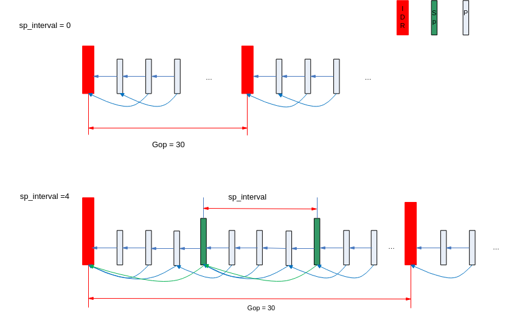

-   OT\_VENC\_GOP\_MODE\_SMART\_P模式的帧结构，如[图2](#fig555934712569)所示。

    其中：Bg指IDR帧，且为长期参考帧，VI指P帧，该帧只参考Bg帧，且Qp值小于其他P帧Qp值。

**图 2**  OT\_VENC\_GOP\_MODE\_SMART\_P模式的帧结构图<a name="fig555934712569"></a>  
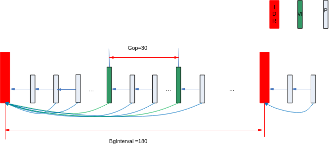

-   OT\_VENC\_GOP\_MODE\_ADV\_SMART\_P模式的帧结构，如[图3](#fig19134113315570)所示。

    其中：Bg指背景建模帧，是IDR帧，且为长期参考帧，VI指P帧，该帧只参考Bg帧，且Qp值小于其他P帧Qp值

**图 3**  OT\_VENC\_GOP\_MODE\_ADV\_SMART\_P模式的帧结构图<a name="fig19134113315570"></a>  
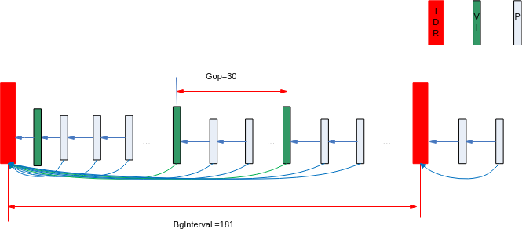

-   OT\_VENC\_GOP\_MODE\_BIPRED\_B模式的帧结构，如[图4](#fig84991915820)所示。

    其中：b\_frame\_num指IDR帧和P帧或P帧和P帧之间B帧的个数，且B帧不作参考帧，上图中b\_frame\_num = 2，用户需注意，可能在一个Gop的尾部，b\_frame\_num不一定为2，且一个Gop的最后一帧一定是P帧。

**图 4**  OT\_VENC\_GOP\_MODE\_BIPRED\_B模式的帧结构图<a name="fig84991915820"></a>  
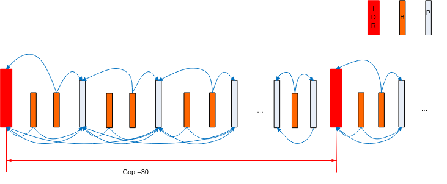

> **说明：** 
>-   H.264非normal\_p模式下，不支持svc-t。
>-   H.265协议的帧存管理方式默认在码流中传输，通过模块参数g\_h265e\_feature\_en控制，默认为1。如果客户的解码器有兼容性问题可以在加载h265e.ko设置g\_h265e\_feature\_en=0。

## 高级跳帧参考模式<a name="ZH-CN_TOPIC_0000002441697729"></a>

高级跳帧参考模式涉及3个参数：base、enhance和pred\_en，其含义请参考ot\_venc\_ref\_param。高级跳帧参考模式示意如[图1](#fig712013783917)至[图6](#fig178695103428)所示。

> **须知：** 
>dual\_p模式且sp\_interval不等于0下配置高级跳帧参考需要满足如下条件：base\*\(enhance+1\)= sp\_interval，例如：4倍高级跳帧参考（base=2，enhance=1），那么dual\_p的sp\_interval =2\*（1+1）=4。

**图 1**  normal\_p高级跳帧参考示意图<a name="fig712013783917"></a>  
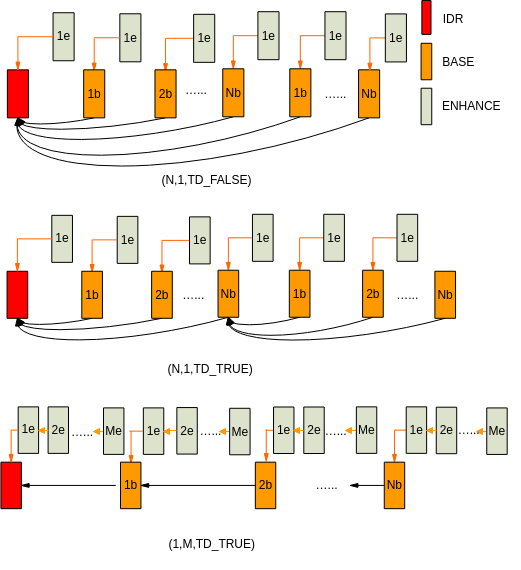

**图 2**  smart\_p高级跳帧参考示意图<a name="fig3562445133913"></a>  
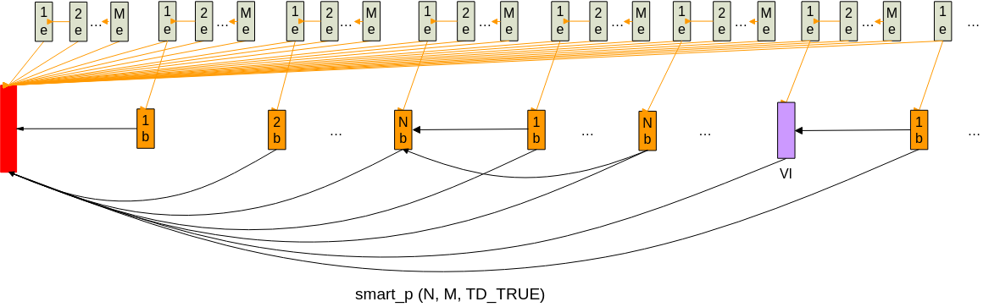

**图 3**  adv\_smart\_p高级跳帧参考示意图<a name="fig18536656124016"></a>  
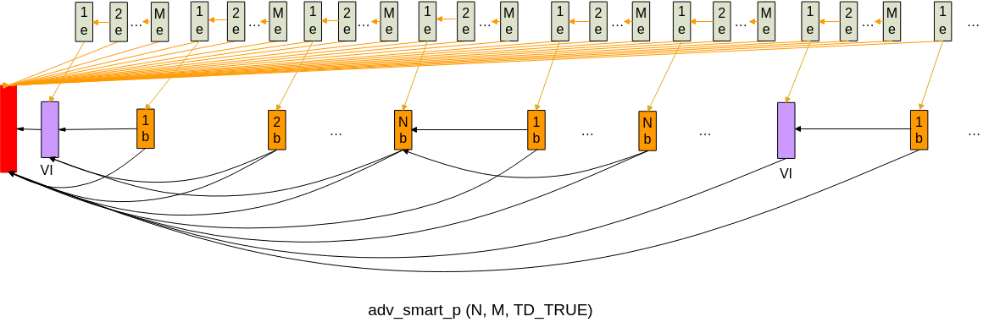

**图 4**  dual\_p \(sp\_interval!=0\)高级跳帧参考示意图<a name="fig1191671815418"></a>  
高级跳帧参考示意图.png "dual_p-(sp_interval-0)高级跳帧参考示意图")

**图 5**  dual\_p \(sp\_interval=0\)高级跳帧参考示意图<a name="fig1342193934110"></a>  
高级跳帧参考示意图-0.png "dual_p-(sp_interval-0)高级跳帧参考示意图-0")

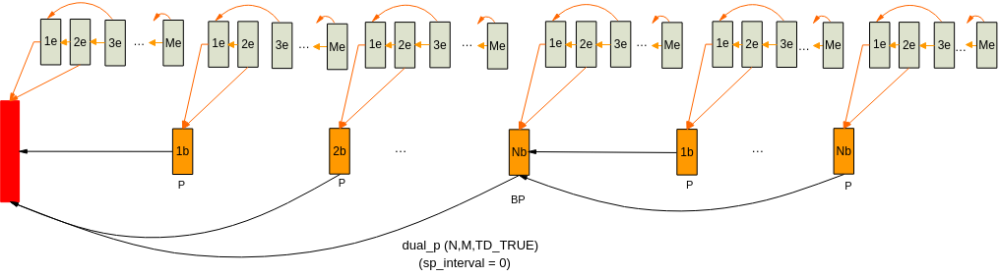

**图 6**  bipred\_b高级跳帧参考示意图<a name="fig178695103428"></a>  
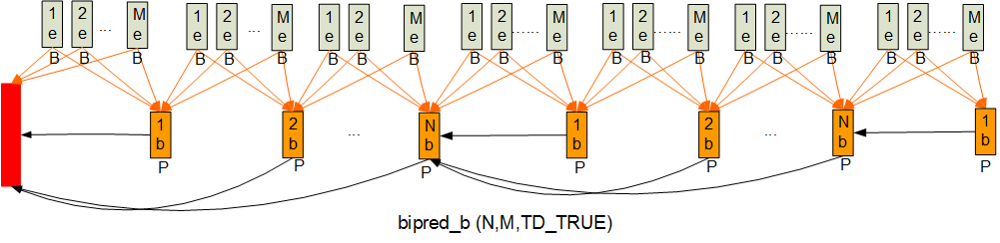

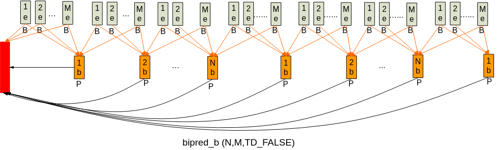

## 彩转灰<a name="ZH-CN_TOPIC_0000002441697797"></a>

彩转灰：即VENC支持把彩色图像转换成灰度图像进行编码。具体功能请参考相关API：[ss\_mpi\_venc\_set\_chn\_param](#ZH-CN_TOPIC_0000002441698329)中彩转灰部分。

## 裁剪编码<a name="ZH-CN_TOPIC_0000002408098622"></a>

裁剪编码：即VENC从图像中裁剪出一部分进行编码，用户可以设置裁剪的起始点X、Y和裁剪的宽度width和高度height，具体功能请参考相关[ss\_mpi\_venc\_set\_chn\_param](#ZH-CN_TOPIC_0000002441698329)  和[图1](#fig1953319321786)等。

**图 1**  裁剪编码示意图<a name="fig1953319321786"></a>  
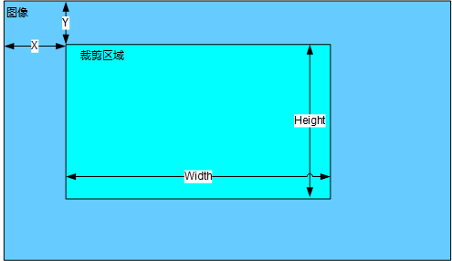

## ROI<a name="ZH-CN_TOPIC_0000002408098902"></a>

ROI（Region Of Interest）编码：感兴趣区域编码。

用户可以通过配置ROI区域，对该区域的图像Qp进行限制，从而实现图像中该区域的Qp与其他图像区域的差异化。系统现仅支持对H.264/H.265通道进行ROI设置。系统提供了8个感兴趣区域，可供用户同时使用。

8个区域可以互相叠加，且叠加时的优先级按照0～7的索引号依次提高，这里，叠加优先级是指发生叠加时，图像区域的最终Qp值的判定，最终的区域Qp值按照优先级最高的区域设定。ROI区域可配置绝对Qp和相对Qp两种模式。

-   绝对Qp：ROI区域的Qp为用户设定的Qp值。
-   相对Qp：ROI区域的Qp为码率控制产生的Qp与用户设定的Qp偏移值的和。

以下示例编码图像采用FixQp模式，设置图像Qp为25，即图像中所有宏块Qp值为25。Roi区域0设置为绝对Qp模式，Qp值为10，索引为0；Roi区域1设置为相对Qp模式，Qp为-10，索引为1。区域0的index小于区域1的index，所以在发生互相重叠的图像区域按高优先级的区域（区域1）Qp设置。区域0除了发生重叠的部分的Qp值等于10。区域1的Qp值为25-10=15。

**图 1**  ROI示意图<a name="fig87031210176"></a>  
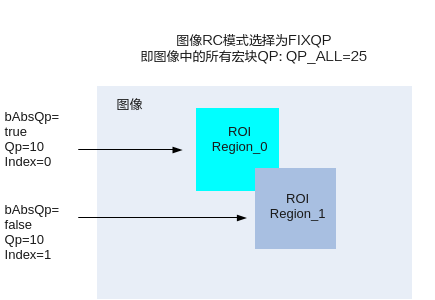

## 非ROI区域的低帧率编码<a name="ZH-CN_TOPIC_0000002441658053"></a>

非ROI区域低帧率，即ROI区域正常编码，而非ROI区域低帧率编码，用户可以根据具体的情况设置非ROI区域的帧率，具体功能能请参考相关API：[ss\_mpi\_venc\_set\_roi\_bg\_frame\_rate](#ZH-CN_TOPIC_0000002408259106)，[ss\_mpi\_venc\_get\_roi\_bg\_frame\_rate](#ZH-CN_TOPIC_0000002408098654)。

## QPMAP模式下OSD、ROI及非ROI区域低帧率<a name="ZH-CN_TOPIC_0000002441698393"></a>

由[码率控制](#ZH-CN_TOPIC_0000002441698045)可知，QPMAP模式下一帧图像每个16\*16块的Qp由用户决定，所以：

-   该模式下，ROI区域大小、起点、Qp、个数可由用户决定，从[图1](码率控制.md#fig14978154218434)和[图2](码率控制.md#fig1569611155114)可知，非ROI区域低帧率也由用户决定。此时，使用[ss\_mpi\_venc\_set\_jpeg\_roi\_attr](#ZH-CN_TOPIC_0000002441658461)接口不生效。
-   该模式下，使用REGION模块对图像内容的遮挡和叠加，最多支持叠加8个区域，但此时叠加区域的Qp则用QPMAP表决定，由REGION模块设置的overlay区域Qp配置无效。

## JPEG抓拍模式<a name="ZH-CN_TOPIC_0000002408098794"></a>

JPEG编码抓拍模式有两种工作模式：全部抓拍模式和抓拍模式。

支持两种抓拍模式:

-   全部抓拍模式：通道启动接收图像后，编码所有接收的图像。
-   抓拍模式：通道启动接收图像后，只编码标记为抓拍帧的图像。

## P帧帧内刷新<a name="ZH-CN_TOPIC_0000002408099074"></a>

P帧刷新ISlice，可以为客户提供码率非常平滑的编码方式，每个I帧和P帧的大小可以非常接近。在网络带宽有限（如无线网络）的情况下，降低I帧过大带来的网络冲击，降低网传延时，降低网络传输出错的概率。


### 使用方式<a name="ZH-CN_TOPIC_0000002441658153"></a>

1.  通过接口[ss\_mpi\_venc\_set\_intra\_refresh](#ZH-CN_TOPIC_0000002441697933)设置刷新使能enable；
2.  设置刷新使能后SDK会自动根据设置的刷新行数或列数refresh\_num从每个GOP的第一帧开始按行（从上至下）或按列（从左至右）完成Intra宏块刷新；刷新间隔为GOP；
3.  SDK会自动把每次按行刷新第一帧的帧内预测宏块转换为一个I Slice；
4.  设置[ss\_mpi\_venc\_set\_intra\_refresh](#ZH-CN_TOPIC_0000002441697933)接口后，码率控制依然生效，可以调整ot\_venc\_gop\_attr：gop\_attr.normal\_p.ip\_qp\_delta来控制Intra宏块刷新起始帧的大小，推荐值为-1。

### 注意事项<a name="ZH-CN_TOPIC_0000002441658433"></a>

-   [ss\_mpi\_venc\_set\_intra\_refresh](#ZH-CN_TOPIC_0000002441697933)设置的刷新行数或列数refresh\_num需要保证在一个GOP周期内，图像内所有的宏块行或列都完成一次刷新； 
-   由于刷新行数或列数refresh\_num与编码参数GOP及跳帧参考参数相关，所以设置编码属性及跳帧参考高级接口后，[ss\_mpi\_venc\_set\_intra\_refresh](#ZH-CN_TOPIC_0000002441697933)接口需要重新设置；
-   [ss\_mpi\_venc\_set\_intra\_refresh](#ZH-CN_TOPIC_0000002441697933)只对H.264/H.265协议有效；
-   [ss\_mpi\_venc\_set\_intra\_refresh](#ZH-CN_TOPIC_0000002441697933)设置使能enable，按行刷新Islice的帧会自动按照刷新Islice的大小做slice划分，用户设置的slice划分接口将无效，其它帧按用户的设置进行slice划分；
-   调用[ss\_mpi\_venc\_reset\_chn](#ZH-CN_TOPIC_0000002408258510)接口复位通道后，此前设置的intra\_refresh相关配置失效。

## 编码码流帧配置模式<a name="ZH-CN_TOPIC_0000002408259014"></a>

编码码流帧配置支持两种模式：单包模式和多包模式（在不调用slice分割接口及其插入用户数据接口的情况下），如[图1](#fig175464472117)所示。

-   多包模式：对于H.264，当为I帧时，调用[ss\_mpi\_venc\_get\_stream](#ZH-CN_TOPIC_0000002408098934)接口，一个I帧至少包含4个NAL包（NAL包分别为sps包、pps包、sei包、Islice包，且NAL包是独立的，包类型不同）；对于JPEG，一帧图像包含2个包（1个图像参数包，1个图像数据包，2个包是独立的，包类型不同）。
-   单包模式：对于H.264，当为I帧时，调用[ss\_mpi\_venc\_get\_stream](#ZH-CN_TOPIC_0000002408098934)接口，一个I帧包含1个NAL包（该NAL包的包类型为Islice包，且包含sps、pps、sei、Islice的数据）；对于JPEG，一帧图像只有1个包（该包的包类型为图像数据包，且包含图像参数包的数据）。

两种模式可通过调用[ss\_mpi\_venc\_set\_mod\_param](#ZH-CN_TOPIC_0000002408099010)接口设置h.265e.ko/h.264e.ko/jpege.ko模块参数one\_stream\_buf来选择。模块参数为1表示单包模式；模块参数为0表示多包模式，系统默认为0。

当用户调用分包接口（例如：[ss\_mpi\_venc\_set\_slice\_split](#ZH-CN_TOPIC_0000002441698373)时,一帧会被分成多个slice，如果用户选择单包模式时，对于I帧来说，该帧第一个ISlice包会包含 sps、pps、sei的数据，该帧的其他ISlice则没有。即对于H.264，sps、pps、sei的数据只会出现在I帧的第一个Islice中并合为1个包，且包类型为ISlice；对于JPEG/MJPEG来说，图像参数包只会出现在一帧的第一个数据包中并合为1个包，且包类型为数据包。

**图 1**  编码码流帧配置模式<a name="fig175464472117"></a>  
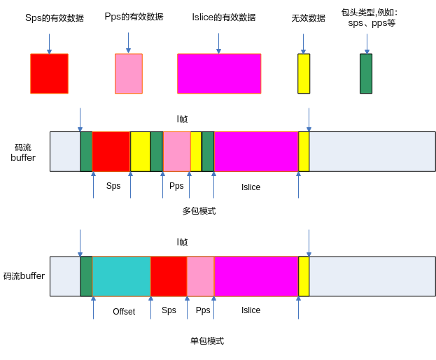

## 编码码流buffer配置模式<a name="ZH-CN_TOPIC_0000002408258902"></a>

编码码流buffer配置支持两种模式：一般模式和省内存模式。

-   一般模式：考虑到超大帧的情况，码流Buffer大小配置的下限为：H.264和H.265是通道宽x通道高x3/4，JPEG和MJPEG是通道宽x通道高。
-   省内存模式：码流Buffer大小配置的下限是32\*1024 bytes，此模式需要用户保证码流buffer大小设置合理，否则会出现因码流buffer不足而不断重编或者丢帧的情况。

两种模式可通过调用[ss\_mpi\_venc\_set\_mod\_param](#ZH-CN_TOPIC_0000002408099010)接口设置相应的模块参数来选择。模块参数值为1表示省内存模式，模块参数值 0表示一般模式。

## 编码帧存回收<a name="ZH-CN_TOPIC_0000002441697889"></a>

H.264和H.265编码目前支持的参考帧数最多为3个，当编码码流由多个参考帧切换到更少的参考帧数时，则编码参考帧Buffer会有闲置。当adv\_smart\_p功能由开启切换到关闭时，则adv\_smart\_p buffer闲置。通过调用[ss\_mpi\_venc\_set\_mod\_param](#ZH-CN_TOPIC_0000002408099010)接口设置VENC的模块参数frame\_buf\_recycle可控制帧存回收。frame\_buf\_recycle为1时表示当ref\_buffer和adv\_smart\_p buffer闲置时回收这些帧存VB，即销毁对应的VB Pool。如果回收，则系统切换参考帧个数或者开关adv\_smart\_p多次之后可能会产生较多的内存碎片。frame\_buf\_recycle默认为0，即不回收编码帧存。编码帧存回收仅在PrivateVB模式下有效。

## 编码帧存计算<a name="ZH-CN_TOPIC_0000002441658557"></a>

编码帧存（参考帧和重构帧）分配支持两种方式：PrivateVB池方式和UserVB池方式。

-   编码PrivateVB池方式：创建编码通道时由VENC创建私有VB池作为该通道的参考帧和重构帧buffer。
-   编码UserVB池方式（仅H.264/H.265编码支持）：创建编码通道时不分配参考帧和重构帧buffer，而是由用户调用接口ss\_mpi\_vb\_create\_pool（请参考”系统控制”章节）。创建一个视频缓存VB池，再通过调用接口 [ss\_mpi\_venc\_attach\_vb\_pool](#ZH-CN_TOPIC_0000002408098818) 把某个编码通道绑定到固定的视频缓存VB池中。

两种方式可通过调用[ss\_mpi\_venc\_set\_mod\_param](#ZH-CN_TOPIC_0000002408099010)接口设置相应的模块参数来选择。模块参数设置为OT\_VB\_SRC\_PRIVATE表示使用编码PrivateVB池方式；设置为 OT\_VB\_SRC\_USER表示使用编码UserVB池方式。

使用PrivateVB方式时每个编码通道之间没有关联，单独销毁某个通道对其它通道无影响，使用灵活。对于多个相同分辨率的编码通道，使用UserVB方式可以节省内存；对于单个编码通道使用UserVB的方式，在销毁再创建通道时（例如H.265切换到H.264），使用UserVB方式，参考帧和重构帧内存可以不必反复分配销毁，减少内存碎片的产生。

如果使用UserVB方式，需要先创建VB池，再把n个通道绑定到对应的VB池中。通道个数大于2的情况，使用UserVB可以减少内存消耗，需要的帧存个数请参考多通道使用的情况；通道数为1或2的情况，也不会增加内存消耗，此时需要的帧存个数可以参考单通道使用的情况。

-   多个通道绑定同一个VBPool，VB块个数BlkCnt的计算方法是：

    

    非帧节省模式：Pic 和 Pic Info 的BlkCnt一致，计算公式如下：

    

    帧节省模式：Pic info 的BlkCnt 与非帧节省模式下保持一致，但是Pic 的 BlkCnt计算公式如下：

    

    ref<sub>n</sub>请参考[GOP结构](#ZH-CN_TOPIC_0000002441698061)小节的描述，使用4倍跳帧参考、svc-t或高级跳帧参考需要相应通道增加一个参考帧。

> **说明：** 
>-   编码使用PrivateVB模式时，编码器使用通道MaxPicWidth和MaxPicHeight代入帧存计算公式计算出来的MaxFrameSize来分配参考帧和重构帧Buffer，只要在编码器限制的最大宽高MAX\_WIDTH和MAX\_HEIGHT范围内的PicWidth和PicHeight代入帧存计算公式计算出来的FrameSize不超过MaxFrameSize，这样的分辨率都能编码，其中MAX\_WIDTH和MAX\_HEIGHT请参看[表1](ss_mpi_venc_create_chn.md#_Ref475717113)。
>-   UserVB池实际使用中是拆分为存储Picture的VB池和存储Picture信息（Pme、Tmv、PmeInfo）的VB池。
>-   编码使用UserVB，并打开帧节省模式则编码器在绑定通道时会根据通道实际编码宽高代入帧存计算公式判断绑定Pic VB池的BlkSize\(Pic Info 的 BlkSize不会提前判断\)。
>-   Qpmap模式下内存计算见"[码率控制](#ZH-CN_TOPIC_0000002441698045)"小节中qpmap段落。

## 多编码器编码<a name="ZH-CN_TOPIC_0000002408098538"></a>

> **说明：** 
>SS528V100支持多个编码器，SS625V100/SS524V100/SS522V101/SS928V100/SS626V100仅支持一个。

H.264/H.265编码支持多编码器编码，SS528V100支持3个逻辑并行。实际使用中可以根据需要的编码性能选择关闭部分编码逻辑用来降低部分芯片功耗。使用方式为：对于linux，加载ssxx\_vedu.ko时设置模块参数g\_vedu\_en，关闭逻辑时仅支持VEDU编号从大到小依次关闭。比如，某解决方案支持vedu0/vedu1/vedu2三个逻辑，vedu2没有关闭时是不允许关闭vedu0和vedu1，假如现在仅需要2个逻辑，则设置g\_vedu\_en=1,1,0

## 智能编码<a name="ZH-CN_TOPIC_0000002408098946"></a>

智能编码\(Smart Video Coding，简称：SVC\)技术包括编码更低码率与前景保护的控制机制。

为了更加准确地对场景中的目标进行保护或者从背景中节省码率，智能编码将一帧图像按照前景、背景及可能目标区域等不同层次进行编码。为了满足用户对各区域质量与总体码率的不同需求，智能编码为用户提供了各区域对应QpMap值和Skip倾向性的配置接口。具体来说，当调用[ss\_mpi\_venc\_enable\_svc](#ZH-CN_TOPIC_0000002408098878)接口使能智能编码后，可以进一步配置接口[ss\_mpi\_venc\_set\_svc\_param](#ZH-CN_TOPIC_0000002441657929)中对应的参数，以达到在不同的场景中对前景、背景及可能目标区域的质量进行不同控制的目的，而最终实现该场景的码率质量优化。例如，增加背景区域的QpMap值或者Skip倾向性可以节省码率，但也可能带来质量损失。同时，通过用户可根据已检测到的智能信息获得图像场景的复杂度的总体信息，来主动调节编码码率控制等相关参数。

**特别说明：QpMap调节Qp的优先级高于参数设置的MinQP和MaxQp，因此在打开智能编码时，在码率不足或者码率充裕时，MaxQP和MinQP会失效。**

## 复合编码<a name="ZH-CN_TOPIC_0000002408258526"></a>

> **说明：** 
>SS528V100/SS625V100/SS522V101/SS524V100/SS626V100暂不支持。

复合编码\(Composite Encoding\)技术能做到同一路视频码流可以解码输出两种效果的目标，可以用于隐私保护等特殊使用场景。

-   开启复合编码需要在编码通道创建之前调用[ss\_mpi\_venc\_set\_chn\_config](#ZH-CN_TOPIC_0000002441698269)接口设置composite\_enc\_en =TD\_TRUE，仅H.265编码通道支持这个规格。在使能复合编码时mosaic\_en可以根据客户需要设置为TD\_TRUE或TD\_FALSE。mosaic\_en =TD\_TRUE时编码器内部会根据客户输入的区域信息或者马赛克表信息在图像上叠加相应的马赛克；如果客户需要其他效果（例如椭圆形等）也可以自行叠加马赛克，并且设置mosaic\_en =TD\_FALSE。
-   开启复合编码需要用户态一次送2帧图像给编码器，不能使用绑定模式。使用复合编码一路视频可以解码出两种效果，可以节省存储空间和网络带宽，在解码端可以通过权限控制显示不同的内容。只显示基础层不会有额外的解码开销。更多的使用方法可以参考接口[ss\_mpi\_venc\_set\_chn\_config](#ZH-CN_TOPIC_0000002441698269)和[ss\_mpi\_venc\_send\_multi\_frame](#ZH-CN_TOPIC_0000002441657873)的描述。

**特别说明：复合编码每帧需要启动2次编码逻辑，因此最大编码能力降低一半。复合编码码流的解码，如果输出基础层图像，解码器无额外性能和VB开销；如果输出增强层图像，解码器也需要启动2次逻辑，最大解码能力降低一半。**

# API参考<a name="ZH-CN_TOPIC_0000002408098922"></a>

视频编码模块主要提供视频编码通道的创建和销毁、视频编码通道的复位、开启和停止接收图像、设置和获取编码通道属性、获取和释放码流等功能。

**注意：SS528V100/SS625V100/SS524V100/SS522V101/SS928V100/SS626V100不支持PRORES相关接口。**

该功能模块提供以下MPI：

-   [ss\_mpi\_venc\_create\_chn](#ZH-CN_TOPIC_0000002408258838)：创建编码通道。
-   [ss\_mpi\_venc\_destroy\_chn](#ZH-CN_TOPIC_0000002441658285)：销毁编码通道。
-   [ss\_mpi\_venc\_reset\_chn](#ZH-CN_TOPIC_0000002408258510)：复位编码通道。
-   [ss\_mpi\_venc\_start\_chn](#ZH-CN_TOPIC_0000002408259146)：开启编码通道接收输入图像。
-   [ss\_mpi\_venc\_stop\_chn](#ZH-CN_TOPIC_0000002441657889)：停止编码通道接收输入图像。
-   [ss\_mpi\_venc\_query\_status](#ZH-CN_TOPIC_0000002408098958)：查询编码通道状态。
-   [ss\_mpi\_venc\_set\_chn\_attr](#ZH-CN_TOPIC_0000002441697697)：设置编码通道的编码属性。
-   [ss\_mpi\_venc\_get\_chn\_attr](#ZH-CN_TOPIC_0000002441658277)：获取编码通道的编码属性。
-   [ss\_mpi\_venc\_get\_stream](#ZH-CN_TOPIC_0000002408098934)：获取编码码流。
-   [ss\_mpi\_venc\_release\_stream](#ZH-CN_TOPIC_0000002408258886)：释放码流缓存。
-   [ss\_mpi\_venc\_get\_stream\_buf\_info](#ZH-CN_TOPIC_0000002441657945)：获取码流buffer的物理地址和大小。
-   [ss\_mpi\_venc\_insert\_user\_data](#ZH-CN_TOPIC_0000002408259138)：插入用户数据。
-   [ss\_mpi\_venc\_send\_frame](#ZH-CN_TOPIC_0000002408258502)：支持用户发送原始图像进行编码。
-   [ss\_mpi\_venc\_send\_frame\_ex](#ZH-CN_TOPIC_0000002408258798)：支持用户发送原始图像及该图的QpMap表信息进行编码。
-   [ss\_mpi\_venc\_omx\_send\_frame](#ZH-CN_TOPIC_0000002441698389)：支持用户对于H.264/H.265编码通路发送外部码率控制信息进行编码。
-   [ss\_mpi\_venc\_send\_multi\_frame](#ZH-CN_TOPIC_0000002441657873)：用户发送2个图像及马赛克区域信息进行编码
-   [ss\_mpi\_venc\_set\_chn\_config](#ZH-CN_TOPIC_0000002441698269)：设置编码通道复合编码配置
-   [ss\_mpi\_venc\_get\_chn\_config](#ZH-CN_TOPIC_0000002408099098)：获取编码通道复合编码配置
-   [ss\_mpi\_venc\_request\_vi](#ZH-CN_TOPIC_0000002408258698)：请求VI\(虚拟I帧\)帧。
-   [ss\_mpi\_venc\_request\_idr](#ZH-CN_TOPIC_0000002408099206)：请求IDR帧。
-   [ss\_mpi\_venc\_enable\_idr](#ZH-CN_TOPIC_0000002441697861)：使能IDR帧。
-   [ss\_mpi\_venc\_get\_fd](#ZH-CN_TOPIC_0000002441698369)：获取编码通道对应的设备文件句柄。
-   [ss\_mpi\_venc\_close\_fd](#ZH-CN_TOPIC_0000002408258710)：关闭编码通道对应的设备文件句柄。
-   [ss\_mpi\_venc\_set\_roi\_attr](#ZH-CN_TOPIC_0000002408099026)：设置编码通道的感兴趣区域编码配置。
-   [ss\_mpi\_venc\_get\_roi\_attr](#ZH-CN_TOPIC_0000002441658165)：获取编码通道的感兴趣区域编码配置。
-   [ss\_mpi\_venc\_set\_roi\_attr\_ex](#ZH-CN_TOPIC_0000002408099102): 设置编码通道的感兴趣区域编码高级配置。
-   [ss\_mpi\_venc\_get\_roi\_attr\_ex](#ZH-CN_TOPIC_0000002408098994): 获取编码通道的感兴趣区域编码高级配置。
-   [ss\_mpi\_venc\_set\_roi\_bg\_frame\_rate](#ZH-CN_TOPIC_0000002408259106)：设置编码通道非感兴趣区域的帧率配置。
-   [ss\_mpi\_venc\_get\_roi\_bg\_frame\_rate](#ZH-CN_TOPIC_0000002408098654)：获取编码通道非感兴趣区域的帧率配置。
-   [ss\_mpi\_venc\_set\_h264\_intra\_pred](#ZH-CN_TOPIC_0000002441658533)：设置H.264编码的帧内预测配置。
-   [ss\_mpi\_venc\_get\_h264\_intra\_pred](#ZH-CN_TOPIC_0000002441658105)：获取H.264编码的帧内预测配置。
-   [ss\_mpi\_venc\_set\_h264\_trans](#ZH-CN_TOPIC_0000002408258962)：设置H.264编码的变换、量化配置。
-   [ss\_mpi\_venc\_get\_h264\_trans](#ZH-CN_TOPIC_0000002441698005)：获取H.264编码的变换、量化配置。
-   [ss\_mpi\_venc\_set\_h264\_entropy](#ZH-CN_TOPIC_0000002441698021)：设置H.264编码的熵编码配置。
-   [ss\_mpi\_venc\_get\_h264\_entropy](#ZH-CN_TOPIC_0000002441698297)：获取H.264编码的熵编码配置。
-   [ss\_mpi\_venc\_set\_h264\_dblk](#ZH-CN_TOPIC_0000002441698365)：设置H.264编码的deblocking配置。
-   [ss\_mpi\_venc\_get\_h264\_dblk](#ZH-CN_TOPIC_0000002441657989)：获取H.264编码的deblocking配置。
-   [ss\_mpi\_venc\_set\_h264\_vui](#ZH-CN_TOPIC_0000002408099202)：设置H.264编码的VUI配置。
-   [ss\_mpi\_venc\_get\_h264\_vui](#ZH-CN_TOPIC_0000002441658081)：获取H.264编码的VUI配置。
-   [ss\_mpi\_venc\_set\_h265\_vui](#ZH-CN_TOPIC_0000002441658373)：设置H.265协议编码通道的VUI参数。
-   [ss\_mpi\_venc\_get\_h265\_vui](#ZH-CN_TOPIC_0000002441658133)：获取H.265协议编码通道的VUI配置
-   [ss\_mpi\_venc\_set\_jpeg\_param](#ZH-CN_TOPIC_0000002408098842)：设置JPEG编码的参数集合。
-   [ss\_mpi\_venc\_get\_jpeg\_param](#ZH-CN_TOPIC_0000002441698301)：获取JPEG编码的参数集合。
-   [ss\_mpi\_venc\_set\_mjpeg\_param](#ZH-CN_TOPIC_0000002408259114)：设置MJPEG协议编码通道的高级参数。
-   [ss\_mpi\_venc\_get\_mjpeg\_param](#ZH-CN_TOPIC_0000002441697829)：获取MJPEG协议编码通道的高级参数。
-   [ss\_mpi\_venc\_set\_rc\_param](#ZH-CN_TOPIC_0000002441698377)：设置通道码率控制高级参数。
-   [ss\_mpi\_venc\_get\_rc\_param](#ZH-CN_TOPIC_0000002408258674)：获取通道码率控制高级参数。
-   [ss\_mpi\_venc\_set\_ref\_param](#ZH-CN_TOPIC_0000002408258970)：设置H.264/H.265编码通道高级跳帧参考参数。
-   [ss\_mpi\_venc\_get\_ref\_param](#ZH-CN_TOPIC_0000002408258722)：获取H.264/H.265编码通道高级跳帧参考参数。
-   [ss\_mpi\_venc\_set\_jpeg\_enc\_mode](#ZH-CN_TOPIC_0000002441658181)：设置JPEG抓拍通道的抓拍模式。
-   [ss\_mpi\_venc\_get\_jpeg\_enc\_mode](#ZH-CN_TOPIC_0000002441658469)：获取JPEG抓拍通道的抓拍模式。
-   [ss\_mpi\_venc\_set\_slice\_split](#ZH-CN_TOPIC_0000002441698373)：设置H.264/H.265编码的slice分割配置。
-   [ss\_mpi\_venc\_get\_slice\_split](#ZH-CN_TOPIC_0000002408098666)：获取H.264/H.265编码的slice分割配置。
-   [ss\_mpi\_venc\_set\_search\_window](#ZH-CN_TOPIC_0000002408259126)：设置H.264/H.265通道的搜索窗范围。
-   [ss\_mpi\_venc\_get\_search\_window](#ZH-CN_TOPIC_0000002408098754)：获取H.264/H.265通道的搜索窗范围。
-   [ss\_mpi\_venc\_set\_h265\_pu](#ZH-CN_TOPIC_0000002408099006)：设置H.265编码的PU配置。
-   [ss\_mpi\_venc\_get\_h265\_pu](#ZH-CN_TOPIC_0000002408098806)：获取H.265编码的PU配置。
-   [ss\_mpi\_venc\_set\_h265\_trans](#ZH-CN_TOPIC_0000002408098854)  ：设置H.265编码的变换、量化配置。
-   [ss\_mpi\_venc\_get\_h265\_trans](#ZH-CN_TOPIC_0000002441658473)：获取H.265编码的变换、量化配置。
-   [ss\_mpi\_venc\_set\_h265\_entropy](#ZH-CN_TOPIC_0000002441698345)：设置H.265通道的熵编码属性。
-   [ss\_mpi\_venc\_get\_h265\_entropy](#ZH-CN_TOPIC_0000002441698401)：获取H.265通道的熵编码属性。
-   [ss\_mpi\_venc\_set\_h265\_dblk](#ZH-CN_TOPIC_0000002408099162)：设置H.265编码的deblocking配置。
-   [ss\_mpi\_venc\_get\_h265\_dblk](#ZH-CN_TOPIC_0000002441658097)：获取H.265编码的deblocking配置。
-   [ss\_mpi\_venc\_set\_h265\_sao](#ZH-CN_TOPIC_0000002441658333)：设置H.265编码的SAO配置。
-   [ss\_mpi\_venc\_get\_h265\_sao](#ZH-CN_TOPIC_0000002441658145)：获取H.265编码的SAO配置。
-   [ss\_mpi\_venc\_set\_frame\_lost\_strategy](#ZH-CN_TOPIC_0000002441698033)：设置瞬时码率超出阈值时丢帧策略的配置。
-   [ss\_mpi\_venc\_get\_frame\_lost\_strategy](#ZH-CN_TOPIC_0000002408259054)：获取瞬时码率超出阈值时丢帧策略的配置。
-   [ss\_mpi\_venc\_set\_super\_frame\_strategy](#ZH-CN_TOPIC_0000002408099178)：设置超大帧处理配置。
-   [ss\_mpi\_venc\_get\_super\_frame\_strategy](#ZH-CN_TOPIC_0000002408099234)  ：获取超大帧处理配置。
-   [ss\_mpi\_venc\_get\_intra\_refresh](#ZH-CN_TOPIC_0000002408099166)：获取P帧刷Islice的设置参数。
-   [ss\_mpi\_venc\_set\_intra\_refresh](#ZH-CN_TOPIC_0000002441697933)：设置P帧刷Islice的参数。
-   [ss\_mpi\_venc\_set\_mod\_param](#ZH-CN_TOPIC_0000002408099010)：设置编码相关的模块参数。
-   [ss\_mpi\_venc\_get\_mod\_param](#ZH-CN_TOPIC_0000002441697981)：获取编码相关的模块参数。
-   [ss\_mpi\_venc\_set\_sse\_rgn](#ZH-CN_TOPIC_0000002408258734)：设置H.264/H.265通道的SSE属性。
-   [ss\_mpi\_venc\_get\_sse\_rgn](#ZH-CN_TOPIC_0000002441658541)：获取H.264/H.265通道的SSE属性。
-   [ss\_mpi\_venc\_set\_chn\_param](#ZH-CN_TOPIC_0000002441698329)：设置Venc通道参数。
-   [ss\_mpi\_venc\_get\_chn\_param](#ZH-CN_TOPIC_0000002408099214)：获取Venc通道参数。
-   [ss\_mpi\_venc\_set\_fg\_protect](#ZH-CN_TOPIC_0000002441698337)：设置通道的前景保护参数。
-   [ss\_mpi\_venc\_get\_fg\_protect](#ZH-CN_TOPIC_0000002408258646)：获取通道的前景保护参数。
-   [ss\_mpi\_venc\_set\_scene\_mode](#ZH-CN_TOPIC_0000002441698173)：设置编码场景模式。
-   [ss\_mpi\_venc\_get\_scene\_mode](#ZH-CN_TOPIC_0000002441658121)：获取编码场景模式。
-   [ss\_mpi\_venc\_attach\_vb\_pool](#ZH-CN_TOPIC_0000002408098818)：将编码通道绑定到某个视频缓存VB池中。
-   [ss\_mpi\_venc\_detach\_vb\_pool](#ZH-CN_TOPIC_0000002408259130)：将编码通道从某个视频缓存VB池中解绑定。
-   [ss\_mpi\_venc\_set\_cu\_pred](#ZH-CN_TOPIC_0000002441658497)：设置CU模式的倾向性。
-   [ss\_mpi\_venc\_get\_cu\_pred](#ZH-CN_TOPIC_0000002441658549)：获取CU模式的倾向性配置。
-   [ss\_mpi\_venc\_set\_skip\_bias](#ZH-CN_TOPIC_0000002408099174)：设置cu/mb选择Skip模式的倾向性。
-   [ss\_mpi\_venc\_get\_skip\_bias](#ZH-CN_TOPIC_0000002408098726)：获取cu/mb选择Skip模式的倾向性配置。
-   [ss\_mpi\_venc\_set\_debreath\_effect](#ZH-CN_TOPIC_0000002441658297)：设置去除呼吸效应参数。
-   [ss\_mpi\_venc\_get\_debreath\_effect](#ZH-CN_TOPIC_0000002408258450)：获取去除呼吸效应参数。
-   [ss\_mpi\_venc\_set\_hierarchical\_qp](#ZH-CN_TOPIC_0000002441657921)：设置分层qp参数。
-   [ss\_mpi\_venc\_get\_hierarchical\_qp](#ZH-CN_TOPIC_0000002408099118)：获取分层qp参数。
-   [ss\_mpi\_venc\_set\_rc\_adv\_param](#ZH-CN_TOPIC_0000002408259042)：设置RC模块的高级参数。
-   [ss\_mpi\_venc\_get\_rc\_adv\_param](#ZH-CN_TOPIC_0000002408099122)：获取RC模块的高级参数。
-   [ss\_mpi\_venc\_set\_jpeg\_roi\_attr](#ZH-CN_TOPIC_0000002441658461)：设置jpeg ROI属性。
-   [ss\_mpi\_venc\_get\_jpeg\_roi\_attr](#ZH-CN_TOPIC_0000002408098586)：获取jpeg ROI属性。
-   [ss\_mpi\_venc\_enable\_svc](#ZH-CN_TOPIC_0000002408098878)：开启/关闭智能编码。
-   [ss\_mpi\_venc\_get\_svc\_param](#ZH-CN_TOPIC_0000002441697713)：获取智能编码相关参数。
-   [ss\_mpi\_venc\_set\_svc\_param](#ZH-CN_TOPIC_0000002441657929)：设置智能编码相关参数。
-   [ss\_mpi\_venc\_send\_svc\_region](#ZH-CN_TOPIC_0000002441698289)：发送智能检测目标框属性信息。
-   [ss\_mpi\_venc\_get\_md](#ZH-CN_TOPIC_0000002441698277)：获取编码器md检测信息。
-   [ss\_mpi\_venc\_set\_md](#ZH-CN_TOPIC_0000002408259030)：设置编码器md检测区域控制信息。
-   [ss\_mpi\_venc\_get\_deblur](#ZH-CN_TOPIC_0000002441658449)：获取背景去模糊算法相关参数。
-   [ss\_mpi\_venc\_set\_deblur](#ZH-CN_TOPIC_0000002408098594)：设置背景去模糊算法相关参数。
-   [ss\_mpi\_venc\_get\_param\_set\_id](#ZH-CN_TOPIC_0000002408258822)：获取H.264/H.265参数集ID。
-   [ss\_mpi\_venc\_set\_param\_set\_id](#ZH-CN_TOPIC_0000002408258486)：设置H.264/H.265参数集ID。
-   [ss\_mpi\_venc\_get\_h264\_poc](#ZH-CN_TOPIC_0000002408258554)：获取H.264协议编码通道的POC类型。
-   [ss\_mpi\_venc\_set\_h264\_poc](#ZH-CN_TOPIC_0000002408259046)：设置H.264协议编码通道的POC类型。
-   [ss\_mpi\_venc\_get\_jpeg\_dering\_level](#ZH-CN_TOPIC_0000002408099230)：获取JPEG编码通道的强边去Ring效应强度等级。
-   [ss\_mpi\_venc\_set\_jpeg\_dering\_level](#ZH-CN_TOPIC_0000002441697877)：设置JPEG编码通道的强边去Ring效应强度等级。
-   [ss\_mpi\_venc\_enable\_jpeg\_dblk](#ZH-CN_TOPIC_0000002441658381)：是否使能JPEG编码通道的Block效应。
-   [ss\_mpi\_venc\_get\_adv\_deblur](#ZH-CN_TOPIC_0000002441698053)：获取运动物体区域拖尾和残留区域检测参数。
-   [ss\_mpi\_venc\_set\_adv\_deblur](#ZH-CN_TOPIC_0000002408258806)：设置运动物体区域拖尾和残留区域检测参数。
-   [ss\_mpi\_venc\_get\_jpeg\_roi\_adv\_attr](#ZH-CN_TOPIC_0000002441698113)：获取JPEG和MJPEG编码通道的ROI高级属性。
-   [ss\_mpi\_venc\_set\_jpeg\_roi\_adv\_attr](#ZH-CN_TOPIC_0000002441698285)：设置JPEG和MJPEG编码通道的ROI高级属性。


## ss\_mpi\_venc\_create\_chn<a name="ZH-CN_TOPIC_0000002408258838"></a>

【描述】

创建编码通道。

【语法】

```
td_s32 ss_mpi_venc_create_chn(ot_venc_chn chn, const ot_venc_chn_attr *attr);
```

【参数】

<a name="table18630mcpsimp"></a>
<table><thead align="left"><tr id="row18636mcpsimp"><th class="cellrowborder" valign="top" width="19.800000000000004%" id="mcps1.1.4.1.1"><p id="p18638mcpsimp"><a name="p18638mcpsimp"></a><a name="p18638mcpsimp"></a>参数名称</p>
</th>
<th class="cellrowborder" valign="top" width="64.36%" id="mcps1.1.4.1.2"><p id="p18640mcpsimp"><a name="p18640mcpsimp"></a><a name="p18640mcpsimp"></a>描述</p>
</th>
<th class="cellrowborder" valign="top" width="15.840000000000003%" id="mcps1.1.4.1.3"><p id="p18642mcpsimp"><a name="p18642mcpsimp"></a><a name="p18642mcpsimp"></a>输入/输出</p>
</th>
</tr>
</thead>
<tbody><tr id="row18643mcpsimp"><td class="cellrowborder" valign="top" width="19.800000000000004%" headers="mcps1.1.4.1.1 "><p id="p18645mcpsimp"><a name="p18645mcpsimp"></a><a name="p18645mcpsimp"></a>chn</p>
</td>
<td class="cellrowborder" valign="top" width="64.36%" headers="mcps1.1.4.1.2 "><p id="p18647mcpsimp"><a name="p18647mcpsimp"></a><a name="p18647mcpsimp"></a>编码通道号。</p>
<p xml:lang="pt-BR" id="p18648mcpsimp"><a name="p18648mcpsimp"></a><a name="p18648mcpsimp"></a><span xml:lang="en-US" id="ph18649mcpsimp"><a name="ph18649mcpsimp"></a><a name="ph18649mcpsimp"></a>取值范围：[0, </span>OT_VENC_MAX_CHN_NUM<span xml:lang="en-US" id="ph18651mcpsimp"><a name="ph18651mcpsimp"></a><a name="ph18651mcpsimp"></a>)。</span></p>
</td>
<td class="cellrowborder" valign="top" width="15.840000000000003%" headers="mcps1.1.4.1.3 "><p id="p18653mcpsimp"><a name="p18653mcpsimp"></a><a name="p18653mcpsimp"></a>输入</p>
</td>
</tr>
<tr id="row18654mcpsimp"><td class="cellrowborder" valign="top" width="19.800000000000004%" headers="mcps1.1.4.1.1 "><p id="p18656mcpsimp"><a name="p18656mcpsimp"></a><a name="p18656mcpsimp"></a>attr</p>
</td>
<td class="cellrowborder" valign="top" width="64.36%" headers="mcps1.1.4.1.2 "><p id="p18658mcpsimp"><a name="p18658mcpsimp"></a><a name="p18658mcpsimp"></a>编码通道属性。</p>
</td>
<td class="cellrowborder" valign="top" width="15.840000000000003%" headers="mcps1.1.4.1.3 "><p id="p18660mcpsimp"><a name="p18660mcpsimp"></a><a name="p18660mcpsimp"></a>输入</p>
</td>
</tr>
</tbody>
</table>

【返回值】

<a name="table18662mcpsimp"></a>
<table><thead align="left"><tr id="row18667mcpsimp"><th class="cellrowborder" valign="top" width="50%" id="mcps1.1.3.1.1"><p id="p18669mcpsimp"><a name="p18669mcpsimp"></a><a name="p18669mcpsimp"></a>返回值</p>
</th>
<th class="cellrowborder" valign="top" width="50%" id="mcps1.1.3.1.2"><p id="p18671mcpsimp"><a name="p18671mcpsimp"></a><a name="p18671mcpsimp"></a>描述</p>
</th>
</tr>
</thead>
<tbody><tr id="row18673mcpsimp"><td class="cellrowborder" valign="top" width="50%" headers="mcps1.1.3.1.1 "><p id="p18675mcpsimp"><a name="p18675mcpsimp"></a><a name="p18675mcpsimp"></a>0</p>
</td>
<td class="cellrowborder" valign="top" width="50%" headers="mcps1.1.3.1.2 "><p id="p18677mcpsimp"><a name="p18677mcpsimp"></a><a name="p18677mcpsimp"></a>成功。</p>
</td>
</tr>
<tr id="row18678mcpsimp"><td class="cellrowborder" valign="top" width="50%" headers="mcps1.1.3.1.1 "><p id="p18680mcpsimp"><a name="p18680mcpsimp"></a><a name="p18680mcpsimp"></a>非0</p>
</td>
<td class="cellrowborder" valign="top" width="50%" headers="mcps1.1.3.1.2 "><p id="p18682mcpsimp"><a name="p18682mcpsimp"></a><a name="p18682mcpsimp"></a>失败，参见错误码。</p>
</td>
</tr>
</tbody>
</table>

【需求】

-   头文件：ot\_common\_venc.h、ot\_common\_rc.h、ss\_mpi\_venc.h
-   库文件：libss\_mpi.a

【注意】

-   编码通道属性由三部分组成，编码器属性、码率控制器属性和帧结构类型属性，帧结构类型属性简称GOP类型属性。
-   编码器属性首先需要选择编码协议，然后分别对各种协议对应的属性进行赋值。
-   编码器属性最大宽高，通道宽高必须满足如下约束：

    MaxPicWidth∈\[MIN\_WIDTH, MAX\_WIDTH\]

    MaxPicHeight∈\[MIN\_HEIGHT, MAX\_HEIGHT\]

    PicWidth∈\[MIN\_WIDTH, MAX\_WIDTH\]

    PicHeight∈\[MIN\_HEIGHT, MAX\_HEIGHT\]

    最大宽高，通道宽高必须是MIN\_ALIGN的整数倍。

    其中MIN\_WIDTH，MAX\_WIDTH，MIN\_HEIGHT，MAX\_HEIGHT，MIN\_ALIGN分别表示编码通道支持的最小宽度，最大宽度，最小高度，最大高度，最小对齐单元（像素）。

    编码器支持通道宽高如[表1](#_Ref475717113)所示。

**表 1**  解决方案相关编码通道宽高

<a name="_Ref475717113"></a>
<table><thead align="left"><tr id="row18715mcpsimp"><th class="cellrowborder" rowspan="3" valign="top" id="mcps1.2.12.1.1"><p id="p18717mcpsimp"><a name="p18717mcpsimp"></a><a name="p18717mcpsimp"></a>解决方案</p>
</th>
<th class="cellrowborder" colspan="5" valign="top" id="mcps1.2.12.1.2"><p id="p18719mcpsimp"><a name="p18719mcpsimp"></a><a name="p18719mcpsimp"></a>H.264/H.265</p>
</th>
<th class="cellrowborder" colspan="5" valign="top" id="mcps1.2.12.1.3"><p id="p18721mcpsimp"><a name="p18721mcpsimp"></a><a name="p18721mcpsimp"></a>JPEG/MJPEG</p>
</th>
</tr>
<tr id="row19148552152612"><th class="cellrowborder" colspan="2" valign="top" id="mcps1.2.12.2.1"><p id="p34612912711"><a name="p34612912711"></a><a name="p34612912711"></a>WIDTH</p>
</th>
<th class="cellrowborder" colspan="2" valign="top" id="mcps1.2.12.2.2"><p id="p18726mcpsimp"><a name="p18726mcpsimp"></a><a name="p18726mcpsimp"></a>HEIGHT</p>
</th>
<th class="cellrowborder" rowspan="2" valign="top" id="mcps1.2.12.2.3"><p id="p18728mcpsimp"><a name="p18728mcpsimp"></a><a name="p18728mcpsimp"></a>MIN_ALIGN</p>
</th>
<th class="cellrowborder" colspan="2" valign="top" id="mcps1.2.12.2.4"><p id="p18730mcpsimp"><a name="p18730mcpsimp"></a><a name="p18730mcpsimp"></a>WIDTH</p>
</th>
<th class="cellrowborder" colspan="2" valign="top" id="mcps1.2.12.2.5"><p id="p268074614277"><a name="p268074614277"></a><a name="p268074614277"></a>HEIGHT</p>
</th>
<th class="cellrowborder" rowspan="2" valign="top" id="mcps1.2.12.2.6"><p id="p15690196132810"><a name="p15690196132810"></a><a name="p15690196132810"></a>MIN_ALIGN</p>
</th>
</tr>
<tr id="row16645104122711"><th class="cellrowborder" valign="top" id="mcps1.2.12.3.1"><p id="p18737mcpsimp"><a name="p18737mcpsimp"></a><a name="p18737mcpsimp"></a>MAX</p>
</th>
<th class="cellrowborder" valign="top" id="mcps1.2.12.3.2"><p id="p18739mcpsimp"><a name="p18739mcpsimp"></a><a name="p18739mcpsimp"></a>MIN</p>
</th>
<th class="cellrowborder" valign="top" id="mcps1.2.12.3.3"><p id="p18741mcpsimp"><a name="p18741mcpsimp"></a><a name="p18741mcpsimp"></a>MAX</p>
</th>
<th class="cellrowborder" valign="top" id="mcps1.2.12.3.4"><p id="p18743mcpsimp"><a name="p18743mcpsimp"></a><a name="p18743mcpsimp"></a>MIN</p>
</th>
<th class="cellrowborder" valign="top" id="mcps1.2.12.3.5"><p id="p18745mcpsimp"><a name="p18745mcpsimp"></a><a name="p18745mcpsimp"></a>MAX</p>
</th>
<th class="cellrowborder" valign="top" id="mcps1.2.12.3.6"><p id="p18747mcpsimp"><a name="p18747mcpsimp"></a><a name="p18747mcpsimp"></a>MIN</p>
</th>
<th class="cellrowborder" valign="top" id="mcps1.2.12.3.7"><p id="p18749mcpsimp"><a name="p18749mcpsimp"></a><a name="p18749mcpsimp"></a>MAX</p>
</th>
<th class="cellrowborder" valign="top" id="mcps1.2.12.3.8"><p id="p18751mcpsimp"><a name="p18751mcpsimp"></a><a name="p18751mcpsimp"></a>MIN</p>
</th>
</tr>
</thead>
<tbody><tr id="row18752mcpsimp"><td class="cellrowborder" valign="top" width="15.84158415841584%" headers="mcps1.2.12.1.1 mcps1.2.12.3.1 "><p id="p18754mcpsimp"><a name="p18754mcpsimp"></a><a name="p18754mcpsimp"></a>SS528V100</p>
<p id="p18755mcpsimp"><a name="p18755mcpsimp"></a><a name="p18755mcpsimp"></a>SS625V100</p>
<p id="p18756mcpsimp"><a name="p18756mcpsimp"></a><a name="p18756mcpsimp"></a>SS524V100</p>
<p id="p18757mcpsimp"><a name="p18757mcpsimp"></a><a name="p18757mcpsimp"></a>SS522V101</p>
<p id="p18758mcpsimp"><a name="p18758mcpsimp"></a><a name="p18758mcpsimp"></a>SS626V100</p>
</td>
<td class="cellrowborder" valign="top" width="6.930693069306929%" headers="mcps1.2.12.1.2 mcps1.2.12.2.1 mcps1.2.12.3.2 "><p id="p18760mcpsimp"><a name="p18760mcpsimp"></a><a name="p18760mcpsimp"></a>4096</p>
</td>
<td class="cellrowborder" valign="top" width="6.930693069306929%" headers="mcps1.2.12.1.2 mcps1.2.12.2.1 mcps1.2.12.3.3 "><p id="p18762mcpsimp"><a name="p18762mcpsimp"></a><a name="p18762mcpsimp"></a>114</p>
</td>
<td class="cellrowborder" valign="top" width="6.930693069306929%" headers="mcps1.2.12.1.2 mcps1.2.12.2.2 mcps1.2.12.3.4 "><p id="p18764mcpsimp"><a name="p18764mcpsimp"></a><a name="p18764mcpsimp"></a>4096</p>
</td>
<td class="cellrowborder" valign="top" width="6.930693069306929%" headers="mcps1.2.12.1.2 mcps1.2.12.2.2 mcps1.2.12.3.5 "><p id="p18766mcpsimp"><a name="p18766mcpsimp"></a><a name="p18766mcpsimp"></a>114</p>
</td>
<td class="cellrowborder" valign="top" width="13.861386138613858%" headers="mcps1.2.12.1.2 mcps1.2.12.2.3 mcps1.2.12.3.6 "><p id="p18768mcpsimp"><a name="p18768mcpsimp"></a><a name="p18768mcpsimp"></a>2</p>
</td>
<td class="cellrowborder" valign="top" width="7.92079207920792%" headers="mcps1.2.12.1.3 mcps1.2.12.2.4 mcps1.2.12.3.7 "><p id="p18770mcpsimp"><a name="p18770mcpsimp"></a><a name="p18770mcpsimp"></a>16384</p>
</td>
<td class="cellrowborder" valign="top" width="6.930693069306929%" headers="mcps1.2.12.1.3 mcps1.2.12.2.4 mcps1.2.12.3.8 "><p id="p18772mcpsimp"><a name="p18772mcpsimp"></a><a name="p18772mcpsimp"></a>32</p>
</td>
<td class="cellrowborder" valign="top" width="7.92079207920792%" headers="mcps1.2.12.1.3 mcps1.2.12.2.5 "><p id="p18774mcpsimp"><a name="p18774mcpsimp"></a><a name="p18774mcpsimp"></a>16384</p>
</td>
<td class="cellrowborder" valign="top" width="6.930693069306929%" headers="mcps1.2.12.1.3 mcps1.2.12.2.5 "><p id="p18776mcpsimp"><a name="p18776mcpsimp"></a><a name="p18776mcpsimp"></a>32</p>
</td>
<td class="cellrowborder" valign="top" width="12.871287128712869%" headers="mcps1.2.12.1.3 mcps1.2.12.2.6 "><p id="p18778mcpsimp"><a name="p18778mcpsimp"></a><a name="p18778mcpsimp"></a>2</p>
</td>
</tr>
<tr id="row18779mcpsimp"><td class="cellrowborder" valign="top" width="15.84158415841584%" headers="mcps1.2.12.1.1 mcps1.2.12.3.1 "><p id="p18781mcpsimp"><a name="p18781mcpsimp"></a><a name="p18781mcpsimp"></a>SS928V100</p>
</td>
<td class="cellrowborder" valign="top" width="6.930693069306929%" headers="mcps1.2.12.1.2 mcps1.2.12.2.1 mcps1.2.12.3.2 "><p id="p18783mcpsimp"><a name="p18783mcpsimp"></a><a name="p18783mcpsimp"></a>8192</p>
</td>
<td class="cellrowborder" valign="top" width="6.930693069306929%" headers="mcps1.2.12.1.2 mcps1.2.12.2.1 mcps1.2.12.3.3 "><p id="p18785mcpsimp"><a name="p18785mcpsimp"></a><a name="p18785mcpsimp"></a>114</p>
</td>
<td class="cellrowborder" valign="top" width="6.930693069306929%" headers="mcps1.2.12.1.2 mcps1.2.12.2.2 mcps1.2.12.3.4 "><p id="p18787mcpsimp"><a name="p18787mcpsimp"></a><a name="p18787mcpsimp"></a>8192</p>
</td>
<td class="cellrowborder" valign="top" width="6.930693069306929%" headers="mcps1.2.12.1.2 mcps1.2.12.2.2 mcps1.2.12.3.5 "><p id="p18789mcpsimp"><a name="p18789mcpsimp"></a><a name="p18789mcpsimp"></a>114</p>
</td>
<td class="cellrowborder" valign="top" width="13.861386138613858%" headers="mcps1.2.12.1.2 mcps1.2.12.2.3 mcps1.2.12.3.6 "><p id="p18791mcpsimp"><a name="p18791mcpsimp"></a><a name="p18791mcpsimp"></a>2</p>
</td>
<td class="cellrowborder" valign="top" width="7.92079207920792%" headers="mcps1.2.12.1.3 mcps1.2.12.2.4 mcps1.2.12.3.7 "><p id="p18793mcpsimp"><a name="p18793mcpsimp"></a><a name="p18793mcpsimp"></a>16384</p>
</td>
<td class="cellrowborder" valign="top" width="6.930693069306929%" headers="mcps1.2.12.1.3 mcps1.2.12.2.4 mcps1.2.12.3.8 "><p id="p18795mcpsimp"><a name="p18795mcpsimp"></a><a name="p18795mcpsimp"></a>32</p>
</td>
<td class="cellrowborder" valign="top" width="7.92079207920792%" headers="mcps1.2.12.1.3 mcps1.2.12.2.5 "><p id="p18797mcpsimp"><a name="p18797mcpsimp"></a><a name="p18797mcpsimp"></a>16384</p>
</td>
<td class="cellrowborder" valign="top" width="6.930693069306929%" headers="mcps1.2.12.1.3 mcps1.2.12.2.5 "><p id="p18799mcpsimp"><a name="p18799mcpsimp"></a><a name="p18799mcpsimp"></a>32</p>
</td>
<td class="cellrowborder" valign="top" width="12.871287128712869%" headers="mcps1.2.12.1.3 mcps1.2.12.2.6 "><p id="p18801mcpsimp"><a name="p18801mcpsimp"></a><a name="p18801mcpsimp"></a>2</p>
</td>
</tr>
</tbody>
</table>

-   部分解决方案支持多编码器并行编码，H.265e编码支持垂直划分Tile，根据通道宽高和码率控制器输出帧率决定tile划分数目；H.264e编码支持水平划分Tile\(实际是划分slice\)，根据通道宽高和帧率决定Tile划分数目。SS528V100/SS625V100/SS524V100/SS522V101/SS928V100/SS626V100不支持。
-   编码器属性必须设置编码码流buffer大小，获取码流方式, 编码profile等，[表2](#_Ref196299180)详细描述了各种协议的各项属性的特性。

**表 2**  编码器属性的约束

<a name="_Ref196299180"></a>
<table><thead align="left"><tr id="row18814mcpsimp"><th class="cellrowborder" valign="top" width="14.000000000000002%" id="mcps1.2.6.1.1"><p id="p18816mcpsimp"><a name="p18816mcpsimp"></a><a name="p18816mcpsimp"></a>编码协议</p>
</th>
<th class="cellrowborder" valign="top" width="14.000000000000002%" id="mcps1.2.6.1.2"><p id="p18818mcpsimp"><a name="p18818mcpsimp"></a><a name="p18818mcpsimp"></a>编码方式</p>
</th>
<th class="cellrowborder" valign="top" width="37.1%" id="mcps1.2.6.1.3"><p id="p18820mcpsimp"><a name="p18820mcpsimp"></a><a name="p18820mcpsimp"></a>码流buffer大小</p>
</th>
<th class="cellrowborder" valign="top" width="17.9%" id="mcps1.2.6.1.4"><p id="p18822mcpsimp"><a name="p18822mcpsimp"></a><a name="p18822mcpsimp"></a>获取码流模式</p>
</th>
<th class="cellrowborder" valign="top" width="17%" id="mcps1.2.6.1.5"><p id="p18824mcpsimp"><a name="p18824mcpsimp"></a><a name="p18824mcpsimp"></a>编码profile</p>
</th>
</tr>
</thead>
<tbody><tr id="row18826mcpsimp"><td class="cellrowborder" valign="top" width="14.000000000000002%" headers="mcps1.2.6.1.1 "><p id="p18828mcpsimp"><a name="p18828mcpsimp"></a><a name="p18828mcpsimp"></a>H.264</p>
</td>
<td class="cellrowborder" valign="top" width="14.000000000000002%" headers="mcps1.2.6.1.2 "><p id="p18830mcpsimp"><a name="p18830mcpsimp"></a><a name="p18830mcpsimp"></a>Frame</p>
</td>
<td class="cellrowborder" valign="top" width="37.1%" headers="mcps1.2.6.1.3 "><a name="ul18832mcpsimp"></a><a name="ul18832mcpsimp"></a><ul id="ul18832mcpsimp"><li>当H.264 mini_buf_mode=0时，Buffer≥ MaxPicwidth x MaxPicheight x 3/4；</li><li>当H.264 mini_buf_mode=1时，Buffer≥32*1024 byte；</li></ul>
</td>
<td class="cellrowborder" valign="top" width="17.9%" headers="mcps1.2.6.1.4 "><p id="p18836mcpsimp"><a name="p18836mcpsimp"></a><a name="p18836mcpsimp"></a>Frame/Slice</p>
</td>
<td class="cellrowborder" valign="top" width="17%" headers="mcps1.2.6.1.5 "><p id="p18838mcpsimp"><a name="p18838mcpsimp"></a><a name="p18838mcpsimp"></a>Baseline</p>
<p id="p18839mcpsimp"><a name="p18839mcpsimp"></a><a name="p18839mcpsimp"></a>Mainprofile</p>
<p id="p18840mcpsimp"><a name="p18840mcpsimp"></a><a name="p18840mcpsimp"></a>Highprofile</p>
<p id="p18841mcpsimp"><a name="p18841mcpsimp"></a><a name="p18841mcpsimp"></a>svc-t</p>
</td>
</tr>
<tr id="row18842mcpsimp"><td class="cellrowborder" valign="top" width="14.000000000000002%" headers="mcps1.2.6.1.1 "><p id="p18844mcpsimp"><a name="p18844mcpsimp"></a><a name="p18844mcpsimp"></a>MJPEG</p>
</td>
<td class="cellrowborder" valign="top" width="14.000000000000002%" headers="mcps1.2.6.1.2 "><p id="p18846mcpsimp"><a name="p18846mcpsimp"></a><a name="p18846mcpsimp"></a>Frame</p>
</td>
<td class="cellrowborder" valign="top" width="37.1%" headers="mcps1.2.6.1.3 "><a name="ul18848mcpsimp"></a><a name="ul18848mcpsimp"></a><ul id="ul18848mcpsimp"><li>Jpeg mini_buf_mode=0时，Buffer≥ MaxPicwidth * MaxPicheight；</li><li>Jpeg mini_buf_mode=1时，Buffer≥32*1024 byte；</li></ul>
</td>
<td class="cellrowborder" valign="top" width="17.9%" headers="mcps1.2.6.1.4 "><p id="p18852mcpsimp"><a name="p18852mcpsimp"></a><a name="p18852mcpsimp"></a>Frame/Ecs</p>
</td>
<td class="cellrowborder" valign="top" width="17%" headers="mcps1.2.6.1.5 "><p id="p18854mcpsimp"><a name="p18854mcpsimp"></a><a name="p18854mcpsimp"></a>Baseline</p>
</td>
</tr>
<tr id="row18855mcpsimp"><td class="cellrowborder" valign="top" width="14.000000000000002%" headers="mcps1.2.6.1.1 "><p id="p18857mcpsimp"><a name="p18857mcpsimp"></a><a name="p18857mcpsimp"></a>JPEG</p>
</td>
<td class="cellrowborder" valign="top" width="14.000000000000002%" headers="mcps1.2.6.1.2 "><p id="p18859mcpsimp"><a name="p18859mcpsimp"></a><a name="p18859mcpsimp"></a>Frame</p>
</td>
<td class="cellrowborder" valign="top" width="37.1%" headers="mcps1.2.6.1.3 "><a name="ul18861mcpsimp"></a><a name="ul18861mcpsimp"></a><ul id="ul18861mcpsimp"><li>Jpeg mini_buf_mode=0时，Buffer≥ MaxPicwidth * MaxPicheight；</li><li>Jpeg mini_buf_mode=1时，Buffer≥32*1024 byte；</li></ul>
</td>
<td class="cellrowborder" valign="top" width="17.9%" headers="mcps1.2.6.1.4 "><p id="p18865mcpsimp"><a name="p18865mcpsimp"></a><a name="p18865mcpsimp"></a>Frame/Ecs</p>
</td>
<td class="cellrowborder" valign="top" width="17%" headers="mcps1.2.6.1.5 "><p id="p18867mcpsimp"><a name="p18867mcpsimp"></a><a name="p18867mcpsimp"></a>Baseline</p>
</td>
</tr>
<tr id="row18868mcpsimp"><td class="cellrowborder" rowspan="2" valign="top" width="14.000000000000002%" headers="mcps1.2.6.1.1 "><p id="p18870mcpsimp"><a name="p18870mcpsimp"></a><a name="p18870mcpsimp"></a>H.265</p>
</td>
<td class="cellrowborder" rowspan="2" valign="top" width="14.000000000000002%" headers="mcps1.2.6.1.2 "><p id="p18872mcpsimp"><a name="p18872mcpsimp"></a><a name="p18872mcpsimp"></a>Frame</p>
</td>
<td class="cellrowborder" valign="top" width="37.1%" headers="mcps1.2.6.1.3 "><a name="ul18874mcpsimp"></a><a name="ul18874mcpsimp"></a><ul id="ul18874mcpsimp"><li>H265 mini_buf_mode=0时，Buffer≥ MaxPicwidth * MaxPicheight x 3/4；</li><li>H265 mini_buf_mode=1时，Buffer≥32*1024 byte</li></ul>
</td>
<td class="cellrowborder" valign="top" width="17.9%" headers="mcps1.2.6.1.4 "><p id="p18878mcpsimp"><a name="p18878mcpsimp"></a><a name="p18878mcpsimp"></a>Frame/Slice</p>
</td>
<td class="cellrowborder" valign="top" width="17%" headers="mcps1.2.6.1.5 "><p id="p18880mcpsimp"><a name="p18880mcpsimp"></a><a name="p18880mcpsimp"></a>Main profile</p>
<p id="p18881mcpsimp"><a name="p18881mcpsimp"></a><a name="p18881mcpsimp"></a>Main 10 profile</p>
</td>
</tr>
<tr id="row18882mcpsimp"><td class="cellrowborder" valign="top" headers="mcps1.2.6.1.1 "><a name="ul18884mcpsimp"></a><a name="ul18884mcpsimp"></a><ul id="ul18884mcpsimp"><li>H265 mini_buf_mode=0时，Buffer≥ MaxPicwidth * MaxPicheight *（3/4）*（5/4）；</li><li>H265 mini_buf_mode=1时，Buffer≥32*1024 byte</li></ul>
</td>
<td class="cellrowborder" valign="top" headers="mcps1.2.6.1.2 "><p id="p18888mcpsimp"><a name="p18888mcpsimp"></a><a name="p18888mcpsimp"></a>Frame/Slice</p>
</td>
<td class="cellrowborder" valign="top" headers="mcps1.2.6.1.3 "><p id="p18890mcpsimp"><a name="p18890mcpsimp"></a><a name="p18890mcpsimp"></a>Main 10 profile</p>
</td>
</tr>
<tr id="row18891mcpsimp"><td class="cellrowborder" valign="top" width="14.000000000000002%" headers="mcps1.2.6.1.1 "><p id="p18893mcpsimp"><a name="p18893mcpsimp"></a><a name="p18893mcpsimp"></a>Prores</p>
</td>
<td class="cellrowborder" valign="top" width="14.000000000000002%" headers="mcps1.2.6.1.2 "><p id="p18895mcpsimp"><a name="p18895mcpsimp"></a><a name="p18895mcpsimp"></a>Frame</p>
</td>
<td class="cellrowborder" valign="top" width="37.1%" headers="mcps1.2.6.1.3 "><p id="p18897mcpsimp"><a name="p18897mcpsimp"></a><a name="p18897mcpsimp"></a>Buffer≥ MaxPicwidth x MaxPicheight x 2；</p>
</td>
<td class="cellrowborder" valign="top" width="17.9%" headers="mcps1.2.6.1.4 "><p id="p18899mcpsimp"><a name="p18899mcpsimp"></a><a name="p18899mcpsimp"></a>Frame</p>
</td>
<td class="cellrowborder" valign="top" width="17%" headers="mcps1.2.6.1.5 "><p id="p18901mcpsimp"><a name="p18901mcpsimp"></a><a name="p18901mcpsimp"></a>Proxy</p>
<p id="p18902mcpsimp"><a name="p18902mcpsimp"></a><a name="p18902mcpsimp"></a>422(LT)</p>
<p id="p18903mcpsimp"><a name="p18903mcpsimp"></a><a name="p18903mcpsimp"></a>422</p>
<p id="p18904mcpsimp"><a name="p18904mcpsimp"></a><a name="p18904mcpsimp"></a>422(HQ)</p>
</td>
</tr>
</tbody>
</table>

-   为了保证本芯片自编自解的解码性能也能达到最优，当只划分3个tile时，每个tile内部均分划2个slice，但是如果用户调用接口[ss\_mpi\_venc\_set\_slice\_split](#ZH-CN_TOPIC_0000002441698373)进行划分时内部不会自动划分。
-   推荐的编码宽高为：7680x4320（8k）、3840x2160（4k）、1920x1080（1080P）、1280x720（720P）。
-   编码器属性中除通道宽高（pic\_width和pic\_height）外都是静态属性，一旦创建编码通道成功，静态属性不支持被修改，除非该通道被销毁，重新创建。设置时需要注意的事项请参考[ss\_mpi\_venc\_set\_chn\_attr](#ZH-CN_TOPIC_0000002441697697)接口说明。
-   H.264/H.265，编码帧存由YHeaderSize、CHeaderSize、YSize、CSize、PmeSize、 PmeInfoSize和TmvSize共同构成，编码器默认根据最大宽高计算帧存进行内存分配，在设置通道宽高时需保证根据通道宽高计算的每一部分帧存大小都不能大于最大宽高计算的帧存大小。
-   JPEG/MJPEG，通道宽高的设置要满足：

    PicWidth\*PicHeight<= MaxPicWidth\* MaxPicHeight

-   码率控制器属性首先需要配置RC模式，JPEG抓拍通道不需要配置码率控制器属性，其他协议类型通道（H.264/H.265/MJPEG）都必须配置。码率控制器属性RC模式必须与编码器属性协议类型匹配。
-   对H.264/H.265编码协议，码率控制均支持七种模式：CBR、VBR、AVBR、QVBR、CVBR、QPMAP和FIXQP。并且对于不同协议，相同RC模式的属性变量基本一致。
-   MJPEG的码率控制支持三种模式：CBR、VBR和FIXQP。
-   src\_frame\_rate应该设置为产生TimeRef的实际帧率，RC需要根据src\_frame\_rate统计实际的帧率以及进行码率控制。详情请参看[ot\_venc\_h264\_cbr](zh-cn_topic_0000002441698281.md)注意事项。
-   CBR除了上述的属性之外，还需要设置平均比特率。平均比特率的单位是kbps。平均比特率的设置与编码通道宽高以及图像帧率都有关系。
-   VBR除了上述属性之外，还需要设置max\_bit\_rate，表示编码通道在码率统计时间内允许的最大码率。
-   AVBR需要设置max\_bit\_rate。max\_bit\_rate：编码通道在码率统计时间内允许的最大码率。
-   QVBR需要设置target\_bit\_rate。编码通道在target\_bit\_rate的基础上调节实时码率。实时码率可能大于target\_bit\_rate，也可能小于target\_bit\_rate。
-   CVBR需要设置以下码率：
    -   max\_bit\_rate：编码通道在短期统计时间short\_term\_stats\_time内允许的最大码率。
    -   long\_term\_max\_bit\_rate：编码通道在长期统计时间long\_term\_stats\_time内允许的最大码率。
    -   extra\_bit\_percent：编码器输出码流最大透支bit数相对于long\_term\_max\_bit\_rate的百分比。在码率不足时，为保证图像质量，编码器会通过透支一定bit数以提升图像质量，这部分透支的码率会在编码器压力较小时进行偿还。

-   FIXQP除了上述属性之外，还需要设置i\_qp，p\_qp，b\_qp。i\_qp：I帧时，图像固定使用的QP值。p\_qp：P帧时，图像固定使用的QP值。b\_qp：B帧时，图像固定使用的QP值。在设置I帧QP，P帧QP时，可以根据当前的带宽限制对I帧QP和P帧QP同时进行向上或是向下调整。为了减少呼吸效应，推荐I帧QP始终比P帧的QP小2～3。
-   H.264e编码通道profile为Baseline时，协议不支持编码B帧。
-   H.265e编码通道QPMAP除了上述属性之外，还需要设置qpmap\_mode，表示 CU的QP值的选择方式。
-   H.264/H.265 GOP结构属性首先需要配置Gop Mode模式，（JPEG/MJPEG通道不需要配置GOP结构属性）。
-   Jpege编码时，使能MPF后获取码流不支持单包模式，调用接口[ss\_mpi\_venc\_set\_mod\_param](#ZH-CN_TOPIC_0000002408099010)设置one\_stream\_buf为多包模式。
-   多路Prores编码时性能和单路编码不具有转换关系，可能存在多路性能小于单路编码的性能。
-   JPEGE编码通道OT\_VENC\_PIC\_RECV\_MULTI模式用于编码MPF/DCF，此时编码不会调用VGS模块进行图像缩小。使能该模式后需要调用ss\_mpi\_sys\_bind接口将编码通道绑定到多个输入源，ss\_mpi\_sys\_bind传递的数据接收者的设备号实际用于指定输入源，可以使用[OT\_VENC\_RECV\_SRC0](zh-cn_topic_0000002408098742.md#OT_VENC_RECV_SRC0)、[OT\_VENC\_RECV\_SRC1](zh-cn_topic_0000002408098742.md#OT_VENC_RECV_SRC1)、[OT\_VENC\_RECV\_SRC2](zh-cn_topic_0000002408098742.md#OT_VENC_RECV_SRC2)、[OT\_VENC\_RECV\_SRC3](zh-cn_topic_0000002408098742.md#OT_VENC_RECV_SRC3)枚举进行输入源指定。
-   当前无解决方案支持H.265 main 10 profile.

【举例】

无。

【相关主题】

无。

## ss\_mpi\_venc\_destroy\_chn<a name="ZH-CN_TOPIC_0000002441658285"></a>

【描述】

销毁编码通道。

【语法】

```
td_s32 ss_mpi_venc_destroy_chn(ot_venc_chn chn);
```

【参数】

<a name="table9400mcpsimp"></a>
<table><thead align="left"><tr id="row9406mcpsimp"><th class="cellrowborder" valign="top" width="15.840000000000002%" id="mcps1.1.4.1.1"><p id="p9408mcpsimp"><a name="p9408mcpsimp"></a><a name="p9408mcpsimp"></a>参数名称</p>
</th>
<th class="cellrowborder" valign="top" width="68.32000000000001%" id="mcps1.1.4.1.2"><p id="p9410mcpsimp"><a name="p9410mcpsimp"></a><a name="p9410mcpsimp"></a>描述</p>
</th>
<th class="cellrowborder" valign="top" width="15.840000000000002%" id="mcps1.1.4.1.3"><p id="p9412mcpsimp"><a name="p9412mcpsimp"></a><a name="p9412mcpsimp"></a>输入/输出</p>
</th>
</tr>
</thead>
<tbody><tr id="row9413mcpsimp"><td class="cellrowborder" valign="top" width="15.840000000000002%" headers="mcps1.1.4.1.1 "><p id="p9415mcpsimp"><a name="p9415mcpsimp"></a><a name="p9415mcpsimp"></a>chn</p>
</td>
<td class="cellrowborder" valign="top" width="68.32000000000001%" headers="mcps1.1.4.1.2 "><p id="p9417mcpsimp"><a name="p9417mcpsimp"></a><a name="p9417mcpsimp"></a>编码通道号。</p>
<p xml:lang="pt-BR" id="p9418mcpsimp"><a name="p9418mcpsimp"></a><a name="p9418mcpsimp"></a><span xml:lang="en-US" id="ph9419mcpsimp"><a name="ph9419mcpsimp"></a><a name="ph9419mcpsimp"></a>取值范围：[0, </span>OT_VENC_MAX_CHN_NUM<span xml:lang="en-US" id="ph9421mcpsimp"><a name="ph9421mcpsimp"></a><a name="ph9421mcpsimp"></a>)。</span></p>
</td>
<td class="cellrowborder" valign="top" width="15.840000000000002%" headers="mcps1.1.4.1.3 "><p id="p9423mcpsimp"><a name="p9423mcpsimp"></a><a name="p9423mcpsimp"></a>输入</p>
</td>
</tr>
</tbody>
</table>

【返回值】

<a name="table9425mcpsimp"></a>
<table><thead align="left"><tr id="row9430mcpsimp"><th class="cellrowborder" valign="top" width="50%" id="mcps1.1.3.1.1"><p id="p9432mcpsimp"><a name="p9432mcpsimp"></a><a name="p9432mcpsimp"></a>返回值</p>
</th>
<th class="cellrowborder" valign="top" width="50%" id="mcps1.1.3.1.2"><p id="p9434mcpsimp"><a name="p9434mcpsimp"></a><a name="p9434mcpsimp"></a>描述</p>
</th>
</tr>
</thead>
<tbody><tr id="row9435mcpsimp"><td class="cellrowborder" valign="top" width="50%" headers="mcps1.1.3.1.1 "><p id="p9437mcpsimp"><a name="p9437mcpsimp"></a><a name="p9437mcpsimp"></a>0</p>
</td>
<td class="cellrowborder" valign="top" width="50%" headers="mcps1.1.3.1.2 "><p id="p9439mcpsimp"><a name="p9439mcpsimp"></a><a name="p9439mcpsimp"></a>成功。</p>
</td>
</tr>
<tr id="row9440mcpsimp"><td class="cellrowborder" valign="top" width="50%" headers="mcps1.1.3.1.1 "><p id="p9442mcpsimp"><a name="p9442mcpsimp"></a><a name="p9442mcpsimp"></a>非0</p>
</td>
<td class="cellrowborder" valign="top" width="50%" headers="mcps1.1.3.1.2 "><p id="p9444mcpsimp"><a name="p9444mcpsimp"></a><a name="p9444mcpsimp"></a>失败，返回错误码。</p>
</td>
</tr>
</tbody>
</table>

【需求】

-   头文件：ot\_common\_venc.h、ss\_mpi\_venc.h
-   库文件：libss\_mpi.a

【注意】

-   销毁并不存在的通道，返回失败。
-   销毁前必须停止接收图像，否则返回失败。
-   如果开启了OSD，则编码通道销毁前要调用接口ss\_mpi\_rgn\_detach\_from\_chn\(请参考“区域管理”章节\)将OSD区域从当前通道撤出。
-   开启了OSD，如果需要销毁OSD，建议在调用ss\_mpi\_rgn\_destroy\(请参考“区域管理”章节\)接口之前先调用[ss\_mpi\_venc\_reset\_chn](#ZH-CN_TOPIC_0000002408258510)。

【举例】

无。

【相关主题】

无。

## ss\_mpi\_venc\_reset\_chn<a name="ZH-CN_TOPIC_0000002408258510"></a>

【描述】

复位通道。

【语法】

```
td_s32 ss_mpi_venc_reset_chn(ot_venc_chn chn);
```

【参数】

<a name="table2191mcpsimp"></a>
<table><thead align="left"><tr id="row2197mcpsimp"><th class="cellrowborder" valign="top" width="20%" id="mcps1.1.4.1.1"><p id="p2199mcpsimp"><a name="p2199mcpsimp"></a><a name="p2199mcpsimp"></a>参数名称</p>
</th>
<th class="cellrowborder" valign="top" width="62%" id="mcps1.1.4.1.2"><p id="p2201mcpsimp"><a name="p2201mcpsimp"></a><a name="p2201mcpsimp"></a>描述</p>
</th>
<th class="cellrowborder" valign="top" width="18%" id="mcps1.1.4.1.3"><p id="p2203mcpsimp"><a name="p2203mcpsimp"></a><a name="p2203mcpsimp"></a>输入/输出</p>
</th>
</tr>
</thead>
<tbody><tr id="row2204mcpsimp"><td class="cellrowborder" valign="top" width="20%" headers="mcps1.1.4.1.1 "><p id="p2206mcpsimp"><a name="p2206mcpsimp"></a><a name="p2206mcpsimp"></a>chn</p>
</td>
<td class="cellrowborder" valign="top" width="62%" headers="mcps1.1.4.1.2 "><p id="p2208mcpsimp"><a name="p2208mcpsimp"></a><a name="p2208mcpsimp"></a>通道号。</p>
<p xml:lang="pt-BR" id="p2209mcpsimp"><a name="p2209mcpsimp"></a><a name="p2209mcpsimp"></a><span xml:lang="en-US" id="ph2210mcpsimp"><a name="ph2210mcpsimp"></a><a name="ph2210mcpsimp"></a>取值范围：[0, </span>OT_VENC_MAX_CHN_NUM<span xml:lang="en-US" id="ph2212mcpsimp"><a name="ph2212mcpsimp"></a><a name="ph2212mcpsimp"></a>)。</span></p>
</td>
<td class="cellrowborder" valign="top" width="18%" headers="mcps1.1.4.1.3 "><p id="p2214mcpsimp"><a name="p2214mcpsimp"></a><a name="p2214mcpsimp"></a>输入</p>
</td>
</tr>
</tbody>
</table>

【返回值】

<a name="table2216mcpsimp"></a>
<table><thead align="left"><tr id="row2221mcpsimp"><th class="cellrowborder" valign="top" width="50%" id="mcps1.1.3.1.1"><p id="p2223mcpsimp"><a name="p2223mcpsimp"></a><a name="p2223mcpsimp"></a>返回值</p>
</th>
<th class="cellrowborder" valign="top" width="50%" id="mcps1.1.3.1.2"><p id="p2225mcpsimp"><a name="p2225mcpsimp"></a><a name="p2225mcpsimp"></a>描述</p>
</th>
</tr>
</thead>
<tbody><tr id="row2227mcpsimp"><td class="cellrowborder" valign="top" width="50%" headers="mcps1.1.3.1.1 "><p id="p2229mcpsimp"><a name="p2229mcpsimp"></a><a name="p2229mcpsimp"></a>0</p>
</td>
<td class="cellrowborder" valign="top" width="50%" headers="mcps1.1.3.1.2 "><p id="p2231mcpsimp"><a name="p2231mcpsimp"></a><a name="p2231mcpsimp"></a>成功。</p>
</td>
</tr>
<tr id="row2232mcpsimp"><td class="cellrowborder" valign="top" width="50%" headers="mcps1.1.3.1.1 "><p id="p2234mcpsimp"><a name="p2234mcpsimp"></a><a name="p2234mcpsimp"></a>非0</p>
</td>
<td class="cellrowborder" valign="top" width="50%" headers="mcps1.1.3.1.2 "><p id="p2236mcpsimp"><a name="p2236mcpsimp"></a><a name="p2236mcpsimp"></a>失败，返回错误码。</p>
</td>
</tr>
</tbody>
</table>

【需求】

-   头文件：ot\_common\_venc.h、ss\_mpi\_venc.h
-   库文件：libss\_mpi.a

【注意】

-   Reset并不存在的通道，则返回失败OT\_ERR\_VENC\_UNEXIST。
-   如果一个通道没有停止接收图像而reset通道，则返回失败。
-   开启了OSD，如果需要销毁OSD，建议在调用ss\_mpi\_rgn\_destroy\(请参考“区域管理”章节\)接口之前先调用该接口。

【举例】

无。

【相关主题】

无。

## ss\_mpi\_venc\_start\_chn<a name="ZH-CN_TOPIC_0000002408259146"></a>

【描述】

开启编码通道接收输入图像，允许指定接收帧数，超出指定的帧数后自动停止接收图像。

【语法】

```
td_s32 ss_mpi_venc_start_chn(ot_venc_chn chn, const ot_venc_start_param *recv_param);
```

【参数】

<a name="table10399mcpsimp"></a>
<table><thead align="left"><tr id="row10405mcpsimp"><th class="cellrowborder" valign="top" width="17%" id="mcps1.1.4.1.1"><p id="p10407mcpsimp"><a name="p10407mcpsimp"></a><a name="p10407mcpsimp"></a>参数名称</p>
</th>
<th class="cellrowborder" valign="top" width="68%" id="mcps1.1.4.1.2"><p id="p10409mcpsimp"><a name="p10409mcpsimp"></a><a name="p10409mcpsimp"></a>描述</p>
</th>
<th class="cellrowborder" valign="top" width="15%" id="mcps1.1.4.1.3"><p id="p10411mcpsimp"><a name="p10411mcpsimp"></a><a name="p10411mcpsimp"></a>输入/输出</p>
</th>
</tr>
</thead>
<tbody><tr id="row10413mcpsimp"><td class="cellrowborder" valign="top" width="17%" headers="mcps1.1.4.1.1 "><p id="p10415mcpsimp"><a name="p10415mcpsimp"></a><a name="p10415mcpsimp"></a>chn</p>
</td>
<td class="cellrowborder" valign="top" width="68%" headers="mcps1.1.4.1.2 "><p id="p10417mcpsimp"><a name="p10417mcpsimp"></a><a name="p10417mcpsimp"></a>编码通道号。</p>
<p id="p10418mcpsimp"><a name="p10418mcpsimp"></a><a name="p10418mcpsimp"></a>取值范围：[0, OT_VENC_MAX_CHN_NUM)。</p>
</td>
<td class="cellrowborder" valign="top" width="15%" headers="mcps1.1.4.1.3 "><p id="p10420mcpsimp"><a name="p10420mcpsimp"></a><a name="p10420mcpsimp"></a>输入</p>
</td>
</tr>
<tr id="row10421mcpsimp"><td class="cellrowborder" valign="top" width="17%" headers="mcps1.1.4.1.1 "><p id="p10423mcpsimp"><a name="p10423mcpsimp"></a><a name="p10423mcpsimp"></a>recv_param</p>
</td>
<td class="cellrowborder" valign="top" width="68%" headers="mcps1.1.4.1.2 "><p id="p10425mcpsimp"><a name="p10425mcpsimp"></a><a name="p10425mcpsimp"></a>接收图像参数结构体，用于指定需要接收的图像帧数。</p>
</td>
<td class="cellrowborder" valign="top" width="15%" headers="mcps1.1.4.1.3 "><p id="p10427mcpsimp"><a name="p10427mcpsimp"></a><a name="p10427mcpsimp"></a>输入</p>
</td>
</tr>
</tbody>
</table>

【返回值】

<a name="table10429mcpsimp"></a>
<table><thead align="left"><tr id="row10434mcpsimp"><th class="cellrowborder" valign="top" width="50%" id="mcps1.1.3.1.1"><p id="p10436mcpsimp"><a name="p10436mcpsimp"></a><a name="p10436mcpsimp"></a>返回值</p>
</th>
<th class="cellrowborder" valign="top" width="50%" id="mcps1.1.3.1.2"><p id="p10438mcpsimp"><a name="p10438mcpsimp"></a><a name="p10438mcpsimp"></a>描述</p>
</th>
</tr>
</thead>
<tbody><tr id="row10440mcpsimp"><td class="cellrowborder" valign="top" width="50%" headers="mcps1.1.3.1.1 "><p id="p10442mcpsimp"><a name="p10442mcpsimp"></a><a name="p10442mcpsimp"></a>0</p>
</td>
<td class="cellrowborder" valign="top" width="50%" headers="mcps1.1.3.1.2 "><p id="p10444mcpsimp"><a name="p10444mcpsimp"></a><a name="p10444mcpsimp"></a>成功。</p>
</td>
</tr>
<tr id="row10445mcpsimp"><td class="cellrowborder" valign="top" width="50%" headers="mcps1.1.3.1.1 "><p id="p10447mcpsimp"><a name="p10447mcpsimp"></a><a name="p10447mcpsimp"></a>非0</p>
</td>
<td class="cellrowborder" valign="top" width="50%" headers="mcps1.1.3.1.2 "><p id="p10449mcpsimp"><a name="p10449mcpsimp"></a><a name="p10449mcpsimp"></a>失败，返回错误码。</p>
</td>
</tr>
</tbody>
</table>

【需求】

-   头文件：ot\_common\_venc.h、ss\_mpi\_venc.h
-   库文件：libss\_mpi.a

【注意】

-   如果通道未创建，则返回失败OT\_ERR\_VENC\_UNEXIST。
-   需要接收的图像帧数设置为-1时表示不指定帧数。
-   如果通道已经开始接收图像，没有停止接收图像前再一次调用此接口指定接收帧数，返回操作不允许。
-   如果通道指定接收帧数接收图像，没有停止接收图像前允许再一次调用此接口不指定帧数接收图像。
-   只有开启接收之后编码器才开始接收图像编码。

【举例】

无。

【相关主题】

无。

## ss\_mpi\_venc\_stop\_chn<a name="ZH-CN_TOPIC_0000002441657889"></a>

【描述】

停止编码通道接收输入图像。

【语法】

```
td_s32 ss_mpi_venc_stop_chn(ot_venc_chn chn);
```

【参数】

<a name="table19418mcpsimp"></a>
<table><thead align="left"><tr id="row19424mcpsimp"><th class="cellrowborder" valign="top" width="15.840000000000002%" id="mcps1.1.4.1.1"><p id="p19426mcpsimp"><a name="p19426mcpsimp"></a><a name="p19426mcpsimp"></a>参数名称</p>
</th>
<th class="cellrowborder" valign="top" width="68.32000000000001%" id="mcps1.1.4.1.2"><p id="p19428mcpsimp"><a name="p19428mcpsimp"></a><a name="p19428mcpsimp"></a>描述</p>
</th>
<th class="cellrowborder" valign="top" width="15.840000000000002%" id="mcps1.1.4.1.3"><p id="p19430mcpsimp"><a name="p19430mcpsimp"></a><a name="p19430mcpsimp"></a>输入/输出</p>
</th>
</tr>
</thead>
<tbody><tr id="row19431mcpsimp"><td class="cellrowborder" valign="top" width="15.840000000000002%" headers="mcps1.1.4.1.1 "><p id="p19433mcpsimp"><a name="p19433mcpsimp"></a><a name="p19433mcpsimp"></a>chn</p>
</td>
<td class="cellrowborder" valign="top" width="68.32000000000001%" headers="mcps1.1.4.1.2 "><p id="p19435mcpsimp"><a name="p19435mcpsimp"></a><a name="p19435mcpsimp"></a>编码通道号。</p>
<p xml:lang="pt-BR" id="p19436mcpsimp"><a name="p19436mcpsimp"></a><a name="p19436mcpsimp"></a><span xml:lang="en-US" id="ph19437mcpsimp"><a name="ph19437mcpsimp"></a><a name="ph19437mcpsimp"></a>取值范围：[0, </span>OT_VENC_MAX_CHN_NUM<span xml:lang="en-US" id="ph19439mcpsimp"><a name="ph19439mcpsimp"></a><a name="ph19439mcpsimp"></a>)。</span></p>
</td>
<td class="cellrowborder" valign="top" width="15.840000000000002%" headers="mcps1.1.4.1.3 "><p id="p19441mcpsimp"><a name="p19441mcpsimp"></a><a name="p19441mcpsimp"></a>输入</p>
</td>
</tr>
</tbody>
</table>

【返回值】

<a name="table19443mcpsimp"></a>
<table><thead align="left"><tr id="row19448mcpsimp"><th class="cellrowborder" valign="top" width="50%" id="mcps1.1.3.1.1"><p id="p19450mcpsimp"><a name="p19450mcpsimp"></a><a name="p19450mcpsimp"></a>返回值</p>
</th>
<th class="cellrowborder" valign="top" width="50%" id="mcps1.1.3.1.2"><p id="p19452mcpsimp"><a name="p19452mcpsimp"></a><a name="p19452mcpsimp"></a>描述</p>
</th>
</tr>
</thead>
<tbody><tr id="row19453mcpsimp"><td class="cellrowborder" valign="top" width="50%" headers="mcps1.1.3.1.1 "><p id="p19455mcpsimp"><a name="p19455mcpsimp"></a><a name="p19455mcpsimp"></a>0</p>
</td>
<td class="cellrowborder" valign="top" width="50%" headers="mcps1.1.3.1.2 "><p id="p19457mcpsimp"><a name="p19457mcpsimp"></a><a name="p19457mcpsimp"></a>成功。</p>
</td>
</tr>
<tr id="row19458mcpsimp"><td class="cellrowborder" valign="top" width="50%" headers="mcps1.1.3.1.1 "><p id="p19460mcpsimp"><a name="p19460mcpsimp"></a><a name="p19460mcpsimp"></a>非0</p>
</td>
<td class="cellrowborder" valign="top" width="50%" headers="mcps1.1.3.1.2 "><p id="p19462mcpsimp"><a name="p19462mcpsimp"></a><a name="p19462mcpsimp"></a>失败，返回错误码。</p>
</td>
</tr>
</tbody>
</table>

【需求】

-   头文件：ot\_common\_venc.h、ss\_mpi\_venc.h
-   库文件：libss\_mpi.a

【注意】

-   如果通道未创建，则返回失败。
-   此接口并不判断当前是否停止接收，即允许重复停止接收不返回错误。
-   此接口用于编码通道停止接收图像来编码，在编码通道销毁或复位前必须停止接收图像。
-   调用此接口仅停止接收原始数据编码，码流buffer并不会被清除。

【举例】

无。

【相关主题】

无。

## ss\_mpi\_venc\_query\_status<a name="ZH-CN_TOPIC_0000002408098958"></a>

【描述】

查询编码通道状态。

【语法】

```
td_s32 ss_mpi_venc_query_status(ot_venc_chn chn, ot_venc_chn_status *status);
```

【参数】

<a name="table6042mcpsimp"></a>
<table><thead align="left"><tr id="row6048mcpsimp"><th class="cellrowborder" valign="top" width="15.840000000000002%" id="mcps1.1.4.1.1"><p id="p6050mcpsimp"><a name="p6050mcpsimp"></a><a name="p6050mcpsimp"></a>参数名称</p>
</th>
<th class="cellrowborder" valign="top" width="65.35%" id="mcps1.1.4.1.2"><p id="p6052mcpsimp"><a name="p6052mcpsimp"></a><a name="p6052mcpsimp"></a>描述</p>
</th>
<th class="cellrowborder" valign="top" width="18.81%" id="mcps1.1.4.1.3"><p id="p6054mcpsimp"><a name="p6054mcpsimp"></a><a name="p6054mcpsimp"></a>输入/输出</p>
</th>
</tr>
</thead>
<tbody><tr id="row6055mcpsimp"><td class="cellrowborder" valign="top" width="15.840000000000002%" headers="mcps1.1.4.1.1 "><p id="p6057mcpsimp"><a name="p6057mcpsimp"></a><a name="p6057mcpsimp"></a>chn</p>
</td>
<td class="cellrowborder" valign="top" width="65.35%" headers="mcps1.1.4.1.2 "><p id="p6059mcpsimp"><a name="p6059mcpsimp"></a><a name="p6059mcpsimp"></a>编码通道号。</p>
<p xml:lang="pt-BR" id="p6060mcpsimp"><a name="p6060mcpsimp"></a><a name="p6060mcpsimp"></a><span xml:lang="en-US" id="ph6061mcpsimp"><a name="ph6061mcpsimp"></a><a name="ph6061mcpsimp"></a>取值范围：[0, </span>OT_VENC_MAX_CHN_NUM<span xml:lang="en-US" id="ph6063mcpsimp"><a name="ph6063mcpsimp"></a><a name="ph6063mcpsimp"></a>)。</span></p>
</td>
<td class="cellrowborder" valign="top" width="18.81%" headers="mcps1.1.4.1.3 "><p id="p6065mcpsimp"><a name="p6065mcpsimp"></a><a name="p6065mcpsimp"></a>输入</p>
</td>
</tr>
<tr id="row6066mcpsimp"><td class="cellrowborder" valign="top" width="15.840000000000002%" headers="mcps1.1.4.1.1 "><p id="p6068mcpsimp"><a name="p6068mcpsimp"></a><a name="p6068mcpsimp"></a>status</p>
</td>
<td class="cellrowborder" valign="top" width="65.35%" headers="mcps1.1.4.1.2 "><p id="p6070mcpsimp"><a name="p6070mcpsimp"></a><a name="p6070mcpsimp"></a>编码通道的状态。</p>
</td>
<td class="cellrowborder" valign="top" width="18.81%" headers="mcps1.1.4.1.3 "><p id="p6072mcpsimp"><a name="p6072mcpsimp"></a><a name="p6072mcpsimp"></a>输出</p>
</td>
</tr>
</tbody>
</table>

【返回值】

<a name="table6074mcpsimp"></a>
<table><thead align="left"><tr id="row6079mcpsimp"><th class="cellrowborder" valign="top" width="50%" id="mcps1.1.3.1.1"><p id="p6081mcpsimp"><a name="p6081mcpsimp"></a><a name="p6081mcpsimp"></a>返回值</p>
</th>
<th class="cellrowborder" valign="top" width="50%" id="mcps1.1.3.1.2"><p id="p6083mcpsimp"><a name="p6083mcpsimp"></a><a name="p6083mcpsimp"></a>描述</p>
</th>
</tr>
</thead>
<tbody><tr id="row6084mcpsimp"><td class="cellrowborder" valign="top" width="50%" headers="mcps1.1.3.1.1 "><p id="p6086mcpsimp"><a name="p6086mcpsimp"></a><a name="p6086mcpsimp"></a>0</p>
</td>
<td class="cellrowborder" valign="top" width="50%" headers="mcps1.1.3.1.2 "><p id="p6088mcpsimp"><a name="p6088mcpsimp"></a><a name="p6088mcpsimp"></a>成功。</p>
</td>
</tr>
<tr id="row6089mcpsimp"><td class="cellrowborder" valign="top" width="50%" headers="mcps1.1.3.1.1 "><p id="p6091mcpsimp"><a name="p6091mcpsimp"></a><a name="p6091mcpsimp"></a>非0</p>
</td>
<td class="cellrowborder" valign="top" width="50%" headers="mcps1.1.3.1.2 "><p id="p6093mcpsimp"><a name="p6093mcpsimp"></a><a name="p6093mcpsimp"></a>失败，返回错误码。</p>
</td>
</tr>
</tbody>
</table>

【需求】

-   头文件：ot\_common\_venc.h、ss\_mpi\_venc.h
-   库文件：libss\_mpi.a

【注意】

-   如果通道未创建，则返回失败。
-   此接口用于查询此函数调用时刻的编码器状态，status 包含以下主要的信息：
    -   left\_pics表示待编码的帧个数。

        在复位通道前，可以通过查询是否还有图像待编码来决定复位时机，防止复位时将可能需要编码的帧清理出去。

    -   left\_stream\_bytes表示码流buffer中剩余的byte数目。

        在复位通道前，可以通过查询是否还有码流没有被处理来决定复位时机，防止复位时将可能需要的码流清理出去。

    -   left\_stream\_frames表示码流buffer中剩余的帧数目。

        在复位通道前，可以通过查询是否还有图像的码流没有被取走来决定复位时机，防止复位时将可能需要的码流清理出去。

    -   cur\_packs表示当前帧的码流包个数。在调用[ss\_mpi\_venc\_get\_stream](#ZH-CN_TOPIC_0000002408098934)之前应确保cur\_packs大于0。

        在按包获取时当前帧可能不是一个完整帧（被取走一部分），按帧获取时表示当前一个完整帧的包个数（如果没有一帧数据则为0）。用户在需要按帧获取码流时，需要查询一个完整帧的包个数，在这种情况下，通常可以在select成功后执行query操作，此时cur\_packs是当前完整帧中包的个数。

    -   left\_recv\_pics表示调用  [ss\_mpi\_venc\_start\_chn](#ZH-CN_TOPIC_0000002408259146)  接口后剩余等待接收的帧数目。
    -   left\_enc\_pics表示调用[ss\_mpi\_venc\_start\_chn](#ZH-CN_TOPIC_0000002408259146)  接口后剩余等待编码的帧数目。

        如果调用[ss\_mpi\_venc\_start\_chn](#ZH-CN_TOPIC_0000002408259146)但没有指定接收帧数，left\_recv\_pics和left\_enc\_pics数目始终为0。

【举例】

无。

【相关主题】

无。

## ss\_mpi\_venc\_set\_chn\_attr<a name="ZH-CN_TOPIC_0000002441697697"></a>

【描述】

设置编码通道属性。

【语法】

```
td_s32 ss_mpi_venc_set_chn_attr(ot_venc_chn chn, const ot_venc_chn_attr *chn_attr);
```

【参数】

<a name="table7349mcpsimp"></a>
<table><thead align="left"><tr id="row7355mcpsimp"><th class="cellrowborder" valign="top" width="23%" id="mcps1.1.4.1.1"><p id="p7357mcpsimp"><a name="p7357mcpsimp"></a><a name="p7357mcpsimp"></a>参数名称</p>
</th>
<th class="cellrowborder" valign="top" width="57.99999999999999%" id="mcps1.1.4.1.2"><p id="p7359mcpsimp"><a name="p7359mcpsimp"></a><a name="p7359mcpsimp"></a>描述</p>
</th>
<th class="cellrowborder" valign="top" width="19%" id="mcps1.1.4.1.3"><p id="p7361mcpsimp"><a name="p7361mcpsimp"></a><a name="p7361mcpsimp"></a>输入/输出</p>
</th>
</tr>
</thead>
<tbody><tr id="row7362mcpsimp"><td class="cellrowborder" valign="top" width="23%" headers="mcps1.1.4.1.1 "><p id="p7364mcpsimp"><a name="p7364mcpsimp"></a><a name="p7364mcpsimp"></a>chn</p>
</td>
<td class="cellrowborder" valign="top" width="57.99999999999999%" headers="mcps1.1.4.1.2 "><p id="p7366mcpsimp"><a name="p7366mcpsimp"></a><a name="p7366mcpsimp"></a>编码通道号。</p>
<p xml:lang="pt-BR" id="p7367mcpsimp"><a name="p7367mcpsimp"></a><a name="p7367mcpsimp"></a><span xml:lang="en-US" id="ph7368mcpsimp"><a name="ph7368mcpsimp"></a><a name="ph7368mcpsimp"></a>取值范围：[0, </span>OT_VENC_MAX_CHN_NUM<span xml:lang="en-US" id="ph7370mcpsimp"><a name="ph7370mcpsimp"></a><a name="ph7370mcpsimp"></a>)。</span></p>
</td>
<td class="cellrowborder" valign="top" width="19%" headers="mcps1.1.4.1.3 "><p id="p7372mcpsimp"><a name="p7372mcpsimp"></a><a name="p7372mcpsimp"></a>输入</p>
</td>
</tr>
<tr id="row7373mcpsimp"><td class="cellrowborder" valign="top" width="23%" headers="mcps1.1.4.1.1 "><p id="p7375mcpsimp"><a name="p7375mcpsimp"></a><a name="p7375mcpsimp"></a>chn_attr</p>
</td>
<td class="cellrowborder" valign="top" width="57.99999999999999%" headers="mcps1.1.4.1.2 "><p id="p7377mcpsimp"><a name="p7377mcpsimp"></a><a name="p7377mcpsimp"></a>编码通道属性。</p>
</td>
<td class="cellrowborder" valign="top" width="19%" headers="mcps1.1.4.1.3 "><p id="p7379mcpsimp"><a name="p7379mcpsimp"></a><a name="p7379mcpsimp"></a>输入</p>
</td>
</tr>
</tbody>
</table>

【返回值】

<a name="table7381mcpsimp"></a>
<table><thead align="left"><tr id="row7386mcpsimp"><th class="cellrowborder" valign="top" width="50%" id="mcps1.1.3.1.1"><p id="p7388mcpsimp"><a name="p7388mcpsimp"></a><a name="p7388mcpsimp"></a>返回值</p>
</th>
<th class="cellrowborder" valign="top" width="50%" id="mcps1.1.3.1.2"><p id="p7390mcpsimp"><a name="p7390mcpsimp"></a><a name="p7390mcpsimp"></a>描述</p>
</th>
</tr>
</thead>
<tbody><tr id="row7392mcpsimp"><td class="cellrowborder" valign="top" width="50%" headers="mcps1.1.3.1.1 "><p id="p7394mcpsimp"><a name="p7394mcpsimp"></a><a name="p7394mcpsimp"></a>0</p>
</td>
<td class="cellrowborder" valign="top" width="50%" headers="mcps1.1.3.1.2 "><p id="p7396mcpsimp"><a name="p7396mcpsimp"></a><a name="p7396mcpsimp"></a>成功。</p>
</td>
</tr>
<tr id="row7397mcpsimp"><td class="cellrowborder" valign="top" width="50%" headers="mcps1.1.3.1.1 "><p id="p7399mcpsimp"><a name="p7399mcpsimp"></a><a name="p7399mcpsimp"></a>非0</p>
</td>
<td class="cellrowborder" valign="top" width="50%" headers="mcps1.1.3.1.2 "><p id="p7401mcpsimp"><a name="p7401mcpsimp"></a><a name="p7401mcpsimp"></a>失败，返回错误码。</p>
</td>
</tr>
</tbody>
</table>

【需求】

-   头文件：ot\_common\_venc.h、ss\_mpi\_venc.h
-   库文件：libss\_mpi.a

【注意】

-   编码通道属性包括了编码器属性、帧结构类型属性和码率控制器属性三部分。
-   不能动态设置编码通道最大宽、最大高等属性。
-   设置未创建的通道的属性，则返回失败。
-   如果chn\_attr为空，则返回失败。
-   设置编码图像大小时的限制和创建通道时的限制一样。
-   编码通道属性分为动态属性和静态属性两种。其中，动态属性的属性值在通道创建时配置，在通道销毁之前可以被修改；静态属性的属性值在通道创建时配置，在通道创建之后不能被修改。
-   此接口只能设置编码通道属性中的动态属性，如果设置静态属性，则返回失败。编码协议、获取码流的方式（按帧还是按包获取码流）、编码图像最大宽高属性属于静态属性。另外，各个编码协议的静态属性由各个协议模块指定，具体请参见ot\_venc\_chn\_attr。
-   设置编码器属性中通道宽高属性时，需要首先停止编码通道接收输入图像。通道宽高设置后通道的优先级并不会恢复默认，编码通道的其它所有参数配置恢复默认值，关闭OSD，并且清空码流buffer和缓存图像队列。
-   如果去除呼吸效应功能开启时，修改GOP等于1为非法参数。
-   当编码器宽高属性、GOP结构、RC属性改变后，RC模块会重新初始化，所有RC高级参数都恢复到默认值。如果客户程序中有对RC高级参数的调整，需要重新设置。RC高级参数请参考[ss\_mpi\_venc\_set\_rc\_param](#ZH-CN_TOPIC_0000002441698377)、[ss\_mpi\_venc\_set\_super\_frame\_strategy](#ZH-CN_TOPIC_0000002408099178)、[ss\_mpi\_venc\_set\_frame\_lost\_strategy](#ZH-CN_TOPIC_0000002441698033)等。
-   重设码流分辨率时OSD功能使用推荐以下接口调用顺序：

    1）[ss\_mpi\_venc\_stop\_chn](#ZH-CN_TOPIC_0000002441657889)编码通道停止接收图像；

    2）ss\_mpi\_rgn\_detach\_from\_chn\(请参考“区域管理”章节\)把OSD区域从编码通道撤出；

    3）ss\_mpi\_venc\_set\_chn\_attr重设编码码流分辨率；

    4）ss\_mpi\_rgn\_attach\_to\_chn\(请参考“区域管理”章节\)把OSD区域叠加到编码通道上；

    5）[ss\_mpi\_venc\_start\_chn](#ZH-CN_TOPIC_0000002408259146)开始接收图像编码。

-   设置编码通道属性，无修改gop\_mode时，则通道属性立即生效，修改gop\_mode时，则通道属性延时生效，最大延时生效时间如[表1](#_Ref5280405)所示（不支持OT\_VENC\_GOP\_MODE\_LOW\_DELAY\_B，下表中不涉及该模式）：

**表 1**  最大延时生效时间

<a name="_Ref5280405"></a>
<table><thead align="left"><tr id="row7441mcpsimp"><th class="cellrowborder" valign="top" width="36%" id="mcps1.2.4.1.1"><p id="p7443mcpsimp"><a name="p7443mcpsimp"></a><a name="p7443mcpsimp"></a>改变前的gop_mode</p>
</th>
<th class="cellrowborder" valign="top" width="38%" id="mcps1.2.4.1.2"><p id="p7445mcpsimp"><a name="p7445mcpsimp"></a><a name="p7445mcpsimp"></a>改变后的gop_mode</p>
</th>
<th class="cellrowborder" valign="top" width="26%" id="mcps1.2.4.1.3"><p id="p7447mcpsimp"><a name="p7447mcpsimp"></a><a name="p7447mcpsimp"></a>最大延时（以编码帧的个数为单位）</p>
</th>
</tr>
</thead>
<tbody><tr id="row7449mcpsimp"><td class="cellrowborder" valign="top" width="36%" headers="mcps1.2.4.1.1 "><p id="p7451mcpsimp"><a name="p7451mcpsimp"></a><a name="p7451mcpsimp"></a>OT_VENC_GOP_MODE_LOW_DELAY_B</p>
</td>
<td class="cellrowborder" valign="top" width="38%" headers="mcps1.2.4.1.2 "><p id="p7453mcpsimp"><a name="p7453mcpsimp"></a><a name="p7453mcpsimp"></a>非OT_VENC_GOP_MODE_LOW_DELAY_B</p>
</td>
<td class="cellrowborder" valign="top" width="26%" headers="mcps1.2.4.1.3 "><p id="p7455mcpsimp"><a name="p7455mcpsimp"></a><a name="p7455mcpsimp"></a>1+b_frame_num</p>
</td>
</tr>
<tr id="row7456mcpsimp"><td class="cellrowborder" valign="top" width="36%" headers="mcps1.2.4.1.1 "><p id="p7458mcpsimp"><a name="p7458mcpsimp"></a><a name="p7458mcpsimp"></a>非OT_VENC_GOP_MODE_LOW_DELAY_B</p>
</td>
<td class="cellrowborder" valign="top" width="38%" headers="mcps1.2.4.1.2 "><p id="p7460mcpsimp"><a name="p7460mcpsimp"></a><a name="p7460mcpsimp"></a>任意不同于改变前的gop_mode</p>
</td>
<td class="cellrowborder" valign="top" width="26%" headers="mcps1.2.4.1.3 "><p id="p7462mcpsimp"><a name="p7462mcpsimp"></a><a name="p7462mcpsimp"></a>1</p>
</td>
</tr>
</tbody>
</table>

-   修改gop\_mode时，通道的非ROI区域帧率、去除呼吸效应、P帧刷Islice以及编码通道瞬时码率超过阈值时丢帧策略的属性、跳帧参考的属性（H.264/H.265）、pic\_order\_cnt\_type（H.264）会恢复默认值，如需继续使用需要重新配置。
-   如果同时修改gop\_mode和RC模式时，由于存在延迟生效，为了防止调用  [ss\_mpi\_venc\_get\_rc\_param](#ZH-CN_TOPIC_0000002408258674)获取RC参数不准确，建议等待延迟参数生效后再执行相应操作。
-   当编码帧存分配使用UserVB方式且打开帧节省模式时：
    -   由于gop\_mode变化，导致参考帧个数增加，内部会判断已绑定的VB池存储Picture的VB个数是否满足需求，如果个数不够，则接口会返回失败。
    -   由于编码分辨率变化，导致需要的Picture 的VB大小增加，内部会判断已绑定的VB池存储Picture的VB 大小是否满足需求，如果大小不足，则接口返回失败。

【举例】

无。

【相关主题】

无。

## ss\_mpi\_venc\_get\_chn\_attr<a name="ZH-CN_TOPIC_0000002441658277"></a>

【描述】

获取编码通道属性。

【语法】

```
td_s32 ss_mpi_venc_get_chn_attr(ot_venc_chn chn, ot_venc_chn_attr *chn_attr);
```

【参数】

<a name="table18952mcpsimp"></a>
<table><thead align="left"><tr id="row18958mcpsimp"><th class="cellrowborder" valign="top" width="23%" id="mcps1.1.4.1.1"><p id="p18960mcpsimp"><a name="p18960mcpsimp"></a><a name="p18960mcpsimp"></a>参数名称</p>
</th>
<th class="cellrowborder" valign="top" width="62%" id="mcps1.1.4.1.2"><p id="p18962mcpsimp"><a name="p18962mcpsimp"></a><a name="p18962mcpsimp"></a>描述</p>
</th>
<th class="cellrowborder" valign="top" width="15%" id="mcps1.1.4.1.3"><p id="p18964mcpsimp"><a name="p18964mcpsimp"></a><a name="p18964mcpsimp"></a>输入/输出</p>
</th>
</tr>
</thead>
<tbody><tr id="row18966mcpsimp"><td class="cellrowborder" valign="top" width="23%" headers="mcps1.1.4.1.1 "><p id="p18968mcpsimp"><a name="p18968mcpsimp"></a><a name="p18968mcpsimp"></a>chn</p>
</td>
<td class="cellrowborder" valign="top" width="62%" headers="mcps1.1.4.1.2 "><p id="p18970mcpsimp"><a name="p18970mcpsimp"></a><a name="p18970mcpsimp"></a>编码通道号。</p>
<p xml:lang="pt-BR" id="p18971mcpsimp"><a name="p18971mcpsimp"></a><a name="p18971mcpsimp"></a><span xml:lang="en-US" id="ph18972mcpsimp"><a name="ph18972mcpsimp"></a><a name="ph18972mcpsimp"></a>取值范围：[0, </span>OT_VENC_MAX_CHN_NUM<span xml:lang="en-US" id="ph18974mcpsimp"><a name="ph18974mcpsimp"></a><a name="ph18974mcpsimp"></a>)。</span></p>
</td>
<td class="cellrowborder" valign="top" width="15%" headers="mcps1.1.4.1.3 "><p id="p18976mcpsimp"><a name="p18976mcpsimp"></a><a name="p18976mcpsimp"></a>输入</p>
</td>
</tr>
<tr id="row18977mcpsimp"><td class="cellrowborder" valign="top" width="23%" headers="mcps1.1.4.1.1 "><p id="p18979mcpsimp"><a name="p18979mcpsimp"></a><a name="p18979mcpsimp"></a>chn_attr</p>
</td>
<td class="cellrowborder" valign="top" width="62%" headers="mcps1.1.4.1.2 "><p id="p18981mcpsimp"><a name="p18981mcpsimp"></a><a name="p18981mcpsimp"></a>编码通道属性。</p>
</td>
<td class="cellrowborder" valign="top" width="15%" headers="mcps1.1.4.1.3 "><p id="p18983mcpsimp"><a name="p18983mcpsimp"></a><a name="p18983mcpsimp"></a>输出</p>
</td>
</tr>
</tbody>
</table>

【返回值】

<a name="table18985mcpsimp"></a>
<table><thead align="left"><tr id="row18990mcpsimp"><th class="cellrowborder" valign="top" width="50%" id="mcps1.1.3.1.1"><p id="p18992mcpsimp"><a name="p18992mcpsimp"></a><a name="p18992mcpsimp"></a>返回值</p>
</th>
<th class="cellrowborder" valign="top" width="50%" id="mcps1.1.3.1.2"><p id="p18994mcpsimp"><a name="p18994mcpsimp"></a><a name="p18994mcpsimp"></a>描述</p>
</th>
</tr>
</thead>
<tbody><tr id="row18995mcpsimp"><td class="cellrowborder" valign="top" width="50%" headers="mcps1.1.3.1.1 "><p id="p18997mcpsimp"><a name="p18997mcpsimp"></a><a name="p18997mcpsimp"></a>0</p>
</td>
<td class="cellrowborder" valign="top" width="50%" headers="mcps1.1.3.1.2 "><p id="p18999mcpsimp"><a name="p18999mcpsimp"></a><a name="p18999mcpsimp"></a>成功。</p>
</td>
</tr>
<tr id="row19000mcpsimp"><td class="cellrowborder" valign="top" width="50%" headers="mcps1.1.3.1.1 "><p id="p19002mcpsimp"><a name="p19002mcpsimp"></a><a name="p19002mcpsimp"></a>非0</p>
</td>
<td class="cellrowborder" valign="top" width="50%" headers="mcps1.1.3.1.2 "><p id="p19004mcpsimp"><a name="p19004mcpsimp"></a><a name="p19004mcpsimp"></a>失败，返回错误码。</p>
</td>
</tr>
</tbody>
</table>

【需求】

-   头文件：ot\_common\_venc.h、ss\_mpi\_venc.h
-   库文件：libss\_mpi.a

【注意】

-   获取未创建的通道的属性，返回失败OT\_ERR\_VENC\_UNEXIST。
-   如果chn\_attr为空，则返回失败。
-   在切换GOP模式时，获取的通道属性是已设置的最新的属性。

【举例】

无。

【相关主题】

无。

## ss\_mpi\_venc\_get\_stream<a name="ZH-CN_TOPIC_0000002408098934"></a>

【描述】

获取编码的码流。

【语法】

```
td_s32 ss_mpi_venc_get_stream(ot_venc_chn chn, ot_venc_stream *stream, td_s32 milli_sec);
```

【参数】

<a name="table10899mcpsimp"></a>
<table><thead align="left"><tr id="row10905mcpsimp"><th class="cellrowborder" valign="top" width="25%" id="mcps1.1.4.1.1"><p id="p10907mcpsimp"><a name="p10907mcpsimp"></a><a name="p10907mcpsimp"></a>参数名称</p>
</th>
<th class="cellrowborder" valign="top" width="56.99999999999999%" id="mcps1.1.4.1.2"><p id="p10909mcpsimp"><a name="p10909mcpsimp"></a><a name="p10909mcpsimp"></a>描述</p>
</th>
<th class="cellrowborder" valign="top" width="18%" id="mcps1.1.4.1.3"><p id="p10911mcpsimp"><a name="p10911mcpsimp"></a><a name="p10911mcpsimp"></a>输入/输出</p>
</th>
</tr>
</thead>
<tbody><tr id="row10913mcpsimp"><td class="cellrowborder" valign="top" width="25%" headers="mcps1.1.4.1.1 "><p id="p10915mcpsimp"><a name="p10915mcpsimp"></a><a name="p10915mcpsimp"></a>chn</p>
</td>
<td class="cellrowborder" valign="top" width="56.99999999999999%" headers="mcps1.1.4.1.2 "><p id="p10917mcpsimp"><a name="p10917mcpsimp"></a><a name="p10917mcpsimp"></a>编码通道号。</p>
<p xml:lang="pt-BR" id="p10918mcpsimp"><a name="p10918mcpsimp"></a><a name="p10918mcpsimp"></a><span xml:lang="en-US" id="ph10919mcpsimp"><a name="ph10919mcpsimp"></a><a name="ph10919mcpsimp"></a>取值范围：[0, </span>OT_VENC_MAX_CHN_NUM<span xml:lang="en-US" id="ph10921mcpsimp"><a name="ph10921mcpsimp"></a><a name="ph10921mcpsimp"></a>)。</span></p>
</td>
<td class="cellrowborder" valign="top" width="18%" headers="mcps1.1.4.1.3 "><p id="p10923mcpsimp"><a name="p10923mcpsimp"></a><a name="p10923mcpsimp"></a>输入</p>
</td>
</tr>
<tr id="row10924mcpsimp"><td class="cellrowborder" valign="top" width="25%" headers="mcps1.1.4.1.1 "><p id="p10926mcpsimp"><a name="p10926mcpsimp"></a><a name="p10926mcpsimp"></a>stream</p>
</td>
<td class="cellrowborder" valign="top" width="56.99999999999999%" headers="mcps1.1.4.1.2 "><p id="p10928mcpsimp"><a name="p10928mcpsimp"></a><a name="p10928mcpsimp"></a>码流结构体。</p>
</td>
<td class="cellrowborder" valign="top" width="18%" headers="mcps1.1.4.1.3 "><p id="p10930mcpsimp"><a name="p10930mcpsimp"></a><a name="p10930mcpsimp"></a>输出</p>
</td>
</tr>
<tr id="row10931mcpsimp"><td class="cellrowborder" valign="top" width="25%" headers="mcps1.1.4.1.1 "><p id="p10933mcpsimp"><a name="p10933mcpsimp"></a><a name="p10933mcpsimp"></a>milli_sec</p>
</td>
<td class="cellrowborder" valign="top" width="56.99999999999999%" headers="mcps1.1.4.1.2 "><p id="p10935mcpsimp"><a name="p10935mcpsimp"></a><a name="p10935mcpsimp"></a>获取码流超时时间。</p>
<p class="msonormal" id="p10936mcpsimp"><a name="p10936mcpsimp"></a><a name="p10936mcpsimp"></a>取值范围：[-1, +∞)</p>
<a name="ul10937mcpsimp"></a><a name="ul10937mcpsimp"></a><ul id="ul10937mcpsimp"><li xml:lang="it-IT">-1：<span xml:lang="en-US" id="ph10939mcpsimp"><a name="ph10939mcpsimp"></a><a name="ph10939mcpsimp"></a>阻塞。</span></li><li><span xml:lang="it-IT" id="ph10941mcpsimp"><a name="ph10941mcpsimp"></a><a name="ph10941mcpsimp"></a>0：</span>非阻塞。</li><li>大于0：超时时间。</li></ul>
</td>
<td class="cellrowborder" valign="top" width="18%" headers="mcps1.1.4.1.3 "><p id="p10944mcpsimp"><a name="p10944mcpsimp"></a><a name="p10944mcpsimp"></a>输入</p>
</td>
</tr>
</tbody>
</table>

【返回值】

<a name="table10946mcpsimp"></a>
<table><thead align="left"><tr id="row10951mcpsimp"><th class="cellrowborder" valign="top" width="50%" id="mcps1.1.3.1.1"><p id="p10953mcpsimp"><a name="p10953mcpsimp"></a><a name="p10953mcpsimp"></a>返回值</p>
</th>
<th class="cellrowborder" valign="top" width="50%" id="mcps1.1.3.1.2"><p id="p10955mcpsimp"><a name="p10955mcpsimp"></a><a name="p10955mcpsimp"></a>描述</p>
</th>
</tr>
</thead>
<tbody><tr id="row10956mcpsimp"><td class="cellrowborder" valign="top" width="50%" headers="mcps1.1.3.1.1 "><p id="p10958mcpsimp"><a name="p10958mcpsimp"></a><a name="p10958mcpsimp"></a>0</p>
</td>
<td class="cellrowborder" valign="top" width="50%" headers="mcps1.1.3.1.2 "><p id="p10960mcpsimp"><a name="p10960mcpsimp"></a><a name="p10960mcpsimp"></a>成功。</p>
</td>
</tr>
<tr id="row10961mcpsimp"><td class="cellrowborder" valign="top" width="50%" headers="mcps1.1.3.1.1 "><p id="p10963mcpsimp"><a name="p10963mcpsimp"></a><a name="p10963mcpsimp"></a>非0</p>
</td>
<td class="cellrowborder" valign="top" width="50%" headers="mcps1.1.3.1.2 "><p id="p10965mcpsimp"><a name="p10965mcpsimp"></a><a name="p10965mcpsimp"></a>失败，返回错误码。</p>
</td>
</tr>
</tbody>
</table>

【需求】

-   头文件：ot\_common\_venc.h、ss\_mpi\_venc.h
-   库文件：libss\_mpi.a

【注意】

-   如果通道未创建，返回失败。
-   如果stream为空，返回OT\_ERR\_VENC\_NULL\_PTR。
-   如果milli\_sec小于-1，返回OT\_ERR\_VENC\_ILLEGAL\_PARAM。
-   支持超时方式获取。支持select/poll系统调用。
    -   milli\_sec = 0时，则为非阻塞获取，即如果缓冲无数据，则返回失败OT\_ERR\_VENC\_BUF\_EMPTY。
    -   milli\_sec = -1时，则为阻塞，即如果缓冲无数据，则会等待有数据时才返回获取成功。
    -   milli\_sec \> 0时，则为超时，即如果缓冲无数据，则会等待用户设定的超时时间，若在设定的时间内有数据则返回获取成功，否则返回超时失败OT\_ERR\_VENC\_BUSY。

-   支持按包或按帧方式获取码流。如果按包获取，则：
    -   对于H.264编码协议，每次获取的是一个NAL单元。
    -   对于JPEG编码协议，每次获取的是一个参数包或数据包。
    -   对于H.265编码协议，每次获取的是一个NAL单元。

-   码流结构体ot\_venc\_stream包含以下部分：
    -   码流包信息指针pack

        指向一组ot\_venc\_pack的内存空间，该空间由调用者分配。如果是按包获取，则此空间不小于sizeof（ot\_venc\_pack）的大小；如果按帧获取，则此空间不小于N x sizeof（ot\_venc\_pack）的大小，其中N代表当前帧之中的包的个数，可以在select之后通过查询接口获得。

    -   码流包个数pack\_cnt

        在输入时，此值指定pack中ot\_venc\_pack的个数。按包获取时，pack\_cnt必须不小于1；按帧获取时，pack\_cnt必须不小于当前帧的包个数。在函数调用成功后，pack\_cnt返回实际填充pack的包的个数。

    -   序列号seq

        按帧获取时是帧序列号；按包获取时为包序列号。

    -   码流特征信息，数据类型为联合体，包含了不同编码协议对应的码流特征信息h264\_info/ jpeg\_info/h265\_info，码流特征信息的输出用于支持用户的上层应用。
    -   码流高级特征信息，数据类型为联合体，包含了不同编码协议对应的码流高级特征信息h264\_adv\_info/h265\_adv\_info，码流高级特征信息的输出用于支持用户的上层应用。

-   如果用户长时间不获取码流，码流缓冲区就会满。一个编码通道如果发生码流缓冲区满，就会不再启动编码，直到用户获取码流，从而有足够的码流缓冲可以用于编码时，才开始继续编码。
-   建议用户获取码流接口调用与释放码流的接口调用成对出现，且尽快释放码流，防止出现由于用户态获取码流，释放不及时而导致的码流buffer满，停止编码。
-   建议用户使用select方式获取码流，且按照如下的流程：

1.  调用[ss\_mpi\_venc\_query\_status](#ZH-CN_TOPIC_0000002408098958)函数查询编码通道状态；
2.  确保cur\_packs和left\_stream\_frames同时大于0；
3.  调用malloc分配cur\_packs个包信息结构体；
4.  调用ss\_mpi\_venc\_get\_stream获取编码码流；
5.  调用[ss\_mpi\_venc\_release\_stream](#ZH-CN_TOPIC_0000002408258886)释放码流缓存。

-   当one\_stream\_buf为1时，用户获取一帧码流时只会得到一个码流包（不包含用户数据）的地址，即pack\_cnt为1，地址为pack\[0\]. addr。而在ot\_venc\_pack结构体中增加offset，用来指出一帧码流中有效数据的地址和pack\[0\].addr的偏移。如图1-20所示（以H.264单包为例），pack\[0\]. data\_num = 3,即3种NAL包，分别为SPS、PPS、SEI。pack\[0\]. pack\_info\[0\]. pack\_type. h264\_type = OT\_VENC\_H264\_NALU\_SPS，pack\[0\]. pack\_info \[1\]. pack\_type. h264\_type = OT\_VENC\_H264\_NALU\_PPS，pack\[0\]. pack\_info \[2\]. pack\_type. h264\_type = OT\_VENC\_H264\_NALU\_SEI；其他协议以此类推，data\_num和pack\_info只在单包模式才有意义。

    **图 1**  码流包结构图<a name="fig1125873818118"></a>  
    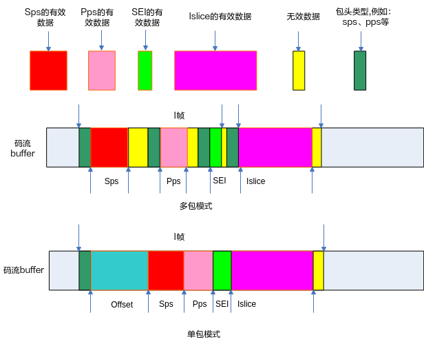

    -   两种模式可通过调用接口[ss\_mpi\_venc\_set\_mod\_param](#ZH-CN_TOPIC_0000002408099010)设置h.265e.ko/h264e.ko/jpege.ko模块参数one\_stream\_buf来选择。
        -   one\_stream\_buf=1表示单包模式；
        -   one\_stream\_buf=0表示非单包模式，系统默认one\_stream\_buf=0。

    -   码流获取支持cache方式，可通过调用接口  [ss\_mpi\_venc\_set\_mod\_param](#ZH-CN_TOPIC_0000002408099010)  设置venc模块参数buf\_cache来选择。

        -   buf\_cache=1表示使用cache方式；
        -   buf\_cache=0表示非cache方式，系统默认buf\_cache=0。

        当每帧码流只从码流buffer拷贝一次时不建议使用cache方式。

【举例】

详细的内容，请参考sample代码。

【相关主题】

无。

## ss\_mpi\_venc\_release\_stream<a name="ZH-CN_TOPIC_0000002408258886"></a>

【描述】

释放码流缓存。

【语法】

```
td_s32 ss_mpi_venc_release_stream(ot_venc_chn chn, ot_venc_stream *stream);
```

【参数】

<a name="table13636mcpsimp"></a>
<table><thead align="left"><tr id="row13642mcpsimp"><th class="cellrowborder" valign="top" width="17.82%" id="mcps1.1.4.1.1"><p id="p13644mcpsimp"><a name="p13644mcpsimp"></a><a name="p13644mcpsimp"></a>参数名称</p>
</th>
<th class="cellrowborder" valign="top" width="63.370000000000005%" id="mcps1.1.4.1.2"><p id="p13646mcpsimp"><a name="p13646mcpsimp"></a><a name="p13646mcpsimp"></a>描述</p>
</th>
<th class="cellrowborder" valign="top" width="18.81%" id="mcps1.1.4.1.3"><p id="p13648mcpsimp"><a name="p13648mcpsimp"></a><a name="p13648mcpsimp"></a>输入/输出</p>
</th>
</tr>
</thead>
<tbody><tr id="row13649mcpsimp"><td class="cellrowborder" valign="top" width="17.82%" headers="mcps1.1.4.1.1 "><p id="p13651mcpsimp"><a name="p13651mcpsimp"></a><a name="p13651mcpsimp"></a>chn</p>
</td>
<td class="cellrowborder" valign="top" width="63.370000000000005%" headers="mcps1.1.4.1.2 "><p id="p13653mcpsimp"><a name="p13653mcpsimp"></a><a name="p13653mcpsimp"></a>编码通道号。</p>
<p xml:lang="pt-BR" id="p13654mcpsimp"><a name="p13654mcpsimp"></a><a name="p13654mcpsimp"></a><span xml:lang="en-US" id="ph13655mcpsimp"><a name="ph13655mcpsimp"></a><a name="ph13655mcpsimp"></a>取值范围：[0, </span>OT_VENC_MAX_CHN_NUM<span xml:lang="en-US" id="ph13657mcpsimp"><a name="ph13657mcpsimp"></a><a name="ph13657mcpsimp"></a>)。</span></p>
</td>
<td class="cellrowborder" valign="top" width="18.81%" headers="mcps1.1.4.1.3 "><p id="p13659mcpsimp"><a name="p13659mcpsimp"></a><a name="p13659mcpsimp"></a>输入</p>
</td>
</tr>
<tr id="row13660mcpsimp"><td class="cellrowborder" valign="top" width="17.82%" headers="mcps1.1.4.1.1 "><p id="p13662mcpsimp"><a name="p13662mcpsimp"></a><a name="p13662mcpsimp"></a>stream</p>
</td>
<td class="cellrowborder" valign="top" width="63.370000000000005%" headers="mcps1.1.4.1.2 "><p id="p13664mcpsimp"><a name="p13664mcpsimp"></a><a name="p13664mcpsimp"></a>码流结构体。</p>
</td>
<td class="cellrowborder" valign="top" width="18.81%" headers="mcps1.1.4.1.3 "><p id="p13666mcpsimp"><a name="p13666mcpsimp"></a><a name="p13666mcpsimp"></a>输入</p>
</td>
</tr>
</tbody>
</table>

【返回值】

<a name="table13668mcpsimp"></a>
<table><thead align="left"><tr id="row13673mcpsimp"><th class="cellrowborder" valign="top" width="50%" id="mcps1.1.3.1.1"><p id="p13675mcpsimp"><a name="p13675mcpsimp"></a><a name="p13675mcpsimp"></a>返回值</p>
</th>
<th class="cellrowborder" valign="top" width="50%" id="mcps1.1.3.1.2"><p id="p13677mcpsimp"><a name="p13677mcpsimp"></a><a name="p13677mcpsimp"></a>描述</p>
</th>
</tr>
</thead>
<tbody><tr id="row13679mcpsimp"><td class="cellrowborder" valign="top" width="50%" headers="mcps1.1.3.1.1 "><p id="p13681mcpsimp"><a name="p13681mcpsimp"></a><a name="p13681mcpsimp"></a>0</p>
</td>
<td class="cellrowborder" valign="top" width="50%" headers="mcps1.1.3.1.2 "><p id="p13683mcpsimp"><a name="p13683mcpsimp"></a><a name="p13683mcpsimp"></a>成功。</p>
</td>
</tr>
<tr id="row13684mcpsimp"><td class="cellrowborder" valign="top" width="50%" headers="mcps1.1.3.1.1 "><p id="p13686mcpsimp"><a name="p13686mcpsimp"></a><a name="p13686mcpsimp"></a>非0</p>
</td>
<td class="cellrowborder" valign="top" width="50%" headers="mcps1.1.3.1.2 "><p id="p13688mcpsimp"><a name="p13688mcpsimp"></a><a name="p13688mcpsimp"></a>失败，返回错误码。</p>
</td>
</tr>
</tbody>
</table>

【需求】

-   头文件：ot\_common\_venc.h、ss\_mpi\_venc.h
-   库文件：libss\_mpi.a

【注意】

-   如果通道未创建，则返回错误码OT\_ERR\_VENC\_UNEXIST。
-   如果stream为空，则返回错误码OT\_ERR\_VENC\_NULL\_PTR。
-   此接口应当和[ss\_mpi\_venc\_get\_stream](#ZH-CN_TOPIC_0000002408098934)配对起来使用，用户获取码流后必须及时释放已经获取的码流缓存，否则可能会导致码流buffer满，影响编码器编码，并且用户必须按先获取先释放的顺序释放已经获取的码流缓存。
-   在编码通道复位以后，所有未释放的码流包均无效，不能再使用或者释放这部分无效的码流缓存。
-   释放无效的码流会返回失败OT\_ERR\_VENC\_ILLEGAL\_PARAM。

【举例】

请参见[ss\_mpi\_venc\_get\_stream](#ZH-CN_TOPIC_0000002408098934)的举例。

【相关主题】

无。

## ss\_mpi\_venc\_get\_stream\_buf\_info<a name="ZH-CN_TOPIC_0000002441657945"></a>

【描述】

获取码流buffer的物理地址和大小。

【语法】

```
td_s32 ss_mpi_venc_get_stream_buf_info(ot_venc_chn chn, ot_venc_stream_buf_info *stream_buf_info);
```

【参数】

<a name="table1026mcpsimp"></a>
<table><thead align="left"><tr id="row1032mcpsimp"><th class="cellrowborder" valign="top" width="25%" id="mcps1.1.4.1.1"><p id="p1034mcpsimp"><a name="p1034mcpsimp"></a><a name="p1034mcpsimp"></a>参数名称</p>
</th>
<th class="cellrowborder" valign="top" width="56.99999999999999%" id="mcps1.1.4.1.2"><p id="p1036mcpsimp"><a name="p1036mcpsimp"></a><a name="p1036mcpsimp"></a>描述</p>
</th>
<th class="cellrowborder" valign="top" width="18%" id="mcps1.1.4.1.3"><p id="p1038mcpsimp"><a name="p1038mcpsimp"></a><a name="p1038mcpsimp"></a>输入/输出</p>
</th>
</tr>
</thead>
<tbody><tr id="row1039mcpsimp"><td class="cellrowborder" valign="top" width="25%" headers="mcps1.1.4.1.1 "><p id="p1041mcpsimp"><a name="p1041mcpsimp"></a><a name="p1041mcpsimp"></a>chn</p>
</td>
<td class="cellrowborder" valign="top" width="56.99999999999999%" headers="mcps1.1.4.1.2 "><p id="p1043mcpsimp"><a name="p1043mcpsimp"></a><a name="p1043mcpsimp"></a>编码通道号。</p>
<p xml:lang="pt-BR" id="p1044mcpsimp"><a name="p1044mcpsimp"></a><a name="p1044mcpsimp"></a><span xml:lang="en-US" id="ph1045mcpsimp"><a name="ph1045mcpsimp"></a><a name="ph1045mcpsimp"></a>取值范围：[0, </span>OT_VENC_MAX_CHN_NUM<span xml:lang="en-US" id="ph1047mcpsimp"><a name="ph1047mcpsimp"></a><a name="ph1047mcpsimp"></a>)。</span></p>
</td>
<td class="cellrowborder" valign="top" width="18%" headers="mcps1.1.4.1.3 "><p id="p1049mcpsimp"><a name="p1049mcpsimp"></a><a name="p1049mcpsimp"></a>输入</p>
</td>
</tr>
<tr id="row1050mcpsimp"><td class="cellrowborder" valign="top" width="25%" headers="mcps1.1.4.1.1 "><p id="p1052mcpsimp"><a name="p1052mcpsimp"></a><a name="p1052mcpsimp"></a>stream_buf_info</p>
</td>
<td class="cellrowborder" valign="top" width="56.99999999999999%" headers="mcps1.1.4.1.2 "><p id="p1054mcpsimp"><a name="p1054mcpsimp"></a><a name="p1054mcpsimp"></a>码流buffer信息结构体。</p>
</td>
<td class="cellrowborder" valign="top" width="18%" headers="mcps1.1.4.1.3 "><p id="p1056mcpsimp"><a name="p1056mcpsimp"></a><a name="p1056mcpsimp"></a>输出</p>
</td>
</tr>
</tbody>
</table>

【返回值】

<a name="table1058mcpsimp"></a>
<table><thead align="left"><tr id="row1063mcpsimp"><th class="cellrowborder" valign="top" width="50%" id="mcps1.1.3.1.1"><p id="p1065mcpsimp"><a name="p1065mcpsimp"></a><a name="p1065mcpsimp"></a>返回值</p>
</th>
<th class="cellrowborder" valign="top" width="50%" id="mcps1.1.3.1.2"><p id="p1067mcpsimp"><a name="p1067mcpsimp"></a><a name="p1067mcpsimp"></a>描述</p>
</th>
</tr>
</thead>
<tbody><tr id="row1068mcpsimp"><td class="cellrowborder" valign="top" width="50%" headers="mcps1.1.3.1.1 "><p id="p1070mcpsimp"><a name="p1070mcpsimp"></a><a name="p1070mcpsimp"></a>0</p>
</td>
<td class="cellrowborder" valign="top" width="50%" headers="mcps1.1.3.1.2 "><p id="p1072mcpsimp"><a name="p1072mcpsimp"></a><a name="p1072mcpsimp"></a>成功。</p>
</td>
</tr>
<tr id="row1073mcpsimp"><td class="cellrowborder" valign="top" width="50%" headers="mcps1.1.3.1.1 "><p id="p1075mcpsimp"><a name="p1075mcpsimp"></a><a name="p1075mcpsimp"></a>非0</p>
</td>
<td class="cellrowborder" valign="top" width="50%" headers="mcps1.1.3.1.2 "><p id="p1077mcpsimp"><a name="p1077mcpsimp"></a><a name="p1077mcpsimp"></a>失败，返回错误码。</p>
</td>
</tr>
</tbody>
</table>

【需求】

-   头文件：ot\_common\_venc.h、ss\_mpi\_venc.h
-   库文件：libss\_mpi.a

【注意】

-   如果通道未创建，则返回错误码[OT\_ERR\_VENC\_UNEXIST](zh-cn_topic_0000002408099130.md#OT_ERR_VENC_UNEXIST)。
-   如果stream\_buf\_info为空，则返回错误码[OT\_ERR\_VENC\_NULL\_PTR](zh-cn_topic_0000002408099130.md#OT_ERR_VENC_NULL_PTR)。
-   当用户需要使用一帧码流的物理地址时，应先调用该接口来获取每个tile的码流buffer的起始物理地址及其大小，判断码流是否有折回。多tile编码时，获取到一个码流包时，首先需要判断出该段码流所在的tile，例如：当[ot\_venc\_stream](zh-cn_topic_0000002408099186.md)结构体中pack\[0\]. phys\_addr大于或等于stream\_buf\_info-\> phys\_addr\[i\]并小于stream\_buf\_info-\> phys\_addr\[i+1\]时，该段码流属于第i个tile。然后计算码流是否有折回，pack\[0\]. phys\_addr+ len大于stream\_buf\_info-\> phys\_addr\[i\]+ stream\_buf\_info-\> buf\_size则折回。通过获取码流因折回而得到的两个物理地址，从而正确使用码流的物理地址，其中len为该段码流的长度。

【举例】

如[图1](#fig9480155220416)所示。

**图 1**  码流包结构图<a name="fig9480155220416"></a>  
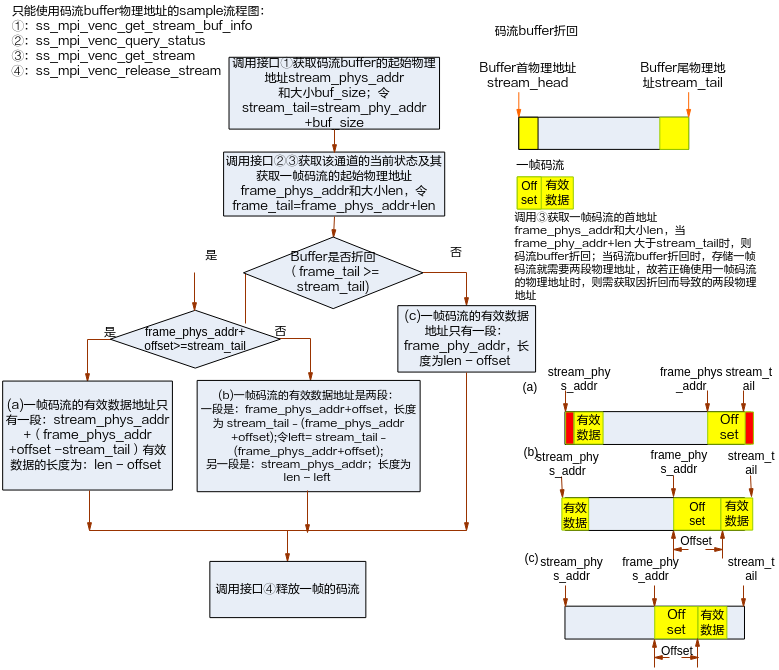

【相关主题】

无。

## ss\_mpi\_venc\_insert\_user\_data<a name="ZH-CN_TOPIC_0000002408259138"></a>

【描述】

插入用户数据。

【语法】

```
td_s32 ss_mpi_venc_insert_user_data(ot_venc_chn chn, td_u8 *data, td_u32 len);
```

【参数】

<a name="table6202mcpsimp"></a>
<table><thead align="left"><tr id="row6208mcpsimp"><th class="cellrowborder" valign="top" width="18%" id="mcps1.1.4.1.1"><p id="p6210mcpsimp"><a name="p6210mcpsimp"></a><a name="p6210mcpsimp"></a>参数名称</p>
</th>
<th class="cellrowborder" valign="top" width="67%" id="mcps1.1.4.1.2"><p id="p6212mcpsimp"><a name="p6212mcpsimp"></a><a name="p6212mcpsimp"></a>描述</p>
</th>
<th class="cellrowborder" valign="top" width="15%" id="mcps1.1.4.1.3"><p id="p6214mcpsimp"><a name="p6214mcpsimp"></a><a name="p6214mcpsimp"></a>输入/输出</p>
</th>
</tr>
</thead>
<tbody><tr id="row6216mcpsimp"><td class="cellrowborder" valign="top" width="18%" headers="mcps1.1.4.1.1 "><p id="p6218mcpsimp"><a name="p6218mcpsimp"></a><a name="p6218mcpsimp"></a>chn</p>
</td>
<td class="cellrowborder" valign="top" width="67%" headers="mcps1.1.4.1.2 "><p id="p6220mcpsimp"><a name="p6220mcpsimp"></a><a name="p6220mcpsimp"></a>编码通道号。</p>
<p xml:lang="pt-BR" id="p6221mcpsimp"><a name="p6221mcpsimp"></a><a name="p6221mcpsimp"></a><span xml:lang="en-US" id="ph6222mcpsimp"><a name="ph6222mcpsimp"></a><a name="ph6222mcpsimp"></a>取值范围：[0, </span>OT_VENC_MAX_CHN_NUM<span xml:lang="en-US" id="ph6224mcpsimp"><a name="ph6224mcpsimp"></a><a name="ph6224mcpsimp"></a>)。</span></p>
</td>
<td class="cellrowborder" valign="top" width="15%" headers="mcps1.1.4.1.3 "><p id="p6226mcpsimp"><a name="p6226mcpsimp"></a><a name="p6226mcpsimp"></a>输入</p>
</td>
</tr>
<tr id="row6227mcpsimp"><td class="cellrowborder" valign="top" width="18%" headers="mcps1.1.4.1.1 "><p id="p6229mcpsimp"><a name="p6229mcpsimp"></a><a name="p6229mcpsimp"></a>data</p>
</td>
<td class="cellrowborder" valign="top" width="67%" headers="mcps1.1.4.1.2 "><p id="p6231mcpsimp"><a name="p6231mcpsimp"></a><a name="p6231mcpsimp"></a>用户数据。</p>
</td>
<td class="cellrowborder" valign="top" width="15%" headers="mcps1.1.4.1.3 "><p id="p6233mcpsimp"><a name="p6233mcpsimp"></a><a name="p6233mcpsimp"></a>输入</p>
</td>
</tr>
<tr id="row6234mcpsimp"><td class="cellrowborder" valign="top" width="18%" headers="mcps1.1.4.1.1 "><p id="p6236mcpsimp"><a name="p6236mcpsimp"></a><a name="p6236mcpsimp"></a>len</p>
</td>
<td class="cellrowborder" valign="top" width="67%" headers="mcps1.1.4.1.2 "><p id="p6238mcpsimp"><a name="p6238mcpsimp"></a><a name="p6238mcpsimp"></a>用户数据长度。</p>
<p id="p6239mcpsimp"><a name="p6239mcpsimp"></a><a name="p6239mcpsimp"></a>H.264/H.265取值范围：(0, max_user_data_len]，以byte为单位。</p>
<p id="p6240mcpsimp"><a name="p6240mcpsimp"></a><a name="p6240mcpsimp"></a>Mjpege/Jpege取值范围：(0, 1024]，以byte为单位</p>
</td>
<td class="cellrowborder" valign="top" width="15%" headers="mcps1.1.4.1.3 "><p id="p6242mcpsimp"><a name="p6242mcpsimp"></a><a name="p6242mcpsimp"></a>输入</p>
</td>
</tr>
</tbody>
</table>

【返回值】

<a name="table6244mcpsimp"></a>
<table><thead align="left"><tr id="row6249mcpsimp"><th class="cellrowborder" valign="top" width="50%" id="mcps1.1.3.1.1"><p id="p6251mcpsimp"><a name="p6251mcpsimp"></a><a name="p6251mcpsimp"></a>返回值</p>
</th>
<th class="cellrowborder" valign="top" width="50%" id="mcps1.1.3.1.2"><p id="p6253mcpsimp"><a name="p6253mcpsimp"></a><a name="p6253mcpsimp"></a>描述</p>
</th>
</tr>
</thead>
<tbody><tr id="row6254mcpsimp"><td class="cellrowborder" valign="top" width="50%" headers="mcps1.1.3.1.1 "><p id="p6256mcpsimp"><a name="p6256mcpsimp"></a><a name="p6256mcpsimp"></a>0</p>
</td>
<td class="cellrowborder" valign="top" width="50%" headers="mcps1.1.3.1.2 "><p id="p6258mcpsimp"><a name="p6258mcpsimp"></a><a name="p6258mcpsimp"></a>成功。</p>
</td>
</tr>
<tr id="row6259mcpsimp"><td class="cellrowborder" valign="top" width="50%" headers="mcps1.1.3.1.1 "><p id="p6261mcpsimp"><a name="p6261mcpsimp"></a><a name="p6261mcpsimp"></a>非0</p>
</td>
<td class="cellrowborder" valign="top" width="50%" headers="mcps1.1.3.1.2 "><p id="p6263mcpsimp"><a name="p6263mcpsimp"></a><a name="p6263mcpsimp"></a>失败，返回错误码。</p>
</td>
</tr>
</tbody>
</table>

【需求】

-   头文件：ot\_common\_venc.h、ss\_mpi\_venc.h
-   库文件：libss\_mpi.a

【注意】

-   如果通道未创建，则返回失败。
-   如果data为空，则返回失败。
-   插入用户数据，只支持H.264/H.265和MJPEG/JPEG编码协议。
-   H.264/H.265协议通道最多同时分配4块内存空间用于缓存用户数据，并通过调用接口[ss\_mpi\_venc\_set\_mod\_param](#ZH-CN_TOPIC_0000002408099010)设置每段用户数据允许的最大字节数max\_user\_data\_len。如果用户插入的数据多于4块，或插入的一段用户数据大于max\_user\_data\_len时，此接口会返回错误。每段用户数据以SEI包的形式被插入到最新的图像码流包之前。在某段用户数据包被编码发送之后，H.264/H.265通道内缓存这段用户数据的内存空间被清零，用于存放新的用户数据。
-   H.264/H.265协议，在调用接口[ss\_mpi\_venc\_set\_mod\_param](#ZH-CN_TOPIC_0000002408099010)将编码码流帧模式为单包模式时，用户数据的SEI包不进行拼包处理。
-   JPEG/MJPEG协议通道分配1块1k byte大小的内存空间，用于缓存用户数据，可以插入多块用户数据，但总大小不能超出内存空间的限制。用户数据以APP segment（0xFFEF）形式添加到图像码流中。在用户数据被编码发送之后，JPEG/MJPEG通道内缓存这段用户数据的内存空间被清零，用于存放新的用户数据。

【举例】

无。

【相关主题】

无。

## ss\_mpi\_venc\_send\_frame<a name="ZH-CN_TOPIC_0000002408258502"></a>

【描述】

支持用户发送原始图像进行编码。

【语法】

```
td_s32 ss_mpi_venc_send_frame(ot_venc_chn chn, const ot_video_frame_info *frame, td_s32 milli_sec);
```

【参数】

<a name="table7611mcpsimp"></a>
<table><thead align="left"><tr id="row7617mcpsimp"><th class="cellrowborder" valign="top" width="25%" id="mcps1.1.4.1.1"><p id="p7619mcpsimp"><a name="p7619mcpsimp"></a><a name="p7619mcpsimp"></a>参数名称</p>
</th>
<th class="cellrowborder" valign="top" width="56.00000000000001%" id="mcps1.1.4.1.2"><p id="p7621mcpsimp"><a name="p7621mcpsimp"></a><a name="p7621mcpsimp"></a>描述</p>
</th>
<th class="cellrowborder" valign="top" width="19%" id="mcps1.1.4.1.3"><p id="p7623mcpsimp"><a name="p7623mcpsimp"></a><a name="p7623mcpsimp"></a>输入/输出</p>
</th>
</tr>
</thead>
<tbody><tr id="row7624mcpsimp"><td class="cellrowborder" valign="top" width="25%" headers="mcps1.1.4.1.1 "><p id="p7626mcpsimp"><a name="p7626mcpsimp"></a><a name="p7626mcpsimp"></a>chn</p>
</td>
<td class="cellrowborder" valign="top" width="56.00000000000001%" headers="mcps1.1.4.1.2 "><p id="p7628mcpsimp"><a name="p7628mcpsimp"></a><a name="p7628mcpsimp"></a>编码通道号。</p>
<p id="p7629mcpsimp"><a name="p7629mcpsimp"></a><a name="p7629mcpsimp"></a>取值范围：[0, OT_VENC_MAX_CHN_NUM)。</p>
</td>
<td class="cellrowborder" valign="top" width="19%" headers="mcps1.1.4.1.3 "><p id="p7631mcpsimp"><a name="p7631mcpsimp"></a><a name="p7631mcpsimp"></a>输入</p>
</td>
</tr>
<tr id="row7632mcpsimp"><td class="cellrowborder" valign="top" width="25%" headers="mcps1.1.4.1.1 "><p id="p7634mcpsimp"><a name="p7634mcpsimp"></a><a name="p7634mcpsimp"></a>frame</p>
</td>
<td class="cellrowborder" valign="top" width="56.00000000000001%" headers="mcps1.1.4.1.2 "><p id="p7636mcpsimp"><a name="p7636mcpsimp"></a><a name="p7636mcpsimp"></a>原始图像信息结构。</p>
<p id="p7637mcpsimp"><a name="p7637mcpsimp"></a><a name="p7637mcpsimp"></a>ot_video_frame_info参考“系统控制”章节。</p>
</td>
<td class="cellrowborder" valign="top" width="19%" headers="mcps1.1.4.1.3 "><p id="p7639mcpsimp"><a name="p7639mcpsimp"></a><a name="p7639mcpsimp"></a>输入</p>
</td>
</tr>
<tr id="row7640mcpsimp"><td class="cellrowborder" valign="top" width="25%" headers="mcps1.1.4.1.1 "><p id="p7642mcpsimp"><a name="p7642mcpsimp"></a><a name="p7642mcpsimp"></a>milli_sec</p>
</td>
<td class="cellrowborder" valign="top" width="56.00000000000001%" headers="mcps1.1.4.1.2 "><p id="p7644mcpsimp"><a name="p7644mcpsimp"></a><a name="p7644mcpsimp"></a>发送图像超时时间。</p>
<p class="msonormal" id="p7645mcpsimp"><a name="p7645mcpsimp"></a><a name="p7645mcpsimp"></a>取值范围：[-1,+∞)</p>
<a name="ul7646mcpsimp"></a><a name="ul7646mcpsimp"></a><ul id="ul7646mcpsimp"><li xml:lang="it-IT">-1：<span xml:lang="en-US" id="ph7648mcpsimp"><a name="ph7648mcpsimp"></a><a name="ph7648mcpsimp"></a>阻塞。</span></li><li><span xml:lang="it-IT" id="ph7650mcpsimp"><a name="ph7650mcpsimp"></a><a name="ph7650mcpsimp"></a>0：</span>非阻塞。</li><li>&gt; 0：超时时间。</li></ul>
</td>
<td class="cellrowborder" valign="top" width="19%" headers="mcps1.1.4.1.3 "><p id="p7653mcpsimp"><a name="p7653mcpsimp"></a><a name="p7653mcpsimp"></a>输入</p>
</td>
</tr>
</tbody>
</table>

【返回值】

<a name="table7655mcpsimp"></a>
<table><thead align="left"><tr id="row7660mcpsimp"><th class="cellrowborder" valign="top" width="50%" id="mcps1.1.3.1.1"><p id="p7662mcpsimp"><a name="p7662mcpsimp"></a><a name="p7662mcpsimp"></a>返回值</p>
</th>
<th class="cellrowborder" valign="top" width="50%" id="mcps1.1.3.1.2"><p id="p7664mcpsimp"><a name="p7664mcpsimp"></a><a name="p7664mcpsimp"></a>描述</p>
</th>
</tr>
</thead>
<tbody><tr id="row7666mcpsimp"><td class="cellrowborder" valign="top" width="50%" headers="mcps1.1.3.1.1 "><p id="p7668mcpsimp"><a name="p7668mcpsimp"></a><a name="p7668mcpsimp"></a>0</p>
</td>
<td class="cellrowborder" valign="top" width="50%" headers="mcps1.1.3.1.2 "><p id="p7670mcpsimp"><a name="p7670mcpsimp"></a><a name="p7670mcpsimp"></a>成功。</p>
</td>
</tr>
<tr id="row7671mcpsimp"><td class="cellrowborder" valign="top" width="50%" headers="mcps1.1.3.1.1 "><p id="p7673mcpsimp"><a name="p7673mcpsimp"></a><a name="p7673mcpsimp"></a>非0</p>
</td>
<td class="cellrowborder" valign="top" width="50%" headers="mcps1.1.3.1.2 "><p id="p7675mcpsimp"><a name="p7675mcpsimp"></a><a name="p7675mcpsimp"></a>失败，返回错误码。</p>
</td>
</tr>
</tbody>
</table>

【需求】

-   头文件：ot\_common\_venc.h、ss\_mpi\_venc.h
-   库文件：libss\_mpi.a

【注意】

-   此接口支持用户发送图像至编码通道。
-   如果milli\_sec小于-1，返回OT\_ERR\_VENC\_ILLEGAL\_PARAM。
-   H.264/H.265编码通道支持接收Semi-plannar YVU 4:2:0/ Semi-planar YUV 4:2:0或PIXEL\_FORMAT\_YUV\_400图像，JPEG/MJPEG编码通道支持接收Semi-plannar YVU 4:2:0/ Semi-planar YUV 4:2:0、Semi-plannar YVU 4:2:2/ Semi-planar YUV 4:2:2或PIXEL\_FORMAT\_YUV\_400图像。
-   视频输入的原始图像大小必须不小于编码通道的大小。
-   调用该接口发送图像，用户需要保证编码通道已创建且开启接收输入图像。

【举例】

无。

【相关主题】

无。

## ss\_mpi\_venc\_send\_frame\_ex<a name="ZH-CN_TOPIC_0000002408258798"></a>

【描述】

支持用户对于H.264和H.265编码通路发送原始图像及该图的QpMap表信息进行编码；支持用户对于JPEG和MJPEG通路发送原始图像及该图的ROIMap表信息进行编码。

【语法】

```
td_s32 ss_mpi_venc_send_frame_ex(ot_venc_chn chn, const ot_venc_user_frame_info *frame, td_s32 milli_sec);
```

【参数】

<a name="table8585mcpsimp"></a>
<table><thead align="left"><tr id="row8591mcpsimp"><th class="cellrowborder" valign="top" width="25%" id="mcps1.1.4.1.1"><p id="p8593mcpsimp"><a name="p8593mcpsimp"></a><a name="p8593mcpsimp"></a>参数名称</p>
</th>
<th class="cellrowborder" valign="top" width="59%" id="mcps1.1.4.1.2"><p id="p8595mcpsimp"><a name="p8595mcpsimp"></a><a name="p8595mcpsimp"></a>描述</p>
</th>
<th class="cellrowborder" valign="top" width="16%" id="mcps1.1.4.1.3"><p id="p8597mcpsimp"><a name="p8597mcpsimp"></a><a name="p8597mcpsimp"></a>输入/输出</p>
</th>
</tr>
</thead>
<tbody><tr id="row8599mcpsimp"><td class="cellrowborder" valign="top" width="25%" headers="mcps1.1.4.1.1 "><p id="p8601mcpsimp"><a name="p8601mcpsimp"></a><a name="p8601mcpsimp"></a>chn</p>
</td>
<td class="cellrowborder" valign="top" width="59%" headers="mcps1.1.4.1.2 "><p id="p8603mcpsimp"><a name="p8603mcpsimp"></a><a name="p8603mcpsimp"></a>编码通道号。</p>
<p xml:lang="pt-BR" id="p8604mcpsimp"><a name="p8604mcpsimp"></a><a name="p8604mcpsimp"></a><span xml:lang="en-US" id="ph8605mcpsimp"><a name="ph8605mcpsimp"></a><a name="ph8605mcpsimp"></a>取值范围：[0, </span>OT_VENC_MAX_CHN_NUM<span xml:lang="en-US" id="ph8607mcpsimp"><a name="ph8607mcpsimp"></a><a name="ph8607mcpsimp"></a>)。</span></p>
</td>
<td class="cellrowborder" valign="top" width="16%" headers="mcps1.1.4.1.3 "><p id="p8609mcpsimp"><a name="p8609mcpsimp"></a><a name="p8609mcpsimp"></a>输入</p>
</td>
</tr>
<tr id="row8610mcpsimp"><td class="cellrowborder" valign="top" width="25%" headers="mcps1.1.4.1.1 "><p id="p8612mcpsimp"><a name="p8612mcpsimp"></a><a name="p8612mcpsimp"></a>frame</p>
</td>
<td class="cellrowborder" valign="top" width="59%" headers="mcps1.1.4.1.2 "><p id="p8614mcpsimp"><a name="p8614mcpsimp"></a><a name="p8614mcpsimp"></a>原始图像信息结构。</p>
</td>
<td class="cellrowborder" valign="top" width="16%" headers="mcps1.1.4.1.3 "><p id="p8616mcpsimp"><a name="p8616mcpsimp"></a><a name="p8616mcpsimp"></a>输入</p>
</td>
</tr>
<tr id="row8617mcpsimp"><td class="cellrowborder" valign="top" width="25%" headers="mcps1.1.4.1.1 "><p id="p8619mcpsimp"><a name="p8619mcpsimp"></a><a name="p8619mcpsimp"></a>milli_sec</p>
</td>
<td class="cellrowborder" valign="top" width="59%" headers="mcps1.1.4.1.2 "><p id="p8621mcpsimp"><a name="p8621mcpsimp"></a><a name="p8621mcpsimp"></a>发送图像超时时间。</p>
<p class="msonormal" id="p8622mcpsimp"><a name="p8622mcpsimp"></a><a name="p8622mcpsimp"></a>取值范围：[-1,+∞)</p>
<a name="ul8623mcpsimp"></a><a name="ul8623mcpsimp"></a><ul id="ul8623mcpsimp"><li xml:lang="it-IT">-1：<span xml:lang="en-US" id="ph8625mcpsimp"><a name="ph8625mcpsimp"></a><a name="ph8625mcpsimp"></a>阻塞。</span></li><li><span xml:lang="it-IT" id="ph8627mcpsimp"><a name="ph8627mcpsimp"></a><a name="ph8627mcpsimp"></a>0：</span>非阻塞。</li><li>&gt;0：超时时间。</li></ul>
</td>
<td class="cellrowborder" valign="top" width="16%" headers="mcps1.1.4.1.3 "><p id="p8630mcpsimp"><a name="p8630mcpsimp"></a><a name="p8630mcpsimp"></a>输入</p>
</td>
</tr>
</tbody>
</table>

【返回值】

<a name="table8632mcpsimp"></a>
<table><thead align="left"><tr id="row8637mcpsimp"><th class="cellrowborder" valign="top" width="50%" id="mcps1.1.3.1.1"><p id="p8639mcpsimp"><a name="p8639mcpsimp"></a><a name="p8639mcpsimp"></a>返回值</p>
</th>
<th class="cellrowborder" valign="top" width="50%" id="mcps1.1.3.1.2"><p id="p8641mcpsimp"><a name="p8641mcpsimp"></a><a name="p8641mcpsimp"></a>描述</p>
</th>
</tr>
</thead>
<tbody><tr id="row8642mcpsimp"><td class="cellrowborder" valign="top" width="50%" headers="mcps1.1.3.1.1 "><p id="p8644mcpsimp"><a name="p8644mcpsimp"></a><a name="p8644mcpsimp"></a>0</p>
</td>
<td class="cellrowborder" valign="top" width="50%" headers="mcps1.1.3.1.2 "><p id="p8646mcpsimp"><a name="p8646mcpsimp"></a><a name="p8646mcpsimp"></a>成功。</p>
</td>
</tr>
<tr id="row8647mcpsimp"><td class="cellrowborder" valign="top" width="50%" headers="mcps1.1.3.1.1 "><p id="p8649mcpsimp"><a name="p8649mcpsimp"></a><a name="p8649mcpsimp"></a>非0</p>
</td>
<td class="cellrowborder" valign="top" width="50%" headers="mcps1.1.3.1.2 "><p id="p8651mcpsimp"><a name="p8651mcpsimp"></a><a name="p8651mcpsimp"></a>失败，返回错误码。</p>
</td>
</tr>
</tbody>
</table>

【需求】

-   头文件：ot\_common\_venc.h、ss\_mpi\_venc.h
-   库文件：libss\_mpi.a

【注意】

-   此接口支持用户发送图像至编码通道。
-   如果milli\_sec小于-1，返回OT\_ERR\_VENC\_ILLEGAL\_PARAM。
-   用户发送原始图像格式要求：
    -   H.264/H.265编码通道支持接收Semi-plannar YVU 4:2:0/ Semi-planar YUV 4:2:0/PIXEL\_FORMAT\_YUV\_400图像。
    -   JPEG/MJPEG编码通道支持接收Semi-planar YVU 4:2:0/ Semi-planar YUV 4:2:0、Semi-planar YVU 4:2:2/ Semi-planar YUV 4:2:2或单分量输入\(PIXEL\_FORMAT\_YUV\_400\)图像。

-   视频输入的原始图像大小必须不小于编码通道的大小。
-   调用该接口发送图像，用户需要保证编码通道已创建且开启接收输入图像，若码控模式为CBR/VBR/AVBR/QVBR/CVBR时，用户需调用[ss\_mpi\_venc\_set\_rc\_param](#ZH-CN_TOPIC_0000002441698377)接口使能QpMap功能，且只支持相对模式。
-   Gop Mode模式为OT\_VENC\_GOP\_MODE\_ADV\_SMART\_P时不支持qpmap模式，调用此接口会返回不支持。
-   Rc为fixqp模式下不支持该接口。
-   指定当前帧编码类型时，GOP类型为OT\_VENC\_GOP\_MODE\_BIPRED\_B时不支持指定当前帧编码为IDR帧，即frame\_type 仅支持配置为OT\_VENC\_FRAME\_TYPE\_NONE。
-   指定当前帧类型为p\_skip时，仅在GOP类型为OT\_VENC\_GOP\_MODE\_NORMAL\_P时支持。
-   指定当前帧类型为p\_skip时，同时qpmap\_valid使能，p\_skip功能不生效。
-   开启P帧帧内刷新时，不支持指定当前帧类型为p\_skip。

【举例】

无。

【相关主题】

无。

## ss\_mpi\_venc\_omx\_send\_frame<a name="ZH-CN_TOPIC_0000002441698389"></a>

【描述】

支持用户对于H.264、H.265编码通路发送外部码率控制信息进行编码；

【语法】

```
td_s32 ss_mpi_venc_omx_send_frame(ot_venc_chn chn, const ot_omx_user_frame_info *frame, td_s32 milli_sec);
```

【参数】

<a name="table8585mcpsimp"></a>
<table><thead align="left"><tr id="row8591mcpsimp"><th class="cellrowborder" valign="top" width="25%" id="mcps1.1.4.1.1"><p id="p8593mcpsimp"><a name="p8593mcpsimp"></a><a name="p8593mcpsimp"></a>参数名称</p>
</th>
<th class="cellrowborder" valign="top" width="59%" id="mcps1.1.4.1.2"><p id="p8595mcpsimp"><a name="p8595mcpsimp"></a><a name="p8595mcpsimp"></a>描述</p>
</th>
<th class="cellrowborder" valign="top" width="16%" id="mcps1.1.4.1.3"><p id="p8597mcpsimp"><a name="p8597mcpsimp"></a><a name="p8597mcpsimp"></a>输入/输出</p>
</th>
</tr>
</thead>
<tbody><tr id="row8599mcpsimp"><td class="cellrowborder" valign="top" width="25%" headers="mcps1.1.4.1.1 "><p id="p8601mcpsimp"><a name="p8601mcpsimp"></a><a name="p8601mcpsimp"></a>chn</p>
</td>
<td class="cellrowborder" valign="top" width="59%" headers="mcps1.1.4.1.2 "><p id="p8603mcpsimp"><a name="p8603mcpsimp"></a><a name="p8603mcpsimp"></a>编码通道号。</p>
<p xml:lang="pt-BR" id="p8604mcpsimp"><a name="p8604mcpsimp"></a><a name="p8604mcpsimp"></a><span xml:lang="en-US" id="ph8605mcpsimp"><a name="ph8605mcpsimp"></a><a name="ph8605mcpsimp"></a>取值范围：[0, </span>OT_VENC_MAX_CHN_NUM<span xml:lang="en-US" id="ph8607mcpsimp"><a name="ph8607mcpsimp"></a><a name="ph8607mcpsimp"></a>)。</span></p>
</td>
<td class="cellrowborder" valign="top" width="16%" headers="mcps1.1.4.1.3 "><p id="p8609mcpsimp"><a name="p8609mcpsimp"></a><a name="p8609mcpsimp"></a>输入</p>
</td>
</tr>
<tr id="row8610mcpsimp"><td class="cellrowborder" valign="top" width="25%" headers="mcps1.1.4.1.1 "><p id="p8612mcpsimp"><a name="p8612mcpsimp"></a><a name="p8612mcpsimp"></a>frame</p>
</td>
<td class="cellrowborder" valign="top" width="59%" headers="mcps1.1.4.1.2 "><p id="p8614mcpsimp"><a name="p8614mcpsimp"></a><a name="p8614mcpsimp"></a>原始图像码率控制信息结构体。</p>
</td>
<td class="cellrowborder" valign="top" width="16%" headers="mcps1.1.4.1.3 "><p id="p8616mcpsimp"><a name="p8616mcpsimp"></a><a name="p8616mcpsimp"></a>输入</p>
</td>
</tr>
<tr id="row8617mcpsimp"><td class="cellrowborder" valign="top" width="25%" headers="mcps1.1.4.1.1 "><p id="p8619mcpsimp"><a name="p8619mcpsimp"></a><a name="p8619mcpsimp"></a>milli_sec</p>
</td>
<td class="cellrowborder" valign="top" width="59%" headers="mcps1.1.4.1.2 "><p id="p8621mcpsimp"><a name="p8621mcpsimp"></a><a name="p8621mcpsimp"></a>发送图像超时时间。</p>
<p class="msonormal" id="p8622mcpsimp"><a name="p8622mcpsimp"></a><a name="p8622mcpsimp"></a>取值范围：[-1,+∞)</p>
<a name="ul8623mcpsimp"></a><a name="ul8623mcpsimp"></a><ul id="ul8623mcpsimp"><li xml:lang="it-IT">-1：<span xml:lang="en-US" id="ph8625mcpsimp"><a name="ph8625mcpsimp"></a><a name="ph8625mcpsimp"></a>阻塞。</span></li><li><span xml:lang="it-IT" id="ph8627mcpsimp"><a name="ph8627mcpsimp"></a><a name="ph8627mcpsimp"></a>0：</span>非阻塞。</li><li>&gt;0：超时时间。</li></ul>
</td>
<td class="cellrowborder" valign="top" width="16%" headers="mcps1.1.4.1.3 "><p id="p8630mcpsimp"><a name="p8630mcpsimp"></a><a name="p8630mcpsimp"></a>输入</p>
</td>
</tr>
</tbody>
</table>

【返回值】

<a name="table8632mcpsimp"></a>
<table><thead align="left"><tr id="row8637mcpsimp"><th class="cellrowborder" valign="top" width="50%" id="mcps1.1.3.1.1"><p id="p8639mcpsimp"><a name="p8639mcpsimp"></a><a name="p8639mcpsimp"></a>返回值</p>
</th>
<th class="cellrowborder" valign="top" width="50%" id="mcps1.1.3.1.2"><p id="p8641mcpsimp"><a name="p8641mcpsimp"></a><a name="p8641mcpsimp"></a>描述</p>
</th>
</tr>
</thead>
<tbody><tr id="row8642mcpsimp"><td class="cellrowborder" valign="top" width="50%" headers="mcps1.1.3.1.1 "><p id="p8644mcpsimp"><a name="p8644mcpsimp"></a><a name="p8644mcpsimp"></a>0</p>
</td>
<td class="cellrowborder" valign="top" width="50%" headers="mcps1.1.3.1.2 "><p id="p8646mcpsimp"><a name="p8646mcpsimp"></a><a name="p8646mcpsimp"></a>成功。</p>
</td>
</tr>
<tr id="row8647mcpsimp"><td class="cellrowborder" valign="top" width="50%" headers="mcps1.1.3.1.1 "><p id="p8649mcpsimp"><a name="p8649mcpsimp"></a><a name="p8649mcpsimp"></a>非0</p>
</td>
<td class="cellrowborder" valign="top" width="50%" headers="mcps1.1.3.1.2 "><p id="p8651mcpsimp"><a name="p8651mcpsimp"></a><a name="p8651mcpsimp"></a>失败，返回错误码。</p>
</td>
</tr>
</tbody>
</table>

【需求】

-   头文件：ot\_common\_venc.h、ss\_mpi\_venc.h
-   库文件：libss\_mpi.a

【注意】

-   此接口支持用户发送图像至编码通道。
-   如果milli\_sec小于-1，返回OT\_ERR\_VENC\_ILLEGAL\_PARAM。
-   用户发送原始图像格式要求：H.264/H.265编码通道支持接收Semi-plannar YVU 4:2:0/ Semi-planar YUV 4:2:0/PIXEL\_FORMAT\_YUV\_400图像。
-   视频输入的原始图像大小必须不小于编码通道的大小。
-   调用该接口发送图像，用户需要保证编码通道已创建且开启接收输入图像。
-   Rc为FIXQP模式下不支持该接口。
-   指定当前帧类型为p\_skip时，仅在GOP类型为OT\_VENC\_GOP\_MODE\_NORMAL\_P时支持。
-   开启P帧帧内刷新时，不支持指定当前帧类型为p\_skip。
-   此接口仅支持H.264/H.265通道，**只提供外部控制码率的功能，不保证图像效果。**
-   SS528V100/SS625V100/SS524V100/SS522V101/SS626V100不支持此接口， 仅SS928V100支持。

【举例】

无。

【相关主题】

无。

## ss\_mpi\_venc\_send\_multi\_frame<a name="ZH-CN_TOPIC_0000002441657873"></a>

【描述】

用户发送2个图像及马赛克区域信息进行编码。

【语法】

```
td_s32 ss_mpi_venc_send_multi_frame(ot_venc_chn chn, const ot_venc_multi_frame_info *frame, td_s32 milli_sec);
```

【参数】

<a name="table930mcpsimp"></a>
<table><thead align="left"><tr id="row936mcpsimp"><th class="cellrowborder" valign="top" width="20%" id="mcps1.1.4.1.1"><p id="p938mcpsimp"><a name="p938mcpsimp"></a><a name="p938mcpsimp"></a>参数名称</p>
</th>
<th class="cellrowborder" valign="top" width="64%" id="mcps1.1.4.1.2"><p id="p940mcpsimp"><a name="p940mcpsimp"></a><a name="p940mcpsimp"></a>描述</p>
</th>
<th class="cellrowborder" valign="top" width="16%" id="mcps1.1.4.1.3"><p id="p942mcpsimp"><a name="p942mcpsimp"></a><a name="p942mcpsimp"></a>输入/输出</p>
</th>
</tr>
</thead>
<tbody><tr id="row943mcpsimp"><td class="cellrowborder" valign="top" width="20%" headers="mcps1.1.4.1.1 "><p id="p945mcpsimp"><a name="p945mcpsimp"></a><a name="p945mcpsimp"></a>chn</p>
</td>
<td class="cellrowborder" valign="top" width="64%" headers="mcps1.1.4.1.2 "><p id="p947mcpsimp"><a name="p947mcpsimp"></a><a name="p947mcpsimp"></a>编码通道号。</p>
<p xml:lang="pt-BR" id="p948mcpsimp"><a name="p948mcpsimp"></a><a name="p948mcpsimp"></a><span xml:lang="en-US" id="ph949mcpsimp"><a name="ph949mcpsimp"></a><a name="ph949mcpsimp"></a>取值范围：[0, </span>OT_VENC_MAX_CHN_NUM<span xml:lang="en-US" id="ph951mcpsimp"><a name="ph951mcpsimp"></a><a name="ph951mcpsimp"></a>)。</span></p>
</td>
<td class="cellrowborder" valign="top" width="16%" headers="mcps1.1.4.1.3 "><p id="p953mcpsimp"><a name="p953mcpsimp"></a><a name="p953mcpsimp"></a>输入</p>
</td>
</tr>
<tr id="row954mcpsimp"><td class="cellrowborder" valign="top" width="20%" headers="mcps1.1.4.1.1 "><p id="p956mcpsimp"><a name="p956mcpsimp"></a><a name="p956mcpsimp"></a>frame</p>
</td>
<td class="cellrowborder" valign="top" width="64%" headers="mcps1.1.4.1.2 "><p id="p958mcpsimp"><a name="p958mcpsimp"></a><a name="p958mcpsimp"></a>图像及信息结构体。</p>
</td>
<td class="cellrowborder" valign="top" width="16%" headers="mcps1.1.4.1.3 "><p id="p960mcpsimp"><a name="p960mcpsimp"></a><a name="p960mcpsimp"></a>输入</p>
</td>
</tr>
<tr id="row961mcpsimp"><td class="cellrowborder" valign="top" width="20%" headers="mcps1.1.4.1.1 "><p id="p963mcpsimp"><a name="p963mcpsimp"></a><a name="p963mcpsimp"></a>milli_sec</p>
</td>
<td class="cellrowborder" valign="top" width="64%" headers="mcps1.1.4.1.2 "><p id="p965mcpsimp"><a name="p965mcpsimp"></a><a name="p965mcpsimp"></a>发送图像超时时间。</p>
<p class="msonormal" id="p966mcpsimp"><a name="p966mcpsimp"></a><a name="p966mcpsimp"></a>取值范围：[-1,+∞)</p>
<p xml:lang="it-IT" id="p967mcpsimp"><a name="p967mcpsimp"></a><a name="p967mcpsimp"></a>-1：<span xml:lang="en-US" id="ph968mcpsimp"><a name="ph968mcpsimp"></a><a name="ph968mcpsimp"></a>阻塞。</span></p>
<p id="p969mcpsimp"><a name="p969mcpsimp"></a><a name="p969mcpsimp"></a><span xml:lang="it-IT" id="ph970mcpsimp"><a name="ph970mcpsimp"></a><a name="ph970mcpsimp"></a>0：</span>非阻塞。</p>
<p id="p971mcpsimp"><a name="p971mcpsimp"></a><a name="p971mcpsimp"></a>大于0：超时时间。</p>
</td>
<td class="cellrowborder" valign="top" width="16%" headers="mcps1.1.4.1.3 "><p id="p973mcpsimp"><a name="p973mcpsimp"></a><a name="p973mcpsimp"></a>输入</p>
</td>
</tr>
</tbody>
</table>

【返回值】

<a name="table975mcpsimp"></a>
<table><thead align="left"><tr id="row980mcpsimp"><th class="cellrowborder" valign="top" width="50%" id="mcps1.1.3.1.1"><p id="p982mcpsimp"><a name="p982mcpsimp"></a><a name="p982mcpsimp"></a>返回值</p>
</th>
<th class="cellrowborder" valign="top" width="50%" id="mcps1.1.3.1.2"><p id="p984mcpsimp"><a name="p984mcpsimp"></a><a name="p984mcpsimp"></a>描述</p>
</th>
</tr>
</thead>
<tbody><tr id="row985mcpsimp"><td class="cellrowborder" valign="top" width="50%" headers="mcps1.1.3.1.1 "><p id="p987mcpsimp"><a name="p987mcpsimp"></a><a name="p987mcpsimp"></a>0</p>
</td>
<td class="cellrowborder" valign="top" width="50%" headers="mcps1.1.3.1.2 "><p id="p989mcpsimp"><a name="p989mcpsimp"></a><a name="p989mcpsimp"></a>成功。</p>
</td>
</tr>
<tr id="row990mcpsimp"><td class="cellrowborder" valign="top" width="50%" headers="mcps1.1.3.1.1 "><p id="p992mcpsimp"><a name="p992mcpsimp"></a><a name="p992mcpsimp"></a>非0</p>
</td>
<td class="cellrowborder" valign="top" width="50%" headers="mcps1.1.3.1.2 "><p id="p994mcpsimp"><a name="p994mcpsimp"></a><a name="p994mcpsimp"></a>失败，返回错误码。</p>
</td>
</tr>
</tbody>
</table>

【需求】

-   头文件：ot\_common\_venc.h、ss\_mpi\_venc.h
-   库文件：libss\_mpi.a

【注意】

-   SS528V100/SS625V100/SS522V101/SS524V100/SS626V100暂不支持该接口。
-   此接口必须在使能复合编码后使用，支持用户一次发送两张图像及对应的马赛克区域信息至编码通道。
-   如果milli\_sec小于-1，返回OT\_ERR\_VENC\_ILLEGAL\_PARAM。
-   用户发送原始图像必须为Semi-planar YVU 4:2:0/Semi-planar YUV 4:2:0/PIXEL\_FORMAT\_YUV\_400图像。
-   复合编码仅支持8bit像素位宽。输入的两张图像必须是同一时刻采集的，对应的time\_ref和pts必须相同。复合编码不支持编码内部的CROP和VGS旋转缩放等操作，输入图像大小必须等于编码通道的大小。如果需要对输入图像叠加马赛克，图像ot\_venc\_multi\_frame\_info:frame\[0\]不能使用压缩模式。
-   马赛克的输入模式为OT\_VENC\_MOSAIC\_MODE\_RECT时，即用户输入马赛克区域，SDK内部执行矩形的马赛克叠加。马赛克使用CPU叠加到图像上，内部使用了neon汇编优化；马赛克块大小仅支持OT\_MOSAIC\_BLK\_SIZE\_32和OT\_MOSAIC\_BLK\_SIZE\_64两种；支持最多200个马赛克区域，区域可以重叠；每个马赛克区域起始点（x，y）、结束点（x1=x+w，y1=y+h）不能超出图像边界；在叠加马赛克前起始点（x，y）和结束点（x1，y1）会对齐到32x32或64x64，起始点（x，y）向左上方向对齐，结束点（x1，y1）向右下方向对齐；
-   当使用框模式时，由于马赛克使用CPU叠加到图像上，如果叠加马赛克的区域面积很大，或者重叠的区域很多，会增加CPU占用率。
-   马赛克的输入模式为OT\_VENC\_MOSAIC\_MODE\_MAP模式时，即用户输入马赛克表；该模式支持OT\_MOSAIC\_BLK\_SIZE\_4、OT\_MOSAIC\_BLK\_SIZE\_8、OT\_MOSAIC\_BLK\_SIZE\_16、OT\_MOSAIC\_BLK\_SIZE\_32、OT\_MOSAIC\_BLK\_SIZE\_64和OT\_MOSAIC\_BLK\_SIZE\_128共6种马赛克块大小，支持以左上角像素颜色填充和指定YUV值纯色填充两种马赛克块填充模式。每个块由1个bit表示是否打马赛克，1表示打，0表示不打，stride为128bit。mosaic\_map\_stride = align\(align\(width, blk\_size\) / blk\_size, 128\) / 8; mosaic\_map\_size = align\(height, blk\_size\) / blk\_size \* stride。
-   调用该接口发送图像，用户需要保证编码通道已创建且开启接收输入图像。

【举例】

无。

【相关主题】

无。

## ss\_mpi\_venc\_set\_chn\_config<a name="ZH-CN_TOPIC_0000002441698269"></a>

【描述】

设置编码通道配置。

【语法】

```
td_s32 ss_mpi_venc_set_chn_config(ot_venc_chn chn, const ot_venc_chn_config *chn_config);
```

【参数】

<a name="table7069mcpsimp"></a>
<table><thead align="left"><tr id="row7075mcpsimp"><th class="cellrowborder" valign="top" width="19.800000000000004%" id="mcps1.1.4.1.1"><p id="p7077mcpsimp"><a name="p7077mcpsimp"></a><a name="p7077mcpsimp"></a>参数名称</p>
</th>
<th class="cellrowborder" valign="top" width="64.36%" id="mcps1.1.4.1.2"><p id="p7079mcpsimp"><a name="p7079mcpsimp"></a><a name="p7079mcpsimp"></a>描述</p>
</th>
<th class="cellrowborder" valign="top" width="15.840000000000003%" id="mcps1.1.4.1.3"><p id="p7081mcpsimp"><a name="p7081mcpsimp"></a><a name="p7081mcpsimp"></a>输入/输出</p>
</th>
</tr>
</thead>
<tbody><tr id="row7083mcpsimp"><td class="cellrowborder" valign="top" width="19.800000000000004%" headers="mcps1.1.4.1.1 "><p id="p7085mcpsimp"><a name="p7085mcpsimp"></a><a name="p7085mcpsimp"></a>chn</p>
</td>
<td class="cellrowborder" valign="top" width="64.36%" headers="mcps1.1.4.1.2 "><p id="p7087mcpsimp"><a name="p7087mcpsimp"></a><a name="p7087mcpsimp"></a>编码通道号。</p>
<p xml:lang="pt-BR" id="p7088mcpsimp"><a name="p7088mcpsimp"></a><a name="p7088mcpsimp"></a><span xml:lang="en-US" id="ph7089mcpsimp"><a name="ph7089mcpsimp"></a><a name="ph7089mcpsimp"></a>取值范围：[0, </span>OT_VENC_MAX_CHN_NUM<span xml:lang="en-US" id="ph7091mcpsimp"><a name="ph7091mcpsimp"></a><a name="ph7091mcpsimp"></a>)。</span></p>
</td>
<td class="cellrowborder" valign="top" width="15.840000000000003%" headers="mcps1.1.4.1.3 "><p id="p7093mcpsimp"><a name="p7093mcpsimp"></a><a name="p7093mcpsimp"></a>输入</p>
</td>
</tr>
<tr id="row7094mcpsimp"><td class="cellrowborder" valign="top" width="19.800000000000004%" headers="mcps1.1.4.1.1 "><p id="p7096mcpsimp"><a name="p7096mcpsimp"></a><a name="p7096mcpsimp"></a>chn_config</p>
</td>
<td class="cellrowborder" valign="top" width="64.36%" headers="mcps1.1.4.1.2 "><p id="p7098mcpsimp"><a name="p7098mcpsimp"></a><a name="p7098mcpsimp"></a>编码通道配置。</p>
</td>
<td class="cellrowborder" valign="top" width="15.840000000000003%" headers="mcps1.1.4.1.3 "><p id="p7100mcpsimp"><a name="p7100mcpsimp"></a><a name="p7100mcpsimp"></a>输入</p>
</td>
</tr>
</tbody>
</table>

【返回值】

<a name="table7102mcpsimp"></a>
<table><thead align="left"><tr id="row7107mcpsimp"><th class="cellrowborder" valign="top" width="50%" id="mcps1.1.3.1.1"><p id="p7109mcpsimp"><a name="p7109mcpsimp"></a><a name="p7109mcpsimp"></a>返回值</p>
</th>
<th class="cellrowborder" valign="top" width="50%" id="mcps1.1.3.1.2"><p id="p7111mcpsimp"><a name="p7111mcpsimp"></a><a name="p7111mcpsimp"></a>描述</p>
</th>
</tr>
</thead>
<tbody><tr id="row7113mcpsimp"><td class="cellrowborder" valign="top" width="50%" headers="mcps1.1.3.1.1 "><p id="p7115mcpsimp"><a name="p7115mcpsimp"></a><a name="p7115mcpsimp"></a>0</p>
</td>
<td class="cellrowborder" valign="top" width="50%" headers="mcps1.1.3.1.2 "><p id="p7117mcpsimp"><a name="p7117mcpsimp"></a><a name="p7117mcpsimp"></a>成功。</p>
</td>
</tr>
<tr id="row7118mcpsimp"><td class="cellrowborder" valign="top" width="50%" headers="mcps1.1.3.1.1 "><p id="p7120mcpsimp"><a name="p7120mcpsimp"></a><a name="p7120mcpsimp"></a>非0</p>
</td>
<td class="cellrowborder" valign="top" width="50%" headers="mcps1.1.3.1.2 "><p id="p7122mcpsimp"><a name="p7122mcpsimp"></a><a name="p7122mcpsimp"></a>失败，参见错误码。</p>
</td>
</tr>
</tbody>
</table>

【需求】

-   头文件：ot\_common\_venc.h、ss\_mpi\_venc.h
-   库文件：libss\_mpi.a

【注意】

-   SS528V100/SS625V100/SS522V101/SS524V100/SS626V100暂不支持该接口。
-   本接口需要在创建通道之前调用。
-   使能复合编码后，编码不支持绑定接收图像，只能通过接口ss\_mpi\_venc\_send\_multi\_frame送图像到编码器。
-   复合编码使能后仅支持创建H.265编码通道；仅支持normal\_p和smart\_p两种GOP结构。
-   复合编码使能后，RC模式支持CBR、VBR、AVBR、CVBR、QVBR、FixQP，不支持QpMap模式，也不支持在CBR等模式中使用相对QpMap。
-   使能复合编码后，客户可以设置质量级别。质量级别为0时编码通道需要增加一个重构帧VB，总VB个数的计算方法是：TotalVB = RefNum + 2；质量级别为1时编码通道需要的参考帧需要增加一倍，总VB个数的计算方法是：TotalVB = RefNum \* 2 + 2。参考帧数目RefNum取决于GOP结构和跳帧参考参数。
-   马赛克功能不支持单独开启，在使能复合编码才可以添加马赛克。
-   复合编码使能后除码流长度外，其他码流上报信息都只统计基础层图像的数据。
-   复合编码使能后，不支持开启svc智能编码。
-   复合编码使能后，不能使用p\_skip编码，受影响的有：
    -   RC码率过冲插入p\_skip帧；
    -   ROI背景低帧率；
    -   H.265编码skip倾向性。

【举例】

无。

【相关主题】

无。

## ss\_mpi\_venc\_get\_chn\_config<a name="ZH-CN_TOPIC_0000002408099098"></a>

【描述】

获取编码通道配置。

【语法】

```
td_s32 ss_mpi_venc_get_chn_config(ot_venc_chn chn, ot_venc_chn_config *chn_config);
```

【参数】

<a name="table9019mcpsimp"></a>
<table><thead align="left"><tr id="row9025mcpsimp"><th class="cellrowborder" valign="top" width="19.800000000000004%" id="mcps1.1.4.1.1"><p id="p9027mcpsimp"><a name="p9027mcpsimp"></a><a name="p9027mcpsimp"></a>参数名称</p>
</th>
<th class="cellrowborder" valign="top" width="64.36%" id="mcps1.1.4.1.2"><p id="p9029mcpsimp"><a name="p9029mcpsimp"></a><a name="p9029mcpsimp"></a>描述</p>
</th>
<th class="cellrowborder" valign="top" width="15.840000000000003%" id="mcps1.1.4.1.3"><p id="p9031mcpsimp"><a name="p9031mcpsimp"></a><a name="p9031mcpsimp"></a>输入/输出</p>
</th>
</tr>
</thead>
<tbody><tr id="row9032mcpsimp"><td class="cellrowborder" valign="top" width="19.800000000000004%" headers="mcps1.1.4.1.1 "><p id="p9034mcpsimp"><a name="p9034mcpsimp"></a><a name="p9034mcpsimp"></a>chn</p>
</td>
<td class="cellrowborder" valign="top" width="64.36%" headers="mcps1.1.4.1.2 "><p id="p9036mcpsimp"><a name="p9036mcpsimp"></a><a name="p9036mcpsimp"></a>编码通道号。</p>
<p xml:lang="pt-BR" id="p9037mcpsimp"><a name="p9037mcpsimp"></a><a name="p9037mcpsimp"></a><span xml:lang="en-US" id="ph9038mcpsimp"><a name="ph9038mcpsimp"></a><a name="ph9038mcpsimp"></a>取值范围：[0, </span>OT_VENC_MAX_CHN_NUM<span xml:lang="en-US" id="ph9040mcpsimp"><a name="ph9040mcpsimp"></a><a name="ph9040mcpsimp"></a>)。</span></p>
</td>
<td class="cellrowborder" valign="top" width="15.840000000000003%" headers="mcps1.1.4.1.3 "><p id="p9042mcpsimp"><a name="p9042mcpsimp"></a><a name="p9042mcpsimp"></a>输入</p>
</td>
</tr>
<tr id="row9043mcpsimp"><td class="cellrowborder" valign="top" width="19.800000000000004%" headers="mcps1.1.4.1.1 "><p id="p9045mcpsimp"><a name="p9045mcpsimp"></a><a name="p9045mcpsimp"></a>chn_config</p>
</td>
<td class="cellrowborder" valign="top" width="64.36%" headers="mcps1.1.4.1.2 "><p id="p9047mcpsimp"><a name="p9047mcpsimp"></a><a name="p9047mcpsimp"></a>编码通道配置。</p>
</td>
<td class="cellrowborder" valign="top" width="15.840000000000003%" headers="mcps1.1.4.1.3 "><p id="p9049mcpsimp"><a name="p9049mcpsimp"></a><a name="p9049mcpsimp"></a>输出</p>
</td>
</tr>
</tbody>
</table>

【返回值】

<a name="table9051mcpsimp"></a>
<table><thead align="left"><tr id="row9056mcpsimp"><th class="cellrowborder" valign="top" width="50%" id="mcps1.1.3.1.1"><p id="p9058mcpsimp"><a name="p9058mcpsimp"></a><a name="p9058mcpsimp"></a>返回值</p>
</th>
<th class="cellrowborder" valign="top" width="50%" id="mcps1.1.3.1.2"><p id="p9060mcpsimp"><a name="p9060mcpsimp"></a><a name="p9060mcpsimp"></a>描述</p>
</th>
</tr>
</thead>
<tbody><tr id="row9062mcpsimp"><td class="cellrowborder" valign="top" width="50%" headers="mcps1.1.3.1.1 "><p id="p9064mcpsimp"><a name="p9064mcpsimp"></a><a name="p9064mcpsimp"></a>0</p>
</td>
<td class="cellrowborder" valign="top" width="50%" headers="mcps1.1.3.1.2 "><p id="p9066mcpsimp"><a name="p9066mcpsimp"></a><a name="p9066mcpsimp"></a>成功。</p>
</td>
</tr>
<tr id="row9067mcpsimp"><td class="cellrowborder" valign="top" width="50%" headers="mcps1.1.3.1.1 "><p id="p9069mcpsimp"><a name="p9069mcpsimp"></a><a name="p9069mcpsimp"></a>非0</p>
</td>
<td class="cellrowborder" valign="top" width="50%" headers="mcps1.1.3.1.2 "><p id="p9071mcpsimp"><a name="p9071mcpsimp"></a><a name="p9071mcpsimp"></a>失败，参见错误码。</p>
</td>
</tr>
</tbody>
</table>

【需求】

-   头文件：ot\_common\_venc.h、ss\_mpi\_venc.h
-   库文件：libss\_mpi.a

【注意】

SS528V100/SS625V100/SS522V101/SS524V100/SS626V100暂不支持该接口。

【举例】

无。

【相关主题】

无。

## ss\_mpi\_venc\_request\_vi<a name="ZH-CN_TOPIC_0000002408258698"></a>

【描述】

请求VI\(虚拟I帧\)帧。

【语法】

```
td_s32 ss_mpi_venc_request_vi(ot_venc_chn chn);
```

【参数】

<a name="table6827mcpsimp"></a>
<table><thead align="left"><tr id="row6833mcpsimp"><th class="cellrowborder" valign="top" width="17.82%" id="mcps1.1.4.1.1"><p id="p6835mcpsimp"><a name="p6835mcpsimp"></a><a name="p6835mcpsimp"></a>参数名称</p>
</th>
<th class="cellrowborder" valign="top" width="66.34%" id="mcps1.1.4.1.2"><p id="p6837mcpsimp"><a name="p6837mcpsimp"></a><a name="p6837mcpsimp"></a>描述</p>
</th>
<th class="cellrowborder" valign="top" width="15.840000000000002%" id="mcps1.1.4.1.3"><p id="p6839mcpsimp"><a name="p6839mcpsimp"></a><a name="p6839mcpsimp"></a>输入/输出</p>
</th>
</tr>
</thead>
<tbody><tr id="row6840mcpsimp"><td class="cellrowborder" valign="top" width="17.82%" headers="mcps1.1.4.1.1 "><p id="p6842mcpsimp"><a name="p6842mcpsimp"></a><a name="p6842mcpsimp"></a>chn</p>
</td>
<td class="cellrowborder" valign="top" width="66.34%" headers="mcps1.1.4.1.2 "><p id="p6844mcpsimp"><a name="p6844mcpsimp"></a><a name="p6844mcpsimp"></a>编码通道号。</p>
<p xml:lang="pt-BR" id="p6845mcpsimp"><a name="p6845mcpsimp"></a><a name="p6845mcpsimp"></a>取值范围：[0, OT_VENC_MAX_CHN_NUM)。</p>
</td>
<td class="cellrowborder" valign="top" width="15.840000000000002%" headers="mcps1.1.4.1.3 "><p id="p6850mcpsimp"><a name="p6850mcpsimp"></a><a name="p6850mcpsimp"></a>输入</p>
</td>
</tr>
</tbody>
</table>

【返回值】

<a name="table6859mcpsimp"></a>
<table><thead align="left"><tr id="row6864mcpsimp"><th class="cellrowborder" valign="top" width="50%" id="mcps1.1.3.1.1"><p id="p6866mcpsimp"><a name="p6866mcpsimp"></a><a name="p6866mcpsimp"></a>返回值</p>
</th>
<th class="cellrowborder" valign="top" width="50%" id="mcps1.1.3.1.2"><p id="p6868mcpsimp"><a name="p6868mcpsimp"></a><a name="p6868mcpsimp"></a>描述</p>
</th>
</tr>
</thead>
<tbody><tr id="row6869mcpsimp"><td class="cellrowborder" valign="top" width="50%" headers="mcps1.1.3.1.1 "><p id="p6871mcpsimp"><a name="p6871mcpsimp"></a><a name="p6871mcpsimp"></a>0</p>
</td>
<td class="cellrowborder" valign="top" width="50%" headers="mcps1.1.3.1.2 "><p id="p6873mcpsimp"><a name="p6873mcpsimp"></a><a name="p6873mcpsimp"></a>成功。</p>
</td>
</tr>
<tr id="row6874mcpsimp"><td class="cellrowborder" valign="top" width="50%" headers="mcps1.1.3.1.1 "><p id="p6876mcpsimp"><a name="p6876mcpsimp"></a><a name="p6876mcpsimp"></a>非0</p>
</td>
<td class="cellrowborder" valign="top" width="50%" headers="mcps1.1.3.1.2 "><p id="p6878mcpsimp"><a name="p6878mcpsimp"></a><a name="p6878mcpsimp"></a>失败，返回错误码。</p>
</td>
</tr>
</tbody>
</table>

【需求】

-   头文件：ot\_common\_venc.h、ss\_mpi\_venc.h
-   库文件：libss\_mpi.a

【注意】

-   如果通道未创建，则返回失败。
-   接受VI帧请求后，立即编出VI帧。
-   VI帧请求，只支持H.264/H.265编码协议。
-   由于此接口不受帧率控制影响，每调用一次即编出一个VI，调用频繁会影响码流帧率和码率的稳定，使用时需要注意。此外，下一帧编码启动前多次接口调用只会编出一个VI。
-   请求VI帧只用于GOP模式为smart\_p。
-   当请求虚拟I帧碰上当前帧编IDR帧，不影响IDR帧编码，VI帧不生效。
-   请求虚拟I帧和gop中计算编虚拟I帧不冲突，不影响gop大小和原有VI帧编码。

【举例】

无。

【相关主题】

无。

## ss\_mpi\_venc\_request\_idr<a name="ZH-CN_TOPIC_0000002408099206"></a>

【描述】

请求IDR帧。

【语法】

```
td_s32 ss_mpi_venc_request_idr(ot_venc_chn chn, td_bool instant);
```

【参数】

<a name="table6827mcpsimp"></a>
<table><thead align="left"><tr id="row6833mcpsimp"><th class="cellrowborder" valign="top" width="17.82%" id="mcps1.1.4.1.1"><p id="p6835mcpsimp"><a name="p6835mcpsimp"></a><a name="p6835mcpsimp"></a>参数名称</p>
</th>
<th class="cellrowborder" valign="top" width="66.34%" id="mcps1.1.4.1.2"><p id="p6837mcpsimp"><a name="p6837mcpsimp"></a><a name="p6837mcpsimp"></a>描述</p>
</th>
<th class="cellrowborder" valign="top" width="15.840000000000002%" id="mcps1.1.4.1.3"><p id="p6839mcpsimp"><a name="p6839mcpsimp"></a><a name="p6839mcpsimp"></a>输入/输出</p>
</th>
</tr>
</thead>
<tbody><tr id="row6840mcpsimp"><td class="cellrowborder" valign="top" width="17.82%" headers="mcps1.1.4.1.1 "><p id="p6842mcpsimp"><a name="p6842mcpsimp"></a><a name="p6842mcpsimp"></a>chn</p>
</td>
<td class="cellrowborder" valign="top" width="66.34%" headers="mcps1.1.4.1.2 "><p id="p6844mcpsimp"><a name="p6844mcpsimp"></a><a name="p6844mcpsimp"></a>编码通道号。</p>
<p xml:lang="pt-BR" id="p6845mcpsimp"><a name="p6845mcpsimp"></a><a name="p6845mcpsimp"></a><span xml:lang="en-US" id="ph6846mcpsimp"><a name="ph6846mcpsimp"></a><a name="ph6846mcpsimp"></a>取值范围：[0, </span>OT_VENC_MAX_CHN_NUM<span xml:lang="en-US" id="ph6848mcpsimp"><a name="ph6848mcpsimp"></a><a name="ph6848mcpsimp"></a>)。</span></p>
</td>
<td class="cellrowborder" valign="top" width="15.840000000000002%" headers="mcps1.1.4.1.3 "><p id="p6850mcpsimp"><a name="p6850mcpsimp"></a><a name="p6850mcpsimp"></a>输入</p>
</td>
</tr>
<tr id="row6851mcpsimp"><td class="cellrowborder" valign="top" width="17.82%" headers="mcps1.1.4.1.1 "><p id="p6853mcpsimp"><a name="p6853mcpsimp"></a><a name="p6853mcpsimp"></a>instant</p>
</td>
<td class="cellrowborder" valign="top" width="66.34%" headers="mcps1.1.4.1.2 "><p id="p6855mcpsimp"><a name="p6855mcpsimp"></a><a name="p6855mcpsimp"></a>是否使能立即编码IDR帧。</p>
</td>
<td class="cellrowborder" valign="top" width="15.840000000000002%" headers="mcps1.1.4.1.3 "><p id="p6857mcpsimp"><a name="p6857mcpsimp"></a><a name="p6857mcpsimp"></a>输入</p>
</td>
</tr>
</tbody>
</table>

【返回值】

<a name="table6859mcpsimp"></a>
<table><thead align="left"><tr id="row6864mcpsimp"><th class="cellrowborder" valign="top" width="50%" id="mcps1.1.3.1.1"><p id="p6866mcpsimp"><a name="p6866mcpsimp"></a><a name="p6866mcpsimp"></a>返回值</p>
</th>
<th class="cellrowborder" valign="top" width="50%" id="mcps1.1.3.1.2"><p id="p6868mcpsimp"><a name="p6868mcpsimp"></a><a name="p6868mcpsimp"></a>描述</p>
</th>
</tr>
</thead>
<tbody><tr id="row6869mcpsimp"><td class="cellrowborder" valign="top" width="50%" headers="mcps1.1.3.1.1 "><p id="p6871mcpsimp"><a name="p6871mcpsimp"></a><a name="p6871mcpsimp"></a>0</p>
</td>
<td class="cellrowborder" valign="top" width="50%" headers="mcps1.1.3.1.2 "><p id="p6873mcpsimp"><a name="p6873mcpsimp"></a><a name="p6873mcpsimp"></a>成功。</p>
</td>
</tr>
<tr id="row6874mcpsimp"><td class="cellrowborder" valign="top" width="50%" headers="mcps1.1.3.1.1 "><p id="p6876mcpsimp"><a name="p6876mcpsimp"></a><a name="p6876mcpsimp"></a>非0</p>
</td>
<td class="cellrowborder" valign="top" width="50%" headers="mcps1.1.3.1.2 "><p id="p6878mcpsimp"><a name="p6878mcpsimp"></a><a name="p6878mcpsimp"></a>失败，返回错误码。</p>
</td>
</tr>
</tbody>
</table>

【需求】

-   头文件：ot\_common\_venc.h、ss\_mpi\_venc.h
-   库文件：libss\_mpi.a

【注意】

-   如果通道未创建，则返回失败。
-   接受IDR帧请求后，当instant =0时，则在帧率控制的下一帧编出IDR帧，当instant =1时，则立即编出IDR帧，不受帧率控制约束。
-   IDR帧请求，只支持H.264/H.265编码协议。
-   由于此接口不受帧率控制影响，每调用一次即编出一个IDR，调用频繁会影响码流帧率和码率的稳定，使用时需要注意。此外，下一帧编码启动前多次接口调用只会编出一个IDR。
-   当GOP模式为smart\_p或B帧模式下，请求IDR帧会延时生效。

【举例】

无。

【相关主题】

无。

## ss\_mpi\_venc\_enable\_idr<a name="ZH-CN_TOPIC_0000002441697861"></a>

【描述】

是否使能IDR帧。

【语法】

```
td_s32 ss_mpi_venc_enable_idr(ot_venc_chn chn, td_bool enable_idr);
```

【参数】

<a name="table17367mcpsimp"></a>
<table><thead align="left"><tr id="row17373mcpsimp"><th class="cellrowborder" valign="top" width="22%" id="mcps1.1.4.1.1"><p id="p17375mcpsimp"><a name="p17375mcpsimp"></a><a name="p17375mcpsimp"></a>参数名称</p>
</th>
<th class="cellrowborder" valign="top" width="62%" id="mcps1.1.4.1.2"><p id="p17377mcpsimp"><a name="p17377mcpsimp"></a><a name="p17377mcpsimp"></a>描述</p>
</th>
<th class="cellrowborder" valign="top" width="16%" id="mcps1.1.4.1.3"><p id="p17379mcpsimp"><a name="p17379mcpsimp"></a><a name="p17379mcpsimp"></a>输入/输出</p>
</th>
</tr>
</thead>
<tbody><tr id="row17380mcpsimp"><td class="cellrowborder" valign="top" width="22%" headers="mcps1.1.4.1.1 "><p id="p17382mcpsimp"><a name="p17382mcpsimp"></a><a name="p17382mcpsimp"></a>chn</p>
</td>
<td class="cellrowborder" valign="top" width="62%" headers="mcps1.1.4.1.2 "><p id="p17384mcpsimp"><a name="p17384mcpsimp"></a><a name="p17384mcpsimp"></a>编码通道号。</p>
<p xml:lang="pt-BR" id="p17385mcpsimp"><a name="p17385mcpsimp"></a><a name="p17385mcpsimp"></a><span xml:lang="en-US" id="ph17386mcpsimp"><a name="ph17386mcpsimp"></a><a name="ph17386mcpsimp"></a>取值范围：[0, </span>OT_VENC_MAX_CHN_NUM<span xml:lang="en-US" id="ph17388mcpsimp"><a name="ph17388mcpsimp"></a><a name="ph17388mcpsimp"></a>)。</span></p>
</td>
<td class="cellrowborder" valign="top" width="16%" headers="mcps1.1.4.1.3 "><p id="p17390mcpsimp"><a name="p17390mcpsimp"></a><a name="p17390mcpsimp"></a>输入</p>
</td>
</tr>
<tr id="row17391mcpsimp"><td class="cellrowborder" valign="top" width="22%" headers="mcps1.1.4.1.1 "><p id="p17393mcpsimp"><a name="p17393mcpsimp"></a><a name="p17393mcpsimp"></a>enable_idr</p>
</td>
<td class="cellrowborder" valign="top" width="62%" headers="mcps1.1.4.1.2 "><p id="p17395mcpsimp"><a name="p17395mcpsimp"></a><a name="p17395mcpsimp"></a>是否使能的标志。</p>
</td>
<td class="cellrowborder" valign="top" width="16%" headers="mcps1.1.4.1.3 "><p id="p17397mcpsimp"><a name="p17397mcpsimp"></a><a name="p17397mcpsimp"></a>输入</p>
</td>
</tr>
</tbody>
</table>

【返回值】

<a name="table17399mcpsimp"></a>
<table><thead align="left"><tr id="row17404mcpsimp"><th class="cellrowborder" valign="top" width="50%" id="mcps1.1.3.1.1"><p id="p17406mcpsimp"><a name="p17406mcpsimp"></a><a name="p17406mcpsimp"></a>返回值</p>
</th>
<th class="cellrowborder" valign="top" width="50%" id="mcps1.1.3.1.2"><p id="p17408mcpsimp"><a name="p17408mcpsimp"></a><a name="p17408mcpsimp"></a>描述</p>
</th>
</tr>
</thead>
<tbody><tr id="row17410mcpsimp"><td class="cellrowborder" valign="top" width="50%" headers="mcps1.1.3.1.1 "><p id="p17412mcpsimp"><a name="p17412mcpsimp"></a><a name="p17412mcpsimp"></a>0</p>
</td>
<td class="cellrowborder" valign="top" width="50%" headers="mcps1.1.3.1.2 "><p id="p17414mcpsimp"><a name="p17414mcpsimp"></a><a name="p17414mcpsimp"></a>成功。</p>
</td>
</tr>
<tr id="row17415mcpsimp"><td class="cellrowborder" valign="top" width="50%" headers="mcps1.1.3.1.1 "><p id="p17417mcpsimp"><a name="p17417mcpsimp"></a><a name="p17417mcpsimp"></a>非0</p>
</td>
<td class="cellrowborder" valign="top" width="50%" headers="mcps1.1.3.1.2 "><p id="p17419mcpsimp"><a name="p17419mcpsimp"></a><a name="p17419mcpsimp"></a>失败，返回错误码。</p>
</td>
</tr>
</tbody>
</table>

【需求】

-   头文件：ot\_common\_venc.h、ss\_mpi\_venc.h
-   库文件：libss\_mpi.a

【注意】

-   如果通道未创建，则返回失败。
-   改变GOP MODE后需要重新进行设置。
-   若不使能IDR帧，则在下一帧之后都编不出IDR帧或I帧，直到再次使能为止。
-   若不使能IDR帧，请求IDR帧且请求生效。
-   由不使能IDR帧到使能IDR帧切换，下一帧会编码IDR帧。
-   当GOP MODE为OT\_VENC\_GOP\_MODE\_SMART\_P，只支持使能IDR帧。
-   某些参数设置后需要IDR帧才生效，此时需要用户申请IDR帧。
-   本接口只支持H.264/H.265编码协议。

【举例】

无。

【相关主题】

无。

## ss\_mpi\_venc\_get\_fd<a name="ZH-CN_TOPIC_0000002441698369"></a>

【描述】

获取编码通道对应的设备文件句柄。

【语法】

```
td_s32 ss_mpi_venc_get_fd(ot_venc_chn chn);
```

【参数】

<a name="table13252mcpsimp"></a>
<table><thead align="left"><tr id="row13258mcpsimp"><th class="cellrowborder" valign="top" width="18%" id="mcps1.1.4.1.1"><p id="p13260mcpsimp"><a name="p13260mcpsimp"></a><a name="p13260mcpsimp"></a>参数名称</p>
</th>
<th class="cellrowborder" valign="top" width="67%" id="mcps1.1.4.1.2"><p id="p13262mcpsimp"><a name="p13262mcpsimp"></a><a name="p13262mcpsimp"></a>描述</p>
</th>
<th class="cellrowborder" valign="top" width="15%" id="mcps1.1.4.1.3"><p id="p13264mcpsimp"><a name="p13264mcpsimp"></a><a name="p13264mcpsimp"></a>输入/输出</p>
</th>
</tr>
</thead>
<tbody><tr id="row13265mcpsimp"><td class="cellrowborder" valign="top" width="18%" headers="mcps1.1.4.1.1 "><p id="p13267mcpsimp"><a name="p13267mcpsimp"></a><a name="p13267mcpsimp"></a>chn</p>
</td>
<td class="cellrowborder" valign="top" width="67%" headers="mcps1.1.4.1.2 "><p id="p13269mcpsimp"><a name="p13269mcpsimp"></a><a name="p13269mcpsimp"></a>编码通道号。</p>
<p id="p13270mcpsimp"><a name="p13270mcpsimp"></a><a name="p13270mcpsimp"></a>取值范围：[0, OT_VENC_MAX_CHN_NUM)。</p>
</td>
<td class="cellrowborder" valign="top" width="15%" headers="mcps1.1.4.1.3 "><p id="p13272mcpsimp"><a name="p13272mcpsimp"></a><a name="p13272mcpsimp"></a>输入</p>
</td>
</tr>
</tbody>
</table>

【返回值】

<a name="table13274mcpsimp"></a>
<table><thead align="left"><tr id="row13279mcpsimp"><th class="cellrowborder" valign="top" width="50%" id="mcps1.1.3.1.1"><p id="p13281mcpsimp"><a name="p13281mcpsimp"></a><a name="p13281mcpsimp"></a>返回值</p>
</th>
<th class="cellrowborder" valign="top" width="50%" id="mcps1.1.3.1.2"><p id="p13283mcpsimp"><a name="p13283mcpsimp"></a><a name="p13283mcpsimp"></a>描述</p>
</th>
</tr>
</thead>
<tbody><tr id="row13284mcpsimp"><td class="cellrowborder" valign="top" width="50%" headers="mcps1.1.3.1.1 "><p id="p13286mcpsimp"><a name="p13286mcpsimp"></a><a name="p13286mcpsimp"></a>正数值</p>
</td>
<td class="cellrowborder" valign="top" width="50%" headers="mcps1.1.3.1.2 "><p id="p13288mcpsimp"><a name="p13288mcpsimp"></a><a name="p13288mcpsimp"></a>有效返回值。</p>
</td>
</tr>
<tr id="row13289mcpsimp"><td class="cellrowborder" valign="top" width="50%" headers="mcps1.1.3.1.1 "><p id="p13291mcpsimp"><a name="p13291mcpsimp"></a><a name="p13291mcpsimp"></a>非正数值</p>
</td>
<td class="cellrowborder" valign="top" width="50%" headers="mcps1.1.3.1.2 "><p id="p13293mcpsimp"><a name="p13293mcpsimp"></a><a name="p13293mcpsimp"></a>无效返回值。</p>
</td>
</tr>
</tbody>
</table>

【需求】

-   头文件：ot\_common\_venc.h、ss\_mpi\_venc.h
-   库文件：libss\_mpi.a

【注意】

无。

【举例】

无。

【相关主题】

无。

## ss\_mpi\_venc\_close\_fd<a name="ZH-CN_TOPIC_0000002408258710"></a>

【描述】

关闭编码通道对应的设备文件句柄。

【语法】

```
td_s32 ss_mpi_venc_close_fd(ot_venc_chn chn);
```

【参数】

<a name="table6692mcpsimp"></a>
<table><thead align="left"><tr id="row6698mcpsimp"><th class="cellrowborder" valign="top" width="18%" id="mcps1.1.4.1.1"><p id="p6700mcpsimp"><a name="p6700mcpsimp"></a><a name="p6700mcpsimp"></a>参数名称</p>
</th>
<th class="cellrowborder" valign="top" width="64%" id="mcps1.1.4.1.2"><p id="p6702mcpsimp"><a name="p6702mcpsimp"></a><a name="p6702mcpsimp"></a>描述</p>
</th>
<th class="cellrowborder" valign="top" width="18%" id="mcps1.1.4.1.3"><p id="p6704mcpsimp"><a name="p6704mcpsimp"></a><a name="p6704mcpsimp"></a>输入/输出</p>
</th>
</tr>
</thead>
<tbody><tr id="row6706mcpsimp"><td class="cellrowborder" valign="top" width="18%" headers="mcps1.1.4.1.1 "><p id="p6708mcpsimp"><a name="p6708mcpsimp"></a><a name="p6708mcpsimp"></a>chn</p>
</td>
<td class="cellrowborder" valign="top" width="64%" headers="mcps1.1.4.1.2 "><p id="p6710mcpsimp"><a name="p6710mcpsimp"></a><a name="p6710mcpsimp"></a>视频编码通道号。</p>
<p id="p6711mcpsimp"><a name="p6711mcpsimp"></a><a name="p6711mcpsimp"></a>取值范围：[0, OT_VENC_MAX_CHN_NUM)。</p>
</td>
<td class="cellrowborder" valign="top" width="18%" headers="mcps1.1.4.1.3 "><p id="p6713mcpsimp"><a name="p6713mcpsimp"></a><a name="p6713mcpsimp"></a>输入</p>
</td>
</tr>
</tbody>
</table>

【返回值】

<a name="table6715mcpsimp"></a>
<table><thead align="left"><tr id="row6720mcpsimp"><th class="cellrowborder" valign="top" width="50%" id="mcps1.1.3.1.1"><p id="p6722mcpsimp"><a name="p6722mcpsimp"></a><a name="p6722mcpsimp"></a>返回值</p>
</th>
<th class="cellrowborder" valign="top" width="50%" id="mcps1.1.3.1.2"><p id="p6724mcpsimp"><a name="p6724mcpsimp"></a><a name="p6724mcpsimp"></a>描述</p>
</th>
</tr>
</thead>
<tbody><tr id="row6726mcpsimp"><td class="cellrowborder" valign="top" width="50%" headers="mcps1.1.3.1.1 "><p id="p6728mcpsimp"><a name="p6728mcpsimp"></a><a name="p6728mcpsimp"></a>0</p>
</td>
<td class="cellrowborder" valign="top" width="50%" headers="mcps1.1.3.1.2 "><p id="p6730mcpsimp"><a name="p6730mcpsimp"></a><a name="p6730mcpsimp"></a>关闭成功。</p>
</td>
</tr>
<tr id="row6731mcpsimp"><td class="cellrowborder" valign="top" width="50%" headers="mcps1.1.3.1.1 "><p id="p6733mcpsimp"><a name="p6733mcpsimp"></a><a name="p6733mcpsimp"></a>-1</p>
</td>
<td class="cellrowborder" valign="top" width="50%" headers="mcps1.1.3.1.2 "><p id="p6735mcpsimp"><a name="p6735mcpsimp"></a><a name="p6735mcpsimp"></a>关闭失败。</p>
</td>
</tr>
</tbody>
</table>

【错误码】

无。

【需求】

-   头文件：ot\_common\_venc.h、ss\_mpi\_venc.h
-   库文件：libss\_mpi.a

【注意】

-   此接口不能与其它MPI接口同时调用，用户必须保证此接口与其它接口在时间上是串行调用的。
-   本接口用于关闭VENC通道文件句柄，建议在VENC通道销毁情况下使用。
-   使用select方式监听码流时，不能关闭对应通道fd，否则会影响码流监听。

【举例】

无。

【相关主题】

无。

## ss\_mpi\_venc\_set\_roi\_attr<a name="ZH-CN_TOPIC_0000002408099026"></a>

【描述】

设置H.264/H.265通道的ROI属性。

【语法】

```
td_s32 ss_mpi_venc_set_roi_attr(ot_venc_chn chn, const ot_venc_roi_attr *roi_attr);
```

【参数】

<a name="table15472mcpsimp"></a>
<table><thead align="left"><tr id="row15478mcpsimp"><th class="cellrowborder" valign="top" width="23%" id="mcps1.1.4.1.1"><p id="p15480mcpsimp"><a name="p15480mcpsimp"></a><a name="p15480mcpsimp"></a>参数名称</p>
</th>
<th class="cellrowborder" valign="top" width="59%" id="mcps1.1.4.1.2"><p id="p15482mcpsimp"><a name="p15482mcpsimp"></a><a name="p15482mcpsimp"></a>描述</p>
</th>
<th class="cellrowborder" valign="top" width="18%" id="mcps1.1.4.1.3"><p id="p15484mcpsimp"><a name="p15484mcpsimp"></a><a name="p15484mcpsimp"></a>输入/输出</p>
</th>
</tr>
</thead>
<tbody><tr id="row15485mcpsimp"><td class="cellrowborder" valign="top" width="23%" headers="mcps1.1.4.1.1 "><p id="p15487mcpsimp"><a name="p15487mcpsimp"></a><a name="p15487mcpsimp"></a>chn</p>
</td>
<td class="cellrowborder" valign="top" width="59%" headers="mcps1.1.4.1.2 "><p id="p15489mcpsimp"><a name="p15489mcpsimp"></a><a name="p15489mcpsimp"></a>编码通道号。</p>
<p id="p15490mcpsimp"><a name="p15490mcpsimp"></a><a name="p15490mcpsimp"></a>取值范围：[0, OT_VENC_MAX_CHN_NUM)。</p>
</td>
<td class="cellrowborder" valign="top" width="18%" headers="mcps1.1.4.1.3 "><p id="p15492mcpsimp"><a name="p15492mcpsimp"></a><a name="p15492mcpsimp"></a>输入</p>
</td>
</tr>
<tr id="row15493mcpsimp"><td class="cellrowborder" valign="top" width="23%" headers="mcps1.1.4.1.1 "><p id="p15495mcpsimp"><a name="p15495mcpsimp"></a><a name="p15495mcpsimp"></a>roi_attr</p>
</td>
<td class="cellrowborder" valign="top" width="59%" headers="mcps1.1.4.1.2 "><p id="p15497mcpsimp"><a name="p15497mcpsimp"></a><a name="p15497mcpsimp"></a>ROI区域参数。</p>
</td>
<td class="cellrowborder" valign="top" width="18%" headers="mcps1.1.4.1.3 "><p id="p15499mcpsimp"><a name="p15499mcpsimp"></a><a name="p15499mcpsimp"></a>输入</p>
</td>
</tr>
</tbody>
</table>

【返回值】

<a name="table15501mcpsimp"></a>
<table><thead align="left"><tr id="row15506mcpsimp"><th class="cellrowborder" valign="top" width="50%" id="mcps1.1.3.1.1"><p id="p15508mcpsimp"><a name="p15508mcpsimp"></a><a name="p15508mcpsimp"></a>返回值</p>
</th>
<th class="cellrowborder" valign="top" width="50%" id="mcps1.1.3.1.2"><p id="p15510mcpsimp"><a name="p15510mcpsimp"></a><a name="p15510mcpsimp"></a>描述</p>
</th>
</tr>
</thead>
<tbody><tr id="row15511mcpsimp"><td class="cellrowborder" valign="top" width="50%" headers="mcps1.1.3.1.1 "><p id="p15513mcpsimp"><a name="p15513mcpsimp"></a><a name="p15513mcpsimp"></a>0</p>
</td>
<td class="cellrowborder" valign="top" width="50%" headers="mcps1.1.3.1.2 "><p id="p15515mcpsimp"><a name="p15515mcpsimp"></a><a name="p15515mcpsimp"></a>成功。</p>
</td>
</tr>
<tr id="row15516mcpsimp"><td class="cellrowborder" valign="top" width="50%" headers="mcps1.1.3.1.1 "><p id="p15518mcpsimp"><a name="p15518mcpsimp"></a><a name="p15518mcpsimp"></a>非0</p>
</td>
<td class="cellrowborder" valign="top" width="50%" headers="mcps1.1.3.1.2 "><p id="p15520mcpsimp"><a name="p15520mcpsimp"></a><a name="p15520mcpsimp"></a>失败，返回错误码。</p>
</td>
</tr>
</tbody>
</table>

【需求】

-   头文件：ot\_common\_venc.h、ss\_mpi\_venc.h
-   库文件：libss\_mpi.a

【注意】

-   本接口用于设置H.264/H.265协议编码通道ROI区域的参数。
-   ROI参数主要由五个参数决定。
    -   idx：系统支持每个通道可设置8个ROI区域，系统内部按照0～7的索引号对ROI区域进行管理，idx表示的用户设置ROI的索引号。ROI区域之间可以互相叠加，且当发生叠加时，ROI区域之间的优先级按照索引号0～7依次提高。
    -   enable：指定当前的ROI区域是否使能。
    -   is\_abs\_qp：指定当前的ROI区域采用绝对QP方式或是相对QP。
    -   qp：当is\_abs\_qp 为true时，qp 表示ROI区域内部的所有宏块采用的QP值，当is\_abs\_qp 为false时，qp表示ROI区域内部的所有宏块采用的相对QP值。
    -   rect：指定当前的ROI区域的位置坐标和区域的大小。ROI区域的起始点坐标必须在图像范围内，且必须16对齐；ROI区域的长宽必须是16对齐并且大于0；ROI区域必须在图像范围内。

-   本接口属于高级接口，系统默认没有ROI区域使能，用户必须调用此接口启动ROI。
-   本接口在编码通道创建之后，编码通道销毁之前设置。此接口在编码过程中被调用时，等到下一个帧时生效。
-   建议用户在创建通道之后，启动编码之前调用此接口，减少在编码过程中调用的次数。
-   建议用户在调用此接口之前，先调用[ss\_mpi\_venc\_get\_roi\_attr](#ZH-CN_TOPIC_0000002441658165)接口，获取当前通道的ROI配置，然后再进行设置。
-   设置该接口后，如果当前帧判断编码为p\_skip帧，以p\_skip帧效果优先。

【举例】

无。

【相关主题】

无。

## ss\_mpi\_venc\_get\_roi\_attr<a name="ZH-CN_TOPIC_0000002441658165"></a>

【描述】

获取H.264/H.265通道的Roi配置属性。

【语法】

```
td_s32 ss_mpi_venc_get_roi_attr(ot_venc_chn chn, td_u32 idx, ot_venc_roi_attr *roi_attr);
```

【参数】

<a name="table17682mcpsimp"></a>
<table><thead align="left"><tr id="row17688mcpsimp"><th class="cellrowborder" valign="top" width="20.200000000000003%" id="mcps1.1.4.1.1"><p id="p17690mcpsimp"><a name="p17690mcpsimp"></a><a name="p17690mcpsimp"></a>参数名称</p>
</th>
<th class="cellrowborder" valign="top" width="62.629999999999995%" id="mcps1.1.4.1.2"><p id="p17692mcpsimp"><a name="p17692mcpsimp"></a><a name="p17692mcpsimp"></a>描述</p>
</th>
<th class="cellrowborder" valign="top" width="17.169999999999998%" id="mcps1.1.4.1.3"><p id="p17694mcpsimp"><a name="p17694mcpsimp"></a><a name="p17694mcpsimp"></a>输入/输出</p>
</th>
</tr>
</thead>
<tbody><tr id="row17696mcpsimp"><td class="cellrowborder" valign="top" width="20.200000000000003%" headers="mcps1.1.4.1.1 "><p id="p17698mcpsimp"><a name="p17698mcpsimp"></a><a name="p17698mcpsimp"></a>chn</p>
</td>
<td class="cellrowborder" valign="top" width="62.629999999999995%" headers="mcps1.1.4.1.2 "><p id="p17700mcpsimp"><a name="p17700mcpsimp"></a><a name="p17700mcpsimp"></a>编码通道号。</p>
<p id="p17701mcpsimp"><a name="p17701mcpsimp"></a><a name="p17701mcpsimp"></a>取值范围：[0, OT_VENC_MAX_CHN_NUM)。</p>
</td>
<td class="cellrowborder" valign="top" width="17.169999999999998%" headers="mcps1.1.4.1.3 "><p id="p17703mcpsimp"><a name="p17703mcpsimp"></a><a name="p17703mcpsimp"></a>输入</p>
</td>
</tr>
<tr id="row17704mcpsimp"><td class="cellrowborder" valign="top" width="20.200000000000003%" headers="mcps1.1.4.1.1 "><p id="p17706mcpsimp"><a name="p17706mcpsimp"></a><a name="p17706mcpsimp"></a>idx</p>
</td>
<td class="cellrowborder" valign="top" width="62.629999999999995%" headers="mcps1.1.4.1.2 "><p id="p17708mcpsimp"><a name="p17708mcpsimp"></a><a name="p17708mcpsimp"></a>H.264/H.265协议编码通道ROI区域索引。</p>
</td>
<td class="cellrowborder" valign="top" width="17.169999999999998%" headers="mcps1.1.4.1.3 "><p id="p17710mcpsimp"><a name="p17710mcpsimp"></a><a name="p17710mcpsimp"></a>输入</p>
</td>
</tr>
<tr id="row17711mcpsimp"><td class="cellrowborder" valign="top" width="20.200000000000003%" headers="mcps1.1.4.1.1 "><p id="p17713mcpsimp"><a name="p17713mcpsimp"></a><a name="p17713mcpsimp"></a>roi_attr</p>
</td>
<td class="cellrowborder" valign="top" width="62.629999999999995%" headers="mcps1.1.4.1.2 "><p id="p17715mcpsimp"><a name="p17715mcpsimp"></a><a name="p17715mcpsimp"></a>对应ROI区域的配置。</p>
</td>
<td class="cellrowborder" valign="top" width="17.169999999999998%" headers="mcps1.1.4.1.3 "><p id="p17717mcpsimp"><a name="p17717mcpsimp"></a><a name="p17717mcpsimp"></a>输出</p>
</td>
</tr>
</tbody>
</table>

【返回值】

<a name="table17719mcpsimp"></a>
<table><thead align="left"><tr id="row17724mcpsimp"><th class="cellrowborder" valign="top" width="50%" id="mcps1.1.3.1.1"><p id="p17726mcpsimp"><a name="p17726mcpsimp"></a><a name="p17726mcpsimp"></a>返回值</p>
</th>
<th class="cellrowborder" valign="top" width="50%" id="mcps1.1.3.1.2"><p id="p17728mcpsimp"><a name="p17728mcpsimp"></a><a name="p17728mcpsimp"></a>描述</p>
</th>
</tr>
</thead>
<tbody><tr id="row17729mcpsimp"><td class="cellrowborder" valign="top" width="50%" headers="mcps1.1.3.1.1 "><p id="p17731mcpsimp"><a name="p17731mcpsimp"></a><a name="p17731mcpsimp"></a>0</p>
</td>
<td class="cellrowborder" valign="top" width="50%" headers="mcps1.1.3.1.2 "><p id="p17733mcpsimp"><a name="p17733mcpsimp"></a><a name="p17733mcpsimp"></a>成功。</p>
</td>
</tr>
<tr id="row17734mcpsimp"><td class="cellrowborder" valign="top" width="50%" headers="mcps1.1.3.1.1 "><p id="p17736mcpsimp"><a name="p17736mcpsimp"></a><a name="p17736mcpsimp"></a>非0</p>
</td>
<td class="cellrowborder" valign="top" width="50%" headers="mcps1.1.3.1.2 "><p id="p17738mcpsimp"><a name="p17738mcpsimp"></a><a name="p17738mcpsimp"></a>失败，返回错误码。</p>
</td>
</tr>
</tbody>
</table>

【需求】

-   头文件：ot\_common\_venc.h、ss\_mpi\_venc.h
-   库文件：libss\_mpi.a

【注意】

-   本接口用于获取H.264/H.265协议编码通道的idx的ROI配置。
-   本接口在编码通道创建之后，编码通道销毁之前调用。
-   建议用户在创建通道之后，启动编码之前调用此接口，减少在编码过程中调用的次数。

【举例】

无。

【相关主题】

无。

## ss\_mpi\_venc\_set\_roi\_attr\_ex<a name="ZH-CN_TOPIC_0000002408099102"></a>

【描述】

设置H.264/H.265通道的ROI配置高级属性。可以分开设置I帧、P/B帧、VI帧的ROI属性。

【语法】

```
td_s32 ss_mpi_venc_set_roi_attr_ex(ot_venc_chn chn, const ot_venc_roi_attr_ex *roi_attr_ex);
```

【参数】

<a name="table11542mcpsimp"></a>
<table><thead align="left"><tr id="row11548mcpsimp"><th class="cellrowborder" valign="top" width="23%" id="mcps1.1.4.1.1"><p id="p11550mcpsimp"><a name="p11550mcpsimp"></a><a name="p11550mcpsimp"></a>参数名称</p>
</th>
<th class="cellrowborder" valign="top" width="59%" id="mcps1.1.4.1.2"><p id="p11552mcpsimp"><a name="p11552mcpsimp"></a><a name="p11552mcpsimp"></a>描述</p>
</th>
<th class="cellrowborder" valign="top" width="18%" id="mcps1.1.4.1.3"><p id="p11554mcpsimp"><a name="p11554mcpsimp"></a><a name="p11554mcpsimp"></a>输入/输出</p>
</th>
</tr>
</thead>
<tbody><tr id="row11555mcpsimp"><td class="cellrowborder" valign="top" width="23%" headers="mcps1.1.4.1.1 "><p id="p11557mcpsimp"><a name="p11557mcpsimp"></a><a name="p11557mcpsimp"></a>chn</p>
</td>
<td class="cellrowborder" valign="top" width="59%" headers="mcps1.1.4.1.2 "><p id="p11559mcpsimp"><a name="p11559mcpsimp"></a><a name="p11559mcpsimp"></a>编码通道号。</p>
<p id="p11560mcpsimp"><a name="p11560mcpsimp"></a><a name="p11560mcpsimp"></a>取值范围：[0, OT_VENC_MAX_CHN_NUM)。</p>
</td>
<td class="cellrowborder" valign="top" width="18%" headers="mcps1.1.4.1.3 "><p id="p11562mcpsimp"><a name="p11562mcpsimp"></a><a name="p11562mcpsimp"></a>输入</p>
</td>
</tr>
<tr id="row11563mcpsimp"><td class="cellrowborder" valign="top" width="23%" headers="mcps1.1.4.1.1 "><p id="p11565mcpsimp"><a name="p11565mcpsimp"></a><a name="p11565mcpsimp"></a>roi_attr_ex</p>
</td>
<td class="cellrowborder" valign="top" width="59%" headers="mcps1.1.4.1.2 "><p id="p11567mcpsimp"><a name="p11567mcpsimp"></a><a name="p11567mcpsimp"></a>ROI区域参数。</p>
<p id="p11568mcpsimp"><a name="p11568mcpsimp"></a><a name="p11568mcpsimp"></a>除index参数外，其他参数都为数组，数组下标：</p>
<p id="p11569mcpsimp"><a name="p11569mcpsimp"></a><a name="p11569mcpsimp"></a>0：代表I帧的ROI参数；</p>
<p id="p11570mcpsimp"><a name="p11570mcpsimp"></a><a name="p11570mcpsimp"></a>1：代表P/B帧的ROI参数；</p>
<p id="p11571mcpsimp"><a name="p11571mcpsimp"></a><a name="p11571mcpsimp"></a>2：代表VI帧的ROI参数。</p>
</td>
<td class="cellrowborder" valign="top" width="18%" headers="mcps1.1.4.1.3 "><p id="p11573mcpsimp"><a name="p11573mcpsimp"></a><a name="p11573mcpsimp"></a>输入</p>
</td>
</tr>
</tbody>
</table>

【返回值】

<a name="table11575mcpsimp"></a>
<table><thead align="left"><tr id="row11580mcpsimp"><th class="cellrowborder" valign="top" width="50%" id="mcps1.1.3.1.1"><p id="p11582mcpsimp"><a name="p11582mcpsimp"></a><a name="p11582mcpsimp"></a>返回值</p>
</th>
<th class="cellrowborder" valign="top" width="50%" id="mcps1.1.3.1.2"><p id="p11584mcpsimp"><a name="p11584mcpsimp"></a><a name="p11584mcpsimp"></a>描述</p>
</th>
</tr>
</thead>
<tbody><tr id="row11585mcpsimp"><td class="cellrowborder" valign="top" width="50%" headers="mcps1.1.3.1.1 "><p id="p11587mcpsimp"><a name="p11587mcpsimp"></a><a name="p11587mcpsimp"></a>0</p>
</td>
<td class="cellrowborder" valign="top" width="50%" headers="mcps1.1.3.1.2 "><p id="p11589mcpsimp"><a name="p11589mcpsimp"></a><a name="p11589mcpsimp"></a>成功。</p>
</td>
</tr>
<tr id="row11590mcpsimp"><td class="cellrowborder" valign="top" width="50%" headers="mcps1.1.3.1.1 "><p id="p11592mcpsimp"><a name="p11592mcpsimp"></a><a name="p11592mcpsimp"></a>非0</p>
</td>
<td class="cellrowborder" valign="top" width="50%" headers="mcps1.1.3.1.2 "><p id="p11594mcpsimp"><a name="p11594mcpsimp"></a><a name="p11594mcpsimp"></a>失败，返回错误码。</p>
</td>
</tr>
</tbody>
</table>

【需求】

-   头文件：ot\_common\_venc.h、ss\_mpi\_venc.h
-   库文件：libss\_mpi.a

【注意】

-   本接口用于设置H.264/H.265协议编码通道ROI区域的参数。
-   ROI参数主要由五个参数决定
    -   idx：系统支持每个通道可设置8个ROI区域，系统内部按照0～7的索引号对ROI区域进行管理，idx表示的用户设置ROI的索引号。ROI区域之间可以互相叠加，且当发生叠加时，ROI区域之间的优先级按照索引号0～7依次提高。
    -   enable：指定当前的ROI区域是否使能。
    -   is\_abs\_qp：指定当前的ROI区域采用绝对QP方式或是相对QP。
    -   qp：当is\_abs\_qp 为true时，qp 表示ROI区域内部的所有宏块采用的QP值，当is\_abs\_qp 为false时，qp表示ROI区域内部的所有宏块采用的相对QP值。
    -   rect：指定当前的ROI区域的位置坐标和区域的大小。ROI区域的起始点坐标必须在图像范围内，且必须16对齐；ROI区域的长宽必须是16对齐；ROI区域必须在图像范围内。计算图像范围时，图像的宽高会扩充到16像素整数倍，保证图像边界处也可以设置ROI区域。

-   本接口属于高级接口，系统默认没有ROI区域使能，用户必须调用此接口启动ROI。
-   本接口在编码通道创建之后，编码通道销毁之前设置。此接口在编码过程中被调用时，等到下一个帧时生效。
-   建议用户在创建通道之后，启动编码之前调用此接口，减少在编码过程中调用的次数。
-   建议用户在调用此接口之前，先调用[ss\_mpi\_venc\_get\_roi\_attr\_ex](#ZH-CN_TOPIC_0000002408098994)接口，获取当前通道的ROI配置，然后再进行设置。
-   设置该接口后，如果当前帧判断编码为p\_skip帧，以p\_skip帧效果优先。
-   此接口可以分开设置I帧和P、B帧的ROI属性，数组标号为0的代表I帧的ROI属性，数组标号为1代表P、B帧的ROI属性，数组标号为2代表VI帧的ROI属性。I帧、P/B帧、VI帧的ROI属性可以不同，例如可以I帧开启ROI，P帧不开启ROI；I帧可以和P帧设置不同的ROI区域。

【举例】

无。

【相关主题】

无。

## ss\_mpi\_venc\_get\_roi\_attr\_ex<a name="ZH-CN_TOPIC_0000002408098994"></a>

【描述】

获取H.264/H.265通道的ROI配置高级属性。可以获取I帧、P/B帧、VI帧的ROI属性。

【语法】

```
td_s32 ss_mpi_venc_get_roi_attr_ex(ot_venc_chn chn, td_u32 idx, ot_venc_roi_attr_ex *roi_attr_ex);
```

【参数】

<a name="table8316mcpsimp"></a>
<table><thead align="left"><tr id="row8322mcpsimp"><th class="cellrowborder" valign="top" width="20.200000000000003%" id="mcps1.1.4.1.1"><p id="p8324mcpsimp"><a name="p8324mcpsimp"></a><a name="p8324mcpsimp"></a>参数名称</p>
</th>
<th class="cellrowborder" valign="top" width="62.629999999999995%" id="mcps1.1.4.1.2"><p id="p8326mcpsimp"><a name="p8326mcpsimp"></a><a name="p8326mcpsimp"></a>描述</p>
</th>
<th class="cellrowborder" valign="top" width="17.169999999999998%" id="mcps1.1.4.1.3"><p id="p8328mcpsimp"><a name="p8328mcpsimp"></a><a name="p8328mcpsimp"></a>输入/输出</p>
</th>
</tr>
</thead>
<tbody><tr id="row8330mcpsimp"><td class="cellrowborder" valign="top" width="20.200000000000003%" headers="mcps1.1.4.1.1 "><p id="p8332mcpsimp"><a name="p8332mcpsimp"></a><a name="p8332mcpsimp"></a>chn</p>
</td>
<td class="cellrowborder" valign="top" width="62.629999999999995%" headers="mcps1.1.4.1.2 "><p id="p8334mcpsimp"><a name="p8334mcpsimp"></a><a name="p8334mcpsimp"></a>编码通道号。</p>
<p id="p8335mcpsimp"><a name="p8335mcpsimp"></a><a name="p8335mcpsimp"></a>取值范围：[0, OT_VENC_MAX_CHN_NUM)。</p>
</td>
<td class="cellrowborder" valign="top" width="17.169999999999998%" headers="mcps1.1.4.1.3 "><p id="p8337mcpsimp"><a name="p8337mcpsimp"></a><a name="p8337mcpsimp"></a>输入</p>
</td>
</tr>
<tr id="row8338mcpsimp"><td class="cellrowborder" valign="top" width="20.200000000000003%" headers="mcps1.1.4.1.1 "><p id="p8340mcpsimp"><a name="p8340mcpsimp"></a><a name="p8340mcpsimp"></a>idx</p>
</td>
<td class="cellrowborder" valign="top" width="62.629999999999995%" headers="mcps1.1.4.1.2 "><p id="p8342mcpsimp"><a name="p8342mcpsimp"></a><a name="p8342mcpsimp"></a>H.264/H.265协议编码通道ROI区域索引。</p>
</td>
<td class="cellrowborder" valign="top" width="17.169999999999998%" headers="mcps1.1.4.1.3 "><p id="p8344mcpsimp"><a name="p8344mcpsimp"></a><a name="p8344mcpsimp"></a>输入</p>
</td>
</tr>
<tr id="row8345mcpsimp"><td class="cellrowborder" valign="top" width="20.200000000000003%" headers="mcps1.1.4.1.1 "><p id="p8347mcpsimp"><a name="p8347mcpsimp"></a><a name="p8347mcpsimp"></a>roi_attr_ex</p>
</td>
<td class="cellrowborder" valign="top" width="62.629999999999995%" headers="mcps1.1.4.1.2 "><p id="p8349mcpsimp"><a name="p8349mcpsimp"></a><a name="p8349mcpsimp"></a>对应ROI区域的配置。</p>
</td>
<td class="cellrowborder" valign="top" width="17.169999999999998%" headers="mcps1.1.4.1.3 "><p id="p8351mcpsimp"><a name="p8351mcpsimp"></a><a name="p8351mcpsimp"></a>输出</p>
</td>
</tr>
</tbody>
</table>

【返回值】

<a name="table8353mcpsimp"></a>
<table><thead align="left"><tr id="row8358mcpsimp"><th class="cellrowborder" valign="top" width="50%" id="mcps1.1.3.1.1"><p id="p8360mcpsimp"><a name="p8360mcpsimp"></a><a name="p8360mcpsimp"></a>返回值</p>
</th>
<th class="cellrowborder" valign="top" width="50%" id="mcps1.1.3.1.2"><p id="p8362mcpsimp"><a name="p8362mcpsimp"></a><a name="p8362mcpsimp"></a>描述</p>
</th>
</tr>
</thead>
<tbody><tr id="row8363mcpsimp"><td class="cellrowborder" valign="top" width="50%" headers="mcps1.1.3.1.1 "><p id="p8365mcpsimp"><a name="p8365mcpsimp"></a><a name="p8365mcpsimp"></a>0</p>
</td>
<td class="cellrowborder" valign="top" width="50%" headers="mcps1.1.3.1.2 "><p id="p8367mcpsimp"><a name="p8367mcpsimp"></a><a name="p8367mcpsimp"></a>成功。</p>
</td>
</tr>
<tr id="row8368mcpsimp"><td class="cellrowborder" valign="top" width="50%" headers="mcps1.1.3.1.1 "><p id="p8370mcpsimp"><a name="p8370mcpsimp"></a><a name="p8370mcpsimp"></a>非0</p>
</td>
<td class="cellrowborder" valign="top" width="50%" headers="mcps1.1.3.1.2 "><p id="p8372mcpsimp"><a name="p8372mcpsimp"></a><a name="p8372mcpsimp"></a>失败，返回错误码。</p>
</td>
</tr>
</tbody>
</table>

【需求】

-   头文件：ot\_common\_venc.h、ss\_mpi\_venc.h
-   库文件：libss\_mpi.a

【注意】

-   本接口用于获取H.264/H.265协议编码通道的idx的ROI配置。
-   本接口在编码通道创建之后，编码通道销毁之前调用。
-   建议用户在创建通道之后，启动编码之前调用此接口，减少在编码过程中调用的次数。

【举例】

无。

【相关主题】

无。

## ss\_mpi\_venc\_set\_roi\_bg\_frame\_rate<a name="ZH-CN_TOPIC_0000002408259106"></a>

【描述】

设置H.264/H.265通道的非ROI区域帧率属性。

【语法】

```
td_s32 ss_mpi_venc_set_roi_bg_frame_rate(ot_venc_chn chn, const ot_venc_roi_bg_frame_rate *roi_bg_frame_rate);
```

【参数】

<a name="table11281mcpsimp"></a>
<table><thead align="left"><tr id="row11287mcpsimp"><th class="cellrowborder" valign="top" width="24%" id="mcps1.1.4.1.1"><p id="p11289mcpsimp"><a name="p11289mcpsimp"></a><a name="p11289mcpsimp"></a>参数名称</p>
</th>
<th class="cellrowborder" valign="top" width="56.00000000000001%" id="mcps1.1.4.1.2"><p id="p11291mcpsimp"><a name="p11291mcpsimp"></a><a name="p11291mcpsimp"></a>描述</p>
</th>
<th class="cellrowborder" valign="top" width="20%" id="mcps1.1.4.1.3"><p id="p11293mcpsimp"><a name="p11293mcpsimp"></a><a name="p11293mcpsimp"></a>输入/输出</p>
</th>
</tr>
</thead>
<tbody><tr id="row11294mcpsimp"><td class="cellrowborder" valign="top" width="24%" headers="mcps1.1.4.1.1 "><p id="p11296mcpsimp"><a name="p11296mcpsimp"></a><a name="p11296mcpsimp"></a>chn</p>
</td>
<td class="cellrowborder" valign="top" width="56.00000000000001%" headers="mcps1.1.4.1.2 "><p id="p11298mcpsimp"><a name="p11298mcpsimp"></a><a name="p11298mcpsimp"></a>编码通道号。</p>
<p id="p11299mcpsimp"><a name="p11299mcpsimp"></a><a name="p11299mcpsimp"></a>取值范围：[0, OT_VENC_MAX_CHN_NUM)。</p>
</td>
<td class="cellrowborder" valign="top" width="20%" headers="mcps1.1.4.1.3 "><p id="p11301mcpsimp"><a name="p11301mcpsimp"></a><a name="p11301mcpsimp"></a>输入</p>
</td>
</tr>
<tr id="row11302mcpsimp"><td class="cellrowborder" valign="top" width="24%" headers="mcps1.1.4.1.1 "><p id="p11304mcpsimp"><a name="p11304mcpsimp"></a><a name="p11304mcpsimp"></a>roi_bg_frame_rate</p>
</td>
<td class="cellrowborder" valign="top" width="56.00000000000001%" headers="mcps1.1.4.1.2 "><p id="p11306mcpsimp"><a name="p11306mcpsimp"></a><a name="p11306mcpsimp"></a>非ROI区域帧率控制参数。</p>
</td>
<td class="cellrowborder" valign="top" width="20%" headers="mcps1.1.4.1.3 "><p id="p11308mcpsimp"><a name="p11308mcpsimp"></a><a name="p11308mcpsimp"></a>输入</p>
</td>
</tr>
</tbody>
</table>

【返回值】

<a name="table11310mcpsimp"></a>
<table><thead align="left"><tr id="row11315mcpsimp"><th class="cellrowborder" valign="top" width="50%" id="mcps1.1.3.1.1"><p id="p11317mcpsimp"><a name="p11317mcpsimp"></a><a name="p11317mcpsimp"></a>返回值</p>
</th>
<th class="cellrowborder" valign="top" width="50%" id="mcps1.1.3.1.2"><p id="p11319mcpsimp"><a name="p11319mcpsimp"></a><a name="p11319mcpsimp"></a>描述</p>
</th>
</tr>
</thead>
<tbody><tr id="row11320mcpsimp"><td class="cellrowborder" valign="top" width="50%" headers="mcps1.1.3.1.1 "><p id="p11322mcpsimp"><a name="p11322mcpsimp"></a><a name="p11322mcpsimp"></a>0</p>
</td>
<td class="cellrowborder" valign="top" width="50%" headers="mcps1.1.3.1.2 "><p id="p11324mcpsimp"><a name="p11324mcpsimp"></a><a name="p11324mcpsimp"></a>成功。</p>
</td>
</tr>
<tr id="row11325mcpsimp"><td class="cellrowborder" valign="top" width="50%" headers="mcps1.1.3.1.1 "><p id="p11327mcpsimp"><a name="p11327mcpsimp"></a><a name="p11327mcpsimp"></a>非0</p>
</td>
<td class="cellrowborder" valign="top" width="50%" headers="mcps1.1.3.1.2 "><p id="p11329mcpsimp"><a name="p11329mcpsimp"></a><a name="p11329mcpsimp"></a>失败，返回错误码。</p>
</td>
</tr>
</tbody>
</table>

【需求】

-   头文件：ot\_common\_venc.h、ss\_mpi\_venc.h
-   库文件：libss\_mpi.a

【注意】

-   本接口用于设置H.264/H.265协议编码通道非ROI区域帧率控制的参数。
-   本接口调用之前必须首先使能ROI区域。如果是用[ss\_mpi\_venc\_set\_roi\_attr\_ex](#ZH-CN_TOPIC_0000002408099102)接口设置ROI，必须使能P帧的ROI区域。
-   本接口属于高级接口，系统默认没有使能非ROI区域帧率属性，用户必须调用此接口使能。
-   本接口在编码通道创建之后，编码通道销毁之前设置。此接口在编码过程中被调用时，等到下一帧时生效。
-   设置非ROI区域帧率控制属性时，输入帧率src\_frame\_rate大于输出帧率dst\_frame\_rate 且 dst\_frame\_rate 大于等于0或同时等于-1。
-   当输入帧率src\_frame\_rate和输出帧率dst\_frame\_rate 均等于-1时，此时表示不进行帧率控制。
-   建议用户在创建通道之后，启动编码之前调用此接口，减少在编码过程中调用的次数。
-   建议用户在调用此接口之前，先调用[ss\_mpi\_venc\_get\_roi\_bg\_frame\_rate](#ZH-CN_TOPIC_0000002408098654)接口，获取当前通道的非ROI区域帧率配置，然后再进行设置。
-   设置非ROI区域的帧率低于ROI区域时，不建议使用跳帧参考或者svc-t编码。跳帧参考或svc-t编码，如果设置了非ROI区域的帧率低于ROI区域，则实际编码的非ROI区域目标帧率可能大于用户配置的目标帧率，因为base层的非ROI区域不能编码为p\_skip块。
-   仅支持GOP模式为OT\_VENC\_GOP\_MODE\_NORMAL\_P的编码通道。
-   GOP模式切换后，该接口失效，如需继续使用需要重新设置该接口。如果GOP模式是从非NORMAL\_P切向NORMAL\_P，模式切换后调用该接口需等到GOP生效后该接口生效。
-   设置该接口后，如果当前帧判断编码为p\_skip帧，以p\_skip帧效果优先。如果有设置osd，osd更新的帧以osd效果优先。
-   当设置H.265协议通道非ROI区域的帧率低于ROI区域时，本模块内部会关闭SAO滤波，故建议客户调用[ss\_mpi\_venc\_set\_h265\_sao](#ZH-CN_TOPIC_0000002441658333)关闭SAO功能。

【举例】

无。

【相关主题】

无。

## ss\_mpi\_venc\_get\_roi\_bg\_frame\_rate<a name="ZH-CN_TOPIC_0000002408098654"></a>

【描述】

获取H.264/H.265通道的非Roi区域帧率配置属性。

【语法】

```
td_s32 ss_mpi_venc_get_roi_bg_frame_rate(ot_venc_chn chn, ot_venc_roi_bg_frame_rate *roi_bg_frame_rate);
```

【参数】

<a name="table6130mcpsimp"></a>
<table><thead align="left"><tr id="row6136mcpsimp"><th class="cellrowborder" valign="top" width="24%" id="mcps1.1.4.1.1"><p id="p6138mcpsimp"><a name="p6138mcpsimp"></a><a name="p6138mcpsimp"></a>参数名称</p>
</th>
<th class="cellrowborder" valign="top" width="57.99999999999999%" id="mcps1.1.4.1.2"><p id="p6140mcpsimp"><a name="p6140mcpsimp"></a><a name="p6140mcpsimp"></a>描述</p>
</th>
<th class="cellrowborder" valign="top" width="18%" id="mcps1.1.4.1.3"><p id="p6142mcpsimp"><a name="p6142mcpsimp"></a><a name="p6142mcpsimp"></a>输入/输出</p>
</th>
</tr>
</thead>
<tbody><tr id="row6143mcpsimp"><td class="cellrowborder" valign="top" width="24%" headers="mcps1.1.4.1.1 "><p id="p6145mcpsimp"><a name="p6145mcpsimp"></a><a name="p6145mcpsimp"></a>chn</p>
</td>
<td class="cellrowborder" valign="top" width="57.99999999999999%" headers="mcps1.1.4.1.2 "><p id="p6147mcpsimp"><a name="p6147mcpsimp"></a><a name="p6147mcpsimp"></a>编码通道号。</p>
<p id="p6148mcpsimp"><a name="p6148mcpsimp"></a><a name="p6148mcpsimp"></a>取值范围：[0, OT_VENC_MAX_CHN_NUM)。</p>
</td>
<td class="cellrowborder" valign="top" width="18%" headers="mcps1.1.4.1.3 "><p id="p6150mcpsimp"><a name="p6150mcpsimp"></a><a name="p6150mcpsimp"></a>输入</p>
</td>
</tr>
<tr id="row6151mcpsimp"><td class="cellrowborder" valign="top" width="24%" headers="mcps1.1.4.1.1 "><p id="p6153mcpsimp"><a name="p6153mcpsimp"></a><a name="p6153mcpsimp"></a>roi_bg_frame_rate</p>
</td>
<td class="cellrowborder" valign="top" width="57.99999999999999%" headers="mcps1.1.4.1.2 "><p id="p6155mcpsimp"><a name="p6155mcpsimp"></a><a name="p6155mcpsimp"></a>非ROI区域帧率的配置。</p>
</td>
<td class="cellrowborder" valign="top" width="18%" headers="mcps1.1.4.1.3 "><p id="p6157mcpsimp"><a name="p6157mcpsimp"></a><a name="p6157mcpsimp"></a>输出</p>
</td>
</tr>
</tbody>
</table>

【返回值】

<a name="table6159mcpsimp"></a>
<table><thead align="left"><tr id="row6164mcpsimp"><th class="cellrowborder" valign="top" width="50%" id="mcps1.1.3.1.1"><p id="p6166mcpsimp"><a name="p6166mcpsimp"></a><a name="p6166mcpsimp"></a>返回值</p>
</th>
<th class="cellrowborder" valign="top" width="50%" id="mcps1.1.3.1.2"><p id="p6168mcpsimp"><a name="p6168mcpsimp"></a><a name="p6168mcpsimp"></a>描述</p>
</th>
</tr>
</thead>
<tbody><tr id="row6170mcpsimp"><td class="cellrowborder" valign="top" width="50%" headers="mcps1.1.3.1.1 "><p id="p6172mcpsimp"><a name="p6172mcpsimp"></a><a name="p6172mcpsimp"></a>0</p>
</td>
<td class="cellrowborder" valign="top" width="50%" headers="mcps1.1.3.1.2 "><p id="p6174mcpsimp"><a name="p6174mcpsimp"></a><a name="p6174mcpsimp"></a>成功。</p>
</td>
</tr>
<tr id="row6175mcpsimp"><td class="cellrowborder" valign="top" width="50%" headers="mcps1.1.3.1.1 "><p id="p6177mcpsimp"><a name="p6177mcpsimp"></a><a name="p6177mcpsimp"></a>非0</p>
</td>
<td class="cellrowborder" valign="top" width="50%" headers="mcps1.1.3.1.2 "><p id="p6179mcpsimp"><a name="p6179mcpsimp"></a><a name="p6179mcpsimp"></a>失败，返回错误码。</p>
</td>
</tr>
</tbody>
</table>

【需求】

-   头文件：ot\_common\_venc.h、ss\_mpi\_venc.h
-   库文件：libss\_mpi.a

【注意】

-   本接口在编码通道创建之后，编码通道销毁之前调用。
-   仅支持GOP模式为OT\_VENC\_GOP\_MODE\_NORMAL\_P的编码通道。
-   建议用户在创建通道之后，启动编码之前调用此接口，减少在编码过程中调用的次数。
-   切换GOP模式时，获取的属性是已设置的最新的属性

【举例】

无。

【相关主题】

无。

## ss\_mpi\_venc\_set\_h264\_intra\_pred<a name="ZH-CN_TOPIC_0000002441658533"></a>

【描述】

设置H.264协议编码通道的帧内预测属性。

【语法】

```
td_s32 ss_mpi_venc_set_h264_intra_pred(ot_venc_chn chn, const ot_venc_h264_intra_pred *h264_intra_pred);
```

【参数】

<a name="table10184mcpsimp"></a>
<table><thead align="left"><tr id="row10190mcpsimp"><th class="cellrowborder" valign="top" width="22%" id="mcps1.1.4.1.1"><p id="p10192mcpsimp"><a name="p10192mcpsimp"></a><a name="p10192mcpsimp"></a>参数名称</p>
</th>
<th class="cellrowborder" valign="top" width="60%" id="mcps1.1.4.1.2"><p id="p10194mcpsimp"><a name="p10194mcpsimp"></a><a name="p10194mcpsimp"></a>描述</p>
</th>
<th class="cellrowborder" valign="top" width="18%" id="mcps1.1.4.1.3"><p id="p10196mcpsimp"><a name="p10196mcpsimp"></a><a name="p10196mcpsimp"></a>输入/输出</p>
</th>
</tr>
</thead>
<tbody><tr id="row10197mcpsimp"><td class="cellrowborder" valign="top" width="22%" headers="mcps1.1.4.1.1 "><p id="p10199mcpsimp"><a name="p10199mcpsimp"></a><a name="p10199mcpsimp"></a>chn</p>
</td>
<td class="cellrowborder" valign="top" width="60%" headers="mcps1.1.4.1.2 "><p id="p10201mcpsimp"><a name="p10201mcpsimp"></a><a name="p10201mcpsimp"></a>编码通道号。</p>
<p id="p10202mcpsimp"><a name="p10202mcpsimp"></a><a name="p10202mcpsimp"></a>取值范围：[0, OT_VENC_MAX_CHN_NUM)。</p>
</td>
<td class="cellrowborder" valign="top" width="18%" headers="mcps1.1.4.1.3 "><p id="p10204mcpsimp"><a name="p10204mcpsimp"></a><a name="p10204mcpsimp"></a>输入</p>
</td>
</tr>
<tr id="row10205mcpsimp"><td class="cellrowborder" valign="top" width="22%" headers="mcps1.1.4.1.1 "><p id="p10207mcpsimp"><a name="p10207mcpsimp"></a><a name="p10207mcpsimp"></a>h264_intra_pred</p>
</td>
<td class="cellrowborder" valign="top" width="60%" headers="mcps1.1.4.1.2 "><p id="p10209mcpsimp"><a name="p10209mcpsimp"></a><a name="p10209mcpsimp"></a>H.264协议编码通道的帧内预测配置。</p>
</td>
<td class="cellrowborder" valign="top" width="18%" headers="mcps1.1.4.1.3 "><p id="p10211mcpsimp"><a name="p10211mcpsimp"></a><a name="p10211mcpsimp"></a>输入</p>
</td>
</tr>
</tbody>
</table>

【返回值】

<a name="table10213mcpsimp"></a>
<table><thead align="left"><tr id="row10218mcpsimp"><th class="cellrowborder" valign="top" width="50%" id="mcps1.1.3.1.1"><p id="p10220mcpsimp"><a name="p10220mcpsimp"></a><a name="p10220mcpsimp"></a>返回值</p>
</th>
<th class="cellrowborder" valign="top" width="50%" id="mcps1.1.3.1.2"><p id="p10222mcpsimp"><a name="p10222mcpsimp"></a><a name="p10222mcpsimp"></a>描述</p>
</th>
</tr>
</thead>
<tbody><tr id="row10224mcpsimp"><td class="cellrowborder" valign="top" width="50%" headers="mcps1.1.3.1.1 "><p id="p10226mcpsimp"><a name="p10226mcpsimp"></a><a name="p10226mcpsimp"></a>0</p>
</td>
<td class="cellrowborder" valign="top" width="50%" headers="mcps1.1.3.1.2 "><p id="p10228mcpsimp"><a name="p10228mcpsimp"></a><a name="p10228mcpsimp"></a>成功</p>
</td>
</tr>
<tr id="row10229mcpsimp"><td class="cellrowborder" valign="top" width="50%" headers="mcps1.1.3.1.1 "><p id="p10231mcpsimp"><a name="p10231mcpsimp"></a><a name="p10231mcpsimp"></a>非0</p>
</td>
<td class="cellrowborder" valign="top" width="50%" headers="mcps1.1.3.1.2 "><p id="p10233mcpsimp"><a name="p10233mcpsimp"></a><a name="p10233mcpsimp"></a>失败，返回错误码。</p>
</td>
</tr>
</tbody>
</table>

【需求】

-   头文件：ot\_common\_venc.h、ss\_mpi\_venc.h
-   库文件：libss\_mpi.a

【注意】

-   本接口用于设置H.264协议编码通道的帧内预测的配置
-   帧内预测的属性仅支持constrained\_intra\_pred\_flag，具体的含义，请参见H.264协议。
-   此接口属于高级接口，用户可以选择性调用，不建议调用，系统会有默认值。系统默认constrained\_intra\_pred\_flag为0。
-   本接口在编码通道创建之后，编码通道销毁之前设置。本接口在编码过程中被调用时，等到下一个I帧时生效。
-   建议用户在创建通道之后，启动编码之前调用此接口，减少在编码过程中调用的次数。
-   建议用户在调用此接口之前，先调用[ss\_mpi\_venc\_get\_h264\_intra\_pred](#ZH-CN_TOPIC_0000002441658105)接口，获取当前编码通道的intra pred配置，然后再进行设置。

【举例】

无。

【相关主题】

无。

## ss\_mpi\_venc\_get\_h264\_intra\_pred<a name="ZH-CN_TOPIC_0000002441658105"></a>

【描述】

获取H.264协议编码通道的帧内预测属性。

【语法】

```
td_s32 ss_mpi_venc_get_h264_intra_pred(ot_venc_chn chn, ot_venc_h264_intra_pred *h264_intra_pred);
```

【参数】

<a name="table5687mcpsimp"></a>
<table><thead align="left"><tr id="row5693mcpsimp"><th class="cellrowborder" valign="top" width="25%" id="mcps1.1.4.1.1"><p id="p5695mcpsimp"><a name="p5695mcpsimp"></a><a name="p5695mcpsimp"></a>参数名称</p>
</th>
<th class="cellrowborder" valign="top" width="56.99999999999999%" id="mcps1.1.4.1.2"><p id="p5697mcpsimp"><a name="p5697mcpsimp"></a><a name="p5697mcpsimp"></a>描述</p>
</th>
<th class="cellrowborder" valign="top" width="18%" id="mcps1.1.4.1.3"><p id="p5699mcpsimp"><a name="p5699mcpsimp"></a><a name="p5699mcpsimp"></a>输入/输出</p>
</th>
</tr>
</thead>
<tbody><tr id="row5700mcpsimp"><td class="cellrowborder" valign="top" width="25%" headers="mcps1.1.4.1.1 "><p id="p5702mcpsimp"><a name="p5702mcpsimp"></a><a name="p5702mcpsimp"></a>chn</p>
</td>
<td class="cellrowborder" valign="top" width="56.99999999999999%" headers="mcps1.1.4.1.2 "><p id="p5704mcpsimp"><a name="p5704mcpsimp"></a><a name="p5704mcpsimp"></a>编码通道号。</p>
<p id="p5705mcpsimp"><a name="p5705mcpsimp"></a><a name="p5705mcpsimp"></a>取值范围：[0, OT_VENC_MAX_CHN_NUM)。</p>
</td>
<td class="cellrowborder" valign="top" width="18%" headers="mcps1.1.4.1.3 "><p id="p5707mcpsimp"><a name="p5707mcpsimp"></a><a name="p5707mcpsimp"></a>输入</p>
</td>
</tr>
<tr id="row5708mcpsimp"><td class="cellrowborder" valign="top" width="25%" headers="mcps1.1.4.1.1 "><p id="p5710mcpsimp"><a name="p5710mcpsimp"></a><a name="p5710mcpsimp"></a>h264_intra_pred</p>
</td>
<td class="cellrowborder" valign="top" width="56.99999999999999%" headers="mcps1.1.4.1.2 "><p id="p5712mcpsimp"><a name="p5712mcpsimp"></a><a name="p5712mcpsimp"></a>H.264协议编码通道的帧内预测参数。</p>
</td>
<td class="cellrowborder" valign="top" width="18%" headers="mcps1.1.4.1.3 "><p id="p5714mcpsimp"><a name="p5714mcpsimp"></a><a name="p5714mcpsimp"></a>输出</p>
</td>
</tr>
</tbody>
</table>

【返回值】

<a name="table5716mcpsimp"></a>
<table><thead align="left"><tr id="row5721mcpsimp"><th class="cellrowborder" valign="top" width="50%" id="mcps1.1.3.1.1"><p id="p5723mcpsimp"><a name="p5723mcpsimp"></a><a name="p5723mcpsimp"></a>返回值</p>
</th>
<th class="cellrowborder" valign="top" width="50%" id="mcps1.1.3.1.2"><p id="p5725mcpsimp"><a name="p5725mcpsimp"></a><a name="p5725mcpsimp"></a>描述</p>
</th>
</tr>
</thead>
<tbody><tr id="row5727mcpsimp"><td class="cellrowborder" valign="top" width="50%" headers="mcps1.1.3.1.1 "><p id="p5729mcpsimp"><a name="p5729mcpsimp"></a><a name="p5729mcpsimp"></a>0</p>
</td>
<td class="cellrowborder" valign="top" width="50%" headers="mcps1.1.3.1.2 "><p id="p5731mcpsimp"><a name="p5731mcpsimp"></a><a name="p5731mcpsimp"></a>成功。</p>
</td>
</tr>
<tr id="row5732mcpsimp"><td class="cellrowborder" valign="top" width="50%" headers="mcps1.1.3.1.1 "><p id="p5734mcpsimp"><a name="p5734mcpsimp"></a><a name="p5734mcpsimp"></a>非0</p>
</td>
<td class="cellrowborder" valign="top" width="50%" headers="mcps1.1.3.1.2 "><p id="p5736mcpsimp"><a name="p5736mcpsimp"></a><a name="p5736mcpsimp"></a>失败，返回错误码。</p>
</td>
</tr>
</tbody>
</table>

【需求】

-   头文件：ot\_common\_venc.h、ss\_mpi\_venc.h
-   库文件：libss\_mpi.a

【注意】

-   本接口用于获取H.264协议编码通道的帧内预测方式。
-   本接口在编码通道创建之后，编码通道销毁之前调用。
-   建议用户在创建通道之后，启动编码之前调用此接口，减少在编码过程中调用的次数。

【举例】

无。

【相关主题】

无。

## ss\_mpi\_venc\_set\_h264\_trans<a name="ZH-CN_TOPIC_0000002408258962"></a>

【描述】

设置H.264协议编码通道的变换、量化的属性。

【语法】

```
td_s32 ss_mpi_venc_set_h264_trans(ot_venc_chn chn, const ot_venc_h264_trans *h264_trans);
```

【参数】

<a name="table16913mcpsimp"></a>
<table><thead align="left"><tr id="row16919mcpsimp"><th class="cellrowborder" valign="top" width="18%" id="mcps1.1.4.1.1"><p id="p16921mcpsimp"><a name="p16921mcpsimp"></a><a name="p16921mcpsimp"></a>参数名称</p>
</th>
<th class="cellrowborder" valign="top" width="67%" id="mcps1.1.4.1.2"><p id="p16923mcpsimp"><a name="p16923mcpsimp"></a><a name="p16923mcpsimp"></a>描述</p>
</th>
<th class="cellrowborder" valign="top" width="15%" id="mcps1.1.4.1.3"><p id="p16925mcpsimp"><a name="p16925mcpsimp"></a><a name="p16925mcpsimp"></a>输入/输出</p>
</th>
</tr>
</thead>
<tbody><tr id="row16926mcpsimp"><td class="cellrowborder" valign="top" width="18%" headers="mcps1.1.4.1.1 "><p id="p16928mcpsimp"><a name="p16928mcpsimp"></a><a name="p16928mcpsimp"></a>chn</p>
</td>
<td class="cellrowborder" valign="top" width="67%" headers="mcps1.1.4.1.2 "><p id="p16930mcpsimp"><a name="p16930mcpsimp"></a><a name="p16930mcpsimp"></a>编码通道号。</p>
<p id="p16931mcpsimp"><a name="p16931mcpsimp"></a><a name="p16931mcpsimp"></a>取值范围：[0, OT_VENC_MAX_CHN_NUM)。</p>
</td>
<td class="cellrowborder" valign="top" width="15%" headers="mcps1.1.4.1.3 "><p id="p16933mcpsimp"><a name="p16933mcpsimp"></a><a name="p16933mcpsimp"></a>输入</p>
</td>
</tr>
<tr id="row16934mcpsimp"><td class="cellrowborder" valign="top" width="18%" headers="mcps1.1.4.1.1 "><p id="p16936mcpsimp"><a name="p16936mcpsimp"></a><a name="p16936mcpsimp"></a>h264_trans</p>
</td>
<td class="cellrowborder" valign="top" width="67%" headers="mcps1.1.4.1.2 "><p id="p16938mcpsimp"><a name="p16938mcpsimp"></a><a name="p16938mcpsimp"></a>H.264协议编码通道的变换、量化属性。</p>
</td>
<td class="cellrowborder" valign="top" width="15%" headers="mcps1.1.4.1.3 "><p id="p16940mcpsimp"><a name="p16940mcpsimp"></a><a name="p16940mcpsimp"></a>输入</p>
</td>
</tr>
</tbody>
</table>

【返回值】

<a name="table16942mcpsimp"></a>
<table><thead align="left"><tr id="row16947mcpsimp"><th class="cellrowborder" valign="top" width="50%" id="mcps1.1.3.1.1"><p id="p16949mcpsimp"><a name="p16949mcpsimp"></a><a name="p16949mcpsimp"></a>返回值</p>
</th>
<th class="cellrowborder" valign="top" width="50%" id="mcps1.1.3.1.2"><p id="p16951mcpsimp"><a name="p16951mcpsimp"></a><a name="p16951mcpsimp"></a>描述</p>
</th>
</tr>
</thead>
<tbody><tr id="row16953mcpsimp"><td class="cellrowborder" valign="top" width="50%" headers="mcps1.1.3.1.1 "><p id="p16955mcpsimp"><a name="p16955mcpsimp"></a><a name="p16955mcpsimp"></a>0</p>
</td>
<td class="cellrowborder" valign="top" width="50%" headers="mcps1.1.3.1.2 "><p id="p16957mcpsimp"><a name="p16957mcpsimp"></a><a name="p16957mcpsimp"></a>成功。</p>
</td>
</tr>
<tr id="row16958mcpsimp"><td class="cellrowborder" valign="top" width="50%" headers="mcps1.1.3.1.1 "><p id="p16960mcpsimp"><a name="p16960mcpsimp"></a><a name="p16960mcpsimp"></a>非0</p>
</td>
<td class="cellrowborder" valign="top" width="50%" headers="mcps1.1.3.1.2 "><p id="p16962mcpsimp"><a name="p16962mcpsimp"></a><a name="p16962mcpsimp"></a>失败，返回错误码。</p>
</td>
</tr>
</tbody>
</table>

【需求】

-   头文件：ot\_common\_venc.h、ss\_mpi\_venc.h
-   库文件：libss\_mpi.a

【注意】

-   本接口用于设置H.264协议编码通道的变换、量化的配置。
-   变换、量化属性主要由六个参数组成：
    -   intra\_trans\_mode：帧内预测宏块的变换属性。intra\_trans\_mode = 0表示支持对帧内预测宏块支持4x4变换和8x8变换；intra\_trans\_mode = 1表示只支持对帧内预测宏块支持4x4变换；intra\_trans\_mode = 2表示只支持对帧内预测宏块支持8x8变换。只有在编码通道协议为high profile和svc-t时，才能选择8x8变换，即在baseline profile和main profile下，系统只支持intra\_trans\_mode = 1的配置。
    -   inter\_trans\_mode：帧间预测宏块的变换属性。inter\_trans\_mode = 0表示支持对帧间预测宏块支持4x4变换和8x8变换；inter\_trans\_mode = 1表示只支持对帧间预测宏块支持4x4变换；inter\_trans\_mode = 2表示只支持对帧间预测宏块支持8x8变换。只有在编码通道协议为high profile和svc-t时，才能选择8x8变换，即在baseline profile和main profile下，系统只支持inter\_trans\_mode = 1的配置。
    -   scaling\_list\_valid：表示inter\_scaling\_list8x8、intra\_scaling\_list8x8量化表是否有效。不支持设置scaling\_list\_valid为true。
    -   inter\_scaling\_list8x8：对帧间预测宏块进行8x8变换时，可由用户通过此数组提供量化表，保留，暂时没有使用。
    -   intra\_scaling\_list8x8：对帧内预测宏块进行8x8变换时，可由用户通过此数组提供量化表，保留，暂时没有使用。
    -   chroma\_qp\_index\_offset：具体含义请参见H.264协议。

-   此接口属于高级接口，用户可以选择性调用，不建议调用，系统会有默认值。系统会根据不同的profile设置默认参数。

**表 1**  不同profile下系统默认trans参数

<a name="table16980mcpsimp"></a>
<table><thead align="left"><tr id="row16988mcpsimp"><th class="cellrowborder" valign="top" width="24.242424242424242%" id="mcps1.2.5.1.1"><p id="p16990mcpsimp"><a name="p16990mcpsimp"></a><a name="p16990mcpsimp"></a>Profile</p>
</th>
<th class="cellrowborder" valign="top" width="26.26262626262626%" id="mcps1.2.5.1.2"><p id="p16992mcpsimp"><a name="p16992mcpsimp"></a><a name="p16992mcpsimp"></a>intra_trans_mode</p>
</th>
<th class="cellrowborder" valign="top" width="26.26262626262626%" id="mcps1.2.5.1.3"><p id="p16994mcpsimp"><a name="p16994mcpsimp"></a><a name="p16994mcpsimp"></a>inter_trans_mode</p>
</th>
<th class="cellrowborder" valign="top" width="23.232323232323232%" id="mcps1.2.5.1.4"><p id="p16996mcpsimp"><a name="p16996mcpsimp"></a><a name="p16996mcpsimp"></a>scaling_list_valid</p>
</th>
</tr>
</thead>
<tbody><tr id="row16998mcpsimp"><td class="cellrowborder" valign="top" width="24.242424242424242%" headers="mcps1.2.5.1.1 "><p id="p17000mcpsimp"><a name="p17000mcpsimp"></a><a name="p17000mcpsimp"></a>Baseline /main profile</p>
</td>
<td class="cellrowborder" valign="top" width="26.26262626262626%" headers="mcps1.2.5.1.2 "><p id="p17002mcpsimp"><a name="p17002mcpsimp"></a><a name="p17002mcpsimp"></a>1</p>
</td>
<td class="cellrowborder" valign="top" width="26.26262626262626%" headers="mcps1.2.5.1.3 "><p id="p17004mcpsimp"><a name="p17004mcpsimp"></a><a name="p17004mcpsimp"></a>1</p>
</td>
<td class="cellrowborder" valign="top" width="23.232323232323232%" headers="mcps1.2.5.1.4 "><p id="p17006mcpsimp"><a name="p17006mcpsimp"></a><a name="p17006mcpsimp"></a>false</p>
</td>
</tr>
<tr id="row17007mcpsimp"><td class="cellrowborder" valign="top" width="24.242424242424242%" headers="mcps1.2.5.1.1 "><p id="p17009mcpsimp"><a name="p17009mcpsimp"></a><a name="p17009mcpsimp"></a>High profile/svc-t</p>
</td>
<td class="cellrowborder" valign="top" width="26.26262626262626%" headers="mcps1.2.5.1.2 "><p id="p17011mcpsimp"><a name="p17011mcpsimp"></a><a name="p17011mcpsimp"></a>0</p>
</td>
<td class="cellrowborder" valign="top" width="26.26262626262626%" headers="mcps1.2.5.1.3 "><p id="p17013mcpsimp"><a name="p17013mcpsimp"></a><a name="p17013mcpsimp"></a>0</p>
</td>
<td class="cellrowborder" valign="top" width="23.232323232323232%" headers="mcps1.2.5.1.4 "><p id="p17015mcpsimp"><a name="p17015mcpsimp"></a><a name="p17015mcpsimp"></a>false</p>
</td>
</tr>
</tbody>
</table>

-   本接口在编码通道创建之后，编码通道销毁之前设置。本接口在编码过程中被调用时，等到下一个I帧时生效。
-   建议用户在创建通道之后，启动编码之前调用此接口，减少在编码过程中调用的次数。
-   建议用户在调用此接口之前，先调用[ss\_mpi\_venc\_get\_h264\_trans](#ZH-CN_TOPIC_0000002441698005)接口，获取当前编码通道的trans配置，然后再进行设置。
-   SS528V100/SS625V100/SS524V100/SS522V101/SS928V100/SS626V100不支持量化表。

【举例】

无。

【相关主题】

无。

## ss\_mpi\_venc\_get\_h264\_trans<a name="ZH-CN_TOPIC_0000002441698005"></a>

【描述】

获取H.264协议编码通道的变换、量化属性。

【语法】

```
td_s32 ss_mpi_venc_get_h264_trans(ot_venc_chn chn, ot_venc_h264_trans *h264_trans);
```

【参数】

<a name="table11835mcpsimp"></a>
<table><thead align="left"><tr id="row11841mcpsimp"><th class="cellrowborder" valign="top" width="19%" id="mcps1.1.4.1.1"><p id="p11843mcpsimp"><a name="p11843mcpsimp"></a><a name="p11843mcpsimp"></a>参数名称</p>
</th>
<th class="cellrowborder" valign="top" width="61%" id="mcps1.1.4.1.2"><p id="p11845mcpsimp"><a name="p11845mcpsimp"></a><a name="p11845mcpsimp"></a>描述</p>
</th>
<th class="cellrowborder" valign="top" width="20%" id="mcps1.1.4.1.3"><p id="p11847mcpsimp"><a name="p11847mcpsimp"></a><a name="p11847mcpsimp"></a>输入/输出</p>
</th>
</tr>
</thead>
<tbody><tr id="row11849mcpsimp"><td class="cellrowborder" valign="top" width="19%" headers="mcps1.1.4.1.1 "><p id="p11851mcpsimp"><a name="p11851mcpsimp"></a><a name="p11851mcpsimp"></a>chn</p>
</td>
<td class="cellrowborder" valign="top" width="61%" headers="mcps1.1.4.1.2 "><p id="p11853mcpsimp"><a name="p11853mcpsimp"></a><a name="p11853mcpsimp"></a>编码通道号。</p>
<p id="p11854mcpsimp"><a name="p11854mcpsimp"></a><a name="p11854mcpsimp"></a>取值范围：[0, OT_VENC_MAX_CHN_NUM)。</p>
</td>
<td class="cellrowborder" valign="top" width="20%" headers="mcps1.1.4.1.3 "><p id="p11856mcpsimp"><a name="p11856mcpsimp"></a><a name="p11856mcpsimp"></a>输入</p>
</td>
</tr>
<tr id="row11857mcpsimp"><td class="cellrowborder" valign="top" width="19%" headers="mcps1.1.4.1.1 "><p id="p11859mcpsimp"><a name="p11859mcpsimp"></a><a name="p11859mcpsimp"></a>h264_trans</p>
</td>
<td class="cellrowborder" valign="top" width="61%" headers="mcps1.1.4.1.2 "><p id="p11861mcpsimp"><a name="p11861mcpsimp"></a><a name="p11861mcpsimp"></a>H.264协议编码通道的变换、量化参数。</p>
</td>
<td class="cellrowborder" valign="top" width="20%" headers="mcps1.1.4.1.3 "><p id="p11863mcpsimp"><a name="p11863mcpsimp"></a><a name="p11863mcpsimp"></a>输出</p>
</td>
</tr>
</tbody>
</table>

【返回值】

<a name="table11865mcpsimp"></a>
<table><thead align="left"><tr id="row11870mcpsimp"><th class="cellrowborder" valign="top" width="50%" id="mcps1.1.3.1.1"><p id="p11872mcpsimp"><a name="p11872mcpsimp"></a><a name="p11872mcpsimp"></a>返回值</p>
</th>
<th class="cellrowborder" valign="top" width="50%" id="mcps1.1.3.1.2"><p id="p11874mcpsimp"><a name="p11874mcpsimp"></a><a name="p11874mcpsimp"></a>描述</p>
</th>
</tr>
</thead>
<tbody><tr id="row11875mcpsimp"><td class="cellrowborder" valign="top" width="50%" headers="mcps1.1.3.1.1 "><p id="p11877mcpsimp"><a name="p11877mcpsimp"></a><a name="p11877mcpsimp"></a>0</p>
</td>
<td class="cellrowborder" valign="top" width="50%" headers="mcps1.1.3.1.2 "><p id="p11879mcpsimp"><a name="p11879mcpsimp"></a><a name="p11879mcpsimp"></a>成功。</p>
</td>
</tr>
<tr id="row11880mcpsimp"><td class="cellrowborder" valign="top" width="50%" headers="mcps1.1.3.1.1 "><p id="p11882mcpsimp"><a name="p11882mcpsimp"></a><a name="p11882mcpsimp"></a>非0</p>
</td>
<td class="cellrowborder" valign="top" width="50%" headers="mcps1.1.3.1.2 "><p id="p11884mcpsimp"><a name="p11884mcpsimp"></a><a name="p11884mcpsimp"></a>失败，返回错误码。</p>
</td>
</tr>
</tbody>
</table>

【需求】

-   头文件：ot\_common\_venc.h、ss\_mpi\_venc.h
-   库文件：libss\_mpi.a

【注意】

-   本接口用于获取H.264协议编码通道的变换、量化配置。
-   本接口在编码通道创建之后，编码通道销毁之前调用。
-   建议用户在创建通道之后，启动编码之前调用此接口，减少在编码过程中调用的次数。

【举例】

无。

【相关主题】

无。

## ss\_mpi\_venc\_set\_h264\_entropy<a name="ZH-CN_TOPIC_0000002441698021"></a>

【描述】

设置H.264协议编码通道的熵编码模式。

【语法】

```
td_s32 ss_mpi_venc_set_h264_entropy(ot_venc_chn chn, const ot_venc_h264_entropy *h264_entropy);
```

【参数】

<a name="table1682mcpsimp"></a>
<table><thead align="left"><tr id="row1688mcpsimp"><th class="cellrowborder" valign="top" width="24%" id="mcps1.1.4.1.1"><p id="p1690mcpsimp"><a name="p1690mcpsimp"></a><a name="p1690mcpsimp"></a>参数名称</p>
</th>
<th class="cellrowborder" valign="top" width="59%" id="mcps1.1.4.1.2"><p id="p1692mcpsimp"><a name="p1692mcpsimp"></a><a name="p1692mcpsimp"></a>描述</p>
</th>
<th class="cellrowborder" valign="top" width="17%" id="mcps1.1.4.1.3"><p id="p1694mcpsimp"><a name="p1694mcpsimp"></a><a name="p1694mcpsimp"></a>输入/输出</p>
</th>
</tr>
</thead>
<tbody><tr id="row1696mcpsimp"><td class="cellrowborder" valign="top" width="24%" headers="mcps1.1.4.1.1 "><p id="p1698mcpsimp"><a name="p1698mcpsimp"></a><a name="p1698mcpsimp"></a>chn</p>
</td>
<td class="cellrowborder" valign="top" width="59%" headers="mcps1.1.4.1.2 "><p id="p1700mcpsimp"><a name="p1700mcpsimp"></a><a name="p1700mcpsimp"></a>编码通道号。</p>
<p id="p1701mcpsimp"><a name="p1701mcpsimp"></a><a name="p1701mcpsimp"></a>取值范围：[0, OT_VENC_MAX_CHN_NUM)。</p>
</td>
<td class="cellrowborder" valign="top" width="17%" headers="mcps1.1.4.1.3 "><p id="p1703mcpsimp"><a name="p1703mcpsimp"></a><a name="p1703mcpsimp"></a>输入</p>
</td>
</tr>
<tr id="row1704mcpsimp"><td class="cellrowborder" valign="top" width="24%" headers="mcps1.1.4.1.1 "><p id="p1706mcpsimp"><a name="p1706mcpsimp"></a><a name="p1706mcpsimp"></a>h264_entropy</p>
</td>
<td class="cellrowborder" valign="top" width="59%" headers="mcps1.1.4.1.2 "><p id="p1708mcpsimp"><a name="p1708mcpsimp"></a><a name="p1708mcpsimp"></a>H.264协议编码通道的熵编码模式。</p>
</td>
<td class="cellrowborder" valign="top" width="17%" headers="mcps1.1.4.1.3 "><p id="p1710mcpsimp"><a name="p1710mcpsimp"></a><a name="p1710mcpsimp"></a>输入</p>
</td>
</tr>
</tbody>
</table>

【返回值】

<a name="table1712mcpsimp"></a>
<table><thead align="left"><tr id="row1717mcpsimp"><th class="cellrowborder" valign="top" width="50%" id="mcps1.1.3.1.1"><p id="p1719mcpsimp"><a name="p1719mcpsimp"></a><a name="p1719mcpsimp"></a>返回值</p>
</th>
<th class="cellrowborder" valign="top" width="50%" id="mcps1.1.3.1.2"><p id="p1721mcpsimp"><a name="p1721mcpsimp"></a><a name="p1721mcpsimp"></a>描述</p>
</th>
</tr>
</thead>
<tbody><tr id="row1722mcpsimp"><td class="cellrowborder" valign="top" width="50%" headers="mcps1.1.3.1.1 "><p id="p1724mcpsimp"><a name="p1724mcpsimp"></a><a name="p1724mcpsimp"></a>0</p>
</td>
<td class="cellrowborder" valign="top" width="50%" headers="mcps1.1.3.1.2 "><p id="p1726mcpsimp"><a name="p1726mcpsimp"></a><a name="p1726mcpsimp"></a>成功。</p>
</td>
</tr>
<tr id="row1727mcpsimp"><td class="cellrowborder" valign="top" width="50%" headers="mcps1.1.3.1.1 "><p id="p1729mcpsimp"><a name="p1729mcpsimp"></a><a name="p1729mcpsimp"></a>非0</p>
</td>
<td class="cellrowborder" valign="top" width="50%" headers="mcps1.1.3.1.2 "><p id="p1731mcpsimp"><a name="p1731mcpsimp"></a><a name="p1731mcpsimp"></a>失败，返回错误码。</p>
</td>
</tr>
</tbody>
</table>

【需求】

-   头文件：ot\_common\_venc.h、ss\_mpi\_venc.h
-   库文件：libss\_mpi.a

【注意】

-   本接口用于设置H.264协议编码通道的熵编码的配置。
-   变换、量化属性主要由四个参数组成：
    -   entropy\_coding\_mode\_i：I帧的熵编码方式，entropy\_coding\_mode\_i = 0表示I帧使用cavlc编码, entropy\_coding\_mode\_i = 1表示I帧使用cabac编码方式。
    -   entropy\_coding\_mode\_p：P帧的熵编码方式，entropy\_coding\_mode\_p = 0表示P帧使用cavlc编码, entropy\_coding\_mode\_p = 1表示P帧使用cabac编码方式。
    -   entropy\_coding\_mode\_b：B帧的熵编码方式，entropy\_coding\_mode\_b = 0表示B帧使用cavlc编码, entropy\_coding\_mode\_b = 1表示B帧使用cabac编码方式。
    -   cabac\_init\_idc：cabac初始化索引，系统默认为0。具体含义请参见H.264协议。

-   I/P/B帧的熵编码方式可以分别设置。
-   Baseline profile不支持cabac编码方式，不支持B帧，支持cavlc编码方式，main profile、high profile和svc-t支持cabac编码方式和cavlc编码方式。
-   Cabac编码方式相对于cavlc编码方式，需要更大的计算量，可是，会产生更少的码流。如果系统性能不够富裕，建议用户可以采取I帧cavlc编码，P/B帧cabac编码。
-   此接口属于高级接口，用户可以选择性调用，不建议调用，系统会有默认值。系统会根据不同的profile设置默认参数。

**表 1**  不同profile下系统默认熵编码参数

<a name="table1750mcpsimp"></a>
<table><thead align="left"><tr id="row1758mcpsimp"><th class="cellrowborder" valign="top" width="16%" id="mcps1.2.5.1.1"><p id="p1760mcpsimp"><a name="p1760mcpsimp"></a><a name="p1760mcpsimp"></a>Profile</p>
</th>
<th class="cellrowborder" valign="top" width="28.999999999999996%" id="mcps1.2.5.1.2"><p id="p1762mcpsimp"><a name="p1762mcpsimp"></a><a name="p1762mcpsimp"></a>entropy_coding_mode_i</p>
</th>
<th class="cellrowborder" valign="top" width="28.999999999999996%" id="mcps1.2.5.1.3"><p id="p1764mcpsimp"><a name="p1764mcpsimp"></a><a name="p1764mcpsimp"></a>entropy_coding_mode_p</p>
</th>
<th class="cellrowborder" valign="top" width="26%" id="mcps1.2.5.1.4"><p id="p1766mcpsimp"><a name="p1766mcpsimp"></a><a name="p1766mcpsimp"></a>entropy_coding_mode_b</p>
</th>
</tr>
</thead>
<tbody><tr id="row1768mcpsimp"><td class="cellrowborder" valign="top" width="16%" headers="mcps1.2.5.1.1 "><p id="p1770mcpsimp"><a name="p1770mcpsimp"></a><a name="p1770mcpsimp"></a>Baseline</p>
</td>
<td class="cellrowborder" valign="top" width="28.999999999999996%" headers="mcps1.2.5.1.2 "><p id="p1772mcpsimp"><a name="p1772mcpsimp"></a><a name="p1772mcpsimp"></a>0</p>
</td>
<td class="cellrowborder" valign="top" width="28.999999999999996%" headers="mcps1.2.5.1.3 "><p id="p1774mcpsimp"><a name="p1774mcpsimp"></a><a name="p1774mcpsimp"></a>0</p>
</td>
<td class="cellrowborder" valign="top" width="26%" headers="mcps1.2.5.1.4 "><p id="p1776mcpsimp"><a name="p1776mcpsimp"></a><a name="p1776mcpsimp"></a>0</p>
</td>
</tr>
<tr id="row1777mcpsimp"><td class="cellrowborder" valign="top" width="16%" headers="mcps1.2.5.1.1 "><p id="p1779mcpsimp"><a name="p1779mcpsimp"></a><a name="p1779mcpsimp"></a>Main profile/High profile</p>
</td>
<td class="cellrowborder" valign="top" width="28.999999999999996%" headers="mcps1.2.5.1.2 "><p id="p1781mcpsimp"><a name="p1781mcpsimp"></a><a name="p1781mcpsimp"></a>1</p>
</td>
<td class="cellrowborder" valign="top" width="28.999999999999996%" headers="mcps1.2.5.1.3 "><p id="p1783mcpsimp"><a name="p1783mcpsimp"></a><a name="p1783mcpsimp"></a>1</p>
</td>
<td class="cellrowborder" valign="top" width="26%" headers="mcps1.2.5.1.4 "><p id="p1785mcpsimp"><a name="p1785mcpsimp"></a><a name="p1785mcpsimp"></a>1</p>
</td>
</tr>
<tr id="row1786mcpsimp"><td class="cellrowborder" valign="top" width="16%" headers="mcps1.2.5.1.1 "><p id="p1788mcpsimp"><a name="p1788mcpsimp"></a><a name="p1788mcpsimp"></a>svc-t</p>
</td>
<td class="cellrowborder" valign="top" width="28.999999999999996%" headers="mcps1.2.5.1.2 "><p id="p1790mcpsimp"><a name="p1790mcpsimp"></a><a name="p1790mcpsimp"></a>1</p>
</td>
<td class="cellrowborder" valign="top" width="28.999999999999996%" headers="mcps1.2.5.1.3 "><p id="p1792mcpsimp"><a name="p1792mcpsimp"></a><a name="p1792mcpsimp"></a>1</p>
</td>
<td class="cellrowborder" valign="top" width="26%" headers="mcps1.2.5.1.4 "><p id="p1794mcpsimp"><a name="p1794mcpsimp"></a><a name="p1794mcpsimp"></a>1</p>
</td>
</tr>
</tbody>
</table>

-   本接口在编码通道创建之后，编码通道销毁之前设置。本接口在编码过程中被调用时，等到下一个I帧时生效。
-   建议用户在创建通道之后，启动编码之前调用此接口，减少在编码过程中调用的次数。
-   建议用户在调用此接口之前，先调用[ss\_mpi\_venc\_get\_h264\_entropy](#ZH-CN_TOPIC_0000002441698297)接口，获取当前编码通道的Entropy配置，然后再进行设置。

【举例】

无。

【相关主题】

无。

## ss\_mpi\_venc\_get\_h264\_entropy<a name="ZH-CN_TOPIC_0000002441698297"></a>

【描述】

获取H.264协议编码通道的熵编码属性。

【语法】

```
td_s32 ss_mpi_venc_get_h264_entropy(ot_venc_chn chn, ot_venc_h264_entropy *h264_entropy);
```

【参数】

<a name="table204mcpsimp"></a>
<table><thead align="left"><tr id="row210mcpsimp"><th class="cellrowborder" valign="top" width="25.739999999999995%" id="mcps1.1.4.1.1"><p id="p212mcpsimp"><a name="p212mcpsimp"></a><a name="p212mcpsimp"></a>参数名称</p>
</th>
<th class="cellrowborder" valign="top" width="58.419999999999995%" id="mcps1.1.4.1.2"><p id="p214mcpsimp"><a name="p214mcpsimp"></a><a name="p214mcpsimp"></a>描述</p>
</th>
<th class="cellrowborder" valign="top" width="15.839999999999998%" id="mcps1.1.4.1.3"><p id="p216mcpsimp"><a name="p216mcpsimp"></a><a name="p216mcpsimp"></a>输入/输出</p>
</th>
</tr>
</thead>
<tbody><tr id="row217mcpsimp"><td class="cellrowborder" valign="top" width="25.739999999999995%" headers="mcps1.1.4.1.1 "><p id="p219mcpsimp"><a name="p219mcpsimp"></a><a name="p219mcpsimp"></a>chn</p>
</td>
<td class="cellrowborder" valign="top" width="58.419999999999995%" headers="mcps1.1.4.1.2 "><p id="p221mcpsimp"><a name="p221mcpsimp"></a><a name="p221mcpsimp"></a>编码通道号。</p>
<p id="p222mcpsimp"><a name="p222mcpsimp"></a><a name="p222mcpsimp"></a>取值范围：[0, OT_VENC_MAX_CHN_NUM)。</p>
</td>
<td class="cellrowborder" valign="top" width="15.839999999999998%" headers="mcps1.1.4.1.3 "><p id="p224mcpsimp"><a name="p224mcpsimp"></a><a name="p224mcpsimp"></a>输入</p>
</td>
</tr>
<tr id="row225mcpsimp"><td class="cellrowborder" valign="top" width="25.739999999999995%" headers="mcps1.1.4.1.1 "><p id="p227mcpsimp"><a name="p227mcpsimp"></a><a name="p227mcpsimp"></a>h264_entropy</p>
</td>
<td class="cellrowborder" valign="top" width="58.419999999999995%" headers="mcps1.1.4.1.2 "><p id="p229mcpsimp"><a name="p229mcpsimp"></a><a name="p229mcpsimp"></a>H.264协议编码通道的熵编码属性。</p>
</td>
<td class="cellrowborder" valign="top" width="15.839999999999998%" headers="mcps1.1.4.1.3 "><p id="p231mcpsimp"><a name="p231mcpsimp"></a><a name="p231mcpsimp"></a>输出</p>
</td>
</tr>
</tbody>
</table>

【返回值】

<a name="table233mcpsimp"></a>
<table><thead align="left"><tr id="row238mcpsimp"><th class="cellrowborder" valign="top" width="50%" id="mcps1.1.3.1.1"><p id="p240mcpsimp"><a name="p240mcpsimp"></a><a name="p240mcpsimp"></a>返回值</p>
</th>
<th class="cellrowborder" valign="top" width="50%" id="mcps1.1.3.1.2"><p id="p242mcpsimp"><a name="p242mcpsimp"></a><a name="p242mcpsimp"></a>描述</p>
</th>
</tr>
</thead>
<tbody><tr id="row243mcpsimp"><td class="cellrowborder" valign="top" width="50%" headers="mcps1.1.3.1.1 "><p id="p245mcpsimp"><a name="p245mcpsimp"></a><a name="p245mcpsimp"></a>0</p>
</td>
<td class="cellrowborder" valign="top" width="50%" headers="mcps1.1.3.1.2 "><p id="p247mcpsimp"><a name="p247mcpsimp"></a><a name="p247mcpsimp"></a>成功。</p>
</td>
</tr>
<tr id="row248mcpsimp"><td class="cellrowborder" valign="top" width="50%" headers="mcps1.1.3.1.1 "><p id="p250mcpsimp"><a name="p250mcpsimp"></a><a name="p250mcpsimp"></a>非0</p>
</td>
<td class="cellrowborder" valign="top" width="50%" headers="mcps1.1.3.1.2 "><p id="p252mcpsimp"><a name="p252mcpsimp"></a><a name="p252mcpsimp"></a>失败，返回错误码。</p>
</td>
</tr>
</tbody>
</table>

【需求】

-   头文件：ot\_common\_venc.h、ss\_mpi\_venc.h
-   库文件：libss\_mpi.a

【注意】

-   本接口用于获取H.264协议编码通道的熵编码配置。
-   本接口在编码通道创建之后，编码通道销毁之前调用。
-   建议用户在创建通道之后，启动编码之前调用此接口，减少在编码过程中调用的次数。

【举例】

无。

【相关主题】

无。

## ss\_mpi\_venc\_set\_h264\_dblk<a name="ZH-CN_TOPIC_0000002441698365"></a>

【描述】

设置H.264协议编码通道的Deblocking类型。

【语法】

```
td_s32 ss_mpi_venc_set_h264_dblk(ot_venc_chn chn, const ot_venc_h264_dblk *h264_dblk);
```

【参数】

<a name="table13311mcpsimp"></a>
<table><thead align="left"><tr id="row13317mcpsimp"><th class="cellrowborder" valign="top" width="18%" id="mcps1.1.4.1.1"><p id="p13319mcpsimp"><a name="p13319mcpsimp"></a><a name="p13319mcpsimp"></a>参数名称</p>
</th>
<th class="cellrowborder" valign="top" width="67%" id="mcps1.1.4.1.2"><p id="p13321mcpsimp"><a name="p13321mcpsimp"></a><a name="p13321mcpsimp"></a>描述</p>
</th>
<th class="cellrowborder" valign="top" width="15%" id="mcps1.1.4.1.3"><p id="p13323mcpsimp"><a name="p13323mcpsimp"></a><a name="p13323mcpsimp"></a>输入/输出</p>
</th>
</tr>
</thead>
<tbody><tr id="row13324mcpsimp"><td class="cellrowborder" valign="top" width="18%" headers="mcps1.1.4.1.1 "><p id="p13326mcpsimp"><a name="p13326mcpsimp"></a><a name="p13326mcpsimp"></a>chn</p>
</td>
<td class="cellrowborder" valign="top" width="67%" headers="mcps1.1.4.1.2 "><p id="p13328mcpsimp"><a name="p13328mcpsimp"></a><a name="p13328mcpsimp"></a>编码通道号。</p>
<p id="p13329mcpsimp"><a name="p13329mcpsimp"></a><a name="p13329mcpsimp"></a>取值范围：[0, OT_VENC_MAX_CHN_NUM)。</p>
</td>
<td class="cellrowborder" valign="top" width="15%" headers="mcps1.1.4.1.3 "><p id="p13331mcpsimp"><a name="p13331mcpsimp"></a><a name="p13331mcpsimp"></a>输入</p>
</td>
</tr>
<tr id="row13332mcpsimp"><td class="cellrowborder" valign="top" width="18%" headers="mcps1.1.4.1.1 "><p id="p13334mcpsimp"><a name="p13334mcpsimp"></a><a name="p13334mcpsimp"></a>h264_dblk</p>
</td>
<td class="cellrowborder" valign="top" width="67%" headers="mcps1.1.4.1.2 "><p id="p13336mcpsimp"><a name="p13336mcpsimp"></a><a name="p13336mcpsimp"></a>H.264协议编码通道的Deblocking参数。</p>
</td>
<td class="cellrowborder" valign="top" width="15%" headers="mcps1.1.4.1.3 "><p id="p13338mcpsimp"><a name="p13338mcpsimp"></a><a name="p13338mcpsimp"></a>输入</p>
</td>
</tr>
</tbody>
</table>

【返回值】

<a name="table13340mcpsimp"></a>
<table><thead align="left"><tr id="row13345mcpsimp"><th class="cellrowborder" valign="top" width="50%" id="mcps1.1.3.1.1"><p id="p13347mcpsimp"><a name="p13347mcpsimp"></a><a name="p13347mcpsimp"></a>返回值</p>
</th>
<th class="cellrowborder" valign="top" width="50%" id="mcps1.1.3.1.2"><p id="p13349mcpsimp"><a name="p13349mcpsimp"></a><a name="p13349mcpsimp"></a>描述</p>
</th>
</tr>
</thead>
<tbody><tr id="row13350mcpsimp"><td class="cellrowborder" valign="top" width="50%" headers="mcps1.1.3.1.1 "><p id="p13352mcpsimp"><a name="p13352mcpsimp"></a><a name="p13352mcpsimp"></a>0</p>
</td>
<td class="cellrowborder" valign="top" width="50%" headers="mcps1.1.3.1.2 "><p id="p13354mcpsimp"><a name="p13354mcpsimp"></a><a name="p13354mcpsimp"></a>成功。</p>
</td>
</tr>
<tr id="row13355mcpsimp"><td class="cellrowborder" valign="top" width="50%" headers="mcps1.1.3.1.1 "><p id="p13357mcpsimp"><a name="p13357mcpsimp"></a><a name="p13357mcpsimp"></a>非0</p>
</td>
<td class="cellrowborder" valign="top" width="50%" headers="mcps1.1.3.1.2 "><p id="p13359mcpsimp"><a name="p13359mcpsimp"></a><a name="p13359mcpsimp"></a>失败，返回错误码。</p>
</td>
</tr>
</tbody>
</table>

【需求】

-   头文件：ot\_common\_venc.h、ss\_mpi\_venc.h
-   库文件：libss\_mpi.a

【注意】

-   本接口用于设置H.264协议编码通道的Deblocking的配置
-   变换、量化属性主要由三个参数组成：
    -   disable\_deblocking\_filter\_idc：具体含义请参见H.264协议。
    -   slice\_alpha\_c0\_offset\_div2：具体含义请参见H.264协议。
    -   slice\_beta\_offset\_div2：具体含义请参见H.264协议。

-   系统默认打开deblocking功能，默认disable\_deblocking\_filter\_idc = 0，slice\_alpha\_c0\_offset\_div2 = 0，slice\_beta\_offset\_div2 = 0。
-   如果用户想关闭deblocking功能，可以将disable\_deblocking\_filter\_idc置为1。
-   本接口在编码通道创建之后，编码通道销毁之前设置。本接口在编码过程中被调用时，等到下一帧时生效。
-   建议用户在创建通道之后，启动编码之前调用此接口，减少在编码过程中调用的次数。
-   建议用户在调用此接口之前，先调用[ss\_mpi\_venc\_get\_h264\_dblk](#ZH-CN_TOPIC_0000002441657989)接口，获取当前编码通道的Dblk配置，然后再进行设置。

【举例】

无。

【相关主题】

无。

## ss\_mpi\_venc\_get\_h264\_dblk<a name="ZH-CN_TOPIC_0000002441657989"></a>

【描述】

获取H.264协议编码通道的dblk类型。

【语法】

```
td_s32 ss_mpi_venc_get_h264_dblk(ot_venc_chn chn, ot_venc_h264_dblk *h264_dblk);
```

【参数】

<a name="table1290mcpsimp"></a>
<table><thead align="left"><tr id="row1296mcpsimp"><th class="cellrowborder" valign="top" width="18%" id="mcps1.1.4.1.1"><p id="p1298mcpsimp"><a name="p1298mcpsimp"></a><a name="p1298mcpsimp"></a>参数名称</p>
</th>
<th class="cellrowborder" valign="top" width="67%" id="mcps1.1.4.1.2"><p id="p1300mcpsimp"><a name="p1300mcpsimp"></a><a name="p1300mcpsimp"></a>描述</p>
</th>
<th class="cellrowborder" valign="top" width="15%" id="mcps1.1.4.1.3"><p id="p1302mcpsimp"><a name="p1302mcpsimp"></a><a name="p1302mcpsimp"></a>输入/输出</p>
</th>
</tr>
</thead>
<tbody><tr id="row1303mcpsimp"><td class="cellrowborder" valign="top" width="18%" headers="mcps1.1.4.1.1 "><p id="p1305mcpsimp"><a name="p1305mcpsimp"></a><a name="p1305mcpsimp"></a>chn</p>
</td>
<td class="cellrowborder" valign="top" width="67%" headers="mcps1.1.4.1.2 "><p id="p1307mcpsimp"><a name="p1307mcpsimp"></a><a name="p1307mcpsimp"></a>编码通道号。</p>
<p id="p1308mcpsimp"><a name="p1308mcpsimp"></a><a name="p1308mcpsimp"></a>取值范围：[0, OT_VENC_MAX_CHN_NUM)。</p>
</td>
<td class="cellrowborder" valign="top" width="15%" headers="mcps1.1.4.1.3 "><p id="p1310mcpsimp"><a name="p1310mcpsimp"></a><a name="p1310mcpsimp"></a>输入</p>
</td>
</tr>
<tr id="row1311mcpsimp"><td class="cellrowborder" valign="top" width="18%" headers="mcps1.1.4.1.1 "><p id="p1313mcpsimp"><a name="p1313mcpsimp"></a><a name="p1313mcpsimp"></a>h264_dblk</p>
</td>
<td class="cellrowborder" valign="top" width="67%" headers="mcps1.1.4.1.2 "><p id="p1315mcpsimp"><a name="p1315mcpsimp"></a><a name="p1315mcpsimp"></a>H.264协议编码通道的dblk属性。</p>
</td>
<td class="cellrowborder" valign="top" width="15%" headers="mcps1.1.4.1.3 "><p id="p1317mcpsimp"><a name="p1317mcpsimp"></a><a name="p1317mcpsimp"></a>输出</p>
</td>
</tr>
</tbody>
</table>

【返回值】

<a name="table1319mcpsimp"></a>
<table><thead align="left"><tr id="row1324mcpsimp"><th class="cellrowborder" valign="top" width="50%" id="mcps1.1.3.1.1"><p id="p1326mcpsimp"><a name="p1326mcpsimp"></a><a name="p1326mcpsimp"></a>返回值</p>
</th>
<th class="cellrowborder" valign="top" width="50%" id="mcps1.1.3.1.2"><p id="p1328mcpsimp"><a name="p1328mcpsimp"></a><a name="p1328mcpsimp"></a>描述</p>
</th>
</tr>
</thead>
<tbody><tr id="row1329mcpsimp"><td class="cellrowborder" valign="top" width="50%" headers="mcps1.1.3.1.1 "><p id="p1331mcpsimp"><a name="p1331mcpsimp"></a><a name="p1331mcpsimp"></a>0</p>
</td>
<td class="cellrowborder" valign="top" width="50%" headers="mcps1.1.3.1.2 "><p id="p1333mcpsimp"><a name="p1333mcpsimp"></a><a name="p1333mcpsimp"></a>成功。</p>
</td>
</tr>
<tr id="row1334mcpsimp"><td class="cellrowborder" valign="top" width="50%" headers="mcps1.1.3.1.1 "><p id="p1336mcpsimp"><a name="p1336mcpsimp"></a><a name="p1336mcpsimp"></a>非0</p>
</td>
<td class="cellrowborder" valign="top" width="50%" headers="mcps1.1.3.1.2 "><p id="p1338mcpsimp"><a name="p1338mcpsimp"></a><a name="p1338mcpsimp"></a>失败，返回错误码。</p>
</td>
</tr>
</tbody>
</table>

【需求】

-   头文件：ot\_common\_venc.h、ss\_mpi\_venc.h
-   库文件：libss\_mpi.a

【注意】

-   本接口用于获取H.264协议编码通道的dblk配置。
-   本接口在编码通道创建之后，编码通道销毁之前调用。
-   建议用户在创建通道之后，启动编码之前调用此接口，减少在编码过程中调用的次数。

【举例】

无。

【相关主题】

无。

## ss\_mpi\_venc\_set\_h264\_vui<a name="ZH-CN_TOPIC_0000002408099202"></a>

【描述】

设置H.264协议编码通道的vui参数。

【语法】

```
td_s32 ss_mpi_venc_set_h264_vui(ot_venc_chn chn, const ot_venc_h264_vui *h264_vui);
```

【参数】

<a name="table5825mcpsimp"></a>
<table><thead align="left"><tr id="row5831mcpsimp"><th class="cellrowborder" valign="top" width="18%" id="mcps1.1.4.1.1"><p id="p5833mcpsimp"><a name="p5833mcpsimp"></a><a name="p5833mcpsimp"></a>参数名称</p>
</th>
<th class="cellrowborder" valign="top" width="67%" id="mcps1.1.4.1.2"><p id="p5835mcpsimp"><a name="p5835mcpsimp"></a><a name="p5835mcpsimp"></a>描述</p>
</th>
<th class="cellrowborder" valign="top" width="15%" id="mcps1.1.4.1.3"><p id="p5837mcpsimp"><a name="p5837mcpsimp"></a><a name="p5837mcpsimp"></a>输入/输出</p>
</th>
</tr>
</thead>
<tbody><tr id="row5838mcpsimp"><td class="cellrowborder" valign="top" width="18%" headers="mcps1.1.4.1.1 "><p id="p5840mcpsimp"><a name="p5840mcpsimp"></a><a name="p5840mcpsimp"></a>chn</p>
</td>
<td class="cellrowborder" valign="top" width="67%" headers="mcps1.1.4.1.2 "><p id="p5842mcpsimp"><a name="p5842mcpsimp"></a><a name="p5842mcpsimp"></a>编码通道号。</p>
<p id="p5843mcpsimp"><a name="p5843mcpsimp"></a><a name="p5843mcpsimp"></a>取值范围：[0, OT_VENC_MAX_CHN_NUM)。</p>
</td>
<td class="cellrowborder" valign="top" width="15%" headers="mcps1.1.4.1.3 "><p id="p5845mcpsimp"><a name="p5845mcpsimp"></a><a name="p5845mcpsimp"></a>输入</p>
</td>
</tr>
<tr id="row5846mcpsimp"><td class="cellrowborder" valign="top" width="18%" headers="mcps1.1.4.1.1 "><p id="p5848mcpsimp"><a name="p5848mcpsimp"></a><a name="p5848mcpsimp"></a>h264_vui</p>
</td>
<td class="cellrowborder" valign="top" width="67%" headers="mcps1.1.4.1.2 "><p id="p5850mcpsimp"><a name="p5850mcpsimp"></a><a name="p5850mcpsimp"></a>H.264协议编码通道的Vui参数。</p>
</td>
<td class="cellrowborder" valign="top" width="15%" headers="mcps1.1.4.1.3 "><p id="p5852mcpsimp"><a name="p5852mcpsimp"></a><a name="p5852mcpsimp"></a>输入</p>
</td>
</tr>
</tbody>
</table>

【返回值】

<a name="table5854mcpsimp"></a>
<table><thead align="left"><tr id="row5859mcpsimp"><th class="cellrowborder" valign="top" width="50%" id="mcps1.1.3.1.1"><p id="p5861mcpsimp"><a name="p5861mcpsimp"></a><a name="p5861mcpsimp"></a>返回值</p>
</th>
<th class="cellrowborder" valign="top" width="50%" id="mcps1.1.3.1.2"><p id="p5863mcpsimp"><a name="p5863mcpsimp"></a><a name="p5863mcpsimp"></a>描述</p>
</th>
</tr>
</thead>
<tbody><tr id="row5864mcpsimp"><td class="cellrowborder" valign="top" width="50%" headers="mcps1.1.3.1.1 "><p id="p5866mcpsimp"><a name="p5866mcpsimp"></a><a name="p5866mcpsimp"></a>0</p>
</td>
<td class="cellrowborder" valign="top" width="50%" headers="mcps1.1.3.1.2 "><p id="p5868mcpsimp"><a name="p5868mcpsimp"></a><a name="p5868mcpsimp"></a>成功。</p>
</td>
</tr>
<tr id="row5869mcpsimp"><td class="cellrowborder" valign="top" width="50%" headers="mcps1.1.3.1.1 "><p id="p5871mcpsimp"><a name="p5871mcpsimp"></a><a name="p5871mcpsimp"></a>非0</p>
</td>
<td class="cellrowborder" valign="top" width="50%" headers="mcps1.1.3.1.2 "><p id="p5873mcpsimp"><a name="p5873mcpsimp"></a><a name="p5873mcpsimp"></a>失败，返回错误码。</p>
</td>
</tr>
</tbody>
</table>

【需求】

-   头文件：ot\_common\_venc.h、ss\_mpi\_venc.h
-   库文件：libss\_mpi.a

【注意】

-   本接口用于设置H.264协议编码通道的Vui的配置
-   本接口在编码通道创建之后，编码通道销毁之前设置。本接口在编码过程中被调用时，等到下一个I帧时生效。
-   建议用户在创建通道之后，启动编码之前调用此接口，减少在编码过程中调用的次数。
-   建议用户在调用此接口之前，先调用[ss\_mpi\_venc\_get\_h264\_vui](#ZH-CN_TOPIC_0000002441658081)接口，获取当前编码通道的Vui配置，然后再进行设置。
-   如果前端输入图像的色域范围发生变化（如BT601切换为BT709）时，会立即编码一帧IDR帧。

【举例】

无。

【相关主题】

无。

## ss\_mpi\_venc\_get\_h264\_vui<a name="ZH-CN_TOPIC_0000002441658081"></a>

【描述】

获取H.264协议编码通道的Vui配置。

【语法】

```
td_s32 ss_mpi_venc_get_h264_vui(ot_venc_chn chn, ot_venc_h264_vui *h264_vui);
```

【参数】

<a name="table11748mcpsimp"></a>
<table><thead align="left"><tr id="row11754mcpsimp"><th class="cellrowborder" valign="top" width="18%" id="mcps1.1.4.1.1"><p id="p11756mcpsimp"><a name="p11756mcpsimp"></a><a name="p11756mcpsimp"></a>参数名称</p>
</th>
<th class="cellrowborder" valign="top" width="67%" id="mcps1.1.4.1.2"><p id="p11758mcpsimp"><a name="p11758mcpsimp"></a><a name="p11758mcpsimp"></a>描述</p>
</th>
<th class="cellrowborder" valign="top" width="15%" id="mcps1.1.4.1.3"><p id="p11760mcpsimp"><a name="p11760mcpsimp"></a><a name="p11760mcpsimp"></a>输入/输出</p>
</th>
</tr>
</thead>
<tbody><tr id="row11761mcpsimp"><td class="cellrowborder" valign="top" width="18%" headers="mcps1.1.4.1.1 "><p id="p11763mcpsimp"><a name="p11763mcpsimp"></a><a name="p11763mcpsimp"></a>chn</p>
</td>
<td class="cellrowborder" valign="top" width="67%" headers="mcps1.1.4.1.2 "><p id="p11765mcpsimp"><a name="p11765mcpsimp"></a><a name="p11765mcpsimp"></a>编码通道号。</p>
<p id="p11766mcpsimp"><a name="p11766mcpsimp"></a><a name="p11766mcpsimp"></a>取值范围：[0, OT_VENC_MAX_CHN_NUM)。</p>
</td>
<td class="cellrowborder" valign="top" width="15%" headers="mcps1.1.4.1.3 "><p id="p11768mcpsimp"><a name="p11768mcpsimp"></a><a name="p11768mcpsimp"></a>输入</p>
</td>
</tr>
<tr id="row11769mcpsimp"><td class="cellrowborder" valign="top" width="18%" headers="mcps1.1.4.1.1 "><p id="p11771mcpsimp"><a name="p11771mcpsimp"></a><a name="p11771mcpsimp"></a>h264_vui</p>
</td>
<td class="cellrowborder" valign="top" width="67%" headers="mcps1.1.4.1.2 "><p id="p11773mcpsimp"><a name="p11773mcpsimp"></a><a name="p11773mcpsimp"></a>H.264协议编码通道的Vui属性。</p>
</td>
<td class="cellrowborder" valign="top" width="15%" headers="mcps1.1.4.1.3 "><p id="p11775mcpsimp"><a name="p11775mcpsimp"></a><a name="p11775mcpsimp"></a>输出</p>
</td>
</tr>
</tbody>
</table>

【返回值】

<a name="table11777mcpsimp"></a>
<table><thead align="left"><tr id="row11782mcpsimp"><th class="cellrowborder" valign="top" width="50%" id="mcps1.1.3.1.1"><p id="p11784mcpsimp"><a name="p11784mcpsimp"></a><a name="p11784mcpsimp"></a>返回值</p>
</th>
<th class="cellrowborder" valign="top" width="50%" id="mcps1.1.3.1.2"><p id="p11786mcpsimp"><a name="p11786mcpsimp"></a><a name="p11786mcpsimp"></a>描述</p>
</th>
</tr>
</thead>
<tbody><tr id="row11787mcpsimp"><td class="cellrowborder" valign="top" width="50%" headers="mcps1.1.3.1.1 "><p id="p11789mcpsimp"><a name="p11789mcpsimp"></a><a name="p11789mcpsimp"></a>0</p>
</td>
<td class="cellrowborder" valign="top" width="50%" headers="mcps1.1.3.1.2 "><p id="p11791mcpsimp"><a name="p11791mcpsimp"></a><a name="p11791mcpsimp"></a>成功。</p>
</td>
</tr>
<tr id="row11792mcpsimp"><td class="cellrowborder" valign="top" width="50%" headers="mcps1.1.3.1.1 "><p id="p11794mcpsimp"><a name="p11794mcpsimp"></a><a name="p11794mcpsimp"></a>非0</p>
</td>
<td class="cellrowborder" valign="top" width="50%" headers="mcps1.1.3.1.2 "><p id="p11796mcpsimp"><a name="p11796mcpsimp"></a><a name="p11796mcpsimp"></a>失败，返回错误码。</p>
</td>
</tr>
</tbody>
</table>

【需求】

-   头文件：ot\_common\_venc.h、ss\_mpi\_venc.h
-   库文件：libss\_mpi.a

【注意】

-   本接口用于获取H.264协议编码通道的Vui配置。
-   本接口在编码通道创建之后，编码通道销毁之前调用。
-   建议用户在创建通道之后，启动编码之前调用此接口，减少在编码过程中调用的次数。

【举例】

无。

【相关主题】

无。

## ss\_mpi\_venc\_set\_h265\_vui<a name="ZH-CN_TOPIC_0000002441658373"></a>

【描述】

设置H.265协议编码通道的VUI参数。

【语法】

```
td_s32 ss_mpi_venc_set_h265_vui(ot_venc_chn chn, const ot_venc_h265_vui *h265_vui);
```

【参数】

<a name="table12182mcpsimp"></a>
<table><thead align="left"><tr id="row12188mcpsimp"><th class="cellrowborder" valign="top" width="18%" id="mcps1.1.4.1.1"><p id="p12190mcpsimp"><a name="p12190mcpsimp"></a><a name="p12190mcpsimp"></a>参数名称</p>
</th>
<th class="cellrowborder" valign="top" width="67%" id="mcps1.1.4.1.2"><p id="p12192mcpsimp"><a name="p12192mcpsimp"></a><a name="p12192mcpsimp"></a>描述</p>
</th>
<th class="cellrowborder" valign="top" width="15%" id="mcps1.1.4.1.3"><p id="p12194mcpsimp"><a name="p12194mcpsimp"></a><a name="p12194mcpsimp"></a>输入/输出</p>
</th>
</tr>
</thead>
<tbody><tr id="row12195mcpsimp"><td class="cellrowborder" valign="top" width="18%" headers="mcps1.1.4.1.1 "><p id="p12197mcpsimp"><a name="p12197mcpsimp"></a><a name="p12197mcpsimp"></a>chn</p>
</td>
<td class="cellrowborder" valign="top" width="67%" headers="mcps1.1.4.1.2 "><p id="p12199mcpsimp"><a name="p12199mcpsimp"></a><a name="p12199mcpsimp"></a>编码通道号。</p>
<p id="p12200mcpsimp"><a name="p12200mcpsimp"></a><a name="p12200mcpsimp"></a>取值范围：[0, OT_VENC_MAX_CHN_NUM)。</p>
</td>
<td class="cellrowborder" valign="top" width="15%" headers="mcps1.1.4.1.3 "><p id="p12202mcpsimp"><a name="p12202mcpsimp"></a><a name="p12202mcpsimp"></a>输入</p>
</td>
</tr>
<tr id="row12203mcpsimp"><td class="cellrowborder" valign="top" width="18%" headers="mcps1.1.4.1.1 "><p id="p12205mcpsimp"><a name="p12205mcpsimp"></a><a name="p12205mcpsimp"></a>h265_vui</p>
</td>
<td class="cellrowborder" valign="top" width="67%" headers="mcps1.1.4.1.2 "><p id="p12207mcpsimp"><a name="p12207mcpsimp"></a><a name="p12207mcpsimp"></a>H.265协议编码通道的Vui参数。</p>
</td>
<td class="cellrowborder" valign="top" width="15%" headers="mcps1.1.4.1.3 "><p id="p12209mcpsimp"><a name="p12209mcpsimp"></a><a name="p12209mcpsimp"></a>输入</p>
</td>
</tr>
</tbody>
</table>

【返回值】

<a name="table12211mcpsimp"></a>
<table><thead align="left"><tr id="row12216mcpsimp"><th class="cellrowborder" valign="top" width="50%" id="mcps1.1.3.1.1"><p id="p12218mcpsimp"><a name="p12218mcpsimp"></a><a name="p12218mcpsimp"></a>返回值</p>
</th>
<th class="cellrowborder" valign="top" width="50%" id="mcps1.1.3.1.2"><p id="p12220mcpsimp"><a name="p12220mcpsimp"></a><a name="p12220mcpsimp"></a>描述</p>
</th>
</tr>
</thead>
<tbody><tr id="row12221mcpsimp"><td class="cellrowborder" valign="top" width="50%" headers="mcps1.1.3.1.1 "><p id="p12223mcpsimp"><a name="p12223mcpsimp"></a><a name="p12223mcpsimp"></a>0</p>
</td>
<td class="cellrowborder" valign="top" width="50%" headers="mcps1.1.3.1.2 "><p id="p12225mcpsimp"><a name="p12225mcpsimp"></a><a name="p12225mcpsimp"></a>成功。</p>
</td>
</tr>
<tr id="row12226mcpsimp"><td class="cellrowborder" valign="top" width="50%" headers="mcps1.1.3.1.1 "><p id="p12228mcpsimp"><a name="p12228mcpsimp"></a><a name="p12228mcpsimp"></a>非0</p>
</td>
<td class="cellrowborder" valign="top" width="50%" headers="mcps1.1.3.1.2 "><p id="p12230mcpsimp"><a name="p12230mcpsimp"></a><a name="p12230mcpsimp"></a>失败，返回错误码。</p>
</td>
</tr>
</tbody>
</table>

【需求】

-   头文件：ot\_common\_venc.h、ss\_mpi\_venc.h
-   库文件：libss\_mpi.a

【注意】

-   本接口用于设置H.265协议编码通道的Vui的配置
-   本接口在编码通道创建之后，编码通道销毁之前设置。本接口在编码过程中被调用时，等到下一个I帧时生效。
-   建议用户在创建通道之后，启动编码之前调用此接口，减少在编码过程中调用的次数。
-   建议用户在调用此接口之前，先调用[ss\_mpi\_venc\_get\_h265\_vui](#ZH-CN_TOPIC_0000002441658133)接口，获取当前编码通道的Vui配置，然后再进行设置。
-   如果前端输入图像的色域范围发生变化（如BT601切换为BT709）时，会立即编码一帧IDR帧。

【举例】

无。

【相关主题】

无。

## ss\_mpi\_venc\_get\_h265\_vui<a name="ZH-CN_TOPIC_0000002441658133"></a>

【描述】

获取H.265协议编码通道的VUI配置。

【语法】

```
td_s32 ss_mpi_venc_get_h265_vui(ot_venc_chn chn, ot_venc_h265_vui *h265_vui);
```

【参数】

<a name="table4885mcpsimp"></a>
<table><thead align="left"><tr id="row4891mcpsimp"><th class="cellrowborder" valign="top" width="18%" id="mcps1.1.4.1.1"><p id="p4893mcpsimp"><a name="p4893mcpsimp"></a><a name="p4893mcpsimp"></a>参数名称</p>
</th>
<th class="cellrowborder" valign="top" width="67%" id="mcps1.1.4.1.2"><p id="p4895mcpsimp"><a name="p4895mcpsimp"></a><a name="p4895mcpsimp"></a>描述</p>
</th>
<th class="cellrowborder" valign="top" width="15%" id="mcps1.1.4.1.3"><p id="p4897mcpsimp"><a name="p4897mcpsimp"></a><a name="p4897mcpsimp"></a>输入/输出</p>
</th>
</tr>
</thead>
<tbody><tr id="row4898mcpsimp"><td class="cellrowborder" valign="top" width="18%" headers="mcps1.1.4.1.1 "><p id="p4900mcpsimp"><a name="p4900mcpsimp"></a><a name="p4900mcpsimp"></a>chn</p>
</td>
<td class="cellrowborder" valign="top" width="67%" headers="mcps1.1.4.1.2 "><p id="p4902mcpsimp"><a name="p4902mcpsimp"></a><a name="p4902mcpsimp"></a>编码通道号。</p>
<p id="p4903mcpsimp"><a name="p4903mcpsimp"></a><a name="p4903mcpsimp"></a>取值范围：[0, OT_VENC_MAX_CHN_NUM)。</p>
</td>
<td class="cellrowborder" valign="top" width="15%" headers="mcps1.1.4.1.3 "><p id="p4905mcpsimp"><a name="p4905mcpsimp"></a><a name="p4905mcpsimp"></a>输入</p>
</td>
</tr>
<tr id="row4906mcpsimp"><td class="cellrowborder" valign="top" width="18%" headers="mcps1.1.4.1.1 "><p id="p4908mcpsimp"><a name="p4908mcpsimp"></a><a name="p4908mcpsimp"></a>h265_vui</p>
</td>
<td class="cellrowborder" valign="top" width="67%" headers="mcps1.1.4.1.2 "><p id="p4910mcpsimp"><a name="p4910mcpsimp"></a><a name="p4910mcpsimp"></a>H.265协议编码通道的Vui属性。</p>
</td>
<td class="cellrowborder" valign="top" width="15%" headers="mcps1.1.4.1.3 "><p id="p4912mcpsimp"><a name="p4912mcpsimp"></a><a name="p4912mcpsimp"></a>输出</p>
</td>
</tr>
</tbody>
</table>

【返回值】

<a name="table4914mcpsimp"></a>
<table><thead align="left"><tr id="row4919mcpsimp"><th class="cellrowborder" valign="top" width="50%" id="mcps1.1.3.1.1"><p id="p4921mcpsimp"><a name="p4921mcpsimp"></a><a name="p4921mcpsimp"></a>返回值</p>
</th>
<th class="cellrowborder" valign="top" width="50%" id="mcps1.1.3.1.2"><p id="p4923mcpsimp"><a name="p4923mcpsimp"></a><a name="p4923mcpsimp"></a>描述</p>
</th>
</tr>
</thead>
<tbody><tr id="row4924mcpsimp"><td class="cellrowborder" valign="top" width="50%" headers="mcps1.1.3.1.1 "><p id="p4926mcpsimp"><a name="p4926mcpsimp"></a><a name="p4926mcpsimp"></a>0</p>
</td>
<td class="cellrowborder" valign="top" width="50%" headers="mcps1.1.3.1.2 "><p id="p4928mcpsimp"><a name="p4928mcpsimp"></a><a name="p4928mcpsimp"></a>成功。</p>
</td>
</tr>
<tr id="row4929mcpsimp"><td class="cellrowborder" valign="top" width="50%" headers="mcps1.1.3.1.1 "><p id="p4931mcpsimp"><a name="p4931mcpsimp"></a><a name="p4931mcpsimp"></a>非0</p>
</td>
<td class="cellrowborder" valign="top" width="50%" headers="mcps1.1.3.1.2 "><p id="p4933mcpsimp"><a name="p4933mcpsimp"></a><a name="p4933mcpsimp"></a>失败，返回错误码。</p>
</td>
</tr>
</tbody>
</table>

【需求】

-   头文件：ot\_common\_venc.h、ss\_mpi\_venc.h
-   库文件：libss\_mpi.a

【注意】

-   本接口用于获取H.265协议编码通道的VUI配置。
-   本接口在编码通道创建之后，编码通道销毁之前调用。
-   建议用户在创建通道之后，启动编码之前调用此接口，减少在编码过程中调用的次数。

【举例】

无。

【相关主题】

无。

## ss\_mpi\_venc\_set\_jpeg\_param<a name="ZH-CN_TOPIC_0000002408098842"></a>

【描述】

设置JPEG协议编码通道的高级参数。

【语法】

```
td_s32 ss_mpi_venc_set_jpeg_param(ot_venc_chn chn, const ot_venc_jpeg_param *jpeg_param);
```

【参数】

<a name="table346mcpsimp"></a>
<table><thead align="left"><tr id="row352mcpsimp"><th class="cellrowborder" valign="top" width="18%" id="mcps1.1.4.1.1"><p id="p354mcpsimp"><a name="p354mcpsimp"></a><a name="p354mcpsimp"></a>参数名称</p>
</th>
<th class="cellrowborder" valign="top" width="67%" id="mcps1.1.4.1.2"><p id="p356mcpsimp"><a name="p356mcpsimp"></a><a name="p356mcpsimp"></a>描述</p>
</th>
<th class="cellrowborder" valign="top" width="15%" id="mcps1.1.4.1.3"><p id="p358mcpsimp"><a name="p358mcpsimp"></a><a name="p358mcpsimp"></a>输入/输出</p>
</th>
</tr>
</thead>
<tbody><tr id="row359mcpsimp"><td class="cellrowborder" valign="top" width="18%" headers="mcps1.1.4.1.1 "><p id="p361mcpsimp"><a name="p361mcpsimp"></a><a name="p361mcpsimp"></a>chn</p>
</td>
<td class="cellrowborder" valign="top" width="67%" headers="mcps1.1.4.1.2 "><p id="p363mcpsimp"><a name="p363mcpsimp"></a><a name="p363mcpsimp"></a>编码通道号。</p>
<p id="p364mcpsimp"><a name="p364mcpsimp"></a><a name="p364mcpsimp"></a>取值范围：[0, OT_VENC_MAX_CHN_NUM)。</p>
</td>
<td class="cellrowborder" valign="top" width="15%" headers="mcps1.1.4.1.3 "><p id="p366mcpsimp"><a name="p366mcpsimp"></a><a name="p366mcpsimp"></a>输入</p>
</td>
</tr>
<tr id="row367mcpsimp"><td class="cellrowborder" valign="top" width="18%" headers="mcps1.1.4.1.1 "><p id="p369mcpsimp"><a name="p369mcpsimp"></a><a name="p369mcpsimp"></a>jpeg_param</p>
</td>
<td class="cellrowborder" valign="top" width="67%" headers="mcps1.1.4.1.2 "><p id="p371mcpsimp"><a name="p371mcpsimp"></a><a name="p371mcpsimp"></a>JPEG协议编码通道的高级参数集合。</p>
</td>
<td class="cellrowborder" valign="top" width="15%" headers="mcps1.1.4.1.3 "><p id="p373mcpsimp"><a name="p373mcpsimp"></a><a name="p373mcpsimp"></a>输入</p>
</td>
</tr>
</tbody>
</table>

【返回值】

<a name="table375mcpsimp"></a>
<table><thead align="left"><tr id="row380mcpsimp"><th class="cellrowborder" valign="top" width="50%" id="mcps1.1.3.1.1"><p id="p382mcpsimp"><a name="p382mcpsimp"></a><a name="p382mcpsimp"></a>返回值</p>
</th>
<th class="cellrowborder" valign="top" width="50%" id="mcps1.1.3.1.2"><p id="p384mcpsimp"><a name="p384mcpsimp"></a><a name="p384mcpsimp"></a>描述</p>
</th>
</tr>
</thead>
<tbody><tr id="row385mcpsimp"><td class="cellrowborder" valign="top" width="50%" headers="mcps1.1.3.1.1 "><p id="p387mcpsimp"><a name="p387mcpsimp"></a><a name="p387mcpsimp"></a>0</p>
</td>
<td class="cellrowborder" valign="top" width="50%" headers="mcps1.1.3.1.2 "><p id="p389mcpsimp"><a name="p389mcpsimp"></a><a name="p389mcpsimp"></a>成功。</p>
</td>
</tr>
<tr id="row390mcpsimp"><td class="cellrowborder" valign="top" width="50%" headers="mcps1.1.3.1.1 "><p id="p392mcpsimp"><a name="p392mcpsimp"></a><a name="p392mcpsimp"></a>非0</p>
</td>
<td class="cellrowborder" valign="top" width="50%" headers="mcps1.1.3.1.2 "><p id="p394mcpsimp"><a name="p394mcpsimp"></a><a name="p394mcpsimp"></a>失败，返回错误码。</p>
</td>
</tr>
</tbody>
</table>

【需求】

-   头文件：ot\_common\_venc.h、ss\_mpi\_venc.h
-   库文件：libss\_mpi.a

【注意】

-   本接口用于设置JPEG协议编码通道的高级参数
-   高级参数主要由五个参数组成
    -   qfactor：量化表因子范围为\[1, 99\]，qfactor越大，量化表中的量化系数越小，得到的图像质量会更好，同时，编码压缩率更低。同理qfactor越小，量化表中的量化系数越大，得到的图像质量会更差，同时，编码压缩率更高。具体的qfactor与量化表的关系请见RFC2435标准。
    -   y\_qt\[OT\_VENC\_JPEG\_QT\_COEF\_NUM\]，cb\_qt\[OT\_VENC\_JPEG\_QT\_COEF\_NUM\]，cr\_qt\[OT\_VENC\_JPEG\_QT\_COEF\_NUM\]：对应三个量化表空间，用户可以通过这三个参数设置用户的量化表。
    -   mcu\_per\_ecs：每个Ecs中包含多少Mcu。系统模式mcu\_per\_ecs = 0，表示当前帧的所有的MCU被编码为一个ECS。mcu\_per\_ecs的最小值为0，最大值不超过\{\(picwidth+15\)\>\>4 \* \(picheight+15\)\>\>4 \* 2, 65535\}的较小值。当mcu\_per\_ecs配置较小时，容易引起CPU占用时间较长等现象，客户需要根据实际使用需求合理配置。
    -   ecs\_output\_en：仅SS928V100/SS626V100支持，不支持的默认值为TD\_FALSE。

-   如果用户想使用自己的量化表，在设置量化表的同时，请将qfactor设置为50。
-   本接口在编码通道创建之后，编码通道销毁之前设置。本接口在编码过程中被调用时，等到下一个帧编码时生效。
-   建议用户在创建通道之后，启动编码之前调用此接口，减少在编码过程中调用的次数。
-   建议用户在调用此接口之前，先调用[ss\_mpi\_venc\_get\_jpeg\_param](#ZH-CN_TOPIC_0000002441698301)接口，获取当前编码通道的jpeg\_param配置，然后再进行设置。

【举例】

无。

【相关主题】

无。

## ss\_mpi\_venc\_get\_jpeg\_param<a name="ZH-CN_TOPIC_0000002441698301"></a>

【描述】

获取JPEG协议编码通道的高级参数配置。

【语法】

```
td_s32 ss_mpi_venc_get_jpeg_param(ot_venc_chn chn, ot_venc_jpeg_param *jpeg_param);
```

【参数】

<a name="table2980mcpsimp"></a>
<table><thead align="left"><tr id="row2986mcpsimp"><th class="cellrowborder" valign="top" width="19%" id="mcps1.1.4.1.1"><p id="p2988mcpsimp"><a name="p2988mcpsimp"></a><a name="p2988mcpsimp"></a>参数名称</p>
</th>
<th class="cellrowborder" valign="top" width="64%" id="mcps1.1.4.1.2"><p id="p2990mcpsimp"><a name="p2990mcpsimp"></a><a name="p2990mcpsimp"></a>描述</p>
</th>
<th class="cellrowborder" valign="top" width="17%" id="mcps1.1.4.1.3"><p id="p2992mcpsimp"><a name="p2992mcpsimp"></a><a name="p2992mcpsimp"></a>输入/输出</p>
</th>
</tr>
</thead>
<tbody><tr id="row2993mcpsimp"><td class="cellrowborder" valign="top" width="19%" headers="mcps1.1.4.1.1 "><p id="p2995mcpsimp"><a name="p2995mcpsimp"></a><a name="p2995mcpsimp"></a>chn</p>
</td>
<td class="cellrowborder" valign="top" width="64%" headers="mcps1.1.4.1.2 "><p id="p2997mcpsimp"><a name="p2997mcpsimp"></a><a name="p2997mcpsimp"></a>编码通道号。</p>
<p id="p2998mcpsimp"><a name="p2998mcpsimp"></a><a name="p2998mcpsimp"></a>取值范围：[0, OT_VENC_MAX_CHN_NUM)。</p>
</td>
<td class="cellrowborder" valign="top" width="17%" headers="mcps1.1.4.1.3 "><p id="p3000mcpsimp"><a name="p3000mcpsimp"></a><a name="p3000mcpsimp"></a>输入</p>
</td>
</tr>
<tr id="row3001mcpsimp"><td class="cellrowborder" valign="top" width="19%" headers="mcps1.1.4.1.1 "><p id="p3003mcpsimp"><a name="p3003mcpsimp"></a><a name="p3003mcpsimp"></a>jpeg_param</p>
</td>
<td class="cellrowborder" valign="top" width="64%" headers="mcps1.1.4.1.2 "><p id="p3005mcpsimp"><a name="p3005mcpsimp"></a><a name="p3005mcpsimp"></a>JPEG协议编码通道的高级参数配置。</p>
</td>
<td class="cellrowborder" valign="top" width="17%" headers="mcps1.1.4.1.3 "><p id="p3007mcpsimp"><a name="p3007mcpsimp"></a><a name="p3007mcpsimp"></a>输出</p>
</td>
</tr>
</tbody>
</table>

【返回值】

<a name="table3009mcpsimp"></a>
<table><thead align="left"><tr id="row3014mcpsimp"><th class="cellrowborder" valign="top" width="50%" id="mcps1.1.3.1.1"><p id="p3016mcpsimp"><a name="p3016mcpsimp"></a><a name="p3016mcpsimp"></a>返回值</p>
</th>
<th class="cellrowborder" valign="top" width="50%" id="mcps1.1.3.1.2"><p id="p3018mcpsimp"><a name="p3018mcpsimp"></a><a name="p3018mcpsimp"></a>描述</p>
</th>
</tr>
</thead>
<tbody><tr id="row3019mcpsimp"><td class="cellrowborder" valign="top" width="50%" headers="mcps1.1.3.1.1 "><p id="p3021mcpsimp"><a name="p3021mcpsimp"></a><a name="p3021mcpsimp"></a>0</p>
</td>
<td class="cellrowborder" valign="top" width="50%" headers="mcps1.1.3.1.2 "><p id="p3023mcpsimp"><a name="p3023mcpsimp"></a><a name="p3023mcpsimp"></a>成功。</p>
</td>
</tr>
<tr id="row3024mcpsimp"><td class="cellrowborder" valign="top" width="50%" headers="mcps1.1.3.1.1 "><p id="p3026mcpsimp"><a name="p3026mcpsimp"></a><a name="p3026mcpsimp"></a>非0</p>
</td>
<td class="cellrowborder" valign="top" width="50%" headers="mcps1.1.3.1.2 "><p id="p3028mcpsimp"><a name="p3028mcpsimp"></a><a name="p3028mcpsimp"></a>失败，返回错误码。</p>
</td>
</tr>
</tbody>
</table>

【需求】

-   头文件：ot\_common\_venc.h、ss\_mpi\_venc.h
-   库文件：libss\_mpi.a

【注意】

-   本接口用于获取JPEG协议编码通道的高级参数配置。
-   本接口在编码通道创建之后，编码通道销毁之前调用。
-   建议用户在创建通道之后，启动编码之前调用此接口，减少在编码过程中调用的次数。

【举例】

无。

【相关主题】

无。

## ss\_mpi\_venc\_set\_mjpeg\_param<a name="ZH-CN_TOPIC_0000002408259114"></a>

【描述】

设置MJPEG协议编码通道的高级参数。

【语法】

```
td_s32 ss_mpi_venc_set_mjpeg_param(ot_venc_chn chn, const ot_venc_mjpeg_param *mjpeg_param);
```

【参数】

<a name="table14108mcpsimp"></a>
<table><thead align="left"><tr id="row14114mcpsimp"><th class="cellrowborder" valign="top" width="19.19%" id="mcps1.1.4.1.1"><p id="p14116mcpsimp"><a name="p14116mcpsimp"></a><a name="p14116mcpsimp"></a>参数名称</p>
</th>
<th class="cellrowborder" valign="top" width="64.65%" id="mcps1.1.4.1.2"><p id="p14118mcpsimp"><a name="p14118mcpsimp"></a><a name="p14118mcpsimp"></a>描述</p>
</th>
<th class="cellrowborder" valign="top" width="16.160000000000004%" id="mcps1.1.4.1.3"><p id="p14120mcpsimp"><a name="p14120mcpsimp"></a><a name="p14120mcpsimp"></a>输入/输出</p>
</th>
</tr>
</thead>
<tbody><tr id="row14121mcpsimp"><td class="cellrowborder" valign="top" width="19.19%" headers="mcps1.1.4.1.1 "><p id="p14123mcpsimp"><a name="p14123mcpsimp"></a><a name="p14123mcpsimp"></a>chn</p>
</td>
<td class="cellrowborder" valign="top" width="64.65%" headers="mcps1.1.4.1.2 "><p id="p14125mcpsimp"><a name="p14125mcpsimp"></a><a name="p14125mcpsimp"></a>编码通道号。</p>
<p id="p14126mcpsimp"><a name="p14126mcpsimp"></a><a name="p14126mcpsimp"></a>取值范围：[0, OT_VENC_MAX_CHN_NUM)。</p>
</td>
<td class="cellrowborder" valign="top" width="16.160000000000004%" headers="mcps1.1.4.1.3 "><p id="p14128mcpsimp"><a name="p14128mcpsimp"></a><a name="p14128mcpsimp"></a>输入</p>
</td>
</tr>
<tr id="row14129mcpsimp"><td class="cellrowborder" valign="top" width="19.19%" headers="mcps1.1.4.1.1 "><p id="p14131mcpsimp"><a name="p14131mcpsimp"></a><a name="p14131mcpsimp"></a>mjpeg_param</p>
</td>
<td class="cellrowborder" valign="top" width="64.65%" headers="mcps1.1.4.1.2 "><p id="p14133mcpsimp"><a name="p14133mcpsimp"></a><a name="p14133mcpsimp"></a>MJPEG协议编码通道的高级参数集合</p>
</td>
<td class="cellrowborder" valign="top" width="16.160000000000004%" headers="mcps1.1.4.1.3 "><p id="p14135mcpsimp"><a name="p14135mcpsimp"></a><a name="p14135mcpsimp"></a>输入</p>
</td>
</tr>
</tbody>
</table>

【返回值】

<a name="table14137mcpsimp"></a>
<table><thead align="left"><tr id="row14142mcpsimp"><th class="cellrowborder" valign="top" width="50%" id="mcps1.1.3.1.1"><p id="p14144mcpsimp"><a name="p14144mcpsimp"></a><a name="p14144mcpsimp"></a>返回值</p>
</th>
<th class="cellrowborder" valign="top" width="50%" id="mcps1.1.3.1.2"><p id="p14146mcpsimp"><a name="p14146mcpsimp"></a><a name="p14146mcpsimp"></a>描述</p>
</th>
</tr>
</thead>
<tbody><tr id="row14147mcpsimp"><td class="cellrowborder" valign="top" width="50%" headers="mcps1.1.3.1.1 "><p id="p14149mcpsimp"><a name="p14149mcpsimp"></a><a name="p14149mcpsimp"></a>0</p>
</td>
<td class="cellrowborder" valign="top" width="50%" headers="mcps1.1.3.1.2 "><p id="p14151mcpsimp"><a name="p14151mcpsimp"></a><a name="p14151mcpsimp"></a>成功。</p>
</td>
</tr>
<tr id="row14152mcpsimp"><td class="cellrowborder" valign="top" width="50%" headers="mcps1.1.3.1.1 "><p id="p14154mcpsimp"><a name="p14154mcpsimp"></a><a name="p14154mcpsimp"></a>非0</p>
</td>
<td class="cellrowborder" valign="top" width="50%" headers="mcps1.1.3.1.2 "><p id="p14156mcpsimp"><a name="p14156mcpsimp"></a><a name="p14156mcpsimp"></a>失败，返回错误码。</p>
</td>
</tr>
</tbody>
</table>

【需求】

-   头文件：ot\_common\_venc.h、ss\_mpi\_venc.h
-   库文件：libss\_mpi.a

【注意】

-   本接口用于设置MJPEG协议编码通道的高级参数
-   高级参数主要由四个参数组成
    -   y\_qt\[OT\_VENC\_MJPEG\_QT\_COEF\_NUM\]，cb\_qt\[OT\_VENC\_MJPEG\_QT\_COEF\_NUM\]，cr\_qt\[OT\_VENC\_MJPEG\_QT\_COEF\_NUM\]：对应三个量化表空间，用户可以通过这三个参数设置用户的量化表。
    -   mcu\_per\_ecs：每个Ecs中包含多少Mcu。系统模式mcu\_per\_ecs = 0，表示当前帧的所有的MCU被编码为一个ECS。mcu\_per\_ecs的最小值为0，最大值不超过\{\(picwidth+15\)\>\>4 \* \(picheight+15\)\>\>4 \* 2，65535\}的较小值。当mcu\_per\_ecs配置较小时，容易引起CPU占用时间较长等现象，客户需要根据实际使用需求合理配置。
    -   ecs\_output\_en：仅SS928V100/SS626V100支持，不支持的默认值为TD\_FALSE。

-   如果用户想使用自己的量化表，在设置量化表的同时，请将qfactor设置为50。
-   本接口在编码通道创建之后，编码通道销毁之前设置。本接口在编码过程中被调用时，等到下一个帧编码时生效。
-   建议用户在创建通道之后，启动编码之前调用此接口，减少在编码过程中调用的次数。
-   建议用户在调用此接口之前，先调用[ss\_mpi\_venc\_get\_mjpeg\_param](#ZH-CN_TOPIC_0000002441697829)接口，获取当前编码通道的mjpeg\_param配置，然后再进行设置。

【举例】

无。

【相关主题】

无。

## ss\_mpi\_venc\_get\_mjpeg\_param<a name="ZH-CN_TOPIC_0000002441697829"></a>

【描述】

获取MJPEG协议编码通道的高级参数配置。

【语法】

```
td_s32 ss_mpi_venc_get_mjpeg_param(ot_venc_chn chn, ot_venc_mjpeg_param *mjpeg_param);
```

【参数】

<a name="table12801mcpsimp"></a>
<table><thead align="left"><tr id="row12807mcpsimp"><th class="cellrowborder" valign="top" width="19%" id="mcps1.1.4.1.1"><p id="p12809mcpsimp"><a name="p12809mcpsimp"></a><a name="p12809mcpsimp"></a>参数名称</p>
</th>
<th class="cellrowborder" valign="top" width="64%" id="mcps1.1.4.1.2"><p id="p12811mcpsimp"><a name="p12811mcpsimp"></a><a name="p12811mcpsimp"></a>描述</p>
</th>
<th class="cellrowborder" valign="top" width="17%" id="mcps1.1.4.1.3"><p id="p12813mcpsimp"><a name="p12813mcpsimp"></a><a name="p12813mcpsimp"></a>输入/输出</p>
</th>
</tr>
</thead>
<tbody><tr id="row12814mcpsimp"><td class="cellrowborder" valign="top" width="19%" headers="mcps1.1.4.1.1 "><p id="p12816mcpsimp"><a name="p12816mcpsimp"></a><a name="p12816mcpsimp"></a>chn</p>
</td>
<td class="cellrowborder" valign="top" width="64%" headers="mcps1.1.4.1.2 "><p id="p12818mcpsimp"><a name="p12818mcpsimp"></a><a name="p12818mcpsimp"></a>编码通道号。</p>
<p id="p12819mcpsimp"><a name="p12819mcpsimp"></a><a name="p12819mcpsimp"></a>取值范围：[0, OT_VENC_MAX_CHN_NUM)。</p>
</td>
<td class="cellrowborder" valign="top" width="17%" headers="mcps1.1.4.1.3 "><p id="p12821mcpsimp"><a name="p12821mcpsimp"></a><a name="p12821mcpsimp"></a>输入</p>
</td>
</tr>
<tr id="row12822mcpsimp"><td class="cellrowborder" valign="top" width="19%" headers="mcps1.1.4.1.1 "><p id="p12824mcpsimp"><a name="p12824mcpsimp"></a><a name="p12824mcpsimp"></a>mjpeg_param</p>
</td>
<td class="cellrowborder" valign="top" width="64%" headers="mcps1.1.4.1.2 "><p id="p12826mcpsimp"><a name="p12826mcpsimp"></a><a name="p12826mcpsimp"></a>MJPEG协议编码通道的高级参数配置</p>
</td>
<td class="cellrowborder" valign="top" width="17%" headers="mcps1.1.4.1.3 "><p id="p12828mcpsimp"><a name="p12828mcpsimp"></a><a name="p12828mcpsimp"></a>输出</p>
</td>
</tr>
</tbody>
</table>

【返回值】

<a name="table12830mcpsimp"></a>
<table><thead align="left"><tr id="row12835mcpsimp"><th class="cellrowborder" valign="top" width="50%" id="mcps1.1.3.1.1"><p id="p12837mcpsimp"><a name="p12837mcpsimp"></a><a name="p12837mcpsimp"></a>返回值</p>
</th>
<th class="cellrowborder" valign="top" width="50%" id="mcps1.1.3.1.2"><p id="p12839mcpsimp"><a name="p12839mcpsimp"></a><a name="p12839mcpsimp"></a>描述</p>
</th>
</tr>
</thead>
<tbody><tr id="row12840mcpsimp"><td class="cellrowborder" valign="top" width="50%" headers="mcps1.1.3.1.1 "><p id="p12842mcpsimp"><a name="p12842mcpsimp"></a><a name="p12842mcpsimp"></a>0</p>
</td>
<td class="cellrowborder" valign="top" width="50%" headers="mcps1.1.3.1.2 "><p id="p12844mcpsimp"><a name="p12844mcpsimp"></a><a name="p12844mcpsimp"></a>成功。</p>
</td>
</tr>
<tr id="row12845mcpsimp"><td class="cellrowborder" valign="top" width="50%" headers="mcps1.1.3.1.1 "><p id="p12847mcpsimp"><a name="p12847mcpsimp"></a><a name="p12847mcpsimp"></a>非0</p>
</td>
<td class="cellrowborder" valign="top" width="50%" headers="mcps1.1.3.1.2 "><p id="p12849mcpsimp"><a name="p12849mcpsimp"></a><a name="p12849mcpsimp"></a>失败，返回错误码。</p>
</td>
</tr>
</tbody>
</table>

【需求】

-   头文件：ot\_common\_venc.h、ss\_mpi\_venc.h
-   库文件：libss\_mpi.a

【注意】

-   本接口用于获取MJPEG协议编码通道的高级参数配置。
-   本接口在编码通道创建之后，编码通道销毁之前调用。
-   建议用户在创建通道之后，启动编码之前调用此接口，减少在编码过程中调用的次数。

【举例】

无。

【相关主题】

无。

## ss\_mpi\_venc\_set\_rc\_param<a name="ZH-CN_TOPIC_0000002441698377"></a>

【描述】

设置编码通道码率控制器的高级参数。

【语法】

```
td_s32 ss_mpi_venc_set_rc_param(ot_venc_chn chn, const ot_venc_rc_param *rc_param);
```

【参数】

<a name="table7484mcpsimp"></a>
<table><thead align="left"><tr id="row7490mcpsimp"><th class="cellrowborder" valign="top" width="23%" id="mcps1.1.4.1.1"><p id="p7492mcpsimp"><a name="p7492mcpsimp"></a><a name="p7492mcpsimp"></a>参数名称</p>
</th>
<th class="cellrowborder" valign="top" width="59%" id="mcps1.1.4.1.2"><p id="p7494mcpsimp"><a name="p7494mcpsimp"></a><a name="p7494mcpsimp"></a>描述</p>
</th>
<th class="cellrowborder" valign="top" width="18%" id="mcps1.1.4.1.3"><p id="p7496mcpsimp"><a name="p7496mcpsimp"></a><a name="p7496mcpsimp"></a>输入/输出</p>
</th>
</tr>
</thead>
<tbody><tr id="row7497mcpsimp"><td class="cellrowborder" valign="top" width="23%" headers="mcps1.1.4.1.1 "><p id="p7499mcpsimp"><a name="p7499mcpsimp"></a><a name="p7499mcpsimp"></a>chn</p>
</td>
<td class="cellrowborder" valign="top" width="59%" headers="mcps1.1.4.1.2 "><p id="p7501mcpsimp"><a name="p7501mcpsimp"></a><a name="p7501mcpsimp"></a>编码通道号。</p>
<p id="p7502mcpsimp"><a name="p7502mcpsimp"></a><a name="p7502mcpsimp"></a>取值范围：[0, OT_VENC_MAX_CHN_NUM)。</p>
</td>
<td class="cellrowborder" valign="top" width="18%" headers="mcps1.1.4.1.3 "><p id="p7504mcpsimp"><a name="p7504mcpsimp"></a><a name="p7504mcpsimp"></a>输入</p>
</td>
</tr>
<tr id="row7505mcpsimp"><td class="cellrowborder" valign="top" width="23%" headers="mcps1.1.4.1.1 "><p id="p7507mcpsimp"><a name="p7507mcpsimp"></a><a name="p7507mcpsimp"></a>rc_param</p>
</td>
<td class="cellrowborder" valign="top" width="59%" headers="mcps1.1.4.1.2 "><p id="p7509mcpsimp"><a name="p7509mcpsimp"></a><a name="p7509mcpsimp"></a>编码通道码率控制器的高级参数。</p>
</td>
<td class="cellrowborder" valign="top" width="18%" headers="mcps1.1.4.1.3 "><p id="p7511mcpsimp"><a name="p7511mcpsimp"></a><a name="p7511mcpsimp"></a>输入</p>
</td>
</tr>
</tbody>
</table>

【返回值】

<a name="table7513mcpsimp"></a>
<table><thead align="left"><tr id="row7518mcpsimp"><th class="cellrowborder" valign="top" width="50%" id="mcps1.1.3.1.1"><p id="p7520mcpsimp"><a name="p7520mcpsimp"></a><a name="p7520mcpsimp"></a>返回值</p>
</th>
<th class="cellrowborder" valign="top" width="50%" id="mcps1.1.3.1.2"><p id="p7522mcpsimp"><a name="p7522mcpsimp"></a><a name="p7522mcpsimp"></a>描述</p>
</th>
</tr>
</thead>
<tbody><tr id="row7524mcpsimp"><td class="cellrowborder" valign="top" width="50%" headers="mcps1.1.3.1.1 "><p id="p7526mcpsimp"><a name="p7526mcpsimp"></a><a name="p7526mcpsimp"></a>0</p>
</td>
<td class="cellrowborder" valign="top" width="50%" headers="mcps1.1.3.1.2 "><p id="p7528mcpsimp"><a name="p7528mcpsimp"></a><a name="p7528mcpsimp"></a>成功。</p>
</td>
</tr>
<tr id="row7529mcpsimp"><td class="cellrowborder" valign="top" width="50%" headers="mcps1.1.3.1.1 "><p id="p7531mcpsimp"><a name="p7531mcpsimp"></a><a name="p7531mcpsimp"></a>非0</p>
</td>
<td class="cellrowborder" valign="top" width="50%" headers="mcps1.1.3.1.2 "><p id="p7533mcpsimp"><a name="p7533mcpsimp"></a><a name="p7533mcpsimp"></a>失败，返回错误码。</p>
</td>
</tr>
</tbody>
</table>

【需求】

-   头文件：ot\_common\_venc.h、ss\_mpi\_venc.h
-   库文件：libss\_mpi.a

【注意】

-   编码通道码率控制器的高级参数都有默认值，而不是必须调用这个接口才能启动编码通道。
-   建议用户先调用[ss\_mpi\_venc\_get\_rc\_param](#ZH-CN_TOPIC_0000002408258674)接口，获取RC高级参数，然后修改相应参数，再调用本接口对高级参数进行设置。
-   RC高级参数现仅支持H.264/H.265/Mjpeg的CBR/VBR码率控制模式和H.264/H.265的AVBR/QVBR/CVBR码率控制模式下行级和宏块级码控的参数的设置。
-   码率控制器的高级参数由以下参数组成：

    -   threshold\_i\[OT\_VENC\_TEXTURE\_THRESHOLD\_SIZE  \]，threshold\_p\[OT\_VENC\_TEXTURE\_THRESHOLD\_SIZE\]，threshold\_b\[OT\_VENC\_TEXTURE\_THRESHOLD\_SIZE\]：分别衡量I帧，P帧，B帧的宏块复杂度的一组阈值。这组阈值按照从小到大的顺序依次排列，每个阈值的取值范围为\[0, 255\]。这组阈值用于在进行宏块级码率控制时，根据图像复杂度对每个宏块的Qp进行适当的调整。对于H.264/H.265协议，宏块级码率控制既有加方向（最大加16），也有减方向（最大减16），加减方向的控制取决于direction，假设direction=j，即如果当前宏块的图像复杂度小于等于threshold\[j-1\]阈值时，当前宏块的Qp值就在宏块行起始Qp值的基础上减去x；如果当前宏块的图像复杂度大于threshold\[j-1\]阈值时，当前宏块的Qp值就在宏块行起始Qp值的基础上加上y。C表示图像复杂度，x，y的取值如下：C <threshold\[0\]时，x=j；threshold\[0\]≤C<threshold\[1\]时，x=j-1；threshold\[1\]≤C<threshold\[2\]时，x=j-2；threshold\[2\]≤C<threshold\[3\]时，x=j-3；依次类推，threshold\[j-1\]≤C≤threshold\[j\]时，x=y=0；threshold\[j\] < C≤threshold\[j+1\]时，y=1; threshold\[j+1\] < C≤threshold\[j+2\]时，y=2；threshold\[j+2\] < C≤threshold\[j+3\]时，y=3；threshold\[j+3\] < C≤threshold\[j+4\]时，y=4；以此类推，threshold\[15\] < C时，y=16-j。

        H.264/H.265默认值为：

        threshold\_i\[0,0,0,0,3,3,5,5,8,8,8,15,15,20,25,25\]、threshold\_p\[0,0,0,0,3,3,5,5,8,8,8,15,15,20,25,25\]、threshold\_b\[0,0,0,0,3,3,5,5,8,8,8,15,15,20,25,25\]。

    -   row\_qp\_delta：在宏块级码率控制时，每一行宏块的起始Qp相对于帧起始Qp的波动幅度值。对于码率波动较严格的场景下，可以尝试将此参数调大，实现更加精确的码率控制，但可能会导致某些帧图像内部的图像质量有差异。在高码率时，该值推荐为0；中码率时推荐该值为0或1；低码率时推荐该值为2～5。
    -   first\_frame\_start\_qp：第一帧的起始Qp值，CBR/VBR/AVBR/QVBR/CVBR有效。first\_frame\_start\_qp 如果为-1则第一帧的起始QP由编码器内部计算，如果为其它合法值则由用户指定该合法值为第一帧起始QP。该值默认为-1。此处第一帧的含义是：通道创建，Gop模式切换，RC模式切换，或分辨率切换后，序列的第一个IDR帧。需要注意如果第一帧编码完成后判定为重编，重编的帧不是第一帧，不受first\_frame\_start\_qp 的约束。
    -   direction：在宏块级码率控制时，用于控制减方向threshold的下标，例如当direction=8，C表示图像复杂度，表示从threshold\[0\]到threshold\[7\]为减方向的阈值，从threshold\[8\]到threshold\[15\]是加方向的阈值。
    -   scene\_chg\_detect：自适应检测当前编码场景是否发生变化，使能后会改善场景切换时的码率波动，VBR/AVBR/QVBR/CVBR有效。使能场景切换检测时可使能自适应插入IDR帧，在场景切换时编码IDR帧。需要注意关闭重编后检测场景切换会失效。

    CBR主要参数如下：

    -   min\_i\_proportion&max\_i\_proportion：CBR高级参数，分别表示的是最小IP比例和最大IP比例。IP比例表示I帧和P帧的Bits数的比例。这两个值用于钳位IP比例的范围。当min\_i\_proportion被调整较大时，会导致I帧清晰，P帧模糊。当max\_i\_proportion被调整较小时，会导致I帧模糊，P帧清晰。在正常情况下不建议对IP大小比进行约束，避免带来呼吸效应和码率波动，默认min\_i\_proportion设为1，max\_i\_proportion设为100。在对I帧大小有约束的场景时，可以根据对I帧大小波动的需求来设置min\_i\_proportion和max\_i\_proportion的值。
    -   max\_qp&min\_qp：CBR高级参数，max\_qp、min\_qp表示的是当前帧的最大Qp和最小Qp。这个钳位效果最强烈，所有其他对图像Qp的调整，如宏块级码率控制，最终都会被约束到这个最大Qp和最小Qp。min\_qp，max\_qp内部有默认值，在对质量无特殊需求下，建议不更改此组参数。
    -   max\_i\_qp&min\_i\_qp：CBR高级参数，max\_i\_qp、min\_i\_qp表示的是当前序列IDR帧的最大Qp和最小Qp。这个钳位效果最强烈，所有其他对图像Qp的调整，如宏块级码率控制，最终都会被约束到这个最大Qp和最小Qp。min\_i\_qp，max\_i\_qp内部有默认值，在对质量无特殊需求下，建议不更改此组参数。

    VBR主要参数如下：

    -   chg\_pos：VBR高级参数，表示的是VBR开始调整Qp时码率与最大码率的比值。系统默认为90，如果在内容变化剧烈且要求不超出最大码率的场景，建议减小此值，同时增大delta\_qp，但码率控制稳定时的码率偏小和质量偏差。
    -   min\_i\_proportion&max\_i\_proportion：VBR高级参数，分别表示的是最小IP比例和最大IP比例。IP比例表示I帧和P帧的Bits数的比例。这两个值用于钳位IP比例的范围。当min\_i\_proportion被调整较大时，会导致I帧清晰，P帧模糊。当max\_i\_proportion被调整较小时，会导致I帧模糊，P帧清晰。在正常情况下不建议对IP大小比进行约束，避免带来呼吸效应和码率波动，默认min\_i\_proportion设为1，max\_i\_proportion设为100。在对I帧大小有约束的场景时，可以根据对I帧大小波动的需求来设置min\_i\_proportion和max\_i\_proportion的值。max\_qp&min\_qp：VBR高级参数，max\_qp、min\_qp表示的是当前帧的最大Qp和最小Qp。这个钳位效果最强烈，所有其他对图像Qp的调整，如宏块级码率控制，最终都会被约束到这个最大Qp和最小Qp。默认值min\_qp为16，max\_qp为51在对质量无特殊需求下，建议不更改此组参数。
    -   max\_i\_qp&min\_i\_qp：VBR高级参数，max\_i\_qp、min\_i\_qp表示的是当前序列IDR帧的最大Qp和最小Qp。这个钳位效果最强烈，所有其他对图像Qp的调整，如宏块级码率控制，最终都会被约束到这个最大Qp和最小Qp。默认值min\_i\_qp为16，max\_i\_qp为51。在对质量无特殊需求下，建议不更改此组参数。

    AVBR主要参数如下：

    -   chg\_pos：AVBR高级参数，表示的是AVBR开始调整Qp时码率与最大码率的比值。系统默认为90，如果在内容变化剧烈且要求不超出最大码率的场景，建议减小此值，同时增大delta\_qp，但码率控制稳定时的码率偏小和质量偏差。
    -   min\_i\_proportion&max\_i\_proportion：AVBR高级参数，分别表示的是最小IP比例和最大IP比例。IP比例表示I帧和P帧的Bits数的比例。这两个值用于钳位IP比例的范围。当min\_i\_proportion被调整较大时，会导致I帧清晰，P帧模糊。当max\_i\_proportion被调整较小时，会导致I帧模糊，P帧清晰。在正常情况下不建议对IP大小比进行约束，避免带来呼吸效应和码率波动，默认min\_i\_proportion设为1，max\_i\_proportion设为100。在对I帧大小有约束的场景时，可以根据对I帧大小波动的需求来设置min\_i\_proportion和max\_i\_proportion的值。
    -   max\_qp&min\_qp：AVBR高级参数，max\_qp、min\_qp表示的是当前帧的最大Qp和最小Qp。这个钳位效果最强烈，所有其他对图像Qp的调整，如宏块级码率控制，最终都会被约束到这个最大Qp和最小Qp。min\_qp和max\_qp内部有默认值，在对质量无特殊需求下，建议不更改此组参数。
    -   max\_i\_qp&min\_i\_qp：AVBR高级参数，max\_i\_qp、min\_i\_qp表示的是当前序列IDR帧的最大Qp和最小Qp。这个钳位效果最强烈，所有其他对图像Qp的调整，如宏块级码率控制，最终都会被约束到这个最大Qp和最小Qp。默认值min\_i\_qp为16，max\_i\_qp为51。min\_qp和max\_qp内部有默认值，在对质量无特殊需求下，建议不更改此组参数。
    -   max\_still\_qp：静止场景QP的最大值，目标码率降低过大会带来静止场景QP升高，图像质量变差，此时可以使用这个变量限制静止场景QP的最大值。
    -   motion\_sensitivity：运动敏感度，该值越大表示码率控制对运动的变化反应更快，但同时对噪声也更敏感。
    -   min\_qp\_delta: 帧级QP最小值和CU级QP最小值的差值，在图像内容比较简单时，码控会降低Qp值，当帧级Qp调节到最小值时，帧级码率控制就不再下调Qp，但是CU/宏块级码率控制依然生效，图像中平坦区域Qp能够下调到更小值。

    QVBR主要参数如下：

    -   min\_i\_proportion&max\_i\_proportion：QVBR高级参数，分别表示的是最小IP比例和最大IP比例。IP比例表示I帧和P帧的Bits数的比例。这两个值用于钳位IP比例的范围。当min\_i\_proportion被调整较大时，会导致I帧清晰，P帧模糊。当max\_i\_proportion被调整较小时，会导致I帧模糊，P帧清晰。在正常情况下不建议对IP大小比进行约束，避免带来呼吸效应和码率波动，默认min\_i\_proportion设为1，max\_i\_proportion设为100。在对I帧大小有约束的场景时，可以根据对I帧大小波动的需求来设置min\_i\_proportion和max\_i\_proportion的值。
    -   max\_qp&min\_qp：QVBR高级参数，max\_qp、min\_qp表示的是当前帧的最大Qp和最小Qp。这个钳位效果最强烈，所有其他对图像Qp的调整，如宏块级码率控制，最终都会被约束到这个最大Qp和最小Qp。默认值min\_qp为16，max\_qp为51在对质量无特殊需求下，建议不更改此组参数。
    -   max\_i\_qp&min\_i\_qp：QVBR高级参数，max\_i\_qp、min\_i\_qp表示的是当前序列IDR帧的最大Qp和最小Qp。这个钳位效果最强烈，所有其他对图像Qp的调整，如宏块级码率控制，最终都会被约束到这个最大Qp和最小Qp。默认值min\_i\_qp为16，max\_i\_qp为51。在对质量无特殊需求下，建议不更改此组参数。
    -   max\_bit\_percent & min\_bit\_percent ：QVBR高级参数，目标码率上浮和下浮的百分比。当场景复杂，编码质量下降时，编码器会在设定的百分比内上浮目标码率，保证图像质量；在场景简单，编码质量升高时，编码器会在设定的百分比内下浮目标码率，节省码率。
    -   max\_psnr\_fluctuate & min\_psnr\_fluctuate ：QVBR高级参数，编码质量PSNR的区间。PSNR越高代表质量越好，PSNR越低代表质量越差。

    CVBR主要参数如下：

    -   min\_i\_proportion&max\_i\_proportion：CVBR高级参数，分别表示的是最小IP比例和最大IP比例。IP比例表示I帧和P帧的Bits数的比例。这两个值用于钳位IP比例的范围。

        当min\_i\_proportion被调整较大时，会导致I帧清晰，P帧模糊。

        当max\_i\_proportion被调整较小时，会导致I帧模糊，P帧清晰。

        在正常情况下不建议对IP大小比进行约束，避免带来呼吸效应和码率波动，默认min\_i\_proportion设为1，max\_i\_proportion设为100。在对I帧大小有约束的场景时，可以根据对I帧大小波动的需求来设置min\_i\_proportion和max\_i\_proportion的值。

    -   max\_qp&min\_qp：CVBR高级参数，max\_qp、min\_qp表示的是当前帧的最大Qp和最小Qp。这个钳位效果最强烈，所有其他对图像Qp的调整，如宏块级码率控制，最终都会被约束到这个最大Qp和最小Qp。默认值min\_qp为22，max\_qp为47在对质量无特殊需求下，建议不更改此组参数。
    -   max\_i\_qp&min\_i\_qp：CVBR高级参数，max\_i\_qp、min\_i\_qp表示的是当前序列IDR帧的最大Qp和最小Qp。这个钳位效果最强烈，所有其他对图像Qp的调整，如宏块级码率控制，最终都会被约束到这个最大Qp和最小Qp。默认值min\_i\_qp为20，max\_i\_qp为47。在对质量无特殊需求下，建议不更改此组参数。
    -   min\_qp\_delta: CVBR高级参数，帧级QP最小值和CU级QP最小值的差值，在图像内容比较简单时，码控会降低Qp值，当帧级Qp调节到最小值时，帧级码率控制就不再下调Qp，但是CU/宏块级码率控制依然生效，图像中平坦区域Qp能够下调到更小值。
    -   max\_qp\_delta: CVBR高级参数，帧级QP最大值和CU级QP最大值的差值，在图像内容比较复杂时，码控会增大Qp值，当帧级Qp调节到最大值时，帧级码率控制就不再上调Qp，但是CU/宏块级码率控制依然生效，图像中强纹理区域Qp能够上升到更大值。

-   建议用户在创建通道之后，启动编码之前调用此接口，减少在编码过程中调用的次数。
-   VPSS-VENC处于卷绕低延时或单帧低延时模式时，不支持码率控制重编功能，请客户设置最大重编次数为0，否则会导致通道频繁丢帧。SS528V100、SS625V100、SS524V100、SS522V101、SS626V100不支持低延时，仅SS928V100支持非卷绕低延时。

【举例】

无。

【相关主题】

无。

## ss\_mpi\_venc\_get\_rc\_param<a name="ZH-CN_TOPIC_0000002408258674"></a>

【描述】

获取通道码率控制高级参数。

【语法】

```
td_s32 ss_mpi_venc_get_rc_param(ot_venc_chn chn, ot_venc_rc_param *rc_param);
```

【参数】

<a name="table16842mcpsimp"></a>
<table><thead align="left"><tr id="row16848mcpsimp"><th class="cellrowborder" valign="top" width="22.770000000000003%" id="mcps1.1.4.1.1"><p id="p16850mcpsimp"><a name="p16850mcpsimp"></a><a name="p16850mcpsimp"></a>参数名称</p>
</th>
<th class="cellrowborder" valign="top" width="57.43000000000001%" id="mcps1.1.4.1.2"><p id="p16852mcpsimp"><a name="p16852mcpsimp"></a><a name="p16852mcpsimp"></a>描述</p>
</th>
<th class="cellrowborder" valign="top" width="19.8%" id="mcps1.1.4.1.3"><p id="p16854mcpsimp"><a name="p16854mcpsimp"></a><a name="p16854mcpsimp"></a>输入/输出</p>
</th>
</tr>
</thead>
<tbody><tr id="row16855mcpsimp"><td class="cellrowborder" valign="top" width="22.770000000000003%" headers="mcps1.1.4.1.1 "><p id="p16857mcpsimp"><a name="p16857mcpsimp"></a><a name="p16857mcpsimp"></a>chn</p>
</td>
<td class="cellrowborder" valign="top" width="57.43000000000001%" headers="mcps1.1.4.1.2 "><p id="p16859mcpsimp"><a name="p16859mcpsimp"></a><a name="p16859mcpsimp"></a>编码通道号。</p>
<p id="p16860mcpsimp"><a name="p16860mcpsimp"></a><a name="p16860mcpsimp"></a>取值范围：[0, OT_VENC_MAX_CHN_NUM)。</p>
</td>
<td class="cellrowborder" valign="top" width="19.8%" headers="mcps1.1.4.1.3 "><p id="p16862mcpsimp"><a name="p16862mcpsimp"></a><a name="p16862mcpsimp"></a>输入</p>
</td>
</tr>
<tr id="row16863mcpsimp"><td class="cellrowborder" valign="top" width="22.770000000000003%" headers="mcps1.1.4.1.1 "><p id="p16865mcpsimp"><a name="p16865mcpsimp"></a><a name="p16865mcpsimp"></a>rc_param</p>
</td>
<td class="cellrowborder" valign="top" width="57.43000000000001%" headers="mcps1.1.4.1.2 "><p id="p16867mcpsimp"><a name="p16867mcpsimp"></a><a name="p16867mcpsimp"></a>通道码率控制参数。</p>
</td>
<td class="cellrowborder" valign="top" width="19.8%" headers="mcps1.1.4.1.3 "><p id="p16869mcpsimp"><a name="p16869mcpsimp"></a><a name="p16869mcpsimp"></a>输出</p>
</td>
</tr>
</tbody>
</table>

【返回值】

<a name="table16871mcpsimp"></a>
<table><thead align="left"><tr id="row16876mcpsimp"><th class="cellrowborder" valign="top" width="50%" id="mcps1.1.3.1.1"><p id="p16878mcpsimp"><a name="p16878mcpsimp"></a><a name="p16878mcpsimp"></a>返回值</p>
</th>
<th class="cellrowborder" valign="top" width="50%" id="mcps1.1.3.1.2"><p id="p16880mcpsimp"><a name="p16880mcpsimp"></a><a name="p16880mcpsimp"></a>描述</p>
</th>
</tr>
</thead>
<tbody><tr id="row16881mcpsimp"><td class="cellrowborder" valign="top" width="50%" headers="mcps1.1.3.1.1 "><p id="p16883mcpsimp"><a name="p16883mcpsimp"></a><a name="p16883mcpsimp"></a>0</p>
</td>
<td class="cellrowborder" valign="top" width="50%" headers="mcps1.1.3.1.2 "><p id="p16885mcpsimp"><a name="p16885mcpsimp"></a><a name="p16885mcpsimp"></a>成功。</p>
</td>
</tr>
<tr id="row16886mcpsimp"><td class="cellrowborder" valign="top" width="50%" headers="mcps1.1.3.1.1 "><p id="p16888mcpsimp"><a name="p16888mcpsimp"></a><a name="p16888mcpsimp"></a>非0</p>
</td>
<td class="cellrowborder" valign="top" width="50%" headers="mcps1.1.3.1.2 "><p id="p16890mcpsimp"><a name="p16890mcpsimp"></a><a name="p16890mcpsimp"></a>失败，返回错误码。</p>
</td>
</tr>
</tbody>
</table>

【需求】

-   头文件：ot\_common\_venc.h、ss\_mpi\_venc.h
-   库文件：libss\_mpi.a

【注意】

-   本接口用于获取H.264/ H.265/MJPEG编码通道码率控制的高级参数。各参数的含义请具体请参见ot\_venc\_rc\_param。
-   如果rc\_param为空，则返回失败。

【举例】

无。

【相关主题】

无。

## ss\_mpi\_venc\_set\_ref\_param<a name="ZH-CN_TOPIC_0000002408258970"></a>

【描述】

设置H.264/H.265编码通道高级跳帧参考参数。

【语法】

```
td_s32 ss_mpi_venc_set_ref_param(ot_venc_chn chn, const ot_venc_ref_param *ref_param);
```

【参数】

<a name="table1165mcpsimp"></a>
<table><thead align="left"><tr id="row1171mcpsimp"><th class="cellrowborder" valign="top" width="20.200000000000003%" id="mcps1.1.4.1.1"><p id="p1173mcpsimp"><a name="p1173mcpsimp"></a><a name="p1173mcpsimp"></a>参数名称</p>
</th>
<th class="cellrowborder" valign="top" width="58.589999999999996%" id="mcps1.1.4.1.2"><p id="p1175mcpsimp"><a name="p1175mcpsimp"></a><a name="p1175mcpsimp"></a>描述</p>
</th>
<th class="cellrowborder" valign="top" width="21.21%" id="mcps1.1.4.1.3"><p id="p1177mcpsimp"><a name="p1177mcpsimp"></a><a name="p1177mcpsimp"></a>输入/输出</p>
</th>
</tr>
</thead>
<tbody><tr id="row1178mcpsimp"><td class="cellrowborder" valign="top" width="20.200000000000003%" headers="mcps1.1.4.1.1 "><p id="p1180mcpsimp"><a name="p1180mcpsimp"></a><a name="p1180mcpsimp"></a>chn</p>
</td>
<td class="cellrowborder" valign="top" width="58.589999999999996%" headers="mcps1.1.4.1.2 "><p id="p1182mcpsimp"><a name="p1182mcpsimp"></a><a name="p1182mcpsimp"></a>编码通道号。</p>
<p id="p1183mcpsimp"><a name="p1183mcpsimp"></a><a name="p1183mcpsimp"></a>取值范围：[0, OT_VENC_MAX_CHN_NUM)。</p>
</td>
<td class="cellrowborder" valign="top" width="21.21%" headers="mcps1.1.4.1.3 "><p id="p1185mcpsimp"><a name="p1185mcpsimp"></a><a name="p1185mcpsimp"></a>输入</p>
</td>
</tr>
<tr id="row1186mcpsimp"><td class="cellrowborder" valign="top" width="20.200000000000003%" headers="mcps1.1.4.1.1 "><p id="p1188mcpsimp"><a name="p1188mcpsimp"></a><a name="p1188mcpsimp"></a>ref_param</p>
</td>
<td class="cellrowborder" valign="top" width="58.589999999999996%" headers="mcps1.1.4.1.2 "><p id="p1190mcpsimp"><a name="p1190mcpsimp"></a><a name="p1190mcpsimp"></a>H.264/H.265编码通道高级跳帧参考参数。</p>
</td>
<td class="cellrowborder" valign="top" width="21.21%" headers="mcps1.1.4.1.3 "><p id="p1192mcpsimp"><a name="p1192mcpsimp"></a><a name="p1192mcpsimp"></a>输入</p>
</td>
</tr>
</tbody>
</table>

【返回值】

<a name="table1194mcpsimp"></a>
<table><thead align="left"><tr id="row1199mcpsimp"><th class="cellrowborder" valign="top" width="50%" id="mcps1.1.3.1.1"><p id="p1201mcpsimp"><a name="p1201mcpsimp"></a><a name="p1201mcpsimp"></a>返回值</p>
</th>
<th class="cellrowborder" valign="top" width="50%" id="mcps1.1.3.1.2"><p id="p1203mcpsimp"><a name="p1203mcpsimp"></a><a name="p1203mcpsimp"></a>描述</p>
</th>
</tr>
</thead>
<tbody><tr id="row1205mcpsimp"><td class="cellrowborder" valign="top" width="50%" headers="mcps1.1.3.1.1 "><p id="p1207mcpsimp"><a name="p1207mcpsimp"></a><a name="p1207mcpsimp"></a>0</p>
</td>
<td class="cellrowborder" valign="top" width="50%" headers="mcps1.1.3.1.2 "><p id="p1209mcpsimp"><a name="p1209mcpsimp"></a><a name="p1209mcpsimp"></a>成功。</p>
</td>
</tr>
<tr id="row1210mcpsimp"><td class="cellrowborder" valign="top" width="50%" headers="mcps1.1.3.1.1 "><p id="p1212mcpsimp"><a name="p1212mcpsimp"></a><a name="p1212mcpsimp"></a>非0</p>
</td>
<td class="cellrowborder" valign="top" width="50%" headers="mcps1.1.3.1.2 "><p id="p1214mcpsimp"><a name="p1214mcpsimp"></a><a name="p1214mcpsimp"></a>失败，返回错误码。</p>
</td>
</tr>
</tbody>
</table>

【需求】

-   头文件：ot\_common\_venc.h、ss\_mpi\_venc.h
-   库文件：libss\_mpi.a

【注意】

-   如果ref\_param为空，则返回失败。
-   创建H.264/H.265协议编码通道时，默认跳帧参考模式是1倍跳帧参考模式。如果用户需要修改编码通道的跳帧参考，建议在创建通道之后，启动编码之前调用此接口，减少在编码过程中调用的次数。
-   本接口在编码过程中被调用时，等到下一个I帧时生效。
-   如果H.264协议编码通道的profile为svc-t，调用该接口则返回操作不允许错误。
-   如果用户设置1倍跳帧参考模式，对应的配置为：pred\_en = TD\_TRUE，enhance = 0，base = 1； 如果设置2倍跳帧参考模式，对应的配置为：pred\_en = TD\_TRUE，enhance = 1，base = 1；如果设置4倍跳帧参考模式，对应的配置为：pred\_en = TD\_TRUE，enhance = 1，base = 2；
-   如果用户设置通道的Gop Mode为OT\_VENC\_GOP\_MODE\_DUAL\_P时，sp\_interval只支持设置为sp\_interval = （enhance+1）\* base；当sp\_interval不为0时，pred\_en只支持设置为TD\_TRUE.
-   如果用户设置通道的Gop Mode为OT\_VENC\_GOP\_MODE\_SMART\_P时，pred\_en只支持设置为TD\_TRUE。
-   如果用户设置通道的Gop Mode为OT\_VENC\_GOP\_MODE\_BIPRED\_B时，enhance必须等于b\_frame\_num。
-   当编码帧存分配使用UserVB方式且打开帧节省模式时，由于高级跳帧参考参数变化，导致参考帧个数增加，内部会判断已绑定的VB池存储Picture的VB个数是否满足需求，如果不够，则接口会返回失败。

【举例】

无。

【相关主题】

无。

## ss\_mpi\_venc\_get\_ref\_param<a name="ZH-CN_TOPIC_0000002408258722"></a>

【描述】

获取H.264/H.265编码通道高级跳帧参考参数。

【语法】

```
td_s32 ss_mpi_venc_get_ref_param(ot_venc_chn chn,ot_venc_ref_param *ref_param);
```

【参数】

<a name="table7775mcpsimp"></a>
<table><thead align="left"><tr id="row7781mcpsimp"><th class="cellrowborder" valign="top" width="20.200000000000003%" id="mcps1.1.4.1.1"><p id="p7783mcpsimp"><a name="p7783mcpsimp"></a><a name="p7783mcpsimp"></a>参数名称</p>
</th>
<th class="cellrowborder" valign="top" width="58.589999999999996%" id="mcps1.1.4.1.2"><p id="p7785mcpsimp"><a name="p7785mcpsimp"></a><a name="p7785mcpsimp"></a>描述</p>
</th>
<th class="cellrowborder" valign="top" width="21.21%" id="mcps1.1.4.1.3"><p id="p7787mcpsimp"><a name="p7787mcpsimp"></a><a name="p7787mcpsimp"></a>输入/输出</p>
</th>
</tr>
</thead>
<tbody><tr id="row7788mcpsimp"><td class="cellrowborder" valign="top" width="20.200000000000003%" headers="mcps1.1.4.1.1 "><p id="p7790mcpsimp"><a name="p7790mcpsimp"></a><a name="p7790mcpsimp"></a>chn</p>
</td>
<td class="cellrowborder" valign="top" width="58.589999999999996%" headers="mcps1.1.4.1.2 "><p id="p7792mcpsimp"><a name="p7792mcpsimp"></a><a name="p7792mcpsimp"></a>编码通道号。</p>
<p id="p7793mcpsimp"><a name="p7793mcpsimp"></a><a name="p7793mcpsimp"></a>取值范围：[0, OT_VENC_MAX_CHN_NUM)。</p>
</td>
<td class="cellrowborder" valign="top" width="21.21%" headers="mcps1.1.4.1.3 "><p id="p7795mcpsimp"><a name="p7795mcpsimp"></a><a name="p7795mcpsimp"></a>输入</p>
</td>
</tr>
<tr id="row7796mcpsimp"><td class="cellrowborder" valign="top" width="20.200000000000003%" headers="mcps1.1.4.1.1 "><p id="p7798mcpsimp"><a name="p7798mcpsimp"></a><a name="p7798mcpsimp"></a>ref_param</p>
</td>
<td class="cellrowborder" valign="top" width="58.589999999999996%" headers="mcps1.1.4.1.2 "><p id="p7800mcpsimp"><a name="p7800mcpsimp"></a><a name="p7800mcpsimp"></a>H.264/H.265编码通道高级跳帧参考参数。</p>
</td>
<td class="cellrowborder" valign="top" width="21.21%" headers="mcps1.1.4.1.3 "><p id="p7802mcpsimp"><a name="p7802mcpsimp"></a><a name="p7802mcpsimp"></a>输出</p>
</td>
</tr>
</tbody>
</table>

【返回值】

<a name="table7804mcpsimp"></a>
<table><thead align="left"><tr id="row7809mcpsimp"><th class="cellrowborder" valign="top" width="50%" id="mcps1.1.3.1.1"><p id="p7811mcpsimp"><a name="p7811mcpsimp"></a><a name="p7811mcpsimp"></a>返回值</p>
</th>
<th class="cellrowborder" valign="top" width="50%" id="mcps1.1.3.1.2"><p id="p7813mcpsimp"><a name="p7813mcpsimp"></a><a name="p7813mcpsimp"></a>描述</p>
</th>
</tr>
</thead>
<tbody><tr id="row7814mcpsimp"><td class="cellrowborder" valign="top" width="50%" headers="mcps1.1.3.1.1 "><p id="p7816mcpsimp"><a name="p7816mcpsimp"></a><a name="p7816mcpsimp"></a>0</p>
</td>
<td class="cellrowborder" valign="top" width="50%" headers="mcps1.1.3.1.2 "><p id="p7818mcpsimp"><a name="p7818mcpsimp"></a><a name="p7818mcpsimp"></a>成功。</p>
</td>
</tr>
<tr id="row7819mcpsimp"><td class="cellrowborder" valign="top" width="50%" headers="mcps1.1.3.1.1 "><p id="p7821mcpsimp"><a name="p7821mcpsimp"></a><a name="p7821mcpsimp"></a>非0</p>
</td>
<td class="cellrowborder" valign="top" width="50%" headers="mcps1.1.3.1.2 "><p id="p7823mcpsimp"><a name="p7823mcpsimp"></a><a name="p7823mcpsimp"></a>失败，返回错误码。</p>
</td>
</tr>
</tbody>
</table>

【需求】

-   头文件：ot\_common\_venc.h、ss\_mpi\_venc.h
-   库文件：libss\_mpi.a

【注意】

如果ref\_param为空，则返回失败。

【举例】

无。

【相关主题】

无。

## ss\_mpi\_venc\_set\_jpeg\_enc\_mode<a name="ZH-CN_TOPIC_0000002441658181"></a>

【描述】

设置JPEG抓拍通道的抓拍模式。

【语法】

```
td_s32 ss_mpi_venc_set_jpeg_enc_mode(ot_venc_chn chn, const ot_venc_jpeg_enc_mode enc_mode);
```

【参数】

<a name="table17291mcpsimp"></a>
<table><thead align="left"><tr id="row17297mcpsimp"><th class="cellrowborder" valign="top" width="27%" id="mcps1.1.4.1.1"><p id="p17299mcpsimp"><a name="p17299mcpsimp"></a><a name="p17299mcpsimp"></a>参数名称</p>
</th>
<th class="cellrowborder" valign="top" width="56.00000000000001%" id="mcps1.1.4.1.2"><p id="p17301mcpsimp"><a name="p17301mcpsimp"></a><a name="p17301mcpsimp"></a>描述</p>
</th>
<th class="cellrowborder" valign="top" width="17%" id="mcps1.1.4.1.3"><p id="p17303mcpsimp"><a name="p17303mcpsimp"></a><a name="p17303mcpsimp"></a>输入/输出</p>
</th>
</tr>
</thead>
<tbody><tr id="row17304mcpsimp"><td class="cellrowborder" valign="top" width="27%" headers="mcps1.1.4.1.1 "><p id="p17306mcpsimp"><a name="p17306mcpsimp"></a><a name="p17306mcpsimp"></a>chn</p>
</td>
<td class="cellrowborder" valign="top" width="56.00000000000001%" headers="mcps1.1.4.1.2 "><p id="p17308mcpsimp"><a name="p17308mcpsimp"></a><a name="p17308mcpsimp"></a>通道号。</p>
<p id="p17309mcpsimp"><a name="p17309mcpsimp"></a><a name="p17309mcpsimp"></a>取值范围：[0, OT_VENC_MAX_CHN_NUM)。</p>
</td>
<td class="cellrowborder" valign="top" width="17%" headers="mcps1.1.4.1.3 "><p id="p17311mcpsimp"><a name="p17311mcpsimp"></a><a name="p17311mcpsimp"></a>输入</p>
</td>
</tr>
<tr id="row17312mcpsimp"><td class="cellrowborder" valign="top" width="27%" headers="mcps1.1.4.1.1 "><p id="p17314mcpsimp"><a name="p17314mcpsimp"></a><a name="p17314mcpsimp"></a>enc_mode</p>
</td>
<td class="cellrowborder" valign="top" width="56.00000000000001%" headers="mcps1.1.4.1.2 "><p id="p17316mcpsimp"><a name="p17316mcpsimp"></a><a name="p17316mcpsimp"></a>通道抓拍模式。</p>
</td>
<td class="cellrowborder" valign="top" width="17%" headers="mcps1.1.4.1.3 "><p id="p17318mcpsimp"><a name="p17318mcpsimp"></a><a name="p17318mcpsimp"></a>输入</p>
</td>
</tr>
</tbody>
</table>

【返回值】

<a name="table17320mcpsimp"></a>
<table><thead align="left"><tr id="row17325mcpsimp"><th class="cellrowborder" valign="top" width="50%" id="mcps1.1.3.1.1"><p id="p17327mcpsimp"><a name="p17327mcpsimp"></a><a name="p17327mcpsimp"></a>返回值</p>
</th>
<th class="cellrowborder" valign="top" width="50%" id="mcps1.1.3.1.2"><p id="p17329mcpsimp"><a name="p17329mcpsimp"></a><a name="p17329mcpsimp"></a>描述</p>
</th>
</tr>
</thead>
<tbody><tr id="row17331mcpsimp"><td class="cellrowborder" valign="top" width="50%" headers="mcps1.1.3.1.1 "><p id="p17333mcpsimp"><a name="p17333mcpsimp"></a><a name="p17333mcpsimp"></a>0</p>
</td>
<td class="cellrowborder" valign="top" width="50%" headers="mcps1.1.3.1.2 "><p id="p17335mcpsimp"><a name="p17335mcpsimp"></a><a name="p17335mcpsimp"></a>成功。</p>
</td>
</tr>
<tr id="row17336mcpsimp"><td class="cellrowborder" valign="top" width="50%" headers="mcps1.1.3.1.1 "><p id="p17338mcpsimp"><a name="p17338mcpsimp"></a><a name="p17338mcpsimp"></a>非0</p>
</td>
<td class="cellrowborder" valign="top" width="50%" headers="mcps1.1.3.1.2 "><p id="p17340mcpsimp"><a name="p17340mcpsimp"></a><a name="p17340mcpsimp"></a>失败，返回错误码。</p>
</td>
</tr>
</tbody>
</table>

【需求】

-   头文件：ot\_common\_venc.h、ss\_mpi\_venc.h
-   库文件：libss\_mpi.a

【注意】

-   本接口用于设置JPEG抓拍通道的抓拍模式。
-   本接口必须在编码通道创建之后，编码通道销毁之前调用。
-   本接口只对JPEG类型的编码通道有效。
-   通道抓拍模式有两种：
    -   OT\_VENC\_JPEG\_ENC\_ALL模式：通道启动接收图像之后，编码所有接收的图像；
    -   OT\_VENC\_JPEG\_ENC\_SNAP 模式：通道启动接收图像之后，只编码被标记为抓拍帧的图像。

-   创建JPEG通道之后，JPEG通道默认处于OT\_VENC\_JPEG\_ENC\_ALL模式。当用户需要只抓拍被标记的图像时，可以调用本接口，设置JPEG通道为OT\_VENC\_JPEG\_ENC\_SNAP 模式。
-   SS528V100/SS625V100/SS524V100/SS522V101/SS928V100/SS626V100解决方案上，对应绑定的VPSS 通道支持压缩和非压缩格式输出。

【举例】

无。

【相关主题】

无。

## ss\_mpi\_venc\_get\_jpeg\_enc\_mode<a name="ZH-CN_TOPIC_0000002441658469"></a>

【描述】

获取JPEG编码通道的抓拍模式。

【语法】

```
td_s32 ss_mpi_venc_get_jpeg_enc_mode(ot_venc_chn chn, ot_venc_jpeg_enc_mode *enc_mode);
```

【参数】

<a name="table8395mcpsimp"></a>
<table><thead align="left"><tr id="row8401mcpsimp"><th class="cellrowborder" valign="top" width="30.303030303030305%" id="mcps1.1.4.1.1"><p id="p8403mcpsimp"><a name="p8403mcpsimp"></a><a name="p8403mcpsimp"></a>参数名称</p>
</th>
<th class="cellrowborder" valign="top" width="48.484848484848484%" id="mcps1.1.4.1.2"><p id="p8405mcpsimp"><a name="p8405mcpsimp"></a><a name="p8405mcpsimp"></a>描述</p>
</th>
<th class="cellrowborder" valign="top" width="21.21212121212121%" id="mcps1.1.4.1.3"><p id="p8407mcpsimp"><a name="p8407mcpsimp"></a><a name="p8407mcpsimp"></a>输入/输出</p>
</th>
</tr>
</thead>
<tbody><tr id="row8408mcpsimp"><td class="cellrowborder" valign="top" width="30.303030303030305%" headers="mcps1.1.4.1.1 "><p id="p8410mcpsimp"><a name="p8410mcpsimp"></a><a name="p8410mcpsimp"></a>chn</p>
</td>
<td class="cellrowborder" valign="top" width="48.484848484848484%" headers="mcps1.1.4.1.2 "><p id="p8412mcpsimp"><a name="p8412mcpsimp"></a><a name="p8412mcpsimp"></a>通道号</p>
<p id="p8413mcpsimp"><a name="p8413mcpsimp"></a><a name="p8413mcpsimp"></a>取值范围：[0, OT_VENC_MAX_CHN_NUM)。</p>
</td>
<td class="cellrowborder" valign="top" width="21.21212121212121%" headers="mcps1.1.4.1.3 "><p id="p8415mcpsimp"><a name="p8415mcpsimp"></a><a name="p8415mcpsimp"></a>输入</p>
</td>
</tr>
<tr id="row8416mcpsimp"><td class="cellrowborder" valign="top" width="30.303030303030305%" headers="mcps1.1.4.1.1 "><p id="p8418mcpsimp"><a name="p8418mcpsimp"></a><a name="p8418mcpsimp"></a>enc_mode</p>
</td>
<td class="cellrowborder" valign="top" width="48.484848484848484%" headers="mcps1.1.4.1.2 "><p id="p8420mcpsimp"><a name="p8420mcpsimp"></a><a name="p8420mcpsimp"></a>抓拍模式</p>
</td>
<td class="cellrowborder" valign="top" width="21.21212121212121%" headers="mcps1.1.4.1.3 "><p id="p8422mcpsimp"><a name="p8422mcpsimp"></a><a name="p8422mcpsimp"></a>输出</p>
</td>
</tr>
</tbody>
</table>

【返回值】

<a name="table8424mcpsimp"></a>
<table><thead align="left"><tr id="row8429mcpsimp"><th class="cellrowborder" valign="top" width="50%" id="mcps1.1.3.1.1"><p id="p8431mcpsimp"><a name="p8431mcpsimp"></a><a name="p8431mcpsimp"></a>返回值</p>
</th>
<th class="cellrowborder" valign="top" width="50%" id="mcps1.1.3.1.2"><p id="p8433mcpsimp"><a name="p8433mcpsimp"></a><a name="p8433mcpsimp"></a>描述</p>
</th>
</tr>
</thead>
<tbody><tr id="row8434mcpsimp"><td class="cellrowborder" valign="top" width="50%" headers="mcps1.1.3.1.1 "><p id="p8436mcpsimp"><a name="p8436mcpsimp"></a><a name="p8436mcpsimp"></a>0</p>
</td>
<td class="cellrowborder" valign="top" width="50%" headers="mcps1.1.3.1.2 "><p id="p8438mcpsimp"><a name="p8438mcpsimp"></a><a name="p8438mcpsimp"></a>成功。</p>
</td>
</tr>
<tr id="row8439mcpsimp"><td class="cellrowborder" valign="top" width="50%" headers="mcps1.1.3.1.1 "><p id="p8441mcpsimp"><a name="p8441mcpsimp"></a><a name="p8441mcpsimp"></a>非0</p>
</td>
<td class="cellrowborder" valign="top" width="50%" headers="mcps1.1.3.1.2 "><p id="p8443mcpsimp"><a name="p8443mcpsimp"></a><a name="p8443mcpsimp"></a>失败，返回错误码。</p>
</td>
</tr>
</tbody>
</table>

【需求】

-   头文件：ot\_common\_venc.h、ss\_mpi\_venc.h
-   库文件：libss\_mpi.a

【注意】

-   本接口用于获取JPEG通道的抓拍模式。
-   本接口只对JPEG类型的编码通道有效。
-   本接口必须在通道创建之后，通道销毁之前调用。

【举例】

无。

【相关主题】

无。

## ss\_mpi\_venc\_set\_slice\_split<a name="ZH-CN_TOPIC_0000002441698373"></a>

【描述】

设置通道的slice分割属性，仅支持H.264/H.265通道。

【语法】

```
td_s32 ss_mpi_venc_set_slice_split(ot_venc_chn chn, const ot_venc_slice_split *slice_split);
```

【参数】

<a name="table14394mcpsimp"></a>
<table><thead align="left"><tr id="row14400mcpsimp"><th class="cellrowborder" valign="top" width="23%" id="mcps1.1.4.1.1"><p id="p14402mcpsimp"><a name="p14402mcpsimp"></a><a name="p14402mcpsimp"></a>参数名称</p>
</th>
<th class="cellrowborder" valign="top" width="59%" id="mcps1.1.4.1.2"><p id="p14404mcpsimp"><a name="p14404mcpsimp"></a><a name="p14404mcpsimp"></a>描述</p>
</th>
<th class="cellrowborder" valign="top" width="18%" id="mcps1.1.4.1.3"><p id="p14406mcpsimp"><a name="p14406mcpsimp"></a><a name="p14406mcpsimp"></a>输入/输出</p>
</th>
</tr>
</thead>
<tbody><tr id="row14407mcpsimp"><td class="cellrowborder" valign="top" width="23%" headers="mcps1.1.4.1.1 "><p id="p14409mcpsimp"><a name="p14409mcpsimp"></a><a name="p14409mcpsimp"></a>chn</p>
</td>
<td class="cellrowborder" valign="top" width="59%" headers="mcps1.1.4.1.2 "><p id="p14411mcpsimp"><a name="p14411mcpsimp"></a><a name="p14411mcpsimp"></a>通道号。</p>
<p id="p14412mcpsimp"><a name="p14412mcpsimp"></a><a name="p14412mcpsimp"></a>取值范围：[0, OT_VENC_MAX_CHN_NUM)。</p>
</td>
<td class="cellrowborder" valign="top" width="18%" headers="mcps1.1.4.1.3 "><p id="p14414mcpsimp"><a name="p14414mcpsimp"></a><a name="p14414mcpsimp"></a>输入</p>
</td>
</tr>
<tr id="row14415mcpsimp"><td class="cellrowborder" valign="top" width="23%" headers="mcps1.1.4.1.1 "><p id="p14417mcpsimp"><a name="p14417mcpsimp"></a><a name="p14417mcpsimp"></a>slice_split</p>
</td>
<td class="cellrowborder" valign="top" width="59%" headers="mcps1.1.4.1.2 "><p id="p14419mcpsimp"><a name="p14419mcpsimp"></a><a name="p14419mcpsimp"></a>H.264/H.265码流slice分割参数。</p>
</td>
<td class="cellrowborder" valign="top" width="18%" headers="mcps1.1.4.1.3 "><p id="p14421mcpsimp"><a name="p14421mcpsimp"></a><a name="p14421mcpsimp"></a>输入</p>
</td>
</tr>
</tbody>
</table>

【返回值】

<a name="table14423mcpsimp"></a>
<table><thead align="left"><tr id="row14428mcpsimp"><th class="cellrowborder" valign="top" width="50%" id="mcps1.1.3.1.1"><p id="p14430mcpsimp"><a name="p14430mcpsimp"></a><a name="p14430mcpsimp"></a>返回值</p>
</th>
<th class="cellrowborder" valign="top" width="50%" id="mcps1.1.3.1.2"><p id="p14432mcpsimp"><a name="p14432mcpsimp"></a><a name="p14432mcpsimp"></a>描述</p>
</th>
</tr>
</thead>
<tbody><tr id="row14434mcpsimp"><td class="cellrowborder" valign="top" width="50%" headers="mcps1.1.3.1.1 "><p id="p14436mcpsimp"><a name="p14436mcpsimp"></a><a name="p14436mcpsimp"></a>0</p>
</td>
<td class="cellrowborder" valign="top" width="50%" headers="mcps1.1.3.1.2 "><p id="p14438mcpsimp"><a name="p14438mcpsimp"></a><a name="p14438mcpsimp"></a>成功。</p>
</td>
</tr>
<tr id="row14439mcpsimp"><td class="cellrowborder" valign="top" width="50%" headers="mcps1.1.3.1.1 "><p id="p14441mcpsimp"><a name="p14441mcpsimp"></a><a name="p14441mcpsimp"></a>非0</p>
</td>
<td class="cellrowborder" valign="top" width="50%" headers="mcps1.1.3.1.2 "><p id="p14443mcpsimp"><a name="p14443mcpsimp"></a><a name="p14443mcpsimp"></a>失败，返回错误码。</p>
</td>
</tr>
</tbody>
</table>

【需求】

头文件：ot\_common\_venc.h、ss\_mpi\_venc.h

库文件：libss\_mpi.a

【注意】

-   本接口必须在编码通道创建之后，编码通道销毁之前调用。
-   本接口用于设置H.264/H.265协议编码通道码流的分割方式。
-   Slice分割属性主要由以下参数决定

    -   enable：当前帧是否进行slice分割。
    -   split\_mode：slice分割模式，split\_mode = 0表示按照byte数来进行分割，split\_mode = 1表示按照宏块行或者LCU行进行分割。split\_mode \>=2不被支持。

    split\_mode必须在enable为真的条件下有效，否则，无效。

    -   slice\_size：slice的大小，当split\_mode不同时，slice\_size表示不同的意义。当split\_mode = 0时，slice\_size表示平均每个slice的byte数的多少，编码器从图像的左上角开始，从左至右，从上至下，按光栅顺序按宏块进行编码。每个slice大小按照slice\_size进行划分。最终编码slice大小不一定与用户设置的slice\_size严格相等，存在误差。当编码至图像的最后一个slice时，剩余的宏块byte数不足slice\_size，剩余的所有宏块被编码成一个slice。当split\_mode = 1时，slice\_size表示每个slice占图像宏块行数或LCU行数，slice\_size的单位为宏块行或者LCU行数。且当编码至图像的最后几行，不足slice\_size时，剩余的宏块行或者LCU行被划分为一个slice。
    -   slice\_output\_en：仅SS928V100/SS626V100/SS524V100/SS528V100支持，不支持的默认值为TD\_FALSE，当slice\_output\_en为TD\_TRUE时，通道属性is\_by\_frame必须为TD\_FALSE，当slice\_output\_en为TD\_TRUE时仅支持split\_mode = 1的模式。

-   当按字节划分slice时，若客户配置的slice\_size较小，会存在一帧被分割成较多slice的情况。此时会导致码流压缩率较低和CPU占用时间较长等现象，客户需要结合实际需求合理配置。
-   通道编码宽度小于256时，不支持按字节划分slice。
-   本接口属于高级接口，用户可以选择性调用，建议不调用，系统默认enable为false。
-   本接口在编码通道创建之后，编码通道销毁之前设置。此接口在编码过程中被调用时，等到下一帧时生效。
-   建议用户在创建通道之后，启动编码之前调用此接口，减少在编码过程中调用的次数。
-   建议用户在调用此接口之前，先调用[ss\_mpi\_venc\_get\_slice\_split](#ZH-CN_TOPIC_0000002408098666)接口，获取当前通道的slicesplit配置，然后再进行设置。
-   此接口仅支持H.264/H.265通道。

【举例】

无

【相关主题】

无。

## ss\_mpi\_venc\_get\_slice\_split<a name="ZH-CN_TOPIC_0000002408098666"></a>

【描述】

获取H.264/H.265通道的slice分割属性。

【语法】

```
td_s32 ss_mpi_venc_get_slice_split(ot_venc_chn chn, ot_venc_slice_split *slice_split);
```

【参数】

<a name="table10559mcpsimp"></a>
<table><thead align="left"><tr id="row10565mcpsimp"><th class="cellrowborder" valign="top" width="27%" id="mcps1.1.4.1.1"><p id="p10567mcpsimp"><a name="p10567mcpsimp"></a><a name="p10567mcpsimp"></a>参数名称</p>
</th>
<th class="cellrowborder" valign="top" width="56.99999999999999%" id="mcps1.1.4.1.2"><p id="p10569mcpsimp"><a name="p10569mcpsimp"></a><a name="p10569mcpsimp"></a>描述</p>
</th>
<th class="cellrowborder" valign="top" width="16%" id="mcps1.1.4.1.3"><p id="p10571mcpsimp"><a name="p10571mcpsimp"></a><a name="p10571mcpsimp"></a>输入/输出</p>
</th>
</tr>
</thead>
<tbody><tr id="row10573mcpsimp"><td class="cellrowborder" valign="top" width="27%" headers="mcps1.1.4.1.1 "><p id="p10575mcpsimp"><a name="p10575mcpsimp"></a><a name="p10575mcpsimp"></a>chn</p>
</td>
<td class="cellrowborder" valign="top" width="56.99999999999999%" headers="mcps1.1.4.1.2 "><p id="p10577mcpsimp"><a name="p10577mcpsimp"></a><a name="p10577mcpsimp"></a>编码通道号。</p>
<p id="p10578mcpsimp"><a name="p10578mcpsimp"></a><a name="p10578mcpsimp"></a>取值范围：[0, OT_VENC_MAX_CHN_NUM)。</p>
</td>
<td class="cellrowborder" valign="top" width="16%" headers="mcps1.1.4.1.3 "><p id="p10580mcpsimp"><a name="p10580mcpsimp"></a><a name="p10580mcpsimp"></a>输入</p>
</td>
</tr>
<tr id="row10581mcpsimp"><td class="cellrowborder" valign="top" width="27%" headers="mcps1.1.4.1.1 "><p id="p10583mcpsimp"><a name="p10583mcpsimp"></a><a name="p10583mcpsimp"></a>slice_split</p>
</td>
<td class="cellrowborder" valign="top" width="56.99999999999999%" headers="mcps1.1.4.1.2 "><p id="p10585mcpsimp"><a name="p10585mcpsimp"></a><a name="p10585mcpsimp"></a>H.264/H.265码流slice分割参数。</p>
</td>
<td class="cellrowborder" valign="top" width="16%" headers="mcps1.1.4.1.3 "><p id="p10587mcpsimp"><a name="p10587mcpsimp"></a><a name="p10587mcpsimp"></a>输出</p>
</td>
</tr>
</tbody>
</table>

【返回值】

<a name="table10589mcpsimp"></a>
<table><thead align="left"><tr id="row10594mcpsimp"><th class="cellrowborder" valign="top" width="50%" id="mcps1.1.3.1.1"><p id="p10596mcpsimp"><a name="p10596mcpsimp"></a><a name="p10596mcpsimp"></a>返回值</p>
</th>
<th class="cellrowborder" valign="top" width="50%" id="mcps1.1.3.1.2"><p id="p10598mcpsimp"><a name="p10598mcpsimp"></a><a name="p10598mcpsimp"></a>描述</p>
</th>
</tr>
</thead>
<tbody><tr id="row10600mcpsimp"><td class="cellrowborder" valign="top" width="50%" headers="mcps1.1.3.1.1 "><p id="p10602mcpsimp"><a name="p10602mcpsimp"></a><a name="p10602mcpsimp"></a>0</p>
</td>
<td class="cellrowborder" valign="top" width="50%" headers="mcps1.1.3.1.2 "><p id="p10604mcpsimp"><a name="p10604mcpsimp"></a><a name="p10604mcpsimp"></a>成功。</p>
</td>
</tr>
<tr id="row10605mcpsimp"><td class="cellrowborder" valign="top" width="50%" headers="mcps1.1.3.1.1 "><p id="p10607mcpsimp"><a name="p10607mcpsimp"></a><a name="p10607mcpsimp"></a>非0</p>
</td>
<td class="cellrowborder" valign="top" width="50%" headers="mcps1.1.3.1.2 "><p id="p10609mcpsimp"><a name="p10609mcpsimp"></a><a name="p10609mcpsimp"></a>失败，返回错误码。</p>
</td>
</tr>
</tbody>
</table>

【需求】

-   头文件：ot\_common\_venc.h、ss\_mpi\_venc.h
-   库文件：libss\_mpi.a

【注意】

-   本接口用于获取H.264/H.265通道的slice分割属性。本接口必须在通道创建之后，通道销毁之前调用。
-   此接口仅支持H.264/H.265通道。

【举例】

无

【相关主题】

无。

## ss\_mpi\_venc\_set\_search\_window<a name="ZH-CN_TOPIC_0000002408259126"></a>

【描述】

设置通道的搜索窗范围，仅支持H.264/H.265通道。

【语法】

```
td_s32 ss_mpi_venc_set_search_window(ot_venc_chn chn, const ot_venc_search_window *search_window);
```

【参数】

<a name="table2099mcpsimp"></a>
<table><thead align="left"><tr id="row2105mcpsimp"><th class="cellrowborder" valign="top" width="23%" id="mcps1.1.4.1.1"><p id="p2107mcpsimp"><a name="p2107mcpsimp"></a><a name="p2107mcpsimp"></a>参数名称</p>
</th>
<th class="cellrowborder" valign="top" width="59%" id="mcps1.1.4.1.2"><p id="p2109mcpsimp"><a name="p2109mcpsimp"></a><a name="p2109mcpsimp"></a>描述</p>
</th>
<th class="cellrowborder" valign="top" width="18%" id="mcps1.1.4.1.3"><p id="p2111mcpsimp"><a name="p2111mcpsimp"></a><a name="p2111mcpsimp"></a>输入/输出</p>
</th>
</tr>
</thead>
<tbody><tr id="row2112mcpsimp"><td class="cellrowborder" valign="top" width="23%" headers="mcps1.1.4.1.1 "><p id="p2114mcpsimp"><a name="p2114mcpsimp"></a><a name="p2114mcpsimp"></a>chn</p>
</td>
<td class="cellrowborder" valign="top" width="59%" headers="mcps1.1.4.1.2 "><p id="p2116mcpsimp"><a name="p2116mcpsimp"></a><a name="p2116mcpsimp"></a>通道号。</p>
<p id="p2117mcpsimp"><a name="p2117mcpsimp"></a><a name="p2117mcpsimp"></a>取值范围：[0, OT_VENC_MAX_CHN_NUM)。</p>
</td>
<td class="cellrowborder" valign="top" width="18%" headers="mcps1.1.4.1.3 "><p id="p2119mcpsimp"><a name="p2119mcpsimp"></a><a name="p2119mcpsimp"></a>输入</p>
</td>
</tr>
<tr id="row2120mcpsimp"><td class="cellrowborder" valign="top" width="23%" headers="mcps1.1.4.1.1 "><p id="p2122mcpsimp"><a name="p2122mcpsimp"></a><a name="p2122mcpsimp"></a>search_window</p>
</td>
<td class="cellrowborder" valign="top" width="59%" headers="mcps1.1.4.1.2 "><p id="p2124mcpsimp"><a name="p2124mcpsimp"></a><a name="p2124mcpsimp"></a>搜索窗范围。</p>
</td>
<td class="cellrowborder" valign="top" width="18%" headers="mcps1.1.4.1.3 "><p id="p2126mcpsimp"><a name="p2126mcpsimp"></a><a name="p2126mcpsimp"></a>输入</p>
</td>
</tr>
</tbody>
</table>

【返回值】

<a name="table2128mcpsimp"></a>
<table><thead align="left"><tr id="row2133mcpsimp"><th class="cellrowborder" valign="top" width="50%" id="mcps1.1.3.1.1"><p id="p2135mcpsimp"><a name="p2135mcpsimp"></a><a name="p2135mcpsimp"></a>返回值</p>
</th>
<th class="cellrowborder" valign="top" width="50%" id="mcps1.1.3.1.2"><p id="p2137mcpsimp"><a name="p2137mcpsimp"></a><a name="p2137mcpsimp"></a>描述</p>
</th>
</tr>
</thead>
<tbody><tr id="row2139mcpsimp"><td class="cellrowborder" valign="top" width="50%" headers="mcps1.1.3.1.1 "><p id="p2141mcpsimp"><a name="p2141mcpsimp"></a><a name="p2141mcpsimp"></a>0</p>
</td>
<td class="cellrowborder" valign="top" width="50%" headers="mcps1.1.3.1.2 "><p id="p2143mcpsimp"><a name="p2143mcpsimp"></a><a name="p2143mcpsimp"></a>成功。</p>
</td>
</tr>
<tr id="row2144mcpsimp"><td class="cellrowborder" valign="top" width="50%" headers="mcps1.1.3.1.1 "><p id="p2146mcpsimp"><a name="p2146mcpsimp"></a><a name="p2146mcpsimp"></a>非0</p>
</td>
<td class="cellrowborder" valign="top" width="50%" headers="mcps1.1.3.1.2 "><p id="p2148mcpsimp"><a name="p2148mcpsimp"></a><a name="p2148mcpsimp"></a>失败，返回错误码。</p>
</td>
</tr>
</tbody>
</table>

【需求】

头文件：ot\_common\_venc.h、ss\_mpi\_venc.h

库文件：libss\_mpi.a

【注意】

-   本接口必须在编码通道创建之后，编码通道销毁之前调用。
-   本接口用于设置H.264/H.265协议编码通道的搜索窗范围。
-   搜索窗主要由三个参数决定：
    -   mode：自动模式：使用SDK内部默认值；手动模式：当用户设置的搜索窗小于内部默认值时使用用户设置的值，当用户设置的搜索窗大小等于内部默认值时使用内部默认值。
    -   hor：用户设置的搜索窗水平范围，当mode为手动模式时有效，最小值为32，不检查上限。
    -   ver：用户设置的搜索窗垂直范围，当mode为手动模式时有效，最小值为32，不检查上限。

【举例】

无。

【相关主题】

无。

## ss\_mpi\_venc\_get\_search\_window<a name="ZH-CN_TOPIC_0000002408098754"></a>

【描述】

获取通道的搜索窗范围，仅支持H.264/H.265通道。

【语法】

```
td_s32 ss_mpi_venc_get_search_window(ot_venc_chn, ot_venc_search_window *search_window);
```

【参数】

<a name="table15554mcpsimp"></a>
<table><thead align="left"><tr id="row15560mcpsimp"><th class="cellrowborder" valign="top" width="23%" id="mcps1.1.4.1.1"><p id="p15562mcpsimp"><a name="p15562mcpsimp"></a><a name="p15562mcpsimp"></a>参数名称</p>
</th>
<th class="cellrowborder" valign="top" width="59%" id="mcps1.1.4.1.2"><p id="p15564mcpsimp"><a name="p15564mcpsimp"></a><a name="p15564mcpsimp"></a>描述</p>
</th>
<th class="cellrowborder" valign="top" width="18%" id="mcps1.1.4.1.3"><p id="p15566mcpsimp"><a name="p15566mcpsimp"></a><a name="p15566mcpsimp"></a>输入/输出</p>
</th>
</tr>
</thead>
<tbody><tr id="row15567mcpsimp"><td class="cellrowborder" valign="top" width="23%" headers="mcps1.1.4.1.1 "><p id="p15569mcpsimp"><a name="p15569mcpsimp"></a><a name="p15569mcpsimp"></a>chn</p>
</td>
<td class="cellrowborder" valign="top" width="59%" headers="mcps1.1.4.1.2 "><p id="p15571mcpsimp"><a name="p15571mcpsimp"></a><a name="p15571mcpsimp"></a>通道号。</p>
<p id="p15572mcpsimp"><a name="p15572mcpsimp"></a><a name="p15572mcpsimp"></a>取值范围：[0, OT_VENC_MAX_CHN_NUM)。</p>
</td>
<td class="cellrowborder" valign="top" width="18%" headers="mcps1.1.4.1.3 "><p id="p15574mcpsimp"><a name="p15574mcpsimp"></a><a name="p15574mcpsimp"></a>输入</p>
</td>
</tr>
<tr id="row15575mcpsimp"><td class="cellrowborder" valign="top" width="23%" headers="mcps1.1.4.1.1 "><p id="p15577mcpsimp"><a name="p15577mcpsimp"></a><a name="p15577mcpsimp"></a>search_window</p>
</td>
<td class="cellrowborder" valign="top" width="59%" headers="mcps1.1.4.1.2 "><p id="p15579mcpsimp"><a name="p15579mcpsimp"></a><a name="p15579mcpsimp"></a>搜索窗范围。</p>
</td>
<td class="cellrowborder" valign="top" width="18%" headers="mcps1.1.4.1.3 "><p id="p15581mcpsimp"><a name="p15581mcpsimp"></a><a name="p15581mcpsimp"></a>输出</p>
</td>
</tr>
</tbody>
</table>

【返回值】

<a name="table15583mcpsimp"></a>
<table><thead align="left"><tr id="row15588mcpsimp"><th class="cellrowborder" valign="top" width="50%" id="mcps1.1.3.1.1"><p id="p15590mcpsimp"><a name="p15590mcpsimp"></a><a name="p15590mcpsimp"></a>返回值</p>
</th>
<th class="cellrowborder" valign="top" width="50%" id="mcps1.1.3.1.2"><p id="p15592mcpsimp"><a name="p15592mcpsimp"></a><a name="p15592mcpsimp"></a>描述</p>
</th>
</tr>
</thead>
<tbody><tr id="row15594mcpsimp"><td class="cellrowborder" valign="top" width="50%" headers="mcps1.1.3.1.1 "><p id="p15596mcpsimp"><a name="p15596mcpsimp"></a><a name="p15596mcpsimp"></a>0</p>
</td>
<td class="cellrowborder" valign="top" width="50%" headers="mcps1.1.3.1.2 "><p id="p15598mcpsimp"><a name="p15598mcpsimp"></a><a name="p15598mcpsimp"></a>成功。</p>
</td>
</tr>
<tr id="row15599mcpsimp"><td class="cellrowborder" valign="top" width="50%" headers="mcps1.1.3.1.1 "><p id="p15601mcpsimp"><a name="p15601mcpsimp"></a><a name="p15601mcpsimp"></a>非0</p>
</td>
<td class="cellrowborder" valign="top" width="50%" headers="mcps1.1.3.1.2 "><p id="p15603mcpsimp"><a name="p15603mcpsimp"></a><a name="p15603mcpsimp"></a>失败，返回错误码。</p>
</td>
</tr>
</tbody>
</table>

【需求】

头文件：ot\_common\_venc.h、ss\_mpi\_venc.h

库文件：libss\_mpi.a

【注意】

-   本接口必须在编码通道创建之后，编码通道销毁之前调用。
-   本接口用于获取H.264/H.265协议编码通道的搜索窗范围。

【举例】

无。

【相关主题】

无。

## ss\_mpi\_venc\_set\_h265\_pu<a name="ZH-CN_TOPIC_0000002408099006"></a>

【描述】

设置H.265通道的PU属性。

【语法】

```
td_s32 ss_mpi_venc_set_h265_pu(ot_venc_chn chn, const ot_venc_h265_pu *pu);
```

【参数】

<a name="table8014mcpsimp"></a>
<table><thead align="left"><tr id="row8020mcpsimp"><th class="cellrowborder" valign="top" width="23%" id="mcps1.1.4.1.1"><p id="p8022mcpsimp"><a name="p8022mcpsimp"></a><a name="p8022mcpsimp"></a>参数名称</p>
</th>
<th class="cellrowborder" valign="top" width="59%" id="mcps1.1.4.1.2"><p id="p8024mcpsimp"><a name="p8024mcpsimp"></a><a name="p8024mcpsimp"></a>描述</p>
</th>
<th class="cellrowborder" valign="top" width="18%" id="mcps1.1.4.1.3"><p id="p8026mcpsimp"><a name="p8026mcpsimp"></a><a name="p8026mcpsimp"></a>输入/输出</p>
</th>
</tr>
</thead>
<tbody><tr id="row8027mcpsimp"><td class="cellrowborder" valign="top" width="23%" headers="mcps1.1.4.1.1 "><p id="p8029mcpsimp"><a name="p8029mcpsimp"></a><a name="p8029mcpsimp"></a>chn</p>
</td>
<td class="cellrowborder" valign="top" width="59%" headers="mcps1.1.4.1.2 "><p id="p8031mcpsimp"><a name="p8031mcpsimp"></a><a name="p8031mcpsimp"></a>通道号。</p>
<p id="p8032mcpsimp"><a name="p8032mcpsimp"></a><a name="p8032mcpsimp"></a>取值范围：[0, OT_VENC_MAX_CHN_NUM)</p>
</td>
<td class="cellrowborder" valign="top" width="18%" headers="mcps1.1.4.1.3 "><p id="p8034mcpsimp"><a name="p8034mcpsimp"></a><a name="p8034mcpsimp"></a>输入</p>
</td>
</tr>
<tr id="row8035mcpsimp"><td class="cellrowborder" valign="top" width="23%" headers="mcps1.1.4.1.1 "><p id="p8037mcpsimp"><a name="p8037mcpsimp"></a><a name="p8037mcpsimp"></a>pu</p>
</td>
<td class="cellrowborder" valign="top" width="59%" headers="mcps1.1.4.1.2 "><p id="p8039mcpsimp"><a name="p8039mcpsimp"></a><a name="p8039mcpsimp"></a>H.265协议编码通道的PU配置。</p>
</td>
<td class="cellrowborder" valign="top" width="18%" headers="mcps1.1.4.1.3 "><p id="p8041mcpsimp"><a name="p8041mcpsimp"></a><a name="p8041mcpsimp"></a>输入</p>
</td>
</tr>
</tbody>
</table>

【返回值】

<a name="table8043mcpsimp"></a>
<table><thead align="left"><tr id="row8048mcpsimp"><th class="cellrowborder" valign="top" width="50%" id="mcps1.1.3.1.1"><p id="p8050mcpsimp"><a name="p8050mcpsimp"></a><a name="p8050mcpsimp"></a>返回值</p>
</th>
<th class="cellrowborder" valign="top" width="50%" id="mcps1.1.3.1.2"><p id="p8052mcpsimp"><a name="p8052mcpsimp"></a><a name="p8052mcpsimp"></a>描述</p>
</th>
</tr>
</thead>
<tbody><tr id="row8054mcpsimp"><td class="cellrowborder" valign="top" width="50%" headers="mcps1.1.3.1.1 "><p id="p8056mcpsimp"><a name="p8056mcpsimp"></a><a name="p8056mcpsimp"></a>0</p>
</td>
<td class="cellrowborder" valign="top" width="50%" headers="mcps1.1.3.1.2 "><p id="p8058mcpsimp"><a name="p8058mcpsimp"></a><a name="p8058mcpsimp"></a>成功。</p>
</td>
</tr>
<tr id="row8059mcpsimp"><td class="cellrowborder" valign="top" width="50%" headers="mcps1.1.3.1.1 "><p id="p8061mcpsimp"><a name="p8061mcpsimp"></a><a name="p8061mcpsimp"></a>非0</p>
</td>
<td class="cellrowborder" valign="top" width="50%" headers="mcps1.1.3.1.2 "><p id="p8063mcpsimp"><a name="p8063mcpsimp"></a><a name="p8063mcpsimp"></a>失败，返回错误码。</p>
</td>
</tr>
</tbody>
</table>

【需求】

-   头文件：ot\_common\_venc.h、ss\_mpi\_venc.h
-   库文件：libss\_mpi.a

【注意】

-   本接口用于设置H.265协议编码通道码流的预测单元PU的配置。
-   PU属性主要由两个参数决定：
    -   constrained\_intra\_pred\_flag：具体的含义，请参见H.265协议。
    -   strong\_intra\_smoothing\_enabled\_flag：具体的含义，请参见H.265协议。

-   本接口属于高级接口，用户可以选择性调用，建议不调用，系统有默认值。
-   本接口在编码通道创建之后，编码通道销毁之前设置。此接口在编码过程中被调用时，等到下一个I帧时生效。
-   建议用户在创建通道之后，启动编码之前调用此接口，减少在编码过程中调用的次数。
-   建议用户在调用此接口之前，先调用[ss\_mpi\_venc\_get\_h265\_pu](#ZH-CN_TOPIC_0000002408098806)接口，获取当前通道的PU的配置，然后再进行设置。

【举例】

无。

【相关主题】

无。

## ss\_mpi\_venc\_get\_h265\_pu<a name="ZH-CN_TOPIC_0000002408098806"></a>

【描述】

获取H.265通道的PU属性。

【语法】

```
td_s32 ss_mpi_venc_get_h265_pu(ot_venc_chn chn, ot_venc_h265_pu *pu);
```

【参数】

<a name="table14035mcpsimp"></a>
<table><thead align="left"><tr id="row14041mcpsimp"><th class="cellrowborder" valign="top" width="18%" id="mcps1.1.4.1.1"><p id="p14043mcpsimp"><a name="p14043mcpsimp"></a><a name="p14043mcpsimp"></a>参数名称</p>
</th>
<th class="cellrowborder" valign="top" width="66%" id="mcps1.1.4.1.2"><p id="p14045mcpsimp"><a name="p14045mcpsimp"></a><a name="p14045mcpsimp"></a>描述</p>
</th>
<th class="cellrowborder" valign="top" width="16%" id="mcps1.1.4.1.3"><p id="p14047mcpsimp"><a name="p14047mcpsimp"></a><a name="p14047mcpsimp"></a>输入/输出</p>
</th>
</tr>
</thead>
<tbody><tr id="row14049mcpsimp"><td class="cellrowborder" valign="top" width="18%" headers="mcps1.1.4.1.1 "><p id="p14051mcpsimp"><a name="p14051mcpsimp"></a><a name="p14051mcpsimp"></a>chn</p>
</td>
<td class="cellrowborder" valign="top" width="66%" headers="mcps1.1.4.1.2 "><p id="p14053mcpsimp"><a name="p14053mcpsimp"></a><a name="p14053mcpsimp"></a>编码通道号。</p>
<p xml:lang="pt-BR" id="p14054mcpsimp"><a name="p14054mcpsimp"></a><a name="p14054mcpsimp"></a><span xml:lang="en-US" id="ph14055mcpsimp"><a name="ph14055mcpsimp"></a><a name="ph14055mcpsimp"></a>取值范围：[0, </span>OT_VENC_MAX_CHN_NUM<span xml:lang="en-US" id="ph14057mcpsimp"><a name="ph14057mcpsimp"></a><a name="ph14057mcpsimp"></a>)。</span></p>
</td>
<td class="cellrowborder" valign="top" width="16%" headers="mcps1.1.4.1.3 "><p id="p14059mcpsimp"><a name="p14059mcpsimp"></a><a name="p14059mcpsimp"></a>输入</p>
</td>
</tr>
<tr id="row14060mcpsimp"><td class="cellrowborder" valign="top" width="18%" headers="mcps1.1.4.1.1 "><p id="p14062mcpsimp"><a name="p14062mcpsimp"></a><a name="p14062mcpsimp"></a>pu</p>
</td>
<td class="cellrowborder" valign="top" width="66%" headers="mcps1.1.4.1.2 "><p id="p14064mcpsimp"><a name="p14064mcpsimp"></a><a name="p14064mcpsimp"></a>H.265协议编码通道的PU配置。</p>
</td>
<td class="cellrowborder" valign="top" width="16%" headers="mcps1.1.4.1.3 "><p id="p14066mcpsimp"><a name="p14066mcpsimp"></a><a name="p14066mcpsimp"></a>输出</p>
</td>
</tr>
</tbody>
</table>

【返回值】

<a name="table14068mcpsimp"></a>
<table><thead align="left"><tr id="row14073mcpsimp"><th class="cellrowborder" valign="top" width="50%" id="mcps1.1.3.1.1"><p id="p14075mcpsimp"><a name="p14075mcpsimp"></a><a name="p14075mcpsimp"></a>返回值</p>
</th>
<th class="cellrowborder" valign="top" width="50%" id="mcps1.1.3.1.2"><p id="p14077mcpsimp"><a name="p14077mcpsimp"></a><a name="p14077mcpsimp"></a>描述</p>
</th>
</tr>
</thead>
<tbody><tr id="row14079mcpsimp"><td class="cellrowborder" valign="top" width="50%" headers="mcps1.1.3.1.1 "><p id="p14081mcpsimp"><a name="p14081mcpsimp"></a><a name="p14081mcpsimp"></a>0</p>
</td>
<td class="cellrowborder" valign="top" width="50%" headers="mcps1.1.3.1.2 "><p id="p14083mcpsimp"><a name="p14083mcpsimp"></a><a name="p14083mcpsimp"></a>成功。</p>
</td>
</tr>
<tr id="row14084mcpsimp"><td class="cellrowborder" valign="top" width="50%" headers="mcps1.1.3.1.1 "><p id="p14086mcpsimp"><a name="p14086mcpsimp"></a><a name="p14086mcpsimp"></a>非0</p>
</td>
<td class="cellrowborder" valign="top" width="50%" headers="mcps1.1.3.1.2 "><p id="p14088mcpsimp"><a name="p14088mcpsimp"></a><a name="p14088mcpsimp"></a>失败，返回错误码。</p>
</td>
</tr>
</tbody>
</table>

【需求】

头文件：ot\_common\_venc.h、ss\_mpi\_venc.h

库文件：libss\_mpi.a

【注意】

本接口用于获取H.265协议编码通道的PU的属性。

本接口在编码通道创建之后，编码通道销毁之前调用。

建议用户在创建通道之后，启动编码之前调用此接口，减少在编码过程中调用的次数。

【举例】

无

【相关主题】

无。

## ss\_mpi\_venc\_set\_h265\_trans<a name="ZH-CN_TOPIC_0000002408098854"></a>

【描述】

设置H.265通道的变换量化属性。

【语法】

```
td_s32 ss_mpi_venc_set_h265_trans(ot_venc_chn chn, const ot_venc_h265_trans *h265_trans);
```

【参数】

<a name="table2469mcpsimp"></a>
<table><thead align="left"><tr id="row2475mcpsimp"><th class="cellrowborder" valign="top" width="23%" id="mcps1.1.4.1.1"><p id="p2477mcpsimp"><a name="p2477mcpsimp"></a><a name="p2477mcpsimp"></a>参数名称</p>
</th>
<th class="cellrowborder" valign="top" width="59%" id="mcps1.1.4.1.2"><p id="p2479mcpsimp"><a name="p2479mcpsimp"></a><a name="p2479mcpsimp"></a>描述</p>
</th>
<th class="cellrowborder" valign="top" width="18%" id="mcps1.1.4.1.3"><p id="p2481mcpsimp"><a name="p2481mcpsimp"></a><a name="p2481mcpsimp"></a>输入/输出</p>
</th>
</tr>
</thead>
<tbody><tr id="row2482mcpsimp"><td class="cellrowborder" valign="top" width="23%" headers="mcps1.1.4.1.1 "><p id="p2484mcpsimp"><a name="p2484mcpsimp"></a><a name="p2484mcpsimp"></a>chn</p>
</td>
<td class="cellrowborder" valign="top" width="59%" headers="mcps1.1.4.1.2 "><p id="p2486mcpsimp"><a name="p2486mcpsimp"></a><a name="p2486mcpsimp"></a>通道号。</p>
<p id="p2487mcpsimp"><a name="p2487mcpsimp"></a><a name="p2487mcpsimp"></a>取值范围：[0, OT_VENC_MAX_CHN_NUM)。</p>
</td>
<td class="cellrowborder" valign="top" width="18%" headers="mcps1.1.4.1.3 "><p id="p2489mcpsimp"><a name="p2489mcpsimp"></a><a name="p2489mcpsimp"></a>输入</p>
</td>
</tr>
<tr id="row2490mcpsimp"><td class="cellrowborder" valign="top" width="23%" headers="mcps1.1.4.1.1 "><p id="p2492mcpsimp"><a name="p2492mcpsimp"></a><a name="p2492mcpsimp"></a>h265_trans</p>
</td>
<td class="cellrowborder" valign="top" width="59%" headers="mcps1.1.4.1.2 "><p id="p2494mcpsimp"><a name="p2494mcpsimp"></a><a name="p2494mcpsimp"></a>H.265协议编码通道的变换量化配置。</p>
</td>
<td class="cellrowborder" valign="top" width="18%" headers="mcps1.1.4.1.3 "><p id="p2496mcpsimp"><a name="p2496mcpsimp"></a><a name="p2496mcpsimp"></a>输入</p>
</td>
</tr>
</tbody>
</table>

【返回值】

<a name="table2498mcpsimp"></a>
<table><thead align="left"><tr id="row2503mcpsimp"><th class="cellrowborder" valign="top" width="50%" id="mcps1.1.3.1.1"><p id="p2505mcpsimp"><a name="p2505mcpsimp"></a><a name="p2505mcpsimp"></a>返回值</p>
</th>
<th class="cellrowborder" valign="top" width="50%" id="mcps1.1.3.1.2"><p id="p2507mcpsimp"><a name="p2507mcpsimp"></a><a name="p2507mcpsimp"></a>描述</p>
</th>
</tr>
</thead>
<tbody><tr id="row2509mcpsimp"><td class="cellrowborder" valign="top" width="50%" headers="mcps1.1.3.1.1 "><p id="p2511mcpsimp"><a name="p2511mcpsimp"></a><a name="p2511mcpsimp"></a>0</p>
</td>
<td class="cellrowborder" valign="top" width="50%" headers="mcps1.1.3.1.2 "><p id="p2513mcpsimp"><a name="p2513mcpsimp"></a><a name="p2513mcpsimp"></a>成功。</p>
</td>
</tr>
<tr id="row2514mcpsimp"><td class="cellrowborder" valign="top" width="50%" headers="mcps1.1.3.1.1 "><p id="p2516mcpsimp"><a name="p2516mcpsimp"></a><a name="p2516mcpsimp"></a>非0</p>
</td>
<td class="cellrowborder" valign="top" width="50%" headers="mcps1.1.3.1.2 "><p id="p2518mcpsimp"><a name="p2518mcpsimp"></a><a name="p2518mcpsimp"></a>失败，返回错误码。</p>
</td>
</tr>
</tbody>
</table>

【需求】

头文件：ot\_common\_venc.h、ss\_mpi\_venc.h

库文件：libss\_mpi.a

【注意】

-   本接口用于设置H.265协议编码通道码流的变换量化的配置。
-   Trans属性主要由以下参数决定
    -   cb\_qp\_offset：具体的含义，请参见H.265协议关于pps\_cb\_qp\_offset的解释。
    -   cr\_qp\_offset：具体的含义，请参见H.265协议关于pps\_cr\_qp\_offset的解释。
    -   scaling\_list\_en：表示量化表是否有效，无量化表时置为0。
    -   scaling\_list\_tu4\_valid：表示inter\_scaling\_list4x4、intra\_scaling\_list4x4量化表是否有效，使用协议默认量化表时置为0。
    -   inter\_scaling\_list4x4\[2\]\[16\]：inter\_scaling\_list4x4\[0\]\[16\]表示帧间亮度量化表，inter\_scaling\_list4x4\[1\]\[16\]表示帧间色度量化表，可由用户通过此数组提供量化表。
    -   intra\_scaling\_list4x4\[2\]\[16\]：intra\_scaling\_list4x4\[0\]\[16\]表示帧内亮度量化表，intra\_scaling\_list4x4\[1\]\[16\]表示帧内色度量化表，可由用户通过此数组提供量化表。
    -   scaling\_list\_tu8\_valid：表示inter\_scaling\_list8x8、intra\_scaling\_list8x8量化表是否有效，使用协议默认量化表时置为0。
    -   inter\_scaling\_list8x8\[2\]\[64\]：inter\_scaling\_list8x8\[0\]\[ 64\]表示帧间亮度量化表，inter\_scaling\_list8x8\[1\]\[ 64\]表示帧间色度量化表，可由用户通过此数组提供量化表。
    -   intra\_scaling\_list8x8\[2\]\[64\]：intra\_scaling\_list8x8\[0\]\[64\]表示帧内亮度量化表，intra\_scaling\_list8x8\[1\]\[64\]表示帧内色度量化表，可由用户通过此数组提供量化表。
    -   scaling\_list\_tu16\_valid：表示inter\_scaling\_list16x16、intra\_scaling\_list16x16量化表是否有效，使用协议默认量化表时置为0。
    -   inter\_scaling\_list16x16\[2\]\[64\]：inter\_scaling\_list16x16\[0\]\[ 64\]表示帧间亮度量化表，Inter\_scaling\_list16x16\[1\]\[ 64\]表示帧间色度量化表，可由用户通过此数组提供量化表。
    -   intra\_scaling\_list16x16\[2\]\[64\]：intra\_scaling\_list16x16\[0\]\[64\]表示帧内亮度量化表，intra\_scaling\_list16x16 \[1\]\[64\]表示帧内色度量化表，可由用户通过此数组提供量化表。
    -   scaling\_list\_tu32\_valid：表示inter\_scaling\_list32x32、intra\_scaling\_list32x32量化表是否有效，使用协议默认量化表时置为0。
    -   inter\_scaling\_list32x32\[64\]：inter\_scaling\_list32x32\[ 64\]表示帧间亮度量化表，可由用户通过此数组提供量化表。
    -   intra\_scaling\_list32x32\[64\]：intra\_scaling\_list32x32\[64\]表示帧内亮度量化表，可由用户通过此数组提供量化表。
    -   本接口属于高级接口，用户可以选择性调用，建议不调用，系统有默认值。

-   本接口在编码通道创建之后，编码通道销毁之前设置。此接口在编码过程中被调用时，等到下一个I帧时生效。
-   建议用户在创建通道之后，启动编码之前调用此接口，减少在编码过程中调用的次数。

-   建议用户在调用此接口之前，先调用[ss\_mpi\_venc\_get\_h265\_trans](#ZH-CN_TOPIC_0000002441658473)接口，获取当前通道的变换量化的配置，然后再进行设置。
-   SS528V100/SS625V100/SS524V100/SS522V101/SS928V100/SS626V100仅支持无量化表。

【举例】

无。

【相关主题】

无。

## ss\_mpi\_venc\_get\_h265\_trans<a name="ZH-CN_TOPIC_0000002441658473"></a>

【描述】

获取H.265通道的变换量化属性。

【语法】

```
td_s32 ss_mpi_venc_get_h265_trans(ot_venc_chn chn, ot_venc_h265_trans *h265_trans);
```

【参数】

<a name="table858mcpsimp"></a>
<table><thead align="left"><tr id="row864mcpsimp"><th class="cellrowborder" valign="top" width="18%" id="mcps1.1.4.1.1"><p id="p866mcpsimp"><a name="p866mcpsimp"></a><a name="p866mcpsimp"></a>参数名称</p>
</th>
<th class="cellrowborder" valign="top" width="66%" id="mcps1.1.4.1.2"><p id="p868mcpsimp"><a name="p868mcpsimp"></a><a name="p868mcpsimp"></a>描述</p>
</th>
<th class="cellrowborder" valign="top" width="16%" id="mcps1.1.4.1.3"><p id="p870mcpsimp"><a name="p870mcpsimp"></a><a name="p870mcpsimp"></a>输入/输出</p>
</th>
</tr>
</thead>
<tbody><tr id="row871mcpsimp"><td class="cellrowborder" valign="top" width="18%" headers="mcps1.1.4.1.1 "><p id="p873mcpsimp"><a name="p873mcpsimp"></a><a name="p873mcpsimp"></a>chn</p>
</td>
<td class="cellrowborder" valign="top" width="66%" headers="mcps1.1.4.1.2 "><p id="p875mcpsimp"><a name="p875mcpsimp"></a><a name="p875mcpsimp"></a>编码通道号。</p>
<p id="p876mcpsimp"><a name="p876mcpsimp"></a><a name="p876mcpsimp"></a>取值范围：[0, OT_VENC_MAX_CHN_NUM)。</p>
</td>
<td class="cellrowborder" valign="top" width="16%" headers="mcps1.1.4.1.3 "><p id="p878mcpsimp"><a name="p878mcpsimp"></a><a name="p878mcpsimp"></a>输入</p>
</td>
</tr>
<tr id="row879mcpsimp"><td class="cellrowborder" valign="top" width="18%" headers="mcps1.1.4.1.1 "><p id="p881mcpsimp"><a name="p881mcpsimp"></a><a name="p881mcpsimp"></a>h265_trans</p>
</td>
<td class="cellrowborder" valign="top" width="66%" headers="mcps1.1.4.1.2 "><p id="p883mcpsimp"><a name="p883mcpsimp"></a><a name="p883mcpsimp"></a>H.265协议编码通道的变换量化配置。</p>
</td>
<td class="cellrowborder" valign="top" width="16%" headers="mcps1.1.4.1.3 "><p id="p885mcpsimp"><a name="p885mcpsimp"></a><a name="p885mcpsimp"></a>输出</p>
</td>
</tr>
</tbody>
</table>

【返回值】

<a name="table887mcpsimp"></a>
<table><thead align="left"><tr id="row892mcpsimp"><th class="cellrowborder" valign="top" width="50%" id="mcps1.1.3.1.1"><p id="p894mcpsimp"><a name="p894mcpsimp"></a><a name="p894mcpsimp"></a>返回值</p>
</th>
<th class="cellrowborder" valign="top" width="50%" id="mcps1.1.3.1.2"><p id="p896mcpsimp"><a name="p896mcpsimp"></a><a name="p896mcpsimp"></a>描述</p>
</th>
</tr>
</thead>
<tbody><tr id="row898mcpsimp"><td class="cellrowborder" valign="top" width="50%" headers="mcps1.1.3.1.1 "><p id="p900mcpsimp"><a name="p900mcpsimp"></a><a name="p900mcpsimp"></a>0</p>
</td>
<td class="cellrowborder" valign="top" width="50%" headers="mcps1.1.3.1.2 "><p id="p902mcpsimp"><a name="p902mcpsimp"></a><a name="p902mcpsimp"></a>成功。</p>
</td>
</tr>
<tr id="row903mcpsimp"><td class="cellrowborder" valign="top" width="50%" headers="mcps1.1.3.1.1 "><p id="p905mcpsimp"><a name="p905mcpsimp"></a><a name="p905mcpsimp"></a>非0</p>
</td>
<td class="cellrowborder" valign="top" width="50%" headers="mcps1.1.3.1.2 "><p id="p907mcpsimp"><a name="p907mcpsimp"></a><a name="p907mcpsimp"></a>失败，返回错误码。</p>
</td>
</tr>
</tbody>
</table>

【需求】

头文件：ot\_common\_venc.h、ss\_mpi\_venc.h

库文件：libss\_mpi.a

【注意】

-   本接口用于获取H.265协议编码通道的量化变换的属性。
-   本接口在编码通道创建之后，编码通道销毁之前调用。
-   建议用户在创建通道之后，启动编码之前调用此接口，减少在编码过程中调用的次数。

【举例】

无

【相关主题】

无

## ss\_mpi\_venc\_set\_h265\_entropy<a name="ZH-CN_TOPIC_0000002441698345"></a>

【描述】

设置H.265通道的熵编码属性。

【语法】

```
td_s32 ss_mpi_venc_set_h265_entropy(ot_venc_chn chn, const ot_venc_h265_entropy *h265_entropy);
```

【参数】

<a name="table5489mcpsimp"></a>
<table><thead align="left"><tr id="row5495mcpsimp"><th class="cellrowborder" valign="top" width="23%" id="mcps1.1.4.1.1"><p id="p5497mcpsimp"><a name="p5497mcpsimp"></a><a name="p5497mcpsimp"></a>参数名称</p>
</th>
<th class="cellrowborder" valign="top" width="59%" id="mcps1.1.4.1.2"><p id="p5499mcpsimp"><a name="p5499mcpsimp"></a><a name="p5499mcpsimp"></a>描述</p>
</th>
<th class="cellrowborder" valign="top" width="18%" id="mcps1.1.4.1.3"><p id="p5501mcpsimp"><a name="p5501mcpsimp"></a><a name="p5501mcpsimp"></a>输入/输出</p>
</th>
</tr>
</thead>
<tbody><tr id="row5502mcpsimp"><td class="cellrowborder" valign="top" width="23%" headers="mcps1.1.4.1.1 "><p id="p5504mcpsimp"><a name="p5504mcpsimp"></a><a name="p5504mcpsimp"></a>chn</p>
</td>
<td class="cellrowborder" valign="top" width="59%" headers="mcps1.1.4.1.2 "><p id="p5506mcpsimp"><a name="p5506mcpsimp"></a><a name="p5506mcpsimp"></a>通道号。</p>
<p id="p5507mcpsimp"><a name="p5507mcpsimp"></a><a name="p5507mcpsimp"></a>取值范围：[0, OT_VENC_MAX_CHN_NUM)。</p>
</td>
<td class="cellrowborder" valign="top" width="18%" headers="mcps1.1.4.1.3 "><p id="p5509mcpsimp"><a name="p5509mcpsimp"></a><a name="p5509mcpsimp"></a>输入</p>
</td>
</tr>
<tr id="row5510mcpsimp"><td class="cellrowborder" valign="top" width="23%" headers="mcps1.1.4.1.1 "><p id="p5512mcpsimp"><a name="p5512mcpsimp"></a><a name="p5512mcpsimp"></a>h265_entropy</p>
</td>
<td class="cellrowborder" valign="top" width="59%" headers="mcps1.1.4.1.2 "><p id="p5514mcpsimp"><a name="p5514mcpsimp"></a><a name="p5514mcpsimp"></a>H.265协议编码通道的熵编码配置。</p>
</td>
<td class="cellrowborder" valign="top" width="18%" headers="mcps1.1.4.1.3 "><p id="p5516mcpsimp"><a name="p5516mcpsimp"></a><a name="p5516mcpsimp"></a>输入</p>
</td>
</tr>
</tbody>
</table>

【返回值】

<a name="table5518mcpsimp"></a>
<table><thead align="left"><tr id="row5523mcpsimp"><th class="cellrowborder" valign="top" width="50%" id="mcps1.1.3.1.1"><p id="p5525mcpsimp"><a name="p5525mcpsimp"></a><a name="p5525mcpsimp"></a>返回值</p>
</th>
<th class="cellrowborder" valign="top" width="50%" id="mcps1.1.3.1.2"><p id="p5527mcpsimp"><a name="p5527mcpsimp"></a><a name="p5527mcpsimp"></a>描述</p>
</th>
</tr>
</thead>
<tbody><tr id="row5529mcpsimp"><td class="cellrowborder" valign="top" width="50%" headers="mcps1.1.3.1.1 "><p id="p5531mcpsimp"><a name="p5531mcpsimp"></a><a name="p5531mcpsimp"></a>0</p>
</td>
<td class="cellrowborder" valign="top" width="50%" headers="mcps1.1.3.1.2 "><p id="p5533mcpsimp"><a name="p5533mcpsimp"></a><a name="p5533mcpsimp"></a>成功。</p>
</td>
</tr>
<tr id="row5534mcpsimp"><td class="cellrowborder" valign="top" width="50%" headers="mcps1.1.3.1.1 "><p id="p5536mcpsimp"><a name="p5536mcpsimp"></a><a name="p5536mcpsimp"></a>非0</p>
</td>
<td class="cellrowborder" valign="top" width="50%" headers="mcps1.1.3.1.2 "><p id="p5538mcpsimp"><a name="p5538mcpsimp"></a><a name="p5538mcpsimp"></a>失败，返回错误码。</p>
</td>
</tr>
</tbody>
</table>

【需求】

-   头文件：ot\_common\_venc.h、ss\_mpi\_venc.h
-   库文件：libss\_mpi.a

【注意】

-   本接口用于设置H.265协议编码通道码流的熵编码配置。
-   熵编码属性主要由一个参数决定

    cabac\_init\_flag：具体的含义，请参见H.265协议。

-   本接口属于高级接口，用户可以选择性调用，建议不调用，系统有默认值。
-   本接口在编码通道创建之后，编码通道销毁之前设置。此接口在编码过程中被调用时，等到下一帧时生效。
-   建议用户在创建通道之后，启动编码之前调用此接口，减少在编码过程中调用的次数。
-   建议用户在调用此接口之前，先调用[ss\_mpi\_venc\_get\_h265\_entropy](#ZH-CN_TOPIC_0000002441698401)接口，获取当前通道的熵编码配置，然后再进行设置。

【举例】

无。

【相关主题】

无。

## ss\_mpi\_venc\_get\_h265\_entropy<a name="ZH-CN_TOPIC_0000002441698401"></a>

【描述】

获取H.265通道的熵编码属性。

【语法】

```
td_s32 ss_mpi_venc_get_h265_entropy(ot_venc_chn chn, ot_venc_h265_entropy *h265_entropy);
```

【参数】

<a name="table19345mcpsimp"></a>
<table><thead align="left"><tr id="row19351mcpsimp"><th class="cellrowborder" valign="top" width="21.21%" id="mcps1.1.4.1.1"><p id="p19353mcpsimp"><a name="p19353mcpsimp"></a><a name="p19353mcpsimp"></a>参数名称</p>
</th>
<th class="cellrowborder" valign="top" width="64.64999999999999%" id="mcps1.1.4.1.2"><p id="p19355mcpsimp"><a name="p19355mcpsimp"></a><a name="p19355mcpsimp"></a>描述</p>
</th>
<th class="cellrowborder" valign="top" width="14.14%" id="mcps1.1.4.1.3"><p id="p19357mcpsimp"><a name="p19357mcpsimp"></a><a name="p19357mcpsimp"></a>输入/输出</p>
</th>
</tr>
</thead>
<tbody><tr id="row19358mcpsimp"><td class="cellrowborder" valign="top" width="21.21%" headers="mcps1.1.4.1.1 "><p id="p19360mcpsimp"><a name="p19360mcpsimp"></a><a name="p19360mcpsimp"></a>chn</p>
</td>
<td class="cellrowborder" valign="top" width="64.64999999999999%" headers="mcps1.1.4.1.2 "><p id="p19362mcpsimp"><a name="p19362mcpsimp"></a><a name="p19362mcpsimp"></a>编码通道号。</p>
<p xml:lang="pt-BR" id="p19363mcpsimp"><a name="p19363mcpsimp"></a><a name="p19363mcpsimp"></a><span xml:lang="en-US" id="ph19364mcpsimp"><a name="ph19364mcpsimp"></a><a name="ph19364mcpsimp"></a>取值范围：[0, </span>OT_VENC_MAX_CHN_NUM<span xml:lang="en-US" id="ph19366mcpsimp"><a name="ph19366mcpsimp"></a><a name="ph19366mcpsimp"></a>)。</span></p>
</td>
<td class="cellrowborder" valign="top" width="14.14%" headers="mcps1.1.4.1.3 "><p id="p19368mcpsimp"><a name="p19368mcpsimp"></a><a name="p19368mcpsimp"></a>输入</p>
</td>
</tr>
<tr id="row19369mcpsimp"><td class="cellrowborder" valign="top" width="21.21%" headers="mcps1.1.4.1.1 "><p id="p19371mcpsimp"><a name="p19371mcpsimp"></a><a name="p19371mcpsimp"></a>h265_entropy</p>
</td>
<td class="cellrowborder" valign="top" width="64.64999999999999%" headers="mcps1.1.4.1.2 "><p id="p19373mcpsimp"><a name="p19373mcpsimp"></a><a name="p19373mcpsimp"></a>H.265协议编码通道的熵编码配置。</p>
</td>
<td class="cellrowborder" valign="top" width="14.14%" headers="mcps1.1.4.1.3 "><p id="p19375mcpsimp"><a name="p19375mcpsimp"></a><a name="p19375mcpsimp"></a>输出</p>
</td>
</tr>
</tbody>
</table>

【返回值】

<a name="table19377mcpsimp"></a>
<table><thead align="left"><tr id="row19382mcpsimp"><th class="cellrowborder" valign="top" width="50%" id="mcps1.1.3.1.1"><p id="p19384mcpsimp"><a name="p19384mcpsimp"></a><a name="p19384mcpsimp"></a>返回值</p>
</th>
<th class="cellrowborder" valign="top" width="50%" id="mcps1.1.3.1.2"><p id="p19386mcpsimp"><a name="p19386mcpsimp"></a><a name="p19386mcpsimp"></a>描述</p>
</th>
</tr>
</thead>
<tbody><tr id="row19388mcpsimp"><td class="cellrowborder" valign="top" width="50%" headers="mcps1.1.3.1.1 "><p id="p19390mcpsimp"><a name="p19390mcpsimp"></a><a name="p19390mcpsimp"></a>0</p>
</td>
<td class="cellrowborder" valign="top" width="50%" headers="mcps1.1.3.1.2 "><p id="p19392mcpsimp"><a name="p19392mcpsimp"></a><a name="p19392mcpsimp"></a>成功。</p>
</td>
</tr>
<tr id="row19393mcpsimp"><td class="cellrowborder" valign="top" width="50%" headers="mcps1.1.3.1.1 "><p id="p19395mcpsimp"><a name="p19395mcpsimp"></a><a name="p19395mcpsimp"></a>非0</p>
</td>
<td class="cellrowborder" valign="top" width="50%" headers="mcps1.1.3.1.2 "><p id="p19397mcpsimp"><a name="p19397mcpsimp"></a><a name="p19397mcpsimp"></a>失败，返回错误码。</p>
</td>
</tr>
</tbody>
</table>

【需求】

-   头文件：ot\_common\_venc.h、ss\_mpi\_venc.h
-   库文件：libss\_mpi.a

【注意】

-   本接口用于获取H.265协议编码通道的熵编码属性。
-   本接口在编码通道创建之后，编码通道销毁之前调用。
-   建议用户在创建通道之后，启动编码之前调用此接口，减少在编码过程中调用的次数。

【举例】

无

【相关主题】

无。

## ss\_mpi\_venc\_set\_h265\_dblk<a name="ZH-CN_TOPIC_0000002408099162"></a>

【描述】

设置H.265通道的Deblocking属性。

【语法】

```
td_s32 ss_mpi_venc_set_h265_dblk(ot_venc_chn chn, const ot_venc_h265_dblk *h265_dblk);
```

【参数】

<a name="table17597mcpsimp"></a>
<table><thead align="left"><tr id="row17603mcpsimp"><th class="cellrowborder" valign="top" width="23%" id="mcps1.1.4.1.1"><p id="p17605mcpsimp"><a name="p17605mcpsimp"></a><a name="p17605mcpsimp"></a>参数名称</p>
</th>
<th class="cellrowborder" valign="top" width="59%" id="mcps1.1.4.1.2"><p id="p17607mcpsimp"><a name="p17607mcpsimp"></a><a name="p17607mcpsimp"></a>描述</p>
</th>
<th class="cellrowborder" valign="top" width="18%" id="mcps1.1.4.1.3"><p id="p17609mcpsimp"><a name="p17609mcpsimp"></a><a name="p17609mcpsimp"></a>输入/输出</p>
</th>
</tr>
</thead>
<tbody><tr id="row17610mcpsimp"><td class="cellrowborder" valign="top" width="23%" headers="mcps1.1.4.1.1 "><p id="p17612mcpsimp"><a name="p17612mcpsimp"></a><a name="p17612mcpsimp"></a>chn</p>
</td>
<td class="cellrowborder" valign="top" width="59%" headers="mcps1.1.4.1.2 "><p id="p17614mcpsimp"><a name="p17614mcpsimp"></a><a name="p17614mcpsimp"></a>通道号。</p>
<p id="p17615mcpsimp"><a name="p17615mcpsimp"></a><a name="p17615mcpsimp"></a>取值范围：[0, OT_VENC_MAX_CHN_NUM)。</p>
</td>
<td class="cellrowborder" valign="top" width="18%" headers="mcps1.1.4.1.3 "><p id="p17617mcpsimp"><a name="p17617mcpsimp"></a><a name="p17617mcpsimp"></a>输入</p>
</td>
</tr>
<tr id="row17618mcpsimp"><td class="cellrowborder" valign="top" width="23%" headers="mcps1.1.4.1.1 "><p id="p17620mcpsimp"><a name="p17620mcpsimp"></a><a name="p17620mcpsimp"></a>h265_dblk</p>
</td>
<td class="cellrowborder" valign="top" width="59%" headers="mcps1.1.4.1.2 "><p id="p17622mcpsimp"><a name="p17622mcpsimp"></a><a name="p17622mcpsimp"></a>H.265协议编码通道的Deblocking配置。</p>
</td>
<td class="cellrowborder" valign="top" width="18%" headers="mcps1.1.4.1.3 "><p id="p17624mcpsimp"><a name="p17624mcpsimp"></a><a name="p17624mcpsimp"></a>输入</p>
</td>
</tr>
</tbody>
</table>

【返回值】

<a name="table17626mcpsimp"></a>
<table><thead align="left"><tr id="row17631mcpsimp"><th class="cellrowborder" valign="top" width="50%" id="mcps1.1.3.1.1"><p id="p17633mcpsimp"><a name="p17633mcpsimp"></a><a name="p17633mcpsimp"></a>返回值</p>
</th>
<th class="cellrowborder" valign="top" width="50%" id="mcps1.1.3.1.2"><p id="p17635mcpsimp"><a name="p17635mcpsimp"></a><a name="p17635mcpsimp"></a>描述</p>
</th>
</tr>
</thead>
<tbody><tr id="row17637mcpsimp"><td class="cellrowborder" valign="top" width="50%" headers="mcps1.1.3.1.1 "><p id="p17639mcpsimp"><a name="p17639mcpsimp"></a><a name="p17639mcpsimp"></a>0</p>
</td>
<td class="cellrowborder" valign="top" width="50%" headers="mcps1.1.3.1.2 "><p id="p17641mcpsimp"><a name="p17641mcpsimp"></a><a name="p17641mcpsimp"></a>成功。</p>
</td>
</tr>
<tr id="row17642mcpsimp"><td class="cellrowborder" valign="top" width="50%" headers="mcps1.1.3.1.1 "><p id="p17644mcpsimp"><a name="p17644mcpsimp"></a><a name="p17644mcpsimp"></a>非0</p>
</td>
<td class="cellrowborder" valign="top" width="50%" headers="mcps1.1.3.1.2 "><p id="p17646mcpsimp"><a name="p17646mcpsimp"></a><a name="p17646mcpsimp"></a>失败，返回错误码。</p>
</td>
</tr>
</tbody>
</table>

【需求】

-   头文件：ot\_common\_venc.h、ss\_mpi\_venc.h
-   库文件：libss\_mpi.a

【注意】

-   本接口用于设置H.265协议编码通道的Deblocking属性和边界滤波属性。
-   Deblocking属性主要由三个参数决定
    -   slice\_deblocking\_filter\_disabled\_flag：具体的含义，请参见H.265协议。
    -   slice\_beta\_offset\_div2：具体的含义，请参见H.265协议。
    -   slice\_tc\_offset\_div2：具体的含义，请参见H.265协议。

-   边界滤波属性主要由二个参数决定
    -   loop\_filter\_across\_tiles\_enabled\_flag：具体的含义，请参见H.265协议。
    -   loop\_filter\_across\_slices\_enabled\_flag：具体的含义，请参见H.265协议。

-   本接口属于高级接口，用户可以选择性调用，建议不调用，系统默认打开deblocking功能和slice, tile边界滤波功能，默认slice\_deblocking\_filter\_disabled\_flag = 0，slice\_tc\_offset\_div2 = 0，slice\_beta\_offset\_div2 = 0，loop\_filter\_across\_tiles\_enabled\_flag=1，loop\_filter\_across\_slices\_enabled\_flag=1。
-   如果用户想关闭deblocking功能，可以将slice\_deblocking\_filter\_disabled\_flag置为1。
-   如果使能slice与tile边界滤波功能，在划分slice和tile时生效。
-   本接口在编码通道创建之后，编码通道销毁之前设置。此接口在编码过程中被调用时，Deblocking属性等到下一帧时生效，边界滤波属性等到下一个I帧生效。
-   建议用户在创建通道之后，启动编码之前调用此接口，减少在编码过程中调用的次数。
-   建议用户在调用此接口之前，先调用[ss\_mpi\_venc\_get\_h265\_dblk](#ZH-CN_TOPIC_0000002441658097)接口，获取当前通道的配置，然后再进行设置。

【举例】

无。

【相关主题】

无。

## ss\_mpi\_venc\_get\_h265\_dblk<a name="ZH-CN_TOPIC_0000002441658097"></a>

【描述】

获取H.265通道的Deblocking属性。

【语法】

```
td_s32 ss_mpi_venc_get_h265_dblk(ot_venc_chn chn, ot_venc_h265_dblk *h265_dblk);
```

【参数】

<a name="table7703mcpsimp"></a>
<table><thead align="left"><tr id="row7709mcpsimp"><th class="cellrowborder" valign="top" width="28.000000000000004%" id="mcps1.1.4.1.1"><p id="p7711mcpsimp"><a name="p7711mcpsimp"></a><a name="p7711mcpsimp"></a>参数名称</p>
</th>
<th class="cellrowborder" valign="top" width="57.99999999999999%" id="mcps1.1.4.1.2"><p id="p7713mcpsimp"><a name="p7713mcpsimp"></a><a name="p7713mcpsimp"></a>描述</p>
</th>
<th class="cellrowborder" valign="top" width="14.000000000000002%" id="mcps1.1.4.1.3"><p id="p7715mcpsimp"><a name="p7715mcpsimp"></a><a name="p7715mcpsimp"></a>输入/输出</p>
</th>
</tr>
</thead>
<tbody><tr id="row7716mcpsimp"><td class="cellrowborder" valign="top" width="28.000000000000004%" headers="mcps1.1.4.1.1 "><p id="p7718mcpsimp"><a name="p7718mcpsimp"></a><a name="p7718mcpsimp"></a>chn</p>
</td>
<td class="cellrowborder" valign="top" width="57.99999999999999%" headers="mcps1.1.4.1.2 "><p id="p7720mcpsimp"><a name="p7720mcpsimp"></a><a name="p7720mcpsimp"></a>编码通道号。</p>
<p id="p7721mcpsimp"><a name="p7721mcpsimp"></a><a name="p7721mcpsimp"></a>取值范围：[0, OT_VENC_MAX_CHN_NUM)。</p>
</td>
<td class="cellrowborder" valign="top" width="14.000000000000002%" headers="mcps1.1.4.1.3 "><p id="p7723mcpsimp"><a name="p7723mcpsimp"></a><a name="p7723mcpsimp"></a>输入</p>
</td>
</tr>
<tr id="row7724mcpsimp"><td class="cellrowborder" valign="top" width="28.000000000000004%" headers="mcps1.1.4.1.1 "><p id="p7726mcpsimp"><a name="p7726mcpsimp"></a><a name="p7726mcpsimp"></a>h265_dblk</p>
</td>
<td class="cellrowborder" valign="top" width="57.99999999999999%" headers="mcps1.1.4.1.2 "><p id="p7728mcpsimp"><a name="p7728mcpsimp"></a><a name="p7728mcpsimp"></a>H.265协议编码通道的Deblocking配置。</p>
</td>
<td class="cellrowborder" valign="top" width="14.000000000000002%" headers="mcps1.1.4.1.3 "><p id="p7730mcpsimp"><a name="p7730mcpsimp"></a><a name="p7730mcpsimp"></a>输出</p>
</td>
</tr>
</tbody>
</table>

【返回值】

<a name="table7732mcpsimp"></a>
<table><thead align="left"><tr id="row7737mcpsimp"><th class="cellrowborder" valign="top" width="50%" id="mcps1.1.3.1.1"><p id="p7739mcpsimp"><a name="p7739mcpsimp"></a><a name="p7739mcpsimp"></a>返回值</p>
</th>
<th class="cellrowborder" valign="top" width="50%" id="mcps1.1.3.1.2"><p id="p7741mcpsimp"><a name="p7741mcpsimp"></a><a name="p7741mcpsimp"></a>描述</p>
</th>
</tr>
</thead>
<tbody><tr id="row7743mcpsimp"><td class="cellrowborder" valign="top" width="50%" headers="mcps1.1.3.1.1 "><p id="p7745mcpsimp"><a name="p7745mcpsimp"></a><a name="p7745mcpsimp"></a>0</p>
</td>
<td class="cellrowborder" valign="top" width="50%" headers="mcps1.1.3.1.2 "><p id="p7747mcpsimp"><a name="p7747mcpsimp"></a><a name="p7747mcpsimp"></a>成功。</p>
</td>
</tr>
<tr id="row7748mcpsimp"><td class="cellrowborder" valign="top" width="50%" headers="mcps1.1.3.1.1 "><p id="p7750mcpsimp"><a name="p7750mcpsimp"></a><a name="p7750mcpsimp"></a>非0</p>
</td>
<td class="cellrowborder" valign="top" width="50%" headers="mcps1.1.3.1.2 "><p id="p7752mcpsimp"><a name="p7752mcpsimp"></a><a name="p7752mcpsimp"></a>失败，返回错误码。</p>
</td>
</tr>
</tbody>
</table>

【需求】

-   头文件：ot\_common\_venc.h、ss\_mpi\_venc.h
-   库文件：libss\_mpi.a

【注意】

-   本接口用于获取H.265协议编码通道的Deblocking属性。
-   本接口在编码通道创建之后，编码通道销毁之前调用。
-   建议用户在创建通道之后，启动编码之前调用此接口，减少在编码过程中调用的次数。

【举例】

无

【相关主题】

无。

## ss\_mpi\_venc\_set\_h265\_sao<a name="ZH-CN_TOPIC_0000002441658333"></a>

【描述】

设置H.265通道的Sao属性。

【语法】

```
td_s32 ss_mpi_venc_set_h265_sao(ot_venc_chn chn, const ot_venc_h265_sao *h265_sao);
```

【参数】

<a name="table14482mcpsimp"></a>
<table><thead align="left"><tr id="row14488mcpsimp"><th class="cellrowborder" valign="top" width="23%" id="mcps1.1.4.1.1"><p id="p14490mcpsimp"><a name="p14490mcpsimp"></a><a name="p14490mcpsimp"></a>参数名称</p>
</th>
<th class="cellrowborder" valign="top" width="59%" id="mcps1.1.4.1.2"><p id="p14492mcpsimp"><a name="p14492mcpsimp"></a><a name="p14492mcpsimp"></a>描述</p>
</th>
<th class="cellrowborder" valign="top" width="18%" id="mcps1.1.4.1.3"><p id="p14494mcpsimp"><a name="p14494mcpsimp"></a><a name="p14494mcpsimp"></a>输入/输出</p>
</th>
</tr>
</thead>
<tbody><tr id="row14495mcpsimp"><td class="cellrowborder" valign="top" width="23%" headers="mcps1.1.4.1.1 "><p id="p14497mcpsimp"><a name="p14497mcpsimp"></a><a name="p14497mcpsimp"></a>chn</p>
</td>
<td class="cellrowborder" valign="top" width="59%" headers="mcps1.1.4.1.2 "><p id="p14499mcpsimp"><a name="p14499mcpsimp"></a><a name="p14499mcpsimp"></a>通道号。</p>
<p id="p14500mcpsimp"><a name="p14500mcpsimp"></a><a name="p14500mcpsimp"></a>取值范围：[0, OT_VENC_MAX_CHN_NUM)。</p>
</td>
<td class="cellrowborder" valign="top" width="18%" headers="mcps1.1.4.1.3 "><p id="p14502mcpsimp"><a name="p14502mcpsimp"></a><a name="p14502mcpsimp"></a>输入</p>
</td>
</tr>
<tr id="row14503mcpsimp"><td class="cellrowborder" valign="top" width="23%" headers="mcps1.1.4.1.1 "><p id="p14505mcpsimp"><a name="p14505mcpsimp"></a><a name="p14505mcpsimp"></a>h265_sao</p>
</td>
<td class="cellrowborder" valign="top" width="59%" headers="mcps1.1.4.1.2 "><p id="p14507mcpsimp"><a name="p14507mcpsimp"></a><a name="p14507mcpsimp"></a>H.265协议编码通道的Sao配置。</p>
</td>
<td class="cellrowborder" valign="top" width="18%" headers="mcps1.1.4.1.3 "><p id="p14509mcpsimp"><a name="p14509mcpsimp"></a><a name="p14509mcpsimp"></a>输入</p>
</td>
</tr>
</tbody>
</table>

【返回值】

<a name="table14511mcpsimp"></a>
<table><thead align="left"><tr id="row14516mcpsimp"><th class="cellrowborder" valign="top" width="50%" id="mcps1.1.3.1.1"><p id="p14518mcpsimp"><a name="p14518mcpsimp"></a><a name="p14518mcpsimp"></a>返回值</p>
</th>
<th class="cellrowborder" valign="top" width="50%" id="mcps1.1.3.1.2"><p id="p14520mcpsimp"><a name="p14520mcpsimp"></a><a name="p14520mcpsimp"></a>描述</p>
</th>
</tr>
</thead>
<tbody><tr id="row14522mcpsimp"><td class="cellrowborder" valign="top" width="50%" headers="mcps1.1.3.1.1 "><p id="p14524mcpsimp"><a name="p14524mcpsimp"></a><a name="p14524mcpsimp"></a>0</p>
</td>
<td class="cellrowborder" valign="top" width="50%" headers="mcps1.1.3.1.2 "><p id="p14526mcpsimp"><a name="p14526mcpsimp"></a><a name="p14526mcpsimp"></a>成功。</p>
</td>
</tr>
<tr id="row14527mcpsimp"><td class="cellrowborder" valign="top" width="50%" headers="mcps1.1.3.1.1 "><p id="p14529mcpsimp"><a name="p14529mcpsimp"></a><a name="p14529mcpsimp"></a>非0</p>
</td>
<td class="cellrowborder" valign="top" width="50%" headers="mcps1.1.3.1.2 "><p id="p14531mcpsimp"><a name="p14531mcpsimp"></a><a name="p14531mcpsimp"></a>失败，返回错误码。</p>
</td>
</tr>
</tbody>
</table>

【需求】

-   头文件：ot\_common\_venc.h、ss\_mpi\_venc.h
-   库文件：libss\_mpi.a

【注意】

-   本接口用于设置H.265协议编码通道码流的Sao配置。
-   Sao属性主要由两个参数决定
    -   slice\_sao\_luma\_flag：当前slice亮度分量是否作Sao滤波。
    -   slice\_sao\_chroma\_flag：当前slice色度分量是否作Sao滤波。

-   本接口属于高级接口，用户可以选择性调用，建议不调用，系统默认打开sao功能，默认slice\_sao\_luma\_flag = 1，slice\_sao\_chroma\_flag = 1。
-   本接口在编码通道创建之后，编码通道销毁之前设置。此接口在编码过程中被调用时，等到下一帧时生效。
-   建议用户在创建通道之后，启动编码之前调用此接口，减少在编码过程中调用的次数。
-   建议用户在调用此接口之前，先调用[ss\_mpi\_venc\_get\_h265\_sao](#ZH-CN_TOPIC_0000002441658145)接口，获取当前通道的Sao配置，然后再进行设置。

【举例】

无。

【相关主题】

无。

## ss\_mpi\_venc\_get\_h265\_sao<a name="ZH-CN_TOPIC_0000002441658145"></a>

【描述】

获取H.265通道的Sao属性。

【语法】

```
td_s32 ss_mpi_venc_get_h265_sao(ot_venc_chn chn, ot_venc_h265_sao *h265_sao);
```

【参数】

<a name="table10058mcpsimp"></a>
<table><thead align="left"><tr id="row10064mcpsimp"><th class="cellrowborder" valign="top" width="26%" id="mcps1.1.4.1.1"><p id="p10066mcpsimp"><a name="p10066mcpsimp"></a><a name="p10066mcpsimp"></a>参数名称</p>
</th>
<th class="cellrowborder" valign="top" width="60%" id="mcps1.1.4.1.2"><p id="p10068mcpsimp"><a name="p10068mcpsimp"></a><a name="p10068mcpsimp"></a>描述</p>
</th>
<th class="cellrowborder" valign="top" width="14.000000000000002%" id="mcps1.1.4.1.3"><p id="p10070mcpsimp"><a name="p10070mcpsimp"></a><a name="p10070mcpsimp"></a>输入/输出</p>
</th>
</tr>
</thead>
<tbody><tr id="row10071mcpsimp"><td class="cellrowborder" valign="top" width="26%" headers="mcps1.1.4.1.1 "><p id="p10073mcpsimp"><a name="p10073mcpsimp"></a><a name="p10073mcpsimp"></a>chn</p>
</td>
<td class="cellrowborder" valign="top" width="60%" headers="mcps1.1.4.1.2 "><p id="p10075mcpsimp"><a name="p10075mcpsimp"></a><a name="p10075mcpsimp"></a>编码通道号。</p>
<p id="p10076mcpsimp"><a name="p10076mcpsimp"></a><a name="p10076mcpsimp"></a>取值范围：[0, OT_VENC_MAX_CHN_NUM)。</p>
</td>
<td class="cellrowborder" valign="top" width="14.000000000000002%" headers="mcps1.1.4.1.3 "><p id="p10078mcpsimp"><a name="p10078mcpsimp"></a><a name="p10078mcpsimp"></a>输入</p>
</td>
</tr>
<tr id="row10079mcpsimp"><td class="cellrowborder" valign="top" width="26%" headers="mcps1.1.4.1.1 "><p id="p10081mcpsimp"><a name="p10081mcpsimp"></a><a name="p10081mcpsimp"></a>h265_sao</p>
</td>
<td class="cellrowborder" valign="top" width="60%" headers="mcps1.1.4.1.2 "><p id="p10083mcpsimp"><a name="p10083mcpsimp"></a><a name="p10083mcpsimp"></a>H.265协议编码通道的Sao配置。</p>
</td>
<td class="cellrowborder" valign="top" width="14.000000000000002%" headers="mcps1.1.4.1.3 "><p id="p10085mcpsimp"><a name="p10085mcpsimp"></a><a name="p10085mcpsimp"></a>输出</p>
</td>
</tr>
</tbody>
</table>

【返回值】

<a name="table10087mcpsimp"></a>
<table><thead align="left"><tr id="row10092mcpsimp"><th class="cellrowborder" valign="top" width="50%" id="mcps1.1.3.1.1"><p id="p10094mcpsimp"><a name="p10094mcpsimp"></a><a name="p10094mcpsimp"></a>返回值</p>
</th>
<th class="cellrowborder" valign="top" width="50%" id="mcps1.1.3.1.2"><p id="p10096mcpsimp"><a name="p10096mcpsimp"></a><a name="p10096mcpsimp"></a>描述</p>
</th>
</tr>
</thead>
<tbody><tr id="row10098mcpsimp"><td class="cellrowborder" valign="top" width="50%" headers="mcps1.1.3.1.1 "><p id="p10100mcpsimp"><a name="p10100mcpsimp"></a><a name="p10100mcpsimp"></a>0</p>
</td>
<td class="cellrowborder" valign="top" width="50%" headers="mcps1.1.3.1.2 "><p id="p10102mcpsimp"><a name="p10102mcpsimp"></a><a name="p10102mcpsimp"></a>成功。</p>
</td>
</tr>
<tr id="row10103mcpsimp"><td class="cellrowborder" valign="top" width="50%" headers="mcps1.1.3.1.1 "><p id="p10105mcpsimp"><a name="p10105mcpsimp"></a><a name="p10105mcpsimp"></a>非0</p>
</td>
<td class="cellrowborder" valign="top" width="50%" headers="mcps1.1.3.1.2 "><p id="p10107mcpsimp"><a name="p10107mcpsimp"></a><a name="p10107mcpsimp"></a>失败，返回错误码。</p>
</td>
</tr>
</tbody>
</table>

【需求】

-   头文件：ot\_common\_venc.h、ss\_mpi\_venc.h
-   库文件：libss\_mpi.a

【注意】

-   本接口用于获取H.265协议编码通道的Sao属性。
-   本接口在编码通道创建之后，编码通道销毁之前调用。
-   建议用户在创建通道之后，启动编码之前调用此接口，减少在编码过程中调用的次数。

【举例】

无

【相关主题】

无。

## ss\_mpi\_venc\_set\_frame\_lost\_strategy<a name="ZH-CN_TOPIC_0000002441698033"></a>

【描述】

设置编码通道瞬时码率超过阈值时丢帧策略。

【语法】

```
td_s32 ss_mpi_venc_set_frame_lost_strategy(ot_venc_chn chn, const ot_venc_frame_lost_strategy *lost_param);
```

【参数】

<a name="table16022mcpsimp"></a>
<table><thead align="left"><tr id="row16028mcpsimp"><th class="cellrowborder" valign="top" width="18%" id="mcps1.1.4.1.1"><p id="p16030mcpsimp"><a name="p16030mcpsimp"></a><a name="p16030mcpsimp"></a>参数名称</p>
</th>
<th class="cellrowborder" valign="top" width="64%" id="mcps1.1.4.1.2"><p id="p16032mcpsimp"><a name="p16032mcpsimp"></a><a name="p16032mcpsimp"></a>描述</p>
</th>
<th class="cellrowborder" valign="top" width="18%" id="mcps1.1.4.1.3"><p id="p16034mcpsimp"><a name="p16034mcpsimp"></a><a name="p16034mcpsimp"></a>输入/输出</p>
</th>
</tr>
</thead>
<tbody><tr id="row16035mcpsimp"><td class="cellrowborder" valign="top" width="18%" headers="mcps1.1.4.1.1 "><p id="p16037mcpsimp"><a name="p16037mcpsimp"></a><a name="p16037mcpsimp"></a>chn</p>
</td>
<td class="cellrowborder" valign="top" width="64%" headers="mcps1.1.4.1.2 "><p id="p16039mcpsimp"><a name="p16039mcpsimp"></a><a name="p16039mcpsimp"></a>编码通道号。</p>
<p id="p16040mcpsimp"><a name="p16040mcpsimp"></a><a name="p16040mcpsimp"></a>取值范围：[0, OT_VENC_MAX_CHN_NUM)。</p>
</td>
<td class="cellrowborder" valign="top" width="18%" headers="mcps1.1.4.1.3 "><p id="p16042mcpsimp"><a name="p16042mcpsimp"></a><a name="p16042mcpsimp"></a>输入</p>
</td>
</tr>
<tr id="row16043mcpsimp"><td class="cellrowborder" valign="top" width="18%" headers="mcps1.1.4.1.1 "><p id="p16045mcpsimp"><a name="p16045mcpsimp"></a><a name="p16045mcpsimp"></a>lost_param</p>
</td>
<td class="cellrowborder" valign="top" width="64%" headers="mcps1.1.4.1.2 "><p id="p16047mcpsimp"><a name="p16047mcpsimp"></a><a name="p16047mcpsimp"></a>编码通道丢帧策略的参数。</p>
</td>
<td class="cellrowborder" valign="top" width="18%" headers="mcps1.1.4.1.3 "><p id="p16049mcpsimp"><a name="p16049mcpsimp"></a><a name="p16049mcpsimp"></a>输入</p>
</td>
</tr>
</tbody>
</table>

【返回值】

<a name="table16051mcpsimp"></a>
<table><thead align="left"><tr id="row16056mcpsimp"><th class="cellrowborder" valign="top" width="50%" id="mcps1.1.3.1.1"><p id="p16058mcpsimp"><a name="p16058mcpsimp"></a><a name="p16058mcpsimp"></a>返回值</p>
</th>
<th class="cellrowborder" valign="top" width="50%" id="mcps1.1.3.1.2"><p id="p16060mcpsimp"><a name="p16060mcpsimp"></a><a name="p16060mcpsimp"></a>描述</p>
</th>
</tr>
</thead>
<tbody><tr id="row16061mcpsimp"><td class="cellrowborder" valign="top" width="50%" headers="mcps1.1.3.1.1 "><p id="p16063mcpsimp"><a name="p16063mcpsimp"></a><a name="p16063mcpsimp"></a>0</p>
</td>
<td class="cellrowborder" valign="top" width="50%" headers="mcps1.1.3.1.2 "><p id="p16065mcpsimp"><a name="p16065mcpsimp"></a><a name="p16065mcpsimp"></a>成功。</p>
</td>
</tr>
<tr id="row16066mcpsimp"><td class="cellrowborder" valign="top" width="50%" headers="mcps1.1.3.1.1 "><p id="p16068mcpsimp"><a name="p16068mcpsimp"></a><a name="p16068mcpsimp"></a>非0</p>
</td>
<td class="cellrowborder" valign="top" width="50%" headers="mcps1.1.3.1.2 "><p id="p16070mcpsimp"><a name="p16070mcpsimp"></a><a name="p16070mcpsimp"></a>失败，返回错误码。</p>
</td>
</tr>
</tbody>
</table>

【需求】

-   头文件：ot\_common\_venc.h、ss\_mpi\_venc.h
-   库文件：libss\_mpi.a

【注意】

-   如果lost\_param为空，则返回失败。
-   lost\_param主要由四个参数决定
    -   enable：丢帧开关
    -   bit\_rate\_threshold：丢帧阈值
    -   frame\_gap：最大允许连续丢帧帧数。
    -   mode：丢帧策略模式

-   本接口属于高级接口，用户可以选择性调用，系统有默认值，默认在瞬时码率超出阈值时为丢帧。
-   本接口提供瞬时码率超过阈值时两种处理方式：丢帧和编码p\_skip帧，Mjpeg只支持丢帧处理方式。
-   frame\_gap控制是否均匀丢帧或均匀编码p\_skip帧。如[图1](#fig9874105285115)所示。

**图 1**  丢帧示意图<a name="fig9874105285115"></a>  
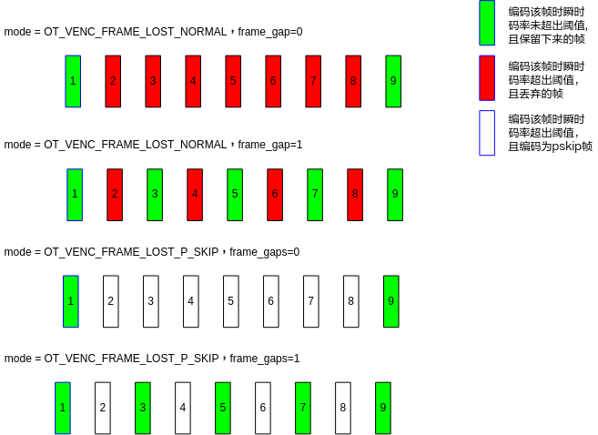

-   本接口在编码通道创建之后，编码通道销毁之前设置。此接口在编码过程中被调用时，等到下一帧时生效。如果在gop模式切换后调用该接口，需等到GOP生效后该接口生效。
-   p\_skip帧仅支持GOP模式为OT\_VENC\_GOP\_MODE\_NORMAL\_P的编码通道。
-   切换GOP模式后丢帧开关会默认关闭，如需继续使用该接口需要重新配置。
-   如当前帧osd使能且osd有更新，不能编码为p\_skip帧。
-   编码p\_skip帧与P帧刷Islice功能互斥。
-   当设置H.265协议通道编码p\_skip帧时，本模块内部会关闭SAO滤波，故建议客户调用[ss\_mpi\_venc\_set\_h265\_sao](#ZH-CN_TOPIC_0000002441658333)关闭SAO功能。
-   如果frame\_gap等于0时，表示瞬时码率超出阈值允许一直丢帧，直到瞬时码率不大于阈值。
-   使能跳帧参考或者svc-t编码，base层帧不能编码为p\_skip帧。
-   本接口仅支持H.264/H.265/Mjpeg 的CBR/VBR码率控制模式、H.264/H.265 的AVBR/QVBR/CVBR码率控制模式的参数的设置。

【举例】

无。

【相关主题】

无。

## ss\_mpi\_venc\_get\_frame\_lost\_strategy<a name="ZH-CN_TOPIC_0000002408259054"></a>

【描述】

获取编码通道瞬时码率超过阈值时丢帧策略。

【语法】

```
td_s32 ss_mpi_venc_get_frame_lost_strategy(ot_venc_chn chn, ot_venc_frame_lost_strategy *lost_param);
```

【参数】

<a name="table18124mcpsimp"></a>
<table><thead align="left"><tr id="row18130mcpsimp"><th class="cellrowborder" valign="top" width="17.82%" id="mcps1.1.4.1.1"><p id="p18132mcpsimp"><a name="p18132mcpsimp"></a><a name="p18132mcpsimp"></a>参数名称</p>
</th>
<th class="cellrowborder" valign="top" width="62.38%" id="mcps1.1.4.1.2"><p id="p18134mcpsimp"><a name="p18134mcpsimp"></a><a name="p18134mcpsimp"></a>描述</p>
</th>
<th class="cellrowborder" valign="top" width="19.8%" id="mcps1.1.4.1.3"><p id="p18136mcpsimp"><a name="p18136mcpsimp"></a><a name="p18136mcpsimp"></a>输入/输出</p>
</th>
</tr>
</thead>
<tbody><tr id="row18137mcpsimp"><td class="cellrowborder" valign="top" width="17.82%" headers="mcps1.1.4.1.1 "><p id="p18139mcpsimp"><a name="p18139mcpsimp"></a><a name="p18139mcpsimp"></a>chn</p>
</td>
<td class="cellrowborder" valign="top" width="62.38%" headers="mcps1.1.4.1.2 "><p id="p18141mcpsimp"><a name="p18141mcpsimp"></a><a name="p18141mcpsimp"></a>编码通道号。</p>
<p id="p18142mcpsimp"><a name="p18142mcpsimp"></a><a name="p18142mcpsimp"></a>取值范围：[0, OT_VENC_MAX_CHN_NUM)。</p>
</td>
<td class="cellrowborder" valign="top" width="19.8%" headers="mcps1.1.4.1.3 "><p id="p18144mcpsimp"><a name="p18144mcpsimp"></a><a name="p18144mcpsimp"></a>输入</p>
</td>
</tr>
<tr id="row18145mcpsimp"><td class="cellrowborder" valign="top" width="17.82%" headers="mcps1.1.4.1.1 "><p id="p18147mcpsimp"><a name="p18147mcpsimp"></a><a name="p18147mcpsimp"></a>lost_param</p>
</td>
<td class="cellrowborder" valign="top" width="62.38%" headers="mcps1.1.4.1.2 "><p id="p18149mcpsimp"><a name="p18149mcpsimp"></a><a name="p18149mcpsimp"></a>编码通道丢帧策略的参数。</p>
</td>
<td class="cellrowborder" valign="top" width="19.8%" headers="mcps1.1.4.1.3 "><p id="p18151mcpsimp"><a name="p18151mcpsimp"></a><a name="p18151mcpsimp"></a>输出</p>
</td>
</tr>
</tbody>
</table>

【返回值】

<a name="table18153mcpsimp"></a>
<table><thead align="left"><tr id="row18158mcpsimp"><th class="cellrowborder" valign="top" width="50%" id="mcps1.1.3.1.1"><p id="p18160mcpsimp"><a name="p18160mcpsimp"></a><a name="p18160mcpsimp"></a>返回值</p>
</th>
<th class="cellrowborder" valign="top" width="50%" id="mcps1.1.3.1.2"><p id="p18162mcpsimp"><a name="p18162mcpsimp"></a><a name="p18162mcpsimp"></a>描述</p>
</th>
</tr>
</thead>
<tbody><tr id="row18163mcpsimp"><td class="cellrowborder" valign="top" width="50%" headers="mcps1.1.3.1.1 "><p id="p18165mcpsimp"><a name="p18165mcpsimp"></a><a name="p18165mcpsimp"></a>0</p>
</td>
<td class="cellrowborder" valign="top" width="50%" headers="mcps1.1.3.1.2 "><p id="p18167mcpsimp"><a name="p18167mcpsimp"></a><a name="p18167mcpsimp"></a>成功。</p>
</td>
</tr>
<tr id="row18168mcpsimp"><td class="cellrowborder" valign="top" width="50%" headers="mcps1.1.3.1.1 "><p id="p18170mcpsimp"><a name="p18170mcpsimp"></a><a name="p18170mcpsimp"></a>非0</p>
</td>
<td class="cellrowborder" valign="top" width="50%" headers="mcps1.1.3.1.2 "><p id="p18172mcpsimp"><a name="p18172mcpsimp"></a><a name="p18172mcpsimp"></a>失败，返回错误码。</p>
</td>
</tr>
</tbody>
</table>

【需求】

-   头文件：ot\_common\_venc.h、ss\_mpi\_venc.h
-   库文件：libss\_mpi.a

【注意】

-   如果lost\_param为空，则返回失败。
-   切换GOP模式时，获取的属性是已设置的最新的属性。
-   本接口仅支持H.264/H.265/Mjpeg 的CBR/VBR码率控制模式、H.264/H.265 的AVBR/QVBR/CVBR码率控制模式。

【举例】

无。

【相关主题】

无。

## ss\_mpi\_venc\_set\_super\_frame\_strategy<a name="ZH-CN_TOPIC_0000002408099178"></a>

【描述】

设置编码超大帧配置。

【语法】

```
td_s32 ss_mpi_venc_set_super_frame_strategy(ot_venc_chn chn, const ot_venc_super_frame_strategy *super_frame_param);
```

【参数】

<a name="table15123mcpsimp"></a>
<table><thead align="left"><tr id="row15129mcpsimp"><th class="cellrowborder" valign="top" width="27%" id="mcps1.1.4.1.1"><p id="p15131mcpsimp"><a name="p15131mcpsimp"></a><a name="p15131mcpsimp"></a>参数名称</p>
</th>
<th class="cellrowborder" valign="top" width="56.99999999999999%" id="mcps1.1.4.1.2"><p id="p15133mcpsimp"><a name="p15133mcpsimp"></a><a name="p15133mcpsimp"></a>描述</p>
</th>
<th class="cellrowborder" valign="top" width="16%" id="mcps1.1.4.1.3"><p id="p15135mcpsimp"><a name="p15135mcpsimp"></a><a name="p15135mcpsimp"></a>输入/输出</p>
</th>
</tr>
</thead>
<tbody><tr id="row15136mcpsimp"><td class="cellrowborder" valign="top" width="27%" headers="mcps1.1.4.1.1 "><p id="p15138mcpsimp"><a name="p15138mcpsimp"></a><a name="p15138mcpsimp"></a>chn</p>
</td>
<td class="cellrowborder" valign="top" width="56.99999999999999%" headers="mcps1.1.4.1.2 "><p id="p15140mcpsimp"><a name="p15140mcpsimp"></a><a name="p15140mcpsimp"></a>编码通道号。</p>
<p id="p15141mcpsimp"><a name="p15141mcpsimp"></a><a name="p15141mcpsimp"></a>取值范围：[0, OT_VENC_MAX_CHN_NUM)。</p>
</td>
<td class="cellrowborder" valign="top" width="16%" headers="mcps1.1.4.1.3 "><p id="p15143mcpsimp"><a name="p15143mcpsimp"></a><a name="p15143mcpsimp"></a>输入</p>
</td>
</tr>
<tr id="row15144mcpsimp"><td class="cellrowborder" valign="top" width="27%" headers="mcps1.1.4.1.1 "><p id="p15146mcpsimp"><a name="p15146mcpsimp"></a><a name="p15146mcpsimp"></a>super_frame_param</p>
</td>
<td class="cellrowborder" valign="top" width="56.99999999999999%" headers="mcps1.1.4.1.2 "><p id="p15148mcpsimp"><a name="p15148mcpsimp"></a><a name="p15148mcpsimp"></a>编码超大帧配置参数。</p>
</td>
<td class="cellrowborder" valign="top" width="16%" headers="mcps1.1.4.1.3 "><p id="p15150mcpsimp"><a name="p15150mcpsimp"></a><a name="p15150mcpsimp"></a>输入</p>
</td>
</tr>
</tbody>
</table>

【返回值】

<a name="table15152mcpsimp"></a>
<table><thead align="left"><tr id="row15157mcpsimp"><th class="cellrowborder" valign="top" width="50%" id="mcps1.1.3.1.1"><p id="p15159mcpsimp"><a name="p15159mcpsimp"></a><a name="p15159mcpsimp"></a>返回值</p>
</th>
<th class="cellrowborder" valign="top" width="50%" id="mcps1.1.3.1.2"><p id="p15161mcpsimp"><a name="p15161mcpsimp"></a><a name="p15161mcpsimp"></a>描述</p>
</th>
</tr>
</thead>
<tbody><tr id="row15162mcpsimp"><td class="cellrowborder" valign="top" width="50%" headers="mcps1.1.3.1.1 "><p id="p15164mcpsimp"><a name="p15164mcpsimp"></a><a name="p15164mcpsimp"></a>0</p>
</td>
<td class="cellrowborder" valign="top" width="50%" headers="mcps1.1.3.1.2 "><p id="p15166mcpsimp"><a name="p15166mcpsimp"></a><a name="p15166mcpsimp"></a>成功。</p>
</td>
</tr>
<tr id="row15167mcpsimp"><td class="cellrowborder" valign="top" width="50%" headers="mcps1.1.3.1.1 "><p id="p15169mcpsimp"><a name="p15169mcpsimp"></a><a name="p15169mcpsimp"></a>非0</p>
</td>
<td class="cellrowborder" valign="top" width="50%" headers="mcps1.1.3.1.2 "><p id="p15171mcpsimp"><a name="p15171mcpsimp"></a><a name="p15171mcpsimp"></a>失败，返回错误码。</p>
</td>
</tr>
</tbody>
</table>

【需求】

-   头文件：ot\_common\_rc.h、ss\_mpi\_venc.h
-   库文件：libss\_mpi.a

【注意】

-   如果通道未创建，则返回失败。
-   本接口属于高级接口，用户可以选择性调用，系统默认值。系统默认使能super\_frame\_mode为OT\_VENC\_SUPER\_FRAME\_NONE，i\_frame\_bits\_threshold、p\_frame\_bits\_threshold、b\_frame\_bits\_threshold为500000，reencode\_priority 为OT\_VENC\_REENCODE\_BIT\_RATE\_FIRST。
-   本接口在编码通道创建之后，编码通道销毁之前设置。
-   本接口仅支持H.264/H.265/Mjpeg 的CBR/VBR码率控制模式、H.264/H.265的AVBR/QVBR/CVBR码率控制模式的参数的设置。
-   VPSS-VENC处于卷绕低延时模式时，不支持超大帧重编，强制配置会导致通道频繁丢帧。SS528V100/SS625V100/SS524V100/SS522V101/SS928V100/SS626V100不支持卷绕低延时。

【举例】

无。

【相关主题】

无。

## ss\_mpi\_venc\_get\_super\_frame\_strategy<a name="ZH-CN_TOPIC_0000002408099234"></a>

【描述】

获取编码超大帧配置。

【语法】

```
td_s32 ss_mpi_venc_get_super_frame_strategy(ot_venc_chn chn, ot_venc_super_frame_strategy *super_frame_param);
```

【参数】

<a name="table19673mcpsimp"></a>
<table><thead align="left"><tr id="row19679mcpsimp"><th class="cellrowborder" valign="top" width="25%" id="mcps1.1.4.1.1"><p id="p19681mcpsimp"><a name="p19681mcpsimp"></a><a name="p19681mcpsimp"></a>参数名称</p>
</th>
<th class="cellrowborder" valign="top" width="56.99999999999999%" id="mcps1.1.4.1.2"><p id="p19683mcpsimp"><a name="p19683mcpsimp"></a><a name="p19683mcpsimp"></a>描述</p>
</th>
<th class="cellrowborder" valign="top" width="18%" id="mcps1.1.4.1.3"><p id="p19685mcpsimp"><a name="p19685mcpsimp"></a><a name="p19685mcpsimp"></a>输入/输出</p>
</th>
</tr>
</thead>
<tbody><tr id="row19686mcpsimp"><td class="cellrowborder" valign="top" width="25%" headers="mcps1.1.4.1.1 "><p id="p19688mcpsimp"><a name="p19688mcpsimp"></a><a name="p19688mcpsimp"></a>chn</p>
</td>
<td class="cellrowborder" valign="top" width="56.99999999999999%" headers="mcps1.1.4.1.2 "><p id="p19690mcpsimp"><a name="p19690mcpsimp"></a><a name="p19690mcpsimp"></a>编码通道号。</p>
<p id="p19691mcpsimp"><a name="p19691mcpsimp"></a><a name="p19691mcpsimp"></a>取值范围：[0, OT_VENC_MAX_CHN_NUM)。</p>
</td>
<td class="cellrowborder" valign="top" width="18%" headers="mcps1.1.4.1.3 "><p id="p19693mcpsimp"><a name="p19693mcpsimp"></a><a name="p19693mcpsimp"></a>输入</p>
</td>
</tr>
<tr id="row19694mcpsimp"><td class="cellrowborder" valign="top" width="25%" headers="mcps1.1.4.1.1 "><p id="p19696mcpsimp"><a name="p19696mcpsimp"></a><a name="p19696mcpsimp"></a>super_frame_param</p>
</td>
<td class="cellrowborder" valign="top" width="56.99999999999999%" headers="mcps1.1.4.1.2 "><p id="p19698mcpsimp"><a name="p19698mcpsimp"></a><a name="p19698mcpsimp"></a>编码超大帧配置参数。</p>
</td>
<td class="cellrowborder" valign="top" width="18%" headers="mcps1.1.4.1.3 "><p id="p19700mcpsimp"><a name="p19700mcpsimp"></a><a name="p19700mcpsimp"></a>输出</p>
</td>
</tr>
</tbody>
</table>

【返回值】

<a name="table19702mcpsimp"></a>
<table><thead align="left"><tr id="row19707mcpsimp"><th class="cellrowborder" valign="top" width="50%" id="mcps1.1.3.1.1"><p id="p19709mcpsimp"><a name="p19709mcpsimp"></a><a name="p19709mcpsimp"></a>返回值</p>
</th>
<th class="cellrowborder" valign="top" width="50%" id="mcps1.1.3.1.2"><p id="p19711mcpsimp"><a name="p19711mcpsimp"></a><a name="p19711mcpsimp"></a>描述</p>
</th>
</tr>
</thead>
<tbody><tr id="row19712mcpsimp"><td class="cellrowborder" valign="top" width="50%" headers="mcps1.1.3.1.1 "><p id="p19714mcpsimp"><a name="p19714mcpsimp"></a><a name="p19714mcpsimp"></a>0</p>
</td>
<td class="cellrowborder" valign="top" width="50%" headers="mcps1.1.3.1.2 "><p id="p19716mcpsimp"><a name="p19716mcpsimp"></a><a name="p19716mcpsimp"></a>成功。</p>
</td>
</tr>
<tr id="row19717mcpsimp"><td class="cellrowborder" valign="top" width="50%" headers="mcps1.1.3.1.1 "><p id="p19719mcpsimp"><a name="p19719mcpsimp"></a><a name="p19719mcpsimp"></a>非0</p>
</td>
<td class="cellrowborder" valign="top" width="50%" headers="mcps1.1.3.1.2 "><p id="p19721mcpsimp"><a name="p19721mcpsimp"></a><a name="p19721mcpsimp"></a>失败，返回错误码。</p>
</td>
</tr>
</tbody>
</table>

【需求】

-   头文件：ot\_common\_venc.h、ss\_mpi\_venc.h
-   库文件：libss\_mpi.a

【注意】

-   如果super\_frame\_param为空，则返回失败。
-   本接口仅支持H.264/H.265/MJPEG的CBR/VBR码率控制模式和H.264/H.265的AVBR/QVBR/CVBR码率控制模式。

【举例】

无。

【相关主题】

无。

## ss\_mpi\_venc\_get\_intra\_refresh<a name="ZH-CN_TOPIC_0000002408099166"></a>

【描述】

获取P帧刷Islice的设置参数。

【语法】

```
td_s32 ss_mpi_venc_get_intra_refresh(ot_venc_chn chn, ot_venc_intra_refresh *intra_refresh);
```

【参数】

<a name="table13724mcpsimp"></a>
<table><thead align="left"><tr id="row13730mcpsimp"><th class="cellrowborder" valign="top" width="23%" id="mcps1.1.4.1.1"><p id="p13732mcpsimp"><a name="p13732mcpsimp"></a><a name="p13732mcpsimp"></a>参数名称</p>
</th>
<th class="cellrowborder" valign="top" width="59%" id="mcps1.1.4.1.2"><p id="p13734mcpsimp"><a name="p13734mcpsimp"></a><a name="p13734mcpsimp"></a>描述</p>
</th>
<th class="cellrowborder" valign="top" width="18%" id="mcps1.1.4.1.3"><p id="p13736mcpsimp"><a name="p13736mcpsimp"></a><a name="p13736mcpsimp"></a>输入/输出</p>
</th>
</tr>
</thead>
<tbody><tr id="row13737mcpsimp"><td class="cellrowborder" valign="top" width="23%" headers="mcps1.1.4.1.1 "><p id="p13739mcpsimp"><a name="p13739mcpsimp"></a><a name="p13739mcpsimp"></a>chn</p>
</td>
<td class="cellrowborder" valign="top" width="59%" headers="mcps1.1.4.1.2 "><p id="p13741mcpsimp"><a name="p13741mcpsimp"></a><a name="p13741mcpsimp"></a>通道号。</p>
<p id="p13742mcpsimp"><a name="p13742mcpsimp"></a><a name="p13742mcpsimp"></a>取值范围：[0, OT_VENC_MAX_CHN_NUM)。</p>
</td>
<td class="cellrowborder" valign="top" width="18%" headers="mcps1.1.4.1.3 "><p id="p13744mcpsimp"><a name="p13744mcpsimp"></a><a name="p13744mcpsimp"></a>输入</p>
</td>
</tr>
<tr id="row13745mcpsimp"><td class="cellrowborder" valign="top" width="23%" headers="mcps1.1.4.1.1 "><p id="p13747mcpsimp"><a name="p13747mcpsimp"></a><a name="p13747mcpsimp"></a>intra_refresh</p>
</td>
<td class="cellrowborder" valign="top" width="59%" headers="mcps1.1.4.1.2 "><p id="p13749mcpsimp"><a name="p13749mcpsimp"></a><a name="p13749mcpsimp"></a>刷I slice参数。</p>
</td>
<td class="cellrowborder" valign="top" width="18%" headers="mcps1.1.4.1.3 "><p id="p13751mcpsimp"><a name="p13751mcpsimp"></a><a name="p13751mcpsimp"></a>输出</p>
</td>
</tr>
</tbody>
</table>

【返回值】

<a name="table13753mcpsimp"></a>
<table><thead align="left"><tr id="row13758mcpsimp"><th class="cellrowborder" valign="top" width="50%" id="mcps1.1.3.1.1"><p id="p13760mcpsimp"><a name="p13760mcpsimp"></a><a name="p13760mcpsimp"></a>返回值</p>
</th>
<th class="cellrowborder" valign="top" width="50%" id="mcps1.1.3.1.2"><p id="p13762mcpsimp"><a name="p13762mcpsimp"></a><a name="p13762mcpsimp"></a>描述</p>
</th>
</tr>
</thead>
<tbody><tr id="row13764mcpsimp"><td class="cellrowborder" valign="top" width="50%" headers="mcps1.1.3.1.1 "><p id="p13766mcpsimp"><a name="p13766mcpsimp"></a><a name="p13766mcpsimp"></a>0</p>
</td>
<td class="cellrowborder" valign="top" width="50%" headers="mcps1.1.3.1.2 "><p id="p13768mcpsimp"><a name="p13768mcpsimp"></a><a name="p13768mcpsimp"></a>成功。</p>
</td>
</tr>
<tr id="row13769mcpsimp"><td class="cellrowborder" valign="top" width="50%" headers="mcps1.1.3.1.1 "><p id="p13771mcpsimp"><a name="p13771mcpsimp"></a><a name="p13771mcpsimp"></a>非0</p>
</td>
<td class="cellrowborder" valign="top" width="50%" headers="mcps1.1.3.1.2 "><p id="p13773mcpsimp"><a name="p13773mcpsimp"></a><a name="p13773mcpsimp"></a>失败，返回错误码。</p>
</td>
</tr>
</tbody>
</table>

【需求】

-   头文件：ot\_common\_venc.h、ss\_mpi\_venc.h
-   库文件：libss\_mpi.a

【注意】

-   本接口必须在编码通道创建之后，编码通道销毁之前调用。
-   切换GOP模式时，获取的属性是已设置的最新的属性。

【举例】

无

【相关主题】

无

## ss\_mpi\_venc\_set\_intra\_refresh<a name="ZH-CN_TOPIC_0000002441697933"></a>

【描述】

设置P帧刷I slice的参数。

【语法】

```
td_s32 ss_mpi_venc_set_intra_refresh(ot_venc_chn chn, const ot_venc_intra_refresh *intra_refresh);
```

【参数】

<a name="table8759mcpsimp"></a>
<table><thead align="left"><tr id="row8765mcpsimp"><th class="cellrowborder" valign="top" width="23%" id="mcps1.1.4.1.1"><p id="p8767mcpsimp"><a name="p8767mcpsimp"></a><a name="p8767mcpsimp"></a>参数名称</p>
</th>
<th class="cellrowborder" valign="top" width="59%" id="mcps1.1.4.1.2"><p id="p8769mcpsimp"><a name="p8769mcpsimp"></a><a name="p8769mcpsimp"></a>描述</p>
</th>
<th class="cellrowborder" valign="top" width="18%" id="mcps1.1.4.1.3"><p id="p8771mcpsimp"><a name="p8771mcpsimp"></a><a name="p8771mcpsimp"></a>输入/输出</p>
</th>
</tr>
</thead>
<tbody><tr id="row8773mcpsimp"><td class="cellrowborder" valign="top" width="23%" headers="mcps1.1.4.1.1 "><p id="p8775mcpsimp"><a name="p8775mcpsimp"></a><a name="p8775mcpsimp"></a>chn</p>
</td>
<td class="cellrowborder" valign="top" width="59%" headers="mcps1.1.4.1.2 "><p id="p8777mcpsimp"><a name="p8777mcpsimp"></a><a name="p8777mcpsimp"></a>通道号。</p>
<p id="p8778mcpsimp"><a name="p8778mcpsimp"></a><a name="p8778mcpsimp"></a>取值范围：[0, OT_VENC_MAX_CHN_NUM)。</p>
</td>
<td class="cellrowborder" valign="top" width="18%" headers="mcps1.1.4.1.3 "><p id="p8780mcpsimp"><a name="p8780mcpsimp"></a><a name="p8780mcpsimp"></a>输入</p>
</td>
</tr>
<tr id="row8781mcpsimp"><td class="cellrowborder" valign="top" width="23%" headers="mcps1.1.4.1.1 "><p id="p8783mcpsimp"><a name="p8783mcpsimp"></a><a name="p8783mcpsimp"></a>intra_refresh</p>
</td>
<td class="cellrowborder" valign="top" width="59%" headers="mcps1.1.4.1.2 "><p id="p8785mcpsimp"><a name="p8785mcpsimp"></a><a name="p8785mcpsimp"></a>刷I slice参数。</p>
</td>
<td class="cellrowborder" valign="top" width="18%" headers="mcps1.1.4.1.3 "><p id="p8787mcpsimp"><a name="p8787mcpsimp"></a><a name="p8787mcpsimp"></a>输入</p>
</td>
</tr>
</tbody>
</table>

【需求】

-   头文件：ot\_common\_venc.h、ss\_mpi\_venc.h
-   库文件：libss\_mpi.a

【注意】

-   仅支持H.264, H.265编码通道。
-   改变GOP后需要重新进行设置。
-   设置高级跳帧参考后需要重新进行设置，不支持高级跳帧参考pred\_en为0。
-   保证设置的行数refresh\_num可以在一个Gop内完成I slice刷新，注意高级跳帧参考时只会在base层中OT\_VENC\_BASE\_P\_SLICE\_REF\_BY\_BASE帧进行刷新。refresh\_num需满足[表1](#_Ref18048144)描述计算公式：

**表 1**  refresh\_num计算

<a name="_Ref18048144"></a>
<table><thead align="left"><tr id="row8809mcpsimp"><th class="cellrowborder" valign="top" width="11%" id="mcps1.2.4.1.1"><p id="p8811mcpsimp"><a name="p8811mcpsimp"></a><a name="p8811mcpsimp"></a>-</p>
</th>
<th class="cellrowborder" valign="top" width="48%" id="mcps1.2.4.1.2"><p id="p8813mcpsimp"><a name="p8813mcpsimp"></a><a name="p8813mcpsimp"></a>计算公式</p>
</th>
<th class="cellrowborder" valign="top" width="41%" id="mcps1.2.4.1.3"><p id="p8815mcpsimp"><a name="p8815mcpsimp"></a><a name="p8815mcpsimp"></a>备注</p>
</th>
</tr>
</thead>
<tbody><tr id="row8817mcpsimp"><td class="cellrowborder" rowspan="2" valign="top" width="11%" headers="mcps1.2.4.1.1 "><p id="p8819mcpsimp"><a name="p8819mcpsimp"></a><a name="p8819mcpsimp"></a>H.264</p>
</td>
<td class="cellrowborder" valign="top" width="48%" headers="mcps1.2.4.1.2 "><p id="p8821mcpsimp"><a name="p8821mcpsimp"></a><a name="p8821mcpsimp"></a>行<span xml:lang="pt-BR" id="ph8822mcpsimp"><a name="ph8822mcpsimp"></a><a name="ph8822mcpsimp"></a>：</span></p>
<p id="p8823mcpsimp"><a name="p8823mcpsimp"></a><a name="p8823mcpsimp"></a>refresh_num<span xml:lang="pt-BR" id="ph8824mcpsimp"><a name="ph8824mcpsimp"></a><a name="ph8824mcpsimp"></a>*</span>max_refresh_frame_in_gop <span xml:lang="pt-BR" id="ph8825mcpsimp"><a name="ph8825mcpsimp"></a><a name="ph8825mcpsimp"></a>&gt;= (</span>pic_height + 15) / 16</p>
</td>
<td class="cellrowborder" rowspan="4" valign="top" width="41%" headers="mcps1.2.4.1.3 "><p id="p8827mcpsimp"><a name="p8827mcpsimp"></a><a name="p8827mcpsimp"></a>无高级跳帧参考时：max_refresh_frame_in_gop = gop;</p>
<p id="p8828mcpsimp"><a name="p8828mcpsimp"></a><a name="p8828mcpsimp"></a>高级跳帧参考时：</p>
<p id="p8829mcpsimp"><a name="p8829mcpsimp"></a><a name="p8829mcpsimp"></a>max_refresh_frame_in_gop = (gop + (base*(enhance+1) -1))/(base*(enhance+1)）</p>
<p id="p8830mcpsimp"><a name="p8830mcpsimp"></a><a name="p8830mcpsimp"></a>SS528V100/SS625V100/SS524V100/SS522V101/SS928V100/SS626V100的lcu_size为32；</p>
</td>
</tr>
<tr id="row8831mcpsimp"><td class="cellrowborder" valign="top" headers="mcps1.2.4.1.1 "><p id="p8833mcpsimp"><a name="p8833mcpsimp"></a><a name="p8833mcpsimp"></a>列：</p>
<p id="p8834mcpsimp"><a name="p8834mcpsimp"></a><a name="p8834mcpsimp"></a>refresh_num<span xml:lang="pt-BR" id="ph8835mcpsimp"><a name="ph8835mcpsimp"></a><a name="ph8835mcpsimp"></a>*</span>max_refresh_frame_in_gop <span xml:lang="pt-BR" id="ph8836mcpsimp"><a name="ph8836mcpsimp"></a><a name="ph8836mcpsimp"></a>&gt;= (</span>pic_width + 15) / 16</p>
</td>
</tr>
<tr id="row8837mcpsimp"><td class="cellrowborder" rowspan="2" valign="top" headers="mcps1.2.4.1.1 "><p id="p8839mcpsimp"><a name="p8839mcpsimp"></a><a name="p8839mcpsimp"></a>H.265</p>
</td>
<td class="cellrowborder" valign="top" headers="mcps1.2.4.1.2 "><p id="p8841mcpsimp"><a name="p8841mcpsimp"></a><a name="p8841mcpsimp"></a>行：refresh_num<span xml:lang="pt-BR" id="ph8842mcpsimp"><a name="ph8842mcpsimp"></a><a name="ph8842mcpsimp"></a>*</span>max_refresh_frame_in_gop <span xml:lang="pt-BR" id="ph8843mcpsimp"><a name="ph8843mcpsimp"></a><a name="ph8843mcpsimp"></a>&gt;= (pic_height </span>+ lcu_size - 1) / lcu_size</p>
</td>
</tr>
<tr id="row8844mcpsimp"><td class="cellrowborder" valign="top" headers="mcps1.2.4.1.1 "><p id="p8846mcpsimp"><a name="p8846mcpsimp"></a><a name="p8846mcpsimp"></a>列：</p>
<p id="p8847mcpsimp"><a name="p8847mcpsimp"></a><a name="p8847mcpsimp"></a>refresh_num<span xml:lang="pt-BR" id="ph8848mcpsimp"><a name="ph8848mcpsimp"></a><a name="ph8848mcpsimp"></a>*</span>Max_refresh_frame_in_gop<span xml:lang="pt-BR" id="ph8849mcpsimp"><a name="ph8849mcpsimp"></a><a name="ph8849mcpsimp"></a> &gt;= (pic_width</span> + lcu_size - 1) / lcu_size</p>
</td>
</tr>
</tbody>
</table>

-   需要等到下一个I帧时生效的接口在进行参数设置后会生成一个I帧，保证参数设置生效。
-   仅支持GOP模式为OT\_VENC\_GOP\_MODE\_NORMAL\_P的编码通道。
-   GOP切换后该接口自动失效。如果GOP模式是从非NORMAL\_P切向NORMAL\_P，模式切换后调用该接口需等到GOP生效后该接口生效。
-   该接口与p\_skip方式丢帧，背景低帧率功能互斥。
-   使能P帧刷I slice，不支持QPMap模式使能skip，内部会自适应关闭skip。
-   如果开启去呼吸效应功能，需关闭去呼吸效应功能，再使能P帧刷I slice，否则返回不允许。
-   使能P帧刷I slice时，需等下一个GOP的IDR帧才能生效。
-   关闭P帧刷I slice参数时会立即生效。
-   动态修改P帧刷I slice参数时，需要等下一个GOP才能生效。

【举例】

无

## ss\_mpi\_venc\_set\_mod\_param<a name="ZH-CN_TOPIC_0000002408099010"></a>

【描述】

设置编码相关的模块参数。

【语法】

```
td_s32 ss_mpi_venc_set_mod_param(const ot_venc_mod_param *mod_param);
```

【参数】

<a name="table3490mcpsimp"></a>
<table><thead align="left"><tr id="row3496mcpsimp"><th class="cellrowborder" valign="top" width="17.82%" id="mcps1.1.4.1.1"><p id="p3498mcpsimp"><a name="p3498mcpsimp"></a><a name="p3498mcpsimp"></a>参数名称</p>
</th>
<th class="cellrowborder" valign="top" width="62.38%" id="mcps1.1.4.1.2"><p id="p3500mcpsimp"><a name="p3500mcpsimp"></a><a name="p3500mcpsimp"></a>描述</p>
</th>
<th class="cellrowborder" valign="top" width="19.8%" id="mcps1.1.4.1.3"><p id="p3502mcpsimp"><a name="p3502mcpsimp"></a><a name="p3502mcpsimp"></a>输入/输出</p>
</th>
</tr>
</thead>
<tbody><tr id="row3503mcpsimp"><td class="cellrowborder" valign="top" width="17.82%" headers="mcps1.1.4.1.1 "><p id="p3505mcpsimp"><a name="p3505mcpsimp"></a><a name="p3505mcpsimp"></a>mod_param</p>
</td>
<td class="cellrowborder" valign="top" width="62.38%" headers="mcps1.1.4.1.2 "><p id="p3507mcpsimp"><a name="p3507mcpsimp"></a><a name="p3507mcpsimp"></a>编码模块参数。</p>
</td>
<td class="cellrowborder" valign="top" width="19.8%" headers="mcps1.1.4.1.3 "><p id="p3509mcpsimp"><a name="p3509mcpsimp"></a><a name="p3509mcpsimp"></a>输入</p>
</td>
</tr>
</tbody>
</table>

【返回值】

<a name="table3511mcpsimp"></a>
<table><thead align="left"><tr id="row3516mcpsimp"><th class="cellrowborder" valign="top" width="50%" id="mcps1.1.3.1.1"><p id="p3518mcpsimp"><a name="p3518mcpsimp"></a><a name="p3518mcpsimp"></a>返回值</p>
</th>
<th class="cellrowborder" valign="top" width="50%" id="mcps1.1.3.1.2"><p id="p3520mcpsimp"><a name="p3520mcpsimp"></a><a name="p3520mcpsimp"></a>描述</p>
</th>
</tr>
</thead>
<tbody><tr id="row3522mcpsimp"><td class="cellrowborder" valign="top" width="50%" headers="mcps1.1.3.1.1 "><p id="p3524mcpsimp"><a name="p3524mcpsimp"></a><a name="p3524mcpsimp"></a>0</p>
</td>
<td class="cellrowborder" valign="top" width="50%" headers="mcps1.1.3.1.2 "><p id="p3526mcpsimp"><a name="p3526mcpsimp"></a><a name="p3526mcpsimp"></a>成功。</p>
</td>
</tr>
<tr id="row3527mcpsimp"><td class="cellrowborder" valign="top" width="50%" headers="mcps1.1.3.1.1 "><p id="p3529mcpsimp"><a name="p3529mcpsimp"></a><a name="p3529mcpsimp"></a>非0</p>
</td>
<td class="cellrowborder" valign="top" width="50%" headers="mcps1.1.3.1.2 "><p id="p3531mcpsimp"><a name="p3531mcpsimp"></a><a name="p3531mcpsimp"></a>失败，返回错误码。</p>
</td>
</tr>
</tbody>
</table>

【需求】

-   头文件：ot\_common\_venc.h、ss\_mpi\_venc.h
-   库文件：libss\_mpi.a

【注意】

-   此接口在通道创建前调用，如果通道已经创建，则返回失败OT\_ERR\_VENC\_NOT\_PERM。
-   可以设置ssxx\_venc.ko、ssxx\_h264e.ko、ssxx\_h265e.ko、ssxx\_jpge.ko模块参数。

【举例】

无。

【相关主题】

无。

## ss\_mpi\_venc\_get\_mod\_param<a name="ZH-CN_TOPIC_0000002441697981"></a>

【描述】

获取编码相关的模块参数。

【语法】

```
td_s32 ss_mpi_venc_get_mod_param(ot_venc_mod_param *mod_param);
```

【参数】

<a name="table6768mcpsimp"></a>
<table><thead align="left"><tr id="row6774mcpsimp"><th class="cellrowborder" valign="top" width="18%" id="mcps1.1.4.1.1"><p id="p6776mcpsimp"><a name="p6776mcpsimp"></a><a name="p6776mcpsimp"></a>参数名称</p>
</th>
<th class="cellrowborder" valign="top" width="61%" id="mcps1.1.4.1.2"><p id="p6778mcpsimp"><a name="p6778mcpsimp"></a><a name="p6778mcpsimp"></a>描述</p>
</th>
<th class="cellrowborder" valign="top" width="21%" id="mcps1.1.4.1.3"><p id="p6780mcpsimp"><a name="p6780mcpsimp"></a><a name="p6780mcpsimp"></a>输入/输出</p>
</th>
</tr>
</thead>
<tbody><tr id="row6781mcpsimp"><td class="cellrowborder" valign="top" width="18%" headers="mcps1.1.4.1.1 "><p id="p6783mcpsimp"><a name="p6783mcpsimp"></a><a name="p6783mcpsimp"></a>mod_param</p>
</td>
<td class="cellrowborder" valign="top" width="61%" headers="mcps1.1.4.1.2 "><p id="p6785mcpsimp"><a name="p6785mcpsimp"></a><a name="p6785mcpsimp"></a>编码模块参数。</p>
</td>
<td class="cellrowborder" valign="top" width="21%" headers="mcps1.1.4.1.3 "><p id="p6787mcpsimp"><a name="p6787mcpsimp"></a><a name="p6787mcpsimp"></a>输出</p>
</td>
</tr>
</tbody>
</table>

【返回值】

<a name="table6789mcpsimp"></a>
<table><thead align="left"><tr id="row6794mcpsimp"><th class="cellrowborder" valign="top" width="50%" id="mcps1.1.3.1.1"><p id="p6796mcpsimp"><a name="p6796mcpsimp"></a><a name="p6796mcpsimp"></a>返回值</p>
</th>
<th class="cellrowborder" valign="top" width="50%" id="mcps1.1.3.1.2"><p id="p6798mcpsimp"><a name="p6798mcpsimp"></a><a name="p6798mcpsimp"></a>描述</p>
</th>
</tr>
</thead>
<tbody><tr id="row6800mcpsimp"><td class="cellrowborder" valign="top" width="50%" headers="mcps1.1.3.1.1 "><p id="p6802mcpsimp"><a name="p6802mcpsimp"></a><a name="p6802mcpsimp"></a>0</p>
</td>
<td class="cellrowborder" valign="top" width="50%" headers="mcps1.1.3.1.2 "><p id="p6804mcpsimp"><a name="p6804mcpsimp"></a><a name="p6804mcpsimp"></a>成功。</p>
</td>
</tr>
<tr id="row6805mcpsimp"><td class="cellrowborder" valign="top" width="50%" headers="mcps1.1.3.1.1 "><p id="p6807mcpsimp"><a name="p6807mcpsimp"></a><a name="p6807mcpsimp"></a>非0</p>
</td>
<td class="cellrowborder" valign="top" width="50%" headers="mcps1.1.3.1.2 "><p id="p6809mcpsimp"><a name="p6809mcpsimp"></a><a name="p6809mcpsimp"></a>失败，返回错误码。</p>
</td>
</tr>
</tbody>
</table>

【需求】

-   头文件：ot\_common\_venc.h、ss\_mpi\_venc.h
-   库文件：libss\_mpi.a

【注意】

-   可以获取ssxx\_venc.ko、ssxx\_h264e.ko、ssxx\_h265e.ko、ssxx\_jpge.ko模块参数。
-   调用本接口模块参数时，需要先配置ot\_venc\_mod\_param-\>mod\_type，否则获取不到对应模块参数。

【举例】

无。

【相关主题】

无。

## ss\_mpi\_venc\_set\_sse\_rgn<a name="ZH-CN_TOPIC_0000002408258734"></a>

【描述】

设置H.264/H.265通道的SSE区域参数。

【语法】

```
td_s32 ss_mpi_venc_set_sse_rgn(ot_venc_chn chn, const ot_venc_sse_rgn *sse_cfg);
```

【参数】

<a name="table10477mcpsimp"></a>
<table><thead align="left"><tr id="row10483mcpsimp"><th class="cellrowborder" valign="top" width="22%" id="mcps1.1.4.1.1"><p id="p10485mcpsimp"><a name="p10485mcpsimp"></a><a name="p10485mcpsimp"></a>参数名称</p>
</th>
<th class="cellrowborder" valign="top" width="60%" id="mcps1.1.4.1.2"><p id="p10487mcpsimp"><a name="p10487mcpsimp"></a><a name="p10487mcpsimp"></a>描述</p>
</th>
<th class="cellrowborder" valign="top" width="18%" id="mcps1.1.4.1.3"><p id="p10489mcpsimp"><a name="p10489mcpsimp"></a><a name="p10489mcpsimp"></a>输入/输出</p>
</th>
</tr>
</thead>
<tbody><tr id="row10490mcpsimp"><td class="cellrowborder" valign="top" width="22%" headers="mcps1.1.4.1.1 "><p id="p10492mcpsimp"><a name="p10492mcpsimp"></a><a name="p10492mcpsimp"></a>chn</p>
</td>
<td class="cellrowborder" valign="top" width="60%" headers="mcps1.1.4.1.2 "><p id="p10494mcpsimp"><a name="p10494mcpsimp"></a><a name="p10494mcpsimp"></a>编码通道号。</p>
<p id="p10495mcpsimp"><a name="p10495mcpsimp"></a><a name="p10495mcpsimp"></a>取值范围：[0, OT_VENC_MAX_CHN_NUM)。</p>
</td>
<td class="cellrowborder" valign="top" width="18%" headers="mcps1.1.4.1.3 "><p id="p10497mcpsimp"><a name="p10497mcpsimp"></a><a name="p10497mcpsimp"></a>输入</p>
</td>
</tr>
<tr id="row10498mcpsimp"><td class="cellrowborder" valign="top" width="22%" headers="mcps1.1.4.1.1 "><p id="p10500mcpsimp"><a name="p10500mcpsimp"></a><a name="p10500mcpsimp"></a>sse_cfg</p>
</td>
<td class="cellrowborder" valign="top" width="60%" headers="mcps1.1.4.1.2 "><p id="p10502mcpsimp"><a name="p10502mcpsimp"></a><a name="p10502mcpsimp"></a>SSE区域参数。</p>
</td>
<td class="cellrowborder" valign="top" width="18%" headers="mcps1.1.4.1.3 "><p id="p10504mcpsimp"><a name="p10504mcpsimp"></a><a name="p10504mcpsimp"></a>输入</p>
</td>
</tr>
</tbody>
</table>

【返回值】

<a name="table10506mcpsimp"></a>
<table><thead align="left"><tr id="row10511mcpsimp"><th class="cellrowborder" valign="top" width="50%" id="mcps1.1.3.1.1"><p id="p10513mcpsimp"><a name="p10513mcpsimp"></a><a name="p10513mcpsimp"></a>返回值</p>
</th>
<th class="cellrowborder" valign="top" width="50%" id="mcps1.1.3.1.2"><p id="p10515mcpsimp"><a name="p10515mcpsimp"></a><a name="p10515mcpsimp"></a>描述</p>
</th>
</tr>
</thead>
<tbody><tr id="row10517mcpsimp"><td class="cellrowborder" valign="top" width="50%" headers="mcps1.1.3.1.1 "><p id="p10519mcpsimp"><a name="p10519mcpsimp"></a><a name="p10519mcpsimp"></a>0</p>
</td>
<td class="cellrowborder" valign="top" width="50%" headers="mcps1.1.3.1.2 "><p id="p10521mcpsimp"><a name="p10521mcpsimp"></a><a name="p10521mcpsimp"></a>成功。</p>
</td>
</tr>
<tr id="row10522mcpsimp"><td class="cellrowborder" valign="top" width="50%" headers="mcps1.1.3.1.1 "><p id="p10524mcpsimp"><a name="p10524mcpsimp"></a><a name="p10524mcpsimp"></a>非0</p>
</td>
<td class="cellrowborder" valign="top" width="50%" headers="mcps1.1.3.1.2 "><p id="p10526mcpsimp"><a name="p10526mcpsimp"></a><a name="p10526mcpsimp"></a>失败，返回错误码。</p>
</td>
</tr>
</tbody>
</table>

【需求】

-   头文件：ot\_common\_venc.h、ss\_mpi\_venc.h
-   库文件：libss\_mpi.a

【注意】

-   本接口用于设置H.264/H.265 协议编码通道SSE 区域的参数。
-   SSE 参数主要由三个参数决定。
    -   idx：系统支持每个通道可设置8 个SSE 区域，系统内部按照0～7 的索引号对SSE 区域进行管理，idx 表示的用户设置SSE的索引号。SSE 区域之间可以互相叠加，且当发生叠加时，SSE区域之间按照自己对应区域上报SSE总和，互不影响。
    -   enable：指定当前的SSE区域是否使能。
    -   rect：指定当前的SSE 区域的位置坐标和区域的大小。

        H.264的SSE区域的起始点坐标必须在图像范围内，且必须16对齐；SSE区域的长宽必须是16对齐，且区域必须在图像范围内。

        H.265的SSE区域的起始点坐标必须在图像范围内，且必须LCU对齐；SSE区域的长宽必须是LCU对齐，且区域必须在图像范围内。

-   本接口属于高级接口，系统默认八个SSE区域使能，不调用此接口时，默认均为第一个宏块区域。用户可以调用此接口改变SSE区域，从而在水印信息中得到每个区域的SSE总和。
-   本接口在编码通道创建之后，编码通道销毁之前设置。此接口在编码过程中被调用时，等待下一帧时发生。
-   建议用户在调用此接口之前，先调用[ss\_mpi\_venc\_get\_sse\_rgn](#ZH-CN_TOPIC_0000002441658541)接口，获取当前通道的SSE配置，然后再进行设置。
-   仅SS928V100的H.264编码通道支持该接口，H.265全支持。

【举例】

无

【相关主题】

无。

## ss\_mpi\_venc\_get\_sse\_rgn<a name="ZH-CN_TOPIC_0000002441658541"></a>

【描述】

获取H.264/H.265 通道的SSE 属性。

【语法】

```
td_s32 ss_mpi_venc_get_sse_rgn(ot_venc_chn chn, td_u32 idx, ot_venc_sse_rgn *sse_cfg);
```

【参数】

<a name="table8870mcpsimp"></a>
<table><thead align="left"><tr id="row8876mcpsimp"><th class="cellrowborder" valign="top" width="19%" id="mcps1.1.4.1.1"><p id="p8878mcpsimp"><a name="p8878mcpsimp"></a><a name="p8878mcpsimp"></a>参数名称</p>
</th>
<th class="cellrowborder" valign="top" width="65%" id="mcps1.1.4.1.2"><p id="p8880mcpsimp"><a name="p8880mcpsimp"></a><a name="p8880mcpsimp"></a>描述</p>
</th>
<th class="cellrowborder" valign="top" width="16%" id="mcps1.1.4.1.3"><p id="p8882mcpsimp"><a name="p8882mcpsimp"></a><a name="p8882mcpsimp"></a>输入/输出</p>
</th>
</tr>
</thead>
<tbody><tr id="row8883mcpsimp"><td class="cellrowborder" valign="top" width="19%" headers="mcps1.1.4.1.1 "><p id="p8885mcpsimp"><a name="p8885mcpsimp"></a><a name="p8885mcpsimp"></a>chn</p>
</td>
<td class="cellrowborder" valign="top" width="65%" headers="mcps1.1.4.1.2 "><p id="p8887mcpsimp"><a name="p8887mcpsimp"></a><a name="p8887mcpsimp"></a>编码通道号。</p>
<p id="p8888mcpsimp"><a name="p8888mcpsimp"></a><a name="p8888mcpsimp"></a>取值范围：[0, OT_VENC_MAX_CHN_NUM)。</p>
</td>
<td class="cellrowborder" valign="top" width="16%" headers="mcps1.1.4.1.3 "><p id="p8890mcpsimp"><a name="p8890mcpsimp"></a><a name="p8890mcpsimp"></a>输入</p>
</td>
</tr>
<tr id="row8891mcpsimp"><td class="cellrowborder" valign="top" width="19%" headers="mcps1.1.4.1.1 "><p id="p8893mcpsimp"><a name="p8893mcpsimp"></a><a name="p8893mcpsimp"></a>idx</p>
</td>
<td class="cellrowborder" valign="top" width="65%" headers="mcps1.1.4.1.2 "><p id="p8895mcpsimp"><a name="p8895mcpsimp"></a><a name="p8895mcpsimp"></a>H.264/H.265协议编码通道SSE 区域索引。</p>
</td>
<td class="cellrowborder" valign="top" width="16%" headers="mcps1.1.4.1.3 "><p id="p8897mcpsimp"><a name="p8897mcpsimp"></a><a name="p8897mcpsimp"></a>输入</p>
</td>
</tr>
<tr id="row8898mcpsimp"><td class="cellrowborder" valign="top" width="19%" headers="mcps1.1.4.1.1 "><p id="p8900mcpsimp"><a name="p8900mcpsimp"></a><a name="p8900mcpsimp"></a>sse_cfg</p>
</td>
<td class="cellrowborder" valign="top" width="65%" headers="mcps1.1.4.1.2 "><p id="p8902mcpsimp"><a name="p8902mcpsimp"></a><a name="p8902mcpsimp"></a>对应SSE参数设置。</p>
</td>
<td class="cellrowborder" valign="top" width="16%" headers="mcps1.1.4.1.3 "><p id="p8904mcpsimp"><a name="p8904mcpsimp"></a><a name="p8904mcpsimp"></a>输出</p>
</td>
</tr>
</tbody>
</table>

【返回值】

<a name="table8906mcpsimp"></a>
<table><thead align="left"><tr id="row8911mcpsimp"><th class="cellrowborder" valign="top" width="50%" id="mcps1.1.3.1.1"><p id="p8913mcpsimp"><a name="p8913mcpsimp"></a><a name="p8913mcpsimp"></a>返回值</p>
</th>
<th class="cellrowborder" valign="top" width="50%" id="mcps1.1.3.1.2"><p id="p8915mcpsimp"><a name="p8915mcpsimp"></a><a name="p8915mcpsimp"></a>描述</p>
</th>
</tr>
</thead>
<tbody><tr id="row8917mcpsimp"><td class="cellrowborder" valign="top" width="50%" headers="mcps1.1.3.1.1 "><p id="p8919mcpsimp"><a name="p8919mcpsimp"></a><a name="p8919mcpsimp"></a>0</p>
</td>
<td class="cellrowborder" valign="top" width="50%" headers="mcps1.1.3.1.2 "><p id="p8921mcpsimp"><a name="p8921mcpsimp"></a><a name="p8921mcpsimp"></a>成功。</p>
</td>
</tr>
<tr id="row8922mcpsimp"><td class="cellrowborder" valign="top" width="50%" headers="mcps1.1.3.1.1 "><p id="p8924mcpsimp"><a name="p8924mcpsimp"></a><a name="p8924mcpsimp"></a>非0</p>
</td>
<td class="cellrowborder" valign="top" width="50%" headers="mcps1.1.3.1.2 "><p id="p8926mcpsimp"><a name="p8926mcpsimp"></a><a name="p8926mcpsimp"></a>失败，返回错误码。</p>
</td>
</tr>
</tbody>
</table>

【需求】

-   头文件：ot\_common\_venc.h、ss\_mpi\_venc.h
-   库文件：libss\_mpi.a

【注意】

-   本接口用于获取H.264/H.265协议编码通道的index的SSE 配置。
-   本接口在编码通道创建之后，编码通道销毁之前调用。
-   建议用户在创建通道之后，启动编码之前调用此接口，减少在编码过程中调用的次数。
-   仅SS928V100的H.264编码通道支持该接口，H.265全支持。

【举例】

无。

【相关主题】

无。

## ss\_mpi\_venc\_set\_chn\_param<a name="ZH-CN_TOPIC_0000002441698329"></a>

【描述】

设置通道参数。

【语法】

```
td_s32 ss_mpi_venc_set_chn_param(ot_venc_chn chn, const ot_venc_chn_param *chn_param);
```

【参数】

<a name="table11649mcpsimp"></a>
<table><thead align="left"><tr id="row11655mcpsimp"><th class="cellrowborder" valign="top" width="18%" id="mcps1.1.4.1.1"><p id="p11657mcpsimp"><a name="p11657mcpsimp"></a><a name="p11657mcpsimp"></a>参数名称</p>
</th>
<th class="cellrowborder" valign="top" width="68%" id="mcps1.1.4.1.2"><p id="p11659mcpsimp"><a name="p11659mcpsimp"></a><a name="p11659mcpsimp"></a>描述</p>
</th>
<th class="cellrowborder" valign="top" width="14.000000000000002%" id="mcps1.1.4.1.3"><p id="p11661mcpsimp"><a name="p11661mcpsimp"></a><a name="p11661mcpsimp"></a>输入/输出</p>
</th>
</tr>
</thead>
<tbody><tr id="row11662mcpsimp"><td class="cellrowborder" valign="top" width="18%" headers="mcps1.1.4.1.1 "><p id="p11664mcpsimp"><a name="p11664mcpsimp"></a><a name="p11664mcpsimp"></a>chn</p>
</td>
<td class="cellrowborder" valign="top" width="68%" headers="mcps1.1.4.1.2 "><p id="p11666mcpsimp"><a name="p11666mcpsimp"></a><a name="p11666mcpsimp"></a>编码通道号。</p>
<p id="p11667mcpsimp"><a name="p11667mcpsimp"></a><a name="p11667mcpsimp"></a>取值范围：[0, OT_VENC_MAX_CHN_NUM)。</p>
</td>
<td class="cellrowborder" valign="top" width="14.000000000000002%" headers="mcps1.1.4.1.3 "><p id="p11669mcpsimp"><a name="p11669mcpsimp"></a><a name="p11669mcpsimp"></a>输入</p>
</td>
</tr>
<tr id="row11670mcpsimp"><td class="cellrowborder" valign="top" width="18%" headers="mcps1.1.4.1.1 "><p id="p11672mcpsimp"><a name="p11672mcpsimp"></a><a name="p11672mcpsimp"></a>chn_param</p>
</td>
<td class="cellrowborder" valign="top" width="68%" headers="mcps1.1.4.1.2 "><p id="p11674mcpsimp"><a name="p11674mcpsimp"></a><a name="p11674mcpsimp"></a>VENC的通道参数。</p>
</td>
<td class="cellrowborder" valign="top" width="14.000000000000002%" headers="mcps1.1.4.1.3 "><p id="p11676mcpsimp"><a name="p11676mcpsimp"></a><a name="p11676mcpsimp"></a>输入</p>
</td>
</tr>
</tbody>
</table>

【返回值】

<a name="table11678mcpsimp"></a>
<table><thead align="left"><tr id="row11683mcpsimp"><th class="cellrowborder" valign="top" width="50%" id="mcps1.1.3.1.1"><p id="p11685mcpsimp"><a name="p11685mcpsimp"></a><a name="p11685mcpsimp"></a>返回值</p>
</th>
<th class="cellrowborder" valign="top" width="50%" id="mcps1.1.3.1.2"><p id="p11687mcpsimp"><a name="p11687mcpsimp"></a><a name="p11687mcpsimp"></a>描述</p>
</th>
</tr>
</thead>
<tbody><tr id="row11689mcpsimp"><td class="cellrowborder" valign="top" width="50%" headers="mcps1.1.3.1.1 "><p id="p11691mcpsimp"><a name="p11691mcpsimp"></a><a name="p11691mcpsimp"></a>0</p>
</td>
<td class="cellrowborder" valign="top" width="50%" headers="mcps1.1.3.1.2 "><p id="p11693mcpsimp"><a name="p11693mcpsimp"></a><a name="p11693mcpsimp"></a>成功。</p>
</td>
</tr>
<tr id="row11694mcpsimp"><td class="cellrowborder" valign="top" width="50%" headers="mcps1.1.3.1.1 "><p id="p11696mcpsimp"><a name="p11696mcpsimp"></a><a name="p11696mcpsimp"></a>非0</p>
</td>
<td class="cellrowborder" valign="top" width="50%" headers="mcps1.1.3.1.2 "><p id="p11698mcpsimp"><a name="p11698mcpsimp"></a><a name="p11698mcpsimp"></a>失败，返回错误码。</p>
</td>
</tr>
</tbody>
</table>

【需求】

-   头文件：ot\_common\_venc.h、ss\_mpi\_venc.h
-   库文件：libss\_mpi.a

【注意】

-   本接口用于设置VENC通道参数。
-   VENC高级参数主要由六个参数决定。
    -   color\_to\_grey\_en：开启或关闭一个通道的彩转灰功能，默认为关闭。在编码过程中被调用时，等到下一个I帧编码时生效。
    -   priority：设置编码通道优先级，默认为0
    -   max\_stream\_cnt：用于设置编码通道的码流buffer中能够缓存的最大码流帧数

        若缓存码流帧数已达到最大码流帧数，当前待编码图像因码流buffer满而不被编码。

        最大码流帧数在创建通道时由系统内部指定默认值，默认值为200。

        在创建通道之后，销毁编码通道之前均可以被设置。在下一帧开始编码之前生效。此参数允许被多次设置，建议在创建编码通道成功之后，启动编码前进行设置，不建议在编码过程中动态调整。

    -   poll\_wake\_up\_frame\_cnt：当通道使用超时或阻塞获取码流，编码指定的帧之后唤醒阻塞接口。

        默认一帧唤醒一次。在编码过程中被设置时，等待下一帧时生效。阻塞获取码流时，建议poll\_wake\_up\_frame\_cnt应小于max\_stream\_cnt。

    -   crop\_info：用于设置通道的裁剪属性。通道会优先进行图像裁剪，然后基于裁剪之后的图像尺寸，与编码通道的尺寸进行比较，决定是否进行缩小。
    -   frame\_rate：设置通道帧率控制属性

        通道帧率控制属性包括了输入帧率src\_frame\_rate和输出帧率dst\_frame\_rate两部分。

        设置通道帧率控制属性时，输入帧率src\_frame\_rate和输出帧率dst\_frame\_rate必须同时大于0或同时等于-1。

        当输入帧率src\_frame\_rate和输出帧率dst\_frame\_rate均等于-1时，此时表示不进行帧率控制。

        当输入帧率src\_frame\_rate小于输出帧率dst\_frame\_rate时为增帧模式，以dst\_frame\_rate作为绝对输出帧率。例如，src\_frame\_rate<dst\_frame\_rate，dst\_frame\_rate为30时，表示编码最终会输出30帧。

        > **说明：** 
        >增帧模式下，主要适用于稳定输出帧率的场景，当输入端断流时需要stop venc，否则断流之后会重复编最后一帧以达到目标帧率。

        当输入帧率src\_frame\_rate大于或者等于输出帧率dst\_frame\_rate时为丢帧（减帧）模式，取输入的部分帧进行编码。例如，src\_frame\_rate = 30，dst\_frame\_rate = 15时，表示每输入30帧图像，只取其中的15帧进行编码。

        丢帧（减帧）模式下，当前端为固定频率的源时，例如VI，通道的帧率控制则准确；当前端为不固定频率的源时，例如VDEC，通道的帧率控制则不准确。

        JPEG不支持增帧模式，输入帧率src\_frame\_rate必须大于或者等于输出帧率dst\_frame\_rate。

        VPSS-VENC处于卷绕低延时或单buffer低延时模式时，不支持增帧模式，强制配置会导致通道频繁丢帧。SS528V100、SS625V100、SS524V100、SS522V101不支持VPSS-VENC低延时。

        JPEGE编码通道使能OT\_VENC\_PIC\_RECV\_MULTI模式时，建议在输入源（例如vpss）的一个通道进行帧率控制，编码会自动丢弃其他通道不需要编码的图像。如果输入源进行了帧率控制，不应再在编码通道进行帧率控制，可能会导致丢帧。

-   设置未创建的通道的参数，则返回失败。
-   建议用户在调用此接口之前，先调用[ss\_mpi\_venc\_get\_chn\_param](#ZH-CN_TOPIC_0000002408099214)接口，获取当前通道的参数配置，然后再进行设置。
-   本接口在编码通道创建之后，编码通道销毁之前设置。

【举例】

无。

【相关主题】

无。

## ss\_mpi\_venc\_get\_chn\_param<a name="ZH-CN_TOPIC_0000002408099214"></a>

【描述】

获取通道参数。

【语法】

```
td_s32 ss_mpi_venc_get_chn_param(ot_venc_chn chn, ot_venc_chn_param *chn_param);
```

【参数】

<a name="table10631mcpsimp"></a>
<table><thead align="left"><tr id="row10637mcpsimp"><th class="cellrowborder" valign="top" width="18%" id="mcps1.1.4.1.1"><p id="p10639mcpsimp"><a name="p10639mcpsimp"></a><a name="p10639mcpsimp"></a>参数名称</p>
</th>
<th class="cellrowborder" valign="top" width="56.99999999999999%" id="mcps1.1.4.1.2"><p id="p10641mcpsimp"><a name="p10641mcpsimp"></a><a name="p10641mcpsimp"></a>描述</p>
</th>
<th class="cellrowborder" valign="top" width="25%" id="mcps1.1.4.1.3"><p id="p10643mcpsimp"><a name="p10643mcpsimp"></a><a name="p10643mcpsimp"></a>输入/输出</p>
</th>
</tr>
</thead>
<tbody><tr id="row10644mcpsimp"><td class="cellrowborder" valign="top" width="18%" headers="mcps1.1.4.1.1 "><p id="p10646mcpsimp"><a name="p10646mcpsimp"></a><a name="p10646mcpsimp"></a>chn</p>
</td>
<td class="cellrowborder" valign="top" width="56.99999999999999%" headers="mcps1.1.4.1.2 "><p id="p10648mcpsimp"><a name="p10648mcpsimp"></a><a name="p10648mcpsimp"></a>编码通道号。</p>
<p id="p10649mcpsimp"><a name="p10649mcpsimp"></a><a name="p10649mcpsimp"></a>取值范围：[0, OT_VENC_MAX_CHN_NUM)。</p>
</td>
<td class="cellrowborder" valign="top" width="25%" headers="mcps1.1.4.1.3 "><p id="p10651mcpsimp"><a name="p10651mcpsimp"></a><a name="p10651mcpsimp"></a>输入</p>
</td>
</tr>
<tr id="row10652mcpsimp"><td class="cellrowborder" valign="top" width="18%" headers="mcps1.1.4.1.1 "><p id="p10654mcpsimp"><a name="p10654mcpsimp"></a><a name="p10654mcpsimp"></a>chn_param</p>
</td>
<td class="cellrowborder" valign="top" width="56.99999999999999%" headers="mcps1.1.4.1.2 "><p id="p10656mcpsimp"><a name="p10656mcpsimp"></a><a name="p10656mcpsimp"></a>Venc的通道参数。</p>
</td>
<td class="cellrowborder" valign="top" width="25%" headers="mcps1.1.4.1.3 "><p id="p153911501242"><a name="p153911501242"></a><a name="p153911501242"></a>输出</p>
</td>
</tr>
</tbody>
</table>

【返回值】

<a name="table10660mcpsimp"></a>
<table><thead align="left"><tr id="row10665mcpsimp"><th class="cellrowborder" valign="top" width="50%" id="mcps1.1.3.1.1"><p id="p10667mcpsimp"><a name="p10667mcpsimp"></a><a name="p10667mcpsimp"></a>返回值</p>
</th>
<th class="cellrowborder" valign="top" width="50%" id="mcps1.1.3.1.2"><p id="p10669mcpsimp"><a name="p10669mcpsimp"></a><a name="p10669mcpsimp"></a>描述</p>
</th>
</tr>
</thead>
<tbody><tr id="row10671mcpsimp"><td class="cellrowborder" valign="top" width="50%" headers="mcps1.1.3.1.1 "><p id="p10673mcpsimp"><a name="p10673mcpsimp"></a><a name="p10673mcpsimp"></a>0</p>
</td>
<td class="cellrowborder" valign="top" width="50%" headers="mcps1.1.3.1.2 "><p id="p10675mcpsimp"><a name="p10675mcpsimp"></a><a name="p10675mcpsimp"></a>成功。</p>
</td>
</tr>
<tr id="row10676mcpsimp"><td class="cellrowborder" valign="top" width="50%" headers="mcps1.1.3.1.1 "><p id="p10678mcpsimp"><a name="p10678mcpsimp"></a><a name="p10678mcpsimp"></a>非0</p>
</td>
<td class="cellrowborder" valign="top" width="50%" headers="mcps1.1.3.1.2 "><p id="p10680mcpsimp"><a name="p10680mcpsimp"></a><a name="p10680mcpsimp"></a>失败，返回错误码。</p>
</td>
</tr>
</tbody>
</table>

【需求】

-   头文件：ot\_common\_venc.h、ss\_mpi\_venc.h
-   库文件：libss\_mpi.a

【注意】

未创建通道返回unexist。

【举例】

无。

【相关主题】

无。

## ss\_mpi\_venc\_set\_fg\_protect<a name="ZH-CN_TOPIC_0000002441698337"></a>

【描述】

设置通道的前景保护参数。

【语法】

```
td_s32 ss_mpi_venc_set_fg_protect(ot_venc_chn chn, const ot_venc_fg_protect *fg_protect);
```

【参数】

<a name="table14561mcpsimp"></a>
<table><thead align="left"><tr id="row14567mcpsimp"><th class="cellrowborder" valign="top" width="18%" id="mcps1.1.4.1.1"><p id="p14569mcpsimp"><a name="p14569mcpsimp"></a><a name="p14569mcpsimp"></a>参数名称</p>
</th>
<th class="cellrowborder" valign="top" width="61%" id="mcps1.1.4.1.2"><p id="p14571mcpsimp"><a name="p14571mcpsimp"></a><a name="p14571mcpsimp"></a>描述</p>
</th>
<th class="cellrowborder" valign="top" width="21%" id="mcps1.1.4.1.3"><p id="p14573mcpsimp"><a name="p14573mcpsimp"></a><a name="p14573mcpsimp"></a>输入/输出</p>
</th>
</tr>
</thead>
<tbody><tr id="row14574mcpsimp"><td class="cellrowborder" valign="top" width="18%" headers="mcps1.1.4.1.1 "><p id="p14576mcpsimp"><a name="p14576mcpsimp"></a><a name="p14576mcpsimp"></a>chn</p>
</td>
<td class="cellrowborder" valign="top" width="61%" headers="mcps1.1.4.1.2 "><p id="p14578mcpsimp"><a name="p14578mcpsimp"></a><a name="p14578mcpsimp"></a>编码通道号。</p>
<p id="p14579mcpsimp"><a name="p14579mcpsimp"></a><a name="p14579mcpsimp"></a>取值范围：[0, OT_VENC_MAX_CHN_NUM)。</p>
</td>
<td class="cellrowborder" valign="top" width="21%" headers="mcps1.1.4.1.3 "><p id="p14581mcpsimp"><a name="p14581mcpsimp"></a><a name="p14581mcpsimp"></a>输入</p>
</td>
</tr>
<tr id="row14582mcpsimp"><td class="cellrowborder" valign="top" width="18%" headers="mcps1.1.4.1.1 "><p id="p14584mcpsimp"><a name="p14584mcpsimp"></a><a name="p14584mcpsimp"></a>fg_protect</p>
</td>
<td class="cellrowborder" valign="top" width="61%" headers="mcps1.1.4.1.2 "><p id="p14586mcpsimp"><a name="p14586mcpsimp"></a><a name="p14586mcpsimp"></a>图像前景保护参数。</p>
</td>
<td class="cellrowborder" valign="top" width="21%" headers="mcps1.1.4.1.3 "><p id="p14588mcpsimp"><a name="p14588mcpsimp"></a><a name="p14588mcpsimp"></a>输入</p>
</td>
</tr>
</tbody>
</table>

【返回值】

<a name="table14590mcpsimp"></a>
<table><thead align="left"><tr id="row14595mcpsimp"><th class="cellrowborder" valign="top" width="50%" id="mcps1.1.3.1.1"><p id="p14597mcpsimp"><a name="p14597mcpsimp"></a><a name="p14597mcpsimp"></a>返回值</p>
</th>
<th class="cellrowborder" valign="top" width="50%" id="mcps1.1.3.1.2"><p id="p14599mcpsimp"><a name="p14599mcpsimp"></a><a name="p14599mcpsimp"></a>描述</p>
</th>
</tr>
</thead>
<tbody><tr id="row14601mcpsimp"><td class="cellrowborder" valign="top" width="50%" headers="mcps1.1.3.1.1 "><p id="p14603mcpsimp"><a name="p14603mcpsimp"></a><a name="p14603mcpsimp"></a>0</p>
</td>
<td class="cellrowborder" valign="top" width="50%" headers="mcps1.1.3.1.2 "><p id="p14605mcpsimp"><a name="p14605mcpsimp"></a><a name="p14605mcpsimp"></a>成功。</p>
</td>
</tr>
<tr id="row14606mcpsimp"><td class="cellrowborder" valign="top" width="50%" headers="mcps1.1.3.1.1 "><p id="p14608mcpsimp"><a name="p14608mcpsimp"></a><a name="p14608mcpsimp"></a>非0</p>
</td>
<td class="cellrowborder" valign="top" width="50%" headers="mcps1.1.3.1.2 "><p id="p14610mcpsimp"><a name="p14610mcpsimp"></a><a name="p14610mcpsimp"></a>失败，返回错误码。</p>
</td>
</tr>
</tbody>
</table>

【需求】

-   头文件：ot\_common\_venc.h、ss\_mpi\_venc.h
-   库文件：libss\_mpi.a

【注意】

-   本接口用于设置通道图像前景保护的配置。
-   本接口在编码通道创建之后，编码通道销毁之前设置。此接口在编码过程中被调用时，等到下一个帧时生效。
-   建议用户在创建通道之后，启动编码之前调用此接口，减少在编码过程中调用的次数。
-   建议用户在调用此接口之前，先调用[ss\_mpi\_venc\_get\_fg\_protect](#ZH-CN_TOPIC_0000002408258646)接口，获取当前编码通道的前景保护的配置，然后再进行设置。
-   VENC高级参数主要由六个参数决定。
    -   enable：开启或关闭一个通道的前景宏块级码控，关闭后前景和背景都按照接口[ss\_mpi\_venc\_set\_rc\_param](#ZH-CN_TOPIC_0000002441698377)所设置参数进行进行宏块级码控。
    -   threshold\_p\[OT\_VENC\_TEXTURE\_THRESHOLD\_SIZE\]，threshold\_b \[OT\_VENC\_TEXTURE\_THRESHOLD\_SIZE\]：分别衡量P帧，B帧前景的宏块复杂度的一组阈值，下面说明中简化为thr。这组阈值按照从小到大的顺序依次排列，每个阈值的取值范围为\[0, 255\]。这组阈值用于在进行前景宏块级码率控制时，根据图像复杂度对每个宏块的Qp进行适当的调整。对于H.264/H.265协议，宏块级码率控制既有加方向（最大加16），也有减方向（最大减16），加减方向的控制取决于direction ，假设direction = j，即如果当前宏块的图像复杂度小于等于thr\[j-1\]阈值时，当前宏块的Qp值就在宏块行起始Qp值的基础上减去x；如果当前宏块的图像复杂度大于thr\[j-1\]阈值时，当前宏块的Qp值就在宏块行起始Qp值的基础上加上y。C表示图像复杂度，x，y的取值如下：C <thr\[0\]时，x=j；thr\[0\]≤C<thr\[1\]时，x=j-1；thr\[1\]≤C<thr\[2\]时，x=j-2；thr\[2\]≤C<thr\[3\]时，x=j-3；依次类推，thr\[j-1\]≤C≤thr\[j\]时，x=y=0；thr\[j\] < C≤thr\[j+1\]时，y=1; thr\[j+1\] < C≤thr\[j+2\]时，y=2；thr\[j+2\] < C≤thr\[j+3\]时，y=3；thr\[j+3\] < C≤thr\[j+4\]时，y=4；以此类推，thr\[15\] < C时，y=16-j。
    -   gain和offset是前景检测的控制参数，用于生成前景检测的阈值。阈值计算如下：\(\(gain \* madi + 8\)\>\>4\) + offset，其中madi为当前块像素的平均绝对误差\(首先计算当前块像素的均值，然后计算当前块所有像素与该均值绝对差的均值\)。运动检测的方法：利用运动估计结果残差的SAD，跟这个阈值进行比较，若大于这个阈值则认为是前景部分。因此对于同一场景，阈值越小，检测出来前景区域越大，反之亦然。

【举例】

无。

【相关主题】

无。

## ss\_mpi\_venc\_get\_fg\_protect<a name="ZH-CN_TOPIC_0000002408258646"></a>

【描述】

获取通道的前景保护参数。

【语法】

```
td_s32 ss_mpi_venc_get_fg_protect(ot_venc_chn chn, ot_venc_fg_protect *fg_protect);
```

【参数】

<a name="table16255mcpsimp"></a>
<table><thead align="left"><tr id="row16261mcpsimp"><th class="cellrowborder" valign="top" width="16%" id="mcps1.1.4.1.1"><p id="p16263mcpsimp"><a name="p16263mcpsimp"></a><a name="p16263mcpsimp"></a>参数名称</p>
</th>
<th class="cellrowborder" valign="top" width="70%" id="mcps1.1.4.1.2"><p id="p16265mcpsimp"><a name="p16265mcpsimp"></a><a name="p16265mcpsimp"></a>描述</p>
</th>
<th class="cellrowborder" valign="top" width="14.000000000000002%" id="mcps1.1.4.1.3"><p id="p16267mcpsimp"><a name="p16267mcpsimp"></a><a name="p16267mcpsimp"></a>输入/输出</p>
</th>
</tr>
</thead>
<tbody><tr id="row16268mcpsimp"><td class="cellrowborder" valign="top" width="16%" headers="mcps1.1.4.1.1 "><p id="p16270mcpsimp"><a name="p16270mcpsimp"></a><a name="p16270mcpsimp"></a>chn</p>
</td>
<td class="cellrowborder" valign="top" width="70%" headers="mcps1.1.4.1.2 "><p id="p16272mcpsimp"><a name="p16272mcpsimp"></a><a name="p16272mcpsimp"></a>编码通道号。</p>
<p id="p16273mcpsimp"><a name="p16273mcpsimp"></a><a name="p16273mcpsimp"></a>取值范围：[0, OT_VENC_MAX_CHN_NUM)。</p>
</td>
<td class="cellrowborder" valign="top" width="14.000000000000002%" headers="mcps1.1.4.1.3 "><p id="p16275mcpsimp"><a name="p16275mcpsimp"></a><a name="p16275mcpsimp"></a>输入</p>
</td>
</tr>
<tr id="row16276mcpsimp"><td class="cellrowborder" valign="top" width="16%" headers="mcps1.1.4.1.1 "><p id="p16278mcpsimp"><a name="p16278mcpsimp"></a><a name="p16278mcpsimp"></a>fg_protect</p>
</td>
<td class="cellrowborder" valign="top" width="70%" headers="mcps1.1.4.1.2 "><p id="p16280mcpsimp"><a name="p16280mcpsimp"></a><a name="p16280mcpsimp"></a>图像前景保护参数。</p>
</td>
<td class="cellrowborder" valign="top" width="14.000000000000002%" headers="mcps1.1.4.1.3 "><p id="p16282mcpsimp"><a name="p16282mcpsimp"></a><a name="p16282mcpsimp"></a>输出</p>
</td>
</tr>
</tbody>
</table>

【返回值】

<a name="table16284mcpsimp"></a>
<table><thead align="left"><tr id="row16289mcpsimp"><th class="cellrowborder" valign="top" width="50%" id="mcps1.1.3.1.1"><p id="p16291mcpsimp"><a name="p16291mcpsimp"></a><a name="p16291mcpsimp"></a>返回值</p>
</th>
<th class="cellrowborder" valign="top" width="50%" id="mcps1.1.3.1.2"><p id="p16293mcpsimp"><a name="p16293mcpsimp"></a><a name="p16293mcpsimp"></a>描述</p>
</th>
</tr>
</thead>
<tbody><tr id="row16295mcpsimp"><td class="cellrowborder" valign="top" width="50%" headers="mcps1.1.3.1.1 "><p id="p16297mcpsimp"><a name="p16297mcpsimp"></a><a name="p16297mcpsimp"></a>0</p>
</td>
<td class="cellrowborder" valign="top" width="50%" headers="mcps1.1.3.1.2 "><p id="p16299mcpsimp"><a name="p16299mcpsimp"></a><a name="p16299mcpsimp"></a>成功。</p>
</td>
</tr>
<tr id="row16300mcpsimp"><td class="cellrowborder" valign="top" width="50%" headers="mcps1.1.3.1.1 "><p id="p16302mcpsimp"><a name="p16302mcpsimp"></a><a name="p16302mcpsimp"></a>非0</p>
</td>
<td class="cellrowborder" valign="top" width="50%" headers="mcps1.1.3.1.2 "><p id="p16304mcpsimp"><a name="p16304mcpsimp"></a><a name="p16304mcpsimp"></a>失败，返回错误码。</p>
</td>
</tr>
</tbody>
</table>

【需求】

-   头文件：ot\_common\_venc.h、ss\_mpi\_venc.h
-   库文件：libss\_mpi.a

【注意】

-   本接口用于获取通道图像前景保护的配置。
-   本接口在编码通道创建之后，编码通道销毁之前调用。
-   建议用户在创建通道之后，启动编码之前调用此接口，减少在编码过程中调用的次数。

【举例】

无。

【相关主题】

无。

## ss\_mpi\_venc\_set\_scene\_mode<a name="ZH-CN_TOPIC_0000002441698173"></a>

【描述】

设置编码场景模式。

【语法】

```
td_s32 ss_mpi_venc_set_scene_mode(ot_venc_chn chn, const ot_venc_scene_mode scene_mode);
```

【参数】

<a name="table10261mcpsimp"></a>
<table><thead align="left"><tr id="row10267mcpsimp"><th class="cellrowborder" valign="top" width="18%" id="mcps1.1.4.1.1"><p id="p10269mcpsimp"><a name="p10269mcpsimp"></a><a name="p10269mcpsimp"></a>参数名称</p>
</th>
<th class="cellrowborder" valign="top" width="68%" id="mcps1.1.4.1.2"><p id="p10271mcpsimp"><a name="p10271mcpsimp"></a><a name="p10271mcpsimp"></a>描述</p>
</th>
<th class="cellrowborder" valign="top" width="14.000000000000002%" id="mcps1.1.4.1.3"><p id="p10273mcpsimp"><a name="p10273mcpsimp"></a><a name="p10273mcpsimp"></a>输入/输出</p>
</th>
</tr>
</thead>
<tbody><tr id="row10274mcpsimp"><td class="cellrowborder" valign="top" width="18%" headers="mcps1.1.4.1.1 "><p id="p10276mcpsimp"><a name="p10276mcpsimp"></a><a name="p10276mcpsimp"></a>chn</p>
</td>
<td class="cellrowborder" valign="top" width="68%" headers="mcps1.1.4.1.2 "><p id="p10278mcpsimp"><a name="p10278mcpsimp"></a><a name="p10278mcpsimp"></a>编码通道号。</p>
<p id="p10279mcpsimp"><a name="p10279mcpsimp"></a><a name="p10279mcpsimp"></a>取值范围：[0, OT_VENC_MAX_CHN_NUM)。</p>
</td>
<td class="cellrowborder" valign="top" width="14.000000000000002%" headers="mcps1.1.4.1.3 "><p id="p10281mcpsimp"><a name="p10281mcpsimp"></a><a name="p10281mcpsimp"></a>输入</p>
</td>
</tr>
<tr id="row10282mcpsimp"><td class="cellrowborder" valign="top" width="18%" headers="mcps1.1.4.1.1 "><p id="p10284mcpsimp"><a name="p10284mcpsimp"></a><a name="p10284mcpsimp"></a>scene_mode</p>
</td>
<td class="cellrowborder" valign="top" width="68%" headers="mcps1.1.4.1.2 "><p id="p10286mcpsimp"><a name="p10286mcpsimp"></a><a name="p10286mcpsimp"></a>场景模式。</p>
</td>
<td class="cellrowborder" valign="top" width="14.000000000000002%" headers="mcps1.1.4.1.3 "><p id="p10288mcpsimp"><a name="p10288mcpsimp"></a><a name="p10288mcpsimp"></a>输入</p>
</td>
</tr>
</tbody>
</table>

【返回值】

<a name="table10290mcpsimp"></a>
<table><thead align="left"><tr id="row10295mcpsimp"><th class="cellrowborder" valign="top" width="50%" id="mcps1.1.3.1.1"><p id="p10297mcpsimp"><a name="p10297mcpsimp"></a><a name="p10297mcpsimp"></a>返回值</p>
</th>
<th class="cellrowborder" valign="top" width="50%" id="mcps1.1.3.1.2"><p id="p10299mcpsimp"><a name="p10299mcpsimp"></a><a name="p10299mcpsimp"></a>描述</p>
</th>
</tr>
</thead>
<tbody><tr id="row10301mcpsimp"><td class="cellrowborder" valign="top" width="50%" headers="mcps1.1.3.1.1 "><p id="p10303mcpsimp"><a name="p10303mcpsimp"></a><a name="p10303mcpsimp"></a>0</p>
</td>
<td class="cellrowborder" valign="top" width="50%" headers="mcps1.1.3.1.2 "><p id="p10305mcpsimp"><a name="p10305mcpsimp"></a><a name="p10305mcpsimp"></a>成功。</p>
</td>
</tr>
<tr id="row10306mcpsimp"><td class="cellrowborder" valign="top" width="50%" headers="mcps1.1.3.1.1 "><p id="p10308mcpsimp"><a name="p10308mcpsimp"></a><a name="p10308mcpsimp"></a>非0</p>
</td>
<td class="cellrowborder" valign="top" width="50%" headers="mcps1.1.3.1.2 "><p id="p10310mcpsimp"><a name="p10310mcpsimp"></a><a name="p10310mcpsimp"></a>失败，返回错误码。</p>
</td>
</tr>
</tbody>
</table>

【需求】

-   头文件：ot\_common\_venc.h、ss\_mpi\_venc.h
-   库文件：libss\_mpi.a

【注意】

-   不同的编码模式场景对图像质量有影响。
-   场景暂支持以下三种模式：
    -   OT\_VENC\_SCENE\_0：摄像机不运动或周期性连续运动的场景，比如：典型的_录像机_场景。
    -   OT\_VENC\_SCENE\_1：高码率下运动场景，比如手持的摄像机、运动DV、航拍场景等。
    -   OT\_VENC\_SCENE\_2：中等码率下有规律的连续运动，且编码压力比较大场景，比如行车记录仪。

-   本接口属于高级接口，用户可以选择性调用，系统默认场景模式为OT\_VENC\_SCENE\_0。

-   仅H.265/H.264编码通道支持。
-   设置场景模式为SCENE\_2时建议使能默认量化表，注意部分解决方案不支持量化表。

本接口在编码通道创建之后，编码通道销毁之前设置。

【举例】

无。

【相关主题】

无。

## ss\_mpi\_venc\_get\_scene\_mode<a name="ZH-CN_TOPIC_0000002441658121"></a>

【描述】

获取编码场景模式。

【语法】

```
td_s32 ss_mpi_venc_get_scene_mode(ot_venc_chn chn, ot_venc_scene_mode *scene_mode);
```

【参数】

<a name="table12977mcpsimp"></a>
<table><thead align="left"><tr id="row12983mcpsimp"><th class="cellrowborder" valign="top" width="18%" id="mcps1.1.4.1.1"><p id="p12985mcpsimp"><a name="p12985mcpsimp"></a><a name="p12985mcpsimp"></a>参数名称</p>
</th>
<th class="cellrowborder" valign="top" width="66%" id="mcps1.1.4.1.2"><p id="p12987mcpsimp"><a name="p12987mcpsimp"></a><a name="p12987mcpsimp"></a>描述</p>
</th>
<th class="cellrowborder" valign="top" width="16%" id="mcps1.1.4.1.3"><p id="p12989mcpsimp"><a name="p12989mcpsimp"></a><a name="p12989mcpsimp"></a>输入/输出</p>
</th>
</tr>
</thead>
<tbody><tr id="row12990mcpsimp"><td class="cellrowborder" valign="top" width="18%" headers="mcps1.1.4.1.1 "><p id="p12992mcpsimp"><a name="p12992mcpsimp"></a><a name="p12992mcpsimp"></a>chn</p>
</td>
<td class="cellrowborder" valign="top" width="66%" headers="mcps1.1.4.1.2 "><p id="p12994mcpsimp"><a name="p12994mcpsimp"></a><a name="p12994mcpsimp"></a>编码通道号。</p>
<p id="p12995mcpsimp"><a name="p12995mcpsimp"></a><a name="p12995mcpsimp"></a>取值范围：[0, OT_VENC_MAX_CHN_NUM)。</p>
</td>
<td class="cellrowborder" valign="top" width="16%" headers="mcps1.1.4.1.3 "><p id="p12997mcpsimp"><a name="p12997mcpsimp"></a><a name="p12997mcpsimp"></a>输入</p>
</td>
</tr>
<tr id="row12998mcpsimp"><td class="cellrowborder" valign="top" width="18%" headers="mcps1.1.4.1.1 "><p id="p13000mcpsimp"><a name="p13000mcpsimp"></a><a name="p13000mcpsimp"></a>scene_mode</p>
</td>
<td class="cellrowborder" valign="top" width="66%" headers="mcps1.1.4.1.2 "><p id="p13002mcpsimp"><a name="p13002mcpsimp"></a><a name="p13002mcpsimp"></a>场景模式。</p>
</td>
<td class="cellrowborder" valign="top" width="16%" headers="mcps1.1.4.1.3 "><p id="p13004mcpsimp"><a name="p13004mcpsimp"></a><a name="p13004mcpsimp"></a>输出</p>
</td>
</tr>
</tbody>
</table>

【返回值】

<a name="table13006mcpsimp"></a>
<table><thead align="left"><tr id="row13011mcpsimp"><th class="cellrowborder" valign="top" width="50%" id="mcps1.1.3.1.1"><p id="p13013mcpsimp"><a name="p13013mcpsimp"></a><a name="p13013mcpsimp"></a>返回值</p>
</th>
<th class="cellrowborder" valign="top" width="50%" id="mcps1.1.3.1.2"><p id="p13015mcpsimp"><a name="p13015mcpsimp"></a><a name="p13015mcpsimp"></a>描述</p>
</th>
</tr>
</thead>
<tbody><tr id="row13017mcpsimp"><td class="cellrowborder" valign="top" width="50%" headers="mcps1.1.3.1.1 "><p id="p13019mcpsimp"><a name="p13019mcpsimp"></a><a name="p13019mcpsimp"></a>0</p>
</td>
<td class="cellrowborder" valign="top" width="50%" headers="mcps1.1.3.1.2 "><p id="p13021mcpsimp"><a name="p13021mcpsimp"></a><a name="p13021mcpsimp"></a>成功。</p>
</td>
</tr>
<tr id="row13022mcpsimp"><td class="cellrowborder" valign="top" width="50%" headers="mcps1.1.3.1.1 "><p id="p13024mcpsimp"><a name="p13024mcpsimp"></a><a name="p13024mcpsimp"></a>非0</p>
</td>
<td class="cellrowborder" valign="top" width="50%" headers="mcps1.1.3.1.2 "><p id="p13026mcpsimp"><a name="p13026mcpsimp"></a><a name="p13026mcpsimp"></a>失败，返回错误码。</p>
</td>
</tr>
</tbody>
</table>

【需求】

-   头文件：ot\_common\_venc.h、ss\_mpi\_venc.h
-   库文件：libss\_mpi.a

【注意】

-   本接口用于获取通道的编码场景模式配置。
-   仅H.265/H.264编码通道支持。
-   本接口在编码通道创建之后，编码通道销毁之前调用。

【举例】

无。

【相关主题】

无。

## ss\_mpi\_venc\_attach\_vb\_pool<a name="ZH-CN_TOPIC_0000002408098818"></a>

【描述】

将编码通道绑定到某个视频缓存VB池中。

【语法】

```
td_s32 ss_mpi_venc_attach_vb_pool(ot_venc_chn chn, const ot_venc_chn_pool *pool);
```

【参数】

<a name="table19077mcpsimp"></a>
<table><thead align="left"><tr id="row19083mcpsimp"><th class="cellrowborder" valign="top" width="20.200000000000003%" id="mcps1.1.4.1.1"><p id="p19085mcpsimp"><a name="p19085mcpsimp"></a><a name="p19085mcpsimp"></a>参数名称</p>
</th>
<th class="cellrowborder" valign="top" width="63.63999999999999%" id="mcps1.1.4.1.2"><p id="p19087mcpsimp"><a name="p19087mcpsimp"></a><a name="p19087mcpsimp"></a>描述</p>
</th>
<th class="cellrowborder" valign="top" width="16.16%" id="mcps1.1.4.1.3"><p id="p19089mcpsimp"><a name="p19089mcpsimp"></a><a name="p19089mcpsimp"></a>输入/输出</p>
</th>
</tr>
</thead>
<tbody><tr id="row19091mcpsimp"><td class="cellrowborder" valign="top" width="20.200000000000003%" headers="mcps1.1.4.1.1 "><p id="p19093mcpsimp"><a name="p19093mcpsimp"></a><a name="p19093mcpsimp"></a>chn</p>
</td>
<td class="cellrowborder" valign="top" width="63.63999999999999%" headers="mcps1.1.4.1.2 "><p id="p19095mcpsimp"><a name="p19095mcpsimp"></a><a name="p19095mcpsimp"></a>通道号。</p>
</td>
<td class="cellrowborder" valign="top" width="16.16%" headers="mcps1.1.4.1.3 "><p id="p19097mcpsimp"><a name="p19097mcpsimp"></a><a name="p19097mcpsimp"></a>输入</p>
</td>
</tr>
<tr id="row19098mcpsimp"><td class="cellrowborder" valign="top" width="20.200000000000003%" headers="mcps1.1.4.1.1 "><p id="p19100mcpsimp"><a name="p19100mcpsimp"></a><a name="p19100mcpsimp"></a>pool</p>
</td>
<td class="cellrowborder" valign="top" width="63.63999999999999%" headers="mcps1.1.4.1.2 "><p id="p19102mcpsimp"><a name="p19102mcpsimp"></a><a name="p19102mcpsimp"></a>指向ot_venc_chn_pool结构体的指针，该结构体包含存储Picture的VB池PoolId（`pic_vb_pool`）和存储Picture信息的VB池PoolId（`pic_info_vb_pool`）。</p>
</td>
<td class="cellrowborder" valign="top" width="16.16%" headers="mcps1.1.4.1.3 "><p id="p19104mcpsimp"><a name="p19104mcpsimp"></a><a name="p19104mcpsimp"></a>输入</p>
</td>
</tr>
</tbody>
</table>

【返回值】

<a name="table19106mcpsimp"></a>
<table><thead align="left"><tr id="row19111mcpsimp"><th class="cellrowborder" valign="top" width="50%" id="mcps1.1.3.1.1"><p id="p19113mcpsimp"><a name="p19113mcpsimp"></a><a name="p19113mcpsimp"></a>返回值</p>
</th>
<th class="cellrowborder" valign="top" width="50%" id="mcps1.1.3.1.2"><p id="p19115mcpsimp"><a name="p19115mcpsimp"></a><a name="p19115mcpsimp"></a>描述</p>
</th>
</tr>
</thead>
<tbody><tr id="row19117mcpsimp"><td class="cellrowborder" valign="top" width="50%" headers="mcps1.1.3.1.1 "><p id="p19119mcpsimp"><a name="p19119mcpsimp"></a><a name="p19119mcpsimp"></a>0</p>
</td>
<td class="cellrowborder" valign="top" width="50%" headers="mcps1.1.3.1.2 "><p id="p19121mcpsimp"><a name="p19121mcpsimp"></a><a name="p19121mcpsimp"></a>成功。</p>
</td>
</tr>
<tr id="row19122mcpsimp"><td class="cellrowborder" valign="top" width="50%" headers="mcps1.1.3.1.1 "><p id="p19124mcpsimp"><a name="p19124mcpsimp"></a><a name="p19124mcpsimp"></a>非0</p>
</td>
<td class="cellrowborder" valign="top" width="50%" headers="mcps1.1.3.1.2 "><p id="p19126mcpsimp"><a name="p19126mcpsimp"></a><a name="p19126mcpsimp"></a>失败，返回错误码。</p>
</td>
</tr>
</tbody>
</table>

【需求】

-   头文件：ot\_common\_venc.h、ss\_mpi\_venc.h、ot\_comm\_vb.h
-   库文件：libss\_mpi.a

【注意】

-   必须保证通道已创建，否则会返回通道未创建的错误码。
-   绑定VB池和创建编码通道的操作，需要在同一个进程中执行。
-   用户必须调用接口ss\_mpi\_vb\_create\_pool（请参考”系统控制”章节）创建一个视频缓存VB池，再通过调用接口ss\_mpi\_venc\_attach\_vb\_pool把当前编码通道绑定到固定PoolId的VB池中。可以把多个编码通道绑定到同一个VB池中，但是不能把同一个编码通道绑定到多个VB池中。
-   当要切换当前编码通道绑定的VB池时，只需再调一次接口ss\_mpi\_venc\_attach\_vb\_pool正确配置需要绑定到的VB池即可。
    1.  非帧节省模式下：

        接口不会判断VB池 BlkSize 和 BlkCnt的合法性。编码过程中若VB池中BlkSize或BlkCnt 不满足需求，会导致编码器阻塞。

    2.  帧节省模式下：

        接口会判断存储Picture的VB池BlkSize 和 BlkCnt的合法性，若不满足需求，返回失败，内部继续使用已绑定的VB池进行编码；若满足需求，返回成功，内部切换到新池子编码，动态切换VB池会产生一个I帧。

-   只有H.264/H.265编码支持UserVB池方式，如果当前编码帧存分配方式使用的不是编码UserVB池，则返回通道不支持的错误码。
-   pool必须是已创建VB池的有效PoolId，包含存储Picture的VB池和存储Picture信息的VB池。
-   帧节省模式下使用UserVB方式，调用接口ss\_mpi\_venc\_attach\_vb\_pool时内部会判断存储Picture的VB池的BlkCnt 和 BlkSize是否符合本通道的编码需求（存储Picture信息的VB池的BlkCnt 和 BlkSize不会提前判断）。如果满足需求则接口返回成功，存储Picture的VB块即可被占用；否则接口返回失败，错误码OT\_ERR\_VENC\_SIZE\_NOT\_ENOUGH表示绑定的Picture VB池BlkSize 不足，错误码OT\_ERR\_VENC\_NO\_MEM表示绑定的Picture VB池 BlkCnt 不足。

## ss\_mpi\_venc\_detach\_vb\_pool<a name="ZH-CN_TOPIC_0000002408259130"></a>

【描述】

将编码通道从某个视频缓存VB池中解绑定。

【语法】

```
td_s32 ss_mpi_venc_detach_vb_pool(ot_venc_chn chn);
```

【参数】

<a name="table4094mcpsimp"></a>
<table><thead align="left"><tr id="row4100mcpsimp"><th class="cellrowborder" valign="top" width="20.200000000000003%" id="mcps1.1.4.1.1"><p id="p4102mcpsimp"><a name="p4102mcpsimp"></a><a name="p4102mcpsimp"></a>参数名称</p>
</th>
<th class="cellrowborder" valign="top" width="63.63999999999999%" id="mcps1.1.4.1.2"><p id="p4104mcpsimp"><a name="p4104mcpsimp"></a><a name="p4104mcpsimp"></a>描述</p>
</th>
<th class="cellrowborder" valign="top" width="16.16%" id="mcps1.1.4.1.3"><p id="p4106mcpsimp"><a name="p4106mcpsimp"></a><a name="p4106mcpsimp"></a>输入/输出</p>
</th>
</tr>
</thead>
<tbody><tr id="row4108mcpsimp"><td class="cellrowborder" valign="top" width="20.200000000000003%" headers="mcps1.1.4.1.1 "><p id="p4110mcpsimp"><a name="p4110mcpsimp"></a><a name="p4110mcpsimp"></a>chn</p>
</td>
<td class="cellrowborder" valign="top" width="63.63999999999999%" headers="mcps1.1.4.1.2 "><p id="p4112mcpsimp"><a name="p4112mcpsimp"></a><a name="p4112mcpsimp"></a>通道号。</p>
</td>
<td class="cellrowborder" valign="top" width="16.16%" headers="mcps1.1.4.1.3 "><p id="p4114mcpsimp"><a name="p4114mcpsimp"></a><a name="p4114mcpsimp"></a>输入</p>
</td>
</tr>
</tbody>
</table>

【返回值】

<a name="table4116mcpsimp"></a>
<table><thead align="left"><tr id="row4121mcpsimp"><th class="cellrowborder" valign="top" width="50%" id="mcps1.1.3.1.1"><p id="p4123mcpsimp"><a name="p4123mcpsimp"></a><a name="p4123mcpsimp"></a>返回值</p>
</th>
<th class="cellrowborder" valign="top" width="50%" id="mcps1.1.3.1.2"><p id="p4125mcpsimp"><a name="p4125mcpsimp"></a><a name="p4125mcpsimp"></a>描述</p>
</th>
</tr>
</thead>
<tbody><tr id="row4127mcpsimp"><td class="cellrowborder" valign="top" width="50%" headers="mcps1.1.3.1.1 "><p id="p4129mcpsimp"><a name="p4129mcpsimp"></a><a name="p4129mcpsimp"></a>0</p>
</td>
<td class="cellrowborder" valign="top" width="50%" headers="mcps1.1.3.1.2 "><p id="p4131mcpsimp"><a name="p4131mcpsimp"></a><a name="p4131mcpsimp"></a>成功。</p>
</td>
</tr>
<tr id="row4132mcpsimp"><td class="cellrowborder" valign="top" width="50%" headers="mcps1.1.3.1.1 "><p id="p4134mcpsimp"><a name="p4134mcpsimp"></a><a name="p4134mcpsimp"></a>非0</p>
</td>
<td class="cellrowborder" valign="top" width="50%" headers="mcps1.1.3.1.2 "><p id="p4136mcpsimp"><a name="p4136mcpsimp"></a><a name="p4136mcpsimp"></a>失败，返回错误码。</p>
</td>
</tr>
</tbody>
</table>

【需求】

-   头文件：ot\_common\_venc.h、ss\_mpi\_venc.h、ot\_comm\_vb.h
-   库文件：libss\_mpi.a

【注意】

-   必须保证通道已创建，否则会返回通道未创建的错误码。
-   如果当前编码帧存分配方式使用的不是编码UserVB池，则返回通道不支持的错误码。
-   调用该接口后，不保证内部已完成VB池占用的释放，如果要进行销毁VB池建议首先调用接口[ss\_mpi\_venc\_reset\_chn](#ZH-CN_TOPIC_0000002408258510)。
-   VB池如绑定了开启帧节省模式的编码通道，则销毁VB池前，必须调用ss\_mpi\_venc\_detach\_vb\_pool接口解绑定，或销毁对应绑定的编码通道，VB池的占用才会释放。

## ss\_mpi\_venc\_set\_cu\_pred<a name="ZH-CN_TOPIC_0000002441658497"></a>

【描述】

设置CU模式选择的倾向性。

【语法】

```
td_s32 ss_mpi_venc_set_cu_pred(ot_venc_chn chn, const ot_venc_cu_pred *cu_pred);
```

【参数】

<a name="table6454mcpsimp"></a>
<table><thead align="left"><tr id="row6460mcpsimp"><th class="cellrowborder" valign="top" width="20.200000000000003%" id="mcps1.1.4.1.1"><p id="p6462mcpsimp"><a name="p6462mcpsimp"></a><a name="p6462mcpsimp"></a>参数名称</p>
</th>
<th class="cellrowborder" valign="top" width="63.63999999999999%" id="mcps1.1.4.1.2"><p id="p6464mcpsimp"><a name="p6464mcpsimp"></a><a name="p6464mcpsimp"></a>描述</p>
</th>
<th class="cellrowborder" valign="top" width="16.16%" id="mcps1.1.4.1.3"><p id="p6466mcpsimp"><a name="p6466mcpsimp"></a><a name="p6466mcpsimp"></a>输入/输出</p>
</th>
</tr>
</thead>
<tbody><tr id="row6468mcpsimp"><td class="cellrowborder" valign="top" width="20.200000000000003%" headers="mcps1.1.4.1.1 "><p id="p6470mcpsimp"><a name="p6470mcpsimp"></a><a name="p6470mcpsimp"></a>chn</p>
</td>
<td class="cellrowborder" valign="top" width="63.63999999999999%" headers="mcps1.1.4.1.2 "><p id="p6472mcpsimp"><a name="p6472mcpsimp"></a><a name="p6472mcpsimp"></a>通道号。</p>
</td>
<td class="cellrowborder" valign="top" width="16.16%" headers="mcps1.1.4.1.3 "><p id="p6474mcpsimp"><a name="p6474mcpsimp"></a><a name="p6474mcpsimp"></a>输入</p>
</td>
</tr>
<tr id="row6475mcpsimp"><td class="cellrowborder" valign="top" width="20.200000000000003%" headers="mcps1.1.4.1.1 "><p id="p6477mcpsimp"><a name="p6477mcpsimp"></a><a name="p6477mcpsimp"></a>cu_pred</p>
</td>
<td class="cellrowborder" valign="top" width="63.63999999999999%" headers="mcps1.1.4.1.2 "><p xml:lang="pt-BR" id="p6479mcpsimp"><a name="p6479mcpsimp"></a><a name="p6479mcpsimp"></a>CU模式选择的倾向性参数。</p>
</td>
<td class="cellrowborder" valign="top" width="16.16%" headers="mcps1.1.4.1.3 "><p id="p6481mcpsimp"><a name="p6481mcpsimp"></a><a name="p6481mcpsimp"></a>输入</p>
</td>
</tr>
</tbody>
</table>

【返回值】

<a name="table6483mcpsimp"></a>
<table><thead align="left"><tr id="row6488mcpsimp"><th class="cellrowborder" valign="top" width="50%" id="mcps1.1.3.1.1"><p id="p6490mcpsimp"><a name="p6490mcpsimp"></a><a name="p6490mcpsimp"></a>返回值</p>
</th>
<th class="cellrowborder" valign="top" width="50%" id="mcps1.1.3.1.2"><p id="p6492mcpsimp"><a name="p6492mcpsimp"></a><a name="p6492mcpsimp"></a>描述</p>
</th>
</tr>
</thead>
<tbody><tr id="row6494mcpsimp"><td class="cellrowborder" valign="top" width="50%" headers="mcps1.1.3.1.1 "><p id="p6496mcpsimp"><a name="p6496mcpsimp"></a><a name="p6496mcpsimp"></a>0</p>
</td>
<td class="cellrowborder" valign="top" width="50%" headers="mcps1.1.3.1.2 "><p id="p6498mcpsimp"><a name="p6498mcpsimp"></a><a name="p6498mcpsimp"></a>成功。</p>
</td>
</tr>
<tr id="row6499mcpsimp"><td class="cellrowborder" valign="top" width="50%" headers="mcps1.1.3.1.1 "><p id="p6501mcpsimp"><a name="p6501mcpsimp"></a><a name="p6501mcpsimp"></a>非0</p>
</td>
<td class="cellrowborder" valign="top" width="50%" headers="mcps1.1.3.1.2 "><p id="p6503mcpsimp"><a name="p6503mcpsimp"></a><a name="p6503mcpsimp"></a>失败，返回错误码。</p>
</td>
</tr>
</tbody>
</table>

【需求】

-   头文件：ot\_common\_venc.h、ss\_mpi\_venc.h、ot\_comm\_vb.h
-   库文件：libss\_mpi.a

【注意】

-   必须保证通道已创建，否则会返回通道未创建的错误码。
-   本接口用于调试通道cu/mb的模式选择的倾向性，支持调节inter和intra的倾向性配置以及编码块大小的倾向性配置。
-   本接口在编码通道创建之后，编码通道销毁之前设置。此接口在编码过程中被调用时，等到下一个帧时生效。
-   建议用户在创建通道之后，启动编码之前调用此接口，减少在编码过程中调用的次数。
-   建议用户在调用此接口之前，先调用[ss\_mpi\_venc\_get\_cu\_pred](#ZH-CN_TOPIC_0000002441658549)接口，获取CU模式选择的倾向性的配置，然后再进行设置。
-   该功能主要由如下九个参数决定。
    -   pred\_mode：倾向性选择模式，支持auto和manual两种模式。auto模式下由驱动内部完成倾向性的配置，manual模式允许用户根据实际场景调用该接口完成自定义的倾向性配置。
    -   intra32\_cost/intra16\_clost/intra8\_cost/intra4\_cost/inter64\_cost/inter32\_cost/inter16\_cost/inter8\_cost分别设置各自模式的倾向性大小。默认每个cost值为8，即不做倾向性配置，每个模式的cost设置越大意味着选择该模式的倾向性越小。

-   仅H.265/H.264编码通道支持。H.264编码通道推荐使用High profile。

【举例】

无。

【相关主题】

无。

## ss\_mpi\_venc\_get\_cu\_pred<a name="ZH-CN_TOPIC_0000002441658549"></a>

【描述】

获取CU模式选择的倾向性。

【语法】

```
td_s32 ss_mpi_venc_get_cu_pred(ot_venc_chn chn, ot_venc_cu_pred *cu_pred);
```

【参数】

<a name="table12258mcpsimp"></a>
<table><thead align="left"><tr id="row12264mcpsimp"><th class="cellrowborder" valign="top" width="20.200000000000003%" id="mcps1.1.4.1.1"><p id="p12266mcpsimp"><a name="p12266mcpsimp"></a><a name="p12266mcpsimp"></a>参数名称</p>
</th>
<th class="cellrowborder" valign="top" width="63.63999999999999%" id="mcps1.1.4.1.2"><p id="p12268mcpsimp"><a name="p12268mcpsimp"></a><a name="p12268mcpsimp"></a>描述</p>
</th>
<th class="cellrowborder" valign="top" width="16.16%" id="mcps1.1.4.1.3"><p id="p12270mcpsimp"><a name="p12270mcpsimp"></a><a name="p12270mcpsimp"></a>输入/输出</p>
</th>
</tr>
</thead>
<tbody><tr id="row12272mcpsimp"><td class="cellrowborder" valign="top" width="20.200000000000003%" headers="mcps1.1.4.1.1 "><p id="p12274mcpsimp"><a name="p12274mcpsimp"></a><a name="p12274mcpsimp"></a>chn</p>
</td>
<td class="cellrowborder" valign="top" width="63.63999999999999%" headers="mcps1.1.4.1.2 "><p id="p12276mcpsimp"><a name="p12276mcpsimp"></a><a name="p12276mcpsimp"></a>通道号。</p>
</td>
<td class="cellrowborder" valign="top" width="16.16%" headers="mcps1.1.4.1.3 "><p id="p12278mcpsimp"><a name="p12278mcpsimp"></a><a name="p12278mcpsimp"></a>输入</p>
</td>
</tr>
<tr id="row12279mcpsimp"><td class="cellrowborder" valign="top" width="20.200000000000003%" headers="mcps1.1.4.1.1 "><p id="p12281mcpsimp"><a name="p12281mcpsimp"></a><a name="p12281mcpsimp"></a>cu_pred</p>
</td>
<td class="cellrowborder" valign="top" width="63.63999999999999%" headers="mcps1.1.4.1.2 "><p xml:lang="pt-BR" id="p12283mcpsimp"><a name="p12283mcpsimp"></a><a name="p12283mcpsimp"></a>CU模式选择的倾向性参数。</p>
</td>
<td class="cellrowborder" valign="top" width="16.16%" headers="mcps1.1.4.1.3 "><p id="p12285mcpsimp"><a name="p12285mcpsimp"></a><a name="p12285mcpsimp"></a>输出</p>
</td>
</tr>
</tbody>
</table>

【返回值】

<a name="table12287mcpsimp"></a>
<table><thead align="left"><tr id="row12292mcpsimp"><th class="cellrowborder" valign="top" width="50%" id="mcps1.1.3.1.1"><p id="p12294mcpsimp"><a name="p12294mcpsimp"></a><a name="p12294mcpsimp"></a>返回值</p>
</th>
<th class="cellrowborder" valign="top" width="50%" id="mcps1.1.3.1.2"><p id="p12296mcpsimp"><a name="p12296mcpsimp"></a><a name="p12296mcpsimp"></a>描述</p>
</th>
</tr>
</thead>
<tbody><tr id="row12298mcpsimp"><td class="cellrowborder" valign="top" width="50%" headers="mcps1.1.3.1.1 "><p id="p12300mcpsimp"><a name="p12300mcpsimp"></a><a name="p12300mcpsimp"></a>0</p>
</td>
<td class="cellrowborder" valign="top" width="50%" headers="mcps1.1.3.1.2 "><p id="p12302mcpsimp"><a name="p12302mcpsimp"></a><a name="p12302mcpsimp"></a>成功。</p>
</td>
</tr>
<tr id="row12303mcpsimp"><td class="cellrowborder" valign="top" width="50%" headers="mcps1.1.3.1.1 "><p id="p12305mcpsimp"><a name="p12305mcpsimp"></a><a name="p12305mcpsimp"></a>非0</p>
</td>
<td class="cellrowborder" valign="top" width="50%" headers="mcps1.1.3.1.2 "><p id="p12307mcpsimp"><a name="p12307mcpsimp"></a><a name="p12307mcpsimp"></a>失败，返回错误码。</p>
</td>
</tr>
</tbody>
</table>

【需求】

-   头文件：ot\_common\_venc.h、ss\_mpi\_venc.h、ot\_comm\_vb.h
-   库文件：libss\_mpi.a

【注意】

-   本接口用于获取CU模式选择的倾向性的配置。
-   本接口在编码通道创建之后，编码通道销毁之前调用。
-   仅H.265/H.264编码通道支持。

【举例】

无。

【相关主题】

无。

## ss\_mpi\_venc\_set\_skip\_bias<a name="ZH-CN_TOPIC_0000002408099174"></a>

【描述】

设置cu/mb选择Skip模式的倾向性。

【语法】

```
td_s32 ss_mpi_venc_set_skip_bias(ot_venc_chn chn, const ot_venc_skip_bias *skip_bias);
```

【参数】

<a name="table17106mcpsimp"></a>
<table><thead align="left"><tr id="row17112mcpsimp"><th class="cellrowborder" valign="top" width="20.200000000000003%" id="mcps1.1.4.1.1"><p id="p17114mcpsimp"><a name="p17114mcpsimp"></a><a name="p17114mcpsimp"></a>参数名称</p>
</th>
<th class="cellrowborder" valign="top" width="63.63999999999999%" id="mcps1.1.4.1.2"><p id="p17116mcpsimp"><a name="p17116mcpsimp"></a><a name="p17116mcpsimp"></a>描述</p>
</th>
<th class="cellrowborder" valign="top" width="16.16%" id="mcps1.1.4.1.3"><p id="p17118mcpsimp"><a name="p17118mcpsimp"></a><a name="p17118mcpsimp"></a>输入/输出</p>
</th>
</tr>
</thead>
<tbody><tr id="row17120mcpsimp"><td class="cellrowborder" valign="top" width="20.200000000000003%" headers="mcps1.1.4.1.1 "><p id="p17122mcpsimp"><a name="p17122mcpsimp"></a><a name="p17122mcpsimp"></a>chn</p>
</td>
<td class="cellrowborder" valign="top" width="63.63999999999999%" headers="mcps1.1.4.1.2 "><p id="p17124mcpsimp"><a name="p17124mcpsimp"></a><a name="p17124mcpsimp"></a>通道号。</p>
</td>
<td class="cellrowborder" valign="top" width="16.16%" headers="mcps1.1.4.1.3 "><p id="p17126mcpsimp"><a name="p17126mcpsimp"></a><a name="p17126mcpsimp"></a>输入</p>
</td>
</tr>
<tr id="row17127mcpsimp"><td class="cellrowborder" valign="top" width="20.200000000000003%" headers="mcps1.1.4.1.1 "><p id="p17129mcpsimp"><a name="p17129mcpsimp"></a><a name="p17129mcpsimp"></a>skip_bias</p>
</td>
<td class="cellrowborder" valign="top" width="63.63999999999999%" headers="mcps1.1.4.1.2 "><p id="p17131mcpsimp"><a name="p17131mcpsimp"></a><a name="p17131mcpsimp"></a>cu/mb选择Skip模式的倾向性。</p>
</td>
<td class="cellrowborder" valign="top" width="16.16%" headers="mcps1.1.4.1.3 "><p id="p17133mcpsimp"><a name="p17133mcpsimp"></a><a name="p17133mcpsimp"></a>输入</p>
</td>
</tr>
</tbody>
</table>

【返回值】

<a name="table17135mcpsimp"></a>
<table><thead align="left"><tr id="row17140mcpsimp"><th class="cellrowborder" valign="top" width="50%" id="mcps1.1.3.1.1"><p id="p17142mcpsimp"><a name="p17142mcpsimp"></a><a name="p17142mcpsimp"></a>返回值</p>
</th>
<th class="cellrowborder" valign="top" width="50%" id="mcps1.1.3.1.2"><p id="p17144mcpsimp"><a name="p17144mcpsimp"></a><a name="p17144mcpsimp"></a>描述</p>
</th>
</tr>
</thead>
<tbody><tr id="row17146mcpsimp"><td class="cellrowborder" valign="top" width="50%" headers="mcps1.1.3.1.1 "><p id="p17148mcpsimp"><a name="p17148mcpsimp"></a><a name="p17148mcpsimp"></a>0</p>
</td>
<td class="cellrowborder" valign="top" width="50%" headers="mcps1.1.3.1.2 "><p id="p17150mcpsimp"><a name="p17150mcpsimp"></a><a name="p17150mcpsimp"></a>成功。</p>
</td>
</tr>
<tr id="row17151mcpsimp"><td class="cellrowborder" valign="top" width="50%" headers="mcps1.1.3.1.1 "><p id="p17153mcpsimp"><a name="p17153mcpsimp"></a><a name="p17153mcpsimp"></a>非0</p>
</td>
<td class="cellrowborder" valign="top" width="50%" headers="mcps1.1.3.1.2 "><p id="p17155mcpsimp"><a name="p17155mcpsimp"></a><a name="p17155mcpsimp"></a>失败，返回错误码。</p>
</td>
</tr>
</tbody>
</table>

【需求】

-   头文件：ot\_common\_venc.h、ss\_mpi\_venc.h、ot\_comm\_vb.h
-   库文件：libss\_mpi.a

【注意】

-   必须保证通道已创建，否则会返回通道未创建的错误码。
-   本接口用于调试通道cu/mb选择Skip模式的倾向性，支持背景和前景的倾向性单独配置。
-   本接口在编码通道创建之后，编码通道销毁之前设置。此接口在编码过程中被调用时，等到下一个帧时生效。
-   建议用户在创建通道之后，启动编码之前调用此接口，减少在编码过程中调用的次数。
-   建议用户在调用此接口之前，先调用[ss\_mpi\_venc\_get\_skip\_bias](#ZH-CN_TOPIC_0000002408098726)接口，获取cu/mb选择Skip模式的倾向性配置，然后再进行设置。
-   该功能主要由如下五个参数决定。
    -   enable：skip倾向性使能控制。
    -   gain和offset是前景检测的控制参数，用于生成前景检测的阈值。阈值计算如下：\(\(gain \* madi + 8\) \>\> 4\) + offset，其中madi为当前块像素的平均绝对误差\(首先计算当前块像素的均值，然后计算当前块所有像素与该均值绝对差的均值\)。运动检测的方法：利用运动估计结果残差的SAD，跟这个阈值进行比较，若大于这个阈值则认为是前景部分。因此对于同一场景，阈值越小，检测出来前景区域越大，反之亦然。
    -   bg\_cost/fg\_cost分别设置背景和前景的skip倾向性大小。默认不调节倾向性，即cost值为10。

-   仅H.265/H.264编码通道支持。

【举例】

无。

【相关主题】

无。

## ss\_mpi\_venc\_get\_skip\_bias<a name="ZH-CN_TOPIC_0000002408098726"></a>

【描述】

获取cu/mb选择Skip模式的倾向性。

【语法】

```
td_s32 ss_mpi_venc_get_skip_bias(ot_venc_chn chn, ot_venc_skip_bias *skip_bias);
```

【参数】

<a name="table3418mcpsimp"></a>
<table><thead align="left"><tr id="row3424mcpsimp"><th class="cellrowborder" valign="top" width="20.200000000000003%" id="mcps1.1.4.1.1"><p id="p3426mcpsimp"><a name="p3426mcpsimp"></a><a name="p3426mcpsimp"></a>参数名称</p>
</th>
<th class="cellrowborder" valign="top" width="63.63999999999999%" id="mcps1.1.4.1.2"><p id="p3428mcpsimp"><a name="p3428mcpsimp"></a><a name="p3428mcpsimp"></a>描述</p>
</th>
<th class="cellrowborder" valign="top" width="16.16%" id="mcps1.1.4.1.3"><p id="p3430mcpsimp"><a name="p3430mcpsimp"></a><a name="p3430mcpsimp"></a>输入/输出</p>
</th>
</tr>
</thead>
<tbody><tr id="row3432mcpsimp"><td class="cellrowborder" valign="top" width="20.200000000000003%" headers="mcps1.1.4.1.1 "><p id="p3434mcpsimp"><a name="p3434mcpsimp"></a><a name="p3434mcpsimp"></a>chn</p>
</td>
<td class="cellrowborder" valign="top" width="63.63999999999999%" headers="mcps1.1.4.1.2 "><p id="p3436mcpsimp"><a name="p3436mcpsimp"></a><a name="p3436mcpsimp"></a>通道号。</p>
</td>
<td class="cellrowborder" valign="top" width="16.16%" headers="mcps1.1.4.1.3 "><p id="p3438mcpsimp"><a name="p3438mcpsimp"></a><a name="p3438mcpsimp"></a>输入</p>
</td>
</tr>
<tr id="row3439mcpsimp"><td class="cellrowborder" valign="top" width="20.200000000000003%" headers="mcps1.1.4.1.1 "><p id="p3441mcpsimp"><a name="p3441mcpsimp"></a><a name="p3441mcpsimp"></a>skip_bias</p>
</td>
<td class="cellrowborder" valign="top" width="63.63999999999999%" headers="mcps1.1.4.1.2 "><p id="p3443mcpsimp"><a name="p3443mcpsimp"></a><a name="p3443mcpsimp"></a>cu/mb选择Skip模式的倾向性。</p>
</td>
<td class="cellrowborder" valign="top" width="16.16%" headers="mcps1.1.4.1.3 "><p id="p3445mcpsimp"><a name="p3445mcpsimp"></a><a name="p3445mcpsimp"></a>输出</p>
</td>
</tr>
</tbody>
</table>

【返回值】

<a name="table3447mcpsimp"></a>
<table><thead align="left"><tr id="row3452mcpsimp"><th class="cellrowborder" valign="top" width="50%" id="mcps1.1.3.1.1"><p id="p3454mcpsimp"><a name="p3454mcpsimp"></a><a name="p3454mcpsimp"></a>返回值</p>
</th>
<th class="cellrowborder" valign="top" width="50%" id="mcps1.1.3.1.2"><p id="p3456mcpsimp"><a name="p3456mcpsimp"></a><a name="p3456mcpsimp"></a>描述</p>
</th>
</tr>
</thead>
<tbody><tr id="row3458mcpsimp"><td class="cellrowborder" valign="top" width="50%" headers="mcps1.1.3.1.1 "><p id="p3460mcpsimp"><a name="p3460mcpsimp"></a><a name="p3460mcpsimp"></a>0</p>
</td>
<td class="cellrowborder" valign="top" width="50%" headers="mcps1.1.3.1.2 "><p id="p3462mcpsimp"><a name="p3462mcpsimp"></a><a name="p3462mcpsimp"></a>成功。</p>
</td>
</tr>
<tr id="row3463mcpsimp"><td class="cellrowborder" valign="top" width="50%" headers="mcps1.1.3.1.1 "><p id="p3465mcpsimp"><a name="p3465mcpsimp"></a><a name="p3465mcpsimp"></a>非0</p>
</td>
<td class="cellrowborder" valign="top" width="50%" headers="mcps1.1.3.1.2 "><p id="p3467mcpsimp"><a name="p3467mcpsimp"></a><a name="p3467mcpsimp"></a>失败，返回错误码。</p>
</td>
</tr>
</tbody>
</table>

【需求】

-   头文件：ot\_common\_venc.h、ss\_mpi\_venc.h、ot\_comm\_vb.h
-   库文件：libss\_mpi.a

【注意】

-   本接口用于获取cu/mb选择Skip模式的倾向性。
-   本接口在编码通道创建之后，编码通道销毁之前调用。
-   仅H.265/H.264编码通道支持。

【举例】

无。

【相关主题】

无。

## ss\_mpi\_venc\_set\_debreath\_effect<a name="ZH-CN_TOPIC_0000002441658297"></a>

【描述】

设置去除呼吸效应参数。

【语法】

```
td_s32 ss_mpi_venc_set_debreath_effect(ot_venc_chn chn, const ot_venc_debreath_effect *debreath_effect);
```

【参数】

<a name="table12493mcpsimp"></a>
<table><thead align="left"><tr id="row12499mcpsimp"><th class="cellrowborder" valign="top" width="25%" id="mcps1.1.4.1.1"><p id="p12501mcpsimp"><a name="p12501mcpsimp"></a><a name="p12501mcpsimp"></a>参数名称</p>
</th>
<th class="cellrowborder" valign="top" width="56.99999999999999%" id="mcps1.1.4.1.2"><p id="p12503mcpsimp"><a name="p12503mcpsimp"></a><a name="p12503mcpsimp"></a>描述</p>
</th>
<th class="cellrowborder" valign="top" width="18%" id="mcps1.1.4.1.3"><p id="p12505mcpsimp"><a name="p12505mcpsimp"></a><a name="p12505mcpsimp"></a>输入/输出</p>
</th>
</tr>
</thead>
<tbody><tr id="row12507mcpsimp"><td class="cellrowborder" valign="top" width="25%" headers="mcps1.1.4.1.1 "><p id="p12509mcpsimp"><a name="p12509mcpsimp"></a><a name="p12509mcpsimp"></a>chn</p>
</td>
<td class="cellrowborder" valign="top" width="56.99999999999999%" headers="mcps1.1.4.1.2 "><p id="p12511mcpsimp"><a name="p12511mcpsimp"></a><a name="p12511mcpsimp"></a>通道号。</p>
</td>
<td class="cellrowborder" valign="top" width="18%" headers="mcps1.1.4.1.3 "><p id="p12513mcpsimp"><a name="p12513mcpsimp"></a><a name="p12513mcpsimp"></a>输入</p>
</td>
</tr>
<tr id="row12514mcpsimp"><td class="cellrowborder" valign="top" width="25%" headers="mcps1.1.4.1.1 "><p id="p12516mcpsimp"><a name="p12516mcpsimp"></a><a name="p12516mcpsimp"></a>debreath_effect</p>
</td>
<td class="cellrowborder" valign="top" width="56.99999999999999%" headers="mcps1.1.4.1.2 "><p id="p12518mcpsimp"><a name="p12518mcpsimp"></a><a name="p12518mcpsimp"></a>去除呼吸效应参数。</p>
</td>
<td class="cellrowborder" valign="top" width="18%" headers="mcps1.1.4.1.3 "><p id="p12520mcpsimp"><a name="p12520mcpsimp"></a><a name="p12520mcpsimp"></a>输入</p>
</td>
</tr>
</tbody>
</table>

【返回值】

<a name="table12522mcpsimp"></a>
<table><thead align="left"><tr id="row12527mcpsimp"><th class="cellrowborder" valign="top" width="50%" id="mcps1.1.3.1.1"><p id="p12529mcpsimp"><a name="p12529mcpsimp"></a><a name="p12529mcpsimp"></a>返回值</p>
</th>
<th class="cellrowborder" valign="top" width="50%" id="mcps1.1.3.1.2"><p id="p12531mcpsimp"><a name="p12531mcpsimp"></a><a name="p12531mcpsimp"></a>描述</p>
</th>
</tr>
</thead>
<tbody><tr id="row12533mcpsimp"><td class="cellrowborder" valign="top" width="50%" headers="mcps1.1.3.1.1 "><p id="p12535mcpsimp"><a name="p12535mcpsimp"></a><a name="p12535mcpsimp"></a>0</p>
</td>
<td class="cellrowborder" valign="top" width="50%" headers="mcps1.1.3.1.2 "><p id="p12537mcpsimp"><a name="p12537mcpsimp"></a><a name="p12537mcpsimp"></a>成功。</p>
</td>
</tr>
<tr id="row12538mcpsimp"><td class="cellrowborder" valign="top" width="50%" headers="mcps1.1.3.1.1 "><p id="p12540mcpsimp"><a name="p12540mcpsimp"></a><a name="p12540mcpsimp"></a>非0</p>
</td>
<td class="cellrowborder" valign="top" width="50%" headers="mcps1.1.3.1.2 "><p id="p12542mcpsimp"><a name="p12542mcpsimp"></a><a name="p12542mcpsimp"></a>失败，返回错误码。</p>
</td>
</tr>
</tbody>
</table>

【需求】

-   头文件：ot\_common\_venc.h、ss\_mpi\_venc.h、ot\_comm\_vb.h
-   库文件：libss\_mpi.a

【注意】

-   仅H.264/H.265支持去呼吸效应功能。
-   必须保证通道已创建，否则会返回通道未创建的错误码。
-   本接口在编码通道创建之后，编码通道销毁之前设置。此接口在编码过程中被调用时，等到下一个帧时生效。
-   建议用户在创建通道之后，启动编码之前调用此接口，减少在编码过程中调用的次数。
-   当GOP等于1时，不允许使能去除呼吸效应功能。
-   如果开启P帧刷I slice，需关闭P帧刷I slice功能，再使能去除呼吸效应，否则返回不允许。
-   建议用户在调用此接口之前，先调用[ss\_mpi\_venc\_get\_debreath\_effect](#ZH-CN_TOPIC_0000002408258450)接口，获取去除呼吸效应参数，然后再进行设置。
-   使能该接口编码器会对图像做处理，有一定的性能损失，建议用户按需开启，默认为关闭。
-   VPSS-VENC处于卷绕低延时或单帧低延时模式时，不支持去呼吸效应功能。如果用户同时开启了低延时和去呼吸效应功能，去呼吸效应功能无效。SS528V100/SS625V100/SS524V100/SS522V101/SS626V100不支持低延时，SS928V100支持非卷绕低延时。
-   支持同时开启帧节省模式和去呼吸效应。
-   该功能主要由如下三个参数决定。
    -   enable：去除呼吸效应使能控制。
    -   strength0为设置去除呼吸效应强度调节参数0，默认值为6。strength0值越大，呼吸效应改善会越弱，值越小，呼吸效应改善越明显，但是在编码压力很大且码率很低时，会导致图像更加模糊。
    -   strength1为设置去除呼吸效应强度调节参数1，默认值为16。其值越大，I帧会越大，其值越小，I帧会越小。如果I帧变大对客户应用有影响，客户可以尝试把strength1调小一点，会降低I帧码流的大小， 但是可能会减弱呼吸效应的改善程度。

-   原则上，对不同的场景，呼吸效应的改善要做到最佳，需要调节不同的参数。但是考虑到多场景的适应性，建议客户使用默认值。

【举例】

无。

【相关主题】

无。

## ss\_mpi\_venc\_get\_debreath\_effect<a name="ZH-CN_TOPIC_0000002408258450"></a>

【描述】

获取去除呼吸效应参数。

【语法】

```
td_s32 ss_mpi_venc_get_debreath_effect(ot_venc_chn chn, ot_venc_debreath_effect *debreath_effect);
```

【参数】

<a name="table16184mcpsimp"></a>
<table><thead align="left"><tr id="row16190mcpsimp"><th class="cellrowborder" valign="top" width="22%" id="mcps1.1.4.1.1"><p id="p16192mcpsimp"><a name="p16192mcpsimp"></a><a name="p16192mcpsimp"></a>参数名称</p>
</th>
<th class="cellrowborder" valign="top" width="57.99999999999999%" id="mcps1.1.4.1.2"><p id="p16194mcpsimp"><a name="p16194mcpsimp"></a><a name="p16194mcpsimp"></a>描述</p>
</th>
<th class="cellrowborder" valign="top" width="20%" id="mcps1.1.4.1.3"><p id="p16196mcpsimp"><a name="p16196mcpsimp"></a><a name="p16196mcpsimp"></a>输入/输出</p>
</th>
</tr>
</thead>
<tbody><tr id="row16198mcpsimp"><td class="cellrowborder" valign="top" width="22%" headers="mcps1.1.4.1.1 "><p id="p16200mcpsimp"><a name="p16200mcpsimp"></a><a name="p16200mcpsimp"></a>chn</p>
</td>
<td class="cellrowborder" valign="top" width="57.99999999999999%" headers="mcps1.1.4.1.2 "><p id="p16202mcpsimp"><a name="p16202mcpsimp"></a><a name="p16202mcpsimp"></a>通道号。</p>
</td>
<td class="cellrowborder" valign="top" width="20%" headers="mcps1.1.4.1.3 "><p id="p16204mcpsimp"><a name="p16204mcpsimp"></a><a name="p16204mcpsimp"></a>输入</p>
</td>
</tr>
<tr id="row16205mcpsimp"><td class="cellrowborder" valign="top" width="22%" headers="mcps1.1.4.1.1 "><p id="p16207mcpsimp"><a name="p16207mcpsimp"></a><a name="p16207mcpsimp"></a>debreath_effect</p>
</td>
<td class="cellrowborder" valign="top" width="57.99999999999999%" headers="mcps1.1.4.1.2 "><p id="p16209mcpsimp"><a name="p16209mcpsimp"></a><a name="p16209mcpsimp"></a>去除呼吸效应参数。</p>
</td>
<td class="cellrowborder" valign="top" width="20%" headers="mcps1.1.4.1.3 "><p id="p16211mcpsimp"><a name="p16211mcpsimp"></a><a name="p16211mcpsimp"></a>输出</p>
</td>
</tr>
</tbody>
</table>

【返回值】

<a name="table16213mcpsimp"></a>
<table><thead align="left"><tr id="row16218mcpsimp"><th class="cellrowborder" valign="top" width="50%" id="mcps1.1.3.1.1"><p id="p16220mcpsimp"><a name="p16220mcpsimp"></a><a name="p16220mcpsimp"></a>返回值</p>
</th>
<th class="cellrowborder" valign="top" width="50%" id="mcps1.1.3.1.2"><p id="p16222mcpsimp"><a name="p16222mcpsimp"></a><a name="p16222mcpsimp"></a>描述</p>
</th>
</tr>
</thead>
<tbody><tr id="row16224mcpsimp"><td class="cellrowborder" valign="top" width="50%" headers="mcps1.1.3.1.1 "><p id="p16226mcpsimp"><a name="p16226mcpsimp"></a><a name="p16226mcpsimp"></a>0</p>
</td>
<td class="cellrowborder" valign="top" width="50%" headers="mcps1.1.3.1.2 "><p id="p16228mcpsimp"><a name="p16228mcpsimp"></a><a name="p16228mcpsimp"></a>成功。</p>
</td>
</tr>
<tr id="row16229mcpsimp"><td class="cellrowborder" valign="top" width="50%" headers="mcps1.1.3.1.1 "><p id="p16231mcpsimp"><a name="p16231mcpsimp"></a><a name="p16231mcpsimp"></a>非0</p>
</td>
<td class="cellrowborder" valign="top" width="50%" headers="mcps1.1.3.1.2 "><p id="p16233mcpsimp"><a name="p16233mcpsimp"></a><a name="p16233mcpsimp"></a>失败，返回错误码。</p>
</td>
</tr>
</tbody>
</table>

【需求】

-   头文件：ot\_common\_venc.h、ss\_mpi\_venc.h、ot\_comm\_vb.h
-   库文件：libss\_mpi.a

【注意】

-   仅H.264/H.265支持去除呼吸效应功能。
-   本接口在编码通道创建之后，编码通道销毁之前调用。

【举例】

无。

【相关主题】

无。

## ss\_mpi\_venc\_set\_hierarchical\_qp<a name="ZH-CN_TOPIC_0000002441657921"></a>

【描述】

设置分层qp参数。

【语法】

```
td_s32 ss_mpi_venc_set_hierarchical_qp(ot_venc_chn chn, const ot_venc_hierarchical_qp *hierarchical_qp);
```

【参数】

<a name="table18194mcpsimp"></a>
<table><thead align="left"><tr id="row18200mcpsimp"><th class="cellrowborder" valign="top" width="25%" id="mcps1.1.4.1.1"><p id="p18202mcpsimp"><a name="p18202mcpsimp"></a><a name="p18202mcpsimp"></a>参数名称</p>
</th>
<th class="cellrowborder" valign="top" width="56.99999999999999%" id="mcps1.1.4.1.2"><p id="p18204mcpsimp"><a name="p18204mcpsimp"></a><a name="p18204mcpsimp"></a>描述</p>
</th>
<th class="cellrowborder" valign="top" width="18%" id="mcps1.1.4.1.3"><p id="p18206mcpsimp"><a name="p18206mcpsimp"></a><a name="p18206mcpsimp"></a>输入/输出</p>
</th>
</tr>
</thead>
<tbody><tr id="row18208mcpsimp"><td class="cellrowborder" valign="top" width="25%" headers="mcps1.1.4.1.1 "><p id="p18210mcpsimp"><a name="p18210mcpsimp"></a><a name="p18210mcpsimp"></a>chn</p>
</td>
<td class="cellrowborder" valign="top" width="56.99999999999999%" headers="mcps1.1.4.1.2 "><p id="p18212mcpsimp"><a name="p18212mcpsimp"></a><a name="p18212mcpsimp"></a>通道号。</p>
</td>
<td class="cellrowborder" valign="top" width="18%" headers="mcps1.1.4.1.3 "><p id="p18214mcpsimp"><a name="p18214mcpsimp"></a><a name="p18214mcpsimp"></a>输入</p>
</td>
</tr>
<tr id="row18215mcpsimp"><td class="cellrowborder" valign="top" width="25%" headers="mcps1.1.4.1.1 "><p id="p18217mcpsimp"><a name="p18217mcpsimp"></a><a name="p18217mcpsimp"></a>hierarchical_qp</p>
</td>
<td class="cellrowborder" valign="top" width="56.99999999999999%" headers="mcps1.1.4.1.2 "><p id="p18219mcpsimp"><a name="p18219mcpsimp"></a><a name="p18219mcpsimp"></a>分层qp参数。</p>
</td>
<td class="cellrowborder" valign="top" width="18%" headers="mcps1.1.4.1.3 "><p id="p18221mcpsimp"><a name="p18221mcpsimp"></a><a name="p18221mcpsimp"></a>输入</p>
</td>
</tr>
</tbody>
</table>

【返回值】

<a name="table18223mcpsimp"></a>
<table><thead align="left"><tr id="row18228mcpsimp"><th class="cellrowborder" valign="top" width="50%" id="mcps1.1.3.1.1"><p id="p18230mcpsimp"><a name="p18230mcpsimp"></a><a name="p18230mcpsimp"></a>返回值</p>
</th>
<th class="cellrowborder" valign="top" width="50%" id="mcps1.1.3.1.2"><p id="p18232mcpsimp"><a name="p18232mcpsimp"></a><a name="p18232mcpsimp"></a>描述</p>
</th>
</tr>
</thead>
<tbody><tr id="row18234mcpsimp"><td class="cellrowborder" valign="top" width="50%" headers="mcps1.1.3.1.1 "><p id="p18236mcpsimp"><a name="p18236mcpsimp"></a><a name="p18236mcpsimp"></a>0</p>
</td>
<td class="cellrowborder" valign="top" width="50%" headers="mcps1.1.3.1.2 "><p id="p18238mcpsimp"><a name="p18238mcpsimp"></a><a name="p18238mcpsimp"></a>成功。</p>
</td>
</tr>
<tr id="row18239mcpsimp"><td class="cellrowborder" valign="top" width="50%" headers="mcps1.1.3.1.1 "><p id="p18241mcpsimp"><a name="p18241mcpsimp"></a><a name="p18241mcpsimp"></a>非0</p>
</td>
<td class="cellrowborder" valign="top" width="50%" headers="mcps1.1.3.1.2 "><p id="p18243mcpsimp"><a name="p18243mcpsimp"></a><a name="p18243mcpsimp"></a>失败，返回错误码。</p>
</td>
</tr>
</tbody>
</table>

【需求】

-   头文件：ot\_common\_venc.h、ss\_mpi\_venc.h、ot\_comm\_vb.h
-   库文件：libss\_mpi.a

【注意】

-   必须保证通道已创建，否则会返回通道未创建的错误码。
-   本接口在编码通道创建之后，编码通道销毁之前设置。
-   本接口在编码过程中被调用时，等到下一个I帧时生效。
-   建议用户在创建通道之后，启动编码之前调用此接口，减少在编码过程中调用的次数。
-   建议用户在调用此接口之前，先调用[ss\_mpi\_venc\_get\_hierarchical\_qp](#ZH-CN_TOPIC_0000002408099118)接口，然后再进行设置。
-   仅在GOP类型为NORMAL\_P、SMART\_P、ADV\_SMART\_P时支持该接口。
-   仅H.265/H.264编码通道支持。
-   建议在高帧率运动场景时使用该功能，即SceneMode设置为OT\_VENC\_SCENE\_1。
-   建议在GOP模式为OT\_VENC\_GOP\_MODE\_NORMAL\_P和OT\_VENC\_GOP\_MODE\_SMART\_P和OT\_VENC\_GOP\_MODE\_ADV\_SMART\_P时使用该功能。
-   该功能主要由如下参数决定。
    -   enable：分层qp功能使能配置。
    -   qp\_delta：设置每一层帧相对于第0层p帧的qp\_delta。由于0层p帧的qp不需要进行调整，故qp\_delta\[0\]为第1层，qp\_delta\[1\]为第2层，以此类推。
    -   frame\_num：设置每一层帧的数目，其中frame\_num \[0\]为第1层，frame\_num\[1\]为第2层，以此类推。

-   分层QP示意图如[图1](#fig152253434317)和[图2](#fig16586145618411)所示。

**图 1**  normal\_p分层QP示意图<a name="fig152253434317"></a>  
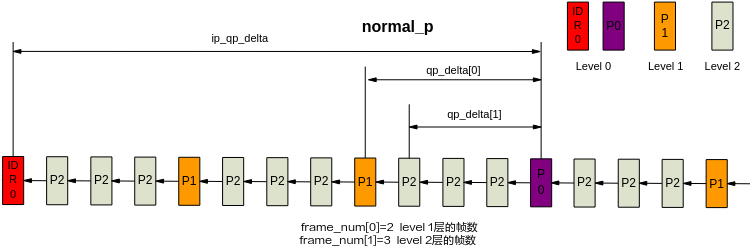

**图 2**  smart\_p/adv\_smart\_pp分层QP示意图<a name="fig16586145618411"></a>  
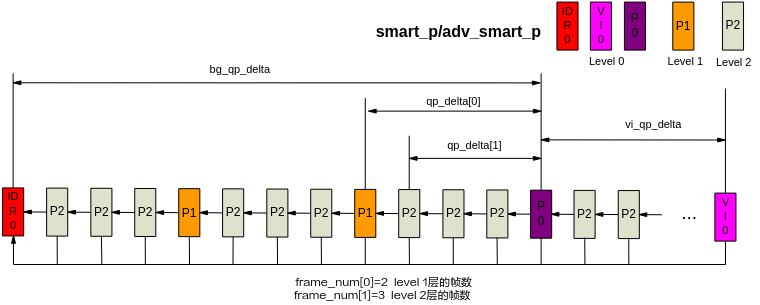

【举例】

无。

【相关主题】

无。

## ss\_mpi\_venc\_get\_hierarchical\_qp<a name="ZH-CN_TOPIC_0000002408099118"></a>

【描述】

获取分层qp参数。

【语法】

```
td_s32 ss_mpi_venc_get_hierarchical_qp(ot_venc_chn chn, ot_venc_hierarchical_qp *hierarchical_qp);
```

【参数】

<a name="table13391mcpsimp"></a>
<table><thead align="left"><tr id="row13397mcpsimp"><th class="cellrowborder" valign="top" width="22%" id="mcps1.1.4.1.1"><p id="p13399mcpsimp"><a name="p13399mcpsimp"></a><a name="p13399mcpsimp"></a>参数名称</p>
</th>
<th class="cellrowborder" valign="top" width="57.99999999999999%" id="mcps1.1.4.1.2"><p id="p13401mcpsimp"><a name="p13401mcpsimp"></a><a name="p13401mcpsimp"></a>描述</p>
</th>
<th class="cellrowborder" valign="top" width="20%" id="mcps1.1.4.1.3"><p id="p13403mcpsimp"><a name="p13403mcpsimp"></a><a name="p13403mcpsimp"></a>输入/输出</p>
</th>
</tr>
</thead>
<tbody><tr id="row13405mcpsimp"><td class="cellrowborder" valign="top" width="22%" headers="mcps1.1.4.1.1 "><p id="p13407mcpsimp"><a name="p13407mcpsimp"></a><a name="p13407mcpsimp"></a>chn</p>
</td>
<td class="cellrowborder" valign="top" width="57.99999999999999%" headers="mcps1.1.4.1.2 "><p id="p13409mcpsimp"><a name="p13409mcpsimp"></a><a name="p13409mcpsimp"></a>通道号。</p>
</td>
<td class="cellrowborder" valign="top" width="20%" headers="mcps1.1.4.1.3 "><p id="p13411mcpsimp"><a name="p13411mcpsimp"></a><a name="p13411mcpsimp"></a>输入</p>
</td>
</tr>
<tr id="row13412mcpsimp"><td class="cellrowborder" valign="top" width="22%" headers="mcps1.1.4.1.1 "><p id="p13414mcpsimp"><a name="p13414mcpsimp"></a><a name="p13414mcpsimp"></a>hierarchical_qp</p>
</td>
<td class="cellrowborder" valign="top" width="57.99999999999999%" headers="mcps1.1.4.1.2 "><p id="p13416mcpsimp"><a name="p13416mcpsimp"></a><a name="p13416mcpsimp"></a>分层qp参数。</p>
</td>
<td class="cellrowborder" valign="top" width="20%" headers="mcps1.1.4.1.3 "><p id="p13418mcpsimp"><a name="p13418mcpsimp"></a><a name="p13418mcpsimp"></a>输出</p>
</td>
</tr>
</tbody>
</table>

【返回值】

<a name="table13420mcpsimp"></a>
<table><thead align="left"><tr id="row13425mcpsimp"><th class="cellrowborder" valign="top" width="50%" id="mcps1.1.3.1.1"><p id="p13427mcpsimp"><a name="p13427mcpsimp"></a><a name="p13427mcpsimp"></a>返回值</p>
</th>
<th class="cellrowborder" valign="top" width="50%" id="mcps1.1.3.1.2"><p id="p13429mcpsimp"><a name="p13429mcpsimp"></a><a name="p13429mcpsimp"></a>描述</p>
</th>
</tr>
</thead>
<tbody><tr id="row13431mcpsimp"><td class="cellrowborder" valign="top" width="50%" headers="mcps1.1.3.1.1 "><p id="p13433mcpsimp"><a name="p13433mcpsimp"></a><a name="p13433mcpsimp"></a>0</p>
</td>
<td class="cellrowborder" valign="top" width="50%" headers="mcps1.1.3.1.2 "><p id="p13435mcpsimp"><a name="p13435mcpsimp"></a><a name="p13435mcpsimp"></a>成功。</p>
</td>
</tr>
<tr id="row13436mcpsimp"><td class="cellrowborder" valign="top" width="50%" headers="mcps1.1.3.1.1 "><p id="p13438mcpsimp"><a name="p13438mcpsimp"></a><a name="p13438mcpsimp"></a>非0</p>
</td>
<td class="cellrowborder" valign="top" width="50%" headers="mcps1.1.3.1.2 "><p id="p13440mcpsimp"><a name="p13440mcpsimp"></a><a name="p13440mcpsimp"></a>失败，返回错误码。</p>
</td>
</tr>
</tbody>
</table>

【需求】

-   头文件：ot\_common\_venc.h、ss\_mpi\_venc.h、ot\_comm\_vb.h
-   库文件：libss\_mpi.a

【注意】

-   仅H.264/H.265用于获取分层qp参数。
-   本接口在编码通道创建之后，编码通道销毁之前调用。

【举例】

无。

【相关主题】

无。

## ss\_mpi\_venc\_set\_rc\_adv\_param<a name="ZH-CN_TOPIC_0000002408259042"></a>

【描述】

设置RC模块的高级参数。

【语法】

```
td_s32 ss_mpi_venc_set_rc_adv_param(ot_venc_chn chn, const ot_venc_rc_adv_param *rc_adv_param);
```

【参数】

<a name="table9978mcpsimp"></a>
<table><thead align="left"><tr id="row9984mcpsimp"><th class="cellrowborder" valign="top" width="23%" id="mcps1.1.4.1.1"><p id="p9986mcpsimp"><a name="p9986mcpsimp"></a><a name="p9986mcpsimp"></a>参数名称</p>
</th>
<th class="cellrowborder" valign="top" width="59%" id="mcps1.1.4.1.2"><p id="p9988mcpsimp"><a name="p9988mcpsimp"></a><a name="p9988mcpsimp"></a>描述</p>
</th>
<th class="cellrowborder" valign="top" width="18%" id="mcps1.1.4.1.3"><p id="p9990mcpsimp"><a name="p9990mcpsimp"></a><a name="p9990mcpsimp"></a>输入/输出</p>
</th>
</tr>
</thead>
<tbody><tr id="row9992mcpsimp"><td class="cellrowborder" valign="top" width="23%" headers="mcps1.1.4.1.1 "><p id="p9994mcpsimp"><a name="p9994mcpsimp"></a><a name="p9994mcpsimp"></a>chn</p>
</td>
<td class="cellrowborder" valign="top" width="59%" headers="mcps1.1.4.1.2 "><p id="p9996mcpsimp"><a name="p9996mcpsimp"></a><a name="p9996mcpsimp"></a>通道号</p>
</td>
<td class="cellrowborder" valign="top" width="18%" headers="mcps1.1.4.1.3 "><p id="p9998mcpsimp"><a name="p9998mcpsimp"></a><a name="p9998mcpsimp"></a>输入</p>
</td>
</tr>
<tr id="row9999mcpsimp"><td class="cellrowborder" valign="top" width="23%" headers="mcps1.1.4.1.1 "><p id="p10001mcpsimp"><a name="p10001mcpsimp"></a><a name="p10001mcpsimp"></a>rc_adv_param</p>
</td>
<td class="cellrowborder" valign="top" width="59%" headers="mcps1.1.4.1.2 "><p id="p10003mcpsimp"><a name="p10003mcpsimp"></a><a name="p10003mcpsimp"></a>RC高级参数，此接口会包含一些与码率控制算法相关性较小的高级参数，并且未来可能会扩展。</p>
</td>
<td class="cellrowborder" valign="top" width="18%" headers="mcps1.1.4.1.3 "><p id="p10005mcpsimp"><a name="p10005mcpsimp"></a><a name="p10005mcpsimp"></a>输入</p>
</td>
</tr>
</tbody>
</table>

【返回值】

<a name="table10007mcpsimp"></a>
<table><thead align="left"><tr id="row10012mcpsimp"><th class="cellrowborder" valign="top" width="50%" id="mcps1.1.3.1.1"><p id="p10014mcpsimp"><a name="p10014mcpsimp"></a><a name="p10014mcpsimp"></a>返回值</p>
</th>
<th class="cellrowborder" valign="top" width="50%" id="mcps1.1.3.1.2"><p id="p10016mcpsimp"><a name="p10016mcpsimp"></a><a name="p10016mcpsimp"></a>描述</p>
</th>
</tr>
</thead>
<tbody><tr id="row10018mcpsimp"><td class="cellrowborder" valign="top" width="50%" headers="mcps1.1.3.1.1 "><p id="p10020mcpsimp"><a name="p10020mcpsimp"></a><a name="p10020mcpsimp"></a>0</p>
</td>
<td class="cellrowborder" valign="top" width="50%" headers="mcps1.1.3.1.2 "><p id="p10022mcpsimp"><a name="p10022mcpsimp"></a><a name="p10022mcpsimp"></a>成功。</p>
</td>
</tr>
<tr id="row10023mcpsimp"><td class="cellrowborder" valign="top" width="50%" headers="mcps1.1.3.1.1 "><p id="p10025mcpsimp"><a name="p10025mcpsimp"></a><a name="p10025mcpsimp"></a>非0</p>
</td>
<td class="cellrowborder" valign="top" width="50%" headers="mcps1.1.3.1.2 "><p id="p10027mcpsimp"><a name="p10027mcpsimp"></a><a name="p10027mcpsimp"></a>失败，返回错误码。</p>
</td>
</tr>
</tbody>
</table>

【需求】

-   头文件：ot\_common\_venc.h、ss\_mpi\_venc.h
-   库文件：libss\_mpi.a

【注意】

-   本接口必须在编码通道创建之后，编码通道销毁之前调用。
-   本接口用于设置RC模块的高级参数ot\_venc\_rc\_adv\_param中clear\_stats\_after\_set\_attr，设置新的通道参数后：
    -   0：不清除码率控制的统计信息；
    -   1（默认值）：是否清除码率控制的统计信息。

-   当设置的参数改变统计信息内存大小时，需要重新分配内存或者算法可能读取到未被赋值的内存，此时无论clear\_stats\_after\_set\_attr设置什么参数都会清除统计信息。
-   此接口仅支持H.264/H.265/MJPEG通道。

【举例】

无。

【相关主题】

无。

## ss\_mpi\_venc\_get\_rc\_adv\_param<a name="ZH-CN_TOPIC_0000002408099122"></a>

【描述】

获取RC模块的高级参数。

【语法】

```
td_s32 ss_mpi_venc_get_rc_adv_param(ot_venc_chn chn, ot_venc_rc_adv_param *rc_adv_param);
```

【参数】

<a name="table501mcpsimp"></a>
<table><thead align="left"><tr id="row507mcpsimp"><th class="cellrowborder" valign="top" width="30.303030303030305%" id="mcps1.1.4.1.1"><p id="p509mcpsimp"><a name="p509mcpsimp"></a><a name="p509mcpsimp"></a>参数名称</p>
</th>
<th class="cellrowborder" valign="top" width="48.484848484848484%" id="mcps1.1.4.1.2"><p id="p511mcpsimp"><a name="p511mcpsimp"></a><a name="p511mcpsimp"></a>描述</p>
</th>
<th class="cellrowborder" valign="top" width="21.21212121212121%" id="mcps1.1.4.1.3"><p id="p513mcpsimp"><a name="p513mcpsimp"></a><a name="p513mcpsimp"></a>输入/输出</p>
</th>
</tr>
</thead>
<tbody><tr id="row514mcpsimp"><td class="cellrowborder" valign="top" width="30.303030303030305%" headers="mcps1.1.4.1.1 "><p id="p516mcpsimp"><a name="p516mcpsimp"></a><a name="p516mcpsimp"></a>chn</p>
</td>
<td class="cellrowborder" valign="top" width="48.484848484848484%" headers="mcps1.1.4.1.2 "><p id="p518mcpsimp"><a name="p518mcpsimp"></a><a name="p518mcpsimp"></a>通道号</p>
</td>
<td class="cellrowborder" valign="top" width="21.21212121212121%" headers="mcps1.1.4.1.3 "><p id="p520mcpsimp"><a name="p520mcpsimp"></a><a name="p520mcpsimp"></a>输入</p>
</td>
</tr>
<tr id="row521mcpsimp"><td class="cellrowborder" valign="top" width="30.303030303030305%" headers="mcps1.1.4.1.1 "><p id="p523mcpsimp"><a name="p523mcpsimp"></a><a name="p523mcpsimp"></a>rc_adv_param</p>
</td>
<td class="cellrowborder" valign="top" width="48.484848484848484%" headers="mcps1.1.4.1.2 "><p id="p525mcpsimp"><a name="p525mcpsimp"></a><a name="p525mcpsimp"></a>RC模块高级参数</p>
</td>
<td class="cellrowborder" valign="top" width="21.21212121212121%" headers="mcps1.1.4.1.3 "><p id="p527mcpsimp"><a name="p527mcpsimp"></a><a name="p527mcpsimp"></a>输出</p>
</td>
</tr>
</tbody>
</table>

【返回值】

<a name="table529mcpsimp"></a>
<table><thead align="left"><tr id="row534mcpsimp"><th class="cellrowborder" valign="top" width="50%" id="mcps1.1.3.1.1"><p id="p536mcpsimp"><a name="p536mcpsimp"></a><a name="p536mcpsimp"></a>返回值</p>
</th>
<th class="cellrowborder" valign="top" width="50%" id="mcps1.1.3.1.2"><p id="p538mcpsimp"><a name="p538mcpsimp"></a><a name="p538mcpsimp"></a>描述</p>
</th>
</tr>
</thead>
<tbody><tr id="row539mcpsimp"><td class="cellrowborder" valign="top" width="50%" headers="mcps1.1.3.1.1 "><p id="p541mcpsimp"><a name="p541mcpsimp"></a><a name="p541mcpsimp"></a>0</p>
</td>
<td class="cellrowborder" valign="top" width="50%" headers="mcps1.1.3.1.2 "><p id="p543mcpsimp"><a name="p543mcpsimp"></a><a name="p543mcpsimp"></a>成功。</p>
</td>
</tr>
<tr id="row544mcpsimp"><td class="cellrowborder" valign="top" width="50%" headers="mcps1.1.3.1.1 "><p id="p546mcpsimp"><a name="p546mcpsimp"></a><a name="p546mcpsimp"></a>非0</p>
</td>
<td class="cellrowborder" valign="top" width="50%" headers="mcps1.1.3.1.2 "><p id="p548mcpsimp"><a name="p548mcpsimp"></a><a name="p548mcpsimp"></a>失败，返回错误码。</p>
</td>
</tr>
</tbody>
</table>

【需求】

-   头文件：ot\_common\_venc.h、ss\_mpi\_venc.h
-   库文件：libss\_mpi.a

【注意】

-   本接口用于获取RC模块的高级参数。
-   本接口必须在通道创建之后，通道销毁之前调用。
-   此接口仅支持H.264/H.265/MJPEG通道。

【举例】

无。

【相关主题】

无。

## ss\_mpi\_venc\_set\_jpeg\_roi\_attr<a name="ZH-CN_TOPIC_0000002441658461"></a>

【描述】

设置JPEG和MJPEG编码通道的ROI属性。

【语法】

```
td_s32 ss_mpi_venc_set_jpeg_roi_attr(ot_venc_chn chn, const ot_venc_jpeg_roi_attr *roi_attr);
```

【参数】

<a name="table9631mcpsimp"></a>
<table><thead align="left"><tr id="row9637mcpsimp"><th class="cellrowborder" valign="top" width="30.303030303030305%" id="mcps1.1.4.1.1"><p id="p9639mcpsimp"><a name="p9639mcpsimp"></a><a name="p9639mcpsimp"></a>参数名称</p>
</th>
<th class="cellrowborder" valign="top" width="48.484848484848484%" id="mcps1.1.4.1.2"><p id="p9641mcpsimp"><a name="p9641mcpsimp"></a><a name="p9641mcpsimp"></a>描述</p>
</th>
<th class="cellrowborder" valign="top" width="21.21212121212121%" id="mcps1.1.4.1.3"><p id="p9643mcpsimp"><a name="p9643mcpsimp"></a><a name="p9643mcpsimp"></a>输入/输出</p>
</th>
</tr>
</thead>
<tbody><tr id="row9644mcpsimp"><td class="cellrowborder" valign="top" width="30.303030303030305%" headers="mcps1.1.4.1.1 "><p id="p9646mcpsimp"><a name="p9646mcpsimp"></a><a name="p9646mcpsimp"></a>chn</p>
</td>
<td class="cellrowborder" valign="top" width="48.484848484848484%" headers="mcps1.1.4.1.2 "><p id="p9648mcpsimp"><a name="p9648mcpsimp"></a><a name="p9648mcpsimp"></a>通道号</p>
</td>
<td class="cellrowborder" valign="top" width="21.21212121212121%" headers="mcps1.1.4.1.3 "><p id="p9650mcpsimp"><a name="p9650mcpsimp"></a><a name="p9650mcpsimp"></a>输入</p>
</td>
</tr>
<tr id="row9651mcpsimp"><td class="cellrowborder" valign="top" width="30.303030303030305%" headers="mcps1.1.4.1.1 "><p id="p9653mcpsimp"><a name="p9653mcpsimp"></a><a name="p9653mcpsimp"></a>roi_attr</p>
</td>
<td class="cellrowborder" valign="top" width="48.484848484848484%" headers="mcps1.1.4.1.2 "><p id="p9655mcpsimp"><a name="p9655mcpsimp"></a><a name="p9655mcpsimp"></a>ROI参数</p>
</td>
<td class="cellrowborder" valign="top" width="21.21212121212121%" headers="mcps1.1.4.1.3 "><p id="p9657mcpsimp"><a name="p9657mcpsimp"></a><a name="p9657mcpsimp"></a>输入</p>
</td>
</tr>
</tbody>
</table>

【返回值】

<a name="table9659mcpsimp"></a>
<table><thead align="left"><tr id="row9664mcpsimp"><th class="cellrowborder" valign="top" width="50%" id="mcps1.1.3.1.1"><p id="p9666mcpsimp"><a name="p9666mcpsimp"></a><a name="p9666mcpsimp"></a>返回值</p>
</th>
<th class="cellrowborder" valign="top" width="50%" id="mcps1.1.3.1.2"><p id="p9668mcpsimp"><a name="p9668mcpsimp"></a><a name="p9668mcpsimp"></a>描述</p>
</th>
</tr>
</thead>
<tbody><tr id="row9669mcpsimp"><td class="cellrowborder" valign="top" width="50%" headers="mcps1.1.3.1.1 "><p id="p9671mcpsimp"><a name="p9671mcpsimp"></a><a name="p9671mcpsimp"></a>0</p>
</td>
<td class="cellrowborder" valign="top" width="50%" headers="mcps1.1.3.1.2 "><p id="p9673mcpsimp"><a name="p9673mcpsimp"></a><a name="p9673mcpsimp"></a>成功。</p>
</td>
</tr>
<tr id="row9674mcpsimp"><td class="cellrowborder" valign="top" width="50%" headers="mcps1.1.3.1.1 "><p id="p9676mcpsimp"><a name="p9676mcpsimp"></a><a name="p9676mcpsimp"></a>非0</p>
</td>
<td class="cellrowborder" valign="top" width="50%" headers="mcps1.1.3.1.2 "><p id="p9678mcpsimp"><a name="p9678mcpsimp"></a><a name="p9678mcpsimp"></a>失败，返回错误码。</p>
</td>
</tr>
</tbody>
</table>

【需求】

-   头文件：ot\_common\_venc.h、ss\_mpi\_venc.h
-   库文件：libss\_mpi.a

【注意】

-   本接口用于设置JPEG和MJPEG编码通道ROI属性。
-   ROI参数：
    -   idx：支持每个通道可设置16个ROI，编码器按照0～15的索引号对ROI进行管理，idx表示的用户设置ROI的索引号。ROI之间可以互相叠加，且当发生叠加时，ROI之间的优先级按照索引号0～15依次提高。
    -   enable：指定当前的ROI是否使能。
    -   level：指定当前的ROI采用的降码率等级，0\~3依次提高，等级越高降码率相对越多，图像质量损失也相对越多。
    -   rect：指定当前的ROI的起始坐标和区域的大小。ROI的起始点坐标必须在图像范围内，且必须16对齐；ROI区域的长宽必须是16对齐并且大于0；ROI区域必须在图像范围内。

-   本接口属于高级接口，默认不使能ROI，用户必须调用此接口使能ROI。
-   本接口在编码通道创建之后，编码通道销毁之前设置。此接口在编码过程中被调用时，等到下一个帧时生效。
-   非ROI区域level默认为2。
-   建议用户在创建通道之后，启动编码之前调用此接口，减少在编码过程中调用的次数。
-   建议用户在调用此接口之前，先调用[ss\_mpi\_venc\_get\_jpeg\_roi\_attr](#ZH-CN_TOPIC_0000002408098586)接口，获取当前通道的ROI配置，然后再进行设置。

【举例】

无。

【相关主题】

无。

## ss\_mpi\_venc\_get\_jpeg\_roi\_attr<a name="ZH-CN_TOPIC_0000002408098586"></a>

【描述】

获取JPEG和MJPEG编码通道的ROI属性，本接口仅适用于支持ROI功能的编码通道（如H.264/H.265）。

【语法】

```
td_s32 ss_mpi_venc_get_jpeg_roi_attr(ot_venc_chn chn, td_u32 idx, ot_venc_jpeg_roi_attr *roi_attr);
```

【参数】

<a name="table4342mcpsimp"></a>
<table><thead align="left"><tr id="row4348mcpsimp"><th class="cellrowborder" valign="top" width="30.303030303030305%" id="mcps1.1.4.1.1"><p id="p4350mcpsimp"><a name="p4350mcpsimp"></a><a name="p4350mcpsimp"></a>参数名称</p>
</th>
<th class="cellrowborder" valign="top" width="48.484848484848484%" id="mcps1.1.4.1.2"><p id="p4352mcpsimp"><a name="p4352mcpsimp"></a><a name="p4352mcpsimp"></a>描述</p>
</th>
<th class="cellrowborder" valign="top" width="21.21212121212121%" id="mcps1.1.4.1.3"><p id="p4354mcpsimp"><a name="p4354mcpsimp"></a><a name="p4354mcpsimp"></a>输入/输出</p>
</th>
</tr>
</thead>
<tbody><tr id="row4355mcpsimp"><td class="cellrowborder" valign="top" width="30.303030303030305%" headers="mcps1.1.4.1.1 "><p id="p4357mcpsimp"><a name="p4357mcpsimp"></a><a name="p4357mcpsimp"></a>chn</p>
</td>
<td class="cellrowborder" valign="top" width="48.484848484848484%" headers="mcps1.1.4.1.2 "><p id="p4359mcpsimp"><a name="p4359mcpsimp"></a><a name="p4359mcpsimp"></a>通道号</p>
</td>
<td class="cellrowborder" valign="top" width="21.21212121212121%" headers="mcps1.1.4.1.3 "><p id="p4361mcpsimp"><a name="p4361mcpsimp"></a><a name="p4361mcpsimp"></a>输入</p>
</td>
</tr>
<tr id="row4362mcpsimp"><td class="cellrowborder" valign="top" width="30.303030303030305%" headers="mcps1.1.4.1.1 "><p id="p4364mcpsimp"><a name="p4364mcpsimp"></a><a name="p4364mcpsimp"></a>idx</p>
</td>
<td class="cellrowborder" valign="top" width="48.484848484848484%" headers="mcps1.1.4.1.2 "><p id="p4366mcpsimp"><a name="p4366mcpsimp"></a><a name="p4366mcpsimp"></a>JPEG/MJPEG编码通道ROI索引</p>
</td>
<td class="cellrowborder" valign="top" width="21.21212121212121%" headers="mcps1.1.4.1.3 "><p id="p4368mcpsimp"><a name="p4368mcpsimp"></a><a name="p4368mcpsimp"></a>输入</p>
</td>
</tr>
<tr id="row4369mcpsimp"><td class="cellrowborder" valign="top" width="30.303030303030305%" headers="mcps1.1.4.1.1 "><p id="p4371mcpsimp"><a name="p4371mcpsimp"></a><a name="p4371mcpsimp"></a>roi_attr</p>
</td>
<td class="cellrowborder" valign="top" width="48.484848484848484%" headers="mcps1.1.4.1.2 "><p id="p4373mcpsimp"><a name="p4373mcpsimp"></a><a name="p4373mcpsimp"></a>对应ROI的属性</p>
</td>
<td class="cellrowborder" valign="top" width="21.21212121212121%" headers="mcps1.1.4.1.3 "><p id="p4375mcpsimp"><a name="p4375mcpsimp"></a><a name="p4375mcpsimp"></a>输出</p>
</td>
</tr>
</tbody>
</table>

【返回值】

<a name="table4377mcpsimp"></a>
<table><thead align="left"><tr id="row4382mcpsimp"><th class="cellrowborder" valign="top" width="50%" id="mcps1.1.3.1.1"><p id="p4384mcpsimp"><a name="p4384mcpsimp"></a><a name="p4384mcpsimp"></a>返回值</p>
</th>
<th class="cellrowborder" valign="top" width="50%" id="mcps1.1.3.1.2"><p id="p4386mcpsimp"><a name="p4386mcpsimp"></a><a name="p4386mcpsimp"></a>描述</p>
</th>
</tr>
</thead>
<tbody><tr id="row4387mcpsimp"><td class="cellrowborder" valign="top" width="50%" headers="mcps1.1.3.1.1 "><p id="p4389mcpsimp"><a name="p4389mcpsimp"></a><a name="p4389mcpsimp"></a>0</p>
</td>
<td class="cellrowborder" valign="top" width="50%" headers="mcps1.1.3.1.2 "><p id="p4391mcpsimp"><a name="p4391mcpsimp"></a><a name="p4391mcpsimp"></a>成功。</p>
</td>
</tr>
<tr id="row4392mcpsimp"><td class="cellrowborder" valign="top" width="50%" headers="mcps1.1.3.1.1 "><p id="p4394mcpsimp"><a name="p4394mcpsimp"></a><a name="p4394mcpsimp"></a>非0</p>
</td>
<td class="cellrowborder" valign="top" width="50%" headers="mcps1.1.3.1.2 "><p id="p4396mcpsimp"><a name="p4396mcpsimp"></a><a name="p4396mcpsimp"></a>失败，返回错误码。</p>
</td>
</tr>
</tbody>
</table>

【需求】

-   头文件：ot\_common\_venc.h、ss\_mpi\_venc.h
-   库文件：libss\_mpi.a

【注意】

-   本接口用于获取JPEG和MJPEG编码通道索引为idx的ROI属性。
-   本接口在编码通道创建之后，编码通道销毁之前调用。
-   建议用户在创建通道之后，启动编码之前调用此接口，减少在编码过程中调用的次数。

【举例】

无。

【相关主题】

无。

## ss\_mpi\_venc\_enable\_svc<a name="ZH-CN_TOPIC_0000002408098878"></a>

【描述】

开启/关闭智能编码。

【语法】

```
td_s32 ss_mpi_venc_enable_svc(ot_venc_chn chn, td_bool enable);
```

【参数】

<a name="table18496mcpsimp"></a>
<table><thead align="left"><tr id="row18502mcpsimp"><th class="cellrowborder" valign="top" width="19.800000000000004%" id="mcps1.1.4.1.1"><p id="p18504mcpsimp"><a name="p18504mcpsimp"></a><a name="p18504mcpsimp"></a>参数名称</p>
</th>
<th class="cellrowborder" valign="top" width="64.36%" id="mcps1.1.4.1.2"><p id="p18506mcpsimp"><a name="p18506mcpsimp"></a><a name="p18506mcpsimp"></a>描述</p>
</th>
<th class="cellrowborder" valign="top" width="15.840000000000003%" id="mcps1.1.4.1.3"><p id="p18508mcpsimp"><a name="p18508mcpsimp"></a><a name="p18508mcpsimp"></a>输入/输出</p>
</th>
</tr>
</thead>
<tbody><tr id="row18509mcpsimp"><td class="cellrowborder" valign="top" width="19.800000000000004%" headers="mcps1.1.4.1.1 "><p id="p18511mcpsimp"><a name="p18511mcpsimp"></a><a name="p18511mcpsimp"></a>chn</p>
</td>
<td class="cellrowborder" valign="top" width="64.36%" headers="mcps1.1.4.1.2 "><p id="p18513mcpsimp"><a name="p18513mcpsimp"></a><a name="p18513mcpsimp"></a>编码通道号。</p>
</td>
<td class="cellrowborder" valign="top" width="15.840000000000003%" headers="mcps1.1.4.1.3 "><p id="p18515mcpsimp"><a name="p18515mcpsimp"></a><a name="p18515mcpsimp"></a>输入</p>
</td>
</tr>
<tr id="row18516mcpsimp"><td class="cellrowborder" valign="top" width="19.800000000000004%" headers="mcps1.1.4.1.1 "><p id="p18518mcpsimp"><a name="p18518mcpsimp"></a><a name="p18518mcpsimp"></a>enable</p>
</td>
<td class="cellrowborder" valign="top" width="64.36%" headers="mcps1.1.4.1.2 "><p id="p18520mcpsimp"><a name="p18520mcpsimp"></a><a name="p18520mcpsimp"></a>0：关闭智能编码</p>
<p id="p18521mcpsimp"><a name="p18521mcpsimp"></a><a name="p18521mcpsimp"></a>1：开启智能编码</p>
</td>
<td class="cellrowborder" valign="top" width="15.840000000000003%" headers="mcps1.1.4.1.3 "><p id="p18523mcpsimp"><a name="p18523mcpsimp"></a><a name="p18523mcpsimp"></a>输入</p>
</td>
</tr>
</tbody>
</table>

【返回值】

<a name="table18525mcpsimp"></a>
<table><thead align="left"><tr id="row18530mcpsimp"><th class="cellrowborder" valign="top" width="50%" id="mcps1.1.3.1.1"><p id="p18532mcpsimp"><a name="p18532mcpsimp"></a><a name="p18532mcpsimp"></a>返回值</p>
</th>
<th class="cellrowborder" valign="top" width="50%" id="mcps1.1.3.1.2"><p id="p18534mcpsimp"><a name="p18534mcpsimp"></a><a name="p18534mcpsimp"></a>描述</p>
</th>
</tr>
</thead>
<tbody><tr id="row18536mcpsimp"><td class="cellrowborder" valign="top" width="50%" headers="mcps1.1.3.1.1 "><p id="p18538mcpsimp"><a name="p18538mcpsimp"></a><a name="p18538mcpsimp"></a>0</p>
</td>
<td class="cellrowborder" valign="top" width="50%" headers="mcps1.1.3.1.2 "><p id="p18540mcpsimp"><a name="p18540mcpsimp"></a><a name="p18540mcpsimp"></a>成功。</p>
</td>
</tr>
<tr id="row18541mcpsimp"><td class="cellrowborder" valign="top" width="50%" headers="mcps1.1.3.1.1 "><p id="p18543mcpsimp"><a name="p18543mcpsimp"></a><a name="p18543mcpsimp"></a>非0</p>
</td>
<td class="cellrowborder" valign="top" width="50%" headers="mcps1.1.3.1.2 "><p id="p18545mcpsimp"><a name="p18545mcpsimp"></a><a name="p18545mcpsimp"></a>失败，参见错误码。</p>
</td>
</tr>
</tbody>
</table>

【需求】

-   头文件：ot\_comm\_venc.h、ss\_mpi\_venc.h
-   库文件：libss\_mpi.a

【注意】

-   本接口用于开启/关闭H.264/H.265编码通道智能编码功能。
-   支持码控模式为CBR、VBR、AVBR、QVBR、CVBR下的智能编码。
    -   在CBR模式下，设置相同的目标码率时，开启智能编码可以增强前景图像质量；
    -   在VBR、QVBR、CVBR模式下，开启智能编码时，可以在保证前景质量的同时降低码率；或者在不改变背景质量的情况下，提升前景的质量。
    -   AVBR模式下，开启后对码率的影响视场景变化。

-   智能编码与QpMap模式、FixQp模式、ROI、PSkip功能、MD相关接口互斥。

【举例】

无。

【相关主题】

无。

## ss\_mpi\_venc\_get\_svc\_param<a name="ZH-CN_TOPIC_0000002441697713"></a>

【描述】

获取智能编码相关参数。

【语法】

```
td_s32 ss_mpi_venc_get_svc_param(ot_venc_chn chn,ot_venc_svc_param *svc_param);
```

【参数】

<a name="table1812mcpsimp"></a>
<table><thead align="left"><tr id="row1818mcpsimp"><th class="cellrowborder" valign="top" width="19.800000000000004%" id="mcps1.1.4.1.1"><p id="p1820mcpsimp"><a name="p1820mcpsimp"></a><a name="p1820mcpsimp"></a>参数名称</p>
</th>
<th class="cellrowborder" valign="top" width="64.36%" id="mcps1.1.4.1.2"><p id="p1822mcpsimp"><a name="p1822mcpsimp"></a><a name="p1822mcpsimp"></a>描述</p>
</th>
<th class="cellrowborder" valign="top" width="15.840000000000003%" id="mcps1.1.4.1.3"><p id="p1824mcpsimp"><a name="p1824mcpsimp"></a><a name="p1824mcpsimp"></a>输入/输出</p>
</th>
</tr>
</thead>
<tbody><tr id="row1826mcpsimp"><td class="cellrowborder" valign="top" width="19.800000000000004%" headers="mcps1.1.4.1.1 "><p id="p1828mcpsimp"><a name="p1828mcpsimp"></a><a name="p1828mcpsimp"></a>chn</p>
</td>
<td class="cellrowborder" valign="top" width="64.36%" headers="mcps1.1.4.1.2 "><p id="p1830mcpsimp"><a name="p1830mcpsimp"></a><a name="p1830mcpsimp"></a>编码通道号。</p>
</td>
<td class="cellrowborder" valign="top" width="15.840000000000003%" headers="mcps1.1.4.1.3 "><p id="p1832mcpsimp"><a name="p1832mcpsimp"></a><a name="p1832mcpsimp"></a>输入</p>
</td>
</tr>
<tr id="row1833mcpsimp"><td class="cellrowborder" valign="top" width="19.800000000000004%" headers="mcps1.1.4.1.1 "><p id="p1835mcpsimp"><a name="p1835mcpsimp"></a><a name="p1835mcpsimp"></a>svc_param</p>
</td>
<td class="cellrowborder" valign="top" width="64.36%" headers="mcps1.1.4.1.2 "><p id="p1837mcpsimp"><a name="p1837mcpsimp"></a><a name="p1837mcpsimp"></a>智能编码参数</p>
</td>
<td class="cellrowborder" valign="top" width="15.840000000000003%" headers="mcps1.1.4.1.3 "><p id="p1839mcpsimp"><a name="p1839mcpsimp"></a><a name="p1839mcpsimp"></a>输出</p>
</td>
</tr>
</tbody>
</table>

【返回值】

<a name="table1841mcpsimp"></a>
<table><thead align="left"><tr id="row1846mcpsimp"><th class="cellrowborder" valign="top" width="50%" id="mcps1.1.3.1.1"><p id="p1848mcpsimp"><a name="p1848mcpsimp"></a><a name="p1848mcpsimp"></a>返回值</p>
</th>
<th class="cellrowborder" valign="top" width="50%" id="mcps1.1.3.1.2"><p id="p1850mcpsimp"><a name="p1850mcpsimp"></a><a name="p1850mcpsimp"></a>描述</p>
</th>
</tr>
</thead>
<tbody><tr id="row1852mcpsimp"><td class="cellrowborder" valign="top" width="50%" headers="mcps1.1.3.1.1 "><p id="p1854mcpsimp"><a name="p1854mcpsimp"></a><a name="p1854mcpsimp"></a>0</p>
</td>
<td class="cellrowborder" valign="top" width="50%" headers="mcps1.1.3.1.2 "><p id="p1856mcpsimp"><a name="p1856mcpsimp"></a><a name="p1856mcpsimp"></a>成功。</p>
</td>
</tr>
<tr id="row1857mcpsimp"><td class="cellrowborder" valign="top" width="50%" headers="mcps1.1.3.1.1 "><p id="p1859mcpsimp"><a name="p1859mcpsimp"></a><a name="p1859mcpsimp"></a>非0</p>
</td>
<td class="cellrowborder" valign="top" width="50%" headers="mcps1.1.3.1.2 "><p id="p1861mcpsimp"><a name="p1861mcpsimp"></a><a name="p1861mcpsimp"></a>失败，参见错误码。</p>
</td>
</tr>
</tbody>
</table>

【需求】

-   头文件：ot\_comm\_venc.h、ss\_mpi\_venc.h
-   库文件：libss\_mpi.a

【注意】

-   本接口用于H.264/H.265编码通道。
-   调用本接口前需调用[ss\_mpi\_venc\_enable\_svc](#ZH-CN_TOPIC_0000002408098878)接口开启智能编码功能。

【举例】

无。

【相关主题】

无。

## ss\_mpi\_venc\_set\_svc\_param<a name="ZH-CN_TOPIC_0000002441657929"></a>

【描述】

设置智能编码相关参数。

【语法】

```
td_s32 ss_mpi_venc_set_svc_param(ot_venc_chn chn, const ot_venc_svc_param *svc_param);
```

【参数】

<a name="table8246mcpsimp"></a>
<table><thead align="left"><tr id="row8252mcpsimp"><th class="cellrowborder" valign="top" width="19.800000000000004%" id="mcps1.1.4.1.1"><p id="p8254mcpsimp"><a name="p8254mcpsimp"></a><a name="p8254mcpsimp"></a>参数名称</p>
</th>
<th class="cellrowborder" valign="top" width="64.36%" id="mcps1.1.4.1.2"><p id="p8256mcpsimp"><a name="p8256mcpsimp"></a><a name="p8256mcpsimp"></a>描述</p>
</th>
<th class="cellrowborder" valign="top" width="15.840000000000003%" id="mcps1.1.4.1.3"><p id="p8258mcpsimp"><a name="p8258mcpsimp"></a><a name="p8258mcpsimp"></a>输入/输出</p>
</th>
</tr>
</thead>
<tbody><tr id="row8259mcpsimp"><td class="cellrowborder" valign="top" width="19.800000000000004%" headers="mcps1.1.4.1.1 "><p id="p8261mcpsimp"><a name="p8261mcpsimp"></a><a name="p8261mcpsimp"></a>chn</p>
</td>
<td class="cellrowborder" valign="top" width="64.36%" headers="mcps1.1.4.1.2 "><p id="p8263mcpsimp"><a name="p8263mcpsimp"></a><a name="p8263mcpsimp"></a>编码通道号。</p>
</td>
<td class="cellrowborder" valign="top" width="15.840000000000003%" headers="mcps1.1.4.1.3 "><p id="p8265mcpsimp"><a name="p8265mcpsimp"></a><a name="p8265mcpsimp"></a>输入</p>
</td>
</tr>
<tr id="row8266mcpsimp"><td class="cellrowborder" valign="top" width="19.800000000000004%" headers="mcps1.1.4.1.1 "><p id="p8268mcpsimp"><a name="p8268mcpsimp"></a><a name="p8268mcpsimp"></a>svc_param</p>
</td>
<td class="cellrowborder" valign="top" width="64.36%" headers="mcps1.1.4.1.2 "><p id="p8270mcpsimp"><a name="p8270mcpsimp"></a><a name="p8270mcpsimp"></a>智能编码参数</p>
</td>
<td class="cellrowborder" valign="top" width="15.840000000000003%" headers="mcps1.1.4.1.3 "><p id="p8272mcpsimp"><a name="p8272mcpsimp"></a><a name="p8272mcpsimp"></a>输入</p>
</td>
</tr>
</tbody>
</table>

【返回值】

<a name="table8274mcpsimp"></a>
<table><thead align="left"><tr id="row8279mcpsimp"><th class="cellrowborder" valign="top" width="50%" id="mcps1.1.3.1.1"><p id="p8281mcpsimp"><a name="p8281mcpsimp"></a><a name="p8281mcpsimp"></a>返回值</p>
</th>
<th class="cellrowborder" valign="top" width="50%" id="mcps1.1.3.1.2"><p id="p8283mcpsimp"><a name="p8283mcpsimp"></a><a name="p8283mcpsimp"></a>描述</p>
</th>
</tr>
</thead>
<tbody><tr id="row8285mcpsimp"><td class="cellrowborder" valign="top" width="50%" headers="mcps1.1.3.1.1 "><p id="p8287mcpsimp"><a name="p8287mcpsimp"></a><a name="p8287mcpsimp"></a>0</p>
</td>
<td class="cellrowborder" valign="top" width="50%" headers="mcps1.1.3.1.2 "><p id="p8289mcpsimp"><a name="p8289mcpsimp"></a><a name="p8289mcpsimp"></a>成功。</p>
</td>
</tr>
<tr id="row8290mcpsimp"><td class="cellrowborder" valign="top" width="50%" headers="mcps1.1.3.1.1 "><p id="p8292mcpsimp"><a name="p8292mcpsimp"></a><a name="p8292mcpsimp"></a>非0</p>
</td>
<td class="cellrowborder" valign="top" width="50%" headers="mcps1.1.3.1.2 "><p id="p8294mcpsimp"><a name="p8294mcpsimp"></a><a name="p8294mcpsimp"></a>失败，参见错误码。</p>
</td>
</tr>
</tbody>
</table>

【需求】

-   头文件：ot\_comm\_venc.h、ss\_mpi\_venc.h
-   库文件：libss\_mpi.a

【注意】

-   本接口用于H.264/H.265编码通道。
-   调用本接口前需调用[ss\_mpi\_venc\_enable\_svc](#ZH-CN_TOPIC_0000002408098878)接口开启智能编码功能。

【举例】

无。

【相关主题】

无。

## ss\_mpi\_venc\_send\_svc\_region<a name="ZH-CN_TOPIC_0000002441698289"></a>

【描述】

发送智能检测目标框属性信息。

【语法】

```
td_s32 ss_mpi_venc_send_svc_region(ot_venc_chn chn, ot_venc_svc_rect_info *svc_region);
```

【参数】

<a name="table15195mcpsimp"></a>
<table><thead align="left"><tr id="row15201mcpsimp"><th class="cellrowborder" valign="top" width="25%" id="mcps1.1.4.1.1"><p id="p15203mcpsimp"><a name="p15203mcpsimp"></a><a name="p15203mcpsimp"></a>参数名称</p>
</th>
<th class="cellrowborder" valign="top" width="55.00000000000001%" id="mcps1.1.4.1.2"><p id="p15205mcpsimp"><a name="p15205mcpsimp"></a><a name="p15205mcpsimp"></a>描述</p>
</th>
<th class="cellrowborder" valign="top" width="20%" id="mcps1.1.4.1.3"><p id="p15207mcpsimp"><a name="p15207mcpsimp"></a><a name="p15207mcpsimp"></a>输入/输出</p>
</th>
</tr>
</thead>
<tbody><tr id="row15208mcpsimp"><td class="cellrowborder" valign="top" width="25%" headers="mcps1.1.4.1.1 "><p id="p15210mcpsimp"><a name="p15210mcpsimp"></a><a name="p15210mcpsimp"></a>chn</p>
</td>
<td class="cellrowborder" valign="top" width="55.00000000000001%" headers="mcps1.1.4.1.2 "><p id="p15212mcpsimp"><a name="p15212mcpsimp"></a><a name="p15212mcpsimp"></a>编码通道号。</p>
</td>
<td class="cellrowborder" valign="top" width="20%" headers="mcps1.1.4.1.3 "><p id="p15214mcpsimp"><a name="p15214mcpsimp"></a><a name="p15214mcpsimp"></a>输入</p>
</td>
</tr>
<tr id="row15215mcpsimp"><td class="cellrowborder" valign="top" width="25%" headers="mcps1.1.4.1.1 "><p id="p15217mcpsimp"><a name="p15217mcpsimp"></a><a name="p15217mcpsimp"></a>svc_region</p>
</td>
<td class="cellrowborder" valign="top" width="55.00000000000001%" headers="mcps1.1.4.1.2 "><p id="p15219mcpsimp"><a name="p15219mcpsimp"></a><a name="p15219mcpsimp"></a>检测目标框属性信息。</p>
</td>
<td class="cellrowborder" valign="top" width="20%" headers="mcps1.1.4.1.3 "><p id="p15221mcpsimp"><a name="p15221mcpsimp"></a><a name="p15221mcpsimp"></a>输入</p>
</td>
</tr>
</tbody>
</table>

【返回值】

<a name="table15223mcpsimp"></a>
<table><thead align="left"><tr id="row15228mcpsimp"><th class="cellrowborder" valign="top" width="50%" id="mcps1.1.3.1.1"><p id="p15230mcpsimp"><a name="p15230mcpsimp"></a><a name="p15230mcpsimp"></a>返回值</p>
</th>
<th class="cellrowborder" valign="top" width="50%" id="mcps1.1.3.1.2"><p id="p15232mcpsimp"><a name="p15232mcpsimp"></a><a name="p15232mcpsimp"></a>描述</p>
</th>
</tr>
</thead>
<tbody><tr id="row15234mcpsimp"><td class="cellrowborder" valign="top" width="50%" headers="mcps1.1.3.1.1 "><p id="p15236mcpsimp"><a name="p15236mcpsimp"></a><a name="p15236mcpsimp"></a>0</p>
</td>
<td class="cellrowborder" valign="top" width="50%" headers="mcps1.1.3.1.2 "><p id="p15238mcpsimp"><a name="p15238mcpsimp"></a><a name="p15238mcpsimp"></a>成功。</p>
</td>
</tr>
<tr id="row15239mcpsimp"><td class="cellrowborder" valign="top" width="50%" headers="mcps1.1.3.1.1 "><p id="p15241mcpsimp"><a name="p15241mcpsimp"></a><a name="p15241mcpsimp"></a>非0</p>
</td>
<td class="cellrowborder" valign="top" width="50%" headers="mcps1.1.3.1.2 "><p id="p15243mcpsimp"><a name="p15243mcpsimp"></a><a name="p15243mcpsimp"></a>失败，参见错误码。</p>
</td>
</tr>
</tbody>
</table>

【需求】

-   头文件：ot\_comm\_venc.h、ss\_mpi\_venc.h
-   库文件：libss\_mpi.a

【注意】

-   本接口用于H.264/H.265编码通道。
-   调用本接口前需调用[ss\_mpi\_venc\_enable\_svc](#ZH-CN_TOPIC_0000002408098878)接口开启智能编码功能。

【举例】

无。

【相关主题】

无。

## ss\_mpi\_venc\_get\_md<a name="ZH-CN_TOPIC_0000002441698277"></a>

【描述】

Md检测控制信息。

【语法】

```
td_s32 ss_mpi_venc_get_md(ot_venc_chn chn, ot_venc_md_param *md_param);
```

【参数】

<a name="table4955mcpsimp"></a>
<table><thead align="left"><tr id="row4961mcpsimp"><th class="cellrowborder" valign="top" width="25%" id="mcps1.1.4.1.1"><p id="p4963mcpsimp"><a name="p4963mcpsimp"></a><a name="p4963mcpsimp"></a>参数名称</p>
</th>
<th class="cellrowborder" valign="top" width="55.00000000000001%" id="mcps1.1.4.1.2"><p id="p4965mcpsimp"><a name="p4965mcpsimp"></a><a name="p4965mcpsimp"></a>描述</p>
</th>
<th class="cellrowborder" valign="top" width="20%" id="mcps1.1.4.1.3"><p id="p4967mcpsimp"><a name="p4967mcpsimp"></a><a name="p4967mcpsimp"></a>输入/输出</p>
</th>
</tr>
</thead>
<tbody><tr id="row4968mcpsimp"><td class="cellrowborder" valign="top" width="25%" headers="mcps1.1.4.1.1 "><p id="p4970mcpsimp"><a name="p4970mcpsimp"></a><a name="p4970mcpsimp"></a>chn</p>
</td>
<td class="cellrowborder" valign="top" width="55.00000000000001%" headers="mcps1.1.4.1.2 "><p id="p4972mcpsimp"><a name="p4972mcpsimp"></a><a name="p4972mcpsimp"></a>编码通道号。</p>
</td>
<td class="cellrowborder" valign="top" width="20%" headers="mcps1.1.4.1.3 "><p id="p4974mcpsimp"><a name="p4974mcpsimp"></a><a name="p4974mcpsimp"></a>输入</p>
</td>
</tr>
<tr id="row4975mcpsimp"><td class="cellrowborder" valign="top" width="25%" headers="mcps1.1.4.1.1 "><p id="p4977mcpsimp"><a name="p4977mcpsimp"></a><a name="p4977mcpsimp"></a>md_param</p>
</td>
<td class="cellrowborder" valign="top" width="55.00000000000001%" headers="mcps1.1.4.1.2 "><p id="p4979mcpsimp"><a name="p4979mcpsimp"></a><a name="p4979mcpsimp"></a>Md检测相关信息。</p>
</td>
<td class="cellrowborder" valign="top" width="20%" headers="mcps1.1.4.1.3 "><p id="p4981mcpsimp"><a name="p4981mcpsimp"></a><a name="p4981mcpsimp"></a>输出</p>
</td>
</tr>
</tbody>
</table>

【返回值】

<a name="table4983mcpsimp"></a>
<table><thead align="left"><tr id="row4988mcpsimp"><th class="cellrowborder" valign="top" width="50%" id="mcps1.1.3.1.1"><p id="p4990mcpsimp"><a name="p4990mcpsimp"></a><a name="p4990mcpsimp"></a>返回值</p>
</th>
<th class="cellrowborder" valign="top" width="50%" id="mcps1.1.3.1.2"><p id="p4992mcpsimp"><a name="p4992mcpsimp"></a><a name="p4992mcpsimp"></a>描述</p>
</th>
</tr>
</thead>
<tbody><tr id="row4994mcpsimp"><td class="cellrowborder" valign="top" width="50%" headers="mcps1.1.3.1.1 "><p id="p4996mcpsimp"><a name="p4996mcpsimp"></a><a name="p4996mcpsimp"></a>0</p>
</td>
<td class="cellrowborder" valign="top" width="50%" headers="mcps1.1.3.1.2 "><p id="p4998mcpsimp"><a name="p4998mcpsimp"></a><a name="p4998mcpsimp"></a>成功。</p>
</td>
</tr>
<tr id="row4999mcpsimp"><td class="cellrowborder" valign="top" width="50%" headers="mcps1.1.3.1.1 "><p id="p5001mcpsimp"><a name="p5001mcpsimp"></a><a name="p5001mcpsimp"></a>非0</p>
</td>
<td class="cellrowborder" valign="top" width="50%" headers="mcps1.1.3.1.2 "><p id="p5003mcpsimp"><a name="p5003mcpsimp"></a><a name="p5003mcpsimp"></a>失败，参见错误码。</p>
</td>
</tr>
</tbody>
</table>

【需求】

-   头文件：ot\_comm\_venc.h、ss\_mpi\_venc.h
-   库文件：libss\_mpi.a

【注意】

本接口用于H.264/H.265编码通道。

【举例】

无。

【相关主题】

无。

## ss\_mpi\_venc\_set\_md<a name="ZH-CN_TOPIC_0000002408259030"></a>

【描述】

Md检测控制信息。

【语法】

```
td_s32 ss_mpi_venc_set_md(ot_venc_chn chn, const ot_venc_md_param *md_param);
```

【参数】

<a name="table14215mcpsimp"></a>
<table><thead align="left"><tr id="row14221mcpsimp"><th class="cellrowborder" valign="top" width="25%" id="mcps1.1.4.1.1"><p id="p14223mcpsimp"><a name="p14223mcpsimp"></a><a name="p14223mcpsimp"></a>参数名称</p>
</th>
<th class="cellrowborder" valign="top" width="55.00000000000001%" id="mcps1.1.4.1.2"><p id="p14225mcpsimp"><a name="p14225mcpsimp"></a><a name="p14225mcpsimp"></a>描述</p>
</th>
<th class="cellrowborder" valign="top" width="20%" id="mcps1.1.4.1.3"><p id="p14227mcpsimp"><a name="p14227mcpsimp"></a><a name="p14227mcpsimp"></a>输入/输出</p>
</th>
</tr>
</thead>
<tbody><tr id="row14228mcpsimp"><td class="cellrowborder" valign="top" width="25%" headers="mcps1.1.4.1.1 "><p id="p14230mcpsimp"><a name="p14230mcpsimp"></a><a name="p14230mcpsimp"></a>chn</p>
</td>
<td class="cellrowborder" valign="top" width="55.00000000000001%" headers="mcps1.1.4.1.2 "><p id="p14232mcpsimp"><a name="p14232mcpsimp"></a><a name="p14232mcpsimp"></a>编码通道号。</p>
</td>
<td class="cellrowborder" valign="top" width="20%" headers="mcps1.1.4.1.3 "><p id="p14234mcpsimp"><a name="p14234mcpsimp"></a><a name="p14234mcpsimp"></a>输入</p>
</td>
</tr>
<tr id="row14235mcpsimp"><td class="cellrowborder" valign="top" width="25%" headers="mcps1.1.4.1.1 "><p id="p14237mcpsimp"><a name="p14237mcpsimp"></a><a name="p14237mcpsimp"></a>md_param</p>
</td>
<td class="cellrowborder" valign="top" width="55.00000000000001%" headers="mcps1.1.4.1.2 "><p id="p14239mcpsimp"><a name="p14239mcpsimp"></a><a name="p14239mcpsimp"></a>Md检测相关信息。</p>
</td>
<td class="cellrowborder" valign="top" width="20%" headers="mcps1.1.4.1.3 "><p id="p14241mcpsimp"><a name="p14241mcpsimp"></a><a name="p14241mcpsimp"></a>输入</p>
</td>
</tr>
</tbody>
</table>

【返回值】

<a name="table14243mcpsimp"></a>
<table><thead align="left"><tr id="row14248mcpsimp"><th class="cellrowborder" valign="top" width="50%" id="mcps1.1.3.1.1"><p id="p14250mcpsimp"><a name="p14250mcpsimp"></a><a name="p14250mcpsimp"></a>返回值</p>
</th>
<th class="cellrowborder" valign="top" width="50%" id="mcps1.1.3.1.2"><p id="p14252mcpsimp"><a name="p14252mcpsimp"></a><a name="p14252mcpsimp"></a>描述</p>
</th>
</tr>
</thead>
<tbody><tr id="row14254mcpsimp"><td class="cellrowborder" valign="top" width="50%" headers="mcps1.1.3.1.1 "><p id="p14256mcpsimp"><a name="p14256mcpsimp"></a><a name="p14256mcpsimp"></a>0</p>
</td>
<td class="cellrowborder" valign="top" width="50%" headers="mcps1.1.3.1.2 "><p id="p14258mcpsimp"><a name="p14258mcpsimp"></a><a name="p14258mcpsimp"></a>成功。</p>
</td>
</tr>
<tr id="row14259mcpsimp"><td class="cellrowborder" valign="top" width="50%" headers="mcps1.1.3.1.1 "><p id="p14261mcpsimp"><a name="p14261mcpsimp"></a><a name="p14261mcpsimp"></a>非0</p>
</td>
<td class="cellrowborder" valign="top" width="50%" headers="mcps1.1.3.1.2 "><p id="p14263mcpsimp"><a name="p14263mcpsimp"></a><a name="p14263mcpsimp"></a>失败，参见错误码。</p>
</td>
</tr>
</tbody>
</table>

【需求】

-   头文件：ot\_comm\_venc.h、ss\_mpi\_venc.h
-   库文件：libss\_mpi.a

【注意】

-   本接口用于H.264/H.265编码通道。
-   md\_param中sad\_stats\_en和level\_stats\_en暂不支持。
-   与智能编码SVC接口互斥。

【举例】

无。

【相关主题】

无。

## ss\_mpi\_venc\_get\_deblur<a name="ZH-CN_TOPIC_0000002441658449"></a>

【描述】

运动过后，背景去模糊控制信息。

【语法】

```
td_s32 ss_mpi_venc_get_deblur(ot_venc_chn chn,  const ot_venc_deblur_param *deblur_param);
```

【参数】

<a name="table11957mcpsimp"></a>
<table><thead align="left"><tr id="row11963mcpsimp"><th class="cellrowborder" valign="top" width="25%" id="mcps1.1.4.1.1"><p id="p11965mcpsimp"><a name="p11965mcpsimp"></a><a name="p11965mcpsimp"></a>参数名称</p>
</th>
<th class="cellrowborder" valign="top" width="55.00000000000001%" id="mcps1.1.4.1.2"><p id="p11967mcpsimp"><a name="p11967mcpsimp"></a><a name="p11967mcpsimp"></a>描述</p>
</th>
<th class="cellrowborder" valign="top" width="20%" id="mcps1.1.4.1.3"><p id="p11969mcpsimp"><a name="p11969mcpsimp"></a><a name="p11969mcpsimp"></a>输入/输出</p>
</th>
</tr>
</thead>
<tbody><tr id="row11970mcpsimp"><td class="cellrowborder" valign="top" width="25%" headers="mcps1.1.4.1.1 "><p id="p11972mcpsimp"><a name="p11972mcpsimp"></a><a name="p11972mcpsimp"></a>chn</p>
</td>
<td class="cellrowborder" valign="top" width="55.00000000000001%" headers="mcps1.1.4.1.2 "><p id="p11974mcpsimp"><a name="p11974mcpsimp"></a><a name="p11974mcpsimp"></a>编码通道号。</p>
</td>
<td class="cellrowborder" valign="top" width="20%" headers="mcps1.1.4.1.3 "><p id="p11976mcpsimp"><a name="p11976mcpsimp"></a><a name="p11976mcpsimp"></a>输入</p>
</td>
</tr>
<tr id="row11977mcpsimp"><td class="cellrowborder" valign="top" width="25%" headers="mcps1.1.4.1.1 "><p id="p11979mcpsimp"><a name="p11979mcpsimp"></a><a name="p11979mcpsimp"></a>deblur_param</p>
</td>
<td class="cellrowborder" valign="top" width="55.00000000000001%" headers="mcps1.1.4.1.2 "><p id="p11981mcpsimp"><a name="p11981mcpsimp"></a><a name="p11981mcpsimp"></a>背景去模糊控制信息。</p>
</td>
<td class="cellrowborder" valign="top" width="20%" headers="mcps1.1.4.1.3 "><p id="p11983mcpsimp"><a name="p11983mcpsimp"></a><a name="p11983mcpsimp"></a>输出</p>
</td>
</tr>
</tbody>
</table>

【返回值】

<a name="table11985mcpsimp"></a>
<table><thead align="left"><tr id="row11990mcpsimp"><th class="cellrowborder" valign="top" width="50%" id="mcps1.1.3.1.1"><p id="p11992mcpsimp"><a name="p11992mcpsimp"></a><a name="p11992mcpsimp"></a>返回值</p>
</th>
<th class="cellrowborder" valign="top" width="50%" id="mcps1.1.3.1.2"><p id="p11994mcpsimp"><a name="p11994mcpsimp"></a><a name="p11994mcpsimp"></a>描述</p>
</th>
</tr>
</thead>
<tbody><tr id="row11996mcpsimp"><td class="cellrowborder" valign="top" width="50%" headers="mcps1.1.3.1.1 "><p id="p11998mcpsimp"><a name="p11998mcpsimp"></a><a name="p11998mcpsimp"></a>0</p>
</td>
<td class="cellrowborder" valign="top" width="50%" headers="mcps1.1.3.1.2 "><p id="p12000mcpsimp"><a name="p12000mcpsimp"></a><a name="p12000mcpsimp"></a>成功。</p>
</td>
</tr>
<tr id="row12001mcpsimp"><td class="cellrowborder" valign="top" width="50%" headers="mcps1.1.3.1.1 "><p id="p12003mcpsimp"><a name="p12003mcpsimp"></a><a name="p12003mcpsimp"></a>非0</p>
</td>
<td class="cellrowborder" valign="top" width="50%" headers="mcps1.1.3.1.2 "><p id="p12005mcpsimp"><a name="p12005mcpsimp"></a><a name="p12005mcpsimp"></a>失败，参见错误码。</p>
</td>
</tr>
</tbody>
</table>

【需求】

-   头文件：ot\_comm\_venc.h、ss\_mpi\_venc.h
-   库文件：libss\_mpi.a

【注意】

本接口用于H.264/H.265编码通道。

【举例】

无。

【相关主题】

无。

## ss\_mpi\_venc\_set\_deblur<a name="ZH-CN_TOPIC_0000002408098594"></a>

【描述】

运动过后，背景去模糊控制信息。

【语法】

```
td_s32 ss_mpi_venc_set_deblur(ot_venc_chn chn, const ot_venc_deblur_param *deblur_param);
```

【参数】

<a name="table6378mcpsimp"></a>
<table><thead align="left"><tr id="row6384mcpsimp"><th class="cellrowborder" valign="top" width="25%" id="mcps1.1.4.1.1"><p id="p6386mcpsimp"><a name="p6386mcpsimp"></a><a name="p6386mcpsimp"></a>参数名称</p>
</th>
<th class="cellrowborder" valign="top" width="55.00000000000001%" id="mcps1.1.4.1.2"><p id="p6388mcpsimp"><a name="p6388mcpsimp"></a><a name="p6388mcpsimp"></a>描述</p>
</th>
<th class="cellrowborder" valign="top" width="20%" id="mcps1.1.4.1.3"><p id="p6390mcpsimp"><a name="p6390mcpsimp"></a><a name="p6390mcpsimp"></a>输入/输出</p>
</th>
</tr>
</thead>
<tbody><tr id="row6392mcpsimp"><td class="cellrowborder" valign="top" width="25%" headers="mcps1.1.4.1.1 "><p id="p6394mcpsimp"><a name="p6394mcpsimp"></a><a name="p6394mcpsimp"></a>chn</p>
</td>
<td class="cellrowborder" valign="top" width="55.00000000000001%" headers="mcps1.1.4.1.2 "><p id="p6396mcpsimp"><a name="p6396mcpsimp"></a><a name="p6396mcpsimp"></a>编码通道号。</p>
</td>
<td class="cellrowborder" valign="top" width="20%" headers="mcps1.1.4.1.3 "><p id="p6398mcpsimp"><a name="p6398mcpsimp"></a><a name="p6398mcpsimp"></a>输入</p>
</td>
</tr>
<tr id="row6399mcpsimp"><td class="cellrowborder" valign="top" width="25%" headers="mcps1.1.4.1.1 "><p id="p6401mcpsimp"><a name="p6401mcpsimp"></a><a name="p6401mcpsimp"></a>deblur_param</p>
</td>
<td class="cellrowborder" valign="top" width="55.00000000000001%" headers="mcps1.1.4.1.2 "><p id="p6403mcpsimp"><a name="p6403mcpsimp"></a><a name="p6403mcpsimp"></a>背景去模糊控制信息。</p>
</td>
<td class="cellrowborder" valign="top" width="20%" headers="mcps1.1.4.1.3 "><p id="p6405mcpsimp"><a name="p6405mcpsimp"></a><a name="p6405mcpsimp"></a>输入</p>
</td>
</tr>
</tbody>
</table>

【返回值】

<a name="table6407mcpsimp"></a>
<table><thead align="left"><tr id="row6412mcpsimp"><th class="cellrowborder" valign="top" width="50%" id="mcps1.1.3.1.1"><p id="p6414mcpsimp"><a name="p6414mcpsimp"></a><a name="p6414mcpsimp"></a>返回值</p>
</th>
<th class="cellrowborder" valign="top" width="50%" id="mcps1.1.3.1.2"><p id="p6416mcpsimp"><a name="p6416mcpsimp"></a><a name="p6416mcpsimp"></a>描述</p>
</th>
</tr>
</thead>
<tbody><tr id="row6418mcpsimp"><td class="cellrowborder" valign="top" width="50%" headers="mcps1.1.3.1.1 "><p id="p6420mcpsimp"><a name="p6420mcpsimp"></a><a name="p6420mcpsimp"></a>0</p>
</td>
<td class="cellrowborder" valign="top" width="50%" headers="mcps1.1.3.1.2 "><p id="p6422mcpsimp"><a name="p6422mcpsimp"></a><a name="p6422mcpsimp"></a>成功。</p>
</td>
</tr>
<tr id="row6423mcpsimp"><td class="cellrowborder" valign="top" width="50%" headers="mcps1.1.3.1.1 "><p id="p6425mcpsimp"><a name="p6425mcpsimp"></a><a name="p6425mcpsimp"></a>非0</p>
</td>
<td class="cellrowborder" valign="top" width="50%" headers="mcps1.1.3.1.2 "><p id="p6427mcpsimp"><a name="p6427mcpsimp"></a><a name="p6427mcpsimp"></a>失败，参见错误码。</p>
</td>
</tr>
</tbody>
</table>

【需求】

-   头文件：ot\_comm\_venc.h、ss\_mpi\_venc.h
-   库文件：libss\_mpi.a

【注意】

-   本接口用于H.264/H.265编码通道。
-   典型应用场景说明：适用于_录像机_固定的_视频采集_场景。
-   与skip\_bias、skipweight功能冲突，这两种功能生效时，去背景模糊算法失效。SVC与MD算法都有设置skipweight参数，当SVC和MD分别作用时，去背景模糊算法失效。
-   不支持SmartP Gop类型。

【举例】

无。

【相关主题】

无。

## ss\_mpi\_venc\_get\_param\_set\_id<a name="ZH-CN_TOPIC_0000002408258822"></a>

【描述】

获取H.264/H.265参数集ID。

【语法】

```
td_s32 ss_mpi_venc_get_param_set_id(ot_venc_chn chn, ot_venc_param_set_id *param_set_id);
```

【参数】

<a name="table1883mcpsimp"></a>
<table><thead align="left"><tr id="row1889mcpsimp"><th class="cellrowborder" valign="top" width="25%" id="mcps1.1.4.1.1"><p id="p1891mcpsimp"><a name="p1891mcpsimp"></a><a name="p1891mcpsimp"></a>参数名称</p>
</th>
<th class="cellrowborder" valign="top" width="55.00000000000001%" id="mcps1.1.4.1.2"><p id="p1893mcpsimp"><a name="p1893mcpsimp"></a><a name="p1893mcpsimp"></a>描述</p>
</th>
<th class="cellrowborder" valign="top" width="20%" id="mcps1.1.4.1.3"><p id="p1895mcpsimp"><a name="p1895mcpsimp"></a><a name="p1895mcpsimp"></a>输入/输出</p>
</th>
</tr>
</thead>
<tbody><tr id="row1896mcpsimp"><td class="cellrowborder" valign="top" width="25%" headers="mcps1.1.4.1.1 "><p id="p1898mcpsimp"><a name="p1898mcpsimp"></a><a name="p1898mcpsimp"></a>chn</p>
</td>
<td class="cellrowborder" valign="top" width="55.00000000000001%" headers="mcps1.1.4.1.2 "><p id="p1900mcpsimp"><a name="p1900mcpsimp"></a><a name="p1900mcpsimp"></a>编码通道号。</p>
</td>
<td class="cellrowborder" valign="top" width="20%" headers="mcps1.1.4.1.3 "><p id="p1902mcpsimp"><a name="p1902mcpsimp"></a><a name="p1902mcpsimp"></a>输入</p>
</td>
</tr>
<tr id="row1903mcpsimp"><td class="cellrowborder" valign="top" width="25%" headers="mcps1.1.4.1.1 "><p id="p1905mcpsimp"><a name="p1905mcpsimp"></a><a name="p1905mcpsimp"></a>param_set_id</p>
</td>
<td class="cellrowborder" valign="top" width="55.00000000000001%" headers="mcps1.1.4.1.2 "><p id="p1907mcpsimp"><a name="p1907mcpsimp"></a><a name="p1907mcpsimp"></a>参数集ID。</p>
</td>
<td class="cellrowborder" valign="top" width="20%" headers="mcps1.1.4.1.3 "><p id="p1909mcpsimp"><a name="p1909mcpsimp"></a><a name="p1909mcpsimp"></a>输出</p>
</td>
</tr>
</tbody>
</table>

【返回值】

<a name="table1911mcpsimp"></a>
<table><thead align="left"><tr id="row1916mcpsimp"><th class="cellrowborder" valign="top" width="50%" id="mcps1.1.3.1.1"><p id="p1918mcpsimp"><a name="p1918mcpsimp"></a><a name="p1918mcpsimp"></a>返回值</p>
</th>
<th class="cellrowborder" valign="top" width="50%" id="mcps1.1.3.1.2"><p id="p1920mcpsimp"><a name="p1920mcpsimp"></a><a name="p1920mcpsimp"></a>描述</p>
</th>
</tr>
</thead>
<tbody><tr id="row1922mcpsimp"><td class="cellrowborder" valign="top" width="50%" headers="mcps1.1.3.1.1 "><p id="p1924mcpsimp"><a name="p1924mcpsimp"></a><a name="p1924mcpsimp"></a>0</p>
</td>
<td class="cellrowborder" valign="top" width="50%" headers="mcps1.1.3.1.2 "><p id="p1926mcpsimp"><a name="p1926mcpsimp"></a><a name="p1926mcpsimp"></a>成功。</p>
</td>
</tr>
<tr id="row1927mcpsimp"><td class="cellrowborder" valign="top" width="50%" headers="mcps1.1.3.1.1 "><p id="p1929mcpsimp"><a name="p1929mcpsimp"></a><a name="p1929mcpsimp"></a>非0</p>
</td>
<td class="cellrowborder" valign="top" width="50%" headers="mcps1.1.3.1.2 "><p id="p1931mcpsimp"><a name="p1931mcpsimp"></a><a name="p1931mcpsimp"></a>失败，参见错误码。</p>
</td>
</tr>
</tbody>
</table>

【需求】

-   头文件：ot\_comm\_venc.h、ss\_mpi\_venc.h
-   库文件：libss\_mpi.a

【注意】

-   本接口必须在编码通道创建之后，编码通道销毁之前调用。
-   此接口仅支持H.264/H.265通道。

【举例】

无。

【相关主题】

无。

## ss\_mpi\_venc\_set\_param\_set\_id<a name="ZH-CN_TOPIC_0000002408258486"></a>

【描述】

设置H.264/H.265参数集ID。

【语法】

```
td_s32 ss_mpi_venc_set_param_set_id(ot_venc_chn chn, const ot_venc_param_set_id *param_set_id);
```

【参数】

<a name="table17034mcpsimp"></a>
<table><thead align="left"><tr id="row17040mcpsimp"><th class="cellrowborder" valign="top" width="25%" id="mcps1.1.4.1.1"><p id="p17042mcpsimp"><a name="p17042mcpsimp"></a><a name="p17042mcpsimp"></a>参数名称</p>
</th>
<th class="cellrowborder" valign="top" width="55.00000000000001%" id="mcps1.1.4.1.2"><p id="p17044mcpsimp"><a name="p17044mcpsimp"></a><a name="p17044mcpsimp"></a>描述</p>
</th>
<th class="cellrowborder" valign="top" width="20%" id="mcps1.1.4.1.3"><p id="p17046mcpsimp"><a name="p17046mcpsimp"></a><a name="p17046mcpsimp"></a>输入/输出</p>
</th>
</tr>
</thead>
<tbody><tr id="row17048mcpsimp"><td class="cellrowborder" valign="top" width="25%" headers="mcps1.1.4.1.1 "><p id="p17050mcpsimp"><a name="p17050mcpsimp"></a><a name="p17050mcpsimp"></a>chn</p>
</td>
<td class="cellrowborder" valign="top" width="55.00000000000001%" headers="mcps1.1.4.1.2 "><p id="p17052mcpsimp"><a name="p17052mcpsimp"></a><a name="p17052mcpsimp"></a>编码通道号。</p>
</td>
<td class="cellrowborder" valign="top" width="20%" headers="mcps1.1.4.1.3 "><p id="p17054mcpsimp"><a name="p17054mcpsimp"></a><a name="p17054mcpsimp"></a>输入</p>
</td>
</tr>
<tr id="row17055mcpsimp"><td class="cellrowborder" valign="top" width="25%" headers="mcps1.1.4.1.1 "><p id="p17057mcpsimp"><a name="p17057mcpsimp"></a><a name="p17057mcpsimp"></a>param_set_id</p>
</td>
<td class="cellrowborder" valign="top" width="55.00000000000001%" headers="mcps1.1.4.1.2 "><p id="p17059mcpsimp"><a name="p17059mcpsimp"></a><a name="p17059mcpsimp"></a>参数集ID。</p>
</td>
<td class="cellrowborder" valign="top" width="20%" headers="mcps1.1.4.1.3 "><p id="p17061mcpsimp"><a name="p17061mcpsimp"></a><a name="p17061mcpsimp"></a>输入</p>
</td>
</tr>
</tbody>
</table>

【返回值】

<a name="table17063mcpsimp"></a>
<table><thead align="left"><tr id="row17068mcpsimp"><th class="cellrowborder" valign="top" width="50%" id="mcps1.1.3.1.1"><p id="p17070mcpsimp"><a name="p17070mcpsimp"></a><a name="p17070mcpsimp"></a>返回值</p>
</th>
<th class="cellrowborder" valign="top" width="50%" id="mcps1.1.3.1.2"><p id="p17072mcpsimp"><a name="p17072mcpsimp"></a><a name="p17072mcpsimp"></a>描述</p>
</th>
</tr>
</thead>
<tbody><tr id="row17074mcpsimp"><td class="cellrowborder" valign="top" width="50%" headers="mcps1.1.3.1.1 "><p id="p17076mcpsimp"><a name="p17076mcpsimp"></a><a name="p17076mcpsimp"></a>0</p>
</td>
<td class="cellrowborder" valign="top" width="50%" headers="mcps1.1.3.1.2 "><p id="p17078mcpsimp"><a name="p17078mcpsimp"></a><a name="p17078mcpsimp"></a>成功。</p>
</td>
</tr>
<tr id="row17079mcpsimp"><td class="cellrowborder" valign="top" width="50%" headers="mcps1.1.3.1.1 "><p id="p17081mcpsimp"><a name="p17081mcpsimp"></a><a name="p17081mcpsimp"></a>非0</p>
</td>
<td class="cellrowborder" valign="top" width="50%" headers="mcps1.1.3.1.2 "><p id="p17083mcpsimp"><a name="p17083mcpsimp"></a><a name="p17083mcpsimp"></a>失败，参见错误码。</p>
</td>
</tr>
</tbody>
</table>

【需求】

-   头文件：ot\_comm\_venc.h、ss\_mpi\_venc.h
-   库文件：libss\_mpi.a

【注意】

-   本接口必须在编码通道创建之后，编码通道销毁之前调用。
-   对于H.264编码通道，支持设置SPS、PPS参数集ID。如果存在两个PPS，第二个PPS的ID为设置值加1。
-   对于H.265编码通道，支持设置VPS、SPS、PPS参数集ID。
-   本接口仅支持H.264/H.265编码通道。

【举例】

无。

【相关主题】

无。

## ss\_mpi\_venc\_get\_h264\_poc<a name="ZH-CN_TOPIC_0000002408258554"></a>

【描述】

获取H.264协议编码通道的POC类型。

【语法】

```
td_s32 ss_mpi_venc_get_h264_poc(ot_venc_chn chn, ot_venc_h264_poc *h264_poc);
```

【参数】

<a name="table16718mcpsimp"></a>
<table><thead align="left"><tr id="row16724mcpsimp"><th class="cellrowborder" valign="top" width="25%" id="mcps1.1.4.1.1"><p id="p16726mcpsimp"><a name="p16726mcpsimp"></a><a name="p16726mcpsimp"></a>参数名称</p>
</th>
<th class="cellrowborder" valign="top" width="55.00000000000001%" id="mcps1.1.4.1.2"><p id="p16728mcpsimp"><a name="p16728mcpsimp"></a><a name="p16728mcpsimp"></a>描述</p>
</th>
<th class="cellrowborder" valign="top" width="20%" id="mcps1.1.4.1.3"><p id="p16730mcpsimp"><a name="p16730mcpsimp"></a><a name="p16730mcpsimp"></a>输入/输出</p>
</th>
</tr>
</thead>
<tbody><tr id="row16731mcpsimp"><td class="cellrowborder" valign="top" width="25%" headers="mcps1.1.4.1.1 "><p id="p16733mcpsimp"><a name="p16733mcpsimp"></a><a name="p16733mcpsimp"></a>chn</p>
</td>
<td class="cellrowborder" valign="top" width="55.00000000000001%" headers="mcps1.1.4.1.2 "><p id="p16735mcpsimp"><a name="p16735mcpsimp"></a><a name="p16735mcpsimp"></a>编码通道号。</p>
</td>
<td class="cellrowborder" valign="top" width="20%" headers="mcps1.1.4.1.3 "><p id="p16737mcpsimp"><a name="p16737mcpsimp"></a><a name="p16737mcpsimp"></a>输入</p>
</td>
</tr>
<tr id="row16738mcpsimp"><td class="cellrowborder" valign="top" width="25%" headers="mcps1.1.4.1.1 "><p id="p16740mcpsimp"><a name="p16740mcpsimp"></a><a name="p16740mcpsimp"></a>h264_poc</p>
</td>
<td class="cellrowborder" valign="top" width="55.00000000000001%" headers="mcps1.1.4.1.2 "><p id="p16742mcpsimp"><a name="p16742mcpsimp"></a><a name="p16742mcpsimp"></a>H.264协议编码通道的POC类型。</p>
</td>
<td class="cellrowborder" valign="top" width="20%" headers="mcps1.1.4.1.3 "><p id="p16744mcpsimp"><a name="p16744mcpsimp"></a><a name="p16744mcpsimp"></a>输出</p>
</td>
</tr>
</tbody>
</table>

【返回值】

<a name="table16746mcpsimp"></a>
<table><thead align="left"><tr id="row16751mcpsimp"><th class="cellrowborder" valign="top" width="50%" id="mcps1.1.3.1.1"><p id="p16753mcpsimp"><a name="p16753mcpsimp"></a><a name="p16753mcpsimp"></a>返回值</p>
</th>
<th class="cellrowborder" valign="top" width="50%" id="mcps1.1.3.1.2"><p id="p16755mcpsimp"><a name="p16755mcpsimp"></a><a name="p16755mcpsimp"></a>描述</p>
</th>
</tr>
</thead>
<tbody><tr id="row16757mcpsimp"><td class="cellrowborder" valign="top" width="50%" headers="mcps1.1.3.1.1 "><p id="p16759mcpsimp"><a name="p16759mcpsimp"></a><a name="p16759mcpsimp"></a>0</p>
</td>
<td class="cellrowborder" valign="top" width="50%" headers="mcps1.1.3.1.2 "><p id="p16761mcpsimp"><a name="p16761mcpsimp"></a><a name="p16761mcpsimp"></a>成功。</p>
</td>
</tr>
<tr id="row16762mcpsimp"><td class="cellrowborder" valign="top" width="50%" headers="mcps1.1.3.1.1 "><p id="p16764mcpsimp"><a name="p16764mcpsimp"></a><a name="p16764mcpsimp"></a>非0</p>
</td>
<td class="cellrowborder" valign="top" width="50%" headers="mcps1.1.3.1.2 "><p id="p16766mcpsimp"><a name="p16766mcpsimp"></a><a name="p16766mcpsimp"></a>失败，参见错误码。</p>
</td>
</tr>
</tbody>
</table>

【需求】

-   头文件：ot\_comm\_venc.h、ss\_mpi\_venc.h
-   库文件：libss\_mpi.a

【注意】

-   本接口必须在编码通道创建之后，编码通道销毁之前调用。
-   建议用户在创建通道之后，启动编码之前调用此接口，减少在编码过程中调用的次数。
-   此接口仅支持H.264通道。

【举例】

无。

【相关主题】

无。

## ss\_mpi\_venc\_set\_h264\_poc<a name="ZH-CN_TOPIC_0000002408259046"></a>

【描述】

设置H.264协议编码通道的POC类型。

【语法】

```
td_s32 ss_mpi_venc_set_h264_poc(ot_venc_chn chn, const ot_venc_h264_poc *h264_poc);
```

【参数】

<a name="table4807mcpsimp"></a>
<table><thead align="left"><tr id="row4813mcpsimp"><th class="cellrowborder" valign="top" width="25%" id="mcps1.1.4.1.1"><p id="p4815mcpsimp"><a name="p4815mcpsimp"></a><a name="p4815mcpsimp"></a>参数名称</p>
</th>
<th class="cellrowborder" valign="top" width="55.00000000000001%" id="mcps1.1.4.1.2"><p id="p4817mcpsimp"><a name="p4817mcpsimp"></a><a name="p4817mcpsimp"></a>描述</p>
</th>
<th class="cellrowborder" valign="top" width="20%" id="mcps1.1.4.1.3"><p id="p4819mcpsimp"><a name="p4819mcpsimp"></a><a name="p4819mcpsimp"></a>输入/输出</p>
</th>
</tr>
</thead>
<tbody><tr id="row4821mcpsimp"><td class="cellrowborder" valign="top" width="25%" headers="mcps1.1.4.1.1 "><p id="p4823mcpsimp"><a name="p4823mcpsimp"></a><a name="p4823mcpsimp"></a>chn</p>
</td>
<td class="cellrowborder" valign="top" width="55.00000000000001%" headers="mcps1.1.4.1.2 "><p id="p4825mcpsimp"><a name="p4825mcpsimp"></a><a name="p4825mcpsimp"></a>编码通道号。</p>
</td>
<td class="cellrowborder" valign="top" width="20%" headers="mcps1.1.4.1.3 "><p id="p4827mcpsimp"><a name="p4827mcpsimp"></a><a name="p4827mcpsimp"></a>输入</p>
</td>
</tr>
<tr id="row4828mcpsimp"><td class="cellrowborder" valign="top" width="25%" headers="mcps1.1.4.1.1 "><p id="p4830mcpsimp"><a name="p4830mcpsimp"></a><a name="p4830mcpsimp"></a>h264_poc</p>
</td>
<td class="cellrowborder" valign="top" width="55.00000000000001%" headers="mcps1.1.4.1.2 "><p id="p4832mcpsimp"><a name="p4832mcpsimp"></a><a name="p4832mcpsimp"></a>H.264协议编码通道的POC类型。</p>
</td>
<td class="cellrowborder" valign="top" width="20%" headers="mcps1.1.4.1.3 "><p id="p4834mcpsimp"><a name="p4834mcpsimp"></a><a name="p4834mcpsimp"></a>输入</p>
</td>
</tr>
</tbody>
</table>

【返回值】

<a name="table4836mcpsimp"></a>
<table><thead align="left"><tr id="row4841mcpsimp"><th class="cellrowborder" valign="top" width="50%" id="mcps1.1.3.1.1"><p id="p4843mcpsimp"><a name="p4843mcpsimp"></a><a name="p4843mcpsimp"></a>返回值</p>
</th>
<th class="cellrowborder" valign="top" width="50%" id="mcps1.1.3.1.2"><p id="p4845mcpsimp"><a name="p4845mcpsimp"></a><a name="p4845mcpsimp"></a>描述</p>
</th>
</tr>
</thead>
<tbody><tr id="row4847mcpsimp"><td class="cellrowborder" valign="top" width="50%" headers="mcps1.1.3.1.1 "><p id="p4849mcpsimp"><a name="p4849mcpsimp"></a><a name="p4849mcpsimp"></a>0</p>
</td>
<td class="cellrowborder" valign="top" width="50%" headers="mcps1.1.3.1.2 "><p id="p4851mcpsimp"><a name="p4851mcpsimp"></a><a name="p4851mcpsimp"></a>成功。</p>
</td>
</tr>
<tr id="row4852mcpsimp"><td class="cellrowborder" valign="top" width="50%" headers="mcps1.1.3.1.1 "><p id="p4854mcpsimp"><a name="p4854mcpsimp"></a><a name="p4854mcpsimp"></a>非0</p>
</td>
<td class="cellrowborder" valign="top" width="50%" headers="mcps1.1.3.1.2 "><p id="p4856mcpsimp"><a name="p4856mcpsimp"></a><a name="p4856mcpsimp"></a>失败，参见错误码。</p>
</td>
</tr>
</tbody>
</table>

【需求】

-   头文件：ot\_comm\_venc.h、ss\_mpi\_venc.h
-   库文件：libss\_mpi.a

【注意】

-   POC类型主要指H.264码流的POC类型，具体含义请见H.264协议。
-   POC类型现提供了pic\_order\_cnt\_type = 0/1/2共三种类型，系统默认pic\_order\_cnt\_type为0。
-   本接口在编码通道创建之后，编码通道销毁之前调用。本接口在编码过程中被调用时，等到下一个I帧时生效。
-   建议用户在创建通道之后，启动编码之前调用此接口，减少在编码过程中调用的次数。
-   建议用户在调用此接口之前，先调用[ss\_mpi\_venc\_get\_h264\_poc](#ZH-CN_TOPIC_0000002408258554)接口，获取当前编码通道的POC配置之后再进行设置。
-   本接口仅支持H.264编码通道。

【举例】

无。

【相关主题】

无。

## ss\_mpi\_venc\_get\_jpeg\_dering\_level<a name="ZH-CN_TOPIC_0000002408099230"></a>

【描述】

获取JPEG编码通道的强边去Ring效应强度等级。

【语法】

```
td_s32 ss_mpi_venc_get_jpeg_dering_level(ot_venc_chn chn, ot_venc_jpeg_dering_level*dering_level);
```

【参数】

<a name="table8395mcpsimp"></a>
<table><thead align="left"><tr id="row8401mcpsimp"><th class="cellrowborder" valign="top" width="30.303030303030305%" id="mcps1.1.4.1.1"><p id="p8403mcpsimp"><a name="p8403mcpsimp"></a><a name="p8403mcpsimp"></a>参数名称</p>
</th>
<th class="cellrowborder" valign="top" width="48.484848484848484%" id="mcps1.1.4.1.2"><p id="p8405mcpsimp"><a name="p8405mcpsimp"></a><a name="p8405mcpsimp"></a>描述</p>
</th>
<th class="cellrowborder" valign="top" width="21.21212121212121%" id="mcps1.1.4.1.3"><p id="p8407mcpsimp"><a name="p8407mcpsimp"></a><a name="p8407mcpsimp"></a>输入/输出</p>
</th>
</tr>
</thead>
<tbody><tr id="row8408mcpsimp"><td class="cellrowborder" valign="top" width="30.303030303030305%" headers="mcps1.1.4.1.1 "><p id="p8410mcpsimp"><a name="p8410mcpsimp"></a><a name="p8410mcpsimp"></a>chn</p>
</td>
<td class="cellrowborder" valign="top" width="48.484848484848484%" headers="mcps1.1.4.1.2 "><p id="p8412mcpsimp"><a name="p8412mcpsimp"></a><a name="p8412mcpsimp"></a>通道号</p>
<p id="p8413mcpsimp"><a name="p8413mcpsimp"></a><a name="p8413mcpsimp"></a>取值范围：[0, OT_VENC_MAX_CHN_NUM)。</p>
</td>
<td class="cellrowborder" valign="top" width="21.21212121212121%" headers="mcps1.1.4.1.3 "><p id="p8415mcpsimp"><a name="p8415mcpsimp"></a><a name="p8415mcpsimp"></a>输入</p>
</td>
</tr>
<tr id="row8416mcpsimp"><td class="cellrowborder" valign="top" width="30.303030303030305%" headers="mcps1.1.4.1.1 "><p id="p8418mcpsimp"><a name="p8418mcpsimp"></a><a name="p8418mcpsimp"></a>dering_level</p>
</td>
<td class="cellrowborder" valign="top" width="48.484848484848484%" headers="mcps1.1.4.1.2 "><p id="p17316mcpsimp"><a name="p17316mcpsimp"></a><a name="p17316mcpsimp"></a>去Ring效应强度等级。</p>
</td>
<td class="cellrowborder" valign="top" width="21.21212121212121%" headers="mcps1.1.4.1.3 "><p id="p8422mcpsimp"><a name="p8422mcpsimp"></a><a name="p8422mcpsimp"></a>输出</p>
</td>
</tr>
</tbody>
</table>

【返回值】

<a name="table8424mcpsimp"></a>
<table><thead align="left"><tr id="row8429mcpsimp"><th class="cellrowborder" valign="top" width="50%" id="mcps1.1.3.1.1"><p id="p8431mcpsimp"><a name="p8431mcpsimp"></a><a name="p8431mcpsimp"></a>返回值</p>
</th>
<th class="cellrowborder" valign="top" width="50%" id="mcps1.1.3.1.2"><p id="p8433mcpsimp"><a name="p8433mcpsimp"></a><a name="p8433mcpsimp"></a>描述</p>
</th>
</tr>
</thead>
<tbody><tr id="row8434mcpsimp"><td class="cellrowborder" valign="top" width="50%" headers="mcps1.1.3.1.1 "><p id="p8436mcpsimp"><a name="p8436mcpsimp"></a><a name="p8436mcpsimp"></a>0</p>
</td>
<td class="cellrowborder" valign="top" width="50%" headers="mcps1.1.3.1.2 "><p id="p8438mcpsimp"><a name="p8438mcpsimp"></a><a name="p8438mcpsimp"></a>成功。</p>
</td>
</tr>
<tr id="row8439mcpsimp"><td class="cellrowborder" valign="top" width="50%" headers="mcps1.1.3.1.1 "><p id="p8441mcpsimp"><a name="p8441mcpsimp"></a><a name="p8441mcpsimp"></a>非0</p>
</td>
<td class="cellrowborder" valign="top" width="50%" headers="mcps1.1.3.1.2 "><p id="p8443mcpsimp"><a name="p8443mcpsimp"></a><a name="p8443mcpsimp"></a>失败，返回错误码。</p>
</td>
</tr>
</tbody>
</table>

【需求】

-   头文件：ot\_common\_venc.h、ss\_mpi\_venc.h
-   库文件：libss\_mpi.a

【注意】

-   本接口用于获取JPEG编码通道的强边去Ring效应强度等级。
-   本接口只对JPEG类型的编码通道有效且只在dering\_mode为1的情况下才能够调用。
-   本接口必须在通道创建之后，通道销毁之前调用。

【举例】

无。

【相关主题】

无。

## ss\_mpi\_venc\_set\_jpeg\_dering\_level<a name="ZH-CN_TOPIC_0000002441697877"></a>

【描述】

设置JPEG编码通道的强边去Ring效应强度等级。

【语法】

```
td_s32 ss_mpi_venc_set_jpeg_dering_level(ot_venc_chn chn, const ot_venc_jpeg_dering_level dering_level);
```

【参数】

<a name="table17291mcpsimp"></a>
<table><thead align="left"><tr id="row17297mcpsimp"><th class="cellrowborder" valign="top" width="27%" id="mcps1.1.4.1.1"><p id="p17299mcpsimp"><a name="p17299mcpsimp"></a><a name="p17299mcpsimp"></a>参数名称</p>
</th>
<th class="cellrowborder" valign="top" width="56.00000000000001%" id="mcps1.1.4.1.2"><p id="p17301mcpsimp"><a name="p17301mcpsimp"></a><a name="p17301mcpsimp"></a>描述</p>
</th>
<th class="cellrowborder" valign="top" width="17%" id="mcps1.1.4.1.3"><p id="p17303mcpsimp"><a name="p17303mcpsimp"></a><a name="p17303mcpsimp"></a>输入/输出</p>
</th>
</tr>
</thead>
<tbody><tr id="row17304mcpsimp"><td class="cellrowborder" valign="top" width="27%" headers="mcps1.1.4.1.1 "><p id="p17306mcpsimp"><a name="p17306mcpsimp"></a><a name="p17306mcpsimp"></a>chn</p>
</td>
<td class="cellrowborder" valign="top" width="56.00000000000001%" headers="mcps1.1.4.1.2 "><p id="p17308mcpsimp"><a name="p17308mcpsimp"></a><a name="p17308mcpsimp"></a>通道号。</p>
<p id="p17309mcpsimp"><a name="p17309mcpsimp"></a><a name="p17309mcpsimp"></a>取值范围：[0, OT_VENC_MAX_CHN_NUM)。</p>
</td>
<td class="cellrowborder" valign="top" width="17%" headers="mcps1.1.4.1.3 "><p id="p17311mcpsimp"><a name="p17311mcpsimp"></a><a name="p17311mcpsimp"></a>输入</p>
</td>
</tr>
<tr id="row17312mcpsimp"><td class="cellrowborder" valign="top" width="27%" headers="mcps1.1.4.1.1 "><p id="p17314mcpsimp"><a name="p17314mcpsimp"></a><a name="p17314mcpsimp"></a>dering_level</p>
</td>
<td class="cellrowborder" valign="top" width="56.00000000000001%" headers="mcps1.1.4.1.2 "><p id="p17316mcpsimp"><a name="p17316mcpsimp"></a><a name="p17316mcpsimp"></a>去Ring效应强度等级。</p>
</td>
<td class="cellrowborder" valign="top" width="17%" headers="mcps1.1.4.1.3 "><p id="p17318mcpsimp"><a name="p17318mcpsimp"></a><a name="p17318mcpsimp"></a>输入</p>
</td>
</tr>
</tbody>
</table>

【返回值】

<a name="table17320mcpsimp"></a>
<table><thead align="left"><tr id="row17325mcpsimp"><th class="cellrowborder" valign="top" width="50%" id="mcps1.1.3.1.1"><p id="p17327mcpsimp"><a name="p17327mcpsimp"></a><a name="p17327mcpsimp"></a>返回值</p>
</th>
<th class="cellrowborder" valign="top" width="50%" id="mcps1.1.3.1.2"><p id="p17329mcpsimp"><a name="p17329mcpsimp"></a><a name="p17329mcpsimp"></a>描述</p>
</th>
</tr>
</thead>
<tbody><tr id="row17331mcpsimp"><td class="cellrowborder" valign="top" width="50%" headers="mcps1.1.3.1.1 "><p id="p17333mcpsimp"><a name="p17333mcpsimp"></a><a name="p17333mcpsimp"></a>0</p>
</td>
<td class="cellrowborder" valign="top" width="50%" headers="mcps1.1.3.1.2 "><p id="p17335mcpsimp"><a name="p17335mcpsimp"></a><a name="p17335mcpsimp"></a>成功。</p>
</td>
</tr>
<tr id="row17336mcpsimp"><td class="cellrowborder" valign="top" width="50%" headers="mcps1.1.3.1.1 "><p id="p17338mcpsimp"><a name="p17338mcpsimp"></a><a name="p17338mcpsimp"></a>非0</p>
</td>
<td class="cellrowborder" valign="top" width="50%" headers="mcps1.1.3.1.2 "><p id="p17340mcpsimp"><a name="p17340mcpsimp"></a><a name="p17340mcpsimp"></a>失败，返回错误码。</p>
</td>
</tr>
</tbody>
</table>

【需求】

-   头文件：ot\_common\_venc.h、ss\_mpi\_venc.h
-   库文件：libss\_mpi.a

【注意】

-   本接口用于设置JPEG编码通道的强边去Ring效应强度等级。
-   本接口必须在编码通道创建之后，编码通道销毁之前调用。
-   本接口只对JPEG类型的编码通道有效且只在dering\_mode为1的情况下才能够调用。
-   强边去RING效应强度等级有四种：
    -   OT\_VENC\_JPEG\_DERING\_LEVEL\_0等级：默认dering\_level值，当打开或者关闭全局去dering功能时需要设置。
    -   OT\_VENC\_JPEG\_DERING\_LEVEL\_1等级：较低的去Ring能力，较高的清晰度。
    -   OT\_VENC\_JPEG\_DERING\_LEVEL\_2等级：中等的去Ring能力，中等的清晰度。
    -   OT\_VENC\_JPEG\_DERING\_LEVEL\_3等级：较强的去Ring能力，较低的清晰度。

-   创建JPEG通道之后，JPEG通道默认处于dering\_mode=1的情况。当用户需要设置JPEG编码通道的强边去Ring效应强度等级，可以调用本接口，设置JPEG通道为不同的强度等级，从而得到需要的效果。
-   仅SS928V100/SS626V100支持。

【举例】

无。

【相关主题】

无。

## ss\_mpi\_venc\_enable\_jpeg\_dblk<a name="ZH-CN_TOPIC_0000002441658381"></a>

【描述】

是否使能JPEG编码通道的Block效应。

【语法】

```
td_s32 ss_mpi_venc_enable_jpeg_dblk(ot_venc_chn chn, td_bool enable);
```

【参数】

<a name="table17367mcpsimp"></a>
<table><thead align="left"><tr id="row17373mcpsimp"><th class="cellrowborder" valign="top" width="22%" id="mcps1.1.4.1.1"><p id="p17375mcpsimp"><a name="p17375mcpsimp"></a><a name="p17375mcpsimp"></a>参数名称</p>
</th>
<th class="cellrowborder" valign="top" width="62%" id="mcps1.1.4.1.2"><p id="p17377mcpsimp"><a name="p17377mcpsimp"></a><a name="p17377mcpsimp"></a>描述</p>
</th>
<th class="cellrowborder" valign="top" width="16%" id="mcps1.1.4.1.3"><p id="p17379mcpsimp"><a name="p17379mcpsimp"></a><a name="p17379mcpsimp"></a>输入/输出</p>
</th>
</tr>
</thead>
<tbody><tr id="row17380mcpsimp"><td class="cellrowborder" valign="top" width="22%" headers="mcps1.1.4.1.1 "><p id="p17382mcpsimp"><a name="p17382mcpsimp"></a><a name="p17382mcpsimp"></a>chn</p>
</td>
<td class="cellrowborder" valign="top" width="62%" headers="mcps1.1.4.1.2 "><p id="p17384mcpsimp"><a name="p17384mcpsimp"></a><a name="p17384mcpsimp"></a>编码通道号。</p>
<p xml:lang="pt-BR" id="p17385mcpsimp"><a name="p17385mcpsimp"></a><a name="p17385mcpsimp"></a>取值范围：[0, OT_VENC_MAX_CHN_NUM)。</p>
</td>
<td class="cellrowborder" valign="top" width="16%" headers="mcps1.1.4.1.3 "><p id="p17390mcpsimp"><a name="p17390mcpsimp"></a><a name="p17390mcpsimp"></a>输入</p>
</td>
</tr>
<tr id="row17391mcpsimp"><td class="cellrowborder" valign="top" width="22%" headers="mcps1.1.4.1.1 "><p id="p17393mcpsimp"><a name="p17393mcpsimp"></a><a name="p17393mcpsimp"></a>enable</p>
</td>
<td class="cellrowborder" valign="top" width="62%" headers="mcps1.1.4.1.2 "><p id="p17395mcpsimp"><a name="p17395mcpsimp"></a><a name="p17395mcpsimp"></a>是否使能的标志。</p>
</td>
<td class="cellrowborder" valign="top" width="16%" headers="mcps1.1.4.1.3 "><p id="p17397mcpsimp"><a name="p17397mcpsimp"></a><a name="p17397mcpsimp"></a>输入</p>
</td>
</tr>
</tbody>
</table>

【返回值】

<a name="table17399mcpsimp"></a>
<table><thead align="left"><tr id="row17404mcpsimp"><th class="cellrowborder" valign="top" width="50%" id="mcps1.1.3.1.1"><p id="p17406mcpsimp"><a name="p17406mcpsimp"></a><a name="p17406mcpsimp"></a>返回值</p>
</th>
<th class="cellrowborder" valign="top" width="50%" id="mcps1.1.3.1.2"><p id="p17408mcpsimp"><a name="p17408mcpsimp"></a><a name="p17408mcpsimp"></a>描述</p>
</th>
</tr>
</thead>
<tbody><tr id="row17410mcpsimp"><td class="cellrowborder" valign="top" width="50%" headers="mcps1.1.3.1.1 "><p id="p17412mcpsimp"><a name="p17412mcpsimp"></a><a name="p17412mcpsimp"></a>0</p>
</td>
<td class="cellrowborder" valign="top" width="50%" headers="mcps1.1.3.1.2 "><p id="p17414mcpsimp"><a name="p17414mcpsimp"></a><a name="p17414mcpsimp"></a>成功。</p>
</td>
</tr>
<tr id="row17415mcpsimp"><td class="cellrowborder" valign="top" width="50%" headers="mcps1.1.3.1.1 "><p id="p17417mcpsimp"><a name="p17417mcpsimp"></a><a name="p17417mcpsimp"></a>非0</p>
</td>
<td class="cellrowborder" valign="top" width="50%" headers="mcps1.1.3.1.2 "><p id="p17419mcpsimp"><a name="p17419mcpsimp"></a><a name="p17419mcpsimp"></a>失败，返回错误码。</p>
</td>
</tr>
</tbody>
</table>

【需求】

-   头文件：ot\_common\_venc.h、ss\_mpi\_venc.h
-   库文件：libss\_mpi.a

【注意】

-   本接口用于使能JPEG编码通道的去Block效应。
-   本接口用于在较低qfactor <50的情况下，可以改善块效应。
-   本接口必须在编码通道创建之后，编码通道销毁之前调用。

【举例】

无。

【相关主题】

无。

## ss\_mpi\_venc\_get\_adv\_deblur<a name="ZH-CN_TOPIC_0000002441698053"></a>

【描述】

获取运动物体区域拖尾和残留区域检测参数。

【语法】

```
td_s32 ss_mpi_venc_get_adv_deblur(ot_venc_chn chn, ot_venc_adv_deblur *adv_deblur);
```

【参数】

<a name="table8949143518716"></a>
<table><thead align="left"><tr id="row49496351376"><th class="cellrowborder" valign="top" width="22%" id="mcps1.1.4.1.1"><p id="p29494355717"><a name="p29494355717"></a><a name="p29494355717"></a>参数名称</p>
</th>
<th class="cellrowborder" valign="top" width="62%" id="mcps1.1.4.1.2"><p id="p209491435472"><a name="p209491435472"></a><a name="p209491435472"></a>描述</p>
</th>
<th class="cellrowborder" valign="top" width="16%" id="mcps1.1.4.1.3"><p id="p17949135479"><a name="p17949135479"></a><a name="p17949135479"></a>输入/输出</p>
</th>
</tr>
</thead>
<tbody><tr id="row69501035570"><td class="cellrowborder" valign="top" width="22%" headers="mcps1.1.4.1.1 "><p id="p9950035378"><a name="p9950035378"></a><a name="p9950035378"></a>chn</p>
</td>
<td class="cellrowborder" valign="top" width="62%" headers="mcps1.1.4.1.2 "><p id="p29501335171"><a name="p29501335171"></a><a name="p29501335171"></a>编码通道号。</p>
<p xml:lang="pt-BR" id="p89501235979"><a name="p89501235979"></a><a name="p89501235979"></a>取值范围：[0, OT_VENC_MAX_CHN_NUM)。</p>
</td>
<td class="cellrowborder" valign="top" width="16%" headers="mcps1.1.4.1.3 "><p id="p109501935879"><a name="p109501935879"></a><a name="p109501935879"></a>输入</p>
</td>
</tr>
<tr id="row395012351714"><td class="cellrowborder" valign="top" width="22%" headers="mcps1.1.4.1.1 "><p id="p169501535776"><a name="p169501535776"></a><a name="p169501535776"></a>adv_deblur</p>
</td>
<td class="cellrowborder" valign="top" width="62%" headers="mcps1.1.4.1.2 "><p id="p295053514718"><a name="p295053514718"></a><a name="p295053514718"></a>运动物体区域拖尾和残留区域检测参数。</p>
</td>
<td class="cellrowborder" valign="top" width="16%" headers="mcps1.1.4.1.3 "><p id="p1695015351713"><a name="p1695015351713"></a><a name="p1695015351713"></a>输出</p>
</td>
</tr>
</tbody>
</table>

【返回值】

<a name="table169501235578"></a>
<table><thead align="left"><tr id="row179508351874"><th class="cellrowborder" valign="top" width="50%" id="mcps1.1.3.1.1"><p id="p1595015353718"><a name="p1595015353718"></a><a name="p1595015353718"></a>返回值</p>
</th>
<th class="cellrowborder" valign="top" width="50%" id="mcps1.1.3.1.2"><p id="p159501351473"><a name="p159501351473"></a><a name="p159501351473"></a>描述</p>
</th>
</tr>
</thead>
<tbody><tr id="row495073515720"><td class="cellrowborder" valign="top" width="50%" headers="mcps1.1.3.1.1 "><p id="p18950635476"><a name="p18950635476"></a><a name="p18950635476"></a>0</p>
</td>
<td class="cellrowborder" valign="top" width="50%" headers="mcps1.1.3.1.2 "><p id="p095014357716"><a name="p095014357716"></a><a name="p095014357716"></a>成功。</p>
</td>
</tr>
<tr id="row1295015351775"><td class="cellrowborder" valign="top" width="50%" headers="mcps1.1.3.1.1 "><p id="p2950335770"><a name="p2950335770"></a><a name="p2950335770"></a>非0</p>
</td>
<td class="cellrowborder" valign="top" width="50%" headers="mcps1.1.3.1.2 "><p id="p1595083514714"><a name="p1595083514714"></a><a name="p1595083514714"></a>失败，返回错误码。</p>
</td>
</tr>
</tbody>
</table>

【需求】

-   头文件：ot\_common\_venc.h、ss\_mpi\_venc.h
-   库文件：libss\_mpi.a

【注意】

-   本接口用于H.264/H.265编码通道。
-   本接口用于获取运动物体较近较远区域拖尾和残留区域检测参数。

【举例】

无。

【相关主题】

无。

## ss\_mpi\_venc\_set\_adv\_deblur<a name="ZH-CN_TOPIC_0000002408258806"></a>

【描述】

设置运动物体区域拖尾和残留区域检测参数。

【语法】

```
td_s32 ss_mpi_venc_set_adv_deblur(ot_venc_chn chn, const ot_venc_adv_deblur *adv_deblur);
```

【参数】

<a name="table1516815313596"></a>
<table><thead align="left"><tr id="row1916915345910"><th class="cellrowborder" valign="top" width="22%" id="mcps1.1.4.1.1"><p id="p41691453135911"><a name="p41691453135911"></a><a name="p41691453135911"></a>参数名称</p>
</th>
<th class="cellrowborder" valign="top" width="62%" id="mcps1.1.4.1.2"><p id="p616915319596"><a name="p616915319596"></a><a name="p616915319596"></a>描述</p>
</th>
<th class="cellrowborder" valign="top" width="16%" id="mcps1.1.4.1.3"><p id="p13169753125914"><a name="p13169753125914"></a><a name="p13169753125914"></a>输入/输出</p>
</th>
</tr>
</thead>
<tbody><tr id="row1316935305914"><td class="cellrowborder" valign="top" width="22%" headers="mcps1.1.4.1.1 "><p id="p171691653165911"><a name="p171691653165911"></a><a name="p171691653165911"></a>chn</p>
</td>
<td class="cellrowborder" valign="top" width="62%" headers="mcps1.1.4.1.2 "><p id="p2169115335912"><a name="p2169115335912"></a><a name="p2169115335912"></a>编码通道号。</p>
<p xml:lang="pt-BR" id="p816985311594"><a name="p816985311594"></a><a name="p816985311594"></a>取值范围：[0, OT_VENC_MAX_CHN_NUM)。</p>
</td>
<td class="cellrowborder" valign="top" width="16%" headers="mcps1.1.4.1.3 "><p id="p101694535599"><a name="p101694535599"></a><a name="p101694535599"></a>输入</p>
</td>
</tr>
<tr id="row9169853185914"><td class="cellrowborder" valign="top" width="22%" headers="mcps1.1.4.1.1 "><p id="p1316917533592"><a name="p1316917533592"></a><a name="p1316917533592"></a>adv_deblur</p>
</td>
<td class="cellrowborder" valign="top" width="62%" headers="mcps1.1.4.1.2 "><p id="p151691153115918"><a name="p151691153115918"></a><a name="p151691153115918"></a>运动物体区域拖尾和残留区域检测参数。</p>
</td>
<td class="cellrowborder" valign="top" width="16%" headers="mcps1.1.4.1.3 "><p id="p1516975313593"><a name="p1516975313593"></a><a name="p1516975313593"></a>输入</p>
</td>
</tr>
</tbody>
</table>

【返回值】

<a name="table3169145320596"></a>
<table><thead align="left"><tr id="row31699536595"><th class="cellrowborder" valign="top" width="50%" id="mcps1.1.3.1.1"><p id="p416985315911"><a name="p416985315911"></a><a name="p416985315911"></a>返回值</p>
</th>
<th class="cellrowborder" valign="top" width="50%" id="mcps1.1.3.1.2"><p id="p11169153195920"><a name="p11169153195920"></a><a name="p11169153195920"></a>描述</p>
</th>
</tr>
</thead>
<tbody><tr id="row316995314597"><td class="cellrowborder" valign="top" width="50%" headers="mcps1.1.3.1.1 "><p id="p616955345917"><a name="p616955345917"></a><a name="p616955345917"></a>0</p>
</td>
<td class="cellrowborder" valign="top" width="50%" headers="mcps1.1.3.1.2 "><p id="p816965317596"><a name="p816965317596"></a><a name="p816965317596"></a>成功。</p>
</td>
</tr>
<tr id="row16170145345920"><td class="cellrowborder" valign="top" width="50%" headers="mcps1.1.3.1.1 "><p id="p13170115313590"><a name="p13170115313590"></a><a name="p13170115313590"></a>非0</p>
</td>
<td class="cellrowborder" valign="top" width="50%" headers="mcps1.1.3.1.2 "><p id="p18170155320591"><a name="p18170155320591"></a><a name="p18170155320591"></a>失败，返回错误码。</p>
</td>
</tr>
</tbody>
</table>

【需求】

-   头文件：ot\_common\_venc.h、ss\_mpi\_venc.h
-   库文件：libss\_mpi.a

【注意】

-   本接口用于H.264/H.265编码通道。
-   本接口需要在deblur使能后才生效。

-   本接口用于设置运动物体较近、较远区域拖尾和残留区域检测参数。
-   典型应用场景说明：适用于录像机固定的视频采集场景。
-   与skip\_bias、skip\_weight功能冲突，这两种功能生效时，去背景模糊算法失效。SVC与MD算法都有设置skip\_weight参数，当SVC和MD分别作用时，去背景模糊算法失效。
-   不支持smartp Gop类型。
-   去背景模糊算法副作用：该算法是用于改善运动后背景模糊的算法，本质是针对待定区域进行qp的调节，在定码率较低的情况下，会影响码率的分配，导致I帧的QP升高，从而影响了背景的图像质量，背景清晰度和运动过后的清晰度两者需要衡量，若重点关注背景清晰度，建议该接口关闭。
-   与ot\_venc\_deblur\_param中自适应deblur功能互斥，只有关闭了自适应开关，才能调用该接口设置advanced deblur参数。

【举例】

无。

【相关主题】

无。

## ss\_mpi\_venc\_get\_jpeg\_roi\_adv\_attr<a name="ZH-CN_TOPIC_0000002441698113"></a>

【描述】

获取JPEG和MJPEG编码通道的ROI高级属性。

【语法】

```
td_s32 ss_mpi_venc_get_jpeg_roi_adv_attr(ot_venc_chn chn, td_u32 idx, ot_venc_jpeg_roi_adv_attr *roi_adv_attr);
```

【参数】

<a name="table171752599165"></a>
<table><thead align="left"><tr id="row101761759171612"><th class="cellrowborder" valign="top" width="30.303030303030305%" id="mcps1.1.4.1.1"><p id="p1217675981617"><a name="p1217675981617"></a><a name="p1217675981617"></a>参数名称</p>
</th>
<th class="cellrowborder" valign="top" width="48.484848484848484%" id="mcps1.1.4.1.2"><p id="p1617655919169"><a name="p1617655919169"></a><a name="p1617655919169"></a>描述</p>
</th>
<th class="cellrowborder" valign="top" width="21.21212121212121%" id="mcps1.1.4.1.3"><p id="p91767599165"><a name="p91767599165"></a><a name="p91767599165"></a>输入/输出</p>
</th>
</tr>
</thead>
<tbody><tr id="row21761959121620"><td class="cellrowborder" valign="top" width="30.303030303030305%" headers="mcps1.1.4.1.1 "><p id="p11766591164"><a name="p11766591164"></a><a name="p11766591164"></a>chn</p>
</td>
<td class="cellrowborder" valign="top" width="48.484848484848484%" headers="mcps1.1.4.1.2 "><p id="p617614595163"><a name="p617614595163"></a><a name="p617614595163"></a>通道号</p>
</td>
<td class="cellrowborder" valign="top" width="21.21212121212121%" headers="mcps1.1.4.1.3 "><p id="p1217610599160"><a name="p1217610599160"></a><a name="p1217610599160"></a>输入</p>
</td>
</tr>
<tr id="row01767597161"><td class="cellrowborder" valign="top" width="30.303030303030305%" headers="mcps1.1.4.1.1 "><p id="p13176859101615"><a name="p13176859101615"></a><a name="p13176859101615"></a>idx</p>
</td>
<td class="cellrowborder" valign="top" width="48.484848484848484%" headers="mcps1.1.4.1.2 "><p id="p2176135991611"><a name="p2176135991611"></a><a name="p2176135991611"></a>JPEG/MJPEG编码通道ROI索引</p>
</td>
<td class="cellrowborder" valign="top" width="21.21212121212121%" headers="mcps1.1.4.1.3 "><p id="p101761359161618"><a name="p101761359161618"></a><a name="p101761359161618"></a>输入</p>
</td>
</tr>
<tr id="row10176159151615"><td class="cellrowborder" valign="top" width="30.303030303030305%" headers="mcps1.1.4.1.1 "><p id="p9176145916169"><a name="p9176145916169"></a><a name="p9176145916169"></a>roi_adv_attr</p>
</td>
<td class="cellrowborder" valign="top" width="48.484848484848484%" headers="mcps1.1.4.1.2 "><p id="p7176459191615"><a name="p7176459191615"></a><a name="p7176459191615"></a>对应ROI的高级属性</p>
</td>
<td class="cellrowborder" valign="top" width="21.21212121212121%" headers="mcps1.1.4.1.3 "><p id="p2017615918167"><a name="p2017615918167"></a><a name="p2017615918167"></a>输出</p>
</td>
</tr>
</tbody>
</table>

【返回值】

<a name="table917635971614"></a>
<table><thead align="left"><tr id="row1617635915162"><th class="cellrowborder" valign="top" width="31.34%" id="mcps1.1.3.1.1"><p id="p3176859151616"><a name="p3176859151616"></a><a name="p3176859151616"></a>返回值</p>
</th>
<th class="cellrowborder" valign="top" width="68.66%" id="mcps1.1.3.1.2"><p id="p1617695919169"><a name="p1617695919169"></a><a name="p1617695919169"></a>描述</p>
</th>
</tr>
</thead>
<tbody><tr id="row41761759161617"><td class="cellrowborder" valign="top" width="31.34%" headers="mcps1.1.3.1.1 "><p id="p6176459171610"><a name="p6176459171610"></a><a name="p6176459171610"></a>0</p>
</td>
<td class="cellrowborder" valign="top" width="68.66%" headers="mcps1.1.3.1.2 "><p id="p117635918165"><a name="p117635918165"></a><a name="p117635918165"></a>成功。</p>
</td>
</tr>
<tr id="row181761859181616"><td class="cellrowborder" valign="top" width="31.34%" headers="mcps1.1.3.1.1 "><p id="p61762059141614"><a name="p61762059141614"></a><a name="p61762059141614"></a>非0</p>
</td>
<td class="cellrowborder" valign="top" width="68.66%" headers="mcps1.1.3.1.2 "><p id="p12177195921614"><a name="p12177195921614"></a><a name="p12177195921614"></a>失败，返回错误码。</p>
</td>
</tr>
</tbody>
</table>

【需求】

-   头文件：ot\_common\_venc.h、ss\_mpi\_venc.h
-   库文件：libss\_mpi.a

【注意】

-   本接口用于获取JPEG和MJPEG编码通道索引为idx的ROI高级属性。
-   本接口在编码通道创建之后，编码通道销毁之前调用。
-   建议用户在创建通道之后，启动编码之前调用此接口，减少在编码过程中调用的次数。

【举例】

无。

【相关主题】

无。

## ss\_mpi\_venc\_set\_jpeg\_roi\_adv\_attr<a name="ZH-CN_TOPIC_0000002441698285"></a>

【描述】

设置JPEG和MJPEG编码通道的ROI高级属性。

【语法】

```
td_s32 ss_mpi_venc_set_jpeg_roi_adv_attr(ot_venc_chn chn, const ot_venc_jpeg_roi_adv_attr *roi_adv_attr);
```

【参数】

<a name="table9631mcpsimp"></a>
<table><thead align="left"><tr id="row9637mcpsimp"><th class="cellrowborder" valign="top" width="30.303030303030305%" id="mcps1.1.4.1.1"><p id="p9639mcpsimp"><a name="p9639mcpsimp"></a><a name="p9639mcpsimp"></a>参数名称</p>
</th>
<th class="cellrowborder" valign="top" width="48.484848484848484%" id="mcps1.1.4.1.2"><p id="p9641mcpsimp"><a name="p9641mcpsimp"></a><a name="p9641mcpsimp"></a>描述</p>
</th>
<th class="cellrowborder" valign="top" width="21.21212121212121%" id="mcps1.1.4.1.3"><p id="p9643mcpsimp"><a name="p9643mcpsimp"></a><a name="p9643mcpsimp"></a>输入/输出</p>
</th>
</tr>
</thead>
<tbody><tr id="row9644mcpsimp"><td class="cellrowborder" valign="top" width="30.303030303030305%" headers="mcps1.1.4.1.1 "><p id="p9646mcpsimp"><a name="p9646mcpsimp"></a><a name="p9646mcpsimp"></a>chn</p>
</td>
<td class="cellrowborder" valign="top" width="48.484848484848484%" headers="mcps1.1.4.1.2 "><p id="p9648mcpsimp"><a name="p9648mcpsimp"></a><a name="p9648mcpsimp"></a>通道号</p>
</td>
<td class="cellrowborder" valign="top" width="21.21212121212121%" headers="mcps1.1.4.1.3 "><p id="p9650mcpsimp"><a name="p9650mcpsimp"></a><a name="p9650mcpsimp"></a>输入</p>
</td>
</tr>
<tr id="row9651mcpsimp"><td class="cellrowborder" valign="top" width="30.303030303030305%" headers="mcps1.1.4.1.1 "><p id="p9653mcpsimp"><a name="p9653mcpsimp"></a><a name="p9653mcpsimp"></a>roi_adv_attr</p>
</td>
<td class="cellrowborder" valign="top" width="48.484848484848484%" headers="mcps1.1.4.1.2 "><p id="p9655mcpsimp"><a name="p9655mcpsimp"></a><a name="p9655mcpsimp"></a>ROI高级参数</p>
</td>
<td class="cellrowborder" valign="top" width="21.21212121212121%" headers="mcps1.1.4.1.3 "><p id="p9657mcpsimp"><a name="p9657mcpsimp"></a><a name="p9657mcpsimp"></a>输入</p>
</td>
</tr>
</tbody>
</table>

【返回值】

<a name="table9659mcpsimp"></a>
<table><thead align="left"><tr id="row9664mcpsimp"><th class="cellrowborder" valign="top" width="31.540000000000003%" id="mcps1.1.3.1.1"><p id="p9666mcpsimp"><a name="p9666mcpsimp"></a><a name="p9666mcpsimp"></a>返回值</p>
</th>
<th class="cellrowborder" valign="top" width="68.46%" id="mcps1.1.3.1.2"><p id="p9668mcpsimp"><a name="p9668mcpsimp"></a><a name="p9668mcpsimp"></a>描述</p>
</th>
</tr>
</thead>
<tbody><tr id="row9669mcpsimp"><td class="cellrowborder" valign="top" width="31.540000000000003%" headers="mcps1.1.3.1.1 "><p id="p9671mcpsimp"><a name="p9671mcpsimp"></a><a name="p9671mcpsimp"></a>0</p>
</td>
<td class="cellrowborder" valign="top" width="68.46%" headers="mcps1.1.3.1.2 "><p id="p9673mcpsimp"><a name="p9673mcpsimp"></a><a name="p9673mcpsimp"></a>成功。</p>
</td>
</tr>
<tr id="row9674mcpsimp"><td class="cellrowborder" valign="top" width="31.540000000000003%" headers="mcps1.1.3.1.1 "><p id="p9676mcpsimp"><a name="p9676mcpsimp"></a><a name="p9676mcpsimp"></a>非0</p>
</td>
<td class="cellrowborder" valign="top" width="68.46%" headers="mcps1.1.3.1.2 "><p id="p9678mcpsimp"><a name="p9678mcpsimp"></a><a name="p9678mcpsimp"></a>失败，返回错误码。</p>
</td>
</tr>
</tbody>
</table>

【需求】

-   头文件：ot\_common\_venc.h、ss\_mpi\_venc.h
-   库文件：libss\_mpi.a

【注意】

-   本接口用于设置JPEG和MJPEG编码通道ROI高级属性。
-   ROI参数：
    -   idx：支持每个通道可设置16个ROI，编码器按照0～15的索引号对ROI进行管理，idx表示的用户设置ROI的索引号。ROI之间可以互相叠加，且当发生叠加时，ROI之间的优先级按照索引号0～15依次提高。
    -   enable：指定当前的ROI是否使能。
    -   fg\_level：ROI区域的降码率等级，0\~15依次提高，等级越高降码率相对越多，图像质量损失也相对越多。
    -   bg\_level：非ROI区域的降码率等级，0\~15依次提高，等级越高降码率相对越多，图像质量损失也相对越多。
    -   rect：指定当前的ROI的起始坐标和区域的大小。ROI的起始点坐标必须在图像范围内，且必须16对齐；ROI区域的长宽必须是16对齐并且大于0；ROI区域必须在图像范围内。
    -   仅支持4种不同的level，即最多3种不同的fg\_level和1种不同的bg\_level。

-   本接口属于高级接口，默认不使能ROI，用户必须调用此接口使能ROI。
-   本接口在编码通道创建之后，编码通道销毁之前设置。此接口在编码过程中被调用时，等到下一个帧时生效。
-   建议用户在创建通道之后，启动编码之前调用此接口，减少在编码过程中调用的次数。

【举例】

无。

【相关主题】

无。

