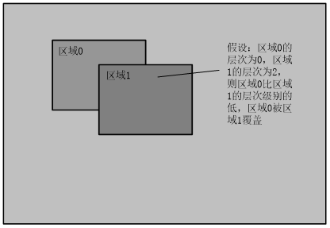
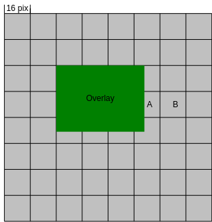

# 区域管理<a name="ZH-CN_TOPIC_0000002408098634"></a>


## 概述<a name="ZH-CN_TOPIC_0000002441697549"></a>

用户一般都需要在视频中叠加OSD\(On-Screen Display\)用于显示一些特定的信息（如：通道号、时间戳等），必要时还会填充色块。这些叠加在视频上的OSD和遮挡在视频上的色块统称为区域。REGION模块，用于统一管理这些区域资源。

区域管理可以实现区域的创建，并叠加到视频中或对视频进行遮挡。例如，实际应用中，用户通过创建一个区域，通过[ss\_mpi\_rgn\_attach\_to\_chn](#ZH-CN_TOPIC_0000002408098474)，将该区域叠加到某个通道（如VENC通道）中。在通道进行调度时，则会将OSD叠加在视频中。一个区域支持通过设置通道显示属性接口指定到多个通道中（如：多个VENC通道，多个VI通道，甚至多个VENC和VI通道），且支持在每个通道的显示属性（如位置、层次、透明度等）都不同。

## 功能描述<a name="ZH-CN_TOPIC_0000002408098238"></a>


### 重要概念<a name="ZH-CN_TOPIC_0000002441658085"></a>

-   区域类型
    -   OVERLAY：视频叠加区域，其中区域支持位图的加载、背景色更新等功能。
    -   OVERLAYEX：扩展视频叠加区域，功能与OVERLAY类似，支持位图加载、背景色更新等。
    -   COVER：视频遮挡区域，其中区域支持纯色块遮挡。
    -   COVEREX：扩展视频遮挡区域，功能与COVER类似，支持纯色块遮挡。
    -   LINE：扩展的线条视频叠加区域，支持颜色、粗细等调节。
    -   MOSAIC：马赛克遮挡区域，支持精度调节。
    -   MOSAICEX：扩展的马赛克遮挡区域，支持精度调节。
    -   CORNER\_RECTEX：角框区域，支持大小，颜色，粗细等调节。
    -   OVERLAYEX/ COVEREX/MOSAICEX，分别相对于OVERLAY/COVER/MOSAIC，功能上类似，但是会引入额外的系统带宽，OVERLAYEX/ COVEREX/ MOSAICEX由VGS叠加到图像上，OVERLAYEX/ COVEREX区域越大，占用VGS的性能就越大，当VGS性能不足时，会导致帧率降低。建议只有当OVERLAY/COVER/MOSAIC不支持，或者数量无法满足需求时，再使用。

-   区域层次

    区域层次表示区域的叠加级别，对于相同的区域类型，层次值越大，表示区域的显示级别越高，当发生重叠时，层次值大的将会覆盖层次值小的，区域层次相同时以客户调用attach的顺序为准。不同的区域类型以模块的处理顺序为准。

    **图 1**  层次叠加示意图<a name="fig660333814436"></a>  
    

-   角框

    角框中有多个可调节属性，其中hor\_length须小于width, ver\_length须小于height，角框不得超出图像外显示。

    **图 2**  角框示意图<a name="fig1246154013448"></a>  
    

-   位图填充\(针对OVERLAY和OVERLAYEX有效\)

    位图填充是指将位图的内存值填充到区域内存空间中，位图将会从区域的左上角开始填充。当位图小于区域时，只能填充一部分内存，剩余部分保持原有值；位图大小等于区域时，将刚好全部填充；当位图大于区域时，位图只能将自身和区域一样大小的内存信息填充到区域中。

    位图填充支持两种实现方式：

    -   其一、用户通过[ss\_mpi\_rgn\_set\_bmp](#ZH-CN_TOPIC_0000002408258666)接口将位图数据拷贝至内部显示画布；
    -   其二、用户通过[ss\_mpi\_rgn\_get\_canvas\_info](#ZH-CN_TOPIC_0000002441697817)获取内部备份显示画布的地址，直接对该地址数据进行更新，然后调用[ss\_mpi\_rgn\_update\_canvas](#ZH-CN_TOPIC_0000002408258158)接口将备份显示画布更新为待显示画布，达到实现更新位图数据的目的。

-   区域公共属性

    用户创建一个区域时，需要设置该属性信息，它包含公共的资源信息。例如，OVERLAY包含像素格式，大小和背景色。

-   通道显示属性\([ot\_rgn\_type\_chn\_attr](#ZH-CN_TOPIC_0000002408258454)\)

    通道显示属性表明区域在某通道的显示特征。例如，OVERLAY的通道显示属性包含显示位置，层次，前景Alpha，背景Alpha，还有编码用到的qp信息。当通道显示属性中的区域是否显示\(is\_show\)为TRUE时，表示显示在该通道中；反之，表示在该通道中存在，但处于隐藏状态。

-   区域反色

    当区域叠加到视频上显示时，如果视频背景与叠加区域的亮度色度相近，往往会导致背景与区域很难进行区分。区域反色功能即针对这种场景，自适应背景的变化，对区域的亮度色度进行调整，实现区域清晰可见。

    区域反色功能支持实现方式如下：通过VPSS提供的区域亮度和统计功能。用户可实时获取视频序列中每个待叠加区域背景的亮度统计，然后利用VGS对区域进行手动的反色处理，最后通过VGS将该反色后的区域叠加到视频上。

-   区域qp保护

    当区域叠加到视频上进行压缩编码时，为了保证叠加区域的清晰度不因为数据压缩而变模糊，可以单独设定叠加区域部分的压缩特性，即设定qp保护功能参数。qp保护功能是OVERLAY特有的功能，且仅针对H.264/H.265类型编码通道有效，对其它类型无效。

> **说明：** 
>Region不支持实心凹四边形，实心凹四边形显示为三角形。

**表 1**  SS528V100/SS625V100/SS524V100/SS522V101/SS626V100 region支持的模块信息

<a name="_Ref67652109"></a>
<table><thead align="left"><tr id="row158mcpsimp"><th class="cellrowborder" valign="top" width="19.29%" id="mcps1.2.5.1.1"><p id="p160mcpsimp"><a name="p160mcpsimp"></a><a name="p160mcpsimp"></a>类型</p>
</th>
<th class="cellrowborder" valign="top" width="14.7%" id="mcps1.2.5.1.2"><p id="p162mcpsimp"><a name="p162mcpsimp"></a><a name="p162mcpsimp"></a>支持模块</p>
</th>
<th class="cellrowborder" valign="top" width="38.75%" id="mcps1.2.5.1.3"><p id="p164mcpsimp"><a name="p164mcpsimp"></a><a name="p164mcpsimp"></a>设备号取值范围</p>
</th>
<th class="cellrowborder" valign="top" width="27.26%" id="mcps1.2.5.1.4"><p id="p166mcpsimp"><a name="p166mcpsimp"></a><a name="p166mcpsimp"></a>通道号取值范围</p>
</th>
</tr>
</thead>
<tbody><tr id="row168mcpsimp"><td class="cellrowborder" rowspan="2" valign="top" width="19.29%" headers="mcps1.2.5.1.1 "><p id="p170mcpsimp"><a name="p170mcpsimp"></a><a name="p170mcpsimp"></a>OVERLAY</p>
</td>
<td class="cellrowborder" valign="top" width="14.7%" headers="mcps1.2.5.1.2 "><p id="p172mcpsimp"><a name="p172mcpsimp"></a><a name="p172mcpsimp"></a>VENC</p>
</td>
<td class="cellrowborder" valign="top" width="38.75%" headers="mcps1.2.5.1.3 "><p id="p174mcpsimp"><a name="p174mcpsimp"></a><a name="p174mcpsimp"></a>0</p>
</td>
<td class="cellrowborder" valign="top" width="27.26%" headers="mcps1.2.5.1.4 "><p id="p176mcpsimp"><a name="p176mcpsimp"></a><a name="p176mcpsimp"></a>[0,OT_VENC_MAX_CHN_NUM-1]</p>
</td>
</tr>
<tr id="row177mcpsimp"><td class="cellrowborder" valign="top" headers="mcps1.2.5.1.1 "><p id="p179mcpsimp"><a name="p179mcpsimp"></a><a name="p179mcpsimp"></a>VPSS</p>
</td>
<td class="cellrowborder" valign="top" headers="mcps1.2.5.1.2 "><p id="p181mcpsimp"><a name="p181mcpsimp"></a><a name="p181mcpsimp"></a>[0,OT_VPSS_MAX_GRP_NUM-1]</p>
</td>
<td class="cellrowborder" valign="top" headers="mcps1.2.5.1.3 "><p id="p183mcpsimp"><a name="p183mcpsimp"></a><a name="p183mcpsimp"></a>0</p>
</td>
</tr>
<tr id="row184mcpsimp"><td class="cellrowborder" rowspan="2" valign="top" width="19.29%" headers="mcps1.2.5.1.1 "><p id="p186mcpsimp"><a name="p186mcpsimp"></a><a name="p186mcpsimp"></a>COVER</p>
</td>
<td class="cellrowborder" valign="top" width="14.7%" headers="mcps1.2.5.1.2 "><p id="p188mcpsimp"><a name="p188mcpsimp"></a><a name="p188mcpsimp"></a>VPSS</p>
</td>
<td class="cellrowborder" valign="top" width="38.75%" headers="mcps1.2.5.1.3 "><p id="p190mcpsimp"><a name="p190mcpsimp"></a><a name="p190mcpsimp"></a>[0,OT_VPSS_MAX_GRP_NUM-1]</p>
</td>
<td class="cellrowborder" valign="top" width="27.26%" headers="mcps1.2.5.1.4 "><p id="p192mcpsimp"><a name="p192mcpsimp"></a><a name="p192mcpsimp"></a>0</p>
</td>
</tr>
<tr id="row193mcpsimp"><td class="cellrowborder" valign="top" headers="mcps1.2.5.1.1 "><p id="p195mcpsimp"><a name="p195mcpsimp"></a><a name="p195mcpsimp"></a>VI</p>
</td>
<td class="cellrowborder" valign="top" headers="mcps1.2.5.1.2 "><p id="p197mcpsimp"><a name="p197mcpsimp"></a><a name="p197mcpsimp"></a>0</p>
</td>
<td class="cellrowborder" valign="top" headers="mcps1.2.5.1.3 "><p id="p199mcpsimp"><a name="p199mcpsimp"></a><a name="p199mcpsimp"></a>[0, OT_VI_MAX_PHYS_CHN_NUM-1]</p>
<p id="p200mcpsimp"><a name="p200mcpsimp"></a><a name="p200mcpsimp"></a>辅通道不支持COVER。</p>
</td>
</tr>
<tr id="row201mcpsimp"><td class="cellrowborder" rowspan="3" valign="top" width="19.29%" headers="mcps1.2.5.1.1 "><p id="p203mcpsimp"><a name="p203mcpsimp"></a><a name="p203mcpsimp"></a>OVERLAYEX</p>
</td>
<td class="cellrowborder" valign="top" width="14.7%" headers="mcps1.2.5.1.2 "><p id="p205mcpsimp"><a name="p205mcpsimp"></a><a name="p205mcpsimp"></a>VPSS</p>
</td>
<td class="cellrowborder" valign="top" width="38.75%" headers="mcps1.2.5.1.3 "><p id="p207mcpsimp"><a name="p207mcpsimp"></a><a name="p207mcpsimp"></a>[0,OT_VPSS_MAX_GRP_NUM-1]</p>
</td>
<td class="cellrowborder" valign="top" width="27.26%" headers="mcps1.2.5.1.4 "><p id="p209mcpsimp"><a name="p209mcpsimp"></a><a name="p209mcpsimp"></a>[0, OT_VPSS_MAX_CHN_NUM-1]</p>
</td>
</tr>
<tr id="row210mcpsimp"><td class="cellrowborder" valign="top" headers="mcps1.2.5.1.1 "><p id="p212mcpsimp"><a name="p212mcpsimp"></a><a name="p212mcpsimp"></a>VO</p>
</td>
<td class="cellrowborder" valign="top" headers="mcps1.2.5.1.2 "><p id="p214mcpsimp"><a name="p214mcpsimp"></a><a name="p214mcpsimp"></a>[0,OT_VO_MAX_PHYS_VIDEO_LAYER_NUM-1]</p>
</td>
<td class="cellrowborder" valign="top" headers="mcps1.2.5.1.3 "><p id="p216mcpsimp"><a name="p216mcpsimp"></a><a name="p216mcpsimp"></a>[0, OT_VO_MAX_CHN_NUM-1]</p>
</td>
</tr>
<tr id="row217mcpsimp"><td class="cellrowborder" valign="top" headers="mcps1.2.5.1.1 "><p id="p219mcpsimp"><a name="p219mcpsimp"></a><a name="p219mcpsimp"></a>PCIV</p>
<p id="p220mcpsimp"><a name="p220mcpsimp"></a><a name="p220mcpsimp"></a>(SS524V100/SS522V101不支持PCIV)</p>
</td>
<td class="cellrowborder" valign="top" headers="mcps1.2.5.1.2 "><p id="p224mcpsimp"><a name="p224mcpsimp"></a><a name="p224mcpsimp"></a>0</p>
</td>
<td class="cellrowborder" valign="top" headers="mcps1.2.5.1.3 "><p id="p226mcpsimp"><a name="p226mcpsimp"></a><a name="p226mcpsimp"></a>[0,OT_PCIV_MAX_CHN_NUM-1]</p>
</td>
</tr>
<tr id="row227mcpsimp"><td class="cellrowborder" rowspan="2" valign="top" width="19.29%" headers="mcps1.2.5.1.1 "><p id="p229mcpsimp"><a name="p229mcpsimp"></a><a name="p229mcpsimp"></a>COVEREX</p>
</td>
<td class="cellrowborder" valign="top" width="14.7%" headers="mcps1.2.5.1.2 "><p id="p231mcpsimp"><a name="p231mcpsimp"></a><a name="p231mcpsimp"></a>VPSS</p>
</td>
<td class="cellrowborder" valign="top" width="38.75%" headers="mcps1.2.5.1.3 "><p id="p233mcpsimp"><a name="p233mcpsimp"></a><a name="p233mcpsimp"></a>[0,OT_VPSS_MAX_GRP_NUM-1]</p>
</td>
<td class="cellrowborder" valign="top" width="27.26%" headers="mcps1.2.5.1.4 "><p id="p235mcpsimp"><a name="p235mcpsimp"></a><a name="p235mcpsimp"></a>[0, OT_VPSS_MAX_CHN_NUM-1]</p>
</td>
</tr>
<tr id="row236mcpsimp"><td class="cellrowborder" valign="top" headers="mcps1.2.5.1.1 "><p id="p238mcpsimp"><a name="p238mcpsimp"></a><a name="p238mcpsimp"></a>VO</p>
</td>
<td class="cellrowborder" valign="top" headers="mcps1.2.5.1.2 "><p id="p240mcpsimp"><a name="p240mcpsimp"></a><a name="p240mcpsimp"></a>[0,OT_VO_MAX_LAYER_NUM-1]</p>
</td>
<td class="cellrowborder" valign="top" headers="mcps1.2.5.1.3 "><p id="p242mcpsimp"><a name="p242mcpsimp"></a><a name="p242mcpsimp"></a>[0, OT_VO_MAX_CHN_NUM-1]</p>
</td>
</tr>
<tr id="row243mcpsimp"><td class="cellrowborder" rowspan="2" valign="top" width="19.29%" headers="mcps1.2.5.1.1 "><p id="p245mcpsimp"><a name="p245mcpsimp"></a><a name="p245mcpsimp"></a>LINE</p>
</td>
<td class="cellrowborder" valign="top" width="14.7%" headers="mcps1.2.5.1.2 "><p id="p247mcpsimp"><a name="p247mcpsimp"></a><a name="p247mcpsimp"></a>VPSS</p>
</td>
<td class="cellrowborder" valign="top" width="38.75%" headers="mcps1.2.5.1.3 "><p id="p249mcpsimp"><a name="p249mcpsimp"></a><a name="p249mcpsimp"></a>[0,OT_VPSS_MAX_GRP_NUM-1]</p>
</td>
<td class="cellrowborder" valign="top" width="27.26%" headers="mcps1.2.5.1.4 "><p id="p251mcpsimp"><a name="p251mcpsimp"></a><a name="p251mcpsimp"></a>[0,OT _VPSS_MAX_CHN_NUM-1]</p>
</td>
</tr>
<tr id="row252mcpsimp"><td class="cellrowborder" valign="top" headers="mcps1.2.5.1.1 "><p id="p254mcpsimp"><a name="p254mcpsimp"></a><a name="p254mcpsimp"></a>VO</p>
</td>
<td class="cellrowborder" valign="top" headers="mcps1.2.5.1.2 "><p id="p256mcpsimp"><a name="p256mcpsimp"></a><a name="p256mcpsimp"></a>[0,OT_VO_MAX_LAYER_NUM-1]</p>
</td>
<td class="cellrowborder" valign="top" headers="mcps1.2.5.1.3 "><p id="p258mcpsimp"><a name="p258mcpsimp"></a><a name="p258mcpsimp"></a>[0, OT_VO_MAX_CHN_NUM-1]</p>
</td>
</tr>
<tr id="row259mcpsimp"><td class="cellrowborder" valign="top" width="19.29%" headers="mcps1.2.5.1.1 "><p id="p261mcpsimp"><a name="p261mcpsimp"></a><a name="p261mcpsimp"></a>MOSAIC</p>
</td>
<td class="cellrowborder" valign="top" width="14.7%" headers="mcps1.2.5.1.2 "><p id="p263mcpsimp"><a name="p263mcpsimp"></a><a name="p263mcpsimp"></a>VPSS</p>
</td>
<td class="cellrowborder" valign="top" width="38.75%" headers="mcps1.2.5.1.3 "><p id="p265mcpsimp"><a name="p265mcpsimp"></a><a name="p265mcpsimp"></a>[0,OT_VPSS_MAX_GRP_NUM-1]</p>
</td>
<td class="cellrowborder" valign="top" width="27.26%" headers="mcps1.2.5.1.4 "><p id="p267mcpsimp"><a name="p267mcpsimp"></a><a name="p267mcpsimp"></a>0</p>
</td>
</tr>
<tr id="row268mcpsimp"><td class="cellrowborder" valign="top" width="19.29%" headers="mcps1.2.5.1.1 "><p id="p270mcpsimp"><a name="p270mcpsimp"></a><a name="p270mcpsimp"></a>MOSAICEX</p>
</td>
<td class="cellrowborder" valign="top" width="14.7%" headers="mcps1.2.5.1.2 "><p id="p272mcpsimp"><a name="p272mcpsimp"></a><a name="p272mcpsimp"></a>VPSS</p>
</td>
<td class="cellrowborder" valign="top" width="38.75%" headers="mcps1.2.5.1.3 "><p id="p274mcpsimp"><a name="p274mcpsimp"></a><a name="p274mcpsimp"></a>[0,OT_VPSS_MAX_GRP_NUM-1]</p>
</td>
<td class="cellrowborder" valign="top" width="27.26%" headers="mcps1.2.5.1.4 "><p id="p276mcpsimp"><a name="p276mcpsimp"></a><a name="p276mcpsimp"></a>[0,OT_VPSS_MAX_CHN_NUM-1]</p>
</td>
</tr>
</tbody>
</table>

**表 2**  SS928V100 region支持的模块信息

<a name="_Ref28008823"></a>
<table><thead align="left"><tr id="row284mcpsimp"><th class="cellrowborder" valign="top" width="17%" id="mcps1.2.5.1.1"><p id="p286mcpsimp"><a name="p286mcpsimp"></a><a name="p286mcpsimp"></a>类型</p>
</th>
<th class="cellrowborder" valign="top" width="10%" id="mcps1.2.5.1.2"><p id="p288mcpsimp"><a name="p288mcpsimp"></a><a name="p288mcpsimp"></a>支持模块</p>
</th>
<th class="cellrowborder" valign="top" width="38.05%" id="mcps1.2.5.1.3"><p id="p290mcpsimp"><a name="p290mcpsimp"></a><a name="p290mcpsimp"></a>设备号取值范围</p>
</th>
<th class="cellrowborder" valign="top" width="34.949999999999996%" id="mcps1.2.5.1.4"><p id="p292mcpsimp"><a name="p292mcpsimp"></a><a name="p292mcpsimp"></a>通道号取值范围</p>
</th>
</tr>
</thead>
<tbody><tr id="row294mcpsimp"><td class="cellrowborder" valign="top" width="17%" headers="mcps1.2.5.1.1 "><p id="p296mcpsimp"><a name="p296mcpsimp"></a><a name="p296mcpsimp"></a>OVERLAY</p>
</td>
<td class="cellrowborder" valign="top" width="10%" headers="mcps1.2.5.1.2 "><p id="p298mcpsimp"><a name="p298mcpsimp"></a><a name="p298mcpsimp"></a>VENC</p>
</td>
<td class="cellrowborder" valign="top" width="38.05%" headers="mcps1.2.5.1.3 "><p id="p300mcpsimp"><a name="p300mcpsimp"></a><a name="p300mcpsimp"></a>0</p>
</td>
<td class="cellrowborder" valign="top" width="34.949999999999996%" headers="mcps1.2.5.1.4 "><p id="p302mcpsimp"><a name="p302mcpsimp"></a><a name="p302mcpsimp"></a>[0,OT_VENC_MAX_CHN_NUM-1]</p>
</td>
</tr>
<tr id="row303mcpsimp"><td class="cellrowborder" rowspan="2" valign="top" width="17%" headers="mcps1.2.5.1.1 "><p id="p305mcpsimp"><a name="p305mcpsimp"></a><a name="p305mcpsimp"></a>COVER</p>
</td>
<td class="cellrowborder" valign="top" width="10%" headers="mcps1.2.5.1.2 "><p id="p307mcpsimp"><a name="p307mcpsimp"></a><a name="p307mcpsimp"></a>VPSS</p>
</td>
<td class="cellrowborder" valign="top" width="38.05%" headers="mcps1.2.5.1.3 "><p id="p309mcpsimp"><a name="p309mcpsimp"></a><a name="p309mcpsimp"></a>[0,OT_VPSS_MAX_GRP_NUM-1]</p>
</td>
<td class="cellrowborder" valign="top" width="34.949999999999996%" headers="mcps1.2.5.1.4 "><p id="p311mcpsimp"><a name="p311mcpsimp"></a><a name="p311mcpsimp"></a>0</p>
</td>
</tr>
<tr id="row312mcpsimp"><td class="cellrowborder" valign="top" headers="mcps1.2.5.1.1 "><p id="p314mcpsimp"><a name="p314mcpsimp"></a><a name="p314mcpsimp"></a>MCF</p>
</td>
<td class="cellrowborder" valign="top" headers="mcps1.2.5.1.2 "><p id="p316mcpsimp"><a name="p316mcpsimp"></a><a name="p316mcpsimp"></a>[0,OT_MCF_MAX_GRP_NUM-1]</p>
</td>
<td class="cellrowborder" valign="top" headers="mcps1.2.5.1.3 "><p id="p318mcpsimp"><a name="p318mcpsimp"></a><a name="p318mcpsimp"></a>0</p>
</td>
</tr>
<tr id="row319mcpsimp"><td class="cellrowborder" rowspan="6" valign="top" width="17%" headers="mcps1.2.5.1.1 "><p id="p321mcpsimp"><a name="p321mcpsimp"></a><a name="p321mcpsimp"></a>OVERLAYEX</p>
</td>
<td class="cellrowborder" valign="top" width="10%" headers="mcps1.2.5.1.2 "><p id="p323mcpsimp"><a name="p323mcpsimp"></a><a name="p323mcpsimp"></a>VPSS</p>
</td>
<td class="cellrowborder" valign="top" width="38.05%" headers="mcps1.2.5.1.3 "><p id="p325mcpsimp"><a name="p325mcpsimp"></a><a name="p325mcpsimp"></a>[0,OT_VPSS_MAX_GRP_NUM-1]</p>
</td>
<td class="cellrowborder" valign="top" width="34.949999999999996%" headers="mcps1.2.5.1.4 "><p id="p327mcpsimp"><a name="p327mcpsimp"></a><a name="p327mcpsimp"></a>[0, OT_VPSS_MAX_PHYS_CHN_NUM-1]</p>
</td>
</tr>
<tr id="row328mcpsimp"><td class="cellrowborder" valign="top" headers="mcps1.2.5.1.1 "><p id="p330mcpsimp"><a name="p330mcpsimp"></a><a name="p330mcpsimp"></a>VO</p>
</td>
<td class="cellrowborder" valign="top" headers="mcps1.2.5.1.2 "><p id="p332mcpsimp"><a name="p332mcpsimp"></a><a name="p332mcpsimp"></a>[0,OT_VO_MAX_PHYS_VIDEO_LAYER_NUM-1]</p>
</td>
<td class="cellrowborder" valign="top" headers="mcps1.2.5.1.3 "><p id="p334mcpsimp"><a name="p334mcpsimp"></a><a name="p334mcpsimp"></a>[0, OT_VO_MAX_CHN_NUM-1]</p>
</td>
</tr>
<tr id="row335mcpsimp"><td class="cellrowborder" valign="top" headers="mcps1.2.5.1.1 "><p id="p337mcpsimp"><a name="p337mcpsimp"></a><a name="p337mcpsimp"></a>AVS</p>
</td>
<td class="cellrowborder" valign="top" headers="mcps1.2.5.1.2 "><p id="p339mcpsimp"><a name="p339mcpsimp"></a><a name="p339mcpsimp"></a>[0, OT_AVS_MAX_GRP_NUM-1]</p>
</td>
<td class="cellrowborder" valign="top" headers="mcps1.2.5.1.3 "><p id="p341mcpsimp"><a name="p341mcpsimp"></a><a name="p341mcpsimp"></a>[0, OT_AVS_MAX_CHN_NUM-1]</p>
</td>
</tr>
<tr id="row342mcpsimp"><td class="cellrowborder" valign="top" headers="mcps1.2.5.1.1 "><p id="p344mcpsimp"><a name="p344mcpsimp"></a><a name="p344mcpsimp"></a>PCIV</p>
</td>
<td class="cellrowborder" valign="top" headers="mcps1.2.5.1.2 "><p id="p346mcpsimp"><a name="p346mcpsimp"></a><a name="p346mcpsimp"></a>0</p>
</td>
<td class="cellrowborder" valign="top" headers="mcps1.2.5.1.3 "><p id="p348mcpsimp"><a name="p348mcpsimp"></a><a name="p348mcpsimp"></a>[0,OT_PCIV_MAX_CHN_NUM-1]</p>
</td>
</tr>
<tr id="row349mcpsimp"><td class="cellrowborder" valign="top" headers="mcps1.2.5.1.1 "><p id="p351mcpsimp"><a name="p351mcpsimp"></a><a name="p351mcpsimp"></a>MCF</p>
</td>
<td class="cellrowborder" valign="top" headers="mcps1.2.5.1.2 "><p id="p353mcpsimp"><a name="p353mcpsimp"></a><a name="p353mcpsimp"></a>[0,OT_MCF_MAX_GRP_NUM-1]</p>
</td>
<td class="cellrowborder" valign="top" headers="mcps1.2.5.1.3 "><p id="p355mcpsimp"><a name="p355mcpsimp"></a><a name="p355mcpsimp"></a>[0, OT_MCF_MAX_PHYS_CHN_NUM-1]</p>
</td>
</tr>
<tr id="row356mcpsimp"><td class="cellrowborder" valign="top" headers="mcps1.2.5.1.1 "><p id="p358mcpsimp"><a name="p358mcpsimp"></a><a name="p358mcpsimp"></a>VI</p>
</td>
<td class="cellrowborder" valign="top" headers="mcps1.2.5.1.2 "><p id="p360mcpsimp"><a name="p360mcpsimp"></a><a name="p360mcpsimp"></a>[0, OT_VI_MAX_PIPE_NUM-1]</p>
</td>
<td class="cellrowborder" valign="top" headers="mcps1.2.5.1.3 "><p id="p362mcpsimp"><a name="p362mcpsimp"></a><a name="p362mcpsimp"></a>[0, OT_VI_MAX_CHN_NUM-1]</p>
</td>
</tr>
<tr id="row363mcpsimp"><td class="cellrowborder" rowspan="4" valign="top" width="17%" headers="mcps1.2.5.1.1 "><p id="p365mcpsimp"><a name="p365mcpsimp"></a><a name="p365mcpsimp"></a>COVEREX</p>
</td>
<td class="cellrowborder" valign="top" width="10%" headers="mcps1.2.5.1.2 "><p id="p367mcpsimp"><a name="p367mcpsimp"></a><a name="p367mcpsimp"></a>VPSS</p>
</td>
<td class="cellrowborder" valign="top" width="38.05%" headers="mcps1.2.5.1.3 "><p id="p369mcpsimp"><a name="p369mcpsimp"></a><a name="p369mcpsimp"></a>[0,OT_VPSS_MAX_GRP_NUM-1]</p>
</td>
<td class="cellrowborder" valign="top" width="34.949999999999996%" headers="mcps1.2.5.1.4 "><p id="p371mcpsimp"><a name="p371mcpsimp"></a><a name="p371mcpsimp"></a>[0, OT_VPSS_MAX_PHYS_CHN_NUM-1]</p>
</td>
</tr>
<tr id="row372mcpsimp"><td class="cellrowborder" valign="top" headers="mcps1.2.5.1.1 "><p id="p374mcpsimp"><a name="p374mcpsimp"></a><a name="p374mcpsimp"></a>VO</p>
</td>
<td class="cellrowborder" valign="top" headers="mcps1.2.5.1.2 "><p id="p376mcpsimp"><a name="p376mcpsimp"></a><a name="p376mcpsimp"></a>[0,OT_VO_MAX_LAYER_NUM-1]</p>
</td>
<td class="cellrowborder" valign="top" headers="mcps1.2.5.1.3 "><p id="p378mcpsimp"><a name="p378mcpsimp"></a><a name="p378mcpsimp"></a>[0, OT_VO_MAX_CHN_NUM-1]</p>
</td>
</tr>
<tr id="row379mcpsimp"><td class="cellrowborder" valign="top" headers="mcps1.2.5.1.1 "><p id="p381mcpsimp"><a name="p381mcpsimp"></a><a name="p381mcpsimp"></a>VI</p>
</td>
<td class="cellrowborder" valign="top" headers="mcps1.2.5.1.2 "><p id="p383mcpsimp"><a name="p383mcpsimp"></a><a name="p383mcpsimp"></a>[0, OT_VI_MAX_PIPE_NUM-1]</p>
</td>
<td class="cellrowborder" valign="top" headers="mcps1.2.5.1.3 "><p id="p385mcpsimp"><a name="p385mcpsimp"></a><a name="p385mcpsimp"></a>[0, OT_VI_MAX_CHN_NUM-1]</p>
</td>
</tr>
<tr id="row386mcpsimp"><td class="cellrowborder" valign="top" headers="mcps1.2.5.1.1 "><p id="p388mcpsimp"><a name="p388mcpsimp"></a><a name="p388mcpsimp"></a>MCF</p>
</td>
<td class="cellrowborder" valign="top" headers="mcps1.2.5.1.2 "><p id="p390mcpsimp"><a name="p390mcpsimp"></a><a name="p390mcpsimp"></a>[0,OT_MCF_MAX_GRP_NUM-1]</p>
</td>
<td class="cellrowborder" valign="top" headers="mcps1.2.5.1.3 "><p id="p392mcpsimp"><a name="p392mcpsimp"></a><a name="p392mcpsimp"></a>[0, OT_MCF_MAX_PHYS_CHN_NUM-1]</p>
</td>
</tr>
<tr id="row393mcpsimp"><td class="cellrowborder" rowspan="3" valign="top" width="17%" headers="mcps1.2.5.1.1 "><p id="p395mcpsimp"><a name="p395mcpsimp"></a><a name="p395mcpsimp"></a>LINE</p>
</td>
<td class="cellrowborder" valign="top" width="10%" headers="mcps1.2.5.1.2 "><p id="p397mcpsimp"><a name="p397mcpsimp"></a><a name="p397mcpsimp"></a>VPSS</p>
</td>
<td class="cellrowborder" valign="top" width="38.05%" headers="mcps1.2.5.1.3 "><p id="p399mcpsimp"><a name="p399mcpsimp"></a><a name="p399mcpsimp"></a>[0,OT_VPSS_MAX_GRP_NUM-1]</p>
</td>
<td class="cellrowborder" valign="top" width="34.949999999999996%" headers="mcps1.2.5.1.4 "><p id="p401mcpsimp"><a name="p401mcpsimp"></a><a name="p401mcpsimp"></a>[0,OT _VPSS_MAX_PHYS_CHN_NUM-1]</p>
</td>
</tr>
<tr id="row402mcpsimp"><td class="cellrowborder" valign="top" headers="mcps1.2.5.1.1 "><p id="p404mcpsimp"><a name="p404mcpsimp"></a><a name="p404mcpsimp"></a>VO</p>
</td>
<td class="cellrowborder" valign="top" headers="mcps1.2.5.1.2 "><p id="p406mcpsimp"><a name="p406mcpsimp"></a><a name="p406mcpsimp"></a>[0,OT_VO_MAX_LAYER_NUM-1]</p>
</td>
<td class="cellrowborder" valign="top" headers="mcps1.2.5.1.3 "><p id="p408mcpsimp"><a name="p408mcpsimp"></a><a name="p408mcpsimp"></a>[0, OT_VO_MAX_CHN_NUM-1]</p>
</td>
</tr>
<tr id="row409mcpsimp"><td class="cellrowborder" valign="top" headers="mcps1.2.5.1.1 "><p id="p411mcpsimp"><a name="p411mcpsimp"></a><a name="p411mcpsimp"></a>MCF</p>
</td>
<td class="cellrowborder" valign="top" headers="mcps1.2.5.1.2 "><p id="p413mcpsimp"><a name="p413mcpsimp"></a><a name="p413mcpsimp"></a>[0,OT_MCF_MAX_GRP_NUM-1]</p>
</td>
<td class="cellrowborder" valign="top" headers="mcps1.2.5.1.3 "><p id="p415mcpsimp"><a name="p415mcpsimp"></a><a name="p415mcpsimp"></a>[0, OT_MCF_MAX_PHYS_CHN_NUM-1]</p>
</td>
</tr>
<tr id="row416mcpsimp"><td class="cellrowborder" rowspan="2" valign="top" width="17%" headers="mcps1.2.5.1.1 "><p id="p418mcpsimp"><a name="p418mcpsimp"></a><a name="p418mcpsimp"></a>MOSAIC</p>
</td>
<td class="cellrowborder" valign="top" width="10%" headers="mcps1.2.5.1.2 "><p id="p420mcpsimp"><a name="p420mcpsimp"></a><a name="p420mcpsimp"></a>VPSS</p>
</td>
<td class="cellrowborder" valign="top" width="38.05%" headers="mcps1.2.5.1.3 "><p id="p422mcpsimp"><a name="p422mcpsimp"></a><a name="p422mcpsimp"></a>[0,OT_VPSS_MAX_GRP_NUM-1]</p>
</td>
<td class="cellrowborder" valign="top" width="34.949999999999996%" headers="mcps1.2.5.1.4 "><p id="p424mcpsimp"><a name="p424mcpsimp"></a><a name="p424mcpsimp"></a>0</p>
</td>
</tr>
<tr id="row425mcpsimp"><td class="cellrowborder" valign="top" headers="mcps1.2.5.1.1 "><p id="p427mcpsimp"><a name="p427mcpsimp"></a><a name="p427mcpsimp"></a>MCF</p>
</td>
<td class="cellrowborder" valign="top" headers="mcps1.2.5.1.2 "><p id="p429mcpsimp"><a name="p429mcpsimp"></a><a name="p429mcpsimp"></a>[0,OT_MCF_MAX_GRP_NUM-1]</p>
</td>
<td class="cellrowborder" valign="top" headers="mcps1.2.5.1.3 "><p id="p431mcpsimp"><a name="p431mcpsimp"></a><a name="p431mcpsimp"></a>0</p>
</td>
</tr>
<tr id="row432mcpsimp"><td class="cellrowborder" rowspan="2" valign="top" width="17%" headers="mcps1.2.5.1.1 "><p id="p434mcpsimp"><a name="p434mcpsimp"></a><a name="p434mcpsimp"></a>MOSAICEX</p>
</td>
<td class="cellrowborder" valign="top" width="10%" headers="mcps1.2.5.1.2 "><p id="p436mcpsimp"><a name="p436mcpsimp"></a><a name="p436mcpsimp"></a>VPSS</p>
</td>
<td class="cellrowborder" valign="top" width="38.05%" headers="mcps1.2.5.1.3 "><p id="p438mcpsimp"><a name="p438mcpsimp"></a><a name="p438mcpsimp"></a>[0,OT_VPSS_MAX_GRP_NUM-1]</p>
</td>
<td class="cellrowborder" valign="top" width="34.949999999999996%" headers="mcps1.2.5.1.4 "><p id="p440mcpsimp"><a name="p440mcpsimp"></a><a name="p440mcpsimp"></a>[0,OT_VPSS_MAX_PHYS_CHN_NUM-1]</p>
</td>
</tr>
<tr id="row441mcpsimp"><td class="cellrowborder" valign="top" headers="mcps1.2.5.1.1 "><p id="p443mcpsimp"><a name="p443mcpsimp"></a><a name="p443mcpsimp"></a>MCF</p>
</td>
<td class="cellrowborder" valign="top" headers="mcps1.2.5.1.2 "><p id="p445mcpsimp"><a name="p445mcpsimp"></a><a name="p445mcpsimp"></a>[0,OT_MCF_MAX_GRP_NUM-1]</p>
</td>
<td class="cellrowborder" valign="top" headers="mcps1.2.5.1.3 "><p id="p447mcpsimp"><a name="p447mcpsimp"></a><a name="p447mcpsimp"></a>[0, OT_MCF_MAX_PHYS_CHN_NUM-1]</p>
</td>
</tr>
<tr id="row448mcpsimp"><td class="cellrowborder" rowspan="3" valign="top" width="17%" headers="mcps1.2.5.1.1 "><p id="p450mcpsimp"><a name="p450mcpsimp"></a><a name="p450mcpsimp"></a>CORNER_RECTEX</p>
</td>
<td class="cellrowborder" valign="top" width="10%" headers="mcps1.2.5.1.2 "><p id="p452mcpsimp"><a name="p452mcpsimp"></a><a name="p452mcpsimp"></a>VPSS</p>
</td>
<td class="cellrowborder" valign="top" width="38.05%" headers="mcps1.2.5.1.3 "><p id="p454mcpsimp"><a name="p454mcpsimp"></a><a name="p454mcpsimp"></a>[0,OT_VPSS_MAX_GRP_NUM-1]</p>
</td>
<td class="cellrowborder" valign="top" width="34.949999999999996%" headers="mcps1.2.5.1.4 "><p id="p456mcpsimp"><a name="p456mcpsimp"></a><a name="p456mcpsimp"></a>[0,OT _VPSS_MAX_PHYS_CHN_NUM-1]</p>
</td>
</tr>
<tr id="row457mcpsimp"><td class="cellrowborder" valign="top" headers="mcps1.2.5.1.1 "><p id="p459mcpsimp"><a name="p459mcpsimp"></a><a name="p459mcpsimp"></a>VO</p>
</td>
<td class="cellrowborder" valign="top" headers="mcps1.2.5.1.2 "><p id="p461mcpsimp"><a name="p461mcpsimp"></a><a name="p461mcpsimp"></a>[0,OT_VO_MAX_LAYER_NUM-1]</p>
</td>
<td class="cellrowborder" valign="top" headers="mcps1.2.5.1.3 "><p id="p463mcpsimp"><a name="p463mcpsimp"></a><a name="p463mcpsimp"></a>[0, OT_VO_MAX_CHN_NUM-1]</p>
</td>
</tr>
<tr id="row464mcpsimp"><td class="cellrowborder" valign="top" headers="mcps1.2.5.1.1 "><p id="p466mcpsimp"><a name="p466mcpsimp"></a><a name="p466mcpsimp"></a>MCF</p>
</td>
<td class="cellrowborder" valign="top" headers="mcps1.2.5.1.2 "><p id="p468mcpsimp"><a name="p468mcpsimp"></a><a name="p468mcpsimp"></a>[0,OT_MCF_MAX_GRP_NUM-1]</p>
</td>
<td class="cellrowborder" valign="top" headers="mcps1.2.5.1.3 "><p id="p470mcpsimp"><a name="p470mcpsimp"></a><a name="p470mcpsimp"></a>[0, OT_MCF_MAX_PHYS_CHN_NUM-1]</p>
</td>
</tr>
</tbody>
</table>

-   区域支持的功能

    目前各种类型的区域支持的功能如[表3](#_Ref17904683)和[表4](#_Ref28008926)所示。

> **说明：** 
>-   VO模块仅在single模式支持region，multi模式不支持。
>-   PCIV\(Peripheral Component Interconnect Video\)叠放region时，只支持从片叠放region，主片不支持叠放region。

**表 3**  SS528V100/SS625V100/SS524V100/SS522V101/SS626V100 region支持的功能

<a name="_Ref17904683"></a>
<table><thead align="left"><tr id="row495mcpsimp"><th class="cellrowborder" rowspan="2" valign="top" id="mcps1.2.11.1.1"><p id="p497mcpsimp"><a name="p497mcpsimp"></a><a name="p497mcpsimp"></a>支持的功能</p>
<p id="p1254204562117"><a name="p1254204562117"></a><a name="p1254204562117"></a></p>
<p id="p498mcpsimp"><a name="p498mcpsimp"></a><a name="p498mcpsimp"></a>支持的模块</p>
<p id="p11824348618"><a name="p11824348618"></a><a name="p11824348618"></a></p>
</th>
<th class="cellrowborder" colspan="2" valign="top" id="mcps1.2.11.1.2"><p id="p500mcpsimp"><a name="p500mcpsimp"></a><a name="p500mcpsimp"></a>OVERLAY</p>
</th>
<th class="cellrowborder" valign="top" id="mcps1.2.11.1.3"><p id="p502mcpsimp"><a name="p502mcpsimp"></a><a name="p502mcpsimp"></a>OVERLAYEX</p>
</th>
<th class="cellrowborder" colspan="2" valign="top" id="mcps1.2.11.1.4"><p id="p504mcpsimp"><a name="p504mcpsimp"></a><a name="p504mcpsimp"></a>COVER</p>
</th>
<th class="cellrowborder" valign="top" id="mcps1.2.11.1.5"><p id="p506mcpsimp"><a name="p506mcpsimp"></a><a name="p506mcpsimp"></a>COVEREX</p>
</th>
<th class="cellrowborder" valign="top" id="mcps1.2.11.1.6"><p id="p508mcpsimp"><a name="p508mcpsimp"></a><a name="p508mcpsimp"></a>LINE</p>
</th>
<th class="cellrowborder" valign="top" id="mcps1.2.11.1.7"><p id="p510mcpsimp"><a name="p510mcpsimp"></a><a name="p510mcpsimp"></a>MOSAIC</p>
</th>
<th class="cellrowborder" valign="top" id="mcps1.2.11.1.8"><p id="p512mcpsimp"><a name="p512mcpsimp"></a><a name="p512mcpsimp"></a>MOSAICEX</p>
</th>
</tr>
<tr id="row882316481016"><th class="cellrowborder" valign="top" id="mcps1.2.11.2.1"><p id="p515mcpsimp"><a name="p515mcpsimp"></a><a name="p515mcpsimp"></a>VPSS</p>
</th>
<th class="cellrowborder" valign="top" id="mcps1.2.11.2.2"><p id="p517mcpsimp"><a name="p517mcpsimp"></a><a name="p517mcpsimp"></a>VENC</p>
</th>
<th class="cellrowborder" valign="top" id="mcps1.2.11.2.3"><p id="p519mcpsimp"><a name="p519mcpsimp"></a><a name="p519mcpsimp"></a>VPSS</p>
<p id="p520mcpsimp"><a name="p520mcpsimp"></a><a name="p520mcpsimp"></a>PCIV(SS524V100/SS522V101 不支持PCIV)</p>
<p id="p523mcpsimp"><a name="p523mcpsimp"></a><a name="p523mcpsimp"></a>VO</p>
</th>
<th class="cellrowborder" colspan="2" valign="top" id="mcps1.2.11.2.4"><p id="p525mcpsimp"><a name="p525mcpsimp"></a><a name="p525mcpsimp"></a>VPSS</p>
<p id="p526mcpsimp"><a name="p526mcpsimp"></a><a name="p526mcpsimp"></a>VI</p>
<p id="p49895815115"><a name="p49895815115"></a><a name="p49895815115"></a></p>
</th>
<th class="cellrowborder" valign="top" id="mcps1.2.11.2.5"><p id="p528mcpsimp"><a name="p528mcpsimp"></a><a name="p528mcpsimp"></a>VPSS</p>
<p id="p529mcpsimp"><a name="p529mcpsimp"></a><a name="p529mcpsimp"></a>VO</p>
</th>
<th class="cellrowborder" valign="top" id="mcps1.2.11.2.6"><p id="p531mcpsimp"><a name="p531mcpsimp"></a><a name="p531mcpsimp"></a>VPSS</p>
<p id="p532mcpsimp"><a name="p532mcpsimp"></a><a name="p532mcpsimp"></a>VO</p>
</th>
<th class="cellrowborder" valign="top" id="mcps1.2.11.2.7"><p id="p534mcpsimp"><a name="p534mcpsimp"></a><a name="p534mcpsimp"></a>VPSS</p>
</th>
<th class="cellrowborder" valign="top" id="mcps1.2.11.2.8"><p id="p536mcpsimp"><a name="p536mcpsimp"></a><a name="p536mcpsimp"></a>VPSS</p>
</th>
</tr>
</thead>
<tbody><tr id="row537mcpsimp"><td class="cellrowborder" valign="top" headers="mcps1.2.11.1.1 mcps1.2.11.2.1 "><p id="p539mcpsimp"><a name="p539mcpsimp"></a><a name="p539mcpsimp"></a>像素格式</p>
</td>
<td class="cellrowborder" valign="top" headers="mcps1.2.11.1.2 mcps1.2.11.2.2 "><p id="p541mcpsimp"><a name="p541mcpsimp"></a><a name="p541mcpsimp"></a>Argb1555</p>
<p id="p542mcpsimp"><a name="p542mcpsimp"></a><a name="p542mcpsimp"></a>Argb4444</p>
<p id="p543mcpsimp"><a name="p543mcpsimp"></a><a name="p543mcpsimp"></a>Argb8888</p>
<p id="p544mcpsimp"><a name="p544mcpsimp"></a><a name="p544mcpsimp"></a>CLUT2</p>
<p id="p545mcpsimp"><a name="p545mcpsimp"></a><a name="p545mcpsimp"></a>CLUT4</p>
</td>
<td class="cellrowborder" valign="top" headers="mcps1.2.11.1.2 mcps1.2.11.2.3 "><p id="p547mcpsimp"><a name="p547mcpsimp"></a><a name="p547mcpsimp"></a>Argb1555</p>
<p id="p548mcpsimp"><a name="p548mcpsimp"></a><a name="p548mcpsimp"></a>Argb4444</p>
<p id="p549mcpsimp"><a name="p549mcpsimp"></a><a name="p549mcpsimp"></a>CLUT2</p>
<p id="p550mcpsimp"><a name="p550mcpsimp"></a><a name="p550mcpsimp"></a>CLUT4</p>
</td>
<td class="cellrowborder" valign="top" headers="mcps1.2.11.1.3 "><p id="p552mcpsimp"><a name="p552mcpsimp"></a><a name="p552mcpsimp"></a>Argb1555</p>
<p id="p553mcpsimp"><a name="p553mcpsimp"></a><a name="p553mcpsimp"></a>Argb4444</p>
<p id="p554mcpsimp"><a name="p554mcpsimp"></a><a name="p554mcpsimp"></a>Argb8888</p>
<p id="p555mcpsimp"><a name="p555mcpsimp"></a><a name="p555mcpsimp"></a>CLUT2</p>
<p id="p556mcpsimp"><a name="p556mcpsimp"></a><a name="p556mcpsimp"></a>CLUT4</p>
</td>
<td class="cellrowborder" colspan="2" valign="top" headers="mcps1.2.11.1.4 mcps1.2.11.2.4 "><p id="p558mcpsimp"><a name="p558mcpsimp"></a><a name="p558mcpsimp"></a>RGB888</p>
</td>
<td class="cellrowborder" valign="top" headers="mcps1.2.11.1.5 mcps1.2.11.2.5 "><p id="p560mcpsimp"><a name="p560mcpsimp"></a><a name="p560mcpsimp"></a>RGB888</p>
</td>
<td class="cellrowborder" valign="top" headers="mcps1.2.11.1.6 mcps1.2.11.2.6 "><p id="p562mcpsimp"><a name="p562mcpsimp"></a><a name="p562mcpsimp"></a>N/A</p>
</td>
<td class="cellrowborder" valign="top" headers="mcps1.2.11.1.7 mcps1.2.11.2.7 "><p id="p564mcpsimp"><a name="p564mcpsimp"></a><a name="p564mcpsimp"></a>N/A</p>
</td>
<td class="cellrowborder" valign="top" headers="mcps1.2.11.1.8 mcps1.2.11.2.8 "><p id="p566mcpsimp"><a name="p566mcpsimp"></a><a name="p566mcpsimp"></a>N/A</p>
</td>
</tr>
<tr id="row568mcpsimp"><td class="cellrowborder" valign="top" headers="mcps1.2.11.1.1 mcps1.2.11.2.1 "><p id="p570mcpsimp"><a name="p570mcpsimp"></a><a name="p570mcpsimp"></a>叠加层次</p>
</td>
<td class="cellrowborder" colspan="2" valign="top" headers="mcps1.2.11.1.2 mcps1.2.11.2.2 mcps1.2.11.2.3 "><p id="p572mcpsimp"><a name="p572mcpsimp"></a><a name="p572mcpsimp"></a>支持</p>
</td>
<td class="cellrowborder" valign="top" headers="mcps1.2.11.1.3 "><p id="p574mcpsimp"><a name="p574mcpsimp"></a><a name="p574mcpsimp"></a>支持</p>
</td>
<td class="cellrowborder" colspan="2" valign="top" headers="mcps1.2.11.1.4 mcps1.2.11.2.4 "><p id="p576mcpsimp"><a name="p576mcpsimp"></a><a name="p576mcpsimp"></a>支持</p>
</td>
<td class="cellrowborder" valign="top" headers="mcps1.2.11.1.5 mcps1.2.11.2.5 "><p id="p578mcpsimp"><a name="p578mcpsimp"></a><a name="p578mcpsimp"></a>支持</p>
</td>
<td class="cellrowborder" valign="top" headers="mcps1.2.11.1.6 mcps1.2.11.2.6 "><p id="p580mcpsimp"><a name="p580mcpsimp"></a><a name="p580mcpsimp"></a>N/A</p>
</td>
<td class="cellrowborder" valign="top" headers="mcps1.2.11.1.7 mcps1.2.11.2.7 "><p id="p582mcpsimp"><a name="p582mcpsimp"></a><a name="p582mcpsimp"></a>支持</p>
</td>
<td class="cellrowborder" valign="top" headers="mcps1.2.11.1.8 mcps1.2.11.2.8 "><p id="p584mcpsimp"><a name="p584mcpsimp"></a><a name="p584mcpsimp"></a>支持</p>
</td>
</tr>
<tr id="row585mcpsimp"><td class="cellrowborder" valign="top" headers="mcps1.2.11.1.1 mcps1.2.11.2.1 "><p id="p587mcpsimp"><a name="p587mcpsimp"></a><a name="p587mcpsimp"></a>位图填充</p>
</td>
<td class="cellrowborder" colspan="2" valign="top" headers="mcps1.2.11.1.2 mcps1.2.11.2.2 mcps1.2.11.2.3 "><p id="p589mcpsimp"><a name="p589mcpsimp"></a><a name="p589mcpsimp"></a>支持</p>
</td>
<td class="cellrowborder" valign="top" headers="mcps1.2.11.1.3 "><p id="p591mcpsimp"><a name="p591mcpsimp"></a><a name="p591mcpsimp"></a>支持</p>
</td>
<td class="cellrowborder" colspan="2" valign="top" headers="mcps1.2.11.1.4 mcps1.2.11.2.4 "><p id="p593mcpsimp"><a name="p593mcpsimp"></a><a name="p593mcpsimp"></a>N/A</p>
</td>
<td class="cellrowborder" valign="top" headers="mcps1.2.11.1.5 mcps1.2.11.2.5 "><p id="p595mcpsimp"><a name="p595mcpsimp"></a><a name="p595mcpsimp"></a>N/A</p>
</td>
<td class="cellrowborder" valign="top" headers="mcps1.2.11.1.6 mcps1.2.11.2.6 "><p id="p597mcpsimp"><a name="p597mcpsimp"></a><a name="p597mcpsimp"></a>N/A</p>
</td>
<td class="cellrowborder" valign="top" headers="mcps1.2.11.1.7 mcps1.2.11.2.7 "><p id="p599mcpsimp"><a name="p599mcpsimp"></a><a name="p599mcpsimp"></a>N/A</p>
</td>
<td class="cellrowborder" valign="top" headers="mcps1.2.11.1.8 mcps1.2.11.2.8 "><p id="p601mcpsimp"><a name="p601mcpsimp"></a><a name="p601mcpsimp"></a>N/A</p>
</td>
</tr>
<tr id="row602mcpsimp"><td class="cellrowborder" valign="top" headers="mcps1.2.11.1.1 mcps1.2.11.2.1 "><p id="p604mcpsimp"><a name="p604mcpsimp"></a><a name="p604mcpsimp"></a>叠加透明度</p>
</td>
<td class="cellrowborder" colspan="2" valign="top" headers="mcps1.2.11.1.2 mcps1.2.11.2.2 mcps1.2.11.2.3 "><p id="p606mcpsimp"><a name="p606mcpsimp"></a><a name="p606mcpsimp"></a>支持</p>
</td>
<td class="cellrowborder" valign="top" headers="mcps1.2.11.1.3 "><p id="p608mcpsimp"><a name="p608mcpsimp"></a><a name="p608mcpsimp"></a>支持</p>
</td>
<td class="cellrowborder" colspan="2" valign="top" headers="mcps1.2.11.1.4 mcps1.2.11.2.4 "><p id="p610mcpsimp"><a name="p610mcpsimp"></a><a name="p610mcpsimp"></a>N/A</p>
</td>
<td class="cellrowborder" valign="top" headers="mcps1.2.11.1.5 mcps1.2.11.2.5 "><p id="p612mcpsimp"><a name="p612mcpsimp"></a><a name="p612mcpsimp"></a>N/A</p>
</td>
<td class="cellrowborder" valign="top" headers="mcps1.2.11.1.6 mcps1.2.11.2.6 "><p id="p614mcpsimp"><a name="p614mcpsimp"></a><a name="p614mcpsimp"></a>N/A</p>
</td>
<td class="cellrowborder" valign="top" headers="mcps1.2.11.1.7 mcps1.2.11.2.7 "><p id="p616mcpsimp"><a name="p616mcpsimp"></a><a name="p616mcpsimp"></a>N/A</p>
</td>
<td class="cellrowborder" valign="top" headers="mcps1.2.11.1.8 mcps1.2.11.2.8 "><p id="p618mcpsimp"><a name="p618mcpsimp"></a><a name="p618mcpsimp"></a>N/A</p>
</td>
</tr>
<tr id="row619mcpsimp"><td class="cellrowborder" valign="top" headers="mcps1.2.11.1.1 mcps1.2.11.2.1 "><p id="p621mcpsimp"><a name="p621mcpsimp"></a><a name="p621mcpsimp"></a>前景alpha范围</p>
</td>
<td class="cellrowborder" valign="top" headers="mcps1.2.11.1.2 mcps1.2.11.2.2 "><p id="p623mcpsimp"><a name="p623mcpsimp"></a><a name="p623mcpsimp"></a>0~255</p>
</td>
<td class="cellrowborder" valign="top" headers="mcps1.2.11.1.2 mcps1.2.11.2.3 "><p id="p625mcpsimp"><a name="p625mcpsimp"></a><a name="p625mcpsimp"></a>0~128</p>
</td>
<td class="cellrowborder" valign="top" headers="mcps1.2.11.1.3 "><p id="p627mcpsimp"><a name="p627mcpsimp"></a><a name="p627mcpsimp"></a>0~255</p>
</td>
<td class="cellrowborder" colspan="2" valign="top" headers="mcps1.2.11.1.4 mcps1.2.11.2.4 "><p id="p629mcpsimp"><a name="p629mcpsimp"></a><a name="p629mcpsimp"></a>N/A</p>
</td>
<td class="cellrowborder" valign="top" headers="mcps1.2.11.1.5 mcps1.2.11.2.5 "><p id="p631mcpsimp"><a name="p631mcpsimp"></a><a name="p631mcpsimp"></a>N/A</p>
</td>
<td class="cellrowborder" valign="top" headers="mcps1.2.11.1.6 mcps1.2.11.2.6 "><p id="p633mcpsimp"><a name="p633mcpsimp"></a><a name="p633mcpsimp"></a>N/A</p>
</td>
<td class="cellrowborder" valign="top" headers="mcps1.2.11.1.7 mcps1.2.11.2.7 "><p id="p635mcpsimp"><a name="p635mcpsimp"></a><a name="p635mcpsimp"></a>N/A</p>
</td>
<td class="cellrowborder" valign="top" headers="mcps1.2.11.1.8 mcps1.2.11.2.8 "><p id="p637mcpsimp"><a name="p637mcpsimp"></a><a name="p637mcpsimp"></a>N/A</p>
</td>
</tr>
<tr id="row638mcpsimp"><td class="cellrowborder" valign="top" headers="mcps1.2.11.1.1 mcps1.2.11.2.1 "><p id="p640mcpsimp"><a name="p640mcpsimp"></a><a name="p640mcpsimp"></a>背景alpha范围</p>
</td>
<td class="cellrowborder" valign="top" headers="mcps1.2.11.1.2 mcps1.2.11.2.2 "><p id="p642mcpsimp"><a name="p642mcpsimp"></a><a name="p642mcpsimp"></a>0~255</p>
</td>
<td class="cellrowborder" valign="top" headers="mcps1.2.11.1.2 mcps1.2.11.2.3 "><p id="p644mcpsimp"><a name="p644mcpsimp"></a><a name="p644mcpsimp"></a>0~128</p>
</td>
<td class="cellrowborder" valign="top" headers="mcps1.2.11.1.3 "><p id="p646mcpsimp"><a name="p646mcpsimp"></a><a name="p646mcpsimp"></a>0~255</p>
</td>
<td class="cellrowborder" colspan="2" valign="top" headers="mcps1.2.11.1.4 mcps1.2.11.2.4 "><p id="p648mcpsimp"><a name="p648mcpsimp"></a><a name="p648mcpsimp"></a>N/A</p>
</td>
<td class="cellrowborder" valign="top" headers="mcps1.2.11.1.5 mcps1.2.11.2.5 "><p id="p650mcpsimp"><a name="p650mcpsimp"></a><a name="p650mcpsimp"></a>N/A</p>
</td>
<td class="cellrowborder" valign="top" headers="mcps1.2.11.1.6 mcps1.2.11.2.6 "><p id="p652mcpsimp"><a name="p652mcpsimp"></a><a name="p652mcpsimp"></a>N/A</p>
</td>
<td class="cellrowborder" valign="top" headers="mcps1.2.11.1.7 mcps1.2.11.2.7 "><p id="p654mcpsimp"><a name="p654mcpsimp"></a><a name="p654mcpsimp"></a>N/A</p>
</td>
<td class="cellrowborder" valign="top" headers="mcps1.2.11.1.8 mcps1.2.11.2.8 "><p id="p656mcpsimp"><a name="p656mcpsimp"></a><a name="p656mcpsimp"></a>N/A</p>
</td>
</tr>
<tr id="row1211923254215"><td class="cellrowborder" valign="top" headers="mcps1.2.11.1.1 mcps1.2.11.2.1 "><p id="p71164141436"><a name="p71164141436"></a><a name="p71164141436"></a>qp保护</p>
</td>
<td class="cellrowborder" valign="top" headers="mcps1.2.11.1.2 mcps1.2.11.2.2 "><p id="p5116814114320"><a name="p5116814114320"></a><a name="p5116814114320"></a>N/A</p>
</td>
<td class="cellrowborder" valign="top" headers="mcps1.2.11.1.2 mcps1.2.11.2.3 "><p id="p711681419434"><a name="p711681419434"></a><a name="p711681419434"></a>支持</p>
</td>
<td class="cellrowborder" valign="top" headers="mcps1.2.11.1.3 "><p id="p12815944315"><a name="p12815944315"></a><a name="p12815944315"></a>N/A</p>
</td>
<td class="cellrowborder" colspan="2" valign="top" headers="mcps1.2.11.1.4 mcps1.2.11.2.4 "><p id="p1697464711435"><a name="p1697464711435"></a><a name="p1697464711435"></a>N/A</p>
</td>
<td class="cellrowborder" valign="top" headers="mcps1.2.11.1.5 mcps1.2.11.2.5 "><p id="p13966124554212"><a name="p13966124554212"></a><a name="p13966124554212"></a>N/A</p>
</td>
<td class="cellrowborder" valign="top" headers="mcps1.2.11.1.6 mcps1.2.11.2.6 "><p id="p1396664519424"><a name="p1396664519424"></a><a name="p1396664519424"></a>N/A</p>
</td>
<td class="cellrowborder" valign="top" headers="mcps1.2.11.1.7 mcps1.2.11.2.7 "><p id="p29661545134215"><a name="p29661545134215"></a><a name="p29661545134215"></a>N/A</p>
</td>
<td class="cellrowborder" valign="top" headers="mcps1.2.11.1.8 mcps1.2.11.2.8 "><p id="p1896644574211"><a name="p1896644574211"></a><a name="p1896644574211"></a>N/A</p>
</td>
</tr>
<tr id="row731132611421"><td class="cellrowborder" valign="top" headers="mcps1.2.11.1.1 mcps1.2.11.2.1 "><p id="p1111661444310"><a name="p1111661444310"></a><a name="p1111661444310"></a>反色</p>
</td>
<td class="cellrowborder" valign="top" headers="mcps1.2.11.1.2 mcps1.2.11.2.2 "><p id="p13116914164315"><a name="p13116914164315"></a><a name="p13116914164315"></a>支持（由用户实现）</p>
</td>
<td class="cellrowborder" valign="top" headers="mcps1.2.11.1.2 mcps1.2.11.2.3 "><p id="p011613144434"><a name="p011613144434"></a><a name="p011613144434"></a>N/A</p>
</td>
<td class="cellrowborder" valign="top" headers="mcps1.2.11.1.3 "><p id="p168129204315"><a name="p168129204315"></a><a name="p168129204315"></a>N/A</p>
</td>
<td class="cellrowborder" colspan="2" valign="top" headers="mcps1.2.11.1.4 mcps1.2.11.2.4 "><p id="p1397484744312"><a name="p1397484744312"></a><a name="p1397484744312"></a>N/A</p>
</td>
<td class="cellrowborder" valign="top" headers="mcps1.2.11.1.5 mcps1.2.11.2.5 "><p id="p396617457428"><a name="p396617457428"></a><a name="p396617457428"></a>N/A</p>
</td>
<td class="cellrowborder" valign="top" headers="mcps1.2.11.1.6 mcps1.2.11.2.6 "><p id="p129667452421"><a name="p129667452421"></a><a name="p129667452421"></a>N/A</p>
</td>
<td class="cellrowborder" valign="top" headers="mcps1.2.11.1.7 mcps1.2.11.2.7 "><p id="p1196694534220"><a name="p1196694534220"></a><a name="p1196694534220"></a>N/A</p>
</td>
<td class="cellrowborder" valign="top" headers="mcps1.2.11.1.8 mcps1.2.11.2.8 "><p id="p996618458429"><a name="p996618458429"></a><a name="p996618458429"></a>N/A</p>
</td>
</tr>
</tbody>
</table>

**表 4**  SS928V100 region支持的功能

<a name="_Ref28008926"></a>
<table><thead align="left"><tr id="row706mcpsimp"><th class="cellrowborder" rowspan="2" valign="top" width="13.931393139313933%" id="mcps1.2.9.1.1"><p id="p708mcpsimp"><a name="p708mcpsimp"></a><a name="p708mcpsimp"></a>支持的功能</p>
<p id="p9666203010220"><a name="p9666203010220"></a><a name="p9666203010220"></a></p>
<p id="p709mcpsimp"><a name="p709mcpsimp"></a><a name="p709mcpsimp"></a>支持的模块</p>
</th>
<th class="cellrowborder" valign="top" width="10.731073107310731%" id="mcps1.2.9.1.2"><p id="p711mcpsimp"><a name="p711mcpsimp"></a><a name="p711mcpsimp"></a>OVERLAY</p>
</th>
<th class="cellrowborder" valign="top" width="15.721572157215721%" id="mcps1.2.9.1.3"><p id="p713mcpsimp"><a name="p713mcpsimp"></a><a name="p713mcpsimp"></a>OVERLAYEX</p>
</th>
<th class="cellrowborder" valign="top" width="11.101110111011101%" id="mcps1.2.9.1.4"><p id="p715mcpsimp"><a name="p715mcpsimp"></a><a name="p715mcpsimp"></a>COVER</p>
</th>
<th class="cellrowborder" valign="top" width="12.871287128712872%" id="mcps1.2.9.1.5"><p id="p717mcpsimp"><a name="p717mcpsimp"></a><a name="p717mcpsimp"></a>COVEREX</p>
</th>
<th class="cellrowborder" valign="top" width="8.91089108910891%" id="mcps1.2.9.1.6"><p id="p719mcpsimp"><a name="p719mcpsimp"></a><a name="p719mcpsimp"></a>LINE</p>
</th>
<th class="cellrowborder" valign="top" width="11.881188118811883%" id="mcps1.2.9.1.7"><p id="p721mcpsimp"><a name="p721mcpsimp"></a><a name="p721mcpsimp"></a>MOSAIC</p>
</th>
<th class="cellrowborder" valign="top" width="14.85148514851485%" id="mcps1.2.9.1.8"><p id="p723mcpsimp"><a name="p723mcpsimp"></a><a name="p723mcpsimp"></a>MOSAICEX</p>
</th>
</tr>
<tr id="row724mcpsimp"><th class="cellrowborder" valign="top" id="mcps1.2.9.2.1"><p id="p726mcpsimp"><a name="p726mcpsimp"></a><a name="p726mcpsimp"></a>VENC</p>
</th>
<th class="cellrowborder" valign="top" id="mcps1.2.9.2.2"><p id="p728mcpsimp"><a name="p728mcpsimp"></a><a name="p728mcpsimp"></a>VPSS</p>
<p id="p729mcpsimp"><a name="p729mcpsimp"></a><a name="p729mcpsimp"></a>VI</p>
<p id="p730mcpsimp"><a name="p730mcpsimp"></a><a name="p730mcpsimp"></a>VO</p>
<p id="p731mcpsimp"><a name="p731mcpsimp"></a><a name="p731mcpsimp"></a>AVS</p>
<p id="p732mcpsimp"><a name="p732mcpsimp"></a><a name="p732mcpsimp"></a>PCIV</p>
<p id="p733mcpsimp"><a name="p733mcpsimp"></a><a name="p733mcpsimp"></a>MCF</p>
</th>
<th class="cellrowborder" valign="top" id="mcps1.2.9.2.3"><p id="p735mcpsimp"><a name="p735mcpsimp"></a><a name="p735mcpsimp"></a>VPSS</p>
<p id="p736mcpsimp"><a name="p736mcpsimp"></a><a name="p736mcpsimp"></a>MCF</p>
</th>
<th class="cellrowborder" valign="top" id="mcps1.2.9.2.4"><p id="p738mcpsimp"><a name="p738mcpsimp"></a><a name="p738mcpsimp"></a>VPSS</p>
<p id="p739mcpsimp"><a name="p739mcpsimp"></a><a name="p739mcpsimp"></a>VO</p>
<p id="p740mcpsimp"><a name="p740mcpsimp"></a><a name="p740mcpsimp"></a>VI</p>
<p id="p741mcpsimp"><a name="p741mcpsimp"></a><a name="p741mcpsimp"></a>MCF</p>
</th>
<th class="cellrowborder" valign="top" id="mcps1.2.9.2.5"><p id="p743mcpsimp"><a name="p743mcpsimp"></a><a name="p743mcpsimp"></a>VPSS</p>
<p id="p744mcpsimp"><a name="p744mcpsimp"></a><a name="p744mcpsimp"></a>VO</p>
<p id="p745mcpsimp"><a name="p745mcpsimp"></a><a name="p745mcpsimp"></a>MCF</p>
</th>
<th class="cellrowborder" valign="top" id="mcps1.2.9.2.6"><p id="p747mcpsimp"><a name="p747mcpsimp"></a><a name="p747mcpsimp"></a>VPSS</p>
<p id="p748mcpsimp"><a name="p748mcpsimp"></a><a name="p748mcpsimp"></a>MCF</p>
</th>
<th class="cellrowborder" valign="top" id="mcps1.2.9.2.7"><p id="p750mcpsimp"><a name="p750mcpsimp"></a><a name="p750mcpsimp"></a>VPSS</p>
<p id="p751mcpsimp"><a name="p751mcpsimp"></a><a name="p751mcpsimp"></a>MCF</p>
</th>
</tr>
</thead>
<tbody><tr id="row753mcpsimp"><td class="cellrowborder" valign="top" width="13.931393139313933%" headers="mcps1.2.9.1.1 mcps1.2.9.2.1 "><p id="p755mcpsimp"><a name="p755mcpsimp"></a><a name="p755mcpsimp"></a>像素格式</p>
</td>
<td class="cellrowborder" valign="top" width="10.731073107310731%" headers="mcps1.2.9.1.2 mcps1.2.9.2.2 "><p id="p757mcpsimp"><a name="p757mcpsimp"></a><a name="p757mcpsimp"></a>Argb1555</p>
<p id="p758mcpsimp"><a name="p758mcpsimp"></a><a name="p758mcpsimp"></a>Argb4444</p>
<p id="p759mcpsimp"><a name="p759mcpsimp"></a><a name="p759mcpsimp"></a>CLUT2</p>
<p id="p760mcpsimp"><a name="p760mcpsimp"></a><a name="p760mcpsimp"></a>CLUT4</p>
</td>
<td class="cellrowborder" valign="top" width="15.721572157215721%" headers="mcps1.2.9.1.3 mcps1.2.9.2.3 "><p id="p762mcpsimp"><a name="p762mcpsimp"></a><a name="p762mcpsimp"></a>Argb1555</p>
<p id="p763mcpsimp"><a name="p763mcpsimp"></a><a name="p763mcpsimp"></a>Argb4444</p>
<p id="p764mcpsimp"><a name="p764mcpsimp"></a><a name="p764mcpsimp"></a>Argb8888</p>
<p id="p765mcpsimp"><a name="p765mcpsimp"></a><a name="p765mcpsimp"></a>CLUT2</p>
<p id="p766mcpsimp"><a name="p766mcpsimp"></a><a name="p766mcpsimp"></a>CLUT4</p>
</td>
<td class="cellrowborder" valign="top" width="11.101110111011101%" headers="mcps1.2.9.1.4 mcps1.2.9.2.4 "><p id="p768mcpsimp"><a name="p768mcpsimp"></a><a name="p768mcpsimp"></a>RGB888</p>
</td>
<td class="cellrowborder" valign="top" width="12.871287128712872%" headers="mcps1.2.9.1.5 mcps1.2.9.2.5 "><p id="p770mcpsimp"><a name="p770mcpsimp"></a><a name="p770mcpsimp"></a>RGB888</p>
</td>
<td class="cellrowborder" valign="top" width="8.91089108910891%" headers="mcps1.2.9.1.6 mcps1.2.9.2.6 "><p id="p772mcpsimp"><a name="p772mcpsimp"></a><a name="p772mcpsimp"></a>N/A</p>
</td>
<td class="cellrowborder" valign="top" width="11.881188118811883%" headers="mcps1.2.9.1.7 mcps1.2.9.2.7 "><p id="p774mcpsimp"><a name="p774mcpsimp"></a><a name="p774mcpsimp"></a>N/A</p>
</td>
<td class="cellrowborder" valign="top" width="14.85148514851485%" headers="mcps1.2.9.1.8 "><p id="p776mcpsimp"><a name="p776mcpsimp"></a><a name="p776mcpsimp"></a>N/A</p>
</td>
</tr>
<tr id="row777mcpsimp"><td class="cellrowborder" valign="top" width="13.931393139313933%" headers="mcps1.2.9.1.1 mcps1.2.9.2.1 "><p id="p779mcpsimp"><a name="p779mcpsimp"></a><a name="p779mcpsimp"></a>叠加层次</p>
</td>
<td class="cellrowborder" valign="top" width="10.731073107310731%" headers="mcps1.2.9.1.2 mcps1.2.9.2.2 "><p id="p781mcpsimp"><a name="p781mcpsimp"></a><a name="p781mcpsimp"></a>支持</p>
</td>
<td class="cellrowborder" valign="top" width="15.721572157215721%" headers="mcps1.2.9.1.3 mcps1.2.9.2.3 "><p id="p783mcpsimp"><a name="p783mcpsimp"></a><a name="p783mcpsimp"></a>支持</p>
</td>
<td class="cellrowborder" valign="top" width="11.101110111011101%" headers="mcps1.2.9.1.4 mcps1.2.9.2.4 "><p id="p785mcpsimp"><a name="p785mcpsimp"></a><a name="p785mcpsimp"></a>支持</p>
</td>
<td class="cellrowborder" valign="top" width="12.871287128712872%" headers="mcps1.2.9.1.5 mcps1.2.9.2.5 "><p id="p787mcpsimp"><a name="p787mcpsimp"></a><a name="p787mcpsimp"></a>支持</p>
</td>
<td class="cellrowborder" valign="top" width="8.91089108910891%" headers="mcps1.2.9.1.6 mcps1.2.9.2.6 "><p id="p789mcpsimp"><a name="p789mcpsimp"></a><a name="p789mcpsimp"></a>N/A</p>
</td>
<td class="cellrowborder" valign="top" width="11.881188118811883%" headers="mcps1.2.9.1.7 mcps1.2.9.2.7 "><p id="p791mcpsimp"><a name="p791mcpsimp"></a><a name="p791mcpsimp"></a>支持</p>
</td>
<td class="cellrowborder" valign="top" width="14.85148514851485%" headers="mcps1.2.9.1.8 "><p id="p793mcpsimp"><a name="p793mcpsimp"></a><a name="p793mcpsimp"></a>支持</p>
</td>
</tr>
<tr id="row794mcpsimp"><td class="cellrowborder" valign="top" width="13.931393139313933%" headers="mcps1.2.9.1.1 mcps1.2.9.2.1 "><p id="p796mcpsimp"><a name="p796mcpsimp"></a><a name="p796mcpsimp"></a>位图填充</p>
</td>
<td class="cellrowborder" valign="top" width="10.731073107310731%" headers="mcps1.2.9.1.2 mcps1.2.9.2.2 "><p id="p798mcpsimp"><a name="p798mcpsimp"></a><a name="p798mcpsimp"></a>支持</p>
</td>
<td class="cellrowborder" valign="top" width="15.721572157215721%" headers="mcps1.2.9.1.3 mcps1.2.9.2.3 "><p id="p800mcpsimp"><a name="p800mcpsimp"></a><a name="p800mcpsimp"></a>支持</p>
</td>
<td class="cellrowborder" valign="top" width="11.101110111011101%" headers="mcps1.2.9.1.4 mcps1.2.9.2.4 "><p id="p802mcpsimp"><a name="p802mcpsimp"></a><a name="p802mcpsimp"></a>N/A</p>
</td>
<td class="cellrowborder" valign="top" width="12.871287128712872%" headers="mcps1.2.9.1.5 mcps1.2.9.2.5 "><p id="p804mcpsimp"><a name="p804mcpsimp"></a><a name="p804mcpsimp"></a>N/A</p>
</td>
<td class="cellrowborder" valign="top" width="8.91089108910891%" headers="mcps1.2.9.1.6 mcps1.2.9.2.6 "><p id="p806mcpsimp"><a name="p806mcpsimp"></a><a name="p806mcpsimp"></a>N/A</p>
</td>
<td class="cellrowborder" valign="top" width="11.881188118811883%" headers="mcps1.2.9.1.7 mcps1.2.9.2.7 "><p id="p808mcpsimp"><a name="p808mcpsimp"></a><a name="p808mcpsimp"></a>N/A</p>
</td>
<td class="cellrowborder" valign="top" width="14.85148514851485%" headers="mcps1.2.9.1.8 "><p id="p810mcpsimp"><a name="p810mcpsimp"></a><a name="p810mcpsimp"></a>N/A</p>
</td>
</tr>
<tr id="row811mcpsimp"><td class="cellrowborder" valign="top" width="13.931393139313933%" headers="mcps1.2.9.1.1 mcps1.2.9.2.1 "><p id="p813mcpsimp"><a name="p813mcpsimp"></a><a name="p813mcpsimp"></a>叠加透明度</p>
</td>
<td class="cellrowborder" valign="top" width="10.731073107310731%" headers="mcps1.2.9.1.2 mcps1.2.9.2.2 "><p id="p815mcpsimp"><a name="p815mcpsimp"></a><a name="p815mcpsimp"></a>支持</p>
</td>
<td class="cellrowborder" valign="top" width="15.721572157215721%" headers="mcps1.2.9.1.3 mcps1.2.9.2.3 "><p id="p817mcpsimp"><a name="p817mcpsimp"></a><a name="p817mcpsimp"></a>支持</p>
</td>
<td class="cellrowborder" valign="top" width="11.101110111011101%" headers="mcps1.2.9.1.4 mcps1.2.9.2.4 "><p id="p819mcpsimp"><a name="p819mcpsimp"></a><a name="p819mcpsimp"></a>N/A</p>
</td>
<td class="cellrowborder" valign="top" width="12.871287128712872%" headers="mcps1.2.9.1.5 mcps1.2.9.2.5 "><p id="p821mcpsimp"><a name="p821mcpsimp"></a><a name="p821mcpsimp"></a>N/A</p>
</td>
<td class="cellrowborder" valign="top" width="8.91089108910891%" headers="mcps1.2.9.1.6 mcps1.2.9.2.6 "><p id="p823mcpsimp"><a name="p823mcpsimp"></a><a name="p823mcpsimp"></a>N/A</p>
</td>
<td class="cellrowborder" valign="top" width="11.881188118811883%" headers="mcps1.2.9.1.7 mcps1.2.9.2.7 "><p id="p825mcpsimp"><a name="p825mcpsimp"></a><a name="p825mcpsimp"></a>N/A</p>
</td>
<td class="cellrowborder" valign="top" width="14.85148514851485%" headers="mcps1.2.9.1.8 "><p id="p827mcpsimp"><a name="p827mcpsimp"></a><a name="p827mcpsimp"></a>N/A</p>
</td>
</tr>
<tr id="row828mcpsimp"><td class="cellrowborder" valign="top" width="13.931393139313933%" headers="mcps1.2.9.1.1 mcps1.2.9.2.1 "><p id="p830mcpsimp"><a name="p830mcpsimp"></a><a name="p830mcpsimp"></a>前景alpha范围</p>
</td>
<td class="cellrowborder" valign="top" width="10.731073107310731%" headers="mcps1.2.9.1.2 mcps1.2.9.2.2 "><p id="p832mcpsimp"><a name="p832mcpsimp"></a><a name="p832mcpsimp"></a>0~128</p>
</td>
<td class="cellrowborder" valign="top" width="15.721572157215721%" headers="mcps1.2.9.1.3 mcps1.2.9.2.3 "><p id="p834mcpsimp"><a name="p834mcpsimp"></a><a name="p834mcpsimp"></a>0~255</p>
</td>
<td class="cellrowborder" valign="top" width="11.101110111011101%" headers="mcps1.2.9.1.4 mcps1.2.9.2.4 "><p id="p836mcpsimp"><a name="p836mcpsimp"></a><a name="p836mcpsimp"></a>N/A</p>
</td>
<td class="cellrowborder" valign="top" width="12.871287128712872%" headers="mcps1.2.9.1.5 mcps1.2.9.2.5 "><p id="p838mcpsimp"><a name="p838mcpsimp"></a><a name="p838mcpsimp"></a>N/A</p>
</td>
<td class="cellrowborder" valign="top" width="8.91089108910891%" headers="mcps1.2.9.1.6 mcps1.2.9.2.6 "><p id="p840mcpsimp"><a name="p840mcpsimp"></a><a name="p840mcpsimp"></a>N/A</p>
</td>
<td class="cellrowborder" valign="top" width="11.881188118811883%" headers="mcps1.2.9.1.7 mcps1.2.9.2.7 "><p id="p842mcpsimp"><a name="p842mcpsimp"></a><a name="p842mcpsimp"></a>N/A</p>
</td>
<td class="cellrowborder" valign="top" width="14.85148514851485%" headers="mcps1.2.9.1.8 "><p id="p844mcpsimp"><a name="p844mcpsimp"></a><a name="p844mcpsimp"></a>N/A</p>
</td>
</tr>
<tr id="row845mcpsimp"><td class="cellrowborder" valign="top" width="13.931393139313933%" headers="mcps1.2.9.1.1 mcps1.2.9.2.1 "><p id="p847mcpsimp"><a name="p847mcpsimp"></a><a name="p847mcpsimp"></a>背景alpha范围</p>
</td>
<td class="cellrowborder" valign="top" width="10.731073107310731%" headers="mcps1.2.9.1.2 mcps1.2.9.2.2 "><p id="p849mcpsimp"><a name="p849mcpsimp"></a><a name="p849mcpsimp"></a>0~128</p>
</td>
<td class="cellrowborder" valign="top" width="15.721572157215721%" headers="mcps1.2.9.1.3 mcps1.2.9.2.3 "><p id="p851mcpsimp"><a name="p851mcpsimp"></a><a name="p851mcpsimp"></a>0~255</p>
</td>
<td class="cellrowborder" valign="top" width="11.101110111011101%" headers="mcps1.2.9.1.4 mcps1.2.9.2.4 "><p id="p853mcpsimp"><a name="p853mcpsimp"></a><a name="p853mcpsimp"></a>N/A</p>
</td>
<td class="cellrowborder" valign="top" width="12.871287128712872%" headers="mcps1.2.9.1.5 mcps1.2.9.2.5 "><p id="p855mcpsimp"><a name="p855mcpsimp"></a><a name="p855mcpsimp"></a>N/A</p>
</td>
<td class="cellrowborder" valign="top" width="8.91089108910891%" headers="mcps1.2.9.1.6 mcps1.2.9.2.6 "><p id="p857mcpsimp"><a name="p857mcpsimp"></a><a name="p857mcpsimp"></a>N/A</p>
</td>
<td class="cellrowborder" valign="top" width="11.881188118811883%" headers="mcps1.2.9.1.7 mcps1.2.9.2.7 "><p id="p859mcpsimp"><a name="p859mcpsimp"></a><a name="p859mcpsimp"></a>N/A</p>
</td>
<td class="cellrowborder" valign="top" width="14.85148514851485%" headers="mcps1.2.9.1.8 "><p id="p861mcpsimp"><a name="p861mcpsimp"></a><a name="p861mcpsimp"></a>N/A</p>
</td>
</tr>
<tr id="row862mcpsimp"><td class="cellrowborder" valign="top" width="13.931393139313933%" headers="mcps1.2.9.1.1 mcps1.2.9.2.1 "><p id="p864mcpsimp"><a name="p864mcpsimp"></a><a name="p864mcpsimp"></a>qp保护</p>
</td>
<td class="cellrowborder" valign="top" width="10.731073107310731%" headers="mcps1.2.9.1.2 mcps1.2.9.2.2 "><p id="p866mcpsimp"><a name="p866mcpsimp"></a><a name="p866mcpsimp"></a>支持</p>
</td>
<td class="cellrowborder" valign="top" width="15.721572157215721%" headers="mcps1.2.9.1.3 mcps1.2.9.2.3 "><p id="p868mcpsimp"><a name="p868mcpsimp"></a><a name="p868mcpsimp"></a>N/A</p>
</td>
<td class="cellrowborder" valign="top" width="11.101110111011101%" headers="mcps1.2.9.1.4 mcps1.2.9.2.4 "><p id="p870mcpsimp"><a name="p870mcpsimp"></a><a name="p870mcpsimp"></a>N/A</p>
</td>
<td class="cellrowborder" valign="top" width="12.871287128712872%" headers="mcps1.2.9.1.5 mcps1.2.9.2.5 "><p id="p872mcpsimp"><a name="p872mcpsimp"></a><a name="p872mcpsimp"></a>N/A</p>
</td>
<td class="cellrowborder" valign="top" width="8.91089108910891%" headers="mcps1.2.9.1.6 mcps1.2.9.2.6 "><p id="p874mcpsimp"><a name="p874mcpsimp"></a><a name="p874mcpsimp"></a>N/A</p>
</td>
<td class="cellrowborder" valign="top" width="11.881188118811883%" headers="mcps1.2.9.1.7 mcps1.2.9.2.7 "><p id="p876mcpsimp"><a name="p876mcpsimp"></a><a name="p876mcpsimp"></a>N/A</p>
</td>
<td class="cellrowborder" valign="top" width="14.85148514851485%" headers="mcps1.2.9.1.8 "><p id="p878mcpsimp"><a name="p878mcpsimp"></a><a name="p878mcpsimp"></a>N/A</p>
</td>
</tr>
<tr id="row879mcpsimp"><td class="cellrowborder" valign="top" width="13.931393139313933%" headers="mcps1.2.9.1.1 mcps1.2.9.2.1 "><p id="p881mcpsimp"><a name="p881mcpsimp"></a><a name="p881mcpsimp"></a>反色</p>
</td>
<td class="cellrowborder" valign="top" width="10.731073107310731%" headers="mcps1.2.9.1.2 mcps1.2.9.2.2 "><p id="p883mcpsimp"><a name="p883mcpsimp"></a><a name="p883mcpsimp"></a>N/A</p>
</td>
<td class="cellrowborder" valign="top" width="15.721572157215721%" headers="mcps1.2.9.1.3 mcps1.2.9.2.3 "><p id="p885mcpsimp"><a name="p885mcpsimp"></a><a name="p885mcpsimp"></a>N/A</p>
</td>
<td class="cellrowborder" valign="top" width="11.101110111011101%" headers="mcps1.2.9.1.4 mcps1.2.9.2.4 "><p id="p887mcpsimp"><a name="p887mcpsimp"></a><a name="p887mcpsimp"></a>N/A</p>
</td>
<td class="cellrowborder" valign="top" width="12.871287128712872%" headers="mcps1.2.9.1.5 mcps1.2.9.2.5 "><p id="p889mcpsimp"><a name="p889mcpsimp"></a><a name="p889mcpsimp"></a>N/A</p>
</td>
<td class="cellrowborder" valign="top" width="8.91089108910891%" headers="mcps1.2.9.1.6 mcps1.2.9.2.6 "><p id="p891mcpsimp"><a name="p891mcpsimp"></a><a name="p891mcpsimp"></a>N/A</p>
</td>
<td class="cellrowborder" valign="top" width="11.881188118811883%" headers="mcps1.2.9.1.7 mcps1.2.9.2.7 "><p id="p893mcpsimp"><a name="p893mcpsimp"></a><a name="p893mcpsimp"></a>N/A</p>
</td>
<td class="cellrowborder" valign="top" width="14.85148514851485%" headers="mcps1.2.9.1.8 "><p id="p895mcpsimp"><a name="p895mcpsimp"></a><a name="p895mcpsimp"></a>N/A</p>
</td>
</tr>
</tbody>
</table>

**表 5**  SS528V100/SS625V100/SS524V100/SS522V101/SS626V100 region COVER/COVEREX类型支持情况

<a name="table896mcpsimp"></a>
<table><thead align="left"><tr id="row907mcpsimp"><th class="cellrowborder" rowspan="2" valign="top" id="mcps1.2.8.1.1"><p id="p909mcpsimp"><a name="p909mcpsimp"></a><a name="p909mcpsimp"></a>模块类型</p>
</th>
<th class="cellrowborder" colspan="6" valign="top" id="mcps1.2.8.1.2"><p id="p911mcpsimp"><a name="p911mcpsimp"></a><a name="p911mcpsimp"></a>COVER/COVEREX类型</p>
</th>
</tr>
<tr id="row912mcpsimp"><th class="cellrowborder" valign="top" id="mcps1.2.8.2.1"><p id="p914mcpsimp"><a name="p914mcpsimp"></a><a name="p914mcpsimp"></a>COVER (矩形)</p>
</th>
<th class="cellrowborder" valign="top" id="mcps1.2.8.2.2"><p id="p916mcpsimp"><a name="p916mcpsimp"></a><a name="p916mcpsimp"></a>COVER (实心四边形)</p>
</th>
<th class="cellrowborder" valign="top" id="mcps1.2.8.2.3"><p id="p918mcpsimp"><a name="p918mcpsimp"></a><a name="p918mcpsimp"></a>COVER (空心四边形)</p>
</th>
<th class="cellrowborder" valign="top" id="mcps1.2.8.2.4"><p id="p920mcpsimp"><a name="p920mcpsimp"></a><a name="p920mcpsimp"></a>COVEREX (矩形)</p>
</th>
<th class="cellrowborder" valign="top" id="mcps1.2.8.2.5"><p id="p922mcpsimp"><a name="p922mcpsimp"></a><a name="p922mcpsimp"></a>COVEREX (实心四边形)</p>
</th>
<th class="cellrowborder" valign="top" id="mcps1.2.8.2.6"><p id="p924mcpsimp"><a name="p924mcpsimp"></a><a name="p924mcpsimp"></a>COVEREX (空心四边形)</p>
</th>
</tr>
</thead>
<tbody><tr id="row926mcpsimp"><td class="cellrowborder" valign="top" width="19%" headers="mcps1.2.8.1.1 mcps1.2.8.2.1 "><p id="p928mcpsimp"><a name="p928mcpsimp"></a><a name="p928mcpsimp"></a>VPSS</p>
</td>
<td class="cellrowborder" valign="top" width="12%" headers="mcps1.2.8.1.2 mcps1.2.8.2.2 "><p id="p930mcpsimp"><a name="p930mcpsimp"></a><a name="p930mcpsimp"></a>支持</p>
</td>
<td class="cellrowborder" valign="top" width="12%" headers="mcps1.2.8.1.2 mcps1.2.8.2.3 "><p id="p932mcpsimp"><a name="p932mcpsimp"></a><a name="p932mcpsimp"></a>不支持</p>
</td>
<td class="cellrowborder" valign="top" width="12%" headers="mcps1.2.8.1.2 mcps1.2.8.2.4 "><p id="p934mcpsimp"><a name="p934mcpsimp"></a><a name="p934mcpsimp"></a>不支持</p>
</td>
<td class="cellrowborder" valign="top" width="15%" headers="mcps1.2.8.1.2 mcps1.2.8.2.5 "><p id="p936mcpsimp"><a name="p936mcpsimp"></a><a name="p936mcpsimp"></a>支持</p>
</td>
<td class="cellrowborder" valign="top" width="15%" headers="mcps1.2.8.1.2 mcps1.2.8.2.6 "><p id="p938mcpsimp"><a name="p938mcpsimp"></a><a name="p938mcpsimp"></a>不支持</p>
</td>
<td class="cellrowborder" valign="top" width="15%" headers="mcps1.2.8.1.2 "><p id="p940mcpsimp"><a name="p940mcpsimp"></a><a name="p940mcpsimp"></a>支持</p>
</td>
</tr>
<tr id="row941mcpsimp"><td class="cellrowborder" valign="top" width="19%" headers="mcps1.2.8.1.1 mcps1.2.8.2.1 "><p id="p943mcpsimp"><a name="p943mcpsimp"></a><a name="p943mcpsimp"></a>VO</p>
</td>
<td class="cellrowborder" valign="top" width="12%" headers="mcps1.2.8.1.2 mcps1.2.8.2.2 "><p id="p945mcpsimp"><a name="p945mcpsimp"></a><a name="p945mcpsimp"></a>NA</p>
</td>
<td class="cellrowborder" valign="top" width="12%" headers="mcps1.2.8.1.2 mcps1.2.8.2.3 "><p id="p947mcpsimp"><a name="p947mcpsimp"></a><a name="p947mcpsimp"></a>NA</p>
</td>
<td class="cellrowborder" valign="top" width="12%" headers="mcps1.2.8.1.2 mcps1.2.8.2.4 "><p id="p949mcpsimp"><a name="p949mcpsimp"></a><a name="p949mcpsimp"></a>NA</p>
</td>
<td class="cellrowborder" valign="top" width="15%" headers="mcps1.2.8.1.2 mcps1.2.8.2.5 "><p id="p951mcpsimp"><a name="p951mcpsimp"></a><a name="p951mcpsimp"></a>支持</p>
</td>
<td class="cellrowborder" valign="top" width="15%" headers="mcps1.2.8.1.2 mcps1.2.8.2.6 "><p id="p953mcpsimp"><a name="p953mcpsimp"></a><a name="p953mcpsimp"></a>不支持</p>
</td>
<td class="cellrowborder" valign="top" width="15%" headers="mcps1.2.8.1.2 "><p id="p955mcpsimp"><a name="p955mcpsimp"></a><a name="p955mcpsimp"></a>不支持</p>
</td>
</tr>
<tr id="row956mcpsimp"><td class="cellrowborder" valign="top" width="19%" headers="mcps1.2.8.1.1 mcps1.2.8.2.1 "><p id="p958mcpsimp"><a name="p958mcpsimp"></a><a name="p958mcpsimp"></a>VI</p>
</td>
<td class="cellrowborder" valign="top" width="12%" headers="mcps1.2.8.1.2 mcps1.2.8.2.2 "><p id="p960mcpsimp"><a name="p960mcpsimp"></a><a name="p960mcpsimp"></a>支持</p>
</td>
<td class="cellrowborder" valign="top" width="12%" headers="mcps1.2.8.1.2 mcps1.2.8.2.3 "><p id="p962mcpsimp"><a name="p962mcpsimp"></a><a name="p962mcpsimp"></a>不支持</p>
</td>
<td class="cellrowborder" valign="top" width="12%" headers="mcps1.2.8.1.2 mcps1.2.8.2.4 "><p id="p964mcpsimp"><a name="p964mcpsimp"></a><a name="p964mcpsimp"></a>不支持</p>
</td>
<td class="cellrowborder" valign="top" width="15%" headers="mcps1.2.8.1.2 mcps1.2.8.2.5 "><p id="p966mcpsimp"><a name="p966mcpsimp"></a><a name="p966mcpsimp"></a>NA</p>
</td>
<td class="cellrowborder" valign="top" width="15%" headers="mcps1.2.8.1.2 mcps1.2.8.2.6 "><p id="p968mcpsimp"><a name="p968mcpsimp"></a><a name="p968mcpsimp"></a>NA</p>
</td>
<td class="cellrowborder" valign="top" width="15%" headers="mcps1.2.8.1.2 "><p id="p970mcpsimp"><a name="p970mcpsimp"></a><a name="p970mcpsimp"></a>NA</p>
</td>
</tr>
</tbody>
</table>

**表 6**  SS928V100 region COVER/COVEREX类型支持情况

<a name="table971mcpsimp"></a>
<table><thead align="left"><tr id="row982mcpsimp"><th class="cellrowborder" rowspan="2" valign="top" id="mcps1.2.8.1.1"><p id="p984mcpsimp"><a name="p984mcpsimp"></a><a name="p984mcpsimp"></a>模块类型</p>
</th>
<th class="cellrowborder" colspan="6" valign="top" id="mcps1.2.8.1.2"><p id="p986mcpsimp"><a name="p986mcpsimp"></a><a name="p986mcpsimp"></a>COVER/COVEREX类型</p>
</th>
</tr>
<tr id="row987mcpsimp"><th class="cellrowborder" valign="top" id="mcps1.2.8.2.1"><p id="p989mcpsimp"><a name="p989mcpsimp"></a><a name="p989mcpsimp"></a>COVER (矩形)</p>
</th>
<th class="cellrowborder" valign="top" id="mcps1.2.8.2.2"><p id="p991mcpsimp"><a name="p991mcpsimp"></a><a name="p991mcpsimp"></a>COVER (实心四边形)</p>
</th>
<th class="cellrowborder" valign="top" id="mcps1.2.8.2.3"><p id="p993mcpsimp"><a name="p993mcpsimp"></a><a name="p993mcpsimp"></a>COVER (空心四边形)</p>
</th>
<th class="cellrowborder" valign="top" id="mcps1.2.8.2.4"><p id="p995mcpsimp"><a name="p995mcpsimp"></a><a name="p995mcpsimp"></a>COVEREX (矩形)</p>
</th>
<th class="cellrowborder" valign="top" id="mcps1.2.8.2.5"><p id="p997mcpsimp"><a name="p997mcpsimp"></a><a name="p997mcpsimp"></a>COVEREX (实心四边形)</p>
</th>
<th class="cellrowborder" valign="top" id="mcps1.2.8.2.6"><p id="p999mcpsimp"><a name="p999mcpsimp"></a><a name="p999mcpsimp"></a>COVEREX (空心四边形)</p>
</th>
</tr>
</thead>
<tbody><tr id="row1001mcpsimp"><td class="cellrowborder" valign="top" width="19%" headers="mcps1.2.8.1.1 mcps1.2.8.2.1 "><p id="p1003mcpsimp"><a name="p1003mcpsimp"></a><a name="p1003mcpsimp"></a>VPSS</p>
</td>
<td class="cellrowborder" valign="top" width="12%" headers="mcps1.2.8.1.2 mcps1.2.8.2.2 "><p id="p1005mcpsimp"><a name="p1005mcpsimp"></a><a name="p1005mcpsimp"></a>支持</p>
</td>
<td class="cellrowborder" valign="top" width="12%" headers="mcps1.2.8.1.2 mcps1.2.8.2.3 "><p id="p1007mcpsimp"><a name="p1007mcpsimp"></a><a name="p1007mcpsimp"></a>支持</p>
</td>
<td class="cellrowborder" valign="top" width="12%" headers="mcps1.2.8.1.2 mcps1.2.8.2.4 "><p id="p1009mcpsimp"><a name="p1009mcpsimp"></a><a name="p1009mcpsimp"></a>支持</p>
</td>
<td class="cellrowborder" valign="top" width="15%" headers="mcps1.2.8.1.2 mcps1.2.8.2.5 "><p id="p1011mcpsimp"><a name="p1011mcpsimp"></a><a name="p1011mcpsimp"></a>支持</p>
</td>
<td class="cellrowborder" valign="top" width="15%" headers="mcps1.2.8.1.2 mcps1.2.8.2.6 "><p id="p1013mcpsimp"><a name="p1013mcpsimp"></a><a name="p1013mcpsimp"></a>支持</p>
</td>
<td class="cellrowborder" valign="top" width="15%" headers="mcps1.2.8.1.2 "><p id="p1015mcpsimp"><a name="p1015mcpsimp"></a><a name="p1015mcpsimp"></a>支持</p>
</td>
</tr>
<tr id="row1016mcpsimp"><td class="cellrowborder" valign="top" width="19%" headers="mcps1.2.8.1.1 mcps1.2.8.2.1 "><p id="p1018mcpsimp"><a name="p1018mcpsimp"></a><a name="p1018mcpsimp"></a>VO</p>
</td>
<td class="cellrowborder" valign="top" width="12%" headers="mcps1.2.8.1.2 mcps1.2.8.2.2 "><p id="p1020mcpsimp"><a name="p1020mcpsimp"></a><a name="p1020mcpsimp"></a>NA</p>
</td>
<td class="cellrowborder" valign="top" width="12%" headers="mcps1.2.8.1.2 mcps1.2.8.2.3 "><p id="p1022mcpsimp"><a name="p1022mcpsimp"></a><a name="p1022mcpsimp"></a>NA</p>
</td>
<td class="cellrowborder" valign="top" width="12%" headers="mcps1.2.8.1.2 mcps1.2.8.2.4 "><p id="p1024mcpsimp"><a name="p1024mcpsimp"></a><a name="p1024mcpsimp"></a>NA</p>
</td>
<td class="cellrowborder" valign="top" width="15%" headers="mcps1.2.8.1.2 mcps1.2.8.2.5 "><p id="p1026mcpsimp"><a name="p1026mcpsimp"></a><a name="p1026mcpsimp"></a>支持</p>
</td>
<td class="cellrowborder" valign="top" width="15%" headers="mcps1.2.8.1.2 mcps1.2.8.2.6 "><p id="p1028mcpsimp"><a name="p1028mcpsimp"></a><a name="p1028mcpsimp"></a>支持</p>
</td>
<td class="cellrowborder" valign="top" width="15%" headers="mcps1.2.8.1.2 "><p id="p1030mcpsimp"><a name="p1030mcpsimp"></a><a name="p1030mcpsimp"></a>支持</p>
</td>
</tr>
<tr id="row1031mcpsimp"><td class="cellrowborder" valign="top" width="19%" headers="mcps1.2.8.1.1 mcps1.2.8.2.1 "><p id="p1033mcpsimp"><a name="p1033mcpsimp"></a><a name="p1033mcpsimp"></a>VI</p>
</td>
<td class="cellrowborder" valign="top" width="12%" headers="mcps1.2.8.1.2 mcps1.2.8.2.2 "><p id="p1035mcpsimp"><a name="p1035mcpsimp"></a><a name="p1035mcpsimp"></a>NA</p>
</td>
<td class="cellrowborder" valign="top" width="12%" headers="mcps1.2.8.1.2 mcps1.2.8.2.3 "><p id="p1037mcpsimp"><a name="p1037mcpsimp"></a><a name="p1037mcpsimp"></a>NA</p>
</td>
<td class="cellrowborder" valign="top" width="12%" headers="mcps1.2.8.1.2 mcps1.2.8.2.4 "><p id="p1039mcpsimp"><a name="p1039mcpsimp"></a><a name="p1039mcpsimp"></a>NA</p>
</td>
<td class="cellrowborder" valign="top" width="15%" headers="mcps1.2.8.1.2 mcps1.2.8.2.5 "><p id="p1041mcpsimp"><a name="p1041mcpsimp"></a><a name="p1041mcpsimp"></a>支持</p>
</td>
<td class="cellrowborder" valign="top" width="15%" headers="mcps1.2.8.1.2 mcps1.2.8.2.6 "><p id="p1043mcpsimp"><a name="p1043mcpsimp"></a><a name="p1043mcpsimp"></a>支持</p>
</td>
<td class="cellrowborder" valign="top" width="15%" headers="mcps1.2.8.1.2 "><p id="p1045mcpsimp"><a name="p1045mcpsimp"></a><a name="p1045mcpsimp"></a>支持</p>
</td>
</tr>
<tr id="row1046mcpsimp"><td class="cellrowborder" valign="top" width="19%" headers="mcps1.2.8.1.1 mcps1.2.8.2.1 "><p id="p1048mcpsimp"><a name="p1048mcpsimp"></a><a name="p1048mcpsimp"></a>MCF(Mono-Color-Fusion)</p>
</td>
<td class="cellrowborder" valign="top" width="12%" headers="mcps1.2.8.1.2 mcps1.2.8.2.2 "><p id="p1050mcpsimp"><a name="p1050mcpsimp"></a><a name="p1050mcpsimp"></a>支持</p>
</td>
<td class="cellrowborder" valign="top" width="12%" headers="mcps1.2.8.1.2 mcps1.2.8.2.3 "><p id="p1052mcpsimp"><a name="p1052mcpsimp"></a><a name="p1052mcpsimp"></a>支持</p>
</td>
<td class="cellrowborder" valign="top" width="12%" headers="mcps1.2.8.1.2 mcps1.2.8.2.4 "><p id="p1054mcpsimp"><a name="p1054mcpsimp"></a><a name="p1054mcpsimp"></a>支持</p>
</td>
<td class="cellrowborder" valign="top" width="15%" headers="mcps1.2.8.1.2 mcps1.2.8.2.5 "><p id="p1056mcpsimp"><a name="p1056mcpsimp"></a><a name="p1056mcpsimp"></a>支持</p>
</td>
<td class="cellrowborder" valign="top" width="15%" headers="mcps1.2.8.1.2 mcps1.2.8.2.6 "><p id="p1058mcpsimp"><a name="p1058mcpsimp"></a><a name="p1058mcpsimp"></a>支持</p>
</td>
<td class="cellrowborder" valign="top" width="15%" headers="mcps1.2.8.1.2 "><p id="p1060mcpsimp"><a name="p1060mcpsimp"></a><a name="p1060mcpsimp"></a>支持</p>
</td>
</tr>
</tbody>
</table>


#### ARGB CLUT2/CLUT4介绍<a name="ZH-CN_TOPIC_0000002441697637"></a>

-   CLUT格式是一个查色表，保存颜色格式为ARGB8888，其中CLUT2可以保存4种颜色，CLUT4可以保存16种颜色。
-   颜色值通过[ss\_mpi\_rgn\_set\_attr](#ZH-CN_TOPIC_0000002441657541)接口设置。
-   CLUT2每个颜色需要2bit内存，表示该颜色在查色表中的序号。CLUT4每个颜色则需要4bit内存。
-   每个模块叠加一个或多个CLUT2和CLUT4位图，同一时间分别只支持一个查色表。

### 使用示意<a name="ZH-CN_TOPIC_0000002441697737"></a>

使用过程包含以下步骤：

-   用户填充区域属性并创建区域。
-   将该区域指定到具体通道中\(如VENC\)。在指定到具体通道时，需要输入通道的显示属性。

以上步骤完成区域的创建和使用。用户还可以通过以下操作来控制区域属性以及在某通道的通道显示属性。

-   通过[ss\_mpi\_rgn\_get\_attr](#ZH-CN_TOPIC_0000002441657729)、[ss\_mpi\_rgn\_set\_attr](#ZH-CN_TOPIC_0000002441657541)获取和设置区域属性。
-   通过[ss\_mpi\_rgn\_set\_bmp](#ZH-CN_TOPIC_0000002408258666)\(仅针对OVERLAY、OVERLAYEX\)设置区域的位图信息。
-   通过[ss\_mpi\_rgn\_get\_display\_attr](#ZH-CN_TOPIC_0000002408258098)和[ss\_mpi\_rgn\_set\_display\_attr](#ZH-CN_TOPIC_0000002408258262)获取和设置区域在某通道（如VENC通道）的通道显示属性。
-   最后用户可以将该区域从通道中撤出（非必须操作），再销毁区域。

单buff更新方案：

OVERLAY和OVERLAYEX这两种类型的区域支持设置画布数量为1。当buff数量为1时，想要对buff进行更新需要改变以往的流程。

1.  创建OVERLAY或者OVERLAYEX区域，设置画布数量为1。
2.  如果区域绑定到了通道上，则先解绑定。
3.  设置区域位图到画布。
4.  设置完成后绑定区域到通道上。
5.  <a name="li135643150618"></a>解绑定区域。
6.  更新画布。
7.  <a name="li155644151864"></a>绑定区域到通道上。

    更新时重复[5](#li135643150618)\~[7](#li155644151864)。

8.  不用时解绑定、销毁区域。

    注意：如果没有解绑定就直接更新画布，可能看到画布出现花屏的现象。这种方案较适用于需要省内存且buff刷新不频繁的场景下。

CLUT类型OVERLAY操作步骤：

1.  创建OVERLAY。
2.  设置[ot\_rgn\_overlay\_attr](#ZH-CN_TOPIC_0000002441697693)属性，设置clut\[[OT\_RGN\_CLUT\_NUM](#ZH-CN_TOPIC_0000002408098338)\]中的值代表了查色表中的颜色值。
3.  调用[ss\_mpi\_rgn\_attach\_to\_chn](#ZH-CN_TOPIC_0000002408098474)接口绑定到VENC通道上。
4.  调用[ss\_mpi\_rgn\_set\_bmp](#ZH-CN_TOPIC_0000002408258666)可以加载二值化后的位图。
5.  调用[ss\_mpi\_rgn\_set\_display\_attr](#ZH-CN_TOPIC_0000002408258262)可以设置颜色值。
6.  不用时解绑定，销毁区域。

批处理过程包含以下步骤：

1.  用户填充区域属性并创建区域。
2.  将该区域指定到具体通道中\(如VENC\)。在指定到具体通道时，需要输入通道的显示属性。
3.  调用[ss\_mpi\_rgn\_batch\_begin](#ZH-CN_TOPIC_0000002441697361)设置需要进行批处理的区域。
4.  调用接口[ss\_mpi\_rgn\_set\_bmp](#ZH-CN_TOPIC_0000002408258666)\(仅针对OVERLAY、OVERLAYEX\)设置各个区域位图信息或者调用[ss\_mpi\_rgn\_get\_canvas\_info](#ZH-CN_TOPIC_0000002441697817)设置各个区域位图信息。
5.  调用[ss\_mpi\_rgn\_set\_display\_attr](#ZH-CN_TOPIC_0000002408258262)设置各个区域显示属性。
6.  完成各个区域的设置后，调用[ss\_mpi\_rgn\_batch\_end](#ZH-CN_TOPIC_0000002441657885)对各个区域的信息同步更新。

    其它具体细节参考sample。

    -   支持批处理的MPI接口有：

        [ss\_mpi\_rgn\_set\_bmp](#ZH-CN_TOPIC_0000002408258666)，[ss\_mpi\_rgn\_set\_display\_attr](#ZH-CN_TOPIC_0000002408258262)，[ss\_mpi\_rgn\_get\_canvas\_info](#ZH-CN_TOPIC_0000002441697817)，[ss\_mpi\_rgn\_batch\_begin](#ZH-CN_TOPIC_0000002441697361)，[ss\_mpi\_rgn\_batch\_end](#ZH-CN_TOPIC_0000002441657885)。

    -   不支持批处理的MPI接口有：

        [ss\_mpi\_rgn\_set\_attr](#ZH-CN_TOPIC_0000002441657541)，[ss\_mpi\_rgn\_destroy](#ZH-CN_TOPIC_0000002441657977)，[ss\_mpi\_rgn\_detach\_from\_chn](#ZH-CN_TOPIC_0000002408258542)，[ss\_mpi\_rgn\_update\_canvas](#ZH-CN_TOPIC_0000002408258158)。

    -   接口功能与批处理无关：

        [ss\_mpi\_rgn\_create](#ZH-CN_TOPIC_0000002441697493)，[ss\_mpi\_rgn\_get\_attr](#ZH-CN_TOPIC_0000002441657729)，[ss\_mpi\_rgn\_attach\_to\_chn](#ZH-CN_TOPIC_0000002408098474)，[ss\_mpi\_rgn\_get\_display\_attr](#ZH-CN_TOPIC_0000002408258098)。

## API参考<a name="ZH-CN_TOPIC_0000002441657689"></a>

区域管理模块主要提供区域资源的控制管理功能，包括区域的创建、销毁，获取与设置区域属性，获取与设置区域的通道显示属性等。

> **须知：** 
>本章描述中的模块名称、设备、设备号、组、组号、通道、通道号等为通用描述，不再具体指出是对于哪个解决方案或哪个模块而言的，对于不同解决方案，region支持的模块信息见[表1](重要概念.md#_Ref67652109)、[表2](重要概念.md#_Ref28008823)。

该功能模块提供以下MPI：

-   [ss\_mpi\_rgn\_create](#ZH-CN_TOPIC_0000002441697493)：创建区域。
-   [ss\_mpi\_rgn\_destroy](#ZH-CN_TOPIC_0000002441657977)：销毁区域。
-   [ss\_mpi\_rgn\_get\_attr](#ZH-CN_TOPIC_0000002441657729)：获取区域属性
-   [ss\_mpi\_rgn\_set\_attr](#ZH-CN_TOPIC_0000002441657541)：设置区域属性。
-   [ss\_mpi\_rgn\_set\_bmp](#ZH-CN_TOPIC_0000002408258666)：设置区域位图。
-   [ss\_mpi\_rgn\_attach\_to\_chn](#ZH-CN_TOPIC_0000002408098474)：将区域叠加到通道上。
-   [ss\_mpi\_rgn\_detach\_from\_chn](#ZH-CN_TOPIC_0000002408258542)：将区域从通道中撤出。
-   [ss\_mpi\_rgn\_set\_display\_attr](#ZH-CN_TOPIC_0000002408258262)：设置区域的通道显示属性。
-   [ss\_mpi\_rgn\_get\_display\_attr](#ZH-CN_TOPIC_0000002408258098)：获取区域的通道显示属性。
-   [ss\_mpi\_rgn\_get\_canvas\_info](#ZH-CN_TOPIC_0000002441697817)：获取区域画布信息。
-   [ss\_mpi\_rgn\_update\_canvas](#ZH-CN_TOPIC_0000002408258158)：更新区域画布信息。
-   [ss\_mpi\_rgn\_batch\_begin](#ZH-CN_TOPIC_0000002441697361)：设置区域批处理。
-   [ss\_mpi\_rgn\_batch\_end](#ZH-CN_TOPIC_0000002441657885)：区域批处理信息同步。
-   [ss\_mpi\_rgn\_close\_fd](#ZH-CN_TOPIC_0000002441657813)：关闭区域管理模块文件描述符。


### ss\_mpi\_rgn\_create<a name="ZH-CN_TOPIC_0000002441697493"></a>

【描述】

创建区域。

【语法】

```
td_s32 ss_mpi_rgn_create(ot_rgn_handle handle, const ot_rgn_attr *rgn_attr);
```

【参数】

<a name="table4327mcpsimp"></a>
<table><thead align="left"><tr id="row4333mcpsimp"><th class="cellrowborder" valign="top" width="15.840000000000002%" id="mcps1.1.4.1.1"><p id="p4335mcpsimp"><a name="p4335mcpsimp"></a><a name="p4335mcpsimp"></a>参数名称</p>
</th>
<th class="cellrowborder" valign="top" width="68.32000000000001%" id="mcps1.1.4.1.2"><p id="p4337mcpsimp"><a name="p4337mcpsimp"></a><a name="p4337mcpsimp"></a>描述</p>
</th>
<th class="cellrowborder" valign="top" width="15.840000000000002%" id="mcps1.1.4.1.3"><p id="p4339mcpsimp"><a name="p4339mcpsimp"></a><a name="p4339mcpsimp"></a>输入/输出</p>
</th>
</tr>
</thead>
<tbody><tr id="row4341mcpsimp"><td class="cellrowborder" valign="top" width="15.840000000000002%" headers="mcps1.1.4.1.1 "><p id="p4343mcpsimp"><a name="p4343mcpsimp"></a><a name="p4343mcpsimp"></a>handle</p>
</td>
<td class="cellrowborder" valign="top" width="68.32000000000001%" headers="mcps1.1.4.1.2 "><p id="p4345mcpsimp"><a name="p4345mcpsimp"></a><a name="p4345mcpsimp"></a>区域句柄号。</p>
<p id="p4346mcpsimp"><a name="p4346mcpsimp"></a><a name="p4346mcpsimp"></a>必须是未使用的handle号</p>
<p id="p4347mcpsimp"><a name="p4347mcpsimp"></a><a name="p4347mcpsimp"></a>取值范围：[0, <a href="#ZH-CN_TOPIC_0000002408258570">OT_RGN_HANDLE_MAX</a>)。</p>
</td>
<td class="cellrowborder" valign="top" width="15.840000000000002%" headers="mcps1.1.4.1.3 "><p id="p4350mcpsimp"><a name="p4350mcpsimp"></a><a name="p4350mcpsimp"></a>输入</p>
</td>
</tr>
<tr id="row4351mcpsimp"><td class="cellrowborder" valign="top" width="15.840000000000002%" headers="mcps1.1.4.1.1 "><p id="p4353mcpsimp"><a name="p4353mcpsimp"></a><a name="p4353mcpsimp"></a>rgn_attr</p>
</td>
<td class="cellrowborder" valign="top" width="68.32000000000001%" headers="mcps1.1.4.1.2 "><p id="p4355mcpsimp"><a name="p4355mcpsimp"></a><a name="p4355mcpsimp"></a>区域属性指针。</p>
</td>
<td class="cellrowborder" valign="top" width="15.840000000000002%" headers="mcps1.1.4.1.3 "><p id="p4357mcpsimp"><a name="p4357mcpsimp"></a><a name="p4357mcpsimp"></a>输入</p>
</td>
</tr>
</tbody>
</table>

【返回值】

<a name="table4359mcpsimp"></a>
<table><thead align="left"><tr id="row4364mcpsimp"><th class="cellrowborder" valign="top" width="50%" id="mcps1.1.3.1.1"><p id="p4366mcpsimp"><a name="p4366mcpsimp"></a><a name="p4366mcpsimp"></a>返回值</p>
</th>
<th class="cellrowborder" valign="top" width="50%" id="mcps1.1.3.1.2"><p id="p4368mcpsimp"><a name="p4368mcpsimp"></a><a name="p4368mcpsimp"></a>描述</p>
</th>
</tr>
</thead>
<tbody><tr id="row4370mcpsimp"><td class="cellrowborder" valign="top" width="50%" headers="mcps1.1.3.1.1 "><p id="p4372mcpsimp"><a name="p4372mcpsimp"></a><a name="p4372mcpsimp"></a>0</p>
</td>
<td class="cellrowborder" valign="top" width="50%" headers="mcps1.1.3.1.2 "><p id="p4374mcpsimp"><a name="p4374mcpsimp"></a><a name="p4374mcpsimp"></a>成功。</p>
</td>
</tr>
<tr id="row4375mcpsimp"><td class="cellrowborder" valign="top" width="50%" headers="mcps1.1.3.1.1 "><p id="p4377mcpsimp"><a name="p4377mcpsimp"></a><a name="p4377mcpsimp"></a>非0</p>
</td>
<td class="cellrowborder" valign="top" width="50%" headers="mcps1.1.3.1.2 "><p id="p4379mcpsimp"><a name="p4379mcpsimp"></a><a name="p4379mcpsimp"></a>失败，参见<span xml:lang="fr-FR" id="ph1744774532119"><a name="ph1744774532119"></a><a name="ph1744774532119"></a><a href="错误码.md">错误码</a></span><span xml:lang="fr-FR" id="ph4382mcpsimp"><a name="ph4382mcpsimp"></a><a name="ph4382mcpsimp"></a>。</span></p>
</td>
</tr>
</tbody>
</table>

【需求】

-   头文件：ot\_common\_region.h、ss\_mpi\_region.h
-   库文件：libss\_mpi.a

【注意】

-   该句柄由用户指定，意义等同于ID号。
-   不支持重复创建。
-   区域属性必须合法，具体约束参见[ot\_rgn\_type\_attr](#ZH-CN_TOPIC_0000002408258214)。
-   区域属性指针不能为空。
-   创建COVER、COVEREX、LINE、MOSAIC、MOSAICEX、CORNER\_RECTEX时，只需指定区域类型即可。其它的属性，如区域位置，层次等信息在调用[ss\_mpi\_rgn\_attach\_to\_chn](#ZH-CN_TOPIC_0000002408098474)接口时指定。
-   创建区域时，本接口只进行基本的参数的检查，譬如：最小宽高，最大宽高等；当区域attach到通道上时，根据各通道模块支持类型的约束条件进行更加有针对性的参数检查，譬如支持的像素格式等；

【举例】

```
ot_rgn_handle handle;
ot_rgn_attr rgn_attr;
td_s32 ret = TD_SUCCESS;
handle = 0;
rgn_attr.type = OT_RGN_OVERLAY;
rgn_attr.attr.overlay.pixel_format = OT_PIXEL_FORMAT_ARGB_1555;
rgn_attr.attr.overlay.size.width = 16;
rgn_attr.attr.overlay.size.height = 16;
rgn_attr.attr.overlay.bg_color = 0x0000ffff;
ret = ss_mpi_rgn_create(handle, &rgn_attr)
if (ret != TD_SUCCESS)   {
    return ret;
}
ret = ss_mpi_rgn_get_attr(handle, &rgn_attr);
if (ret != TD_SUCCESS) {
    return ret;
}
 
rgn_attr.attr.overlay.bg_color = 0x0000cccc;
ret = ss_mpi_rgn_set_attr(handle, &rgn_attr);
if (ret != TD_SUCCESS) {
     return ret;
}
ret = ss_mpi_rgn_destroy(handle);
if (ret != TD_SUCCESS) {
    return ret;
}
```

【相关主题】

-   [ss\_mpi\_rgn\_destroy](#ZH-CN_TOPIC_0000002441657977)
-   [ss\_mpi\_rgn\_get\_attr](#ZH-CN_TOPIC_0000002441657729)
-   [ss\_mpi\_rgn\_set\_attr](#ZH-CN_TOPIC_0000002441657541)

### ss\_mpi\_rgn\_destroy<a name="ZH-CN_TOPIC_0000002441657977"></a>

【描述】

销毁区域。

【语法】

```
td_s32 ss_mpi_rgn_destroy(ot_rgn_handle handle);
```

【参数】

<a name="table1186mcpsimp"></a>
<table><thead align="left"><tr id="row1192mcpsimp"><th class="cellrowborder" valign="top" width="15.840000000000002%" id="mcps1.1.4.1.1"><p id="p1194mcpsimp"><a name="p1194mcpsimp"></a><a name="p1194mcpsimp"></a>参数名称</p>
</th>
<th class="cellrowborder" valign="top" width="68.32000000000001%" id="mcps1.1.4.1.2"><p id="p1196mcpsimp"><a name="p1196mcpsimp"></a><a name="p1196mcpsimp"></a>描述</p>
</th>
<th class="cellrowborder" valign="top" width="15.840000000000002%" id="mcps1.1.4.1.3"><p id="p1198mcpsimp"><a name="p1198mcpsimp"></a><a name="p1198mcpsimp"></a>输入/输出</p>
</th>
</tr>
</thead>
<tbody><tr id="row1200mcpsimp"><td class="cellrowborder" valign="top" width="15.840000000000002%" headers="mcps1.1.4.1.1 "><p id="p1202mcpsimp"><a name="p1202mcpsimp"></a><a name="p1202mcpsimp"></a>handle</p>
</td>
<td class="cellrowborder" valign="top" width="68.32000000000001%" headers="mcps1.1.4.1.2 "><p id="p1204mcpsimp"><a name="p1204mcpsimp"></a><a name="p1204mcpsimp"></a>区域句柄号。</p>
<p id="p1205mcpsimp"><a name="p1205mcpsimp"></a><a name="p1205mcpsimp"></a>取值范围：[0, <a href="#ZH-CN_TOPIC_0000002408258570">OT_RGN_HANDLE_MAX</a>)。</p>
</td>
<td class="cellrowborder" valign="top" width="15.840000000000002%" headers="mcps1.1.4.1.3 "><p id="p1208mcpsimp"><a name="p1208mcpsimp"></a><a name="p1208mcpsimp"></a>输入</p>
</td>
</tr>
</tbody>
</table>

【返回值】

<a name="table1210mcpsimp"></a>
<table><thead align="left"><tr id="row1215mcpsimp"><th class="cellrowborder" valign="top" width="50%" id="mcps1.1.3.1.1"><p id="p1217mcpsimp"><a name="p1217mcpsimp"></a><a name="p1217mcpsimp"></a>返回值</p>
</th>
<th class="cellrowborder" valign="top" width="50%" id="mcps1.1.3.1.2"><p id="p1219mcpsimp"><a name="p1219mcpsimp"></a><a name="p1219mcpsimp"></a>描述</p>
</th>
</tr>
</thead>
<tbody><tr id="row1221mcpsimp"><td class="cellrowborder" valign="top" width="50%" headers="mcps1.1.3.1.1 "><p id="p1223mcpsimp"><a name="p1223mcpsimp"></a><a name="p1223mcpsimp"></a>0</p>
</td>
<td class="cellrowborder" valign="top" width="50%" headers="mcps1.1.3.1.2 "><p id="p1225mcpsimp"><a name="p1225mcpsimp"></a><a name="p1225mcpsimp"></a>成功。</p>
</td>
</tr>
<tr id="row1226mcpsimp"><td class="cellrowborder" valign="top" width="50%" headers="mcps1.1.3.1.1 "><p id="p1228mcpsimp"><a name="p1228mcpsimp"></a><a name="p1228mcpsimp"></a>非0</p>
</td>
<td class="cellrowborder" valign="top" width="50%" headers="mcps1.1.3.1.2 "><p id="p1230mcpsimp"><a name="p1230mcpsimp"></a><a name="p1230mcpsimp"></a>失败，参见<span xml:lang="fr-FR" id="ph1744774532119"><a name="ph1744774532119"></a><a name="ph1744774532119"></a><a href="错误码.md">错误码</a></span><span xml:lang="fr-FR" id="ph1233mcpsimp"><a name="ph1233mcpsimp"></a><a name="ph1233mcpsimp"></a>。</span></p>
</td>
</tr>
</tbody>
</table>

【需求】

-   头文件：ot\_common\_region.h、ss\_mpi\_region.h
-   库文件：libss\_mpi.a

【注意】

-   区域必须已创建。
-   如果需要销毁attach到VENC的OSD，建议在调用ss\_mpi\_rgn\_destroy接口之前先调用ss\_mpi\_venc\_reset\_chn（该接口详见第6章）。
-   调用该接口的过程中，不允许同时调用[ss\_mpi\_rgn\_set\_attr](#ZH-CN_TOPIC_0000002441657541)/[ss\_mpi\_rgn\_set\_bmp](#ZH-CN_TOPIC_0000002408258666)。
-   无论该接口调用成功或者失败，用户都需要重新调用[ss\_mpi\_rgn\_get\_canvas\_info](#ZH-CN_TOPIC_0000002441697817)才能对画布进行操作。

【举例】

参见[ss\_mpi\_rgn\_create](#ZH-CN_TOPIC_0000002441697493)举例。

【相关主题】

无。

### ss\_mpi\_rgn\_get\_attr<a name="ZH-CN_TOPIC_0000002441657729"></a>

【描述】

获取区域属性。

【语法】

```
td_s32 ss_mpi_rgn_get_attr(ot_rgn_handle handle, ot_rgn_attr *rgn_attr);
```

【参数】

<a name="table1262mcpsimp"></a>
<table><thead align="left"><tr id="row1268mcpsimp"><th class="cellrowborder" valign="top" width="15.840000000000002%" id="mcps1.1.4.1.1"><p id="p1270mcpsimp"><a name="p1270mcpsimp"></a><a name="p1270mcpsimp"></a>参数名称</p>
</th>
<th class="cellrowborder" valign="top" width="68.32000000000001%" id="mcps1.1.4.1.2"><p id="p1272mcpsimp"><a name="p1272mcpsimp"></a><a name="p1272mcpsimp"></a>描述</p>
</th>
<th class="cellrowborder" valign="top" width="15.840000000000002%" id="mcps1.1.4.1.3"><p id="p1274mcpsimp"><a name="p1274mcpsimp"></a><a name="p1274mcpsimp"></a>输入/输出</p>
</th>
</tr>
</thead>
<tbody><tr id="row1276mcpsimp"><td class="cellrowborder" valign="top" width="15.840000000000002%" headers="mcps1.1.4.1.1 "><p id="p1278mcpsimp"><a name="p1278mcpsimp"></a><a name="p1278mcpsimp"></a>handle</p>
</td>
<td class="cellrowborder" valign="top" width="68.32000000000001%" headers="mcps1.1.4.1.2 "><p id="p1280mcpsimp"><a name="p1280mcpsimp"></a><a name="p1280mcpsimp"></a>区域句柄号。</p>
<p id="p1281mcpsimp"><a name="p1281mcpsimp"></a><a name="p1281mcpsimp"></a>取值范围：[0, <a href="#ZH-CN_TOPIC_0000002408258570">OT_RGN_HANDLE_MAX</a>)。</p>
</td>
<td class="cellrowborder" valign="top" width="15.840000000000002%" headers="mcps1.1.4.1.3 "><p id="p1284mcpsimp"><a name="p1284mcpsimp"></a><a name="p1284mcpsimp"></a>输入</p>
</td>
</tr>
<tr id="row1285mcpsimp"><td class="cellrowborder" valign="top" width="15.840000000000002%" headers="mcps1.1.4.1.1 "><p id="p1287mcpsimp"><a name="p1287mcpsimp"></a><a name="p1287mcpsimp"></a>rgn_attr</p>
</td>
<td class="cellrowborder" valign="top" width="68.32000000000001%" headers="mcps1.1.4.1.2 "><p id="p1289mcpsimp"><a name="p1289mcpsimp"></a><a name="p1289mcpsimp"></a>区域属性指针。</p>
</td>
<td class="cellrowborder" valign="top" width="15.840000000000002%" headers="mcps1.1.4.1.3 "><p id="p1291mcpsimp"><a name="p1291mcpsimp"></a><a name="p1291mcpsimp"></a>输出</p>
</td>
</tr>
</tbody>
</table>

【返回值】

<a name="table1293mcpsimp"></a>
<table><thead align="left"><tr id="row1298mcpsimp"><th class="cellrowborder" valign="top" width="50%" id="mcps1.1.3.1.1"><p id="p1300mcpsimp"><a name="p1300mcpsimp"></a><a name="p1300mcpsimp"></a>返回值</p>
</th>
<th class="cellrowborder" valign="top" width="50%" id="mcps1.1.3.1.2"><p id="p1302mcpsimp"><a name="p1302mcpsimp"></a><a name="p1302mcpsimp"></a>描述</p>
</th>
</tr>
</thead>
<tbody><tr id="row1304mcpsimp"><td class="cellrowborder" valign="top" width="50%" headers="mcps1.1.3.1.1 "><p id="p1306mcpsimp"><a name="p1306mcpsimp"></a><a name="p1306mcpsimp"></a>0</p>
</td>
<td class="cellrowborder" valign="top" width="50%" headers="mcps1.1.3.1.2 "><p id="p1308mcpsimp"><a name="p1308mcpsimp"></a><a name="p1308mcpsimp"></a>成功。</p>
</td>
</tr>
<tr id="row1309mcpsimp"><td class="cellrowborder" valign="top" width="50%" headers="mcps1.1.3.1.1 "><p id="p1311mcpsimp"><a name="p1311mcpsimp"></a><a name="p1311mcpsimp"></a>非0</p>
</td>
<td class="cellrowborder" valign="top" width="50%" headers="mcps1.1.3.1.2 "><p id="p1313mcpsimp"><a name="p1313mcpsimp"></a><a name="p1313mcpsimp"></a>失败，参见<span xml:lang="fr-FR" id="ph1744774532119"><a name="ph1744774532119"></a><a name="ph1744774532119"></a><a href="错误码.md">错误码</a></span><span xml:lang="fr-FR" id="ph1316mcpsimp"><a name="ph1316mcpsimp"></a><a name="ph1316mcpsimp"></a>。</span></p>
</td>
</tr>
</tbody>
</table>

【需求】

-   头文件：ot\_common\_region.h、ss\_mpi\_region.h
-   库文件：libss\_mpi.a

【注意】

-   区域必须已创建。
-   区域属性指针不能为空。

【举例】

参见[ss\_mpi\_rgn\_create](#ZH-CN_TOPIC_0000002441697493)举例。

【相关主题】

无。

### ss\_mpi\_rgn\_set\_attr<a name="ZH-CN_TOPIC_0000002441657541"></a>

【描述】

设置区域属性。

【语法】

```
td_s32 ss_mpi_rgn_set_attr(ot_rgn_handle handle, const ot_rgn_attr *rgn_attr);
```

【参数】

<a name="table1339mcpsimp"></a>
<table><thead align="left"><tr id="row1345mcpsimp"><th class="cellrowborder" valign="top" width="15.840000000000002%" id="mcps1.1.4.1.1"><p id="p1347mcpsimp"><a name="p1347mcpsimp"></a><a name="p1347mcpsimp"></a>参数名称</p>
</th>
<th class="cellrowborder" valign="top" width="68.32000000000001%" id="mcps1.1.4.1.2"><p id="p1349mcpsimp"><a name="p1349mcpsimp"></a><a name="p1349mcpsimp"></a>描述</p>
</th>
<th class="cellrowborder" valign="top" width="15.840000000000002%" id="mcps1.1.4.1.3"><p id="p1351mcpsimp"><a name="p1351mcpsimp"></a><a name="p1351mcpsimp"></a>输入/输出</p>
</th>
</tr>
</thead>
<tbody><tr id="row1353mcpsimp"><td class="cellrowborder" valign="top" width="15.840000000000002%" headers="mcps1.1.4.1.1 "><p id="p1355mcpsimp"><a name="p1355mcpsimp"></a><a name="p1355mcpsimp"></a>handle</p>
</td>
<td class="cellrowborder" valign="top" width="68.32000000000001%" headers="mcps1.1.4.1.2 "><p id="p1357mcpsimp"><a name="p1357mcpsimp"></a><a name="p1357mcpsimp"></a>区域句柄号。</p>
<p id="p1358mcpsimp"><a name="p1358mcpsimp"></a><a name="p1358mcpsimp"></a>取值范围：[0, <a href="#ZH-CN_TOPIC_0000002408258570">OT_RGN_HANDLE_MAX</a>)。</p>
</td>
<td class="cellrowborder" valign="top" width="15.840000000000002%" headers="mcps1.1.4.1.3 "><p id="p1361mcpsimp"><a name="p1361mcpsimp"></a><a name="p1361mcpsimp"></a>输入</p>
</td>
</tr>
<tr id="row1362mcpsimp"><td class="cellrowborder" valign="top" width="15.840000000000002%" headers="mcps1.1.4.1.1 "><p id="p1364mcpsimp"><a name="p1364mcpsimp"></a><a name="p1364mcpsimp"></a>rgn_attr</p>
</td>
<td class="cellrowborder" valign="top" width="68.32000000000001%" headers="mcps1.1.4.1.2 "><p id="p1366mcpsimp"><a name="p1366mcpsimp"></a><a name="p1366mcpsimp"></a>区域属性指针。</p>
</td>
<td class="cellrowborder" valign="top" width="15.840000000000002%" headers="mcps1.1.4.1.3 "><p id="p1368mcpsimp"><a name="p1368mcpsimp"></a><a name="p1368mcpsimp"></a>输入</p>
</td>
</tr>
</tbody>
</table>

【返回值】

<a name="table1370mcpsimp"></a>
<table><thead align="left"><tr id="row1375mcpsimp"><th class="cellrowborder" valign="top" width="50%" id="mcps1.1.3.1.1"><p id="p1377mcpsimp"><a name="p1377mcpsimp"></a><a name="p1377mcpsimp"></a>返回值</p>
</th>
<th class="cellrowborder" valign="top" width="50%" id="mcps1.1.3.1.2"><p id="p1379mcpsimp"><a name="p1379mcpsimp"></a><a name="p1379mcpsimp"></a>描述</p>
</th>
</tr>
</thead>
<tbody><tr id="row1381mcpsimp"><td class="cellrowborder" valign="top" width="50%" headers="mcps1.1.3.1.1 "><p id="p1383mcpsimp"><a name="p1383mcpsimp"></a><a name="p1383mcpsimp"></a>0</p>
</td>
<td class="cellrowborder" valign="top" width="50%" headers="mcps1.1.3.1.2 "><p id="p1385mcpsimp"><a name="p1385mcpsimp"></a><a name="p1385mcpsimp"></a>成功。</p>
</td>
</tr>
<tr id="row1386mcpsimp"><td class="cellrowborder" valign="top" width="50%" headers="mcps1.1.3.1.1 "><p id="p1388mcpsimp"><a name="p1388mcpsimp"></a><a name="p1388mcpsimp"></a>非0</p>
</td>
<td class="cellrowborder" valign="top" width="50%" headers="mcps1.1.3.1.2 "><p id="p1390mcpsimp"><a name="p1390mcpsimp"></a><a name="p1390mcpsimp"></a>失败，参见<span xml:lang="fr-FR" id="ph1744774532119"><a name="ph1744774532119"></a><a name="ph1744774532119"></a><a href="错误码.md">错误码</a></span><span xml:lang="fr-FR" id="ph1393mcpsimp"><a name="ph1393mcpsimp"></a><a name="ph1393mcpsimp"></a>。</span></p>
</td>
</tr>
</tbody>
</table>

【需求】

-   头文件：ot\_common\_region.h、ss\_mpi\_region.h
-   库文件：libss\_mpi.a

【注意】

-   区域必须已创建。
-   当区域通过[ss\_mpi\_rgn\_attach\_to\_chn](#ZH-CN_TOPIC_0000002408098474)接口绑定到通道上时，本接口不可以用于修改静态属性，但是可以修改动态属性；当区域没有attach到任何通道上时，本接口即可用于修改静态属性，也可用于修改动态属性。
-   区域属性指针不能为空。
-   调用了[ss\_mpi\_rgn\_get\_canvas\_info](#ZH-CN_TOPIC_0000002441697817)之后，调用本接口无效，除非调用[ss\_mpi\_rgn\_update\_canvas](#ZH-CN_TOPIC_0000002408258158)更新画布生效。
-   调用该接口的过程中，不允许同时调用[ss\_mpi\_rgn\_destroy](#ZH-CN_TOPIC_0000002441657977)。
-   COVER、COVEREX、LINE、MOSAIC、MOSAICEX、CORNER\_RECTEX不支持此接口。
-   动态更新背景色会覆盖整个区域。

【举例】

参见[ss\_mpi\_rgn\_create](#ZH-CN_TOPIC_0000002441697493)举例。

【相关主题】

无。

### ss\_mpi\_rgn\_set\_bmp<a name="ZH-CN_TOPIC_0000002408258666"></a>

【描述】

设置区域位图，即对区域进行位图填充。

【语法】

```
td_s32 ss_mpi_rgn_set_bmp(ot_rgn_handle handle, const ot_bmp *bmp);
```

【参数】

<a name="table1424mcpsimp"></a>
<table><thead align="left"><tr id="row1430mcpsimp"><th class="cellrowborder" valign="top" width="15.840000000000002%" id="mcps1.1.4.1.1"><p id="p1432mcpsimp"><a name="p1432mcpsimp"></a><a name="p1432mcpsimp"></a>参数名称</p>
</th>
<th class="cellrowborder" valign="top" width="68.32000000000001%" id="mcps1.1.4.1.2"><p id="p1434mcpsimp"><a name="p1434mcpsimp"></a><a name="p1434mcpsimp"></a>描述</p>
</th>
<th class="cellrowborder" valign="top" width="15.840000000000002%" id="mcps1.1.4.1.3"><p id="p1436mcpsimp"><a name="p1436mcpsimp"></a><a name="p1436mcpsimp"></a>输入/输出</p>
</th>
</tr>
</thead>
<tbody><tr id="row1438mcpsimp"><td class="cellrowborder" valign="top" width="15.840000000000002%" headers="mcps1.1.4.1.1 "><p id="p1440mcpsimp"><a name="p1440mcpsimp"></a><a name="p1440mcpsimp"></a>handle</p>
</td>
<td class="cellrowborder" valign="top" width="68.32000000000001%" headers="mcps1.1.4.1.2 "><p id="p1442mcpsimp"><a name="p1442mcpsimp"></a><a name="p1442mcpsimp"></a>区域句柄号。</p>
<p id="p1443mcpsimp"><a name="p1443mcpsimp"></a><a name="p1443mcpsimp"></a>取值范围：[0, <a href="#ZH-CN_TOPIC_0000002408258570">OT_RGN_HANDLE_MAX</a>)。</p>
</td>
<td class="cellrowborder" valign="top" width="15.840000000000002%" headers="mcps1.1.4.1.3 "><p id="p1446mcpsimp"><a name="p1446mcpsimp"></a><a name="p1446mcpsimp"></a>输入</p>
</td>
</tr>
<tr id="row1447mcpsimp"><td class="cellrowborder" valign="top" width="15.840000000000002%" headers="mcps1.1.4.1.1 "><p id="p1449mcpsimp"><a name="p1449mcpsimp"></a><a name="p1449mcpsimp"></a>bmp</p>
</td>
<td class="cellrowborder" valign="top" width="68.32000000000001%" headers="mcps1.1.4.1.2 "><p id="p1451mcpsimp"><a name="p1451mcpsimp"></a><a name="p1451mcpsimp"></a>位图属性指针。</p>
<p id="p1452mcpsimp"><a name="p1452mcpsimp"></a><a name="p1452mcpsimp"></a>ot_bmp描述请参考“系统控制”章节。</p>
</td>
<td class="cellrowborder" valign="top" width="15.840000000000002%" headers="mcps1.1.4.1.3 "><p id="p1454mcpsimp"><a name="p1454mcpsimp"></a><a name="p1454mcpsimp"></a>输入</p>
</td>
</tr>
</tbody>
</table>

【返回值】

<a name="table1456mcpsimp"></a>
<table><thead align="left"><tr id="row1461mcpsimp"><th class="cellrowborder" valign="top" width="50%" id="mcps1.1.3.1.1"><p id="p1463mcpsimp"><a name="p1463mcpsimp"></a><a name="p1463mcpsimp"></a>返回值</p>
</th>
<th class="cellrowborder" valign="top" width="50%" id="mcps1.1.3.1.2"><p id="p1465mcpsimp"><a name="p1465mcpsimp"></a><a name="p1465mcpsimp"></a>描述</p>
</th>
</tr>
</thead>
<tbody><tr id="row1467mcpsimp"><td class="cellrowborder" valign="top" width="50%" headers="mcps1.1.3.1.1 "><p id="p1469mcpsimp"><a name="p1469mcpsimp"></a><a name="p1469mcpsimp"></a>0</p>
</td>
<td class="cellrowborder" valign="top" width="50%" headers="mcps1.1.3.1.2 "><p id="p1471mcpsimp"><a name="p1471mcpsimp"></a><a name="p1471mcpsimp"></a>成功。</p>
</td>
</tr>
<tr id="row1472mcpsimp"><td class="cellrowborder" valign="top" width="50%" headers="mcps1.1.3.1.1 "><p id="p1474mcpsimp"><a name="p1474mcpsimp"></a><a name="p1474mcpsimp"></a>非0</p>
</td>
<td class="cellrowborder" valign="top" width="50%" headers="mcps1.1.3.1.2 "><p id="p1476mcpsimp"><a name="p1476mcpsimp"></a><a name="p1476mcpsimp"></a>失败，参见<span xml:lang="fr-FR" id="ph1744774532119"><a name="ph1744774532119"></a><a name="ph1744774532119"></a><a href="错误码.md">错误码</a></span><span xml:lang="fr-FR" id="ph1479mcpsimp"><a name="ph1479mcpsimp"></a><a name="ph1479mcpsimp"></a>。</span></p>
</td>
</tr>
</tbody>
</table>

【需求】

-   头文件：ot\_common\_region.h、ss\_mpi\_region.h
-   库文件：libss\_mpi.a

【注意】

-   区域必须已创建。
-   支持位图的大小和区域的大小不一致。
-   位图从区域的\(0,0\)点开始加载。当位图比区域大时，将会自动将图像剪裁成区域大小。
-   位图的像素格式必须和区域的像素格式一致。
-   位图属性指针不能为空。
-   支持多次调用。
-   此接口只对OVERLAY及OVERLAYEX两种类型有效。
-   调用了[ss\_mpi\_rgn\_get\_canvas\_info](#ZH-CN_TOPIC_0000002441697817)之后，调用本接口无效，除非调用[ss\_mpi\_rgn\_update\_canvas](#ZH-CN_TOPIC_0000002408258158)更新画布生效。
-   调用该接口的过程中，不允许同时调用[ss\_mpi\_rgn\_destroy](#ZH-CN_TOPIC_0000002441657977)。

【举例】

```
    ot_rgn_handle handle;
    ot_bmp bmp;
    td_s32 ret = TD_SUCCESS;
    bmp.enPixelFormat = OT_PIXEL_FORMAT_ARGB_1555;
    bmp.width  = 4;
    bmp.height = 4;
    bmp.data = malloc(2 * bmp.width * bmp.height);
    if (TD_NULL == bmp.data) {
        return TD_FAILURE;
    }
    memset(bmp.data, 0xcc, ot_size);
    
    ret = ss_mpi_rgn_set_bmp(handle, &bmp);
    if (ret != TD_SUCCESS) {
        free(bmp.data);
        return ret;
    }
    free(bmp.data);
```

【相关主题】

无。

### ss\_mpi\_rgn\_attach\_to\_chn<a name="ZH-CN_TOPIC_0000002408098474"></a>

【描述】

将区域叠加到通道上。

【语法】

```
td_s32 ss_mpi_rgn_attach_to_chn(ot_rgn_handle handle, const ot_mpp_chn *chn, const ot_rgn_chn_attr *chn_attr);
```

【参数】

<a name="table1528mcpsimp"></a>
<table><thead align="left"><tr id="row1534mcpsimp"><th class="cellrowborder" valign="top" width="15.840000000000002%" id="mcps1.1.4.1.1"><p id="p1536mcpsimp"><a name="p1536mcpsimp"></a><a name="p1536mcpsimp"></a>参数名称</p>
</th>
<th class="cellrowborder" valign="top" width="68.32000000000001%" id="mcps1.1.4.1.2"><p id="p1538mcpsimp"><a name="p1538mcpsimp"></a><a name="p1538mcpsimp"></a>描述</p>
</th>
<th class="cellrowborder" valign="top" width="15.840000000000002%" id="mcps1.1.4.1.3"><p id="p1540mcpsimp"><a name="p1540mcpsimp"></a><a name="p1540mcpsimp"></a>输入/输出</p>
</th>
</tr>
</thead>
<tbody><tr id="row1542mcpsimp"><td class="cellrowborder" valign="top" width="15.840000000000002%" headers="mcps1.1.4.1.1 "><p id="p1544mcpsimp"><a name="p1544mcpsimp"></a><a name="p1544mcpsimp"></a>handle</p>
</td>
<td class="cellrowborder" valign="top" width="68.32000000000001%" headers="mcps1.1.4.1.2 "><p id="p1546mcpsimp"><a name="p1546mcpsimp"></a><a name="p1546mcpsimp"></a>区域句柄号。</p>
<p id="p1547mcpsimp"><a name="p1547mcpsimp"></a><a name="p1547mcpsimp"></a>取值范围：[0, <a href="#ZH-CN_TOPIC_0000002408258570">OT_RGN_HANDLE_MAX</a>)。</p>
</td>
<td class="cellrowborder" valign="top" width="15.840000000000002%" headers="mcps1.1.4.1.3 "><p id="p1550mcpsimp"><a name="p1550mcpsimp"></a><a name="p1550mcpsimp"></a>输入</p>
</td>
</tr>
<tr id="row1551mcpsimp"><td class="cellrowborder" valign="top" width="15.840000000000002%" headers="mcps1.1.4.1.1 "><p id="p1553mcpsimp"><a name="p1553mcpsimp"></a><a name="p1553mcpsimp"></a>chn</p>
</td>
<td class="cellrowborder" valign="top" width="68.32000000000001%" headers="mcps1.1.4.1.2 "><p id="p1555mcpsimp"><a name="p1555mcpsimp"></a><a name="p1555mcpsimp"></a>通道结构体指针。具体描述请参见“系统控制”章节。</p>
</td>
<td class="cellrowborder" valign="top" width="15.840000000000002%" headers="mcps1.1.4.1.3 "><p id="p1557mcpsimp"><a name="p1557mcpsimp"></a><a name="p1557mcpsimp"></a>输入</p>
</td>
</tr>
<tr id="row1558mcpsimp"><td class="cellrowborder" valign="top" width="15.840000000000002%" headers="mcps1.1.4.1.1 "><p id="p1560mcpsimp"><a name="p1560mcpsimp"></a><a name="p1560mcpsimp"></a>chn_attr</p>
</td>
<td class="cellrowborder" valign="top" width="68.32000000000001%" headers="mcps1.1.4.1.2 "><p id="p1562mcpsimp"><a name="p1562mcpsimp"></a><a name="p1562mcpsimp"></a>区域通道显示属性指针。</p>
</td>
<td class="cellrowborder" valign="top" width="15.840000000000002%" headers="mcps1.1.4.1.3 "><p id="p1564mcpsimp"><a name="p1564mcpsimp"></a><a name="p1564mcpsimp"></a>输入</p>
</td>
</tr>
</tbody>
</table>

【返回值】

<a name="table1566mcpsimp"></a>
<table><thead align="left"><tr id="row1571mcpsimp"><th class="cellrowborder" valign="top" width="50%" id="mcps1.1.3.1.1"><p id="p1573mcpsimp"><a name="p1573mcpsimp"></a><a name="p1573mcpsimp"></a>返回值</p>
</th>
<th class="cellrowborder" valign="top" width="50%" id="mcps1.1.3.1.2"><p id="p1575mcpsimp"><a name="p1575mcpsimp"></a><a name="p1575mcpsimp"></a>描述</p>
</th>
</tr>
</thead>
<tbody><tr id="row1577mcpsimp"><td class="cellrowborder" valign="top" width="50%" headers="mcps1.1.3.1.1 "><p id="p1579mcpsimp"><a name="p1579mcpsimp"></a><a name="p1579mcpsimp"></a>0</p>
</td>
<td class="cellrowborder" valign="top" width="50%" headers="mcps1.1.3.1.2 "><p id="p1581mcpsimp"><a name="p1581mcpsimp"></a><a name="p1581mcpsimp"></a>成功。</p>
</td>
</tr>
<tr id="row1582mcpsimp"><td class="cellrowborder" valign="top" width="50%" headers="mcps1.1.3.1.1 "><p id="p1584mcpsimp"><a name="p1584mcpsimp"></a><a name="p1584mcpsimp"></a>非0</p>
</td>
<td class="cellrowborder" valign="top" width="50%" headers="mcps1.1.3.1.2 "><p id="p1586mcpsimp"><a name="p1586mcpsimp"></a><a name="p1586mcpsimp"></a>失败，参见<span xml:lang="fr-FR" id="ph1744774532119"><a name="ph1744774532119"></a><a name="ph1744774532119"></a><a href="错误码.md">错误码</a></span><span xml:lang="fr-FR" id="ph1589mcpsimp"><a name="ph1589mcpsimp"></a><a name="ph1589mcpsimp"></a>。</span></p>
</td>
</tr>
</tbody>
</table>

【需求】

-   头文件：ot\_common\_region.h、ss\_mpi\_region.h
-   库文件：libss\_mpi.a

【注意】

-   区域必须已创建。
-   通道结构体指针不能为空。
-   区域通道显示属性指针不能为空。
-   支持多次叠加，但此接口不用于改变属性。
-   如果是OVERLAY区域，通道显示属性中的qp信息需要注意，参见结构体[ot\_rgn\_overlay\_qp\_info](#ZH-CN_TOPIC_0000002408258310)描述。
-   将区域叠加到组上时，必须叠加到该组的通道0上，否则叠加不成功。
-   将OVERLAY区域叠加到VENC通道上时，必须配置[ot\_rgn\_overlay\_chn\_attr](#ZH-CN_TOPIC_0000002408258358)的[ot\_rgn\_attach\_dst](#ZH-CN_TOPIC_0000002441657645)属性，否则叠加不成功。

【举例】

无。

【相关主题】

无。

### ss\_mpi\_rgn\_detach\_from\_chn<a name="ZH-CN_TOPIC_0000002408258542"></a>

【描述】

将区域从通道中撤出。

【语法】

```
td_s32 ss_mpi_rgn_detach_from_chn(ot_rgn_handle handle, const ot_mpp_chn *chn);
```

【参数】

<a name="table1618mcpsimp"></a>
<table><thead align="left"><tr id="row1624mcpsimp"><th class="cellrowborder" valign="top" width="15.840000000000002%" id="mcps1.1.4.1.1"><p id="p1626mcpsimp"><a name="p1626mcpsimp"></a><a name="p1626mcpsimp"></a>参数名称</p>
</th>
<th class="cellrowborder" valign="top" width="68.32000000000001%" id="mcps1.1.4.1.2"><p id="p1628mcpsimp"><a name="p1628mcpsimp"></a><a name="p1628mcpsimp"></a>描述</p>
</th>
<th class="cellrowborder" valign="top" width="15.840000000000002%" id="mcps1.1.4.1.3"><p id="p1630mcpsimp"><a name="p1630mcpsimp"></a><a name="p1630mcpsimp"></a>输入/输出</p>
</th>
</tr>
</thead>
<tbody><tr id="row1632mcpsimp"><td class="cellrowborder" valign="top" width="15.840000000000002%" headers="mcps1.1.4.1.1 "><p id="p1634mcpsimp"><a name="p1634mcpsimp"></a><a name="p1634mcpsimp"></a>handle</p>
</td>
<td class="cellrowborder" valign="top" width="68.32000000000001%" headers="mcps1.1.4.1.2 "><p id="p1636mcpsimp"><a name="p1636mcpsimp"></a><a name="p1636mcpsimp"></a>区域句柄号。</p>
<p id="p1637mcpsimp"><a name="p1637mcpsimp"></a><a name="p1637mcpsimp"></a>取值范围：[0, <a href="#ZH-CN_TOPIC_0000002408258570">OT_RGN_HANDLE_MAX</a>)。</p>
</td>
<td class="cellrowborder" valign="top" width="15.840000000000002%" headers="mcps1.1.4.1.3 "><p id="p1640mcpsimp"><a name="p1640mcpsimp"></a><a name="p1640mcpsimp"></a>输入</p>
</td>
</tr>
<tr id="row1641mcpsimp"><td class="cellrowborder" valign="top" width="15.840000000000002%" headers="mcps1.1.4.1.1 "><p id="p1643mcpsimp"><a name="p1643mcpsimp"></a><a name="p1643mcpsimp"></a>chn</p>
</td>
<td class="cellrowborder" valign="top" width="68.32000000000001%" headers="mcps1.1.4.1.2 "><p id="p1645mcpsimp"><a name="p1645mcpsimp"></a><a name="p1645mcpsimp"></a>通道结构体指针。具体描述请参见“系统控制”章节。</p>
</td>
<td class="cellrowborder" valign="top" width="15.840000000000002%" headers="mcps1.1.4.1.3 "><p id="p1647mcpsimp"><a name="p1647mcpsimp"></a><a name="p1647mcpsimp"></a>输入</p>
</td>
</tr>
</tbody>
</table>

【返回值】

<a name="table1649mcpsimp"></a>
<table><thead align="left"><tr id="row1654mcpsimp"><th class="cellrowborder" valign="top" width="50%" id="mcps1.1.3.1.1"><p id="p1656mcpsimp"><a name="p1656mcpsimp"></a><a name="p1656mcpsimp"></a>返回值</p>
</th>
<th class="cellrowborder" valign="top" width="50%" id="mcps1.1.3.1.2"><p id="p1658mcpsimp"><a name="p1658mcpsimp"></a><a name="p1658mcpsimp"></a>描述</p>
</th>
</tr>
</thead>
<tbody><tr id="row1660mcpsimp"><td class="cellrowborder" valign="top" width="50%" headers="mcps1.1.3.1.1 "><p id="p1662mcpsimp"><a name="p1662mcpsimp"></a><a name="p1662mcpsimp"></a>0</p>
</td>
<td class="cellrowborder" valign="top" width="50%" headers="mcps1.1.3.1.2 "><p id="p1664mcpsimp"><a name="p1664mcpsimp"></a><a name="p1664mcpsimp"></a>成功。</p>
</td>
</tr>
<tr id="row1665mcpsimp"><td class="cellrowborder" valign="top" width="50%" headers="mcps1.1.3.1.1 "><p id="p1667mcpsimp"><a name="p1667mcpsimp"></a><a name="p1667mcpsimp"></a>非0</p>
</td>
<td class="cellrowborder" valign="top" width="50%" headers="mcps1.1.3.1.2 "><p id="p1669mcpsimp"><a name="p1669mcpsimp"></a><a name="p1669mcpsimp"></a>失败，参见<span xml:lang="fr-FR" id="ph1744774532119"><a name="ph1744774532119"></a><a name="ph1744774532119"></a><a href="错误码.md">错误码</a></span><span xml:lang="fr-FR" id="ph1672mcpsimp"><a name="ph1672mcpsimp"></a><a name="ph1672mcpsimp"></a>。</span></p>
</td>
</tr>
</tbody>
</table>

【需求】

-   头文件：ot\_common\_region.h、ss\_mpi\_region.h
-   库文件：libss\_mpi.a

【注意】

-   区域必须已创建。
-   通道结构体指针不能为空。
-   支持多次调用。

【举例】

无。

【相关主题】

无。

### ss\_mpi\_rgn\_set\_display\_attr<a name="ZH-CN_TOPIC_0000002408258262"></a>

【描述】

设置区域的通道显示属性。

【语法】

```
td_s32 ss_mpi_rgn_set_display_attr(ot_rgn_handle handle, const ot_mpp_chn *chn,const ot_rgn_chn_attr *chn_attr);
```

【参数】

<a name="table1694mcpsimp"></a>
<table><thead align="left"><tr id="row1700mcpsimp"><th class="cellrowborder" valign="top" width="15.840000000000002%" id="mcps1.1.4.1.1"><p id="p1702mcpsimp"><a name="p1702mcpsimp"></a><a name="p1702mcpsimp"></a>参数名称</p>
</th>
<th class="cellrowborder" valign="top" width="68.32000000000001%" id="mcps1.1.4.1.2"><p id="p1704mcpsimp"><a name="p1704mcpsimp"></a><a name="p1704mcpsimp"></a>描述</p>
</th>
<th class="cellrowborder" valign="top" width="15.840000000000002%" id="mcps1.1.4.1.3"><p id="p1706mcpsimp"><a name="p1706mcpsimp"></a><a name="p1706mcpsimp"></a>输入/输出</p>
</th>
</tr>
</thead>
<tbody><tr id="row1708mcpsimp"><td class="cellrowborder" valign="top" width="15.840000000000002%" headers="mcps1.1.4.1.1 "><p id="p1710mcpsimp"><a name="p1710mcpsimp"></a><a name="p1710mcpsimp"></a>handle</p>
</td>
<td class="cellrowborder" valign="top" width="68.32000000000001%" headers="mcps1.1.4.1.2 "><p id="p1712mcpsimp"><a name="p1712mcpsimp"></a><a name="p1712mcpsimp"></a>区域句柄号。</p>
<p id="p1713mcpsimp"><a name="p1713mcpsimp"></a><a name="p1713mcpsimp"></a>取值范围：[0, <a href="#ZH-CN_TOPIC_0000002408258570">OT_RGN_HANDLE_MAX</a>)。</p>
</td>
<td class="cellrowborder" valign="top" width="15.840000000000002%" headers="mcps1.1.4.1.3 "><p id="p1716mcpsimp"><a name="p1716mcpsimp"></a><a name="p1716mcpsimp"></a>输入</p>
</td>
</tr>
<tr id="row1717mcpsimp"><td class="cellrowborder" valign="top" width="15.840000000000002%" headers="mcps1.1.4.1.1 "><p id="p1719mcpsimp"><a name="p1719mcpsimp"></a><a name="p1719mcpsimp"></a>chn</p>
</td>
<td class="cellrowborder" valign="top" width="68.32000000000001%" headers="mcps1.1.4.1.2 "><p id="p1721mcpsimp"><a name="p1721mcpsimp"></a><a name="p1721mcpsimp"></a>通道结构体指针。具体描述请参见“系统控制”章节。</p>
</td>
<td class="cellrowborder" valign="top" width="15.840000000000002%" headers="mcps1.1.4.1.3 "><p id="p1723mcpsimp"><a name="p1723mcpsimp"></a><a name="p1723mcpsimp"></a>输入</p>
</td>
</tr>
<tr id="row1724mcpsimp"><td class="cellrowborder" valign="top" width="15.840000000000002%" headers="mcps1.1.4.1.1 "><p id="p1726mcpsimp"><a name="p1726mcpsimp"></a><a name="p1726mcpsimp"></a>chn_attr</p>
</td>
<td class="cellrowborder" valign="top" width="68.32000000000001%" headers="mcps1.1.4.1.2 "><p id="p1728mcpsimp"><a name="p1728mcpsimp"></a><a name="p1728mcpsimp"></a>区域通道显示属性指针。</p>
</td>
<td class="cellrowborder" valign="top" width="15.840000000000002%" headers="mcps1.1.4.1.3 "><p id="p1730mcpsimp"><a name="p1730mcpsimp"></a><a name="p1730mcpsimp"></a>输入</p>
</td>
</tr>
</tbody>
</table>

【返回值】

<a name="table1732mcpsimp"></a>
<table><thead align="left"><tr id="row1737mcpsimp"><th class="cellrowborder" valign="top" width="50%" id="mcps1.1.3.1.1"><p id="p1739mcpsimp"><a name="p1739mcpsimp"></a><a name="p1739mcpsimp"></a>返回值</p>
</th>
<th class="cellrowborder" valign="top" width="50%" id="mcps1.1.3.1.2"><p id="p1741mcpsimp"><a name="p1741mcpsimp"></a><a name="p1741mcpsimp"></a>描述</p>
</th>
</tr>
</thead>
<tbody><tr id="row1743mcpsimp"><td class="cellrowborder" valign="top" width="50%" headers="mcps1.1.3.1.1 "><p id="p1745mcpsimp"><a name="p1745mcpsimp"></a><a name="p1745mcpsimp"></a>0</p>
</td>
<td class="cellrowborder" valign="top" width="50%" headers="mcps1.1.3.1.2 "><p id="p1747mcpsimp"><a name="p1747mcpsimp"></a><a name="p1747mcpsimp"></a>成功。</p>
</td>
</tr>
<tr id="row1748mcpsimp"><td class="cellrowborder" valign="top" width="50%" headers="mcps1.1.3.1.1 "><p id="p1750mcpsimp"><a name="p1750mcpsimp"></a><a name="p1750mcpsimp"></a>非0</p>
</td>
<td class="cellrowborder" valign="top" width="50%" headers="mcps1.1.3.1.2 "><p id="p1752mcpsimp"><a name="p1752mcpsimp"></a><a name="p1752mcpsimp"></a>失败，参见<span xml:lang="fr-FR" id="ph1744774532119"><a name="ph1744774532119"></a><a name="ph1744774532119"></a><a href="错误码.md">错误码</a></span><span xml:lang="fr-FR" id="ph1755mcpsimp"><a name="ph1755mcpsimp"></a><a name="ph1755mcpsimp"></a>。</span></p>
</td>
</tr>
</tbody>
</table>

【需求】

-   头文件：ot\_common\_region.h、ss\_mpi\_region.h
-   库文件：libss\_mpi.a

【注意】

-   区域必须已创建。
-   建议先获取属性，再设置。
-   通道结构体指针不能为空。
-   区域通道显示属性指针不能为空。
-   区域必须先叠加到通道上。
-   静态属性不能修改，动态属性可以被修改，详细情况参见结构体[ot\_rgn\_type\_chn\_attr](#ZH-CN_TOPIC_0000002408258454)。

【举例】

```
    td_s32 ret = TD_SUCCESS;
    ot_rgn_handle handle;
    ot_mpp_chn chn;
         ot_rgn_attr rgn_attr;
    ot_rgn_chn_attr chn_attr;
    handle = 0;
    chn.mod_id = OT_ID_VENC;
    chn.dev_id = 0;
    chn. chn_id = 0;
    
    ret = ss_mpi_rgn_get_display_attr(handle, &chn, &chn_attr);
    if (ret != TD_SUCCESS) {
        NOT_PASS(ret);
        goto END;
    }
    chn_attr.is_show = TD_TRUE;
    chn_attr.type = OT_RGN_OVERLAY;
    chn_attr.attr.ot_rgn_overlay_chn_attr.point.x = 4;
    chn_attr.attr.ot_rgn_overlay_chn_attr.point.y = 4;
    chn_attr.attr.ot_rgn_overlay_chn_attr.bg_alpha = 128;
    chn_attr.attr.ot_rgn_overlay_chn_attr.fg_alpha = 128;
    chn_attr.attr.ot_rgn_overlay_chn_attr.layer = 0;
    
    chn_attr.attr.ot_rgn_overlay_chn_attr.qp_info.is_abs_qp = TD_FALSE;
    chn_attr.attr.ot_rgn_overlay_chn_attr.qp_info.qp_val = 0;
    ret = ss_mpi_rgn_set_display_attr(handle, &chn, &chn_attr);
    if (ret != TD_SUCCESS) {
        return ret;
    }
```

【相关主题】

无。

### ss\_mpi\_rgn\_get\_display\_attr<a name="ZH-CN_TOPIC_0000002408258098"></a>

【描述】

获取区域的通道显示属性。

【语法】

```
td_s32 ss_mpi_rgn_get_display_attr(ot_rgn_handle handle, const ot_mpp_chn *chn, ot_rgn_chn_attr *chn_attr);
```

【参数】

<a name="table1809mcpsimp"></a>
<table><thead align="left"><tr id="row1815mcpsimp"><th class="cellrowborder" valign="top" width="15.840000000000002%" id="mcps1.1.4.1.1"><p id="p1817mcpsimp"><a name="p1817mcpsimp"></a><a name="p1817mcpsimp"></a>参数名称</p>
</th>
<th class="cellrowborder" valign="top" width="68.32000000000001%" id="mcps1.1.4.1.2"><p id="p1819mcpsimp"><a name="p1819mcpsimp"></a><a name="p1819mcpsimp"></a>描述</p>
</th>
<th class="cellrowborder" valign="top" width="15.840000000000002%" id="mcps1.1.4.1.3"><p id="p1821mcpsimp"><a name="p1821mcpsimp"></a><a name="p1821mcpsimp"></a>输入/输出</p>
</th>
</tr>
</thead>
<tbody><tr id="row1823mcpsimp"><td class="cellrowborder" valign="top" width="15.840000000000002%" headers="mcps1.1.4.1.1 "><p id="p1825mcpsimp"><a name="p1825mcpsimp"></a><a name="p1825mcpsimp"></a>handle</p>
</td>
<td class="cellrowborder" valign="top" width="68.32000000000001%" headers="mcps1.1.4.1.2 "><p id="p1827mcpsimp"><a name="p1827mcpsimp"></a><a name="p1827mcpsimp"></a>区域句柄号。取值范围：[0, <a href="#ZH-CN_TOPIC_0000002408258570">OT_RGN_HANDLE_MAX</a>)</p>
</td>
<td class="cellrowborder" valign="top" width="15.840000000000002%" headers="mcps1.1.4.1.3 "><p id="p1830mcpsimp"><a name="p1830mcpsimp"></a><a name="p1830mcpsimp"></a>输入</p>
</td>
</tr>
<tr id="row1831mcpsimp"><td class="cellrowborder" valign="top" width="15.840000000000002%" headers="mcps1.1.4.1.1 "><p id="p1833mcpsimp"><a name="p1833mcpsimp"></a><a name="p1833mcpsimp"></a>chn</p>
</td>
<td class="cellrowborder" valign="top" width="68.32000000000001%" headers="mcps1.1.4.1.2 "><p id="p1835mcpsimp"><a name="p1835mcpsimp"></a><a name="p1835mcpsimp"></a>通道结构体指针。具体描述请参见系统控制章节。</p>
</td>
<td class="cellrowborder" valign="top" width="15.840000000000002%" headers="mcps1.1.4.1.3 "><p id="p1837mcpsimp"><a name="p1837mcpsimp"></a><a name="p1837mcpsimp"></a>输入</p>
</td>
</tr>
<tr id="row1838mcpsimp"><td class="cellrowborder" valign="top" width="15.840000000000002%" headers="mcps1.1.4.1.1 "><p id="p1840mcpsimp"><a name="p1840mcpsimp"></a><a name="p1840mcpsimp"></a>chn_attr</p>
</td>
<td class="cellrowborder" valign="top" width="68.32000000000001%" headers="mcps1.1.4.1.2 "><p id="p1842mcpsimp"><a name="p1842mcpsimp"></a><a name="p1842mcpsimp"></a>区域通道显示属性指针。</p>
</td>
<td class="cellrowborder" valign="top" width="15.840000000000002%" headers="mcps1.1.4.1.3 "><p id="p1844mcpsimp"><a name="p1844mcpsimp"></a><a name="p1844mcpsimp"></a>输出</p>
</td>
</tr>
</tbody>
</table>

【返回值】

<a name="table1846mcpsimp"></a>
<table><thead align="left"><tr id="row1851mcpsimp"><th class="cellrowborder" valign="top" width="50%" id="mcps1.1.3.1.1"><p id="p1853mcpsimp"><a name="p1853mcpsimp"></a><a name="p1853mcpsimp"></a>返回值</p>
</th>
<th class="cellrowborder" valign="top" width="50%" id="mcps1.1.3.1.2"><p id="p1855mcpsimp"><a name="p1855mcpsimp"></a><a name="p1855mcpsimp"></a>描述</p>
</th>
</tr>
</thead>
<tbody><tr id="row1856mcpsimp"><td class="cellrowborder" valign="top" width="50%" headers="mcps1.1.3.1.1 "><p id="p1858mcpsimp"><a name="p1858mcpsimp"></a><a name="p1858mcpsimp"></a>0</p>
</td>
<td class="cellrowborder" valign="top" width="50%" headers="mcps1.1.3.1.2 "><p id="p1860mcpsimp"><a name="p1860mcpsimp"></a><a name="p1860mcpsimp"></a>成功。</p>
</td>
</tr>
<tr id="row1861mcpsimp"><td class="cellrowborder" valign="top" width="50%" headers="mcps1.1.3.1.1 "><p id="p1863mcpsimp"><a name="p1863mcpsimp"></a><a name="p1863mcpsimp"></a>非0</p>
</td>
<td class="cellrowborder" valign="top" width="50%" headers="mcps1.1.3.1.2 "><p id="p1865mcpsimp"><a name="p1865mcpsimp"></a><a name="p1865mcpsimp"></a>失败，参见<span xml:lang="fr-FR" id="ph1744774532119"><a name="ph1744774532119"></a><a name="ph1744774532119"></a><a href="错误码.md">错误码</a></span>。</p>
</td>
</tr>
</tbody>
</table>

【需求】

-   头文件：ot\_common\_region.h、ss\_mpi\_region.h
-   库文件：libss\_mpi.a

【注意】

-   区域必须已创建。
-   通道结构体指针不能为空。
-   区域通道显示属性指针不能为空。

【举例】

请参见[ss\_mpi\_rgn\_set\_display\_attr](#ZH-CN_TOPIC_0000002408258262)的【举例】。

【相关主题】

无。

### ss\_mpi\_rgn\_get\_canvas\_info<a name="ZH-CN_TOPIC_0000002441697817"></a>

【描述】

获取区域的显示画布信息。

【语法】

```
td_s32 ss_mpi_rgn_get_canvas_info(ot_rgn_handle handle, ot_rgn_canvas_info *canvas_info);
```

【参数】

<a name="table1891mcpsimp"></a>
<table><thead align="left"><tr id="row1897mcpsimp"><th class="cellrowborder" valign="top" width="26%" id="mcps1.1.4.1.1"><p id="p1899mcpsimp"><a name="p1899mcpsimp"></a><a name="p1899mcpsimp"></a>参数名称</p>
</th>
<th class="cellrowborder" valign="top" width="57.99999999999999%" id="mcps1.1.4.1.2"><p id="p1901mcpsimp"><a name="p1901mcpsimp"></a><a name="p1901mcpsimp"></a>描述</p>
</th>
<th class="cellrowborder" valign="top" width="16%" id="mcps1.1.4.1.3"><p id="p1903mcpsimp"><a name="p1903mcpsimp"></a><a name="p1903mcpsimp"></a>输入/输出</p>
</th>
</tr>
</thead>
<tbody><tr id="row1905mcpsimp"><td class="cellrowborder" valign="top" width="26%" headers="mcps1.1.4.1.1 "><p id="p1907mcpsimp"><a name="p1907mcpsimp"></a><a name="p1907mcpsimp"></a>handle</p>
</td>
<td class="cellrowborder" valign="top" width="57.99999999999999%" headers="mcps1.1.4.1.2 "><p id="p1909mcpsimp"><a name="p1909mcpsimp"></a><a name="p1909mcpsimp"></a>区域句柄号。</p>
<p id="p1910mcpsimp"><a name="p1910mcpsimp"></a><a name="p1910mcpsimp"></a>取值范围：[0, <a href="#ZH-CN_TOPIC_0000002408258570">OT_RGN_HANDLE_MAX</a>)。</p>
</td>
<td class="cellrowborder" valign="top" width="16%" headers="mcps1.1.4.1.3 "><p id="p1913mcpsimp"><a name="p1913mcpsimp"></a><a name="p1913mcpsimp"></a>输入</p>
</td>
</tr>
<tr id="row1914mcpsimp"><td class="cellrowborder" valign="top" width="26%" headers="mcps1.1.4.1.1 "><p id="p1916mcpsimp"><a name="p1916mcpsimp"></a><a name="p1916mcpsimp"></a>canvas_info</p>
</td>
<td class="cellrowborder" valign="top" width="57.99999999999999%" headers="mcps1.1.4.1.2 "><p id="p1918mcpsimp"><a name="p1918mcpsimp"></a><a name="p1918mcpsimp"></a>区域显示画布信息。</p>
</td>
<td class="cellrowborder" valign="top" width="16%" headers="mcps1.1.4.1.3 "><p id="p1920mcpsimp"><a name="p1920mcpsimp"></a><a name="p1920mcpsimp"></a>输出</p>
</td>
</tr>
</tbody>
</table>

【返回值】

<a name="table1922mcpsimp"></a>
<table><thead align="left"><tr id="row1927mcpsimp"><th class="cellrowborder" valign="top" width="50%" id="mcps1.1.3.1.1"><p id="p1929mcpsimp"><a name="p1929mcpsimp"></a><a name="p1929mcpsimp"></a>返回值</p>
</th>
<th class="cellrowborder" valign="top" width="50%" id="mcps1.1.3.1.2"><p id="p1931mcpsimp"><a name="p1931mcpsimp"></a><a name="p1931mcpsimp"></a>描述</p>
</th>
</tr>
</thead>
<tbody><tr id="row1933mcpsimp"><td class="cellrowborder" valign="top" width="50%" headers="mcps1.1.3.1.1 "><p id="p1935mcpsimp"><a name="p1935mcpsimp"></a><a name="p1935mcpsimp"></a>0</p>
</td>
<td class="cellrowborder" valign="top" width="50%" headers="mcps1.1.3.1.2 "><p id="p1937mcpsimp"><a name="p1937mcpsimp"></a><a name="p1937mcpsimp"></a>成功。</p>
</td>
</tr>
<tr id="row1938mcpsimp"><td class="cellrowborder" valign="top" width="50%" headers="mcps1.1.3.1.1 "><p id="p1940mcpsimp"><a name="p1940mcpsimp"></a><a name="p1940mcpsimp"></a>非0</p>
</td>
<td class="cellrowborder" valign="top" width="50%" headers="mcps1.1.3.1.2 "><p id="p1942mcpsimp"><a name="p1942mcpsimp"></a><a name="p1942mcpsimp"></a>失败，参见<span xml:lang="fr-FR" id="ph1744774532119"><a name="ph1744774532119"></a><a name="ph1744774532119"></a><a href="错误码.md">错误码</a></span><span xml:lang="fr-FR" id="ph1945mcpsimp"><a name="ph1945mcpsimp"></a><a name="ph1945mcpsimp"></a>。</span></p>
</td>
</tr>
</tbody>
</table>

【需求】

-   头文件：ot\_common\_region.h、ss\_mpi\_region.h
-   库文件：libss\_mpi.a

【注意】

-   区域必须已创建。
-   本接口与[ss\_mpi\_rgn\_set\_bmp](#ZH-CN_TOPIC_0000002408258666)功能类似，本接口相对于[ss\_mpi\_rgn\_set\_bmp](#ZH-CN_TOPIC_0000002408258666)接口，用户可以直接更新显示内部画布数据，节省一次内存拷贝。
-   本接口用于获取区域对应的画布信息，在得到画布地址之后，用户可直接对画布进行操作，譬如：将bmp数据直接填写到该画布中。然后通过调用[ss\_mpi\_rgn\_update\_canvas](#ZH-CN_TOPIC_0000002408258158)接口，更新显示画布数据。
-   本接口与[ss\_mpi\_rgn\_set\_bmp](#ZH-CN_TOPIC_0000002408258666)接口互斥。如果已经使用了本接口，那么在调用[ss\_mpi\_rgn\_update\_canvas](#ZH-CN_TOPIC_0000002408258158)前，调用[ss\_mpi\_rgn\_set\_bmp](#ZH-CN_TOPIC_0000002408258666)不生效。

【举例】

```
ot_rgn_handle handle;
ot_rgn_attr rgn_attr;
    td_s32 ret = TD_SUCCESS;
    handle = 0;
    rgn_attr.type = OT_RGN_OVERLAY;
    rgn_attr.attr.overlay.pixel_format = OT_PIXEL_FORMAT_ARGB_1555;
    rgn_attr.attr.overlay.size.width = 16;
         rgn_attr.attr.overlay.size.height = 16;
rgn_attr.attr.overlay.bg_color = 0x0000ffff;
         /* 1. Create handle for overlay region */
         ret = ss_mpi_rgn_create(handle, &rgn_attr);
         if (ret != TD_SUCCESS){
        return ret;
         }
 
    /* 2. Get current overlay canvas info */
    ret = ss_mpi_rgn_get_canvas_info(handle, &canvas_info);
    if (TD_SUCCESS != ret) {
        printf("ss_mpi_rgn_get_canvas_info fail! ret: 0x%x.\n", ret);
        return NULL;
    }
     /* 3. User can set canvas here. */
         /* 4. Update canvas */
    ret = ss_mpi_rgn_update_canvas (handle);
    if (TD_SUCCESS != ret) {
        printf("ss_mpi_rgn_update_canvas fail! ret: 0x%x.\n", ret);
        return NULL;
    }
```

【相关主题】

无。

### ss\_mpi\_rgn\_update\_canvas<a name="ZH-CN_TOPIC_0000002408258158"></a>

【描述】

更新显示画布。

【语法】

```
td_s32 ss_mpi_rgn_update_canvas (ot_rgn_handle handle);
```

【参数】

<a name="table2001mcpsimp"></a>
<table><thead align="left"><tr id="row2007mcpsimp"><th class="cellrowborder" valign="top" width="15.840000000000002%" id="mcps1.1.4.1.1"><p id="p2009mcpsimp"><a name="p2009mcpsimp"></a><a name="p2009mcpsimp"></a>参数名称</p>
</th>
<th class="cellrowborder" valign="top" width="68.32000000000001%" id="mcps1.1.4.1.2"><p id="p2011mcpsimp"><a name="p2011mcpsimp"></a><a name="p2011mcpsimp"></a>描述</p>
</th>
<th class="cellrowborder" valign="top" width="15.840000000000002%" id="mcps1.1.4.1.3"><p id="p2013mcpsimp"><a name="p2013mcpsimp"></a><a name="p2013mcpsimp"></a>输入/输出</p>
</th>
</tr>
</thead>
<tbody><tr id="row2015mcpsimp"><td class="cellrowborder" valign="top" width="15.840000000000002%" headers="mcps1.1.4.1.1 "><p id="p2017mcpsimp"><a name="p2017mcpsimp"></a><a name="p2017mcpsimp"></a>handle</p>
</td>
<td class="cellrowborder" valign="top" width="68.32000000000001%" headers="mcps1.1.4.1.2 "><p id="p2019mcpsimp"><a name="p2019mcpsimp"></a><a name="p2019mcpsimp"></a>区域句柄号。</p>
<p id="p2020mcpsimp"><a name="p2020mcpsimp"></a><a name="p2020mcpsimp"></a>取值范围：[0, <a href="#ZH-CN_TOPIC_0000002408258570">OT_RGN_HANDLE_MAX</a>)。</p>
</td>
<td class="cellrowborder" valign="top" width="15.840000000000002%" headers="mcps1.1.4.1.3 "><p id="p2023mcpsimp"><a name="p2023mcpsimp"></a><a name="p2023mcpsimp"></a>输入</p>
</td>
</tr>
</tbody>
</table>

【返回值】

<a name="table2025mcpsimp"></a>
<table><thead align="left"><tr id="row2030mcpsimp"><th class="cellrowborder" valign="top" width="50%" id="mcps1.1.3.1.1"><p id="p2032mcpsimp"><a name="p2032mcpsimp"></a><a name="p2032mcpsimp"></a>返回值</p>
</th>
<th class="cellrowborder" valign="top" width="50%" id="mcps1.1.3.1.2"><p id="p2034mcpsimp"><a name="p2034mcpsimp"></a><a name="p2034mcpsimp"></a>描述</p>
</th>
</tr>
</thead>
<tbody><tr id="row2036mcpsimp"><td class="cellrowborder" valign="top" width="50%" headers="mcps1.1.3.1.1 "><p id="p2038mcpsimp"><a name="p2038mcpsimp"></a><a name="p2038mcpsimp"></a>0</p>
</td>
<td class="cellrowborder" valign="top" width="50%" headers="mcps1.1.3.1.2 "><p id="p2040mcpsimp"><a name="p2040mcpsimp"></a><a name="p2040mcpsimp"></a>成功。</p>
</td>
</tr>
<tr id="row2041mcpsimp"><td class="cellrowborder" valign="top" width="50%" headers="mcps1.1.3.1.1 "><p id="p2043mcpsimp"><a name="p2043mcpsimp"></a><a name="p2043mcpsimp"></a>非0</p>
</td>
<td class="cellrowborder" valign="top" width="50%" headers="mcps1.1.3.1.2 "><p id="p2045mcpsimp"><a name="p2045mcpsimp"></a><a name="p2045mcpsimp"></a>失败，参见<span xml:lang="fr-FR" id="ph1744774532119"><a name="ph1744774532119"></a><a name="ph1744774532119"></a><a href="错误码.md">错误码</a></span><span xml:lang="fr-FR" id="ph2048mcpsimp"><a name="ph2048mcpsimp"></a><a name="ph2048mcpsimp"></a>。</span></p>
</td>
</tr>
</tbody>
</table>

【需求】

-   头文件：ot\_common\_region.h、ss\_mpi\_region.h
-   库文件：libss\_mpi.a

【注意】

-   区域必须已创建。
-   本接口配合[ss\_mpi\_rgn\_get\_canvas\_info](#ZH-CN_TOPIC_0000002441697817)使用。主要用于画布内存数据更新之后，进行画布切换显示。
-   每次调用本接口前，都必须先获取画布信息，然后在调用本接口进行更新。
-   本接口仅支持OVERLAY或OVERLAYEX类型的区域。

【举例】

请参见[ss\_mpi\_rgn\_get\_canvas\_info](#ZH-CN_TOPIC_0000002441697817)。

【相关主题】

无。

### ss\_mpi\_rgn\_batch\_begin<a name="ZH-CN_TOPIC_0000002441697361"></a>

【描述】

设置多个区域进行批处理。

【语法】

```
td_s32 ss_mpi_rgn_batch_begin(ot_rgn_handle_grp *grp, td_u32 handle_num, const ot_rgn_handle handle[]);
```

【参数】

<a name="table2074mcpsimp"></a>
<table><thead align="left"><tr id="row2080mcpsimp"><th class="cellrowborder" valign="top" width="22.220000000000002%" id="mcps1.1.4.1.1"><p id="p2082mcpsimp"><a name="p2082mcpsimp"></a><a name="p2082mcpsimp"></a>参数名称</p>
</th>
<th class="cellrowborder" valign="top" width="61.62%" id="mcps1.1.4.1.2"><p id="p2084mcpsimp"><a name="p2084mcpsimp"></a><a name="p2084mcpsimp"></a>描述</p>
</th>
<th class="cellrowborder" valign="top" width="16.16%" id="mcps1.1.4.1.3"><p id="p2086mcpsimp"><a name="p2086mcpsimp"></a><a name="p2086mcpsimp"></a>输入/输出</p>
</th>
</tr>
</thead>
<tbody><tr id="row2088mcpsimp"><td class="cellrowborder" valign="top" width="22.220000000000002%" headers="mcps1.1.4.1.1 "><p id="p2090mcpsimp"><a name="p2090mcpsimp"></a><a name="p2090mcpsimp"></a>grp</p>
</td>
<td class="cellrowborder" valign="top" width="61.62%" headers="mcps1.1.4.1.2 "><p id="p2092mcpsimp"><a name="p2092mcpsimp"></a><a name="p2092mcpsimp"></a>批处理组号。</p>
<p id="p2093mcpsimp"><a name="p2093mcpsimp"></a><a name="p2093mcpsimp"></a>取值范围：[0, <a href="#ZH-CN_TOPIC_0000002408098206">OT_RGN_GRP_MAX</a>)。</p>
</td>
<td class="cellrowborder" valign="top" width="16.16%" headers="mcps1.1.4.1.3 "><p id="p2096mcpsimp"><a name="p2096mcpsimp"></a><a name="p2096mcpsimp"></a>输出</p>
</td>
</tr>
<tr id="row2097mcpsimp"><td class="cellrowborder" valign="top" width="22.220000000000002%" headers="mcps1.1.4.1.1 "><p id="p2099mcpsimp"><a name="p2099mcpsimp"></a><a name="p2099mcpsimp"></a>handle_num</p>
</td>
<td class="cellrowborder" valign="top" width="61.62%" headers="mcps1.1.4.1.2 "><p id="p2101mcpsimp"><a name="p2101mcpsimp"></a><a name="p2101mcpsimp"></a>一组中的句柄个数。</p>
<p id="p2102mcpsimp"><a name="p2102mcpsimp"></a><a name="p2102mcpsimp"></a>取值范围：[2, <a href="#ZH-CN_TOPIC_0000002408258182">OT_RGN_BATCH_HANDLE_MAX</a>)</p>
</td>
<td class="cellrowborder" valign="top" width="16.16%" headers="mcps1.1.4.1.3 "><p id="p2105mcpsimp"><a name="p2105mcpsimp"></a><a name="p2105mcpsimp"></a>输入</p>
</td>
</tr>
<tr id="row2106mcpsimp"><td class="cellrowborder" valign="top" width="22.220000000000002%" headers="mcps1.1.4.1.1 "><p id="p2108mcpsimp"><a name="p2108mcpsimp"></a><a name="p2108mcpsimp"></a>handle[]</p>
</td>
<td class="cellrowborder" valign="top" width="61.62%" headers="mcps1.1.4.1.2 "><p id="p2110mcpsimp"><a name="p2110mcpsimp"></a><a name="p2110mcpsimp"></a>需要进行批处理的区域句柄数组。</p>
<p id="p2111mcpsimp"><a name="p2111mcpsimp"></a><a name="p2111mcpsimp"></a>数组长度取值范围：[2, <a href="#ZH-CN_TOPIC_0000002408258182">OT_RGN_BATCH_HANDLE_MAX</a>)</p>
<p id="p2113mcpsimp"><a name="p2113mcpsimp"></a><a name="p2113mcpsimp"></a>数组元素取值范围：[0, <a href="#ZH-CN_TOPIC_0000002408258570">OT_RGN_HANDLE_MAX</a>)</p>
</td>
<td class="cellrowborder" valign="top" width="16.16%" headers="mcps1.1.4.1.3 "><p id="p2116mcpsimp"><a name="p2116mcpsimp"></a><a name="p2116mcpsimp"></a>输入</p>
</td>
</tr>
</tbody>
</table>

【返回值】

<a name="table2118mcpsimp"></a>
<table><thead align="left"><tr id="row2123mcpsimp"><th class="cellrowborder" valign="top" width="50%" id="mcps1.1.3.1.1"><p id="p2125mcpsimp"><a name="p2125mcpsimp"></a><a name="p2125mcpsimp"></a>返回值</p>
</th>
<th class="cellrowborder" valign="top" width="50%" id="mcps1.1.3.1.2"><p id="p2127mcpsimp"><a name="p2127mcpsimp"></a><a name="p2127mcpsimp"></a>描述</p>
</th>
</tr>
</thead>
<tbody><tr id="row2129mcpsimp"><td class="cellrowborder" valign="top" width="50%" headers="mcps1.1.3.1.1 "><p id="p2131mcpsimp"><a name="p2131mcpsimp"></a><a name="p2131mcpsimp"></a>0</p>
</td>
<td class="cellrowborder" valign="top" width="50%" headers="mcps1.1.3.1.2 "><p id="p2133mcpsimp"><a name="p2133mcpsimp"></a><a name="p2133mcpsimp"></a>成功。</p>
</td>
</tr>
<tr id="row2134mcpsimp"><td class="cellrowborder" valign="top" width="50%" headers="mcps1.1.3.1.1 "><p id="p2136mcpsimp"><a name="p2136mcpsimp"></a><a name="p2136mcpsimp"></a>非0</p>
</td>
<td class="cellrowborder" valign="top" width="50%" headers="mcps1.1.3.1.2 "><p id="p2138mcpsimp"><a name="p2138mcpsimp"></a><a name="p2138mcpsimp"></a>失败，参见<span xml:lang="fr-FR" id="ph1744774532119"><a name="ph1744774532119"></a><a name="ph1744774532119"></a><a href="错误码.md">错误码</a></span><span xml:lang="fr-FR" id="ph2141mcpsimp"><a name="ph2141mcpsimp"></a><a name="ph2141mcpsimp"></a>。</span></p>
</td>
</tr>
</tbody>
</table>

【需求】

-   头文件：ot\_common\_region.h、ss\_mpi\_region.h
-   库文件：libss\_mpi.a

【注意】

-   区域必须已创建。
-   设置的句柄个数一定要等于数组的长度，且不超过最大值。
-   区域类型必须是OVERLAY类型。
-   必须与[ss\_mpi\_rgn\_batch\_end](#ZH-CN_TOPIC_0000002441657885)成对出现。
-   此接口不支持多线程调用。
-   单buf模式下批处理不生效
-   批处理中不可以调用[ss\_mpi\_rgn\_set\_attr](#ZH-CN_TOPIC_0000002441657541)，[ss\_mpi\_rgn\_destroy](#ZH-CN_TOPIC_0000002441657977)，[ss\_mpi\_rgn\_detach\_from\_chn](#ZH-CN_TOPIC_0000002408258542)，[ss\_mpi\_rgn\_update\_canvas](#ZH-CN_TOPIC_0000002408258158)接口。

【举例】

```
ot_rgn_handle handle;
ot_rgn_handle handle[3];
ot_rgn_handle_grp grp;
ot_rgn_attr rgn_attr;
ot_rgn_chn_attr chn_attr;
ot_mpp_chn chn;
td_s32 handle_num;
ot_bmp bmp;
td_bool is_canvas = TD_TRUE;
ot_rgn_canvas_info canvas_info;
td_s32 ret = TD_SUCCESS;
rgn_attr.type = OT_RGN_OVERLAY;
rgn_attr.attr.overlay.pixel_format = OT_PIXEL_FORMAT_ARGB_1555;
rgn_attr.attr.overlay.size.width = 16;
rgn_attr.attr.overlay.size.height = 16;
rgn_attr.attr.overlay.bg_color = 0x0000ffff;
/* 1. Create handle for overlay region */
for (handle= 0; handle<3; handle++) {
             ret = ss_mpi_rgn_create(handle, &rgn_attr);
             if (ret != TD_SUCCESS) {
              return ret;
             }
         HANDLE[i]= i;
}
/*2.Attach to Chn*/
chn_attr.is_show = TD_TRUE;
chn_attr.type = OT_RGN_OVERLAY;
chn_attr.attr.ot_rgn_overlay_chn_attr.point.x = 64;
chn_attr.attr.ot_rgn_overlay_chn_attr.point.y = 64;
chn_attr.attr.ot_rgn_overlay_chn_attr.bg_alpha = 128;
chn_attr.attr.ot_rgn_overlay_chn_attr.fg_alpha = 128;
chn_attr.attr.ot_rgn_overlay_chn_attr.layer = 0;
 
chn_attr.attr.ot_rgn_overlay_chn_attr.qp_info.enable = 0;
chn_attr.attr.ot_rgn_overlay_chn_attr.qp_info.is_abs_qp = 0;
chn_attr.attr.ot_rgn_overlay_chn_attr.qp_info.qp_val = 0;
chn_attr.attr.ot_rgn_overlay_chn_attr.ot_rgn_attach_dst = OT_RGN_ATTACH_JPEG_MAIN;
chn.mod_id  = OT_ID_VENC;
chn.dev_id = 0;
chn.chn_id = 0;
for (handle = 0; handle<3; handle++) {
ret = ss_mpi_rgn_attach_to_chn(handle, &chn, &chn_attr);
if (ret != TD_SUCCESS) {
       return ret;
     }
}
 
/*3 Set Batch */
handle_num = 3;
for (i = 0; i < 3; i++) {
HANDLE[i]=i;
}
ret = ss_mpi_rgn_batch_begin(&grp, handle_num, &handle[0]);
if (ret != TD_SUCCESS) {
    return ret;
}
/*4 Batch process*/
/* User can set canvas here. */
if (is_canvas) {
for (handle = 0; handle < 3; handle++) {
ret = ss_mpi_rgn_get_canvas_info(handle, &canvas_info);
if (ret != TD_SUCCESS) {
           return ret;
        }
}
} else { /* User can load bmp here. */
for(handle = 0; handle < 3; handle++) {
ret = ss_mpi_rgn_set_bmp(handle, &bmp);
if (ret != TD_SUCCESS) {
return ret;
        }
}
}/*5 Batch update*/
ret = ss_mpi_rgn_batch_end(grp);
if (ret != TD_SUCCESS) {
   return ret;
}
```

【相关主题】

[ss\_mpi\_rgn\_batch\_end](#ZH-CN_TOPIC_0000002441657885)

### ss\_mpi\_rgn\_batch\_end<a name="ZH-CN_TOPIC_0000002441657885"></a>

【描述】

对一组区域的批处理信息进行同时更新。

【语法】

```
td_s32 ss_mpi_rgn_batch_end(ot_rgn_handle_grp grp);
```

【参数】

<a name="table2246mcpsimp"></a>
<table><thead align="left"><tr id="row2252mcpsimp"><th class="cellrowborder" valign="top" width="22.220000000000002%" id="mcps1.1.4.1.1"><p id="p2254mcpsimp"><a name="p2254mcpsimp"></a><a name="p2254mcpsimp"></a>参数名称</p>
</th>
<th class="cellrowborder" valign="top" width="56.57%" id="mcps1.1.4.1.2"><p id="p2256mcpsimp"><a name="p2256mcpsimp"></a><a name="p2256mcpsimp"></a>描述</p>
</th>
<th class="cellrowborder" valign="top" width="21.21%" id="mcps1.1.4.1.3"><p id="p2258mcpsimp"><a name="p2258mcpsimp"></a><a name="p2258mcpsimp"></a>输入/输出</p>
</th>
</tr>
</thead>
<tbody><tr id="row2260mcpsimp"><td class="cellrowborder" valign="top" width="22.220000000000002%" headers="mcps1.1.4.1.1 "><p id="p2262mcpsimp"><a name="p2262mcpsimp"></a><a name="p2262mcpsimp"></a>grp</p>
</td>
<td class="cellrowborder" valign="top" width="56.57%" headers="mcps1.1.4.1.2 "><p id="p2264mcpsimp"><a name="p2264mcpsimp"></a><a name="p2264mcpsimp"></a>批处理组号。</p>
<p id="p2265mcpsimp"><a name="p2265mcpsimp"></a><a name="p2265mcpsimp"></a>取值范围：[0, <a href="#ZH-CN_TOPIC_0000002408098206">OT_RGN_GRP_MAX</a>)。</p>
</td>
<td class="cellrowborder" valign="top" width="21.21%" headers="mcps1.1.4.1.3 "><p id="p2268mcpsimp"><a name="p2268mcpsimp"></a><a name="p2268mcpsimp"></a>输入</p>
</td>
</tr>
</tbody>
</table>

【返回值】

<a name="table2270mcpsimp"></a>
<table><thead align="left"><tr id="row2275mcpsimp"><th class="cellrowborder" valign="top" width="50%" id="mcps1.1.3.1.1"><p id="p2277mcpsimp"><a name="p2277mcpsimp"></a><a name="p2277mcpsimp"></a>返回值</p>
</th>
<th class="cellrowborder" valign="top" width="50%" id="mcps1.1.3.1.2"><p id="p2279mcpsimp"><a name="p2279mcpsimp"></a><a name="p2279mcpsimp"></a>描述</p>
</th>
</tr>
</thead>
<tbody><tr id="row2281mcpsimp"><td class="cellrowborder" valign="top" width="50%" headers="mcps1.1.3.1.1 "><p id="p2283mcpsimp"><a name="p2283mcpsimp"></a><a name="p2283mcpsimp"></a>0</p>
</td>
<td class="cellrowborder" valign="top" width="50%" headers="mcps1.1.3.1.2 "><p id="p2285mcpsimp"><a name="p2285mcpsimp"></a><a name="p2285mcpsimp"></a>成功。</p>
</td>
</tr>
<tr id="row2286mcpsimp"><td class="cellrowborder" valign="top" width="50%" headers="mcps1.1.3.1.1 "><p id="p2288mcpsimp"><a name="p2288mcpsimp"></a><a name="p2288mcpsimp"></a>非0</p>
</td>
<td class="cellrowborder" valign="top" width="50%" headers="mcps1.1.3.1.2 "><p id="p2290mcpsimp"><a name="p2290mcpsimp"></a><a name="p2290mcpsimp"></a>失败，参见<span xml:lang="fr-FR" id="ph1744774532119"><a name="ph1744774532119"></a><a name="ph1744774532119"></a><a href="错误码.md">错误码</a></span><span xml:lang="fr-FR" id="ph2293mcpsimp"><a name="ph2293mcpsimp"></a><a name="ph2293mcpsimp"></a>。</span></p>
</td>
</tr>
</tbody>
</table>

【需求】

-   头文件：ot\_common\_region.h、ss\_mpi\_region.h
-   库文件：libss\_mpi.a

【注意】

-   区域必须已创建。
-   区域批处理组号必须已获取。
-   本接口是配合[ss\_mpi\_rgn\_batch\_begin](#ZH-CN_TOPIC_0000002441697361)
-   区域类型必须是OVERLAY类型。
-   此接口不支持多线程调用。

【举例】

请参见[ss\_mpi\_rgn\_batch\_begin](#ZH-CN_TOPIC_0000002441697361)

【相关主题】

无

### ss\_mpi\_rgn\_close\_fd<a name="ZH-CN_TOPIC_0000002441657813"></a>

【描述】

关闭区域管理模块文件描述符。

【语法】

```
td_s32 ss_mpi_rgn_close_fd(td_void);
```

【参数】

无

【返回值】

<a name="table2319mcpsimp"></a>
<table><thead align="left"><tr id="row2324mcpsimp"><th class="cellrowborder" valign="top" width="50%" id="mcps1.1.3.1.1"><p id="p2326mcpsimp"><a name="p2326mcpsimp"></a><a name="p2326mcpsimp"></a>返回值</p>
</th>
<th class="cellrowborder" valign="top" width="50%" id="mcps1.1.3.1.2"><p id="p2328mcpsimp"><a name="p2328mcpsimp"></a><a name="p2328mcpsimp"></a>描述</p>
</th>
</tr>
</thead>
<tbody><tr id="row2330mcpsimp"><td class="cellrowborder" valign="top" width="50%" headers="mcps1.1.3.1.1 "><p id="p2332mcpsimp"><a name="p2332mcpsimp"></a><a name="p2332mcpsimp"></a>非负数</p>
</td>
<td class="cellrowborder" valign="top" width="50%" headers="mcps1.1.3.1.2 "><p id="p2334mcpsimp"><a name="p2334mcpsimp"></a><a name="p2334mcpsimp"></a>成功。</p>
</td>
</tr>
<tr id="row2335mcpsimp"><td class="cellrowborder" valign="top" width="50%" headers="mcps1.1.3.1.1 "><p id="p2337mcpsimp"><a name="p2337mcpsimp"></a><a name="p2337mcpsimp"></a>负数</p>
</td>
<td class="cellrowborder" valign="top" width="50%" headers="mcps1.1.3.1.2 "><p id="p2339mcpsimp"><a name="p2339mcpsimp"></a><a name="p2339mcpsimp"></a>失败，参见<span xml:lang="fr-FR" id="ph1744774532119"><a name="ph1744774532119"></a><a name="ph1744774532119"></a><a href="错误码.md">错误码</a></span><span xml:lang="fr-FR" id="ph2342mcpsimp"><a name="ph2342mcpsimp"></a><a name="ph2342mcpsimp"></a>。</span></p>
</td>
</tr>
</tbody>
</table>

【需求】

-   头文件：ot\_common\_region.h、ss\_mpi\_region.h
-   库文件：libss\_mpi.a

【注意】

无

【举例】

无

【相关主题】

无

## 数据类型<a name="ZH-CN_TOPIC_0000002441697801"></a>

视频前处理相关数据类型、数据结构定义如下：

-   [OT\_RGN\_CLUT\_NUM](#ZH-CN_TOPIC_0000002408098338)：定义RGB颜色查表个数。
-   [OT\_RGN\_GRP\_MAX](#ZH-CN_TOPIC_0000002408098206)：定义批处理最大的组数。
-   [OT\_RGN\_HANDLE\_MAX](#ZH-CN_TOPIC_0000002408258570)：定义区域的最大句柄数。
-   [OT\_RGN\_BATCH\_HANDLE\_MAX](#ZH-CN_TOPIC_0000002408258182)：定义一组批处理最多区域句柄数。
-   [OT\_RGN\_MAX\_BUF\_NUM](#ZH-CN_TOPIC_0000002408098222)：定义区域使用的最大内存数量。
-   [OT\_RGN\_MIN\_WIDTH](#ZH-CN_TOPIC_0000002408098430)：定义区域宽度的最小值。
-   [OT\_RGN\_MIN\_HEIGHT](#ZH-CN_TOPIC_0000002441697385)：定义区域高度的最小值。
-   [OT\_RGN\_ALIGN](#ZH-CN_TOPIC_0000002441657789)：定义区域坐标宽高度对齐值。
-   [OT\_RGN\_COVER\_MIN\_X](#ZH-CN_TOPIC_0000002408098542)：定义COVER矩形区域起始位置以及任意四边形坐标点X坐标最小值。
-   [OT\_RGN\_COVER\_MIN\_Y](#ZH-CN_TOPIC_0000002408258382)：定义COVER矩形区域起始位置以及任意四边形坐标点Y坐标最小值。
-   [OT\_RGN\_COVER\_MAX\_X](#ZH-CN_TOPIC_0000002441657829)：定义COVER矩形区域起始位置以及任意四边形坐标点X坐标最大值。
-   [OT\_RGN\_COVER\_MAX\_Y](#ZH-CN_TOPIC_0000002441657665)：定义COVER矩形区域起始位置以及任意四边形坐标点Y坐标最大值。
-   [OT\_RGN\_COVER\_MAX\_WIDTH](#ZH-CN_TOPIC_0000002408258146)：定义COVER矩形区域的最大宽度。
-   [OT\_RGN\_COVER\_MAX\_HEIGHT](#ZH-CN_TOPIC_0000002408098558)：定义COVER矩形区域的最大高度。
-   [OT\_RGN\_COVEREX\_MIN\_X](#ZH-CN_TOPIC_0000002408098274)：定义COVEREX矩形区域起始位置以及任意四边形坐标点X坐标最小值。
-   [OT\_RGN\_COVEREX\_MIN\_Y](#ZH-CN_TOPIC_0000002408258130)：定义COVEREX矩形区域起始位置以及任意四边形坐标点Y坐标最小值。
-   [OT\_RGN\_COVEREX\_MAX\_X](#ZH-CN_TOPIC_0000002408258482)：定义COVEREX矩形区域起始位置以及任意四边形坐标点X坐标最大值。
-   [OT\_RGN\_COVEREX\_MAX\_Y](#ZH-CN_TOPIC_0000002441657801)：定义COVEREX矩形区域起始位置以及任意四边形坐标点Y坐标最大值。
-   [OT\_RGN\_COVEREX\_MAX\_WIDTH](#ZH-CN_TOPIC_0000002441697661)：定义COVEREX矩形区域的最大宽度。
-   [OT\_RGN\_COVEREX\_MAX\_HEIGHT](#ZH-CN_TOPIC_0000002408098370)：定义COVEREX矩形区域的最大高度。
-   [OT\_RGN\_COVEREX\_MIN\_THICK](#ZH-CN_TOPIC_0000002408098194)：定义能力集空心COVEREX任意四边形的最小线宽。
-   [OT\_RGN\_COVEREX\_MAX\_THICK](#ZH-CN_TOPIC_0000002441657849)：定义能力集空心COVEREX任意四边形的最大线宽。
-   [OT\_RGN\_OVERLAY\_MIN\_X](#ZH-CN_TOPIC_0000002441657625)：定义OVERLAY区域起始位置X坐标最小值。
-   [OT\_RGN\_OVERLAY\_MIN\_Y](#ZH-CN_TOPIC_0000002441697881)：定义OVERLAY区域起始位置Y坐标最小值。
-   [OT\_RGN\_OVERLAY\_MAX\_X](#ZH-CN_TOPIC_0000002408258558)：定义OVERLAY区域起始位置X坐标最大值。
-   [OT\_RGN\_OVERLAY\_MAX\_Y](#ZH-CN_TOPIC_0000002441657777)：定义OVERLAY区域起始位置Y坐标最大值。
-   [OT\_RGN\_OVERLAY\_MAX\_WIDTH](#ZH-CN_TOPIC_0000002408098498)：定义OVERLAY区域的最大宽度。
-   [OT\_RGN\_OVERLAY\_MAX\_HEIGHT](#ZH-CN_TOPIC_0000002441657573)：定义OVERLAY区域的最大高度。
-   [OT\_RGN\_OVERLAYEX\_MIN\_X](#ZH-CN_TOPIC_0000002441697373)：定义OVERLAYEX区域起始位置X坐标最小值。
-   [OT\_RGN\_OVERLAYEX\_MIN\_Y](#ZH-CN_TOPIC_0000002408098530)：定义OVERLAYEX区域起始位置Y坐标最小值。
-   [OT\_RGN\_OVERLAYEX\_MAX\_X](#ZH-CN_TOPIC_0000002408098294)：定义OVERLAYEX区域起始位置X坐标最大值。
-   [OT\_RGN\_OVERLAYEX\_MAX\_Y](#ZH-CN_TOPIC_0000002441697841)：定义OVERLAYEX区域起始位置Y坐标最大值。
-   [OT\_RGN\_OVERLAYEX\_MAX\_WIDTH](#ZH-CN_TOPIC_0000002441657985)：定义OVERLAYEX区域的最大宽度。
-   [OT\_RGN\_OVERLAYEX\_MAX\_HEIGHT](#ZH-CN_TOPIC_0000002408098446)：定义OVERLAYEX区域的最大高度。
-   [OT\_RGN\_LINE\_MIN\_X](#ZH-CN_TOPIC_0000002408258422)：定义LINE区域起点和终点位置坐标点X坐标最小值。
-   [OT\_RGN\_LINE\_MIN\_Y](#ZH-CN_TOPIC_0000002441657557)：定义LINE区域起点和终点位置坐标点Y坐标最小值。
-   [OT\_RGN\_LINE\_MAX\_X](#ZH-CN_TOPIC_0000002441697825)：定义LINE区域起点和终点位置坐标点X坐标最大值。
-   [OT\_RGN\_LINE\_MAX\_Y](#ZH-CN_TOPIC_0000002441657869)：定义LINE区域起点和终点位置坐标点Y坐标最大值。
-   [OT\_RGN\_LINE\_MIN\_THICK](#ZH-CN_TOPIC_0000002441697397)：定义LINE区域最小宽度。
-   [OT\_RGN\_LINE\_MAX\_THICK](#ZH-CN_TOPIC_0000002408258586)：定义LINE区域最大宽度。
-   [OT\_RGN\_LINE\_POINT\_NUM](#ZH-CN_TOPIC_0000002408098650)：定义LINE区域坐标点数量。
-   [OT\_RGN\_MOSAIC\_MIN\_X](#ZH-CN_TOPIC_0000002408258370)：定义MOSAIC矩形区域起始位置坐标点X坐标最小值。
-   [OT\_RGN\_MOSAIC\_MIN\_Y](#ZH-CN_TOPIC_0000002441657841)：定义MOSAIC矩形区域起始位置坐标点Y坐标最小值。
-   [OT\_RGN\_MOSAIC\_MAX\_X](#ZH-CN_TOPIC_0000002408258114)：定义MOSAIC矩形区域起始位置坐标点X坐标最大值。
-   [OT\_RGN\_MOSAIC\_MAX\_Y](#ZH-CN_TOPIC_0000002408098658)：定义MOSAIC矩形区域起始位置坐标点Y坐标最大值。
-   [OT\_RGN\_MOSAIC\_MIN\_WIDTH](#ZH-CN_TOPIC_0000002441697709)：定义MOSAIC矩形区域的最小宽度。
-   [OT\_RGN\_MOSAIC\_MIN\_HEIGHT](#ZH-CN_TOPIC_0000002408098706)：定义MOSAIC矩形区域的最小高度。
-   [OT\_RGN\_MOSAIC\_MAX\_WIDTH](#ZH-CN_TOPIC_0000002408098690)：定义MOSAIC矩形区域的最大宽度。
-   [OT\_RGN\_MOSAIC\_MAX\_HEIGHT](#ZH-CN_TOPIC_0000002408258238)：定义MOSAIC矩形区域的最大高度。
-   [OT\_RGN\_MOSAICEX\_MIN\_X](#ZH-CN_TOPIC_0000002408258346)：定义MOSAICEX矩形区域起始位置坐标点X坐标最小值。
-   [OT\_RGN\_MOSAICEX\_MIN\_Y](#ZH-CN_TOPIC_0000002408098510)：定义MOSAICEX矩形区域起始位置坐标点Y坐标最小值。
-   [OT\_RGN\_MOSAICEX\_MAX\_X](#ZH-CN_TOPIC_0000002441657609)：定义MOSAICEX矩形区域起始位置坐标点X坐标最大值。
-   [OT\_RGN\_MOSAICEX\_MAX\_Y](#ZH-CN_TOPIC_0000002408258602)：定义MOSAICEX矩形区域起始位置坐标点Y坐标最大值。
-   [OT\_RGN\_MOSAICEX\_MIN\_WIDTH](#ZH-CN_TOPIC_0000002441657585)：定义MOSAICEX矩形区域的最小宽度。
-   [OT\_RGN\_MOSAICEX\_MIN\_HEIGHT](#ZH-CN_TOPIC_0000002408098722)：定义MOSAICEX矩形区域的最小高度。
-   [OT\_RGN\_MOSAICEX\_MAX\_WIDTH](#ZH-CN_TOPIC_0000002441658017)：定义MOSAICEX矩形区域的最大宽度。
-   [OT\_RGN\_MOSAICEX\_MAX\_HEIGHT](#ZH-CN_TOPIC_0000002408098318)：定义MOSAICEX矩形区域的最大高度。
-   [OT\_RGN\_CORNER\_RECTEX\_MIN\_X](#ZH-CN_TOPIC_0000002441697601)：定义CORNER\_RECTEX起始位置坐标点X坐标最小值。
-   [OT\_RGN\_CORNER\_RECTEX\_MIN\_Y](#ZH-CN_TOPIC_0000002441697625)：定义CORNER\_RECTEX起始位置坐标点Y坐标最小值。
-   [OT\_RGN\_CORNER\_RECTEX\_MAX\_X](#ZH-CN_TOPIC_0000002441697417)：定义CORNER\_RECTEX起始位置坐标点X坐标最大值。
-   [OT\_RGN\_CORNER\_RECTEX\_MAX\_Y](#ZH-CN_TOPIC_0000002408258610)：定义CORNER\_RECTEX起始位置坐标点Y坐标最大值。
-   [OT\_RGN\_CORNER\_RECTEX\_MAX\_WIDTH](#ZH-CN_TOPIC_0000002441657937)：定义CORNER\_RECTEX的最大宽度。
-   [OT\_RGN\_CORNER\_RECTEX\_MAX\_HEIGHT](#ZH-CN_TOPIC_0000002408098394)：定义CORNER\_RECTEX的最大高度。
-   [OT\_RGN\_CORNER\_RECTEX\_MIN\_HOR\_LEN](#ZH-CN_TOPIC_0000002408098438)：定义CORNER\_RECTEX最小水平线长度。
-   [OT\_RGN\_CORNER\_RECTEX\_MIN\_VER\_LEN](#ZH-CN_TOPIC_0000002408098462)：定义CORNER\_RECTEX最小垂直线长度。
-   [OT\_RGN\_CORNER\_RECTEX\_MAX\_HOR\_LEN](#ZH-CN_TOPIC_0000002441658033)：定义CORNER\_RECTEX的最大水平线长度。
-   [OT\_RGN\_CORNER\_RECTEX\_MAX\_VER\_LEN](#ZH-CN_TOPIC_0000002441658001)：定义CORNER\_RECTEX的最大垂直线长度。
-   [OT\_RGN\_CORNER\_RECTEX\_MIN\_THICK](#ZH-CN_TOPIC_0000002408258198)：定义CORNER\_RECTEX的最小线宽。
-   [OT\_RGN\_CORNER\_RECTEX\_MAX\_THICK](#ZH-CN_TOPIC_0000002408098738)：定义CORNER\_RECTEX的最大线宽。
-   [OT\_RGN\_VENC\_MAX\_OVERLAY\_NUM](#ZH-CN_TOPIC_0000002441697525)：定义一个VENC通道最多可显示的叠加OVERLAY区域的个数。
-   [OT\_RGN\_PCIV\_MAX\_OVERLAYEX\_NUM](#ZH-CN_TOPIC_0000002408258326)：定义一个PCIV通道的最大扩展叠加区域的个数。
-   [OT\_RGN\_VPSS\_MAX\_OVERLAY\_NUM](#ZH-CN_TOPIC_0000002441657749)：定义一个VPSS组最多可显示的叠加OVERLAY区域的个数。
-   [OT\_RGN\_VPSS\_MAX\_OVERLAYEX\_NUM](#ZH-CN_TOPIC_0000002408258394)：定义一个VPSS通道最多可显示的叠加OVERLAYEX区域的个数。
-   [OT\_RGN\_VPSS\_MAX\_COVER\_NUM](#ZH-CN_TOPIC_0000002441697849)：定义一个VPSS组最大遮挡区域的个数。
-   [OT\_RGN\_VPSS\_MAX\_COVEREX\_NUM](#ZH-CN_TOPIC_0000002408258466)：定义一个VPSS通道最大叠加COVEREX区域的个数。
-   [OT\_RGN\_VPSS\_MAX\_LINE\_NUM](#ZH-CN_TOPIC_0000002441697449)：定义一个VPSS通道最大叠加LINE区域的个数。
-   [OT\_RGN\_VPSS\_MAX\_MOSAIC\_NUM](#ZH-CN_TOPIC_0000002441697865)：定义一个VPSS组最大叠加MOSAIC区域的个数。
-   [OT\_RGN\_VPSS\_MAX\_MOSAICEX\_NUM](#ZH-CN_TOPIC_0000002441657717)：定义一个VPSS通道最大叠加MOSAICEX区域的个数。
-   [OT\_RGN\_VPSS\_MAX\_CORNER\_RECTEX\_NUM](#ZH-CN_TOPIC_0000002408098406)：定义一个VPSS通道最大叠加CORNER\_RECTEX区域的个数。
-   [OT\_RGN\_VO\_MAX\_LINE\_NUM](#ZH-CN_TOPIC_0000002441697589)：定义一个VO通道的最大叠加LINE区域的个数。
-   [OT\_RGN\_VO\_MAX\_OVERLAYEX\_NUM](#ZH-CN_TOPIC_0000002441697649)：定义一个VO通道的最大叠加OVERLAYEX区域的个数。
-   [OT\_RGN\_VO\_MAX\_COVEREX\_NUM](#ZH-CN_TOPIC_0000002408098674)：定义一个VO通道的最大叠加COVEREX区域的个数。
-   [OT\_RGN\_VO\_MAX\_CORNER\_RECTEX\_NUM](#ZH-CN_TOPIC_0000002441697721)：定义一个VO通道最大叠加CORNER\_RECTEX区域的个数。
-   [OT\_RGN\_VI\_MAX\_COVER\_NUM](#ZH-CN_TOPIC_0000002441657525)：定义一个VI通道的最大叠加COVER区域的个数。
-   [OT\_RGN\_VI\_MAX\_COVEREX\_NUM](#ZH-CN_TOPIC_0000002408258518)：定义一个VI通道的最大叠加COVER区域的个数
-   [OT\_RGN\_VI\_MAX\_OVERLAYEX\_NUM](#ZH-CN_TOPIC_0000002408258290)：定义一个VI通道最多可显示的叠加OVERLAYEX区域的个数。
-   [OT\_RGN\_AVS\_MAX\_OVERLAYEX\_NUM](#ZH-CN_TOPIC_0000002408098178)：定义一个AVS通道最多可显示的叠加OVERLAYEX区域的个数。
-   [OT\_RGN\_VO\_MAX\_CORNER\_RECTEX\_NUM](#ZH-CN_TOPIC_0000002441697721)：定义一个VO通道最大叠加CORNER\_RECTEX区域的个数。
-   [OT\_RGN\_MCF\_MAX\_OVERLAYEX\_NUM](#ZH-CN_TOPIC_0000002441697669)：定义一个MCF通道最多可显示的叠加OVERLAYEX区域的个数。
-   [OT\_RGN\_MCF\_MAX\_COVER\_NUM](#ZH-CN_TOPIC_0000002408098490)：定义一个MCF组最大遮挡区域的个数。
-   [OT\_RGN\_MCF\_MAX\_COVEREX\_NUM](#ZH-CN_TOPIC_0000002408258650)：定义一个MCF通道最大叠加COVEREX区域的个数。
-   [OT\_RGN\_MCF\_MAX\_LINE\_NUM](#ZH-CN_TOPIC_0000002408098574)：定义一个MCF通道最大叠加LINE区域的个数。
-   [OT\_RGN\_MCF\_MAX\_MOSAIC\_NUM](#ZH-CN_TOPIC_0000002441697917)：定义一个MCF组的最大叠加MOSAIC区域的个数。
-   [OT\_RGN\_MCF\_MAX\_MOSAICEX\_NUM](#ZH-CN_TOPIC_0000002441697781)：定义一个MCF通道最大叠加MOSAICEX区域的个数。
-   [OT\_RGN\_MCF\_MAX\_CORNER\_RECTEX\_NUM](#ZH-CN_TOPIC_0000002441697565)：定义一个MCF通道最大叠加CORNER\_RECTEX区域的个数
-   [OT\_RGN\_COORD\_X\_MAX](#ZH-CN_TOPIC_0000002441697341)：定义COVER 相对x坐标最大值。
-   [OT\_RGN\_COORD\_Y\_MAX](#ZH-CN_TOPIC_0000002408258430)：定义COVER 相对Y坐标最大值。
-   [OT\_RGN\_COORD\_WIDTH\_MAX](#ZH-CN_TOPIC_0000002441657765)：定义COVER 相对宽度最大值。
-   [OT\_RGN\_COORD\_HEIGHT\_MAX](#ZH-CN_TOPIC_0000002408258626)：定义COVER 相对高度最大值。
-   [ot\_rgn\_handle](#ZH-CN_TOPIC_0000002441697761)：定义区域句柄。
-   [ot\_rgn\_handle\_grp](#ZH-CN_TOPIC_0000002441658045)：定义批处理区域组号。
-   [ot\_rgn\_type](#ZH-CN_TOPIC_0000002408098618)：定义区域类型。
-   [ot\_rgn\_overlay\_qp\_info](#ZH-CN_TOPIC_0000002408258310)：定义叠加区域qp属性结构体。
-   [ot\_rgn\_attach\_dst](#ZH-CN_TOPIC_0000002441657645)：定义叠加区域VENC图像的类型。
-   [ot\_rgn\_overlay\_attr](#ZH-CN_TOPIC_0000002441697693)：定义叠加区域属性结构体。
-   [ot\_rgn\_overlay\_chn\_attr](#ZH-CN_TOPIC_0000002408258358)：定义叠加区域通道显示属性。
-   [ot\_rgn\_cover\_chn\_attr](#ZH-CN_TOPIC_0000002408098598)：定义遮挡区域的通道显示属性。
-   [ot\_rgn\_coverex\_chn\_attr](#ZH-CN_TOPIC_0000002441657901)：定义扩展遮挡区域的通道显示属性。
-   [ot\_rgn\_line\_chn\_attr](#ZH-CN_TOPIC_0000002441658065)：定义线性遮挡区域的通道显示属性。
-   [ot\_rgn\_overlayex\_attr](#ZH-CN_TOPIC_0000002441657957)：定义扩展叠加区域属性结构体。
-   [ot\_rgn\_overlayex\_chn\_attr](#ZH-CN_TOPIC_0000002441697433)：定义扩展叠加区域的通道显示属性。
-   [ot\_rgn\_type\_attr](#ZH-CN_TOPIC_0000002408258214)：定义区域属性联合体。
-   [ot\_rgn\_type\_chn\_attr](#ZH-CN_TOPIC_0000002408258454)：定义区域通道显示属性联合体。
-   [ot\_rgn\_mosaic\_chn\_attr](#ZH-CN_TOPIC_0000002408258498)：定义MOSAIC区域属性结构体。
-   [ot\_rgn\_mosaicex\_chn\_attr](#ZH-CN_TOPIC_0000002408258410)：定义MOSAICEX区域属性结构体。
-   [ot\_rgn\_corner\_rect\_chn\_attr](#ZH-CN_TOPIC_0000002441697905)：定义CORNER\_RECTEX区域属性结构体。
-   [ot\_rgn\_chn\_attr](#ZH-CN_TOPIC_0000002441657917)：定义区域通道显示属性结构体。
-   [ot\_rgn\_canvas\_info](#ZH-CN_TOPIC_0000002408098258)：定义区域显示画布属性结构体。


### OT\_RGN\_CLUT\_NUM<a name="ZH-CN_TOPIC_0000002408098338"></a>

【说明】

定义RGB颜色查表个数。

【定义】

```
#define OT_RGN_CLUT_NUM 16
```

【成员】

无。

【注意事项】

无。

【相关数据类型及接口】

无。

### OT\_RGN\_GRP\_MAX<a name="ZH-CN_TOPIC_0000002408098206"></a>

【说明】

定义批处理最大的组数。

【定义】

```
#define OT_RGN_GRP_MAX   8
```

【成员】

无。

【注意事项】

无。

【相关数据类型及接口】

无。

### OT\_RGN\_HANDLE\_MAX<a name="ZH-CN_TOPIC_0000002408258570"></a>

【说明】

定义区域的最大句柄个数。

【定义】

```
#define OT_RGN_HANDLE_MAX     1024
```

【成员】

无。

【注意事项】

无。

【相关数据类型及接口】

无。

### OT\_RGN\_BATCH\_HANDLE\_MAX<a name="ZH-CN_TOPIC_0000002408258182"></a>

【说明】

定义一组批处理最多区域句柄数。

【定义】

```
#define OT_RGN_BATCH_HANDLE_MAX  24
```

【成员】

无

【注意事项】

无

【相关数据类型及接口】

无

### OT\_RGN\_MAX\_BUF\_NUM<a name="ZH-CN_TOPIC_0000002408098222"></a>

【说明】

定义区域使用的最大内存数量。

【定义】

```
#define OT_RGN_MAX_BUF_NUM                2
```

【成员】

无。

【注意事项】

无。

【相关数据类型及接口】

无。

### OT\_RGN\_MIN\_WIDTH<a name="ZH-CN_TOPIC_0000002408098430"></a>

【说明】

定义区域宽度的最小值。

【定义】

```
#define OT_RGN_MIN_WIDTH                2
```

【成员】

无。

【注意事项】

无。

【相关数据类型及接口】

无。

### OT\_RGN\_MIN\_HEIGHT<a name="ZH-CN_TOPIC_0000002441697385"></a>

【说明】

定义区域高度的最小值。

【定义】

```
#define OT_RGN_MIN_HEIGHT                2
```

【成员】

无。

【注意事项】

无。

【相关数据类型及接口】

无。

### OT\_RGN\_ALIGN<a name="ZH-CN_TOPIC_0000002441657789"></a>

【说明】

定义区域坐标宽高度对齐值。

【定义】

```
#define OT_RGN_ALIGN                2
```

【成员】

无。

【注意事项】

无。

【相关数据类型及接口】

无。

### OT\_RGN\_COVER\_MIN\_X<a name="ZH-CN_TOPIC_0000002408098542"></a>

【说明】

定义COVER矩形区域起始位置以及任意四边形坐标点X坐标最小值。

【定义】

SS928V100:

```
#define OT_RGN_COVER_MIN_X                 -8192
```

SS528V100/SS625V100/SS524V100/SS522V101/SS626V100:

```
#define OT_RGN_COVER_MIN_X                 -16382
```

【成员】

无。

【注意事项】

无。

【相关数据类型及接口】

无。

### OT\_RGN\_COVER\_MIN\_Y<a name="ZH-CN_TOPIC_0000002408258382"></a>

【说明】

定义COVER矩形区域起始位置以及任意四边形坐标点Y坐标最小值。

【定义】

SS928V100:

```
#define OT_RGN_COVER_MIN_Y                 -8192
```

SS528V100/SS625V100/SS524V100/SS522V101/SS626V100:

```
#define OT_RGN_COVER_MIN_Y                 -8190
```

【成员】

无。

【注意事项】

无。

【相关数据类型及接口】

无。

### OT\_RGN\_COVER\_MAX\_X<a name="ZH-CN_TOPIC_0000002441657829"></a>

【说明】

定义COVER矩形区域起始位置以及任意四边形坐标点X坐标最大值。

【定义】

SS928V100:

```
#define OT_RGN_COVER_MAX_X                 8190
```

SS528V100/SS625V100/SS524V100/SS522V101/SS626V100:

```
#define OT_RGN_COVER_MAX_X                 16382
```

【成员】

无。

【注意事项】

无。

【相关数据类型及接口】

无。

### OT\_RGN\_COVER\_MAX\_Y<a name="ZH-CN_TOPIC_0000002441657665"></a>

【说明】

定义COVER矩形区域起始位置以及任意四边形坐标点Y坐标最大值。

【定义】

SS928V100:

```
#define OT_RGN_COVER_MAX_Y                 8190
```

SS528V100/SS625V100/SS524V100/SS522V101/SS626V100:

```
#define OT_RGN_COVER_MAX_Y                 8190
```

无。

【注意事项】

无。

【相关数据类型及接口】

无。

### OT\_RGN\_COVER\_MAX\_WIDTH<a name="ZH-CN_TOPIC_0000002408258146"></a>

【说明】

定义COVER矩形区域的最大宽度。

【定义】

SS928V100:

```
#define OT_RGN_COVER_MAX_WIDTH                 8192
```

SS528V100/SS625V100/SS524V100/SS522V101/SS626V100:

```
#define OT_RGN_COVER_MAX_WIDTH                 16384
```

【成员】

无。

【注意事项】

无。

【相关数据类型及接口】

无。

### OT\_RGN\_COVER\_MAX\_HEIGHT<a name="ZH-CN_TOPIC_0000002408098558"></a>

【说明】

定义COVER矩形区域的最大高度。

【定义】

SS928V100:

```
#define OT_RGN_COVER_MAX_HEIGHT                 8192
```

SS528V100/SS625V100/SS524V100/SS522V101/SS626V100:

```
#define OT_RGN_COVER_MAX_HEIGHT                 8192
```

【成员】

无。

【注意事项】

无。

【相关数据类型及接口】

无。

### OT\_RGN\_COVEREX\_MIN\_X<a name="ZH-CN_TOPIC_0000002408098274"></a>

【说明】

定义COVEREX矩形区域起始位置以及任意四边形坐标点X坐标最小值。

【定义】

SS928V100:

```
#define OT_RGN_COVEREX_MIN_X                -16384
```

SS528V100/SS625V100/SS524V100/SS522V101/SS626V100:

```
#define OT_RGN_COVEREX_MIN_X                -16382
```

【成员】

无。

【注意事项】

无。

【相关数据类型及接口】

无。

### OT\_RGN\_COVEREX\_MIN\_Y<a name="ZH-CN_TOPIC_0000002408258130"></a>

【说明】

定义COVEREX矩形区域起始位置以及任意四边形坐标点Y坐标最小值。

【定义】

SS928V100:

```
#define OT_RGN_COVEREX_MIN_Y                -16384
```

SS528V100/SS625V100/SS524V100/SS522V101/SS626V100:

```
#define OT_RGN_COVEREX_MIN_Y                 -8190
```

【成员】

无。

【注意事项】

无。

【相关数据类型及接口】

无。

### OT\_RGN\_COVEREX\_MAX\_X<a name="ZH-CN_TOPIC_0000002408258482"></a>

【说明】

定义COVEREX矩形区域起始位置以及任意四边形坐标点X坐标最大值。

【定义】

```
#define OT_RGN_COVEREX_MAX_X                 16382
```

【成员】

无。

【注意事项】

无。

【相关数据类型及接口】

无。

### OT\_RGN\_COVEREX\_MAX\_Y<a name="ZH-CN_TOPIC_0000002441657801"></a>

【说明】

定义COVEREX矩形区域起始位置以及任意四边形坐标点Y坐标最大值。

【定义】

SS928V100:

```
#define OT_RGN_COVEREX_MAX_Y                16382
```

SS528V100/SS625V100/SS524V100/SS522V101/SS626V100:

```
#define OT_RGN_COVEREX_MAX_Y                 8190
```

【成员】

无。

【注意事项】

无。

【相关数据类型及接口】

无。

### OT\_RGN\_COVEREX\_MAX\_WIDTH<a name="ZH-CN_TOPIC_0000002441697661"></a>

【说明】

定义COVEREX矩形区域的最大宽度。

【定义】

```
#define OT_RGN_COVEREX_MAX_WIDTH             16384
```

【成员】

无。

【注意事项】

无。

【相关数据类型及接口】

无。

### OT\_RGN\_COVEREX\_MAX\_HEIGHT<a name="ZH-CN_TOPIC_0000002408098370"></a>

【说明】

定义COVEREX矩形区域的最大高度。

【定义】

```
#define OT_RGN_COVEREX_MAX_HEIGHT               8192
```

【成员】

无。

【注意事项】

无。

【相关数据类型及接口】

无。

### OT\_RGN\_COVEREX\_MIN\_THICK<a name="ZH-CN_TOPIC_0000002408098194"></a>

【说明】

定义能力集COVEREX空心任意四边形的最小线宽。

【定义】

```
#define OT_RGN_COVEREX_MIN_THICK        2
```

【成员】

无。

【注意事项】

无。

【相关数据类型及接口】

无。

### OT\_RGN\_COVEREX\_MAX\_THICK<a name="ZH-CN_TOPIC_0000002441657849"></a>

【说明】

定义能力集COVEREX空心任意四边形的最大线宽。

【定义】

SS928V100:

```
#define OT_RGN_COVEREX_MAX_THICK       16
```

SS528V100/SS625V100/SS524V100/SS522V101/SS626V100:

```
#define OT_RGN_COVEREX_MAX_THICK        14
```

【成员】

无。

【注意事项】

无。

【相关数据类型及接口】

无。

### OT\_RGN\_OVERLAY\_MIN\_X<a name="ZH-CN_TOPIC_0000002441657625"></a>

【说明】

定义OVERLAY区域起始位置X坐标最小值。

【定义】

```
#define OT_RGN_OVERLAY_MIN_X                 0
```

【成员】

无。

【注意事项】

无。

【相关数据类型及接口】

无。

### OT\_RGN\_OVERLAY\_MIN\_Y<a name="ZH-CN_TOPIC_0000002441697881"></a>

【说明】

定义OVERLAY区域起始位置Y坐标最小值。

【定义】

```
#define OT_RGN_OVERLAY_MIN_Y                 0
```

【成员】

无。

【注意事项】

无。

【相关数据类型及接口】

无。

### OT\_RGN\_OVERLAY\_MAX\_X<a name="ZH-CN_TOPIC_0000002408258558"></a>

【说明】

定义OVERLAY区域起始位置X坐标最大值。

【定义】

SS928V100:

```
#define OT_RGN_OVERLAY_MAX_X               8190
```

SS528V100/SS625V100/SS524V100/SS522V101/SS626V100:

```
#define OT_RGN_OVERLAY_MAX_X                16382
```

【成员】

无。

【注意事项】

无。

【相关数据类型及接口】

无。

### OT\_RGN\_OVERLAY\_MAX\_Y<a name="ZH-CN_TOPIC_0000002441657777"></a>

【说明】

定义OVERLAY区域起始位置Y坐标最大值。

【定义】

```
#define OT_RGN_OVERLAY_MAX_Y                 8190
```

【成员】

无。

【注意事项】

无。

【相关数据类型及接口】

无。

### OT\_RGN\_OVERLAY\_MAX\_WIDTH<a name="ZH-CN_TOPIC_0000002408098498"></a>

【说明】

定义OVERLAY区域的最大宽度。

【定义】

SS928V100:

```
#define OT_RGN_OVERLAY_MAX_WIDTH            8192
```

SS528V100/SS625V100/SS524V100/SS522V101/SS626V100:

```
#define OT_RGN_OVERLAY_MAX_WIDTH             16384
```

【成员】

无。

【注意事项】

无。

【相关数据类型及接口】

无。

### OT\_RGN\_OVERLAY\_MAX\_HEIGHT<a name="ZH-CN_TOPIC_0000002441657573"></a>

【说明】

定义OVERLAY区域的最大高度。

【定义】

```
#define OT_RGN_OVERLAY_MAX_HEIGHT          8192
```

【成员】

无。

【注意事项】

无。

【相关数据类型及接口】

无。

### OT\_RGN\_OVERLAYEX\_MIN\_X<a name="ZH-CN_TOPIC_0000002441697373"></a>

【说明】

定义OVERLAYEX区域起始位置X坐标最小值。

【定义】

```
#define OT_RGN_OVERLAYEX_MIN_X                 0
```

【成员】

无。

【注意事项】

无。

【相关数据类型及接口】

无。

### OT\_RGN\_OVERLAYEX\_MIN\_Y<a name="ZH-CN_TOPIC_0000002408098530"></a>

【说明】

定义OVERLAYEX区域起始位置Y坐标最小值。

【定义】

```
#define OT_RGN_OVERLAYEX_MIN_Y                 0
```

【成员】

无。

【注意事项】

无。

【相关数据类型及接口】

无。

### OT\_RGN\_OVERLAYEX\_MAX\_X<a name="ZH-CN_TOPIC_0000002408098294"></a>

【说明】

定义OVERLAYEX区域起始位置X坐标最大值。

【定义】

```
#define OT_RGN_OVERLAYEX_MAX_X                16382
```

【成员】

无。

【注意事项】

无。

【相关数据类型及接口】

无。

### OT\_RGN\_OVERLAYEX\_MAX\_Y<a name="ZH-CN_TOPIC_0000002441697841"></a>

【说明】

定义OVERLAYEX区域起始位置Y坐标最大值。

【定义】

```
#define OT_RGN_OVERLAYEX_MAX_Y                8190
```

【成员】

无。

【注意事项】

无。

【相关数据类型及接口】

无。

### OT\_RGN\_OVERLAYEX\_MAX\_WIDTH<a name="ZH-CN_TOPIC_0000002441657985"></a>

【说明】

定义OVERLAYEX区域的最大宽度。

【定义】

SS928V100:

```
#define OT_RGN_OVERLAYEX_MAX_WIDTH          8192
```

SS528V100/SS625V100/SS524V100/SS522V101/SS626V100

```
#define OT_RGN_OVERLAYEX_MAX_WIDTH           16384
```

【成员】

无。

【注意事项】

无。

【相关数据类型及接口】

无。

### OT\_RGN\_OVERLAYEX\_MAX\_HEIGHT<a name="ZH-CN_TOPIC_0000002408098446"></a>

【说明】

定义OVERLAYEX区域的最大高度。

【定义】

```
#define OT_RGN_OVERLAYEX_MAX_HEIGHT          8192
```

【成员】

无。

【注意事项】

无。

【相关数据类型及接口】

无。

### OT\_RGN\_LINE\_MIN\_X<a name="ZH-CN_TOPIC_0000002408258422"></a>

【说明】

定义LINE区域起点和终点位置坐标点X坐标最小值。

【定义】

```
#define OT_RGN_LINE_MIN_X                0
```

【成员】

无。

【注意事项】

无。

【相关数据类型及接口】

无。

### OT\_RGN\_LINE\_MIN\_Y<a name="ZH-CN_TOPIC_0000002441657557"></a>

【说明】

定义LINE区域起点和终点位置坐标点Y坐标最小值。

【定义】

```
#define OT_RGN_LINE_MIN_Y                0
```

【成员】

无。

【注意事项】

无。

【相关数据类型及接口】

无。

### OT\_RGN\_LINE\_MAX\_X<a name="ZH-CN_TOPIC_0000002441697825"></a>

【说明】

定义LINE区域起点和终点位置坐标点X坐标最大值。

【定义】

```
#define OT_RGN_LINE_MAX_X                16382
```

【成员】

无。

【注意事项】

无。

【相关数据类型及接口】

无。

### OT\_RGN\_LINE\_MAX\_Y<a name="ZH-CN_TOPIC_0000002441657869"></a>

【说明】

定义LINE区域起点和终点位置坐标点Y坐标最大值。

【定义】

```
#define OT_RGN_LINE_MAX_Y                8190
```

【成员】

无。

【注意事项】

无。

【相关数据类型及接口】

无。

### OT\_RGN\_LINE\_MIN\_THICK<a name="ZH-CN_TOPIC_0000002441697397"></a>

【说明】

定义LINE区域最小宽度。

【定义】

```
#define OT_RGN_LINE_MIN_THICK                1
```

【成员】

无。

【注意事项】

LINE不支持单像素线宽，此值为实际宽度的一半。

【相关数据类型及接口】

无。

### OT\_RGN\_LINE\_MAX\_THICK<a name="ZH-CN_TOPIC_0000002408258586"></a>

【说明】

定义LINE区域最大宽度。

【定义】

SS928V100:

```
#define OT_RGN_LINE_MAX_THICK               8
```

SS528V100/SS625V100/SS524V100/SS522V101/SS626V100:

```
#define OT_RGN_LINE_MAX_THICK                7
```

【成员】

无。

【注意事项】

LINE不支持奇数像素线宽，此值为实际宽度的一半。

【相关数据类型及接口】

无。

### OT\_RGN\_LINE\_POINT\_NUM<a name="ZH-CN_TOPIC_0000002408098650"></a>

【说明】

定义LINE区域坐标点数量。

【定义】

```
#define OT_RGN_LINE_POINT_NUM                2
```

【成员】

无。

【注意事项】

无

【相关数据类型及接口】

无。

### OT\_RGN\_MOSAIC\_MIN\_X<a name="ZH-CN_TOPIC_0000002408258370"></a>

【说明】

定义MOSAIC矩形区域起始位置坐标点X坐标最小值。

【定义】

SS528V100/SS625V100/SS524V100/SS522V101/:

```
#define OT_RGN_MOSAIC_MIN_X                0
```

SS928V100:

```
#define OT_RGN_MOSAIC_MIN_X                (-8192)
```

SS626V100:

```
#define OT_RGN_MOSAIC_MIN_X                (-16384)
```

【成员】

无。

【注意事项】

无。

【相关数据类型及接口】

无。

### OT\_RGN\_MOSAIC\_MIN\_Y<a name="ZH-CN_TOPIC_0000002441657841"></a>

【说明】

定义MOSAIC矩形区域起始位置坐标点Y坐标最小值。

【定义】

SS528V100/SS625V100/SS524V100/SS522V101:

```
#define OT_RGN_MOSAIC_MIN_Y                0
```

SS928V100/SS626V100:

```
#define OT_RGN_MOSAIC_MIN_Y                (-8192)
```

【成员】

无。

【注意事项】

无。

【相关数据类型及接口】

无。

### OT\_RGN\_MOSAIC\_MAX\_X<a name="ZH-CN_TOPIC_0000002408258114"></a>

【说明】

定义MOSAIC矩形区域起始位置坐标点X坐标最大值。

【定义】

SS928V100:

```
#define OT_RGN_MOSAIC_MAX_X                  8188
```

SS528V100/SS625V100/SS524V100/SS522V101/SS626V100:

```
#define OT_RGN_MOSAIC_MAX_X                 16380
```

【成员】

无。

【注意事项】

无。

【相关数据类型及接口】

无。

### OT\_RGN\_MOSAIC\_MAX\_Y<a name="ZH-CN_TOPIC_0000002408098658"></a>

【说明】

定义MOSAIC矩形区域起始位置坐标点Y坐标最大值。

【定义】

```
#define OT_RGN_MOSAIC_MAX_Y                8190
```

【成员】

无。

【注意事项】

无。

【相关数据类型及接口】

无。

### OT\_RGN\_MOSAIC\_MIN\_WIDTH<a name="ZH-CN_TOPIC_0000002441697709"></a>

【说明】

定义MOSAIC矩形区域的最小宽度。

【定义】

```
#define OT_RGN_MOSAIC_MIN_WIDTH               8
```

【成员】

无。

【注意事项】

无。

【相关数据类型及接口】

无。

### OT\_RGN\_MOSAIC\_MIN\_HEIGHT<a name="ZH-CN_TOPIC_0000002408098706"></a>

【说明】

定义MOSAIC矩形区域的最小高度。

【定义】

```
#define OT_RGN_MOSAIC_MIN_HEIGHT                8
```

【成员】

无。

【注意事项】

无。

【相关数据类型及接口】

无。

### OT\_RGN\_MOSAIC\_MAX\_WIDTH<a name="ZH-CN_TOPIC_0000002408098690"></a>

【说明】

定义MOSAIC矩形区域的最大宽度。

【定义】

SS928V100:

```
#define OT_RGN_MOSAIC_MAX_WIDTH              8192
```

SS528V100/SS625V100/SS524V100/SS522V101/SS626V100:

```
#define OT_RGN_MOSAIC_MAX_WIDTH               16384
```

【成员】

无。

【注意事项】

无。

【相关数据类型及接口】

无。

### OT\_RGN\_MOSAIC\_MAX\_HEIGHT<a name="ZH-CN_TOPIC_0000002408258238"></a>

【说明】

定义MOSAIC矩形区域的最大高度。

【定义】

```
#define OT_RGN_MOSAIC_MAX_HEIGHT          8192
```

【成员】

无。

【注意事项】

无。

【相关数据类型及接口】

无。

### OT\_RGN\_MOSAICEX\_MIN\_X<a name="ZH-CN_TOPIC_0000002408258346"></a>

【说明】

定义MOSAICEX矩形区域起始位置坐标点X坐标最小值。

【定义】

SS528V100/SS625V100/SS524V100/SS522V101:

```
#define OT_RGN_MOSAICEX_MIN_X                0
```

SS928V100/SS626V100:

```
#define OT_RGN_MOSAICEX_MIN_X              (-16384)
```

【成员】

无。

【注意事项】

无。

【相关数据类型及接口】

无。

### OT\_RGN\_MOSAICEX\_MIN\_Y<a name="ZH-CN_TOPIC_0000002408098510"></a>

【说明】

定义MOSAICEX矩形区域起始位置坐标点Y坐标最小值。

【定义】

SS528V100/SS625V100/SS524V100/SS522V101:

```
#define OT_RGN_MOSAICEX_MIN_Y                0
```

SS928V100/SS626V100:

```
#define OT_RGN_MOSAICEX_MIN_Y              (-8192)
```

【成员】

无。

【注意事项】

无。

【相关数据类型及接口】

无。

### OT\_RGN\_MOSAICEX\_MAX\_X<a name="ZH-CN_TOPIC_0000002441657609"></a>

【说明】

定义MOSAICEX矩形区域起始位置坐标点X坐标最大值。

【定义】

```
#define OT_RGN_MOSAICEX_MAX_X                 16380
```

【成员】

无。

【注意事项】

无。

【相关数据类型及接口】

无。

### OT\_RGN\_MOSAICEX\_MAX\_Y<a name="ZH-CN_TOPIC_0000002408258602"></a>

【说明】

定义MOSAICEX矩形区域起始位置坐标点Y坐标最大值。

【定义】

```
#define OT_RGN_MOSAICEX_MAX_Y                8190
```

【成员】

无。

【注意事项】

无。

【相关数据类型及接口】

无。

### OT\_RGN\_MOSAICEX\_MIN\_WIDTH<a name="ZH-CN_TOPIC_0000002441657585"></a>

【说明】

定义MOSAICEX矩形区域的最小宽度。

【定义】

```
#define OT_RGN_MOSAICEX_MIN_WIDTH               8
```

【成员】

无。

【注意事项】

无。

【相关数据类型及接口】

无。

### OT\_RGN\_MOSAICEX\_MIN\_HEIGHT<a name="ZH-CN_TOPIC_0000002408098722"></a>

【说明】

定义MOSAICEX矩形区域的最小高度。

【定义】

```
#define OT_RGN_MOSAICEX_MIN_HEIGHT                8
```

【成员】

无。

【注意事项】

无。

【相关数据类型及接口】

无。

### OT\_RGN\_MOSAICEX\_MAX\_WIDTH<a name="ZH-CN_TOPIC_0000002441658017"></a>

【说明】

定义MOSAICEX矩形区域的最大宽度。

【定义】

SS928V100:

```
#define OT_RGN_MOSAICEX_MAX_WIDTH              8192
```

SS528V100/SS625V100/SS524V100/SS522V101/SS626V100

```
#define OT_RGN_MOSAICEX_MAX_WIDTH               16384
```

【成员】

无。

【注意事项】

无。

【相关数据类型及接口】

无。

### OT\_RGN\_MOSAICEX\_MAX\_HEIGHT<a name="ZH-CN_TOPIC_0000002408098318"></a>

【说明】

定义MOSAICEX矩形区域的最大高度。

【定义】

```
#define OT_RGN_MOSAICEX_MAX_HEIGHT          8192
```

【成员】

无。

【注意事项】

无。

【相关数据类型及接口】

无。

### OT\_RGN\_CORNER\_RECTEX\_MIN\_X<a name="ZH-CN_TOPIC_0000002441697601"></a>

【说明】

定义CORNER\_RECTEX起始位置坐标点X坐标最小值。

【定义】

```
#define OT_RGN_CORNER_RECTEX_MIN_X                0
```

【成员】

无。

【注意事项】

仅SS928V100支持此宏。

【相关数据类型及接口】

无。

### OT\_RGN\_CORNER\_RECTEX\_MIN\_Y<a name="ZH-CN_TOPIC_0000002441697625"></a>

【说明】

定义CORNER\_RECTEX起始位置坐标点Y坐标最小值。

【定义】

```
#define OT_RGN_CORNER_RECTEX_MIN_Y                0
```

【成员】

无。

【注意事项】

仅SS928V100支持此宏。

【相关数据类型及接口】

无。

### OT\_RGN\_CORNER\_RECTEX\_MAX\_X<a name="ZH-CN_TOPIC_0000002441697417"></a>

【说明】

定义CORNER\_RECTEX起始位置坐标点X坐标最大值。

【定义】

```
#define OT_RGN_CORNER_RECTEX_MAX_X                 16382
```

【成员】

无。

【注意事项】

仅SS928V100支持此宏。

【相关数据类型及接口】

无。

### OT\_RGN\_CORNER\_RECTEX\_MAX\_Y<a name="ZH-CN_TOPIC_0000002408258610"></a>

【说明】

定义CORNER\_RECTEX起始位置坐标点Y坐标最大值。

【定义】

```
#define OT_RGN_CORNER_RECTEX_MAX_Y                8190
```

【成员】

无。

【注意事项】

仅SS928V100支持此宏。

【相关数据类型及接口】

无。

### OT\_RGN\_CORNER\_RECTEX\_MAX\_WIDTH<a name="ZH-CN_TOPIC_0000002441657937"></a>

【说明】

定义CORNER\_RECTEX的最大宽度。

【定义】

```
#define OT_RGN_CORNER_RECTEX_MAX_WIDTH               8192
```

【成员】

无。

【注意事项】

仅SS928V100支持此宏。

【相关数据类型及接口】

无。

### OT\_RGN\_CORNER\_RECTEX\_MAX\_HEIGHT<a name="ZH-CN_TOPIC_0000002408098394"></a>

【说明】

定义CORNER\_RECTEX的最大高度。

【定义】

```
#define OT_RGN_CORNER_RECTEX_MAX_HEIGHT          8192
```

【成员】

无。

【注意事项】

仅SS928V100支持此宏。

【相关数据类型及接口】

无。

### OT\_RGN\_CORNER\_RECTEX\_MIN\_HOR\_LEN<a name="ZH-CN_TOPIC_0000002408098438"></a>

【说明】

定义CORNER\_RECTEX最小水平线长度。

【定义】

```
#define OT_RGN_CORNER_RECTEX_MIN_HOR_LEN               2
```

【成员】

无。

【注意事项】

仅SS928V100支持此宏。

【相关数据类型及接口】

无。

### OT\_RGN\_CORNER\_RECTEX\_MIN\_VER\_LEN<a name="ZH-CN_TOPIC_0000002408098462"></a>

【说明】

定义CORNER\_RECTEX最小垂直线长度。

【定义】

```
#define OT_RGN_CORNER_RECTEX_MIN_VER_LEN                2
```

【成员】

无。

【注意事项】

仅SS928V100支持此宏。

【相关数据类型及接口】

无。

### OT\_RGN\_CORNER\_RECTEX\_MAX\_HOR\_LEN<a name="ZH-CN_TOPIC_0000002441658033"></a>

【说明】

定义CORNER\_RECTEX的最大水平线长度。

【定义】

```
#define OT_RGN_CORNER_RECTEX_MAX_HOR_LEN               8192
```

【成员】

无。

【注意事项】

仅SS928V100支持此宏。

【相关数据类型及接口】

无。

### OT\_RGN\_CORNER\_RECTEX\_MAX\_VER\_LEN<a name="ZH-CN_TOPIC_0000002441658001"></a>

【说明】

定义CORNER\_RECTEX的最大垂直线长度。

【定义】

```
#define OT_RGN_CORNER_RECTEX_MAX_VER_LEN          8192
```

【成员】

无。

【注意事项】

仅SS928V100支持此宏。

【相关数据类型及接口】

无。

### OT\_RGN\_CORNER\_RECTEX\_MIN\_THICK<a name="ZH-CN_TOPIC_0000002408258198"></a>

【说明】

定义CORNER\_RECTEX的最小线宽。

【定义】

```
#define OT_RGN_CORNER_RECTEX_MIN_THICK               2
```

【成员】

无。

【注意事项】

仅SS928V100支持此宏。

【相关数据类型及接口】

无。

### OT\_RGN\_CORNER\_RECTEX\_MAX\_THICK<a name="ZH-CN_TOPIC_0000002408098738"></a>

【说明】

定义CORNER\_RECTEX的最大线宽。

【定义】

```
#define OT_RGN_CORNER_RECTEX_MAX_THICK          16
```

【成员】

无。

【注意事项】

仅SS928V100支持此宏。

【相关数据类型及接口】

无。

### OT\_RGN\_VENC\_MAX\_OVERLAY\_NUM<a name="ZH-CN_TOPIC_0000002441697525"></a>

【说明】

定义一个VENC通道的最大叠加OVERLAY区域的个数。

【定义】

```
#define OT_RGN_VENC_MAX_OVERLAY_NUM          8
```

【成员】

无。

【注意事项】

无。

【相关数据类型及接口】

无。

### OT\_RGN\_PCIV\_MAX\_OVERLAYEX\_NUM<a name="ZH-CN_TOPIC_0000002408258326"></a>

【说明】

定义一个PCIV通道最大叠加OVERLAYEX区域的个数。

【定义】

```
#define OT_RGN_PCIV_MAX_OVERLAYEX_NUM          1
```

【成员】

无。

【注意事项】

无。

【相关数据类型及接口】

无。

### OT\_RGN\_VPSS\_MAX\_OVERLAY\_NUM<a name="ZH-CN_TOPIC_0000002441657749"></a>

【说明】

定义一个VPSS组的最大叠加OVERLAY区域的个数。

【定义】

```
#define OT_RGN_VPSS_MAX_OVERLAY_NUM         8
```

【成员】

无。

【注意事项】

SS928V100不支持此宏。

【相关数据类型及接口】

无。

### OT\_RGN\_VPSS\_MAX\_OVERLAYEX\_NUM<a name="ZH-CN_TOPIC_0000002408258394"></a>

【说明】

定义一个VPSS通道的最大叠加OVERLAYEX区域的个数。

【定义】

```
#define OT_RGN_VPSS_MAX_OVERLAYEX_NUM          8
```

【成员】

无。

【注意事项】

无

【相关数据类型及接口】

无。

### OT\_RGN\_VPSS\_MAX\_COVER\_NUM<a name="ZH-CN_TOPIC_0000002441697849"></a>

【说明】

定义一个VPSS组最大叠加COVER区域的个数。

【定义】

SS928V100:

```
#define OT_RGN_VPSS_MAX_COVER_NUM          16
```

SS528V100/SS625V100/SS524V100/SS522V101/SS626V100:

```
#define OT_RGN_VPSS_MAX_COVER_NUM          4
```

【成员】

无。

【注意事项】

对于SS928V100，当叠加的VPSS 组号大于等于OT\_VPSS\_VGS\_GRP\_NO（100）时，支持COVER数量为9个（9个矩形，或8个矩形加1个任意四边形）。当叠加的VPSS 组号小于OT\_VPSS\_VGS\_GRP\_NO（100）时，支持COVER数量为16个（16个矩形，或8个矩形加8个任意四边形）。

【相关数据类型及接口】

无。

### OT\_RGN\_VPSS\_MAX\_COVEREX\_NUM<a name="ZH-CN_TOPIC_0000002408258466"></a>

【说明】

定义一个VPSS通道最大叠加COVEREX区域的个数。

【定义】

```
#define OT_RGN_VPSS_MAX_COVEREX_NUM          8
```

【成员】

无。

【注意事项】

无。

【相关数据类型及接口】

无。

### OT\_RGN\_VPSS\_MAX\_LINE\_NUM<a name="ZH-CN_TOPIC_0000002441697449"></a>

【说明】

定义一个VPSS通道的最大叠加LINE区域的个数。

【定义】

```
#define OT_RGN_VPSS_MAX_LINE_NUM         40
```

【成员】

无。

【注意事项】

无。

【相关数据类型及接口】

无。

### OT\_RGN\_VPSS\_MAX\_MOSAIC\_NUM<a name="ZH-CN_TOPIC_0000002441697865"></a>

【说明】

定义一个VPSS组的最大叠加MOSAIC区域的个数。

【定义】

```
#define  OT_RGN_VPSS_MAX_MOSAIC_NUM         4
```

【成员】

无。

【注意事项】

无。

【相关数据类型及接口】

无。

### OT\_RGN\_VPSS\_MAX\_MOSAICEX\_NUM<a name="ZH-CN_TOPIC_0000002441657717"></a>

【说明】

定义一个VPSS通道的最大叠加MOSAICEX区域的个数。

【定义】

SS928V100：

```
#define OT_RGN_VPSS_MAX_MOSAICEX_NUM         8
```

SS528V100/SS625V100/SS524V100/SS522V101/SS626V100:

```
#define OT_RGN_VPSS_MAX_MOSAICEX_NUM         4
```

【成员】

无。

【注意事项】

无。

【相关数据类型及接口】

无。

### OT\_RGN\_VPSS\_MAX\_CORNER\_RECTEX\_NUM<a name="ZH-CN_TOPIC_0000002408098406"></a>

【说明】

定义一个VPSS通道最大叠加CORNER\_RECTEX区域的个数。

【定义】

```
#define OT_RGN_VPSS_MAX_CORNER_RECTEX_NUM          32
```

【成员】

无。

【注意事项】

仅SS928V100支持此宏。

【相关数据类型及接口】

无。

### OT\_RGN\_VO\_MAX\_LINE\_NUM<a name="ZH-CN_TOPIC_0000002441697589"></a>

【说明】

定义一个VO通道的最大叠加LINE区域的个数。

【定义】

```
#define OT_RGN_VO_MAX_LINE_NUM         4
```

【成员】

无。

【注意事项】

无。

【相关数据类型及接口】

无。

### OT\_RGN\_VO\_MAX\_OVERLAYEX\_NUM<a name="ZH-CN_TOPIC_0000002441697649"></a>

【说明】

定义一个VO通道的最大叠加OVERLAYEX区域的个数。

【定义】

```
#define OT_RGN_VO_MAX_OVERLAYEX_NUM           1
```

【成员】

无。

【注意事项】

无。

【相关数据类型及接口】

无。

### OT\_RGN\_VO\_MAX\_COVEREX\_NUM<a name="ZH-CN_TOPIC_0000002408098674"></a>

【说明】

定义一个VO通道的最大叠加COVEREX区域的个数。

【定义】

SS928V100：

```
#define OT_RGN_VO_MAX_COVEREX_NUM          1
```

SS528V100/SS625V100/SS524V100/SS522V101/SS626V100:

```
#define OT_RGN_VO_MAX_COVEREX_NUM          4
```

【成员】

无。

【注意事项】

无。

【相关数据类型及接口】

无。

### OT\_RGN\_VO\_MAX\_CORNER\_RECTEX\_NUM<a name="ZH-CN_TOPIC_0000002441697721"></a>

【说明】

定义一个VO通道最大叠加CORNER\_RECTEX区域的个数。

【定义】

```
#define OT_RGN_VO_MAX_CORNER_RECTEX_NUM          32
```

【成员】

无。

【注意事项】

仅SS928V100支持此宏。

【相关数据类型及接口】

无

### OT\_RGN\_VI\_MAX\_COVER\_NUM<a name="ZH-CN_TOPIC_0000002441657525"></a>

【说明】

定义一个VI通道的最大叠加COVER区域的个数。

【定义】

```
#define OT_RGN_VI_MAX_COVER_NUM          4
```

【成员】

无

【注意事项】

SS928V100不支持此宏。

【相关数据类型及接口】

无

### OT\_RGN\_VI\_MAX\_COVEREX\_NUM<a name="ZH-CN_TOPIC_0000002408258518"></a>

【说明】

定义一个VI通道的最大叠加COVEREX区域的个数。

【定义】

```
#define OT_RGN_VI_MAX_COVEREX_NUM          16
```

【成员】

无

【注意事项】

仅SS928V100支持此宏。

【相关数据类型及接口】

无

### OT\_RGN\_VI\_MAX\_OVERLAYEX\_NUM<a name="ZH-CN_TOPIC_0000002408258290"></a>

【说明】

定义一个VI通道的最大叠加OVERLAYEX区域的个数。

【定义】

```
#define OT_RGN_VI_MAX_OVERLAYEX_NUM          16
```

【成员】

无

【注意事项】

仅SS928V100支持此宏。

【相关数据类型及接口】

无

### OT\_RGN\_AVS\_MAX\_OVERLAYEX\_NUM<a name="ZH-CN_TOPIC_0000002408098178"></a>

【说明】

定义一个AVS通道的最大叠加OVERLAYEX区域的个数。

【定义】

```
#define OT_RGN_AVS_MAX_OVERLAYEX_NUM          8
```

【成员】

无

【注意事项】

仅SS928V100支持此宏。

【相关数据类型及接口】

无

### OT\_RGN\_MCF\_MAX\_OVERLAYEX\_NUM<a name="ZH-CN_TOPIC_0000002441697669"></a>

【说明】

定义一个MCF通道的最大叠加OVERLAYEX区域的个数。

【定义】

```
#define OT_RGN_MCF_MAX_OVERLAYEX_NUM          8
```

【成员】

无。

【注意事项】

仅SS928V100支持此宏。

【相关数据类型及接口】

无。

### OT\_RGN\_MCF\_MAX\_COVER\_NUM<a name="ZH-CN_TOPIC_0000002408098490"></a>

【说明】

定义一个MCF组最大叠加COVER区域的个数。

【定义】

```
#define OT_RGN_MCF_MAX_COVER_NUM          9
```

【成员】

无。

【注意事项】

-   仅SS928V100支持此宏。
-   对于SS928V100，支持COVER数量为9个（9个矩形，或8个矩形加1个任意四边形）。

【相关数据类型及接口】

无

### OT\_RGN\_MCF\_MAX\_COVEREX\_NUM<a name="ZH-CN_TOPIC_0000002408258650"></a>

【说明】

定义一个MCF通道最大叠加COVEREX区域的个数。

【定义】

```
#define OT_RGN_MCF_MAX_COVEREX_NUM          8
```

【成员】

无。

【注意事项】

仅SS928V100支持此宏。

【相关数据类型及接口】

无。

### OT\_RGN\_MCF\_MAX\_LINE\_NUM<a name="ZH-CN_TOPIC_0000002408098574"></a>

【说明】

定义一个MCF通道的最大叠加LINE区域的个数。

【定义】

```
#define OT_RGN_MCF_MAX_LINE_NUM         40
```

【成员】

无。

【注意事项】

仅SS928V100支持此宏。

【相关数据类型及接口】

无。

### OT\_RGN\_MCF\_MAX\_MOSAIC\_NUM<a name="ZH-CN_TOPIC_0000002441697917"></a>

【说明】

定义一个MCF组的最大叠加MOSAIC区域的个数。

【定义】

```
#define OT_RGN_MCF_MAX_MOSAIC_NUM         4
```

【成员】

无。

【注意事项】

仅SS928V100支持此宏。

【相关数据类型及接口】

无。

### OT\_RGN\_MCF\_MAX\_MOSAICEX\_NUM<a name="ZH-CN_TOPIC_0000002441697781"></a>

【说明】

定义一个MCF通道的最大叠加MOSAICEX区域的个数。

【定义】

```
#define OT_RGN_MCF_MAX_MOSAICEX_NUM         8
```

【成员】

仅SS928V100支持此宏。

【注意事项】

无。

【相关数据类型及接口】

无。

### OT\_RGN\_MCF\_MAX\_CORNER\_RECTEX\_NUM<a name="ZH-CN_TOPIC_0000002441697565"></a>

【说明】

定义一个MCF通道最大叠加CORNER\_RECTEX区域的个数。

【定义】

```
#define OT_RGN_MCF_MAX_CORNER_RECTEX_NUM          32
```

【成员】

无。

【注意事项】

仅SS928V100支持此宏。

【相关数据类型及接口】

无。

### OT\_RGN\_COORD\_X\_MAX<a name="ZH-CN_TOPIC_0000002441697341"></a>

【说明】

定义COVER 相对x坐标最大值

【定义】

```
#define OT_RGN_COORD_X_MAX                   999
```

【成员】

无

【注意事项】

无

【相关数据类型及接口】

无。

### OT\_RGN\_COORD\_Y\_MAX<a name="ZH-CN_TOPIC_0000002408258430"></a>

【说明】

定义COVER 相对Y坐标最大值

【定义】

```
#define OT_RGN_COORD_Y_MAX                   999
```

【成员】

无

【注意事项】

无

【相关数据类型及接口】

无

### OT\_RGN\_COORD\_WIDTH\_MAX<a name="ZH-CN_TOPIC_0000002441657765"></a>

【说明】

定义COVER 相对宽度最大值

【定义】

```
#define OT_RGN_COORD_WIDTH_MAX            1000
```

【成员】

无

【注意事项】

无

【相关数据类型及接口】

无

### OT\_RGN\_COORD\_HEIGHT\_MAX<a name="ZH-CN_TOPIC_0000002408258626"></a>

【说明】

定义COVER 相对高度最大值。

【定义】

```
#define OT_RGN_COORD_HEIGHT_MAX            1000
```

【成员】

无

【注意事项】

无

【相关数据类型及接口】

无

### ot\_rgn\_handle<a name="ZH-CN_TOPIC_0000002441697761"></a>

【说明】

定义区域句柄。

【定义】

```
typedef td_u32 ot_rgn_handle;
```

【成员】

<a name="table4617mcpsimp"></a>
<table><thead align="left"><tr id="row4622mcpsimp"><th class="cellrowborder" valign="top" width="28.999999999999996%" id="mcps1.1.3.1.1"><p id="p4624mcpsimp"><a name="p4624mcpsimp"></a><a name="p4624mcpsimp"></a>成员名称</p>
</th>
<th class="cellrowborder" valign="top" width="71%" id="mcps1.1.3.1.2"><p id="p4626mcpsimp"><a name="p4626mcpsimp"></a><a name="p4626mcpsimp"></a>描述</p>
</th>
</tr>
</thead>
<tbody><tr id="row4628mcpsimp"><td class="cellrowborder" valign="top" width="28.999999999999996%" headers="mcps1.1.3.1.1 "><p xml:lang="da-DK" id="p4630mcpsimp"><a name="p4630mcpsimp"></a><a name="p4630mcpsimp"></a>ot_rgn_handle</p>
</td>
<td class="cellrowborder" valign="top" width="71%" headers="mcps1.1.3.1.2 "><p id="p4632mcpsimp"><a name="p4632mcpsimp"></a><a name="p4632mcpsimp"></a>区域句柄。</p>
</td>
</tr>
</tbody>
</table>

【注意事项】

无。

【相关数据类型及接口】

无

### ot\_rgn\_handle\_grp<a name="ZH-CN_TOPIC_0000002441658045"></a>

【说明】

定义批处理组号。

【定义】

```
typedef td_u32 ot_rgn_handle_grp;
```

【成员】

<a name="table4645mcpsimp"></a>
<table><thead align="left"><tr id="row4650mcpsimp"><th class="cellrowborder" valign="top" width="28.999999999999996%" id="mcps1.1.3.1.1"><p id="p4652mcpsimp"><a name="p4652mcpsimp"></a><a name="p4652mcpsimp"></a>成员名称</p>
</th>
<th class="cellrowborder" valign="top" width="71%" id="mcps1.1.3.1.2"><p id="p4654mcpsimp"><a name="p4654mcpsimp"></a><a name="p4654mcpsimp"></a>描述</p>
</th>
</tr>
</thead>
<tbody><tr id="row4656mcpsimp"><td class="cellrowborder" valign="top" width="28.999999999999996%" headers="mcps1.1.3.1.1 "><p xml:lang="da-DK" id="p4658mcpsimp"><a name="p4658mcpsimp"></a><a name="p4658mcpsimp"></a>ot_rgn_handle_grp</p>
</td>
<td class="cellrowborder" valign="top" width="71%" headers="mcps1.1.3.1.2 "><p id="p4660mcpsimp"><a name="p4660mcpsimp"></a><a name="p4660mcpsimp"></a>定义批处理区域组号。</p>
</td>
</tr>
</tbody>
</table>

【注意事项】

无。

【相关数据类型及接口】

无。

### ot\_rgn\_type<a name="ZH-CN_TOPIC_0000002408098618"></a>

【说明】

定义区域类型。

【定义】

```
typedef enum {
    OT_RGN_OVERLAY = 0,
    OT_RGN_COVER,
    OT_RGN_OVERLAYEX,
    OT_RGN_COVEREX,
    OT_RGN_LINE,
    OT_RGN_MOSAIC,
    OT_RGN_MOSAICEX,
    OT_RGN_CORNER_RECTEX,
    OT_RGN_BUTT
} ot_rgn_type;
```

【成员】

<a name="table4681mcpsimp"></a>
<table><thead align="left"><tr id="row4686mcpsimp"><th class="cellrowborder" valign="top" width="53%" id="mcps1.1.3.1.1"><p id="p4688mcpsimp"><a name="p4688mcpsimp"></a><a name="p4688mcpsimp"></a>成员名称</p>
</th>
<th class="cellrowborder" valign="top" width="47%" id="mcps1.1.3.1.2"><p id="p4690mcpsimp"><a name="p4690mcpsimp"></a><a name="p4690mcpsimp"></a>描述</p>
</th>
</tr>
</thead>
<tbody><tr id="row4692mcpsimp"><td class="cellrowborder" valign="top" width="53%" headers="mcps1.1.3.1.1 "><p id="p4694mcpsimp"><a name="p4694mcpsimp"></a><a name="p4694mcpsimp"></a>OT_RGN_OVERLAY</p>
</td>
<td class="cellrowborder" valign="top" width="47%" headers="mcps1.1.3.1.2 "><p id="p4696mcpsimp"><a name="p4696mcpsimp"></a><a name="p4696mcpsimp"></a>视频叠加区域。</p>
</td>
</tr>
<tr id="row4697mcpsimp"><td class="cellrowborder" valign="top" width="53%" headers="mcps1.1.3.1.1 "><p id="p4699mcpsimp"><a name="p4699mcpsimp"></a><a name="p4699mcpsimp"></a>OT_RGN_COVER</p>
</td>
<td class="cellrowborder" valign="top" width="47%" headers="mcps1.1.3.1.2 "><p id="p4701mcpsimp"><a name="p4701mcpsimp"></a><a name="p4701mcpsimp"></a>视频遮挡区域。</p>
</td>
</tr>
<tr id="row4702mcpsimp"><td class="cellrowborder" valign="top" width="53%" headers="mcps1.1.3.1.1 "><p id="p4704mcpsimp"><a name="p4704mcpsimp"></a><a name="p4704mcpsimp"></a>OT_RGN_OVERLAYEX</p>
</td>
<td class="cellrowborder" valign="top" width="47%" headers="mcps1.1.3.1.2 "><p id="p4706mcpsimp"><a name="p4706mcpsimp"></a><a name="p4706mcpsimp"></a>扩展视频叠加区域。</p>
</td>
</tr>
<tr id="row4707mcpsimp"><td class="cellrowborder" valign="top" width="53%" headers="mcps1.1.3.1.1 "><p id="p4709mcpsimp"><a name="p4709mcpsimp"></a><a name="p4709mcpsimp"></a>OT_RGN_COVEREX</p>
</td>
<td class="cellrowborder" valign="top" width="47%" headers="mcps1.1.3.1.2 "><p id="p4711mcpsimp"><a name="p4711mcpsimp"></a><a name="p4711mcpsimp"></a>扩展视频遮挡区域。</p>
</td>
</tr>
<tr id="row4712mcpsimp"><td class="cellrowborder" valign="top" width="53%" headers="mcps1.1.3.1.1 "><p id="p4714mcpsimp"><a name="p4714mcpsimp"></a><a name="p4714mcpsimp"></a>OT_RGN_LINE</p>
</td>
<td class="cellrowborder" valign="top" width="47%" headers="mcps1.1.3.1.2 "><p id="p4716mcpsimp"><a name="p4716mcpsimp"></a><a name="p4716mcpsimp"></a>扩展线形遮挡区域</p>
</td>
</tr>
<tr id="row4717mcpsimp"><td class="cellrowborder" valign="top" width="53%" headers="mcps1.1.3.1.1 "><p id="p4719mcpsimp"><a name="p4719mcpsimp"></a><a name="p4719mcpsimp"></a>OT_RGN_MOSAIC</p>
</td>
<td class="cellrowborder" valign="top" width="47%" headers="mcps1.1.3.1.2 "><p id="p4721mcpsimp"><a name="p4721mcpsimp"></a><a name="p4721mcpsimp"></a>MOSAIC视频区域。</p>
</td>
</tr>
<tr id="row4722mcpsimp"><td class="cellrowborder" valign="top" width="53%" headers="mcps1.1.3.1.1 "><p id="p4724mcpsimp"><a name="p4724mcpsimp"></a><a name="p4724mcpsimp"></a>OT_RGN_MOSAICEX</p>
</td>
<td class="cellrowborder" valign="top" width="47%" headers="mcps1.1.3.1.2 "><p id="p4726mcpsimp"><a name="p4726mcpsimp"></a><a name="p4726mcpsimp"></a>扩展MOSAICEX视频区域。</p>
</td>
</tr>
<tr id="row4727mcpsimp"><td class="cellrowborder" valign="top" width="53%" headers="mcps1.1.3.1.1 "><p id="p4729mcpsimp"><a name="p4729mcpsimp"></a><a name="p4729mcpsimp"></a>OT_RGN_CORNER_RECTEX</p>
</td>
<td class="cellrowborder" valign="top" width="47%" headers="mcps1.1.3.1.2 "><p id="p4731mcpsimp"><a name="p4731mcpsimp"></a><a name="p4731mcpsimp"></a>角框区域，仅SS928V100支持。</p>
</td>
</tr>
</tbody>
</table>

【注意事项】

无。

【相关数据类型及接口】

无。

### ot\_rgn\_overlay\_qp\_info<a name="ZH-CN_TOPIC_0000002408258310"></a>

【说明】

定义叠加区域qp属性结构体。

【定义】

```
typedef struct {
    td_bool      enable;
    td_bool      is_abs_qp;
    td_s32       qp_val;
} ot_rgn_overlay_qp_info;
```

【成员】

<a name="table4746mcpsimp"></a>
<table><thead align="left"><tr id="row4751mcpsimp"><th class="cellrowborder" valign="top" width="28.999999999999996%" id="mcps1.1.3.1.1"><p id="p4753mcpsimp"><a name="p4753mcpsimp"></a><a name="p4753mcpsimp"></a>成员名称</p>
</th>
<th class="cellrowborder" valign="top" width="71%" id="mcps1.1.3.1.2"><p id="p4755mcpsimp"><a name="p4755mcpsimp"></a><a name="p4755mcpsimp"></a>描述</p>
</th>
</tr>
</thead>
<tbody><tr id="row4757mcpsimp"><td class="cellrowborder" valign="top" width="28.999999999999996%" headers="mcps1.1.3.1.1 "><p id="p4759mcpsimp"><a name="p4759mcpsimp"></a><a name="p4759mcpsimp"></a>is_abs_qp</p>
</td>
<td class="cellrowborder" valign="top" width="71%" headers="mcps1.1.3.1.2 "><p id="p4761mcpsimp"><a name="p4761mcpsimp"></a><a name="p4761mcpsimp"></a>是否绝对qp</p>
</td>
</tr>
<tr id="row4762mcpsimp"><td class="cellrowborder" valign="top" width="28.999999999999996%" headers="mcps1.1.3.1.1 "><p id="p4764mcpsimp"><a name="p4764mcpsimp"></a><a name="p4764mcpsimp"></a>qp_val</p>
</td>
<td class="cellrowborder" valign="top" width="71%" headers="mcps1.1.3.1.2 "><p id="p4766mcpsimp"><a name="p4766mcpsimp"></a><a name="p4766mcpsimp"></a>qp值。</p>
<p id="p4767mcpsimp"><a name="p4767mcpsimp"></a><a name="p4767mcpsimp"></a>当is_abs_qp为TD_TRUE时</p>
<p id="p4768mcpsimp"><a name="p4768mcpsimp"></a><a name="p4768mcpsimp"></a>取值范围：[0, 51]。</p>
<p id="p4769mcpsimp"><a name="p4769mcpsimp"></a><a name="p4769mcpsimp"></a>当is_abs_qp为TD_FALSE时</p>
<p id="p4770mcpsimp"><a name="p4770mcpsimp"></a><a name="p4770mcpsimp"></a>取值范围：[-51, 51]。</p>
</td>
</tr>
<tr id="row4771mcpsimp"><td class="cellrowborder" valign="top" width="28.999999999999996%" headers="mcps1.1.3.1.1 "><p id="p4773mcpsimp"><a name="p4773mcpsimp"></a><a name="p4773mcpsimp"></a>enable</p>
</td>
<td class="cellrowborder" valign="top" width="71%" headers="mcps1.1.3.1.2 "><p id="p4775mcpsimp"><a name="p4775mcpsimp"></a><a name="p4775mcpsimp"></a>是否打开OVERLAY的qp保护。</p>
</td>
</tr>
</tbody>
</table>

【注意事项】

仅用于编码中的码率控制，如果对此选项不了解，建议全部设置为0。

【相关数据类型及接口】

无。

### ot\_rgn\_attach\_dst<a name="ZH-CN_TOPIC_0000002441657645"></a>

【说明】

定义叠加区域VENC图像的类型。

【定义】

```
typedef {
    OT_RGN_ATTACH_JPEG_MAIN =0,
    OT_RGN_ATTACH_JPEG_MPF0,
    OT_RGN_ATTACH_JPEG_MPF1,
    OT_RGN_ATTACH_JPEG_BUTT
} ot_rgn_attach_dst;
```

【成员】

<a name="table4791mcpsimp"></a>
<table><thead align="left"><tr id="row4796mcpsimp"><th class="cellrowborder" valign="top" width="52%" id="mcps1.1.3.1.1"><p id="p4798mcpsimp"><a name="p4798mcpsimp"></a><a name="p4798mcpsimp"></a>成员名称</p>
</th>
<th class="cellrowborder" valign="top" width="48%" id="mcps1.1.3.1.2"><p id="p4800mcpsimp"><a name="p4800mcpsimp"></a><a name="p4800mcpsimp"></a>描述</p>
</th>
</tr>
</thead>
<tbody><tr id="row4802mcpsimp"><td class="cellrowborder" valign="top" width="52%" headers="mcps1.1.3.1.1 "><p id="p4804mcpsimp"><a name="p4804mcpsimp"></a><a name="p4804mcpsimp"></a>OT_RGN_ATTACH_JPEG_MAIN</p>
</td>
<td class="cellrowborder" valign="top" width="48%" headers="mcps1.1.3.1.2 "><p id="p4806mcpsimp"><a name="p4806mcpsimp"></a><a name="p4806mcpsimp"></a>叠加区域绑定到VENC通道的主图。</p>
</td>
</tr>
<tr id="row4807mcpsimp"><td class="cellrowborder" valign="top" width="52%" headers="mcps1.1.3.1.1 "><p id="p4809mcpsimp"><a name="p4809mcpsimp"></a><a name="p4809mcpsimp"></a>OT_RGN_ATTACH_JPEG_MPF0</p>
</td>
<td class="cellrowborder" valign="top" width="48%" headers="mcps1.1.3.1.2 "><p id="p4811mcpsimp"><a name="p4811mcpsimp"></a><a name="p4811mcpsimp"></a>叠加区域绑定到VENC通道的JPEGE协议的MPF0图。（不支持）</p>
</td>
</tr>
<tr id="row4812mcpsimp"><td class="cellrowborder" valign="top" width="52%" headers="mcps1.1.3.1.1 "><p id="p4814mcpsimp"><a name="p4814mcpsimp"></a><a name="p4814mcpsimp"></a>OT_RGN_ATTACH_JPEG_MPF1</p>
</td>
<td class="cellrowborder" valign="top" width="48%" headers="mcps1.1.3.1.2 "><p id="p4816mcpsimp"><a name="p4816mcpsimp"></a><a name="p4816mcpsimp"></a>叠加区域绑定到VENC通道的JPEGE协议的MPF1图。（不支持）</p>
</td>
</tr>
</tbody>
</table>

【注意事项】

-   当前只支持OVERLAY类型的区域进行设置。
-   OVERLAY类型的区域如果绑定到VENC通道上时，这个属性必须配置。
-   OVERLAY类型的区域如果用于VENC通道的H265或者H264协议，需要将这个属性配置成OT\_RGN\_ATTACH\_JPEG\_MAIN。如果是JPEGE协议，则需根据需要进行配置。

【相关数据类型及接口】

无

### ot\_rgn\_overlay\_attr<a name="ZH-CN_TOPIC_0000002441697693"></a>

【说明】

定义叠加区域属性结构体。

【定义】

```
typedef struct {
    ot_pixel_format pixel_format;
    td_u32 bg_color;
    ot_size size;
    td_u32 canvas_num;
    td_u32 clut[OT_RGN_CLUT_NUM];
} ot_rgn_overlay_attr;
```

【成员】

<a name="table4837mcpsimp"></a>
<table><thead align="left"><tr id="row4842mcpsimp"><th class="cellrowborder" valign="top" width="35%" id="mcps1.1.3.1.1"><p id="p4844mcpsimp"><a name="p4844mcpsimp"></a><a name="p4844mcpsimp"></a>成员名称</p>
</th>
<th class="cellrowborder" valign="top" width="65%" id="mcps1.1.3.1.2"><p id="p4846mcpsimp"><a name="p4846mcpsimp"></a><a name="p4846mcpsimp"></a>描述</p>
</th>
</tr>
</thead>
<tbody><tr id="row4848mcpsimp"><td class="cellrowborder" valign="top" width="35%" headers="mcps1.1.3.1.1 "><p id="p4850mcpsimp"><a name="p4850mcpsimp"></a><a name="p4850mcpsimp"></a>pixel_format</p>
</td>
<td class="cellrowborder" valign="top" width="65%" headers="mcps1.1.3.1.2 "><p id="p4852mcpsimp"><a name="p4852mcpsimp"></a><a name="p4852mcpsimp"></a>像素格式。具体描述请参见“系统控制”章节。</p>
<p id="p4853mcpsimp"><a name="p4853mcpsimp"></a><a name="p4853mcpsimp"></a>取值范围：</p>
<p id="p4854mcpsimp"><a name="p4854mcpsimp"></a><a name="p4854mcpsimp"></a>OT_PIXEL_FORMAT_ARGB_1555</p>
<p id="p4855mcpsimp"><a name="p4855mcpsimp"></a><a name="p4855mcpsimp"></a>OT_PIXEL_FORMAT_ARGB_4444</p>
<p id="p4856mcpsimp"><a name="p4856mcpsimp"></a><a name="p4856mcpsimp"></a>OT_PIXEL_FORMAT_ARGB_8888（VENC不支持）</p>
<p id="p4857mcpsimp"><a name="p4857mcpsimp"></a><a name="p4857mcpsimp"></a>OT_PIXEL_FORMAT_ARGB_CLUT2</p>
<p id="p4858mcpsimp"><a name="p4858mcpsimp"></a><a name="p4858mcpsimp"></a>OT_PIXEL_FORMAT_ARGB_CLUT4</p>
</td>
</tr>
<tr id="row4859mcpsimp"><td class="cellrowborder" valign="top" width="35%" headers="mcps1.1.3.1.1 "><p id="p4861mcpsimp"><a name="p4861mcpsimp"></a><a name="p4861mcpsimp"></a>bg_color</p>
</td>
<td class="cellrowborder" valign="top" width="65%" headers="mcps1.1.3.1.2 "><p id="p4863mcpsimp"><a name="p4863mcpsimp"></a><a name="p4863mcpsimp"></a>区域背景色。</p>
<p id="p4864mcpsimp"><a name="p4864mcpsimp"></a><a name="p4864mcpsimp"></a>取值范围：当像素格式为OT_PIXEL_FORMAT_ARGB_CLUT2，取值范围：[0,3]</p>
<p id="p4865mcpsimp"><a name="p4865mcpsimp"></a><a name="p4865mcpsimp"></a>动态属性。</p>
<p id="p4866mcpsimp"><a name="p4866mcpsimp"></a><a name="p4866mcpsimp"></a>OT_PIXEL_FORMAT_ARGB_CLUT4，取值范围：[0,15]</p>
<p id="p4867mcpsimp"><a name="p4867mcpsimp"></a><a name="p4867mcpsimp"></a>动态属性。</p>
</td>
</tr>
<tr id="row4868mcpsimp"><td class="cellrowborder" valign="top" width="35%" headers="mcps1.1.3.1.1 "><p id="p4870mcpsimp"><a name="p4870mcpsimp"></a><a name="p4870mcpsimp"></a>ot_size</p>
</td>
<td class="cellrowborder" valign="top" width="65%" headers="mcps1.1.3.1.2 "><p id="p4872mcpsimp"><a name="p4872mcpsimp"></a><a name="p4872mcpsimp"></a>区域的高宽。</p>
<p id="p4873mcpsimp"><a name="p4873mcpsimp"></a><a name="p4873mcpsimp"></a>取值范围：</p>
<p id="p4874mcpsimp"><a name="p4874mcpsimp"></a><a name="p4874mcpsimp"></a>宽度：[2, <a href="#ZH-CN_TOPIC_0000002408098498">OT_RGN_OVERLAY_MAX_WIDTH</a>]，要求以2对齐。</p>
<p id="p4876mcpsimp"><a name="p4876mcpsimp"></a><a name="p4876mcpsimp"></a>高度：[2, <a href="#ZH-CN_TOPIC_0000002441657573">OT_RGN_OVERLAY_MAX_HEIGHT</a>]，要求以2对齐。</p>
</td>
</tr>
<tr id="row4878mcpsimp"><td class="cellrowborder" valign="top" width="35%" headers="mcps1.1.3.1.1 "><p id="p4880mcpsimp"><a name="p4880mcpsimp"></a><a name="p4880mcpsimp"></a>canvas_num</p>
</td>
<td class="cellrowborder" valign="top" width="65%" headers="mcps1.1.3.1.2 "><p id="p4882mcpsimp"><a name="p4882mcpsimp"></a><a name="p4882mcpsimp"></a>区域的内存数量</p>
<p id="p4883mcpsimp"><a name="p4883mcpsimp"></a><a name="p4883mcpsimp"></a>取值范围：</p>
<p id="p4884mcpsimp"><a name="p4884mcpsimp"></a><a name="p4884mcpsimp"></a>[1, <a href="#ZH-CN_TOPIC_0000002408098222">OT_RGN_MAX_BUF_NUM</a>]</p>
</td>
</tr>
<tr id="row4886mcpsimp"><td class="cellrowborder" valign="top" width="35%" headers="mcps1.1.3.1.1 "><p id="p4888mcpsimp"><a name="p4888mcpsimp"></a><a name="p4888mcpsimp"></a>clut[<a href="#ZH-CN_TOPIC_0000002408098338">OT_RGN_CLUT_NUM</a>]</p>
</td>
<td class="cellrowborder" valign="top" width="65%" headers="mcps1.1.3.1.2 "><p id="p4891mcpsimp"><a name="p4891mcpsimp"></a><a name="p4891mcpsimp"></a>定义RGB颜色值。</p>
<p id="p4892mcpsimp"><a name="p4892mcpsimp"></a><a name="p4892mcpsimp"></a>个数：<a href="#ZH-CN_TOPIC_0000002408098338">OT_RGN_CLUT_NUM</a></p>
<p id="p4894mcpsimp"><a name="p4894mcpsimp"></a><a name="p4894mcpsimp"></a>范围：[0x0~0xFFFFFF]。</p>
<p id="p4895mcpsimp"><a name="p4895mcpsimp"></a><a name="p4895mcpsimp"></a>像素为OT_PIXEL_FORMAT_ARGB_CLUT2或OT_PIXEL_FORMAT_ARGB_CLUT4时，才进行参数范围检查。</p>
<p id="p4896mcpsimp"><a name="p4896mcpsimp"></a><a name="p4896mcpsimp"></a>动态属性。</p>
</td>
</tr>
</tbody>
</table>

【注意事项】

-   pixel\_format、size在调用[ss\_mpi\_rgn\_attach\_to\_chn](#ZH-CN_TOPIC_0000002408098474)后，[ss\_mpi\_rgn\_detach\_from\_chn](#ZH-CN_TOPIC_0000002408258542)之前为静态变量。
-   OVERLAY的宽高与该区域分配的内存大小相关，建议按实际需要设置区域的宽高，以免造成内存浪费。
-   canvas\_num 建议设置为2。

【相关数据类型及接口】

无。

### ot\_rgn\_overlay\_chn\_attr<a name="ZH-CN_TOPIC_0000002408258358"></a>

【说明】

定义叠加区域的通道显示属性。

【定义】

```
typedef struct {
    ot_point point;
    td_u32 fg_alpha;
    td_u32 bg_alpha;
    td_u32 layer;
    ot_rgn_overlay_qp_info qp_info;
    ot_rgn_attach_dst dst;
} ot_rgn_overlay_chn_attr;
```

【成员】

OVERLAY描述：

<a name="table4922mcpsimp"></a>
<table><thead align="left"><tr id="row4927mcpsimp"><th class="cellrowborder" valign="top" width="36%" id="mcps1.1.3.1.1"><p id="p4929mcpsimp"><a name="p4929mcpsimp"></a><a name="p4929mcpsimp"></a>成员名称</p>
</th>
<th class="cellrowborder" valign="top" width="64%" id="mcps1.1.3.1.2"><p id="p4931mcpsimp"><a name="p4931mcpsimp"></a><a name="p4931mcpsimp"></a>描述</p>
</th>
</tr>
</thead>
<tbody><tr id="row4933mcpsimp"><td class="cellrowborder" valign="top" width="36%" headers="mcps1.1.3.1.1 "><p id="p4935mcpsimp"><a name="p4935mcpsimp"></a><a name="p4935mcpsimp"></a>point</p>
</td>
<td class="cellrowborder" valign="top" width="64%" headers="mcps1.1.3.1.2 "><p id="p4937mcpsimp"><a name="p4937mcpsimp"></a><a name="p4937mcpsimp"></a>区域位置。</p>
<p id="p4938mcpsimp"><a name="p4938mcpsimp"></a><a name="p4938mcpsimp"></a>取值范围：</p>
<p id="p4939mcpsimp"><a name="p4939mcpsimp"></a><a name="p4939mcpsimp"></a>水平位置X：[0, <a href="#ZH-CN_TOPIC_0000002408258558">OT_RGN_OVERLAY_MAX_X</a>]，要求以2对齐。</p>
<p id="p4941mcpsimp"><a name="p4941mcpsimp"></a><a name="p4941mcpsimp"></a>垂直位置Y：[0, <a href="#ZH-CN_TOPIC_0000002441657777">OT_RGN_OVERLAY_MAX_Y</a>]，要求以2对齐。</p>
<p id="p4943mcpsimp"><a name="p4943mcpsimp"></a><a name="p4943mcpsimp"></a>动态属性。</p>
</td>
</tr>
<tr id="row4944mcpsimp"><td class="cellrowborder" valign="top" width="36%" headers="mcps1.1.3.1.1 "><p id="p4946mcpsimp"><a name="p4946mcpsimp"></a><a name="p4946mcpsimp"></a>fg_alpha</p>
</td>
<td class="cellrowborder" valign="top" width="64%" headers="mcps1.1.3.1.2 "><p id="p4948mcpsimp"><a name="p4948mcpsimp"></a><a name="p4948mcpsimp"></a>Alpha位为1的像素点的透明度。也称前景Alpha。</p>
<p id="p4949mcpsimp"><a name="p4949mcpsimp"></a><a name="p4949mcpsimp"></a>取值范围：VENC [0, 128]，VPSS[0,255]。取值越小，越透明。</p>
<p id="p4950mcpsimp"><a name="p4950mcpsimp"></a><a name="p4950mcpsimp"></a>动态属性。</p>
</td>
</tr>
<tr id="row4951mcpsimp"><td class="cellrowborder" valign="top" width="36%" headers="mcps1.1.3.1.1 "><p id="p4953mcpsimp"><a name="p4953mcpsimp"></a><a name="p4953mcpsimp"></a>bg_alpha</p>
</td>
<td class="cellrowborder" valign="top" width="64%" headers="mcps1.1.3.1.2 "><p id="p4955mcpsimp"><a name="p4955mcpsimp"></a><a name="p4955mcpsimp"></a>Alpha位为0的像素点的透明度。也称背景Alpha。</p>
<p id="p4956mcpsimp"><a name="p4956mcpsimp"></a><a name="p4956mcpsimp"></a>取值范围：VENC [0, 128]，VPSS[0,255]。取值越小，越透明。</p>
<p id="p4957mcpsimp"><a name="p4957mcpsimp"></a><a name="p4957mcpsimp"></a>动态属性。</p>
</td>
</tr>
<tr id="row4958mcpsimp"><td class="cellrowborder" valign="top" width="36%" headers="mcps1.1.3.1.1 "><p id="p4960mcpsimp"><a name="p4960mcpsimp"></a><a name="p4960mcpsimp"></a>layer</p>
</td>
<td class="cellrowborder" valign="top" width="64%" headers="mcps1.1.3.1.2 "><p id="p4962mcpsimp"><a name="p4962mcpsimp"></a><a name="p4962mcpsimp"></a>区域层次。</p>
<p id="p4963mcpsimp"><a name="p4963mcpsimp"></a><a name="p4963mcpsimp"></a>取值范围与各模块最多能支持的OVERLAY个数相关，从0开始到通道支持区域最大个数减1。值越大，层次越高。</p>
<p id="p4964mcpsimp"><a name="p4964mcpsimp"></a><a name="p4964mcpsimp"></a>动态属性。</p>
</td>
</tr>
<tr id="row4965mcpsimp"><td class="cellrowborder" valign="top" width="36%" headers="mcps1.1.3.1.1 "><p id="p4967mcpsimp"><a name="p4967mcpsimp"></a><a name="p4967mcpsimp"></a>qp_info</p>
</td>
<td class="cellrowborder" valign="top" width="64%" headers="mcps1.1.3.1.2 "><p id="p4969mcpsimp"><a name="p4969mcpsimp"></a><a name="p4969mcpsimp"></a>此区域编码时使用的qp值，仅支持VENC。</p>
<p id="p4970mcpsimp"><a name="p4970mcpsimp"></a><a name="p4970mcpsimp"></a>取值范围：参见结构体<a href="#ZH-CN_TOPIC_0000002408258310">ot_rgn_overlay_qp_info</a>。</p>
<p id="p4972mcpsimp"><a name="p4972mcpsimp"></a><a name="p4972mcpsimp"></a>动态属性。</p>
</td>
</tr>
<tr id="row4973mcpsimp"><td class="cellrowborder" valign="top" width="36%" headers="mcps1.1.3.1.1 "><p id="p4975mcpsimp"><a name="p4975mcpsimp"></a><a name="p4975mcpsimp"></a>ot_rgn_attach_dst</p>
</td>
<td class="cellrowborder" valign="top" width="64%" headers="mcps1.1.3.1.2 "><p id="p4977mcpsimp"><a name="p4977mcpsimp"></a><a name="p4977mcpsimp"></a>定义叠加区域VENC图像的类型,仅支持VENC</p>
<p id="p4978mcpsimp"><a name="p4978mcpsimp"></a><a name="p4978mcpsimp"></a>取值范围：参见枚举<a href="#ZH-CN_TOPIC_0000002441657645">ot_rgn_attach_dst</a>。</p>
<p id="p4980mcpsimp"><a name="p4980mcpsimp"></a><a name="p4980mcpsimp"></a>静态属性。</p>
</td>
</tr>
</tbody>
</table>

【注意事项】

建议用户把OVERLAY的起始位置和宽高限定为16对齐。如[图1](#fig103310568303)所示，由于该OVERLAY的宽高不是16对齐，就会出现一个宏块有两个qp的情况，比如宏块A会有region块的qp以及编码计算出来的qp。但是一个宏块只能有一个qp，编码器会选择region的qp，如果宏块A的qp（即region的qp）和它的相邻宏块B的qp相差较大，会导致region区域周边出现图像质量不一致的现象

**图 1**  OVERLAY的宽高非16对齐示意图<a name="fig103310568303"></a>  


-   区域内存信息为OT\_PIXEL\_FORMAT\_ARGB\_1555格式时，解决方案将会扩展Alpha值。当Alpha位为1时，使用fg\_alpha进行透明度叠加；当Alpha位为0时，使用bg\_alpha进行透明度叠加。
-   0表示全透明；128表示不透明。

【相关数据类型及接口】

无。

### ot\_rgn\_cover\_chn\_attr<a name="ZH-CN_TOPIC_0000002408098598"></a>

【说明】

定义遮挡区域的通道显示属性。

【定义】

```
typedef struct {
    ot_cover cover;
    td_u32 layer;
    ot_coord coord;
} ot_rgn_cover_chn_attr;
```

【成员】

<a name="table5000mcpsimp"></a>
<table><thead align="left"><tr id="row5005mcpsimp"><th class="cellrowborder" valign="top" width="26%" id="mcps1.1.3.1.1"><p id="p5007mcpsimp"><a name="p5007mcpsimp"></a><a name="p5007mcpsimp"></a>成员名称</p>
</th>
<th class="cellrowborder" valign="top" width="74%" id="mcps1.1.3.1.2"><p id="p5009mcpsimp"><a name="p5009mcpsimp"></a><a name="p5009mcpsimp"></a>描述</p>
</th>
</tr>
</thead>
<tbody><tr id="row5011mcpsimp"><td class="cellrowborder" valign="top" width="26%" headers="mcps1.1.3.1.1 "><p id="p5013mcpsimp"><a name="p5013mcpsimp"></a><a name="p5013mcpsimp"></a>layer</p>
</td>
<td class="cellrowborder" valign="top" width="74%" headers="mcps1.1.3.1.2 "><p id="p5015mcpsimp"><a name="p5015mcpsimp"></a><a name="p5015mcpsimp"></a>区域层次。</p>
<p id="p5016mcpsimp"><a name="p5016mcpsimp"></a><a name="p5016mcpsimp"></a>取值范围与各模块最多能支持的COVER个数相关，从0开始到通道支持区域最大个数减1。值越大，层次越高。</p>
<p id="p5017mcpsimp"><a name="p5017mcpsimp"></a><a name="p5017mcpsimp"></a>动态属性。</p>
</td>
</tr>
<tr id="row5018mcpsimp"><td class="cellrowborder" valign="top" width="26%" headers="mcps1.1.3.1.1 "><p id="p5020mcpsimp"><a name="p5020mcpsimp"></a><a name="p5020mcpsimp"></a>coord</p>
</td>
<td class="cellrowborder" valign="top" width="74%" headers="mcps1.1.3.1.2 "><p id="p5022mcpsimp"><a name="p5022mcpsimp"></a><a name="p5022mcpsimp"></a>区域坐标类型。</p>
<p id="p5023mcpsimp"><a name="p5023mcpsimp"></a><a name="p5023mcpsimp"></a>0：绝对坐标</p>
<p id="p5024mcpsimp"><a name="p5024mcpsimp"></a><a name="p5024mcpsimp"></a>1：相对坐标</p>
<p id="p5025mcpsimp"><a name="p5025mcpsimp"></a><a name="p5025mcpsimp"></a>详见“系统控制”中ot_coord结构体。</p>
</td>
</tr>
<tr id="row5026mcpsimp"><td class="cellrowborder" valign="top" width="26%" headers="mcps1.1.3.1.1 "><p id="p5028mcpsimp"><a name="p5028mcpsimp"></a><a name="p5028mcpsimp"></a>cover</p>
</td>
<td class="cellrowborder" valign="top" width="74%" headers="mcps1.1.3.1.2 "><p id="p5030mcpsimp"><a name="p5030mcpsimp"></a><a name="p5030mcpsimp"></a>COVER属性，详见“系统控制”中ot_cover结构体。</p>
<p id="p5031mcpsimp"><a name="p5031mcpsimp"></a><a name="p5031mcpsimp"></a>其中rect表示区域位置和宽高，取值范围如下</p>
<p id="p5032mcpsimp"><a name="p5032mcpsimp"></a><a name="p5032mcpsimp"></a>水平位置X：</p>
<p id="p5033mcpsimp"><a name="p5033mcpsimp"></a><a name="p5033mcpsimp"></a>[<a href="#ZH-CN_TOPIC_0000002408098542">OT_RGN_COVER_MIN_X</a>, <a href="#ZH-CN_TOPIC_0000002441657829">OT_RGN_COVER_MAX_X</a>]，要求以2对齐。</p>
<p id="p5036mcpsimp"><a name="p5036mcpsimp"></a><a name="p5036mcpsimp"></a>垂直位置Y：</p>
<p id="p5037mcpsimp"><a name="p5037mcpsimp"></a><a name="p5037mcpsimp"></a>[<a href="#ZH-CN_TOPIC_0000002408258382">OT_RGN_COVER_MIN_Y</a>, <a href="#ZH-CN_TOPIC_0000002441657665">OT_RGN_COVER_MAX_Y</a>]，要求以2对齐。</p>
<p id="p5040mcpsimp"><a name="p5040mcpsimp"></a><a name="p5040mcpsimp"></a>宽高取值范围：</p>
<p id="p5041mcpsimp"><a name="p5041mcpsimp"></a><a name="p5041mcpsimp"></a>宽度：[2, <a href="#ZH-CN_TOPIC_0000002408258146">OT_RGN_COVER_MAX_WIDTH</a>]，要求以2对齐。</p>
<p id="p5043mcpsimp"><a name="p5043mcpsimp"></a><a name="p5043mcpsimp"></a>高度：[2, <a href="#ZH-CN_TOPIC_0000002408098558">OT_RGN_COVER_MAX_HEIGHT</a>]，要求以2对齐。</p>
<p id="p5045mcpsimp"><a name="p5045mcpsimp"></a><a name="p5045mcpsimp"></a>若是相对坐标：</p>
<p id="p5046mcpsimp"><a name="p5046mcpsimp"></a><a name="p5046mcpsimp"></a>水平位置X：[0, <a href="#ZH-CN_TOPIC_0000002441697341">OT_RGN_COORD_X_MAX</a>]。</p>
<p id="p5048mcpsimp"><a name="p5048mcpsimp"></a><a name="p5048mcpsimp"></a>垂直位置Y：[0, <a href="#ZH-CN_TOPIC_0000002408258430">OT_RGN_COORD_Y_MAX</a>]。</p>
<p id="p5050mcpsimp"><a name="p5050mcpsimp"></a><a name="p5050mcpsimp"></a>宽高取值范围：</p>
<p id="p5051mcpsimp"><a name="p5051mcpsimp"></a><a name="p5051mcpsimp"></a>宽度：[1,<a href="#ZH-CN_TOPIC_0000002441657765">OT_RGN_COORD_WIDTH_MAX</a>]。</p>
<p id="p5053mcpsimp"><a name="p5053mcpsimp"></a><a name="p5053mcpsimp"></a>高度：[1, <a href="#ZH-CN_TOPIC_0000002408258626">OT_RGN_COORD_HEIGHT_MAX</a>]。</p>
</td>
</tr>
</tbody>
</table>

【注意事项】

-   区域颜色数据格式为OT\_PIXEL\_FORMAT\_RGB\_888。
-   VPSS、MCF模块支持COVER相对坐标。

【相关数据类型及接口】

-   ot\_cover
-   ot\_quad\_cover

### ot\_rgn\_coverex\_chn\_attr<a name="ZH-CN_TOPIC_0000002441657901"></a>

【说明】

定义扩展遮挡区域的通道显示属性。

【定义】

```
typedef struct {
    ot_cover coverex;
    td_u32 layer;
    ot_coord coord;
} ot_coverex_chn_attr;
```

【成员】

<a name="table5075mcpsimp"></a>
<table><thead align="left"><tr id="row5080mcpsimp"><th class="cellrowborder" valign="top" width="26%" id="mcps1.1.3.1.1"><p id="p5082mcpsimp"><a name="p5082mcpsimp"></a><a name="p5082mcpsimp"></a>成员名称</p>
</th>
<th class="cellrowborder" valign="top" width="74%" id="mcps1.1.3.1.2"><p id="p5084mcpsimp"><a name="p5084mcpsimp"></a><a name="p5084mcpsimp"></a>描述</p>
</th>
</tr>
</thead>
<tbody><tr id="row5086mcpsimp"><td class="cellrowborder" valign="top" width="26%" headers="mcps1.1.3.1.1 "><p id="p5088mcpsimp"><a name="p5088mcpsimp"></a><a name="p5088mcpsimp"></a>coverex</p>
</td>
<td class="cellrowborder" valign="top" width="74%" headers="mcps1.1.3.1.2 "><p id="p5090mcpsimp"><a name="p5090mcpsimp"></a><a name="p5090mcpsimp"></a>COVER属性，详见“系统控制”中ot_cover结构体。</p>
<p id="p5091mcpsimp"><a name="p5091mcpsimp"></a><a name="p5091mcpsimp"></a>其中rect表示区域位置和宽高，取值范围如下</p>
<p id="p5092mcpsimp"><a name="p5092mcpsimp"></a><a name="p5092mcpsimp"></a>水平位置X：</p>
<p id="p5093mcpsimp"><a name="p5093mcpsimp"></a><a name="p5093mcpsimp"></a>[<a href="#ZH-CN_TOPIC_0000002408098274">OT_RGN_COVEREX_MIN_X</a>, <a href="#ZH-CN_TOPIC_0000002408258482">OT_RGN_COVEREX_MAX_X</a>]，要求以2对齐。</p>
<p id="p5096mcpsimp"><a name="p5096mcpsimp"></a><a name="p5096mcpsimp"></a>垂直位置Y：</p>
<p id="p5097mcpsimp"><a name="p5097mcpsimp"></a><a name="p5097mcpsimp"></a>[<a href="#ZH-CN_TOPIC_0000002408258130">OT_RGN_COVEREX_MIN_Y</a>, <a href="#ZH-CN_TOPIC_0000002441657801">OT_RGN_COVEREX_MAX_Y</a>]，要求以2对齐。</p>
<p id="p5100mcpsimp"><a name="p5100mcpsimp"></a><a name="p5100mcpsimp"></a>宽高取值范围：</p>
<p id="p5101mcpsimp"><a name="p5101mcpsimp"></a><a name="p5101mcpsimp"></a>宽度：[2, <a href="#ZH-CN_TOPIC_0000002441697661">OT_RGN_COVEREX_MAX_WIDTH</a>]，要求以2对齐。</p>
<p id="p5103mcpsimp"><a name="p5103mcpsimp"></a><a name="p5103mcpsimp"></a>高度：[2, <a href="#ZH-CN_TOPIC_0000002408098370">OT_RGN_COVEREX_MAX_HEIGHT</a>]，要求以2对齐。</p>
<p id="p5105mcpsimp"><a name="p5105mcpsimp"></a><a name="p5105mcpsimp"></a>若是相对坐标：</p>
<p id="p5106mcpsimp"><a name="p5106mcpsimp"></a><a name="p5106mcpsimp"></a>水平位置X：[0, <a href="#ZH-CN_TOPIC_0000002441697341">OT_RGN_COORD_X_MAX</a>]</p>
<p id="p5108mcpsimp"><a name="p5108mcpsimp"></a><a name="p5108mcpsimp"></a>垂直位置Y：[0, <a href="#ZH-CN_TOPIC_0000002408258430">OT_RGN_COORD_Y_MAX</a>]</p>
<p id="p5110mcpsimp"><a name="p5110mcpsimp"></a><a name="p5110mcpsimp"></a>宽高取值范围：</p>
<p id="p5111mcpsimp"><a name="p5111mcpsimp"></a><a name="p5111mcpsimp"></a>宽度：[1, <a href="#ZH-CN_TOPIC_0000002441657765">OT_RGN_COORD_WIDTH_MAX</a>]</p>
<p id="p5113mcpsimp"><a name="p5113mcpsimp"></a><a name="p5113mcpsimp"></a>高度：[1, <a href="#ZH-CN_TOPIC_0000002408258626">OT_RGN_COORD_HEIGHT_MAX</a>]</p>
</td>
</tr>
<tr id="row5115mcpsimp"><td class="cellrowborder" valign="top" width="26%" headers="mcps1.1.3.1.1 "><p id="p5117mcpsimp"><a name="p5117mcpsimp"></a><a name="p5117mcpsimp"></a>layer</p>
</td>
<td class="cellrowborder" valign="top" width="74%" headers="mcps1.1.3.1.2 "><p id="p5119mcpsimp"><a name="p5119mcpsimp"></a><a name="p5119mcpsimp"></a>区域层次。</p>
<p id="p5120mcpsimp"><a name="p5120mcpsimp"></a><a name="p5120mcpsimp"></a>取值范围与各模块最多能支持的COVEREX个数相关，从0开始到通道支持区域最大个数减1。值越大，层次越高。</p>
<p id="p5121mcpsimp"><a name="p5121mcpsimp"></a><a name="p5121mcpsimp"></a>动态属性。</p>
</td>
</tr>
<tr id="row5122mcpsimp"><td class="cellrowborder" valign="top" width="26%" headers="mcps1.1.3.1.1 "><p id="p5124mcpsimp"><a name="p5124mcpsimp"></a><a name="p5124mcpsimp"></a>coord</p>
</td>
<td class="cellrowborder" valign="top" width="74%" headers="mcps1.1.3.1.2 "><p id="p5126mcpsimp"><a name="p5126mcpsimp"></a><a name="p5126mcpsimp"></a>区域坐标类型。</p>
<p id="p5127mcpsimp"><a name="p5127mcpsimp"></a><a name="p5127mcpsimp"></a>0：绝对坐标</p>
<p id="p5128mcpsimp"><a name="p5128mcpsimp"></a><a name="p5128mcpsimp"></a>1：相对坐标</p>
<p id="p5129mcpsimp"><a name="p5129mcpsimp"></a><a name="p5129mcpsimp"></a>详见“系统控制”中ot_coord结构体</p>
</td>
</tr>
</tbody>
</table>

【注意事项】

-   区域颜色数据格式为OT\_PIXEL\_FORMAT\_RGB\_888。
-   <a name="ss_mpi_vpss_set_mod_param"></a>仅当ot\_cover\_type（此接口请参考第2章“系统控制”）设置为OT\_COVER\_RECT，且attach到VPSS模块时支持相对坐标，且要使用VPSS接口ss\_mpi\_vpss\_set\_mod\_param（此接口请参考第5章“视频处理子系统”）设置coverex\_ratio\_support为TRUE，否则设置无效。

【相关数据类型及接口】

-   ot\_cover
-   [ss\_mpi\_vpss\_set\_mod\_param](#ss_mpi_vpss_set_mod_param)

### ot\_rgn\_line\_chn\_attr<a name="ZH-CN_TOPIC_0000002441658065"></a>

【说明】

定义线性遮挡区域的通道显示属性。

【定义】

```
typedef struct {
    td_u32 thick;
    td_u32 color;
    ot_point points[OT_RGN_LINE_POINT_NUM];
} ot_rgn_line_chn_attr;
```

【成员】

<a name="table5149mcpsimp"></a>
<table><thead align="left"><tr id="row5154mcpsimp"><th class="cellrowborder" valign="top" width="47%" id="mcps1.1.3.1.1"><p id="p5156mcpsimp"><a name="p5156mcpsimp"></a><a name="p5156mcpsimp"></a>成员名称</p>
</th>
<th class="cellrowborder" valign="top" width="53%" id="mcps1.1.3.1.2"><p id="p5158mcpsimp"><a name="p5158mcpsimp"></a><a name="p5158mcpsimp"></a>描述</p>
</th>
</tr>
</thead>
<tbody><tr id="row5160mcpsimp"><td class="cellrowborder" valign="top" width="47%" headers="mcps1.1.3.1.1 "><p id="p5162mcpsimp"><a name="p5162mcpsimp"></a><a name="p5162mcpsimp"></a>thick</p>
</td>
<td class="cellrowborder" valign="top" width="53%" headers="mcps1.1.3.1.2 "><p id="p5164mcpsimp"><a name="p5164mcpsimp"></a><a name="p5164mcpsimp"></a>线宽，最小为<a href="#ZH-CN_TOPIC_0000002441697397">OT_RGN_LINE_MIN_THICK</a>，最大为<a href="#ZH-CN_TOPIC_0000002408258586">OT_RGN_LINE_MAX_THICK</a>，实际生效的值（显示效果、PROC信息、LOG信息）是设置值的两倍</p>
</td>
</tr>
<tr id="row5167mcpsimp"><td class="cellrowborder" valign="top" width="47%" headers="mcps1.1.3.1.1 "><p id="p5169mcpsimp"><a name="p5169mcpsimp"></a><a name="p5169mcpsimp"></a>color</p>
</td>
<td class="cellrowborder" valign="top" width="53%" headers="mcps1.1.3.1.2 "><p id="p5171mcpsimp"><a name="p5171mcpsimp"></a><a name="p5171mcpsimp"></a>线型区域颜色，支持RGB888格式，范围0-0xffffff</p>
</td>
</tr>
<tr id="row5172mcpsimp"><td class="cellrowborder" valign="top" width="47%" headers="mcps1.1.3.1.1 "><p id="p5174mcpsimp"><a name="p5174mcpsimp"></a><a name="p5174mcpsimp"></a>points[<a href="#ZH-CN_TOPIC_0000002408098650">OT_RGN_LINE_POINT_NUM</a>]</p>
</td>
<td class="cellrowborder" valign="top" width="53%" headers="mcps1.1.3.1.2 "><p id="p5177mcpsimp"><a name="p5177mcpsimp"></a><a name="p5177mcpsimp"></a>坐标数组，保存线的起点和终点坐标，要求以2对齐</p>
<p id="p5178mcpsimp"><a name="p5178mcpsimp"></a><a name="p5178mcpsimp"></a>X坐标范围是[<a href="#ZH-CN_TOPIC_0000002408258422">OT_RGN_LINE_MIN_X</a>，<a href="#ZH-CN_TOPIC_0000002441697825">OT_RGN_LINE_MAX_X</a>],</p>
<p id="p5181mcpsimp"><a name="p5181mcpsimp"></a><a name="p5181mcpsimp"></a>Y坐标范围是[<a href="#ZH-CN_TOPIC_0000002441657557">OT_RGN_LINE_MIN_Y</a>，<a href="#ZH-CN_TOPIC_0000002441657869">OT_RGN_LINE_MAX_Y</a>],</p>
</td>
</tr>
</tbody>
</table>

【注意事项】

区域颜色数据格式为OT\_PIXEL\_FORMAT\_RGB\_888。

【相关数据类型及接口】

[OT\_RGN\_LINE\_POINT\_NUM](#ZH-CN_TOPIC_0000002408098650)

### ot\_rgn\_overlayex\_attr<a name="ZH-CN_TOPIC_0000002441657957"></a>

【说明】

定义扩展叠加区域属性结构体。

【定义】

```
typedef struct {
    ot_pixel_format pixel_format;
    td_u32 bg_color;
    ot_size size;
    td_u32 canvas_num;
    td_u32 clut[OT_RGN_CLUT_NUM];
} ot_rgn_overlayex_attr;
```

【成员】

<a name="table3570mcpsimp"></a>
<table><thead align="left"><tr id="row3575mcpsimp"><th class="cellrowborder" valign="top" width="35%" id="mcps1.1.3.1.1"><p id="p3577mcpsimp"><a name="p3577mcpsimp"></a><a name="p3577mcpsimp"></a>成员名称</p>
</th>
<th class="cellrowborder" valign="top" width="65%" id="mcps1.1.3.1.2"><p id="p3579mcpsimp"><a name="p3579mcpsimp"></a><a name="p3579mcpsimp"></a>描述</p>
</th>
</tr>
</thead>
<tbody><tr id="row3581mcpsimp"><td class="cellrowborder" valign="top" width="35%" headers="mcps1.1.3.1.1 "><p id="p3583mcpsimp"><a name="p3583mcpsimp"></a><a name="p3583mcpsimp"></a>pixel_format</p>
</td>
<td class="cellrowborder" valign="top" width="65%" headers="mcps1.1.3.1.2 "><p id="p3585mcpsimp"><a name="p3585mcpsimp"></a><a name="p3585mcpsimp"></a>像素格式。具体描述请参见“系统控制”章节。</p>
<p id="p3586mcpsimp"><a name="p3586mcpsimp"></a><a name="p3586mcpsimp"></a>取值范围：</p>
<p id="p3587mcpsimp"><a name="p3587mcpsimp"></a><a name="p3587mcpsimp"></a>OT_PIXEL_FORMAT_ARGB_1555；</p>
<p id="p3588mcpsimp"><a name="p3588mcpsimp"></a><a name="p3588mcpsimp"></a>OT_PIXEL_FORMAT_ARGB_4444；</p>
<p id="p3589mcpsimp"><a name="p3589mcpsimp"></a><a name="p3589mcpsimp"></a>OT_PIXEL_FORMAT_ARGB_8888；</p>
<p id="p3590mcpsimp"><a name="p3590mcpsimp"></a><a name="p3590mcpsimp"></a>OT_PIXEL_FORMAT_ARGB_CLUT2;</p>
<p id="p3591mcpsimp"><a name="p3591mcpsimp"></a><a name="p3591mcpsimp"></a>OT_PIXEL_FORMAT_ARGB_CLUT4。</p>
</td>
</tr>
<tr id="row3592mcpsimp"><td class="cellrowborder" valign="top" width="35%" headers="mcps1.1.3.1.1 "><p id="p3594mcpsimp"><a name="p3594mcpsimp"></a><a name="p3594mcpsimp"></a>bg_color</p>
</td>
<td class="cellrowborder" valign="top" width="65%" headers="mcps1.1.3.1.2 "><p id="p3596mcpsimp"><a name="p3596mcpsimp"></a><a name="p3596mcpsimp"></a>区域背景色。</p>
<p id="p3597mcpsimp"><a name="p3597mcpsimp"></a><a name="p3597mcpsimp"></a>当像素格式为OT_PIXEL_FORMAT_ARGB_CLUT2，取值范围：[0,3]。</p>
<p id="p3598mcpsimp"><a name="p3598mcpsimp"></a><a name="p3598mcpsimp"></a>当像素格式为OT_PIXEL_FORMAT_ARGB_CLUT4，取值范围：[0,15]。</p>
<p id="p3599mcpsimp"><a name="p3599mcpsimp"></a><a name="p3599mcpsimp"></a>动态属性。</p>
</td>
</tr>
<tr id="row3600mcpsimp"><td class="cellrowborder" valign="top" width="35%" headers="mcps1.1.3.1.1 "><p id="p3602mcpsimp"><a name="p3602mcpsimp"></a><a name="p3602mcpsimp"></a>size</p>
</td>
<td class="cellrowborder" valign="top" width="65%" headers="mcps1.1.3.1.2 "><p id="p3604mcpsimp"><a name="p3604mcpsimp"></a><a name="p3604mcpsimp"></a>区域的高宽。</p>
<p id="p3605mcpsimp"><a name="p3605mcpsimp"></a><a name="p3605mcpsimp"></a>取值范围：</p>
<p id="p3606mcpsimp"><a name="p3606mcpsimp"></a><a name="p3606mcpsimp"></a>宽度：[2, <a href="#ZH-CN_TOPIC_0000002441657985">OT_RGN_OVERLAYEX_MAX_WIDTH</a>]，要求以2对齐。</p>
<p id="p3608mcpsimp"><a name="p3608mcpsimp"></a><a name="p3608mcpsimp"></a>高度：[2, <a href="#ZH-CN_TOPIC_0000002408098446">OT_RGN_OVERLAYEX_MAX_HEIGHT</a>]，要求以2对齐。</p>
</td>
</tr>
<tr id="row3610mcpsimp"><td class="cellrowborder" valign="top" width="35%" headers="mcps1.1.3.1.1 "><p id="p3612mcpsimp"><a name="p3612mcpsimp"></a><a name="p3612mcpsimp"></a>canvas_num</p>
</td>
<td class="cellrowborder" valign="top" width="65%" headers="mcps1.1.3.1.2 "><p id="p3614mcpsimp"><a name="p3614mcpsimp"></a><a name="p3614mcpsimp"></a>区域的内存数量</p>
<p id="p3615mcpsimp"><a name="p3615mcpsimp"></a><a name="p3615mcpsimp"></a>取值范围：[1, <a href="#ZH-CN_TOPIC_0000002408098222">OT_RGN_MAX_BUF_NUM</a>]</p>
</td>
</tr>
<tr id="row3617mcpsimp"><td class="cellrowborder" valign="top" width="35%" headers="mcps1.1.3.1.1 "><p id="p3619mcpsimp"><a name="p3619mcpsimp"></a><a name="p3619mcpsimp"></a>clut[<a href="#ZH-CN_TOPIC_0000002408098338">OT_RGN_CLUT_NUM</a>]</p>
</td>
<td class="cellrowborder" valign="top" width="65%" headers="mcps1.1.3.1.2 "><p id="p3622mcpsimp"><a name="p3622mcpsimp"></a><a name="p3622mcpsimp"></a>定义RGB颜色值。</p>
<p id="p3623mcpsimp"><a name="p3623mcpsimp"></a><a name="p3623mcpsimp"></a>个数：<a href="#ZH-CN_TOPIC_0000002408098338">OT_RGN_CLUT_NUM</a></p>
<p id="p3625mcpsimp"><a name="p3625mcpsimp"></a><a name="p3625mcpsimp"></a>范围：[0x0, 0xffffffff]。</p>
<p id="p3626mcpsimp"><a name="p3626mcpsimp"></a><a name="p3626mcpsimp"></a>像素为OT_PIXEL_FORMAT_ARGB_CLUT2或者OT_PIXEL_FORMAT_ARGB_CLUT4时，才进行参数范围检查。</p>
<p id="p3627mcpsimp"><a name="p3627mcpsimp"></a><a name="p3627mcpsimp"></a>动态属性。</p>
</td>
</tr>
</tbody>
</table>

【注意事项】

-   pixel\_format、size只在调用[ss\_mpi\_rgn\_attach\_to\_chn](#ZH-CN_TOPIC_0000002408098474)后，[ss\_mpi\_rgn\_detach\_from\_chn](#ZH-CN_TOPIC_0000002408258542)之前为静态变量。
-   OVERLAYEX的宽高与该区域分配的内存大小相关，建议按实际需要设置区域的宽高，以免造成内存浪费。
-   clut\[[OT\_RGN\_CLUT\_NUM](#ZH-CN_TOPIC_0000002408098338)\]，RGB颜色查表属性，用于OVERLAYEX设置RGN颜色值。

【相关数据类型及接口】

无。

### ot\_rgn\_overlayex\_chn\_attr<a name="ZH-CN_TOPIC_0000002441697433"></a>

【说明】

定义扩展叠加区域的通道显示属性。

【定义】

```
typedef struct {
    ot_point point;
    td_u32 fg_alpha;
    td_u32 bg_alpha;
    td_u32 layer;
} ot_rgn_overlayex_chn_attr;
```

【成员】

<a name="table3649mcpsimp"></a>
<table><thead align="left"><tr id="row3654mcpsimp"><th class="cellrowborder" valign="top" width="24%" id="mcps1.1.3.1.1"><p id="p3656mcpsimp"><a name="p3656mcpsimp"></a><a name="p3656mcpsimp"></a>成员名称</p>
</th>
<th class="cellrowborder" valign="top" width="76%" id="mcps1.1.3.1.2"><p id="p3658mcpsimp"><a name="p3658mcpsimp"></a><a name="p3658mcpsimp"></a>描述</p>
</th>
</tr>
</thead>
<tbody><tr id="row3660mcpsimp"><td class="cellrowborder" valign="top" width="24%" headers="mcps1.1.3.1.1 "><p id="p3662mcpsimp"><a name="p3662mcpsimp"></a><a name="p3662mcpsimp"></a>point</p>
</td>
<td class="cellrowborder" valign="top" width="76%" headers="mcps1.1.3.1.2 "><p id="p3664mcpsimp"><a name="p3664mcpsimp"></a><a name="p3664mcpsimp"></a>区域位置。</p>
<p id="p3665mcpsimp"><a name="p3665mcpsimp"></a><a name="p3665mcpsimp"></a>OVERLAYEX位置取值范围：</p>
<p id="p3666mcpsimp"><a name="p3666mcpsimp"></a><a name="p3666mcpsimp"></a>水平位置X：[<a href="#ZH-CN_TOPIC_0000002441697373">OT_RGN_OVERLAYEX_MIN_X</a>, <a href="#ZH-CN_TOPIC_0000002408098294">OT_RGN_OVERLAYEX_MAX_X</a>]，要求以2对齐。</p>
<p id="p3669mcpsimp"><a name="p3669mcpsimp"></a><a name="p3669mcpsimp"></a>垂直位置Y：[<a href="#ZH-CN_TOPIC_0000002408098530">OT_RGN_OVERLAYEX_MIN_Y</a>, <a href="#ZH-CN_TOPIC_0000002441697841">OT_RGN_OVERLAYEX_MAX_Y</a>]，要求以2对齐。</p>
<p id="p3672mcpsimp"><a name="p3672mcpsimp"></a><a name="p3672mcpsimp"></a>动态属性。</p>
</td>
</tr>
<tr id="row3673mcpsimp"><td class="cellrowborder" valign="top" width="24%" headers="mcps1.1.3.1.1 "><p id="p3675mcpsimp"><a name="p3675mcpsimp"></a><a name="p3675mcpsimp"></a>fg_alpha</p>
</td>
<td class="cellrowborder" valign="top" width="76%" headers="mcps1.1.3.1.2 "><p id="p3677mcpsimp"><a name="p3677mcpsimp"></a><a name="p3677mcpsimp"></a>Alpha位为1的像素点的透明度。也称前景Alpha。</p>
<p id="p3678mcpsimp"><a name="p3678mcpsimp"></a><a name="p3678mcpsimp"></a>取值范围：[0, 255]。取值越小，越透明。</p>
<p id="p3679mcpsimp"><a name="p3679mcpsimp"></a><a name="p3679mcpsimp"></a>动态属性。</p>
</td>
</tr>
<tr id="row3680mcpsimp"><td class="cellrowborder" valign="top" width="24%" headers="mcps1.1.3.1.1 "><p id="p3682mcpsimp"><a name="p3682mcpsimp"></a><a name="p3682mcpsimp"></a>bg_alpha</p>
</td>
<td class="cellrowborder" valign="top" width="76%" headers="mcps1.1.3.1.2 "><p id="p3684mcpsimp"><a name="p3684mcpsimp"></a><a name="p3684mcpsimp"></a>Alpha位为0的像素点的透明度。也称背景Alpha。</p>
<p id="p3685mcpsimp"><a name="p3685mcpsimp"></a><a name="p3685mcpsimp"></a>取值范围：[0, 255]。取值越小，越透明。</p>
<p id="p3686mcpsimp"><a name="p3686mcpsimp"></a><a name="p3686mcpsimp"></a>动态属性。</p>
</td>
</tr>
<tr id="row3687mcpsimp"><td class="cellrowborder" valign="top" width="24%" headers="mcps1.1.3.1.1 "><p id="p3689mcpsimp"><a name="p3689mcpsimp"></a><a name="p3689mcpsimp"></a>layer</p>
</td>
<td class="cellrowborder" valign="top" width="76%" headers="mcps1.1.3.1.2 "><p id="p3691mcpsimp"><a name="p3691mcpsimp"></a><a name="p3691mcpsimp"></a>区域层次。</p>
<p id="p3692mcpsimp"><a name="p3692mcpsimp"></a><a name="p3692mcpsimp"></a>取值范围与各模块最多能支持的OVERLAYEX个数相关，从0开始到通道支持区域最大个数减1。值越大，层次越高。</p>
<p id="p3693mcpsimp"><a name="p3693mcpsimp"></a><a name="p3693mcpsimp"></a>动态属性。</p>
</td>
</tr>
</tbody>
</table>

【注意事项】

-   区域内存信息为OT\_PIXEL\_FORMAT\_ARGB\_1555格式时，解决方案将会扩展Alpha值。当Alpha位为1时，使用fg\_alpha进行透明度叠加；当Alpha位为0时，使用bg\_alpha进行透明度叠加。
-   0表示全透明；255表示不透明。

【相关数据类型及接口】

无。

### ot\_rgn\_type\_attr<a name="ZH-CN_TOPIC_0000002408258214"></a>

【说明】

定义区域属性联合体。

【定义】

```
typedef union {
    ot_rgn_overlay_attr      overlay;
    ot_rgn_overlayex_attr    overlayex;
} ot_rgn_type_attr;
```

【成员】

<a name="table3711mcpsimp"></a>
<table><thead align="left"><tr id="row3716mcpsimp"><th class="cellrowborder" valign="top" width="28.999999999999996%" id="mcps1.1.3.1.1"><p id="p3718mcpsimp"><a name="p3718mcpsimp"></a><a name="p3718mcpsimp"></a>成员名称</p>
</th>
<th class="cellrowborder" valign="top" width="71%" id="mcps1.1.3.1.2"><p id="p3720mcpsimp"><a name="p3720mcpsimp"></a><a name="p3720mcpsimp"></a>描述</p>
</th>
</tr>
</thead>
<tbody><tr id="row3722mcpsimp"><td class="cellrowborder" valign="top" width="28.999999999999996%" headers="mcps1.1.3.1.1 "><p id="p3724mcpsimp"><a name="p3724mcpsimp"></a><a name="p3724mcpsimp"></a>overlay</p>
</td>
<td class="cellrowborder" valign="top" width="71%" headers="mcps1.1.3.1.2 "><p id="p3726mcpsimp"><a name="p3726mcpsimp"></a><a name="p3726mcpsimp"></a>通道叠加区域属性。</p>
</td>
</tr>
<tr id="row3727mcpsimp"><td class="cellrowborder" valign="top" width="28.999999999999996%" headers="mcps1.1.3.1.1 "><p id="p3729mcpsimp"><a name="p3729mcpsimp"></a><a name="p3729mcpsimp"></a>overlayex</p>
</td>
<td class="cellrowborder" valign="top" width="71%" headers="mcps1.1.3.1.2 "><p id="p3731mcpsimp"><a name="p3731mcpsimp"></a><a name="p3731mcpsimp"></a>扩展叠加区域属性。</p>
</td>
</tr>
</tbody>
</table>

【注意事项】

由于COVER、COVEREX、LINE、MOSAIC、MOSAICEX没有区域属性，所以此联合体不包含相关成员。

【相关数据类型及接口】

无。

### ot\_rgn\_type\_chn\_attr<a name="ZH-CN_TOPIC_0000002408258454"></a>

【说明】

定义区域通道显示属性联合体。

【定义】

```
typedef union {
    ot_rgn_overlay_chn_attr      overlay_chn;
    ot_rgn_cover_chn_attr        cover_chn;
    ot_rgn_line_chn_attr         line_chn;
    ot_rgn_coverex_chn_attr      coverex_chn;
    ot_rgn_overlayex_chn_attr    overlayex_chn;
    ot_rgn_mosaic_chn_attr       mosaic_chn;
    ot_rgn_mosaicex_chn_attr       mosaicex_chn;
    ot_rgn_corner_rect_chn_attr 	corner_rectex_chn;
} ot_rgn_type_chn_attr;
```

【成员】

<a name="table3763mcpsimp"></a>
<table><thead align="left"><tr id="row3768mcpsimp"><th class="cellrowborder" valign="top" width="32%" id="mcps1.1.3.1.1"><p id="p3770mcpsimp"><a name="p3770mcpsimp"></a><a name="p3770mcpsimp"></a>成员名称</p>
</th>
<th class="cellrowborder" valign="top" width="68%" id="mcps1.1.3.1.2"><p id="p3772mcpsimp"><a name="p3772mcpsimp"></a><a name="p3772mcpsimp"></a>描述</p>
</th>
</tr>
</thead>
<tbody><tr id="row3774mcpsimp"><td class="cellrowborder" valign="top" width="32%" headers="mcps1.1.3.1.1 "><p id="p3776mcpsimp"><a name="p3776mcpsimp"></a><a name="p3776mcpsimp"></a>overlay_chn</p>
</td>
<td class="cellrowborder" valign="top" width="68%" headers="mcps1.1.3.1.2 "><p id="p3778mcpsimp"><a name="p3778mcpsimp"></a><a name="p3778mcpsimp"></a>叠加区域通道显示属性。</p>
</td>
</tr>
<tr id="row3779mcpsimp"><td class="cellrowborder" valign="top" width="32%" headers="mcps1.1.3.1.1 "><p xml:lang="fr-FR" id="p3781mcpsimp"><a name="p3781mcpsimp"></a><a name="p3781mcpsimp"></a>overlayex_chn</p>
</td>
<td class="cellrowborder" valign="top" width="68%" headers="mcps1.1.3.1.2 "><p id="p3783mcpsimp"><a name="p3783mcpsimp"></a><a name="p3783mcpsimp"></a>扩展叠加区域通道显示属性。</p>
</td>
</tr>
<tr id="row3784mcpsimp"><td class="cellrowborder" valign="top" width="32%" headers="mcps1.1.3.1.1 "><p xml:lang="fr-FR" id="p3786mcpsimp"><a name="p3786mcpsimp"></a><a name="p3786mcpsimp"></a>cover_chn</p>
</td>
<td class="cellrowborder" valign="top" width="68%" headers="mcps1.1.3.1.2 "><p id="p3788mcpsimp"><a name="p3788mcpsimp"></a><a name="p3788mcpsimp"></a>遮挡区域通道显示属性。</p>
</td>
</tr>
<tr id="row3789mcpsimp"><td class="cellrowborder" valign="top" width="32%" headers="mcps1.1.3.1.1 "><p xml:lang="fr-FR" id="p3791mcpsimp"><a name="p3791mcpsimp"></a><a name="p3791mcpsimp"></a>coverex_chn</p>
</td>
<td class="cellrowborder" valign="top" width="68%" headers="mcps1.1.3.1.2 "><p id="p3793mcpsimp"><a name="p3793mcpsimp"></a><a name="p3793mcpsimp"></a>扩展遮挡区域通道显示属性。</p>
</td>
</tr>
<tr id="row3794mcpsimp"><td class="cellrowborder" valign="top" width="32%" headers="mcps1.1.3.1.1 "><p xml:lang="fr-FR" id="p3796mcpsimp"><a name="p3796mcpsimp"></a><a name="p3796mcpsimp"></a>line_chn</p>
</td>
<td class="cellrowborder" valign="top" width="68%" headers="mcps1.1.3.1.2 "><p id="p3798mcpsimp"><a name="p3798mcpsimp"></a><a name="p3798mcpsimp"></a>扩展的线形遮挡区域显示属性。</p>
</td>
</tr>
<tr id="row3799mcpsimp"><td class="cellrowborder" valign="top" width="32%" headers="mcps1.1.3.1.1 "><p xml:lang="fr-FR" id="p3801mcpsimp"><a name="p3801mcpsimp"></a><a name="p3801mcpsimp"></a>mosaic_chn</p>
</td>
<td class="cellrowborder" valign="top" width="68%" headers="mcps1.1.3.1.2 "><p id="p3803mcpsimp"><a name="p3803mcpsimp"></a><a name="p3803mcpsimp"></a>MOSAIC显示属性。</p>
</td>
</tr>
<tr id="row3804mcpsimp"><td class="cellrowborder" valign="top" width="32%" headers="mcps1.1.3.1.1 "><p xml:lang="fr-FR" id="p3806mcpsimp"><a name="p3806mcpsimp"></a><a name="p3806mcpsimp"></a>mosaicex_chn</p>
</td>
<td class="cellrowborder" valign="top" width="68%" headers="mcps1.1.3.1.2 "><p id="p3808mcpsimp"><a name="p3808mcpsimp"></a><a name="p3808mcpsimp"></a>扩展的MOSAICEX显示属性。</p>
</td>
</tr>
<tr id="row3809mcpsimp"><td class="cellrowborder" valign="top" width="32%" headers="mcps1.1.3.1.1 "><p xml:lang="fr-FR" id="p3811mcpsimp"><a name="p3811mcpsimp"></a><a name="p3811mcpsimp"></a>corner_rectex_chn</p>
</td>
<td class="cellrowborder" valign="top" width="68%" headers="mcps1.1.3.1.2 "><p id="p3813mcpsimp"><a name="p3813mcpsimp"></a><a name="p3813mcpsimp"></a>扩展的角框显示属性（仅SS928V100支持）</p>
</td>
</tr>
</tbody>
</table>

【注意事项】

无。

【相关数据类型及接口】

无。

### ot\_rgn\_attr<a name="ZH-CN_TOPIC_0000002441697613"></a>

【说明】

定义区域属性结构体。

【定义】

```
typedef struct {
    ot_rgn_type type;
    ot_rgn_type_attr attr;
} ot_rgn_attr;
```

【成员】

<a name="table3831mcpsimp"></a>
<table><thead align="left"><tr id="row3836mcpsimp"><th class="cellrowborder" valign="top" width="28.999999999999996%" id="mcps1.1.3.1.1"><p id="p3838mcpsimp"><a name="p3838mcpsimp"></a><a name="p3838mcpsimp"></a>成员名称</p>
</th>
<th class="cellrowborder" valign="top" width="71%" id="mcps1.1.3.1.2"><p id="p3840mcpsimp"><a name="p3840mcpsimp"></a><a name="p3840mcpsimp"></a>描述</p>
</th>
</tr>
</thead>
<tbody><tr id="row3842mcpsimp"><td class="cellrowborder" valign="top" width="28.999999999999996%" headers="mcps1.1.3.1.1 "><p id="p3844mcpsimp"><a name="p3844mcpsimp"></a><a name="p3844mcpsimp"></a>type</p>
</td>
<td class="cellrowborder" valign="top" width="71%" headers="mcps1.1.3.1.2 "><p id="p3846mcpsimp"><a name="p3846mcpsimp"></a><a name="p3846mcpsimp"></a>区域类型。</p>
</td>
</tr>
<tr id="row3847mcpsimp"><td class="cellrowborder" valign="top" width="28.999999999999996%" headers="mcps1.1.3.1.1 "><p id="p3849mcpsimp"><a name="p3849mcpsimp"></a><a name="p3849mcpsimp"></a>attr</p>
</td>
<td class="cellrowborder" valign="top" width="71%" headers="mcps1.1.3.1.2 "><p id="p3851mcpsimp"><a name="p3851mcpsimp"></a><a name="p3851mcpsimp"></a>区域属性。</p>
</td>
</tr>
</tbody>
</table>

【注意事项】

无。

【相关数据类型及接口】

无。

### ot\_rgn\_mosaic\_chn\_attr<a name="ZH-CN_TOPIC_0000002408258498"></a>

【说明】

定义MOSAIC区域属性结构体。

【定义】

```
typedef struct {
    ot_rect rect;
    ot_mosaic_blk_size blk_size;
    td_u32 layer;
} ot_rgn_mosaic_chn_attr;
```

【成员】

<a name="table3866mcpsimp"></a>
<table><thead align="left"><tr id="row3871mcpsimp"><th class="cellrowborder" valign="top" width="13%" id="mcps1.1.3.1.1"><p id="p3873mcpsimp"><a name="p3873mcpsimp"></a><a name="p3873mcpsimp"></a>成员名称</p>
</th>
<th class="cellrowborder" valign="top" width="87%" id="mcps1.1.3.1.2"><p id="p3875mcpsimp"><a name="p3875mcpsimp"></a><a name="p3875mcpsimp"></a>描述</p>
</th>
</tr>
</thead>
<tbody><tr id="row3877mcpsimp"><td class="cellrowborder" valign="top" width="13%" headers="mcps1.1.3.1.1 "><p id="p3879mcpsimp"><a name="p3879mcpsimp"></a><a name="p3879mcpsimp"></a>rect</p>
</td>
<td class="cellrowborder" valign="top" width="87%" headers="mcps1.1.3.1.2 "><p id="p3881mcpsimp"><a name="p3881mcpsimp"></a><a name="p3881mcpsimp"></a>区域位置，宽高。</p>
<p id="p3882mcpsimp"><a name="p3882mcpsimp"></a><a name="p3882mcpsimp"></a>位置取值范围：</p>
<a name="ul3883mcpsimp"></a><a name="ul3883mcpsimp"></a><ul id="ul3883mcpsimp"><li>水平位置X：</li></ul>
<p id="p3885mcpsimp"><a name="p3885mcpsimp"></a><a name="p3885mcpsimp"></a>[<a href="#ZH-CN_TOPIC_0000002408258370">OT_RGN_MOSAIC_MIN_X</a>, <a href="#ZH-CN_TOPIC_0000002408258114">OT_RGN_MOSAIC_MAX_X</a>]，要求以4对齐。</p>
<a name="ul3888mcpsimp"></a><a name="ul3888mcpsimp"></a><ul id="ul3888mcpsimp"><li>垂直位置Y：</li></ul>
<p id="p3890mcpsimp"><a name="p3890mcpsimp"></a><a name="p3890mcpsimp"></a>[<a href="#ZH-CN_TOPIC_0000002441657841">OT_RGN_MOSAIC_MIN_Y</a>, <a href="#ZH-CN_TOPIC_0000002408098658">OT_RGN_MOSAIC_MAX_Y</a>]，要求以2对齐。</p>
<p id="p3893mcpsimp"><a name="p3893mcpsimp"></a><a name="p3893mcpsimp"></a>宽高取值范围：</p>
<a name="ul3894mcpsimp"></a><a name="ul3894mcpsimp"></a><ul id="ul3894mcpsimp"><li>宽度：[<a href="#ZH-CN_TOPIC_0000002441697709">OT_RGN_MOSAIC_MIN_WIDTH</a>, <a href="#ZH-CN_TOPIC_0000002408098690">OT_RGN_MOSAIC_MAX_WIDTH</a>]，要求以4对齐。</li><li>高度：[<a href="#ZH-CN_TOPIC_0000002408098706">OT_RGN_MOSAIC_MIN_HEIGHT</a>, <a href="#ZH-CN_TOPIC_0000002408258238">OT_RGN_MOSAIC_MAX_HEIGHT</a>]，要求以2对齐。</li></ul>
<p id="p3901mcpsimp"><a name="p3901mcpsimp"></a><a name="p3901mcpsimp"></a>动态属性。</p>
</td>
</tr>
<tr id="row3902mcpsimp"><td class="cellrowborder" valign="top" width="13%" headers="mcps1.1.3.1.1 "><p id="p3904mcpsimp"><a name="p3904mcpsimp"></a><a name="p3904mcpsimp"></a>blk_size</p>
</td>
<td class="cellrowborder" valign="top" width="87%" headers="mcps1.1.3.1.2 "><p id="p3906mcpsimp"><a name="p3906mcpsimp"></a><a name="p3906mcpsimp"></a>区域块大小，ot_mosaic_blk_size详细信息请参考“系统控制”章节。</p>
</td>
</tr>
<tr id="row3907mcpsimp"><td class="cellrowborder" valign="top" width="13%" headers="mcps1.1.3.1.1 "><p id="p3909mcpsimp"><a name="p3909mcpsimp"></a><a name="p3909mcpsimp"></a>layer</p>
</td>
<td class="cellrowborder" valign="top" width="87%" headers="mcps1.1.3.1.2 "><p id="p3911mcpsimp"><a name="p3911mcpsimp"></a><a name="p3911mcpsimp"></a>MOSAIC区域层次。</p>
<p id="p3912mcpsimp"><a name="p3912mcpsimp"></a><a name="p3912mcpsimp"></a>取值范围与各模块最多能支持的MOSAIC个数相关，从0开始到支持区域最大个数减1。值越大，层次越高。</p>
<p id="p3913mcpsimp"><a name="p3913mcpsimp"></a><a name="p3913mcpsimp"></a>动态属性。</p>
</td>
</tr>
</tbody>
</table>

【注意事项】

-   在一个组内实现多个MOSAIC时，该组内所有MOSAIC的blk\_size以生效的layer最大的blk\_size为准；当layer相同时，以生效的最后attach的blk\_size为准。
-   解决方案blk\_size范围如下。

<a name="table3918mcpsimp"></a>
<table><thead align="left"><tr id="row3923mcpsimp"><th class="cellrowborder" valign="top" width="48%" id="mcps1.1.3.1.1"><p id="p3925mcpsimp"><a name="p3925mcpsimp"></a><a name="p3925mcpsimp"></a>解决方案</p>
</th>
<th class="cellrowborder" valign="top" width="52%" id="mcps1.1.3.1.2"><p id="p3927mcpsimp"><a name="p3927mcpsimp"></a><a name="p3927mcpsimp"></a>blk_size范围</p>
</th>
</tr>
</thead>
<tbody><tr id="row3929mcpsimp"><td class="cellrowborder" valign="top" width="48%" headers="mcps1.1.3.1.1 "><p id="p3931mcpsimp"><a name="p3931mcpsimp"></a><a name="p3931mcpsimp"></a>SS524V100/SS522V101/SS528V100/SS625V100</p>
</td>
<td class="cellrowborder" valign="top" width="52%" headers="mcps1.1.3.1.2 "><p id="p3933mcpsimp"><a name="p3933mcpsimp"></a><a name="p3933mcpsimp"></a>OT_MOSAIC_BLK_SIZE_8- OT_MOSAIC_BLK_SIZE_32</p>
</td>
</tr>
<tr id="row3934mcpsimp"><td class="cellrowborder" valign="top" width="48%" headers="mcps1.1.3.1.1 "><p id="p3936mcpsimp"><a name="p3936mcpsimp"></a><a name="p3936mcpsimp"></a>SS928V100</p>
</td>
<td class="cellrowborder" valign="top" width="52%" headers="mcps1.1.3.1.2 "><p id="p3938mcpsimp"><a name="p3938mcpsimp"></a><a name="p3938mcpsimp"></a>OT_MOSAIC_BLK_SIZE_16- OT_MOSAIC_BLK_SIZE_64</p>
</td>
</tr>
<tr id="row3939mcpsimp"><td class="cellrowborder" valign="top" width="48%" headers="mcps1.1.3.1.1 "><p id="p3941mcpsimp"><a name="p3941mcpsimp"></a><a name="p3941mcpsimp"></a>SS626V100</p>
</td>
<td class="cellrowborder" valign="top" width="52%" headers="mcps1.1.3.1.2 "><p id="p3943mcpsimp"><a name="p3943mcpsimp"></a><a name="p3943mcpsimp"></a>OT_MOSAIC_BLK_SIZE_8- OT_MOSAIC_BLK_SIZE_64</p>
</td>
</tr>
</tbody>
</table>

【相关数据类型及接口】

[ot\_mosaic\_blk\_size](ot_rgn_mosaicex_chn_attr.md#ot_mosaic_blk_size)

### ot\_rgn\_mosaicex\_chn\_attr<a name="ZH-CN_TOPIC_0000002408258410"></a>

【说明】

定义MOSAICEX区域属性结构体。

【定义】

```
typedef struct {
    ot_rect rect;
    ot_mosaic_blk_size   blk_size;
    td_u32 layer;
} ot_rgn_mosaicex_chn_attr;
```

【成员】

<a name="table3957mcpsimp"></a>
<table><thead align="left"><tr id="row3962mcpsimp"><th class="cellrowborder" valign="top" width="13%" id="mcps1.1.3.1.1"><p id="p3964mcpsimp"><a name="p3964mcpsimp"></a><a name="p3964mcpsimp"></a>成员名称</p>
</th>
<th class="cellrowborder" valign="top" width="87%" id="mcps1.1.3.1.2"><p id="p3966mcpsimp"><a name="p3966mcpsimp"></a><a name="p3966mcpsimp"></a>描述</p>
</th>
</tr>
</thead>
<tbody><tr id="row3968mcpsimp"><td class="cellrowborder" valign="top" width="13%" headers="mcps1.1.3.1.1 "><p id="p3970mcpsimp"><a name="p3970mcpsimp"></a><a name="p3970mcpsimp"></a>rect</p>
</td>
<td class="cellrowborder" valign="top" width="87%" headers="mcps1.1.3.1.2 "><p id="p3972mcpsimp"><a name="p3972mcpsimp"></a><a name="p3972mcpsimp"></a>区域位置，宽高。</p>
<p id="p3973mcpsimp"><a name="p3973mcpsimp"></a><a name="p3973mcpsimp"></a>位置取值范围：</p>
<a name="ul3974mcpsimp"></a><a name="ul3974mcpsimp"></a><ul id="ul3974mcpsimp"><li>水平位置X：</li></ul>
<p id="p3976mcpsimp"><a name="p3976mcpsimp"></a><a name="p3976mcpsimp"></a>[<a href="#ZH-CN_TOPIC_0000002408258346">OT_RGN_MOSAICEX_MIN_X</a>, <a href="#ZH-CN_TOPIC_0000002441657609">OT_RGN_MOSAICEX_MAX_X</a>]，要求以4对齐。</p>
<a name="ul3979mcpsimp"></a><a name="ul3979mcpsimp"></a><ul id="ul3979mcpsimp"><li>垂直位置Y：</li></ul>
<p id="p3981mcpsimp"><a name="p3981mcpsimp"></a><a name="p3981mcpsimp"></a>[<a href="#ZH-CN_TOPIC_0000002408098510">OT_RGN_MOSAICEX_MIN_Y</a>, <a href="#ZH-CN_TOPIC_0000002408258602">OT_RGN_MOSAICEX_MAX_Y</a>]，要求以2对齐。</p>
<p id="p3984mcpsimp"><a name="p3984mcpsimp"></a><a name="p3984mcpsimp"></a>宽高取值范围：</p>
<a name="ul3985mcpsimp"></a><a name="ul3985mcpsimp"></a><ul id="ul3985mcpsimp"><li>宽度：[<a href="#ZH-CN_TOPIC_0000002441657585">OT_RGN_MOSAICEX_MIN_WIDTH</a>, <a href="#ZH-CN_TOPIC_0000002441658017">OT_RGN_MOSAICEX_MAX_WIDTH</a>]，要求以4对齐。</li><li>高度：[<a href="#ZH-CN_TOPIC_0000002408098722">OT_RGN_MOSAICEX_MIN_HEIGHT</a>, <a href="#ZH-CN_TOPIC_0000002408098318">OT_RGN_MOSAICEX_MAX_HEIGHT</a>]，要求以2对齐。</li></ul>
<p id="p3992mcpsimp"><a name="p3992mcpsimp"></a><a name="p3992mcpsimp"></a>动态属性。</p>
</td>
</tr>
<tr id="row3993mcpsimp"><td class="cellrowborder" valign="top" width="13%" headers="mcps1.1.3.1.1 "><p id="p3995mcpsimp"><a name="p3995mcpsimp"></a><a name="p3995mcpsimp"></a>blk_size</p>
</td>
<td class="cellrowborder" valign="top" width="87%" headers="mcps1.1.3.1.2 "><p id="ot_mosaic_blk_size"><a name="ot_mosaic_blk_size"></a><a name="ot_mosaic_blk_size"></a>区域块大小，ot_mosaic_blk_size详细信息请参考“系统控制”章节。</p>
</td>
</tr>
<tr id="row3997mcpsimp"><td class="cellrowborder" valign="top" width="13%" headers="mcps1.1.3.1.1 "><p id="p3999mcpsimp"><a name="p3999mcpsimp"></a><a name="p3999mcpsimp"></a>layer</p>
</td>
<td class="cellrowborder" valign="top" width="87%" headers="mcps1.1.3.1.2 "><p id="p4001mcpsimp"><a name="p4001mcpsimp"></a><a name="p4001mcpsimp"></a>MOSAICEX区域层次。</p>
<p id="p4002mcpsimp"><a name="p4002mcpsimp"></a><a name="p4002mcpsimp"></a>取值范围与各模块最多能支持的MOSAICEX个数相关，从0开始到支持区域最大个数减1。值越大，层次越高。</p>
<p id="p4003mcpsimp"><a name="p4003mcpsimp"></a><a name="p4003mcpsimp"></a>动态属性。</p>
</td>
</tr>
</tbody>
</table>

【注意事项】

-   MOSAICEX通道间相互独立，通道内各区域的blk\_size可以不同。
-   blk\_size范围规格和MOSAIC规格一致。

【相关数据类型及接口】

[ot\_mosaic\_blk\_size](#ot_mosaic_blk_size)

### ot\_rgn\_corner\_rect\_chn\_attr<a name="ZH-CN_TOPIC_0000002441697905"></a>

【说明】

定义CORNER\_RECTEX区域属性结构体。

【定义】

```
typedef struct {
    ot_corner_rect               corner_rect;
    ot_corner_rect_attr           corner_rect_attr;
    td_u32                      layer;
} ot_rgn_corner_rect_chn_attr;
```

【成员】

<a name="table4025mcpsimp"></a>
<table><thead align="left"><tr id="row4030mcpsimp"><th class="cellrowborder" valign="top" width="26%" id="mcps1.1.3.1.1"><p id="p4032mcpsimp"><a name="p4032mcpsimp"></a><a name="p4032mcpsimp"></a>成员名称</p>
</th>
<th class="cellrowborder" valign="top" width="74%" id="mcps1.1.3.1.2"><p id="p4034mcpsimp"><a name="p4034mcpsimp"></a><a name="p4034mcpsimp"></a>描述</p>
</th>
</tr>
</thead>
<tbody><tr id="row4036mcpsimp"><td class="cellrowborder" valign="top" width="26%" headers="mcps1.1.3.1.1 "><p id="p4038mcpsimp"><a name="p4038mcpsimp"></a><a name="p4038mcpsimp"></a>corner_rect</p>
</td>
<td class="cellrowborder" valign="top" width="74%" headers="mcps1.1.3.1.2 "><p id="ot_corner_rect"><a name="ot_corner_rect"></a><a name="ot_corner_rect"></a>角框位置属性，详见“系统控制”中ot_corner_rect结构体。</p>
<p id="p4040mcpsimp"><a name="p4040mcpsimp"></a><a name="p4040mcpsimp"></a>其中rect表示区域位置和宽高，取值范围如下</p>
<p id="p4041mcpsimp"><a name="p4041mcpsimp"></a><a name="p4041mcpsimp"></a>水平位置X：</p>
<p id="p4042mcpsimp"><a name="p4042mcpsimp"></a><a name="p4042mcpsimp"></a>[<a href="#ZH-CN_TOPIC_0000002441697601">OT_RGN_CORNER_RECTEX_MIN_X</a>, <a href="#ZH-CN_TOPIC_0000002441697417">OT_RGN_CORNER_RECTEX_MAX_X</a>，要求以2对齐。</p>
<p id="p4045mcpsimp"><a name="p4045mcpsimp"></a><a name="p4045mcpsimp"></a>垂直位置Y：</p>
<p id="p4046mcpsimp"><a name="p4046mcpsimp"></a><a name="p4046mcpsimp"></a>[<a href="#ZH-CN_TOPIC_0000002441697625">OT_RGN_CORNER_RECTEX_MIN_Y</a>, <a href="#ZH-CN_TOPIC_0000002408258610">OT_RGN_CORNER_RECTEX_MAX_Y</a>]，要求以2对齐。</p>
<p id="p4049mcpsimp"><a name="p4049mcpsimp"></a><a name="p4049mcpsimp"></a>宽高取值范围：</p>
<p id="p4050mcpsimp"><a name="p4050mcpsimp"></a><a name="p4050mcpsimp"></a>宽度：[2, <a href="#ZH-CN_TOPIC_0000002441657937">OT_RGN_CORNER_RECTEX_MAX_WIDTH</a>]，要求以2对齐。</p>
<p id="p4052mcpsimp"><a name="p4052mcpsimp"></a><a name="p4052mcpsimp"></a>高度：[2, <a href="#ZH-CN_TOPIC_0000002408098394">OT_RGN_CORNER_RECTEX_MAX_HEIGHT</a>]，要求以2对齐。</p>
<p id="p4054mcpsimp"><a name="p4054mcpsimp"></a><a name="p4054mcpsimp"></a>其中hor_len表示水平线长，要求以2对齐，取值范围[<a href="#ZH-CN_TOPIC_0000002408098438">OT_RGN_CORNER_RECTEX_MIN_HOR_LEN</a>, <a href="#ZH-CN_TOPIC_0000002441658033">OT_RGN_CORNER_RECTEX_MAX_HOR_LEN</a>]</p>
<p id="p4057mcpsimp"><a name="p4057mcpsimp"></a><a name="p4057mcpsimp"></a>其中ver_len表示垂直线长，要求以2对齐，取值范围[<a href="#ZH-CN_TOPIC_0000002408098462">OT_RGN_CORNER_RECTEX_MIN_VER_LEN</a>, <a href="#ZH-CN_TOPIC_0000002441658001">OT_RGN_CORNER_RECTEX_MAX_VER_LEN</a>]</p>
<p id="p4060mcpsimp"><a name="p4060mcpsimp"></a><a name="p4060mcpsimp"></a>其中thick表示线宽，要求以2对齐，取值范围[<a href="#ZH-CN_TOPIC_0000002408258198">OT_RGN_CORNER_RECTEX_MIN_THICK</a>, <a href="#ZH-CN_TOPIC_0000002408098738">OT_RGN_CORNER_RECTEX_MAX_THICK</a>]</p>
</td>
</tr>
<tr id="row4063mcpsimp"><td class="cellrowborder" valign="top" width="26%" headers="mcps1.1.3.1.1 "><p id="p4065mcpsimp"><a name="p4065mcpsimp"></a><a name="p4065mcpsimp"></a>corner_rect_attr</p>
</td>
<td class="cellrowborder" valign="top" width="74%" headers="mcps1.1.3.1.2 "><p id="ot_corner_rect_attr"><a name="ot_corner_rect_attr"></a><a name="ot_corner_rect_attr"></a>角框属性，详见“系统控制”中ot_corner_rect_attr结构体。</p>
<p id="p4067mcpsimp"><a name="p4067mcpsimp"></a><a name="p4067mcpsimp"></a>其中color颜色格式为RGB888,取值范围为[0,0xffffff]</p>
</td>
</tr>
<tr id="row4068mcpsimp"><td class="cellrowborder" valign="top" width="26%" headers="mcps1.1.3.1.1 "><p id="p4070mcpsimp"><a name="p4070mcpsimp"></a><a name="p4070mcpsimp"></a>layer</p>
</td>
<td class="cellrowborder" valign="top" width="74%" headers="mcps1.1.3.1.2 "><p id="p4072mcpsimp"><a name="p4072mcpsimp"></a><a name="p4072mcpsimp"></a>区域层级：取值范围与各模块最多能支持的CORNER_RECTEX个数相关，从0开始到通道支持区域最大个数减1。值越大，层次越高。</p>
<p id="p4073mcpsimp"><a name="p4073mcpsimp"></a><a name="p4073mcpsimp"></a>动态属性。</p>
</td>
</tr>
</tbody>
</table>

【注意事项】

-   仅SS928V100支持此结构体。
-   区域颜色数据格式为OT\_PIXEL\_FORMAT\_RGB\_888。
-   仅当ot\_corner\_rect\_type（此枚举请参考第2章“系统控制”）设置为OT\_CORNER\_RECT\_TYPE\_CORNER时hor\_len和ver\_len才生效，否则设置无效。
-   关于角框的其他注意事项参见“视频图形子系统”章节。

【相关数据类型及接口】

-   [ot\_corner\_rect](#ot_corner_rect)
-   [ot\_corner\_rect\_attr](#ot_corner_rect_attr)

### ot\_rgn\_chn\_attr<a name="ZH-CN_TOPIC_0000002441657917"></a>

【说明】

定义区域通道显示属性结构体。

【定义】

```
typedef struct {
    td_bool             is_show;
    ot_rgn_type         type;
    ot_rgn_type_chn_attr attr;
} ot_rgn_chn_attr;
```

【成员】

<a name="table4098mcpsimp"></a>
<table><thead align="left"><tr id="row4103mcpsimp"><th class="cellrowborder" valign="top" width="36%" id="mcps1.1.3.1.1"><p id="p4105mcpsimp"><a name="p4105mcpsimp"></a><a name="p4105mcpsimp"></a>成员名称</p>
</th>
<th class="cellrowborder" valign="top" width="64%" id="mcps1.1.3.1.2"><p id="p4107mcpsimp"><a name="p4107mcpsimp"></a><a name="p4107mcpsimp"></a>描述</p>
</th>
</tr>
</thead>
<tbody><tr id="row4109mcpsimp"><td class="cellrowborder" valign="top" width="36%" headers="mcps1.1.3.1.1 "><p id="p4111mcpsimp"><a name="p4111mcpsimp"></a><a name="p4111mcpsimp"></a>is_show</p>
</td>
<td class="cellrowborder" valign="top" width="64%" headers="mcps1.1.3.1.2 "><p id="p4113mcpsimp"><a name="p4113mcpsimp"></a><a name="p4113mcpsimp"></a>区域是否显示。</p>
<p xml:lang="de-DE" id="p4114mcpsimp"><a name="p4114mcpsimp"></a><a name="p4114mcpsimp"></a><span xml:lang="en-US" id="ph4115mcpsimp"><a name="ph4115mcpsimp"></a><a name="ph4115mcpsimp"></a>取值范围：</span>TD_TRUE<span xml:lang="en-US" id="ph4116mcpsimp"><a name="ph4116mcpsimp"></a><a name="ph4116mcpsimp"></a>或者</span>TD_FALSE<span xml:lang="en-US" id="ph4117mcpsimp"><a name="ph4117mcpsimp"></a><a name="ph4117mcpsimp"></a>。</span></p>
<p id="p4118mcpsimp"><a name="p4118mcpsimp"></a><a name="p4118mcpsimp"></a>动态属性。</p>
</td>
</tr>
<tr id="row4119mcpsimp"><td class="cellrowborder" valign="top" width="36%" headers="mcps1.1.3.1.1 "><p id="p4121mcpsimp"><a name="p4121mcpsimp"></a><a name="p4121mcpsimp"></a>type</p>
</td>
<td class="cellrowborder" valign="top" width="64%" headers="mcps1.1.3.1.2 "><p id="p4123mcpsimp"><a name="p4123mcpsimp"></a><a name="p4123mcpsimp"></a>区域类型。</p>
<p id="p4124mcpsimp"><a name="p4124mcpsimp"></a><a name="p4124mcpsimp"></a>静态属性。</p>
</td>
</tr>
<tr id="row4125mcpsimp"><td class="cellrowborder" valign="top" width="36%" headers="mcps1.1.3.1.1 "><p id="p4127mcpsimp"><a name="p4127mcpsimp"></a><a name="p4127mcpsimp"></a>attr</p>
</td>
<td class="cellrowborder" valign="top" width="64%" headers="mcps1.1.3.1.2 "><p id="p4129mcpsimp"><a name="p4129mcpsimp"></a><a name="p4129mcpsimp"></a>区域通道显示属性。</p>
</td>
</tr>
</tbody>
</table>

【注意事项】

无。

【相关数据类型及接口】

无。

### ot\_rgn\_canvas\_info<a name="ZH-CN_TOPIC_0000002408098258"></a>

【说明】

定义画布信息结构体。

【定义】

```
typedef struct {
    td_phys_addr_t                 phys_addr;
    ot_size                         size;
    td_u32                         stride;
    ot_pixel_format                 pixel_format;
    td_void  ATTRIBUTE            *virt_addr;
} ot_rgn_canvas_info;
```

【成员】

<a name="table4146mcpsimp"></a>
<table><thead align="left"><tr id="row4151mcpsimp"><th class="cellrowborder" valign="top" width="28.999999999999996%" id="mcps1.1.3.1.1"><p id="p4153mcpsimp"><a name="p4153mcpsimp"></a><a name="p4153mcpsimp"></a>成员名称</p>
</th>
<th class="cellrowborder" valign="top" width="71%" id="mcps1.1.3.1.2"><p id="p4155mcpsimp"><a name="p4155mcpsimp"></a><a name="p4155mcpsimp"></a>描述</p>
</th>
</tr>
</thead>
<tbody><tr id="row4157mcpsimp"><td class="cellrowborder" valign="top" width="28.999999999999996%" headers="mcps1.1.3.1.1 "><p id="p4159mcpsimp"><a name="p4159mcpsimp"></a><a name="p4159mcpsimp"></a>phys_addr</p>
</td>
<td class="cellrowborder" valign="top" width="71%" headers="mcps1.1.3.1.2 "><p id="p4161mcpsimp"><a name="p4161mcpsimp"></a><a name="p4161mcpsimp"></a>画布物理地址。</p>
</td>
</tr>
<tr id="row4162mcpsimp"><td class="cellrowborder" valign="top" width="28.999999999999996%" headers="mcps1.1.3.1.1 "><p id="p4164mcpsimp"><a name="p4164mcpsimp"></a><a name="p4164mcpsimp"></a>virt_addr</p>
</td>
<td class="cellrowborder" valign="top" width="71%" headers="mcps1.1.3.1.2 "><p id="p4166mcpsimp"><a name="p4166mcpsimp"></a><a name="p4166mcpsimp"></a>画布虚拟地址。</p>
</td>
</tr>
<tr id="row4167mcpsimp"><td class="cellrowborder" valign="top" width="28.999999999999996%" headers="mcps1.1.3.1.1 "><p id="p4169mcpsimp"><a name="p4169mcpsimp"></a><a name="p4169mcpsimp"></a>size</p>
</td>
<td class="cellrowborder" valign="top" width="71%" headers="mcps1.1.3.1.2 "><p id="p4171mcpsimp"><a name="p4171mcpsimp"></a><a name="p4171mcpsimp"></a>画布尺寸。</p>
</td>
</tr>
<tr id="row4172mcpsimp"><td class="cellrowborder" valign="top" width="28.999999999999996%" headers="mcps1.1.3.1.1 "><p id="p4174mcpsimp"><a name="p4174mcpsimp"></a><a name="p4174mcpsimp"></a>stride</p>
</td>
<td class="cellrowborder" valign="top" width="71%" headers="mcps1.1.3.1.2 "><p id="p4176mcpsimp"><a name="p4176mcpsimp"></a><a name="p4176mcpsimp"></a>画布的stride。</p>
</td>
</tr>
<tr id="row4177mcpsimp"><td class="cellrowborder" valign="top" width="28.999999999999996%" headers="mcps1.1.3.1.1 "><p id="p4179mcpsimp"><a name="p4179mcpsimp"></a><a name="p4179mcpsimp"></a>pixel_format</p>
</td>
<td class="cellrowborder" valign="top" width="71%" headers="mcps1.1.3.1.2 "><p id="p4181mcpsimp"><a name="p4181mcpsimp"></a><a name="p4181mcpsimp"></a>画布的像素格式。具体描述请参见“系统控制”章节。</p>
</td>
</tr>
</tbody>
</table>

【注意事项】

无。

【相关数据类型及接口】

无。

## 错误码<a name="ZH-CN_TOPIC_0000002441697469"></a>

区域管理API错误码如下所示。

**表 1**  区域管理API错误码

<a name="_Ref248310770"></a>
<table><thead align="left"><tr id="row4195mcpsimp"><th class="cellrowborder" valign="top" width="21%" id="mcps1.2.4.1.1"><p id="p4197mcpsimp"><a name="p4197mcpsimp"></a><a name="p4197mcpsimp"></a>错误代码</p>
</th>
<th class="cellrowborder" valign="top" width="45%" id="mcps1.2.4.1.2"><p id="p4199mcpsimp"><a name="p4199mcpsimp"></a><a name="p4199mcpsimp"></a>宏定义</p>
</th>
<th class="cellrowborder" valign="top" width="34%" id="mcps1.2.4.1.3"><p id="p4201mcpsimp"><a name="p4201mcpsimp"></a><a name="p4201mcpsimp"></a>描述</p>
</th>
</tr>
</thead>
<tbody><tr id="row4203mcpsimp"><td class="cellrowborder" valign="top" width="21%" headers="mcps1.2.4.1.1 "><p id="p4205mcpsimp"><a name="p4205mcpsimp"></a><a name="p4205mcpsimp"></a>0xa0038001</p>
</td>
<td class="cellrowborder" valign="top" width="45%" headers="mcps1.2.4.1.2 "><p id="p4207mcpsimp"><a name="p4207mcpsimp"></a><a name="p4207mcpsimp"></a>OT_ERR_RGN_INVALID_DEV_ID</p>
</td>
<td class="cellrowborder" valign="top" width="34%" headers="mcps1.2.4.1.3 "><p id="p4209mcpsimp"><a name="p4209mcpsimp"></a><a name="p4209mcpsimp"></a>设备<span xml:lang="fr-FR" id="ph4210mcpsimp"><a name="ph4210mcpsimp"></a><a name="ph4210mcpsimp"></a>ID</span>超出合法范围</p>
</td>
</tr>
<tr id="row4211mcpsimp"><td class="cellrowborder" valign="top" width="21%" headers="mcps1.2.4.1.1 "><p id="p4213mcpsimp"><a name="p4213mcpsimp"></a><a name="p4213mcpsimp"></a>0xa0038003</p>
</td>
<td class="cellrowborder" valign="top" width="45%" headers="mcps1.2.4.1.2 "><p id="p4215mcpsimp"><a name="p4215mcpsimp"></a><a name="p4215mcpsimp"></a>OT_ERR_RGN_INVALID_CHN_ID</p>
</td>
<td class="cellrowborder" valign="top" width="34%" headers="mcps1.2.4.1.3 "><p xml:lang="fr-FR" id="p4217mcpsimp"><a name="p4217mcpsimp"></a><a name="p4217mcpsimp"></a><span xml:lang="en-US" id="ph4218mcpsimp"><a name="ph4218mcpsimp"></a><a name="ph4218mcpsimp"></a>通道</span>组号错误或无效区域句柄</p>
</td>
</tr>
<tr id="row4219mcpsimp"><td class="cellrowborder" valign="top" width="21%" headers="mcps1.2.4.1.1 "><p id="p4221mcpsimp"><a name="p4221mcpsimp"></a><a name="p4221mcpsimp"></a>0xa0038007</p>
</td>
<td class="cellrowborder" valign="top" width="45%" headers="mcps1.2.4.1.2 "><p xml:lang="it-IT" id="p4223mcpsimp"><a name="p4223mcpsimp"></a><a name="p4223mcpsimp"></a>OT_ERR_RGN_ILLEGAL_PARAM</p>
</td>
<td class="cellrowborder" valign="top" width="34%" headers="mcps1.2.4.1.3 "><p id="p4225mcpsimp"><a name="p4225mcpsimp"></a><a name="p4225mcpsimp"></a>参数超出合法范围</p>
</td>
</tr>
<tr id="row4226mcpsimp"><td class="cellrowborder" valign="top" width="21%" headers="mcps1.2.4.1.1 "><p id="p4228mcpsimp"><a name="p4228mcpsimp"></a><a name="p4228mcpsimp"></a>0xa0038008</p>
</td>
<td class="cellrowborder" valign="top" width="45%" headers="mcps1.2.4.1.2 "><p xml:lang="it-IT" id="p4230mcpsimp"><a name="p4230mcpsimp"></a><a name="p4230mcpsimp"></a>OT_ERR_RGN_EXIST</p>
</td>
<td class="cellrowborder" valign="top" width="34%" headers="mcps1.2.4.1.3 "><p id="p4232mcpsimp"><a name="p4232mcpsimp"></a><a name="p4232mcpsimp"></a>重复创建已存在的设备、通道或资源</p>
</td>
</tr>
<tr id="row4233mcpsimp"><td class="cellrowborder" valign="top" width="21%" headers="mcps1.2.4.1.1 "><p id="p4235mcpsimp"><a name="p4235mcpsimp"></a><a name="p4235mcpsimp"></a>0xa0038009</p>
</td>
<td class="cellrowborder" valign="top" width="45%" headers="mcps1.2.4.1.2 "><p id="p4237mcpsimp"><a name="p4237mcpsimp"></a><a name="p4237mcpsimp"></a>OT_ERR_RGN_UNEXIST</p>
</td>
<td class="cellrowborder" valign="top" width="34%" headers="mcps1.2.4.1.3 "><p id="p4239mcpsimp"><a name="p4239mcpsimp"></a><a name="p4239mcpsimp"></a>试图使用或者销毁不存在的设备、通道或者资源</p>
</td>
</tr>
<tr id="row4240mcpsimp"><td class="cellrowborder" valign="top" width="21%" headers="mcps1.2.4.1.1 "><p id="p4242mcpsimp"><a name="p4242mcpsimp"></a><a name="p4242mcpsimp"></a>0xa003800a</p>
</td>
<td class="cellrowborder" valign="top" width="45%" headers="mcps1.2.4.1.2 "><p xml:lang="de-DE" id="p4244mcpsimp"><a name="p4244mcpsimp"></a><a name="p4244mcpsimp"></a>OT_ERR_RGN_NULL_PTR</p>
</td>
<td class="cellrowborder" valign="top" width="34%" headers="mcps1.2.4.1.3 "><p id="p4246mcpsimp"><a name="p4246mcpsimp"></a><a name="p4246mcpsimp"></a>函数参数中有空指针</p>
</td>
</tr>
<tr id="row4247mcpsimp"><td class="cellrowborder" valign="top" width="21%" headers="mcps1.2.4.1.1 "><p id="p4249mcpsimp"><a name="p4249mcpsimp"></a><a name="p4249mcpsimp"></a>0xa003800b</p>
</td>
<td class="cellrowborder" valign="top" width="45%" headers="mcps1.2.4.1.2 "><p id="p4251mcpsimp"><a name="p4251mcpsimp"></a><a name="p4251mcpsimp"></a>OT_ERR_RGN_NOT_CFG</p>
</td>
<td class="cellrowborder" valign="top" width="34%" headers="mcps1.2.4.1.3 "><p id="p4253mcpsimp"><a name="p4253mcpsimp"></a><a name="p4253mcpsimp"></a>模块没有配置</p>
</td>
</tr>
<tr id="row4254mcpsimp"><td class="cellrowborder" valign="top" width="21%" headers="mcps1.2.4.1.1 "><p id="p4256mcpsimp"><a name="p4256mcpsimp"></a><a name="p4256mcpsimp"></a>0xa003800c</p>
</td>
<td class="cellrowborder" valign="top" width="45%" headers="mcps1.2.4.1.2 "><p id="p4258mcpsimp"><a name="p4258mcpsimp"></a><a name="p4258mcpsimp"></a>OT_ERR_RGN_NOT_SUPPORT</p>
</td>
<td class="cellrowborder" valign="top" width="34%" headers="mcps1.2.4.1.3 "><p id="p4260mcpsimp"><a name="p4260mcpsimp"></a><a name="p4260mcpsimp"></a>不支持的参数或者功能</p>
</td>
</tr>
<tr id="row4261mcpsimp"><td class="cellrowborder" valign="top" width="21%" headers="mcps1.2.4.1.1 "><p id="p4263mcpsimp"><a name="p4263mcpsimp"></a><a name="p4263mcpsimp"></a>0xa003800d</p>
</td>
<td class="cellrowborder" valign="top" width="45%" headers="mcps1.2.4.1.2 "><p id="p4265mcpsimp"><a name="p4265mcpsimp"></a><a name="p4265mcpsimp"></a>OT_ERR_RGN_NOT_PERM</p>
</td>
<td class="cellrowborder" valign="top" width="34%" headers="mcps1.2.4.1.3 "><p id="p4267mcpsimp"><a name="p4267mcpsimp"></a><a name="p4267mcpsimp"></a>该操作不允许<span xml:lang="fr-FR" id="ph4268mcpsimp"><a name="ph4268mcpsimp"></a><a name="ph4268mcpsimp"></a>，</span>如试图修改静态配置参数</p>
</td>
</tr>
<tr id="row4269mcpsimp"><td class="cellrowborder" valign="top" width="21%" headers="mcps1.2.4.1.1 "><p id="p4271mcpsimp"><a name="p4271mcpsimp"></a><a name="p4271mcpsimp"></a>0xa0038014</p>
</td>
<td class="cellrowborder" valign="top" width="45%" headers="mcps1.2.4.1.2 "><p id="p4273mcpsimp"><a name="p4273mcpsimp"></a><a name="p4273mcpsimp"></a>OT_ERR_RGN_NO_MEM</p>
</td>
<td class="cellrowborder" valign="top" width="34%" headers="mcps1.2.4.1.3 "><p id="p4275mcpsimp"><a name="p4275mcpsimp"></a><a name="p4275mcpsimp"></a>分配内存失败，如系统内存不足</p>
</td>
</tr>
<tr id="row4276mcpsimp"><td class="cellrowborder" valign="top" width="21%" headers="mcps1.2.4.1.1 "><p id="p4278mcpsimp"><a name="p4278mcpsimp"></a><a name="p4278mcpsimp"></a>0xa0038015</p>
</td>
<td class="cellrowborder" valign="top" width="45%" headers="mcps1.2.4.1.2 "><p id="p4280mcpsimp"><a name="p4280mcpsimp"></a><a name="p4280mcpsimp"></a>OT_ERR_RGN_NO_BUF</p>
</td>
<td class="cellrowborder" valign="top" width="34%" headers="mcps1.2.4.1.3 "><p id="p4282mcpsimp"><a name="p4282mcpsimp"></a><a name="p4282mcpsimp"></a>分配缓存失败，如申请的数据缓冲区太大</p>
</td>
</tr>
<tr id="row4283mcpsimp"><td class="cellrowborder" valign="top" width="21%" headers="mcps1.2.4.1.1 "><p id="p4285mcpsimp"><a name="p4285mcpsimp"></a><a name="p4285mcpsimp"></a>0xa0038016</p>
</td>
<td class="cellrowborder" valign="top" width="45%" headers="mcps1.2.4.1.2 "><p xml:lang="de-DE" id="p4287mcpsimp"><a name="p4287mcpsimp"></a><a name="p4287mcpsimp"></a>OT_ERR_RGN_BUF_EMPTY</p>
</td>
<td class="cellrowborder" valign="top" width="34%" headers="mcps1.2.4.1.3 "><p id="p4289mcpsimp"><a name="p4289mcpsimp"></a><a name="p4289mcpsimp"></a>缓冲区中无数据</p>
</td>
</tr>
<tr id="row4290mcpsimp"><td class="cellrowborder" valign="top" width="21%" headers="mcps1.2.4.1.1 "><p id="p4292mcpsimp"><a name="p4292mcpsimp"></a><a name="p4292mcpsimp"></a>0xa0038017</p>
</td>
<td class="cellrowborder" valign="top" width="45%" headers="mcps1.2.4.1.2 "><p xml:lang="de-DE" id="p4294mcpsimp"><a name="p4294mcpsimp"></a><a name="p4294mcpsimp"></a>OT_ERR_RGN_BUF_FULL</p>
</td>
<td class="cellrowborder" valign="top" width="34%" headers="mcps1.2.4.1.3 "><p id="p4296mcpsimp"><a name="p4296mcpsimp"></a><a name="p4296mcpsimp"></a>缓冲区中数据满</p>
</td>
</tr>
<tr id="row4297mcpsimp"><td class="cellrowborder" valign="top" width="21%" headers="mcps1.2.4.1.1 "><p id="p4299mcpsimp"><a name="p4299mcpsimp"></a><a name="p4299mcpsimp"></a>0xa0038018</p>
</td>
<td class="cellrowborder" valign="top" width="45%" headers="mcps1.2.4.1.2 "><p id="p4301mcpsimp"><a name="p4301mcpsimp"></a><a name="p4301mcpsimp"></a>OT_ERR_RGN_NOT_READY</p>
</td>
<td class="cellrowborder" valign="top" width="34%" headers="mcps1.2.4.1.3 "><p id="p4303mcpsimp"><a name="p4303mcpsimp"></a><a name="p4303mcpsimp"></a>系统没有初始化或没有加载相应模块</p>
</td>
</tr>
<tr id="row4304mcpsimp"><td class="cellrowborder" valign="top" width="21%" headers="mcps1.2.4.1.1 "><p id="p4306mcpsimp"><a name="p4306mcpsimp"></a><a name="p4306mcpsimp"></a>0xa0038021</p>
</td>
<td class="cellrowborder" valign="top" width="45%" headers="mcps1.2.4.1.2 "><p id="OT_VPP_BADADDR"><a name="OT_VPP_BADADDR"></a><a name="OT_VPP_BADADDR"></a>OT_ERR_RGN_BAD_ADDR</p>
</td>
<td class="cellrowborder" valign="top" width="34%" headers="mcps1.2.4.1.3 "><p id="p4309mcpsimp"><a name="p4309mcpsimp"></a><a name="p4309mcpsimp"></a>地址非法</p>
</td>
</tr>
<tr id="row4310mcpsimp"><td class="cellrowborder" valign="top" width="21%" headers="mcps1.2.4.1.1 "><p id="p4312mcpsimp"><a name="p4312mcpsimp"></a><a name="p4312mcpsimp"></a>0xa0038022</p>
</td>
<td class="cellrowborder" valign="top" width="45%" headers="mcps1.2.4.1.2 "><p id="p4314mcpsimp"><a name="p4314mcpsimp"></a><a name="p4314mcpsimp"></a>OT_ERR_RGN_BUSY</p>
</td>
<td class="cellrowborder" valign="top" width="34%" headers="mcps1.2.4.1.3 "><p id="p4316mcpsimp"><a name="p4316mcpsimp"></a><a name="p4316mcpsimp"></a>系统忙</p>
</td>
</tr>
</tbody>
</table>

