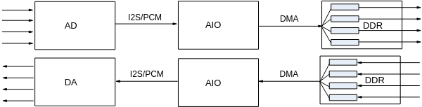
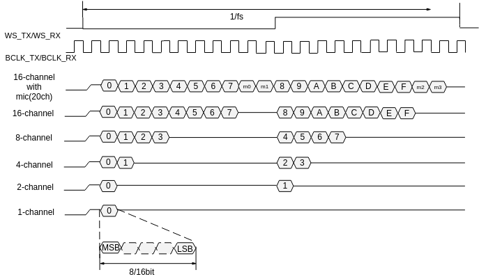
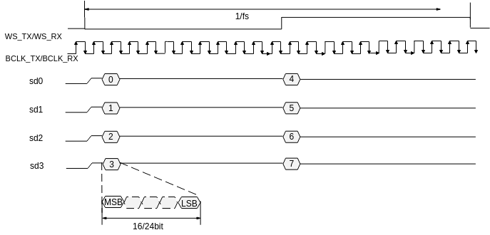
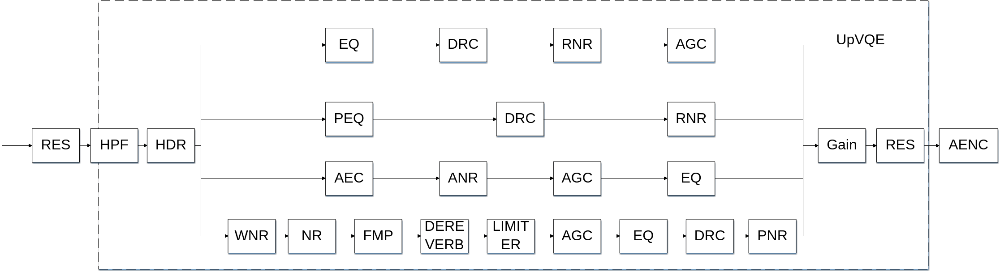
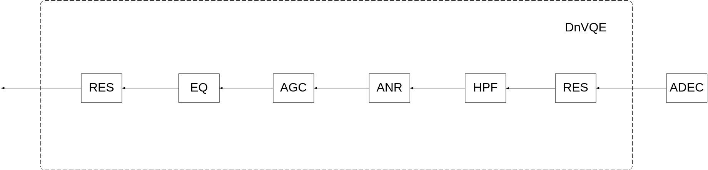
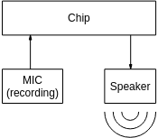
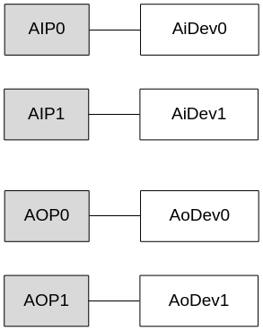
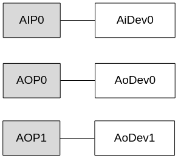
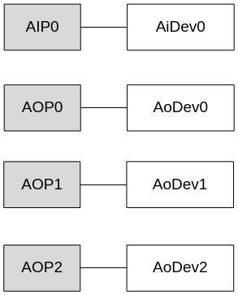
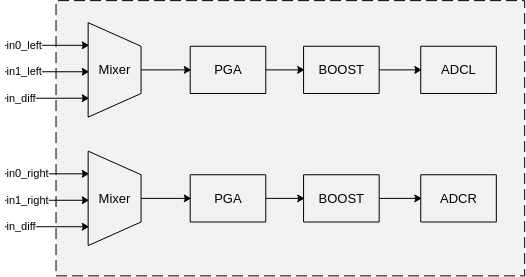

# 概述<a name="ZH-CN_TOPIC_0000002408259350"></a>

AUDIO模块包括音频输入、音频输出、音频编码、音频解码四个子模块。音频输入和输出模块通过对芯片音频接口的控制实现音频输入输出功能。音频编码和解码模块提供对G711、G726、ADPCM格式的音频编解码功能，并支持录制和播放LPCM格式的原始音频文件。

**注意：未有特殊说明，SS625V100描述与SS528V100一致；SS522V100描述与SS524V100一致。**

# 功能描述<a name="ZH-CN_TOPIC_0000002441658753"></a>


## 音频输入和音频输出<a name="ZH-CN_TOPIC_0000002441658809"></a>


### 音频接口和AI、AO设备<a name="ZH-CN_TOPIC_0000002408099678"></a>

音频输入输出接口简称为AIO（Audio Input/Output）接口，用于和Audio Codec对接，完成声音的录制和播放。

AIO接口分为两种类型：只支持输入或只支持输出。

-   当为输入类型时，又称为AIP；
-   当为输出类型时，又称为AOP。

软件中负责抽象音频接口输入功能的单元，称之为AI设备；负责抽象音频接口输出功能的单元，称之为AO设备。

对每个输入输出接口，软件根据该接口支持的功能，分别与AI设备和AO设备建立映射关系。例如：AIP0只支持音频输入，则AIP0映射为AiDev0；AOP0只支持音频输出，则AOP0映射为AoDev0。

### 录音和播放原理<a name="ZH-CN_TOPIC_0000002408259466"></a>

原始音频信号以模拟信号的形式给出后，通过Audio Codec，按一定采样率和采样精度转换为数字信号。Audio Codec以I2S时序或PCM时序的方式，将数字信号传输给AI设备。芯片利用DMA将AI设备中的音频数据搬移到内存中，完成录音操作。

播放和录音是基于同样的原理。芯片利用DMA将内存中的数据传输到AO设备。AO设备通过I2S时序或PCM时序向Audio Codec发送数据。Audio Codec完成数字信号到模拟信号的转换过程，并输出模拟信号。

**图 1**  录音和播放示意图<a name="fig8992195313516"></a>  


### 音频接口时序和AI、AO通道排列<a name="ZH-CN_TOPIC_0000002408099354"></a>

### 音频接口时序<a name="ZH-CN_TOPIC_0000002441658965"></a>

音频接口支持标准的I<sup>2</sup>S接口时序模式和PCM接口时序模式，并提供灵活的配置以支持与多种Audio Codec对接。详细的时序支持情况请参考对应芯片的用户指南。

为实现成功对接，需要对I<sup>2</sup>S或者PCM协议以及对接的Audio Codec时序支持情况有足够了解，这里只简单介绍下I<sup>2</sup>S及PCM接口时序的几个特性：

-   按照标准I<sup>2</sup>S或PCM协议，总是先传送最高有效位MSB，后传送最低有效位LSB，即按照从高位到低位的顺序传输串行数据。
-   AI设备支持扩展的多路接收的I2S及PCM接口时序。对接时，Codec的时序模式选择、同步时钟、采样位宽等配置必须与AI设备的配置保持一致，否则可能采集不到正确的数据。
-   AI/AO设备支持主模式和从模式，主模式即AI/AO设备提供时钟，从模式即Audio Codec提供时钟。主模式时，如果AI设备与AO设备同时对接同一个Codec，则时钟供输入和输出共同使用，其他情况没有此限制。而从模式时的输入输出时钟可以分别由外围Audio Codec提供。
-   由于时序的问题，在AI/AO设备从模式下，建议用户先配置好对接的Codec，再配置AI或AO设备；而在AI/AO设备主模式下，建议用户先配置好AI或AO设备，再配置对接的Codec。
-   AI/AO设备选择主模式时，有些AI/AO设备只提供用于时序同步的帧同步时钟和位流时钟，不提供MCLK，这时如果Audio Codec使用外接的晶振作为工作时钟，这样可能导致声音失真，因此推荐使用从模式或者使用位流时钟产生Codec内部工作主时钟。
-   当AI/AO设备为主模式时，对于向外提供了MCLK的AI/AO设备，通道数为1/2/4/8/16路时，MCLK的设定为：

    -   采样率为96k/48k/24k/12k时，提供12.288MHz的主时钟。
    -   采样率为64k/32k/16k/8k时，提供8.192MHz的主时钟。
    -   采样率为44.1k/22.05k/11.025k时，提供11.2896MHz的主时钟。

    通道数为20路时，MCLK的设定为：

    -   采样率为48k/24k/12k时，提供15.36MHz的主时钟。
    -   采样率为32k/16k/8k时，提供10.24MHz的主时钟。
    -   采样率为44.1k/22.05k/11.025k时，提供14.112MHz的主时钟。

-   AI/AO设备支持标准PCM模式和自定义PCM模式。PCM模式下只支持单声道模式，因此在PCM模式下，需要关闭对接Codec的右声道输出，否则声音会有杂音。根据PCM标准模式协议，当工作模式为标准PCM主模式或标准PCM从模式时，音频输入输出的数据相对帧同步信号延迟1个位流时钟（BCLK）周期。如果在标准PCM主模式或标准PCM从模式下对接外置的Codec，需要确保外置Codec的数据相对帧同步信号延迟的位流时钟（BCLK）周期数大于音频输入输出数据相对帧同步信号延迟的位流时钟周期数（1个BCLK），否则声音会有杂音。

**图 1**  I<sup>2</sup>S 1/2/4/8/16/20路接收<a name="fig16704633154818"></a>  


注：m0\~m3为4路mic数据。1ch模式仅在非时分复用时支持。

### AI、AO通道<a name="ZH-CN_TOPIC_0000002441658865"></a>

AI和AO通道是软件层次的概念，下面通过举例的方式来说明通道的概念。

例如：

-   当AI设备使用多路复用的I2S接收模式时，标准的I2S协议只有左右声道这个概念，AI设备最大支持左右声道各接收128bit音频数据。此时假设Codec具有复用功能，可以将16路16bit采样精度的音频数据复用为2路128bit的I2S左右声道数据，那么AI设备可以解析这16路音频数据，并称这16路音频数据为16个音频通道。
-   当AO设备使用多路复用的I2S发送模式时，标准的I2S协议只有左右声道这个概念，AO设备最大支持左右声道各发送128bit音频数据。此时假设Codec具有复用功能，可以将8路24bit采样精度的音频数据复用为2路128bit的I2S左右声道数据，那么AO设备可以解析这8路音频数据，并称这8路音频数据为8个音频通道。
-   当AO设备使用多线的I2S发送模式时，此时仅支持标准的I2S协议，即每根数据线最大支持左右声道各发送24bit数据。此时假设使用了4根数据线，可以将每根数据线上的左右声道数据视为2路音频数据，那么AO设备可以发送这8路音频数据，并称这8路音频数据为8个音频通道。

AIO在不同协议时，支持的AI、AO多路复用模式有差异，不同的解决方案也不相同。

-   SS528V100/SS524V100如[表1](#_Ref13905931)所示。

**表 1**  SS528V100/SS524V100 AIO最大支持AI、AO通道数

<a name="_Ref13905931"></a>
<table><thead align="left"><tr id="row211mcpsimp"><th class="cellrowborder" valign="top" width="28.28282828282828%" id="mcps1.2.4.1.1"><p id="p213mcpsimp"><a name="p213mcpsimp"></a><a name="p213mcpsimp"></a>AIO多路复用</p>
</th>
<th class="cellrowborder" valign="top" width="32.32323232323232%" id="mcps1.2.4.1.2"><p id="p215mcpsimp"><a name="p215mcpsimp"></a><a name="p215mcpsimp"></a>最大支持</p>
</th>
<th class="cellrowborder" valign="top" width="39.39393939393939%" id="mcps1.2.4.1.3"><p id="p217mcpsimp"><a name="p217mcpsimp"></a><a name="p217mcpsimp"></a>通道举例</p>
</th>
</tr>
</thead>
<tbody><tr id="row219mcpsimp"><td class="cellrowborder" valign="top" width="28.28282828282828%" headers="mcps1.2.4.1.1 "><p id="p221mcpsimp"><a name="p221mcpsimp"></a><a name="p221mcpsimp"></a>I<sup id="sup222mcpsimp"><a name="sup222mcpsimp"></a><a name="sup222mcpsimp"></a>2</sup>S时序接收</p>
</td>
<td class="cellrowborder" valign="top" width="32.32323232323232%" headers="mcps1.2.4.1.2 "><p id="p224mcpsimp"><a name="p224mcpsimp"></a><a name="p224mcpsimp"></a>左右声道各160bit</p>
</td>
<td class="cellrowborder" valign="top" width="39.39393939393939%" headers="mcps1.2.4.1.3 "><p id="p226mcpsimp"><a name="p226mcpsimp"></a><a name="p226mcpsimp"></a>16bit20chn等</p>
</td>
</tr>
<tr id="row227mcpsimp"><td class="cellrowborder" valign="top" width="28.28282828282828%" headers="mcps1.2.4.1.1 "><p id="p229mcpsimp"><a name="p229mcpsimp"></a><a name="p229mcpsimp"></a>PCM时序接收</p>
</td>
<td class="cellrowborder" valign="top" width="32.32323232323232%" headers="mcps1.2.4.1.2 "><p id="p231mcpsimp"><a name="p231mcpsimp"></a><a name="p231mcpsimp"></a>单声道320bit</p>
</td>
<td class="cellrowborder" valign="top" width="39.39393939393939%" headers="mcps1.2.4.1.3 "><p id="p233mcpsimp"><a name="p233mcpsimp"></a><a name="p233mcpsimp"></a>16bit20chn等</p>
</td>
</tr>
<tr id="row234mcpsimp"><td class="cellrowborder" valign="top" width="28.28282828282828%" headers="mcps1.2.4.1.1 "><p id="p236mcpsimp"><a name="p236mcpsimp"></a><a name="p236mcpsimp"></a>I<sup id="sup237mcpsimp"><a name="sup237mcpsimp"></a><a name="sup237mcpsimp"></a>2</sup>S时序发送</p>
</td>
<td class="cellrowborder" valign="top" width="32.32323232323232%" headers="mcps1.2.4.1.2 "><p id="p239mcpsimp"><a name="p239mcpsimp"></a><a name="p239mcpsimp"></a>每根数据线左右声道各24bit（支持4根数据线，最大仅2根有效）</p>
</td>
<td class="cellrowborder" valign="top" width="39.39393939393939%" headers="mcps1.2.4.1.3 "><p id="p241mcpsimp"><a name="p241mcpsimp"></a><a name="p241mcpsimp"></a>24bit8chn等</p>
</td>
</tr>
<tr id="row242mcpsimp"><td class="cellrowborder" valign="top" width="28.28282828282828%" headers="mcps1.2.4.1.1 "><p id="p244mcpsimp"><a name="p244mcpsimp"></a><a name="p244mcpsimp"></a>PCM时序发送</p>
</td>
<td class="cellrowborder" valign="top" width="32.32323232323232%" headers="mcps1.2.4.1.2 "><p id="p246mcpsimp"><a name="p246mcpsimp"></a><a name="p246mcpsimp"></a>单声道16bit</p>
</td>
<td class="cellrowborder" valign="top" width="39.39393939393939%" headers="mcps1.2.4.1.3 "><p id="p248mcpsimp"><a name="p248mcpsimp"></a><a name="p248mcpsimp"></a>16bit1chn</p>
</td>
</tr>
</tbody>
</table>

-   SS928V100如[表2](#_Ref47711415)所示。

**表 2**  SS928V100 AIO最大支持AI、AO通道数

<a name="_Ref47711415"></a>
<table><thead align="left"><tr id="row258mcpsimp"><th class="cellrowborder" valign="top" width="28.28282828282828%" id="mcps1.2.4.1.1"><p id="p260mcpsimp"><a name="p260mcpsimp"></a><a name="p260mcpsimp"></a>AIO多路复用</p>
</th>
<th class="cellrowborder" valign="top" width="32.32323232323232%" id="mcps1.2.4.1.2"><p id="p262mcpsimp"><a name="p262mcpsimp"></a><a name="p262mcpsimp"></a>最大支持</p>
</th>
<th class="cellrowborder" valign="top" width="39.39393939393939%" id="mcps1.2.4.1.3"><p id="p264mcpsimp"><a name="p264mcpsimp"></a><a name="p264mcpsimp"></a>通道举例</p>
</th>
</tr>
</thead>
<tbody><tr id="row266mcpsimp"><td class="cellrowborder" valign="top" width="28.28282828282828%" headers="mcps1.2.4.1.1 "><p id="p268mcpsimp"><a name="p268mcpsimp"></a><a name="p268mcpsimp"></a>I<sup id="sup269mcpsimp"><a name="sup269mcpsimp"></a><a name="sup269mcpsimp"></a>2</sup>S时序接收</p>
</td>
<td class="cellrowborder" valign="top" width="32.32323232323232%" headers="mcps1.2.4.1.2 "><p id="p271mcpsimp"><a name="p271mcpsimp"></a><a name="p271mcpsimp"></a>左右声道各128bit</p>
</td>
<td class="cellrowborder" valign="top" width="39.39393939393939%" headers="mcps1.2.4.1.3 "><p id="p273mcpsimp"><a name="p273mcpsimp"></a><a name="p273mcpsimp"></a>16bit16chn等</p>
</td>
</tr>
<tr id="row274mcpsimp"><td class="cellrowborder" valign="top" width="28.28282828282828%" headers="mcps1.2.4.1.1 "><p id="p276mcpsimp"><a name="p276mcpsimp"></a><a name="p276mcpsimp"></a>PCM时序接收</p>
</td>
<td class="cellrowborder" valign="top" width="32.32323232323232%" headers="mcps1.2.4.1.2 "><p id="p278mcpsimp"><a name="p278mcpsimp"></a><a name="p278mcpsimp"></a>单声道256bit</p>
</td>
<td class="cellrowborder" valign="top" width="39.39393939393939%" headers="mcps1.2.4.1.3 "><p id="p280mcpsimp"><a name="p280mcpsimp"></a><a name="p280mcpsimp"></a>16bit16chn等</p>
</td>
</tr>
<tr id="row281mcpsimp"><td class="cellrowborder" valign="top" width="28.28282828282828%" headers="mcps1.2.4.1.1 "><p id="p283mcpsimp"><a name="p283mcpsimp"></a><a name="p283mcpsimp"></a>I<sup id="sup284mcpsimp"><a name="sup284mcpsimp"></a><a name="sup284mcpsimp"></a>2</sup>S时序发送</p>
</td>
<td class="cellrowborder" valign="top" width="32.32323232323232%" headers="mcps1.2.4.1.2 "><p id="p286mcpsimp"><a name="p286mcpsimp"></a><a name="p286mcpsimp"></a>左右声道各128bit</p>
</td>
<td class="cellrowborder" valign="top" width="39.39393939393939%" headers="mcps1.2.4.1.3 "><p id="p288mcpsimp"><a name="p288mcpsimp"></a><a name="p288mcpsimp"></a>16bit8chn等</p>
</td>
</tr>
<tr id="row289mcpsimp"><td class="cellrowborder" valign="top" width="28.28282828282828%" headers="mcps1.2.4.1.1 "><p id="p291mcpsimp"><a name="p291mcpsimp"></a><a name="p291mcpsimp"></a>PCM时序发送</p>
</td>
<td class="cellrowborder" valign="top" width="32.32323232323232%" headers="mcps1.2.4.1.2 "><p id="p293mcpsimp"><a name="p293mcpsimp"></a><a name="p293mcpsimp"></a>单声道16bit</p>
</td>
<td class="cellrowborder" valign="top" width="39.39393939393939%" headers="mcps1.2.4.1.3 "><p id="p295mcpsimp"><a name="p295mcpsimp"></a><a name="p295mcpsimp"></a>16bit1chn</p>
</td>
</tr>
</tbody>
</table>

-   SS626V100如[表3](#_Ref82074699)所示。

**表 3**  SS626V100 AIO最大支持AI、AO通道数

<a name="_Ref82074699"></a>
<table><thead align="left"><tr id="row305mcpsimp"><th class="cellrowborder" valign="top" width="28.28282828282828%" id="mcps1.2.4.1.1"><p id="p307mcpsimp"><a name="p307mcpsimp"></a><a name="p307mcpsimp"></a>AIO多路复用</p>
</th>
<th class="cellrowborder" valign="top" width="32.32323232323232%" id="mcps1.2.4.1.2"><p id="p309mcpsimp"><a name="p309mcpsimp"></a><a name="p309mcpsimp"></a>最大支持</p>
</th>
<th class="cellrowborder" valign="top" width="39.39393939393939%" id="mcps1.2.4.1.3"><p id="p311mcpsimp"><a name="p311mcpsimp"></a><a name="p311mcpsimp"></a>通道举例</p>
</th>
</tr>
</thead>
<tbody><tr id="row313mcpsimp"><td class="cellrowborder" valign="top" width="28.28282828282828%" headers="mcps1.2.4.1.1 "><p id="p315mcpsimp"><a name="p315mcpsimp"></a><a name="p315mcpsimp"></a>I<sup id="sup316mcpsimp"><a name="sup316mcpsimp"></a><a name="sup316mcpsimp"></a>2</sup>S时序接收</p>
</td>
<td class="cellrowborder" valign="top" width="32.32323232323232%" headers="mcps1.2.4.1.2 "><p id="p318mcpsimp"><a name="p318mcpsimp"></a><a name="p318mcpsimp"></a>左右声道各160bit</p>
</td>
<td class="cellrowborder" valign="top" width="39.39393939393939%" headers="mcps1.2.4.1.3 "><p id="p320mcpsimp"><a name="p320mcpsimp"></a><a name="p320mcpsimp"></a>16bit20chn等</p>
</td>
</tr>
<tr id="row321mcpsimp"><td class="cellrowborder" valign="top" width="28.28282828282828%" headers="mcps1.2.4.1.1 "><p id="p323mcpsimp"><a name="p323mcpsimp"></a><a name="p323mcpsimp"></a>PCM时序接收</p>
</td>
<td class="cellrowborder" valign="top" width="32.32323232323232%" headers="mcps1.2.4.1.2 "><p id="p325mcpsimp"><a name="p325mcpsimp"></a><a name="p325mcpsimp"></a>单声道320bit</p>
</td>
<td class="cellrowborder" valign="top" width="39.39393939393939%" headers="mcps1.2.4.1.3 "><p id="p327mcpsimp"><a name="p327mcpsimp"></a><a name="p327mcpsimp"></a>16bit20chn等</p>
</td>
</tr>
<tr id="row328mcpsimp"><td class="cellrowborder" valign="top" width="28.28282828282828%" headers="mcps1.2.4.1.1 "><p id="p330mcpsimp"><a name="p330mcpsimp"></a><a name="p330mcpsimp"></a>I<sup id="sup331mcpsimp"><a name="sup331mcpsimp"></a><a name="sup331mcpsimp"></a>2</sup>S时序发送</p>
</td>
<td class="cellrowborder" valign="top" width="32.32323232323232%" headers="mcps1.2.4.1.2 "><p id="p333mcpsimp"><a name="p333mcpsimp"></a><a name="p333mcpsimp"></a>左右声道各24bit</p>
</td>
<td class="cellrowborder" valign="top" width="39.39393939393939%" headers="mcps1.2.4.1.3 "><p id="p335mcpsimp"><a name="p335mcpsimp"></a><a name="p335mcpsimp"></a>16bit2chn等</p>
</td>
</tr>
<tr id="row336mcpsimp"><td class="cellrowborder" valign="top" width="28.28282828282828%" headers="mcps1.2.4.1.1 "><p id="p338mcpsimp"><a name="p338mcpsimp"></a><a name="p338mcpsimp"></a>PCM时序发送</p>
</td>
<td class="cellrowborder" valign="top" width="32.32323232323232%" headers="mcps1.2.4.1.2 "><p id="p340mcpsimp"><a name="p340mcpsimp"></a><a name="p340mcpsimp"></a>单声道16bit</p>
</td>
<td class="cellrowborder" valign="top" width="39.39393939393939%" headers="mcps1.2.4.1.3 "><p id="p342mcpsimp"><a name="p342mcpsimp"></a><a name="p342mcpsimp"></a>16bit1chn</p>
</td>
</tr>
</tbody>
</table>

AI、AO可以在AI/AO设备最大支持的比特范围内，按采样精度拆分AI和AO通道，并按照时序上的顺序，依次视为AiChn0、AiChn1等或AoChn0、AoChn1等。只有AI/AO设备配置的I<sup>2</sup>S或PCM时序与Codec配置的时序一致时，才能接收或传送正确的音频数据，将AI/AO设备的时序配置和Codec的时序配置调为一致的过程称作对接。例如配置AI为标准PCM从模式，8k采样率，16bit采样精度，2通道；配置Codec提供的帧同步时钟为8k，位流时钟为8kx32bit，每个采样点为32bit（Codec支持将两个16bit的采样点复用为一个采样点）；PCM时序上的通道排列如[图1](#fig3150146215)所示，I2S时序多线模式上的通道排列如[图2](#fig5981314020)所示。

**图 1**  PCM时序发送示意图<a name="fig3150146215"></a>  


**图 2**  I2S时序多线发送示意图<a name="fig5981314020"></a>  


SS528V100/SS524V100上音频AI支持的最大通道数为20通道，I2S模式下AO支持的最大通道数为8通道（每根数据线支持2通道，受I2S数据线数量限制，最大仅4通道有效），PCM模式下AO支持的最大通道数为1通道。多通道情况下，AI、AO视通道排列中相对应的两通道为立体声输入输出。

-   对于AI，例如[图1](#fig3150146215)中，通道0和4、1和5、2和6、3和7视为立体声的左右声道，即共有四路16bit采样精度的立体声输入，这时只应对左声道0\~3进行操作。
-   对于AO，例如[图2](#fig5981314020)中，通道0和4、1和5、2和6、3和7视为立体声的左右声道，即每根数据线传输一路立体声，共有四路立体声输出，这时只应对左声道0、1、2、3进行操作。

AIO接口中的AI设备与AO设备是相互独立的，如果它们同时对接同一个Codec，则AI和AO配置的工作模式必须一致，例如AI和AO均配置为I2S时序的从模式。当AIO工作在主模式时，AI和AO的通道数与采样精度的乘积也必须相等，这样才能保证由AIO发送给Audio Codec的同步时钟，对AI和AO是一致的，如果他们没有同时对接同一个Codec，则没有此限制。当AIO工作在从模式时，AI和AO的通道数与采样精度的乘积可以不一致，此时可以由Audio Codec发送不同的同步时钟给AI和AO。SDK支持通过SYS模块绑定接口，建立AI、AO通道间的绑定关系，实现音频数据的实时播放。

### 重采样<a name="ZH-CN_TOPIC_0000002441658761"></a>

音频输入和音频输出模块支持对音频数据实施重采样。如果启用AI重采样功能，则在[ss\_mpi\_ai\_get\_frame](#ZH-CN_TOPIC_0000002408099390)获取数据返回前，内部将会先执行重采样处理，再返回处理后的数据。如果启用了AO重采样功能，则音频数据在发送给AO之前，内部先执行重采样处理，处理完成后再发送给AO通道进行播放。

音频重采样支持任意两种不同采样率（64k、96k除外）之间的重采样，也支持64kHz下采样到8kHz或16kHz。重采样支持的输入采样率为：8kHz，11.025kHz，12kHz，16kHz，22.05kHz，24kHz，32kHz，44.1kHz，48kHz，64kHz，不支持的输入采样率：96kHz；支持的输出采样率为：8kHz，11.025kHz，12kHz，16kHz，22.05kHz，24kHz，32kHz，44.1kHz，48kHz；不支持的输出采样率：64kHz，96kHz；重采样仅支持处理单声道。

-   如果是AI的重采样，则重采样的输入采样率与AI设备属性配置的采样率相同，重采样的输出采样率必须与AI设备属性配置的采样率不相同，用户只需要配置重采样的输出采样率。重采样之前的每帧采样点数目与AI设备属性配置的每帧采样点数目相同。
-   如果是AO的重采样，则重采样的输出采样率与AO设备属性配置的采样率相同，重采样的输入采样率必须与AO设备属性配置的采样率不相同，用户只需要配置重采样的输入采样率。重采样之后音频帧的每帧采样点数目与AO设备属性配置的每帧采样点数目相同。
-   如果AI的数据需要送到AENC进行编码且AI启动了重采样，则重采样后的音频帧长out\_point\_num\_per\_frame必须满足：CPU软件编码时out\_point\_num\_per\_frame小于等于编码通道属性的point\_num\_per\_frame；VOIE编码时out\_point\_num\_per\_frame必须是80、160、240、320、480中的一个值。out\_point\_num\_per\_frame、重采样前的音频帧长in\_point\_num\_per\_frame、重采样前的采样率in\_sample\_rate、重采样后的采样率out\_sample\_rate之间的换算关系为：out\_point\_num\_per\_frame=out\_sample\_rate \* in\_point\_num\_per\_frame / in\_sample\_rate。SS528V100/SS524V100不支持VOIE编码。

    > **须知：** 
    >-   当AI通道模式设为OT\_AI\_CHN\_MODE\_FAST且AI-AO、AI-AENC的数据传输方式为系统绑定方式时，AI的重采样无效，其余情况则AI的重采样有效。
    >-   非系统绑定方式下，用户可以通过[ss\_mpi\_ai\_get\_frame](#ZH-CN_TOPIC_0000002408099390)接口获取重采样处理后的AI音频帧，并发送给AENC/AO，以建立AI-AENC或AI-AO的数据传输，此时AI或AO的重采样有效。
    >-   当AI通道模式设为OT\_AI\_CHN\_MODE\_FAST时，启用AI的重采样功能后，建议不要在调用[ss\_mpi\_ai\_get\_frame](#ZH-CN_TOPIC_0000002408099390)获取该AI通道的数据后将同一个AI通道绑定到AENC通道，否则会导致重采样处理异常。
    >-   重采样输入采样率配置为64kHz时，仅支持输出采样率为8kHz或16kHz。
    >-   当AI通道模式设为OT\_AI\_CHN\_MODE\_NORMAL时，在启用AI的重采样后，支持同一个AI通道绑定多个AENC通道（重采样输出采样率需一致），也支持在AI绑定AENC通道后再调用[ss\_mpi\_ai\_get\_frame](#ZH-CN_TOPIC_0000002408099390)获取同一个AI通道的数据。
    >-   ADEC-AO的数据传输方式无上述限制，当为系统绑定方式时，AO的重采样仍有效。
    >-   接口[ss\_mpi\_ai\_enable\_resample](#ZH-CN_TOPIC_0000002441658785)和[ss\_mpi\_ai\_disable\_resample](#ZH-CN_TOPIC_0000002408099410)使用的是声音质量增强功能中的RES模块。
    >-   重采样仅支持OT\_AUDIO\_SOUND\_MODE\_MONO模式。
    >-   重采样不支持处理24bit位宽的数据。

### 声音质量增强（VQE）<a name="ZH-CN_TOPIC_0000002408099422"></a>

音频输入和输出模块支持对音频数据进行声音质量增强\(Voice Quality Enhancement\)处理。VQE针对AI和AO两条通路的异同点，分别通过UpVQE和DnVQE两个调度逻辑来处理两个通路的数据。

-   VQE现有TalkVQE、HIFIVQE、RecordVQE、TalkVQEV2四种方式。
    -   TalkVQE主要用于_录像机_语音对讲场景，适用于低音质语音处理场景（8/16kHz采样率，16bit位宽，单声道），支持双向对讲场景；
    -   HIFIVQE主要用于Mobile Camera录音场景，适用于高音质语音处理场景（48kHz采样率，16bit位宽，单声道），不支持双向对讲；
    -   RecordVQE是HIFIVQE的升级版本，其支持16/48kHz采样率，16bit位宽，单/双声道。对于支持RecordVQE和其他方式的解决方案来说，Mobile Camera录音场景推荐优先使用RecordVQE。
    -   TalkVQEV2是TalkVQE的升级版本，其支持16kHz采样率，16bit位宽，双声道。对于支持TalkVQEV2和其他方式的解决方案来说，_录像机_场景推荐优先使用TalkVQEV2。

-   AI上行通路的VQE最多支持TalkVQE、HIFIVQE、RecordVQE三种方式，其功能包含回声抵消、语音降噪、自动增益、高通滤波、录音噪声消除、均衡器、动态压缩、参量均衡器、高动态范围九个处理模块，如[图1](#fig10208037175514)所示。AI上行通路的VQE功能在[ss\_mpi\_ai\_get\_frame](#ZH-CN_TOPIC_0000002408099390)接口内实现，并返回处理后的数据。
-   AO下行通路的VQE支持TalkVQE方式，其功能包含语音降噪、自动增益、高通滤波、均衡器四个处理模块，如[图2](#fig1292512568568)所示。AO下行通路的VQE功能在[ss\_mpi\_ao\_send\_frame](#ZH-CN_TOPIC_0000002408259474)接口内实现。

VQE分为2个调度接口模块（UpVQE和DnVQE），11个功能模块（AEC、ANR、AGC、RNR、EQ、HPF、GAIN、RES、HDR、DRC、PEQ），以及1个共用模块（COMMON）。两个调度逻辑使用libdl库的dlopen方式动态加载各个功能模块，通过统一功能模块的API接口格式，对功能模块进行统一调度。VQE功能模块支持剪裁，用户可根据实际应用场景选择需要用到的功能模块动态库文件，如[表1](#_Ref426618660)所示。

**表 1**  VQE库的应用关系

<a name="_Ref426618660"></a>
<table><thead align="left"><tr id="row11158mcpsimp"><th class="cellrowborder" valign="top" width="10.16%" id="mcps1.2.9.1.1"><p id="p11160mcpsimp"><a name="p11160mcpsimp"></a><a name="p11160mcpsimp"></a>模块名</p>
</th>
<th class="cellrowborder" valign="top" width="14.59%" id="mcps1.2.9.1.2"><p id="p11162mcpsimp"><a name="p11162mcpsimp"></a><a name="p11162mcpsimp"></a>功能描述</p>
</th>
<th class="cellrowborder" valign="top" width="14.95%" id="mcps1.2.9.1.3"><p id="p11164mcpsimp"><a name="p11164mcpsimp"></a><a name="p11164mcpsimp"></a>库文件名称</p>
</th>
<th class="cellrowborder" valign="top" width="9%" id="mcps1.2.9.1.4"><p id="p11166mcpsimp"><a name="p11166mcpsimp"></a><a name="p11166mcpsimp"></a>AI上行通路</p>
</th>
<th class="cellrowborder" valign="top" width="9.91%" id="mcps1.2.9.1.5"><p id="p11168mcpsimp"><a name="p11168mcpsimp"></a><a name="p11168mcpsimp"></a>AO下行通路</p>
</th>
<th class="cellrowborder" valign="top" width="10.85%" id="mcps1.2.9.1.6"><p id="p11170mcpsimp"><a name="p11170mcpsimp"></a><a name="p11170mcpsimp"></a>是否可剪裁</p>
</th>
<th class="cellrowborder" valign="top" width="13.52%" id="mcps1.2.9.1.7"><p id="p11172mcpsimp"><a name="p11172mcpsimp"></a><a name="p11172mcpsimp"></a>依赖</p>
</th>
<th class="cellrowborder" valign="top" width="17.02%" id="mcps1.2.9.1.8"><p id="p11174mcpsimp"><a name="p11174mcpsimp"></a><a name="p11174mcpsimp"></a>互斥</p>
</th>
</tr>
</thead>
<tbody><tr id="row11176mcpsimp"><td class="cellrowborder" valign="top" width="10.16%" headers="mcps1.2.9.1.1 "><p id="p11178mcpsimp"><a name="p11178mcpsimp"></a><a name="p11178mcpsimp"></a>UpVQE</p>
</td>
<td class="cellrowborder" valign="top" width="14.59%" headers="mcps1.2.9.1.2 "><p id="p11180mcpsimp"><a name="p11180mcpsimp"></a><a name="p11180mcpsimp"></a>AI音效处理调度接口</p>
</td>
<td class="cellrowborder" valign="top" width="14.95%" headers="mcps1.2.9.1.3 "><p id="p11182mcpsimp"><a name="p11182mcpsimp"></a><a name="p11182mcpsimp"></a>libss_upvqe.a(.so)</p>
</td>
<td class="cellrowborder" valign="top" width="9%" headers="mcps1.2.9.1.4 "><p id="p11184mcpsimp"><a name="p11184mcpsimp"></a><a name="p11184mcpsimp"></a>有</p>
</td>
<td class="cellrowborder" valign="top" width="9.91%" headers="mcps1.2.9.1.5 "><p id="p11186mcpsimp"><a name="p11186mcpsimp"></a><a name="p11186mcpsimp"></a>无</p>
</td>
<td class="cellrowborder" valign="top" width="10.85%" headers="mcps1.2.9.1.6 "><p id="p11188mcpsimp"><a name="p11188mcpsimp"></a><a name="p11188mcpsimp"></a>否</p>
</td>
<td class="cellrowborder" valign="top" width="13.52%" headers="mcps1.2.9.1.7 "><p id="p11190mcpsimp"><a name="p11190mcpsimp"></a><a name="p11190mcpsimp"></a>无</p>
</td>
<td class="cellrowborder" valign="top" width="17.02%" headers="mcps1.2.9.1.8 "><p id="p11192mcpsimp"><a name="p11192mcpsimp"></a><a name="p11192mcpsimp"></a>无</p>
</td>
</tr>
<tr id="row11193mcpsimp"><td class="cellrowborder" valign="top" width="10.16%" headers="mcps1.2.9.1.1 "><p id="p11195mcpsimp"><a name="p11195mcpsimp"></a><a name="p11195mcpsimp"></a>DnVQE</p>
</td>
<td class="cellrowborder" valign="top" width="14.59%" headers="mcps1.2.9.1.2 "><p id="p11197mcpsimp"><a name="p11197mcpsimp"></a><a name="p11197mcpsimp"></a>AO音效处理调度接口</p>
</td>
<td class="cellrowborder" valign="top" width="14.95%" headers="mcps1.2.9.1.3 "><p id="p11199mcpsimp"><a name="p11199mcpsimp"></a><a name="p11199mcpsimp"></a>libss_dnvqe.a(.so)</p>
</td>
<td class="cellrowborder" valign="top" width="9%" headers="mcps1.2.9.1.4 "><p id="p11201mcpsimp"><a name="p11201mcpsimp"></a><a name="p11201mcpsimp"></a>无</p>
</td>
<td class="cellrowborder" valign="top" width="9.91%" headers="mcps1.2.9.1.5 "><p id="p11203mcpsimp"><a name="p11203mcpsimp"></a><a name="p11203mcpsimp"></a>有</p>
</td>
<td class="cellrowborder" valign="top" width="10.85%" headers="mcps1.2.9.1.6 "><p id="p11205mcpsimp"><a name="p11205mcpsimp"></a><a name="p11205mcpsimp"></a>否</p>
</td>
<td class="cellrowborder" valign="top" width="13.52%" headers="mcps1.2.9.1.7 "><p id="p11207mcpsimp"><a name="p11207mcpsimp"></a><a name="p11207mcpsimp"></a>无</p>
</td>
<td class="cellrowborder" valign="top" width="17.02%" headers="mcps1.2.9.1.8 "><p id="p11209mcpsimp"><a name="p11209mcpsimp"></a><a name="p11209mcpsimp"></a>无</p>
</td>
</tr>
<tr id="row11210mcpsimp"><td class="cellrowborder" valign="top" width="10.16%" headers="mcps1.2.9.1.1 "><p id="p11212mcpsimp"><a name="p11212mcpsimp"></a><a name="p11212mcpsimp"></a>AEC</p>
</td>
<td class="cellrowborder" valign="top" width="14.59%" headers="mcps1.2.9.1.2 "><p id="p11214mcpsimp"><a name="p11214mcpsimp"></a><a name="p11214mcpsimp"></a>回声抵消</p>
</td>
<td class="cellrowborder" valign="top" width="14.95%" headers="mcps1.2.9.1.3 "><p id="p11216mcpsimp"><a name="p11216mcpsimp"></a><a name="p11216mcpsimp"></a>libvqe_aec.so</p>
</td>
<td class="cellrowborder" valign="top" width="9%" headers="mcps1.2.9.1.4 "><p id="p11218mcpsimp"><a name="p11218mcpsimp"></a><a name="p11218mcpsimp"></a>有</p>
</td>
<td class="cellrowborder" valign="top" width="9.91%" headers="mcps1.2.9.1.5 "><p id="p11220mcpsimp"><a name="p11220mcpsimp"></a><a name="p11220mcpsimp"></a>无</p>
</td>
<td class="cellrowborder" valign="top" width="10.85%" headers="mcps1.2.9.1.6 "><p id="p11222mcpsimp"><a name="p11222mcpsimp"></a><a name="p11222mcpsimp"></a>是</p>
</td>
<td class="cellrowborder" valign="top" width="13.52%" headers="mcps1.2.9.1.7 "><p id="p11224mcpsimp"><a name="p11224mcpsimp"></a><a name="p11224mcpsimp"></a>COMMON</p>
</td>
<td class="cellrowborder" valign="top" width="17.02%" headers="mcps1.2.9.1.8 "><p id="p11226mcpsimp"><a name="p11226mcpsimp"></a><a name="p11226mcpsimp"></a>RNR/DRC/PEQ</p>
</td>
</tr>
<tr id="row11227mcpsimp"><td class="cellrowborder" valign="top" width="10.16%" headers="mcps1.2.9.1.1 "><p id="p11229mcpsimp"><a name="p11229mcpsimp"></a><a name="p11229mcpsimp"></a>ANR</p>
</td>
<td class="cellrowborder" valign="top" width="14.59%" headers="mcps1.2.9.1.2 "><p id="p11231mcpsimp"><a name="p11231mcpsimp"></a><a name="p11231mcpsimp"></a>语音降噪</p>
</td>
<td class="cellrowborder" valign="top" width="14.95%" headers="mcps1.2.9.1.3 "><p id="p11233mcpsimp"><a name="p11233mcpsimp"></a><a name="p11233mcpsimp"></a>libvqe_anr.so</p>
</td>
<td class="cellrowborder" valign="top" width="9%" headers="mcps1.2.9.1.4 "><p id="p11235mcpsimp"><a name="p11235mcpsimp"></a><a name="p11235mcpsimp"></a>有</p>
</td>
<td class="cellrowborder" valign="top" width="9.91%" headers="mcps1.2.9.1.5 "><p id="p11237mcpsimp"><a name="p11237mcpsimp"></a><a name="p11237mcpsimp"></a>有</p>
</td>
<td class="cellrowborder" valign="top" width="10.85%" headers="mcps1.2.9.1.6 "><p id="p11239mcpsimp"><a name="p11239mcpsimp"></a><a name="p11239mcpsimp"></a>是</p>
</td>
<td class="cellrowborder" valign="top" width="13.52%" headers="mcps1.2.9.1.7 "><p id="p11241mcpsimp"><a name="p11241mcpsimp"></a><a name="p11241mcpsimp"></a>COMMON</p>
</td>
<td class="cellrowborder" valign="top" width="17.02%" headers="mcps1.2.9.1.8 "><p id="p11243mcpsimp"><a name="p11243mcpsimp"></a><a name="p11243mcpsimp"></a>RNR/DRC/PEQ</p>
</td>
</tr>
<tr id="row11244mcpsimp"><td class="cellrowborder" valign="top" width="10.16%" headers="mcps1.2.9.1.1 "><p id="p11246mcpsimp"><a name="p11246mcpsimp"></a><a name="p11246mcpsimp"></a>AGC</p>
</td>
<td class="cellrowborder" valign="top" width="14.59%" headers="mcps1.2.9.1.2 "><p id="p11248mcpsimp"><a name="p11248mcpsimp"></a><a name="p11248mcpsimp"></a>自动增益控制</p>
</td>
<td class="cellrowborder" valign="top" width="14.95%" headers="mcps1.2.9.1.3 "><p id="p11250mcpsimp"><a name="p11250mcpsimp"></a><a name="p11250mcpsimp"></a>libvqe_agc.so</p>
</td>
<td class="cellrowborder" valign="top" width="9%" headers="mcps1.2.9.1.4 "><p id="p11252mcpsimp"><a name="p11252mcpsimp"></a><a name="p11252mcpsimp"></a>有</p>
</td>
<td class="cellrowborder" valign="top" width="9.91%" headers="mcps1.2.9.1.5 "><p id="p11254mcpsimp"><a name="p11254mcpsimp"></a><a name="p11254mcpsimp"></a>有</p>
</td>
<td class="cellrowborder" valign="top" width="10.85%" headers="mcps1.2.9.1.6 "><p id="p11256mcpsimp"><a name="p11256mcpsimp"></a><a name="p11256mcpsimp"></a>是</p>
</td>
<td class="cellrowborder" valign="top" width="13.52%" headers="mcps1.2.9.1.7 "><p id="p11258mcpsimp"><a name="p11258mcpsimp"></a><a name="p11258mcpsimp"></a>COMMON</p>
</td>
<td class="cellrowborder" valign="top" width="17.02%" headers="mcps1.2.9.1.8 "><p id="p11260mcpsimp"><a name="p11260mcpsimp"></a><a name="p11260mcpsimp"></a>PEQ</p>
</td>
</tr>
<tr id="row11261mcpsimp"><td class="cellrowborder" valign="top" width="10.16%" headers="mcps1.2.9.1.1 "><p id="p11263mcpsimp"><a name="p11263mcpsimp"></a><a name="p11263mcpsimp"></a>RNR</p>
</td>
<td class="cellrowborder" valign="top" width="14.59%" headers="mcps1.2.9.1.2 "><p id="p11265mcpsimp"><a name="p11265mcpsimp"></a><a name="p11265mcpsimp"></a>录音噪声消除</p>
</td>
<td class="cellrowborder" valign="top" width="14.95%" headers="mcps1.2.9.1.3 "><p id="p11267mcpsimp"><a name="p11267mcpsimp"></a><a name="p11267mcpsimp"></a>libvqe_rnr.so</p>
</td>
<td class="cellrowborder" valign="top" width="9%" headers="mcps1.2.9.1.4 "><p id="p11269mcpsimp"><a name="p11269mcpsimp"></a><a name="p11269mcpsimp"></a>有</p>
</td>
<td class="cellrowborder" valign="top" width="9.91%" headers="mcps1.2.9.1.5 "><p id="p11271mcpsimp"><a name="p11271mcpsimp"></a><a name="p11271mcpsimp"></a>无</p>
</td>
<td class="cellrowborder" valign="top" width="10.85%" headers="mcps1.2.9.1.6 "><p id="p11273mcpsimp"><a name="p11273mcpsimp"></a><a name="p11273mcpsimp"></a>是</p>
</td>
<td class="cellrowborder" valign="top" width="13.52%" headers="mcps1.2.9.1.7 "><p id="p11275mcpsimp"><a name="p11275mcpsimp"></a><a name="p11275mcpsimp"></a>无</p>
</td>
<td class="cellrowborder" valign="top" width="17.02%" headers="mcps1.2.9.1.8 "><p id="p11277mcpsimp"><a name="p11277mcpsimp"></a><a name="p11277mcpsimp"></a>AEC/ANR</p>
</td>
</tr>
<tr id="row11278mcpsimp"><td class="cellrowborder" valign="top" width="10.16%" headers="mcps1.2.9.1.1 "><p id="p11280mcpsimp"><a name="p11280mcpsimp"></a><a name="p11280mcpsimp"></a>DRC</p>
</td>
<td class="cellrowborder" valign="top" width="14.59%" headers="mcps1.2.9.1.2 "><p id="p11282mcpsimp"><a name="p11282mcpsimp"></a><a name="p11282mcpsimp"></a>动态压缩控制</p>
</td>
<td class="cellrowborder" valign="top" width="14.95%" headers="mcps1.2.9.1.3 "><p id="p11284mcpsimp"><a name="p11284mcpsimp"></a><a name="p11284mcpsimp"></a>libvqe_drc.so</p>
</td>
<td class="cellrowborder" valign="top" width="9%" headers="mcps1.2.9.1.4 "><p id="p11286mcpsimp"><a name="p11286mcpsimp"></a><a name="p11286mcpsimp"></a>有</p>
</td>
<td class="cellrowborder" valign="top" width="9.91%" headers="mcps1.2.9.1.5 "><p id="p11288mcpsimp"><a name="p11288mcpsimp"></a><a name="p11288mcpsimp"></a>无</p>
</td>
<td class="cellrowborder" valign="top" width="10.85%" headers="mcps1.2.9.1.6 "><p id="p11290mcpsimp"><a name="p11290mcpsimp"></a><a name="p11290mcpsimp"></a>是</p>
</td>
<td class="cellrowborder" valign="top" width="13.52%" headers="mcps1.2.9.1.7 "><p id="p11292mcpsimp"><a name="p11292mcpsimp"></a><a name="p11292mcpsimp"></a>无</p>
</td>
<td class="cellrowborder" valign="top" width="17.02%" headers="mcps1.2.9.1.8 "><p id="p11294mcpsimp"><a name="p11294mcpsimp"></a><a name="p11294mcpsimp"></a>AEC/ANR</p>
</td>
</tr>
<tr id="row11295mcpsimp"><td class="cellrowborder" valign="top" width="10.16%" headers="mcps1.2.9.1.1 "><p id="p11297mcpsimp"><a name="p11297mcpsimp"></a><a name="p11297mcpsimp"></a>PEQ</p>
</td>
<td class="cellrowborder" valign="top" width="14.59%" headers="mcps1.2.9.1.2 "><p id="p11299mcpsimp"><a name="p11299mcpsimp"></a><a name="p11299mcpsimp"></a>参量均衡器</p>
</td>
<td class="cellrowborder" valign="top" width="14.95%" headers="mcps1.2.9.1.3 "><p id="p11301mcpsimp"><a name="p11301mcpsimp"></a><a name="p11301mcpsimp"></a>libvqe_peq.so</p>
</td>
<td class="cellrowborder" valign="top" width="9%" headers="mcps1.2.9.1.4 "><p id="p11303mcpsimp"><a name="p11303mcpsimp"></a><a name="p11303mcpsimp"></a>有</p>
</td>
<td class="cellrowborder" valign="top" width="9.91%" headers="mcps1.2.9.1.5 "><p id="p11305mcpsimp"><a name="p11305mcpsimp"></a><a name="p11305mcpsimp"></a>无</p>
</td>
<td class="cellrowborder" valign="top" width="10.85%" headers="mcps1.2.9.1.6 "><p id="p11307mcpsimp"><a name="p11307mcpsimp"></a><a name="p11307mcpsimp"></a>是</p>
</td>
<td class="cellrowborder" valign="top" width="13.52%" headers="mcps1.2.9.1.7 "><p id="p11309mcpsimp"><a name="p11309mcpsimp"></a><a name="p11309mcpsimp"></a>无</p>
</td>
<td class="cellrowborder" valign="top" width="17.02%" headers="mcps1.2.9.1.8 "><p id="p11311mcpsimp"><a name="p11311mcpsimp"></a><a name="p11311mcpsimp"></a>AEC/ANR/AGC/EQ</p>
</td>
</tr>
<tr id="row11312mcpsimp"><td class="cellrowborder" valign="top" width="10.16%" headers="mcps1.2.9.1.1 "><p id="p11314mcpsimp"><a name="p11314mcpsimp"></a><a name="p11314mcpsimp"></a>HDR</p>
</td>
<td class="cellrowborder" valign="top" width="14.59%" headers="mcps1.2.9.1.2 "><p id="p11316mcpsimp"><a name="p11316mcpsimp"></a><a name="p11316mcpsimp"></a>高动态范围</p>
</td>
<td class="cellrowborder" valign="top" width="14.95%" headers="mcps1.2.9.1.3 "><p id="p11318mcpsimp"><a name="p11318mcpsimp"></a><a name="p11318mcpsimp"></a>libvqe_hdr.so</p>
</td>
<td class="cellrowborder" valign="top" width="9%" headers="mcps1.2.9.1.4 "><p id="p11320mcpsimp"><a name="p11320mcpsimp"></a><a name="p11320mcpsimp"></a>有</p>
</td>
<td class="cellrowborder" valign="top" width="9.91%" headers="mcps1.2.9.1.5 "><p id="p11322mcpsimp"><a name="p11322mcpsimp"></a><a name="p11322mcpsimp"></a>无</p>
</td>
<td class="cellrowborder" valign="top" width="10.85%" headers="mcps1.2.9.1.6 "><p id="p11324mcpsimp"><a name="p11324mcpsimp"></a><a name="p11324mcpsimp"></a>是</p>
</td>
<td class="cellrowborder" valign="top" width="13.52%" headers="mcps1.2.9.1.7 "><p id="p11326mcpsimp"><a name="p11326mcpsimp"></a><a name="p11326mcpsimp"></a>无</p>
</td>
<td class="cellrowborder" valign="top" width="17.02%" headers="mcps1.2.9.1.8 "><p id="p11328mcpsimp"><a name="p11328mcpsimp"></a><a name="p11328mcpsimp"></a>无</p>
</td>
</tr>
<tr id="row11329mcpsimp"><td class="cellrowborder" valign="top" width="10.16%" headers="mcps1.2.9.1.1 "><p id="p11331mcpsimp"><a name="p11331mcpsimp"></a><a name="p11331mcpsimp"></a>EQ</p>
</td>
<td class="cellrowborder" valign="top" width="14.59%" headers="mcps1.2.9.1.2 "><p id="p11333mcpsimp"><a name="p11333mcpsimp"></a><a name="p11333mcpsimp"></a>均衡处理器</p>
</td>
<td class="cellrowborder" valign="top" width="14.95%" headers="mcps1.2.9.1.3 "><p id="p11335mcpsimp"><a name="p11335mcpsimp"></a><a name="p11335mcpsimp"></a>libvqe_eq.so</p>
</td>
<td class="cellrowborder" valign="top" width="9%" headers="mcps1.2.9.1.4 "><p id="p11337mcpsimp"><a name="p11337mcpsimp"></a><a name="p11337mcpsimp"></a>有</p>
</td>
<td class="cellrowborder" valign="top" width="9.91%" headers="mcps1.2.9.1.5 "><p id="p11339mcpsimp"><a name="p11339mcpsimp"></a><a name="p11339mcpsimp"></a>有</p>
</td>
<td class="cellrowborder" valign="top" width="10.85%" headers="mcps1.2.9.1.6 "><p id="p11341mcpsimp"><a name="p11341mcpsimp"></a><a name="p11341mcpsimp"></a>是</p>
</td>
<td class="cellrowborder" valign="top" width="13.52%" headers="mcps1.2.9.1.7 "><p id="p11343mcpsimp"><a name="p11343mcpsimp"></a><a name="p11343mcpsimp"></a>AGC/COMMON</p>
</td>
<td class="cellrowborder" valign="top" width="17.02%" headers="mcps1.2.9.1.8 "><p id="p11345mcpsimp"><a name="p11345mcpsimp"></a><a name="p11345mcpsimp"></a>PEQ</p>
</td>
</tr>
<tr id="row11346mcpsimp"><td class="cellrowborder" valign="top" width="10.16%" headers="mcps1.2.9.1.1 "><p id="p11348mcpsimp"><a name="p11348mcpsimp"></a><a name="p11348mcpsimp"></a>HPF</p>
</td>
<td class="cellrowborder" valign="top" width="14.59%" headers="mcps1.2.9.1.2 "><p id="p11350mcpsimp"><a name="p11350mcpsimp"></a><a name="p11350mcpsimp"></a>高通滤波</p>
</td>
<td class="cellrowborder" valign="top" width="14.95%" headers="mcps1.2.9.1.3 "><p id="p11352mcpsimp"><a name="p11352mcpsimp"></a><a name="p11352mcpsimp"></a>libvqe_hpf.so</p>
</td>
<td class="cellrowborder" valign="top" width="9%" headers="mcps1.2.9.1.4 "><p id="p11354mcpsimp"><a name="p11354mcpsimp"></a><a name="p11354mcpsimp"></a>有</p>
</td>
<td class="cellrowborder" valign="top" width="9.91%" headers="mcps1.2.9.1.5 "><p id="p11356mcpsimp"><a name="p11356mcpsimp"></a><a name="p11356mcpsimp"></a>有</p>
</td>
<td class="cellrowborder" valign="top" width="10.85%" headers="mcps1.2.9.1.6 "><p id="p11358mcpsimp"><a name="p11358mcpsimp"></a><a name="p11358mcpsimp"></a>是</p>
</td>
<td class="cellrowborder" valign="top" width="13.52%" headers="mcps1.2.9.1.7 "><p id="p11360mcpsimp"><a name="p11360mcpsimp"></a><a name="p11360mcpsimp"></a>无</p>
</td>
<td class="cellrowborder" valign="top" width="17.02%" headers="mcps1.2.9.1.8 "><p id="p11362mcpsimp"><a name="p11362mcpsimp"></a><a name="p11362mcpsimp"></a>无</p>
</td>
</tr>
<tr id="row11363mcpsimp"><td class="cellrowborder" valign="top" width="10.16%" headers="mcps1.2.9.1.1 "><p id="p11365mcpsimp"><a name="p11365mcpsimp"></a><a name="p11365mcpsimp"></a>GAIN</p>
</td>
<td class="cellrowborder" valign="top" width="14.59%" headers="mcps1.2.9.1.2 "><p id="p11367mcpsimp"><a name="p11367mcpsimp"></a><a name="p11367mcpsimp"></a>音量调节</p>
</td>
<td class="cellrowborder" valign="top" width="14.95%" headers="mcps1.2.9.1.3 "><p id="p11369mcpsimp"><a name="p11369mcpsimp"></a><a name="p11369mcpsimp"></a>libvqe_gain.so</p>
</td>
<td class="cellrowborder" valign="top" width="9%" headers="mcps1.2.9.1.4 "><p id="p11371mcpsimp"><a name="p11371mcpsimp"></a><a name="p11371mcpsimp"></a>有</p>
</td>
<td class="cellrowborder" valign="top" width="9.91%" headers="mcps1.2.9.1.5 "><p id="p11373mcpsimp"><a name="p11373mcpsimp"></a><a name="p11373mcpsimp"></a>无</p>
</td>
<td class="cellrowborder" valign="top" width="10.85%" headers="mcps1.2.9.1.6 "><p id="p11375mcpsimp"><a name="p11375mcpsimp"></a><a name="p11375mcpsimp"></a>是</p>
</td>
<td class="cellrowborder" valign="top" width="13.52%" headers="mcps1.2.9.1.7 "><p id="p11377mcpsimp"><a name="p11377mcpsimp"></a><a name="p11377mcpsimp"></a>无</p>
</td>
<td class="cellrowborder" valign="top" width="17.02%" headers="mcps1.2.9.1.8 "><p id="p11379mcpsimp"><a name="p11379mcpsimp"></a><a name="p11379mcpsimp"></a>无</p>
</td>
</tr>
<tr id="row11380mcpsimp"><td class="cellrowborder" valign="top" width="10.16%" headers="mcps1.2.9.1.1 "><p id="p11382mcpsimp"><a name="p11382mcpsimp"></a><a name="p11382mcpsimp"></a>RES</p>
</td>
<td class="cellrowborder" valign="top" width="14.59%" headers="mcps1.2.9.1.2 "><p id="p11384mcpsimp"><a name="p11384mcpsimp"></a><a name="p11384mcpsimp"></a>重采样</p>
</td>
<td class="cellrowborder" valign="top" width="14.95%" headers="mcps1.2.9.1.3 "><p id="p11386mcpsimp"><a name="p11386mcpsimp"></a><a name="p11386mcpsimp"></a>libvqe_res.so</p>
</td>
<td class="cellrowborder" valign="top" width="9%" headers="mcps1.2.9.1.4 "><p id="p11388mcpsimp"><a name="p11388mcpsimp"></a><a name="p11388mcpsimp"></a>有</p>
</td>
<td class="cellrowborder" valign="top" width="9.91%" headers="mcps1.2.9.1.5 "><p id="p11390mcpsimp"><a name="p11390mcpsimp"></a><a name="p11390mcpsimp"></a>有</p>
</td>
<td class="cellrowborder" valign="top" width="10.85%" headers="mcps1.2.9.1.6 "><p id="p11392mcpsimp"><a name="p11392mcpsimp"></a><a name="p11392mcpsimp"></a>是</p>
</td>
<td class="cellrowborder" valign="top" width="13.52%" headers="mcps1.2.9.1.7 "><p id="p11394mcpsimp"><a name="p11394mcpsimp"></a><a name="p11394mcpsimp"></a>无</p>
</td>
<td class="cellrowborder" valign="top" width="17.02%" headers="mcps1.2.9.1.8 "><p id="p11396mcpsimp"><a name="p11396mcpsimp"></a><a name="p11396mcpsimp"></a>无</p>
</td>
</tr>
<tr id="row11397mcpsimp"><td class="cellrowborder" valign="top" width="10.16%" headers="mcps1.2.9.1.1 "><p id="p11399mcpsimp"><a name="p11399mcpsimp"></a><a name="p11399mcpsimp"></a>COMMON</p>
</td>
<td class="cellrowborder" valign="top" width="14.59%" headers="mcps1.2.9.1.2 "><p id="p11401mcpsimp"><a name="p11401mcpsimp"></a><a name="p11401mcpsimp"></a>公共模块</p>
</td>
<td class="cellrowborder" valign="top" width="14.95%" headers="mcps1.2.9.1.3 "><p id="p11403mcpsimp"><a name="p11403mcpsimp"></a><a name="p11403mcpsimp"></a>libvqe_common.so</p>
</td>
<td class="cellrowborder" valign="top" width="9%" headers="mcps1.2.9.1.4 "><p id="p11405mcpsimp"><a name="p11405mcpsimp"></a><a name="p11405mcpsimp"></a>有</p>
</td>
<td class="cellrowborder" valign="top" width="9.91%" headers="mcps1.2.9.1.5 "><p id="p11407mcpsimp"><a name="p11407mcpsimp"></a><a name="p11407mcpsimp"></a>有</p>
</td>
<td class="cellrowborder" valign="top" width="10.85%" headers="mcps1.2.9.1.6 "><p id="p11409mcpsimp"><a name="p11409mcpsimp"></a><a name="p11409mcpsimp"></a>是</p>
</td>
<td class="cellrowborder" valign="top" width="13.52%" headers="mcps1.2.9.1.7 "><p id="p11411mcpsimp"><a name="p11411mcpsimp"></a><a name="p11411mcpsimp"></a>无</p>
</td>
<td class="cellrowborder" valign="top" width="17.02%" headers="mcps1.2.9.1.8 "><p id="p11413mcpsimp"><a name="p11413mcpsimp"></a><a name="p11413mcpsimp"></a>无</p>
</td>
</tr>
<tr id="row11414mcpsimp"><td class="cellrowborder" valign="top" width="10.16%" headers="mcps1.2.9.1.1 "><p id="p11416mcpsimp"><a name="p11416mcpsimp"></a><a name="p11416mcpsimp"></a>WNR</p>
</td>
<td class="cellrowborder" valign="top" width="14.59%" headers="mcps1.2.9.1.2 "><p id="p11418mcpsimp"><a name="p11418mcpsimp"></a><a name="p11418mcpsimp"></a>降风噪</p>
</td>
<td class="cellrowborder" valign="top" width="14.95%" headers="mcps1.2.9.1.3 "><p id="p11420mcpsimp"><a name="p11420mcpsimp"></a><a name="p11420mcpsimp"></a>libvqe_wnr.so</p>
</td>
<td class="cellrowborder" valign="top" width="9%" headers="mcps1.2.9.1.4 "><p id="p11422mcpsimp"><a name="p11422mcpsimp"></a><a name="p11422mcpsimp"></a>有</p>
</td>
<td class="cellrowborder" valign="top" width="9.91%" headers="mcps1.2.9.1.5 "><p id="p11424mcpsimp"><a name="p11424mcpsimp"></a><a name="p11424mcpsimp"></a>无</p>
</td>
<td class="cellrowborder" valign="top" width="10.85%" headers="mcps1.2.9.1.6 "><p id="p11426mcpsimp"><a name="p11426mcpsimp"></a><a name="p11426mcpsimp"></a>是</p>
</td>
<td class="cellrowborder" valign="top" width="13.52%" headers="mcps1.2.9.1.7 "><p id="p11428mcpsimp"><a name="p11428mcpsimp"></a><a name="p11428mcpsimp"></a>无</p>
</td>
<td class="cellrowborder" valign="top" width="17.02%" headers="mcps1.2.9.1.8 "><p id="p11430mcpsimp"><a name="p11430mcpsimp"></a><a name="p11430mcpsimp"></a>无</p>
</td>
</tr>
</tbody>
</table>

> **须知：** 
>-   AI上行音效处理的相关接口为[ss\_mpi\_ai\_set\_talk\_vqe\_attr](#ZH-CN_TOPIC_0000002408259314)、[ss\_mpi\_ai\_get\_talk\_vqe\_attr](#ZH-CN_TOPIC_0000002441698637)、[ss\_mpi\_ai\_set\_talk\_vqe\_v2\_attr](#ZH-CN_TOPIC_0000002441698561)、[ss\_mpi\_ai\_get\_talk\_vqe\_v2\_attr](#ZH-CN_TOPIC_0000002408259530)、[ss\_mpi\_ai\_set\_record\_vqe\_attr](#ZH-CN_TOPIC_0000002441698533)、[ss\_mpi\_ai\_get\_record\_vqe\_attr](#ZH-CN_TOPIC_0000002441658857)、[ss\_mpi\_ai\_enable\_vqe](#ZH-CN_TOPIC_0000002408259462)、[ss\_mpi\_ai\_disable\_vqe](#ZH-CN_TOPIC_0000002441698549)。其中，[ss\_mpi\_ai\_set\_talk\_vqe\_attr](#ZH-CN_TOPIC_0000002408259314)和[ss\_mpi\_ai\_get\_talk\_vqe\_attr](#ZH-CN_TOPIC_0000002441698637)、[ss\_mpi\_ai\_set\_talk\_vqe\_v2\_attr](#ZH-CN_TOPIC_0000002441698561)和[ss\_mpi\_ai\_get\_talk\_vqe\_v2\_attr](#ZH-CN_TOPIC_0000002408259530)、[ss\_mpi\_ai\_set\_record\_vqe\_attr](#ZH-CN_TOPIC_0000002441698533)和[ss\_mpi\_ai\_get\_record\_vqe\_attr](#ZH-CN_TOPIC_0000002441658857)是三对接口，它们只能配对调用，例如：如果调用[ss\_mpi\_ai\_set\_talk\_vqe\_attr](#ZH-CN_TOPIC_0000002408259314)设置了参数，则只能使用[ss\_mpi\_ai\_get\_talk\_vqe\_attr](#ZH-CN_TOPIC_0000002441698637)获取设置的参数，调用[ss\_mpi\_ai\_get\_record\_vqe\_attr](#ZH-CN_TOPIC_0000002441658857)或[ss\_mpi\_ai\_get\_talk\_vqe\_v2\_attr](#ZH-CN_TOPIC_0000002408259530)获取参数会返回错误。在调用其中一个set接口设置参数后，在调用[ss\_mpi\_ai\_enable\_vqe](#ZH-CN_TOPIC_0000002408259462)使能vqe之前，可以调用另外一个set接口设置参数；调用[ss\_mpi\_ai\_enable\_vqe](#ZH-CN_TOPIC_0000002408259462)后，如果想设置参数，则须先调用[ss\_mpi\_ai\_disable\_vqe](#ZH-CN_TOPIC_0000002441698549)禁止使能vqe，然后再调用其中的一个set接口设置参数。各解决方案对这三对接口的支持情况表，如Vqe、HiFiVqe、TalkVqe和RecordVqe接口支持情况表中分别用TalkVqe、RecordVqe和TalkVqeV2代替这三对接口名字。
>-   AO下行音效处理的相关接口为[ss\_mpi\_ao\_set\_vqe\_attr](#ZH-CN_TOPIC_0000002441698545)、[ss\_mpi\_ao\_get\_vqe\_attr](#ZH-CN_TOPIC_0000002408099570)、[ss\_mpi\_ao\_enable\_vqe](#ZH-CN_TOPIC_0000002441698813)、[ss\_mpi\_ao\_disable\_vqe](#ZH-CN_TOPIC_0000002408259278)。
>-   与libvqe\_res.so有关联的接口还有[ss\_mpi\_ai\_enable\_resample](#ZH-CN_TOPIC_0000002441658785)、[ss\_mpi\_ai\_disable\_resample](#ZH-CN_TOPIC_0000002408099410)、[ss\_mpi\_ao\_enable\_resample](#ZH-CN_TOPIC_0000002408099366)、[ss\_mpi\_ao\_disable\_resample](#ZH-CN_TOPIC_0000002441658709)。
>-   libvqe\_res.so仅在不使能重采样，且ai和ao设置的采样率与vqe工作采样率一致的情况下可剪裁。
>-   libvqe\_common.so在不使用AEC、AGC、ANR、EQ功能模块时可剪裁。
>-   libvqe\_record.so仅在[ss\_mpi\_ai\_set\_record\_vqe\_attr](#ZH-CN_TOPIC_0000002441698533)设置属性之后使用，该库涵盖了HPF、HDR、RNR、DRC、EQ、AGC等功能，因此调用[ss\_mpi\_ai\_set\_record\_vqe\_attr](#ZH-CN_TOPIC_0000002441698533)接口设置vqe属性启动vqe时，在无需重采样的情况下只需要libvqe\_ record.so库\(在需要重采样的情况下还需要libvqe\_res.so及相关库\)，不再需要libvqe\_common.so、libvqe\_hpf.so等其他库。
>-   libvqe\_talkv2.so仅在[ss\_mpi\_ai\_set\_talk\_vqe\_v2\_attr](#ZH-CN_TOPIC_0000002441698561)设置属性之后使用，该库涵盖了PNR、NR、EQ、AGC、DRC、LIMITER、DEREVERB、FMP等功能，因此调用[ss\_mpi\_ai\_set\_talk\_vqe\_v2\_attr](#ZH-CN_TOPIC_0000002441698561)接口设置vqe属性启动vqe时，在无需重采样及降风噪的情况下只需要libvqe\_talkv2.so库\(在需要重采样的情况下还需要libvqe\_res.so及相关库，在需要降风噪的情况下还需要libvqe\_wnr.so及相关库\)，不再需要libvqe\_common.so、libvqe\_eq.so等其他库。
>-   使用音频动态库时，需在执行应用程序前指定音频动态库的路径或者将音频动态库拷贝到“/usr/lib”目录下。动态库是在运行时加载的，因此在编译应用程序时不需要链接动态库。
>-   VQE相关动态库需要依赖libsecurec.so库。
>-   AEC功能开启时需要同时从对应的AI和AO通道分别获取输入帧和参考帧，在未使能对应的AO通道的情况下开启AEC功能可能会导致其它VQE和重采样模块处理异常，建议在使能对应的AO通道之后再开启AEC功能，同时在关闭AEC功能之后再关闭对应的AO通道。

**表 2**  Vqe、HiFiVqe、TalkVqe和RecordVqe接口支持情况表

<a name="_Ref440641347"></a>
<table><thead align="left"><tr id="row11520mcpsimp"><th class="cellrowborder" valign="top" width="22%" id="mcps1.2.7.1.1"><p id="p11522mcpsimp"><a name="p11522mcpsimp"></a><a name="p11522mcpsimp"></a>接口</p>
</th>
<th class="cellrowborder" valign="top" width="14.000000000000002%" id="mcps1.2.7.1.2"><p id="p11524mcpsimp"><a name="p11524mcpsimp"></a><a name="p11524mcpsimp"></a>Vqe</p>
</th>
<th class="cellrowborder" valign="top" width="14.000000000000002%" id="mcps1.2.7.1.3"><p id="p11526mcpsimp"><a name="p11526mcpsimp"></a><a name="p11526mcpsimp"></a>HiFiVqe</p>
</th>
<th class="cellrowborder" valign="top" width="16%" id="mcps1.2.7.1.4"><p id="p11528mcpsimp"><a name="p11528mcpsimp"></a><a name="p11528mcpsimp"></a>TalkVqe</p>
</th>
<th class="cellrowborder" valign="top" width="18%" id="mcps1.2.7.1.5"><p id="p11530mcpsimp"><a name="p11530mcpsimp"></a><a name="p11530mcpsimp"></a>RecordVqe</p>
</th>
<th class="cellrowborder" valign="top" width="16%" id="mcps1.2.7.1.6"><p id="p11532mcpsimp"><a name="p11532mcpsimp"></a><a name="p11532mcpsimp"></a>TalkVqeV2</p>
</th>
</tr>
</thead>
<tbody><tr id="row11534mcpsimp"><td class="cellrowborder" valign="top" width="22%" headers="mcps1.2.7.1.1 "><p id="p11536mcpsimp"><a name="p11536mcpsimp"></a><a name="p11536mcpsimp"></a>SS528V100</p>
</td>
<td class="cellrowborder" valign="top" width="14.000000000000002%" headers="mcps1.2.7.1.2 "><p id="p11538mcpsimp"><a name="p11538mcpsimp"></a><a name="p11538mcpsimp"></a>不支持</p>
</td>
<td class="cellrowborder" valign="top" width="14.000000000000002%" headers="mcps1.2.7.1.3 "><p id="p11540mcpsimp"><a name="p11540mcpsimp"></a><a name="p11540mcpsimp"></a>不支持</p>
</td>
<td class="cellrowborder" valign="top" width="16%" headers="mcps1.2.7.1.4 "><p id="p11542mcpsimp"><a name="p11542mcpsimp"></a><a name="p11542mcpsimp"></a>支持</p>
</td>
<td class="cellrowborder" valign="top" width="18%" headers="mcps1.2.7.1.5 "><p id="p11544mcpsimp"><a name="p11544mcpsimp"></a><a name="p11544mcpsimp"></a>支持</p>
</td>
<td class="cellrowborder" valign="top" width="16%" headers="mcps1.2.7.1.6 "><p id="p11546mcpsimp"><a name="p11546mcpsimp"></a><a name="p11546mcpsimp"></a>不支持</p>
</td>
</tr>
<tr id="row11547mcpsimp"><td class="cellrowborder" valign="top" width="22%" headers="mcps1.2.7.1.1 "><p id="p11549mcpsimp"><a name="p11549mcpsimp"></a><a name="p11549mcpsimp"></a>SS524V100</p>
</td>
<td class="cellrowborder" valign="top" width="14.000000000000002%" headers="mcps1.2.7.1.2 "><p id="p11551mcpsimp"><a name="p11551mcpsimp"></a><a name="p11551mcpsimp"></a>不支持</p>
</td>
<td class="cellrowborder" valign="top" width="14.000000000000002%" headers="mcps1.2.7.1.3 "><p id="p11553mcpsimp"><a name="p11553mcpsimp"></a><a name="p11553mcpsimp"></a>不支持</p>
</td>
<td class="cellrowborder" valign="top" width="16%" headers="mcps1.2.7.1.4 "><p id="p11555mcpsimp"><a name="p11555mcpsimp"></a><a name="p11555mcpsimp"></a>支持</p>
</td>
<td class="cellrowborder" valign="top" width="18%" headers="mcps1.2.7.1.5 "><p id="p11557mcpsimp"><a name="p11557mcpsimp"></a><a name="p11557mcpsimp"></a>支持</p>
</td>
<td class="cellrowborder" valign="top" width="16%" headers="mcps1.2.7.1.6 "><p id="p11559mcpsimp"><a name="p11559mcpsimp"></a><a name="p11559mcpsimp"></a>不支持</p>
</td>
</tr>
<tr id="row11560mcpsimp"><td class="cellrowborder" valign="top" width="22%" headers="mcps1.2.7.1.1 "><p id="p11562mcpsimp"><a name="p11562mcpsimp"></a><a name="p11562mcpsimp"></a>SS928V100</p>
</td>
<td class="cellrowborder" valign="top" width="14.000000000000002%" headers="mcps1.2.7.1.2 "><p id="p11564mcpsimp"><a name="p11564mcpsimp"></a><a name="p11564mcpsimp"></a>不支持</p>
</td>
<td class="cellrowborder" valign="top" width="14.000000000000002%" headers="mcps1.2.7.1.3 "><p id="p11566mcpsimp"><a name="p11566mcpsimp"></a><a name="p11566mcpsimp"></a>不支持</p>
</td>
<td class="cellrowborder" valign="top" width="16%" headers="mcps1.2.7.1.4 "><p id="p11568mcpsimp"><a name="p11568mcpsimp"></a><a name="p11568mcpsimp"></a>支持</p>
</td>
<td class="cellrowborder" valign="top" width="18%" headers="mcps1.2.7.1.5 "><p id="p11570mcpsimp"><a name="p11570mcpsimp"></a><a name="p11570mcpsimp"></a>支持</p>
</td>
<td class="cellrowborder" valign="top" width="16%" headers="mcps1.2.7.1.6 "><p id="p11572mcpsimp"><a name="p11572mcpsimp"></a><a name="p11572mcpsimp"></a>支持</p>
</td>
</tr>
<tr id="row11573mcpsimp"><td class="cellrowborder" valign="top" width="22%" headers="mcps1.2.7.1.1 "><p id="p11575mcpsimp"><a name="p11575mcpsimp"></a><a name="p11575mcpsimp"></a>SS626V100</p>
</td>
<td class="cellrowborder" valign="top" width="14.000000000000002%" headers="mcps1.2.7.1.2 "><p id="p11577mcpsimp"><a name="p11577mcpsimp"></a><a name="p11577mcpsimp"></a>不支持</p>
</td>
<td class="cellrowborder" valign="top" width="14.000000000000002%" headers="mcps1.2.7.1.3 "><p id="p11579mcpsimp"><a name="p11579mcpsimp"></a><a name="p11579mcpsimp"></a>不支持</p>
</td>
<td class="cellrowborder" valign="top" width="16%" headers="mcps1.2.7.1.4 "><p id="p11581mcpsimp"><a name="p11581mcpsimp"></a><a name="p11581mcpsimp"></a>支持</p>
</td>
<td class="cellrowborder" valign="top" width="18%" headers="mcps1.2.7.1.5 "><p id="p11583mcpsimp"><a name="p11583mcpsimp"></a><a name="p11583mcpsimp"></a>支持</p>
</td>
<td class="cellrowborder" valign="top" width="16%" headers="mcps1.2.7.1.6 "><p id="p11585mcpsimp"><a name="p11585mcpsimp"></a><a name="p11585mcpsimp"></a>不支持</p>
</td>
</tr>
</tbody>
</table>

UpVQE是负责对AI数据进行处理的调度逻辑。在上行AI通路中，UpVQE的处理流程如[图1](#fig10208037175514)所示。

**图 1**  UpVQE处理流程图<a name="fig10208037175514"></a>  


DnVQE是负责对AO数据进行处理的调度逻辑。在AO下行通路中，DnVQE的处理流程如[图2](#fig1292512568568)所示：

**图 2**  DnVQE处理流程图<a name="fig1292512568568"></a>  


> **须知：** 
>-   当AI通道模式设为OT\_AI\_CHN\_MODE\_NORMAL时，在AI内部的处理线程中完成VQE处理；当AI通道模式设为OT\_AI\_CHN\_MODE\_FAST时，在[ss\_mpi\_ai\_get\_frame](#ZH-CN_TOPIC_0000002408099390)接口内部完成VQE处理。
>-   当AI通道模式设为OT\_AI\_CHN\_MODE\_FAST且AI-AENC/AO的数据传输方式为系统绑定方式时，使能AI的任何VQE功能均不起作用。
>-   当AI-AO的数据传输方式为系统绑定方式时，使能AO的VQE功能不起作用。
>-   当AI通道模式设为OT\_AI\_CHN\_MODE\_FAST且AI-AENC/AO的数据传输方式为非系统绑定方式时，使能AI上行通路的VQE功能后，VQE功能在[ss\_mpi\_ai\_get\_frame](#ZH-CN_TOPIC_0000002408099390)接口内部进行处理，用户可以通过该MPI接口获取VQE处理后的AI音频帧，然后发送给AENC/AO，以建立AI-AENC或AI-AO的数据传输。
>-   当AI通道模式设为OT\_AI\_CHN\_MODE\_FAST时，使能AI上行通路的VQE功能后，建议不要在调用[ss\_mpi\_ai\_get\_frame](#ZH-CN_TOPIC_0000002408099390)获取该AI通道的数据之后再将同一个AI通道绑定到AENC通道，否则会导致VQE处理异常。
>-   当AI通道模式设为OT\_AI\_CHN\_MODE\_NORMAL时，支持同一个AI通道绑定多个AENC通道，也支持在AI绑定AENC通道后再调用[ss\_mpi\_ai\_get\_frame](#ZH-CN_TOPIC_0000002408099390)获取同一个AI通道的数据。
>-   当AI通道模式需要设为OT\_AI\_CHN\_MODE\_FAST及需要使能AI上行通路的VQE功能时，建议AI设备的帧长不要设置为太小的值，否则在调用[ss\_mpi\_ai\_get\_frame](#ZH-CN_TOPIC_0000002408099390)接口获取前几帧数据会导致出现VQE处理异常的情况。
>-   VQE支持对采样率为8kHz，11.025kHz，12kHz，16kHz，22.05kHz，24kHz，32kHz，44.1kHz，48kHz的数据做处理；不支持对采样率：64kHz, 96kHz的数据做处理。

**AEC<a name="section49301629195515"></a>**

AEC为回声抵消（Acoustic Echo Cancellation）模块，主要工作在需要进行去除回声的场景下：如_录像机_对讲，远端语音数据在AO设备上播放，此时在本地通过MIC采集语音数据，它支持消除录制的语音数据中的AO设备播放的声音（回声）。

**图 3**  回声抵消示意图<a name="fig736915915619"></a>  


与其他功能模块只需要Sin数据不同，AEC模块需要Sin（Signal In）和Rin（Reference In）两路数据来进行算法处理，最终得到处理后的sou（Signal Out）数据。其中，Sin为加入了回声的近端输入，Rin为参考帧（回声）数据。成功启用回声抵消需要具备一定条件：AI和AO的通道数必须保持一致。 talk vqe模式下仅支持单声道模式，工作采样率为8kHz、16kHz，talkv2 vqe模式下仅支持立体声模式，工作采样率为16kHz，且MIC采集语音数据的AI帧长和远程语音播放的AO配置帧长必须相同。以上条件AI和AO都必须满足。

**ANR<a name="section1893217296550"></a>**

ANR为语音降噪（Audio Noise Reduction）模块，主要工作在需要去除外界噪声，保留语音输入的场景下。

与RNR算法比起来，ANR更讲究噪声处理的干净程度。ANR会滤除一些环境声音，主要保留语音数据，并会带来一定的细节丢失。所以ANR算法更适用于NVR和_录像机_场景。在这两个场景下，我们更希望能够着重保留人声，滤除其他噪声。

> **须知：** 
>语音降噪功能仅支持8kHz，16kHz采样率，不支持立体声。

**RNR<a name="section9934102911554"></a>**

RNR为录音噪声消除（Record Noise Reduction）模块，主要工作在需要去除环境噪声，但保留小信号输入的场景下。

与ANR算法比起来，RNR更讲究细节输入（小信号）的保留度，RNR会在降噪的同时保留小信号的输入，所以降噪力度会低一点，但能更多的保留现场声音，真实还原场景，适用于运动DV场景。

> **须知：** 
>录音噪声消除功能如下：
>-   工作采样率
>    在VQE接口中使用支持8kHz、16kHz、48kHz采样率
>    在HiFiVQE接口中使用仅支持48kHz采样率
>    在RecordVQE接口中使用支持16kHz、48kHz采样率
>-   在RecordVQE接口支持单声道和立体声，其他接口仅支持单声道。

**DRC<a name="section179382297555"></a>**

DRC为动态压缩控制（Dynamic Range Control）模块，负责控制输出电平，将输出增益控制在一个范围，主要工作在需要保证声音不至于过大或过小的场景下。

DRC与AGC作用相似，但算法实现及调节力度不同。其配合RNR使用在运动DV场景，与AEC/ANR互斥。

> **须知：** 
>动态压缩控制功能如下：
>-   工作采样率
>    在HiFiVQE接口中使用支持48kHz采样率
>    在RecordVQE接口中使用支持16kHz、48kHz采样率
>    在TalkVQEV2接口中使用支持16kHz采样率
>-   RecordVQE接口支持单声道和立体声，TalkVQEV2接口仅支持立体声，其他接口仅支持单声道。

**PEQ<a name="section2939172945519"></a>**

PEQ为参量均衡器（Parameter Equalizer）模块，主要对音频数据进行均衡处理，以调节音频数据中各频段声音的增益。

PEQ与EQ均为均衡处理器，但是PEQ调节方式更灵活，适用于运动DV场景。

> **须知：** 
>参量均衡器功能仅支持48kHz采样率，不支持立体声。

**HDR<a name="section6941929125516"></a>**

HDR为高动态范围（High Dynamic Range）模块，主要用于Codec输入音量控制，通过动态调节Codec增益控制Codec音量在合理范围内，保证声音不至于过大或过小。

> **须知：** 
>高动态范围功能如下：
>-   工作采样率
>    在VQE接口中使用时支持8kHz、16kHz、48kHz采样率
>    在HiFiVQE接口中使用仅支持48kHz采样率
>    在RecordVQE接口中使用时16kHz，48kHz采样率
>-   RecordVQE接口支持单声道和立体声，其他接口仅支持单声道。

**HPF<a name="section1494252916552"></a>**

HPF为高通滤波（high-pass filte）模块，主要负责去除低频噪声。

低频噪声来源经常为硬件噪声或工频噪声，表现为轰轰轰类不舒适的声音。我们可以通过使用频谱分析单板在安静环境下录制的码流，来确定是否需要加入该模块。如果低频噪声不是非常明显，并且客户需要保留低频部分的音源，则不建议加入该模块。推荐配置参数为OT\_AUDIO\_HPF\_FREQ\_120或OT\_AUDIO\_HPF\_FREQ\_150。

> **须知：** 
>高通滤波功能如下：
>-   工作采样率
>    在VQE接口中使用时支持8kHz、16kHz、48kHz采样率
>    在HiFiVQE接口中使用仅支持48kHz采样率
>    在TalkVQE接口中使用仅支持8kHz、16kHz采样率
>    在RecordVQE接口中使用时16kHz，48kHz采样率
>-   RecordVQE接口支持单声道和立体声，其他接口仅支持单声道。
>建议在使用VQE功能时，一直开启高通滤波功能。

**AGC<a name="section594552995514"></a>**

AGC为自动增益控制（Auto Gain Control）模块，主要负责增益控制输出电平，在声音输入音量有大小变化时，能将输出音量控制在比较一致的范围内，主要工作在需要保证声音不至于过大或过小的场景下。

AGC更多起到的作用是放大输入源的声音，以保证音源过小时，经过算法处理后的声音依然很大。AI通路如果使能了AGC功能，那么将不再能够通过调节AI增益来控制输出声音大小。

> **须知：** 
>自动增益功能如下：
>-   工作采样率
>    在VQE、TalkVQE接口中使用支持8kHz，16kHz采样率
>    在RecordVQE接口中使用支持16kHz，48kHz采样率
>    在TalkVqeV2接口中使用支持16kHz采样率
>-   RecordVQE接口支持单声道和立体声，TalkVQEV2接口仅支持立体声，其他接口仅支持单声道。

**EQ<a name="section1294772915513"></a>**

EQ模块为均衡处理器（Equalizer）模块，主要对音频数据进行均衡处理，以调节音频数据中各频段声音的增益。

> **须知：** 
>-   均衡处理器在VQE、TalkVQE接口中使用时支持，16kHz采样率，在RecordVQE接口中使用时支持16kHz，48kHz采样率，在TalkVQEV2接口中使用时支持16kHz采样率；RecordVQE接口支持单声道和立体声，TalkVQEV2接口仅支持立体声，其他接口仅支持单声道。
>-   均衡器在TalkVqe、RecordVqe接口中使用的前提是，自动增益功能开启；在TalkVQEV2接口中没有此限制。

**GAIN<a name="section394915290551"></a>**

GAIN模块是音量调节模块，主要用于调节AGC开启后的音量大小。

AGC负责对语音的音量进行动态增益控制，算法能够处理的Sin语音电平范围为0dB至-40dB，处理完毕后的语音电平最大值为-2dB，并且在语音最大增益方面做到了30dB的增益，这使得sout的语音电平能够做到-2dB至-10dB，同时也使得通过调整AI增益来调整sout的音量成了一个很困难的事情，因此GAIN模块在VQE处理流程中位于AGC模块后端（如[图1](#fig10208037175514)所示），以实现AI上行通路的音量调节。

**RES<a name="section11949162935517"></a>**

RES模块为重采样（Resampler）模块。当AI上行或AO下行通路中开启VQE各功能模块时，在处理前后各存在一次重采样（如[图1](#fig10208037175514)和[图2](#fig1292512568568)所示），第一次的作用是将输入采样率下的音频数据转换成功能模块所支持的工作采样率（8kHz/16kHz/48kHz），第二次则将工作采样率下的数据转换成输出采样率。

**NR<a name="section795072975510"></a>**

NR为降噪（Noise Reduction）模块，主要工作在需要去除外界噪声，保留语音输入的场景下。

与ANR算法相比较，NR可支持双麦降噪。NR会滤除一些环境声音，主要保留语音数据，并会带来一定的细节丢失。所以NR算法更适用于NVR和_录像机_场景。在这两个场景下，我们更希望能够着重保留人声，滤除其他噪声。

> **须知：** 
>降噪功能仅支持16kHz采样率，仅支持立体声。

**PNR<a name="section13950029165517"></a>**

PNR为二次降噪（Post Noise Reduction）模块，主要工作在需要去除外界噪声，保留语音输入的场景下。

PNR与NR的作用一样，区别在于其在信号处理的最后阶段进行二次降噪处理。

> **须知：** 
>二次降噪功能仅支持16kHz采样率，仅支持立体声。

**LIMITER<a name="section179521629115512"></a>**

LIMITER为抗削波（Limiter）模块，主要用于控制输出信号电平，防止削波。

> **须知：** 
>抗削波功能仅支持16kHz采样率，仅支持立体声。

**DEREVERB<a name="section1995310295555"></a>**

DEREVERB为去混响（dereverb）模块，主要用于消除混响。

> **须知：** 
>去混响功能仅支持16kHz采样率，仅支持立体声。

**FMP<a name="section17953029165516"></a>**

FMP为并行处理（Frequency Merge Process）模块，主要用于频域融合。

> **须知：** 
>并行处理功能仅支持16kHz采样率，仅支持立体声。

**WNR<a name="section19541229125510"></a>**

WNR为降风噪（Wind Noise Reduction）模块，主要用于消除户外风噪。

> **须知：** 
>降风噪功能仅支持16kHz采样率，仅支持立体声。

**HS<a name="section1714954341516"></a>**

HS为抗啸叫（Howling Suppression）模块，主要用于啸叫抑制。

> **须知：** 
>抗啸叫功能仅支持16kHz采样率，仅支持立体声。

## 音频编码和解码<a name="ZH-CN_TOPIC_0000002408099402"></a>


### 音频编解码流程<a name="ZH-CN_TOPIC_0000002408099546"></a>

SDK音频的编码类型G711、G726、ADPCM\_DVI4、ADPCM\_ORG\_DVI4、ADPCM\_IMA均使用CPU软件编解码。所有的解码功能都基于独立封装的音频解码库，核心解码器工作在用户态，使用CPU软件解码。SDK支持通过SYS模块的绑定接口，将一个AI通道绑定到AENC通道，实现录音编码功能；也可以将一个ADEC通道绑定到AO通道，实现解码播放功能。

### 音频编解码协议<a name="ZH-CN_TOPIC_0000002408259262"></a>

SDK支持的音频编解码协议说明如[表1](#_Ref289967849)所示。

**表 1**  音频编解码协议说明

<a name="_Ref289967849"></a>
<table><thead align="left"><tr id="row12580mcpsimp"><th class="cellrowborder" valign="top" width="10.101010101010102%" id="mcps1.2.8.1.1"><p id="p12582mcpsimp"><a name="p12582mcpsimp"></a><a name="p12582mcpsimp"></a>协议</p>
</th>
<th class="cellrowborder" valign="top" width="9.09090909090909%" id="mcps1.2.8.1.2"><p id="p12584mcpsimp"><a name="p12584mcpsimp"></a><a name="p12584mcpsimp"></a>采样率</p>
</th>
<th class="cellrowborder" valign="top" width="13.13131313131313%" id="mcps1.2.8.1.3"><p id="p12586mcpsimp"><a name="p12586mcpsimp"></a><a name="p12586mcpsimp"></a>帧长（采样点）</p>
</th>
<th class="cellrowborder" valign="top" width="14.14141414141414%" id="mcps1.2.8.1.4"><p id="p12588mcpsimp"><a name="p12588mcpsimp"></a><a name="p12588mcpsimp"></a>码率（kbps）</p>
</th>
<th class="cellrowborder" valign="top" width="9.09090909090909%" id="mcps1.2.8.1.5"><p id="p12590mcpsimp"><a name="p12590mcpsimp"></a><a name="p12590mcpsimp"></a>压缩率</p>
</th>
<th class="cellrowborder" valign="top" width="10.101010101010102%" id="mcps1.2.8.1.6"><p id="p12592mcpsimp"><a name="p12592mcpsimp"></a><a name="p12592mcpsimp"></a>CPU消耗</p>
</th>
<th class="cellrowborder" valign="top" width="34.34343434343434%" id="mcps1.2.8.1.7"><p id="p12594mcpsimp"><a name="p12594mcpsimp"></a><a name="p12594mcpsimp"></a>描述</p>
</th>
</tr>
</thead>
<tbody><tr id="row12596mcpsimp"><td class="cellrowborder" valign="top" width="10.101010101010102%" headers="mcps1.2.8.1.1 "><p id="p12598mcpsimp"><a name="p12598mcpsimp"></a><a name="p12598mcpsimp"></a>G711</p>
</td>
<td class="cellrowborder" valign="top" width="9.09090909090909%" headers="mcps1.2.8.1.2 "><p id="p12600mcpsimp"><a name="p12600mcpsimp"></a><a name="p12600mcpsimp"></a>8kHz</p>
</td>
<td class="cellrowborder" valign="top" width="13.13131313131313%" headers="mcps1.2.8.1.3 "><p id="p12602mcpsimp"><a name="p12602mcpsimp"></a><a name="p12602mcpsimp"></a>80/160/240/320/480</p>
</td>
<td class="cellrowborder" valign="top" width="14.14141414141414%" headers="mcps1.2.8.1.4 "><p id="p12605mcpsimp"><a name="p12605mcpsimp"></a><a name="p12605mcpsimp"></a>64</p>
</td>
<td class="cellrowborder" valign="top" width="9.09090909090909%" headers="mcps1.2.8.1.5 "><p id="p12607mcpsimp"><a name="p12607mcpsimp"></a><a name="p12607mcpsimp"></a>2</p>
</td>
<td class="cellrowborder" valign="top" width="10.101010101010102%" headers="mcps1.2.8.1.6 "><p id="p12609mcpsimp"><a name="p12609mcpsimp"></a><a name="p12609mcpsimp"></a>1 MHz</p>
</td>
<td class="cellrowborder" valign="top" width="34.34343434343434%" headers="mcps1.2.8.1.7 "><p id="p12611mcpsimp"><a name="p12611mcpsimp"></a><a name="p12611mcpsimp"></a>优点：语音质量最好；CPU消耗小；支持广泛，协议免费。</p>
<p id="p12612mcpsimp"><a name="p12612mcpsimp"></a><a name="p12612mcpsimp"></a>缺点：压缩效率低。</p>
<p id="p12613mcpsimp"><a name="p12613mcpsimp"></a><a name="p12613mcpsimp"></a>G.711提供A律与&micro;律压缩编码，适用于综合业务网和大多数数字电话链路。北美与日本通常采用&micro;律编码，欧洲和其他地区大都采用A律编码。</p>
</td>
</tr>
<tr id="row12614mcpsimp"><td class="cellrowborder" valign="top" width="10.101010101010102%" headers="mcps1.2.8.1.1 "><p id="p12616mcpsimp"><a name="p12616mcpsimp"></a><a name="p12616mcpsimp"></a>G726</p>
</td>
<td class="cellrowborder" valign="top" width="9.09090909090909%" headers="mcps1.2.8.1.2 "><p id="p12618mcpsimp"><a name="p12618mcpsimp"></a><a name="p12618mcpsimp"></a>8kHz</p>
</td>
<td class="cellrowborder" valign="top" width="13.13131313131313%" headers="mcps1.2.8.1.3 "><p id="p12620mcpsimp"><a name="p12620mcpsimp"></a><a name="p12620mcpsimp"></a>80/160/240/320/480</p>
</td>
<td class="cellrowborder" valign="top" width="14.14141414141414%" headers="mcps1.2.8.1.4 "><p id="p12623mcpsimp"><a name="p12623mcpsimp"></a><a name="p12623mcpsimp"></a>16、24、32、40（注：G726编码是一种有损压缩方法，码率比较小时，压缩比和量化误差较大，可能会影响声音质量）</p>
</td>
<td class="cellrowborder" valign="top" width="9.09090909090909%" headers="mcps1.2.8.1.5 "><p id="p12625mcpsimp"><a name="p12625mcpsimp"></a><a name="p12625mcpsimp"></a>8～3.2</p>
</td>
<td class="cellrowborder" valign="top" width="10.101010101010102%" headers="mcps1.2.8.1.6 "><p id="p12627mcpsimp"><a name="p12627mcpsimp"></a><a name="p12627mcpsimp"></a>5 MHz</p>
</td>
<td class="cellrowborder" valign="top" width="34.34343434343434%" headers="mcps1.2.8.1.7 "><p id="p12629mcpsimp"><a name="p12629mcpsimp"></a><a name="p12629mcpsimp"></a>优点：算法简单；语音质量高，多次转换后语音质量有保证，能够在低码率上达到网络等级的话音质量。</p>
<p id="p12630mcpsimp"><a name="p12630mcpsimp"></a><a name="p12630mcpsimp"></a>缺点：压缩效率较低。</p>
<p id="p12631mcpsimp"><a name="p12631mcpsimp"></a><a name="p12631mcpsimp"></a>G726_16KBPS与MEDIA_G726_16KBPS两种编码器区别在于编码输出的打包格式。G726_16KBPS适用于网络传输，按“小端”方向进行打包；MEDIA_G726_16KBPS适用于ASF存储，按“大端”方向进行打包。请参考RFC3551.pdf。</p>
</td>
</tr>
<tr id="row12632mcpsimp"><td class="cellrowborder" valign="top" width="10.101010101010102%" headers="mcps1.2.8.1.1 "><p id="p12634mcpsimp"><a name="p12634mcpsimp"></a><a name="p12634mcpsimp"></a>ADPCM</p>
</td>
<td class="cellrowborder" valign="top" width="9.09090909090909%" headers="mcps1.2.8.1.2 "><p id="p12636mcpsimp"><a name="p12636mcpsimp"></a><a name="p12636mcpsimp"></a>8kHz</p>
</td>
<td class="cellrowborder" valign="top" width="13.13131313131313%" headers="mcps1.2.8.1.3 "><p id="p12638mcpsimp"><a name="p12638mcpsimp"></a><a name="p12638mcpsimp"></a>80/160/240/320/480或81/161/241/321/481</p>
</td>
<td class="cellrowborder" valign="top" width="14.14141414141414%" headers="mcps1.2.8.1.4 "><p id="p12641mcpsimp"><a name="p12641mcpsimp"></a><a name="p12641mcpsimp"></a>32</p>
</td>
<td class="cellrowborder" valign="top" width="9.09090909090909%" headers="mcps1.2.8.1.5 "><p id="p12643mcpsimp"><a name="p12643mcpsimp"></a><a name="p12643mcpsimp"></a>4</p>
</td>
<td class="cellrowborder" valign="top" width="10.101010101010102%" headers="mcps1.2.8.1.6 "><p id="p12645mcpsimp"><a name="p12645mcpsimp"></a><a name="p12645mcpsimp"></a>2 MHz</p>
</td>
<td class="cellrowborder" valign="top" width="34.34343434343434%" headers="mcps1.2.8.1.7 "><p id="p12647mcpsimp"><a name="p12647mcpsimp"></a><a name="p12647mcpsimp"></a>优点：算法简单；语音质量高，多次转换后语音质量有保证，能够在低码率上达到网络等级的话音质量。</p>
<p id="p12648mcpsimp"><a name="p12648mcpsimp"></a><a name="p12648mcpsimp"></a>缺点：压缩效率较低。ADPCM_IMA4、ADPCM_ORG_DVI4和 ADPCM_DVI是ADPCM编码算法的三种封包格式。IMA封包格式以第一个采样点作为预测值，DVI封包格式以上一帧作为预测值。即IMA编码每帧需要多输入一个采样点，输入采样点个数为81/161/241/321/481。DVI编码每帧输入采样点个数为80/160/240/320/480。</p>
</td>
</tr>
</tbody>
</table>

> **须知：** 
>-   “cpu消耗”的结果值基于ARM9 288MHz环境，2 MHz表示解码分别占有2M CPU。
>-   G726编码是一种有损压缩方法，码率比较小时，压缩比和量化误差较大，可能会影响声音质量。
>-   由于ADPCM\_ORG\_DVI4没有传输预测值，这样在网络丢包时，可能会引起异常。因此在音频码流网络传输应用中，不推荐使用该协议编码。
>-   当编码或解码协议选择LPCM时，音频编码和解码模块可以录制和播放LPCM格式的原始音频文件。
>-   表中列出来的编码协议，仅支持对单个声道的音频帧进行编码，如果送给编码通道的是立体声音频帧，则只会对左声道数据进行编码，编码出来的码流只带左声道数据。
>-   表中列出来的编解码协议对应函数使用时，编解码协议句柄由用户分配，用户需保证初始化、编解码时使用同一句柄，避免出错。

### 语音帧结构<a name="ZH-CN_TOPIC_0000002408259554"></a>

使用语音编解码库进行G711、G726、ADPCM格式的编码，编码后的码流遵循以下表格中描述的帧结构，即在每帧码流数据的净荷数据之前填充有4个字节的帧头；使用语音编解码库进行以上格式的解码时，需要读取相应的帧头信息。

**表 1**  语音帧结构

<a name="_Ref224978456"></a>
<table><thead align="left"><tr id="row10493mcpsimp"><th class="cellrowborder" valign="top" width="32%" id="mcps1.2.4.1.1"><p id="p10495mcpsimp"><a name="p10495mcpsimp"></a><a name="p10495mcpsimp"></a>参数位置(单位：td_s16)</p>
</th>
<th class="cellrowborder" valign="top" width="28.000000000000004%" id="mcps1.2.4.1.2"><p id="p10497mcpsimp"><a name="p10497mcpsimp"></a><a name="p10497mcpsimp"></a>参数比特位说明</p>
</th>
<th class="cellrowborder" valign="top" width="40%" id="mcps1.2.4.1.3"><p id="p10499mcpsimp"><a name="p10499mcpsimp"></a><a name="p10499mcpsimp"></a>参数含义</p>
</th>
</tr>
</thead>
<tbody><tr id="row10501mcpsimp"><td class="cellrowborder" rowspan="2" valign="top" width="32%" headers="mcps1.2.4.1.1 "><p id="p10503mcpsimp"><a name="p10503mcpsimp"></a><a name="p10503mcpsimp"></a>0</p>
</td>
<td class="cellrowborder" valign="top" width="28.000000000000004%" headers="mcps1.2.4.1.2 "><p id="p10505mcpsimp"><a name="p10505mcpsimp"></a><a name="p10505mcpsimp"></a>[15:8]</p>
</td>
<td class="cellrowborder" valign="top" width="40%" headers="mcps1.2.4.1.3 "><p id="p10507mcpsimp"><a name="p10507mcpsimp"></a><a name="p10507mcpsimp"></a>数据帧类型标志位。</p>
<p id="p10508mcpsimp"><a name="p10508mcpsimp"></a><a name="p10508mcpsimp"></a>01：语音帧；</p>
<p id="p10509mcpsimp"><a name="p10509mcpsimp"></a><a name="p10509mcpsimp"></a>其他：保留。</p>
</td>
</tr>
<tr id="row10510mcpsimp"><td class="cellrowborder" valign="top" headers="mcps1.2.4.1.1 "><p id="p10512mcpsimp"><a name="p10512mcpsimp"></a><a name="p10512mcpsimp"></a>[7:0]</p>
</td>
<td class="cellrowborder" valign="top" headers="mcps1.2.4.1.2 "><p id="p10514mcpsimp"><a name="p10514mcpsimp"></a><a name="p10514mcpsimp"></a>保留。</p>
</td>
</tr>
<tr id="row10515mcpsimp"><td class="cellrowborder" rowspan="2" valign="top" width="32%" headers="mcps1.2.4.1.1 "><p id="p10517mcpsimp"><a name="p10517mcpsimp"></a><a name="p10517mcpsimp"></a>1</p>
</td>
<td class="cellrowborder" valign="top" width="28.000000000000004%" headers="mcps1.2.4.1.2 "><p id="p10519mcpsimp"><a name="p10519mcpsimp"></a><a name="p10519mcpsimp"></a>[15:8]</p>
</td>
<td class="cellrowborder" valign="top" width="40%" headers="mcps1.2.4.1.3 "><p id="p10521mcpsimp"><a name="p10521mcpsimp"></a><a name="p10521mcpsimp"></a>帧循环计数器：0～255。</p>
</td>
</tr>
<tr id="row10522mcpsimp"><td class="cellrowborder" valign="top" headers="mcps1.2.4.1.1 "><p id="p10524mcpsimp"><a name="p10524mcpsimp"></a><a name="p10524mcpsimp"></a>[7:0]</p>
</td>
<td class="cellrowborder" valign="top" headers="mcps1.2.4.1.2 "><p id="p10526mcpsimp"><a name="p10526mcpsimp"></a><a name="p10526mcpsimp"></a>数据净荷长度(单位：td_s16)。</p>
</td>
</tr>
<tr id="row10527mcpsimp"><td class="cellrowborder" valign="top" width="32%" headers="mcps1.2.4.1.1 "><p id="p10529mcpsimp"><a name="p10529mcpsimp"></a><a name="p10529mcpsimp"></a>2</p>
</td>
<td class="cellrowborder" valign="top" width="28.000000000000004%" headers="mcps1.2.4.1.2 "><p id="p10531mcpsimp"><a name="p10531mcpsimp"></a><a name="p10531mcpsimp"></a>[15:0]</p>
</td>
<td class="cellrowborder" valign="top" width="40%" headers="mcps1.2.4.1.3 "><p id="p10533mcpsimp"><a name="p10533mcpsimp"></a><a name="p10533mcpsimp"></a>净荷数据。</p>
</td>
</tr>
<tr id="row10534mcpsimp"><td class="cellrowborder" valign="top" width="32%" headers="mcps1.2.4.1.1 "><p id="p10536mcpsimp"><a name="p10536mcpsimp"></a><a name="p10536mcpsimp"></a>3</p>
</td>
<td class="cellrowborder" valign="top" width="28.000000000000004%" headers="mcps1.2.4.1.2 "><p id="p10538mcpsimp"><a name="p10538mcpsimp"></a><a name="p10538mcpsimp"></a>[15:0]</p>
</td>
<td class="cellrowborder" valign="top" width="40%" headers="mcps1.2.4.1.3 "><p id="p10540mcpsimp"><a name="p10540mcpsimp"></a><a name="p10540mcpsimp"></a>净荷数据。</p>
</td>
</tr>
<tr id="row10541mcpsimp"><td class="cellrowborder" valign="top" width="32%" headers="mcps1.2.4.1.1 "><p id="p10543mcpsimp"><a name="p10543mcpsimp"></a><a name="p10543mcpsimp"></a>……</p>
</td>
<td class="cellrowborder" valign="top" width="28.000000000000004%" headers="mcps1.2.4.1.2 "><p id="p10545mcpsimp"><a name="p10545mcpsimp"></a><a name="p10545mcpsimp"></a>[15:0]</p>
</td>
<td class="cellrowborder" valign="top" width="40%" headers="mcps1.2.4.1.3 "><p id="p10547mcpsimp"><a name="p10547mcpsimp"></a><a name="p10547mcpsimp"></a>净荷数据。</p>
</td>
</tr>
<tr id="row10548mcpsimp"><td class="cellrowborder" valign="top" width="32%" headers="mcps1.2.4.1.1 "><p id="p10550mcpsimp"><a name="p10550mcpsimp"></a><a name="p10550mcpsimp"></a>2+n-1</p>
</td>
<td class="cellrowborder" valign="top" width="28.000000000000004%" headers="mcps1.2.4.1.2 "><p id="p10552mcpsimp"><a name="p10552mcpsimp"></a><a name="p10552mcpsimp"></a>[15:0]</p>
</td>
<td class="cellrowborder" valign="top" width="40%" headers="mcps1.2.4.1.3 "><p id="p10554mcpsimp"><a name="p10554mcpsimp"></a><a name="p10554mcpsimp"></a>净荷数据。</p>
</td>
</tr>
<tr id="row10555mcpsimp"><td class="cellrowborder" valign="top" width="32%" headers="mcps1.2.4.1.1 "><p id="p10557mcpsimp"><a name="p10557mcpsimp"></a><a name="p10557mcpsimp"></a>2+n</p>
</td>
<td class="cellrowborder" valign="top" width="28.000000000000004%" headers="mcps1.2.4.1.2 "><p id="p10559mcpsimp"><a name="p10559mcpsimp"></a><a name="p10559mcpsimp"></a>[15:0]</p>
</td>
<td class="cellrowborder" valign="top" width="40%" headers="mcps1.2.4.1.3 "><p id="p10561mcpsimp"><a name="p10561mcpsimp"></a><a name="p10561mcpsimp"></a>净荷数据。</p>
</td>
</tr>
</tbody>
</table>

## 音频接口与设备的对应关系<a name="ZH-CN_TOPIC_0000002441658769"></a>

芯片集成的AIO内部分两类：只支持音频输入的AIP和只支持音频输出的AOP，相应的AIO规格详见对应芯片的用户指南。

-   SS528V100/SS524V100的AIO中AIP/AOP与AI、AO关系如[图1](#fig660492203114)所示。
-   SS928V100的AIO中AIP/AOP与AI、AO关系如[图2](#fig49271258143119)所示。
-   SS626V100的AIO中AIP/AOP与AI、AO关系如[图3](#fig8364724193214)所示。

AIO接口中只支持音频输出的AOP0可以配置是否共用帧同步时钟和位流时钟给AIP0使用。共用时，AI设备0和AO设备0的帧同步时钟与位流时钟必须相同，即工作模式必须一致，采样频率也必须一致，并且位流时钟按二者中的较高频率进行配置。

**图 1**  SS528V100/SS524V100 AIO中AIP/AOP与AI、AO关系示意图<a name="fig660492203114"></a>  


**图 2**  SS928V100 AIO中AIP/AOP与AI、AO关系示意图<a name="fig49271258143119"></a>  


**图 3**  SS626V100 AIO中AIP/AOP与AI、AO关系示意图<a name="fig8364724193214"></a>  


> **说明：** 
>AIP0与AOP0同时对接同一个Codec，可用于语音对讲。


### 音频的输入输出设备号范围<a name="ZH-CN_TOPIC_0000002408259318"></a>

音频输入输出设备号范围如[表1](#_Ref321753705)所示。

**表 1**  音频输入输出设备号

<a name="_Ref321753705"></a>
<table><thead align="left"><tr id="row10715mcpsimp"><th class="cellrowborder" valign="top" width="44.554455445544555%" id="mcps1.2.4.1.1"><p id="p10717mcpsimp"><a name="p10717mcpsimp"></a><a name="p10717mcpsimp"></a>解决方案</p>
</th>
<th class="cellrowborder" valign="top" width="26.732673267326728%" id="mcps1.2.4.1.2"><p id="p10719mcpsimp"><a name="p10719mcpsimp"></a><a name="p10719mcpsimp"></a>音频输入设备ID</p>
</th>
<th class="cellrowborder" valign="top" width="28.712871287128717%" id="mcps1.2.4.1.3"><p id="p10721mcpsimp"><a name="p10721mcpsimp"></a><a name="p10721mcpsimp"></a>音频输出设备ID</p>
</th>
</tr>
</thead>
<tbody><tr id="row10723mcpsimp"><td class="cellrowborder" valign="top" width="44.554455445544555%" headers="mcps1.2.4.1.1 "><p id="p10725mcpsimp"><a name="p10725mcpsimp"></a><a name="p10725mcpsimp"></a>SS528V100</p>
</td>
<td class="cellrowborder" valign="top" width="26.732673267326728%" headers="mcps1.2.4.1.2 "><p id="p10727mcpsimp"><a name="p10727mcpsimp"></a><a name="p10727mcpsimp"></a>[0, 1]</p>
</td>
<td class="cellrowborder" valign="top" width="28.712871287128717%" headers="mcps1.2.4.1.3 "><p id="p10729mcpsimp"><a name="p10729mcpsimp"></a><a name="p10729mcpsimp"></a>[0, 1]</p>
</td>
</tr>
<tr id="row10730mcpsimp"><td class="cellrowborder" valign="top" width="44.554455445544555%" headers="mcps1.2.4.1.1 "><p id="p10732mcpsimp"><a name="p10732mcpsimp"></a><a name="p10732mcpsimp"></a>SS524V100</p>
</td>
<td class="cellrowborder" valign="top" width="26.732673267326728%" headers="mcps1.2.4.1.2 "><p id="p10734mcpsimp"><a name="p10734mcpsimp"></a><a name="p10734mcpsimp"></a>[0, 1]</p>
</td>
<td class="cellrowborder" valign="top" width="28.712871287128717%" headers="mcps1.2.4.1.3 "><p id="p10736mcpsimp"><a name="p10736mcpsimp"></a><a name="p10736mcpsimp"></a>[0, 1]</p>
</td>
</tr>
<tr id="row10737mcpsimp"><td class="cellrowborder" valign="top" width="44.554455445544555%" headers="mcps1.2.4.1.1 "><p id="p10739mcpsimp"><a name="p10739mcpsimp"></a><a name="p10739mcpsimp"></a>SS928V100</p>
</td>
<td class="cellrowborder" valign="top" width="26.732673267326728%" headers="mcps1.2.4.1.2 "><p id="p10741mcpsimp"><a name="p10741mcpsimp"></a><a name="p10741mcpsimp"></a>[0]</p>
</td>
<td class="cellrowborder" valign="top" width="28.712871287128717%" headers="mcps1.2.4.1.3 "><p id="p10743mcpsimp"><a name="p10743mcpsimp"></a><a name="p10743mcpsimp"></a>[0, 1]</p>
</td>
</tr>
<tr id="row10744mcpsimp"><td class="cellrowborder" valign="top" width="44.554455445544555%" headers="mcps1.2.4.1.1 "><p id="p10746mcpsimp"><a name="p10746mcpsimp"></a><a name="p10746mcpsimp"></a>SS626V100</p>
</td>
<td class="cellrowborder" valign="top" width="26.732673267326728%" headers="mcps1.2.4.1.2 "><p id="p10748mcpsimp"><a name="p10748mcpsimp"></a><a name="p10748mcpsimp"></a>[0]</p>
</td>
<td class="cellrowborder" valign="top" width="28.712871287128717%" headers="mcps1.2.4.1.3 "><p id="p10750mcpsimp"><a name="p10750mcpsimp"></a><a name="p10750mcpsimp"></a>[0, 2]</p>
</td>
</tr>
</tbody>
</table>

### 音频的输入输出设备的通道数范围<a name="ZH-CN_TOPIC_0000002408259338"></a>

音频输入输出设备通道数范围如[表1](#_Ref504668216)所示。

**表 1**  音频输入输出设备通道数

<a name="_Ref504668216"></a>
<table><thead align="left"><tr id="row15762mcpsimp"><th class="cellrowborder" valign="top" width="21%" id="mcps1.2.4.1.1"><p id="p15764mcpsimp"><a name="p15764mcpsimp"></a><a name="p15764mcpsimp"></a>解决方案</p>
</th>
<th class="cellrowborder" valign="top" width="41%" id="mcps1.2.4.1.2"><p id="p15766mcpsimp"><a name="p15766mcpsimp"></a><a name="p15766mcpsimp"></a>音频输入设备通道数范围</p>
</th>
<th class="cellrowborder" valign="top" width="38%" id="mcps1.2.4.1.3"><p id="p15768mcpsimp"><a name="p15768mcpsimp"></a><a name="p15768mcpsimp"></a>音频输出设备通道数范围</p>
</th>
</tr>
</thead>
<tbody><tr id="row15770mcpsimp"><td class="cellrowborder" valign="top" width="21%" headers="mcps1.2.4.1.1 "><p id="p15772mcpsimp"><a name="p15772mcpsimp"></a><a name="p15772mcpsimp"></a>SS528V100</p>
</td>
<td class="cellrowborder" valign="top" width="41%" headers="mcps1.2.4.1.2 "><p id="p15774mcpsimp"><a name="p15774mcpsimp"></a><a name="p15774mcpsimp"></a>[0, OT_AI_MAX_CHN_NUM)</p>
</td>
<td class="cellrowborder" valign="top" width="38%" headers="mcps1.2.4.1.3 "><p id="p15776mcpsimp"><a name="p15776mcpsimp"></a><a name="p15776mcpsimp"></a>[0, OT_AO_MAX_CHN_NUM)</p>
</td>
</tr>
<tr id="row15777mcpsimp"><td class="cellrowborder" valign="top" width="21%" headers="mcps1.2.4.1.1 "><p id="p15779mcpsimp"><a name="p15779mcpsimp"></a><a name="p15779mcpsimp"></a>SS524V100</p>
</td>
<td class="cellrowborder" valign="top" width="41%" headers="mcps1.2.4.1.2 "><p id="p15781mcpsimp"><a name="p15781mcpsimp"></a><a name="p15781mcpsimp"></a>[0, OT_AI_MAX_CHN_NUM)</p>
</td>
<td class="cellrowborder" valign="top" width="38%" headers="mcps1.2.4.1.3 "><p id="p15783mcpsimp"><a name="p15783mcpsimp"></a><a name="p15783mcpsimp"></a>[0, OT_AO_MAX_CHN_NUM)</p>
</td>
</tr>
<tr id="row15784mcpsimp"><td class="cellrowborder" valign="top" width="21%" headers="mcps1.2.4.1.1 "><p id="p15786mcpsimp"><a name="p15786mcpsimp"></a><a name="p15786mcpsimp"></a>SS928V100</p>
</td>
<td class="cellrowborder" valign="top" width="41%" headers="mcps1.2.4.1.2 "><p id="p15788mcpsimp"><a name="p15788mcpsimp"></a><a name="p15788mcpsimp"></a>[0, OT_AI_MAX_CHN_NUM)</p>
</td>
<td class="cellrowborder" valign="top" width="38%" headers="mcps1.2.4.1.3 "><p id="p15790mcpsimp"><a name="p15790mcpsimp"></a><a name="p15790mcpsimp"></a>[0, OT_AO_MAX_CHN_NUM)</p>
</td>
</tr>
<tr id="row15791mcpsimp"><td class="cellrowborder" valign="top" width="21%" headers="mcps1.2.4.1.1 "><p id="p15793mcpsimp"><a name="p15793mcpsimp"></a><a name="p15793mcpsimp"></a>SS626V100</p>
</td>
<td class="cellrowborder" valign="top" width="41%" headers="mcps1.2.4.1.2 "><p id="p15795mcpsimp"><a name="p15795mcpsimp"></a><a name="p15795mcpsimp"></a>[0, OT_AI_MAX_CHN_NUM)</p>
</td>
<td class="cellrowborder" valign="top" width="38%" headers="mcps1.2.4.1.3 "><p id="p15797mcpsimp"><a name="p15797mcpsimp"></a><a name="p15797mcpsimp"></a>[0, OT_AO_MAX_CHN_NUM)</p>
</td>
</tr>
</tbody>
</table>

## 内置Audio Codec<a name="ZH-CN_TOPIC_0000002408259374"></a>


### 概述<a name="ZH-CN_TOPIC_0000002441698565"></a>

SS625V100/SS928V100/SS626V100提供一个内置的Audio Codec（其中，SS625V100采用V770，SS928V100/SS626V100采用RemixV100），用于对接AIP0/AOP0实现声音的播放和录制。AIP0/AOP0接口可以选择对接内置的Audio Codec或外接的Audio Codec，进行声音的播放及录制。因为内置Audio Codec不能发送同步时钟，所以AIP0/AOP0接口对接内置Codec时只能配置为I<sup>2</sup>S时序的主模式，用户仍需要正确配置AIP0/AOP0和内置Audio Codec对接的时序才可接收或发送音频数据。

> **说明：** 
>-   **SS528V100/SS524V100无内置Audio Codec。**
>-   **SS625V100只支持左声道ADC，不支持右声道ADC。**

### 重要概念<a name="ZH-CN_TOPIC_0000002408259458"></a>

内置Audio Codec在单端模式下，会有6dB的衰减，需要增加6dB的模拟部分增益，差分模式没有该限制。

内置Audio Codec分为模拟部分和数字部分。模拟部分可以通过模拟混音（MICPGA）选择由麦克风输入或LINEIN输入，模拟混音支持增益调节。数字部分有ADC和DAC，完成模拟信号和数字信号之间的转换，并且可分别调节音量。用户在进行音量调节时，可综合模拟部分和数字部分的音量调节，建议优先调节模拟部分音量。

内置Audio Codec的DAC支持软静音和软撤销静音。软静音控制数字音频数据被逐渐衰减到0，软撤销静音控制数字音频数据逐渐增大到配置的增益值，改变的速率由mute\_rate控制。当软静音使能时，数字音频数据将会逐渐静音为0；当软静音禁用时，数字音频数据恢复为配置的增益值。

内置Audio Codec的工作时钟由AIP0/AOP0提供，并由工作时钟分别产生模拟部分和数字部分的时钟，再由数字部分的时钟产生ADC的时钟和DAC的时钟。如果默认配置下声音不正常，可以配置数字部分时钟和模拟部分时钟反向，或DAC时钟和ADC时钟反向。内置Audio Codec配置默认采样精度为16bit。

另外内置Audio Codec支持去加重滤波、pop音抑制和高通滤波，并默认开启这些功能。

### ioctl函数<a name="ZH-CN_TOPIC_0000002441658721"></a>

内置Audio Codec的用户态接口以ioctl形式体现，其形式如下：

```
int ioctl (int fd,
    unsigned long cmd,
    ……
);
```

该函数是Linux标准接口，具备可变参数特性。但在Audio Codec中，实际只需要3个参数。因此，其语法形式等同于：

```
int ioctl (int fd,
    unsigned long cmd,
    CMD_DATA_TYPE *cmddata);
```

其中，CMD\_DATA\_TYPE随参数cmd的变化而变化。这3个参数的详细描述如[表1](#_Ref175542234)所示。

**表 1**  ioctl函数的3个参数

<a name="_Ref175542234"></a>
<table><thead align="left"><tr id="row5709mcpsimp"><th class="cellrowborder" valign="top" width="14.85%" id="mcps1.2.4.1.1"><p id="p5711mcpsimp"><a name="p5711mcpsimp"></a><a name="p5711mcpsimp"></a>参数名称</p>
</th>
<th class="cellrowborder" valign="top" width="72.28%" id="mcps1.2.4.1.2"><p id="p5713mcpsimp"><a name="p5713mcpsimp"></a><a name="p5713mcpsimp"></a>描述</p>
</th>
<th class="cellrowborder" valign="top" width="12.870000000000001%" id="mcps1.2.4.1.3"><p id="p5715mcpsimp"><a name="p5715mcpsimp"></a><a name="p5715mcpsimp"></a>输入/输出</p>
</th>
</tr>
</thead>
<tbody><tr id="row5717mcpsimp"><td class="cellrowborder" valign="top" width="14.85%" headers="mcps1.2.4.1.1 "><p id="p5719mcpsimp"><a name="p5719mcpsimp"></a><a name="p5719mcpsimp"></a>fd</p>
</td>
<td class="cellrowborder" valign="top" width="72.28%" headers="mcps1.2.4.1.2 "><p id="p5721mcpsimp"><a name="p5721mcpsimp"></a><a name="p5721mcpsimp"></a>内置Audio Codec设备文件描述符，是调用open函数打开内置Audio Codec设备文件之后的返回值。</p>
</td>
<td class="cellrowborder" valign="top" width="12.870000000000001%" headers="mcps1.2.4.1.3 "><p id="p5723mcpsimp"><a name="p5723mcpsimp"></a><a name="p5723mcpsimp"></a>输入</p>
</td>
</tr>
<tr id="row5724mcpsimp"><td class="cellrowborder" valign="top" width="14.85%" headers="mcps1.2.4.1.1 "><p id="p5726mcpsimp"><a name="p5726mcpsimp"></a><a name="p5726mcpsimp"></a>cmd</p>
</td>
<td class="cellrowborder" valign="top" width="72.28%" headers="mcps1.2.4.1.2 "><p id="p5728mcpsimp"><a name="p5728mcpsimp"></a><a name="p5728mcpsimp"></a>主要的cmd（命令控制字）如下：</p>
<a name="ul5729mcpsimp"></a><a name="ul5729mcpsimp"></a><ul id="ul5729mcpsimp"><li><a href="#ZH-CN_TOPIC_0000002441658981">OT_ACODEC_SOFT_RESET_CTRL</a>：将内置Codec恢复为默认设置</li><li><a href="#ZH-CN_TOPIC_0000002408259558">OT_ACODEC_SET_I2S1_FS</a>：设置I<sup id="sup5734mcpsimp"><a name="sup5734mcpsimp"></a><a name="sup5734mcpsimp"></a>2</sup>S1接口采样率</li><li><a href="#ZH-CN_TOPIC_0000002408259342">OT_ACODEC_SET_INPUT_VOLUME</a>：输入总音量控制</li><li><a href="#ZH-CN_TOPIC_0000002408259574">OT_ACODEC_GET_INPUT_VOLUME</a>：获取输入总音量</li><li><a href="#ZH-CN_TOPIC_0000002441658689">OT_ACODEC_SET_OUTPUT_VOLUME</a>：输出总音量控制</li><li><a href="#ZH-CN_TOPIC_0000002408259274">OT_ACODEC_GET_OUTPUT_VOLUME</a>：获取输出总音量</li><li><a href="#ZH-CN_TOPIC_0000002408099686">OT_ACODEC_SET_MIXER_MIC</a>：输入方式选择</li><li><a href="#ZH-CN_TOPIC_0000002441698713">OT_ACODEC_SET_GAIN_MICL</a>：左声道输入的模拟增益控制</li><li><a href="#ZH-CN_TOPIC_0000002408099658">OT_ACODEC_SET_GAIN_MICR</a>：右声道输入的模拟增益控制</li><li><a href="#ZH-CN_TOPIC_0000002441658985">OT_ACODEC_SET_DACL_VOLUME</a>：左声道输出音量控制</li><li><a href="#ZH-CN_TOPIC_0000002441658765">OT_ACODEC_SET_DACR_VOLUME</a>：右声道输出音量控制</li><li><a href="#ZH-CN_TOPIC_0000002408099502">OT_ACODEC_SET_ADCL_VOLUME</a>：左声道输入音量控制</li><li><a href="#ZH-CN_TOPIC_0000002408259266">OT_ACODEC_SET_ADCR_VOLUME</a>：右声道输入音量控制</li><li><a href="#ZH-CN_TOPIC_0000002441698725">OT_ACODEC_SET_MICL_MUTE</a>：左声道输入静音控制</li><li><a href="#ZH-CN_TOPIC_0000002441659001">OT_ACODEC_SET_MICR_MUTE</a>：右声道输入静音控制</li><li><a href="#ZH-CN_TOPIC_0000002441658877">OT_ACODEC_SET_DACL_MUTE</a>：左声道输出静音控制</li><li><a href="#ZH-CN_TOPIC_0000002441698797">OT_ACODEC_SET_DACR_MUTE</a>：右声道输出静音控制</li><li><a href="#ZH-CN_TOPIC_0000002441698817">OT_ACODEC_DAC_SOFT_MUTE</a>：输出软静音控制</li><li><a href="#ZH-CN_TOPIC_0000002441698601">OT_ACODEC_DAC_SOFT_UNMUTE</a>：输出软撤销静音控制</li><li><a href="#ZH-CN_TOPIC_0000002408259578">OT_ACODEC_ENABLE_BOOSTL</a>：左声道boost模拟增益控制</li><li><a href="#ZH-CN_TOPIC_0000002441658685">OT_ACODEC_ENABLE_BOOSTR</a>：右声道boost模拟增益控制</li><li><a href="#ZH-CN_TOPIC_0000002408099550">OT_ACODEC_GET_GAIN_MICL</a>：获取模拟左声道输入的增益</li><li><a href="#ZH-CN_TOPIC_0000002441698833">OT_ACODEC_GET_GAIN_MICR</a>：获取模拟右声道输入的增益</li><li><a href="#ZH-CN_TOPIC_0000002408259418">OT_ACODEC_GET_DACL_VOLUME</a>：获取左声道输出的音量控制</li><li><a href="#ZH-CN_TOPIC_0000002441658957">OT_ACODEC_GET_DACR_VOLUME</a>：获取右声道输出的音量控制</li><li><a href="#ZH-CN_TOPIC_0000002441698825">OT_ACODEC_GET_ADCL_VOLUME</a>：获取左声道输入的音量控制</li><li><a href="#ZH-CN_TOPIC_0000002408259354">OT_ACODEC_GET_ADCR_VOLUME</a>：获取右声道输入的音量控制</li><li><a href="#ZH-CN_TOPIC_0000002408099490">OT_ACODEC_SET_PD_DACL</a>：左声道输出的下电控制</li><li><a href="#ZH-CN_TOPIC_0000002408099434">OT_ACODEC_SET_PD_DACR</a>：右声道输出的下电控制</li><li><a href="#ZH-CN_TOPIC_0000002441698721">OT_ACODEC_SET_PD_ADCL</a>：左声道输入的下电控制</li><li><a href="#ZH-CN_TOPIC_0000002408099646">OT_ACODEC_SET_PD_ADCR</a>：右声道输入的下电控制</li><li><a href="#ZH-CN_TOPIC_0000002408259430">OT_ACODEC_SET_PD_LINEINL</a>：左声道LINEIN输入的下电控制</li><li><a href="#ZH-CN_TOPIC_0000002441658969">OT_ACODEC_SET_PD_LINEINR</a>：右声道LINEIN输入的下电控制</li><li><a href="#ZH-CN_TOPIC_0000002408099438">OT_ACODEC_SELECT_DAC_CLK</a>：设置DAC的时钟沿同沿或反沿</li><li><a href="#ZH-CN_TOPIC_0000002441698653">OT_ACODEC_SELECT_ADC_CLK</a>：设置ADC的时钟沿同沿或反沿</li><li><a href="#ZH-CN_TOPIC_0000002441698597">OT_ACODEC_SELECT_ANA_MCLK</a>：设置模拟部分和数字部分的时钟沿同沿或反沿</li><li><a href="#ZH-CN_TOPIC_0000002441698729">OT_ACODEC_DACL_SELECT_TRACK</a>：设置DACL选择左声道或右声道</li><li><a href="#ZH-CN_TOPIC_0000002408099654">OT_ACODEC_DACR_SELECT_TRACK</a>：设置DACR选择左声道或右声道</li><li><a href="#ZH-CN_TOPIC_0000002441698689">OT_ACODEC_ADCL_SELECT_TRACK</a>：设置ADCL选择左声道或右声道</li><li><a href="#ZH-CN_TOPIC_0000002408259546">OT_ACODEC_ADCR_SELECT_TRACK</a>：设置ADCR选择左声道或右声道</li><li><a href="#ZH-CN_TOPIC_0000002441698809">OT_ACODEC_SET_DAC_DE_EMPHASIS</a>：DAC的去加重滤波控制</li><li><a href="#ZH-CN_TOPIC_0000002408099442">OT_ACODEC_SET_ADC_HP_FILTER</a>：ADC的高通滤波控制</li><li><a href="#ZH-CN_TOPIC_0000002441658825">OT_ACODEC_DAC_SOFT_MUTE_RATE</a>：DAC软静音速率控制</li><li><a href="#ZH-CN_TOPIC_0000002408259346">OT_ACODEC_SET_I2S1_DATA_WIDTH</a>：I<sup id="sup5819mcpsimp"><a name="sup5819mcpsimp"></a><a name="sup5819mcpsimp"></a>2</sup>S1数据接口位宽</li></ul>
</td>
<td class="cellrowborder" valign="top" width="12.870000000000001%" headers="mcps1.2.4.1.3 "><p id="p5821mcpsimp"><a name="p5821mcpsimp"></a><a name="p5821mcpsimp"></a>输入</p>
</td>
</tr>
<tr id="row5822mcpsimp"><td class="cellrowborder" valign="top" width="14.85%" headers="mcps1.2.4.1.1 "><p id="p5824mcpsimp"><a name="p5824mcpsimp"></a><a name="p5824mcpsimp"></a>cmddata</p>
</td>
<td class="cellrowborder" valign="top" width="72.28%" headers="mcps1.2.4.1.2 "><p id="p5826mcpsimp"><a name="p5826mcpsimp"></a><a name="p5826mcpsimp"></a>各cmd对应的数据指针</p>
</td>
<td class="cellrowborder" valign="top" width="12.870000000000001%" headers="mcps1.2.4.1.3 "><p id="p5828mcpsimp"><a name="p5828mcpsimp"></a><a name="p5828mcpsimp"></a>输入/输出</p>
</td>
</tr>
</tbody>
</table>

### 音量调节原理<a name="ZH-CN_TOPIC_0000002441698769"></a>

原始音频信号以模拟信号形式进入Audio Codec，数字信号的幅值可通过左右声道通路的PGA、BOOST、ADC三个模块依次进行调节。其中，PGA、BOOST提供模拟增益调节，ADC提供数字音量调节，所涉及的ioctl函数如[图1](#fig17541124304711)所示。

**图 1**  输入音量调节示意图<a name="fig17541124304711"></a>  


**表 1**  输入音量设置的相关ioctl函数

<a name="_Ref30579959"></a>
<table><thead align="left"><tr id="row3576mcpsimp"><th class="cellrowborder" valign="top" width="17%" id="mcps1.2.3.1.1"><p id="p3578mcpsimp"><a name="p3578mcpsimp"></a><a name="p3578mcpsimp"></a>模块</p>
</th>
<th class="cellrowborder" valign="top" width="83%" id="mcps1.2.3.1.2"><p id="p3580mcpsimp"><a name="p3580mcpsimp"></a><a name="p3580mcpsimp"></a>涉及的ioctl函数</p>
</th>
</tr>
</thead>
<tbody><tr id="row3582mcpsimp"><td class="cellrowborder" valign="top" width="17%" headers="mcps1.2.3.1.1 "><p id="p3584mcpsimp"><a name="p3584mcpsimp"></a><a name="p3584mcpsimp"></a>PGA</p>
</td>
<td class="cellrowborder" valign="top" width="83%" headers="mcps1.2.3.1.2 "><a name="ul3586mcpsimp"></a><a name="ul3586mcpsimp"></a><ul id="ul3586mcpsimp"><li><a href="#ZH-CN_TOPIC_0000002408259342">OT_ACODEC_SET_INPUT_VOLUME</a></li></ul>
<a name="ul3589mcpsimp"></a><a name="ul3589mcpsimp"></a><ul id="ul3589mcpsimp"><li><a href="#ZH-CN_TOPIC_0000002441698713">OT_ACODEC_SET_GAIN_MICL</a></li><li><a href="#ZH-CN_TOPIC_0000002408099658">OT_ACODEC_SET_GAIN_MICR</a></li></ul>
</td>
</tr>
<tr id="row3594mcpsimp"><td class="cellrowborder" valign="top" width="17%" headers="mcps1.2.3.1.1 "><p id="p3596mcpsimp"><a name="p3596mcpsimp"></a><a name="p3596mcpsimp"></a>BOOST</p>
</td>
<td class="cellrowborder" valign="top" width="83%" headers="mcps1.2.3.1.2 "><a name="ul3598mcpsimp"></a><a name="ul3598mcpsimp"></a><ul id="ul3598mcpsimp"><li><a href="#ZH-CN_TOPIC_0000002408259342">OT_ACODEC_SET_INPUT_VOLUME</a></li><li><a href="#ZH-CN_TOPIC_0000002408259578">OT_ACODEC_ENABLE_BOOSTL</a></li><li><a href="#ZH-CN_TOPIC_0000002441658685">OT_ACODEC_ENABLE_BOOSTR</a></li></ul>
</td>
</tr>
<tr id="row3605mcpsimp"><td class="cellrowborder" valign="top" width="17%" headers="mcps1.2.3.1.1 "><p id="p3607mcpsimp"><a name="p3607mcpsimp"></a><a name="p3607mcpsimp"></a>ADC</p>
</td>
<td class="cellrowborder" valign="top" width="83%" headers="mcps1.2.3.1.2 "><a name="ul3609mcpsimp"></a><a name="ul3609mcpsimp"></a><ul id="ul3609mcpsimp"><li><a href="#ZH-CN_TOPIC_0000002408259342">OT_ACODEC_SET_INPUT_VOLUME</a></li><li><a href="#ZH-CN_TOPIC_0000002408099502">OT_ACODEC_SET_ADCL_VOLUME</a></li><li><a href="#ZH-CN_TOPIC_0000002408259266">OT_ACODEC_SET_ADCR_VOLUME</a></li></ul>
</td>
</tr>
</tbody>
</table>

# API参考<a name="ZH-CN_TOPIC_0000002441698621"></a>

音频API接口依赖ss\_mpi\_sys\_init和ss\_mpi\_sys\_exit的顺序调用，不支持异步调用ss\_mpi\_sys\_init和ss\_mpi\_sys\_exit。

-   用户在初始化时，需要先调用ss\_mpi\_sys\_init，再调用音频相关的接口（[ss\_mpi\_audio\_register\_vqe\_mod](#ZH-CN_TOPIC_0000002408099394)接口除外）初始化；
-   在去初始化时，需要先调用音频相关接口去初始化，再调用ss\_mpi\_sys\_exit。


## 音频基础属性<a name="ZH-CN_TOPIC_0000002408259326"></a>

音频基础属性（AUDIO）主要实现音频系统的基础属性配置功能。

该模块提供以下MPI：

-   [ss\_mpi\_audio\_set\_mod\_param](#ZH-CN_TOPIC_0000002441658733)：设置Audio模块参数属性。
-   [ss\_mpi\_audio\_get\_mod\_param](#ZH-CN_TOPIC_0000002408259378)：获取Audio模块参数属性。
-   [ss\_mpi\_audio\_register\_vqe\_mod](#ZH-CN_TOPIC_0000002408099394)：注册声音质量增强及重采样模块。


### ss\_mpi\_audio\_set\_mod\_param<a name="ZH-CN_TOPIC_0000002441658733"></a>

【描述】

设置Audio模块参数属性。

【语法】

```
td_s32 ss_mpi_audio_set_mod_param(const ot_audio_mod_param *mod_param);
```

【参数】

<a name="table7713mcpsimp"></a>
<table><thead align="left"><tr id="row7720mcpsimp"><th class="cellrowborder" valign="top" width="18%" id="mcps1.1.4.1.1"><p id="p7722mcpsimp"><a name="p7722mcpsimp"></a><a name="p7722mcpsimp"></a>参数名称</p>
</th>
<th class="cellrowborder" valign="top" width="65%" id="mcps1.1.4.1.2"><p id="p7724mcpsimp"><a name="p7724mcpsimp"></a><a name="p7724mcpsimp"></a>描述</p>
</th>
<th class="cellrowborder" valign="top" width="17%" id="mcps1.1.4.1.3"><p id="p7726mcpsimp"><a name="p7726mcpsimp"></a><a name="p7726mcpsimp"></a>输入/输出</p>
</th>
</tr>
</thead>
<tbody><tr id="row7729mcpsimp"><td class="cellrowborder" valign="top" width="18%" headers="mcps1.1.4.1.1 "><p xml:lang="it-IT" id="p7731mcpsimp"><a name="p7731mcpsimp"></a><a name="p7731mcpsimp"></a>mod_param</p>
</td>
<td class="cellrowborder" valign="top" width="65%" headers="mcps1.1.4.1.2 "><p id="p7733mcpsimp"><a name="p7733mcpsimp"></a><a name="p7733mcpsimp"></a>AUDIO模块参数属性指针。</p>
</td>
<td class="cellrowborder" valign="top" width="17%" headers="mcps1.1.4.1.3 "><p id="p7735mcpsimp"><a name="p7735mcpsimp"></a><a name="p7735mcpsimp"></a>输入</p>
</td>
</tr>
</tbody>
</table>

【返回值】

<a name="table7737mcpsimp"></a>
<table><thead align="left"><tr id="row7742mcpsimp"><th class="cellrowborder" valign="top" width="50%" id="mcps1.1.3.1.1"><p id="p7744mcpsimp"><a name="p7744mcpsimp"></a><a name="p7744mcpsimp"></a>返回值</p>
</th>
<th class="cellrowborder" valign="top" width="50%" id="mcps1.1.3.1.2"><p id="p7746mcpsimp"><a name="p7746mcpsimp"></a><a name="p7746mcpsimp"></a>描述</p>
</th>
</tr>
</thead>
<tbody><tr id="row7748mcpsimp"><td class="cellrowborder" valign="top" width="50%" headers="mcps1.1.3.1.1 "><p id="p7750mcpsimp"><a name="p7750mcpsimp"></a><a name="p7750mcpsimp"></a>0</p>
</td>
<td class="cellrowborder" valign="top" width="50%" headers="mcps1.1.3.1.2 "><p id="p7752mcpsimp"><a name="p7752mcpsimp"></a><a name="p7752mcpsimp"></a>成功。</p>
</td>
</tr>
<tr id="row7753mcpsimp"><td class="cellrowborder" valign="top" width="50%" headers="mcps1.1.3.1.1 "><p id="p7755mcpsimp"><a name="p7755mcpsimp"></a><a name="p7755mcpsimp"></a>非0</p>
</td>
<td class="cellrowborder" valign="top" width="50%" headers="mcps1.1.3.1.2 "><p id="p7757mcpsimp"><a name="p7757mcpsimp"></a><a name="p7757mcpsimp"></a>失败，其值为错误码。</p>
</td>
</tr>
</tbody>
</table>

【需求】

-   头文件：ot\_common\_aio.h、ss\_mpi\_audio.h
-   库文件：libss\_mpi.a

【注意】

音频模块参数支持配置AIAO的时钟源属性。

-   时钟源

    SS528V100/SS928V100/SS626V100音频支持2个时钟源：基础时钟源（SPLL）和备用时钟源。

    基础时钟源（SPLL）会带来更好的音频电性能。但是，当默认时钟源（SPLL）被其他模块（如MIPI）使用时，此时需要切换到备用时钟源。

    -   SS528V100默认使用备用时钟源；
    -   SS928V100/SS626V100默认使用基础时钟源。

-   该接口为整个音频系统的基础接口，该接口的调用必须在其他模块（AI/AO/ACODEC/AENC/ADEC）的接口之前。
-   仅SS528V100/SS928V100/SS626V100支持该接口。

【举例】

下面的代码实现设置AUDIO模块参数属性。

```
td_s32 ret; 
ot_audio_mod_param mod_param;
 
mod_param.clk_select = OT_AUDIO_CLKSEL_BASE;
 
/* set audio mode parameter. */
ret = ss_mpi_audio_set_mod_param(&mod_param);
if (ret != TD_SUCCESS) {
       printf("set audio mode parameter fail: ERRPARAM(%d)\n", mod_param.clk_select);
         return ret;
}
```

### ss\_mpi\_audio\_get\_mod\_param<a name="ZH-CN_TOPIC_0000002408259378"></a>

【描述】

获取AUDIO模块参数属性。

【语法】

```
td_s32 ss_mpi_audio_get_mod_param(ot_audio_mod_param *mod_param);
```

【参数】

<a name="table10104mcpsimp"></a>
<table><thead align="left"><tr id="row10110mcpsimp"><th class="cellrowborder" valign="top" width="17.82%" id="mcps1.1.4.1.1"><p id="p10112mcpsimp"><a name="p10112mcpsimp"></a><a name="p10112mcpsimp"></a>参数名称</p>
</th>
<th class="cellrowborder" valign="top" width="66.34%" id="mcps1.1.4.1.2"><p id="p10114mcpsimp"><a name="p10114mcpsimp"></a><a name="p10114mcpsimp"></a>描述</p>
</th>
<th class="cellrowborder" valign="top" width="15.840000000000002%" id="mcps1.1.4.1.3"><p id="p10116mcpsimp"><a name="p10116mcpsimp"></a><a name="p10116mcpsimp"></a>输入/输出</p>
</th>
</tr>
</thead>
<tbody><tr id="row10118mcpsimp"><td class="cellrowborder" valign="top" width="17.82%" headers="mcps1.1.4.1.1 "><p xml:lang="it-IT" id="p10120mcpsimp"><a name="p10120mcpsimp"></a><a name="p10120mcpsimp"></a>mod_param</p>
</td>
<td class="cellrowborder" valign="top" width="66.34%" headers="mcps1.1.4.1.2 "><p id="p10122mcpsimp"><a name="p10122mcpsimp"></a><a name="p10122mcpsimp"></a>AUDIO模块参数属性指针。</p>
</td>
<td class="cellrowborder" valign="top" width="15.840000000000002%" headers="mcps1.1.4.1.3 "><p id="p10124mcpsimp"><a name="p10124mcpsimp"></a><a name="p10124mcpsimp"></a>输出</p>
</td>
</tr>
</tbody>
</table>

【返回值】

<a name="table10126mcpsimp"></a>
<table><thead align="left"><tr id="row10131mcpsimp"><th class="cellrowborder" valign="top" width="50%" id="mcps1.1.3.1.1"><p id="p10133mcpsimp"><a name="p10133mcpsimp"></a><a name="p10133mcpsimp"></a>返回值</p>
</th>
<th class="cellrowborder" valign="top" width="50%" id="mcps1.1.3.1.2"><p id="p10135mcpsimp"><a name="p10135mcpsimp"></a><a name="p10135mcpsimp"></a>描述</p>
</th>
</tr>
</thead>
<tbody><tr id="row10137mcpsimp"><td class="cellrowborder" valign="top" width="50%" headers="mcps1.1.3.1.1 "><p id="p10139mcpsimp"><a name="p10139mcpsimp"></a><a name="p10139mcpsimp"></a>0</p>
</td>
<td class="cellrowborder" valign="top" width="50%" headers="mcps1.1.3.1.2 "><p id="p10141mcpsimp"><a name="p10141mcpsimp"></a><a name="p10141mcpsimp"></a>成功。</p>
</td>
</tr>
<tr id="row10142mcpsimp"><td class="cellrowborder" valign="top" width="50%" headers="mcps1.1.3.1.1 "><p id="p10144mcpsimp"><a name="p10144mcpsimp"></a><a name="p10144mcpsimp"></a>非0</p>
</td>
<td class="cellrowborder" valign="top" width="50%" headers="mcps1.1.3.1.2 "><p id="p10146mcpsimp"><a name="p10146mcpsimp"></a><a name="p10146mcpsimp"></a>失败，其值为错误码。</p>
</td>
</tr>
</tbody>
</table>

【需求】

-   头文件：ot\_common\_aio.h、ss\_mpi\_audio.h
-   库文件：libss\_mpi.a

【注意】

-   获取的属性为前一次配置的属性。
-   如果从来没有配置过属性，则返回默认属性。

【举例】

```
td_s32 ret;
ot_audio_mod_param mod_param;
 
ret = ss_mpi_audio_get_mod_param(&mod_param);
if (ret != TD_SUCCESS) {
    printf("get audio mode parameter fail\n");
    return ret;
}
```

### ss\_mpi\_audio\_register\_vqe\_mod<a name="ZH-CN_TOPIC_0000002408099394"></a>

【描述】

注册声音质量增强及重采样模块。

【语法】

```
td_s32 ss_mpi_audio_register_vqe_mod(const ot_audio_vqe_register *vqe_register);
```

【参数】

<a name="table403mcpsimp"></a>
<table><thead align="left"><tr id="row409mcpsimp"><th class="cellrowborder" valign="top" width="19%" id="mcps1.1.4.1.1"><p id="p411mcpsimp"><a name="p411mcpsimp"></a><a name="p411mcpsimp"></a>参数名称</p>
</th>
<th class="cellrowborder" valign="top" width="65%" id="mcps1.1.4.1.2"><p id="p413mcpsimp"><a name="p413mcpsimp"></a><a name="p413mcpsimp"></a>描述</p>
</th>
<th class="cellrowborder" valign="top" width="16%" id="mcps1.1.4.1.3"><p id="p415mcpsimp"><a name="p415mcpsimp"></a><a name="p415mcpsimp"></a>输入/输出</p>
</th>
</tr>
</thead>
<tbody><tr id="row417mcpsimp"><td class="cellrowborder" valign="top" width="19%" headers="mcps1.1.4.1.1 "><p xml:lang="it-IT" id="p419mcpsimp"><a name="p419mcpsimp"></a><a name="p419mcpsimp"></a>vqe_register</p>
</td>
<td class="cellrowborder" valign="top" width="65%" headers="mcps1.1.4.1.2 "><p id="p421mcpsimp"><a name="p421mcpsimp"></a><a name="p421mcpsimp"></a>声音质量增强及重采样模块注册结构体指针。</p>
</td>
<td class="cellrowborder" valign="top" width="16%" headers="mcps1.1.4.1.3 "><p id="p423mcpsimp"><a name="p423mcpsimp"></a><a name="p423mcpsimp"></a>输入</p>
</td>
</tr>
</tbody>
</table>

【返回值】

<a name="table425mcpsimp"></a>
<table><thead align="left"><tr id="row430mcpsimp"><th class="cellrowborder" valign="top" width="50%" id="mcps1.1.3.1.1"><p id="p432mcpsimp"><a name="p432mcpsimp"></a><a name="p432mcpsimp"></a>返回值</p>
</th>
<th class="cellrowborder" valign="top" width="50%" id="mcps1.1.3.1.2"><p id="p434mcpsimp"><a name="p434mcpsimp"></a><a name="p434mcpsimp"></a>描述</p>
</th>
</tr>
</thead>
<tbody><tr id="row436mcpsimp"><td class="cellrowborder" valign="top" width="50%" headers="mcps1.1.3.1.1 "><p id="p438mcpsimp"><a name="p438mcpsimp"></a><a name="p438mcpsimp"></a>0</p>
</td>
<td class="cellrowborder" valign="top" width="50%" headers="mcps1.1.3.1.2 "><p id="p440mcpsimp"><a name="p440mcpsimp"></a><a name="p440mcpsimp"></a>成功。</p>
</td>
</tr>
<tr id="row441mcpsimp"><td class="cellrowborder" valign="top" width="50%" headers="mcps1.1.3.1.1 "><p id="p443mcpsimp"><a name="p443mcpsimp"></a><a name="p443mcpsimp"></a>非0</p>
</td>
<td class="cellrowborder" valign="top" width="50%" headers="mcps1.1.3.1.2 "><p id="p445mcpsimp"><a name="p445mcpsimp"></a><a name="p445mcpsimp"></a>失败，其值为错误码。</p>
</td>
</tr>
</tbody>
</table>

【需求】

-   头文件：ot\_common\_aio.h、ss\_mpi\_audio.h、ss\_vqe\_register.h
-   库文件：libss\_mpi.a、libss\_upvqe.a、libss\_dnvqe.a、libvqe\_rnr.a、libvqe\_hpf.a、libvqe\_gain.a、libvqe\_eq.a、libvqe\_anr.a、libvqe\_agc.a、libvqe\_aec.a、 libvqe\_hdr.a、libvqe\_record.a、libvqe\_peq.a、libvqe\_drc.a、libvqe\_res.a

【注意】

该接口仅支持注册声音质量增强及重采样模块的静态库，可根据实际应用场景选用所需的功能模块。

-   用户通过传入声音质量增强及重采样模块注册结构体，向音频系统注册选定的模块，其中选定模块的注册句柄不能为空，未选定模块的注册句柄须置空。
-   对于注册句柄，用户可调用各模块的句柄获取接口进行获取。
-   该接口为整个音频系统的基础接口，该接口的调用必须在ss\_mpi\_sys\_init接口之前。
-   当存在同一模块的静态库已注册且动态库已放置在/usr/lib/目录的情况下，默认优先使用已注册的静态库。
-   该接口只允许成功调用一次，不支持重复注册。

【举例】

下面的代码实现注册声音质量增强及重采样模块。

```
td_s32 ret; 
ot_audio_vqe_register vqe_register = {0};
 
vqe_register.resample_mod_cfg.handle = ss_vqe_resample_get_handle();
vqe_register.hpf_mod_cfg.handle = ss_vqe_hpf_get_handle();
vqe_register.hdr_mod_cfg.handle = ss_vqe_hdr_get_handle();
vqe_register.gain_mod_cfg.handle = ss_vqe_gain_get_handle();
 
vqe_register.record_mod_cfg.handle = ss_vqe_record_get_handle();
 
vqe_register.peq_mod_cfg.handle = ss_vqe_peq_get_handle();
vqe_register.drc_mod_cfg.handle = ss_vqe_drc_get_handle();
vqe_register.rnr_mod_cfg.handle = ss_vqe_rnr_get_handle();
 
vqe_register.aec_mod_cfg.handle = ss_vqe_aec_get_handle();
vqe_register.agc_mod_cfg.handle = ss_vqe_agc_get_handle();
vqe_register.anr_mod_cfg.handle = ss_vqe_anr_get_handle();
vqe_register.eq_mod_cfg.handle = ss_vqe_eq_get_handle();
 
/* register vqe module. */
ret = ss_mpi_audio_register_vqe_mod(&vqe_register);
if (ret != TD_SUCCESS) {
       printf("register vqe module fail, ret = %d\n", ret);
       return ret;
}
```

## 音频输入<a name="ZH-CN_TOPIC_0000002408259442"></a>

音频输入（AI）主要实现配置及启用音频输入设备、获取音频帧数据等功能。

该功能模块提供以下MPI：

-   [ss\_mpi\_ai\_set\_pub\_attr](#ZH-CN_TOPIC_0000002441658717)：设置AI设备属性。
-   [ss\_mpi\_ai\_get\_pub\_attr](#ZH-CN_TOPIC_0000002408099626)：获取AI设备属性。
-   [ss\_mpi\_ai\_enable](#ZH-CN_TOPIC_0000002408099458)：启用AI设备。
-   [ss\_mpi\_ai\_disable](#ZH-CN_TOPIC_0000002408099418)：禁用AI设备。
-   [ss\_mpi\_ai\_enable\_chn](#ZH-CN_TOPIC_0000002441698569)：启用AI通道。
-   [ss\_mpi\_ai\_disable\_chn](#ZH-CN_TOPIC_0000002441658797)：禁用AI通道。
-   [ss\_mpi\_ai\_get\_frame](#ZH-CN_TOPIC_0000002408099390)：获取音频帧。
-   [ss\_mpi\_ai\_release\_frame](#ZH-CN_TOPIC_0000002441698705)：释放音频帧。
-   [ss\_mpi\_ai\_set\_chn\_param](#ZH-CN_TOPIC_0000002408099398)：设置AI通道参数。
-   [ss\_mpi\_ai\_get\_chn\_param](#ZH-CN_TOPIC_0000002408099618)：获取AI通道参数。
-   [ss\_mpi\_ai\_enable\_resample](#ZH-CN_TOPIC_0000002441658785)：启用AI重采样。
-   [ss\_mpi\_ai\_disable\_resample](#ZH-CN_TOPIC_0000002408099410)：禁用AI重采样。
-   [ss\_mpi\_ai\_set\_talk\_vqe\_attr](#ZH-CN_TOPIC_0000002408259314)：设置AI的声音质量增强功能（Talk）相关属性。
-   [ss\_mpi\_ai\_get\_talk\_vqe\_attr](#ZH-CN_TOPIC_0000002441698637)：获取AI的声音质量增强功能（Talk）相关属性。
-   [ss\_mpi\_ai\_set\_record\_vqe\_attr](#ZH-CN_TOPIC_0000002441698533)：设置AI的声音质量增强功能（Record）相关属性。
-   [ss\_mpi\_ai\_get\_record\_vqe\_attr](#ZH-CN_TOPIC_0000002441658857)：获取AI的声音质量增强功能（Record）相关属性。
-   [ss\_mpi\_ai\_set\_talk\_vqe\_v2\_attr](#ZH-CN_TOPIC_0000002441698561)：设置AI的声音质量增强功能（Talk V2）相关属性。
-   [ss\_mpi\_ai\_get\_talk\_vqe\_v2\_attr](#ZH-CN_TOPIC_0000002408259530)：获取AI的声音质量增强功能（Talk V2）相关属性。
-   [ss\_mpi\_ai\_enable\_vqe](#ZH-CN_TOPIC_0000002408259462)：使能AI的声音质量增强功能。
-   [ss\_mpi\_ai\_disable\_vqe](#ZH-CN_TOPIC_0000002441698549)：禁用AI的声音质量增强功能。
-   [ss\_mpi\_ai\_set\_track\_mode](#ZH-CN_TOPIC_0000002408099406)：设置声道模式。
-   [ss\_mpi\_ai\_get\_track\_mode](#ZH-CN_TOPIC_0000002441658893)：获取声道模式。
-   [ss\_mpi\_ai\_get\_fd](#ZH-CN_TOPIC_0000002408099362)：获取AI通道对应设备文件句柄。
-   [ss\_mpi\_ai\_clr\_pub\_attr](#ZH-CN_TOPIC_0000002408259438)：清除AI设备属性。
-   [ss\_mpi\_ai\_save\_file](#ZH-CN_TOPIC_0000002441698517)：开启音频输入保存文件功能。
-   [ss\_mpi\_ai\_query\_file\_status](#ZH-CN_TOPIC_0000002441698781)：查询音频输入通道是否处于存文件的状态。
-   [ss\_mpi\_ai\_enable\_aec\_ref\_frame](#ZH-CN_TOPIC_0000002441698717)：在AEC不打开的情况下也使用户能获取到AEC参考帧。
-   [ss\_mpi\_ai\_disable\_aec\_ref\_frame](#ZH-CN_TOPIC_0000002441658713)：在AEC不打开的情况下禁止获取AEC参考帧。
-   [ss\_mpi\_ai\_set\_chn\_attr](#ZH-CN_TOPIC_0000002441658737)：设置AI通道属性。
-   [ss\_mpi\_ai\_get\_chn\_attr](#ZH-CN_TOPIC_0000002408099562)：获取AI通道属性。


### ss\_mpi\_ai\_set\_pub\_attr<a name="ZH-CN_TOPIC_0000002441658717"></a>

【描述】

设置AI设备属性。

【语法】

```
td_s32 ss_mpi_ai_set_pub_attr(ot_audio_dev ai_dev, const ot_aio_attr *attr);
```

【参数】

<a name="table16092mcpsimp"></a>
<table><thead align="left"><tr id="row16099mcpsimp"><th class="cellrowborder" valign="top" width="18%" id="mcps1.1.4.1.1"><p id="p16101mcpsimp"><a name="p16101mcpsimp"></a><a name="p16101mcpsimp"></a>参数名称</p>
</th>
<th class="cellrowborder" valign="top" width="65%" id="mcps1.1.4.1.2"><p id="p16103mcpsimp"><a name="p16103mcpsimp"></a><a name="p16103mcpsimp"></a>描述</p>
</th>
<th class="cellrowborder" valign="top" width="17%" id="mcps1.1.4.1.3"><p id="p16105mcpsimp"><a name="p16105mcpsimp"></a><a name="p16105mcpsimp"></a>输入/输出</p>
</th>
</tr>
</thead>
<tbody><tr id="row16108mcpsimp"><td class="cellrowborder" valign="top" width="18%" headers="mcps1.1.4.1.1 "><p xml:lang="it-IT" id="p16110mcpsimp"><a name="p16110mcpsimp"></a><a name="p16110mcpsimp"></a>ai_dev</p>
</td>
<td class="cellrowborder" valign="top" width="65%" headers="mcps1.1.4.1.2 "><p id="p16112mcpsimp"><a name="p16112mcpsimp"></a><a name="p16112mcpsimp"></a>音频设备号。</p>
<p id="p16113mcpsimp"><a name="p16113mcpsimp"></a><a name="p16113mcpsimp"></a>取值范围：请参见<a href="#_Ref321753705">表1</a>。</p>
</td>
<td class="cellrowborder" valign="top" width="17%" headers="mcps1.1.4.1.3 "><p id="p16116mcpsimp"><a name="p16116mcpsimp"></a><a name="p16116mcpsimp"></a>输入</p>
</td>
</tr>
<tr id="row16117mcpsimp"><td class="cellrowborder" valign="top" width="18%" headers="mcps1.1.4.1.1 "><p xml:lang="it-IT" id="p16119mcpsimp"><a name="p16119mcpsimp"></a><a name="p16119mcpsimp"></a>attr</p>
</td>
<td class="cellrowborder" valign="top" width="65%" headers="mcps1.1.4.1.2 "><p id="p16121mcpsimp"><a name="p16121mcpsimp"></a><a name="p16121mcpsimp"></a>AI设备属性指针。</p>
</td>
<td class="cellrowborder" valign="top" width="17%" headers="mcps1.1.4.1.3 "><p id="p16123mcpsimp"><a name="p16123mcpsimp"></a><a name="p16123mcpsimp"></a>输入</p>
</td>
</tr>
</tbody>
</table>

【返回值】

<a name="table16126mcpsimp"></a>
<table><thead align="left"><tr id="row16131mcpsimp"><th class="cellrowborder" valign="top" width="50%" id="mcps1.1.3.1.1"><p id="p16133mcpsimp"><a name="p16133mcpsimp"></a><a name="p16133mcpsimp"></a>返回值</p>
</th>
<th class="cellrowborder" valign="top" width="50%" id="mcps1.1.3.1.2"><p id="p16135mcpsimp"><a name="p16135mcpsimp"></a><a name="p16135mcpsimp"></a>描述</p>
</th>
</tr>
</thead>
<tbody><tr id="row16137mcpsimp"><td class="cellrowborder" valign="top" width="50%" headers="mcps1.1.3.1.1 "><p id="p16139mcpsimp"><a name="p16139mcpsimp"></a><a name="p16139mcpsimp"></a>0</p>
</td>
<td class="cellrowborder" valign="top" width="50%" headers="mcps1.1.3.1.2 "><p id="p16141mcpsimp"><a name="p16141mcpsimp"></a><a name="p16141mcpsimp"></a>成功。</p>
</td>
</tr>
<tr id="row16142mcpsimp"><td class="cellrowborder" valign="top" width="50%" headers="mcps1.1.3.1.1 "><p id="p16144mcpsimp"><a name="p16144mcpsimp"></a><a name="p16144mcpsimp"></a>非0</p>
</td>
<td class="cellrowborder" valign="top" width="50%" headers="mcps1.1.3.1.2 "><p id="p16146mcpsimp"><a name="p16146mcpsimp"></a><a name="p16146mcpsimp"></a>失败，其值为错误码。</p>
</td>
</tr>
</tbody>
</table>

【需求】

-   头文件：ot\_common\_aio.h、ss\_mpi\_audio.h
-   库文件：libss\_mpi.a

【注意】

音频输入设备的属性决定了输入数据的格式，输入设备属性包括工作模式、采样率、采样精度、buffer大小、每帧的采样点数、扩展标志、时钟选择和通道数目。这些属性应与对接Codec配置的时序一致，即能成功对接。

-   工作模式

    音频输入输出目前支持I<sup>2</sup>S主模式、I<sup>2</sup>S从模式、标准PCM主模式、标准PCM从模式、自定义PCM主模式以及自定义PCM从模式。

    由于时序的问题，AI设备在从模式下，建议用户先配置好对接的Codec，再配置AI设备；而在主模式下，建议用户先配置好AI设备，再配置对接的Codec。

-   采样率

    采样率指一秒中内的采样点数，采样率越高表明失真度越小，处理的数据量也就随之增加。一般来说语音使用8kHz采样率，音频使用32kHz或以上的采样率；设置时请确认对接的Audio Codec是否支持所要设定的采样率。

-   采样精度

    采样精度指某个通道的采样点数据宽度，同时决定整个设备的通道分布。采样精度可以设置为8bit、16bit或24bit，实际应用中采样精度还受Audio Codec限制。

-   buffer大小

    ot\_aio\_attr中的frame\_num项用于配置AI中用于接收音频数据的缓存的音频帧帧数，建议配置为5以上，否则可能出现采集丢帧等异常。

    SDK内部会创建（frame\_num + 1）\* 2个VB缓存块，用于储存AI的原始音频帧及回声抵消所需的音频帧，在不需要开启回声抵消的情况下可设置frame\_num为所需最大缓存音频帧数的一半。此外，实际应用中frame\_num还受限于公共缓存池的可用缓存块数量。

-   usr\_frame\_depth大小

    ot\_ai\_chn\_param的usr\_frame\_depth项需保证大于等于5，小于等于ot\_aio\_attr的frame\_num项。

-   每帧的采样点数

    当音频采样率较高时，建议相应地增加每帧的采样点数目。如要将这些采集到的音频数据送编码，则应保证每帧的持续时长不少于10ms（例如16kHz的采样频率下每帧的采样点数至少应设置为160，如果声音有断断续续，可以适当增加每帧的采样点数，参数设置与具体芯片的性能有关），否则解码后声音可能有异常。

-   通道数目

    通道数目指当前输入设备的AI功能的通道数目，需与对接的Audio Codec的配置保持一致；支持1路、2路。

-   扩展标志对AI设备无效。
-   时钟选择
    -   AI必须和AD配合起来才能正常工作，用户必须清楚AD采集的数据分布和通道的关系才能从正确的通道取得数据。AI设备为主模式时，决定AI设备输出时钟的关键配置项是采样率、采样精度以及通道数目，采样精度乘以通道数目即为AI设备时序一次采样的位宽。
    -   AIO接口中AI设备与AO设备是各自独立的，AI设备0和AO设备0的帧同步时钟与位流时钟是否共用可以通过clk\_share来配置。当clk\_share配置为1时，表示AI设备0和AO设备0的帧同步时钟配置与位流时钟配置是共用的，此时要保证AI设备0和AO设备0的帧同步时钟与位流时钟是一致的，当clk\_share配置为0时，表示AI设备0和AO设备0的帧同步时钟与位流时钟是由不同的源提供的。当clk\_share为1时，AI设备0和AO设备0的帧同步时钟与位流时钟必须相同，即工作模式必须一致，并且采样频率也必须一致，另外AI设备0和AO设备0共用的位流时钟按二者中的较高频率进行配置。
    -   对接内置Codec时，AI设备0和AO设备0的帧同步时钟与位流时钟需要共用，clk\_share需要配置为1。
    -   AI、AO对接不同设备时需要根据i2s\_type配置不同的clk\_share，另外在某些场景下配置clk\_share无效，驱动内部会自动配置时钟选择。
    -   在SS524V100中，对AI设备0配置clk\_share参数无效，驱动内部默认设置为AI设备0共用AO设备0的帧同步时钟与位流时钟。
    -   SS928V100的clk\_share对应关系如[表1](#table194181745310)所示。

        **表 1**  SS928V100的clk\_share对应关系

        <a name="table194181745310"></a>
        <table><thead align="left"><tr id="row14189712532"><th class="cellrowborder" valign="top" width="8.69739078276517%" id="mcps1.2.8.1.1"><p id="p127735511545"><a name="p127735511545"></a><a name="p127735511545"></a>输入设备ID</p>
        </th>
        <th class="cellrowborder" valign="top" width="22.07337798660402%" id="mcps1.2.8.1.2"><p id="p2773185195418"><a name="p2773185195418"></a><a name="p2773185195418"></a>输入设备I2S类型</p>
        </th>
        <th class="cellrowborder" valign="top" width="8.767369789063281%" id="mcps1.2.8.1.3"><p id="p1773195195418"><a name="p1773195195418"></a><a name="p1773195195418"></a>输出设备ID</p>
        </th>
        <th class="cellrowborder" valign="top" width="21.263620913725884%" id="mcps1.2.8.1.4"><p id="p137739525415"><a name="p137739525415"></a><a name="p137739525415"></a>输出设备I2S类型</p>
        </th>
        <th class="cellrowborder" valign="top" width="10.626811956413077%" id="mcps1.2.8.1.5"><p id="p477314510549"><a name="p477314510549"></a><a name="p477314510549"></a>clk_share设置</p>
        </th>
        <th class="cellrowborder" valign="top" width="14.285714285714285%" id="mcps1.2.8.1.6"><p id="p10773452542"><a name="p10773452542"></a><a name="p10773452542"></a>输入设备使用的时钟</p>
        </th>
        <th class="cellrowborder" valign="top" width="14.285714285714285%" id="mcps1.2.8.1.7"><p id="p577385185420"><a name="p577385185420"></a><a name="p577385185420"></a>输出设备使用的时钟</p>
        </th>
        </tr>
        </thead>
        <tbody><tr id="row1141810735312"><td class="cellrowborder" valign="top" width="8.69739078276517%" headers="mcps1.2.8.1.1 "><p id="p7773145155419"><a name="p7773145155419"></a><a name="p7773145155419"></a>0</p>
        </td>
        <td class="cellrowborder" valign="top" width="22.07337798660402%" headers="mcps1.2.8.1.2 "><p id="p127746512545"><a name="p127746512545"></a><a name="p127746512545"></a>OT_AIO_I2STYPE_INNERCODEC</p>
        </td>
        <td class="cellrowborder" valign="top" width="8.767369789063281%" headers="mcps1.2.8.1.3 "><p id="p87749513543"><a name="p87749513543"></a><a name="p87749513543"></a>0</p>
        </td>
        <td class="cellrowborder" valign="top" width="21.263620913725884%" headers="mcps1.2.8.1.4 "><p id="p67741255542"><a name="p67741255542"></a><a name="p67741255542"></a>OT_AIO_I2STYPE_INNERCODEC</p>
        </td>
        <td class="cellrowborder" valign="top" width="10.626811956413077%" headers="mcps1.2.8.1.5 "><p id="p8774185165420"><a name="p8774185165420"></a><a name="p8774185165420"></a>必须为1，只支持主模式</p>
        </td>
        <td class="cellrowborder" valign="top" width="14.285714285714285%" headers="mcps1.2.8.1.6 "><p id="p117741859541"><a name="p117741859541"></a><a name="p117741859541"></a>CRG8</p>
        </td>
        <td class="cellrowborder" valign="top" width="14.285714285714285%" headers="mcps1.2.8.1.7 "><p id="p11774656546"><a name="p11774656546"></a><a name="p11774656546"></a>CRG8</p>
        </td>
        </tr>
        <tr id="row154191876537"><td class="cellrowborder" valign="top" width="8.69739078276517%" headers="mcps1.2.8.1.1 "><p id="p87743505416"><a name="p87743505416"></a><a name="p87743505416"></a>0</p>
        </td>
        <td class="cellrowborder" valign="top" width="22.07337798660402%" headers="mcps1.2.8.1.2 "><p id="p5774125125420"><a name="p5774125125420"></a><a name="p5774125125420"></a>OT_AIO_I2STYPE_INNERCODEC</p>
        </td>
        <td class="cellrowborder" valign="top" width="8.767369789063281%" headers="mcps1.2.8.1.3 "><p id="p1777416585414"><a name="p1777416585414"></a><a name="p1777416585414"></a>0</p>
        </td>
        <td class="cellrowborder" valign="top" width="21.263620913725884%" headers="mcps1.2.8.1.4 "><p id="p137743515546"><a name="p137743515546"></a><a name="p137743515546"></a>OT_AIO_I2STYPE_EXTERN</p>
        </td>
        <td class="cellrowborder" valign="top" width="10.626811956413077%" headers="mcps1.2.8.1.5 "><p id="p477435195416"><a name="p477435195416"></a><a name="p477435195416"></a>必须为1，只支持主模式</p>
        </td>
        <td class="cellrowborder" valign="top" width="14.285714285714285%" headers="mcps1.2.8.1.6 "><p id="p1477412516542"><a name="p1477412516542"></a><a name="p1477412516542"></a>CRG8</p>
        </td>
        <td class="cellrowborder" valign="top" width="14.285714285714285%" headers="mcps1.2.8.1.7 "><p id="p3774165155419"><a name="p3774165155419"></a><a name="p3774165155419"></a>CRG8</p>
        </td>
        </tr>
        <tr id="row6419372530"><td class="cellrowborder" valign="top" width="8.69739078276517%" headers="mcps1.2.8.1.1 "><p id="p177744535410"><a name="p177744535410"></a><a name="p177744535410"></a>0</p>
        </td>
        <td class="cellrowborder" valign="top" width="22.07337798660402%" headers="mcps1.2.8.1.2 "><p id="p277485195419"><a name="p277485195419"></a><a name="p277485195419"></a>OT_AIO_I2STYPE_EXTERN</p>
        </td>
        <td class="cellrowborder" valign="top" width="8.767369789063281%" headers="mcps1.2.8.1.3 "><p id="p18774259541"><a name="p18774259541"></a><a name="p18774259541"></a>0</p>
        </td>
        <td class="cellrowborder" valign="top" width="21.263620913725884%" headers="mcps1.2.8.1.4 "><p id="p977415515548"><a name="p977415515548"></a><a name="p977415515548"></a>OT_AIO_I2STYPE_INNERCODEC</p>
        </td>
        <td class="cellrowborder" valign="top" width="10.626811956413077%" headers="mcps1.2.8.1.5 "><p id="p87751756542"><a name="p87751756542"></a><a name="p87751756542"></a>输入主模式时必须为1，从模式时必须为0</p>
        </td>
        <td class="cellrowborder" valign="top" width="14.285714285714285%" headers="mcps1.2.8.1.6 "><p id="p19775195195414"><a name="p19775195195414"></a><a name="p19775195195414"></a>主模式为CRG8，从模式为CRG0</p>
        </td>
        <td class="cellrowborder" valign="top" width="14.285714285714285%" headers="mcps1.2.8.1.7 "><p id="p4775125185418"><a name="p4775125185418"></a><a name="p4775125185418"></a>CRG8</p>
        </td>
        </tr>
        <tr id="row1419187155312"><td class="cellrowborder" valign="top" width="8.69739078276517%" headers="mcps1.2.8.1.1 "><p id="p2775157543"><a name="p2775157543"></a><a name="p2775157543"></a>0</p>
        </td>
        <td class="cellrowborder" valign="top" width="22.07337798660402%" headers="mcps1.2.8.1.2 "><p id="p277585175420"><a name="p277585175420"></a><a name="p277585175420"></a>OT_AIO_I2STYPE_EXTERN</p>
        </td>
        <td class="cellrowborder" valign="top" width="8.767369789063281%" headers="mcps1.2.8.1.3 "><p id="p9775115115413"><a name="p9775115115413"></a><a name="p9775115115413"></a>0</p>
        </td>
        <td class="cellrowborder" valign="top" width="21.263620913725884%" headers="mcps1.2.8.1.4 "><p id="p5775653547"><a name="p5775653547"></a><a name="p5775653547"></a>OT_AIO_I2STYPE_EXTERN</p>
        </td>
        <td class="cellrowborder" valign="top" width="10.626811956413077%" headers="mcps1.2.8.1.5 "><p id="p9775145155410"><a name="p9775145155410"></a><a name="p9775145155410"></a>必须为1</p>
        </td>
        <td class="cellrowborder" valign="top" width="14.285714285714285%" headers="mcps1.2.8.1.6 "><p id="p477514518541"><a name="p477514518541"></a><a name="p477514518541"></a>CRG8</p>
        </td>
        <td class="cellrowborder" valign="top" width="14.285714285714285%" headers="mcps1.2.8.1.7 "><p id="p127751053542"><a name="p127751053542"></a><a name="p127751053542"></a>CRG8</p>
        </td>
        </tr>
        </tbody>
        </table>

    -   SS626V100的clk\_share对应关系如[表2](#table44421956124912)所示。

        **表 2**  SS626V100的clk\_share对应关系

        <a name="table44421956124912"></a>
        <table><thead align="left"><tr id="row9442656154919"><th class="cellrowborder" valign="top" width="10.626811956413077%" id="mcps1.2.8.1.1"><p id="p17634930195115"><a name="p17634930195115"></a><a name="p17634930195115"></a>输入设备ID</p>
        </th>
        <th class="cellrowborder" valign="top" width="17.944616615015498%" id="mcps1.2.8.1.2"><p id="p8635183019519"><a name="p8635183019519"></a><a name="p8635183019519"></a>输入设备I2S类型</p>
        </th>
        <th class="cellrowborder" valign="top" width="8.63740877736679%" id="mcps1.2.8.1.3"><p id="p16635030185117"><a name="p16635030185117"></a><a name="p16635030185117"></a>输出设备ID</p>
        </th>
        <th class="cellrowborder" valign="top" width="21.943416974907528%" id="mcps1.2.8.1.4"><p id="p1363517304511"><a name="p1363517304511"></a><a name="p1363517304511"></a>输出设备I2S类型</p>
        </th>
        <th class="cellrowborder" valign="top" width="12.276317104868541%" id="mcps1.2.8.1.5"><p id="p76351930105119"><a name="p76351930105119"></a><a name="p76351930105119"></a>clk_share设置</p>
        </th>
        <th class="cellrowborder" valign="top" width="14.285714285714285%" id="mcps1.2.8.1.6"><p id="p2635123015116"><a name="p2635123015116"></a><a name="p2635123015116"></a>输入设备使用的时钟</p>
        </th>
        <th class="cellrowborder" valign="top" width="14.285714285714285%" id="mcps1.2.8.1.7"><p id="p2635183075119"><a name="p2635183075119"></a><a name="p2635183075119"></a>输出设备使用的时钟</p>
        </th>
        </tr>
        </thead>
        <tbody><tr id="row1844310565490"><td class="cellrowborder" valign="top" width="10.626811956413077%" headers="mcps1.2.8.1.1 "><p id="p7538540115112"><a name="p7538540115112"></a><a name="p7538540115112"></a>0</p>
        </td>
        <td class="cellrowborder" valign="top" width="17.944616615015498%" headers="mcps1.2.8.1.2 "><p id="p105381440125115"><a name="p105381440125115"></a><a name="p105381440125115"></a>OT_AIO_I2STYPE_INNERCODEC</p>
        </td>
        <td class="cellrowborder" valign="top" width="8.63740877736679%" headers="mcps1.2.8.1.3 "><p id="p11538740185113"><a name="p11538740185113"></a><a name="p11538740185113"></a>0</p>
        </td>
        <td class="cellrowborder" valign="top" width="21.943416974907528%" headers="mcps1.2.8.1.4 "><p id="p253817402515"><a name="p253817402515"></a><a name="p253817402515"></a>OT_AIO_I2STYPE_INNERCODEC</p>
        </td>
        <td class="cellrowborder" valign="top" width="12.276317104868541%" headers="mcps1.2.8.1.5 "><p id="p853811403516"><a name="p853811403516"></a><a name="p853811403516"></a>配置无效，驱动固定为1，只支持主模式</p>
        </td>
        <td class="cellrowborder" valign="top" width="14.285714285714285%" headers="mcps1.2.8.1.6 "><p id="p353854017511"><a name="p353854017511"></a><a name="p353854017511"></a>CRG8</p>
        </td>
        <td class="cellrowborder" valign="top" width="14.285714285714285%" headers="mcps1.2.8.1.7 "><p id="p353810403514"><a name="p353810403514"></a><a name="p353810403514"></a>CRG8</p>
        </td>
        </tr>
        <tr id="row044395654912"><td class="cellrowborder" valign="top" width="10.626811956413077%" headers="mcps1.2.8.1.1 "><p id="p16538184010515"><a name="p16538184010515"></a><a name="p16538184010515"></a>0</p>
        </td>
        <td class="cellrowborder" valign="top" width="17.944616615015498%" headers="mcps1.2.8.1.2 "><p id="p453816408516"><a name="p453816408516"></a><a name="p453816408516"></a>OT_AIO_I2STYPE_INNERCODEC</p>
        </td>
        <td class="cellrowborder" valign="top" width="8.63740877736679%" headers="mcps1.2.8.1.3 "><p id="p1539104017514"><a name="p1539104017514"></a><a name="p1539104017514"></a>0</p>
        </td>
        <td class="cellrowborder" valign="top" width="21.943416974907528%" headers="mcps1.2.8.1.4 "><p id="p1253914010518"><a name="p1253914010518"></a><a name="p1253914010518"></a>OT_AIO_I2STYPE_EXTERN</p>
        </td>
        <td class="cellrowborder" valign="top" width="12.276317104868541%" headers="mcps1.2.8.1.5 "><p id="p17539140155111"><a name="p17539140155111"></a><a name="p17539140155111"></a>配置无效，驱动固定为1，只支持主模式</p>
        </td>
        <td class="cellrowborder" valign="top" width="14.285714285714285%" headers="mcps1.2.8.1.6 "><p id="p205391940115110"><a name="p205391940115110"></a><a name="p205391940115110"></a>CRG8</p>
        </td>
        <td class="cellrowborder" valign="top" width="14.285714285714285%" headers="mcps1.2.8.1.7 "><p id="p135391402514"><a name="p135391402514"></a><a name="p135391402514"></a>CRG8</p>
        </td>
        </tr>
        <tr id="row1443155624916"><td class="cellrowborder" valign="top" width="10.626811956413077%" headers="mcps1.2.8.1.1 "><p id="p13539154016518"><a name="p13539154016518"></a><a name="p13539154016518"></a>0</p>
        </td>
        <td class="cellrowborder" valign="top" width="17.944616615015498%" headers="mcps1.2.8.1.2 "><p id="p1753924065112"><a name="p1753924065112"></a><a name="p1753924065112"></a>OT_AIO_I2STYPE_EXTERN</p>
        </td>
        <td class="cellrowborder" valign="top" width="8.63740877736679%" headers="mcps1.2.8.1.3 "><p id="p9539134020511"><a name="p9539134020511"></a><a name="p9539134020511"></a>0</p>
        </td>
        <td class="cellrowborder" valign="top" width="21.943416974907528%" headers="mcps1.2.8.1.4 "><p id="p1539124035112"><a name="p1539124035112"></a><a name="p1539124035112"></a>OT_AIO_I2STYPE_INNERCODEC</p>
        </td>
        <td class="cellrowborder" valign="top" width="12.276317104868541%" headers="mcps1.2.8.1.5 "><p id="p553974013513"><a name="p553974013513"></a><a name="p553974013513"></a>配置无效，驱动固定为1，只支持主模式</p>
        </td>
        <td class="cellrowborder" valign="top" width="14.285714285714285%" headers="mcps1.2.8.1.6 "><p id="p1353994010512"><a name="p1353994010512"></a><a name="p1353994010512"></a>CRG8</p>
        </td>
        <td class="cellrowborder" valign="top" width="14.285714285714285%" headers="mcps1.2.8.1.7 "><p id="p145399403517"><a name="p145399403517"></a><a name="p145399403517"></a>CRG8</p>
        </td>
        </tr>
        <tr id="row1544317560496"><td class="cellrowborder" valign="top" width="10.626811956413077%" headers="mcps1.2.8.1.1 "><p id="p1653914085112"><a name="p1653914085112"></a><a name="p1653914085112"></a>0</p>
        </td>
        <td class="cellrowborder" valign="top" width="17.944616615015498%" headers="mcps1.2.8.1.2 "><p id="p1453944015514"><a name="p1453944015514"></a><a name="p1453944015514"></a>OT_AIO_I2STYPE_EXTERN</p>
        </td>
        <td class="cellrowborder" valign="top" width="8.63740877736679%" headers="mcps1.2.8.1.3 "><p id="p9539840135119"><a name="p9539840135119"></a><a name="p9539840135119"></a>0</p>
        </td>
        <td class="cellrowborder" valign="top" width="21.943416974907528%" headers="mcps1.2.8.1.4 "><p id="p19539114095110"><a name="p19539114095110"></a><a name="p19539114095110"></a>OT_AIO_I2STYPE_EXTERN</p>
        </td>
        <td class="cellrowborder" valign="top" width="12.276317104868541%" headers="mcps1.2.8.1.5 "><p id="p153911406518"><a name="p153911406518"></a><a name="p153911406518"></a>配置无效，驱动固定为1</p>
        </td>
        <td class="cellrowborder" valign="top" width="14.285714285714285%" headers="mcps1.2.8.1.6 "><p id="p10540104011518"><a name="p10540104011518"></a><a name="p10540104011518"></a>CRG8</p>
        </td>
        <td class="cellrowborder" valign="top" width="14.285714285714285%" headers="mcps1.2.8.1.7 "><p id="p154004012514"><a name="p154004012514"></a><a name="p154004012514"></a>CRG8</p>
        </td>
        </tr>
        </tbody>
        </table>

    -   SS524V100的clk\_share对应关系如[表3](#table9863711555)所示。

        **表 3**  SS524V100的clk\_share对应关系

        <a name="table9863711555"></a>
        <table><thead align="left"><tr id="row38641619553"><th class="cellrowborder" valign="top" width="8.7073877836649%" id="mcps1.2.8.1.1"><p id="p1897693514559"><a name="p1897693514559"></a><a name="p1897693514559"></a>输入设备ID</p>
        </th>
        <th class="cellrowborder" valign="top" width="19.86404078776367%" id="mcps1.2.8.1.2"><p id="p199761135145513"><a name="p199761135145513"></a><a name="p199761135145513"></a>输入设备I2S类型</p>
        </th>
        <th class="cellrowborder" valign="top" width="8.897330800759772%" id="mcps1.2.8.1.3"><p id="p119761357554"><a name="p119761357554"></a><a name="p119761357554"></a>输出设备ID</p>
        </th>
        <th class="cellrowborder" valign="top" width="21.783464960511846%" id="mcps1.2.8.1.4"><p id="p2976153513555"><a name="p2976153513555"></a><a name="p2976153513555"></a>输出设备I2S类型</p>
        </th>
        <th class="cellrowborder" valign="top" width="12.17634709587124%" id="mcps1.2.8.1.5"><p id="p1397616355557"><a name="p1397616355557"></a><a name="p1397616355557"></a>clk_share设置</p>
        </th>
        <th class="cellrowborder" valign="top" width="14.285714285714285%" id="mcps1.2.8.1.6"><p id="p89763350552"><a name="p89763350552"></a><a name="p89763350552"></a>输入设备使用的时钟</p>
        </th>
        <th class="cellrowborder" valign="top" width="14.285714285714285%" id="mcps1.2.8.1.7"><p id="p29761356552"><a name="p29761356552"></a><a name="p29761356552"></a>输出设备使用的时钟</p>
        </th>
        </tr>
        </thead>
        <tbody><tr id="row3864171145517"><td class="cellrowborder" valign="top" width="8.7073877836649%" headers="mcps1.2.8.1.1 "><p id="p697633513556"><a name="p697633513556"></a><a name="p697633513556"></a>0</p>
        </td>
        <td class="cellrowborder" valign="top" width="19.86404078776367%" headers="mcps1.2.8.1.2 "><p id="p16976163513558"><a name="p16976163513558"></a><a name="p16976163513558"></a>OT_AIO_I2STYPE_EXTERN</p>
        </td>
        <td class="cellrowborder" valign="top" width="8.897330800759772%" headers="mcps1.2.8.1.3 "><p id="p12976235155520"><a name="p12976235155520"></a><a name="p12976235155520"></a>0</p>
        </td>
        <td class="cellrowborder" valign="top" width="21.783464960511846%" headers="mcps1.2.8.1.4 "><p id="p09762356556"><a name="p09762356556"></a><a name="p09762356556"></a>OT_AIO_I2STYPE_EXTERN</p>
        </td>
        <td class="cellrowborder" valign="top" width="12.17634709587124%" headers="mcps1.2.8.1.5 "><p id="p2097623519554"><a name="p2097623519554"></a><a name="p2097623519554"></a>配置无效，驱动固定为1</p>
        </td>
        <td class="cellrowborder" valign="top" width="14.285714285714285%" headers="mcps1.2.8.1.6 "><p id="p5976113535518"><a name="p5976113535518"></a><a name="p5976113535518"></a>CRG8</p>
        </td>
        <td class="cellrowborder" valign="top" width="14.285714285714285%" headers="mcps1.2.8.1.7 "><p id="p1497623555514"><a name="p1497623555514"></a><a name="p1497623555514"></a>CRG8</p>
        </td>
        </tr>
        <tr id="row386421135513"><td class="cellrowborder" valign="top" width="8.7073877836649%" headers="mcps1.2.8.1.1 "><p id="p2976735195516"><a name="p2976735195516"></a><a name="p2976735195516"></a>1</p>
        </td>
        <td class="cellrowborder" valign="top" width="19.86404078776367%" headers="mcps1.2.8.1.2 "><p id="p109761035195513"><a name="p109761035195513"></a><a name="p109761035195513"></a>OT_AIO_I2STYPE_EXTERN</p>
        </td>
        <td class="cellrowborder" valign="top" width="8.897330800759772%" headers="mcps1.2.8.1.3 "><p id="p1697615357553"><a name="p1697615357553"></a><a name="p1697615357553"></a>1</p>
        </td>
        <td class="cellrowborder" valign="top" width="21.783464960511846%" headers="mcps1.2.8.1.4 "><p id="p15976103517556"><a name="p15976103517556"></a><a name="p15976103517556"></a>OT_AIO_I2STYPE_INNERHDMI</p>
        </td>
        <td class="cellrowborder" valign="top" width="12.17634709587124%" headers="mcps1.2.8.1.5 "><p id="p169761035205512"><a name="p169761035205512"></a><a name="p169761035205512"></a>必须为0</p>
        </td>
        <td class="cellrowborder" valign="top" width="14.285714285714285%" headers="mcps1.2.8.1.6 "><p id="p99765356551"><a name="p99765356551"></a><a name="p99765356551"></a>CRG1</p>
        </td>
        <td class="cellrowborder" valign="top" width="14.285714285714285%" headers="mcps1.2.8.1.7 "><p id="p397613353555"><a name="p397613353555"></a><a name="p397613353555"></a>CRG9</p>
        </td>
        </tr>
        </tbody>
        </table>

    -   SS625V100的clk\_share对应关系如[表4](#table1535115259566)所示。

        **表 4**  SS625V100的clk\_share对应关系

        <a name="table1535115259566"></a>
        <table><thead align="left"><tr id="row153511825105613"><th class="cellrowborder" valign="top" width="8.787363790862742%" id="mcps1.2.8.1.1"><p id="p4172154125619"><a name="p4172154125619"></a><a name="p4172154125619"></a>输入设备ID</p>
        </th>
        <th class="cellrowborder" valign="top" width="22.693192042387285%" id="mcps1.2.8.1.2"><p id="p141723544567"><a name="p141723544567"></a><a name="p141723544567"></a>输入设备I2S类型</p>
        </th>
        <th class="cellrowborder" valign="top" width="5.238428471458563%" id="mcps1.2.8.1.3"><p id="p111721054145615"><a name="p111721054145615"></a><a name="p111721054145615"></a>输出设备ID</p>
        </th>
        <th class="cellrowborder" valign="top" width="24.192742177346798%" id="mcps1.2.8.1.4"><p id="p2172185418562"><a name="p2172185418562"></a><a name="p2172185418562"></a>输出设备I2S类型</p>
        </th>
        <th class="cellrowborder" valign="top" width="10.516844946516047%" id="mcps1.2.8.1.5"><p id="p817219542563"><a name="p817219542563"></a><a name="p817219542563"></a>clk_share设置</p>
        </th>
        <th class="cellrowborder" valign="top" width="14.285714285714285%" id="mcps1.2.8.1.6"><p id="p1172195475611"><a name="p1172195475611"></a><a name="p1172195475611"></a>输入设备使用的时钟</p>
        </th>
        <th class="cellrowborder" valign="top" width="14.285714285714285%" id="mcps1.2.8.1.7"><p id="p1017219548569"><a name="p1017219548569"></a><a name="p1017219548569"></a>输出设备使用的时钟</p>
        </th>
        </tr>
        </thead>
        <tbody><tr id="row103521925145617"><td class="cellrowborder" valign="top" width="8.787363790862742%" headers="mcps1.2.8.1.1 "><p id="p6172154115615"><a name="p6172154115615"></a><a name="p6172154115615"></a>0</p>
        </td>
        <td class="cellrowborder" valign="top" width="22.693192042387285%" headers="mcps1.2.8.1.2 "><p id="p11172115416565"><a name="p11172115416565"></a><a name="p11172115416565"></a>OT_AIO_I2STYPE_INNERCODEC</p>
        </td>
        <td class="cellrowborder" valign="top" width="5.238428471458563%" headers="mcps1.2.8.1.3 "><p id="p917205412568"><a name="p917205412568"></a><a name="p917205412568"></a>0</p>
        </td>
        <td class="cellrowborder" valign="top" width="24.192742177346798%" headers="mcps1.2.8.1.4 "><p id="p141721354105616"><a name="p141721354105616"></a><a name="p141721354105616"></a>OT_AIO_I2STYPE_INNERCODEC</p>
        </td>
        <td class="cellrowborder" valign="top" width="10.516844946516047%" headers="mcps1.2.8.1.5 "><p id="p11172165405619"><a name="p11172165405619"></a><a name="p11172165405619"></a>必须为1，只支持主模式</p>
        </td>
        <td class="cellrowborder" valign="top" width="14.285714285714285%" headers="mcps1.2.8.1.6 "><p id="p16172354125612"><a name="p16172354125612"></a><a name="p16172354125612"></a>CRG8</p>
        </td>
        <td class="cellrowborder" valign="top" width="14.285714285714285%" headers="mcps1.2.8.1.7 "><p id="p4172754115611"><a name="p4172754115611"></a><a name="p4172754115611"></a>CRG8</p>
        </td>
        </tr>
        <tr id="row18352202515564"><td class="cellrowborder" valign="top" width="8.787363790862742%" headers="mcps1.2.8.1.1 "><p id="p201721654175619"><a name="p201721654175619"></a><a name="p201721654175619"></a>0</p>
        </td>
        <td class="cellrowborder" valign="top" width="22.693192042387285%" headers="mcps1.2.8.1.2 "><p id="p41730542569"><a name="p41730542569"></a><a name="p41730542569"></a>OT_AIO_I2STYPE_INNERCODEC</p>
        </td>
        <td class="cellrowborder" valign="top" width="5.238428471458563%" headers="mcps1.2.8.1.3 "><p id="p1117385414562"><a name="p1117385414562"></a><a name="p1117385414562"></a>0</p>
        </td>
        <td class="cellrowborder" valign="top" width="24.192742177346798%" headers="mcps1.2.8.1.4 "><p id="p1173854165610"><a name="p1173854165610"></a><a name="p1173854165610"></a>OT_AIO_I2STYPE_EXTERN</p>
        </td>
        <td class="cellrowborder" valign="top" width="10.516844946516047%" headers="mcps1.2.8.1.5 "><p id="p317319547568"><a name="p317319547568"></a><a name="p317319547568"></a>必须为1，只支持主模式</p>
        </td>
        <td class="cellrowborder" valign="top" width="14.285714285714285%" headers="mcps1.2.8.1.6 "><p id="p5173125410564"><a name="p5173125410564"></a><a name="p5173125410564"></a>CRG8</p>
        </td>
        <td class="cellrowborder" valign="top" width="14.285714285714285%" headers="mcps1.2.8.1.7 "><p id="p1317310549567"><a name="p1317310549567"></a><a name="p1317310549567"></a>CRG8</p>
        </td>
        </tr>
        <tr id="row4352525175617"><td class="cellrowborder" valign="top" width="8.787363790862742%" headers="mcps1.2.8.1.1 "><p id="p2017375455614"><a name="p2017375455614"></a><a name="p2017375455614"></a>0</p>
        </td>
        <td class="cellrowborder" valign="top" width="22.693192042387285%" headers="mcps1.2.8.1.2 "><p id="p181731154175612"><a name="p181731154175612"></a><a name="p181731154175612"></a>OT_AIO_I2STYPE_EXTERN</p>
        </td>
        <td class="cellrowborder" valign="top" width="5.238428471458563%" headers="mcps1.2.8.1.3 "><p id="p4173155419565"><a name="p4173155419565"></a><a name="p4173155419565"></a>0</p>
        </td>
        <td class="cellrowborder" valign="top" width="24.192742177346798%" headers="mcps1.2.8.1.4 "><p id="p217325465610"><a name="p217325465610"></a><a name="p217325465610"></a>OT_AIO_I2STYPE_INNERCODEC</p>
        </td>
        <td class="cellrowborder" valign="top" width="10.516844946516047%" headers="mcps1.2.8.1.5 "><p id="p41731654125610"><a name="p41731654125610"></a><a name="p41731654125610"></a>必须为1，只支持主模式</p>
        </td>
        <td class="cellrowborder" valign="top" width="14.285714285714285%" headers="mcps1.2.8.1.6 "><p id="p181731854145619"><a name="p181731854145619"></a><a name="p181731854145619"></a>CRG8</p>
        </td>
        <td class="cellrowborder" valign="top" width="14.285714285714285%" headers="mcps1.2.8.1.7 "><p id="p15173145418563"><a name="p15173145418563"></a><a name="p15173145418563"></a>CRG8</p>
        </td>
        </tr>
        <tr id="row1535212511563"><td class="cellrowborder" valign="top" width="8.787363790862742%" headers="mcps1.2.8.1.1 "><p id="p017355412564"><a name="p017355412564"></a><a name="p017355412564"></a>0</p>
        </td>
        <td class="cellrowborder" valign="top" width="22.693192042387285%" headers="mcps1.2.8.1.2 "><p id="p11733548568"><a name="p11733548568"></a><a name="p11733548568"></a>OT_AIO_I2STYPE_EXTERN</p>
        </td>
        <td class="cellrowborder" valign="top" width="5.238428471458563%" headers="mcps1.2.8.1.3 "><p id="p1217335420566"><a name="p1217335420566"></a><a name="p1217335420566"></a>0</p>
        </td>
        <td class="cellrowborder" valign="top" width="24.192742177346798%" headers="mcps1.2.8.1.4 "><p id="p16173135413562"><a name="p16173135413562"></a><a name="p16173135413562"></a>OT_AIO_I2STYPE_EXTERN</p>
        </td>
        <td class="cellrowborder" valign="top" width="10.516844946516047%" headers="mcps1.2.8.1.5 "><p id="p4173125410564"><a name="p4173125410564"></a><a name="p4173125410564"></a>必须为1</p>
        </td>
        <td class="cellrowborder" valign="top" width="14.285714285714285%" headers="mcps1.2.8.1.6 "><p id="p1517335411561"><a name="p1517335411561"></a><a name="p1517335411561"></a>CRG8</p>
        </td>
        <td class="cellrowborder" valign="top" width="14.285714285714285%" headers="mcps1.2.8.1.7 "><p id="p11173115415613"><a name="p11173115415613"></a><a name="p11173115415613"></a>CRG8</p>
        </td>
        </tr>
        <tr id="row113538255562"><td class="cellrowborder" valign="top" width="8.787363790862742%" headers="mcps1.2.8.1.1 "><p id="p1917355413562"><a name="p1917355413562"></a><a name="p1917355413562"></a>1</p>
        </td>
        <td class="cellrowborder" valign="top" width="22.693192042387285%" headers="mcps1.2.8.1.2 "><p id="p9173854135616"><a name="p9173854135616"></a><a name="p9173854135616"></a>OT_AIO_I2STYPE_EXTERN</p>
        </td>
        <td class="cellrowborder" valign="top" width="5.238428471458563%" headers="mcps1.2.8.1.3 "><p id="p121733543569"><a name="p121733543569"></a><a name="p121733543569"></a>1</p>
        </td>
        <td class="cellrowborder" valign="top" width="24.192742177346798%" headers="mcps1.2.8.1.4 "><p id="p817425425614"><a name="p817425425614"></a><a name="p817425425614"></a>OT_AIO_I2STYPE_INNERHDMI</p>
        </td>
        <td class="cellrowborder" valign="top" width="10.516844946516047%" headers="mcps1.2.8.1.5 "><p id="p19174165412569"><a name="p19174165412569"></a><a name="p19174165412569"></a>必须为0</p>
        </td>
        <td class="cellrowborder" valign="top" width="14.285714285714285%" headers="mcps1.2.8.1.6 "><p id="p141744545564"><a name="p141744545564"></a><a name="p141744545564"></a>CRG1</p>
        </td>
        <td class="cellrowborder" valign="top" width="14.285714285714285%" headers="mcps1.2.8.1.7 "><p id="p1617485415568"><a name="p1617485415568"></a><a name="p1617485415568"></a>CRG9</p>
        </td>
        </tr>
        </tbody>
        </table>

    -   SS528V100的clk\_share对应关系如[表5](#table1548730155711)所示。

        **表 5**  SS528V100的clk\_share对应关系

        <a name="table1548730155711"></a>
        <table><thead align="left"><tr id="row1854915305571"><th class="cellrowborder" valign="top" width="8.52744176746976%" id="mcps1.2.8.1.1"><p id="p22271347105710"><a name="p22271347105710"></a><a name="p22271347105710"></a>输入设备ID</p>
        </th>
        <th class="cellrowborder" valign="top" width="20.043986803958813%" id="mcps1.2.8.1.2"><p id="p622764716577"><a name="p622764716577"></a><a name="p622764716577"></a>输入设备I2S类型</p>
        </th>
        <th class="cellrowborder" valign="top" width="9.617114865540339%" id="mcps1.2.8.1.3"><p id="p5227124710571"><a name="p5227124710571"></a><a name="p5227124710571"></a>输出设备ID</p>
        </th>
        <th class="cellrowborder" valign="top" width="18.954313705888236%" id="mcps1.2.8.1.4"><p id="p1922717474578"><a name="p1922717474578"></a><a name="p1922717474578"></a>输出设备I2S类型</p>
        </th>
        <th class="cellrowborder" valign="top" width="14.285714285714285%" id="mcps1.2.8.1.5"><p id="p42271347155711"><a name="p42271347155711"></a><a name="p42271347155711"></a>clk_share设置</p>
        </th>
        <th class="cellrowborder" valign="top" width="14.285714285714285%" id="mcps1.2.8.1.6"><p id="p1922834719578"><a name="p1922834719578"></a><a name="p1922834719578"></a>输入设备使用的时钟</p>
        </th>
        <th class="cellrowborder" valign="top" width="14.285714285714285%" id="mcps1.2.8.1.7"><p id="p9228124725712"><a name="p9228124725712"></a><a name="p9228124725712"></a>输出设备使用的时钟</p>
        </th>
        </tr>
        </thead>
        <tbody><tr id="row1654983055713"><td class="cellrowborder" valign="top" width="8.52744176746976%" headers="mcps1.2.8.1.1 "><p id="p182281047165713"><a name="p182281047165713"></a><a name="p182281047165713"></a>0</p>
        </td>
        <td class="cellrowborder" valign="top" width="20.043986803958813%" headers="mcps1.2.8.1.2 "><p id="p17228134710575"><a name="p17228134710575"></a><a name="p17228134710575"></a>OT_AIO_I2STYPE_EXTERN</p>
        </td>
        <td class="cellrowborder" valign="top" width="9.617114865540339%" headers="mcps1.2.8.1.3 "><p id="p2022864715571"><a name="p2022864715571"></a><a name="p2022864715571"></a>0</p>
        </td>
        <td class="cellrowborder" valign="top" width="18.954313705888236%" headers="mcps1.2.8.1.4 "><p id="p9228194745716"><a name="p9228194745716"></a><a name="p9228194745716"></a>OT_AIO_I2STYPE_EXTERN</p>
        </td>
        <td class="cellrowborder" valign="top" width="14.285714285714285%" headers="mcps1.2.8.1.5 "><p id="p12284471571"><a name="p12284471571"></a><a name="p12284471571"></a>必须为1</p>
        </td>
        <td class="cellrowborder" valign="top" width="14.285714285714285%" headers="mcps1.2.8.1.6 "><p id="p6228947105717"><a name="p6228947105717"></a><a name="p6228947105717"></a>CRG8</p>
        </td>
        <td class="cellrowborder" valign="top" width="14.285714285714285%" headers="mcps1.2.8.1.7 "><p id="p1228647115713"><a name="p1228647115713"></a><a name="p1228647115713"></a>CRG8</p>
        </td>
        </tr>
        <tr id="row13549330195720"><td class="cellrowborder" valign="top" width="8.52744176746976%" headers="mcps1.2.8.1.1 "><p id="p1822817471571"><a name="p1822817471571"></a><a name="p1822817471571"></a>1</p>
        </td>
        <td class="cellrowborder" valign="top" width="20.043986803958813%" headers="mcps1.2.8.1.2 "><p id="p12228134711577"><a name="p12228134711577"></a><a name="p12228134711577"></a>OT_AIO_I2STYPE_EXTERN</p>
        </td>
        <td class="cellrowborder" valign="top" width="9.617114865540339%" headers="mcps1.2.8.1.3 "><p id="p1622824775720"><a name="p1622824775720"></a><a name="p1622824775720"></a>1</p>
        </td>
        <td class="cellrowborder" valign="top" width="18.954313705888236%" headers="mcps1.2.8.1.4 "><p id="p17228847185719"><a name="p17228847185719"></a><a name="p17228847185719"></a>OT_AIO_I2STYPE_INNERHDMI</p>
        </td>
        <td class="cellrowborder" valign="top" width="14.285714285714285%" headers="mcps1.2.8.1.5 "><p id="p9228174719575"><a name="p9228174719575"></a><a name="p9228174719575"></a>必须为0</p>
        </td>
        <td class="cellrowborder" valign="top" width="14.285714285714285%" headers="mcps1.2.8.1.6 "><p id="p8228184710572"><a name="p8228184710572"></a><a name="p8228184710572"></a>CRG1</p>
        </td>
        <td class="cellrowborder" valign="top" width="14.285714285714285%" headers="mcps1.2.8.1.7 "><p id="p022814718576"><a name="p022814718576"></a><a name="p022814718576"></a>CRG9</p>
        </td>
        </tr>
        </tbody>
        </table>

【举例】

下面的代码实现设置AI设备属性及启用AI设备。

```
td_s32 ret;
ot_aio_attr attr;
ot_audio_dev ai_dev = 0;
 
attr.bit_width = OT_AUDIO_BIT_WIDTH_16;
attr.sample_rate = OT_AUDIO_SAMPLE_RATE_8000;
attr.snd_mode = OT_AUDIO_SOUND_MODE_MONO;
attr.work_mode = OT_AIO_MODE_I2S_SLAVE;
attr.expand_flag = 0;
attr.frame_num = 5;
attr.point_num_per_frame = 160;
attr.chn_cnt = 2;
attr.clk_share = 1;
 
/* set public attribute of AI device*/
ret = ss_mpi_ai_set_pub_attr(ai_dev, &attr);
if (ret != TD_SUCCESS) {
    printf("set ai %d attr err:0x%x\n", ai_dev, ret);
    return ret;
}
/* enable AI device */
ret = ss_mpi_ai_enable(ai_dev);
if (ret != TD_SUCCESS) {
    printf("enable ai dev %d err:0x%x\n", ai_dev, ret);
    return ret;
}
```

### ss\_mpi\_ai\_get\_pub\_attr<a name="ZH-CN_TOPIC_0000002408099626"></a>

【描述】

获取AI设备属性。

【语法】

```
td_s32 ss_mpi_ai_get_pub_attr(ot_audio_dev ai_dev, ot_aio_attr *attr);
```

【参数】

<a name="table12664mcpsimp"></a>
<table><thead align="left"><tr id="row12671mcpsimp"><th class="cellrowborder" valign="top" width="18%" id="mcps1.1.4.1.1"><p id="p12673mcpsimp"><a name="p12673mcpsimp"></a><a name="p12673mcpsimp"></a>参数名称</p>
</th>
<th class="cellrowborder" valign="top" width="66%" id="mcps1.1.4.1.2"><p id="p12675mcpsimp"><a name="p12675mcpsimp"></a><a name="p12675mcpsimp"></a>描述</p>
</th>
<th class="cellrowborder" valign="top" width="16%" id="mcps1.1.4.1.3"><p id="p12677mcpsimp"><a name="p12677mcpsimp"></a><a name="p12677mcpsimp"></a>输入/输出</p>
</th>
</tr>
</thead>
<tbody><tr id="row12680mcpsimp"><td class="cellrowborder" valign="top" width="18%" headers="mcps1.1.4.1.1 "><p xml:lang="it-IT" id="p12682mcpsimp"><a name="p12682mcpsimp"></a><a name="p12682mcpsimp"></a>ai_dev</p>
</td>
<td class="cellrowborder" valign="top" width="66%" headers="mcps1.1.4.1.2 "><p id="p12684mcpsimp"><a name="p12684mcpsimp"></a><a name="p12684mcpsimp"></a>音频设备号。</p>
<p id="p12685mcpsimp"><a name="p12685mcpsimp"></a><a name="p12685mcpsimp"></a>取值范围：请参见<a href="#_Ref321753705">表1</a>。</p>
</td>
<td class="cellrowborder" valign="top" width="16%" headers="mcps1.1.4.1.3 "><p id="p12688mcpsimp"><a name="p12688mcpsimp"></a><a name="p12688mcpsimp"></a>输入</p>
</td>
</tr>
<tr id="row12689mcpsimp"><td class="cellrowborder" valign="top" width="18%" headers="mcps1.1.4.1.1 "><p xml:lang="it-IT" id="p12691mcpsimp"><a name="p12691mcpsimp"></a><a name="p12691mcpsimp"></a>attr</p>
</td>
<td class="cellrowborder" valign="top" width="66%" headers="mcps1.1.4.1.2 "><p id="p12693mcpsimp"><a name="p12693mcpsimp"></a><a name="p12693mcpsimp"></a>AI设备属性指针。</p>
</td>
<td class="cellrowborder" valign="top" width="16%" headers="mcps1.1.4.1.3 "><p id="p12695mcpsimp"><a name="p12695mcpsimp"></a><a name="p12695mcpsimp"></a>输出</p>
</td>
</tr>
</tbody>
</table>

【返回值】

<a name="table12698mcpsimp"></a>
<table><thead align="left"><tr id="row12703mcpsimp"><th class="cellrowborder" valign="top" width="50%" id="mcps1.1.3.1.1"><p id="p12705mcpsimp"><a name="p12705mcpsimp"></a><a name="p12705mcpsimp"></a>返回值</p>
</th>
<th class="cellrowborder" valign="top" width="50%" id="mcps1.1.3.1.2"><p id="p12707mcpsimp"><a name="p12707mcpsimp"></a><a name="p12707mcpsimp"></a>描述</p>
</th>
</tr>
</thead>
<tbody><tr id="row12709mcpsimp"><td class="cellrowborder" valign="top" width="50%" headers="mcps1.1.3.1.1 "><p id="p12711mcpsimp"><a name="p12711mcpsimp"></a><a name="p12711mcpsimp"></a>0</p>
</td>
<td class="cellrowborder" valign="top" width="50%" headers="mcps1.1.3.1.2 "><p id="p12713mcpsimp"><a name="p12713mcpsimp"></a><a name="p12713mcpsimp"></a>成功。</p>
</td>
</tr>
<tr id="row12714mcpsimp"><td class="cellrowborder" valign="top" width="50%" headers="mcps1.1.3.1.1 "><p id="p12716mcpsimp"><a name="p12716mcpsimp"></a><a name="p12716mcpsimp"></a>非0</p>
</td>
<td class="cellrowborder" valign="top" width="50%" headers="mcps1.1.3.1.2 "><p id="p12718mcpsimp"><a name="p12718mcpsimp"></a><a name="p12718mcpsimp"></a>失败，其值为错误码。</p>
</td>
</tr>
</tbody>
</table>

【需求】

-   头文件：ot\_common\_aio.h、ss\_mpi\_audio.h
-   库文件：libss\_mpi.a

【注意】

-   获取的属性为前一次配置的属性。
-   如果从来没有配置过属性，则返回失败。

【举例】

```
td_s32 ret;
ot_audio_dev ai_dev = 0;
ot_aio_attr attr;
 
ret = ss_mpi_ai_get_pub_attr(ai_dev, &attr);
if (TD_SUCCESS != ret) {
    printf("get ai %d attr err:0x%x\n", ai_dev, ret);
    return ret;
}
```

### ss\_mpi\_ai\_enable<a name="ZH-CN_TOPIC_0000002408099458"></a>

【描述】

启用AI设备。

【语法】

```
td_s32 ss_mpi_ai_enable(ot_audio_dev ai_dev);
```

【参数】

<a name="table12183mcpsimp"></a>
<table><thead align="left"><tr id="row12190mcpsimp"><th class="cellrowborder" valign="top" width="18%" id="mcps1.1.4.1.1"><p id="p12192mcpsimp"><a name="p12192mcpsimp"></a><a name="p12192mcpsimp"></a>参数名称</p>
</th>
<th class="cellrowborder" valign="top" width="67%" id="mcps1.1.4.1.2"><p id="p12194mcpsimp"><a name="p12194mcpsimp"></a><a name="p12194mcpsimp"></a>描述</p>
</th>
<th class="cellrowborder" valign="top" width="15%" id="mcps1.1.4.1.3"><p id="p12196mcpsimp"><a name="p12196mcpsimp"></a><a name="p12196mcpsimp"></a>输入/输出</p>
</th>
</tr>
</thead>
<tbody><tr id="row12199mcpsimp"><td class="cellrowborder" valign="top" width="18%" headers="mcps1.1.4.1.1 "><p xml:lang="it-IT" id="p12201mcpsimp"><a name="p12201mcpsimp"></a><a name="p12201mcpsimp"></a>ai_dev</p>
</td>
<td class="cellrowborder" valign="top" width="67%" headers="mcps1.1.4.1.2 "><p id="p12203mcpsimp"><a name="p12203mcpsimp"></a><a name="p12203mcpsimp"></a>音频设备号。</p>
<p id="p12204mcpsimp"><a name="p12204mcpsimp"></a><a name="p12204mcpsimp"></a>取值范围：请参见<a href="#_Ref321753705">表1</a>。</p>
</td>
<td class="cellrowborder" valign="top" width="15%" headers="mcps1.1.4.1.3 "><p id="p12207mcpsimp"><a name="p12207mcpsimp"></a><a name="p12207mcpsimp"></a>输入</p>
</td>
</tr>
</tbody>
</table>

【返回值】

<a name="table12209mcpsimp"></a>
<table><thead align="left"><tr id="row12214mcpsimp"><th class="cellrowborder" valign="top" width="50%" id="mcps1.1.3.1.1"><p id="p12216mcpsimp"><a name="p12216mcpsimp"></a><a name="p12216mcpsimp"></a>返回值</p>
</th>
<th class="cellrowborder" valign="top" width="50%" id="mcps1.1.3.1.2"><p id="p12218mcpsimp"><a name="p12218mcpsimp"></a><a name="p12218mcpsimp"></a>描述</p>
</th>
</tr>
</thead>
<tbody><tr id="row12220mcpsimp"><td class="cellrowborder" valign="top" width="50%" headers="mcps1.1.3.1.1 "><p id="p12222mcpsimp"><a name="p12222mcpsimp"></a><a name="p12222mcpsimp"></a>0</p>
</td>
<td class="cellrowborder" valign="top" width="50%" headers="mcps1.1.3.1.2 "><p id="p12224mcpsimp"><a name="p12224mcpsimp"></a><a name="p12224mcpsimp"></a>成功。</p>
</td>
</tr>
<tr id="row12225mcpsimp"><td class="cellrowborder" valign="top" width="50%" headers="mcps1.1.3.1.1 "><p id="p12227mcpsimp"><a name="p12227mcpsimp"></a><a name="p12227mcpsimp"></a>非0</p>
</td>
<td class="cellrowborder" valign="top" width="50%" headers="mcps1.1.3.1.2 "><p id="p12229mcpsimp"><a name="p12229mcpsimp"></a><a name="p12229mcpsimp"></a>失败，其值为错误码。</p>
</td>
</tr>
</tbody>
</table>

【需求】

-   头文件：ot\_common\_aio.h、ss\_mpi\_audio.h
-   库文件：libss\_mpi.a

【注意】

-   必须在启用前配置AI设备属性，否则返回属性未配置错误。
-   如果AI设备已经处于启用状态，则直接返回成功。

【举例】

请参见[ss\_mpi\_ai\_set\_pub\_attr](#ZH-CN_TOPIC_0000002441658717)的举例。

### ss\_mpi\_ai\_disable<a name="ZH-CN_TOPIC_0000002408099418"></a>

【描述】

禁用AI设备。

【语法】

```
td_s32 ss_mpi_ai_disable (ot_audio_dev ai_dev);
```

【参数】

<a name="table4636mcpsimp"></a>
<table><thead align="left"><tr id="row4643mcpsimp"><th class="cellrowborder" valign="top" width="18%" id="mcps1.1.4.1.1"><p id="p4645mcpsimp"><a name="p4645mcpsimp"></a><a name="p4645mcpsimp"></a>参数名称</p>
</th>
<th class="cellrowborder" valign="top" width="65%" id="mcps1.1.4.1.2"><p id="p4647mcpsimp"><a name="p4647mcpsimp"></a><a name="p4647mcpsimp"></a>描述</p>
</th>
<th class="cellrowborder" valign="top" width="17%" id="mcps1.1.4.1.3"><p id="p4649mcpsimp"><a name="p4649mcpsimp"></a><a name="p4649mcpsimp"></a>输入/输出</p>
</th>
</tr>
</thead>
<tbody><tr id="row4652mcpsimp"><td class="cellrowborder" valign="top" width="18%" headers="mcps1.1.4.1.1 "><p xml:lang="it-IT" id="p4654mcpsimp"><a name="p4654mcpsimp"></a><a name="p4654mcpsimp"></a>ai_dev</p>
</td>
<td class="cellrowborder" valign="top" width="65%" headers="mcps1.1.4.1.2 "><p id="p4656mcpsimp"><a name="p4656mcpsimp"></a><a name="p4656mcpsimp"></a>音频设备号。</p>
<p id="p4657mcpsimp"><a name="p4657mcpsimp"></a><a name="p4657mcpsimp"></a>取值范围：请参见<a href="#_Ref321753705">表1</a>。</p>
</td>
<td class="cellrowborder" valign="top" width="17%" headers="mcps1.1.4.1.3 "><p id="p4660mcpsimp"><a name="p4660mcpsimp"></a><a name="p4660mcpsimp"></a>输入</p>
</td>
</tr>
</tbody>
</table>

【返回值】

<a name="table4662mcpsimp"></a>
<table><thead align="left"><tr id="row4667mcpsimp"><th class="cellrowborder" valign="top" width="50%" id="mcps1.1.3.1.1"><p id="p4669mcpsimp"><a name="p4669mcpsimp"></a><a name="p4669mcpsimp"></a>返回值</p>
</th>
<th class="cellrowborder" valign="top" width="50%" id="mcps1.1.3.1.2"><p id="p4671mcpsimp"><a name="p4671mcpsimp"></a><a name="p4671mcpsimp"></a>描述</p>
</th>
</tr>
</thead>
<tbody><tr id="row4673mcpsimp"><td class="cellrowborder" valign="top" width="50%" headers="mcps1.1.3.1.1 "><p id="p4675mcpsimp"><a name="p4675mcpsimp"></a><a name="p4675mcpsimp"></a>0</p>
</td>
<td class="cellrowborder" valign="top" width="50%" headers="mcps1.1.3.1.2 "><p id="p4677mcpsimp"><a name="p4677mcpsimp"></a><a name="p4677mcpsimp"></a>成功。</p>
</td>
</tr>
<tr id="row4678mcpsimp"><td class="cellrowborder" valign="top" width="50%" headers="mcps1.1.3.1.1 "><p id="p4680mcpsimp"><a name="p4680mcpsimp"></a><a name="p4680mcpsimp"></a>非0</p>
</td>
<td class="cellrowborder" valign="top" width="50%" headers="mcps1.1.3.1.2 "><p id="p4682mcpsimp"><a name="p4682mcpsimp"></a><a name="p4682mcpsimp"></a>失败，其值为错误码。</p>
</td>
</tr>
</tbody>
</table>

【需求】

-   头文件：ot\_common\_aio.h、ss\_mpi\_audio.h
-   库文件：libss\_mpi.a

【注意】

-   如果AI设备已经处于禁用状态，则直接返回成功。
-   禁用AI设备前必须先禁用该设备下已启用的所有AI通道。
-   要求在禁用AI设备之前，先禁用与之关联、使用AI的音频数据的AENC通道和AO设备，否则可能导致该接口调用失败。

【举例】

```
td_s32 ret;
ot_audio_dev ai_dev = 0;
 
ret = ss_mpi_ai_disable(ai_dev);
if (TD_SUCCESS != ret) {
         printf("disable ai %d err:0x%x\n", ai_dev);
         return ret;
}
```

### ss\_mpi\_ai\_enable\_chn<a name="ZH-CN_TOPIC_0000002441698569"></a>

【描述】

启用AI通道。

【语法】

```
td_s32 ss_mpi_ai_enable_chn(ot_audio_dev ai_dev, ot_ai_chn ai_chn);
```

【参数】

<a name="table9492mcpsimp"></a>
<table><thead align="left"><tr id="row9499mcpsimp"><th class="cellrowborder" valign="top" width="18%" id="mcps1.1.4.1.1"><p id="p9501mcpsimp"><a name="p9501mcpsimp"></a><a name="p9501mcpsimp"></a>参数名称</p>
</th>
<th class="cellrowborder" valign="top" width="67%" id="mcps1.1.4.1.2"><p id="p9503mcpsimp"><a name="p9503mcpsimp"></a><a name="p9503mcpsimp"></a>描述</p>
</th>
<th class="cellrowborder" valign="top" width="15%" id="mcps1.1.4.1.3"><p id="p9505mcpsimp"><a name="p9505mcpsimp"></a><a name="p9505mcpsimp"></a>输入/输出</p>
</th>
</tr>
</thead>
<tbody><tr id="row9508mcpsimp"><td class="cellrowborder" valign="top" width="18%" headers="mcps1.1.4.1.1 "><p xml:lang="it-IT" id="p9510mcpsimp"><a name="p9510mcpsimp"></a><a name="p9510mcpsimp"></a>ai_dev</p>
</td>
<td class="cellrowborder" valign="top" width="67%" headers="mcps1.1.4.1.2 "><p id="p9512mcpsimp"><a name="p9512mcpsimp"></a><a name="p9512mcpsimp"></a>音频设备号。</p>
<p id="p9513mcpsimp"><a name="p9513mcpsimp"></a><a name="p9513mcpsimp"></a>取值范围：请参见<a href="#_Ref321753705">表1</a>。</p>
</td>
<td class="cellrowborder" valign="top" width="15%" headers="mcps1.1.4.1.3 "><p id="p9516mcpsimp"><a name="p9516mcpsimp"></a><a name="p9516mcpsimp"></a>输入</p>
</td>
</tr>
<tr id="row9517mcpsimp"><td class="cellrowborder" valign="top" width="18%" headers="mcps1.1.4.1.1 "><p xml:lang="it-IT" id="p9519mcpsimp"><a name="p9519mcpsimp"></a><a name="p9519mcpsimp"></a>ai_chn</p>
</td>
<td class="cellrowborder" valign="top" width="67%" headers="mcps1.1.4.1.2 "><p id="p9521mcpsimp"><a name="p9521mcpsimp"></a><a name="p9521mcpsimp"></a>音频输入通道号。</p>
<p id="p9522mcpsimp"><a name="p9522mcpsimp"></a><a name="p9522mcpsimp"></a>支持的通道范围由AI设备属性中的最大通道个数chn_cnt与声道模式snd_mode决定，详见<span xml:lang="pt-BR" id="ph9523mcpsimp"><a name="ph9523mcpsimp"></a><a name="ph9523mcpsimp"></a>ot_audio_snd_mode</span>定义的描述。</p>
</td>
<td class="cellrowborder" valign="top" width="15%" headers="mcps1.1.4.1.3 "><p id="p9525mcpsimp"><a name="p9525mcpsimp"></a><a name="p9525mcpsimp"></a>输入</p>
</td>
</tr>
</tbody>
</table>

【返回值】

<a name="table9528mcpsimp"></a>
<table><thead align="left"><tr id="row9533mcpsimp"><th class="cellrowborder" valign="top" width="50%" id="mcps1.1.3.1.1"><p id="p9535mcpsimp"><a name="p9535mcpsimp"></a><a name="p9535mcpsimp"></a>返回值</p>
</th>
<th class="cellrowborder" valign="top" width="50%" id="mcps1.1.3.1.2"><p id="p9537mcpsimp"><a name="p9537mcpsimp"></a><a name="p9537mcpsimp"></a>描述</p>
</th>
</tr>
</thead>
<tbody><tr id="row9539mcpsimp"><td class="cellrowborder" valign="top" width="50%" headers="mcps1.1.3.1.1 "><p id="p9541mcpsimp"><a name="p9541mcpsimp"></a><a name="p9541mcpsimp"></a>0</p>
</td>
<td class="cellrowborder" valign="top" width="50%" headers="mcps1.1.3.1.2 "><p id="p9543mcpsimp"><a name="p9543mcpsimp"></a><a name="p9543mcpsimp"></a>成功。</p>
</td>
</tr>
<tr id="row9544mcpsimp"><td class="cellrowborder" valign="top" width="50%" headers="mcps1.1.3.1.1 "><p id="p9546mcpsimp"><a name="p9546mcpsimp"></a><a name="p9546mcpsimp"></a>非0</p>
</td>
<td class="cellrowborder" valign="top" width="50%" headers="mcps1.1.3.1.2 "><p id="p9548mcpsimp"><a name="p9548mcpsimp"></a><a name="p9548mcpsimp"></a>失败，其值为错误码。</p>
</td>
</tr>
</tbody>
</table>

【需求】

-   头文件：ot\_common\_aio.h、ss\_mpi\_audio.h
-   库文件：libss\_mpi.a

【注意】

启用AI通道前，必须先启用其所属的AI设备，否则返回设备未启动的错误码。

【举例】

无。

### ss\_mpi\_ai\_disable\_chn<a name="ZH-CN_TOPIC_0000002441658797"></a>

【描述】

禁用AI通道。

【语法】

```
td_s32 ss_mpi_ai_disable_chn(ot_audio_dev ai_dev, ot_ai_chn ai_chn);
```

【参数】

<a name="table2099mcpsimp"></a>
<table><thead align="left"><tr id="row2106mcpsimp"><th class="cellrowborder" valign="top" width="18%" id="mcps1.1.4.1.1"><p id="p2108mcpsimp"><a name="p2108mcpsimp"></a><a name="p2108mcpsimp"></a>参数名称</p>
</th>
<th class="cellrowborder" valign="top" width="65%" id="mcps1.1.4.1.2"><p id="p2110mcpsimp"><a name="p2110mcpsimp"></a><a name="p2110mcpsimp"></a>描述</p>
</th>
<th class="cellrowborder" valign="top" width="17%" id="mcps1.1.4.1.3"><p id="p2112mcpsimp"><a name="p2112mcpsimp"></a><a name="p2112mcpsimp"></a>输入/输出</p>
</th>
</tr>
</thead>
<tbody><tr id="row2115mcpsimp"><td class="cellrowborder" valign="top" width="18%" headers="mcps1.1.4.1.1 "><p xml:lang="it-IT" id="p2117mcpsimp"><a name="p2117mcpsimp"></a><a name="p2117mcpsimp"></a>ai_dev</p>
</td>
<td class="cellrowborder" valign="top" width="65%" headers="mcps1.1.4.1.2 "><p id="p2119mcpsimp"><a name="p2119mcpsimp"></a><a name="p2119mcpsimp"></a>音频设备号。</p>
<p id="p2120mcpsimp"><a name="p2120mcpsimp"></a><a name="p2120mcpsimp"></a>取值范围：请参见<a href="#_Ref321753705">表1</a>。</p>
</td>
<td class="cellrowborder" valign="top" width="17%" headers="mcps1.1.4.1.3 "><p id="p2123mcpsimp"><a name="p2123mcpsimp"></a><a name="p2123mcpsimp"></a>输入</p>
</td>
</tr>
<tr id="row2124mcpsimp"><td class="cellrowborder" valign="top" width="18%" headers="mcps1.1.4.1.1 "><p xml:lang="it-IT" id="p2126mcpsimp"><a name="p2126mcpsimp"></a><a name="p2126mcpsimp"></a>ai_chn</p>
</td>
<td class="cellrowborder" valign="top" width="65%" headers="mcps1.1.4.1.2 "><p id="p2128mcpsimp"><a name="p2128mcpsimp"></a><a name="p2128mcpsimp"></a>音频输入通道号。</p>
<p id="p2129mcpsimp"><a name="p2129mcpsimp"></a><a name="p2129mcpsimp"></a>取值范围：请参见<a href="#_Ref504668216">表1</a>。</p>
</td>
<td class="cellrowborder" valign="top" width="17%" headers="mcps1.1.4.1.3 "><p id="p2132mcpsimp"><a name="p2132mcpsimp"></a><a name="p2132mcpsimp"></a>输入</p>
</td>
</tr>
</tbody>
</table>

【返回值】

<a name="table2135mcpsimp"></a>
<table><thead align="left"><tr id="row2140mcpsimp"><th class="cellrowborder" valign="top" width="50%" id="mcps1.1.3.1.1"><p id="p2142mcpsimp"><a name="p2142mcpsimp"></a><a name="p2142mcpsimp"></a>返回值</p>
</th>
<th class="cellrowborder" valign="top" width="50%" id="mcps1.1.3.1.2"><p id="p2144mcpsimp"><a name="p2144mcpsimp"></a><a name="p2144mcpsimp"></a>描述</p>
</th>
</tr>
</thead>
<tbody><tr id="row2146mcpsimp"><td class="cellrowborder" valign="top" width="50%" headers="mcps1.1.3.1.1 "><p id="p2148mcpsimp"><a name="p2148mcpsimp"></a><a name="p2148mcpsimp"></a>0</p>
</td>
<td class="cellrowborder" valign="top" width="50%" headers="mcps1.1.3.1.2 "><p id="p2150mcpsimp"><a name="p2150mcpsimp"></a><a name="p2150mcpsimp"></a>成功。</p>
</td>
</tr>
<tr id="row2151mcpsimp"><td class="cellrowborder" valign="top" width="50%" headers="mcps1.1.3.1.1 "><p id="p2153mcpsimp"><a name="p2153mcpsimp"></a><a name="p2153mcpsimp"></a>非0</p>
</td>
<td class="cellrowborder" valign="top" width="50%" headers="mcps1.1.3.1.2 "><p id="p2155mcpsimp"><a name="p2155mcpsimp"></a><a name="p2155mcpsimp"></a>失败，其值为错误码。</p>
</td>
</tr>
</tbody>
</table>

【需求】

-   头文件：ot\_common\_aio.h、ss\_mpi\_audio.h
-   库文件：libss\_mpi.a

【注意】

无。

【举例】

无。

### ss\_mpi\_ai\_get\_frame<a name="ZH-CN_TOPIC_0000002408099390"></a>

【描述】

获取音频帧。

【语法】

```
td_s32 ss_mpi_ai_get_frame(ot_audio_dev ai_dev, ot_ai_chn ai_chn, ot_audio_frame *frame, ot_aec_frame *aec_frame, td_s32 milli_sec);
```

【参数】

<a name="table14447mcpsimp"></a>
<table><thead align="left"><tr id="row14454mcpsimp"><th class="cellrowborder" valign="top" width="18.000000000000004%" id="mcps1.1.4.1.1"><p id="p14456mcpsimp"><a name="p14456mcpsimp"></a><a name="p14456mcpsimp"></a>参数名称</p>
</th>
<th class="cellrowborder" valign="top" width="67.56%" id="mcps1.1.4.1.2"><p id="p14458mcpsimp"><a name="p14458mcpsimp"></a><a name="p14458mcpsimp"></a>描述</p>
</th>
<th class="cellrowborder" valign="top" width="14.440000000000003%" id="mcps1.1.4.1.3"><p id="p14460mcpsimp"><a name="p14460mcpsimp"></a><a name="p14460mcpsimp"></a>输入/输出</p>
</th>
</tr>
</thead>
<tbody><tr id="row14463mcpsimp"><td class="cellrowborder" valign="top" width="18.000000000000004%" headers="mcps1.1.4.1.1 "><p xml:lang="it-IT" id="p14465mcpsimp"><a name="p14465mcpsimp"></a><a name="p14465mcpsimp"></a>ai_dev</p>
</td>
<td class="cellrowborder" valign="top" width="67.56%" headers="mcps1.1.4.1.2 "><p id="p14467mcpsimp"><a name="p14467mcpsimp"></a><a name="p14467mcpsimp"></a>音频设备号。</p>
<p id="p14468mcpsimp"><a name="p14468mcpsimp"></a><a name="p14468mcpsimp"></a>取值范围：请参见<a href="#_Ref321753705">表1</a>。</p>
</td>
<td class="cellrowborder" valign="top" width="14.440000000000003%" headers="mcps1.1.4.1.3 "><p id="p14471mcpsimp"><a name="p14471mcpsimp"></a><a name="p14471mcpsimp"></a>输入</p>
</td>
</tr>
<tr id="row14472mcpsimp"><td class="cellrowborder" valign="top" width="18.000000000000004%" headers="mcps1.1.4.1.1 "><p xml:lang="it-IT" id="p14474mcpsimp"><a name="p14474mcpsimp"></a><a name="p14474mcpsimp"></a>ai_chn</p>
</td>
<td class="cellrowborder" valign="top" width="67.56%" headers="mcps1.1.4.1.2 "><p id="p14476mcpsimp"><a name="p14476mcpsimp"></a><a name="p14476mcpsimp"></a>音频输入通道号。</p>
<p id="p14477mcpsimp"><a name="p14477mcpsimp"></a><a name="p14477mcpsimp"></a>支持的通道范围由AI设备属性中的最大通道个数chn_cnt与声道模式snd_mode决定。</p>
</td>
<td class="cellrowborder" valign="top" width="14.440000000000003%" headers="mcps1.1.4.1.3 "><p id="p14479mcpsimp"><a name="p14479mcpsimp"></a><a name="p14479mcpsimp"></a>输入</p>
</td>
</tr>
<tr id="row14481mcpsimp"><td class="cellrowborder" valign="top" width="18.000000000000004%" headers="mcps1.1.4.1.1 "><p xml:lang="it-IT" id="p14483mcpsimp"><a name="p14483mcpsimp"></a><a name="p14483mcpsimp"></a>frame</p>
</td>
<td class="cellrowborder" valign="top" width="67.56%" headers="mcps1.1.4.1.2 "><p id="p14485mcpsimp"><a name="p14485mcpsimp"></a><a name="p14485mcpsimp"></a>音频帧结构体指针。</p>
</td>
<td class="cellrowborder" valign="top" width="14.440000000000003%" headers="mcps1.1.4.1.3 "><p id="p14487mcpsimp"><a name="p14487mcpsimp"></a><a name="p14487mcpsimp"></a>输出</p>
</td>
</tr>
<tr id="row14489mcpsimp"><td class="cellrowborder" valign="top" width="18.000000000000004%" headers="mcps1.1.4.1.1 "><p xml:lang="it-IT" id="p14491mcpsimp"><a name="p14491mcpsimp"></a><a name="p14491mcpsimp"></a>aec_frame</p>
</td>
<td class="cellrowborder" valign="top" width="67.56%" headers="mcps1.1.4.1.2 "><p id="p14493mcpsimp"><a name="p14493mcpsimp"></a><a name="p14493mcpsimp"></a>回声抵消参考帧结构体指针。</p>
</td>
<td class="cellrowborder" valign="top" width="14.440000000000003%" headers="mcps1.1.4.1.3 "><p id="p14495mcpsimp"><a name="p14495mcpsimp"></a><a name="p14495mcpsimp"></a>输出</p>
</td>
</tr>
<tr id="row14497mcpsimp"><td class="cellrowborder" valign="top" width="18.000000000000004%" headers="mcps1.1.4.1.1 "><p xml:lang="it-IT" id="p14499mcpsimp"><a name="p14499mcpsimp"></a><a name="p14499mcpsimp"></a>milli_sec</p>
</td>
<td class="cellrowborder" valign="top" width="67.56%" headers="mcps1.1.4.1.2 "><p id="p14501mcpsimp"><a name="p14501mcpsimp"></a><a name="p14501mcpsimp"></a>获取数据的超时时间</p>
<p id="p14502mcpsimp"><a name="p14502mcpsimp"></a><a name="p14502mcpsimp"></a>-1表示阻塞模式，无数据时一直等待；</p>
<p id="p14503mcpsimp"><a name="p14503mcpsimp"></a><a name="p14503mcpsimp"></a>0表示非阻塞模式，无数据时则报错返回；</p>
<p xml:lang="it-IT" id="p14504mcpsimp"><a name="p14504mcpsimp"></a><a name="p14504mcpsimp"></a><span xml:lang="en-US" id="ph14505mcpsimp"><a name="ph14505mcpsimp"></a><a name="ph14505mcpsimp"></a>&gt;0表示阻塞</span>milli_sec毫秒，超时则报错返回。</p>
</td>
<td class="cellrowborder" valign="top" width="14.440000000000003%" headers="mcps1.1.4.1.3 "><p id="p14507mcpsimp"><a name="p14507mcpsimp"></a><a name="p14507mcpsimp"></a>输入</p>
</td>
</tr>
</tbody>
</table>

【返回值】

<a name="table14510mcpsimp"></a>
<table><thead align="left"><tr id="row14515mcpsimp"><th class="cellrowborder" valign="top" width="50%" id="mcps1.1.3.1.1"><p id="p14517mcpsimp"><a name="p14517mcpsimp"></a><a name="p14517mcpsimp"></a>返回值</p>
</th>
<th class="cellrowborder" valign="top" width="50%" id="mcps1.1.3.1.2"><p id="p14519mcpsimp"><a name="p14519mcpsimp"></a><a name="p14519mcpsimp"></a>描述</p>
</th>
</tr>
</thead>
<tbody><tr id="row14521mcpsimp"><td class="cellrowborder" valign="top" width="50%" headers="mcps1.1.3.1.1 "><p id="p14523mcpsimp"><a name="p14523mcpsimp"></a><a name="p14523mcpsimp"></a>0</p>
</td>
<td class="cellrowborder" valign="top" width="50%" headers="mcps1.1.3.1.2 "><p id="p14525mcpsimp"><a name="p14525mcpsimp"></a><a name="p14525mcpsimp"></a>成功。</p>
</td>
</tr>
<tr id="row14526mcpsimp"><td class="cellrowborder" valign="top" width="50%" headers="mcps1.1.3.1.1 "><p id="p14528mcpsimp"><a name="p14528mcpsimp"></a><a name="p14528mcpsimp"></a>非0</p>
</td>
<td class="cellrowborder" valign="top" width="50%" headers="mcps1.1.3.1.2 "><p id="p14530mcpsimp"><a name="p14530mcpsimp"></a><a name="p14530mcpsimp"></a>失败，其值为错误码。</p>
</td>
</tr>
</tbody>
</table>

【需求】

-   头文件：ot\_common\_aio.h、ss\_mpi\_audio.h
-   库文件：libss\_mpi.a

【注意】

-   如果AI的回声抵消功能已使能，aec\_frame不能是空指针；如果AI的回声抵消功能没有使能，aec\_frame可以置为空。
-   AI模块会缓存音频帧数据，用于用户态获取。缓存的深度通过[ss\_mpi\_ai\_set\_chn\_param](#ZH-CN_TOPIC_0000002408099398)接口设定，默认为0。
-   milli\_sec的值必须大于等于-1，等于-1时采用阻塞模式获取数据，等于0时采用非阻塞模式获取数据，大于0时，阻塞milli\_sec毫秒后，没有数据则返回超时并报错。
-   获取音频帧数据前，必须先使能对应的AI通道。
-   VQE使能的情况下，AI通道启用后，前面几次调用此接口获取数据可能会失败。此时，建议采用阻塞模式（milli\_sec等于-1）获取数据，可避免此接口调用失败。

【举例】

无。

### ss\_mpi\_ai\_release\_frame<a name="ZH-CN_TOPIC_0000002441698705"></a>

【描述】

释放音频帧。

【语法】

```
td_s32 ss_mpi_ai_release_frame(ot_audio_dev ai_dev, ot_ai_chn ai_chn, const ot_audio_frame * frame, const ot_aec_frame *aec_frame);
```

【参数】

<a name="table1276mcpsimp"></a>
<table><thead align="left"><tr id="row1282mcpsimp"><th class="cellrowborder" valign="top" width="18%" id="mcps1.1.4.1.1"><p id="p1284mcpsimp"><a name="p1284mcpsimp"></a><a name="p1284mcpsimp"></a>参数名称</p>
</th>
<th class="cellrowborder" valign="top" width="67%" id="mcps1.1.4.1.2"><p id="p1286mcpsimp"><a name="p1286mcpsimp"></a><a name="p1286mcpsimp"></a>描述</p>
</th>
<th class="cellrowborder" valign="top" width="15%" id="mcps1.1.4.1.3"><p id="p1288mcpsimp"><a name="p1288mcpsimp"></a><a name="p1288mcpsimp"></a>输入/输出</p>
</th>
</tr>
</thead>
<tbody><tr id="row1290mcpsimp"><td class="cellrowborder" valign="top" width="18%" headers="mcps1.1.4.1.1 "><p xml:lang="it-IT" id="p1292mcpsimp"><a name="p1292mcpsimp"></a><a name="p1292mcpsimp"></a>ai_dev</p>
</td>
<td class="cellrowborder" valign="top" width="67%" headers="mcps1.1.4.1.2 "><p id="p1294mcpsimp"><a name="p1294mcpsimp"></a><a name="p1294mcpsimp"></a>音频设备号。</p>
<p id="p1295mcpsimp"><a name="p1295mcpsimp"></a><a name="p1295mcpsimp"></a>取值范围：请参见<a href="#_Ref321753705">表1</a>。</p>
</td>
<td class="cellrowborder" valign="top" width="15%" headers="mcps1.1.4.1.3 "><p id="p1298mcpsimp"><a name="p1298mcpsimp"></a><a name="p1298mcpsimp"></a>输入</p>
</td>
</tr>
<tr id="row1299mcpsimp"><td class="cellrowborder" valign="top" width="18%" headers="mcps1.1.4.1.1 "><p xml:lang="it-IT" id="p1301mcpsimp"><a name="p1301mcpsimp"></a><a name="p1301mcpsimp"></a>ai_chn</p>
</td>
<td class="cellrowborder" valign="top" width="67%" headers="mcps1.1.4.1.2 "><p id="p1303mcpsimp"><a name="p1303mcpsimp"></a><a name="p1303mcpsimp"></a>音频输入通道号。</p>
<p id="p1304mcpsimp"><a name="p1304mcpsimp"></a><a name="p1304mcpsimp"></a>支持的通道范围由AI设备属性中的最大通道个数chn_cnt与声道模式snd_mode决定。</p>
</td>
<td class="cellrowborder" valign="top" width="15%" headers="mcps1.1.4.1.3 "><p id="p1306mcpsimp"><a name="p1306mcpsimp"></a><a name="p1306mcpsimp"></a>输入</p>
</td>
</tr>
<tr id="row1307mcpsimp"><td class="cellrowborder" valign="top" width="18%" headers="mcps1.1.4.1.1 "><p xml:lang="it-IT" id="p1309mcpsimp"><a name="p1309mcpsimp"></a><a name="p1309mcpsimp"></a>frame</p>
</td>
<td class="cellrowborder" valign="top" width="67%" headers="mcps1.1.4.1.2 "><p id="p1311mcpsimp"><a name="p1311mcpsimp"></a><a name="p1311mcpsimp"></a>音频帧结构体指针。</p>
</td>
<td class="cellrowborder" valign="top" width="15%" headers="mcps1.1.4.1.3 "><p id="p1313mcpsimp"><a name="p1313mcpsimp"></a><a name="p1313mcpsimp"></a>输入</p>
</td>
</tr>
<tr id="row1314mcpsimp"><td class="cellrowborder" valign="top" width="18%" headers="mcps1.1.4.1.1 "><p xml:lang="it-IT" id="p1316mcpsimp"><a name="p1316mcpsimp"></a><a name="p1316mcpsimp"></a>aec_frame</p>
</td>
<td class="cellrowborder" valign="top" width="67%" headers="mcps1.1.4.1.2 "><p id="p1318mcpsimp"><a name="p1318mcpsimp"></a><a name="p1318mcpsimp"></a>回声抵消参考帧结构体指针。</p>
</td>
<td class="cellrowborder" valign="top" width="15%" headers="mcps1.1.4.1.3 "><p id="p1320mcpsimp"><a name="p1320mcpsimp"></a><a name="p1320mcpsimp"></a>输入</p>
</td>
</tr>
</tbody>
</table>

【返回值】

<a name="table1322mcpsimp"></a>
<table><thead align="left"><tr id="row1327mcpsimp"><th class="cellrowborder" valign="top" width="50%" id="mcps1.1.3.1.1"><p id="p1329mcpsimp"><a name="p1329mcpsimp"></a><a name="p1329mcpsimp"></a>返回值</p>
</th>
<th class="cellrowborder" valign="top" width="50%" id="mcps1.1.3.1.2"><p id="p1331mcpsimp"><a name="p1331mcpsimp"></a><a name="p1331mcpsimp"></a>描述</p>
</th>
</tr>
</thead>
<tbody><tr id="row1333mcpsimp"><td class="cellrowborder" valign="top" width="50%" headers="mcps1.1.3.1.1 "><p id="p1335mcpsimp"><a name="p1335mcpsimp"></a><a name="p1335mcpsimp"></a>0</p>
</td>
<td class="cellrowborder" valign="top" width="50%" headers="mcps1.1.3.1.2 "><p id="p1337mcpsimp"><a name="p1337mcpsimp"></a><a name="p1337mcpsimp"></a>成功。</p>
</td>
</tr>
<tr id="row1338mcpsimp"><td class="cellrowborder" valign="top" width="50%" headers="mcps1.1.3.1.1 "><p id="p1340mcpsimp"><a name="p1340mcpsimp"></a><a name="p1340mcpsimp"></a>非0</p>
</td>
<td class="cellrowborder" valign="top" width="50%" headers="mcps1.1.3.1.2 "><p id="p1342mcpsimp"><a name="p1342mcpsimp"></a><a name="p1342mcpsimp"></a>失败，其值为错误码。</p>
</td>
</tr>
</tbody>
</table>

【需求】

-   头文件：ot\_common\_aio.h、ss\_mpi\_audio.h
-   库文件：libss\_mpi.a

【注意】

如果不需要释放回声抵消参考帧，aec\_frame置为NULL即可。

【举例】

无。

### ss\_mpi\_ai\_set\_chn\_param<a name="ZH-CN_TOPIC_0000002408099398"></a>

【描述】

设置AI通道参数。

【语法】

```
td_s32 ss_mpi_ai_set_chn_param(ot_audio_dev ai_dev, ot_ai_chn ai_chn, const ot_ai_chn_param *chn_param);
```

【参数】

<a name="table1503mcpsimp"></a>
<table><thead align="left"><tr id="row1509mcpsimp"><th class="cellrowborder" valign="top" width="18%" id="mcps1.1.4.1.1"><p id="p1511mcpsimp"><a name="p1511mcpsimp"></a><a name="p1511mcpsimp"></a>参数名称</p>
</th>
<th class="cellrowborder" valign="top" width="67%" id="mcps1.1.4.1.2"><p id="p1513mcpsimp"><a name="p1513mcpsimp"></a><a name="p1513mcpsimp"></a>描述</p>
</th>
<th class="cellrowborder" valign="top" width="15%" id="mcps1.1.4.1.3"><p id="p1515mcpsimp"><a name="p1515mcpsimp"></a><a name="p1515mcpsimp"></a>输入/输出</p>
</th>
</tr>
</thead>
<tbody><tr id="row1517mcpsimp"><td class="cellrowborder" valign="top" width="18%" headers="mcps1.1.4.1.1 "><p xml:lang="it-IT" id="p1519mcpsimp"><a name="p1519mcpsimp"></a><a name="p1519mcpsimp"></a>ai_dev</p>
</td>
<td class="cellrowborder" valign="top" width="67%" headers="mcps1.1.4.1.2 "><p id="p1521mcpsimp"><a name="p1521mcpsimp"></a><a name="p1521mcpsimp"></a>音频设备号。</p>
<p id="p1522mcpsimp"><a name="p1522mcpsimp"></a><a name="p1522mcpsimp"></a>取值范围：请参见<a href="#_Ref321753705">表1</a>。</p>
</td>
<td class="cellrowborder" valign="top" width="15%" headers="mcps1.1.4.1.3 "><p id="p1525mcpsimp"><a name="p1525mcpsimp"></a><a name="p1525mcpsimp"></a>输入</p>
</td>
</tr>
<tr id="row1526mcpsimp"><td class="cellrowborder" valign="top" width="18%" headers="mcps1.1.4.1.1 "><p xml:lang="it-IT" id="p1528mcpsimp"><a name="p1528mcpsimp"></a><a name="p1528mcpsimp"></a>ai_chn</p>
</td>
<td class="cellrowborder" valign="top" width="67%" headers="mcps1.1.4.1.2 "><p id="p1530mcpsimp"><a name="p1530mcpsimp"></a><a name="p1530mcpsimp"></a>音频输入通道号。</p>
<p id="p1531mcpsimp"><a name="p1531mcpsimp"></a><a name="p1531mcpsimp"></a>支持的通道范围由AI设备属性中的最大通道个数chn_cnt与声道模式snd_mode决定。</p>
</td>
<td class="cellrowborder" valign="top" width="15%" headers="mcps1.1.4.1.3 "><p id="p1533mcpsimp"><a name="p1533mcpsimp"></a><a name="p1533mcpsimp"></a>输入</p>
</td>
</tr>
<tr id="row1534mcpsimp"><td class="cellrowborder" valign="top" width="18%" headers="mcps1.1.4.1.1 "><p xml:lang="it-IT" id="p1536mcpsimp"><a name="p1536mcpsimp"></a><a name="p1536mcpsimp"></a>chn_param</p>
</td>
<td class="cellrowborder" valign="top" width="67%" headers="mcps1.1.4.1.2 "><p id="p1538mcpsimp"><a name="p1538mcpsimp"></a><a name="p1538mcpsimp"></a>音频通道参数。</p>
</td>
<td class="cellrowborder" valign="top" width="15%" headers="mcps1.1.4.1.3 "><p id="p1540mcpsimp"><a name="p1540mcpsimp"></a><a name="p1540mcpsimp"></a>输入</p>
</td>
</tr>
</tbody>
</table>

【返回值】

<a name="table1542mcpsimp"></a>
<table><thead align="left"><tr id="row1547mcpsimp"><th class="cellrowborder" valign="top" width="50%" id="mcps1.1.3.1.1"><p id="p1549mcpsimp"><a name="p1549mcpsimp"></a><a name="p1549mcpsimp"></a>返回值</p>
</th>
<th class="cellrowborder" valign="top" width="50%" id="mcps1.1.3.1.2"><p id="p1551mcpsimp"><a name="p1551mcpsimp"></a><a name="p1551mcpsimp"></a>描述</p>
</th>
</tr>
</thead>
<tbody><tr id="row1553mcpsimp"><td class="cellrowborder" valign="top" width="50%" headers="mcps1.1.3.1.1 "><p id="p1555mcpsimp"><a name="p1555mcpsimp"></a><a name="p1555mcpsimp"></a>0</p>
</td>
<td class="cellrowborder" valign="top" width="50%" headers="mcps1.1.3.1.2 "><p id="p1557mcpsimp"><a name="p1557mcpsimp"></a><a name="p1557mcpsimp"></a>成功。</p>
</td>
</tr>
<tr id="row1558mcpsimp"><td class="cellrowborder" valign="top" width="50%" headers="mcps1.1.3.1.1 "><p id="p1560mcpsimp"><a name="p1560mcpsimp"></a><a name="p1560mcpsimp"></a>非0</p>
</td>
<td class="cellrowborder" valign="top" width="50%" headers="mcps1.1.3.1.2 "><p id="p1562mcpsimp"><a name="p1562mcpsimp"></a><a name="p1562mcpsimp"></a>失败，其值为错误码。</p>
</td>
</tr>
</tbody>
</table>

【需求】

-   头文件：ot\_common\_aio.h、ss\_mpi\_audio.h
-   库文件：libss\_mpi.a

【注意】

-   通道参数目前只有一个成员变量，用于设置用户获取音频帧的缓存深度，默认深度为0。该成员变量的值不能大于30。
-   建议先调用[ss\_mpi\_ai\_get\_chn\_param](#ZH-CN_TOPIC_0000002408099618)接口获取默认配置，再调用本接口修改配置，以便于后续扩展。

【举例】

无。

### ss\_mpi\_ai\_get\_chn\_param<a name="ZH-CN_TOPIC_0000002408099618"></a>

【描述】

获取AI通道参数。

【语法】

```
td_s32 ss_mpi_ai_get_chn_param(ot_audio_dev ai_dev, ot_ai_chn ai_chn, ot_ai_chn_param *chn_param);
```

【参数】

<a name="table5505mcpsimp"></a>
<table><thead align="left"><tr id="row5511mcpsimp"><th class="cellrowborder" valign="top" width="18%" id="mcps1.1.4.1.1"><p id="p5513mcpsimp"><a name="p5513mcpsimp"></a><a name="p5513mcpsimp"></a>参数名称</p>
</th>
<th class="cellrowborder" valign="top" width="67%" id="mcps1.1.4.1.2"><p id="p5515mcpsimp"><a name="p5515mcpsimp"></a><a name="p5515mcpsimp"></a>描述</p>
</th>
<th class="cellrowborder" valign="top" width="15%" id="mcps1.1.4.1.3"><p id="p5517mcpsimp"><a name="p5517mcpsimp"></a><a name="p5517mcpsimp"></a>输入/输出</p>
</th>
</tr>
</thead>
<tbody><tr id="row5519mcpsimp"><td class="cellrowborder" valign="top" width="18%" headers="mcps1.1.4.1.1 "><p xml:lang="it-IT" id="p5521mcpsimp"><a name="p5521mcpsimp"></a><a name="p5521mcpsimp"></a>ai_dev</p>
</td>
<td class="cellrowborder" valign="top" width="67%" headers="mcps1.1.4.1.2 "><p id="p5523mcpsimp"><a name="p5523mcpsimp"></a><a name="p5523mcpsimp"></a>音频设备号。</p>
<p id="p5524mcpsimp"><a name="p5524mcpsimp"></a><a name="p5524mcpsimp"></a>取值范围：请参见<a href="#_Ref321753705">表1</a>。</p>
</td>
<td class="cellrowborder" valign="top" width="15%" headers="mcps1.1.4.1.3 "><p id="p5527mcpsimp"><a name="p5527mcpsimp"></a><a name="p5527mcpsimp"></a>输入</p>
</td>
</tr>
<tr id="row5528mcpsimp"><td class="cellrowborder" valign="top" width="18%" headers="mcps1.1.4.1.1 "><p xml:lang="it-IT" id="p5530mcpsimp"><a name="p5530mcpsimp"></a><a name="p5530mcpsimp"></a>ai_chn</p>
</td>
<td class="cellrowborder" valign="top" width="67%" headers="mcps1.1.4.1.2 "><p id="p5532mcpsimp"><a name="p5532mcpsimp"></a><a name="p5532mcpsimp"></a>音频输入通道号。</p>
<p id="p5533mcpsimp"><a name="p5533mcpsimp"></a><a name="p5533mcpsimp"></a>支持的通道范围由AI设备属性中的最大通道个数chn_cnt与声道模式snd_mode决定。</p>
</td>
<td class="cellrowborder" valign="top" width="15%" headers="mcps1.1.4.1.3 "><p id="p5535mcpsimp"><a name="p5535mcpsimp"></a><a name="p5535mcpsimp"></a>输入</p>
</td>
</tr>
<tr id="row5536mcpsimp"><td class="cellrowborder" valign="top" width="18%" headers="mcps1.1.4.1.1 "><p xml:lang="it-IT" id="p5538mcpsimp"><a name="p5538mcpsimp"></a><a name="p5538mcpsimp"></a>chn_param</p>
</td>
<td class="cellrowborder" valign="top" width="67%" headers="mcps1.1.4.1.2 "><p id="p5540mcpsimp"><a name="p5540mcpsimp"></a><a name="p5540mcpsimp"></a>音频通道参数。</p>
</td>
<td class="cellrowborder" valign="top" width="15%" headers="mcps1.1.4.1.3 "><p id="p5542mcpsimp"><a name="p5542mcpsimp"></a><a name="p5542mcpsimp"></a>输出</p>
</td>
</tr>
</tbody>
</table>

【返回值】

<a name="table5544mcpsimp"></a>
<table><thead align="left"><tr id="row5549mcpsimp"><th class="cellrowborder" valign="top" width="50%" id="mcps1.1.3.1.1"><p id="p5551mcpsimp"><a name="p5551mcpsimp"></a><a name="p5551mcpsimp"></a>返回值</p>
</th>
<th class="cellrowborder" valign="top" width="50%" id="mcps1.1.3.1.2"><p id="p5553mcpsimp"><a name="p5553mcpsimp"></a><a name="p5553mcpsimp"></a>描述</p>
</th>
</tr>
</thead>
<tbody><tr id="row5555mcpsimp"><td class="cellrowborder" valign="top" width="50%" headers="mcps1.1.3.1.1 "><p id="p5557mcpsimp"><a name="p5557mcpsimp"></a><a name="p5557mcpsimp"></a>0</p>
</td>
<td class="cellrowborder" valign="top" width="50%" headers="mcps1.1.3.1.2 "><p id="p5559mcpsimp"><a name="p5559mcpsimp"></a><a name="p5559mcpsimp"></a>成功。</p>
</td>
</tr>
<tr id="row5560mcpsimp"><td class="cellrowborder" valign="top" width="50%" headers="mcps1.1.3.1.1 "><p id="p5562mcpsimp"><a name="p5562mcpsimp"></a><a name="p5562mcpsimp"></a>非0</p>
</td>
<td class="cellrowborder" valign="top" width="50%" headers="mcps1.1.3.1.2 "><p id="p5564mcpsimp"><a name="p5564mcpsimp"></a><a name="p5564mcpsimp"></a>失败，其值为错误码。</p>
</td>
</tr>
</tbody>
</table>

【需求】

-   头文件：ot\_common\_aio.h、ss\_mpi\_audio.h
-   库文件：libss\_mpi.a

【注意】

无。

【举例】

无。

### ss\_mpi\_ai\_enable\_resample<a name="ZH-CN_TOPIC_0000002441658785"></a>

【描述】

启用AI重采样。

【语法】

```
td_s32 ss_mpi_ai_enable_resample(ot_audio_dev ai_dev, ot_ai_chn ai_chn, ot_audio_sample_rate out_sample_rate);
```

【参数】

<a name="table9165mcpsimp"></a>
<table><thead align="left"><tr id="row9171mcpsimp"><th class="cellrowborder" valign="top" width="23%" id="mcps1.1.4.1.1"><p id="p9173mcpsimp"><a name="p9173mcpsimp"></a><a name="p9173mcpsimp"></a>参数名称</p>
</th>
<th class="cellrowborder" valign="top" width="56.99999999999999%" id="mcps1.1.4.1.2"><p id="p9175mcpsimp"><a name="p9175mcpsimp"></a><a name="p9175mcpsimp"></a>描述</p>
</th>
<th class="cellrowborder" valign="top" width="20%" id="mcps1.1.4.1.3"><p id="p9177mcpsimp"><a name="p9177mcpsimp"></a><a name="p9177mcpsimp"></a>输入/输出</p>
</th>
</tr>
</thead>
<tbody><tr id="row9179mcpsimp"><td class="cellrowborder" valign="top" width="23%" headers="mcps1.1.4.1.1 "><p xml:lang="pt-BR" id="p9181mcpsimp"><a name="p9181mcpsimp"></a><a name="p9181mcpsimp"></a>ai_dev</p>
</td>
<td class="cellrowborder" valign="top" width="56.99999999999999%" headers="mcps1.1.4.1.2 "><p id="p9183mcpsimp"><a name="p9183mcpsimp"></a><a name="p9183mcpsimp"></a>音频设备号。</p>
<p id="p9184mcpsimp"><a name="p9184mcpsimp"></a><a name="p9184mcpsimp"></a>取值范围：请参见<a href="#_Ref321753705">表1</a>。</p>
</td>
<td class="cellrowborder" valign="top" width="20%" headers="mcps1.1.4.1.3 "><p id="p9187mcpsimp"><a name="p9187mcpsimp"></a><a name="p9187mcpsimp"></a>输入</p>
</td>
</tr>
<tr id="row9188mcpsimp"><td class="cellrowborder" valign="top" width="23%" headers="mcps1.1.4.1.1 "><p xml:lang="pt-BR" id="p9190mcpsimp"><a name="p9190mcpsimp"></a><a name="p9190mcpsimp"></a>ai_chn</p>
</td>
<td class="cellrowborder" valign="top" width="56.99999999999999%" headers="mcps1.1.4.1.2 "><p id="p9192mcpsimp"><a name="p9192mcpsimp"></a><a name="p9192mcpsimp"></a>音频输入通道号。</p>
<p id="p9193mcpsimp"><a name="p9193mcpsimp"></a><a name="p9193mcpsimp"></a>支持的通道范围由AI设备属性中的最大通道个数chn_cnt决定。</p>
</td>
<td class="cellrowborder" valign="top" width="20%" headers="mcps1.1.4.1.3 "><p id="p9195mcpsimp"><a name="p9195mcpsimp"></a><a name="p9195mcpsimp"></a>输入</p>
</td>
</tr>
<tr id="row9196mcpsimp"><td class="cellrowborder" valign="top" width="23%" headers="mcps1.1.4.1.1 "><p xml:lang="pt-BR" id="p9198mcpsimp"><a name="p9198mcpsimp"></a><a name="p9198mcpsimp"></a>out_sample_rate</p>
</td>
<td class="cellrowborder" valign="top" width="56.99999999999999%" headers="mcps1.1.4.1.2 "><p id="p9200mcpsimp"><a name="p9200mcpsimp"></a><a name="p9200mcpsimp"></a>音频重采样的输出采样率。</p>
</td>
<td class="cellrowborder" valign="top" width="20%" headers="mcps1.1.4.1.3 "><p id="p9202mcpsimp"><a name="p9202mcpsimp"></a><a name="p9202mcpsimp"></a>输入</p>
</td>
</tr>
</tbody>
</table>

【返回值】

<a name="table9204mcpsimp"></a>
<table><thead align="left"><tr id="row9209mcpsimp"><th class="cellrowborder" valign="top" width="50%" id="mcps1.1.3.1.1"><p id="p9211mcpsimp"><a name="p9211mcpsimp"></a><a name="p9211mcpsimp"></a>返回值</p>
</th>
<th class="cellrowborder" valign="top" width="50%" id="mcps1.1.3.1.2"><p id="p9213mcpsimp"><a name="p9213mcpsimp"></a><a name="p9213mcpsimp"></a>描述</p>
</th>
</tr>
</thead>
<tbody><tr id="row9215mcpsimp"><td class="cellrowborder" valign="top" width="50%" headers="mcps1.1.3.1.1 "><p id="p9217mcpsimp"><a name="p9217mcpsimp"></a><a name="p9217mcpsimp"></a>0</p>
</td>
<td class="cellrowborder" valign="top" width="50%" headers="mcps1.1.3.1.2 "><p id="p9219mcpsimp"><a name="p9219mcpsimp"></a><a name="p9219mcpsimp"></a>成功。</p>
</td>
</tr>
<tr id="row9220mcpsimp"><td class="cellrowborder" valign="top" width="50%" headers="mcps1.1.3.1.1 "><p id="p9222mcpsimp"><a name="p9222mcpsimp"></a><a name="p9222mcpsimp"></a>非0</p>
</td>
<td class="cellrowborder" valign="top" width="50%" headers="mcps1.1.3.1.2 "><p id="p9224mcpsimp"><a name="p9224mcpsimp"></a><a name="p9224mcpsimp"></a>失败，其值为错误码。</p>
</td>
</tr>
</tbody>
</table>

【需求】

-   头文件：ot\_common\_aio.h、ss\_mpi\_audio.h
-   库文件：libss\_mpi.a、libss\_upvqe.a、libvqe\_res.so

【注意】

-   在启用AI通道之后，调用此接口启用重采样功能。
-   允许重复启用重采样功能，但必须保证后配置的属性与之前配置的属性一样。
-   在禁用AI通道之后，如果重新启用AI通道，并使用重采样功能，需调用此接口重新启用重采样。

【举例】

以AI从32K到8K的重采样为例，配置如下：

```
/* dev attr of ai */
ot_audio_sample_rate out_sample_rate；
ot_aio_attr aio_attr;
aio_attr.chn_cnt = 2;
aio_attr.bit_width = OT_AUDIO_BIT_WIDTH_16;
aio_attr.sample_rate = OT_AUDIO_SAMPLE_RATE_32000;
aio_attr.snd_mode = OT_AUDIO_SOUND_MODE_MONO;
aio_attr.expand_flag = 1;
aio_attr.frame_num = 30;
aio_attr.point_num_per_frame = 320*4;
out_sample_rate = OT_AUDIO_SAMPLE_RATE_8000;
ret = ss_mpi_ai_enable_resample(ai_dev, ai_chn, out_sample_rate);
if (TD_SUCCESS != ret) {
    printf("func(%s) line(%d): failed, ret:0x%x\n", __FUNCTION__, __LINE__, ret);
    return ret;
}
```

### ss\_mpi\_ai\_disable\_resample<a name="ZH-CN_TOPIC_0000002408099410"></a>

【描述】

禁用AI重采样。

【语法】

```
td_s32 ss_mpi_ai_disable_resample(ot_audio_dev ai_dev, ot_ai_chn ai_chn);
```

【参数】

<a name="table12839mcpsimp"></a>
<table><thead align="left"><tr id="row12846mcpsimp"><th class="cellrowborder" valign="top" width="18%" id="mcps1.1.4.1.1"><p id="p12848mcpsimp"><a name="p12848mcpsimp"></a><a name="p12848mcpsimp"></a>参数名称</p>
</th>
<th class="cellrowborder" valign="top" width="65%" id="mcps1.1.4.1.2"><p id="p12850mcpsimp"><a name="p12850mcpsimp"></a><a name="p12850mcpsimp"></a>描述</p>
</th>
<th class="cellrowborder" valign="top" width="17%" id="mcps1.1.4.1.3"><p id="p12852mcpsimp"><a name="p12852mcpsimp"></a><a name="p12852mcpsimp"></a>输入/输出</p>
</th>
</tr>
</thead>
<tbody><tr id="row12855mcpsimp"><td class="cellrowborder" valign="top" width="18%" headers="mcps1.1.4.1.1 "><p xml:lang="pt-BR" id="p12857mcpsimp"><a name="p12857mcpsimp"></a><a name="p12857mcpsimp"></a>ai_dev</p>
</td>
<td class="cellrowborder" valign="top" width="65%" headers="mcps1.1.4.1.2 "><p id="p12859mcpsimp"><a name="p12859mcpsimp"></a><a name="p12859mcpsimp"></a>音频设备号。</p>
<p id="p12860mcpsimp"><a name="p12860mcpsimp"></a><a name="p12860mcpsimp"></a>取值范围：请参见<a href="#_Ref321753705">表1</a>。</p>
</td>
<td class="cellrowborder" valign="top" width="17%" headers="mcps1.1.4.1.3 "><p id="p12863mcpsimp"><a name="p12863mcpsimp"></a><a name="p12863mcpsimp"></a>输入</p>
</td>
</tr>
<tr id="row12864mcpsimp"><td class="cellrowborder" valign="top" width="18%" headers="mcps1.1.4.1.1 "><p xml:lang="pt-BR" id="p12866mcpsimp"><a name="p12866mcpsimp"></a><a name="p12866mcpsimp"></a>ai_chn</p>
</td>
<td class="cellrowborder" valign="top" width="65%" headers="mcps1.1.4.1.2 "><p id="p12868mcpsimp"><a name="p12868mcpsimp"></a><a name="p12868mcpsimp"></a>音频输入通道号。</p>
<p id="p12869mcpsimp"><a name="p12869mcpsimp"></a><a name="p12869mcpsimp"></a>取值范围：请参见<a href="#_Ref504668216">表1</a>。</p>
</td>
<td class="cellrowborder" valign="top" width="17%" headers="mcps1.1.4.1.3 "><p id="p12872mcpsimp"><a name="p12872mcpsimp"></a><a name="p12872mcpsimp"></a>输入</p>
</td>
</tr>
</tbody>
</table>

【返回值】

<a name="table12875mcpsimp"></a>
<table><thead align="left"><tr id="row12880mcpsimp"><th class="cellrowborder" valign="top" width="50%" id="mcps1.1.3.1.1"><p id="p12882mcpsimp"><a name="p12882mcpsimp"></a><a name="p12882mcpsimp"></a>返回值</p>
</th>
<th class="cellrowborder" valign="top" width="50%" id="mcps1.1.3.1.2"><p id="p12884mcpsimp"><a name="p12884mcpsimp"></a><a name="p12884mcpsimp"></a>描述</p>
</th>
</tr>
</thead>
<tbody><tr id="row12886mcpsimp"><td class="cellrowborder" valign="top" width="50%" headers="mcps1.1.3.1.1 "><p id="p12888mcpsimp"><a name="p12888mcpsimp"></a><a name="p12888mcpsimp"></a>0</p>
</td>
<td class="cellrowborder" valign="top" width="50%" headers="mcps1.1.3.1.2 "><p id="p12890mcpsimp"><a name="p12890mcpsimp"></a><a name="p12890mcpsimp"></a>成功。</p>
</td>
</tr>
<tr id="row12891mcpsimp"><td class="cellrowborder" valign="top" width="50%" headers="mcps1.1.3.1.1 "><p id="p12893mcpsimp"><a name="p12893mcpsimp"></a><a name="p12893mcpsimp"></a>非0</p>
</td>
<td class="cellrowborder" valign="top" width="50%" headers="mcps1.1.3.1.2 "><p id="p12895mcpsimp"><a name="p12895mcpsimp"></a><a name="p12895mcpsimp"></a>失败，其值为错误码。</p>
</td>
</tr>
</tbody>
</table>

【需求】

-   头文件：ot\_common\_aio.h、ss\_mpi\_audio.h
-   库文件：libss\_mpi.a、libss\_upvqe.a、libvqe\_res.so

【注意】

-   不再使用AI重采样功能的话，应该调用此接口将其禁用。
-   要求在调用此接口之前，先禁用使用该AI设备相应通道音频数据的AENC通道和AO通道，否则可能导致该接口调用失败。

### ss\_mpi\_ai\_set\_talk\_vqe\_attr<a name="ZH-CN_TOPIC_0000002408259314"></a>

【描述】

设置AI的声音质量增强功能（Talk）相关属性。

【语法】

```
td_s32 ss_mpi_ai_set_talk_vqe_attr(ot_audio_dev ai_dev, ot_ai_chn ai_chn, ot_audio_dev ao_dev, ot_ao_chn ao_chn, const ot_ai_talk_vqe_cfg *vqe_cfg);
```

【参数】

<a name="table12008mcpsimp"></a>
<table><thead align="left"><tr id="row12014mcpsimp"><th class="cellrowborder" valign="top" width="19.19%" id="mcps1.1.4.1.1"><p id="p12016mcpsimp"><a name="p12016mcpsimp"></a><a name="p12016mcpsimp"></a>参数名称</p>
</th>
<th class="cellrowborder" valign="top" width="65.66000000000001%" id="mcps1.1.4.1.2"><p id="p12018mcpsimp"><a name="p12018mcpsimp"></a><a name="p12018mcpsimp"></a>描述</p>
</th>
<th class="cellrowborder" valign="top" width="15.150000000000002%" id="mcps1.1.4.1.3"><p id="p12020mcpsimp"><a name="p12020mcpsimp"></a><a name="p12020mcpsimp"></a>输入/输出</p>
</th>
</tr>
</thead>
<tbody><tr id="row12022mcpsimp"><td class="cellrowborder" valign="top" width="19.19%" headers="mcps1.1.4.1.1 "><p xml:lang="pt-BR" id="p12024mcpsimp"><a name="p12024mcpsimp"></a><a name="p12024mcpsimp"></a>ai_dev</p>
</td>
<td class="cellrowborder" valign="top" width="65.66000000000001%" headers="mcps1.1.4.1.2 "><p id="p12026mcpsimp"><a name="p12026mcpsimp"></a><a name="p12026mcpsimp"></a>音频输入设备号。</p>
<p id="p12027mcpsimp"><a name="p12027mcpsimp"></a><a name="p12027mcpsimp"></a>取值范围：请参见<a href="#_Ref321753705">表1</a>。</p>
</td>
<td class="cellrowborder" valign="top" width="15.150000000000002%" headers="mcps1.1.4.1.3 "><p id="p12030mcpsimp"><a name="p12030mcpsimp"></a><a name="p12030mcpsimp"></a>输入</p>
</td>
</tr>
<tr id="row12031mcpsimp"><td class="cellrowborder" valign="top" width="19.19%" headers="mcps1.1.4.1.1 "><p xml:lang="pt-BR" id="p12033mcpsimp"><a name="p12033mcpsimp"></a><a name="p12033mcpsimp"></a>ai_chn</p>
</td>
<td class="cellrowborder" valign="top" width="65.66000000000001%" headers="mcps1.1.4.1.2 "><p id="p12035mcpsimp"><a name="p12035mcpsimp"></a><a name="p12035mcpsimp"></a>音频输入通道号。</p>
<p id="p12036mcpsimp"><a name="p12036mcpsimp"></a><a name="p12036mcpsimp"></a>取值范围：请参见<a href="#_Ref504668216">表1</a>。</p>
</td>
<td class="cellrowborder" valign="top" width="15.150000000000002%" headers="mcps1.1.4.1.3 "><p id="p12039mcpsimp"><a name="p12039mcpsimp"></a><a name="p12039mcpsimp"></a>输入</p>
</td>
</tr>
<tr id="row12040mcpsimp"><td class="cellrowborder" valign="top" width="19.19%" headers="mcps1.1.4.1.1 "><p xml:lang="pt-BR" id="p12042mcpsimp"><a name="p12042mcpsimp"></a><a name="p12042mcpsimp"></a>ao_dev</p>
</td>
<td class="cellrowborder" valign="top" width="65.66000000000001%" headers="mcps1.1.4.1.2 "><p id="p12044mcpsimp"><a name="p12044mcpsimp"></a><a name="p12044mcpsimp"></a>用于回声抵消的AO设备号。</p>
<p id="p12045mcpsimp"><a name="p12045mcpsimp"></a><a name="p12045mcpsimp"></a>取值范围：请参见<a href="#_Ref321753705">表1</a>。</p>
</td>
<td class="cellrowborder" valign="top" width="15.150000000000002%" headers="mcps1.1.4.1.3 "><p id="p12048mcpsimp"><a name="p12048mcpsimp"></a><a name="p12048mcpsimp"></a>输入</p>
</td>
</tr>
<tr id="row12049mcpsimp"><td class="cellrowborder" valign="top" width="19.19%" headers="mcps1.1.4.1.1 "><p xml:lang="pt-BR" id="p12051mcpsimp"><a name="p12051mcpsimp"></a><a name="p12051mcpsimp"></a>ao_chn</p>
</td>
<td class="cellrowborder" valign="top" width="65.66000000000001%" headers="mcps1.1.4.1.2 "><p id="p12053mcpsimp"><a name="p12053mcpsimp"></a><a name="p12053mcpsimp"></a>用于回声抵消的AO通道号。</p>
<p id="p12054mcpsimp"><a name="p12054mcpsimp"></a><a name="p12054mcpsimp"></a>取值范围：请参见<a href="#_Ref504668216">表1</a>。</p>
</td>
<td class="cellrowborder" valign="top" width="15.150000000000002%" headers="mcps1.1.4.1.3 "><p id="p12057mcpsimp"><a name="p12057mcpsimp"></a><a name="p12057mcpsimp"></a>输入</p>
</td>
</tr>
<tr id="row12058mcpsimp"><td class="cellrowborder" valign="top" width="19.19%" headers="mcps1.1.4.1.1 "><p xml:lang="pt-BR" id="p12060mcpsimp"><a name="p12060mcpsimp"></a><a name="p12060mcpsimp"></a>vqe_cfg</p>
</td>
<td class="cellrowborder" valign="top" width="65.66000000000001%" headers="mcps1.1.4.1.2 "><p id="p12062mcpsimp"><a name="p12062mcpsimp"></a><a name="p12062mcpsimp"></a>音频输入声音质量增强配置结构体指针</p>
</td>
<td class="cellrowborder" valign="top" width="15.150000000000002%" headers="mcps1.1.4.1.3 "><p id="p12064mcpsimp"><a name="p12064mcpsimp"></a><a name="p12064mcpsimp"></a>输入</p>
</td>
</tr>
</tbody>
</table>

【返回值】

<a name="table12066mcpsimp"></a>
<table><thead align="left"><tr id="row12071mcpsimp"><th class="cellrowborder" valign="top" width="50%" id="mcps1.1.3.1.1"><p id="p12073mcpsimp"><a name="p12073mcpsimp"></a><a name="p12073mcpsimp"></a>返回值</p>
</th>
<th class="cellrowborder" valign="top" width="50%" id="mcps1.1.3.1.2"><p id="p12075mcpsimp"><a name="p12075mcpsimp"></a><a name="p12075mcpsimp"></a>描述</p>
</th>
</tr>
</thead>
<tbody><tr id="row12077mcpsimp"><td class="cellrowborder" valign="top" width="50%" headers="mcps1.1.3.1.1 "><p id="p12079mcpsimp"><a name="p12079mcpsimp"></a><a name="p12079mcpsimp"></a>0</p>
</td>
<td class="cellrowborder" valign="top" width="50%" headers="mcps1.1.3.1.2 "><p id="p12081mcpsimp"><a name="p12081mcpsimp"></a><a name="p12081mcpsimp"></a>成功。</p>
</td>
</tr>
<tr id="row12082mcpsimp"><td class="cellrowborder" valign="top" width="50%" headers="mcps1.1.3.1.1 "><p id="p12084mcpsimp"><a name="p12084mcpsimp"></a><a name="p12084mcpsimp"></a>非0</p>
</td>
<td class="cellrowborder" valign="top" width="50%" headers="mcps1.1.3.1.2 "><p id="p12086mcpsimp"><a name="p12086mcpsimp"></a><a name="p12086mcpsimp"></a>失败，其值为错误码。</p>
</td>
</tr>
</tbody>
</table>

【需求】

-   头文件：ot\_common\_aio.h、ss\_mpi\_audio.h
-   库文件：libss\_mpi.a、libss\_upvqe.a、libvqe\_common.so、libvqe\_rnr.so、libvqe\_hpf.so、libvqe\_gain.so、libvqe\_eq.so、libvqe\_anr.so、libvqe\_agc.so libvqe\_aec.so、libvqe\_hdr.so

【注意】

-   启用声音质量增强功能前必须先设置相对应AI通道的声音质量增强功能相关属性。
-   设置AI的声音质量增强功能相关属性前，必须先使能对应的AI通道。
-   相同AI通道的声音质量增强功能不支持动态设置属性，重新设置AI通道的声音质量增强功能相关属性时，需要先关闭AI通道的声音质量功能，再设置AI通道的声音质量增强功能相关属性。
-   在设置声音质量增强功能属性时，可通过配置相应的声音质量增强功能属性来选择使能其中的部分功能。
-   TalkVQE主要在_录像机_场景下使用。

【举例】

无。

### ss\_mpi\_ai\_get\_talk\_vqe\_attr<a name="ZH-CN_TOPIC_0000002441698637"></a>

【描述】

获取AI的声音质量增强功能（Talk）相关属性。

【语法】

```
td_s32 ss_mpi_ai_get_talk_vqe_attr(ot_audio_dev ai_dev, ot_ai_chn ai_chn, ot_ai_talk_vqe_cfg *vqe_cfg);
```

【参数】

<a name="table6792mcpsimp"></a>
<table><thead align="left"><tr id="row6798mcpsimp"><th class="cellrowborder" valign="top" width="19%" id="mcps1.1.4.1.1"><p id="p6800mcpsimp"><a name="p6800mcpsimp"></a><a name="p6800mcpsimp"></a>参数名称</p>
</th>
<th class="cellrowborder" valign="top" width="65%" id="mcps1.1.4.1.2"><p id="p6802mcpsimp"><a name="p6802mcpsimp"></a><a name="p6802mcpsimp"></a>描述</p>
</th>
<th class="cellrowborder" valign="top" width="16%" id="mcps1.1.4.1.3"><p id="p6804mcpsimp"><a name="p6804mcpsimp"></a><a name="p6804mcpsimp"></a>输入/输出</p>
</th>
</tr>
</thead>
<tbody><tr id="row6806mcpsimp"><td class="cellrowborder" valign="top" width="19%" headers="mcps1.1.4.1.1 "><p xml:lang="pt-BR" id="p6808mcpsimp"><a name="p6808mcpsimp"></a><a name="p6808mcpsimp"></a>ai_dev</p>
</td>
<td class="cellrowborder" valign="top" width="65%" headers="mcps1.1.4.1.2 "><p id="p6810mcpsimp"><a name="p6810mcpsimp"></a><a name="p6810mcpsimp"></a>音频输入设备号。</p>
<p id="p6811mcpsimp"><a name="p6811mcpsimp"></a><a name="p6811mcpsimp"></a>取值范围：请参见<a href="#_Ref321753705">表1</a>。</p>
</td>
<td class="cellrowborder" valign="top" width="16%" headers="mcps1.1.4.1.3 "><p id="p6814mcpsimp"><a name="p6814mcpsimp"></a><a name="p6814mcpsimp"></a>输入</p>
</td>
</tr>
<tr id="row6815mcpsimp"><td class="cellrowborder" valign="top" width="19%" headers="mcps1.1.4.1.1 "><p xml:lang="pt-BR" id="p6817mcpsimp"><a name="p6817mcpsimp"></a><a name="p6817mcpsimp"></a>ai_chn</p>
</td>
<td class="cellrowborder" valign="top" width="65%" headers="mcps1.1.4.1.2 "><p id="p6819mcpsimp"><a name="p6819mcpsimp"></a><a name="p6819mcpsimp"></a>音频输入通道号。</p>
<p id="p6820mcpsimp"><a name="p6820mcpsimp"></a><a name="p6820mcpsimp"></a>取值范围：请参见<a href="#_Ref504668216">表1</a>。</p>
</td>
<td class="cellrowborder" valign="top" width="16%" headers="mcps1.1.4.1.3 "><p id="p6823mcpsimp"><a name="p6823mcpsimp"></a><a name="p6823mcpsimp"></a>输入</p>
</td>
</tr>
<tr id="row6824mcpsimp"><td class="cellrowborder" valign="top" width="19%" headers="mcps1.1.4.1.1 "><p xml:lang="pt-BR" id="p6826mcpsimp"><a name="p6826mcpsimp"></a><a name="p6826mcpsimp"></a>vqe_cfg</p>
</td>
<td class="cellrowborder" valign="top" width="65%" headers="mcps1.1.4.1.2 "><p id="p6828mcpsimp"><a name="p6828mcpsimp"></a><a name="p6828mcpsimp"></a>音频输入声音质量增强配置结构体指针。</p>
</td>
<td class="cellrowborder" valign="top" width="16%" headers="mcps1.1.4.1.3 "><p id="p6830mcpsimp"><a name="p6830mcpsimp"></a><a name="p6830mcpsimp"></a>输出</p>
</td>
</tr>
</tbody>
</table>

【返回值】

<a name="table6832mcpsimp"></a>
<table><thead align="left"><tr id="row6837mcpsimp"><th class="cellrowborder" valign="top" width="50%" id="mcps1.1.3.1.1"><p id="p6839mcpsimp"><a name="p6839mcpsimp"></a><a name="p6839mcpsimp"></a>返回值</p>
</th>
<th class="cellrowborder" valign="top" width="50%" id="mcps1.1.3.1.2"><p id="p6841mcpsimp"><a name="p6841mcpsimp"></a><a name="p6841mcpsimp"></a>描述</p>
</th>
</tr>
</thead>
<tbody><tr id="row6843mcpsimp"><td class="cellrowborder" valign="top" width="50%" headers="mcps1.1.3.1.1 "><p id="p6845mcpsimp"><a name="p6845mcpsimp"></a><a name="p6845mcpsimp"></a>0</p>
</td>
<td class="cellrowborder" valign="top" width="50%" headers="mcps1.1.3.1.2 "><p id="p6847mcpsimp"><a name="p6847mcpsimp"></a><a name="p6847mcpsimp"></a>成功。</p>
</td>
</tr>
<tr id="row6848mcpsimp"><td class="cellrowborder" valign="top" width="50%" headers="mcps1.1.3.1.1 "><p id="p6850mcpsimp"><a name="p6850mcpsimp"></a><a name="p6850mcpsimp"></a>非0</p>
</td>
<td class="cellrowborder" valign="top" width="50%" headers="mcps1.1.3.1.2 "><p id="p6852mcpsimp"><a name="p6852mcpsimp"></a><a name="p6852mcpsimp"></a>失败，其值为错误码。</p>
</td>
</tr>
</tbody>
</table>

【需求】

-   头文件：ot\_common\_aio.h、ss\_mpi\_audio.h
-   库文件：libss\_mpi.a、libss\_upvqe.a、libvqe\_common.so、libvqe\_rnr.so、libvqe\_hpf.so、libvqe\_gain.so、libvqe\_eq.so、libvqe\_anr.so、libvqe\_agc.so、 libvqe\_aec.so、libvqe\_hdr.so

【注意】

获取声音质量增强功能相关属性前必须先设置相对应AI通道的声音质量增强功能相关属性。

【举例】

无。

### ss\_mpi\_ai\_set\_record\_vqe\_attr<a name="ZH-CN_TOPIC_0000002441698533"></a>

【描述】

设置AI的声音质量增强功能（Record）相关属性。

【语法】

```
td_s32 ss_mpi_ai_set_record_vqe_attr(ot_audio_dev ai_dev, ot_ai_chn ai_chn, const ot_ai_record_vqe_cfg *vqe_cfg);
```

【参数】

<a name="table15100mcpsimp"></a>
<table><thead align="left"><tr id="row15106mcpsimp"><th class="cellrowborder" valign="top" width="19.19%" id="mcps1.1.4.1.1"><p id="p15108mcpsimp"><a name="p15108mcpsimp"></a><a name="p15108mcpsimp"></a>参数名称</p>
</th>
<th class="cellrowborder" valign="top" width="65.66000000000001%" id="mcps1.1.4.1.2"><p id="p15110mcpsimp"><a name="p15110mcpsimp"></a><a name="p15110mcpsimp"></a>描述</p>
</th>
<th class="cellrowborder" valign="top" width="15.150000000000002%" id="mcps1.1.4.1.3"><p id="p15112mcpsimp"><a name="p15112mcpsimp"></a><a name="p15112mcpsimp"></a>输入/输出</p>
</th>
</tr>
</thead>
<tbody><tr id="row15114mcpsimp"><td class="cellrowborder" valign="top" width="19.19%" headers="mcps1.1.4.1.1 "><p xml:lang="pt-BR" id="p15116mcpsimp"><a name="p15116mcpsimp"></a><a name="p15116mcpsimp"></a>ai_dev</p>
</td>
<td class="cellrowborder" valign="top" width="65.66000000000001%" headers="mcps1.1.4.1.2 "><p id="p15118mcpsimp"><a name="p15118mcpsimp"></a><a name="p15118mcpsimp"></a>音频输入设备号。</p>
<p id="p15119mcpsimp"><a name="p15119mcpsimp"></a><a name="p15119mcpsimp"></a>取值范围：请参见<a href="#_Ref321753705">表1</a>。</p>
</td>
<td class="cellrowborder" valign="top" width="15.150000000000002%" headers="mcps1.1.4.1.3 "><p id="p15122mcpsimp"><a name="p15122mcpsimp"></a><a name="p15122mcpsimp"></a>输入</p>
</td>
</tr>
<tr id="row15123mcpsimp"><td class="cellrowborder" valign="top" width="19.19%" headers="mcps1.1.4.1.1 "><p xml:lang="pt-BR" id="p15125mcpsimp"><a name="p15125mcpsimp"></a><a name="p15125mcpsimp"></a>ai_chn</p>
</td>
<td class="cellrowborder" valign="top" width="65.66000000000001%" headers="mcps1.1.4.1.2 "><p id="p15127mcpsimp"><a name="p15127mcpsimp"></a><a name="p15127mcpsimp"></a>音频输入通道号。</p>
<p id="p15128mcpsimp"><a name="p15128mcpsimp"></a><a name="p15128mcpsimp"></a>取值范围：请参见<a href="#_Ref504668216">表1</a>。</p>
</td>
<td class="cellrowborder" valign="top" width="15.150000000000002%" headers="mcps1.1.4.1.3 "><p id="p15131mcpsimp"><a name="p15131mcpsimp"></a><a name="p15131mcpsimp"></a>输入</p>
</td>
</tr>
<tr id="row15132mcpsimp"><td class="cellrowborder" valign="top" width="19.19%" headers="mcps1.1.4.1.1 "><p xml:lang="pt-BR" id="p15134mcpsimp"><a name="p15134mcpsimp"></a><a name="p15134mcpsimp"></a>vqe_cfg</p>
</td>
<td class="cellrowborder" valign="top" width="65.66000000000001%" headers="mcps1.1.4.1.2 "><p id="p15136mcpsimp"><a name="p15136mcpsimp"></a><a name="p15136mcpsimp"></a>音频输入声音质量增强配置结构体指针。</p>
</td>
<td class="cellrowborder" valign="top" width="15.150000000000002%" headers="mcps1.1.4.1.3 "><p id="p15138mcpsimp"><a name="p15138mcpsimp"></a><a name="p15138mcpsimp"></a>输入</p>
</td>
</tr>
</tbody>
</table>

【返回值】

<a name="table15140mcpsimp"></a>
<table><thead align="left"><tr id="row15145mcpsimp"><th class="cellrowborder" valign="top" width="50%" id="mcps1.1.3.1.1"><p id="p15147mcpsimp"><a name="p15147mcpsimp"></a><a name="p15147mcpsimp"></a>返回值</p>
</th>
<th class="cellrowborder" valign="top" width="50%" id="mcps1.1.3.1.2"><p id="p15149mcpsimp"><a name="p15149mcpsimp"></a><a name="p15149mcpsimp"></a>描述</p>
</th>
</tr>
</thead>
<tbody><tr id="row15151mcpsimp"><td class="cellrowborder" valign="top" width="50%" headers="mcps1.1.3.1.1 "><p id="p15153mcpsimp"><a name="p15153mcpsimp"></a><a name="p15153mcpsimp"></a>0</p>
</td>
<td class="cellrowborder" valign="top" width="50%" headers="mcps1.1.3.1.2 "><p id="p15155mcpsimp"><a name="p15155mcpsimp"></a><a name="p15155mcpsimp"></a>成功。</p>
</td>
</tr>
<tr id="row15156mcpsimp"><td class="cellrowborder" valign="top" width="50%" headers="mcps1.1.3.1.1 "><p id="p15158mcpsimp"><a name="p15158mcpsimp"></a><a name="p15158mcpsimp"></a>非0</p>
</td>
<td class="cellrowborder" valign="top" width="50%" headers="mcps1.1.3.1.2 "><p id="p15160mcpsimp"><a name="p15160mcpsimp"></a><a name="p15160mcpsimp"></a>失败，其值为错误码。</p>
</td>
</tr>
</tbody>
</table>

【需求】

-   头文件：ot\_common\_aio.h、ss\_mpi\_audio.h
-   库文件：libss\_mpi.a、libss\_upvqe.a、libvqe\_record.so

【注意】

-   启用声音质量增强功能前必须先设置相对应AI通道的声音质量增强功能相关属性。
-   设置AI的声音质量增强功能相关属性前，必须先使能对应的AI通道。
-   相同AI通道的声音质量增强功能不支持动态设置属性，重新设置AI通道的声音质量增强功能相关属性时，需要先关闭AI通道的声音质量功能，再设置AI通道的声音质量增强功能相关属性。
-   在设置声音质量增强功能属性时，可通过配置相应的声音质量增强功能属性来选择使能其中的部分功能。
-   RecordVQE仅在运动DV场景下使用。在双MIC方案中使用RecordVQE，将AI设备属性配置成立体声模式，可以达到良好的去噪效果。

【举例】

无。

### ss\_mpi\_ai\_get\_record\_vqe\_attr<a name="ZH-CN_TOPIC_0000002441658857"></a>

【描述】

获取AI的声音质量增强功能（Record）相关属性。

【语法】

```
td_s32 ss_mpi_ai_get_record_vqe_attr(ot_audio_dev ai_dev, ot_ai_chn ai_chn, ot_ai_record_vqe_cfg *vqe_cfg);
```

【参数】

<a name="table13526mcpsimp"></a>
<table><thead align="left"><tr id="row13532mcpsimp"><th class="cellrowborder" valign="top" width="19%" id="mcps1.1.4.1.1"><p id="p13534mcpsimp"><a name="p13534mcpsimp"></a><a name="p13534mcpsimp"></a>参数名称</p>
</th>
<th class="cellrowborder" valign="top" width="65%" id="mcps1.1.4.1.2"><p id="p13536mcpsimp"><a name="p13536mcpsimp"></a><a name="p13536mcpsimp"></a>描述</p>
</th>
<th class="cellrowborder" valign="top" width="16%" id="mcps1.1.4.1.3"><p id="p13538mcpsimp"><a name="p13538mcpsimp"></a><a name="p13538mcpsimp"></a>输入/输出</p>
</th>
</tr>
</thead>
<tbody><tr id="row13540mcpsimp"><td class="cellrowborder" valign="top" width="19%" headers="mcps1.1.4.1.1 "><p xml:lang="pt-BR" id="p13542mcpsimp"><a name="p13542mcpsimp"></a><a name="p13542mcpsimp"></a>ai_dev</p>
</td>
<td class="cellrowborder" valign="top" width="65%" headers="mcps1.1.4.1.2 "><p id="p13544mcpsimp"><a name="p13544mcpsimp"></a><a name="p13544mcpsimp"></a>音频输入设备号。</p>
<p id="p13545mcpsimp"><a name="p13545mcpsimp"></a><a name="p13545mcpsimp"></a>取值范围：请参见<a href="#_Ref321753705">表1</a>。</p>
</td>
<td class="cellrowborder" valign="top" width="16%" headers="mcps1.1.4.1.3 "><p id="p13548mcpsimp"><a name="p13548mcpsimp"></a><a name="p13548mcpsimp"></a>输入</p>
</td>
</tr>
<tr id="row13549mcpsimp"><td class="cellrowborder" valign="top" width="19%" headers="mcps1.1.4.1.1 "><p xml:lang="pt-BR" id="p13551mcpsimp"><a name="p13551mcpsimp"></a><a name="p13551mcpsimp"></a>ai_chn</p>
</td>
<td class="cellrowborder" valign="top" width="65%" headers="mcps1.1.4.1.2 "><p id="p13553mcpsimp"><a name="p13553mcpsimp"></a><a name="p13553mcpsimp"></a>音频输入通道号。</p>
<p id="p13554mcpsimp"><a name="p13554mcpsimp"></a><a name="p13554mcpsimp"></a>取值范围：请参见<a href="#_Ref504668216">表1</a>。</p>
</td>
<td class="cellrowborder" valign="top" width="16%" headers="mcps1.1.4.1.3 "><p id="p13557mcpsimp"><a name="p13557mcpsimp"></a><a name="p13557mcpsimp"></a>输入</p>
</td>
</tr>
<tr id="row13558mcpsimp"><td class="cellrowborder" valign="top" width="19%" headers="mcps1.1.4.1.1 "><p xml:lang="pt-BR" id="p13560mcpsimp"><a name="p13560mcpsimp"></a><a name="p13560mcpsimp"></a>vqe_cfg</p>
</td>
<td class="cellrowborder" valign="top" width="65%" headers="mcps1.1.4.1.2 "><p id="p13562mcpsimp"><a name="p13562mcpsimp"></a><a name="p13562mcpsimp"></a>音频输入声音质量增强配置结构体指针</p>
</td>
<td class="cellrowborder" valign="top" width="16%" headers="mcps1.1.4.1.3 "><p id="p13564mcpsimp"><a name="p13564mcpsimp"></a><a name="p13564mcpsimp"></a>输出</p>
</td>
</tr>
</tbody>
</table>

【返回值】

<a name="table13566mcpsimp"></a>
<table><thead align="left"><tr id="row13571mcpsimp"><th class="cellrowborder" valign="top" width="50%" id="mcps1.1.3.1.1"><p id="p13573mcpsimp"><a name="p13573mcpsimp"></a><a name="p13573mcpsimp"></a>返回值</p>
</th>
<th class="cellrowborder" valign="top" width="50%" id="mcps1.1.3.1.2"><p id="p13575mcpsimp"><a name="p13575mcpsimp"></a><a name="p13575mcpsimp"></a>描述</p>
</th>
</tr>
</thead>
<tbody><tr id="row13577mcpsimp"><td class="cellrowborder" valign="top" width="50%" headers="mcps1.1.3.1.1 "><p id="p13579mcpsimp"><a name="p13579mcpsimp"></a><a name="p13579mcpsimp"></a>0</p>
</td>
<td class="cellrowborder" valign="top" width="50%" headers="mcps1.1.3.1.2 "><p id="p13581mcpsimp"><a name="p13581mcpsimp"></a><a name="p13581mcpsimp"></a>成功。</p>
</td>
</tr>
<tr id="row13582mcpsimp"><td class="cellrowborder" valign="top" width="50%" headers="mcps1.1.3.1.1 "><p id="p13584mcpsimp"><a name="p13584mcpsimp"></a><a name="p13584mcpsimp"></a>非0</p>
</td>
<td class="cellrowborder" valign="top" width="50%" headers="mcps1.1.3.1.2 "><p id="p13586mcpsimp"><a name="p13586mcpsimp"></a><a name="p13586mcpsimp"></a>失败，其值为错误码。</p>
</td>
</tr>
</tbody>
</table>

【需求】

-   头文件：ot\_common\_aio.h、ss\_mpi\_audio.h
-   库文件：libss\_mpi.a libss\_upvqe.a libvqe\_record.so

【注意】

获取声音质量增强功能相关属性前必须先设置相对应AI通道的声音质量增强功能相关属性。

【举例】

无。

### ss\_mpi\_ai\_set\_talk\_vqe\_v2\_attr<a name="ZH-CN_TOPIC_0000002441698561"></a>

【描述】

设置AI的声音质量增强功能（Talk V2）相关属性。

【语法】

```
td_s32 ss_mpi_ai_set_talk_vqe_v2_attr(ot_audio_dev ai_dev, ot_ai_chn ai_chn, ot_audio_dev ao_dev, ot_ao_chn ao_chn, const ot_ai_talk_vqe_v2_cfg *vqe_cfg);
```

【参数】

<a name="table13332mcpsimp"></a>
<table><thead align="left"><tr id="row13338mcpsimp"><th class="cellrowborder" valign="top" width="16%" id="mcps1.1.4.1.1"><p id="p13340mcpsimp"><a name="p13340mcpsimp"></a><a name="p13340mcpsimp"></a>参数名称</p>
</th>
<th class="cellrowborder" valign="top" width="70%" id="mcps1.1.4.1.2"><p id="p13342mcpsimp"><a name="p13342mcpsimp"></a><a name="p13342mcpsimp"></a>描述</p>
</th>
<th class="cellrowborder" valign="top" width="14.000000000000002%" id="mcps1.1.4.1.3"><p id="p13344mcpsimp"><a name="p13344mcpsimp"></a><a name="p13344mcpsimp"></a>输入/输出</p>
</th>
</tr>
</thead>
<tbody><tr id="row13346mcpsimp"><td class="cellrowborder" valign="top" width="16%" headers="mcps1.1.4.1.1 "><p xml:lang="pt-BR" id="p13348mcpsimp"><a name="p13348mcpsimp"></a><a name="p13348mcpsimp"></a>ai_dev</p>
</td>
<td class="cellrowborder" valign="top" width="70%" headers="mcps1.1.4.1.2 "><p id="p13350mcpsimp"><a name="p13350mcpsimp"></a><a name="p13350mcpsimp"></a>音频输入设备号。</p>
<p id="p13351mcpsimp"><a name="p13351mcpsimp"></a><a name="p13351mcpsimp"></a>取值范围：请参见<a href="#_Ref321753705">表1</a>。</p>
</td>
<td class="cellrowborder" valign="top" width="14.000000000000002%" headers="mcps1.1.4.1.3 "><p id="p13354mcpsimp"><a name="p13354mcpsimp"></a><a name="p13354mcpsimp"></a>输入</p>
</td>
</tr>
<tr id="row13355mcpsimp"><td class="cellrowborder" valign="top" width="16%" headers="mcps1.1.4.1.1 "><p xml:lang="pt-BR" id="p13357mcpsimp"><a name="p13357mcpsimp"></a><a name="p13357mcpsimp"></a>ai_chn</p>
</td>
<td class="cellrowborder" valign="top" width="70%" headers="mcps1.1.4.1.2 "><p id="p13359mcpsimp"><a name="p13359mcpsimp"></a><a name="p13359mcpsimp"></a>音频输入通道号。</p>
<p xml:lang="pt-BR" id="p13360mcpsimp"><a name="p13360mcpsimp"></a><a name="p13360mcpsimp"></a>ot_ai_chn请见“系统控制”章节。</p>
<p id="p13361mcpsimp"><a name="p13361mcpsimp"></a><a name="p13361mcpsimp"></a>取值范围：请参见<a href="#_Ref504668216">表1</a>。</p>
</td>
<td class="cellrowborder" valign="top" width="14.000000000000002%" headers="mcps1.1.4.1.3 "><p id="p13364mcpsimp"><a name="p13364mcpsimp"></a><a name="p13364mcpsimp"></a>输入</p>
</td>
</tr>
<tr id="row13365mcpsimp"><td class="cellrowborder" valign="top" width="16%" headers="mcps1.1.4.1.1 "><p xml:lang="pt-BR" id="p13367mcpsimp"><a name="p13367mcpsimp"></a><a name="p13367mcpsimp"></a>ao_dev</p>
</td>
<td class="cellrowborder" valign="top" width="70%" headers="mcps1.1.4.1.2 "><p id="p13369mcpsimp"><a name="p13369mcpsimp"></a><a name="p13369mcpsimp"></a>用于回声抵消的AO设备号，作为保留参数，暂不支持。<span xml:lang="pt-BR" id="ph13370mcpsimp"><a name="ph13370mcpsimp"></a><a name="ph13370mcpsimp"></a>ot_audio_dev请见“系统控制”章节。</span></p>
<p id="p13371mcpsimp"><a name="p13371mcpsimp"></a><a name="p13371mcpsimp"></a>取值范围：请参见<a href="#_Ref321753705">表1</a>。</p>
</td>
<td class="cellrowborder" valign="top" width="14.000000000000002%" headers="mcps1.1.4.1.3 "><p id="p13374mcpsimp"><a name="p13374mcpsimp"></a><a name="p13374mcpsimp"></a>输入</p>
</td>
</tr>
<tr id="row13375mcpsimp"><td class="cellrowborder" valign="top" width="16%" headers="mcps1.1.4.1.1 "><p xml:lang="pt-BR" id="p13377mcpsimp"><a name="p13377mcpsimp"></a><a name="p13377mcpsimp"></a>ao_chn</p>
</td>
<td class="cellrowborder" valign="top" width="70%" headers="mcps1.1.4.1.2 "><p id="p13379mcpsimp"><a name="p13379mcpsimp"></a><a name="p13379mcpsimp"></a>用于回声抵消的AO通道号，作为保留参数，暂不支持。</p>
<p xml:lang="pt-BR" id="p13380mcpsimp"><a name="p13380mcpsimp"></a><a name="p13380mcpsimp"></a>ot_ao_chn请见“系统控制”章节。</p>
<p id="p13381mcpsimp"><a name="p13381mcpsimp"></a><a name="p13381mcpsimp"></a>取值范围：请参见<a href="#_Ref504668216">表1</a>。</p>
</td>
<td class="cellrowborder" valign="top" width="14.000000000000002%" headers="mcps1.1.4.1.3 "><p id="p13384mcpsimp"><a name="p13384mcpsimp"></a><a name="p13384mcpsimp"></a>输入</p>
</td>
</tr>
<tr id="row13385mcpsimp"><td class="cellrowborder" valign="top" width="16%" headers="mcps1.1.4.1.1 "><p xml:lang="pt-BR" id="p13387mcpsimp"><a name="p13387mcpsimp"></a><a name="p13387mcpsimp"></a>vqe_cfg</p>
</td>
<td class="cellrowborder" valign="top" width="70%" headers="mcps1.1.4.1.2 "><p id="p13389mcpsimp"><a name="p13389mcpsimp"></a><a name="p13389mcpsimp"></a>音频输入声音质量增强配置结构体指针。</p>
</td>
<td class="cellrowborder" valign="top" width="14.000000000000002%" headers="mcps1.1.4.1.3 "><p id="p13391mcpsimp"><a name="p13391mcpsimp"></a><a name="p13391mcpsimp"></a>输入</p>
</td>
</tr>
</tbody>
</table>

【返回值】

<a name="table13393mcpsimp"></a>
<table><thead align="left"><tr id="row13398mcpsimp"><th class="cellrowborder" valign="top" width="50%" id="mcps1.1.3.1.1"><p id="p13400mcpsimp"><a name="p13400mcpsimp"></a><a name="p13400mcpsimp"></a>返回值</p>
</th>
<th class="cellrowborder" valign="top" width="50%" id="mcps1.1.3.1.2"><p id="p13402mcpsimp"><a name="p13402mcpsimp"></a><a name="p13402mcpsimp"></a>描述</p>
</th>
</tr>
</thead>
<tbody><tr id="row13404mcpsimp"><td class="cellrowborder" valign="top" width="50%" headers="mcps1.1.3.1.1 "><p id="p13406mcpsimp"><a name="p13406mcpsimp"></a><a name="p13406mcpsimp"></a>0</p>
</td>
<td class="cellrowborder" valign="top" width="50%" headers="mcps1.1.3.1.2 "><p id="p13408mcpsimp"><a name="p13408mcpsimp"></a><a name="p13408mcpsimp"></a>成功。</p>
</td>
</tr>
<tr id="row13409mcpsimp"><td class="cellrowborder" valign="top" width="50%" headers="mcps1.1.3.1.1 "><p id="p13411mcpsimp"><a name="p13411mcpsimp"></a><a name="p13411mcpsimp"></a>非0</p>
</td>
<td class="cellrowborder" valign="top" width="50%" headers="mcps1.1.3.1.2 "><p id="p13413mcpsimp"><a name="p13413mcpsimp"></a><a name="p13413mcpsimp"></a>失败，其值为错误码。</p>
</td>
</tr>
</tbody>
</table>

【需求】

-   头文件：ot\_common\_aio.h、ss\_mpi\_audio.h
-   库文件：libss\_mpi.a libss\_upvqe.a、libvqe\_talkv2.so、libvqe\_wnr.so

【注意】

-   启用声音质量增强功能前必须先设置相对应AI通道的声音质量增强功能相关属性。
-   设置AI的声音质量增强功能相关属性前，必须先使能对应的AI通道。
-   相同AI通道的声音质量增强功能不支持动态设置属性，重新设置AI通道的声音质量增强功能相关属性时，需要先关闭AI通道的声音质量功能，再设置AI通道的声音质量增强功能相关属性。
-   在设置声音质量增强功能属性时，可通过配置相应的声音质量增强功能属性来选择使能其中的部分功能。
-   TalkVQEV2主要在_录像机_场景下使用。

【举例】

无。

### ss\_mpi\_ai\_get\_talk\_vqe\_v2\_attr<a name="ZH-CN_TOPIC_0000002408259530"></a>

【描述】

获取AI的声音质量增强功能（Talk V2）相关属性。

【语法】

```
td_s32 ss_mpi_ai_get_talk_vqe_v2_attr(ot_audio_dev ai_dev, ot_ai_chn ai_chn, ot_ai_talk_vqe_v2_cfg *vqe_cfg);
```

【参数】

<a name="table9087mcpsimp"></a>
<table><thead align="left"><tr id="row9093mcpsimp"><th class="cellrowborder" valign="top" width="19%" id="mcps1.1.4.1.1"><p id="p9095mcpsimp"><a name="p9095mcpsimp"></a><a name="p9095mcpsimp"></a>参数名称</p>
</th>
<th class="cellrowborder" valign="top" width="65%" id="mcps1.1.4.1.2"><p id="p9097mcpsimp"><a name="p9097mcpsimp"></a><a name="p9097mcpsimp"></a>描述</p>
</th>
<th class="cellrowborder" valign="top" width="16%" id="mcps1.1.4.1.3"><p id="p9099mcpsimp"><a name="p9099mcpsimp"></a><a name="p9099mcpsimp"></a>输入/输出</p>
</th>
</tr>
</thead>
<tbody><tr id="row9101mcpsimp"><td class="cellrowborder" valign="top" width="19%" headers="mcps1.1.4.1.1 "><p xml:lang="it-IT" id="p9103mcpsimp"><a name="p9103mcpsimp"></a><a name="p9103mcpsimp"></a>ai_dev</p>
</td>
<td class="cellrowborder" valign="top" width="65%" headers="mcps1.1.4.1.2 "><p id="p9105mcpsimp"><a name="p9105mcpsimp"></a><a name="p9105mcpsimp"></a>音频输入设备号。</p>
<p id="p9106mcpsimp"><a name="p9106mcpsimp"></a><a name="p9106mcpsimp"></a>取值范围：请参见<a href="#_Ref321753705">表1</a>。</p>
</td>
<td class="cellrowborder" valign="top" width="16%" headers="mcps1.1.4.1.3 "><p id="p9109mcpsimp"><a name="p9109mcpsimp"></a><a name="p9109mcpsimp"></a>输入</p>
</td>
</tr>
<tr id="row9110mcpsimp"><td class="cellrowborder" valign="top" width="19%" headers="mcps1.1.4.1.1 "><p xml:lang="it-IT" id="p9112mcpsimp"><a name="p9112mcpsimp"></a><a name="p9112mcpsimp"></a>ai_chn</p>
</td>
<td class="cellrowborder" valign="top" width="65%" headers="mcps1.1.4.1.2 "><p id="p9114mcpsimp"><a name="p9114mcpsimp"></a><a name="p9114mcpsimp"></a>音频输入通道号。</p>
<p id="p9115mcpsimp"><a name="p9115mcpsimp"></a><a name="p9115mcpsimp"></a>取值范围：请参见<a href="#_Ref504668216">表1</a>。</p>
</td>
<td class="cellrowborder" valign="top" width="16%" headers="mcps1.1.4.1.3 "><p id="p9118mcpsimp"><a name="p9118mcpsimp"></a><a name="p9118mcpsimp"></a>输入</p>
</td>
</tr>
<tr id="row9119mcpsimp"><td class="cellrowborder" valign="top" width="19%" headers="mcps1.1.4.1.1 "><p xml:lang="pt-BR" id="p9121mcpsimp"><a name="p9121mcpsimp"></a><a name="p9121mcpsimp"></a>vqe_cfg</p>
</td>
<td class="cellrowborder" valign="top" width="65%" headers="mcps1.1.4.1.2 "><p id="p9123mcpsimp"><a name="p9123mcpsimp"></a><a name="p9123mcpsimp"></a>音频输入声音质量增强配置结构体指针。</p>
</td>
<td class="cellrowborder" valign="top" width="16%" headers="mcps1.1.4.1.3 "><p id="p9125mcpsimp"><a name="p9125mcpsimp"></a><a name="p9125mcpsimp"></a>输出</p>
</td>
</tr>
</tbody>
</table>

【返回值】

<a name="table9127mcpsimp"></a>
<table><thead align="left"><tr id="row9132mcpsimp"><th class="cellrowborder" valign="top" width="50%" id="mcps1.1.3.1.1"><p id="p9134mcpsimp"><a name="p9134mcpsimp"></a><a name="p9134mcpsimp"></a>返回值</p>
</th>
<th class="cellrowborder" valign="top" width="50%" id="mcps1.1.3.1.2"><p id="p9136mcpsimp"><a name="p9136mcpsimp"></a><a name="p9136mcpsimp"></a>描述</p>
</th>
</tr>
</thead>
<tbody><tr id="row9138mcpsimp"><td class="cellrowborder" valign="top" width="50%" headers="mcps1.1.3.1.1 "><p id="p9140mcpsimp"><a name="p9140mcpsimp"></a><a name="p9140mcpsimp"></a>0</p>
</td>
<td class="cellrowborder" valign="top" width="50%" headers="mcps1.1.3.1.2 "><p id="p9142mcpsimp"><a name="p9142mcpsimp"></a><a name="p9142mcpsimp"></a>成功。</p>
</td>
</tr>
<tr id="row9143mcpsimp"><td class="cellrowborder" valign="top" width="50%" headers="mcps1.1.3.1.1 "><p id="p9145mcpsimp"><a name="p9145mcpsimp"></a><a name="p9145mcpsimp"></a>非0</p>
</td>
<td class="cellrowborder" valign="top" width="50%" headers="mcps1.1.3.1.2 "><p id="p9147mcpsimp"><a name="p9147mcpsimp"></a><a name="p9147mcpsimp"></a>失败，其值为错误码。</p>
</td>
</tr>
</tbody>
</table>

【需求】

-   头文件：ot\_common\_aio.h、ss\_mpi\_audio.h
-   库文件：libss\_mpi.a libss\_upvqe.a、libvqe\_talkv2.so、libvqe\_wnr.so

【注意】

获取声音质量增强功能相关属性前必须先设置相对应AI通道的声音质量增强功能相关属性。

【举例】

无。

### ss\_mpi\_ai\_enable\_vqe<a name="ZH-CN_TOPIC_0000002408259462"></a>

【描述】

使能AI的声音质量增强功能。

【语法】

```
td_s32 ss_mpi_ai_enable_vqe(ot_audio_dev ai_dev, ot_ai_chn ai_chn);
```

【参数】

<a name="table10568mcpsimp"></a>
<table><thead align="left"><tr id="row10574mcpsimp"><th class="cellrowborder" valign="top" width="19%" id="mcps1.1.4.1.1"><p id="p10576mcpsimp"><a name="p10576mcpsimp"></a><a name="p10576mcpsimp"></a>参数名称</p>
</th>
<th class="cellrowborder" valign="top" width="65%" id="mcps1.1.4.1.2"><p id="p10578mcpsimp"><a name="p10578mcpsimp"></a><a name="p10578mcpsimp"></a>描述</p>
</th>
<th class="cellrowborder" valign="top" width="16%" id="mcps1.1.4.1.3"><p id="p10580mcpsimp"><a name="p10580mcpsimp"></a><a name="p10580mcpsimp"></a>输入/输出</p>
</th>
</tr>
</thead>
<tbody><tr id="row10582mcpsimp"><td class="cellrowborder" valign="top" width="19%" headers="mcps1.1.4.1.1 "><p xml:lang="pt-BR" id="p10584mcpsimp"><a name="p10584mcpsimp"></a><a name="p10584mcpsimp"></a>ai_dev</p>
</td>
<td class="cellrowborder" valign="top" width="65%" headers="mcps1.1.4.1.2 "><p id="p10586mcpsimp"><a name="p10586mcpsimp"></a><a name="p10586mcpsimp"></a>音频输入设备号。</p>
<p id="p10587mcpsimp"><a name="p10587mcpsimp"></a><a name="p10587mcpsimp"></a>取值范围：请参见<a href="#_Ref321753705">表1</a>。</p>
</td>
<td class="cellrowborder" valign="top" width="16%" headers="mcps1.1.4.1.3 "><p id="p10590mcpsimp"><a name="p10590mcpsimp"></a><a name="p10590mcpsimp"></a>输入</p>
</td>
</tr>
<tr id="row10591mcpsimp"><td class="cellrowborder" valign="top" width="19%" headers="mcps1.1.4.1.1 "><p xml:lang="pt-BR" id="p10593mcpsimp"><a name="p10593mcpsimp"></a><a name="p10593mcpsimp"></a>ai_chn</p>
</td>
<td class="cellrowborder" valign="top" width="65%" headers="mcps1.1.4.1.2 "><p id="p10595mcpsimp"><a name="p10595mcpsimp"></a><a name="p10595mcpsimp"></a>音频输入通道号。</p>
<p id="p10596mcpsimp"><a name="p10596mcpsimp"></a><a name="p10596mcpsimp"></a>取值范围：请参见<a href="#_Ref504668216">表1</a>。</p>
</td>
<td class="cellrowborder" valign="top" width="16%" headers="mcps1.1.4.1.3 "><p id="p10599mcpsimp"><a name="p10599mcpsimp"></a><a name="p10599mcpsimp"></a>输入</p>
</td>
</tr>
</tbody>
</table>

【返回值】

<a name="table10601mcpsimp"></a>
<table><thead align="left"><tr id="row10606mcpsimp"><th class="cellrowborder" valign="top" width="50%" id="mcps1.1.3.1.1"><p id="p10608mcpsimp"><a name="p10608mcpsimp"></a><a name="p10608mcpsimp"></a>返回值</p>
</th>
<th class="cellrowborder" valign="top" width="50%" id="mcps1.1.3.1.2"><p id="p10610mcpsimp"><a name="p10610mcpsimp"></a><a name="p10610mcpsimp"></a>描述</p>
</th>
</tr>
</thead>
<tbody><tr id="row10612mcpsimp"><td class="cellrowborder" valign="top" width="50%" headers="mcps1.1.3.1.1 "><p id="p10614mcpsimp"><a name="p10614mcpsimp"></a><a name="p10614mcpsimp"></a>0</p>
</td>
<td class="cellrowborder" valign="top" width="50%" headers="mcps1.1.3.1.2 "><p id="p10616mcpsimp"><a name="p10616mcpsimp"></a><a name="p10616mcpsimp"></a>成功。</p>
</td>
</tr>
<tr id="row10617mcpsimp"><td class="cellrowborder" valign="top" width="50%" headers="mcps1.1.3.1.1 "><p id="p10619mcpsimp"><a name="p10619mcpsimp"></a><a name="p10619mcpsimp"></a>非0</p>
</td>
<td class="cellrowborder" valign="top" width="50%" headers="mcps1.1.3.1.2 "><p id="p10621mcpsimp"><a name="p10621mcpsimp"></a><a name="p10621mcpsimp"></a>失败，其值为错误码。</p>
</td>
</tr>
</tbody>
</table>

【需求】

-   头文件：ot\_common\_aio.h、ss\_mpi\_audio.h
-   库文件：libss\_mpi.a、libss\_upvqe.a、libvqe\_common.so、libvqe\_rnr.so、libvqe\_hpf.so、libvqe\_gain.so、libvqe\_eq.so、libvqe\_anr.so、libvqe\_agc.so、libvqe\_aec.so、libvqe\_hdr.so、libvqe\_peq.so、libvqe\_drc.so

【注意】

-   启用声音质量增强功能前必须先启用相对应的AI通道。
-   多次使能相同AI通道的声音质量增强功能时，返回成功。
-   禁用AI通道后，如果重新启用AI通道，并使用声音质量增强功能，需调用此接口重新启用声音质量增强功能。

【举例】

无。

### ss\_mpi\_ai\_disable\_vqe<a name="ZH-CN_TOPIC_0000002441698549"></a>

【描述】

禁用AI的声音质量增强功能。

【语法】

```
td_s32 ss_mpi_ai_disable_vqe(ot_audio_dev ai_dev, ot_ai_chn ai_chn);
```

【参数】

<a name="table2806mcpsimp"></a>
<table><thead align="left"><tr id="row2813mcpsimp"><th class="cellrowborder" valign="top" width="18%" id="mcps1.1.4.1.1"><p id="p2815mcpsimp"><a name="p2815mcpsimp"></a><a name="p2815mcpsimp"></a>参数名称</p>
</th>
<th class="cellrowborder" valign="top" width="65%" id="mcps1.1.4.1.2"><p id="p2817mcpsimp"><a name="p2817mcpsimp"></a><a name="p2817mcpsimp"></a>描述</p>
</th>
<th class="cellrowborder" valign="top" width="17%" id="mcps1.1.4.1.3"><p id="p2819mcpsimp"><a name="p2819mcpsimp"></a><a name="p2819mcpsimp"></a>输入/输出</p>
</th>
</tr>
</thead>
<tbody><tr id="row2822mcpsimp"><td class="cellrowborder" valign="top" width="18%" headers="mcps1.1.4.1.1 "><p xml:lang="pt-BR" id="p2824mcpsimp"><a name="p2824mcpsimp"></a><a name="p2824mcpsimp"></a>ai_dev</p>
</td>
<td class="cellrowborder" valign="top" width="65%" headers="mcps1.1.4.1.2 "><p id="p2826mcpsimp"><a name="p2826mcpsimp"></a><a name="p2826mcpsimp"></a>音频输入设备号。</p>
<p id="p2827mcpsimp"><a name="p2827mcpsimp"></a><a name="p2827mcpsimp"></a>取值范围：请参见<a href="#_Ref321753705">表1</a>。</p>
</td>
<td class="cellrowborder" valign="top" width="17%" headers="mcps1.1.4.1.3 "><p id="p2830mcpsimp"><a name="p2830mcpsimp"></a><a name="p2830mcpsimp"></a>输入</p>
</td>
</tr>
<tr id="row2831mcpsimp"><td class="cellrowborder" valign="top" width="18%" headers="mcps1.1.4.1.1 "><p xml:lang="pt-BR" id="p2833mcpsimp"><a name="p2833mcpsimp"></a><a name="p2833mcpsimp"></a>ai_chn</p>
</td>
<td class="cellrowborder" valign="top" width="65%" headers="mcps1.1.4.1.2 "><p id="p2835mcpsimp"><a name="p2835mcpsimp"></a><a name="p2835mcpsimp"></a>音频输入通道号。</p>
<p id="p2836mcpsimp"><a name="p2836mcpsimp"></a><a name="p2836mcpsimp"></a>取值范围：请参见<a href="#_Ref504668216">表1</a>。</p>
</td>
<td class="cellrowborder" valign="top" width="17%" headers="mcps1.1.4.1.3 "><p id="p2839mcpsimp"><a name="p2839mcpsimp"></a><a name="p2839mcpsimp"></a>输入</p>
</td>
</tr>
</tbody>
</table>

【返回值】

<a name="table2842mcpsimp"></a>
<table><thead align="left"><tr id="row2847mcpsimp"><th class="cellrowborder" valign="top" width="50%" id="mcps1.1.3.1.1"><p id="p2849mcpsimp"><a name="p2849mcpsimp"></a><a name="p2849mcpsimp"></a>返回值</p>
</th>
<th class="cellrowborder" valign="top" width="50%" id="mcps1.1.3.1.2"><p id="p2851mcpsimp"><a name="p2851mcpsimp"></a><a name="p2851mcpsimp"></a>描述</p>
</th>
</tr>
</thead>
<tbody><tr id="row2853mcpsimp"><td class="cellrowborder" valign="top" width="50%" headers="mcps1.1.3.1.1 "><p id="p2855mcpsimp"><a name="p2855mcpsimp"></a><a name="p2855mcpsimp"></a>0</p>
</td>
<td class="cellrowborder" valign="top" width="50%" headers="mcps1.1.3.1.2 "><p id="p2857mcpsimp"><a name="p2857mcpsimp"></a><a name="p2857mcpsimp"></a>成功。</p>
</td>
</tr>
<tr id="row2858mcpsimp"><td class="cellrowborder" valign="top" width="50%" headers="mcps1.1.3.1.1 "><p id="p2860mcpsimp"><a name="p2860mcpsimp"></a><a name="p2860mcpsimp"></a>非0</p>
</td>
<td class="cellrowborder" valign="top" width="50%" headers="mcps1.1.3.1.2 "><p id="p2862mcpsimp"><a name="p2862mcpsimp"></a><a name="p2862mcpsimp"></a>失败，其值为错误码。</p>
</td>
</tr>
</tbody>
</table>

【需求】

-   头文件：ot\_common\_aio.h、ss\_mpi\_audio.h
-   库文件：libss\_mpi.a、libss\_upvqe.a、libvqe\_common.so、libvqe\_rnr.so、libvqe\_hpf.so、libvqe\_gain.so、libvqe\_eq.so、libvqe\_anr.so、libvqe\_agc.so、libvqe\_aec.so、libvqe\_hdr.so、libvqe\_peq.so、libvqe\_drc.so

【注意】

-   不再使用AI声音质量增强功能时，应该调用此接口将其禁用。
-   多次禁用相同AI通道的声音质量增强功能，返回成功。

【举例】

无。

### ss\_mpi\_ai\_set\_track\_mode<a name="ZH-CN_TOPIC_0000002408099406"></a>

【描述】

设置AI声道模式。

【语法】

```
td_s32 ss_mpi_ai_set_track_mode(ot_audio_dev ai_dev, ot_audio_track_mode track_mode);
```

【参数】

<a name="table3776mcpsimp"></a>
<table><thead align="left"><tr id="row3783mcpsimp"><th class="cellrowborder" valign="top" width="23%" id="mcps1.1.4.1.1"><p id="p3785mcpsimp"><a name="p3785mcpsimp"></a><a name="p3785mcpsimp"></a>参数名称</p>
</th>
<th class="cellrowborder" valign="top" width="60%" id="mcps1.1.4.1.2"><p id="p3787mcpsimp"><a name="p3787mcpsimp"></a><a name="p3787mcpsimp"></a>描述</p>
</th>
<th class="cellrowborder" valign="top" width="17%" id="mcps1.1.4.1.3"><p id="p3789mcpsimp"><a name="p3789mcpsimp"></a><a name="p3789mcpsimp"></a>输入/输出</p>
</th>
</tr>
</thead>
<tbody><tr id="row3792mcpsimp"><td class="cellrowborder" valign="top" width="23%" headers="mcps1.1.4.1.1 "><p xml:lang="pt-BR" id="p3794mcpsimp"><a name="p3794mcpsimp"></a><a name="p3794mcpsimp"></a>ai_dev</p>
</td>
<td class="cellrowborder" valign="top" width="60%" headers="mcps1.1.4.1.2 "><p id="p3796mcpsimp"><a name="p3796mcpsimp"></a><a name="p3796mcpsimp"></a>音频设备号。</p>
<p id="p3797mcpsimp"><a name="p3797mcpsimp"></a><a name="p3797mcpsimp"></a>取值范围：请参见<a href="#_Ref321753705">表1</a>。</p>
</td>
<td class="cellrowborder" valign="top" width="17%" headers="mcps1.1.4.1.3 "><p id="p3800mcpsimp"><a name="p3800mcpsimp"></a><a name="p3800mcpsimp"></a>输入</p>
</td>
</tr>
<tr id="row3801mcpsimp"><td class="cellrowborder" valign="top" width="23%" headers="mcps1.1.4.1.1 "><p xml:lang="pt-BR" id="p3803mcpsimp"><a name="p3803mcpsimp"></a><a name="p3803mcpsimp"></a>track_mode</p>
</td>
<td class="cellrowborder" valign="top" width="60%" headers="mcps1.1.4.1.2 "><p id="p3805mcpsimp"><a name="p3805mcpsimp"></a><a name="p3805mcpsimp"></a>音频输入声道模式。</p>
</td>
<td class="cellrowborder" valign="top" width="17%" headers="mcps1.1.4.1.3 "><p id="p3807mcpsimp"><a name="p3807mcpsimp"></a><a name="p3807mcpsimp"></a>输入</p>
</td>
</tr>
</tbody>
</table>

【返回值】

<a name="table3810mcpsimp"></a>
<table><thead align="left"><tr id="row3815mcpsimp"><th class="cellrowborder" valign="top" width="50%" id="mcps1.1.3.1.1"><p id="p3817mcpsimp"><a name="p3817mcpsimp"></a><a name="p3817mcpsimp"></a>返回值</p>
</th>
<th class="cellrowborder" valign="top" width="50%" id="mcps1.1.3.1.2"><p id="p3819mcpsimp"><a name="p3819mcpsimp"></a><a name="p3819mcpsimp"></a>描述</p>
</th>
</tr>
</thead>
<tbody><tr id="row3821mcpsimp"><td class="cellrowborder" valign="top" width="50%" headers="mcps1.1.3.1.1 "><p id="p3823mcpsimp"><a name="p3823mcpsimp"></a><a name="p3823mcpsimp"></a>0</p>
</td>
<td class="cellrowborder" valign="top" width="50%" headers="mcps1.1.3.1.2 "><p id="p3825mcpsimp"><a name="p3825mcpsimp"></a><a name="p3825mcpsimp"></a>成功。</p>
</td>
</tr>
<tr id="row3826mcpsimp"><td class="cellrowborder" valign="top" width="50%" headers="mcps1.1.3.1.1 "><p id="p3828mcpsimp"><a name="p3828mcpsimp"></a><a name="p3828mcpsimp"></a>非0</p>
</td>
<td class="cellrowborder" valign="top" width="50%" headers="mcps1.1.3.1.2 "><p id="p3830mcpsimp"><a name="p3830mcpsimp"></a><a name="p3830mcpsimp"></a>失败，其值为错误码。</p>
</td>
</tr>
</tbody>
</table>

【需求】

-   头文件：ot\_common\_aio.h、ss\_mpi\_audio.h
-   库文件：libss\_mpi.a

【注意】

-   在AI设备成功启用后再调用此接口。
-   AI设备工作在I<sup>2</sup>S模式时，支持设置声道模式，PCM模式下不支持。

【举例】

```
td_s32 ret;
ot_audio_dev ai_dev = 0;
ot_audio_track_mode track_mode = OT_AUDIO_TRACK_NORMAL;
ot_audio_track_mode temp;
ret = ss_mpi_ai_set_track_mode(ai_dev, track_mode);
if (TD_SUCCESS != ret) {
    printf("Ai set track mode failure! ai_dev: %d, track_mode: %d, ret: 0x%x.\n", ai_dev, track_mode, ret);
    return ret;
}
ret = ss_mpi_ai_get_track_mode(ai_dev, &temp);
if (TD_SUCCESS != ret) {
    printf("Ai get track mode failure! ai_dev: %d, ret: 0x%x.\n", ai_dev, ret);
    return ret;
}
```

### ss\_mpi\_ai\_get\_track\_mode<a name="ZH-CN_TOPIC_0000002441658893"></a>

【描述】

获取AI声道模式。

【语法】

```
td_s32 ss_mpi_ai_get_track_mode(ot_audio_dev ai_dev, ot_audio_track_mode *track_mode);
```

【参数】

<a name="table3492mcpsimp"></a>
<table><thead align="left"><tr id="row3498mcpsimp"><th class="cellrowborder" valign="top" width="23%" id="mcps1.1.4.1.1"><p id="p3500mcpsimp"><a name="p3500mcpsimp"></a><a name="p3500mcpsimp"></a>参数名称</p>
</th>
<th class="cellrowborder" valign="top" width="54%" id="mcps1.1.4.1.2"><p id="p3502mcpsimp"><a name="p3502mcpsimp"></a><a name="p3502mcpsimp"></a>描述</p>
</th>
<th class="cellrowborder" valign="top" width="23%" id="mcps1.1.4.1.3"><p id="p3504mcpsimp"><a name="p3504mcpsimp"></a><a name="p3504mcpsimp"></a>输入/输出</p>
</th>
</tr>
</thead>
<tbody><tr id="row3506mcpsimp"><td class="cellrowborder" valign="top" width="23%" headers="mcps1.1.4.1.1 "><p xml:lang="pt-BR" id="p3508mcpsimp"><a name="p3508mcpsimp"></a><a name="p3508mcpsimp"></a>ai_dev</p>
</td>
<td class="cellrowborder" valign="top" width="54%" headers="mcps1.1.4.1.2 "><p id="p3510mcpsimp"><a name="p3510mcpsimp"></a><a name="p3510mcpsimp"></a>音频设备号。</p>
<p id="p3511mcpsimp"><a name="p3511mcpsimp"></a><a name="p3511mcpsimp"></a>取值范围：请参见<a href="#_Ref321753705">表1</a>。</p>
</td>
<td class="cellrowborder" valign="top" width="23%" headers="mcps1.1.4.1.3 "><p id="p3514mcpsimp"><a name="p3514mcpsimp"></a><a name="p3514mcpsimp"></a>输入</p>
</td>
</tr>
<tr id="row3515mcpsimp"><td class="cellrowborder" valign="top" width="23%" headers="mcps1.1.4.1.1 "><p xml:lang="pt-BR" id="p3517mcpsimp"><a name="p3517mcpsimp"></a><a name="p3517mcpsimp"></a>track_mode</p>
</td>
<td class="cellrowborder" valign="top" width="54%" headers="mcps1.1.4.1.2 "><p id="p3519mcpsimp"><a name="p3519mcpsimp"></a><a name="p3519mcpsimp"></a>音频输入声道模式指针。</p>
</td>
<td class="cellrowborder" valign="top" width="23%" headers="mcps1.1.4.1.3 "><p id="p3521mcpsimp"><a name="p3521mcpsimp"></a><a name="p3521mcpsimp"></a>输出</p>
</td>
</tr>
</tbody>
</table>

【返回值】

<a name="table3523mcpsimp"></a>
<table><thead align="left"><tr id="row3528mcpsimp"><th class="cellrowborder" valign="top" width="50%" id="mcps1.1.3.1.1"><p id="p3530mcpsimp"><a name="p3530mcpsimp"></a><a name="p3530mcpsimp"></a>返回值</p>
</th>
<th class="cellrowborder" valign="top" width="50%" id="mcps1.1.3.1.2"><p id="p3532mcpsimp"><a name="p3532mcpsimp"></a><a name="p3532mcpsimp"></a>描述</p>
</th>
</tr>
</thead>
<tbody><tr id="row3534mcpsimp"><td class="cellrowborder" valign="top" width="50%" headers="mcps1.1.3.1.1 "><p id="p3536mcpsimp"><a name="p3536mcpsimp"></a><a name="p3536mcpsimp"></a>0</p>
</td>
<td class="cellrowborder" valign="top" width="50%" headers="mcps1.1.3.1.2 "><p id="p3538mcpsimp"><a name="p3538mcpsimp"></a><a name="p3538mcpsimp"></a>成功。</p>
</td>
</tr>
<tr id="row3539mcpsimp"><td class="cellrowborder" valign="top" width="50%" headers="mcps1.1.3.1.1 "><p id="p3541mcpsimp"><a name="p3541mcpsimp"></a><a name="p3541mcpsimp"></a>非0</p>
</td>
<td class="cellrowborder" valign="top" width="50%" headers="mcps1.1.3.1.2 "><p id="p3543mcpsimp"><a name="p3543mcpsimp"></a><a name="p3543mcpsimp"></a>失败，其值为错误码。</p>
</td>
</tr>
</tbody>
</table>

【需求】

-   头文件：ot\_common\_aio.h、ss\_mpi\_audio.h
-   库文件：libss\_mpi.a

【注意】

-   在AI设备成功启用后再调用此接口。
-   AI设备工作在I2S模式时，支持获取声道模式，PCM模式下不支持。

【举例】

无。

### ss\_mpi\_ai\_get\_fd<a name="ZH-CN_TOPIC_0000002408099362"></a>

【描述】

获取音频输入通道号对应的设备文件句柄。

【语法】

```
td_s32 ss_mpi_ai_get_fd(ot_audio_dev ai_dev, ot_ai_chn ai_chn);
```

【参数】

<a name="table14167mcpsimp"></a>
<table><thead align="left"><tr id="row14174mcpsimp"><th class="cellrowborder" valign="top" width="18%" id="mcps1.1.4.1.1"><p id="p14176mcpsimp"><a name="p14176mcpsimp"></a><a name="p14176mcpsimp"></a>参数名称</p>
</th>
<th class="cellrowborder" valign="top" width="66%" id="mcps1.1.4.1.2"><p id="p14178mcpsimp"><a name="p14178mcpsimp"></a><a name="p14178mcpsimp"></a>描述</p>
</th>
<th class="cellrowborder" valign="top" width="16%" id="mcps1.1.4.1.3"><p id="p14180mcpsimp"><a name="p14180mcpsimp"></a><a name="p14180mcpsimp"></a>输入/输出</p>
</th>
</tr>
</thead>
<tbody><tr id="row14183mcpsimp"><td class="cellrowborder" valign="top" width="18%" headers="mcps1.1.4.1.1 "><p id="p14185mcpsimp"><a name="p14185mcpsimp"></a><a name="p14185mcpsimp"></a>ai_dev</p>
</td>
<td class="cellrowborder" valign="top" width="66%" headers="mcps1.1.4.1.2 "><p id="p14187mcpsimp"><a name="p14187mcpsimp"></a><a name="p14187mcpsimp"></a>AI设备号。</p>
<p id="p14188mcpsimp"><a name="p14188mcpsimp"></a><a name="p14188mcpsimp"></a>取值范围：请参见<a href="#_Ref321753705">表1</a>。</p>
</td>
<td class="cellrowborder" valign="top" width="16%" headers="mcps1.1.4.1.3 "><p id="p14191mcpsimp"><a name="p14191mcpsimp"></a><a name="p14191mcpsimp"></a>输入</p>
</td>
</tr>
<tr id="row14192mcpsimp"><td class="cellrowborder" valign="top" width="18%" headers="mcps1.1.4.1.1 "><p id="p14194mcpsimp"><a name="p14194mcpsimp"></a><a name="p14194mcpsimp"></a>ai_chn</p>
</td>
<td class="cellrowborder" valign="top" width="66%" headers="mcps1.1.4.1.2 "><p id="p14196mcpsimp"><a name="p14196mcpsimp"></a><a name="p14196mcpsimp"></a>AI通道号。</p>
<p id="p14197mcpsimp"><a name="p14197mcpsimp"></a><a name="p14197mcpsimp"></a>取值范围：请参见<a href="#_Ref504668216">表1</a>。</p>
</td>
<td class="cellrowborder" valign="top" width="16%" headers="mcps1.1.4.1.3 "><p id="p14200mcpsimp"><a name="p14200mcpsimp"></a><a name="p14200mcpsimp"></a>输入</p>
</td>
</tr>
</tbody>
</table>

【返回值】

<a name="table14203mcpsimp"></a>
<table><thead align="left"><tr id="row14208mcpsimp"><th class="cellrowborder" valign="top" width="50%" id="mcps1.1.3.1.1"><p id="p14210mcpsimp"><a name="p14210mcpsimp"></a><a name="p14210mcpsimp"></a>返回值</p>
</th>
<th class="cellrowborder" valign="top" width="50%" id="mcps1.1.3.1.2"><p id="p14212mcpsimp"><a name="p14212mcpsimp"></a><a name="p14212mcpsimp"></a>描述</p>
</th>
</tr>
</thead>
<tbody><tr id="row14214mcpsimp"><td class="cellrowborder" valign="top" width="50%" headers="mcps1.1.3.1.1 "><p id="p14216mcpsimp"><a name="p14216mcpsimp"></a><a name="p14216mcpsimp"></a>正数值</p>
</td>
<td class="cellrowborder" valign="top" width="50%" headers="mcps1.1.3.1.2 "><p id="p14218mcpsimp"><a name="p14218mcpsimp"></a><a name="p14218mcpsimp"></a>有效返回值。</p>
</td>
</tr>
<tr id="row14219mcpsimp"><td class="cellrowborder" valign="top" width="50%" headers="mcps1.1.3.1.1 "><p id="p14221mcpsimp"><a name="p14221mcpsimp"></a><a name="p14221mcpsimp"></a>非正数值</p>
</td>
<td class="cellrowborder" valign="top" width="50%" headers="mcps1.1.3.1.2 "><p id="p14223mcpsimp"><a name="p14223mcpsimp"></a><a name="p14223mcpsimp"></a>无效返回值。</p>
</td>
</tr>
</tbody>
</table>

【需求】

-   头文件：ot\_common\_aio.h、ss\_mpi\_audio.h
-   库文件：libss\_mpi.a

【注意】

无。

【举例】

```
td_s32 ai_fd;
td_s32 ret;
ot_audio_dev ai_dev = 0;
ot_ai_chn ai_chn = 0;
 
ai_fd = ss_mpi_ai_get_fd(ai_dev, ai_chn);
if(ai_fd <= 0) {
    return TD_FAILURE;
}
```

### ss\_mpi\_ai\_clr\_pub\_attr<a name="ZH-CN_TOPIC_0000002408259438"></a>

【描述】

清空Pub属性。

【语法】

```
td_s32 ss_mpi_ai_clr_pub_attr (ot_audio_dev ai_dev);
```

【参数】

<a name="table4967mcpsimp"></a>
<table><thead align="left"><tr id="row4973mcpsimp"><th class="cellrowborder" valign="top" width="17.82%" id="mcps1.1.4.1.1"><p id="p4975mcpsimp"><a name="p4975mcpsimp"></a><a name="p4975mcpsimp"></a>参数名称</p>
</th>
<th class="cellrowborder" valign="top" width="65.35%" id="mcps1.1.4.1.2"><p id="p4977mcpsimp"><a name="p4977mcpsimp"></a><a name="p4977mcpsimp"></a>描述</p>
</th>
<th class="cellrowborder" valign="top" width="16.830000000000002%" id="mcps1.1.4.1.3"><p id="p4979mcpsimp"><a name="p4979mcpsimp"></a><a name="p4979mcpsimp"></a>输入/输出</p>
</th>
</tr>
</thead>
<tbody><tr id="row4981mcpsimp"><td class="cellrowborder" valign="top" width="17.82%" headers="mcps1.1.4.1.1 "><p xml:lang="pt-BR" id="p4983mcpsimp"><a name="p4983mcpsimp"></a><a name="p4983mcpsimp"></a>ai_dev</p>
</td>
<td class="cellrowborder" valign="top" width="65.35%" headers="mcps1.1.4.1.2 "><p id="p4985mcpsimp"><a name="p4985mcpsimp"></a><a name="p4985mcpsimp"></a>AI设备号。</p>
<p id="p4986mcpsimp"><a name="p4986mcpsimp"></a><a name="p4986mcpsimp"></a>取值范围：请参见<a href="#_Ref321753705">表1</a>。</p>
</td>
<td class="cellrowborder" valign="top" width="16.830000000000002%" headers="mcps1.1.4.1.3 "><p id="p4989mcpsimp"><a name="p4989mcpsimp"></a><a name="p4989mcpsimp"></a>输入</p>
</td>
</tr>
</tbody>
</table>

【返回值】

<a name="table4991mcpsimp"></a>
<table><thead align="left"><tr id="row4996mcpsimp"><th class="cellrowborder" valign="top" width="50%" id="mcps1.1.3.1.1"><p id="p4998mcpsimp"><a name="p4998mcpsimp"></a><a name="p4998mcpsimp"></a>返回值</p>
</th>
<th class="cellrowborder" valign="top" width="50%" id="mcps1.1.3.1.2"><p id="p5000mcpsimp"><a name="p5000mcpsimp"></a><a name="p5000mcpsimp"></a>描述</p>
</th>
</tr>
</thead>
<tbody><tr id="row5002mcpsimp"><td class="cellrowborder" valign="top" width="50%" headers="mcps1.1.3.1.1 "><p id="p5004mcpsimp"><a name="p5004mcpsimp"></a><a name="p5004mcpsimp"></a>正数值</p>
</td>
<td class="cellrowborder" valign="top" width="50%" headers="mcps1.1.3.1.2 "><p id="p5006mcpsimp"><a name="p5006mcpsimp"></a><a name="p5006mcpsimp"></a>有效返回值。</p>
</td>
</tr>
<tr id="row5007mcpsimp"><td class="cellrowborder" valign="top" width="50%" headers="mcps1.1.3.1.1 "><p id="p5009mcpsimp"><a name="p5009mcpsimp"></a><a name="p5009mcpsimp"></a>非正数值</p>
</td>
<td class="cellrowborder" valign="top" width="50%" headers="mcps1.1.3.1.2 "><p id="p5011mcpsimp"><a name="p5011mcpsimp"></a><a name="p5011mcpsimp"></a>无效返回值。</p>
</td>
</tr>
</tbody>
</table>

【需求】

-   头文件：ot\_common\_aio.h、ss\_mpi\_audio.h
-   库文件：libss\_mpi.a

【注意】

-   清除设备属性前，需要先停止设备。
-   当AO设备共用AI设备时钟，且两者设备均未使能时，AO设备属性需要强行切换（修改后属性不满足共时钟要求：sample\_rate相同，工作模式相同），建议切换前先使用该接口清除与AI的内部耦合关系。

【相关主题】

无。

### ss\_mpi\_ai\_save\_file<a name="ZH-CN_TOPIC_0000002441698517"></a>

【描述】

开启音频输入保存文件功能。

【语法】

```
td_s32 ss_mpi_ai_save_file(ot_audio_dev ai_dev, ot_ai_chn ai_chn, const ot_audio_save_file_info *save_file_info);
```

【参数】

<a name="table14559mcpsimp"></a>
<table><thead align="left"><tr id="row14565mcpsimp"><th class="cellrowborder" valign="top" width="21%" id="mcps1.1.4.1.1"><p id="p14567mcpsimp"><a name="p14567mcpsimp"></a><a name="p14567mcpsimp"></a>参数名称</p>
</th>
<th class="cellrowborder" valign="top" width="61%" id="mcps1.1.4.1.2"><p id="p14569mcpsimp"><a name="p14569mcpsimp"></a><a name="p14569mcpsimp"></a>描述</p>
</th>
<th class="cellrowborder" valign="top" width="18%" id="mcps1.1.4.1.3"><p id="p14571mcpsimp"><a name="p14571mcpsimp"></a><a name="p14571mcpsimp"></a>输入/输出</p>
</th>
</tr>
</thead>
<tbody><tr id="row14573mcpsimp"><td class="cellrowborder" valign="top" width="21%" headers="mcps1.1.4.1.1 "><p xml:lang="pt-BR" id="p14575mcpsimp"><a name="p14575mcpsimp"></a><a name="p14575mcpsimp"></a>ai_dev</p>
</td>
<td class="cellrowborder" valign="top" width="61%" headers="mcps1.1.4.1.2 "><p id="p14577mcpsimp"><a name="p14577mcpsimp"></a><a name="p14577mcpsimp"></a>音频设备号。</p>
<p id="p14578mcpsimp"><a name="p14578mcpsimp"></a><a name="p14578mcpsimp"></a>取值范围：请参见<a href="#_Ref321753705">表1</a>。</p>
</td>
<td class="cellrowborder" valign="top" width="18%" headers="mcps1.1.4.1.3 "><p id="p14581mcpsimp"><a name="p14581mcpsimp"></a><a name="p14581mcpsimp"></a>输入</p>
</td>
</tr>
<tr id="row14582mcpsimp"><td class="cellrowborder" valign="top" width="21%" headers="mcps1.1.4.1.1 "><p xml:lang="pt-BR" id="p14584mcpsimp"><a name="p14584mcpsimp"></a><a name="p14584mcpsimp"></a>ai_chn</p>
</td>
<td class="cellrowborder" valign="top" width="61%" headers="mcps1.1.4.1.2 "><p id="p14586mcpsimp"><a name="p14586mcpsimp"></a><a name="p14586mcpsimp"></a>音频输入通道号。</p>
<p id="p14587mcpsimp"><a name="p14587mcpsimp"></a><a name="p14587mcpsimp"></a>取值范围：请参见<a href="#_Ref504668216">表1</a>。</p>
</td>
<td class="cellrowborder" valign="top" width="18%" headers="mcps1.1.4.1.3 "><p id="p14590mcpsimp"><a name="p14590mcpsimp"></a><a name="p14590mcpsimp"></a>输入</p>
</td>
</tr>
<tr id="row14591mcpsimp"><td class="cellrowborder" valign="top" width="21%" headers="mcps1.1.4.1.1 "><p xml:lang="pt-BR" id="p14593mcpsimp"><a name="p14593mcpsimp"></a><a name="p14593mcpsimp"></a>save_file_info</p>
</td>
<td class="cellrowborder" valign="top" width="61%" headers="mcps1.1.4.1.2 "><p id="p14595mcpsimp"><a name="p14595mcpsimp"></a><a name="p14595mcpsimp"></a>音频保存文件属性结构体指针。</p>
</td>
<td class="cellrowborder" valign="top" width="18%" headers="mcps1.1.4.1.3 "><p id="p14597mcpsimp"><a name="p14597mcpsimp"></a><a name="p14597mcpsimp"></a>输入</p>
</td>
</tr>
</tbody>
</table>

【返回值】

<a name="table14599mcpsimp"></a>
<table><thead align="left"><tr id="row14604mcpsimp"><th class="cellrowborder" valign="top" width="50%" id="mcps1.1.3.1.1"><p id="p14606mcpsimp"><a name="p14606mcpsimp"></a><a name="p14606mcpsimp"></a>返回值</p>
</th>
<th class="cellrowborder" valign="top" width="50%" id="mcps1.1.3.1.2"><p id="p14608mcpsimp"><a name="p14608mcpsimp"></a><a name="p14608mcpsimp"></a>描述</p>
</th>
</tr>
</thead>
<tbody><tr id="row14610mcpsimp"><td class="cellrowborder" valign="top" width="50%" headers="mcps1.1.3.1.1 "><p id="p14612mcpsimp"><a name="p14612mcpsimp"></a><a name="p14612mcpsimp"></a>0</p>
</td>
<td class="cellrowborder" valign="top" width="50%" headers="mcps1.1.3.1.2 "><p id="p14614mcpsimp"><a name="p14614mcpsimp"></a><a name="p14614mcpsimp"></a>成功。</p>
</td>
</tr>
<tr id="row14615mcpsimp"><td class="cellrowborder" valign="top" width="50%" headers="mcps1.1.3.1.1 "><p id="p14617mcpsimp"><a name="p14617mcpsimp"></a><a name="p14617mcpsimp"></a>非0</p>
</td>
<td class="cellrowborder" valign="top" width="50%" headers="mcps1.1.3.1.2 "><p id="p14619mcpsimp"><a name="p14619mcpsimp"></a><a name="p14619mcpsimp"></a>失败，其值为错误码。</p>
</td>
</tr>
</tbody>
</table>

【需求】

-   头文件：ot\_common\_aio.h、ss\_mpi\_audio.h
-   库文件：libss\_mpi.a

【注意】

-   此接口用于dump AI中VQE处理前后的文件，没有使能VQE功能时，使用该接口dump AI数据无效。
-   在AI通道VQE功能成功启用后再调用此接口。
-   当AI通道模式设为OT\_AI\_CHN\_MODE\_FAST且处于AI-AENC/AI-AO系统绑定模式下，使用该接口dump AI数据无效。
-   在指定目录下创建三个待写入的文件后再调用此接口，否则会报错。文件名的全称由AI设备号、AI通道号、AI设备的采样率、开启重采样之后的输出采样率（仅对Sou.pcm文件起作用）和用户定义的音频文件名组合而成，其命名格式为：Sin.pcm的完整文件名为“sin\_ai\_dev%d\_chn%d\_%dk\_%s.pcm”，Rin.pcm的完整文件名为“rin\_ai\_dev%d\_chn%d\_%dk\_%s.pcm”，Sou.pcm的完整文件名为“sou\_ai\_dev%d\_chn%d\_%dk\_%s.pcm”。文件命名示例如下：

<a name="table14631mcpsimp"></a>
<table><thead align="left"><tr id="row14642mcpsimp"><th class="cellrowborder" valign="top" width="7.359999999999999%" id="mcps1.1.9.1.1"><p id="p14644mcpsimp"><a name="p14644mcpsimp"></a><a name="p14644mcpsimp"></a>文件简称</p>
</th>
<th class="cellrowborder" valign="top" width="8.02%" id="mcps1.1.9.1.2"><p id="p14646mcpsimp"><a name="p14646mcpsimp"></a><a name="p14646mcpsimp"></a>AI设备号</p>
</th>
<th class="cellrowborder" valign="top" width="6.78%" id="mcps1.1.9.1.3"><p id="p14648mcpsimp"><a name="p14648mcpsimp"></a><a name="p14648mcpsimp"></a>AI通道号</p>
</th>
<th class="cellrowborder" valign="top" width="10.84%" id="mcps1.1.9.1.4"><p id="p14650mcpsimp"><a name="p14650mcpsimp"></a><a name="p14650mcpsimp"></a>AI设备的采样率</p>
</th>
<th class="cellrowborder" valign="top" width="8%" id="mcps1.1.9.1.5"><p id="p14652mcpsimp"><a name="p14652mcpsimp"></a><a name="p14652mcpsimp"></a>是否开启重采样</p>
</th>
<th class="cellrowborder" valign="top" width="9%" id="mcps1.1.9.1.6"><p id="p14654mcpsimp"><a name="p14654mcpsimp"></a><a name="p14654mcpsimp"></a>重采样之后的输出采样率</p>
</th>
<th class="cellrowborder" valign="top" width="11.91%" id="mcps1.1.9.1.7"><p id="p14656mcpsimp"><a name="p14656mcpsimp"></a><a name="p14656mcpsimp"></a>用户定义的音频文件保存名称</p>
</th>
<th class="cellrowborder" valign="top" width="38.09%" id="mcps1.1.9.1.8"><p id="p14658mcpsimp"><a name="p14658mcpsimp"></a><a name="p14658mcpsimp"></a>完整文件名</p>
</th>
</tr>
</thead>
<tbody><tr id="row14660mcpsimp"><td class="cellrowborder" valign="top" width="7.359999999999999%" headers="mcps1.1.9.1.1 "><p id="p14662mcpsimp"><a name="p14662mcpsimp"></a><a name="p14662mcpsimp"></a>Sin.pcm</p>
</td>
<td class="cellrowborder" valign="top" width="8.02%" headers="mcps1.1.9.1.2 "><p id="p14664mcpsimp"><a name="p14664mcpsimp"></a><a name="p14664mcpsimp"></a>1</p>
</td>
<td class="cellrowborder" valign="top" width="6.78%" headers="mcps1.1.9.1.3 "><p id="p14666mcpsimp"><a name="p14666mcpsimp"></a><a name="p14666mcpsimp"></a>2</p>
</td>
<td class="cellrowborder" valign="top" width="10.84%" headers="mcps1.1.9.1.4 "><p id="p14668mcpsimp"><a name="p14668mcpsimp"></a><a name="p14668mcpsimp"></a>44100</p>
</td>
<td class="cellrowborder" valign="top" width="8%" headers="mcps1.1.9.1.5 "><p id="p14670mcpsimp"><a name="p14670mcpsimp"></a><a name="p14670mcpsimp"></a>NA</p>
</td>
<td class="cellrowborder" valign="top" width="9%" headers="mcps1.1.9.1.6 "><p id="p14672mcpsimp"><a name="p14672mcpsimp"></a><a name="p14672mcpsimp"></a>NA</p>
</td>
<td class="cellrowborder" valign="top" width="11.91%" headers="mcps1.1.9.1.7 "><p id="p14674mcpsimp"><a name="p14674mcpsimp"></a><a name="p14674mcpsimp"></a>default</p>
</td>
<td class="cellrowborder" valign="top" width="38.09%" headers="mcps1.1.9.1.8 "><p id="p14676mcpsimp"><a name="p14676mcpsimp"></a><a name="p14676mcpsimp"></a>sin_ai_dev1_chn2_44k_default.pcm</p>
</td>
</tr>
<tr id="row14677mcpsimp"><td class="cellrowborder" valign="top" width="7.359999999999999%" headers="mcps1.1.9.1.1 "><p id="p14679mcpsimp"><a name="p14679mcpsimp"></a><a name="p14679mcpsimp"></a>Rin.pcm</p>
</td>
<td class="cellrowborder" valign="top" width="8.02%" headers="mcps1.1.9.1.2 "><p id="p14681mcpsimp"><a name="p14681mcpsimp"></a><a name="p14681mcpsimp"></a>1</p>
</td>
<td class="cellrowborder" valign="top" width="6.78%" headers="mcps1.1.9.1.3 "><p id="p14683mcpsimp"><a name="p14683mcpsimp"></a><a name="p14683mcpsimp"></a>2</p>
</td>
<td class="cellrowborder" valign="top" width="10.84%" headers="mcps1.1.9.1.4 "><p id="p14685mcpsimp"><a name="p14685mcpsimp"></a><a name="p14685mcpsimp"></a>16000</p>
</td>
<td class="cellrowborder" valign="top" width="8%" headers="mcps1.1.9.1.5 "><p id="p14687mcpsimp"><a name="p14687mcpsimp"></a><a name="p14687mcpsimp"></a>NA</p>
</td>
<td class="cellrowborder" valign="top" width="9%" headers="mcps1.1.9.1.6 "><p id="p14689mcpsimp"><a name="p14689mcpsimp"></a><a name="p14689mcpsimp"></a>NA</p>
</td>
<td class="cellrowborder" valign="top" width="11.91%" headers="mcps1.1.9.1.7 "><p id="p14691mcpsimp"><a name="p14691mcpsimp"></a><a name="p14691mcpsimp"></a>default</p>
</td>
<td class="cellrowborder" valign="top" width="38.09%" headers="mcps1.1.9.1.8 "><p id="p14693mcpsimp"><a name="p14693mcpsimp"></a><a name="p14693mcpsimp"></a>rin_ai_dev1_chn2_16k_default.pcm</p>
</td>
</tr>
<tr id="row14694mcpsimp"><td class="cellrowborder" rowspan="2" valign="top" width="7.359999999999999%" headers="mcps1.1.9.1.1 "><p id="p14696mcpsimp"><a name="p14696mcpsimp"></a><a name="p14696mcpsimp"></a>Sou.pcm</p>
</td>
<td class="cellrowborder" rowspan="2" valign="top" width="8.02%" headers="mcps1.1.9.1.2 "><p id="p14698mcpsimp"><a name="p14698mcpsimp"></a><a name="p14698mcpsimp"></a>1</p>
</td>
<td class="cellrowborder" rowspan="2" valign="top" width="6.78%" headers="mcps1.1.9.1.3 "><p id="p14700mcpsimp"><a name="p14700mcpsimp"></a><a name="p14700mcpsimp"></a>2</p>
</td>
<td class="cellrowborder" rowspan="2" valign="top" width="10.84%" headers="mcps1.1.9.1.4 "><p id="p14702mcpsimp"><a name="p14702mcpsimp"></a><a name="p14702mcpsimp"></a>32000</p>
</td>
<td class="cellrowborder" valign="top" width="8%" headers="mcps1.1.9.1.5 "><p id="p14704mcpsimp"><a name="p14704mcpsimp"></a><a name="p14704mcpsimp"></a>NO</p>
</td>
<td class="cellrowborder" valign="top" width="9%" headers="mcps1.1.9.1.6 "><p id="p14706mcpsimp"><a name="p14706mcpsimp"></a><a name="p14706mcpsimp"></a>NA</p>
</td>
<td class="cellrowborder" valign="top" width="11.91%" headers="mcps1.1.9.1.7 "><p id="p14708mcpsimp"><a name="p14708mcpsimp"></a><a name="p14708mcpsimp"></a>default</p>
</td>
<td class="cellrowborder" valign="top" width="38.09%" headers="mcps1.1.9.1.8 "><p id="p14710mcpsimp"><a name="p14710mcpsimp"></a><a name="p14710mcpsimp"></a>sou_ai_dev1_chn2_32k_default.pcm</p>
</td>
</tr>
<tr id="row14711mcpsimp"><td class="cellrowborder" valign="top" headers="mcps1.1.9.1.1 "><p id="p14713mcpsimp"><a name="p14713mcpsimp"></a><a name="p14713mcpsimp"></a>YES</p>
</td>
<td class="cellrowborder" valign="top" headers="mcps1.1.9.1.2 "><p id="p14715mcpsimp"><a name="p14715mcpsimp"></a><a name="p14715mcpsimp"></a>11025</p>
</td>
<td class="cellrowborder" valign="top" headers="mcps1.1.9.1.3 "><p id="p14717mcpsimp"><a name="p14717mcpsimp"></a><a name="p14717mcpsimp"></a>default</p>
</td>
<td class="cellrowborder" valign="top" headers="mcps1.1.9.1.4 "><p id="p14719mcpsimp"><a name="p14719mcpsimp"></a><a name="p14719mcpsimp"></a>sou_ai_dev1_chn2_11k_default.pcm</p>
</td>
</tr>
</tbody>
</table>

-   此接口调用后会在指定目录下的三个指定文件写入音频数据。Sin.pcm为VQE处理前的输入帧，Rin.pcm为VQE处理前的回声抵消参考帧，Sou.pcm为VQE处理后的输出帧。
-   实际保存文件的大小以帧长为单位，当帧长乘以获取的帧数不小于指定文件大小时，才会停止保存数据。

【相关主题】

无。

### ss\_mpi\_ai\_query\_file\_status<a name="ZH-CN_TOPIC_0000002441698781"></a>

【描述】

查询音频输入通道是否处于存文件的状态。

【语法】

```
td_s32 ss_mpi_ai_query_file_status(ot_audio_dev ai_dev, ot_ai_chn ai_chn, ot_audio_file_status *file_status);
```

【参数】

<a name="table15437mcpsimp"></a>
<table><thead align="left"><tr id="row15443mcpsimp"><th class="cellrowborder" valign="top" width="21%" id="mcps1.1.4.1.1"><p id="p15445mcpsimp"><a name="p15445mcpsimp"></a><a name="p15445mcpsimp"></a>参数名称</p>
</th>
<th class="cellrowborder" valign="top" width="61%" id="mcps1.1.4.1.2"><p id="p15447mcpsimp"><a name="p15447mcpsimp"></a><a name="p15447mcpsimp"></a>描述</p>
</th>
<th class="cellrowborder" valign="top" width="18%" id="mcps1.1.4.1.3"><p id="p15449mcpsimp"><a name="p15449mcpsimp"></a><a name="p15449mcpsimp"></a>输入/输出</p>
</th>
</tr>
</thead>
<tbody><tr id="row15451mcpsimp"><td class="cellrowborder" valign="top" width="21%" headers="mcps1.1.4.1.1 "><p xml:lang="pt-BR" id="p15453mcpsimp"><a name="p15453mcpsimp"></a><a name="p15453mcpsimp"></a>ai_dev</p>
</td>
<td class="cellrowborder" valign="top" width="61%" headers="mcps1.1.4.1.2 "><p id="p15455mcpsimp"><a name="p15455mcpsimp"></a><a name="p15455mcpsimp"></a>音频设备号。</p>
<p id="p15456mcpsimp"><a name="p15456mcpsimp"></a><a name="p15456mcpsimp"></a>取值范围：请参见<a href="#_Ref321753705">表1</a>。</p>
</td>
<td class="cellrowborder" valign="top" width="18%" headers="mcps1.1.4.1.3 "><p id="p15459mcpsimp"><a name="p15459mcpsimp"></a><a name="p15459mcpsimp"></a>输入</p>
</td>
</tr>
<tr id="row15460mcpsimp"><td class="cellrowborder" valign="top" width="21%" headers="mcps1.1.4.1.1 "><p xml:lang="pt-BR" id="p15462mcpsimp"><a name="p15462mcpsimp"></a><a name="p15462mcpsimp"></a>ai_chn</p>
</td>
<td class="cellrowborder" valign="top" width="61%" headers="mcps1.1.4.1.2 "><p id="p15464mcpsimp"><a name="p15464mcpsimp"></a><a name="p15464mcpsimp"></a>音频输入通道号。</p>
<p id="p15465mcpsimp"><a name="p15465mcpsimp"></a><a name="p15465mcpsimp"></a>取值范围：请参见<a href="#_Ref504668216">表1</a>。</p>
</td>
<td class="cellrowborder" valign="top" width="18%" headers="mcps1.1.4.1.3 "><p id="p15468mcpsimp"><a name="p15468mcpsimp"></a><a name="p15468mcpsimp"></a>输入</p>
</td>
</tr>
<tr id="row15469mcpsimp"><td class="cellrowborder" valign="top" width="21%" headers="mcps1.1.4.1.1 "><p xml:lang="pt-BR" id="p15471mcpsimp"><a name="p15471mcpsimp"></a><a name="p15471mcpsimp"></a>file_status</p>
</td>
<td class="cellrowborder" valign="top" width="61%" headers="mcps1.1.4.1.2 "><p id="p15473mcpsimp"><a name="p15473mcpsimp"></a><a name="p15473mcpsimp"></a>状态属性结构体指针。</p>
</td>
<td class="cellrowborder" valign="top" width="18%" headers="mcps1.1.4.1.3 "><p id="p15475mcpsimp"><a name="p15475mcpsimp"></a><a name="p15475mcpsimp"></a>输出</p>
</td>
</tr>
</tbody>
</table>

【返回值】

<a name="table15477mcpsimp"></a>
<table><thead align="left"><tr id="row15482mcpsimp"><th class="cellrowborder" valign="top" width="50%" id="mcps1.1.3.1.1"><p id="p15484mcpsimp"><a name="p15484mcpsimp"></a><a name="p15484mcpsimp"></a>返回值</p>
</th>
<th class="cellrowborder" valign="top" width="50%" id="mcps1.1.3.1.2"><p id="p15486mcpsimp"><a name="p15486mcpsimp"></a><a name="p15486mcpsimp"></a>描述</p>
</th>
</tr>
</thead>
<tbody><tr id="row15488mcpsimp"><td class="cellrowborder" valign="top" width="50%" headers="mcps1.1.3.1.1 "><p id="p15490mcpsimp"><a name="p15490mcpsimp"></a><a name="p15490mcpsimp"></a>0</p>
</td>
<td class="cellrowborder" valign="top" width="50%" headers="mcps1.1.3.1.2 "><p id="p15492mcpsimp"><a name="p15492mcpsimp"></a><a name="p15492mcpsimp"></a>成功。</p>
</td>
</tr>
<tr id="row15493mcpsimp"><td class="cellrowborder" valign="top" width="50%" headers="mcps1.1.3.1.1 "><p id="p15495mcpsimp"><a name="p15495mcpsimp"></a><a name="p15495mcpsimp"></a>非0</p>
</td>
<td class="cellrowborder" valign="top" width="50%" headers="mcps1.1.3.1.2 "><p id="p15497mcpsimp"><a name="p15497mcpsimp"></a><a name="p15497mcpsimp"></a>失败，其值为错误码。</p>
</td>
</tr>
</tbody>
</table>

【需求】

-   头文件：ot\_common\_aio.h、ss\_mpi\_audio.h
-   库文件：libss\_mpi.a

【注意】

此接口用于查询音频输入通道是否处于存文件的状态，当用户调用[ss\_mpi\_ai\_save\_file](#ZH-CN_TOPIC_0000002441698517)存储文件后，可调用此接口查询存储的文件是否达到了指定的大小，如果file\_status的saving为TD\_TRUE，说明还没有达到指定大小，为TD\_FALSE则已经达到指定大小。

【相关主题】

无。

### ss\_mpi\_ai\_enable\_aec\_ref\_frame<a name="ZH-CN_TOPIC_0000002441698717"></a>

【描述】

在AEC不打开的情况下也使用户能获取到AEC参考帧。

【语法】

```
td_s32 ss_mpi_ai_enable_aec_ref_frame(ot_audio_dev ai_dev, ot_ai_chn ai_chn, ot_audio_dev ao_dev, ot_ao_chn ao_chn);
```

【参数】

<a name="table8731mcpsimp"></a>
<table><thead align="left"><tr id="row8737mcpsimp"><th class="cellrowborder" valign="top" width="20%" id="mcps1.1.4.1.1"><p id="p8739mcpsimp"><a name="p8739mcpsimp"></a><a name="p8739mcpsimp"></a>参数名称</p>
</th>
<th class="cellrowborder" valign="top" width="64%" id="mcps1.1.4.1.2"><p id="p8741mcpsimp"><a name="p8741mcpsimp"></a><a name="p8741mcpsimp"></a>描述</p>
</th>
<th class="cellrowborder" valign="top" width="16%" id="mcps1.1.4.1.3"><p id="p8743mcpsimp"><a name="p8743mcpsimp"></a><a name="p8743mcpsimp"></a>输入/输出</p>
</th>
</tr>
</thead>
<tbody><tr id="row8745mcpsimp"><td class="cellrowborder" valign="top" width="20%" headers="mcps1.1.4.1.1 "><p xml:lang="pt-BR" id="p8747mcpsimp"><a name="p8747mcpsimp"></a><a name="p8747mcpsimp"></a>ai_dev</p>
</td>
<td class="cellrowborder" valign="top" width="64%" headers="mcps1.1.4.1.2 "><p id="p8749mcpsimp"><a name="p8749mcpsimp"></a><a name="p8749mcpsimp"></a>AI设备号。</p>
<p id="p8750mcpsimp"><a name="p8750mcpsimp"></a><a name="p8750mcpsimp"></a>取值范围：请参见<a href="#_Ref321753705">表1</a>。</p>
</td>
<td class="cellrowborder" valign="top" width="16%" headers="mcps1.1.4.1.3 "><p id="p8753mcpsimp"><a name="p8753mcpsimp"></a><a name="p8753mcpsimp"></a>输入</p>
</td>
</tr>
<tr id="row8754mcpsimp"><td class="cellrowborder" valign="top" width="20%" headers="mcps1.1.4.1.1 "><p xml:lang="pt-BR" id="p8756mcpsimp"><a name="p8756mcpsimp"></a><a name="p8756mcpsimp"></a>ai_chn</p>
</td>
<td class="cellrowborder" valign="top" width="64%" headers="mcps1.1.4.1.2 "><p id="p8758mcpsimp"><a name="p8758mcpsimp"></a><a name="p8758mcpsimp"></a>AI通道号。</p>
<p id="p8759mcpsimp"><a name="p8759mcpsimp"></a><a name="p8759mcpsimp"></a>支持的通道范围由AI设备属性中的最大通道个数chn_cnt决定。</p>
</td>
<td class="cellrowborder" valign="top" width="16%" headers="mcps1.1.4.1.3 "><p id="p8761mcpsimp"><a name="p8761mcpsimp"></a><a name="p8761mcpsimp"></a>输入</p>
</td>
</tr>
<tr id="row8762mcpsimp"><td class="cellrowborder" valign="top" width="20%" headers="mcps1.1.4.1.1 "><p xml:lang="pt-BR" id="p8764mcpsimp"><a name="p8764mcpsimp"></a><a name="p8764mcpsimp"></a>ao_dev</p>
</td>
<td class="cellrowborder" valign="top" width="64%" headers="mcps1.1.4.1.2 "><p id="p8766mcpsimp"><a name="p8766mcpsimp"></a><a name="p8766mcpsimp"></a>用于获取AEC参考帧的AO设备号。</p>
<p id="p8767mcpsimp"><a name="p8767mcpsimp"></a><a name="p8767mcpsimp"></a>取值范围：请参见<a href="#_Ref321753705">表1</a>。</p>
</td>
<td class="cellrowborder" valign="top" width="16%" headers="mcps1.1.4.1.3 "><p id="p8770mcpsimp"><a name="p8770mcpsimp"></a><a name="p8770mcpsimp"></a>输入</p>
</td>
</tr>
<tr id="row8771mcpsimp"><td class="cellrowborder" valign="top" width="20%" headers="mcps1.1.4.1.1 "><p xml:lang="pt-BR" id="p8773mcpsimp"><a name="p8773mcpsimp"></a><a name="p8773mcpsimp"></a>ao_chn</p>
</td>
<td class="cellrowborder" valign="top" width="64%" headers="mcps1.1.4.1.2 "><p id="p8775mcpsimp"><a name="p8775mcpsimp"></a><a name="p8775mcpsimp"></a>用于获取AEC参考帧的AO通道号。</p>
<p id="p8776mcpsimp"><a name="p8776mcpsimp"></a><a name="p8776mcpsimp"></a>取值范围：请参见<a href="#_Ref504668216">表1</a>。</p>
</td>
<td class="cellrowborder" valign="top" width="16%" headers="mcps1.1.4.1.3 "><p id="p8779mcpsimp"><a name="p8779mcpsimp"></a><a name="p8779mcpsimp"></a>输入</p>
</td>
</tr>
</tbody>
</table>

【返回值】

<a name="table8781mcpsimp"></a>
<table><thead align="left"><tr id="row8786mcpsimp"><th class="cellrowborder" valign="top" width="50%" id="mcps1.1.3.1.1"><p id="p8788mcpsimp"><a name="p8788mcpsimp"></a><a name="p8788mcpsimp"></a>返回值</p>
</th>
<th class="cellrowborder" valign="top" width="50%" id="mcps1.1.3.1.2"><p id="p8790mcpsimp"><a name="p8790mcpsimp"></a><a name="p8790mcpsimp"></a>描述</p>
</th>
</tr>
</thead>
<tbody><tr id="row8792mcpsimp"><td class="cellrowborder" valign="top" width="50%" headers="mcps1.1.3.1.1 "><p id="p8794mcpsimp"><a name="p8794mcpsimp"></a><a name="p8794mcpsimp"></a>0</p>
</td>
<td class="cellrowborder" valign="top" width="50%" headers="mcps1.1.3.1.2 "><p id="p8796mcpsimp"><a name="p8796mcpsimp"></a><a name="p8796mcpsimp"></a>成功。</p>
</td>
</tr>
<tr id="row8797mcpsimp"><td class="cellrowborder" valign="top" width="50%" headers="mcps1.1.3.1.1 "><p id="p8799mcpsimp"><a name="p8799mcpsimp"></a><a name="p8799mcpsimp"></a>非0</p>
</td>
<td class="cellrowborder" valign="top" width="50%" headers="mcps1.1.3.1.2 "><p id="p8801mcpsimp"><a name="p8801mcpsimp"></a><a name="p8801mcpsimp"></a>失败，其值为错误码。</p>
</td>
</tr>
</tbody>
</table>

【需求】

-   头文件：ot\_common\_aio.h、ss\_mpi\_audio.h
-   库文件：libss\_mpi.a

【注意】

-   此接口仅用于在AEC功能关闭的情况下使能获取AEC参考帧，AEC参考帧通过接口[ss\_mpi\_ai\_get\_frame](#ZH-CN_TOPIC_0000002408099390)返回，供用户在上层自己做AEC处理。
-   如果在AEC功能打开的情况下调用此接口，则返回错误码OT\_ERR\_AI\_NOT\_SUPPORT。
-   必须在AI通道使能的情况下才能调用此接口。
-   不支持立体声。

【相关主题】

无。

### ss\_mpi\_ai\_disable\_aec\_ref\_frame<a name="ZH-CN_TOPIC_0000002441658713"></a>

【描述】

在AEC不打开的情况下禁止获取AEC参考帧。

【语法】

```
td_s32 ss_mpi_ai_disable_aec_ref_frame(ot_audio_dev ai_dev, ot_ai_chn ai_chn);
```

【参数】

<a name="table12743mcpsimp"></a>
<table><thead align="left"><tr id="row12750mcpsimp"><th class="cellrowborder" valign="top" width="18%" id="mcps1.1.4.1.1"><p id="p12752mcpsimp"><a name="p12752mcpsimp"></a><a name="p12752mcpsimp"></a>参数名称</p>
</th>
<th class="cellrowborder" valign="top" width="67%" id="mcps1.1.4.1.2"><p id="p12754mcpsimp"><a name="p12754mcpsimp"></a><a name="p12754mcpsimp"></a>描述</p>
</th>
<th class="cellrowborder" valign="top" width="15%" id="mcps1.1.4.1.3"><p id="p12756mcpsimp"><a name="p12756mcpsimp"></a><a name="p12756mcpsimp"></a>输入/输出</p>
</th>
</tr>
</thead>
<tbody><tr id="row12759mcpsimp"><td class="cellrowborder" valign="top" width="18%" headers="mcps1.1.4.1.1 "><p xml:lang="it-IT" id="p12761mcpsimp"><a name="p12761mcpsimp"></a><a name="p12761mcpsimp"></a>ai_dev</p>
</td>
<td class="cellrowborder" valign="top" width="67%" headers="mcps1.1.4.1.2 "><p id="p12763mcpsimp"><a name="p12763mcpsimp"></a><a name="p12763mcpsimp"></a>AI设备号。</p>
<p id="p12764mcpsimp"><a name="p12764mcpsimp"></a><a name="p12764mcpsimp"></a>取值范围：请参见<a href="#_Ref321753705">表1</a>。</p>
</td>
<td class="cellrowborder" valign="top" width="15%" headers="mcps1.1.4.1.3 "><p id="p12767mcpsimp"><a name="p12767mcpsimp"></a><a name="p12767mcpsimp"></a>输入</p>
</td>
</tr>
<tr id="row12768mcpsimp"><td class="cellrowborder" valign="top" width="18%" headers="mcps1.1.4.1.1 "><p xml:lang="it-IT" id="p12770mcpsimp"><a name="p12770mcpsimp"></a><a name="p12770mcpsimp"></a>ai_chn</p>
</td>
<td class="cellrowborder" valign="top" width="67%" headers="mcps1.1.4.1.2 "><p id="p12772mcpsimp"><a name="p12772mcpsimp"></a><a name="p12772mcpsimp"></a>AI通道号。</p>
<p id="p12773mcpsimp"><a name="p12773mcpsimp"></a><a name="p12773mcpsimp"></a>取值范围：请参见<a href="#_Ref504668216">表1</a>。</p>
</td>
<td class="cellrowborder" valign="top" width="15%" headers="mcps1.1.4.1.3 "><p id="p12776mcpsimp"><a name="p12776mcpsimp"></a><a name="p12776mcpsimp"></a>输入</p>
</td>
</tr>
</tbody>
</table>

【返回值】

<a name="table12779mcpsimp"></a>
<table><thead align="left"><tr id="row12784mcpsimp"><th class="cellrowborder" valign="top" width="50%" id="mcps1.1.3.1.1"><p id="p12786mcpsimp"><a name="p12786mcpsimp"></a><a name="p12786mcpsimp"></a>返回值</p>
</th>
<th class="cellrowborder" valign="top" width="50%" id="mcps1.1.3.1.2"><p id="p12788mcpsimp"><a name="p12788mcpsimp"></a><a name="p12788mcpsimp"></a>描述</p>
</th>
</tr>
</thead>
<tbody><tr id="row12790mcpsimp"><td class="cellrowborder" valign="top" width="50%" headers="mcps1.1.3.1.1 "><p id="p12792mcpsimp"><a name="p12792mcpsimp"></a><a name="p12792mcpsimp"></a>0</p>
</td>
<td class="cellrowborder" valign="top" width="50%" headers="mcps1.1.3.1.2 "><p id="p12794mcpsimp"><a name="p12794mcpsimp"></a><a name="p12794mcpsimp"></a>成功。</p>
</td>
</tr>
<tr id="row12795mcpsimp"><td class="cellrowborder" valign="top" width="50%" headers="mcps1.1.3.1.1 "><p id="p12797mcpsimp"><a name="p12797mcpsimp"></a><a name="p12797mcpsimp"></a>非0</p>
</td>
<td class="cellrowborder" valign="top" width="50%" headers="mcps1.1.3.1.2 "><p id="p12799mcpsimp"><a name="p12799mcpsimp"></a><a name="p12799mcpsimp"></a>失败，其值为错误码。</p>
</td>
</tr>
</tbody>
</table>

【需求】

-   头文件：ot\_common\_aio.h、ss\_mpi\_audio.h
-   库文件：libss\_mpi.a

【注意】

重复调用本接口返回成功。

【举例】

无。

【相关主题】

无。

### ss\_mpi\_ai\_set\_chn\_attr<a name="ZH-CN_TOPIC_0000002441658737"></a>

【描述】

设置AI通道属性。

【语法】

```
td_s32 ss_mpi_ai_set_chn_attr(ot_audio_dev ai_dev, ot_ai_chn ai_chn, const ot_ai_chn_attr *chn_attr);
```

【参数】

<a name="table1934mcpsimp"></a>
<table><thead align="left"><tr id="row1940mcpsimp"><th class="cellrowborder" valign="top" width="18%" id="mcps1.1.4.1.1"><p id="p1942mcpsimp"><a name="p1942mcpsimp"></a><a name="p1942mcpsimp"></a>参数名称</p>
</th>
<th class="cellrowborder" valign="top" width="67%" id="mcps1.1.4.1.2"><p id="p1944mcpsimp"><a name="p1944mcpsimp"></a><a name="p1944mcpsimp"></a>描述</p>
</th>
<th class="cellrowborder" valign="top" width="15%" id="mcps1.1.4.1.3"><p id="p1946mcpsimp"><a name="p1946mcpsimp"></a><a name="p1946mcpsimp"></a>输入/输出</p>
</th>
</tr>
</thead>
<tbody><tr id="row1948mcpsimp"><td class="cellrowborder" valign="top" width="18%" headers="mcps1.1.4.1.1 "><p xml:lang="it-IT" id="p1950mcpsimp"><a name="p1950mcpsimp"></a><a name="p1950mcpsimp"></a>ai_dev</p>
</td>
<td class="cellrowborder" valign="top" width="67%" headers="mcps1.1.4.1.2 "><p id="p1952mcpsimp"><a name="p1952mcpsimp"></a><a name="p1952mcpsimp"></a>音频设备号。</p>
<p id="p1953mcpsimp"><a name="p1953mcpsimp"></a><a name="p1953mcpsimp"></a>取值范围：请参见<a href="#_Ref321753705">表1</a>。</p>
</td>
<td class="cellrowborder" valign="top" width="15%" headers="mcps1.1.4.1.3 "><p id="p1956mcpsimp"><a name="p1956mcpsimp"></a><a name="p1956mcpsimp"></a>输入</p>
</td>
</tr>
<tr id="row1957mcpsimp"><td class="cellrowborder" valign="top" width="18%" headers="mcps1.1.4.1.1 "><p xml:lang="it-IT" id="p1959mcpsimp"><a name="p1959mcpsimp"></a><a name="p1959mcpsimp"></a>ai_chn</p>
</td>
<td class="cellrowborder" valign="top" width="67%" headers="mcps1.1.4.1.2 "><p id="p1961mcpsimp"><a name="p1961mcpsimp"></a><a name="p1961mcpsimp"></a>音频输入通道号。</p>
<p id="p1962mcpsimp"><a name="p1962mcpsimp"></a><a name="p1962mcpsimp"></a>支持的通道范围由AI设备属性中的最大通道个数chn_cnt与声道模式snd_mode决定。</p>
</td>
<td class="cellrowborder" valign="top" width="15%" headers="mcps1.1.4.1.3 "><p id="p1964mcpsimp"><a name="p1964mcpsimp"></a><a name="p1964mcpsimp"></a>输入</p>
</td>
</tr>
<tr id="row1965mcpsimp"><td class="cellrowborder" valign="top" width="18%" headers="mcps1.1.4.1.1 "><p xml:lang="it-IT" id="p1967mcpsimp"><a name="p1967mcpsimp"></a><a name="p1967mcpsimp"></a>chn_attr</p>
</td>
<td class="cellrowborder" valign="top" width="67%" headers="mcps1.1.4.1.2 "><p id="p1969mcpsimp"><a name="p1969mcpsimp"></a><a name="p1969mcpsimp"></a>音频通道属性。</p>
</td>
<td class="cellrowborder" valign="top" width="15%" headers="mcps1.1.4.1.3 "><p id="p1971mcpsimp"><a name="p1971mcpsimp"></a><a name="p1971mcpsimp"></a>输入</p>
</td>
</tr>
</tbody>
</table>

【返回值】

<a name="table1973mcpsimp"></a>
<table><thead align="left"><tr id="row1978mcpsimp"><th class="cellrowborder" valign="top" width="50%" id="mcps1.1.3.1.1"><p id="p1980mcpsimp"><a name="p1980mcpsimp"></a><a name="p1980mcpsimp"></a>返回值</p>
</th>
<th class="cellrowborder" valign="top" width="50%" id="mcps1.1.3.1.2"><p id="p1982mcpsimp"><a name="p1982mcpsimp"></a><a name="p1982mcpsimp"></a>描述</p>
</th>
</tr>
</thead>
<tbody><tr id="row1984mcpsimp"><td class="cellrowborder" valign="top" width="50%" headers="mcps1.1.3.1.1 "><p id="p1986mcpsimp"><a name="p1986mcpsimp"></a><a name="p1986mcpsimp"></a>0</p>
</td>
<td class="cellrowborder" valign="top" width="50%" headers="mcps1.1.3.1.2 "><p id="p1988mcpsimp"><a name="p1988mcpsimp"></a><a name="p1988mcpsimp"></a>成功。</p>
</td>
</tr>
<tr id="row1989mcpsimp"><td class="cellrowborder" valign="top" width="50%" headers="mcps1.1.3.1.1 "><p id="p1991mcpsimp"><a name="p1991mcpsimp"></a><a name="p1991mcpsimp"></a>非0</p>
</td>
<td class="cellrowborder" valign="top" width="50%" headers="mcps1.1.3.1.2 "><p id="p1993mcpsimp"><a name="p1993mcpsimp"></a><a name="p1993mcpsimp"></a>失败，其值为错误码。</p>
</td>
</tr>
</tbody>
</table>

【需求】

-   头文件：ot\_common\_aio.h、ss\_mpi\_audio.h
-   库文件：libss\_mpi.a

【注意】

-   通道参数目前只有一个成员变量，用于设置通道的工作模式，默认工作模式为OT\_AI\_CHN\_MODE\_NORMAL。
-   建议先调用[ss\_mpi\_ai\_get\_chn\_attr](#ZH-CN_TOPIC_0000002408099562)接口获取默认配置，再调用本接口修改配置，以便于后续扩展。
-   在对获取相邻音频帧间的耗时要求均匀或者需要低延时获取音频帧的场景，可考虑将工作模式设置为OT\_AI\_CHN\_MODE\_FAST，值得注意的是该模式下AI-AENC、AI-AO系统绑定方式不支持VQE。
-   该接口须在启用相对应的AI通道前调用。

【举例】

无。

### ss\_mpi\_ai\_get\_chn\_attr<a name="ZH-CN_TOPIC_0000002408099562"></a>

【描述】

获取AI通道属性。

【语法】

```
td_s32 ss_mpi_ai_get_chn_attr(ot_audio_dev ai_dev, ot_ai_chn ai_chn, ot_ai_chn_attr *chn_attr);
```

【参数】

<a name="table8225mcpsimp"></a>
<table><thead align="left"><tr id="row8231mcpsimp"><th class="cellrowborder" valign="top" width="18%" id="mcps1.1.4.1.1"><p id="p8233mcpsimp"><a name="p8233mcpsimp"></a><a name="p8233mcpsimp"></a>参数名称</p>
</th>
<th class="cellrowborder" valign="top" width="67%" id="mcps1.1.4.1.2"><p id="p8235mcpsimp"><a name="p8235mcpsimp"></a><a name="p8235mcpsimp"></a>描述</p>
</th>
<th class="cellrowborder" valign="top" width="15%" id="mcps1.1.4.1.3"><p id="p8237mcpsimp"><a name="p8237mcpsimp"></a><a name="p8237mcpsimp"></a>输入/输出</p>
</th>
</tr>
</thead>
<tbody><tr id="row8239mcpsimp"><td class="cellrowborder" valign="top" width="18%" headers="mcps1.1.4.1.1 "><p xml:lang="it-IT" id="p8241mcpsimp"><a name="p8241mcpsimp"></a><a name="p8241mcpsimp"></a>ai_dev</p>
</td>
<td class="cellrowborder" valign="top" width="67%" headers="mcps1.1.4.1.2 "><p id="p8243mcpsimp"><a name="p8243mcpsimp"></a><a name="p8243mcpsimp"></a>音频设备号。</p>
<p id="p8244mcpsimp"><a name="p8244mcpsimp"></a><a name="p8244mcpsimp"></a>取值范围：请参见<a href="#_Ref321753705">表1</a>。</p>
</td>
<td class="cellrowborder" valign="top" width="15%" headers="mcps1.1.4.1.3 "><p id="p8247mcpsimp"><a name="p8247mcpsimp"></a><a name="p8247mcpsimp"></a>输入</p>
</td>
</tr>
<tr id="row8248mcpsimp"><td class="cellrowborder" valign="top" width="18%" headers="mcps1.1.4.1.1 "><p xml:lang="it-IT" id="p8250mcpsimp"><a name="p8250mcpsimp"></a><a name="p8250mcpsimp"></a>ai_chn</p>
</td>
<td class="cellrowborder" valign="top" width="67%" headers="mcps1.1.4.1.2 "><p id="p8252mcpsimp"><a name="p8252mcpsimp"></a><a name="p8252mcpsimp"></a>音频输入通道号。</p>
<p id="p8253mcpsimp"><a name="p8253mcpsimp"></a><a name="p8253mcpsimp"></a>支持的通道范围由AI设备属性中的最大通道个数chn_cnt与声道模式snd_mode决定。</p>
</td>
<td class="cellrowborder" valign="top" width="15%" headers="mcps1.1.4.1.3 "><p id="p8255mcpsimp"><a name="p8255mcpsimp"></a><a name="p8255mcpsimp"></a>输入</p>
</td>
</tr>
<tr id="row8256mcpsimp"><td class="cellrowborder" valign="top" width="18%" headers="mcps1.1.4.1.1 "><p xml:lang="it-IT" id="p8258mcpsimp"><a name="p8258mcpsimp"></a><a name="p8258mcpsimp"></a>chn_attr</p>
</td>
<td class="cellrowborder" valign="top" width="67%" headers="mcps1.1.4.1.2 "><p id="p8260mcpsimp"><a name="p8260mcpsimp"></a><a name="p8260mcpsimp"></a>音频通道属性。</p>
</td>
<td class="cellrowborder" valign="top" width="15%" headers="mcps1.1.4.1.3 "><p id="p8262mcpsimp"><a name="p8262mcpsimp"></a><a name="p8262mcpsimp"></a>输出</p>
</td>
</tr>
</tbody>
</table>

【返回值】

<a name="table8264mcpsimp"></a>
<table><thead align="left"><tr id="row8269mcpsimp"><th class="cellrowborder" valign="top" width="50%" id="mcps1.1.3.1.1"><p id="p8271mcpsimp"><a name="p8271mcpsimp"></a><a name="p8271mcpsimp"></a>返回值</p>
</th>
<th class="cellrowborder" valign="top" width="50%" id="mcps1.1.3.1.2"><p id="p8273mcpsimp"><a name="p8273mcpsimp"></a><a name="p8273mcpsimp"></a>描述</p>
</th>
</tr>
</thead>
<tbody><tr id="row8275mcpsimp"><td class="cellrowborder" valign="top" width="50%" headers="mcps1.1.3.1.1 "><p id="p8277mcpsimp"><a name="p8277mcpsimp"></a><a name="p8277mcpsimp"></a>0</p>
</td>
<td class="cellrowborder" valign="top" width="50%" headers="mcps1.1.3.1.2 "><p id="p8279mcpsimp"><a name="p8279mcpsimp"></a><a name="p8279mcpsimp"></a>成功。</p>
</td>
</tr>
<tr id="row8280mcpsimp"><td class="cellrowborder" valign="top" width="50%" headers="mcps1.1.3.1.1 "><p id="p8282mcpsimp"><a name="p8282mcpsimp"></a><a name="p8282mcpsimp"></a>非0</p>
</td>
<td class="cellrowborder" valign="top" width="50%" headers="mcps1.1.3.1.2 "><p id="p8284mcpsimp"><a name="p8284mcpsimp"></a><a name="p8284mcpsimp"></a>失败，其值为错误码。</p>
</td>
</tr>
</tbody>
</table>

【需求】

-   头文件：ot\_comm\_aio.h、ss\_mpi\_audio.h
-   库文件：libss\_mpi.a

【注意】

无。

【举例】

无。

## 音频输出<a name="ZH-CN_TOPIC_0000002441658705"></a>

音频输出（AO）主要实现启用音频输出设备、发送音频帧到输出通道等功能。

该功能模块提供以下MPI：

-   [ss\_mpi\_ao\_set\_pub\_attr](#ZH-CN_TOPIC_0000002441698701)：设置AO设备属性。
-   [ss\_mpi\_ao\_get\_pub\_attr](#ZH-CN_TOPIC_0000002441698573)：获取AO设备属性。
-   [ss\_mpi\_ao\_enable](#ZH-CN_TOPIC_0000002408259482)：启用AO设备。
-   [ss\_mpi\_ao\_disable](#ZH-CN_TOPIC_0000002408259302)：禁用AO设备。
-   [ss\_mpi\_ao\_enable\_chn](#ZH-CN_TOPIC_0000002441658725)：启用AO通道。
-   [ss\_mpi\_ao\_disable\_chn](#ZH-CN_TOPIC_0000002408099370)：禁用AO通道。
-   [ss\_mpi\_ao\_send\_frame](#ZH-CN_TOPIC_0000002408259474)：发送AO音频帧
-   [ss\_mpi\_ao\_enable\_resample](#ZH-CN_TOPIC_0000002408099366)：启用AO重采样。
-   [ss\_mpi\_ao\_disable\_resample](#ZH-CN_TOPIC_0000002441658709)：禁用AO重采样。
-   [ss\_mpi\_ao\_pause\_chn](#ZH-CN_TOPIC_0000002441658745)：暂停AO通道。
-   [ss\_mpi\_ao\_resume\_chn](#ZH-CN_TOPIC_0000002441698753)：恢复AO通道。
-   [ss\_mpi\_ao\_clr\_chn\_buf](#ZH-CN_TOPIC_0000002408259306)：清除AO通道中当前的音频数据缓存。
-   [ss\_mpi\_ao\_query\_chn\_stat](#ZH-CN_TOPIC_0000002408259310)：查询AO通道中当前的音频数据缓存状态。
-   [ss\_mpi\_ao\_set\_track\_mode](#ZH-CN_TOPIC_0000002408259282)：设置AO设备声道模式。
-   [ss\_mpi\_ao\_get\_track\_mode](#ZH-CN_TOPIC_0000002441658901)：获取AO设备声道模式。
-   [ss\_mpi\_ao\_set\_volume](#ZH-CN_TOPIC_0000002441698525)：设置AO设备音量大小。
-   [ss\_mpi\_ao\_get\_volume](#ZH-CN_TOPIC_0000002441658697)：获取AO设备音量大小。
-   [ss\_mpi\_ao\_set\_mute](#ZH-CN_TOPIC_0000002408259322)：设置AO设备静音状态。
-   [ss\_mpi\_ao\_get\_mute](#ZH-CN_TOPIC_0000002408099578)：获取AO设备静音状态。
-   [ss\_mpi\_ao\_get\_fd](#ZH-CN_TOPIC_0000002408099382)：获取AO通道对应的设备文件句柄。
-   [ss\_mpi\_ao\_clr\_pub\_attr](#ZH-CN_TOPIC_0000002441698557)：清除AO设备属性。
-   [ss\_mpi\_ao\_set\_vqe\_attr](#ZH-CN_TOPIC_0000002441698545)：设置AO的声音质量增强功能相关属性。
-   [ss\_mpi\_ao\_get\_vqe\_attr](#ZH-CN_TOPIC_0000002408099570)：获取AO的声音质量增强功能相关属性。
-   [ss\_mpi\_ao\_enable\_vqe](#ZH-CN_TOPIC_0000002441698813)：使能AO的声音质量增强功能。
-   [ss\_mpi\_ao\_disable\_vqe](#ZH-CN_TOPIC_0000002408259278)：禁用AO的声音质量增强功能。
-   [ss\_mpi\_ao\_get\_chn\_delay](#ZH-CN_TOPIC_0000002408259334)：获取AO通道中当前的音频延时大小。
-   [ss\_mpi\_ao\_save\_file](#ZH-CN_TOPIC_0000002441698757)：开启音频输出保存文件功能。
-   [ss\_mpi\_ao\_query\_file\_status](#ZH-CN_TOPIC_0000002441698553)：查询音频输出通道是否处于存文件的状态。


### ss\_mpi\_ao\_set\_pub\_attr<a name="ZH-CN_TOPIC_0000002441698701"></a>

【描述】

设置AO设备属性。

【语法】

```
td_s32 ss_mpi_ao_set_pub_attr(ot_audio_dev ao_dev, const ot_aio_attr *attr);
```

【参数】

<a name="table15885mcpsimp"></a>
<table><thead align="left"><tr id="row15892mcpsimp"><th class="cellrowborder" valign="top" width="17.82178217821782%" id="mcps1.1.4.1.1"><p id="p15894mcpsimp"><a name="p15894mcpsimp"></a><a name="p15894mcpsimp"></a>参数名称</p>
</th>
<th class="cellrowborder" valign="top" width="66.33663366336634%" id="mcps1.1.4.1.2"><p id="p15896mcpsimp"><a name="p15896mcpsimp"></a><a name="p15896mcpsimp"></a>描述</p>
</th>
<th class="cellrowborder" valign="top" width="15.841584158415841%" id="mcps1.1.4.1.3"><p id="p15898mcpsimp"><a name="p15898mcpsimp"></a><a name="p15898mcpsimp"></a>输入/输出</p>
</th>
</tr>
</thead>
<tbody><tr id="row15901mcpsimp"><td class="cellrowborder" valign="top" width="17.82178217821782%" headers="mcps1.1.4.1.1 "><p xml:lang="pt-BR" id="p15903mcpsimp"><a name="p15903mcpsimp"></a><a name="p15903mcpsimp"></a>ao_dev</p>
</td>
<td class="cellrowborder" valign="top" width="66.33663366336634%" headers="mcps1.1.4.1.2 "><p id="p15905mcpsimp"><a name="p15905mcpsimp"></a><a name="p15905mcpsimp"></a>音频设备号。</p>
<p id="p15906mcpsimp"><a name="p15906mcpsimp"></a><a name="p15906mcpsimp"></a>取值范围：请参见<a href="#_Ref321753705">表1</a>。</p>
</td>
<td class="cellrowborder" valign="top" width="15.841584158415841%" headers="mcps1.1.4.1.3 "><p id="p15909mcpsimp"><a name="p15909mcpsimp"></a><a name="p15909mcpsimp"></a>输入</p>
</td>
</tr>
<tr id="row15910mcpsimp"><td class="cellrowborder" valign="top" width="17.82178217821782%" headers="mcps1.1.4.1.1 "><p xml:lang="pt-BR" id="p15912mcpsimp"><a name="p15912mcpsimp"></a><a name="p15912mcpsimp"></a>attr</p>
</td>
<td class="cellrowborder" valign="top" width="66.33663366336634%" headers="mcps1.1.4.1.2 "><p id="p15914mcpsimp"><a name="p15914mcpsimp"></a><a name="p15914mcpsimp"></a>音频输出设备属性。</p>
</td>
<td class="cellrowborder" valign="top" width="15.841584158415841%" headers="mcps1.1.4.1.3 "><p id="p15916mcpsimp"><a name="p15916mcpsimp"></a><a name="p15916mcpsimp"></a>输入</p>
</td>
</tr>
</tbody>
</table>

【返回值】

<a name="table15919mcpsimp"></a>
<table><thead align="left"><tr id="row15924mcpsimp"><th class="cellrowborder" valign="top" width="50%" id="mcps1.1.3.1.1"><p id="p15926mcpsimp"><a name="p15926mcpsimp"></a><a name="p15926mcpsimp"></a>返回值</p>
</th>
<th class="cellrowborder" valign="top" width="50%" id="mcps1.1.3.1.2"><p id="p15928mcpsimp"><a name="p15928mcpsimp"></a><a name="p15928mcpsimp"></a>描述</p>
</th>
</tr>
</thead>
<tbody><tr id="row15930mcpsimp"><td class="cellrowborder" valign="top" width="50%" headers="mcps1.1.3.1.1 "><p id="p15932mcpsimp"><a name="p15932mcpsimp"></a><a name="p15932mcpsimp"></a>0</p>
</td>
<td class="cellrowborder" valign="top" width="50%" headers="mcps1.1.3.1.2 "><p id="p15934mcpsimp"><a name="p15934mcpsimp"></a><a name="p15934mcpsimp"></a>成功。</p>
</td>
</tr>
<tr id="row15935mcpsimp"><td class="cellrowborder" valign="top" width="50%" headers="mcps1.1.3.1.1 "><p id="p15937mcpsimp"><a name="p15937mcpsimp"></a><a name="p15937mcpsimp"></a>非0</p>
</td>
<td class="cellrowborder" valign="top" width="50%" headers="mcps1.1.3.1.2 "><p id="p15939mcpsimp"><a name="p15939mcpsimp"></a><a name="p15939mcpsimp"></a>失败，其值为错误码。</p>
</td>
</tr>
</tbody>
</table>

【需求】

-   头文件：ot\_common\_aio.h、ss\_mpi\_audio.h
-   库文件：libss\_mpi.a

【注意】

-   在设置属性之前需要保证AO处于禁用状态，如果处于启用状态则需要首先禁用AO设备。
-   AO必须和DA配合起来才能正常工作，用户必须清楚DA发送的数据分布和通道的关系才能从正确的通道发送数据。
-   对接外置Codec时，由于时序的问题，在AO设备从模式下，建议用户先配置好对接的Codec，再配置AO设备；而在AO设备主模式下，建议用户先配置好AO设备，再配置对接的Codec。对接内置Codec时，都需要先配置内置Codec，再配置AO设备。
-   对接内置Codec时，AI设备0和AO设备0的帧同步时钟与位流时钟需要共用，clk\_share需要配置为1。
-   AO设备主模式时，决定AO设备输出时钟的关键配置项是采样率、采样精度以及通道数目，采样精度乘以通道数目即为AO设备时序一次采样的位宽。
-   扩展标志对AO设备无效。
-   在使用I2S时序多线发送模式时，通道数需要设置为8。
-   AO设备属性结构体中其他项请参见AI模块中相关接口的描述。

【举例】

```
td_s32 ret;
ot_aio_attr attr;
ot_audio_dev ao_dev = 0;
 
attr.bit_width = OT_AUDIO_BIT_WIDTH_16;
attr.sample_rate = OT_AUDIO_SAMPLE_RATE_8000;
attr.snd_mode = OT_AUDIO_SOUND_MODE_MONO;
attr.work_mode = OT_AIO_MODE_I2S_SLAVE;
attr.expand_flag = 0;
attr.frame_num = 5;
attr.point_num_per_frame = 160;
attr.chn_cnt = 2;
attr.clk_share = 0;
 
/* set ao public attr*/
ret = ss_mpi_ao_set_pub_attr(ao_dev, &attr);
if(TD_SUCCESS != ret) {
    printf("set ao %d attr err:0x%x\n", ao_dev, ret);
    return ret;
}
/* enable ao device*/
ret = ss_mpi_ao_enable(ao_dev);
if(TD_SUCCESS != ret) {
    printf("enable ao dev %d err:0x%x\n", ao_dev, ret);
    return ret;
}
```

### ss\_mpi\_ao\_get\_pub\_attr<a name="ZH-CN_TOPIC_0000002441698573"></a>

【描述】

获取AO设备属性。

【语法】

```
td_s32 ss_mpi_ao_get_pub_attr(ot_audio_dev ao_dev, ot_aio_attr *attr);
```

【参数】

<a name="table17692mcpsimp"></a>
<table><thead align="left"><tr id="row17699mcpsimp"><th class="cellrowborder" valign="top" width="18%" id="mcps1.1.4.1.1"><p id="p17701mcpsimp"><a name="p17701mcpsimp"></a><a name="p17701mcpsimp"></a>参数名称</p>
</th>
<th class="cellrowborder" valign="top" width="66%" id="mcps1.1.4.1.2"><p id="p17703mcpsimp"><a name="p17703mcpsimp"></a><a name="p17703mcpsimp"></a>描述</p>
</th>
<th class="cellrowborder" valign="top" width="16%" id="mcps1.1.4.1.3"><p id="p17705mcpsimp"><a name="p17705mcpsimp"></a><a name="p17705mcpsimp"></a>输入/输出</p>
</th>
</tr>
</thead>
<tbody><tr id="row17708mcpsimp"><td class="cellrowborder" valign="top" width="18%" headers="mcps1.1.4.1.1 "><p xml:lang="pt-BR" id="p17710mcpsimp"><a name="p17710mcpsimp"></a><a name="p17710mcpsimp"></a>ao_dev</p>
</td>
<td class="cellrowborder" valign="top" width="66%" headers="mcps1.1.4.1.2 "><p id="p17712mcpsimp"><a name="p17712mcpsimp"></a><a name="p17712mcpsimp"></a>音频设备号。</p>
<p id="p17713mcpsimp"><a name="p17713mcpsimp"></a><a name="p17713mcpsimp"></a>取值范围：请参见<a href="#_Ref321753705">表1</a>。</p>
</td>
<td class="cellrowborder" valign="top" width="16%" headers="mcps1.1.4.1.3 "><p id="p17716mcpsimp"><a name="p17716mcpsimp"></a><a name="p17716mcpsimp"></a>输入</p>
</td>
</tr>
<tr id="row17717mcpsimp"><td class="cellrowborder" valign="top" width="18%" headers="mcps1.1.4.1.1 "><p xml:lang="pt-BR" id="p17719mcpsimp"><a name="p17719mcpsimp"></a><a name="p17719mcpsimp"></a>attr</p>
</td>
<td class="cellrowborder" valign="top" width="66%" headers="mcps1.1.4.1.2 "><p id="p17721mcpsimp"><a name="p17721mcpsimp"></a><a name="p17721mcpsimp"></a>音频输出设备属性指针。</p>
</td>
<td class="cellrowborder" valign="top" width="16%" headers="mcps1.1.4.1.3 "><p id="p17723mcpsimp"><a name="p17723mcpsimp"></a><a name="p17723mcpsimp"></a>输出</p>
</td>
</tr>
</tbody>
</table>

【返回值】

<a name="table17726mcpsimp"></a>
<table><thead align="left"><tr id="row17731mcpsimp"><th class="cellrowborder" valign="top" width="50%" id="mcps1.1.3.1.1"><p id="p17733mcpsimp"><a name="p17733mcpsimp"></a><a name="p17733mcpsimp"></a>返回值</p>
</th>
<th class="cellrowborder" valign="top" width="50%" id="mcps1.1.3.1.2"><p id="p17735mcpsimp"><a name="p17735mcpsimp"></a><a name="p17735mcpsimp"></a>描述</p>
</th>
</tr>
</thead>
<tbody><tr id="row17737mcpsimp"><td class="cellrowborder" valign="top" width="50%" headers="mcps1.1.3.1.1 "><p id="p17739mcpsimp"><a name="p17739mcpsimp"></a><a name="p17739mcpsimp"></a>0</p>
</td>
<td class="cellrowborder" valign="top" width="50%" headers="mcps1.1.3.1.2 "><p id="p17741mcpsimp"><a name="p17741mcpsimp"></a><a name="p17741mcpsimp"></a>成功。</p>
</td>
</tr>
<tr id="row17742mcpsimp"><td class="cellrowborder" valign="top" width="50%" headers="mcps1.1.3.1.1 "><p id="p17744mcpsimp"><a name="p17744mcpsimp"></a><a name="p17744mcpsimp"></a>非0</p>
</td>
<td class="cellrowborder" valign="top" width="50%" headers="mcps1.1.3.1.2 "><p id="p17746mcpsimp"><a name="p17746mcpsimp"></a><a name="p17746mcpsimp"></a>失败，其值为错误码。</p>
</td>
</tr>
</tbody>
</table>

【需求】

-   头文件：ot\_common\_aio.h、ss\_mpi\_audio.h
-   库文件：libss\_mpi.a

【注意】

-   获取的属性为前一次配置的属性。
-   如果从未配置过属性，则返回属性未配置的错误。

【举例】

```
td_s32 ret;
ot_audio_dev ao_dev = 0;
ot_aio_attr attr;
 
/* first enable ao device*/
ret = ss_mpi_ao_get_pub_attr(ao_dev, &attr);
if(TD_SUCCESS != ret) {
    printf("get ao %d attr err:0x%x\n", ao_dev, ret);
    return ret;
}
```

### ss\_mpi\_ao\_enable<a name="ZH-CN_TOPIC_0000002408259482"></a>

【描述】

启用AO设备。

【语法】

```
td_s32 ss_mpi_ao_enable(ot_audio_dev ao_dev);
```

【参数】

<a name="table964mcpsimp"></a>
<table><thead align="left"><tr id="row971mcpsimp"><th class="cellrowborder" valign="top" width="17.82178217821782%" id="mcps1.1.4.1.1"><p id="p973mcpsimp"><a name="p973mcpsimp"></a><a name="p973mcpsimp"></a>参数名称</p>
</th>
<th class="cellrowborder" valign="top" width="65.34653465346535%" id="mcps1.1.4.1.2"><p id="p975mcpsimp"><a name="p975mcpsimp"></a><a name="p975mcpsimp"></a>描述</p>
</th>
<th class="cellrowborder" valign="top" width="16.831683168316832%" id="mcps1.1.4.1.3"><p id="p977mcpsimp"><a name="p977mcpsimp"></a><a name="p977mcpsimp"></a>输入/输出</p>
</th>
</tr>
</thead>
<tbody><tr id="row980mcpsimp"><td class="cellrowborder" valign="top" width="17.82178217821782%" headers="mcps1.1.4.1.1 "><p xml:lang="it-IT" id="p982mcpsimp"><a name="p982mcpsimp"></a><a name="p982mcpsimp"></a>ao_dev</p>
</td>
<td class="cellrowborder" valign="top" width="65.34653465346535%" headers="mcps1.1.4.1.2 "><p id="p984mcpsimp"><a name="p984mcpsimp"></a><a name="p984mcpsimp"></a>音频设备号。</p>
<p id="p985mcpsimp"><a name="p985mcpsimp"></a><a name="p985mcpsimp"></a>取值范围：请参见<a href="#_Ref321753705">表1</a>。</p>
</td>
<td class="cellrowborder" valign="top" width="16.831683168316832%" headers="mcps1.1.4.1.3 "><p id="p988mcpsimp"><a name="p988mcpsimp"></a><a name="p988mcpsimp"></a>输入</p>
</td>
</tr>
</tbody>
</table>

【返回值】

<a name="table990mcpsimp"></a>
<table><thead align="left"><tr id="row995mcpsimp"><th class="cellrowborder" valign="top" width="50%" id="mcps1.1.3.1.1"><p id="p997mcpsimp"><a name="p997mcpsimp"></a><a name="p997mcpsimp"></a>返回值</p>
</th>
<th class="cellrowborder" valign="top" width="50%" id="mcps1.1.3.1.2"><p id="p999mcpsimp"><a name="p999mcpsimp"></a><a name="p999mcpsimp"></a>描述</p>
</th>
</tr>
</thead>
<tbody><tr id="row1001mcpsimp"><td class="cellrowborder" valign="top" width="50%" headers="mcps1.1.3.1.1 "><p id="p1003mcpsimp"><a name="p1003mcpsimp"></a><a name="p1003mcpsimp"></a>0</p>
</td>
<td class="cellrowborder" valign="top" width="50%" headers="mcps1.1.3.1.2 "><p id="p1005mcpsimp"><a name="p1005mcpsimp"></a><a name="p1005mcpsimp"></a>成功。</p>
</td>
</tr>
<tr id="row1006mcpsimp"><td class="cellrowborder" valign="top" width="50%" headers="mcps1.1.3.1.1 "><p id="p1008mcpsimp"><a name="p1008mcpsimp"></a><a name="p1008mcpsimp"></a>非0</p>
</td>
<td class="cellrowborder" valign="top" width="50%" headers="mcps1.1.3.1.2 "><p id="p1010mcpsimp"><a name="p1010mcpsimp"></a><a name="p1010mcpsimp"></a>失败，其值为错误码。</p>
</td>
</tr>
</tbody>
</table>

【需求】

-   头文件：ot\_common\_aio.h、ss\_mpi\_audio.h
-   库文件：libss\_mpi.a

【注意】

-   要求在启用前配置AO设备属性，否则会返回属性未配置的错误。
-   如果AO设备已经启用，则直接返回成功。

【举例】

请参见[ss\_mpi\_ai\_set\_pub\_attr](#ZH-CN_TOPIC_0000002441658717)的举例。

### ss\_mpi\_ao\_disable<a name="ZH-CN_TOPIC_0000002408259302"></a>

【描述】

禁用AO设备。

【语法】

```
td_s32 ss_mpi_ao_disable(ot_audio_dev ao_dev);
```

【参数】

<a name="table13602mcpsimp"></a>
<table><thead align="left"><tr id="row13609mcpsimp"><th class="cellrowborder" valign="top" width="18%" id="mcps1.1.4.1.1"><p id="p13611mcpsimp"><a name="p13611mcpsimp"></a><a name="p13611mcpsimp"></a>参数名称</p>
</th>
<th class="cellrowborder" valign="top" width="67%" id="mcps1.1.4.1.2"><p id="p13613mcpsimp"><a name="p13613mcpsimp"></a><a name="p13613mcpsimp"></a>描述</p>
</th>
<th class="cellrowborder" valign="top" width="15%" id="mcps1.1.4.1.3"><p id="p13615mcpsimp"><a name="p13615mcpsimp"></a><a name="p13615mcpsimp"></a>输入/输出</p>
</th>
</tr>
</thead>
<tbody><tr id="row13618mcpsimp"><td class="cellrowborder" valign="top" width="18%" headers="mcps1.1.4.1.1 "><p xml:lang="pt-BR" id="p13620mcpsimp"><a name="p13620mcpsimp"></a><a name="p13620mcpsimp"></a>ao_dev</p>
</td>
<td class="cellrowborder" valign="top" width="67%" headers="mcps1.1.4.1.2 "><p id="p13622mcpsimp"><a name="p13622mcpsimp"></a><a name="p13622mcpsimp"></a>音频设备号。</p>
<p id="p13623mcpsimp"><a name="p13623mcpsimp"></a><a name="p13623mcpsimp"></a>取值范围：请参见<a href="#_Ref321753705">表1</a>。</p>
</td>
<td class="cellrowborder" valign="top" width="15%" headers="mcps1.1.4.1.3 "><p id="p13626mcpsimp"><a name="p13626mcpsimp"></a><a name="p13626mcpsimp"></a>输入</p>
</td>
</tr>
</tbody>
</table>

【返回值】

<a name="table13628mcpsimp"></a>
<table><thead align="left"><tr id="row13633mcpsimp"><th class="cellrowborder" valign="top" width="50%" id="mcps1.1.3.1.1"><p id="p13635mcpsimp"><a name="p13635mcpsimp"></a><a name="p13635mcpsimp"></a>返回值</p>
</th>
<th class="cellrowborder" valign="top" width="50%" id="mcps1.1.3.1.2"><p id="p13637mcpsimp"><a name="p13637mcpsimp"></a><a name="p13637mcpsimp"></a>描述</p>
</th>
</tr>
</thead>
<tbody><tr id="row13639mcpsimp"><td class="cellrowborder" valign="top" width="50%" headers="mcps1.1.3.1.1 "><p id="p13641mcpsimp"><a name="p13641mcpsimp"></a><a name="p13641mcpsimp"></a>0</p>
</td>
<td class="cellrowborder" valign="top" width="50%" headers="mcps1.1.3.1.2 "><p id="p13643mcpsimp"><a name="p13643mcpsimp"></a><a name="p13643mcpsimp"></a>成功。</p>
</td>
</tr>
<tr id="row13644mcpsimp"><td class="cellrowborder" valign="top" width="50%" headers="mcps1.1.3.1.1 "><p id="p13646mcpsimp"><a name="p13646mcpsimp"></a><a name="p13646mcpsimp"></a>非0</p>
</td>
<td class="cellrowborder" valign="top" width="50%" headers="mcps1.1.3.1.2 "><p id="p13648mcpsimp"><a name="p13648mcpsimp"></a><a name="p13648mcpsimp"></a>失败，其值为错误码。</p>
</td>
</tr>
</tbody>
</table>

【需求】

-   头文件：ot\_common\_aio.h、ss\_mpi\_audio.h
-   库文件：libss\_mpi.a

【注意】

-   如果AO设备已经禁用，则直接返回成功。
-   禁用AO设备前必须先禁用设备下所有AO通道。

【举例】

无。

### ss\_mpi\_ao\_enable\_chn<a name="ZH-CN_TOPIC_0000002441658725"></a>

【描述】

启用AO通道。

【语法】

```
td_s32 ss_mpi_ao_enable_chn(ot_audio_dev ao_dev, ot_ao_chn ao_chn);
```

【参数】

<a name="table10640mcpsimp"></a>
<table><thead align="left"><tr id="row10647mcpsimp"><th class="cellrowborder" valign="top" width="18%" id="mcps1.1.4.1.1"><p id="p10649mcpsimp"><a name="p10649mcpsimp"></a><a name="p10649mcpsimp"></a>参数名称</p>
</th>
<th class="cellrowborder" valign="top" width="67%" id="mcps1.1.4.1.2"><p id="p10651mcpsimp"><a name="p10651mcpsimp"></a><a name="p10651mcpsimp"></a>描述</p>
</th>
<th class="cellrowborder" valign="top" width="15%" id="mcps1.1.4.1.3"><p id="p10653mcpsimp"><a name="p10653mcpsimp"></a><a name="p10653mcpsimp"></a>输入/输出</p>
</th>
</tr>
</thead>
<tbody><tr id="row10656mcpsimp"><td class="cellrowborder" valign="top" width="18%" headers="mcps1.1.4.1.1 "><p id="p10658mcpsimp"><a name="p10658mcpsimp"></a><a name="p10658mcpsimp"></a>ao_dev</p>
</td>
<td class="cellrowborder" valign="top" width="67%" headers="mcps1.1.4.1.2 "><p id="p10660mcpsimp"><a name="p10660mcpsimp"></a><a name="p10660mcpsimp"></a>音频设备号。</p>
<p id="p10661mcpsimp"><a name="p10661mcpsimp"></a><a name="p10661mcpsimp"></a>取值范围：请参见<a href="#_Ref321753705">表1</a>。</p>
</td>
<td class="cellrowborder" valign="top" width="15%" headers="mcps1.1.4.1.3 "><p id="p10664mcpsimp"><a name="p10664mcpsimp"></a><a name="p10664mcpsimp"></a>输入</p>
</td>
</tr>
<tr id="row10665mcpsimp"><td class="cellrowborder" valign="top" width="18%" headers="mcps1.1.4.1.1 "><p id="p10667mcpsimp"><a name="p10667mcpsimp"></a><a name="p10667mcpsimp"></a>ao_chn</p>
</td>
<td class="cellrowborder" valign="top" width="67%" headers="mcps1.1.4.1.2 "><p id="p10669mcpsimp"><a name="p10669mcpsimp"></a><a name="p10669mcpsimp"></a>音频输出通道号。</p>
<p id="p10670mcpsimp"><a name="p10670mcpsimp"></a><a name="p10670mcpsimp"></a>支持的通道范围由AO设备属性中的最大通道个数chn_cnt与声道模式snd_mode决定。</p>
</td>
<td class="cellrowborder" valign="top" width="15%" headers="mcps1.1.4.1.3 "><p id="p10672mcpsimp"><a name="p10672mcpsimp"></a><a name="p10672mcpsimp"></a>输入</p>
</td>
</tr>
</tbody>
</table>

【返回值】

<a name="table10675mcpsimp"></a>
<table><thead align="left"><tr id="row10680mcpsimp"><th class="cellrowborder" valign="top" width="50%" id="mcps1.1.3.1.1"><p id="p10682mcpsimp"><a name="p10682mcpsimp"></a><a name="p10682mcpsimp"></a>返回值</p>
</th>
<th class="cellrowborder" valign="top" width="50%" id="mcps1.1.3.1.2"><p id="p10684mcpsimp"><a name="p10684mcpsimp"></a><a name="p10684mcpsimp"></a>描述</p>
</th>
</tr>
</thead>
<tbody><tr id="row10686mcpsimp"><td class="cellrowborder" valign="top" width="50%" headers="mcps1.1.3.1.1 "><p id="p10688mcpsimp"><a name="p10688mcpsimp"></a><a name="p10688mcpsimp"></a>0</p>
</td>
<td class="cellrowborder" valign="top" width="50%" headers="mcps1.1.3.1.2 "><p id="p10690mcpsimp"><a name="p10690mcpsimp"></a><a name="p10690mcpsimp"></a>成功。</p>
</td>
</tr>
<tr id="row10691mcpsimp"><td class="cellrowborder" valign="top" width="50%" headers="mcps1.1.3.1.1 "><p id="p10693mcpsimp"><a name="p10693mcpsimp"></a><a name="p10693mcpsimp"></a>非0</p>
</td>
<td class="cellrowborder" valign="top" width="50%" headers="mcps1.1.3.1.2 "><p id="p10695mcpsimp"><a name="p10695mcpsimp"></a><a name="p10695mcpsimp"></a>失败，其值为错误码。</p>
</td>
</tr>
</tbody>
</table>

【需求】

-   头文件：ot\_common\_aio.h、ss\_mpi\_audio.h
-   库文件：libss\_mpi.a

【注意】

启用AO通道前，必须先启用其所属的AO设备，否则返回设备未启动的错误码。

【举例】

请参见[ss\_mpi\_ai\_set\_pub\_attr](#ZH-CN_TOPIC_0000002441658717)的举例。

### ss\_mpi\_ao\_disable\_chn<a name="ZH-CN_TOPIC_0000002408099370"></a>

【描述】

禁用AO通道。

【语法】

```
td_s32 ss_mpi_ao_disable_chn(ot_audio_dev ao_dev, ot_ao_chn ao_chn);
```

【参数】

<a name="table3166mcpsimp"></a>
<table><thead align="left"><tr id="row3173mcpsimp"><th class="cellrowborder" valign="top" width="18%" id="mcps1.1.4.1.1"><p id="p3175mcpsimp"><a name="p3175mcpsimp"></a><a name="p3175mcpsimp"></a>参数名称</p>
</th>
<th class="cellrowborder" valign="top" width="65%" id="mcps1.1.4.1.2"><p id="p3177mcpsimp"><a name="p3177mcpsimp"></a><a name="p3177mcpsimp"></a>描述</p>
</th>
<th class="cellrowborder" valign="top" width="17%" id="mcps1.1.4.1.3"><p id="p3179mcpsimp"><a name="p3179mcpsimp"></a><a name="p3179mcpsimp"></a>输入/输出</p>
</th>
</tr>
</thead>
<tbody><tr id="row3182mcpsimp"><td class="cellrowborder" valign="top" width="18%" headers="mcps1.1.4.1.1 "><p xml:lang="pt-BR" id="p3184mcpsimp"><a name="p3184mcpsimp"></a><a name="p3184mcpsimp"></a>ao_dev</p>
</td>
<td class="cellrowborder" valign="top" width="65%" headers="mcps1.1.4.1.2 "><p id="p3186mcpsimp"><a name="p3186mcpsimp"></a><a name="p3186mcpsimp"></a>音频设备号。</p>
<p id="p3187mcpsimp"><a name="p3187mcpsimp"></a><a name="p3187mcpsimp"></a>取值范围：请参见<a href="#_Ref321753705">表1</a>。</p>
</td>
<td class="cellrowborder" valign="top" width="17%" headers="mcps1.1.4.1.3 "><p id="p3190mcpsimp"><a name="p3190mcpsimp"></a><a name="p3190mcpsimp"></a>输入</p>
</td>
</tr>
<tr id="row3191mcpsimp"><td class="cellrowborder" valign="top" width="18%" headers="mcps1.1.4.1.1 "><p xml:lang="pt-BR" id="p3193mcpsimp"><a name="p3193mcpsimp"></a><a name="p3193mcpsimp"></a>ao_chn</p>
</td>
<td class="cellrowborder" valign="top" width="65%" headers="mcps1.1.4.1.2 "><p id="p3195mcpsimp"><a name="p3195mcpsimp"></a><a name="p3195mcpsimp"></a>音频输出通道号。</p>
<p id="p3196mcpsimp"><a name="p3196mcpsimp"></a><a name="p3196mcpsimp"></a>取值范围：请参见<a href="#_Ref504668216">表1</a>。</p>
</td>
<td class="cellrowborder" valign="top" width="17%" headers="mcps1.1.4.1.3 "><p id="p3199mcpsimp"><a name="p3199mcpsimp"></a><a name="p3199mcpsimp"></a>输入</p>
</td>
</tr>
</tbody>
</table>

【返回值】

<a name="table3202mcpsimp"></a>
<table><thead align="left"><tr id="row3207mcpsimp"><th class="cellrowborder" valign="top" width="50%" id="mcps1.1.3.1.1"><p id="p3209mcpsimp"><a name="p3209mcpsimp"></a><a name="p3209mcpsimp"></a>返回值</p>
</th>
<th class="cellrowborder" valign="top" width="50%" id="mcps1.1.3.1.2"><p id="p3211mcpsimp"><a name="p3211mcpsimp"></a><a name="p3211mcpsimp"></a>描述</p>
</th>
</tr>
</thead>
<tbody><tr id="row3213mcpsimp"><td class="cellrowborder" valign="top" width="50%" headers="mcps1.1.3.1.1 "><p id="p3215mcpsimp"><a name="p3215mcpsimp"></a><a name="p3215mcpsimp"></a>0</p>
</td>
<td class="cellrowborder" valign="top" width="50%" headers="mcps1.1.3.1.2 "><p id="p3217mcpsimp"><a name="p3217mcpsimp"></a><a name="p3217mcpsimp"></a>成功。</p>
</td>
</tr>
<tr id="row3218mcpsimp"><td class="cellrowborder" valign="top" width="50%" headers="mcps1.1.3.1.1 "><p id="p3220mcpsimp"><a name="p3220mcpsimp"></a><a name="p3220mcpsimp"></a>非0</p>
</td>
<td class="cellrowborder" valign="top" width="50%" headers="mcps1.1.3.1.2 "><p id="p3222mcpsimp"><a name="p3222mcpsimp"></a><a name="p3222mcpsimp"></a>失败，其值为错误码。</p>
</td>
</tr>
</tbody>
</table>

【需求】

-   头文件：ot\_common\_aio.h、ss\_mpi\_audio.h
-   库文件：libss\_mpi.a

【注意】

无。

【举例】

无。

### ss\_mpi\_ao\_send\_frame<a name="ZH-CN_TOPIC_0000002408259474"></a>

【描述】

发送AO音频帧。

【语法】

```
td_s32 ss_mpi_ao_send_frame(ot_audio_dev ao_dev, ot_ao_chn ao_chn, const ot_audio_frame *data, td_s32 milli_sec);
```

【参数】

<a name="table12382mcpsimp"></a>
<table><thead align="left"><tr id="row12388mcpsimp"><th class="cellrowborder" valign="top" width="18%" id="mcps1.1.4.1.1"><p id="p12390mcpsimp"><a name="p12390mcpsimp"></a><a name="p12390mcpsimp"></a>参数名称</p>
</th>
<th class="cellrowborder" valign="top" width="67%" id="mcps1.1.4.1.2"><p id="p12392mcpsimp"><a name="p12392mcpsimp"></a><a name="p12392mcpsimp"></a>描述</p>
</th>
<th class="cellrowborder" valign="top" width="15%" id="mcps1.1.4.1.3"><p id="p12394mcpsimp"><a name="p12394mcpsimp"></a><a name="p12394mcpsimp"></a>输入/输出</p>
</th>
</tr>
</thead>
<tbody><tr id="row12396mcpsimp"><td class="cellrowborder" valign="top" width="18%" headers="mcps1.1.4.1.1 "><p xml:lang="it-IT" id="p12398mcpsimp"><a name="p12398mcpsimp"></a><a name="p12398mcpsimp"></a>ao_dev</p>
</td>
<td class="cellrowborder" valign="top" width="67%" headers="mcps1.1.4.1.2 "><p id="p12400mcpsimp"><a name="p12400mcpsimp"></a><a name="p12400mcpsimp"></a>音频设备号。</p>
<p id="p12401mcpsimp"><a name="p12401mcpsimp"></a><a name="p12401mcpsimp"></a>取值范围：请参见<a href="#_Ref321753705">表1</a>。</p>
</td>
<td class="cellrowborder" valign="top" width="15%" headers="mcps1.1.4.1.3 "><p id="p12404mcpsimp"><a name="p12404mcpsimp"></a><a name="p12404mcpsimp"></a>输入</p>
</td>
</tr>
<tr id="row12405mcpsimp"><td class="cellrowborder" valign="top" width="18%" headers="mcps1.1.4.1.1 "><p xml:lang="it-IT" id="p12407mcpsimp"><a name="p12407mcpsimp"></a><a name="p12407mcpsimp"></a>ao_chn</p>
</td>
<td class="cellrowborder" valign="top" width="67%" headers="mcps1.1.4.1.2 "><p id="p12409mcpsimp"><a name="p12409mcpsimp"></a><a name="p12409mcpsimp"></a>音频输出通道号。</p>
<p id="p12410mcpsimp"><a name="p12410mcpsimp"></a><a name="p12410mcpsimp"></a>支持的通道范围由AO设备属性中的最大通道个数chn_cnt与声道模式snd_mode决定。</p>
</td>
<td class="cellrowborder" valign="top" width="15%" headers="mcps1.1.4.1.3 "><p id="p12412mcpsimp"><a name="p12412mcpsimp"></a><a name="p12412mcpsimp"></a>输入</p>
</td>
</tr>
<tr id="row12413mcpsimp"><td class="cellrowborder" valign="top" width="18%" headers="mcps1.1.4.1.1 "><p xml:lang="it-IT" id="p12415mcpsimp"><a name="p12415mcpsimp"></a><a name="p12415mcpsimp"></a>data</p>
</td>
<td class="cellrowborder" valign="top" width="67%" headers="mcps1.1.4.1.2 "><p id="p12417mcpsimp"><a name="p12417mcpsimp"></a><a name="p12417mcpsimp"></a>音频帧结构体指针。</p>
</td>
<td class="cellrowborder" valign="top" width="15%" headers="mcps1.1.4.1.3 "><p id="p12419mcpsimp"><a name="p12419mcpsimp"></a><a name="p12419mcpsimp"></a>输入</p>
</td>
</tr>
<tr id="row12420mcpsimp"><td class="cellrowborder" valign="top" width="18%" headers="mcps1.1.4.1.1 "><p xml:lang="it-IT" id="p12422mcpsimp"><a name="p12422mcpsimp"></a><a name="p12422mcpsimp"></a>milli_sec</p>
</td>
<td class="cellrowborder" valign="top" width="67%" headers="mcps1.1.4.1.2 "><p id="p12424mcpsimp"><a name="p12424mcpsimp"></a><a name="p12424mcpsimp"></a>发送数据的超时时间</p>
<p id="p12425mcpsimp"><a name="p12425mcpsimp"></a><a name="p12425mcpsimp"></a>-1表示阻塞模式；</p>
<p id="p12426mcpsimp"><a name="p12426mcpsimp"></a><a name="p12426mcpsimp"></a>0表示非阻塞模式；</p>
<p id="p12427mcpsimp"><a name="p12427mcpsimp"></a><a name="p12427mcpsimp"></a>&gt;0表示阻塞<span xml:lang="it-IT" id="ph12428mcpsimp"><a name="ph12428mcpsimp"></a><a name="ph12428mcpsimp"></a>milli_sec</span>毫秒，超时则报错返回。</p>
</td>
<td class="cellrowborder" valign="top" width="15%" headers="mcps1.1.4.1.3 "><p id="p12430mcpsimp"><a name="p12430mcpsimp"></a><a name="p12430mcpsimp"></a>输入</p>
</td>
</tr>
</tbody>
</table>

【返回值】

<a name="table12432mcpsimp"></a>
<table><thead align="left"><tr id="row12437mcpsimp"><th class="cellrowborder" valign="top" width="50%" id="mcps1.1.3.1.1"><p id="p12439mcpsimp"><a name="p12439mcpsimp"></a><a name="p12439mcpsimp"></a>返回值</p>
</th>
<th class="cellrowborder" valign="top" width="50%" id="mcps1.1.3.1.2"><p id="p12441mcpsimp"><a name="p12441mcpsimp"></a><a name="p12441mcpsimp"></a>描述</p>
</th>
</tr>
</thead>
<tbody><tr id="row12443mcpsimp"><td class="cellrowborder" valign="top" width="50%" headers="mcps1.1.3.1.1 "><p id="p12445mcpsimp"><a name="p12445mcpsimp"></a><a name="p12445mcpsimp"></a>0</p>
</td>
<td class="cellrowborder" valign="top" width="50%" headers="mcps1.1.3.1.2 "><p id="p12447mcpsimp"><a name="p12447mcpsimp"></a><a name="p12447mcpsimp"></a>成功。</p>
</td>
</tr>
<tr id="row12448mcpsimp"><td class="cellrowborder" valign="top" width="50%" headers="mcps1.1.3.1.1 "><p id="p12450mcpsimp"><a name="p12450mcpsimp"></a><a name="p12450mcpsimp"></a>非0</p>
</td>
<td class="cellrowborder" valign="top" width="50%" headers="mcps1.1.3.1.2 "><p id="p12452mcpsimp"><a name="p12452mcpsimp"></a><a name="p12452mcpsimp"></a>失败，其值为错误码。</p>
</td>
</tr>
</tbody>
</table>

【需求】

-   头文件：ot\_common\_aio.h、ss\_mpi\_audio.h
-   库文件：libss\_mpi.a

【注意】

-   该接口用于用户主动发送音频帧至AO输出，如果AO通道已经通过系统绑定（ss\_mpi\_sys\_bind）接口与AI或ADEC绑定，不需要也不建议调此接口。
-   milli\_sec的值必须大于等于-1，等于-1时采用阻塞模式发送数据，等于0时采用非阻塞模式发送数据，大于0时，阻塞milli\_sec毫秒后，则返回超时并报错。
-   调用该接口发送音频帧到AO输出时，必须先使能对应的AO通道。

### ss\_mpi\_ao\_enable\_resample<a name="ZH-CN_TOPIC_0000002408099366"></a>

【描述】

启用AO重采样。

【语法】

```
td_s32 ss_mpi_ao_enable_resample(ot_audio_dev ao_dev, ot_ao_chn ao_chn, ot_audio_sample_rate in_sample_rate);
```

【参数】

<a name="table14919mcpsimp"></a>
<table><thead align="left"><tr id="row14925mcpsimp"><th class="cellrowborder" valign="top" width="22%" id="mcps1.1.4.1.1"><p id="p14927mcpsimp"><a name="p14927mcpsimp"></a><a name="p14927mcpsimp"></a>参数名称</p>
</th>
<th class="cellrowborder" valign="top" width="60%" id="mcps1.1.4.1.2"><p id="p14929mcpsimp"><a name="p14929mcpsimp"></a><a name="p14929mcpsimp"></a>描述</p>
</th>
<th class="cellrowborder" valign="top" width="18%" id="mcps1.1.4.1.3"><p id="p14931mcpsimp"><a name="p14931mcpsimp"></a><a name="p14931mcpsimp"></a>输入/输出</p>
</th>
</tr>
</thead>
<tbody><tr id="row14933mcpsimp"><td class="cellrowborder" valign="top" width="22%" headers="mcps1.1.4.1.1 "><p xml:lang="pt-BR" id="p14935mcpsimp"><a name="p14935mcpsimp"></a><a name="p14935mcpsimp"></a>ao_dev</p>
</td>
<td class="cellrowborder" valign="top" width="60%" headers="mcps1.1.4.1.2 "><p id="p14937mcpsimp"><a name="p14937mcpsimp"></a><a name="p14937mcpsimp"></a>音频设备号。</p>
<p id="p14938mcpsimp"><a name="p14938mcpsimp"></a><a name="p14938mcpsimp"></a>取值范围：请参见<a href="#_Ref321753705">表1</a>。</p>
</td>
<td class="cellrowborder" valign="top" width="18%" headers="mcps1.1.4.1.3 "><p id="p14941mcpsimp"><a name="p14941mcpsimp"></a><a name="p14941mcpsimp"></a>输入</p>
</td>
</tr>
<tr id="row14942mcpsimp"><td class="cellrowborder" valign="top" width="22%" headers="mcps1.1.4.1.1 "><p xml:lang="pt-BR" id="p14944mcpsimp"><a name="p14944mcpsimp"></a><a name="p14944mcpsimp"></a>ao_chn</p>
</td>
<td class="cellrowborder" valign="top" width="60%" headers="mcps1.1.4.1.2 "><p id="p14946mcpsimp"><a name="p14946mcpsimp"></a><a name="p14946mcpsimp"></a>音频输出通道号。</p>
<p id="p14947mcpsimp"><a name="p14947mcpsimp"></a><a name="p14947mcpsimp"></a>支持的通道范围由AO设备属性中的最大通道个数chn_cnt决定。</p>
</td>
<td class="cellrowborder" valign="top" width="18%" headers="mcps1.1.4.1.3 "><p id="p14949mcpsimp"><a name="p14949mcpsimp"></a><a name="p14949mcpsimp"></a>输入</p>
</td>
</tr>
<tr id="row14950mcpsimp"><td class="cellrowborder" valign="top" width="22%" headers="mcps1.1.4.1.1 "><p xml:lang="pt-BR" id="p14952mcpsimp"><a name="p14952mcpsimp"></a><a name="p14952mcpsimp"></a>in_sample_rate</p>
</td>
<td class="cellrowborder" valign="top" width="60%" headers="mcps1.1.4.1.2 "><p id="p14954mcpsimp"><a name="p14954mcpsimp"></a><a name="p14954mcpsimp"></a>音频重采样的输入采样率。</p>
</td>
<td class="cellrowborder" valign="top" width="18%" headers="mcps1.1.4.1.3 "><p id="p14956mcpsimp"><a name="p14956mcpsimp"></a><a name="p14956mcpsimp"></a>输入</p>
</td>
</tr>
</tbody>
</table>

【返回值】

<a name="table14958mcpsimp"></a>
<table><thead align="left"><tr id="row14963mcpsimp"><th class="cellrowborder" valign="top" width="50%" id="mcps1.1.3.1.1"><p id="p14965mcpsimp"><a name="p14965mcpsimp"></a><a name="p14965mcpsimp"></a>返回值</p>
</th>
<th class="cellrowborder" valign="top" width="50%" id="mcps1.1.3.1.2"><p id="p14967mcpsimp"><a name="p14967mcpsimp"></a><a name="p14967mcpsimp"></a>描述</p>
</th>
</tr>
</thead>
<tbody><tr id="row14969mcpsimp"><td class="cellrowborder" valign="top" width="50%" headers="mcps1.1.3.1.1 "><p id="p14971mcpsimp"><a name="p14971mcpsimp"></a><a name="p14971mcpsimp"></a>0</p>
</td>
<td class="cellrowborder" valign="top" width="50%" headers="mcps1.1.3.1.2 "><p id="p14973mcpsimp"><a name="p14973mcpsimp"></a><a name="p14973mcpsimp"></a>成功。</p>
</td>
</tr>
<tr id="row14974mcpsimp"><td class="cellrowborder" valign="top" width="50%" headers="mcps1.1.3.1.1 "><p id="p14976mcpsimp"><a name="p14976mcpsimp"></a><a name="p14976mcpsimp"></a>非0</p>
</td>
<td class="cellrowborder" valign="top" width="50%" headers="mcps1.1.3.1.2 "><p id="p14978mcpsimp"><a name="p14978mcpsimp"></a><a name="p14978mcpsimp"></a>失败，其值为错误码。</p>
</td>
</tr>
</tbody>
</table>

【需求】

-   头文件：ot\_common\_aio.h、ss\_mpi\_audio.h
-   库文件：libss\_mpi.a、libss\_upvqe.a、libvqe\_res.so

【注意】

-   应该在启用AO通道之后，绑定AO通道之前，调用此接口启用重采样功能。
-   允许重复启用重采样功能，但必须保证后配置的重采样输入采样率与之前配置的重采样输入采样率一样。
-   在禁用AO通道后，如果重新启用AO通道，并使用重采样功能，需调用此接口重新启用重采样。
-   AO重采样的输入采样率必须与AO设备属性配置的采样率不相同。

【举例】

以ADEC到AO的解码回放8K到32K重采样为例，配置如下：

```
/* dev attr of ao */
ot_audio_sample_rate in_sample_rate;
aio_attr.chn_cnt = 2;
aio_attr.bit_width = OT_AUDIO_BIT_WIDTH_16;
aio_attr.sample_rate = OT_AUDIO_SAMPLE_RATE_32000;
aio_attr.snd_mode = OT_AUDIO_SOUND_MODE_MONO;
aio_attr.expand_flag = 1;
aio_attr.frame_num = 30;
aio_attr.point_num_per_frame = 320*4;
in_sample_rate = OT_AUDIO_SAMPLE_RATE_8000;
ret = ss_mpi_ao_enable_resample(ao_dev, ao_chn, in_sample_rate);
if (TD_SUCCESS != ret) {
    printf("func(%s) line(%d): failed, ret:0x%x\n", __FUNCTION__, __LINE__, ret);
    return ret;
}
```

### ss\_mpi\_ao\_disable\_resample<a name="ZH-CN_TOPIC_0000002441658709"></a>

【描述】

禁用AO重采样。

【语法】

```
td_s32 ss_mpi_ao_disable_resample(ot_audio_dev ao_dev, ot_ao_chn ao_chn);
```

【参数】

<a name="table14349mcpsimp"></a>
<table><thead align="left"><tr id="row14356mcpsimp"><th class="cellrowborder" valign="top" width="18%" id="mcps1.1.4.1.1"><p id="p14358mcpsimp"><a name="p14358mcpsimp"></a><a name="p14358mcpsimp"></a>参数名称</p>
</th>
<th class="cellrowborder" valign="top" width="65%" id="mcps1.1.4.1.2"><p id="p14360mcpsimp"><a name="p14360mcpsimp"></a><a name="p14360mcpsimp"></a>描述</p>
</th>
<th class="cellrowborder" valign="top" width="17%" id="mcps1.1.4.1.3"><p id="p14362mcpsimp"><a name="p14362mcpsimp"></a><a name="p14362mcpsimp"></a>输入/输出</p>
</th>
</tr>
</thead>
<tbody><tr id="row14365mcpsimp"><td class="cellrowborder" valign="top" width="18%" headers="mcps1.1.4.1.1 "><p xml:lang="pt-BR" id="p14367mcpsimp"><a name="p14367mcpsimp"></a><a name="p14367mcpsimp"></a>ao_dev</p>
</td>
<td class="cellrowborder" valign="top" width="65%" headers="mcps1.1.4.1.2 "><p id="p14369mcpsimp"><a name="p14369mcpsimp"></a><a name="p14369mcpsimp"></a>音频设备号。</p>
<p id="p14370mcpsimp"><a name="p14370mcpsimp"></a><a name="p14370mcpsimp"></a>取值范围：请参见<a href="#_Ref321753705">表1</a>。</p>
</td>
<td class="cellrowborder" valign="top" width="17%" headers="mcps1.1.4.1.3 "><p id="p14373mcpsimp"><a name="p14373mcpsimp"></a><a name="p14373mcpsimp"></a>输入</p>
</td>
</tr>
<tr id="row14374mcpsimp"><td class="cellrowborder" valign="top" width="18%" headers="mcps1.1.4.1.1 "><p xml:lang="pt-BR" id="p14376mcpsimp"><a name="p14376mcpsimp"></a><a name="p14376mcpsimp"></a>ao_chn</p>
</td>
<td class="cellrowborder" valign="top" width="65%" headers="mcps1.1.4.1.2 "><p id="p14378mcpsimp"><a name="p14378mcpsimp"></a><a name="p14378mcpsimp"></a>音频输出通道号。</p>
<p id="p14379mcpsimp"><a name="p14379mcpsimp"></a><a name="p14379mcpsimp"></a>取值范围：请参见<a href="#_Ref504668216">表1</a>。</p>
</td>
<td class="cellrowborder" valign="top" width="17%" headers="mcps1.1.4.1.3 "><p id="p14382mcpsimp"><a name="p14382mcpsimp"></a><a name="p14382mcpsimp"></a>输入</p>
</td>
</tr>
</tbody>
</table>

【返回值】

<a name="table14385mcpsimp"></a>
<table><thead align="left"><tr id="row14390mcpsimp"><th class="cellrowborder" valign="top" width="50%" id="mcps1.1.3.1.1"><p id="p14392mcpsimp"><a name="p14392mcpsimp"></a><a name="p14392mcpsimp"></a>返回值</p>
</th>
<th class="cellrowborder" valign="top" width="50%" id="mcps1.1.3.1.2"><p id="p14394mcpsimp"><a name="p14394mcpsimp"></a><a name="p14394mcpsimp"></a>描述</p>
</th>
</tr>
</thead>
<tbody><tr id="row14396mcpsimp"><td class="cellrowborder" valign="top" width="50%" headers="mcps1.1.3.1.1 "><p id="p14398mcpsimp"><a name="p14398mcpsimp"></a><a name="p14398mcpsimp"></a>0</p>
</td>
<td class="cellrowborder" valign="top" width="50%" headers="mcps1.1.3.1.2 "><p id="p14400mcpsimp"><a name="p14400mcpsimp"></a><a name="p14400mcpsimp"></a>成功。</p>
</td>
</tr>
<tr id="row14401mcpsimp"><td class="cellrowborder" valign="top" width="50%" headers="mcps1.1.3.1.1 "><p id="p14403mcpsimp"><a name="p14403mcpsimp"></a><a name="p14403mcpsimp"></a>非0</p>
</td>
<td class="cellrowborder" valign="top" width="50%" headers="mcps1.1.3.1.2 "><p id="p14405mcpsimp"><a name="p14405mcpsimp"></a><a name="p14405mcpsimp"></a>失败，其值为错误码。</p>
</td>
</tr>
</tbody>
</table>

【需求】

-   头文件：ot\_common\_aio.h、ss\_mpi\_audio.h
-   库文件：libss\_mpi.a、libss\_upvqe.a、libvqe\_res.so

【注意】

不再使用AO重采样功能的话，应该调用此接口将其禁用。

【举例】

无。

### ss\_mpi\_ao\_pause\_chn<a name="ZH-CN_TOPIC_0000002441658745"></a>

【描述】

暂停AO通道。

```
td_s32 ss_mpi_ao_pause_chn(ot_audio_dev ao_dev, ot_ao_chn ao_chn);
```

【参数】

<a name="table6309mcpsimp"></a>
<table><thead align="left"><tr id="row6316mcpsimp"><th class="cellrowborder" valign="top" width="18%" id="mcps1.1.4.1.1"><p id="p6318mcpsimp"><a name="p6318mcpsimp"></a><a name="p6318mcpsimp"></a>参数名称</p>
</th>
<th class="cellrowborder" valign="top" width="67%" id="mcps1.1.4.1.2"><p id="p6320mcpsimp"><a name="p6320mcpsimp"></a><a name="p6320mcpsimp"></a>描述</p>
</th>
<th class="cellrowborder" valign="top" width="15%" id="mcps1.1.4.1.3"><p id="p6322mcpsimp"><a name="p6322mcpsimp"></a><a name="p6322mcpsimp"></a>输入/输出</p>
</th>
</tr>
</thead>
<tbody><tr id="row6325mcpsimp"><td class="cellrowborder" valign="top" width="18%" headers="mcps1.1.4.1.1 "><p id="p6327mcpsimp"><a name="p6327mcpsimp"></a><a name="p6327mcpsimp"></a>ao_dev</p>
</td>
<td class="cellrowborder" valign="top" width="67%" headers="mcps1.1.4.1.2 "><p id="p6329mcpsimp"><a name="p6329mcpsimp"></a><a name="p6329mcpsimp"></a>音频设备号。</p>
<p id="p6330mcpsimp"><a name="p6330mcpsimp"></a><a name="p6330mcpsimp"></a>取值范围：请参见<a href="#_Ref321753705">表1</a>。</p>
</td>
<td class="cellrowborder" valign="top" width="15%" headers="mcps1.1.4.1.3 "><p id="p6333mcpsimp"><a name="p6333mcpsimp"></a><a name="p6333mcpsimp"></a>输入</p>
</td>
</tr>
<tr id="row6334mcpsimp"><td class="cellrowborder" valign="top" width="18%" headers="mcps1.1.4.1.1 "><p id="p6336mcpsimp"><a name="p6336mcpsimp"></a><a name="p6336mcpsimp"></a>ao_chn</p>
</td>
<td class="cellrowborder" valign="top" width="67%" headers="mcps1.1.4.1.2 "><p id="p6338mcpsimp"><a name="p6338mcpsimp"></a><a name="p6338mcpsimp"></a>音频输出通道号。</p>
<p id="p6339mcpsimp"><a name="p6339mcpsimp"></a><a name="p6339mcpsimp"></a>支持的通道范围由AO设备属性中的最大通道个数chn_cnt与声道模式snd_mode决定。</p>
</td>
<td class="cellrowborder" valign="top" width="15%" headers="mcps1.1.4.1.3 "><p id="p6341mcpsimp"><a name="p6341mcpsimp"></a><a name="p6341mcpsimp"></a>输入</p>
</td>
</tr>
</tbody>
</table>

【返回值】

<a name="table6344mcpsimp"></a>
<table><thead align="left"><tr id="row6349mcpsimp"><th class="cellrowborder" valign="top" width="50%" id="mcps1.1.3.1.1"><p id="p6351mcpsimp"><a name="p6351mcpsimp"></a><a name="p6351mcpsimp"></a>返回值</p>
</th>
<th class="cellrowborder" valign="top" width="50%" id="mcps1.1.3.1.2"><p id="p6353mcpsimp"><a name="p6353mcpsimp"></a><a name="p6353mcpsimp"></a>描述</p>
</th>
</tr>
</thead>
<tbody><tr id="row6355mcpsimp"><td class="cellrowborder" valign="top" width="50%" headers="mcps1.1.3.1.1 "><p id="p6357mcpsimp"><a name="p6357mcpsimp"></a><a name="p6357mcpsimp"></a>0</p>
</td>
<td class="cellrowborder" valign="top" width="50%" headers="mcps1.1.3.1.2 "><p id="p6359mcpsimp"><a name="p6359mcpsimp"></a><a name="p6359mcpsimp"></a>成功。</p>
</td>
</tr>
<tr id="row6360mcpsimp"><td class="cellrowborder" valign="top" width="50%" headers="mcps1.1.3.1.1 "><p id="p6362mcpsimp"><a name="p6362mcpsimp"></a><a name="p6362mcpsimp"></a>非0</p>
</td>
<td class="cellrowborder" valign="top" width="50%" headers="mcps1.1.3.1.2 "><p id="p6364mcpsimp"><a name="p6364mcpsimp"></a><a name="p6364mcpsimp"></a>失败，其值为错误码。</p>
</td>
</tr>
</tbody>
</table>

【需求】

-   头文件：ot\_common\_aio.h、ss\_mpi\_audio.h
-   库文件：libss\_mpi.a

【注意】

-   AO通道暂停后，如果绑定的ADEC通道继续向此通道发送音频帧数据，发送的音频帧数据将会被阻塞；而如果绑定的AI通道继续向此通道发送音频帧数据，在通道缓冲未满的情况下则将音频帧放入缓冲区，在满的情况下则将音频帧丢弃。
-   通过[ss\_mpi\_ao\_send\_frame](#ZH-CN_TOPIC_0000002408259474)接口向AO通道发送音频帧数据时，不允许调用此接口暂停该AO通道。
-   AO通道为禁用状态时，不允许调用此接口暂停AO通道。

【举例】

无。

### ss\_mpi\_ao\_resume\_chn<a name="ZH-CN_TOPIC_0000002441698753"></a>

【描述】

恢复AO通道。

【语法】

```
td_s32 ss_mpi_ao_resume_chn(ot_audio_dev ao_dev, ot_ao_chn ao_chn);
```

【参数】

<a name="table2966mcpsimp"></a>
<table><thead align="left"><tr id="row2973mcpsimp"><th class="cellrowborder" valign="top" width="18%" id="mcps1.1.4.1.1"><p id="p2975mcpsimp"><a name="p2975mcpsimp"></a><a name="p2975mcpsimp"></a>参数名称</p>
</th>
<th class="cellrowborder" valign="top" width="65%" id="mcps1.1.4.1.2"><p id="p2977mcpsimp"><a name="p2977mcpsimp"></a><a name="p2977mcpsimp"></a>描述</p>
</th>
<th class="cellrowborder" valign="top" width="17%" id="mcps1.1.4.1.3"><p id="p2979mcpsimp"><a name="p2979mcpsimp"></a><a name="p2979mcpsimp"></a>输入/输出</p>
</th>
</tr>
</thead>
<tbody><tr id="row2982mcpsimp"><td class="cellrowborder" valign="top" width="18%" headers="mcps1.1.4.1.1 "><p xml:lang="pt-BR" id="p2984mcpsimp"><a name="p2984mcpsimp"></a><a name="p2984mcpsimp"></a>ao_dev</p>
</td>
<td class="cellrowborder" valign="top" width="65%" headers="mcps1.1.4.1.2 "><p id="p2986mcpsimp"><a name="p2986mcpsimp"></a><a name="p2986mcpsimp"></a>音频设备号。</p>
<p id="p2987mcpsimp"><a name="p2987mcpsimp"></a><a name="p2987mcpsimp"></a>取值范围：请参见<a href="#_Ref321753705">表1</a>。</p>
</td>
<td class="cellrowborder" valign="top" width="17%" headers="mcps1.1.4.1.3 "><p id="p2990mcpsimp"><a name="p2990mcpsimp"></a><a name="p2990mcpsimp"></a>输入</p>
</td>
</tr>
<tr id="row2991mcpsimp"><td class="cellrowborder" valign="top" width="18%" headers="mcps1.1.4.1.1 "><p xml:lang="pt-BR" id="p2993mcpsimp"><a name="p2993mcpsimp"></a><a name="p2993mcpsimp"></a>ao_chn</p>
</td>
<td class="cellrowborder" valign="top" width="65%" headers="mcps1.1.4.1.2 "><p id="p2995mcpsimp"><a name="p2995mcpsimp"></a><a name="p2995mcpsimp"></a>音频输出通道号。</p>
<p id="p2996mcpsimp"><a name="p2996mcpsimp"></a><a name="p2996mcpsimp"></a>支持的通道范围由AO设备属性中的最大通道个数chn_cnt与声道模式snd_mode决定。</p>
</td>
<td class="cellrowborder" valign="top" width="17%" headers="mcps1.1.4.1.3 "><p id="p2998mcpsimp"><a name="p2998mcpsimp"></a><a name="p2998mcpsimp"></a>输入</p>
</td>
</tr>
</tbody>
</table>

【返回值】

<a name="table3001mcpsimp"></a>
<table><thead align="left"><tr id="row3006mcpsimp"><th class="cellrowborder" valign="top" width="50%" id="mcps1.1.3.1.1"><p id="p3008mcpsimp"><a name="p3008mcpsimp"></a><a name="p3008mcpsimp"></a>返回值</p>
</th>
<th class="cellrowborder" valign="top" width="50%" id="mcps1.1.3.1.2"><p id="p3010mcpsimp"><a name="p3010mcpsimp"></a><a name="p3010mcpsimp"></a>描述</p>
</th>
</tr>
</thead>
<tbody><tr id="row3012mcpsimp"><td class="cellrowborder" valign="top" width="50%" headers="mcps1.1.3.1.1 "><p id="p3014mcpsimp"><a name="p3014mcpsimp"></a><a name="p3014mcpsimp"></a>0</p>
</td>
<td class="cellrowborder" valign="top" width="50%" headers="mcps1.1.3.1.2 "><p id="p3016mcpsimp"><a name="p3016mcpsimp"></a><a name="p3016mcpsimp"></a>成功。</p>
</td>
</tr>
<tr id="row3017mcpsimp"><td class="cellrowborder" valign="top" width="50%" headers="mcps1.1.3.1.1 "><p id="p3019mcpsimp"><a name="p3019mcpsimp"></a><a name="p3019mcpsimp"></a>非0</p>
</td>
<td class="cellrowborder" valign="top" width="50%" headers="mcps1.1.3.1.2 "><p id="p3021mcpsimp"><a name="p3021mcpsimp"></a><a name="p3021mcpsimp"></a>失败，其值为错误码。</p>
</td>
</tr>
</tbody>
</table>

【需求】

-   头文件：ot\_common\_aio.h、ss\_mpi\_audio.h
-   库文件：libss\_mpi.a

【注意】

-   AO通道暂停后可以通过调用此接口重新恢复。
-   AO通道为暂停状态或使能状态下，调用此接口返回成功；否则调用将返回错误。

【举例】

无。

### ss\_mpi\_ao\_clr\_chn\_buf<a name="ZH-CN_TOPIC_0000002408259306"></a>

【描述】

清除AO通道中当前的音频数据缓存。

【语法】

```
td_s32 ss_mpi_ao_clr_chn_buf(ot_audio_dev ao_dev, ot_ao_chn ao_chn);
```

【参数】

<a name="table5287mcpsimp"></a>
<table><thead align="left"><tr id="row5294mcpsimp"><th class="cellrowborder" valign="top" width="18%" id="mcps1.1.4.1.1"><p id="p5296mcpsimp"><a name="p5296mcpsimp"></a><a name="p5296mcpsimp"></a>参数名称</p>
</th>
<th class="cellrowborder" valign="top" width="65%" id="mcps1.1.4.1.2"><p id="p5298mcpsimp"><a name="p5298mcpsimp"></a><a name="p5298mcpsimp"></a>描述</p>
</th>
<th class="cellrowborder" valign="top" width="17%" id="mcps1.1.4.1.3"><p id="p5300mcpsimp"><a name="p5300mcpsimp"></a><a name="p5300mcpsimp"></a>输入/输出</p>
</th>
</tr>
</thead>
<tbody><tr id="row5303mcpsimp"><td class="cellrowborder" valign="top" width="18%" headers="mcps1.1.4.1.1 "><p xml:lang="pt-BR" id="p5305mcpsimp"><a name="p5305mcpsimp"></a><a name="p5305mcpsimp"></a>ao_dev</p>
</td>
<td class="cellrowborder" valign="top" width="65%" headers="mcps1.1.4.1.2 "><p id="p5307mcpsimp"><a name="p5307mcpsimp"></a><a name="p5307mcpsimp"></a>音频设备号。</p>
<p id="p5308mcpsimp"><a name="p5308mcpsimp"></a><a name="p5308mcpsimp"></a>取值范围：请参见<a href="#_Ref321753705">表1</a>。</p>
</td>
<td class="cellrowborder" valign="top" width="17%" headers="mcps1.1.4.1.3 "><p id="p5311mcpsimp"><a name="p5311mcpsimp"></a><a name="p5311mcpsimp"></a>输入</p>
</td>
</tr>
<tr id="row5312mcpsimp"><td class="cellrowborder" valign="top" width="18%" headers="mcps1.1.4.1.1 "><p xml:lang="pt-BR" id="p5314mcpsimp"><a name="p5314mcpsimp"></a><a name="p5314mcpsimp"></a>ao_chn</p>
</td>
<td class="cellrowborder" valign="top" width="65%" headers="mcps1.1.4.1.2 "><p id="p5316mcpsimp"><a name="p5316mcpsimp"></a><a name="p5316mcpsimp"></a>AO通道号。</p>
<p id="p5317mcpsimp"><a name="p5317mcpsimp"></a><a name="p5317mcpsimp"></a>支持的通道范围由AO设备属性中的最大通道个数chn_cnt与声道模式snd_mode决定。</p>
</td>
<td class="cellrowborder" valign="top" width="17%" headers="mcps1.1.4.1.3 "><p id="p5319mcpsimp"><a name="p5319mcpsimp"></a><a name="p5319mcpsimp"></a>输入</p>
</td>
</tr>
</tbody>
</table>

【返回值】

<a name="table5322mcpsimp"></a>
<table><thead align="left"><tr id="row5327mcpsimp"><th class="cellrowborder" valign="top" width="50%" id="mcps1.1.3.1.1"><p id="p5329mcpsimp"><a name="p5329mcpsimp"></a><a name="p5329mcpsimp"></a>返回值</p>
</th>
<th class="cellrowborder" valign="top" width="50%" id="mcps1.1.3.1.2"><p id="p5331mcpsimp"><a name="p5331mcpsimp"></a><a name="p5331mcpsimp"></a>描述</p>
</th>
</tr>
</thead>
<tbody><tr id="row5333mcpsimp"><td class="cellrowborder" valign="top" width="50%" headers="mcps1.1.3.1.1 "><p id="p5335mcpsimp"><a name="p5335mcpsimp"></a><a name="p5335mcpsimp"></a>0</p>
</td>
<td class="cellrowborder" valign="top" width="50%" headers="mcps1.1.3.1.2 "><p id="p5337mcpsimp"><a name="p5337mcpsimp"></a><a name="p5337mcpsimp"></a>成功。</p>
</td>
</tr>
<tr id="row5338mcpsimp"><td class="cellrowborder" valign="top" width="50%" headers="mcps1.1.3.1.1 "><p id="p5340mcpsimp"><a name="p5340mcpsimp"></a><a name="p5340mcpsimp"></a>非0</p>
</td>
<td class="cellrowborder" valign="top" width="50%" headers="mcps1.1.3.1.2 "><p id="p5342mcpsimp"><a name="p5342mcpsimp"></a><a name="p5342mcpsimp"></a>失败，其值为错误码。</p>
</td>
</tr>
</tbody>
</table>

【需求】

-   头文件：ot\_common\_aio.h、ss\_mpi\_audio.h
-   库文件：libss\_mpi.a

【注意】

-   在AO通道成功启用后再调用此接口。
-   为完全清除解码回放通路上所有缓存数据，此接口还应该与[ss\_mpi\_adec\_clr\_chn\_buf](#ZH-CN_TOPIC_0000002441658993)接口配合使用。

【举例】

无。

### ss\_mpi\_ao\_query\_chn\_stat<a name="ZH-CN_TOPIC_0000002408259310"></a>

【描述】

查询AO通道中当前的音频数据缓存状态。

【语法】

```
td_s32 ss_mpi_ao_query_chn_status(ot_audio_dev ao_dev, ot_ao_chn ao_chn, ot_ao_chn_state *status);
```

【参数】

<a name="table12913mcpsimp"></a>
<table><thead align="left"><tr id="row12919mcpsimp"><th class="cellrowborder" valign="top" width="18%" id="mcps1.1.4.1.1"><p id="p12921mcpsimp"><a name="p12921mcpsimp"></a><a name="p12921mcpsimp"></a>参数名称</p>
</th>
<th class="cellrowborder" valign="top" width="65%" id="mcps1.1.4.1.2"><p id="p12923mcpsimp"><a name="p12923mcpsimp"></a><a name="p12923mcpsimp"></a>描述</p>
</th>
<th class="cellrowborder" valign="top" width="17%" id="mcps1.1.4.1.3"><p id="p12925mcpsimp"><a name="p12925mcpsimp"></a><a name="p12925mcpsimp"></a>输入/输出</p>
</th>
</tr>
</thead>
<tbody><tr id="row12927mcpsimp"><td class="cellrowborder" valign="top" width="18%" headers="mcps1.1.4.1.1 "><p xml:lang="pt-BR" id="p12929mcpsimp"><a name="p12929mcpsimp"></a><a name="p12929mcpsimp"></a>ao_dev</p>
</td>
<td class="cellrowborder" valign="top" width="65%" headers="mcps1.1.4.1.2 "><p id="p12931mcpsimp"><a name="p12931mcpsimp"></a><a name="p12931mcpsimp"></a>音频设备号。</p>
<p id="p12932mcpsimp"><a name="p12932mcpsimp"></a><a name="p12932mcpsimp"></a>取值范围：请参见<a href="#_Ref321753705">表1</a>。</p>
</td>
<td class="cellrowborder" valign="top" width="17%" headers="mcps1.1.4.1.3 "><p id="p12935mcpsimp"><a name="p12935mcpsimp"></a><a name="p12935mcpsimp"></a>输入</p>
</td>
</tr>
<tr id="row12936mcpsimp"><td class="cellrowborder" valign="top" width="18%" headers="mcps1.1.4.1.1 "><p xml:lang="pt-BR" id="p12938mcpsimp"><a name="p12938mcpsimp"></a><a name="p12938mcpsimp"></a>ao_chn</p>
</td>
<td class="cellrowborder" valign="top" width="65%" headers="mcps1.1.4.1.2 "><p id="p12940mcpsimp"><a name="p12940mcpsimp"></a><a name="p12940mcpsimp"></a>AO通道号。</p>
<p id="p12941mcpsimp"><a name="p12941mcpsimp"></a><a name="p12941mcpsimp"></a>支持的通道范围由AO设备属性中的最大通道个数chn_cnt与声道模式snd_mode决定。</p>
</td>
<td class="cellrowborder" valign="top" width="17%" headers="mcps1.1.4.1.3 "><p id="p12943mcpsimp"><a name="p12943mcpsimp"></a><a name="p12943mcpsimp"></a>输入</p>
</td>
</tr>
<tr id="row12944mcpsimp"><td class="cellrowborder" valign="top" width="18%" headers="mcps1.1.4.1.1 "><p xml:lang="pt-BR" id="p12946mcpsimp"><a name="p12946mcpsimp"></a><a name="p12946mcpsimp"></a>status</p>
</td>
<td class="cellrowborder" valign="top" width="65%" headers="mcps1.1.4.1.2 "><p id="p12948mcpsimp"><a name="p12948mcpsimp"></a><a name="p12948mcpsimp"></a>缓存状态结构体指针。</p>
</td>
<td class="cellrowborder" valign="top" width="17%" headers="mcps1.1.4.1.3 "><p id="p12950mcpsimp"><a name="p12950mcpsimp"></a><a name="p12950mcpsimp"></a>输出</p>
</td>
</tr>
</tbody>
</table>

【返回值】

<a name="table12952mcpsimp"></a>
<table><thead align="left"><tr id="row12957mcpsimp"><th class="cellrowborder" valign="top" width="50%" id="mcps1.1.3.1.1"><p id="p12959mcpsimp"><a name="p12959mcpsimp"></a><a name="p12959mcpsimp"></a>返回值</p>
</th>
<th class="cellrowborder" valign="top" width="50%" id="mcps1.1.3.1.2"><p id="p12961mcpsimp"><a name="p12961mcpsimp"></a><a name="p12961mcpsimp"></a>描述</p>
</th>
</tr>
</thead>
<tbody><tr id="row12963mcpsimp"><td class="cellrowborder" valign="top" width="50%" headers="mcps1.1.3.1.1 "><p id="p12965mcpsimp"><a name="p12965mcpsimp"></a><a name="p12965mcpsimp"></a>0</p>
</td>
<td class="cellrowborder" valign="top" width="50%" headers="mcps1.1.3.1.2 "><p id="p12967mcpsimp"><a name="p12967mcpsimp"></a><a name="p12967mcpsimp"></a>成功。</p>
</td>
</tr>
<tr id="row12968mcpsimp"><td class="cellrowborder" valign="top" width="50%" headers="mcps1.1.3.1.1 "><p id="p12970mcpsimp"><a name="p12970mcpsimp"></a><a name="p12970mcpsimp"></a>非0</p>
</td>
<td class="cellrowborder" valign="top" width="50%" headers="mcps1.1.3.1.2 "><p id="p12972mcpsimp"><a name="p12972mcpsimp"></a><a name="p12972mcpsimp"></a>失败，其值为错误码。</p>
</td>
</tr>
</tbody>
</table>

【需求】

-   头文件：ot\_common\_aio.h、ss\_mpi\_audio.h
-   库文件：libss\_mpi.a

【注意】

在AO通道成功启用后再调用此接口。

【举例】

无。

### ss\_mpi\_ao\_set\_track\_mode<a name="ZH-CN_TOPIC_0000002408259282"></a>

【描述】

设置AO设备声道模式。

【语法】

```
td_s32 ss_mpi_ao_set_track_mode(ot_audio_dev ao_dev, ot_audio_track_mode track_mode);
```

【参数】

<a name="table3406mcpsimp"></a>
<table><thead align="left"><tr id="row3412mcpsimp"><th class="cellrowborder" valign="top" width="18%" id="mcps1.1.4.1.1"><p id="p3414mcpsimp"><a name="p3414mcpsimp"></a><a name="p3414mcpsimp"></a>参数名称</p>
</th>
<th class="cellrowborder" valign="top" width="65%" id="mcps1.1.4.1.2"><p id="p3416mcpsimp"><a name="p3416mcpsimp"></a><a name="p3416mcpsimp"></a>描述</p>
</th>
<th class="cellrowborder" valign="top" width="17%" id="mcps1.1.4.1.3"><p id="p3418mcpsimp"><a name="p3418mcpsimp"></a><a name="p3418mcpsimp"></a>输入/输出</p>
</th>
</tr>
</thead>
<tbody><tr id="row3420mcpsimp"><td class="cellrowborder" valign="top" width="18%" headers="mcps1.1.4.1.1 "><p xml:lang="pt-BR" id="p3422mcpsimp"><a name="p3422mcpsimp"></a><a name="p3422mcpsimp"></a>ao_dev</p>
</td>
<td class="cellrowborder" valign="top" width="65%" headers="mcps1.1.4.1.2 "><p id="p3424mcpsimp"><a name="p3424mcpsimp"></a><a name="p3424mcpsimp"></a>音频设备号。</p>
<p id="p3425mcpsimp"><a name="p3425mcpsimp"></a><a name="p3425mcpsimp"></a>取值范围：请参见<a href="#_Ref321753705">表1</a>。</p>
</td>
<td class="cellrowborder" valign="top" width="17%" headers="mcps1.1.4.1.3 "><p id="p3428mcpsimp"><a name="p3428mcpsimp"></a><a name="p3428mcpsimp"></a>输入</p>
</td>
</tr>
<tr id="row3429mcpsimp"><td class="cellrowborder" valign="top" width="18%" headers="mcps1.1.4.1.1 "><p xml:lang="pt-BR" id="p3431mcpsimp"><a name="p3431mcpsimp"></a><a name="p3431mcpsimp"></a>track_mode</p>
</td>
<td class="cellrowborder" valign="top" width="65%" headers="mcps1.1.4.1.2 "><p id="p3433mcpsimp"><a name="p3433mcpsimp"></a><a name="p3433mcpsimp"></a>音频设备声道模式。</p>
</td>
<td class="cellrowborder" valign="top" width="17%" headers="mcps1.1.4.1.3 "><p id="p3435mcpsimp"><a name="p3435mcpsimp"></a><a name="p3435mcpsimp"></a>输入</p>
</td>
</tr>
</tbody>
</table>

【返回值】

<a name="table3437mcpsimp"></a>
<table><thead align="left"><tr id="row3442mcpsimp"><th class="cellrowborder" valign="top" width="50%" id="mcps1.1.3.1.1"><p id="p3444mcpsimp"><a name="p3444mcpsimp"></a><a name="p3444mcpsimp"></a>返回值</p>
</th>
<th class="cellrowborder" valign="top" width="50%" id="mcps1.1.3.1.2"><p id="p3446mcpsimp"><a name="p3446mcpsimp"></a><a name="p3446mcpsimp"></a>描述</p>
</th>
</tr>
</thead>
<tbody><tr id="row3448mcpsimp"><td class="cellrowborder" valign="top" width="50%" headers="mcps1.1.3.1.1 "><p id="p3450mcpsimp"><a name="p3450mcpsimp"></a><a name="p3450mcpsimp"></a>0</p>
</td>
<td class="cellrowborder" valign="top" width="50%" headers="mcps1.1.3.1.2 "><p id="p3452mcpsimp"><a name="p3452mcpsimp"></a><a name="p3452mcpsimp"></a>成功。</p>
</td>
</tr>
<tr id="row3453mcpsimp"><td class="cellrowborder" valign="top" width="50%" headers="mcps1.1.3.1.1 "><p id="p3455mcpsimp"><a name="p3455mcpsimp"></a><a name="p3455mcpsimp"></a>非0</p>
</td>
<td class="cellrowborder" valign="top" width="50%" headers="mcps1.1.3.1.2 "><p id="p3457mcpsimp"><a name="p3457mcpsimp"></a><a name="p3457mcpsimp"></a>失败，其值为错误码。</p>
</td>
</tr>
</tbody>
</table>

【需求】

-   头文件：ot\_common\_aio.h、ss\_mpi\_audio.h
-   库文件：libss\_mpi.a

【注意】

-   在AO设备成功启用后再调用此接口。
-   AO设备工作在I<sup>2</sup>S模式时，支持设置声道模式，PCM模式下不支持。

【举例】

```
td_s32 ret;
ot_audio_dev ao_dev = 0;
ot_audio_track_mode track_mode = AUDIO_TRACK_NORMAL;
ot_audio_track_mode temp;
ret = ss_mpi_ao_set_track_mode(ao_dev, track_mode);
if (TD_SUCCESS != ret) {
    printf("Ao set track mode failure! ao_dev: %d, track_mode: %d, ret: 0x%x.\n", ao_dev, track_mode, ret);
    return ret;
 }
 ret = ss_mpi_ao_get_track_mode(ao_dev, &temp);
 if (TD_SUCCESS != ret) {
    printf("Ao get track mode failure! ao_dev: %d, ret: 0x%x.\n", ao_dev, ret);
    return ret;
}
```

### ss\_mpi\_ao\_get\_track\_mode<a name="ZH-CN_TOPIC_0000002441658901"></a>

【描述】

获取AO设备声道模式。

【语法】

```
td_s32 ss_mpi_ao_get_track_mode(ot_audio_dev ao_dev, ot_audio_track_mode *track_mode);
```

【参数】

<a name="table2691mcpsimp"></a>
<table><thead align="left"><tr id="row2697mcpsimp"><th class="cellrowborder" valign="top" width="18%" id="mcps1.1.4.1.1"><p id="p2699mcpsimp"><a name="p2699mcpsimp"></a><a name="p2699mcpsimp"></a>参数名称</p>
</th>
<th class="cellrowborder" valign="top" width="65%" id="mcps1.1.4.1.2"><p id="p2701mcpsimp"><a name="p2701mcpsimp"></a><a name="p2701mcpsimp"></a>描述</p>
</th>
<th class="cellrowborder" valign="top" width="17%" id="mcps1.1.4.1.3"><p id="p2703mcpsimp"><a name="p2703mcpsimp"></a><a name="p2703mcpsimp"></a>输入/输出</p>
</th>
</tr>
</thead>
<tbody><tr id="row2705mcpsimp"><td class="cellrowborder" valign="top" width="18%" headers="mcps1.1.4.1.1 "><p xml:lang="pt-BR" id="p2707mcpsimp"><a name="p2707mcpsimp"></a><a name="p2707mcpsimp"></a>ao_dev</p>
</td>
<td class="cellrowborder" valign="top" width="65%" headers="mcps1.1.4.1.2 "><p id="p2709mcpsimp"><a name="p2709mcpsimp"></a><a name="p2709mcpsimp"></a>音频设备号。</p>
<p id="p2710mcpsimp"><a name="p2710mcpsimp"></a><a name="p2710mcpsimp"></a>取值范围：请参见<a href="#_Ref321753705">表1</a>。</p>
</td>
<td class="cellrowborder" valign="top" width="17%" headers="mcps1.1.4.1.3 "><p id="p2713mcpsimp"><a name="p2713mcpsimp"></a><a name="p2713mcpsimp"></a>输入</p>
</td>
</tr>
<tr id="row2714mcpsimp"><td class="cellrowborder" valign="top" width="18%" headers="mcps1.1.4.1.1 "><p xml:lang="pt-BR" id="p2716mcpsimp"><a name="p2716mcpsimp"></a><a name="p2716mcpsimp"></a>track_mode</p>
</td>
<td class="cellrowborder" valign="top" width="65%" headers="mcps1.1.4.1.2 "><p id="p2718mcpsimp"><a name="p2718mcpsimp"></a><a name="p2718mcpsimp"></a>音频设备声道模式指针。</p>
</td>
<td class="cellrowborder" valign="top" width="17%" headers="mcps1.1.4.1.3 "><p id="p2720mcpsimp"><a name="p2720mcpsimp"></a><a name="p2720mcpsimp"></a>输出</p>
</td>
</tr>
</tbody>
</table>

【返回值】

<a name="table2722mcpsimp"></a>
<table><thead align="left"><tr id="row2727mcpsimp"><th class="cellrowborder" valign="top" width="50%" id="mcps1.1.3.1.1"><p id="p2729mcpsimp"><a name="p2729mcpsimp"></a><a name="p2729mcpsimp"></a>返回值</p>
</th>
<th class="cellrowborder" valign="top" width="50%" id="mcps1.1.3.1.2"><p id="p2731mcpsimp"><a name="p2731mcpsimp"></a><a name="p2731mcpsimp"></a>描述</p>
</th>
</tr>
</thead>
<tbody><tr id="row2733mcpsimp"><td class="cellrowborder" valign="top" width="50%" headers="mcps1.1.3.1.1 "><p id="p2735mcpsimp"><a name="p2735mcpsimp"></a><a name="p2735mcpsimp"></a>0</p>
</td>
<td class="cellrowborder" valign="top" width="50%" headers="mcps1.1.3.1.2 "><p id="p2737mcpsimp"><a name="p2737mcpsimp"></a><a name="p2737mcpsimp"></a>成功。</p>
</td>
</tr>
<tr id="row2738mcpsimp"><td class="cellrowborder" valign="top" width="50%" headers="mcps1.1.3.1.1 "><p id="p2740mcpsimp"><a name="p2740mcpsimp"></a><a name="p2740mcpsimp"></a>非0</p>
</td>
<td class="cellrowborder" valign="top" width="50%" headers="mcps1.1.3.1.2 "><p id="p2742mcpsimp"><a name="p2742mcpsimp"></a><a name="p2742mcpsimp"></a>失败，其值为错误码。</p>
</td>
</tr>
</tbody>
</table>

【需求】

-   头文件：ot\_common\_aio.h、ss\_mpi\_audio.h
-   库文件：libss\_mpi.a

【注意】

-   在AO设备成功启用后再调用此接口。
-   AO设备工作在I2S模式时，支持获取声道模式，PCM模式下不支持。

【举例】

无。

### ss\_mpi\_ao\_set\_volume<a name="ZH-CN_TOPIC_0000002441698525"></a>

【描述】

设置AO设备音量大小。

【语法】

```
td_s32 ss_mpi_ao_set_volume(ot_audio_dev ao_dev, td_s32 volume_db);
```

【参数】

<a name="table14731mcpsimp"></a>
<table><thead align="left"><tr id="row14737mcpsimp"><th class="cellrowborder" valign="top" width="18%" id="mcps1.1.4.1.1"><p id="p14739mcpsimp"><a name="p14739mcpsimp"></a><a name="p14739mcpsimp"></a>参数名称</p>
</th>
<th class="cellrowborder" valign="top" width="65%" id="mcps1.1.4.1.2"><p id="p14741mcpsimp"><a name="p14741mcpsimp"></a><a name="p14741mcpsimp"></a>描述</p>
</th>
<th class="cellrowborder" valign="top" width="17%" id="mcps1.1.4.1.3"><p id="p14743mcpsimp"><a name="p14743mcpsimp"></a><a name="p14743mcpsimp"></a>输入/输出</p>
</th>
</tr>
</thead>
<tbody><tr id="row14745mcpsimp"><td class="cellrowborder" valign="top" width="18%" headers="mcps1.1.4.1.1 "><p xml:lang="pt-BR" id="p14747mcpsimp"><a name="p14747mcpsimp"></a><a name="p14747mcpsimp"></a>ao_dev</p>
</td>
<td class="cellrowborder" valign="top" width="65%" headers="mcps1.1.4.1.2 "><p id="p14749mcpsimp"><a name="p14749mcpsimp"></a><a name="p14749mcpsimp"></a>音频设备号。</p>
<p id="p14750mcpsimp"><a name="p14750mcpsimp"></a><a name="p14750mcpsimp"></a>取值范围：请参见<a href="#_Ref321753705">表1</a>。</p>
</td>
<td class="cellrowborder" valign="top" width="17%" headers="mcps1.1.4.1.3 "><p id="p14753mcpsimp"><a name="p14753mcpsimp"></a><a name="p14753mcpsimp"></a>输入</p>
</td>
</tr>
<tr id="row14754mcpsimp"><td class="cellrowborder" valign="top" width="18%" headers="mcps1.1.4.1.1 "><p xml:lang="pt-BR" id="p14756mcpsimp"><a name="p14756mcpsimp"></a><a name="p14756mcpsimp"></a>volume_db</p>
</td>
<td class="cellrowborder" valign="top" width="65%" headers="mcps1.1.4.1.2 "><p id="p14758mcpsimp"><a name="p14758mcpsimp"></a><a name="p14758mcpsimp"></a>音频设备音量大小（以dB为单位）。</p>
<p id="p14759mcpsimp"><a name="p14759mcpsimp"></a><a name="p14759mcpsimp"></a>取值范围：[-121, 6]</p>
</td>
<td class="cellrowborder" valign="top" width="17%" headers="mcps1.1.4.1.3 "><p id="p14761mcpsimp"><a name="p14761mcpsimp"></a><a name="p14761mcpsimp"></a>输入</p>
</td>
</tr>
</tbody>
</table>

【返回值】

<a name="table14763mcpsimp"></a>
<table><thead align="left"><tr id="row14768mcpsimp"><th class="cellrowborder" valign="top" width="50%" id="mcps1.1.3.1.1"><p id="p14770mcpsimp"><a name="p14770mcpsimp"></a><a name="p14770mcpsimp"></a>返回值</p>
</th>
<th class="cellrowborder" valign="top" width="50%" id="mcps1.1.3.1.2"><p id="p14772mcpsimp"><a name="p14772mcpsimp"></a><a name="p14772mcpsimp"></a>描述</p>
</th>
</tr>
</thead>
<tbody><tr id="row14774mcpsimp"><td class="cellrowborder" valign="top" width="50%" headers="mcps1.1.3.1.1 "><p id="p14776mcpsimp"><a name="p14776mcpsimp"></a><a name="p14776mcpsimp"></a>0</p>
</td>
<td class="cellrowborder" valign="top" width="50%" headers="mcps1.1.3.1.2 "><p id="p14778mcpsimp"><a name="p14778mcpsimp"></a><a name="p14778mcpsimp"></a>成功。</p>
</td>
</tr>
<tr id="row14779mcpsimp"><td class="cellrowborder" valign="top" width="50%" headers="mcps1.1.3.1.1 "><p id="p14781mcpsimp"><a name="p14781mcpsimp"></a><a name="p14781mcpsimp"></a>非0</p>
</td>
<td class="cellrowborder" valign="top" width="50%" headers="mcps1.1.3.1.2 "><p id="p14783mcpsimp"><a name="p14783mcpsimp"></a><a name="p14783mcpsimp"></a>失败，其值为错误码。</p>
</td>
</tr>
</tbody>
</table>

【需求】

-   头文件：ot\_common\_aio.h、ss\_mpi\_audio.h
-   库文件：libss\_mpi.a

【注意】

在AO设备成功启用后再调用此接口。

【举例】

无。

### ss\_mpi\_ao\_get\_volume<a name="ZH-CN_TOPIC_0000002441658697"></a>

【描述】

获取AO设备音量大小。

【语法】

```
td_s32 ss_mpi_ao_get_volume(ot_audio_dev ao_dev, td_s32 *volume_db);
```

【参数】

<a name="table3338mcpsimp"></a>
<table><thead align="left"><tr id="row3344mcpsimp"><th class="cellrowborder" valign="top" width="18%" id="mcps1.1.4.1.1"><p id="p3346mcpsimp"><a name="p3346mcpsimp"></a><a name="p3346mcpsimp"></a>参数名称</p>
</th>
<th class="cellrowborder" valign="top" width="65%" id="mcps1.1.4.1.2"><p id="p3348mcpsimp"><a name="p3348mcpsimp"></a><a name="p3348mcpsimp"></a>描述</p>
</th>
<th class="cellrowborder" valign="top" width="17%" id="mcps1.1.4.1.3"><p id="p3350mcpsimp"><a name="p3350mcpsimp"></a><a name="p3350mcpsimp"></a>输入/输出</p>
</th>
</tr>
</thead>
<tbody><tr id="row3352mcpsimp"><td class="cellrowborder" valign="top" width="18%" headers="mcps1.1.4.1.1 "><p xml:lang="pt-BR" id="p3354mcpsimp"><a name="p3354mcpsimp"></a><a name="p3354mcpsimp"></a>ao_dev</p>
</td>
<td class="cellrowborder" valign="top" width="65%" headers="mcps1.1.4.1.2 "><p id="p3356mcpsimp"><a name="p3356mcpsimp"></a><a name="p3356mcpsimp"></a>音频设备号。</p>
<p id="p3357mcpsimp"><a name="p3357mcpsimp"></a><a name="p3357mcpsimp"></a>取值范围：请参见<a href="#_Ref321753705">表1</a>。</p>
</td>
<td class="cellrowborder" valign="top" width="17%" headers="mcps1.1.4.1.3 "><p id="p3360mcpsimp"><a name="p3360mcpsimp"></a><a name="p3360mcpsimp"></a>输入</p>
</td>
</tr>
<tr id="row3361mcpsimp"><td class="cellrowborder" valign="top" width="18%" headers="mcps1.1.4.1.1 "><p xml:lang="pt-BR" id="p3363mcpsimp"><a name="p3363mcpsimp"></a><a name="p3363mcpsimp"></a>volume_db</p>
</td>
<td class="cellrowborder" valign="top" width="65%" headers="mcps1.1.4.1.2 "><p id="p3365mcpsimp"><a name="p3365mcpsimp"></a><a name="p3365mcpsimp"></a>音频设备音量大小指针。</p>
</td>
<td class="cellrowborder" valign="top" width="17%" headers="mcps1.1.4.1.3 "><p id="p3367mcpsimp"><a name="p3367mcpsimp"></a><a name="p3367mcpsimp"></a>输出</p>
</td>
</tr>
</tbody>
</table>

【返回值】

<a name="table3369mcpsimp"></a>
<table><thead align="left"><tr id="row3374mcpsimp"><th class="cellrowborder" valign="top" width="50%" id="mcps1.1.3.1.1"><p id="p3376mcpsimp"><a name="p3376mcpsimp"></a><a name="p3376mcpsimp"></a>返回值</p>
</th>
<th class="cellrowborder" valign="top" width="50%" id="mcps1.1.3.1.2"><p id="p3378mcpsimp"><a name="p3378mcpsimp"></a><a name="p3378mcpsimp"></a>描述</p>
</th>
</tr>
</thead>
<tbody><tr id="row3380mcpsimp"><td class="cellrowborder" valign="top" width="50%" headers="mcps1.1.3.1.1 "><p id="p3382mcpsimp"><a name="p3382mcpsimp"></a><a name="p3382mcpsimp"></a>0</p>
</td>
<td class="cellrowborder" valign="top" width="50%" headers="mcps1.1.3.1.2 "><p id="p3384mcpsimp"><a name="p3384mcpsimp"></a><a name="p3384mcpsimp"></a>成功。</p>
</td>
</tr>
<tr id="row3385mcpsimp"><td class="cellrowborder" valign="top" width="50%" headers="mcps1.1.3.1.1 "><p id="p3387mcpsimp"><a name="p3387mcpsimp"></a><a name="p3387mcpsimp"></a>非0</p>
</td>
<td class="cellrowborder" valign="top" width="50%" headers="mcps1.1.3.1.2 "><p id="p3389mcpsimp"><a name="p3389mcpsimp"></a><a name="p3389mcpsimp"></a>失败，其值为错误码。</p>
</td>
</tr>
</tbody>
</table>

【需求】

-   头文件：ot\_common\_aio.h、ss\_mpi\_audio.h
-   库文件：libss\_mpi.a

【注意】

在AO设备成功启用后再调用此接口。

【举例】

无。

### ss\_mpi\_ao\_set\_mute<a name="ZH-CN_TOPIC_0000002408259322"></a>

【描述】

设置AO设备静音状态。

【语法】

```
td_s32 ss_mpi_ao_set_mute(ot_audio_dev ao_dev, td_bool enable, const ot_audio_fade *fade);
```

【参数】

<a name="table5043mcpsimp"></a>
<table><thead align="left"><tr id="row5049mcpsimp"><th class="cellrowborder" valign="top" width="18%" id="mcps1.1.4.1.1"><p id="p5051mcpsimp"><a name="p5051mcpsimp"></a><a name="p5051mcpsimp"></a>参数名称</p>
</th>
<th class="cellrowborder" valign="top" width="65%" id="mcps1.1.4.1.2"><p id="p5053mcpsimp"><a name="p5053mcpsimp"></a><a name="p5053mcpsimp"></a>描述</p>
</th>
<th class="cellrowborder" valign="top" width="17%" id="mcps1.1.4.1.3"><p id="p5055mcpsimp"><a name="p5055mcpsimp"></a><a name="p5055mcpsimp"></a>输入/输出</p>
</th>
</tr>
</thead>
<tbody><tr id="row5057mcpsimp"><td class="cellrowborder" valign="top" width="18%" headers="mcps1.1.4.1.1 "><p xml:lang="pt-BR" id="p5059mcpsimp"><a name="p5059mcpsimp"></a><a name="p5059mcpsimp"></a>ao_dev</p>
</td>
<td class="cellrowborder" valign="top" width="65%" headers="mcps1.1.4.1.2 "><p id="p5061mcpsimp"><a name="p5061mcpsimp"></a><a name="p5061mcpsimp"></a>音频设备号。</p>
<p id="p5062mcpsimp"><a name="p5062mcpsimp"></a><a name="p5062mcpsimp"></a>取值范围：请参见<a href="#_Ref321753705">表1</a>。</p>
</td>
<td class="cellrowborder" valign="top" width="17%" headers="mcps1.1.4.1.3 "><p id="p5065mcpsimp"><a name="p5065mcpsimp"></a><a name="p5065mcpsimp"></a>输入</p>
</td>
</tr>
<tr id="row5066mcpsimp"><td class="cellrowborder" valign="top" width="18%" headers="mcps1.1.4.1.1 "><p xml:lang="pt-BR" id="p5068mcpsimp"><a name="p5068mcpsimp"></a><a name="p5068mcpsimp"></a>enable</p>
</td>
<td class="cellrowborder" valign="top" width="65%" headers="mcps1.1.4.1.2 "><p id="p5070mcpsimp"><a name="p5070mcpsimp"></a><a name="p5070mcpsimp"></a>音频设备是否启用静音。</p>
<p id="p5071mcpsimp"><a name="p5071mcpsimp"></a><a name="p5071mcpsimp"></a>TD_TRUE：启用静音功能；</p>
<p id="p5072mcpsimp"><a name="p5072mcpsimp"></a><a name="p5072mcpsimp"></a>TD_FALSE：关闭静音功能。</p>
</td>
<td class="cellrowborder" valign="top" width="17%" headers="mcps1.1.4.1.3 "><p id="p5074mcpsimp"><a name="p5074mcpsimp"></a><a name="p5074mcpsimp"></a>输入</p>
</td>
</tr>
<tr id="row5075mcpsimp"><td class="cellrowborder" valign="top" width="18%" headers="mcps1.1.4.1.1 "><p xml:lang="pt-BR" id="p5077mcpsimp"><a name="p5077mcpsimp"></a><a name="p5077mcpsimp"></a>fade</p>
</td>
<td class="cellrowborder" valign="top" width="65%" headers="mcps1.1.4.1.2 "><p id="p5079mcpsimp"><a name="p5079mcpsimp"></a><a name="p5079mcpsimp"></a>淡入淡出结构体指针。</p>
</td>
<td class="cellrowborder" valign="top" width="17%" headers="mcps1.1.4.1.3 "><p id="p5081mcpsimp"><a name="p5081mcpsimp"></a><a name="p5081mcpsimp"></a>输入</p>
</td>
</tr>
</tbody>
</table>

【返回值】

<a name="table5083mcpsimp"></a>
<table><thead align="left"><tr id="row5088mcpsimp"><th class="cellrowborder" valign="top" width="50%" id="mcps1.1.3.1.1"><p id="p5090mcpsimp"><a name="p5090mcpsimp"></a><a name="p5090mcpsimp"></a>返回值</p>
</th>
<th class="cellrowborder" valign="top" width="50%" id="mcps1.1.3.1.2"><p id="p5092mcpsimp"><a name="p5092mcpsimp"></a><a name="p5092mcpsimp"></a>描述</p>
</th>
</tr>
</thead>
<tbody><tr id="row5094mcpsimp"><td class="cellrowborder" valign="top" width="50%" headers="mcps1.1.3.1.1 "><p id="p5096mcpsimp"><a name="p5096mcpsimp"></a><a name="p5096mcpsimp"></a>0</p>
</td>
<td class="cellrowborder" valign="top" width="50%" headers="mcps1.1.3.1.2 "><p id="p5098mcpsimp"><a name="p5098mcpsimp"></a><a name="p5098mcpsimp"></a>成功。</p>
</td>
</tr>
<tr id="row5099mcpsimp"><td class="cellrowborder" valign="top" width="50%" headers="mcps1.1.3.1.1 "><p id="p5101mcpsimp"><a name="p5101mcpsimp"></a><a name="p5101mcpsimp"></a>非0</p>
</td>
<td class="cellrowborder" valign="top" width="50%" headers="mcps1.1.3.1.2 "><p id="p5103mcpsimp"><a name="p5103mcpsimp"></a><a name="p5103mcpsimp"></a>失败，其值为错误码。</p>
</td>
</tr>
</tbody>
</table>

【需求】

-   头文件：ot\_common\_aio.h、ss\_mpi\_audio.h
-   库文件：libss\_mpi.a

【注意】

-   在AO设备成功启用后再调用此接口。
-   调用此接口时，用户可以选择是否使用淡入淡出功能，如果不使用淡入淡出则将结构体指针赋为空即可。

【举例】

无。

### ss\_mpi\_ao\_get\_mute<a name="ZH-CN_TOPIC_0000002408099578"></a>

【描述】

获取AO设备静音状态。

【语法】

```
td_s32 ss_mpi_ao_get_mute(ot_audio_dev ao_dev, td_bool *enable, ot_audio_fade *fade);
```

【参数】

<a name="table16670mcpsimp"></a>
<table><thead align="left"><tr id="row16676mcpsimp"><th class="cellrowborder" valign="top" width="18%" id="mcps1.1.4.1.1"><p id="p16678mcpsimp"><a name="p16678mcpsimp"></a><a name="p16678mcpsimp"></a>参数名称</p>
</th>
<th class="cellrowborder" valign="top" width="65%" id="mcps1.1.4.1.2"><p id="p16680mcpsimp"><a name="p16680mcpsimp"></a><a name="p16680mcpsimp"></a>描述</p>
</th>
<th class="cellrowborder" valign="top" width="17%" id="mcps1.1.4.1.3"><p id="p16682mcpsimp"><a name="p16682mcpsimp"></a><a name="p16682mcpsimp"></a>输入/输出</p>
</th>
</tr>
</thead>
<tbody><tr id="row16684mcpsimp"><td class="cellrowborder" valign="top" width="18%" headers="mcps1.1.4.1.1 "><p xml:lang="pt-BR" id="p16686mcpsimp"><a name="p16686mcpsimp"></a><a name="p16686mcpsimp"></a>ao_dev</p>
</td>
<td class="cellrowborder" valign="top" width="65%" headers="mcps1.1.4.1.2 "><p id="p16688mcpsimp"><a name="p16688mcpsimp"></a><a name="p16688mcpsimp"></a>音频设备号。</p>
<p id="p16689mcpsimp"><a name="p16689mcpsimp"></a><a name="p16689mcpsimp"></a>取值范围：请参见<a href="#_Ref321753705">表1</a>。</p>
</td>
<td class="cellrowborder" valign="top" width="17%" headers="mcps1.1.4.1.3 "><p id="p16692mcpsimp"><a name="p16692mcpsimp"></a><a name="p16692mcpsimp"></a>输入</p>
</td>
</tr>
<tr id="row16693mcpsimp"><td class="cellrowborder" valign="top" width="18%" headers="mcps1.1.4.1.1 "><p xml:lang="pt-BR" id="p16695mcpsimp"><a name="p16695mcpsimp"></a><a name="p16695mcpsimp"></a>enable</p>
</td>
<td class="cellrowborder" valign="top" width="65%" headers="mcps1.1.4.1.2 "><p id="p16697mcpsimp"><a name="p16697mcpsimp"></a><a name="p16697mcpsimp"></a>音频设备静音状态指针。</p>
</td>
<td class="cellrowborder" valign="top" width="17%" headers="mcps1.1.4.1.3 "><p id="p16699mcpsimp"><a name="p16699mcpsimp"></a><a name="p16699mcpsimp"></a>输出</p>
</td>
</tr>
<tr id="row16700mcpsimp"><td class="cellrowborder" valign="top" width="18%" headers="mcps1.1.4.1.1 "><p xml:lang="pt-BR" id="p16702mcpsimp"><a name="p16702mcpsimp"></a><a name="p16702mcpsimp"></a>fade</p>
</td>
<td class="cellrowborder" valign="top" width="65%" headers="mcps1.1.4.1.2 "><p id="p16704mcpsimp"><a name="p16704mcpsimp"></a><a name="p16704mcpsimp"></a>淡入淡出结构体指针。</p>
</td>
<td class="cellrowborder" valign="top" width="17%" headers="mcps1.1.4.1.3 "><p id="p16706mcpsimp"><a name="p16706mcpsimp"></a><a name="p16706mcpsimp"></a>输出</p>
</td>
</tr>
</tbody>
</table>

【返回值】

<a name="table16708mcpsimp"></a>
<table><thead align="left"><tr id="row16713mcpsimp"><th class="cellrowborder" valign="top" width="50%" id="mcps1.1.3.1.1"><p id="p16715mcpsimp"><a name="p16715mcpsimp"></a><a name="p16715mcpsimp"></a>返回值</p>
</th>
<th class="cellrowborder" valign="top" width="50%" id="mcps1.1.3.1.2"><p id="p16717mcpsimp"><a name="p16717mcpsimp"></a><a name="p16717mcpsimp"></a>描述</p>
</th>
</tr>
</thead>
<tbody><tr id="row16719mcpsimp"><td class="cellrowborder" valign="top" width="50%" headers="mcps1.1.3.1.1 "><p id="p16721mcpsimp"><a name="p16721mcpsimp"></a><a name="p16721mcpsimp"></a>0</p>
</td>
<td class="cellrowborder" valign="top" width="50%" headers="mcps1.1.3.1.2 "><p id="p16723mcpsimp"><a name="p16723mcpsimp"></a><a name="p16723mcpsimp"></a>成功。</p>
</td>
</tr>
<tr id="row16724mcpsimp"><td class="cellrowborder" valign="top" width="50%" headers="mcps1.1.3.1.1 "><p id="p16726mcpsimp"><a name="p16726mcpsimp"></a><a name="p16726mcpsimp"></a>非0</p>
</td>
<td class="cellrowborder" valign="top" width="50%" headers="mcps1.1.3.1.2 "><p id="p16728mcpsimp"><a name="p16728mcpsimp"></a><a name="p16728mcpsimp"></a>失败，其值为错误码。</p>
</td>
</tr>
</tbody>
</table>

【需求】

-   头文件：ot\_common\_aio.h、ss\_mpi\_audio.h
-   库文件：libss\_mpi.a

【注意】

-   在AO设备成功启用后再调用此接口。
-   调用该接口时，参数enable和fade任意一个可以为空，但不能同时为空，否则会报错。

【举例】

无。

### ss\_mpi\_ao\_get\_fd<a name="ZH-CN_TOPIC_0000002408099382"></a>

【描述】

获取音频输出通道号对应的设备文件句柄。

【语法】

```
td_s32 ss_mpi_ao_get_fd(ot_audio_dev ao_dev, ot_ao_chn ao_chn);
```

【参数】

<a name="table17377mcpsimp"></a>
<table><thead align="left"><tr id="row17383mcpsimp"><th class="cellrowborder" valign="top" width="17.82%" id="mcps1.1.4.1.1"><p id="p17385mcpsimp"><a name="p17385mcpsimp"></a><a name="p17385mcpsimp"></a>参数名称</p>
</th>
<th class="cellrowborder" valign="top" width="65.35%" id="mcps1.1.4.1.2"><p id="p17387mcpsimp"><a name="p17387mcpsimp"></a><a name="p17387mcpsimp"></a>描述</p>
</th>
<th class="cellrowborder" valign="top" width="16.830000000000002%" id="mcps1.1.4.1.3"><p id="p17389mcpsimp"><a name="p17389mcpsimp"></a><a name="p17389mcpsimp"></a>输入/输出</p>
</th>
</tr>
</thead>
<tbody><tr id="row17391mcpsimp"><td class="cellrowborder" valign="top" width="17.82%" headers="mcps1.1.4.1.1 "><p xml:lang="pt-BR" id="p17393mcpsimp"><a name="p17393mcpsimp"></a><a name="p17393mcpsimp"></a>ao_dev</p>
</td>
<td class="cellrowborder" valign="top" width="65.35%" headers="mcps1.1.4.1.2 "><p id="p17395mcpsimp"><a name="p17395mcpsimp"></a><a name="p17395mcpsimp"></a>AO设备号。</p>
<p id="p17396mcpsimp"><a name="p17396mcpsimp"></a><a name="p17396mcpsimp"></a>取值范围：请参见<a href="#_Ref321753705">表1</a>。</p>
</td>
<td class="cellrowborder" valign="top" width="16.830000000000002%" headers="mcps1.1.4.1.3 "><p id="p17399mcpsimp"><a name="p17399mcpsimp"></a><a name="p17399mcpsimp"></a>输入</p>
</td>
</tr>
<tr id="row17400mcpsimp"><td class="cellrowborder" valign="top" width="17.82%" headers="mcps1.1.4.1.1 "><p xml:lang="pt-BR" id="p17402mcpsimp"><a name="p17402mcpsimp"></a><a name="p17402mcpsimp"></a>ao_chn</p>
</td>
<td class="cellrowborder" valign="top" width="65.35%" headers="mcps1.1.4.1.2 "><p id="p17404mcpsimp"><a name="p17404mcpsimp"></a><a name="p17404mcpsimp"></a>AO通道号。</p>
<p id="p17405mcpsimp"><a name="p17405mcpsimp"></a><a name="p17405mcpsimp"></a>取值范围：请参见<a href="#_Ref504668216">表1</a>。</p>
</td>
<td class="cellrowborder" valign="top" width="16.830000000000002%" headers="mcps1.1.4.1.3 "><p id="p17408mcpsimp"><a name="p17408mcpsimp"></a><a name="p17408mcpsimp"></a>输入</p>
</td>
</tr>
</tbody>
</table>

【返回值】

<a name="table17410mcpsimp"></a>
<table><thead align="left"><tr id="row17415mcpsimp"><th class="cellrowborder" valign="top" width="50%" id="mcps1.1.3.1.1"><p id="p17417mcpsimp"><a name="p17417mcpsimp"></a><a name="p17417mcpsimp"></a>返回值</p>
</th>
<th class="cellrowborder" valign="top" width="50%" id="mcps1.1.3.1.2"><p id="p17419mcpsimp"><a name="p17419mcpsimp"></a><a name="p17419mcpsimp"></a>描述</p>
</th>
</tr>
</thead>
<tbody><tr id="row17421mcpsimp"><td class="cellrowborder" valign="top" width="50%" headers="mcps1.1.3.1.1 "><p id="p17423mcpsimp"><a name="p17423mcpsimp"></a><a name="p17423mcpsimp"></a>正数值</p>
</td>
<td class="cellrowborder" valign="top" width="50%" headers="mcps1.1.3.1.2 "><p id="p17425mcpsimp"><a name="p17425mcpsimp"></a><a name="p17425mcpsimp"></a>有效返回值。</p>
</td>
</tr>
<tr id="row17426mcpsimp"><td class="cellrowborder" valign="top" width="50%" headers="mcps1.1.3.1.1 "><p id="p17428mcpsimp"><a name="p17428mcpsimp"></a><a name="p17428mcpsimp"></a>非正数值</p>
</td>
<td class="cellrowborder" valign="top" width="50%" headers="mcps1.1.3.1.2 "><p id="p17430mcpsimp"><a name="p17430mcpsimp"></a><a name="p17430mcpsimp"></a>无效返回值。</p>
</td>
</tr>
</tbody>
</table>

【需求】

-   头文件：ot\_common\_aio.h、ss\_mpi\_audio.h
-   库文件：libss\_mpi.a

【注意】

无。

【举例】

```
td_s32 ao_fd;
td_s32 ret;
ot_audio_dev ao_dev = 0;
ot_ao_chn ao_chn = 0;
 
/* first enable ao device */
ao_fd = ss_mpi_ao_get_fd(ao_dev, ao_chn);
if (ao_fd <= 0) {
    return TD_FAILURE;
}
```

### ss\_mpi\_ao\_clr\_pub\_attr<a name="ZH-CN_TOPIC_0000002441698557"></a>

【描述】

清除AO设备属性。

【语法】

```
td_s32 ss_mpi_ao_clr_pub_attr(ot_audio_dev ao_dev);
```

【参数】

<a name="table12249mcpsimp"></a>
<table><thead align="left"><tr id="row12255mcpsimp"><th class="cellrowborder" valign="top" width="17.82%" id="mcps1.1.4.1.1"><p id="p12257mcpsimp"><a name="p12257mcpsimp"></a><a name="p12257mcpsimp"></a>参数名称</p>
</th>
<th class="cellrowborder" valign="top" width="65.35%" id="mcps1.1.4.1.2"><p id="p12259mcpsimp"><a name="p12259mcpsimp"></a><a name="p12259mcpsimp"></a>描述</p>
</th>
<th class="cellrowborder" valign="top" width="16.830000000000002%" id="mcps1.1.4.1.3"><p id="p12261mcpsimp"><a name="p12261mcpsimp"></a><a name="p12261mcpsimp"></a>输入/输出</p>
</th>
</tr>
</thead>
<tbody><tr id="row12263mcpsimp"><td class="cellrowborder" valign="top" width="17.82%" headers="mcps1.1.4.1.1 "><p xml:lang="pt-BR" id="p12265mcpsimp"><a name="p12265mcpsimp"></a><a name="p12265mcpsimp"></a>ao_dev</p>
</td>
<td class="cellrowborder" valign="top" width="65.35%" headers="mcps1.1.4.1.2 "><p id="p12267mcpsimp"><a name="p12267mcpsimp"></a><a name="p12267mcpsimp"></a>AO设备号。</p>
<p id="p12268mcpsimp"><a name="p12268mcpsimp"></a><a name="p12268mcpsimp"></a>取值范围：请参见<a href="#_Ref321753705">表1</a>。</p>
</td>
<td class="cellrowborder" valign="top" width="16.830000000000002%" headers="mcps1.1.4.1.3 "><p id="p12271mcpsimp"><a name="p12271mcpsimp"></a><a name="p12271mcpsimp"></a>输入</p>
</td>
</tr>
</tbody>
</table>

【返回值】

<a name="table12273mcpsimp"></a>
<table><thead align="left"><tr id="row12278mcpsimp"><th class="cellrowborder" valign="top" width="50%" id="mcps1.1.3.1.1"><p id="p12280mcpsimp"><a name="p12280mcpsimp"></a><a name="p12280mcpsimp"></a>返回值</p>
</th>
<th class="cellrowborder" valign="top" width="50%" id="mcps1.1.3.1.2"><p id="p12282mcpsimp"><a name="p12282mcpsimp"></a><a name="p12282mcpsimp"></a>描述</p>
</th>
</tr>
</thead>
<tbody><tr id="row12284mcpsimp"><td class="cellrowborder" valign="top" width="50%" headers="mcps1.1.3.1.1 "><p id="p12286mcpsimp"><a name="p12286mcpsimp"></a><a name="p12286mcpsimp"></a>正数值</p>
</td>
<td class="cellrowborder" valign="top" width="50%" headers="mcps1.1.3.1.2 "><p id="p12288mcpsimp"><a name="p12288mcpsimp"></a><a name="p12288mcpsimp"></a>有效返回值。</p>
</td>
</tr>
<tr id="row12289mcpsimp"><td class="cellrowborder" valign="top" width="50%" headers="mcps1.1.3.1.1 "><p id="p12291mcpsimp"><a name="p12291mcpsimp"></a><a name="p12291mcpsimp"></a>非正数值</p>
</td>
<td class="cellrowborder" valign="top" width="50%" headers="mcps1.1.3.1.2 "><p id="p12293mcpsimp"><a name="p12293mcpsimp"></a><a name="p12293mcpsimp"></a>无效返回值。</p>
</td>
</tr>
</tbody>
</table>

【需求】

-   头文件：ot\_common\_aio.h、ss\_mpi\_audio.h
-   库文件：libss\_mpi.a

【注意】

-   清除设备属性前，需要先停止设备。
-   当AI设备共用AO设备时钟，且两者设备均未使能时，AI设备属性需要强行切换（修改后属性不满足共时钟要求：sample\_rate相同，工作模式相同），建议切换前先使用该接口清除与AO的内部耦合关系。

【相关主题】

无。

### ss\_mpi\_ao\_set\_vqe\_attr<a name="ZH-CN_TOPIC_0000002441698545"></a>

【描述】

设置AO的声音质量增强功能相关属性。

【语法】

```
td_s32 ss_mpi_ao_set_vqe_attr(ot_audio_dev ao_dev, ot_ao_chn ao_chn, const ot_ao_vqe_cfg *vqe_cfg);
```

【参数】

<a name="table1852mcpsimp"></a>
<table><thead align="left"><tr id="row1858mcpsimp"><th class="cellrowborder" valign="top" width="19.19%" id="mcps1.1.4.1.1"><p id="p1860mcpsimp"><a name="p1860mcpsimp"></a><a name="p1860mcpsimp"></a>参数名称</p>
</th>
<th class="cellrowborder" valign="top" width="65.66000000000001%" id="mcps1.1.4.1.2"><p id="p1862mcpsimp"><a name="p1862mcpsimp"></a><a name="p1862mcpsimp"></a>描述</p>
</th>
<th class="cellrowborder" valign="top" width="15.150000000000002%" id="mcps1.1.4.1.3"><p id="p1864mcpsimp"><a name="p1864mcpsimp"></a><a name="p1864mcpsimp"></a>输入/输出</p>
</th>
</tr>
</thead>
<tbody><tr id="row1866mcpsimp"><td class="cellrowborder" valign="top" width="19.19%" headers="mcps1.1.4.1.1 "><p xml:lang="pt-BR" id="p1868mcpsimp"><a name="p1868mcpsimp"></a><a name="p1868mcpsimp"></a>ao_dev</p>
</td>
<td class="cellrowborder" valign="top" width="65.66000000000001%" headers="mcps1.1.4.1.2 "><p id="p1870mcpsimp"><a name="p1870mcpsimp"></a><a name="p1870mcpsimp"></a>音频输出设备号。</p>
<p id="p1871mcpsimp"><a name="p1871mcpsimp"></a><a name="p1871mcpsimp"></a>取值范围：请参见<a href="#_Ref321753705">表1</a>。</p>
</td>
<td class="cellrowborder" valign="top" width="15.150000000000002%" headers="mcps1.1.4.1.3 "><p id="p1874mcpsimp"><a name="p1874mcpsimp"></a><a name="p1874mcpsimp"></a>输入</p>
</td>
</tr>
<tr id="row1875mcpsimp"><td class="cellrowborder" valign="top" width="19.19%" headers="mcps1.1.4.1.1 "><p xml:lang="pt-BR" id="p1877mcpsimp"><a name="p1877mcpsimp"></a><a name="p1877mcpsimp"></a>ao_chn</p>
</td>
<td class="cellrowborder" valign="top" width="65.66000000000001%" headers="mcps1.1.4.1.2 "><p id="p1879mcpsimp"><a name="p1879mcpsimp"></a><a name="p1879mcpsimp"></a>音频输出通道号。</p>
<p id="p1880mcpsimp"><a name="p1880mcpsimp"></a><a name="p1880mcpsimp"></a>取值范围：请参见<a href="#_Ref504668216">表1</a>。</p>
</td>
<td class="cellrowborder" valign="top" width="15.150000000000002%" headers="mcps1.1.4.1.3 "><p id="p1883mcpsimp"><a name="p1883mcpsimp"></a><a name="p1883mcpsimp"></a>输入</p>
</td>
</tr>
<tr id="row1884mcpsimp"><td class="cellrowborder" valign="top" width="19.19%" headers="mcps1.1.4.1.1 "><p xml:lang="pt-BR" id="p1886mcpsimp"><a name="p1886mcpsimp"></a><a name="p1886mcpsimp"></a>vqe_cfg</p>
</td>
<td class="cellrowborder" valign="top" width="65.66000000000001%" headers="mcps1.1.4.1.2 "><p id="p1888mcpsimp"><a name="p1888mcpsimp"></a><a name="p1888mcpsimp"></a>音频输出声音质量增强配置结构体指针</p>
</td>
<td class="cellrowborder" valign="top" width="15.150000000000002%" headers="mcps1.1.4.1.3 "><p id="p1890mcpsimp"><a name="p1890mcpsimp"></a><a name="p1890mcpsimp"></a>输入</p>
</td>
</tr>
</tbody>
</table>

【返回值】

<a name="table1892mcpsimp"></a>
<table><thead align="left"><tr id="row1897mcpsimp"><th class="cellrowborder" valign="top" width="50%" id="mcps1.1.3.1.1"><p id="p1899mcpsimp"><a name="p1899mcpsimp"></a><a name="p1899mcpsimp"></a>返回值</p>
</th>
<th class="cellrowborder" valign="top" width="50%" id="mcps1.1.3.1.2"><p id="p1901mcpsimp"><a name="p1901mcpsimp"></a><a name="p1901mcpsimp"></a>描述</p>
</th>
</tr>
</thead>
<tbody><tr id="row1903mcpsimp"><td class="cellrowborder" valign="top" width="50%" headers="mcps1.1.3.1.1 "><p id="p1905mcpsimp"><a name="p1905mcpsimp"></a><a name="p1905mcpsimp"></a>0</p>
</td>
<td class="cellrowborder" valign="top" width="50%" headers="mcps1.1.3.1.2 "><p id="p1907mcpsimp"><a name="p1907mcpsimp"></a><a name="p1907mcpsimp"></a>成功。</p>
</td>
</tr>
<tr id="row1908mcpsimp"><td class="cellrowborder" valign="top" width="50%" headers="mcps1.1.3.1.1 "><p id="p1910mcpsimp"><a name="p1910mcpsimp"></a><a name="p1910mcpsimp"></a>非0</p>
</td>
<td class="cellrowborder" valign="top" width="50%" headers="mcps1.1.3.1.2 "><p id="p1912mcpsimp"><a name="p1912mcpsimp"></a><a name="p1912mcpsimp"></a>失败，其值为错误码。</p>
</td>
</tr>
</tbody>
</table>

【需求】

-   头文件：ot\_common\_aio.h、ss\_mpi\_audio.h
-   库文件：libss\_mpi.a、libss\_dnvqe.a、libvqe\_common.so、libvqe\_hpf.so、libvqe\_eq.so、libvqe\_anr.so libvqe\_agc.so

【注意】

-   启用声音质量增强功能前必须先设置相对应AO通道的声音质量增强功能相关属性。
-   设置AO的声音质量增强功能相关属性前，必须先使能对应的AO通道。
-   相同AO通道的声音质量增强功能不支持动态设置属性，重新设置AO通道的声音质量增强功能相关属性时，需要先关闭AO通道的声音质量功能，再设置AO通道的声音质量增强功能相关属性。
-   在设置声音质量增强功能属性时，可通过配置相应的声音质量增强功能属性来选择使能其中的部分功能。

【举例】

无。

### ss\_mpi\_ao\_get\_vqe\_attr<a name="ZH-CN_TOPIC_0000002408099570"></a>

【描述】

获取AO的声音质量增强功能相关属性。

【语法】

```
td_s32 ss_mpi_ao_get_vqe_attr(ot_audio_dev ao_dev, ot_ao_chn ao_chn, ot_ao_vqe_cfg *vqe_cfg);
```

【参数】

<a name="table16591mcpsimp"></a>
<table><thead align="left"><tr id="row16597mcpsimp"><th class="cellrowborder" valign="top" width="19%" id="mcps1.1.4.1.1"><p id="p16599mcpsimp"><a name="p16599mcpsimp"></a><a name="p16599mcpsimp"></a>参数名称</p>
</th>
<th class="cellrowborder" valign="top" width="65%" id="mcps1.1.4.1.2"><p id="p16601mcpsimp"><a name="p16601mcpsimp"></a><a name="p16601mcpsimp"></a>描述</p>
</th>
<th class="cellrowborder" valign="top" width="16%" id="mcps1.1.4.1.3"><p id="p16603mcpsimp"><a name="p16603mcpsimp"></a><a name="p16603mcpsimp"></a>输入/输出</p>
</th>
</tr>
</thead>
<tbody><tr id="row16605mcpsimp"><td class="cellrowborder" valign="top" width="19%" headers="mcps1.1.4.1.1 "><p xml:lang="pt-BR" id="p16607mcpsimp"><a name="p16607mcpsimp"></a><a name="p16607mcpsimp"></a>ao_dev</p>
</td>
<td class="cellrowborder" valign="top" width="65%" headers="mcps1.1.4.1.2 "><p id="p16609mcpsimp"><a name="p16609mcpsimp"></a><a name="p16609mcpsimp"></a>音频输出设备号。</p>
<p id="p16610mcpsimp"><a name="p16610mcpsimp"></a><a name="p16610mcpsimp"></a>取值范围：请参见<a href="#_Ref321753705">表1</a>。</p>
</td>
<td class="cellrowborder" valign="top" width="16%" headers="mcps1.1.4.1.3 "><p id="p16613mcpsimp"><a name="p16613mcpsimp"></a><a name="p16613mcpsimp"></a>输入</p>
</td>
</tr>
<tr id="row16614mcpsimp"><td class="cellrowborder" valign="top" width="19%" headers="mcps1.1.4.1.1 "><p xml:lang="pt-BR" id="p16616mcpsimp"><a name="p16616mcpsimp"></a><a name="p16616mcpsimp"></a>ao_chn</p>
</td>
<td class="cellrowborder" valign="top" width="65%" headers="mcps1.1.4.1.2 "><p id="p16618mcpsimp"><a name="p16618mcpsimp"></a><a name="p16618mcpsimp"></a>音频输出通道号。</p>
<p id="p16619mcpsimp"><a name="p16619mcpsimp"></a><a name="p16619mcpsimp"></a>取值范围：请参见<a href="#_Ref504668216">表1</a>。</p>
</td>
<td class="cellrowborder" valign="top" width="16%" headers="mcps1.1.4.1.3 "><p id="p16622mcpsimp"><a name="p16622mcpsimp"></a><a name="p16622mcpsimp"></a>输入</p>
</td>
</tr>
<tr id="row16623mcpsimp"><td class="cellrowborder" valign="top" width="19%" headers="mcps1.1.4.1.1 "><p xml:lang="pt-BR" id="p16625mcpsimp"><a name="p16625mcpsimp"></a><a name="p16625mcpsimp"></a>vqe_cfg</p>
</td>
<td class="cellrowborder" valign="top" width="65%" headers="mcps1.1.4.1.2 "><p id="p16627mcpsimp"><a name="p16627mcpsimp"></a><a name="p16627mcpsimp"></a>音频输出声音质量增强配置结构体指针</p>
</td>
<td class="cellrowborder" valign="top" width="16%" headers="mcps1.1.4.1.3 "><p id="p16629mcpsimp"><a name="p16629mcpsimp"></a><a name="p16629mcpsimp"></a>输出</p>
</td>
</tr>
</tbody>
</table>

【返回值】

<a name="table16631mcpsimp"></a>
<table><thead align="left"><tr id="row16636mcpsimp"><th class="cellrowborder" valign="top" width="50%" id="mcps1.1.3.1.1"><p id="p16638mcpsimp"><a name="p16638mcpsimp"></a><a name="p16638mcpsimp"></a>返回值</p>
</th>
<th class="cellrowborder" valign="top" width="50%" id="mcps1.1.3.1.2"><p id="p16640mcpsimp"><a name="p16640mcpsimp"></a><a name="p16640mcpsimp"></a>描述</p>
</th>
</tr>
</thead>
<tbody><tr id="row16642mcpsimp"><td class="cellrowborder" valign="top" width="50%" headers="mcps1.1.3.1.1 "><p id="p16644mcpsimp"><a name="p16644mcpsimp"></a><a name="p16644mcpsimp"></a>0</p>
</td>
<td class="cellrowborder" valign="top" width="50%" headers="mcps1.1.3.1.2 "><p id="p16646mcpsimp"><a name="p16646mcpsimp"></a><a name="p16646mcpsimp"></a>成功。</p>
</td>
</tr>
<tr id="row16647mcpsimp"><td class="cellrowborder" valign="top" width="50%" headers="mcps1.1.3.1.1 "><p id="p16649mcpsimp"><a name="p16649mcpsimp"></a><a name="p16649mcpsimp"></a>非0</p>
</td>
<td class="cellrowborder" valign="top" width="50%" headers="mcps1.1.3.1.2 "><p id="p16651mcpsimp"><a name="p16651mcpsimp"></a><a name="p16651mcpsimp"></a>失败，其值为错误码。</p>
</td>
</tr>
</tbody>
</table>

【需求】

-   头文件：ot\_common\_aio.h、ss\_mpi\_audio.h
-   库文件：libss\_mpi.a、libss\_dnvqe.a、libvqe\_common.so、libvqe\_hpf.so、libvqe\_eq.so、libvqe\_anr.so、libvqe\_agc.so

【注意】

获取声音质量增强功能相关属性前必须先设置相对应AO通道的声音质量增强功能相关属性。

【举例】

无。

### ss\_mpi\_ao\_enable\_vqe<a name="ZH-CN_TOPIC_0000002441698813"></a>

【描述】

使能AO的声音质量增强功能。

【语法】

```
td_s32 ss_mpi_ao_enable_vqe(ot_audio_dev ao_dev, ot_ao_chn ao_chn);
```

【参数】

<a name="table566mcpsimp"></a>
<table><thead align="left"><tr id="row572mcpsimp"><th class="cellrowborder" valign="top" width="19%" id="mcps1.1.4.1.1"><p id="p574mcpsimp"><a name="p574mcpsimp"></a><a name="p574mcpsimp"></a>参数名称</p>
</th>
<th class="cellrowborder" valign="top" width="65%" id="mcps1.1.4.1.2"><p id="p576mcpsimp"><a name="p576mcpsimp"></a><a name="p576mcpsimp"></a>描述</p>
</th>
<th class="cellrowborder" valign="top" width="16%" id="mcps1.1.4.1.3"><p id="p578mcpsimp"><a name="p578mcpsimp"></a><a name="p578mcpsimp"></a>输入/输出</p>
</th>
</tr>
</thead>
<tbody><tr id="row580mcpsimp"><td class="cellrowborder" valign="top" width="19%" headers="mcps1.1.4.1.1 "><p xml:lang="pt-BR" id="p582mcpsimp"><a name="p582mcpsimp"></a><a name="p582mcpsimp"></a>ao_dev</p>
</td>
<td class="cellrowborder" valign="top" width="65%" headers="mcps1.1.4.1.2 "><p id="p584mcpsimp"><a name="p584mcpsimp"></a><a name="p584mcpsimp"></a>音频输出设备号。</p>
<p id="p585mcpsimp"><a name="p585mcpsimp"></a><a name="p585mcpsimp"></a>取值范围：请参见<a href="#_Ref321753705">表1</a>。</p>
</td>
<td class="cellrowborder" valign="top" width="16%" headers="mcps1.1.4.1.3 "><p id="p588mcpsimp"><a name="p588mcpsimp"></a><a name="p588mcpsimp"></a>输入</p>
</td>
</tr>
<tr id="row589mcpsimp"><td class="cellrowborder" valign="top" width="19%" headers="mcps1.1.4.1.1 "><p xml:lang="pt-BR" id="p591mcpsimp"><a name="p591mcpsimp"></a><a name="p591mcpsimp"></a>ao_chn</p>
</td>
<td class="cellrowborder" valign="top" width="65%" headers="mcps1.1.4.1.2 "><p id="p593mcpsimp"><a name="p593mcpsimp"></a><a name="p593mcpsimp"></a>音频输出通道号。</p>
<p id="p594mcpsimp"><a name="p594mcpsimp"></a><a name="p594mcpsimp"></a>取值范围：请参见<a href="#_Ref504668216">表1</a>。</p>
</td>
<td class="cellrowborder" valign="top" width="16%" headers="mcps1.1.4.1.3 "><p id="p597mcpsimp"><a name="p597mcpsimp"></a><a name="p597mcpsimp"></a>输入</p>
</td>
</tr>
</tbody>
</table>

【返回值】

<a name="table599mcpsimp"></a>
<table><thead align="left"><tr id="row604mcpsimp"><th class="cellrowborder" valign="top" width="50%" id="mcps1.1.3.1.1"><p id="p606mcpsimp"><a name="p606mcpsimp"></a><a name="p606mcpsimp"></a>返回值</p>
</th>
<th class="cellrowborder" valign="top" width="50%" id="mcps1.1.3.1.2"><p id="p608mcpsimp"><a name="p608mcpsimp"></a><a name="p608mcpsimp"></a>描述</p>
</th>
</tr>
</thead>
<tbody><tr id="row610mcpsimp"><td class="cellrowborder" valign="top" width="50%" headers="mcps1.1.3.1.1 "><p id="p612mcpsimp"><a name="p612mcpsimp"></a><a name="p612mcpsimp"></a>0</p>
</td>
<td class="cellrowborder" valign="top" width="50%" headers="mcps1.1.3.1.2 "><p id="p614mcpsimp"><a name="p614mcpsimp"></a><a name="p614mcpsimp"></a>成功。</p>
</td>
</tr>
<tr id="row615mcpsimp"><td class="cellrowborder" valign="top" width="50%" headers="mcps1.1.3.1.1 "><p id="p617mcpsimp"><a name="p617mcpsimp"></a><a name="p617mcpsimp"></a>非0</p>
</td>
<td class="cellrowborder" valign="top" width="50%" headers="mcps1.1.3.1.2 "><p id="p619mcpsimp"><a name="p619mcpsimp"></a><a name="p619mcpsimp"></a>失败，其值为错误码。</p>
</td>
</tr>
</tbody>
</table>

【需求】

-   头文件：ot\_common\_aio.h、ss\_mpi\_audio.h
-   库文件：libss\_mpi.a、libss\_dnvqe.a、libvqe\_common.so、libvqe\_hpf.so、libvqe\_eq.so、libvqe\_anr.so、libvqe\_agc.so

【注意】

-   启用声音质量增强功能前必须先启用相对应的AO通道。
-   多次使能相同AO通道的声音质量增强功能时，返回成功。
-   禁用AO通道后，如果重新启用AO通道，并使用声音质量增强功能，需调用此接口重新启用声音质量增强功能。

【举例】

无。

### ss\_mpi\_ao\_disable\_vqe<a name="ZH-CN_TOPIC_0000002408259278"></a>

【描述】

禁用AO的声音质量增强功能。

【语法】

```
td_s32 ss_mpi_ao_disable_vqe(ot_audio_dev ao_dev, ot_ao_chn ao_chn);
```

【参数】

<a name="table4836mcpsimp"></a>
<table><thead align="left"><tr id="row4843mcpsimp"><th class="cellrowborder" valign="top" width="18%" id="mcps1.1.4.1.1"><p id="p4845mcpsimp"><a name="p4845mcpsimp"></a><a name="p4845mcpsimp"></a>参数名称</p>
</th>
<th class="cellrowborder" valign="top" width="65%" id="mcps1.1.4.1.2"><p id="p4847mcpsimp"><a name="p4847mcpsimp"></a><a name="p4847mcpsimp"></a>描述</p>
</th>
<th class="cellrowborder" valign="top" width="17%" id="mcps1.1.4.1.3"><p id="p4849mcpsimp"><a name="p4849mcpsimp"></a><a name="p4849mcpsimp"></a>输入/输出</p>
</th>
</tr>
</thead>
<tbody><tr id="row4852mcpsimp"><td class="cellrowborder" valign="top" width="18%" headers="mcps1.1.4.1.1 "><p xml:lang="pt-BR" id="p4854mcpsimp"><a name="p4854mcpsimp"></a><a name="p4854mcpsimp"></a>ao_dev</p>
</td>
<td class="cellrowborder" valign="top" width="65%" headers="mcps1.1.4.1.2 "><p id="p4856mcpsimp"><a name="p4856mcpsimp"></a><a name="p4856mcpsimp"></a>音频输出设备号。</p>
<p id="p4857mcpsimp"><a name="p4857mcpsimp"></a><a name="p4857mcpsimp"></a>取值范围：请参见<a href="#_Ref321753705">表1</a>。</p>
</td>
<td class="cellrowborder" valign="top" width="17%" headers="mcps1.1.4.1.3 "><p id="p4860mcpsimp"><a name="p4860mcpsimp"></a><a name="p4860mcpsimp"></a>输入</p>
</td>
</tr>
<tr id="row4861mcpsimp"><td class="cellrowborder" valign="top" width="18%" headers="mcps1.1.4.1.1 "><p xml:lang="pt-BR" id="p4863mcpsimp"><a name="p4863mcpsimp"></a><a name="p4863mcpsimp"></a>ao_chn</p>
</td>
<td class="cellrowborder" valign="top" width="65%" headers="mcps1.1.4.1.2 "><p id="p4865mcpsimp"><a name="p4865mcpsimp"></a><a name="p4865mcpsimp"></a>音频输出通道号。</p>
<p id="p4866mcpsimp"><a name="p4866mcpsimp"></a><a name="p4866mcpsimp"></a>取值范围：请参见<a href="#_Ref504668216">表1</a>。</p>
</td>
<td class="cellrowborder" valign="top" width="17%" headers="mcps1.1.4.1.3 "><p id="p4869mcpsimp"><a name="p4869mcpsimp"></a><a name="p4869mcpsimp"></a>输入</p>
</td>
</tr>
</tbody>
</table>

【返回值】

<a name="table4872mcpsimp"></a>
<table><thead align="left"><tr id="row4877mcpsimp"><th class="cellrowborder" valign="top" width="50%" id="mcps1.1.3.1.1"><p id="p4879mcpsimp"><a name="p4879mcpsimp"></a><a name="p4879mcpsimp"></a>返回值</p>
</th>
<th class="cellrowborder" valign="top" width="50%" id="mcps1.1.3.1.2"><p id="p4881mcpsimp"><a name="p4881mcpsimp"></a><a name="p4881mcpsimp"></a>描述</p>
</th>
</tr>
</thead>
<tbody><tr id="row4883mcpsimp"><td class="cellrowborder" valign="top" width="50%" headers="mcps1.1.3.1.1 "><p id="p4885mcpsimp"><a name="p4885mcpsimp"></a><a name="p4885mcpsimp"></a>0</p>
</td>
<td class="cellrowborder" valign="top" width="50%" headers="mcps1.1.3.1.2 "><p id="p4887mcpsimp"><a name="p4887mcpsimp"></a><a name="p4887mcpsimp"></a>成功。</p>
</td>
</tr>
<tr id="row4888mcpsimp"><td class="cellrowborder" valign="top" width="50%" headers="mcps1.1.3.1.1 "><p id="p4890mcpsimp"><a name="p4890mcpsimp"></a><a name="p4890mcpsimp"></a>非0</p>
</td>
<td class="cellrowborder" valign="top" width="50%" headers="mcps1.1.3.1.2 "><p id="p4892mcpsimp"><a name="p4892mcpsimp"></a><a name="p4892mcpsimp"></a>失败，其值为错误码。</p>
</td>
</tr>
</tbody>
</table>

【需求】

-   头文件：ot\_common\_aio.h、ss\_mpi\_audio.h
-   库文件：libss\_mpi.a、libss\_dnvqe.a、libvqe\_common.so、libvqe\_hpf.so、libvqe\_eq.so、libvqe\_anr.so、libvqe\_agc.so

【注意】

-   不再使用AO声音质量增强功能时，应该调用此接口将其禁用。
-   多次禁用相同AO通道的声音质量增强功能，返回成功。

【举例】

无。

### ss\_mpi\_ao\_get\_chn\_delay<a name="ZH-CN_TOPIC_0000002408259334"></a>

【描述】

获取AO通道中当前的音频延时大小。

【语法】

```
td_s32 ss_mpi_ao_get_chn_delay(ot_audio_dev ao_dev, ot_ao_chn ao_chn, td_u32 *milli_sec)
```

【参数】

<a name="table13799mcpsimp"></a>
<table><thead align="left"><tr id="row13805mcpsimp"><th class="cellrowborder" valign="top" width="18%" id="mcps1.1.4.1.1"><p id="p13807mcpsimp"><a name="p13807mcpsimp"></a><a name="p13807mcpsimp"></a>参数名称</p>
</th>
<th class="cellrowborder" valign="top" width="65%" id="mcps1.1.4.1.2"><p id="p13809mcpsimp"><a name="p13809mcpsimp"></a><a name="p13809mcpsimp"></a>描述</p>
</th>
<th class="cellrowborder" valign="top" width="17%" id="mcps1.1.4.1.3"><p id="p13811mcpsimp"><a name="p13811mcpsimp"></a><a name="p13811mcpsimp"></a>输入/输出</p>
</th>
</tr>
</thead>
<tbody><tr id="row13813mcpsimp"><td class="cellrowborder" valign="top" width="18%" headers="mcps1.1.4.1.1 "><p xml:lang="pt-BR" id="p13815mcpsimp"><a name="p13815mcpsimp"></a><a name="p13815mcpsimp"></a>ao_dev</p>
</td>
<td class="cellrowborder" valign="top" width="65%" headers="mcps1.1.4.1.2 "><p id="p13817mcpsimp"><a name="p13817mcpsimp"></a><a name="p13817mcpsimp"></a>音频设备号。</p>
<p id="p13818mcpsimp"><a name="p13818mcpsimp"></a><a name="p13818mcpsimp"></a>取值范围：请参见<a href="#_Ref321753705">表1</a>。</p>
</td>
<td class="cellrowborder" valign="top" width="17%" headers="mcps1.1.4.1.3 "><p id="p13821mcpsimp"><a name="p13821mcpsimp"></a><a name="p13821mcpsimp"></a>输入</p>
</td>
</tr>
<tr id="row13822mcpsimp"><td class="cellrowborder" valign="top" width="18%" headers="mcps1.1.4.1.1 "><p xml:lang="pt-BR" id="p13824mcpsimp"><a name="p13824mcpsimp"></a><a name="p13824mcpsimp"></a>ao_chn</p>
</td>
<td class="cellrowborder" valign="top" width="65%" headers="mcps1.1.4.1.2 "><p id="p13826mcpsimp"><a name="p13826mcpsimp"></a><a name="p13826mcpsimp"></a>AO通道号。</p>
<p id="p13827mcpsimp"><a name="p13827mcpsimp"></a><a name="p13827mcpsimp"></a>支持的通道范围由AO设备属性中的最大通道个数chn_cnt与声道模式snd_mode决定。</p>
</td>
<td class="cellrowborder" valign="top" width="17%" headers="mcps1.1.4.1.3 "><p id="p13829mcpsimp"><a name="p13829mcpsimp"></a><a name="p13829mcpsimp"></a>输入</p>
</td>
</tr>
<tr id="row13830mcpsimp"><td class="cellrowborder" valign="top" width="18%" headers="mcps1.1.4.1.1 "><p xml:lang="pt-BR" id="p13832mcpsimp"><a name="p13832mcpsimp"></a><a name="p13832mcpsimp"></a>milli_sec</p>
</td>
<td class="cellrowborder" valign="top" width="65%" headers="mcps1.1.4.1.2 "><p id="p13834mcpsimp"><a name="p13834mcpsimp"></a><a name="p13834mcpsimp"></a>音频延时的指针。音频延时大小以毫秒为单位。</p>
</td>
<td class="cellrowborder" valign="top" width="17%" headers="mcps1.1.4.1.3 "><p id="p13836mcpsimp"><a name="p13836mcpsimp"></a><a name="p13836mcpsimp"></a>输出</p>
</td>
</tr>
</tbody>
</table>

【返回值】

<a name="table13838mcpsimp"></a>
<table><thead align="left"><tr id="row13843mcpsimp"><th class="cellrowborder" valign="top" width="50%" id="mcps1.1.3.1.1"><p id="p13845mcpsimp"><a name="p13845mcpsimp"></a><a name="p13845mcpsimp"></a>返回值</p>
</th>
<th class="cellrowborder" valign="top" width="50%" id="mcps1.1.3.1.2"><p id="p13847mcpsimp"><a name="p13847mcpsimp"></a><a name="p13847mcpsimp"></a>描述</p>
</th>
</tr>
</thead>
<tbody><tr id="row13849mcpsimp"><td class="cellrowborder" valign="top" width="50%" headers="mcps1.1.3.1.1 "><p id="p13851mcpsimp"><a name="p13851mcpsimp"></a><a name="p13851mcpsimp"></a>0</p>
</td>
<td class="cellrowborder" valign="top" width="50%" headers="mcps1.1.3.1.2 "><p id="p13853mcpsimp"><a name="p13853mcpsimp"></a><a name="p13853mcpsimp"></a>成功。</p>
</td>
</tr>
<tr id="row13854mcpsimp"><td class="cellrowborder" valign="top" width="50%" headers="mcps1.1.3.1.1 "><p id="p13856mcpsimp"><a name="p13856mcpsimp"></a><a name="p13856mcpsimp"></a>非0</p>
</td>
<td class="cellrowborder" valign="top" width="50%" headers="mcps1.1.3.1.2 "><p id="p13858mcpsimp"><a name="p13858mcpsimp"></a><a name="p13858mcpsimp"></a>失败，其值为错误码。</p>
</td>
</tr>
</tbody>
</table>

【需求】

-   头文件：ot\_common\_aio.h、ss\_mpi\_audio.h
-   库文件：libss\_mpi.a

【注意】

在AO通道成功启用后再调用此接口。

【举例】

无。

### ss\_mpi\_ao\_save\_file<a name="ZH-CN_TOPIC_0000002441698757"></a>

【描述】

开启音频输出保存文件功能。

【语法】

```
td_s32 ss_mpi_ao_save_file(ot_audio_dev ao_dev, ot_ao_chn ao_chn, const ot_audio_save_file_info *save_file_info);
```

【参数】

<a name="table9266mcpsimp"></a>
<table><thead align="left"><tr id="row9272mcpsimp"><th class="cellrowborder" valign="top" width="21%" id="mcps1.1.4.1.1"><p id="p9274mcpsimp"><a name="p9274mcpsimp"></a><a name="p9274mcpsimp"></a>参数名称</p>
</th>
<th class="cellrowborder" valign="top" width="61%" id="mcps1.1.4.1.2"><p id="p9276mcpsimp"><a name="p9276mcpsimp"></a><a name="p9276mcpsimp"></a>描述</p>
</th>
<th class="cellrowborder" valign="top" width="18%" id="mcps1.1.4.1.3"><p id="p9278mcpsimp"><a name="p9278mcpsimp"></a><a name="p9278mcpsimp"></a>输入/输出</p>
</th>
</tr>
</thead>
<tbody><tr id="row9280mcpsimp"><td class="cellrowborder" valign="top" width="21%" headers="mcps1.1.4.1.1 "><p xml:lang="pt-BR" id="p9282mcpsimp"><a name="p9282mcpsimp"></a><a name="p9282mcpsimp"></a>ao_dev</p>
</td>
<td class="cellrowborder" valign="top" width="61%" headers="mcps1.1.4.1.2 "><p id="p9284mcpsimp"><a name="p9284mcpsimp"></a><a name="p9284mcpsimp"></a>音频设备号。</p>
<p id="p9285mcpsimp"><a name="p9285mcpsimp"></a><a name="p9285mcpsimp"></a>取值范围：请参见<a href="#_Ref321753705">表1</a>。</p>
</td>
<td class="cellrowborder" valign="top" width="18%" headers="mcps1.1.4.1.3 "><p id="p9288mcpsimp"><a name="p9288mcpsimp"></a><a name="p9288mcpsimp"></a>输入</p>
</td>
</tr>
<tr id="row9289mcpsimp"><td class="cellrowborder" valign="top" width="21%" headers="mcps1.1.4.1.1 "><p xml:lang="pt-BR" id="p9291mcpsimp"><a name="p9291mcpsimp"></a><a name="p9291mcpsimp"></a>ao_chn</p>
</td>
<td class="cellrowborder" valign="top" width="61%" headers="mcps1.1.4.1.2 "><p id="p9293mcpsimp"><a name="p9293mcpsimp"></a><a name="p9293mcpsimp"></a>音频输出通道号。</p>
<p id="p9294mcpsimp"><a name="p9294mcpsimp"></a><a name="p9294mcpsimp"></a>取值范围：请参见<a href="#_Ref504668216">表1</a>。</p>
</td>
<td class="cellrowborder" valign="top" width="18%" headers="mcps1.1.4.1.3 "><p id="p9297mcpsimp"><a name="p9297mcpsimp"></a><a name="p9297mcpsimp"></a>输入</p>
</td>
</tr>
<tr id="row9298mcpsimp"><td class="cellrowborder" valign="top" width="21%" headers="mcps1.1.4.1.1 "><p xml:lang="pt-BR" id="p9300mcpsimp"><a name="p9300mcpsimp"></a><a name="p9300mcpsimp"></a>save_file_info</p>
</td>
<td class="cellrowborder" valign="top" width="61%" headers="mcps1.1.4.1.2 "><p id="p9302mcpsimp"><a name="p9302mcpsimp"></a><a name="p9302mcpsimp"></a>音频保存文件属性结构体指针。</p>
</td>
<td class="cellrowborder" valign="top" width="18%" headers="mcps1.1.4.1.3 "><p id="p9304mcpsimp"><a name="p9304mcpsimp"></a><a name="p9304mcpsimp"></a>输入</p>
</td>
</tr>
</tbody>
</table>

【返回值】

<a name="table9306mcpsimp"></a>
<table><thead align="left"><tr id="row9311mcpsimp"><th class="cellrowborder" valign="top" width="50%" id="mcps1.1.3.1.1"><p id="p9313mcpsimp"><a name="p9313mcpsimp"></a><a name="p9313mcpsimp"></a>返回值</p>
</th>
<th class="cellrowborder" valign="top" width="50%" id="mcps1.1.3.1.2"><p id="p9315mcpsimp"><a name="p9315mcpsimp"></a><a name="p9315mcpsimp"></a>描述</p>
</th>
</tr>
</thead>
<tbody><tr id="row9317mcpsimp"><td class="cellrowborder" valign="top" width="50%" headers="mcps1.1.3.1.1 "><p id="p9319mcpsimp"><a name="p9319mcpsimp"></a><a name="p9319mcpsimp"></a>0</p>
</td>
<td class="cellrowborder" valign="top" width="50%" headers="mcps1.1.3.1.2 "><p id="p9321mcpsimp"><a name="p9321mcpsimp"></a><a name="p9321mcpsimp"></a>成功。</p>
</td>
</tr>
<tr id="row9322mcpsimp"><td class="cellrowborder" valign="top" width="50%" headers="mcps1.1.3.1.1 "><p id="p9324mcpsimp"><a name="p9324mcpsimp"></a><a name="p9324mcpsimp"></a>非0</p>
</td>
<td class="cellrowborder" valign="top" width="50%" headers="mcps1.1.3.1.2 "><p id="p9326mcpsimp"><a name="p9326mcpsimp"></a><a name="p9326mcpsimp"></a>失败，其值为错误码。</p>
</td>
</tr>
</tbody>
</table>

【需求】

-   头文件：ot\_common\_aio.h、ss\_mpi\_audio.h
-   库文件：libss\_mpi.a

【注意】

-   没有使能VQE功能时或者是AI-AO系统绑定模式下，使用该接口dump AO数据无效。调用后会在指定目录下写出两个指定大小文件。Sin.pcm为VQE处理前的输入帧，Sou.pcm为VQE处理后的输出帧。
-   在AO通道VQE功能成功启用后再调用此接口。
-   在指定目录下创建两个待写入的文件后再调用此接口，否则会报错。文件名的全称由AO设备号、AO通道号、AO设备的采样率、重采样之前的输入采样率（仅对Sin.pcm文件起作用）和用户定义的音频文件名组合而成，其命名格式为：Sin.pcm的完整文件名为“sin\_ao\_dev%d\_chn%d\_%dk\_%s.pcm”， Sou.pcm的完整文件名为“sou\_ao\_dev%d\_chn%d\_%dk\_%s.pcm”。文件命名示例如下：

<a name="table9337mcpsimp"></a>
<table><thead align="left"><tr id="row9348mcpsimp"><th class="cellrowborder" valign="top" width="8.5%" id="mcps1.1.9.1.1"><p id="p9350mcpsimp"><a name="p9350mcpsimp"></a><a name="p9350mcpsimp"></a>文件简称</p>
</th>
<th class="cellrowborder" valign="top" width="7.75%" id="mcps1.1.9.1.2"><p id="p9352mcpsimp"><a name="p9352mcpsimp"></a><a name="p9352mcpsimp"></a>AO设备号</p>
</th>
<th class="cellrowborder" valign="top" width="7.75%" id="mcps1.1.9.1.3"><p id="p9354mcpsimp"><a name="p9354mcpsimp"></a><a name="p9354mcpsimp"></a>AO通道号</p>
</th>
<th class="cellrowborder" valign="top" width="9%" id="mcps1.1.9.1.4"><p id="p9356mcpsimp"><a name="p9356mcpsimp"></a><a name="p9356mcpsimp"></a>AO设备的采样率</p>
</th>
<th class="cellrowborder" valign="top" width="8%" id="mcps1.1.9.1.5"><p id="p9358mcpsimp"><a name="p9358mcpsimp"></a><a name="p9358mcpsimp"></a>是否开启重采样</p>
</th>
<th class="cellrowborder" valign="top" width="9%" id="mcps1.1.9.1.6"><p id="p9360mcpsimp"><a name="p9360mcpsimp"></a><a name="p9360mcpsimp"></a>重采样之前的输入采样率</p>
</th>
<th class="cellrowborder" valign="top" width="10.32%" id="mcps1.1.9.1.7"><p id="p9362mcpsimp"><a name="p9362mcpsimp"></a><a name="p9362mcpsimp"></a>用户定义的音频文件保存名称</p>
</th>
<th class="cellrowborder" valign="top" width="39.68%" id="mcps1.1.9.1.8"><p id="p9364mcpsimp"><a name="p9364mcpsimp"></a><a name="p9364mcpsimp"></a>完整文件名</p>
</th>
</tr>
</thead>
<tbody><tr id="row9366mcpsimp"><td class="cellrowborder" rowspan="2" valign="top" width="8.5%" headers="mcps1.1.9.1.1 "><p id="p9368mcpsimp"><a name="p9368mcpsimp"></a><a name="p9368mcpsimp"></a>Sin.pcm</p>
</td>
<td class="cellrowborder" rowspan="2" valign="top" width="7.75%" headers="mcps1.1.9.1.2 "><p id="p9370mcpsimp"><a name="p9370mcpsimp"></a><a name="p9370mcpsimp"></a>1</p>
</td>
<td class="cellrowborder" rowspan="2" valign="top" width="7.75%" headers="mcps1.1.9.1.3 "><p id="p9372mcpsimp"><a name="p9372mcpsimp"></a><a name="p9372mcpsimp"></a>1</p>
</td>
<td class="cellrowborder" rowspan="2" valign="top" width="9%" headers="mcps1.1.9.1.4 "><p id="p9374mcpsimp"><a name="p9374mcpsimp"></a><a name="p9374mcpsimp"></a>44100</p>
</td>
<td class="cellrowborder" valign="top" width="8%" headers="mcps1.1.9.1.5 "><p id="p9376mcpsimp"><a name="p9376mcpsimp"></a><a name="p9376mcpsimp"></a>NO</p>
</td>
<td class="cellrowborder" valign="top" width="9%" headers="mcps1.1.9.1.6 "><p id="p9378mcpsimp"><a name="p9378mcpsimp"></a><a name="p9378mcpsimp"></a>NA</p>
</td>
<td class="cellrowborder" valign="top" width="10.32%" headers="mcps1.1.9.1.7 "><p id="p9380mcpsimp"><a name="p9380mcpsimp"></a><a name="p9380mcpsimp"></a>default</p>
</td>
<td class="cellrowborder" valign="top" width="39.68%" headers="mcps1.1.9.1.8 "><p id="p9382mcpsimp"><a name="p9382mcpsimp"></a><a name="p9382mcpsimp"></a>sin_ao_dev1_chn1_44k_default.pcm</p>
</td>
</tr>
<tr id="row9383mcpsimp"><td class="cellrowborder" valign="top" headers="mcps1.1.9.1.1 "><p id="p9385mcpsimp"><a name="p9385mcpsimp"></a><a name="p9385mcpsimp"></a>YES</p>
</td>
<td class="cellrowborder" valign="top" headers="mcps1.1.9.1.2 "><p id="p9387mcpsimp"><a name="p9387mcpsimp"></a><a name="p9387mcpsimp"></a>11025</p>
</td>
<td class="cellrowborder" valign="top" headers="mcps1.1.9.1.3 "><p id="p9389mcpsimp"><a name="p9389mcpsimp"></a><a name="p9389mcpsimp"></a>default</p>
</td>
<td class="cellrowborder" valign="top" headers="mcps1.1.9.1.4 "><p id="p9391mcpsimp"><a name="p9391mcpsimp"></a><a name="p9391mcpsimp"></a>sin_ao_dev1_chn1_11k_default.pcm</p>
</td>
</tr>
<tr id="row9392mcpsimp"><td class="cellrowborder" valign="top" width="8.5%" headers="mcps1.1.9.1.1 "><p id="p9394mcpsimp"><a name="p9394mcpsimp"></a><a name="p9394mcpsimp"></a>Sou.pcm</p>
</td>
<td class="cellrowborder" valign="top" width="7.75%" headers="mcps1.1.9.1.2 "><p id="p9396mcpsimp"><a name="p9396mcpsimp"></a><a name="p9396mcpsimp"></a>1</p>
</td>
<td class="cellrowborder" valign="top" width="7.75%" headers="mcps1.1.9.1.3 "><p id="p9398mcpsimp"><a name="p9398mcpsimp"></a><a name="p9398mcpsimp"></a>0</p>
</td>
<td class="cellrowborder" valign="top" width="9%" headers="mcps1.1.9.1.4 "><p id="p9400mcpsimp"><a name="p9400mcpsimp"></a><a name="p9400mcpsimp"></a>32000</p>
</td>
<td class="cellrowborder" valign="top" width="8%" headers="mcps1.1.9.1.5 "><p id="p9402mcpsimp"><a name="p9402mcpsimp"></a><a name="p9402mcpsimp"></a>NO</p>
</td>
<td class="cellrowborder" valign="top" width="9%" headers="mcps1.1.9.1.6 "><p id="p9404mcpsimp"><a name="p9404mcpsimp"></a><a name="p9404mcpsimp"></a>NA</p>
</td>
<td class="cellrowborder" valign="top" width="10.32%" headers="mcps1.1.9.1.7 "><p id="p9406mcpsimp"><a name="p9406mcpsimp"></a><a name="p9406mcpsimp"></a>default</p>
</td>
<td class="cellrowborder" valign="top" width="39.68%" headers="mcps1.1.9.1.8 "><p id="p9408mcpsimp"><a name="p9408mcpsimp"></a><a name="p9408mcpsimp"></a>sou_ao_dev1_chn0_32k_default.pcm</p>
</td>
</tr>
</tbody>
</table>

【相关主题】

无。

### ss\_mpi\_ao\_query\_file\_status<a name="ZH-CN_TOPIC_0000002441698553"></a>

【描述】

查询音频输出通道是否处于存文件的状态。

【语法】

```
td_s32 ss_mpi_ao_query_file_status(ot_audio_dev ao_dev, ot_ao_chn ao_chn, ot_audio_file_status *file_status);
```

【参数】

<a name="table6689mcpsimp"></a>
<table><thead align="left"><tr id="row6695mcpsimp"><th class="cellrowborder" valign="top" width="21%" id="mcps1.1.4.1.1"><p id="p6697mcpsimp"><a name="p6697mcpsimp"></a><a name="p6697mcpsimp"></a>参数名称</p>
</th>
<th class="cellrowborder" valign="top" width="61%" id="mcps1.1.4.1.2"><p id="p6699mcpsimp"><a name="p6699mcpsimp"></a><a name="p6699mcpsimp"></a>描述</p>
</th>
<th class="cellrowborder" valign="top" width="18%" id="mcps1.1.4.1.3"><p id="p6701mcpsimp"><a name="p6701mcpsimp"></a><a name="p6701mcpsimp"></a>输入/输出</p>
</th>
</tr>
</thead>
<tbody><tr id="row6703mcpsimp"><td class="cellrowborder" valign="top" width="21%" headers="mcps1.1.4.1.1 "><p xml:lang="pt-BR" id="p6705mcpsimp"><a name="p6705mcpsimp"></a><a name="p6705mcpsimp"></a>ao_dev</p>
</td>
<td class="cellrowborder" valign="top" width="61%" headers="mcps1.1.4.1.2 "><p id="p6707mcpsimp"><a name="p6707mcpsimp"></a><a name="p6707mcpsimp"></a>音频设备号。</p>
<p id="p6708mcpsimp"><a name="p6708mcpsimp"></a><a name="p6708mcpsimp"></a>取值范围：请参见<a href="#_Ref321753705">表1</a>。</p>
</td>
<td class="cellrowborder" valign="top" width="18%" headers="mcps1.1.4.1.3 "><p id="p6711mcpsimp"><a name="p6711mcpsimp"></a><a name="p6711mcpsimp"></a>输入</p>
</td>
</tr>
<tr id="row6712mcpsimp"><td class="cellrowborder" valign="top" width="21%" headers="mcps1.1.4.1.1 "><p xml:lang="pt-BR" id="p6714mcpsimp"><a name="p6714mcpsimp"></a><a name="p6714mcpsimp"></a>ao_chn</p>
</td>
<td class="cellrowborder" valign="top" width="61%" headers="mcps1.1.4.1.2 "><p id="p6716mcpsimp"><a name="p6716mcpsimp"></a><a name="p6716mcpsimp"></a>音频输出通道号。</p>
<p id="p6717mcpsimp"><a name="p6717mcpsimp"></a><a name="p6717mcpsimp"></a>取值范围：请参见<a href="#_Ref504668216">表1</a>。</p>
</td>
<td class="cellrowborder" valign="top" width="18%" headers="mcps1.1.4.1.3 "><p id="p6720mcpsimp"><a name="p6720mcpsimp"></a><a name="p6720mcpsimp"></a>输入</p>
</td>
</tr>
<tr id="row6721mcpsimp"><td class="cellrowborder" valign="top" width="21%" headers="mcps1.1.4.1.1 "><p xml:lang="pt-BR" id="p6723mcpsimp"><a name="p6723mcpsimp"></a><a name="p6723mcpsimp"></a>file_status</p>
</td>
<td class="cellrowborder" valign="top" width="61%" headers="mcps1.1.4.1.2 "><p id="p6725mcpsimp"><a name="p6725mcpsimp"></a><a name="p6725mcpsimp"></a>状态属性结构体指针。</p>
</td>
<td class="cellrowborder" valign="top" width="18%" headers="mcps1.1.4.1.3 "><p id="p6727mcpsimp"><a name="p6727mcpsimp"></a><a name="p6727mcpsimp"></a>输出</p>
</td>
</tr>
</tbody>
</table>

【返回值】

<a name="table6729mcpsimp"></a>
<table><thead align="left"><tr id="row6734mcpsimp"><th class="cellrowborder" valign="top" width="50%" id="mcps1.1.3.1.1"><p id="p6736mcpsimp"><a name="p6736mcpsimp"></a><a name="p6736mcpsimp"></a>返回值</p>
</th>
<th class="cellrowborder" valign="top" width="50%" id="mcps1.1.3.1.2"><p id="p6738mcpsimp"><a name="p6738mcpsimp"></a><a name="p6738mcpsimp"></a>描述</p>
</th>
</tr>
</thead>
<tbody><tr id="row6740mcpsimp"><td class="cellrowborder" valign="top" width="50%" headers="mcps1.1.3.1.1 "><p id="p6742mcpsimp"><a name="p6742mcpsimp"></a><a name="p6742mcpsimp"></a>0</p>
</td>
<td class="cellrowborder" valign="top" width="50%" headers="mcps1.1.3.1.2 "><p id="p6744mcpsimp"><a name="p6744mcpsimp"></a><a name="p6744mcpsimp"></a>成功。</p>
</td>
</tr>
<tr id="row6745mcpsimp"><td class="cellrowborder" valign="top" width="50%" headers="mcps1.1.3.1.1 "><p id="p6747mcpsimp"><a name="p6747mcpsimp"></a><a name="p6747mcpsimp"></a>非0</p>
</td>
<td class="cellrowborder" valign="top" width="50%" headers="mcps1.1.3.1.2 "><p id="p6749mcpsimp"><a name="p6749mcpsimp"></a><a name="p6749mcpsimp"></a>失败，其值为错误码。</p>
</td>
</tr>
</tbody>
</table>

【需求】

-   头文件：ot\_common\_aio.h、ss\_mpi\_audio.h
-   库文件：libss\_mpi.a

【注意】

-   此接口用于查询音频输出通道是否处于存文件的状态，当用户调用[ss\_mpi\_ao\_save\_file](#ZH-CN_TOPIC_0000002441698757)存储文件后，可调用此接口查询存储的文件是否达到了指定的大小。
-   如果file\_status的saving为TD\_TRUE，则还没有达到指定大小。如果file\_status的saving为TD\_FALSE，则已经达到指定大小。

【相关主题】

无。

## 音频编码<a name="ZH-CN_TOPIC_0000002441698521"></a>

音频编码主要实现创建编码通道、发送音频帧编码及获取编码码流等功能。

该功能模块提供以下MPI：

-   [ss\_mpi\_aenc\_create\_chn](#ZH-CN_TOPIC_0000002408259286)：创建音频编码通道。
-   [ss\_mpi\_aenc\_destroy\_chn](#ZH-CN_TOPIC_0000002408099538)：销毁音频编码通道。
-   [ss\_mpi\_aenc\_send\_frame](#ZH-CN_TOPIC_0000002408099662)：发送音频编码音频帧
-   [ss\_mpi\_aenc\_get\_stream](#ZH-CN_TOPIC_0000002441658701)：获取音频编码码流。
-   [ss\_mpi\_aenc\_release\_stream](#ZH-CN_TOPIC_0000002441698581)：释放音频编码码流。
-   [ss\_mpi\_aenc\_get\_fd](#ZH-CN_TOPIC_0000002408259494)：获取音频编码通道号对应的设备文件句柄.
-   [ss\_mpi\_aenc\_register\_encoder](#ZH-CN_TOPIC_0000002408259290)：注册编码器。
-   [ss\_mpi\_aenc\_unregister\_encoder](#ZH-CN_TOPIC_0000002441658677)：注销编码器。
-   [ss\_mpi\_aenc\_get\_stream\_buf\_info](#ZH-CN_TOPIC_0000002408099378)：获取音频码流buffer相关信息。
-   [ss\_mpi\_aenc\_set\_mute](#ZH-CN_TOPIC_0000002441698709)：设置音频编码通道静音状态。
-   [ss\_mpi\_aenc\_get\_mute](#ZH-CN_TOPIC_0000002441698821)：获取音频编码通道静音状态。
-   [ss\_mpi\_aenc\_clr\_chn\_buf](#ZH-CN_TOPIC_0000002441698537)：清除音频编码通道中当前的音频数据缓存。


### ss\_mpi\_aenc\_create\_chn<a name="ZH-CN_TOPIC_0000002408259286"></a>

【描述】

创建音频编码通道。

【语法】

```
td_s32 ss_mpi_aenc_create_chn(ot_aenc_chn aenc_chn, const ot_aenc_chn_attr *attr);
```

【参数】

<a name="table1583mcpsimp"></a>
<table><thead align="left"><tr id="row1589mcpsimp"><th class="cellrowborder" valign="top" width="17.82%" id="mcps1.1.4.1.1"><p id="p1591mcpsimp"><a name="p1591mcpsimp"></a><a name="p1591mcpsimp"></a>参数名称</p>
</th>
<th class="cellrowborder" valign="top" width="66.34%" id="mcps1.1.4.1.2"><p id="p1593mcpsimp"><a name="p1593mcpsimp"></a><a name="p1593mcpsimp"></a>描述</p>
</th>
<th class="cellrowborder" valign="top" width="15.840000000000002%" id="mcps1.1.4.1.3"><p id="p1595mcpsimp"><a name="p1595mcpsimp"></a><a name="p1595mcpsimp"></a>输入/输出</p>
</th>
</tr>
</thead>
<tbody><tr id="row1597mcpsimp"><td class="cellrowborder" valign="top" width="17.82%" headers="mcps1.1.4.1.1 "><p id="p1599mcpsimp"><a name="p1599mcpsimp"></a><a name="p1599mcpsimp"></a>aenc_chn</p>
</td>
<td class="cellrowborder" valign="top" width="66.34%" headers="mcps1.1.4.1.2 "><p id="p1601mcpsimp"><a name="p1601mcpsimp"></a><a name="p1601mcpsimp"></a>通道号。</p>
<p id="p1602mcpsimp"><a name="p1602mcpsimp"></a><a name="p1602mcpsimp"></a>取值范围：[0, OT_AENC_MAX_CHN_NUM)。</p>
</td>
<td class="cellrowborder" valign="top" width="15.840000000000002%" headers="mcps1.1.4.1.3 "><p id="p1605mcpsimp"><a name="p1605mcpsimp"></a><a name="p1605mcpsimp"></a>输入</p>
</td>
</tr>
<tr id="row1606mcpsimp"><td class="cellrowborder" valign="top" width="17.82%" headers="mcps1.1.4.1.1 "><p id="p1608mcpsimp"><a name="p1608mcpsimp"></a><a name="p1608mcpsimp"></a>attr</p>
</td>
<td class="cellrowborder" valign="top" width="66.34%" headers="mcps1.1.4.1.2 "><p id="p1610mcpsimp"><a name="p1610mcpsimp"></a><a name="p1610mcpsimp"></a>音频编码通道属性指针。</p>
</td>
<td class="cellrowborder" valign="top" width="15.840000000000002%" headers="mcps1.1.4.1.3 "><p id="p1612mcpsimp"><a name="p1612mcpsimp"></a><a name="p1612mcpsimp"></a>输入</p>
</td>
</tr>
</tbody>
</table>

【返回值】

<a name="table1614mcpsimp"></a>
<table><thead align="left"><tr id="row1619mcpsimp"><th class="cellrowborder" valign="top" width="50%" id="mcps1.1.3.1.1"><p id="p1621mcpsimp"><a name="p1621mcpsimp"></a><a name="p1621mcpsimp"></a>返回值</p>
</th>
<th class="cellrowborder" valign="top" width="50%" id="mcps1.1.3.1.2"><p id="p1623mcpsimp"><a name="p1623mcpsimp"></a><a name="p1623mcpsimp"></a>描述</p>
</th>
</tr>
</thead>
<tbody><tr id="row1625mcpsimp"><td class="cellrowborder" valign="top" width="50%" headers="mcps1.1.3.1.1 "><p id="p1627mcpsimp"><a name="p1627mcpsimp"></a><a name="p1627mcpsimp"></a>0</p>
</td>
<td class="cellrowborder" valign="top" width="50%" headers="mcps1.1.3.1.2 "><p id="p1629mcpsimp"><a name="p1629mcpsimp"></a><a name="p1629mcpsimp"></a>成功。</p>
</td>
</tr>
<tr id="row1630mcpsimp"><td class="cellrowborder" valign="top" width="50%" headers="mcps1.1.3.1.1 "><p id="p1632mcpsimp"><a name="p1632mcpsimp"></a><a name="p1632mcpsimp"></a>非0</p>
</td>
<td class="cellrowborder" valign="top" width="50%" headers="mcps1.1.3.1.2 "><p id="p1634mcpsimp"><a name="p1634mcpsimp"></a><a name="p1634mcpsimp"></a>失败，其值为错误码。</p>
</td>
</tr>
</tbody>
</table>

【需求】

-   头文件：ot\_common\_aio.h、ot\_common\_aenc.h、ss\_mpi\_audio.h
-   库文件：libss\_mpi.a、libss\_voice\_engine.a、libss\_upvqe.a

【注意】

-   协议类型指定该通道的编码协议，目前支持G711、G726、ADPCM，具体内容如[表1](#_Ref289967849)所示。
-   [表1](#_Ref289967849)中列举的编解码协议只支持16bit线性PCM音频数据处理，如果输入的是8bit采样精度的数据，AENC内部会将其扩展为16bit；建议配置AI设备公共属性时将扩展标志置为1，使得AI数据由8bit自动扩展到16bit。
-   语音帧结构如[表1](#_Ref224978456)所示。
-   音频编码的部分属性需要与输入的音频数据属性相匹配，例如采样率、帧长（每帧采样点数目）等。
-   buffer大小以帧为单位，取值范围是\[2, OT\_MAX\_AUDIO\_FRAME\_NUM\]，建议配置为10以上，过小的buffer配置可能导致丢帧等异常。
-   在通道闲置时才能使用此接口，如果通道已经被创建，则返回通道已经创建的错误。

【举例】

```
td_s32 ret;         
ot_aenc_chn_attr aenc_attr;
ot_adec_attr_adpcm adpcm_aenc;
ot_audio_dev ai_dev = 0;
ot_ai_chn ai_chn = 0;
ot_aenc_chn aenc_chn = 0;
ot_audio_frame audio_frame;
ot_audio_stream audio_stream;
ot_mpp_chn src_chn, dest_chn;
 
aenc_attr.type = OT_PT_ADPCMA;/* ADPCM */
aenc_attr.buf_size = 8;
aenc_attr.value = &adpcm_aenc;
adpcm_aenc.adpcm_type = OT_ADPCM_TYPE_DVI4;
         
/* create aenc chn*/
ret = ss_mpi_aenc_create_chn(aenc_chn, &aenc_attr);
if (TD_SUCCESS != ret) {
    printf("create aenc chn %d err:0x%x\n", aenc_chn,ret);
    return ret;
}
 
/* bind AENC to AI channel  */
src_chn.mod_id  = OT_ID_AI;
src_chn.dev_id  = ai_dev;
src_chn.chn_id  = ai_chn;
        
dest_chn.mod_id = OT_ID_AENC;
dest_chn.dev_id = 0;
dest_chn.chn_id = aenc_chn;
ret = ss_mpi_sys_bind(&src_chn, &dest_chn);
if (ret != TD_SUCCESS) {
    return ret;
}
 
/* get stream from aenc chn */
ret = ss_mpi_aenc_get_stream(aenc_chn, &audio_stream);
if (TD_SUCCESS != ret) {
    printf("get stream from aenc chn %d fail \n", aenc_chn);
    return ret;
}
 
/* deal with audio stream */
 
/* release audio stream */
ret = ss_mpi_aenc_release_stream(aenc_chn, &audio_stream);
if (TD_SUCCESS != ret ) {
    return ret;
}
 
/* destroy aenc chn */
ret = ss_mpi_aenc_destroy_chn(aenc_chn);
if (TD_SUCCESS != ret) {
    return ret;
}
```

### ss\_mpi\_aenc\_destroy\_chn<a name="ZH-CN_TOPIC_0000002408099538"></a>

【描述】

销毁音频编码通道。

【语法】

```
td_s32 ss_mpi_aenc_destroy_chn(ot_aenc_chn aenc_chn);
```

【参数】

<a name="table2034mcpsimp"></a>
<table><thead align="left"><tr id="row2040mcpsimp"><th class="cellrowborder" valign="top" width="17.82%" id="mcps1.1.4.1.1"><p id="p2042mcpsimp"><a name="p2042mcpsimp"></a><a name="p2042mcpsimp"></a>参数名称</p>
</th>
<th class="cellrowborder" valign="top" width="66.34%" id="mcps1.1.4.1.2"><p id="p2044mcpsimp"><a name="p2044mcpsimp"></a><a name="p2044mcpsimp"></a>描述</p>
</th>
<th class="cellrowborder" valign="top" width="15.840000000000002%" id="mcps1.1.4.1.3"><p id="p2046mcpsimp"><a name="p2046mcpsimp"></a><a name="p2046mcpsimp"></a>输入/输出</p>
</th>
</tr>
</thead>
<tbody><tr id="row2048mcpsimp"><td class="cellrowborder" valign="top" width="17.82%" headers="mcps1.1.4.1.1 "><p id="p2050mcpsimp"><a name="p2050mcpsimp"></a><a name="p2050mcpsimp"></a>aenc_chn</p>
</td>
<td class="cellrowborder" valign="top" width="66.34%" headers="mcps1.1.4.1.2 "><p id="p2052mcpsimp"><a name="p2052mcpsimp"></a><a name="p2052mcpsimp"></a>通道号。</p>
<p id="p2053mcpsimp"><a name="p2053mcpsimp"></a><a name="p2053mcpsimp"></a>取值范围：[0, OT_AENC_MAX_CHN_NUM)。</p>
</td>
<td class="cellrowborder" valign="top" width="15.840000000000002%" headers="mcps1.1.4.1.3 "><p id="p2056mcpsimp"><a name="p2056mcpsimp"></a><a name="p2056mcpsimp"></a>输入</p>
</td>
</tr>
</tbody>
</table>

【返回值】

<a name="table2058mcpsimp"></a>
<table><thead align="left"><tr id="row2063mcpsimp"><th class="cellrowborder" valign="top" width="50%" id="mcps1.1.3.1.1"><p id="p2065mcpsimp"><a name="p2065mcpsimp"></a><a name="p2065mcpsimp"></a>返回值</p>
</th>
<th class="cellrowborder" valign="top" width="50%" id="mcps1.1.3.1.2"><p id="p2067mcpsimp"><a name="p2067mcpsimp"></a><a name="p2067mcpsimp"></a>描述</p>
</th>
</tr>
</thead>
<tbody><tr id="row2069mcpsimp"><td class="cellrowborder" valign="top" width="50%" headers="mcps1.1.3.1.1 "><p id="p2071mcpsimp"><a name="p2071mcpsimp"></a><a name="p2071mcpsimp"></a>0</p>
</td>
<td class="cellrowborder" valign="top" width="50%" headers="mcps1.1.3.1.2 "><p id="p2073mcpsimp"><a name="p2073mcpsimp"></a><a name="p2073mcpsimp"></a>成功。</p>
</td>
</tr>
<tr id="row2074mcpsimp"><td class="cellrowborder" valign="top" width="50%" headers="mcps1.1.3.1.1 "><p id="p2076mcpsimp"><a name="p2076mcpsimp"></a><a name="p2076mcpsimp"></a>非0</p>
</td>
<td class="cellrowborder" valign="top" width="50%" headers="mcps1.1.3.1.2 "><p id="p2078mcpsimp"><a name="p2078mcpsimp"></a><a name="p2078mcpsimp"></a>失败，其值为错误码。</p>
</td>
</tr>
</tbody>
</table>

【需求】

-   头文件：ot\_common\_aio.h、ot\_common\_aenc.h、ss\_mpi\_audio.h
-   库文件：libss\_mpi.a、libss\_voice\_engine.a、libss\_upvqe.a

【注意】

-   通道未创建的情况下调用此接口会返回成功。
-   如果正在获取/释放码流或者发送帧时销毁该通道，则会返回失败，用户同步处理时需要注意。

【举例】

请参见[ss\_mpi\_aenc\_create\_chn](#ZH-CN_TOPIC_0000002408259286)的举例。

【相关主题】

无

### ss\_mpi\_aenc\_send\_frame<a name="ZH-CN_TOPIC_0000002408099662"></a>

【描述】

发送音频编码音频帧。

【语法】

```
td_s32 ss_mpi_aenc_send_frame(ot_aenc_chn aenc_chn, const ot_audio_frame *frame, const ot_aec_frame *aec_frame);
```

【参数】

<a name="table13670mcpsimp"></a>
<table><thead align="left"><tr id="row13676mcpsimp"><th class="cellrowborder" valign="top" width="18%" id="mcps1.1.4.1.1"><p id="p13678mcpsimp"><a name="p13678mcpsimp"></a><a name="p13678mcpsimp"></a>参数名称</p>
</th>
<th class="cellrowborder" valign="top" width="67%" id="mcps1.1.4.1.2"><p id="p13680mcpsimp"><a name="p13680mcpsimp"></a><a name="p13680mcpsimp"></a>描述</p>
</th>
<th class="cellrowborder" valign="top" width="15%" id="mcps1.1.4.1.3"><p id="p13682mcpsimp"><a name="p13682mcpsimp"></a><a name="p13682mcpsimp"></a>输入/输出</p>
</th>
</tr>
</thead>
<tbody><tr id="row13684mcpsimp"><td class="cellrowborder" valign="top" width="18%" headers="mcps1.1.4.1.1 "><p xml:lang="it-IT" id="p13686mcpsimp"><a name="p13686mcpsimp"></a><a name="p13686mcpsimp"></a>aenc_chn</p>
</td>
<td class="cellrowborder" valign="top" width="67%" headers="mcps1.1.4.1.2 "><p id="p13688mcpsimp"><a name="p13688mcpsimp"></a><a name="p13688mcpsimp"></a>通道号。</p>
<p id="p13689mcpsimp"><a name="p13689mcpsimp"></a><a name="p13689mcpsimp"></a>取值范围：[0, OT_AENC_MAX_CHN_NUM)</p>
</td>
<td class="cellrowborder" valign="top" width="15%" headers="mcps1.1.4.1.3 "><p id="p13692mcpsimp"><a name="p13692mcpsimp"></a><a name="p13692mcpsimp"></a>输入</p>
</td>
</tr>
<tr id="row13693mcpsimp"><td class="cellrowborder" valign="top" width="18%" headers="mcps1.1.4.1.1 "><p xml:lang="it-IT" id="p13695mcpsimp"><a name="p13695mcpsimp"></a><a name="p13695mcpsimp"></a>frame</p>
</td>
<td class="cellrowborder" valign="top" width="67%" headers="mcps1.1.4.1.2 "><p id="p13697mcpsimp"><a name="p13697mcpsimp"></a><a name="p13697mcpsimp"></a>音频帧结构体指针。</p>
</td>
<td class="cellrowborder" valign="top" width="15%" headers="mcps1.1.4.1.3 "><p id="p13699mcpsimp"><a name="p13699mcpsimp"></a><a name="p13699mcpsimp"></a>输入</p>
</td>
</tr>
<tr id="row13700mcpsimp"><td class="cellrowborder" valign="top" width="18%" headers="mcps1.1.4.1.1 "><p xml:lang="it-IT" id="p13702mcpsimp"><a name="p13702mcpsimp"></a><a name="p13702mcpsimp"></a>aec_frame</p>
</td>
<td class="cellrowborder" valign="top" width="67%" headers="mcps1.1.4.1.2 "><p id="p13704mcpsimp"><a name="p13704mcpsimp"></a><a name="p13704mcpsimp"></a>回声抵消参考帧结构体指针。</p>
</td>
<td class="cellrowborder" valign="top" width="15%" headers="mcps1.1.4.1.3 "><p id="p13706mcpsimp"><a name="p13706mcpsimp"></a><a name="p13706mcpsimp"></a>输入</p>
</td>
</tr>
</tbody>
</table>

【返回值】

<a name="table13708mcpsimp"></a>
<table><thead align="left"><tr id="row13713mcpsimp"><th class="cellrowborder" valign="top" width="50%" id="mcps1.1.3.1.1"><p id="p13715mcpsimp"><a name="p13715mcpsimp"></a><a name="p13715mcpsimp"></a>返回值</p>
</th>
<th class="cellrowborder" valign="top" width="50%" id="mcps1.1.3.1.2"><p id="p13717mcpsimp"><a name="p13717mcpsimp"></a><a name="p13717mcpsimp"></a>描述</p>
</th>
</tr>
</thead>
<tbody><tr id="row13719mcpsimp"><td class="cellrowborder" valign="top" width="50%" headers="mcps1.1.3.1.1 "><p id="p13721mcpsimp"><a name="p13721mcpsimp"></a><a name="p13721mcpsimp"></a>0</p>
</td>
<td class="cellrowborder" valign="top" width="50%" headers="mcps1.1.3.1.2 "><p id="p13723mcpsimp"><a name="p13723mcpsimp"></a><a name="p13723mcpsimp"></a>成功。</p>
</td>
</tr>
<tr id="row13724mcpsimp"><td class="cellrowborder" valign="top" width="50%" headers="mcps1.1.3.1.1 "><p id="p13726mcpsimp"><a name="p13726mcpsimp"></a><a name="p13726mcpsimp"></a>非0</p>
</td>
<td class="cellrowborder" valign="top" width="50%" headers="mcps1.1.3.1.2 "><p id="p13728mcpsimp"><a name="p13728mcpsimp"></a><a name="p13728mcpsimp"></a>失败，其值为错误码。</p>
</td>
</tr>
</tbody>
</table>

【需求】

-   头文件：ot\_common\_aio.h、ot\_common\_aenc.h、ss\_mpi\_audio.h
-   库文件：libss\_mpi.a、libss\_upvqe.a

【注意】

-   如果不需要回声抵消，aec\_frame可置为NULL。
-   音频编码发送码流是非阻塞接口，如果音频码流缓存满，则直接返回失败。
-   该接口用于用户主动发送音频帧进行编码，如果AENC通道已经通过系统绑定（ss\_mpi\_sys\_bind）接口与AI绑定，不需要也不建议调此接口。
-   调用该接口发送音频编码音频帧时，必须先创建对应的编码通道。

【举例】

无。

【相关主题】

无。

### ss\_mpi\_aenc\_get\_stream<a name="ZH-CN_TOPIC_0000002441658701"></a>

【描述】

获取编码后码流。

【语法】

```
td_s32 ss_mpi_aenc_get_stream(ot_aenc_chn aenc_chn, ot_audio_stream *stream, td_s32 milli_sec);
```

【参数】

<a name="table8854mcpsimp"></a>
<table><thead align="left"><tr id="row8860mcpsimp"><th class="cellrowborder" valign="top" width="17.82%" id="mcps1.1.4.1.1"><p id="p8862mcpsimp"><a name="p8862mcpsimp"></a><a name="p8862mcpsimp"></a>参数名称</p>
</th>
<th class="cellrowborder" valign="top" width="66.34%" id="mcps1.1.4.1.2"><p id="p8864mcpsimp"><a name="p8864mcpsimp"></a><a name="p8864mcpsimp"></a>描述</p>
</th>
<th class="cellrowborder" valign="top" width="15.840000000000002%" id="mcps1.1.4.1.3"><p id="p8866mcpsimp"><a name="p8866mcpsimp"></a><a name="p8866mcpsimp"></a>输入/输出</p>
</th>
</tr>
</thead>
<tbody><tr id="row8868mcpsimp"><td class="cellrowborder" valign="top" width="17.82%" headers="mcps1.1.4.1.1 "><p id="p8870mcpsimp"><a name="p8870mcpsimp"></a><a name="p8870mcpsimp"></a>aenc_chn</p>
</td>
<td class="cellrowborder" valign="top" width="66.34%" headers="mcps1.1.4.1.2 "><p id="p8872mcpsimp"><a name="p8872mcpsimp"></a><a name="p8872mcpsimp"></a>通道号。</p>
<p id="p8873mcpsimp"><a name="p8873mcpsimp"></a><a name="p8873mcpsimp"></a>取值范围：[0, OT_AENC_MAX_CHN_NUM)。</p>
</td>
<td class="cellrowborder" valign="top" width="15.840000000000002%" headers="mcps1.1.4.1.3 "><p id="p8876mcpsimp"><a name="p8876mcpsimp"></a><a name="p8876mcpsimp"></a>输入</p>
</td>
</tr>
<tr id="row8877mcpsimp"><td class="cellrowborder" valign="top" width="17.82%" headers="mcps1.1.4.1.1 "><p id="p8879mcpsimp"><a name="p8879mcpsimp"></a><a name="p8879mcpsimp"></a>stream</p>
</td>
<td class="cellrowborder" valign="top" width="66.34%" headers="mcps1.1.4.1.2 "><p id="p8881mcpsimp"><a name="p8881mcpsimp"></a><a name="p8881mcpsimp"></a>获取的音频码流。</p>
</td>
<td class="cellrowborder" valign="top" width="15.840000000000002%" headers="mcps1.1.4.1.3 "><p id="p8883mcpsimp"><a name="p8883mcpsimp"></a><a name="p8883mcpsimp"></a>输出</p>
</td>
</tr>
<tr id="row8884mcpsimp"><td class="cellrowborder" valign="top" width="17.82%" headers="mcps1.1.4.1.1 "><p id="p8886mcpsimp"><a name="p8886mcpsimp"></a><a name="p8886mcpsimp"></a>milli_sec</p>
</td>
<td class="cellrowborder" valign="top" width="66.34%" headers="mcps1.1.4.1.2 "><p id="p8888mcpsimp"><a name="p8888mcpsimp"></a><a name="p8888mcpsimp"></a>获取数据的超时时间</p>
<p id="p8889mcpsimp"><a name="p8889mcpsimp"></a><a name="p8889mcpsimp"></a>-1表示阻塞模式，无数据时一直等待；</p>
<p id="p8890mcpsimp"><a name="p8890mcpsimp"></a><a name="p8890mcpsimp"></a>0表示非阻塞模式，无数据时则报错返回；</p>
<p id="p8891mcpsimp"><a name="p8891mcpsimp"></a><a name="p8891mcpsimp"></a>&gt;0表示阻塞milli_sec毫秒，超时则报错返回。</p>
</td>
<td class="cellrowborder" valign="top" width="15.840000000000002%" headers="mcps1.1.4.1.3 "><p id="p8893mcpsimp"><a name="p8893mcpsimp"></a><a name="p8893mcpsimp"></a>输入</p>
</td>
</tr>
</tbody>
</table>

【返回值】

<a name="table8895mcpsimp"></a>
<table><thead align="left"><tr id="row8900mcpsimp"><th class="cellrowborder" valign="top" width="50%" id="mcps1.1.3.1.1"><p id="p8902mcpsimp"><a name="p8902mcpsimp"></a><a name="p8902mcpsimp"></a>返回值</p>
</th>
<th class="cellrowborder" valign="top" width="50%" id="mcps1.1.3.1.2"><p id="p8904mcpsimp"><a name="p8904mcpsimp"></a><a name="p8904mcpsimp"></a>描述</p>
</th>
</tr>
</thead>
<tbody><tr id="row8906mcpsimp"><td class="cellrowborder" valign="top" width="50%" headers="mcps1.1.3.1.1 "><p id="p8908mcpsimp"><a name="p8908mcpsimp"></a><a name="p8908mcpsimp"></a>0</p>
</td>
<td class="cellrowborder" valign="top" width="50%" headers="mcps1.1.3.1.2 "><p id="p8910mcpsimp"><a name="p8910mcpsimp"></a><a name="p8910mcpsimp"></a>成功。</p>
</td>
</tr>
<tr id="row8911mcpsimp"><td class="cellrowborder" valign="top" width="50%" headers="mcps1.1.3.1.1 "><p id="p8913mcpsimp"><a name="p8913mcpsimp"></a><a name="p8913mcpsimp"></a>非0</p>
</td>
<td class="cellrowborder" valign="top" width="50%" headers="mcps1.1.3.1.2 "><p id="p8915mcpsimp"><a name="p8915mcpsimp"></a><a name="p8915mcpsimp"></a>失败，其值为错误码。</p>
</td>
</tr>
</tbody>
</table>

【需求】

-   头文件：ot\_common\_aio.h、ot\_common\_aenc.h、ss\_mpi\_audio.h
-   库文件：libss\_mpi.a

【注意】

-   必须创建通道后才可能获取码流，否则直接返回失败，如果在获取码流过程中销毁通道则会立刻返回失败。
-   milli\_sec的值必须大于等于-1，等于-1时采用阻塞模式获取数据，等于0时采用非阻塞模式获取数据，大于0时，阻塞milli\_sec毫秒后，没有数据则返回超时并报错。
-   直接获取AI原始音频数据的方法

    创建一路AENC通道，编码协议类型设置为OT\_PT\_LPCM，绑定AI通道后，从此AENC通道获取的音频数据即AI原始数据。

【举例】

请参见[ss\_mpi\_aenc\_create\_chn](#ZH-CN_TOPIC_0000002408259286)的举例。

【相关主题】

无

### ss\_mpi\_aenc\_release\_stream<a name="ZH-CN_TOPIC_0000002441698581"></a>

【描述】

释放从音频编码通道获取的码流。

【语法】

```
td_s32 ss_mpi_aenc_release_stream(ot_aenc_chn aenc_chn, const ot_audio_stream *stream);
```

【参数】

<a name="table12110mcpsimp"></a>
<table><thead align="left"><tr id="row12116mcpsimp"><th class="cellrowborder" valign="top" width="18%" id="mcps1.1.4.1.1"><p id="p12118mcpsimp"><a name="p12118mcpsimp"></a><a name="p12118mcpsimp"></a>参数名称</p>
</th>
<th class="cellrowborder" valign="top" width="66%" id="mcps1.1.4.1.2"><p id="p12120mcpsimp"><a name="p12120mcpsimp"></a><a name="p12120mcpsimp"></a>描述</p>
</th>
<th class="cellrowborder" valign="top" width="16%" id="mcps1.1.4.1.3"><p id="p12122mcpsimp"><a name="p12122mcpsimp"></a><a name="p12122mcpsimp"></a>输入/输出</p>
</th>
</tr>
</thead>
<tbody><tr id="row12124mcpsimp"><td class="cellrowborder" valign="top" width="18%" headers="mcps1.1.4.1.1 "><p id="p12126mcpsimp"><a name="p12126mcpsimp"></a><a name="p12126mcpsimp"></a>aenc_chn</p>
</td>
<td class="cellrowborder" valign="top" width="66%" headers="mcps1.1.4.1.2 "><p id="p12128mcpsimp"><a name="p12128mcpsimp"></a><a name="p12128mcpsimp"></a>通道号。</p>
<p id="p12129mcpsimp"><a name="p12129mcpsimp"></a><a name="p12129mcpsimp"></a>取值范围：[0, OT_AENC_MAX_CHN_NUM)</p>
</td>
<td class="cellrowborder" valign="top" width="16%" headers="mcps1.1.4.1.3 "><p id="p12132mcpsimp"><a name="p12132mcpsimp"></a><a name="p12132mcpsimp"></a>输入</p>
</td>
</tr>
<tr id="row12133mcpsimp"><td class="cellrowborder" valign="top" width="18%" headers="mcps1.1.4.1.1 "><p id="p12135mcpsimp"><a name="p12135mcpsimp"></a><a name="p12135mcpsimp"></a>stream</p>
</td>
<td class="cellrowborder" valign="top" width="66%" headers="mcps1.1.4.1.2 "><p id="p12137mcpsimp"><a name="p12137mcpsimp"></a><a name="p12137mcpsimp"></a>获取的码流指针。</p>
</td>
<td class="cellrowborder" valign="top" width="16%" headers="mcps1.1.4.1.3 "><p id="p12139mcpsimp"><a name="p12139mcpsimp"></a><a name="p12139mcpsimp"></a>输入</p>
</td>
</tr>
</tbody>
</table>

【返回值】

<a name="table12141mcpsimp"></a>
<table><thead align="left"><tr id="row12146mcpsimp"><th class="cellrowborder" valign="top" width="50%" id="mcps1.1.3.1.1"><p id="p12148mcpsimp"><a name="p12148mcpsimp"></a><a name="p12148mcpsimp"></a>返回值</p>
</th>
<th class="cellrowborder" valign="top" width="50%" id="mcps1.1.3.1.2"><p id="p12150mcpsimp"><a name="p12150mcpsimp"></a><a name="p12150mcpsimp"></a>描述</p>
</th>
</tr>
</thead>
<tbody><tr id="row12152mcpsimp"><td class="cellrowborder" valign="top" width="50%" headers="mcps1.1.3.1.1 "><p id="p12154mcpsimp"><a name="p12154mcpsimp"></a><a name="p12154mcpsimp"></a>0</p>
</td>
<td class="cellrowborder" valign="top" width="50%" headers="mcps1.1.3.1.2 "><p id="p12156mcpsimp"><a name="p12156mcpsimp"></a><a name="p12156mcpsimp"></a>成功。</p>
</td>
</tr>
<tr id="row12157mcpsimp"><td class="cellrowborder" valign="top" width="50%" headers="mcps1.1.3.1.1 "><p id="p12159mcpsimp"><a name="p12159mcpsimp"></a><a name="p12159mcpsimp"></a>非0</p>
</td>
<td class="cellrowborder" valign="top" width="50%" headers="mcps1.1.3.1.2 "><p id="p12161mcpsimp"><a name="p12161mcpsimp"></a><a name="p12161mcpsimp"></a>失败，其值为错误码。</p>
</td>
</tr>
</tbody>
</table>

【需求】

-   头文件：ot\_common\_aio.h、ot\_common\_aenc.h、ss\_mpi\_audio.h
-   库文件：libss\_mpi.a、libss\_voice\_engine.a

【注意】

-   码流最好能够在使用完之后立即释放，如果不及时释放，会导致编码过程阻塞。
-   释放的码流必须是从该通道获取的码流，不得对码流信息结构体进行任何修改，否则会导致码流不能释放，使此码流buffer丢失，甚至导致程序异常。
-   释放码流时必须保证通道已经被创建，否则直接返回失败，如果在释放码流过程中销毁通道则会立刻返回失败。

【举例】

请参见[ss\_mpi\_aenc\_create\_chn](#ZH-CN_TOPIC_0000002408259286)的举例。

【相关主题】

无

### ss\_mpi\_aenc\_get\_fd<a name="ZH-CN_TOPIC_0000002408259494"></a>

【描述】

获取音频编码通道号对应的设备文件句柄。

【语法】

```
td_s32 ss_mpi_aenc_get_fd(ot_aenc_chn aenc_chn);
```

【参数】

<a name="table7798mcpsimp"></a>
<table><thead align="left"><tr id="row7804mcpsimp"><th class="cellrowborder" valign="top" width="17.82%" id="mcps1.1.4.1.1"><p id="p7806mcpsimp"><a name="p7806mcpsimp"></a><a name="p7806mcpsimp"></a>参数名称</p>
</th>
<th class="cellrowborder" valign="top" width="65.35%" id="mcps1.1.4.1.2"><p id="p7808mcpsimp"><a name="p7808mcpsimp"></a><a name="p7808mcpsimp"></a>描述</p>
</th>
<th class="cellrowborder" valign="top" width="16.830000000000002%" id="mcps1.1.4.1.3"><p id="p7810mcpsimp"><a name="p7810mcpsimp"></a><a name="p7810mcpsimp"></a>输入/输出</p>
</th>
</tr>
</thead>
<tbody><tr id="row7812mcpsimp"><td class="cellrowborder" valign="top" width="17.82%" headers="mcps1.1.4.1.1 "><p xml:lang="pt-BR" id="p7814mcpsimp"><a name="p7814mcpsimp"></a><a name="p7814mcpsimp"></a>aenc_chn</p>
</td>
<td class="cellrowborder" valign="top" width="65.35%" headers="mcps1.1.4.1.2 "><p id="p7816mcpsimp"><a name="p7816mcpsimp"></a><a name="p7816mcpsimp"></a>AENC通道号。</p>
<p id="p7817mcpsimp"><a name="p7817mcpsimp"></a><a name="p7817mcpsimp"></a>取值范围：[0, OT_AENC_MAX_CHN_NUM)</p>
</td>
<td class="cellrowborder" valign="top" width="16.830000000000002%" headers="mcps1.1.4.1.3 "><p id="p7820mcpsimp"><a name="p7820mcpsimp"></a><a name="p7820mcpsimp"></a>输入</p>
</td>
</tr>
</tbody>
</table>

【返回值】

<a name="table7822mcpsimp"></a>
<table><thead align="left"><tr id="row7827mcpsimp"><th class="cellrowborder" valign="top" width="50%" id="mcps1.1.3.1.1"><p id="p7829mcpsimp"><a name="p7829mcpsimp"></a><a name="p7829mcpsimp"></a>返回值</p>
</th>
<th class="cellrowborder" valign="top" width="50%" id="mcps1.1.3.1.2"><p id="p7831mcpsimp"><a name="p7831mcpsimp"></a><a name="p7831mcpsimp"></a>描述</p>
</th>
</tr>
</thead>
<tbody><tr id="row7833mcpsimp"><td class="cellrowborder" valign="top" width="50%" headers="mcps1.1.3.1.1 "><p id="p7835mcpsimp"><a name="p7835mcpsimp"></a><a name="p7835mcpsimp"></a>正数值</p>
</td>
<td class="cellrowborder" valign="top" width="50%" headers="mcps1.1.3.1.2 "><p id="p7837mcpsimp"><a name="p7837mcpsimp"></a><a name="p7837mcpsimp"></a>有效返回值。</p>
</td>
</tr>
<tr id="row7838mcpsimp"><td class="cellrowborder" valign="top" width="50%" headers="mcps1.1.3.1.1 "><p id="p7840mcpsimp"><a name="p7840mcpsimp"></a><a name="p7840mcpsimp"></a>非正数值</p>
</td>
<td class="cellrowborder" valign="top" width="50%" headers="mcps1.1.3.1.2 "><p id="p7842mcpsimp"><a name="p7842mcpsimp"></a><a name="p7842mcpsimp"></a>无效返回值。</p>
</td>
</tr>
</tbody>
</table>

【需求】

-   头文件：ot\_common\_aio.h、ot\_common\_aenc.h、ss\_mpi\_audio.h
-   库文件：libss\_mpi.a

【注意】

无。

### ss\_mpi\_aenc\_register\_encoder<a name="ZH-CN_TOPIC_0000002408259290"></a>

【描述】

注册编码器。

【语法】

```
td_s32 ss_mpi_aenc_register_encoder(td_s32 *handle, const ot_aenc_encoder *encoder);
```

【参数】

<a name="table1433mcpsimp"></a>
<table><thead align="left"><tr id="row1439mcpsimp"><th class="cellrowborder" valign="top" width="17.82%" id="mcps1.1.4.1.1"><p id="p1441mcpsimp"><a name="p1441mcpsimp"></a><a name="p1441mcpsimp"></a>参数名称</p>
</th>
<th class="cellrowborder" valign="top" width="65.35%" id="mcps1.1.4.1.2"><p id="p1443mcpsimp"><a name="p1443mcpsimp"></a><a name="p1443mcpsimp"></a>描述</p>
</th>
<th class="cellrowborder" valign="top" width="16.830000000000002%" id="mcps1.1.4.1.3"><p id="p1445mcpsimp"><a name="p1445mcpsimp"></a><a name="p1445mcpsimp"></a>输入/输出</p>
</th>
</tr>
</thead>
<tbody><tr id="row1447mcpsimp"><td class="cellrowborder" valign="top" width="17.82%" headers="mcps1.1.4.1.1 "><p xml:lang="pt-BR" id="p1449mcpsimp"><a name="p1449mcpsimp"></a><a name="p1449mcpsimp"></a>handle</p>
</td>
<td class="cellrowborder" valign="top" width="65.35%" headers="mcps1.1.4.1.2 "><p id="p1451mcpsimp"><a name="p1451mcpsimp"></a><a name="p1451mcpsimp"></a>注册句柄。</p>
</td>
<td class="cellrowborder" valign="top" width="16.830000000000002%" headers="mcps1.1.4.1.3 "><p id="p1453mcpsimp"><a name="p1453mcpsimp"></a><a name="p1453mcpsimp"></a>输出</p>
</td>
</tr>
<tr id="row1454mcpsimp"><td class="cellrowborder" valign="top" width="17.82%" headers="mcps1.1.4.1.1 "><p xml:lang="pt-BR" id="p1456mcpsimp"><a name="p1456mcpsimp"></a><a name="p1456mcpsimp"></a>encoder</p>
</td>
<td class="cellrowborder" valign="top" width="65.35%" headers="mcps1.1.4.1.2 "><p id="p1458mcpsimp"><a name="p1458mcpsimp"></a><a name="p1458mcpsimp"></a>编码器属性结构体。</p>
</td>
<td class="cellrowborder" valign="top" width="16.830000000000002%" headers="mcps1.1.4.1.3 "><p id="p1460mcpsimp"><a name="p1460mcpsimp"></a><a name="p1460mcpsimp"></a>输入</p>
</td>
</tr>
</tbody>
</table>

【返回值】

<a name="table1462mcpsimp"></a>
<table><thead align="left"><tr id="row1467mcpsimp"><th class="cellrowborder" valign="top" width="50%" id="mcps1.1.3.1.1"><p id="p1469mcpsimp"><a name="p1469mcpsimp"></a><a name="p1469mcpsimp"></a>返回值</p>
</th>
<th class="cellrowborder" valign="top" width="50%" id="mcps1.1.3.1.2"><p id="p1471mcpsimp"><a name="p1471mcpsimp"></a><a name="p1471mcpsimp"></a>描述</p>
</th>
</tr>
</thead>
<tbody><tr id="row1473mcpsimp"><td class="cellrowborder" valign="top" width="50%" headers="mcps1.1.3.1.1 "><p id="p1475mcpsimp"><a name="p1475mcpsimp"></a><a name="p1475mcpsimp"></a>0</p>
</td>
<td class="cellrowborder" valign="top" width="50%" headers="mcps1.1.3.1.2 "><p id="p1477mcpsimp"><a name="p1477mcpsimp"></a><a name="p1477mcpsimp"></a>成功。</p>
</td>
</tr>
<tr id="row1478mcpsimp"><td class="cellrowborder" valign="top" width="50%" headers="mcps1.1.3.1.1 "><p id="p1480mcpsimp"><a name="p1480mcpsimp"></a><a name="p1480mcpsimp"></a>非0</p>
</td>
<td class="cellrowborder" valign="top" width="50%" headers="mcps1.1.3.1.2 "><p id="p1482mcpsimp"><a name="p1482mcpsimp"></a><a name="p1482mcpsimp"></a>失败，其值为错误码。</p>
</td>
</tr>
</tbody>
</table>

【需求】

-   头文件：ot\_common\_aenc.h、ss\_mpi\_audio.h
-   库文件：libss\_mpi.a

【注意】

-   用户通过传入编码器属性结构体，向AENC模块注册一个编码器，并返回注册句柄，用户可以最后通过注册句柄来注销该编码器。
-   AENC模块最大可注册20个编码器，且自身已注册LPCM、G711.a、G711.u、G726、ADPCM五个编码器。
-   同一种编码协议不允许重复注册编码器，例如假如已注册G726编码器，不允许另外再注册一个G726编码器。

【举例】

无。

### ss\_mpi\_aenc\_unregister\_encoder<a name="ZH-CN_TOPIC_0000002441658677"></a>

【描述】

注销编码器。

【语法】

```
td_s32 ss_mpi_aenc_unregister_encoder(td_s32 handle);
```

【参数】

<a name="table2431mcpsimp"></a>
<table><thead align="left"><tr id="row2437mcpsimp"><th class="cellrowborder" valign="top" width="17.82%" id="mcps1.1.4.1.1"><p id="p2439mcpsimp"><a name="p2439mcpsimp"></a><a name="p2439mcpsimp"></a>参数名称</p>
</th>
<th class="cellrowborder" valign="top" width="65.35%" id="mcps1.1.4.1.2"><p id="p2441mcpsimp"><a name="p2441mcpsimp"></a><a name="p2441mcpsimp"></a>描述</p>
</th>
<th class="cellrowborder" valign="top" width="16.830000000000002%" id="mcps1.1.4.1.3"><p id="p2443mcpsimp"><a name="p2443mcpsimp"></a><a name="p2443mcpsimp"></a>输入/输出</p>
</th>
</tr>
</thead>
<tbody><tr id="row2445mcpsimp"><td class="cellrowborder" valign="top" width="17.82%" headers="mcps1.1.4.1.1 "><p xml:lang="pt-BR" id="p2447mcpsimp"><a name="p2447mcpsimp"></a><a name="p2447mcpsimp"></a>handle</p>
</td>
<td class="cellrowborder" valign="top" width="65.35%" headers="mcps1.1.4.1.2 "><p id="p2449mcpsimp"><a name="p2449mcpsimp"></a><a name="p2449mcpsimp"></a>注册句柄（注册编码器时获得的句柄）。</p>
</td>
<td class="cellrowborder" valign="top" width="16.830000000000002%" headers="mcps1.1.4.1.3 "><p id="p2451mcpsimp"><a name="p2451mcpsimp"></a><a name="p2451mcpsimp"></a>输入</p>
</td>
</tr>
</tbody>
</table>

【返回值】

<a name="table2453mcpsimp"></a>
<table><thead align="left"><tr id="row2458mcpsimp"><th class="cellrowborder" valign="top" width="50%" id="mcps1.1.3.1.1"><p id="p2460mcpsimp"><a name="p2460mcpsimp"></a><a name="p2460mcpsimp"></a>返回值</p>
</th>
<th class="cellrowborder" valign="top" width="50%" id="mcps1.1.3.1.2"><p id="p2462mcpsimp"><a name="p2462mcpsimp"></a><a name="p2462mcpsimp"></a>描述</p>
</th>
</tr>
</thead>
<tbody><tr id="row2464mcpsimp"><td class="cellrowborder" valign="top" width="50%" headers="mcps1.1.3.1.1 "><p id="p2466mcpsimp"><a name="p2466mcpsimp"></a><a name="p2466mcpsimp"></a>0</p>
</td>
<td class="cellrowborder" valign="top" width="50%" headers="mcps1.1.3.1.2 "><p id="p2468mcpsimp"><a name="p2468mcpsimp"></a><a name="p2468mcpsimp"></a>成功。</p>
</td>
</tr>
<tr id="row2469mcpsimp"><td class="cellrowborder" valign="top" width="50%" headers="mcps1.1.3.1.1 "><p id="p2471mcpsimp"><a name="p2471mcpsimp"></a><a name="p2471mcpsimp"></a>非0</p>
</td>
<td class="cellrowborder" valign="top" width="50%" headers="mcps1.1.3.1.2 "><p id="p2473mcpsimp"><a name="p2473mcpsimp"></a><a name="p2473mcpsimp"></a>失败，其值为错误码。</p>
</td>
</tr>
</tbody>
</table>

【需求】

-   头文件：ot\_common\_aenc.h、ss\_mpi\_audio.h
-   库文件：libss\_mpi.a

【注意】

-   通常不需要注销编码器。
-   注销编码器前，需要先销毁通过该编码器创建的所有编码通道，未销毁或者销毁过程中调用此接口将返回报错。

【举例】

无。

### ss\_mpi\_aenc\_get\_stream\_buf\_info<a name="ZH-CN_TOPIC_0000002408099378"></a>

【描述】

获取音频码流buffer相关信息。

【语法】

```
td_s32 ss_mpi_aenc_get_stream_buf_info(ot_aenc_chn aenc_chn, ot_phys_addr_t *phys_addr, td_u32 *size);
```

【参数】

<a name="table815mcpsimp"></a>
<table><thead align="left"><tr id="row821mcpsimp"><th class="cellrowborder" valign="top" width="21%" id="mcps1.1.4.1.1"><p id="p823mcpsimp"><a name="p823mcpsimp"></a><a name="p823mcpsimp"></a>参数名称</p>
</th>
<th class="cellrowborder" valign="top" width="59%" id="mcps1.1.4.1.2"><p id="p825mcpsimp"><a name="p825mcpsimp"></a><a name="p825mcpsimp"></a>描述</p>
</th>
<th class="cellrowborder" valign="top" width="20%" id="mcps1.1.4.1.3"><p id="p827mcpsimp"><a name="p827mcpsimp"></a><a name="p827mcpsimp"></a>输入/输出</p>
</th>
</tr>
</thead>
<tbody><tr id="row829mcpsimp"><td class="cellrowborder" valign="top" width="21%" headers="mcps1.1.4.1.1 "><p xml:lang="pt-BR" id="p831mcpsimp"><a name="p831mcpsimp"></a><a name="p831mcpsimp"></a>aenc_chn</p>
</td>
<td class="cellrowborder" valign="top" width="59%" headers="mcps1.1.4.1.2 "><p id="p833mcpsimp"><a name="p833mcpsimp"></a><a name="p833mcpsimp"></a>音频编码通道号。</p>
<p id="p834mcpsimp"><a name="p834mcpsimp"></a><a name="p834mcpsimp"></a>取值范围：[0, OT_AENC_MAX_CHN_NUM)</p>
</td>
<td class="cellrowborder" valign="top" width="20%" headers="mcps1.1.4.1.3 "><p id="p837mcpsimp"><a name="p837mcpsimp"></a><a name="p837mcpsimp"></a>输入</p>
</td>
</tr>
<tr id="row838mcpsimp"><td class="cellrowborder" valign="top" width="21%" headers="mcps1.1.4.1.1 "><p xml:lang="pt-BR" id="p840mcpsimp"><a name="p840mcpsimp"></a><a name="p840mcpsimp"></a>phys_addr</p>
</td>
<td class="cellrowborder" valign="top" width="59%" headers="mcps1.1.4.1.2 "><p id="p842mcpsimp"><a name="p842mcpsimp"></a><a name="p842mcpsimp"></a>音频码流buffer的物理地址。</p>
</td>
<td class="cellrowborder" valign="top" width="20%" headers="mcps1.1.4.1.3 "><p id="p844mcpsimp"><a name="p844mcpsimp"></a><a name="p844mcpsimp"></a>输出</p>
</td>
</tr>
<tr id="row845mcpsimp"><td class="cellrowborder" valign="top" width="21%" headers="mcps1.1.4.1.1 "><p xml:lang="pt-BR" id="p847mcpsimp"><a name="p847mcpsimp"></a><a name="p847mcpsimp"></a>size</p>
</td>
<td class="cellrowborder" valign="top" width="59%" headers="mcps1.1.4.1.2 "><p id="p849mcpsimp"><a name="p849mcpsimp"></a><a name="p849mcpsimp"></a>音频码流buffer的长度，以byte为单位。</p>
</td>
<td class="cellrowborder" valign="top" width="20%" headers="mcps1.1.4.1.3 "><p id="p851mcpsimp"><a name="p851mcpsimp"></a><a name="p851mcpsimp"></a>输出</p>
</td>
</tr>
</tbody>
</table>

【返回值】

<a name="table853mcpsimp"></a>
<table><thead align="left"><tr id="row858mcpsimp"><th class="cellrowborder" valign="top" width="50%" id="mcps1.1.3.1.1"><p id="p860mcpsimp"><a name="p860mcpsimp"></a><a name="p860mcpsimp"></a>返回值</p>
</th>
<th class="cellrowborder" valign="top" width="50%" id="mcps1.1.3.1.2"><p id="p862mcpsimp"><a name="p862mcpsimp"></a><a name="p862mcpsimp"></a>描述</p>
</th>
</tr>
</thead>
<tbody><tr id="row864mcpsimp"><td class="cellrowborder" valign="top" width="50%" headers="mcps1.1.3.1.1 "><p id="p866mcpsimp"><a name="p866mcpsimp"></a><a name="p866mcpsimp"></a>0</p>
</td>
<td class="cellrowborder" valign="top" width="50%" headers="mcps1.1.3.1.2 "><p id="p868mcpsimp"><a name="p868mcpsimp"></a><a name="p868mcpsimp"></a>成功。</p>
</td>
</tr>
<tr id="row869mcpsimp"><td class="cellrowborder" valign="top" width="50%" headers="mcps1.1.3.1.1 "><p id="p871mcpsimp"><a name="p871mcpsimp"></a><a name="p871mcpsimp"></a>非0</p>
</td>
<td class="cellrowborder" valign="top" width="50%" headers="mcps1.1.3.1.2 "><p id="p873mcpsimp"><a name="p873mcpsimp"></a><a name="p873mcpsimp"></a>失败，其值为错误码。</p>
</td>
</tr>
</tbody>
</table>

【需求】

-   头文件：ot\_common\_aenc.h、ss\_mpi\_audio.h
-   库文件：libss\_mpi.a

【注意】

无。

【相关主题】

无。

### ss\_mpi\_aenc\_set\_mute<a name="ZH-CN_TOPIC_0000002441698709"></a>

【描述】

设置音频编码通道静音状态。

【语法】

```
td_s32 ss_mpi_aenc_set_mute(ot_aenc_chn aenc_chn, td_bool enable);
```

【参数】

<a name="table6615mcpsimp"></a>
<table><thead align="left"><tr id="row6621mcpsimp"><th class="cellrowborder" valign="top" width="21.000000000000004%" id="mcps1.1.4.1.1"><p id="p6623mcpsimp"><a name="p6623mcpsimp"></a><a name="p6623mcpsimp"></a>参数名称</p>
</th>
<th class="cellrowborder" valign="top" width="58.00000000000001%" id="mcps1.1.4.1.2"><p id="p6625mcpsimp"><a name="p6625mcpsimp"></a><a name="p6625mcpsimp"></a>描述</p>
</th>
<th class="cellrowborder" valign="top" width="21.000000000000004%" id="mcps1.1.4.1.3"><p id="p6627mcpsimp"><a name="p6627mcpsimp"></a><a name="p6627mcpsimp"></a>输入/输出</p>
</th>
</tr>
</thead>
<tbody><tr id="row6629mcpsimp"><td class="cellrowborder" valign="top" width="21.000000000000004%" headers="mcps1.1.4.1.1 "><p xml:lang="pt-BR" id="p6631mcpsimp"><a name="p6631mcpsimp"></a><a name="p6631mcpsimp"></a>aenc_chn</p>
</td>
<td class="cellrowborder" valign="top" width="58.00000000000001%" headers="mcps1.1.4.1.2 "><p id="p6633mcpsimp"><a name="p6633mcpsimp"></a><a name="p6633mcpsimp"></a>音频编码通道号。</p>
<p id="p6634mcpsimp"><a name="p6634mcpsimp"></a><a name="p6634mcpsimp"></a>取值范围：[0, OT_AENC_MAX_CHN_NUM)</p>
</td>
<td class="cellrowborder" valign="top" width="21.000000000000004%" headers="mcps1.1.4.1.3 "><p id="p6637mcpsimp"><a name="p6637mcpsimp"></a><a name="p6637mcpsimp"></a>输入</p>
</td>
</tr>
<tr id="row6638mcpsimp"><td class="cellrowborder" valign="top" width="21.000000000000004%" headers="mcps1.1.4.1.1 "><p xml:lang="pt-BR" id="p6640mcpsimp"><a name="p6640mcpsimp"></a><a name="p6640mcpsimp"></a>enable</p>
</td>
<td class="cellrowborder" valign="top" width="58.00000000000001%" headers="mcps1.1.4.1.2 "><p id="p6642mcpsimp"><a name="p6642mcpsimp"></a><a name="p6642mcpsimp"></a>音频编码通道是否启用静音。</p>
<p id="p6643mcpsimp"><a name="p6643mcpsimp"></a><a name="p6643mcpsimp"></a>TD_TRUE：启用静音功能；</p>
<p id="p6644mcpsimp"><a name="p6644mcpsimp"></a><a name="p6644mcpsimp"></a>TD_FALSE：关闭静音功能。</p>
</td>
<td class="cellrowborder" valign="top" width="21.000000000000004%" headers="mcps1.1.4.1.3 "><p id="p6646mcpsimp"><a name="p6646mcpsimp"></a><a name="p6646mcpsimp"></a>输入</p>
</td>
</tr>
</tbody>
</table>

【返回值】

<a name="table6648mcpsimp"></a>
<table><thead align="left"><tr id="row6653mcpsimp"><th class="cellrowborder" valign="top" width="50%" id="mcps1.1.3.1.1"><p id="p6655mcpsimp"><a name="p6655mcpsimp"></a><a name="p6655mcpsimp"></a>返回值</p>
</th>
<th class="cellrowborder" valign="top" width="50%" id="mcps1.1.3.1.2"><p id="p6657mcpsimp"><a name="p6657mcpsimp"></a><a name="p6657mcpsimp"></a>描述</p>
</th>
</tr>
</thead>
<tbody><tr id="row6659mcpsimp"><td class="cellrowborder" valign="top" width="50%" headers="mcps1.1.3.1.1 "><p id="p6661mcpsimp"><a name="p6661mcpsimp"></a><a name="p6661mcpsimp"></a>0</p>
</td>
<td class="cellrowborder" valign="top" width="50%" headers="mcps1.1.3.1.2 "><p id="p6663mcpsimp"><a name="p6663mcpsimp"></a><a name="p6663mcpsimp"></a>成功。</p>
</td>
</tr>
<tr id="row6664mcpsimp"><td class="cellrowborder" valign="top" width="50%" headers="mcps1.1.3.1.1 "><p id="p6666mcpsimp"><a name="p6666mcpsimp"></a><a name="p6666mcpsimp"></a>非0</p>
</td>
<td class="cellrowborder" valign="top" width="50%" headers="mcps1.1.3.1.2 "><p id="p6668mcpsimp"><a name="p6668mcpsimp"></a><a name="p6668mcpsimp"></a>失败，其值为错误码。</p>
</td>
</tr>
</tbody>
</table>

【需求】

-   头文件：ot\_common\_aenc.h、ss\_mpi\_audio.h
-   库文件：libss\_mpi.a

【注意】

无。

【相关主题】

无。

### ss\_mpi\_aenc\_get\_mute<a name="ZH-CN_TOPIC_0000002441698821"></a>

【描述】

获取音频编码通道静音状态。

【语法】

```
td_s32 ss_mpi_aenc_get_mute(ot_aenc_chn ae_chn, td_bool *enable);
```

【参数】

<a name="table14801mcpsimp"></a>
<table><thead align="left"><tr id="row14807mcpsimp"><th class="cellrowborder" valign="top" width="21.000000000000004%" id="mcps1.1.4.1.1"><p id="p14809mcpsimp"><a name="p14809mcpsimp"></a><a name="p14809mcpsimp"></a>参数名称</p>
</th>
<th class="cellrowborder" valign="top" width="58.00000000000001%" id="mcps1.1.4.1.2"><p id="p14811mcpsimp"><a name="p14811mcpsimp"></a><a name="p14811mcpsimp"></a>描述</p>
</th>
<th class="cellrowborder" valign="top" width="21.000000000000004%" id="mcps1.1.4.1.3"><p id="p14813mcpsimp"><a name="p14813mcpsimp"></a><a name="p14813mcpsimp"></a>输入/输出</p>
</th>
</tr>
</thead>
<tbody><tr id="row14815mcpsimp"><td class="cellrowborder" valign="top" width="21.000000000000004%" headers="mcps1.1.4.1.1 "><p xml:lang="pt-BR" id="p14817mcpsimp"><a name="p14817mcpsimp"></a><a name="p14817mcpsimp"></a>ae_chn</p>
</td>
<td class="cellrowborder" valign="top" width="58.00000000000001%" headers="mcps1.1.4.1.2 "><p id="p14819mcpsimp"><a name="p14819mcpsimp"></a><a name="p14819mcpsimp"></a>音频编码通道号。</p>
<p id="p14820mcpsimp"><a name="p14820mcpsimp"></a><a name="p14820mcpsimp"></a>取值范围：[0, OT_AENC_MAX_CHN_NUM)</p>
</td>
<td class="cellrowborder" valign="top" width="21.000000000000004%" headers="mcps1.1.4.1.3 "><p id="p14823mcpsimp"><a name="p14823mcpsimp"></a><a name="p14823mcpsimp"></a>输入</p>
</td>
</tr>
<tr id="row14824mcpsimp"><td class="cellrowborder" valign="top" width="21.000000000000004%" headers="mcps1.1.4.1.1 "><p xml:lang="pt-BR" id="p14826mcpsimp"><a name="p14826mcpsimp"></a><a name="p14826mcpsimp"></a>enable</p>
</td>
<td class="cellrowborder" valign="top" width="58.00000000000001%" headers="mcps1.1.4.1.2 "><p id="p14828mcpsimp"><a name="p14828mcpsimp"></a><a name="p14828mcpsimp"></a>音频编码通道静音状态指针。</p>
</td>
<td class="cellrowborder" valign="top" width="21.000000000000004%" headers="mcps1.1.4.1.3 "><p id="p14830mcpsimp"><a name="p14830mcpsimp"></a><a name="p14830mcpsimp"></a>输出</p>
</td>
</tr>
</tbody>
</table>

【返回值】

<a name="table14832mcpsimp"></a>
<table><thead align="left"><tr id="row14837mcpsimp"><th class="cellrowborder" valign="top" width="50%" id="mcps1.1.3.1.1"><p id="p14839mcpsimp"><a name="p14839mcpsimp"></a><a name="p14839mcpsimp"></a>返回值</p>
</th>
<th class="cellrowborder" valign="top" width="50%" id="mcps1.1.3.1.2"><p id="p14841mcpsimp"><a name="p14841mcpsimp"></a><a name="p14841mcpsimp"></a>描述</p>
</th>
</tr>
</thead>
<tbody><tr id="row14843mcpsimp"><td class="cellrowborder" valign="top" width="50%" headers="mcps1.1.3.1.1 "><p id="p14845mcpsimp"><a name="p14845mcpsimp"></a><a name="p14845mcpsimp"></a>0</p>
</td>
<td class="cellrowborder" valign="top" width="50%" headers="mcps1.1.3.1.2 "><p id="p14847mcpsimp"><a name="p14847mcpsimp"></a><a name="p14847mcpsimp"></a>成功。</p>
</td>
</tr>
<tr id="row14848mcpsimp"><td class="cellrowborder" valign="top" width="50%" headers="mcps1.1.3.1.1 "><p id="p14850mcpsimp"><a name="p14850mcpsimp"></a><a name="p14850mcpsimp"></a>非0</p>
</td>
<td class="cellrowborder" valign="top" width="50%" headers="mcps1.1.3.1.2 "><p id="p14852mcpsimp"><a name="p14852mcpsimp"></a><a name="p14852mcpsimp"></a>失败，其值为错误码。</p>
</td>
</tr>
</tbody>
</table>

【需求】

-   头文件：ot\_common\_aenc.h、ss\_mpi\_audio.h
-   库文件：libss\_mpi.a

【注意】

无。

【相关主题】

无。

### ss\_mpi\_aenc\_clr\_chn\_buf<a name="ZH-CN_TOPIC_0000002441698537"></a>

【描述】

清除音频编码通道中当前的音频数据缓存。

【语法】

```
td_s32 ss_mpi_aenc_clr_chn_buf(ot_aenc_chn aenc_chn);
```

【参数】

<a name="table13875mcpsimp"></a>
<table><thead align="left"><tr id="row13881mcpsimp"><th class="cellrowborder" valign="top" width="21.000000000000004%" id="mcps1.1.4.1.1"><p id="p13883mcpsimp"><a name="p13883mcpsimp"></a><a name="p13883mcpsimp"></a>参数名称</p>
</th>
<th class="cellrowborder" valign="top" width="58.00000000000001%" id="mcps1.1.4.1.2"><p id="p13885mcpsimp"><a name="p13885mcpsimp"></a><a name="p13885mcpsimp"></a>描述</p>
</th>
<th class="cellrowborder" valign="top" width="21.000000000000004%" id="mcps1.1.4.1.3"><p id="p13887mcpsimp"><a name="p13887mcpsimp"></a><a name="p13887mcpsimp"></a>输入/输出</p>
</th>
</tr>
</thead>
<tbody><tr id="row13889mcpsimp"><td class="cellrowborder" valign="top" width="21.000000000000004%" headers="mcps1.1.4.1.1 "><p xml:lang="pt-BR" id="p13891mcpsimp"><a name="p13891mcpsimp"></a><a name="p13891mcpsimp"></a>aenc_chn</p>
</td>
<td class="cellrowborder" valign="top" width="58.00000000000001%" headers="mcps1.1.4.1.2 "><p id="p13893mcpsimp"><a name="p13893mcpsimp"></a><a name="p13893mcpsimp"></a>通道号。</p>
<p id="p13894mcpsimp"><a name="p13894mcpsimp"></a><a name="p13894mcpsimp"></a>取值范围：[0, OT_AENC_MAX_CHN_NUM)</p>
</td>
<td class="cellrowborder" valign="top" width="21.000000000000004%" headers="mcps1.1.4.1.3 "><p id="p13897mcpsimp"><a name="p13897mcpsimp"></a><a name="p13897mcpsimp"></a>输入</p>
</td>
</tr>
</tbody>
</table>

【返回值】

<a name="table13899mcpsimp"></a>
<table><thead align="left"><tr id="row13904mcpsimp"><th class="cellrowborder" valign="top" width="50%" id="mcps1.1.3.1.1"><p id="p13906mcpsimp"><a name="p13906mcpsimp"></a><a name="p13906mcpsimp"></a>返回值</p>
</th>
<th class="cellrowborder" valign="top" width="50%" id="mcps1.1.3.1.2"><p id="p13908mcpsimp"><a name="p13908mcpsimp"></a><a name="p13908mcpsimp"></a>描述</p>
</th>
</tr>
</thead>
<tbody><tr id="row13910mcpsimp"><td class="cellrowborder" valign="top" width="50%" headers="mcps1.1.3.1.1 "><p id="p13912mcpsimp"><a name="p13912mcpsimp"></a><a name="p13912mcpsimp"></a>0</p>
</td>
<td class="cellrowborder" valign="top" width="50%" headers="mcps1.1.3.1.2 "><p id="p13914mcpsimp"><a name="p13914mcpsimp"></a><a name="p13914mcpsimp"></a>成功。</p>
</td>
</tr>
<tr id="row13915mcpsimp"><td class="cellrowborder" valign="top" width="50%" headers="mcps1.1.3.1.1 "><p id="p13917mcpsimp"><a name="p13917mcpsimp"></a><a name="p13917mcpsimp"></a>非0</p>
</td>
<td class="cellrowborder" valign="top" width="50%" headers="mcps1.1.3.1.2 "><p id="p13919mcpsimp"><a name="p13919mcpsimp"></a><a name="p13919mcpsimp"></a>失败，其值为错误码。</p>
</td>
</tr>
</tbody>
</table>

【需求】

-   头文件：ot\_common\_aenc.h、ss\_mpi\_audio.h
-   库文件：libss\_mpi.a

【注意】

-   要求编码通道已经被创建，如果通道未被创建则返回通道不存在错误码。
-   使用该接口会同时清除未编码的音频帧和已编码的音频流缓存。

【相关主题】

无。

## 音频解码<a name="ZH-CN_TOPIC_0000002441698593"></a>

音频解码主要实现创建解码通道、发送音频码流解码及获取解码后音频帧等功能。

该功能模块提供以下MPI：

-   [ss\_mpi\_adec\_create\_chn](#ZH-CN_TOPIC_0000002441658833)：创建音频解码通道。
-   [ss\_mpi\_adec\_destroy\_chn](#ZH-CN_TOPIC_0000002441698529)：销毁音频解码通道。
-   [ss\_mpi\_adec\_send\_stream](#ZH-CN_TOPIC_0000002408099346)：发送音频码流到音频解码通道。
-   [ss\_mpi\_adec\_clr\_chn\_buf](#ZH-CN_TOPIC_0000002441658993)：清除ADEC通道中当前的音频数据缓存。
-   [ss\_mpi\_adec\_register\_decoder](#ZH-CN_TOPIC_0000002408099542)：注册解码器
-   [ss\_mpi\_adec\_unregister\_decoder](#ZH-CN_TOPIC_0000002408099666)：注销解码器。
-   [ss\_mpi\_adec\_get\_frame](#ZH-CN_TOPIC_0000002441659009)：获取音频解码帧数据。
-   [ss\_mpi\_adec\_release\_frame](#ZH-CN_TOPIC_0000002408099430)：释放音频解码帧数据。
-   [ss\_mpi\_adec\_send\_end\_of\_stream](#ZH-CN_TOPIC_0000002408099498)：向解码器发送码流结束标识符，并清除码流buffer。
-   [ss\_mpi\_adec\_query\_chn\_status](#ZH-CN_TOPIC_0000002408259270)：查询ADEC通道中当前的音频数据缓存状态。
-   [ss\_mpi\_adec\_get\_frame\_info](#ZH-CN_TOPIC_0000002408099358)：获取音频解码帧信息。
-   [ss\_mpi\_adec\_set\_chn\_param](#ZH-CN_TOPIC_0000002441698605)：设置音频解码通道参数。
-   [ss\_mpi\_adec\_get\_chn\_param](#ZH-CN_TOPIC_0000002441698625)：获取音频解码通道参数。


### ss\_mpi\_adec\_create\_chn<a name="ZH-CN_TOPIC_0000002441658833"></a>

【描述】

创建音频解码通道。

【语法】

```
td_s32 ss_mpi_adec_create_chn(ot_adec_chn adec_chn, const ot_adec_chn_attr *attr);
```

【参数】

<a name="table18060mcpsimp"></a>
<table><thead align="left"><tr id="row18066mcpsimp"><th class="cellrowborder" valign="top" width="18%" id="mcps1.1.4.1.1"><p id="p18068mcpsimp"><a name="p18068mcpsimp"></a><a name="p18068mcpsimp"></a>参数名称</p>
</th>
<th class="cellrowborder" valign="top" width="66%" id="mcps1.1.4.1.2"><p id="p18070mcpsimp"><a name="p18070mcpsimp"></a><a name="p18070mcpsimp"></a>描述</p>
</th>
<th class="cellrowborder" valign="top" width="16%" id="mcps1.1.4.1.3"><p id="p18072mcpsimp"><a name="p18072mcpsimp"></a><a name="p18072mcpsimp"></a>输入/输出</p>
</th>
</tr>
</thead>
<tbody><tr id="row18074mcpsimp"><td class="cellrowborder" valign="top" width="18%" headers="mcps1.1.4.1.1 "><p id="p18076mcpsimp"><a name="p18076mcpsimp"></a><a name="p18076mcpsimp"></a>adec_chn</p>
</td>
<td class="cellrowborder" valign="top" width="66%" headers="mcps1.1.4.1.2 "><p id="p18078mcpsimp"><a name="p18078mcpsimp"></a><a name="p18078mcpsimp"></a>通道号。</p>
<p id="p18079mcpsimp"><a name="p18079mcpsimp"></a><a name="p18079mcpsimp"></a>取值范围：[0, OT_ADEC_MAX_CHN_NUM)</p>
</td>
<td class="cellrowborder" valign="top" width="16%" headers="mcps1.1.4.1.3 "><p id="p18082mcpsimp"><a name="p18082mcpsimp"></a><a name="p18082mcpsimp"></a>输入</p>
</td>
</tr>
<tr id="row18083mcpsimp"><td class="cellrowborder" valign="top" width="18%" headers="mcps1.1.4.1.1 "><p id="p18085mcpsimp"><a name="p18085mcpsimp"></a><a name="p18085mcpsimp"></a>attr</p>
</td>
<td class="cellrowborder" valign="top" width="66%" headers="mcps1.1.4.1.2 "><p id="p18087mcpsimp"><a name="p18087mcpsimp"></a><a name="p18087mcpsimp"></a>通道属性指针。</p>
</td>
<td class="cellrowborder" valign="top" width="16%" headers="mcps1.1.4.1.3 "><p id="p18089mcpsimp"><a name="p18089mcpsimp"></a><a name="p18089mcpsimp"></a>输入</p>
</td>
</tr>
</tbody>
</table>

【返回值】

<a name="table18091mcpsimp"></a>
<table><thead align="left"><tr id="row18096mcpsimp"><th class="cellrowborder" valign="top" width="50%" id="mcps1.1.3.1.1"><p id="p18098mcpsimp"><a name="p18098mcpsimp"></a><a name="p18098mcpsimp"></a>返回值</p>
</th>
<th class="cellrowborder" valign="top" width="50%" id="mcps1.1.3.1.2"><p id="p18100mcpsimp"><a name="p18100mcpsimp"></a><a name="p18100mcpsimp"></a>描述</p>
</th>
</tr>
</thead>
<tbody><tr id="row18102mcpsimp"><td class="cellrowborder" valign="top" width="50%" headers="mcps1.1.3.1.1 "><p id="p18104mcpsimp"><a name="p18104mcpsimp"></a><a name="p18104mcpsimp"></a>0</p>
</td>
<td class="cellrowborder" valign="top" width="50%" headers="mcps1.1.3.1.2 "><p id="p18106mcpsimp"><a name="p18106mcpsimp"></a><a name="p18106mcpsimp"></a>成功。</p>
</td>
</tr>
<tr id="row18107mcpsimp"><td class="cellrowborder" valign="top" width="50%" headers="mcps1.1.3.1.1 "><p id="p18109mcpsimp"><a name="p18109mcpsimp"></a><a name="p18109mcpsimp"></a>非0</p>
</td>
<td class="cellrowborder" valign="top" width="50%" headers="mcps1.1.3.1.2 "><p id="p18111mcpsimp"><a name="p18111mcpsimp"></a><a name="p18111mcpsimp"></a>失败，其值为错误码。</p>
</td>
</tr>
</tbody>
</table>

【需求】

-   头文件：ot\_common\_aio.h、ot\_common\_adec.h、ss\_mpi\_audio.h
-   库文件：libss\_mpi.a、libss\_voice\_engine.a

【注意】

-   协议类型指定了该通道的解码协议，目前支持G711、G726、ADPCM。
-   音频解码的部分属性需要与输出设备属性相匹配，例如采样率、帧长（每帧采样点数目）等。
-   buffer大小以帧为单位，取值范围是\[2, OT\_MAX\_AUDIO\_FRAME\_NUM\]，建议配置为10以上，过小的buffer配置可能导致丢帧等异常。
-   在通道未创建前（或销毁后）才能使用此接口，如果通道已经被创建，则返回通道已经创建。

【举例】

```
td_s32 ret;
ot_adec_chn_attr adec_attr;
ot_adec_attr_adpcm adpcm_attr;
ot_adec_chn ad_chn = 0;
ot_audio_stream audio_stream;
ot_audio_dev ao_dev = 0;
ot_ao_chn ao_chn = 0;
ot_mpp_chn src_chn;
ot_mpp_chn dest_chn;
 
adec_attr.type = OT_PT_ADPCMA;
adec_attr.buf_size = 8;
adec_attr.mode = OT_ADEC_MODE_STREAM;
adec_attr.value = &adpcm_attr;
adpcm_attr.adpcm_type = OT_ADPCM_TYPE_DVI4;
 
/* create adec chn*/
ret = ss_mpi_adec_create_chn(ad_chn, &adec_attr);
if (ret) {
    printf("create adec chn %d err:0x%x\n", ad_chn, ret);
    return ret;
}
 
/* bind ADEC to AO channel*/
src_chn.mod_id = OT_ID_ADEC;
src_chn.dev_id = 0;
src_chn.chn_id = ad_chn ;
dest_chn.mod_id  = OT_ID_AO;
dest_chn.dev_id = ao_dev;
dest_chn.chn_id = ao_chn;
 
ret = ss_mpi_sys_bind(&src_chn, &dest_chn);
if (ret) {
    printf(“bind adec chn %d to ao(%d, %d) error:0x%x\n”, ad_chn, ao_dev, ao_chn, ret);
    return ret;
}
 
/* get audio stream from network or file*/
 
/* send audio stream to adec chn */
ret = ss_mpi_adec_send_stream(ad_chn, &audio_stream);
if (ret) {
    printf("send stream to adec fail\n");
    return ret;
}
/* destroy adec chn */
ret = ss_mpi_adec_destroy_chn(ad_chn);
if (TD_SUCCESS != ret) {
    return ret;
}
```

### ss\_mpi\_adec\_destroy\_chn<a name="ZH-CN_TOPIC_0000002441698529"></a>

【描述】

销毁音频解码通道。

【语法】

```
td_s32 ss_mpi_adec_destroy_chn(ot_adec_chn adec_chn);
```

【参数】

<a name="table5632mcpsimp"></a>
<table><thead align="left"><tr id="row5638mcpsimp"><th class="cellrowborder" valign="top" width="18%" id="mcps1.1.4.1.1"><p id="p5640mcpsimp"><a name="p5640mcpsimp"></a><a name="p5640mcpsimp"></a>参数名称</p>
</th>
<th class="cellrowborder" valign="top" width="67%" id="mcps1.1.4.1.2"><p id="p5642mcpsimp"><a name="p5642mcpsimp"></a><a name="p5642mcpsimp"></a>描述</p>
</th>
<th class="cellrowborder" valign="top" width="15%" id="mcps1.1.4.1.3"><p id="p5644mcpsimp"><a name="p5644mcpsimp"></a><a name="p5644mcpsimp"></a>输入/输出</p>
</th>
</tr>
</thead>
<tbody><tr id="row5646mcpsimp"><td class="cellrowborder" valign="top" width="18%" headers="mcps1.1.4.1.1 "><p id="p5648mcpsimp"><a name="p5648mcpsimp"></a><a name="p5648mcpsimp"></a>adec_chn</p>
</td>
<td class="cellrowborder" valign="top" width="67%" headers="mcps1.1.4.1.2 "><p id="p5650mcpsimp"><a name="p5650mcpsimp"></a><a name="p5650mcpsimp"></a>通道号。</p>
<p id="p5651mcpsimp"><a name="p5651mcpsimp"></a><a name="p5651mcpsimp"></a>取值范围：[0, OT_ADEC_MAX_CHN_NUM)。</p>
</td>
<td class="cellrowborder" valign="top" width="15%" headers="mcps1.1.4.1.3 "><p id="p5654mcpsimp"><a name="p5654mcpsimp"></a><a name="p5654mcpsimp"></a>输入</p>
</td>
</tr>
</tbody>
</table>

【返回值】

<a name="table5656mcpsimp"></a>
<table><thead align="left"><tr id="row5661mcpsimp"><th class="cellrowborder" valign="top" width="50%" id="mcps1.1.3.1.1"><p id="p5663mcpsimp"><a name="p5663mcpsimp"></a><a name="p5663mcpsimp"></a>返回值</p>
</th>
<th class="cellrowborder" valign="top" width="50%" id="mcps1.1.3.1.2"><p id="p5665mcpsimp"><a name="p5665mcpsimp"></a><a name="p5665mcpsimp"></a>描述</p>
</th>
</tr>
</thead>
<tbody><tr id="row5667mcpsimp"><td class="cellrowborder" valign="top" width="50%" headers="mcps1.1.3.1.1 "><p id="p5669mcpsimp"><a name="p5669mcpsimp"></a><a name="p5669mcpsimp"></a>0</p>
</td>
<td class="cellrowborder" valign="top" width="50%" headers="mcps1.1.3.1.2 "><p id="p5671mcpsimp"><a name="p5671mcpsimp"></a><a name="p5671mcpsimp"></a>成功。</p>
</td>
</tr>
<tr id="row5672mcpsimp"><td class="cellrowborder" valign="top" width="50%" headers="mcps1.1.3.1.1 "><p id="p5674mcpsimp"><a name="p5674mcpsimp"></a><a name="p5674mcpsimp"></a>非0</p>
</td>
<td class="cellrowborder" valign="top" width="50%" headers="mcps1.1.3.1.2 "><p id="p5676mcpsimp"><a name="p5676mcpsimp"></a><a name="p5676mcpsimp"></a>失败，其值为错误码。</p>
</td>
</tr>
</tbody>
</table>

【需求】

-   头文件：ot\_common\_aio.h、ot\_common\_adec.h、ss\_mpi\_audio.h
-   库文件：libss\_mpi.a、libss\_voice\_engine.a

【注意】

-   通道未创建的情况下调用此接口会返回成功。
-   如果正在获取/释放码流或者发送帧，销毁该通道则这些操作都会立即返回失败。

【举例】

请参见[ss\_mpi\_adec\_create\_chn](#ZH-CN_TOPIC_0000002441658833)的举例。

【相关主题】

无。

### ss\_mpi\_adec\_send\_stream<a name="ZH-CN_TOPIC_0000002408099346"></a>

【描述】

向音频解码通道发送码流。

【语法】

```
td_s32 ss_mpi_adec_send_stream(ot_adec_chn adec_chn, const ot_audio_stream *stream, td_bool block);
```

【参数】

<a name="table16002mcpsimp"></a>
<table><thead align="left"><tr id="row16008mcpsimp"><th class="cellrowborder" valign="top" width="17.82%" id="mcps1.1.4.1.1"><p id="p16010mcpsimp"><a name="p16010mcpsimp"></a><a name="p16010mcpsimp"></a>参数名称</p>
</th>
<th class="cellrowborder" valign="top" width="65.35%" id="mcps1.1.4.1.2"><p id="p16012mcpsimp"><a name="p16012mcpsimp"></a><a name="p16012mcpsimp"></a>描述</p>
</th>
<th class="cellrowborder" valign="top" width="16.830000000000002%" id="mcps1.1.4.1.3"><p id="p16014mcpsimp"><a name="p16014mcpsimp"></a><a name="p16014mcpsimp"></a>输入/输出</p>
</th>
</tr>
</thead>
<tbody><tr id="row16016mcpsimp"><td class="cellrowborder" valign="top" width="17.82%" headers="mcps1.1.4.1.1 "><p id="p16018mcpsimp"><a name="p16018mcpsimp"></a><a name="p16018mcpsimp"></a>adec_chn</p>
</td>
<td class="cellrowborder" valign="top" width="65.35%" headers="mcps1.1.4.1.2 "><p id="p16020mcpsimp"><a name="p16020mcpsimp"></a><a name="p16020mcpsimp"></a>通道号。</p>
<p id="p16021mcpsimp"><a name="p16021mcpsimp"></a><a name="p16021mcpsimp"></a>取值范围：[0, OT_ADEC_MAX_CHN_NUM)</p>
</td>
<td class="cellrowborder" valign="top" width="16.830000000000002%" headers="mcps1.1.4.1.3 "><p id="p16024mcpsimp"><a name="p16024mcpsimp"></a><a name="p16024mcpsimp"></a>输入</p>
</td>
</tr>
<tr id="row16025mcpsimp"><td class="cellrowborder" valign="top" width="17.82%" headers="mcps1.1.4.1.1 "><p id="p16027mcpsimp"><a name="p16027mcpsimp"></a><a name="p16027mcpsimp"></a>stream</p>
</td>
<td class="cellrowborder" valign="top" width="65.35%" headers="mcps1.1.4.1.2 "><p id="p16029mcpsimp"><a name="p16029mcpsimp"></a><a name="p16029mcpsimp"></a>音频码流。</p>
</td>
<td class="cellrowborder" valign="top" width="16.830000000000002%" headers="mcps1.1.4.1.3 "><p id="p16031mcpsimp"><a name="p16031mcpsimp"></a><a name="p16031mcpsimp"></a>输入</p>
</td>
</tr>
<tr id="row16032mcpsimp"><td class="cellrowborder" valign="top" width="17.82%" headers="mcps1.1.4.1.1 "><p id="p16034mcpsimp"><a name="p16034mcpsimp"></a><a name="p16034mcpsimp"></a>block</p>
</td>
<td class="cellrowborder" valign="top" width="65.35%" headers="mcps1.1.4.1.2 "><p id="p16036mcpsimp"><a name="p16036mcpsimp"></a><a name="p16036mcpsimp"></a>阻塞标识。</p>
<p id="p16037mcpsimp"><a name="p16037mcpsimp"></a><a name="p16037mcpsimp"></a>TD_TRUE：阻塞。</p>
<p id="p16038mcpsimp"><a name="p16038mcpsimp"></a><a name="p16038mcpsimp"></a>TD_FALSE：非阻塞。</p>
</td>
<td class="cellrowborder" valign="top" width="16.830000000000002%" headers="mcps1.1.4.1.3 "><p id="p16040mcpsimp"><a name="p16040mcpsimp"></a><a name="p16040mcpsimp"></a>输入</p>
</td>
</tr>
</tbody>
</table>

【返回值】

<a name="table16042mcpsimp"></a>
<table><thead align="left"><tr id="row16047mcpsimp"><th class="cellrowborder" valign="top" width="50%" id="mcps1.1.3.1.1"><p id="p16049mcpsimp"><a name="p16049mcpsimp"></a><a name="p16049mcpsimp"></a>返回值</p>
</th>
<th class="cellrowborder" valign="top" width="50%" id="mcps1.1.3.1.2"><p id="p16051mcpsimp"><a name="p16051mcpsimp"></a><a name="p16051mcpsimp"></a>描述</p>
</th>
</tr>
</thead>
<tbody><tr id="row16053mcpsimp"><td class="cellrowborder" valign="top" width="50%" headers="mcps1.1.3.1.1 "><p id="p16055mcpsimp"><a name="p16055mcpsimp"></a><a name="p16055mcpsimp"></a>0</p>
</td>
<td class="cellrowborder" valign="top" width="50%" headers="mcps1.1.3.1.2 "><p id="p16057mcpsimp"><a name="p16057mcpsimp"></a><a name="p16057mcpsimp"></a>成功。</p>
</td>
</tr>
<tr id="row16058mcpsimp"><td class="cellrowborder" valign="top" width="50%" headers="mcps1.1.3.1.1 "><p id="p16060mcpsimp"><a name="p16060mcpsimp"></a><a name="p16060mcpsimp"></a>非0</p>
</td>
<td class="cellrowborder" valign="top" width="50%" headers="mcps1.1.3.1.2 "><p id="p16062mcpsimp"><a name="p16062mcpsimp"></a><a name="p16062mcpsimp"></a>失败，其值为错误码。</p>
</td>
</tr>
</tbody>
</table>

【需求】

-   头文件：ot\_common\_aio.h、ot\_common\_adec.h、ss\_mpi\_audio.h
-   库文件：libss\_mpi.a、libss\_voice\_engine.a

【注意】

-   创建解码通道时可以指定解码方式为pack方式或stream方式。
    -   pack方式用于确定码流包为一帧的情况下，比如从AENC直接获取的码流，从文件读取确切知道一帧边界（语音编码码流长度固定，很容易确定边界）的码流，效率较高。
    -   stream方式用于不确定码流包为一帧的情况下，效率较低，且可能会有延迟。

-   LPCM解码只支持pack方式；其他音频格式的解码两种方式都支持。
-   发送数据时必须保证通道已经被创建，否则直接返回失败，如果在送数据过程中销毁通道则会立刻返回失败。
-   支持阻塞或非阻塞方式发送码流。
-   当阻塞方式发送码流时，如果用于缓存解码后的音频帧的Buffer满，则此接口调用会被阻塞，直至解码后的音频帧数据被取走，或ADEC通道被销毁。
-   确保发送给ADEC通道的码流数据的正确性，否则可能引起解码器异常退出。

【举例】

请参见[ss\_mpi\_adec\_create\_chn](#ZH-CN_TOPIC_0000002441658833)的举例。

【相关主题】

无。

### ss\_mpi\_adec\_clr\_chn\_buf<a name="ZH-CN_TOPIC_0000002441658993"></a>

【描述】

清除ADEC通道中当前的音频数据缓存。

【语法】

```
td_s32 ss_mpi_adec_clr_chn_buf(ot_adec_chn adec_chn);
```

【参数】

<a name="table12481mcpsimp"></a>
<table><thead align="left"><tr id="row12487mcpsimp"><th class="cellrowborder" valign="top" width="18%" id="mcps1.1.4.1.1"><p id="p12489mcpsimp"><a name="p12489mcpsimp"></a><a name="p12489mcpsimp"></a>参数名称</p>
</th>
<th class="cellrowborder" valign="top" width="67%" id="mcps1.1.4.1.2"><p id="p12491mcpsimp"><a name="p12491mcpsimp"></a><a name="p12491mcpsimp"></a>描述</p>
</th>
<th class="cellrowborder" valign="top" width="15%" id="mcps1.1.4.1.3"><p id="p12493mcpsimp"><a name="p12493mcpsimp"></a><a name="p12493mcpsimp"></a>输入/输出</p>
</th>
</tr>
</thead>
<tbody><tr id="row12495mcpsimp"><td class="cellrowborder" valign="top" width="18%" headers="mcps1.1.4.1.1 "><p id="p12497mcpsimp"><a name="p12497mcpsimp"></a><a name="p12497mcpsimp"></a>adec_chn</p>
</td>
<td class="cellrowborder" valign="top" width="67%" headers="mcps1.1.4.1.2 "><p id="p12499mcpsimp"><a name="p12499mcpsimp"></a><a name="p12499mcpsimp"></a>通道号。</p>
<p id="p12500mcpsimp"><a name="p12500mcpsimp"></a><a name="p12500mcpsimp"></a>取值范围：[0, OT_ADEC_MAX_CHN_NUM)。</p>
</td>
<td class="cellrowborder" valign="top" width="15%" headers="mcps1.1.4.1.3 "><p id="p12503mcpsimp"><a name="p12503mcpsimp"></a><a name="p12503mcpsimp"></a>输入</p>
</td>
</tr>
</tbody>
</table>

【返回值】

<a name="table12505mcpsimp"></a>
<table><thead align="left"><tr id="row12510mcpsimp"><th class="cellrowborder" valign="top" width="50%" id="mcps1.1.3.1.1"><p id="p12512mcpsimp"><a name="p12512mcpsimp"></a><a name="p12512mcpsimp"></a>返回值</p>
</th>
<th class="cellrowborder" valign="top" width="50%" id="mcps1.1.3.1.2"><p id="p12514mcpsimp"><a name="p12514mcpsimp"></a><a name="p12514mcpsimp"></a>描述</p>
</th>
</tr>
</thead>
<tbody><tr id="row12516mcpsimp"><td class="cellrowborder" valign="top" width="50%" headers="mcps1.1.3.1.1 "><p id="p12518mcpsimp"><a name="p12518mcpsimp"></a><a name="p12518mcpsimp"></a>0</p>
</td>
<td class="cellrowborder" valign="top" width="50%" headers="mcps1.1.3.1.2 "><p id="p12520mcpsimp"><a name="p12520mcpsimp"></a><a name="p12520mcpsimp"></a>成功。</p>
</td>
</tr>
<tr id="row12521mcpsimp"><td class="cellrowborder" valign="top" width="50%" headers="mcps1.1.3.1.1 "><p id="p12523mcpsimp"><a name="p12523mcpsimp"></a><a name="p12523mcpsimp"></a>非0</p>
</td>
<td class="cellrowborder" valign="top" width="50%" headers="mcps1.1.3.1.2 "><p id="p12525mcpsimp"><a name="p12525mcpsimp"></a><a name="p12525mcpsimp"></a>失败，其值为错误码。</p>
</td>
</tr>
</tbody>
</table>

【需求】

-   头文件：ot\_common\_aio.h、ot\_common\_adec.h、ss\_mpi\_audio.h
-   库文件：libss\_mpi.a

【注意】

-   要求解码通道已经被创建，如果通道未被创建则返回通道不存在错误码。
-   使用本接口时，不建议使用stream方式解码。使用stream方式解码进行清除缓存操作时，用户需要确保清除完缓存后，发送给解码器的数据必须是完整的一帧码流，否则可能导致解码器不能正常工作。
-   无论是否使用stream方式解码，都要确保送数据解码的操作和清除缓存的操作之间的同步。

【举例】

无。

【相关主题】

无。

### ss\_mpi\_adec\_register\_decoder<a name="ZH-CN_TOPIC_0000002408099542"></a>

【描述】

注册解码器。

【语法】

```
td_s32 ss_mpi_adec_register_decoder(td_s32 *handle, const ot_adec_decoder *decoder);
```

【参数】

<a name="table13010mcpsimp"></a>
<table><thead align="left"><tr id="row13016mcpsimp"><th class="cellrowborder" valign="top" width="18%" id="mcps1.1.4.1.1"><p id="p13018mcpsimp"><a name="p13018mcpsimp"></a><a name="p13018mcpsimp"></a>参数名称</p>
</th>
<th class="cellrowborder" valign="top" width="65%" id="mcps1.1.4.1.2"><p id="p13020mcpsimp"><a name="p13020mcpsimp"></a><a name="p13020mcpsimp"></a>描述</p>
</th>
<th class="cellrowborder" valign="top" width="17%" id="mcps1.1.4.1.3"><p id="p13022mcpsimp"><a name="p13022mcpsimp"></a><a name="p13022mcpsimp"></a>输入/输出</p>
</th>
</tr>
</thead>
<tbody><tr id="row13024mcpsimp"><td class="cellrowborder" valign="top" width="18%" headers="mcps1.1.4.1.1 "><p xml:lang="it-IT" id="p13026mcpsimp"><a name="p13026mcpsimp"></a><a name="p13026mcpsimp"></a>handle</p>
</td>
<td class="cellrowborder" valign="top" width="65%" headers="mcps1.1.4.1.2 "><p id="p13028mcpsimp"><a name="p13028mcpsimp"></a><a name="p13028mcpsimp"></a>注册句柄。</p>
</td>
<td class="cellrowborder" valign="top" width="17%" headers="mcps1.1.4.1.3 "><p id="p13030mcpsimp"><a name="p13030mcpsimp"></a><a name="p13030mcpsimp"></a>输出</p>
</td>
</tr>
<tr id="row13031mcpsimp"><td class="cellrowborder" valign="top" width="18%" headers="mcps1.1.4.1.1 "><p xml:lang="it-IT" id="p13033mcpsimp"><a name="p13033mcpsimp"></a><a name="p13033mcpsimp"></a>decoder</p>
</td>
<td class="cellrowborder" valign="top" width="65%" headers="mcps1.1.4.1.2 "><p id="p13035mcpsimp"><a name="p13035mcpsimp"></a><a name="p13035mcpsimp"></a>解码器属性结构体。</p>
</td>
<td class="cellrowborder" valign="top" width="17%" headers="mcps1.1.4.1.3 "><p id="p13037mcpsimp"><a name="p13037mcpsimp"></a><a name="p13037mcpsimp"></a>输入</p>
</td>
</tr>
</tbody>
</table>

【返回值】

<a name="table13039mcpsimp"></a>
<table><thead align="left"><tr id="row13044mcpsimp"><th class="cellrowborder" valign="top" width="50%" id="mcps1.1.3.1.1"><p id="p13046mcpsimp"><a name="p13046mcpsimp"></a><a name="p13046mcpsimp"></a>返回值</p>
</th>
<th class="cellrowborder" valign="top" width="50%" id="mcps1.1.3.1.2"><p id="p13048mcpsimp"><a name="p13048mcpsimp"></a><a name="p13048mcpsimp"></a>描述</p>
</th>
</tr>
</thead>
<tbody><tr id="row13050mcpsimp"><td class="cellrowborder" valign="top" width="50%" headers="mcps1.1.3.1.1 "><p id="p13052mcpsimp"><a name="p13052mcpsimp"></a><a name="p13052mcpsimp"></a>0</p>
</td>
<td class="cellrowborder" valign="top" width="50%" headers="mcps1.1.3.1.2 "><p id="p13054mcpsimp"><a name="p13054mcpsimp"></a><a name="p13054mcpsimp"></a>成功。</p>
</td>
</tr>
<tr id="row13055mcpsimp"><td class="cellrowborder" valign="top" width="50%" headers="mcps1.1.3.1.1 "><p id="p13057mcpsimp"><a name="p13057mcpsimp"></a><a name="p13057mcpsimp"></a>非0</p>
</td>
<td class="cellrowborder" valign="top" width="50%" headers="mcps1.1.3.1.2 "><p id="p13059mcpsimp"><a name="p13059mcpsimp"></a><a name="p13059mcpsimp"></a>失败，其值为错误码。</p>
</td>
</tr>
</tbody>
</table>

【需求】

-   头文件：ot\_common\_adec.h、ss\_mpi\_audio.h
-   库文件：libss\_mpi.a

【注意】

-   用户通过传入解码器属性结构体，向ADEC模块注册一个解码器，并返回注册句柄，用户可以最后通过注册句柄来注销该解码器。
-   ADEC模块最大可注册20个解码器，且自身已注册LPCM、G711a、G711u、G726、ADPCM五个解码器。
-   同一种解码协议不允许重复注册解码器，例如假如已注册G726解码器，不允许另外再注册一个G726解码器。

【举例】

无。

【相关主题】

无

### ss\_mpi\_adec\_unregister\_decoder<a name="ZH-CN_TOPIC_0000002408099666"></a>

【描述】

注销解码器。

【语法】

```
td_s32 ss_mpi_adec_unregister_decoder(td_s32 handle);
```

【参数】

<a name="table10900mcpsimp"></a>
<table><thead align="left"><tr id="row10906mcpsimp"><th class="cellrowborder" valign="top" width="17.82%" id="mcps1.1.4.1.1"><p id="p10908mcpsimp"><a name="p10908mcpsimp"></a><a name="p10908mcpsimp"></a>参数名称</p>
</th>
<th class="cellrowborder" valign="top" width="66.34%" id="mcps1.1.4.1.2"><p id="p10910mcpsimp"><a name="p10910mcpsimp"></a><a name="p10910mcpsimp"></a>描述</p>
</th>
<th class="cellrowborder" valign="top" width="15.840000000000002%" id="mcps1.1.4.1.3"><p id="p10912mcpsimp"><a name="p10912mcpsimp"></a><a name="p10912mcpsimp"></a>输入/输出</p>
</th>
</tr>
</thead>
<tbody><tr id="row10914mcpsimp"><td class="cellrowborder" valign="top" width="17.82%" headers="mcps1.1.4.1.1 "><p xml:lang="it-IT" id="p10916mcpsimp"><a name="p10916mcpsimp"></a><a name="p10916mcpsimp"></a>handle</p>
</td>
<td class="cellrowborder" valign="top" width="66.34%" headers="mcps1.1.4.1.2 "><p id="p10918mcpsimp"><a name="p10918mcpsimp"></a><a name="p10918mcpsimp"></a>注册句柄（注册解码器时获得的句柄）。</p>
</td>
<td class="cellrowborder" valign="top" width="15.840000000000002%" headers="mcps1.1.4.1.3 "><p id="p10920mcpsimp"><a name="p10920mcpsimp"></a><a name="p10920mcpsimp"></a>输入</p>
</td>
</tr>
</tbody>
</table>

【返回值】

<a name="table10922mcpsimp"></a>
<table><thead align="left"><tr id="row10927mcpsimp"><th class="cellrowborder" valign="top" width="50%" id="mcps1.1.3.1.1"><p id="p10929mcpsimp"><a name="p10929mcpsimp"></a><a name="p10929mcpsimp"></a>返回值</p>
</th>
<th class="cellrowborder" valign="top" width="50%" id="mcps1.1.3.1.2"><p id="p10931mcpsimp"><a name="p10931mcpsimp"></a><a name="p10931mcpsimp"></a>描述</p>
</th>
</tr>
</thead>
<tbody><tr id="row10933mcpsimp"><td class="cellrowborder" valign="top" width="50%" headers="mcps1.1.3.1.1 "><p id="p10935mcpsimp"><a name="p10935mcpsimp"></a><a name="p10935mcpsimp"></a>0</p>
</td>
<td class="cellrowborder" valign="top" width="50%" headers="mcps1.1.3.1.2 "><p id="p10937mcpsimp"><a name="p10937mcpsimp"></a><a name="p10937mcpsimp"></a>成功。</p>
</td>
</tr>
<tr id="row10938mcpsimp"><td class="cellrowborder" valign="top" width="50%" headers="mcps1.1.3.1.1 "><p id="p10940mcpsimp"><a name="p10940mcpsimp"></a><a name="p10940mcpsimp"></a>非0</p>
</td>
<td class="cellrowborder" valign="top" width="50%" headers="mcps1.1.3.1.2 "><p id="p10942mcpsimp"><a name="p10942mcpsimp"></a><a name="p10942mcpsimp"></a>失败，其值为错误码。</p>
</td>
</tr>
</tbody>
</table>

【需求】

-   头文件：ot\_common\_adec.h、ss\_mpi\_audio.h
-   库文件：libss\_mpi.a

【注意】

-   通常不需要注销解码器。
-   注销解码器前，需要先销毁通过该解码器创建的所有解码通道，未销毁或者销毁过程中调用此接口将返回报错。

【举例】

无

【相关主题】

无

### ss\_mpi\_adec\_get\_frame<a name="ZH-CN_TOPIC_0000002441659009"></a>

【描述】

获取音频解码帧数据。

【语法】

```
td_s32 ss_mpi_adec_get_frame(ot_adec_chn adec_chn, ot_audio_frame_info *frame_info, td_bool block);
```

【参数】

<a name="table4292mcpsimp"></a>
<table><thead align="left"><tr id="row4298mcpsimp"><th class="cellrowborder" valign="top" width="26%" id="mcps1.1.4.1.1"><p id="p4300mcpsimp"><a name="p4300mcpsimp"></a><a name="p4300mcpsimp"></a>参数名称</p>
</th>
<th class="cellrowborder" valign="top" width="56.00000000000001%" id="mcps1.1.4.1.2"><p id="p4302mcpsimp"><a name="p4302mcpsimp"></a><a name="p4302mcpsimp"></a>描述</p>
</th>
<th class="cellrowborder" valign="top" width="18%" id="mcps1.1.4.1.3"><p id="p4304mcpsimp"><a name="p4304mcpsimp"></a><a name="p4304mcpsimp"></a>输入/输出</p>
</th>
</tr>
</thead>
<tbody><tr id="row4306mcpsimp"><td class="cellrowborder" valign="top" width="26%" headers="mcps1.1.4.1.1 "><p xml:lang="it-IT" id="p4308mcpsimp"><a name="p4308mcpsimp"></a><a name="p4308mcpsimp"></a>adec_chn</p>
</td>
<td class="cellrowborder" valign="top" width="56.00000000000001%" headers="mcps1.1.4.1.2 "><p id="p4310mcpsimp"><a name="p4310mcpsimp"></a><a name="p4310mcpsimp"></a>音频解码通道。</p>
</td>
<td class="cellrowborder" valign="top" width="18%" headers="mcps1.1.4.1.3 "><p id="p4312mcpsimp"><a name="p4312mcpsimp"></a><a name="p4312mcpsimp"></a>输入</p>
</td>
</tr>
<tr id="row4313mcpsimp"><td class="cellrowborder" valign="top" width="26%" headers="mcps1.1.4.1.1 "><p xml:lang="it-IT" id="p4315mcpsimp"><a name="p4315mcpsimp"></a><a name="p4315mcpsimp"></a>frame_info</p>
</td>
<td class="cellrowborder" valign="top" width="56.00000000000001%" headers="mcps1.1.4.1.2 "><p id="p4317mcpsimp"><a name="p4317mcpsimp"></a><a name="p4317mcpsimp"></a>音频帧数据结构体。</p>
</td>
<td class="cellrowborder" valign="top" width="18%" headers="mcps1.1.4.1.3 "><p id="p4319mcpsimp"><a name="p4319mcpsimp"></a><a name="p4319mcpsimp"></a>输出</p>
</td>
</tr>
<tr id="row4320mcpsimp"><td class="cellrowborder" valign="top" width="26%" headers="mcps1.1.4.1.1 "><p xml:lang="it-IT" id="p4322mcpsimp"><a name="p4322mcpsimp"></a><a name="p4322mcpsimp"></a>block</p>
</td>
<td class="cellrowborder" valign="top" width="56.00000000000001%" headers="mcps1.1.4.1.2 "><p id="p4324mcpsimp"><a name="p4324mcpsimp"></a><a name="p4324mcpsimp"></a>是否以阻塞方式获取。</p>
</td>
<td class="cellrowborder" valign="top" width="18%" headers="mcps1.1.4.1.3 "><p id="p4326mcpsimp"><a name="p4326mcpsimp"></a><a name="p4326mcpsimp"></a>输入</p>
</td>
</tr>
</tbody>
</table>

【返回值】

<a name="table4328mcpsimp"></a>
<table><thead align="left"><tr id="row4333mcpsimp"><th class="cellrowborder" valign="top" width="50%" id="mcps1.1.3.1.1"><p id="p4335mcpsimp"><a name="p4335mcpsimp"></a><a name="p4335mcpsimp"></a>返回值</p>
</th>
<th class="cellrowborder" valign="top" width="50%" id="mcps1.1.3.1.2"><p id="p4337mcpsimp"><a name="p4337mcpsimp"></a><a name="p4337mcpsimp"></a>描述</p>
</th>
</tr>
</thead>
<tbody><tr id="row4339mcpsimp"><td class="cellrowborder" valign="top" width="50%" headers="mcps1.1.3.1.1 "><p id="p4341mcpsimp"><a name="p4341mcpsimp"></a><a name="p4341mcpsimp"></a>0</p>
</td>
<td class="cellrowborder" valign="top" width="50%" headers="mcps1.1.3.1.2 "><p id="p4343mcpsimp"><a name="p4343mcpsimp"></a><a name="p4343mcpsimp"></a>成功。</p>
</td>
</tr>
<tr id="row4344mcpsimp"><td class="cellrowborder" valign="top" width="50%" headers="mcps1.1.3.1.1 "><p id="p4346mcpsimp"><a name="p4346mcpsimp"></a><a name="p4346mcpsimp"></a>非0</p>
</td>
<td class="cellrowborder" valign="top" width="50%" headers="mcps1.1.3.1.2 "><p id="p4348mcpsimp"><a name="p4348mcpsimp"></a><a name="p4348mcpsimp"></a>失败，其值为错误码。</p>
</td>
</tr>
</tbody>
</table>

【需求】

-   头文件：ot\_common\_adec.h、ss\_mpi\_audio.h
-   库文件：libss\_mpi.a

【注意】

-   必须在ADEC通道创建之后调用。
-   使用本接口获取解码帧数据时，建议发送码流时按帧发送。
-   使用本接口获取音频帧数据时，如果发送码流按流发送，请务必保证获取解码帧数据的及时性，否则会有异常。
-   使用本接口获取音频数据时，请解除ADEC与AO的绑定关系，否则获取到的帧是不连续的。

【举例】

无。

【相关主题】

无。

### ss\_mpi\_adec\_release\_frame<a name="ZH-CN_TOPIC_0000002408099430"></a>

【描述】

释放获取到的音频解码帧数据。

【语法】

```
td_s32 ss_mpi_adec_release_frame(ot_adec_chn adec_chn, const ot_audio_frame_info *frame_info);
```

【参数】

<a name="table17920mcpsimp"></a>
<table><thead align="left"><tr id="row17926mcpsimp"><th class="cellrowborder" valign="top" width="26.26%" id="mcps1.1.4.1.1"><p id="p17928mcpsimp"><a name="p17928mcpsimp"></a><a name="p17928mcpsimp"></a>参数名称</p>
</th>
<th class="cellrowborder" valign="top" width="52.53%" id="mcps1.1.4.1.2"><p id="p17930mcpsimp"><a name="p17930mcpsimp"></a><a name="p17930mcpsimp"></a>描述</p>
</th>
<th class="cellrowborder" valign="top" width="21.21%" id="mcps1.1.4.1.3"><p id="p17932mcpsimp"><a name="p17932mcpsimp"></a><a name="p17932mcpsimp"></a>输入/输出</p>
</th>
</tr>
</thead>
<tbody><tr id="row17934mcpsimp"><td class="cellrowborder" valign="top" width="26.26%" headers="mcps1.1.4.1.1 "><p xml:lang="it-IT" id="p17936mcpsimp"><a name="p17936mcpsimp"></a><a name="p17936mcpsimp"></a>adec_chn</p>
</td>
<td class="cellrowborder" valign="top" width="52.53%" headers="mcps1.1.4.1.2 "><p id="p17938mcpsimp"><a name="p17938mcpsimp"></a><a name="p17938mcpsimp"></a>音频解码通道。</p>
</td>
<td class="cellrowborder" valign="top" width="21.21%" headers="mcps1.1.4.1.3 "><p id="p17940mcpsimp"><a name="p17940mcpsimp"></a><a name="p17940mcpsimp"></a>输入</p>
</td>
</tr>
<tr id="row17941mcpsimp"><td class="cellrowborder" valign="top" width="26.26%" headers="mcps1.1.4.1.1 "><p xml:lang="it-IT" id="p17943mcpsimp"><a name="p17943mcpsimp"></a><a name="p17943mcpsimp"></a>frame_info</p>
</td>
<td class="cellrowborder" valign="top" width="52.53%" headers="mcps1.1.4.1.2 "><p id="p17945mcpsimp"><a name="p17945mcpsimp"></a><a name="p17945mcpsimp"></a>音频帧数据结构体。</p>
</td>
<td class="cellrowborder" valign="top" width="21.21%" headers="mcps1.1.4.1.3 "><p id="p17947mcpsimp"><a name="p17947mcpsimp"></a><a name="p17947mcpsimp"></a>输入</p>
</td>
</tr>
</tbody>
</table>

【返回值】

<a name="table17949mcpsimp"></a>
<table><thead align="left"><tr id="row17954mcpsimp"><th class="cellrowborder" valign="top" width="50%" id="mcps1.1.3.1.1"><p id="p17956mcpsimp"><a name="p17956mcpsimp"></a><a name="p17956mcpsimp"></a>返回值</p>
</th>
<th class="cellrowborder" valign="top" width="50%" id="mcps1.1.3.1.2"><p id="p17958mcpsimp"><a name="p17958mcpsimp"></a><a name="p17958mcpsimp"></a>描述</p>
</th>
</tr>
</thead>
<tbody><tr id="row17960mcpsimp"><td class="cellrowborder" valign="top" width="50%" headers="mcps1.1.3.1.1 "><p id="p17962mcpsimp"><a name="p17962mcpsimp"></a><a name="p17962mcpsimp"></a>0</p>
</td>
<td class="cellrowborder" valign="top" width="50%" headers="mcps1.1.3.1.2 "><p id="p17964mcpsimp"><a name="p17964mcpsimp"></a><a name="p17964mcpsimp"></a>成功。</p>
</td>
</tr>
<tr id="row17965mcpsimp"><td class="cellrowborder" valign="top" width="50%" headers="mcps1.1.3.1.1 "><p id="p17967mcpsimp"><a name="p17967mcpsimp"></a><a name="p17967mcpsimp"></a>非0</p>
</td>
<td class="cellrowborder" valign="top" width="50%" headers="mcps1.1.3.1.2 "><p id="p17969mcpsimp"><a name="p17969mcpsimp"></a><a name="p17969mcpsimp"></a>失败，其值为错误码。</p>
</td>
</tr>
</tbody>
</table>

【需求】

-   头文件：ot\_common\_adec.h、ss\_mpi\_audio.h
-   库文件：libss\_mpi.a

【注意】

-   必须在ADEC通道创建之后调用。
-   本接口必须与接口[ss\_mpi\_adec\_get\_frame](#ZH-CN_TOPIC_0000002441659009)配合使用。

【举例】

无。

【相关主题】

无。

### ss\_mpi\_adec\_send\_end\_of\_stream<a name="ZH-CN_TOPIC_0000002408099498"></a>

【描述】

向解码器发送码流结束标识符，并清除码流buffer。

【语法】

```
td_s32 ss_mpi_adec_send_end_of_stream(ot_adec_chn adec_chn, td_bool instant);
```

【参数】

<a name="table6868mcpsimp"></a>
<table><thead align="left"><tr id="row6874mcpsimp"><th class="cellrowborder" valign="top" width="17.82%" id="mcps1.1.4.1.1"><p id="p6876mcpsimp"><a name="p6876mcpsimp"></a><a name="p6876mcpsimp"></a>参数名称</p>
</th>
<th class="cellrowborder" valign="top" width="66.34%" id="mcps1.1.4.1.2"><p id="p6878mcpsimp"><a name="p6878mcpsimp"></a><a name="p6878mcpsimp"></a>描述</p>
</th>
<th class="cellrowborder" valign="top" width="15.840000000000002%" id="mcps1.1.4.1.3"><p id="p6880mcpsimp"><a name="p6880mcpsimp"></a><a name="p6880mcpsimp"></a>输入/输出</p>
</th>
</tr>
</thead>
<tbody><tr id="row6882mcpsimp"><td class="cellrowborder" valign="top" width="17.82%" headers="mcps1.1.4.1.1 "><p xml:lang="it-IT" id="p6884mcpsimp"><a name="p6884mcpsimp"></a><a name="p6884mcpsimp"></a>adec_chn</p>
</td>
<td class="cellrowborder" valign="top" width="66.34%" headers="mcps1.1.4.1.2 "><p id="p6886mcpsimp"><a name="p6886mcpsimp"></a><a name="p6886mcpsimp"></a>解码通道号。</p>
</td>
<td class="cellrowborder" valign="top" width="15.840000000000002%" headers="mcps1.1.4.1.3 "><p id="p6888mcpsimp"><a name="p6888mcpsimp"></a><a name="p6888mcpsimp"></a>输入</p>
</td>
</tr>
<tr id="row6889mcpsimp"><td class="cellrowborder" valign="top" width="17.82%" headers="mcps1.1.4.1.1 "><p xml:lang="it-IT" id="p6891mcpsimp"><a name="p6891mcpsimp"></a><a name="p6891mcpsimp"></a>instant</p>
</td>
<td class="cellrowborder" valign="top" width="66.34%" headers="mcps1.1.4.1.2 "><p xml:lang="it-IT" id="p6893mcpsimp"><a name="p6893mcpsimp"></a><a name="p6893mcpsimp"></a><span xml:lang="en-US" id="ph6894mcpsimp"><a name="ph6894mcpsimp"></a><a name="ph6894mcpsimp"></a>是否立即清除</span>解码器内部的缓存数据<span xml:lang="en-US" id="ph6895mcpsimp"><a name="ph6895mcpsimp"></a><a name="ph6895mcpsimp"></a>。</span></p>
<p xml:lang="it-IT" id="p6896mcpsimp"><a name="p6896mcpsimp"></a><a name="p6896mcpsimp"></a>TD_FALSE：<span xml:lang="en-US" id="ph6897mcpsimp"><a name="ph6897mcpsimp"></a><a name="ph6897mcpsimp"></a>延时清除。不会立即清除</span>解码器<span xml:lang="en-US" id="ph6898mcpsimp"><a name="ph6898mcpsimp"></a><a name="ph6898mcpsimp"></a>内部的缓存</span>数据，解码会继续进行，直到剩余buffer不足一帧数据时进行清除操作。</p>
<p id="p6899mcpsimp"><a name="p6899mcpsimp"></a><a name="p6899mcpsimp"></a>TD_TRUE：立即清除解码器内部缓存数据。</p>
</td>
<td class="cellrowborder" valign="top" width="15.840000000000002%" headers="mcps1.1.4.1.3 "><p id="p6901mcpsimp"><a name="p6901mcpsimp"></a><a name="p6901mcpsimp"></a>输入</p>
</td>
</tr>
</tbody>
</table>

【返回值】

<a name="table6903mcpsimp"></a>
<table><thead align="left"><tr id="row6908mcpsimp"><th class="cellrowborder" valign="top" width="50%" id="mcps1.1.3.1.1"><p id="p6910mcpsimp"><a name="p6910mcpsimp"></a><a name="p6910mcpsimp"></a>返回值</p>
</th>
<th class="cellrowborder" valign="top" width="50%" id="mcps1.1.3.1.2"><p id="p6912mcpsimp"><a name="p6912mcpsimp"></a><a name="p6912mcpsimp"></a>描述</p>
</th>
</tr>
</thead>
<tbody><tr id="row6914mcpsimp"><td class="cellrowborder" valign="top" width="50%" headers="mcps1.1.3.1.1 "><p id="p6916mcpsimp"><a name="p6916mcpsimp"></a><a name="p6916mcpsimp"></a>0</p>
</td>
<td class="cellrowborder" valign="top" width="50%" headers="mcps1.1.3.1.2 "><p id="p6918mcpsimp"><a name="p6918mcpsimp"></a><a name="p6918mcpsimp"></a>清除码流buffer成功。</p>
</td>
</tr>
<tr id="row6919mcpsimp"><td class="cellrowborder" valign="top" width="50%" headers="mcps1.1.3.1.1 "><p id="p6921mcpsimp"><a name="p6921mcpsimp"></a><a name="p6921mcpsimp"></a>非0</p>
</td>
<td class="cellrowborder" valign="top" width="50%" headers="mcps1.1.3.1.2 "><p id="p6923mcpsimp"><a name="p6923mcpsimp"></a><a name="p6923mcpsimp"></a>返回清除码流buffer失败的错误码。</p>
</td>
</tr>
</tbody>
</table>

【需求】

-   头文件：ss\_mpi\_audio.h
-   库文件：libss\_mpi.a

【注意】

无

【举例】

无

### ss\_mpi\_adec\_query\_chn\_status<a name="ZH-CN_TOPIC_0000002408259270"></a>

【描述】

查询ADEC通道中当前的音频数据缓存状态。

【语法】

```
td_s32 ss_mpi_adec_query_chn_status(ot_adec_chn adec_chn, ot_adec_chn_state *buf_status);
```

【参数】

<a name="table12312mcpsimp"></a>
<table><thead align="left"><tr id="row12318mcpsimp"><th class="cellrowborder" valign="top" width="21%" id="mcps1.1.4.1.1"><p id="p12320mcpsimp"><a name="p12320mcpsimp"></a><a name="p12320mcpsimp"></a>参数名称</p>
</th>
<th class="cellrowborder" valign="top" width="63%" id="mcps1.1.4.1.2"><p id="p12322mcpsimp"><a name="p12322mcpsimp"></a><a name="p12322mcpsimp"></a>描述</p>
</th>
<th class="cellrowborder" valign="top" width="16%" id="mcps1.1.4.1.3"><p id="p12324mcpsimp"><a name="p12324mcpsimp"></a><a name="p12324mcpsimp"></a>输入/输出</p>
</th>
</tr>
</thead>
<tbody><tr id="row12326mcpsimp"><td class="cellrowborder" valign="top" width="21%" headers="mcps1.1.4.1.1 "><p xml:lang="it-IT" id="p12328mcpsimp"><a name="p12328mcpsimp"></a><a name="p12328mcpsimp"></a>adec_chn</p>
</td>
<td class="cellrowborder" valign="top" width="63%" headers="mcps1.1.4.1.2 "><p xml:lang="it-IT" id="p12330mcpsimp"><a name="p12330mcpsimp"></a><a name="p12330mcpsimp"></a>ADEC通道号。</p>
</td>
<td class="cellrowborder" valign="top" width="16%" headers="mcps1.1.4.1.3 "><p xml:lang="it-IT" id="p12332mcpsimp"><a name="p12332mcpsimp"></a><a name="p12332mcpsimp"></a>输入</p>
</td>
</tr>
<tr id="row12333mcpsimp"><td class="cellrowborder" valign="top" width="21%" headers="mcps1.1.4.1.1 "><p xml:lang="it-IT" id="p12335mcpsimp"><a name="p12335mcpsimp"></a><a name="p12335mcpsimp"></a>status</p>
</td>
<td class="cellrowborder" valign="top" width="63%" headers="mcps1.1.4.1.2 "><p xml:lang="it-IT" id="p12337mcpsimp"><a name="p12337mcpsimp"></a><a name="p12337mcpsimp"></a>缓存状态结构体指针。</p>
</td>
<td class="cellrowborder" valign="top" width="16%" headers="mcps1.1.4.1.3 "><p xml:lang="it-IT" id="p12339mcpsimp"><a name="p12339mcpsimp"></a><a name="p12339mcpsimp"></a>输出</p>
</td>
</tr>
</tbody>
</table>

【返回值】

<a name="table12341mcpsimp"></a>
<table><thead align="left"><tr id="row12346mcpsimp"><th class="cellrowborder" valign="top" width="50%" id="mcps1.1.3.1.1"><p id="p12348mcpsimp"><a name="p12348mcpsimp"></a><a name="p12348mcpsimp"></a>返回值</p>
</th>
<th class="cellrowborder" valign="top" width="50%" id="mcps1.1.3.1.2"><p id="p12350mcpsimp"><a name="p12350mcpsimp"></a><a name="p12350mcpsimp"></a>描述</p>
</th>
</tr>
</thead>
<tbody><tr id="row12352mcpsimp"><td class="cellrowborder" valign="top" width="50%" headers="mcps1.1.3.1.1 "><p id="p12354mcpsimp"><a name="p12354mcpsimp"></a><a name="p12354mcpsimp"></a>0</p>
</td>
<td class="cellrowborder" valign="top" width="50%" headers="mcps1.1.3.1.2 "><p id="p12356mcpsimp"><a name="p12356mcpsimp"></a><a name="p12356mcpsimp"></a>成功。</p>
</td>
</tr>
<tr id="row12357mcpsimp"><td class="cellrowborder" valign="top" width="50%" headers="mcps1.1.3.1.1 "><p id="p12359mcpsimp"><a name="p12359mcpsimp"></a><a name="p12359mcpsimp"></a>非0</p>
</td>
<td class="cellrowborder" valign="top" width="50%" headers="mcps1.1.3.1.2 "><p id="p12361mcpsimp"><a name="p12361mcpsimp"></a><a name="p12361mcpsimp"></a>失败，其值为错误码。</p>
</td>
</tr>
</tbody>
</table>

【需求】

-   头文件：ot\_common\_adec.h、ss\_mpi\_audio.h
-   库文件：libss\_mpi.a

【注意】

-   在ADEC通道成功启用后再调用此接口。
-   查询解码码流结束状态时，此接口还应该与[ss\_mpi\_adec\_send\_end\_of\_stream](#ZH-CN_TOPIC_0000002408099498)接口配合使用，否则查询到的码流结束状态可能会不正确。

【举例】

无

### ss\_mpi\_adec\_get\_frame\_info<a name="ZH-CN_TOPIC_0000002408099358"></a>

【描述】

获取音频解码帧信息。

【语法】

```
td_s32 ss_mpi_adec_get_frame_info(ot_adec_chn adec_chn, td_void *decode_frame_info);
```

【参数】

<a name="table7953mcpsimp"></a>
<table><thead align="left"><tr id="row7959mcpsimp"><th class="cellrowborder" valign="top" width="25%" id="mcps1.1.4.1.1"><p id="p7961mcpsimp"><a name="p7961mcpsimp"></a><a name="p7961mcpsimp"></a>参数名称</p>
</th>
<th class="cellrowborder" valign="top" width="60%" id="mcps1.1.4.1.2"><p id="p7963mcpsimp"><a name="p7963mcpsimp"></a><a name="p7963mcpsimp"></a>描述</p>
</th>
<th class="cellrowborder" valign="top" width="15%" id="mcps1.1.4.1.3"><p id="p7965mcpsimp"><a name="p7965mcpsimp"></a><a name="p7965mcpsimp"></a>输入/输出</p>
</th>
</tr>
</thead>
<tbody><tr id="row7967mcpsimp"><td class="cellrowborder" valign="top" width="25%" headers="mcps1.1.4.1.1 "><p xml:lang="it-IT" id="p7969mcpsimp"><a name="p7969mcpsimp"></a><a name="p7969mcpsimp"></a>adec_chn</p>
</td>
<td class="cellrowborder" valign="top" width="60%" headers="mcps1.1.4.1.2 "><p xml:lang="it-IT" id="p7971mcpsimp"><a name="p7971mcpsimp"></a><a name="p7971mcpsimp"></a>音频解码通道。</p>
</td>
<td class="cellrowborder" valign="top" width="15%" headers="mcps1.1.4.1.3 "><p xml:lang="it-IT" id="p7973mcpsimp"><a name="p7973mcpsimp"></a><a name="p7973mcpsimp"></a>输入</p>
</td>
</tr>
<tr id="row7974mcpsimp"><td class="cellrowborder" valign="top" width="25%" headers="mcps1.1.4.1.1 "><p xml:lang="it-IT" id="p7976mcpsimp"><a name="p7976mcpsimp"></a><a name="p7976mcpsimp"></a>decode_frame_info</p>
</td>
<td class="cellrowborder" valign="top" width="60%" headers="mcps1.1.4.1.2 "><p xml:lang="it-IT" id="p7978mcpsimp"><a name="p7978mcpsimp"></a><a name="p7978mcpsimp"></a>音频解码帧信息指针。</p>
</td>
<td class="cellrowborder" valign="top" width="15%" headers="mcps1.1.4.1.3 "><p xml:lang="it-IT" id="p7980mcpsimp"><a name="p7980mcpsimp"></a><a name="p7980mcpsimp"></a>输出</p>
</td>
</tr>
</tbody>
</table>

【返回值】

<a name="table7982mcpsimp"></a>
<table><thead align="left"><tr id="row7987mcpsimp"><th class="cellrowborder" valign="top" width="50%" id="mcps1.1.3.1.1"><p id="p7989mcpsimp"><a name="p7989mcpsimp"></a><a name="p7989mcpsimp"></a>返回值</p>
</th>
<th class="cellrowborder" valign="top" width="50%" id="mcps1.1.3.1.2"><p id="p7991mcpsimp"><a name="p7991mcpsimp"></a><a name="p7991mcpsimp"></a>描述</p>
</th>
</tr>
</thead>
<tbody><tr id="row7993mcpsimp"><td class="cellrowborder" valign="top" width="50%" headers="mcps1.1.3.1.1 "><p id="p7995mcpsimp"><a name="p7995mcpsimp"></a><a name="p7995mcpsimp"></a>0</p>
</td>
<td class="cellrowborder" valign="top" width="50%" headers="mcps1.1.3.1.2 "><p id="p7997mcpsimp"><a name="p7997mcpsimp"></a><a name="p7997mcpsimp"></a>成功。</p>
</td>
</tr>
<tr id="row7998mcpsimp"><td class="cellrowborder" valign="top" width="50%" headers="mcps1.1.3.1.1 "><p id="p8000mcpsimp"><a name="p8000mcpsimp"></a><a name="p8000mcpsimp"></a>非0</p>
</td>
<td class="cellrowborder" valign="top" width="50%" headers="mcps1.1.3.1.2 "><p id="p8002mcpsimp"><a name="p8002mcpsimp"></a><a name="p8002mcpsimp"></a>失败，其值为错误码。</p>
</td>
</tr>
</tbody>
</table>

【需求】

-   头文件：ot\_common\_adec.h、ss\_mpi\_audio.h
-   库文件：libss\_mpi.a

【注意】

-   必须在ADEC通道创建之后调用。
-   decode\_frame\_info须由调用者保证地址和长度有效，否则会出现访问异常。
-   对于使用LPCM、G711a、G711u、G726、ADPCM内置解码器的解码通道，调用本接口无效，默认返回成功。
-   对于使用外置解码器的解码通道，本接口内部会调用外置解码器中获取音频帧信息的函数指针并返回结果，详细内容请参见《音频组件API参考》。

【举例】

无

### ss\_mpi\_adec\_set\_chn\_param<a name="ZH-CN_TOPIC_0000002441698605"></a>

【描述】

设置音频解码通道参数。

【语法】

```
td_s32 ss_mpi_adec_set_chn_param(ot_adec_chn adec_chn, const ot_adec_chn_param *chn_param);
```

【参数】

<a name="table1964744111611"></a>
<table><thead align="left"><tr id="row86481941131620"><th class="cellrowborder" valign="top" width="25%" id="mcps1.1.4.1.1"><p id="p7648741191620"><a name="p7648741191620"></a><a name="p7648741191620"></a>参数名称</p>
</th>
<th class="cellrowborder" valign="top" width="60%" id="mcps1.1.4.1.2"><p id="p0648124171612"><a name="p0648124171612"></a><a name="p0648124171612"></a>描述</p>
</th>
<th class="cellrowborder" valign="top" width="15%" id="mcps1.1.4.1.3"><p id="p166489418168"><a name="p166489418168"></a><a name="p166489418168"></a>输入/输出</p>
</th>
</tr>
</thead>
<tbody><tr id="row106486414165"><td class="cellrowborder" valign="top" width="25%" headers="mcps1.1.4.1.1 "><p xml:lang="it-IT" id="p10648104113161"><a name="p10648104113161"></a><a name="p10648104113161"></a>adec_chn</p>
</td>
<td class="cellrowborder" valign="top" width="60%" headers="mcps1.1.4.1.2 "><p xml:lang="it-IT" id="p76481241111613"><a name="p76481241111613"></a><a name="p76481241111613"></a>音频解码通道。</p>
</td>
<td class="cellrowborder" valign="top" width="15%" headers="mcps1.1.4.1.3 "><p xml:lang="it-IT" id="p116481941111610"><a name="p116481941111610"></a><a name="p116481941111610"></a>输入</p>
</td>
</tr>
<tr id="row96484414169"><td class="cellrowborder" valign="top" width="25%" headers="mcps1.1.4.1.1 "><p xml:lang="it-IT" id="p164864111162"><a name="p164864111162"></a><a name="p164864111162"></a>chn_param</p>
</td>
<td class="cellrowborder" valign="top" width="60%" headers="mcps1.1.4.1.2 "><p xml:lang="it-IT" id="p464874181619"><a name="p464874181619"></a><a name="p464874181619"></a>通道参数</p>
</td>
<td class="cellrowborder" valign="top" width="15%" headers="mcps1.1.4.1.3 "><p xml:lang="it-IT" id="p584773121711"><a name="p584773121711"></a><a name="p584773121711"></a>输入</p>
</td>
</tr>
</tbody>
</table>

【返回值】

<a name="table7648174119162"></a>
<table><thead align="left"><tr id="row1648141201616"><th class="cellrowborder" valign="top" width="50%" id="mcps1.1.3.1.1"><p id="p19648124181616"><a name="p19648124181616"></a><a name="p19648124181616"></a>返回值</p>
</th>
<th class="cellrowborder" valign="top" width="50%" id="mcps1.1.3.1.2"><p id="p1764894191612"><a name="p1764894191612"></a><a name="p1764894191612"></a>描述</p>
</th>
</tr>
</thead>
<tbody><tr id="row5648114171612"><td class="cellrowborder" valign="top" width="50%" headers="mcps1.1.3.1.1 "><p id="p156482041121612"><a name="p156482041121612"></a><a name="p156482041121612"></a>0</p>
</td>
<td class="cellrowborder" valign="top" width="50%" headers="mcps1.1.3.1.2 "><p id="p964874181613"><a name="p964874181613"></a><a name="p964874181613"></a>成功。</p>
</td>
</tr>
<tr id="row166481341161614"><td class="cellrowborder" valign="top" width="50%" headers="mcps1.1.3.1.1 "><p id="p1164810417163"><a name="p1164810417163"></a><a name="p1164810417163"></a>非0</p>
</td>
<td class="cellrowborder" valign="top" width="50%" headers="mcps1.1.3.1.2 "><p id="p106481841171618"><a name="p106481841171618"></a><a name="p106481841171618"></a>失败，其值为错误码。</p>
</td>
</tr>
</tbody>
</table>

【需求】

-   头文件：ot\_common\_adec.h、ss\_mpi\_audio.h
-   库文件：libss\_mpi.a

【注意】

必须在ADEC通道创建之后调用。

【举例】

无

### ss\_mpi\_adec\_get\_chn\_param<a name="ZH-CN_TOPIC_0000002441698625"></a>

【描述】

获取音频解码通道参数。

【语法】

```
td_s32 ss_mpi_adec_get_chn_param(ot_adec_chn adec_chn, ot_adec_chn_param *chn_param);
```

【参数】

<a name="table4872134152712"></a>
<table><thead align="left"><tr id="row187211482720"><th class="cellrowborder" valign="top" width="25%" id="mcps1.1.4.1.1"><p id="p138727442713"><a name="p138727442713"></a><a name="p138727442713"></a>参数名称</p>
</th>
<th class="cellrowborder" valign="top" width="60%" id="mcps1.1.4.1.2"><p id="p28724432718"><a name="p28724432718"></a><a name="p28724432718"></a>描述</p>
</th>
<th class="cellrowborder" valign="top" width="15%" id="mcps1.1.4.1.3"><p id="p138721548279"><a name="p138721548279"></a><a name="p138721548279"></a>输入/输出</p>
</th>
</tr>
</thead>
<tbody><tr id="row38721549276"><td class="cellrowborder" valign="top" width="25%" headers="mcps1.1.4.1.1 "><p xml:lang="it-IT" id="p3872543271"><a name="p3872543271"></a><a name="p3872543271"></a>adec_chn</p>
</td>
<td class="cellrowborder" valign="top" width="60%" headers="mcps1.1.4.1.2 "><p xml:lang="it-IT" id="p138731420274"><a name="p138731420274"></a><a name="p138731420274"></a>音频解码通道。</p>
</td>
<td class="cellrowborder" valign="top" width="15%" headers="mcps1.1.4.1.3 "><p xml:lang="it-IT" id="p128732472711"><a name="p128732472711"></a><a name="p128732472711"></a>输入</p>
</td>
</tr>
<tr id="row2873741271"><td class="cellrowborder" valign="top" width="25%" headers="mcps1.1.4.1.1 "><p xml:lang="it-IT" id="p17873114112718"><a name="p17873114112718"></a><a name="p17873114112718"></a>chn_param</p>
</td>
<td class="cellrowborder" valign="top" width="60%" headers="mcps1.1.4.1.2 "><p xml:lang="it-IT" id="p178731342274"><a name="p178731342274"></a><a name="p178731342274"></a>通道参数</p>
</td>
<td class="cellrowborder" valign="top" width="15%" headers="mcps1.1.4.1.3 "><p xml:lang="it-IT" id="p1187334192717"><a name="p1187334192717"></a><a name="p1187334192717"></a>输入</p>
</td>
</tr>
</tbody>
</table>

【返回值】

<a name="table188734482717"></a>
<table><thead align="left"><tr id="row17873134172710"><th class="cellrowborder" valign="top" width="50%" id="mcps1.1.3.1.1"><p id="p10873742270"><a name="p10873742270"></a><a name="p10873742270"></a>返回值</p>
</th>
<th class="cellrowborder" valign="top" width="50%" id="mcps1.1.3.1.2"><p id="p98731418278"><a name="p98731418278"></a><a name="p98731418278"></a>描述</p>
</th>
</tr>
</thead>
<tbody><tr id="row18735442716"><td class="cellrowborder" valign="top" width="50%" headers="mcps1.1.3.1.1 "><p id="p68730462718"><a name="p68730462718"></a><a name="p68730462718"></a>0</p>
</td>
<td class="cellrowborder" valign="top" width="50%" headers="mcps1.1.3.1.2 "><p id="p98731746277"><a name="p98731746277"></a><a name="p98731746277"></a>成功。</p>
</td>
</tr>
<tr id="row168734412712"><td class="cellrowborder" valign="top" width="50%" headers="mcps1.1.3.1.1 "><p id="p19873184162719"><a name="p19873184162719"></a><a name="p19873184162719"></a>非0</p>
</td>
<td class="cellrowborder" valign="top" width="50%" headers="mcps1.1.3.1.2 "><p id="p10873144273"><a name="p10873144273"></a><a name="p10873144273"></a>失败，其值为错误码。</p>
</td>
</tr>
</tbody>
</table>

【需求】

-   头文件：ot\_common\_adec.h、ss\_mpi\_audio.h
-   库文件：libss\_mpi.a

【注意】

必须在ADEC通道创建之后调用。

【举例】

无

## 内置Audio Codec<a name="ZH-CN_TOPIC_0000002408259566"></a>

内置Audio Codec主要通过ioctl提供对硬件设备的操作。在提供的ioctl的cmd中，有些cmd用户可以不需要调用，直接使用模块加载时的默认配置即可。ioctl调用实现的是对内置Audio Codec寄存器的读写。


### 内置Audio Codec标准功能cmd<a name="ZH-CN_TOPIC_0000002408259454"></a>

-   [OT\_ACODEC\_SOFT\_RESET\_CTRL](#ZH-CN_TOPIC_0000002441658981)：将Codec恢复为默认设置。
-   [OT\_ACODEC\_SET\_I2S1\_FS](#ZH-CN_TOPIC_0000002408259558)：设置I<sup>2</sup>S1接口采样率。
-   [OT\_ACODEC\_SET\_INPUT\_VOLUME](#ZH-CN_TOPIC_0000002408259342)：输入总音量控制。
-   [OT\_ACODEC\_GET\_INPUT\_VOLUME](#ZH-CN_TOPIC_0000002408259574)：获取输入总音量。
-   [OT\_ACODEC\_SET\_OUTPUT\_VOLUME](#ZH-CN_TOPIC_0000002441658689)：输出总音量控制。
-   [OT\_ACODEC\_GET\_OUTPUT\_VOLUME](#ZH-CN_TOPIC_0000002408259274)：获取输出总音量。
-   [OT\_ACODEC\_SET\_MIXER\_MIC](#ZH-CN_TOPIC_0000002408099686)：输入声道选择。
-   [OT\_ACODEC\_SET\_GAIN\_MICL](#ZH-CN_TOPIC_0000002441698713)：左声道输入的模拟增益控制。
-   [OT\_ACODEC\_SET\_GAIN\_MICR](#ZH-CN_TOPIC_0000002408099658)：右声道输入的模拟增益控制。
-   [OT\_ACODEC\_SET\_DACL\_VOLUME](#ZH-CN_TOPIC_0000002441658985)：左声道输出音量控制。
-   [OT\_ACODEC\_SET\_DACR\_VOLUME](#ZH-CN_TOPIC_0000002441658765)：右声道输出音量控制。
-   [OT\_ACODEC\_SET\_ADCL\_VOLUME](#ZH-CN_TOPIC_0000002408099502)：左声道输入音量控制。
-   [OT\_ACODEC\_SET\_ADCR\_VOLUME](#ZH-CN_TOPIC_0000002408259266)：右声道输入音量控制。
-   [OT\_ACODEC\_SET\_MICL\_MUTE](#ZH-CN_TOPIC_0000002441698725)：左声道输入静音控制。
-   [OT\_ACODEC\_SET\_MICR\_MUTE](#ZH-CN_TOPIC_0000002441659001)：右声道输入静音控制。
-   [OT\_ACODEC\_SET\_DACL\_MUTE](#ZH-CN_TOPIC_0000002441658877)：左声道输出静音控制。
-   [OT\_ACODEC\_SET\_DACR\_MUTE](#ZH-CN_TOPIC_0000002441698797)：右声道输出静音控制。
-   [OT\_ACODEC\_DAC\_SOFT\_MUTE](#ZH-CN_TOPIC_0000002441698817)：输出软静音控制。
-   [OT\_ACODEC\_DAC\_SOFT\_UNMUTE](#ZH-CN_TOPIC_0000002441698601)：输出软撤销静音控制。
-   [OT\_ACODEC\_ENABLE\_BOOSTL](#ZH-CN_TOPIC_0000002408259578)：左声道boost模拟增益控制。
-   [OT\_ACODEC\_ENABLE\_BOOSTR](#ZH-CN_TOPIC_0000002441658685)：右声道boost模拟增益控制。
-   [OT\_ACODEC\_GET\_GAIN\_MICL](#ZH-CN_TOPIC_0000002408099550)：获取模拟左声道输入的增益。
-   [OT\_ACODEC\_GET\_GAIN\_MICR](#ZH-CN_TOPIC_0000002441698833)：获取模拟右声道输入的增益。
-   [OT\_ACODEC\_GET\_DACL\_VOLUME](#ZH-CN_TOPIC_0000002408259418)：获取左声道输出的音量控制。
-   [OT\_ACODEC\_GET\_DACR\_VOLUME](#ZH-CN_TOPIC_0000002441658957)：获取右声道输出的音量控制。
-   [OT\_ACODEC\_GET\_ADCL\_VOLUME](#ZH-CN_TOPIC_0000002441698825)：获取左声道输入的音量控制。
-   [OT\_ACODEC\_GET\_ADCR\_VOLUME](#ZH-CN_TOPIC_0000002408259354)：获取右声道输入的音量控制。
-   [OT\_ACODEC\_SET\_PD\_DACL](#ZH-CN_TOPIC_0000002408099490)：左声道输出的下电控制。
-   [OT\_ACODEC\_SET\_PD\_DACR](#ZH-CN_TOPIC_0000002408099434)：右声道输出的下电控制。
-   [OT\_ACODEC\_SET\_PD\_ADCL](#ZH-CN_TOPIC_0000002441698721)：左声道输入的下电控制。
-   [OT\_ACODEC\_SET\_PD\_ADCR](#ZH-CN_TOPIC_0000002408099646)：右声道输入的下电控制。
-   [OT\_ACODEC\_SET\_PD\_LINEINL](#ZH-CN_TOPIC_0000002408259430)：左声道LINEIN输入的下电控制。
-   [OT\_ACODEC\_SET\_PD\_LINEINR](#ZH-CN_TOPIC_0000002441658969)：右声道LINEIN输入的下电控制。


#### OT\_ACODEC\_SOFT\_RESET\_CTRL<a name="ZH-CN_TOPIC_0000002441658981"></a>

【描述】

将Codec恢复为默认设置。

【语法】

```
int ioctl (int fd, OT_ACODEC_SOFT_RESET_CTRL);
```

【参数】

<a name="table11945mcpsimp"></a>
<table><thead align="left"><tr id="row11951mcpsimp"><th class="cellrowborder" valign="top" width="46.53465346534654%" id="mcps1.1.4.1.1"><p id="p11953mcpsimp"><a name="p11953mcpsimp"></a><a name="p11953mcpsimp"></a>参数名称</p>
</th>
<th class="cellrowborder" valign="top" width="38.613861386138616%" id="mcps1.1.4.1.2"><p id="p11955mcpsimp"><a name="p11955mcpsimp"></a><a name="p11955mcpsimp"></a>描述</p>
</th>
<th class="cellrowborder" valign="top" width="14.851485148514854%" id="mcps1.1.4.1.3"><p id="p11957mcpsimp"><a name="p11957mcpsimp"></a><a name="p11957mcpsimp"></a>输入/输出</p>
</th>
</tr>
</thead>
<tbody><tr id="row11958mcpsimp"><td class="cellrowborder" valign="top" width="46.53465346534654%" headers="mcps1.1.4.1.1 "><p id="p11960mcpsimp"><a name="p11960mcpsimp"></a><a name="p11960mcpsimp"></a>fd</p>
</td>
<td class="cellrowborder" valign="top" width="38.613861386138616%" headers="mcps1.1.4.1.2 "><p id="p11962mcpsimp"><a name="p11962mcpsimp"></a><a name="p11962mcpsimp"></a>Audio Codec设备文件描述符</p>
</td>
<td class="cellrowborder" valign="top" width="14.851485148514854%" headers="mcps1.1.4.1.3 "><p id="p11964mcpsimp"><a name="p11964mcpsimp"></a><a name="p11964mcpsimp"></a>输入</p>
</td>
</tr>
<tr id="row11965mcpsimp"><td class="cellrowborder" valign="top" width="46.53465346534654%" headers="mcps1.1.4.1.1 "><p id="p11967mcpsimp"><a name="p11967mcpsimp"></a><a name="p11967mcpsimp"></a>OT_ACODEC_SOFT_RESET_CTRL</p>
</td>
<td class="cellrowborder" valign="top" width="38.613861386138616%" headers="mcps1.1.4.1.2 "><p id="p11969mcpsimp"><a name="p11969mcpsimp"></a><a name="p11969mcpsimp"></a>ioctl号</p>
</td>
<td class="cellrowborder" valign="top" width="14.851485148514854%" headers="mcps1.1.4.1.3 "><p id="p11971mcpsimp"><a name="p11971mcpsimp"></a><a name="p11971mcpsimp"></a>输入</p>
</td>
</tr>
</tbody>
</table>

【返回值】

<a name="table11973mcpsimp"></a>
<table><thead align="left"><tr id="row11978mcpsimp"><th class="cellrowborder" valign="top" width="50%" id="mcps1.1.3.1.1"><p id="p11980mcpsimp"><a name="p11980mcpsimp"></a><a name="p11980mcpsimp"></a>返回值</p>
</th>
<th class="cellrowborder" valign="top" width="50%" id="mcps1.1.3.1.2"><p id="p11982mcpsimp"><a name="p11982mcpsimp"></a><a name="p11982mcpsimp"></a>描述</p>
</th>
</tr>
</thead>
<tbody><tr id="row11983mcpsimp"><td class="cellrowborder" valign="top" width="50%" headers="mcps1.1.3.1.1 "><p id="p11985mcpsimp"><a name="p11985mcpsimp"></a><a name="p11985mcpsimp"></a>0</p>
</td>
<td class="cellrowborder" valign="top" width="50%" headers="mcps1.1.3.1.2 "><p id="p11987mcpsimp"><a name="p11987mcpsimp"></a><a name="p11987mcpsimp"></a>成功</p>
</td>
</tr>
<tr id="row11988mcpsimp"><td class="cellrowborder" valign="top" width="50%" headers="mcps1.1.3.1.1 "><p id="p11990mcpsimp"><a name="p11990mcpsimp"></a><a name="p11990mcpsimp"></a>非0</p>
</td>
<td class="cellrowborder" valign="top" width="50%" headers="mcps1.1.3.1.2 "><p id="p11992mcpsimp"><a name="p11992mcpsimp"></a><a name="p11992mcpsimp"></a>失败</p>
</td>
</tr>
</tbody>
</table>

【需求】

头文件：ss\_acodec.h

【注意】

在AI/AO设备都禁用时再调用该接口。

【举例】

```
if (ioctl(acodec_fd, OT_ACODEC_SOFT_RESET_CTRL)) {
    printf("ioctl err!\n");
}
```

#### OT\_ACODEC\_SET\_I2S1\_FS<a name="ZH-CN_TOPIC_0000002408259558"></a>

【描述】

设置I<sup>2</sup>S1接口采样率。

【语法】

```
int ioctl (int fd, OT_ACODEC_SET_I2S1_FS, unsigned int *arg);
```

【参数】

<a name="table15519mcpsimp"></a>
<table><thead align="left"><tr id="row15525mcpsimp"><th class="cellrowborder" valign="top" width="37.62376237623762%" id="mcps1.1.4.1.1"><p id="p15527mcpsimp"><a name="p15527mcpsimp"></a><a name="p15527mcpsimp"></a>参数名称</p>
</th>
<th class="cellrowborder" valign="top" width="44.554455445544555%" id="mcps1.1.4.1.2"><p id="p15529mcpsimp"><a name="p15529mcpsimp"></a><a name="p15529mcpsimp"></a>描述</p>
</th>
<th class="cellrowborder" valign="top" width="17.82178217821782%" id="mcps1.1.4.1.3"><p id="p15531mcpsimp"><a name="p15531mcpsimp"></a><a name="p15531mcpsimp"></a>输入/输出</p>
</th>
</tr>
</thead>
<tbody><tr id="row15533mcpsimp"><td class="cellrowborder" valign="top" width="37.62376237623762%" headers="mcps1.1.4.1.1 "><p id="p15535mcpsimp"><a name="p15535mcpsimp"></a><a name="p15535mcpsimp"></a>fd</p>
</td>
<td class="cellrowborder" valign="top" width="44.554455445544555%" headers="mcps1.1.4.1.2 "><p id="p15537mcpsimp"><a name="p15537mcpsimp"></a><a name="p15537mcpsimp"></a>Audio Codec设备文件描述符</p>
</td>
<td class="cellrowborder" valign="top" width="17.82178217821782%" headers="mcps1.1.4.1.3 "><p id="p15539mcpsimp"><a name="p15539mcpsimp"></a><a name="p15539mcpsimp"></a>输入</p>
</td>
</tr>
<tr id="row15540mcpsimp"><td class="cellrowborder" valign="top" width="37.62376237623762%" headers="mcps1.1.4.1.1 "><p id="p15542mcpsimp"><a name="p15542mcpsimp"></a><a name="p15542mcpsimp"></a>OT_ACODEC_SET_I2S1_FS</p>
</td>
<td class="cellrowborder" valign="top" width="44.554455445544555%" headers="mcps1.1.4.1.2 "><p id="p15544mcpsimp"><a name="p15544mcpsimp"></a><a name="p15544mcpsimp"></a>ioctl号</p>
</td>
<td class="cellrowborder" valign="top" width="17.82178217821782%" headers="mcps1.1.4.1.3 "><p id="p15546mcpsimp"><a name="p15546mcpsimp"></a><a name="p15546mcpsimp"></a>输入</p>
</td>
</tr>
<tr id="row15547mcpsimp"><td class="cellrowborder" valign="top" width="37.62376237623762%" headers="mcps1.1.4.1.1 "><p id="p15549mcpsimp"><a name="p15549mcpsimp"></a><a name="p15549mcpsimp"></a>arg</p>
</td>
<td class="cellrowborder" valign="top" width="44.554455445544555%" headers="mcps1.1.4.1.2 "><p id="p15551mcpsimp"><a name="p15551mcpsimp"></a><a name="p15551mcpsimp"></a>无符号整型指针</p>
</td>
<td class="cellrowborder" valign="top" width="17.82178217821782%" headers="mcps1.1.4.1.3 "><p id="p15553mcpsimp"><a name="p15553mcpsimp"></a><a name="p15553mcpsimp"></a>输入</p>
</td>
</tr>
</tbody>
</table>

【返回值】

<a name="table15555mcpsimp"></a>
<table><thead align="left"><tr id="row15560mcpsimp"><th class="cellrowborder" valign="top" width="50%" id="mcps1.1.3.1.1"><p id="p15562mcpsimp"><a name="p15562mcpsimp"></a><a name="p15562mcpsimp"></a>返回值</p>
</th>
<th class="cellrowborder" valign="top" width="50%" id="mcps1.1.3.1.2"><p id="p15564mcpsimp"><a name="p15564mcpsimp"></a><a name="p15564mcpsimp"></a>描述</p>
</th>
</tr>
</thead>
<tbody><tr id="row15565mcpsimp"><td class="cellrowborder" valign="top" width="50%" headers="mcps1.1.3.1.1 "><p id="p15567mcpsimp"><a name="p15567mcpsimp"></a><a name="p15567mcpsimp"></a>0</p>
</td>
<td class="cellrowborder" valign="top" width="50%" headers="mcps1.1.3.1.2 "><p id="p15569mcpsimp"><a name="p15569mcpsimp"></a><a name="p15569mcpsimp"></a>成功</p>
</td>
</tr>
<tr id="row15570mcpsimp"><td class="cellrowborder" valign="top" width="50%" headers="mcps1.1.3.1.1 "><p id="p15572mcpsimp"><a name="p15572mcpsimp"></a><a name="p15572mcpsimp"></a>非0</p>
</td>
<td class="cellrowborder" valign="top" width="50%" headers="mcps1.1.3.1.2 "><p id="p15574mcpsimp"><a name="p15574mcpsimp"></a><a name="p15574mcpsimp"></a>失败</p>
</td>
</tr>
</tbody>
</table>

【需求】

头文件：ss\_acodec.h

【注意】

无

【举例】

```
ot_acodec_fs i2s_fs_sel;
i2s_fs_sel = OT_ACODEC_FS_48000;
if (ioctl(acodec_fd, OT_ACODEC_SET_I2S1_FS, &i2s_fs_sel)) {
    printf("ioctl err!\n");
}
```

#### OT\_ACODEC\_SET\_INPUT\_VOLUME<a name="ZH-CN_TOPIC_0000002408259342"></a>

【描述】

输入总音量控制。此接口依据优先调整模拟增益的原则，把用户期望设置的总增益分解成模拟增益和数字增益，分别配置到模拟增益控制寄存器和数字增益控制寄存器。

【语法】

```
int ioctl (int fd, OT_ACODEC_SET_INPUT_VOLUME, int *arg);
```

【参数】

<a name="table4709mcpsimp"></a>
<table><thead align="left"><tr id="row4715mcpsimp"><th class="cellrowborder" valign="top" width="48%" id="mcps1.1.4.1.1"><p id="p4717mcpsimp"><a name="p4717mcpsimp"></a><a name="p4717mcpsimp"></a>参数名称</p>
</th>
<th class="cellrowborder" valign="top" width="37%" id="mcps1.1.4.1.2"><p id="p4719mcpsimp"><a name="p4719mcpsimp"></a><a name="p4719mcpsimp"></a>描述</p>
</th>
<th class="cellrowborder" valign="top" width="15%" id="mcps1.1.4.1.3"><p id="p4721mcpsimp"><a name="p4721mcpsimp"></a><a name="p4721mcpsimp"></a>输入/输出</p>
</th>
</tr>
</thead>
<tbody><tr id="row4722mcpsimp"><td class="cellrowborder" valign="top" width="48%" headers="mcps1.1.4.1.1 "><p id="p4724mcpsimp"><a name="p4724mcpsimp"></a><a name="p4724mcpsimp"></a>fd</p>
</td>
<td class="cellrowborder" valign="top" width="37%" headers="mcps1.1.4.1.2 "><p id="p4726mcpsimp"><a name="p4726mcpsimp"></a><a name="p4726mcpsimp"></a>Audio Codec设备文件描述符</p>
</td>
<td class="cellrowborder" valign="top" width="15%" headers="mcps1.1.4.1.3 "><p id="p4728mcpsimp"><a name="p4728mcpsimp"></a><a name="p4728mcpsimp"></a>输入</p>
</td>
</tr>
<tr id="row4729mcpsimp"><td class="cellrowborder" valign="top" width="48%" headers="mcps1.1.4.1.1 "><p id="p4731mcpsimp"><a name="p4731mcpsimp"></a><a name="p4731mcpsimp"></a>OT_ACODEC_SET_INPUT_VOLUME</p>
</td>
<td class="cellrowborder" valign="top" width="37%" headers="mcps1.1.4.1.2 "><p id="p4733mcpsimp"><a name="p4733mcpsimp"></a><a name="p4733mcpsimp"></a>ioctl号</p>
</td>
<td class="cellrowborder" valign="top" width="15%" headers="mcps1.1.4.1.3 "><p id="p4735mcpsimp"><a name="p4735mcpsimp"></a><a name="p4735mcpsimp"></a>输入</p>
</td>
</tr>
<tr id="row4736mcpsimp"><td class="cellrowborder" valign="top" width="48%" headers="mcps1.1.4.1.1 "><p id="p4738mcpsimp"><a name="p4738mcpsimp"></a><a name="p4738mcpsimp"></a>arg</p>
</td>
<td class="cellrowborder" valign="top" width="37%" headers="mcps1.1.4.1.2 "><p id="p4740mcpsimp"><a name="p4740mcpsimp"></a><a name="p4740mcpsimp"></a>有符号整型指针</p>
</td>
<td class="cellrowborder" valign="top" width="15%" headers="mcps1.1.4.1.3 "><p id="p4742mcpsimp"><a name="p4742mcpsimp"></a><a name="p4742mcpsimp"></a>输入</p>
</td>
</tr>
</tbody>
</table>

【返回值】

<a name="table4744mcpsimp"></a>
<table><thead align="left"><tr id="row4749mcpsimp"><th class="cellrowborder" valign="top" width="50%" id="mcps1.1.3.1.1"><p id="p4751mcpsimp"><a name="p4751mcpsimp"></a><a name="p4751mcpsimp"></a>返回值</p>
</th>
<th class="cellrowborder" valign="top" width="50%" id="mcps1.1.3.1.2"><p id="p4753mcpsimp"><a name="p4753mcpsimp"></a><a name="p4753mcpsimp"></a>描述</p>
</th>
</tr>
</thead>
<tbody><tr id="row4754mcpsimp"><td class="cellrowborder" valign="top" width="50%" headers="mcps1.1.3.1.1 "><p id="p4756mcpsimp"><a name="p4756mcpsimp"></a><a name="p4756mcpsimp"></a>0</p>
</td>
<td class="cellrowborder" valign="top" width="50%" headers="mcps1.1.3.1.2 "><p id="p4758mcpsimp"><a name="p4758mcpsimp"></a><a name="p4758mcpsimp"></a>成功</p>
</td>
</tr>
<tr id="row4759mcpsimp"><td class="cellrowborder" valign="top" width="50%" headers="mcps1.1.3.1.1 "><p id="p4761mcpsimp"><a name="p4761mcpsimp"></a><a name="p4761mcpsimp"></a>非0</p>
</td>
<td class="cellrowborder" valign="top" width="50%" headers="mcps1.1.3.1.2 "><p id="p4763mcpsimp"><a name="p4763mcpsimp"></a><a name="p4763mcpsimp"></a>失败</p>
</td>
</tr>
</tbody>
</table>

【需求】

头文件：ss\_acodec.h

【注意】

-   SS625V100输入音量范围为\[-78, 80\]，包括模拟增益和数字增益，赋值越大，音量越大。赋值为80时，音量最大，为80dB，赋值为-78时，音量最小，为静音。调节时左右声道一起生效。建议调节范围限制为\[0, 50\]中的偶数值，此范围只调节模拟增益，这样引入的噪声最小，能够更好的保证声音质量。
-   SS928V100/SS626V100输入音量范围为\[-78, 86\]，包括模拟增益和数字增益，赋值越大，音量越大。赋值为86时，音量最大，为86dB，赋值为-78时，音量最小，为静音。调节时左右声道一起生效。建议调节范围限制为\[0, 36\]中3的整数倍值，此范围只调节模拟增益，这样引入的噪声最小，能够更好的保证声音质量。

【举例】

```
int volume;
volume = 20;
if (ioctl(acodec_fd, OT_ACODEC_SET_INPUT_VOLUME, &volume)) {
    printf("ioctl err!\n");
}
```

#### OT\_ACODEC\_GET\_INPUT\_VOLUME<a name="ZH-CN_TOPIC_0000002408259574"></a>

【描述】

获取输入总音量。

【语法】

```
int ioctl (int fd, OT_ACODEC_GET_INPUT_VOLUME, int *arg);
```

【参数】

<a name="table8483mcpsimp"></a>
<table><thead align="left"><tr id="row8489mcpsimp"><th class="cellrowborder" valign="top" width="48%" id="mcps1.1.4.1.1"><p id="p8491mcpsimp"><a name="p8491mcpsimp"></a><a name="p8491mcpsimp"></a>参数名称</p>
</th>
<th class="cellrowborder" valign="top" width="37%" id="mcps1.1.4.1.2"><p id="p8493mcpsimp"><a name="p8493mcpsimp"></a><a name="p8493mcpsimp"></a>描述</p>
</th>
<th class="cellrowborder" valign="top" width="15%" id="mcps1.1.4.1.3"><p id="p8495mcpsimp"><a name="p8495mcpsimp"></a><a name="p8495mcpsimp"></a>输入/输出</p>
</th>
</tr>
</thead>
<tbody><tr id="row8497mcpsimp"><td class="cellrowborder" valign="top" width="48%" headers="mcps1.1.4.1.1 "><p id="p8499mcpsimp"><a name="p8499mcpsimp"></a><a name="p8499mcpsimp"></a>fd</p>
</td>
<td class="cellrowborder" valign="top" width="37%" headers="mcps1.1.4.1.2 "><p id="p8501mcpsimp"><a name="p8501mcpsimp"></a><a name="p8501mcpsimp"></a>Audio Codec设备文件描述符</p>
</td>
<td class="cellrowborder" valign="top" width="15%" headers="mcps1.1.4.1.3 "><p id="p8503mcpsimp"><a name="p8503mcpsimp"></a><a name="p8503mcpsimp"></a>输入</p>
</td>
</tr>
<tr id="row8504mcpsimp"><td class="cellrowborder" valign="top" width="48%" headers="mcps1.1.4.1.1 "><p id="p8506mcpsimp"><a name="p8506mcpsimp"></a><a name="p8506mcpsimp"></a>OT_ACODEC_GET_INPUT_VOLUME</p>
</td>
<td class="cellrowborder" valign="top" width="37%" headers="mcps1.1.4.1.2 "><p id="p8508mcpsimp"><a name="p8508mcpsimp"></a><a name="p8508mcpsimp"></a>ioctl号</p>
</td>
<td class="cellrowborder" valign="top" width="15%" headers="mcps1.1.4.1.3 "><p id="p8510mcpsimp"><a name="p8510mcpsimp"></a><a name="p8510mcpsimp"></a>输入</p>
</td>
</tr>
<tr id="row8511mcpsimp"><td class="cellrowborder" valign="top" width="48%" headers="mcps1.1.4.1.1 "><p id="p8513mcpsimp"><a name="p8513mcpsimp"></a><a name="p8513mcpsimp"></a>arg</p>
</td>
<td class="cellrowborder" valign="top" width="37%" headers="mcps1.1.4.1.2 "><p id="p8515mcpsimp"><a name="p8515mcpsimp"></a><a name="p8515mcpsimp"></a>有符号整型指针</p>
</td>
<td class="cellrowborder" valign="top" width="15%" headers="mcps1.1.4.1.3 "><p id="p8517mcpsimp"><a name="p8517mcpsimp"></a><a name="p8517mcpsimp"></a>输出</p>
</td>
</tr>
</tbody>
</table>

【返回值】

<a name="table8519mcpsimp"></a>
<table><thead align="left"><tr id="row8524mcpsimp"><th class="cellrowborder" valign="top" width="50%" id="mcps1.1.3.1.1"><p id="p8526mcpsimp"><a name="p8526mcpsimp"></a><a name="p8526mcpsimp"></a>返回值</p>
</th>
<th class="cellrowborder" valign="top" width="50%" id="mcps1.1.3.1.2"><p id="p8528mcpsimp"><a name="p8528mcpsimp"></a><a name="p8528mcpsimp"></a>描述</p>
</th>
</tr>
</thead>
<tbody><tr id="row8529mcpsimp"><td class="cellrowborder" valign="top" width="50%" headers="mcps1.1.3.1.1 "><p id="p8531mcpsimp"><a name="p8531mcpsimp"></a><a name="p8531mcpsimp"></a>0</p>
</td>
<td class="cellrowborder" valign="top" width="50%" headers="mcps1.1.3.1.2 "><p id="p8533mcpsimp"><a name="p8533mcpsimp"></a><a name="p8533mcpsimp"></a>成功</p>
</td>
</tr>
<tr id="row8534mcpsimp"><td class="cellrowborder" valign="top" width="50%" headers="mcps1.1.3.1.1 "><p id="p8536mcpsimp"><a name="p8536mcpsimp"></a><a name="p8536mcpsimp"></a>非0</p>
</td>
<td class="cellrowborder" valign="top" width="50%" headers="mcps1.1.3.1.2 "><p id="p8538mcpsimp"><a name="p8538mcpsimp"></a><a name="p8538mcpsimp"></a>失败</p>
</td>
</tr>
</tbody>
</table>

【需求】

头文件：ss\_acodec.h

【注意】

该接口须与[OT\_ACODEC\_SET\_INPUT\_VOLUME](#ZH-CN_TOPIC_0000002408259342)接口搭配使用，不支持获取通过其它音量设置接口配置之后的音量。

【举例】

```
int volume;
if (ioctl(acodec_fd, OT_ACODEC_GET_INPUT_VOLUME, &volume)) {
    printf("ioctl err!\n");
}
```

#### OT\_ACODEC\_SET\_OUTPUT\_VOLUME<a name="ZH-CN_TOPIC_0000002441658689"></a>

【描述】

输出总音量控制。

【语法】

```
int ioctl (int fd, OT_ACODEC_SET_OUTPUT_VOLUME, int *arg);
```

【参数】

<a name="table17227mcpsimp"></a>
<table><thead align="left"><tr id="row17233mcpsimp"><th class="cellrowborder" valign="top" width="46.69%" id="mcps1.1.4.1.1"><p id="p17235mcpsimp"><a name="p17235mcpsimp"></a><a name="p17235mcpsimp"></a>参数名称</p>
</th>
<th class="cellrowborder" valign="top" width="36.02%" id="mcps1.1.4.1.2"><p id="p17237mcpsimp"><a name="p17237mcpsimp"></a><a name="p17237mcpsimp"></a>描述</p>
</th>
<th class="cellrowborder" valign="top" width="17.29%" id="mcps1.1.4.1.3"><p id="p17239mcpsimp"><a name="p17239mcpsimp"></a><a name="p17239mcpsimp"></a>输入/输出</p>
</th>
</tr>
</thead>
<tbody><tr id="row17240mcpsimp"><td class="cellrowborder" valign="top" width="46.69%" headers="mcps1.1.4.1.1 "><p id="p17242mcpsimp"><a name="p17242mcpsimp"></a><a name="p17242mcpsimp"></a>fd</p>
</td>
<td class="cellrowborder" valign="top" width="36.02%" headers="mcps1.1.4.1.2 "><p id="p17244mcpsimp"><a name="p17244mcpsimp"></a><a name="p17244mcpsimp"></a>Audio Codec设备文件描述符</p>
</td>
<td class="cellrowborder" valign="top" width="17.29%" headers="mcps1.1.4.1.3 "><p id="p17246mcpsimp"><a name="p17246mcpsimp"></a><a name="p17246mcpsimp"></a>输入</p>
</td>
</tr>
<tr id="row17247mcpsimp"><td class="cellrowborder" valign="top" width="46.69%" headers="mcps1.1.4.1.1 "><p id="p17249mcpsimp"><a name="p17249mcpsimp"></a><a name="p17249mcpsimp"></a>OT_ACODEC_SET_OUTPUT_VOLUME</p>
</td>
<td class="cellrowborder" valign="top" width="36.02%" headers="mcps1.1.4.1.2 "><p id="p17251mcpsimp"><a name="p17251mcpsimp"></a><a name="p17251mcpsimp"></a>ioctl号</p>
</td>
<td class="cellrowborder" valign="top" width="17.29%" headers="mcps1.1.4.1.3 "><p id="p17253mcpsimp"><a name="p17253mcpsimp"></a><a name="p17253mcpsimp"></a>输入</p>
</td>
</tr>
<tr id="row17254mcpsimp"><td class="cellrowborder" valign="top" width="46.69%" headers="mcps1.1.4.1.1 "><p id="p17256mcpsimp"><a name="p17256mcpsimp"></a><a name="p17256mcpsimp"></a>arg</p>
</td>
<td class="cellrowborder" valign="top" width="36.02%" headers="mcps1.1.4.1.2 "><p id="p17258mcpsimp"><a name="p17258mcpsimp"></a><a name="p17258mcpsimp"></a>有符号整型指针</p>
</td>
<td class="cellrowborder" valign="top" width="17.29%" headers="mcps1.1.4.1.3 "><p id="p17260mcpsimp"><a name="p17260mcpsimp"></a><a name="p17260mcpsimp"></a>输入</p>
</td>
</tr>
</tbody>
</table>

【返回值】

<a name="table17262mcpsimp"></a>
<table><thead align="left"><tr id="row17267mcpsimp"><th class="cellrowborder" valign="top" width="50%" id="mcps1.1.3.1.1"><p id="p17269mcpsimp"><a name="p17269mcpsimp"></a><a name="p17269mcpsimp"></a>返回值</p>
</th>
<th class="cellrowborder" valign="top" width="50%" id="mcps1.1.3.1.2"><p id="p17271mcpsimp"><a name="p17271mcpsimp"></a><a name="p17271mcpsimp"></a>描述</p>
</th>
</tr>
</thead>
<tbody><tr id="row17273mcpsimp"><td class="cellrowborder" valign="top" width="50%" headers="mcps1.1.3.1.1 "><p id="p17275mcpsimp"><a name="p17275mcpsimp"></a><a name="p17275mcpsimp"></a>0</p>
</td>
<td class="cellrowborder" valign="top" width="50%" headers="mcps1.1.3.1.2 "><p id="p17277mcpsimp"><a name="p17277mcpsimp"></a><a name="p17277mcpsimp"></a>成功</p>
</td>
</tr>
<tr id="row17278mcpsimp"><td class="cellrowborder" valign="top" width="50%" headers="mcps1.1.3.1.1 "><p id="p17280mcpsimp"><a name="p17280mcpsimp"></a><a name="p17280mcpsimp"></a>非0</p>
</td>
<td class="cellrowborder" valign="top" width="50%" headers="mcps1.1.3.1.2 "><p id="p17282mcpsimp"><a name="p17282mcpsimp"></a><a name="p17282mcpsimp"></a>失败</p>
</td>
</tr>
</tbody>
</table>

【需求】

头文件：ss\_acodec.h

【注意】

输出音量范围为\[-121, 6\]，赋值越大，音量越大。赋值为6时，音量最大，为6dB，赋值为-121时，音量最小，为静音。调节时左右声道一起生效。此接口调整的为数字增益，建议不要赋值太大，以免引入噪声。

【举例】

```
int volume;
volume = 0;
if (ioctl(acodec_fd, OT_ACODEC_SET_OUTPUT_VOLUME, &volume)) {
    printf("ioctl err!\n");
}
```

#### OT\_ACODEC\_GET\_OUTPUT\_VOLUME<a name="ZH-CN_TOPIC_0000002408259274"></a>

【描述】

获取输出总音量。

【语法】

```
int ioctl (int fd, OT_ACODEC_GET_OUTPUT_VOLUME, int *arg);
```

【参数】

<a name="table2493mcpsimp"></a>
<table><thead align="left"><tr id="row2499mcpsimp"><th class="cellrowborder" valign="top" width="45.12%" id="mcps1.1.4.1.1"><p id="p2501mcpsimp"><a name="p2501mcpsimp"></a><a name="p2501mcpsimp"></a>参数名称</p>
</th>
<th class="cellrowborder" valign="top" width="36.309999999999995%" id="mcps1.1.4.1.2"><p id="p2503mcpsimp"><a name="p2503mcpsimp"></a><a name="p2503mcpsimp"></a>描述</p>
</th>
<th class="cellrowborder" valign="top" width="18.57%" id="mcps1.1.4.1.3"><p id="p2505mcpsimp"><a name="p2505mcpsimp"></a><a name="p2505mcpsimp"></a>输入/输出</p>
</th>
</tr>
</thead>
<tbody><tr id="row2506mcpsimp"><td class="cellrowborder" valign="top" width="45.12%" headers="mcps1.1.4.1.1 "><p id="p2508mcpsimp"><a name="p2508mcpsimp"></a><a name="p2508mcpsimp"></a>fd</p>
</td>
<td class="cellrowborder" valign="top" width="36.309999999999995%" headers="mcps1.1.4.1.2 "><p id="p2510mcpsimp"><a name="p2510mcpsimp"></a><a name="p2510mcpsimp"></a>Audio Codec设备文件描述符</p>
</td>
<td class="cellrowborder" valign="top" width="18.57%" headers="mcps1.1.4.1.3 "><p id="p2512mcpsimp"><a name="p2512mcpsimp"></a><a name="p2512mcpsimp"></a>输入</p>
</td>
</tr>
<tr id="row2513mcpsimp"><td class="cellrowborder" valign="top" width="45.12%" headers="mcps1.1.4.1.1 "><p id="p2515mcpsimp"><a name="p2515mcpsimp"></a><a name="p2515mcpsimp"></a>OT_ACODEC_GET_OUTPUT_VOLUME</p>
</td>
<td class="cellrowborder" valign="top" width="36.309999999999995%" headers="mcps1.1.4.1.2 "><p id="p2517mcpsimp"><a name="p2517mcpsimp"></a><a name="p2517mcpsimp"></a>ioctl号</p>
</td>
<td class="cellrowborder" valign="top" width="18.57%" headers="mcps1.1.4.1.3 "><p id="p2519mcpsimp"><a name="p2519mcpsimp"></a><a name="p2519mcpsimp"></a>输入</p>
</td>
</tr>
<tr id="row2520mcpsimp"><td class="cellrowborder" valign="top" width="45.12%" headers="mcps1.1.4.1.1 "><p id="p2522mcpsimp"><a name="p2522mcpsimp"></a><a name="p2522mcpsimp"></a>arg</p>
</td>
<td class="cellrowborder" valign="top" width="36.309999999999995%" headers="mcps1.1.4.1.2 "><p id="p2524mcpsimp"><a name="p2524mcpsimp"></a><a name="p2524mcpsimp"></a>有符号整型指针</p>
</td>
<td class="cellrowborder" valign="top" width="18.57%" headers="mcps1.1.4.1.3 "><p id="p2526mcpsimp"><a name="p2526mcpsimp"></a><a name="p2526mcpsimp"></a>输出</p>
</td>
</tr>
</tbody>
</table>

【返回值】

<a name="table2528mcpsimp"></a>
<table><thead align="left"><tr id="row2533mcpsimp"><th class="cellrowborder" valign="top" width="50%" id="mcps1.1.3.1.1"><p id="p2535mcpsimp"><a name="p2535mcpsimp"></a><a name="p2535mcpsimp"></a>返回值</p>
</th>
<th class="cellrowborder" valign="top" width="50%" id="mcps1.1.3.1.2"><p id="p2537mcpsimp"><a name="p2537mcpsimp"></a><a name="p2537mcpsimp"></a>描述</p>
</th>
</tr>
</thead>
<tbody><tr id="row2539mcpsimp"><td class="cellrowborder" valign="top" width="50%" headers="mcps1.1.3.1.1 "><p id="p2541mcpsimp"><a name="p2541mcpsimp"></a><a name="p2541mcpsimp"></a>0</p>
</td>
<td class="cellrowborder" valign="top" width="50%" headers="mcps1.1.3.1.2 "><p id="p2543mcpsimp"><a name="p2543mcpsimp"></a><a name="p2543mcpsimp"></a>成功</p>
</td>
</tr>
<tr id="row2544mcpsimp"><td class="cellrowborder" valign="top" width="50%" headers="mcps1.1.3.1.1 "><p id="p2546mcpsimp"><a name="p2546mcpsimp"></a><a name="p2546mcpsimp"></a>非0</p>
</td>
<td class="cellrowborder" valign="top" width="50%" headers="mcps1.1.3.1.2 "><p id="p2548mcpsimp"><a name="p2548mcpsimp"></a><a name="p2548mcpsimp"></a>失败</p>
</td>
</tr>
</tbody>
</table>

【需求】

头文件：ss\_acodec.h

【注意】

无。

【举例】

```
int volume;
if (ioctl(acodec_fd,  OT_ACODEC_GET_OUTPUT_VOLUME, &volume)) {
    printf("ioctl err!\n");
}
```

#### OT\_ACODEC\_SET\_MIXER\_MIC<a name="ZH-CN_TOPIC_0000002408099686"></a>

【描述】

输入方式选择。

【语法】

```
int ioctl (int fd, OT_ACODEC_SET_MIXER_MIC, unsigned int *arg);
```

【参数】

<a name="table8565mcpsimp"></a>
<table><thead align="left"><tr id="row8571mcpsimp"><th class="cellrowborder" valign="top" width="38.13%" id="mcps1.1.4.1.1"><p id="p8573mcpsimp"><a name="p8573mcpsimp"></a><a name="p8573mcpsimp"></a>参数名称</p>
</th>
<th class="cellrowborder" valign="top" width="41.78000000000001%" id="mcps1.1.4.1.2"><p id="p8575mcpsimp"><a name="p8575mcpsimp"></a><a name="p8575mcpsimp"></a>描述</p>
</th>
<th class="cellrowborder" valign="top" width="20.090000000000003%" id="mcps1.1.4.1.3"><p id="p8577mcpsimp"><a name="p8577mcpsimp"></a><a name="p8577mcpsimp"></a>输入/输出</p>
</th>
</tr>
</thead>
<tbody><tr id="row8579mcpsimp"><td class="cellrowborder" valign="top" width="38.13%" headers="mcps1.1.4.1.1 "><p id="p8581mcpsimp"><a name="p8581mcpsimp"></a><a name="p8581mcpsimp"></a>fd</p>
</td>
<td class="cellrowborder" valign="top" width="41.78000000000001%" headers="mcps1.1.4.1.2 "><p id="p8583mcpsimp"><a name="p8583mcpsimp"></a><a name="p8583mcpsimp"></a>Audio Codec设备文件描述符</p>
</td>
<td class="cellrowborder" valign="top" width="20.090000000000003%" headers="mcps1.1.4.1.3 "><p id="p8585mcpsimp"><a name="p8585mcpsimp"></a><a name="p8585mcpsimp"></a>输入</p>
</td>
</tr>
<tr id="row8586mcpsimp"><td class="cellrowborder" valign="top" width="38.13%" headers="mcps1.1.4.1.1 "><p id="p8588mcpsimp"><a name="p8588mcpsimp"></a><a name="p8588mcpsimp"></a>OT_ACODEC_SET_MIXER_MIC</p>
</td>
<td class="cellrowborder" valign="top" width="41.78000000000001%" headers="mcps1.1.4.1.2 "><p id="p8590mcpsimp"><a name="p8590mcpsimp"></a><a name="p8590mcpsimp"></a>ioctl号</p>
</td>
<td class="cellrowborder" valign="top" width="20.090000000000003%" headers="mcps1.1.4.1.3 "><p id="p8592mcpsimp"><a name="p8592mcpsimp"></a><a name="p8592mcpsimp"></a>输入</p>
</td>
</tr>
<tr id="row8593mcpsimp"><td class="cellrowborder" valign="top" width="38.13%" headers="mcps1.1.4.1.1 "><p id="p8595mcpsimp"><a name="p8595mcpsimp"></a><a name="p8595mcpsimp"></a>arg</p>
</td>
<td class="cellrowborder" valign="top" width="41.78000000000001%" headers="mcps1.1.4.1.2 "><p id="p8597mcpsimp"><a name="p8597mcpsimp"></a><a name="p8597mcpsimp"></a>无符号整型指针</p>
<p id="p8598mcpsimp"><a name="p8598mcpsimp"></a><a name="p8598mcpsimp"></a>参数指向的值范围：[0, 2]，默认选择IN1单端输入。</p>
</td>
<td class="cellrowborder" valign="top" width="20.090000000000003%" headers="mcps1.1.4.1.3 "><p id="p8600mcpsimp"><a name="p8600mcpsimp"></a><a name="p8600mcpsimp"></a>输入</p>
</td>
</tr>
</tbody>
</table>

【返回值】

<a name="table8602mcpsimp"></a>
<table><thead align="left"><tr id="row8607mcpsimp"><th class="cellrowborder" valign="top" width="50%" id="mcps1.1.3.1.1"><p id="p8609mcpsimp"><a name="p8609mcpsimp"></a><a name="p8609mcpsimp"></a>返回值</p>
</th>
<th class="cellrowborder" valign="top" width="50%" id="mcps1.1.3.1.2"><p id="p8611mcpsimp"><a name="p8611mcpsimp"></a><a name="p8611mcpsimp"></a>描述</p>
</th>
</tr>
</thead>
<tbody><tr id="row8612mcpsimp"><td class="cellrowborder" valign="top" width="50%" headers="mcps1.1.3.1.1 "><p id="p8614mcpsimp"><a name="p8614mcpsimp"></a><a name="p8614mcpsimp"></a>0</p>
</td>
<td class="cellrowborder" valign="top" width="50%" headers="mcps1.1.3.1.2 "><p id="p8616mcpsimp"><a name="p8616mcpsimp"></a><a name="p8616mcpsimp"></a>成功</p>
</td>
</tr>
<tr id="row8617mcpsimp"><td class="cellrowborder" valign="top" width="50%" headers="mcps1.1.3.1.1 "><p id="p8619mcpsimp"><a name="p8619mcpsimp"></a><a name="p8619mcpsimp"></a>非0</p>
</td>
<td class="cellrowborder" valign="top" width="50%" headers="mcps1.1.3.1.2 "><p id="p8621mcpsimp"><a name="p8621mcpsimp"></a><a name="p8621mcpsimp"></a>失败</p>
</td>
</tr>
</tbody>
</table>

【需求】

头文件：ss\_acodec.h

【注意】

SS625V100/SS928V100/SS626V100的arg取值范围\[1, 2\]，默认选择IN1单端输入。

【解决方案差异】

<a name="table8627mcpsimp"></a>
<table><thead align="left"><tr id="row8632mcpsimp"><th class="cellrowborder" valign="top" width="41%" id="mcps1.1.3.1.1"><p id="p8634mcpsimp"><a name="p8634mcpsimp"></a><a name="p8634mcpsimp"></a>解决方案</p>
</th>
<th class="cellrowborder" valign="top" width="59%" id="mcps1.1.3.1.2"><p id="p8636mcpsimp"><a name="p8636mcpsimp"></a><a name="p8636mcpsimp"></a>描述</p>
</th>
</tr>
</thead>
<tbody><tr id="row8638mcpsimp"><td class="cellrowborder" valign="top" width="41%" headers="mcps1.1.3.1.1 "><p id="p8640mcpsimp"><a name="p8640mcpsimp"></a><a name="p8640mcpsimp"></a>SS625V100</p>
</td>
<td class="cellrowborder" valign="top" width="59%" headers="mcps1.1.3.1.2 "><p id="p8642mcpsimp"><a name="p8642mcpsimp"></a><a name="p8642mcpsimp"></a><span xml:lang="sv-SE" id="ph8643mcpsimp"><a name="ph8643mcpsimp"></a><a name="ph8643mcpsimp"></a>分为</span>IN1单端输入、IN_D差分输入。</p>
</td>
</tr>
</tbody>
</table>

【举例】

```
ot_acodec_mixer mixer_mic_ctrl;
mixer_mic_ctrl = OT_ACODEC_MIXER_IN0;
if (ioctl(acodec_fd, OT_ACODEC_SET_MIXER_MIC, &mixer_mic_ctrl)) {
    printf("ioctl err!\n");
}
```

#### OT\_ACODEC\_SET\_GAIN\_MICL<a name="ZH-CN_TOPIC_0000002441698713"></a>

【描述】

左声道输入的模拟增益控制。

【语法】

```
int ioctl (int fd, OT_ACODEC_SET_GAIN_MICL, unsigned int *arg);
```

【参数】

<a name="table14048mcpsimp"></a>
<table><thead align="left"><tr id="row14054mcpsimp"><th class="cellrowborder" valign="top" width="37.51375137513751%" id="mcps1.1.4.1.1"><p id="p14056mcpsimp"><a name="p14056mcpsimp"></a><a name="p14056mcpsimp"></a>参数名称</p>
</th>
<th class="cellrowborder" valign="top" width="38.06380638063806%" id="mcps1.1.4.1.2"><p id="p14058mcpsimp"><a name="p14058mcpsimp"></a><a name="p14058mcpsimp"></a>描述</p>
</th>
<th class="cellrowborder" valign="top" width="24.42244224422442%" id="mcps1.1.4.1.3"><p id="p14060mcpsimp"><a name="p14060mcpsimp"></a><a name="p14060mcpsimp"></a>输入/输出</p>
</th>
</tr>
</thead>
<tbody><tr id="row14061mcpsimp"><td class="cellrowborder" valign="top" width="37.51375137513751%" headers="mcps1.1.4.1.1 "><p id="p14063mcpsimp"><a name="p14063mcpsimp"></a><a name="p14063mcpsimp"></a>fd</p>
</td>
<td class="cellrowborder" valign="top" width="38.06380638063806%" headers="mcps1.1.4.1.2 "><p id="p14065mcpsimp"><a name="p14065mcpsimp"></a><a name="p14065mcpsimp"></a>Audio Codec设备文件描述符</p>
</td>
<td class="cellrowborder" valign="top" width="24.42244224422442%" headers="mcps1.1.4.1.3 "><p id="p14067mcpsimp"><a name="p14067mcpsimp"></a><a name="p14067mcpsimp"></a>输入</p>
</td>
</tr>
<tr id="row14068mcpsimp"><td class="cellrowborder" valign="top" width="37.51375137513751%" headers="mcps1.1.4.1.1 "><p id="p14070mcpsimp"><a name="p14070mcpsimp"></a><a name="p14070mcpsimp"></a>OT_ACODEC_SET_GAIN_MICL</p>
</td>
<td class="cellrowborder" valign="top" width="38.06380638063806%" headers="mcps1.1.4.1.2 "><p id="p14072mcpsimp"><a name="p14072mcpsimp"></a><a name="p14072mcpsimp"></a>ioctl号</p>
</td>
<td class="cellrowborder" valign="top" width="24.42244224422442%" headers="mcps1.1.4.1.3 "><p id="p14074mcpsimp"><a name="p14074mcpsimp"></a><a name="p14074mcpsimp"></a>输入</p>
</td>
</tr>
<tr id="row14075mcpsimp"><td class="cellrowborder" valign="top" width="37.51375137513751%" headers="mcps1.1.4.1.1 "><p id="p14077mcpsimp"><a name="p14077mcpsimp"></a><a name="p14077mcpsimp"></a>arg</p>
</td>
<td class="cellrowborder" valign="top" width="38.06380638063806%" headers="mcps1.1.4.1.2 "><p id="p14079mcpsimp"><a name="p14079mcpsimp"></a><a name="p14079mcpsimp"></a>无符号整型指针</p>
</td>
<td class="cellrowborder" valign="top" width="24.42244224422442%" headers="mcps1.1.4.1.3 "><p id="p14081mcpsimp"><a name="p14081mcpsimp"></a><a name="p14081mcpsimp"></a>输入</p>
</td>
</tr>
</tbody>
</table>

【返回值】

<a name="table14083mcpsimp"></a>
<table><thead align="left"><tr id="row14088mcpsimp"><th class="cellrowborder" valign="top" width="50%" id="mcps1.1.3.1.1"><p id="p14090mcpsimp"><a name="p14090mcpsimp"></a><a name="p14090mcpsimp"></a>返回值</p>
</th>
<th class="cellrowborder" valign="top" width="50%" id="mcps1.1.3.1.2"><p id="p14092mcpsimp"><a name="p14092mcpsimp"></a><a name="p14092mcpsimp"></a>描述</p>
</th>
</tr>
</thead>
<tbody><tr id="row14093mcpsimp"><td class="cellrowborder" valign="top" width="50%" headers="mcps1.1.3.1.1 "><p id="p14095mcpsimp"><a name="p14095mcpsimp"></a><a name="p14095mcpsimp"></a>0</p>
</td>
<td class="cellrowborder" valign="top" width="50%" headers="mcps1.1.3.1.2 "><p id="p14097mcpsimp"><a name="p14097mcpsimp"></a><a name="p14097mcpsimp"></a>成功</p>
</td>
</tr>
<tr id="row14098mcpsimp"><td class="cellrowborder" valign="top" width="50%" headers="mcps1.1.3.1.1 "><p id="p14100mcpsimp"><a name="p14100mcpsimp"></a><a name="p14100mcpsimp"></a>非0</p>
</td>
<td class="cellrowborder" valign="top" width="50%" headers="mcps1.1.3.1.2 "><p id="p14102mcpsimp"><a name="p14102mcpsimp"></a><a name="p14102mcpsimp"></a>失败</p>
</td>
</tr>
</tbody>
</table>

【需求】

头文件：ss\_acodec.h

【注意】

-   在使用无源音频信号输入时，需适当的增大模拟增益。
-   SS625V100的模拟增益范围为\[0, 15\]，其中0到15按2db递增，0对应0db，15对应最大增益30db。
-   SS928V100/SS626V100的模拟增益范围为\[0, 12\]，其中0到12按3db递增，0对应0db，12对应最大增益36db。

【举例】

```
unsigned int gain_mac;
gain_mic = 0xa;
if (ioctl(acodec_fd, OT_ACODEC_SET_GAIN_MICL, &gain_mic)) {
    printf("ioctl err!\n");
}
```

#### OT\_ACODEC\_SET\_GAIN\_MICR<a name="ZH-CN_TOPIC_0000002408099658"></a>

【描述】

右声道输入的模拟增益控制。

【语法】

```
int ioctl (int fd, OT_ACODEC_SET_GAIN_MICR, unsigned int *arg);
```

【参数】

<a name="table17591mcpsimp"></a>
<table><thead align="left"><tr id="row17597mcpsimp"><th class="cellrowborder" valign="top" width="42%" id="mcps1.1.4.1.1"><p id="p17599mcpsimp"><a name="p17599mcpsimp"></a><a name="p17599mcpsimp"></a>参数名称</p>
</th>
<th class="cellrowborder" valign="top" width="37.13%" id="mcps1.1.4.1.2"><p id="p17601mcpsimp"><a name="p17601mcpsimp"></a><a name="p17601mcpsimp"></a>描述</p>
</th>
<th class="cellrowborder" valign="top" width="20.87%" id="mcps1.1.4.1.3"><p id="p17603mcpsimp"><a name="p17603mcpsimp"></a><a name="p17603mcpsimp"></a>输入/输出</p>
</th>
</tr>
</thead>
<tbody><tr id="row17605mcpsimp"><td class="cellrowborder" valign="top" width="42%" headers="mcps1.1.4.1.1 "><p id="p17607mcpsimp"><a name="p17607mcpsimp"></a><a name="p17607mcpsimp"></a>fd</p>
</td>
<td class="cellrowborder" valign="top" width="37.13%" headers="mcps1.1.4.1.2 "><p id="p17609mcpsimp"><a name="p17609mcpsimp"></a><a name="p17609mcpsimp"></a>Audio Codec设备文件描述符</p>
</td>
<td class="cellrowborder" valign="top" width="20.87%" headers="mcps1.1.4.1.3 "><p id="p17611mcpsimp"><a name="p17611mcpsimp"></a><a name="p17611mcpsimp"></a>输入</p>
</td>
</tr>
<tr id="row17612mcpsimp"><td class="cellrowborder" valign="top" width="42%" headers="mcps1.1.4.1.1 "><p id="p17614mcpsimp"><a name="p17614mcpsimp"></a><a name="p17614mcpsimp"></a>OT_ACODEC_SET_GAIN_MICR</p>
</td>
<td class="cellrowborder" valign="top" width="37.13%" headers="mcps1.1.4.1.2 "><p id="p17616mcpsimp"><a name="p17616mcpsimp"></a><a name="p17616mcpsimp"></a>ioctl号</p>
</td>
<td class="cellrowborder" valign="top" width="20.87%" headers="mcps1.1.4.1.3 "><p id="p17618mcpsimp"><a name="p17618mcpsimp"></a><a name="p17618mcpsimp"></a>输入</p>
</td>
</tr>
<tr id="row17619mcpsimp"><td class="cellrowborder" valign="top" width="42%" headers="mcps1.1.4.1.1 "><p id="p17621mcpsimp"><a name="p17621mcpsimp"></a><a name="p17621mcpsimp"></a>arg</p>
</td>
<td class="cellrowborder" valign="top" width="37.13%" headers="mcps1.1.4.1.2 "><p id="p17623mcpsimp"><a name="p17623mcpsimp"></a><a name="p17623mcpsimp"></a>无符号整型指针</p>
</td>
<td class="cellrowborder" valign="top" width="20.87%" headers="mcps1.1.4.1.3 "><p id="p17625mcpsimp"><a name="p17625mcpsimp"></a><a name="p17625mcpsimp"></a>输入</p>
</td>
</tr>
</tbody>
</table>

【返回值】

<a name="table17627mcpsimp"></a>
<table><thead align="left"><tr id="row17632mcpsimp"><th class="cellrowborder" valign="top" width="50%" id="mcps1.1.3.1.1"><p id="p17634mcpsimp"><a name="p17634mcpsimp"></a><a name="p17634mcpsimp"></a>返回值</p>
</th>
<th class="cellrowborder" valign="top" width="50%" id="mcps1.1.3.1.2"><p id="p17636mcpsimp"><a name="p17636mcpsimp"></a><a name="p17636mcpsimp"></a>描述</p>
</th>
</tr>
</thead>
<tbody><tr id="row17638mcpsimp"><td class="cellrowborder" valign="top" width="50%" headers="mcps1.1.3.1.1 "><p id="p17640mcpsimp"><a name="p17640mcpsimp"></a><a name="p17640mcpsimp"></a>0</p>
</td>
<td class="cellrowborder" valign="top" width="50%" headers="mcps1.1.3.1.2 "><p id="p17642mcpsimp"><a name="p17642mcpsimp"></a><a name="p17642mcpsimp"></a>成功</p>
</td>
</tr>
<tr id="row17643mcpsimp"><td class="cellrowborder" valign="top" width="50%" headers="mcps1.1.3.1.1 "><p id="p17645mcpsimp"><a name="p17645mcpsimp"></a><a name="p17645mcpsimp"></a>非0</p>
</td>
<td class="cellrowborder" valign="top" width="50%" headers="mcps1.1.3.1.2 "><p id="p17647mcpsimp"><a name="p17647mcpsimp"></a><a name="p17647mcpsimp"></a>失败</p>
</td>
</tr>
</tbody>
</table>

【需求】

头文件：ss\_acodec.h

【注意】

-   在使用无源音频信号输入时，需适当的增大模拟增益。
-   SS625V100的模拟增益范围为\[0, 15\]，其中0到15按2db递增，0对应0db，15对应最大增益30db。
-   SS928V100/SS626V100的模拟增益范围为\[0, 12\]，其中0到12按3db递增，0对应0db，12对应最大增益36db。

【举例】

```
unsigned int gain_mic;
gain_mic = 0x0;
if (ioctl(acodec_fd, OT_ACODEC_GET_GAIN_MICR, &gain_mic)) {
    printf("ioctl err!\n");
}
```

#### OT\_ACODEC\_SET\_DACL\_VOLUME<a name="ZH-CN_TOPIC_0000002441658985"></a>

【描述】

左声道输出音量控制。

【语法】

```
int ioctl (int fd, OT_ACODEC_SET_DACL_VOLUME, ot_acodec_volume_ctrl *arg);
```

【参数】

<a name="table9420mcpsimp"></a>
<table><thead align="left"><tr id="row9426mcpsimp"><th class="cellrowborder" valign="top" width="42.25000000000001%" id="mcps1.1.4.1.1"><p id="p9428mcpsimp"><a name="p9428mcpsimp"></a><a name="p9428mcpsimp"></a>参数名称</p>
</th>
<th class="cellrowborder" valign="top" width="40.09%" id="mcps1.1.4.1.2"><p id="p9430mcpsimp"><a name="p9430mcpsimp"></a><a name="p9430mcpsimp"></a>描述</p>
</th>
<th class="cellrowborder" valign="top" width="17.660000000000004%" id="mcps1.1.4.1.3"><p id="p9432mcpsimp"><a name="p9432mcpsimp"></a><a name="p9432mcpsimp"></a>输入/输出</p>
</th>
</tr>
</thead>
<tbody><tr id="row9433mcpsimp"><td class="cellrowborder" valign="top" width="42.25000000000001%" headers="mcps1.1.4.1.1 "><p id="p9435mcpsimp"><a name="p9435mcpsimp"></a><a name="p9435mcpsimp"></a>fd</p>
</td>
<td class="cellrowborder" valign="top" width="40.09%" headers="mcps1.1.4.1.2 "><p id="p9437mcpsimp"><a name="p9437mcpsimp"></a><a name="p9437mcpsimp"></a>Audio Codec设备文件描述符</p>
</td>
<td class="cellrowborder" valign="top" width="17.660000000000004%" headers="mcps1.1.4.1.3 "><p id="p9439mcpsimp"><a name="p9439mcpsimp"></a><a name="p9439mcpsimp"></a>输入</p>
</td>
</tr>
<tr id="row9440mcpsimp"><td class="cellrowborder" valign="top" width="42.25000000000001%" headers="mcps1.1.4.1.1 "><p id="p9442mcpsimp"><a name="p9442mcpsimp"></a><a name="p9442mcpsimp"></a>OT_ACODEC_SET_DACL_VOLUME</p>
</td>
<td class="cellrowborder" valign="top" width="40.09%" headers="mcps1.1.4.1.2 "><p id="p9444mcpsimp"><a name="p9444mcpsimp"></a><a name="p9444mcpsimp"></a>ioctl号</p>
</td>
<td class="cellrowborder" valign="top" width="17.660000000000004%" headers="mcps1.1.4.1.3 "><p id="p9446mcpsimp"><a name="p9446mcpsimp"></a><a name="p9446mcpsimp"></a>输入</p>
</td>
</tr>
<tr id="row9447mcpsimp"><td class="cellrowborder" valign="top" width="42.25000000000001%" headers="mcps1.1.4.1.1 "><p id="p9449mcpsimp"><a name="p9449mcpsimp"></a><a name="p9449mcpsimp"></a>arg</p>
</td>
<td class="cellrowborder" valign="top" width="40.09%" headers="mcps1.1.4.1.2 "><p id="p9451mcpsimp"><a name="p9451mcpsimp"></a><a name="p9451mcpsimp"></a>ot_acodec_volume_ctrl结构体指针</p>
</td>
<td class="cellrowborder" valign="top" width="17.660000000000004%" headers="mcps1.1.4.1.3 "><p id="p9453mcpsimp"><a name="p9453mcpsimp"></a><a name="p9453mcpsimp"></a>输入</p>
</td>
</tr>
</tbody>
</table>

【返回值】

<a name="table9455mcpsimp"></a>
<table><thead align="left"><tr id="row9460mcpsimp"><th class="cellrowborder" valign="top" width="50%" id="mcps1.1.3.1.1"><p id="p9462mcpsimp"><a name="p9462mcpsimp"></a><a name="p9462mcpsimp"></a>返回值</p>
</th>
<th class="cellrowborder" valign="top" width="50%" id="mcps1.1.3.1.2"><p id="p9464mcpsimp"><a name="p9464mcpsimp"></a><a name="p9464mcpsimp"></a>描述</p>
</th>
</tr>
</thead>
<tbody><tr id="row9465mcpsimp"><td class="cellrowborder" valign="top" width="50%" headers="mcps1.1.3.1.1 "><p id="p9467mcpsimp"><a name="p9467mcpsimp"></a><a name="p9467mcpsimp"></a>0</p>
</td>
<td class="cellrowborder" valign="top" width="50%" headers="mcps1.1.3.1.2 "><p id="p9469mcpsimp"><a name="p9469mcpsimp"></a><a name="p9469mcpsimp"></a>成功</p>
</td>
</tr>
<tr id="row9470mcpsimp"><td class="cellrowborder" valign="top" width="50%" headers="mcps1.1.3.1.1 "><p id="p9472mcpsimp"><a name="p9472mcpsimp"></a><a name="p9472mcpsimp"></a>非0</p>
</td>
<td class="cellrowborder" valign="top" width="50%" headers="mcps1.1.3.1.2 "><p id="p9474mcpsimp"><a name="p9474mcpsimp"></a><a name="p9474mcpsimp"></a>失败</p>
</td>
</tr>
</tbody>
</table>

【需求】

头文件：ss\_acodec.h

【注意】

左声道输出音量范围：\[0, 127\]，赋值越大，音量越小。赋值为0时，音量最大，为6db，赋值为127时，音量最小，为静音。

【举例】

```
ot_acodec_volume_ctrl volume_ctrl;
volume_ctrl.volume_ctrl_mute = 0x0;
volume_ctrl.volume_ctrl = 0x06;
if (ioctl(acodec_fd, OT_ACODEC_SET_DACL_VOLUME, &volume_ctrl)) {
    printf("ioctl err!\n");
}
```

#### OT\_ACODEC\_SET\_DACR\_VOLUME<a name="ZH-CN_TOPIC_0000002441658765"></a>

【描述】

右声道输出音量控制。

【语法】

```
int ioctl (int fd, OT_ACODEC_SET_DACR_VOLUME, ot_acodec_volume_ctrl *arg);
```

【参数】

<a name="table16406mcpsimp"></a>
<table><thead align="left"><tr id="row16412mcpsimp"><th class="cellrowborder" valign="top" width="42.17%" id="mcps1.1.4.1.1"><p id="p16414mcpsimp"><a name="p16414mcpsimp"></a><a name="p16414mcpsimp"></a>参数名称</p>
</th>
<th class="cellrowborder" valign="top" width="36.69%" id="mcps1.1.4.1.2"><p id="p16416mcpsimp"><a name="p16416mcpsimp"></a><a name="p16416mcpsimp"></a>描述</p>
</th>
<th class="cellrowborder" valign="top" width="21.14%" id="mcps1.1.4.1.3"><p id="p16418mcpsimp"><a name="p16418mcpsimp"></a><a name="p16418mcpsimp"></a>输入/输出</p>
</th>
</tr>
</thead>
<tbody><tr id="row16420mcpsimp"><td class="cellrowborder" valign="top" width="42.17%" headers="mcps1.1.4.1.1 "><p id="p16422mcpsimp"><a name="p16422mcpsimp"></a><a name="p16422mcpsimp"></a>fd</p>
</td>
<td class="cellrowborder" valign="top" width="36.69%" headers="mcps1.1.4.1.2 "><p id="p16424mcpsimp"><a name="p16424mcpsimp"></a><a name="p16424mcpsimp"></a>Audio Codec设备文件描述符</p>
</td>
<td class="cellrowborder" valign="top" width="21.14%" headers="mcps1.1.4.1.3 "><p id="p16426mcpsimp"><a name="p16426mcpsimp"></a><a name="p16426mcpsimp"></a>输入</p>
</td>
</tr>
<tr id="row16427mcpsimp"><td class="cellrowborder" valign="top" width="42.17%" headers="mcps1.1.4.1.1 "><p id="p16429mcpsimp"><a name="p16429mcpsimp"></a><a name="p16429mcpsimp"></a>OT_ACODEC_SET_DACL_VOLUME</p>
</td>
<td class="cellrowborder" valign="top" width="36.69%" headers="mcps1.1.4.1.2 "><p id="p16431mcpsimp"><a name="p16431mcpsimp"></a><a name="p16431mcpsimp"></a>ioctl号</p>
</td>
<td class="cellrowborder" valign="top" width="21.14%" headers="mcps1.1.4.1.3 "><p id="p16433mcpsimp"><a name="p16433mcpsimp"></a><a name="p16433mcpsimp"></a>输入</p>
</td>
</tr>
<tr id="row16434mcpsimp"><td class="cellrowborder" valign="top" width="42.17%" headers="mcps1.1.4.1.1 "><p id="p16436mcpsimp"><a name="p16436mcpsimp"></a><a name="p16436mcpsimp"></a>arg</p>
</td>
<td class="cellrowborder" valign="top" width="36.69%" headers="mcps1.1.4.1.2 "><p id="p16438mcpsimp"><a name="p16438mcpsimp"></a><a name="p16438mcpsimp"></a>ot_acodec_volume_ctrl结构体指针</p>
</td>
<td class="cellrowborder" valign="top" width="21.14%" headers="mcps1.1.4.1.3 "><p id="p16441mcpsimp"><a name="p16441mcpsimp"></a><a name="p16441mcpsimp"></a>输入</p>
</td>
</tr>
</tbody>
</table>

【返回值】

<a name="table16443mcpsimp"></a>
<table><thead align="left"><tr id="row16448mcpsimp"><th class="cellrowborder" valign="top" width="50%" id="mcps1.1.3.1.1"><p id="p16450mcpsimp"><a name="p16450mcpsimp"></a><a name="p16450mcpsimp"></a>返回值</p>
</th>
<th class="cellrowborder" valign="top" width="50%" id="mcps1.1.3.1.2"><p id="p16452mcpsimp"><a name="p16452mcpsimp"></a><a name="p16452mcpsimp"></a>描述</p>
</th>
</tr>
</thead>
<tbody><tr id="row16453mcpsimp"><td class="cellrowborder" valign="top" width="50%" headers="mcps1.1.3.1.1 "><p id="p16455mcpsimp"><a name="p16455mcpsimp"></a><a name="p16455mcpsimp"></a>0</p>
</td>
<td class="cellrowborder" valign="top" width="50%" headers="mcps1.1.3.1.2 "><p id="p16457mcpsimp"><a name="p16457mcpsimp"></a><a name="p16457mcpsimp"></a>成功</p>
</td>
</tr>
<tr id="row16458mcpsimp"><td class="cellrowborder" valign="top" width="50%" headers="mcps1.1.3.1.1 "><p id="p16460mcpsimp"><a name="p16460mcpsimp"></a><a name="p16460mcpsimp"></a>非0</p>
</td>
<td class="cellrowborder" valign="top" width="50%" headers="mcps1.1.3.1.2 "><p id="p16462mcpsimp"><a name="p16462mcpsimp"></a><a name="p16462mcpsimp"></a>失败</p>
</td>
</tr>
</tbody>
</table>

【需求】

头文件：ss\_acodec.h

【注意】

右声道输出音量范围：\[0, 127\]，赋值越大，音量越小。赋值为0时，音量最大，为6db，赋值为127时，音量最小，为静音。

【举例】

```
ot_acodec_volume_ctrl volume_ctrl;
volume_ctrl.volume_ctrl_mute = 0x0;
volume_ctrl.volume_ctrl = 0x06;
if (ioctl(acodec_fd, OT_ACODEC_SET_DACR_VOLUME, &volume_ctrl)) {
    printf("ioctl err!\n");
}
```

#### OT\_ACODEC\_SET\_ADCL\_VOLUME<a name="ZH-CN_TOPIC_0000002408099502"></a>

【描述】

左声道输入音量控制。

【语法】

```
int ioctl (int fd, OT_ACODEC_SET_ADCL_VOLUME, ot_acodec_volume_ctrl *arg);
```

【参数】

<a name="table8397mcpsimp"></a>
<table><thead align="left"><tr id="row8403mcpsimp"><th class="cellrowborder" valign="top" width="40.77%" id="mcps1.1.4.1.1"><p id="p8405mcpsimp"><a name="p8405mcpsimp"></a><a name="p8405mcpsimp"></a>参数名称</p>
</th>
<th class="cellrowborder" valign="top" width="39.57%" id="mcps1.1.4.1.2"><p id="p8407mcpsimp"><a name="p8407mcpsimp"></a><a name="p8407mcpsimp"></a>描述</p>
</th>
<th class="cellrowborder" valign="top" width="19.66%" id="mcps1.1.4.1.3"><p id="p8409mcpsimp"><a name="p8409mcpsimp"></a><a name="p8409mcpsimp"></a>输入/输出</p>
</th>
</tr>
</thead>
<tbody><tr id="row8410mcpsimp"><td class="cellrowborder" valign="top" width="40.77%" headers="mcps1.1.4.1.1 "><p id="p8412mcpsimp"><a name="p8412mcpsimp"></a><a name="p8412mcpsimp"></a>fd</p>
</td>
<td class="cellrowborder" valign="top" width="39.57%" headers="mcps1.1.4.1.2 "><p id="p8414mcpsimp"><a name="p8414mcpsimp"></a><a name="p8414mcpsimp"></a>Audio Codec设备文件描述符</p>
</td>
<td class="cellrowborder" valign="top" width="19.66%" headers="mcps1.1.4.1.3 "><p id="p8416mcpsimp"><a name="p8416mcpsimp"></a><a name="p8416mcpsimp"></a>输入</p>
</td>
</tr>
<tr id="row8417mcpsimp"><td class="cellrowborder" valign="top" width="40.77%" headers="mcps1.1.4.1.1 "><p id="p8419mcpsimp"><a name="p8419mcpsimp"></a><a name="p8419mcpsimp"></a>OT_ACODEC_SET_ADCL_VOLUME</p>
</td>
<td class="cellrowborder" valign="top" width="39.57%" headers="mcps1.1.4.1.2 "><p id="p8421mcpsimp"><a name="p8421mcpsimp"></a><a name="p8421mcpsimp"></a>ioctl号</p>
</td>
<td class="cellrowborder" valign="top" width="19.66%" headers="mcps1.1.4.1.3 "><p id="p8423mcpsimp"><a name="p8423mcpsimp"></a><a name="p8423mcpsimp"></a>输入</p>
</td>
</tr>
<tr id="row8424mcpsimp"><td class="cellrowborder" valign="top" width="40.77%" headers="mcps1.1.4.1.1 "><p id="p8426mcpsimp"><a name="p8426mcpsimp"></a><a name="p8426mcpsimp"></a>arg</p>
</td>
<td class="cellrowborder" valign="top" width="39.57%" headers="mcps1.1.4.1.2 "><p id="p8428mcpsimp"><a name="p8428mcpsimp"></a><a name="p8428mcpsimp"></a><a href="09 音频（9.4--9.5）.md#ZH-CN_TOPIC_0000002408099670">ot_acodec_volume_ctrl</a>结构体指针</p>
</td>
<td class="cellrowborder" valign="top" width="19.66%" headers="mcps1.1.4.1.3 "><p id="p8431mcpsimp"><a name="p8431mcpsimp"></a><a name="p8431mcpsimp"></a>输入</p>
</td>
</tr>
</tbody>
</table>

【返回值】

<a name="table8433mcpsimp"></a>
<table><thead align="left"><tr id="row8438mcpsimp"><th class="cellrowborder" valign="top" width="50%" id="mcps1.1.3.1.1"><p id="p8440mcpsimp"><a name="p8440mcpsimp"></a><a name="p8440mcpsimp"></a>返回值</p>
</th>
<th class="cellrowborder" valign="top" width="50%" id="mcps1.1.3.1.2"><p id="p8442mcpsimp"><a name="p8442mcpsimp"></a><a name="p8442mcpsimp"></a>描述</p>
</th>
</tr>
</thead>
<tbody><tr id="row8443mcpsimp"><td class="cellrowborder" valign="top" width="50%" headers="mcps1.1.3.1.1 "><p id="p8445mcpsimp"><a name="p8445mcpsimp"></a><a name="p8445mcpsimp"></a>0</p>
</td>
<td class="cellrowborder" valign="top" width="50%" headers="mcps1.1.3.1.2 "><p id="p8447mcpsimp"><a name="p8447mcpsimp"></a><a name="p8447mcpsimp"></a>成功</p>
</td>
</tr>
<tr id="row8448mcpsimp"><td class="cellrowborder" valign="top" width="50%" headers="mcps1.1.3.1.1 "><p id="p8450mcpsimp"><a name="p8450mcpsimp"></a><a name="p8450mcpsimp"></a>非0</p>
</td>
<td class="cellrowborder" valign="top" width="50%" headers="mcps1.1.3.1.2 "><p id="p8452mcpsimp"><a name="p8452mcpsimp"></a><a name="p8452mcpsimp"></a>失败</p>
</td>
</tr>
</tbody>
</table>

【需求】

头文件：ss\_acodec.h

【注意】

左声道输入音量范围：\[0, 127\]，赋值越大，音量越小。赋值为0时，音量最大，为30db，赋值为127时，音量最小，为-97db。

【举例】

```
ot_acodec_volume_ctrl volume_ctrl;
volume_ctrl.volume_ctrl_mute = 0x0;
volume_ctrl.volume_ctrl = 0x06;
if (ioctl(acodec_fd, OT_ACODEC_SET_ADCL_VOLUME, &volume_ctrl)) {
    printf("ioctl err!\n");
}
```

#### OT\_ACODEC\_SET\_ADCR\_VOLUME<a name="ZH-CN_TOPIC_0000002408259266"></a>

【描述】

右声道输入音量控制。

【语法】

```
int ioctl (int fd, OT_ACODEC_SET_ADCR_VOLUME, ot_acodec_volume_ctrl *arg);
```

【参数】

<a name="table2893mcpsimp"></a>
<table><thead align="left"><tr id="row2899mcpsimp"><th class="cellrowborder" valign="top" width="39.730000000000004%" id="mcps1.1.4.1.1"><p id="p2901mcpsimp"><a name="p2901mcpsimp"></a><a name="p2901mcpsimp"></a>参数名称</p>
</th>
<th class="cellrowborder" valign="top" width="40.78000000000001%" id="mcps1.1.4.1.2"><p id="p2903mcpsimp"><a name="p2903mcpsimp"></a><a name="p2903mcpsimp"></a>描述</p>
</th>
<th class="cellrowborder" valign="top" width="19.490000000000002%" id="mcps1.1.4.1.3"><p id="p2905mcpsimp"><a name="p2905mcpsimp"></a><a name="p2905mcpsimp"></a>输入/输出</p>
</th>
</tr>
</thead>
<tbody><tr id="row2906mcpsimp"><td class="cellrowborder" valign="top" width="39.730000000000004%" headers="mcps1.1.4.1.1 "><p id="p2908mcpsimp"><a name="p2908mcpsimp"></a><a name="p2908mcpsimp"></a>fd</p>
</td>
<td class="cellrowborder" valign="top" width="40.78000000000001%" headers="mcps1.1.4.1.2 "><p id="p2910mcpsimp"><a name="p2910mcpsimp"></a><a name="p2910mcpsimp"></a>Audio Codec设备文件描述符</p>
</td>
<td class="cellrowborder" valign="top" width="19.490000000000002%" headers="mcps1.1.4.1.3 "><p id="p2912mcpsimp"><a name="p2912mcpsimp"></a><a name="p2912mcpsimp"></a>输入</p>
</td>
</tr>
<tr id="row2913mcpsimp"><td class="cellrowborder" valign="top" width="39.730000000000004%" headers="mcps1.1.4.1.1 "><p id="p2915mcpsimp"><a name="p2915mcpsimp"></a><a name="p2915mcpsimp"></a>OT_ACODEC_SET_ADCR_VOLUME</p>
</td>
<td class="cellrowborder" valign="top" width="40.78000000000001%" headers="mcps1.1.4.1.2 "><p id="p2917mcpsimp"><a name="p2917mcpsimp"></a><a name="p2917mcpsimp"></a>ioctl号</p>
</td>
<td class="cellrowborder" valign="top" width="19.490000000000002%" headers="mcps1.1.4.1.3 "><p id="p2919mcpsimp"><a name="p2919mcpsimp"></a><a name="p2919mcpsimp"></a>输入</p>
</td>
</tr>
<tr id="row2920mcpsimp"><td class="cellrowborder" valign="top" width="39.730000000000004%" headers="mcps1.1.4.1.1 "><p id="p2922mcpsimp"><a name="p2922mcpsimp"></a><a name="p2922mcpsimp"></a>arg</p>
</td>
<td class="cellrowborder" valign="top" width="40.78000000000001%" headers="mcps1.1.4.1.2 "><p id="p2924mcpsimp"><a name="p2924mcpsimp"></a><a name="p2924mcpsimp"></a><a href="09 音频（9.4--9.5）.md#ZH-CN_TOPIC_0000002408099670">ot_acodec_volume_ctrl</a>结构体指针</p>
</td>
<td class="cellrowborder" valign="top" width="19.490000000000002%" headers="mcps1.1.4.1.3 "><p id="p2927mcpsimp"><a name="p2927mcpsimp"></a><a name="p2927mcpsimp"></a>输入</p>
</td>
</tr>
</tbody>
</table>

【返回值】

<a name="table2929mcpsimp"></a>
<table><thead align="left"><tr id="row2934mcpsimp"><th class="cellrowborder" valign="top" width="50%" id="mcps1.1.3.1.1"><p id="p2936mcpsimp"><a name="p2936mcpsimp"></a><a name="p2936mcpsimp"></a>返回值</p>
</th>
<th class="cellrowborder" valign="top" width="50%" id="mcps1.1.3.1.2"><p id="p2938mcpsimp"><a name="p2938mcpsimp"></a><a name="p2938mcpsimp"></a>描述</p>
</th>
</tr>
</thead>
<tbody><tr id="row2939mcpsimp"><td class="cellrowborder" valign="top" width="50%" headers="mcps1.1.3.1.1 "><p id="p2941mcpsimp"><a name="p2941mcpsimp"></a><a name="p2941mcpsimp"></a>0</p>
</td>
<td class="cellrowborder" valign="top" width="50%" headers="mcps1.1.3.1.2 "><p id="p2943mcpsimp"><a name="p2943mcpsimp"></a><a name="p2943mcpsimp"></a>成功</p>
</td>
</tr>
<tr id="row2944mcpsimp"><td class="cellrowborder" valign="top" width="50%" headers="mcps1.1.3.1.1 "><p id="p2946mcpsimp"><a name="p2946mcpsimp"></a><a name="p2946mcpsimp"></a>非0</p>
</td>
<td class="cellrowborder" valign="top" width="50%" headers="mcps1.1.3.1.2 "><p id="p2948mcpsimp"><a name="p2948mcpsimp"></a><a name="p2948mcpsimp"></a>失败</p>
</td>
</tr>
</tbody>
</table>

【需求】

头文件：ss\_acodec.h

【注意】

右声道输入音量范围：\[0, 127\]，赋值越大，音量越小。赋值为0时，音量最大，为30db，赋值为127时，音量最小，为-97db。

【举例】

```
ot_acodec_volume_ctrl volume_ctrl;
volume_ctrl.volume_ctrl_mute = 0x0;
volume_ctrl.volume_ctrl = 0x06;
if (ioctl(acodec_fd, OT_ACODEC_SET_ADCR_VOLUME, &volume_ctrl)) {
    printf("ioctl err!\n");
}
```

#### OT\_ACODEC\_SET\_MICL\_MUTE<a name="ZH-CN_TOPIC_0000002441698725"></a>

【描述】

左声道输入静音控制。

【语法】

```
int ioctl (int fd, OT_ACODEC_SET_MICL_MUTE, unsigned int *arg);
```

【参数】

<a name="table3702mcpsimp"></a>
<table><thead align="left"><tr id="row3708mcpsimp"><th class="cellrowborder" valign="top" width="38.703870387038705%" id="mcps1.1.4.1.1"><p id="p3710mcpsimp"><a name="p3710mcpsimp"></a><a name="p3710mcpsimp"></a>参数名称</p>
</th>
<th class="cellrowborder" valign="top" width="40.424042404240424%" id="mcps1.1.4.1.2"><p id="p3712mcpsimp"><a name="p3712mcpsimp"></a><a name="p3712mcpsimp"></a>描述</p>
</th>
<th class="cellrowborder" valign="top" width="20.87208720872087%" id="mcps1.1.4.1.3"><p id="p3714mcpsimp"><a name="p3714mcpsimp"></a><a name="p3714mcpsimp"></a>输入/输出</p>
</th>
</tr>
</thead>
<tbody><tr id="row3716mcpsimp"><td class="cellrowborder" valign="top" width="38.703870387038705%" headers="mcps1.1.4.1.1 "><p id="p3718mcpsimp"><a name="p3718mcpsimp"></a><a name="p3718mcpsimp"></a>fd</p>
</td>
<td class="cellrowborder" valign="top" width="40.424042404240424%" headers="mcps1.1.4.1.2 "><p id="p3720mcpsimp"><a name="p3720mcpsimp"></a><a name="p3720mcpsimp"></a>Audio Codec设备文件描述符</p>
</td>
<td class="cellrowborder" valign="top" width="20.87208720872087%" headers="mcps1.1.4.1.3 "><p id="p3722mcpsimp"><a name="p3722mcpsimp"></a><a name="p3722mcpsimp"></a>输入</p>
</td>
</tr>
<tr id="row3723mcpsimp"><td class="cellrowborder" valign="top" width="38.703870387038705%" headers="mcps1.1.4.1.1 "><p id="p3725mcpsimp"><a name="p3725mcpsimp"></a><a name="p3725mcpsimp"></a>OT_ACODEC_SET_MICL_MUTE</p>
</td>
<td class="cellrowborder" valign="top" width="40.424042404240424%" headers="mcps1.1.4.1.2 "><p id="p3727mcpsimp"><a name="p3727mcpsimp"></a><a name="p3727mcpsimp"></a>ioctl号</p>
</td>
<td class="cellrowborder" valign="top" width="20.87208720872087%" headers="mcps1.1.4.1.3 "><p id="p3729mcpsimp"><a name="p3729mcpsimp"></a><a name="p3729mcpsimp"></a>输入</p>
</td>
</tr>
<tr id="row3730mcpsimp"><td class="cellrowborder" valign="top" width="38.703870387038705%" headers="mcps1.1.4.1.1 "><p id="p3732mcpsimp"><a name="p3732mcpsimp"></a><a name="p3732mcpsimp"></a>arg</p>
</td>
<td class="cellrowborder" valign="top" width="40.424042404240424%" headers="mcps1.1.4.1.2 "><p id="p3734mcpsimp"><a name="p3734mcpsimp"></a><a name="p3734mcpsimp"></a>无符号整型指针</p>
<p id="p3735mcpsimp"><a name="p3735mcpsimp"></a><a name="p3735mcpsimp"></a>参数指向的值范围[0, 1]</p>
</td>
<td class="cellrowborder" valign="top" width="20.87208720872087%" headers="mcps1.1.4.1.3 "><p id="p3737mcpsimp"><a name="p3737mcpsimp"></a><a name="p3737mcpsimp"></a>输入</p>
</td>
</tr>
</tbody>
</table>

【返回值】

<a name="table3739mcpsimp"></a>
<table><thead align="left"><tr id="row3744mcpsimp"><th class="cellrowborder" valign="top" width="50%" id="mcps1.1.3.1.1"><p id="p3746mcpsimp"><a name="p3746mcpsimp"></a><a name="p3746mcpsimp"></a>返回值</p>
</th>
<th class="cellrowborder" valign="top" width="50%" id="mcps1.1.3.1.2"><p id="p3748mcpsimp"><a name="p3748mcpsimp"></a><a name="p3748mcpsimp"></a>描述</p>
</th>
</tr>
</thead>
<tbody><tr id="row3749mcpsimp"><td class="cellrowborder" valign="top" width="50%" headers="mcps1.1.3.1.1 "><p id="p3751mcpsimp"><a name="p3751mcpsimp"></a><a name="p3751mcpsimp"></a>0</p>
</td>
<td class="cellrowborder" valign="top" width="50%" headers="mcps1.1.3.1.2 "><p id="p3753mcpsimp"><a name="p3753mcpsimp"></a><a name="p3753mcpsimp"></a>成功</p>
</td>
</tr>
<tr id="row3754mcpsimp"><td class="cellrowborder" valign="top" width="50%" headers="mcps1.1.3.1.1 "><p id="p3756mcpsimp"><a name="p3756mcpsimp"></a><a name="p3756mcpsimp"></a>非0</p>
</td>
<td class="cellrowborder" valign="top" width="50%" headers="mcps1.1.3.1.2 "><p id="p3758mcpsimp"><a name="p3758mcpsimp"></a><a name="p3758mcpsimp"></a>失败</p>
</td>
</tr>
</tbody>
</table>

【需求】

头文件：ss\_acodec.h

【注意】

无。

【举例】

```
unsigned int mute_ctrl;
mute_ctrl = 0x1;
if (ioctl(acodec_fd, OT_ACODEC_SET_MICL_MUTE, &mute_ctrl)) {
    printf("ioctl err!\n");
}
```

#### OT\_ACODEC\_SET\_MICR\_MUTE<a name="ZH-CN_TOPIC_0000002441659001"></a>

【描述】

右声道输入静音控制。

【语法】

```
int ioctl (int fd, OT_ACODEC_SET_MICR_MUTE, unsigned int *arg);
```

【参数】

<a name="table8658mcpsimp"></a>
<table><thead align="left"><tr id="row8664mcpsimp"><th class="cellrowborder" valign="top" width="37.99%" id="mcps1.1.4.1.1"><p id="p8666mcpsimp"><a name="p8666mcpsimp"></a><a name="p8666mcpsimp"></a>参数名称</p>
</th>
<th class="cellrowborder" valign="top" width="40.48%" id="mcps1.1.4.1.2"><p id="p8668mcpsimp"><a name="p8668mcpsimp"></a><a name="p8668mcpsimp"></a>描述</p>
</th>
<th class="cellrowborder" valign="top" width="21.529999999999998%" id="mcps1.1.4.1.3"><p id="p8670mcpsimp"><a name="p8670mcpsimp"></a><a name="p8670mcpsimp"></a>输入/输出</p>
</th>
</tr>
</thead>
<tbody><tr id="row8672mcpsimp"><td class="cellrowborder" valign="top" width="37.99%" headers="mcps1.1.4.1.1 "><p id="p8674mcpsimp"><a name="p8674mcpsimp"></a><a name="p8674mcpsimp"></a>fd</p>
</td>
<td class="cellrowborder" valign="top" width="40.48%" headers="mcps1.1.4.1.2 "><p id="p8676mcpsimp"><a name="p8676mcpsimp"></a><a name="p8676mcpsimp"></a>Audio Codec设备文件描述符</p>
</td>
<td class="cellrowborder" valign="top" width="21.529999999999998%" headers="mcps1.1.4.1.3 "><p id="p8678mcpsimp"><a name="p8678mcpsimp"></a><a name="p8678mcpsimp"></a>输入</p>
</td>
</tr>
<tr id="row8679mcpsimp"><td class="cellrowborder" valign="top" width="37.99%" headers="mcps1.1.4.1.1 "><p id="p8681mcpsimp"><a name="p8681mcpsimp"></a><a name="p8681mcpsimp"></a>OT_ACODEC_SET_MICR_MUTE</p>
</td>
<td class="cellrowborder" valign="top" width="40.48%" headers="mcps1.1.4.1.2 "><p id="p8683mcpsimp"><a name="p8683mcpsimp"></a><a name="p8683mcpsimp"></a>ioctl号</p>
</td>
<td class="cellrowborder" valign="top" width="21.529999999999998%" headers="mcps1.1.4.1.3 "><p id="p8685mcpsimp"><a name="p8685mcpsimp"></a><a name="p8685mcpsimp"></a>输入</p>
</td>
</tr>
<tr id="row8686mcpsimp"><td class="cellrowborder" valign="top" width="37.99%" headers="mcps1.1.4.1.1 "><p id="p8688mcpsimp"><a name="p8688mcpsimp"></a><a name="p8688mcpsimp"></a>arg</p>
</td>
<td class="cellrowborder" valign="top" width="40.48%" headers="mcps1.1.4.1.2 "><p id="p8690mcpsimp"><a name="p8690mcpsimp"></a><a name="p8690mcpsimp"></a>无符号整型指针</p>
<p id="p8691mcpsimp"><a name="p8691mcpsimp"></a><a name="p8691mcpsimp"></a>参数指向的值范围[0, 1]</p>
</td>
<td class="cellrowborder" valign="top" width="21.529999999999998%" headers="mcps1.1.4.1.3 "><p id="p8693mcpsimp"><a name="p8693mcpsimp"></a><a name="p8693mcpsimp"></a>输入</p>
</td>
</tr>
</tbody>
</table>

【返回值】

<a name="table8695mcpsimp"></a>
<table><thead align="left"><tr id="row8700mcpsimp"><th class="cellrowborder" valign="top" width="50%" id="mcps1.1.3.1.1"><p id="p8702mcpsimp"><a name="p8702mcpsimp"></a><a name="p8702mcpsimp"></a>返回值</p>
</th>
<th class="cellrowborder" valign="top" width="50%" id="mcps1.1.3.1.2"><p id="p8704mcpsimp"><a name="p8704mcpsimp"></a><a name="p8704mcpsimp"></a>描述</p>
</th>
</tr>
</thead>
<tbody><tr id="row8705mcpsimp"><td class="cellrowborder" valign="top" width="50%" headers="mcps1.1.3.1.1 "><p id="p8707mcpsimp"><a name="p8707mcpsimp"></a><a name="p8707mcpsimp"></a>0</p>
</td>
<td class="cellrowborder" valign="top" width="50%" headers="mcps1.1.3.1.2 "><p id="p8709mcpsimp"><a name="p8709mcpsimp"></a><a name="p8709mcpsimp"></a>成功</p>
</td>
</tr>
<tr id="row8710mcpsimp"><td class="cellrowborder" valign="top" width="50%" headers="mcps1.1.3.1.1 "><p id="p8712mcpsimp"><a name="p8712mcpsimp"></a><a name="p8712mcpsimp"></a>非0</p>
</td>
<td class="cellrowborder" valign="top" width="50%" headers="mcps1.1.3.1.2 "><p id="p8714mcpsimp"><a name="p8714mcpsimp"></a><a name="p8714mcpsimp"></a>失败</p>
</td>
</tr>
</tbody>
</table>

【需求】

头文件：ss\_acodec.h

【注意】

无。

【举例】

```
unsigned int mute_ctrl;
mute_ctrl = 0x1;
if (ioctl(acodec_fd, ACODEC_SET_MICR_MUTE, &mute_ctrl)) {
    printf("ioctl err!\n");
}
```

#### OT\_ACODEC\_SET\_DACL\_MUTE<a name="ZH-CN_TOPIC_0000002441658877"></a>

【描述】

左声道输出静音控制。

【语法】

```
int ioctl (int fd, OT_ACODEC_SET_DACL_MUTE, unsigned int *arg);
```

【参数】

<a name="table9652mcpsimp"></a>
<table><thead align="left"><tr id="row9658mcpsimp"><th class="cellrowborder" valign="top" width="43.43434343434344%" id="mcps1.1.4.1.1"><p id="p9660mcpsimp"><a name="p9660mcpsimp"></a><a name="p9660mcpsimp"></a>参数名称</p>
</th>
<th class="cellrowborder" valign="top" width="36.27362736273628%" id="mcps1.1.4.1.2"><p id="p9662mcpsimp"><a name="p9662mcpsimp"></a><a name="p9662mcpsimp"></a>描述</p>
</th>
<th class="cellrowborder" valign="top" width="20.292029202920293%" id="mcps1.1.4.1.3"><p id="p9664mcpsimp"><a name="p9664mcpsimp"></a><a name="p9664mcpsimp"></a>输入/输出</p>
</th>
</tr>
</thead>
<tbody><tr id="row9666mcpsimp"><td class="cellrowborder" valign="top" width="43.43434343434344%" headers="mcps1.1.4.1.1 "><p id="p9668mcpsimp"><a name="p9668mcpsimp"></a><a name="p9668mcpsimp"></a>fd</p>
</td>
<td class="cellrowborder" valign="top" width="36.27362736273628%" headers="mcps1.1.4.1.2 "><p id="p9670mcpsimp"><a name="p9670mcpsimp"></a><a name="p9670mcpsimp"></a>Audio Codec设备文件描述符</p>
</td>
<td class="cellrowborder" valign="top" width="20.292029202920293%" headers="mcps1.1.4.1.3 "><p id="p9672mcpsimp"><a name="p9672mcpsimp"></a><a name="p9672mcpsimp"></a>输入</p>
</td>
</tr>
<tr id="row9673mcpsimp"><td class="cellrowborder" valign="top" width="43.43434343434344%" headers="mcps1.1.4.1.1 "><p id="p9675mcpsimp"><a name="p9675mcpsimp"></a><a name="p9675mcpsimp"></a>OT_ACODEC_SET_DACL_MUTE</p>
</td>
<td class="cellrowborder" valign="top" width="36.27362736273628%" headers="mcps1.1.4.1.2 "><p id="p9677mcpsimp"><a name="p9677mcpsimp"></a><a name="p9677mcpsimp"></a>ioctl号</p>
</td>
<td class="cellrowborder" valign="top" width="20.292029202920293%" headers="mcps1.1.4.1.3 "><p id="p9679mcpsimp"><a name="p9679mcpsimp"></a><a name="p9679mcpsimp"></a>输入</p>
</td>
</tr>
<tr id="row9680mcpsimp"><td class="cellrowborder" valign="top" width="43.43434343434344%" headers="mcps1.1.4.1.1 "><p id="p9682mcpsimp"><a name="p9682mcpsimp"></a><a name="p9682mcpsimp"></a>arg</p>
</td>
<td class="cellrowborder" valign="top" width="36.27362736273628%" headers="mcps1.1.4.1.2 "><p id="p9684mcpsimp"><a name="p9684mcpsimp"></a><a name="p9684mcpsimp"></a>无符号整型指针</p>
<p id="p9685mcpsimp"><a name="p9685mcpsimp"></a><a name="p9685mcpsimp"></a>参数指向的值范围[0, 1]</p>
</td>
<td class="cellrowborder" valign="top" width="20.292029202920293%" headers="mcps1.1.4.1.3 "><p id="p9687mcpsimp"><a name="p9687mcpsimp"></a><a name="p9687mcpsimp"></a>输入</p>
</td>
</tr>
</tbody>
</table>

【返回值】

<a name="table9689mcpsimp"></a>
<table><thead align="left"><tr id="row9694mcpsimp"><th class="cellrowborder" valign="top" width="50%" id="mcps1.1.3.1.1"><p id="p9696mcpsimp"><a name="p9696mcpsimp"></a><a name="p9696mcpsimp"></a>返回值</p>
</th>
<th class="cellrowborder" valign="top" width="50%" id="mcps1.1.3.1.2"><p id="p9698mcpsimp"><a name="p9698mcpsimp"></a><a name="p9698mcpsimp"></a>描述</p>
</th>
</tr>
</thead>
<tbody><tr id="row9699mcpsimp"><td class="cellrowborder" valign="top" width="50%" headers="mcps1.1.3.1.1 "><p id="p9701mcpsimp"><a name="p9701mcpsimp"></a><a name="p9701mcpsimp"></a>0</p>
</td>
<td class="cellrowborder" valign="top" width="50%" headers="mcps1.1.3.1.2 "><p id="p9703mcpsimp"><a name="p9703mcpsimp"></a><a name="p9703mcpsimp"></a>成功</p>
</td>
</tr>
<tr id="row9704mcpsimp"><td class="cellrowborder" valign="top" width="50%" headers="mcps1.1.3.1.1 "><p id="p9706mcpsimp"><a name="p9706mcpsimp"></a><a name="p9706mcpsimp"></a>非0</p>
</td>
<td class="cellrowborder" valign="top" width="50%" headers="mcps1.1.3.1.2 "><p id="p9708mcpsimp"><a name="p9708mcpsimp"></a><a name="p9708mcpsimp"></a>失败</p>
</td>
</tr>
</tbody>
</table>

【需求】

头文件：ss\_acodec.h

【注意】

无。

【举例】

```
unsigned int mute_ctrl;
mute_ctrl = 0x1;
if (ioctl(acodec_fd, OT_ACODEC_SET_DACL_MUTE, &mute_ctrl)) 
{
    printf("ioctl err!\n");
}
```

#### OT\_ACODEC\_SET\_DACR\_MUTE<a name="ZH-CN_TOPIC_0000002441698797"></a>

【描述】

右声道输出静音控制。

【语法】

```
int ioctl (int fd, OT_ACODEC_SET_DACR_MUTE, unsigned int *arg);
```

【参数】

<a name="table17845mcpsimp"></a>
<table><thead align="left"><tr id="row17851mcpsimp"><th class="cellrowborder" valign="top" width="44%" id="mcps1.1.4.1.1"><p id="p17853mcpsimp"><a name="p17853mcpsimp"></a><a name="p17853mcpsimp"></a>参数名称</p>
</th>
<th class="cellrowborder" valign="top" width="40%" id="mcps1.1.4.1.2"><p id="p17855mcpsimp"><a name="p17855mcpsimp"></a><a name="p17855mcpsimp"></a>描述</p>
</th>
<th class="cellrowborder" valign="top" width="16%" id="mcps1.1.4.1.3"><p id="p17857mcpsimp"><a name="p17857mcpsimp"></a><a name="p17857mcpsimp"></a>输入/输出</p>
</th>
</tr>
</thead>
<tbody><tr id="row17858mcpsimp"><td class="cellrowborder" valign="top" width="44%" headers="mcps1.1.4.1.1 "><p id="p17860mcpsimp"><a name="p17860mcpsimp"></a><a name="p17860mcpsimp"></a>fd</p>
</td>
<td class="cellrowborder" valign="top" width="40%" headers="mcps1.1.4.1.2 "><p id="p17862mcpsimp"><a name="p17862mcpsimp"></a><a name="p17862mcpsimp"></a>Audio Codec设备文件描述符</p>
</td>
<td class="cellrowborder" valign="top" width="16%" headers="mcps1.1.4.1.3 "><p id="p17864mcpsimp"><a name="p17864mcpsimp"></a><a name="p17864mcpsimp"></a>输入</p>
</td>
</tr>
<tr id="row17865mcpsimp"><td class="cellrowborder" valign="top" width="44%" headers="mcps1.1.4.1.1 "><p id="p17867mcpsimp"><a name="p17867mcpsimp"></a><a name="p17867mcpsimp"></a>OT_ACODEC_SET_DACR_MUTE</p>
</td>
<td class="cellrowborder" valign="top" width="40%" headers="mcps1.1.4.1.2 "><p id="p17869mcpsimp"><a name="p17869mcpsimp"></a><a name="p17869mcpsimp"></a>ioctl号</p>
</td>
<td class="cellrowborder" valign="top" width="16%" headers="mcps1.1.4.1.3 "><p id="p17871mcpsimp"><a name="p17871mcpsimp"></a><a name="p17871mcpsimp"></a>输入</p>
</td>
</tr>
<tr id="row17872mcpsimp"><td class="cellrowborder" valign="top" width="44%" headers="mcps1.1.4.1.1 "><p id="p17874mcpsimp"><a name="p17874mcpsimp"></a><a name="p17874mcpsimp"></a>arg</p>
</td>
<td class="cellrowborder" valign="top" width="40%" headers="mcps1.1.4.1.2 "><p id="p17876mcpsimp"><a name="p17876mcpsimp"></a><a name="p17876mcpsimp"></a>无符号整型指针</p>
<p id="p17877mcpsimp"><a name="p17877mcpsimp"></a><a name="p17877mcpsimp"></a>参数指向的值范围[0, 1]</p>
</td>
<td class="cellrowborder" valign="top" width="16%" headers="mcps1.1.4.1.3 "><p id="p17879mcpsimp"><a name="p17879mcpsimp"></a><a name="p17879mcpsimp"></a>输入</p>
</td>
</tr>
</tbody>
</table>

【返回值】

<a name="table17881mcpsimp"></a>
<table><thead align="left"><tr id="row17886mcpsimp"><th class="cellrowborder" valign="top" width="50%" id="mcps1.1.3.1.1"><p id="p17888mcpsimp"><a name="p17888mcpsimp"></a><a name="p17888mcpsimp"></a>返回值</p>
</th>
<th class="cellrowborder" valign="top" width="50%" id="mcps1.1.3.1.2"><p id="p17890mcpsimp"><a name="p17890mcpsimp"></a><a name="p17890mcpsimp"></a>描述</p>
</th>
</tr>
</thead>
<tbody><tr id="row17891mcpsimp"><td class="cellrowborder" valign="top" width="50%" headers="mcps1.1.3.1.1 "><p id="p17893mcpsimp"><a name="p17893mcpsimp"></a><a name="p17893mcpsimp"></a>0</p>
</td>
<td class="cellrowborder" valign="top" width="50%" headers="mcps1.1.3.1.2 "><p id="p17895mcpsimp"><a name="p17895mcpsimp"></a><a name="p17895mcpsimp"></a>成功</p>
</td>
</tr>
<tr id="row17896mcpsimp"><td class="cellrowborder" valign="top" width="50%" headers="mcps1.1.3.1.1 "><p id="p17898mcpsimp"><a name="p17898mcpsimp"></a><a name="p17898mcpsimp"></a>非0</p>
</td>
<td class="cellrowborder" valign="top" width="50%" headers="mcps1.1.3.1.2 "><p id="p17900mcpsimp"><a name="p17900mcpsimp"></a><a name="p17900mcpsimp"></a>失败</p>
</td>
</tr>
</tbody>
</table>

【需求】

头文件：ss\_acodec.h

【注意】

无。

【举例】

```
unsigned int  mute_ctrl;
mute_ctrl = 0x1;
if (ioctl(acodec_fd, OT_ACODEC_SET_DACR_MUTE, &mute_ctrl)) {
    printf("ioctl err!\n");
}
```

#### OT\_ACODEC\_DAC\_SOFT\_MUTE<a name="ZH-CN_TOPIC_0000002441698817"></a>

【描述】

输出软静音控制。

【语法】

```
int ioctl (int fd, OT_ACODEC_DAC_SOFT_MUTE,unsigned int  *arg);
```

【参数】

<a name="table10993mcpsimp"></a>
<table><thead align="left"><tr id="row10999mcpsimp"><th class="cellrowborder" valign="top" width="44%" id="mcps1.1.4.1.1"><p id="p11001mcpsimp"><a name="p11001mcpsimp"></a><a name="p11001mcpsimp"></a>参数名称</p>
</th>
<th class="cellrowborder" valign="top" width="40%" id="mcps1.1.4.1.2"><p id="p11003mcpsimp"><a name="p11003mcpsimp"></a><a name="p11003mcpsimp"></a>描述</p>
</th>
<th class="cellrowborder" valign="top" width="16%" id="mcps1.1.4.1.3"><p id="p11005mcpsimp"><a name="p11005mcpsimp"></a><a name="p11005mcpsimp"></a>输入/输出</p>
</th>
</tr>
</thead>
<tbody><tr id="row11007mcpsimp"><td class="cellrowborder" valign="top" width="44%" headers="mcps1.1.4.1.1 "><p id="p11009mcpsimp"><a name="p11009mcpsimp"></a><a name="p11009mcpsimp"></a>fd</p>
</td>
<td class="cellrowborder" valign="top" width="40%" headers="mcps1.1.4.1.2 "><p id="p11011mcpsimp"><a name="p11011mcpsimp"></a><a name="p11011mcpsimp"></a>Audio Codec设备文件描述符</p>
</td>
<td class="cellrowborder" valign="top" width="16%" headers="mcps1.1.4.1.3 "><p id="p11013mcpsimp"><a name="p11013mcpsimp"></a><a name="p11013mcpsimp"></a>输入</p>
</td>
</tr>
<tr id="row11014mcpsimp"><td class="cellrowborder" valign="top" width="44%" headers="mcps1.1.4.1.1 "><p id="p11016mcpsimp"><a name="p11016mcpsimp"></a><a name="p11016mcpsimp"></a>OT_ACODEC_DAC_SOFT_MUTE</p>
</td>
<td class="cellrowborder" valign="top" width="40%" headers="mcps1.1.4.1.2 "><p id="p11018mcpsimp"><a name="p11018mcpsimp"></a><a name="p11018mcpsimp"></a>ioctl号</p>
</td>
<td class="cellrowborder" valign="top" width="16%" headers="mcps1.1.4.1.3 "><p id="p11020mcpsimp"><a name="p11020mcpsimp"></a><a name="p11020mcpsimp"></a>输入</p>
</td>
</tr>
<tr id="row11021mcpsimp"><td class="cellrowborder" valign="top" width="44%" headers="mcps1.1.4.1.1 "><p id="p11023mcpsimp"><a name="p11023mcpsimp"></a><a name="p11023mcpsimp"></a>arg</p>
</td>
<td class="cellrowborder" valign="top" width="40%" headers="mcps1.1.4.1.2 "><p id="p11025mcpsimp"><a name="p11025mcpsimp"></a><a name="p11025mcpsimp"></a>无符号整型指针</p>
<p id="p11026mcpsimp"><a name="p11026mcpsimp"></a><a name="p11026mcpsimp"></a>参数指向的值范围[0, 1]</p>
</td>
<td class="cellrowborder" valign="top" width="16%" headers="mcps1.1.4.1.3 "><p id="p11028mcpsimp"><a name="p11028mcpsimp"></a><a name="p11028mcpsimp"></a>输入</p>
</td>
</tr>
</tbody>
</table>

【返回值】

<a name="table11030mcpsimp"></a>
<table><thead align="left"><tr id="row11035mcpsimp"><th class="cellrowborder" valign="top" width="50%" id="mcps1.1.3.1.1"><p id="p11037mcpsimp"><a name="p11037mcpsimp"></a><a name="p11037mcpsimp"></a>返回值</p>
</th>
<th class="cellrowborder" valign="top" width="50%" id="mcps1.1.3.1.2"><p id="p11039mcpsimp"><a name="p11039mcpsimp"></a><a name="p11039mcpsimp"></a>描述</p>
</th>
</tr>
</thead>
<tbody><tr id="row11040mcpsimp"><td class="cellrowborder" valign="top" width="50%" headers="mcps1.1.3.1.1 "><p id="p11042mcpsimp"><a name="p11042mcpsimp"></a><a name="p11042mcpsimp"></a>0</p>
</td>
<td class="cellrowborder" valign="top" width="50%" headers="mcps1.1.3.1.2 "><p id="p11044mcpsimp"><a name="p11044mcpsimp"></a><a name="p11044mcpsimp"></a>成功</p>
</td>
</tr>
<tr id="row11045mcpsimp"><td class="cellrowborder" valign="top" width="50%" headers="mcps1.1.3.1.1 "><p id="p11047mcpsimp"><a name="p11047mcpsimp"></a><a name="p11047mcpsimp"></a>非0</p>
</td>
<td class="cellrowborder" valign="top" width="50%" headers="mcps1.1.3.1.2 "><p id="p11049mcpsimp"><a name="p11049mcpsimp"></a><a name="p11049mcpsimp"></a>失败</p>
</td>
</tr>
</tbody>
</table>

【需求】

头文件：ss\_acodec.h

【注意】

无。

【举例】

```
unsigned int  soft_mute_ctrl;
soft_mute_ctrl = 0x1;
if (ioctl(acodec_fd, OT_ACODEC_DAC_SOFT_MUTE, &soft_mute_ctrl)) {
    printf("ioctl err!\n");
}
```

#### OT\_ACODEC\_DAC\_SOFT\_UNMUTE<a name="ZH-CN_TOPIC_0000002441698601"></a>

【描述】

输出软撤销静音控制。

【语法】

```
int ioctl (int fd, OT_ACODEC_DAC_SOFT_UNMUTE,unsigned int *arg);
```

【参数】

<a name="table1734mcpsimp"></a>
<table><thead align="left"><tr id="row1740mcpsimp"><th class="cellrowborder" valign="top" width="48%" id="mcps1.1.4.1.1"><p id="p1742mcpsimp"><a name="p1742mcpsimp"></a><a name="p1742mcpsimp"></a>参数名称</p>
</th>
<th class="cellrowborder" valign="top" width="36%" id="mcps1.1.4.1.2"><p id="p1744mcpsimp"><a name="p1744mcpsimp"></a><a name="p1744mcpsimp"></a>描述</p>
</th>
<th class="cellrowborder" valign="top" width="16%" id="mcps1.1.4.1.3"><p id="p1746mcpsimp"><a name="p1746mcpsimp"></a><a name="p1746mcpsimp"></a>输入/输出</p>
</th>
</tr>
</thead>
<tbody><tr id="row1748mcpsimp"><td class="cellrowborder" valign="top" width="48%" headers="mcps1.1.4.1.1 "><p id="p1750mcpsimp"><a name="p1750mcpsimp"></a><a name="p1750mcpsimp"></a>fd</p>
</td>
<td class="cellrowborder" valign="top" width="36%" headers="mcps1.1.4.1.2 "><p id="p1752mcpsimp"><a name="p1752mcpsimp"></a><a name="p1752mcpsimp"></a>Audio Codec设备文件描述符</p>
</td>
<td class="cellrowborder" valign="top" width="16%" headers="mcps1.1.4.1.3 "><p id="p1754mcpsimp"><a name="p1754mcpsimp"></a><a name="p1754mcpsimp"></a>输入</p>
</td>
</tr>
<tr id="row1755mcpsimp"><td class="cellrowborder" valign="top" width="48%" headers="mcps1.1.4.1.1 "><p id="p1757mcpsimp"><a name="p1757mcpsimp"></a><a name="p1757mcpsimp"></a>OT_ACODEC_DAC_SOFT_UNMUTE</p>
</td>
<td class="cellrowborder" valign="top" width="36%" headers="mcps1.1.4.1.2 "><p id="p1759mcpsimp"><a name="p1759mcpsimp"></a><a name="p1759mcpsimp"></a>ioctl号</p>
</td>
<td class="cellrowborder" valign="top" width="16%" headers="mcps1.1.4.1.3 "><p id="p1761mcpsimp"><a name="p1761mcpsimp"></a><a name="p1761mcpsimp"></a>输入</p>
</td>
</tr>
<tr id="row1762mcpsimp"><td class="cellrowborder" valign="top" width="48%" headers="mcps1.1.4.1.1 "><p id="p1764mcpsimp"><a name="p1764mcpsimp"></a><a name="p1764mcpsimp"></a>arg</p>
</td>
<td class="cellrowborder" valign="top" width="36%" headers="mcps1.1.4.1.2 "><p id="p1766mcpsimp"><a name="p1766mcpsimp"></a><a name="p1766mcpsimp"></a>无符号整型指针</p>
<p id="p1767mcpsimp"><a name="p1767mcpsimp"></a><a name="p1767mcpsimp"></a>参数指向的值范围[0, 1]</p>
</td>
<td class="cellrowborder" valign="top" width="16%" headers="mcps1.1.4.1.3 "><p id="p1769mcpsimp"><a name="p1769mcpsimp"></a><a name="p1769mcpsimp"></a>输入</p>
</td>
</tr>
</tbody>
</table>

【返回值】

<a name="table1771mcpsimp"></a>
<table><thead align="left"><tr id="row1776mcpsimp"><th class="cellrowborder" valign="top" width="50%" id="mcps1.1.3.1.1"><p id="p1778mcpsimp"><a name="p1778mcpsimp"></a><a name="p1778mcpsimp"></a>返回值</p>
</th>
<th class="cellrowborder" valign="top" width="50%" id="mcps1.1.3.1.2"><p id="p1780mcpsimp"><a name="p1780mcpsimp"></a><a name="p1780mcpsimp"></a>描述</p>
</th>
</tr>
</thead>
<tbody><tr id="row1782mcpsimp"><td class="cellrowborder" valign="top" width="50%" headers="mcps1.1.3.1.1 "><p id="p1784mcpsimp"><a name="p1784mcpsimp"></a><a name="p1784mcpsimp"></a>0</p>
</td>
<td class="cellrowborder" valign="top" width="50%" headers="mcps1.1.3.1.2 "><p id="p1786mcpsimp"><a name="p1786mcpsimp"></a><a name="p1786mcpsimp"></a>成功</p>
</td>
</tr>
<tr id="row1787mcpsimp"><td class="cellrowborder" valign="top" width="50%" headers="mcps1.1.3.1.1 "><p id="p1789mcpsimp"><a name="p1789mcpsimp"></a><a name="p1789mcpsimp"></a>非0</p>
</td>
<td class="cellrowborder" valign="top" width="50%" headers="mcps1.1.3.1.2 "><p id="p1791mcpsimp"><a name="p1791mcpsimp"></a><a name="p1791mcpsimp"></a>失败</p>
</td>
</tr>
</tbody>
</table>

【需求】

头文件：ss\_acodec.h

【注意】

无。

【举例】

```
unsigned int  soft_mute_ctrl;
soft_nute_ctrl = 0x1;
if (ioctl(acodec_fd, OT_ACODEC_DAC_SOFT_UNMUTE, &soft_mute_ctrl)) {
    printf("ioctl err!\n");
}
```

#### OT\_ACODEC\_ENABLE\_BOOSTL<a name="ZH-CN_TOPIC_0000002408259578"></a>

【描述】

左声道boost模拟增益控制。

【语法】

```
int ioctl (int fd, OT_ACODEC_ENABLE_BOOSTL,unsigned int *arg);
```

【参数】

<a name="table2173mcpsimp"></a>
<table><thead align="left"><tr id="row2179mcpsimp"><th class="cellrowborder" valign="top" width="43%" id="mcps1.1.4.1.1"><p id="p2181mcpsimp"><a name="p2181mcpsimp"></a><a name="p2181mcpsimp"></a>参数名称</p>
</th>
<th class="cellrowborder" valign="top" width="39%" id="mcps1.1.4.1.2"><p id="p2183mcpsimp"><a name="p2183mcpsimp"></a><a name="p2183mcpsimp"></a>描述</p>
</th>
<th class="cellrowborder" valign="top" width="18%" id="mcps1.1.4.1.3"><p id="p2185mcpsimp"><a name="p2185mcpsimp"></a><a name="p2185mcpsimp"></a>输入/输出</p>
</th>
</tr>
</thead>
<tbody><tr id="row2187mcpsimp"><td class="cellrowborder" valign="top" width="43%" headers="mcps1.1.4.1.1 "><p id="p2189mcpsimp"><a name="p2189mcpsimp"></a><a name="p2189mcpsimp"></a>fd</p>
</td>
<td class="cellrowborder" valign="top" width="39%" headers="mcps1.1.4.1.2 "><p id="p2191mcpsimp"><a name="p2191mcpsimp"></a><a name="p2191mcpsimp"></a>Audio Codec设备文件描述符</p>
</td>
<td class="cellrowborder" valign="top" width="18%" headers="mcps1.1.4.1.3 "><p id="p2193mcpsimp"><a name="p2193mcpsimp"></a><a name="p2193mcpsimp"></a>输入</p>
</td>
</tr>
<tr id="row2194mcpsimp"><td class="cellrowborder" valign="top" width="43%" headers="mcps1.1.4.1.1 "><p id="p2196mcpsimp"><a name="p2196mcpsimp"></a><a name="p2196mcpsimp"></a>OT_ACODEC_ENABLE_BOOSTL</p>
</td>
<td class="cellrowborder" valign="top" width="39%" headers="mcps1.1.4.1.2 "><p id="p2198mcpsimp"><a name="p2198mcpsimp"></a><a name="p2198mcpsimp"></a>ioctl号</p>
</td>
<td class="cellrowborder" valign="top" width="18%" headers="mcps1.1.4.1.3 "><p id="p2200mcpsimp"><a name="p2200mcpsimp"></a><a name="p2200mcpsimp"></a>输入</p>
</td>
</tr>
<tr id="row2201mcpsimp"><td class="cellrowborder" valign="top" width="43%" headers="mcps1.1.4.1.1 "><p id="p2203mcpsimp"><a name="p2203mcpsimp"></a><a name="p2203mcpsimp"></a>arg</p>
</td>
<td class="cellrowborder" valign="top" width="39%" headers="mcps1.1.4.1.2 "><p id="p2205mcpsimp"><a name="p2205mcpsimp"></a><a name="p2205mcpsimp"></a>无符号整型指针</p>
<p id="p2206mcpsimp"><a name="p2206mcpsimp"></a><a name="p2206mcpsimp"></a>参数指向的值范围[0, 1]，取0时模拟增益增加0db，取1时模拟增益增加20db</p>
</td>
<td class="cellrowborder" valign="top" width="18%" headers="mcps1.1.4.1.3 "><p id="p2208mcpsimp"><a name="p2208mcpsimp"></a><a name="p2208mcpsimp"></a>输入</p>
</td>
</tr>
</tbody>
</table>

【返回值】

<a name="table2210mcpsimp"></a>
<table><thead align="left"><tr id="row2215mcpsimp"><th class="cellrowborder" valign="top" width="50%" id="mcps1.1.3.1.1"><p id="p2217mcpsimp"><a name="p2217mcpsimp"></a><a name="p2217mcpsimp"></a>返回值</p>
</th>
<th class="cellrowborder" valign="top" width="50%" id="mcps1.1.3.1.2"><p id="p2219mcpsimp"><a name="p2219mcpsimp"></a><a name="p2219mcpsimp"></a>描述</p>
</th>
</tr>
</thead>
<tbody><tr id="row2220mcpsimp"><td class="cellrowborder" valign="top" width="50%" headers="mcps1.1.3.1.1 "><p id="p2222mcpsimp"><a name="p2222mcpsimp"></a><a name="p2222mcpsimp"></a>0</p>
</td>
<td class="cellrowborder" valign="top" width="50%" headers="mcps1.1.3.1.2 "><p id="p2224mcpsimp"><a name="p2224mcpsimp"></a><a name="p2224mcpsimp"></a>成功</p>
</td>
</tr>
<tr id="row2225mcpsimp"><td class="cellrowborder" valign="top" width="50%" headers="mcps1.1.3.1.1 "><p id="p2227mcpsimp"><a name="p2227mcpsimp"></a><a name="p2227mcpsimp"></a>非0</p>
</td>
<td class="cellrowborder" valign="top" width="50%" headers="mcps1.1.3.1.2 "><p id="p2229mcpsimp"><a name="p2229mcpsimp"></a><a name="p2229mcpsimp"></a>失败</p>
</td>
</tr>
</tbody>
</table>

【需求】

头文件：ss\_acodec.h

【注意】

无。

【举例】

```
unsigned int  enable_boostl;
enable_boostl = 0x1;
if (ioctl(acodec_fd, OT_ACODEC_ENABLE_BOOSTL, &enable_boostl)) {
    printf("ioctl err!\n");
}
```

#### OT\_ACODEC\_ENABLE\_BOOSTR<a name="ZH-CN_TOPIC_0000002441658685"></a>

【描述】

右声道boost模拟增益控制。

【语法】

```
int ioctl (int fd, OT_ACODEC_ENABLE_BOOSTR,unsigned int *arg);
```

【参数】

<a name="table13149mcpsimp"></a>
<table><thead align="left"><tr id="row13155mcpsimp"><th class="cellrowborder" valign="top" width="45%" id="mcps1.1.4.1.1"><p id="p13157mcpsimp"><a name="p13157mcpsimp"></a><a name="p13157mcpsimp"></a>参数名称</p>
</th>
<th class="cellrowborder" valign="top" width="37%" id="mcps1.1.4.1.2"><p id="p13159mcpsimp"><a name="p13159mcpsimp"></a><a name="p13159mcpsimp"></a>描述</p>
</th>
<th class="cellrowborder" valign="top" width="18%" id="mcps1.1.4.1.3"><p id="p13161mcpsimp"><a name="p13161mcpsimp"></a><a name="p13161mcpsimp"></a>输入/输出</p>
</th>
</tr>
</thead>
<tbody><tr id="row13163mcpsimp"><td class="cellrowborder" valign="top" width="45%" headers="mcps1.1.4.1.1 "><p id="p13165mcpsimp"><a name="p13165mcpsimp"></a><a name="p13165mcpsimp"></a>fd</p>
</td>
<td class="cellrowborder" valign="top" width="37%" headers="mcps1.1.4.1.2 "><p id="p13167mcpsimp"><a name="p13167mcpsimp"></a><a name="p13167mcpsimp"></a>Audio Codec设备文件描述符</p>
</td>
<td class="cellrowborder" valign="top" width="18%" headers="mcps1.1.4.1.3 "><p id="p13169mcpsimp"><a name="p13169mcpsimp"></a><a name="p13169mcpsimp"></a>输入</p>
</td>
</tr>
<tr id="row13170mcpsimp"><td class="cellrowborder" valign="top" width="45%" headers="mcps1.1.4.1.1 "><p id="p13172mcpsimp"><a name="p13172mcpsimp"></a><a name="p13172mcpsimp"></a>OT_ACODEC_ ENABLE_BOOSTR</p>
</td>
<td class="cellrowborder" valign="top" width="37%" headers="mcps1.1.4.1.2 "><p id="p13174mcpsimp"><a name="p13174mcpsimp"></a><a name="p13174mcpsimp"></a>ioctl号</p>
</td>
<td class="cellrowborder" valign="top" width="18%" headers="mcps1.1.4.1.3 "><p id="p13176mcpsimp"><a name="p13176mcpsimp"></a><a name="p13176mcpsimp"></a>输入</p>
</td>
</tr>
<tr id="row13177mcpsimp"><td class="cellrowborder" valign="top" width="45%" headers="mcps1.1.4.1.1 "><p id="p13179mcpsimp"><a name="p13179mcpsimp"></a><a name="p13179mcpsimp"></a>arg</p>
</td>
<td class="cellrowborder" valign="top" width="37%" headers="mcps1.1.4.1.2 "><p id="p13181mcpsimp"><a name="p13181mcpsimp"></a><a name="p13181mcpsimp"></a>无符号整型指针</p>
<p id="p13182mcpsimp"><a name="p13182mcpsimp"></a><a name="p13182mcpsimp"></a>参数指向的值范围[0, 1]，取0时模拟增益增加0db，取1时模拟增益增加20db</p>
</td>
<td class="cellrowborder" valign="top" width="18%" headers="mcps1.1.4.1.3 "><p id="p13184mcpsimp"><a name="p13184mcpsimp"></a><a name="p13184mcpsimp"></a>输入</p>
</td>
</tr>
</tbody>
</table>

【返回值】

<a name="table13186mcpsimp"></a>
<table><thead align="left"><tr id="row13191mcpsimp"><th class="cellrowborder" valign="top" width="50%" id="mcps1.1.3.1.1"><p id="p13193mcpsimp"><a name="p13193mcpsimp"></a><a name="p13193mcpsimp"></a>返回值</p>
</th>
<th class="cellrowborder" valign="top" width="50%" id="mcps1.1.3.1.2"><p id="p13195mcpsimp"><a name="p13195mcpsimp"></a><a name="p13195mcpsimp"></a>描述</p>
</th>
</tr>
</thead>
<tbody><tr id="row13196mcpsimp"><td class="cellrowborder" valign="top" width="50%" headers="mcps1.1.3.1.1 "><p id="p13198mcpsimp"><a name="p13198mcpsimp"></a><a name="p13198mcpsimp"></a>0</p>
</td>
<td class="cellrowborder" valign="top" width="50%" headers="mcps1.1.3.1.2 "><p id="p13200mcpsimp"><a name="p13200mcpsimp"></a><a name="p13200mcpsimp"></a>成功</p>
</td>
</tr>
<tr id="row13201mcpsimp"><td class="cellrowborder" valign="top" width="50%" headers="mcps1.1.3.1.1 "><p id="p13203mcpsimp"><a name="p13203mcpsimp"></a><a name="p13203mcpsimp"></a>非0</p>
</td>
<td class="cellrowborder" valign="top" width="50%" headers="mcps1.1.3.1.2 "><p id="p13205mcpsimp"><a name="p13205mcpsimp"></a><a name="p13205mcpsimp"></a>失败</p>
</td>
</tr>
</tbody>
</table>

【需求】

头文件：ss\_acodec.h

【注意】

无。

【举例】

```
unsigned int  enable_boostr;
enable_boostr = 0x1;
if (ioctl(acodec_fd, OT_ACODEC_ENABLE_BOOSTR, &enable_boostr)) {
    printf("ioctl err!\n");
}
```

#### OT\_ACODEC\_GET\_GAIN\_MICL<a name="ZH-CN_TOPIC_0000002408099550"></a>

【描述】

获取模拟左声道输入的增益。

【语法】

```
int ioctl (int fd, OT_ACODEC_GET_GAIN_MICL, unsigned int  *arg);
```

【参数】

<a name="table13259mcpsimp"></a>
<table><thead align="left"><tr id="row13265mcpsimp"><th class="cellrowborder" valign="top" width="42%" id="mcps1.1.4.1.1"><p id="p13267mcpsimp"><a name="p13267mcpsimp"></a><a name="p13267mcpsimp"></a>参数名称</p>
</th>
<th class="cellrowborder" valign="top" width="41%" id="mcps1.1.4.1.2"><p id="p13269mcpsimp"><a name="p13269mcpsimp"></a><a name="p13269mcpsimp"></a>描述</p>
</th>
<th class="cellrowborder" valign="top" width="17%" id="mcps1.1.4.1.3"><p id="p13271mcpsimp"><a name="p13271mcpsimp"></a><a name="p13271mcpsimp"></a>输入/输出</p>
</th>
</tr>
</thead>
<tbody><tr id="row13273mcpsimp"><td class="cellrowborder" valign="top" width="42%" headers="mcps1.1.4.1.1 "><p id="p13275mcpsimp"><a name="p13275mcpsimp"></a><a name="p13275mcpsimp"></a>fd</p>
</td>
<td class="cellrowborder" valign="top" width="41%" headers="mcps1.1.4.1.2 "><p id="p13277mcpsimp"><a name="p13277mcpsimp"></a><a name="p13277mcpsimp"></a>Audio Codec设备文件描述符</p>
</td>
<td class="cellrowborder" valign="top" width="17%" headers="mcps1.1.4.1.3 "><p id="p13279mcpsimp"><a name="p13279mcpsimp"></a><a name="p13279mcpsimp"></a>输入</p>
</td>
</tr>
<tr id="row13280mcpsimp"><td class="cellrowborder" valign="top" width="42%" headers="mcps1.1.4.1.1 "><p id="p13282mcpsimp"><a name="p13282mcpsimp"></a><a name="p13282mcpsimp"></a>OT_ACODEC_GET_GAIN_MICL</p>
</td>
<td class="cellrowborder" valign="top" width="41%" headers="mcps1.1.4.1.2 "><p id="p13284mcpsimp"><a name="p13284mcpsimp"></a><a name="p13284mcpsimp"></a>ioctl号</p>
</td>
<td class="cellrowborder" valign="top" width="17%" headers="mcps1.1.4.1.3 "><p id="p13286mcpsimp"><a name="p13286mcpsimp"></a><a name="p13286mcpsimp"></a>输入</p>
</td>
</tr>
<tr id="row13287mcpsimp"><td class="cellrowborder" valign="top" width="42%" headers="mcps1.1.4.1.1 "><p id="p13289mcpsimp"><a name="p13289mcpsimp"></a><a name="p13289mcpsimp"></a>arg</p>
</td>
<td class="cellrowborder" valign="top" width="41%" headers="mcps1.1.4.1.2 "><p id="p13291mcpsimp"><a name="p13291mcpsimp"></a><a name="p13291mcpsimp"></a>无符号整型指针</p>
</td>
<td class="cellrowborder" valign="top" width="17%" headers="mcps1.1.4.1.3 "><p id="p13293mcpsimp"><a name="p13293mcpsimp"></a><a name="p13293mcpsimp"></a>输出</p>
</td>
</tr>
</tbody>
</table>

【返回值】

<a name="table13295mcpsimp"></a>
<table><thead align="left"><tr id="row13300mcpsimp"><th class="cellrowborder" valign="top" width="50%" id="mcps1.1.3.1.1"><p id="p13302mcpsimp"><a name="p13302mcpsimp"></a><a name="p13302mcpsimp"></a>返回值</p>
</th>
<th class="cellrowborder" valign="top" width="50%" id="mcps1.1.3.1.2"><p id="p13304mcpsimp"><a name="p13304mcpsimp"></a><a name="p13304mcpsimp"></a>描述</p>
</th>
</tr>
</thead>
<tbody><tr id="row13305mcpsimp"><td class="cellrowborder" valign="top" width="50%" headers="mcps1.1.3.1.1 "><p id="p13307mcpsimp"><a name="p13307mcpsimp"></a><a name="p13307mcpsimp"></a>0</p>
</td>
<td class="cellrowborder" valign="top" width="50%" headers="mcps1.1.3.1.2 "><p id="p13309mcpsimp"><a name="p13309mcpsimp"></a><a name="p13309mcpsimp"></a>成功</p>
</td>
</tr>
<tr id="row13310mcpsimp"><td class="cellrowborder" valign="top" width="50%" headers="mcps1.1.3.1.1 "><p id="p13312mcpsimp"><a name="p13312mcpsimp"></a><a name="p13312mcpsimp"></a>非0</p>
</td>
<td class="cellrowborder" valign="top" width="50%" headers="mcps1.1.3.1.2 "><p id="p13314mcpsimp"><a name="p13314mcpsimp"></a><a name="p13314mcpsimp"></a>失败</p>
</td>
</tr>
</tbody>
</table>

【需求】

头文件：ss\_acodec.h

【注意】

无。

【举例】

```
unsigned int gain_mic;
if (ioctl(acodec_fd, OT_ACODEC_GET_GAIN_MICL, &gain_mic)) {
    printf("ioctl err!\n");
}
```

#### OT\_ACODEC\_GET\_GAIN\_MICR<a name="ZH-CN_TOPIC_0000002441698833"></a>

【描述】

获取模拟右声道输入的增益。

【语法】

```
int ioctl (int fd, OT_ACODEC_GET_GAIN_MICR, unsigned int  *arg);
```

【参数】

<a name="table743mcpsimp"></a>
<table><thead align="left"><tr id="row749mcpsimp"><th class="cellrowborder" valign="top" width="42%" id="mcps1.1.4.1.1"><p id="p751mcpsimp"><a name="p751mcpsimp"></a><a name="p751mcpsimp"></a>参数名称</p>
</th>
<th class="cellrowborder" valign="top" width="41%" id="mcps1.1.4.1.2"><p id="p753mcpsimp"><a name="p753mcpsimp"></a><a name="p753mcpsimp"></a>描述</p>
</th>
<th class="cellrowborder" valign="top" width="17%" id="mcps1.1.4.1.3"><p id="p755mcpsimp"><a name="p755mcpsimp"></a><a name="p755mcpsimp"></a>输入/输出</p>
</th>
</tr>
</thead>
<tbody><tr id="row756mcpsimp"><td class="cellrowborder" valign="top" width="42%" headers="mcps1.1.4.1.1 "><p id="p758mcpsimp"><a name="p758mcpsimp"></a><a name="p758mcpsimp"></a>fd</p>
</td>
<td class="cellrowborder" valign="top" width="41%" headers="mcps1.1.4.1.2 "><p id="p760mcpsimp"><a name="p760mcpsimp"></a><a name="p760mcpsimp"></a>Audio Codec设备文件描述符</p>
</td>
<td class="cellrowborder" valign="top" width="17%" headers="mcps1.1.4.1.3 "><p id="p762mcpsimp"><a name="p762mcpsimp"></a><a name="p762mcpsimp"></a>输入</p>
</td>
</tr>
<tr id="row763mcpsimp"><td class="cellrowborder" valign="top" width="42%" headers="mcps1.1.4.1.1 "><p id="p765mcpsimp"><a name="p765mcpsimp"></a><a name="p765mcpsimp"></a>OT_ACODEC_GET_GAIN_MICR</p>
</td>
<td class="cellrowborder" valign="top" width="41%" headers="mcps1.1.4.1.2 "><p id="p767mcpsimp"><a name="p767mcpsimp"></a><a name="p767mcpsimp"></a>ioctl号</p>
</td>
<td class="cellrowborder" valign="top" width="17%" headers="mcps1.1.4.1.3 "><p id="p769mcpsimp"><a name="p769mcpsimp"></a><a name="p769mcpsimp"></a>输入</p>
</td>
</tr>
<tr id="row770mcpsimp"><td class="cellrowborder" valign="top" width="42%" headers="mcps1.1.4.1.1 "><p id="p772mcpsimp"><a name="p772mcpsimp"></a><a name="p772mcpsimp"></a>arg</p>
</td>
<td class="cellrowborder" valign="top" width="41%" headers="mcps1.1.4.1.2 "><p id="p774mcpsimp"><a name="p774mcpsimp"></a><a name="p774mcpsimp"></a>无符号整型指针</p>
</td>
<td class="cellrowborder" valign="top" width="17%" headers="mcps1.1.4.1.3 "><p id="p776mcpsimp"><a name="p776mcpsimp"></a><a name="p776mcpsimp"></a>输出</p>
</td>
</tr>
</tbody>
</table>

【返回值】

<a name="table778mcpsimp"></a>
<table><thead align="left"><tr id="row783mcpsimp"><th class="cellrowborder" valign="top" width="50%" id="mcps1.1.3.1.1"><p id="p785mcpsimp"><a name="p785mcpsimp"></a><a name="p785mcpsimp"></a>返回值</p>
</th>
<th class="cellrowborder" valign="top" width="50%" id="mcps1.1.3.1.2"><p id="p787mcpsimp"><a name="p787mcpsimp"></a><a name="p787mcpsimp"></a>描述</p>
</th>
</tr>
</thead>
<tbody><tr id="row788mcpsimp"><td class="cellrowborder" valign="top" width="50%" headers="mcps1.1.3.1.1 "><p id="p790mcpsimp"><a name="p790mcpsimp"></a><a name="p790mcpsimp"></a>0</p>
</td>
<td class="cellrowborder" valign="top" width="50%" headers="mcps1.1.3.1.2 "><p id="p792mcpsimp"><a name="p792mcpsimp"></a><a name="p792mcpsimp"></a>成功</p>
</td>
</tr>
<tr id="row793mcpsimp"><td class="cellrowborder" valign="top" width="50%" headers="mcps1.1.3.1.1 "><p id="p795mcpsimp"><a name="p795mcpsimp"></a><a name="p795mcpsimp"></a>非0</p>
</td>
<td class="cellrowborder" valign="top" width="50%" headers="mcps1.1.3.1.2 "><p id="p797mcpsimp"><a name="p797mcpsimp"></a><a name="p797mcpsimp"></a>失败</p>
</td>
</tr>
</tbody>
</table>

【需求】

头文件：ss\_acodec.h

【注意】

无。

【举例】

```
unsigned int gain_mic;
if (ioctl(acodec_fd, OT_ACODEC_GET_GAIN_MICR, &gain_mic)) {
    printf("ioctl err!\n");
}
```

#### OT\_ACODEC\_GET\_DACL\_VOLUME<a name="ZH-CN_TOPIC_0000002408259418"></a>

【描述】

获取左声道输出的音量控制。

【语法】

```
int ioctl (int fd, OT_ACODEC_GET_DACL_VOLUME, ot_acodec_volume_ctrl *arg);
```

【参数】

<a name="table4383mcpsimp"></a>
<table><thead align="left"><tr id="row4389mcpsimp"><th class="cellrowborder" valign="top" width="47%" id="mcps1.1.4.1.1"><p id="p4391mcpsimp"><a name="p4391mcpsimp"></a><a name="p4391mcpsimp"></a>参数名称</p>
</th>
<th class="cellrowborder" valign="top" width="40%" id="mcps1.1.4.1.2"><p id="p4393mcpsimp"><a name="p4393mcpsimp"></a><a name="p4393mcpsimp"></a>描述</p>
</th>
<th class="cellrowborder" valign="top" width="13%" id="mcps1.1.4.1.3"><p id="p4395mcpsimp"><a name="p4395mcpsimp"></a><a name="p4395mcpsimp"></a>输入/输出</p>
</th>
</tr>
</thead>
<tbody><tr id="row4396mcpsimp"><td class="cellrowborder" valign="top" width="47%" headers="mcps1.1.4.1.1 "><p id="p4398mcpsimp"><a name="p4398mcpsimp"></a><a name="p4398mcpsimp"></a>fd</p>
</td>
<td class="cellrowborder" valign="top" width="40%" headers="mcps1.1.4.1.2 "><p id="p4400mcpsimp"><a name="p4400mcpsimp"></a><a name="p4400mcpsimp"></a>Audio Codec设备文件描述符</p>
</td>
<td class="cellrowborder" valign="top" width="13%" headers="mcps1.1.4.1.3 "><p id="p4402mcpsimp"><a name="p4402mcpsimp"></a><a name="p4402mcpsimp"></a>输入</p>
</td>
</tr>
<tr id="row4403mcpsimp"><td class="cellrowborder" valign="top" width="47%" headers="mcps1.1.4.1.1 "><p id="p4405mcpsimp"><a name="p4405mcpsimp"></a><a name="p4405mcpsimp"></a>OT_ACODEC_GET_DACL_VOLUME</p>
</td>
<td class="cellrowborder" valign="top" width="40%" headers="mcps1.1.4.1.2 "><p id="p4407mcpsimp"><a name="p4407mcpsimp"></a><a name="p4407mcpsimp"></a>ioctl号</p>
</td>
<td class="cellrowborder" valign="top" width="13%" headers="mcps1.1.4.1.3 "><p id="p4409mcpsimp"><a name="p4409mcpsimp"></a><a name="p4409mcpsimp"></a>输入</p>
</td>
</tr>
<tr id="row4410mcpsimp"><td class="cellrowborder" valign="top" width="47%" headers="mcps1.1.4.1.1 "><p id="p4412mcpsimp"><a name="p4412mcpsimp"></a><a name="p4412mcpsimp"></a>arg</p>
</td>
<td class="cellrowborder" valign="top" width="40%" headers="mcps1.1.4.1.2 "><p id="p4414mcpsimp"><a name="p4414mcpsimp"></a><a name="p4414mcpsimp"></a>ot_acodec_volume_ctrl结构体指针</p>
</td>
<td class="cellrowborder" valign="top" width="13%" headers="mcps1.1.4.1.3 "><p id="p4417mcpsimp"><a name="p4417mcpsimp"></a><a name="p4417mcpsimp"></a>输出</p>
</td>
</tr>
</tbody>
</table>

【返回值】

<a name="table4419mcpsimp"></a>
<table><thead align="left"><tr id="row4424mcpsimp"><th class="cellrowborder" valign="top" width="50%" id="mcps1.1.3.1.1"><p id="p4426mcpsimp"><a name="p4426mcpsimp"></a><a name="p4426mcpsimp"></a>返回值</p>
</th>
<th class="cellrowborder" valign="top" width="50%" id="mcps1.1.3.1.2"><p id="p4428mcpsimp"><a name="p4428mcpsimp"></a><a name="p4428mcpsimp"></a>描述</p>
</th>
</tr>
</thead>
<tbody><tr id="row4430mcpsimp"><td class="cellrowborder" valign="top" width="50%" headers="mcps1.1.3.1.1 "><p id="p4432mcpsimp"><a name="p4432mcpsimp"></a><a name="p4432mcpsimp"></a>0</p>
</td>
<td class="cellrowborder" valign="top" width="50%" headers="mcps1.1.3.1.2 "><p id="p4434mcpsimp"><a name="p4434mcpsimp"></a><a name="p4434mcpsimp"></a>成功</p>
</td>
</tr>
<tr id="row4435mcpsimp"><td class="cellrowborder" valign="top" width="50%" headers="mcps1.1.3.1.1 "><p id="p4437mcpsimp"><a name="p4437mcpsimp"></a><a name="p4437mcpsimp"></a>非0</p>
</td>
<td class="cellrowborder" valign="top" width="50%" headers="mcps1.1.3.1.2 "><p id="p4439mcpsimp"><a name="p4439mcpsimp"></a><a name="p4439mcpsimp"></a>失败</p>
</td>
</tr>
</tbody>
</table>

【需求】

头文件：ss\_acodec.h

【注意】

无。

【举例】

```
ot_acodec_volume_ctrl volume_ctrl;
if (ioctl(acodec_fd, OT_ACODEC_GET_DACL_VOLUME, &volume_ctrl)) {
    printf("ioctl err!\n");
}
```

#### OT\_ACODEC\_GET\_DACR\_VOLUME<a name="ZH-CN_TOPIC_0000002441658957"></a>

【描述】

获取右声道输出的音量控制。

【语法】

```
int ioctl (int fd, OT_ACODEC_GET_DACR_VOLUME, ot_acodec_volume_ctrl *arg);
```

【参数】

<a name="table5364mcpsimp"></a>
<table><thead align="left"><tr id="row5370mcpsimp"><th class="cellrowborder" valign="top" width="47%" id="mcps1.1.4.1.1"><p id="p5372mcpsimp"><a name="p5372mcpsimp"></a><a name="p5372mcpsimp"></a>参数名称</p>
</th>
<th class="cellrowborder" valign="top" width="40%" id="mcps1.1.4.1.2"><p id="p5374mcpsimp"><a name="p5374mcpsimp"></a><a name="p5374mcpsimp"></a>描述</p>
</th>
<th class="cellrowborder" valign="top" width="13%" id="mcps1.1.4.1.3"><p id="p5376mcpsimp"><a name="p5376mcpsimp"></a><a name="p5376mcpsimp"></a>输入/输出</p>
</th>
</tr>
</thead>
<tbody><tr id="row5377mcpsimp"><td class="cellrowborder" valign="top" width="47%" headers="mcps1.1.4.1.1 "><p id="p5379mcpsimp"><a name="p5379mcpsimp"></a><a name="p5379mcpsimp"></a>fd</p>
</td>
<td class="cellrowborder" valign="top" width="40%" headers="mcps1.1.4.1.2 "><p id="p5381mcpsimp"><a name="p5381mcpsimp"></a><a name="p5381mcpsimp"></a>Audio Codec设备文件描述符</p>
</td>
<td class="cellrowborder" valign="top" width="13%" headers="mcps1.1.4.1.3 "><p id="p5383mcpsimp"><a name="p5383mcpsimp"></a><a name="p5383mcpsimp"></a>输入</p>
</td>
</tr>
<tr id="row5384mcpsimp"><td class="cellrowborder" valign="top" width="47%" headers="mcps1.1.4.1.1 "><p id="p5386mcpsimp"><a name="p5386mcpsimp"></a><a name="p5386mcpsimp"></a>OT_ACODEC_GET_DACL_VOLUME</p>
</td>
<td class="cellrowborder" valign="top" width="40%" headers="mcps1.1.4.1.2 "><p id="p5388mcpsimp"><a name="p5388mcpsimp"></a><a name="p5388mcpsimp"></a>ioctl号</p>
</td>
<td class="cellrowborder" valign="top" width="13%" headers="mcps1.1.4.1.3 "><p id="p5390mcpsimp"><a name="p5390mcpsimp"></a><a name="p5390mcpsimp"></a>输入</p>
</td>
</tr>
<tr id="row5391mcpsimp"><td class="cellrowborder" valign="top" width="47%" headers="mcps1.1.4.1.1 "><p id="p5393mcpsimp"><a name="p5393mcpsimp"></a><a name="p5393mcpsimp"></a>arg</p>
</td>
<td class="cellrowborder" valign="top" width="40%" headers="mcps1.1.4.1.2 "><p id="p5395mcpsimp"><a name="p5395mcpsimp"></a><a name="p5395mcpsimp"></a>ot_acodec_volume_ctrl结构体指针</p>
</td>
<td class="cellrowborder" valign="top" width="13%" headers="mcps1.1.4.1.3 "><p id="p5398mcpsimp"><a name="p5398mcpsimp"></a><a name="p5398mcpsimp"></a>输出</p>
</td>
</tr>
</tbody>
</table>

【返回值】

<a name="table5400mcpsimp"></a>
<table><thead align="left"><tr id="row5405mcpsimp"><th class="cellrowborder" valign="top" width="50%" id="mcps1.1.3.1.1"><p id="p5407mcpsimp"><a name="p5407mcpsimp"></a><a name="p5407mcpsimp"></a>返回值</p>
</th>
<th class="cellrowborder" valign="top" width="50%" id="mcps1.1.3.1.2"><p id="p5409mcpsimp"><a name="p5409mcpsimp"></a><a name="p5409mcpsimp"></a>描述</p>
</th>
</tr>
</thead>
<tbody><tr id="row5410mcpsimp"><td class="cellrowborder" valign="top" width="50%" headers="mcps1.1.3.1.1 "><p id="p5412mcpsimp"><a name="p5412mcpsimp"></a><a name="p5412mcpsimp"></a>0</p>
</td>
<td class="cellrowborder" valign="top" width="50%" headers="mcps1.1.3.1.2 "><p id="p5414mcpsimp"><a name="p5414mcpsimp"></a><a name="p5414mcpsimp"></a>成功</p>
</td>
</tr>
<tr id="row5415mcpsimp"><td class="cellrowborder" valign="top" width="50%" headers="mcps1.1.3.1.1 "><p id="p5417mcpsimp"><a name="p5417mcpsimp"></a><a name="p5417mcpsimp"></a>非0</p>
</td>
<td class="cellrowborder" valign="top" width="50%" headers="mcps1.1.3.1.2 "><p id="p5419mcpsimp"><a name="p5419mcpsimp"></a><a name="p5419mcpsimp"></a>失败</p>
</td>
</tr>
</tbody>
</table>

【需求】

头文件：ss\_acodec.h

【注意】

无。

【举例】

```
ot_acodec_volume_ctrl volume_ctrl;
if (ioctl(acodec_fd, OT_ACODEC_GET_DACR_VOLUME, &volume_ctrl)) {
    printf("ioctl err!\n");
}
```

#### OT\_ACODEC\_GET\_ADCL\_VOLUME<a name="ZH-CN_TOPIC_0000002441698825"></a>

【描述】

获取左声道输入的音量控制。

【语法】

```
int ioctl (int fd, OT_ACODEC_GET_ADCL_VOLUME, ot_acodec_volume_ctrl *arg);
```

【参数】

<a name="table16295mcpsimp"></a>
<table><thead align="left"><tr id="row16301mcpsimp"><th class="cellrowborder" valign="top" width="47%" id="mcps1.1.4.1.1"><p id="p16303mcpsimp"><a name="p16303mcpsimp"></a><a name="p16303mcpsimp"></a>参数名称</p>
</th>
<th class="cellrowborder" valign="top" width="40%" id="mcps1.1.4.1.2"><p id="p16305mcpsimp"><a name="p16305mcpsimp"></a><a name="p16305mcpsimp"></a>描述</p>
</th>
<th class="cellrowborder" valign="top" width="13%" id="mcps1.1.4.1.3"><p id="p16307mcpsimp"><a name="p16307mcpsimp"></a><a name="p16307mcpsimp"></a>输入/输出</p>
</th>
</tr>
</thead>
<tbody><tr id="row16308mcpsimp"><td class="cellrowborder" valign="top" width="47%" headers="mcps1.1.4.1.1 "><p id="p16310mcpsimp"><a name="p16310mcpsimp"></a><a name="p16310mcpsimp"></a>fd</p>
</td>
<td class="cellrowborder" valign="top" width="40%" headers="mcps1.1.4.1.2 "><p id="p16312mcpsimp"><a name="p16312mcpsimp"></a><a name="p16312mcpsimp"></a>Audio Codec设备文件描述符</p>
</td>
<td class="cellrowborder" valign="top" width="13%" headers="mcps1.1.4.1.3 "><p id="p16314mcpsimp"><a name="p16314mcpsimp"></a><a name="p16314mcpsimp"></a>输入</p>
</td>
</tr>
<tr id="row16315mcpsimp"><td class="cellrowborder" valign="top" width="47%" headers="mcps1.1.4.1.1 "><p id="p16317mcpsimp"><a name="p16317mcpsimp"></a><a name="p16317mcpsimp"></a>OT_ACODEC_GET_ADCL_VOLUME</p>
</td>
<td class="cellrowborder" valign="top" width="40%" headers="mcps1.1.4.1.2 "><p id="p16319mcpsimp"><a name="p16319mcpsimp"></a><a name="p16319mcpsimp"></a>ioctl号</p>
</td>
<td class="cellrowborder" valign="top" width="13%" headers="mcps1.1.4.1.3 "><p id="p16321mcpsimp"><a name="p16321mcpsimp"></a><a name="p16321mcpsimp"></a>输入</p>
</td>
</tr>
<tr id="row16322mcpsimp"><td class="cellrowborder" valign="top" width="47%" headers="mcps1.1.4.1.1 "><p id="p16324mcpsimp"><a name="p16324mcpsimp"></a><a name="p16324mcpsimp"></a>arg</p>
</td>
<td class="cellrowborder" valign="top" width="40%" headers="mcps1.1.4.1.2 "><p id="p16326mcpsimp"><a name="p16326mcpsimp"></a><a name="p16326mcpsimp"></a>ot_acodec_volume_ctrl结构体指针</p>
</td>
<td class="cellrowborder" valign="top" width="13%" headers="mcps1.1.4.1.3 "><p id="p16329mcpsimp"><a name="p16329mcpsimp"></a><a name="p16329mcpsimp"></a>输出</p>
</td>
</tr>
</tbody>
</table>

【返回值】

<a name="table16331mcpsimp"></a>
<table><thead align="left"><tr id="row16336mcpsimp"><th class="cellrowborder" valign="top" width="50%" id="mcps1.1.3.1.1"><p id="p16338mcpsimp"><a name="p16338mcpsimp"></a><a name="p16338mcpsimp"></a>返回值</p>
</th>
<th class="cellrowborder" valign="top" width="50%" id="mcps1.1.3.1.2"><p id="p16340mcpsimp"><a name="p16340mcpsimp"></a><a name="p16340mcpsimp"></a>描述</p>
</th>
</tr>
</thead>
<tbody><tr id="row16341mcpsimp"><td class="cellrowborder" valign="top" width="50%" headers="mcps1.1.3.1.1 "><p id="p16343mcpsimp"><a name="p16343mcpsimp"></a><a name="p16343mcpsimp"></a>0</p>
</td>
<td class="cellrowborder" valign="top" width="50%" headers="mcps1.1.3.1.2 "><p id="p16345mcpsimp"><a name="p16345mcpsimp"></a><a name="p16345mcpsimp"></a>成功</p>
</td>
</tr>
<tr id="row16346mcpsimp"><td class="cellrowborder" valign="top" width="50%" headers="mcps1.1.3.1.1 "><p id="p16348mcpsimp"><a name="p16348mcpsimp"></a><a name="p16348mcpsimp"></a>非0</p>
</td>
<td class="cellrowborder" valign="top" width="50%" headers="mcps1.1.3.1.2 "><p id="p16350mcpsimp"><a name="p16350mcpsimp"></a><a name="p16350mcpsimp"></a>失败</p>
</td>
</tr>
</tbody>
</table>

【需求】

头文件：ss\_acodec.h

【注意】

无。

【举例】

```
ot_acodec_volume_ctrl volume_ctrl;
if (ioctl(acodec_fd, OT_ACODEC_GET_ADCL_VOLUME, &volume_ctrl)) {
    printf("ioctl err!\n");
}
```

#### OT\_ACODEC\_GET\_ADCR\_VOLUME<a name="ZH-CN_TOPIC_0000002408259354"></a>

【描述】

获取右声道输入的音量控制。

【语法】

```
int ioctl (int fd, OT_ACODEC_GET ADCR_VOLUME,ot_acodec_volume_ctrl *arg);
```

【参数】

<a name="table8323mcpsimp"></a>
<table><thead align="left"><tr id="row8329mcpsimp"><th class="cellrowborder" valign="top" width="48%" id="mcps1.1.4.1.1"><p id="p8331mcpsimp"><a name="p8331mcpsimp"></a><a name="p8331mcpsimp"></a>参数名称</p>
</th>
<th class="cellrowborder" valign="top" width="39%" id="mcps1.1.4.1.2"><p id="p8333mcpsimp"><a name="p8333mcpsimp"></a><a name="p8333mcpsimp"></a>描述</p>
</th>
<th class="cellrowborder" valign="top" width="13%" id="mcps1.1.4.1.3"><p id="p8335mcpsimp"><a name="p8335mcpsimp"></a><a name="p8335mcpsimp"></a>输入/输出</p>
</th>
</tr>
</thead>
<tbody><tr id="row8336mcpsimp"><td class="cellrowborder" valign="top" width="48%" headers="mcps1.1.4.1.1 "><p id="p8338mcpsimp"><a name="p8338mcpsimp"></a><a name="p8338mcpsimp"></a>fd</p>
</td>
<td class="cellrowborder" valign="top" width="39%" headers="mcps1.1.4.1.2 "><p id="p8340mcpsimp"><a name="p8340mcpsimp"></a><a name="p8340mcpsimp"></a>Audio Codec设备文件描述符</p>
</td>
<td class="cellrowborder" valign="top" width="13%" headers="mcps1.1.4.1.3 "><p id="p8342mcpsimp"><a name="p8342mcpsimp"></a><a name="p8342mcpsimp"></a>输入</p>
</td>
</tr>
<tr id="row8343mcpsimp"><td class="cellrowborder" valign="top" width="48%" headers="mcps1.1.4.1.1 "><p id="p8345mcpsimp"><a name="p8345mcpsimp"></a><a name="p8345mcpsimp"></a>OT_ACODEC_GET_ADCR_VOLUME</p>
</td>
<td class="cellrowborder" valign="top" width="39%" headers="mcps1.1.4.1.2 "><p id="p8347mcpsimp"><a name="p8347mcpsimp"></a><a name="p8347mcpsimp"></a>ioctl号</p>
</td>
<td class="cellrowborder" valign="top" width="13%" headers="mcps1.1.4.1.3 "><p id="p8349mcpsimp"><a name="p8349mcpsimp"></a><a name="p8349mcpsimp"></a>输入</p>
</td>
</tr>
<tr id="row8350mcpsimp"><td class="cellrowborder" valign="top" width="48%" headers="mcps1.1.4.1.1 "><p id="p8352mcpsimp"><a name="p8352mcpsimp"></a><a name="p8352mcpsimp"></a>arg</p>
</td>
<td class="cellrowborder" valign="top" width="39%" headers="mcps1.1.4.1.2 "><p id="p8354mcpsimp"><a name="p8354mcpsimp"></a><a name="p8354mcpsimp"></a>ot_acodec_volume_ctrl结构体指针</p>
</td>
<td class="cellrowborder" valign="top" width="13%" headers="mcps1.1.4.1.3 "><p id="p8357mcpsimp"><a name="p8357mcpsimp"></a><a name="p8357mcpsimp"></a>输出</p>
</td>
</tr>
</tbody>
</table>

【返回值】

<a name="table8359mcpsimp"></a>
<table><thead align="left"><tr id="row8364mcpsimp"><th class="cellrowborder" valign="top" width="50%" id="mcps1.1.3.1.1"><p id="p8366mcpsimp"><a name="p8366mcpsimp"></a><a name="p8366mcpsimp"></a>返回值</p>
</th>
<th class="cellrowborder" valign="top" width="50%" id="mcps1.1.3.1.2"><p id="p8368mcpsimp"><a name="p8368mcpsimp"></a><a name="p8368mcpsimp"></a>描述</p>
</th>
</tr>
</thead>
<tbody><tr id="row8369mcpsimp"><td class="cellrowborder" valign="top" width="50%" headers="mcps1.1.3.1.1 "><p id="p8371mcpsimp"><a name="p8371mcpsimp"></a><a name="p8371mcpsimp"></a>0</p>
</td>
<td class="cellrowborder" valign="top" width="50%" headers="mcps1.1.3.1.2 "><p id="p8373mcpsimp"><a name="p8373mcpsimp"></a><a name="p8373mcpsimp"></a>成功</p>
</td>
</tr>
<tr id="row8374mcpsimp"><td class="cellrowborder" valign="top" width="50%" headers="mcps1.1.3.1.1 "><p id="p8376mcpsimp"><a name="p8376mcpsimp"></a><a name="p8376mcpsimp"></a>非0</p>
</td>
<td class="cellrowborder" valign="top" width="50%" headers="mcps1.1.3.1.2 "><p id="p8378mcpsimp"><a name="p8378mcpsimp"></a><a name="p8378mcpsimp"></a>失败</p>
</td>
</tr>
</tbody>
</table>

【需求】

头文件：ss\_acodec.h

【注意】

无。

【举例】

```
ot_acodec_volume_ctrl volume_ctrl;
if (ioctl(acodec_fd, OT_ACODEC_GET_ADCR_VOLUME, &volume_ctrl)) {
    printf("ioctl err!\n");
}
```

#### OT\_ACODEC\_SET\_PD\_DACL<a name="ZH-CN_TOPIC_0000002408099490"></a>

【描述】

左声道输出的下电控制。

【语法】

```
int ioctl (int fd, OT_ACODEC_SET_PD_DACL,unsigned int *arg);
```

【参数】

<a name="table17466mcpsimp"></a>
<table><thead align="left"><tr id="row17472mcpsimp"><th class="cellrowborder" valign="top" width="40%" id="mcps1.1.4.1.1"><p id="p17474mcpsimp"><a name="p17474mcpsimp"></a><a name="p17474mcpsimp"></a>参数名称</p>
</th>
<th class="cellrowborder" valign="top" width="43%" id="mcps1.1.4.1.2"><p id="p17476mcpsimp"><a name="p17476mcpsimp"></a><a name="p17476mcpsimp"></a>描述</p>
</th>
<th class="cellrowborder" valign="top" width="17%" id="mcps1.1.4.1.3"><p id="p17478mcpsimp"><a name="p17478mcpsimp"></a><a name="p17478mcpsimp"></a>输入/输出</p>
</th>
</tr>
</thead>
<tbody><tr id="row17479mcpsimp"><td class="cellrowborder" valign="top" width="40%" headers="mcps1.1.4.1.1 "><p id="p17481mcpsimp"><a name="p17481mcpsimp"></a><a name="p17481mcpsimp"></a>fd</p>
</td>
<td class="cellrowborder" valign="top" width="43%" headers="mcps1.1.4.1.2 "><p id="p17483mcpsimp"><a name="p17483mcpsimp"></a><a name="p17483mcpsimp"></a>Audio Codec设备文件描述符</p>
</td>
<td class="cellrowborder" valign="top" width="17%" headers="mcps1.1.4.1.3 "><p id="p17485mcpsimp"><a name="p17485mcpsimp"></a><a name="p17485mcpsimp"></a>输入</p>
</td>
</tr>
<tr id="row17486mcpsimp"><td class="cellrowborder" valign="top" width="40%" headers="mcps1.1.4.1.1 "><p id="p17488mcpsimp"><a name="p17488mcpsimp"></a><a name="p17488mcpsimp"></a>OT_ACODEC_SET_PD_DACL</p>
</td>
<td class="cellrowborder" valign="top" width="43%" headers="mcps1.1.4.1.2 "><p id="p17490mcpsimp"><a name="p17490mcpsimp"></a><a name="p17490mcpsimp"></a>ioctl号</p>
</td>
<td class="cellrowborder" valign="top" width="17%" headers="mcps1.1.4.1.3 "><p id="p17492mcpsimp"><a name="p17492mcpsimp"></a><a name="p17492mcpsimp"></a>输入</p>
</td>
</tr>
<tr id="row17493mcpsimp"><td class="cellrowborder" valign="top" width="40%" headers="mcps1.1.4.1.1 "><p id="p17495mcpsimp"><a name="p17495mcpsimp"></a><a name="p17495mcpsimp"></a>arg</p>
</td>
<td class="cellrowborder" valign="top" width="43%" headers="mcps1.1.4.1.2 "><p id="p17497mcpsimp"><a name="p17497mcpsimp"></a><a name="p17497mcpsimp"></a>无符号整型指针</p>
<p id="p17498mcpsimp"><a name="p17498mcpsimp"></a><a name="p17498mcpsimp"></a>参数指向的值范围[0, 1]</p>
</td>
<td class="cellrowborder" valign="top" width="17%" headers="mcps1.1.4.1.3 "><p id="p17500mcpsimp"><a name="p17500mcpsimp"></a><a name="p17500mcpsimp"></a>输入</p>
</td>
</tr>
</tbody>
</table>

【返回值】

<a name="table17502mcpsimp"></a>
<table><thead align="left"><tr id="row17507mcpsimp"><th class="cellrowborder" valign="top" width="50%" id="mcps1.1.3.1.1"><p id="p17509mcpsimp"><a name="p17509mcpsimp"></a><a name="p17509mcpsimp"></a>返回值</p>
</th>
<th class="cellrowborder" valign="top" width="50%" id="mcps1.1.3.1.2"><p id="p17511mcpsimp"><a name="p17511mcpsimp"></a><a name="p17511mcpsimp"></a>描述</p>
</th>
</tr>
</thead>
<tbody><tr id="row17512mcpsimp"><td class="cellrowborder" valign="top" width="50%" headers="mcps1.1.3.1.1 "><p id="p17514mcpsimp"><a name="p17514mcpsimp"></a><a name="p17514mcpsimp"></a>0</p>
</td>
<td class="cellrowborder" valign="top" width="50%" headers="mcps1.1.3.1.2 "><p id="p17516mcpsimp"><a name="p17516mcpsimp"></a><a name="p17516mcpsimp"></a>成功</p>
</td>
</tr>
<tr id="row17517mcpsimp"><td class="cellrowborder" valign="top" width="50%" headers="mcps1.1.3.1.1 "><p id="p17519mcpsimp"><a name="p17519mcpsimp"></a><a name="p17519mcpsimp"></a>非0</p>
</td>
<td class="cellrowborder" valign="top" width="50%" headers="mcps1.1.3.1.2 "><p id="p17521mcpsimp"><a name="p17521mcpsimp"></a><a name="p17521mcpsimp"></a>失败</p>
</td>
</tr>
</tbody>
</table>

【需求】

头文件：ss\_acodec.h

【注意】

不使用DAC时，可以调用此接口，将DACL下电。

【举例】

```
unsigned int pd_ctrl;
pd_ctrl = 0x01;
if (ioctl(acodec_fd, OT_ACODEC_SET_PD_DACL, &pd_ctrl)) {
    printf("ioctl err!\n");
}
```

#### OT\_ACODEC\_SET\_PD\_DACR<a name="ZH-CN_TOPIC_0000002408099434"></a>

【描述】

右声道输出的下电控制。

【语法】

```
int ioctl (int fd, OT_ACODEC_SET_PD_DACR, unsigned int *arg);
```

【参数】

<a name="table8940mcpsimp"></a>
<table><thead align="left"><tr id="row8946mcpsimp"><th class="cellrowborder" valign="top" width="40%" id="mcps1.1.4.1.1"><p id="p8948mcpsimp"><a name="p8948mcpsimp"></a><a name="p8948mcpsimp"></a>参数名称</p>
</th>
<th class="cellrowborder" valign="top" width="43%" id="mcps1.1.4.1.2"><p id="p8950mcpsimp"><a name="p8950mcpsimp"></a><a name="p8950mcpsimp"></a>描述</p>
</th>
<th class="cellrowborder" valign="top" width="17%" id="mcps1.1.4.1.3"><p id="p8952mcpsimp"><a name="p8952mcpsimp"></a><a name="p8952mcpsimp"></a>输入/输出</p>
</th>
</tr>
</thead>
<tbody><tr id="row8953mcpsimp"><td class="cellrowborder" valign="top" width="40%" headers="mcps1.1.4.1.1 "><p id="p8955mcpsimp"><a name="p8955mcpsimp"></a><a name="p8955mcpsimp"></a>fd</p>
</td>
<td class="cellrowborder" valign="top" width="43%" headers="mcps1.1.4.1.2 "><p id="p8957mcpsimp"><a name="p8957mcpsimp"></a><a name="p8957mcpsimp"></a>Audio Codec设备文件描述符</p>
</td>
<td class="cellrowborder" valign="top" width="17%" headers="mcps1.1.4.1.3 "><p id="p8959mcpsimp"><a name="p8959mcpsimp"></a><a name="p8959mcpsimp"></a>输入</p>
</td>
</tr>
<tr id="row8960mcpsimp"><td class="cellrowborder" valign="top" width="40%" headers="mcps1.1.4.1.1 "><p id="p8962mcpsimp"><a name="p8962mcpsimp"></a><a name="p8962mcpsimp"></a>OT_ACODEC_SET_PD_DACR</p>
</td>
<td class="cellrowborder" valign="top" width="43%" headers="mcps1.1.4.1.2 "><p id="p8964mcpsimp"><a name="p8964mcpsimp"></a><a name="p8964mcpsimp"></a>ioctl号</p>
</td>
<td class="cellrowborder" valign="top" width="17%" headers="mcps1.1.4.1.3 "><p id="p8966mcpsimp"><a name="p8966mcpsimp"></a><a name="p8966mcpsimp"></a>输入</p>
</td>
</tr>
<tr id="row8967mcpsimp"><td class="cellrowborder" valign="top" width="40%" headers="mcps1.1.4.1.1 "><p id="p8969mcpsimp"><a name="p8969mcpsimp"></a><a name="p8969mcpsimp"></a>arg</p>
</td>
<td class="cellrowborder" valign="top" width="43%" headers="mcps1.1.4.1.2 "><p id="p8971mcpsimp"><a name="p8971mcpsimp"></a><a name="p8971mcpsimp"></a>无符号整型指针</p>
<p id="p8972mcpsimp"><a name="p8972mcpsimp"></a><a name="p8972mcpsimp"></a>参数指向的值范围[0, 1]</p>
</td>
<td class="cellrowborder" valign="top" width="17%" headers="mcps1.1.4.1.3 "><p id="p8974mcpsimp"><a name="p8974mcpsimp"></a><a name="p8974mcpsimp"></a>输入</p>
</td>
</tr>
</tbody>
</table>

【返回值】

<a name="table8976mcpsimp"></a>
<table><thead align="left"><tr id="row8981mcpsimp"><th class="cellrowborder" valign="top" width="50%" id="mcps1.1.3.1.1"><p id="p8983mcpsimp"><a name="p8983mcpsimp"></a><a name="p8983mcpsimp"></a>返回值</p>
</th>
<th class="cellrowborder" valign="top" width="50%" id="mcps1.1.3.1.2"><p id="p8985mcpsimp"><a name="p8985mcpsimp"></a><a name="p8985mcpsimp"></a>描述</p>
</th>
</tr>
</thead>
<tbody><tr id="row8986mcpsimp"><td class="cellrowborder" valign="top" width="50%" headers="mcps1.1.3.1.1 "><p id="p8988mcpsimp"><a name="p8988mcpsimp"></a><a name="p8988mcpsimp"></a>0</p>
</td>
<td class="cellrowborder" valign="top" width="50%" headers="mcps1.1.3.1.2 "><p id="p8990mcpsimp"><a name="p8990mcpsimp"></a><a name="p8990mcpsimp"></a>成功</p>
</td>
</tr>
<tr id="row8991mcpsimp"><td class="cellrowborder" valign="top" width="50%" headers="mcps1.1.3.1.1 "><p id="p8993mcpsimp"><a name="p8993mcpsimp"></a><a name="p8993mcpsimp"></a>非0</p>
</td>
<td class="cellrowborder" valign="top" width="50%" headers="mcps1.1.3.1.2 "><p id="p8995mcpsimp"><a name="p8995mcpsimp"></a><a name="p8995mcpsimp"></a>失败</p>
</td>
</tr>
</tbody>
</table>

【需求】

头文件：ss\_acodec.h

【注意】

不使用DAC时，可以调用此接口，将DACR下电。

【举例】

```
unsigned int pd_ctrl;
pd_ctrl = 0x01
if (ioctl(acodec_fd, OT_ACODEC_SET_PD_DACR, &pd_ctrl)) {
    printf("ioctl err!\n");
}
```

#### OT\_ACODEC\_SET\_PD\_ADCL<a name="ZH-CN_TOPIC_0000002441698721"></a>

【描述】

左声道输入的下电控制。

【语法】

```
int ioctl (int fd, OT_ACODEC_SET_PD_ADCL, unsigned int *arg);
```

【参数】

<a name="table9951mcpsimp"></a>
<table><thead align="left"><tr id="row9957mcpsimp"><th class="cellrowborder" valign="top" width="40%" id="mcps1.1.4.1.1"><p id="p9959mcpsimp"><a name="p9959mcpsimp"></a><a name="p9959mcpsimp"></a>参数名称</p>
</th>
<th class="cellrowborder" valign="top" width="43%" id="mcps1.1.4.1.2"><p id="p9961mcpsimp"><a name="p9961mcpsimp"></a><a name="p9961mcpsimp"></a>描述</p>
</th>
<th class="cellrowborder" valign="top" width="17%" id="mcps1.1.4.1.3"><p id="p9963mcpsimp"><a name="p9963mcpsimp"></a><a name="p9963mcpsimp"></a>输入/输出</p>
</th>
</tr>
</thead>
<tbody><tr id="row9965mcpsimp"><td class="cellrowborder" valign="top" width="40%" headers="mcps1.1.4.1.1 "><p id="p9967mcpsimp"><a name="p9967mcpsimp"></a><a name="p9967mcpsimp"></a>fd</p>
</td>
<td class="cellrowborder" valign="top" width="43%" headers="mcps1.1.4.1.2 "><p id="p9969mcpsimp"><a name="p9969mcpsimp"></a><a name="p9969mcpsimp"></a>Audio Codec设备文件描述符</p>
</td>
<td class="cellrowborder" valign="top" width="17%" headers="mcps1.1.4.1.3 "><p id="p9971mcpsimp"><a name="p9971mcpsimp"></a><a name="p9971mcpsimp"></a>输入</p>
</td>
</tr>
<tr id="row9972mcpsimp"><td class="cellrowborder" valign="top" width="40%" headers="mcps1.1.4.1.1 "><p id="p9974mcpsimp"><a name="p9974mcpsimp"></a><a name="p9974mcpsimp"></a>OT_ACODEC_SET_PD_ADCL</p>
</td>
<td class="cellrowborder" valign="top" width="43%" headers="mcps1.1.4.1.2 "><p id="p9976mcpsimp"><a name="p9976mcpsimp"></a><a name="p9976mcpsimp"></a>ioctl号</p>
</td>
<td class="cellrowborder" valign="top" width="17%" headers="mcps1.1.4.1.3 "><p id="p9978mcpsimp"><a name="p9978mcpsimp"></a><a name="p9978mcpsimp"></a>输入</p>
</td>
</tr>
<tr id="row9979mcpsimp"><td class="cellrowborder" valign="top" width="40%" headers="mcps1.1.4.1.1 "><p id="p9981mcpsimp"><a name="p9981mcpsimp"></a><a name="p9981mcpsimp"></a>arg</p>
</td>
<td class="cellrowborder" valign="top" width="43%" headers="mcps1.1.4.1.2 "><p id="p9983mcpsimp"><a name="p9983mcpsimp"></a><a name="p9983mcpsimp"></a>无符号整型指针</p>
<p id="p9984mcpsimp"><a name="p9984mcpsimp"></a><a name="p9984mcpsimp"></a>参数指向的值范围[0, 1]</p>
</td>
<td class="cellrowborder" valign="top" width="17%" headers="mcps1.1.4.1.3 "><p id="p9986mcpsimp"><a name="p9986mcpsimp"></a><a name="p9986mcpsimp"></a>输入</p>
</td>
</tr>
</tbody>
</table>

【返回值】

<a name="table9988mcpsimp"></a>
<table><thead align="left"><tr id="row9993mcpsimp"><th class="cellrowborder" valign="top" width="50%" id="mcps1.1.3.1.1"><p id="p9995mcpsimp"><a name="p9995mcpsimp"></a><a name="p9995mcpsimp"></a>返回值</p>
</th>
<th class="cellrowborder" valign="top" width="50%" id="mcps1.1.3.1.2"><p id="p9997mcpsimp"><a name="p9997mcpsimp"></a><a name="p9997mcpsimp"></a>描述</p>
</th>
</tr>
</thead>
<tbody><tr id="row9998mcpsimp"><td class="cellrowborder" valign="top" width="50%" headers="mcps1.1.3.1.1 "><p id="p10000mcpsimp"><a name="p10000mcpsimp"></a><a name="p10000mcpsimp"></a>0</p>
</td>
<td class="cellrowborder" valign="top" width="50%" headers="mcps1.1.3.1.2 "><p id="p10002mcpsimp"><a name="p10002mcpsimp"></a><a name="p10002mcpsimp"></a>成功</p>
</td>
</tr>
<tr id="row10003mcpsimp"><td class="cellrowborder" valign="top" width="50%" headers="mcps1.1.3.1.1 "><p id="p10005mcpsimp"><a name="p10005mcpsimp"></a><a name="p10005mcpsimp"></a>非0</p>
</td>
<td class="cellrowborder" valign="top" width="50%" headers="mcps1.1.3.1.2 "><p id="p10007mcpsimp"><a name="p10007mcpsimp"></a><a name="p10007mcpsimp"></a>失败</p>
</td>
</tr>
</tbody>
</table>

【需求】

头文件：ss\_acodec.h

【注意】

不使用ADC时，可以调用此接口，将ADCL下电。

【举例】

```
unsigned int pd_ctrl;
pd_ctrl = 0x01;
if (ioctl(acodec_fd, OT_ACODEC_SET_PD_ADCL, &pd_ctrl)) {
    printf("ioctl err!\n");
}
```

#### OT\_ACODEC\_SET\_PD\_ADCR<a name="ZH-CN_TOPIC_0000002408099646"></a>

【描述】

右声道输入的下电控制。

【语法】

```
int ioctl (int fd, OT_ACODEC_SET_PD_ADCR, unsigned int *arg);
```

【参数】

<a name="table6499mcpsimp"></a>
<table><thead align="left"><tr id="row6505mcpsimp"><th class="cellrowborder" valign="top" width="40%" id="mcps1.1.4.1.1"><p id="p6507mcpsimp"><a name="p6507mcpsimp"></a><a name="p6507mcpsimp"></a>参数名称</p>
</th>
<th class="cellrowborder" valign="top" width="43%" id="mcps1.1.4.1.2"><p id="p6509mcpsimp"><a name="p6509mcpsimp"></a><a name="p6509mcpsimp"></a>描述</p>
</th>
<th class="cellrowborder" valign="top" width="17%" id="mcps1.1.4.1.3"><p id="p6511mcpsimp"><a name="p6511mcpsimp"></a><a name="p6511mcpsimp"></a>输入/输出</p>
</th>
</tr>
</thead>
<tbody><tr id="row6513mcpsimp"><td class="cellrowborder" valign="top" width="40%" headers="mcps1.1.4.1.1 "><p id="p6515mcpsimp"><a name="p6515mcpsimp"></a><a name="p6515mcpsimp"></a>fd</p>
</td>
<td class="cellrowborder" valign="top" width="43%" headers="mcps1.1.4.1.2 "><p id="p6517mcpsimp"><a name="p6517mcpsimp"></a><a name="p6517mcpsimp"></a>Audio Codec设备文件描述符</p>
</td>
<td class="cellrowborder" valign="top" width="17%" headers="mcps1.1.4.1.3 "><p id="p6519mcpsimp"><a name="p6519mcpsimp"></a><a name="p6519mcpsimp"></a>输入</p>
</td>
</tr>
<tr id="row6520mcpsimp"><td class="cellrowborder" valign="top" width="40%" headers="mcps1.1.4.1.1 "><p id="p6522mcpsimp"><a name="p6522mcpsimp"></a><a name="p6522mcpsimp"></a>OT_ACODEC_SET_PD_ADCR</p>
</td>
<td class="cellrowborder" valign="top" width="43%" headers="mcps1.1.4.1.2 "><p id="p6524mcpsimp"><a name="p6524mcpsimp"></a><a name="p6524mcpsimp"></a>ioctl号</p>
</td>
<td class="cellrowborder" valign="top" width="17%" headers="mcps1.1.4.1.3 "><p id="p6526mcpsimp"><a name="p6526mcpsimp"></a><a name="p6526mcpsimp"></a>输入</p>
</td>
</tr>
<tr id="row6527mcpsimp"><td class="cellrowborder" valign="top" width="40%" headers="mcps1.1.4.1.1 "><p id="p6529mcpsimp"><a name="p6529mcpsimp"></a><a name="p6529mcpsimp"></a>arg</p>
</td>
<td class="cellrowborder" valign="top" width="43%" headers="mcps1.1.4.1.2 "><p id="p6531mcpsimp"><a name="p6531mcpsimp"></a><a name="p6531mcpsimp"></a>无符号整型指针</p>
<p id="p6532mcpsimp"><a name="p6532mcpsimp"></a><a name="p6532mcpsimp"></a>参数指向的值范围[0, 1]</p>
</td>
<td class="cellrowborder" valign="top" width="17%" headers="mcps1.1.4.1.3 "><p id="p6534mcpsimp"><a name="p6534mcpsimp"></a><a name="p6534mcpsimp"></a>输入</p>
</td>
</tr>
</tbody>
</table>

【返回值】

<a name="table6536mcpsimp"></a>
<table><thead align="left"><tr id="row6541mcpsimp"><th class="cellrowborder" valign="top" width="50%" id="mcps1.1.3.1.1"><p id="p6543mcpsimp"><a name="p6543mcpsimp"></a><a name="p6543mcpsimp"></a>返回值</p>
</th>
<th class="cellrowborder" valign="top" width="50%" id="mcps1.1.3.1.2"><p id="p6545mcpsimp"><a name="p6545mcpsimp"></a><a name="p6545mcpsimp"></a>描述</p>
</th>
</tr>
</thead>
<tbody><tr id="row6546mcpsimp"><td class="cellrowborder" valign="top" width="50%" headers="mcps1.1.3.1.1 "><p id="p6548mcpsimp"><a name="p6548mcpsimp"></a><a name="p6548mcpsimp"></a>0</p>
</td>
<td class="cellrowborder" valign="top" width="50%" headers="mcps1.1.3.1.2 "><p id="p6550mcpsimp"><a name="p6550mcpsimp"></a><a name="p6550mcpsimp"></a>成功</p>
</td>
</tr>
<tr id="row6551mcpsimp"><td class="cellrowborder" valign="top" width="50%" headers="mcps1.1.3.1.1 "><p id="p6553mcpsimp"><a name="p6553mcpsimp"></a><a name="p6553mcpsimp"></a>非0</p>
</td>
<td class="cellrowborder" valign="top" width="50%" headers="mcps1.1.3.1.2 "><p id="p6555mcpsimp"><a name="p6555mcpsimp"></a><a name="p6555mcpsimp"></a>失败</p>
</td>
</tr>
</tbody>
</table>

【需求】

头文件：ss\_acodec.h

【注意】

不使用ADC时，可以调用此接口，将ADCR下电。

【举例】

```
unsigned int pd_ctrl;
pd_ctl = 0x01;
if (ioctl(acodec_fd, OT_ACODEC_SET_PD_ADCR, &pd_ctrl)) {
    printf("ioctl err!\n");
}
```

#### OT\_ACODEC\_SET\_PD\_LINEINL<a name="ZH-CN_TOPIC_0000002408259430"></a>

【描述】

左声道LINEIN输入的下电控制。

【语法】

```
int ioctl (int fd, OT_ACODEC_SET_PD_LINEINL, unsigned int *arg);
```

【参数】

<a name="table14276mcpsimp"></a>
<table><thead align="left"><tr id="row14282mcpsimp"><th class="cellrowborder" valign="top" width="42%" id="mcps1.1.4.1.1"><p id="p14284mcpsimp"><a name="p14284mcpsimp"></a><a name="p14284mcpsimp"></a>参数名称</p>
</th>
<th class="cellrowborder" valign="top" width="41%" id="mcps1.1.4.1.2"><p id="p14286mcpsimp"><a name="p14286mcpsimp"></a><a name="p14286mcpsimp"></a>描述</p>
</th>
<th class="cellrowborder" valign="top" width="17%" id="mcps1.1.4.1.3"><p id="p14288mcpsimp"><a name="p14288mcpsimp"></a><a name="p14288mcpsimp"></a>输入/输出</p>
</th>
</tr>
</thead>
<tbody><tr id="row14290mcpsimp"><td class="cellrowborder" valign="top" width="42%" headers="mcps1.1.4.1.1 "><p id="p14292mcpsimp"><a name="p14292mcpsimp"></a><a name="p14292mcpsimp"></a>fd</p>
</td>
<td class="cellrowborder" valign="top" width="41%" headers="mcps1.1.4.1.2 "><p id="p14294mcpsimp"><a name="p14294mcpsimp"></a><a name="p14294mcpsimp"></a>Audio Codec设备文件描述符</p>
</td>
<td class="cellrowborder" valign="top" width="17%" headers="mcps1.1.4.1.3 "><p id="p14296mcpsimp"><a name="p14296mcpsimp"></a><a name="p14296mcpsimp"></a>输入</p>
</td>
</tr>
<tr id="row14297mcpsimp"><td class="cellrowborder" valign="top" width="42%" headers="mcps1.1.4.1.1 "><p id="p14299mcpsimp"><a name="p14299mcpsimp"></a><a name="p14299mcpsimp"></a>OT_ACODEC_SET_PD_LINEINL</p>
</td>
<td class="cellrowborder" valign="top" width="41%" headers="mcps1.1.4.1.2 "><p id="p14301mcpsimp"><a name="p14301mcpsimp"></a><a name="p14301mcpsimp"></a>ioctl号</p>
</td>
<td class="cellrowborder" valign="top" width="17%" headers="mcps1.1.4.1.3 "><p id="p14303mcpsimp"><a name="p14303mcpsimp"></a><a name="p14303mcpsimp"></a>输入</p>
</td>
</tr>
<tr id="row14304mcpsimp"><td class="cellrowborder" valign="top" width="42%" headers="mcps1.1.4.1.1 "><p id="p14306mcpsimp"><a name="p14306mcpsimp"></a><a name="p14306mcpsimp"></a>arg</p>
</td>
<td class="cellrowborder" valign="top" width="41%" headers="mcps1.1.4.1.2 "><p id="p14308mcpsimp"><a name="p14308mcpsimp"></a><a name="p14308mcpsimp"></a>无符号整型指针</p>
<p id="p14309mcpsimp"><a name="p14309mcpsimp"></a><a name="p14309mcpsimp"></a>参数指向的值范围[0, 1]</p>
</td>
<td class="cellrowborder" valign="top" width="17%" headers="mcps1.1.4.1.3 "><p id="p14311mcpsimp"><a name="p14311mcpsimp"></a><a name="p14311mcpsimp"></a>输入</p>
</td>
</tr>
</tbody>
</table>

【返回值】

<a name="table14313mcpsimp"></a>
<table><thead align="left"><tr id="row14318mcpsimp"><th class="cellrowborder" valign="top" width="50%" id="mcps1.1.3.1.1"><p id="p14320mcpsimp"><a name="p14320mcpsimp"></a><a name="p14320mcpsimp"></a>返回值</p>
</th>
<th class="cellrowborder" valign="top" width="50%" id="mcps1.1.3.1.2"><p id="p14322mcpsimp"><a name="p14322mcpsimp"></a><a name="p14322mcpsimp"></a>描述</p>
</th>
</tr>
</thead>
<tbody><tr id="row14323mcpsimp"><td class="cellrowborder" valign="top" width="50%" headers="mcps1.1.3.1.1 "><p id="p14325mcpsimp"><a name="p14325mcpsimp"></a><a name="p14325mcpsimp"></a>0</p>
</td>
<td class="cellrowborder" valign="top" width="50%" headers="mcps1.1.3.1.2 "><p id="p14327mcpsimp"><a name="p14327mcpsimp"></a><a name="p14327mcpsimp"></a>成功</p>
</td>
</tr>
<tr id="row14328mcpsimp"><td class="cellrowborder" valign="top" width="50%" headers="mcps1.1.3.1.1 "><p id="p14330mcpsimp"><a name="p14330mcpsimp"></a><a name="p14330mcpsimp"></a>非0</p>
</td>
<td class="cellrowborder" valign="top" width="50%" headers="mcps1.1.3.1.2 "><p id="p14332mcpsimp"><a name="p14332mcpsimp"></a><a name="p14332mcpsimp"></a>失败</p>
</td>
</tr>
</tbody>
</table>

【需求】

头文件：ss\_acodec.h

【注意】

不使用LINEIN输入时，可以调用此接口，将LINEINL下电。

【举例】

```
unsigned int lineinl_pd_ctrl;
lineinl_pd_ctl = 0x01;
if (ioctl(acodec_fd, OT_ACODEC_SET_PD_LINEINL, &lineinl_pd_ctrl)) {
    printf("ioctl err!\n");
}
```

#### OT\_ACODEC\_SET\_PD\_LINEINR<a name="ZH-CN_TOPIC_0000002441658969"></a>

【描述】

右声道LINEIN输入的下电控制。

【语法】

```
int ioctl (int fd, OT_ACODEC_SET_PD_LINEINR, unsigned int *arg);
```

【参数】

<a name="table1199mcpsimp"></a>
<table><thead align="left"><tr id="row1205mcpsimp"><th class="cellrowborder" valign="top" width="43%" id="mcps1.1.4.1.1"><p id="p1207mcpsimp"><a name="p1207mcpsimp"></a><a name="p1207mcpsimp"></a>参数名称</p>
</th>
<th class="cellrowborder" valign="top" width="41%" id="mcps1.1.4.1.2"><p id="p1209mcpsimp"><a name="p1209mcpsimp"></a><a name="p1209mcpsimp"></a>描述</p>
</th>
<th class="cellrowborder" valign="top" width="16%" id="mcps1.1.4.1.3"><p id="p1211mcpsimp"><a name="p1211mcpsimp"></a><a name="p1211mcpsimp"></a>输入/输出</p>
</th>
</tr>
</thead>
<tbody><tr id="row1213mcpsimp"><td class="cellrowborder" valign="top" width="43%" headers="mcps1.1.4.1.1 "><p id="p1215mcpsimp"><a name="p1215mcpsimp"></a><a name="p1215mcpsimp"></a>fd</p>
</td>
<td class="cellrowborder" valign="top" width="41%" headers="mcps1.1.4.1.2 "><p id="p1217mcpsimp"><a name="p1217mcpsimp"></a><a name="p1217mcpsimp"></a>Audio Codec设备文件描述符</p>
</td>
<td class="cellrowborder" valign="top" width="16%" headers="mcps1.1.4.1.3 "><p id="p1219mcpsimp"><a name="p1219mcpsimp"></a><a name="p1219mcpsimp"></a>输入</p>
</td>
</tr>
<tr id="row1220mcpsimp"><td class="cellrowborder" valign="top" width="43%" headers="mcps1.1.4.1.1 "><p id="p1222mcpsimp"><a name="p1222mcpsimp"></a><a name="p1222mcpsimp"></a>OT_ACODEC_SET_PD_LINEINR</p>
</td>
<td class="cellrowborder" valign="top" width="41%" headers="mcps1.1.4.1.2 "><p id="p1224mcpsimp"><a name="p1224mcpsimp"></a><a name="p1224mcpsimp"></a>ioctl号</p>
</td>
<td class="cellrowborder" valign="top" width="16%" headers="mcps1.1.4.1.3 "><p id="p1226mcpsimp"><a name="p1226mcpsimp"></a><a name="p1226mcpsimp"></a>输入</p>
</td>
</tr>
<tr id="row1227mcpsimp"><td class="cellrowborder" valign="top" width="43%" headers="mcps1.1.4.1.1 "><p id="p1229mcpsimp"><a name="p1229mcpsimp"></a><a name="p1229mcpsimp"></a>arg</p>
</td>
<td class="cellrowborder" valign="top" width="41%" headers="mcps1.1.4.1.2 "><p id="p1231mcpsimp"><a name="p1231mcpsimp"></a><a name="p1231mcpsimp"></a>无符号整型指针</p>
<p id="p1232mcpsimp"><a name="p1232mcpsimp"></a><a name="p1232mcpsimp"></a>参数指向的值范围[0, 1]</p>
</td>
<td class="cellrowborder" valign="top" width="16%" headers="mcps1.1.4.1.3 "><p id="p1234mcpsimp"><a name="p1234mcpsimp"></a><a name="p1234mcpsimp"></a>输入</p>
</td>
</tr>
</tbody>
</table>

【返回值】

<a name="table1236mcpsimp"></a>
<table><thead align="left"><tr id="row1241mcpsimp"><th class="cellrowborder" valign="top" width="50%" id="mcps1.1.3.1.1"><p id="p1243mcpsimp"><a name="p1243mcpsimp"></a><a name="p1243mcpsimp"></a>返回值</p>
</th>
<th class="cellrowborder" valign="top" width="50%" id="mcps1.1.3.1.2"><p id="p1245mcpsimp"><a name="p1245mcpsimp"></a><a name="p1245mcpsimp"></a>描述</p>
</th>
</tr>
</thead>
<tbody><tr id="row1246mcpsimp"><td class="cellrowborder" valign="top" width="50%" headers="mcps1.1.3.1.1 "><p id="p1248mcpsimp"><a name="p1248mcpsimp"></a><a name="p1248mcpsimp"></a>0</p>
</td>
<td class="cellrowborder" valign="top" width="50%" headers="mcps1.1.3.1.2 "><p id="p1250mcpsimp"><a name="p1250mcpsimp"></a><a name="p1250mcpsimp"></a>成功</p>
</td>
</tr>
<tr id="row1251mcpsimp"><td class="cellrowborder" valign="top" width="50%" headers="mcps1.1.3.1.1 "><p id="p1253mcpsimp"><a name="p1253mcpsimp"></a><a name="p1253mcpsimp"></a>非0</p>
</td>
<td class="cellrowborder" valign="top" width="50%" headers="mcps1.1.3.1.2 "><p id="p1255mcpsimp"><a name="p1255mcpsimp"></a><a name="p1255mcpsimp"></a>失败</p>
</td>
</tr>
</tbody>
</table>

【需求】

头文件：ss\_acodec.h

【注意】

不使用LINEIN输入时，可以调用此接口，将LINEINR下电。

【举例】

```
unsigned int lineinr_pd_ctrl;
lineinr_pd_ctl = 0x01;
if (ioctl(acodec_fd, OT_ACODEC_SET_PD_LINEINR, &lineinr_pd_ctrl)) {
    printf("ioctl err!\n");
}
```

### 扩展功能cmd<a name="ZH-CN_TOPIC_0000002441658977"></a>

-   [OT\_ACODEC\_SELECT\_DAC\_CLK](#ZH-CN_TOPIC_0000002408099438)：设置DAC的时钟沿同沿或反沿。
-   [OT\_ACODEC\_SELECT\_ADC\_CLK](#ZH-CN_TOPIC_0000002441698653)：设置ADC的时钟沿同沿或反沿。
-   [OT\_ACODEC\_SELECT\_ANA\_MCLK](#ZH-CN_TOPIC_0000002441698597)：设置模拟部分和数字部分的时钟沿同沿或反沿。
-   [OT\_ACODEC\_DACL\_SELECT\_TRACK](#ZH-CN_TOPIC_0000002441698729)：设置DACL选择左声道或右声道。
-   [OT\_ACODEC\_DACR\_SELECT\_TRACK](#ZH-CN_TOPIC_0000002408099654)：设置DACR选择左声道或右声道。
-   [OT\_ACODEC\_ADCL\_SELECT\_TRACK](#ZH-CN_TOPIC_0000002441698689)：设置ADCL选择左声道或右声道。
-   [OT\_ACODEC\_ADCR\_SELECT\_TRACK](#ZH-CN_TOPIC_0000002408259546)：设置ADCR选择左声道或右声道。
-   [OT\_ACODEC\_SET\_DAC\_DE\_EMPHASIS](#ZH-CN_TOPIC_0000002441698809)：DAC的去加重滤波控制。
-   [OT\_ACODEC\_SET\_ADC\_HP\_FILTER](#ZH-CN_TOPIC_0000002408099442)：ADC的高通滤波控制。
-   [OT\_ACODEC\_DAC\_SOFT\_MUTE\_RATE](#ZH-CN_TOPIC_0000002441658825)：DAC软静音速率控制。
-   [OT\_ACODEC\_SET\_I2S1\_DATA\_WIDTH](#ZH-CN_TOPIC_0000002408259346)：I2S1数据接口位宽。


#### OT\_ACODEC\_SELECT\_DAC\_CLK<a name="ZH-CN_TOPIC_0000002408099438"></a>

【描述】

设置DAC的时钟沿同沿或反沿。

【语法】

```
int ioctl (int fd, OT_ACODEC_SELECT_DAC_CLK, unsigned int *arg);
```

【参数】

<a name="table6237mcpsimp"></a>
<table><thead align="left"><tr id="row6243mcpsimp"><th class="cellrowborder" valign="top" width="45%" id="mcps1.1.4.1.1"><p id="p6245mcpsimp"><a name="p6245mcpsimp"></a><a name="p6245mcpsimp"></a>参数名称</p>
</th>
<th class="cellrowborder" valign="top" width="39%" id="mcps1.1.4.1.2"><p id="p6247mcpsimp"><a name="p6247mcpsimp"></a><a name="p6247mcpsimp"></a>描述</p>
</th>
<th class="cellrowborder" valign="top" width="16%" id="mcps1.1.4.1.3"><p id="p6249mcpsimp"><a name="p6249mcpsimp"></a><a name="p6249mcpsimp"></a>输入/输出</p>
</th>
</tr>
</thead>
<tbody><tr id="row6251mcpsimp"><td class="cellrowborder" valign="top" width="45%" headers="mcps1.1.4.1.1 "><p id="p6253mcpsimp"><a name="p6253mcpsimp"></a><a name="p6253mcpsimp"></a>fd</p>
</td>
<td class="cellrowborder" valign="top" width="39%" headers="mcps1.1.4.1.2 "><p id="p6255mcpsimp"><a name="p6255mcpsimp"></a><a name="p6255mcpsimp"></a>Audio Codec设备文件描述符</p>
</td>
<td class="cellrowborder" valign="top" width="16%" headers="mcps1.1.4.1.3 "><p id="p6257mcpsimp"><a name="p6257mcpsimp"></a><a name="p6257mcpsimp"></a>输入</p>
</td>
</tr>
<tr id="row6258mcpsimp"><td class="cellrowborder" valign="top" width="45%" headers="mcps1.1.4.1.1 "><p id="p6260mcpsimp"><a name="p6260mcpsimp"></a><a name="p6260mcpsimp"></a>OT_ACODEC_SELECT_DAC_CLK</p>
</td>
<td class="cellrowborder" valign="top" width="39%" headers="mcps1.1.4.1.2 "><p id="p6262mcpsimp"><a name="p6262mcpsimp"></a><a name="p6262mcpsimp"></a>ioctl号</p>
</td>
<td class="cellrowborder" valign="top" width="16%" headers="mcps1.1.4.1.3 "><p id="p6264mcpsimp"><a name="p6264mcpsimp"></a><a name="p6264mcpsimp"></a>输入</p>
</td>
</tr>
<tr id="row6265mcpsimp"><td class="cellrowborder" valign="top" width="45%" headers="mcps1.1.4.1.1 "><p id="p6267mcpsimp"><a name="p6267mcpsimp"></a><a name="p6267mcpsimp"></a>arg</p>
</td>
<td class="cellrowborder" valign="top" width="39%" headers="mcps1.1.4.1.2 "><p id="p6269mcpsimp"><a name="p6269mcpsimp"></a><a name="p6269mcpsimp"></a>无符号整型指针</p>
<p id="p6270mcpsimp"><a name="p6270mcpsimp"></a><a name="p6270mcpsimp"></a>参数指向的值范围[0, 1]</p>
</td>
<td class="cellrowborder" valign="top" width="16%" headers="mcps1.1.4.1.3 "><p id="p6272mcpsimp"><a name="p6272mcpsimp"></a><a name="p6272mcpsimp"></a>输入</p>
</td>
</tr>
</tbody>
</table>

【返回值】

<a name="table6274mcpsimp"></a>
<table><thead align="left"><tr id="row6279mcpsimp"><th class="cellrowborder" valign="top" width="50%" id="mcps1.1.3.1.1"><p id="p6281mcpsimp"><a name="p6281mcpsimp"></a><a name="p6281mcpsimp"></a>返回值</p>
</th>
<th class="cellrowborder" valign="top" width="50%" id="mcps1.1.3.1.2"><p id="p6283mcpsimp"><a name="p6283mcpsimp"></a><a name="p6283mcpsimp"></a>描述</p>
</th>
</tr>
</thead>
<tbody><tr id="row6284mcpsimp"><td class="cellrowborder" valign="top" width="50%" headers="mcps1.1.3.1.1 "><p id="p6286mcpsimp"><a name="p6286mcpsimp"></a><a name="p6286mcpsimp"></a>0</p>
</td>
<td class="cellrowborder" valign="top" width="50%" headers="mcps1.1.3.1.2 "><p id="p6288mcpsimp"><a name="p6288mcpsimp"></a><a name="p6288mcpsimp"></a>成功</p>
</td>
</tr>
<tr id="row6289mcpsimp"><td class="cellrowborder" valign="top" width="50%" headers="mcps1.1.3.1.1 "><p id="p6291mcpsimp"><a name="p6291mcpsimp"></a><a name="p6291mcpsimp"></a>非0</p>
</td>
<td class="cellrowborder" valign="top" width="50%" headers="mcps1.1.3.1.2 "><p id="p6293mcpsimp"><a name="p6293mcpsimp"></a><a name="p6293mcpsimp"></a>失败</p>
</td>
</tr>
</tbody>
</table>

【需求】

头文件：ss\_acodec.h

【注意】

无。

【举例】

```
unsigned int clk_select;
clk_select = 0x1;
if (ioctl(acodec_fd, OT_ACODEC_SELECT_DAC_CLK, &clk_select)) {
    printf("ioctl err!\n");
}
```

#### OT\_ACODEC\_SELECT\_ADC\_CLK<a name="ZH-CN_TOPIC_0000002441698653"></a>

【描述】

设置ADC的时钟沿同沿或反沿。

【语法】

```
int ioctl (int fd, OT_ACODEC_SELECT_ADC_CLK, unsigned int *arg);
```

【参数】

<a name="table5930mcpsimp"></a>
<table><thead align="left"><tr id="row5936mcpsimp"><th class="cellrowborder" valign="top" width="45%" id="mcps1.1.4.1.1"><p id="p5938mcpsimp"><a name="p5938mcpsimp"></a><a name="p5938mcpsimp"></a>参数名称</p>
</th>
<th class="cellrowborder" valign="top" width="39%" id="mcps1.1.4.1.2"><p id="p5940mcpsimp"><a name="p5940mcpsimp"></a><a name="p5940mcpsimp"></a>描述</p>
</th>
<th class="cellrowborder" valign="top" width="16%" id="mcps1.1.4.1.3"><p id="p5942mcpsimp"><a name="p5942mcpsimp"></a><a name="p5942mcpsimp"></a>输入/输出</p>
</th>
</tr>
</thead>
<tbody><tr id="row5943mcpsimp"><td class="cellrowborder" valign="top" width="45%" headers="mcps1.1.4.1.1 "><p id="p5945mcpsimp"><a name="p5945mcpsimp"></a><a name="p5945mcpsimp"></a>fd</p>
</td>
<td class="cellrowborder" valign="top" width="39%" headers="mcps1.1.4.1.2 "><p id="p5947mcpsimp"><a name="p5947mcpsimp"></a><a name="p5947mcpsimp"></a>Audio Codec设备文件描述符</p>
</td>
<td class="cellrowborder" valign="top" width="16%" headers="mcps1.1.4.1.3 "><p id="p5949mcpsimp"><a name="p5949mcpsimp"></a><a name="p5949mcpsimp"></a>输入</p>
</td>
</tr>
<tr id="row5950mcpsimp"><td class="cellrowborder" valign="top" width="45%" headers="mcps1.1.4.1.1 "><p id="p5952mcpsimp"><a name="p5952mcpsimp"></a><a name="p5952mcpsimp"></a>OT_ACODEC_SELECT_ADC_CLK</p>
</td>
<td class="cellrowborder" valign="top" width="39%" headers="mcps1.1.4.1.2 "><p id="p5954mcpsimp"><a name="p5954mcpsimp"></a><a name="p5954mcpsimp"></a>ioctl号</p>
</td>
<td class="cellrowborder" valign="top" width="16%" headers="mcps1.1.4.1.3 "><p id="p5956mcpsimp"><a name="p5956mcpsimp"></a><a name="p5956mcpsimp"></a>输入</p>
</td>
</tr>
<tr id="row5957mcpsimp"><td class="cellrowborder" valign="top" width="45%" headers="mcps1.1.4.1.1 "><p id="p5959mcpsimp"><a name="p5959mcpsimp"></a><a name="p5959mcpsimp"></a>arg</p>
</td>
<td class="cellrowborder" valign="top" width="39%" headers="mcps1.1.4.1.2 "><p id="p5961mcpsimp"><a name="p5961mcpsimp"></a><a name="p5961mcpsimp"></a>无符号整型指针</p>
<p id="p5962mcpsimp"><a name="p5962mcpsimp"></a><a name="p5962mcpsimp"></a>参数指向的值范围[0, 1]</p>
</td>
<td class="cellrowborder" valign="top" width="16%" headers="mcps1.1.4.1.3 "><p id="p5964mcpsimp"><a name="p5964mcpsimp"></a><a name="p5964mcpsimp"></a>输入</p>
</td>
</tr>
</tbody>
</table>

【返回值】

<a name="table5966mcpsimp"></a>
<table><thead align="left"><tr id="row5971mcpsimp"><th class="cellrowborder" valign="top" width="50%" id="mcps1.1.3.1.1"><p id="p5973mcpsimp"><a name="p5973mcpsimp"></a><a name="p5973mcpsimp"></a>返回值</p>
</th>
<th class="cellrowborder" valign="top" width="50%" id="mcps1.1.3.1.2"><p id="p5975mcpsimp"><a name="p5975mcpsimp"></a><a name="p5975mcpsimp"></a>描述</p>
</th>
</tr>
</thead>
<tbody><tr id="row5976mcpsimp"><td class="cellrowborder" valign="top" width="50%" headers="mcps1.1.3.1.1 "><p id="p5978mcpsimp"><a name="p5978mcpsimp"></a><a name="p5978mcpsimp"></a>0</p>
</td>
<td class="cellrowborder" valign="top" width="50%" headers="mcps1.1.3.1.2 "><p id="p5980mcpsimp"><a name="p5980mcpsimp"></a><a name="p5980mcpsimp"></a>成功</p>
</td>
</tr>
<tr id="row5981mcpsimp"><td class="cellrowborder" valign="top" width="50%" headers="mcps1.1.3.1.1 "><p id="p5983mcpsimp"><a name="p5983mcpsimp"></a><a name="p5983mcpsimp"></a>非0</p>
</td>
<td class="cellrowborder" valign="top" width="50%" headers="mcps1.1.3.1.2 "><p id="p5985mcpsimp"><a name="p5985mcpsimp"></a><a name="p5985mcpsimp"></a>失败</p>
</td>
</tr>
</tbody>
</table>

【需求】

头文件：ss\_acodec.h

【注意】

无。

【举例】

```
unsigned int clk_select;
clk_select = 0x1;
if (ioctl(acodec_fd, OT_ACODEC_SELECT_ADC_CLK, &clk_select)) {
    printf("ioctl err!\n");
}
```

#### OT\_ACODEC\_SELECT\_ANA\_MCLK<a name="ZH-CN_TOPIC_0000002441698597"></a>

【描述】

设置模拟部分和数字部分的时钟沿同沿或反沿。

【语法】

```
int ioctl (int fd, OT_ACODEC_SELECT_ANA_MCLK, unsigned int *arg);
```

【参数】

<a name="table10328mcpsimp"></a>
<table><thead align="left"><tr id="row10334mcpsimp"><th class="cellrowborder" valign="top" width="47%" id="mcps1.1.4.1.1"><p id="p10336mcpsimp"><a name="p10336mcpsimp"></a><a name="p10336mcpsimp"></a>参数名称</p>
</th>
<th class="cellrowborder" valign="top" width="38%" id="mcps1.1.4.1.2"><p id="p10338mcpsimp"><a name="p10338mcpsimp"></a><a name="p10338mcpsimp"></a>描述</p>
</th>
<th class="cellrowborder" valign="top" width="15%" id="mcps1.1.4.1.3"><p id="p10340mcpsimp"><a name="p10340mcpsimp"></a><a name="p10340mcpsimp"></a>输入/输出</p>
</th>
</tr>
</thead>
<tbody><tr id="row10341mcpsimp"><td class="cellrowborder" valign="top" width="47%" headers="mcps1.1.4.1.1 "><p id="p10343mcpsimp"><a name="p10343mcpsimp"></a><a name="p10343mcpsimp"></a>fd</p>
</td>
<td class="cellrowborder" valign="top" width="38%" headers="mcps1.1.4.1.2 "><p id="p10345mcpsimp"><a name="p10345mcpsimp"></a><a name="p10345mcpsimp"></a>Audio Codec设备文件描述符</p>
</td>
<td class="cellrowborder" valign="top" width="15%" headers="mcps1.1.4.1.3 "><p id="p10347mcpsimp"><a name="p10347mcpsimp"></a><a name="p10347mcpsimp"></a>输入</p>
</td>
</tr>
<tr id="row10348mcpsimp"><td class="cellrowborder" valign="top" width="47%" headers="mcps1.1.4.1.1 "><p id="p10350mcpsimp"><a name="p10350mcpsimp"></a><a name="p10350mcpsimp"></a>OT_ACODEC_SELECT_ANA_MCLK</p>
</td>
<td class="cellrowborder" valign="top" width="38%" headers="mcps1.1.4.1.2 "><p id="p10352mcpsimp"><a name="p10352mcpsimp"></a><a name="p10352mcpsimp"></a>ioctl号</p>
</td>
<td class="cellrowborder" valign="top" width="15%" headers="mcps1.1.4.1.3 "><p id="p10354mcpsimp"><a name="p10354mcpsimp"></a><a name="p10354mcpsimp"></a>输入</p>
</td>
</tr>
<tr id="row10355mcpsimp"><td class="cellrowborder" valign="top" width="47%" headers="mcps1.1.4.1.1 "><p id="p10357mcpsimp"><a name="p10357mcpsimp"></a><a name="p10357mcpsimp"></a>arg</p>
</td>
<td class="cellrowborder" valign="top" width="38%" headers="mcps1.1.4.1.2 "><p id="p10359mcpsimp"><a name="p10359mcpsimp"></a><a name="p10359mcpsimp"></a>无符号整型指针</p>
<p id="p10360mcpsimp"><a name="p10360mcpsimp"></a><a name="p10360mcpsimp"></a>参数指向的值范围[0, 1]</p>
</td>
<td class="cellrowborder" valign="top" width="15%" headers="mcps1.1.4.1.3 "><p id="p10362mcpsimp"><a name="p10362mcpsimp"></a><a name="p10362mcpsimp"></a>输入</p>
</td>
</tr>
</tbody>
</table>

【返回值】

<a name="table10364mcpsimp"></a>
<table><thead align="left"><tr id="row10369mcpsimp"><th class="cellrowborder" valign="top" width="50%" id="mcps1.1.3.1.1"><p id="p10371mcpsimp"><a name="p10371mcpsimp"></a><a name="p10371mcpsimp"></a>返回值</p>
</th>
<th class="cellrowborder" valign="top" width="50%" id="mcps1.1.3.1.2"><p id="p10373mcpsimp"><a name="p10373mcpsimp"></a><a name="p10373mcpsimp"></a>描述</p>
</th>
</tr>
</thead>
<tbody><tr id="row10374mcpsimp"><td class="cellrowborder" valign="top" width="50%" headers="mcps1.1.3.1.1 "><p id="p10376mcpsimp"><a name="p10376mcpsimp"></a><a name="p10376mcpsimp"></a>0</p>
</td>
<td class="cellrowborder" valign="top" width="50%" headers="mcps1.1.3.1.2 "><p id="p10378mcpsimp"><a name="p10378mcpsimp"></a><a name="p10378mcpsimp"></a>成功</p>
</td>
</tr>
<tr id="row10379mcpsimp"><td class="cellrowborder" valign="top" width="50%" headers="mcps1.1.3.1.1 "><p id="p10381mcpsimp"><a name="p10381mcpsimp"></a><a name="p10381mcpsimp"></a>非0</p>
</td>
<td class="cellrowborder" valign="top" width="50%" headers="mcps1.1.3.1.2 "><p id="p10383mcpsimp"><a name="p10383mcpsimp"></a><a name="p10383mcpsimp"></a>失败</p>
</td>
</tr>
</tbody>
</table>

【需求】

头文件：ss\_acodec.h

【注意】

无。

【举例】

```
unsigned int clk_select;
clk_select = 0x1;
if (ioctl(acodec_fd, OT_ACODEC_SELECT_ANA_MCLK, &clk_select)) {
    printf("ioctl err!\n");
}
```

#### OT\_ACODEC\_DACL\_SELECT\_TRACK<a name="ZH-CN_TOPIC_0000002441698729"></a>

【描述】

设置DACL选择左声道或右声道。

【语法】

```
int ioctl (int fd, OT_ACODEC_DACL_SELECT_TRACK, unsigned int *arg);
```

【参数】

<a name="table6004mcpsimp"></a>
<table><thead align="left"><tr id="row6010mcpsimp"><th class="cellrowborder" valign="top" width="50%" id="mcps1.1.4.1.1"><p id="p6012mcpsimp"><a name="p6012mcpsimp"></a><a name="p6012mcpsimp"></a>参数名称</p>
</th>
<th class="cellrowborder" valign="top" width="35%" id="mcps1.1.4.1.2"><p id="p6014mcpsimp"><a name="p6014mcpsimp"></a><a name="p6014mcpsimp"></a>描述</p>
</th>
<th class="cellrowborder" valign="top" width="15%" id="mcps1.1.4.1.3"><p id="p6016mcpsimp"><a name="p6016mcpsimp"></a><a name="p6016mcpsimp"></a>输入/输出</p>
</th>
</tr>
</thead>
<tbody><tr id="row6017mcpsimp"><td class="cellrowborder" valign="top" width="50%" headers="mcps1.1.4.1.1 "><p id="p6019mcpsimp"><a name="p6019mcpsimp"></a><a name="p6019mcpsimp"></a>fd</p>
</td>
<td class="cellrowborder" valign="top" width="35%" headers="mcps1.1.4.1.2 "><p id="p6021mcpsimp"><a name="p6021mcpsimp"></a><a name="p6021mcpsimp"></a>Audio Codec设备文件描述符</p>
</td>
<td class="cellrowborder" valign="top" width="15%" headers="mcps1.1.4.1.3 "><p id="p6023mcpsimp"><a name="p6023mcpsimp"></a><a name="p6023mcpsimp"></a>输入</p>
</td>
</tr>
<tr id="row6024mcpsimp"><td class="cellrowborder" valign="top" width="50%" headers="mcps1.1.4.1.1 "><p id="p6026mcpsimp"><a name="p6026mcpsimp"></a><a name="p6026mcpsimp"></a>OT_ACODEC_DACL_SELECT_TRACK</p>
</td>
<td class="cellrowborder" valign="top" width="35%" headers="mcps1.1.4.1.2 "><p id="p6028mcpsimp"><a name="p6028mcpsimp"></a><a name="p6028mcpsimp"></a>ioctl号</p>
</td>
<td class="cellrowborder" valign="top" width="15%" headers="mcps1.1.4.1.3 "><p id="p6030mcpsimp"><a name="p6030mcpsimp"></a><a name="p6030mcpsimp"></a>输入</p>
</td>
</tr>
<tr id="row6031mcpsimp"><td class="cellrowborder" valign="top" width="50%" headers="mcps1.1.4.1.1 "><p id="p6033mcpsimp"><a name="p6033mcpsimp"></a><a name="p6033mcpsimp"></a>arg</p>
</td>
<td class="cellrowborder" valign="top" width="35%" headers="mcps1.1.4.1.2 "><p id="p6035mcpsimp"><a name="p6035mcpsimp"></a><a name="p6035mcpsimp"></a>无符号整型指针</p>
<p id="p6036mcpsimp"><a name="p6036mcpsimp"></a><a name="p6036mcpsimp"></a>参数指向的值范围[0, 1]。0代表左声道，1代表右声道</p>
</td>
<td class="cellrowborder" valign="top" width="15%" headers="mcps1.1.4.1.3 "><p id="p6038mcpsimp"><a name="p6038mcpsimp"></a><a name="p6038mcpsimp"></a>输入</p>
</td>
</tr>
</tbody>
</table>

【返回值】

<a name="table6040mcpsimp"></a>
<table><thead align="left"><tr id="row6045mcpsimp"><th class="cellrowborder" valign="top" width="50%" id="mcps1.1.3.1.1"><p id="p6047mcpsimp"><a name="p6047mcpsimp"></a><a name="p6047mcpsimp"></a>返回值</p>
</th>
<th class="cellrowborder" valign="top" width="50%" id="mcps1.1.3.1.2"><p id="p6049mcpsimp"><a name="p6049mcpsimp"></a><a name="p6049mcpsimp"></a>描述</p>
</th>
</tr>
</thead>
<tbody><tr id="row6050mcpsimp"><td class="cellrowborder" valign="top" width="50%" headers="mcps1.1.3.1.1 "><p id="p6052mcpsimp"><a name="p6052mcpsimp"></a><a name="p6052mcpsimp"></a>0</p>
</td>
<td class="cellrowborder" valign="top" width="50%" headers="mcps1.1.3.1.2 "><p id="p6054mcpsimp"><a name="p6054mcpsimp"></a><a name="p6054mcpsimp"></a>成功</p>
</td>
</tr>
<tr id="row6055mcpsimp"><td class="cellrowborder" valign="top" width="50%" headers="mcps1.1.3.1.1 "><p id="p6057mcpsimp"><a name="p6057mcpsimp"></a><a name="p6057mcpsimp"></a>非0</p>
</td>
<td class="cellrowborder" valign="top" width="50%" headers="mcps1.1.3.1.2 "><p id="p6059mcpsimp"><a name="p6059mcpsimp"></a><a name="p6059mcpsimp"></a>失败</p>
</td>
</tr>
</tbody>
</table>

【需求】

头文件：ss\_acodec.h

【注意】

无。

【举例】

```
unsigned int track_select;
track_select = 0x1;
if (ioctl(acodec_fd, OT_ACODEC_DACL_SELECT_TRACK, &track_select)) {
    printf("ioctl err!\n");
}
```

#### OT\_ACODEC\_DACR\_SELECT\_TRACK<a name="ZH-CN_TOPIC_0000002408099654"></a>

【描述】

设置DACR选择左声道或右声道。

【语法】

```
int ioctl (int fd, OT_ACODEC_DACR_SELECT_TRACK, unsigned int *arg);
```

【参数】

<a name="table1048mcpsimp"></a>
<table><thead align="left"><tr id="row1054mcpsimp"><th class="cellrowborder" valign="top" width="50%" id="mcps1.1.4.1.1"><p id="p1056mcpsimp"><a name="p1056mcpsimp"></a><a name="p1056mcpsimp"></a>参数名称</p>
</th>
<th class="cellrowborder" valign="top" width="35%" id="mcps1.1.4.1.2"><p id="p1058mcpsimp"><a name="p1058mcpsimp"></a><a name="p1058mcpsimp"></a>描述</p>
</th>
<th class="cellrowborder" valign="top" width="15%" id="mcps1.1.4.1.3"><p id="p1060mcpsimp"><a name="p1060mcpsimp"></a><a name="p1060mcpsimp"></a>输入/输出</p>
</th>
</tr>
</thead>
<tbody><tr id="row1061mcpsimp"><td class="cellrowborder" valign="top" width="50%" headers="mcps1.1.4.1.1 "><p id="p1063mcpsimp"><a name="p1063mcpsimp"></a><a name="p1063mcpsimp"></a>fd</p>
</td>
<td class="cellrowborder" valign="top" width="35%" headers="mcps1.1.4.1.2 "><p id="p1065mcpsimp"><a name="p1065mcpsimp"></a><a name="p1065mcpsimp"></a>Audio Codec设备文件描述符</p>
</td>
<td class="cellrowborder" valign="top" width="15%" headers="mcps1.1.4.1.3 "><p id="p1067mcpsimp"><a name="p1067mcpsimp"></a><a name="p1067mcpsimp"></a>输入</p>
</td>
</tr>
<tr id="row1068mcpsimp"><td class="cellrowborder" valign="top" width="50%" headers="mcps1.1.4.1.1 "><p id="p1070mcpsimp"><a name="p1070mcpsimp"></a><a name="p1070mcpsimp"></a>OT_ACODEC_DACR_SELECT_TRACK</p>
</td>
<td class="cellrowborder" valign="top" width="35%" headers="mcps1.1.4.1.2 "><p id="p1072mcpsimp"><a name="p1072mcpsimp"></a><a name="p1072mcpsimp"></a>ioctl号</p>
</td>
<td class="cellrowborder" valign="top" width="15%" headers="mcps1.1.4.1.3 "><p id="p1074mcpsimp"><a name="p1074mcpsimp"></a><a name="p1074mcpsimp"></a>输入</p>
</td>
</tr>
<tr id="row1075mcpsimp"><td class="cellrowborder" valign="top" width="50%" headers="mcps1.1.4.1.1 "><p id="p1077mcpsimp"><a name="p1077mcpsimp"></a><a name="p1077mcpsimp"></a>arg</p>
</td>
<td class="cellrowborder" valign="top" width="35%" headers="mcps1.1.4.1.2 "><p id="p1079mcpsimp"><a name="p1079mcpsimp"></a><a name="p1079mcpsimp"></a>无符号整型指针</p>
<p id="p1080mcpsimp"><a name="p1080mcpsimp"></a><a name="p1080mcpsimp"></a>参数指向的值范围[0, 1]。0代表左声道，1代表右声道</p>
</td>
<td class="cellrowborder" valign="top" width="15%" headers="mcps1.1.4.1.3 "><p id="p1082mcpsimp"><a name="p1082mcpsimp"></a><a name="p1082mcpsimp"></a>输入</p>
</td>
</tr>
</tbody>
</table>

【返回值】

<a name="table1084mcpsimp"></a>
<table><thead align="left"><tr id="row1089mcpsimp"><th class="cellrowborder" valign="top" width="50%" id="mcps1.1.3.1.1"><p id="p1091mcpsimp"><a name="p1091mcpsimp"></a><a name="p1091mcpsimp"></a>返回值</p>
</th>
<th class="cellrowborder" valign="top" width="50%" id="mcps1.1.3.1.2"><p id="p1093mcpsimp"><a name="p1093mcpsimp"></a><a name="p1093mcpsimp"></a>描述</p>
</th>
</tr>
</thead>
<tbody><tr id="row1094mcpsimp"><td class="cellrowborder" valign="top" width="50%" headers="mcps1.1.3.1.1 "><p id="p1096mcpsimp"><a name="p1096mcpsimp"></a><a name="p1096mcpsimp"></a>0</p>
</td>
<td class="cellrowborder" valign="top" width="50%" headers="mcps1.1.3.1.2 "><p id="p1098mcpsimp"><a name="p1098mcpsimp"></a><a name="p1098mcpsimp"></a>成功</p>
</td>
</tr>
<tr id="row1099mcpsimp"><td class="cellrowborder" valign="top" width="50%" headers="mcps1.1.3.1.1 "><p id="p1101mcpsimp"><a name="p1101mcpsimp"></a><a name="p1101mcpsimp"></a>非0</p>
</td>
<td class="cellrowborder" valign="top" width="50%" headers="mcps1.1.3.1.2 "><p id="p1103mcpsimp"><a name="p1103mcpsimp"></a><a name="p1103mcpsimp"></a>失败</p>
</td>
</tr>
</tbody>
</table>

【需求】

头文件：ss\_acodec.h

【注意】

无。

【举例】

```
unsigned int track_select;
track_select = 0x1;
if (ioctl(acodec_fd, OT_ACODEC_DACR_SELECT_TRACK, &track_select) {
    printf("ioctl err!\n");
}
```

#### OT\_ACODEC\_ADCL\_SELECT\_TRACK<a name="ZH-CN_TOPIC_0000002441698689"></a>

【描述】

设置ADCL选择左声道或右声道。

【语法】

```
int ioctl (int fd, OT_ACODEC_ADCL_SELECT_TRACK, unsigned int *arg);
```

【参数】

<a name="table7857mcpsimp"></a>
<table><thead align="left"><tr id="row7863mcpsimp"><th class="cellrowborder" valign="top" width="50%" id="mcps1.1.4.1.1"><p id="p7865mcpsimp"><a name="p7865mcpsimp"></a><a name="p7865mcpsimp"></a>参数名称</p>
</th>
<th class="cellrowborder" valign="top" width="35%" id="mcps1.1.4.1.2"><p id="p7867mcpsimp"><a name="p7867mcpsimp"></a><a name="p7867mcpsimp"></a>描述</p>
</th>
<th class="cellrowborder" valign="top" width="15%" id="mcps1.1.4.1.3"><p id="p7869mcpsimp"><a name="p7869mcpsimp"></a><a name="p7869mcpsimp"></a>输入/输出</p>
</th>
</tr>
</thead>
<tbody><tr id="row7870mcpsimp"><td class="cellrowborder" valign="top" width="50%" headers="mcps1.1.4.1.1 "><p id="p7872mcpsimp"><a name="p7872mcpsimp"></a><a name="p7872mcpsimp"></a>fd</p>
</td>
<td class="cellrowborder" valign="top" width="35%" headers="mcps1.1.4.1.2 "><p id="p7874mcpsimp"><a name="p7874mcpsimp"></a><a name="p7874mcpsimp"></a>Audio Codec设备文件描述符</p>
</td>
<td class="cellrowborder" valign="top" width="15%" headers="mcps1.1.4.1.3 "><p id="p7876mcpsimp"><a name="p7876mcpsimp"></a><a name="p7876mcpsimp"></a>输入</p>
</td>
</tr>
<tr id="row7877mcpsimp"><td class="cellrowborder" valign="top" width="50%" headers="mcps1.1.4.1.1 "><p id="p7879mcpsimp"><a name="p7879mcpsimp"></a><a name="p7879mcpsimp"></a>OT_ACODEC_ADCL_SELECT_TRACK</p>
</td>
<td class="cellrowborder" valign="top" width="35%" headers="mcps1.1.4.1.2 "><p id="p7881mcpsimp"><a name="p7881mcpsimp"></a><a name="p7881mcpsimp"></a>ioctl号</p>
</td>
<td class="cellrowborder" valign="top" width="15%" headers="mcps1.1.4.1.3 "><p id="p7883mcpsimp"><a name="p7883mcpsimp"></a><a name="p7883mcpsimp"></a>输入</p>
</td>
</tr>
<tr id="row7884mcpsimp"><td class="cellrowborder" valign="top" width="50%" headers="mcps1.1.4.1.1 "><p id="p7886mcpsimp"><a name="p7886mcpsimp"></a><a name="p7886mcpsimp"></a>arg</p>
</td>
<td class="cellrowborder" valign="top" width="35%" headers="mcps1.1.4.1.2 "><p id="p7888mcpsimp"><a name="p7888mcpsimp"></a><a name="p7888mcpsimp"></a>无符号整型指针</p>
<p id="p7889mcpsimp"><a name="p7889mcpsimp"></a><a name="p7889mcpsimp"></a>参数指向的值范围[0, 1]。0代表左声道，1代表右声道</p>
</td>
<td class="cellrowborder" valign="top" width="15%" headers="mcps1.1.4.1.3 "><p id="p7891mcpsimp"><a name="p7891mcpsimp"></a><a name="p7891mcpsimp"></a>输入</p>
</td>
</tr>
</tbody>
</table>

【返回值】

<a name="table7893mcpsimp"></a>
<table><thead align="left"><tr id="row7898mcpsimp"><th class="cellrowborder" valign="top" width="50%" id="mcps1.1.3.1.1"><p id="p7900mcpsimp"><a name="p7900mcpsimp"></a><a name="p7900mcpsimp"></a>返回值</p>
</th>
<th class="cellrowborder" valign="top" width="50%" id="mcps1.1.3.1.2"><p id="p7902mcpsimp"><a name="p7902mcpsimp"></a><a name="p7902mcpsimp"></a>描述</p>
</th>
</tr>
</thead>
<tbody><tr id="row7903mcpsimp"><td class="cellrowborder" valign="top" width="50%" headers="mcps1.1.3.1.1 "><p id="p7905mcpsimp"><a name="p7905mcpsimp"></a><a name="p7905mcpsimp"></a>0</p>
</td>
<td class="cellrowborder" valign="top" width="50%" headers="mcps1.1.3.1.2 "><p id="p7907mcpsimp"><a name="p7907mcpsimp"></a><a name="p7907mcpsimp"></a>成功</p>
</td>
</tr>
<tr id="row7908mcpsimp"><td class="cellrowborder" valign="top" width="50%" headers="mcps1.1.3.1.1 "><p id="p7910mcpsimp"><a name="p7910mcpsimp"></a><a name="p7910mcpsimp"></a>非0</p>
</td>
<td class="cellrowborder" valign="top" width="50%" headers="mcps1.1.3.1.2 "><p id="p7912mcpsimp"><a name="p7912mcpsimp"></a><a name="p7912mcpsimp"></a>失败</p>
</td>
</tr>
</tbody>
</table>

【需求】

头文件：ss\_acodec.h

【注意】

-   该接口的作用是控制原始左声道数据的输出音轨设置。当没有调用该接口时，默认选择0，即最终以左声道输出。
-   相比OT\_ACODEC\_ADCR\_SELECT\_TRACK，OT\_ACODEC\_ADCL\_SELECT\_TRACK的优先级更高。
-   当OT\_ACODEC\_ADCL\_SELECT\_TRACK的入参与OT\_ACODEC\_ADCR\_SELECT\_TRACK一致时，最终输出的数据仅入参中指定的声道有效，且其数据来源为原始左声道。例如OT\_ACODEC\_ADCL\_SELECT\_TRACK和OT\_ACODEC\_ADCR\_SELECT\_TRACK同时选择了1，则最终输出的数据仅右声道有效，且其数据来源于原来的左声道。

【举例】

```
unsigned int track_select;
track_select = 0x1;
if (ioctl(acodec_fd, OT_ACODEC_ADCL_SELECT_TRACK, &track_select)) {
    printf("ioctl err!\n");
}
```

#### OT\_ACODEC\_ADCR\_SELECT\_TRACK<a name="ZH-CN_TOPIC_0000002408259546"></a>

【描述】

设置ADCR选择左声道或右声道。

【语法】

```
int ioctl (int fd, OT_ACODEC_ADCR_SELECT_TRACK, unsigned int *arg);
```

【参数】

<a name="table9014mcpsimp"></a>
<table><thead align="left"><tr id="row9020mcpsimp"><th class="cellrowborder" valign="top" width="50%" id="mcps1.1.4.1.1"><p id="p9022mcpsimp"><a name="p9022mcpsimp"></a><a name="p9022mcpsimp"></a>参数名称</p>
</th>
<th class="cellrowborder" valign="top" width="35%" id="mcps1.1.4.1.2"><p id="p9024mcpsimp"><a name="p9024mcpsimp"></a><a name="p9024mcpsimp"></a>描述</p>
</th>
<th class="cellrowborder" valign="top" width="15%" id="mcps1.1.4.1.3"><p id="p9026mcpsimp"><a name="p9026mcpsimp"></a><a name="p9026mcpsimp"></a>输入/输出</p>
</th>
</tr>
</thead>
<tbody><tr id="row9027mcpsimp"><td class="cellrowborder" valign="top" width="50%" headers="mcps1.1.4.1.1 "><p id="p9029mcpsimp"><a name="p9029mcpsimp"></a><a name="p9029mcpsimp"></a>fd</p>
</td>
<td class="cellrowborder" valign="top" width="35%" headers="mcps1.1.4.1.2 "><p id="p9031mcpsimp"><a name="p9031mcpsimp"></a><a name="p9031mcpsimp"></a>Audio Codec设备文件描述符</p>
</td>
<td class="cellrowborder" valign="top" width="15%" headers="mcps1.1.4.1.3 "><p id="p9033mcpsimp"><a name="p9033mcpsimp"></a><a name="p9033mcpsimp"></a>输入</p>
</td>
</tr>
<tr id="row9034mcpsimp"><td class="cellrowborder" valign="top" width="50%" headers="mcps1.1.4.1.1 "><p id="p9036mcpsimp"><a name="p9036mcpsimp"></a><a name="p9036mcpsimp"></a>OT_ACODEC_ADCR_SELECT_TRACK</p>
</td>
<td class="cellrowborder" valign="top" width="35%" headers="mcps1.1.4.1.2 "><p id="p9038mcpsimp"><a name="p9038mcpsimp"></a><a name="p9038mcpsimp"></a>ioctl号</p>
</td>
<td class="cellrowborder" valign="top" width="15%" headers="mcps1.1.4.1.3 "><p id="p9040mcpsimp"><a name="p9040mcpsimp"></a><a name="p9040mcpsimp"></a>输入</p>
</td>
</tr>
<tr id="row9041mcpsimp"><td class="cellrowborder" valign="top" width="50%" headers="mcps1.1.4.1.1 "><p id="p9043mcpsimp"><a name="p9043mcpsimp"></a><a name="p9043mcpsimp"></a>arg</p>
</td>
<td class="cellrowborder" valign="top" width="35%" headers="mcps1.1.4.1.2 "><p id="p9045mcpsimp"><a name="p9045mcpsimp"></a><a name="p9045mcpsimp"></a>无符号整型指针</p>
<p id="p9046mcpsimp"><a name="p9046mcpsimp"></a><a name="p9046mcpsimp"></a>参数指向的值范围[0, 1]。0代表左声道，1代表右声道</p>
</td>
<td class="cellrowborder" valign="top" width="15%" headers="mcps1.1.4.1.3 "><p id="p9048mcpsimp"><a name="p9048mcpsimp"></a><a name="p9048mcpsimp"></a>输入</p>
</td>
</tr>
</tbody>
</table>

【返回值】

<a name="table9050mcpsimp"></a>
<table><thead align="left"><tr id="row9055mcpsimp"><th class="cellrowborder" valign="top" width="50%" id="mcps1.1.3.1.1"><p id="p9057mcpsimp"><a name="p9057mcpsimp"></a><a name="p9057mcpsimp"></a>返回值</p>
</th>
<th class="cellrowborder" valign="top" width="50%" id="mcps1.1.3.1.2"><p id="p9059mcpsimp"><a name="p9059mcpsimp"></a><a name="p9059mcpsimp"></a>描述</p>
</th>
</tr>
</thead>
<tbody><tr id="row9060mcpsimp"><td class="cellrowborder" valign="top" width="50%" headers="mcps1.1.3.1.1 "><p id="p9062mcpsimp"><a name="p9062mcpsimp"></a><a name="p9062mcpsimp"></a>0</p>
</td>
<td class="cellrowborder" valign="top" width="50%" headers="mcps1.1.3.1.2 "><p id="p9064mcpsimp"><a name="p9064mcpsimp"></a><a name="p9064mcpsimp"></a>成功</p>
</td>
</tr>
<tr id="row9065mcpsimp"><td class="cellrowborder" valign="top" width="50%" headers="mcps1.1.3.1.1 "><p id="p9067mcpsimp"><a name="p9067mcpsimp"></a><a name="p9067mcpsimp"></a>非0</p>
</td>
<td class="cellrowborder" valign="top" width="50%" headers="mcps1.1.3.1.2 "><p id="p9069mcpsimp"><a name="p9069mcpsimp"></a><a name="p9069mcpsimp"></a>失败</p>
</td>
</tr>
</tbody>
</table>

【需求】

头文件：ss\_acodec.h

【注意】

-   该接口的作用是控制原始右声道数据的输出音轨设置。当没有调用该接口时，默认选择1，即最终以右声道输出。
-   相比OT\_ACODEC\_ADCL\_SELECT\_TRACK，OT\_ACODEC\_ADCR\_SELECT\_TRACK的优先级较低。
-   当OT\_ACODEC\_ADCL\_SELECT\_TRACK的入参与OT\_ACODEC\_ADCR\_SELECT\_TRACK一致时，最终输出的数据仅入参中指定的声道有效，且其数据来源为原始左声道。例如OT\_ACODEC\_ADCL\_SELECT\_TRACK和OT\_ACODEC\_ADCR\_SELECT\_TRACK同时选择了0，则最终输出的数据仅左声道有效，且其数据来源于原来的左声道。

【举例】

```
unsigned int track_select;
track_select = 0x1;
if (ioctl(acodec_fd, OT_ACODEC_ADCR_SELECT_TRACK, &track_select)) {
    printf("ioctl err!\n");
}
```

#### OT\_ACODEC\_SET\_DAC\_DE\_EMPHASIS<a name="ZH-CN_TOPIC_0000002441698809"></a>

【描述】

DAC的去加重滤波控制。

【语法】

```
int ioctl (int fd, OT_ACODEC_SET_DAC_DE_EMPHASIS, unsigned int *arg);
```

【参数】

<a name="table9577mcpsimp"></a>
<table><thead align="left"><tr id="row9583mcpsimp"><th class="cellrowborder" valign="top" width="53%" id="mcps1.1.4.1.1"><p id="p9585mcpsimp"><a name="p9585mcpsimp"></a><a name="p9585mcpsimp"></a>参数名称</p>
</th>
<th class="cellrowborder" valign="top" width="33%" id="mcps1.1.4.1.2"><p id="p9587mcpsimp"><a name="p9587mcpsimp"></a><a name="p9587mcpsimp"></a>描述</p>
</th>
<th class="cellrowborder" valign="top" width="14.000000000000002%" id="mcps1.1.4.1.3"><p id="p9589mcpsimp"><a name="p9589mcpsimp"></a><a name="p9589mcpsimp"></a>输入/输出</p>
</th>
</tr>
</thead>
<tbody><tr id="row9591mcpsimp"><td class="cellrowborder" valign="top" width="53%" headers="mcps1.1.4.1.1 "><p id="p9593mcpsimp"><a name="p9593mcpsimp"></a><a name="p9593mcpsimp"></a>fd</p>
</td>
<td class="cellrowborder" valign="top" width="33%" headers="mcps1.1.4.1.2 "><p id="p9595mcpsimp"><a name="p9595mcpsimp"></a><a name="p9595mcpsimp"></a>Audio Codec设备文件描述符</p>
</td>
<td class="cellrowborder" valign="top" width="14.000000000000002%" headers="mcps1.1.4.1.3 "><p id="p9597mcpsimp"><a name="p9597mcpsimp"></a><a name="p9597mcpsimp"></a>输入</p>
</td>
</tr>
<tr id="row9598mcpsimp"><td class="cellrowborder" valign="top" width="53%" headers="mcps1.1.4.1.1 "><p id="p9600mcpsimp"><a name="p9600mcpsimp"></a><a name="p9600mcpsimp"></a>OT_ACODEC_SET_DAC_DE_EMPHASIS</p>
</td>
<td class="cellrowborder" valign="top" width="33%" headers="mcps1.1.4.1.2 "><p id="p9602mcpsimp"><a name="p9602mcpsimp"></a><a name="p9602mcpsimp"></a>ioctl号</p>
</td>
<td class="cellrowborder" valign="top" width="14.000000000000002%" headers="mcps1.1.4.1.3 "><p id="p9604mcpsimp"><a name="p9604mcpsimp"></a><a name="p9604mcpsimp"></a>输入</p>
</td>
</tr>
<tr id="row9605mcpsimp"><td class="cellrowborder" valign="top" width="53%" headers="mcps1.1.4.1.1 "><p id="p9607mcpsimp"><a name="p9607mcpsimp"></a><a name="p9607mcpsimp"></a>arg</p>
</td>
<td class="cellrowborder" valign="top" width="33%" headers="mcps1.1.4.1.2 "><p id="p9609mcpsimp"><a name="p9609mcpsimp"></a><a name="p9609mcpsimp"></a>无符号整型指针</p>
<p id="p9610mcpsimp"><a name="p9610mcpsimp"></a><a name="p9610mcpsimp"></a>参数指向的值范围[0, 3]</p>
</td>
<td class="cellrowborder" valign="top" width="14.000000000000002%" headers="mcps1.1.4.1.3 "><p id="p9612mcpsimp"><a name="p9612mcpsimp"></a><a name="p9612mcpsimp"></a>输入</p>
</td>
</tr>
</tbody>
</table>

【返回值】

<a name="table9614mcpsimp"></a>
<table><thead align="left"><tr id="row9619mcpsimp"><th class="cellrowborder" valign="top" width="50%" id="mcps1.1.3.1.1"><p id="p9621mcpsimp"><a name="p9621mcpsimp"></a><a name="p9621mcpsimp"></a>返回值</p>
</th>
<th class="cellrowborder" valign="top" width="50%" id="mcps1.1.3.1.2"><p id="p9623mcpsimp"><a name="p9623mcpsimp"></a><a name="p9623mcpsimp"></a>描述</p>
</th>
</tr>
</thead>
<tbody><tr id="row9624mcpsimp"><td class="cellrowborder" valign="top" width="50%" headers="mcps1.1.3.1.1 "><p id="p9626mcpsimp"><a name="p9626mcpsimp"></a><a name="p9626mcpsimp"></a>0</p>
</td>
<td class="cellrowborder" valign="top" width="50%" headers="mcps1.1.3.1.2 "><p id="p9628mcpsimp"><a name="p9628mcpsimp"></a><a name="p9628mcpsimp"></a>成功</p>
</td>
</tr>
<tr id="row9629mcpsimp"><td class="cellrowborder" valign="top" width="50%" headers="mcps1.1.3.1.1 "><p id="p9631mcpsimp"><a name="p9631mcpsimp"></a><a name="p9631mcpsimp"></a>非0</p>
</td>
<td class="cellrowborder" valign="top" width="50%" headers="mcps1.1.3.1.2 "><p id="p9633mcpsimp"><a name="p9633mcpsimp"></a><a name="p9633mcpsimp"></a>失败</p>
</td>
</tr>
</tbody>
</table>

【需求】

头文件：ss\_acodec.h

【注意】

无。

【举例】

```
unsigned int dac_deemphasis;
dac_deemphasis = 0x1;
if (ioctl(acodec_fd, OT_ACODEC_SET_DAC_DE_EMPHASIS, &dac_deemphasis)) {
    printf("ioctl err!\n");
}
```

#### OT\_ACODEC\_SET\_ADC\_HP\_FILTER<a name="ZH-CN_TOPIC_0000002408099442"></a>

【描述】

ADC的高通滤波控制。

【语法】

```
int ioctl (int fd, OT_ACODEC_SET_ADC_HP_FILTER, unsigned int *arg);
```

【参数】

<a name="table17108mcpsimp"></a>
<table><thead align="left"><tr id="row17114mcpsimp"><th class="cellrowborder" valign="top" width="49%" id="mcps1.1.4.1.1"><p id="p17116mcpsimp"><a name="p17116mcpsimp"></a><a name="p17116mcpsimp"></a>参数名称</p>
</th>
<th class="cellrowborder" valign="top" width="35%" id="mcps1.1.4.1.2"><p id="p17118mcpsimp"><a name="p17118mcpsimp"></a><a name="p17118mcpsimp"></a>描述</p>
</th>
<th class="cellrowborder" valign="top" width="16%" id="mcps1.1.4.1.3"><p id="p17120mcpsimp"><a name="p17120mcpsimp"></a><a name="p17120mcpsimp"></a>输入/输出</p>
</th>
</tr>
</thead>
<tbody><tr id="row17122mcpsimp"><td class="cellrowborder" valign="top" width="49%" headers="mcps1.1.4.1.1 "><p id="p17124mcpsimp"><a name="p17124mcpsimp"></a><a name="p17124mcpsimp"></a>fd</p>
</td>
<td class="cellrowborder" valign="top" width="35%" headers="mcps1.1.4.1.2 "><p id="p17126mcpsimp"><a name="p17126mcpsimp"></a><a name="p17126mcpsimp"></a>Audio Codec设备文件描述符</p>
</td>
<td class="cellrowborder" valign="top" width="16%" headers="mcps1.1.4.1.3 "><p id="p17128mcpsimp"><a name="p17128mcpsimp"></a><a name="p17128mcpsimp"></a>输入</p>
</td>
</tr>
<tr id="row17129mcpsimp"><td class="cellrowborder" valign="top" width="49%" headers="mcps1.1.4.1.1 "><p id="p17131mcpsimp"><a name="p17131mcpsimp"></a><a name="p17131mcpsimp"></a>OT_ACODEC_SET_ADC_HP_FILTER</p>
</td>
<td class="cellrowborder" valign="top" width="35%" headers="mcps1.1.4.1.2 "><p id="p17133mcpsimp"><a name="p17133mcpsimp"></a><a name="p17133mcpsimp"></a>ioctl号</p>
</td>
<td class="cellrowborder" valign="top" width="16%" headers="mcps1.1.4.1.3 "><p id="p17135mcpsimp"><a name="p17135mcpsimp"></a><a name="p17135mcpsimp"></a>输入</p>
</td>
</tr>
<tr id="row17136mcpsimp"><td class="cellrowborder" valign="top" width="49%" headers="mcps1.1.4.1.1 "><p id="p17138mcpsimp"><a name="p17138mcpsimp"></a><a name="p17138mcpsimp"></a>arg</p>
</td>
<td class="cellrowborder" valign="top" width="35%" headers="mcps1.1.4.1.2 "><p id="p17140mcpsimp"><a name="p17140mcpsimp"></a><a name="p17140mcpsimp"></a>无符号整型指针</p>
<p id="p17141mcpsimp"><a name="p17141mcpsimp"></a><a name="p17141mcpsimp"></a>参数指向的值范围[0, 1]</p>
</td>
<td class="cellrowborder" valign="top" width="16%" headers="mcps1.1.4.1.3 "><p id="p17143mcpsimp"><a name="p17143mcpsimp"></a><a name="p17143mcpsimp"></a>输入</p>
</td>
</tr>
</tbody>
</table>

【返回值】

<a name="table17145mcpsimp"></a>
<table><thead align="left"><tr id="row17150mcpsimp"><th class="cellrowborder" valign="top" width="50%" id="mcps1.1.3.1.1"><p id="p17152mcpsimp"><a name="p17152mcpsimp"></a><a name="p17152mcpsimp"></a>返回值</p>
</th>
<th class="cellrowborder" valign="top" width="50%" id="mcps1.1.3.1.2"><p id="p17154mcpsimp"><a name="p17154mcpsimp"></a><a name="p17154mcpsimp"></a>描述</p>
</th>
</tr>
</thead>
<tbody><tr id="row17155mcpsimp"><td class="cellrowborder" valign="top" width="50%" headers="mcps1.1.3.1.1 "><p id="p17157mcpsimp"><a name="p17157mcpsimp"></a><a name="p17157mcpsimp"></a>0</p>
</td>
<td class="cellrowborder" valign="top" width="50%" headers="mcps1.1.3.1.2 "><p id="p17159mcpsimp"><a name="p17159mcpsimp"></a><a name="p17159mcpsimp"></a>成功</p>
</td>
</tr>
<tr id="row17160mcpsimp"><td class="cellrowborder" valign="top" width="50%" headers="mcps1.1.3.1.1 "><p id="p17162mcpsimp"><a name="p17162mcpsimp"></a><a name="p17162mcpsimp"></a>非0</p>
</td>
<td class="cellrowborder" valign="top" width="50%" headers="mcps1.1.3.1.2 "><p id="p17164mcpsimp"><a name="p17164mcpsimp"></a><a name="p17164mcpsimp"></a>失败</p>
</td>
</tr>
</tbody>
</table>

【需求】

头文件：ss\_acodec.h

【注意】

无。

【举例】

```
unsigned int adc_hpf;
adc_hpf = 0x1;
if (ioctl(acodec_fd, OT_ACODEC_SET_ADC_HP_FILTER, &adc_hpf)) {
    printf("ioctl err!\n");
}
```

#### OT\_ACODEC\_DAC\_SOFT\_MUTE\_RATE<a name="ZH-CN_TOPIC_0000002441658825"></a>

【描述】

DAC软静音速率控制。

【语法】

```
int ioctl (int fd, OT_ACODEC_DAC_SOFT_MUTE_RATE, unsigned int *arg);
```

【参数】

<a name="table493mcpsimp"></a>
<table><thead align="left"><tr id="row499mcpsimp"><th class="cellrowborder" valign="top" width="45.69%" id="mcps1.1.4.1.1"><p id="p501mcpsimp"><a name="p501mcpsimp"></a><a name="p501mcpsimp"></a>参数名称</p>
</th>
<th class="cellrowborder" valign="top" width="36.3%" id="mcps1.1.4.1.2"><p id="p503mcpsimp"><a name="p503mcpsimp"></a><a name="p503mcpsimp"></a>描述</p>
</th>
<th class="cellrowborder" valign="top" width="18.01%" id="mcps1.1.4.1.3"><p id="p505mcpsimp"><a name="p505mcpsimp"></a><a name="p505mcpsimp"></a>输入/输出</p>
</th>
</tr>
</thead>
<tbody><tr id="row507mcpsimp"><td class="cellrowborder" valign="top" width="45.69%" headers="mcps1.1.4.1.1 "><p id="p509mcpsimp"><a name="p509mcpsimp"></a><a name="p509mcpsimp"></a>fd</p>
</td>
<td class="cellrowborder" valign="top" width="36.3%" headers="mcps1.1.4.1.2 "><p id="p511mcpsimp"><a name="p511mcpsimp"></a><a name="p511mcpsimp"></a>Audio Codec设备文件描述符</p>
</td>
<td class="cellrowborder" valign="top" width="18.01%" headers="mcps1.1.4.1.3 "><p id="p513mcpsimp"><a name="p513mcpsimp"></a><a name="p513mcpsimp"></a>输入</p>
</td>
</tr>
<tr id="row514mcpsimp"><td class="cellrowborder" valign="top" width="45.69%" headers="mcps1.1.4.1.1 "><p id="p516mcpsimp"><a name="p516mcpsimp"></a><a name="p516mcpsimp"></a>OT_ACODEC_DAC_SOFT_MUTE_RATE</p>
</td>
<td class="cellrowborder" valign="top" width="36.3%" headers="mcps1.1.4.1.2 "><p id="p518mcpsimp"><a name="p518mcpsimp"></a><a name="p518mcpsimp"></a>ioctl号</p>
</td>
<td class="cellrowborder" valign="top" width="18.01%" headers="mcps1.1.4.1.3 "><p id="p520mcpsimp"><a name="p520mcpsimp"></a><a name="p520mcpsimp"></a>输入</p>
</td>
</tr>
<tr id="row521mcpsimp"><td class="cellrowborder" valign="top" width="45.69%" headers="mcps1.1.4.1.1 "><p id="p523mcpsimp"><a name="p523mcpsimp"></a><a name="p523mcpsimp"></a>arg</p>
</td>
<td class="cellrowborder" valign="top" width="36.3%" headers="mcps1.1.4.1.2 "><p id="p525mcpsimp"><a name="p525mcpsimp"></a><a name="p525mcpsimp"></a>无符号整型指针</p>
<p id="p526mcpsimp"><a name="p526mcpsimp"></a><a name="p526mcpsimp"></a>参数指向的值范围[0, 3]</p>
</td>
<td class="cellrowborder" valign="top" width="18.01%" headers="mcps1.1.4.1.3 "><p id="p528mcpsimp"><a name="p528mcpsimp"></a><a name="p528mcpsimp"></a>输入</p>
</td>
</tr>
</tbody>
</table>

【返回值】

<a name="table530mcpsimp"></a>
<table><thead align="left"><tr id="row535mcpsimp"><th class="cellrowborder" valign="top" width="50%" id="mcps1.1.3.1.1"><p id="p537mcpsimp"><a name="p537mcpsimp"></a><a name="p537mcpsimp"></a>返回值</p>
</th>
<th class="cellrowborder" valign="top" width="50%" id="mcps1.1.3.1.2"><p id="p539mcpsimp"><a name="p539mcpsimp"></a><a name="p539mcpsimp"></a>描述</p>
</th>
</tr>
</thead>
<tbody><tr id="row540mcpsimp"><td class="cellrowborder" valign="top" width="50%" headers="mcps1.1.3.1.1 "><p id="p542mcpsimp"><a name="p542mcpsimp"></a><a name="p542mcpsimp"></a>0</p>
</td>
<td class="cellrowborder" valign="top" width="50%" headers="mcps1.1.3.1.2 "><p id="p544mcpsimp"><a name="p544mcpsimp"></a><a name="p544mcpsimp"></a>成功</p>
</td>
</tr>
<tr id="row545mcpsimp"><td class="cellrowborder" valign="top" width="50%" headers="mcps1.1.3.1.1 "><p id="p547mcpsimp"><a name="p547mcpsimp"></a><a name="p547mcpsimp"></a>非0</p>
</td>
<td class="cellrowborder" valign="top" width="50%" headers="mcps1.1.3.1.2 "><p id="p549mcpsimp"><a name="p549mcpsimp"></a><a name="p549mcpsimp"></a>失败</p>
</td>
</tr>
</tbody>
</table>

【需求】

头文件：ss\_acodec.h

【注意】

无。

【举例】

```
unsigned int soft_mute_rate;
soft_mute_rate = 0x1;
if (ioctl(acodec_fd, OT_ACODEC_DAC_SOFT_MUTE_RATE, &soft_mute_rate)) {
    printf("ioctl err!\n");
}
```

#### OT\_ACODEC\_SET\_I2S1\_DATA\_WIDTH<a name="ZH-CN_TOPIC_0000002408259346"></a>

【描述】

I<sup>2</sup>S1数据接口位宽。

【语法】

```
int ioctl (int fd, OT_ACODEC_SET_I2S1_DATA_WIDTH, unsigned int *arg);
```

【参数】

<a name="table1123mcpsimp"></a>
<table><thead align="left"><tr id="row1129mcpsimp"><th class="cellrowborder" valign="top" width="51%" id="mcps1.1.4.1.1"><p id="p1131mcpsimp"><a name="p1131mcpsimp"></a><a name="p1131mcpsimp"></a>参数名称</p>
</th>
<th class="cellrowborder" valign="top" width="34%" id="mcps1.1.4.1.2"><p id="p1133mcpsimp"><a name="p1133mcpsimp"></a><a name="p1133mcpsimp"></a>描述</p>
</th>
<th class="cellrowborder" valign="top" width="15%" id="mcps1.1.4.1.3"><p id="p1135mcpsimp"><a name="p1135mcpsimp"></a><a name="p1135mcpsimp"></a>输入/输出</p>
</th>
</tr>
</thead>
<tbody><tr id="row1137mcpsimp"><td class="cellrowborder" valign="top" width="51%" headers="mcps1.1.4.1.1 "><p id="p1139mcpsimp"><a name="p1139mcpsimp"></a><a name="p1139mcpsimp"></a>fd</p>
</td>
<td class="cellrowborder" valign="top" width="34%" headers="mcps1.1.4.1.2 "><p id="p1141mcpsimp"><a name="p1141mcpsimp"></a><a name="p1141mcpsimp"></a>Audio Codec设备文件描述符</p>
</td>
<td class="cellrowborder" valign="top" width="15%" headers="mcps1.1.4.1.3 "><p id="p1143mcpsimp"><a name="p1143mcpsimp"></a><a name="p1143mcpsimp"></a>输入</p>
</td>
</tr>
<tr id="row1144mcpsimp"><td class="cellrowborder" valign="top" width="51%" headers="mcps1.1.4.1.1 "><p id="p1146mcpsimp"><a name="p1146mcpsimp"></a><a name="p1146mcpsimp"></a>OT_ACODEC_SET_I2S1_DATA_WIDTH</p>
</td>
<td class="cellrowborder" valign="top" width="34%" headers="mcps1.1.4.1.2 "><p id="p1148mcpsimp"><a name="p1148mcpsimp"></a><a name="p1148mcpsimp"></a>ioctl号</p>
</td>
<td class="cellrowborder" valign="top" width="15%" headers="mcps1.1.4.1.3 "><p id="p1150mcpsimp"><a name="p1150mcpsimp"></a><a name="p1150mcpsimp"></a>输入</p>
</td>
</tr>
<tr id="row1151mcpsimp"><td class="cellrowborder" valign="top" width="51%" headers="mcps1.1.4.1.1 "><p id="p1153mcpsimp"><a name="p1153mcpsimp"></a><a name="p1153mcpsimp"></a>arg</p>
</td>
<td class="cellrowborder" valign="top" width="34%" headers="mcps1.1.4.1.2 "><p id="p1155mcpsimp"><a name="p1155mcpsimp"></a><a name="p1155mcpsimp"></a>无符号整型指针</p>
<p id="p1156mcpsimp"><a name="p1156mcpsimp"></a><a name="p1156mcpsimp"></a>参数指向的值范围[0, 3]</p>
</td>
<td class="cellrowborder" valign="top" width="15%" headers="mcps1.1.4.1.3 "><p id="p1158mcpsimp"><a name="p1158mcpsimp"></a><a name="p1158mcpsimp"></a>输入</p>
</td>
</tr>
</tbody>
</table>

【返回值】

<a name="table1160mcpsimp"></a>
<table><thead align="left"><tr id="row1165mcpsimp"><th class="cellrowborder" valign="top" width="50%" id="mcps1.1.3.1.1"><p id="p1167mcpsimp"><a name="p1167mcpsimp"></a><a name="p1167mcpsimp"></a>返回值</p>
</th>
<th class="cellrowborder" valign="top" width="50%" id="mcps1.1.3.1.2"><p id="p1169mcpsimp"><a name="p1169mcpsimp"></a><a name="p1169mcpsimp"></a>描述</p>
</th>
</tr>
</thead>
<tbody><tr id="row1171mcpsimp"><td class="cellrowborder" valign="top" width="50%" headers="mcps1.1.3.1.1 "><p id="p1173mcpsimp"><a name="p1173mcpsimp"></a><a name="p1173mcpsimp"></a>0</p>
</td>
<td class="cellrowborder" valign="top" width="50%" headers="mcps1.1.3.1.2 "><p id="p1175mcpsimp"><a name="p1175mcpsimp"></a><a name="p1175mcpsimp"></a>成功</p>
</td>
</tr>
<tr id="row1176mcpsimp"><td class="cellrowborder" valign="top" width="50%" headers="mcps1.1.3.1.1 "><p id="p1178mcpsimp"><a name="p1178mcpsimp"></a><a name="p1178mcpsimp"></a>非0</p>
</td>
<td class="cellrowborder" valign="top" width="50%" headers="mcps1.1.3.1.2 "><p id="p1180mcpsimp"><a name="p1180mcpsimp"></a><a name="p1180mcpsimp"></a>失败</p>
</td>
</tr>
</tbody>
</table>

【需求】

头文件：ss\_acodec.h

【注意】

无。

【举例】

```
unsigned int i2s_data_width;
i2s_data_width = 0x0;
if (ioctl(acodec_fd, OT_ACODEC_SET_I2S1_DATA_WIDTH, &i2s_data_width)) {
    printf("ioctl err!\n");
}
```

## Resample<a name="ZH-CN_TOPIC_0000002441658897"></a>

Resampler模块提供单独的重采样处理。当客户需要在上层对数据重采样时，可以使用该模块。

该功能模块提供以下MPI：

-   [ss\_resample\_create](#ZH-CN_TOPIC_0000002441698801)：创建一个重采样模块。
-   [ss\_resample\_process](#ZH-CN_TOPIC_0000002408259434)：重采样模块数据处理。
-   [ss\_resample\_destroy](#ZH-CN_TOPIC_0000002441698785)：销毁重采样模块。
-   [ss\_resample\_get\_max\_output\_num](#ZH-CN_TOPIC_0000002441698793)：计算重采样最大输出数据。


### ss\_resample\_create<a name="ZH-CN_TOPIC_0000002441698801"></a>

【描述】

创建一个重采样模块。

【语法】

```
td_void *ss_resample_create(td_s32 in_rate, td_s32 out_rate, td_s32 chn_num);
```

【参数】

<a name="table15016mcpsimp"></a>
<table><thead align="left"><tr id="row15022mcpsimp"><th class="cellrowborder" valign="top" width="18%" id="mcps1.1.4.1.1"><p id="p15024mcpsimp"><a name="p15024mcpsimp"></a><a name="p15024mcpsimp"></a>参数名称</p>
</th>
<th class="cellrowborder" valign="top" width="64%" id="mcps1.1.4.1.2"><p id="p15026mcpsimp"><a name="p15026mcpsimp"></a><a name="p15026mcpsimp"></a>描述</p>
</th>
<th class="cellrowborder" valign="top" width="18%" id="mcps1.1.4.1.3"><p id="p15028mcpsimp"><a name="p15028mcpsimp"></a><a name="p15028mcpsimp"></a>输入/输出</p>
</th>
</tr>
</thead>
<tbody><tr id="row15030mcpsimp"><td class="cellrowborder" valign="top" width="18%" headers="mcps1.1.4.1.1 "><p id="p15032mcpsimp"><a name="p15032mcpsimp"></a><a name="p15032mcpsimp"></a>in_rate</p>
</td>
<td class="cellrowborder" valign="top" width="64%" headers="mcps1.1.4.1.2 "><p id="p15034mcpsimp"><a name="p15034mcpsimp"></a><a name="p15034mcpsimp"></a>输入采样率。</p>
<p id="p15035mcpsimp"><a name="p15035mcpsimp"></a><a name="p15035mcpsimp"></a>取值范围：8000, 11025, 12000, 16000, 22050, 24000, 32000, 44100, 48000, 64000。</p>
</td>
<td class="cellrowborder" valign="top" width="18%" headers="mcps1.1.4.1.3 "><p id="p15037mcpsimp"><a name="p15037mcpsimp"></a><a name="p15037mcpsimp"></a>输入</p>
</td>
</tr>
<tr id="row15038mcpsimp"><td class="cellrowborder" valign="top" width="18%" headers="mcps1.1.4.1.1 "><p xml:lang="it-IT" id="p15040mcpsimp"><a name="p15040mcpsimp"></a><a name="p15040mcpsimp"></a>out_rate</p>
</td>
<td class="cellrowborder" valign="top" width="64%" headers="mcps1.1.4.1.2 "><p id="p15042mcpsimp"><a name="p15042mcpsimp"></a><a name="p15042mcpsimp"></a>输出采样率。</p>
<p id="p15043mcpsimp"><a name="p15043mcpsimp"></a><a name="p15043mcpsimp"></a>取值范围：8000, 11025, 12000, 16000, 22050, 24000, 32000, 44100, 48000。</p>
</td>
<td class="cellrowborder" valign="top" width="18%" headers="mcps1.1.4.1.3 "><p id="p15045mcpsimp"><a name="p15045mcpsimp"></a><a name="p15045mcpsimp"></a>输入</p>
</td>
</tr>
<tr id="row15046mcpsimp"><td class="cellrowborder" valign="top" width="18%" headers="mcps1.1.4.1.1 "><p xml:lang="it-IT" id="p15048mcpsimp"><a name="p15048mcpsimp"></a><a name="p15048mcpsimp"></a>chn_num</p>
</td>
<td class="cellrowborder" valign="top" width="64%" headers="mcps1.1.4.1.2 "><p id="p15050mcpsimp"><a name="p15050mcpsimp"></a><a name="p15050mcpsimp"></a>处理声道数。</p>
<p id="p15051mcpsimp"><a name="p15051mcpsimp"></a><a name="p15051mcpsimp"></a>取值范围：1, 2</p>
</td>
<td class="cellrowborder" valign="top" width="18%" headers="mcps1.1.4.1.3 "><p id="p15053mcpsimp"><a name="p15053mcpsimp"></a><a name="p15053mcpsimp"></a>输入</p>
</td>
</tr>
</tbody>
</table>

【返回值】

<a name="table15055mcpsimp"></a>
<table><thead align="left"><tr id="row15060mcpsimp"><th class="cellrowborder" valign="top" width="50%" id="mcps1.1.3.1.1"><p id="p15062mcpsimp"><a name="p15062mcpsimp"></a><a name="p15062mcpsimp"></a>返回值</p>
</th>
<th class="cellrowborder" valign="top" width="50%" id="mcps1.1.3.1.2"><p id="p15064mcpsimp"><a name="p15064mcpsimp"></a><a name="p15064mcpsimp"></a>描述</p>
</th>
</tr>
</thead>
<tbody><tr id="row15066mcpsimp"><td class="cellrowborder" valign="top" width="50%" headers="mcps1.1.3.1.1 "><p id="p15068mcpsimp"><a name="p15068mcpsimp"></a><a name="p15068mcpsimp"></a>TD_NULL</p>
</td>
<td class="cellrowborder" valign="top" width="50%" headers="mcps1.1.3.1.2 "><p id="p15070mcpsimp"><a name="p15070mcpsimp"></a><a name="p15070mcpsimp"></a>失败。</p>
</td>
</tr>
<tr id="row15071mcpsimp"><td class="cellrowborder" valign="top" width="50%" headers="mcps1.1.3.1.1 "><p id="p15073mcpsimp"><a name="p15073mcpsimp"></a><a name="p15073mcpsimp"></a>非TD_NULL</p>
</td>
<td class="cellrowborder" valign="top" width="50%" headers="mcps1.1.3.1.2 "><p id="p15075mcpsimp"><a name="p15075mcpsimp"></a><a name="p15075mcpsimp"></a>成功，返回创建句柄。</p>
</td>
</tr>
</tbody>
</table>

【需求】

-   头文件：ss\_resample.h
-   库文件：libvqe\_res.so

【注意】

输入采样率和输出采样率需保证不一致。

【举例】

```
td_s16 in_buf[80];
td_s16* out_buf = TD_NULL;
td_void* res = TD_NULL;
res = ss_resample_create(8000, 48000, 1);
out_buf = malloc(ss_resample_get_max_output_num(res, 80) * sizeof(td_s16));

/* Write buf to in_buf and process resample */
ss_resample_process(res, in_buf , 80, out_buf);

/* Destroy Resample. */
ss_resample_destroy(res);
free(out_buf);
```

### ss\_resample\_process<a name="ZH-CN_TOPIC_0000002408259434"></a>

【描述】

处理一帧重采样数据。

【语法】

```
td_s32 ss_resample_process(td_void *instance, const td_s16 *in_buf, td_s32 in_samples, td_s16 *out_buf);
```

【参数】

<a name="table17019mcpsimp"></a>
<table><thead align="left"><tr id="row17025mcpsimp"><th class="cellrowborder" valign="top" width="27.27%" id="mcps1.1.4.1.1"><p id="p17027mcpsimp"><a name="p17027mcpsimp"></a><a name="p17027mcpsimp"></a>参数名称</p>
</th>
<th class="cellrowborder" valign="top" width="51.519999999999996%" id="mcps1.1.4.1.2"><p id="p17029mcpsimp"><a name="p17029mcpsimp"></a><a name="p17029mcpsimp"></a>描述</p>
</th>
<th class="cellrowborder" valign="top" width="21.21%" id="mcps1.1.4.1.3"><p id="p17031mcpsimp"><a name="p17031mcpsimp"></a><a name="p17031mcpsimp"></a>输入/输出</p>
</th>
</tr>
</thead>
<tbody><tr id="row17033mcpsimp"><td class="cellrowborder" valign="top" width="27.27%" headers="mcps1.1.4.1.1 "><p xml:lang="it-IT" id="p17035mcpsimp"><a name="p17035mcpsimp"></a><a name="p17035mcpsimp"></a>instance</p>
</td>
<td class="cellrowborder" valign="top" width="51.519999999999996%" headers="mcps1.1.4.1.2 "><p id="p17037mcpsimp"><a name="p17037mcpsimp"></a><a name="p17037mcpsimp"></a>重采样模块句柄。</p>
</td>
<td class="cellrowborder" valign="top" width="21.21%" headers="mcps1.1.4.1.3 "><p id="p17039mcpsimp"><a name="p17039mcpsimp"></a><a name="p17039mcpsimp"></a>输入</p>
</td>
</tr>
<tr id="row17040mcpsimp"><td class="cellrowborder" valign="top" width="27.27%" headers="mcps1.1.4.1.1 "><p xml:lang="it-IT" id="p17042mcpsimp"><a name="p17042mcpsimp"></a><a name="p17042mcpsimp"></a>in_buf</p>
</td>
<td class="cellrowborder" valign="top" width="51.519999999999996%" headers="mcps1.1.4.1.2 "><p id="p17044mcpsimp"><a name="p17044mcpsimp"></a><a name="p17044mcpsimp"></a>输入数据buf指针。</p>
</td>
<td class="cellrowborder" valign="top" width="21.21%" headers="mcps1.1.4.1.3 "><p id="p17046mcpsimp"><a name="p17046mcpsimp"></a><a name="p17046mcpsimp"></a>输入</p>
</td>
</tr>
<tr id="row17047mcpsimp"><td class="cellrowborder" valign="top" width="27.27%" headers="mcps1.1.4.1.1 "><p xml:lang="it-IT" id="p17049mcpsimp"><a name="p17049mcpsimp"></a><a name="p17049mcpsimp"></a>in_samples</p>
</td>
<td class="cellrowborder" valign="top" width="51.519999999999996%" headers="mcps1.1.4.1.2 "><p id="p17051mcpsimp"><a name="p17051mcpsimp"></a><a name="p17051mcpsimp"></a>输入数据采样点数。</p>
<p id="p17052mcpsimp"><a name="p17052mcpsimp"></a><a name="p17052mcpsimp"></a>取值范围：[0, 2048]</p>
</td>
<td class="cellrowborder" valign="top" width="21.21%" headers="mcps1.1.4.1.3 "><p id="p17054mcpsimp"><a name="p17054mcpsimp"></a><a name="p17054mcpsimp"></a>输入</p>
</td>
</tr>
<tr id="row17055mcpsimp"><td class="cellrowborder" valign="top" width="27.27%" headers="mcps1.1.4.1.1 "><p xml:lang="it-IT" id="p17057mcpsimp"><a name="p17057mcpsimp"></a><a name="p17057mcpsimp"></a>out_buf</p>
</td>
<td class="cellrowborder" valign="top" width="51.519999999999996%" headers="mcps1.1.4.1.2 "><p id="p17059mcpsimp"><a name="p17059mcpsimp"></a><a name="p17059mcpsimp"></a>输出数据buf指针。</p>
</td>
<td class="cellrowborder" valign="top" width="21.21%" headers="mcps1.1.4.1.3 "><p id="p17061mcpsimp"><a name="p17061mcpsimp"></a><a name="p17061mcpsimp"></a>输入/输出</p>
</td>
</tr>
</tbody>
</table>

【返回值】

<a name="table17063mcpsimp"></a>
<table><thead align="left"><tr id="row17068mcpsimp"><th class="cellrowborder" valign="top" width="50%" id="mcps1.1.3.1.1"><p id="p17070mcpsimp"><a name="p17070mcpsimp"></a><a name="p17070mcpsimp"></a>返回值</p>
</th>
<th class="cellrowborder" valign="top" width="50%" id="mcps1.1.3.1.2"><p id="p17072mcpsimp"><a name="p17072mcpsimp"></a><a name="p17072mcpsimp"></a>描述</p>
</th>
</tr>
</thead>
<tbody><tr id="row17074mcpsimp"><td class="cellrowborder" valign="top" width="50%" headers="mcps1.1.3.1.1 "><p id="p17076mcpsimp"><a name="p17076mcpsimp"></a><a name="p17076mcpsimp"></a>负值或零</p>
</td>
<td class="cellrowborder" valign="top" width="50%" headers="mcps1.1.3.1.2 "><p id="p17078mcpsimp"><a name="p17078mcpsimp"></a><a name="p17078mcpsimp"></a>失败，返回错误码或零</p>
</td>
</tr>
<tr id="row17081mcpsimp"><td class="cellrowborder" valign="top" width="50%" headers="mcps1.1.3.1.1 "><p id="p17083mcpsimp"><a name="p17083mcpsimp"></a><a name="p17083mcpsimp"></a>正值</p>
</td>
<td class="cellrowborder" valign="top" width="50%" headers="mcps1.1.3.1.2 "><p id="p17085mcpsimp"><a name="p17085mcpsimp"></a><a name="p17085mcpsimp"></a>成功，返回每条声道输出采样点数。</p>
</td>
</tr>
</tbody>
</table>

【需求】

-   头文件：ss\_resample.h
-   库文件：libvqe\_res.so

【注意】

-   最大输入采样点数需小于2048。
-   当重采样的输入采样率等于输出采样率的2倍时，要求输入采样点数为2的倍数，否则会导致重采样出错。
-   当重采样输入采样率为输出采样率的4倍时，要求输入采样点数为4的倍数，否则会导致重采样出错。
-   当重采样输入采样率为输出采样率的6倍时，要求输入采样点数为6的倍数，否则会导致重采样出错。
-   当重采样的输出采样率不等于输入采样率的2倍、4倍、6倍，且声道模式为立体声时，要求输入采样点数为2的倍数，否则会导致重采样出错。

【举例】

参考[ss\_resample\_create](#ZH-CN_TOPIC_0000002441698801)

### ss\_resample\_destroy<a name="ZH-CN_TOPIC_0000002441698785"></a>

【描述】

销毁一个重采样模块实例。

【语法】

```
td_void ss_resample_destroy(td_void *instance);
```

【参数】

<a name="table16225mcpsimp"></a>
<table><thead align="left"><tr id="row16232mcpsimp"><th class="cellrowborder" valign="top" id="mcps1.1.5.1.1"><p id="p16234mcpsimp"><a name="p16234mcpsimp"></a><a name="p16234mcpsimp"></a>参数名称</p>
</th>
<th class="cellrowborder" valign="top" id="mcps1.1.5.1.2"><p id="p16236mcpsimp"><a name="p16236mcpsimp"></a><a name="p16236mcpsimp"></a>描述</p>
</th>
<th class="cellrowborder" colspan="2" valign="top" id="mcps1.1.5.1.3"><p id="p16238mcpsimp"><a name="p16238mcpsimp"></a><a name="p16238mcpsimp"></a>输入/输出</p>
</th>
</tr>
</thead>
<tbody><tr id="row16241mcpsimp"><td class="cellrowborder" valign="top" headers="mcps1.1.5.1.1 "><p id="p16243mcpsimp"><a name="p16243mcpsimp"></a><a name="p16243mcpsimp"></a>inst</p>
</td>
<td class="cellrowborder" valign="top" headers="mcps1.1.5.1.2 "><p id="p16245mcpsimp"><a name="p16245mcpsimp"></a><a name="p16245mcpsimp"></a>重采样模块句柄。</p>
</td>
<td class="cellrowborder" colspan="2" valign="top" headers="mcps1.1.5.1.3 "><p id="p16247mcpsimp"><a name="p16247mcpsimp"></a><a name="p16247mcpsimp"></a>输入</p>
</td>
</tr>
</tbody>
</table>

【返回值】

无

【需求】

-   头文件：ss\_resample.h
-   库文件：libvqe\_res.so

【注意】

无

【举例】

参考[ss\_resample\_create](#ZH-CN_TOPIC_0000002441698801)

### ss\_resample\_get\_max\_output\_num<a name="ZH-CN_TOPIC_0000002441698793"></a>

【描述】

获取最大输出采样点数（每一声道）。

【语法】

```
td_s32 ss_resample_get_max_output_num(td_void *instance, td_s32 in_samples);
```

【参数】

<a name="table5122mcpsimp"></a>
<table><thead align="left"><tr id="row5129mcpsimp"><th class="cellrowborder" valign="top" width="18%" id="mcps1.1.4.1.1"><p id="p5131mcpsimp"><a name="p5131mcpsimp"></a><a name="p5131mcpsimp"></a>参数名称</p>
</th>
<th class="cellrowborder" valign="top" width="67%" id="mcps1.1.4.1.2"><p id="p5133mcpsimp"><a name="p5133mcpsimp"></a><a name="p5133mcpsimp"></a>描述</p>
</th>
<th class="cellrowborder" valign="top" width="15%" id="mcps1.1.4.1.3"><p id="p5135mcpsimp"><a name="p5135mcpsimp"></a><a name="p5135mcpsimp"></a>输入/输出</p>
</th>
</tr>
</thead>
<tbody><tr id="row5138mcpsimp"><td class="cellrowborder" valign="top" width="18%" headers="mcps1.1.4.1.1 "><p id="p5140mcpsimp"><a name="p5140mcpsimp"></a><a name="p5140mcpsimp"></a>instance</p>
</td>
<td class="cellrowborder" valign="top" width="67%" headers="mcps1.1.4.1.2 "><p id="p5142mcpsimp"><a name="p5142mcpsimp"></a><a name="p5142mcpsimp"></a>重采样模块句柄。</p>
</td>
<td class="cellrowborder" valign="top" width="15%" headers="mcps1.1.4.1.3 "><p id="p5144mcpsimp"><a name="p5144mcpsimp"></a><a name="p5144mcpsimp"></a>输入</p>
</td>
</tr>
<tr id="row5145mcpsimp"><td class="cellrowborder" valign="top" width="18%" headers="mcps1.1.4.1.1 "><p xml:lang="it-IT" id="p5147mcpsimp"><a name="p5147mcpsimp"></a><a name="p5147mcpsimp"></a>in_samples</p>
</td>
<td class="cellrowborder" valign="top" width="67%" headers="mcps1.1.4.1.2 "><p id="p5149mcpsimp"><a name="p5149mcpsimp"></a><a name="p5149mcpsimp"></a>每一声道输入采样点数。</p>
</td>
<td class="cellrowborder" valign="top" width="15%" headers="mcps1.1.4.1.3 "><p id="p5151mcpsimp"><a name="p5151mcpsimp"></a><a name="p5151mcpsimp"></a>输入</p>
</td>
</tr>
</tbody>
</table>

【返回值】

<a name="table5153mcpsimp"></a>
<table><thead align="left"><tr id="row5158mcpsimp"><th class="cellrowborder" valign="top" width="50%" id="mcps1.1.3.1.1"><p id="p5160mcpsimp"><a name="p5160mcpsimp"></a><a name="p5160mcpsimp"></a>返回值</p>
</th>
<th class="cellrowborder" valign="top" width="50%" id="mcps1.1.3.1.2"><p id="p5162mcpsimp"><a name="p5162mcpsimp"></a><a name="p5162mcpsimp"></a>描述</p>
</th>
</tr>
</thead>
<tbody><tr id="row5164mcpsimp"><td class="cellrowborder" valign="top" width="50%" headers="mcps1.1.3.1.1 "><p id="p5166mcpsimp"><a name="p5166mcpsimp"></a><a name="p5166mcpsimp"></a>负值</p>
</td>
<td class="cellrowborder" valign="top" width="50%" headers="mcps1.1.3.1.2 "><p id="p5168mcpsimp"><a name="p5168mcpsimp"></a><a name="p5168mcpsimp"></a>失败，返回错误码。</p>
</td>
</tr>
<tr id="row5171mcpsimp"><td class="cellrowborder" valign="top" width="50%" headers="mcps1.1.3.1.1 "><p id="p5173mcpsimp"><a name="p5173mcpsimp"></a><a name="p5173mcpsimp"></a>非负值</p>
</td>
<td class="cellrowborder" valign="top" width="50%" headers="mcps1.1.3.1.2 "><p id="p5175mcpsimp"><a name="p5175mcpsimp"></a><a name="p5175mcpsimp"></a>成功，返回每条声道输出采样点数。</p>
</td>
</tr>
</tbody>
</table>

【需求】

-   头文件：ss\_resample.h
-   库文件：libvqe\_res.so

【注意】

-   每一声道输入采样点数需小于最大输入采样点数\(2048\)。
-   当重采样为上采样且声道模式为立体声时，要求输入采样点数为偶数，否则会导致获取最大输出采样点数出错。
-   当重采样为下采样、输入采样率为输出采样率的2倍或4倍或6倍、声道模式为立体声时，要求输入采样点数为偶数，否则会导致获取最大输出采样点数出错。

【举例】

参考[ss\_resample\_create](#ZH-CN_TOPIC_0000002441698801)

