# 前言<a name="ZH-CN_TOPIC_0000002441980781"></a>

**概述<a name="section4537382116410"></a>**

本文介绍如何使用MindCmd工具，以及如何通过工具进行一键推理、数据预处理、开源框架推理、模型压缩、模型转换、仿真推理、上板推理、精度比对、性能分析等功能。

**产品版本<a name="section300mcpsimp"></a>**

与本文档相对应的产品版本如下。

<a name="table303mcpsimp"></a>
<table><thead align="left"><tr id="row308mcpsimp"><th class="cellrowborder" valign="top" width="45%" id="mcps1.1.3.1.1"><p id="p310mcpsimp"><a name="p310mcpsimp"></a><a name="p310mcpsimp"></a>产品名称</p>
</th>
<th class="cellrowborder" valign="top" width="55.00000000000001%" id="mcps1.1.3.1.2"><p id="p312mcpsimp"><a name="p312mcpsimp"></a><a name="p312mcpsimp"></a>产品版本</p>
</th>
</tr>
</thead>
<tbody><tr id="row314mcpsimp"><td class="cellrowborder" valign="top" width="45%" headers="mcps1.1.3.1.1 "><p id="p316mcpsimp"><a name="p316mcpsimp"></a><a name="p316mcpsimp"></a>SS928</p>
</td>
<td class="cellrowborder" valign="top" width="55.00000000000001%" headers="mcps1.1.3.1.2 "><p id="p318mcpsimp"><a name="p318mcpsimp"></a><a name="p318mcpsimp"></a>V100</p>
</td>
</tr>
<tr id="row1376073312191"><td class="cellrowborder" valign="top" width="45%" headers="mcps1.1.3.1.1 "><p id="p5760533111913"><a name="p5760533111913"></a><a name="p5760533111913"></a>SS927</p>
</td>
<td class="cellrowborder" valign="top" width="55.00000000000001%" headers="mcps1.1.3.1.2 "><p id="p6760333131918"><a name="p6760333131918"></a><a name="p6760333131918"></a>V100</p>
</td>
</tr>
</tbody>
</table>

> **须知：** 
>MindCmd仅作为开发调试工具，不建议在实际产品中集成。
>本文未有特殊说明，SS928与SS927内容完全一致。

**读者对象<a name="section4378592816410"></a>**

本文档（本指南）主要适用于以下工程师：

-   算法工程师
-   技术支持工程师
-   软件开发工程师

**符号约定<a name="section133020216410"></a>**

在本文中可能出现下列标志，它们所代表的含义如下。

<a name="table2622507016410"></a>
<table><thead align="left"><tr id="row1530720816410"><th class="cellrowborder" valign="top" width="20.580000000000002%" id="mcps1.1.3.1.1"><p id="p6450074116410"><a name="p6450074116410"></a><a name="p6450074116410"></a><strong id="b2136615816410"><a name="b2136615816410"></a><a name="b2136615816410"></a>符号</strong></p>
</th>
<th class="cellrowborder" valign="top" width="79.42%" id="mcps1.1.3.1.2"><p id="p5435366816410"><a name="p5435366816410"></a><a name="p5435366816410"></a><strong id="b5941558116410"><a name="b5941558116410"></a><a name="b5941558116410"></a>说明</strong></p>
</th>
</tr>
</thead>
<tbody><tr id="row1372280416410"><td class="cellrowborder" valign="top" width="20.580000000000002%" headers="mcps1.1.3.1.1 "><p id="p3734547016410"><a name="p3734547016410"></a><a name="p3734547016410"></a><a name="image2670064316410"></a><a name="image2670064316410"></a><span></span></p>
</td>
<td class="cellrowborder" valign="top" width="79.42%" headers="mcps1.1.3.1.2 "><p id="p1757432116410"><a name="p1757432116410"></a><a name="p1757432116410"></a>表示如不避免则将会导致死亡或严重伤害的具有高等级风险的危害。</p>
</td>
</tr>
<tr id="row466863216410"><td class="cellrowborder" valign="top" width="20.580000000000002%" headers="mcps1.1.3.1.1 "><p id="p1432579516410"><a name="p1432579516410"></a><a name="p1432579516410"></a><a name="image4895582316410"></a><a name="image4895582316410"></a><span></span></p>
</td>
<td class="cellrowborder" valign="top" width="79.42%" headers="mcps1.1.3.1.2 "><p id="p959197916410"><a name="p959197916410"></a><a name="p959197916410"></a>表示如不避免则可能导致死亡或严重伤害的具有中等级风险的危害。</p>
</td>
</tr>
<tr id="row123863216410"><td class="cellrowborder" valign="top" width="20.580000000000002%" headers="mcps1.1.3.1.1 "><p id="p1232579516410"><a name="p1232579516410"></a><a name="p1232579516410"></a><a name="image1235582316410"></a><a name="image1235582316410"></a><span></span></p>
</td>
<td class="cellrowborder" valign="top" width="79.42%" headers="mcps1.1.3.1.2 "><p id="p123197916410"><a name="p123197916410"></a><a name="p123197916410"></a>表示如不避免则可能导致轻微或中度伤害的具有低等级风险的危害。</p>
</td>
</tr>
<tr id="row5786682116410"><td class="cellrowborder" valign="top" width="20.580000000000002%" headers="mcps1.1.3.1.1 "><p id="p2204984716410"><a name="p2204984716410"></a><a name="p2204984716410"></a><a name="image4504446716410"></a><a name="image4504446716410"></a><span></span></p>
</td>
<td class="cellrowborder" valign="top" width="79.42%" headers="mcps1.1.3.1.2 "><p id="p4388861916410"><a name="p4388861916410"></a><a name="p4388861916410"></a>用于传递设备或环境安全警示信息。如不避免则可能会导致设备损坏、数据丢失、设备性能降低或其它不可预知的结果。</p>
<p id="p1238861916410"><a name="p1238861916410"></a><a name="p1238861916410"></a>“须知”不涉及人身伤害。</p>
</td>
</tr>
<tr id="row2856923116410"><td class="cellrowborder" valign="top" width="20.580000000000002%" headers="mcps1.1.3.1.1 "><p id="p5555360116410"><a name="p5555360116410"></a><a name="p5555360116410"></a><a name="image799324016410"></a><a name="image799324016410"></a><span></span></p>
</td>
<td class="cellrowborder" valign="top" width="79.42%" headers="mcps1.1.3.1.2 "><p id="p4612588116410"><a name="p4612588116410"></a><a name="p4612588116410"></a>对正文中重点信息的补充说明。</p>
<p id="p1232588116410"><a name="p1232588116410"></a><a name="p1232588116410"></a>“说明”不是安全警示信息，不涉及人身、设备及环境伤害信息。</p>
</td>
</tr>
</tbody>
</table>

**修改记录<a name="section2467512116410"></a>**

<a name="table1557726816410"></a>
<table><thead align="left"><tr id="row2942532716410"><th class="cellrowborder" valign="top" width="20.72%" id="mcps1.1.4.1.1"><p id="p3778275416410"><a name="p3778275416410"></a><a name="p3778275416410"></a><strong id="b5687322716410"><a name="b5687322716410"></a><a name="b5687322716410"></a>文档版本</strong></p>
</th>
<th class="cellrowborder" valign="top" width="24.75%" id="mcps1.1.4.1.2"><p id="p5627845516410"><a name="p5627845516410"></a><a name="p5627845516410"></a><strong id="b5800814916410"><a name="b5800814916410"></a><a name="b5800814916410"></a>发布日期</strong></p>
</th>
<th class="cellrowborder" valign="top" width="54.53%" id="mcps1.1.4.1.3"><p id="p2382284816410"><a name="p2382284816410"></a><a name="p2382284816410"></a><strong id="b3316380216410"><a name="b3316380216410"></a><a name="b3316380216410"></a>修改说明</strong></p>
</th>
</tr>
</thead>
<tbody><tr id="row09522101333"><td class="cellrowborder" valign="top" width="20.72%" headers="mcps1.1.4.1.1 "><p id="p115571917311"><a name="p115571917311"></a><a name="p115571917311"></a>00B02</p>
</td>
<td class="cellrowborder" valign="top" width="24.75%" headers="mcps1.1.4.1.2 "><p id="p201551519839"><a name="p201551519839"></a><a name="p201551519839"></a>2025-11-15</p>
</td>
<td class="cellrowborder" valign="top" width="54.53%" headers="mcps1.1.4.1.3 "><p id="p111558191030"><a name="p111558191030"></a><a name="p111558191030"></a>第1次临时版本发布</p>
<p id="p174674277317"><a name="p174674277317"></a><a name="p174674277317"></a>“2.3 安装MindCmd“、“2.4 全局配置“小节涉及修改</p>
</td>
</tr>
<tr id="row5947359616410"><td class="cellrowborder" valign="top" width="20.72%" headers="mcps1.1.4.1.1 "><p id="p1027mcpsimp"><a name="p1027mcpsimp"></a><a name="p1027mcpsimp"></a>00B01</p>
</td>
<td class="cellrowborder" valign="top" width="24.75%" headers="mcps1.1.4.1.2 "><p id="p1029mcpsimp"><a name="p1029mcpsimp"></a><a name="p1029mcpsimp"></a>2025-09-15</p>
</td>
<td class="cellrowborder" valign="top" width="54.53%" headers="mcps1.1.4.1.3 "><p id="p1031mcpsimp"><a name="p1031mcpsimp"></a><a name="p1031mcpsimp"></a>第1次临时版本发布</p>
</td>
</tr>
</tbody>
</table>

# 简介<a name="ZH-CN_TOPIC_0000002408581434"></a>

MindCmd命令行工具主要关注一键化、自动化，聚焦部署侧的全流程开发效率的大幅提升。

针对网络模型的开发，MindCmd集成了离线模型转换工具、模型量化工具、模型精度比对工具、模型性能分析工具，提升了网络模型移植、分析和优化的效率。


## 功能框架图<a name="ZH-CN_TOPIC_0000002442020637"></a>

如[图1](#fig109661225380)所示，工具目前包含数据预处理、开源框架推理、模型压缩、模型转换、功能仿真、指令仿真、上板推理、性能分析、精度比对以及Oneclick一键推理。

**图 1**  MindCmd功能框架<a name="fig109661225380"></a>  
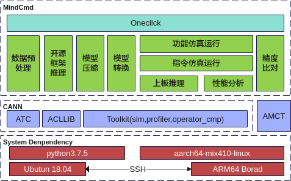

## 工具功能<a name="ZH-CN_TOPIC_0000002442020581"></a>

MindCmd中主要几个功能特性如下。

-   一键推理：提供一键推理功能，一键式端到端执行数据预处理、开源框架推理、模型压缩、模型转换、功能仿真、指令仿真、上板推理、Dump、精度比对、性能分析等功能。参见[一键推理](#ZH-CN_TOPIC_0000002408581326)。
-   数据预处理：提供数据预处理功能，在进行模型压缩、模型转换等功能之前通过数据预处理将数据处理成与模型匹配的数据。参见[数据预处理](#ZH-CN_TOPIC_0000002441980729)。
-   开源框架推理：提供开源框架推理功能。获取Ground Truth数据。参见[开源框架推理](#ZH-CN_TOPIC_0000002442020541)。
-   模型压缩：提供模型压缩功能，对模型的权重（weight）和数据（activation）进行低比特处理，让最终生成的网络模型更加轻量化，从而达到节省网络模型存储空间、降低传输时延、提高计算效率，达到性能提升与优化的目标，参见[模型压缩](#ZH-CN_TOPIC_0000002408421470)。
-   模型转换：提供模型转换功能，将训练好的模型转换为离线模型，参见[模型转换](#ZH-CN_TOPIC_0000002408581442)。
-   功能仿真：提供功能仿真推理功能，参见[应用工程](#ZH-CN_TOPIC_0000002408421530)。
-   指令仿真：提供指令仿真推理功能，参见[应用工程](#ZH-CN_TOPIC_0000002408421530)。
-   上板推理：提供上板推理功能，参见[应用工程](#ZH-CN_TOPIC_0000002408421530)。
-   精度比对：提供精度比对功能，可以用来比对模型转换后SoC支持的算子运行结果与标准算子的运行结果，以便用来确认运算误差发生的原因，参见[精度比对](#ZH-CN_TOPIC_0000002441980581)。
-   性能分析：提供性能分析功能，用于采集和分析SoC推理业务各个运行阶段的关键性能指标，参见[性能分析](#ZH-CN_TOPIC_0000002442020517)。
-   工具模块：提供可单独调用的工具，包括原始Caffe模型子网导出、数据格式转换、模型Uninplace、ATC命令行转cfg文件，参见[Tools](#ZH-CN_TOPIC_0000002408421486)。

# 安装<a name="ZH-CN_TOPIC_0000002441980817"></a>

MindCmd软件包可以安装在Linux服务器上，可以使用Linux服务器上原生桌面自带的终端gnome-terminal进行安装，也可以在Windows服务器上通过SSH登录到Linux服务器进行安装。

**图 1**  Linux分部署<a name="fig14199047421"></a>  


**图 2**  Linux共部署<a name="fig4886192317319"></a>  
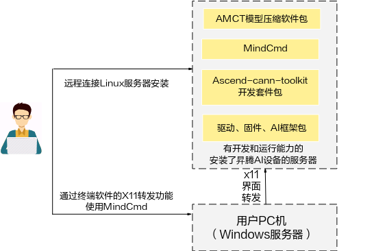

MindCmd安装流程如[图3](#fig194332362414)所示。

**图 3**  安装流程<a name="fig194332362414"></a>  
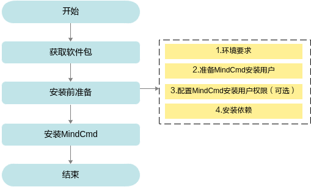


## 软件包获取<a name="ZH-CN_TOPIC_0000002442020661"></a>

MindCmd工具只支持在18.04 x86\_64架构服务器安装。安装前，请先获取MindCmd工具软件包。

当前MindCmd工具的模型转换、模型推理依赖CANN软件包。模型压缩依赖AMCT软件包。具体说明请参见[表1](#table136510451990)。

**表 1**  软件包说明

<a name="table136510451990"></a>
<table><thead align="left"><tr id="row203664451395"><th class="cellrowborder" valign="top" width="32.78%" id="mcps1.2.4.1.1"><p id="p43661845797"><a name="p43661845797"></a><a name="p43661845797"></a>软件包</p>
</th>
<th class="cellrowborder" valign="top" width="9.62%" id="mcps1.2.4.1.2"><p id="p1760173584117"><a name="p1760173584117"></a><a name="p1760173584117"></a>必选/可选</p>
</th>
<th class="cellrowborder" valign="top" width="57.599999999999994%" id="mcps1.2.4.1.3"><p id="p680113459274"><a name="p680113459274"></a><a name="p680113459274"></a>说明</p>
</th>
</tr>
</thead>
<tbody><tr id="row024917514402"><td class="cellrowborder" valign="top" width="32.78%" headers="mcps1.2.4.1.1 "><p id="p1624975124015"><a name="p1624975124015"></a><a name="p1624975124015"></a>mindcmd-<em id="i1819720715213"><a name="i1819720715213"></a><a name="i1819720715213"></a>&lt;version&gt;</em>-py3-none-linux_x86_64.tar.gz</p>
</td>
<td class="cellrowborder" valign="top" width="9.62%" headers="mcps1.2.4.1.2 "><p id="p1260183544113"><a name="p1260183544113"></a><a name="p1260183544113"></a>必选</p>
</td>
<td class="cellrowborder" valign="top" width="57.599999999999994%" headers="mcps1.2.4.1.3 "><p id="p82501251144018"><a name="p82501251144018"></a><a name="p82501251144018"></a>MindCmd工具主要用于端到端一键执行数据预处理、模型量化、模型转换、仿真推理、模型推理、精度比对和性能分析。各子模块支持单独调用，参见<a href="#ZH-CN_TOPIC_0000002408581406">MindCmd子命令</a>。</p>
</td>
</tr>
<tr id="row867611101918"><td class="cellrowborder" valign="top" width="32.78%" headers="mcps1.2.4.1.1 "><p id="p1167711103110"><a name="p1167711103110"></a><a name="p1167711103110"></a>Ascend-cann-toolkit_<em id="i3736655103517"><a name="i3736655103517"></a><a name="i3736655103517"></a>{6.x}</em>_linux.x86_64.run</p>
</td>
<td class="cellrowborder" valign="top" width="9.62%" headers="mcps1.2.4.1.2 "><p id="p760153514417"><a name="p760153514417"></a><a name="p760153514417"></a>必选</p>
</td>
<td class="cellrowborder" valign="top" width="57.599999999999994%" headers="mcps1.2.4.1.3 "><p id="p126771310712"><a name="p126771310712"></a><a name="p126771310712"></a>CANN软件包为MindCmd工具提供模型转换、模型推理支持，包含开发应用程序所需的头文件、共享库等。</p>
</td>
</tr>
<tr id="row386719539546"><td class="cellrowborder" valign="top" width="32.78%" headers="mcps1.2.4.1.1 "><p id="p1186765316543"><a name="p1186765316543"></a><a name="p1186765316543"></a>hotwheels_amct_caffe_-<em id="i1480465410216"><a name="i1480465410216"></a><a name="i1480465410216"></a>&lt;version&gt;</em>-py3-none-linux_x86_64.whl</p>
</td>
<td class="cellrowborder" valign="top" width="9.62%" headers="mcps1.2.4.1.2 "><p id="p360133524114"><a name="p360133524114"></a><a name="p360133524114"></a>可选</p>
</td>
<td class="cellrowborder" rowspan="2" valign="top" width="57.599999999999994%" headers="mcps1.2.4.1.3 "><p id="p8338914588"><a name="p8338914588"></a><a name="p8338914588"></a>模型压缩工具（AMCT）为MindCmd工具提供网络模型量化的支持，让最终生成的网络模型更加轻量化，从而达到节省网络模型存储空间、降低传输时延、提高计算效率，达到性能提升与优化的目标。</p>
<p id="p74531426182017"><a name="p74531426182017"></a><a name="p74531426182017"></a>当前MindCmd工具支持 8bit PTQ（Post-Training Quantization，训练后量化）量化。</p>
</td>
</tr>
<tr id="row0627257125713"><td class="cellrowborder" valign="top" headers="mcps1.2.4.1.1 "><p id="p17627557135718"><a name="p17627557135718"></a><a name="p17627557135718"></a>hotwheels_amct_pytorch-<em id="i1716517598216"><a name="i1716517598216"></a><a name="i1716517598216"></a>&lt;version&gt;</em>-py3-none-linux_x86_64.tar.gz</p>
</td>
<td class="cellrowborder" valign="top" headers="mcps1.2.4.1.2 "><p id="p16011135154114"><a name="p16011135154114"></a><a name="p16011135154114"></a>可选</p>
</td>
</tr>
</tbody>
</table>

其中_<version\>_表示软件版本号。

## 安装前准备<a name="ZH-CN_TOPIC_0000002441980749"></a>


### Ubuntu18.04-x86\_64系统<a name="ZH-CN_TOPIC_0000002441980633"></a>

**环境要求<a name="section13831110592"></a>**

安装MindCmd的环境，所要求的硬件以及操作系统要满足以下条件。

**表 1**  Ubuntu系统配套版本信息

<a name="zh-cn_topic_0249939299_zh-cn_topic_0231558615_zh-cn_topic_0189917872_table1515616482231"></a>
<table><thead align="left"><tr id="zh-cn_topic_0249939299_zh-cn_topic_0231558615_zh-cn_topic_0189917872_row8157124812317"><th class="cellrowborder" valign="top" width="11.35%" id="mcps1.2.4.1.1"><p id="zh-cn_topic_0249939299_zh-cn_topic_0231558615_zh-cn_topic_0189917872_p17157194842316"><a name="zh-cn_topic_0249939299_zh-cn_topic_0231558615_zh-cn_topic_0189917872_p17157194842316"></a><a name="zh-cn_topic_0249939299_zh-cn_topic_0231558615_zh-cn_topic_0189917872_p17157194842316"></a>类别</p>
</th>
<th class="cellrowborder" valign="top" width="26.029999999999998%" id="mcps1.2.4.1.2"><p id="zh-cn_topic_0249939299_zh-cn_topic_0231558615_zh-cn_topic_0189917872_p31575485237"><a name="zh-cn_topic_0249939299_zh-cn_topic_0231558615_zh-cn_topic_0189917872_p31575485237"></a><a name="zh-cn_topic_0249939299_zh-cn_topic_0231558615_zh-cn_topic_0189917872_p31575485237"></a>版本限制</p>
</th>
<th class="cellrowborder" valign="top" width="62.62%" id="mcps1.2.4.1.3"><p id="zh-cn_topic_0249939299_zh-cn_topic_0231558615_zh-cn_topic_0189917872_p7157144842317"><a name="zh-cn_topic_0249939299_zh-cn_topic_0231558615_zh-cn_topic_0189917872_p7157144842317"></a><a name="zh-cn_topic_0249939299_zh-cn_topic_0231558615_zh-cn_topic_0189917872_p7157144842317"></a>说明</p>
</th>
</tr>
</thead>
<tbody><tr id="zh-cn_topic_0249939299_zh-cn_topic_0231558615_zh-cn_topic_0189917872_row1315754852313"><td class="cellrowborder" valign="top" width="11.35%" headers="mcps1.2.4.1.1 "><p id="zh-cn_topic_0249939299_zh-cn_topic_0231558615_zh-cn_topic_0189917872_p015714483233"><a name="zh-cn_topic_0249939299_zh-cn_topic_0231558615_zh-cn_topic_0189917872_p015714483233"></a><a name="zh-cn_topic_0249939299_zh-cn_topic_0231558615_zh-cn_topic_0189917872_p015714483233"></a>硬件</p>
</td>
<td class="cellrowborder" valign="top" width="26.029999999999998%" headers="mcps1.2.4.1.2 "><a name="zh-cn_topic_0249939299_zh-cn_topic_0231558615_zh-cn_topic_0189917872_ul1752610515248"></a><a name="zh-cn_topic_0249939299_zh-cn_topic_0231558615_zh-cn_topic_0189917872_ul1752610515248"></a><ul id="zh-cn_topic_0249939299_zh-cn_topic_0231558615_zh-cn_topic_0189917872_ul1752610515248"><li>内存：最小4GB，推荐8GB</li><li>磁盘空间：最小6GB</li></ul>
</td>
<td class="cellrowborder" valign="top" width="62.62%" headers="mcps1.2.4.1.3 "><a name="zh-cn_topic_0249939299_zh-cn_topic_0231558615_zh-cn_topic_0189917872_ul18330193818"></a><a name="zh-cn_topic_0249939299_zh-cn_topic_0231558615_zh-cn_topic_0189917872_ul18330193818"></a><ul id="zh-cn_topic_0249939299_zh-cn_topic_0231558615_zh-cn_topic_0189917872_ul18330193818"><li>若Linux宿主机内存为4G，在MindCmd中进行模型转换时，建议Model文件大小不超过350M，如果超过此规格，操作系统可能会因为超过安全内存阈值而工作不稳定。</li><li>若Linux宿主机配置升级，比如8G内存，则相应支持的操作对象规格按比例提升。<p id="zh-cn_topic_0249939299_zh-cn_topic_0231558615_zh-cn_topic_0189917872_p484130183810"><a name="zh-cn_topic_0249939299_zh-cn_topic_0231558615_zh-cn_topic_0189917872_p484130183810"></a><a name="zh-cn_topic_0249939299_zh-cn_topic_0231558615_zh-cn_topic_0189917872_p484130183810"></a>例如，内存由4G升级到8G，则Model文件建议大小不超过700M。</p>
</li></ul>
</td>
</tr>
<tr id="zh-cn_topic_0249939299_zh-cn_topic_0231558615_zh-cn_topic_0189917872_row1615815486234"><td class="cellrowborder" valign="top" width="11.35%" headers="mcps1.2.4.1.1 "><p id="zh-cn_topic_0249939299_zh-cn_topic_0231558615_zh-cn_topic_0189917872_p1315844817233"><a name="zh-cn_topic_0249939299_zh-cn_topic_0231558615_zh-cn_topic_0189917872_p1315844817233"></a><a name="zh-cn_topic_0249939299_zh-cn_topic_0231558615_zh-cn_topic_0189917872_p1315844817233"></a>操作系统</p>
</td>
<td class="cellrowborder" valign="top" width="26.029999999999998%" headers="mcps1.2.4.1.2 "><p id="zh-cn_topic_0249939299_zh-cn_topic_0231558615_zh-cn_topic_0189917872_p1315824812319"><a name="zh-cn_topic_0249939299_zh-cn_topic_0231558615_zh-cn_topic_0189917872_p1315824812319"></a><a name="zh-cn_topic_0249939299_zh-cn_topic_0231558615_zh-cn_topic_0189917872_p1315824812319"></a>版本：18.04 64位x86操作系统</p>
</td>
<td class="cellrowborder" valign="top" width="62.62%" headers="mcps1.2.4.1.3 "><a name="ul15849131271419"></a><a name="ul15849131271419"></a><ul id="ul15849131271419"><li>请从<a href="http://releases.ubuntu.com/releases/" target="_blank" rel="noopener noreferrer">http://releases.ubuntu.com/releases/</a>下载对应版本软件进行安装。</li></ul>
</td>
</tr>
<tr id="row860491181012"><td class="cellrowborder" valign="top" width="11.35%" headers="mcps1.2.4.1.1 "><p id="p860514171019"><a name="p860514171019"></a><a name="p860514171019"></a>Python</p>
</td>
<td class="cellrowborder" valign="top" width="26.029999999999998%" headers="mcps1.2.4.1.2 "><p id="p3605115103"><a name="p3605115103"></a><a name="p3605115103"></a>3.7.5</p>
</td>
<td class="cellrowborder" valign="top" width="62.62%" headers="mcps1.2.4.1.3 "><a name="ul10992135553719"></a><a name="ul10992135553719"></a><ul id="ul10992135553719"><li>请参见<a href="#ZH-CN_TOPIC_0000002408421450">安装Python3.7.5（Ubuntu）</a>。</li></ul>
</td>
</tr>
<tr id="zh-cn_topic_0249939299_zh-cn_topic_0231558615_row16761853144"><td class="cellrowborder" valign="top" width="11.35%" headers="mcps1.2.4.1.1 "><p id="zh-cn_topic_0249939299_zh-cn_topic_0231558615_p35761951174513"><a name="zh-cn_topic_0249939299_zh-cn_topic_0231558615_p35761951174513"></a><a name="zh-cn_topic_0249939299_zh-cn_topic_0231558615_p35761951174513"></a>系统语言</p>
</td>
<td class="cellrowborder" valign="top" width="26.029999999999998%" headers="mcps1.2.4.1.2 "><p id="zh-cn_topic_0249939299_zh-cn_topic_0231558615_p15576185114512"><a name="zh-cn_topic_0249939299_zh-cn_topic_0231558615_p15576185114512"></a><a name="zh-cn_topic_0249939299_zh-cn_topic_0231558615_p15576185114512"></a>en_US.UTF-8</p>
</td>
<td class="cellrowborder" valign="top" width="62.62%" headers="mcps1.2.4.1.3 "><a name="ul1276846183214"></a><a name="ul1276846183214"></a><ul id="ul1276846183214"><li>当前仅支持系统语言为英文。</li><li>请以任意用户使用<strong id="zh-cn_topic_0249939299_zh-cn_topic_0231558615_b1386765618144"><a name="zh-cn_topic_0249939299_zh-cn_topic_0231558615_b1386765618144"></a><a name="zh-cn_topic_0249939299_zh-cn_topic_0231558615_b1386765618144"></a>locale</strong>命令在任意路径下查询编码格式，若系统返回“LANG=en_US.UTF-8”，则表示正确；否则，请以root用户使用“<strong id="zh-cn_topic_0249939299_zh-cn_topic_0231558615_b1271812791517"><a name="zh-cn_topic_0249939299_zh-cn_topic_0231558615_b1271812791517"></a><a name="zh-cn_topic_0249939299_zh-cn_topic_0231558615_b1271812791517"></a>vim</strong> <strong id="zh-cn_topic_0249939299_zh-cn_topic_0231558615_b84723610154"><a name="zh-cn_topic_0249939299_zh-cn_topic_0231558615_b84723610154"></a><a name="zh-cn_topic_0249939299_zh-cn_topic_0231558615_b84723610154"></a>/etc/default/locale</strong>”命令修改“LANG=en_US.UTF-8”，重启（使用<strong id="zh-cn_topic_0249939299_zh-cn_topic_0231558615_b950114582410"><a name="zh-cn_topic_0249939299_zh-cn_topic_0231558615_b950114582410"></a><a name="zh-cn_topic_0249939299_zh-cn_topic_0231558615_b950114582410"></a>reboot</strong>命令）使之生效。</li></ul>
</td>
</tr>
</tbody>
</table>

**准备安装用户（可选）<a name="zh-cn_topic_0249939299_zh-cn_topic_0231558615_section14553441011"></a>**

-   如果已安装Ascend-cann-toolkit开发套件包，请使用Ascend-cann-toolkit开发套件包的安装用户安装MindCmd。
-   如果未安装Ascend-cann-toolkit开发套件包，请参考如下示例准备安装用户。

您可以使用任意用户（含root或非root用户）进行安装。

-   若使用root用户安装，则不需要操作该章节，不需要对root用户做任何设置。
-   若使用已存在的非root用户安装，须保证该用户对$HOME目录具有读写以及可执行权限。
-   若使用新的非root用户安装，请参考如下步骤进行创建，如下操作请在root用户下执行。本手册以该种场景为例执行MindCmd的安装。
    1.  执行以下命令创建用户组和MindCmd安装用户并设置该用户的$HOME目录。

        ```
        groupadd usergroup
        useradd -g usergroup -d /home/username -m username -s /bin/bash
        ```

        例如以MindCmdUser群组为例，可执行如下命令创建MindCmd安装用户并加入到群组中。

        ```
        groupadd MindCmdUser
        useradd -g MindCmdUser -d /home/username -m username -s /bin/bash
        ```

        > **说明：** 
        >用户所属的属组必须和Driver运行用户所属组相同；如果不同，请用户自行添加到Driver运行用户属组。

    2.  执行以下命令设置密码。

        ```
        passwd username
        ```

        _username_为安装MindCmd的用户名，该用户的umask值为0027：

        -   若要查看umask的值，则执行命令：**umask**
        -   若要修改umask的值，则执行命令：**umask  _新的取值_**

            如果用户通过上述方式修改了umask取值，则修改后的取值只在当前窗口有效，用户也可以通过修改\~/.bashrc文件方式设置永久umask取值：

            1.  在任意目录下执行如下命令，打开.**bashrc**文件：

                ```
                vi ~/.bashrc
                ```

                在文件最后一行后面添加**umask  _新的取值_**内容。

            2.  执行:wq!命令保存文件并退出。
            3.  执行**source \~/.bashrc**命令使其立即生效。

**检查源<a name="zh-cn_topic_0249939299_zh-cn_topic_0231558615_section126972561207"></a>**

安装过程需要下载相关依赖，请确保服务器能够连接网络。

请在root用户下执行如下命令检查源是否可用。

```
apt-get update
```

> **说明：** 
>如果命令执行报错，则检查网络是否连接或者把/etc/apt/sources.list文件中的源更换为可用的源。

**安装依赖<a name="section11128423175910"></a>**

使用MindCmd工具前，需要完成相关环境搭建。开发人员可根据不同组件的使用需求进行环境搭建，使用一键推理，需要完整搭建各组件依赖的环境。

支持在Docker中使用MindCmd，解决方案提供了Dockerfile文件，构建镜像请参考《驱动和开发环境安装指南》“容器镜像构建”章节，启动容器请参考[Docker容器中使用MindCmd](#ZH-CN_TOPIC_0000002408581214)。

**表 2**  各组件依赖

<a name="table124736349520"></a>
<table><thead align="left"><tr id="row14474133412524"><th class="cellrowborder" valign="top" width="17.4%" id="mcps1.2.3.1.1"><p id="p4474193485213"><a name="p4474193485213"></a><a name="p4474193485213"></a>组件</p>
</th>
<th class="cellrowborder" valign="top" width="82.6%" id="mcps1.2.3.1.2"><p id="p647453465212"><a name="p647453465212"></a><a name="p647453465212"></a>依赖</p>
</th>
</tr>
</thead>
<tbody><tr id="row181882117556"><td class="cellrowborder" valign="top" width="17.4%" headers="mcps1.2.3.1.1 "><p id="p78193216552"><a name="p78193216552"></a><a name="p78193216552"></a>数据预处理</p>
</td>
<td class="cellrowborder" valign="top" width="82.6%" headers="mcps1.2.3.1.2 "><p id="p138194210550"><a name="p138194210550"></a><a name="p138194210550"></a>python依赖：opencv-python&gt;=3.4.4.19。</p>
</td>
</tr>
<tr id="row5474734105214"><td class="cellrowborder" valign="top" width="17.4%" headers="mcps1.2.3.1.1 "><p id="p2047453425215"><a name="p2047453425215"></a><a name="p2047453425215"></a>模型压缩</p>
</td>
<td class="cellrowborder" valign="top" width="82.6%" headers="mcps1.2.3.1.2 "><p id="p44741134135216"><a name="p44741134135216"></a><a name="p44741134135216"></a>Caffe模型压缩参见《AMCT使用指南(Caffe)》"安装AMCT"。（可选）</p>
<p id="p1329717253422"><a name="p1329717253422"></a><a name="p1329717253422"></a>Pytorch模型压缩参见《AMCT使用指南(PyTorch)》"工具安装"。（可选）</p>
</td>
</tr>
<tr id="row20474534125214"><td class="cellrowborder" valign="top" width="17.4%" headers="mcps1.2.3.1.1 "><p id="p34741234105217"><a name="p34741234105217"></a><a name="p34741234105217"></a>模型转换</p>
</td>
<td class="cellrowborder" valign="top" width="82.6%" headers="mcps1.2.3.1.2 "><p id="p12474143415525"><a name="p12474143415525"></a><a name="p12474143415525"></a>请参见《驱动和开发环境安装指南》"命令行方式开发环境安装"，完成依赖环境、工具链、CANN包安装。</p>
</td>
</tr>
<tr id="row84748344528"><td class="cellrowborder" valign="top" width="17.4%" headers="mcps1.2.3.1.1 "><p id="p194748348520"><a name="p194748348520"></a><a name="p194748348520"></a>开源框架推理</p>
</td>
<td class="cellrowborder" valign="top" width="82.6%" headers="mcps1.2.3.1.2 "><p id="p140420523499"><a name="p140420523499"></a><a name="p140420523499"></a>安装python依赖：skl2onnx&gt;=1.13.0, packaging&gt;=18.0。</p>
<p id="p14744342526"><a name="p14744342526"></a><a name="p14744342526"></a>Caffe模型推理需参见《AMCT使用指南(Caffe)》"安装AMCT"。</p>
<p id="p1228318418311"><a name="p1228318418311"></a><a name="p1228318418311"></a>Pytorch模型推理参见《AMCT使用指南(PyTorch)》"工具安装"。</p>
<p id="p3983143274811"><a name="p3983143274811"></a><a name="p3983143274811"></a>Onnx模型推理参见《AMCT使用指南(PyTorch)》"工具安装"。</p>
</td>
</tr>
<tr id="row1590433511531"><td class="cellrowborder" valign="top" width="17.4%" headers="mcps1.2.3.1.1 "><p id="p490423517531"><a name="p490423517531"></a><a name="p490423517531"></a>上板推理</p>
</td>
<td class="cellrowborder" valign="top" width="82.6%" headers="mcps1.2.3.1.2 "><p id="p18313348116"><a name="p18313348116"></a><a name="p18313348116"></a>python依赖：paramiko&gt;=2.10.5。</p>
<p id="p1190463535319"><a name="p1190463535319"></a><a name="p1190463535319"></a>请参见《驱动和开发环境安装指南》"板端环境安装" 和 "OpenSSH服务搭建"。</p>
<p id="p10124142620433"><a name="p10124142620433"></a><a name="p10124142620433"></a>请参见《驱动和开发环境安装指南》"命令行方式开发环境安装"，完成依赖环境、工具链、CANN包安装。</p>
</td>
</tr>
<tr id="row9822153335317"><td class="cellrowborder" valign="top" width="17.4%" headers="mcps1.2.3.1.1 "><p id="p78222334531"><a name="p78222334531"></a><a name="p78222334531"></a>功能仿真运行</p>
</td>
<td class="cellrowborder" valign="top" width="82.6%" headers="mcps1.2.3.1.2 "><p id="p1030082919245"><a name="p1030082919245"></a><a name="p1030082919245"></a>请参见《驱动和开发环境安装指南》"命令行方式开发环境安装"，完成依赖环境、工具链、CANN包安装。</p>
</td>
</tr>
<tr id="row1247403425217"><td class="cellrowborder" valign="top" width="17.4%" headers="mcps1.2.3.1.1 "><p id="p1474203455216"><a name="p1474203455216"></a><a name="p1474203455216"></a>指令仿真运行</p>
</td>
<td class="cellrowborder" valign="top" width="82.6%" headers="mcps1.2.3.1.2 "><p id="p26602308245"><a name="p26602308245"></a><a name="p26602308245"></a>请参见《驱动和开发环境安装指南》"命令行方式开发环境安装"，完成依赖环境、工具链、CANN包安装。</p>
</td>
</tr>
<tr id="row2474734145217"><td class="cellrowborder" valign="top" width="17.4%" headers="mcps1.2.3.1.1 "><p id="p4372101617549"><a name="p4372101617549"></a><a name="p4372101617549"></a>精度比对</p>
</td>
<td class="cellrowborder" valign="top" width="82.6%" headers="mcps1.2.3.1.2 "><p id="p680217184248"><a name="p680217184248"></a><a name="p680217184248"></a>请参见《精度比对工具使用指南》"安装依赖"，完成依赖环境安装。</p>
</td>
</tr>
<tr id="row7474113445219"><td class="cellrowborder" valign="top" width="17.4%" headers="mcps1.2.3.1.1 "><p id="p33711616135416"><a name="p33711616135416"></a><a name="p33711616135416"></a>性能分析</p>
</td>
<td class="cellrowborder" valign="top" width="82.6%" headers="mcps1.2.3.1.2 "><p id="p19508928131013"><a name="p19508928131013"></a><a name="p19508928131013"></a>请参见《Profiling工具使用指南》"环境准备"，完成性能分析环境搭建。</p>
</td>
</tr>
</tbody>
</table>

## 安装MindCmd<a name="ZH-CN_TOPIC_0000002408581230"></a>

1.  在MindCmd工具软件包所在目录下，执行如下命令安装。

    ```
    pip3.7.5 install mindcmd-<version>-py3-none-linux_x86_64.tar.gz --user
    ```

2.  若出现如下信息则说明工具安装成功。

    ```
    Successfully installed mindcmd-<version>
    ```

    用户可以在python3.7.5软件包所在路径下\(例如：_$HOME/.local/lib/python3.7.5/site-packages_\)查看已经安装的MindCmd工具，例如

    ```
    drwxr-xr-x 9 mindcmd mindcmd 4096 Oct 13 23:16 mindcmd/ 
    drwxr-xr-x 2 mindcmd mindcmd 4096 Oct 13 23:16 mindcmd-<version>.dist-info/
    ```

    其中，mindcmd即为MindCmd工具所在安装路径，下文中均用\{MINDCMD\_INSTALL\_PATH\}表示MindCmd安装路径。

    > **说明：** 
    >**卸载**
    >用户通过如上方式成功安装MindCmd工具后，可执行如下命令卸载MindCmd工具。
    >```
    >pip3.7.5 uninstall mindcmd
    >```
    >若出现如下信息则说明卸载成功。
    >```
    >Successfully uninstalled mindcmd-<version>
    >```
    >MindCmd工具升级时可以先卸载再重新安装：
    >```
    >pip3.7.5 uninstall mindcmd
    >pip3.7.5 install mindcmd-<version>-py3-none-linux_x86_64.tar.gz
    >```

> **说明：** 
>-   如果安装过程中出现下载依赖连接超时的情况，请用户检查pip环境是否正常可用，如需网络代理或更换镜像源，请用户自行配置。
>-   安装MindCmd后，请使用如下命令配置到生态开源版本默认配置：
>```
>mindcmd config --global base_config.target_version=SS928V100
>mindcmd config --global base_config.cross_compiler=musl_clang
>```

## 全局配置<a name="ZH-CN_TOPIC_0000002442020665"></a>

MindCmd提供子命令查看和修改全局配置。

查看全局配置列表，结果如[图1](#fig1034913271220)所示。

```
mindcmd config --list
```

**图 1**  全局配置列表<a name="fig1034913271220"></a>  

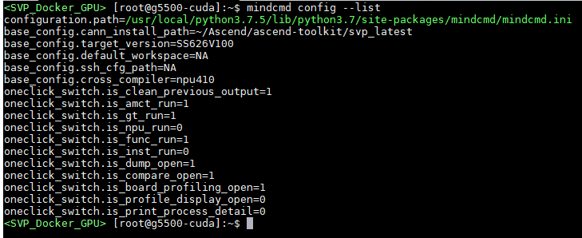

查看某一个配置项的值\(以查看“base\_config.cann\_install\_path”为例\)，结果如[图2](#fig163181430103)所示。

```
mindcmd config --global base_config.cann_install_path
```

**图 2**  查看某一个配置项的值<a name="fig163181430103"></a>  
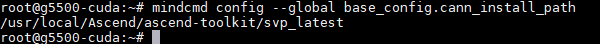

修改某一个配置项的值\(以修改“base\_config.cann\_install\_path”为例\)，结果如[图3](#fig52432531624)所示。

```
mindcmd config --global base_config.cann_install_path=~/Ascend/ascend-toolkit/svp_latest
```

**图 3**  修改某一个配置项的值<a name="fig52432531624"></a>  
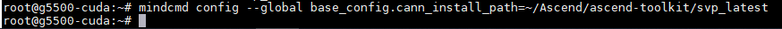

> **说明：** 
>mindcmd config 子命令不展示atc\_args\_append部分的配置参数，不支持在命令行修改atc\_args\_append的配置参数。

MindCmd命令行工具为用户提供全局配置文件，配置文件路径为：\{MINDCMD\_INSTALL\_PATH\}/mindcmd.ini，或通过运行命令 mindcmd config --list , 控制台会打印配置文件路径，如[图4](#fig4452502120)中高亮部分所示。

**图 4**  查看全局配置文件<a name="fig4452502120"></a>  

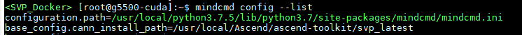

工具安装完毕后，需要在MindCmd全局配置文件中指定CANN软件包安装路径，如[表1](#table73353166121)。

**表 1**  MindCmd配置

<a name="table73353166121"></a>
<table><thead align="left"><tr id="row5335151611127"><th class="cellrowborder" valign="top" width="16.39%" id="mcps1.2.6.1.1"><p id="p1633531641213"><a name="p1633531641213"></a><a name="p1633531641213"></a><strong id="b3139153053516"><a name="b3139153053516"></a><a name="b3139153053516"></a>配置</strong></p>
</th>
<th class="cellrowborder" valign="top" width="13.690000000000001%" id="mcps1.2.6.1.2"><p id="p14335516191211"><a name="p14335516191211"></a><a name="p14335516191211"></a><strong id="b191491330143516"><a name="b191491330143516"></a><a name="b191491330143516"></a>描述</strong></p>
</th>
<th class="cellrowborder" valign="top" width="10.89%" id="mcps1.2.6.1.3"><p id="p2632142924815"><a name="p2632142924815"></a><a name="p2632142924815"></a><strong id="b12214416491"><a name="b12214416491"></a><a name="b12214416491"></a>可选/必选</strong></p>
</th>
<th class="cellrowborder" valign="top" width="21.220000000000002%" id="mcps1.2.6.1.4"><p id="p23351816171213"><a name="p23351816171213"></a><a name="p23351816171213"></a><strong id="b87821647183518"><a name="b87821647183518"></a><a name="b87821647183518"></a>参数</strong></p>
</th>
<th class="cellrowborder" valign="top" width="37.81%" id="mcps1.2.6.1.5"><p id="p1033581620127"><a name="p1033581620127"></a><a name="p1033581620127"></a><strong id="b479134719350"><a name="b479134719350"></a><a name="b479134719350"></a>参数描述</strong></p>
</th>
</tr>
</thead>
<tbody><tr id="row13335131641217"><td class="cellrowborder" rowspan="5" valign="top" width="16.39%" headers="mcps1.2.6.1.1 "><p id="p17335121617121"><a name="p17335121617121"></a><a name="p17335121617121"></a>base_config</p>
<p id="p182419319305"><a name="p182419319305"></a><a name="p182419319305"></a></p>
</td>
<td class="cellrowborder" rowspan="5" valign="top" width="13.690000000000001%" headers="mcps1.2.6.1.2 "><p id="p49749218327"><a name="p49749218327"></a><a name="p49749218327"></a>该配置为MindCmd的基础配置</p>
<p id="p152418312300"><a name="p152418312300"></a><a name="p152418312300"></a></p>
</td>
<td class="cellrowborder" valign="top" width="10.89%" headers="mcps1.2.6.1.3 "><p id="p1363262915487"><a name="p1363262915487"></a><a name="p1363262915487"></a><strong id="b3478105614366"><a name="b3478105614366"></a><a name="b3478105614366"></a>必选</strong></p>
</td>
<td class="cellrowborder" valign="top" width="21.220000000000002%" headers="mcps1.2.6.1.4 "><p id="p1335171611123"><a name="p1335171611123"></a><a name="p1335171611123"></a>CANN_INSTALL_PATH</p>
</td>
<td class="cellrowborder" valign="top" width="37.81%" headers="mcps1.2.6.1.5 "><p id="p1828434514417"><a name="p1828434514417"></a><a name="p1828434514417"></a>CANN软件包的安装路径，如：CANN_INSTALL_PATH=/home/user/Ascend/ascend-toolkit/&lt;<em id="zh-cn_topic_0000001087679048_zh-cn_topic_0000001079598552_zh-cn_topic_0288515780_i1315612101816"><a name="zh-cn_topic_0000001087679048_zh-cn_topic_0000001079598552_zh-cn_topic_0288515780_i1315612101816"></a><a name="zh-cn_topic_0000001087679048_zh-cn_topic_0000001079598552_zh-cn_topic_0288515780_i1315612101816"></a>version&gt;</em>/</p>
</td>
</tr>
<tr id="row13335161619124"><td class="cellrowborder" valign="top" headers="mcps1.2.6.1.1 "><p id="p146327295488"><a name="p146327295488"></a><a name="p146327295488"></a><strong id="b13441125817362"><a name="b13441125817362"></a><a name="b13441125817362"></a>必选</strong></p>
</td>
<td class="cellrowborder" valign="top" headers="mcps1.2.6.1.2 "><p id="p203352168125"><a name="p203352168125"></a><a name="p203352168125"></a>TARGET_VERSION</p>
</td>
<td class="cellrowborder" valign="top" headers="mcps1.2.6.1.3 "><p id="p4335121651215"><a name="p4335121651215"></a><a name="p4335121651215"></a>目标解决方案的版本，如：TARGET_VERSION=SS928V100</p>
<p id="p1885014185114"><a name="p1885014185114"></a><a name="p1885014185114"></a>需要根据实际解决方案版本替换。</p>
</td>
</tr>
<tr id="row103354167126"><td class="cellrowborder" valign="top" headers="mcps1.2.6.1.1 "><p id="p0632142918480"><a name="p0632142918480"></a><a name="p0632142918480"></a>可选</p>
</td>
<td class="cellrowborder" valign="top" headers="mcps1.2.6.1.2 "><p id="p533591691215"><a name="p533591691215"></a><a name="p533591691215"></a>DEFAULT_WORKSPACE</p>
</td>
<td class="cellrowborder" valign="top" headers="mcps1.2.6.1.3 "><p id="p43363161122"><a name="p43363161122"></a><a name="p43363161122"></a>默认工作空间，如：DEFAULT_WORKSPACE=/home/user/mindcmd_workspace</p>
<p id="p1668523845013"><a name="p1668523845013"></a><a name="p1668523845013"></a>若DEFAULT_WORKSPACE=NA，则会在用户主目录下创建MindCmd-WorkSpace文件夹作为默认工作路径。</p>
</td>
</tr>
<tr id="row148717613212"><td class="cellrowborder" valign="top" headers="mcps1.2.6.1.1 "><p id="p68720682117"><a name="p68720682117"></a><a name="p68720682117"></a>可选</p>
</td>
<td class="cellrowborder" valign="top" headers="mcps1.2.6.1.2 "><p id="p687126112118"><a name="p687126112118"></a><a name="p687126112118"></a>SSH_CFG_PATH</p>
</td>
<td class="cellrowborder" valign="top" headers="mcps1.2.6.1.3 "><p id="p5873642117"><a name="p5873642117"></a><a name="p5873642117"></a>上板推理默认配置文件，<strong id="b149681840175215"><a name="b149681840175215"></a><a name="b149681840175215"></a>若需要执行上板推理，则需要配置此参数</strong>。详细配置项参考<a href="#ZH-CN_TOPIC_0000002408421542">ssh.cfg文件配置</a>。</p>
</td>
</tr>
<tr id="row523113143017"><td class="cellrowborder" valign="top" headers="mcps1.2.6.1.1 "><p id="p12246311300"><a name="p12246311300"></a><a name="p12246311300"></a>可选</p>
</td>
<td class="cellrowborder" valign="top" headers="mcps1.2.6.1.2 "><p id="p14848934141917"><a name="p14848934141917"></a><a name="p14848934141917"></a>CROSS_COMPILER</p>
</td>
<td class="cellrowborder" valign="top" headers="mcps1.2.6.1.3 "><p id="p1983715210286"><a name="p1983715210286"></a><a name="p1983715210286"></a>交叉编译链选项，可配置上板所用的交叉编译链。可选值包括：SS928V100(musl_clang、gnu）</p>
</td>
</tr>
<tr id="row128983510315"><td class="cellrowborder" rowspan="11" valign="top" width="16.39%" headers="mcps1.2.6.1.1 "><p id="p529053510315"><a name="p529053510315"></a><a name="p529053510315"></a>oneclick_switch</p>
</td>
<td class="cellrowborder" rowspan="11" valign="top" width="13.690000000000001%" headers="mcps1.2.6.1.2 "><p id="p629013543111"><a name="p629013543111"></a><a name="p629013543111"></a>一键推理场景开关，1表示打开，0表示关闭</p>
</td>
<td class="cellrowborder" valign="top" width="10.89%" headers="mcps1.2.6.1.3 "><p id="p46328295489"><a name="p46328295489"></a><a name="p46328295489"></a>可选</p>
</td>
<td class="cellrowborder" valign="top" width="21.220000000000002%" headers="mcps1.2.6.1.4 "><p id="p18290113516311"><a name="p18290113516311"></a><a name="p18290113516311"></a>IS_CLEAN_PREVIOUS_OUTPUT</p>
</td>
<td class="cellrowborder" valign="top" width="37.81%" headers="mcps1.2.6.1.5 "><p id="p22900358310"><a name="p22900358310"></a><a name="p22900358310"></a>运行前先删除工作路径下<a href="#ZH-CN_TOPIC_0000002408581326">一键推理</a>的历史输出目录，默认值为1。</p>
</td>
</tr>
<tr id="row128683447367"><td class="cellrowborder" valign="top" headers="mcps1.2.6.1.1 "><p id="p0633152994810"><a name="p0633152994810"></a><a name="p0633152994810"></a>可选</p>
</td>
<td class="cellrowborder" valign="top" headers="mcps1.2.6.1.2 "><p id="p15869844113614"><a name="p15869844113614"></a><a name="p15869844113614"></a>IS_AMCT_RUN</p>
</td>
<td class="cellrowborder" valign="top" headers="mcps1.2.6.1.3 "><p id="p1386954453611"><a name="p1386954453611"></a><a name="p1386954453611"></a><a href="#ZH-CN_TOPIC_0000002408421470">模型压缩</a>开关，默认值为1。</p>
</td>
</tr>
<tr id="row61717421363"><td class="cellrowborder" valign="top" headers="mcps1.2.6.1.1 "><p id="p66332029124816"><a name="p66332029124816"></a><a name="p66332029124816"></a>可选</p>
</td>
<td class="cellrowborder" valign="top" headers="mcps1.2.6.1.2 "><p id="p9172144233614"><a name="p9172144233614"></a><a name="p9172144233614"></a>IS_GT_RUN</p>
</td>
<td class="cellrowborder" valign="top" headers="mcps1.2.6.1.3 "><p id="p1172114233610"><a name="p1172114233610"></a><a name="p1172114233610"></a><a href="#ZH-CN_TOPIC_0000002442020541">开源框架推理</a>开关，默认值为1。</p>
</td>
</tr>
<tr id="row781413915365"><td class="cellrowborder" valign="top" headers="mcps1.2.6.1.1 "><p id="p52631433124914"><a name="p52631433124914"></a><a name="p52631433124914"></a>可选</p>
</td>
<td class="cellrowborder" valign="top" headers="mcps1.2.6.1.2 "><p id="p8814143953620"><a name="p8814143953620"></a><a name="p8814143953620"></a>IS_<em id="i1624420333339"><a name="i1624420333339"></a><a name="i1624420333339"></a>NNN</em>_RUN</p>
</td>
<td class="cellrowborder" valign="top" headers="mcps1.2.6.1.3 "><p id="p181443912363"><a name="p181443912363"></a><a name="p181443912363"></a><a href="#ZH-CN_TOPIC_0000002408581374">上板推理</a>开关，默认值为0。</p>
</td>
</tr>
<tr id="row38527133114"><td class="cellrowborder" valign="top" headers="mcps1.2.6.1.1 "><p id="p2263733124920"><a name="p2263733124920"></a><a name="p2263733124920"></a>可选</p>
</td>
<td class="cellrowborder" valign="top" headers="mcps1.2.6.1.2 "><p id="p5842715311"><a name="p5842715311"></a><a name="p5842715311"></a>IS_FUNC_RUN</p>
</td>
<td class="cellrowborder" valign="top" headers="mcps1.2.6.1.3 "><p id="p11882716319"><a name="p11882716319"></a><a name="p11882716319"></a><a href="#ZH-CN_TOPIC_0000002408421434">功能仿真</a>运行开关，默认值为1。</p>
</td>
</tr>
<tr id="row7656152811406"><td class="cellrowborder" valign="top" headers="mcps1.2.6.1.1 "><p id="p72631733124911"><a name="p72631733124911"></a><a name="p72631733124911"></a>可选</p>
</td>
<td class="cellrowborder" valign="top" headers="mcps1.2.6.1.2 "><p id="p20656182817404"><a name="p20656182817404"></a><a name="p20656182817404"></a>IS_INST_RUN</p>
</td>
<td class="cellrowborder" valign="top" headers="mcps1.2.6.1.3 "><p id="p9656152804018"><a name="p9656152804018"></a><a name="p9656152804018"></a><a href="#ZH-CN_TOPIC_0000002442020485">指令仿真</a>运行开关，默认值为0。</p>
</td>
</tr>
<tr id="row27570383402"><td class="cellrowborder" valign="top" headers="mcps1.2.6.1.1 "><p id="p15198634184915"><a name="p15198634184915"></a><a name="p15198634184915"></a>可选</p>
</td>
<td class="cellrowborder" valign="top" headers="mcps1.2.6.1.2 "><p id="p19757193817409"><a name="p19757193817409"></a><a name="p19757193817409"></a>IS_DUMP_OPEN</p>
</td>
<td class="cellrowborder" valign="top" headers="mcps1.2.6.1.3 "><p id="p97577387404"><a name="p97577387404"></a><a name="p97577387404"></a>推理程序Dump模型中间结果开关，默认值为1。</p>
</td>
</tr>
<tr id="row171973518405"><td class="cellrowborder" valign="top" headers="mcps1.2.6.1.1 "><p id="p7198173413492"><a name="p7198173413492"></a><a name="p7198173413492"></a>可选</p>
</td>
<td class="cellrowborder" valign="top" headers="mcps1.2.6.1.2 "><p id="p18719235164016"><a name="p18719235164016"></a><a name="p18719235164016"></a>IS_COMPARE_OPEN</p>
</td>
<td class="cellrowborder" valign="top" headers="mcps1.2.6.1.3 "><p id="p171943517400"><a name="p171943517400"></a><a name="p171943517400"></a>Dump数据<a href="#ZH-CN_TOPIC_0000002441980581">精度比对</a>开关，默认值为1。</p>
</td>
</tr>
<tr id="row1792313307408"><td class="cellrowborder" valign="top" headers="mcps1.2.6.1.1 "><p id="p119863412493"><a name="p119863412493"></a><a name="p119863412493"></a>可选</p>
</td>
<td class="cellrowborder" valign="top" headers="mcps1.2.6.1.2 "><p id="p79231430184010"><a name="p79231430184010"></a><a name="p79231430184010"></a>IS_BOARD_PROFILING_OPEN</p>
</td>
<td class="cellrowborder" valign="top" headers="mcps1.2.6.1.3 "><p id="p1392373094015"><a name="p1392373094015"></a><a name="p1392373094015"></a>Profiling数据采集开关，默认值为1。</p>
</td>
</tr>
<tr id="row16391163314403"><td class="cellrowborder" valign="top" headers="mcps1.2.6.1.1 "><p id="p53814284913"><a name="p53814284913"></a><a name="p53814284913"></a>可选</p>
</td>
<td class="cellrowborder" valign="top" headers="mcps1.2.6.1.2 "><p id="p5391163364012"><a name="p5391163364012"></a><a name="p5391163364012"></a>IS_PROFILE_DISPLAY_OPEN</p>
</td>
<td class="cellrowborder" valign="top" headers="mcps1.2.6.1.3 "><p id="p1391153344014"><a name="p1391153344014"></a><a name="p1391153344014"></a>Profiling数据展示开关，默认值为0。</p>
</td>
</tr>
<tr id="row05415319413"><td class="cellrowborder" valign="top" headers="mcps1.2.6.1.1 "><p id="p1638104216498"><a name="p1638104216498"></a><a name="p1638104216498"></a>可选</p>
</td>
<td class="cellrowborder" valign="top" headers="mcps1.2.6.1.2 "><p id="p1554113164113"><a name="p1554113164113"></a><a name="p1554113164113"></a>IS_PRINT_PROCESS_DETAIL</p>
</td>
<td class="cellrowborder" valign="top" headers="mcps1.2.6.1.3 "><p id="p4541344115"><a name="p4541344115"></a><a name="p4541344115"></a>控制台打印详细执行日志开关，默认值为0。</p>
</td>
</tr>
<tr id="row690227144111"><td class="cellrowborder" valign="top" width="16.39%" headers="mcps1.2.6.1.1 "><p id="p490220714415"><a name="p490220714415"></a><a name="p490220714415"></a>atc_args_append</p>
</td>
<td class="cellrowborder" valign="top" width="13.690000000000001%" headers="mcps1.2.6.1.2 "><p id="p1739012984210"><a name="p1739012984210"></a><a name="p1739012984210"></a>ATC扩展参数</p>
</td>
<td class="cellrowborder" valign="top" width="10.89%" headers="mcps1.2.6.1.3 "><p id="p838342124910"><a name="p838342124910"></a><a name="p838342124910"></a>可选</p>
</td>
<td class="cellrowborder" valign="top" width="21.220000000000002%" headers="mcps1.2.6.1.4 "><p id="p119023774119"><a name="p119023774119"></a><a name="p119023774119"></a>log_level</p>
</td>
<td class="cellrowborder" valign="top" width="37.81%" headers="mcps1.2.6.1.5 "><p id="p12971625123311"><a name="p12971625123311"></a><a name="p12971625123311"></a>在一键推理流程执行到ATC组件时，追加ATC支持的命令参数，每个命令按行隔开，具体命令参见《ATC工具使用指南》。需要满足key=value格式，工具会转换为--key=value。例如配置：log_level=0</p>
<p id="p1343826163319"><a name="p1343826163319"></a><a name="p1343826163319"></a>工具会将其转换为 --log_level=0，追加到ATC执行命令末尾。</p>
</td>
</tr>
</tbody>
</table>

> **说明：** 
>-   mindcmd.ini中的所有配置项前不可加空格。
>-   参数值格式：支持大小写字母（a-z，A-Z）、数字（0-9）、下划线（\_）、中划线（-）、句点（.）。

# Sample介绍<a name="ZH-CN_TOPIC_0000002408421454"></a>

工具内置一个PyTorch 模型pooling算子快速上手的用例，位于\{MINDCMD\_INSTALL\_PATH\}/testcase。请参考[安装MindCmd](#ZH-CN_TOPIC_0000002408581230)完成安装，再参考[全局配置](#ZH-CN_TOPIC_0000002442020665)完成MindCmd工具配置。

参考以下命令。

```
mindcmd oneclick pytorch -m mindcmd.testcase.pooling.Model --input_shape 1,3,224,224 
```

# 一键推理<a name="ZH-CN_TOPIC_0000002408581326"></a>


## 功能介绍<a name="ZH-CN_TOPIC_0000002441980765"></a>

支持一键式端到端完成模型的数据预处理、AMCT（模型压缩）、GT（Ground Truth）、ATC、仿真、上板推理、Dump、精度比对和Profiling功能。目前支持的开源框架模型包括：Caffe、PyTorch和ONNX。

> **说明：** 
>AMCT子模块当前仅支持训练后量化（Post-Training Quantization）场景。

## Caffe模型一键推理<a name="ZH-CN_TOPIC_0000002408421546"></a>

Caffe模型一键推理流程如[图1](#fig15202155618339)所示。

**图 1**  Caffe模型一键推理流程图<a name="fig15202155618339"></a>  
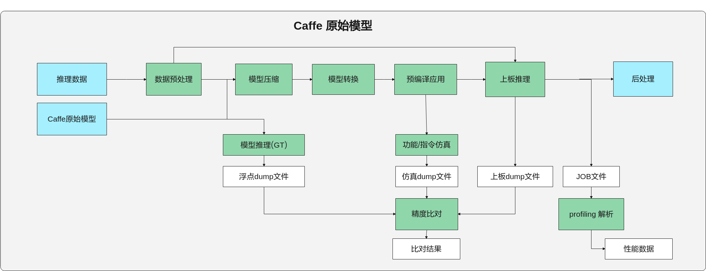


### 命令行格式说明<a name="ZH-CN_TOPIC_0000002442020649"></a>

Caffe模型一键推理的命令行格式如下。

```
mindcmd oneclick caffe -m MODEL -w WEIGHT 
```

Caffe模型一键推理的命令行参数说明如[表1](#table117mcpsimp)所示。

**表 1**  Caffe模型一键推理命令行参数说明

<a name="table117mcpsimp"></a>
<table><thead align="left"><tr id="row122mcpsimp"><th class="cellrowborder" valign="top" width="18.34%" id="mcps1.2.4.1.1"><p id="p13167158205117"><a name="p13167158205117"></a><a name="p13167158205117"></a><strong id="b898781855614"><a name="b898781855614"></a><a name="b898781855614"></a>参数</strong></p>
</th>
<th class="cellrowborder" valign="top" width="10.58%" id="mcps1.2.4.1.2"><p id="p1916910167529"><a name="p1916910167529"></a><a name="p1916910167529"></a>必选/可选</p>
</th>
<th class="cellrowborder" valign="top" width="71.08%" id="mcps1.2.4.1.3"><p id="p5799256175118"><a name="p5799256175118"></a><a name="p5799256175118"></a>描述</p>
</th>
</tr>
</thead>
<tbody><tr id="row183174212532"><td class="cellrowborder" colspan="3" valign="top" headers="mcps1.2.4.1.1 mcps1.2.4.1.2 mcps1.2.4.1.3 "><p id="p824918428324"><a name="p824918428324"></a><a name="p824918428324"></a><strong id="b23901559183215"><a name="b23901559183215"></a><a name="b23901559183215"></a>caffe子命令</strong></p>
</td>
</tr>
<tr id="row783748175616"><td class="cellrowborder" valign="top" width="18.34%" headers="mcps1.2.4.1.1 "><p id="p1783591560"><a name="p1783591560"></a><a name="p1783591560"></a><strong id="b53784319333"><a name="b53784319333"></a><a name="b53784319333"></a>–m, --model</strong></p>
</td>
<td class="cellrowborder" valign="top" width="10.58%" headers="mcps1.2.4.1.2 "><p id="p119681537134113"><a name="p119681537134113"></a><a name="p119681537134113"></a><strong id="b739613319338"><a name="b739613319338"></a><a name="b739613319338"></a>必选</strong></p>
</td>
<td class="cellrowborder" valign="top" width="71.08%" headers="mcps1.2.4.1.3 "><p id="p6781159115617"><a name="p6781159115617"></a><a name="p6781159115617"></a>指定模型定义文件（*.prototxt）。</p>
</td>
</tr>
<tr id="row10656185115568"><td class="cellrowborder" valign="top" width="18.34%" headers="mcps1.2.4.1.1 "><p id="p27825965620"><a name="p27825965620"></a><a name="p27825965620"></a>-w, --weight</p>
</td>
<td class="cellrowborder" valign="top" width="10.58%" headers="mcps1.2.4.1.2 "><p id="p12332132817412"><a name="p12332132817412"></a><a name="p12332132817412"></a>可选</p>
</td>
<td class="cellrowborder" valign="top" width="71.08%" headers="mcps1.2.4.1.3 "><p id="p07825914568"><a name="p07825914568"></a><a name="p07825914568"></a>指定权重文件（*.caffemodel）。未指定此参数时，工具将根据模型定义文件生成随机权重文件，位于模型定义文件所在路径下。</p>
<div class="note" id="note2493437204617"><a name="note2493437204617"></a><a name="note2493437204617"></a><span class="notetitle"> 说明： </span><div class="notebody"><p id="p1598915373614"><a name="p1598915373614"></a><a name="p1598915373614"></a>权重随机生成时精度比对结果可能全为1.0，这个是由于Caffe将权重默认初始化成0导致，可以通过调整模型定义（.prototxt）文件里面的weight_filler来规避。</p>
</div></div>
</td>
</tr>
<tr id="row081154613568"><td class="cellrowborder" valign="top" width="18.34%" headers="mcps1.2.4.1.1 "><p id="p1278115914563"><a name="p1278115914563"></a><a name="p1278115914563"></a>–i, --image_list</p>
</td>
<td class="cellrowborder" valign="top" width="10.58%" headers="mcps1.2.4.1.2 "><p id="p147161629184116"><a name="p147161629184116"></a><a name="p147161629184116"></a>可选</p>
</td>
<td class="cellrowborder" valign="top" width="71.08%" headers="mcps1.2.4.1.3 "><p id="p119025271441"><a name="p119025271441"></a><a name="p119025271441"></a>指定推理数据。支持图片列表（.txt）和feature map（.txt/.bin/.npy）格式。</p>
<p id="p737117504517"><a name="p737117504517"></a><a name="p737117504517"></a>工具根据传入路径参数后缀和文件内容区分图片列表或者feature map，具体规则如下。</p>
<a name="ul987602619102"></a><a name="ul987602619102"></a><ul id="ul987602619102"><li>当txt文件内每行文本内容为一张图片的路径时，将输入 .txt 后缀文件识别为图片列表。支持图片格式包括：<p id="p14732241220"><a name="p14732241220"></a><a name="p14732241220"></a>".bmp", ".jpeg", ".jpg", ".jpe", ".jp2", ".png"。</p>
</li><li>当txt文件内任意一行不是路径时，将输入.txt后缀文件识别为txt格式的feature map。</li><li>txt格式的feature map，需要满足如下格式：数据间以空格分隔，txt文件内每一行的数据个数为channel × height × width。一行表示一个batch的数据量，总数据量应该与模型输入shape的N*C*H*W乘积一致。</li><li>.txt文件内不支持写feature map路径。</li><li>.bin或者.npy 后缀识别为feature map。</li></ul>
<p id="p755132571914"><a name="p755132571914"></a><a name="p755132571914"></a>多输入模型按照输入顺序指定，使用英文双引号""包含，并用英文分号;作为分割，如 --image_list="/home/MindCmdUser/image_list1.txt;/home/MindCmdUser/image_list2.txt"。</p>
<p id="p6684437181310"><a name="p6684437181310"></a><a name="p6684437181310"></a>当未指定此参数时，工具将生成随机数feature map作为输入数据并用于推理。</p>
<div class="note" id="note12836110128"><a name="note12836110128"></a><a name="note12836110128"></a><span class="notetitle"> 说明： </span><div class="notebody"><a name="ul175401252102211"></a><a name="ul175401252102211"></a><ul id="ul175401252102211"><li>当推理数据为图片场景，Calibration数据和Validation数据分离，工具使用最后一张图片作为Validation数据，其他图片用做Calibration数据。</li><li>当推理数据为feature map场景，每路输入只支持传入单个feature map文件，且传入的数据同时用于模型的Calibration和Validation。</li><li>输入数据经过预处理后，保存在${work_dir}/output/project_xxx/preprocess/路径下。</li></ul>
</div></div>
</td>
</tr>
<tr id="row93011121173411"><td class="cellrowborder" valign="top" width="18.34%" headers="mcps1.2.4.1.1 "><p id="p1582642315348"><a name="p1582642315348"></a><a name="p1582642315348"></a>--aapp</p>
</td>
<td class="cellrowborder" valign="top" width="10.58%" headers="mcps1.2.4.1.2 "><p id="p0826142383418"><a name="p0826142383418"></a><a name="p0826142383418"></a>可选</p>
</td>
<td class="cellrowborder" valign="top" width="71.08%" headers="mcps1.2.4.1.3 "><p id="p782618230342"><a name="p782618230342"></a><a name="p782618230342"></a>指定数据预处理配置文件，参见<a href="#ZH-CN_TOPIC_0000002408421442">数据预处理配置文件样例</a>。</p>
<p id="p11826423153417"><a name="p11826423153417"></a><a name="p11826423153417"></a>数据预处理完整配置方式请参考《ATC工具使用指南》--insert_op_conf 章节。</p>
</td>
</tr>
<tr id="row16781715145111"><td class="cellrowborder" valign="top" width="18.34%" headers="mcps1.2.4.1.1 "><p id="p61485314453"><a name="p61485314453"></a><a name="p61485314453"></a>--input_type</p>
</td>
<td class="cellrowborder" valign="top" width="10.58%" headers="mcps1.2.4.1.2 "><p id="p9148235452"><a name="p9148235452"></a><a name="p9148235452"></a>可选</p>
</td>
<td class="cellrowborder" valign="top" width="71.08%" headers="mcps1.2.4.1.3 "><p id="p114814344517"><a name="p114814344517"></a><a name="p114814344517"></a>指定推理数据的数据类型，只用于Feature map输入，不能用于图片输入。支持数据类型FP16, FP32, INT16, INT8, S16, S8, U16, U8, UINT16, UINT8。模型多路输入时，使用英文分号隔开，用英文双引号括住。eg.：--input_type="INT8;FP16"。</p>
</td>
</tr>
<tr id="row15331830102810"><td class="cellrowborder" valign="top" width="18.34%" headers="mcps1.2.4.1.1 "><p id="p1433110306287"><a name="p1433110306287"></a><a name="p1433110306287"></a>--quant_config</p>
</td>
<td class="cellrowborder" valign="top" width="10.58%" headers="mcps1.2.4.1.2 "><p id="p1633163017287"><a name="p1633163017287"></a><a name="p1633163017287"></a>可选</p>
</td>
<td class="cellrowborder" valign="top" width="71.08%" headers="mcps1.2.4.1.3 "><p id="p333193015284"><a name="p333193015284"></a><a name="p333193015284"></a>指定AMCT的简易量化配置文件(*.cfg)或量化配置文件(*.json)。配置方式请参考《AMCT使用指南（Caffe）》。</p>
<div class="note" id="note1783915963115"><a name="note1783915963115"></a><a name="note1783915963115"></a><span class="notetitle"> 说明： </span><div class="notebody"><p id="p10351543173716"><a name="p10351543173716"></a><a name="p10351543173716"></a>json或者cfg中配置线性4bit量化时，MindCmd不会进行精度优化，仅推荐用于性能评估；</p>
<p id="p146153716376"><a name="p146153716376"></a><a name="p146153716376"></a>不支持非均匀4bit 。</p>
</div></div>
</td>
</tr>
<tr id="row161mcpsimp"><td class="cellrowborder" valign="top" width="18.34%" headers="mcps1.2.4.1.1 "><p id="p1161471345710"><a name="p1161471345710"></a><a name="p1161471345710"></a>-q, --quant_param_file</p>
</td>
<td class="cellrowborder" valign="top" width="10.58%" headers="mcps1.2.4.1.2 "><p id="p841613205220"><a name="p841613205220"></a><a name="p841613205220"></a>可选</p>
</td>
<td class="cellrowborder" valign="top" width="71.08%" headers="mcps1.2.4.1.3 "><p id="p26142136576"><a name="p26142136576"></a><a name="p26142136576"></a>指定AMCT量化参数文件，当传入的模型为AMCT量化后模型时，此参数要求必传，且一键推理时AMCT模块将自动跳过。</p>
</td>
</tr>
<tr id="row1054284981511"><td class="cellrowborder" valign="top" width="18.34%" headers="mcps1.2.4.1.1 "><p id="p105425491153"><a name="p105425491153"></a><a name="p105425491153"></a>-r, --rpndata</p>
</td>
<td class="cellrowborder" valign="top" width="10.58%" headers="mcps1.2.4.1.2 "><p id="p1854220497152"><a name="p1854220497152"></a><a name="p1854220497152"></a>可选</p>
</td>
<td class="cellrowborder" valign="top" width="71.08%" headers="mcps1.2.4.1.3 "><p id="p15635195951813"><a name="p15635195951813"></a><a name="p15635195951813"></a>指定rpn文件（.txt），当模型包含rpn硬化层时，此参数要求必传，且AMCT和GT不执行。</p>
<p id="p17542164951514"><a name="p17542164951514"></a><a name="p17542164951514"></a>指定多个rpn文件时使用英文双引号""包含，并用英文分号;作为分割，如 --rpndata="/home/MindCmdUser/rpn1.txt;/home/MindCmdUser/rpn2.txt"。</p>
</td>
</tr>
<tr id="row09311441428"><td class="cellrowborder" valign="top" width="18.34%" headers="mcps1.2.4.1.1 "><p id="p493104134215"><a name="p493104134215"></a><a name="p493104134215"></a>-b, --batch_num</p>
</td>
<td class="cellrowborder" valign="top" width="10.58%" headers="mcps1.2.4.1.2 "><p id="p3931841425"><a name="p3931841425"></a><a name="p3931841425"></a>可选</p>
</td>
<td class="cellrowborder" valign="top" width="71.08%" headers="mcps1.2.4.1.3 "><p id="p13542032134211"><a name="p13542032134211"></a><a name="p13542032134211"></a>指定多batch模型的batch数量。多输入多batch模型只需指定较大的那个batch值。如双路输入的模型，其中一路支持32batch，一路不支持多batch，则输入 --batch_num=32。</p>
</td>
</tr>
<tr id="row166mcpsimp"><td class="cellrowborder" valign="top" width="18.34%" headers="mcps1.2.4.1.1 "><p id="p1061411316573"><a name="p1061411316573"></a><a name="p1061411316573"></a>-g, --gpu_id</p>
</td>
<td class="cellrowborder" valign="top" width="10.58%" headers="mcps1.2.4.1.2 "><p id="p15932173195213"><a name="p15932173195213"></a><a name="p15932173195213"></a>可选</p>
</td>
<td class="cellrowborder" valign="top" width="71.08%" headers="mcps1.2.4.1.3 "><p id="p1761419135578"><a name="p1761419135578"></a><a name="p1761419135578"></a>指定caffe推理使用的GPU id，默认CPU模式。</p>
</td>
</tr>
<tr id="row107191294319"><td class="cellrowborder" valign="top" width="18.34%" headers="mcps1.2.4.1.1 "><p id="p172380259315"><a name="p172380259315"></a><a name="p172380259315"></a>-h, --help</p>
</td>
<td class="cellrowborder" valign="top" width="10.58%" headers="mcps1.2.4.1.2 "><p id="p57465283315"><a name="p57465283315"></a><a name="p57465283315"></a>可选</p>
</td>
<td class="cellrowborder" valign="top" width="71.08%" headers="mcps1.2.4.1.3 "><p id="p1171916913312"><a name="p1171916913312"></a><a name="p1171916913312"></a>展示caffe模型一键推理 help 信息，eg. mindcmd oneclick caffe -h。</p>
</td>
</tr>
<tr id="row989461210316"><td class="cellrowborder" colspan="3" valign="top" headers="mcps1.2.4.1.1 mcps1.2.4.1.2 mcps1.2.4.1.3 "><p id="p7333175515315"><a name="p7333175515315"></a><a name="p7333175515315"></a><strong id="b742041553220"><a name="b742041553220"></a><a name="b742041553220"></a>oneclick子命令</strong></p>
</td>
</tr>
<tr id="row171mcpsimp"><td class="cellrowborder" valign="top" width="18.34%" headers="mcps1.2.4.1.1 "><p id="p127mcpsimp"><a name="p127mcpsimp"></a><a name="p127mcpsimp"></a>-k, --work_dir</p>
</td>
<td class="cellrowborder" valign="top" width="10.58%" headers="mcps1.2.4.1.2 "><p id="p53535445213"><a name="p53535445213"></a><a name="p53535445213"></a>可选</p>
</td>
<td class="cellrowborder" valign="top" width="71.08%" headers="mcps1.2.4.1.3 "><p id="p527314302411"><a name="p527314302411"></a><a name="p527314302411"></a>指定工作目录，否则使用默认工作路径 $HOME/MindCmd-WorkSpace/XXX，XXX根据运行的模型动态生成。</p>
<p id="p129mcpsimp"><a name="p129mcpsimp"></a><a name="p129mcpsimp"></a>如果开启了<a href="#ZH-CN_TOPIC_0000002442020665">上板推理开关</a>（IS_<em id="i1696934423315"><a name="i1696934423315"></a><a name="i1696934423315"></a>NNN</em>_RUN=1），则工作目录不能超出<a href="#ZH-CN_TOPIC_0000002408421542">ssh.cfg文件配置</a>小节中“HOST_MOUNT_PATH”配置的路径。</p>
</td>
</tr>
<tr id="row196531158125218"><td class="cellrowborder" valign="top" width="18.34%" headers="mcps1.2.4.1.1 "><p id="p4659101195313"><a name="p4659101195313"></a><a name="p4659101195313"></a>-s, --ssh_config</p>
</td>
<td class="cellrowborder" valign="top" width="10.58%" headers="mcps1.2.4.1.2 "><p id="p1565941125318"><a name="p1565941125318"></a><a name="p1565941125318"></a>可选</p>
</td>
<td class="cellrowborder" valign="top" width="71.08%" headers="mcps1.2.4.1.3 "><p id="p164818234554"><a name="p164818234554"></a><a name="p164818234554"></a>指定板端ssh挂载配置文件。ssh挂载需先进行NFS环境搭建，可参考<a href="#ZH-CN_TOPIC_0000002441980773">NFS环境搭建</a>。</p>
<p id="p18435442131911"><a name="p18435442131911"></a><a name="p18435442131911"></a>ssh挂载配置文件的模板，可参考<a href="#ZH-CN_TOPIC_0000002408421542">ssh.cfg文件配置</a>。</p>
</td>
</tr>
<tr id="row19131242104310"><td class="cellrowborder" valign="top" width="18.34%" headers="mcps1.2.4.1.1 "><p id="p1213164211433"><a name="p1213164211433"></a><a name="p1213164211433"></a>--clean</p>
</td>
<td class="cellrowborder" valign="top" width="10.58%" headers="mcps1.2.4.1.2 "><p id="p514013613526"><a name="p514013613526"></a><a name="p514013613526"></a>可选</p>
</td>
<td class="cellrowborder" valign="top" width="71.08%" headers="mcps1.2.4.1.3 "><p id="p170310520259"><a name="p170310520259"></a><a name="p170310520259"></a>输入一个前缀${prefix}，用于删除${work_dir}/output/目录下所有名为“${prefix}_xxxxx”的文件夹。删除oneclick模块的历史输出目录。</p>
<p id="p4156521162211"><a name="p4156521162211"></a><a name="p4156521162211"></a>例如：输入 --clean project 将会删除${work_dir}/output/目录下所有名为“project_xxxxx”的文件夹。</p>
</td>
</tr>
<tr id="row179601613165213"><td class="cellrowborder" valign="top" width="18.34%" headers="mcps1.2.4.1.1 "><p id="p176761338528"><a name="p176761338528"></a><a name="p176761338528"></a>-h, --help</p>
</td>
<td class="cellrowborder" valign="top" width="10.58%" headers="mcps1.2.4.1.2 "><p id="p4676833115213"><a name="p4676833115213"></a><a name="p4676833115213"></a>可选</p>
</td>
<td class="cellrowborder" valign="top" width="71.08%" headers="mcps1.2.4.1.3 "><p id="p2676123365215"><a name="p2676123365215"></a><a name="p2676123365215"></a>展示命令行 help 信息，eg. mindcmd oneclick -h。</p>
</td>
</tr>
</tbody>
</table>

> **说明：** 
>-   输入各参数的位置要求位于其所属子命令之后，例如：
>    ```
>    mindcmd oneclick -k {WORK_DIR} caffe -m xxx.prototxt
>    ```
>-   参数值格式：支持大小写字母（a-z，A-Z）、数字（0-9）、下划线（\_）、中划线（-）、句点（.）。
>-   当-i/--image\_list指定图片列表的时候，图片列表的内容支持UTF-8编码的中文路径。
>-   多输入场景支持feature map和图片列表混输，eg. -i="$\{图片列表\};$\{feature\_map\}"。

### 执行样例<a name="ZH-CN_TOPIC_0000002442020417"></a>

-   模型和数据准备。

    将推理所需的Caffe模型文件\(.prototxt\)、权重文件\(.caffemodel\)以及所需的数据等上传到开发环境任意路径，参考目录结构如下。

    ```
    ├── test_case
    │   ├── ssh.cfg # 可选，否则需要关闭上板推理
    │   ├── caffe_resnet50
    │   │   ├── resnet50.prototxt   # 必选
    │   │   └── resnet50.caffemodel  # 可选，否则工具自动创建随机权重
    │   ├── data # 可选，否则工具自动使用随机数推理
    │   │   ├── dog1_1024_683.jpg
    │   │   ├── dog2_1024_683.jpg
    │   │   ├── insert_op.cfg  # 数据预处理配置文件
    │   │   └── image_ref_list.txt  # 图片列表
    ```

    > **说明：** 
    >-   推理数据的shape应该与模型所需输入数据的shape相同，如：模型resnet50的shape为（3，224，224），图片的shape也应为（3，224，224）。否则需要自定义数据预处理方式，通过--aapp参数指定[数据预处理配置文件样例](#ZH-CN_TOPIC_0000002408421442)，数据预处理完整配置方式请参考《ATC工具使用指南》“--insert\_op\_conf ”章节。
    >-   当推理数据为图片且未指定数据预处理配置文件时，工具会自动将所有图片Resize成模型所需输入数据的shape。

-   选择一键推理场景

    执行一键推理前在[全局配置](#ZH-CN_TOPIC_0000002442020665)中配置一键推理场景开关

    ```
    [oneclick_switch]
    # 是否清理当前工作目录下的历史输出结果
    IS_CLEAN_PREVIOUS_OUTPUT=1
    
    # 是否开启模型压缩
    IS_AMCT_RUN=1
    
    # 是否开启GT推理，支持Caffe、ONNX
    IS_GT_RUN=1
    
    # 是否开启上板推理，开启需要配置ssh
    IS_NNN_RUN=0
    
    # 是否开启功能仿真
    IS_FUNC_RUN=1
    
    # 是否开启指令仿真
    IS_INST_RUN=0
    
    # 是否在模型推理时开启Dump网络中间结果，作用于功能仿真、指令仿真、上板推理
    IS_DUMP_OPEN=1
    
    # 是否开启Dump数据精度比对
    IS_COMPARE_OPEN=1
    
    # 是否开启上板性能数据采集
    IS_BOARD_PROFILING_OPEN=1
    
    # 是否在控制台展示性能数据报告
    IS_PROFILE_DISPLAY_OPEN=0
    
    # 是否在控制台打印详细的执行日志
    IS_PRINT_PROCESS_DETAIL=0
    ```

-   执行一键推理

    执行以下命令进行一键推理：

    ```
    cd test_case
    mindcmd oneclick caffe -m ./caffe_resnet50/resnet50.prototxt -w ./caffe_resnet50/resnet50.caffemodel -i ./data/image_ref_list.txt
    ```

-   执行结果

    Caffe模型一键推理执行结束后会在工作路径下生成相应的文件，主要的目录结构如下。

    ```
    ├── work_space
    │   ├── bin                                   # 可执行文件路径
    │   ├── data                                  
    │   │   ├── inference_data_XXX.txt           # 图片数据/推理数据
    │   │   ├── insert_op.cfg                    # aapp配置
    │   ├── model                                 # om离线模型保存路径
    │   ├── output                
    │   │   ├── project_XXX                
    │   │   │   ├── amct                        # 模型压缩输出路径
    │   │   │   ├── atc                         # 模型转换输出路径
    │   │   │   ├── cmp                         # 精度比对结果保存路径
    │   │   │   ├── dump                        # dump结果保存路径
    │   │   │   │    ├── float                 # 原始模型浮点dump数据，用于精度比对
    │   │   │   │    ├── fake_quant            # 量化后模型dump数据，用于精度比对
    │   │   │   │    ├── funcsim               # 离线模型功能仿真dump数据，用于精度比对
    │   │   │   │    │    └── trap
    │   │   │   │    ├── instsim               # 离线模型指令仿真dump数据，用于精度比对
    │   │   │   │    │    └── trap
    │   │   │   │    └── nnn                   # 离线模型上板推理dump数据，用于精度比对
    │   │   │   │    │    └── trap
    │   │   │   ├── log                         # 一键推理执行日志所在文件夹
    │   │   │   ├── profiling                   # 性能分析结果保存路径
    │   │   │   └── preprocess                  # 数据预处理结果保存路径
    │   │   └── latest_result                    # 最后一次执行的oneclick输出路径 
    │   ├── acl_dump_XXX.json                     # acl配置文件(下发dump配置)     
    │   ├── acl_XXX.json                          # acl配置文件(下发release配置)
    │   ├── acl_profiling_XXX.json                # acl配置文件(下发profiling配置)
    │   └── project.cfg                           # 工程参数配置文件
    ```

    > **说明：** 
    >当IS\_DUMP\_OPEN值为0时，trap目录中只会保存模型尾层输出。

## PyTorch模型一键推理<a name="ZH-CN_TOPIC_0000002408581310"></a>

PyTorch模型一键推理流程如[图1](#fig204223548810)所示。

**图 1**  PyTorch模型一键推理流程图<a name="fig204223548810"></a>  
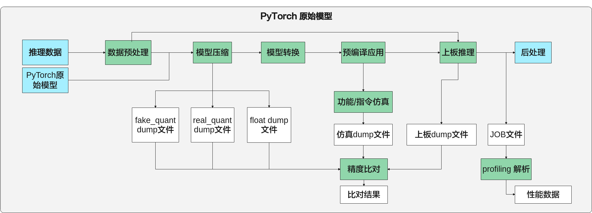


### 命令行格式说明<a name="ZH-CN_TOPIC_0000002442020573"></a>

PyTorch模型一键推理的命令行格式如下。

```
mindcmd oneclick pytorch -m MODEL -i IMAGE_LIST --input_shape INPUT_SHAPE
```

PyTorch模型一键推理的命令行参数说明如[表1](#table1529512183117)所示。

**表 1**  PyTorch模型一键推理命令行参数说明

<a name="table1529512183117"></a>
<table><thead align="left"><tr id="row16295111123117"><th class="cellrowborder" valign="top" width="18.34%" id="mcps1.2.4.1.1"><p id="p1295317317"><a name="p1295317317"></a><a name="p1295317317"></a><strong id="b429521123113"><a name="b429521123113"></a><a name="b429521123113"></a>参数</strong></p>
</th>
<th class="cellrowborder" valign="top" width="8.32%" id="mcps1.2.4.1.2"><p id="p156711536104512"><a name="p156711536104512"></a><a name="p156711536104512"></a>必选/可选</p>
</th>
<th class="cellrowborder" valign="top" width="73.34%" id="mcps1.2.4.1.3"><p id="p1638317336452"><a name="p1638317336452"></a><a name="p1638317336452"></a>描述</p>
</th>
</tr>
</thead>
<tbody><tr id="row1529617143115"><td class="cellrowborder" colspan="3" valign="top" headers="mcps1.2.4.1.1 mcps1.2.4.1.2 mcps1.2.4.1.3 "><p id="p880452295315"><a name="p880452295315"></a><a name="p880452295315"></a><strong id="b1412210719261"><a name="b1412210719261"></a><a name="b1412210719261"></a>pytorch子命令</strong></p>
</td>
</tr>
<tr id="row192964153116"><td class="cellrowborder" valign="top" width="18.34%" headers="mcps1.2.4.1.1 "><p id="p211mcpsimp"><a name="p211mcpsimp"></a><a name="p211mcpsimp"></a><strong id="b997718244263"><a name="b997718244263"></a><a name="b997718244263"></a>-m, --model</strong></p>
</td>
<td class="cellrowborder" valign="top" width="8.32%" headers="mcps1.2.4.1.2 "><p id="p582452855116"><a name="p582452855116"></a><a name="p582452855116"></a><strong id="b9993162452614"><a name="b9993162452614"></a><a name="b9993162452614"></a>必选</strong></p>
</td>
<td class="cellrowborder" valign="top" width="73.34%" headers="mcps1.2.4.1.3 "><p id="p18808184204420"><a name="p18808184204420"></a><a name="p18808184204420"></a>指定可初始化PyTorch模型的对象, 如：package.module.class。</p>
<p id="p12184717175615"><a name="p12184717175615"></a><a name="p12184717175615"></a><strong id="b27192217422"><a name="b27192217422"></a><a name="b27192217422"></a>确保参数路径在PYTHONPATH环境变量下</strong>。</p>
</td>
</tr>
<tr id="row13515259124514"><td class="cellrowborder" valign="top" width="18.34%" headers="mcps1.2.4.1.1 "><p id="p1554451112461"><a name="p1554451112461"></a><a name="p1554451112461"></a><strong id="b10741019154614"><a name="b10741019154614"></a><a name="b10741019154614"></a>--input_shape</strong></p>
</td>
<td class="cellrowborder" valign="top" width="8.32%" headers="mcps1.2.4.1.2 "><p id="p45440116469"><a name="p45440116469"></a><a name="p45440116469"></a><strong id="b1476141914616"><a name="b1476141914616"></a><a name="b1476141914616"></a>必选</strong></p>
</td>
<td class="cellrowborder" valign="top" width="73.34%" headers="mcps1.2.4.1.3 "><p id="p1954421111469"><a name="p1954421111469"></a><a name="p1954421111469"></a>指定模型输入的shape。多输入模型按照输入顺序指定，用英文分号作为分割，用英文双引号括住，如 --input_shape="1,3,224,224;1,3,224,224"。</p>
<div class="note" id="note1865413349463"><a name="note1865413349463"></a><a name="note1865413349463"></a><span class="notetitle"> 说明： </span><div class="notebody"><p id="p53212522094"><a name="p53212522094"></a><a name="p53212522094"></a>当-i/--image_list参数传入npy格式的feature map数据时，此参数非必选，工具自动解析输入feature map的shape信息当做模型的shape。</p>
</div></div>
</td>
</tr>
<tr id="row1819981072512"><td class="cellrowborder" valign="top" width="18.34%" headers="mcps1.2.4.1.1 "><p id="p620011016255"><a name="p620011016255"></a><a name="p620011016255"></a>-w, --weight</p>
</td>
<td class="cellrowborder" valign="top" width="8.32%" headers="mcps1.2.4.1.2 "><p id="p1920091012256"><a name="p1920091012256"></a><a name="p1920091012256"></a>可选</p>
</td>
<td class="cellrowborder" valign="top" width="73.34%" headers="mcps1.2.4.1.3 "><p id="p120061011255"><a name="p120061011255"></a><a name="p120061011255"></a>指定权重（ *.pt，*.pth，*.pth.tar ）文件。</p>
</td>
</tr>
<tr id="row82961817311"><td class="cellrowborder" valign="top" width="18.34%" headers="mcps1.2.4.1.1 "><p id="p12965114317"><a name="p12965114317"></a><a name="p12965114317"></a>–i, --image_list</p>
</td>
<td class="cellrowborder" valign="top" width="8.32%" headers="mcps1.2.4.1.2 "><p id="p382415283512"><a name="p382415283512"></a><a name="p382415283512"></a>可选</p>
</td>
<td class="cellrowborder" valign="top" width="73.34%" headers="mcps1.2.4.1.3 "><p id="p72965113318"><a name="p72965113318"></a><a name="p72965113318"></a>指定推理数据。支持图片列表（.txt）和feature map（.txt/.bin/.npy）格式。</p>
<p id="p737117504517"><a name="p737117504517"></a><a name="p737117504517"></a>工具按照传入路径参数后缀和文件内容区分图片列表或者feature map，具体规则如下。</p>
<a name="ul987602619102"></a><a name="ul987602619102"></a><ul id="ul987602619102"><li>当txt文件内每行为一张图片的路径时，将输入 .txt 后缀文件识别为图片列表。支持图片格式包括：<p id="p14732241220"><a name="p14732241220"></a><a name="p14732241220"></a>".bmp", ".jpeg", ".jpg", ".jpe", ".jp2", ".png"。</p>
</li><li>当txt文件内任意一行不是路径时，将输入.txt后缀文件识别为txt格式的feature map。</li><li>.txt文件内不支持写feature map路径。</li><li>txt格式的feature map，数据间以空格分隔，txt文件内每一行的数据个数为channel × height × width。一行表示一个batch的数据量，总数据量应该与模型输入shape的N*C*H*W乘积一致。</li><li>.bin或者.npy 后缀识别为feature map。</li><li>输入为图片、.bin或者.txt格式的feature map必须同时指定--input_shape参数使用。</li></ul>
<p id="p755132571914"><a name="p755132571914"></a><a name="p755132571914"></a>多输入模型按照输入顺序指定，使用英文双引号包含，并用英文分号作为分割，如 --image_list="/home/MindCmdUser/image_list1.txt;/home/MindCmdUser/image_list2.txt"。</p>
<p id="p17825720131316"><a name="p17825720131316"></a><a name="p17825720131316"></a>当未指定此参数时，工具将根据--input_shape参数所指定的shape信息，生成随机数feature map作为输入数据并用于推理。</p>
<div class="note" id="note12836110128"><a name="note12836110128"></a><a name="note12836110128"></a><span class="notetitle"> 说明： </span><div class="notebody"><a name="ul175401252102211"></a><a name="ul175401252102211"></a><ul id="ul175401252102211"><li>当推理数据为图片场景，Calibration数据和Validation数据分离，工具使用最后一张图片作为Validation数据，其他图片用做Calibration数据。</li><li>当推理数据为feature map场景，每路输入只支持传入单个feature map文件，且传入的数据同时用于模型的Calibration和Validation。</li><li>输入数据经过预处理后，保存在${work_dir}/output/project_xxx/preprocess/路径下。</li></ul>
</div></div>
</td>
</tr>
<tr id="row18813104993314"><td class="cellrowborder" valign="top" width="18.34%" headers="mcps1.2.4.1.1 "><p id="p159918531333"><a name="p159918531333"></a><a name="p159918531333"></a>--aapp</p>
</td>
<td class="cellrowborder" valign="top" width="8.32%" headers="mcps1.2.4.1.2 "><p id="p176001253183315"><a name="p176001253183315"></a><a name="p176001253183315"></a>可选</p>
</td>
<td class="cellrowborder" valign="top" width="73.34%" headers="mcps1.2.4.1.3 "><p id="p14600165303319"><a name="p14600165303319"></a><a name="p14600165303319"></a>指定数据预处理配置文件，参考<a href="#ZH-CN_TOPIC_0000002408421442">数据预处理配置文件样例</a>。</p>
<p id="p26002053163311"><a name="p26002053163311"></a><a name="p26002053163311"></a>数据预处理完整配置方式请参考《ATC工具使用指南》“--insert_op_conf ”章节。</p>
</td>
</tr>
<tr id="row8404101115212"><td class="cellrowborder" valign="top" width="18.34%" headers="mcps1.2.4.1.1 "><p id="p61485314453"><a name="p61485314453"></a><a name="p61485314453"></a>--input_type</p>
</td>
<td class="cellrowborder" valign="top" width="8.32%" headers="mcps1.2.4.1.2 "><p id="p9148235452"><a name="p9148235452"></a><a name="p9148235452"></a>可选</p>
</td>
<td class="cellrowborder" valign="top" width="73.34%" headers="mcps1.2.4.1.3 "><p id="p114814344517"><a name="p114814344517"></a><a name="p114814344517"></a>指定待处理数据的数据类型，只用于Feature map输入，不能用于图片输入。支持数据类型FP16, FP32, INT16, INT8, S16, S8, U16, U8, UINT16, UINT8。指定多个输入数据类型时，使用英文分号隔开，用英文双引号括住。eg.：--input_type="INT8;FP16"</p>
</td>
</tr>
<tr id="row1431823172314"><td class="cellrowborder" valign="top" width="18.34%" headers="mcps1.2.4.1.1 "><p id="p134311023172315"><a name="p134311023172315"></a><a name="p134311023172315"></a>--quant_config</p>
</td>
<td class="cellrowborder" valign="top" width="8.32%" headers="mcps1.2.4.1.2 "><p id="p24315230235"><a name="p24315230235"></a><a name="p24315230235"></a>可选</p>
</td>
<td class="cellrowborder" valign="top" width="73.34%" headers="mcps1.2.4.1.3 "><p id="p1431102315238"><a name="p1431102315238"></a><a name="p1431102315238"></a>指定AMCT的简易量化配置文件(*.yml，*.yaml)或量化配置文件(*.json)。配置方式请参考《AMCT使用指南（PyTorch）》“静态图简易量化配置功能说明”章节。</p>
<div class="note" id="note1783915963115"><a name="note1783915963115"></a><a name="note1783915963115"></a><span class="notetitle"> 说明： </span><div class="notebody"><p id="p10351543173716"><a name="p10351543173716"></a><a name="p10351543173716"></a>json、yml或者yaml中配置线性4bit量化时，MindCmd不会进行精度优化，仅推荐用于性能评估；</p>
<p id="p146153716376"><a name="p146153716376"></a><a name="p146153716376"></a>不支持非均匀4bit 。</p>
</div></div>
</td>
</tr>
<tr id="row133941567493"><td class="cellrowborder" valign="top" width="18.34%" headers="mcps1.2.4.1.1 "><p id="p105425491153"><a name="p105425491153"></a><a name="p105425491153"></a>-r, --rpndata</p>
</td>
<td class="cellrowborder" valign="top" width="8.32%" headers="mcps1.2.4.1.2 "><p id="p1854220497152"><a name="p1854220497152"></a><a name="p1854220497152"></a>可选</p>
</td>
<td class="cellrowborder" valign="top" width="73.34%" headers="mcps1.2.4.1.3 "><p id="p15635195951813"><a name="p15635195951813"></a><a name="p15635195951813"></a>rpn文件（.txt），当模型包含rpn硬化层时，此参数要求必传，且不执行AMCT和GT。</p>
<p id="p17542164951514"><a name="p17542164951514"></a><a name="p17542164951514"></a>指定多个rpn文件时使用英文双引号包含，并用英文分号作为分割，如 --rpndata="/home/MindCmdUser/rpn1.txt;/home/MindCmdUser/rpn2.txt"。</p>
</td>
</tr>
<tr id="row483445478"><td class="cellrowborder" valign="top" width="18.34%" headers="mcps1.2.4.1.1 "><p id="p493104134215"><a name="p493104134215"></a><a name="p493104134215"></a>-b, --batch_num</p>
</td>
<td class="cellrowborder" valign="top" width="8.32%" headers="mcps1.2.4.1.2 "><p id="p3931841425"><a name="p3931841425"></a><a name="p3931841425"></a>可选</p>
</td>
<td class="cellrowborder" valign="top" width="73.34%" headers="mcps1.2.4.1.3 "><p id="p13542032134211"><a name="p13542032134211"></a><a name="p13542032134211"></a>指定多batch模型的batch数量。多输入多batch模型只需指定较大的那个batch值。如双路输入的模型，其中一路支持32batch，一路不支持多batch，则输入 --batch_num=32。</p>
</td>
</tr>
<tr id="row72411848785"><td class="cellrowborder" valign="top" width="18.34%" headers="mcps1.2.4.1.1 "><p id="p172421948781"><a name="p172421948781"></a><a name="p172421948781"></a>--realquant</p>
</td>
<td class="cellrowborder" valign="top" width="8.32%" headers="mcps1.2.4.1.2 "><p id="p12242114819818"><a name="p12242114819818"></a><a name="p12242114819818"></a>可选</p>
</td>
<td class="cellrowborder" valign="top" width="73.34%" headers="mcps1.2.4.1.3 "><p id="p12424486816"><a name="p12424486816"></a><a name="p12424486816"></a>真量化开关，指定此参数即表示开启。</p>
</td>
</tr>
<tr id="row18384959122719"><td class="cellrowborder" valign="top" width="18.34%" headers="mcps1.2.4.1.1 "><p id="p112941482819"><a name="p112941482819"></a><a name="p112941482819"></a>-h, --help</p>
</td>
<td class="cellrowborder" valign="top" width="8.32%" headers="mcps1.2.4.1.2 "><p id="p5583188172818"><a name="p5583188172818"></a><a name="p5583188172818"></a>可选</p>
</td>
<td class="cellrowborder" valign="top" width="73.34%" headers="mcps1.2.4.1.3 "><p id="p16311452819"><a name="p16311452819"></a><a name="p16311452819"></a>展示pytorch模型一键推理 help 信息，eg. mindcmd oneclick pytorch -h。</p>
</td>
</tr>
<tr id="row47021717172720"><td class="cellrowborder" colspan="3" valign="top" headers="mcps1.2.4.1.1 mcps1.2.4.1.2 mcps1.2.4.1.3 "><p id="p8702161782714"><a name="p8702161782714"></a><a name="p8702161782714"></a><strong id="b149431440122712"><a name="b149431440122712"></a><a name="b149431440122712"></a>oneclick子命令</strong></p>
</td>
</tr>
<tr id="row1229711103111"><td class="cellrowborder" valign="top" width="18.34%" headers="mcps1.2.4.1.1 "><p id="p12297141133113"><a name="p12297141133113"></a><a name="p12297141133113"></a>-k, --work_dir</p>
</td>
<td class="cellrowborder" valign="top" width="8.32%" headers="mcps1.2.4.1.2 "><p id="p138841403518"><a name="p138841403518"></a><a name="p138841403518"></a>可选</p>
</td>
<td class="cellrowborder" valign="top" width="73.34%" headers="mcps1.2.4.1.3 "><p id="p197211341195919"><a name="p197211341195919"></a><a name="p197211341195919"></a>指定工作目录，否则使用默认工作路径 $HOME/MindCmd-WorkSpace/XXX，XXX根据运行的模型动态生成。</p>
<p id="p2602518356"><a name="p2602518356"></a><a name="p2602518356"></a>指定的工作目录要求已存在。</p>
<p id="p129mcpsimp"><a name="p129mcpsimp"></a><a name="p129mcpsimp"></a>如果开启了<a href="#ZH-CN_TOPIC_0000002442020665">上板推理开关</a>（IS_<em id="i1042152314349"><a name="i1042152314349"></a><a name="i1042152314349"></a>NNN</em>_RUN=1），则工作目录不能超出<a href="#ZH-CN_TOPIC_0000002408421542">ssh.cfg文件配置</a>小节中HOST_MOUNT_PATH配置的路径。</p>
</td>
</tr>
<tr id="row1835913114558"><td class="cellrowborder" valign="top" width="18.34%" headers="mcps1.2.4.1.1 "><p id="p1464812310553"><a name="p1464812310553"></a><a name="p1464812310553"></a>-s, --ssh_config</p>
</td>
<td class="cellrowborder" valign="top" width="8.32%" headers="mcps1.2.4.1.2 "><p id="p18648152318557"><a name="p18648152318557"></a><a name="p18648152318557"></a>可选</p>
</td>
<td class="cellrowborder" valign="top" width="73.34%" headers="mcps1.2.4.1.3 "><p id="p188991542163611"><a name="p188991542163611"></a><a name="p188991542163611"></a>指定板端ssh挂载配置文件。ssh挂载需先进行NFS环境搭建，可参考<a href="#ZH-CN_TOPIC_0000002441980773">NFS环境搭建</a>。</p>
<p id="p18435442131911"><a name="p18435442131911"></a><a name="p18435442131911"></a>ssh挂载配置文件的模板，可参考<a href="#ZH-CN_TOPIC_0000002408421542">ssh.cfg文件配置</a>。</p>
</td>
</tr>
<tr id="row9641233134016"><td class="cellrowborder" valign="top" width="18.34%" headers="mcps1.2.4.1.1 "><p id="p18642123314407"><a name="p18642123314407"></a><a name="p18642123314407"></a>--clean</p>
</td>
<td class="cellrowborder" valign="top" width="8.32%" headers="mcps1.2.4.1.2 "><p id="p634394119511"><a name="p634394119511"></a><a name="p634394119511"></a>可选</p>
</td>
<td class="cellrowborder" valign="top" width="73.34%" headers="mcps1.2.4.1.3 "><p id="p170310520259"><a name="p170310520259"></a><a name="p170310520259"></a>输入一个前缀${prefix}用于删除${work_dir}/output/目录下所有名为“${prefix}_xxxxx”的文件夹，删除oneclick模块的历史输出目录。</p>
<p id="p4156521162211"><a name="p4156521162211"></a><a name="p4156521162211"></a>例如：输入 --clean project 将会删除${work_dir}/output/目录下所有名为“project_xxxxx”的文件夹。</p>
</td>
</tr>
<tr id="row1784251105418"><td class="cellrowborder" valign="top" width="18.34%" headers="mcps1.2.4.1.1 "><p id="p1944915573546"><a name="p1944915573546"></a><a name="p1944915573546"></a>-h, --help</p>
</td>
<td class="cellrowborder" valign="top" width="8.32%" headers="mcps1.2.4.1.2 "><p id="p15449657155410"><a name="p15449657155410"></a><a name="p15449657155410"></a>可选</p>
</td>
<td class="cellrowborder" valign="top" width="73.34%" headers="mcps1.2.4.1.3 "><p id="p15449175719542"><a name="p15449175719542"></a><a name="p15449175719542"></a>展示命令行 help 信息，eg. mindcmd oneclick -h。</p>
</td>
</tr>
</tbody>
</table>

> **说明：** 
>-   输入各参数的位置要求位于其所属子命令之后，例如：
>    ```
>    mindcmd oneclick -k {WORK_DIR} pytorch -m {package.model.class} --input_shape {INPUT_SHAPE}
>    ```
>-   参数值格式：支持大小写字母（a-z，A-Z）、数字（0-9）、下划线（\_）、中划线（-）、句点（.）。
>-   当-i/--image\_list指定图片列表的时候，图片列表的内容支持UTF-8编码的中文路径。
>-   多输入场景支持featuremap和图片列表混输，eg. -i="$\{图片列表\};$\{feature\_map\}"。

### 执行样例<a name="ZH-CN_TOPIC_0000002408421518"></a>

-   模型和数据准备。

    将推理所需的PyTorch模型文件以及所需的数据等上传到开发环境任意路径, 如/home/MindCmdUser/test\_case，参考目录结构如下。

    ```
    ├── test_case
    │   ├── ssh.cfg   # 可选，否则需要关闭上板推理
    │   ├── pytorch_resnet50
    │   │   ├── __init__.py
    │   │   ├── resnet.py  # 必选
    │   │   └── resnet50-19c8e357.pth
    │   ├── data  # 可选，否则工具自动使用随机数推理
    │   │   ├── dog1_1024_683.jpg
    │   │   ├── dog2_1024_683.jpg
    │   │   ├── insert_op.cfg
    │   │   └── image_ref_list.txt
    ```

    **配置PYTHONPATH环境变量**：

    ```
    export PYTHONPATH=/home/MindCmdUser/test_case:$PYTHONPATH
    ```

    > **说明：** 
    >-   推理数据的shape应该与模型所需输入数据的shape相同，如：模型resnet50的shape为（3， 224， 224），图片的shape也应为（3， 224， 224）。否则需要自定义数据预处理方式，通过--aapp参数指定[数据预处理配置文件样例](#ZH-CN_TOPIC_0000002408421442)，数据预处理完整配置方式请参考《ATC工具使用指南》“--insert\_op\_conf ”章节。
    >-   当推理数据为图片且未指定数据预处理配置文件时，工具会根据--input\_shape参数值，将所有图片Resize成模型所需输入数据的shape。

-   选择一键推理场景

    执行一键推理前可以在mindcmd.ini文件中配置一键推理开关\[oneclick\_switch\]

    ```
    [oneclick_switch]
    # 是否清理当前工作目录下的历史输出结果
    IS_CLEAN_PREVIOUS_OUTPUT=1
    
    # 是否开启模型压缩
    IS_AMCT_RUN=1
    
    # 是否开启GT推理，支持Caffe、ONNX
    IS_GT_RUN=1
    
    # 是否开启上板推理，开启需要配置ssh
    IS_NNN_RUN=0
    
    # 是否开启功能仿真
    IS_FUNC_RUN=1
    
    # 是否开启指令仿真
    IS_INST_RUN=0
    
    # 是否在模型推理时开启Dump网络中间结果，作用于功能仿真、指令仿真、上板推理
    IS_DUMP_OPEN=1
    
    # 是否开启Dump数据精度比对
    IS_COMPARE_OPEN=1
    
    # 是否开启上板性能数据采集
    IS_BOARD_PROFILING_OPEN=1
    
    # 是否在控制台展示性能数据报告
    IS_PROFILE_DISPLAY_OPEN=0
    
    # 是否在控制台打印详细的执行日志
    IS_PRINT_PROCESS_DETAIL=0
    ```

-   执行一键推理

    执行以下命令进行一键推理：

    ```
    cd test_case
    mindcmd oneclick pytorch -m pytorch_resnet50.resnet.resnet50 -i ./data/image_ref_list.txt --input_shape 1,3,224,224 --realquant
    ```

-   执行结果

    PyTorch模型一键推理执行结束后会在工作路径下生成相应的文件，主要的目录结构如下。

    ```
    ├── work_space
    │   ├── bin                                   # 可执行文件路径
    │   ├── data                                  
    │   │   ├── inference_data_XXX.txt           # 推理数据
    │   │   ├── insert_op.cfg                    # aapp配置
    │   ├── model                                 # om离线模型保存路径
    │   ├── output                
    │   │   ├── project_XXX                
    │   │   │   ├── amct                        # 模型压缩输出路径
    │   │   │   ├── atc                         # 模型转换输出路径
    │   │   │   ├── cmp                         # 精度比对结果保存路径
    │   │   │   ├── dump                        # dump结果保存路径
    │   │   │   │    ├── float                 # 原始模型浮点dump数据，用于精度比对
    │   │   │   │    ├── fake_quant            # 量化后模型假量化dump数据，用于精度比对
    │   │   │   │    ├── real_quant            # 量化后模型真量化dump数据，用于精度比对
    │   │   │   │    ├── funcsim               # 离线模型功能仿真dump数据，用于精度比对
    │   │   │   │    │    └── trap
    │   │   │   │    ├── instsim               # 离线模型指令仿真dump数据，用于精度比对
    │   │   │   │    │    └── trap
    │   │   │   │    └── nnn                   # 离线模型上板推理dump数据，用于精度比对
    │   │   │   │    │    └── trap
    │   │   │   ├── log                         # 一键推理执行日志所在文件夹
    │   │   │   ├── profiling                   # 性能分析结果保存路径
    │   │   │   └── preprocess                  # 数据预处理结果保存路径
    │   │   └── latest_result                    # 最后一次执行的oneclick输出路径 
    │   ├── acl_XXX.json                          # acl配置文件(下发release配置)
    │   ├── acl_dump_XXX.json                     # acl配置文件(下发dump配置)
    │   ├── acl_profiling_XXX.json                # acl配置文件(下发profiling配置)
    │   └── project.cfg                           # 工程参数配置文件
    ```

    > **说明：** 
    >-   当IS\_DUMP\_OPEN值为0时，trap目录中只会保存尾层输出。

### 量化后模型一键推理<a name="ZH-CN_TOPIC_0000002408581354"></a>

工具支持传入量化后的权重文件和量化配置文件执行量化后模型一键推理，流程如[图1](#fig148822420395)所示。命令行格式如下。

```
mindcmd oneclick pytorch -m MODEL -w WEIGHT  -i IMAGE_LIST --input_shape INPUT_SHAPE --quant_config QUANT_CONFIG
```

**图 1**  量化后模型一键推理流程图<a name="fig148822420395"></a>  
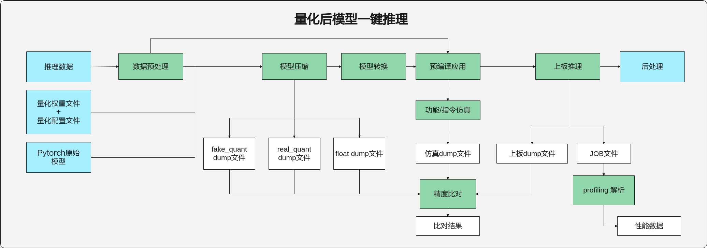

> **说明：** 
>当且仅当同时输入量化后的权重文件和量化配置文件时，才会执行量化后模型一键推理。

### 硬件感知一键推理<a name="ZH-CN_TOPIC_0000002408421494"></a>

工具支持硬件感知一键推理流程，流程如[图1](#fig116795781218)所示。命令行格式如下。

```
mindcmd oneclick pytorch -m MODEL -i IMAGE_LIST --realquant
```

**图 1**  硬件感知一键推理流程图<a name="fig116795781218"></a>  
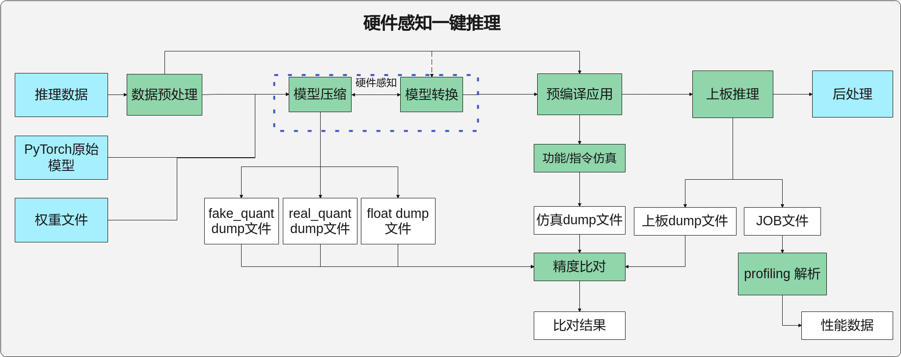

> **说明：** 
>当参数--quant\_config传入量化配置文件（\*.json）时，不会执行硬件感知一键推理。

## ONNX模型一键推理<a name="ZH-CN_TOPIC_0000002441980689"></a>

ONNX模型一键推理流程如[图1](#fig41101631131215)所示。

**图 1**  ONNX模型一键推理流程图<a name="fig41101631131215"></a>  
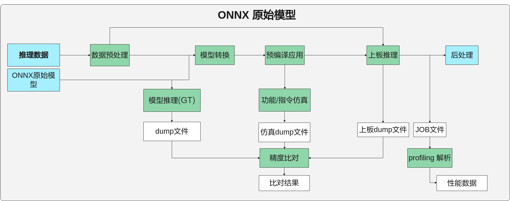


### 命令行格式说明<a name="ZH-CN_TOPIC_0000002408421390"></a>

ONNX模型一键推理的命令行格式如下。

```
mindcmd oneclick onnx -m MODEL -i IMAGE_LIST 
```

ONNX模型一键推理的命令行参数说明如[表1](#table16770184613465)所示。

**表 1**  ONNX模型一键推理命令行参数说明

<a name="table16770184613465"></a>
<table><thead align="left"><tr id="row1777194617463"><th class="cellrowborder" valign="top" width="19.220000000000002%" id="mcps1.2.4.1.1"><p id="p7771184611467"><a name="p7771184611467"></a><a name="p7771184611467"></a><strong id="b5771046134617"><a name="b5771046134617"></a><a name="b5771046134617"></a>参数</strong></p>
</th>
<th class="cellrowborder" valign="top" width="11.37%" id="mcps1.2.4.1.2"><p id="p156711536104512"><a name="p156711536104512"></a><a name="p156711536104512"></a>必选/可选</p>
</th>
<th class="cellrowborder" valign="top" width="69.41000000000001%" id="mcps1.2.4.1.3"><p id="p1638317336452"><a name="p1638317336452"></a><a name="p1638317336452"></a>描述</p>
</th>
</tr>
</thead>
<tbody><tr id="row2771154634614"><td class="cellrowborder" colspan="3" valign="top" headers="mcps1.2.4.1.1 mcps1.2.4.1.2 mcps1.2.4.1.3 "><p id="p32921757134819"><a name="p32921757134819"></a><a name="p32921757134819"></a><strong id="b891584519610"><a name="b891584519610"></a><a name="b891584519610"></a>onnx子命令</strong></p>
</td>
</tr>
<tr id="row677184604615"><td class="cellrowborder" valign="top" width="19.220000000000002%" headers="mcps1.2.4.1.1 "><p id="p744692544911"><a name="p744692544911"></a><a name="p744692544911"></a><strong id="b5840103314817"><a name="b5840103314817"></a><a name="b5840103314817"></a>–m, --model</strong></p>
</td>
<td class="cellrowborder" valign="top" width="11.37%" headers="mcps1.2.4.1.2 "><p id="p1971610540506"><a name="p1971610540506"></a><a name="p1971610540506"></a><strong id="b1985513330812"><a name="b1985513330812"></a><a name="b1985513330812"></a>必选</strong></p>
</td>
<td class="cellrowborder" valign="top" width="69.41000000000001%" headers="mcps1.2.4.1.3 "><p id="p104461425114912"><a name="p104461425114912"></a><a name="p104461425114912"></a>指定ONNX模型文件。</p>
</td>
</tr>
<tr id="row77713468462"><td class="cellrowborder" valign="top" width="19.220000000000002%" headers="mcps1.2.4.1.1 "><p id="p14771146154616"><a name="p14771146154616"></a><a name="p14771146154616"></a>–i, --image_list</p>
</td>
<td class="cellrowborder" valign="top" width="11.37%" headers="mcps1.2.4.1.2 "><p id="p6716145420508"><a name="p6716145420508"></a><a name="p6716145420508"></a>可选</p>
</td>
<td class="cellrowborder" valign="top" width="69.41000000000001%" headers="mcps1.2.4.1.3 "><p id="p3771144654612"><a name="p3771144654612"></a><a name="p3771144654612"></a>指定推理数据。支持图片列表（.txt）和feature map（.txt/.bin/.npy）格式。</p>
<p id="p737117504517"><a name="p737117504517"></a><a name="p737117504517"></a>工具按照传入路径参数后缀和文件内容区分图片列表或者feature map，具体规则如下。</p>
<a name="ul9700333111118"></a><a name="ul9700333111118"></a><ul id="ul9700333111118"><li>当txt文件内每行为一张图片的路径时，将输入 .txt 后缀文件识别为图片列表。支持图片格式包括：<p id="p2700193310110"><a name="p2700193310110"></a><a name="p2700193310110"></a>".bmp", ".jpeg", ".jpg", ".jpe", ".jp2", ".png"。</p>
</li><li>当txt文件内任意一行不是路径时，将输入.txt后缀文件识别为txt格式的feature map。</li><li>.txt文件内不支持写feature map路径。</li><li>txt格式的feature map，数据间以空格分隔，txt文件内每一行的数据个数为channel × height × width。一行表示一个batch的数据量，总数据量应该与模型输入shape的N*C*H*W乘积一致。</li></ul>
<a name="ul987602619102"></a><a name="ul987602619102"></a><ul id="ul987602619102"><li>.bin或者.npy 后缀识别为feature map。</li></ul>
<p id="p755132571914"><a name="p755132571914"></a><a name="p755132571914"></a>多输入模型按照输入顺序指定，使用双引号""包含，并用英文分号;作为分割，如 --image_list="/home/MindCmdUser/image_list1.txt;/home/MindCmdUser/image_list2.txt"。</p>
<p id="p6684437181310"><a name="p6684437181310"></a><a name="p6684437181310"></a>当未指定此参数时，工具将生成随机数feature map作为输入数据并用于推理。</p>
<div class="note" id="note12836110128"><a name="note12836110128"></a><a name="note12836110128"></a><span class="notetitle"> 说明： </span><div class="notebody"><a name="ul175401252102211"></a><a name="ul175401252102211"></a><ul id="ul175401252102211"><li>当推理数据为图片场景，Calibration数据和Validation数据分离，工具使用最后一张图片作为Validation数据，其他图片用做Calibration数据。</li><li>当推理数据为feature map场景，每路输入只支持传入单个feature map文件，且传入的数据同时用于模型的Calibration和Validation。</li><li>输入数据经过预处理后，保存在${work_dir}/output/project_xxx/preprocess/路径下。</li></ul>
</div></div>
</td>
</tr>
<tr id="row177611054816"><td class="cellrowborder" valign="top" width="19.220000000000002%" headers="mcps1.2.4.1.1 "><p id="p1945881384810"><a name="p1945881384810"></a><a name="p1945881384810"></a>--aapp</p>
</td>
<td class="cellrowborder" valign="top" width="11.37%" headers="mcps1.2.4.1.2 "><p id="p845861310487"><a name="p845861310487"></a><a name="p845861310487"></a>可选</p>
</td>
<td class="cellrowborder" valign="top" width="69.41000000000001%" headers="mcps1.2.4.1.3 "><p id="p845812137486"><a name="p845812137486"></a><a name="p845812137486"></a>指定数据预处理配置文件，参考<a href="#ZH-CN_TOPIC_0000002408421442">数据预处理配置文件样例</a>。</p>
<p id="p7458313164818"><a name="p7458313164818"></a><a name="p7458313164818"></a>数据预处理完整配置方式请参考《ATC工具使用指南》“--insert_op_conf ”章节。</p>
</td>
</tr>
<tr id="row433721715520"><td class="cellrowborder" valign="top" width="19.220000000000002%" headers="mcps1.2.4.1.1 "><p id="p61485314453"><a name="p61485314453"></a><a name="p61485314453"></a>--input_type</p>
</td>
<td class="cellrowborder" valign="top" width="11.37%" headers="mcps1.2.4.1.2 "><p id="p9148235452"><a name="p9148235452"></a><a name="p9148235452"></a>可选</p>
</td>
<td class="cellrowborder" valign="top" width="69.41000000000001%" headers="mcps1.2.4.1.3 "><p id="p114814344517"><a name="p114814344517"></a><a name="p114814344517"></a>指定待处理数据的数据类型，只用于Feature map输入，不能用于图片输入。支持数据类型FP16, FP32, INT16, INT8, S16, S8, U16, U8, UINT16, UINT8。指定多个输入数据类型时，使用英文分号隔开，用双引号括住。eg.：--input_type="INT8;FP16"</p>
</td>
</tr>
<tr id="row1177134644618"><td class="cellrowborder" valign="top" width="19.220000000000002%" headers="mcps1.2.4.1.1 "><p id="p326344315017"><a name="p326344315017"></a><a name="p326344315017"></a>-q, --quant_param_file</p>
</td>
<td class="cellrowborder" valign="top" width="11.37%" headers="mcps1.2.4.1.2 "><p id="p121151634155019"><a name="p121151634155019"></a><a name="p121151634155019"></a>可选</p>
</td>
<td class="cellrowborder" valign="top" width="69.41000000000001%" headers="mcps1.2.4.1.3 "><p id="p1326334325017"><a name="p1326334325017"></a><a name="p1326334325017"></a>指定AMCT量化参数文件，当传入的模型为AMCT量化后模型时，此参数要求必传，且一键推理时AMCT模块将自动跳过。</p>
</td>
</tr>
<tr id="row20931193118612"><td class="cellrowborder" valign="top" width="19.220000000000002%" headers="mcps1.2.4.1.1 "><p id="p105425491153"><a name="p105425491153"></a><a name="p105425491153"></a>-r, --rpndata</p>
</td>
<td class="cellrowborder" valign="top" width="11.37%" headers="mcps1.2.4.1.2 "><p id="p1854220497152"><a name="p1854220497152"></a><a name="p1854220497152"></a>可选</p>
</td>
<td class="cellrowborder" valign="top" width="69.41000000000001%" headers="mcps1.2.4.1.3 "><p id="p15635195951813"><a name="p15635195951813"></a><a name="p15635195951813"></a>rpn文件（.txt），当模型包含rpn硬化层时，此参数要求必传，且不执行AMCT和GT。指定多个rpn文件时使用英文双引号""包含，并用英文分号;作为分割，如 --rpndata="/home/MindCmdUser/rpn1.txt;/home/MindCmdUser/rpn2.txt"。</p>
</td>
</tr>
<tr id="row4268185254512"><td class="cellrowborder" valign="top" width="19.220000000000002%" headers="mcps1.2.4.1.1 "><p id="p493104134215"><a name="p493104134215"></a><a name="p493104134215"></a>-b, --batch_num</p>
</td>
<td class="cellrowborder" valign="top" width="11.37%" headers="mcps1.2.4.1.2 "><p id="p3931841425"><a name="p3931841425"></a><a name="p3931841425"></a>可选</p>
</td>
<td class="cellrowborder" valign="top" width="69.41000000000001%" headers="mcps1.2.4.1.3 "><p id="p13542032134211"><a name="p13542032134211"></a><a name="p13542032134211"></a>指定多batch模型的batch数量。多输入多batch模型只需指定较大的那个batch值。如双路输入的模型，其中一路支持32batch，一路不支持多batch，则输入 --batch_num=32。</p>
</td>
</tr>
<tr id="row96257424417"><td class="cellrowborder" valign="top" width="19.220000000000002%" headers="mcps1.2.4.1.1 "><p id="p962594210410"><a name="p962594210410"></a><a name="p962594210410"></a>-h, --help</p>
</td>
<td class="cellrowborder" valign="top" width="11.37%" headers="mcps1.2.4.1.2 "><p id="p1762514421146"><a name="p1762514421146"></a><a name="p1762514421146"></a>可选</p>
</td>
<td class="cellrowborder" valign="top" width="69.41000000000001%" headers="mcps1.2.4.1.3 "><p id="p14625184211419"><a name="p14625184211419"></a><a name="p14625184211419"></a>展示onnx模型一键推理 help 信息，eg. mindcmd oneclick onnx -h。</p>
</td>
</tr>
<tr id="row95111107315"><td class="cellrowborder" colspan="3" valign="top" headers="mcps1.2.4.1.1 mcps1.2.4.1.2 mcps1.2.4.1.3 "><p id="p17512171010314"><a name="p17512171010314"></a><a name="p17512171010314"></a><strong id="b9321929730"><a name="b9321929730"></a><a name="b9321929730"></a>oneclick子命令</strong></p>
</td>
</tr>
<tr id="row1277164615463"><td class="cellrowborder" valign="top" width="19.220000000000002%" headers="mcps1.2.4.1.1 "><p id="p4771164674611"><a name="p4771164674611"></a><a name="p4771164674611"></a>-k, --work_dir</p>
</td>
<td class="cellrowborder" valign="top" width="11.37%" headers="mcps1.2.4.1.2 "><p id="p19115193455012"><a name="p19115193455012"></a><a name="p19115193455012"></a>可选</p>
</td>
<td class="cellrowborder" valign="top" width="69.41000000000001%" headers="mcps1.2.4.1.3 "><p id="p152315187303"><a name="p152315187303"></a><a name="p152315187303"></a>指定工作目录，否则使用默认工作路径 $HOME/MindCmd-WorkSpace/XXX，XXX根据运行的模型动态生成。</p>
<p id="p129mcpsimp"><a name="p129mcpsimp"></a><a name="p129mcpsimp"></a>如果开启了<a href="#ZH-CN_TOPIC_0000002442020665">上板推理开关</a>（IS_<em id="i142475143517"><a name="i142475143517"></a><a name="i142475143517"></a>NNN</em>_RUN=1），则工作目录不能超出<a href="#ZH-CN_TOPIC_0000002408421542">ssh.cfg文件配置</a>小节中HOST_MOUNT_PATH配置的路径。</p>
</td>
</tr>
<tr id="row17204112619184"><td class="cellrowborder" valign="top" width="19.220000000000002%" headers="mcps1.2.4.1.1 "><p id="p771510374481"><a name="p771510374481"></a><a name="p771510374481"></a>-s, --ssh_config</p>
</td>
<td class="cellrowborder" valign="top" width="11.37%" headers="mcps1.2.4.1.2 "><p id="p125697554490"><a name="p125697554490"></a><a name="p125697554490"></a>可选</p>
</td>
<td class="cellrowborder" valign="top" width="69.41000000000001%" headers="mcps1.2.4.1.3 "><p id="p1228816422313"><a name="p1228816422313"></a><a name="p1228816422313"></a>指定板端ssh挂载配置文件。ssh挂载需先进行NFS环境搭建，可参考<a href="#ZH-CN_TOPIC_0000002441980773">NFS环境搭建</a>。</p>
<p id="p18435442131911"><a name="p18435442131911"></a><a name="p18435442131911"></a>ssh挂载配置文件的模板，可参考<a href="#ZH-CN_TOPIC_0000002408421542">ssh.cfg文件配置</a>。</p>
</td>
</tr>
<tr id="row0681109026"><td class="cellrowborder" valign="top" width="19.220000000000002%" headers="mcps1.2.4.1.1 "><p id="p0681591720"><a name="p0681591720"></a><a name="p0681591720"></a>--clean</p>
</td>
<td class="cellrowborder" valign="top" width="11.37%" headers="mcps1.2.4.1.2 "><p id="p20115133420509"><a name="p20115133420509"></a><a name="p20115133420509"></a>可选</p>
</td>
<td class="cellrowborder" valign="top" width="69.41000000000001%" headers="mcps1.2.4.1.3 "><p id="p170310520259"><a name="p170310520259"></a><a name="p170310520259"></a>输入一个前缀${prefix}用于删除${work_dir}/output/目录下所有名为“${prefix}_xxxxx”的文件夹，删除oneclick模块的历史输出目录。</p>
<p id="p4156521162211"><a name="p4156521162211"></a><a name="p4156521162211"></a>例如：输入 --clean project 将会删除${work_dir}/output/目录下所有名为“project_xxxxx”的文件夹。</p>
</td>
</tr>
<tr id="row647715891817"><td class="cellrowborder" valign="top" width="19.220000000000002%" headers="mcps1.2.4.1.1 "><p id="p15178181411814"><a name="p15178181411814"></a><a name="p15178181411814"></a>-h, --help</p>
</td>
<td class="cellrowborder" valign="top" width="11.37%" headers="mcps1.2.4.1.2 "><p id="p12178121417188"><a name="p12178121417188"></a><a name="p12178121417188"></a>可选</p>
</td>
<td class="cellrowborder" valign="top" width="69.41000000000001%" headers="mcps1.2.4.1.3 "><p id="p5178161491819"><a name="p5178161491819"></a><a name="p5178161491819"></a>展示命令行 help 信息，eg. mindcmd oneclick -h。</p>
</td>
</tr>
</tbody>
</table>

> **说明：** 
>-   输入各参数的位置要求位于其所属子命令之后，例如：
>    ```
>    mindcmd oneclick -k {WORK_DIR} onnx -m  *.onnx
>    ```
>-   参数值格式：支持大小写字母（a-z，A-Z）、数字（0-9）、下划线（\_）、中划线（-）、句点（.）。
>-   当-i/--image\_list指定图片列表的时候，图片列表的内容支持UTF-8编码的中文路径。
>-   多输入场景支持feature map和图片列表混输，eg. -i="$\{图片列表\};$\{feature\_map\}"。

### 执行样例<a name="ZH-CN_TOPIC_0000002408421422"></a>

-   模型和数据准备。

    将推理所需的ONNX模型文件以及所需的数据等上传到开发环境任意路径，参考目录如下。

    ```
    ├── test_case
    │   ├── ssh.cfg  # 可选，否则需要关闭上板推理
    │   ├── onnx_resnet50
    │   │   └── resnet50.onnx  # 必选
    │   ├── data  # 可选，否则工具自动使用随机数推理
    │   │   ├── dog1_1024_683.jpg
    │   │   ├── dog2_1024_683.jpg
    │   │   ├── insert_op.cfg
    │   │   └── image_ref_list.txt
    ```

    > **说明：** 
    >-   推理数据的shape应该与模型所需输入数据的shape相同，如：模型resnet50的shape为（3， 224， 224），图片的shape也应为（3， 224， 224）。否则需要自定义数据预处理方式，通过--aapp参数指定[数据预处理配置文件样例](#ZH-CN_TOPIC_0000002408421442)，数据预处理完整配置方式请参考《ATC工具使用指南》“--insert\_op\_conf ”章节。
    >-   当推理数据为图片且未指定数据预处理配置文件时，工具会将所有图片Resize成模型所需输入数据的shape大小。

-   选择一键推理场景

    执行一键推理前可以在mindcmd.ini文件中配置一键推理开关\[oneclick\_switch\]

    ```
    [oneclick_switch]
    # 是否清理当前工作目录下的历史输出结果
    IS_CLEAN_PREVIOUS_OUTPUT=1
    
    # 是否开启模型压缩
    IS_AMCT_RUN=1
    
    # 是否开启GT推理，支持Caffe、ONNX
    IS_GT_RUN=1
    
    # 是否开启上板推理，开启需要配置ssh
    IS_NNN_RUN=0
    
    # 是否开启功能仿真
    IS_FUNC_RUN=1
    
    # 是否开启指令仿真
    IS_INST_RUN=0
    
    # 是否在模型推理时开启Dump网络中间结果，作用于功能仿真、指令仿真、上板推理
    IS_DUMP_OPEN=1
    
    # 是否开启Dump数据精度比对
    IS_COMPARE_OPEN=1
    
    # 是否开启上板性能数据采集
    IS_BOARD_PROFILING_OPEN=1
    
    # 是否在控制台展示性能数据报告
    IS_PROFILE_DISPLAY_OPEN=0
    
    # 是否在控制台打印详细的执行日志
    IS_PRINT_PROCESS_DETAIL=0
    ```

-   执行一键推理

    执行以下命令进行一键推理：

    ```
    cd test_case
    mindcmd oneclick onnx -m ./onnx_resnet50/resnet50.onnx -i ./data/image_ref_list.txt
    ```

-   执行结果

    ONNX模型一键推理执行结束后会在工作路径下生成相应的文件，主要的目录结构如下。

    ```
    ├── work_space
    │   ├── bin                                   # 可执行文件路径
    │   ├── data                                                              
    │   │   ├── inference_data_XXX.txt           # 推理数据
    │   │   ├── insert_op.cfg                    # aapp配置
    │   ├── model                                 # om离线模型保存路径
    │   ├── output                
    │   │   ├── project_XXX                
    │   │   │   ├── atc                         # 模型转换输出路径
    │   │   │   ├── cmp                         # 精度比对结果保存路径
    │   │   │   ├── dump                        # dump结果保存路径
    │   │   │   │    ├── float                 # 原始模型浮点dump数据，用于精度比对
    │   │   │   │    ├── funcsim               # 离线模型功能仿真dump数据，用于精度比对
    │   │   │   │    │    └── trap
    │   │   │   │    ├── instsim               # 离线模型指令仿真dump数据，用于精度比对
    │   │   │   │    │    └── trap
    │   │   │   │    ├── atc_fake_quant        # ATC量化dump数据，用于精度比对
    │   │   │   │    └── nnn                   # 离线模型上板推理dump数据，用于精度比对
    │   │   │   │    │    └── trap
    │   │   │   ├── log                         # 一键推理执行日志所在文件夹
    │   │   │   ├── profiling                   # 性能分析结果保存路径
    │   │   │   └── preprocess                  # 数据预处理结果保存路径
    │   │   └── latest_result                    # 最后一次执行的oneclick输出路径 
    │   ├── acl_dump_XXX.json                     # acl配置文件(下发dump配置)
    │   ├── acl_XXX.json                          # acl配置文件(下发release配置)      
    │   ├── acl_profiling_XXX.json                # acl配置文件(下发profiling配置)
    │   └── project.cfg                           # 工程参数配置文件
    ```

    > **说明：** 
    >-   当IS\_DUMP\_OPEN值为0时，trap目录中只会保存尾层输出。

## Deployed模型一键推理<a name="ZH-CN_TOPIC_0000002408421374"></a>

针对单独调用AMCT PTQ或QAT生成的定点模型流程如[图1](#fig127401254671)所示。

**图 1**  Deployed一键推理流程图<a name="fig127401254671"></a>  
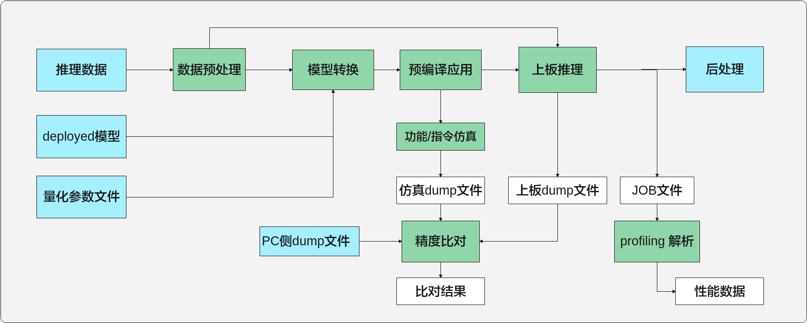

> **说明：** 
>Deployed模型的一键推理命令格式请参考：[Caffe模型一键推理](#ZH-CN_TOPIC_0000002408421546)、[PyTorch模型一键推理](#ZH-CN_TOPIC_0000002408581310)和[ONNX模型一键推理](#ZH-CN_TOPIC_0000002441980689)。

# 数据预处理<a name="ZH-CN_TOPIC_0000002441980729"></a>


## 功能介绍<a name="ZH-CN_TOPIC_0000002408581246"></a>

此功能对数据进行预处理，生成AMCT/ATC/仿真/上板的推理数据（.npy 和 .bin格式）。

当前支持图像裁剪（crop）、图像边缘填充（padding）、图像缩放（resize）、色域转换、通道数据交换、减均值、乘系数。

## 命令行格式说明<a name="ZH-CN_TOPIC_0000002442020609"></a>

数据预处理命令行格式如下。

```
mindcmd preprocess --model_input_shape MODEL_INPUT_SHAPE -i IMAGE_LIST
```

命令行参数说明如[表1](#table328mcpsimp)  所示

**表 1**  数据预处理命令行参数说明

<a name="table328mcpsimp"></a>
<table><thead align="left"><tr id="row333mcpsimp"><th class="cellrowborder" valign="top" width="22.63%" id="mcps1.2.4.1.1"><p id="p335mcpsimp"><a name="p335mcpsimp"></a><a name="p335mcpsimp"></a><strong id="b758155819249"><a name="b758155819249"></a><a name="b758155819249"></a>参数</strong></p>
</th>
<th class="cellrowborder" valign="top" width="10.780000000000001%" id="mcps1.2.4.1.2"><p id="p156711536104512"><a name="p156711536104512"></a><a name="p156711536104512"></a>必选/可选</p>
</th>
<th class="cellrowborder" valign="top" width="66.59%" id="mcps1.2.4.1.3"><p id="p1638317336452"><a name="p1638317336452"></a><a name="p1638317336452"></a>描述</p>
</th>
</tr>
</thead>
<tbody><tr id="row137385616439"><td class="cellrowborder" valign="top" width="22.63%" headers="mcps1.2.4.1.1 "><p id="p93734561436"><a name="p93734561436"></a><a name="p93734561436"></a>-shape, --model_input_shape</p>
</td>
<td class="cellrowborder" valign="top" width="10.780000000000001%" headers="mcps1.2.4.1.2 "><p id="p637314562434"><a name="p637314562434"></a><a name="p637314562434"></a>必选</p>
</td>
<td class="cellrowborder" valign="top" width="66.59%" headers="mcps1.2.4.1.3 "><p id="p237413560437"><a name="p237413560437"></a><a name="p237413560437"></a>指定输入数据经过预处理后，输出数据的目标shape。</p>
</td>
</tr>
<tr id="row341mcpsimp"><td class="cellrowborder" valign="top" width="22.63%" headers="mcps1.2.4.1.1 "><p id="p343mcpsimp"><a name="p343mcpsimp"></a><a name="p343mcpsimp"></a>-i, --image_list</p>
</td>
<td class="cellrowborder" valign="top" width="10.780000000000001%" headers="mcps1.2.4.1.2 "><p id="p7569195516492"><a name="p7569195516492"></a><a name="p7569195516492"></a>可选</p>
</td>
<td class="cellrowborder" valign="top" width="66.59%" headers="mcps1.2.4.1.3 "><a name="ul113841926164511"></a><a name="ul113841926164511"></a><ul id="ul113841926164511"><li>指定待处理的图片列表（.txt）路径，多输入场景支持传入多个图片列表，如下所示。</li></ul>
<p id="p346mcpsimp"><a name="p346mcpsimp"></a><a name="p346mcpsimp"></a>eg. -i="image_list_1.txt;image_list_2.txt"。</p>
<p id="p7181101819213"><a name="p7181101819213"></a><a name="p7181101819213"></a>txt文件内每一行定义一张图片的路径，支持的文件格式包括：</p>
<p id="p65691616124211"><a name="p65691616124211"></a><a name="p65691616124211"></a>".bmp", ".jpeg", ".jpg", ".jpe", ".jp2", ".png"。</p>
<a name="ul389733124519"></a><a name="ul389733124519"></a><ul id="ul389733124519"><li>指定待处理的feature map路径，多输入场景，支持传入多个feature map路径，如下所示。</li></ul>
<p id="p57901422112211"><a name="p57901422112211"></a><a name="p57901422112211"></a>eg. -i="feature_map_1.bin;feature_map_2.bin"</p>
<p id="p9550191182310"><a name="p9550191182310"></a><a name="p9550191182310"></a>支持的文件格式包括："*.bin", "*.npy", "*.txt"。feature map为.txt格式的文本内容时，数据间以空格分隔，txt文件内每一行的数据个数为channel × height × width。一行表示一个batch的数据量，总数据量应该与模型输入shape的N*C*H*W乘积一致。</p>
<a name="ul11553175918915"></a><a name="ul11553175918915"></a><ul id="ul11553175918915"><li>未指定此参数时，将在输出路径下random_data子目录中自动生成随机数feature map作为输入数据。</li></ul>
</td>
</tr>
<tr id="row131482319459"><td class="cellrowborder" valign="top" width="22.63%" headers="mcps1.2.4.1.1 "><p id="p61485314453"><a name="p61485314453"></a><a name="p61485314453"></a>--input_type</p>
</td>
<td class="cellrowborder" valign="top" width="10.780000000000001%" headers="mcps1.2.4.1.2 "><p id="p9148235452"><a name="p9148235452"></a><a name="p9148235452"></a>可选</p>
</td>
<td class="cellrowborder" valign="top" width="66.59%" headers="mcps1.2.4.1.3 "><p id="p114814344517"><a name="p114814344517"></a><a name="p114814344517"></a>指定待处理数据的数据类型，只用于Feature map输入，不能用于图片输入。支持数据类型FP16, FP32, INT16, INT8, S16, S8, U16, U8, UINT16, UINT8。指定多个输入数据类型时，使用英文分号隔开，用双引号括住。eg.：--input_type="INT8;FP16"</p>
</td>
</tr>
<tr id="row355mcpsimp"><td class="cellrowborder" valign="top" width="22.63%" headers="mcps1.2.4.1.1 "><p id="p357mcpsimp"><a name="p357mcpsimp"></a><a name="p357mcpsimp"></a>--aapp</p>
</td>
<td class="cellrowborder" valign="top" width="10.780000000000001%" headers="mcps1.2.4.1.2 "><p id="p1960991124911"><a name="p1960991124911"></a><a name="p1960991124911"></a>可选</p>
</td>
<td class="cellrowborder" valign="top" width="66.59%" headers="mcps1.2.4.1.3 "><p id="p359mcpsimp"><a name="p359mcpsimp"></a><a name="p359mcpsimp"></a>指定自定义aapp配置文件路径，aapp完整配置方式请参考《ATC工具使用指南》“--insert_op_conf ”章节。当-i/--image_list传入图片列表路径，并且没有指定aapp配置文件时，则使用默认aapp配置：</p>
<p id="p711018132916"><a name="p711018132916"></a><a name="p711018132916"></a>aapp_op {</p>
<p id="p201100116297"><a name="p201100116297"></a><a name="p201100116297"></a>related_input_rank : ${index}</p>
<p id="p41103192917"><a name="p41103192917"></a><a name="p41103192917"></a>aapp_mode : static</p>
<p id="p211012122914"><a name="p211012122914"></a><a name="p211012122914"></a>input_format : BGR_PLANAR</p>
<p id="p12110201172919"><a name="p12110201172919"></a><a name="p12110201172919"></a>model_format : BGR</p>
<p id="p161112011293"><a name="p161112011293"></a><a name="p161112011293"></a>}</p>
</td>
</tr>
<tr id="row1230214540512"><td class="cellrowborder" valign="top" width="22.63%" headers="mcps1.2.4.1.1 "><p id="p374mcpsimp"><a name="p374mcpsimp"></a><a name="p374mcpsimp"></a>--image_resize</p>
</td>
<td class="cellrowborder" valign="top" width="10.780000000000001%" headers="mcps1.2.4.1.2 "><p id="p430205418517"><a name="p430205418517"></a><a name="p430205418517"></a>可选</p>
</td>
<td class="cellrowborder" valign="top" width="66.59%" headers="mcps1.2.4.1.3 "><p id="p8690165501516"><a name="p8690165501516"></a><a name="p8690165501516"></a>图片输出尺寸（宽高），eg. --image_resize="256,256" 。</p>
<p id="p376mcpsimp"><a name="p376mcpsimp"></a><a name="p376mcpsimp"></a>如果存在多组输入，使用; 作为分割 eg. --image_resize="256,256;256,256" 。</p>
<p id="p213873012411"><a name="p213873012411"></a><a name="p213873012411"></a>默认不改变输入图片大小。</p>
</td>
</tr>
<tr id="row10996571553"><td class="cellrowborder" valign="top" width="22.63%" headers="mcps1.2.4.1.1 "><p id="p381mcpsimp"><a name="p381mcpsimp"></a><a name="p381mcpsimp"></a>--crop_size</p>
</td>
<td class="cellrowborder" valign="top" width="10.780000000000001%" headers="mcps1.2.4.1.2 "><p id="p14997571559"><a name="p14997571559"></a><a name="p14997571559"></a>可选</p>
</td>
<td class="cellrowborder" valign="top" width="66.59%" headers="mcps1.2.4.1.3 "><p id="p1267359121614"><a name="p1267359121614"></a><a name="p1267359121614"></a>裁剪中心的大小，eg. --crop_size="227,227" 。</p>
<p id="p383mcpsimp"><a name="p383mcpsimp"></a><a name="p383mcpsimp"></a>输入存在多个输入，请使用；作为分割 , eg. --crop_size="227,227;227,227" 。</p>
<p id="p19563922518"><a name="p19563922518"></a><a name="p19563922518"></a>默认不改变输入图片大小。</p>
</td>
</tr>
<tr id="row360mcpsimp"><td class="cellrowborder" valign="top" width="22.63%" headers="mcps1.2.4.1.1 "><p id="p362mcpsimp"><a name="p362mcpsimp"></a><a name="p362mcpsimp"></a>-o, --output</p>
</td>
<td class="cellrowborder" valign="top" width="10.780000000000001%" headers="mcps1.2.4.1.2 "><p id="p498434314911"><a name="p498434314911"></a><a name="p498434314911"></a>可选</p>
</td>
<td class="cellrowborder" valign="top" width="66.59%" headers="mcps1.2.4.1.3 "><p id="p364mcpsimp"><a name="p364mcpsimp"></a><a name="p364mcpsimp"></a>预处理结果输出路径，默认为-i/--image_list的路径。-o/--output和-i/--image_list均未指定时，预处理结果保存在执行路径下。</p>
</td>
</tr>
<tr id="row155561225151020"><td class="cellrowborder" valign="top" width="22.63%" headers="mcps1.2.4.1.1 "><p id="p87841431161015"><a name="p87841431161015"></a><a name="p87841431161015"></a>-h, --help</p>
</td>
<td class="cellrowborder" valign="top" width="10.780000000000001%" headers="mcps1.2.4.1.2 "><p id="p278443112104"><a name="p278443112104"></a><a name="p278443112104"></a>可选</p>
</td>
<td class="cellrowborder" valign="top" width="66.59%" headers="mcps1.2.4.1.3 "><p id="p5784173111013"><a name="p5784173111013"></a><a name="p5784173111013"></a>展示命令行 help 信息。</p>
</td>
</tr>
</tbody>
</table>

> **说明：** 
>-   参数值格式：支持大小写字母（a-z，A-Z）、数字（0-9）、下划线（\_）、中划线（-）、句点（.）。
>-   当-i/--image\_list指定图片列表的时候，图片列表的内容支持UTF-8编码的中文路径。
>-   多输入场景支持feature map和图片列表混输，eg. -i="$\{图片列表\};$\{feature\_map\}"。

## 执行样例<a name="ZH-CN_TOPIC_0000002441980733"></a>

-   模型和数据准备。

    需要进行预处理的数据可进行如下准备：

    ```
    ├── data
    │   ├── dog1.jpg
    │   ├── dog2.jpg
    │   ├── insert_op.cfg
    │   └── image_ref_list.txt
    ```

-   执行数据预处理

    执行以下命令进行数据预处理：

    ```
    cd data
    mindcmd preprocess --model_input_shape 1,3,224,224 --aapp ./insert_op.cfg -i ./image_ref_list.txt -o ./preprocess_output/
    ```

-   <a name="li137721446144613"></a>执行结果

    数据预处理执行结束后会在指定输出路径下生成数据，主要目录结构如下。

    ```
    ├── preprocess_output
    │   ├── calibration_dataset                                    # 校准数据集
    │   │   ├── bin                                               # bin格式数据
    │   │   │   └── input_0_dog1_shape_1_3_224_224_FP32.bin
    │   │   ├── npy                                               # npy格式数据
    │   │   │   └── input_0_dog1_shape_1_3_224_224_FP32.npy
    │   │   └── original                                          # 原始输入数据
    │   │   │   └── dog1.jpg
    │   ├── validation_dataset                                     # 验证数据集
    │   │   ├── bin                                               # bin格式数据
    │   │   │   └── input_0_dog2_bgr_planar_shape_1_3_224_224_U8.bin
    │   │   ├── npy                                               # npy格式数据
    │   │   │   └── input_0_dog2_shape_1_3_224_224_FP32.npy
    │   │   └── original                                          # 原始输入数据
    │   │   │   └── dog2.jpg
    │   ├── input_format                                           # 按input_format解析的原始输入数据
    │   ├── input0_calibration_npy_FP32.txt                        # 保存了npy格式校准数据的路径
    │   ├── input0_validation_bin_FP32.txt                         # 保存了bin格式验证数据的路径
    │   ├── input0_validation_npy_FP32.txt                         # 保存了npy格式验证数据的路径
    │   └── insert_op.cfg                                          # 数据预处理配置文件
    ```

    > **说明：** 
    >-   当用户传入的-i/--image\_list有多组数据且每组的数据个数不等时，MindCmd将采用最小的数据个数作为预处理操作的图片个数。示例：
    >    ```
    >    mindcmd preprocess --model_input_shape "1,3,2,2;1,3,4,4" --image_list "./pic1.txt;./pic2.txt"
    >    ```
    >    如果pic1.txt中有4张图片，pic2.txt中有2张图片，那么MindCmd执行预处理时pic1.txt中的最后两张图片不会被处理，以保证每路输入的数据个数是相同的。
    >-   关于校准数据集和验证数据集的说明：
    >    如果输入为N张图片，那么MindCmd将使用前N-1张数据作为校准集数据，第N张图片作为验证集数据（当只有一张图片时，该图片既作为校准集数据，也作为验证集数据）。
    >-   预处理的输出生成件命名与实际配置的insert\_op相关，上述[执行结果](#li137721446144613)中的示例仅供参考，生成件文件名描述的shape、input\_format等以实际配置为准。

# 开源框架推理<a name="ZH-CN_TOPIC_0000002442020541"></a>


## 功能介绍<a name="ZH-CN_TOPIC_0000002442020569"></a>

该功能支持开源框架\(Caffe/ONNX\)推理，生成的dump数据可用于精度比对。

## Caffe模型推理<a name="ZH-CN_TOPIC_0000002442020553"></a>


### 命令行格式说明<a name="ZH-CN_TOPIC_0000002441980793"></a>

Caffe模型推理的命令行格式如下。

```
mindcmd gt caffe -w WEIGHT -m MODEL -i IMAGE_LIST
```

命令行参数说明如[表1](#table19209648865)所示

**表 1**  Caffe模型推理命令行参数说明

<a name="table19209648865"></a>
<table><thead align="left"><tr id="row82102483610"><th class="cellrowborder" valign="top" width="23.41%" id="mcps1.2.4.1.1"><p id="p921074814615"><a name="p921074814615"></a><a name="p921074814615"></a><strong id="b1121084819610"><a name="b1121084819610"></a><a name="b1121084819610"></a>参数</strong></p>
</th>
<th class="cellrowborder" valign="top" width="8.52%" id="mcps1.2.4.1.2"><p id="p156711536104512"><a name="p156711536104512"></a><a name="p156711536104512"></a>必选/可选</p>
</th>
<th class="cellrowborder" valign="top" width="68.07%" id="mcps1.2.4.1.3"><p id="p1638317336452"><a name="p1638317336452"></a><a name="p1638317336452"></a>描述</p>
</th>
</tr>
</thead>
<tbody><tr id="row62101482612"><td class="cellrowborder" valign="top" width="23.41%" headers="mcps1.2.4.1.1 "><p id="p321012481360"><a name="p321012481360"></a><a name="p321012481360"></a>caffe</p>
</td>
<td class="cellrowborder" valign="top" width="8.52%" headers="mcps1.2.4.1.2 "><p id="p86717366456"><a name="p86717366456"></a><a name="p86717366456"></a>必选</p>
</td>
<td class="cellrowborder" valign="top" width="68.07%" headers="mcps1.2.4.1.3 "><p id="p4804522125310"><a name="p4804522125310"></a><a name="p4804522125310"></a>指定Caffe开源框架。</p>
</td>
</tr>
<tr id="row1453429145515"><td class="cellrowborder" valign="top" width="23.41%" headers="mcps1.2.4.1.1 "><p id="p2830133205517"><a name="p2830133205517"></a><a name="p2830133205517"></a>-m , --model</p>
</td>
<td class="cellrowborder" valign="top" width="8.52%" headers="mcps1.2.4.1.2 "><p id="p10830113317556"><a name="p10830113317556"></a><a name="p10830113317556"></a>必选</p>
</td>
<td class="cellrowborder" valign="top" width="68.07%" headers="mcps1.2.4.1.3 "><p id="p1683063365518"><a name="p1683063365518"></a><a name="p1683063365518"></a>指定Caffe模型的模型定义文件（ .prototxt）路径。</p>
</td>
</tr>
<tr id="row1621074813618"><td class="cellrowborder" valign="top" width="23.41%" headers="mcps1.2.4.1.1 "><p id="p32101848968"><a name="p32101848968"></a><a name="p32101848968"></a>-w, --weight</p>
</td>
<td class="cellrowborder" valign="top" width="8.52%" headers="mcps1.2.4.1.2 "><p id="p1671113612452"><a name="p1671113612452"></a><a name="p1671113612452"></a>可选</p>
</td>
<td class="cellrowborder" valign="top" width="68.07%" headers="mcps1.2.4.1.3 "><p id="p52101948367"><a name="p52101948367"></a><a name="p52101948367"></a>指定Caffe模型的权重文件（.caffemodel）路径，未指定将根据-m/--model参数指定的模型定义文件生成随机权重文件，位于-o/--output指定的数据输出路径下。</p>
<div class="note" id="note2493437204617"><a name="note2493437204617"></a><a name="note2493437204617"></a><span class="notetitle"> 说明： </span><div class="notebody"><p id="p1929311299226"><a name="p1929311299226"></a><a name="p1929311299226"></a>权重随机生成时精度比对结果可能全为1.0，这个是由于Caffe将权重默认初始化成0导致，可以通过调整模型定义（.prototxt）文件里面的weight_filler来规避。</p>
</div></div>
</td>
</tr>
<tr id="row721014481264"><td class="cellrowborder" valign="top" width="23.41%" headers="mcps1.2.4.1.1 "><p id="p721034815611"><a name="p721034815611"></a><a name="p721034815611"></a>-i, --image_list</p>
</td>
<td class="cellrowborder" valign="top" width="8.52%" headers="mcps1.2.4.1.2 "><p id="p5671936204519"><a name="p5671936204519"></a><a name="p5671936204519"></a>可选</p>
</td>
<td class="cellrowborder" valign="top" width="68.07%" headers="mcps1.2.4.1.3 "><p id="p821019481869"><a name="p821019481869"></a><a name="p821019481869"></a>执行推理模型所需的数据集（.txt）。txt文件内要求为.npy、.bin或者.txt格式的feature map推理数据，每行定义一条推理数据的路径。</p>
<p id="p13242153267"><a name="p13242153267"></a><a name="p13242153267"></a>未指定将根据-m/--model参数指定的模型定义文件生成随机数据，位于-o/--output指定的数据输出路径下。</p>
</td>
</tr>
<tr id="row152101248660"><td class="cellrowborder" valign="top" width="23.41%" headers="mcps1.2.4.1.1 "><p id="p15210164819620"><a name="p15210164819620"></a><a name="p15210164819620"></a>-g, --gpu_id</p>
</td>
<td class="cellrowborder" valign="top" width="8.52%" headers="mcps1.2.4.1.2 "><p id="p551362611473"><a name="p551362611473"></a><a name="p551362611473"></a>可选</p>
</td>
<td class="cellrowborder" valign="top" width="68.07%" headers="mcps1.2.4.1.3 "><p id="p112101948166"><a name="p112101948166"></a><a name="p112101948166"></a>是否使用gpu，eg. -g=0 使用第0个gpu 。</p>
</td>
</tr>
<tr id="row102101248669"><td class="cellrowborder" valign="top" width="23.41%" headers="mcps1.2.4.1.1 "><p id="p13210448668"><a name="p13210448668"></a><a name="p13210448668"></a>-o, --output</p>
</td>
<td class="cellrowborder" valign="top" width="8.52%" headers="mcps1.2.4.1.2 "><p id="p155135268478"><a name="p155135268478"></a><a name="p155135268478"></a>可选</p>
</td>
<td class="cellrowborder" valign="top" width="68.07%" headers="mcps1.2.4.1.3 "><p id="p182111848469"><a name="p182111848469"></a><a name="p182111848469"></a>指定Ground Truth dump数据输出路径，默认与模型定义文件所在的路径相同。</p>
</td>
</tr>
<tr id="row14511197172319"><td class="cellrowborder" valign="top" width="23.41%" headers="mcps1.2.4.1.1 "><p id="p721012481464"><a name="p721012481464"></a><a name="p721012481464"></a>-h，--help</p>
</td>
<td class="cellrowborder" valign="top" width="8.52%" headers="mcps1.2.4.1.2 "><p id="p967214364455"><a name="p967214364455"></a><a name="p967214364455"></a>可选</p>
</td>
<td class="cellrowborder" valign="top" width="68.07%" headers="mcps1.2.4.1.3 "><p id="p221018481462"><a name="p221018481462"></a><a name="p221018481462"></a>展示命令行 help 信息。</p>
</td>
</tr>
</tbody>
</table>

> **说明：** 
>-   参数值格式：支持大小写字母（a-z，A-Z）、数字（0-9）、下划线（\_）、中划线（-）、句点（.）。
>-   当-i/--image\_list指定图片列表的时候，图片列表的内容支持UTF-8编码的中文路径。

### 执行样例<a name="ZH-CN_TOPIC_0000002408581334"></a>

-   数据准备

    执行开源框架前需要提前准备推理数据\(参考[数据预处理](#ZH-CN_TOPIC_0000002441980729)\)，参考文件结构如下。

    ```
    ├── test_case
    │  ├── caffe_resnet50
    │  │   ├── resnet50.caffemodel
    │  │   └── resnet50.prototxt
    │  ├── data
    │  │     ├── data_dog1_shape_1_3_224_224_float32.npy
    │  │     ├── data_dog2_shape_1_3_224_224_float32.npy
    │  │     └── image_ref_list.txt
    ```

-   执行模型推理

    执行以下命令进行模型推理：

    ```
    cd test_case
    mindcmd gt caffe -m ./caffe_resnet50/resnet50.prototxt -w ./caffe_resnet50/resnet50.caffemodel -i ./data/image_ref_list.txt -o ./gt_output/
    ```

-   执行结果

    执行结束后会在指定输出路径中生成Ground Truth dump数据，主要文件结构示例如下。

    ```
    ├── gt_output
    │   ├── ${时间戳}_ops 
    │   │   ├── 0                          # 第0个推理过程中每一层的dump文件(.npy)
    │   │   └── 1                          # 第1个推理过程中每一层的dump文件(.npy)
    ```

## ONNX模型推理<a name="ZH-CN_TOPIC_0000002408421342"></a>


### 命令行格式说明<a name="ZH-CN_TOPIC_0000002442020437"></a>

ONNX模型推理的命令行格式如下。

```
mindcmd gt onnx -m MODEL -i IMAGE_LIST
```

命令行参数说明如[表1](#table606mcpsimp)所示

**表 1**  ONNX模型推理命令行参数说明

<a name="table606mcpsimp"></a>
<table><thead align="left"><tr id="row611mcpsimp"><th class="cellrowborder" valign="top" width="22.63%" id="mcps1.2.4.1.1"><p id="p613mcpsimp"><a name="p613mcpsimp"></a><a name="p613mcpsimp"></a><strong id="b89241518113311"><a name="b89241518113311"></a><a name="b89241518113311"></a>参数</strong></p>
</th>
<th class="cellrowborder" valign="top" width="10.77%" id="mcps1.2.4.1.2"><p id="p156711536104512"><a name="p156711536104512"></a><a name="p156711536104512"></a>必选/可选</p>
</th>
<th class="cellrowborder" valign="top" width="66.60000000000001%" id="mcps1.2.4.1.3"><p id="p1638317336452"><a name="p1638317336452"></a><a name="p1638317336452"></a>描述</p>
</th>
</tr>
</thead>
<tbody><tr id="row614mcpsimp"><td class="cellrowborder" valign="top" width="22.63%" headers="mcps1.2.4.1.1 "><p id="p616mcpsimp"><a name="p616mcpsimp"></a><a name="p616mcpsimp"></a>onnx</p>
</td>
<td class="cellrowborder" valign="top" width="10.77%" headers="mcps1.2.4.1.2 "><p id="p86717366456"><a name="p86717366456"></a><a name="p86717366456"></a>必选</p>
</td>
<td class="cellrowborder" valign="top" width="66.60000000000001%" headers="mcps1.2.4.1.3 "><p id="p618mcpsimp"><a name="p618mcpsimp"></a><a name="p618mcpsimp"></a>指定ONNX开源框架。</p>
</td>
</tr>
<tr id="row640mcpsimp"><td class="cellrowborder" valign="top" width="22.63%" headers="mcps1.2.4.1.1 "><p id="p642mcpsimp"><a name="p642mcpsimp"></a><a name="p642mcpsimp"></a>-m，--model</p>
</td>
<td class="cellrowborder" valign="top" width="10.77%" headers="mcps1.2.4.1.2 "><p id="p1671113612452"><a name="p1671113612452"></a><a name="p1671113612452"></a>必选</p>
</td>
<td class="cellrowborder" valign="top" width="66.60000000000001%" headers="mcps1.2.4.1.3 "><p id="p644mcpsimp"><a name="p644mcpsimp"></a><a name="p644mcpsimp"></a>ONNX模型（.onnx）的路径。</p>
</td>
</tr>
<tr id="row645mcpsimp"><td class="cellrowborder" valign="top" width="22.63%" headers="mcps1.2.4.1.1 "><p id="p647mcpsimp"><a name="p647mcpsimp"></a><a name="p647mcpsimp"></a>-i, --image_list</p>
</td>
<td class="cellrowborder" valign="top" width="10.77%" headers="mcps1.2.4.1.2 "><p id="p1867120361451"><a name="p1867120361451"></a><a name="p1867120361451"></a>可选</p>
</td>
<td class="cellrowborder" valign="top" width="66.60000000000001%" headers="mcps1.2.4.1.3 "><p id="p649mcpsimp"><a name="p649mcpsimp"></a><a name="p649mcpsimp"></a>执行推理模型所需的数据集（.txt）。txt文件内要求文件格式 .npy/.bin，每行定义一条推理数据的路径。</p>
<p id="p528979161211"><a name="p528979161211"></a><a name="p528979161211"></a>未指定将根据-m/--model参数指定的模型定义文件生成随机数据，位于-o/--output指定的数据输出路径下。</p>
</td>
</tr>
<tr id="row679mcpsimp"><td class="cellrowborder" valign="top" width="22.63%" headers="mcps1.2.4.1.1 "><p id="p681mcpsimp"><a name="p681mcpsimp"></a><a name="p681mcpsimp"></a>-o, --output</p>
</td>
<td class="cellrowborder" valign="top" width="10.77%" headers="mcps1.2.4.1.2 "><p id="p967214364455"><a name="p967214364455"></a><a name="p967214364455"></a>可选</p>
</td>
<td class="cellrowborder" valign="top" width="66.60000000000001%" headers="mcps1.2.4.1.3 "><p id="p182111848469"><a name="p182111848469"></a><a name="p182111848469"></a>指定Ground Truth dump数据输出路径，默认与模型所在的路径相同。</p>
</td>
</tr>
<tr id="row61651027142315"><td class="cellrowborder" valign="top" width="22.63%" headers="mcps1.2.4.1.1 "><p id="p676mcpsimp"><a name="p676mcpsimp"></a><a name="p676mcpsimp"></a>-h，--help</p>
</td>
<td class="cellrowborder" valign="top" width="10.77%" headers="mcps1.2.4.1.2 "><p id="p5671936204519"><a name="p5671936204519"></a><a name="p5671936204519"></a>可选</p>
</td>
<td class="cellrowborder" valign="top" width="66.60000000000001%" headers="mcps1.2.4.1.3 "><p id="p678mcpsimp"><a name="p678mcpsimp"></a><a name="p678mcpsimp"></a>展示命令行 help 信息。</p>
</td>
</tr>
</tbody>
</table>

> **说明：** 
>-   参数值格式：支持大小写字母（a-z，A-Z）、数字（0-9）、下划线（\_）、中划线（-）、句点（.）。
>-   当-i/--image\_list指定图片列表的时候，图片列表的内容支持UTF-8编码的中文路径。

### 执行样例<a name="ZH-CN_TOPIC_0000002441980741"></a>

-   数据准备

    执行开源框架前需要提前准备推理数据\(处理方法参考[数据预处理](#ZH-CN_TOPIC_0000002441980729)\)，参考文件结构如下。

    ```
    ├── test_case
    │  ├── onnx_resnet50
    │  │   └── resnet50.onnx
    │  ├── data
    │  │     ├── npy_data
    │  │     ├── data_dog1_shape_1_3_224_224_float32.npy
    │  │     ├── data_dog2_shape_1_3_224_224_float32.npy
    │  │     └── image_ref_list.txt
    ```

-   执行模型推理

    执行以下命令进行模型Ground Truth推理：

    ```
    cd test_case
    mindcmd gt onnx -m ./onnx_resnet50/resnet50.onnx -i ./data/image_ref_list.txt -o ./gt_output/
    ```

-   执行结果

    执行结束后会在指定输出路径中生成Ground Truth dump数据，主要文件结构示例如下。

    ```
    ├── gt_output
    │   ├── ${时间戳}_ops 
    │   │   ├── 0                          # 第0个推理过程中每一层的dump文件(.npy)
    │   │   └── 1                          # 第1个推理过程中每一层的dump文件(.npy)
    ```

# 模型压缩<a name="ZH-CN_TOPIC_0000002408421470"></a>


## 功能介绍<a name="ZH-CN_TOPIC_0000002441980649"></a>

该功能支持对开源框架\(Caffe/PyTorch\)的模型压缩，从而达到节省网络模型存储空间、降低传输时延、提高计算效率，达到性能提升与优化的目标。

## Caffe模型压缩<a name="ZH-CN_TOPIC_0000002441980713"></a>


### 命令行格式说明<a name="ZH-CN_TOPIC_0000002408421462"></a>

Caffe模型压缩的命令行格式如下。

```
mindcmd amct caffe -w WEIGHT -m MODEL -i IMAGE_LIST -o OUTPUT
```

Caffe模型压缩的命令行参数说明如[表1](#table117mcpsimp)所示。

**表 1**  Caffe模型压缩命令行参数说明

<a name="table117mcpsimp"></a>
<table><thead align="left"><tr id="row122mcpsimp"><th class="cellrowborder" valign="top" width="17.75%" id="mcps1.2.4.1.1"><p id="p13167158205117"><a name="p13167158205117"></a><a name="p13167158205117"></a><strong id="b898781855614"><a name="b898781855614"></a><a name="b898781855614"></a>参数</strong></p>
</th>
<th class="cellrowborder" valign="top" width="11.17%" id="mcps1.2.4.1.2"><p id="p156711536104512"><a name="p156711536104512"></a><a name="p156711536104512"></a>必选/可选</p>
</th>
<th class="cellrowborder" valign="top" width="71.08%" id="mcps1.2.4.1.3"><p id="p1638317336452"><a name="p1638317336452"></a><a name="p1638317336452"></a>描述</p>
</th>
</tr>
</thead>
<tbody><tr id="row984751935111"><td class="cellrowborder" valign="top" width="17.75%" headers="mcps1.2.4.1.1 "><p id="p14847171915118"><a name="p14847171915118"></a><a name="p14847171915118"></a>caffe</p>
</td>
<td class="cellrowborder" valign="top" width="11.17%" headers="mcps1.2.4.1.2 "><p id="p1170775510475"><a name="p1170775510475"></a><a name="p1170775510475"></a>必选</p>
</td>
<td class="cellrowborder" valign="top" width="71.08%" headers="mcps1.2.4.1.3 "><p id="p1884731911519"><a name="p1884731911519"></a><a name="p1884731911519"></a>指定caffe框架。</p>
</td>
</tr>
<tr id="row15985115613564"><td class="cellrowborder" valign="top" width="17.75%" headers="mcps1.2.4.1.1 "><p id="p35092115576"><a name="p35092115576"></a><a name="p35092115576"></a>-m, --model</p>
</td>
<td class="cellrowborder" valign="top" width="11.17%" headers="mcps1.2.4.1.2 "><p id="p750910117572"><a name="p750910117572"></a><a name="p750910117572"></a>必选</p>
</td>
<td class="cellrowborder" valign="top" width="71.08%" headers="mcps1.2.4.1.3 "><p id="p1450901145716"><a name="p1450901145716"></a><a name="p1450901145716"></a>Caffe模型的模型定义文件（ .prototxt）路径。</p>
</td>
</tr>
<tr id="row12281181595714"><td class="cellrowborder" valign="top" width="17.75%" headers="mcps1.2.4.1.1 "><p id="p12948192905710"><a name="p12948192905710"></a><a name="p12948192905710"></a>-o, --output</p>
</td>
<td class="cellrowborder" valign="top" width="11.17%" headers="mcps1.2.4.1.2 "><p id="p149481329185714"><a name="p149481329185714"></a><a name="p149481329185714"></a>必选</p>
</td>
<td class="cellrowborder" valign="top" width="71.08%" headers="mcps1.2.4.1.3 "><p id="p1394811298577"><a name="p1394811298577"></a><a name="p1394811298577"></a>量化后定点模型和权重的保存路径。</p>
</td>
</tr>
<tr id="row183174212532"><td class="cellrowborder" valign="top" width="17.75%" headers="mcps1.2.4.1.1 "><p id="p128195123716"><a name="p128195123716"></a><a name="p128195123716"></a>-w, --weight</p>
</td>
<td class="cellrowborder" valign="top" width="11.17%" headers="mcps1.2.4.1.2 "><p id="p570795514477"><a name="p570795514477"></a><a name="p570795514477"></a>可选</p>
</td>
<td class="cellrowborder" valign="top" width="71.08%" headers="mcps1.2.4.1.3 "><p id="p128117512372"><a name="p128117512372"></a><a name="p128117512372"></a>Caffe模型的权重文件（ .caffemodel）路径。未指定将根据-m/--model参数指定的模型定义文件生成随机权重文件，位于模型定义文件所在路径下。</p>
<div class="note" id="note2493437204617"><a name="note2493437204617"></a><a name="note2493437204617"></a><span class="notetitle"> 说明： </span><div class="notebody"><p id="p1825202022312"><a name="p1825202022312"></a><a name="p1825202022312"></a>权重随机生成时精度比对结果可能全为1.0，这个是由于Caffe将权重默认初始化成0导致，属于正常现象，可以通过调整模型定义（.prototxt）文件里面的weight_filler来规避。</p>
</div></div>
</td>
</tr>
<tr id="row10656185115568"><td class="cellrowborder" valign="top" width="17.75%" headers="mcps1.2.4.1.1 "><p id="p328195203711"><a name="p328195203711"></a><a name="p328195203711"></a>-i, --image_list</p>
</td>
<td class="cellrowborder" valign="top" width="11.17%" headers="mcps1.2.4.1.2 "><p id="p12452755174813"><a name="p12452755174813"></a><a name="p12452755174813"></a>可选</p>
</td>
<td class="cellrowborder" valign="top" width="71.08%" headers="mcps1.2.4.1.3 "><p id="p528105143720"><a name="p528105143720"></a><a name="p528105143720"></a>执行模型推理所需的数据集（.txt）。txt文件内每行定义一条推理数据的路径，推理数据支持.npy/.bin后缀。</p>
<p id="p11174049151815"><a name="p11174049151815"></a><a name="p11174049151815"></a>未指定将根据-m/--model参数指定的模型定义文件生成随机数据，位于-o/--output指定的数据输出路径下。</p>
</td>
</tr>
<tr id="row166mcpsimp"><td class="cellrowborder" valign="top" width="17.75%" headers="mcps1.2.4.1.1 "><p id="p15281205103712"><a name="p15281205103712"></a><a name="p15281205103712"></a>-b, --batch_num</p>
</td>
<td class="cellrowborder" valign="top" width="11.17%" headers="mcps1.2.4.1.2 "><p id="p1960991124911"><a name="p1960991124911"></a><a name="p1960991124911"></a>可选</p>
</td>
<td class="cellrowborder" valign="top" width="71.08%" headers="mcps1.2.4.1.3 "><p id="p1281155133710"><a name="p1281155133710"></a><a name="p1281155133710"></a>Batch数目，用于AMCT量化的batch_num。</p>
</td>
</tr>
<tr id="row1193218341653"><td class="cellrowborder" valign="top" width="17.75%" headers="mcps1.2.4.1.1 "><p id="p49327341951"><a name="p49327341951"></a><a name="p49327341951"></a>--quant_config</p>
</td>
<td class="cellrowborder" valign="top" width="11.17%" headers="mcps1.2.4.1.2 "><p id="p0932534358"><a name="p0932534358"></a><a name="p0932534358"></a>可选</p>
</td>
<td class="cellrowborder" valign="top" width="71.08%" headers="mcps1.2.4.1.3 "><p id="p19932153420519"><a name="p19932153420519"></a><a name="p19932153420519"></a>指定AMCT的简易量化配置文件(*.cfg)或量化配置文件(*.json)。配置方式请参考《AMCT使用指南（Caffe）》。</p>
<div class="note" id="note19474237102"><a name="note19474237102"></a><a name="note19474237102"></a><span class="notetitle"> 说明： </span><div class="notebody"><p id="p9947152313109"><a name="p9947152313109"></a><a name="p9947152313109"></a>通过--quant_config可以先对模型进行调试，符合预期后将量化的deployed模型使用<a href="#ZH-CN_TOPIC_0000002408421546">Caffe模型一键推理</a>部署。</p>
<p id="p10351543173716"><a name="p10351543173716"></a><a name="p10351543173716"></a>json或者cfg中配置线性4bit量化时，MindCmd不会进行精度优化，仅推荐用于性能评估；</p>
<p id="p146153716376"><a name="p146153716376"></a><a name="p146153716376"></a>不支持非均匀4bit 。</p>
</div></div>
</td>
</tr>
<tr id="row176mcpsimp"><td class="cellrowborder" valign="top" width="17.75%" headers="mcps1.2.4.1.1 "><p id="p1281753372"><a name="p1281753372"></a><a name="p1281753372"></a>-g, --gpu_id</p>
</td>
<td class="cellrowborder" valign="top" width="11.17%" headers="mcps1.2.4.1.2 "><p id="p1498574317495"><a name="p1498574317495"></a><a name="p1498574317495"></a>可选</p>
</td>
<td class="cellrowborder" valign="top" width="71.08%" headers="mcps1.2.4.1.3 "><p id="p1528110593720"><a name="p1528110593720"></a><a name="p1528110593720"></a>是否使用gpu，eg. -g=0 使用第0个gpu，默认CPU模式。</p>
</td>
</tr>
<tr id="row981432312415"><td class="cellrowborder" valign="top" width="17.75%" headers="mcps1.2.4.1.1 "><p id="p178565532530"><a name="p178565532530"></a><a name="p178565532530"></a>-h，--help</p>
</td>
<td class="cellrowborder" valign="top" width="11.17%" headers="mcps1.2.4.1.2 "><p id="p18569532539"><a name="p18569532539"></a><a name="p18569532539"></a>可选</p>
</td>
<td class="cellrowborder" valign="top" width="71.08%" headers="mcps1.2.4.1.3 "><p id="p1385675312534"><a name="p1385675312534"></a><a name="p1385675312534"></a>展示命令行 help 信息。</p>
</td>
</tr>
</tbody>
</table>

> **说明：** 
>-   参数值格式：支持大小写字母（a-z，A-Z）、数字（0-9）、下划线（\_）、中划线（-）、句点（.）。
>-   当-i/--image\_list指定图片列表的时候，图片列表的内容支持UTF-8编码的中文路径。

### 执行样例<a name="ZH-CN_TOPIC_0000002441980597"></a>

-   模型和数据准备。

    将需要进行模型压缩的Caffe模型文件\(.prototxt\)、权重文件\(.caffemodel\)以及所需的数据\(feature\_map\)等上传到服务器工作路径，参考目录结构如下。

    ```
    ├── test_case
    │   ├── caffe_resnet50
    │   │   ├── resnet50.caffemodel
    │   │   └── resnet50.prototxt
    │   ├── data
    │   │   ├── data_dog1_shape_1_3_224_224_float32.npy
    │   │   ├── data_dog2_shape_1_3_224_224_float32.npy
    │   │   └── image_ref_list.txt
    ```

-   执行模型压缩

    执行以下命令进行模型压缩：

    ```
    cd test_case 
    mindcmd amct caffe -m ./caffe_resnet50/resnet50.prototxt -w ./caffe_resnet50/resnet50.caffemodel -i ./data/image_ref_list.txt -o ./amct_output
    ```

-   执行结果

    Caffe模型压缩执行结束后会在输出路径下生成相应的文件，主要文件结构示例如下。

    ```
    ├── amct_output
    │   ├── resnet50_tmp
    │   ├── amct_log
    │   │   └── amct_caffe.log
    │   ├── resnet50_config.json
    │   ├── resnet50_deploy_model.prototxt
    │   ├── resnet50_deploy_weights.caffemodel
    │   ├── resnet50_fake_quant_model.prototxt
    │   ├── resnet50_fake_quant_weights.caffemodel
    │   ├── resnet50_quant.json
    │   ├── resnet50_quant_param_record.bin
    │   ├── resnet50_quant_param_record.txt
    │   └── resnet50_uninplace.prototxt
    ```

    对应文件的描述如[表1](#table1581916410)所示。

    **表 1**  Caffe模型压缩结果文件描述

    <a name="table1581916410"></a>
    <table><thead align="left"><tr id="row16811018419"><th class="cellrowborder" valign="top" width="34.29%" id="mcps1.2.3.1.1"><p id="p8811911418"><a name="p8811911418"></a><a name="p8811911418"></a>文件</p>
    </th>
    <th class="cellrowborder" valign="top" width="65.71000000000001%" id="mcps1.2.3.1.2"><p id="p20810115413"><a name="p20810115413"></a><a name="p20810115413"></a>描述</p>
    </th>
    </tr>
    </thead>
    <tbody><tr id="row112141441192619"><td class="cellrowborder" valign="top" width="34.29%" headers="mcps1.2.3.1.1 "><p id="p1691185612267"><a name="p1691185612267"></a><a name="p1691185612267"></a>activation_modified_model.caffemodel</p>
    </td>
    <td class="cellrowborder" rowspan="4" valign="top" width="65.71000000000001%" headers="mcps1.2.3.1.2 "><p id="p2215174192612"><a name="p2215174192612"></a><a name="p2215174192612"></a>中间模型文件。</p>
    </td>
    </tr>
    <tr id="row1529545132610"><td class="cellrowborder" valign="top" headers="mcps1.2.3.1.1 "><p id="p1029445142617"><a name="p1029445142617"></a><a name="p1029445142617"></a>activation_modified_model.prototxt</p>
    </td>
    </tr>
    <tr id="row16329114311262"><td class="cellrowborder" valign="top" headers="mcps1.2.3.1.1 "><p id="p1632974311268"><a name="p1632974311268"></a><a name="p1632974311268"></a>modified_weights.caffemodel</p>
    </td>
    </tr>
    <tr id="row158124020261"><td class="cellrowborder" valign="top" headers="mcps1.2.3.1.1 "><p id="p11834022615"><a name="p11834022615"></a><a name="p11834022615"></a>modified_weights.prototxt</p>
    </td>
    </tr>
    <tr id="row1559611383265"><td class="cellrowborder" valign="top" width="34.29%" headers="mcps1.2.3.1.1 "><p id="p7597123822614"><a name="p7597123822614"></a><a name="p7597123822614"></a>scale_offset_record.txt</p>
    </td>
    <td class="cellrowborder" valign="top" width="65.71000000000001%" headers="mcps1.2.3.1.2 "><p id="p11597538102618"><a name="p11597538102618"></a><a name="p11597538102618"></a>记录量化因子的文件（不带BN融合），请参考《AMCT使用指南（Caffe）》“量化因子记录文件说明”。</p>
    </td>
    </tr>
    <tr id="row84411536112616"><td class="cellrowborder" valign="top" width="34.29%" headers="mcps1.2.3.1.1 "><p id="p3441193619263"><a name="p3441193619263"></a><a name="p3441193619263"></a>scale_offset_record_update.txt</p>
    </td>
    <td class="cellrowborder" valign="top" width="65.71000000000001%" headers="mcps1.2.3.1.2 "><p id="p644103602615"><a name="p644103602615"></a><a name="p644103602615"></a>记录量化因子的文件（带BN融合），请参考《AMCT使用指南（Caffe）》“量化因子记录文件说明”。</p>
    </td>
    </tr>
    <tr id="row1281911649"><td class="cellrowborder" valign="top" width="34.29%" headers="mcps1.2.3.1.1 "><p id="p1381111342"><a name="p1381111342"></a><a name="p1381111342"></a>resnet50_config.json</p>
    </td>
    <td class="cellrowborder" valign="top" width="65.71000000000001%" headers="mcps1.2.3.1.2 "><p id="p17283141931"><a name="p17283141931"></a><a name="p17283141931"></a>描述了如何对模型中的每一层进行量化。</p>
    </td>
    </tr>
    <tr id="row0540174723017"><td class="cellrowborder" valign="top" width="34.29%" headers="mcps1.2.3.1.1 "><p id="p155404475300"><a name="p155404475300"></a><a name="p155404475300"></a>resnet50_deploy_model.prototxt</p>
    </td>
    <td class="cellrowborder" valign="top" width="65.71000000000001%" headers="mcps1.2.3.1.2 "><p id="p10540147123016"><a name="p10540147123016"></a><a name="p10540147123016"></a>量化后可在SoC部署的模型文件。</p>
    </td>
    </tr>
    <tr id="row1958094553017"><td class="cellrowborder" valign="top" width="34.29%" headers="mcps1.2.3.1.1 "><p id="p1758112454309"><a name="p1758112454309"></a><a name="p1758112454309"></a>resnet50_deploy_weights.caffemodel</p>
    </td>
    <td class="cellrowborder" valign="top" width="65.71000000000001%" headers="mcps1.2.3.1.2 "><p id="p558174517308"><a name="p558174517308"></a><a name="p558174517308"></a>量化后可在SoC部署的权重文件。</p>
    </td>
    </tr>
    <tr id="row6864113913315"><td class="cellrowborder" valign="top" width="34.29%" headers="mcps1.2.3.1.1 "><p id="p14864939133117"><a name="p14864939133117"></a><a name="p14864939133117"></a>resnet50_fake_quant_model.prototxt</p>
    </td>
    <td class="cellrowborder" valign="top" width="65.71000000000001%" headers="mcps1.2.3.1.2 "><p id="p138641397319"><a name="p138641397319"></a><a name="p138641397319"></a>量化后可在Caffe环境进行精度仿真模型文件。</p>
    </td>
    </tr>
    <tr id="row1835018323314"><td class="cellrowborder" valign="top" width="34.29%" headers="mcps1.2.3.1.1 "><p id="p13350123213113"><a name="p13350123213113"></a><a name="p13350123213113"></a>resnet50_fake_quant_weights.caffemodel</p>
    </td>
    <td class="cellrowborder" valign="top" width="65.71000000000001%" headers="mcps1.2.3.1.2 "><p id="p13350113217314"><a name="p13350113217314"></a><a name="p13350113217314"></a>量化后可在Caffe环境进行精度仿真权重文件。</p>
    </td>
    </tr>
    <tr id="row77365493326"><td class="cellrowborder" valign="top" width="34.29%" headers="mcps1.2.3.1.1 "><p id="p11736144953213"><a name="p11736144953213"></a><a name="p11736144953213"></a>resnet50_quant.json</p>
    </td>
    <td class="cellrowborder" valign="top" width="65.71000000000001%" headers="mcps1.2.3.1.2 "><p id="p157361949173218"><a name="p157361949173218"></a><a name="p157361949173218"></a>融合文件，记录图在量化前后的节点对应关系，用于浮点与仿真模型精度比对。</p>
    </td>
    </tr>
    <tr id="row34991843310"><td class="cellrowborder" valign="top" width="34.29%" headers="mcps1.2.3.1.1 "><p id="p1249161883311"><a name="p1249161883311"></a><a name="p1249161883311"></a>resnet50_quant_param_record.bin</p>
    </td>
    <td class="cellrowborder" valign="top" width="65.71000000000001%" headers="mcps1.2.3.1.2 "><p id="p149151823318"><a name="p149151823318"></a><a name="p149151823318"></a>量化参数文件二进制形式，用于ATC生成om模型。</p>
    </td>
    </tr>
    <tr id="row11395616173319"><td class="cellrowborder" valign="top" width="34.29%" headers="mcps1.2.3.1.1 "><p id="p33951716193319"><a name="p33951716193319"></a><a name="p33951716193319"></a>resnet50_quant_param_record.txt</p>
    </td>
    <td class="cellrowborder" valign="top" width="65.71000000000001%" headers="mcps1.2.3.1.2 "><p id="p239514163331"><a name="p239514163331"></a><a name="p239514163331"></a>量化参数文件文本格式(推荐使用)，用于ATC生成om模型。</p>
    </td>
    </tr>
    <tr id="row1019314216331"><td class="cellrowborder" valign="top" width="34.29%" headers="mcps1.2.3.1.1 "><p id="p1519320423334"><a name="p1519320423334"></a><a name="p1519320423334"></a>resnet50_uninplace.prototxt</p>
    </td>
    <td class="cellrowborder" valign="top" width="65.71000000000001%" headers="mcps1.2.3.1.2 "><p id="p319384233317"><a name="p319384233317"></a><a name="p319384233317"></a>解除inplace后的Caffe模型定义文件。</p>
    </td>
    </tr>
    </tbody>
    </table>

## PyTorch模型压缩<a name="ZH-CN_TOPIC_0000002442020617"></a>


### 命令行格式说明<a name="ZH-CN_TOPIC_0000002442020601"></a>

PyTorch模型压缩的命令行格式如下。

```
mindcmd amct pytorch -m MODEL  -i IMAGE_LIST -o OUTPUT
```

PyTorch模型压缩的命令行参数说明如[表1](#table117mcpsimp)所示。

**表 1**  PyTorch模型压缩命令行参数说明

<a name="table117mcpsimp"></a>
<table><thead align="left"><tr id="row122mcpsimp"><th class="cellrowborder" valign="top" width="16.68%" id="mcps1.2.4.1.1"><p id="p13167158205117"><a name="p13167158205117"></a><a name="p13167158205117"></a><strong id="b898781855614"><a name="b898781855614"></a><a name="b898781855614"></a>参数</strong></p>
</th>
<th class="cellrowborder" valign="top" width="9.07%" id="mcps1.2.4.1.2"><p id="p156711536104512"><a name="p156711536104512"></a><a name="p156711536104512"></a>必选/可选</p>
</th>
<th class="cellrowborder" valign="top" width="74.25%" id="mcps1.2.4.1.3"><p id="p1638317336452"><a name="p1638317336452"></a><a name="p1638317336452"></a>描述</p>
</th>
</tr>
</thead>
<tbody><tr id="row6867547195417"><td class="cellrowborder" valign="top" width="16.68%" headers="mcps1.2.4.1.1 "><p id="p14847171915118"><a name="p14847171915118"></a><a name="p14847171915118"></a>pytorch</p>
</td>
<td class="cellrowborder" valign="top" width="9.07%" headers="mcps1.2.4.1.2 "><p id="p1170775510475"><a name="p1170775510475"></a><a name="p1170775510475"></a>必选</p>
</td>
<td class="cellrowborder" valign="top" width="74.25%" headers="mcps1.2.4.1.3 "><p id="p1884731911519"><a name="p1884731911519"></a><a name="p1884731911519"></a>指定PyTorch框架。</p>
</td>
</tr>
<tr id="row783748175616"><td class="cellrowborder" valign="top" width="16.68%" headers="mcps1.2.4.1.1 "><p id="p641242716455"><a name="p641242716455"></a><a name="p641242716455"></a>-m, --model</p>
</td>
<td class="cellrowborder" valign="top" width="9.07%" headers="mcps1.2.4.1.2 "><p id="p570795514477"><a name="p570795514477"></a><a name="p570795514477"></a>必选</p>
</td>
<td class="cellrowborder" valign="top" width="74.25%" headers="mcps1.2.4.1.3 "><p id="p18808184204420"><a name="p18808184204420"></a><a name="p18808184204420"></a>pytorch子命令所属参数。指定可初始化PyTorch模型的对象, 如：package.module.class。</p>
<p id="p12184717175615"><a name="p12184717175615"></a><a name="p12184717175615"></a><strong id="b1468394904118"><a name="b1468394904118"></a><a name="b1468394904118"></a>确保参数路径在PYTHONPATH环境变量下</strong>。</p>
</td>
</tr>
<tr id="row142719136581"><td class="cellrowborder" valign="top" width="16.68%" headers="mcps1.2.4.1.1 "><p id="p310521717584"><a name="p310521717584"></a><a name="p310521717584"></a>-o, --output</p>
</td>
<td class="cellrowborder" valign="top" width="9.07%" headers="mcps1.2.4.1.2 "><p id="p16105201735812"><a name="p16105201735812"></a><a name="p16105201735812"></a>必选</p>
</td>
<td class="cellrowborder" valign="top" width="74.25%" headers="mcps1.2.4.1.3 "><p id="p1710517176588"><a name="p1710517176588"></a><a name="p1710517176588"></a>量化后定点模型的保存路径。</p>
</td>
</tr>
<tr id="row1186843021314"><td class="cellrowborder" valign="top" width="16.68%" headers="mcps1.2.4.1.1 "><p id="p362320353132"><a name="p362320353132"></a><a name="p362320353132"></a>-w, --weight</p>
</td>
<td class="cellrowborder" valign="top" width="9.07%" headers="mcps1.2.4.1.2 "><p id="p156247355134"><a name="p156247355134"></a><a name="p156247355134"></a>可选</p>
</td>
<td class="cellrowborder" valign="top" width="74.25%" headers="mcps1.2.4.1.3 "><p id="p162453515132"><a name="p162453515132"></a><a name="p162453515132"></a>pytorch子命令所属参数。指定权重（ .pt，.pth，.pth.tar ）文件。</p>
</td>
</tr>
<tr id="row10656185115568"><td class="cellrowborder" valign="top" width="16.68%" headers="mcps1.2.4.1.1 "><p id="p114121027154519"><a name="p114121027154519"></a><a name="p114121027154519"></a>-i, --image_list</p>
</td>
<td class="cellrowborder" valign="top" width="9.07%" headers="mcps1.2.4.1.2 "><p id="p34529559489"><a name="p34529559489"></a><a name="p34529559489"></a>可选</p>
</td>
<td class="cellrowborder" valign="top" width="74.25%" headers="mcps1.2.4.1.3 "><p id="p528105143720"><a name="p528105143720"></a><a name="p528105143720"></a>执行模型推理所需的数据集（.txt）。txt文件内每行定义一条推理数据的路径，推理数据支持.npy/.bin后缀。</p>
<p id="p12931135746"><a name="p12931135746"></a><a name="p12931135746"></a>.bin格式的feature map必须同时指定--input_shape参数使用。</p>
</td>
</tr>
<tr id="row16251441131914"><td class="cellrowborder" valign="top" width="16.68%" headers="mcps1.2.4.1.1 "><p id="p12992373111"><a name="p12992373111"></a><a name="p12992373111"></a>--input_shape</p>
</td>
<td class="cellrowborder" valign="top" width="9.07%" headers="mcps1.2.4.1.2 "><p id="p83002037101110"><a name="p83002037101110"></a><a name="p83002037101110"></a>可选</p>
</td>
<td class="cellrowborder" valign="top" width="74.25%" headers="mcps1.2.4.1.3 "><p id="p8300163717115"><a name="p8300163717115"></a><a name="p8300163717115"></a>指定模型的shape。多输入模型按照输入顺序指定，用分号;作为分割，用双引号括住，如 --input_shape="1,3,224,224;1,3,224,224"。</p>
<p id="p20732143016593"><a name="p20732143016593"></a><a name="p20732143016593"></a>当未指定-i, --image_list参数时，此参数要求必传，工具将根据输入的shape信息生成随机数feature map，位于-o, --output指定的数据输出路径下。</p>
</td>
</tr>
<tr id="row161mcpsimp"><td class="cellrowborder" valign="top" width="16.68%" headers="mcps1.2.4.1.1 "><p id="p5176104784518"><a name="p5176104784518"></a><a name="p5176104784518"></a>-b, --batch_num</p>
</td>
<td class="cellrowborder" valign="top" width="9.07%" headers="mcps1.2.4.1.2 "><p id="p16608121154911"><a name="p16608121154911"></a><a name="p16608121154911"></a>可选</p>
</td>
<td class="cellrowborder" valign="top" width="74.25%" headers="mcps1.2.4.1.3 "><p id="p3176204774513"><a name="p3176204774513"></a><a name="p3176204774513"></a>Batch数目，用于AMCT量化的batch_num。</p>
</td>
</tr>
<tr id="row54210182160"><td class="cellrowborder" valign="top" width="16.68%" headers="mcps1.2.4.1.1 "><p id="p49327341951"><a name="p49327341951"></a><a name="p49327341951"></a>--quant_config</p>
</td>
<td class="cellrowborder" valign="top" width="9.07%" headers="mcps1.2.4.1.2 "><p id="p0932534358"><a name="p0932534358"></a><a name="p0932534358"></a>可选</p>
</td>
<td class="cellrowborder" valign="top" width="74.25%" headers="mcps1.2.4.1.3 "><p id="p1431102315238"><a name="p1431102315238"></a><a name="p1431102315238"></a>指定AMCT的简易量化配置文件(*.yml, *.yaml)或量化配置文件(*.json)。配置方式请参考《AMCT使用指南（PyTorch）》“静态图简易量化配置功能说明”章节。</p>
<div class="note" id="note19474237102"><a name="note19474237102"></a><a name="note19474237102"></a><span class="notetitle"> 说明： </span><div class="notebody"><p id="p9947152313109"><a name="p9947152313109"></a><a name="p9947152313109"></a>通过--quant_config可以先对模型进行调试，符合预期后将量化的deployed模型使用<a href="#ZH-CN_TOPIC_0000002408581310">oneclick</a>部署。</p>
<p id="p10351543173716"><a name="p10351543173716"></a><a name="p10351543173716"></a>json、yml或者yaml中配置线性4bit量化时，MindCmd不会进行精度优化，仅推荐用于性能评估；</p>
<p id="p146153716376"><a name="p146153716376"></a><a name="p146153716376"></a>不支持非均匀4bit 。</p>
</div></div>
</td>
</tr>
<tr id="row64138314150"><td class="cellrowborder" valign="top" width="16.68%" headers="mcps1.2.4.1.1 "><p id="p817694713459"><a name="p817694713459"></a><a name="p817694713459"></a>-h, --help</p>
</td>
<td class="cellrowborder" valign="top" width="9.07%" headers="mcps1.2.4.1.2 "><p id="p160813164913"><a name="p160813164913"></a><a name="p160813164913"></a>可选</p>
</td>
<td class="cellrowborder" valign="top" width="74.25%" headers="mcps1.2.4.1.3 "><p id="p1617654754520"><a name="p1617654754520"></a><a name="p1617654754520"></a>展示命令行 help 信息</p>
</td>
</tr>
</tbody>
</table>

> **说明：** 
>-   参数值格式：支持大小写字母（a-z，A-Z）、数字（0-9）、下划线（\_）、中划线（-）、句点（.）。
>-   当-i/--image\_list指定图片列表的时候，图片列表的内容支持UTF-8编码的中文路径。

### 执行样例<a name="ZH-CN_TOPIC_0000002408421326"></a>

-   模型和数据准备。

    将需要进行模型压缩的PyTorch模型文件以及所需的数据\(.npy\)等上传到服务器工作路径，如/home/MindCmdUser/test\_case，参考目录结构如下。

    ```
    ├── test_case
    │   ├── pytorch_resnet50
    │   │   ├── __pycache__
    │   │   ├── __init__.py
    │   │   ├── resnet.py
    │   │   └── resnet50-19c8e357.pth
    │   ├── data
    │   │   ├── data_dog1_shape_1_3_224_224_float32.npy
    │   │   ├── data_dog2_shape_1_3_224_224_float32.npy
    │   │   └── image_ref_list.txt
    ```

    **配置PYTHONPATH环境变量**：

    ```
    export PYTHONPATH=/home/MindCmdUser/test_case:$PYTHONPATH
    ```

-   执行模型压缩

    执行以下命令进行模型压缩：

    ```
    cd test_case
    mindcmd amct pytorch -m pytorch_resnet50.resnet.resnet50 -i ./data/image_ref_list.txt -o ./amct_output
    ```

-   执行结果

    PyTorch模型压缩执行结束后会在指定输出路径下生成相应的文件，主要文件结构示例如下。

    ```
    ├── amct_output
    │   ├── tmp
    │   ├── amct_log
    │   │   └── hotwheels.amct_pytorch.log
    │   ├── resnet50_deploy_model.onnx
    │   ├── resnet50_calibration.pt
    │   └── resnet50_quant_param_record.txt
    ```

    对应文件的描述如[表1](#table1581916410)所示。

    **表 1**  模型压缩结果文件描述

    <a name="table1581916410"></a>
    <table><thead align="left"><tr id="row16811018419"><th class="cellrowborder" valign="top" width="33.35%" id="mcps1.2.3.1.1"><p id="p8811911418"><a name="p8811911418"></a><a name="p8811911418"></a>文件</p>
    </th>
    <th class="cellrowborder" valign="top" width="66.64999999999999%" id="mcps1.2.3.1.2"><p id="p20810115413"><a name="p20810115413"></a><a name="p20810115413"></a>描述</p>
    </th>
    </tr>
    </thead>
    <tbody><tr id="row17753143810538"><td class="cellrowborder" valign="top" width="33.35%" headers="mcps1.2.3.1.1 "><p id="p1175319384537"><a name="p1175319384537"></a><a name="p1175319384537"></a>hotwheels.amct_pytorch.log</p>
    </td>
    <td class="cellrowborder" valign="top" width="66.64999999999999%" headers="mcps1.2.3.1.2 "><p id="p77532038185312"><a name="p77532038185312"></a><a name="p77532038185312"></a>量化日志文件，记录了量化过程的日志信息。</p>
    </td>
    </tr>
    <tr id="row8220171873516"><td class="cellrowborder" valign="top" width="33.35%" headers="mcps1.2.3.1.1 "><p id="p1522051863514"><a name="p1522051863514"></a><a name="p1522051863514"></a>resnet50_deploy_model.onnx</p>
    </td>
    <td class="cellrowborder" valign="top" width="66.64999999999999%" headers="mcps1.2.3.1.2 "><p id="p922018184358"><a name="p922018184358"></a><a name="p922018184358"></a>量化后可在SoC部署的模型文件。</p>
    </td>
    </tr>
    <tr id="row11628161617171"><td class="cellrowborder" valign="top" width="33.35%" headers="mcps1.2.3.1.1 "><p id="p206291816191715"><a name="p206291816191715"></a><a name="p206291816191715"></a>resnet50_calibration.pt</p>
    </td>
    <td class="cellrowborder" valign="top" width="66.64999999999999%" headers="mcps1.2.3.1.2 "><p id="p262931611719"><a name="p262931611719"></a><a name="p262931611719"></a>量化模型的权重文件。</p>
    </td>
    </tr>
    <tr id="row162501768369"><td class="cellrowborder" valign="top" width="33.35%" headers="mcps1.2.3.1.1 "><p id="p2250206133617"><a name="p2250206133617"></a><a name="p2250206133617"></a>resnet50_quant_param_record.txt</p>
    </td>
    <td class="cellrowborder" valign="top" width="66.64999999999999%" headers="mcps1.2.3.1.2 "><p id="p132506618366"><a name="p132506618366"></a><a name="p132506618366"></a>量化参数文件。</p>
    </td>
    </tr>
    <tr id="row83361258142920"><td class="cellrowborder" valign="top" width="33.35%" headers="mcps1.2.3.1.1 "><p id="p23371758152917"><a name="p23371758152917"></a><a name="p23371758152917"></a>tmp</p>
    </td>
    <td class="cellrowborder" valign="top" width="66.64999999999999%" headers="mcps1.2.3.1.2 "><p id="p1033745892917"><a name="p1033745892917"></a><a name="p1033745892917"></a>模型压缩临时文件。</p>
    </td>
    </tr>
    </tbody>
    </table>

# 模型转换<a name="ZH-CN_TOPIC_0000002408581442"></a>


## 功能介绍<a name="ZH-CN_TOPIC_0000002441980801"></a>

该功能将开源框架模型\(Caffe/ONNX\)转换成图像分析引擎支持的离线模型，模型转换过程中可以实现算子调度的优化、权值数据重排、内存使用优化等，可以脱离设备完成模型的预处理。

## 命令行格式说明<a name="ZH-CN_TOPIC_0000002408421478"></a>

模型转换功能的命令行格式如下。

```
mindcmd atc [-c  | -a [[...]]]
```

命令行参数说明如[表1](#table407mcpsimp)所示。

**表 1**  模型转换命令行参数说明

<a name="table407mcpsimp"></a>
<table><thead align="left"><tr id="row412mcpsimp"><th class="cellrowborder" valign="top" width="17.49%" id="mcps1.2.4.1.1"><p id="p414mcpsimp"><a name="p414mcpsimp"></a><a name="p414mcpsimp"></a><strong id="b181254390264"><a name="b181254390264"></a><a name="b181254390264"></a>参数</strong></p>
</th>
<th class="cellrowborder" valign="top" width="10.38%" id="mcps1.2.4.1.2"><p id="p156711536104512"><a name="p156711536104512"></a><a name="p156711536104512"></a>必选/可选</p>
</th>
<th class="cellrowborder" valign="top" width="72.13000000000001%" id="mcps1.2.4.1.3"><p id="p1638317336452"><a name="p1638317336452"></a><a name="p1638317336452"></a>描述</p>
</th>
</tr>
</thead>
<tbody><tr id="row420mcpsimp"><td class="cellrowborder" valign="top" width="17.49%" headers="mcps1.2.4.1.1 "><p id="p422mcpsimp"><a name="p422mcpsimp"></a><a name="p422mcpsimp"></a>-c, --cfg</p>
</td>
<td class="cellrowborder" valign="top" width="10.38%" headers="mcps1.2.4.1.2 "><p id="p1170775510475"><a name="p1170775510475"></a><a name="p1170775510475"></a>必选</p>
</td>
<td class="cellrowborder" valign="top" width="72.13000000000001%" headers="mcps1.2.4.1.3 "><p id="p424mcpsimp"><a name="p424mcpsimp"></a><a name="p424mcpsimp"></a>配置ATC模型转换依赖的cfg配置文件，与-a/--args互斥。</p>
<p id="p1177912427559"><a name="p1177912427559"></a><a name="p1177912427559"></a>请参见《ATC工具使用指南》"参数说明"。</p>
</td>
</tr>
<tr id="row426mcpsimp"><td class="cellrowborder" valign="top" width="17.49%" headers="mcps1.2.4.1.1 "><p id="p428mcpsimp"><a name="p428mcpsimp"></a><a name="p428mcpsimp"></a>-a, --args</p>
</td>
<td class="cellrowborder" valign="top" width="10.38%" headers="mcps1.2.4.1.2 "><p id="p570795514477"><a name="p570795514477"></a><a name="p570795514477"></a>必选</p>
</td>
<td class="cellrowborder" valign="top" width="72.13000000000001%" headers="mcps1.2.4.1.3 "><p id="p430mcpsimp"><a name="p430mcpsimp"></a><a name="p430mcpsimp"></a>配置ATC命令行参数，与-c/--cfg互斥。请参见《ATC工具使用指南》"参数说明"。</p>
</td>
</tr>
<tr id="row435mcpsimp"><td class="cellrowborder" valign="top" width="17.49%" headers="mcps1.2.4.1.1 "><p id="p352mcpsimp"><a name="p352mcpsimp"></a><a name="p352mcpsimp"></a>-h, --help</p>
</td>
<td class="cellrowborder" valign="top" width="10.38%" headers="mcps1.2.4.1.2 "><p id="p1370705514474"><a name="p1370705514474"></a><a name="p1370705514474"></a>可选</p>
</td>
<td class="cellrowborder" valign="top" width="72.13000000000001%" headers="mcps1.2.4.1.3 "><p id="p354mcpsimp"><a name="p354mcpsimp"></a><a name="p354mcpsimp"></a>展示命令行 help 信息。</p>
</td>
</tr>
</tbody>
</table>

> **说明：** 
>参数值格式：支持大小写字母（a-z，A-Z）、数字（0-9）、下划线（\_）、中划线（-）、句点（.）。

## 执行样例<a name="ZH-CN_TOPIC_0000002441980673"></a>

-   数据准备

    执行模型转换前需准备相应的模型和数据\(以Caffe模型为例\)，其文件结构如下。

    ```
    ├── atc_resoure
    │   ├── data
    │   │   └── dog1_1024_683.bin
    │   ├── caffe_resnet50
    │   │   ├── resnet50.prototxt
    │   │   └── resnet50.caffemodel
    ```

-   执行模型转换

    执行以下命令进行模型转换：

    ```
    cd atc_resoure
    mindcmd atc -a --model=./caffe_resnet50/resnet50.prototxt --weight=./caffe_resnet50/resnet50.caffemodel --image_list="data:./data/dog1_1024_683.bin" --output=./atc_output/resnet50 --input_type="data:U8"
    ```

    > **说明：** 
    >以上执行示例中--image\_list参数和--input\_type的参数值开头的“data”为网络首层节点名称，请根据网络实际情况进行替换。

-   执行结果

    模型转换执行结束后会在指定输出路径中生成数据，主要文件结构示例如下。

    ```
    ├── atc_output
    │   ├── atc_perf.csv                              # 预估模型在板端运算时实际计算量
    │   ├── calibration_param.txt                     # 模型使用的量化参数 
    │   ├── cnn_net_tree.dot                          # 网络优化后的算子信息
    │   ├── cnn_net_tree_adapt.dot                    # 网络适配后的算子信息
    │   ├── cnn_net_tree_after_tiling_seg_0.dot       # 网络深度融合后的算子信息
    │   ├── cnn_net_tree_org.dot                      
    │   ├── cnn_net_tree_parser.dot                   # 原始模型解析后的算子信息
    │   ├── cnn_net_tree_shape5d_seg_0.dot            
    │   ├── resnet50.om                               # 转换后的模型文件
    │   └── mapper_debug.log                          # 转换模型的调试日志
    ```

# 应用工程<a name="ZH-CN_TOPIC_0000002408421530"></a>


## 功能介绍<a name="ZH-CN_TOPIC_0000002408421522"></a>

提供应用工程功能仿真、指令仿真、上板推理、Dump中间结果和Profiling功能。

## 功能仿真<a name="ZH-CN_TOPIC_0000002408421434"></a>


### 命令行格式说明<a name="ZH-CN_TOPIC_0000002408421314"></a>

功能仿真的命令行格式如下。

```
mindcmd app funcsim -m OM -i IMAGE_LIST {dump} ...
```

命令行参数说明如[表1](#table705mcpsimp)所示。

> **说明：** 
>-   命令行中的app、funcsim、dump子命令存在父子关系，因此输入需满足先后顺序。
>-   功能仿真要求输入的om模型在经过ATC模型转换时已经设置了--save\_original\_model=true。

**表 1**  功能仿真命令行参数说明

<a name="table705mcpsimp"></a>
<table><thead align="left"><tr id="row710mcpsimp"><th class="cellrowborder" valign="top" width="19.55%" id="mcps1.2.4.1.1"><p id="p712mcpsimp"><a name="p712mcpsimp"></a><a name="p712mcpsimp"></a><strong id="b2563187155612"><a name="b2563187155612"></a><a name="b2563187155612"></a>参数</strong></p>
</th>
<th class="cellrowborder" valign="top" width="9.049999999999999%" id="mcps1.2.4.1.2"><p id="p167951241104418"><a name="p167951241104418"></a><a name="p167951241104418"></a>必选/可选</p>
</th>
<th class="cellrowborder" valign="top" width="71.39999999999999%" id="mcps1.2.4.1.3"><p id="p628915389448"><a name="p628915389448"></a><a name="p628915389448"></a>描述</p>
</th>
</tr>
</thead>
<tbody><tr id="row15445955926"><td class="cellrowborder" valign="top" width="19.55%" headers="mcps1.2.4.1.1 "><p id="p11332193313"><a name="p11332193313"></a><a name="p11332193313"></a>funcsim</p>
</td>
<td class="cellrowborder" valign="top" width="9.049999999999999%" headers="mcps1.2.4.1.2 "><p id="p16989112016398"><a name="p16989112016398"></a><a name="p16989112016398"></a>必选</p>
</td>
<td class="cellrowborder" valign="top" width="71.39999999999999%" headers="mcps1.2.4.1.3 "><p id="p1844555519212"><a name="p1844555519212"></a><a name="p1844555519212"></a>指定执行功能仿真。</p>
</td>
</tr>
<tr id="row1389594310125"><td class="cellrowborder" valign="top" width="19.55%" headers="mcps1.2.4.1.1 "><p id="p289664316120"><a name="p289664316120"></a><a name="p289664316120"></a>-h, --help</p>
</td>
<td class="cellrowborder" valign="top" width="9.049999999999999%" headers="mcps1.2.4.1.2 "><p id="p12896134371212"><a name="p12896134371212"></a><a name="p12896134371212"></a>可选</p>
</td>
<td class="cellrowborder" valign="top" width="71.39999999999999%" headers="mcps1.2.4.1.3 "><p id="p889684391215"><a name="p889684391215"></a><a name="p889684391215"></a>功能仿真子命令help信息，eg. mindcmd app funcsim -h。</p>
</td>
</tr>
<tr id="row6985144720552"><td class="cellrowborder" valign="top" width="19.55%" headers="mcps1.2.4.1.1 "><p id="p2867115419557"><a name="p2867115419557"></a><a name="p2867115419557"></a>-m, --om</p>
</td>
<td class="cellrowborder" valign="top" width="9.049999999999999%" headers="mcps1.2.4.1.2 "><p id="p189898208398"><a name="p189898208398"></a><a name="p189898208398"></a>必选</p>
</td>
<td class="cellrowborder" valign="top" width="71.39999999999999%" headers="mcps1.2.4.1.3 "><p id="p10867165435513"><a name="p10867165435513"></a><a name="p10867165435513"></a>离线模型文件 *.om。</p>
</td>
</tr>
<tr id="row561284514553"><td class="cellrowborder" valign="top" width="19.55%" headers="mcps1.2.4.1.1 "><p id="p12867105415550"><a name="p12867105415550"></a><a name="p12867105415550"></a>–i, --image_list</p>
</td>
<td class="cellrowborder" valign="top" width="9.049999999999999%" headers="mcps1.2.4.1.2 "><p id="p11816174013912"><a name="p11816174013912"></a><a name="p11816174013912"></a>必选</p>
</td>
<td class="cellrowborder" valign="top" width="71.39999999999999%" headers="mcps1.2.4.1.3 "><p id="p238820456218"><a name="p238820456218"></a><a name="p238820456218"></a>指定推理数据，以txt文本传入，txt文件内每行文本内容为推理数据的路径，当前仅支持.bin后缀的推理数据。</p>
</td>
</tr>
<tr id="row731mcpsimp"><td class="cellrowborder" valign="top" width="19.55%" headers="mcps1.2.4.1.1 "><p id="p733mcpsimp"><a name="p733mcpsimp"></a><a name="p733mcpsimp"></a>-k, --work_dir</p>
</td>
<td class="cellrowborder" valign="top" width="9.049999999999999%" headers="mcps1.2.4.1.2 "><p id="p263142113411"><a name="p263142113411"></a><a name="p263142113411"></a>可选</p>
</td>
<td class="cellrowborder" valign="top" width="71.39999999999999%" headers="mcps1.2.4.1.3 "><p id="p735mcpsimp"><a name="p735mcpsimp"></a><a name="p735mcpsimp"></a>指定工作路径，否则使用<a href="#ZH-CN_TOPIC_0000002442020665">表1</a>中配置的默认工作路径。</p>
</td>
</tr>
<tr id="row35542038192519"><td class="cellrowborder" valign="top" width="19.55%" headers="mcps1.2.4.1.1 "><p id="p1855410383255"><a name="p1855410383255"></a><a name="p1855410383255"></a>-t, --recurrent_max_total_t</p>
</td>
<td class="cellrowborder" valign="top" width="9.049999999999999%" headers="mcps1.2.4.1.2 "><p id="p65541383252"><a name="p65541383252"></a><a name="p65541383252"></a>可选</p>
</td>
<td class="cellrowborder" valign="top" width="71.39999999999999%" headers="mcps1.2.4.1.3 "><p id="p2055433862516"><a name="p2055433862516"></a><a name="p2055433862516"></a>指定Recurrent网络（包含LSTM/RNN/GRU层）每一句话的最大帧数，用于板端运行时分配输入内存。与-b互斥。</p>
</td>
</tr>
<tr id="row271114348253"><td class="cellrowborder" valign="top" width="19.55%" headers="mcps1.2.4.1.1 "><p id="p9711173411257"><a name="p9711173411257"></a><a name="p9711173411257"></a>-r, --rpndata</p>
</td>
<td class="cellrowborder" valign="top" width="9.049999999999999%" headers="mcps1.2.4.1.2 "><p id="p13711163472510"><a name="p13711163472510"></a><a name="p13711163472510"></a>可选</p>
</td>
<td class="cellrowborder" valign="top" width="71.39999999999999%" headers="mcps1.2.4.1.3 "><p id="p15635195951813"><a name="p15635195951813"></a><a name="p15635195951813"></a>指定rpn文件（.txt），当模型包含rpn硬化层时，此参数要求必传，且不执行AMCT和GT。</p>
<p id="p17542164951514"><a name="p17542164951514"></a><a name="p17542164951514"></a>指定多个rpn文件时使用双引号""包含，并用分号;作为分割，如 --rpndata="/home/MindCmdUser/rpn1.txt;/home/MindCmdUser/rpn2.txt"。</p>
</td>
</tr>
<tr id="row11900203218258"><td class="cellrowborder" valign="top" width="19.55%" headers="mcps1.2.4.1.1 "><p id="p19900103262517"><a name="p19900103262517"></a><a name="p19900103262517"></a>-b, --batch_num</p>
</td>
<td class="cellrowborder" valign="top" width="9.049999999999999%" headers="mcps1.2.4.1.2 "><p id="p14900133212254"><a name="p14900133212254"></a><a name="p14900133212254"></a>可选</p>
</td>
<td class="cellrowborder" valign="top" width="71.39999999999999%" headers="mcps1.2.4.1.3 "><p id="p10900133202518"><a name="p10900133202518"></a><a name="p10900133202518"></a>指定多batch模型的batch数量，多输入模型只需指定一个值，如 --batch_num=32。与-t互斥。</p>
</td>
</tr>
<tr id="row7258755141813"><td class="cellrowborder" valign="top" width="19.55%" headers="mcps1.2.4.1.1 "><p id="p172598555184"><a name="p172598555184"></a><a name="p172598555184"></a>--output</p>
</td>
<td class="cellrowborder" valign="top" width="9.049999999999999%" headers="mcps1.2.4.1.2 "><p id="p1225995581811"><a name="p1225995581811"></a><a name="p1225995581811"></a>可选</p>
</td>
<td class="cellrowborder" valign="top" width="71.39999999999999%" headers="mcps1.2.4.1.3 "><p id="p325917558180"><a name="p325917558180"></a><a name="p325917558180"></a>指定推理结果存放路径，默认为 ${work_dir}/dump。当同时指定dump子命令中的--output命令时，以dump子命令的--output为准。</p>
</td>
</tr>
<tr id="row15814158154318"><td class="cellrowborder" valign="top" width="19.55%" headers="mcps1.2.4.1.1 "><p id="p165475484418"><a name="p165475484418"></a><a name="p165475484418"></a>dump</p>
</td>
<td class="cellrowborder" valign="top" width="9.049999999999999%" headers="mcps1.2.4.1.2 "><p id="p1054764154417"><a name="p1054764154417"></a><a name="p1054764154417"></a>可选</p>
</td>
<td class="cellrowborder" valign="top" width="71.39999999999999%" headers="mcps1.2.4.1.3 "><p id="p2057194516597"><a name="p2057194516597"></a><a name="p2057194516597"></a>dump开关，如果指定此子命令表示开启dump，将根据-m/--om指定的离线模型文件生成包含dump配置的acl.json文件。默认关闭dump功能。</p>
<p id="p1954713484412"><a name="p1954713484412"></a><a name="p1954713484412"></a>支持自定义dump配置，详见此表格中dump子命令参数说明。</p>
</td>
</tr>
<tr id="row741mcpsimp"><td class="cellrowborder" colspan="3" valign="top" headers="mcps1.2.4.1.1 mcps1.2.4.1.2 mcps1.2.4.1.3 "><p id="p743mcpsimp"><a name="p743mcpsimp"></a><a name="p743mcpsimp"></a><strong id="b8313152113353"><a name="b8313152113353"></a><a name="b8313152113353"></a>dump 子命令</strong></p>
</td>
</tr>
<tr id="row744mcpsimp"><td class="cellrowborder" valign="top" width="19.55%" headers="mcps1.2.4.1.1 "><p id="p746mcpsimp"><a name="p746mcpsimp"></a><a name="p746mcpsimp"></a>--output</p>
</td>
<td class="cellrowborder" valign="top" width="9.049999999999999%" headers="mcps1.2.4.1.2 "><p id="p879524184419"><a name="p879524184419"></a><a name="p879524184419"></a>可选</p>
</td>
<td class="cellrowborder" valign="top" width="71.39999999999999%" headers="mcps1.2.4.1.3 "><p id="p748mcpsimp"><a name="p748mcpsimp"></a><a name="p748mcpsimp"></a>指定dump结果存放路径，默认为 ${work_dir}/dump。</p>
</td>
</tr>
<tr id="row749mcpsimp"><td class="cellrowborder" valign="top" width="19.55%" headers="mcps1.2.4.1.1 "><p id="p751mcpsimp"><a name="p751mcpsimp"></a><a name="p751mcpsimp"></a>--dump_list</p>
</td>
<td class="cellrowborder" valign="top" width="9.049999999999999%" headers="mcps1.2.4.1.2 "><p id="p147957417445"><a name="p147957417445"></a><a name="p147957417445"></a>可选</p>
</td>
<td class="cellrowborder" valign="top" width="71.39999999999999%" headers="mcps1.2.4.1.3 "><p id="p753mcpsimp"><a name="p753mcpsimp"></a><a name="p753mcpsimp"></a>指定想要dump的层。如果指定多层，请使用空格作为分割 eg. --dump_list conv1 pool1。不指定--dump_list时，默认dump所有层。</p>
</td>
</tr>
<tr id="row85071518146"><td class="cellrowborder" valign="top" width="19.55%" headers="mcps1.2.4.1.1 "><p id="p7507451201416"><a name="p7507451201416"></a><a name="p7507451201416"></a>-h</p>
</td>
<td class="cellrowborder" valign="top" width="9.049999999999999%" headers="mcps1.2.4.1.2 "><p id="p7507195111417"><a name="p7507195111417"></a><a name="p7507195111417"></a>可选</p>
</td>
<td class="cellrowborder" valign="top" width="71.39999999999999%" headers="mcps1.2.4.1.3 "><p id="p850755131419"><a name="p850755131419"></a><a name="p850755131419"></a>dump子命令help信息，eg. mindcmd app funcsim dump -h。</p>
</td>
</tr>
</tbody>
</table>

> **说明：** 
>-   参数值格式：支持大小写字母（a-z，A-Z）、数字（0-9）、下划线（\_）、中划线（-）、句点（.）。
>-   当-i/--image\_list指定图片列表的时候，图片列表的内容支持UTF-8编码的中文路径。

### 执行样例<a name="ZH-CN_TOPIC_0000002408421358"></a>

-   模型和数据准备

    参考目录结构如下。

    ```
    ├── test_case
    │  ├── resnet50
    │  │   └── resnet50.om
    │  ├── data
    │  │   ├── dog1_shape_1_3_224_224_uint8.bin
    │  │   ├── dog2_shape_1_3_224_224_uint8.bin
    │  │   └── image_ref_list.txt
    ```

-   配置默认工作路径（可选）

    使用mindcmd.ini文件\[base\_config\] section 下配置的默认工作路径，或通过命令行参数-k/--work\_dir指定工作路径

    ```
    [base_config]
    DEFAULT_WORKSPACE=/home/MindCmdUser/workspace/
    ```

-   执行功能仿真

    执行以下命令完成功能仿真：

    ```
    cd test_case
    mindcmd app funcsim -m ./resnet50/resnet50.om -i ./data/image_ref_list.txt dump
    ```

-   执行结果

    功能仿真执行结果保存在工作路径下，主要目录结构示例如下。

    ```
    ├── workspace
    │   ├── bin 
    │   ├── data                          
    │   ├── dump
    │   ├── model
    │   └── acl_xxxxxxxx.json      
    ```

## 指令仿真<a name="ZH-CN_TOPIC_0000002442020485"></a>


### 命令行格式说明<a name="ZH-CN_TOPIC_0000002441980825"></a>

指令仿真的命令行格式如下。

```
mindcmd app instsim -m OM -i IMAGE_LIST {dump} ...
```

命令行参数说明如[表1](#table763mcpsimp)所示。

> **说明：** 
>命令行中的app、instsim、dump子命令存在父子关系，因此输入需满足先后顺序。

**表 1**  指令仿真命令行参数说明

<a name="table763mcpsimp"></a>
<table><thead align="left"><tr id="row768mcpsimp"><th class="cellrowborder" valign="top" width="19.040000000000003%" id="mcps1.2.4.1.1"><p id="p770mcpsimp"><a name="p770mcpsimp"></a><a name="p770mcpsimp"></a><strong id="b16287510132918"><a name="b16287510132918"></a><a name="b16287510132918"></a>参数</strong></p>
</th>
<th class="cellrowborder" valign="top" width="10.68%" id="mcps1.2.4.1.2"><p id="p119381957104313"><a name="p119381957104313"></a><a name="p119381957104313"></a>必选/可选</p>
</th>
<th class="cellrowborder" valign="top" width="70.28%" id="mcps1.2.4.1.3"><p id="p1956965513431"><a name="p1956965513431"></a><a name="p1956965513431"></a>描述</p>
</th>
</tr>
</thead>
<tbody><tr id="row494517366417"><td class="cellrowborder" valign="top" width="19.040000000000003%" headers="mcps1.2.4.1.1 "><p id="p11332193313"><a name="p11332193313"></a><a name="p11332193313"></a>instsim</p>
</td>
<td class="cellrowborder" valign="top" width="10.68%" headers="mcps1.2.4.1.2 "><p id="p16989112016398"><a name="p16989112016398"></a><a name="p16989112016398"></a>必选</p>
</td>
<td class="cellrowborder" valign="top" width="70.28%" headers="mcps1.2.4.1.3 "><p id="p1844555519212"><a name="p1844555519212"></a><a name="p1844555519212"></a>指定执行指令仿真。</p>
</td>
</tr>
<tr id="row16614522151611"><td class="cellrowborder" valign="top" width="19.040000000000003%" headers="mcps1.2.4.1.1 "><p id="p289664316120"><a name="p289664316120"></a><a name="p289664316120"></a>-h, --help</p>
</td>
<td class="cellrowborder" valign="top" width="10.68%" headers="mcps1.2.4.1.2 "><p id="p12896134371212"><a name="p12896134371212"></a><a name="p12896134371212"></a>可选</p>
</td>
<td class="cellrowborder" valign="top" width="70.28%" headers="mcps1.2.4.1.3 "><p id="p889684391215"><a name="p889684391215"></a><a name="p889684391215"></a>指令仿真子命令help信息，eg. mindcmd app instsim -h。</p>
</td>
</tr>
<tr id="row779mcpsimp"><td class="cellrowborder" valign="top" width="19.040000000000003%" headers="mcps1.2.4.1.1 "><p id="p781mcpsimp"><a name="p781mcpsimp"></a><a name="p781mcpsimp"></a>-m, --om</p>
</td>
<td class="cellrowborder" valign="top" width="10.68%" headers="mcps1.2.4.1.2 "><p id="p11816174013912"><a name="p11816174013912"></a><a name="p11816174013912"></a>必选</p>
</td>
<td class="cellrowborder" valign="top" width="70.28%" headers="mcps1.2.4.1.3 "><p id="p783mcpsimp"><a name="p783mcpsimp"></a><a name="p783mcpsimp"></a>离线模型文件 *.om。</p>
</td>
</tr>
<tr id="row784mcpsimp"><td class="cellrowborder" valign="top" width="19.040000000000003%" headers="mcps1.2.4.1.1 "><p id="p786mcpsimp"><a name="p786mcpsimp"></a><a name="p786mcpsimp"></a>–i, --image_list</p>
</td>
<td class="cellrowborder" valign="top" width="10.68%" headers="mcps1.2.4.1.2 "><p id="p13816340193910"><a name="p13816340193910"></a><a name="p13816340193910"></a>必选</p>
</td>
<td class="cellrowborder" valign="top" width="70.28%" headers="mcps1.2.4.1.3 "><p id="p238820456218"><a name="p238820456218"></a><a name="p238820456218"></a>指定推理数据，以txt文本传入，txt文件内每行文本内容为推理数据的路径，当前仅支持.bin后缀的推理数据。</p>
</td>
</tr>
<tr id="row1510922312232"><td class="cellrowborder" valign="top" width="19.040000000000003%" headers="mcps1.2.4.1.1 "><p id="p1530724102319"><a name="p1530724102319"></a><a name="p1530724102319"></a>-k, --work_dir</p>
</td>
<td class="cellrowborder" valign="top" width="10.68%" headers="mcps1.2.4.1.2 "><p id="p63020244239"><a name="p63020244239"></a><a name="p63020244239"></a>可选</p>
</td>
<td class="cellrowborder" valign="top" width="70.28%" headers="mcps1.2.4.1.3 "><p id="p173092417238"><a name="p173092417238"></a><a name="p173092417238"></a>指定工作路径，否则使用<a href="#ZH-CN_TOPIC_0000002442020665">表1</a>中配置的默认工作路径。</p>
</td>
</tr>
<tr id="row1621592122216"><td class="cellrowborder" valign="top" width="19.040000000000003%" headers="mcps1.2.4.1.1 "><p id="p1855410383255"><a name="p1855410383255"></a><a name="p1855410383255"></a>-t, --recurrent_max_total_t</p>
</td>
<td class="cellrowborder" valign="top" width="10.68%" headers="mcps1.2.4.1.2 "><p id="p65541383252"><a name="p65541383252"></a><a name="p65541383252"></a>可选</p>
</td>
<td class="cellrowborder" valign="top" width="70.28%" headers="mcps1.2.4.1.3 "><p id="p2055433862516"><a name="p2055433862516"></a><a name="p2055433862516"></a>指定Recurrent网络（包含LSTM/RNN/GRU层）每一句话的最大帧数，用于板端运行时分配输入内存。与-b互斥。</p>
</td>
</tr>
<tr id="row1710223142211"><td class="cellrowborder" valign="top" width="19.040000000000003%" headers="mcps1.2.4.1.1 "><p id="p9711173411257"><a name="p9711173411257"></a><a name="p9711173411257"></a>-r, --rpndata</p>
</td>
<td class="cellrowborder" valign="top" width="10.68%" headers="mcps1.2.4.1.2 "><p id="p13711163472510"><a name="p13711163472510"></a><a name="p13711163472510"></a>可选</p>
</td>
<td class="cellrowborder" valign="top" width="70.28%" headers="mcps1.2.4.1.3 "><p id="p15635195951813"><a name="p15635195951813"></a><a name="p15635195951813"></a>指定rpn文件（.txt），当模型包含rpn硬化层时，此参数要求必传，且不执行AMCT和GT。</p>
<p id="p17542164951514"><a name="p17542164951514"></a><a name="p17542164951514"></a>指定多个rpn文件时使用双引号""包含，并用分号;作为分割，如 --rpndata="/home/MindCmdUser/rpn1.txt;/home/MindCmdUser/rpn2.txt"。</p>
</td>
</tr>
<tr id="row1116511915229"><td class="cellrowborder" valign="top" width="19.040000000000003%" headers="mcps1.2.4.1.1 "><p id="p19900103262517"><a name="p19900103262517"></a><a name="p19900103262517"></a>-b, --batch_num</p>
</td>
<td class="cellrowborder" valign="top" width="10.68%" headers="mcps1.2.4.1.2 "><p id="p14900133212254"><a name="p14900133212254"></a><a name="p14900133212254"></a>可选</p>
</td>
<td class="cellrowborder" valign="top" width="70.28%" headers="mcps1.2.4.1.3 "><p id="p10900133202518"><a name="p10900133202518"></a><a name="p10900133202518"></a>指定多batch模型的batch数量，多输入模型只需指定一个值，如 --batch_num=32。与-t互斥</p>
</td>
</tr>
<tr id="row18492145819216"><td class="cellrowborder" valign="top" width="19.040000000000003%" headers="mcps1.2.4.1.1 "><p id="p134927587216"><a name="p134927587216"></a><a name="p134927587216"></a>--output</p>
</td>
<td class="cellrowborder" valign="top" width="10.68%" headers="mcps1.2.4.1.2 "><p id="p6492158132115"><a name="p6492158132115"></a><a name="p6492158132115"></a>可选</p>
</td>
<td class="cellrowborder" valign="top" width="70.28%" headers="mcps1.2.4.1.3 "><p id="p174921658162115"><a name="p174921658162115"></a><a name="p174921658162115"></a>指定推理结果存放路径，默认为 ${work_dir}/dump。当同时指定dump子命令中的--output命令时，以dump子命令的--output为准。/</p>
</td>
</tr>
<tr id="row121351635132919"><td class="cellrowborder" valign="top" width="19.040000000000003%" headers="mcps1.2.4.1.1 "><p id="p188410452438"><a name="p188410452438"></a><a name="p188410452438"></a>dump</p>
</td>
<td class="cellrowborder" valign="top" width="10.68%" headers="mcps1.2.4.1.2 "><p id="p17816140113912"><a name="p17816140113912"></a><a name="p17816140113912"></a>可选</p>
</td>
<td class="cellrowborder" valign="top" width="70.28%" headers="mcps1.2.4.1.3 "><p id="p2057194516597"><a name="p2057194516597"></a><a name="p2057194516597"></a>dump开关，如果指定此子命令表示开启dump，将根据-m/--om指定的离线模型文件生成包含dump配置的acl.json文件。默认关闭dump功能。</p>
<p id="p1954713484412"><a name="p1954713484412"></a><a name="p1954713484412"></a>支持自定义dump配置，详见此表格中dump子命令参数说明。</p>
</td>
</tr>
<tr id="row799mcpsimp"><td class="cellrowborder" colspan="3" valign="top" headers="mcps1.2.4.1.1 mcps1.2.4.1.2 mcps1.2.4.1.3 "><p id="p801mcpsimp"><a name="p801mcpsimp"></a><a name="p801mcpsimp"></a><strong id="b529215719362"><a name="b529215719362"></a><a name="b529215719362"></a>dump 子命令</strong></p>
</td>
</tr>
<tr id="row802mcpsimp"><td class="cellrowborder" valign="top" width="19.040000000000003%" headers="mcps1.2.4.1.1 "><p id="p804mcpsimp"><a name="p804mcpsimp"></a><a name="p804mcpsimp"></a>--output</p>
</td>
<td class="cellrowborder" valign="top" width="10.68%" headers="mcps1.2.4.1.2 "><p id="p49391757104312"><a name="p49391757104312"></a><a name="p49391757104312"></a>可选</p>
</td>
<td class="cellrowborder" valign="top" width="70.28%" headers="mcps1.2.4.1.3 "><p id="p806mcpsimp"><a name="p806mcpsimp"></a><a name="p806mcpsimp"></a>指定dump结果存放路径，默认为 ${work_dir}/dump。</p>
</td>
</tr>
<tr id="row807mcpsimp"><td class="cellrowborder" valign="top" width="19.040000000000003%" headers="mcps1.2.4.1.1 "><p id="p809mcpsimp"><a name="p809mcpsimp"></a><a name="p809mcpsimp"></a>--dump_list</p>
</td>
<td class="cellrowborder" valign="top" width="10.68%" headers="mcps1.2.4.1.2 "><p id="p193915734310"><a name="p193915734310"></a><a name="p193915734310"></a>可选</p>
</td>
<td class="cellrowborder" valign="top" width="70.28%" headers="mcps1.2.4.1.3 "><p id="p811mcpsimp"><a name="p811mcpsimp"></a><a name="p811mcpsimp"></a>指定想要dump的层。如果指定多层，请使用空格作为分割 eg. --dump_list conv1 pool1。不指定--dump_list时，默认dump所有层。</p>
</td>
</tr>
<tr id="row5549033131619"><td class="cellrowborder" valign="top" width="19.040000000000003%" headers="mcps1.2.4.1.1 "><p id="p7507451201416"><a name="p7507451201416"></a><a name="p7507451201416"></a>-h</p>
</td>
<td class="cellrowborder" valign="top" width="10.68%" headers="mcps1.2.4.1.2 "><p id="p7507195111417"><a name="p7507195111417"></a><a name="p7507195111417"></a>可选</p>
</td>
<td class="cellrowborder" valign="top" width="70.28%" headers="mcps1.2.4.1.3 "><p id="p850755131419"><a name="p850755131419"></a><a name="p850755131419"></a>dump子命令help信息，eg. mindcmd app instsim  dump -h。</p>
</td>
</tr>
</tbody>
</table>

> **说明：** 
>-   参数值格式：支持大小写字母（a-z，A-Z）、数字（0-9）、下划线（\_）、中划线（-）、句点（.）。
>-   当-i/--image\_list指定图片列表的时候，图片列表的内容支持UTF-8编码的中文路径。

### 执行样例<a name="ZH-CN_TOPIC_0000002408581282"></a>

-   模型和数据准备

    参考目录结构如下。

    ```
    ├── test_case
    │  ├── resnet50
    │  │   └── resnet50.om
    │  ├── data
    │  │   ├── dog1_shape_1_3_224_224_uint8.bin
    │  │   ├── dog2_shape_1_3_224_224_uint8.bin
    │  │   └── image_ref_list.txt
    ```

-   配置默认工作路径（可选）

    使用mindcmd.ini文件\[base\_config\] section 下配置的默认工作路径，或通过命令行参数-k/--work\_dir指定工作路径。

    ```
    [base_config]
    DEFAULT_WORKSPACE=/home/MindCmdUser/workspace/
    ```

-   执行指令仿真

    执行以下命令进行指令仿真：

    ```
    cd test_case
    mindcmd app instsim -m ./resnet50/resnet50.om -i ./data/image_ref_list.txt dump
    ```

-   执行结果

    指令仿真执行结果保存在工作路径下，主要目录结构示例如下。

    ```
    ├── workspace
    │   ├── bin 
    │   ├── data                          
    │   ├── dump
    │   ├── model
    │   └── acl_xxxxxxxx.json     
    ```

## 上板推理<a name="ZH-CN_TOPIC_0000002408581374"></a>


### 命令行格式说明<a name="ZH-CN_TOPIC_0000002408581426"></a>

上板推理的命令行格式如下。

```
mindcmd app nnn -s SSH_CONFIG -m OM -i IMAGE_LIST {dump,profile} …
```

命令行参数说明如[表1](#table822mcpsimp)所示。

> **说明：** 
>命令行中的app、_nnn_、\{dump，profile\}子命令存在父子关系，因此输入需满足先后顺序。

**表 1**  上板推理命令行参数说明

<a name="table822mcpsimp"></a>
<table><thead align="left"><tr id="row835mcpsimp"><th class="cellrowborder" valign="top" width="19.830000000000002%" id="mcps1.2.4.1.1"><p id="p837mcpsimp"><a name="p837mcpsimp"></a><a name="p837mcpsimp"></a><strong id="b1752243873414"><a name="b1752243873414"></a><a name="b1752243873414"></a>参数</strong></p>
</th>
<th class="cellrowborder" valign="top" width="9.89%" id="mcps1.2.4.1.2"><p id="p998911209396"><a name="p998911209396"></a><a name="p998911209396"></a>必选/可选</p>
</th>
<th class="cellrowborder" valign="top" width="70.28%" id="mcps1.2.4.1.3"><p id="p28711117113911"><a name="p28711117113911"></a><a name="p28711117113911"></a>描述</p>
</th>
</tr>
</thead>
<tbody><tr id="row4170658513"><td class="cellrowborder" valign="top" width="19.830000000000002%" headers="mcps1.2.4.1.1 "><p id="p11332193313"><a name="p11332193313"></a><a name="p11332193313"></a><em id="i194381052183113"><a name="i194381052183113"></a><a name="i194381052183113"></a>nnn</em></p>
</td>
<td class="cellrowborder" valign="top" width="9.89%" headers="mcps1.2.4.1.2 "><p id="p16989112016398"><a name="p16989112016398"></a><a name="p16989112016398"></a>必选</p>
</td>
<td class="cellrowborder" valign="top" width="70.28%" headers="mcps1.2.4.1.3 "><p id="p1844555519212"><a name="p1844555519212"></a><a name="p1844555519212"></a>指定执行上板推理。</p>
</td>
</tr>
<tr id="row6566164213817"><td class="cellrowborder" valign="top" width="19.830000000000002%" headers="mcps1.2.4.1.1 "><p id="p289664316120"><a name="p289664316120"></a><a name="p289664316120"></a>-h, --help</p>
</td>
<td class="cellrowborder" valign="top" width="9.89%" headers="mcps1.2.4.1.2 "><p id="p12896134371212"><a name="p12896134371212"></a><a name="p12896134371212"></a>可选</p>
</td>
<td class="cellrowborder" valign="top" width="70.28%" headers="mcps1.2.4.1.3 "><p id="p889684391215"><a name="p889684391215"></a><a name="p889684391215"></a>上板推理子命令help信息，eg. mindcmd app <em id="i1673015423111"><a name="i1673015423111"></a><a name="i1673015423111"></a>nnn</em> -h。</p>
</td>
</tr>
<tr id="row846mcpsimp"><td class="cellrowborder" valign="top" width="19.830000000000002%" headers="mcps1.2.4.1.1 "><p id="p848mcpsimp"><a name="p848mcpsimp"></a><a name="p848mcpsimp"></a>-m, --om</p>
</td>
<td class="cellrowborder" valign="top" width="9.89%" headers="mcps1.2.4.1.2 "><p id="p11816174013912"><a name="p11816174013912"></a><a name="p11816174013912"></a>必选</p>
</td>
<td class="cellrowborder" valign="top" width="70.28%" headers="mcps1.2.4.1.3 "><p id="p850mcpsimp"><a name="p850mcpsimp"></a><a name="p850mcpsimp"></a>指定离线模型文件（*.om）。</p>
</td>
</tr>
<tr id="row851mcpsimp"><td class="cellrowborder" valign="top" width="19.830000000000002%" headers="mcps1.2.4.1.1 "><p id="p853mcpsimp"><a name="p853mcpsimp"></a><a name="p853mcpsimp"></a>–i, --image_list</p>
</td>
<td class="cellrowborder" valign="top" width="9.89%" headers="mcps1.2.4.1.2 "><p id="p13816340193910"><a name="p13816340193910"></a><a name="p13816340193910"></a>必选</p>
</td>
<td class="cellrowborder" valign="top" width="70.28%" headers="mcps1.2.4.1.3 "><p id="p238820456218"><a name="p238820456218"></a><a name="p238820456218"></a>指定推理数据，以txt文本传入，txt文件内每行文本内容为推理数据的路径，当前仅支持.bin后缀的推理数据。</p>
</td>
</tr>
<tr id="row20327236182313"><td class="cellrowborder" valign="top" width="19.830000000000002%" headers="mcps1.2.4.1.1 "><p id="p1489319416233"><a name="p1489319416233"></a><a name="p1489319416233"></a>-k, --work_dir</p>
</td>
<td class="cellrowborder" valign="top" width="9.89%" headers="mcps1.2.4.1.2 "><p id="p12893174120238"><a name="p12893174120238"></a><a name="p12893174120238"></a>可选</p>
</td>
<td class="cellrowborder" valign="top" width="70.28%" headers="mcps1.2.4.1.3 "><p id="p589394112315"><a name="p589394112315"></a><a name="p589394112315"></a>指定工作路径，否则使用<a href="#ZH-CN_TOPIC_0000002442020665">表1</a>中配置的默认工作路径。<strong id="b188931541112314"><a name="b188931541112314"></a><a name="b188931541112314"></a>上板推理要求工作路径必须在HOST_MOUNT_PATH下</strong>。</p>
</td>
</tr>
<tr id="row116041578229"><td class="cellrowborder" valign="top" width="19.830000000000002%" headers="mcps1.2.4.1.1 "><p id="p1855410383255"><a name="p1855410383255"></a><a name="p1855410383255"></a>-t, --recurrent_max_total_t</p>
</td>
<td class="cellrowborder" valign="top" width="9.89%" headers="mcps1.2.4.1.2 "><p id="p65541383252"><a name="p65541383252"></a><a name="p65541383252"></a>可选</p>
</td>
<td class="cellrowborder" valign="top" width="70.28%" headers="mcps1.2.4.1.3 "><p id="p2055433862516"><a name="p2055433862516"></a><a name="p2055433862516"></a>指定Recurrent网络（包含LSTM/RNN/GRU层）每一句话的最大帧数，用于板端运行时分配输入内存。与-b互斥。</p>
</td>
</tr>
<tr id="row388055518228"><td class="cellrowborder" valign="top" width="19.830000000000002%" headers="mcps1.2.4.1.1 "><p id="p9711173411257"><a name="p9711173411257"></a><a name="p9711173411257"></a>-r, --rpndata</p>
</td>
<td class="cellrowborder" valign="top" width="9.89%" headers="mcps1.2.4.1.2 "><p id="p13711163472510"><a name="p13711163472510"></a><a name="p13711163472510"></a>可选</p>
</td>
<td class="cellrowborder" valign="top" width="70.28%" headers="mcps1.2.4.1.3 "><p id="p15635195951813"><a name="p15635195951813"></a><a name="p15635195951813"></a>指定rpn文件（.txt），当模型包含rpn硬化层时，此参数要求必传，且不执行AMCT和GT。</p>
<p id="p17542164951514"><a name="p17542164951514"></a><a name="p17542164951514"></a>指定多个rpn文件时使用双引号""包含，并用分号;作为分割，如 --rpndata="/home/MindCmdUser/rpn1.txt;/home/MindCmdUser/rpn2.txt"。</p>
</td>
</tr>
<tr id="row14205175416223"><td class="cellrowborder" valign="top" width="19.830000000000002%" headers="mcps1.2.4.1.1 "><p id="p19900103262517"><a name="p19900103262517"></a><a name="p19900103262517"></a>-b, --batch_num</p>
</td>
<td class="cellrowborder" valign="top" width="9.89%" headers="mcps1.2.4.1.2 "><p id="p14900133212254"><a name="p14900133212254"></a><a name="p14900133212254"></a>可选</p>
</td>
<td class="cellrowborder" valign="top" width="70.28%" headers="mcps1.2.4.1.3 "><p id="p10900133202518"><a name="p10900133202518"></a><a name="p10900133202518"></a>指定多batch模型的batch数量，多输入模型只需指定一个值，如 --batch_num=32。与-t互斥。</p>
</td>
</tr>
<tr id="row11429184720618"><td class="cellrowborder" valign="top" width="19.830000000000002%" headers="mcps1.2.4.1.1 "><p id="p137mcpsimp"><a name="p137mcpsimp"></a><a name="p137mcpsimp"></a>-s, --ssh_config</p>
</td>
<td class="cellrowborder" valign="top" width="9.89%" headers="mcps1.2.4.1.2 "><p id="p17816140113912"><a name="p17816140113912"></a><a name="p17816140113912"></a>可选</p>
</td>
<td class="cellrowborder" valign="top" width="70.28%" headers="mcps1.2.4.1.3 "><p id="p7220172683711"><a name="p7220172683711"></a><a name="p7220172683711"></a>指定板端ssh挂载配置文件。ssh挂载需先进行NFS环境搭建，可参考<a href="#ZH-CN_TOPIC_0000002441980773">NFS环境搭建</a>。</p>
<p id="p18435442131911"><a name="p18435442131911"></a><a name="p18435442131911"></a>ssh挂载配置文件的模板，可参考<a href="#ZH-CN_TOPIC_0000002408421542">ssh.cfg文件配置</a>。</p>
</td>
</tr>
<tr id="row119251432102518"><td class="cellrowborder" valign="top" width="19.830000000000002%" headers="mcps1.2.4.1.1 "><p id="p892543214254"><a name="p892543214254"></a><a name="p892543214254"></a>--output</p>
</td>
<td class="cellrowborder" valign="top" width="9.89%" headers="mcps1.2.4.1.2 "><p id="p592563222512"><a name="p592563222512"></a><a name="p592563222512"></a>可选</p>
</td>
<td class="cellrowborder" valign="top" width="70.28%" headers="mcps1.2.4.1.3 "><p id="p15925532142512"><a name="p15925532142512"></a><a name="p15925532142512"></a>指定推理结果存放路径，默认为 ${work_dir}/dump。当同时指定子命令中的--output命令时，以子命令的--output为准。</p>
</td>
</tr>
<tr id="row98171010194119"><td class="cellrowborder" valign="top" width="19.830000000000002%" headers="mcps1.2.4.1.1 "><p id="p4921818144118"><a name="p4921818144118"></a><a name="p4921818144118"></a>dump</p>
</td>
<td class="cellrowborder" valign="top" width="9.89%" headers="mcps1.2.4.1.2 "><p id="p263142113411"><a name="p263142113411"></a><a name="p263142113411"></a>可选</p>
</td>
<td class="cellrowborder" valign="top" width="70.28%" headers="mcps1.2.4.1.3 "><p id="p2057194516597"><a name="p2057194516597"></a><a name="p2057194516597"></a>上板dump模型中间结果开关，与profile互斥。如果指定此子命令表示开启dump，将根据-m/--om指定的离线模型文件生成包含dump配置的acl.json文件。默认关闭dump功能。</p>
<p id="p1954713484412"><a name="p1954713484412"></a><a name="p1954713484412"></a>支持自定义dump配置，详见此表格中dump子命令参数说明。</p>
</td>
</tr>
<tr id="row13566614134112"><td class="cellrowborder" valign="top" width="19.830000000000002%" headers="mcps1.2.4.1.1 "><p id="p14921131894110"><a name="p14921131894110"></a><a name="p14921131894110"></a>profile</p>
</td>
<td class="cellrowborder" valign="top" width="9.89%" headers="mcps1.2.4.1.2 "><p id="p1963111214418"><a name="p1963111214418"></a><a name="p1963111214418"></a>可选</p>
</td>
<td class="cellrowborder" valign="top" width="70.28%" headers="mcps1.2.4.1.3 "><p id="p139216187413"><a name="p139216187413"></a><a name="p139216187413"></a>上板Profiling数据采集开关，与dump互斥。如果指定此子命令表示开启Profiling，将根据-m/--om指定的离线模型文件生成包含Profiling配置的acl.json文件。默认关闭Profiling功能。</p>
<p id="p360416302262"><a name="p360416302262"></a><a name="p360416302262"></a>支持自定义Profiling配置，详见此表格中Profiling子命令参数说明。</p>
</td>
</tr>
<tr id="row871mcpsimp"><td class="cellrowborder" colspan="3" valign="top" headers="mcps1.2.4.1.1 mcps1.2.4.1.2 mcps1.2.4.1.3 "><p id="p873mcpsimp"><a name="p873mcpsimp"></a><a name="p873mcpsimp"></a><strong id="b1358465113365"><a name="b1358465113365"></a><a name="b1358465113365"></a>dump 子命令</strong></p>
</td>
</tr>
<tr id="row874mcpsimp"><td class="cellrowborder" valign="top" width="19.830000000000002%" headers="mcps1.2.4.1.1 "><p id="p876mcpsimp"><a name="p876mcpsimp"></a><a name="p876mcpsimp"></a>--output</p>
</td>
<td class="cellrowborder" valign="top" width="9.89%" headers="mcps1.2.4.1.2 "><p id="p14910181613421"><a name="p14910181613421"></a><a name="p14910181613421"></a>可选</p>
</td>
<td class="cellrowborder" valign="top" width="70.28%" headers="mcps1.2.4.1.3 "><p id="p878mcpsimp"><a name="p878mcpsimp"></a><a name="p878mcpsimp"></a>指定dump结果存放路径，默认为 ${work_dir}/dump。</p>
</td>
</tr>
<tr id="row879mcpsimp"><td class="cellrowborder" valign="top" width="19.830000000000002%" headers="mcps1.2.4.1.1 "><p id="p881mcpsimp"><a name="p881mcpsimp"></a><a name="p881mcpsimp"></a>--dump_list</p>
</td>
<td class="cellrowborder" valign="top" width="9.89%" headers="mcps1.2.4.1.2 "><p id="p13910216134211"><a name="p13910216134211"></a><a name="p13910216134211"></a>可选</p>
</td>
<td class="cellrowborder" valign="top" width="70.28%" headers="mcps1.2.4.1.3 "><p id="p883mcpsimp"><a name="p883mcpsimp"></a><a name="p883mcpsimp"></a>指定想要dump的层。如果指定多层，请使用空格作为分割 eg. --dump_list conv1 pool1。不指定--dump_list时，默认dump所有层。</p>
</td>
</tr>
<tr id="row118931066214"><td class="cellrowborder" valign="top" width="19.830000000000002%" headers="mcps1.2.4.1.1 "><p id="p7507451201416"><a name="p7507451201416"></a><a name="p7507451201416"></a>-h, --help</p>
</td>
<td class="cellrowborder" valign="top" width="9.89%" headers="mcps1.2.4.1.2 "><p id="p7507195111417"><a name="p7507195111417"></a><a name="p7507195111417"></a>可选</p>
</td>
<td class="cellrowborder" valign="top" width="70.28%" headers="mcps1.2.4.1.3 "><p id="p850755131419"><a name="p850755131419"></a><a name="p850755131419"></a>dump子命令help信息，eg. mindcmd app <em id="i790115653113"><a name="i790115653113"></a><a name="i790115653113"></a>nnn</em><em id="i1785052714279"><a name="i1785052714279"></a><a name="i1785052714279"></a> </em>dump -h。</p>
</td>
</tr>
<tr id="row884mcpsimp"><td class="cellrowborder" colspan="3" valign="top" headers="mcps1.2.4.1.1 mcps1.2.4.1.2 mcps1.2.4.1.3 "><p id="p886mcpsimp"><a name="p886mcpsimp"></a><a name="p886mcpsimp"></a><strong id="b4331359203610"><a name="b4331359203610"></a><a name="b4331359203610"></a>profile 子命令</strong></p>
</td>
</tr>
<tr id="row887mcpsimp"><td class="cellrowborder" valign="top" width="19.830000000000002%" headers="mcps1.2.4.1.1 "><p id="p889mcpsimp"><a name="p889mcpsimp"></a><a name="p889mcpsimp"></a>--interval</p>
</td>
<td class="cellrowborder" valign="top" width="9.89%" headers="mcps1.2.4.1.2 "><p id="p173591764214"><a name="p173591764214"></a><a name="p173591764214"></a>可选</p>
</td>
<td class="cellrowborder" valign="top" width="70.28%" headers="mcps1.2.4.1.3 "><p id="p136691613165412"><a name="p136691613165412"></a><a name="p136691613165412"></a>设置interval num 在acl.json上，默认为10。</p>
</td>
</tr>
<tr id="row893mcpsimp"><td class="cellrowborder" valign="top" width="19.830000000000002%" headers="mcps1.2.4.1.1 "><p id="p895mcpsimp"><a name="p895mcpsimp"></a><a name="p895mcpsimp"></a>--acl_api</p>
</td>
<td class="cellrowborder" valign="top" width="9.89%" headers="mcps1.2.4.1.2 "><p id="p12735217164217"><a name="p12735217164217"></a><a name="p12735217164217"></a>可选</p>
</td>
<td class="cellrowborder" valign="top" width="70.28%" headers="mcps1.2.4.1.3 "><p id="p83820537546"><a name="p83820537546"></a><a name="p83820537546"></a>设置是否开启acl_api在acl.json上，默认为on。</p>
</td>
</tr>
<tr id="row899mcpsimp"><td class="cellrowborder" valign="top" width="19.830000000000002%" headers="mcps1.2.4.1.1 "><p id="p901mcpsimp"><a name="p901mcpsimp"></a><a name="p901mcpsimp"></a>--<em id="i279542672612"><a name="i279542672612"></a><a name="i279542672612"></a>aacpu</em></p>
</td>
<td class="cellrowborder" valign="top" width="9.89%" headers="mcps1.2.4.1.2 "><p id="p169831218124219"><a name="p169831218124219"></a><a name="p169831218124219"></a>可选</p>
</td>
<td class="cellrowborder" valign="top" width="70.28%" headers="mcps1.2.4.1.3 "><p id="p15577105765413"><a name="p15577105765413"></a><a name="p15577105765413"></a>设置<em id="i8138601106"><a name="i8138601106"></a><a name="i8138601106"></a>是否开启</em><em id="i56017519339"><a name="i56017519339"></a><a name="i56017519339"></a>aacpu</em>在acl.json上，默认为on。</p>
</td>
</tr>
<tr id="row905mcpsimp"><td class="cellrowborder" valign="top" width="19.830000000000002%" headers="mcps1.2.4.1.1 "><p id="p907mcpsimp"><a name="p907mcpsimp"></a><a name="p907mcpsimp"></a>--switch</p>
</td>
<td class="cellrowborder" valign="top" width="9.89%" headers="mcps1.2.4.1.2 "><p id="p179831188424"><a name="p179831188424"></a><a name="p179831188424"></a>可选</p>
</td>
<td class="cellrowborder" valign="top" width="70.28%" headers="mcps1.2.4.1.3 "><p id="p364171115512"><a name="p364171115512"></a><a name="p364171115512"></a>设置是否开启switch在acl.json上，默认为on。</p>
</td>
</tr>
<tr id="row911mcpsimp"><td class="cellrowborder" valign="top" width="19.830000000000002%" headers="mcps1.2.4.1.1 "><p id="p913mcpsimp"><a name="p913mcpsimp"></a><a name="p913mcpsimp"></a>--<em id="i751101014340"><a name="i751101014340"></a><a name="i751101014340"></a>aac_metrics</em></p>
</td>
<td class="cellrowborder" valign="top" width="9.89%" headers="mcps1.2.4.1.2 "><p id="p5423101984220"><a name="p5423101984220"></a><a name="p5423101984220"></a>可选</p>
</td>
<td class="cellrowborder" valign="top" width="70.28%" headers="mcps1.2.4.1.3 "><p id="p22704380579"><a name="p22704380579"></a><a name="p22704380579"></a>设置<em id="i178712018123410"><a name="i178712018123410"></a><a name="i178712018123410"></a>aac_metrics</em>在acl.json上，默认为ArithmeticUtilization。</p>
</td>
</tr>
<tr id="row917mcpsimp"><td class="cellrowborder" valign="top" width="19.830000000000002%" headers="mcps1.2.4.1.1 "><p id="p919mcpsimp"><a name="p919mcpsimp"></a><a name="p919mcpsimp"></a>--output</p>
</td>
<td class="cellrowborder" valign="top" width="9.89%" headers="mcps1.2.4.1.2 "><p id="p20423101934216"><a name="p20423101934216"></a><a name="p20423101934216"></a>可选</p>
</td>
<td class="cellrowborder" valign="top" width="70.28%" headers="mcps1.2.4.1.3 "><p id="p123772865812"><a name="p123772865812"></a><a name="p123772865812"></a>设置生成job的输出路径。</p>
</td>
</tr>
<tr id="row156011610122110"><td class="cellrowborder" valign="top" width="19.830000000000002%" headers="mcps1.2.4.1.1 "><p id="p11474122172814"><a name="p11474122172814"></a><a name="p11474122172814"></a>-h, --help</p>
</td>
<td class="cellrowborder" valign="top" width="9.89%" headers="mcps1.2.4.1.2 "><p id="p204741227283"><a name="p204741227283"></a><a name="p204741227283"></a>可选</p>
</td>
<td class="cellrowborder" valign="top" width="70.28%" headers="mcps1.2.4.1.3 "><p id="p15474162182820"><a name="p15474162182820"></a><a name="p15474162182820"></a>profile子命令help信息，eg. mindcmd app <em id="i1934818577316"><a name="i1934818577316"></a><a name="i1934818577316"></a>nnn</em><em id="i2077516418202"><a name="i2077516418202"></a><a name="i2077516418202"></a> </em>profile -h。</p>
</td>
</tr>
</tbody>
</table>

> **说明：** 
>-   参数值格式：支持大小写字母（a-z，A-Z）、数字（0-9）、下划线（\_）、中划线（-）、句点（.）。
>-   当-i/--image\_list指定图片列表的时候，图片列表的内容支持UTF-8编码的中文路径。

### 执行样例<a name="ZH-CN_TOPIC_0000002441980757"></a>

-   模型和数据准备

    参考目录结构如下。

    ```
    ├── test_case
    │  ├── ssh.cfg
    │  ├── resnet50
    │  │   └── resnet50.om
    │  ├── data
    │  │   ├── dog1_shape_1_3_224_224_uint8.bin
    │  │   ├── dog2_shape_1_3_224_224_uint8.bin
    │  │   └── image_ref_list.txt
    ```

-   配置默认工作路径（可选）

    使用[全局配置](#ZH-CN_TOPIC_0000002442020665)文件\[base\_config\] section 下配置的默认工作路径，或通过命令行参数-k/--work\_dir指定工作路径。

    ```
    [base_config]
    DEFAULT_WORKSPACE=/home/MindCmdUser/workspace/
    ```

-   准备ssh.cfg文件，参考[ssh.cfg文件配置](#ssh-cfg文件配置)

    ssh.cfg文件配置优先级如下：-s/--ssh\_config参数配置 \> mindcmd.ini中的全局配置（[SSH\_CFG\_PATH](#ZH-CN_TOPIC_0000002442020665)）。

-   执行上板推理（以开启dump为例）

    执行以下命令进行上板推理：

    ```
    cd test_case
    mindcmd app nnn -m ./resnet50/resnet50.om -i ./image_ref_list.txt dump
    ```

-   执行结果

    上板推理结果保存在工作路径下，主要目录结构示例如下。

    ```
    ├── workspace
    │   ├── bin
    │   ├── data                          
    │   ├── dump
    │   ├── model
    │   ├── project.cfg
    │   └── acl_xxxxxxxx.json   
    ```

# 精度比对<a name="ZH-CN_TOPIC_0000002441980581"></a>


## 功能介绍<a name="ZH-CN_TOPIC_0000002442020529"></a>

该功能将自有模型算子的运算结果与标准算子的运算结果进行比对，以便确认误差发生的算子，目前提供的比对指标有：余弦相似度、最大绝对误差、累计相对误差、相对欧几里德距离、KL散度、标准偏差等。

## 命令行格式说明<a name="ZH-CN_TOPIC_0000002442020589"></a>

精度比对的命令行格式如下。

```
mindcmd compare -l MY_DUMP_PATH -r GOLDEN_DUMP_PATH 
```

命令行参数说明如[表1](#table939mcpsimp)所示。

**表 1**  精度比对命令行参数说明

<a name="table939mcpsimp"></a>
<table><thead align="left"><tr id="row944mcpsimp"><th class="cellrowborder" valign="top" width="22.3%" id="mcps1.2.4.1.1"><p id="p946mcpsimp"><a name="p946mcpsimp"></a><a name="p946mcpsimp"></a><strong id="b1571711550386"><a name="b1571711550386"></a><a name="b1571711550386"></a>参数</strong></p>
</th>
<th class="cellrowborder" valign="top" width="10.190000000000001%" id="mcps1.2.4.1.2"><p id="p348551911383"><a name="p348551911383"></a><a name="p348551911383"></a>必选/可选</p>
</th>
<th class="cellrowborder" valign="top" width="67.51%" id="mcps1.2.4.1.3"><p id="p7244201713387"><a name="p7244201713387"></a><a name="p7244201713387"></a>描述</p>
</th>
</tr>
</thead>
<tbody><tr id="row947mcpsimp"><td class="cellrowborder" valign="top" width="22.3%" headers="mcps1.2.4.1.1 "><p id="p949mcpsimp"><a name="p949mcpsimp"></a><a name="p949mcpsimp"></a>-l, --left</p>
</td>
<td class="cellrowborder" valign="top" width="10.190000000000001%" headers="mcps1.2.4.1.2 "><p id="p0485619183815"><a name="p0485619183815"></a><a name="p0485619183815"></a>必选</p>
</td>
<td class="cellrowborder" valign="top" width="67.51%" headers="mcps1.2.4.1.3 "><p id="p951mcpsimp"><a name="p951mcpsimp"></a><a name="p951mcpsimp"></a>待比对数据路径，包含.timestamp、.float、.dump数据或.npy数据。</p>
</td>
</tr>
<tr id="row952mcpsimp"><td class="cellrowborder" valign="top" width="22.3%" headers="mcps1.2.4.1.1 "><p id="p954mcpsimp"><a name="p954mcpsimp"></a><a name="p954mcpsimp"></a>-r, --right</p>
</td>
<td class="cellrowborder" valign="top" width="10.190000000000001%" headers="mcps1.2.4.1.2 "><p id="p548513190389"><a name="p548513190389"></a><a name="p548513190389"></a>必选</p>
</td>
<td class="cellrowborder" valign="top" width="67.51%" headers="mcps1.2.4.1.3 "><p id="p956mcpsimp"><a name="p956mcpsimp"></a><a name="p956mcpsimp"></a>数据标准路径，包含.timestamp、.float、.dump数据或.npy数据。</p>
</td>
</tr>
<tr id="row960mcpsimp"><td class="cellrowborder" valign="top" width="22.3%" headers="mcps1.2.4.1.1 "><p id="p962mcpsimp"><a name="p962mcpsimp"></a><a name="p962mcpsimp"></a>-out</p>
</td>
<td class="cellrowborder" valign="top" width="10.190000000000001%" headers="mcps1.2.4.1.2 "><p id="p20485151963812"><a name="p20485151963812"></a><a name="p20485151963812"></a>可选</p>
</td>
<td class="cellrowborder" valign="top" width="67.51%" headers="mcps1.2.4.1.3 "><p id="p964mcpsimp"><a name="p964mcpsimp"></a><a name="p964mcpsimp"></a>精度比对结果输出路径。</p>
</td>
</tr>
<tr id="row965mcpsimp"><td class="cellrowborder" valign="top" width="22.3%" headers="mcps1.2.4.1.1 "><p id="p967mcpsimp"><a name="p967mcpsimp"></a><a name="p967mcpsimp"></a>-q, --quant</p>
</td>
<td class="cellrowborder" valign="top" width="10.190000000000001%" headers="mcps1.2.4.1.2 "><p id="p2485191918388"><a name="p2485191918388"></a><a name="p2485191918388"></a>可选</p>
</td>
<td class="cellrowborder" valign="top" width="67.51%" headers="mcps1.2.4.1.3 "><p id="p969mcpsimp"><a name="p969mcpsimp"></a><a name="p969mcpsimp"></a>模型小型化后的量化融合规则文件（json文件）。</p>
</td>
</tr>
<tr id="row970mcpsimp"><td class="cellrowborder" valign="top" width="22.3%" headers="mcps1.2.4.1.1 "><p id="p972mcpsimp"><a name="p972mcpsimp"></a><a name="p972mcpsimp"></a>-om</p>
</td>
<td class="cellrowborder" valign="top" width="10.190000000000001%" headers="mcps1.2.4.1.2 "><p id="p648571973815"><a name="p648571973815"></a><a name="p648571973815"></a>可选</p>
</td>
<td class="cellrowborder" valign="top" width="67.51%" headers="mcps1.2.4.1.3 "><p id="p974mcpsimp"><a name="p974mcpsimp"></a><a name="p974mcpsimp"></a>量化离线模型文件（*.om）。</p>
</td>
</tr>
<tr id="row113303311268"><td class="cellrowborder" valign="top" width="22.3%" headers="mcps1.2.4.1.1 "><p id="p4133123362616"><a name="p4133123362616"></a><a name="p4133123362616"></a>-name, --output_name</p>
</td>
<td class="cellrowborder" valign="top" width="10.190000000000001%" headers="mcps1.2.4.1.2 "><p id="p855818451593"><a name="p855818451593"></a><a name="p855818451593"></a>可选</p>
</td>
<td class="cellrowborder" valign="top" width="67.51%" headers="mcps1.2.4.1.3 "><p id="p19134133314267"><a name="p19134133314267"></a><a name="p19134133314267"></a>输出文件名。</p>
</td>
</tr>
<tr id="row1018133011261"><td class="cellrowborder" valign="top" width="22.3%" headers="mcps1.2.4.1.1 "><p id="p6181193012610"><a name="p6181193012610"></a><a name="p6181193012610"></a>-op, --op_name</p>
</td>
<td class="cellrowborder" valign="top" width="10.190000000000001%" headers="mcps1.2.4.1.2 "><p id="p15558545155912"><a name="p15558545155912"></a><a name="p15558545155912"></a>可选</p>
</td>
<td class="cellrowborder" valign="top" width="67.51%" headers="mcps1.2.4.1.3 "><p id="p11182193042613"><a name="p11182193042613"></a><a name="p11182193042613"></a>单算子比对的算子名。</p>
</td>
</tr>
<tr id="row136161828192618"><td class="cellrowborder" valign="top" width="22.3%" headers="mcps1.2.4.1.1 "><p id="p6616628142615"><a name="p6616628142615"></a><a name="p6616628142615"></a>-o, --output_tensor</p>
</td>
<td class="cellrowborder" valign="top" width="10.190000000000001%" headers="mcps1.2.4.1.2 "><p id="p15581457594"><a name="p15581457594"></a><a name="p15581457594"></a>可选</p>
</td>
<td class="cellrowborder" valign="top" width="67.51%" headers="mcps1.2.4.1.3 "><p id="p1203mcpsimp"><a name="p1203mcpsimp"></a><a name="p1203mcpsimp"></a>比对指定index的output数据。配置-op时有效。</p>
<p id="p1204mcpsimp"><a name="p1204mcpsimp"></a><a name="p1204mcpsimp"></a>未配置时，默认比对output数据的index为0的数据。</p>
</td>
</tr>
<tr id="row13401187204012"><td class="cellrowborder" valign="top" width="22.3%" headers="mcps1.2.4.1.1 "><p id="p74010724012"><a name="p74010724012"></a><a name="p74010724012"></a>-h, --help</p>
</td>
<td class="cellrowborder" valign="top" width="10.190000000000001%" headers="mcps1.2.4.1.2 "><p id="p740197104019"><a name="p740197104019"></a><a name="p740197104019"></a>可选</p>
</td>
<td class="cellrowborder" valign="top" width="67.51%" headers="mcps1.2.4.1.3 "><p id="p140116715402"><a name="p140116715402"></a><a name="p140116715402"></a>精度比对子命令help信息。</p>
</td>
</tr>
</tbody>
</table>

> **说明：** 
>参数值格式：支持大小写字母（a-z，A-Z）、数字（0-9）、下划线（\_）、中划线（-）、句点（.）。

## 执行样例<a name="ZH-CN_TOPIC_0000002441980613"></a>

-   dump数据准备

    参考目录结构如下。

    ```
    ├── compare_resoure
    │   ├── func_dump # 功能仿真dump文件所在目录
    │   └── nnn_dump  # 上板推理dump文件所在目录
    ```

-   执行精度比对

    执行以下命令进行精度比对：

    ```
    cd compare_resoure
    mindcmd compare -l ./nnn_dump/ -r ./func_dump -out ./compare_output/
    ```

-   执行结果

    精度比对执行结束后会在指定输出路径中生成对应csv文件，主要文件结构示例如下。

    ```
    ├── compare_output
    │   └── result_20221008101324.csv       # result_{时间戳}.csv
    ```

    文件内容如[图1](#fig2094417371163)所示数据，参数说明请参考《精度比对工具使用指南》。

    控制台会展示精度比对简易的执行结果，如[图2](#fig20745123117434)。

    **图 1**  精度比对执行结果<a name="fig2094417371163"></a>  
    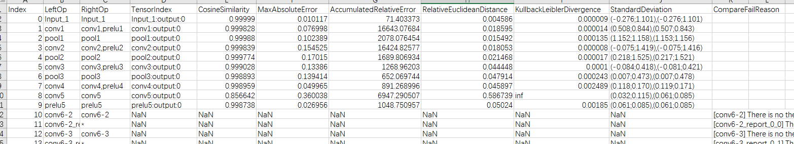

    **图 2**  精度比对执行结果展示<a name="fig20745123117434"></a>  
    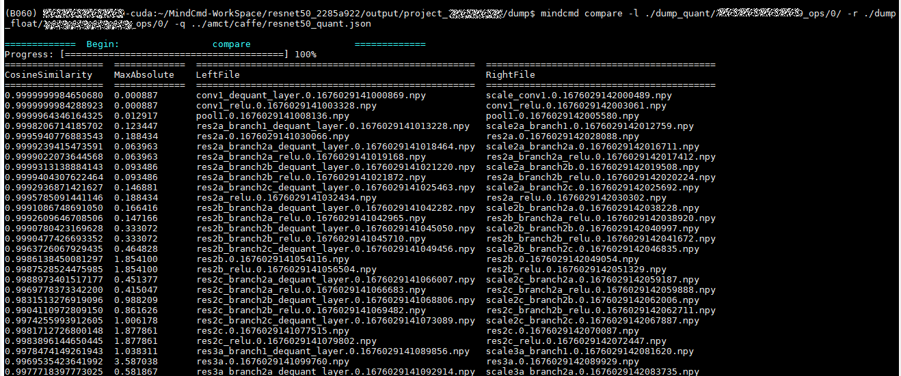

# 性能分析<a name="ZH-CN_TOPIC_0000002442020517"></a>


## 功能介绍<a name="ZH-CN_TOPIC_0000002442020561"></a>

该功能用于分析SOC上的推理业务各个运行阶段的关键性能指标，用户可根据输出的性能数据针对关键性能瓶颈做出优化以实现产品的极致性能。

该功能对硬件和软件性能数据的采集和展示包括以下内容。

硬件：_AA_  Core、_AA_  Vector Core等模块的PMU指标及系统硬件性能指标。

软件：ACL等模块的性能指标数据。

## 命令行格式说明<a name="ZH-CN_TOPIC_0000002408581394"></a>

Profile包含merge、show、collect三种操作。

-   merge操作将板端收集到的数据进行解析，导出timeline数据、summary数据、event view数据。

merge的命令行格式如下。

```
mindcmd profile merge -d COLLECTION_PATH 
```

命令行参数说明如[表1](#table1277010212152)所示。

**表 1**  性能数据解析命令行参数说明

<a name="table1277010212152"></a>
<table><thead align="left"><tr id="row3770192120151"><th class="cellrowborder" valign="top" width="21.14%" id="mcps1.2.4.1.1"><p id="p137707213153"><a name="p137707213153"></a><a name="p137707213153"></a><strong id="b16770172121514"><a name="b16770172121514"></a><a name="b16770172121514"></a>参数</strong></p>
</th>
<th class="cellrowborder" valign="top" width="11.37%" id="mcps1.2.4.1.2"><p id="p16770202151516"><a name="p16770202151516"></a><a name="p16770202151516"></a>必选/可选</p>
</th>
<th class="cellrowborder" valign="top" width="67.49000000000001%" id="mcps1.2.4.1.3"><p id="p1777082119150"><a name="p1777082119150"></a><a name="p1777082119150"></a>描述</p>
</th>
</tr>
</thead>
<tbody><tr id="row880315210163"><td class="cellrowborder" valign="top" width="21.14%" headers="mcps1.2.4.1.1 "><p id="p138037221612"><a name="p138037221612"></a><a name="p138037221612"></a>merge</p>
</td>
<td class="cellrowborder" valign="top" width="11.37%" headers="mcps1.2.4.1.2 "><p id="p68036281620"><a name="p68036281620"></a><a name="p68036281620"></a>必选</p>
</td>
<td class="cellrowborder" valign="top" width="67.49000000000001%" headers="mcps1.2.4.1.3 "><p id="p68047215169"><a name="p68047215169"></a><a name="p68047215169"></a>性能数据解析。</p>
</td>
</tr>
<tr id="row2771192181515"><td class="cellrowborder" valign="top" width="21.14%" headers="mcps1.2.4.1.1 "><p id="p1077182111512"><a name="p1077182111512"></a><a name="p1077182111512"></a>-d</p>
</td>
<td class="cellrowborder" valign="top" width="11.37%" headers="mcps1.2.4.1.2 "><p id="p177718216159"><a name="p177718216159"></a><a name="p177718216159"></a>必选</p>
</td>
<td class="cellrowborder" valign="top" width="67.49000000000001%" headers="mcps1.2.4.1.3 "><p id="p17771142115155"><a name="p17771142115155"></a><a name="p17771142115155"></a>采集的job数据存放目录。</p>
</td>
</tr>
<tr id="row20771521141513"><td class="cellrowborder" valign="top" width="21.14%" headers="mcps1.2.4.1.1 "><p id="p1077132121513"><a name="p1077132121513"></a><a name="p1077132121513"></a>-f</p>
</td>
<td class="cellrowborder" valign="top" width="11.37%" headers="mcps1.2.4.1.2 "><p id="p4771121141510"><a name="p4771121141510"></a><a name="p4771121141510"></a>可选</p>
</td>
<td class="cellrowborder" valign="top" width="67.49000000000001%" headers="mcps1.2.4.1.3 "><p id="p1377162110154"><a name="p1377162110154"></a><a name="p1377162110154"></a>结果保存格式[csv,json],默认csv。</p>
</td>
</tr>
<tr id="row32222314110"><td class="cellrowborder" valign="top" width="21.14%" headers="mcps1.2.4.1.1 "><p id="p142292314120"><a name="p142292314120"></a><a name="p142292314120"></a>-h, --help</p>
</td>
<td class="cellrowborder" valign="top" width="11.37%" headers="mcps1.2.4.1.2 "><p id="p142222374113"><a name="p142222374113"></a><a name="p142222374113"></a>可选</p>
</td>
<td class="cellrowborder" valign="top" width="67.49000000000001%" headers="mcps1.2.4.1.3 "><p id="p1822132354117"><a name="p1822132354117"></a><a name="p1822132354117"></a>性能数据解析子命令help信息，eg: mindcmd profile merge -h。</p>
</td>
</tr>
</tbody>
</table>

-   show操作将解析结果进行展示。

show的命令行格式如下。

```
mindcmd profile show -d COLLECTION_PATH 
```

命令行参数说明如[表2](#table1001mcpsimp)所示。

**表 2**  性能数据展示命令行参数说明

<a name="table1001mcpsimp"></a>
<table><thead align="left"><tr id="row1006mcpsimp"><th class="cellrowborder" valign="top" width="21.14%" id="mcps1.2.4.1.1"><p id="p1008mcpsimp"><a name="p1008mcpsimp"></a><a name="p1008mcpsimp"></a><strong id="b76691110185417"><a name="b76691110185417"></a><a name="b76691110185417"></a>参数</strong></p>
</th>
<th class="cellrowborder" valign="top" width="9.5%" id="mcps1.2.4.1.2"><p id="p2502227373"><a name="p2502227373"></a><a name="p2502227373"></a>必选/可选</p>
</th>
<th class="cellrowborder" valign="top" width="69.36%" id="mcps1.2.4.1.3"><p id="p10279733820"><a name="p10279733820"></a><a name="p10279733820"></a>描述</p>
</th>
</tr>
</thead>
<tbody><tr id="row25901842121611"><td class="cellrowborder" valign="top" width="21.14%" headers="mcps1.2.4.1.1 "><p id="p659164271619"><a name="p659164271619"></a><a name="p659164271619"></a>show</p>
</td>
<td class="cellrowborder" valign="top" width="9.5%" headers="mcps1.2.4.1.2 "><p id="p195918426169"><a name="p195918426169"></a><a name="p195918426169"></a>必选</p>
</td>
<td class="cellrowborder" valign="top" width="69.36%" headers="mcps1.2.4.1.3 "><p id="p14591742131615"><a name="p14591742131615"></a><a name="p14591742131615"></a>性能数据展示</p>
</td>
</tr>
<tr id="row1009mcpsimp"><td class="cellrowborder" valign="top" width="21.14%" headers="mcps1.2.4.1.1 "><p id="p1011mcpsimp"><a name="p1011mcpsimp"></a><a name="p1011mcpsimp"></a>-d</p>
</td>
<td class="cellrowborder" valign="top" width="9.5%" headers="mcps1.2.4.1.2 "><p id="p1450622113715"><a name="p1450622113715"></a><a name="p1450622113715"></a>必选</p>
</td>
<td class="cellrowborder" valign="top" width="69.36%" headers="mcps1.2.4.1.3 "><p id="p1013mcpsimp"><a name="p1013mcpsimp"></a><a name="p1013mcpsimp"></a>采集的job数据存放目录。</p>
</td>
</tr>
<tr id="row1956214294313"><td class="cellrowborder" valign="top" width="21.14%" headers="mcps1.2.4.1.1 "><p id="p8563104284315"><a name="p8563104284315"></a><a name="p8563104284315"></a>-h, --help</p>
</td>
<td class="cellrowborder" valign="top" width="9.5%" headers="mcps1.2.4.1.2 "><p id="p556374213433"><a name="p556374213433"></a><a name="p556374213433"></a>可选</p>
</td>
<td class="cellrowborder" valign="top" width="69.36%" headers="mcps1.2.4.1.3 "><p id="p1956316420439"><a name="p1956316420439"></a><a name="p1956316420439"></a>性能数据展示解析子命令help信息，eg: mindcmd profile show -h。</p>
</td>
</tr>
</tbody>
</table>

-   collect操作自动采集性能原始数据，并解析。

    collect的命令行格式如下。

    ```
    mindcmd profile collect -m MAIN -s SSH_CONFIG
    ```

    命令行参数说明如[表3](#table11193121816301)所示。

    **表 3**  性能数据采集命令行参数说明

    <a name="table11193121816301"></a>
    <table><thead align="left"><tr id="row71931518193018"><th class="cellrowborder" valign="top" width="21.14%" id="mcps1.2.4.1.1"><p id="p15193111812306"><a name="p15193111812306"></a><a name="p15193111812306"></a><strong id="b519371823010"><a name="b519371823010"></a><a name="b519371823010"></a>参数</strong></p>
    </th>
    <th class="cellrowborder" valign="top" width="11.37%" id="mcps1.2.4.1.2"><p id="p191931418133013"><a name="p191931418133013"></a><a name="p191931418133013"></a>必选/可选</p>
    </th>
    <th class="cellrowborder" valign="top" width="67.49000000000001%" id="mcps1.2.4.1.3"><p id="p219317187307"><a name="p219317187307"></a><a name="p219317187307"></a>描述</p>
    </th>
    </tr>
    </thead>
    <tbody><tr id="row51936188306"><td class="cellrowborder" valign="top" width="21.14%" headers="mcps1.2.4.1.1 "><p id="p18193161813011"><a name="p18193161813011"></a><a name="p18193161813011"></a>collect</p>
    </td>
    <td class="cellrowborder" valign="top" width="11.37%" headers="mcps1.2.4.1.2 "><p id="p7193118163014"><a name="p7193118163014"></a><a name="p7193118163014"></a>必选</p>
    </td>
    <td class="cellrowborder" valign="top" width="67.49000000000001%" headers="mcps1.2.4.1.3 "><p id="p81931418103016"><a name="p81931418103016"></a><a name="p81931418103016"></a>性能数据采集。</p>
    </td>
    </tr>
    <tr id="row18193141843017"><td class="cellrowborder" valign="top" width="21.14%" headers="mcps1.2.4.1.1 "><p id="p141931183302"><a name="p141931183302"></a><a name="p141931183302"></a>-m</p>
    </td>
    <td class="cellrowborder" valign="top" width="11.37%" headers="mcps1.2.4.1.2 "><p id="p1019381833017"><a name="p1019381833017"></a><a name="p1019381833017"></a>必选</p>
    </td>
    <td class="cellrowborder" valign="top" width="67.49000000000001%" headers="mcps1.2.4.1.3 "><p id="p910918282018"><a name="p910918282018"></a><a name="p910918282018"></a>上板执行项目中的可执行文件main或执行命令。如： -m main或-m "main -xx"</p>
    </td>
    </tr>
    <tr id="row319351811304"><td class="cellrowborder" valign="top" width="21.14%" headers="mcps1.2.4.1.1 "><p id="p4193181883016"><a name="p4193181883016"></a><a name="p4193181883016"></a>-s</p>
    </td>
    <td class="cellrowborder" valign="top" width="11.37%" headers="mcps1.2.4.1.2 "><p id="p619316182309"><a name="p619316182309"></a><a name="p619316182309"></a>可选</p>
    </td>
    <td class="cellrowborder" valign="top" width="67.49000000000001%" headers="mcps1.2.4.1.3 "><p id="p8060118"><a name="p8060118"></a><a name="p8060118"></a>ssh配置文件的路径，具体配置内容见<a href="#ZH-CN_TOPIC_0000002408421542">ssh.cfg文件配置</a>。</p>
    </td>
    </tr>
    <tr id="row123713652217"><td class="cellrowborder" valign="top" width="21.14%" headers="mcps1.2.4.1.1 "><p id="p109309243226"><a name="p109309243226"></a><a name="p109309243226"></a>--interval</p>
    </td>
    <td class="cellrowborder" valign="top" width="11.37%" headers="mcps1.2.4.1.2 "><p id="p1323717614228"><a name="p1323717614228"></a><a name="p1323717614228"></a>可选</p>
    </td>
    <td class="cellrowborder" valign="top" width="67.49000000000001%" headers="mcps1.2.4.1.3 "><p id="p1323715602212"><a name="p1323715602212"></a><a name="p1323715602212"></a>设置interval num 在acl.json上，默认为0</p>
    </td>
    </tr>
    <tr id="row1142331113223"><td class="cellrowborder" valign="top" width="21.14%" headers="mcps1.2.4.1.1 "><p id="p1638275345419"><a name="p1638275345419"></a><a name="p1638275345419"></a>--acl_api</p>
    </td>
    <td class="cellrowborder" valign="top" width="11.37%" headers="mcps1.2.4.1.2 "><p id="p841115611229"><a name="p841115611229"></a><a name="p841115611229"></a>可选</p>
    </td>
    <td class="cellrowborder" valign="top" width="67.49000000000001%" headers="mcps1.2.4.1.3 "><p id="p83820537546"><a name="p83820537546"></a><a name="p83820537546"></a>设置是否开启acl_api在acl.json上，默认为on</p>
    </td>
    </tr>
    <tr id="row4406214182210"><td class="cellrowborder" valign="top" width="21.14%" headers="mcps1.2.4.1.1 "><p id="p12406714142212"><a name="p12406714142212"></a><a name="p12406714142212"></a>--<em id="i02874497340"><a name="i02874497340"></a><a name="i02874497340"></a>aacpu</em></p>
    </td>
    <td class="cellrowborder" valign="top" width="11.37%" headers="mcps1.2.4.1.2 "><p id="p692965610229"><a name="p692965610229"></a><a name="p692965610229"></a>可选</p>
    </td>
    <td class="cellrowborder" valign="top" width="67.49000000000001%" headers="mcps1.2.4.1.3 "><p id="p15577105765413"><a name="p15577105765413"></a><a name="p15577105765413"></a>设置<em id="i1410211613812"><a name="i1410211613812"></a><a name="i1410211613812"></a>是</em>否开启<em id="i20432185203414"><a name="i20432185203414"></a><a name="i20432185203414"></a>aa</em><em id="i19432205283417"><a name="i19432205283417"></a><a name="i19432205283417"></a>cpu</em>在acl.json上，默认为on</p>
    </td>
    </tr>
    <tr id="row1526209142213"><td class="cellrowborder" valign="top" width="21.14%" headers="mcps1.2.4.1.1 "><p id="p162627962211"><a name="p162627962211"></a><a name="p162627962211"></a>--switch</p>
    </td>
    <td class="cellrowborder" valign="top" width="11.37%" headers="mcps1.2.4.1.2 "><p id="p6482857162211"><a name="p6482857162211"></a><a name="p6482857162211"></a>可选</p>
    </td>
    <td class="cellrowborder" valign="top" width="67.49000000000001%" headers="mcps1.2.4.1.3 "><p id="p364171115512"><a name="p364171115512"></a><a name="p364171115512"></a>设置是否开启switch在acl.json上，默认为on</p>
    </td>
    </tr>
    <tr id="row87013357203"><td class="cellrowborder" valign="top" width="21.14%" headers="mcps1.2.4.1.1 "><p id="p727063885714"><a name="p727063885714"></a><a name="p727063885714"></a>--<em id="i16831175573512"><a name="i16831175573512"></a><a name="i16831175573512"></a>aac_metrics</em></p>
    </td>
    <td class="cellrowborder" valign="top" width="11.37%" headers="mcps1.2.4.1.2 "><p id="p1966911316541"><a name="p1966911316541"></a><a name="p1966911316541"></a>可选</p>
    </td>
    <td class="cellrowborder" valign="top" width="67.49000000000001%" headers="mcps1.2.4.1.3 "><p id="p22704380579"><a name="p22704380579"></a><a name="p22704380579"></a>设置<em id="i5538204203615"><a name="i5538204203615"></a><a name="i5538204203615"></a>aac_metrics</em>在acl.json上，默认为ArithmeticUtilization</p>
    </td>
    </tr>
    <tr id="row128761834202411"><td class="cellrowborder" valign="top" width="21.14%" headers="mcps1.2.4.1.1 "><p id="p1537718810582"><a name="p1537718810582"></a><a name="p1537718810582"></a>--output</p>
    </td>
    <td class="cellrowborder" valign="top" width="11.37%" headers="mcps1.2.4.1.2 "><p id="p1887616348249"><a name="p1887616348249"></a><a name="p1887616348249"></a>可选</p>
    </td>
    <td class="cellrowborder" valign="top" width="67.49000000000001%" headers="mcps1.2.4.1.3 "><p id="p8876234142417"><a name="p8876234142417"></a><a name="p8876234142417"></a>设置生成job的输出路径</p>
    </td>
    </tr>
    <tr id="row12193151833017"><td class="cellrowborder" valign="top" width="21.14%" headers="mcps1.2.4.1.1 "><p id="p619418186306"><a name="p619418186306"></a><a name="p619418186306"></a>-h, --help</p>
    </td>
    <td class="cellrowborder" valign="top" width="11.37%" headers="mcps1.2.4.1.2 "><p id="p119418183301"><a name="p119418183301"></a><a name="p119418183301"></a>可选</p>
    </td>
    <td class="cellrowborder" valign="top" width="67.49000000000001%" headers="mcps1.2.4.1.3 "><p id="p21940186307"><a name="p21940186307"></a><a name="p21940186307"></a>性能数据采集子命令help信息，eg: mindcmd profile collect -h。</p>
    </td>
    </tr>
    </tbody>
    </table>

> **说明：** 
>参数值格式：支持大小写字母（a-z，A-Z）、数字（0-9）、下划线（\_）、中划线（-）、句点（.）。

## 执行样例<a name="ZH-CN_TOPIC_0000002408581450"></a>

-   执行性能分析
    1.  模型和数据准备

        性能分析前需要准备相应的性能文件，所准备的文件结构可参考如下。

        ```
        ├── profile_resoure
        │   ├── JOBXXXXXXXX
        │   │   ├── data
        │   │   └── info.json.0
        ```

    2.  执行以下命令进行性能分析：

        ```
        cd profile_resoure
        mindcmd profile merge -d ./JOBXXXXXXXX
        ```

    3.  执行结果

        性能分析执行结束后会在默认工作路径/home/MindCmdUser/profile\_resoure/JOBXXXXXXXX中生成数据，主要文件结构示例如下。

        ```
        ├── profile_resoure
        │  ├── JOBXXXXXXXX
        │  │   ├── data
        │  │   ├── eventview
        │  │   ├── log
        │  │   ├── sqlite
        │  │   ├── summary
        │  │   ├── timeline
        │  │   └── info.json.0 
        ```

-   执行性能分析展示
    1.  执行以下命令进行性能分析展示：

        ```
        cd profile_resoure
        mindcmd profile show -d ./JOBXXXXXXXX
        ```

    2.  执行结果

        性能分析结果展示在控制台上，如[图1](#fig1793811366253)，具体结果可参考《Profiling工具使用指南》“展示Profiling数据”章节。

        **图 1**  性能分析展示图<a name="fig1793811366253"></a>  
        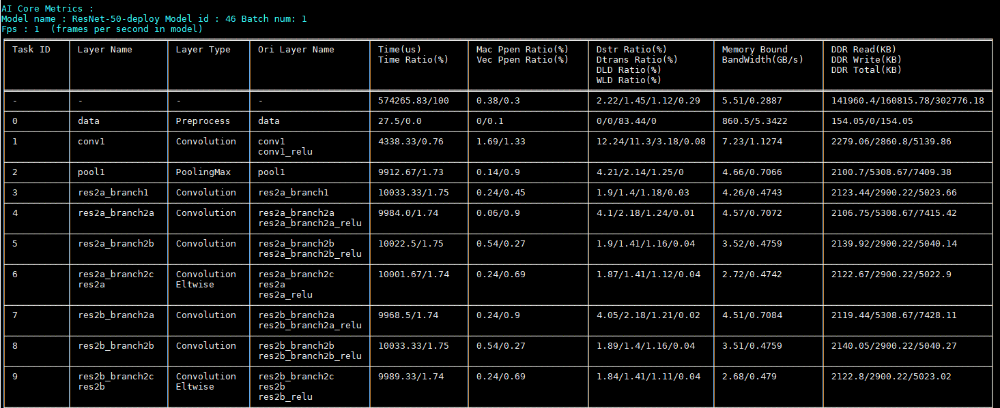

-   执行性能数据采集
    1.  文件准备

        请预先准备工程，主要工程目录及文件如下（以新建ACL ResNet50为例）。

        ```
        ├── 工程名
        │   ├── .idea                     //IntelliJ IDEA自动创建的，用于存放项目的配置信息。  
        │   ├── build  
        │   │    ├──cmake                //存放cmake依赖文件
        │   ├── data                      //存放data示例 
        │   ├── inc  
        │   │    ├── model_process.h     //声明模型处理相关函数的头文件  
        │   │    ├── sample_process.h    //声明资源初始化/销毁相关函数的头文件  
        │   │    ├── utils.h             //声明公共函数（例如：文件读取函数）的头文件  
        │   ├── out                       //存放编译出的可执行文件  
        │   │    ├── main                
        │   ├── src  
        │   │    ├── acl.json            //系统初始化的配置文件  
        │   │    ├── CMakeLists.txt      //编译脚本  
        │   │    ├── main.cpp            //主函数，图片分类功能的实现文件 
        │   │    ├── model_process.cpp   //模型处理相关函数的实现文件  
        │   │    ├── sample_process.cpp  //资源初始化/销毁相关函数的实现文件  
        │   │    ├── utils.cpp           //公共函数（例如：文件读取函数）的实现文件 
        │   ├── .project                  //工程信息文件，包含工程类型、工程描述、运行目标设备类型、CANN版本号等  
        │   ├── CMakeLists.txt            //编译脚本，调用src目录下的CMakeLists文件
        ```

        其中，main文件是根据工程编译的板端可执行文件，同时性能数据采集需要配置acl.json，内容如下。

        ```
        {
        "profiler":{
                     "output":"/home/MindCmdUser/profiling",
                     "aacpu":"on",
                     "aac_metrics":"ArithmeticUtilization",
                     "interval":"0",
                     "acl_api":"on",
                     "switch":"on"
                   }
        }
        ```

    2.  执行以下命令进行性能数据采集：

        ```
        mindcmd profile collect -m MAIN
        ```

        > **注意：** 
        >命令中MAIN表示工程中main文件的路径。

    3.  执行结果

        性能数据采集执行结束后会在上板项目目录下的profiling文件夹生成数据，主要文件结构示例如下。

        ```
        ├── project
        │  ├──profiling
        │  │   ├── JOBXXXXXXXX
        │  │   │   ├── data
        │  │   │   ├── log
        │  │   │   ├── sqlite
        │  │   │   ├── summary
        │  │   │   ├── timeline
        │  │   │   └── info.json.0
        ```

# Tools<a name="ZH-CN_TOPIC_0000002408421486"></a>


## Caffe模型子网导出<a name="ZH-CN_TOPIC_0000002441980809"></a>

该功能用于原始Caffe网络的剪切。


### 命令行格式说明<a name="ZH-CN_TOPIC_0000002441980661"></a>

Caffe模型子网导出命令行格式如下。

```
mindcmd subnet -m MODEL_FILE -w WEIGHT_FILE -s START_LAYER -e END_LAYER
```

命令行参数说明如[表1](#table19209648865)所示。

**表 1**  Caffe模型子网导出命令参数说明

<a name="table19209648865"></a>
<table><thead align="left"><tr id="row82102483610"><th class="cellrowborder" valign="top" width="23.51%" id="mcps1.2.4.1.1"><p id="p921074814615"><a name="p921074814615"></a><a name="p921074814615"></a><strong id="b1121084819610"><a name="b1121084819610"></a><a name="b1121084819610"></a>参数</strong></p>
</th>
<th class="cellrowborder" valign="top" width="9.9%" id="mcps1.2.4.1.2"><p id="p17532133310362"><a name="p17532133310362"></a><a name="p17532133310362"></a>必选/可选</p>
</th>
<th class="cellrowborder" valign="top" width="66.59%" id="mcps1.2.4.1.3"><p id="p125781630173619"><a name="p125781630173619"></a><a name="p125781630173619"></a>描述</p>
</th>
</tr>
</thead>
<tbody><tr id="row1621074813618"><td class="cellrowborder" valign="top" width="23.51%" headers="mcps1.2.4.1.1 "><p id="p112100482062"><a name="p112100482062"></a><a name="p112100482062"></a>-m, --model</p>
</td>
<td class="cellrowborder" valign="top" width="9.9%" headers="mcps1.2.4.1.2 "><p id="p11533173317367"><a name="p11533173317367"></a><a name="p11533173317367"></a>必选</p>
</td>
<td class="cellrowborder" valign="top" width="66.59%" headers="mcps1.2.4.1.3 "><p id="p1721010486615"><a name="p1721010486615"></a><a name="p1721010486615"></a>Caffe模型文件（ .prototxt）的路径。</p>
</td>
</tr>
<tr id="row1047722515530"><td class="cellrowborder" valign="top" width="23.51%" headers="mcps1.2.4.1.1 "><p id="p32101848968"><a name="p32101848968"></a><a name="p32101848968"></a>-w, --weight</p>
</td>
<td class="cellrowborder" valign="top" width="9.9%" headers="mcps1.2.4.1.2 "><p id="p125338338360"><a name="p125338338360"></a><a name="p125338338360"></a>必选</p>
</td>
<td class="cellrowborder" valign="top" width="66.59%" headers="mcps1.2.4.1.3 "><p id="p52101948367"><a name="p52101948367"></a><a name="p52101948367"></a>Caffe权重文件（ .caffemodel）路径。</p>
</td>
</tr>
<tr id="row17210348764"><td class="cellrowborder" valign="top" width="23.51%" headers="mcps1.2.4.1.1 "><p id="p8520103214530"><a name="p8520103214530"></a><a name="p8520103214530"></a>-s, --start</p>
</td>
<td class="cellrowborder" valign="top" width="9.9%" headers="mcps1.2.4.1.2 "><p id="p653315338366"><a name="p653315338366"></a><a name="p653315338366"></a>必选</p>
</td>
<td class="cellrowborder" valign="top" width="66.59%" headers="mcps1.2.4.1.3 "><p id="p8504153214539"><a name="p8504153214539"></a><a name="p8504153214539"></a>Caffe子模型导出的开始层层名。</p>
</td>
</tr>
<tr id="row721014481264"><td class="cellrowborder" valign="top" width="23.51%" headers="mcps1.2.4.1.1 "><p id="p721034815611"><a name="p721034815611"></a><a name="p721034815611"></a>-e, --end</p>
</td>
<td class="cellrowborder" valign="top" width="9.9%" headers="mcps1.2.4.1.2 "><p id="p1153312331366"><a name="p1153312331366"></a><a name="p1153312331366"></a>必选</p>
</td>
<td class="cellrowborder" valign="top" width="66.59%" headers="mcps1.2.4.1.3 "><p id="p821019481869"><a name="p821019481869"></a><a name="p821019481869"></a>Caffe子模型导出的结束层层名。</p>
</td>
</tr>
<tr id="row152101248660"><td class="cellrowborder" valign="top" width="23.51%" headers="mcps1.2.4.1.1 "><p id="p15210164819620"><a name="p15210164819620"></a><a name="p15210164819620"></a>-j, --json</p>
</td>
<td class="cellrowborder" valign="top" width="9.9%" headers="mcps1.2.4.1.2 "><p id="p1753333333610"><a name="p1753333333610"></a><a name="p1753333333610"></a>可选</p>
</td>
<td class="cellrowborder" valign="top" width="66.59%" headers="mcps1.2.4.1.3 "><p id="p14439162295516"><a name="p14439162295516"></a><a name="p14439162295516"></a>指定模型json文件路径，不指定则自动调用ATC生成，需确保已配置ATC相关环境变量。</p>
</td>
</tr>
<tr id="row102101248669"><td class="cellrowborder" valign="top" width="23.51%" headers="mcps1.2.4.1.1 "><p id="p13210448668"><a name="p13210448668"></a><a name="p13210448668"></a>-o, --output</p>
</td>
<td class="cellrowborder" valign="top" width="9.9%" headers="mcps1.2.4.1.2 "><p id="p15331033183615"><a name="p15331033183615"></a><a name="p15331033183615"></a>可选</p>
</td>
<td class="cellrowborder" valign="top" width="66.59%" headers="mcps1.2.4.1.3 "><p id="p1632654815615"><a name="p1632654815615"></a><a name="p1632654815615"></a>子模型保存路径。</p>
</td>
</tr>
<tr id="row1758982304716"><td class="cellrowborder" valign="top" width="23.51%" headers="mcps1.2.4.1.1 "><p id="p721012481464"><a name="p721012481464"></a><a name="p721012481464"></a>-h, --help</p>
</td>
<td class="cellrowborder" valign="top" width="9.9%" headers="mcps1.2.4.1.2 "><p id="p135331533103615"><a name="p135331533103615"></a><a name="p135331533103615"></a>可选</p>
</td>
<td class="cellrowborder" valign="top" width="66.59%" headers="mcps1.2.4.1.3 "><p id="p221018481462"><a name="p221018481462"></a><a name="p221018481462"></a>展示命令行 help 信息。</p>
</td>
</tr>
</tbody>
</table>

> **说明：** 
>参数值格式：支持大小写字母（a-z，A-Z）、数字（0-9）、下划线（\_）、中划线（-）、句点（.）。

### 执行样例<a name="ZH-CN_TOPIC_0000002408581266"></a>

-   模型和数据准备

    性能分析前需要准备相应的Caffe模型，所准备的文件结构可参考如下。

    ```
    ├── caffe_model_split
    │   ├── resnet50
    │   │   ├── resnet50.caffemodel
    │   │   └── resnet50.prototxt
    ```

-   执行模型分割

    进入MindCmd工程路径下，执行以下命令。

    ```
    cd caffe_model_split
    mindcmd subnet -m ./resnet50/resnet50.prototxt -w ./resnet50/resnet50.caffemodel -s conv1 -e pool1 -o ./split_output
    ```

-   执行结果

    性能分析执行结束后会在默认工作路径中生成数据，主要文件结构示例如下。

    ```
    ├── split_output
    │   ├── dump.caffemodel            # 子模型权重
    │   └── dump.prototxt              # 子模型
    └── shape_1665740903824.json        # 原始模型.json
    ```

## cmd命令转换为cfg文件<a name="ZH-CN_TOPIC_0000002442020629"></a>

该功能用于将cmd命令转换为cfg文件保存。


### 命令行格式说明<a name="ZH-CN_TOPIC_0000002408581458"></a>

cmd命令转换为cfg文件的命令行格式如下。

```
mindcmd cmdtrans -s CFG_SAVED_PATH -a [ARGS [ARGS ...]]
```

命令行参数说明如[表1](#table19209648865)所示

**表 1**  cmd命令转cfg文件参数说明

<a name="table19209648865"></a>
<table><thead align="left"><tr id="row82102483610"><th class="cellrowborder" valign="top" width="23.02%" id="mcps1.2.4.1.1"><p id="p921074814615"><a name="p921074814615"></a><a name="p921074814615"></a><strong id="b1121084819610"><a name="b1121084819610"></a><a name="b1121084819610"></a>参数</strong></p>
</th>
<th class="cellrowborder" valign="top" width="10.39%" id="mcps1.2.4.1.2"><p id="p7691201353519"><a name="p7691201353519"></a><a name="p7691201353519"></a>必选/可选</p>
</th>
<th class="cellrowborder" valign="top" width="66.59%" id="mcps1.2.4.1.3"><p id="p9471185015347"><a name="p9471185015347"></a><a name="p9471185015347"></a>描述</p>
</th>
</tr>
</thead>
<tbody><tr id="row17210348764"><td class="cellrowborder" valign="top" width="23.02%" headers="mcps1.2.4.1.1 "><p id="p8520103214530"><a name="p8520103214530"></a><a name="p8520103214530"></a>-s, --save</p>
</td>
<td class="cellrowborder" valign="top" width="10.39%" headers="mcps1.2.4.1.2 "><p id="p26911513193511"><a name="p26911513193511"></a><a name="p26911513193511"></a>必选</p>
</td>
<td class="cellrowborder" valign="top" width="66.59%" headers="mcps1.2.4.1.3 "><p id="p8504153214539"><a name="p8504153214539"></a><a name="p8504153214539"></a>cfg文件保存路径。</p>
</td>
</tr>
<tr id="row721014481264"><td class="cellrowborder" valign="top" width="23.02%" headers="mcps1.2.4.1.1 "><p id="p721034815611"><a name="p721034815611"></a><a name="p721034815611"></a>-a, --args</p>
</td>
<td class="cellrowborder" valign="top" width="10.39%" headers="mcps1.2.4.1.2 "><p id="p869161318352"><a name="p869161318352"></a><a name="p869161318352"></a>必选</p>
</td>
<td class="cellrowborder" valign="top" width="66.59%" headers="mcps1.2.4.1.3 "><p id="p821019481869"><a name="p821019481869"></a><a name="p821019481869"></a>能够成功调用模型转换的命令行。</p>
</td>
</tr>
<tr id="row1021013482614"><td class="cellrowborder" valign="top" width="23.02%" headers="mcps1.2.4.1.1 "><p id="p721012481464"><a name="p721012481464"></a><a name="p721012481464"></a>-h, --help</p>
</td>
<td class="cellrowborder" valign="top" width="10.39%" headers="mcps1.2.4.1.2 "><p id="p186921013153513"><a name="p186921013153513"></a><a name="p186921013153513"></a>可选</p>
</td>
<td class="cellrowborder" valign="top" width="66.59%" headers="mcps1.2.4.1.3 "><p id="p221018481462"><a name="p221018481462"></a><a name="p221018481462"></a>展示命令行 help 信息。</p>
</td>
</tr>
</tbody>
</table>

> **说明：** 
>参数值格式：支持大小写字母（a-z，A-Z）、数字（0-9）、下划线（\_）、中划线（-）、句点（.）。

### 执行样例<a name="ZH-CN_TOPIC_0000002442020645"></a>

-   创建cfg文件保存路径，如/home/MindCmdUser/cfg\_output
-   执行cmd命令转换

    进入MindCmd工程路径下，执行以下命令。

    ```
    mindcmd cmdtrans -s /home/MindCmdUser/cfg_output/resnet50.cfg -a  --model="/home/MindCmdUser/atc_resoure/caffe_resnet50/caffe/resnet50.prototxt" --weight="/home/MindCmdUser/atc_resoure/caffe_resnet50/caffe/resnet50.caffemodel" --image_list="/home/MindCmdUser/atc_resoure/data/nnn_dog1_1024_683_uint8.bin"  --output="/home/MindCmdUser/atc_output/resnet50"
    ```

-   执行结果

    cmd命令转换执行结束后会在默认工作路径/home/MindCmdUser/cfg\_output/中生成resnet50.cfg文件，文件结构示例如下。

    ```
    [model] /home/MindCmdUser/atc_resoure/caffe_resnet50/caffe/resnet50.prototxt
    [weight] /home/MindCmdUser/atc_resoure/caffe_resnet50/caffe/resnet50.caffemodel
    [image_list] /home/MindCmdUser/atc_resoure/data/nnn_dog1_1024_683_uint8.bin
    [output] /home/MindCmdUser/atc_output/resnet50
    ```

## 文件格式转换<a name="ZH-CN_TOPIC_0000002408421294"></a>

该功能可以将.bin，.float，.npy，.dump和.\{时间戳\}文件转换为.bin，.float，.hex和.npy文件。


### 命令行格式说明<a name="ZH-CN_TOPIC_0000002408581366"></a>

文件格式转换的命令行格式如下。

```
mindcmd datatrans -i INPUT -f file_format
```

命令行参数说明如[表1](#table19209648865)所示

**表 1**  文件格式转换参数说明

<a name="table19209648865"></a>
<table><thead align="left"><tr id="row82102483610"><th class="cellrowborder" valign="top" width="22.439999999999998%" id="mcps1.2.4.1.1"><p id="p921074814615"><a name="p921074814615"></a><a name="p921074814615"></a><strong id="b1121084819610"><a name="b1121084819610"></a><a name="b1121084819610"></a>参数</strong></p>
</th>
<th class="cellrowborder" valign="top" width="10.97%" id="mcps1.2.4.1.2"><p id="p898153418268"><a name="p898153418268"></a><a name="p898153418268"></a>必选/可选</p>
</th>
<th class="cellrowborder" valign="top" width="66.59%" id="mcps1.2.4.1.3"><p id="p9456112762611"><a name="p9456112762611"></a><a name="p9456112762611"></a><strong id="b11597194562613"><a name="b11597194562613"></a><a name="b11597194562613"></a>描述</strong></p>
</th>
</tr>
</thead>
<tbody><tr id="row17210348764"><td class="cellrowborder" valign="top" width="22.439999999999998%" headers="mcps1.2.4.1.1 "><p id="p8520103214530"><a name="p8520103214530"></a><a name="p8520103214530"></a>-i, --input</p>
</td>
<td class="cellrowborder" valign="top" width="10.97%" headers="mcps1.2.4.1.2 "><p id="p1476811793419"><a name="p1476811793419"></a><a name="p1476811793419"></a>必选</p>
</td>
<td class="cellrowborder" valign="top" width="66.59%" headers="mcps1.2.4.1.3 "><p id="p8504153214539"><a name="p8504153214539"></a><a name="p8504153214539"></a>需要转换的数据所在路径。支持后缀为.bin，.float，.npy，.dump和.{时间戳}。</p>
</td>
</tr>
<tr id="row721014481264"><td class="cellrowborder" valign="top" width="22.439999999999998%" headers="mcps1.2.4.1.1 "><p id="p721034815611"><a name="p721034815611"></a><a name="p721034815611"></a>-f, --file_format</p>
</td>
<td class="cellrowborder" valign="top" width="10.97%" headers="mcps1.2.4.1.2 "><p id="p376910171344"><a name="p376910171344"></a><a name="p376910171344"></a>必选</p>
</td>
<td class="cellrowborder" valign="top" width="66.59%" headers="mcps1.2.4.1.3 "><p id="p39311658184420"><a name="p39311658184420"></a><a name="p39311658184420"></a>指定输出的数据类型 bin，float，hex和npy。</p>
</td>
</tr>
<tr id="row10936182514230"><td class="cellrowborder" valign="top" width="22.439999999999998%" headers="mcps1.2.4.1.1 "><p id="p8936112517236"><a name="p8936112517236"></a><a name="p8936112517236"></a>-o, --output</p>
</td>
<td class="cellrowborder" valign="top" width="10.97%" headers="mcps1.2.4.1.2 "><p id="p11936625122320"><a name="p11936625122320"></a><a name="p11936625122320"></a>可选</p>
</td>
<td class="cellrowborder" valign="top" width="66.59%" headers="mcps1.2.4.1.3 "><p id="p2093622502318"><a name="p2093622502318"></a><a name="p2093622502318"></a>指定输出路径，默认输出路径为输入数据所在路径下的transform子目录。</p>
</td>
</tr>
<tr id="row1119219715166"><td class="cellrowborder" valign="top" width="22.439999999999998%" headers="mcps1.2.4.1.1 "><p id="p119218718169"><a name="p119218718169"></a><a name="p119218718169"></a>-s, --shape</p>
</td>
<td class="cellrowborder" valign="top" width="10.97%" headers="mcps1.2.4.1.2 "><p id="p16769141719344"><a name="p16769141719344"></a><a name="p16769141719344"></a>可选</p>
</td>
<td class="cellrowborder" valign="top" width="66.59%" headers="mcps1.2.4.1.3 "><p id="p11791191773516"><a name="p11791191773516"></a><a name="p11791191773516"></a>指定转换后的shape, 不指定默认转为（x, 1）。</p>
</td>
</tr>
<tr id="row127381232104119"><td class="cellrowborder" valign="top" width="22.439999999999998%" headers="mcps1.2.4.1.1 "><p id="p8117739184117"><a name="p8117739184117"></a><a name="p8117739184117"></a>-h, --help</p>
</td>
<td class="cellrowborder" valign="top" width="10.97%" headers="mcps1.2.4.1.2 "><p id="p2117123913417"><a name="p2117123913417"></a><a name="p2117123913417"></a>可选</p>
</td>
<td class="cellrowborder" valign="top" width="66.59%" headers="mcps1.2.4.1.3 "><p id="p1611743974115"><a name="p1611743974115"></a><a name="p1611743974115"></a>展示命令行 help 信息。</p>
</td>
</tr>
</tbody>
</table>

> **说明：** 
>参数值格式：支持大小写字母（a-z，A-Z）、数字（0-9）、下划线（\_）、中划线（-）、句点（.）。

### 执行样例<a name="ZH-CN_TOPIC_0000002442020657"></a>

-   数据准备

    性能分析前需要准备相应的caffe模型，所准备的文件结构可参考如下。

    ```
    ├── transform_resoure
    │   └── data.npy
    ```

-   执行文件格式转换

    进入MindCmd工程路径下，执行以下命令。

    ```
    cd transform_resoure
    mindcmd datatrans -i ./data.npy -f bin -o ./transform_output
    ```

-   执行结果

    文件格式转换执行结束后会在默认工作路径中生成data.bin文件。

## UnInplace<a name="ZH-CN_TOPIC_0000002408581346"></a>

该功能对模型进行uninplace处理，uninplace后仅保存不带phase或者phase为TEST的层。


### 命令行格式说明<a name="ZH-CN_TOPIC_0000002441980701"></a>

uninplace处理的命令行格式如下。

```
mindcmd uninplace -i INPUT_FILE_PATH
```

命令行参数说明如[表1](#table19209648865)所示。

**表 1**  Uninplace命令参数说明

<a name="table19209648865"></a>
<table><thead align="left"><tr id="row82102483610"><th class="cellrowborder" valign="top" width="22.24%" id="mcps1.2.4.1.1"><p id="p921074814615"><a name="p921074814615"></a><a name="p921074814615"></a><strong id="b1121084819610"><a name="b1121084819610"></a><a name="b1121084819610"></a>参数</strong></p>
</th>
<th class="cellrowborder" valign="top" width="11.17%" id="mcps1.2.4.1.2"><p id="p898153418268"><a name="p898153418268"></a><a name="p898153418268"></a>必选/可选</p>
</th>
<th class="cellrowborder" valign="top" width="66.59%" id="mcps1.2.4.1.3"><p id="p9456112762611"><a name="p9456112762611"></a><a name="p9456112762611"></a><strong id="b11597194562613"><a name="b11597194562613"></a><a name="b11597194562613"></a>描述</strong></p>
</th>
</tr>
</thead>
<tbody><tr id="row17210348764"><td class="cellrowborder" valign="top" width="22.24%" headers="mcps1.2.4.1.1 "><p id="p8520103214530"><a name="p8520103214530"></a><a name="p8520103214530"></a>-i, --input</p>
</td>
<td class="cellrowborder" valign="top" width="11.17%" headers="mcps1.2.4.1.2 "><p id="p8606741163320"><a name="p8606741163320"></a><a name="p8606741163320"></a>必选</p>
</td>
<td class="cellrowborder" valign="top" width="66.59%" headers="mcps1.2.4.1.3 "><p id="p8504153214539"><a name="p8504153214539"></a><a name="p8504153214539"></a>prototxt文件路径。</p>
</td>
</tr>
<tr id="row6792830113220"><td class="cellrowborder" valign="top" width="22.24%" headers="mcps1.2.4.1.1 "><p id="p2853163315166"><a name="p2853163315166"></a><a name="p2853163315166"></a>-o, --output</p>
</td>
<td class="cellrowborder" valign="top" width="11.17%" headers="mcps1.2.4.1.2 "><p id="p460618418332"><a name="p460618418332"></a><a name="p460618418332"></a>可选</p>
</td>
<td class="cellrowborder" valign="top" width="66.59%" headers="mcps1.2.4.1.3 "><p id="p5215172721614"><a name="p5215172721614"></a><a name="p5215172721614"></a>输出路径。</p>
</td>
</tr>
<tr id="row1021013482614"><td class="cellrowborder" valign="top" width="22.24%" headers="mcps1.2.4.1.1 "><p id="p3214162781614"><a name="p3214162781614"></a><a name="p3214162781614"></a>-h, --help</p>
</td>
<td class="cellrowborder" valign="top" width="11.17%" headers="mcps1.2.4.1.2 "><p id="p1621415272160"><a name="p1621415272160"></a><a name="p1621415272160"></a>可选</p>
</td>
<td class="cellrowborder" valign="top" width="66.59%" headers="mcps1.2.4.1.3 "><p id="p1214727121615"><a name="p1214727121615"></a><a name="p1214727121615"></a>展示命令行 help 信息。</p>
</td>
</tr>
</tbody>
</table>

> **说明：** 
>参数值格式：支持大小写字母（a-z，A-Z）、数字（0-9）、下划线（\_）、中划线（-）、句点（.）。

### 执行样例<a name="ZH-CN_TOPIC_0000002408581294"></a>

-   模型和数据准备

    性能分析前需要准备相应的caffe模型，所准备的文件结构可参考如下。

    ```
    ├── uninplace_resoure
    │   ├── resnet50
    │   │   └── resnet50_deploy.prototxt
    ```

-   执行uninplace

    进入MindCmd工程路径下，执行以下命令。

    ```
    cd uninplace_resoure
    mindcmd uninplace -i ./resnet50/resnet50_deploy.prototxt -o=./uninplace_output/resnet50_uninplace.prototxt
    ```

-   执行结果

    执行结束后会在指定路径中生成resnet50\_uninplace.prototxt文件。

# 附录<a name="ZH-CN_TOPIC_0000002408581418"></a>


## MindCmd子命令<a name="ZH-CN_TOPIC_0000002408581406"></a>

MindCmd工具可以在任意路径下通过mindcmd命令使用，命令行如下。

```
mindcmd {config,oneclick,preprocess,atc,amct,gt,app,compare,profile} ...
```

命令参数说明如[表1](#table19209648865)所示。

**表 1**  MindCmd子命令参数说明

<a name="table19209648865"></a>
<table><thead align="left"><tr id="row82102483610"><th class="cellrowborder" valign="top" width="18.42%" id="mcps1.2.4.1.1"><p id="p10985350112516"><a name="p10985350112516"></a><a name="p10985350112516"></a><strong id="b259515459268"><a name="b259515459268"></a><a name="b259515459268"></a>参数</strong></p>
</th>
<th class="cellrowborder" valign="top" width="10.14%" id="mcps1.2.4.1.2"><p id="p898153418268"><a name="p898153418268"></a><a name="p898153418268"></a>必选/可选</p>
</th>
<th class="cellrowborder" valign="top" width="71.44%" id="mcps1.2.4.1.3"><p id="p9456112762611"><a name="p9456112762611"></a><a name="p9456112762611"></a><strong id="b11597194562613"><a name="b11597194562613"></a><a name="b11597194562613"></a>描述</strong></p>
</th>
</tr>
</thead>
<tbody><tr id="row17210348764"><td class="cellrowborder" valign="top" width="18.42%" headers="mcps1.2.4.1.1 "><p id="p971481012911"><a name="p971481012911"></a><a name="p971481012911"></a>oneclick</p>
</td>
<td class="cellrowborder" valign="top" width="10.14%" headers="mcps1.2.4.1.2 "><p id="p17981163410269"><a name="p17981163410269"></a><a name="p17981163410269"></a>必选</p>
</td>
<td class="cellrowborder" valign="top" width="71.44%" headers="mcps1.2.4.1.3 "><p id="p762232714304"><a name="p762232714304"></a><a name="p762232714304"></a>使用一键推理功能，与其他功能命令互斥。</p>
</td>
</tr>
<tr id="row16161124172912"><td class="cellrowborder" valign="top" width="18.42%" headers="mcps1.2.4.1.1 "><p id="p81615244292"><a name="p81615244292"></a><a name="p81615244292"></a>preprocess</p>
</td>
<td class="cellrowborder" valign="top" width="10.14%" headers="mcps1.2.4.1.2 "><p id="p31632422912"><a name="p31632422912"></a><a name="p31632422912"></a>必选</p>
</td>
<td class="cellrowborder" valign="top" width="71.44%" headers="mcps1.2.4.1.3 "><p id="p1716202413296"><a name="p1716202413296"></a><a name="p1716202413296"></a>使用数据预处理功能，与其他功能命令互斥。</p>
</td>
</tr>
<tr id="row5242102211299"><td class="cellrowborder" valign="top" width="18.42%" headers="mcps1.2.4.1.1 "><p id="p182426225298"><a name="p182426225298"></a><a name="p182426225298"></a>atc</p>
</td>
<td class="cellrowborder" valign="top" width="10.14%" headers="mcps1.2.4.1.2 "><p id="p9242142214296"><a name="p9242142214296"></a><a name="p9242142214296"></a>必选</p>
</td>
<td class="cellrowborder" valign="top" width="71.44%" headers="mcps1.2.4.1.3 "><p id="p3242122142910"><a name="p3242122142910"></a><a name="p3242122142910"></a>使用模型转换功能，与其他功能命令互斥。</p>
</td>
</tr>
<tr id="row1050292052914"><td class="cellrowborder" valign="top" width="18.42%" headers="mcps1.2.4.1.1 "><p id="p65022202297"><a name="p65022202297"></a><a name="p65022202297"></a>amct</p>
</td>
<td class="cellrowborder" valign="top" width="10.14%" headers="mcps1.2.4.1.2 "><p id="p1550232062913"><a name="p1550232062913"></a><a name="p1550232062913"></a>必选</p>
</td>
<td class="cellrowborder" valign="top" width="71.44%" headers="mcps1.2.4.1.3 "><p id="p5502142010295"><a name="p5502142010295"></a><a name="p5502142010295"></a>使用模型压缩功能，与其他功能命令互斥。</p>
</td>
</tr>
<tr id="row27225188292"><td class="cellrowborder" valign="top" width="18.42%" headers="mcps1.2.4.1.1 "><p id="p372215182296"><a name="p372215182296"></a><a name="p372215182296"></a>gt</p>
</td>
<td class="cellrowborder" valign="top" width="10.14%" headers="mcps1.2.4.1.2 "><p id="p1972251814295"><a name="p1972251814295"></a><a name="p1972251814295"></a>必选</p>
</td>
<td class="cellrowborder" valign="top" width="71.44%" headers="mcps1.2.4.1.3 "><p id="p0722818112917"><a name="p0722818112917"></a><a name="p0722818112917"></a>使用开源框架推理功能，与其他功能命令互斥。</p>
</td>
</tr>
<tr id="row16210124812618"><td class="cellrowborder" valign="top" width="18.42%" headers="mcps1.2.4.1.1 "><p id="p14758152182518"><a name="p14758152182518"></a><a name="p14758152182518"></a>app</p>
</td>
<td class="cellrowborder" valign="top" width="10.14%" headers="mcps1.2.4.1.2 "><p id="p167571312297"><a name="p167571312297"></a><a name="p167571312297"></a>必选</p>
</td>
<td class="cellrowborder" valign="top" width="71.44%" headers="mcps1.2.4.1.3 "><p id="p1767591342920"><a name="p1767591342920"></a><a name="p1767591342920"></a>使用应用工程功能，包括功能仿真、指令仿真和上板推理，与其他功能命令互斥。</p>
</td>
</tr>
<tr id="row2093301614296"><td class="cellrowborder" valign="top" width="18.42%" headers="mcps1.2.4.1.1 "><p id="p13934181619291"><a name="p13934181619291"></a><a name="p13934181619291"></a>compare</p>
</td>
<td class="cellrowborder" valign="top" width="10.14%" headers="mcps1.2.4.1.2 "><p id="p149341416122913"><a name="p149341416122913"></a><a name="p149341416122913"></a>必选</p>
</td>
<td class="cellrowborder" valign="top" width="71.44%" headers="mcps1.2.4.1.3 "><p id="p15934616132911"><a name="p15934616132911"></a><a name="p15934616132911"></a>使用精度比对功能，与其他功能命令互斥。</p>
</td>
</tr>
<tr id="row1528144610298"><td class="cellrowborder" valign="top" width="18.42%" headers="mcps1.2.4.1.1 "><p id="p1281184618298"><a name="p1281184618298"></a><a name="p1281184618298"></a>profile</p>
</td>
<td class="cellrowborder" valign="top" width="10.14%" headers="mcps1.2.4.1.2 "><p id="p528124632920"><a name="p528124632920"></a><a name="p528124632920"></a>必选</p>
</td>
<td class="cellrowborder" valign="top" width="71.44%" headers="mcps1.2.4.1.3 "><p id="p128184652916"><a name="p128184652916"></a><a name="p128184652916"></a>使用性能分析功能，与其他功能命令互斥。</p>
</td>
</tr>
<tr id="row1137172162914"><td class="cellrowborder" valign="top" width="18.42%" headers="mcps1.2.4.1.1 "><p id="p737182172916"><a name="p737182172916"></a><a name="p737182172916"></a>subnet</p>
</td>
<td class="cellrowborder" valign="top" width="10.14%" headers="mcps1.2.4.1.2 "><p id="p18969152712298"><a name="p18969152712298"></a><a name="p18969152712298"></a>必选</p>
</td>
<td class="cellrowborder" valign="top" width="71.44%" headers="mcps1.2.4.1.3 "><p id="p15377252910"><a name="p15377252910"></a><a name="p15377252910"></a>使用原始Caffe模型子网导出功能，与其他功能命令互斥。</p>
</td>
</tr>
<tr id="row1320615018296"><td class="cellrowborder" valign="top" width="18.42%" headers="mcps1.2.4.1.1 "><p id="p102060052914"><a name="p102060052914"></a><a name="p102060052914"></a>cmdtrans</p>
</td>
<td class="cellrowborder" valign="top" width="10.14%" headers="mcps1.2.4.1.2 "><p id="p19970227162912"><a name="p19970227162912"></a><a name="p19970227162912"></a>必选</p>
</td>
<td class="cellrowborder" valign="top" width="71.44%" headers="mcps1.2.4.1.3 "><p id="p520611012915"><a name="p520611012915"></a><a name="p520611012915"></a>使用cmd命令转换功能，与其他功能命令互斥。</p>
</td>
</tr>
<tr id="row1529685852812"><td class="cellrowborder" valign="top" width="18.42%" headers="mcps1.2.4.1.1 "><p id="p1529635820287"><a name="p1529635820287"></a><a name="p1529635820287"></a>datatrans</p>
</td>
<td class="cellrowborder" valign="top" width="10.14%" headers="mcps1.2.4.1.2 "><p id="p29707276295"><a name="p29707276295"></a><a name="p29707276295"></a>必选</p>
</td>
<td class="cellrowborder" valign="top" width="71.44%" headers="mcps1.2.4.1.3 "><p id="p32961258122817"><a name="p32961258122817"></a><a name="p32961258122817"></a>使用文件格式转换功能，与其他功能命令互斥。</p>
</td>
</tr>
<tr id="row7389175672817"><td class="cellrowborder" valign="top" width="18.42%" headers="mcps1.2.4.1.1 "><p id="p193891565286"><a name="p193891565286"></a><a name="p193891565286"></a>uninplace</p>
</td>
<td class="cellrowborder" valign="top" width="10.14%" headers="mcps1.2.4.1.2 "><p id="p2970527142914"><a name="p2970527142914"></a><a name="p2970527142914"></a>必选</p>
</td>
<td class="cellrowborder" valign="top" width="71.44%" headers="mcps1.2.4.1.3 "><p id="p17389856172812"><a name="p17389856172812"></a><a name="p17389856172812"></a>使用UnInplace功能，与其他功能命令互斥。</p>
</td>
</tr>
<tr id="row5358103018209"><td class="cellrowborder" valign="top" width="18.42%" headers="mcps1.2.4.1.1 "><p id="p6435101910214"><a name="p6435101910214"></a><a name="p6435101910214"></a>config</p>
</td>
<td class="cellrowborder" valign="top" width="10.14%" headers="mcps1.2.4.1.2 "><p id="p243571919212"><a name="p243571919212"></a><a name="p243571919212"></a>可选</p>
</td>
<td class="cellrowborder" valign="top" width="71.44%" headers="mcps1.2.4.1.3 "><p id="p1543441911212"><a name="p1543441911212"></a><a name="p1543441911212"></a>展示mindcmd.ini路径和配置内容，与其他功能命令互斥。eg. mindcmd config --list。</p>
</td>
</tr>
<tr id="row1671016539297"><td class="cellrowborder" valign="top" width="18.42%" headers="mcps1.2.4.1.1 "><p id="p138011513293"><a name="p138011513293"></a><a name="p138011513293"></a>-v, --version</p>
</td>
<td class="cellrowborder" valign="top" width="10.14%" headers="mcps1.2.4.1.2 "><p id="p1180105172910"><a name="p1180105172910"></a><a name="p1180105172910"></a>可选</p>
</td>
<td class="cellrowborder" valign="top" width="71.44%" headers="mcps1.2.4.1.3 "><p id="p14801551102913"><a name="p14801551102913"></a><a name="p14801551102913"></a>展示版本信息。</p>
</td>
</tr>
<tr id="row28011951162915"><td class="cellrowborder" valign="top" width="18.42%" headers="mcps1.2.4.1.1 "><p id="p7710135314290"><a name="p7710135314290"></a><a name="p7710135314290"></a>-h, --help</p>
</td>
<td class="cellrowborder" valign="top" width="10.14%" headers="mcps1.2.4.1.2 "><p id="p11710185372913"><a name="p11710185372913"></a><a name="p11710185372913"></a>可选</p>
</td>
<td class="cellrowborder" valign="top" width="71.44%" headers="mcps1.2.4.1.3 "><p id="p5711175342917"><a name="p5711175342917"></a><a name="p5711175342917"></a>展示命令行 help 信息，eg. mindcmd -h。</p>
</td>
</tr>
</tbody>
</table>

## NFS环境搭建<a name="ZH-CN_TOPIC_0000002441980773"></a>

1.  在Host侧安装NFS软件包

    执行以下命令安装NFS服务器和NFS客户端

    ```
    sudo apt-get install nfs-kernel-server 
    sudo apt-get install nfs-common 
    ```

2.  在Host侧新建共享目录$\{SHARE\_DIR\}，并为该目录设置权限，参考：

    ```
    sudo mkdir ${SHARE_DIR}  # 若使用已有目录作为共享目录，此命令不执行
    sudo chmod -R 777 ${SHARE_DIR} 
    sudo chown user:group ${SHARE_DIR} -R     # user用户，group为用户组，-R 表示递归更改该目录下所有文件
    ```

3.  在Host侧添加NFS共享目录

    ```
    sudo vim /etc/exports 
    ```

    在该文件末尾添加下面一行内容，用于把 $\{SHARE\_DIR\} 添加到NFS共享目录。请将其中的$\{SHARE\_DIR\}替换为实际需要共享的目录：

    ```
    ${SHARE_DIR} *(rw,sync,no_root_squash,no_subtree_check)     # * 表示允许任何网段 IP 的系统访问该 NFS 目录
    ```

    > **说明：** 
    >请设置安全权限范围的目录作为SHARE\_DIR，避免mount提权风险。

4.  在Host侧启动NFS服务

    可参考以下两条命令

    ```
    sudo /etc/init.d/nfs-kernel-server start
    sudo /etc/init.d/nfs-kernel-server restart
    ```

5.  测试NFS环境是否成功搭建

    在板端上参考以下命令进行挂载

    ```
    mount -t nfs x.x.x.x:${SHARE_DIR} /home/MindCmdUser/board_workspace -o nolock
    ```

    在板端上执行以下命令进行卸载

    ```
    umount /home/MindCmdUser/board_workspace 
    ```

> **说明：** 
>$\{SHARE\_DIR\}表示NFS共享路径，其与工作路径、挂载路径、数据卷路径的关联关系详见[关于工作路径、挂载路径、数据卷路径和NFS共享路径](#ZH-CN_TOPIC_0000002408421510)。

## ssh.cfg文件配置<a name="ZH-CN_TOPIC_0000002408421542"></a>

工具运行上板推理需要指定此文件，用于描述板端IP、板端挂载路径、服务器挂载路径等信息，文件格式和详细内容如下。

```
[ssh_config]
# board ip
BOARD_IP=x.x.x.x

# board work directory, automatically mount to $HOST_MOUNT_PATH
BOARD_MOUNT_PATH=/home/MindCmdUser/board_workspace/

# board work directory
# to avoid bottlenecks caused by copying test resources, store test resources in this path as much as possible.
HOST_MOUNT_PATH=${SHARE_DIR}/host_workspace

# board user name
USER=${username}

# board user's password
PASSWORD=${password}

# default port is 22
PORT=22
```

ssh.cfg配置文件路径可写入MindCmd全局配置文件的[SSH\_CFG\_PATH](#ZH-CN_TOPIC_0000002442020665)配置项，或作为工具命令行参数--ssh\_config的值。

> **说明：** 
>-   MindCmd工具上板推理时会根据以上配置文件提供的信息，自动执行mount、umount操作。
>-   HOST\_MOUNT\_PATH配置的路径不能超出[2](#ZH-CN_TOPIC_0000002441980773)所配置的NFS共享目录范围，否则可能会导致mount失败。
>-   示例中的$\{SHARE\_DIR\}、$\{username\}、$\{password\}请根据实际情况替换。
>-   板端ssh环境搭建请参考《驱动和开发环境安装指南》“OpenSSH服务搭建”章节。

## 数据预处理配置文件样例<a name="ZH-CN_TOPIC_0000002408421442"></a>

自定义输入数据的预处理方式需要指定此文件，创建inset\_op.cfg配置文件，文件格式和内容参考如下。

```
aapp_op { 
    related_input_rank : 0
    aapp_mode : static
    input_format : BGR_PLANAR
    model_format : BGR
    mean_chn_0 : 0
    mean_chn_1 : 0
    mean_chn_2 : 0
    var_reci_chn_0 : 1.0
    var_reci_chn_1 : 1.0
    var_reci_chn_2 : 1.0
}
```

> **说明：** 
>-   以上配置内容仅供参考，实际使用请根据输入数据以及预处理方式进行调整。
>-   数据预处理完整配置方式请参考《ATC工具使用指南》“--insert\_op\_conf” 章节。

## Docker容器中使用MindCmd<a name="ZH-CN_TOPIC_0000002408581214"></a>

如果采用默认方式启动 Docker 容器，会产生一块虚拟网卡，可以理解为这块网卡连接着一个虚拟交换机。每个Docker容器拥有自己单独的网卡和IP，并且所有Docker容器也连接在这个虚拟交换机之下。当在 Docker 容器内运行 MindCmd 挂载板端时，容器内分配的是一个不对外网暴露的虚拟IP（如172.17.0.2），因此会导致在 Docker 内无法执行上板操作。为解决该问题，本章节提供在Docker容器中使用MindCmd的方法供用户参考。

1.  使用挂载数据卷和共享主机ip的方式启动容器，相关命令参数说明如[表1](#table194044179542)所示。

    ```
    docker run -itd --gpus all -v /tmp/.X11-unix:/tmp/.X11-unix -v ${host_mount_dir}:${host_mount_dir} --net=host --name ${container_name} ${image_name:tag}
    ```

    **表 1**  启动容器参数说明

    <a name="table194044179542"></a>
    <table><thead align="left"><tr id="row10403171712542"><th class="cellrowborder" valign="top" width="32.51%" id="mcps1.2.3.1.1"><p id="p1640315177541"><a name="p1640315177541"></a><a name="p1640315177541"></a>参数</p>
    </th>
    <th class="cellrowborder" valign="top" width="67.49000000000001%" id="mcps1.2.3.1.2"><p id="p12403151716546"><a name="p12403151716546"></a><a name="p12403151716546"></a>说明</p>
    </th>
    </tr>
    </thead>
    <tbody><tr id="row1533018219142"><td class="cellrowborder" valign="top" width="32.51%" headers="mcps1.2.3.1.1 "><p id="p13330172101416"><a name="p13330172101416"></a><a name="p13330172101416"></a>-itd</p>
    </td>
    <td class="cellrowborder" valign="top" width="67.49000000000001%" headers="mcps1.2.3.1.2 "><p id="p533082116146"><a name="p533082116146"></a><a name="p533082116146"></a>-i：以交互模式运行容器。</p>
    <p id="p1459116353142"><a name="p1459116353142"></a><a name="p1459116353142"></a>-t：为容器重新分配一个伪输入终端。</p>
    <p id="p85349384147"><a name="p85349384147"></a><a name="p85349384147"></a>-d：容器在后台运行，不占用当前终端。</p>
    </td>
    </tr>
    <tr id="row540318174547"><td class="cellrowborder" valign="top" width="32.51%" headers="mcps1.2.3.1.1 "><p id="p14403717115410"><a name="p14403717115410"></a><a name="p14403717115410"></a>--gpus all</p>
    </td>
    <td class="cellrowborder" valign="top" width="67.49000000000001%" headers="mcps1.2.3.1.2 "><p id="p124031817185415"><a name="p124031817185415"></a><a name="p124031817185415"></a>gpu编译模式下，初始化cuda容器，非必输。</p>
    </td>
    </tr>
    <tr id="row11403121775411"><td class="cellrowborder" valign="top" width="32.51%" headers="mcps1.2.3.1.1 "><p id="p1240351715416"><a name="p1240351715416"></a><a name="p1240351715416"></a>-v /tmp/.X11-unix:/tmp/.X11-unix</p>
    </td>
    <td class="cellrowborder" valign="top" width="67.49000000000001%" headers="mcps1.2.3.1.2 "><p id="p1403131755417"><a name="p1403131755417"></a><a name="p1403131755417"></a>设置容器共享主机unix套接字。</p>
    </td>
    </tr>
    <tr id="row104031917135413"><td class="cellrowborder" valign="top" width="32.51%" headers="mcps1.2.3.1.1 "><p id="p54039175542"><a name="p54039175542"></a><a name="p54039175542"></a>-v ${host_mount_dir}:${host_mount_dir}</p>
    </td>
    <td class="cellrowborder" valign="top" width="67.49000000000001%" headers="mcps1.2.3.1.2 "><p id="p7403101785411"><a name="p7403101785411"></a><a name="p7403101785411"></a>格式为“Docker挂载数据卷路径:宿主机文件夹路径”。</p>
    <div class="note" id="note10129102718714"><a name="note10129102718714"></a><a name="note10129102718714"></a><span class="notetitle"> 说明： </span><div class="notebody"><a name="ul1244482219531"></a><a name="ul1244482219531"></a><ul id="ul1244482219531"><li>${host_mount_dir}路径要求为服务器侧已存在路径，且前后${host_mount_dir}填写的路径应该保持一致，且不能超出<a href="#ZH-CN_TOPIC_0000002408421542">ssh.cfg文件配置</a>中配置的“HOST_MOUNT_PATH”。</li></ul>
    </div></div>
    </td>
    </tr>
    <tr id="row940317175548"><td class="cellrowborder" valign="top" width="32.51%" headers="mcps1.2.3.1.1 "><p id="p18403191775416"><a name="p18403191775416"></a><a name="p18403191775416"></a>--net=host</p>
    </td>
    <td class="cellrowborder" valign="top" width="67.49000000000001%" headers="mcps1.2.3.1.2 "><p id="p64031170547"><a name="p64031170547"></a><a name="p64031170547"></a>共享主机ip。</p>
    </td>
    </tr>
    <tr id="row54031017185416"><td class="cellrowborder" valign="top" width="32.51%" headers="mcps1.2.3.1.1 "><p id="p3403151715544"><a name="p3403151715544"></a><a name="p3403151715544"></a>--name ${container_name}</p>
    </td>
    <td class="cellrowborder" valign="top" width="67.49000000000001%" headers="mcps1.2.3.1.2 "><p id="p44036171540"><a name="p44036171540"></a><a name="p44036171540"></a>自定义容器名。</p>
    </td>
    </tr>
    <tr id="row1940441745411"><td class="cellrowborder" valign="top" width="32.51%" headers="mcps1.2.3.1.1 "><p id="p124035175548"><a name="p124035175548"></a><a name="p124035175548"></a>${image_name:tag}</p>
    </td>
    <td class="cellrowborder" valign="top" width="67.49000000000001%" headers="mcps1.2.3.1.2 "><p id="p24041917125410"><a name="p24041917125410"></a><a name="p24041917125410"></a>镜像名:标签。</p>
    </td>
    </tr>
    </tbody>
    </table>

    > **说明：** 
    >-   上下文参数中以变量符"$\{ \}"形式描述的参数需要用户根据自己的环境进行填写，其他参数直接添加到执行命令中即可。
    >    示例：如果用户挂载的数据卷为“/home/xxx”，那么对应填写的参数 -v $\{host\_mount\_dir\}:$\{host\_mount\_dir\}为“-v /home/xxx:/home/xxx”。
    >    类似--gpus all、--net=host等参数则直接拼接到命令当中，无需进行修改。
    >-   当在容器上板执行过程中出现挂载失败或报错提示“Permission denied”，请参考[NFS环境搭建](#ZH-CN_TOPIC_0000002441980773)  检查宿主机的数据卷路径是否在宿主机NFS共享目录下。
    >-   构建解决方案镜像，请参考《驱动和开发环境安装指南》“容器镜像构建”章节。

2.  进入容器

    ```
    docker exec -it ${container_name} /bin/bash
    ```

3.  <a name="li1404101713543"></a>修改容器的ssh默认端口

    1. 查询分配的端口是否被占用，其中$\{port\}为自定义端口

    ```
    netstat -anp |grep ${port}
    ```

    2.将ssh默认端口22修改为自定义端口（如[图1](#fig1286420152318)所示，端口被修改为40001）

    ```
    vim /etc/ssh/sshd_config
    ```

    **图 1**  修改ssh默认端口<a name="fig1286420152318"></a>  
    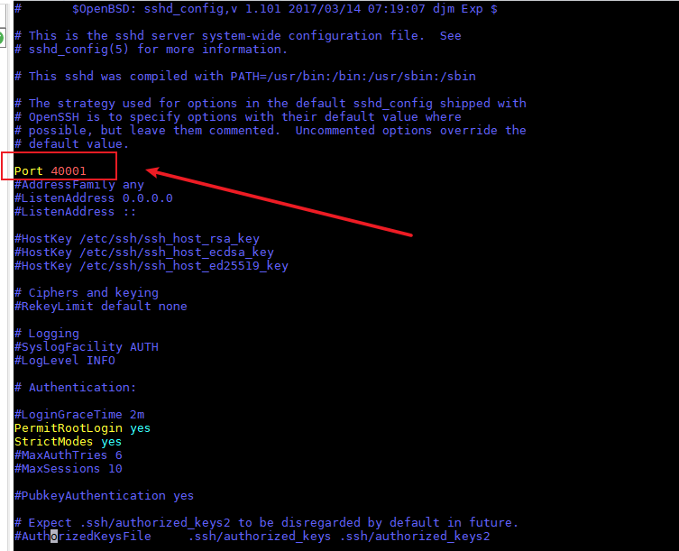

4.  设置容器的密码并重启容器SSH服务

    ```
    passwd ${user_name}
    service ssh start 
    ```

5.  在容器中使用工具。

    使用Xserver新建ssh连接，ip填写docker宿主机的ip，端口选择[3](#li1404101713543)中配置的端口号。（可选）

> **注意：** 
>当容器中没有配置与宿主机同uid、gid的用户时，挂载目录会被修改权限，可通过“sudo chown -R $\{user\}:$\{group\} $\{mount\_path\}”的方式修改挂载目录权限。

## 安装Python3.7.5（Ubuntu）<a name="ZH-CN_TOPIC_0000002408421450"></a>

1.  检查系统是否安装python3.7.5开发环境。

    分别使用命令**python3.7.5 --version**、**python3.7 --version**、**pip3.7.5 --version、pip3.7 --version**检查是否已经安装，如果返回如下信息则说明已经安装，否则请参见下一步。

    ```
    Python 3.7.5 
    pip 19.2.3 from /usr/local/python3.7.5/lib/python3.7/site-packages/pip (python 3.7)
    ```

2.  安装python3.7.5依赖的包。

    ```
    sudo apt-get install -y make zlib1g zlib1g-dev build-essential libbz2-dev libsqlite3-dev libssl-dev libxslt1-dev libffi-dev openssl python3-tk
    ```

    libsqlite3-dev需要在python安装之前安装，如果用户操作系统已经安装python3.7.5环境，在此之后再安装libsqlite3-dev，则需要重新编译python环境。如果安装python3-tk失败，请参见《AMCT使用指南（PyTorch）》中”安装python3-tk时提示错误信息”小节。

3.  安装python3.7.5。
    1.  使用wget下载python3.7.5源码包，可以下载到模型压缩工具所在服务器任意目录，命令为：

        ```
        wget https://www.python.org/ftp/python/3.7.5/Python-3.7.5.tgz
        ```

    2.  进入下载后的目录，解压源码包，命令为：

        ```
        tar -zxvf Python-3.7.5.tgz
        ```

    3.  进入解压后的文件夹，执行配置、编译和安装命令：

        ```
        cd Python-3.7.5
        ./configure --prefix=/usr/local/python3.7.5 --enable-loadable-sqlite-extensions --enable-shared
        make
        sudo make install
        ```

        其中“--prefix”参数用于指定python安装路径，用户根据实际情况进行修改，“--enable-shared”参数用于编译出libpython3.7m.so.1.0动态库，“--enable-loadable-sqlite-extensions”参数用于加载sqlite-devel依赖。

        本手册以--prefix=/usr/local/python3.7.5路径为例进行说明。执行配置、编译和安装命令后，安装包在/usr/local/python3.7.5路径，libpython3.7m.so.1.0动态库在/usr/local/python3.7.5/lib/libpython3.7m.so.1.0路径。

    4.  执行如下命令设置软链接：

        ```
        sudo ln -s /usr/local/python3.7.5/bin/python3 /usr/local/python3.7.5/bin/python3.7.5
        sudo ln -s /usr/local/python3.7.5/bin/pip3 /usr/local/python3.7.5/bin/pip3.7.5
        ```

    5.  设置python3.7.5环境变量。
        -   如果python安装用户为root：

            该场景下模型压缩工具使用root用户进行安装，请在当前终端窗口直接执行如下命令设置环境变量。

            ```
            #用于设置python3.7.5库文件路径
            export LD_LIBRARY_PATH=/usr/local/python3.7.5/lib:$LD_LIBRARY_PATH
            #如果用户环境存在多个python3版本，则指定使用python3.7.5版本
            export PATH=/usr/local/python3.7.5/bin:$PATH
            ```

            > **须知：** 
            >运行用户是root，不建议修改.bashrc，否则可能会影响其它系统提供的python工具的使用，如果仍想使用系统默认工具，则请重新开启终端窗口。

    -   如果python安装用户为非root：

        该场景下模型压缩工具使用非root用户进行安装，请以非root用户在任意目录下执行**vi \~/.bashrc**命令，打开**.bashrc**文件，在文件最后一行后面添加如下内容。

        ```
        #用于设置python3.7.5库文件路径
        export LD_LIBRARY_PATH=/usr/local/python3.7.5/lib:$LD_LIBRARY_PATH
        #如果用户环境存在多个python3版本，则指定使用python3.7.5版本
        export PATH=/usr/local/python3.7.5/bin:$PATH
        ```

        执行**:wq!**命令保存文件并退出，执行**source \~/.bashrc**命令使其立即生效。

1.  安装完成之后，执行如下命令查看安装版本，如果返回相关版本信息，则说明安装成功。

    ```
    python3.7.5 --version
    pip3.7.5  --version
    python3.7 --version
    pip3.7  --version
    ```

## 公网URL<a name="ZH-CN_TOPIC_0000002408581362"></a>

**表 1**  公网URL 说明

<a name="table464517672712"></a>
<table><thead align="left"><tr id="row1164615672716"><th class="cellrowborder" valign="top" width="14.371437143714372%" id="mcps1.2.4.1.1"><p id="p186462617271"><a name="p186462617271"></a><a name="p186462617271"></a>序号</p>
</th>
<th class="cellrowborder" valign="top" width="52.295229522952305%" id="mcps1.2.4.1.2"><p id="p36468652716"><a name="p36468652716"></a><a name="p36468652716"></a>URL地址</p>
</th>
<th class="cellrowborder" valign="top" width="33.33333333333333%" id="mcps1.2.4.1.3"><p id="p1664686142717"><a name="p1664686142717"></a><a name="p1664686142717"></a>说明</p>
</th>
</tr>
</thead>
<tbody><tr id="row1339111313103"><td class="cellrowborder" valign="top" width="14.371437143714372%" headers="mcps1.2.4.1.1 "><p id="p18401513121013"><a name="p18401513121013"></a><a name="p18401513121013"></a>1</p>
</td>
<td class="cellrowborder" valign="top" width="52.295229522952305%" headers="mcps1.2.4.1.2 "><p id="p6401013181015"><a name="p6401013181015"></a><a name="p6401013181015"></a><a href="http://releases.ubuntu.com/releases/" target="_blank" rel="noopener noreferrer">http://releases.ubuntu.com/releases/</a></p>
</td>
<td class="cellrowborder" valign="top" width="33.33333333333333%" headers="mcps1.2.4.1.3 "><p id="p1640181381014"><a name="p1640181381014"></a><a name="p1640181381014"></a>Ubuntu系统下载参考地址</p>
</td>
</tr>
</tbody>
</table>

## 使用alias别名简化输入命令<a name="ZH-CN_TOPIC_0000002441980721"></a>

常用命令可通过配置alias别名进行简化，示例如下。

```
alias mind_caffe="mindcmd oneclick caffe"
alias mind_torch="mindcmd oneclick pytorch"
alias mind_onnx="mindcmd oneclick onnx"
```

配置别名后，一键推理的简化命令为。

```
mind_caffe -m MODEL -w WEIGHT
mind_torch -m MODEL -i IMAGE_LIST --input_shape INPUT_SHAPE
mind_onnx -m MODEL -i IMAGE_LIST
```

> **说明：** 
>alias取名并非固定名称，用户可按需取名，简化MindCmd输入命令，也可将alias别名配置到\~/.bashrc中。

## FAQ<a name="ZH-CN_TOPIC_0000002442020469"></a>


### 挂载命令中的ip与服务器ip不符<a name="ZH-CN_TOPIC_0000002442020501"></a>

**问题描述<a name="section814174893417"></a>**

执行一键推理或上板推理时挂载失败，且挂载命令中的ip地址与服务器的ip不符。

如：服务器ip为xxx.xxx.xxx.xxx，挂载ip为127.0.1.1

出现如下报错：

```
RuntimeError: [Mount] Mount failed: mount: mounting 127.0.1.1:${MOUNT_PATH} on ${BOARD_PATH} failed: Connection timed out
```

**问题原因<a name="section1651035633412"></a>**

/etc/hosts 文件中配置了回环地址如：

```
127.0.0.1 localhost
127.0.1.1 ${hostname}
```

**解决方法<a name="section4878283512"></a>**

方法一：

将服务器侧的/etc/hosts 文件参考修改如下。

```
127.0.0.1 localhost
# 127.0.1.1 ${hostname}
```

方法二：

将hostname对应的ip修改为正确的ip。

```
127.0.0.1 localhost
xxx.xxx.xxx.xxx ${hostname}
```

> **说明：** 
>hostname可通过以下两种方法获取。
>方法一，执行hostname获取。
>```
>hostname
>```
>方法二，查看/etc/hostname文件。
>```
>vi /etc/hostname
>```

### 找不到mindcmd命令<a name="ZH-CN_TOPIC_0000002442020449"></a>

**问题描述<a name="section19224203143516"></a>**

执行mindcmd命令出现以下信息。

```
bash: mindcmd: command not found
```

**问题原因<a name="section71217393352"></a>**

python路径未配置到环境变量PATH中。mindcmd安装完成后会出现如下信息。

```
WARNING：The script mindcmd is installed in $HOME/.local/bin which is not on PATH.
```

**解决方法<a name="section1452244493519"></a>**

用户可通过以下命令进行配置环境变量。

```
export PATH=$PATH:$HOME/.local/bin
```

### 关于工作路径、挂载路径、数据卷路径和NFS共享路径<a name="ZH-CN_TOPIC_0000002408421510"></a>

对于工作路径、挂载路径、数据卷路径、NFS共享路径的描述如下。

-   工作路径确定MindCmd执行的工作空间，MindCmd生成的output文件等都会保存在该路径下。
-   挂载路径是由于板端硬件存储资源有限，因此需要将板端的某个目录挂载到服务器侧达到板端存储扩容的作用。在MindCmd上板执行过程中，此路径还用于服务器与板端的资源同步，上板执行所需要的输入和输出文件会被同步到该路径下。
-   数据卷路径标识宿主机（服务器）和Docker容器文件资源共享的范围，在此范围内，容器和宿主机都能访问该路径下的内容。
-   NFS共享路径是宿主机（服务器）配置的允许通过NFS服务共享宿主机资源的范围。

为了保证上板成功并能在容器中读取到上板生成的dump、profile等数据，要求配置上述路径的包含关系如下。

**NFS共享路径 \>= 数据卷路径 \>= 挂载路径 \>= 工作路径**

### MindCmd安装失败，找不到Rust编译器<a name="ZH-CN_TOPIC_0000002408581462"></a>

**问题描述<a name="section129959455713"></a>**

执行如下命令安装MindCmd。

```
pip install mindcmd-<version>-py3-none-linux_x86_64.tar.gz --user
```

提示以下错误，具体[图1](#fig1886312335)所示。

```
error: can't find Rust compiler
```

**图 1**  MindCmd安装失败，找不到Rust编译器<a name="fig1886312335"></a>  
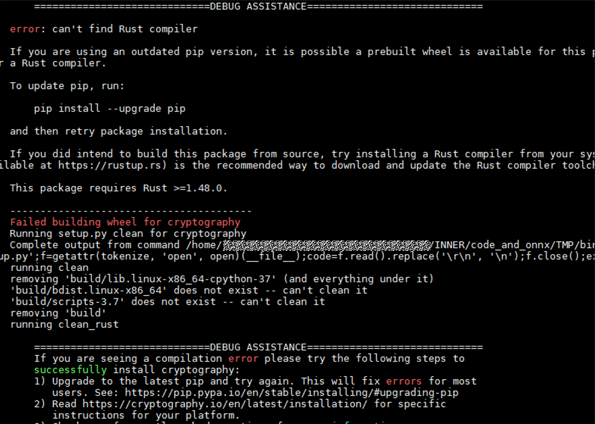

**问题原因<a name="section1012513370576"></a>**

MindCmd安装需要依赖Rust编译器。

**解决方法<a name="section10771439195116"></a>**

通过升级pip解决，命令如下。

```
pip install --upgrade pip
```

重新安装MindCmd

```
pip install mindcmd-<version>-py3-none-linux_x86_64.tar.gz --user
```

### PyTorch模型推理失败<a name="ZH-CN_TOPIC_0000002408421502"></a>

**问题描述<a name="section1270017492296"></a>**

PyTorch模型执行模型压缩的过程中模型推理失败，如[图1](#fig136999494298)所示。

**图 1**  PyTorch模型推理失败<a name="fig136999494298"></a>  
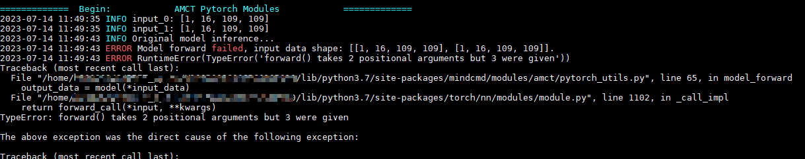

**问题原因<a name="section16316145615297"></a>**

可能是因为输入数据与模型的输入不符。

**解决方法<a name="section451938142019"></a>**

1.  使用原始模型进行推理，保证模型的正确性。
2.  调整输入数据，保证传入的数据与模型的输入相符。

### Pytorch模型推理报错<a name="ZH-CN_TOPIC_0000002408421410"></a>

**问题描述<a name="section1270017492296"></a>**

用户在Python脚本使用了argparse解析参数，调用MindCmd一键推理Pytorch模型时报错。

**问题原因<a name="section16316145615297"></a>**

用户使用自己的Python脚本，main方法中调用了argparse解析，与MindCmd的命令行参数产生冲突，导致MindCmd解析参数产生异常。如[图1](#fig224415441139)所示。

**图 1**  Python脚本中使用了argparse进行参数解析<a name="fig224415441139"></a>  
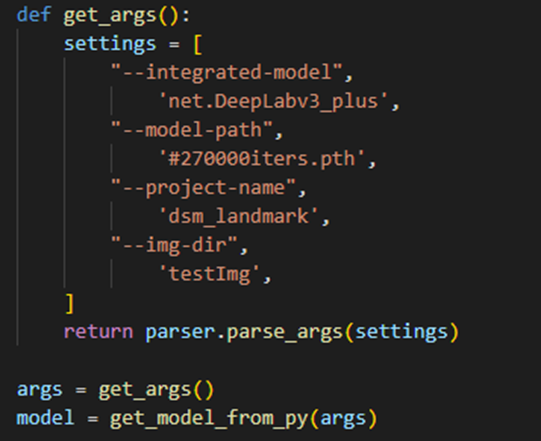

**解决方法<a name="section451938142019"></a>**

用户如果在Python脚本中有特定的参数传入需求，可以通过构造参数类传入，代替原有通过argparese解析的方式。如[图2](#fig49161240743)所示。

**图 2**  使用构造参数类传入参数<a name="fig49161240743"></a>  
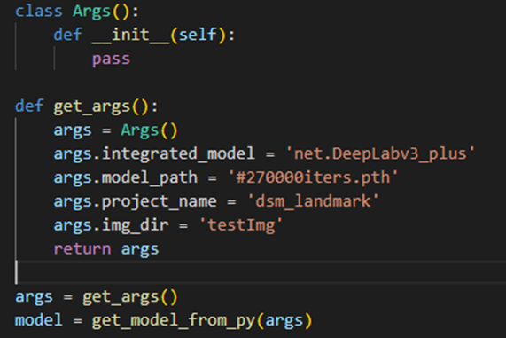

