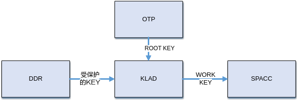
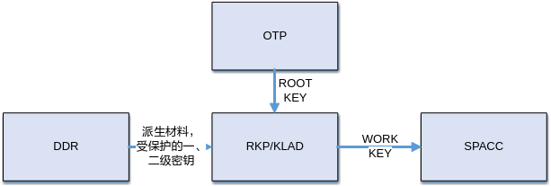

# 前言<a name="ZH-CN_TOPIC_0000002457828741"></a>

**概述<a name="section279mcpsimp"></a>**

OTP是一种非易失性存储器。其主要特性是对应存储空间的位内容由0写为1后，或根据锁机制，锁定对应的区域后，就不能再修改。OTP主要用于保存一些特定的数据，如用于CIPHER模块的root key，安全使能标志等信息。

> **说明：** 
>未有特殊说明，SS528V100与SS625V100、SS524V100与SS522V100、SS927V100与SS928V100内容一致。

**产品版本<a name="section286mcpsimp"></a>**

与本文档相对应的产品版本如下。

<a name="table289mcpsimp"></a>
<table><thead align="left"><tr id="row294mcpsimp"><th class="cellrowborder" valign="top" width="32%" id="mcps1.1.3.1.1"><p id="p296mcpsimp"><a name="p296mcpsimp"></a><a name="p296mcpsimp"></a>产品名称</p>
</th>
<th class="cellrowborder" valign="top" width="68%" id="mcps1.1.3.1.2"><p id="p298mcpsimp"><a name="p298mcpsimp"></a><a name="p298mcpsimp"></a>产品版本</p>
</th>
</tr>
</thead>
<tbody><tr id="row300mcpsimp"><td class="cellrowborder" valign="top" width="32%" headers="mcps1.1.3.1.1 "><p id="p302mcpsimp"><a name="p302mcpsimp"></a><a name="p302mcpsimp"></a>SS928</p>
</td>
<td class="cellrowborder" valign="top" width="68%" headers="mcps1.1.3.1.2 "><p id="p304mcpsimp"><a name="p304mcpsimp"></a><a name="p304mcpsimp"></a>V100</p>
</td>
</tr>
<tr id="row305mcpsimp"><td class="cellrowborder" valign="top" width="32%" headers="mcps1.1.3.1.1 "><p id="p307mcpsimp"><a name="p307mcpsimp"></a><a name="p307mcpsimp"></a>SS626</p>
</td>
<td class="cellrowborder" valign="top" width="68%" headers="mcps1.1.3.1.2 "><p id="p309mcpsimp"><a name="p309mcpsimp"></a><a name="p309mcpsimp"></a>V100</p>
</td>
</tr>
<tr id="row098721511379"><td class="cellrowborder" valign="top" width="32%" headers="mcps1.1.3.1.1 "><p id="p881081984715"><a name="p881081984715"></a><a name="p881081984715"></a>SS524</p>
</td>
<td class="cellrowborder" valign="top" width="68%" headers="mcps1.1.3.1.2 "><p id="p34921898474"><a name="p34921898474"></a><a name="p34921898474"></a>V100</p>
</td>
</tr>
<tr id="row055711773717"><td class="cellrowborder" valign="top" width="32%" headers="mcps1.1.3.1.1 "><p id="p255718172371"><a name="p255718172371"></a><a name="p255718172371"></a>SS522</p>
</td>
<td class="cellrowborder" valign="top" width="68%" headers="mcps1.1.3.1.2 "><p id="p18557131714372"><a name="p18557131714372"></a><a name="p18557131714372"></a>V100</p>
</td>
</tr>
<tr id="row14680716155410"><td class="cellrowborder" valign="top" width="32%" headers="mcps1.1.3.1.1 "><p id="p191707516282"><a name="p191707516282"></a><a name="p191707516282"></a>SS528</p>
</td>
<td class="cellrowborder" valign="top" width="68%" headers="mcps1.1.3.1.2 "><p id="p14171957287"><a name="p14171957287"></a><a name="p14171957287"></a>V100</p>
</td>
</tr>
<tr id="row547716911288"><td class="cellrowborder" valign="top" width="32%" headers="mcps1.1.3.1.1 "><p id="p4477491286"><a name="p4477491286"></a><a name="p4477491286"></a>SS625</p>
</td>
<td class="cellrowborder" valign="top" width="68%" headers="mcps1.1.3.1.2 "><p id="p647779132814"><a name="p647779132814"></a><a name="p647779132814"></a>V100</p>
</td>
</tr>
<tr id="row766620218412"><td class="cellrowborder" valign="top" width="32%" headers="mcps1.1.3.1.1 "><p id="p8622349102117"><a name="p8622349102117"></a><a name="p8622349102117"></a>SS927</p>
</td>
<td class="cellrowborder" valign="top" width="68%" headers="mcps1.1.3.1.2 "><p id="p9185184311112"><a name="p9185184311112"></a><a name="p9185184311112"></a>V100</p>
</td>
</tr>
</tbody>
</table>

**读者对象<a name="section310mcpsimp"></a>**

本文档（本指南）主要适用于以下工程师：

-   技术支持工程师
-   软件开发工程师

**符号约定<a name="section316mcpsimp"></a>**

在本文中可能出现下列标志，它们所代表的含义如下。

<a name="table319mcpsimp"></a>
<table><thead align="left"><tr id="row324mcpsimp"><th class="cellrowborder" valign="top" width="18%" id="mcps1.1.3.1.1"><p id="p326mcpsimp"><a name="p326mcpsimp"></a><a name="p326mcpsimp"></a>符号</p>
</th>
<th class="cellrowborder" valign="top" width="82%" id="mcps1.1.3.1.2"><p id="p328mcpsimp"><a name="p328mcpsimp"></a><a name="p328mcpsimp"></a>说明</p>
</th>
</tr>
</thead>
<tbody><tr id="row330mcpsimp"><td class="cellrowborder" valign="top" width="18%" headers="mcps1.1.3.1.1 "><p class="msonormal" id="p332mcpsimp"><a name="p332mcpsimp"></a><a name="p332mcpsimp"></a><a name="image108"></a><a name="image108"></a><span></span></p>
</td>
<td class="cellrowborder" valign="top" width="82%" headers="mcps1.1.3.1.2 "><p id="p334mcpsimp"><a name="p334mcpsimp"></a><a name="p334mcpsimp"></a>表示如不避免则将会导致死亡或严重伤害的具有高等级风险的危害。</p>
</td>
</tr>
<tr id="row335mcpsimp"><td class="cellrowborder" valign="top" width="18%" headers="mcps1.1.3.1.1 "><p class="msonormal" id="p337mcpsimp"><a name="p337mcpsimp"></a><a name="p337mcpsimp"></a><a name="image109"></a><a name="image109"></a><span></span></p>
</td>
<td class="cellrowborder" valign="top" width="82%" headers="mcps1.1.3.1.2 "><p id="p339mcpsimp"><a name="p339mcpsimp"></a><a name="p339mcpsimp"></a>表示如不避免则可能导致死亡或严重伤害的具有中等级风险的危害。</p>
</td>
</tr>
<tr id="row340mcpsimp"><td class="cellrowborder" valign="top" width="18%" headers="mcps1.1.3.1.1 "><p class="msonormal" id="p342mcpsimp"><a name="p342mcpsimp"></a><a name="p342mcpsimp"></a><a name="image110"></a><a name="image110"></a><span></span></p>
</td>
<td class="cellrowborder" valign="top" width="82%" headers="mcps1.1.3.1.2 "><p id="p344mcpsimp"><a name="p344mcpsimp"></a><a name="p344mcpsimp"></a>表示如不避免则可能导致轻微或中度伤害的具有低等级风险的危害。</p>
</td>
</tr>
<tr id="row345mcpsimp"><td class="cellrowborder" valign="top" width="18%" headers="mcps1.1.3.1.1 "><p class="msonormal" id="p347mcpsimp"><a name="p347mcpsimp"></a><a name="p347mcpsimp"></a><a name="image111"></a><a name="image111"></a><span></span></p>
</td>
<td class="cellrowborder" valign="top" width="82%" headers="mcps1.1.3.1.2 "><p id="p349mcpsimp"><a name="p349mcpsimp"></a><a name="p349mcpsimp"></a>用于传递设备或环境安全警示信息。如不避免则可能会导致设备损坏、数据丢失、设备性能降低或其它不可预知的结果。</p>
<p id="p350mcpsimp"><a name="p350mcpsimp"></a><a name="p350mcpsimp"></a>“须知”不涉及人身伤害。</p>
</td>
</tr>
<tr id="row351mcpsimp"><td class="cellrowborder" valign="top" width="18%" headers="mcps1.1.3.1.1 "><p class="msonormal" id="p353mcpsimp"><a name="p353mcpsimp"></a><a name="p353mcpsimp"></a><a name="image112"></a><a name="image112"></a><span></span></p>
</td>
<td class="cellrowborder" valign="top" width="82%" headers="mcps1.1.3.1.2 "><p id="p355mcpsimp"><a name="p355mcpsimp"></a><a name="p355mcpsimp"></a>对正文中重点信息的补充说明。</p>
<p id="p356mcpsimp"><a name="p356mcpsimp"></a><a name="p356mcpsimp"></a>“说明”不是安全警示信息，不涉及人身、设备及环境伤害信息。</p>
</td>
</tr>
</tbody>
</table>

**修订记录<a name="section357mcpsimp"></a>**

修订记录累积了每次文档更新的说明。最新版本的文档包含以前所有文档版本的更新内容。

<a name="table1557726816410"></a>
<table><thead align="left"><tr id="row2942532716410"><th class="cellrowborder" valign="top" width="20.72%" id="mcps1.1.4.1.1"><p id="p3778275416410"><a name="p3778275416410"></a><a name="p3778275416410"></a><strong id="b5687322716410"><a name="b5687322716410"></a><a name="b5687322716410"></a>文档版本</strong></p>
</th>
<th class="cellrowborder" valign="top" width="26.119999999999997%" id="mcps1.1.4.1.2"><p id="p5627845516410"><a name="p5627845516410"></a><a name="p5627845516410"></a><strong id="b5800814916410"><a name="b5800814916410"></a><a name="b5800814916410"></a>发布日期</strong></p>
</th>
<th class="cellrowborder" valign="top" width="53.16%" id="mcps1.1.4.1.3"><p id="p2382284816410"><a name="p2382284816410"></a><a name="p2382284816410"></a><strong id="b3316380216410"><a name="b3316380216410"></a><a name="b3316380216410"></a>修改说明</strong></p>
</th>
</tr>
</thead>
<tbody><tr id="row5947359616410"><td class="cellrowborder" valign="top" width="20.72%" headers="mcps1.1.4.1.1 "><p id="p2149706016410"><a name="p2149706016410"></a><a name="p2149706016410"></a>00B01</p>
</td>
<td class="cellrowborder" valign="top" width="26.119999999999997%" headers="mcps1.1.4.1.2 "><p id="p648803616410"><a name="p648803616410"></a><a name="p648803616410"></a>2025-09-15</p>
</td>
<td class="cellrowborder" valign="top" width="53.16%" headers="mcps1.1.4.1.3 "><p id="p1946537916410"><a name="p1946537916410"></a><a name="p1946537916410"></a>第1次临时版本发布。</p>
</td>
</tr>
</tbody>
</table>

# 概述<a name="ZH-CN_TOPIC_0000002457868873"></a>

OTP模块提供驱动一次性编程的MPI接口，实现CIPHER模块root key烧写，jtag key烧写，key烧写状态校验，用户预留空间数据读写等功能。


## OTP中密钥使用机制<a name="ZH-CN_TOPIC_0000002457868861"></a>

**图 1**  SS528V100、SS524V100 OTP中密钥使用机制<a name="fig46402535464"></a>  


**图 2**  SS928V100、SS626V100 OTP中密钥使用机制<a name="fig12487132617471"></a>  


## OTP使用注意事项<a name="ZH-CN_TOPIC_0000002424349942"></a>

OTP部署在不同场景下时，使用方式可能会有所不同。

-   在Linux环境下
    -   用户态使用OTP可以通过链接静态库libss\_otp.a或动态库libss\_otp.so的方式，依赖libsecurec.a或libsecurec.so。
    -   内核态OTP使用模块插入方式，即insmod ot\_otp.ko，需要依赖ot\_osal.ko，ot\_base.ko，sys\_config.ko，ot\_sys.ko。

-   在OPTEE环境下，用户态调用OTP对外接口由Linux环境下的ss\_mpi\_xxx命名形式对应更改为ot\_tee\_xxx。
-   在UBOOT环境下，用户态调用OTP对外接口由Linux环境下的ss\_mpi\_xxx命名形式对应变更为ot\_mpi\_xxx。

# API参考<a name="ZH-CN_TOPIC_0000002424190114"></a>

OTP提供以下API：

-   [ss\_mpi\_otp\_init](#ZH-CN_TOPIC_0000002457868853)：初始化OTP模块。
-   [ss\_mpi\_otp\_deinit](#ZH-CN_TOPIC_0000002457828757)：去初始化OTP模块。
-   [ss\_mpi\_otp\_set\_user\_data](#ZH-CN_TOPIC_0000002457828753)：设置OTP用户空间数据。
-   [ss\_mpi\_otp\_get\_user\_data](#ZH-CN_TOPIC_0000002424349934)：读取OTP用户空间数据。
-   [ss\_mpi\_otp\_set\_user\_data\_lock](#ZH-CN_TOPIC_0000002424349926)：设置OTP用户数据锁
-   [ss\_mpi\_otp\_get\_user\_data\_lock](#ZH-CN_TOPIC_0000002457868865)：获取OTP用户数据锁
-   [ss\_mpi\_otp\_burn\_product\_pv](#ZH-CN_TOPIC_0000002424190098)：烧写PV的数据和锁标志到芯片内部OTP。
-   [ss\_mpi\_otp\_read\_product\_pv](#ZH-CN_TOPIC_0000002424349922)：获取芯片内部OTP的PV数据或锁标志。
-   [ss\_mpi\_otp\_get\_key\_verify\_status](#ZH-CN_TOPIC_0000002457828745)：获取芯片内部OTP中存储KEY的校验状态。


## ss\_mpi\_otp\_init<a name="ZH-CN_TOPIC_0000002457868853"></a>

【描述】

初始化OTP模块。

【语法】

```
td_s32 ss_mpi_otp_init(td_void);
```

【参数】

无。

【返回值】

<a name="table551mcpsimp"></a>
<table><thead align="left"><tr id="row556mcpsimp"><th class="cellrowborder" valign="top" width="50%" id="mcps1.1.3.1.1"><p id="p558mcpsimp"><a name="p558mcpsimp"></a><a name="p558mcpsimp"></a>返回值</p>
</th>
<th class="cellrowborder" valign="top" width="50%" id="mcps1.1.3.1.2"><p id="p560mcpsimp"><a name="p560mcpsimp"></a><a name="p560mcpsimp"></a>描述</p>
</th>
</tr>
</thead>
<tbody><tr id="row562mcpsimp"><td class="cellrowborder" valign="top" width="50%" headers="mcps1.1.3.1.1 "><p id="p564mcpsimp"><a name="p564mcpsimp"></a><a name="p564mcpsimp"></a>0</p>
</td>
<td class="cellrowborder" valign="top" width="50%" headers="mcps1.1.3.1.2 "><p id="p566mcpsimp"><a name="p566mcpsimp"></a><a name="p566mcpsimp"></a>成功。</p>
</td>
</tr>
<tr id="row567mcpsimp"><td class="cellrowborder" valign="top" width="50%" headers="mcps1.1.3.1.1 "><p id="p569mcpsimp"><a name="p569mcpsimp"></a><a name="p569mcpsimp"></a>非0</p>
</td>
<td class="cellrowborder" valign="top" width="50%" headers="mcps1.1.3.1.2 "><p id="p571mcpsimp"><a name="p571mcpsimp"></a><a name="p571mcpsimp"></a>参见<a href="#ZH-CN_TOPIC_0000002424349930">错误码</a>。</p>
</td>
</tr>
</tbody>
</table>

【需求】

-   头文件：ot\_common\_otp.h、ss\_mpi\_otp.h
-   库文件：libss\_otp.a

【注意】

初始化和去初始化必须成对存在。

【举例】

无。

## ss\_mpi\_otp\_deinit<a name="ZH-CN_TOPIC_0000002457828757"></a>

【描述】

去初始化OTP模块。

【语法】

```
td_s32 ss_mpi_otp_deinit(td_void);
```

【参数】

无。

【返回值】

<a name="table1153mcpsimp"></a>
<table><thead align="left"><tr id="row1158mcpsimp"><th class="cellrowborder" valign="top" width="50%" id="mcps1.1.3.1.1"><p id="p1160mcpsimp"><a name="p1160mcpsimp"></a><a name="p1160mcpsimp"></a>返回值</p>
</th>
<th class="cellrowborder" valign="top" width="50%" id="mcps1.1.3.1.2"><p id="p1162mcpsimp"><a name="p1162mcpsimp"></a><a name="p1162mcpsimp"></a>描述</p>
</th>
</tr>
</thead>
<tbody><tr id="row1164mcpsimp"><td class="cellrowborder" valign="top" width="50%" headers="mcps1.1.3.1.1 "><p id="p1166mcpsimp"><a name="p1166mcpsimp"></a><a name="p1166mcpsimp"></a>0</p>
</td>
<td class="cellrowborder" valign="top" width="50%" headers="mcps1.1.3.1.2 "><p id="p1168mcpsimp"><a name="p1168mcpsimp"></a><a name="p1168mcpsimp"></a>成功。</p>
</td>
</tr>
<tr id="row1169mcpsimp"><td class="cellrowborder" valign="top" width="50%" headers="mcps1.1.3.1.1 "><p id="p1171mcpsimp"><a name="p1171mcpsimp"></a><a name="p1171mcpsimp"></a>非0</p>
</td>
<td class="cellrowborder" valign="top" width="50%" headers="mcps1.1.3.1.2 "><p id="p1173mcpsimp"><a name="p1173mcpsimp"></a><a name="p1173mcpsimp"></a>参见<a href="#ZH-CN_TOPIC_0000002424349930">错误码</a>。</p>
</td>
</tr>
</tbody>
</table>

【需求】

-   头文件：ot\_common\_otp.h、ss\_mpi\_otp.h
-   库文件：libss\_otp.a

【注意】

初始化和去初始化必须成对存在。

【举例】

无。

## ss\_mpi\_otp\_set\_user\_data<a name="ZH-CN_TOPIC_0000002457828753"></a>

【描述】

设置OTP用户空间数据。

【语法】

```
td_s32 ss_mpi_otp_set_user_data(const td_char *field_name, td_u32 offset, const td_u8 *value, td_u32 value_len);
```

【参数】

<a name="table181mcpsimp"></a>
<table><thead align="left"><tr id="row187mcpsimp"><th class="cellrowborder" valign="top" width="21%" id="mcps1.1.4.1.1"><p id="p189mcpsimp"><a name="p189mcpsimp"></a><a name="p189mcpsimp"></a>参数名称</p>
</th>
<th class="cellrowborder" valign="top" width="62%" id="mcps1.1.4.1.2"><p id="p191mcpsimp"><a name="p191mcpsimp"></a><a name="p191mcpsimp"></a>描述</p>
</th>
<th class="cellrowborder" valign="top" width="17%" id="mcps1.1.4.1.3"><p id="p193mcpsimp"><a name="p193mcpsimp"></a><a name="p193mcpsimp"></a>输入/输出</p>
</th>
</tr>
</thead>
<tbody><tr id="row195mcpsimp"><td class="cellrowborder" valign="top" width="21%" headers="mcps1.1.4.1.1 "><p id="p197mcpsimp"><a name="p197mcpsimp"></a><a name="p197mcpsimp"></a>field_name</p>
</td>
<td class="cellrowborder" valign="top" width="62%" headers="mcps1.1.4.1.2 "><p id="p199mcpsimp"><a name="p199mcpsimp"></a><a name="p199mcpsimp"></a>字段名称。</p>
</td>
<td class="cellrowborder" valign="top" width="17%" headers="mcps1.1.4.1.3 "><p id="p201mcpsimp"><a name="p201mcpsimp"></a><a name="p201mcpsimp"></a>输入</p>
</td>
</tr>
<tr id="row202mcpsimp"><td class="cellrowborder" valign="top" width="21%" headers="mcps1.1.4.1.1 "><p id="p204mcpsimp"><a name="p204mcpsimp"></a><a name="p204mcpsimp"></a>offset</p>
</td>
<td class="cellrowborder" valign="top" width="62%" headers="mcps1.1.4.1.2 "><p id="p206mcpsimp"><a name="p206mcpsimp"></a><a name="p206mcpsimp"></a>OTP用户空间地址偏移。</p>
</td>
<td class="cellrowborder" valign="top" width="17%" headers="mcps1.1.4.1.3 "><p id="p208mcpsimp"><a name="p208mcpsimp"></a><a name="p208mcpsimp"></a>输入</p>
</td>
</tr>
<tr id="row209mcpsimp"><td class="cellrowborder" valign="top" width="21%" headers="mcps1.1.4.1.1 "><p id="p211mcpsimp"><a name="p211mcpsimp"></a><a name="p211mcpsimp"></a>value</p>
</td>
<td class="cellrowborder" valign="top" width="62%" headers="mcps1.1.4.1.2 "><p id="p213mcpsimp"><a name="p213mcpsimp"></a><a name="p213mcpsimp"></a>设置的用户空间数据。</p>
</td>
<td class="cellrowborder" valign="top" width="17%" headers="mcps1.1.4.1.3 "><p id="p215mcpsimp"><a name="p215mcpsimp"></a><a name="p215mcpsimp"></a>输入</p>
</td>
</tr>
<tr id="row216mcpsimp"><td class="cellrowborder" valign="top" width="21%" headers="mcps1.1.4.1.1 "><p id="p218mcpsimp"><a name="p218mcpsimp"></a><a name="p218mcpsimp"></a>value_len</p>
</td>
<td class="cellrowborder" valign="top" width="62%" headers="mcps1.1.4.1.2 "><p id="p220mcpsimp"><a name="p220mcpsimp"></a><a name="p220mcpsimp"></a>设置的用户空间数据长度（单位：byte）。</p>
</td>
<td class="cellrowborder" valign="top" width="17%" headers="mcps1.1.4.1.3 "><p id="p222mcpsimp"><a name="p222mcpsimp"></a><a name="p222mcpsimp"></a>输入</p>
</td>
</tr>
</tbody>
</table>

【返回值】

<a name="table224mcpsimp"></a>
<table><thead align="left"><tr id="row229mcpsimp"><th class="cellrowborder" valign="top" width="50%" id="mcps1.1.3.1.1"><p id="p231mcpsimp"><a name="p231mcpsimp"></a><a name="p231mcpsimp"></a>返回值</p>
</th>
<th class="cellrowborder" valign="top" width="50%" id="mcps1.1.3.1.2"><p id="p233mcpsimp"><a name="p233mcpsimp"></a><a name="p233mcpsimp"></a>描述</p>
</th>
</tr>
</thead>
<tbody><tr id="row235mcpsimp"><td class="cellrowborder" valign="top" width="50%" headers="mcps1.1.3.1.1 "><p id="p237mcpsimp"><a name="p237mcpsimp"></a><a name="p237mcpsimp"></a>0</p>
</td>
<td class="cellrowborder" valign="top" width="50%" headers="mcps1.1.3.1.2 "><p id="p239mcpsimp"><a name="p239mcpsimp"></a><a name="p239mcpsimp"></a>成功。</p>
</td>
</tr>
<tr id="row240mcpsimp"><td class="cellrowborder" valign="top" width="50%" headers="mcps1.1.3.1.1 "><p id="p242mcpsimp"><a name="p242mcpsimp"></a><a name="p242mcpsimp"></a>非0</p>
</td>
<td class="cellrowborder" valign="top" width="50%" headers="mcps1.1.3.1.2 "><p id="p244mcpsimp"><a name="p244mcpsimp"></a><a name="p244mcpsimp"></a>参见<a href="#ZH-CN_TOPIC_0000002424349930">错误码</a>。</p>
</td>
</tr>
</tbody>
</table>

【需求】

-   头文件：ot\_common\_otp.h、ss\_mpi\_otp.h
-   库文件：libss\_otp.a

【注意】

-   参数field\_name设定参考《安全子系统使用说明》2.2章节“SSxxxx OTP字段定义”中“字段名称”列。
-   offset必须 4 字节对齐。
-   value\_len为value的字节长度。
-   参数offset，value\_len取值范围参考《安全子系统使用说明》2.2章节“SSxxxx OTP字段定义”中“位宽”列。offset + value\_len不能大于最大字节长度。

【举例】

无。

## ss\_mpi\_otp\_get\_user\_data<a name="ZH-CN_TOPIC_0000002424349934"></a>

【描述】

获取OTP用户空间数据。

【语法】

```
td_s32 ss_mpi_otp_get_user_data(const td_char *field_name, td_u32 offset, td_u8 *value, td_u32 value_len);
```

【参数】

<a name="table587mcpsimp"></a>
<table><thead align="left"><tr id="row593mcpsimp"><th class="cellrowborder" valign="top" width="17.82%" id="mcps1.1.4.1.1"><p id="p595mcpsimp"><a name="p595mcpsimp"></a><a name="p595mcpsimp"></a>参数名称</p>
</th>
<th class="cellrowborder" valign="top" width="65.35%" id="mcps1.1.4.1.2"><p id="p597mcpsimp"><a name="p597mcpsimp"></a><a name="p597mcpsimp"></a>描述</p>
</th>
<th class="cellrowborder" valign="top" width="16.830000000000002%" id="mcps1.1.4.1.3"><p id="p599mcpsimp"><a name="p599mcpsimp"></a><a name="p599mcpsimp"></a>输入/输出</p>
</th>
</tr>
</thead>
<tbody><tr id="row600mcpsimp"><td class="cellrowborder" valign="top" width="17.82%" headers="mcps1.1.4.1.1 "><p id="p602mcpsimp"><a name="p602mcpsimp"></a><a name="p602mcpsimp"></a>field_name</p>
</td>
<td class="cellrowborder" valign="top" width="65.35%" headers="mcps1.1.4.1.2 "><p id="p604mcpsimp"><a name="p604mcpsimp"></a><a name="p604mcpsimp"></a>字段名称。</p>
</td>
<td class="cellrowborder" valign="top" width="16.830000000000002%" headers="mcps1.1.4.1.3 "><p id="p606mcpsimp"><a name="p606mcpsimp"></a><a name="p606mcpsimp"></a>输入</p>
</td>
</tr>
<tr id="row607mcpsimp"><td class="cellrowborder" valign="top" width="17.82%" headers="mcps1.1.4.1.1 "><p id="p609mcpsimp"><a name="p609mcpsimp"></a><a name="p609mcpsimp"></a>offset</p>
</td>
<td class="cellrowborder" valign="top" width="65.35%" headers="mcps1.1.4.1.2 "><p id="p611mcpsimp"><a name="p611mcpsimp"></a><a name="p611mcpsimp"></a>OTP用户空间地址偏移。</p>
</td>
<td class="cellrowborder" valign="top" width="16.830000000000002%" headers="mcps1.1.4.1.3 "><p id="p613mcpsimp"><a name="p613mcpsimp"></a><a name="p613mcpsimp"></a>输入</p>
</td>
</tr>
<tr id="row614mcpsimp"><td class="cellrowborder" valign="top" width="17.82%" headers="mcps1.1.4.1.1 "><p id="p616mcpsimp"><a name="p616mcpsimp"></a><a name="p616mcpsimp"></a>value</p>
</td>
<td class="cellrowborder" valign="top" width="65.35%" headers="mcps1.1.4.1.2 "><p id="p618mcpsimp"><a name="p618mcpsimp"></a><a name="p618mcpsimp"></a>获取的用户空间数据。</p>
</td>
<td class="cellrowborder" valign="top" width="16.830000000000002%" headers="mcps1.1.4.1.3 "><p id="p620mcpsimp"><a name="p620mcpsimp"></a><a name="p620mcpsimp"></a>输出</p>
</td>
</tr>
<tr id="row621mcpsimp"><td class="cellrowborder" valign="top" width="17.82%" headers="mcps1.1.4.1.1 "><p id="p623mcpsimp"><a name="p623mcpsimp"></a><a name="p623mcpsimp"></a>value_len</p>
</td>
<td class="cellrowborder" valign="top" width="65.35%" headers="mcps1.1.4.1.2 "><p id="p625mcpsimp"><a name="p625mcpsimp"></a><a name="p625mcpsimp"></a>获取的用户空间数据长度（单位：byte）。</p>
</td>
<td class="cellrowborder" valign="top" width="16.830000000000002%" headers="mcps1.1.4.1.3 "><p id="p627mcpsimp"><a name="p627mcpsimp"></a><a name="p627mcpsimp"></a>输入</p>
</td>
</tr>
</tbody>
</table>

【返回值】

<a name="table629mcpsimp"></a>
<table><thead align="left"><tr id="row634mcpsimp"><th class="cellrowborder" valign="top" width="50%" id="mcps1.1.3.1.1"><p id="p636mcpsimp"><a name="p636mcpsimp"></a><a name="p636mcpsimp"></a>返回值</p>
</th>
<th class="cellrowborder" valign="top" width="50%" id="mcps1.1.3.1.2"><p id="p638mcpsimp"><a name="p638mcpsimp"></a><a name="p638mcpsimp"></a>描述</p>
</th>
</tr>
</thead>
<tbody><tr id="row640mcpsimp"><td class="cellrowborder" valign="top" width="50%" headers="mcps1.1.3.1.1 "><p id="p642mcpsimp"><a name="p642mcpsimp"></a><a name="p642mcpsimp"></a>0</p>
</td>
<td class="cellrowborder" valign="top" width="50%" headers="mcps1.1.3.1.2 "><p id="p644mcpsimp"><a name="p644mcpsimp"></a><a name="p644mcpsimp"></a>成功。</p>
</td>
</tr>
<tr id="row645mcpsimp"><td class="cellrowborder" valign="top" width="50%" headers="mcps1.1.3.1.1 "><p id="p647mcpsimp"><a name="p647mcpsimp"></a><a name="p647mcpsimp"></a>非0</p>
</td>
<td class="cellrowborder" valign="top" width="50%" headers="mcps1.1.3.1.2 "><p id="p649mcpsimp"><a name="p649mcpsimp"></a><a name="p649mcpsimp"></a>参见<a href="#ZH-CN_TOPIC_0000002424349930">错误码</a>。</p>
</td>
</tr>
</tbody>
</table>

【需求】

-   头文件：ot\_common\_otp.h、ss\_mpi\_otp.h
-   库文件：libss\_otp.a

【注意】

-   参数field\_name设定参考《安全子系统使用说明》2.2章节“SSxxxx OTP字段定义”中“字段名称”列。
-   offset 必须 4 字节对齐。
-   value\_len 为value字节长度。
-   参数offset，value\_len取值范围参考《安全子系统使用说明》2.2章节“SSxxxx OTP字段定义”中“位宽”列。offset + value\_len 不能大于最大取值。

【举例】

无。

## ss\_mpi\_otp\_set\_user\_data\_lock<a name="ZH-CN_TOPIC_0000002424349926"></a>

【描述】

设置OTP用户空间数据锁。

【语法】

```
td_s32 ss_mpi_otp_set_user_data_lock(const td_char *field_name, td_u32 offset, td_u32 value_len);
```

【参数】

<a name="table366mcpsimp"></a>
<table><thead align="left"><tr id="row372mcpsimp"><th class="cellrowborder" valign="top" width="17.82%" id="mcps1.1.4.1.1"><p id="p374mcpsimp"><a name="p374mcpsimp"></a><a name="p374mcpsimp"></a>参数名称</p>
</th>
<th class="cellrowborder" valign="top" width="65.35%" id="mcps1.1.4.1.2"><p id="p376mcpsimp"><a name="p376mcpsimp"></a><a name="p376mcpsimp"></a>描述</p>
</th>
<th class="cellrowborder" valign="top" width="16.830000000000002%" id="mcps1.1.4.1.3"><p id="p378mcpsimp"><a name="p378mcpsimp"></a><a name="p378mcpsimp"></a>输入/输出</p>
</th>
</tr>
</thead>
<tbody><tr id="row379mcpsimp"><td class="cellrowborder" valign="top" width="17.82%" headers="mcps1.1.4.1.1 "><p id="p381mcpsimp"><a name="p381mcpsimp"></a><a name="p381mcpsimp"></a>field_name</p>
</td>
<td class="cellrowborder" valign="top" width="65.35%" headers="mcps1.1.4.1.2 "><p id="p383mcpsimp"><a name="p383mcpsimp"></a><a name="p383mcpsimp"></a>字段名称。</p>
</td>
<td class="cellrowborder" valign="top" width="16.830000000000002%" headers="mcps1.1.4.1.3 "><p id="p385mcpsimp"><a name="p385mcpsimp"></a><a name="p385mcpsimp"></a>输入</p>
</td>
</tr>
<tr id="row386mcpsimp"><td class="cellrowborder" valign="top" width="17.82%" headers="mcps1.1.4.1.1 "><p id="p388mcpsimp"><a name="p388mcpsimp"></a><a name="p388mcpsimp"></a>offset</p>
</td>
<td class="cellrowborder" valign="top" width="65.35%" headers="mcps1.1.4.1.2 "><p id="p390mcpsimp"><a name="p390mcpsimp"></a><a name="p390mcpsimp"></a>OTP用户空间地址偏移。</p>
</td>
<td class="cellrowborder" valign="top" width="16.830000000000002%" headers="mcps1.1.4.1.3 "><p id="p392mcpsimp"><a name="p392mcpsimp"></a><a name="p392mcpsimp"></a>输入</p>
</td>
</tr>
<tr id="row393mcpsimp"><td class="cellrowborder" valign="top" width="17.82%" headers="mcps1.1.4.1.1 "><p id="p395mcpsimp"><a name="p395mcpsimp"></a><a name="p395mcpsimp"></a>value_len</p>
</td>
<td class="cellrowborder" valign="top" width="65.35%" headers="mcps1.1.4.1.2 "><p id="p397mcpsimp"><a name="p397mcpsimp"></a><a name="p397mcpsimp"></a>获取的用户空间数据锁长度（单位：byte）。</p>
</td>
<td class="cellrowborder" valign="top" width="16.830000000000002%" headers="mcps1.1.4.1.3 "><p id="p399mcpsimp"><a name="p399mcpsimp"></a><a name="p399mcpsimp"></a>输入</p>
</td>
</tr>
</tbody>
</table>

【返回值】

<a name="table401mcpsimp"></a>
<table><thead align="left"><tr id="row406mcpsimp"><th class="cellrowborder" valign="top" width="50%" id="mcps1.1.3.1.1"><p id="p408mcpsimp"><a name="p408mcpsimp"></a><a name="p408mcpsimp"></a>返回值</p>
</th>
<th class="cellrowborder" valign="top" width="50%" id="mcps1.1.3.1.2"><p id="p410mcpsimp"><a name="p410mcpsimp"></a><a name="p410mcpsimp"></a>描述</p>
</th>
</tr>
</thead>
<tbody><tr id="row412mcpsimp"><td class="cellrowborder" valign="top" width="50%" headers="mcps1.1.3.1.1 "><p id="p414mcpsimp"><a name="p414mcpsimp"></a><a name="p414mcpsimp"></a>0</p>
</td>
<td class="cellrowborder" valign="top" width="50%" headers="mcps1.1.3.1.2 "><p id="p416mcpsimp"><a name="p416mcpsimp"></a><a name="p416mcpsimp"></a>成功。</p>
</td>
</tr>
<tr id="row417mcpsimp"><td class="cellrowborder" valign="top" width="50%" headers="mcps1.1.3.1.1 "><p id="p419mcpsimp"><a name="p419mcpsimp"></a><a name="p419mcpsimp"></a>非0</p>
</td>
<td class="cellrowborder" valign="top" width="50%" headers="mcps1.1.3.1.2 "><p id="p421mcpsimp"><a name="p421mcpsimp"></a><a name="p421mcpsimp"></a>参见<a href="#ZH-CN_TOPIC_0000002424349930">错误码</a>。</p>
</td>
</tr>
</tbody>
</table>

【需求】

-   头文件：ot\_common\_otp.h、ss\_mpi\_otp.h
-   库文件：libss\_otp.a

【注意】

-   参数field\_name设定参考《安全子系统使用说明》2.2章节“SSxxxx OTP字段定义”中“字段名称”列。
-   offset 必须 4 字节对齐。
-   参数offset，value\_len取值范围参考《安全子系统使用说明》2.2章节“SSxxxx OTP字段定义定义”中“位宽”列。offset + value\_len 不能大于最大取值。
-   SS528V100、SS524V100 不支持该接口。

【举例】

无。

## ss\_mpi\_otp\_get\_user\_data\_lock<a name="ZH-CN_TOPIC_0000002457868865"></a>

【描述】

获取OTP用户空间数据锁。

【语法】

```
td_s32 ss_mpi_otp_get_user_data_lock(const td_char *field_name, td_u32 offset, td_u32 value_len, ot_otp_lock_status *lock);
```

【参数】

<a name="table741mcpsimp"></a>
<table><thead align="left"><tr id="row747mcpsimp"><th class="cellrowborder" valign="top" width="17.82%" id="mcps1.1.4.1.1"><p id="p749mcpsimp"><a name="p749mcpsimp"></a><a name="p749mcpsimp"></a>参数名称</p>
</th>
<th class="cellrowborder" valign="top" width="65.35%" id="mcps1.1.4.1.2"><p id="p751mcpsimp"><a name="p751mcpsimp"></a><a name="p751mcpsimp"></a>描述</p>
</th>
<th class="cellrowborder" valign="top" width="16.830000000000002%" id="mcps1.1.4.1.3"><p id="p753mcpsimp"><a name="p753mcpsimp"></a><a name="p753mcpsimp"></a>输入/输出</p>
</th>
</tr>
</thead>
<tbody><tr id="row754mcpsimp"><td class="cellrowborder" valign="top" width="17.82%" headers="mcps1.1.4.1.1 "><p id="p756mcpsimp"><a name="p756mcpsimp"></a><a name="p756mcpsimp"></a>field_name</p>
</td>
<td class="cellrowborder" valign="top" width="65.35%" headers="mcps1.1.4.1.2 "><p id="p758mcpsimp"><a name="p758mcpsimp"></a><a name="p758mcpsimp"></a>字段名称。</p>
</td>
<td class="cellrowborder" valign="top" width="16.830000000000002%" headers="mcps1.1.4.1.3 "><p id="p760mcpsimp"><a name="p760mcpsimp"></a><a name="p760mcpsimp"></a>输入</p>
</td>
</tr>
<tr id="row761mcpsimp"><td class="cellrowborder" valign="top" width="17.82%" headers="mcps1.1.4.1.1 "><p id="p763mcpsimp"><a name="p763mcpsimp"></a><a name="p763mcpsimp"></a>offset</p>
</td>
<td class="cellrowborder" valign="top" width="65.35%" headers="mcps1.1.4.1.2 "><p id="p765mcpsimp"><a name="p765mcpsimp"></a><a name="p765mcpsimp"></a>OTP用户空间地址偏移。</p>
</td>
<td class="cellrowborder" valign="top" width="16.830000000000002%" headers="mcps1.1.4.1.3 "><p id="p767mcpsimp"><a name="p767mcpsimp"></a><a name="p767mcpsimp"></a>输入</p>
</td>
</tr>
<tr id="row768mcpsimp"><td class="cellrowborder" valign="top" width="17.82%" headers="mcps1.1.4.1.1 "><p id="p770mcpsimp"><a name="p770mcpsimp"></a><a name="p770mcpsimp"></a>value_len</p>
</td>
<td class="cellrowborder" valign="top" width="65.35%" headers="mcps1.1.4.1.2 "><p id="p772mcpsimp"><a name="p772mcpsimp"></a><a name="p772mcpsimp"></a>获取的用户空间数据锁长度（单位：byte）。</p>
</td>
<td class="cellrowborder" valign="top" width="16.830000000000002%" headers="mcps1.1.4.1.3 "><p id="p774mcpsimp"><a name="p774mcpsimp"></a><a name="p774mcpsimp"></a>输入</p>
</td>
</tr>
<tr id="row775mcpsimp"><td class="cellrowborder" valign="top" width="17.82%" headers="mcps1.1.4.1.1 "><p id="p777mcpsimp"><a name="p777mcpsimp"></a><a name="p777mcpsimp"></a>lock</p>
</td>
<td class="cellrowborder" valign="top" width="65.35%" headers="mcps1.1.4.1.2 "><p id="p779mcpsimp"><a name="p779mcpsimp"></a><a name="p779mcpsimp"></a>获取的锁状态。</p>
</td>
<td class="cellrowborder" valign="top" width="16.830000000000002%" headers="mcps1.1.4.1.3 "><p id="p781mcpsimp"><a name="p781mcpsimp"></a><a name="p781mcpsimp"></a>输出</p>
</td>
</tr>
</tbody>
</table>

【返回值】

<a name="table783mcpsimp"></a>
<table><thead align="left"><tr id="row788mcpsimp"><th class="cellrowborder" valign="top" width="50%" id="mcps1.1.3.1.1"><p id="p790mcpsimp"><a name="p790mcpsimp"></a><a name="p790mcpsimp"></a>返回值</p>
</th>
<th class="cellrowborder" valign="top" width="50%" id="mcps1.1.3.1.2"><p id="p792mcpsimp"><a name="p792mcpsimp"></a><a name="p792mcpsimp"></a>描述</p>
</th>
</tr>
</thead>
<tbody><tr id="row794mcpsimp"><td class="cellrowborder" valign="top" width="50%" headers="mcps1.1.3.1.1 "><p id="p796mcpsimp"><a name="p796mcpsimp"></a><a name="p796mcpsimp"></a>0</p>
</td>
<td class="cellrowborder" valign="top" width="50%" headers="mcps1.1.3.1.2 "><p id="p798mcpsimp"><a name="p798mcpsimp"></a><a name="p798mcpsimp"></a>成功。</p>
</td>
</tr>
<tr id="row799mcpsimp"><td class="cellrowborder" valign="top" width="50%" headers="mcps1.1.3.1.1 "><p id="p801mcpsimp"><a name="p801mcpsimp"></a><a name="p801mcpsimp"></a>非0</p>
</td>
<td class="cellrowborder" valign="top" width="50%" headers="mcps1.1.3.1.2 "><p id="p803mcpsimp"><a name="p803mcpsimp"></a><a name="p803mcpsimp"></a>参见<a href="#ZH-CN_TOPIC_0000002424349930">错误码</a>。</p>
</td>
</tr>
</tbody>
</table>

【需求】

-   头文件：ot\_common\_otp.h、ss\_mpi\_otp.h
-   库文件：libss\_otp.a

【注意】

-   参数field\_name设定参考《安全子系统使用说明》2.2章节“SSxxxx OTP字段定义”中“字段名称”列。
-   offset 必须 4 字节对齐。
-   参数offset，value\_len取值范围参考《安全子系统使用说明》2.2章节“SSxxxx OTP字段定义”中“位宽”列。offset + value\_len 不能大于最大取值。
-   SS528V100、SS524V100 不支持该接口。

【举例】

无。

## ss\_mpi\_otp\_burn\_product\_pv<a name="ZH-CN_TOPIC_0000002424190098"></a>

【描述】

烧写PV的数据和锁标志到芯片内部OTP。

【语法】

```
td_s32 ss_mpi_otp_burn_product_pv(const ot_otp_burn_pv_item *pv, td_u32 num);
```

【参数】

<a name="table670mcpsimp"></a>
<table><thead align="left"><tr id="row676mcpsimp"><th class="cellrowborder" valign="top" width="17.82%" id="mcps1.1.4.1.1"><p id="p678mcpsimp"><a name="p678mcpsimp"></a><a name="p678mcpsimp"></a>参数名称</p>
</th>
<th class="cellrowborder" valign="top" width="65.35%" id="mcps1.1.4.1.2"><p id="p680mcpsimp"><a name="p680mcpsimp"></a><a name="p680mcpsimp"></a>描述</p>
</th>
<th class="cellrowborder" valign="top" width="16.830000000000002%" id="mcps1.1.4.1.3"><p id="p682mcpsimp"><a name="p682mcpsimp"></a><a name="p682mcpsimp"></a>输入/输出</p>
</th>
</tr>
</thead>
<tbody><tr id="row684mcpsimp"><td class="cellrowborder" valign="top" width="17.82%" headers="mcps1.1.4.1.1 "><p id="p686mcpsimp"><a name="p686mcpsimp"></a><a name="p686mcpsimp"></a>pv</p>
</td>
<td class="cellrowborder" valign="top" width="65.35%" headers="mcps1.1.4.1.2 "><p id="p688mcpsimp"><a name="p688mcpsimp"></a><a name="p688mcpsimp"></a>烧写的 pv 数据组。</p>
</td>
<td class="cellrowborder" valign="top" width="16.830000000000002%" headers="mcps1.1.4.1.3 "><p id="p690mcpsimp"><a name="p690mcpsimp"></a><a name="p690mcpsimp"></a>输入</p>
</td>
</tr>
<tr id="row691mcpsimp"><td class="cellrowborder" valign="top" width="17.82%" headers="mcps1.1.4.1.1 "><p id="p693mcpsimp"><a name="p693mcpsimp"></a><a name="p693mcpsimp"></a>num</p>
</td>
<td class="cellrowborder" valign="top" width="65.35%" headers="mcps1.1.4.1.2 "><p id="p695mcpsimp"><a name="p695mcpsimp"></a><a name="p695mcpsimp"></a>烧写的 pv 数据组数量。</p>
</td>
<td class="cellrowborder" valign="top" width="16.830000000000002%" headers="mcps1.1.4.1.3 "><p id="p697mcpsimp"><a name="p697mcpsimp"></a><a name="p697mcpsimp"></a>输入</p>
</td>
</tr>
</tbody>
</table>

【返回值】

<a name="table699mcpsimp"></a>
<table><thead align="left"><tr id="row704mcpsimp"><th class="cellrowborder" valign="top" width="50%" id="mcps1.1.3.1.1"><p id="p706mcpsimp"><a name="p706mcpsimp"></a><a name="p706mcpsimp"></a>返回值</p>
</th>
<th class="cellrowborder" valign="top" width="50%" id="mcps1.1.3.1.2"><p id="p708mcpsimp"><a name="p708mcpsimp"></a><a name="p708mcpsimp"></a>描述</p>
</th>
</tr>
</thead>
<tbody><tr id="row710mcpsimp"><td class="cellrowborder" valign="top" width="50%" headers="mcps1.1.3.1.1 "><p id="p712mcpsimp"><a name="p712mcpsimp"></a><a name="p712mcpsimp"></a>0</p>
</td>
<td class="cellrowborder" valign="top" width="50%" headers="mcps1.1.3.1.2 "><p id="p714mcpsimp"><a name="p714mcpsimp"></a><a name="p714mcpsimp"></a>成功。</p>
</td>
</tr>
<tr id="row715mcpsimp"><td class="cellrowborder" valign="top" width="50%" headers="mcps1.1.3.1.1 "><p id="p717mcpsimp"><a name="p717mcpsimp"></a><a name="p717mcpsimp"></a>非0</p>
</td>
<td class="cellrowborder" valign="top" width="50%" headers="mcps1.1.3.1.2 "><p id="p719mcpsimp"><a name="p719mcpsimp"></a><a name="p719mcpsimp"></a>参见<a href="#ZH-CN_TOPIC_0000002424349930">错误码</a>。</p>
</td>
</tr>
</tbody>
</table>

【需求】

-   头文件：ot\_common\_otp.h、ss\_mpi\_otp.h
-   库文件：libss\_otp.a

【注意】

-   参数pv的成员burn必须设为TD\_TRUE。
-   参数pv的成员field\_name设定参考《安全子系统使用说明》2.2章节“SSxxxx OTP字段定义”中“字段名称”列。
-   参数pv的成员value\_len为 value 的位长度，取值参考《安全子系统使用说明》2.2章节“SSxxxx OTP字段定义”中“位宽”列。
-   参数pv的成员value取值参考《安全子系统使用说明》2.2章节“SSxxxx OTP字段定义”中“说明”列。
-   参数pv的成员lock取值为TD\_TRUE或TD\_FALSE，《安全子系统使用说明》2.2章节“SSxxxx OTP字段定义”中“说明”列，自动lock的field\_name配置任何值均会锁定。
-   参数num有效取值范围是1\~500。

【举例】

无。

## ss\_mpi\_otp\_read\_product\_pv<a name="ZH-CN_TOPIC_0000002424349922"></a>

【描述】

获取芯片内部OTP的PV数据或锁标志。

【语法】

```
td_s32 ss_mpi_otp_read_product_pv(ot_otp_burn_pv_item *pv, td_u32 num);
```

【参数】

<a name="table824mcpsimp"></a>
<table><thead align="left"><tr id="row830mcpsimp"><th class="cellrowborder" valign="top" width="17.82%" id="mcps1.1.4.1.1"><p id="p832mcpsimp"><a name="p832mcpsimp"></a><a name="p832mcpsimp"></a>参数名称</p>
</th>
<th class="cellrowborder" valign="top" width="65.35%" id="mcps1.1.4.1.2"><p id="p834mcpsimp"><a name="p834mcpsimp"></a><a name="p834mcpsimp"></a>描述</p>
</th>
<th class="cellrowborder" valign="top" width="16.830000000000002%" id="mcps1.1.4.1.3"><p id="p836mcpsimp"><a name="p836mcpsimp"></a><a name="p836mcpsimp"></a>输入/输出</p>
</th>
</tr>
</thead>
<tbody><tr id="row838mcpsimp"><td class="cellrowborder" valign="top" width="17.82%" headers="mcps1.1.4.1.1 "><p id="p840mcpsimp"><a name="p840mcpsimp"></a><a name="p840mcpsimp"></a>pv</p>
</td>
<td class="cellrowborder" valign="top" width="65.35%" headers="mcps1.1.4.1.2 "><p id="p842mcpsimp"><a name="p842mcpsimp"></a><a name="p842mcpsimp"></a>获取的 pv 数据组。</p>
</td>
<td class="cellrowborder" valign="top" width="16.830000000000002%" headers="mcps1.1.4.1.3 "><p id="p844mcpsimp"><a name="p844mcpsimp"></a><a name="p844mcpsimp"></a>输入和输出</p>
</td>
</tr>
<tr id="row845mcpsimp"><td class="cellrowborder" valign="top" width="17.82%" headers="mcps1.1.4.1.1 "><p id="p847mcpsimp"><a name="p847mcpsimp"></a><a name="p847mcpsimp"></a>num</p>
</td>
<td class="cellrowborder" valign="top" width="65.35%" headers="mcps1.1.4.1.2 "><p id="p849mcpsimp"><a name="p849mcpsimp"></a><a name="p849mcpsimp"></a>获取的 pv 数据组数量。</p>
</td>
<td class="cellrowborder" valign="top" width="16.830000000000002%" headers="mcps1.1.4.1.3 "><p id="p851mcpsimp"><a name="p851mcpsimp"></a><a name="p851mcpsimp"></a>输入</p>
</td>
</tr>
</tbody>
</table>

【返回值】

<a name="table853mcpsimp"></a>
<table><thead align="left"><tr id="row858mcpsimp"><th class="cellrowborder" valign="top" width="50%" id="mcps1.1.3.1.1"><p id="p860mcpsimp"><a name="p860mcpsimp"></a><a name="p860mcpsimp"></a>返回值</p>
</th>
<th class="cellrowborder" valign="top" width="50%" id="mcps1.1.3.1.2"><p id="p862mcpsimp"><a name="p862mcpsimp"></a><a name="p862mcpsimp"></a>描述</p>
</th>
</tr>
</thead>
<tbody><tr id="row864mcpsimp"><td class="cellrowborder" valign="top" width="50%" headers="mcps1.1.3.1.1 "><p id="p866mcpsimp"><a name="p866mcpsimp"></a><a name="p866mcpsimp"></a>0</p>
</td>
<td class="cellrowborder" valign="top" width="50%" headers="mcps1.1.3.1.2 "><p id="p868mcpsimp"><a name="p868mcpsimp"></a><a name="p868mcpsimp"></a>成功。</p>
</td>
</tr>
<tr id="row869mcpsimp"><td class="cellrowborder" valign="top" width="50%" headers="mcps1.1.3.1.1 "><p id="p871mcpsimp"><a name="p871mcpsimp"></a><a name="p871mcpsimp"></a>非0</p>
</td>
<td class="cellrowborder" valign="top" width="50%" headers="mcps1.1.3.1.2 "><p id="p873mcpsimp"><a name="p873mcpsimp"></a><a name="p873mcpsimp"></a>参见<a href="#ZH-CN_TOPIC_0000002424349930">错误码</a>。</p>
</td>
</tr>
</tbody>
</table>

【需求】

-   头文件：ot\_common\_otp.h、ss\_mpi\_otp.h
-   库文件：libss\_otp.a

【注意】

-   参数pv的成员burn必须设为TD\_FALSE。
-   参数pv的成员field\_name设定《安全子系统使用说明》2.2章节“SSxxxx OTP字段定义”中“字段名称”列。
-   参数pv的成员value\_len为value的位长度，取值参考《安全子系统使用说明》2.2章节“SSxxxx OTP字段定义”中“位宽”列。
-   参数pv的成员value取值参考《安全子系统使用说明》2.2章节“SSxxxx OTP字段定义”中“说明”列。
-   参数num有效取值范围是1\~500。

【举例】

无。

## ss\_mpi\_otp\_get\_key\_verify\_status<a name="ZH-CN_TOPIC_0000002457828745"></a>

【描述】

获取芯片内部OTP中存储KEY的校验状态。

【语法】

```
td_s32 ss_mpi_otp_get_key_verify_status(const td_char *key_name, td_bool *status);
```

【参数】

<a name="table1050mcpsimp"></a>
<table><thead align="left"><tr id="row1056mcpsimp"><th class="cellrowborder" valign="top" width="17.82%" id="mcps1.1.4.1.1"><p id="p1058mcpsimp"><a name="p1058mcpsimp"></a><a name="p1058mcpsimp"></a>参数名称</p>
</th>
<th class="cellrowborder" valign="top" width="65.35%" id="mcps1.1.4.1.2"><p id="p1060mcpsimp"><a name="p1060mcpsimp"></a><a name="p1060mcpsimp"></a>描述</p>
</th>
<th class="cellrowborder" valign="top" width="16.830000000000002%" id="mcps1.1.4.1.3"><p id="p1062mcpsimp"><a name="p1062mcpsimp"></a><a name="p1062mcpsimp"></a>输入/输出</p>
</th>
</tr>
</thead>
<tbody><tr id="row1064mcpsimp"><td class="cellrowborder" valign="top" width="17.82%" headers="mcps1.1.4.1.1 "><p id="p1066mcpsimp"><a name="p1066mcpsimp"></a><a name="p1066mcpsimp"></a>key_name</p>
</td>
<td class="cellrowborder" valign="top" width="65.35%" headers="mcps1.1.4.1.2 "><p id="p1068mcpsimp"><a name="p1068mcpsimp"></a><a name="p1068mcpsimp"></a>验证的 KEY 字段名称。</p>
</td>
<td class="cellrowborder" valign="top" width="16.830000000000002%" headers="mcps1.1.4.1.3 "><p id="p1070mcpsimp"><a name="p1070mcpsimp"></a><a name="p1070mcpsimp"></a>输入</p>
</td>
</tr>
<tr id="row1071mcpsimp"><td class="cellrowborder" valign="top" width="17.82%" headers="mcps1.1.4.1.1 "><p id="p1073mcpsimp"><a name="p1073mcpsimp"></a><a name="p1073mcpsimp"></a>status</p>
</td>
<td class="cellrowborder" valign="top" width="65.35%" headers="mcps1.1.4.1.2 "><p id="p1075mcpsimp"><a name="p1075mcpsimp"></a><a name="p1075mcpsimp"></a>获取的 KEY 检验状态。</p>
</td>
<td class="cellrowborder" valign="top" width="16.830000000000002%" headers="mcps1.1.4.1.3 "><p id="p1077mcpsimp"><a name="p1077mcpsimp"></a><a name="p1077mcpsimp"></a>输出</p>
</td>
</tr>
</tbody>
</table>

【返回值】

<a name="table1079mcpsimp"></a>
<table><thead align="left"><tr id="row1084mcpsimp"><th class="cellrowborder" valign="top" width="50%" id="mcps1.1.3.1.1"><p id="p1086mcpsimp"><a name="p1086mcpsimp"></a><a name="p1086mcpsimp"></a>返回值</p>
</th>
<th class="cellrowborder" valign="top" width="50%" id="mcps1.1.3.1.2"><p id="p1088mcpsimp"><a name="p1088mcpsimp"></a><a name="p1088mcpsimp"></a>描述</p>
</th>
</tr>
</thead>
<tbody><tr id="row1090mcpsimp"><td class="cellrowborder" valign="top" width="50%" headers="mcps1.1.3.1.1 "><p id="p1092mcpsimp"><a name="p1092mcpsimp"></a><a name="p1092mcpsimp"></a>0</p>
</td>
<td class="cellrowborder" valign="top" width="50%" headers="mcps1.1.3.1.2 "><p id="p1094mcpsimp"><a name="p1094mcpsimp"></a><a name="p1094mcpsimp"></a>成功。</p>
</td>
</tr>
<tr id="row1095mcpsimp"><td class="cellrowborder" valign="top" width="50%" headers="mcps1.1.3.1.1 "><p id="p1097mcpsimp"><a name="p1097mcpsimp"></a><a name="p1097mcpsimp"></a>非0</p>
</td>
<td class="cellrowborder" valign="top" width="50%" headers="mcps1.1.3.1.2 "><p id="p1099mcpsimp"><a name="p1099mcpsimp"></a><a name="p1099mcpsimp"></a>参见<a href="#ZH-CN_TOPIC_0000002424349930">错误码</a>。</p>
</td>
</tr>
</tbody>
</table>

【需求】

-   头文件：ot\_common\_otp.h、ss\_mpi\_otp.h
-   库文件：libss\_otp.a

【注意】

参数key\_name设定《安全子系统使用说明》2.2章节“SSxxxx OTP字段定义”中“字段名称”列。

【举例】

无。

# 数据类型<a name="ZH-CN_TOPIC_0000002457868857"></a>

相关数据类型、数据结构定义如下：

-   [ot\_otp\_burn\_pv\_item](#ZH-CN_TOPIC_0000002457868869)：OTP PV数据类型。
-   [ot\_otp\_lock\_status](#ZH-CN_TOPIC_0000002424190110)：定义OTP数据锁状态。
-   [OT\_OTP\_PV\_NAME\_MAX\_LEN](#ZH-CN_TOPIC_0000002457828749)：字段名称最大字节长度（单位：byte）。
-   [OT\_OTP\_PV\_VALUE\_MAX\_LEN](#ZH-CN_TOPIC_0000002424349938)：ot\_otp\_burn\_pv\_item成员value最大字节长度（单位：byte）。


## ot\_otp\_burn\_pv\_item<a name="ZH-CN_TOPIC_0000002457868869"></a>

【说明】

OTP PV数据类型。

【定义】

```
typedef struct {
    td_bool burn;
    td_char field_name[OT_OTP_PV_NAME_MAX_LEN];
    td_u32  value_len;
    td_u8   value[OT_OTP_PV_VALUE_MAX_LEN];
    td_bool lock;
} ot_otp_burn_pv_item;
```

【成员】

<a name="table989mcpsimp"></a>
<table><thead align="left"><tr id="row994mcpsimp"><th class="cellrowborder" valign="top" width="30%" id="mcps1.1.3.1.1"><p id="p996mcpsimp"><a name="p996mcpsimp"></a><a name="p996mcpsimp"></a>成员名称</p>
</th>
<th class="cellrowborder" valign="top" width="70%" id="mcps1.1.3.1.2"><p id="p998mcpsimp"><a name="p998mcpsimp"></a><a name="p998mcpsimp"></a>描述</p>
</th>
</tr>
</thead>
<tbody><tr id="row1000mcpsimp"><td class="cellrowborder" valign="top" width="30%" headers="mcps1.1.3.1.1 "><p id="p1002mcpsimp"><a name="p1002mcpsimp"></a><a name="p1002mcpsimp"></a>burn</p>
</td>
<td class="cellrowborder" valign="top" width="70%" headers="mcps1.1.3.1.2 "><p id="p1004mcpsimp"><a name="p1004mcpsimp"></a><a name="p1004mcpsimp"></a>是否烧写，TD_TRUE烧写，TD_FALSE读取。</p>
</td>
</tr>
<tr id="row1005mcpsimp"><td class="cellrowborder" valign="top" width="30%" headers="mcps1.1.3.1.1 "><p id="p1007mcpsimp"><a name="p1007mcpsimp"></a><a name="p1007mcpsimp"></a>field_name</p>
</td>
<td class="cellrowborder" valign="top" width="70%" headers="mcps1.1.3.1.2 "><p id="p1009mcpsimp"><a name="p1009mcpsimp"></a><a name="p1009mcpsimp"></a>字段名称。</p>
</td>
</tr>
<tr id="row1010mcpsimp"><td class="cellrowborder" valign="top" width="30%" headers="mcps1.1.3.1.1 "><p id="p1012mcpsimp"><a name="p1012mcpsimp"></a><a name="p1012mcpsimp"></a>value_len</p>
</td>
<td class="cellrowborder" valign="top" width="70%" headers="mcps1.1.3.1.2 "><p id="p1014mcpsimp"><a name="p1014mcpsimp"></a><a name="p1014mcpsimp"></a>数据位宽长度（单位：bit）。</p>
</td>
</tr>
<tr id="row1015mcpsimp"><td class="cellrowborder" valign="top" width="30%" headers="mcps1.1.3.1.1 "><p id="p1017mcpsimp"><a name="p1017mcpsimp"></a><a name="p1017mcpsimp"></a>value</p>
</td>
<td class="cellrowborder" valign="top" width="70%" headers="mcps1.1.3.1.2 "><p id="p1019mcpsimp"><a name="p1019mcpsimp"></a><a name="p1019mcpsimp"></a>数据缓冲区。</p>
</td>
</tr>
<tr id="row1020mcpsimp"><td class="cellrowborder" valign="top" width="30%" headers="mcps1.1.3.1.1 "><p id="p1022mcpsimp"><a name="p1022mcpsimp"></a><a name="p1022mcpsimp"></a>lock</p>
</td>
<td class="cellrowborder" valign="top" width="70%" headers="mcps1.1.3.1.2 "><p id="p1024mcpsimp"><a name="p1024mcpsimp"></a><a name="p1024mcpsimp"></a>是否锁定。</p>
</td>
</tr>
</tbody>
</table>

【注意事项】

value\_len指向value的位宽长度。

【相关数据类型及接口】

-   [ss\_mpi\_otp\_burn\_product\_pv](#ZH-CN_TOPIC_0000002424190098)
-   [ss\_mpi\_otp\_read\_product\_pv](#ZH-CN_TOPIC_0000002424349922)

## ot\_otp\_lock\_status<a name="ZH-CN_TOPIC_0000002424190110"></a>

【说明】

定义OTP数据锁状态。

【定义】

```
typedef enum {
    OT_OTP_STA_ALL_UNLOCKED = 0,                    /**< user data area is all unlock. */
    OT_OTP_STA_PARTIAL_LOCKED,                      /**< user data area is partial unlock. */
    OT_OTP_STA_ALL_LOCKED,                          /**< user data area is all lock. */
    OT_OTP_STA_BUTT,                                /**< invalid param. */
} ot_otp_lock_status;
```

【成员】

<a name="table939mcpsimp"></a>
<table><thead align="left"><tr id="row944mcpsimp"><th class="cellrowborder" valign="top" width="44%" id="mcps1.1.3.1.1"><p id="p946mcpsimp"><a name="p946mcpsimp"></a><a name="p946mcpsimp"></a>成员名称</p>
</th>
<th class="cellrowborder" valign="top" width="56.00000000000001%" id="mcps1.1.3.1.2"><p id="p948mcpsimp"><a name="p948mcpsimp"></a><a name="p948mcpsimp"></a>描述</p>
</th>
</tr>
</thead>
<tbody><tr id="row950mcpsimp"><td class="cellrowborder" valign="top" width="44%" headers="mcps1.1.3.1.1 "><p id="p952mcpsimp"><a name="p952mcpsimp"></a><a name="p952mcpsimp"></a>OT_OTP_STA_ALL_UNLOCKED</p>
</td>
<td class="cellrowborder" valign="top" width="56.00000000000001%" headers="mcps1.1.3.1.2 "><p id="p954mcpsimp"><a name="p954mcpsimp"></a><a name="p954mcpsimp"></a>当前获取的用户空间全部未锁定。</p>
</td>
</tr>
<tr id="row955mcpsimp"><td class="cellrowborder" valign="top" width="44%" headers="mcps1.1.3.1.1 "><p id="p957mcpsimp"><a name="p957mcpsimp"></a><a name="p957mcpsimp"></a>OT_OTP_STA_PARTIAL_LOCKED</p>
</td>
<td class="cellrowborder" valign="top" width="56.00000000000001%" headers="mcps1.1.3.1.2 "><p id="p959mcpsimp"><a name="p959mcpsimp"></a><a name="p959mcpsimp"></a>当前获取的用户空间部分锁定。</p>
</td>
</tr>
<tr id="row960mcpsimp"><td class="cellrowborder" valign="top" width="44%" headers="mcps1.1.3.1.1 "><p id="p962mcpsimp"><a name="p962mcpsimp"></a><a name="p962mcpsimp"></a>OT_OTP_STA_ALL_LOCKED</p>
</td>
<td class="cellrowborder" valign="top" width="56.00000000000001%" headers="mcps1.1.3.1.2 "><p id="p964mcpsimp"><a name="p964mcpsimp"></a><a name="p964mcpsimp"></a>当前获取的用户空间全部锁定。</p>
</td>
</tr>
<tr id="row965mcpsimp"><td class="cellrowborder" valign="top" width="44%" headers="mcps1.1.3.1.1 "><p id="p967mcpsimp"><a name="p967mcpsimp"></a><a name="p967mcpsimp"></a>OT_OTP_STA_BUTT</p>
</td>
<td class="cellrowborder" valign="top" width="56.00000000000001%" headers="mcps1.1.3.1.2 "><p id="p969mcpsimp"><a name="p969mcpsimp"></a><a name="p969mcpsimp"></a>数据缓冲区。</p>
</td>
</tr>
</tbody>
</table>

【注意事项】

无。

【相关数据类型及接口】

[ss\_mpi\_otp\_get\_user\_data\_lock](#ZH-CN_TOPIC_0000002457868865)

## OT\_OTP\_PV\_NAME\_MAX\_LEN<a name="ZH-CN_TOPIC_0000002457828749"></a>

【说明】

字段名称最大字节长度（单位：byte）。

【定义】

```
#define OT_OTP_PV_NAME_MAX_LEN                           32
```

【成员】

无。

【注意事项】

无。

【相关数据类型及接口】

-   [ss\_mpi\_otp\_burn\_product\_pv](#ZH-CN_TOPIC_0000002424190098)
-   [ss\_mpi\_otp\_read\_product\_pv](#ZH-CN_TOPIC_0000002424349922)

## OT\_OTP\_PV\_VALUE\_MAX\_LEN<a name="ZH-CN_TOPIC_0000002424349938"></a>

【说明】

ot\_otp\_burn\_pv\_item成员value最大字节长度（单位：byte）。

【定义】

```
#define OT_OTP_PV_VALUE_MAX_LEN                          32
```

【成员】

无。

【注意事项】

无。

【相关数据类型及接口】

-   [ss\_mpi\_otp\_burn\_product\_pv](#ZH-CN_TOPIC_0000002424190098)
-   [ss\_mpi\_otp\_read\_product\_pv](#ZH-CN_TOPIC_0000002424349922)

# 错误码<a name="ZH-CN_TOPIC_0000002424349930"></a>

OTP提供的错误码如下所示。

**表 1**  OTP模块的错误码

<a name="_Ref448994233"></a>
<table><thead align="left"><tr id="row444mcpsimp"><th class="cellrowborder" valign="top" width="18.98%" id="mcps1.2.4.1.1"><p id="p446mcpsimp"><a name="p446mcpsimp"></a><a name="p446mcpsimp"></a>错误代码</p>
</th>
<th class="cellrowborder" valign="top" width="52.019999999999996%" id="mcps1.2.4.1.2"><p id="p448mcpsimp"><a name="p448mcpsimp"></a><a name="p448mcpsimp"></a>宏定义</p>
</th>
<th class="cellrowborder" valign="top" width="28.999999999999996%" id="mcps1.2.4.1.3"><p id="p450mcpsimp"><a name="p450mcpsimp"></a><a name="p450mcpsimp"></a>描述</p>
</th>
</tr>
</thead>
<tbody><tr id="row452mcpsimp"><td class="cellrowborder" valign="top" width="18.98%" headers="mcps1.2.4.1.1 "><p id="p454mcpsimp"><a name="p454mcpsimp"></a><a name="p454mcpsimp"></a>0x804e0001</p>
</td>
<td class="cellrowborder" valign="top" width="52.019999999999996%" headers="mcps1.2.4.1.2 "><p xml:lang="pt-BR" id="p456mcpsimp"><a name="p456mcpsimp"></a><a name="p456mcpsimp"></a>OT_ERR_OTP_NOT_INIT</p>
</td>
<td class="cellrowborder" valign="top" width="28.999999999999996%" headers="mcps1.2.4.1.3 "><p id="p458mcpsimp"><a name="p458mcpsimp"></a><a name="p458mcpsimp"></a>设备未初始化</p>
</td>
</tr>
<tr id="row459mcpsimp"><td class="cellrowborder" valign="top" width="18.98%" headers="mcps1.2.4.1.1 "><p id="p461mcpsimp"><a name="p461mcpsimp"></a><a name="p461mcpsimp"></a>0x804e0002</p>
</td>
<td class="cellrowborder" valign="top" width="52.019999999999996%" headers="mcps1.2.4.1.2 "><p id="p463mcpsimp"><a name="p463mcpsimp"></a><a name="p463mcpsimp"></a>OT_ERR_OTP_NULL_PTR</p>
</td>
<td class="cellrowborder" valign="top" width="28.999999999999996%" headers="mcps1.2.4.1.3 "><p id="p465mcpsimp"><a name="p465mcpsimp"></a><a name="p465mcpsimp"></a>参数中有空指针</p>
</td>
</tr>
<tr id="row466mcpsimp"><td class="cellrowborder" valign="top" width="18.98%" headers="mcps1.2.4.1.1 "><p id="p468mcpsimp"><a name="p468mcpsimp"></a><a name="p468mcpsimp"></a>0x804e0003</p>
</td>
<td class="cellrowborder" valign="top" width="52.019999999999996%" headers="mcps1.2.4.1.2 "><p id="p470mcpsimp"><a name="p470mcpsimp"></a><a name="p470mcpsimp"></a>OT_ERR_OTP_BUSY</p>
</td>
<td class="cellrowborder" valign="top" width="28.999999999999996%" headers="mcps1.2.4.1.3 "><p id="p472mcpsimp"><a name="p472mcpsimp"></a><a name="p472mcpsimp"></a>设备忙</p>
</td>
</tr>
<tr id="row473mcpsimp"><td class="cellrowborder" valign="top" width="18.98%" headers="mcps1.2.4.1.1 "><p id="p475mcpsimp"><a name="p475mcpsimp"></a><a name="p475mcpsimp"></a>0x804e0004</p>
</td>
<td class="cellrowborder" valign="top" width="52.019999999999996%" headers="mcps1.2.4.1.2 "><p id="p477mcpsimp"><a name="p477mcpsimp"></a><a name="p477mcpsimp"></a>OT_ERR_OTP_FAILED_INIT</p>
</td>
<td class="cellrowborder" valign="top" width="28.999999999999996%" headers="mcps1.2.4.1.3 "><p id="p479mcpsimp"><a name="p479mcpsimp"></a><a name="p479mcpsimp"></a>初始化失败</p>
</td>
</tr>
<tr id="row480mcpsimp"><td class="cellrowborder" valign="top" width="18.98%" headers="mcps1.2.4.1.1 "><p id="p482mcpsimp"><a name="p482mcpsimp"></a><a name="p482mcpsimp"></a>0x804e0005</p>
</td>
<td class="cellrowborder" valign="top" width="52.019999999999996%" headers="mcps1.2.4.1.2 "><p id="p484mcpsimp"><a name="p484mcpsimp"></a><a name="p484mcpsimp"></a>OT_ERR_OTP_FAILED_MEM</p>
</td>
<td class="cellrowborder" valign="top" width="28.999999999999996%" headers="mcps1.2.4.1.3 "><p xml:lang="de-DE" id="p486mcpsimp"><a name="p486mcpsimp"></a><a name="p486mcpsimp"></a>分配内存失败</p>
</td>
</tr>
<tr id="row487mcpsimp"><td class="cellrowborder" valign="top" width="18.98%" headers="mcps1.2.4.1.1 "><p id="p489mcpsimp"><a name="p489mcpsimp"></a><a name="p489mcpsimp"></a>0x804e0006</p>
</td>
<td class="cellrowborder" valign="top" width="52.019999999999996%" headers="mcps1.2.4.1.2 "><p xml:lang="pt-BR" id="p491mcpsimp"><a name="p491mcpsimp"></a><a name="p491mcpsimp"></a>OT_ERR_OTP_FAILED_SEC_FUNC</p>
</td>
<td class="cellrowborder" valign="top" width="28.999999999999996%" headers="mcps1.2.4.1.3 "><p id="p493mcpsimp"><a name="p493mcpsimp"></a><a name="p493mcpsimp"></a>安全函数调用失败</p>
</td>
</tr>
<tr id="row494mcpsimp"><td class="cellrowborder" valign="top" width="18.98%" headers="mcps1.2.4.1.1 "><p id="p496mcpsimp"><a name="p496mcpsimp"></a><a name="p496mcpsimp"></a>0x804e0007</p>
</td>
<td class="cellrowborder" valign="top" width="52.019999999999996%" headers="mcps1.2.4.1.2 "><p id="p498mcpsimp"><a name="p498mcpsimp"></a><a name="p498mcpsimp"></a>OT_ERR_OTP_INVALID_PARAM</p>
</td>
<td class="cellrowborder" valign="top" width="28.999999999999996%" headers="mcps1.2.4.1.3 "><p id="p500mcpsimp"><a name="p500mcpsimp"></a><a name="p500mcpsimp"></a>无效参数</p>
</td>
</tr>
<tr id="row501mcpsimp"><td class="cellrowborder" valign="top" width="18.98%" headers="mcps1.2.4.1.1 "><p id="p503mcpsimp"><a name="p503mcpsimp"></a><a name="p503mcpsimp"></a>0x804e0008</p>
</td>
<td class="cellrowborder" valign="top" width="52.019999999999996%" headers="mcps1.2.4.1.2 "><p id="p505mcpsimp"><a name="p505mcpsimp"></a><a name="p505mcpsimp"></a>OT_ERR_OTP_INVALID_FIELD_NAME</p>
</td>
<td class="cellrowborder" valign="top" width="28.999999999999996%" headers="mcps1.2.4.1.3 "><p id="p507mcpsimp"><a name="p507mcpsimp"></a><a name="p507mcpsimp"></a>字段名称不匹配</p>
</td>
</tr>
<tr id="row508mcpsimp"><td class="cellrowborder" valign="top" width="18.98%" headers="mcps1.2.4.1.1 "><p id="p510mcpsimp"><a name="p510mcpsimp"></a><a name="p510mcpsimp"></a>0x804e0009</p>
</td>
<td class="cellrowborder" valign="top" width="52.019999999999996%" headers="mcps1.2.4.1.2 "><p id="p512mcpsimp"><a name="p512mcpsimp"></a><a name="p512mcpsimp"></a>OT_ERR_OTP_ZONE_ALREADY_SET</p>
</td>
<td class="cellrowborder" valign="top" width="28.999999999999996%" headers="mcps1.2.4.1.3 "><p id="p514mcpsimp"><a name="p514mcpsimp"></a><a name="p514mcpsimp"></a>用户空间已设置</p>
</td>
</tr>
<tr id="row515mcpsimp"><td class="cellrowborder" valign="top" width="18.98%" headers="mcps1.2.4.1.1 "><p id="p517mcpsimp"><a name="p517mcpsimp"></a><a name="p517mcpsimp"></a>0x804e000a</p>
</td>
<td class="cellrowborder" valign="top" width="52.019999999999996%" headers="mcps1.2.4.1.2 "><p id="p519mcpsimp"><a name="p519mcpsimp"></a><a name="p519mcpsimp"></a>OT_ERR_OTP_ZONE_LOCKED</p>
</td>
<td class="cellrowborder" valign="top" width="28.999999999999996%" headers="mcps1.2.4.1.3 "><p id="p521mcpsimp"><a name="p521mcpsimp"></a><a name="p521mcpsimp"></a>用户空间已锁定</p>
</td>
</tr>
<tr id="row522mcpsimp"><td class="cellrowborder" valign="top" width="18.98%" headers="mcps1.2.4.1.1 "><p id="p524mcpsimp"><a name="p524mcpsimp"></a><a name="p524mcpsimp"></a>0x804e000b</p>
</td>
<td class="cellrowborder" valign="top" width="52.019999999999996%" headers="mcps1.2.4.1.2 "><p id="p526mcpsimp"><a name="p526mcpsimp"></a><a name="p526mcpsimp"></a>OT_ERR_OTP_ZONE_NO_PERMIT</p>
</td>
<td class="cellrowborder" valign="top" width="28.999999999999996%" headers="mcps1.2.4.1.3 "><p id="p528mcpsimp"><a name="p528mcpsimp"></a><a name="p528mcpsimp"></a>无用户空间权限</p>
</td>
</tr>
<tr id="row529mcpsimp"><td class="cellrowborder" valign="top" width="18.98%" headers="mcps1.2.4.1.1 "><p id="p531mcpsimp"><a name="p531mcpsimp"></a><a name="p531mcpsimp"></a>0x804e000c</p>
</td>
<td class="cellrowborder" valign="top" width="52.019999999999996%" headers="mcps1.2.4.1.2 "><p xml:lang="pt-BR" id="p533mcpsimp"><a name="p533mcpsimp"></a><a name="p533mcpsimp"></a>OT_ERR_OTP_WAIT_TIMEOUT</p>
</td>
<td class="cellrowborder" valign="top" width="28.999999999999996%" headers="mcps1.2.4.1.3 "><p id="p535mcpsimp"><a name="p535mcpsimp"></a><a name="p535mcpsimp"></a>等待超时</p>
</td>
</tr>
<tr id="row536mcpsimp"><td class="cellrowborder" valign="top" width="18.98%" headers="mcps1.2.4.1.1 "><p id="p538mcpsimp"><a name="p538mcpsimp"></a><a name="p538mcpsimp"></a>0x804e000d</p>
</td>
<td class="cellrowborder" valign="top" width="52.019999999999996%" headers="mcps1.2.4.1.2 "><p xml:lang="pt-BR" id="p540mcpsimp"><a name="p540mcpsimp"></a><a name="p540mcpsimp"></a>OT_ERR_OTP_FUNC_UNSUPPORT</p>
</td>
<td class="cellrowborder" valign="top" width="28.999999999999996%" headers="mcps1.2.4.1.3 "><p id="p542mcpsimp"><a name="p542mcpsimp"></a><a name="p542mcpsimp"></a>功能不支持</p>
</td>
</tr>
</tbody>
</table>

# 缩略语<a name="ZH-CN_TOPIC_0000002424190106"></a>

<a name="table104mcpsimp"></a>
<table><tbody><tr id="row110mcpsimp"><td class="cellrowborder" colspan="3" valign="top"><p id="p112mcpsimp"><a name="p112mcpsimp"></a><a name="p112mcpsimp"></a><strong id="b113mcpsimp"><a name="b113mcpsimp"></a><a name="b113mcpsimp"></a>A</strong></p>
</td>
</tr>
<tr id="row114mcpsimp"><td class="cellrowborder" valign="top" width="11.88%"><p id="p116mcpsimp"><a name="p116mcpsimp"></a><a name="p116mcpsimp"></a>AES</p>
</td>
<td class="cellrowborder" valign="top" width="36.63%"><p id="p118mcpsimp"><a name="p118mcpsimp"></a><a name="p118mcpsimp"></a>Advanced Encryption Standard</p>
</td>
<td class="cellrowborder" valign="top" width="51.49%"><p id="p120mcpsimp"><a name="p120mcpsimp"></a><a name="p120mcpsimp"></a>高级加密标准</p>
</td>
</tr>
<tr id="row125mcpsimp"><td class="cellrowborder" colspan="3" valign="top"><p id="p127mcpsimp"><a name="p127mcpsimp"></a><a name="p127mcpsimp"></a><strong id="b128mcpsimp"><a name="b128mcpsimp"></a><a name="b128mcpsimp"></a>K</strong></p>
</td>
</tr>
<tr id="row129mcpsimp"><td class="cellrowborder" valign="top" width="11.88%"><p id="p131mcpsimp"><a name="p131mcpsimp"></a><a name="p131mcpsimp"></a>KLAD</p>
</td>
<td class="cellrowborder" valign="top" width="36.63%"><p id="p133mcpsimp"><a name="p133mcpsimp"></a><a name="p133mcpsimp"></a>Key Ladder</p>
</td>
<td class="cellrowborder" valign="top" width="51.49%"><p id="p135mcpsimp"><a name="p135mcpsimp"></a><a name="p135mcpsimp"></a>层级密钥</p>
</td>
</tr>
<tr id="row140mcpsimp"><td class="cellrowborder" colspan="3" valign="top"><p id="p142mcpsimp"><a name="p142mcpsimp"></a><a name="p142mcpsimp"></a><strong id="b12751126111420"><a name="b12751126111420"></a><a name="b12751126111420"></a>O</strong></p>
</td>
</tr>
<tr id="row143mcpsimp"><td class="cellrowborder" valign="top" width="11.88%"><p id="p145mcpsimp"><a name="p145mcpsimp"></a><a name="p145mcpsimp"></a>OTP</p>
</td>
<td class="cellrowborder" valign="top" width="36.63%"><p id="p147mcpsimp"><a name="p147mcpsimp"></a><a name="p147mcpsimp"></a>One Time Programmable</p>
</td>
<td class="cellrowborder" valign="top" width="51.49%"><p id="p149mcpsimp"><a name="p149mcpsimp"></a><a name="p149mcpsimp"></a>一次性编程</p>
</td>
</tr>
<tr id="row154mcpsimp"><td class="cellrowborder" colspan="3" valign="top"><p id="p156mcpsimp"><a name="p156mcpsimp"></a><a name="p156mcpsimp"></a><strong id="b129313913142"><a name="b129313913142"></a><a name="b129313913142"></a>S</strong></p>
</td>
</tr>
<tr id="row157mcpsimp"><td class="cellrowborder" valign="top" width="11.88%"><p id="p159mcpsimp"><a name="p159mcpsimp"></a><a name="p159mcpsimp"></a>SPACC</p>
</td>
<td class="cellrowborder" valign="top" width="36.63%"><p id="p161mcpsimp"><a name="p161mcpsimp"></a><a name="p161mcpsimp"></a>Security Protocol Accelerator</p>
</td>
<td class="cellrowborder" valign="top" width="51.49%"><p id="p163mcpsimp"><a name="p163mcpsimp"></a><a name="p163mcpsimp"></a>安全协议加速器</p>
</td>
</tr>
</tbody>
</table>

