# 前言<a name="ZH-CN_TOPIC_0000002374732936"></a>

**概述<a name="section191mcpsimp"></a>**

本文档基于OpenHarmony 5.1.0 Release版本适配Hi3403V100/Hi3519AV200，支持OpenHarmony Small型系统运行媒体、图形基本功能，支持XTS认证。

> **说明：** 
>-   本文以Hi3403V100为例，未有特殊说明，Hi3519AV200与Hi3403V100内容一致。
>-   Hi3403V100和Hi3519AV200上运行OpenHarmony依赖同一个SS928V100_SDK版本包。

**产品版本<a name="section196mcpsimp"></a>**

与本文档相对应的产品版本如下。

<a name="table199mcpsimp"></a>
<table><thead align="left"><tr id="row204mcpsimp"><th class="cellrowborder" valign="top" width="21.029999999999998%" id="mcps1.1.3.1.1"><p id="p206mcpsimp"><a name="p206mcpsimp"></a><a name="p206mcpsimp"></a>产品名称</p>
</th>
<th class="cellrowborder" valign="top" width="78.97%" id="mcps1.1.3.1.2"><p id="p208mcpsimp"><a name="p208mcpsimp"></a><a name="p208mcpsimp"></a>产品版本</p>
</th>
</tr>
</thead>
<tbody><tr id="row9557295316"><td class="cellrowborder" valign="top" width="21.029999999999998%" headers="mcps1.1.3.1.1 "><p id="p18558211536"><a name="p18558211536"></a><a name="p18558211536"></a>Hi3403V100</p>
</td>
<td class="cellrowborder" valign="top" width="78.97%" headers="mcps1.1.3.1.2 "><p id="p8554215538"><a name="p8554215538"></a><a name="p8554215538"></a>V100</p>
</td>
</tr>
<tr id="row83018832212"><td class="cellrowborder" valign="top" width="21.029999999999998%" headers="mcps1.1.3.1.1 "><p id="p12301983225"><a name="p12301983225"></a><a name="p12301983225"></a>Hi3519AV200</p>
</td>
<td class="cellrowborder" valign="top" width="78.97%" headers="mcps1.1.3.1.2 "><p id="p3301118102211"><a name="p3301118102211"></a><a name="p3301118102211"></a>V100</p>
</td>
</tr>
</tbody>
</table>

**芯片平台与开发板映射说明<a name="section_chip_compare"></a>**

Hi3403V100与Hi3519AV200同为4K60 Ultra-HD Smart IP Camera SOC，在CPU、ISP、编解码等基础能力上保持一致。下表列出了芯片平台、对应开发板名称及核心差异。

<a name="table_chip_compare"></a>
<table><thead align="left"><tr id="row_chip_header"><th class="cellrowborder" valign="top" width="25%" id="mcps_chip_1"><p id="p_chip_1">芯片平台</p></th>
<th class="cellrowborder" valign="top" width="25%" id="mcps_chip_2"><p id="p_chip_2">开发板</p></th>
<th class="cellrowborder" valign="top" width="25%" id="mcps_chip_3"><p id="p_chip_3">AI算力</p></th>
<th class="cellrowborder" valign="top" width="25%" id="mcps_chip_4"><p id="p_chip_4">芯片手册</p></th>
</tr>
</thead>
<tbody>
<tr><td class="cellrowborder" valign="top" headers="mcps_chip_1"><p>Hi3403V100</p></td>
<td class="cellrowborder" valign="top" headers="mcps_chip_2"><p>hispark_aifly</p></td>
<td class="cellrowborder" valign="top" headers="mcps_chip_3"><p>10.4 TOPS (INT8)</p></td>
<td class="cellrowborder" valign="top" headers="mcps_chip_4"><p><a href="https://www.hisilicon.com/cn/products/smart-vision/machine-vision/Hi3403V100">Hi3403V100</a></p></td></tr>
<tr><td class="cellrowborder" valign="top" headers="mcps_chip_1"><p>Hi3519AV200</p></td>
<td class="cellrowborder" valign="top" headers="mcps_chip_2"><p>hispark_aiflylite</p></td>
<td class="cellrowborder" valign="top" headers="mcps_chip_3"><p>2.5 TOPS (INT8)</p></td>
<td class="cellrowborder" valign="top" headers="mcps_chip_4"><p><a href="https://www.hisilicon.com/cn/products/smart-vision/machine-vision/Hi3519AV200">Hi3519AV200</a></p></td></tr>
</tbody>
</table>

> **说明：**
>-   两款芯片均内置四核 ARM Cortex A55@1.4GHz、双核 Vision Q6 DSP、32bit MCU@500MHz。
>-   两款芯片均支持4K60 H.265/H.264编码、10路1080p30解码、4路sensor输入、AI ISP等核心能力。
>-   Hi3403V100 AI算力更强，面向高端视觉融合计算场景；Hi3519AV200功耗更低，面向行业市场。
>-   编译时Hi3403V100对应 product-name 为 ipcamera_hispark_aifly_linux，Hi3519AV200对应 ipcamera_hispark_aiflylite_linux。

**符号约定<a name="section133020216410"></a>**

在本文中可能出现下列标志，它们所代表的含义如下。

<a name="table2622507016410"></a>
<table><thead align="left"><tr id="row1530720816410"><th class="cellrowborder" valign="top" width="20.580000000000002%" id="mcps1.1.3.1.1"><p id="p6450074116410"><a name="p6450074116410"></a><a name="p6450074116410"></a><strong id="b2136615816410"><a name="b2136615816410"></a><a name="b2136615816410"></a>符号</strong></p>
</th>
<th class="cellrowborder" valign="top" width="79.42%" id="mcps1.1.3.1.2"><p id="p5435366816410"><a name="p5435366816410"></a><a name="p5435366816410"></a><strong id="b5941558116410"><a name="b5941558116410"></a><a name="b5941558116410"></a>说明</strong></p>
</th>
</tr>
</thead>
<tbody><tr id="row1372280416410"><td class="cellrowborder" valign="top" width="20.580000000000002%" headers="mcps1.1.3.1.1 "><p id="p3734547016410"><a name="p3734547016410"></a><a name="p3734547016410"></a><a name="image2670064316410"></a><a name="image2670064316410"></a><span></span></p>
</td>
<td class="cellrowborder" valign="top" width="79.42%" headers="mcps1.1.3.1.2 "><p id="p1757432116410"><a name="p1757432116410"></a><a name="p1757432116410"></a>表示如不避免则将会导致死亡或严重伤害的具有高等级风险的危害。</p>
</td>
</tr>
<tr id="row466863216410"><td class="cellrowborder" valign="top" width="20.580000000000002%" headers="mcps1.1.3.1.1 "><p id="p1432579516410"><a name="p1432579516410"></a><a name="p1432579516410"></a><a name="image4895582316410"></a><a name="image4895582316410"></a><span></span></p>
</td>
<td class="cellrowborder" valign="top" width="79.42%" headers="mcps1.1.3.1.2 "><p id="p959197916410"><a name="p959197916410"></a><a name="p959197916410"></a>表示如不避免则可能导致死亡或严重伤害的具有中等级风险的危害。</p>
</td>
</tr>
<tr id="row123863216410"><td class="cellrowborder" valign="top" width="20.580000000000002%" headers="mcps1.1.3.1.1 "><p id="p1232579516410"><a name="p1232579516410"></a><a name="p1232579516410"></a><a name="image1235582316410"></a><a name="image1235582316410"></a><span></span></p>
</td>
<td class="cellrowborder" valign="top" width="79.42%" headers="mcps1.1.3.1.2 "><p id="p123197916410"><a name="p123197916410"></a><a name="p123197916410"></a>表示如不避免则可能导致轻微或中度伤害的具有低等级风险的危害。</p>
</td>
</tr>
<tr id="row5786682116410"><td class="cellrowborder" valign="top" width="20.580000000000002%" headers="mcps1.1.3.1.1 "><p id="p2204984716410"><a name="p2204984716410"></a><a name="p2204984716410"></a><a name="image4504446716410"></a><a name="image4504446716410"></a><span></span></p>
</td>
<td class="cellrowborder" valign="top" width="79.42%" headers="mcps1.1.3.1.2 "><p id="p4388861916410"><a name="p4388861916410"></a><a name="p4388861916410"></a>用于传递设备或环境安全警示信息。如不避免则可能会导致设备损坏、数据丢失、设备性能降低或其它不可预知的结果。</p>
<p id="p1238861916410"><a name="p1238861916410"></a><a name="p1238861916410"></a>“须知”不涉及人身伤害。</p>
</td>
</tr>
<tr id="row2856923116410"><td class="cellrowborder" valign="top" width="20.580000000000002%" headers="mcps1.1.3.1.1 "><p id="p5555360116410"><a name="p5555360116410"></a><a name="p5555360116410"></a><a name="image799324016410"></a><a name="image799324016410"></a><span></span></p>
</td>
<td class="cellrowborder" valign="top" width="79.42%" headers="mcps1.1.3.1.2 "><p id="p4612588116410"><a name="p4612588116410"></a><a name="p4612588116410"></a>对正文中重点信息的补充说明。</p>
<p id="p1232588116410"><a name="p1232588116410"></a><a name="p1232588116410"></a>“说明”不是安全警示信息，不涉及人身、设备及环境伤害信息。</p>
</td>
</tr>
</tbody>
</table>

**读者对象<a name="section214mcpsimp"></a>**

本文档（本指南）主要适用于以下工程师：

-   技术支持工程师
-   软件开发工程师

**修订记录<a name="section220mcpsimp"></a>**

修订记录累积了每次文档更新的说明。最新版本的文档包含以前所有文档版本的更新内容。

<a name="table1557726816410"></a>
<table><thead align="left"><tr id="row2942532716410"><th class="cellrowborder" valign="top" width="20.72%" id="mcps1.1.4.1.1"><p id="p3778275416410"><a name="p3778275416410"></a><a name="p3778275416410"></a><strong id="b5687322716410"><a name="b5687322716410"></a><a name="b5687322716410"></a>文档版本</strong></p>
</th>
<th class="cellrowborder" valign="top" width="26.1%" id="mcps1.1.4.1.2"><p id="p5627845516410"><a name="p5627845516410"></a><a name="p5627845516410"></a><strong id="b5800814916410"><a name="b5800814916410"></a><a name="b5800814916410"></a>发布日期</strong></p>
</th>
<th class="cellrowborder" valign="top" width="53.18000000000001%" id="mcps1.1.4.1.3"><p id="p2382284816410"><a name="p2382284816410"></a><a name="p2382284816410"></a><strong id="b3316380216410"><a name="b3316380216410"></a><a name="b3316380216410"></a>修改说明</strong></p>
</th>
</tr>
</thead>
<tbody><tr id="row1661610713526"><td class="cellrowborder" valign="top" width="20.72%" headers="mcps1.1.4.1.1 "><p id="p66966134521"><a name="p66966134521"></a><a name="p66966134521"></a>00B04</p>
</td>
<td class="cellrowborder" valign="top" width="26.1%" headers="mcps1.1.4.1.2 "><p id="p4696171345218"><a name="p4696171345218"></a><a name="p4696171345218"></a>2026-04-14</p>
</td>
<td class="cellrowborder" valign="top" width="53.18000000000001%" headers="mcps1.1.4.1.3 "><p id="p1169612134522"><a name="p1169612134522"></a><a name="p1169612134522"></a>调整代码仓模型，采用repo仓库清单管理多仓、展开常用修改代码仓；提供预编译下载脚本一键配置开发环境。</p>
</td>
</tr>
<tr id="row1661610713526"><td class="cellrowborder" valign="top" width="20.72%" headers="mcps1.1.4.1.1 "><p id="p66966134521"><a name="p66966134521"></a><a name="p66966134521"></a>00B03</p>
</td>
<td class="cellrowborder" valign="top" width="26.1%" headers="mcps1.1.4.1.2 "><p id="p4696171345218"><a name="p4696171345218"></a><a name="p4696171345218"></a>2026-03-05</p>
</td>
<td class="cellrowborder" valign="top" width="53.18000000000001%" headers="mcps1.1.4.1.3 "><p id="p1169612134522"><a name="p1169612134522"></a><a name="p1169612134522"></a>第3次临时版本发布。</p>
<p id="p19696113105216"><a name="p19696113105216"></a><a name="p19696113105216"></a>将2.3章节内容移入2.3.1 小节，新增"2.3.2 硬件单板烧写"小节。</p>
</td>
</tr>
<tr id="row183551726133118"><td class="cellrowborder" valign="top" width="20.72%" headers="mcps1.1.4.1.1 "><p id="p1767033112316"><a name="p1767033112316"></a><a name="p1767033112316"></a>00B02</p>
</td>
<td class="cellrowborder" valign="top" width="26.1%" headers="mcps1.1.4.1.2 "><p id="p867063119315"><a name="p867063119315"></a><a name="p867063119315"></a>2025-11-15</p>
</td>
<td class="cellrowborder" valign="top" width="53.18000000000001%" headers="mcps1.1.4.1.3 "><p id="p16670231163119"><a name="p16670231163119"></a><a name="p16670231163119"></a>第2次临时版本发布。</p>
<p id="p897525895316"><a name="p897525895316"></a><a name="p897525895316"></a>“OpenHarmony编译”、“SDK sample编译”章节涉及修改。</p>
</td>
</tr>
<tr id="row5947359616410"><td class="cellrowborder" valign="top" width="20.72%" headers="mcps1.1.4.1.1 "><p id="p2149706016410"><a name="p2149706016410"></a><a name="p2149706016410"></a>00B01</p>
</td>
<td class="cellrowborder" valign="top" width="26.1%" headers="mcps1.1.4.1.2 "><p id="p648803616410"><a name="p648803616410"></a><a name="p648803616410"></a>2025-09-15</p>
</td>
<td class="cellrowborder" valign="top" width="53.18000000000001%" headers="mcps1.1.4.1.3 "><p id="p1946537916410"><a name="p1946537916410"></a><a name="p1946537916410"></a>第1次临时版本发布。</p>
</td>
</tr>
</tbody>
</table>

# 版本介绍<a name="ZH-CN_TOPIC_0000002408172497"></a>


## OpenHarmony版本<a name="ZH-CN_TOPIC_0000002408172597"></a>

Hi3519AV200和Hi3403V100 OpenHarmony版本基于5.1.0 Release版本开发。

-   OpenHarmony 5.1.0社区发布地址：

    https://gitee.com/openharmony/docs/blob/master/zh-cn/release-notes/OpenHarmony-v5.1.0-release.md

-   OpenHarmony社区漏洞发布地址：

    https://gitee.com/openharmony/security/blob/master/zh/security-disclosure/README.md

## OpenHarmony Small版系统源码移植修改说明<a name="ZH-CN_TOPIC_0000002408172717"></a>

-   为提升代码下载效率，裁剪非必要的组件，主要裁剪的软件如`os/OpenHarmony/manifest/**.xml`注释所见。如果产品开发需要引入，请放开组件代码仓的注释即可。
-   完成芯片SOC软件和开发板的代码仓适配，如：os/OpenHarmony/vendor/hisilicon、os/OpenHarmony/device/soc/hisilicon、os/OpenHarmony/device/board/hisilicon
-   完成Linux6.6内核升级，内核升级需要融合芯片SDK kernel特性和OpenHarmony内核特性。
-   基于OpenHarmony Small型系统XTS最小集系统的Config.json文件范围适配OpenHarmony的子系统，完成图形、媒体和增强特性开发，满足媒体和图形Sample功能及所有XTS用例。对开源鸿蒙组件的定制化修改均已制作成patch，存放于`os/OpenHarmony/device/soc/hisilicon/patches/`目录下。

> **说明：** 
>-   该OpenHarmony版本主要适配Hi3519AV200和Hi3403V100 ，涉及多个OpenHarmony原生仓的修改，解决编译、功能问题。
>-   鸿蒙版本的uboot是直接使用各芯片SDK版本的uboot，所以对各芯片的各类介质Uboot可以在原SDK版本按相关文档进行编译。
>-   鸿蒙版本默认使用的是toybox，不支持vi，当客户需要使用vi时，可以切换为busybox。
>-   在Hi3519AV200和Hi3403V100芯片配套的开发板上配置IP和mount指令可参考如下指令：
>    ```
>    ifconfig eth0 150.1.xx.x netmask 255.255.248.0
>    route add default gw 150.1.48.1
>    echo 0 9999999 > /proc/sys/net/ipv4/ping_group_range
>    telnetd &
>    mount -t nfs -o nolock,addr=150.1.xx.x 150.1.xx.x:/home/pub /tmp
>    ```

# 开发环境<a name="ZH-CN_TOPIC_0000002374573048"></a>

## 搭建OpenHarmony开发环境<a name="ZH-CN_TOPIC_0000002408172585"></a>


### 搭建OpenHarmony Small型系统编译环境<a name="ZH-CN_TOPIC_0000002465545977"></a>

**图 1**  OpenHarmony Small型系统开发环境<a name="fig1027713362117"></a>  


Ubuntu配置OpenHarmony开发环境，请参考OpenHarmony社区文档。

-   OpenHarmony官方社区参考地址

    https://docs.openharmony.cn/pages/v6.0/zh-cn/OpenHarmony-Overview_zh.md

-   **OpenHarmony编译构建指导**

    https://gitcode.com/openharmony/docs/blob/master/zh-cn/device-dev/subsystems/subsys-build-all.md

编译环境目前主要支持Ubuntu18.04和Ubuntu20.04（Ubuntu22.04暂不支持）。推荐使用“apt-get和pip3 install命令安装”，如[图2](#fig1466793985111)所示。

**图 2**  apt-get和pip3 install命令安装<a name="fig1466793985111"></a>  
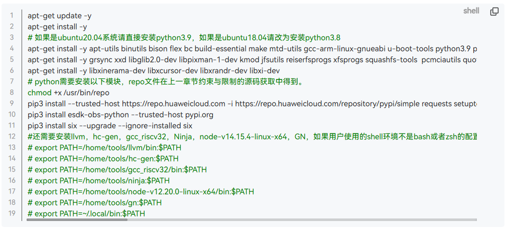

如果出现[图3](#fig1560035719163)问题"Your system shell isn't bash..."，请执行如下命令。

```
ln -s /bin/bash /bin/sh
```

**图 3**  构建镜像不支持dash命令报错<a name="fig1560035719163"></a>  


### 搭建代码开发环境<a name="ZH-CN_TOPIC_0000002482342753"></a>

OpenHarmony环境下配置Hi3403V100和Hi3519AV200配套产品的编译目录。

1.  下载HiSpark社区Pegasus仓代码，由于ss928v100\_clang和ss928v100\_gcc为Pegasus的子仓，而OpenHarmony使用LLVM-Clang工具链的SDK，故此步骤下载得到Pegasus和ss928v100\_clang代码目录。

    ```
    git clone https://gitee.com/HiSpark/pegasus.git
    cd pegasus
    git submodule init
    git submodule update platform/ss928v100_clang
    ```

    通过以上步骤操作，得到Pegasus项目文件目录如下。

    ```
    pegasus/
    ├── os/OpenHarmony
    │   ├── device
    │   │   └── soc/hisilicon/patches   # OpenHarmony源码补丁（按子系统分类，对原生代码的定制化修改）
    │   ├── kernel                      # 内核配置和补丁（linux-6.6）
    │   ├── vendor                      # 海思产品配置（hispark_aifly_linux、hispark_aiflylite_linux）
    │   └── manifest
    │       ├── devboard_hispark_aifly_5.1.0.xml  # repo清单文件（定义代码仓库列表）
    │       └── prebuilts_setup.sh                # 预编译环境准备脚本
    ├── platform/ss928v100_clang        # SDK源码和二进制库（内核驱动、Sample、开源软件包）
    └── vendor
        └── rkh/patches                 # 润开鸿OpenHarmony源码补丁（按子系统分类，增强系统功能和驱动支持）
    ```

    -   `os/OpenHarmony`目录包含海思芯片适配OpenHarmony的补丁、配置和构建脚本。其中`manifest/devboard_hispark_aifly_5.1.0.xml`为repo清单文件，定义了OpenHarmony 5.1.0 Release版本需要同步的代码仓库列表，已针对Small型系统优化，剔除了非必要的代码仓，并将常用修改的代码仓（kernel_linux_config、kernel_linux_patches、device_soc_hisilicon、device_board_hisilicon、vendor_hisilicon）注释掉远程下载，直接使用本地子目录。
    -   `platform/ss928v100_clang`目录是SS928V100的SDK源码和二进制库，包含内核驱动源码、Sample源码及开源软件包。
    -   `vendor`目录是生态伙伴（易百纳、野火、迅为、润开鸿、中山旷视等）基于Pegasus平台做的增量特性开发，包括板卡适配补丁、Demo示例、第三方开源软件编译指南等，与`os/OpenHarmony/vendor`（海思原厂产品配置）有所区别。

    > **说明：**
    >由于SS927V100和SS928V100相似，因此SS927V100的SDK能复用SS928V100的SDK源码，共用`os/OpenHarmony/device/soc/hisilicon/ss928v100/sdk_linux`目录。

2.  进入`os/OpenHarmony`目录，使用repo工具初始化并同步OpenHarmony代码。repo清单文件`devboard_hispark_aifly_5.1.0.xml`已针对Small型系统优化，剔除了非必要的代码仓。

    ```
    cd os/OpenHarmony
    repo init -u https://gitee.com/HiSpark/pegasus.git -m os/OpenHarmony/manifest/devboard_hispark_aifly_5.1.0.xml
    repo sync -c
    repo forall -c 'git lfs pull'
    ```

    通过以上步骤，得到开源鸿蒙OpenHarmony-v5.1.0-release组件源码。

    > **说明：**
    >-   清单文件中`kernel_linux_config`、`kernel_linux_patches`、`device_soc_hisilicon`、`device_board_hisilicon`、`vendor_hisilicon`为常用修改的代码仓，已注释掉远程下载，直接使用`os/OpenHarmony`下对应的本地子目录。
    >-   同步完成后，执行`repo forall -c 'git lfs pull'`拉取LFS大文件。

3.  执行`os/OpenHarmony/manifest/prebuilts_setup.sh`脚本，完成预编译环境准备。该脚本主要完成以下任务：
    -   修复`system_util.py`和`patch_process.py`脚本中的已知问题
    -   将`platform/ss928v100_clang`目录拷贝至SDK目标路径
    -   下载mbedtls v2.16.10源码包（存放至`os/OpenHarmony/device/soc/hisilicon/hi3403v100/sdk_linux/open_source/mbedtls/`目录）
    -   下载arm-trusted-firmware v2.2源码包（存放至`os/OpenHarmony/device/soc/hisilicon/hi3403v100/sdk_linux/open_source/trusted-firmware-a/`目录）
    -   调用`build/prebuilts_download.sh`下载OpenHarmony编译工具链（clang、gn、ninja、cmake、nodejs等）
    -   通过sparse-checkout从kernel_linux_patches仓库下载`prebuilts`目录
    -   通过sparse-checkout从pegasus仓库下载`device/soc/hisilicon/common/platform`目录
    -   配置SDK工具链环境变量，将`os/OpenHarmony/prebuilts/clang/ohos/linux-x86_64/llvm/bin`添加到PATH，执行`command -v clang`验证是否生效，并写入`~/.bashrc`持久化配置

完成以上步骤后，项目目录结构如下。

```
pegasus
├── os/OpenHarmony
│   ├── applications
│   ├── arkcompiler
│   ├── base
│   ├── build
│   ├── commonlibrary
│   ├── developtools
│   ├── device
│   │   ├── board/hisilicon
│   │   └── soc/hisilicon
│   │       ├── patches
│   │       └── hi3403v100/sdk_linux
│   ├── docs
│   ├── domains
│   ├── drivers
│   ├── foundation
│   ├── interface
│   ├── kernel
│   ├── manifest
│   │   ├── devboard_hispark_aifly_5.1.0.xml
│   │   └── prebuilts_setup.sh
│   ├── prebuilts
│   │   └── clang/ohos/linux-x86_64/llvm/bin
│   ├── productdefine
│   ├── test
│   ├── third_party
│   ├── vendor
│   ├── build.sh
│   └── build.py
├── platform/ss928v100_clang
└── vendor
    └── rkh/patches
```

### 配置显示框架 (DRM/FB)<a name="section_display_framework"></a>

系统默认使用 DRM 显示框架。如需切换回 FrameBuffer (FB) 显示框架，请按以下步骤配置：

1.  **修改产品配置文件**

    打开 `os/OpenHarmony/vendor/hisilicon/hispark_aifly_linux/config.json`，在 `"graphic"` 子系统的 `"graphic_utils_lite"` 组件中移除或注释掉 DRM 支持配置。

    ```json
    {
        "subsystem": "graphic",
        "components": [
            {
                "component": "graphic_utils_lite",
                "features": []
            }
        ]
    }
    ```

2.  **修改初始化脚本**

    打开 `os/OpenHarmony/vendor/hisilicon/hispark_aifly_linux/init_configs/etc/init.d/S82ohos`，找到加载驱动的命令行，移除 `-display drm` 参数或改为 `-display fb`。

    ```bash
    ./load_ss928v100_ohos -i
    ```

    > **说明：**
    >-   配置完成后，需重新编译系统使配置生效。
    >-   若需恢复为 DRM 框架，请参考上述步骤重新添加配置项和参数。

## 版本编译<a name="ZH-CN_TOPIC_0000002432107446"></a>


### OpenHarmony编译<a name="ZH-CN_TOPIC_0000002465705861"></a>

基于hispark_aifly和hispark_aiflylite的OpenHarmony版本编译方式遵循社区编译方式。

#### 初次编译<a name="ZH-CN_TOPIC_0000002465705862"></a>

1.  进入hispark_aifly OpenHarmony代码根目录`os/OpenHarmony`。

2.  初次编译需要打补丁，添加编译参数`--patch`，执行如下编译命令，成功之后显示`=====build  successful=====`。

    ```
    ./build.sh --product-name=ipcamera_hispark_aifly_linux --ccache --no-prebuilt-sdk --patch --gn-args build_xts=true
    ```

    > **说明：**
    >若要编译hispark_aiflylite，执行如下编译命令
    >```
    >./build.sh --product-name=ipcamera_hispark_aiflylite_linux --ccache --no-prebuilt-sdk --patch --gn-args build_xts=true
    >```

3.  编译参数说明：

    | 参数 | 说明 |
    |------|------|
    | `--product-name` | 指定产品名称，如`ipcamera_hispark_aifly_linux`或`ipcamera_hispark_aiflylite_linux` |
    | `--ccache` | 启用编译缓存，加速后续编译 |
    | `--no-prebuilt-sdk` | 跳过SDK子系统的编译 |
    | `--patch` | 初次编译时自动应用patches目录下的补丁文件 |
    | `--gn-args build_xts=true` | 启用XTS兼容性测试组件编译，用于通过OpenHarmony兼容性认证 |

    > **说明：**
    >-   patch配置见：`os/OpenHarmony/vendor/hisilicon/hispark_aifly_linux/patch.yml` 文件。
    >-   全量编译之前会先执行打patch操作，若patch应用失败，编译流程将中断。
    >-   当patch失败时，需先执行`rm -rf out`清理输出目录，再重新触发编译命令。
    >-   如需撤销patch.yml中所有patch，执行`os/OpenHarmony/vendor/hisilicon/hispark_aifly_linux`下的`patch_revert.py`脚本：
    >    ```
    >    cd os/OpenHarmony/vendor/hisilicon/hispark_aifly_linux
    >    python3 patch_revert.py
    >    ```
    >-   也可手动撤销单个patch，例如撤销build仓patch，可在build目录下执行：
    >    ```
    >    patch -p1 -R < ../../device/soc/hisilicon/patches/build/build_001.patch
    >    ```

#### 后续编译<a name="ZH-CN_TOPIC_0000002465705863"></a>

后续编译（打完patch后）跳过打patch环节，去掉编译参数`--patch`，执行命令：

```
./build.sh --product-name=ipcamera_hispark_aifly_linux --ccache --no-prebuilt-sdk --gn-args build_xts=true
```

> **说明：**
>OpenHarmony版本需全量重编时，可以先`rm -rf ./out`，再重新执行编译命令。

### ko文件签名<a name="section_ko_signing"></a>

#### 背景与原理<a name="section_ko_signing_background"></a>

OpenHarmony Small版本内核开启了 `CONFIG_MODULE_SIG` 和 `CONFIG_MODULE_SIG_FORCE` 编译选项，强制要求所有加载的内核模块（`.ko` 文件）必须携带有效的数字签名。该机制用于防止恶意或篡改的内核模块被加载到系统中，从而提升系统的安全性。

**为什么内核和ko必须配套编译？**

每次完整编译内核时，构建系统会在 `certs/` 目录下自动生成一对新的签名密钥（`signing_key.pem` 私钥和 `signing_key.x509` 公钥）。内核镜像会将公钥编译进自身，用于后续验证模块签名；而 `.ko` 文件则需要使用对应的私钥进行签名。

如果先编译内核生成了密钥A，用密钥A签名了KO，随后又触发了内核重新编译生成了密钥B，此时内核内置的公钥变为B，而KO的签名仍是A，验证将失败并报错：

```
Loading of module with unsupported crypto is rejected
insmod: failed to load xxx.ko:Key was rejected by service
```

因此，**必须确保签名KO时使用的密钥与最终烧录的内核镜像内置的密钥完全一致**。

#### 新增ko文件签名流程<a name="section_ko_signing_steps"></a>

当您需要新增或替换 `.ko` 文件时，必须使用配套的签名脚本进行处理。请按照以下步骤操作：

1.  **确保内核已编译**

    签名脚本依赖内核编译产物中的签名工具和密钥。请先执行一次完整的内核编译，确保以下路径存在：

    -   签名工具：`${OHOS_OUTDIR}/kernel/${KERNEL_VERSION}/scripts/sign-file`
    -   私钥：`${OHOS_OUTDIR}/kernel/${KERNEL_VERSION}/certs/signing_key.pem`
    -   公钥：`${OHOS_OUTDIR}/kernel/${KERNEL_VERSION}/certs/signing_key.x509`

2.  **准备待签名的ko文件**

    将编译生成的新 `.ko` 文件放置到同一个目录中（例如 `./my_kos/`）。

3.  **执行签名脚本**

    使用 `batch_sign_ko.sh` 脚本对目录下的所有 `.ko` 文件进行批量签名：

    ```bash
    # 进入pegasus根目录
    cd pegasus

    # 执行签名（假设ko文件在 ./my_kos/ 目录下）
    ./os/OpenHarmony/device/board/hisilicon/hispark_aifly/kernel/batch_sign_ko.sh ./my_kos/
    ```

    脚本会自动检测 `OHOS_OUTDIR` 和 `KERNEL_VERSION`，并使用 SHA-512 算法进行签名。已成功签名的文件会被自动跳过。

4.  **替换并烧录**

    将签名后的 `.ko` 文件替换到对应的系统镜像打包目录中，重新打包并烧录镜像。

> **说明：**
>-   签名步骤必须在内核编译完成之后、镜像打包之前执行。
>-   若中途重新编译了内核，请重新对所有 `.ko` 文件进行签名。

### uboot编译<a name="ZH-CN_TOPIC_0000002465545981"></a>

> **说明：**
>-   系统默认提供 `os/OpenHarmony/device/soc/hisilicon/hi3403v100/uboot/boot_image_4GB.bin` uboot 镜像，可直接用于烧写。若需要自行编译 uboot，请参考以下步骤。
>-   编译前请先阅读 `os/OpenHarmony/device/soc/hisilicon/hi3403v100/sdk_linux/open_source/u-boot/readme.txt`，按指引下载并安装 u-boot 开源软件。

编译 uboot 需要进入 SDK 的 osdrv 目录，SDK 路径为 `os/OpenHarmony/device/soc/hisilicon/hi3403v100/sdk_linux/`。

1.  下载并配置交叉编译工具链。

    bootloader 使用 `aarch64-openeuler-linux-gnu` 64bit 工具链进行编译，下载地址：[https://gitee.com/openeuler/yocto-meta-openeuler/releases](https://gitee.com/openeuler/yocto-meta-openeuler/releases)

    下载后将其添加到环境变量中：

    ```
    export PATH=/path/to/aarch64-openeuler-linux-gnu/bin:$PATH
    ```

2.  进入 osdrv 目录，执行编译命令。

    ```
    cd os/OpenHarmony/device/soc/hisilicon/hi3403v100/sdk_linux/osdrv/
    make LLVM=1 BOOT_MEDIA=emmc CHIP=ss928v100 all -j 20
    ```

    > **说明：**
    >-   `CHIP`：可选 `ss928v100` 或 `ss927v100`，默认为 `ss928v100`。
    >-   `BOOT_MEDIA`：根据启动介质选择，`spi`（spi nor 或 spi nand）、`nand`（并口 nand）、`emmc`。
    >-   `LLVM=1`：使用 musl 工具链编译；不指定则使用 glibc 工具链。

3.  单独编译 uboot（快速启动或非安全启动的 Boot Image）。

    ```
    make BOOT_MEDIA=emmc gslboot_build -j 20
    ```

4.  清除编译文件。

    ```
    make clean        # 清除编译文件
    make distclean    # 彻底清除编译中间文件
    ```

编译成功后，生成的 `boot_image.bin` 镜像文件位于 `os/OpenHarmony/device/soc/hisilicon/hi3403v100/sdk_linux/osdrv/pub/ss928v100_emmc_image_musl/` 目录下。

### SDK sample编译<a name="ZH-CN_TOPIC_0000002432267302"></a>

> **注意：** 
>在鸿蒙系统下运行SDK sample前需要关闭媒体和图形进程，具体操作方法为：
>1. 修改产品配置文件 `os/OpenHarmony/vendor/hisilicon/hispark_aifly_linux/config.json`，删除 `window`、`graphic`、`multimedia` 和 `applications` 子系统配置。
>2. 修改初始化脚本 `os/OpenHarmony/vendor/hisilicon/hispark_aifly_linux/init_configs/init_linux_openharmony.cfg`，删除 `"start media_server",` 和 `"start wms_server",`。
>3. 参考[OpenHarmony编译](#openharmony编译)重新编译鸿蒙。
>4. 完成单板烧写镜像后，即可运行SDK sample。

SDK包中提供内核驱动源码和Sample源码，可以通过源码进行编译。编译SDK sample前，需要先配置SYSROOT_PATH环境变量。

1.  配置之前请先执行OpenHarmony编译，编译生成依赖的sysroot。

    > **说明：**
    >使用LLVM-Clang工具链来编译SDK sample时，会依赖OpenHarmony编译后的产物：os/OpenHarmony/out/hispark_aifly/ipcamera_hispark_aifly_linux/sysroot，因此需要提前进行OpenHarmony编译。

2.  假设工具链的sysroot路径为`/path/to/pegasus/os/OpenHarmony/out/hispark_aifly/ipcamera_hispark_aifly_linux/sysroot`，将工具链的sysroot设置到环境变量SYSROOT_PATH。

    ```
    export SYSROOT_PATH=/path/to/pegasus/os/OpenHarmony/out/hispark_aifly/ipcamera_hispark_aifly_linux/sysroot
    ```

3.  检查SYSROOT_PATH配置是否生效。

    ```
    echo $SYSROOT_PATH
    ```

4.  进入`os/OpenHarmony/device/soc/hisilicon/hi3403v100/sdk_linux/smp/a55_linux/mpp/sample`，执行：

    ```
    make
    ```

    编译完成后，各sample可执行文件位于`os/OpenHarmony/device/soc/hisilicon/hi3403v100/sdk_linux/smp/a55_linux/mpp/sample`对应的目录下。

> **说明：**
>sample中使用了SDK_init和SDK_exit来进行MPP各个模块的初始化和退出。hnr需要使用pqp模块，SDK_init中默认未初始化pqp模块，因此需要单独对hnr的sample进行重编，具体步骤为：
>1. 将os/OpenHarmony/device/soc/hisilicon/hi3403v100/sdk_linux/smp/a55_linux/mpp/sample/common/sdk_module_init.h头文件中的宏定义INIT_PQP修改为1；
>2. 进入hnr目录重编，命令如下。
>```
>cd os/OpenHarmony/device/soc/hisilicon/hi3403v100/sdk_linux/smp/a55_linux/mpp/sample/hnr
>make clean
>make
>```

## 版本烧写<a name="ZH-CN_TOPIC_0000002408332445"></a>


### OpenHarmony镜像烧写<a name="ZH-CN_TOPIC_0000002555267881"></a>

hispark_aifly和hispark_aiflylite OpenHarmony版本，编译好的镜像文件在如下目录。

```
os/OpenHarmony/out/hispark_aifly/ipcamera_hispark_aifly_linux
```

需要烧录的镜像文件包括：

| 文件 | 说明 |
|------|------|
| `boot_image.bin` | bootloader镜像 |
| `uboot_env.bin` | uboot环境变量 |
| `fip.bin` | 内核镜像（含ATF安全加固头） |
| `rootfs_ext4.img` | 根文件系统镜像 |
| `userfs_ext4.img` | 用户文件系统镜像 |
| `userdata_ext4.img` | 用户数据镜像 |
| `emmc_burn_table.xml` | 烧写配置文件 |

1.  OpenHarmony编译出的`os/OpenHarmony/out/hispark_aifly/ipcamera_hispark_aifly_linux`目录下默认是EMMC。
2.  参考[uboot编译](#uboot编译)生成boot_image.bin。
3.  采用ToolPlatform工具烧录镜像，加载`emmc_burn_table.xml`配置文件。

    **图 1**  ToolPlatform烧写截图<a name="fig598741418184"></a>  
    
    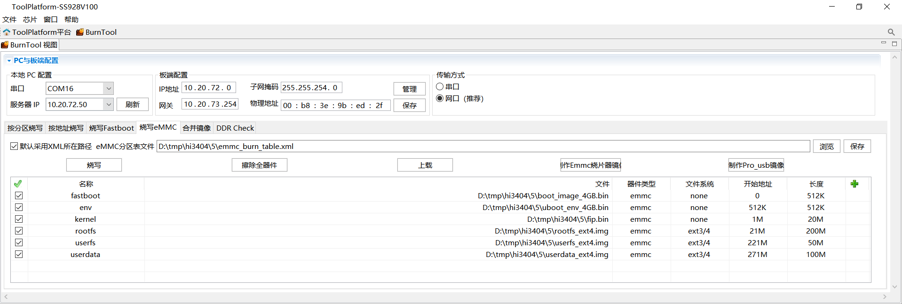

4.  第一次烧写需要配置bootargs，脚本如下。

    ```
    setenv bootargs 'mem=512M console=ttyAMA0,115200 clk_ignore_unused rw rootwait root=/dev/mmcblk0p4 rootfstype=ext4 blkdevparts=mmcblk0:512K(fastboot),512K(env),20M(kernel),200M(rootfs),50M(userfs),100M(userdata)';
    setenv bootcmd 'mmc read 0 0x50000000 0x800 0xA000; bootm 50000000';
    setenv bootdelay 1;
    sa;
    re
    ```

    > **说明：**
    >mmc读取数值的计算方法：使用程序员计算器，计算过程选择DEC十进制转换、最后结果转换成HEX进制。举例说明0xA000由来，内核镜像size大小20M，mmc每512字节为一个单位，20*1024*1024/512=0xA000 \(计算结果转换成HEX进制\)。

### 硬件单板烧写<a name="ZH-CN_TOPIC_0000002555387861"></a>

Hi3403V100和Hi3519AV200硬件单板量产阶段需一次性烧写KEY0，不可重复烧写。若KEY0未烧写，硬件会拦截密钥派生操作，无法正常使用硬件密钥完成加解密操作。

Hi3403V100硬件单板烧写KEY0步骤如下。

1.  进入 U-Boot 命令行，依次执行如下命令

    ```
    mw 0x10122008 0x6
    # 以下四行为设置需要烧写的 key，
    # 以 key=128'h00010203_04050607_08090a0b_0c0d0e0f 为例
    mw 0x1012200C 0x0c0d0e0f
    mw 0x10122010 0x08090a0b
    mw 0x10122014 0x04050607
    mw 0x10122018 0x00010203
    mw 0x10123000 0x2
    mw 0x10122004 0x1acce551
    ```

    > **警告：** 
    >上述烧写命令中 key 的烧写只是一个参数，实际烧写请使用随机数，不可使用示例中的 key。

2.  对单板上下电重启，烧写的key0生效（reboot软重启无法生效，需上下电才能生效），再跑XTS用例可看出XTS认证的huks用例都PASS。

## XTS测试说明<a name="ZH-CN_TOPIC_0000002374732940"></a>

-   XTS测试套编译需要指定参数--gn-args build\_xts=true，参考如下示例。

    ```
    ./build.sh --product-name=ipcamera_hispark_aifly_linux --gn-args build_xts=true --ccache --no-prebuilt-sdk
    ```

    编译结束之后会在os/OpenHarmony/out/hispark_aifly/ipcamera_hispark_aifly_linux/目录下生成suites文件夹，里面的acts文件即为测试套。

-   XTS环境搭建与测试请参考OpenHarmony社区兼容性测评服务指导：

    [https://www.openharmony.cn/certification/document/guid](https://www.openharmony.cn/certification/document/guid)

    请参考链接中“兼容性测试执行环境搭建”章节，配置Windows环境，安装必要的软件。hispark_aifly和hispark_aiflylite是小型系统，请参考“小型系统应用兼容性测试指导”章节完成环境搭建和配置。

    XTS测试需要的资源文件，请下载社区OpenHarmony 5.1.0 Release 小型系统ACTS资源文件，替换acts\\resource目录下的文件。

    下载地址：[https://www.openharmony.cn/certification/document/xts](https://www.openharmony.cn/certification/document/xts)

    **图 1**  小型系统资源文件<a name="fig18181965513"></a>  
    

    > **须知：** 
    >OH5.0及以前社区下载的resource\\tools\\query.bin是32位的，无法在64位的设备上使用。客户需要使用自行编译生成的query.bin文件（os/OpenHarmony/out/hispark_aifly/ipcamera_hispark_aifly_linux/suites/acts/resource/tools/query.bin）。
    >OH5.1社区下载resource没有tools目录。


### XTS测试套补充说明<a name="ZH-CN_TOPIC_0000002374573168"></a>

带屏幕和应用的产品，需要测试ActsAbilityMgrTest和ActsBundleMgrTest。若客户产品需过鸿蒙XTS认证A标，需要测试此两项。

1.  请os/OpenHarmony/test/xts/acts/build_lite/BUILD.gn文件第106行和第107行的代码（删除前面的“\#”号）。
2.  重新编译工程后，在acts/testcases/ability目录下生成测试套ActsAbilityMgrTest.bin，在acts/testcases/appexecfwk目录下生成测试套ActsBundleMgrTest.bin。

### XTS测试命令说明<a name="ZH-CN_TOPIC_0000002374573068"></a>

-   全量执行命令

    ```
    run acts
    ```

-   单模块执行命令

    ```
    run -l ActsSamgrTest 
    ```

-   多模块执行命令

    ```
    run -l ActsSamgrTest;ActsPMSTest;ActsBootstrapTest;ActsParameterTest
    ```

### XTS申请测评注意事项<a name="ZH-CN_TOPIC_0000002374733068"></a>

1.  请参考《OpenHarmony设备兼容性规范x.x自检表\_小型系统 .xlsx》 sheet1表格的规范要求修改配置文件os/OpenHarmony/vendor/hisilicon/hispark_aifly_linux/hals/utils/sys_param/vendor.para，自行设置产品信息。

    OpenHarmony设备兼容性规范自检表下载地址：https://www.openharmony.cn/certification/document/pcs/ 

    **图 1**  小型系统 PCS5.x 自检表<a name="fig1252105314519"></a>  
    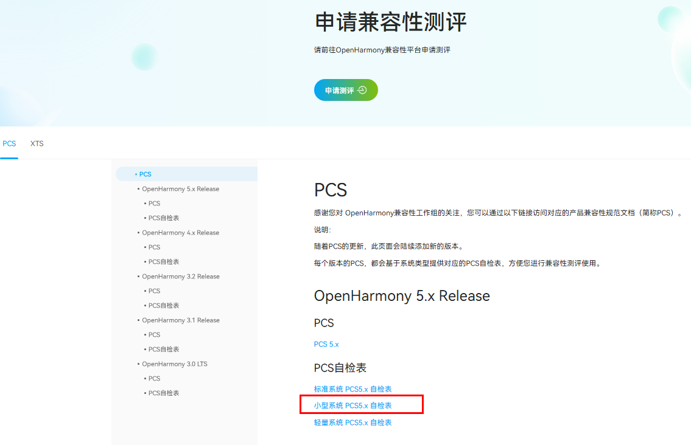

2.  填写申请测评电子流的时候需要上传PCID.sc文件，请从out目录下获取（os/OpenHarmony/out/hispark_aifly/ipcamera_hispark_aifly_linux/PCID.sc）。
3.  送测时需要执行全量XTS，acts\\reports目录下生成的测试报告摘要（summary\_report.html）里面必须包含产品信息。

    **图 2**  XTS测试报告描述信息<a name="fig36354481512"></a>  
    

4.  请按照如下目录准备测评材料。注意提交测评的外观图片要和送测的实物保持一致；且芯片丝印要带有芯片对外传播名称。

    **图 3**  XTS认证送检材料参考目录<a name="fig1406506511"></a>  
    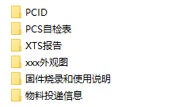

### 硬件单板烧写<a name="ZH-CN_TOPIC_0000002374732952"></a>

SS928V100和SS927V100硬件单板烧写KEY0步骤。

1.  进入 U-Boot 命令行，依次执行如下命令

    ```
    mw 0x10122008 0x6
    # 以下四行为设置需要烧写的 key，
    # 以 key=128'h00010203_04050607_08090a0b_0c0d0e0f 为例
    mw 0x1012200C 0x0c0d0e0f
    mw 0x10122010 0x08090a0b
    mw 0x10122014 0x04050607
    mw 0x10122018 0x00010203
    mw 0x10123000 0x2
    mw 0x10122004 0x1acce551
    ```

    > **警告：** 
    >上述烧写命令中 key 的烧写只是一个参数，实际烧写请使用随机数，不可使用示例中的 key。

2.  对单板上下电重启，烧写的key0生效（reboot软重启无法生效，需上下电才能生效），再跑XTS用例可看出XTS认证的huks用例都PASS。

## 配置telnetd无密码连接使用<a name="ZH-CN_TOPIC_0000002378611298"></a>

OpenHarmony5.1 toybox的telnetd连接默认需要密码，按如下两种方法配置可正常使用无密码连接。

-   进入板端执行如下命令可直接修改/etc/passwd文件

    ```
    sed -i "s#root:x:0:0:::/bin/false#root::0:0::/root/:/bin/sh#g" /etc/passwd
    ```

-   通过本地PC上挂载NFS服务器，把板端/etc/passwd拷贝到本地PC上完成修改

1.  修改板端passwd，需先mount本地服务器，把板端/etc/passwd拷贝到本地服务器，对本地passwd文件按[图2](#fig377520345458)方式修改，再拷贝回去替换板端/etc/passwd文件。

    **图 1**  修改前:（root:x:0:0:::/bin/false）<a name="fig13430148164010"></a>  
    

    **图 2**  修改后:（root::0:0::/root:/bin/sh）<a name="fig377520345458"></a>  
    

2.  修改后使用telnet连接无需密码。

## 媒体功能使用指导<a name="ZH-CN_TOPIC_0000002408172697"></a>

1.  在os/OpenHarmony/vendor/hisilicon/hispark_aifly_linux/config.json文件中，新增子系统。

    ```
          {
            "subsystem": "arkui",
            "components": [
              { "component": "ui_lite", "features":[ "ui_lite_enable_graphic_font_config = true" ] }
            ]
          },
          {
            "subsystem": "graphic",
            "components": [
              { "component": "graphic_utils_lite", "features":[] },
              { "component": "surface_lite", "features":[] }
            ]
          },
          {
            "subsystem": "window",
            "components": [
              { "component": "window_manager_lite", "features":[] }
            ]
          },
          {
            "subsystem": "multimedia",
            "components": [
              { "component": "camera_lite", "features":[] },
              { "component": "media_lite", "features":[] },
              { "component": "audio_lite", "features":[] },
              { "component": "media_service", "features":[] }
            ]
          },
    ```

2.  在os/OpenHarmony/vendor/hisilicon/hispark_aifly_linux/init_configs/init_linux_openharmony.cfg文件中，新增代码，启动媒体服务如下：

    ```
                    "start media_server",
    ```

    **图 1**  新增启动服务<a name="fig18331161515913"></a>  
    

3.  在编译版本之前，需要重新编译libsns\_hy\_s0603.so，因为此库动态加载的时候，会报链接的错误，所以需要修改编译脚本进行重新编译，编译脚本路径如下：

    os/OpenHarmony/device/soc/hisilicon/hi3403v100/sdk_linux/smp/a55_linux/mpp/cbb/isp/user/sensor/ss928v100/hy_s0603/Makefile

    修改方式如[图2](#fig13477396910)所示。

    **图 2**  修改方式<a name="fig13477396910"></a>  
    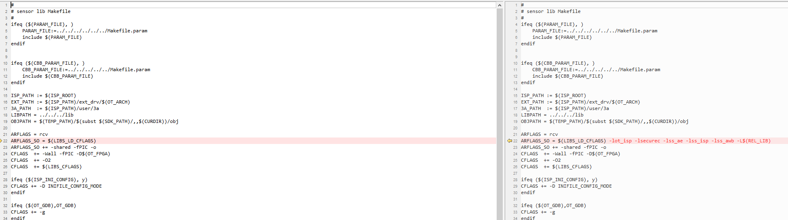

    需要新增的链接依赖项：-lot\_isp -lsecurec -lss\_ae -lss\_isp -lss\_awb -L$\(REL\_LIB\)

    编译完成后libsns\_hy\_s0603.so 会生成在os/OpenHarmony/device/soc/hisilicon/hi3403v100/sdk_linux/smp/a55_linux/mpp/out/lib目录下面，**还原所有修改的链接依赖项**，然后可直接进行OpenHarmony的版本编译。

    **另一种解决方式：**

    如果编译环境上有patchelf工具，可以通过如下命令为libsns\_hy\_s0603.so添加链接依赖，而不用重新编译：

    patchelf --add-needed libss\_awb.so libsns\_hy\_s0603.so

    patchelf --add-needed libss\_ae.so libsns\_hy\_s0603.so

    patchelf --add-needed libot\_mpi\_isp.so libsns\_hy\_s0603.so

    patchelf --add-needed libsecurec.so libsns\_hy\_s0603.so

    通过如下命令验证是否成功添加链接依赖：

    readelf -d libsns\_hy\_s0603.so

    出现如图显示即OK：

    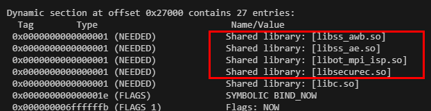

4.  如果有HDMI输出需要的，需要手动打开图形层服务，具体操作如下：

    单板执行命令：./bin/wms\_server & 打开图形层服务，此命令只需要执行一次，重复执行会导致报错。

    > **须知：** 
    >媒体的所有sample都需要按照指定的命令进行退出操作，默认是输入q退出。


### 预览功能<a name="ZH-CN_TOPIC_0000002374573208"></a>

1.  单板上下电，执行/tmp/camera\_sample。

    **图 1**  串口显示信息<a name="fig14211281966"></a>  
    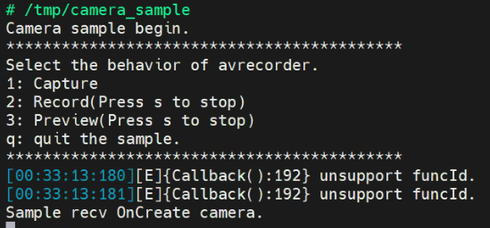

2.  按提示输入3。

    **图 2**  启动预览服务<a name="fig10116238963"></a>  
    

3.  预期结果：显示设备上显示Sensor采集的画面。

### 录制功能<a name="ZH-CN_TOPIC_0000002374573072"></a>

1.  单板上下电，执行/tmp/camera\_sample。

    > **须知：** 
    >录制文件默认保存在单板/userdata/norm/文件夹。如若需要修改录制文件保存的路径，修改os/OpenHarmony/applications/sample/camera/media/camera_sample.cpp 218行代码，对应[图1](#fig131803319235)中的DEFAULT\_SAVE\_PATH变量。

    **图 1**  修改camera\_sample录制文件的保存路径<a name="fig131803319235"></a>  
    

2.  按提示输入2。

    **图 2**  启动录制服务<a name="fig15386293427"></a>  
    
    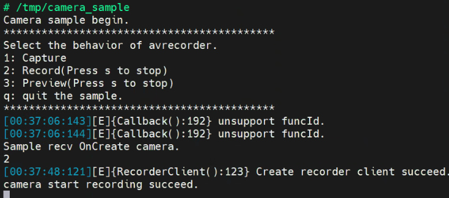

3.  来回移动下sensor的位置，确保录制的图像是动态的，输入s，回车，再输入q，回车，结束录制。

    **图 3**  结束录制<a name="fig1758312121910"></a>  
    

4.  录制的视频保存在如下位置。

    **图 4**  串口显示信息<a name="fig662354961818"></a>  
    

    可以用后续的player\_sample播放。

    > **说明：** 
    >手动修改系统时间方式，使用date命令：date -u "YYYY-MM-DD HH:mm:ss"，例如：date -u "2024-04-10 12:00:00"。具体业务场景建议设备与服务端进行时间校准。

### 播放功能<a name="ZH-CN_TOPIC_0000002374573172"></a>

1.  使用播放Demo，播放视频，命令如下：

    ```
    /tmp/player_sample /tmp/1970_01_02_202516_00.MP4
    如果播放的是aac等码流，命令如下：
    /tmp/player_sample /tmp/audio_1970-01-01-00-03-36.aac 2
    ```

2.  预期结果：显示器画面正常播放录制的视频，单板插上耳机，有正常声音输出

    **图 1**  启动播放功能<a name="fig824648174310"></a>  
    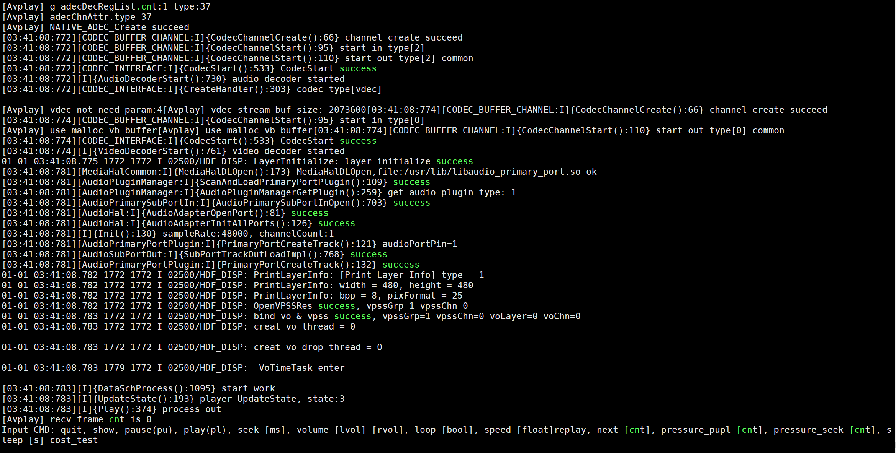

### 采集H264码流功能<a name="ZH-CN_TOPIC_0000002374573076"></a>

> **须知：** 
>媒体子系统提供的Demo仅用于OpenHarmony基础功能测试，商用业务场景需要基于OpenHarmony API自行开发。

### sensor切换指导<a name="ZH-CN_TOPIC_0000002408332573"></a>

默认sensor是hy\_s0603，时序是1080P 60帧，VI采集时是30帧，最终显示的输出是60帧。

同时支持hy\_s0603，时序是4K 30帧，VI采集时是30帧，最终显示的输出也是30帧。

若需要从1080P切换为4K，步骤如下：

1.  在foundation/multimedia/media\_lite/services目录新增cameradev\_hy\_s0603\_4k30\_928.ini，并在该文件中适配4k对应参数。
2.  在foundation/multimedia/media\_lite/services/BUILD.gn文件中，将cameradev\_hy\_s0603\_928.ini替换为cameradev\_hy\_s0603\_4k30\_928.ini。

    **图 1**  修改sensor配置文件<a name="fig83672365584"></a>  
    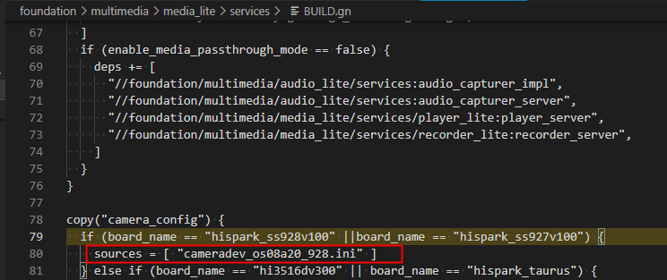

3.  重新编译，烧写。

### 音频采集功能<a name="ZH-CN_TOPIC_0000002408172589"></a>

1.  单板上下电，如果要测试talkvqe的功能，需要先执行export LD\_PRELOAD=/usr/lib/libsecurec.so:/usr/lib/libvqe\_hpf.so

    预先把需要的so路径加载进来。

2.  执行/tmp/audio\_capature\_sample。

    **图 1**  配置音频采集参数<a name="fig115573685212"></a>  
    

3.  按照提示输入参数，当前支持PCM、AAC\_LC、G711A、G711U格式。
4.  输入s或S，开始录制，输入p或P，停止录制，输入q或Q，退出录制。

    **图 2**  启动音频采集功能<a name="fig1449912474490"></a>  
    

5.  录制成功的文件保存在/userdata目录，可以使用player\_sample播放。

    **图 3**  音频采集文件<a name="fig1977325816493"></a>  
    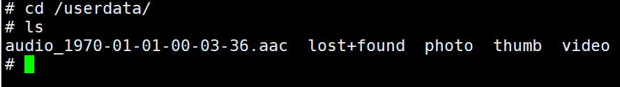

## 图形示例应用使用指导<a name="ZH-CN_TOPIC_0000002408172677"></a>

图形子系统提供两个示例应用。包含控件示例应用，和窗口示例应用。控件示例应用主要覆盖图形子系统的控件能力，例如Button、Label、ScrollView等。窗口示例应用主要覆盖窗口管理能力，包含窗口的创建、删除、以及位置设置。


### 预置条件<a name="ZH-CN_TOPIC_0000002374573024"></a>

打开图形子系统，步骤如下：

1.  在os/OpenHarmony/vendor/hisilicon/hispark_aifly_linux/config.json文件，"subsystems"标签中添加如下代码。

    ```
          {
               "subsystem": "arkui",
               "components": [
                  { "component": "ui_lite", "features":[ "ui_lite_enable_graphic_font_config = true" ] }
              ]
          },
          {
               "subsystem": "graphic",
               "components": [
                  { "component": "graphic_utils_lite", "features":[] },
                  { "component": "surface_lite", "features":[] }
               ]
          },
          {
               "subsystem": "window",
               "components": [
                  { "component": "window_manager_lite", "features":[] }
            ]
          },
    ```

1.  重新编译烧写。


#### 资源路径<a name="ZH-CN_TOPIC_0000002374573152"></a>

[表1](#table386mcpsimp)中描述了示例应用依赖的资源文件，以及资源资源文件的目录\(路径相对于OpenHarmony根目录\)

**表 1**  资源路径说明

<a name="table386mcpsimp"></a>
<table><thead align="left"><tr id="row391mcpsimp"><th class="cellrowborder" valign="top" width="26.150000000000002%" id="mcps1.2.3.1.1"><p id="p393mcpsimp"><a name="p393mcpsimp"></a><a name="p393mcpsimp"></a>文件名</p>
</th>
<th class="cellrowborder" valign="top" width="73.85000000000001%" id="mcps1.2.3.1.2"><p id="p395mcpsimp"><a name="p395mcpsimp"></a><a name="p395mcpsimp"></a>文件路径</p>
</th>
</tr>
</thead>
<tbody><tr id="row397mcpsimp"><td class="cellrowborder" valign="top" width="26.150000000000002%" headers="mcps1.2.3.1.1 "><p id="p399mcpsimp"><a name="p399mcpsimp"></a><a name="p399mcpsimp"></a>sample_ui（控件示例应用）</p>
</td>
<td class="cellrowborder" valign="top" width="73.85000000000001%" headers="mcps1.2.3.1.2 "><p id="p401mcpsimp"><a name="p401mcpsimp"></a><a name="p401mcpsimp"></a>out\hispark_aifly\ipcamera_hispark_aifly_linux\dev_tools\bin\</p>
</td>
</tr>
<tr id="row402mcpsimp"><td class="cellrowborder" valign="top" width="26.150000000000002%" headers="mcps1.2.3.1.1 "><p id="p404mcpsimp"><a name="p404mcpsimp"></a><a name="p404mcpsimp"></a>sample_window（窗口示例应用）</p>
</td>
<td class="cellrowborder" valign="top" width="73.85000000000001%" headers="mcps1.2.3.1.2 "><p id="p406mcpsimp"><a name="p406mcpsimp"></a><a name="p406mcpsimp"></a>out\hispark_aifly\ipcamera_hispark_aifly_linux\dev_tools\bin\</p>
</td>
</tr>
<tr id="row412mcpsimp"><td class="cellrowborder" valign="top" width="26.150000000000002%" headers="mcps1.2.3.1.1 "><p id="p414mcpsimp"><a name="p414mcpsimp"></a><a name="p414mcpsimp"></a>字体资源</p>
</td>
<td class="cellrowborder" valign="top" width="73.85000000000001%" headers="mcps1.2.3.1.2 "><p id="p416mcpsimp"><a name="p416mcpsimp"></a><a name="p416mcpsimp"></a>out\hispark_aifly\ipcamera_hispark_aifly_linux\data</p>
</td>
</tr>
<tr id="row417mcpsimp"><td class="cellrowborder" valign="top" width="26.150000000000002%" headers="mcps1.2.3.1.1 "><p id="p419mcpsimp"><a name="p419mcpsimp"></a><a name="p419mcpsimp"></a>图片资源</p>
</td>
<td class="cellrowborder" valign="top" width="73.85000000000001%" headers="mcps1.2.3.1.2 "><p id="p421mcpsimp"><a name="p421mcpsimp"></a><a name="p421mcpsimp"></a>foundation\arkui\ui_lite\tools\qt\simulator\config\images</p>
<p id="p422mcpsimp"><a name="p422mcpsimp"></a><a name="p422mcpsimp"></a>foundation\arkui\ui_lite\ tools\qt\simulator\config\faces</p>
<p id="p423mcpsimp"><a name="p423mcpsimp"></a><a name="p423mcpsimp"></a>foundation\arkui\ui_lite\ tools\qt\simulator\default_resource</p>
</td>
</tr>
</tbody>
</table>

#### 设备端需具备条件<a name="ZH-CN_TOPIC_0000002374572984"></a>

1.  连接HDMI显示设备，如显示器、电视。
2.  确认板端能访问到测试需要文件。例如，通过tftp进行网络的挂载，或者使用SD卡。
3.  确认设备驱动gfbg.ko、ot\_tde.ko已加载（可在板端使用lsmod命令查看）。
4.  \(如需支持鼠标\)执行“echo host\>/proc/10320000.usb30drd/mode”。
5.  执行"wms\_server &"，确认wms\_server进程正常启动（在板端top命令查看当前运行进程是否存在该进程，且显示器点亮为蓝屏），移动鼠标，如果无鼠标，执行“cat /dev/input/event0”。

### 实例应用说明<a name="ZH-CN_TOPIC_0000002408332477"></a>


#### sample\_window<a name="ZH-CN_TOPIC_0000002408332429"></a>

验证步骤

1.  配置网络；

    ```
    ifconfig eth0 **.***.**.**
    ```

2.  挂载可执行文件；

    ```
    mount -t nfs -o addr=**.***.**.**,nolock,tcp **.***.**.**:$ sample_window所在路径 /mnt
    ```

3.  执行sample\_window。

    ```
    ./sample_window
    ```

#### sample\_ui<a name="ZH-CN_TOPIC_0000002374573100"></a>

1.  配置网络

    ```
    ifconfig eth0 **.***.**.**
    ```

2.  挂载资源

    ```
    mount -t nfs -o addr=**.***.**.**,nolock,tcp **.***.**.**:$资源所在服务器路径 /user/data
    ```

    [表1](#table440mcpsimp)中描述了对应资源文件的板端路径，需要按该表把资源复制到对应板端路径

    **表 1**  资源说明表

    <a name="table440mcpsimp"></a>
    <table><thead align="left"><tr id="row445mcpsimp"><th class="cellrowborder" valign="top" width="45.050000000000004%" id="mcps1.2.3.1.1"><p id="p447mcpsimp"><a name="p447mcpsimp"></a><a name="p447mcpsimp"></a>文件名</p>
    </th>
    <th class="cellrowborder" valign="top" width="54.949999999999996%" id="mcps1.2.3.1.2"><p id="p449mcpsimp"><a name="p449mcpsimp"></a><a name="p449mcpsimp"></a>板端路径</p>
    </th>
    </tr>
    </thead>
    <tbody><tr id="row450mcpsimp"><td class="cellrowborder" valign="top" width="45.050000000000004%" headers="mcps1.2.3.1.1 "><p id="p452mcpsimp"><a name="p452mcpsimp"></a><a name="p452mcpsimp"></a>line_cj.brk</p>
    </td>
    <td class="cellrowborder" valign="top" width="54.949999999999996%" headers="mcps1.2.3.1.2 "><p id="p454mcpsimp"><a name="p454mcpsimp"></a><a name="p454mcpsimp"></a>/user/data</p>
    </td>
    </tr>
    <tr id="row455mcpsimp"><td class="cellrowborder" valign="top" width="45.050000000000004%" headers="mcps1.2.3.1.1 "><p id="p457mcpsimp"><a name="p457mcpsimp"></a><a name="p457mcpsimp"></a>SourceHanSansSC-Regular.otf</p>
    </td>
    <td class="cellrowborder" valign="top" width="54.949999999999996%" headers="mcps1.2.3.1.2 "><p id="p459mcpsimp"><a name="p459mcpsimp"></a><a name="p459mcpsimp"></a>/user/data</p>
    </td>
    </tr>
    <tr id="row460mcpsimp"><td class="cellrowborder" valign="top" width="45.050000000000004%" headers="mcps1.2.3.1.1 "><p id="p462mcpsimp"><a name="p462mcpsimp"></a><a name="p462mcpsimp"></a>图片资源</p>
    </td>
    <td class="cellrowborder" valign="top" width="54.949999999999996%" headers="mcps1.2.3.1.2 "><p id="p464mcpsimp"><a name="p464mcpsimp"></a><a name="p464mcpsimp"></a>/storage/data</p>
    </td>
    </tr>
    </tbody>
    </table>

1.  挂载可执行文件

    ```
    mount -t nfs -o addr=**.***.**.**,nolock,tcp **.***.**.**:$ sample_ui所在路径 /mnt
    ```

2.  执行sample\_ui，显示如[图1](#fig042845495519)画面。

    ```
    ./sample_ui
    ```

    **图 1**  启动画面结果<a name="fig042845495519"></a>  
    

## 在rootfs中打包自定义文件或目录<a name="ZH-CN_TOPIC_0000002374573036"></a>

> **说明：** 
>在rootfs中打包自定义文件时，可根据实际业务场景需求选择在"[在rootfs中新增目录打包文件](#在rootfs中新增目录打包文件)"或者"[往rootfs现有目录下打包文件](#往rootfs现有目录下打包文件)"章节指导应用。

### 在rootfs中新增目录打包文件<a name="ZH-CN_TOPIC_0000002374732860"></a>

1.  修改os/OpenHarmony/vendor/hisilicon/hispark_aifly_linux/fs.yml新增xxx目录。

    ```
    -
    fs_dir_name: rootfs
    fs_dirs:
    -
    ....
    -
    source_dir: sbin
    target_dir: sbin
    -
    source_dir: usr/bin
    target_dir: usr/bin
    -
    source_dir: usr/sbin
    target_dir: usr/sbin
    -
    source_dir: data
    target_dir: storage/data
    -
    target_dir: proc
    -
    target_dir: mnt
    -
    source_dir: xxx
    target_dir: xxx
    ```

    > **说明：** 
    >此过程会进行rootfs内容的拷贝，将source\_dir下内容拷贝到target\_dir，然后制作文件系统。
    >-   source_dir是os/OpenHarmony/out（os/OpenHarmony/out/hispark_aifly/ipcamera_hispark_aifly_linux）目标文件目录。
    >-   target\_dir是文件系统下对应的目录，会创建rootfs/xxx文件目录。

2.  为实现拷贝目标文件到os/OpenHarmony/out/hispark_aifly/ipcamera_hispark_aifly_linux/xxx目录下，在os/OpenHarmony/vendor/hisilicon/hispark_aifly_linux/init\_configs\\BUILD.gn文件可以修改为如下。

    ```
    ...
    copy("copy_xxx") {  
      sources = [ "xxx/xxx.sh" ]  
      outputs = [ "$root_out_dir/xxx/{{source_file_part}}" ]
    }
    ```

    最终xxx.sh可以放到rootfs/xxx目录下。

3.  再修改外面一层的os/OpenHarmony/vendor/hisilicon/hispark_aifly_linux/BUILD.gn，增加copy\_xxx为依赖。

    **图 1**  调用copy\_xxx修改后图<a name="fig977502404017"></a>  
    

4.  在os/OpenHarmony目录下执行 rm -rf out/，再重新编译 ./build.sh --product-name=ipcamera\_hispark\_aifly\_linux --ccache --no-prebuilt-sdk即可。

    **图 2**  rootfs中新增xxx目录<a name="fig523011572911"></a>  
    

### 往rootfs现有目录下打包文件<a name="ZH-CN_TOPIC_0000002408172613"></a>

参考os/OpenHarmony/vendor/hisilicon/hispark_aifly_linux/init\_configs目录实现，拷贝xxx/xxx.sh文件到etc/xxx目录下。

1.  先将要拷贝的文件放到对应目录中xxx/xxx.sh，同时修改os/OpenHarmony/vendor/hisilicon/hispark_aifly_linux/init\_configs\\BUILD.gn。

    **图 1**  新增copy\_xxx执行拷贝目标文件至etc/xxx<a name="fig96529774011"></a>  
    

2.  再修改外面一层的os/OpenHarmony/vendor/hisilicon/hispark_aifly_linux/BUILD.gn，增加copy\_xxx为依赖。

    **图 2**  调用copy\_xxx修改后图<a name="fig977502404017"></a>  
    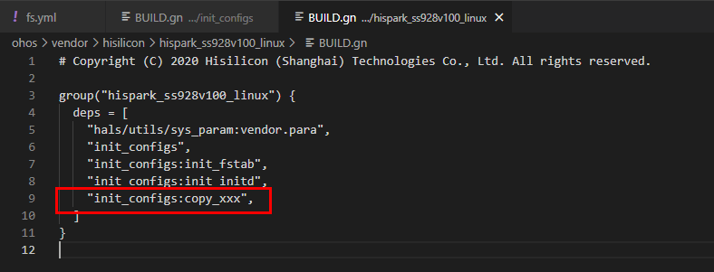

3.  重新编译，则xxx.sh会被打包到rootfs的etc/xxx/xxx.sh。

    **图 3**  目标文件打包到/etc/xxx验证结果<a name="fig2225153414401"></a>  
    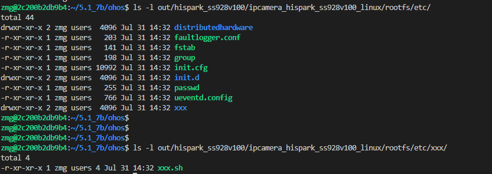

4.  在os/OpenHarmony目录下执行 rm -rf out/，再重新编译./build.sh --product-name=ipcamera\_hispark\_aifly\_linux --ccache --no-prebuilt-sdk即可。

### 在rootfs中生成软链接<a name="ZH-CN_TOPIC_0000002374733056"></a>

如同时想生成yyy的软链接指向xxx.sh，则可修改os/OpenHarmony/vendor/hisilicon/hispark_aifly_linux/fs.yml，如下。

```
fs_symlink:
-
source: libc.so
link_name: ${fs_dir}/lib/ld-musl-aarch64.so.1
-
source: mksh
link_name: ${fs_dir}/bin/sh
-
source: ./
link_name: ${fs_dir}/usr/lib/a7_softfp_neon-vfpv4
-
source: mksh
link_name: ${fs_dir}/bin/shell
-
source: xxx.sh
link_name: ${fs_dir}/xxx/yyy
```

在os/OpenHarmony目录下执行 rm -rf out/，再重新编译./build.sh --product-name=ipcamera\_hispark\_aifly\_linux --ccache --no-prebuilt-sdk即可。

### 基于shell脚本整目录拷贝到rootfs中<a name="ZH-CN_TOPIC_0000002374732880"></a>

1.  在os/OpenHarmony/vendor/hisilicon/hispark\_aifly\_linux目录中，新建[图1](#fig2443324185012)所示的rootfs目录。

    **图 1**  源码中新增rootfs目录<a name="fig2443324185012"></a>  
    

    然后给上述新增的目录授予权限，执行如下命令。

    ```
    chmod -R 777 rootfs
    ```

2.  在os/OpenHarmony/vendor/hisilicon/hispark_aifly_linux/BUILD.gn文件中新增copy\_binary内容。

    ```
    group("hispark_aifly_linux") {
    deps = [
    "hals/utils/sys_param:vendor.para",
    "init_configs",
    "init_configs:init_fstab",
    "init_configs:init_initd",
    "init_configs:copy_xxx",
        ":copy_binary",
    ]
    }
    import("//build/lite/config/component/lite_component.gni")
    build_ext_component("copy_binary") {
      exec_path = rebase_path(".", root_build_dir)
      outdir = rebase_path("$root_out_dir")
      command = "./copy_binary_files.sh ${outdir}"
    }
    ```

    此新增脚本含义：调用build\_ext\_component执行command对应的命令。

3.  新增copy\_binary\_files.sh脚本到当前目录os/OpenHarmony/vendor/hisilicon/hispark_aifly_linux/中，内容如下。

    ```
    #! /bin/sh
    echo "--------------------- copy binary files to rootfs folder, current folder is $PWD ---------------------"
    mkdir -p $1/rootfs_binary_files
    cp -Rf ./rootfs/bin/* $1/rootfs_binary_files
    ```

    此脚本作用：将上面新增的源目录rootfs/bin/\*所有文件和目录拷贝到os/OpenHarmony/out/hispark_aifly/ipcamera_hispark_aifly_linux/rootfs_binary_files目录中。备注：脚本可以自己根据业务情况调整和修改。

    授予上述copy\_binary\_files.sh脚本执行权限，执行如下命令。

    ```
    chmod 777 copy_binary_files.sh
    ```

4.  将rootfs\_binary\_files拷贝到rootfs中，还需要修改os/OpenHarmony/vendor/hisilicon/hispark_aifly_linux/fs.yml文件。

    ```
    -
    fs_dir_name: rootfs
    fs_dirs:
    -
    source_dir: ${root_path}/out/preloader/${product_name}/system
    target_dir: system
    -
    source_dir: rootfs_binary_files
    target_dir: bin
    -
    source_dir: bin
    target_dir: bin
    ignore_files:
    - Test.bin
    - TestSuite.bin
    - query.bin
    - cve
    - checksum
    is_strip: TRUE
    ```

    如需要拷贝到自定义目录中，可根据[在rootfs中新增目录打包文件](#在rootfs中新增目录打包文件)修改。

5.  在os/OpenHarmony目录下执行 rm -rf out/，再重新编译 ./build.sh --product-name=ipcamera\_hispark\_aifly\_linux --ccache --no-prebuilt-sdk即可。

