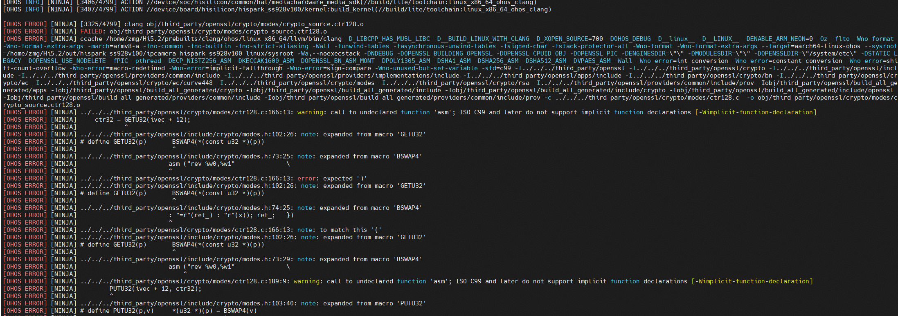
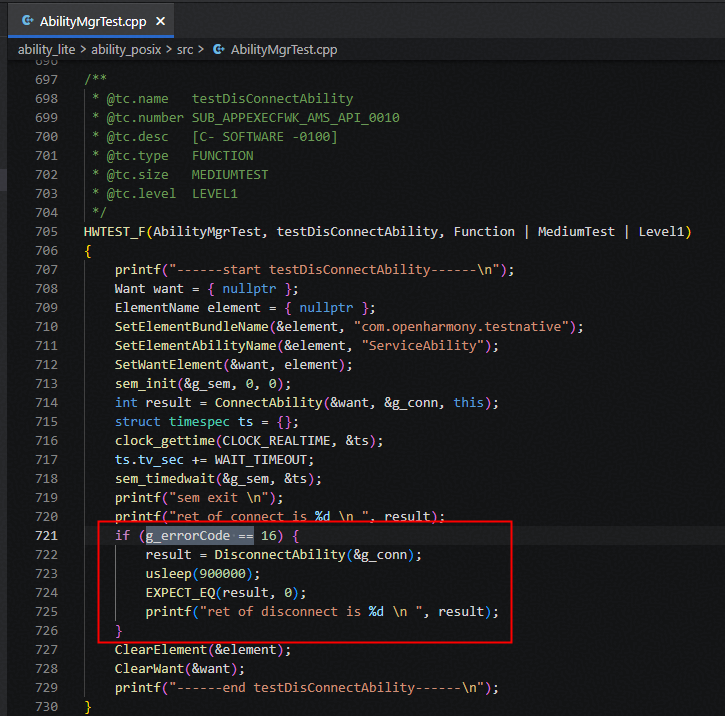
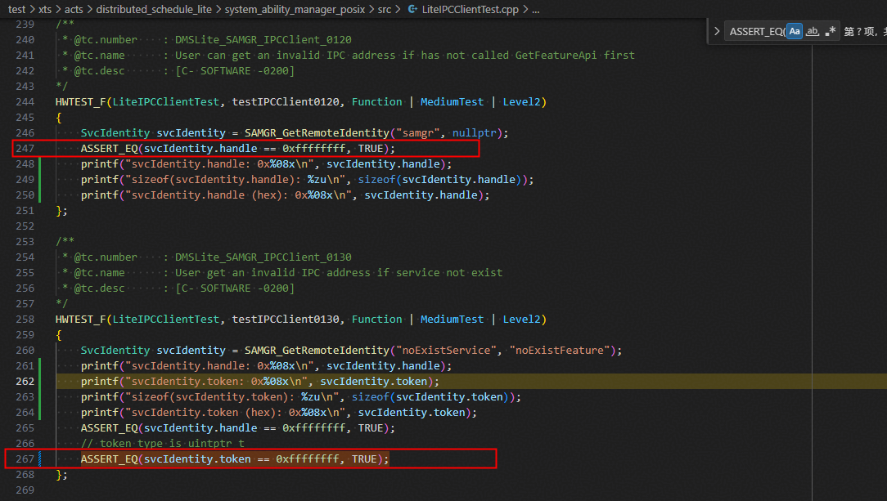
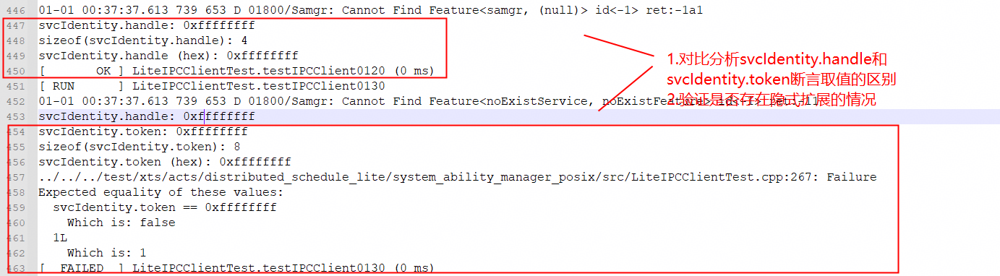
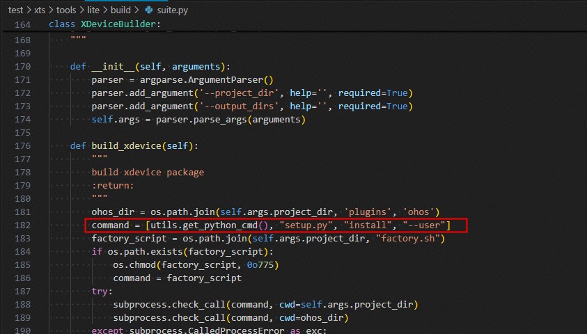
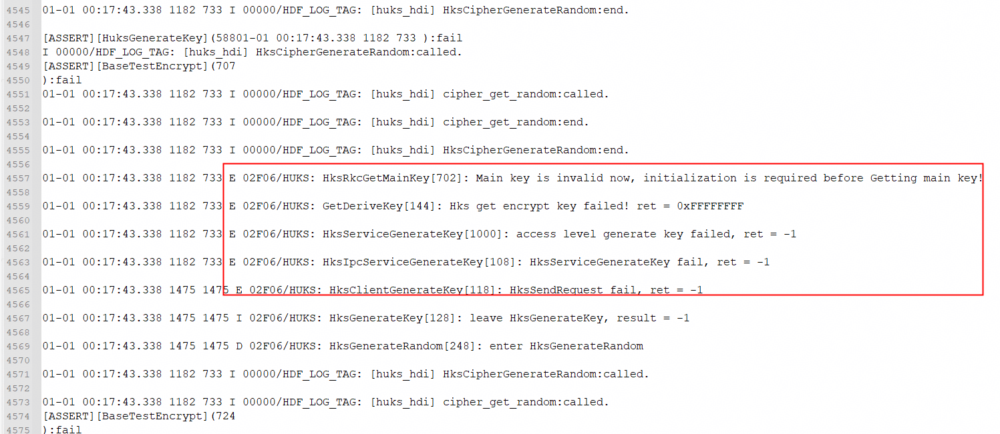
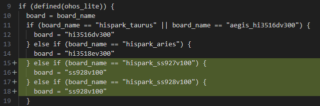

# 前言<a name="ZH-CN_TOPIC_0000002434316444"></a>

**概述<a name="section4537382116410"></a>**

本文章是基于视觉Hi3403V100芯片配套的hispark_aifly开发板，进行OpenHarmony小型系统相关功能的移植；主要包括解决方案集成，产品配置添加，内核移植适配、编译，XTS认证，HUKS组件增强特性，图形增强特性，媒体增强特性的适配案例总结。

**读者对象<a name="section4378592816410"></a>**

本文档主要适用于视觉OpenHarmony Small系统升级的操作人员。操作人员必须具备以下经验和技能：

-   熟悉OpenHarmony源码编译构建。
-   熟悉视觉类芯片SDK版本。

**符号约定<a name="section133020216410"></a>**

在本文中可能出现下列标志，它们所代表的含义如下。

<a name="table2622507016410"></a>
<table><thead align="left"><tr id="row1530720816410"><th class="cellrowborder" valign="top" width="20.580000000000002%" id="mcps1.1.3.1.1"><p id="p6450074116410"><a name="p6450074116410"></a><a name="p6450074116410"></a>符号</p>
</th>
<th class="cellrowborder" valign="top" width="79.42%" id="mcps1.1.3.1.2"><p id="p5435366816410"><a name="p5435366816410"></a><a name="p5435366816410"></a>说明</p>
</th>
</tr>
</thead>
<tbody><tr id="row1372280416410"><td class="cellrowborder" valign="top" width="20.580000000000002%" headers="mcps1.1.3.1.1 "><p id="p3734547016410"><a name="p3734547016410"></a><a name="p3734547016410"></a><a name="image2670064316410"></a><a name="image2670064316410"></a><span></span></p>
</td>
<td class="cellrowborder" valign="top" width="79.42%" headers="mcps1.1.3.1.2 "><p id="p1757432116410"><a name="p1757432116410"></a><a name="p1757432116410"></a>表示如不避免则将会导致死亡或严重伤害的具有高等级风险的危害。</p>
</td>
</tr>
<tr id="row466863216410"><td class="cellrowborder" valign="top" width="20.580000000000002%" headers="mcps1.1.3.1.1 "><p id="p1432579516410"><a name="p1432579516410"></a><a name="p1432579516410"></a><a name="image4895582316410"></a><a name="image4895582316410"></a><span></span></p>
</td>
<td class="cellrowborder" valign="top" width="79.42%" headers="mcps1.1.3.1.2 "><p id="p959197916410"><a name="p959197916410"></a><a name="p959197916410"></a>表示如不避免则可能导致死亡或严重伤害的具有中等级风险的危害。</p>
</td>
</tr>
<tr id="row123863216410"><td class="cellrowborder" valign="top" width="20.580000000000002%" headers="mcps1.1.3.1.1 "><p id="p1232579516410"><a name="p1232579516410"></a><a name="p1232579516410"></a><a name="image1235582316410"></a><a name="image1235582316410"></a><span></span></p>
</td>
<td class="cellrowborder" valign="top" width="79.42%" headers="mcps1.1.3.1.2 "><p id="p123197916410"><a name="p123197916410"></a><a name="p123197916410"></a>表示如不避免则可能导致轻微或中度伤害的具有低等级风险的危害。</p>
</td>
</tr>
<tr id="row5786682116410"><td class="cellrowborder" valign="top" width="20.580000000000002%" headers="mcps1.1.3.1.1 "><p id="p2204984716410"><a name="p2204984716410"></a><a name="p2204984716410"></a><a name="image4504446716410"></a><a name="image4504446716410"></a><span></span></p>
</td>
<td class="cellrowborder" valign="top" width="79.42%" headers="mcps1.1.3.1.2 "><p id="p4388861916410"><a name="p4388861916410"></a><a name="p4388861916410"></a>用于传递设备或环境安全警示信息。如不避免则可能会导致设备损坏、数据丢失、设备性能降低或其它不可预知的结果。</p>
<p id="p1238861916410"><a name="p1238861916410"></a><a name="p1238861916410"></a>“须知”不涉及人身伤害。</p>
</td>
</tr>
<tr id="row2856923116410"><td class="cellrowborder" valign="top" width="20.580000000000002%" headers="mcps1.1.3.1.1 "><p id="p5555360116410"><a name="p5555360116410"></a><a name="p5555360116410"></a><a name="image799324016410"></a><a name="image799324016410"></a><span></span></p>
</td>
<td class="cellrowborder" valign="top" width="79.42%" headers="mcps1.1.3.1.2 "><p id="p4612588116410"><a name="p4612588116410"></a><a name="p4612588116410"></a>对正文中重点信息的补充说明。</p>
<p id="p1232588116410"><a name="p1232588116410"></a><a name="p1232588116410"></a>“说明”不是安全警示信息，不涉及人身、设备及环境伤害信息。</p>
</td>
</tr>
</tbody>
</table>

**修改记录<a name="section2467512116410"></a>**

<a name="table5652mcpsimp"></a>
<table><thead align="left"><tr id="row5658mcpsimp"><th class="cellrowborder" valign="top" width="21%" id="mcps1.1.4.1.1"><p id="p5660mcpsimp"><a name="p5660mcpsimp"></a><a name="p5660mcpsimp"></a>文档版本</p>
</th>
<th class="cellrowborder" valign="top" width="26%" id="mcps1.1.4.1.2"><p id="p5663mcpsimp"><a name="p5663mcpsimp"></a><a name="p5663mcpsimp"></a>发布日期</p>
</th>
<th class="cellrowborder" valign="top" width="53%" id="mcps1.1.4.1.3"><p id="p5666mcpsimp"><a name="p5666mcpsimp"></a><a name="p5666mcpsimp"></a>修改说明</p>
</th>
</tr>
</thead>
<tbody><tr id="row1363141419319"><td class="cellrowborder" valign="top" width="21%" headers="mcps1.1.4.1.1 "><p id="p166410141431"><a name="p166410141431"></a><a name="p166410141431"></a>00B02</p>
</td>
<td class="cellrowborder" valign="top" width="26%" headers="mcps1.1.4.1.2 "><p id="p126312209310"><a name="p126312209310"></a><a name="p126312209310"></a>2026-03-05</p>
</td>
<td class="cellrowborder" valign="top" width="53%" headers="mcps1.1.4.1.3 "><p id="p8641314132"><a name="p8641314132"></a><a name="p8641314132"></a>第2次临时版本发布。</p>
<p id="p1157920401935"><a name="p1157920401935"></a><a name="p1157920401935"></a>修改文档结构，新增编译、启动、HUKS、third_party等子系统的适配</p>
</td>
</tr>
<tr id="row5669mcpsimp"><td class="cellrowborder" valign="top" width="21%" headers="mcps1.1.4.1.1 "><p id="p5671mcpsimp"><a name="p5671mcpsimp"></a><a name="p5671mcpsimp"></a>00B01</p>
</td>
<td class="cellrowborder" valign="top" width="26%" headers="mcps1.1.4.1.2 "><p id="p5673mcpsimp"><a name="p5673mcpsimp"></a><a name="p5673mcpsimp"></a>2025-09-15</p>
</td>
<td class="cellrowborder" valign="top" width="53%" headers="mcps1.1.4.1.3 "><p id="p5675mcpsimp"><a name="p5675mcpsimp"></a><a name="p5675mcpsimp"></a>第1次临时版本发布。</p>
</td>
</tr>
</tbody>
</table>

# 开发板device_board_hisilicon适配<a name="ZH-CN_TOPIC_0000002434263018"></a>

本目录用于存放hispark_aifly的开发板相关内容，支持运行小型系统的开发板；介绍了单板、内核、工具链和编译器等信息。

```
device/board/hisilicon/hispark_aifly/
├── BUILD.gn           
├── kernel    
│   ├── BUILD.gn                #编译框架GN文件
│   ├── batch_sign_ko.sh        #ko签名脚本（使用内核编译生成的签名密钥对ko进行签名）
│   ├── kernel.mk               #用于配置内核编译交叉工具链、源码环境、defconfig等信息
│   └── kernel_module_build.sh  #内核编译入口shell脚本文件
├── linux
│   ├── config.gni       #用于描述这个产品样例所使用的单板、内核、工具链、编译器等信息
│   └── LICENSE
├── ohos.build            #定义一个device_hispark_aifly子系统，该设备下module_list字段列出了设备需要加载的模块
└── README_zh.md
```


## OpenHarmony上Hi3403V100的内核编译代码模型<a name="ZH-CN_TOPIC_0000002524275084"></a>

**图 1**  OpenHarmony上Hi3403V100内核编译代码模型<a name="fig1914934174010"></a>  


## OpenHarmony的内核编译<a name="ZH-CN_TOPIC_0000002524435066"></a>

OpenHarmony的Linux内核是基于开源Linux内核LTS 5.10y/6.6.y分支上，回合CVE补丁和OpenHarmony特性。若要支持芯片的内核特性，则需要从开源Linux内核LTS上对应分支上，选取同一个版本或者版本号相近的内核源码。本系统芯片的内核选型和OpenHarmony的Linux内核相同的linux-6.6.86版本，可以直接将SDK提供的linux-6.6.86.patch补丁文件直接应用于鸿蒙内核源码上，解决代码冲突即可。

kernel的编译入口在device/board/hisilicon/hispark_aifly/kernel/BUILD.gn。为提高调试kernel的效率，可将command命令打印出来、在当前目录下执行可单独编译内核。

```
build_ext_component("build_kernel") {
    no_default_deps = true
    exec_path = rebase_path(".", root_build_dir)
    outdir = rebase_path("$root_out_dir")
    build_type = "small"
    product_path_rebase = rebase_path(product_path, ohos_root_path)
    command = "chmod +x ./kernel_module_build.sh && ./kernel_module_build.sh ${outdir} ${build_type} ${target_cpu} ${product_path_rebase} ${board_name} ${linux_kernel_version}"
}
```

内核编译的详细流程配置在device/board/hisilicon/hispark_aifly/kernel/kernel.mk

> **说明：** 
>1.  当内核编译时，会将kernel/linux/linux-6.6的源代码拷贝至`$(OUT_DIR)/kernel/${KERNEL_VERSION}`，再进行打补丁的动作
>2.  使用工程的全量编译命令，编译生成uImage内核镜像
>    ./build.sh --product-name=ipcamera_hispark_aifly_linux --ccache --no-prebuilt-sdk --build-target build_kernel
>    也可以选择指定编译的内核版本，默认以config.json文件配置为准
>    --gn-args linux_kernel_version="linux-6.6"
>3.  本文基于Linux-6.6内核版本，不支持Linux-5.10

# 芯片device_soc_hisilicon适配<a name="ZH-CN_TOPIC_0000002555394943"></a>

本目录用于存放芯片相关内容，包含HDI实现（display、huks、media、middleware）、芯片SDK（用户态库、头文件、驱动源码、MPP Sample等）

```
device/soc/hisilicon
├── common
│   ├── hal
│   │   ├── display                    #南向显示适配实现，包含FrameBuffer和DRM显示框架适配
│   │   ├── huks                       #南向安全组件的硬件密钥加解密接口实现
│   │   ├── media                      #媒体适配（audio、camera、codec等）
│   │   ├── middleware                 #媒体中间件
│   │   │   └── source                 #支持Hi3403V100和Hi3519AV200的Clang-musl工具链适配
│   │   └── ...
│   └── platform
├── hi3403v100
│   ├── kernel
│   │   └── arch                       #芯片的dts文件
│   ├── NOTICE
│   ├── README_zh.md
│   ├── sdk_linux
│   │   ├── BUILD.gn
│   │   ├── build.sh                   #编译SDK入口：编译ko、atf
│   │   ├── config.gni
│   │   ├── open_source                #编译SDK依赖的开源软件
│   │   ├── osdrv                      #SDK驱动编译目录
│   │   ├── smp                        #SDK软件，包括内核驱动源码、sample实例代码，闭源库
│   │   ├── 001_mpp.patch              #OpenHarmony环境编译SDK适配（内核路径、OHOS_LITE编译参数）
│   │   ├── 002_trusted_firmware.patch #ATF编译适配（BL33指向OpenHarmony内核uImage路径）
│   │   └── 003_load_ss928v100_ohos.patch #OpenHarmony环境ko加载适配（DRM/FB显示模块加载卸载）
│   ├── soc.gni
│   └── uboot
└── patches                            #OpenHarmony源码补丁（按子系统分类）
    ├── applications
    ├── base
    ├── build
    ├── drivers
    ├── foundation
    ├── test
    ├── third_party
    ├── make_linux_patch.sh            #补丁制作脚本
    └── README.md
```


## OpenHarmony环境上集成编译芯片SDK<a name="ZH-CN_TOPIC_0000002482557709"></a>

配置OpenHarmony环境上编译芯片SDK的相关参数。

修改文件device/soc/hisilicon/hi3403v100/sdk_linux/BUILD.gn，配置芯片SDK编译的相关参数。

-   ohos_root_path：OpenHarmony源码根目录；
-   outdir：OpenHarmony源码编译out目录；
-   y：是否为Lite型系统；
-   clang_dir：编译工具链路径；
-   linux_kernel_version：指定使用的内核版本；
-   chip：芯片型号。

```
if (defined(ohos_lite)) {
  ...
  build_ext_component("sdk_make") {
    exec_path = rebase_path(".", root_build_dir)
    outdir = rebase_path("$root_out_dir")
    clang_dir = ""
    if (ohos_build_compiler_dir != "") {
      clang_dir = rebase_path("$ohos_build_compiler_dir")
    }
    chip = "ss928v100"
    if (board_name == "hispark_aiflylite") {
      chip = "ss927v100"
    }
    command = "./build.sh ${ohos_root_path} ${outdir} y ${clang_dir} ${linux_kernel_version} ${chip}"
    deps = [ "//device/board/hisilicon/${device_name}/kernel:build_kernel" ]
  }
  ...
  }
```

> **说明：** 
>配置OpenHarmony环境上适配芯片SDK的编译：command = "./build.sh $\{ohos_root_path\} $\{outdir\} y $\{clang_dir\} $\{linux_kernel_version\} $\{chip\}"

## 配置编译SDK的工具链<a name="ZH-CN_TOPIC_0000002555274981"></a>

SDK包中提供内核驱动源码和Sample源码，可以通过源码进行编译。在编译前，需要配置编译工具链，将编译工具链路径加入到环境变量中。

将Clang编译工具链路径加到环境变量中，执行：export PATH=/path/to/toolchains:$PATH

例如，Clang所在的路径为/path/to/llvm_clang/bin，则执行：

```
export PATH=/path/to/llvm_clang/bin:$PATH
```

检查Clang配置环境变量是否生效。

```
command -v clang
```

## OpenHarmony环境上编译ko和atf<a name="ZH-CN_TOPIC_0000002524275086"></a>

修改device/soc/hisilicon/hi3403v100/sdk_linux/build.sh

```
set -e
OHOS_ROOT_PATH=$1
OHOS_OUTDIR=$2
OHOS_LITE=$3
COMPILER_DIR=$4
CHIP=$6

export KERNEL_VERSION="$5"

if [ -z "${OHOS_ROOT_PATH}" ];then
    OHOS_ROOT_PATH=$(pwd)/../../../..
else
    echo "OHOS_ROOT_PATH=${OHOS_ROOT_PATH}"
fi

export OHOS_ROOT_PATH
export OHOS_OUTDIR
if [ ${COMPILER_DIR} != "" ];then
    export COMPILER_PATH=${COMPILER_DIR}/bin
fi

SDK_LINUX_SRC_PATH=${OHOS_ROOT_PATH}/device/soc/hisilicon/hi3403v100/sdk_linux
BATCH_SIGN_KO_SCRIPT=${OHOS_ROOT_PATH}/device/board/hisilicon/hispark_aifly/kernel/batch_sign_ko.sh
SDK_LINUX_TMP_PATH=${OHOS_OUTDIR}/sdk_linux/src_tmp
SDK_LINUX_SMP_PATH=${SDK_LINUX_TMP_PATH}/smp
SDK_LINUX_OPEN_PATH=${SDK_LINUX_TMP_PATH}/open_source
SDK_LINUX_ATF_PATH=${SDK_LINUX_TMP_PATH}/open_source/trusted-firmware-a
SYSROOT_PATH=${OHOS_OUTDIR}/sysroot
export SYSROOT_PATH
OSDRV_CROSS_PATH=${OHOS_ROOT_PATH}/prebuilts/gcc/linux-x86/aarch64/gcc-linaro-7.5.0-2019.12-x86_64_aarch64-linux-gnu/bin/aarch64-linux-gnu

rm -rdf ${SDK_LINUX_TMP_PATH}; mkdir -p ${SDK_LINUX_TMP_PATH}
mkdir -p ${SDK_LINUX_SMP_PATH}
cp -rf ${SDK_LINUX_SRC_PATH}/smp/* ${SDK_LINUX_SMP_PATH}
cp -rf ${SDK_LINUX_SRC_PATH}/*.patch ${SDK_LINUX_SMP_PATH}

mkdir -p ${SDK_LINUX_OPEN_PATH}
mkdir -p ${SDK_LINUX_ATF_PATH}
cp -rf ${SDK_LINUX_SRC_PATH}/open_source/trusted-firmware-a/* ${SDK_LINUX_ATF_PATH}
cp -rf ${SDK_LINUX_SRC_PATH}/002_trusted_firmware.patch ${SDK_LINUX_ATF_PATH}
cp -rf ${SDK_LINUX_SRC_PATH}/open_source/mbedtls ${SDK_LINUX_OPEN_PATH}/

echo "Add patchs to sdk..."
pushd ${SDK_LINUX_SMP_PATH}
patch -p1 < ./001_mpp.patch
patch -p1 < ./003_load_ss928v100_ohos.patch
popd

echo "Add patchs to atf..."
pushd ${SDK_LINUX_ATF_PATH}
patch -p1 < ./002_trusted_firmware.patch
popd

echo "compile ko..."
pushd "${SDK_LINUX_SMP_PATH}/a55_linux/mpp/out/obj" && \
    make clean OHOS_LITE=y CHIP="${CHIP}" SYSROOT_PATH="${SYSROOT_PATH}" && \
    make -j OHOS_LITE=y CHIP="${CHIP}" SYSROOT_PATH="${SYSROOT_PATH}" && popd
echo "compile atf..."
pushd ${SDK_LINUX_OPEN_PATH}/trusted-firmware-a && make clean OHOS_LITE=y && 
make -j OHOS_LITE=y CHIP=${CHIP} KERNEL_VER=${KERNEL_VERSION} OSDRV_CROSS=${OSDRV_CROSS_PATH}&& popd

mkdir -p ${SDK_LINUX_TMP_PATH}/out
cp -rf ${SDK_LINUX_SMP_PATH}/a55_linux/mpp/out/ko ${SDK_LINUX_TMP_PATH}/out

# batch sign ko file
chmod +x ${BATCH_SIGN_KO_SCRIPT}
${BATCH_SIGN_KO_SCRIPT} ${SDK_LINUX_TMP_PATH}/out

# copy uboot file
cp -rf ${SDK_LINUX_SRC_PATH}/../uboot/* ${OHOS_OUTDIR}
# cp uImage，exe atf, flip.bin改名uImage，并替换掉；
cp -rf ${SDK_LINUX_OPEN_PATH}/trusted-firmware-a/arm-trusted-firmware-2.2/build/${CHIP}/release/fip.bin ${OHOS_OUTDIR}
```

> **说明：** 
>OpenHarmony环境上编译ko和atf的流程：
>-   配置编译SDK的环境变量：OHOS_ROOT_PATH、COMPILER_PATH、SYSROOT_PATH、OHOS_OUTDIR
>-   编译SDK提供的驱动源码，在`${SDK_LINUX_SMP_PATH}/a55_linux/mpp/out/ko`生成ko文件，由于鸿蒙内核base_defconfig开启CONFIG_MODULE_SIG，因此需要使用batch_sign_ko.sh对ko进行签名
>-   使用ATF软件对前面编译内核生成的uImage，封装成fip镜像

## 往rootfs中打包SDK用户态库<a name="ZH-CN_TOPIC_0000002449398202"></a>

修改文件device/soc/hisilicon/hi3403v100/sdk_linux/BUILD.gn，将芯片SDK提供的用户态lib库文件拷贝进outdir中，从而被打包进rootfs中。

sdk_libs_name_set：为在OpenHarmony环境上运行MPP Sample所依赖的用户态lib库文件列表。

```
sdk_libs_name_set = [
  "libaac_comm.so",
  "libaac_dec.so",
  "libaac_enc.so",
  "libaac_sbr_dec.so",
  "libaac_sbr_enc.so",
  "libaiv.so",
...
]

  lib_lite_abspath = rebase_path("$SDK_LINUX_LIB_LITE_PATH", ".")
  sdk_linux_libs_targets = []

  foreach(lib, sdk_libs_name_set) {
    copy("$lib") {
      sources = [ "$lib_lite_abspath/$lib" ]
      outputs = [ "$root_out_dir/$lib" ]
    }
    sdk_linux_libs_targets += [ ":$lib" ]
  }

  group("sdk_linux_lite_libs") {
    deps = sdk_linux_libs_targets
  }
```

# 产品vendor_hisilicon配置<a name="ZH-CN_TOPIC_0000002434103186"></a>

产品目录规划为：

```
vendor/hisilicon/hispark_aifly_linux/    #hispark_aifly_linux小系统相关配置
├── BUILD.gn
├── config.json                           #定义当前产品集成subsystem范围，添加到config.json才会加入编译构建
├── fs.yml                    #指导构建打包生成rootfs，将组件编译产物打包设置文件属性、权限、创建软链接，制作文件系统镜像
├── hals
├── hdf_config
├── init_configs
│   ├── BUILD.gn
│   ├── etc                                 #定义系统初始化启动脚本，用于创建和挂载设备节点、加载ko文件等
│   └── init_linux_openharmony.cfg          #定义系统启动时的初始化参数和配置，由init进程解析加载
└── ohos.build
```

# kernel适配<a name="ZH-CN_TOPIC_0000002467741653"></a>


## kernel_linux_config适配<a name="ZH-CN_TOPIC_0000002555394945"></a>

新增hispark_aifly目录，用于存放Hi3403V100内核集成的defconfig文件；若有扩展特性，新增配置项可添加至support_defconfig文件中，或者新增一个defconfig文件。

```
kernel/linux/config/linux-6.6
├── arch
├── hispark_aifly    
│   ├── arm64_defconfig         #芯片单板arm64特性的内核配置文件，为SDK提供的defconfig文件重命名
│   └── support_defconfig       #适配鸿蒙内核linux-6.6编译和鼠标等外设配置文件
├── type
│   ├── small_defconfig         #小型系统常用配置文件
│   └── standard_defconfig      #标准系统常用配置文件
└── base_defconfig               #OpenHarmony特性依赖的内核必选模块以及安全红线特性等必须开启的配置项，其中配置不可被覆盖
```

为了遵循社区的Config配置规则，采取Linux提供的合并defconfig配置文件的脚本scripts/kconfig/merge_config.sh进行多个配置文件覆盖合并，合并顺序越靠后覆盖优先级越高。编译时，首先会将如下配置文件拷贝至`$(OUT_DIR)/kernel/${KERNEL_VERSION}`，然后按照顺序合并生成新的defconfig文件，最后若要新增配置文件，也可放置在base_defconfig之前。

```
    $(hide) cp -rf $(KERNEL_CONFIG_PATH)/. $(KERNEL_SRC_TMP_PATH)/
    $(hide) bash $(KERNEL_SRC_TMP_PATH)/scripts/kconfig/merge_config.sh -O $(KERNEL_SRC_TMP_PATH)/arch/$(KERNEL_ARCH)/configs/ \
     -m $(KERNEL_SRC_TMP_PATH)/type/small_defconfig $(KERNEL_SRC_TMP_PATH)/$(DEVICE_NAME)/arch/arm64_defconfig \
     $(KERNEL_SRC_TMP_PATH)/$(DEVICE_NAME)/arch/support_defconfig $(KERNEL_SRC_TMP_PATH)/base_defconfig

    $(hide) cp ${KERNEL_SRC_TMP_PATH}/arch/$(KERNEL_ARCH)/configs/.config ${KERNEL_SRC_TMP_PATH}/arch/$(KERNEL_ARCH)/configs/$(DEFCONFIG_FILE)
    $(hide) $(KERNEL_MAKE) -C $(KERNEL_SRC_TMP_PATH) ARCH=$(KERNEL_ARCH) $(KERNEL_CROSS_COMPILE) distclean
    $(hide) $(KERNEL_MAKE) -C $(KERNEL_SRC_TMP_PATH) ARCH=$(KERNEL_ARCH) $(KERNEL_CROSS_COMPILE) $(DEFCONFIG_FILE)
```

## kernel_linux_patches适配<a name="ZH-CN_TOPIC_0000002555274983"></a>

新增hispark_aifly_patch目录，用于存放Hi3403V100内核集成的补丁文件；若有扩展特性，可单独新增一个patch文件追加应用。

```
kernel/linux/patches/linux-6.6
├── common_patch
│   └── hdf.patch
└── hispark_aifly_patch
     ├── 0001-kernel-hispark_aifly.patch         #芯片特性的内核补丁文件，为SDK提供内核补丁解决代码冲突后制作
     ├── 0002-kernel-compile-support.patch           #适配OpenHarmony Linux-6.6内核编译的补丁文件
     └── patch_hispark_aifly.sh                  #hispark_aifly内核打补丁的shell文件
```

前置步骤已将开源鸿蒙源码拷贝至`$(OUT_DIR)/kernel/${KERNEL_VERSION}`，接着说明内核补丁如何应用。

1.  合入HDF补丁

    按照drivers/hdf_core/adapter/khdf/linux/patch_hdf.sh中HDF补丁应用方法，将kernel/linux/patches/linux-6.6/common_patch/hdf.patch应用到源码上，同时将依赖的三方软件和源码配置好、详情见patch_hdf.sh。

2.  配置依赖的bounds_checking_function软件

    若编译linux-6.6内核时，则配套要修改bounds_checking_function/include/securec.h的stdarg.h。

    ```
    ifeq ($(KERNEL_VERSION), linux-6.6)
        sed -i 's/<stdarg.h>/<linux\/stdarg.h>/' $(KERNEL_SRC_TMP_PATH)/bounds_checking_function/include/securec.h
    endif
    ```

3.  合入芯片平台适配鸿蒙内核基线的补丁

    ```
        $(hide) echo "apply kernel patch..."
        $(hide) chmod 755 $(DEVICE_PATCH_DIR)/patch_$(DEVICE_NAME).sh
        $(hide) cd $(KERNEL_SRC_TMP_PATH);$(DEVICE_PATCH_DIR)/patch_$(DEVICE_NAME).sh $(DEVICE_PATCH_DIR)
    ```

    若有新增其它内核补丁文件，可继续配置在kernel/linux/patches/linux-6.6/hispark_aifly_patch路径下，同步修改shell脚本文件即可。

4.  将OpenHarmony内核特性的源码软链接至out目录下的内核临时编译目录

    OpenHarmony内核新增的特性源代码目录在kernel/linux/common_modules，需要在编译时软链接至临时内核编译目录下

    ```
    UNIFIED_COLLECTION_PATCH_FILE := ${OHOS_BUILD_HOME}/kernel/linux/common_modules/ucollection/apply_ucollection.sh
    CODE_SIGN_PATCH_FILE := ${OHOS_BUILD_HOME}/kernel/linux/common_modules/code_sign/apply_code_sign.sh
    HIDEADDR_PATCH_FILE=${OHOS_BUILD_HOME}/kernel/linux/common_modules/memory_security/apply_hideaddr.sh
    NEWIP_PATCH_FILE=${OHOS_BUILD_HOME}/kernel/linux/common_modules/newip/apply_newip.sh
    TZDRIVER_PATCH_FILE=${OHOS_BUILD_HOME}/kernel/linux/common_modules/tzdriver/apply_tzdriver.sh
    XPM_PATCH_FILE=${OHOS_BUILD_HOME}/kernel/linux/common_modules/xpm/apply_xpm.sh
    CED_PATCH_FILE=${OHOS_BUILD_HOME}/kernel/linux/common_modules/container_escape_detection/apply_ced.sh
    QOS_AUTH_PATCH_FILE=${OHOS_BUILD_HOME}/kernel/linux/common_modules/qos_auth/apply_qos_auth.sh
    DEC_PATCH_FILE=${OHOS_BUILD_HOME}/kernel/linux/common_modules/dec/apply_dec.sh
    ...
    ifeq ($(UNIFIED_COLLECTION_PATCH_FILE), $(wildcard $(UNIFIED_COLLECTION_PATCH_FILE)))
        $(hide) $(UNIFIED_COLLECTION_PATCH_FILE) $(OHOS_BUILD_HOME) $(KERNEL_SRC_TMP_PATH) $(DEVICE_NAME) $(KERNEL_VERSION)
    endif
    ifeq ($(CODE_SIGN_PATCH_FILE), $(wildcard $(CODE_SIGN_PATCH_FILE)))
        $(hide) $(CODE_SIGN_PATCH_FILE) $(OHOS_BUILD_HOME) $(KERNEL_SRC_TMP_PATH) $(DEVICE_NAME) $(KERNEL_VERSION)
    endif
    ifeq ($(HIDEADDR_PATCH_FILE), $(wildcard $(HIDEADDR_PATCH_FILE)))
        $(hide) $(HIDEADDR_PATCH_FILE) $(OHOS_BUILD_HOME) $(KERNEL_SRC_TMP_PATH) $(DEVICE_NAME) $(KERNEL_VERSION)
    endif
    ifeq ($(NEWIP_PATCH_FILE), $(wildcard $(NEWIP_PATCH_FILE)))
        $(hide) bash $(NEWIP_PATCH_FILE) $(OHOS_BUILD_HOME) $(KERNEL_SRC_TMP_PATH) $(DEVICE_NAME) $(KERNEL_VERSION)
    endif
    ifeq ($(TZDRIVER_PATCH_FILE), $(wildcard $(TZDRIVER_PATCH_FILE)))
        $(hide) $(TZDRIVER_PATCH_FILE) $(OHOS_BUILD_HOME) $(KERNEL_SRC_TMP_PATH) $(DEVICE_NAME) $(KERNEL_VERSION)
    endif
    ifeq ($(XPM_PATCH_FILE), $(wildcard $(XPM_PATCH_FILE)))
        $(hide) $(XPM_PATCH_FILE) $(OHOS_BUILD_HOME) $(KERNEL_SRC_TMP_PATH) $(DEVICE_NAME) $(KERNEL_VERSION)
    endif
    ifeq ($(CED_PATCH_FILE), $(wildcard $(CED_PATCH_FILE)))
        $(hide) $(CED_PATCH_FILE) $(OHOS_BUILD_HOME) $(KERNEL_SRC_TMP_PATH) $(DEVICE_NAME) $(KERNEL_VERSION)
    endif
    ifeq ($(QOS_AUTH_PATCH_FILE), $(wildcard $(QOS_AUTH_PATCH_FILE)))
        $(hide) bash $(QOS_AUTH_PATCH_FILE) $(OHOS_BUILD_HOME) $(KERNEL_SRC_TMP_PATH) $(DEVICE_NAME) $(KERNEL_VERSION)
    endif
    ifeq ($(DEC_PATCH_FILE), $(wildcard $(DEC_PATCH_FILE)))
        $(hide) bash $(DEC_PATCH_FILE) $(OHOS_BUILD_HOME) $(KERNEL_SRC_TMP_PATH) $(DEVICE_NAME) $(KERNEL_VERSION)
    endif
    ```

## 内核编译ko签名适配<a name="ZH-CN_TOPIC_0000002524275087"></a>

由于鸿蒙内核开启了 `CONFIG_MODULE_SIG` 配置，所有加载的内核模块（.ko）必须经过签名验证。因此在内核编译完成后，需要对新编译生成的 ko 文件进行签名。

1.  **修改 kernel.mk 增加签名步骤**

    在 `os/OpenHarmony/device/board/hisilicon/hispark_aifly/kernel/kernel.mk` 中，内核编译完成后，调用 `batch_sign_ko.sh` 脚本对 `$(OUT_DIR)/ko` 目录下的文件进行签名。

    ```makefile
    ...
    $(hide) mkdir -p $(OUT_DIR)/ko
    $(hide) cp -rf $(KERNEL_OBJ_TMP_PATH)/drivers/gpu/drm/drm_kms_helper.ko $(OUT_DIR)/ko
    $(hide) cp -rf $(KERNEL_OBJ_TMP_PATH)/drivers/gpu/drm/drm_dma_helper.ko $(OUT_DIR)/ko
    $(hide) cp -rf $(KERNEL_OBJ_TMP_PATH)/drivers/gpu/drm/display/drm_display_helper.ko $(OUT_DIR)/ko
    $(hide) cp -rf $(KERNEL_OBJ_TMP_PATH)/drivers/gpu/drm/hisilicon/smart_vision/smart_drm.ko $(OUT_DIR)/ko
    $(hide) OHOS_OUTDIR=$(OUT_DIR) KERNEL_VERSION=$(KERNEL_VERSION) bash $(OHOS_BUILD_HOME)/device/board/hisilicon/hispark_aifly/kernel/batch_sign_ko.sh $(OUT_DIR)/ko
    ```

2.  **签名流程简介**

    `batch_sign_ko.sh` 脚本的签名流程如下：
    -   **自动检测环境**：脚本会自动检测 `OHOS_OUTDIR` 和 `KERNEL_VERSION` 环境变量，定位到编译生成的内核签名密钥（`signing_key.pem` 和 `signing_key.x509`）。
    -   **检查签名状态**：遍历目标目录下的 `.ko` 文件，通过检查文件末尾是否包含 `~Module signature appended~` 魔数字符串来判断是否已签名，避免重复签名。
    -   **执行签名**：使用内核提供的 `scripts/sign-file` 工具，默认采用 **sha256** 算法对未签名的 `.ko` 文件进行签名。

# 编译子系统适配<a name="ZH-CN_TOPIC_0000002524275088"></a>

1.  原生默认arch = "arm"，社区上暂不支持arm64的CPU架构。

    修改 build/lite/config/BUILDCONFIG.gn使其支持支持64位

    ```
    # Hisilicon modify for 64bit
    if (target_cpu == "arm64") {
      arch = "arm64"
    } else {
      arch = "arm"
    }
    ```

2.  Lite设备上的language_cpp使用旧的-std=c++11，C++许多新特性和改进无法使用。

    修改build/lite/config/BUILD.gn升级language_cpp至C++17

    ```
    config("language_cpp") {
      cflags_cc = [ "-std=c++17" ]
    }
    ```

3.  OpenHarmony系统在gn文件中对执行exec_script限制，但Hi3403V100集成时使用到了该模块，需要配置豁免、否则编译报错。

    修改build/core/gn/ohos_exec_script_allowlist.gni将不符合社区规则的gn文件相对路径配置进去

    ```
    ohos_exec_script_config = {
      exec_script_allowlist = [
        ...
        "//device/soc/hisilicon/common/hal/media/BUILD.gn",
         ]
    } 
    ```

4.  全量编译跳过SDK子系统。

    全量ohos编译会编译ohos-sdk，本系统暂不依赖SDK子系统、为了提升编译效率，因此配置跳过；若对SDK有依赖的话，可以不增加--no-prebuilt-sdk参数。

    ```
    ./build.sh --product-name=ipcamera_hispark_aiflylite_linux --ccache --no-prebuilt-sdk
    ```

5.  全量编译跳过init_ohpm下载。

    全量ohos编译会执行init_ohpm，本系统暂不依赖ohpm下载、为了提升编译效率，因此配置跳过；若有依赖可不适配此章节。

    修改build/build_scripts/build.sh文件，忽略init_ohpm函数执行

    ```
    if [[ "$*" != *ohos-sdk* ]]; then
      if [[ "$*" != *ipcamera_hispark* ]]; then
        echo "[OHOS INFO] Ohpm initialization started..."
        init_ohpm
        if [[ "$?" -ne 0 ]]; then
          echo -e "\033[31m[OHOS ERROR] ohpm initialization failed!\033[0m"
          exit 1
        fi
        echo -e "\033[32m[OHOS INFO] ohpm initialization successful!\033[0m"
      fi
    fi
    echo -e "+++++++++++++++++++++++++++++++++++++++++++++++++++++++++\n"
    ```

# 启动子系统适配<a name="ZH-CN_TOPIC_0000002524435070"></a>

为解决单板软重启（即命令行输入reboot）失效问题，需要修改base/startup/init/services/init/lite/init_signal_handler.c。

在SIGTERM的流程中，增加RebootSystem\(\);

```
static void SigHandler(int sig)
{
    switch (sig) {
        case SIGCHLD: {
            ...
        case SIGTERM: {
            StopAllServices(0, NULL, 0, NULL);
            RebootSystem();
            break;
        }
        default:
            break;
    }
}
```

# HUKS子系统适配<a name="ZH-CN_TOPIC_0000002555394947"></a>

为了HUKS部件能正常使用Hi3403V100硬件密钥的加解密能力，需要对安全组件进行特性增强。采取在drivers/peripheral/huks定义南向接口、对HUkS组件宏隔离兼容性适配，芯片增强特性API接口实现在device/soc/hisilicon/common/hal/huks的方案。

1.  bundle.json和build/config.gni定义参数变量huks_enable_hisilicon_cipher_in_small来取消历史的芯片开发板的宏隔离，由vendor下的config.json传值控制
2.  对开源huks组件增强硬件加解密特性部分，新增通用HKS_CIPHER_ROOT_KEY隔离
3.  提取对原生huks增强的函数，在drivers/peripheral/huks/interfaces/include/huks_hdi_cipher.h中定义，并由device/soc/hisilicon/common/hal/huks实现

> **说明：** 
>-   本文仅支持Hi3403V100对HUKS组件的硬件密钥增强，其它芯片若要支持需结合具体SDK的API实现，在device/soc/hisilicon/common/hal/huks目录下增加改芯片适配实现即可。
>-   若不想使用芯片的硬件增强特性，则可在在ohos/vendor/hisilicon/hispark_aifly_linux/config.json设置参数huks_enable_hisilicon_cipher_in_small取值为false。

# third_party适配<a name="ZH-CN_TOPIC_0000002555274985"></a>


## third_party_openssl适配<a name="ZH-CN_TOPIC_0000002524280794"></a>

由于Hi3403V100为arm64架构，不同于社区上L1的Hi3516DV300的arm32，在适配编译时遇到异常报错../../../third_party/openssl/crypto/modes/ctr128.c:166:13: warning: call to undeclared function 'asm'; ISO C99 and later do not support implicit function declarations [-Wimplicit-function-declaration]

**图 1**  openssl编译报错<a name="fig8458101819159"></a>  


使用 __asm__ 语法，是GCC的标准化扩展语法，适用于更广泛的编译器环境，而使用 asm 语法，是更旧的GCC语法，某些较新的编译器中可能已弃用。

提供适配方案，修改文件third_party/openssl/include/crypto/modes.h增加defined(__clang__) || (__GNUC__ > 4 || (__GNUC__ == 4 && __GNUC_MINOR__ >= 8))隔离用以适配新的 __asm__ 语法

```
#  if defined(__clang__) || (__GNUC__ > 4 || (__GNUC__ == 4 && __GNUC_MINOR__ >= 8))
#    define BSWAP8(x) ({ u64 ret_;                       \
                        __asm__ ("rev %0,%1"                \
                        : "=r"(ret_) : "r"(x)); ret_;   })
#    define BSWAP4(x) ({ u32 ret_;                       \
                        __asm__ ("rev %w0,%w1"              \
                        : "=r"(ret_) : "r"(x)); ret_;   })
#  else
#    define BSWAP8(x) ({ u64 ret_;                       \
                        asm ("rev %0,%1"                \
                        : "=r"(ret_) : "r"(x)); ret_;   })
#    define BSWAP4(x) ({ u32 ret_;                       \
                        asm ("rev %w0,%w1"              \
                        : "=r"(ret_) : "r"(x)); ret_;   })
#  endif
```

## third_party_musl适配<a name="ZH-CN_TOPIC_0000002524280795"></a>

musl libc 在构建 sysroot 时需要依赖内核头文件。由于本项目使用的是 Linux 6.6 内核，而 OpenHarmony 默认的 musl 配置可能指向较旧的内核版本（如 linux-4.19），因此需要修改 `third_party/musl/scripts/build_lite/BUILD.gn` 中的内核路径配置，使其指向正确的 Linux 6.6 内核目录和头文件路径。

修改内容如下：

```gn
# 修改前
command += " LINUXDIR=" + rebase_path("$root_out_dir/kernel/linux-4.19")
command += " PREBUILTLINUXHDRDIR=" + rebase_path(
               "//kernel/linux/patches/linux-4.19/prebuilts/usr/include")

# 修改后
command += " LINUXDIR=" + rebase_path("$root_out_dir/kernel/linux-6.6")
command += " PREBUILTLINUXHDRDIR=" + rebase_path(
               "//kernel/linux/patches/linux-6.6/prebuilts/usr/include")
```

# XTS适配<a name="ZH-CN_TOPIC_0000002434103190"></a>

OpenHarmony子系统适配只需要在vendor/hisilicon/hispark_aifly_linux/config.json中增加对应子系统和部件，这样编译系统会将该部件纳入编译目标中。

本章节主要介绍hispark_aifly适配L1（不带屏）设备满足XTS认证的依赖的子系统集，如下仅提供参考。


## xts_acts适配<a name="ZH-CN_TOPIC_0000002524275090"></a>

1.  带屏设备上ActsAbilityMgrTest:testDisConnectAbility用例执行失败

    执行带屏acts套件的用例时，test/xts/acts/ability_lite/ability_posix/src/AbilityMgrTest.cpp的testDisConnectAbility执行失败。此用例是因为了验证DisConnectAbility接口，而下述代码g_errorcode==16为异常保护，会导致用例无法有效执行；但是DisConnectAbility和ConnectAbility要成对出现，会导致用例失败。

    **图 1**  testDisConnectAbility用例代码<a name="fig162331412418"></a>  
    

    打印此处的g_errorcode输出为-1也不符合异常保护的逻辑，此处为社区acts套件用例问题。后续会向社区反馈修复。

    采取删除该g_errorcode==16异常保护的逻辑处理，让其能正常进入执行DisconnectAbility

    ```
    HWTEST_F(AbilityMgrTest, testDisConnectAbility, Function | MediumTest | Level1)
    {
        printf("------start testDisConnectAbility------\n");
        Want want = { nullptr };
        ElementName element = { nullptr };
        SetElementBundleName(&element, "com.openharmony.testnative");
        SetElementAbilityName(&element, "ServiceAbility");
        SetWantElement(&want, element);
        sem_init(&g_sem, 0, 0);
        int result = ConnectAbility(&want, &g_conn, this);
        struct timespec ts = {};
        clock_gettime(CLOCK_REALTIME, &ts);
        ts.tv_sec += WAIT_TIMEOUT;
        sem_timedwait(&g_sem, &ts);
        printf("sem exit \n");
        printf("ret of connect is %d \n ", result);
        result = DisconnectAbility(&g_conn);
        usleep(900000);
        EXPECT_EQ(result, 0);
        printf("ret of disconnect is %d \n ", result);
        ClearElement(&element);
        ClearWant(&want);
        printf("------end testDisConnectAbility------\n");
    }
    ```

2.  ActsSamgrTest:testIPCClient0130执行失败

    **图 2**  testIPCClient0130用例源码增加维测日志<a name="fig1349811244513"></a>  
    

    **图 3**  testIPCClient0130用例失败分析<a name="fig149642718449"></a>  
    

    由上述svcIdentity.handle和svcIdentity.token打印日志看出，输出均为0xffffffff，但断言结果缺大相径庭；查看2个变量定义结构体得出：svcIdentity.token类型为uintptr_t，依赖arch的位数、而社区上是arm，若是arm64则会出现问题，应是扩展为0x00000000ffffffff，导致比较失败。从上述sizeof\(svcIdentity.token\)=8可以确定了

    修改test/xts/acts/distributed_schedule_lite/system_ability_manager_posix/src/LiteIPCClientTest.cpp将svcIdentity.token断言修改成变量默认初始值INVALID_INDEX

    ```
    HWTEST_F(LiteIPCClientTest, testIPCClient0130, Function | MediumTest | Level2)
    {
        SvcIdentity svcIdentity = SAMGR_GetRemoteIdentity("noExistService", "noExistFeature");
        ASSERT_EQ(svcIdentity.handle == 0xffffffff, TRUE);
        // token type is uintptr_t
        ASSERT_EQ(svcIdentity.token == INVALID_INDEX, TRUE);
    };
    ```

## xts_tools适配<a name="ZH-CN_TOPIC_0000002524435072"></a>

用户若能正常配置xdevice测试环境可跳过此章节。

xts_tools将xdevice源码编译的工具打包成xdevice-0.0.0-py\*.\*.egg和xdevice_ohos-0.0.0-py.\*.\*.egg。当执行acts/run.bat脚本时，会从https://pypi.org/simple/xdevice/下载软件，经常会配置xdevice环境失败。

**图 1**  xts_tools打包生成egg文件代码<a name="fig8497141415313"></a>  


修改test/xts/tools/lite/build/suite.py文件，将xdevice打包改成tar.gz

```
command = [utils.get_python_cmd(), "setup.py", "sdist"]
```

> **说明：** 
>此问题社区主干已修复，自OH6.0Release之后版本无需单独修改，修复PR如下：
>https://gitcode.com/openharmony/xts_tools/commit/5422d05f1d068cb75f4b0098bf36bdf179c849e3?ref=master

## XTS认证适配<a name="ZH-CN_TOPIC_0000002555394949"></a>


### 无屏的XTS认证适配<a name="ZH-CN_TOPIC_0000002524277840"></a>

1.  添加依赖的OpenHarmony子系统集

    ```
     "subsystems": [
        {
          "subsystem": "systemabilitymgr",
          "components": [
            { "component": "samgr_lite", "features":[] },
            { "component": "safwk_lite", "features":[] }
          ]
        },
        {
          "subsystem": "hiviewdfx",
          "components": [
            { "component": "hilog_lite", "features":[] },
            { "component": "faultloggerd", "features":[] }
          ]
        },
        {
          "subsystem": "security",
          "components": [
            { "component": "permission_lite", "features":[] },
            { "component": "appverify", "features":[] },
            { "component": "device_auth", "features":[] },
            { "component": "huks", "features":
              [
                "huks_config_file = \"hks_config_small.h\"",
                "huks_uid_trust_list_define = \"{}\""
              ]
            }
          ]
        },
        {
          "subsystem": "startup",
          "components": [
            { "component": "bootstrap_lite", "features":[] },
            { "component": "init", "features":["init_feature_begetctl_liteos=true"] },
            { "component": "appspawn", "features":[] }
          ]
        },
        {
          "subsystem": "kernel",
          "components": [
            { "component": "linux", "features":[] }
          ]
        },
        {
          "subsystem": "hdf",
          "components": [
            { "component": "hdf_core", "features":[ "hdf_core_platform_test_support = true" ] }
          ]
        },
        {
          "subsystem": "bundlemanager",
          "components": [
            { "component": "bundle_framework_lite", "features":[] }
          ]
        },
        {
          "subsystem": "developtools",
          "components": [
            { "component": "syscap_codec", "features":[] }
          ]
        },
        {
          "subsystem": "xts",
          "components": [
            { "component": "acts", "features":[] },
            { "component": "tools", "features":[] },
            { "component": "device_attest_lite", "features":[] }
          ]
        },
        {
          "subsystem": "communication",
          "components": [
            { "component": "dhcp", "features":[] }
          ]
        }
      ],
    ```

2.  修改vendor/hisilicon/hispark_aifly_linux/init_configs/init_linux_openharmony.cfg新增启动服务。

    ```
                    "start ueventd",
                    "start shell",
                    "start apphilogcat",
                    "start foundation",
                    "start bundle_daemon",
                    "start faultloggerd",
                    "start devattest_service",
                    "start huks_server"
    ```

3.  修改test/xts/acts/build_lite/BUILD.gn文件，注释ActsBundleMgrTest和ActsAbilityMgrTest，这2个TestCase为带屏设备需要，无屏设备不需要测试。

    ```
        } else if (ohos_kernel_type == "linux") {
          all_features += [
            "//test/xts/acts/distributeddatamgr_lite/kv_store_posix:ActsKvStoreTest",
            "//test/xts/acts/startup_lite/syspara_posix:ActsParameterTest",
            "//test/xts/acts/startup_lite/bootstrap_posix:ActsBootstrapTest",
            "//test/xts/acts/communication_lite/lwip_posix:ActsLwipTest",
            "//test/xts/acts/security_lite:securitytest",
    
            #"//test/xts/acts/multimedia_lite/camera_lite_posix/camera_native:ActsMediaCameraTest",
            #"//test/xts/acts/multimedia_lite/media_lite_posix/player_native:ActsMediaPlayerTest",
            #"//test/xts/acts/multimedia_lite/media_lite_posix/recorder_native:ActsMediaRecorderTest",
            "//test/xts/acts/distributed_schedule_lite/system_ability_manager_posix:ActsSamgrTest",
            #"//test/xts/acts/appexecfwk_lite/appexecfwk_posix:ActsBundleMgrTest",
            #"//test/xts/acts/ability_lite/ability_posix:ActsAbilityMgrTest",
            "//test/xts/acts/ai_lite/ai_engine_posix/base:ActsAiEngineTest",
            "//test/xts/acts/xts_lite/device_attest_lite/device_attestStart_posix:ActsDeviceAttestStartTest",
            "//test/xts/acts/xts_lite/device_attest_lite/device_attestQuerry_posix:ActsDeviceAttestQuerryTest",
          ]
        }
    ```

### 带屏的XTS认证适配<a name="ZH-CN_TOPIC_0000002467741665"></a>

1.  config.json中添加依赖子系统

    在vendor/hisilicon/hispark_aifly_linux/config.json中增加ability子系统，为带屏测试套件编译所需。

    ```
        {
          "subsystem": "ability",
          "components": [
            { "component": "ability_lite", "features":[ "ability_lite_enable_ohos_appexecfwk_feature_ability = true" ] },
            { "component": "dmsfwk_lite", "features":[] }
          ]
        },
    ```

1.  修改test/xts/acts/build_lite/BUILD.gn文件，放开ActsBundleMgrTest和ActsAbilityMgrTest参与acts套件编译，ActsBundleMgrTest和ActsAbilityMgrTest为带屏设备需要。

    ```
        } else if (ohos_kernel_type == "linux") {
          all_features += [
            "//test/xts/acts/distributeddatamgr_lite/kv_store_posix:ActsKvStoreTest",
            "//test/xts/acts/startup_lite/syspara_posix:ActsParameterTest",
            "//test/xts/acts/startup_lite/bootstrap_posix:ActsBootstrapTest",
            "//test/xts/acts/communication_lite/lwip_posix:ActsLwipTest",
            "//test/xts/acts/security_lite:securitytest",
    
            #"//test/xts/acts/multimedia_lite/camera_lite_posix/camera_native:ActsMediaCameraTest",
            #"//test/xts/acts/multimedia_lite/media_lite_posix/player_native:ActsMediaPlayerTest",
            #"//test/xts/acts/multimedia_lite/media_lite_posix/recorder_native:ActsMediaRecorderTest",
            "//test/xts/acts/distributed_schedule_lite/system_ability_manager_posix:ActsSamgrTest",
           "//test/xts/acts/appexecfwk_lite/appexecfwk_posix:ActsBundleMgrTest",
           "//test/xts/acts/ability_lite/ability_posix:ActsAbilityMgrTest",
            "//test/xts/acts/ai_lite/ai_engine_posix/base:ActsAiEngineTest",
            "//test/xts/acts/xts_lite/device_attest_lite/device_attestStart_posix:ActsDeviceAttestStartTest",
            "//test/xts/acts/xts_lite/device_attest_lite/device_attestQuerry_posix:ActsDeviceAttestQuerryTest",
          ]
        }
    ```

2.  添加系统启动服务配置

    修改vendor/hisilicon/hispark_aifly_linux/init_configs/init_linux_openharmony.cfg新增启动服务，"start appspawn"为新增修改。

    ```
                    "start ueventd",
                    "start shell",
                    "start apphilogcat",
                    "start foundation",
                    "start bundle_daemon",
                    "start appspawn",
                    "start faultloggerd",
                    "start devattest_service",
                    "start huks_server"
    ```

    若遇到执行ActsAbilityMgrTest模块卡死情况，则需要适配security_appverify组件，解决hap校验问题即可。

### XTS测试说明<a name="ZH-CN_TOPIC_0000002467741669"></a>

1.  XTS测试过程中，若出现卡死或单个testcase执行失败场景时，可以在板端执行单个testcase调试命令，定位具体用例失败原因。

    以ActsAbilityMgrTest为例说明。重新NFS挂载好单板后，在板端执行观察用例执行情况。

    ```
    ./ActsAbilityMgrTest.bin --gtest_output=xml:/storage/test_root/aafwk/reportsn --gtest_output=xml:/storage/test_root/aafwk/reports 
    ```

1.  Hi3403V100单板执行XTS测试出现ActsHuksLiteFunctionTest出现一些用例failed时

    **图 1**  HksCipherTest003用例failed日志<a name="fig154392039112413"></a>  
    

Hi3403V100 硬件单板量产阶段需一次性烧写 KEY0，不可重复烧写。若KEY0未烧写，硬件会拦截密钥派生操作，无法正常使用硬件密钥完成加解密操作。

Hi3403V100单板烧写KEY0步骤如下。

1.  进入 U-Boot 命令行，依次执行如下命令

    ```
    mw 0x10122008 0x6
    # 以下四行为设置需要烧写的 key，
    # 以 key=128'h00010203_04050607_08090a0b_0c0d0e0f 为例
    mw 0x1012200C 0x0c0d0e0f
    mw 0x10122010 0x08090a0b
    mw 0x10122014 0x04050607
    mw 0x10122018 0x00010203
    mw 0x10123000 0x2
    mw 0x10122004 0x1acce551
    ```

    > **警告：** 
    >上述烧写命令中 key 的烧写只是一个参数，实际烧写请使用随机数，不可使用示例中的 key。

2.  对单板上下电重启，烧写的key0生效（reboot软重启无法生效，需上下电才能生效），再跑XTS用例可看出XTS认证的huks用例都PASS。

# 图形<a name="ZH-CN_TOPIC_0000002467821541"></a>

OpenHarmony增加图形子系统，需要在vendor/hisilicon/hispark_aifly_linux/config.json中增加对应子系统和部件，同时在device/soc/hisilicon目录中是芯片相关的适配，其中图形的适配代码存在于device/soc/hisilicon/common/hal/display中。


## config.json中新增图形子系统依赖的部件<a name="ZH-CN_TOPIC_0000002439697566"></a>

在vendor/hisilicon/hispark_aifly_linux/config.json文件，"subsystems"标签中添加如下代码：

```
    {
        "subsystem": "arkui",
        "components": [
            { "component": "ui_lite", "features":[ "ui_lite_enable_graphic_font_config = true" ] }
        ]
    },
    {
        "subsystem": "graphic",
        "components": [
           { "component": "graphic_utils_lite", "features":[] },
           { "component": "surface_lite", "features":[] }
        ]
    },
    {
        "subsystem": "window",
        "components": [
            { "component": "window_manager_lite", "features":[] }
        ]
    }
```

## device/soc/hisilicon下新增Hi3403V100图形相关驱动代码<a name="ZH-CN_TOPIC_0000002472857737"></a>

在device/soc/hisilicon/common/hal/display下新增目录，用于放置Hi3403V100图形驱动相关代码。图形驱动HDI接口的整体介绍可以参考drivers/peripheral/display/README_zh.md文档中的描述。

**注意：**相比于Hi3516DV300芯片适配，Hi3403V100的sdk经过用户态整改后，需要在用户态先执行sdk各模块的init操作，再调用sdk接口。如果只启动图形功能，需要在InitDisplay里调用SdkInit完成几个模块的初始化接口调用：

```
static void SdkInit()
{
    td_s32 ret;
    ret = osal_init();
    if (ret != 0) {
        HDF_LOGE("%s: osal_init error:%d", __func__, ret);
    }
    ret = ot_base_mod_init();
    if (ret != 0) {
        HDF_LOGE("%s: BaseModInit error:%d", __func__, ret);
    }
    ret = ot_sys_mod_init();
    if (ret != 0) {
        HDF_LOGE("%s: SysModInit error:%d", __func__, ret);
    }
    ret = ot_rgn_mod_init();
    if (ret != 0) {
        HDF_LOGE("%s: ot_rgn_mod_init error:%d", __func__, ret);
    }
    ret = ot_vo_mod_init();
    if (ret != 0) {
        HDF_LOGE("%s: VoModInit error:%d", __func__, ret);
    }
}
```

同时，需要在DeinitDisplay函数里调用SdkExit完成去初始化：

```
static void SdkExit()
{
    ot_vo_mod_exit();
    ot_rgn_mod_exit();
    ot_sys_mod_exit();
    ot_base_mod_exit();
    osal_exit();
}
```

## device/soc/hisilicon下Hi3403V100驱动代码编译适配<a name="ZH-CN_TOPIC_0000002439537698"></a>

在device/soc/hisilicon/common/hal/display/BUILD.GN里增加hispark_aifly的编译命令：

```
if (board_name == "hispark_aifly" || board_name == "hispark_aiflylite") {
    shared_library("display_layer") {
      output_name = "display_layer"
      sources = [
        "//drivers/peripheral/display/hal/disp_hal.c",
        "hi3403v100/src/display_layer.c",
        "hi3403v100/src/display_overlay_layer.c",
        "hi3403v100/src/vpss_resmng.c",
        "hi3403v100/src/hdmi.c",
        "hi3403v100/src/vo_parameter_calc.c",
        "hi3403v100/src/bt1120.c"
      ]
      include_dirs = [
        "./hi3403v100/include",
        "./hi3403v100/include/adapt",
        "//drivers/peripheral/base",
        "//drivers/peripheral/display/hal",
        "//drivers/peripheral/display/interfaces/include",
        "//base/hiviewdfx/hilog_lite/interfaces/native/innerkits",
      ]

      deps = [
        "//third_party/bounds_checking_function:libsec_shared",
        "//drivers/hdf_core/adapter/uhdf2/utils:libhdf_utils"
      ]
      defines = ["__USER__"]
      cflags = [
        "-Wall",
        "-Wextra",
        "-Werror",
        "-fsigned-char",
        "-fno-common",
        "-fno-strict-aliasing",
        "-Wno-format",
        "-Wno-format-extra-args",
        "-Wno-error=implicit-function-declaration",
      ]

      if (ohos_kernel_type == "linux") {
      include_dirs += [
        "//device/soc/hisilicon/hi3403v100/sdk_linux/smp/a55_linux/mpp/out/include"
      ]
      deps += ["//device/soc/hisilicon/hi3403v100/sdk_linux:hispark_aifly_sdk"]
      }

      defines += [ "ENABLE_H8" ]
      defines += [ "DISENABLE_DISP" ]
      defines += [ "__HDMI_SUPPORT__" ]
      ldflags = [
        "-lss_mpi",
        "-lss_voice_engine",
        "-lss_hdmi",
        "-lot_osal",
        "-lot_base",
        "-lot_sys",
        "-lot_vo",
        "-lot_rgn",
        "-lot_irq",
      ]
      defines += [ "VPSS_GRP_START_ID=100" ]
      ldflags += [
        "-lss_dnvqe",
        "-lss_upvqe"
      ]
    }

    shared_library("display_gfx") {
      output_name = "display_gfx"
      sources = [ "hi3403v100/src/display_gfx.c" ]
      include_dirs = [
        "./hi3403v100/include",
        "./hi3403v100/include/adapt",
        "//drivers/peripheral/base",
        "//drivers/peripheral/display/hal",
        "//drivers/peripheral/display/interfaces/include",
        "//base/hiviewdfx/hilog_lite/interfaces/native/innerkits",
      ]

      defines = [ "__USER__" ]
      deps = [
        "//third_party/bounds_checking_function:libsec_shared",
        "//drivers/hdf_core/adapter/uhdf2/utils:libhdf_utils"
      ]
      cflags = [
        "-Wall",
        "-Wextra",
        "-Werror",
        "-fsigned-char",
        "-fno-common",
        "-fno-strict-aliasing",
        "-Wno-format",
        "-Wno-format-extra-args",
      ]

      include_dirs += [
        "//device/soc/hisilicon/hi3403v100/sdk_linux/smp/a55_linux/mpp/out/include"
      ]
      deps += ["//device/soc/hisilicon/hi3403v100/sdk_linux:hispark_aifly_sdk"]

      defines += [ "ENABLE_H8" ]
      ldflags = [ "-lss_tde" ]
    }

    shared_library("display_gralloc") {
      output_name = "display_gralloc"
      sources = [ "hi3403v100/src/display_gralloc.c" ]

      include_dirs = [
        "./hi3403v100/include",
        "./hi3403v100/include/adapt",
        "//drivers/peripheral/base",
        "//drivers/peripheral/display/hal",
        "//drivers/peripheral/display/interfaces/include",
        "//base/hiviewdfx/hilog_lite/interfaces/native/innerkits",
      ]

      defines = [ "__USER__" ]
      deps = [
        "//third_party/bounds_checking_function:libsec_shared",
        "//drivers/hdf_core/adapter/uhdf2/utils:libhdf_utils"
      ]
      cflags = [
        "-Wall",
        "-Wextra",
        "-Werror",
        "-fsigned-char",
        "-fno-common",
        "-fno-strict-aliasing",
        "-Wno-format",
        "-Wno-format-extra-args",
      ]

      include_dirs += [
        "//device/soc/hisilicon/hi3403v100/sdk_linux/smp/a55_linux/mpp/out/include"
      ]
      deps += ["//device/soc/hisilicon/hi3403v100/sdk_linux:hispark_aifly_sdk"]

      defines += [ "ENABLE_H8" ]
      ldflags = [
        "-lss_mpi",
        "-lss_voice_engine",
      ]

      ldflags += [
        "-lss_dnvqe",
        "-lss_upvqe"
      ]
    }

    lite_component("hdi_display") {
      features = [
        ":display_layer",
        ":display_gfx",
        ":display_gralloc"
      ]
    }
}
```

## 图形服务开机自启动适配<a name="ZH-CN_TOPIC_0000002439834576"></a>

在vendor/hisilicon/hispark_aifly_linux/init_configs/init_linux_openharmony.cfg中增加图形子系统的启动命令，并修改图形服务的启动权限，可以在单板商店后自动启动图形服务。

在"cmds"中增加如下行：

```
    "start wms_server",
```

由于SDK用户态整改，图形子系统调用sdk部分接口打开/dev下设备时需要增加权限，在“services”中找到name为wms_server的项，修改caps如下：

```
    {
        "name" : "wms_server",
        "path" : ["/bin/wms_server"],
        "uid" : 10,
        "gid" : 10,
        "once" : 1,
        "importance" : 0,
        "caps" : [1, 17, 21, 23]
    }
```

# 媒体<a name="ZH-CN_TOPIC_0000002434263034"></a>

OpenHarmony增加媒体子系统，需要在vendor/hisilicon/hispark_aifly_linux/config.json中增加对应子系统和部件，同时在device/soc/hisilicon目录中是芯片相关的适配，其中图形的适配代码存在于device/soc/hisilicon/common/hal/media中。


## config.json中新增媒体子系统依赖的部件<a name="ZH-CN_TOPIC_0000002440026626"></a>

在vendor/hisilicon/hispark_aifly_linux/config.json文件，"subsystems"标签中添加如下代码：

```
    {
        "subsystem": "multimedia",
        "components": [
            { "component": "camera_lite", "features":[] },
            { "component": "media_lite", "features":[] },
            { "component": "audio_lite", "features":[] },
            { "component": "camera_service", "features":[] }
        ]
    },
```

## device/soc/hisilicon下适配Hi3403V100媒体代码<a name="ZH-CN_TOPIC_0000002473346617"></a>

在device/soc/hisilicon/common/hal/media下新增目录，用于放置Hi3403V100媒体相关适配代码。

**注意：**相比于Hi3516DV300芯片适配，Hi3403V100的sdk经过用户态整改后，需要在用户态先执行sdk各模块的init操作，再调用sdk接口。启动媒体功能，需要在HalCameraInit里调用SDK_init完成几个模块的初始化接口调用，并对应地在HalCameraDeinit调用SDK_exit完成去初始化，如下图所示。


在对应的device/soc/hisilicon/common/hal/media/camera/source/BUILD.gn文件中新增对sdk发布的部分so的依赖：

```
  ldflags += [ "-lot_osal" ]
  ldflags += [ "-lot_irq" ]
  ldflags += [ "-lss_isp" ]
  ldflags += [ "-lot_mpi_isp" ]
  ldflags += [ "-lot_isp" ]
  ldflags += [ "-lot_base" ]
  ldflags += [ "-lss_crb" ]
  ldflags += [ "-lss_ir_auto" ]
  ldflags += [ "-lss_awb" ]
  ldflags += [ "-lss_ive" ]
  ldflags += [ "-lss_dnvqe" ]
  ldflags += [ "-lss_drc" ]
  ldflags += [ "-lss_ldci" ]
  ldflags += [ "-lss_upvqe" ]
  ldflags += [ "-lss_dehaze" ]
  ldflags += [ "-lss_voice_engine" ]
  ldflags += [ "-lss_ae" ]
  ldflags += [ "-lss_bnr" ]
  ldflags += [ "-lss_acs" ]
  ldflags += [ "-lss_extend_stats" ]
  ldflags += [ "-lss_calcflicker" ]
  ldflags += [ "-lss_hdmi" ]
  ldflags += [ "-lot_sys" ]
  ldflags += [ "-lot_chnl" ]
  ldflags += [ "-lot_rgn" ]
  ldflags += [ "-lot_dis" ]
  ldflags += [ "-lot_vpp" ]
  ldflags += [ "-lot_vi" ]
  ldflags += [ "-lot_vpss" ]
  ldflags += [ "-lot_vo" ]
  ldflags += [ "-lot_vedu" ]
  ldflags += [ "-lot_rc" ]
  ldflags += [ "-lot_venc" ]
  ldflags += [ "-lot_h264e" ]
  ldflags += [ "-lot_h265e" ]
  ldflags += [ "-lot_jpege" ]
  ldflags += [ "-lot_jpegd" ]
  ldflags += [ "-lot_vfmw" ]
  ldflags += [ "-lot_vdec" ]
  ldflags += [ "-lot_aio" ]
  ldflags += [ "-lot_ai" ]
  ldflags += [ "-lot_ao" ]
  ldflags += [ "-lot_aenc" ]
  ldflags += [ "-lot_adec" ]
  ldflags += [ "-lot_acodec" ]
```

middleware相关适配

在device/soc/hisilicon/common/hal/middleware/BUILD.gn中，新增分支处理Hi3403V100适配，如下图。



## foundation/multimedia/media_lite/services下新增sensor相关ini配置<a name="ZH-CN_TOPIC_0000002440913894"></a>

在foundation/multimedia/media_lite/services下新增cameradev_hy_s0603_928.ini，并在对应的foundation/multimedia/media_lite/services/BUILD.gn文件中新增Hi3403V100的ini拷贝动作，如下图。


## 媒体服务开机自启动适配<a name="ZH-CN_TOPIC_0000002474151625"></a>

在vendor/hisilicon/hispark_aifly_linux/init_configs/init_linux_openharmony.cfg中增加媒体子系统的启动命令，在"cmds"中增加如下行。

```
    "start media_server",
```

