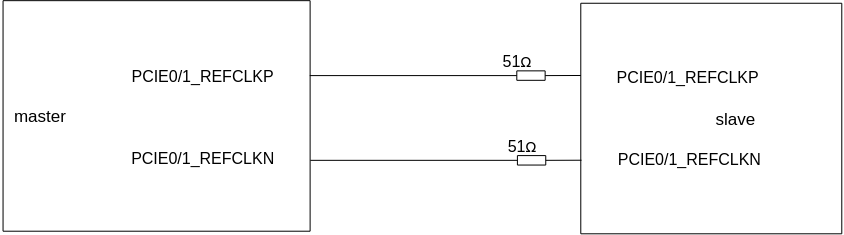
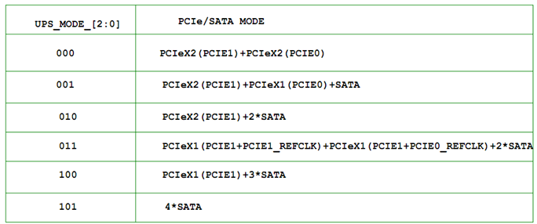
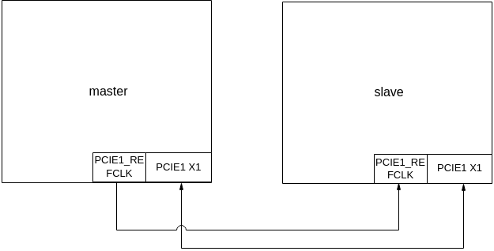
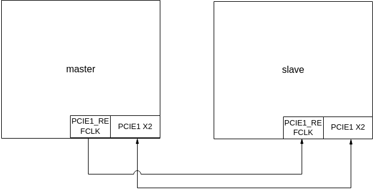
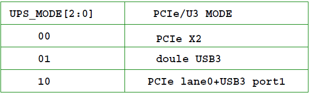
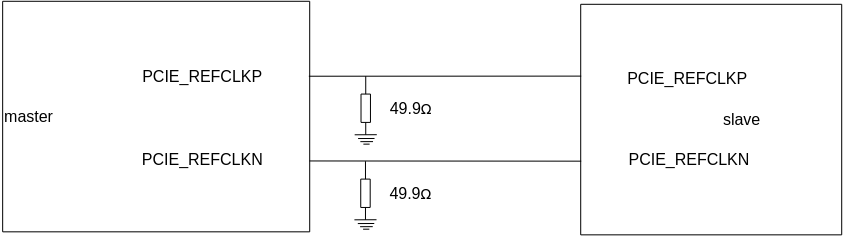
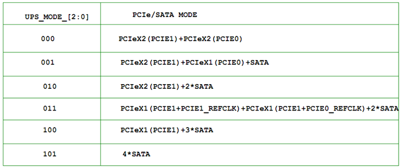
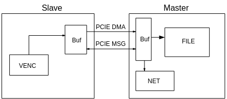

# 前言<a name="ZH-CN_TOPIC_0000002441714681"></a>

**概述<a name="section1371mcpsimp"></a>**

本文分别从硬件环境准备、软件环境准备等方面介绍Demo板PCIe级联操作的相关指导，同时介绍了PCIe的基础知识、PCIe级联的业务实现和PCIe MPI接口函数等，可为用户在使用PCIe级联功能时提供参考。

> **说明：** 
>-   未有特殊说明，下文中的ssxx表示的解决方案包含SS528V100、SS625V100、SS928V100、SS927V100、SS626V100。
>-   未有特殊说明，SS927V100与SS928V100内容完全一致。

**产品版本<a name="section1375mcpsimp"></a>**

与本文档相对应的产品版本如下。

<a name="table1378mcpsimp"></a>
<table><thead align="left"><tr id="row1383mcpsimp"><th class="cellrowborder" valign="top" width="32%" id="mcps1.1.3.1.1"><p id="p1385mcpsimp"><a name="p1385mcpsimp"></a><a name="p1385mcpsimp"></a>产品名称</p>
</th>
<th class="cellrowborder" valign="top" width="68%" id="mcps1.1.3.1.2"><p id="p1387mcpsimp"><a name="p1387mcpsimp"></a><a name="p1387mcpsimp"></a>产品版本</p>
</th>
</tr>
</thead>
<tbody><tr id="row1389mcpsimp"><td class="cellrowborder" valign="top" width="32%" headers="mcps1.1.3.1.1 "><p id="p1391mcpsimp"><a name="p1391mcpsimp"></a><a name="p1391mcpsimp"></a>SS928</p>
</td>
<td class="cellrowborder" valign="top" width="68%" headers="mcps1.1.3.1.2 "><p id="p1393mcpsimp"><a name="p1393mcpsimp"></a><a name="p1393mcpsimp"></a>V100</p>
</td>
</tr>
<tr id="row1394mcpsimp"><td class="cellrowborder" valign="top" width="32%" headers="mcps1.1.3.1.1 "><p id="p1396mcpsimp"><a name="p1396mcpsimp"></a><a name="p1396mcpsimp"></a>SS626</p>
</td>
<td class="cellrowborder" valign="top" width="68%" headers="mcps1.1.3.1.2 "><p id="p1398mcpsimp"><a name="p1398mcpsimp"></a><a name="p1398mcpsimp"></a>V100</p>
</td>
</tr>
<tr id="row2762104316540"><td class="cellrowborder" valign="top" width="32%" headers="mcps1.1.3.1.1 "><p id="p191707516282"><a name="p191707516282"></a><a name="p191707516282"></a>SS528</p>
</td>
<td class="cellrowborder" valign="top" width="68%" headers="mcps1.1.3.1.2 "><p id="p14171957287"><a name="p14171957287"></a><a name="p14171957287"></a>V100</p>
</td>
</tr>
<tr id="row46220598515"><td class="cellrowborder" valign="top" width="32%" headers="mcps1.1.3.1.1 "><p id="p144315455217"><a name="p144315455217"></a><a name="p144315455217"></a>SS625</p>
</td>
<td class="cellrowborder" valign="top" width="68%" headers="mcps1.1.3.1.2 "><p id="p1062316593517"><a name="p1062316593517"></a><a name="p1062316593517"></a>V100</p>
</td>
</tr>
<tr id="row1425220334618"><td class="cellrowborder" valign="top" width="32%" headers="mcps1.1.3.1.1 "><p id="p8622349102117"><a name="p8622349102117"></a><a name="p8622349102117"></a>SS927</p>
</td>
<td class="cellrowborder" valign="top" width="68%" headers="mcps1.1.3.1.2 "><p id="p9185184311112"><a name="p9185184311112"></a><a name="p9185184311112"></a>V100</p>
</td>
</tr>
</tbody>
</table>

**读者对象<a name="section1399mcpsimp"></a>**

本文档（本指南）主要适用于以下工程师：

-   技术支持工程师
-   软件开发工程师

**符号约定<a name="section1405mcpsimp"></a>**

在本文中可能出现下列标志，它们所代表的含义如下。

<a name="table1408mcpsimp"></a>
<table><thead align="left"><tr id="row1413mcpsimp"><th class="cellrowborder" valign="top" width="20%" id="mcps1.1.3.1.1"><p id="p1415mcpsimp"><a name="p1415mcpsimp"></a><a name="p1415mcpsimp"></a>符号</p>
</th>
<th class="cellrowborder" valign="top" width="80%" id="mcps1.1.3.1.2"><p id="p1417mcpsimp"><a name="p1417mcpsimp"></a><a name="p1417mcpsimp"></a>说明</p>
</th>
</tr>
</thead>
<tbody><tr id="row1419mcpsimp"><td class="cellrowborder" valign="top" width="20%" headers="mcps1.1.3.1.1 "><p class="msonormal" id="p1421mcpsimp"><a name="p1421mcpsimp"></a><a name="p1421mcpsimp"></a><a name="image158"></a><a name="image158"></a><span></span></p>
</td>
<td class="cellrowborder" valign="top" width="80%" headers="mcps1.1.3.1.2 "><p id="p1423mcpsimp"><a name="p1423mcpsimp"></a><a name="p1423mcpsimp"></a>表示如不避免则将会导致死亡或严重伤害的具有高等级风险的危害。</p>
</td>
</tr>
<tr id="row1424mcpsimp"><td class="cellrowborder" valign="top" width="20%" headers="mcps1.1.3.1.1 "><p class="msonormal" id="p1426mcpsimp"><a name="p1426mcpsimp"></a><a name="p1426mcpsimp"></a><a name="image159"></a><a name="image159"></a><span></span></p>
</td>
<td class="cellrowborder" valign="top" width="80%" headers="mcps1.1.3.1.2 "><p id="p1428mcpsimp"><a name="p1428mcpsimp"></a><a name="p1428mcpsimp"></a>表示如不避免则可能导致死亡或严重伤害的具有中等级风险的危害。</p>
</td>
</tr>
<tr id="row1429mcpsimp"><td class="cellrowborder" valign="top" width="20%" headers="mcps1.1.3.1.1 "><p class="msonormal" id="p1431mcpsimp"><a name="p1431mcpsimp"></a><a name="p1431mcpsimp"></a><a name="image160"></a><a name="image160"></a><span></span></p>
</td>
<td class="cellrowborder" valign="top" width="80%" headers="mcps1.1.3.1.2 "><p id="p1433mcpsimp"><a name="p1433mcpsimp"></a><a name="p1433mcpsimp"></a>表示如不避免则可能导致轻微或中度伤害的具有低等级风险的危害。</p>
</td>
</tr>
<tr id="row1434mcpsimp"><td class="cellrowborder" valign="top" width="20%" headers="mcps1.1.3.1.1 "><p class="msonormal" id="p1436mcpsimp"><a name="p1436mcpsimp"></a><a name="p1436mcpsimp"></a><a name="image161"></a><a name="image161"></a><span></span></p>
</td>
<td class="cellrowborder" valign="top" width="80%" headers="mcps1.1.3.1.2 "><p id="p1438mcpsimp"><a name="p1438mcpsimp"></a><a name="p1438mcpsimp"></a>用于传递设备或环境安全警示信息。如不避免则可能会导致设备损坏、数据丢失、设备性能降低或其它不可预知的结果。</p>
<p id="p1439mcpsimp"><a name="p1439mcpsimp"></a><a name="p1439mcpsimp"></a>“须知”不涉及人身伤害。</p>
</td>
</tr>
<tr id="row1440mcpsimp"><td class="cellrowborder" valign="top" width="20%" headers="mcps1.1.3.1.1 "><p class="msonormal" id="p1442mcpsimp"><a name="p1442mcpsimp"></a><a name="p1442mcpsimp"></a><a name="image162"></a><a name="image162"></a><span></span></p>
</td>
<td class="cellrowborder" valign="top" width="80%" headers="mcps1.1.3.1.2 "><p id="p1444mcpsimp"><a name="p1444mcpsimp"></a><a name="p1444mcpsimp"></a>对正文中重点信息的补充说明。</p>
<p id="p1445mcpsimp"><a name="p1445mcpsimp"></a><a name="p1445mcpsimp"></a>“说明”不是安全警示信息，不涉及人身、设备及环境伤害信息。</p>
</td>
</tr>
</tbody>
</table>

**修订记录<a name="section1446mcpsimp"></a>**

修订记录累积了每次文档更新的说明。最新版本的文档包含以前所有文档版本的更新内容。

<a name="table1557726816410"></a>
<table><thead align="left"><tr id="row2942532716410"><th class="cellrowborder" valign="top" width="20.72%" id="mcps1.1.4.1.1"><p id="p3778275416410"><a name="p3778275416410"></a><a name="p3778275416410"></a><strong id="b5687322716410"><a name="b5687322716410"></a><a name="b5687322716410"></a>文档版本</strong></p>
</th>
<th class="cellrowborder" valign="top" width="26.119999999999997%" id="mcps1.1.4.1.2"><p id="p5627845516410"><a name="p5627845516410"></a><a name="p5627845516410"></a><strong id="b5800814916410"><a name="b5800814916410"></a><a name="b5800814916410"></a>发布日期</strong></p>
</th>
<th class="cellrowborder" valign="top" width="53.16%" id="mcps1.1.4.1.3"><p id="p2382284816410"><a name="p2382284816410"></a><a name="p2382284816410"></a><strong id="b3316380216410"><a name="b3316380216410"></a><a name="b3316380216410"></a>修改说明</strong></p>
</th>
</tr>
</thead>
<tbody><tr id="row5947359616410"><td class="cellrowborder" valign="top" width="20.72%" headers="mcps1.1.4.1.1 "><p id="p2149706016410"><a name="p2149706016410"></a><a name="p2149706016410"></a>00B01</p>
</td>
<td class="cellrowborder" valign="top" width="26.119999999999997%" headers="mcps1.1.4.1.2 "><p id="p648803616410"><a name="p648803616410"></a><a name="p648803616410"></a>2025-09-15</p>
</td>
<td class="cellrowborder" valign="top" width="53.16%" headers="mcps1.1.4.1.3 "><p id="p1946537916410"><a name="p1946537916410"></a><a name="p1946537916410"></a>第1次临时版本发布。</p>
</td>
</tr>
</tbody>
</table>

# Demo板PCIe级联操作指南<a name="ZH-CN_TOPIC_0000002441714757"></a>


## 硬件环境准备<a name="ZH-CN_TOPIC_0000002408275510"></a>

PCIe级联调测，需要准备两块或多块硬件板卡，两片或多片板卡通过PCIe级联使用：

-   其中一片工作在PCIe主模式（主片RC \(Root-Complex\)模式）。
-   其他片工作在PCIe从模式（从片EP \(End-Point\)模式）。

多片通过PCIe进行级联时，主片通过PCIe桥与多个从片进行级联。需要为板卡正确连接电源线、串口线、网线以及视频输入输出线。

## 软件环境准备<a name="ZH-CN_TOPIC_0000002441714765"></a>

解决方案需要的boot、内核以及文件系统可参考发布包sdk/osdrv目录下的《readme》文件及sdk/osdrv/components/pcie\_mcc中的《主片引导从片启动方法》来编译相关镜像和驱动。

-   主从片均采用Flash启动方式：

    按照非PCIe模式的烧写方式，烧写主/从片上的u-boot、内核以及文件系统即可。

-   主从片Flash启动方式下，启动文件清单如[表1](#_Ref239665721)所示。

**表 1**  启动文件清单（主从片均采用Flash启动）

<a name="_Ref239665721"></a>
<table><thead align="left"><tr id="row2141mcpsimp"><th class="cellrowborder" colspan="2" valign="top" id="mcps1.2.5.1.1"><p id="p2143mcpsimp"><a name="p2143mcpsimp"></a><a name="p2143mcpsimp"></a>项目</p>
</th>
<th class="cellrowborder" valign="top" id="mcps1.2.5.1.2"><p id="p2145mcpsimp"><a name="p2145mcpsimp"></a><a name="p2145mcpsimp"></a>文件名称</p>
</th>
<th class="cellrowborder" valign="top" id="mcps1.2.5.1.3"><p id="p2147mcpsimp"><a name="p2147mcpsimp"></a><a name="p2147mcpsimp"></a>描述</p>
</th>
</tr>
</thead>
<tbody><tr id="row2149mcpsimp"><td class="cellrowborder" rowspan="3" valign="top" width="11%" headers="mcps1.2.5.1.1 "><p id="p2151mcpsimp"><a name="p2151mcpsimp"></a><a name="p2151mcpsimp"></a>主片</p>
</td>
<td class="cellrowborder" rowspan="3" valign="top" width="12%" headers="mcps1.2.5.1.1 "><p id="p2153mcpsimp"><a name="p2153mcpsimp"></a><a name="p2153mcpsimp"></a>ARM</p>
</td>
<td class="cellrowborder" valign="top" width="47%" headers="mcps1.2.5.1.2 "><p id="p2155mcpsimp"><a name="p2155mcpsimp"></a><a name="p2155mcpsimp"></a>u-boot-xxx.bin或boot_image.bin</p>
</td>
<td class="cellrowborder" valign="top" width="30%" headers="mcps1.2.5.1.3 "><p id="p2157mcpsimp"><a name="p2157mcpsimp"></a><a name="p2157mcpsimp"></a>烧写到主片Flash</p>
</td>
</tr>
<tr id="row2158mcpsimp"><td class="cellrowborder" valign="top" headers="mcps1.2.5.1.1 "><p id="p2160mcpsimp"><a name="p2160mcpsimp"></a><a name="p2160mcpsimp"></a>uImage_xxx</p>
</td>
<td class="cellrowborder" valign="top" headers="mcps1.2.5.1.1 "><p id="p2162mcpsimp"><a name="p2162mcpsimp"></a><a name="p2162mcpsimp"></a>烧写到主片Flash</p>
</td>
</tr>
<tr id="row2163mcpsimp"><td class="cellrowborder" valign="top" headers="mcps1.2.5.1.1 "><p id="p2165mcpsimp"><a name="p2165mcpsimp"></a><a name="p2165mcpsimp"></a>rootfs_xxx.ubifs</p>
</td>
<td class="cellrowborder" valign="top" headers="mcps1.2.5.1.1 "><p id="p2167mcpsimp"><a name="p2167mcpsimp"></a><a name="p2167mcpsimp"></a>烧写到主片Flash</p>
</td>
</tr>
<tr id="row2168mcpsimp"><td class="cellrowborder" rowspan="3" valign="top" width="11%" headers="mcps1.2.5.1.1 "><p id="p2170mcpsimp"><a name="p2170mcpsimp"></a><a name="p2170mcpsimp"></a>从片</p>
</td>
<td class="cellrowborder" rowspan="3" valign="top" width="12%" headers="mcps1.2.5.1.1 "><p id="p2172mcpsimp"><a name="p2172mcpsimp"></a><a name="p2172mcpsimp"></a>ARM</p>
</td>
<td class="cellrowborder" valign="top" width="47%" headers="mcps1.2.5.1.2 "><p id="p2174mcpsimp"><a name="p2174mcpsimp"></a><a name="p2174mcpsimp"></a>u-boot-xxx.bin或boot_image.bin</p>
</td>
<td class="cellrowborder" valign="top" width="30%" headers="mcps1.2.5.1.3 "><p id="p2176mcpsimp"><a name="p2176mcpsimp"></a><a name="p2176mcpsimp"></a>烧写到从片Flash</p>
</td>
</tr>
<tr id="row2177mcpsimp"><td class="cellrowborder" valign="top" headers="mcps1.2.5.1.1 "><p id="p2179mcpsimp"><a name="p2179mcpsimp"></a><a name="p2179mcpsimp"></a>uImage_xxx</p>
</td>
<td class="cellrowborder" valign="top" headers="mcps1.2.5.1.1 "><p id="p2181mcpsimp"><a name="p2181mcpsimp"></a><a name="p2181mcpsimp"></a>烧写到从片Flash</p>
</td>
</tr>
<tr id="row2182mcpsimp"><td class="cellrowborder" valign="top" headers="mcps1.2.5.1.1 "><p id="p2184mcpsimp"><a name="p2184mcpsimp"></a><a name="p2184mcpsimp"></a>rootfs_xxx.ubifs</p>
</td>
<td class="cellrowborder" valign="top" headers="mcps1.2.5.1.1 "><p id="p2186mcpsimp"><a name="p2186mcpsimp"></a><a name="p2186mcpsimp"></a>烧写到从片Flash</p>
</td>
</tr>
</tbody>
</table>

主片采用Flash启动方式，从片采用由主片进行引导DDR启动方式，启动文件清单如[表2](#_Ref316042797)所示。

**表 2**  启动文件清单（主片采用Flash启动，从片采用DDR启动）

<a name="_Ref316042797"></a>
<table><thead align="left"><tr id="row2196mcpsimp"><th class="cellrowborder" colspan="2" valign="top" id="mcps1.2.5.1.1"><p id="p2198mcpsimp"><a name="p2198mcpsimp"></a><a name="p2198mcpsimp"></a>项目</p>
</th>
<th class="cellrowborder" valign="top" id="mcps1.2.5.1.2"><p id="p2200mcpsimp"><a name="p2200mcpsimp"></a><a name="p2200mcpsimp"></a>文件名称</p>
</th>
<th class="cellrowborder" valign="top" id="mcps1.2.5.1.3"><p id="p2202mcpsimp"><a name="p2202mcpsimp"></a><a name="p2202mcpsimp"></a>描述</p>
</th>
</tr>
</thead>
<tbody><tr id="row2204mcpsimp"><td class="cellrowborder" rowspan="3" valign="top" width="9%" headers="mcps1.2.5.1.1 "><p id="p2206mcpsimp"><a name="p2206mcpsimp"></a><a name="p2206mcpsimp"></a>主片</p>
</td>
<td class="cellrowborder" rowspan="3" valign="top" width="12%" headers="mcps1.2.5.1.1 "><p id="p2208mcpsimp"><a name="p2208mcpsimp"></a><a name="p2208mcpsimp"></a>ARM</p>
</td>
<td class="cellrowborder" valign="top" width="45%" headers="mcps1.2.5.1.2 "><p id="p2210mcpsimp"><a name="p2210mcpsimp"></a><a name="p2210mcpsimp"></a>u-boot-xxx.bin或boot_image.bin</p>
</td>
<td class="cellrowborder" valign="top" width="34%" headers="mcps1.2.5.1.3 "><p id="p2212mcpsimp"><a name="p2212mcpsimp"></a><a name="p2212mcpsimp"></a>烧写到主片Flash</p>
</td>
</tr>
<tr id="row2213mcpsimp"><td class="cellrowborder" valign="top" headers="mcps1.2.5.1.1 "><p id="p2215mcpsimp"><a name="p2215mcpsimp"></a><a name="p2215mcpsimp"></a>uImagexxx</p>
</td>
<td class="cellrowborder" valign="top" headers="mcps1.2.5.1.1 "><p id="p2217mcpsimp"><a name="p2217mcpsimp"></a><a name="p2217mcpsimp"></a>烧写到主片Flash</p>
</td>
</tr>
<tr id="row2218mcpsimp"><td class="cellrowborder" valign="top" headers="mcps1.2.5.1.1 "><p id="p2220mcpsimp"><a name="p2220mcpsimp"></a><a name="p2220mcpsimp"></a>rootfs_xxx.ubifs</p>
</td>
<td class="cellrowborder" valign="top" headers="mcps1.2.5.1.1 "><p id="p2222mcpsimp"><a name="p2222mcpsimp"></a><a name="p2222mcpsimp"></a>烧写到主片Flash</p>
</td>
</tr>
<tr id="row2223mcpsimp"><td class="cellrowborder" rowspan="3" valign="top" width="9%" headers="mcps1.2.5.1.1 "><p id="p2225mcpsimp"><a name="p2225mcpsimp"></a><a name="p2225mcpsimp"></a>从片</p>
</td>
<td class="cellrowborder" rowspan="3" valign="top" width="12%" headers="mcps1.2.5.1.1 "><p id="p2227mcpsimp"><a name="p2227mcpsimp"></a><a name="p2227mcpsimp"></a>ARM</p>
</td>
<td class="cellrowborder" valign="top" width="45%" headers="mcps1.2.5.1.2 "><p id="p2229mcpsimp"><a name="p2229mcpsimp"></a><a name="p2229mcpsimp"></a>u-boot.bin	或boot_image.bin</p>
</td>
<td class="cellrowborder" valign="top" width="34%" headers="mcps1.2.5.1.3 "><p id="p2231mcpsimp"><a name="p2231mcpsimp"></a><a name="p2231mcpsimp"></a>由主片导入从片DDR内存</p>
</td>
</tr>
<tr id="row2232mcpsimp"><td class="cellrowborder" valign="top" headers="mcps1.2.5.1.1 "><p id="p2234mcpsimp"><a name="p2234mcpsimp"></a><a name="p2234mcpsimp"></a>uImage</p>
</td>
<td class="cellrowborder" valign="top" headers="mcps1.2.5.1.1 "><p id="p2236mcpsimp"><a name="p2236mcpsimp"></a><a name="p2236mcpsimp"></a>由主片导入从片DDR内存</p>
</td>
</tr>
<tr id="row2237mcpsimp"><td class="cellrowborder" valign="top" headers="mcps1.2.5.1.1 "><p id="p2239mcpsimp"><a name="p2239mcpsimp"></a><a name="p2239mcpsimp"></a>cramfs.initrd.img</p>
</td>
<td class="cellrowborder" valign="top" headers="mcps1.2.5.1.1 "><p id="p2241mcpsimp"><a name="p2241mcpsimp"></a><a name="p2241mcpsimp"></a>由主片导入从片DDR内存</p>
</td>
</tr>
</tbody>
</table>

> **说明：** 
>-   上文中的xxx并不代表具体的文件名称，真正的文件名称以实际编译出并选择的文件为准。
>-   上文中的u-boot.bin为快速启动的uboot镜像；boot\_image.bin为非快速启动（非安全/安全启动）的boot镜像。

## 主片及从片启动<a name="ZH-CN_TOPIC_0000002408275462"></a>

主片和从片启动有以下2种方式：

-   主从片均采用Flash启动方式。

    按照非PCIe模式的启动方式启动，保证从片在主片之前启动即可。

-   主片采用Flash启动方式，从片采用DDR启动方式，由主片来引导。

    详细操作请参考其发布包中sdk/osdrv/components/ pcie\_mcc/目录下的《主片引导从片启动方法》。

    > **须知：** 
    >一旦程序出现异常需要重启单板，则主从片均要重新启动。

## PCIV功能验证<a name="ZH-CN_TOPIC_0000002441714709"></a>


### 依赖的驱动说明<a name="ZH-CN_TOPIC_0000002441714717"></a>

PCIV为基于PCIe驱动和解决方案媒体驱动的上层业务模块，依赖的驱动包括PCIe底层驱动、PCIe消息驱动（即MCC）和所有MPP媒体驱动。

-   PCIe底层驱动包括vendor\_dev\_host.ko、vendor\_dev\_slv.ko、pcit\_dma\_host.ko、pcit\_dma\_slv.ko、irq\_map\_host.ko和irq\_map\_slv.ko；
-   PCIe消息驱动包括mcc\_drv\_host.ko、mcc\_usrdev\_host.ko、mcc\_drv\_slv.ko和mcc\_usrdev\_slv.ko；
-   MPP媒体驱动：load\_ssxx脚本中所有需要加载的模块驱动；
-   PCIV模块本身的相关驱动：

    仅支持单系统模式，加载ssxx\_pciv.ko和ssxx\_pciv\_fmw.ko；

SDK发布包中已有相关脚本（主片加载使用load\_ssxx\_master， 从片加载使用 load\_ssxx\_slave）来加载以上所有驱动。

### 验证操作步骤<a name="ZH-CN_TOPIC_0000002408115622"></a>

验证PCIV功能的样例代码位于SDK发布包的mpp/sample/pciv目录下，包括主片和从片分别使用的Sample代码、封装的消息通讯代码和封装的数据通讯代码。

> **须知：** 
>执行以下验证操作前，请先使用Sample目录下的Makefile编译生成相关可执行文件。

在硬件、软件环境准备好后，执行完整的PCIV功能验证（其中的脚本内容请直接阅读SDK发布包中相应脚本）的步骤如下：

1.  主从片分别进入mpp /ko目录，从片执行脚本load\_ssxx\_slave，主片执行脚本load\_ssxx\_master，加载PCIe相关ko和MPP相关ko。
2.  从片进入mpp/sample/pciv/目录，执行从片的Sample程序sample\_pciv\_slave，此时终端上将打印start check pci target id:x……并被阻塞，等待主片启动。
3.  主片进入mpp/sample/pciv/目录，执行主片的Sample程序sample\_pciv\_host，完成与从片的握手过程后，即启动从片与主片之间的数据传输业务。
4.  如果需要停止Sample程序，可以在主片上按回车键，主片会发消息给从片销毁相关业务，并退出本片程序；从片接收消息并在销毁相关业务后退出。

    > **须知：** 
    >编写从片加载ko脚本需注意：
    >-   如果使用flash启动方式，从片指定pcie消息空间，以及window空间，这两者之间，以及与其他mmz之间的空间不能重叠
    >-   如果使用从启动方式，从片镜像会占用一部分内存，具体占用位置，参考./components/pcie\_mcc/multi\_boot/example/中boot\_test.h和boot\_test.c相关定义。

# Demo板从启动硬件及软件配置<a name="ZH-CN_TOPIC_0000002441714737"></a>


## 从启动硬件配置<a name="ZH-CN_TOPIC_0000002408275494"></a>

BOOT源选择为PCIe启动，要求将PCIE\_SLV\_BOOT\_MODE，配置为1。

PCIe从启动时，注意时钟硬件选择管脚的设置：

**表 1**  PCIe时钟源选择

<a name="table958mcpsimp"></a>
<table><thead align="left"><tr id="row966mcpsimp"><th class="cellrowborder" valign="top" width="20%" id="mcps1.2.5.1.1"><p id="p968mcpsimp"><a name="p968mcpsimp"></a><a name="p968mcpsimp"></a>解决方案</p>
</th>
<th class="cellrowborder" valign="top" width="23%" id="mcps1.2.5.1.2"><p id="p970mcpsimp"><a name="p970mcpsimp"></a><a name="p970mcpsimp"></a>信号</p>
</th>
<th class="cellrowborder" valign="top" width="9%" id="mcps1.2.5.1.3"><p id="p972mcpsimp"><a name="p972mcpsimp"></a><a name="p972mcpsimp"></a>方向</p>
</th>
<th class="cellrowborder" valign="top" width="48%" id="mcps1.2.5.1.4"><p id="p974mcpsimp"><a name="p974mcpsimp"></a><a name="p974mcpsimp"></a>功能</p>
</th>
</tr>
</thead>
<tbody><tr id="row975mcpsimp"><td class="cellrowborder" valign="top" width="20%" headers="mcps1.2.5.1.1 "><p id="p977mcpsimp"><a name="p977mcpsimp"></a><a name="p977mcpsimp"></a>SS528V100</p>
<p id="p978mcpsimp"><a name="p978mcpsimp"></a><a name="p978mcpsimp"></a>SS625V100</p>
</td>
<td class="cellrowborder" valign="top" width="23%" headers="mcps1.2.5.1.2 "><p id="p980mcpsimp"><a name="p980mcpsimp"></a><a name="p980mcpsimp"></a>PCIE0_REFCLK_SEL</p>
<p id="p981mcpsimp"><a name="p981mcpsimp"></a><a name="p981mcpsimp"></a>PCIE1_REFCLK_SEL</p>
</td>
<td class="cellrowborder" valign="top" width="9%" headers="mcps1.2.5.1.3 "><p id="p983mcpsimp"><a name="p983mcpsimp"></a><a name="p983mcpsimp"></a>I</p>
</td>
<td class="cellrowborder" valign="top" width="48%" headers="mcps1.2.5.1.4 "><p id="p985mcpsimp"><a name="p985mcpsimp"></a><a name="p985mcpsimp"></a>PCIe0/1参考时钟源选择（内部下拉）。</p>
<p id="p986mcpsimp"><a name="p986mcpsimp"></a><a name="p986mcpsimp"></a>0：内部时钟；</p>
<p id="p987mcpsimp"><a name="p987mcpsimp"></a><a name="p987mcpsimp"></a>1：外部时钟。</p>
</td>
</tr>
<tr id="row988mcpsimp"><td class="cellrowborder" valign="top" width="20%" headers="mcps1.2.5.1.1 "><p id="p990mcpsimp"><a name="p990mcpsimp"></a><a name="p990mcpsimp"></a>SS928V100</p>
</td>
<td class="cellrowborder" valign="top" width="23%" headers="mcps1.2.5.1.2 "><p id="p992mcpsimp"><a name="p992mcpsimp"></a><a name="p992mcpsimp"></a>PCIE_REFCLK_SEL</p>
</td>
<td class="cellrowborder" valign="top" width="9%" headers="mcps1.2.5.1.3 "><p id="p994mcpsimp"><a name="p994mcpsimp"></a><a name="p994mcpsimp"></a>I</p>
</td>
<td class="cellrowborder" valign="top" width="48%" headers="mcps1.2.5.1.4 "><p id="p996mcpsimp"><a name="p996mcpsimp"></a><a name="p996mcpsimp"></a>PCIe参考时钟源选择（内部下拉）。</p>
<p id="p997mcpsimp"><a name="p997mcpsimp"></a><a name="p997mcpsimp"></a>0：内部时钟；</p>
<p id="p998mcpsimp"><a name="p998mcpsimp"></a><a name="p998mcpsimp"></a>1：外部时钟。</p>
</td>
</tr>
<tr id="row999mcpsimp"><td class="cellrowborder" valign="top" width="20%" headers="mcps1.2.5.1.1 "><p id="p1001mcpsimp"><a name="p1001mcpsimp"></a><a name="p1001mcpsimp"></a>SS626V100</p>
</td>
<td class="cellrowborder" valign="top" width="23%" headers="mcps1.2.5.1.2 "><p id="p1003mcpsimp"><a name="p1003mcpsimp"></a><a name="p1003mcpsimp"></a>PCIE0_REFCLK_SEL</p>
<p id="p1004mcpsimp"><a name="p1004mcpsimp"></a><a name="p1004mcpsimp"></a>PCIE1_REFCLK_SEL</p>
</td>
<td class="cellrowborder" valign="top" width="9%" headers="mcps1.2.5.1.3 "><p id="p1006mcpsimp"><a name="p1006mcpsimp"></a><a name="p1006mcpsimp"></a>I</p>
</td>
<td class="cellrowborder" valign="top" width="48%" headers="mcps1.2.5.1.4 "><p id="p1008mcpsimp"><a name="p1008mcpsimp"></a><a name="p1008mcpsimp"></a>PCIe0/1参考时钟源选择（内部下拉）。</p>
<p id="p1009mcpsimp"><a name="p1009mcpsimp"></a><a name="p1009mcpsimp"></a>0：内部时钟；</p>
<p id="p1010mcpsimp"><a name="p1010mcpsimp"></a><a name="p1010mcpsimp"></a>1：外部时钟。</p>
</td>
</tr>
</tbody>
</table>

## 在级联场景时钟设计注意事项<a name="ZH-CN_TOPIC_0000002408115590"></a>


### SS528V100/SS625V100<a name="ZH-CN_TOPIC_0000002441714673"></a>

-   PCIe差分时钟PCIE0/1\_REFCLKM和PCIE0/1\_REFCLKP为电压型信号，当差分时钟信号需要输出给外部设备时，差分时钟信号在靠近末端串联51Ω电阻，不需要加下拉电阻，以SS528V100为例，如[图1](#fig181756507345)所示。

    **图 1**  SS528V100 PCIe时钟图<a name="fig181756507345"></a>  
    

-   PCIe选择为外部时钟输入时，差分时钟信号的匹配方式取决于输出设备，且只支持HCSL电平，不支持交流耦合。

> **须知：** 
>时钟选择错误将导致从片PCIe无法使用外部时钟模式。

-   各种PCIE组合如[图2](#fig166399527367)所示。

    **图 2**  PCIe模式图<a name="fig166399527367"></a>  
    

以SS528V100为例，以下为几种典型的PCIe级联示意图。

-   两片PCIe X1级联，如[图3](#fig2638231103819)所示。

    **图 3**  两片PCIe X1级联示意图<a name="fig2638231103819"></a>  
    

-   两片PCIe X2级联，如[图4](#fig251748193818)所示。

    **图 4**  两片PCIe X2级联示意图<a name="fig251748193818"></a>  
    

### SS928V100/SS927V100<a name="ZH-CN_TOPIC_0000002441674833"></a>

-   PCIe差分时钟PCIE\_REFCLKM和PCIE\_REFCLKP为电流型信号，以SS928V100为例，当差分时钟信号需要输出给外部设备时，在差分时钟输出端对地加49.9Ω电阻，如[图1](#fig74118483404)所示。

    **图 1**  SS928V100 PCIe时钟图<a name="fig74118483404"></a>  
    

-   SS928V100各种PCIE组合如[图2](#_Ref48220706)所示。

    **图 2**  PCIe模式图<a name="_Ref48220706"></a>  
    

-   SS928V100 两片PCIe X1级联，如[图3](#fig133146123541)所示。

    **图 3**  两片PCIe X1级联示意图<a name="fig133146123541"></a>  
    

### SS626V100<a name="ZH-CN_TOPIC_0000002408275426"></a>

-   SS626V100 PCIe差分时钟PCIE\_REFCLKM和PCIE\_REFCLKP为电流型信号，当差分时钟信号需要输出给外部设备时，在差分时钟输出端对地加49.9Ω电阻，如[图1](#fig12617468544)所示。

    **图 1**  SS626V100 PCIe时钟图<a name="fig12617468544"></a>  
    

-   SS626V100各种PCIE组合如[图2](#fig9798149145515)所示。

    **图 2**  PCIe模式图<a name="fig9798149145515"></a>  
    

-   SS626V100 两片PCIe X1级联，如[图3](#fig2095313298559)所示。

    **图 3**  两片PCIe X1级联示意图<a name="fig2095313298559"></a>  
    

## 从启动软件配置<a name="ZH-CN_TOPIC_0000002441714677"></a>


### PCIe时钟选择模式配置<a name="ZH-CN_TOPIC_0000002408275430"></a>

-   SS528V100/SS625V100请参考芯片手册文档“13.7.5.1 时钟和复位 时钟设置”章节的相关描述。
-   SS928V100请参考芯片手册文档“14.8.5.1 时钟和复位”章节的相关描述。
-   SS626V100请参考芯片手册文档“13.7.5.1 时钟和复位”章节的相关描述。

### PCIE\_MCC驱动配置<a name="ZH-CN_TOPIC_0000002408275522"></a>

pcie\_mcc目前只使用一个PCIe控制器，PCIE\_MCC驱动的默认配置已在PCIE\_MCC驱动代码的./vendor\_dev/arch/config.h文件中进行设置，不需要修改。

# PCIe基础知识<a name="ZH-CN_TOPIC_0000002441714769"></a>


## 概述<a name="ZH-CN_TOPIC_0000002441674921"></a>

PCIe是外围设备互连（Peripheral Component Interconnect Express）的简称，作为一种通用的总线接口标准，在目前的计算机系统中得到了非常广泛的应用。PCIe总线的时钟频率一般使用2.5GHz，在32bit系统中，最基本的PCI Express x1模式理论极限速度可以达500MB/s（2.5Gbps x \(1 B/8bit\) x \(8b/10b\) x 2）；但PCIe无法一直维持在峰值传输的状态，一般只能保持在50～60％的传输效率，即250MB/s～300MB/s的速度。如果需要更高的传输速度，可以使用PCI Express x 2、x 4、x 8或x 16模式，数据理论传输速率分别达到1GBps、2GBps、4GBps和8GBps。

PCIe设备上有三种地址空间，对应三种PCIe总线命令，具体如[表1](#_Ref244573723)所示。

> **说明：** 
>CPU可以访问PCIe设备上的所有地址空间。

**表 1**  PCIe地址空间和命令

<a name="_Ref244573723"></a>
<table><thead align="left"><tr id="row1229mcpsimp"><th class="cellrowborder" valign="top" width="18%" id="mcps1.2.5.1.1"><p id="p1231mcpsimp"><a name="p1231mcpsimp"></a><a name="p1231mcpsimp"></a>地址空间</p>
</th>
<th class="cellrowborder" valign="top" width="25%" id="mcps1.2.5.1.2"><p id="p1233mcpsimp"><a name="p1233mcpsimp"></a><a name="p1233mcpsimp"></a>描述</p>
</th>
<th class="cellrowborder" valign="top" width="19%" id="mcps1.2.5.1.3"><p id="p1235mcpsimp"><a name="p1235mcpsimp"></a><a name="p1235mcpsimp"></a>命令</p>
</th>
<th class="cellrowborder" valign="top" width="38%" id="mcps1.2.5.1.4"><p id="p1237mcpsimp"><a name="p1237mcpsimp"></a><a name="p1237mcpsimp"></a>说明</p>
</th>
</tr>
</thead>
<tbody><tr id="row1239mcpsimp"><td class="cellrowborder" valign="top" width="18%" headers="mcps1.2.5.1.1 "><p id="p1241mcpsimp"><a name="p1241mcpsimp"></a><a name="p1241mcpsimp"></a>I/O空间</p>
</td>
<td class="cellrowborder" rowspan="2" valign="top" width="25%" headers="mcps1.2.5.1.2 "><p id="p1243mcpsimp"><a name="p1243mcpsimp"></a><a name="p1243mcpsimp"></a>供给设备驱动程序使用</p>
</td>
<td class="cellrowborder" valign="top" width="19%" headers="mcps1.2.5.1.3 "><p id="p1245mcpsimp"><a name="p1245mcpsimp"></a><a name="p1245mcpsimp"></a>I/O操作命令</p>
</td>
<td class="cellrowborder" valign="top" width="38%" headers="mcps1.2.5.1.4 "><p id="p1247mcpsimp"><a name="p1247mcpsimp"></a><a name="p1247mcpsimp"></a>对设备对应的I/O地址空间进行访问，此类访问不可预取。</p>
</td>
</tr>
<tr id="row1248mcpsimp"><td class="cellrowborder" valign="top" headers="mcps1.2.5.1.1 "><p id="p1250mcpsimp"><a name="p1250mcpsimp"></a><a name="p1250mcpsimp"></a>存储空间</p>
</td>
<td class="cellrowborder" valign="top" headers="mcps1.2.5.1.2 "><p id="p1252mcpsimp"><a name="p1252mcpsimp"></a><a name="p1252mcpsimp"></a>Memory操作命令</p>
</td>
<td class="cellrowborder" valign="top" headers="mcps1.2.5.1.3 "><p id="p1254mcpsimp"><a name="p1254mcpsimp"></a><a name="p1254mcpsimp"></a>对设备的Memory空间进行访问，其中Memory操作命令又可分为Prefechable（可预取）和Non-prefechable（不可预取）两种类型。</p>
</td>
</tr>
<tr id="row1255mcpsimp"><td class="cellrowborder" valign="top" width="18%" headers="mcps1.2.5.1.1 "><p id="p1257mcpsimp"><a name="p1257mcpsimp"></a><a name="p1257mcpsimp"></a>配置空间</p>
</td>
<td class="cellrowborder" valign="top" width="25%" headers="mcps1.2.5.1.2 "><p id="p1259mcpsimp"><a name="p1259mcpsimp"></a><a name="p1259mcpsimp"></a>提供Linux内核中的PCIe初始化代码使用</p>
</td>
<td class="cellrowborder" valign="top" width="19%" headers="mcps1.2.5.1.3 "><p id="p1261mcpsimp"><a name="p1261mcpsimp"></a><a name="p1261mcpsimp"></a>配置访问命令</p>
</td>
<td class="cellrowborder" valign="top" width="38%" headers="mcps1.2.5.1.4 "><p id="p1263mcpsimp"><a name="p1263mcpsimp"></a><a name="p1263mcpsimp"></a>对设备的配置空间进行读写访问，用来初始化设备，给设备分配资源。</p>
</td>
</tr>
</tbody>
</table>

内核在启动时负责对所有PCIe设备进行初始化，配置所有的PCIe设备，包括中断号以及I/O基址，并在文件/proc/bus/pci/devices中列出所有找到的PCIe设备，以及这些设备的参数和属性。

请查阅有关PCIe规范的资料获取PCIe协议详细说明。本文重点介绍关注业务应用中常用的知识。

## PCIe DMA方式数据传输<a name="ZH-CN_TOPIC_0000002408275442"></a>

PCIe模块内建DMAC，可直接由PCIe接口发起DMA操作，此时不需要ARM的干预，可获得更好的系统性能。

支持PCIe从到主、主到从的DMA读写传输，主要用于传输预览图像、解码图像以及码流等数据。预览图像和解码图像的传输由PCIV模块在内核态调用接口完成，而码流数据的传输则需要用户调用PCIV模块封装的接口来完成。

软件提供的DMA写操作时传输接口需要以下输入参数：

-   目标物理地址（即PCIe地址）
-   源物理地址（即AHB地址）
-   传输长度

从到主的DMA写操作：源地址使用从片的AHB地址（即DDR地址），目标地址使用主片的DDR地址（即其PCIe地址）。

主到从的DMA写操作：源地址使用主片的AHB地址（即DDR地址），目标地址使用从片的窗口PF地址空间对应的PCIe地址。

软件提供的DMA读操作时传输接口需要以下输入参数：

-   目标物理地址（即AHB地址）
-   源物理地址（即PCIe地址）
-   传输长度

从到主的DMA读操作：源地址使用主片的DDR地址（即其PCIe地址），目标地址使用从片的AHB地址（即DDR地址）。

主到从的DMA读操作：源地址使用从片的窗口PF地址空间对应的PCIe地址，目标地址使用主片的AHB地址（即DDR地址）。

## PCIe共享内存方式数据传输<a name="ZH-CN_TOPIC_0000002408275470"></a>

作为PCIe Host的一端可以通过AHB-PCIe window实现ARM core对PCIe总线上的其它设备的访问。

AHB-PCIe window上存在三种地址空间，分别是：

-   非可预取内存空间（NP Memory）
-   可预取内存空间（PF Memory）
-   IO空间（IO）

PCIe主设备由操作系统统一分配从设备配置空间中的BAR0，BAR1，BAR2寄存器的基址，并通过配置空间访问写入；从设备则可以在AHB总线上通过寄存器配置NP Memory和PF Memory的AHB侧基地址以及范围大小（最大8M）。因此主设备上看到的各个从设备的窗口的PCIe地址与从设备本身的AHB侧基地址一一对应，即可使用Window中的可预取内存空间实现主从片间的内存共享，具体如[图1](#fig1037713586118)和[图2](#fig18426182421215)所示。

如[图1](#fig1037713586118)所示，1个PCIe控制器，主片的PCIe地址0x30800000与从片1上的AHB地址0xDF000000可以认为存在映射关系，在主片上对0x30800000区域的读写访问可以通过PCIe总线反应到从片的0xDF000000区域；主片上的PCIe基址0x30800000是通过读取从片1的BAR0寄存器而得到（用户程序可以通过PCIV模块封装的接口获取），而从片上的AHB基址0xDF000000是由驱动程序写入到PCIe iATU寄存器组中的目标地址低位寄存器（PCIe支持64位地址操作，目标地址高位寄存器写0），用户可以在加载vendor\_dev\_slv.ko模块时通过修改模块参数来更改此AHB基址。

**图 1**  PCIe地址与AHB侧地址的映射关系图<a name="fig1037713586118"></a>  


如[图2](#fig18426182421215)所示，2个PCIe控制器，主片的PCIe地址0x28800000与从片1上的AHB地址0xDF000000可以认为存在映射关系，主片的PCIe地址0x38800000与从片2上的AHB地址0xDF000000可以认为存在映射关系。

**图 2**  PCIe地址与AHB侧地址的映射关系图<a name="fig18426182421215"></a>  


> **须知：** 
>PF Memory在从片上的地址范围是可以不断移动的（即窗口的移动），但鉴于整个系统的稳定性以及PCIe消息模块对NP基址的依赖性，不建议在从片启动后再移动窗口。

## PCIe MCC消息应用<a name="ZH-CN_TOPIC_0000002441714693"></a>

PCIe MCC消息模块基于PCIe的Window窗口机制以及系统全局软中断，实现PCIe主从设备间的消息通讯功能。

用户态接口包括：获取PCIe本地以及对端的ChipId号，主从片间的相互检测机制（即通讯握手），消息端口的打开、关闭，消息的读和写、以及Select接口等。

从MCC模块获取到的ChipId号，在PCIe主设备上为0，在PCIe从设备上则为PCIe slot号（由于PCIV模块内部的消息通讯也基于MCC，因此PCIV中的ChipId与此一致）。

MCC的消息缓存池使用PCIe窗口中的可预取内存空间，且固定使用前1M的地址范围，例如加载vendor\_dev\_slv.ko模块时，配置窗口范围为0xDF000000的8M地址范围，则从0xDF000000开始的1M空间分配给MCC模块使用，用户程序不应该再去使用它。

# PCIe级联业务实现<a name="ZH-CN_TOPIC_0000002408275454"></a>


## 视频预览<a name="ZH-CN_TOPIC_0000002441714701"></a>

视频预览主要用于多片之间级联，视频预览是将从片的VI图像传送到PCIe总线上的主片的VO设备上显示。基本的数据流处理如[图1](#fig033716563236)所示。

**图 1**  视频预览数据流处理流程<a name="fig033716563236"></a>  


数据流的控制和传输由MPP系统在内核态完成，用户只需要调用MPI接口完成相应配置、使用PCIe消息机制完成部分命令的传递。传输通路建立以后，正常图像传输则不需用户干预。

> **说明：** 
>-   PCIV相关接口的详细说明和注意事项请参见“[PCIV开发参考](#ZH-CN_TOPIC_0000002441674873)”。
>-   PCIe消息的相关接口则使用mcc模块提供的ioctl命令。
>-   从片在送PCIV之前，建议先通过VPSS模块进行所需处理。
>-   当任务压力过大时，mcc模块会通过串口打印错误日志："Too many DMA data write tasks!"。串口打印会阻塞送帧的中断或进程，可通过调整printk打印等级忽略打印\(mcc使用默认等级打印，忽略打印修改/proc/sys/kernel/printk中的第一个数字为4或以下即可\)。

## 码流传输<a name="ZH-CN_TOPIC_0000002408275546"></a>

码流传输是将设备上的视频编码码流数据或者解码码流数据传送到PCIe总线上的其他设备。基本的数据流处理如[图1](#fig20486323172515)所示。

**图 1**  码流传输数据流处理流程<a name="fig20486323172515"></a>  


码流发送端首先从VENC通道中获取编码码流数据，将其拷贝至准备好的stream buffer中，然后通过PCIe的DMA将码流数据发送到PCIe对端的stream buffer中，对端再将码流取出通过网络发送或存文件，每次传输的读写位置信息可以通过PCIe消息发送到对端以便进行发送和接收的同步控制。发送端和接收端的stream buffer需要用户自行实现，推荐采用不定长的循环buffer，每次传输多帧数据。

> **说明：** 
>-   PCIe DMA的传输使用PCIV模块提供的相应接口。
>-   PCIe消息则使用MCC模块提供的相应接口。
>-   注意：码流的发送和接收都需要四字节对齐。

详细操作及流程可以参考SDK中的样例程序。

## 解码回放图像显示<a name="ZH-CN_TOPIC_0000002441714797"></a>

解码回放图像是将设备上的VDEC 解码后图像传送到PCIe总线上的其他设备的VO设备上显示。基本的数据流处理如[图1](#fig768773142719)所示。

**图 1**  解码回放图像数据流处理流程<a name="fig768773142719"></a>  


具体的数据流处理和接口调用与PCIe预览流程类似，主要区别如下：

-   用户需要创建解码通道并向其发送码流进行解码；
-   PCIV相应传输通路建立后，PCIV模块可以接收VDEC通道解码后图像数据，处理后通过PCIe DMA发送到对端；也可接收VPSS处理后的图像数据，通过PCIe DMA发送到对端。

对端的数据接收及VO显示与预览流程一致。

> **说明：** 
>-   从片在送PCIV之前，建议先通过VPSS模块进行所需处理。
>-   如VO显示高清图像，需要在主片在VO之前调用VPSS进行处理。
>-   图 视频预览数据流处理流程\~图 解码回放图像数据流处理流程中的Slave和Master不代表实际的PCIe模式，以具体的使用场景为准。

## 内存配置<a name="ZH-CN_TOPIC_0000002441674953"></a>

与PCIe业务相关的内存配置时，需要注意以下事项：

-   PCIe从设备加载mcc\_drv\_slv.ko模块时，配置窗口PF地址范围最大为8M。需要注意，前1M固定分配给MCC模块。
-   图像或码流的传输过程中，使用的源地址和目标地址都是由MMZ管理，用户可通过MMZ的VideoBuffer相关接口获取。其中图像的传输由PCIV模块内部从VideoBuff中获取内存，而码流传输需要用户在用户态调用接口获取VideoBuffer内存。
-   从到主的DMA数据传输（包括图像和码流）时，源地址和目标地址都可以是各自DDR上的任意可用地址。
-   主到从或者从到从的DMA数据传输时，目标地址必须使用PCIe窗口映射的PCIe地址。

    以主到从的码流传输为例，主片上的码流发送buffer可位于DDR上任意有效地址空间（可以使用VideoBuffer相关接口分配内存）；而从片上的码流接收buffer则必须在PCIe窗口的PF Memory空间范围内，获取其内存可以调用PCIV相应接口：首先调用[ss\_mpi\_pciv\_create\_window\_vb](#ZH-CN_TOPIC_0000002441674853)创建基于window mmz的缓存池，然后调用[ss\_mpi\_pciv\_malloc\_window\_buf](#ZH-CN_TOPIC_0000002408115566)接口从其中获取缓存块。

    如[图1](#fig1512455175210)所示，命名为window的MMZ区域位于整个PF窗口区域的后7M范围内，此MMZ区域是在从片的初始化加载脚本中创建，基址为0xDF100000，对应的整个从片PCIe窗口的PF基址是0xDF000000，如果用户需要修改PCIe窗口PF基址，则必须同时修改window MMZ的基址。

**图 1**  PCIe窗口PF区域和MMZ区域的示意<a name="fig1512455175210"></a>  


# PCIV开发参考<a name="ZH-CN_TOPIC_0000002441674873"></a>


## PCIV概述<a name="ZH-CN_TOPIC_0000002441714749"></a>

PCIV模块主要提供PCIe多片间图像数据传输等相关MPI接口。具体包括：

-   预览图像的传输：图像发送端绑定VI通道或者绑定VPSS通道，图像接收端绑定VO通道或者VENC通道或者VPSS通道，发送端和接收端进行相应配置并启动后，即可将发送端的图像发送到接收端的VO通道进行显示或者送给VPSS/VENC进行后续处理。
-   解码回放图像的传输：图像发送端绑定VDEC通道或者绑定VPSS通道，图像接收端绑定VO通道或者VENC通道或者VPSS通道，发送端和接收端进行相应配置并启动后，即可将VDEC通道解码后图像发送到接收端的VO通道进行显示或者送给VPSS/VENC进行后续处理。
-   码流数据的传输：提供启动PCIe DMA传输的MPI接口，用户可以调用此接口将编码码流或者解码码流或者其他数据通过PCIe DMA传输到PCIe对端。

> **说明：** 
>-   PCIV模块不提供PCIe消息通讯、编码与PCIV通道的绑定等接口，这些接口由其他模块提供或者由用户实现。用户实现PCIe消息通信时，80号端口已被PCIV内部传输使用，请不要重复使用。
>-   采用绑定方式时，建议PCIV属性配置与前端的保持一致，否则PCIV需要调用VGS处理进行响应处理，需要额外的开销。
>-   如果使用不同解决方案级联，媒体传输部分的数据可能会有差异而导致异常，建议这种场景下，只使用PCIV的DMA功能进行数据传输。

## PCIV MPI参考<a name="ZH-CN_TOPIC_0000002408115574"></a>

本模块所有MPI接口需要在完整，正确的级联环境下调用，否则可能会引发不可预知的异常。本功能模块提供以下MPI：

-   [ss\_mpi\_pciv\_malloc\_chn\_buf](#ZH-CN_TOPIC_0000002408275486)：分配PCIV通道内存。
-   [ss\_mpi\_pciv\_free\_chn\_buf](#ZH-CN_TOPIC_0000002441674881)：释放PCIV通道内存。
-   [ss\_mpi\_pciv\_create\_chn](#ZH-CN_TOPIC_0000002408115522)：创建PCIV通道。
-   [ss\_mpi\_pciv\_destroy\_chn](#ZH-CN_TOPIC_0000002408275434)：销毁PCIV通道。
-   [ss\_mpi\_pciv\_start\_chn](#ZH-CN_TOPIC_0000002408115530)：启动PCIV通道。
-   [ss\_mpi\_pciv\_stop\_chn](#ZH-CN_TOPIC_0000002441674893)：停止PCIV通道。
-   [ss\_mpi\_pciv\_set\_chn\_attr](#ZH-CN_TOPIC_0000002408275530)：设置PCIV通道属性。
-   [ss\_mpi\_pciv\_get\_chn\_attr](#ZH-CN_TOPIC_0000002408115594)：获取PCIV通道属性。
-   [ss\_mpi\_pciv\_show\_chn](#ZH-CN_TOPIC_0000002441674905)：显示\(传输\)PCIV通道图像。
-   [ss\_mpi\_pciv\_hide\_chn](#ZH-CN_TOPIC_0000002408115606)：隐藏\(不传输\)PCIV通道图像。
-   [ss\_mpi\_pciv\_create\_window\_vb](#ZH-CN_TOPIC_0000002441674853)：创建PCIV窗口专用缓存池。
-   [ss\_mpi\_pciv\_destroy\_window\_vb](#ZH-CN_TOPIC_0000002408115558)：销毁PCIV窗口专用缓存池。
-   [ss\_mpi\_pciv\_malloc\_window\_buf](#ZH-CN_TOPIC_0000002408115566)：分配PCIV缓存。
-   [ss\_mpi\_pciv\_free\_window\_buf](#ZH-CN_TOPIC_0000002408275538)：释放PCIV缓存。
-   [ss\_mpi\_pciv\_dma\_task](#ZH-CN_TOPIC_0000002408275554)：发起PCIV DMA任务。
-   [ss\_mpi\_pciv\_get\_local\_id](#ZH-CN_TOPIC_0000002441674933)：获取自身PCIe节点设备id。
-   [ss\_mpi\_pciv\_enum\_chip](#ZH-CN_TOPIC_0000002441714793)：获取与此节点相连接的其他节点设备id。
-   [ss\_mpi\_pciv\_get\_window\_base](#ZH-CN_TOPIC_0000002408115630)：获取PCIe控制器窗口信息。


### ss\_mpi\_pciv\_malloc\_chn\_buf<a name="ZH-CN_TOPIC_0000002408275486"></a>

【描述】

分配PCIV通道内存。

用于分配接收方PCIV通道的相关内存，可以一次分配多块指定大小的内存块。

【语法】

```
td_s32 ss_mpi_pciv_malloc_chn_buf(ot_pciv_chn chn, td_u32 blk_size, td_u32 blk_cnt, td_phys_addr_t phys_addr[]);
```

【参数】

<a name="table409mcpsimp"></a>
<table><thead align="left"><tr id="row415mcpsimp"><th class="cellrowborder" valign="top" width="23%" id="mcps1.1.4.1.1"><p id="p417mcpsimp"><a name="p417mcpsimp"></a><a name="p417mcpsimp"></a>参数名称</p>
</th>
<th class="cellrowborder" valign="top" width="62%" id="mcps1.1.4.1.2"><p id="p419mcpsimp"><a name="p419mcpsimp"></a><a name="p419mcpsimp"></a>描述</p>
</th>
<th class="cellrowborder" valign="top" width="15%" id="mcps1.1.4.1.3"><p id="p421mcpsimp"><a name="p421mcpsimp"></a><a name="p421mcpsimp"></a>输入/输出</p>
</th>
</tr>
</thead>
<tbody><tr id="row423mcpsimp"><td class="cellrowborder" valign="top" width="23%" headers="mcps1.1.4.1.1 "><p id="p425mcpsimp"><a name="p425mcpsimp"></a><a name="p425mcpsimp"></a>chn</p>
</td>
<td class="cellrowborder" valign="top" width="62%" headers="mcps1.1.4.1.2 "><p id="p427mcpsimp"><a name="p427mcpsimp"></a><a name="p427mcpsimp"></a>PCIV通道号。</p>
<p id="p428mcpsimp"><a name="p428mcpsimp"></a><a name="p428mcpsimp"></a>取值范围：[0, <a href="#ZH-CN_TOPIC_0000002441674885">OT_PCIV_MAX_CHN_NUM</a>)</p>
</td>
<td class="cellrowborder" valign="top" width="15%" headers="mcps1.1.4.1.3 "><p id="p431mcpsimp"><a name="p431mcpsimp"></a><a name="p431mcpsimp"></a>输入</p>
</td>
</tr>
<tr id="row432mcpsimp"><td class="cellrowborder" valign="top" width="23%" headers="mcps1.1.4.1.1 "><p id="p434mcpsimp"><a name="p434mcpsimp"></a><a name="p434mcpsimp"></a>blk_size</p>
</td>
<td class="cellrowborder" valign="top" width="62%" headers="mcps1.1.4.1.2 "><p id="p436mcpsimp"><a name="p436mcpsimp"></a><a name="p436mcpsimp"></a>内存块大小。</p>
</td>
<td class="cellrowborder" valign="top" width="15%" headers="mcps1.1.4.1.3 "><p id="p438mcpsimp"><a name="p438mcpsimp"></a><a name="p438mcpsimp"></a>输入</p>
</td>
</tr>
<tr id="row439mcpsimp"><td class="cellrowborder" valign="top" width="23%" headers="mcps1.1.4.1.1 "><p id="p441mcpsimp"><a name="p441mcpsimp"></a><a name="p441mcpsimp"></a>blk_cnt</p>
</td>
<td class="cellrowborder" valign="top" width="62%" headers="mcps1.1.4.1.2 "><p id="p443mcpsimp"><a name="p443mcpsimp"></a><a name="p443mcpsimp"></a>内存块个数。</p>
<p id="p444mcpsimp"><a name="p444mcpsimp"></a><a name="p444mcpsimp"></a>取值范围：[1, <a href="#ZH-CN_TOPIC_0000002408275502">OT_PCIV_MAX_BUF_NUM</a>]</p>
</td>
<td class="cellrowborder" valign="top" width="15%" headers="mcps1.1.4.1.3 "><p id="p447mcpsimp"><a name="p447mcpsimp"></a><a name="p447mcpsimp"></a>输入</p>
</td>
</tr>
<tr id="row448mcpsimp"><td class="cellrowborder" valign="top" width="23%" headers="mcps1.1.4.1.1 "><p id="p450mcpsimp"><a name="p450mcpsimp"></a><a name="p450mcpsimp"></a>phys_addr</p>
</td>
<td class="cellrowborder" valign="top" width="62%" headers="mcps1.1.4.1.2 "><p id="p452mcpsimp"><a name="p452mcpsimp"></a><a name="p452mcpsimp"></a>物理地址数组。</p>
<p id="ss_phys_addr_t"><a name="ss_phys_addr_t"></a><a name="ss_phys_addr_t"></a>td_phys_addr_t定义请参考《MPP媒体处理软件<span xml:lang="sv-SE" id="ph453mcpsimp"><a name="ph453mcpsimp"></a><a name="ph453mcpsimp"></a>V5.0</span>开发参考》“系统控制”章节。</p>
</td>
<td class="cellrowborder" valign="top" width="15%" headers="mcps1.1.4.1.3 "><p id="p455mcpsimp"><a name="p455mcpsimp"></a><a name="p455mcpsimp"></a>输出</p>
</td>
</tr>
</tbody>
</table>

【返回值】

<a name="table457mcpsimp"></a>
<table><thead align="left"><tr id="row462mcpsimp"><th class="cellrowborder" valign="top" width="50%" id="mcps1.1.3.1.1"><p id="p464mcpsimp"><a name="p464mcpsimp"></a><a name="p464mcpsimp"></a>返回值</p>
</th>
<th class="cellrowborder" valign="top" width="50%" id="mcps1.1.3.1.2"><p id="p466mcpsimp"><a name="p466mcpsimp"></a><a name="p466mcpsimp"></a>描述</p>
</th>
</tr>
</thead>
<tbody><tr id="row468mcpsimp"><td class="cellrowborder" valign="top" width="50%" headers="mcps1.1.3.1.1 "><p id="p470mcpsimp"><a name="p470mcpsimp"></a><a name="p470mcpsimp"></a>0</p>
</td>
<td class="cellrowborder" valign="top" width="50%" headers="mcps1.1.3.1.2 "><p id="p472mcpsimp"><a name="p472mcpsimp"></a><a name="p472mcpsimp"></a>成功。</p>
</td>
</tr>
<tr id="row473mcpsimp"><td class="cellrowborder" valign="top" width="50%" headers="mcps1.1.3.1.1 "><p id="p475mcpsimp"><a name="p475mcpsimp"></a><a name="p475mcpsimp"></a>非0</p>
</td>
<td class="cellrowborder" valign="top" width="50%" headers="mcps1.1.3.1.2 "><p id="p477mcpsimp"><a name="p477mcpsimp"></a><a name="p477mcpsimp"></a>失败，其值为<a href="#ZH-CN_TOPIC_0000002441674945">错误码</a>。</p>
</td>
</tr>
</tbody>
</table>

【需求】

-   头文件：ot\_common\_pciv.h、ss\_mpi\_pciv.h
-   库文件：libss\_mpi.a libss\_pciv.a

【注意】

-   在PCIe主片上调用此接口时，直接从MPP的公共VB池中分配缓存块。需要保证公共VB池中有足够满足条件的缓存块，否则返回失败，公共VB池池的相关概念请参见《MPP 媒体处理软件Vx.0开发参考》中的“系统控制”章节相关内容。
-   在创建该通道号对应的通道之前，需调用此接口分配该通道号对应的通道内存。
-   在PCIe从片上不需要分配通道内存，因此该接口只能在主片上调用，在从片上调用此接口时，返回失败。
-   当接口分配内存失败时，会将传出参数phys\_addr所指向的数组中的元素都置为0，用来防止用户使用已经释放了的内存。
-   此接口需要用户保证输入的地址数量参数blk\_cnt与地址数组phys\_addr长度匹配。
-   此接口需与接口[ss\_mpi\_pciv\_free\_chn\_buf](#ZH-CN_TOPIC_0000002441674881)配合使用，在未释放的情况下重新分配接口返回失败。

【举例】

无。

【相关主题】

-   [ss\_mpi\_pciv\_free\_chn\_buf](#ZH-CN_TOPIC_0000002441674881)
-   [ss\_mpi\_pciv\_create\_chn](#ZH-CN_TOPIC_0000002408115522)

### ss\_mpi\_pciv\_free\_chn\_buf<a name="ZH-CN_TOPIC_0000002441674881"></a>

【描述】

释放PCIV通道内存。

【语法】

```
td_s32 ss_mpi_pciv_free_chn_buf(ot_pciv_chn chn, td_u32 blk_cnt);
```

【参数】

<a name="table2051mcpsimp"></a>
<table><thead align="left"><tr id="row2057mcpsimp"><th class="cellrowborder" valign="top" width="16%" id="mcps1.1.4.1.1"><p id="p2059mcpsimp"><a name="p2059mcpsimp"></a><a name="p2059mcpsimp"></a>参数名称</p>
</th>
<th class="cellrowborder" valign="top" width="69%" id="mcps1.1.4.1.2"><p id="p2061mcpsimp"><a name="p2061mcpsimp"></a><a name="p2061mcpsimp"></a>描述</p>
</th>
<th class="cellrowborder" valign="top" width="15%" id="mcps1.1.4.1.3"><p id="p2063mcpsimp"><a name="p2063mcpsimp"></a><a name="p2063mcpsimp"></a>输入/输出</p>
</th>
</tr>
</thead>
<tbody><tr id="row2065mcpsimp"><td class="cellrowborder" valign="top" width="16%" headers="mcps1.1.4.1.1 "><p id="p2067mcpsimp"><a name="p2067mcpsimp"></a><a name="p2067mcpsimp"></a>chn</p>
</td>
<td class="cellrowborder" valign="top" width="69%" headers="mcps1.1.4.1.2 "><p id="p2069mcpsimp"><a name="p2069mcpsimp"></a><a name="p2069mcpsimp"></a>PCIV通道号。</p>
<p id="p2070mcpsimp"><a name="p2070mcpsimp"></a><a name="p2070mcpsimp"></a>取值范围：[0, <a href="#ZH-CN_TOPIC_0000002441674885">OT_PCIV_MAX_CHN_NUM</a>)</p>
</td>
<td class="cellrowborder" valign="top" width="15%" headers="mcps1.1.4.1.3 "><p id="p2073mcpsimp"><a name="p2073mcpsimp"></a><a name="p2073mcpsimp"></a>输入</p>
</td>
</tr>
<tr id="row2074mcpsimp"><td class="cellrowborder" valign="top" width="16%" headers="mcps1.1.4.1.1 "><p id="p2076mcpsimp"><a name="p2076mcpsimp"></a><a name="p2076mcpsimp"></a>blk_cnt</p>
</td>
<td class="cellrowborder" valign="top" width="69%" headers="mcps1.1.4.1.2 "><p id="p2078mcpsimp"><a name="p2078mcpsimp"></a><a name="p2078mcpsimp"></a>内存块个数。</p>
<p id="p2079mcpsimp"><a name="p2079mcpsimp"></a><a name="p2079mcpsimp"></a>取值范围：[1, <a href="#ZH-CN_TOPIC_0000002408275502">OT_PCIV_MAX_BUF_NUM</a>]</p>
</td>
<td class="cellrowborder" valign="top" width="15%" headers="mcps1.1.4.1.3 "><p id="p2082mcpsimp"><a name="p2082mcpsimp"></a><a name="p2082mcpsimp"></a>输入</p>
</td>
</tr>
</tbody>
</table>

【返回值】

<a name="table2084mcpsimp"></a>
<table><thead align="left"><tr id="row2089mcpsimp"><th class="cellrowborder" valign="top" width="50%" id="mcps1.1.3.1.1"><p id="p2091mcpsimp"><a name="p2091mcpsimp"></a><a name="p2091mcpsimp"></a>返回值</p>
</th>
<th class="cellrowborder" valign="top" width="50%" id="mcps1.1.3.1.2"><p id="p2093mcpsimp"><a name="p2093mcpsimp"></a><a name="p2093mcpsimp"></a>描述</p>
</th>
</tr>
</thead>
<tbody><tr id="row2095mcpsimp"><td class="cellrowborder" valign="top" width="50%" headers="mcps1.1.3.1.1 "><p id="p2097mcpsimp"><a name="p2097mcpsimp"></a><a name="p2097mcpsimp"></a>0</p>
</td>
<td class="cellrowborder" valign="top" width="50%" headers="mcps1.1.3.1.2 "><p id="p2099mcpsimp"><a name="p2099mcpsimp"></a><a name="p2099mcpsimp"></a>成功。</p>
</td>
</tr>
<tr id="row2100mcpsimp"><td class="cellrowborder" valign="top" width="50%" headers="mcps1.1.3.1.1 "><p id="p2102mcpsimp"><a name="p2102mcpsimp"></a><a name="p2102mcpsimp"></a>非0</p>
</td>
<td class="cellrowborder" valign="top" width="50%" headers="mcps1.1.3.1.2 "><p id="p2104mcpsimp"><a name="p2104mcpsimp"></a><a name="p2104mcpsimp"></a>失败，其值为<a href="#ZH-CN_TOPIC_0000002441674945">错误码</a>。</p>
</td>
</tr>
</tbody>
</table>

【需求】

-   头文件：ot\_common\_pciv.h、ss\_mpi\_pciv.h
-   库文件：libss\_mpi.a libss\_pciv.a

【注意】

-   通道启动状态下，不允许调用此接口释放通道号对应的通道内存，否则返回失败。
-   此接口需与接口[ss\_mpi\_pciv\_malloc\_chn\_buf](#ZH-CN_TOPIC_0000002408275486)配合使用，未分配就释放或重复释放返回失败。
-   blk\_cnt参数必须与调用接口[ss\_mpi\_pciv\_malloc\_chn\_buf](#ZH-CN_TOPIC_0000002408275486)时的blk\_cnt参数相同，否则会造成释放失败或程序异常。
-   本模块只支持从片传输图像到主片，因此只需要主片分配通道内存，从片调用此接口返回失败。

【举例】

无。

【相关主题】

[ss\_mpi\_pciv\_malloc\_chn\_buf](#ZH-CN_TOPIC_0000002408275486)

### ss\_mpi\_pciv\_create\_chn<a name="ZH-CN_TOPIC_0000002408115522"></a>

【描述】

创建PCIV通道。

【语法】

```
td_s32 ss_mpi_pciv_create_chn(ot_pciv_chn chn, const ot_pciv_attr *attr);
```

【参数】

<a name="table319mcpsimp"></a>
<table><thead align="left"><tr id="row325mcpsimp"><th class="cellrowborder" valign="top" width="15.840000000000002%" id="mcps1.1.4.1.1"><p id="p327mcpsimp"><a name="p327mcpsimp"></a><a name="p327mcpsimp"></a>参数名称</p>
</th>
<th class="cellrowborder" valign="top" width="68.32000000000001%" id="mcps1.1.4.1.2"><p id="p329mcpsimp"><a name="p329mcpsimp"></a><a name="p329mcpsimp"></a>描述</p>
</th>
<th class="cellrowborder" valign="top" width="15.840000000000002%" id="mcps1.1.4.1.3"><p id="p331mcpsimp"><a name="p331mcpsimp"></a><a name="p331mcpsimp"></a>输入/输出</p>
</th>
</tr>
</thead>
<tbody><tr id="row333mcpsimp"><td class="cellrowborder" valign="top" width="15.840000000000002%" headers="mcps1.1.4.1.1 "><p id="p335mcpsimp"><a name="p335mcpsimp"></a><a name="p335mcpsimp"></a>chn</p>
</td>
<td class="cellrowborder" valign="top" width="68.32000000000001%" headers="mcps1.1.4.1.2 "><p id="p337mcpsimp"><a name="p337mcpsimp"></a><a name="p337mcpsimp"></a>PCIV通道号。</p>
<p id="p338mcpsimp"><a name="p338mcpsimp"></a><a name="p338mcpsimp"></a>取值范围：[0, <a href="#ZH-CN_TOPIC_0000002441674885">OT_PCIV_MAX_CHN_NUM</a>)。</p>
</td>
<td class="cellrowborder" valign="top" width="15.840000000000002%" headers="mcps1.1.4.1.3 "><p id="p341mcpsimp"><a name="p341mcpsimp"></a><a name="p341mcpsimp"></a>输入</p>
</td>
</tr>
<tr id="row342mcpsimp"><td class="cellrowborder" valign="top" width="15.840000000000002%" headers="mcps1.1.4.1.1 "><p id="p344mcpsimp"><a name="p344mcpsimp"></a><a name="p344mcpsimp"></a>attr</p>
</td>
<td class="cellrowborder" valign="top" width="68.32000000000001%" headers="mcps1.1.4.1.2 "><p id="p346mcpsimp"><a name="p346mcpsimp"></a><a name="p346mcpsimp"></a>PCIV通道属性。</p>
</td>
<td class="cellrowborder" valign="top" width="15.840000000000002%" headers="mcps1.1.4.1.3 "><p id="p348mcpsimp"><a name="p348mcpsimp"></a><a name="p348mcpsimp"></a>输入</p>
</td>
</tr>
</tbody>
</table>

【返回值】

<a name="table350mcpsimp"></a>
<table><thead align="left"><tr id="row355mcpsimp"><th class="cellrowborder" valign="top" width="50%" id="mcps1.1.3.1.1"><p id="p357mcpsimp"><a name="p357mcpsimp"></a><a name="p357mcpsimp"></a>返回值</p>
</th>
<th class="cellrowborder" valign="top" width="50%" id="mcps1.1.3.1.2"><p id="p359mcpsimp"><a name="p359mcpsimp"></a><a name="p359mcpsimp"></a>描述</p>
</th>
</tr>
</thead>
<tbody><tr id="row361mcpsimp"><td class="cellrowborder" valign="top" width="50%" headers="mcps1.1.3.1.1 "><p id="p363mcpsimp"><a name="p363mcpsimp"></a><a name="p363mcpsimp"></a>0</p>
</td>
<td class="cellrowborder" valign="top" width="50%" headers="mcps1.1.3.1.2 "><p id="p365mcpsimp"><a name="p365mcpsimp"></a><a name="p365mcpsimp"></a>成功。</p>
</td>
</tr>
<tr id="row366mcpsimp"><td class="cellrowborder" valign="top" width="50%" headers="mcps1.1.3.1.1 "><p id="p368mcpsimp"><a name="p368mcpsimp"></a><a name="p368mcpsimp"></a>非0</p>
</td>
<td class="cellrowborder" valign="top" width="50%" headers="mcps1.1.3.1.2 "><p id="p370mcpsimp"><a name="p370mcpsimp"></a><a name="p370mcpsimp"></a>失败，其值为<a href="#ZH-CN_TOPIC_0000002441674945">错误码</a>。</p>
</td>
</tr>
</tbody>
</table>

【需求】

-   头文件：ot\_common\_pciv.h、ss\_mpi\_pciv.h
-   库文件：libss\_mpi.a libss\_pciv.a

【注意】

-   创建PCIV通道之前需要调用[ss\_mpi\_pciv\_malloc\_chn\_buf](#ZH-CN_TOPIC_0000002408275486)分配图像缓冲块。
-   PCIV通道属性包含以下参数：
    -   目标图像属性（pic\_attr）：配置通道图像的宽、高、像素格式等信息。
    -   图像缓冲块大小（blk\_size）：每块图像缓冲块应该与一帧目标图像大小一致。
    -   图像缓冲块个数（blk\_cnt）：取值范围为1～OT\_PCIV\_MAX\_BUF\_NUM。建议缓冲块的个数为5个，同时可以根据传输业务适当的增加或者减少。
    -   图像缓冲块物理地址（phys\_addr）：图像接收方的buffer中每块缓冲块的物理地址，即[ss\_mpi\_pciv\_malloc\_chn\_buf](#ZH-CN_TOPIC_0000002408275486)得到的物理地址（只能使用该地址，使用其他地址则返回失败），用户可以通过PCIe消息传输将地址信息传递给图像发送方。
    -   对端PCIe设备信息（remote\_obj）：与当前本地PCIe通道绑定的对端PCIe 设备id号及PCIV通道号。不允许从片绑定从片，多个通道绑定到同一个通道，同一个通道绑定到多个通道，即遵守从片到主片的通道一一对应的原则。
    -   在SS528V100/ SS625V100作为从片通过PCIV绑定与其他解决方案进行级联时，如果传输的是LINE压缩格式，需要留意，如果发现图像显示异常\(UV反转\)，需要在从片上多经过一次VGS或VPSS进行处理。

-   用户创建PCIV通道时，需要具有绑定关系的PCIV通道都进行创建，否则会造成业务异常。
-   主从片在创建PCIV通道的时候，需要用户保证主从片间有绑定关系的PCIV通道属性除了remote\_obj之外保持一致。
-   重复创建通道会返回失败，重新创建需要与[ss\_mpi\_pciv\_destroy\_chn](#ZH-CN_TOPIC_0000002408275434)配合使用。

【举例】

无。

【相关主题】

-   [ss\_mpi\_pciv\_malloc\_chn\_buf](#ZH-CN_TOPIC_0000002408275486)
-   [ss\_mpi\_pciv\_destroy\_chn](#ZH-CN_TOPIC_0000002408275434)

### ss\_mpi\_pciv\_destroy\_chn<a name="ZH-CN_TOPIC_0000002408275434"></a>

【描述】

销毁PCIV通道。

【语法】

```
td_s32 ss_mpi_pciv_destroy_chn(ot_pciv_chn chn);
```

【参数】

<a name="table208mcpsimp"></a>
<table><thead align="left"><tr id="row214mcpsimp"><th class="cellrowborder" valign="top" width="15.840000000000002%" id="mcps1.1.4.1.1"><p id="p216mcpsimp"><a name="p216mcpsimp"></a><a name="p216mcpsimp"></a>参数名称</p>
</th>
<th class="cellrowborder" valign="top" width="68.32000000000001%" id="mcps1.1.4.1.2"><p id="p218mcpsimp"><a name="p218mcpsimp"></a><a name="p218mcpsimp"></a>描述</p>
</th>
<th class="cellrowborder" valign="top" width="15.840000000000002%" id="mcps1.1.4.1.3"><p id="p220mcpsimp"><a name="p220mcpsimp"></a><a name="p220mcpsimp"></a>输入/输出</p>
</th>
</tr>
</thead>
<tbody><tr id="row222mcpsimp"><td class="cellrowborder" valign="top" width="15.840000000000002%" headers="mcps1.1.4.1.1 "><p id="p224mcpsimp"><a name="p224mcpsimp"></a><a name="p224mcpsimp"></a>chn</p>
</td>
<td class="cellrowborder" valign="top" width="68.32000000000001%" headers="mcps1.1.4.1.2 "><p id="p226mcpsimp"><a name="p226mcpsimp"></a><a name="p226mcpsimp"></a>PCIV通道号。</p>
<p id="p227mcpsimp"><a name="p227mcpsimp"></a><a name="p227mcpsimp"></a>取值范围：[0, <a href="#ZH-CN_TOPIC_0000002441674885">OT_PCIV_MAX_CHN_NUM</a>)。</p>
</td>
<td class="cellrowborder" valign="top" width="15.840000000000002%" headers="mcps1.1.4.1.3 "><p id="p230mcpsimp"><a name="p230mcpsimp"></a><a name="p230mcpsimp"></a>输入</p>
</td>
</tr>
</tbody>
</table>

【返回值】

<a name="table232mcpsimp"></a>
<table><thead align="left"><tr id="row237mcpsimp"><th class="cellrowborder" valign="top" width="50%" id="mcps1.1.3.1.1"><p id="p239mcpsimp"><a name="p239mcpsimp"></a><a name="p239mcpsimp"></a>返回值</p>
</th>
<th class="cellrowborder" valign="top" width="50%" id="mcps1.1.3.1.2"><p id="p241mcpsimp"><a name="p241mcpsimp"></a><a name="p241mcpsimp"></a>描述</p>
</th>
</tr>
</thead>
<tbody><tr id="row243mcpsimp"><td class="cellrowborder" valign="top" width="50%" headers="mcps1.1.3.1.1 "><p id="p245mcpsimp"><a name="p245mcpsimp"></a><a name="p245mcpsimp"></a>0</p>
</td>
<td class="cellrowborder" valign="top" width="50%" headers="mcps1.1.3.1.2 "><p id="p247mcpsimp"><a name="p247mcpsimp"></a><a name="p247mcpsimp"></a>成功。</p>
</td>
</tr>
<tr id="row248mcpsimp"><td class="cellrowborder" valign="top" width="50%" headers="mcps1.1.3.1.1 "><p id="p250mcpsimp"><a name="p250mcpsimp"></a><a name="p250mcpsimp"></a>非0</p>
</td>
<td class="cellrowborder" valign="top" width="50%" headers="mcps1.1.3.1.2 "><p id="p252mcpsimp"><a name="p252mcpsimp"></a><a name="p252mcpsimp"></a>失败，其值为<a href="#ZH-CN_TOPIC_0000002441674945">错误码</a>。</p>
</td>
</tr>
</tbody>
</table>

【需求】

-   头文件：ot\_common\_pciv.h、ss\_mpi\_pciv.h
-   库文件：libss\_mpi.a libss\_pciv.a

【注意】

-   如果未创建通道，直接返回成功。
-   若通道已启动，销毁通道前必须先停止通道，否则返回失败。

【举例】

无。

【相关主题】

-   [ss\_mpi\_pciv\_stop\_chn](#ZH-CN_TOPIC_0000002441674893)
-   [ss\_mpi\_pciv\_create\_chn](#ZH-CN_TOPIC_0000002408115522)

### ss\_mpi\_pciv\_start\_chn<a name="ZH-CN_TOPIC_0000002408115530"></a>

【描述】

启动PCIV通道。

【语法】

```
td_s32 ss_mpi_pciv_start_chn(ot_pciv_chn chn);
```

【参数】

<a name="table1919mcpsimp"></a>
<table><thead align="left"><tr id="row1925mcpsimp"><th class="cellrowborder" valign="top" width="15.840000000000002%" id="mcps1.1.4.1.1"><p id="p1927mcpsimp"><a name="p1927mcpsimp"></a><a name="p1927mcpsimp"></a>参数名称</p>
</th>
<th class="cellrowborder" valign="top" width="68.32000000000001%" id="mcps1.1.4.1.2"><p id="p1929mcpsimp"><a name="p1929mcpsimp"></a><a name="p1929mcpsimp"></a>描述</p>
</th>
<th class="cellrowborder" valign="top" width="15.840000000000002%" id="mcps1.1.4.1.3"><p id="p1931mcpsimp"><a name="p1931mcpsimp"></a><a name="p1931mcpsimp"></a>输入/输出</p>
</th>
</tr>
</thead>
<tbody><tr id="row1933mcpsimp"><td class="cellrowborder" valign="top" width="15.840000000000002%" headers="mcps1.1.4.1.1 "><p id="p1935mcpsimp"><a name="p1935mcpsimp"></a><a name="p1935mcpsimp"></a>chn</p>
</td>
<td class="cellrowborder" valign="top" width="68.32000000000001%" headers="mcps1.1.4.1.2 "><p id="p1937mcpsimp"><a name="p1937mcpsimp"></a><a name="p1937mcpsimp"></a>PCIV通道号。</p>
<p id="p1938mcpsimp"><a name="p1938mcpsimp"></a><a name="p1938mcpsimp"></a>取值范围：[0, <a href="#ZH-CN_TOPIC_0000002441674885">OT_PCIV_MAX_CHN_NUM</a>)。</p>
</td>
<td class="cellrowborder" valign="top" width="15.840000000000002%" headers="mcps1.1.4.1.3 "><p id="p1941mcpsimp"><a name="p1941mcpsimp"></a><a name="p1941mcpsimp"></a>输入</p>
</td>
</tr>
</tbody>
</table>

【返回值】

<a name="table1943mcpsimp"></a>
<table><thead align="left"><tr id="row1948mcpsimp"><th class="cellrowborder" valign="top" width="50%" id="mcps1.1.3.1.1"><p id="p1950mcpsimp"><a name="p1950mcpsimp"></a><a name="p1950mcpsimp"></a>返回值</p>
</th>
<th class="cellrowborder" valign="top" width="50%" id="mcps1.1.3.1.2"><p id="p1952mcpsimp"><a name="p1952mcpsimp"></a><a name="p1952mcpsimp"></a>描述</p>
</th>
</tr>
</thead>
<tbody><tr id="row1954mcpsimp"><td class="cellrowborder" valign="top" width="50%" headers="mcps1.1.3.1.1 "><p id="p1956mcpsimp"><a name="p1956mcpsimp"></a><a name="p1956mcpsimp"></a>0</p>
</td>
<td class="cellrowborder" valign="top" width="50%" headers="mcps1.1.3.1.2 "><p id="p1958mcpsimp"><a name="p1958mcpsimp"></a><a name="p1958mcpsimp"></a>成功。</p>
</td>
</tr>
<tr id="row1959mcpsimp"><td class="cellrowborder" valign="top" width="50%" headers="mcps1.1.3.1.1 "><p id="p1961mcpsimp"><a name="p1961mcpsimp"></a><a name="p1961mcpsimp"></a>非0</p>
</td>
<td class="cellrowborder" valign="top" width="50%" headers="mcps1.1.3.1.2 "><p id="p1963mcpsimp"><a name="p1963mcpsimp"></a><a name="p1963mcpsimp"></a>失败，其值为<a href="#ZH-CN_TOPIC_0000002441674945">错误码</a>。</p>
</td>
</tr>
</tbody>
</table>

【需求】

-   头文件：ot\_common\_pciv.h、ss\_mpi\_pciv.h
-   库文件：libss\_mpi.a libss\_pciv.a

【注意】

-   启动通道前必须先创建通道，否则返回失败。
-   如果已经启动通道，则直接返回成功。
-   启动通道的具体行为取决于其绑定的通道类型：
    -   从片前端绑定的是VI/VPSS/VDEC/虚拟VO：先将图像加工处理为配置的目标图像，然后通过PCIe发送到对端。
    -   主片后端绑定的是VPSS/VO/VENC：接收到从片发送过来的图像后，将图像送入后端进行其他操作。

【举例】

无。

【相关主题】

[ss\_mpi\_pciv\_create\_chn](#ZH-CN_TOPIC_0000002408115522)

### ss\_mpi\_pciv\_stop\_chn<a name="ZH-CN_TOPIC_0000002441674893"></a>

【描述】

停止PCIV通道。

【语法】

```
td_s32 ss_mpi_pciv_stop_chn(ot_pciv_chn chn);
```

【参数】

<a name="table2817mcpsimp"></a>
<table><thead align="left"><tr id="row2823mcpsimp"><th class="cellrowborder" valign="top" width="15.840000000000002%" id="mcps1.1.4.1.1"><p id="p2825mcpsimp"><a name="p2825mcpsimp"></a><a name="p2825mcpsimp"></a>参数名称</p>
</th>
<th class="cellrowborder" valign="top" width="68.32000000000001%" id="mcps1.1.4.1.2"><p id="p2827mcpsimp"><a name="p2827mcpsimp"></a><a name="p2827mcpsimp"></a>描述</p>
</th>
<th class="cellrowborder" valign="top" width="15.840000000000002%" id="mcps1.1.4.1.3"><p id="p2829mcpsimp"><a name="p2829mcpsimp"></a><a name="p2829mcpsimp"></a>输入/输出</p>
</th>
</tr>
</thead>
<tbody><tr id="row2831mcpsimp"><td class="cellrowborder" valign="top" width="15.840000000000002%" headers="mcps1.1.4.1.1 "><p id="p2833mcpsimp"><a name="p2833mcpsimp"></a><a name="p2833mcpsimp"></a>chn</p>
</td>
<td class="cellrowborder" valign="top" width="68.32000000000001%" headers="mcps1.1.4.1.2 "><p id="p2835mcpsimp"><a name="p2835mcpsimp"></a><a name="p2835mcpsimp"></a>PCIV通道号。</p>
<p id="p2836mcpsimp"><a name="p2836mcpsimp"></a><a name="p2836mcpsimp"></a>取值范围：[0, <a href="#ZH-CN_TOPIC_0000002441674885">OT_PCIV_MAX_CHN_NUM</a>)。</p>
</td>
<td class="cellrowborder" valign="top" width="15.840000000000002%" headers="mcps1.1.4.1.3 "><p id="p2839mcpsimp"><a name="p2839mcpsimp"></a><a name="p2839mcpsimp"></a>输入</p>
</td>
</tr>
</tbody>
</table>

【返回值】

<a name="table2841mcpsimp"></a>
<table><thead align="left"><tr id="row2846mcpsimp"><th class="cellrowborder" valign="top" width="50%" id="mcps1.1.3.1.1"><p id="p2848mcpsimp"><a name="p2848mcpsimp"></a><a name="p2848mcpsimp"></a>返回值</p>
</th>
<th class="cellrowborder" valign="top" width="50%" id="mcps1.1.3.1.2"><p id="p2850mcpsimp"><a name="p2850mcpsimp"></a><a name="p2850mcpsimp"></a>描述</p>
</th>
</tr>
</thead>
<tbody><tr id="row2852mcpsimp"><td class="cellrowborder" valign="top" width="50%" headers="mcps1.1.3.1.1 "><p id="p2854mcpsimp"><a name="p2854mcpsimp"></a><a name="p2854mcpsimp"></a>0</p>
</td>
<td class="cellrowborder" valign="top" width="50%" headers="mcps1.1.3.1.2 "><p id="p2856mcpsimp"><a name="p2856mcpsimp"></a><a name="p2856mcpsimp"></a>成功。</p>
</td>
</tr>
<tr id="row2857mcpsimp"><td class="cellrowborder" valign="top" width="50%" headers="mcps1.1.3.1.1 "><p id="p2859mcpsimp"><a name="p2859mcpsimp"></a><a name="p2859mcpsimp"></a>非0</p>
</td>
<td class="cellrowborder" valign="top" width="50%" headers="mcps1.1.3.1.2 "><p id="p2861mcpsimp"><a name="p2861mcpsimp"></a><a name="p2861mcpsimp"></a>失败，其值为<a href="#ZH-CN_TOPIC_0000002441674945">错误码</a>。</p>
</td>
</tr>
</tbody>
</table>

【需求】

-   头文件：ot\_common\_pciv.h、ss\_mpi\_pciv.h
-   库文件：libss\_mpi.a libss\_pciv.a

【注意】

如果未启动通道，则直接返回成功。

【举例】

无。

【相关主题】

[ss\_mpi\_pciv\_create\_chn](#ZH-CN_TOPIC_0000002408115522)

### ss\_mpi\_pciv\_set\_chn\_attr<a name="ZH-CN_TOPIC_0000002408275530"></a>

【描述】

设置PCIV通道的属性。

【语法】

```
td_s32 ss_mpi_pciv_set_chn_attr(ot_pciv_chn chn, const ot_pciv_attr *attr);
```

【参数】

<a name="table2502mcpsimp"></a>
<table><thead align="left"><tr id="row2508mcpsimp"><th class="cellrowborder" valign="top" width="15.840000000000002%" id="mcps1.1.4.1.1"><p id="p2510mcpsimp"><a name="p2510mcpsimp"></a><a name="p2510mcpsimp"></a>参数名称</p>
</th>
<th class="cellrowborder" valign="top" width="68.32000000000001%" id="mcps1.1.4.1.2"><p id="p2512mcpsimp"><a name="p2512mcpsimp"></a><a name="p2512mcpsimp"></a>描述</p>
</th>
<th class="cellrowborder" valign="top" width="15.840000000000002%" id="mcps1.1.4.1.3"><p id="p2514mcpsimp"><a name="p2514mcpsimp"></a><a name="p2514mcpsimp"></a>输入/输出</p>
</th>
</tr>
</thead>
<tbody><tr id="row2516mcpsimp"><td class="cellrowborder" valign="top" width="15.840000000000002%" headers="mcps1.1.4.1.1 "><p id="p2518mcpsimp"><a name="p2518mcpsimp"></a><a name="p2518mcpsimp"></a>chn</p>
</td>
<td class="cellrowborder" valign="top" width="68.32000000000001%" headers="mcps1.1.4.1.2 "><p id="p2520mcpsimp"><a name="p2520mcpsimp"></a><a name="p2520mcpsimp"></a>PCIV通道号。</p>
<p id="p2521mcpsimp"><a name="p2521mcpsimp"></a><a name="p2521mcpsimp"></a>取值范围：[0, <a href="#ZH-CN_TOPIC_0000002441674885">OT_PCIV_MAX_CHN_NUM</a>)。</p>
</td>
<td class="cellrowborder" valign="top" width="15.840000000000002%" headers="mcps1.1.4.1.3 "><p id="p2524mcpsimp"><a name="p2524mcpsimp"></a><a name="p2524mcpsimp"></a>输入</p>
</td>
</tr>
<tr id="row2525mcpsimp"><td class="cellrowborder" valign="top" width="15.840000000000002%" headers="mcps1.1.4.1.1 "><p id="p2527mcpsimp"><a name="p2527mcpsimp"></a><a name="p2527mcpsimp"></a>attr</p>
</td>
<td class="cellrowborder" valign="top" width="68.32000000000001%" headers="mcps1.1.4.1.2 "><p id="p2529mcpsimp"><a name="p2529mcpsimp"></a><a name="p2529mcpsimp"></a>PCIV通道属性结构体指针。</p>
</td>
<td class="cellrowborder" valign="top" width="15.840000000000002%" headers="mcps1.1.4.1.3 "><p id="p2531mcpsimp"><a name="p2531mcpsimp"></a><a name="p2531mcpsimp"></a>输入</p>
</td>
</tr>
</tbody>
</table>

【返回值】

<a name="table2533mcpsimp"></a>
<table><thead align="left"><tr id="row2538mcpsimp"><th class="cellrowborder" valign="top" width="50%" id="mcps1.1.3.1.1"><p id="p2540mcpsimp"><a name="p2540mcpsimp"></a><a name="p2540mcpsimp"></a>返回值</p>
</th>
<th class="cellrowborder" valign="top" width="50%" id="mcps1.1.3.1.2"><p id="p2542mcpsimp"><a name="p2542mcpsimp"></a><a name="p2542mcpsimp"></a>描述</p>
</th>
</tr>
</thead>
<tbody><tr id="row2544mcpsimp"><td class="cellrowborder" valign="top" width="50%" headers="mcps1.1.3.1.1 "><p id="p2546mcpsimp"><a name="p2546mcpsimp"></a><a name="p2546mcpsimp"></a>0</p>
</td>
<td class="cellrowborder" valign="top" width="50%" headers="mcps1.1.3.1.2 "><p id="p2548mcpsimp"><a name="p2548mcpsimp"></a><a name="p2548mcpsimp"></a>成功。</p>
</td>
</tr>
<tr id="row2549mcpsimp"><td class="cellrowborder" valign="top" width="50%" headers="mcps1.1.3.1.1 "><p id="p2551mcpsimp"><a name="p2551mcpsimp"></a><a name="p2551mcpsimp"></a>非0</p>
</td>
<td class="cellrowborder" valign="top" width="50%" headers="mcps1.1.3.1.2 "><p id="p2553mcpsimp"><a name="p2553mcpsimp"></a><a name="p2553mcpsimp"></a>失败，其值为<a href="#ZH-CN_TOPIC_0000002441674945">错误码</a>。</p>
</td>
</tr>
</tbody>
</table>

【需求】

-   头文件：ot\_common\_pciv.h、ss\_mpi\_pciv.h
-   库文件：libss\_mpi.a libss\_pciv.a

【注意】

-   设置属性前必须先创建通道。
-   如果通道已经启动，则不允许设置通道属性。
-   若需要更改缓存块，则需要调用[ss\_mpi\_pciv\_free\_chn\_buf](#ZH-CN_TOPIC_0000002441674881)即可释放以后重新调用[ss\_mpi\_pciv\_malloc\_chn\_buf](#ZH-CN_TOPIC_0000002408275486)进行分配。
-   在设置PCIV通道属性时，用户保证主从片间有绑定关系的PCIV通道同步设置，且通道属性除了remote\_obj之外保持一致，否则可能会造成业务异常或错误。

【举例】

无。

【相关主题】

-   [ss\_mpi\_pciv\_stop\_chn](#ZH-CN_TOPIC_0000002441674893)
-   [ss\_mpi\_pciv\_create\_chn](#ZH-CN_TOPIC_0000002408115522)

### ss\_mpi\_pciv\_get\_chn\_attr<a name="ZH-CN_TOPIC_0000002408115594"></a>

【描述】

获取PCIV通道的属性。

【语法】

```
td_s32 ss_mpi_pciv_get_chn_attr(ot_pciv_chn chn, ot_pciv_attr *attr);
```

【参数】

<a name="table3078mcpsimp"></a>
<table><thead align="left"><tr id="row3084mcpsimp"><th class="cellrowborder" valign="top" width="15.840000000000002%" id="mcps1.1.4.1.1"><p id="p3086mcpsimp"><a name="p3086mcpsimp"></a><a name="p3086mcpsimp"></a>参数名称</p>
</th>
<th class="cellrowborder" valign="top" width="68.32000000000001%" id="mcps1.1.4.1.2"><p id="p3088mcpsimp"><a name="p3088mcpsimp"></a><a name="p3088mcpsimp"></a>描述</p>
</th>
<th class="cellrowborder" valign="top" width="15.840000000000002%" id="mcps1.1.4.1.3"><p id="p3090mcpsimp"><a name="p3090mcpsimp"></a><a name="p3090mcpsimp"></a>输入/输出</p>
</th>
</tr>
</thead>
<tbody><tr id="row3092mcpsimp"><td class="cellrowborder" valign="top" width="15.840000000000002%" headers="mcps1.1.4.1.1 "><p id="p3094mcpsimp"><a name="p3094mcpsimp"></a><a name="p3094mcpsimp"></a>chn</p>
</td>
<td class="cellrowborder" valign="top" width="68.32000000000001%" headers="mcps1.1.4.1.2 "><p id="p3096mcpsimp"><a name="p3096mcpsimp"></a><a name="p3096mcpsimp"></a>PCIV通道号。</p>
<p id="p3097mcpsimp"><a name="p3097mcpsimp"></a><a name="p3097mcpsimp"></a>取值范围：[0, <a href="#ZH-CN_TOPIC_0000002441674885">OT_PCIV_MAX_CHN_NUM</a>)。</p>
</td>
<td class="cellrowborder" valign="top" width="15.840000000000002%" headers="mcps1.1.4.1.3 "><p id="p3100mcpsimp"><a name="p3100mcpsimp"></a><a name="p3100mcpsimp"></a>输入</p>
</td>
</tr>
<tr id="row3101mcpsimp"><td class="cellrowborder" valign="top" width="15.840000000000002%" headers="mcps1.1.4.1.1 "><p id="p3103mcpsimp"><a name="p3103mcpsimp"></a><a name="p3103mcpsimp"></a>attr</p>
</td>
<td class="cellrowborder" valign="top" width="68.32000000000001%" headers="mcps1.1.4.1.2 "><p id="p3105mcpsimp"><a name="p3105mcpsimp"></a><a name="p3105mcpsimp"></a>PCIV通道属性结构体指针。</p>
</td>
<td class="cellrowborder" valign="top" width="15.840000000000002%" headers="mcps1.1.4.1.3 "><p id="p3107mcpsimp"><a name="p3107mcpsimp"></a><a name="p3107mcpsimp"></a>输出</p>
</td>
</tr>
</tbody>
</table>

【返回值】

<a name="table3109mcpsimp"></a>
<table><thead align="left"><tr id="row3114mcpsimp"><th class="cellrowborder" valign="top" width="50%" id="mcps1.1.3.1.1"><p id="p3116mcpsimp"><a name="p3116mcpsimp"></a><a name="p3116mcpsimp"></a>返回值</p>
</th>
<th class="cellrowborder" valign="top" width="50%" id="mcps1.1.3.1.2"><p id="p3118mcpsimp"><a name="p3118mcpsimp"></a><a name="p3118mcpsimp"></a>描述</p>
</th>
</tr>
</thead>
<tbody><tr id="row3120mcpsimp"><td class="cellrowborder" valign="top" width="50%" headers="mcps1.1.3.1.1 "><p id="p3122mcpsimp"><a name="p3122mcpsimp"></a><a name="p3122mcpsimp"></a>0</p>
</td>
<td class="cellrowborder" valign="top" width="50%" headers="mcps1.1.3.1.2 "><p id="p3124mcpsimp"><a name="p3124mcpsimp"></a><a name="p3124mcpsimp"></a>成功。</p>
</td>
</tr>
<tr id="row3125mcpsimp"><td class="cellrowborder" valign="top" width="50%" headers="mcps1.1.3.1.1 "><p id="p3127mcpsimp"><a name="p3127mcpsimp"></a><a name="p3127mcpsimp"></a>非0</p>
</td>
<td class="cellrowborder" valign="top" width="50%" headers="mcps1.1.3.1.2 "><p id="p3129mcpsimp"><a name="p3129mcpsimp"></a><a name="p3129mcpsimp"></a>失败，其值为<a href="#ZH-CN_TOPIC_0000002441674945">错误码</a>。</p>
</td>
</tr>
</tbody>
</table>

【需求】

-   头文件：ot\_common\_pciv.h、ss\_mpi\_pciv.h
-   库文件：libss\_mpi.a libss\_pciv.a

【注意】

-   必须先创建通道，才能获取通道属性。
-   创建通道时会设置默认属性。

【举例】

无。

【相关主题】

-   [ss\_mpi\_pciv\_create\_chn](#ZH-CN_TOPIC_0000002408115522)
-   [ss\_mpi\_pciv\_set\_chn\_attr](#ZH-CN_TOPIC_0000002408275530)

### ss\_mpi\_pciv\_show\_chn<a name="ZH-CN_TOPIC_0000002441674905"></a>

【描述】

显示（传输）PCIV图像。

与[ss\_mpi\_pciv\_hide\_chn](#ZH-CN_TOPIC_0000002408115606)接口配合使用，用于控制是否通过DMA传输图像数据到PCIe对端设备。

【语法】

```
td_s32 ss_mpi_pciv_show_chn(ot_pciv_chn chn);
```

【参数】

<a name="table2753mcpsimp"></a>
<table><thead align="left"><tr id="row2759mcpsimp"><th class="cellrowborder" valign="top" width="15.840000000000002%" id="mcps1.1.4.1.1"><p id="p2761mcpsimp"><a name="p2761mcpsimp"></a><a name="p2761mcpsimp"></a>参数名称</p>
</th>
<th class="cellrowborder" valign="top" width="68.32000000000001%" id="mcps1.1.4.1.2"><p id="p2763mcpsimp"><a name="p2763mcpsimp"></a><a name="p2763mcpsimp"></a>描述</p>
</th>
<th class="cellrowborder" valign="top" width="15.840000000000002%" id="mcps1.1.4.1.3"><p id="p2765mcpsimp"><a name="p2765mcpsimp"></a><a name="p2765mcpsimp"></a>输入/输出</p>
</th>
</tr>
</thead>
<tbody><tr id="row2767mcpsimp"><td class="cellrowborder" valign="top" width="15.840000000000002%" headers="mcps1.1.4.1.1 "><p id="p2769mcpsimp"><a name="p2769mcpsimp"></a><a name="p2769mcpsimp"></a>chn</p>
</td>
<td class="cellrowborder" valign="top" width="68.32000000000001%" headers="mcps1.1.4.1.2 "><p id="p2771mcpsimp"><a name="p2771mcpsimp"></a><a name="p2771mcpsimp"></a>PCIV通道号。</p>
<p id="p2772mcpsimp"><a name="p2772mcpsimp"></a><a name="p2772mcpsimp"></a>取值范围：[0, <a href="#ZH-CN_TOPIC_0000002441674885">OT_PCIV_MAX_CHN_NUM</a>)。</p>
</td>
<td class="cellrowborder" valign="top" width="15.840000000000002%" headers="mcps1.1.4.1.3 "><p id="p2775mcpsimp"><a name="p2775mcpsimp"></a><a name="p2775mcpsimp"></a>输入</p>
</td>
</tr>
</tbody>
</table>

【返回值】

<a name="table2777mcpsimp"></a>
<table><thead align="left"><tr id="row2782mcpsimp"><th class="cellrowborder" valign="top" width="50%" id="mcps1.1.3.1.1"><p id="p2784mcpsimp"><a name="p2784mcpsimp"></a><a name="p2784mcpsimp"></a>返回值</p>
</th>
<th class="cellrowborder" valign="top" width="50%" id="mcps1.1.3.1.2"><p id="p2786mcpsimp"><a name="p2786mcpsimp"></a><a name="p2786mcpsimp"></a>描述</p>
</th>
</tr>
</thead>
<tbody><tr id="row2788mcpsimp"><td class="cellrowborder" valign="top" width="50%" headers="mcps1.1.3.1.1 "><p id="p2790mcpsimp"><a name="p2790mcpsimp"></a><a name="p2790mcpsimp"></a>0</p>
</td>
<td class="cellrowborder" valign="top" width="50%" headers="mcps1.1.3.1.2 "><p id="p2792mcpsimp"><a name="p2792mcpsimp"></a><a name="p2792mcpsimp"></a>成功。</p>
</td>
</tr>
<tr id="row2793mcpsimp"><td class="cellrowborder" valign="top" width="50%" headers="mcps1.1.3.1.1 "><p id="p2795mcpsimp"><a name="p2795mcpsimp"></a><a name="p2795mcpsimp"></a>非0</p>
</td>
<td class="cellrowborder" valign="top" width="50%" headers="mcps1.1.3.1.2 "><p id="p2797mcpsimp"><a name="p2797mcpsimp"></a><a name="p2797mcpsimp"></a>失败，其值为<a href="#ZH-CN_TOPIC_0000002441674945">错误码</a>。</p>
</td>
</tr>
</tbody>
</table>

【需求】

-   头文件：ot\_common\_pciv.h、ss\_mpi\_pciv.h
-   库文件：libss\_mpi.a libss\_pciv.a

【注意】

PCIV通道创建时默认为显示PCIV图像，即发送端会传输实际图像数据到接收端。

【举例】

无。

【相关主题】

[ss\_mpi\_pciv\_hide\_chn](#ZH-CN_TOPIC_0000002408115606)

### ss\_mpi\_pciv\_hide\_chn<a name="ZH-CN_TOPIC_0000002408115606"></a>

【描述】

隐藏（不传输）PCIV图像。

与[ss\_mpi\_pciv\_show\_chn](#ZH-CN_TOPIC_0000002441674905)接口配合使用，用于控制是否通过DMA传输图像数据到PCIe对端设备。

【语法】

```
td_s32 ss_mpi_pciv_hide_chn(ot_pciv_chn chn);
```

【参数】

<a name="table1156mcpsimp"></a>
<table><thead align="left"><tr id="row1162mcpsimp"><th class="cellrowborder" valign="top" width="15.840000000000002%" id="mcps1.1.4.1.1"><p id="p1164mcpsimp"><a name="p1164mcpsimp"></a><a name="p1164mcpsimp"></a>参数名称</p>
</th>
<th class="cellrowborder" valign="top" width="68.32000000000001%" id="mcps1.1.4.1.2"><p id="p1166mcpsimp"><a name="p1166mcpsimp"></a><a name="p1166mcpsimp"></a>描述</p>
</th>
<th class="cellrowborder" valign="top" width="15.840000000000002%" id="mcps1.1.4.1.3"><p id="p1168mcpsimp"><a name="p1168mcpsimp"></a><a name="p1168mcpsimp"></a>输入/输出</p>
</th>
</tr>
</thead>
<tbody><tr id="row1170mcpsimp"><td class="cellrowborder" valign="top" width="15.840000000000002%" headers="mcps1.1.4.1.1 "><p id="p1172mcpsimp"><a name="p1172mcpsimp"></a><a name="p1172mcpsimp"></a>chn</p>
</td>
<td class="cellrowborder" valign="top" width="68.32000000000001%" headers="mcps1.1.4.1.2 "><p id="p1174mcpsimp"><a name="p1174mcpsimp"></a><a name="p1174mcpsimp"></a>PCIV通道号。</p>
<p id="p1175mcpsimp"><a name="p1175mcpsimp"></a><a name="p1175mcpsimp"></a>取值范围：[0, <a href="#ZH-CN_TOPIC_0000002441674885">OT_PCIV_MAX_CHN_NUM</a>)。</p>
</td>
<td class="cellrowborder" valign="top" width="15.840000000000002%" headers="mcps1.1.4.1.3 "><p id="p1178mcpsimp"><a name="p1178mcpsimp"></a><a name="p1178mcpsimp"></a>输入</p>
</td>
</tr>
</tbody>
</table>

【返回值】

<a name="table1180mcpsimp"></a>
<table><thead align="left"><tr id="row1185mcpsimp"><th class="cellrowborder" valign="top" width="50%" id="mcps1.1.3.1.1"><p id="p1187mcpsimp"><a name="p1187mcpsimp"></a><a name="p1187mcpsimp"></a>返回值</p>
</th>
<th class="cellrowborder" valign="top" width="50%" id="mcps1.1.3.1.2"><p id="p1189mcpsimp"><a name="p1189mcpsimp"></a><a name="p1189mcpsimp"></a>描述</p>
</th>
</tr>
</thead>
<tbody><tr id="row1191mcpsimp"><td class="cellrowborder" valign="top" width="50%" headers="mcps1.1.3.1.1 "><p id="p1193mcpsimp"><a name="p1193mcpsimp"></a><a name="p1193mcpsimp"></a>0</p>
</td>
<td class="cellrowborder" valign="top" width="50%" headers="mcps1.1.3.1.2 "><p id="p1195mcpsimp"><a name="p1195mcpsimp"></a><a name="p1195mcpsimp"></a>成功。</p>
</td>
</tr>
<tr id="row1196mcpsimp"><td class="cellrowborder" valign="top" width="50%" headers="mcps1.1.3.1.1 "><p id="p1198mcpsimp"><a name="p1198mcpsimp"></a><a name="p1198mcpsimp"></a>非0</p>
</td>
<td class="cellrowborder" valign="top" width="50%" headers="mcps1.1.3.1.2 "><p id="p1200mcpsimp"><a name="p1200mcpsimp"></a><a name="p1200mcpsimp"></a>失败，其值为<a href="#ZH-CN_TOPIC_0000002441674945">错误码</a>。</p>
</td>
</tr>
</tbody>
</table>

【需求】

-   头文件：ot\_common\_pciv.h、ss\_mpi\_pciv.h
-   库文件：libss\_mpi.a libss\_pciv.a

【注意】

-   PCIV通道创建时默认为显示PCIV图像，即发送端会传输实际图像数据到接收端。
-   显示/隐藏PCIV图像接口，一般用于接收端进行VO同步回放的应用场景。如果隐藏PCIV图像，发送端仍会从VI或VDEC取图像数据，但图像数据并不通过PCIe传输到接收端，而是只传输时间戳等信息，接收端会将带时间戳的图像信息发送给VO，但此时显示的图像数据不正确，因此此时对应的VO通道应该设置为不显示\(ss\_mpi\_vo\_hide\_chn\)，调用[ss\_mpi\_pciv\_show\_chn](#ZH-CN_TOPIC_0000002441674905)接口恢复显示时，也需要将对应的VO通道设置为显示\(ss\_mpi\_vo\_show\_chn\)。

注：ss\_mpi\_vo\_hide\_chn和ss\_mpi\_vo\_show\_chn请参考《MPP 媒体处理软件V5.0开发参考》“视频输出”章节。

【举例】

无。

【相关主题】

[ss\_mpi\_pciv\_show\_chn](#ZH-CN_TOPIC_0000002441674905)

### ss\_mpi\_pciv\_create\_window\_vb<a name="ZH-CN_TOPIC_0000002441674853"></a>

【描述】

创建PCIV窗口专用缓存池。

用于在PCIe从片上创建一个专用的VideoBuffer缓存池（基于名称为“window”的MMZ区域）。此专用VideoBuffer缓存池与接口ss\_mpi\_vb\_set\_cfg配置的缓存池概念类似；创建此缓存池的目的是用于实现主片发起DMA数据传输及共享。

【语法】

```
td_s32 ss_mpi_pciv_create_window_vb(const ot_pciv_window_vb_cfg *cfg);
```

【参数】

<a name="table1313mcpsimp"></a>
<table><thead align="left"><tr id="row1319mcpsimp"><th class="cellrowborder" valign="top" width="15.840000000000002%" id="mcps1.1.4.1.1"><p id="p1321mcpsimp"><a name="p1321mcpsimp"></a><a name="p1321mcpsimp"></a>参数名称</p>
</th>
<th class="cellrowborder" valign="top" width="68.32000000000001%" id="mcps1.1.4.1.2"><p id="p1323mcpsimp"><a name="p1323mcpsimp"></a><a name="p1323mcpsimp"></a>描述</p>
</th>
<th class="cellrowborder" valign="top" width="15.840000000000002%" id="mcps1.1.4.1.3"><p id="p1325mcpsimp"><a name="p1325mcpsimp"></a><a name="p1325mcpsimp"></a>输入/输出</p>
</th>
</tr>
</thead>
<tbody><tr id="row1327mcpsimp"><td class="cellrowborder" valign="top" width="15.840000000000002%" headers="mcps1.1.4.1.1 "><p id="p1329mcpsimp"><a name="p1329mcpsimp"></a><a name="p1329mcpsimp"></a>cfg</p>
</td>
<td class="cellrowborder" valign="top" width="68.32000000000001%" headers="mcps1.1.4.1.2 "><p id="p1331mcpsimp"><a name="p1331mcpsimp"></a><a name="p1331mcpsimp"></a>PCIV缓存池结构体指针。</p>
</td>
<td class="cellrowborder" valign="top" width="15.840000000000002%" headers="mcps1.1.4.1.3 "><p id="p1333mcpsimp"><a name="p1333mcpsimp"></a><a name="p1333mcpsimp"></a>输入</p>
</td>
</tr>
</tbody>
</table>

【返回值】

<a name="table1335mcpsimp"></a>
<table><thead align="left"><tr id="row1340mcpsimp"><th class="cellrowborder" valign="top" width="50%" id="mcps1.1.3.1.1"><p id="p1342mcpsimp"><a name="p1342mcpsimp"></a><a name="p1342mcpsimp"></a>返回值</p>
</th>
<th class="cellrowborder" valign="top" width="50%" id="mcps1.1.3.1.2"><p id="p1344mcpsimp"><a name="p1344mcpsimp"></a><a name="p1344mcpsimp"></a>描述</p>
</th>
</tr>
</thead>
<tbody><tr id="row1346mcpsimp"><td class="cellrowborder" valign="top" width="50%" headers="mcps1.1.3.1.1 "><p id="p1348mcpsimp"><a name="p1348mcpsimp"></a><a name="p1348mcpsimp"></a>0</p>
</td>
<td class="cellrowborder" valign="top" width="50%" headers="mcps1.1.3.1.2 "><p id="p1350mcpsimp"><a name="p1350mcpsimp"></a><a name="p1350mcpsimp"></a>成功。</p>
</td>
</tr>
<tr id="row1351mcpsimp"><td class="cellrowborder" valign="top" width="50%" headers="mcps1.1.3.1.1 "><p id="p1353mcpsimp"><a name="p1353mcpsimp"></a><a name="p1353mcpsimp"></a>非0</p>
</td>
<td class="cellrowborder" valign="top" width="50%" headers="mcps1.1.3.1.2 "><p id="p1355mcpsimp"><a name="p1355mcpsimp"></a><a name="p1355mcpsimp"></a>失败，其值为<a href="#ZH-CN_TOPIC_0000002441674945">错误码</a>。</p>
</td>
</tr>
</tbody>
</table>

【需求】

-   头文件：ot\_common\_pciv.h、ss\_mpi\_pciv.h
-   库文件：libss\_mpi.a libss\_pciv.a

【注意】

-   在PCIe主片上不需要创建专用的VideoBuffer缓存池，因此该接口不支持在主片上调用，在主片上调用此接口时，返回失败。
-   该接口只能调用一次，多次调用返回OT\_ERR\_PCIV\_BUSY。

【举例】

参考[ss\_mpi\_pciv\_free\_window\_buf](#ZH-CN_TOPIC_0000002408275538)接口举例。

【相关主题】

无

### ss\_mpi\_pciv\_destroy\_window\_vb<a name="ZH-CN_TOPIC_0000002408115558"></a>

【描述】

销毁PCIV窗口专用缓存池。

【语法】

```
td_s32 ss_mpi_pciv_destroy_window_vb(td_void);
```

【参数】

无。

【返回值】

<a name="table1595mcpsimp"></a>
<table><thead align="left"><tr id="row1600mcpsimp"><th class="cellrowborder" valign="top" width="50%" id="mcps1.1.3.1.1"><p id="p1602mcpsimp"><a name="p1602mcpsimp"></a><a name="p1602mcpsimp"></a>返回值</p>
</th>
<th class="cellrowborder" valign="top" width="50%" id="mcps1.1.3.1.2"><p id="p1604mcpsimp"><a name="p1604mcpsimp"></a><a name="p1604mcpsimp"></a>描述</p>
</th>
</tr>
</thead>
<tbody><tr id="row1606mcpsimp"><td class="cellrowborder" valign="top" width="50%" headers="mcps1.1.3.1.1 "><p id="p1608mcpsimp"><a name="p1608mcpsimp"></a><a name="p1608mcpsimp"></a>0</p>
</td>
<td class="cellrowborder" valign="top" width="50%" headers="mcps1.1.3.1.2 "><p id="p1610mcpsimp"><a name="p1610mcpsimp"></a><a name="p1610mcpsimp"></a>成功。</p>
</td>
</tr>
<tr id="row1611mcpsimp"><td class="cellrowborder" valign="top" width="50%" headers="mcps1.1.3.1.1 "><p id="p1613mcpsimp"><a name="p1613mcpsimp"></a><a name="p1613mcpsimp"></a>非0</p>
</td>
<td class="cellrowborder" valign="top" width="50%" headers="mcps1.1.3.1.2 "><p id="p1615mcpsimp"><a name="p1615mcpsimp"></a><a name="p1615mcpsimp"></a>失败，其值为<a href="#ZH-CN_TOPIC_0000002441674945">错误码</a>。</p>
</td>
</tr>
</tbody>
</table>

【需求】

-   头文件：ot\_common\_pciv.h、ss\_mpi\_pciv.h
-   库文件：libss\_mpi.a libss\_pciv.a

【注意】

-   与[ss\_mpi\_pciv\_create\_window\_vb](#ZH-CN_TOPIC_0000002441674853)接口配对使用。
-   与[ss\_mpi\_pciv\_create\_window\_vb](#ZH-CN_TOPIC_0000002441674853)接口相同，该接口只能在从片上调用，在主片上调用此接口时，返回失败。

【举例】

参考[ss\_mpi\_pciv\_free\_window\_buf](#ZH-CN_TOPIC_0000002408275538)接口举例。

【相关主题】

[ss\_mpi\_pciv\_create\_window\_vb](#ZH-CN_TOPIC_0000002441674853)

### ss\_mpi\_pciv\_malloc\_window\_buf<a name="ZH-CN_TOPIC_0000002408115566"></a>

【描述】

分配PCIV缓存。

用于分配PCIe主从片间用户DMA数据传输的相关内存，可以一次分配多块指定大小的内存块。

【语法】

```
td_s32 ss_mpi_pciv_malloc_window_buf(td_u32 blk_size, td_u32 blk_cnt, td_phys_addr_t phys_addr[]);
```

【参数】

<a name="table1505mcpsimp"></a>
<table><thead align="left"><tr id="row1511mcpsimp"><th class="cellrowborder" valign="top" width="27%" id="mcps1.1.4.1.1"><p id="p1513mcpsimp"><a name="p1513mcpsimp"></a><a name="p1513mcpsimp"></a>参数名称</p>
</th>
<th class="cellrowborder" valign="top" width="57.99999999999999%" id="mcps1.1.4.1.2"><p id="p1515mcpsimp"><a name="p1515mcpsimp"></a><a name="p1515mcpsimp"></a>描述</p>
</th>
<th class="cellrowborder" valign="top" width="15%" id="mcps1.1.4.1.3"><p id="p1517mcpsimp"><a name="p1517mcpsimp"></a><a name="p1517mcpsimp"></a>输入/输出</p>
</th>
</tr>
</thead>
<tbody><tr id="row1519mcpsimp"><td class="cellrowborder" valign="top" width="27%" headers="mcps1.1.4.1.1 "><p id="p1521mcpsimp"><a name="p1521mcpsimp"></a><a name="p1521mcpsimp"></a>blk_size</p>
</td>
<td class="cellrowborder" valign="top" width="57.99999999999999%" headers="mcps1.1.4.1.2 "><p id="p1523mcpsimp"><a name="p1523mcpsimp"></a><a name="p1523mcpsimp"></a>内存块大小。</p>
</td>
<td class="cellrowborder" valign="top" width="15%" headers="mcps1.1.4.1.3 "><p id="p1525mcpsimp"><a name="p1525mcpsimp"></a><a name="p1525mcpsimp"></a>输入</p>
</td>
</tr>
<tr id="row1526mcpsimp"><td class="cellrowborder" valign="top" width="27%" headers="mcps1.1.4.1.1 "><p id="p1528mcpsimp"><a name="p1528mcpsimp"></a><a name="p1528mcpsimp"></a>blk_cnt</p>
</td>
<td class="cellrowborder" valign="top" width="57.99999999999999%" headers="mcps1.1.4.1.2 "><p id="p1530mcpsimp"><a name="p1530mcpsimp"></a><a name="p1530mcpsimp"></a>内存块个数。</p>
</td>
<td class="cellrowborder" valign="top" width="15%" headers="mcps1.1.4.1.3 "><p id="p1532mcpsimp"><a name="p1532mcpsimp"></a><a name="p1532mcpsimp"></a>输入</p>
</td>
</tr>
<tr id="row1533mcpsimp"><td class="cellrowborder" valign="top" width="27%" headers="mcps1.1.4.1.1 "><p id="p1535mcpsimp"><a name="p1535mcpsimp"></a><a name="p1535mcpsimp"></a>phys_addr</p>
</td>
<td class="cellrowborder" valign="top" width="57.99999999999999%" headers="mcps1.1.4.1.2 "><p id="p1537mcpsimp"><a name="p1537mcpsimp"></a><a name="p1537mcpsimp"></a>物理地址数组。</p>
</td>
<td class="cellrowborder" valign="top" width="15%" headers="mcps1.1.4.1.3 "><p id="p1539mcpsimp"><a name="p1539mcpsimp"></a><a name="p1539mcpsimp"></a>输出</p>
</td>
</tr>
</tbody>
</table>

【返回值】

<a name="table1541mcpsimp"></a>
<table><thead align="left"><tr id="row1546mcpsimp"><th class="cellrowborder" valign="top" width="50%" id="mcps1.1.3.1.1"><p id="p1548mcpsimp"><a name="p1548mcpsimp"></a><a name="p1548mcpsimp"></a>返回值</p>
</th>
<th class="cellrowborder" valign="top" width="50%" id="mcps1.1.3.1.2"><p id="p1550mcpsimp"><a name="p1550mcpsimp"></a><a name="p1550mcpsimp"></a>描述</p>
</th>
</tr>
</thead>
<tbody><tr id="row1552mcpsimp"><td class="cellrowborder" valign="top" width="50%" headers="mcps1.1.3.1.1 "><p id="p1554mcpsimp"><a name="p1554mcpsimp"></a><a name="p1554mcpsimp"></a>0</p>
</td>
<td class="cellrowborder" valign="top" width="50%" headers="mcps1.1.3.1.2 "><p id="p1556mcpsimp"><a name="p1556mcpsimp"></a><a name="p1556mcpsimp"></a>成功。</p>
</td>
</tr>
<tr id="row1557mcpsimp"><td class="cellrowborder" valign="top" width="50%" headers="mcps1.1.3.1.1 "><p id="p1559mcpsimp"><a name="p1559mcpsimp"></a><a name="p1559mcpsimp"></a>非0</p>
</td>
<td class="cellrowborder" valign="top" width="50%" headers="mcps1.1.3.1.2 "><p id="p1561mcpsimp"><a name="p1561mcpsimp"></a><a name="p1561mcpsimp"></a>失败，其值为<a href="#ZH-CN_TOPIC_0000002441674945">错误码</a>。</p>
</td>
</tr>
</tbody>
</table>

【需求】

-   头文件：ot\_common\_pciv.h、ss\_mpi\_pciv.h
-   库文件：libss\_mpi.a libss\_pciv.a

【注意】

-   为了对称使用，主从片使用PCIV缓存时，统一使用此接口。
    -   在PCIe主片上调用此接口时，直接从MPP的公共VideoBuffer中分配缓存块。需要保证VideoBuffer公共缓存池中有足够满足条件的缓存块，否则返回失败，VideoBuffer公共缓存池的相关概念请参见《MPP媒体处理软件Vx.0开发参考》中“系统控制”章节相关内容。
    -   在PCIe从片上调用此接口时，从PCIV专用缓存池中分配缓存块，因此必须先调用[ss\_mpi\_pciv\_create\_window\_vb](#ZH-CN_TOPIC_0000002441674853)接口创建PCIV专用缓存池（其内存从名为“window”的MMZ空间中分配）。

-   此接口需要用户保证输入的地址数量参数blk\_cnt与地址数组phys\_addr长度匹配。
-   不应重复分配\(使用相同的phys\_addr重复分配，后面分配的地址会覆盖前面的\)，需要与接口[ss\_mpi\_pciv\_free\_window\_buf](#ZH-CN_TOPIC_0000002408275538)配合使用，否则会造成释放失败或程序异常。

【举例】

参考[ss\_mpi\_pciv\_free\_window\_buf](#ZH-CN_TOPIC_0000002408275538)接口举例。

【相关主题】

-   [ss\_mpi\_pciv\_create\_window\_vb](#ZH-CN_TOPIC_0000002441674853)
-   [ss\_mpi\_pciv\_free\_window\_buf](#ZH-CN_TOPIC_0000002408275538)

### ss\_mpi\_pciv\_free\_window\_buf<a name="ZH-CN_TOPIC_0000002408275538"></a>

【描述】

释放PCIV缓存。

【语法】

```
td_s32 ss_mpi_pciv_free_window_buf(td_u32 blk_cnt, const td_phys_addr_t phys_addr[]);
```

【参数】

<a name="table2944mcpsimp"></a>
<table><thead align="left"><tr id="row2950mcpsimp"><th class="cellrowborder" valign="top" width="25%" id="mcps1.1.4.1.1"><p id="p2952mcpsimp"><a name="p2952mcpsimp"></a><a name="p2952mcpsimp"></a>参数名称</p>
</th>
<th class="cellrowborder" valign="top" width="60%" id="mcps1.1.4.1.2"><p id="p2954mcpsimp"><a name="p2954mcpsimp"></a><a name="p2954mcpsimp"></a>描述</p>
</th>
<th class="cellrowborder" valign="top" width="15%" id="mcps1.1.4.1.3"><p id="p2956mcpsimp"><a name="p2956mcpsimp"></a><a name="p2956mcpsimp"></a>输入/输出</p>
</th>
</tr>
</thead>
<tbody><tr id="row2958mcpsimp"><td class="cellrowborder" valign="top" width="25%" headers="mcps1.1.4.1.1 "><p id="p2960mcpsimp"><a name="p2960mcpsimp"></a><a name="p2960mcpsimp"></a>blk_cnt</p>
</td>
<td class="cellrowborder" valign="top" width="60%" headers="mcps1.1.4.1.2 "><p id="p2962mcpsimp"><a name="p2962mcpsimp"></a><a name="p2962mcpsimp"></a>内存块个数，取值范围大于零。</p>
</td>
<td class="cellrowborder" valign="top" width="15%" headers="mcps1.1.4.1.3 "><p id="p2964mcpsimp"><a name="p2964mcpsimp"></a><a name="p2964mcpsimp"></a>输入</p>
</td>
</tr>
<tr id="row2965mcpsimp"><td class="cellrowborder" valign="top" width="25%" headers="mcps1.1.4.1.1 "><p id="p2967mcpsimp"><a name="p2967mcpsimp"></a><a name="p2967mcpsimp"></a>phys_addr</p>
</td>
<td class="cellrowborder" valign="top" width="60%" headers="mcps1.1.4.1.2 "><p id="p2969mcpsimp"><a name="p2969mcpsimp"></a><a name="p2969mcpsimp"></a>物理地址数组。</p>
</td>
<td class="cellrowborder" valign="top" width="15%" headers="mcps1.1.4.1.3 "><p id="p2971mcpsimp"><a name="p2971mcpsimp"></a><a name="p2971mcpsimp"></a>输入</p>
</td>
</tr>
</tbody>
</table>

【返回值】

<a name="table2973mcpsimp"></a>
<table><thead align="left"><tr id="row2978mcpsimp"><th class="cellrowborder" valign="top" width="50%" id="mcps1.1.3.1.1"><p id="p2980mcpsimp"><a name="p2980mcpsimp"></a><a name="p2980mcpsimp"></a>返回值</p>
</th>
<th class="cellrowborder" valign="top" width="50%" id="mcps1.1.3.1.2"><p id="p2982mcpsimp"><a name="p2982mcpsimp"></a><a name="p2982mcpsimp"></a>描述</p>
</th>
</tr>
</thead>
<tbody><tr id="row2984mcpsimp"><td class="cellrowborder" valign="top" width="50%" headers="mcps1.1.3.1.1 "><p id="p2986mcpsimp"><a name="p2986mcpsimp"></a><a name="p2986mcpsimp"></a>0</p>
</td>
<td class="cellrowborder" valign="top" width="50%" headers="mcps1.1.3.1.2 "><p id="p2988mcpsimp"><a name="p2988mcpsimp"></a><a name="p2988mcpsimp"></a>成功。</p>
</td>
</tr>
<tr id="row2989mcpsimp"><td class="cellrowborder" valign="top" width="50%" headers="mcps1.1.3.1.1 "><p id="p2991mcpsimp"><a name="p2991mcpsimp"></a><a name="p2991mcpsimp"></a>非0</p>
</td>
<td class="cellrowborder" valign="top" width="50%" headers="mcps1.1.3.1.2 "><p id="p2993mcpsimp"><a name="p2993mcpsimp"></a><a name="p2993mcpsimp"></a>失败，其值为<a href="#ZH-CN_TOPIC_0000002441674945">错误码</a>。</p>
</td>
</tr>
</tbody>
</table>

【需求】

-   头文件：ot\_common\_pciv.h、ss\_mpi\_pciv.h
-   库文件：libss\_mpi.a libss\_pciv.a

【注意】

-   与接口[ss\_mpi\_pciv\_malloc\_window\_buf](#ZH-CN_TOPIC_0000002408115566)配合使用，否则会造成释放失败或程序异常。
-   释放所有缓存块时输入参数blk\_cnt与phys\_addr需要保持一致
-   支持部分释放PCIV缓存，需用户自行对phys\_addr进行相应的偏移计算，具体用法参考样例
-   允许重复释放，返回成功

【举例】

以下样例为从片样例，若主片分配/释放PCIV缓存，则需要去掉vb池创建销毁部分

-   全部释放

    ```
    td_s32 ret;
    td_u32 blk_size = 1024;
    td_u32 blk_cnt  = 3;
    td_phys_addr_t phys_addr[3];
    ot_pciv_window_vb_cfg cfg;
     
    cfg.pool_cnt = 1;
    cfg.blk_size[0] = blk_size;
    cfg.blk_cnt[0] = blk_cnt;
     
    // 创建PCIV窗口专用缓存池
    ret = ss_mpi_pciv_create_window_vb(&cfg);
    if (ret == TD_SUCCESS) {
             return TD_FAILURE;
    }
    // 分配PCIV缓存
    ret = ss_mpi_pciv_malloc_window_buf(blk_size, blk_cnt, phys_addr);
    if (ret == TD_SUCCESS) {
    ss_mpi_pciv_destroy_window_vb();
             return TD_FAILURE;
    }
     
    // 释放全部buffer
    ss_mpi_pciv_free_window_buf(blk_cnt, phys_addr);
     
    // 销毁PCIV窗口专用缓存池
    ss_mpi_pciv_destroy_window_vb();
    ```

-   部分释放

    ```
    td_s32 ret;
    td_u32 blk_size = 1024;
    td_u32 blk_cnt  = 3;
    td_phys_addr_t phys_addr[3];
    ot_pciv_window_vb_cfg cfg;
     
    cfg.pool_cnt = 1;
    cfg.blk_size[0] = blk_size;
    cfg.blk_cnt[0] = blk_cnt;
     
    // 创建PCIV窗口专用缓存池
    ret = ss_mpi_pciv_create_window_vb(&cfg);
    if (ret == TD_SUCCESS) {
             return TD_FAILURE;
    }
     
    // 分配PCIV缓存
    ret = ss_mpi_pciv_malloc_window_buf(blk_size, blk_cnt, phys_addr);
    if (ret == TD_SUCCESS) {
    ss_mpi_pciv_destroy_window_vb();
             return TD_FAILURE;
    }
     
    // 释放第一个buffer
    ss_mpi_pciv_free_window_buf(1, phys_addr); 
    // 从第二个开始，释放两个buffer
    ss_mpi_pciv_free_window_buf(2, phys_addr + 1);
     
    // 销毁PCIV窗口专用缓存池
    ss_mpi_pciv_destroy_window_vb();
    ```

【相关主题】

[ss\_mpi\_pciv\_malloc\_window\_buf](#ZH-CN_TOPIC_0000002408115566)

### ss\_mpi\_pciv\_dma\_task<a name="ZH-CN_TOPIC_0000002408275554"></a>

【描述】

创建PCIe DMA传输任务。

用于用户发起一次或多次PCIe DMA传输任务。

【语法】

```
td_s32 ss_mpi_pciv_dma_task(const ot_pciv_dma_task *task);
```

【参数】

<a name="table508mcpsimp"></a>
<table><thead align="left"><tr id="row514mcpsimp"><th class="cellrowborder" valign="top" width="15.840000000000002%" id="mcps1.1.4.1.1"><p id="p516mcpsimp"><a name="p516mcpsimp"></a><a name="p516mcpsimp"></a>参数名称</p>
</th>
<th class="cellrowborder" valign="top" width="68.32000000000001%" id="mcps1.1.4.1.2"><p id="p518mcpsimp"><a name="p518mcpsimp"></a><a name="p518mcpsimp"></a>描述</p>
</th>
<th class="cellrowborder" valign="top" width="15.840000000000002%" id="mcps1.1.4.1.3"><p id="p520mcpsimp"><a name="p520mcpsimp"></a><a name="p520mcpsimp"></a>输入/输出</p>
</th>
</tr>
</thead>
<tbody><tr id="row522mcpsimp"><td class="cellrowborder" valign="top" width="15.840000000000002%" headers="mcps1.1.4.1.1 "><p id="p524mcpsimp"><a name="p524mcpsimp"></a><a name="p524mcpsimp"></a>task</p>
</td>
<td class="cellrowborder" valign="top" width="68.32000000000001%" headers="mcps1.1.4.1.2 "><p id="p526mcpsimp"><a name="p526mcpsimp"></a><a name="p526mcpsimp"></a>PCIe任务结构体指针。</p>
</td>
<td class="cellrowborder" valign="top" width="15.840000000000002%" headers="mcps1.1.4.1.3 "><p id="p528mcpsimp"><a name="p528mcpsimp"></a><a name="p528mcpsimp"></a>输入</p>
</td>
</tr>
</tbody>
</table>

【返回值】

<a name="table530mcpsimp"></a>
<table><thead align="left"><tr id="row535mcpsimp"><th class="cellrowborder" valign="top" width="50%" id="mcps1.1.3.1.1"><p id="p537mcpsimp"><a name="p537mcpsimp"></a><a name="p537mcpsimp"></a>返回值</p>
</th>
<th class="cellrowborder" valign="top" width="50%" id="mcps1.1.3.1.2"><p id="p539mcpsimp"><a name="p539mcpsimp"></a><a name="p539mcpsimp"></a>描述</p>
</th>
</tr>
</thead>
<tbody><tr id="row541mcpsimp"><td class="cellrowborder" valign="top" width="50%" headers="mcps1.1.3.1.1 "><p id="p543mcpsimp"><a name="p543mcpsimp"></a><a name="p543mcpsimp"></a>0</p>
</td>
<td class="cellrowborder" valign="top" width="50%" headers="mcps1.1.3.1.2 "><p id="p545mcpsimp"><a name="p545mcpsimp"></a><a name="p545mcpsimp"></a>成功。</p>
</td>
</tr>
<tr id="row546mcpsimp"><td class="cellrowborder" valign="top" width="50%" headers="mcps1.1.3.1.1 "><p id="p548mcpsimp"><a name="p548mcpsimp"></a><a name="p548mcpsimp"></a>非0</p>
</td>
<td class="cellrowborder" valign="top" width="50%" headers="mcps1.1.3.1.2 "><p id="p550mcpsimp"><a name="p550mcpsimp"></a><a name="p550mcpsimp"></a>失败，其值为<a href="#ZH-CN_TOPIC_0000002441674945">错误码</a>。</p>
</td>
</tr>
</tbody>
</table>

【需求】

-   头文件：ot\_common\_pciv.h、ss\_mpi\_pciv.h
-   库文件：libss\_mpi.a libss\_pciv.a

【注意】

-   此接口为阻塞接口，即等到DMA任务完成后接口才返回。
-   接口返回表示DMA任务完成，发起DMA读之前\(对端数据准备\)或DMA写之后\(对端数据处理\)，需要通过pcie消息\(参考sample\)通知对端进行相应处理。
-   源地址和目标地址及区间必须是合法的物理地址区间。
    -   主片发起DMA任务时，主片合法物理地址区间为主片MPP的合法地址区间，从片的合法物理地址为“window”的MMZ区域的地址空间；
    -   从片发起DMA任务时，主从片的合法物理地址区间为对应设备的MPP合法地址区间；
    -   建议在[ss\_mpi\_pciv\_malloc\_window\_buf](#ZH-CN_TOPIC_0000002408115566)接口分配的内存区间内进行数据传输，否则可能造成内存冲突或返回失败。

【举例】

无。

【相关主题】

[ss\_mpi\_pciv\_malloc\_window\_buf](#ZH-CN_TOPIC_0000002408115566)

### ss\_mpi\_pciv\_get\_local\_id<a name="ZH-CN_TOPIC_0000002441674933"></a>

【描述】

获取自身PCIe节点设备id。

【语法】

```
td_s32 ss_mpi_pciv_get_local_id(td_s32 *id);
```

【参数】

<a name="table2688mcpsimp"></a>
<table><thead align="left"><tr id="row2694mcpsimp"><th class="cellrowborder" valign="top" width="15.840000000000002%" id="mcps1.1.4.1.1"><p id="p2696mcpsimp"><a name="p2696mcpsimp"></a><a name="p2696mcpsimp"></a>参数名称</p>
</th>
<th class="cellrowborder" valign="top" width="68.32000000000001%" id="mcps1.1.4.1.2"><p id="p2698mcpsimp"><a name="p2698mcpsimp"></a><a name="p2698mcpsimp"></a>描述</p>
</th>
<th class="cellrowborder" valign="top" width="15.840000000000002%" id="mcps1.1.4.1.3"><p id="p2700mcpsimp"><a name="p2700mcpsimp"></a><a name="p2700mcpsimp"></a>输入/输出</p>
</th>
</tr>
</thead>
<tbody><tr id="row2702mcpsimp"><td class="cellrowborder" valign="top" width="15.840000000000002%" headers="mcps1.1.4.1.1 "><p id="p2704mcpsimp"><a name="p2704mcpsimp"></a><a name="p2704mcpsimp"></a>id</p>
</td>
<td class="cellrowborder" valign="top" width="68.32000000000001%" headers="mcps1.1.4.1.2 "><p id="p2706mcpsimp"><a name="p2706mcpsimp"></a><a name="p2706mcpsimp"></a>PCIe节点设备id。</p>
</td>
<td class="cellrowborder" valign="top" width="15.840000000000002%" headers="mcps1.1.4.1.3 "><p id="p2708mcpsimp"><a name="p2708mcpsimp"></a><a name="p2708mcpsimp"></a>输出</p>
</td>
</tr>
</tbody>
</table>

【返回值】

<a name="table2710mcpsimp"></a>
<table><thead align="left"><tr id="row2715mcpsimp"><th class="cellrowborder" valign="top" width="50%" id="mcps1.1.3.1.1"><p id="p2717mcpsimp"><a name="p2717mcpsimp"></a><a name="p2717mcpsimp"></a>返回值</p>
</th>
<th class="cellrowborder" valign="top" width="50%" id="mcps1.1.3.1.2"><p id="p2719mcpsimp"><a name="p2719mcpsimp"></a><a name="p2719mcpsimp"></a>描述</p>
</th>
</tr>
</thead>
<tbody><tr id="row2721mcpsimp"><td class="cellrowborder" valign="top" width="50%" headers="mcps1.1.3.1.1 "><p id="p2723mcpsimp"><a name="p2723mcpsimp"></a><a name="p2723mcpsimp"></a>0</p>
</td>
<td class="cellrowborder" valign="top" width="50%" headers="mcps1.1.3.1.2 "><p id="p2725mcpsimp"><a name="p2725mcpsimp"></a><a name="p2725mcpsimp"></a>成功。</p>
</td>
</tr>
<tr id="row2726mcpsimp"><td class="cellrowborder" valign="top" width="50%" headers="mcps1.1.3.1.1 "><p id="p2728mcpsimp"><a name="p2728mcpsimp"></a><a name="p2728mcpsimp"></a>非0</p>
</td>
<td class="cellrowborder" valign="top" width="50%" headers="mcps1.1.3.1.2 "><p id="p2730mcpsimp"><a name="p2730mcpsimp"></a><a name="p2730mcpsimp"></a>失败，其值为<a href="#ZH-CN_TOPIC_0000002441674945">错误码</a>。</p>
</td>
</tr>
</tbody>
</table>

【需求】

-   头文件：ot\_common\_pciv.h、ss\_mpi\_pciv.h
-   库文件：libss\_mpi.a libss\_pciv.a

【注意】

-   主片的PCIe设备号为0；
-   从片的PCIe设备号大于0；

【举例】

无。

【相关主题】

无

### ss\_mpi\_pciv\_enum\_chip<a name="ZH-CN_TOPIC_0000002441714793"></a>

【描述】

获取所有与运行此接口的PCIe节点连接其它PCIe节点的设备ID号。

【语法】

```
td_s32 ss_mpi_pciv_enum_chip(ot_pciv_enum_chip *chips);
```

【参数】

<a name="table821mcpsimp"></a>
<table><thead align="left"><tr id="row827mcpsimp"><th class="cellrowborder" valign="top" width="15.840000000000002%" id="mcps1.1.4.1.1"><p id="p829mcpsimp"><a name="p829mcpsimp"></a><a name="p829mcpsimp"></a>参数名称</p>
</th>
<th class="cellrowborder" valign="top" width="68.32000000000001%" id="mcps1.1.4.1.2"><p id="p831mcpsimp"><a name="p831mcpsimp"></a><a name="p831mcpsimp"></a>描述</p>
</th>
<th class="cellrowborder" valign="top" width="15.840000000000002%" id="mcps1.1.4.1.3"><p id="p833mcpsimp"><a name="p833mcpsimp"></a><a name="p833mcpsimp"></a>输入/输出</p>
</th>
</tr>
</thead>
<tbody><tr id="row835mcpsimp"><td class="cellrowborder" valign="top" width="15.840000000000002%" headers="mcps1.1.4.1.1 "><p id="p837mcpsimp"><a name="p837mcpsimp"></a><a name="p837mcpsimp"></a>chips</p>
</td>
<td class="cellrowborder" valign="top" width="68.32000000000001%" headers="mcps1.1.4.1.2 "><p id="p839mcpsimp"><a name="p839mcpsimp"></a><a name="p839mcpsimp"></a>保存与此节点连接的其它PCIe节点的设备信息。</p>
</td>
<td class="cellrowborder" valign="top" width="15.840000000000002%" headers="mcps1.1.4.1.3 "><p id="p841mcpsimp"><a name="p841mcpsimp"></a><a name="p841mcpsimp"></a>输出</p>
</td>
</tr>
</tbody>
</table>

【返回值】

<a name="table843mcpsimp"></a>
<table><thead align="left"><tr id="row848mcpsimp"><th class="cellrowborder" valign="top" width="50%" id="mcps1.1.3.1.1"><p id="p850mcpsimp"><a name="p850mcpsimp"></a><a name="p850mcpsimp"></a>返回值</p>
</th>
<th class="cellrowborder" valign="top" width="50%" id="mcps1.1.3.1.2"><p id="p852mcpsimp"><a name="p852mcpsimp"></a><a name="p852mcpsimp"></a>描述</p>
</th>
</tr>
</thead>
<tbody><tr id="row854mcpsimp"><td class="cellrowborder" valign="top" width="50%" headers="mcps1.1.3.1.1 "><p id="p856mcpsimp"><a name="p856mcpsimp"></a><a name="p856mcpsimp"></a>0</p>
</td>
<td class="cellrowborder" valign="top" width="50%" headers="mcps1.1.3.1.2 "><p id="p858mcpsimp"><a name="p858mcpsimp"></a><a name="p858mcpsimp"></a>成功。</p>
</td>
</tr>
<tr id="row859mcpsimp"><td class="cellrowborder" valign="top" width="50%" headers="mcps1.1.3.1.1 "><p id="p861mcpsimp"><a name="p861mcpsimp"></a><a name="p861mcpsimp"></a>非0</p>
</td>
<td class="cellrowborder" valign="top" width="50%" headers="mcps1.1.3.1.2 "><p id="p863mcpsimp"><a name="p863mcpsimp"></a><a name="p863mcpsimp"></a>失败，其值为<a href="#ZH-CN_TOPIC_0000002441674945">错误码</a>。</p>
</td>
</tr>
</tbody>
</table>

【需求】

-   头文件：ot\_common\_pciv.h、ss\_mpi\_pciv.h
-   库文件：libss\_mpi.a libss\_pciv.a

【注意】

-   在主片上可以获取所有从片的PCIe节点的设备ID号。
-   在从片上则可以获取与此从片连接的主片的PCIe节点的设备ID号。

【举例】

无

【相关主题】

无

### ss\_mpi\_pciv\_get\_window\_base<a name="ZH-CN_TOPIC_0000002408115630"></a>

【描述】

获取PCIe窗口信息。

【语法】

```
td_s32 ss_mpi_pciv_get_window_base(td_s32 chip_id, ot_pciv_window_base *base);
```

【参数】

<a name="table1067mcpsimp"></a>
<table><thead align="left"><tr id="row1073mcpsimp"><th class="cellrowborder" valign="top" width="15.840000000000002%" id="mcps1.1.4.1.1"><p id="p1075mcpsimp"><a name="p1075mcpsimp"></a><a name="p1075mcpsimp"></a>参数名称</p>
</th>
<th class="cellrowborder" valign="top" width="68.32000000000001%" id="mcps1.1.4.1.2"><p id="p1077mcpsimp"><a name="p1077mcpsimp"></a><a name="p1077mcpsimp"></a>描述</p>
</th>
<th class="cellrowborder" valign="top" width="15.840000000000002%" id="mcps1.1.4.1.3"><p id="p1079mcpsimp"><a name="p1079mcpsimp"></a><a name="p1079mcpsimp"></a>输入/输出</p>
</th>
</tr>
</thead>
<tbody><tr id="row1081mcpsimp"><td class="cellrowborder" valign="top" width="15.840000000000002%" headers="mcps1.1.4.1.1 "><p id="p1083mcpsimp"><a name="p1083mcpsimp"></a><a name="p1083mcpsimp"></a>chip_id</p>
</td>
<td class="cellrowborder" valign="top" width="68.32000000000001%" headers="mcps1.1.4.1.2 "><p id="p1085mcpsimp"><a name="p1085mcpsimp"></a><a name="p1085mcpsimp"></a>PCIe 设备ID号。</p>
<p id="p1086mcpsimp"><a name="p1086mcpsimp"></a><a name="p1086mcpsimp"></a>取值范围：[0, <a href="#ZH-CN_TOPIC_0000002408115514">OT_PCIV_MAX_CHIP_NUM</a>)</p>
<p id="p1088mcpsimp"><a name="p1088mcpsimp"></a><a name="p1088mcpsimp"></a>主片设备ID号为0，从片设备ID大于0。</p>
</td>
<td class="cellrowborder" valign="top" width="15.840000000000002%" headers="mcps1.1.4.1.3 "><p id="p1090mcpsimp"><a name="p1090mcpsimp"></a><a name="p1090mcpsimp"></a>输入</p>
</td>
</tr>
<tr id="row1091mcpsimp"><td class="cellrowborder" valign="top" width="15.840000000000002%" headers="mcps1.1.4.1.1 "><p id="p1093mcpsimp"><a name="p1093mcpsimp"></a><a name="p1093mcpsimp"></a>base</p>
</td>
<td class="cellrowborder" valign="top" width="68.32000000000001%" headers="mcps1.1.4.1.2 "><p id="p1095mcpsimp"><a name="p1095mcpsimp"></a><a name="p1095mcpsimp"></a>PCIe窗口信息结构体指针。</p>
</td>
<td class="cellrowborder" valign="top" width="15.840000000000002%" headers="mcps1.1.4.1.3 "><p id="p1097mcpsimp"><a name="p1097mcpsimp"></a><a name="p1097mcpsimp"></a>输出</p>
</td>
</tr>
</tbody>
</table>

【返回值】

<a name="table1099mcpsimp"></a>
<table><thead align="left"><tr id="row1104mcpsimp"><th class="cellrowborder" valign="top" width="50%" id="mcps1.1.3.1.1"><p id="p1106mcpsimp"><a name="p1106mcpsimp"></a><a name="p1106mcpsimp"></a>返回值</p>
</th>
<th class="cellrowborder" valign="top" width="50%" id="mcps1.1.3.1.2"><p id="p1108mcpsimp"><a name="p1108mcpsimp"></a><a name="p1108mcpsimp"></a>描述</p>
</th>
</tr>
</thead>
<tbody><tr id="row1110mcpsimp"><td class="cellrowborder" valign="top" width="50%" headers="mcps1.1.3.1.1 "><p id="p1112mcpsimp"><a name="p1112mcpsimp"></a><a name="p1112mcpsimp"></a>0</p>
</td>
<td class="cellrowborder" valign="top" width="50%" headers="mcps1.1.3.1.2 "><p id="p1114mcpsimp"><a name="p1114mcpsimp"></a><a name="p1114mcpsimp"></a>成功。</p>
</td>
</tr>
<tr id="row1115mcpsimp"><td class="cellrowborder" valign="top" width="50%" headers="mcps1.1.3.1.1 "><p id="p1117mcpsimp"><a name="p1117mcpsimp"></a><a name="p1117mcpsimp"></a>非0</p>
</td>
<td class="cellrowborder" valign="top" width="50%" headers="mcps1.1.3.1.2 "><p id="p1119mcpsimp"><a name="p1119mcpsimp"></a><a name="p1119mcpsimp"></a>失败，其值为<a href="#ZH-CN_TOPIC_0000002441674945">错误码</a>。</p>
</td>
</tr>
</tbody>
</table>

【需求】

-   头文件：ot\_common\_pciv.h、ss\_mpi\_pciv.h
-   库文件：libss\_mpi.a libss\_pciv.a

【注意】

-   在主片上可以获取所有从片的PCIe窗口信息。
-   在从片上则只能获取本片的可预取空间的AHB地址信息。
-   在主片上调用此接口时，chip\_id为指定从片的PCIe设备ID号（大于0）,否则返回失败。
-   在从片上调用此接口时，chip\_id必须置为0，否则返回失败。
-   主片通常先调用[ss\_mpi\_pciv\_enum\_chip](#ZH-CN_TOPIC_0000002441714793)接口获取各从片id后再获取对应窗口基址，从片一般不使用该接口。

【举例】

无。

【相关主题】

[ss\_mpi\_pciv\_enum\_chip](#ZH-CN_TOPIC_0000002441674937)

## 数据类型<a name="ZH-CN_TOPIC_0000002408115582"></a>

PCIV数据类型定义如下：

-   [OT\_PCIV\_MAX\_CHN\_NUM](#ZH-CN_TOPIC_0000002441674885)：PCIV最大通道数。
-   [OT\_PCIV\_MAX\_BUF\_NUM](#ZH-CN_TOPIC_0000002408275502)：PCIV最大通道buffer数。
-   [OT\_PCIV\_MAX\_CHIP\_NUM](#ZH-CN_TOPIC_0000002408115514)：级联系统中最大PCIV设备数。
-   [OT\_PCIV\_TIMER\_EXPIRES](#ZH-CN_TOPIC_0000002441714689)：定时器中断等待时长。
-   [OT\_PCIV\_MAX\_DMA\_BLK](#ZH-CN_TOPIC_0000002441674821)：一次DMA任务最大DMA数据块个数。
-   [OT\_PCIV\_MAX\_VB\_CNT](#ZH-CN_TOPIC_0000002408115518)：在从片PCIe窗口地址中创建的最多VB池个数。
-   [ot\_pciv\_chn](#ZH-CN_TOPIC_0000002441674825)：定义pciv通道号。
-   [ot\_pciv\_enum\_chip](#ZH-CN_TOPIC_0000002441674913)：定义设备枚举信息。
-   [ot\_pciv\_remote\_obj](#ZH-CN_TOPIC_0000002408115610)：定义PCIV对端目标结构体。
-   [ot\_pciv\_pic\_attr](#ZH-CN_TOPIC_0000002441714781)：定义PCIV图像属性结构体。
-   [ot\_pciv\_attr](#ZH-CN_TOPIC_0000002441674841)：定义PCIV通道属性结构体。
-   [ot\_pciv\_window\_vb\_cfg](#ZH-CN_TOPIC_0000002441674865)：定义PCIe Window VideoBuffer配置结构体。
-   [ot\_pciv\_window\_base](#ZH-CN_TOPIC_0000002408115538)：定义PCIe Window信息结构体。
-   [ot\_pciv\_dma\_blk](#ZH-CN_TOPIC_0000002441674845)：定义PCIe DMA数据块结构体。
-   [ot\_pciv\_dma\_task](#ZH-CN_TOPIC_0000002408115546)：定义PCIe DMA任务结构体。


### OT\_PCIV\_MAX\_CHN\_NUM<a name="ZH-CN_TOPIC_0000002441674885"></a>

【说明】

PCIV最大通道数。

【定义】

SS528V100/SS625V100/SS626V100：

```
#define OT_PCIV_MAX_CHN_NUM                128
```

SS928V100：

```
#define OT_PCIV_MAX_CHN_NUM                16
```

【解决方案差异】

<a name="table279mcpsimp"></a>
<table><thead align="left"><tr id="row284mcpsimp"><th class="cellrowborder" valign="top" width="54%" id="mcps1.1.3.1.1"><p id="p286mcpsimp"><a name="p286mcpsimp"></a><a name="p286mcpsimp"></a>解决方案</p>
</th>
<th class="cellrowborder" valign="top" width="46%" id="mcps1.1.3.1.2"><p id="p288mcpsimp"><a name="p288mcpsimp"></a><a name="p288mcpsimp"></a>描述</p>
</th>
</tr>
</thead>
<tbody><tr id="row290mcpsimp"><td class="cellrowborder" valign="top" width="54%" headers="mcps1.1.3.1.1 "><p id="p292mcpsimp"><a name="p292mcpsimp"></a><a name="p292mcpsimp"></a>SS528V100/SS625V100/SS626V100</p>
</td>
<td class="cellrowborder" valign="top" width="46%" headers="mcps1.1.3.1.2 "><p id="p294mcpsimp"><a name="p294mcpsimp"></a><a name="p294mcpsimp"></a>最多128个通道</p>
</td>
</tr>
<tr id="row295mcpsimp"><td class="cellrowborder" valign="top" width="54%" headers="mcps1.1.3.1.1 "><p id="p297mcpsimp"><a name="p297mcpsimp"></a><a name="p297mcpsimp"></a>SS928V100</p>
</td>
<td class="cellrowborder" valign="top" width="46%" headers="mcps1.1.3.1.2 "><p id="p299mcpsimp"><a name="p299mcpsimp"></a><a name="p299mcpsimp"></a>最多16个通道</p>
</td>
</tr>
</tbody>
</table>

【成员】

无

### OT\_PCIV\_MAX\_BUF\_NUM<a name="ZH-CN_TOPIC_0000002408275502"></a>

【说明】

PCIV最大通道buffer数。

【定义】

```
#define OT_PCIV_MAX_BUF_NUM    16
```

【成员】

无

### OT\_PCIV\_MAX\_CHIP\_NUM<a name="ZH-CN_TOPIC_0000002408115514"></a>

【说明】

级联系统中最大PCIV设备数量。

【定义】

```
#define OT_PCIV_MAX_CHIP_NUM   32
```

【成员】

无

### OT\_PCIV\_TIMER\_EXPIRES<a name="ZH-CN_TOPIC_0000002441714689"></a>

【说明】

定时器中断等待时长，单位ms。

【定义】

```
#define OT_PCIV_TIMER_EXPIRES  10
```

【成员】

无

### OT\_PCIV\_MAX\_DMA\_BLK<a name="ZH-CN_TOPIC_0000002441674821"></a>

【说明】

一次DMA任务最大DMA数据块个数。

【定义】

```
#define OT_PCIV_MAX_DMA_BLK    128
```

【成员】

无

### OT\_PCIV\_MAX\_VB\_CNT<a name="ZH-CN_TOPIC_0000002408115518"></a>

【说明】

在从片PCIe窗口地址中创建的最多VB池个数。

【定义】

```
#define OT_PCIV_MAX_VB_CNT     8
```

【成员】

无

### ot\_pciv\_chn<a name="ZH-CN_TOPIC_0000002441674825"></a>

【说明】

定义PCIV通道号。

【定义】

```
typedef td_s32 ot_pciv_chn;
```

【成员】

无

### ot\_pciv\_enum\_chip<a name="ZH-CN_TOPIC_0000002441674913"></a>

【说明】

定义PCIV对端目标结构体。

【定义】

```
typedef struct {
    td_u32 chip_num;  
    td_s32 chip_id[OT_PCIV_MAX_CHIP_NUM]; 
} ot_pciv_enum_chip;
```

【成员】

<a name="table3157mcpsimp"></a>
<table><thead align="left"><tr id="row3162mcpsimp"><th class="cellrowborder" valign="top" width="30%" id="mcps1.1.3.1.1"><p id="p3164mcpsimp"><a name="p3164mcpsimp"></a><a name="p3164mcpsimp"></a>成员名称</p>
</th>
<th class="cellrowborder" valign="top" width="70%" id="mcps1.1.3.1.2"><p id="p3166mcpsimp"><a name="p3166mcpsimp"></a><a name="p3166mcpsimp"></a>描述</p>
</th>
</tr>
</thead>
<tbody><tr id="row3168mcpsimp"><td class="cellrowborder" valign="top" width="30%" headers="mcps1.1.3.1.1 "><p id="p3170mcpsimp"><a name="p3170mcpsimp"></a><a name="p3170mcpsimp"></a>chip_num</p>
</td>
<td class="cellrowborder" valign="top" width="70%" headers="mcps1.1.3.1.2 "><p id="p3172mcpsimp"><a name="p3172mcpsimp"></a><a name="p3172mcpsimp"></a>对端设备个数。</p>
<p id="p3173mcpsimp"><a name="p3173mcpsimp"></a><a name="p3173mcpsimp"></a>若为主片：chip_num为连接到主片的从片个数。</p>
<p id="p3174mcpsimp"><a name="p3174mcpsimp"></a><a name="p3174mcpsimp"></a>若为从片：chip_num为1</p>
</td>
</tr>
<tr id="row3175mcpsimp"><td class="cellrowborder" valign="top" width="30%" headers="mcps1.1.3.1.1 "><p id="p3177mcpsimp"><a name="p3177mcpsimp"></a><a name="p3177mcpsimp"></a>chip_id</p>
</td>
<td class="cellrowborder" valign="top" width="70%" headers="mcps1.1.3.1.2 "><p id="p3179mcpsimp"><a name="p3179mcpsimp"></a><a name="p3179mcpsimp"></a>对端设备id。</p>
<p id="p3180mcpsimp"><a name="p3180mcpsimp"></a><a name="p3180mcpsimp"></a>若为主片：chip_id的前chip_num个值为连接到主片的从片的设备id数组。</p>
<p id="p3181mcpsimp"><a name="p3181mcpsimp"></a><a name="p3181mcpsimp"></a>若为从片：chip_id[0] 的值为0</p>
</td>
</tr>
</tbody>
</table>

【注意事项】

无

### ot\_pciv\_remote\_obj<a name="ZH-CN_TOPIC_0000002408115610"></a>

【说明】

定义PCIV对端目标结构体。

【定义】

```
typedef struct {
    td_s32       chip_id;  
    ot_pciv_chn   pciv_chn; 
} ot_pciv_remote_obj;
```

【成员】

<a name="table2599mcpsimp"></a>
<table><thead align="left"><tr id="row2604mcpsimp"><th class="cellrowborder" valign="top" width="41%" id="mcps1.1.3.1.1"><p id="p2606mcpsimp"><a name="p2606mcpsimp"></a><a name="p2606mcpsimp"></a>成员名称</p>
</th>
<th class="cellrowborder" valign="top" width="59%" id="mcps1.1.3.1.2"><p id="p2608mcpsimp"><a name="p2608mcpsimp"></a><a name="p2608mcpsimp"></a>描述</p>
</th>
</tr>
</thead>
<tbody><tr id="row2610mcpsimp"><td class="cellrowborder" valign="top" width="41%" headers="mcps1.1.3.1.1 "><p id="p2612mcpsimp"><a name="p2612mcpsimp"></a><a name="p2612mcpsimp"></a>chip_id</p>
</td>
<td class="cellrowborder" valign="top" width="59%" headers="mcps1.1.3.1.2 "><p id="p2614mcpsimp"><a name="p2614mcpsimp"></a><a name="p2614mcpsimp"></a>对端PCIe设备id。</p>
<p id="p2615mcpsimp"><a name="p2615mcpsimp"></a><a name="p2615mcpsimp"></a>取值范围：[0, <a href="#ZH-CN_TOPIC_0000002408115514">OT_PCIV_MAX_CHIP_NUM</a>)。</p>
</td>
</tr>
<tr id="row2617mcpsimp"><td class="cellrowborder" valign="top" width="41%" headers="mcps1.1.3.1.1 "><p id="p2619mcpsimp"><a name="p2619mcpsimp"></a><a name="p2619mcpsimp"></a>pciv_chn</p>
</td>
<td class="cellrowborder" valign="top" width="59%" headers="mcps1.1.3.1.2 "><p id="p2621mcpsimp"><a name="p2621mcpsimp"></a><a name="p2621mcpsimp"></a>对端PCIe设备的PCIV通道号。</p>
<p id="p2622mcpsimp"><a name="p2622mcpsimp"></a><a name="p2622mcpsimp"></a>取值范围：[0, <a href="#ZH-CN_TOPIC_0000002441674885">OT_PCIV_MAX_CHN_NUM</a>)。</p>
</td>
</tr>
</tbody>
</table>

【注意事项】

无

### ot\_pciv\_pic\_attr<a name="ZH-CN_TOPIC_0000002441714781"></a>

【说明】

定义PCIV图像属性结构体。

【定义】

```
typedef struct {
    td_u32              width;
    td_u32              height;
    td_u32              stride[OT_MAX_COLOR_COMPONENT];
    ot_video_field     field;
    ot_pixel_format    pixel_format;
    ot_dynamic_range   dynamic_range;
    ot_compress_mode   compress_mode;
    ot_video_format    video_format;
} ot_pciv_pic_attr;
```

【成员】

<a name="table116mcpsimp"></a>
<table><thead align="left"><tr id="row121mcpsimp"><th class="cellrowborder" valign="top" width="28.67%" id="mcps1.1.3.1.1"><p id="p123mcpsimp"><a name="p123mcpsimp"></a><a name="p123mcpsimp"></a>成员名称</p>
</th>
<th class="cellrowborder" valign="top" width="71.33%" id="mcps1.1.3.1.2"><p id="p125mcpsimp"><a name="p125mcpsimp"></a><a name="p125mcpsimp"></a>描述</p>
</th>
</tr>
</thead>
<tbody><tr id="row127mcpsimp"><td class="cellrowborder" valign="top" width="28.67%" headers="mcps1.1.3.1.1 "><p id="p129mcpsimp"><a name="p129mcpsimp"></a><a name="p129mcpsimp"></a>width</p>
</td>
<td class="cellrowborder" valign="top" width="71.33%" headers="mcps1.1.3.1.2 "><p id="p131mcpsimp"><a name="p131mcpsimp"></a><a name="p131mcpsimp"></a>图像宽度。</p>
<p id="p132mcpsimp"><a name="p132mcpsimp"></a><a name="p132mcpsimp"></a>取值范围：大于0，2对齐。</p>
</td>
</tr>
<tr id="row133mcpsimp"><td class="cellrowborder" valign="top" width="28.67%" headers="mcps1.1.3.1.1 "><p id="p135mcpsimp"><a name="p135mcpsimp"></a><a name="p135mcpsimp"></a>height</p>
</td>
<td class="cellrowborder" valign="top" width="71.33%" headers="mcps1.1.3.1.2 "><p id="p137mcpsimp"><a name="p137mcpsimp"></a><a name="p137mcpsimp"></a>图像高度。</p>
<p id="p138mcpsimp"><a name="p138mcpsimp"></a><a name="p138mcpsimp"></a>取值范围：大于0，2对齐。</p>
</td>
</tr>
<tr id="row139mcpsimp"><td class="cellrowborder" valign="top" width="28.67%" headers="mcps1.1.3.1.1 "><p id="p141mcpsimp"><a name="p141mcpsimp"></a><a name="p141mcpsimp"></a>stride</p>
</td>
<td class="cellrowborder" valign="top" width="71.33%" headers="mcps1.1.3.1.2 "><p id="p143mcpsimp"><a name="p143mcpsimp"></a><a name="p143mcpsimp"></a>图像跨度。</p>
<p id="p144mcpsimp"><a name="p144mcpsimp"></a><a name="p144mcpsimp"></a>取值范围：stride[0]大于等于width，16对齐。</p>
<p id="p145mcpsimp"><a name="p145mcpsimp"></a><a name="p145mcpsimp"></a>stride后续参数保留，暂未使用。</p>
<p xml:lang="sv-SE" id="p146mcpsimp"><a name="p146mcpsimp"></a><a name="p146mcpsimp"></a><span xml:lang="en-US" id="ph147mcpsimp"><a name="ph147mcpsimp"></a><a name="ph147mcpsimp"></a>OT_MAX_COLOR_COMPONENT</span>具体描述请参见《MPP 媒体处理软件V5.0开发参考》的“系统控制”章节。</p>
</td>
</tr>
<tr id="row148mcpsimp"><td class="cellrowborder" valign="top" width="28.67%" headers="mcps1.1.3.1.1 "><p id="p150mcpsimp"><a name="p150mcpsimp"></a><a name="p150mcpsimp"></a>field</p>
</td>
<td class="cellrowborder" valign="top" width="71.33%" headers="mcps1.1.3.1.2 "><p id="p152mcpsimp"><a name="p152mcpsimp"></a><a name="p152mcpsimp"></a>图像帧场选择。此项保留，暂未使用</p>
<p xml:lang="sv-SE" id="p153mcpsimp"><a name="p153mcpsimp"></a><a name="p153mcpsimp"></a>范围描述请参见《MPP 媒体处理软件V5.0开发参考》的“系统控制”章节。</p>
</td>
</tr>
<tr id="row154mcpsimp"><td class="cellrowborder" valign="top" width="28.67%" headers="mcps1.1.3.1.1 "><p id="p156mcpsimp"><a name="p156mcpsimp"></a><a name="p156mcpsimp"></a>pixel_format</p>
</td>
<td class="cellrowborder" valign="top" width="71.33%" headers="mcps1.1.3.1.2 "><p id="p158mcpsimp"><a name="p158mcpsimp"></a><a name="p158mcpsimp"></a>图像像素格式。目前支持PIXEL_FORMAT_YVU_SEMIPLANAR_420、PIXEL_FORMAT_YVU_SEMIPLANAR_422、PIXEL_FORMAT_YUV_SEMIPLANAR_420、PIXEL_FORMAT_YUV_SEMIPLANAR_422、PIXEL_FORMAT_YUV_400。</p>
<p xml:lang="sv-SE" id="p160mcpsimp"><a name="p160mcpsimp"></a><a name="p160mcpsimp"></a><span xml:lang="en-US" id="ph161mcpsimp"><a name="ph161mcpsimp"></a><a name="ph161mcpsimp"></a>ot_pixel_format</span>具体描述请参见《MPP媒体处理软件V5.0开发参考》的“系统控制”章节。</p>
</td>
</tr>
<tr id="row162mcpsimp"><td class="cellrowborder" valign="top" width="28.67%" headers="mcps1.1.3.1.1 "><p id="p164mcpsimp"><a name="p164mcpsimp"></a><a name="p164mcpsimp"></a>dynamic_range</p>
</td>
<td class="cellrowborder" valign="top" width="71.33%" headers="mcps1.1.3.1.2 "><p xml:lang="sv-SE" id="p166mcpsimp"><a name="p166mcpsimp"></a><a name="p166mcpsimp"></a>目标图像动态范围。</p>
<p xml:lang="sv-SE" id="p167mcpsimp"><a name="p167mcpsimp"></a><a name="p167mcpsimp"></a>取值范围：OT_DYNAMIC_RANGE_SDR8</p>
<p xml:lang="sv-SE" id="p168mcpsimp"><a name="p168mcpsimp"></a><a name="p168mcpsimp"></a>ot_dynamic_range具体描述请参见《MPP媒体处理软件V5.0开发参考》的“系统控制”章节。</p>
</td>
</tr>
<tr id="row169mcpsimp"><td class="cellrowborder" valign="top" width="28.67%" headers="mcps1.1.3.1.1 "><p id="p171mcpsimp"><a name="p171mcpsimp"></a><a name="p171mcpsimp"></a>compress_mode</p>
</td>
<td class="cellrowborder" valign="top" width="71.33%" headers="mcps1.1.3.1.2 "><p xml:lang="sv-SE" id="p173mcpsimp"><a name="p173mcpsimp"></a><a name="p173mcpsimp"></a>目标图像压缩模式。</p>
<p xml:lang="sv-SE" id="p174mcpsimp"><a name="p174mcpsimp"></a><a name="p174mcpsimp"></a><span xml:lang="en-US" id="ph175mcpsimp"><a name="ph175mcpsimp"></a><a name="ph175mcpsimp"></a>ot_compress_mode</span>具体描述请参见《MPP媒体处理软件V5.0开发参考》的“系统控制”章节。</p>
</td>
</tr>
<tr id="row176mcpsimp"><td class="cellrowborder" valign="top" width="28.67%" headers="mcps1.1.3.1.1 "><p id="p178mcpsimp"><a name="p178mcpsimp"></a><a name="p178mcpsimp"></a>video_format</p>
</td>
<td class="cellrowborder" valign="top" width="71.33%" headers="mcps1.1.3.1.2 "><p xml:lang="sv-SE" id="p180mcpsimp"><a name="p180mcpsimp"></a><a name="p180mcpsimp"></a>目标图像视频格式。</p>
<p xml:lang="sv-SE" id="p181mcpsimp"><a name="p181mcpsimp"></a><a name="p181mcpsimp"></a><span xml:lang="en-US" id="ph182mcpsimp"><a name="ph182mcpsimp"></a><a name="ph182mcpsimp"></a>ot_video_format</span>具体描述请参见《MPP媒体处理软件V5.0开发参考》的“系统控制”章节。</p>
</td>
</tr>
</tbody>
</table>

【注意事项】

PCIV可通过VGS添加OSD或进行缩放，图像格式转换操作，具体能力请参见《MPP媒体处理软件V5.0开发参考》的“视频图形子系统”章节。

### ot\_pciv\_attr<a name="ZH-CN_TOPIC_0000002441674841"></a>

【说明】

定义PCIV属性结构体。

【定义】

```
typedef struct {
    ot_pciv_pic_attr     pic_attr;
    td_u32             blk_size;
    td_u32             blk_cnt;
    td_phys_addr_t     phys_addr[OT_PCIV_MAX_BUF_NUM];
    ot_pciv_remote_obj   remote_obj;
} ot_pciv_attr;
```

【成员】

<a name="table2893mcpsimp"></a>
<table><thead align="left"><tr id="row2898mcpsimp"><th class="cellrowborder" valign="top" width="36%" id="mcps1.1.3.1.1"><p id="p2900mcpsimp"><a name="p2900mcpsimp"></a><a name="p2900mcpsimp"></a>成员名称</p>
</th>
<th class="cellrowborder" valign="top" width="64%" id="mcps1.1.3.1.2"><p id="p2902mcpsimp"><a name="p2902mcpsimp"></a><a name="p2902mcpsimp"></a>描述</p>
</th>
</tr>
</thead>
<tbody><tr id="row2904mcpsimp"><td class="cellrowborder" valign="top" width="36%" headers="mcps1.1.3.1.1 "><p id="p2906mcpsimp"><a name="p2906mcpsimp"></a><a name="p2906mcpsimp"></a>pic_attr</p>
</td>
<td class="cellrowborder" valign="top" width="64%" headers="mcps1.1.3.1.2 "><p id="p2908mcpsimp"><a name="p2908mcpsimp"></a><a name="p2908mcpsimp"></a>图像属性。</p>
</td>
</tr>
<tr id="row2909mcpsimp"><td class="cellrowborder" valign="top" width="36%" headers="mcps1.1.3.1.1 "><p id="p2911mcpsimp"><a name="p2911mcpsimp"></a><a name="p2911mcpsimp"></a>blk_size</p>
</td>
<td class="cellrowborder" valign="top" width="64%" headers="mcps1.1.3.1.2 "><p id="p2913mcpsimp"><a name="p2913mcpsimp"></a><a name="p2913mcpsimp"></a>图像缓存块尺寸。</p>
<p xml:lang="sv-SE" id="p2914mcpsimp"><a name="p2914mcpsimp"></a><a name="p2914mcpsimp"></a><span xml:lang="en-US" id="ph2915mcpsimp"><a name="ph2915mcpsimp"></a><a name="ph2915mcpsimp"></a>取值范围：不应小于所传输图像实际尺寸。为节约性能，可参考</span>《MPP 媒体处理软件V5.0开发参考》的“系统控制”章节下视频缓存池小节中提供的视频缓存池大小计算接口简介所提供的计算方式计算该尺寸。</p>
<p xml:lang="sv-SE" id="p2916mcpsimp"><a name="p2916mcpsimp"></a><a name="p2916mcpsimp"></a><strong id="b2917mcpsimp"><a name="b2917mcpsimp"></a><a name="b2917mcpsimp"></a>注意：由于部分图像格式数据分布存在差异，需要额外信息才能计算大小，如VDEC输出YUV大小，SS928V100中VPSS输出的紧凑段压缩图像等，PCIV内部对于blk_size的校验可能不准确，请以实际提供的计算公式为准，否则可能出现解压错误，图像不完整等未知错误。</strong></p>
</td>
</tr>
<tr id="row2918mcpsimp"><td class="cellrowborder" valign="top" width="36%" headers="mcps1.1.3.1.1 "><p id="p2920mcpsimp"><a name="p2920mcpsimp"></a><a name="p2920mcpsimp"></a>blk_cnt</p>
</td>
<td class="cellrowborder" valign="top" width="64%" headers="mcps1.1.3.1.2 "><p id="p2922mcpsimp"><a name="p2922mcpsimp"></a><a name="p2922mcpsimp"></a>图像缓存块个数。</p>
<p id="p2923mcpsimp"><a name="p2923mcpsimp"></a><a name="p2923mcpsimp"></a>取值范围：[1, <a href="#ZH-CN_TOPIC_0000002408275502">OT_PCIV_MAX_BUF_NUM</a>]</p>
</td>
</tr>
<tr id="row2925mcpsimp"><td class="cellrowborder" valign="top" width="36%" headers="mcps1.1.3.1.1 "><p id="p2927mcpsimp"><a name="p2927mcpsimp"></a><a name="p2927mcpsimp"></a>phys_addr</p>
</td>
<td class="cellrowborder" valign="top" width="64%" headers="mcps1.1.3.1.2 "><p id="p2929mcpsimp"><a name="p2929mcpsimp"></a><a name="p2929mcpsimp"></a>图像缓存块的物理地址。</p>
</td>
</tr>
<tr id="row2930mcpsimp"><td class="cellrowborder" valign="top" width="36%" headers="mcps1.1.3.1.1 "><p id="p2932mcpsimp"><a name="p2932mcpsimp"></a><a name="p2932mcpsimp"></a>remote_obj</p>
</td>
<td class="cellrowborder" valign="top" width="64%" headers="mcps1.1.3.1.2 "><p id="p2934mcpsimp"><a name="p2934mcpsimp"></a><a name="p2934mcpsimp"></a>对端PCIe信息。</p>
</td>
</tr>
</tbody>
</table>

【注意事项】

无

### ot\_pciv\_window\_vb\_cfg<a name="ZH-CN_TOPIC_0000002441674865"></a>

【说明】

定义PCIe Window VideoBuffer池结构体。

【定义】

```
typedef struct {
    td_u32 pool_cnt;
    td_u32 blk_size[OT_PCIV_MAX_VB_CNT];
    td_u32 blk_cnt[OT_PCIV_MAX_VB_CNT];
} ot_pciv_window_vb_cfg;
```

【成员】

<a name="table1465mcpsimp"></a>
<table><thead align="left"><tr id="row1470mcpsimp"><th class="cellrowborder" valign="top" width="32%" id="mcps1.1.3.1.1"><p id="p1472mcpsimp"><a name="p1472mcpsimp"></a><a name="p1472mcpsimp"></a>成员名称</p>
</th>
<th class="cellrowborder" valign="top" width="68%" id="mcps1.1.3.1.2"><p id="p1474mcpsimp"><a name="p1474mcpsimp"></a><a name="p1474mcpsimp"></a>描述</p>
</th>
</tr>
</thead>
<tbody><tr id="row1476mcpsimp"><td class="cellrowborder" valign="top" width="32%" headers="mcps1.1.3.1.1 "><p xml:lang="pt-BR" id="p1478mcpsimp"><a name="p1478mcpsimp"></a><a name="p1478mcpsimp"></a>pool_cnt</p>
</td>
<td class="cellrowborder" valign="top" width="68%" headers="mcps1.1.3.1.2 "><p id="p1480mcpsimp"><a name="p1480mcpsimp"></a><a name="p1480mcpsimp"></a>缓存池个数。</p>
<p id="p1481mcpsimp"><a name="p1481mcpsimp"></a><a name="p1481mcpsimp"></a>取值范围：[1，<a href="#ZH-CN_TOPIC_0000002408115518">OT_PCIV_MAX_VB_CNT</a>]</p>
</td>
</tr>
<tr id="row1483mcpsimp"><td class="cellrowborder" valign="top" width="32%" headers="mcps1.1.3.1.1 "><p id="p1485mcpsimp"><a name="p1485mcpsimp"></a><a name="p1485mcpsimp"></a>blk_size</p>
</td>
<td class="cellrowborder" valign="top" width="68%" headers="mcps1.1.3.1.2 "><p id="p1487mcpsimp"><a name="p1487mcpsimp"></a><a name="p1487mcpsimp"></a>每个缓存池缓存块大小。</p>
<p id="p1488mcpsimp"><a name="p1488mcpsimp"></a><a name="p1488mcpsimp"></a>取值范围：[1，7M]</p>
</td>
</tr>
<tr id="row1489mcpsimp"><td class="cellrowborder" valign="top" width="32%" headers="mcps1.1.3.1.1 "><p id="p1491mcpsimp"><a name="p1491mcpsimp"></a><a name="p1491mcpsimp"></a>blk_cnt</p>
</td>
<td class="cellrowborder" valign="top" width="68%" headers="mcps1.1.3.1.2 "><p id="p1493mcpsimp"><a name="p1493mcpsimp"></a><a name="p1493mcpsimp"></a>每个缓存池缓存块个数。</p>
<p id="p1494mcpsimp"><a name="p1494mcpsimp"></a><a name="p1494mcpsimp"></a>取值范围：大于0。</p>
</td>
</tr>
</tbody>
</table>

【注意事项】

总大小不超过7M。

### ot\_pciv\_window\_base<a name="ZH-CN_TOPIC_0000002408115538"></a>

【说明】

定义PCIe Window信息结构体。

【定义】

```
typedef struct {
    td_s32           chip_id;
    td_phys_addr_t   np_addr;
    td_phys_addr_t   pf_addr;
    td_phys_addr_t   cfg_addr;
    td_phys_addr_t   pf_ahb_addr;
} ot_pciv_window_base;
```

【成员】

<a name="table2642mcpsimp"></a>
<table><thead align="left"><tr id="row2647mcpsimp"><th class="cellrowborder" valign="top" width="39%" id="mcps1.1.3.1.1"><p id="p2649mcpsimp"><a name="p2649mcpsimp"></a><a name="p2649mcpsimp"></a>成员名称</p>
</th>
<th class="cellrowborder" valign="top" width="61%" id="mcps1.1.3.1.2"><p id="p2651mcpsimp"><a name="p2651mcpsimp"></a><a name="p2651mcpsimp"></a>描述</p>
</th>
</tr>
</thead>
<tbody><tr id="row2653mcpsimp"><td class="cellrowborder" valign="top" width="39%" headers="mcps1.1.3.1.1 "><p id="p2655mcpsimp"><a name="p2655mcpsimp"></a><a name="p2655mcpsimp"></a>chip_id</p>
</td>
<td class="cellrowborder" valign="top" width="61%" headers="mcps1.1.3.1.2 "><p id="p2657mcpsimp"><a name="p2657mcpsimp"></a><a name="p2657mcpsimp"></a>PCIe设备的设备序号。</p>
<p id="p2658mcpsimp"><a name="p2658mcpsimp"></a><a name="p2658mcpsimp"></a>取值范围：[0, <a href="#ZH-CN_TOPIC_0000002408115514">OT_PCIV_MAX_CHIP_NUM</a>)</p>
</td>
</tr>
<tr id="row2660mcpsimp"><td class="cellrowborder" valign="top" width="39%" headers="mcps1.1.3.1.1 "><p id="p2662mcpsimp"><a name="p2662mcpsimp"></a><a name="p2662mcpsimp"></a>np_addr</p>
</td>
<td class="cellrowborder" valign="top" width="61%" headers="mcps1.1.3.1.2 "><p id="p2664mcpsimp"><a name="p2664mcpsimp"></a><a name="p2664mcpsimp"></a>NP基地址。</p>
</td>
</tr>
<tr id="row2665mcpsimp"><td class="cellrowborder" valign="top" width="39%" headers="mcps1.1.3.1.1 "><p id="p2667mcpsimp"><a name="p2667mcpsimp"></a><a name="p2667mcpsimp"></a>pf_addr</p>
</td>
<td class="cellrowborder" valign="top" width="61%" headers="mcps1.1.3.1.2 "><p id="p2669mcpsimp"><a name="p2669mcpsimp"></a><a name="p2669mcpsimp"></a>PF基地址。</p>
</td>
</tr>
<tr id="row2670mcpsimp"><td class="cellrowborder" valign="top" width="39%" headers="mcps1.1.3.1.1 "><p id="p2672mcpsimp"><a name="p2672mcpsimp"></a><a name="p2672mcpsimp"></a>cfg_addr</p>
</td>
<td class="cellrowborder" valign="top" width="61%" headers="mcps1.1.3.1.2 "><p id="p2674mcpsimp"><a name="p2674mcpsimp"></a><a name="p2674mcpsimp"></a>CFG基地址。</p>
</td>
</tr>
<tr id="row2675mcpsimp"><td class="cellrowborder" valign="top" width="39%" headers="mcps1.1.3.1.1 "><p id="p2677mcpsimp"><a name="p2677mcpsimp"></a><a name="p2677mcpsimp"></a>pf_ahb_addr</p>
</td>
<td class="cellrowborder" valign="top" width="61%" headers="mcps1.1.3.1.2 "><p id="p2679mcpsimp"><a name="p2679mcpsimp"></a><a name="p2679mcpsimp"></a>PF AHB侧基地址。</p>
</td>
</tr>
</tbody>
</table>

【注意事项】

无

### ot\_pciv\_dma\_blk<a name="ZH-CN_TOPIC_0000002441674845"></a>

【说明】

定义PCIe DMA数据块结构体。

【定义】

```
typedef struct {
    td_phys_addr_t src_addr;
    td_phys_addr_t dst_addr;
    td_u32           size;
} ot_pciv_dma_blk;
```

【成员】

<a name="table2014mcpsimp"></a>
<table><thead align="left"><tr id="row2019mcpsimp"><th class="cellrowborder" valign="top" width="36%" id="mcps1.1.3.1.1"><p id="p2021mcpsimp"><a name="p2021mcpsimp"></a><a name="p2021mcpsimp"></a>成员名称</p>
</th>
<th class="cellrowborder" valign="top" width="64%" id="mcps1.1.3.1.2"><p id="p2023mcpsimp"><a name="p2023mcpsimp"></a><a name="p2023mcpsimp"></a>描述</p>
</th>
</tr>
</thead>
<tbody><tr id="row2025mcpsimp"><td class="cellrowborder" valign="top" width="36%" headers="mcps1.1.3.1.1 "><p id="p2027mcpsimp"><a name="p2027mcpsimp"></a><a name="p2027mcpsimp"></a>src_addr</p>
</td>
<td class="cellrowborder" valign="top" width="64%" headers="mcps1.1.3.1.2 "><p id="p2029mcpsimp"><a name="p2029mcpsimp"></a><a name="p2029mcpsimp"></a>源地址，大于0，4对齐的合法物理地址。</p>
</td>
</tr>
<tr id="row2030mcpsimp"><td class="cellrowborder" valign="top" width="36%" headers="mcps1.1.3.1.1 "><p id="p2032mcpsimp"><a name="p2032mcpsimp"></a><a name="p2032mcpsimp"></a>dst_addr</p>
</td>
<td class="cellrowborder" valign="top" width="64%" headers="mcps1.1.3.1.2 "><p id="p2034mcpsimp"><a name="p2034mcpsimp"></a><a name="p2034mcpsimp"></a>目标地址，大于0，4对齐的合法物理地址。</p>
</td>
</tr>
<tr id="row2035mcpsimp"><td class="cellrowborder" valign="top" width="36%" headers="mcps1.1.3.1.1 "><p id="p2037mcpsimp"><a name="p2037mcpsimp"></a><a name="p2037mcpsimp"></a>size</p>
</td>
<td class="cellrowborder" valign="top" width="64%" headers="mcps1.1.3.1.2 "><p id="p2039mcpsimp"><a name="p2039mcpsimp"></a><a name="p2039mcpsimp"></a>数据块大小。</p>
<p id="p2040mcpsimp"><a name="p2040mcpsimp"></a><a name="p2040mcpsimp"></a>主片发起DMA任务时，从片取值范围：(0, 7M]。</p>
<p id="p2041mcpsimp"><a name="p2041mcpsimp"></a><a name="p2041mcpsimp"></a>其他情形取值范围：大于0</p>
</td>
</tr>
</tbody>
</table>

【注意事项】

主片发起DMA任务时，从片对应的数据块区间需在名为window的区域范围。

### ot\_pciv\_dma\_task<a name="ZH-CN_TOPIC_0000002408115546"></a>

【说明】

定义PCIe DMA任务结构体。

【定义】

```
typedef struct {
    td_u32                blk_cnt;
    td_bool                is_read;
    ot_pciv_dma_blk       ATTRIBUTE *dma_blk;
} ot_pciv_dma_task;
```

【成员】

<a name="table582mcpsimp"></a>
<table><thead align="left"><tr id="row587mcpsimp"><th class="cellrowborder" valign="top" width="41%" id="mcps1.1.3.1.1"><p id="p589mcpsimp"><a name="p589mcpsimp"></a><a name="p589mcpsimp"></a>成员名称</p>
</th>
<th class="cellrowborder" valign="top" width="59%" id="mcps1.1.3.1.2"><p id="p591mcpsimp"><a name="p591mcpsimp"></a><a name="p591mcpsimp"></a>描述</p>
</th>
</tr>
</thead>
<tbody><tr id="row593mcpsimp"><td class="cellrowborder" valign="top" width="41%" headers="mcps1.1.3.1.1 "><p id="p595mcpsimp"><a name="p595mcpsimp"></a><a name="p595mcpsimp"></a>blk_cnt</p>
</td>
<td class="cellrowborder" valign="top" width="59%" headers="mcps1.1.3.1.2 "><p id="p597mcpsimp"><a name="p597mcpsimp"></a><a name="p597mcpsimp"></a>任务个数。</p>
<p id="p598mcpsimp"><a name="p598mcpsimp"></a><a name="p598mcpsimp"></a>取值范围：[1, <a href="#ZH-CN_TOPIC_0000002441674821">OT_PCIV_MAX_DMA_BLK</a>]</p>
</td>
</tr>
<tr id="row600mcpsimp"><td class="cellrowborder" valign="top" width="41%" headers="mcps1.1.3.1.1 "><p id="p602mcpsimp"><a name="p602mcpsimp"></a><a name="p602mcpsimp"></a>is_read</p>
</td>
<td class="cellrowborder" valign="top" width="59%" headers="mcps1.1.3.1.2 "><p id="p604mcpsimp"><a name="p604mcpsimp"></a><a name="p604mcpsimp"></a>是否DMA读操作。</p>
<p id="p605mcpsimp"><a name="p605mcpsimp"></a><a name="p605mcpsimp"></a>取值范围：[0,1]</p>
</td>
</tr>
<tr id="row606mcpsimp"><td class="cellrowborder" valign="top" width="41%" headers="mcps1.1.3.1.1 "><p id="p608mcpsimp"><a name="p608mcpsimp"></a><a name="p608mcpsimp"></a>dma_blk</p>
</td>
<td class="cellrowborder" valign="top" width="59%" headers="mcps1.1.3.1.2 "><p id="p610mcpsimp"><a name="p610mcpsimp"></a><a name="p610mcpsimp"></a>DMA数据块结构体指针。</p>
</td>
</tr>
</tbody>
</table>

【注意事项】

无

## 错误码<a name="ZH-CN_TOPIC_0000002441674945"></a>

<a name="table615mcpsimp"></a>
<table><thead align="left"><tr id="row621mcpsimp"><th class="cellrowborder" valign="top" width="19.801980198019802%" id="mcps1.1.4.1.1"><p id="p623mcpsimp"><a name="p623mcpsimp"></a><a name="p623mcpsimp"></a>错误代码</p>
</th>
<th class="cellrowborder" valign="top" width="47.52475247524753%" id="mcps1.1.4.1.2"><p id="p625mcpsimp"><a name="p625mcpsimp"></a><a name="p625mcpsimp"></a>宏定义</p>
</th>
<th class="cellrowborder" valign="top" width="32.67326732673268%" id="mcps1.1.4.1.3"><p id="p627mcpsimp"><a name="p627mcpsimp"></a><a name="p627mcpsimp"></a>描述</p>
</th>
</tr>
</thead>
<tbody><tr id="row629mcpsimp"><td class="cellrowborder" valign="top" width="19.801980198019802%" headers="mcps1.1.4.1.1 "><p id="p631mcpsimp"><a name="p631mcpsimp"></a><a name="p631mcpsimp"></a>0xa01a8003</p>
</td>
<td class="cellrowborder" valign="top" width="47.52475247524753%" headers="mcps1.1.4.1.2 "><p xml:lang="pt-BR" id="p633mcpsimp"><a name="p633mcpsimp"></a><a name="p633mcpsimp"></a>OT_ERR_PCIV_INVALID_CHN_ID</p>
</td>
<td class="cellrowborder" valign="top" width="32.67326732673268%" headers="mcps1.1.4.1.3 "><p id="p635mcpsimp"><a name="p635mcpsimp"></a><a name="p635mcpsimp"></a>PCIV通道号无效</p>
</td>
</tr>
<tr id="row636mcpsimp"><td class="cellrowborder" valign="top" width="19.801980198019802%" headers="mcps1.1.4.1.1 "><p id="p638mcpsimp"><a name="p638mcpsimp"></a><a name="p638mcpsimp"></a>0xa01a8007</p>
</td>
<td class="cellrowborder" valign="top" width="47.52475247524753%" headers="mcps1.1.4.1.2 "><p xml:lang="sv-SE" id="OT_VI_INVALID_PARA"><a name="OT_VI_INVALID_PARA"></a><a name="OT_VI_INVALID_PARA"></a>OT_ERR_PCIV_ILLEGAL_PARAM</p>
</td>
<td class="cellrowborder" valign="top" width="32.67326732673268%" headers="mcps1.1.4.1.3 "><p id="p641mcpsimp"><a name="p641mcpsimp"></a><a name="p641mcpsimp"></a>PCIV参数设置无效</p>
</td>
</tr>
<tr id="row642mcpsimp"><td class="cellrowborder" valign="top" width="19.801980198019802%" headers="mcps1.1.4.1.1 "><p id="p644mcpsimp"><a name="p644mcpsimp"></a><a name="p644mcpsimp"></a>0xa01a8008</p>
</td>
<td class="cellrowborder" valign="top" width="47.52475247524753%" headers="mcps1.1.4.1.2 "><p xml:lang="sv-SE" id="p646mcpsimp"><a name="p646mcpsimp"></a><a name="p646mcpsimp"></a>OT_ERR_PCIV_EXIST</p>
</td>
<td class="cellrowborder" valign="top" width="32.67326732673268%" headers="mcps1.1.4.1.3 "><p id="p648mcpsimp"><a name="p648mcpsimp"></a><a name="p648mcpsimp"></a>PCIV通道已经存在</p>
</td>
</tr>
<tr id="row649mcpsimp"><td class="cellrowborder" valign="top" width="19.801980198019802%" headers="mcps1.1.4.1.1 "><p id="p651mcpsimp"><a name="p651mcpsimp"></a><a name="p651mcpsimp"></a>0xa01a8009</p>
</td>
<td class="cellrowborder" valign="top" width="47.52475247524753%" headers="mcps1.1.4.1.2 "><p xml:lang="sv-SE" id="p653mcpsimp"><a name="p653mcpsimp"></a><a name="p653mcpsimp"></a>OT_ERR_PCIV_UNEXIST</p>
</td>
<td class="cellrowborder" valign="top" width="32.67326732673268%" headers="mcps1.1.4.1.3 "><p id="p655mcpsimp"><a name="p655mcpsimp"></a><a name="p655mcpsimp"></a>PCIV通道不存在</p>
</td>
</tr>
<tr id="row656mcpsimp"><td class="cellrowborder" valign="top" width="19.801980198019802%" headers="mcps1.1.4.1.1 "><p id="p658mcpsimp"><a name="p658mcpsimp"></a><a name="p658mcpsimp"></a>0xa01a800a</p>
</td>
<td class="cellrowborder" valign="top" width="47.52475247524753%" headers="mcps1.1.4.1.2 "><p xml:lang="sv-SE" id="p660mcpsimp"><a name="p660mcpsimp"></a><a name="p660mcpsimp"></a>OT_ERR_PCIV_NULL_PTR</p>
</td>
<td class="cellrowborder" valign="top" width="32.67326732673268%" headers="mcps1.1.4.1.3 "><p id="p662mcpsimp"><a name="p662mcpsimp"></a><a name="p662mcpsimp"></a>输入参数空指针错误</p>
</td>
</tr>
<tr id="row663mcpsimp"><td class="cellrowborder" valign="top" width="19.801980198019802%" headers="mcps1.1.4.1.1 "><p id="p665mcpsimp"><a name="p665mcpsimp"></a><a name="p665mcpsimp"></a>0xa01a800b</p>
</td>
<td class="cellrowborder" valign="top" width="47.52475247524753%" headers="mcps1.1.4.1.2 "><p id="OT_VI_FAILED_NOTCONFIG"><a name="OT_VI_FAILED_NOTCONFIG"></a><a name="OT_VI_FAILED_NOTCONFIG"></a>OT_ERR_<span xml:lang="pt-BR" id="ph667mcpsimp"><a name="ph667mcpsimp"></a><a name="ph667mcpsimp"></a>PCIV_</span>NOT_CFG</p>
</td>
<td class="cellrowborder" valign="top" width="32.67326732673268%" headers="mcps1.1.4.1.3 "><p id="p669mcpsimp"><a name="p669mcpsimp"></a><a name="p669mcpsimp"></a>PCIV通道属性未配置</p>
</td>
</tr>
<tr id="row670mcpsimp"><td class="cellrowborder" valign="top" width="19.801980198019802%" headers="mcps1.1.4.1.1 "><p id="p672mcpsimp"><a name="p672mcpsimp"></a><a name="p672mcpsimp"></a>0xa01a800c</p>
</td>
<td class="cellrowborder" valign="top" width="47.52475247524753%" headers="mcps1.1.4.1.2 "><p id="OT_VI_NOT_SUPPORT"><a name="OT_VI_NOT_SUPPORT"></a><a name="OT_VI_NOT_SUPPORT"></a>OT_ERR_<span xml:lang="pt-BR" id="ph674mcpsimp"><a name="ph674mcpsimp"></a><a name="ph674mcpsimp"></a>PCIV</span>_NOT_SUPPORT</p>
</td>
<td class="cellrowborder" valign="top" width="32.67326732673268%" headers="mcps1.1.4.1.3 "><p id="p676mcpsimp"><a name="p676mcpsimp"></a><a name="p676mcpsimp"></a>操作不支持</p>
</td>
</tr>
<tr id="row677mcpsimp"><td class="cellrowborder" valign="top" width="19.801980198019802%" headers="mcps1.1.4.1.1 "><p id="p679mcpsimp"><a name="p679mcpsimp"></a><a name="p679mcpsimp"></a>0xa01a800d</p>
</td>
<td class="cellrowborder" valign="top" width="47.52475247524753%" headers="mcps1.1.4.1.2 "><p id="p681mcpsimp"><a name="p681mcpsimp"></a><a name="p681mcpsimp"></a>OT_ERR_<span xml:lang="pt-BR" id="ph682mcpsimp"><a name="ph682mcpsimp"></a><a name="ph682mcpsimp"></a>PCIV</span><span xml:lang="sv-SE" id="ph683mcpsimp"><a name="ph683mcpsimp"></a><a name="ph683mcpsimp"></a>_</span>NOT_PERM</p>
</td>
<td class="cellrowborder" valign="top" width="32.67326732673268%" headers="mcps1.1.4.1.3 "><p id="p685mcpsimp"><a name="p685mcpsimp"></a><a name="p685mcpsimp"></a>操作不允许</p>
</td>
</tr>
<tr id="row686mcpsimp"><td class="cellrowborder" valign="top" width="19.801980198019802%" headers="mcps1.1.4.1.1 "><p id="p688mcpsimp"><a name="p688mcpsimp"></a><a name="p688mcpsimp"></a>0xa01a8014</p>
</td>
<td class="cellrowborder" valign="top" width="47.52475247524753%" headers="mcps1.1.4.1.2 "><p id="p690mcpsimp"><a name="p690mcpsimp"></a><a name="p690mcpsimp"></a>OT_ERR_<span xml:lang="pt-BR" id="ph691mcpsimp"><a name="ph691mcpsimp"></a><a name="ph691mcpsimp"></a>PCIV</span><span xml:lang="sv-SE" id="ph692mcpsimp"><a name="ph692mcpsimp"></a><a name="ph692mcpsimp"></a>_</span>NO_MEM</p>
</td>
<td class="cellrowborder" valign="top" width="32.67326732673268%" headers="mcps1.1.4.1.3 "><p id="p694mcpsimp"><a name="p694mcpsimp"></a><a name="p694mcpsimp"></a>分配内存失败</p>
</td>
</tr>
<tr id="row695mcpsimp"><td class="cellrowborder" valign="top" width="19.801980198019802%" headers="mcps1.1.4.1.1 "><p id="p697mcpsimp"><a name="p697mcpsimp"></a><a name="p697mcpsimp"></a>0xa01a8015</p>
</td>
<td class="cellrowborder" valign="top" width="47.52475247524753%" headers="mcps1.1.4.1.2 "><p id="p699mcpsimp"><a name="p699mcpsimp"></a><a name="p699mcpsimp"></a>OT_ERR_PCIV_NO_BUF</p>
</td>
<td class="cellrowborder" valign="top" width="32.67326732673268%" headers="mcps1.1.4.1.3 "><p id="p701mcpsimp"><a name="p701mcpsimp"></a><a name="p701mcpsimp"></a>分配VideoBuffer失败</p>
</td>
</tr>
<tr id="row702mcpsimp"><td class="cellrowborder" valign="top" width="19.801980198019802%" headers="mcps1.1.4.1.1 "><p id="p704mcpsimp"><a name="p704mcpsimp"></a><a name="p704mcpsimp"></a>0xa01a8016</p>
</td>
<td class="cellrowborder" valign="top" width="47.52475247524753%" headers="mcps1.1.4.1.2 "><p xml:lang="da-DK" id="OT_VI_BUF_EMPTY"><a name="OT_VI_BUF_EMPTY"></a><a name="OT_VI_BUF_EMPTY"></a>OT_ERR<span xml:lang="de-DE" id="ph706mcpsimp"><a name="ph706mcpsimp"></a><a name="ph706mcpsimp"></a>_</span><span xml:lang="pt-BR" id="ph707mcpsimp"><a name="ph707mcpsimp"></a><a name="ph707mcpsimp"></a>PCIV</span><span xml:lang="sv-SE" id="ph708mcpsimp"><a name="ph708mcpsimp"></a><a name="ph708mcpsimp"></a>_</span>BUF_EMPTY</p>
</td>
<td class="cellrowborder" valign="top" width="32.67326732673268%" headers="mcps1.1.4.1.3 "><p id="p710mcpsimp"><a name="p710mcpsimp"></a><a name="p710mcpsimp"></a>PCIV缓存为空</p>
</td>
</tr>
<tr id="row711mcpsimp"><td class="cellrowborder" valign="top" width="19.801980198019802%" headers="mcps1.1.4.1.1 "><p id="p713mcpsimp"><a name="p713mcpsimp"></a><a name="p713mcpsimp"></a>0xa01a8017</p>
</td>
<td class="cellrowborder" valign="top" width="47.52475247524753%" headers="mcps1.1.4.1.2 "><p xml:lang="sv-SE" id="p715mcpsimp"><a name="p715mcpsimp"></a><a name="p715mcpsimp"></a>OT_ERR<span xml:lang="en-US" id="ph716mcpsimp"><a name="ph716mcpsimp"></a><a name="ph716mcpsimp"></a>_</span><span xml:lang="pt-BR" id="ph717mcpsimp"><a name="ph717mcpsimp"></a><a name="ph717mcpsimp"></a>PCIV</span>_BUF_FULL</p>
</td>
<td class="cellrowborder" valign="top" width="32.67326732673268%" headers="mcps1.1.4.1.3 "><p id="p719mcpsimp"><a name="p719mcpsimp"></a><a name="p719mcpsimp"></a>PCIV缓存为满</p>
</td>
</tr>
<tr id="row720mcpsimp"><td class="cellrowborder" valign="top" width="19.801980198019802%" headers="mcps1.1.4.1.1 "><p id="p722mcpsimp"><a name="p722mcpsimp"></a><a name="p722mcpsimp"></a>0xa01a8018</p>
</td>
<td class="cellrowborder" valign="top" width="47.52475247524753%" headers="mcps1.1.4.1.2 "><p id="p724mcpsimp"><a name="p724mcpsimp"></a><a name="p724mcpsimp"></a>OT_ERR_<span xml:lang="pt-BR" id="ph725mcpsimp"><a name="ph725mcpsimp"></a><a name="ph725mcpsimp"></a>PCIV</span><span xml:lang="sv-SE" id="ph726mcpsimp"><a name="ph726mcpsimp"></a><a name="ph726mcpsimp"></a>_</span>SYS_NOT_READY</p>
</td>
<td class="cellrowborder" valign="top" width="32.67326732673268%" headers="mcps1.1.4.1.3 "><p id="p728mcpsimp"><a name="p728mcpsimp"></a><a name="p728mcpsimp"></a>系统未初始化</p>
</td>
</tr>
<tr id="row729mcpsimp"><td class="cellrowborder" valign="top" width="19.801980198019802%" headers="mcps1.1.4.1.1 "><p id="p731mcpsimp"><a name="p731mcpsimp"></a><a name="p731mcpsimp"></a>0xa01a8022</p>
</td>
<td class="cellrowborder" valign="top" width="47.52475247524753%" headers="mcps1.1.4.1.2 "><p id="p733mcpsimp"><a name="p733mcpsimp"></a><a name="p733mcpsimp"></a>OT_ERR_<span xml:lang="pt-BR" id="ph734mcpsimp"><a name="ph734mcpsimp"></a><a name="ph734mcpsimp"></a>PCIV</span><span xml:lang="sv-SE" id="ph735mcpsimp"><a name="ph735mcpsimp"></a><a name="ph735mcpsimp"></a>_</span>BUSY</p>
</td>
<td class="cellrowborder" valign="top" width="32.67326732673268%" headers="mcps1.1.4.1.3 "><p id="p737mcpsimp"><a name="p737mcpsimp"></a><a name="p737mcpsimp"></a>系统忙</p>
</td>
</tr>
<tr id="row738mcpsimp"><td class="cellrowborder" valign="top" width="19.801980198019802%" headers="mcps1.1.4.1.1 "><p id="p740mcpsimp"><a name="p740mcpsimp"></a><a name="p740mcpsimp"></a>0xa01a8020</p>
</td>
<td class="cellrowborder" valign="top" width="47.52475247524753%" headers="mcps1.1.4.1.2 "><p id="p742mcpsimp"><a name="p742mcpsimp"></a><a name="p742mcpsimp"></a>OT_ERR_PCIV_TIMEOUT</p>
</td>
<td class="cellrowborder" valign="top" width="32.67326732673268%" headers="mcps1.1.4.1.3 "><p id="p744mcpsimp"><a name="p744mcpsimp"></a><a name="p744mcpsimp"></a>任务超时</p>
</td>
</tr>
</tbody>
</table>

## Proc调试信息<a name="ZH-CN_TOPIC_0000002408115638"></a>


### PCIV<a name="ZH-CN_TOPIC_0000002441714805"></a>

【调试信息】

从片PCIV调试信息。

```
# cat /proc/umap/pciv
 
[PCIV] Version: [V1.0.0.0 B010 Release], Build Time:[Jun  2 2021, 20:43:44]
 
---------------------------pciv channel attr-----------------------------------------------
pciv_chn   width  height  stride   field  pixel_format buf_cnt  buf_size      phys_addr[0]
       0    1920    1080    1920     frm     YVU-SP420       6   3136320          737e6000
       1    1920    1080    1920     frm     YVU-SP420       6   3136320          749d8800
       2    1920    1080    1920     frm     YVU-SP420       6   3136320          75bcb000
       3    1920    1080    1920     frm     YVU-SP420       6   3136320          76dbd800
 
---------------------------pciv channel status-----------------------------------------
pciv_chn is_hide remote_chip  remote_chn     get_cnt    send_cnt    resp_cnt    lost_cnt  notify_cnt          buf_status
       0       N           0           0         758         758         758           0         757         0 0 0 0 0 0
       1       N           0           1         759         759         758           0         757         1 0 0 0 0 0
       2       N           0           2         758         758         758           0         756         1 0 0 0 0 0
       3       N           0           3         757         757         757           0         756         0 0 0 0 0 0
 
--------------------pciv message status---------------------------------------
pciv_chn      rdone_gap  max_rdone_gap  min_rdone_gap      wdone_gap  max_wdone_gap  min_wdone_gap
       0          60005          79992          39985              0              0              0
       1          59999          70016          29992              0              0              0
       2          50001          89978          39944              0              0              0
       3          50002          99988          39981              0              0              0 
```

主片PCIV调试信息。

```
# cat /proc/umap/pciv
 
[PCIV] Version: [V1.0.0.0 B010 Release], Build Time:[Jun  2 2021, 20:43:44]
 
-------------------------pciv channel attr-------------------------------------------------
pciv_chn   width  height  stride   field  pixel_format buf_cnt  buf_size      phys_addr[0]
       0    1920    1080    1920     frm     YVU-SP420       6   3136320          737e6000
       1    1920    1080    1920     frm     YVU-SP420       6   3136320          749d8800
       2    1920    1080    1920     frm     YVU-SP420       6   3136320          75bcb000
       3    1920    1080    1920     frm     YVU-SP420       6   3136320          76dbd800
 
--------------------------pciv channel status-------------------------------------------------------------
pciv_chn is_hide remote_chip  remote_chn     get_cnt    send_cnt    resp_cnt    lost_cnt  notify_cnt          buf_status
       0       N           1           0         601         601         601           0           0         0 0 0 0 0 0
       1       N           1           1         601         601         601           0           0         0 0 0 0 0 0
       2       N           1           2         601         601         600           0           0         1 0 0 0 0 0
       3       N           1           3         600         600         600           0           0         0 0 0 0 0 0
 
----------------------------pciv message status-----------------------------------------------
pciv_chn   rdone_gap  max_rdone_gap  min_rdone_gap     wdone_gap  max_wdone_gap  min_wdone_gap
       0          0            0            0          55685          75954      41764
       1          0            0            0          55685          75940      27834
       2          0            0            0          55685          90003      41781
       3          0            0            0          55670         104042     41762
```

【调试信息分析】

记录当前已启用的PCIV通道的属性和工作状态。

【参数说明】

<a name="table2295mcpsimp"></a>
<table><thead align="left"><tr id="row2302mcpsimp"><th class="cellrowborder" colspan="2" valign="top" id="mcps1.1.5.1.1"><p id="p2304mcpsimp"><a name="p2304mcpsimp"></a><a name="p2304mcpsimp"></a>参数</p>
</th>
<th class="cellrowborder" colspan="2" valign="top" id="mcps1.1.5.1.2"><p id="p2306mcpsimp"><a name="p2306mcpsimp"></a><a name="p2306mcpsimp"></a>描述</p>
</th>
</tr>
</thead>
<tbody><tr id="row2308mcpsimp"><td class="cellrowborder" rowspan="9" valign="top" headers="mcps1.1.5.1.1 "><p id="p2310mcpsimp"><a name="p2310mcpsimp"></a><a name="p2310mcpsimp"></a>pciv channel attr</p>
</td>
<td class="cellrowborder" valign="top" headers="mcps1.1.5.1.1 "><p id="p2312mcpsimp"><a name="p2312mcpsimp"></a><a name="p2312mcpsimp"></a>pciv_chn</p>
</td>
<td class="cellrowborder" colspan="2" valign="top" headers="mcps1.1.5.1.2 "><p id="p2314mcpsimp"><a name="p2314mcpsimp"></a><a name="p2314mcpsimp"></a>PCIV通道号。</p>
</td>
</tr>
<tr id="row2315mcpsimp"><td class="cellrowborder" valign="top" headers="mcps1.1.5.1.1 "><p id="p2317mcpsimp"><a name="p2317mcpsimp"></a><a name="p2317mcpsimp"></a>width</p>
</td>
<td class="cellrowborder" colspan="2" valign="top" headers="mcps1.1.5.1.1 mcps1.1.5.1.2 "><p id="p2319mcpsimp"><a name="p2319mcpsimp"></a><a name="p2319mcpsimp"></a>目标图像宽度。</p>
</td>
</tr>
<tr id="row2320mcpsimp"><td class="cellrowborder" valign="top" headers="mcps1.1.5.1.1 "><p id="p2322mcpsimp"><a name="p2322mcpsimp"></a><a name="p2322mcpsimp"></a>height</p>
</td>
<td class="cellrowborder" colspan="2" valign="top" headers="mcps1.1.5.1.1 mcps1.1.5.1.2 "><p id="p2324mcpsimp"><a name="p2324mcpsimp"></a><a name="p2324mcpsimp"></a>目标图像高度。</p>
</td>
</tr>
<tr id="row2325mcpsimp"><td class="cellrowborder" valign="top" headers="mcps1.1.5.1.1 "><p id="p2327mcpsimp"><a name="p2327mcpsimp"></a><a name="p2327mcpsimp"></a>stride</p>
</td>
<td class="cellrowborder" colspan="2" valign="top" headers="mcps1.1.5.1.1 mcps1.1.5.1.2 "><p id="p2329mcpsimp"><a name="p2329mcpsimp"></a><a name="p2329mcpsimp"></a>目标图像Stride[0]。</p>
</td>
</tr>
<tr id="row2330mcpsimp"><td class="cellrowborder" valign="top" headers="mcps1.1.5.1.1 "><p id="p2332mcpsimp"><a name="p2332mcpsimp"></a><a name="p2332mcpsimp"></a>field</p>
</td>
<td class="cellrowborder" colspan="2" valign="top" headers="mcps1.1.5.1.1 mcps1.1.5.1.2 "><p id="p2334mcpsimp"><a name="p2334mcpsimp"></a><a name="p2334mcpsimp"></a>目标图像帧场模式。</p>
</td>
</tr>
<tr id="row2335mcpsimp"><td class="cellrowborder" valign="top" headers="mcps1.1.5.1.1 "><p id="p2337mcpsimp"><a name="p2337mcpsimp"></a><a name="p2337mcpsimp"></a>pixel_format</p>
</td>
<td class="cellrowborder" colspan="2" valign="top" headers="mcps1.1.5.1.1 mcps1.1.5.1.2 "><p id="p2339mcpsimp"><a name="p2339mcpsimp"></a><a name="p2339mcpsimp"></a>目标图像像素格式。</p>
</td>
</tr>
<tr id="row2340mcpsimp"><td class="cellrowborder" valign="top" headers="mcps1.1.5.1.1 "><p id="p2342mcpsimp"><a name="p2342mcpsimp"></a><a name="p2342mcpsimp"></a>buf_cnt</p>
</td>
<td class="cellrowborder" colspan="2" valign="top" headers="mcps1.1.5.1.1 mcps1.1.5.1.2 "><p id="p2344mcpsimp"><a name="p2344mcpsimp"></a><a name="p2344mcpsimp"></a>目标图像缓冲块个数。</p>
</td>
</tr>
<tr id="row2345mcpsimp"><td class="cellrowborder" valign="top" headers="mcps1.1.5.1.1 "><p id="p2347mcpsimp"><a name="p2347mcpsimp"></a><a name="p2347mcpsimp"></a>buf_size</p>
</td>
<td class="cellrowborder" colspan="2" valign="top" headers="mcps1.1.5.1.1 mcps1.1.5.1.2 "><p id="p2349mcpsimp"><a name="p2349mcpsimp"></a><a name="p2349mcpsimp"></a>目标图像缓冲块大小，以字节为单位。</p>
</td>
</tr>
<tr id="row2350mcpsimp"><td class="cellrowborder" valign="top" headers="mcps1.1.5.1.1 "><p id="p2352mcpsimp"><a name="p2352mcpsimp"></a><a name="p2352mcpsimp"></a>phys_addr[0]</p>
</td>
<td class="cellrowborder" colspan="2" valign="top" headers="mcps1.1.5.1.1 mcps1.1.5.1.2 "><p id="p2354mcpsimp"><a name="p2354mcpsimp"></a><a name="p2354mcpsimp"></a>目标图像第一个缓冲块的起始物理地址。</p>
</td>
</tr>
<tr id="row2355mcpsimp"><td class="cellrowborder" rowspan="10" valign="top" headers="mcps1.1.5.1.1 "><p id="p2357mcpsimp"><a name="p2357mcpsimp"></a><a name="p2357mcpsimp"></a>pciv channel status</p>
</td>
<td class="cellrowborder" valign="top" headers="mcps1.1.5.1.1 "><p id="p2359mcpsimp"><a name="p2359mcpsimp"></a><a name="p2359mcpsimp"></a>pciv_chn</p>
</td>
<td class="cellrowborder" colspan="2" valign="top" headers="mcps1.1.5.1.2 "><p id="p2361mcpsimp"><a name="p2361mcpsimp"></a><a name="p2361mcpsimp"></a>PCIV通道号。</p>
</td>
</tr>
<tr id="row2362mcpsimp"><td class="cellrowborder" valign="top" headers="mcps1.1.5.1.1 "><p id="p2364mcpsimp"><a name="p2364mcpsimp"></a><a name="p2364mcpsimp"></a>is_hide</p>
</td>
<td class="cellrowborder" colspan="2" valign="top" headers="mcps1.1.5.1.1 mcps1.1.5.1.2 "><p id="p2366mcpsimp"><a name="p2366mcpsimp"></a><a name="p2366mcpsimp"></a>通道是否隐藏：Y隐藏/N显示</p>
</td>
</tr>
<tr id="row2367mcpsimp"><td class="cellrowborder" valign="top" headers="mcps1.1.5.1.1 "><p id="p2369mcpsimp"><a name="p2369mcpsimp"></a><a name="p2369mcpsimp"></a>remote_chip</p>
</td>
<td class="cellrowborder" colspan="2" valign="top" headers="mcps1.1.5.1.1 mcps1.1.5.1.2 "><p id="p2371mcpsimp"><a name="p2371mcpsimp"></a><a name="p2371mcpsimp"></a>对端PCIe设备序号。</p>
</td>
</tr>
<tr id="row2372mcpsimp"><td class="cellrowborder" valign="top" headers="mcps1.1.5.1.1 "><p id="p2374mcpsimp"><a name="p2374mcpsimp"></a><a name="p2374mcpsimp"></a>remote_chn</p>
</td>
<td class="cellrowborder" colspan="2" valign="top" headers="mcps1.1.5.1.1 mcps1.1.5.1.2 "><p id="p2376mcpsimp"><a name="p2376mcpsimp"></a><a name="p2376mcpsimp"></a>对端PCIV通道号。</p>
</td>
</tr>
<tr id="row2377mcpsimp"><td class="cellrowborder" valign="top" headers="mcps1.1.5.1.1 "><p id="p2379mcpsimp"><a name="p2379mcpsimp"></a><a name="p2379mcpsimp"></a>get_cnt</p>
</td>
<td class="cellrowborder" colspan="2" valign="top" headers="mcps1.1.5.1.1 mcps1.1.5.1.2 "><p id="p2381mcpsimp"><a name="p2381mcpsimp"></a><a name="p2381mcpsimp"></a>发送端表示从pciv firmware端获取的图像帧数目；</p>
<p id="p2382mcpsimp"><a name="p2382mcpsimp"></a><a name="p2382mcpsimp"></a>接收端表示通过PCIe DMA 接收到的图像帧数目。</p>
</td>
</tr>
<tr id="row2383mcpsimp"><td class="cellrowborder" valign="top" headers="mcps1.1.5.1.1 "><p id="p2385mcpsimp"><a name="p2385mcpsimp"></a><a name="p2385mcpsimp"></a>send_cnt</p>
</td>
<td class="cellrowborder" colspan="2" valign="top" headers="mcps1.1.5.1.2 "><p id="p2387mcpsimp"><a name="p2387mcpsimp"></a><a name="p2387mcpsimp"></a>发送端表示通过PCIe DMA成功发送的图像帧数目；</p>
<p id="p2388mcpsimp"><a name="p2388mcpsimp"></a><a name="p2388mcpsimp"></a>接收端表示将接收的图像发送到pciv firmware的图像帧数目</p>
</td>
</tr>
<tr id="row2390mcpsimp"><td class="cellrowborder" valign="top" headers="mcps1.1.5.1.1 "><p id="p2392mcpsimp"><a name="p2392mcpsimp"></a><a name="p2392mcpsimp"></a>resp_cnt</p>
</td>
<td class="cellrowborder" colspan="2" valign="top" headers="mcps1.1.5.1.1 mcps1.1.5.1.2 "><p id="p2394mcpsimp"><a name="p2394mcpsimp"></a><a name="p2394mcpsimp"></a>发送端表示PCIe DMA任务回调，发送write done消息次数；</p>
<p id="p2395mcpsimp"><a name="p2395mcpsimp"></a><a name="p2395mcpsimp"></a>接收端表示图像使用完成后的释放图像，成功发送read done消息次数。</p>
</td>
</tr>
<tr id="row2396mcpsimp"><td class="cellrowborder" valign="top" headers="mcps1.1.5.1.1 "><p id="p2398mcpsimp"><a name="p2398mcpsimp"></a><a name="p2398mcpsimp"></a>lost_cnt</p>
</td>
<td class="cellrowborder" colspan="2" valign="top" headers="mcps1.1.5.1.1 mcps1.1.5.1.2 "><p id="p2400mcpsimp"><a name="p2400mcpsimp"></a><a name="p2400mcpsimp"></a>发送端表示未成功通过PCIe DMA发送的图像帧数目；</p>
<p id="p2401mcpsimp"><a name="p2401mcpsimp"></a><a name="p2401mcpsimp"></a>接收端表示接收到的图像未成功发送到后端的图像帧数目。</p>
</td>
</tr>
<tr id="row2402mcpsimp"><td class="cellrowborder" valign="top" headers="mcps1.1.5.1.1 "><p id="p2404mcpsimp"><a name="p2404mcpsimp"></a><a name="p2404mcpsimp"></a>notify_cnt</p>
</td>
<td class="cellrowborder" colspan="2" valign="top" headers="mcps1.1.5.1.1 mcps1.1.5.1.2 "><p id="p2406mcpsimp"><a name="p2406mcpsimp"></a><a name="p2406mcpsimp"></a>从片发给主片的图像帧，主片使用完后发给从片的通知次数</p>
</td>
</tr>
<tr id="row2407mcpsimp"><td class="cellrowborder" valign="top" headers="mcps1.1.5.1.1 "><p id="p2409mcpsimp"><a name="p2409mcpsimp"></a><a name="p2409mcpsimp"></a>buf_status</p>
</td>
<td class="cellrowborder" colspan="2" valign="top" headers="mcps1.1.5.1.1 mcps1.1.5.1.2 "><p id="p2411mcpsimp"><a name="p2411mcpsimp"></a><a name="p2411mcpsimp"></a>发送端表示目标图像缓冲块的空闲状态；</p>
<p id="p2412mcpsimp"><a name="p2412mcpsimp"></a><a name="p2412mcpsimp"></a>接收端表示本地接收图像缓冲块的空闲状态。</p>
<p id="p2413mcpsimp"><a name="p2413mcpsimp"></a><a name="p2413mcpsimp"></a>0：free状态；</p>
<p id="p2414mcpsimp"><a name="p2414mcpsimp"></a><a name="p2414mcpsimp"></a>1：busy状态；</p>
<p id="p2415mcpsimp"><a name="p2415mcpsimp"></a><a name="p2415mcpsimp"></a>2：hold状态。</p>
</td>
</tr>
<tr id="row2416mcpsimp"><td class="cellrowborder" rowspan="7" valign="top" headers="mcps1.1.5.1.1 "><p id="p2418mcpsimp"><a name="p2418mcpsimp"></a><a name="p2418mcpsimp"></a>pciv message status</p>
</td>
<td class="cellrowborder" valign="top" headers="mcps1.1.5.1.1 "><p id="p2420mcpsimp"><a name="p2420mcpsimp"></a><a name="p2420mcpsimp"></a>pciv_chn</p>
</td>
<td class="cellrowborder" colspan="2" valign="top" headers="mcps1.1.5.1.2 "><p id="p2422mcpsimp"><a name="p2422mcpsimp"></a><a name="p2422mcpsimp"></a>PCIV通道号。</p>
</td>
</tr>
<tr id="row2423mcpsimp"><td class="cellrowborder" valign="top" headers="mcps1.1.5.1.1 "><p id="p2425mcpsimp"><a name="p2425mcpsimp"></a><a name="p2425mcpsimp"></a>rdone_gap</p>
</td>
<td class="cellrowborder" colspan="2" valign="top" headers="mcps1.1.5.1.1 mcps1.1.5.1.2 "><p id="p2427mcpsimp"><a name="p2427mcpsimp"></a><a name="p2427mcpsimp"></a>最后一次发送端收到接收端消息的时间间隔(us)。</p>
</td>
</tr>
<tr id="row2428mcpsimp"><td class="cellrowborder" valign="top" headers="mcps1.1.5.1.1 "><p id="p2430mcpsimp"><a name="p2430mcpsimp"></a><a name="p2430mcpsimp"></a>max_rdone_gap</p>
</td>
<td class="cellrowborder" colspan="2" valign="top" headers="mcps1.1.5.1.1 mcps1.1.5.1.2 "><p id="p2432mcpsimp"><a name="p2432mcpsimp"></a><a name="p2432mcpsimp"></a>发送端收到接收端消息的最大时间间隔(us)。</p>
</td>
</tr>
<tr id="row2433mcpsimp"><td class="cellrowborder" valign="top" headers="mcps1.1.5.1.1 "><p id="p2435mcpsimp"><a name="p2435mcpsimp"></a><a name="p2435mcpsimp"></a>min_rdone_gap</p>
</td>
<td class="cellrowborder" colspan="2" valign="top" headers="mcps1.1.5.1.1 mcps1.1.5.1.2 "><p id="p2437mcpsimp"><a name="p2437mcpsimp"></a><a name="p2437mcpsimp"></a>发送端收到接收端消息的最小时间间隔(us)。</p>
</td>
</tr>
<tr id="row2438mcpsimp"><td class="cellrowborder" valign="top" headers="mcps1.1.5.1.1 "><p id="p2440mcpsimp"><a name="p2440mcpsimp"></a><a name="p2440mcpsimp"></a>wdone_gap</p>
</td>
<td class="cellrowborder" colspan="2" valign="top" headers="mcps1.1.5.1.1 mcps1.1.5.1.2 "><p id="p2442mcpsimp"><a name="p2442mcpsimp"></a><a name="p2442mcpsimp"></a>最后一次接收端收到发送端消息的时间间隔(us)。</p>
</td>
</tr>
<tr id="row2443mcpsimp"><td class="cellrowborder" valign="top" headers="mcps1.1.5.1.1 "><p id="p2445mcpsimp"><a name="p2445mcpsimp"></a><a name="p2445mcpsimp"></a>max_wdone_gap</p>
</td>
<td class="cellrowborder" colspan="2" valign="top" headers="mcps1.1.5.1.1 mcps1.1.5.1.2 "><p id="p2447mcpsimp"><a name="p2447mcpsimp"></a><a name="p2447mcpsimp"></a>接收端收到发送端消息的最大时间间隔(us)。</p>
</td>
</tr>
<tr id="row2448mcpsimp"><td class="cellrowborder" valign="top" headers="mcps1.1.5.1.1 "><p id="p2450mcpsimp"><a name="p2450mcpsimp"></a><a name="p2450mcpsimp"></a>min_wdone_gap</p>
</td>
<td class="cellrowborder" colspan="2" valign="top" headers="mcps1.1.5.1.1 mcps1.1.5.1.2 "><p id="p2452mcpsimp"><a name="p2452mcpsimp"></a><a name="p2452mcpsimp"></a>接收端收到发送端消息的最小时间间隔(us)。</p>
</td>
</tr>
</tbody>
</table>

### PCIV FMW<a name="ZH-CN_TOPIC_0000002441714725"></a>

【调试信息】

从片PCIV FMW 调试信息

```
# cat /proc/umap/pcivfmw
 
[PCIVF] Version: [V1.0.0.0 B010 Release], Build Time:[Jun  2 2021, 20:43:44]
 
---------------------------pciv firmware channel info--------------------------------------
pciv_chn     get_cnt    send_cnt    resp_cnt    lost_cnt      new_do    old_undo  pool_id[0]
       0         759         758         758           0           0           0           0
       1         760         759         758           0           0           0           0
       2         759         758         758           0           0           0           0
       3         758         757         757           0           0           0           0
 
---------------------------pciv firmware channel picture attr info-------------------------
pciv_chn   width  height  stride  pixel_format dynamic  compress      video_format
       0    1920    1080    1920     YVU-SP420    SDR8       SEG            LINEAR
       1    1920    1080    1920     YVU-SP420    SDR8       SEG            LINEAR
       2    1920    1080    1920     YVU-SP420    SDR8       SEG            LINEAR
       3    1920    1080    1920     YVU-SP420    SDR8       SEG            LINEAR
 
------------------------pciv firmware channel queue info--------------------------------
pciv_chn  busy_num  free_num     state   timer_cnt
       0         0         6         0        2187
       1         0         6         0        2185
       2         0         6         0        2184
       3         0         6         0        2182
 
---------------------pciv firmware channel call vgs job info--------------------
pciv_chn   add_job_suc_cnt  add_job_fail_cnt   end_job_suc_cnt  end_job_fail_cnt
       0               759                 0               759                 0
       1               760                 0               760                 0
       2               759                 0               759                 0
       3               758                 0               758                 0
 
-------------------pciv firmware channel call vgs func info-------------------------------
trans_suc_cnt  trans_fail_cnt     osd_suc_cnt    osd_fail_cnt  trans_cb_cnt   osd_cb_cnt
    759               0             759               0             758             758
    760               0             760               0             759             754
    759               0             759               0             758             758
    758               0             758               0             757             757
```

主片PCIV FMW调试信息

```
# cat /proc/umap/pcivfmw
 
[PCIVF] Version: [V1.0.0.0 B010 Release], Build Time:[Jun  2 2021, 20:43:44]
 
-------------------pciv firmware channel info----------------------------------------------
pciv_chn     get_cnt    send_cnt    resp_cnt    lost_cnt      new_do    old_undo  pool_id[0]
       0         601         601         601           0           0           0           0
       1         601         601         601           0           0           0           0
       2         601         601         600           0           0           0           0
       3         600         600         600           0           0           0           0
 
---------------------pciv firmware channel picture attr info------------------------
pciv_chn   width  height  stride  pixel_format dynamic  compress    video_format
       0    1920    1080    1920     YVU-SP420    SDR8       SEG            LINEAR
       1    1920    1080    1920     YVU-SP420    SDR8       SEG            LINEAR
       2    1920    1080    1920     YVU-SP420    SDR8       SEG            LINEAR
       3    1920    1080    1920     YVU-SP420    SDR8       SEG            LINEAR
 
------------------pciv firmware channel queue info-------------------
pciv_chn  busy_num  free_num     state   timer_cnt
       0         0         6         0        1591
       1         0         6         0        1589
       2         0         6         0        1588
       3         0         6         0        1586
 
----------------pciv firmware channel call vgs job info--------------------
pciv_chn  add_job_suc_cnt  add_job_fail_cnt   end_job_suc_cnt  end_job_fail_cnt
       0                 0                 0                 0                 0
       1                 0                 0                 0                 0
       2                 0                 0                 0                 0
       3                 0                 0                 0                 0
 
----------------pciv firmware channel call vgs func info-------------------------------
trans_suc_cnt  trans_fail_cnt   osd_suc_cnt  osd_fail_cnt    trans_cb_cnt      osd_cb_cnt
     0               0               0               0               0               0
     0               0               0               0               0               0
     0               0               0               0               0               0
     0               0               0               0               0               0
```

【调试信息分析】

记录当前已启用的PCIV FMW通道的属性和工作状态。

【参数说明】

<a name="table1717mcpsimp"></a>
<table><thead align="left"><tr id="row1723mcpsimp"><th class="cellrowborder" colspan="2" valign="top" id="mcps1.1.4.1.1"><p id="p1725mcpsimp"><a name="p1725mcpsimp"></a><a name="p1725mcpsimp"></a>参数</p>
</th>
<th class="cellrowborder" valign="top" id="mcps1.1.4.1.2"><p id="p1727mcpsimp"><a name="p1727mcpsimp"></a><a name="p1727mcpsimp"></a>描述</p>
</th>
</tr>
</thead>
<tbody><tr id="row1729mcpsimp"><td class="cellrowborder" rowspan="8" valign="top" width="14.000000000000002%" headers="mcps1.1.4.1.1 "><p id="p1731mcpsimp"><a name="p1731mcpsimp"></a><a name="p1731mcpsimp"></a>pciv firmware channel info</p>
</td>
<td class="cellrowborder" valign="top" width="23%" headers="mcps1.1.4.1.1 "><p id="p1733mcpsimp"><a name="p1733mcpsimp"></a><a name="p1733mcpsimp"></a>pciv_chn</p>
</td>
<td class="cellrowborder" valign="top" width="63%" headers="mcps1.1.4.1.2 "><p id="p1735mcpsimp"><a name="p1735mcpsimp"></a><a name="p1735mcpsimp"></a>PCIV通道号。</p>
</td>
</tr>
<tr id="row1736mcpsimp"><td class="cellrowborder" valign="top" headers="mcps1.1.4.1.1 "><p id="p1738mcpsimp"><a name="p1738mcpsimp"></a><a name="p1738mcpsimp"></a>get_cnt</p>
</td>
<td class="cellrowborder" valign="top" headers="mcps1.1.4.1.1 "><p id="p1740mcpsimp"><a name="p1740mcpsimp"></a><a name="p1740mcpsimp"></a>发送端表示从VI或VDEC或VPSS或虚拟VO获取的图像帧数目；</p>
<p id="p1741mcpsimp"><a name="p1741mcpsimp"></a><a name="p1741mcpsimp"></a>接收端表示通过PCIe DMA 接收到的图像帧数目。</p>
</td>
</tr>
<tr id="row1742mcpsimp"><td class="cellrowborder" valign="top" headers="mcps1.1.4.1.1 "><p id="p1744mcpsimp"><a name="p1744mcpsimp"></a><a name="p1744mcpsimp"></a>send_cnt</p>
</td>
<td class="cellrowborder" valign="top" headers="mcps1.1.4.1.1 "><p id="p1746mcpsimp"><a name="p1746mcpsimp"></a><a name="p1746mcpsimp"></a>发送端表示成功调用VGS进行源图像处理的次数；</p>
<p id="p1747mcpsimp"><a name="p1747mcpsimp"></a><a name="p1747mcpsimp"></a>接收端表示将接收的图像发送到VO/VPSS/VENC的图像帧数目。</p>
</td>
</tr>
<tr id="row1748mcpsimp"><td class="cellrowborder" valign="top" headers="mcps1.1.4.1.1 "><p id="p1750mcpsimp"><a name="p1750mcpsimp"></a><a name="p1750mcpsimp"></a>resp_cnt</p>
</td>
<td class="cellrowborder" valign="top" headers="mcps1.1.4.1.1 "><p id="p1752mcpsimp"><a name="p1752mcpsimp"></a><a name="p1752mcpsimp"></a>发送端表示源图像VGS回调次数；</p>
<p id="p1753mcpsimp"><a name="p1753mcpsimp"></a><a name="p1753mcpsimp"></a>接收端表示VO/VPSS/VENC使用完图像后的释放图像帧数目。</p>
</td>
</tr>
<tr id="row1754mcpsimp"><td class="cellrowborder" valign="top" headers="mcps1.1.4.1.1 "><p id="p1756mcpsimp"><a name="p1756mcpsimp"></a><a name="p1756mcpsimp"></a>lost_cnt</p>
</td>
<td class="cellrowborder" valign="top" headers="mcps1.1.4.1.1 "><p id="p1758mcpsimp"><a name="p1758mcpsimp"></a><a name="p1758mcpsimp"></a>发送端表示未成功调用VGS处理源图像的次数（分配VB内存失败或者创建VGS任务失败）；</p>
<p id="p1759mcpsimp"><a name="p1759mcpsimp"></a><a name="p1759mcpsimp"></a>接收端表示接收到的图像未成功发送到VO/VPSS/VENC的图像帧数目。</p>
</td>
</tr>
<tr id="row1760mcpsimp"><td class="cellrowborder" valign="top" headers="mcps1.1.4.1.1 "><p id="p1762mcpsimp"><a name="p1762mcpsimp"></a><a name="p1762mcpsimp"></a>new_do</p>
</td>
<td class="cellrowborder" valign="top" headers="mcps1.1.4.1.1 "><p id="p1764mcpsimp"><a name="p1764mcpsimp"></a><a name="p1764mcpsimp"></a>发送端vpss query成功的次数。</p>
</td>
</tr>
<tr id="row1765mcpsimp"><td class="cellrowborder" valign="top" headers="mcps1.1.4.1.1 "><p id="p1767mcpsimp"><a name="p1767mcpsimp"></a><a name="p1767mcpsimp"></a>old_undo</p>
</td>
<td class="cellrowborder" valign="top" headers="mcps1.1.4.1.1 "><p id="p1769mcpsimp"><a name="p1769mcpsimp"></a><a name="p1769mcpsimp"></a>发送端vpss query失败的次数。</p>
</td>
</tr>
<tr id="row1770mcpsimp"><td class="cellrowborder" valign="top" headers="mcps1.1.4.1.1 "><p id="p1772mcpsimp"><a name="p1772mcpsimp"></a><a name="p1772mcpsimp"></a>pool_id[0]</p>
</td>
<td class="cellrowborder" valign="top" headers="mcps1.1.4.1.1 "><p id="p1774mcpsimp"><a name="p1774mcpsimp"></a><a name="p1774mcpsimp"></a>图像缓冲块所在的第一个VideoBuffer缓存池序号。</p>
</td>
</tr>
<tr id="row1775mcpsimp"><td class="cellrowborder" rowspan="8" valign="top" width="14.000000000000002%" headers="mcps1.1.4.1.1 "><p id="p1777mcpsimp"><a name="p1777mcpsimp"></a><a name="p1777mcpsimp"></a>pciv firmware channel picture attr info</p>
</td>
<td class="cellrowborder" valign="top" width="23%" headers="mcps1.1.4.1.1 "><p id="p1779mcpsimp"><a name="p1779mcpsimp"></a><a name="p1779mcpsimp"></a>pciv_chn</p>
</td>
<td class="cellrowborder" valign="top" width="63%" headers="mcps1.1.4.1.2 "><p id="p1781mcpsimp"><a name="p1781mcpsimp"></a><a name="p1781mcpsimp"></a>PCIV通道号。</p>
</td>
</tr>
<tr id="row1782mcpsimp"><td class="cellrowborder" valign="top" headers="mcps1.1.4.1.1 "><p id="p1784mcpsimp"><a name="p1784mcpsimp"></a><a name="p1784mcpsimp"></a>width</p>
</td>
<td class="cellrowborder" valign="top" headers="mcps1.1.4.1.1 "><p id="p1786mcpsimp"><a name="p1786mcpsimp"></a><a name="p1786mcpsimp"></a>目标图像宽度。</p>
</td>
</tr>
<tr id="row1787mcpsimp"><td class="cellrowborder" valign="top" headers="mcps1.1.4.1.1 "><p id="p1789mcpsimp"><a name="p1789mcpsimp"></a><a name="p1789mcpsimp"></a>height</p>
</td>
<td class="cellrowborder" valign="top" headers="mcps1.1.4.1.1 "><p id="p1791mcpsimp"><a name="p1791mcpsimp"></a><a name="p1791mcpsimp"></a>目标图像高度。</p>
</td>
</tr>
<tr id="row1792mcpsimp"><td class="cellrowborder" valign="top" headers="mcps1.1.4.1.1 "><p id="p1794mcpsimp"><a name="p1794mcpsimp"></a><a name="p1794mcpsimp"></a>stride</p>
</td>
<td class="cellrowborder" valign="top" headers="mcps1.1.4.1.1 "><p id="p1796mcpsimp"><a name="p1796mcpsimp"></a><a name="p1796mcpsimp"></a>目标图像stride[0]。</p>
</td>
</tr>
<tr id="row1797mcpsimp"><td class="cellrowborder" valign="top" headers="mcps1.1.4.1.1 "><p id="p1799mcpsimp"><a name="p1799mcpsimp"></a><a name="p1799mcpsimp"></a>pixel_format</p>
</td>
<td class="cellrowborder" valign="top" headers="mcps1.1.4.1.1 "><p id="p1801mcpsimp"><a name="p1801mcpsimp"></a><a name="p1801mcpsimp"></a>目标图像像素格式。</p>
</td>
</tr>
<tr id="row1802mcpsimp"><td class="cellrowborder" valign="top" headers="mcps1.1.4.1.1 "><p id="p1804mcpsimp"><a name="p1804mcpsimp"></a><a name="p1804mcpsimp"></a>dynamic</p>
</td>
<td class="cellrowborder" valign="top" headers="mcps1.1.4.1.1 "><p id="p1806mcpsimp"><a name="p1806mcpsimp"></a><a name="p1806mcpsimp"></a>目标图像动态范围。</p>
</td>
</tr>
<tr id="row1807mcpsimp"><td class="cellrowborder" valign="top" headers="mcps1.1.4.1.1 "><p id="p1809mcpsimp"><a name="p1809mcpsimp"></a><a name="p1809mcpsimp"></a>compress</p>
</td>
<td class="cellrowborder" valign="top" headers="mcps1.1.4.1.1 "><p id="p1811mcpsimp"><a name="p1811mcpsimp"></a><a name="p1811mcpsimp"></a>目标图像压缩模式。</p>
</td>
</tr>
<tr id="row1812mcpsimp"><td class="cellrowborder" valign="top" headers="mcps1.1.4.1.1 "><p id="p1814mcpsimp"><a name="p1814mcpsimp"></a><a name="p1814mcpsimp"></a>video_format</p>
</td>
<td class="cellrowborder" valign="top" headers="mcps1.1.4.1.1 "><p id="p1816mcpsimp"><a name="p1816mcpsimp"></a><a name="p1816mcpsimp"></a>目标图像视频格式。</p>
</td>
</tr>
<tr id="row1817mcpsimp"><td class="cellrowborder" rowspan="5" valign="top" width="14.000000000000002%" headers="mcps1.1.4.1.1 "><p id="p1819mcpsimp"><a name="p1819mcpsimp"></a><a name="p1819mcpsimp"></a>pciv firmware channel queue info</p>
</td>
<td class="cellrowborder" valign="top" width="23%" headers="mcps1.1.4.1.1 "><p id="p1821mcpsimp"><a name="p1821mcpsimp"></a><a name="p1821mcpsimp"></a>pciv_chn</p>
</td>
<td class="cellrowborder" valign="top" width="63%" headers="mcps1.1.4.1.2 "><p id="p1823mcpsimp"><a name="p1823mcpsimp"></a><a name="p1823mcpsimp"></a>PCIV通道号。</p>
</td>
</tr>
<tr id="row1824mcpsimp"><td class="cellrowborder" valign="top" headers="mcps1.1.4.1.1 "><p id="p1826mcpsimp"><a name="p1826mcpsimp"></a><a name="p1826mcpsimp"></a>busy_num</p>
</td>
<td class="cellrowborder" valign="top" headers="mcps1.1.4.1.1 "><p id="p1828mcpsimp"><a name="p1828mcpsimp"></a><a name="p1828mcpsimp"></a>PCIV通道上busy队列的节点数目</p>
</td>
</tr>
<tr id="row1829mcpsimp"><td class="cellrowborder" valign="top" headers="mcps1.1.4.1.1 "><p id="p1831mcpsimp"><a name="p1831mcpsimp"></a><a name="p1831mcpsimp"></a>free_num</p>
</td>
<td class="cellrowborder" valign="top" headers="mcps1.1.4.1.1 "><p id="p1833mcpsimp"><a name="p1833mcpsimp"></a><a name="p1833mcpsimp"></a>PCIV通道上free队列的节点数目</p>
</td>
</tr>
<tr id="row1834mcpsimp"><td class="cellrowborder" valign="top" headers="mcps1.1.4.1.1 "><p id="p1836mcpsimp"><a name="p1836mcpsimp"></a><a name="p1836mcpsimp"></a>state</p>
</td>
<td class="cellrowborder" valign="top" headers="mcps1.1.4.1.1 "><p id="p1838mcpsimp"><a name="p1838mcpsimp"></a><a name="p1838mcpsimp"></a>PCIV通道发送解码后图像时的通道状态</p>
</td>
</tr>
<tr id="row1839mcpsimp"><td class="cellrowborder" valign="top" headers="mcps1.1.4.1.1 "><p id="p1841mcpsimp"><a name="p1841mcpsimp"></a><a name="p1841mcpsimp"></a>timer_cnt</p>
</td>
<td class="cellrowborder" valign="top" headers="mcps1.1.4.1.1 "><p id="p1843mcpsimp"><a name="p1843mcpsimp"></a><a name="p1843mcpsimp"></a>PCIV通道上，发送解码后图像的定时器运行次数</p>
</td>
</tr>
<tr id="row1844mcpsimp"><td class="cellrowborder" rowspan="14" valign="top" headers="mcps1.1.4.1.1 "><p id="p1846mcpsimp"><a name="p1846mcpsimp"></a><a name="p1846mcpsimp"></a>pciv firmware channel call vgs info（仅图像发送端有效）</p>
</td>
<td class="cellrowborder" colspan="2" valign="top" headers="mcps1.1.4.1.1 mcps1.1.4.1.2 "><p id="p1848mcpsimp"><a name="p1848mcpsimp"></a><a name="p1848mcpsimp"></a>pciv firmware channel call vgs job info</p>
</td>
</tr>
<tr id="row1849mcpsimp"><td class="cellrowborder" valign="top" headers="mcps1.1.4.1.1 "><p id="p1851mcpsimp"><a name="p1851mcpsimp"></a><a name="p1851mcpsimp"></a>pciv_chn</p>
</td>
<td class="cellrowborder" valign="top" headers="mcps1.1.4.1.1 "><p id="p1853mcpsimp"><a name="p1853mcpsimp"></a><a name="p1853mcpsimp"></a>PCIV通道号。</p>
</td>
</tr>
<tr id="row1854mcpsimp"><td class="cellrowborder" valign="top" headers="mcps1.1.4.1.1 "><p id="p1856mcpsimp"><a name="p1856mcpsimp"></a><a name="p1856mcpsimp"></a>add_job_suc_cnt</p>
</td>
<td class="cellrowborder" valign="top" headers="mcps1.1.4.1.1 "><p id="p1858mcpsimp"><a name="p1858mcpsimp"></a><a name="p1858mcpsimp"></a>PCIV成功提交给VGS的job次数</p>
</td>
</tr>
<tr id="row1859mcpsimp"><td class="cellrowborder" valign="top" headers="mcps1.1.4.1.1 "><p id="p1861mcpsimp"><a name="p1861mcpsimp"></a><a name="p1861mcpsimp"></a>add_job_fail_cnt</p>
</td>
<td class="cellrowborder" valign="top" headers="mcps1.1.4.1.1 "><p id="p1863mcpsimp"><a name="p1863mcpsimp"></a><a name="p1863mcpsimp"></a>PCIV没有成功提交给VGS的job次数</p>
</td>
</tr>
<tr id="row1864mcpsimp"><td class="cellrowborder" valign="top" headers="mcps1.1.4.1.1 "><p id="p1866mcpsimp"><a name="p1866mcpsimp"></a><a name="p1866mcpsimp"></a>end_job_suc_cnt</p>
</td>
<td class="cellrowborder" valign="top" headers="mcps1.1.4.1.1 "><p id="p1868mcpsimp"><a name="p1868mcpsimp"></a><a name="p1868mcpsimp"></a>PCIV结束VGS job成功的次数</p>
</td>
</tr>
<tr id="row1869mcpsimp"><td class="cellrowborder" valign="top" headers="mcps1.1.4.1.1 "><p id="p1871mcpsimp"><a name="p1871mcpsimp"></a><a name="p1871mcpsimp"></a>end_job_fail_cnt</p>
</td>
<td class="cellrowborder" valign="top" headers="mcps1.1.4.1.1 "><p id="p1873mcpsimp"><a name="p1873mcpsimp"></a><a name="p1873mcpsimp"></a>PCIV结束VGS job失败的次数</p>
</td>
</tr>
<tr id="row1874mcpsimp"><td class="cellrowborder" colspan="2" valign="top" headers="mcps1.1.4.1.1 "><p id="p1876mcpsimp"><a name="p1876mcpsimp"></a><a name="p1876mcpsimp"></a>pciv firmware channel call vgs func info</p>
</td>
</tr>
<tr id="row1877mcpsimp"><td class="cellrowborder" valign="top" headers="mcps1.1.4.1.1 "><p id="p1879mcpsimp"><a name="p1879mcpsimp"></a><a name="p1879mcpsimp"></a>pciv_chn</p>
</td>
<td class="cellrowborder" valign="top" headers="mcps1.1.4.1.1 "><p id="p1881mcpsimp"><a name="p1881mcpsimp"></a><a name="p1881mcpsimp"></a>PCIV通道号。</p>
</td>
</tr>
<tr id="row1882mcpsimp"><td class="cellrowborder" valign="top" headers="mcps1.1.4.1.1 "><p id="p1884mcpsimp"><a name="p1884mcpsimp"></a><a name="p1884mcpsimp"></a>trans_suc_cnt</p>
</td>
<td class="cellrowborder" valign="top" headers="mcps1.1.4.1.1 "><p id="p1886mcpsimp"><a name="p1886mcpsimp"></a><a name="p1886mcpsimp"></a>PCIV添加VGS 转换数据成功的次数</p>
</td>
</tr>
<tr id="row1887mcpsimp"><td class="cellrowborder" valign="top" headers="mcps1.1.4.1.1 "><p id="p1889mcpsimp"><a name="p1889mcpsimp"></a><a name="p1889mcpsimp"></a>trans_fail_cnt</p>
</td>
<td class="cellrowborder" valign="top" headers="mcps1.1.4.1.1 "><p id="p1891mcpsimp"><a name="p1891mcpsimp"></a><a name="p1891mcpsimp"></a>PCIV添加VGS 转换数据失败的次数</p>
</td>
</tr>
<tr id="row1892mcpsimp"><td class="cellrowborder" valign="top" headers="mcps1.1.4.1.1 "><p id="p1894mcpsimp"><a name="p1894mcpsimp"></a><a name="p1894mcpsimp"></a>osd_suc_cnt</p>
</td>
<td class="cellrowborder" valign="top" headers="mcps1.1.4.1.1 "><p id="p1896mcpsimp"><a name="p1896mcpsimp"></a><a name="p1896mcpsimp"></a>PCIV添加VGS 打OSD成功的次数</p>
</td>
</tr>
<tr id="row1897mcpsimp"><td class="cellrowborder" valign="top" headers="mcps1.1.4.1.1 "><p id="p1899mcpsimp"><a name="p1899mcpsimp"></a><a name="p1899mcpsimp"></a>osd_fail_cnt</p>
</td>
<td class="cellrowborder" valign="top" headers="mcps1.1.4.1.1 "><p id="p1901mcpsimp"><a name="p1901mcpsimp"></a><a name="p1901mcpsimp"></a>PCIV添加VGS打OSD失败的次数</p>
</td>
</tr>
<tr id="row1902mcpsimp"><td class="cellrowborder" valign="top" headers="mcps1.1.4.1.1 "><p id="p1904mcpsimp"><a name="p1904mcpsimp"></a><a name="p1904mcpsimp"></a>trans_cb_cnt</p>
</td>
<td class="cellrowborder" valign="top" headers="mcps1.1.4.1.1 "><p id="p1906mcpsimp"><a name="p1906mcpsimp"></a><a name="p1906mcpsimp"></a>PCIV添加VGS 转换任务回调的次数</p>
</td>
</tr>
<tr id="row1907mcpsimp"><td class="cellrowborder" valign="top" headers="mcps1.1.4.1.1 "><p id="p1909mcpsimp"><a name="p1909mcpsimp"></a><a name="p1909mcpsimp"></a>osd_cb_cnt</p>
</td>
<td class="cellrowborder" valign="top" headers="mcps1.1.4.1.1 "><p id="p1911mcpsimp"><a name="p1911mcpsimp"></a><a name="p1911mcpsimp"></a>PCIV添加VGS 打OSD任务回调的次数</p>
</td>
</tr>
</tbody>
</table>

