# 前言<a name="ZH-CN_TOPIC_0000002408581314"></a>

**概述<a name="section4537382116410"></a>**

本文档详细的描述了Profiling工具的使用约束、环境准备及具体的操作指导，同时提供了常见的问题解答及故障处理方法。

**产品版本<a name="section300mcpsimp"></a>**

与本文档相对应的产品版本如下。

<a name="table303mcpsimp"></a>
<table><thead align="left"><tr id="row308mcpsimp"><th class="cellrowborder" valign="top" width="44.96%" id="mcps1.1.3.1.1"><p id="p310mcpsimp"><a name="p310mcpsimp"></a><a name="p310mcpsimp"></a>产品名称</p>
</th>
<th class="cellrowborder" valign="top" width="55.04%" id="mcps1.1.3.1.2"><p id="p312mcpsimp"><a name="p312mcpsimp"></a><a name="p312mcpsimp"></a>产品版本</p>
</th>
</tr>
</thead>
<tbody><tr id="row314mcpsimp"><td class="cellrowborder" valign="top" width="44.96%" headers="mcps1.1.3.1.1 "><p id="p316mcpsimp"><a name="p316mcpsimp"></a><a name="p316mcpsimp"></a>SS928</p>
</td>
<td class="cellrowborder" valign="top" width="55.04%" headers="mcps1.1.3.1.2 "><p id="p318mcpsimp"><a name="p318mcpsimp"></a><a name="p318mcpsimp"></a>V100</p>
</td>
</tr>
<tr id="row1376073312191"><td class="cellrowborder" valign="top" width="44.96%" headers="mcps1.1.3.1.1 "><p id="p5760533111913"><a name="p5760533111913"></a><a name="p5760533111913"></a>SS927</p>
</td>
<td class="cellrowborder" valign="top" width="55.04%" headers="mcps1.1.3.1.2 "><p id="p6760333131918"><a name="p6760333131918"></a><a name="p6760333131918"></a>V100</p>
</td>
</tr>
</tbody>
</table>

**读者对象<a name="section4378592816410"></a>**

本文档主要适用于开发人员。

**符号约定<a name="section133020216410"></a>**

在本文中可能出现下列标志，它们所代表的含义如下。

<a name="table2622507016410"></a>
<table><thead align="left"><tr id="row1530720816410"><th class="cellrowborder" valign="top" width="20.580000000000002%" id="mcps1.1.3.1.1"><p id="p6450074116410"><a name="p6450074116410"></a><a name="p6450074116410"></a>符号</p>
</th>
<th class="cellrowborder" valign="top" width="79.42%" id="mcps1.1.3.1.2"><p id="p5435366816410"><a name="p5435366816410"></a><a name="p5435366816410"></a>说明</p>
</th>
</tr>
</thead>
<tbody><tr id="row1372280416410"><td class="cellrowborder" valign="top" width="20.580000000000002%" headers="mcps1.1.3.1.1 "><p id="p3734547016410"><a name="p3734547016410"></a><a name="p3734547016410"></a><a name="image2670064316410"></a><a name="image2670064316410"></a><span></span></p>
</td>
<td class="cellrowborder" valign="top" width="79.42%" headers="mcps1.1.3.1.2 "><p id="p1757432116410"><a name="p1757432116410"></a><a name="p1757432116410"></a>表示如不避免则将会导致死亡或严重伤害的具有高等级风险的危害。</p>
</td>
</tr>
<tr id="row466863216410"><td class="cellrowborder" valign="top" width="20.580000000000002%" headers="mcps1.1.3.1.1 "><p id="p1432579516410"><a name="p1432579516410"></a><a name="p1432579516410"></a><a name="image4895582316410"></a><a name="image4895582316410"></a><span></span></p>
</td>
<td class="cellrowborder" valign="top" width="79.42%" headers="mcps1.1.3.1.2 "><p id="p959197916410"><a name="p959197916410"></a><a name="p959197916410"></a>表示如不避免则可能导致死亡或严重伤害的具有中等级风险的危害。</p>
</td>
</tr>
<tr id="row123863216410"><td class="cellrowborder" valign="top" width="20.580000000000002%" headers="mcps1.1.3.1.1 "><p id="p1232579516410"><a name="p1232579516410"></a><a name="p1232579516410"></a><a name="image1235582316410"></a><a name="image1235582316410"></a><span></span></p>
</td>
<td class="cellrowborder" valign="top" width="79.42%" headers="mcps1.1.3.1.2 "><p id="p123197916410"><a name="p123197916410"></a><a name="p123197916410"></a>表示如不避免则可能导致轻微或中度伤害的具有低等级风险的危害。</p>
</td>
</tr>
<tr id="row5786682116410"><td class="cellrowborder" valign="top" width="20.580000000000002%" headers="mcps1.1.3.1.1 "><p id="p2204984716410"><a name="p2204984716410"></a><a name="p2204984716410"></a><a name="image4504446716410"></a><a name="image4504446716410"></a><span></span></p>
</td>
<td class="cellrowborder" valign="top" width="79.42%" headers="mcps1.1.3.1.2 "><p id="p4388861916410"><a name="p4388861916410"></a><a name="p4388861916410"></a>用于传递设备或环境安全警示信息。如不避免则可能会导致设备损坏、数据丢失、设备性能降低或其它不可预知的结果。</p>
<p id="p1238861916410"><a name="p1238861916410"></a><a name="p1238861916410"></a>“须知”不涉及人身伤害。</p>
</td>
</tr>
<tr id="row2856923116410"><td class="cellrowborder" valign="top" width="20.580000000000002%" headers="mcps1.1.3.1.1 "><p id="p5555360116410"><a name="p5555360116410"></a><a name="p5555360116410"></a><a name="image799324016410"></a><a name="image799324016410"></a><span></span></p>
</td>
<td class="cellrowborder" valign="top" width="79.42%" headers="mcps1.1.3.1.2 "><p id="p4612588116410"><a name="p4612588116410"></a><a name="p4612588116410"></a>对正文中重点信息的补充说明。</p>
<p id="p1232588116410"><a name="p1232588116410"></a><a name="p1232588116410"></a>“说明”不是安全警示信息，不涉及人身、设备及环境伤害信息。</p>
</td>
</tr>
</tbody>
</table>

**修改记录<a name="section2467512116410"></a>**

<a name="table1557726816410"></a>
<table><thead align="left"><tr id="row2942532716410"><th class="cellrowborder" valign="top" width="20.72%" id="mcps1.1.4.1.1"><p id="p3778275416410"><a name="p3778275416410"></a><a name="p3778275416410"></a><strong id="b5687322716410"><a name="b5687322716410"></a><a name="b5687322716410"></a>文档版本</strong></p>
</th>
<th class="cellrowborder" valign="top" width="20.22%" id="mcps1.1.4.1.2"><p id="p5627845516410"><a name="p5627845516410"></a><a name="p5627845516410"></a><strong id="b5800814916410"><a name="b5800814916410"></a><a name="b5800814916410"></a>发布日期</strong></p>
</th>
<th class="cellrowborder" valign="top" width="59.06%" id="mcps1.1.4.1.3"><p id="p2382284816410"><a name="p2382284816410"></a><a name="p2382284816410"></a><strong id="b3316380216410"><a name="b3316380216410"></a><a name="b3316380216410"></a>修改说明</strong></p>
</th>
</tr>
</thead>
<tbody><tr id="row5947359616410"><td class="cellrowborder" valign="top" width="20.72%" headers="mcps1.1.4.1.1 "><p id="p2149706016410"><a name="p2149706016410"></a><a name="p2149706016410"></a>00B01</p>
</td>
<td class="cellrowborder" valign="top" width="20.22%" headers="mcps1.1.4.1.2 "><p id="p648803616410"><a name="p648803616410"></a><a name="p648803616410"></a>2025-09-15</p>
</td>
<td class="cellrowborder" valign="top" width="59.06%" headers="mcps1.1.4.1.3 "><p id="p1946537916410"><a name="p1946537916410"></a><a name="p1946537916410"></a>第1次临时版本发布。</p>
</td>
</tr>
</tbody>
</table>

# 概述<a name="ZH-CN_TOPIC_0000002442020537"></a>


## 功能介绍<a name="ZH-CN_TOPIC_0000002442020521"></a>

Profiling性能分析工具用于采集和分析运行在SoC上的推理业务（应用或算子）各个运行阶段的关键性能指标，用户可根据输出的性能数据针对关键性能瓶颈做出优化以实现产品的极致性能。

Profiling性能分析工具针对APP工程运行过程中的硬件和软件性能数据进行采集、分析并汇总展示。

-   硬件的性能数据包括：_AA_  Core、_AA_  Vector Core等模块的PMU指标及系统硬件性能指标。
-   软件的性能数据包括：ACL等模块的性能指标数据。

## 方案介绍<a name="ZH-CN_TOPIC_0000002441980681"></a>

当前推理业务主要支持以下场景进行推理任务的Profiling数据的采集和解析，如[图1](#fig47010185593)所示。

板端采集，开发环境侧解析。

**图 1**  采集与解析分设方式<a name="fig47010185593"></a>  
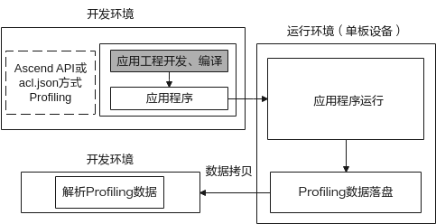

此场景下需要首先在开发环境（如ubutun18.04环境）中进行应用工程的开发，开发过程中应用工程可通过添加配置文件acl.json或调用ACL API接口使能Profiling，在板端执行应用程序时，会开启Profiling数据采集，采集完成后将其输出数据拷贝到**开发环境**进行数据解析。

## 场景介绍<a name="ZH-CN_TOPIC_0000002441980705"></a>

当前用于推理的昇腾AA处理器进行Profiling时，主要通过CANN软件包来进行Profiling数据的获取与解析，具体如[表1](#table159711027195516)所示。

**表 1**  CANN软件包使能Profiling说明

<a name="table159711027195516"></a>
<table><thead align="left"><tr id="row18971142705519"><th class="cellrowborder" valign="top" width="24.43%" id="mcps1.2.3.1.1"><p id="p13971527185515"><a name="p13971527185515"></a><a name="p13971527185515"></a>软件包</p>
</th>
<th class="cellrowborder" valign="top" width="75.57000000000001%" id="mcps1.2.3.1.2"><p id="p109717272559"><a name="p109717272559"></a><a name="p109717272559"></a>Profiling使能说明</p>
</th>
</tr>
</thead>
<tbody><tr id="row1498022113513"><td class="cellrowborder" rowspan="2" valign="top" width="24.43%" headers="mcps1.2.3.1.1 "><p id="p4667137173112"><a name="p4667137173112"></a><a name="p4667137173112"></a>开发套件包</p>
<p id="p16971152715555"><a name="p16971152715555"></a><a name="p16971152715555"></a>Ascend-cann-toolkit</p>
</td>
<td class="cellrowborder" valign="top" width="75.57000000000001%" headers="mcps1.2.3.1.2 "><p id="p5972112718554"><a name="p5972112718554"></a><a name="p5972112718554"></a>通过配置acl.json或通过ACL API接口在推理过程中<strong id="b1370392781413"><a name="b1370392781413"></a><a name="b1370392781413"></a>采集</strong>应用工程的Profiling数据。</p>
</td>
</tr>
<tr id="row1397282710551"><td class="cellrowborder" valign="top" headers="mcps1.2.3.1.1 "><p id="p186435217103"><a name="p186435217103"></a><a name="p186435217103"></a>调测工具包，内部包含Profiling数据解析工具msprof.pyc，针对Profiling作用如下。</p>
<p id="p1589017535589"><a name="p1589017535589"></a><a name="p1589017535589"></a>msprof.pyc：通过Python脚本工具<strong id="b172345811148"><a name="b172345811148"></a><a name="b172345811148"></a>采集解析</strong>应用工程的Profiling数据。</p>
</td>
</tr>
</tbody>
</table>

应用场景说明：昇腾设备部署开发套件包Ascend-cann-toolkit，对应开发环境**，**但同时可以作为运行环境运行应用程序。

此场景下能通过acl.json、ACL API两种方式在板端采集Profiling数据，再将数据拷贝到CANN包所在环境，通过Profiling解析工具msprof.pyc进行Profiling数据的解析。用户在此场景下可实现Profiling全部操作，当用户需要进行代码开发、编译、运行、调测等开发活动，推荐使用此场景。

# 使用约束<a name="ZH-CN_TOPIC_0000002408581298"></a>

使用Profiling功能具有以下约束：

-   使用Profiling功能前请确保执行用户的umask值大于等于0027，否则会导致获取的Profiling数据所在目录和文件权限过大。
    -   若要查看umask的值，则执行命令**：umask**
    -   若要修改umask的值，则执行命令：**umask  _新的取值_**

-   Profiling提供acl.json和ACL API两种方式，两种方式优先级为命令行 acl.json \> ACL API。如果使用ACL API方式，需要确保acl.json文件中的Profiling开关设置为off。
-   Profiling不支持发起多个基于相同结果目录的Profiling，可能会导致采集的数据结果不准确。比如main程序中包含多个独立推理任务，通过Profiling调用时会出现该问题。
-   不支持在同一个Device侧同时拉起多个Profiling任务。
-   配置Profiling相关路径时，仅支持路径由字母、数字和下划线字符组成，不支持带有特殊字符的路径。
-   Profiling功能与Dump功能不支持同时使用，即启动Profiling前，请关闭数据Dump。原因：如果同时开启，由于Dump操作会影响系统性能，会造成Profiling采集的性能数据指标不准确。
-   采集Profiling数据过程中如果配置的落盘路径磁盘空间已满，会出现性能数据无法落盘情况，因此，需要用户保证磁盘空间够用。另外，落盘的性能原始数据需要用户自行老化，预防磁盘空间被占满。
-   解析Profiling数据过程中如果配置的落盘路径磁盘或用户目录空间已满，会出现解析失败的或文件无法落盘的情况，须自行清理磁盘或用户目录空间。
-   Profiling工具需要配套python3.7.5版本使用，推荐使用python3.7.5版本。
-   应用工程开发务必遵循《应用开发指南》手册，调用**svp\_acl\_init\(\)**接口完成ACL初始化和调用**svp\_acl\_finalize\(\)**接口完成ACL去初始化，才能获取到完整的Profiling性能数据。

> **说明：** 
>如果应用程序已调用**svp\_acl\_init\(\)**接口而未调用**svp\_acl\_finalize\(\)**接口导致Profiling流程未正常结束，采集数据会不完整，最后1秒内Profiling已采集的数据可能因未及时同步而丢失，但丢失的数据不大于2M，不影响已同步的性能数据分析。

# Profiling流程<a name="ZH-CN_TOPIC_0000002441980637"></a>

推理Profiling总体流程如[图1](#fig1160371182910)所示。请按流程提前准备环境，进行应用程序开发或算子开发并采集Profiling性能数据、解析Profiling性能数据。

**图 1**  Profiling流程<a name="fig1160371182910"></a>  
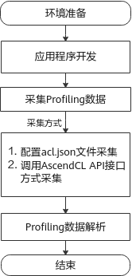

**表 1**  Profiling流程说明

<a name="table8138203773216"></a>
<table><thead align="left"><tr id="row4138183719326"><th class="cellrowborder" valign="top" width="20.73%" id="mcps1.2.3.1.1"><p id="p1813813719325"><a name="p1813813719325"></a><a name="p1813813719325"></a>流程</p>
</th>
<th class="cellrowborder" valign="top" width="79.27%" id="mcps1.2.3.1.2"><p id="p4138153720320"><a name="p4138153720320"></a><a name="p4138153720320"></a>说明</p>
</th>
</tr>
</thead>
<tbody><tr id="row8138113710322"><td class="cellrowborder" valign="top" width="20.73%" headers="mcps1.2.3.1.1 "><p id="p969101374612"><a name="p969101374612"></a><a name="p969101374612"></a>环境准备</p>
</td>
<td class="cellrowborder" valign="top" width="79.27%" headers="mcps1.2.3.1.2 "><p id="p169201344616"><a name="p169201344616"></a><a name="p169201344616"></a>使能Profiling需要先进行环境搭建以进行Profiling数据采集和解析。详情请参见<a href="#ZH-CN_TOPIC_0000002408421302">环境准备</a>。</p>
</td>
</tr>
<tr id="row91392371322"><td class="cellrowborder" valign="top" width="20.73%" headers="mcps1.2.3.1.1 "><p id="p1313915375321"><a name="p1313915375321"></a><a name="p1313915375321"></a>采集Profiling数据</p>
</td>
<td class="cellrowborder" valign="top" width="79.27%" headers="mcps1.2.3.1.2 "><p id="p12139113713212"><a name="p12139113713212"></a><a name="p12139113713212"></a>采集Profiling数据前需参见<span id="ph1075716510011"><a name="ph1075716510011"></a><a name="ph1075716510011"></a>《应用开发指南》</span>进行应用开发，将应用软件可执行文件拷贝到运行环境运行并采集Profiling数据。通过acl.json方式采集请参见<a href="#ZH-CN_TOPIC_0000002408581342">通过调用acl.json文件方式采集Profiling数据</a>；通过ACL API方式采集请参见<a href="#ZH-CN_TOPIC_0000002442020433">通过调用ACL API方式采集Profiling数据</a>。</p>
</td>
</tr>
<tr id="row71391137113215"><td class="cellrowborder" valign="top" width="20.73%" headers="mcps1.2.3.1.1 "><p id="p13139133713217"><a name="p13139133713217"></a><a name="p13139133713217"></a>Profiling数据解析</p>
</td>
<td class="cellrowborder" valign="top" width="79.27%" headers="mcps1.2.3.1.2 "><p id="p18139637163211"><a name="p18139637163211"></a><a name="p18139637163211"></a>通过脚本工具msprof.pyc进行Profiling数据的解析并导出相应数据。详情请参见<a href="#ZH-CN_TOPIC_0000002408581254">解析Profiling数据</a>。</p>
</td>
</tr>
</tbody>
</table>

# 环境准备<a name="ZH-CN_TOPIC_0000002408421302"></a>

在您使用Profiling功能前，需要根据[场景介绍](#ZH-CN_TOPIC_0000002441980705)完成相关环境搭建。具体如下。

请参见《驱动和开发环境安装指南》“2.1板端环境安装”，完成板端和开发环境的搭建。

开发环境和运行环境分设场景安装：参见《驱动和开发环境安装指南》“2.3 命令行方式开发环境安装”，完成依赖环境、工具链、CANN包安装。

# 快速入门<a name="ZH-CN_TOPIC_0000002442020477"></a>


## msprof.pyc脚本工具介绍<a name="ZH-CN_TOPIC_0000002408581270"></a>

msprof.pyc脚本工具是由Python编写的Profiling命令行工具，功能及安装路径如下。

功能：采集解析Profiling性能原始数据。

路径：$\{INSTALL\_DIR\}/toolkit/tools/profiler/profiler\_tool/analysis/msprof

> **说明：** 
>-   本节以Profiling工具安装目录"$\{INSTALL\_DIR\}"为例。
>-   $\{INSTALL\_DIR\}请替换为CANN软件安装后文件存储路径。例如，$HOME/Ascend/ascend-toolkit/svp\_latest/x86\_64-linux。
>-   Profiling工具使用安装时创建的普通用户（例如HwHi_Aa_User）运行，因此本文中无特殊说明的地方，均使用该用户执行。
>-   如果原有的解析文件模型只进行加载或卸载，不执行相关execute推理接口，Profiling工具默认不生成相关数据。

## 一键Profiling<a name="ZH-CN_TOPIC_0000002442020461"></a>

此功能为通过运行应用工程可执行文件、调用acl.json文件，读取Profiling相关配置，从而自动采集性能原始数据，采集性能原始数据成功后，可将采集的原始数据复制到装有CANN软件包的开发环境上进行性能数据解析，并生成解析数据的相关csv和json文件。

1.  参考以下步骤完成acl.json文件配置，并完成应用工程编译和运行：

    -   调用ATC模型转换时，需要配置如下参数，用于配置当前模型为支持Profiling的debug类型模型。

        ```
        --online_model_type=2
        ```

    -   打开工程文件，查看调用的**svp\_acl\_init\(\)**函数，获取acl.json文件路径，具体可以参考[2](#ZH-CN_TOPIC_0000002408581342#li66486291273)
    -   修改svp\_acl\_init方法指定的acl.json文件内容，添加Profiling相关配置，格式如下所示。

        具体参数配置可以参考[3](#ZH-CN_TOPIC_0000002408581342#li1333417325516)

        ```
        {
        "profiler":{
                     "output":"/root/AscendProjects/MyAppTest/profiling",
                     "aacpu":"on",
                     "aac_metrics":"ArithmeticUtilization",
                     "interval":"0",
                     "acl_api":"on",
                     "switch":"on"
                   }
        }
        ```

    > **说明：** 
    >-   关于应用工程编译、运行的详细方法，请参考《应用开发指南》。
    >-   使用该方法，务必调用**svp\_acl\_init**\(\)接口完成ACL初始化和调用**svp\_acl\_finalize**\(\)完成ACL去初始化。
    >-   acl.json可不配置，Profiling采集时候会生成一个默认的acl.json配置。

2.  建立SSH连接需要用户提供对应的配置文件，配置文件后缀为ini，请按照xxx.ini格式配置文件，具体参数配置如下，参数说明参见[表1](#table1631953814614)。

    ```
    [ssh_config]
    ip = XXXX
    username = XXXX
    pwd = XXX
    port = XX
    ```

    **表 1**  ini配置文件参数说明

    <a name="table1631953814614"></a>
    <table><thead align="left"><tr id="row1231923815463"><th class="cellrowborder" valign="top" width="50%" id="mcps1.2.3.1.1"><p id="p1531943814618"><a name="p1531943814618"></a><a name="p1531943814618"></a>参数</p>
    </th>
    <th class="cellrowborder" valign="top" width="50%" id="mcps1.2.3.1.2"><p id="p1131913844618"><a name="p1131913844618"></a><a name="p1131913844618"></a>描述</p>
    </th>
    </tr>
    </thead>
    <tbody><tr id="row831943813469"><td class="cellrowborder" valign="top" width="50%" headers="mcps1.2.3.1.1 "><p id="p11319338104619"><a name="p11319338104619"></a><a name="p11319338104619"></a>ip</p>
    </td>
    <td class="cellrowborder" valign="top" width="50%" headers="mcps1.2.3.1.2 "><p id="p23191338134617"><a name="p23191338134617"></a><a name="p23191338134617"></a>对应登录板端的ip</p>
    </td>
    </tr>
    <tr id="row63191838124618"><td class="cellrowborder" valign="top" width="50%" headers="mcps1.2.3.1.1 "><p id="p3319123815468"><a name="p3319123815468"></a><a name="p3319123815468"></a>username</p>
    </td>
    <td class="cellrowborder" valign="top" width="50%" headers="mcps1.2.3.1.2 "><p id="p103194384461"><a name="p103194384461"></a><a name="p103194384461"></a>对应登录板端的用户名</p>
    </td>
    </tr>
    <tr id="row4319738184613"><td class="cellrowborder" valign="top" width="50%" headers="mcps1.2.3.1.1 "><p id="p1531933884614"><a name="p1531933884614"></a><a name="p1531933884614"></a>pwd</p>
    </td>
    <td class="cellrowborder" valign="top" width="50%" headers="mcps1.2.3.1.2 "><p id="p163191938104618"><a name="p163191938104618"></a><a name="p163191938104618"></a>对应登录板端的用户密码</p>
    </td>
    </tr>
    <tr id="row93191538194610"><td class="cellrowborder" valign="top" width="50%" headers="mcps1.2.3.1.1 "><p id="p1331943818461"><a name="p1331943818461"></a><a name="p1331943818461"></a>port</p>
    </td>
    <td class="cellrowborder" valign="top" width="50%" headers="mcps1.2.3.1.2 "><p id="p196775754719"><a name="p196775754719"></a><a name="p196775754719"></a>连接SSH对应的端口号，一般默认为22</p>
    </td>
    </tr>
    </tbody>
    </table>

    > **注意：** 
    >-   用户请注意对配置文件使用完后进行清除，或者对配置文件自行加密，防止板端用户名和密码泄漏。
    >-   执行采集会自动挂载Profiling目录到服务器地址，防止板端空间不足，无法采集数据，请确保服务器挂载路径空间充足。

3.  执行如下命令，进行上板操作：

    ```
    python3.7.5 msprof.pyc collect -m <main> --config <config> --all
    ```

    执行上板采集命令后，会使用SSH将对应项目上传到板端并执行可执行文件main，板端生成的JOB数据会回传到对应本地output 路径上。

    msprof.pyc工具详细介绍请参见[msprof.pyc脚本工具介绍](#ZH-CN_TOPIC_0000002408581270)。

    命令行参数详细介绍请参见[采集Profiling数据](#ZH-CN_TOPIC_0000002408421366)。

4.  对应output目录上生成并解析JOB，对应生成summary和timeline目录，如[图1](#fig1489718583120)所示。

    **图 1**  summary和timeline目录下解析生成的结果<a name="fig1489718583120"></a>  
    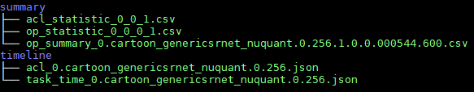

# 采集Profiling数据<a name="ZH-CN_TOPIC_0000002408421366"></a>


## 通过调用acl.json文件方式采集Profiling数据<a name="ZH-CN_TOPIC_0000002408581342"></a>

通过运行应用工程可执行文件，调用acl.json文件，读取Profiling相关配置，从而自动采集性能原始数据。采集性能原始数据成功后，可将采集的原始数据复制到装有CANN软件包的开发环境上进行性能数据解析，展示性能数据解析结果。

> **说明：** 
>关于应用工程编译、运行的详细方法，请参考《应用开发指南》。
>使用该方法，务必调用**svp\_acl\_init**\(\)接口完成ACL初始化和调用**svp\_acl\_finalize**\(\)完成ACL去初始化。

**采集性能原始数据<a name="section172091316141312"></a>**

参考以下步骤完成acl.json文件配置，并完成应用工程编译和运行。

1.  调用ATC模型转换时，需要配置如下参数，用于配置当前模型为支持Profiling的debug类型模型。

    ```
    --online_model_type=2
    ```

2.  <a name="li66486291273"></a>打开工程文件，查看调用的**svp\_acl\_init\(\)**函数，获取acl.json文件路径。例如[图1](#fig374885405310)所示。

    **图 1**  acl.json文件路径<a name="fig374885405310"></a>  
    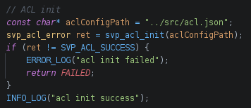

    > **说明：** 
    >如果svp\_acl\_init\(\)初始化为空，则需要修改该函数，补充[2](#li66486291273)创建的acl.json路径。

3.  修改svp\_acl\_init方法指定的acl.json文件内容，添加Profiling相关配置，格式如下所示。

    ```
    {
    "profiler":{
                 "output":"/root/AscendProjects/MyAppTest/profiling",
                 "aacpu":"on",
                 "aac_metrics":"ArithmeticUtilization",
                 "interval":"0",
                 "acl_api":"on",
                 "switch":"on"
               }
    }
    ```

    profiler参数配置说明：

    -   switch：Profiling开关，取值on或off。可选参数。

        on表示开启Profiling，off表示关闭Profiling；如果缺失该参数或参数值不为on，则表示关闭Profiling。

    -   output：Profiling性能数据在本地运行服务器输出的路径。可选参数。

        Profiling采集结束后，在该目录下生成JOB开头目录，存放Profiling采集的性能原始数据，每个目录对应一个Device的数据。支持配置绝对路径或相对路径（相对执行命令行时的当前路径）：

        -   绝对路径配置以“/“开头，例如：/home/HwHi_Aa_User/mdc/output, 建议使用项目路径/profiling作为output路径。
        -   如果该处设置的目录不存在，默认存放采集结果数据到应用工程可执行文件所在目录（确保安装时配置的运行用户具有该目录的读写权限）。

            > **注意：** 
            >该参数指定的目录需要提前创建且确保安装时配置的运行用户具有读写权限。

    -   _aa_  cpu：是否采集_aa_  cpu数据的开关，可选on或off，默认为on。可选参数。
    -   __aac__\_metrics：_AA_  Core采集事件，当前只支持ArithmeticUtilization，配置为ArithmeticUtilization代表采集_模式识别_  Core性能数据，否则为不采集。
    -   acl\_api：是否采集acl api数据的开关，可选on或off，默认为on，可选参数。
    -   interval：按照推理间隔作为采样的间隔，默认为0。

        例如，执行1000张图片推理，batch\_num设置为100，循环推理10次，将Inference Interval设置为2时，就是每隔200张图片采集一次性能数据。

    -   配置acl.json完成后，参考《应用开发指南》重新编译应用工程、并运行应用工程。

4.  output指定路径下生成Profiling性能原始数据路径，如[图2](#fig296631712496)所示。

    > **说明：** 
    >-   当interval配置不为0时，对于推理执行很快的情况，存盘速度可能会跟不上推理完成的速度，可能会出现报告份数缺少的情况，建议此种情况下，在每轮推理时添加sleep，保证落盘时间充足。
    >-   采集的Profiling性能原始数据有可能将磁盘存满，请确保预留足够的磁盘空间。

5.  使用命令行工具进行SSH方式将编译好的工程同步到板端进行采集。

    > **说明：** 
    >使用SSH请先安装 paramiko组件，可使用 pip3.7.5 install paramiko方式安装第三方依赖。

    进行采集时候会在板端目录上创建profiling文件夹，建议将profiling目录挂载在本地，命令示例如下，其中，profiling表示板端环境上的目录，没有可以先创建该目录。

    ```
    mount -t nfs -o nolock,tcp NFS服务器IP地址:服务器绝对路径 用户根目录/profiling
    ```

    > **说明：** 
    >挂载profiling目录到服务器地址是防止板端空间不足，无法采集数据，请确保服务器挂载路径空间充足。

    执行如下命令，进行上板操作，参数说明参见[表1](#table26771257162016)。

    ```
    python3.7.5 msprof.pyc collect -m <main> --config <config> [--all]
    ```

    执行上板采集命令后，会使用SSH将对应项目上传到板端并执行可执行文件main，板端生成的JOB数据会回传到对应本地target 路径上。

    **表 1**  采集数据命令参数说明

    <a name="table26771257162016"></a>
    <table><thead align="left"><tr id="row106783579208"><th class="cellrowborder" valign="top" width="33.33333333333333%" id="mcps1.2.4.1.1"><p id="p76781157152019"><a name="p76781157152019"></a><a name="p76781157152019"></a>参数名</p>
    </th>
    <th class="cellrowborder" valign="top" width="39.63396339633963%" id="mcps1.2.4.1.2"><p id="p1367815710205"><a name="p1367815710205"></a><a name="p1367815710205"></a>描述</p>
    </th>
    <th class="cellrowborder" valign="top" width="27.03270327032703%" id="mcps1.2.4.1.3"><p id="p667825702020"><a name="p667825702020"></a><a name="p667825702020"></a>可选/必选</p>
    </th>
    </tr>
    </thead>
    <tbody><tr id="row196781857112017"><td class="cellrowborder" valign="top" width="33.33333333333333%" headers="mcps1.2.4.1.1 "><p id="p239175620815"><a name="p239175620815"></a><a name="p239175620815"></a>-m， --main</p>
    </td>
    <td class="cellrowborder" valign="top" width="39.63396339633963%" headers="mcps1.2.4.1.2 "><p id="p103995610819"><a name="p103995610819"></a><a name="p103995610819"></a>上板执行项目中的可执行文件main</p>
    </td>
    <td class="cellrowborder" valign="top" width="27.03270327032703%" headers="mcps1.2.4.1.3 "><p id="p7401356387"><a name="p7401356387"></a><a name="p7401356387"></a>必选</p>
    </td>
    </tr>
    <tr id="row112626271331"><td class="cellrowborder" valign="top" width="33.33333333333333%" headers="mcps1.2.4.1.1 "><p id="p965413615508"><a name="p965413615508"></a><a name="p965413615508"></a>--config</p>
    </td>
    <td class="cellrowborder" valign="top" width="39.63396339633963%" headers="mcps1.2.4.1.2 "><p id="p1065417361507"><a name="p1065417361507"></a><a name="p1065417361507"></a>SSH相关配置的文件路径，使用可参考<a href="一键Profiling.md#table1631953814614">表1</a></p>
    </td>
    <td class="cellrowborder" valign="top" width="27.03270327032703%" headers="mcps1.2.4.1.3 "><p id="p18654336115020"><a name="p18654336115020"></a><a name="p18654336115020"></a>必选</p>
    </td>
    </tr>
    <tr id="row78091301431"><td class="cellrowborder" valign="top" width="33.33333333333333%" headers="mcps1.2.4.1.1 "><p id="p466915133548"><a name="p466915133548"></a><a name="p466915133548"></a>--interval</p>
    </td>
    <td class="cellrowborder" valign="top" width="39.63396339633963%" headers="mcps1.2.4.1.2 "><p id="p136691613165412"><a name="p136691613165412"></a><a name="p136691613165412"></a>设置interval num 在acl.json上，默认为0</p>
    </td>
    <td class="cellrowborder" valign="top" width="27.03270327032703%" headers="mcps1.2.4.1.3 "><p id="p1966911316541"><a name="p1966911316541"></a><a name="p1966911316541"></a>可选</p>
    </td>
    </tr>
    <tr id="row2665124512318"><td class="cellrowborder" valign="top" width="33.33333333333333%" headers="mcps1.2.4.1.1 "><p id="p1638275345419"><a name="p1638275345419"></a><a name="p1638275345419"></a>--acl_api</p>
    </td>
    <td class="cellrowborder" valign="top" width="39.63396339633963%" headers="mcps1.2.4.1.2 "><p id="p83820537546"><a name="p83820537546"></a><a name="p83820537546"></a>设置是否开启acl_api在acl.json上，默认为on</p>
    </td>
    <td class="cellrowborder" valign="top" width="27.03270327032703%" headers="mcps1.2.4.1.3 "><p id="p0382135314545"><a name="p0382135314545"></a><a name="p0382135314545"></a>可选</p>
    </td>
    </tr>
    <tr id="row38427481436"><td class="cellrowborder" valign="top" width="33.33333333333333%" headers="mcps1.2.4.1.1 "><p id="p25771557155413"><a name="p25771557155413"></a><a name="p25771557155413"></a>--<em id="i15791831105518"><a name="i15791831105518"></a><a name="i15791831105518"></a>aa</em>cpu</p>
    </td>
    <td class="cellrowborder" valign="top" width="39.63396339633963%" headers="mcps1.2.4.1.2 "><p id="p15577105765413"><a name="p15577105765413"></a><a name="p15577105765413"></a>设置<em id="i1410211613812"><a name="i1410211613812"></a><a name="i1410211613812"></a>是</em>否开启<em id="i11102416183813"><a name="i11102416183813"></a><a name="i11102416183813"></a>aa</em>cpu在acl.json上，默认为on</p>
    </td>
    <td class="cellrowborder" valign="top" width="27.03270327032703%" headers="mcps1.2.4.1.3 "><p id="p105771657185414"><a name="p105771657185414"></a><a name="p105771657185414"></a>可选</p>
    </td>
    </tr>
    <tr id="row15113165216318"><td class="cellrowborder" valign="top" width="33.33333333333333%" headers="mcps1.2.4.1.1 "><p id="p1564181175517"><a name="p1564181175517"></a><a name="p1564181175517"></a>--switch</p>
    </td>
    <td class="cellrowborder" valign="top" width="39.63396339633963%" headers="mcps1.2.4.1.2 "><p id="p364171115512"><a name="p364171115512"></a><a name="p364171115512"></a>设置是否开启switch在acl.json上，默认为on</p>
    </td>
    <td class="cellrowborder" valign="top" width="27.03270327032703%" headers="mcps1.2.4.1.3 "><p id="p864111205510"><a name="p864111205510"></a><a name="p864111205510"></a>可选</p>
    </td>
    </tr>
    <tr id="row54175516316"><td class="cellrowborder" valign="top" width="33.33333333333333%" headers="mcps1.2.4.1.1 "><p id="p727063885714"><a name="p727063885714"></a><a name="p727063885714"></a>--<em id="i83894229349"><a name="i83894229349"></a><a name="i83894229349"></a>aa</em>c_metrics</p>
    </td>
    <td class="cellrowborder" valign="top" width="39.63396339633963%" headers="mcps1.2.4.1.2 "><p id="p22704380579"><a name="p22704380579"></a><a name="p22704380579"></a>设置<em id="i15869627193410"><a name="i15869627193410"></a><a name="i15869627193410"></a>aa</em>c_metrics在acl.json上，默认为ArithmeticUtilization</p>
    </td>
    <td class="cellrowborder" valign="top" width="27.03270327032703%" headers="mcps1.2.4.1.3 "><p id="p16270103818575"><a name="p16270103818575"></a><a name="p16270103818575"></a>可选</p>
    </td>
    </tr>
    <tr id="row15741617244"><td class="cellrowborder" valign="top" width="33.33333333333333%" headers="mcps1.2.4.1.1 "><p id="p1537718810582"><a name="p1537718810582"></a><a name="p1537718810582"></a>--output</p>
    </td>
    <td class="cellrowborder" valign="top" width="39.63396339633963%" headers="mcps1.2.4.1.2 "><p id="p123772865812"><a name="p123772865812"></a><a name="p123772865812"></a>设置生成job的输出路径</p>
    </td>
    <td class="cellrowborder" valign="top" width="27.03270327032703%" headers="mcps1.2.4.1.3 "><p id="p16377188185817"><a name="p16377188185817"></a><a name="p16377188185817"></a>可选</p>
    </td>
    </tr>
    <tr id="row1830992017419"><td class="cellrowborder" valign="top" width="33.33333333333333%" headers="mcps1.2.4.1.1 "><p id="p11406561881"><a name="p11406561881"></a><a name="p11406561881"></a>--all</p>
    </td>
    <td class="cellrowborder" valign="top" width="39.63396339633963%" headers="mcps1.2.4.1.2 "><p id="p164065619819"><a name="p164065619819"></a><a name="p164065619819"></a>执行完上板后对JOB文件进行解析</p>
    </td>
    <td class="cellrowborder" valign="top" width="27.03270327032703%" headers="mcps1.2.4.1.3 "><p id="p104075613818"><a name="p104075613818"></a><a name="p104075613818"></a>可选（一键式采集解析需要加入all命令）</p>
    </td>
    </tr>
    </tbody>
    </table>

    **图 2**  Profiling性能JOB原始数据<a name="fig296631712496"></a>  
    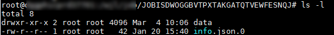

## 通过调用ACL API方式采集Profiling数据<a name="ZH-CN_TOPIC_0000002442020433"></a>

请参见《应用开发指南》手册“8.6 Profiling性能数据采集”章节。

# 解析Profiling数据<a name="ZH-CN_TOPIC_0000002408421318"></a>


## 解析Profiling数据<a name="ZH-CN_TOPIC_0000002408581254"></a>

在解析任意目录的Profiling数据前，需参见[采集Profiling数据](#ZH-CN_TOPIC_0000002408421366)采集相应的数据。

1.  以Toolkit组件包Ascend-cann-toolkit开发套件包的运行用户登录**开发环境**。以HwHi_Aa_User用户为例。
2.  切换至msprof.pyc脚本所在目录，如$\{INSTALL\_DIR\}/toolkit/tools/profiler/profiler\_tool/analysis/msprof。

    > **说明：** 
    >小技巧：为方便执行msprof.pyc脚本，您可以使用HwHi_Aa_User用户执行命令**alias msprof='python3.7.5 $\{INSTALL\_DIR\}/toolkit/tools/profiler/profiler\_tool/analysis/msprof/msprof.pyc'**设置别名，后续就可以不用进入$\{INSTALL\_DIR\}/toolkit/tools/profiler/profiler\_tool/analysis/msprof目录，在任意目录输入**msprof**即可执行Profiling命令。
    >$\{INSTALL\_DIR\}请替换为CANN软件安装后文件存储路径。例如，$HOME/Ascend/ascend-toolkit/svp\_latest/x86\_64-linux。

3.  执行如下命令，解析任意目录的Profiling数据。支持以下解析方式，说明如下。

    解析任意目录的Profiling数据，参数说明参见[表1](#zh-cn_topic_0300758037_table23221111184312)。

    ```
    python3.7.5 msprof.pyc import [-h] -dir <dir>
    ```

    例如：

    **python3.7.5 msprof.pyc import -dir **_/home/HwHi_Aa_User/_JOBXXXX

    > **说明：** 
    >使用import方式解析Profiling数据时，即使原始Profiling数据目录中已经生成.db文件，该方式也会重新生成.db文件。

    **表 1**  解析任意目录命令参数说明

    <a name="zh-cn_topic_0300758037_table23221111184312"></a>
    <table><thead align="left"><tr id="zh-cn_topic_0300758037_row1632210114437"><th class="cellrowborder" valign="top" width="33.33333333333333%" id="mcps1.2.4.1.1"><p id="zh-cn_topic_0300758037_p1832315118430"><a name="zh-cn_topic_0300758037_p1832315118430"></a><a name="zh-cn_topic_0300758037_p1832315118430"></a>参数名</p>
    </th>
    <th class="cellrowborder" valign="top" width="33.33333333333333%" id="mcps1.2.4.1.2"><p id="zh-cn_topic_0300758037_p832381134313"><a name="zh-cn_topic_0300758037_p832381134313"></a><a name="zh-cn_topic_0300758037_p832381134313"></a>描述</p>
    </th>
    <th class="cellrowborder" valign="top" width="33.33333333333333%" id="mcps1.2.4.1.3"><p id="zh-cn_topic_0300758037_p7323711104311"><a name="zh-cn_topic_0300758037_p7323711104311"></a><a name="zh-cn_topic_0300758037_p7323711104311"></a>可选/必选</p>
    </th>
    </tr>
    </thead>
    <tbody><tr id="row911915301123"><td class="cellrowborder" valign="top" width="33.33333333333333%" headers="mcps1.2.4.1.1 "><p id="p934618428463"><a name="p934618428463"></a><a name="p934618428463"></a>-h，--help</p>
    </td>
    <td class="cellrowborder" valign="top" width="33.33333333333333%" headers="mcps1.2.4.1.2 "><p id="p17346204214463"><a name="p17346204214463"></a><a name="p17346204214463"></a>显示帮助信息，仅在获取使用方式时使用。</p>
    </td>
    <td class="cellrowborder" valign="top" width="33.33333333333333%" headers="mcps1.2.4.1.3 "><p id="p18346104254614"><a name="p18346104254614"></a><a name="p18346104254614"></a>可选</p>
    </td>
    </tr>
    <tr id="zh-cn_topic_0300758037_row1432312111435"><td class="cellrowborder" valign="top" width="33.33333333333333%" headers="mcps1.2.4.1.1 "><p id="zh-cn_topic_0300758037_p153232112437"><a name="zh-cn_topic_0300758037_p153232112437"></a><a name="zh-cn_topic_0300758037_p153232112437"></a>-dir, --collection-dir</p>
    </td>
    <td class="cellrowborder" valign="top" width="33.33333333333333%" headers="mcps1.2.4.1.2 "><p id="zh-cn_topic_0300758037_p14323121164310"><a name="zh-cn_topic_0300758037_p14323121164310"></a><a name="zh-cn_topic_0300758037_p14323121164310"></a>收集到的Profiling数据目录。须指定为JOBXXX目录，里面存在data文件夹和对应info.json.0文件。</p>
    </td>
    <td class="cellrowborder" valign="top" width="33.33333333333333%" headers="mcps1.2.4.1.3 "><p id="zh-cn_topic_0300758037_p8323121194319"><a name="zh-cn_topic_0300758037_p8323121194319"></a><a name="zh-cn_topic_0300758037_p8323121194319"></a>必选</p>
    </td>
    </tr>
    </tbody>
    </table>

4.  执行完上述命令，解析完成后对应的JOBXXX目录下会生成sqlite目录，sqlite目录下会有.db文件生成。

## timeline数据说明<a name="ZH-CN_TOPIC_0000002441980593"></a>


### 导出timeline数据<a name="ZH-CN_TOPIC_0000002442020445"></a>

在导出timeline数据前，需参见[解析Profiling数据](#ZH-CN_TOPIC_0000002408581254)。参见如下步骤导出timeline数据。

1.  以Toolkit组件包Ascend-cann-toolkit开发套件包的运行用户登录**开发环境**。以HwHi_Aa_User用户为例。
2.  切换至“msprof.pyc“脚本所在目录，如$\{INSTALL\_DIR\}/toolkit/tools/profiler/profiler\_tool/analysis/msprof。

    > **说明：** 
    >小技巧：为方便执行msprof.pyc脚本，您可以使用HwHi_Aa_User用户执行命令**alias msprof='python3.7.5  $\{INSTALL\_DIR\}/toolkit/tools/profiler/profiler\_tool/analysis/msprof/msprof.pyc'**设置别名，后续就可以不用进入$\{INSTALL\_DIR\}/toolkit/tools/profiler/profiler\_tool/analysis/msprof目录，在任意目录输入**msprof**即可执行Profiling命令。
    >$\{INSTALL\_DIR\}请替换为CANN软件安装后文件存储路径。例如，$HOME/Ascend/ascend-toolkit/svp\_latest/x86\_64-linux。

3.  执行如下命令，导出timeline数据。

    命令行格式如下，参数说明参见[表1](#zh-cn_topic_0290106133_table23221111184312)。

    ```
    python3.7.5 msprof.pyc export timeline [-h] -dir <dir> 
    ```

    例如导出推理或系统的Profiling的timeline数据命令如下。

    **python3.7.5 msprof.pyc export timeline -dir **_/home/HwHi_Aa_User/JOBXXX_

    **表 1**  导出timeline数据命令参数说明

    <a name="zh-cn_topic_0290106133_table23221111184312"></a>
    <table><thead align="left"><tr id="zh-cn_topic_0290106133_row1632210114437"><th class="cellrowborder" valign="top" width="33.33333333333333%" id="mcps1.2.4.1.1"><p id="zh-cn_topic_0290106133_p1832315118430"><a name="zh-cn_topic_0290106133_p1832315118430"></a><a name="zh-cn_topic_0290106133_p1832315118430"></a>参数名</p>
    </th>
    <th class="cellrowborder" valign="top" width="33.33333333333333%" id="mcps1.2.4.1.2"><p id="zh-cn_topic_0290106133_p832381134313"><a name="zh-cn_topic_0290106133_p832381134313"></a><a name="zh-cn_topic_0290106133_p832381134313"></a>描述</p>
    </th>
    <th class="cellrowborder" valign="top" width="33.33333333333333%" id="mcps1.2.4.1.3"><p id="zh-cn_topic_0290106133_p15830245132211"><a name="zh-cn_topic_0290106133_p15830245132211"></a><a name="zh-cn_topic_0290106133_p15830245132211"></a>可选/必选</p>
    </th>
    </tr>
    </thead>
    <tbody><tr id="row1133018510106"><td class="cellrowborder" valign="top" width="33.33333333333333%" headers="mcps1.2.4.1.1 "><p id="p934618428463"><a name="p934618428463"></a><a name="p934618428463"></a>-h，--help</p>
    </td>
    <td class="cellrowborder" valign="top" width="33.33333333333333%" headers="mcps1.2.4.1.2 "><p id="p17346204214463"><a name="p17346204214463"></a><a name="p17346204214463"></a>显示帮助信息，仅在获取使用方式时使用。</p>
    </td>
    <td class="cellrowborder" valign="top" width="33.33333333333333%" headers="mcps1.2.4.1.3 "><p id="p18346104254614"><a name="p18346104254614"></a><a name="p18346104254614"></a>可选</p>
    </td>
    </tr>
    <tr id="zh-cn_topic_0290106133_row1432312111435"><td class="cellrowborder" valign="top" width="33.33333333333333%" headers="mcps1.2.4.1.1 "><p id="zh-cn_topic_0290106133_p153232112437"><a name="zh-cn_topic_0290106133_p153232112437"></a><a name="zh-cn_topic_0290106133_p153232112437"></a>-dir, --collection-dir</p>
    </td>
    <td class="cellrowborder" valign="top" width="33.33333333333333%" headers="mcps1.2.4.1.2 "><p id="zh-cn_topic_0290106133_p14323121164310"><a name="zh-cn_topic_0290106133_p14323121164310"></a><a name="zh-cn_topic_0290106133_p14323121164310"></a>收集到的Profiling数据目录。须指定为JOB_XXX目录，里面存在data文件夹和对应info.json.0文件。</p>
    </td>
    <td class="cellrowborder" valign="top" width="33.33333333333333%" headers="mcps1.2.4.1.3 "><p id="zh-cn_topic_0290106133_p8323121194319"><a name="zh-cn_topic_0290106133_p8323121194319"></a><a name="zh-cn_topic_0290106133_p8323121194319"></a>必选</p>
    </td>
    </tr>
    </tbody>
    </table>

4.  执行完上述命令后，会在collection-dir目录下生成timeline目录，不同的数据生成对应的json文件，具体内容参见[表2](#zh-cn_topic_0290106133_table972265435020)。

    **表 2**  timeline文件介绍

    <a name="zh-cn_topic_0290106133_table972265435020"></a>
    <table><thead align="left"><tr id="zh-cn_topic_0290106133_row97226542505"><th class="cellrowborder" valign="top" width="23.189999999999998%" id="mcps1.2.4.1.1"><p id="p14468542115615"><a name="p14468542115615"></a><a name="p14468542115615"></a>文件数据分类</p>
    </th>
    <th class="cellrowborder" valign="top" width="36.66%" id="mcps1.2.4.1.2"><p id="zh-cn_topic_0290106133_p10722165485018"><a name="zh-cn_topic_0290106133_p10722165485018"></a><a name="zh-cn_topic_0290106133_p10722165485018"></a>timeline文件名</p>
    </th>
    <th class="cellrowborder" valign="top" width="40.150000000000006%" id="mcps1.2.4.1.3"><p id="zh-cn_topic_0290106133_p314116392513"><a name="zh-cn_topic_0290106133_p314116392513"></a><a name="zh-cn_topic_0290106133_p314116392513"></a>说明</p>
    </th>
    </tr>
    </thead>
    <tbody><tr id="row2053714458359"><td class="cellrowborder" valign="top" width="23.189999999999998%" headers="mcps1.2.4.1.1 "><p id="p24681842195614"><a name="p24681842195614"></a><a name="p24681842195614"></a>Task Timeline解析生成数据</p>
    </td>
    <td class="cellrowborder" valign="top" width="36.66%" headers="mcps1.2.4.1.2 "><p id="p0537104516352"><a name="p0537104516352"></a><a name="p0537104516352"></a>task_time_{deviceid}.{model_file_name}.{model_id}.{batch_num}.json</p>
    </td>
    <td class="cellrowborder" valign="top" width="40.150000000000006%" headers="mcps1.2.4.1.3 "><p id="p379861812562"><a name="p379861812562"></a><a name="p379861812562"></a>Task Scheduler任务调度信息。文件详情请参见<a href="#ZH-CN_TOPIC_0000002408421346">Task Scheduler任务调度信息数据说明</a>。</p>
    </td>
    </tr>
    <tr id="row37221636183113"><td class="cellrowborder" valign="top" width="23.189999999999998%" headers="mcps1.2.4.1.1 "><p id="p446810429565"><a name="p446810429565"></a><a name="p446810429565"></a>ACL Timeline解析生成数据</p>
    </td>
    <td class="cellrowborder" valign="top" width="36.66%" headers="mcps1.2.4.1.2 "><p id="p147229365314"><a name="p147229365314"></a><a name="p147229365314"></a>acl_{device_id}.{model_file_name}.{model_id}.{batch_num}.json</p>
    </td>
    <td class="cellrowborder" valign="top" width="40.150000000000006%" headers="mcps1.2.4.1.3 "><p id="p1472233693119"><a name="p1472233693119"></a><a name="p1472233693119"></a>ACL接口耗时数据，生成该文件需要采集的Profiling数据中包含AclModule.开头的文件。文件详情请参见<a href="#ZH-CN_TOPIC_0000002441980605">ACL接口耗时数据说明</a>。</p>
    </td>
    </tr>
    </tbody>
    </table>

    [表3](#table64582512342)展示了通过acl.json或ACL API两种方式，采集解析导出后包含的timeline数据文件对比。

    **表 3**  生成数据文件对比

    <a name="table64582512342"></a>
    <table><thead align="left"><tr id="row10458251173412"><th class="cellrowborder" valign="top" width="62.886288628862886%" id="mcps1.2.4.1.1"><p id="p17458125123417"><a name="p17458125123417"></a><a name="p17458125123417"></a>包含的文件名</p>
    </th>
    <th class="cellrowborder" valign="top" width="18.4018401840184%" id="mcps1.2.4.1.2"><p id="p134586519348"><a name="p134586519348"></a><a name="p134586519348"></a>acl.json</p>
    </th>
    <th class="cellrowborder" valign="top" width="18.71187118711871%" id="mcps1.2.4.1.3"><p id="p8458115143418"><a name="p8458115143418"></a><a name="p8458115143418"></a>ACL API</p>
    </th>
    </tr>
    </thead>
    <tbody><tr id="row1145805183413"><td class="cellrowborder" valign="top" width="62.886288628862886%" headers="mcps1.2.4.1.1 "><p id="p135820352368"><a name="p135820352368"></a><a name="p135820352368"></a>task_time_{deviceid}.{model_file_name}.{model_id}.{batch_num}.json</p>
    </td>
    <td class="cellrowborder" valign="top" width="18.4018401840184%" headers="mcps1.2.4.1.2 "><p id="p766414584012"><a name="p766414584012"></a><a name="p766414584012"></a>包含</p>
    </td>
    <td class="cellrowborder" valign="top" width="18.71187118711871%" headers="mcps1.2.4.1.3 "><p id="p813813211897"><a name="p813813211897"></a><a name="p813813211897"></a>包含</p>
    </td>
    </tr>
    <tr id="row250071810572"><td class="cellrowborder" valign="top" width="62.886288628862886%" headers="mcps1.2.4.1.1 "><p id="p16850124119589"><a name="p16850124119589"></a><a name="p16850124119589"></a>acl_{deviceid}.{model_file_name}.{model_id}.{batch_num}.json</p>
    </td>
    <td class="cellrowborder" valign="top" width="18.4018401840184%" headers="mcps1.2.4.1.2 "><p id="p1338420465581"><a name="p1338420465581"></a><a name="p1338420465581"></a>包含</p>
    </td>
    <td class="cellrowborder" valign="top" width="18.71187118711871%" headers="mcps1.2.4.1.3 "><p id="p1434596154018"><a name="p1434596154018"></a><a name="p1434596154018"></a>包含</p>
    </td>
    </tr>
    </tbody>
    </table>

    > **说明：** 
    >-   timeline目录中的文件是根据采集的实际Profiling数据进行生成，如果实际的Profiling数据没有相关的数据文件，就不会导出对应的timeline数据。
    >-   使用export命令能直接从已解析的Profiling数据中导出数据文件。当Profiling数据未解析时，单独执行export命令也能进行解析Profiling数据并导出数据文件。
    >-   生成的json（chrome trace）文件可以通过以下方式打开查看：在Chrome浏览器中输入“chrome://tracing“地址，然后将落盘文件拖到空白处即可打开文件内容。下文中文件介绍均使用此种形式。关于chrome trace的格式，可参考[chrome trace介绍](https://docs.google.com/document/d/1CvAClvFfyA5R-PhYUmn5OOQtYMH4h6I0nSsKchNAySU/edit)。
    >-   导出的数据中涉及到的时间节点（非Timestamp）为系统单调时间，只与系统有关，非真实时间。

### Task Scheduler任务调度信息数据说明<a name="ZH-CN_TOPIC_0000002408421346"></a>

请参见[导出timeline数据](#ZH-CN_TOPIC_0000002442020445)获取Task Scheduler任务调度信息数据文件

task\_time\_\{deviceid\}.\{model\_file\_name\}.\{model\_id\}.\{batch\_num\}.json，其中\{device\_id\}表示设备ID，\{model\_file\_name\}表示模型名称，\{model\_id\}表示模型ID，\{batch\_num\}表示batch的数量。

task\_time\_\{deviceid\}.\{model\_file\_name\}.\{model\_id\}.\{batch\_num\}.json在Chrome浏览器中展示如[图1](#fig117501624516)所示。

**图 1**  Chrome浏览器展示图<a name="fig117501624516"></a>  
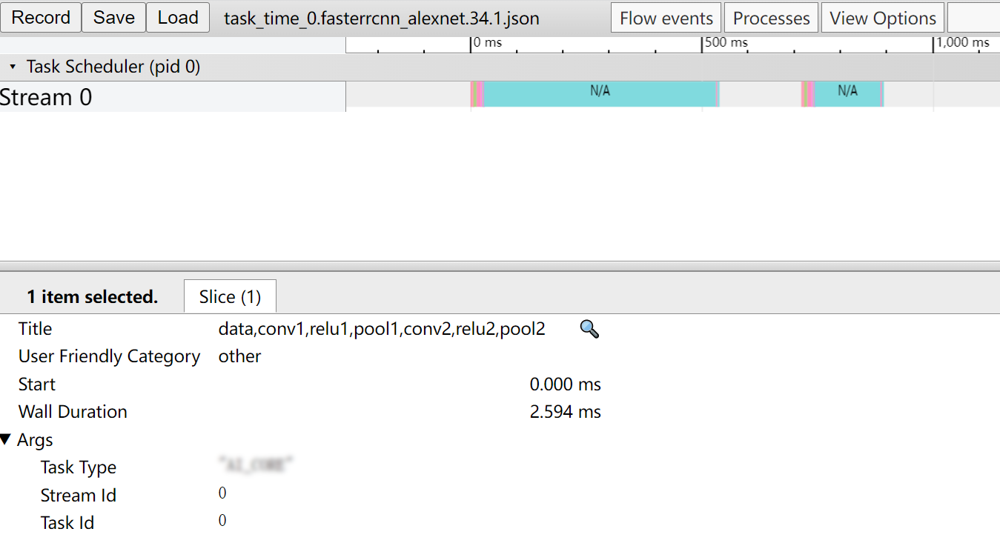

关键字段说明如[表1](#zh-cn_topic_0300758050_table446285293613)所示。

**表 1**  字段说明

<a name="zh-cn_topic_0300758050_table446285293613"></a>
<table><thead align="left"><tr id="zh-cn_topic_0300758050_row746245220364"><th class="cellrowborder" valign="top" width="22.32%" id="mcps1.2.3.1.1"><p id="zh-cn_topic_0300758050_p18462145214363"><a name="zh-cn_topic_0300758050_p18462145214363"></a><a name="zh-cn_topic_0300758050_p18462145214363"></a>字段名</p>
</th>
<th class="cellrowborder" valign="top" width="77.68%" id="mcps1.2.3.1.2"><p id="zh-cn_topic_0300758050_p16462175210368"><a name="zh-cn_topic_0300758050_p16462175210368"></a><a name="zh-cn_topic_0300758050_p16462175210368"></a>字段含义</p>
</th>
</tr>
</thead>
<tbody><tr id="zh-cn_topic_0300758050_row8462195213610"><td class="cellrowborder" valign="top" width="22.32%" headers="mcps1.2.3.1.1 "><p id="p1985915019011"><a name="p1985915019011"></a><a name="p1985915019011"></a>name</p>
</td>
<td class="cellrowborder" valign="top" width="77.68%" headers="mcps1.2.3.1.2 "><p id="p16859175010019"><a name="p16859175010019"></a><a name="p16859175010019"></a>层名，如果是融合层则连接在一起</p>
</td>
</tr>
<tr id="zh-cn_topic_0300758050_row246245263612"><td class="cellrowborder" valign="top" width="22.32%" headers="mcps1.2.3.1.1 "><p id="p108597504016"><a name="p108597504016"></a><a name="p108597504016"></a>pid</p>
</td>
<td class="cellrowborder" valign="top" width="77.68%" headers="mcps1.2.3.1.2 "><p id="p885917501103"><a name="p885917501103"></a><a name="p885917501103"></a>Process Id缩写</p>
</td>
</tr>
<tr id="zh-cn_topic_0300758050_row746210524362"><td class="cellrowborder" valign="top" width="22.32%" headers="mcps1.2.3.1.1 "><p id="p128591550905"><a name="p128591550905"></a><a name="p128591550905"></a>tid</p>
</td>
<td class="cellrowborder" valign="top" width="77.68%" headers="mcps1.2.3.1.2 "><p id="p1586010505019"><a name="p1586010505019"></a><a name="p1586010505019"></a>Thread Id缩写</p>
</td>
</tr>
<tr id="zh-cn_topic_0300758050_row12462185223610"><td class="cellrowborder" valign="top" width="22.32%" headers="mcps1.2.3.1.1 "><p id="p186075017016"><a name="p186075017016"></a><a name="p186075017016"></a>ts</p>
</td>
<td class="cellrowborder" valign="top" width="77.68%" headers="mcps1.2.3.1.2 "><p id="p178602050202"><a name="p178602050202"></a><a name="p178602050202"></a>Time Start的缩写，用于计算起始时间</p>
</td>
</tr>
<tr id="zh-cn_topic_0300758050_row174621252123620"><td class="cellrowborder" valign="top" width="22.32%" headers="mcps1.2.3.1.1 "><p id="p1086012502008"><a name="p1086012502008"></a><a name="p1086012502008"></a>dur</p>
</td>
<td class="cellrowborder" valign="top" width="77.68%" headers="mcps1.2.3.1.2 "><p id="p7860750804"><a name="p7860750804"></a><a name="p7860750804"></a>Duration Time的缩写，用于计算结束时间</p>
</td>
</tr>
<tr id="zh-cn_topic_0300758050_row1237414381507"><td class="cellrowborder" valign="top" width="22.32%" headers="mcps1.2.3.1.1 "><p id="p13860105011015"><a name="p13860105011015"></a><a name="p13860105011015"></a>args-&gt;Task Type</p>
</td>
<td class="cellrowborder" valign="top" width="77.68%" headers="mcps1.2.3.1.2 "><p id="p168605501809"><a name="p168605501809"></a><a name="p168605501809"></a>运行单元，如<em id="i182699477720"><a name="i182699477720"></a><a name="i182699477720"></a>AA</em> CORE，<em id="i208161449879"><a name="i208161449879"></a><a name="i208161449879"></a>AA</em> CPU</p>
</td>
</tr>
<tr id="zh-cn_topic_0300758050_row10379950115015"><td class="cellrowborder" valign="top" width="22.32%" headers="mcps1.2.3.1.1 "><p id="p1486035015013"><a name="p1486035015013"></a><a name="p1486035015013"></a>args-&gt;Stream Id</p>
</td>
<td class="cellrowborder" valign="top" width="77.68%" headers="mcps1.2.3.1.2 "><p id="p188605504015"><a name="p188605504015"></a><a name="p188605504015"></a>Stream ID，默认为0</p>
</td>
</tr>
<tr id="row139711343185113"><td class="cellrowborder" valign="top" width="22.32%" headers="mcps1.2.3.1.1 "><p id="p58604501902"><a name="p58604501902"></a><a name="p58604501902"></a>args-&gt;Task Id</p>
</td>
<td class="cellrowborder" valign="top" width="77.68%" headers="mcps1.2.3.1.2 "><p id="p2860185016012"><a name="p2860185016012"></a><a name="p2860185016012"></a>运行顺序index值，从0开始</p>
</td>
</tr>
<tr id="row19432553537"><td class="cellrowborder" valign="top" width="22.32%" headers="mcps1.2.3.1.1 "><p id="p74324505319"><a name="p74324505319"></a><a name="p74324505319"></a>ph</p>
</td>
<td class="cellrowborder" valign="top" width="77.68%" headers="mcps1.2.3.1.2 "><p id="p486019502016"><a name="p486019502016"></a><a name="p486019502016"></a>chrome-trace依赖字段，等于M时忽略此段数据，等于X时显示该段数据</p>
</td>
</tr>
</tbody>
</table>

### ACL接口耗时数据说明<a name="ZH-CN_TOPIC_0000002441980605"></a>

请参见[导出timeline数据](#ZH-CN_TOPIC_0000002442020445)获取ACL接口耗时数据文件acl\_\{deviceid\}.\{model\_file\_name\}.\{model\_id\}.\{batch\_num\}.json，其中\{device\_id\}表示设备ID，\{model\_file\_name\}表示模型名称，\{model\_id\}表示模型ID，\{batch\_num\}表示batch的数量。

acl\_\{deviceid\}.\{model\_file\_name\}.\{model\_id\}.\{batch\_num\}.json在Chrome浏览器中展示如[图1](#fig16128291478)所示。

**图 1**  Chrome浏览器展示图<a name="fig16128291478"></a>  
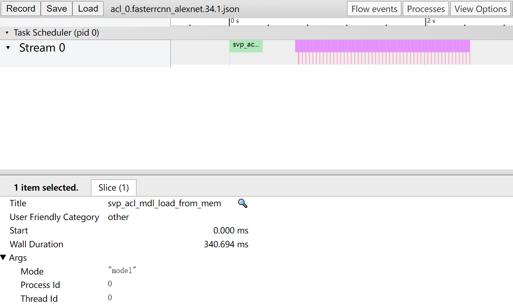

关键字段说明如[表1](#zh-cn_topic_0300758050_table446285293613)所示。

**表 1**  字段说明

<a name="zh-cn_topic_0300758050_table446285293613"></a>
<table><thead align="left"><tr id="zh-cn_topic_0300758050_row746245220364"><th class="cellrowborder" valign="top" width="22.32%" id="mcps1.2.3.1.1"><p id="zh-cn_topic_0300758050_p18462145214363"><a name="zh-cn_topic_0300758050_p18462145214363"></a><a name="zh-cn_topic_0300758050_p18462145214363"></a>字段名</p>
</th>
<th class="cellrowborder" valign="top" width="77.68%" id="mcps1.2.3.1.2"><p id="zh-cn_topic_0300758050_p16462175210368"><a name="zh-cn_topic_0300758050_p16462175210368"></a><a name="zh-cn_topic_0300758050_p16462175210368"></a>字段含义</p>
</th>
</tr>
</thead>
<tbody><tr id="zh-cn_topic_0300758050_row8462195213610"><td class="cellrowborder" valign="top" width="22.32%" headers="mcps1.2.3.1.1 "><p id="p18747205216163"><a name="p18747205216163"></a><a name="p18747205216163"></a>Title</p>
</td>
<td class="cellrowborder" valign="top" width="77.68%" headers="mcps1.2.3.1.2 "><p id="p19746175281610"><a name="p19746175281610"></a><a name="p19746175281610"></a>选择某个组件的接口名称，例如本例选择的为Thread 132397的aclmdlQuerySize接口。</p>
</td>
</tr>
<tr id="zh-cn_topic_0300758050_row246245263612"><td class="cellrowborder" valign="top" width="22.32%" headers="mcps1.2.3.1.1 "><p id="p10745155231618"><a name="p10745155231618"></a><a name="p10745155231618"></a>Start</p>
</td>
<td class="cellrowborder" valign="top" width="77.68%" headers="mcps1.2.3.1.2 "><p id="p474495210168"><a name="p474495210168"></a><a name="p474495210168"></a>显示界面中时间轴上的时刻点，chrome trace自动对齐。</p>
</td>
</tr>
<tr id="zh-cn_topic_0300758050_row746210524362"><td class="cellrowborder" valign="top" width="22.32%" headers="mcps1.2.3.1.1 "><p id="p790812883216"><a name="p790812883216"></a><a name="p790812883216"></a>Wall Duration</p>
</td>
<td class="cellrowborder" valign="top" width="77.68%" headers="mcps1.2.3.1.2 "><p id="p1174235261619"><a name="p1174235261619"></a><a name="p1174235261619"></a>表示当前接口调用耗时，单位ms。</p>
</td>
</tr>
<tr id="zh-cn_topic_0300758050_row12462185223610"><td class="cellrowborder" valign="top" width="22.32%" headers="mcps1.2.3.1.1 "><p id="p15561842175318"><a name="p15561842175318"></a><a name="p15561842175318"></a>Mode</p>
</td>
<td class="cellrowborder" valign="top" width="77.68%" headers="mcps1.2.3.1.2 "><p id="p1137594620534"><a name="p1137594620534"></a><a name="p1137594620534"></a>API类型。</p>
</td>
</tr>
<tr id="zh-cn_topic_0300758050_row174621252123620"><td class="cellrowborder" valign="top" width="22.32%" headers="mcps1.2.3.1.1 "><p id="p05611942195316"><a name="p05611942195316"></a><a name="p05611942195316"></a>Process_Id</p>
</td>
<td class="cellrowborder" valign="top" width="77.68%" headers="mcps1.2.3.1.2 "><p id="p1366115475532"><a name="p1366115475532"></a><a name="p1366115475532"></a>ACL API所在进程ID。</p>
</td>
</tr>
<tr id="zh-cn_topic_0300758050_row1237414381507"><td class="cellrowborder" valign="top" width="22.32%" headers="mcps1.2.3.1.1 "><p id="p1556154212532"><a name="p1556154212532"></a><a name="p1556154212532"></a>Thread_Id</p>
</td>
<td class="cellrowborder" valign="top" width="77.68%" headers="mcps1.2.3.1.2 "><p id="p83871949185315"><a name="p83871949185315"></a><a name="p83871949185315"></a>ACL API所在线程ID。</p>
</td>
</tr>
</tbody>
</table>

## summary数据说明<a name="ZH-CN_TOPIC_0000002441980577"></a>


### 导出summary数据<a name="ZH-CN_TOPIC_0000002408421430"></a>

在导出summary数据前，需要参见[解析Profiling数据](#ZH-CN_TOPIC_0000002408581254)解析Profiling数据。参见如下步骤导出summary数据。

1.  以Toolkit组件包Ascend-cann-toolkit开发套件包的运行用户登录**开发环境**。以HwHi_Aa_User用户为例。
2.  切换至msprof.pyc脚本所在目录，如$\{INSTALL\_DIR\}/toolkit/tools/profiler/profiler\_tool/analysis/msprof。

    > **说明：** 
    >小技巧：为方便执行msprof.pyc脚本，您可以使用HwHi_Aa_User用户执行命令alias msprof='python3.7.5 $\{INSTALL\_DIR\}/toolkit/tools/profiler/profiler\_tool/analysis/msprof/msprof.pyc'设置别名，后续就可以不用进入$\{INSTALL\_DIR\}/toolkit/tools/profiler/profiler\_tool/analysis/msprof目录，在任意目录输入msprof即可执行Profiling命令。
    >$\{INSTALL\_DIR\}请替换为CANN软件安装后文件存储路径。例如，$HOME/Ascend/ascend-toolkit/svp\_latest/x86\_64-linux。

3.  执行如下命令，导出summary数据。

    命令行格式如下，参数说明参见[表1](#zh-cn_topic_0290119915_table23221111184312)。

    ```
    python3.7.5 msprof.pyc export summary [-h] -dir <dir>  [--format <export_format>]
    ```

    例如导出推理或系统的Profiling的summary数据命令如下。

    **python3.7.5 msprof.pyc export summary -dir**_ _/home/HwHiAaUser/JOBXXX_ _**--format** _csv_

    **表 1**  导出summary数据命令参数说明

    <a name="zh-cn_topic_0290119915_table23221111184312"></a>
    <table><thead align="left"><tr id="zh-cn_topic_0290119915_row1632210114437"><th class="cellrowborder" valign="top" width="33.33333333333333%" id="mcps1.2.4.1.1"><p id="zh-cn_topic_0290119915_p1832315118430"><a name="zh-cn_topic_0290119915_p1832315118430"></a><a name="zh-cn_topic_0290119915_p1832315118430"></a>参数名</p>
    </th>
    <th class="cellrowborder" valign="top" width="37.48374837483748%" id="mcps1.2.4.1.2"><p id="zh-cn_topic_0290119915_p832381134313"><a name="zh-cn_topic_0290119915_p832381134313"></a><a name="zh-cn_topic_0290119915_p832381134313"></a>描述</p>
    </th>
    <th class="cellrowborder" valign="top" width="29.182918291829186%" id="mcps1.2.4.1.3"><p id="zh-cn_topic_0290119915_p7323711104311"><a name="zh-cn_topic_0290119915_p7323711104311"></a><a name="zh-cn_topic_0290119915_p7323711104311"></a>可选/必选</p>
    </th>
    </tr>
    </thead>
    <tbody><tr id="row834510428463"><td class="cellrowborder" valign="top" width="33.33333333333333%" headers="mcps1.2.4.1.1 "><p id="p934618428463"><a name="p934618428463"></a><a name="p934618428463"></a>-h，--help</p>
    </td>
    <td class="cellrowborder" valign="top" width="37.48374837483748%" headers="mcps1.2.4.1.2 "><p id="p17346204214463"><a name="p17346204214463"></a><a name="p17346204214463"></a>显示帮助信息，仅在获取使用方式时使用。</p>
    </td>
    <td class="cellrowborder" valign="top" width="29.182918291829186%" headers="mcps1.2.4.1.3 "><p id="p18346104254614"><a name="p18346104254614"></a><a name="p18346104254614"></a>可选</p>
    </td>
    </tr>
    <tr id="zh-cn_topic_0290119915_row1432312111435"><td class="cellrowborder" valign="top" width="33.33333333333333%" headers="mcps1.2.4.1.1 "><p id="zh-cn_topic_0290119915_p153232112437"><a name="zh-cn_topic_0290119915_p153232112437"></a><a name="zh-cn_topic_0290119915_p153232112437"></a>-dir, --collection-dir</p>
    </td>
    <td class="cellrowborder" valign="top" width="37.48374837483748%" headers="mcps1.2.4.1.2 "><p id="zh-cn_topic_0290119915_p14323121164310"><a name="zh-cn_topic_0290119915_p14323121164310"></a><a name="zh-cn_topic_0290119915_p14323121164310"></a>收集到的Profiling数据目录。须指定为JOB_XXX目录，里面存在data文件夹和对应info.json.0文件。</p>
    </td>
    <td class="cellrowborder" valign="top" width="29.182918291829186%" headers="mcps1.2.4.1.3 "><p id="zh-cn_topic_0290119915_p8323121194319"><a name="zh-cn_topic_0290119915_p8323121194319"></a><a name="zh-cn_topic_0290119915_p8323121194319"></a>必选</p>
    </td>
    </tr>
    <tr id="row176982919371"><td class="cellrowborder" valign="top" width="33.33333333333333%" headers="mcps1.2.4.1.1 "><p id="p1169816912374"><a name="p1169816912374"></a><a name="p1169816912374"></a>--format</p>
    </td>
    <td class="cellrowborder" valign="top" width="37.48374837483748%" headers="mcps1.2.4.1.2 "><p id="p86987973714"><a name="p86987973714"></a><a name="p86987973714"></a>summary数据文件的导出格式，支持csv和json两种格式，默认为csv。</p>
    </td>
    <td class="cellrowborder" valign="top" width="29.182918291829186%" headers="mcps1.2.4.1.3 "><p id="p869813993718"><a name="p869813993718"></a><a name="p869813993718"></a>可选</p>
    </td>
    </tr>
    </tbody>
    </table>

    > **说明：** 
    >下文中summary文件介绍均以csv文件为例。

4.  执行完上述命令后，会在collection-dir目录下生成summary目录，不同的数据（推理，系统）生成对应的csv文件，具体内容参见[表2](#zh-cn_topic_0290119915_table2434544115813)。

    **表 2**  summary文件介绍

    <a name="zh-cn_topic_0290119915_table2434544115813"></a>
    <table><thead align="left"><tr id="zh-cn_topic_0290119915_row11435644185820"><th class="cellrowborder" valign="top" width="17.580000000000002%" id="mcps1.2.4.1.1"><p id="p1753014239615"><a name="p1753014239615"></a><a name="p1753014239615"></a>文件数据分类</p>
    </th>
    <th class="cellrowborder" valign="top" width="39.4%" id="mcps1.2.4.1.2"><p id="zh-cn_topic_0290119915_p5435114485818"><a name="zh-cn_topic_0290119915_p5435114485818"></a><a name="zh-cn_topic_0290119915_p5435114485818"></a>summary文件名</p>
    </th>
    <th class="cellrowborder" valign="top" width="43.02%" id="mcps1.2.4.1.3"><p id="zh-cn_topic_0290119915_p14435164411582"><a name="zh-cn_topic_0290119915_p14435164411582"></a><a name="zh-cn_topic_0290119915_p14435164411582"></a>说明</p>
    </th>
    </tr>
    </thead>
    <tbody><tr id="zh-cn_topic_0290119915_row9435144185815"><td class="cellrowborder" valign="top" width="17.580000000000002%" headers="mcps1.2.4.1.1 "><p id="p105303231966"><a name="p105303231966"></a><a name="p105303231966"></a><em id="i8419820373"><a name="i8419820373"></a><a name="i8419820373"></a>AA</em> Core Metrices</p>
    </td>
    <td class="cellrowborder" valign="top" width="39.4%" headers="mcps1.2.4.1.2 "><p id="p796515499814"><a name="p796515499814"></a><a name="p796515499814"></a>op_summary_{device_id}.{model_file_name}.{model_id}.{batch_num}.{input_pic_num}.{current_pic_count}.{icache_miss_rate}.{frequency}.csv</p>
    </td>
    <td class="cellrowborder" valign="top" width="43.02%" headers="mcps1.2.4.1.3 "><p id="p4883104610313"><a name="p4883104610313"></a><a name="p4883104610313"></a>每个Core上指令占比数据，生成该csv文件需要采集的Profiling数据中包含<em id="i11623322995"><a name="i11623322995"></a><a name="i11623322995"></a>AA</em>core.开头的文件，该文件作为界面展示的输入文件。</p>
    </td>
    </tr>
    <tr id="row125089157359"><td class="cellrowborder" valign="top" width="17.580000000000002%" headers="mcps1.2.4.1.1 "><p id="p135301823267"><a name="p135301823267"></a><a name="p135301823267"></a>Statistics-ACL API</p>
    </td>
    <td class="cellrowborder" valign="top" width="39.4%" headers="mcps1.2.4.1.2 "><p id="p128831046235"><a name="p128831046235"></a><a name="p128831046235"></a>acl_statistic_{device_id}_{model_id}_{iter_id}.csv</p>
    </td>
    <td class="cellrowborder" valign="top" width="43.02%" headers="mcps1.2.4.1.3 "><p id="p2088210469317"><a name="p2088210469317"></a><a name="p2088210469317"></a>在Statistics中统计所有ACL API的耗时及与相同API的调用平均耗时、最大耗时、最小耗时的对比结果。</p>
    </td>
    </tr>
    <tr id="row1422131141214"><td class="cellrowborder" valign="top" width="17.580000000000002%" headers="mcps1.2.4.1.1 "><p id="p17530423964"><a name="p17530423964"></a><a name="p17530423964"></a>Statistics-Ops</p>
    </td>
    <td class="cellrowborder" valign="top" width="39.4%" headers="mcps1.2.4.1.2 "><p id="p15422616123"><a name="p15422616123"></a><a name="p15422616123"></a>op_statistic_{device_id}_{model_id}_{current_pic_count}_{iter_id}.csv</p>
    </td>
    <td class="cellrowborder" valign="top" width="43.02%" headers="mcps1.2.4.1.3 "><p id="p204221819122"><a name="p204221819122"></a><a name="p204221819122"></a>在Statistics中统计所有layer的运行耗时及与相同layer的调用平均耗时、最大耗时、最小耗时的对比结果。</p>
    </td>
    </tr>
    </tbody>
    </table>

    [表3](#table64582512342)展示了通过acl.json和ACL API两种方式，采集解析导出后包含的summary数据文件对比。

    **表 3**  生成数据文件对比

    <a name="table64582512342"></a>
    <table><thead align="left"><tr id="row10458251173412"><th class="cellrowborder" valign="top" width="66.38336166383361%" id="mcps1.2.4.1.1"><p id="p17458125123417"><a name="p17458125123417"></a><a name="p17458125123417"></a>包含的文件名</p>
    </th>
    <th class="cellrowborder" valign="top" width="17.37826217378262%" id="mcps1.2.4.1.2"><p id="p134586519348"><a name="p134586519348"></a><a name="p134586519348"></a>acl.json</p>
    </th>
    <th class="cellrowborder" valign="top" width="16.23837616238376%" id="mcps1.2.4.1.3"><p id="p8458115143418"><a name="p8458115143418"></a><a name="p8458115143418"></a>ACL API</p>
    </th>
    </tr>
    </thead>
    <tbody><tr id="row2640126191"><td class="cellrowborder" valign="top" width="66.38336166383361%" headers="mcps1.2.4.1.1 "><p id="p1264013620912"><a name="p1264013620912"></a><a name="p1264013620912"></a>op_summary_{device_id}.{model_file_name}.{model_id}.{batch_num}.{input_pic_num}.{current_pic_count}.{icache_miss_rate}.{frequency}.csv</p>
    </td>
    <td class="cellrowborder" valign="top" width="17.37826217378262%" headers="mcps1.2.4.1.2 "><p id="p51386211599"><a name="p51386211599"></a><a name="p51386211599"></a>包含</p>
    </td>
    <td class="cellrowborder" valign="top" width="16.23837616238376%" headers="mcps1.2.4.1.3 "><p id="p813813211897"><a name="p813813211897"></a><a name="p813813211897"></a>包含</p>
    </td>
    </tr>
    <tr id="row15458125193414"><td class="cellrowborder" valign="top" width="66.38336166383361%" headers="mcps1.2.4.1.1 "><p id="p1323441732914"><a name="p1323441732914"></a><a name="p1323441732914"></a>acl_statistic_{device_id}_{model_id}_{iter_id}.csv</p>
    </td>
    <td class="cellrowborder" valign="top" width="17.37826217378262%" headers="mcps1.2.4.1.2 "><p id="p146640511402"><a name="p146640511402"></a><a name="p146640511402"></a>包含</p>
    </td>
    <td class="cellrowborder" valign="top" width="16.23837616238376%" headers="mcps1.2.4.1.3 "><p id="p1434596154018"><a name="p1434596154018"></a><a name="p1434596154018"></a>包含</p>
    </td>
    </tr>
    <tr id="row2045914517347"><td class="cellrowborder" valign="top" width="66.38336166383361%" headers="mcps1.2.4.1.1 "><p id="p182351517122914"><a name="p182351517122914"></a><a name="p182351517122914"></a>op_statistic_{device_id}_{model_id}_{current_pic_count}_{iter_id}.csv</p>
    </td>
    <td class="cellrowborder" valign="top" width="17.37826217378262%" headers="mcps1.2.4.1.2 "><p id="p1454136153214"><a name="p1454136153214"></a><a name="p1454136153214"></a>包含</p>
    </td>
    <td class="cellrowborder" valign="top" width="16.23837616238376%" headers="mcps1.2.4.1.3 "><p id="p445496193214"><a name="p445496193214"></a><a name="p445496193214"></a>包含</p>
    </td>
    </tr>
    </tbody>
    </table>

    > **说明：** 
    >-   summary目录中的文件是根据采集的实际Profiling数据进行生成，如果实际的Profiling数据没有相关的数据文件，就不会导出对应的summary的数据。
    >-   使用export命令能直接从已解析的Profiling数据中导出数据文件。当Profiling数据未解析时，单独执行export命令也能进行解析Profiling数据并导出数据文件。
    >-   小技巧：生成的summary数据文件使用excel打开时，会出现字段值为科学计数的情况，例如“1.00159E+12“。此时可选中该单元格，然后“右键\>设置单元格格式“，在弹出的对话框中“数字“标签下选择“数值“，单击“确定“就能正常显示。
    >-   生成的summary数据文件中某些字段值为“N/A“时，表示此时该值不存在。
    >-   导出的数据中涉及到的时间节点（非Timestamp）为系统单调时间，只与系统有关，非真实时间。

### ACL接口耗时数据说明<a name="ZH-CN_TOPIC_0000002441980697"></a>

### ACL接口调用次数及耗时数据说明<a name="ZH-CN_TOPIC_0000002441980665"></a>

请参见[导出summary数据](#ZH-CN_TOPIC_0000002408421430)获取ACL接口调用次数及耗时数据acl\_statistic\_\{device\_id\}\_\{model\_id\}\_\{iter\_id\}.csv，其中\{device\_id\}表示设备ID，\{model\_id\}表示模型ID，\{iter\_id\}表示某轮迭代的ID号。

acl\_statistic\_\{device\_id\}\_\{model\_id\}\_\{iter\_id\}.csv文件内容格式示例如[图1](#fig11375113204916)所示。

**图 1**  csv文件内容<a name="fig11375113204916"></a>  
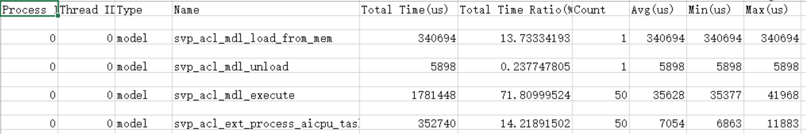

导出的ACL接口耗时数据表文件列说明如下。

**表 1**  字段说明

<a name="zh-cn_topic_0290119916_table1942315910414"></a>
<table><thead align="left"><tr id="zh-cn_topic_0290119916_row7423196414"><th class="cellrowborder" valign="top" width="18.33%" id="mcps1.2.3.1.1"><p id="zh-cn_topic_0290119916_p164244911418"><a name="zh-cn_topic_0290119916_p164244911418"></a><a name="zh-cn_topic_0290119916_p164244911418"></a>参数名</p>
</th>
<th class="cellrowborder" valign="top" width="81.67%" id="mcps1.2.3.1.2"><p id="zh-cn_topic_0290119916_p154248914413"><a name="zh-cn_topic_0290119916_p154248914413"></a><a name="zh-cn_topic_0290119916_p154248914413"></a>参数解释</p>
</th>
</tr>
</thead>
<tbody><tr id="zh-cn_topic_0290119916_row1642413954118"><td class="cellrowborder" valign="top" width="18.33%" headers="mcps1.2.3.1.1 "><p id="p18580111614328"><a name="p18580111614328"></a><a name="p18580111614328"></a>Process ID</p>
</td>
<td class="cellrowborder" valign="top" width="81.67%" headers="mcps1.2.3.1.2 "><p id="p145802016163211"><a name="p145802016163211"></a><a name="p145802016163211"></a>对应调用API所在进程ID。</p>
</td>
</tr>
<tr id="zh-cn_topic_0290119916_row1642411914120"><td class="cellrowborder" valign="top" width="18.33%" headers="mcps1.2.3.1.1 "><p id="p658041683211"><a name="p658041683211"></a><a name="p658041683211"></a>Thread ID</p>
</td>
<td class="cellrowborder" valign="top" width="81.67%" headers="mcps1.2.3.1.2 "><p id="p1358015168328"><a name="p1358015168328"></a><a name="p1358015168328"></a>对应调用API所在线程ID。</p>
</td>
</tr>
<tr id="zh-cn_topic_0290119916_row20424109154115"><td class="cellrowborder" valign="top" width="18.33%" headers="mcps1.2.3.1.1 "><p id="p5580131620326"><a name="p5580131620326"></a><a name="p5580131620326"></a>Type</p>
</td>
<td class="cellrowborder" valign="top" width="81.67%" headers="mcps1.2.3.1.2 "><p id="p18580161663218"><a name="p18580161663218"></a><a name="p18580161663218"></a>调用ACL API的xxx类型，如model，runtime。</p>
</td>
</tr>
<tr id="zh-cn_topic_0290119916_row54241999415"><td class="cellrowborder" valign="top" width="18.33%" headers="mcps1.2.3.1.1 "><p id="p185801516123220"><a name="p185801516123220"></a><a name="p185801516123220"></a>Name</p>
</td>
<td class="cellrowborder" valign="top" width="81.67%" headers="mcps1.2.3.1.2 "><p id="p12580161611322"><a name="p12580161611322"></a><a name="p12580161611322"></a>对应调用API名称。</p>
</td>
</tr>
<tr id="zh-cn_topic_0290119916_row842469194117"><td class="cellrowborder" valign="top" width="18.33%" headers="mcps1.2.3.1.1 "><p id="p8581191673211"><a name="p8581191673211"></a><a name="p8581191673211"></a>Total Time Ratio(%)</p>
</td>
<td class="cellrowborder" valign="top" width="81.67%" headers="mcps1.2.3.1.2 "><p id="p5581121610325"><a name="p5581121610325"></a><a name="p5581121610325"></a>对应调用API总时间占比。</p>
</td>
</tr>
<tr id="row63621857310"><td class="cellrowborder" valign="top" width="18.33%" headers="mcps1.2.3.1.1 "><p id="p45811316153218"><a name="p45811316153218"></a><a name="p45811316153218"></a>Total Time(us)</p>
</td>
<td class="cellrowborder" valign="top" width="81.67%" headers="mcps1.2.3.1.2 "><p id="p145815163327"><a name="p145815163327"></a><a name="p145815163327"></a>对应调用API时间长度，单位为us。可以点击字段旁边的三角号根据此项进行降序或升序排列。</p>
</td>
</tr>
<tr id="row49772076311"><td class="cellrowborder" valign="top" width="18.33%" headers="mcps1.2.3.1.1 "><p id="p165811216113214"><a name="p165811216113214"></a><a name="p165811216113214"></a>Count</p>
</td>
<td class="cellrowborder" valign="top" width="81.67%" headers="mcps1.2.3.1.2 "><p id="p1058114163325"><a name="p1058114163325"></a><a name="p1058114163325"></a>对应API调用次数。</p>
</td>
</tr>
<tr id="row89213816323"><td class="cellrowborder" valign="top" width="18.33%" headers="mcps1.2.3.1.1 "><p id="p258191683216"><a name="p258191683216"></a><a name="p258191683216"></a>Avg(us)</p>
</td>
<td class="cellrowborder" valign="top" width="81.67%" headers="mcps1.2.3.1.2 "><p id="p3581816133219"><a name="p3581816133219"></a><a name="p3581816133219"></a>对应API单次调用平均时间，单位为us。</p>
</td>
</tr>
<tr id="row1629816115328"><td class="cellrowborder" valign="top" width="18.33%" headers="mcps1.2.3.1.1 "><p id="p2058112162329"><a name="p2058112162329"></a><a name="p2058112162329"></a>Max(us)</p>
</td>
<td class="cellrowborder" valign="top" width="81.67%" headers="mcps1.2.3.1.2 "><p id="p7581416143214"><a name="p7581416143214"></a><a name="p7581416143214"></a>对应API单次调用最长时间，单位为us。</p>
</td>
</tr>
<tr id="row88040135322"><td class="cellrowborder" valign="top" width="18.33%" headers="mcps1.2.3.1.1 "><p id="p558171615325"><a name="p558171615325"></a><a name="p558171615325"></a>Min(us)</p>
</td>
<td class="cellrowborder" valign="top" width="81.67%" headers="mcps1.2.3.1.2 "><p id="p3581201610325"><a name="p3581201610325"></a><a name="p3581201610325"></a>对应API单次调用最短时间，单位为us。</p>
</td>
</tr>
</tbody>
</table>

### _AA_  Core数据说明<a name="ZH-CN_TOPIC_0000002442020505"></a>

请参见[导出summary数据](#ZH-CN_TOPIC_0000002408421430)获取_AA_  Core数据op\_summary\_\{device\_id\}.\{model\_file\_name\}.\{model\_id\}.\{batch\_num\}.\{input\_pic\_num\}.\{current\_pic\_count\}.\{icache\_miss\_rate\}.\{frequency\}.csv，其中\{device\_id\}表示设备ID，\{model\_file\_name\}表示模型名称,\{model\_id\}表示模型ID，\{batch\_num\}表示batch次数，\{input\_pic\_num\}表示输入图片总数，\{current\_pic\_count\}表示当前图片数，\{icache\_miss\_rate\}表示icache的损失率，\{frequency\}表示频率，\{iter\_id\}表示某轮迭代的ID号。

-   整网场景op\_summary\_\{device\_id\}.\{model\_file\_name\}.\{model\_id\}.\{batch\_num\}.\{input\_pic\_num\}.\{current\_pic\_count\}.\{icache\_miss\_rate\}.\{frequency\}.csv文件内容格式示例（示例仅展示部分参数，详情请参见[表1](#table1942315910414)）如[图1](#fig149515319491)。

    **图 1**  csv文件内容<a name="fig149515319491"></a>  
    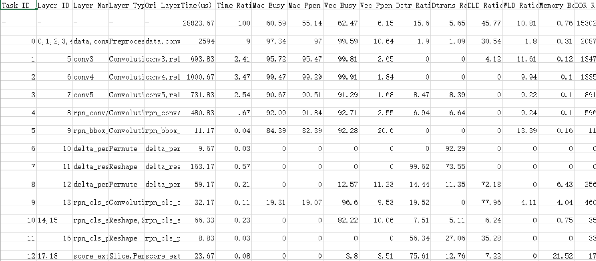

    导出的_AA_  Core数据表文件列说明如[表1](#table1942315910414)所示。

    **表 1**  字段说明

    <a name="table1942315910414"></a>
    <table><thead align="left"><tr id="row7423196414"><th class="cellrowborder" valign="top" width="18.22%" id="mcps1.2.3.1.1"><p id="p164244911418"><a name="p164244911418"></a><a name="p164244911418"></a>字段名</p>
    </th>
    <th class="cellrowborder" valign="top" width="81.78%" id="mcps1.2.3.1.2"><p id="p154248914413"><a name="p154248914413"></a><a name="p154248914413"></a>字段解释</p>
    </th>
    </tr>
    </thead>
    <tbody><tr id="row10631515184115"><td class="cellrowborder" valign="top" width="18.22%" headers="mcps1.2.3.1.1 "><p id="p69961740113614"><a name="p69961740113614"></a><a name="p69961740113614"></a>Layer Id</p>
    </td>
    <td class="cellrowborder" valign="top" width="81.78%" headers="mcps1.2.3.1.2 "><p id="p999754017369"><a name="p999754017369"></a><a name="p999754017369"></a>层id</p>
    </td>
    </tr>
    <tr id="row129835400557"><td class="cellrowborder" valign="top" width="18.22%" headers="mcps1.2.3.1.1 "><p id="p49971040143615"><a name="p49971040143615"></a><a name="p49971040143615"></a>Ori Layer Name</p>
    </td>
    <td class="cellrowborder" valign="top" width="81.78%" headers="mcps1.2.3.1.2 "><p id="p199971340183616"><a name="p199971340183616"></a><a name="p199971340183616"></a>原始层名</p>
    </td>
    </tr>
    <tr id="row1642413954118"><td class="cellrowborder" valign="top" width="18.22%" headers="mcps1.2.3.1.1 "><p id="p16997144023619"><a name="p16997144023619"></a><a name="p16997144023619"></a>Layer Name</p>
    </td>
    <td class="cellrowborder" valign="top" width="81.78%" headers="mcps1.2.3.1.2 "><p id="p2997184016360"><a name="p2997184016360"></a><a name="p2997184016360"></a>层名</p>
    </td>
    </tr>
    <tr id="row1642411914120"><td class="cellrowborder" valign="top" width="18.22%" headers="mcps1.2.3.1.1 "><p id="p09976409361"><a name="p09976409361"></a><a name="p09976409361"></a>Layer Type</p>
    </td>
    <td class="cellrowborder" valign="top" width="81.78%" headers="mcps1.2.3.1.2 "><p id="p499720409365"><a name="p499720409365"></a><a name="p499720409365"></a>层类型</p>
    </td>
    </tr>
    <tr id="row20424109154115"><td class="cellrowborder" valign="top" width="18.22%" headers="mcps1.2.3.1.1 "><p id="p119971040143612"><a name="p119971040143612"></a><a name="p119971040143612"></a>Time(us)</p>
    </td>
    <td class="cellrowborder" valign="top" width="81.78%" headers="mcps1.2.3.1.2 "><p id="p6997184019367"><a name="p6997184019367"></a><a name="p6997184019367"></a>当前层耗时</p>
    </td>
    </tr>
    <tr id="row54241999415"><td class="cellrowborder" valign="top" width="18.22%" headers="mcps1.2.3.1.1 "><p id="p499714023613"><a name="p499714023613"></a><a name="p499714023613"></a>Time Ratio</p>
    </td>
    <td class="cellrowborder" valign="top" width="81.78%" headers="mcps1.2.3.1.2 "><p id="p0997184033618"><a name="p0997184033618"></a><a name="p0997184033618"></a>当前层耗时在总耗时的百分比</p>
    </td>
    </tr>
    <tr id="row24241992419"><td class="cellrowborder" valign="top" width="18.22%" headers="mcps1.2.3.1.1 "><p id="p599744013615"><a name="p599744013615"></a><a name="p599744013615"></a>Mac Busy Ratio</p>
    </td>
    <td class="cellrowborder" valign="top" width="81.78%" headers="mcps1.2.3.1.2 "><p id="p89971640193615"><a name="p89971640193615"></a><a name="p89971640193615"></a>代表cube类型指令（矩阵类运算指令）占当前层总耗时的百分比。</p>
    </td>
    </tr>
    <tr id="row4424199134120"><td class="cellrowborder" valign="top" width="18.22%" headers="mcps1.2.3.1.1 "><p id="p17997340163611"><a name="p17997340163611"></a><a name="p17997340163611"></a>Mac Ppen Ratio</p>
    </td>
    <td class="cellrowborder" valign="top" width="81.78%" headers="mcps1.2.3.1.2 "><p id="p1299714093619"><a name="p1299714093619"></a><a name="p1299714093619"></a>代表cube类型指令有效工作时间（矩阵类运算指令）占当前层总耗时的百分比。</p>
    </td>
    </tr>
    <tr id="row4424169124117"><td class="cellrowborder" valign="top" width="18.22%" headers="mcps1.2.3.1.1 "><p id="p6997540193614"><a name="p6997540193614"></a><a name="p6997540193614"></a>Vec Busy Ratio</p>
    </td>
    <td class="cellrowborder" valign="top" width="81.78%" headers="mcps1.2.3.1.2 "><p id="p149979405369"><a name="p149979405369"></a><a name="p149979405369"></a>代表vector类型指令（向量类运算指令）占当前层总耗时的百分比。</p>
    </td>
    </tr>
    <tr id="row64246917416"><td class="cellrowborder" valign="top" width="18.22%" headers="mcps1.2.3.1.1 "><p id="p29973405362"><a name="p29973405362"></a><a name="p29973405362"></a>Vec Ppen Ratio</p>
    </td>
    <td class="cellrowborder" valign="top" width="81.78%" headers="mcps1.2.3.1.2 "><p id="p3998104013363"><a name="p3998104013363"></a><a name="p3998104013363"></a>代表vector类型指令有效工作时间（向量类运算指令）占当前层总耗时的百分比。</p>
    </td>
    </tr>
    <tr id="row7425399417"><td class="cellrowborder" valign="top" width="18.22%" headers="mcps1.2.3.1.1 "><p id="p10998840193613"><a name="p10998840193613"></a><a name="p10998840193613"></a>Dstr Ratio</p>
    </td>
    <td class="cellrowborder" valign="top" width="81.78%" headers="mcps1.2.3.1.2 "><p id="p10998194023610"><a name="p10998194023610"></a><a name="p10998194023610"></a>全称为data store ratio，代表数据保存，将内部数据写到外部DDR的内存搬移过程中占当前层总耗时的百分比。</p>
    </td>
    </tr>
    <tr id="row94251094417"><td class="cellrowborder" valign="top" width="18.22%" headers="mcps1.2.3.1.1 "><p id="p29981440183618"><a name="p29981440183618"></a><a name="p29981440183618"></a>Dtrans Ratio</p>
    </td>
    <td class="cellrowborder" valign="top" width="81.78%" headers="mcps1.2.3.1.2 "><p id="p20998144093612"><a name="p20998144093612"></a><a name="p20998144093612"></a>全称为internal data transfer and transform ratio，代表数据搬移，主要是从RAM到RAM搬移，并实现各种形变在内存搬移过程中占当前层总耗时的百分比。</p>
    </td>
    </tr>
    <tr id="row1242514904111"><td class="cellrowborder" valign="top" width="18.22%" headers="mcps1.2.3.1.1 "><p id="p1399834013612"><a name="p1399834013612"></a><a name="p1399834013612"></a>DLD Ratio</p>
    </td>
    <td class="cellrowborder" valign="top" width="81.78%" headers="mcps1.2.3.1.2 "><p id="p499834012369"><a name="p499834012369"></a><a name="p499834012369"></a>全称为data_loading_ratio，代表image和featuremap加载过程中占当前层总耗时的百分比。</p>
    </td>
    </tr>
    <tr id="row442519917417"><td class="cellrowborder" valign="top" width="18.22%" headers="mcps1.2.3.1.1 "><p id="p1699864014369"><a name="p1699864014369"></a><a name="p1699864014369"></a>WLD Ratio</p>
    </td>
    <td class="cellrowborder" valign="top" width="81.78%" headers="mcps1.2.3.1.2 "><p id="p899814401360"><a name="p899814401360"></a><a name="p899814401360"></a>全称为weight_loading_ratio，代表权重加载过程中占当前层总耗时的百分比。</p>
    </td>
    </tr>
    <tr id="row54255920412"><td class="cellrowborder" valign="top" width="18.22%" headers="mcps1.2.3.1.1 "><p id="p1699819408362"><a name="p1699819408362"></a><a name="p1699819408362"></a>Memory Bound</p>
    </td>
    <td class="cellrowborder" valign="top" width="81.78%" headers="mcps1.2.3.1.2 "><p id="p899884012362"><a name="p899884012362"></a><a name="p899884012362"></a>用于识别<em id="i15899192918610"><a name="i15899192918610"></a><a name="i15899192918610"></a>AA</em> Core执行算子计算过程是否存在Memory瓶颈，由max(Dstr Ratio, DLD Ratio, WLD Ratio)/max(Mac Busy Ratio, Vec Ppen Ratio)计算得出。计算结果小于1，表示没有Memory瓶颈；计算结果大于1则表示有Memory瓶颈，且数值越大越瓶颈严重。</p>
    </td>
    </tr>
    <tr id="row5425898416"><td class="cellrowborder" valign="top" width="18.22%" headers="mcps1.2.3.1.1 "><p id="p2998174013368"><a name="p2998174013368"></a><a name="p2998174013368"></a>DDR Read(byte)</p>
    </td>
    <td class="cellrowborder" valign="top" width="81.78%" headers="mcps1.2.3.1.2 "><p id="p599813401369"><a name="p599813401369"></a><a name="p599813401369"></a>ddr读byte数</p>
    </td>
    </tr>
    <tr id="row8550427125714"><td class="cellrowborder" valign="top" width="18.22%" headers="mcps1.2.3.1.1 "><p id="p11998164014367"><a name="p11998164014367"></a><a name="p11998164014367"></a>DDR Write(byte)</p>
    </td>
    <td class="cellrowborder" valign="top" width="81.78%" headers="mcps1.2.3.1.2 "><p id="p12998104023620"><a name="p12998104023620"></a><a name="p12998104023620"></a>ddr写byte数</p>
    </td>
    </tr>
    <tr id="row2924929165720"><td class="cellrowborder" valign="top" width="18.22%" headers="mcps1.2.3.1.1 "><p id="p10998114020366"><a name="p10998114020366"></a><a name="p10998114020366"></a>DDR Total(byte)</p>
    </td>
    <td class="cellrowborder" valign="top" width="81.78%" headers="mcps1.2.3.1.2 "><p id="p16998194023613"><a name="p16998194023613"></a><a name="p16998194023613"></a>ddr读写带宽之和</p>
    </td>
    </tr>
    </tbody>
    </table>

> **说明：** 
>-   算子的输入维度Input Shapes取值为空，即表示为“; ; ; ;“格式时，表示当前输入的为标量，其中“;”为每个维度的分隔符。算子的输出维度同理。
>-   性能数据中"-"代表的是total层的数据信息

### _AA_  Core算子调用次数及耗时数据说明<a name="ZH-CN_TOPIC_0000002441980621"></a>

请参见[导出summary数据](#ZH-CN_TOPIC_0000002408421430)获取_AA_  Core算子调用次数及耗时数据op\_statistic\_\{device\_id\}\_\{model\_id\}\_\{current\_pic\_count\}\_\{iter\_id\}.csv，其中\{device\_id\}表示设备ID，\{model\_id\}表示模型ID，\{current\_pic\_count\}表示当前图片数，\{iter\_id\}表示某轮迭代的ID号。

-   整网场景op\_statistic\_\{device\_id\}\_\{model\_id\}\_\{current\_pic\_count\}\_\{iter\_id\}.csv文件内容格式示例如[图1](#fig1870441413517)所示。

    **图 1**  csv文件内容<a name="fig1870441413517"></a>  
    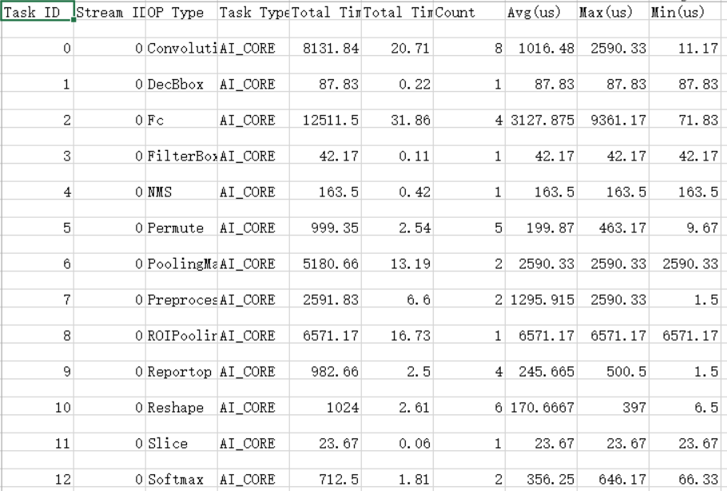

    导出的_AA_  Core算子调用次数及耗时数据表说明如[表1](#table1942315910414)所示。

    **表 1**  字段说明

    <a name="table1942315910414"></a>
    <table><thead align="left"><tr id="row7423196414"><th class="cellrowborder" valign="top" width="27.72%" id="mcps1.2.3.1.1"><p id="p164244911418"><a name="p164244911418"></a><a name="p164244911418"></a>字段名</p>
    </th>
    <th class="cellrowborder" valign="top" width="72.28%" id="mcps1.2.3.1.2"><p id="p154248914413"><a name="p154248914413"></a><a name="p154248914413"></a>字段解释</p>
    </th>
    </tr>
    </thead>
    <tbody><tr id="row10631515184115"><td class="cellrowborder" valign="top" width="27.72%" headers="mcps1.2.3.1.1 "><p id="p1299131274119"><a name="p1299131274119"></a><a name="p1299131274119"></a>Task ID</p>
    </td>
    <td class="cellrowborder" valign="top" width="72.28%" headers="mcps1.2.3.1.2 "><p id="p299181244116"><a name="p299181244116"></a><a name="p299181244116"></a>Task ID自增</p>
    </td>
    </tr>
    <tr id="row1642413954118"><td class="cellrowborder" valign="top" width="27.72%" headers="mcps1.2.3.1.1 "><p id="p119915128417"><a name="p119915128417"></a><a name="p119915128417"></a>Stream ID</p>
    </td>
    <td class="cellrowborder" valign="top" width="72.28%" headers="mcps1.2.3.1.2 "><p id="p0991101220417"><a name="p0991101220417"></a><a name="p0991101220417"></a>对应调用OP所在Stream ID。</p>
    </td>
    </tr>
    <tr id="row1642411914120"><td class="cellrowborder" valign="top" width="27.72%" headers="mcps1.2.3.1.1 "><p id="p69911912134117"><a name="p69911912134117"></a><a name="p69911912134117"></a>OP Name</p>
    </td>
    <td class="cellrowborder" valign="top" width="72.28%" headers="mcps1.2.3.1.2 "><p id="p14992512174110"><a name="p14992512174110"></a><a name="p14992512174110"></a>OPs的算子名称。</p>
    </td>
    </tr>
    <tr id="row20424109154115"><td class="cellrowborder" valign="top" width="27.72%" headers="mcps1.2.3.1.1 "><p id="p129921712164113"><a name="p129921712164113"></a><a name="p129921712164113"></a>Task Type</p>
    </td>
    <td class="cellrowborder" valign="top" width="72.28%" headers="mcps1.2.3.1.2 "><p id="p499271219417"><a name="p499271219417"></a><a name="p499271219417"></a>描述是<em id="i35351396412"><a name="i35351396412"></a><a name="i35351396412"></a>AA</em>_CORE还是<em id="i238111436417"><a name="i238111436417"></a><a name="i238111436417"></a>AA</em>_CPU</p>
    </td>
    </tr>
    <tr id="row54241999415"><td class="cellrowborder" valign="top" width="27.72%" headers="mcps1.2.3.1.1 "><p id="p2099261294110"><a name="p2099261294110"></a><a name="p2099261294110"></a>Total Time Ratio(%)</p>
    </td>
    <td class="cellrowborder" valign="top" width="72.28%" headers="mcps1.2.3.1.2 "><p id="p1099201274112"><a name="p1099201274112"></a><a name="p1099201274112"></a>对应调用OP总时间占比。</p>
    </td>
    </tr>
    <tr id="row842469194117"><td class="cellrowborder" valign="top" width="27.72%" headers="mcps1.2.3.1.1 "><p id="p13992912114115"><a name="p13992912114115"></a><a name="p13992912114115"></a>Total Time(us)</p>
    </td>
    <td class="cellrowborder" valign="top" width="72.28%" headers="mcps1.2.3.1.2 "><p id="p20992201217415"><a name="p20992201217415"></a><a name="p20992201217415"></a>对应调用OP时间长度，单位为us。可以点击字段旁边的三角号根据此项进行降序或升序排列。</p>
    </td>
    </tr>
    <tr id="row1659319358556"><td class="cellrowborder" valign="top" width="27.72%" headers="mcps1.2.3.1.1 "><p id="p1599261284115"><a name="p1599261284115"></a><a name="p1599261284115"></a>Count</p>
    </td>
    <td class="cellrowborder" valign="top" width="72.28%" headers="mcps1.2.3.1.2 "><p id="p2099271220419"><a name="p2099271220419"></a><a name="p2099271220419"></a>对应OP调用次数。</p>
    </td>
    </tr>
    <tr id="row727418644118"><td class="cellrowborder" valign="top" width="27.72%" headers="mcps1.2.3.1.1 "><p id="p39927126414"><a name="p39927126414"></a><a name="p39927126414"></a>Avg(us)</p>
    </td>
    <td class="cellrowborder" valign="top" width="72.28%" headers="mcps1.2.3.1.2 "><p id="p19992141284114"><a name="p19992141284114"></a><a name="p19992141284114"></a>对应OP单次调用平均时间，单位为us。</p>
    </td>
    </tr>
    <tr id="row946811815413"><td class="cellrowborder" valign="top" width="27.72%" headers="mcps1.2.3.1.1 "><p id="p499271244120"><a name="p499271244120"></a><a name="p499271244120"></a>Max(us)</p>
    </td>
    <td class="cellrowborder" valign="top" width="72.28%" headers="mcps1.2.3.1.2 "><p id="p59922128412"><a name="p59922128412"></a><a name="p59922128412"></a>对应OP单次调用最长时间，单位为us。</p>
    </td>
    </tr>
    <tr id="row876881015416"><td class="cellrowborder" valign="top" width="27.72%" headers="mcps1.2.3.1.1 "><p id="p6992141219412"><a name="p6992141219412"></a><a name="p6992141219412"></a>Min(us)</p>
    </td>
    <td class="cellrowborder" valign="top" width="72.28%" headers="mcps1.2.3.1.2 "><p id="p799271213418"><a name="p799271213418"></a><a name="p799271213418"></a>对应OP单次调用最短时间，单位为us。</p>
    </td>
    </tr>
    </tbody>
    </table>

# 展示Profiling数据<a name="ZH-CN_TOPIC_0000002408581330"></a>

msprof.pyc工具是由Python编写的Profiling命令行工具。功能及安装路径如[表1](#zh-cn_topic_0300758010_zh-cn_topic_0185224927_table538324842618)。

**表 1**  msprof.pyc脚本说明

<a name="zh-cn_topic_0300758010_zh-cn_topic_0185224927_table538324842618"></a>
<table><thead align="left"><tr id="zh-cn_topic_0300758010_zh-cn_topic_0185224927_row11421124815268"><th class="cellrowborder" valign="top" width="21.172117211721172%" id="mcps1.2.4.1.1"><p id="zh-cn_topic_0300758010_zh-cn_topic_0185224927_p18421548172616"><a name="zh-cn_topic_0300758010_zh-cn_topic_0185224927_p18421548172616"></a><a name="zh-cn_topic_0300758010_zh-cn_topic_0185224927_p18421548172616"></a>脚本名</p>
</th>
<th class="cellrowborder" valign="top" width="30.413041304130413%" id="mcps1.2.4.1.2"><p id="zh-cn_topic_0300758010_zh-cn_topic_0185224927_p19421248152617"><a name="zh-cn_topic_0300758010_zh-cn_topic_0185224927_p19421248152617"></a><a name="zh-cn_topic_0300758010_zh-cn_topic_0185224927_p19421248152617"></a>功能</p>
</th>
<th class="cellrowborder" valign="top" width="48.41484148414841%" id="mcps1.2.4.1.3"><p id="zh-cn_topic_0300758010_zh-cn_topic_0185224927_p4421164816263"><a name="zh-cn_topic_0300758010_zh-cn_topic_0185224927_p4421164816263"></a><a name="zh-cn_topic_0300758010_zh-cn_topic_0185224927_p4421164816263"></a>路径</p>
</th>
</tr>
</thead>
<tbody><tr id="zh-cn_topic_0300758010_zh-cn_topic_0185224927_row4421134817261"><td class="cellrowborder" valign="top" width="21.172117211721172%" headers="mcps1.2.4.1.1 "><p id="zh-cn_topic_0300758010_zh-cn_topic_0185224927_p142111489262"><a name="zh-cn_topic_0300758010_zh-cn_topic_0185224927_p142111489262"></a><a name="zh-cn_topic_0300758010_zh-cn_topic_0185224927_p142111489262"></a><span class="filepath" id="zh-cn_topic_0300758010_zh-cn_topic_0221974959_filepath770122219263"><a name="zh-cn_topic_0300758010_zh-cn_topic_0221974959_filepath770122219263"></a><a name="zh-cn_topic_0300758010_zh-cn_topic_0221974959_filepath770122219263"></a>“msprof.pyc”</span></p>
</td>
<td class="cellrowborder" valign="top" width="30.413041304130413%" headers="mcps1.2.4.1.2 "><p id="zh-cn_topic_0300758010_zh-cn_topic_0185224927_p1421184817261"><a name="zh-cn_topic_0300758010_zh-cn_topic_0185224927_p1421184817261"></a><a name="zh-cn_topic_0300758010_zh-cn_topic_0185224927_p1421184817261"></a>展示采集后Profiling性能原始数据。</p>
</td>
<td class="cellrowborder" valign="top" width="48.41484148414841%" headers="mcps1.2.4.1.3 "><p id="p52001729125317"><a name="p52001729125317"></a><a name="p52001729125317"></a>例如：</p>
<p id="p79671618202517"><a name="p79671618202517"></a><a name="p79671618202517"></a><span id="ph10562197165916"><a name="ph10562197165916"></a><a name="ph10562197165916"></a>${INSTALL_DIR}</span>/toolkit/tools/profiler/profiler_tool/analysis/msprof</p>
</td>
</tr>
</tbody>
</table>


## 展示数据操作及说明<a name="ZH-CN_TOPIC_0000002408581226"></a>

1.  以Toolkit组件包Ascend-cann-toolkit开发套件包的运行用户登录**开发环境**。以HwHi_Aa_User用户为例。
2.  切换至“msprof.pyc“脚本所在目录，如$\{INSTALL\_DIR\}/toolkit/tools/profiler/profiler\_tool/analysis/msprof。

    > **说明：** 
    >小技巧：为方便执行msprof.pyc脚本，您可以使用HwHi_Aa_User用户执行命令alias msprof='python3.7.5 $\{INSTALL\_DIR\}/toolkit/tools/profiler/profiler\_tool/analysis/msprof/msprof.pyc'设置别名，后续就可以不用进入$\{INSTALL\_DIR\}/toolkit/tools/profiler/profiler\_tool/analysis/msprof目录，在任意目录输入msprof即可执行Profiling命令。
    >$\{INSTALL\_DIR\}请替换为CANN软件安装后文件存储路径。例如，$HOME/Ascend/ascend-toolkit/svp\_latest/x86\_64-linux。

3.  执行如下命令，展示解析生成的数据，参数说明参见[表1](#table1871818312521)。

    ```
    python3.7.5 msprof.pyc show [-h] -dir <dir>
    ```

    **表 1**  打屏命令参数说明

    <a name="table1871818312521"></a>
    <table><thead align="left"><tr id="row1371833135219"><th class="cellrowborder" valign="top" width="33.33333333333333%" id="mcps1.2.4.1.1"><p id="p271817318523"><a name="p271817318523"></a><a name="p271817318523"></a>参数名</p>
    </th>
    <th class="cellrowborder" valign="top" width="33.33333333333333%" id="mcps1.2.4.1.2"><p id="p12718143105210"><a name="p12718143105210"></a><a name="p12718143105210"></a>描述</p>
    </th>
    <th class="cellrowborder" valign="top" width="33.33333333333333%" id="mcps1.2.4.1.3"><p id="p071819313521"><a name="p071819313521"></a><a name="p071819313521"></a>可选/必选</p>
    </th>
    </tr>
    </thead>
    <tbody><tr id="row171814375213"><td class="cellrowborder" valign="top" width="33.33333333333333%" headers="mcps1.2.4.1.1 "><p id="p1171815335220"><a name="p1171815335220"></a><a name="p1171815335220"></a>-h，--help</p>
    </td>
    <td class="cellrowborder" valign="top" width="33.33333333333333%" headers="mcps1.2.4.1.2 "><p id="p1571814365218"><a name="p1571814365218"></a><a name="p1571814365218"></a>显示帮助信息，仅在获取使用方式时使用。</p>
    </td>
    <td class="cellrowborder" valign="top" width="33.33333333333333%" headers="mcps1.2.4.1.3 "><p id="p1871813385213"><a name="p1871813385213"></a><a name="p1871813385213"></a>可选</p>
    </td>
    </tr>
    <tr id="row18223840165210"><td class="cellrowborder" valign="top" width="33.33333333333333%" headers="mcps1.2.4.1.1 "><p id="p122464013520"><a name="p122464013520"></a><a name="p122464013520"></a>-dir, --collection-dir</p>
    </td>
    <td class="cellrowborder" valign="top" width="33.33333333333333%" headers="mcps1.2.4.1.2 "><p id="p11224164065217"><a name="p11224164065217"></a><a name="p11224164065217"></a>收集到的Profiling数据目录。须指定为JOB_XXX目录，里面存在data文件夹和对应info.json.0文件。</p>
    </td>
    <td class="cellrowborder" valign="top" width="33.33333333333333%" headers="mcps1.2.4.1.3 "><p id="p17871651175216"><a name="p17871651175216"></a><a name="p17871651175216"></a>必选</p>
    </td>
    </tr>
    </tbody>
    </table>

    > **说明：** 
    >使用展示打屏功能请先安装 tabulate组件，可使用 pip3.7.5 install tabulate方式安装第三方依赖。

    执行命令后，命令行上会展示Profiling解析的数据，各数据展示属性分别如[图1](#fig3731720015)、[图2](#fig129568316014)、[图3](#fig169782011013)和[图4](#fig1592144412369)所示。

    **图 1** _AA_core metric数据展示属性<a name="fig3731720015"></a>  
    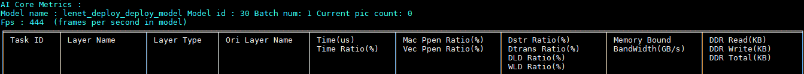

    **图 2**  Op statistic数据展示属性<a name="fig129568316014"></a>  
    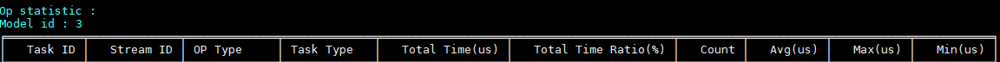

    **图 3**  Acl statistic 数据展示属性<a name="fig169782011013"></a>  
    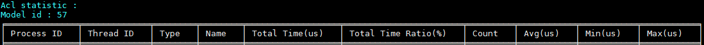

    **图 4**  Frequency 频率数据展示<a name="fig1592144412369"></a>  
    

    > **说明：** 
    >执行完show展示功能后，JOBXXXX目录上会生成对应sqlite文件夹、log文件夹以及timeline文件夹。

# Profiling性能分析样例参考<a name="ZH-CN_TOPIC_0000002408421330"></a>


## 网络应用中的函数计算性能优化分析样例<a name="ZH-CN_TOPIC_0000002408421402"></a>

**背景介绍<a name="zh-cn_topic_0000001149485188_section431214284326"></a>**

使用PyTorch网络应用在昇腾模式识别处理器SoC执行推理过程中，发现整体执行时间较长。为了找出原因，使用Profiling性能分析工具对该网络应用执行推理耗时分析，分析结果显示运行的接口svp\_acl\_mdl\_execute执行耗时数值较高，进一步分析结果发现Conv算子执行时间最长。因此我们打开PyTorch网络转换成的om模型查询Conv算子，发现该算子是多个计算单元组成，这样会造成极大的推理开销。由于Conv算子所在函数为Mish激活函数，而当前昇腾模式识别处理器SoC支持的激活函数只有：Relu、Leakyrelu、PRelu、Elu。Mish函数暂时不在支持范围内，因此造成模型转换后的Mish函数被分解成了多个计算单元。

问题解决：我们通过将om模型中的Mish函数替换昇腾模式识别处理器SoC的激活函数，尝试降低推理耗时，以Leakyrelu替换Mish函数为例，重新执行Profiling性能分析，结果发现推理耗时明显降低。

> **说明：** 
>本文仅介绍Profiling性能分析工具的操作及分析过程，对于om模型的算子分析以及函数替换等操作此处不做阐述。

**Profiling性能分析操作<a name="zh-cn_topic_0000001149485188_section8947319324"></a>**

通过以下操作方法执行Profiling：

1.  采集Profiling数据。

    参考[采集Profiling数据](#ZH-CN_TOPIC_0000002408421366)，得到JOB开头的即为保存的原始Profiling数据。

2.  解析Profiling数据。
    1.  以Toolkit组件包Ascend-cann-toolkit开发套件包的运行用户登录**开发环境**。以HwHi_Aa_User用户为例。
    2.  切换至msprof.pyc脚本所在目录，如$\{INSTALL\_DIR\}/toolkit/tools/profiler/profiler\_tool/analysis/msprof。

        > **说明：** 
        >小技巧：为方便执行msprof.pyc脚本，您可以使用HwHi_Aa_User用户执行命令alias msprof='python3.7.5  $\{INSTALL\_DIR\}/toolkit/tools/profiler/profiler\_tool/analysis/msprof/msprof.pyc'设置别名，后续就可以不用进入$\{INSTALL\_DIR\}/toolkit/tools/profiler/profiler\_tool/analysis/msprof目录，在任意目录输入msprof即可执行Profiling命令。
        >$\{INSTALL\_DIR\}请替换为CANN软件安装后文件存储路径。例如，$HOME/Ascend/ascend-toolkit/svp\_latest/x86\_64-linux。

    3.  执行如下命令，解析JOBXXX目录下的Profiling数据。

        ```
        python3.7.5 msprof.pyc import -dir /home/HwHiAaUser/JOBXXX
        ```

        此处以通过import命令行方式解析Profiling数据为例，解析Profiling数据详细介绍请参见[解析Profiling数据](#ZH-CN_TOPIC_0000002408581254)。

3.  在msprof.pyc脚本所在目录继续执行如下命令，导出timeline数据。

    ```
    python3.7.5 msprof.pyc export timeline -dir home/HwHiAaUser/JOBXXX
    ```

    执行完上述命令后，会在collection-dir目录下的JOBXXX目录下生成timeline目录，不同的数据生成对应的json文件，如[图1](#fig237417213614)所示，具体内容参见[表2](#ZH-CN_TOPIC_0000002442020445#zh-cn_topic_0290106133_table972265435020)。

    **图 1**  timeline目录<a name="fig237417213614"></a>  
    

4.  在msprof.pyc脚本所在目录继续执行如下命令，导出summary数据。

    ```
    python3.7.5 msprof.pyc export summary -dir /home/HwHiAaUser/JOBXXX --format csv
    ```

    执行完上述命令后，会在collection-dir目录下生成summary目录，不同的数据（推理，系统）生成对应的csv文件，如[图2](#fig12893536173613)所示，具体内容参见[表2](#ZH-CN_TOPIC_0000002408421430#zh-cn_topic_0290119915_table2434544115813)。

    **图 2**  summary目录<a name="fig12893536173613"></a>  
    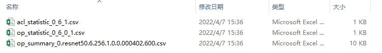

**问题分析<a name="zh-cn_topic_0000001149485188_section1267893343215"></a>**

1.  我们打开acl\_\{device\_id\}\_\{model\_id\}\_\{iter\_id\}.json文件查看ACL接口耗时数据。如[图3](#fig56451414197)所示。

    **图 3**  ACL接口耗时<a name="fig56451414197"></a>  
    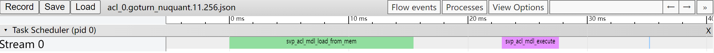

    此时我们可以看到ACL接口中耗时最长的时间线有两段，分别为svp\_acl\_mdl\_load\_from\_mem和svp\_acl\_mdl\_execute接口。也就是说虽然svp\_acl\_mdl\_execute接口是在执行接口中耗时最长，但是在ACL接口中，svp\_acl\_mdl\_execute接口耗时仅排第二。

    参见《应用开发指南》中的“ACL API参考”章节查找svp\_acl\_mdl\_load\_from\_mem接口的作用为“从文件加载离线模型数据”，可以分析该接口耗时取决于加载离线模型的时间，加载时间我们暂时无法进行调优。那么还需要继续从svp\_acl\_mdl\_execute接口深入分析。

2.  由于svp\_acl\_mdl\_execute接口是执行接口，而模型中所有算子执行的时间总和就是执行耗时。那么我们通过打开task\_time\_\{device\_id\}\_\{model\_id\}\_\{iter\_id\}.json文件查看Task Scheduler任务调度信息数据，分析执行推理过程中具体耗时较长的任务。如[图4](#fig2350191773916)所示。

    **图 4**  Task Scheduler任务调度信息<a name="fig2350191773916"></a>  
    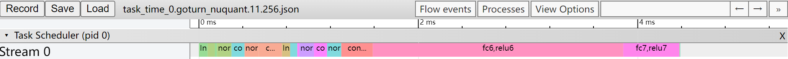

    从Task Scheduler任务调度信息数据中我们可以看到，时间线中执行了大量的Conv算子（时间线过长图片无法完全展示），且每个Conv算子的执行时间都比其他算子长。

    至此我们基本可以判断拖慢应用推理过程中执行效率的因素中，Conv算子的占比较大。

3.  为了进一步验证这个结论我们可以打开summary数据中的acl\_\{device\_id\}\_\{model\_id\}\_\{iter\_id\}.csv文件如[图5](#fig1563254582020)所示和task\_time\_\{device\_id\}\_\{model\_id\}\_\{iter\_id\}.csv文件如[图6](#fig16151115342016)所示。可以通过表格中的自定义排序，选择Total Time\(us\)为主要关键字，进行降序重排表格。

    **图 5**  ACL接口耗时<a name="fig1563254582020"></a>  
    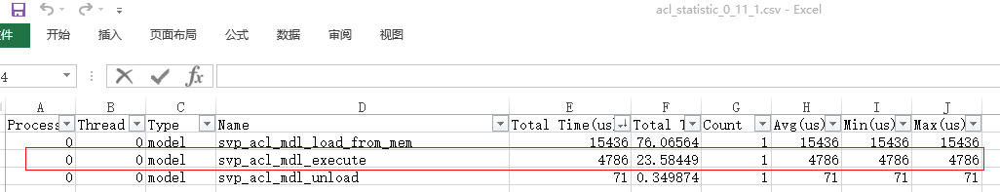

    **图 6** _AA_  Core算子耗时数据<a name="fig16151115342016"></a>  
    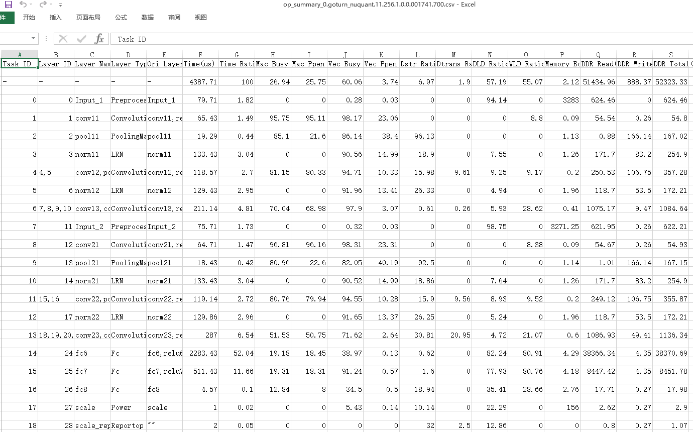

    根据以上三张表中数据可以判断：各个组件耗时信息数据中ACL接口的svp\_acl\_mdl\_load\_from\_mem接口耗时最长；ACL接口中耗时最长的时间线有两段，svp\_acl\_mdl\_execute接口耗时排第二；Task Scheduler任务调度信息数据中存在大量的Conv算子，且每个Conv算子的执行时间都较长。

    到此，Profiling性能分析工具的任务已经完成。

4.  接下来我们可以参见《ATC工具使用指南》中的“基础功能”的章节，打开PyTorch网络转换成的om模型查询Conv算子，发现该算子是多个计算单元组成，如[图7](#zh-cn_topic_0000001149485188_fig188851417184514)所示，这样会造成极大的推理开销。

    **图 7**  PyTorch网络模型<a name="zh-cn_topic_0000001149485188_fig188851417184514"></a>  
    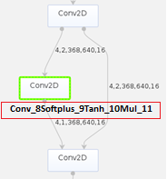

5.  我们通过查询代码发现计算单元中的Softplus、Tanh和Mul是属于Mish激活函数的计算公式，如[图8](#fig52651449982)所示。而当前昇腾模式识别处理器SoC支持的激活函数只有：Relu、Leakyrelu、Prelu、Elu和Srelu。Mish函数不在支持范围内，因此造成模型转换后的Mish函数被分解成了多个计算单元。

    **图 8**  Mish激活函数<a name="fig52651449982"></a>  
    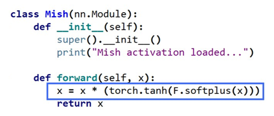

    解决该问题最简单的办法就是找到效率更高的替代函数。

**问题解决<a name="zh-cn_topic_0000001149485188_section1093717451463"></a>**

尝试以官方提供的Leaky Relu激活函数作为替换函数。函数替换操作请用户自行处理，此处不作阐述。完成函数替换后重新执行[Profiling性能分析操作](#zh-cn_topic_0000001149485188_section8947319324)得到新的结果，我们查看[图9](#zh-cn_topic_0000001149485188_fig4590813202310)已经从原先的23.299ms降低到现在的14.190ms，查看[图10](#fig25146456719)发现大多数Conv算子的时间线已经得到缩短。同时Leaky Relu函数的精度比Mish函数要小1%，Leaky Relu函数精度更高。

**图 9**  ACL接口耗时<a name="zh-cn_topic_0000001149485188_fig4590813202310"></a>  
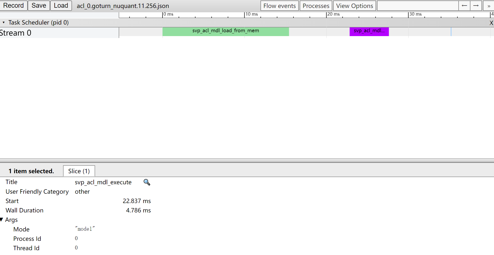

**图 10** _AA_  Core算子耗时数据<a name="fig25146456719"></a>  
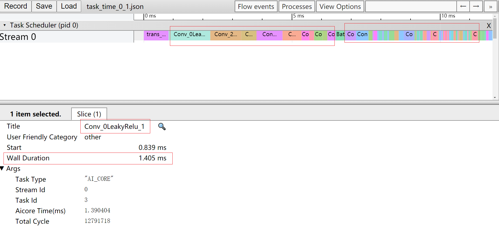

**结论<a name="zh-cn_topic_0000001149485188_section1553673619328"></a>**

通过Profiling性能分析工具前后两次对网络应用推理的运行时间进行分析，并对比两次执行时间可以得出结论，替换Leaky Relu激活函数后，降低了Conv算子在应用推理的运行时间，提升了推理效率。

# 附录<a name="ZH-CN_TOPIC_0000002408421386"></a>


## FAQ<a name="ZH-CN_TOPIC_0000002408421418"></a>


### 挂载命令中的ip与服务器ip不符<a name="ZH-CN_TOPIC_0000002408581238"></a>

**问题描述<a name="section814174893417"></a>**

执行采集profileing数据上板操作时挂载失败，且挂载命令中的ip地址与服务器的ip不符

如：服务器ip为xxx.xxx.xxx.xxx，挂载ip为127.0.1.1

出现报错如[图1](#fig1314194351413)所示。

**图 1**  挂载命令中的ip地址与服务器的ip不符<a name="fig1314194351413"></a>  
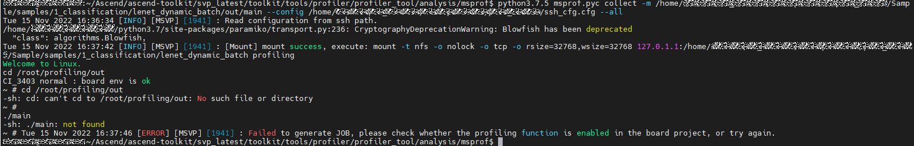

**问题原因<a name="section1651035633412"></a>**

/etc/hosts 文件中配置了回环地址如下。

```
127.0.0.1 localhost
127.0.1.1 hostname
```

**解决方法<a name="section4878283512"></a>**

将/etc/hosts 文件修改如下。

```
127.0.0.1 localhost
# 127.0.1.1 hostname
```

