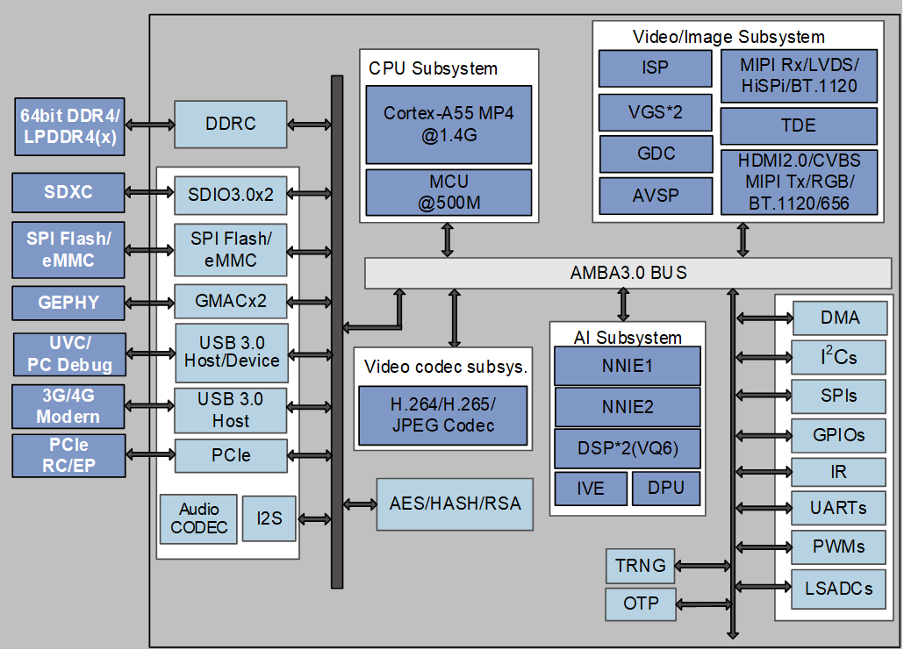
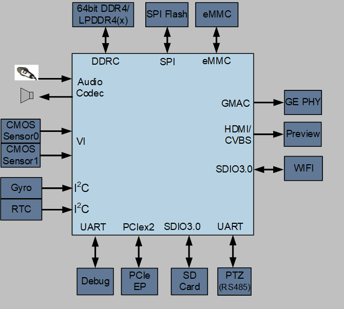

# 总体介绍

SS928V100是一颗面向市场推出的专业超高清智能网络录像机SoC。该芯片最高支持四路sensor输入，支持最高4K60的ISP图像处理能力，支持3F WDR、多级降噪、六轴防抖、硬件拼接等多种图像增强和处理算法，为用户提供了卓越的图像处理能力。

SS928V100内置四核A55，提供高效且丰富和灵活的CPU资源，以满足客户计算和控制需求。集成单核MCU，以满足某些低延时要求较高场景。

SS928V100集成了高效的图像分析工具推理单元，最高10.4Tops INT8，并支持业界主流的图像分析工具框架。并内置双核Vision DSP，以满足客户一些差异化的CV计算需求。

SS928V100采用先进的12nm低功耗工艺和0.65pitch封装，同时支持LPDDR4/LPDDR4x/DDR4颗粒，满足客户应用的产品小型化设计和快速量产。

SS928V100配套提供的稳定、易用的SDK设计，能够支撑客户快速产品量产。

# 关键特性

-   智能加速
    -   10.4Tops INT8 双NN加速引擎
    -   双核Vision Q6的DSP处理

-   4K60 编解码
    -   支持4K60的H.265/H.264编码。
    -   支持10路1080p30的H.265/H.264解码。

-   支持四路4M实时拼接

    支持4路4Mp30机内实时硬化拼接。

-   高速接口

    支持USB3.0和PCIe2.0高速接口。

-   小型化封装

    采用23mm x 23mm FC-BGA封装形式。

# 主要特点

## 处理器内核

-   四核ARM Cortex A55@1.4GHz
    -   32KB I-Cache，32KB D-Cache /512KB L3 cache
    -   支持Neon加速，集成FPU处理单元

-   内置32bit MCU@500MHz
    -   32KB I-Cache，32KB D-Cache /64KB TCM

## 智能视频分析

-   图像分析加速引擎，高达10.4Tops@INT8算力
    -   双内核异构引擎
    -   引擎1 支持4.8Tops算力，支持INT4/INT8/FP16
    -   引擎2 支持5.6Tops算力，支持INT8/INT16
    -   支持完整的API和工具链，易于客户开发

-   双核Vision Q6 DSP
    -   32K I-Cache /32K D-Cache /32K IRAM/320K DRAM

-   内置智能计算加速引擎
-   内置双目深度加速单元
-   内置矩阵计算加速单元

## 视频编解码

-   H.264 BP/MP/HP
-   H.265 Main Profile
-   H.264/H.265编解码最大分辨率为8192 x 8192
-   H.264/H.265 编码支持I/P帧
-   H.264/H.265多码流编码能力：
    -   3840 x 2160@60fps + 1280x720@30fps
    -   7680 x 4320@15fps

-   H.264/H.265/MPEG-4多码流解码能力：
    -   3840 x 2160@60fps + 1920x1080@60fps

-   支持最多8个区域的编码前OSD叠加
-   支持CBR/VBR/AVBR/FIXQP/QPMAP等多种码率控制模式
-   输出码率最大值160Mbps
-   支持8个感兴趣区域（ROI）编码
-   支持JPEG Baseline编解码
-   JPEG编解码最大分辨率16384x16384
-   JPEG最大性能
    -   编码：3840 x 2160@60fps \(YUV420\)
    -   解码：3840 x 2160@75fps \(YUV420\)

## 视频输入接口

-   支持8-Lane image sensor串行输入，支持 MIPI/LVDS/Sub-LVDS/HiSPi多种接口
-   支持2x4-Lane或4x2-Lane等多种组合，最高支持4路sensor串行输入
-   最大分辨率8192 x 8192
-   支持8/10/12/14 Bit RGB Bayer DC时序视频输入，时钟频率最高150MHz
-   支持BT.601、BT.656、BT.1120视频输入接口
-   支持主流CMOS电平热成像传感器

## 数字图像处理（ISP）

-   ISP支持分时复用处理多路sensor输入视频
-   支持3A（AE/AWB/AF）功能，3A的控制用户可调节
-   支持去固定模式噪声（FPN）
-   支持坏点校正、镜头阴影校正；
-   最高支持三帧WDR及Advanced Local Tone Mapping
-   支持多级3D去噪、图像边缘增强、去雾、动态对比度增强等处理功能
-   支持3D-LUT色彩调节
-   支持镜头畸变校正，支持鱼眼矫正
-   支持6-DoF数字防抖及Rolling-Shutter校正
-   支持图像Mirror、Flip、90度/270度旋转
-   提供 PC端ISP 调节工具
-   支持超感光去噪（HNR）

## 视频与图形处理

-   支持图形和图像1/15.5～16x缩放功能
-   支持多达4路视频全景拼接
    -   输入2路3840x2160@30fps，输出4320x3840@30fps
    -   输入4路2688x1520@30fps，输出6080x2688@30fps

-   支持视频层、图形层叠加
-   支持色彩空间转换

## 视频输出

-   支持HDMI2.0接口输出
-   支持4-Lane Mipi DSI/CSI接口输出，最高2.5Gbps/lane
-   内置模拟标清CVBS输出
-   支持8/16/24 bit RGB、BT.656、BT.1120等数字接口
-   同时支持2个独立高清视频输出
    -   支持任意两种接口非同源输出
    -   其中一路可支持PIP\(Picture In Picture\)

-   最大输出能力3840x2160@60fps + 1920x1080@60fps

## 音频接口与处理

-   内置Audio codec，支持16bit 语音输入和输出
-   支持I2S接口
    -   支持多声道时分复用传输模式（TDM）

-   支持HDMI Audio输出
-   通过软件实现多协议语音编解码
-   支持音频3A（AEC/ANR/ALC）处理
-   支持G.711/G.726/AAC/等音频编码格式

## 安全隔离与引擎

-   支持安全启动
-   支持基于TrustZone的REE/TEE硬件隔离方案
-   硬件实现AES对称加密算法
-   硬件实现RSA2048/3072/4096签名校验算法
-   硬件实现基于HASH的SHA/256/384/512、HMAC\_SHA256/384/512算法
-   硬件实现随机数发生器
-   集成30Kbit OTP存储空间供客户使用

## 网络接口

-   2个千兆以太网接口
    -   支持RGMII、RMII两种接口模式
    -   支持TSO、UFO、COE等加速单元
    -   支持Jumbo Frame

## 外围接口

-   支持上电复位（POR）和外部输入复位
-   集成4通道LSADC
-   多个UART、I2C、SPI、GPIO接口
-   2个SDIO3.0接口
    -   SDIO0支持SDXC卡，最大容量2TB
    -   SDIO1支持对接wifi模组

-   2个USB3.0/USB2.0接口
    -   USB0 仅Host接口
    -   USB1 Host/Device可切换

-   2-Lane PCIe2.0高速接口
    -   支持RC/EP模式
    -   可配置为2-Lane PCIe2.0
    -   可配置为1-Lane PCIe2.0 + USB3.0

## 外部存储器接口

-   DDR4/LPDDR4/LPDDR4x接口
    -   支持4 x 16bit DDR4
    -   支持2 x 32bit LPDDR4/LPDDR4x
    -   DDR4最高速率3200Mbps
    -   LPDDR4/LPDDR4x最高速率3733Mbps
    -   最大容量8GB

-   SPI Nor/SPI Nand Flash接口
    -   支持1、2、4线模式
    -   SPI Nor Flash支持3Byte、4Byte 地址模式

-   NAND Flash接口
    -   支持SLC、MLC异步接口器件
    -   支持2/4/8/16KB页大小
    -   支持8/16/24/28/40/64bit ECC（以1KB为单位）

-   eMMC5.1接口，最大容量2TB
-   可选择从eMMC、SPI Nor/SPI Nand Flash、NAND Flash或PCIe从片启动

## SDK

-   Arm CPU支持Linux SMP
-   DSP/MCU支持LiteOS

## 芯片物理规格

-   功耗
    -   5.2W典型功耗\(4K30 + 4Tops\)

-   工作电压
    -   内核电压为0.8V
    -   IO电压为1.8/3.3V
    -   DDR4/LPDDR4/LPDDR4x接口电压分别为1.2/1.1/0.6V

-   封装形式
    -   RoHS，FC-BGA 23mm x 23mm封装
    -   管脚间距：0.65mm

# 功能框图

# SS928V100专业智能网络摄像机方案

# Acronyms and Abbreviations

<table><tbody><tr id="row128mcpsimp"><td class="cellrowborder" valign="top" width="16%">
3DNR

</td>
<td class="cellrowborder" valign="top" width="84%">
three-dimensional noise reduction

</td>
</tr>
<tr id="row133mcpsimp"><td class="cellrowborder" valign="top" width="16%">
AAC

</td>
<td class="cellrowborder" valign="top" width="84%">
advanced audio coding

</td>
</tr>
<tr id="row138mcpsimp"><td class="cellrowborder" valign="top" width="16%">
AE

</td>
<td class="cellrowborder" valign="top" width="84%">
automatic exposure

</td>
</tr>
<tr id="row143mcpsimp"><td class="cellrowborder" valign="top" width="16%">
AEC

</td>
<td class="cellrowborder" valign="top" width="84%">
acoustic echo control

</td>
</tr>
<tr id="row148mcpsimp"><td class="cellrowborder" valign="top" width="16%">
AES

</td>
<td class="cellrowborder" valign="top" width="84%">
advanced encryption standard

</td>
</tr>
<tr id="row153mcpsimp"><td class="cellrowborder" valign="top" width="16%">
AF

</td>
<td class="cellrowborder" valign="top" width="84%">
automatic focus

</td>
</tr>
<tr id="row158mcpsimp"><td class="cellrowborder" valign="top" width="16%">
ALC

</td>
<td class="cellrowborder" valign="top" width="84%">
automatic level control

</td>
</tr>
<tr id="row163mcpsimp"><td class="cellrowborder" valign="top" width="16%">
ANR

</td>
<td class="cellrowborder" valign="top" width="84%">
adaptive noise reduction

</td>
</tr>
<tr id="row168mcpsimp"><td class="cellrowborder" valign="top" width="16%">
API

</td>
<td class="cellrowborder" valign="top" width="84%">
application programming interface

</td>
</tr>
<tr id="row173mcpsimp"><td class="cellrowborder" valign="top" width="16%">
AVBR

</td>
<td class="cellrowborder" valign="top" width="84%">
adaptive variable bit rate

</td>
</tr>
<tr id="row178mcpsimp"><td class="cellrowborder" valign="top" width="16%">
AVS

</td>
<td class="cellrowborder" valign="top" width="84%">
any view stitching

</td>
</tr>
<tr id="row183mcpsimp"><td class="cellrowborder" valign="top" width="16%">
AWB

</td>
<td class="cellrowborder" valign="top" width="84%">
automatic white balance

</td>
</tr>
<tr id="row188mcpsimp"><td class="cellrowborder" valign="top" width="16%">
CAC

</td>
<td class="cellrowborder" valign="top" width="84%">
chromatic aberration correction

</td>
</tr>
<tr id="row193mcpsimp"><td class="cellrowborder" valign="top" width="16%">
CBR

</td>
<td class="cellrowborder" valign="top" width="84%">
constant bit rate

</td>
</tr>
<tr id="row198mcpsimp"><td class="cellrowborder" valign="top" width="16%">
CMOS

</td>
<td class="cellrowborder" valign="top" width="84%">
complementary metal-oxide-semiconductor

</td>
</tr>
<tr id="row203mcpsimp"><td class="cellrowborder" valign="top" width="16%">
CV

</td>
<td class="cellrowborder" valign="top" width="84%">
computer vision

</td>
</tr>
<tr id="row208mcpsimp"><td class="cellrowborder" valign="top" width="16%">
codec

</td>
<td class="cellrowborder" valign="top" width="84%">
coder/decoder

</td>
</tr>
<tr id="row213mcpsimp"><td class="cellrowborder" valign="top" width="16%">
CSI

</td>
<td class="cellrowborder" valign="top" width="84%">
camera serial interface

</td>
</tr>
<tr id="row218mcpsimp"><td class="cellrowborder" valign="top" width="16%">
DC

</td>
<td class="cellrowborder" valign="top" width="84%">
digital camera

</td>
</tr>
<tr id="row223mcpsimp"><td class="cellrowborder" valign="top" width="16%">
DCI

</td>
<td class="cellrowborder" valign="top" width="84%">
dynamic contrast improvement

</td>
</tr>
<tr id="row228mcpsimp"><td class="cellrowborder" valign="top" width="16%">
DDR

</td>
<td class="cellrowborder" valign="top" width="84%">
double data rate

</td>
</tr>
<tr id="row233mcpsimp"><td class="cellrowborder" valign="top" width="16%">
DDRC

</td>
<td class="cellrowborder" valign="top" width="84%">
double data rate controller

</td>
</tr>
<tr id="row238mcpsimp"><td class="cellrowborder" valign="top" width="16%">
DIS

</td>
<td class="cellrowborder" valign="top" width="84%">
digital image stabilization

</td>
</tr>
<tr id="row243mcpsimp"><td class="cellrowborder" valign="top" width="16%">
DPU

</td>
<td class="cellrowborder" valign="top" width="84%">
depth processing unit

</td>
</tr>
<tr id="row248mcpsimp"><td class="cellrowborder" valign="top" width="16%">
DSI

</td>
<td class="cellrowborder" valign="top" width="84%">
display serial interface

</td>
</tr>
<tr id="row253mcpsimp"><td class="cellrowborder" valign="top" width="16%">
DSP

</td>
<td class="cellrowborder" valign="top" width="84%">
digital signal processor

</td>
</tr>
<tr id="row258mcpsimp"><td class="cellrowborder" valign="top" width="16%">
ECC

</td>
<td class="cellrowborder" valign="top" width="84%">
error-correcting code

</td>
</tr>
<tr id="row263mcpsimp"><td class="cellrowborder" valign="top" width="16%">
eMMC

</td>
<td class="cellrowborder" valign="top" width="84%">
embedded multimedia card

</td>
</tr>
<tr id="row268mcpsimp"><td class="cellrowborder" valign="top" width="16%">
EP

</td>
<td class="cellrowborder" valign="top" width="84%">
endpoint

</td>
</tr>
<tr id="row273mcpsimp"><td class="cellrowborder" valign="top" width="16%">
FCCSP

</td>
<td class="cellrowborder" valign="top" width="84%">
flip-chip chip scale package

</td>
</tr>
<tr id="row278mcpsimp"><td class="cellrowborder" valign="top" width="16%">
FPN

</td>
<td class="cellrowborder" valign="top" width="84%">
fixed pattern noise

</td>
</tr>
<tr id="row283mcpsimp"><td class="cellrowborder" valign="top" width="16%">
FPU

</td>
<td class="cellrowborder" valign="top" width="84%">
floating-point unit

</td>
</tr>
<tr id="row288mcpsimp"><td class="cellrowborder" valign="top" width="16%">
GE

</td>
<td class="cellrowborder" valign="top" width="84%">
gigabit Ethernet

</td>
</tr>
<tr id="row293mcpsimp"><td class="cellrowborder" valign="top" width="16%">
GMAC

</td>
<td class="cellrowborder" valign="top" width="84%">
Gigabit Ethernet Media Access Controller

</td>
</tr>
<tr id="row298mcpsimp"><td class="cellrowborder" valign="top" width="16%">
GPIO

</td>
<td class="cellrowborder" valign="top" width="84%">
general-purpose input/output

</td>
</tr>
<tr id="row303mcpsimp"><td class="cellrowborder" valign="top" width="16%">
GUI

</td>
<td class="cellrowborder" valign="top" width="84%">
graphical user interface

</td>
</tr>
<tr id="row308mcpsimp"><td class="cellrowborder" valign="top" width="16%">
HD

</td>
<td class="cellrowborder" valign="top" width="84%">
high definition

</td>
</tr>
<tr id="row313mcpsimp"><td class="cellrowborder" valign="top" width="16%">
HiSPI

</td>
<td class="cellrowborder" valign="top" width="84%">
high-speed serial pixel interface

</td>
</tr>
<tr id="row318mcpsimp"><td class="cellrowborder" valign="top" width="16%">
I2C

</td>
<td class="cellrowborder" valign="top" width="84%">
inter-integrated circuit

</td>
</tr>
<tr id="row324mcpsimp"><td class="cellrowborder" valign="top" width="16%">
I2S

</td>
<td class="cellrowborder" valign="top" width="84%">
inter-IC sound

</td>
</tr>
<tr id="row330mcpsimp"><td class="cellrowborder" valign="top" width="16%">
ISP

</td>
<td class="cellrowborder" valign="top" width="84%">
image signal processor

</td>
</tr>
<tr id="row335mcpsimp"><td class="cellrowborder" valign="top" width="16%">
IVE

</td>
<td class="cellrowborder" valign="top" width="84%">
intelligent video engine

</td>
</tr>
<tr id="row340mcpsimp"><td class="cellrowborder" valign="top" width="16%">
LCD

</td>
<td class="cellrowborder" valign="top" width="84%">
liquid crystal display

</td>
</tr>
<tr id="row345mcpsimp"><td class="cellrowborder" valign="top" width="16%">
LGDC

</td>
<td class="cellrowborder" valign="top" width="84%">
lens geometric distortion correction

</td>
</tr>
<tr id="row350mcpsimp"><td class="cellrowborder" valign="top" width="16%">
LPDDR

</td>
<td class="cellrowborder" valign="top" width="84%">
low-power double data rate

</td>
</tr>
<tr id="row355mcpsimp"><td class="cellrowborder" valign="top" width="16%">
LSADC

</td>
<td class="cellrowborder" valign="top" width="84%">
low-speed analog-to-digital converter

</td>
</tr>
<tr id="row360mcpsimp"><td class="cellrowborder" valign="top" width="16%">
LUT

</td>
<td class="cellrowborder" valign="top" width="84%">
lookup table

</td>
</tr>
<tr id="row365mcpsimp"><td class="cellrowborder" valign="top" width="16%">
LVDS

</td>
<td class="cellrowborder" valign="top" width="84%">
low-voltage differential signaling

</td>
</tr>
<tr id="row370mcpsimp"><td class="cellrowborder" valign="top" width="16%">
MAU

</td>
<td class="cellrowborder" valign="top" width="84%">
matrix arithmetic unit

</td>
</tr>
<tr id="row375mcpsimp"><td class="cellrowborder" valign="top" width="16%">
MCU

</td>
<td class="cellrowborder" valign="top" width="84%">
microcontroller unit

</td>
</tr>
<tr id="row380mcpsimp"><td class="cellrowborder" valign="top" width="16%">
MIC

</td>
<td class="cellrowborder" valign="top" width="84%">
microphone

</td>
</tr>
<tr id="row385mcpsimp"><td class="cellrowborder" valign="top" width="16%">
MIPI

</td>
<td class="cellrowborder" valign="top" width="84%">
mobile industry processor interface

</td>
</tr>
<tr id="row390mcpsimp"><td class="cellrowborder" valign="top" width="16%">
NR

</td>
<td class="cellrowborder" valign="top" width="84%">
noise reduction

</td>
</tr>
<tr id="row395mcpsimp"><td class="cellrowborder" valign="top" width="16%">
OSD

</td>
<td class="cellrowborder" valign="top" width="84%">
on-screen display

</td>
</tr>
<tr id="row400mcpsimp"><td class="cellrowborder" valign="top" width="16%">
OTP

</td>
<td class="cellrowborder" valign="top" width="84%">
one-time programming

</td>
</tr>
<tr id="row405mcpsimp"><td class="cellrowborder" valign="top" width="16%">
PCIe

</td>
<td class="cellrowborder" valign="top" width="84%">
peripheral component interconnect express

</td>
</tr>
<tr id="row410mcpsimp"><td class="cellrowborder" valign="top" width="16%">
PIP

</td>
<td class="cellrowborder" valign="top" width="84%">
picture-in-picture

</td>
</tr>
<tr id="row415mcpsimp"><td class="cellrowborder" valign="top" width="16%">
POR

</td>
<td class="cellrowborder" valign="top" width="84%">
power-on reset

</td>
</tr>
<tr id="row420mcpsimp"><td class="cellrowborder" valign="top" width="16%">
PWM

</td>
<td class="cellrowborder" valign="top" width="84%">
pulse-width modulation

</td>
</tr>
<tr id="row425mcpsimp"><td class="cellrowborder" valign="top" width="16%">
RAM

</td>
<td class="cellrowborder" valign="top" width="84%">
random access memory

</td>
</tr>
<tr id="row430mcpsimp"><td class="cellrowborder" valign="top" width="16%">
RC

</td>
<td class="cellrowborder" valign="top" width="84%">
root complex

</td>
</tr>
<tr id="row435mcpsimp"><td class="cellrowborder" valign="top" width="16%">
RGB

</td>
<td class="cellrowborder" valign="top" width="84%">
red-green-blue

</td>
</tr>
<tr id="row440mcpsimp"><td class="cellrowborder" valign="top" width="16%">
RGMII

</td>
<td class="cellrowborder" valign="top" width="84%">
reduced gigabit media-independent interface

</td>
</tr>
<tr id="row445mcpsimp"><td class="cellrowborder" valign="top" width="16%">
RMII

</td>
<td class="cellrowborder" valign="top" width="84%">
reduced media-independent interface

</td>
</tr>
<tr id="row450mcpsimp"><td class="cellrowborder" valign="top" width="16%">
RoHS

</td>
<td class="cellrowborder" valign="top" width="84%">
restriction of hazardous substances

</td>
</tr>
<tr id="row455mcpsimp"><td class="cellrowborder" valign="top" width="16%">
ROI

</td>
<td class="cellrowborder" valign="top" width="84%">
region of interest

</td>
</tr>
<tr id="row460mcpsimp"><td class="cellrowborder" valign="top" width="16%">
RSA

</td>
<td class="cellrowborder" valign="top" width="84%">
Rivest-Shamir-Adleman

</td>
</tr>
<tr id="row465mcpsimp"><td class="cellrowborder" valign="top" width="16%">
RNG

</td>
<td class="cellrowborder" valign="top" width="84%">
random number generator

</td>
</tr>
<tr id="row470mcpsimp"><td class="cellrowborder" valign="top" width="16%">
SD

</td>
<td class="cellrowborder" valign="top" width="84%">
secure digital

</td>
</tr>
<tr id="row475mcpsimp"><td class="cellrowborder" valign="top" width="16%">
SDIO

</td>
<td class="cellrowborder" valign="top" width="84%">
secure digital input/output

</td>
</tr>
<tr id="row480mcpsimp"><td class="cellrowborder" valign="top" width="16%">
SDK

</td>
<td class="cellrowborder" valign="top" width="84%">
software development kit

</td>
</tr>
<tr id="row485mcpsimp"><td class="cellrowborder" valign="top" width="16%">
SDRAM

</td>
<td class="cellrowborder" valign="top" width="84%">
synchronous dynamic random access memory

</td>
</tr>
<tr id="row490mcpsimp"><td class="cellrowborder" valign="top" width="16%">
SDXC

</td>
<td class="cellrowborder" valign="top" width="84%">
secure digital extended capacity

</td>
</tr>
<tr id="row495mcpsimp"><td class="cellrowborder" valign="top" width="16%">
SMP

</td>
<td class="cellrowborder" valign="top" width="84%">
symmetric multiprocessing

</td>
</tr>
<tr id="row500mcpsimp"><td class="cellrowborder" valign="top" width="16%">
SoC

</td>
<td class="cellrowborder" valign="top" width="84%">
system-on-chip

</td>
</tr>
<tr id="row505mcpsimp"><td class="cellrowborder" valign="top" width="16%">
SPI

</td>
<td class="cellrowborder" valign="top" width="84%">
serial peripheral interface

</td>
</tr>
<tr id="row510mcpsimp"><td class="cellrowborder" valign="top" width="16%">
TDM

</td>
<td class="cellrowborder" valign="top" width="84%">
time division multiplexing

</td>
</tr>
<tr id="row515mcpsimp"><td class="cellrowborder" valign="top" width="16%">
TOPS

</td>
<td class="cellrowborder" valign="top" width="84%">
Tera Operations Per Second

</td>
</tr>
<tr id="row520mcpsimp"><td class="cellrowborder" valign="top" width="16%">
TSO

</td>
<td class="cellrowborder" valign="top" width="84%">
TCP segmentation offload

</td>
</tr>
<tr id="row525mcpsimp"><td class="cellrowborder" valign="top" width="16%">
TX

</td>
<td class="cellrowborder" valign="top" width="84%">
transmit

</td>
</tr>
<tr id="row530mcpsimp"><td class="cellrowborder" valign="top" width="16%">
UART

</td>
<td class="cellrowborder" valign="top" width="84%">
universal asynchronous receiver transmitter

</td>
</tr>
<tr id="row535mcpsimp"><td class="cellrowborder" valign="top" width="16%">
USB

</td>
<td class="cellrowborder" valign="top" width="84%">
Universal Serial Bus

</td>
</tr>
<tr id="row540mcpsimp"><td class="cellrowborder" valign="top" width="16%">
VBR

</td>
<td class="cellrowborder" valign="top" width="84%">
variable bit rate

</td>
</tr>
<tr id="row545mcpsimp"><td class="cellrowborder" valign="top" width="16%">
VI

</td>
<td class="cellrowborder" valign="top" width="84%">
video input

</td>
</tr>
<tr id="row550mcpsimp"><td class="cellrowborder" valign="top" width="16%">
VO

</td>
<td class="cellrowborder" valign="top" width="84%">
video output

</td>
</tr>
<tr id="row555mcpsimp"><td class="cellrowborder" valign="top" width="16%">
VQE

</td>
<td class="cellrowborder" valign="top" width="84%">
voice quality enhancement

</td>
</tr>
<tr id="row560mcpsimp"><td class="cellrowborder" valign="top" width="16%">
WDR

</td>
<td class="cellrowborder" valign="top" width="84%">
wide dynamic range

</td>
</tr>
</tbody>
</table>

