# 前言<a name="ZH-CN_TOPIC_0000002457834673"></a>

**概述<a name="section143mcpsimp"></a>**

本文档主要介绍在SS928V100单板上如何移植和烧写U-boot（SS928V100单板的Bootloader）的相关操作及如何使用ARM调试工具。

> **说明：** 
>本文以SS928V100描述为例，未有特殊说明，SS927V100与SS928V100内容一致。

**产品版本<a name="section146mcpsimp"></a>**

与本文档相对应的产品版本如下。

<a name="table149mcpsimp"></a>
<table><thead align="left"><tr id="row154mcpsimp"><th class="cellrowborder" valign="top" width="32%" id="mcps1.1.3.1.1"><p id="p156mcpsimp"><a name="p156mcpsimp"></a><a name="p156mcpsimp"></a>产品名称</p>
</th>
<th class="cellrowborder" valign="top" width="68%" id="mcps1.1.3.1.2"><p id="p158mcpsimp"><a name="p158mcpsimp"></a><a name="p158mcpsimp"></a>产品版本</p>
</th>
</tr>
</thead>
<tbody><tr id="row160mcpsimp"><td class="cellrowborder" valign="top" width="32%" headers="mcps1.1.3.1.1 "><p id="p162mcpsimp"><a name="p162mcpsimp"></a><a name="p162mcpsimp"></a>SS928</p>
</td>
<td class="cellrowborder" valign="top" width="68%" headers="mcps1.1.3.1.2 "><p id="p164mcpsimp"><a name="p164mcpsimp"></a><a name="p164mcpsimp"></a>V100</p>
</td>
</tr>
<tr id="row722513515541"><td class="cellrowborder" valign="top" width="32%" headers="mcps1.1.3.1.1 "><p id="p109711853135416"><a name="p109711853135416"></a><a name="p109711853135416"></a>SS927</p>
</td>
<td class="cellrowborder" valign="top" width="68%" headers="mcps1.1.3.1.2 "><p id="p179716539542"><a name="p179716539542"></a><a name="p179716539542"></a>V100</p>
</td>
</tr>
</tbody>
</table>

**读者对象<a name="section165mcpsimp"></a>**

本文档（本指南）主要适用于以下工程师：

-   技术支持工程师
-   软件开发工程师

**修订记录<a name="section171mcpsimp"></a>**

修订记录累积了每次文档更新的说明。最新版本的文档包含以前所有文档版本的更新内容。

<a name="table126443203200"></a>
<table><thead align="left"><tr id="row264516207203"><th class="cellrowborder" valign="top" width="20.72%" id="mcps1.1.4.1.1"><p id="p146456203200"><a name="p146456203200"></a><a name="p146456203200"></a><strong id="b8645172022010"><a name="b8645172022010"></a><a name="b8645172022010"></a>文档版本</strong></p>
</th>
<th class="cellrowborder" valign="top" width="26.119999999999997%" id="mcps1.1.4.1.2"><p id="p364512062019"><a name="p364512062019"></a><a name="p364512062019"></a><strong id="b1464512200200"><a name="b1464512200200"></a><a name="b1464512200200"></a>发布日期</strong></p>
</th>
<th class="cellrowborder" valign="top" width="53.16%" id="mcps1.1.4.1.3"><p id="p664522018206"><a name="p664522018206"></a><a name="p664522018206"></a><strong id="b156451420152010"><a name="b156451420152010"></a><a name="b156451420152010"></a>修改说明</strong></p>
</th>
</tr>
</thead>
<tbody><tr id="row56451520182017"><td class="cellrowborder" valign="top" width="20.72%" headers="mcps1.1.4.1.1 "><p id="p1564572014209"><a name="p1564572014209"></a><a name="p1564572014209"></a>00B01</p>
</td>
<td class="cellrowborder" valign="top" width="26.119999999999997%" headers="mcps1.1.4.1.2 "><p id="p126451920132014"><a name="p126451920132014"></a><a name="p126451920132014"></a>2025-09-15</p>
</td>
<td class="cellrowborder" valign="top" width="53.16%" headers="mcps1.1.4.1.3 "><p id="p1664582017209"><a name="p1664582017209"></a><a name="p1664582017209"></a>第1次临时版本发布。</p>
</td>
</tr>
</tbody>
</table>

# 概述<a name="ZH-CN_TOPIC_0000002424196038"></a>


## 概述<a name="ZH-CN_TOPIC_0000002457834693"></a>

SS928V100单板的Bootloader采用U-boot。当选用的外围芯片的型号与单板上外围芯片的型号不同时，需要修改U-boot配置文件，主要包括存储器配置、管脚复用。

## U-boot目录结构<a name="ZH-CN_TOPIC_0000002457874789"></a>

U-boot的主要目录结构如[表1](#_Ref138244663)所示，详细目录说明请阅读U-boot目录下的README文档。

**表 1**  U-boot的主要目录结构

<a name="_Ref138244663"></a>
<table><thead align="left"><tr id="row206mcpsimp"><th class="cellrowborder" valign="top" width="41%" id="mcps1.2.3.1.1"><p id="p208mcpsimp"><a name="p208mcpsimp"></a><a name="p208mcpsimp"></a>目录名</p>
</th>
<th class="cellrowborder" valign="top" width="59%" id="mcps1.2.3.1.2"><p id="p210mcpsimp"><a name="p210mcpsimp"></a><a name="p210mcpsimp"></a>描述</p>
</th>
</tr>
</thead>
<tbody><tr id="row212mcpsimp"><td class="cellrowborder" valign="top" width="41%" headers="mcps1.2.3.1.1 "><p id="p214mcpsimp"><a name="p214mcpsimp"></a><a name="p214mcpsimp"></a>arch</p>
</td>
<td class="cellrowborder" valign="top" width="59%" headers="mcps1.2.3.1.2 "><p id="p216mcpsimp"><a name="p216mcpsimp"></a><a name="p216mcpsimp"></a>各种芯片架构的相关代码、U-boot入口代码。</p>
</td>
</tr>
<tr id="row217mcpsimp"><td class="cellrowborder" valign="top" width="41%" headers="mcps1.2.3.1.1 "><p id="p219mcpsimp"><a name="p219mcpsimp"></a><a name="p219mcpsimp"></a>board</p>
</td>
<td class="cellrowborder" valign="top" width="59%" headers="mcps1.2.3.1.2 "><p id="p221mcpsimp"><a name="p221mcpsimp"></a><a name="p221mcpsimp"></a>各种单板的相关代码，主要包括存储器驱动等。</p>
</td>
</tr>
<tr id="row222mcpsimp"><td class="cellrowborder" valign="top" width="41%" headers="mcps1.2.3.1.1 "><p id="p224mcpsimp"><a name="p224mcpsimp"></a><a name="p224mcpsimp"></a>board/vendor/ss928v100</p>
</td>
<td class="cellrowborder" valign="top" width="59%" headers="mcps1.2.3.1.2 "><p id="p226mcpsimp"><a name="p226mcpsimp"></a><a name="p226mcpsimp"></a>SS928V100单板相关代码。</p>
</td>
</tr>
<tr id="row227mcpsimp"><td class="cellrowborder" valign="top" width="41%" headers="mcps1.2.3.1.1 "><p id="p229mcpsimp"><a name="p229mcpsimp"></a><a name="p229mcpsimp"></a>arch/xxx/lib</p>
</td>
<td class="cellrowborder" valign="top" width="59%" headers="mcps1.2.3.1.2 "><p id="p231mcpsimp"><a name="p231mcpsimp"></a><a name="p231mcpsimp"></a>各种体系结构的相关代码，如ARM、MIPS的通用代码。</p>
</td>
</tr>
<tr id="row232mcpsimp"><td class="cellrowborder" valign="top" width="41%" headers="mcps1.2.3.1.1 "><p id="p234mcpsimp"><a name="p234mcpsimp"></a><a name="p234mcpsimp"></a>include</p>
</td>
<td class="cellrowborder" valign="top" width="59%" headers="mcps1.2.3.1.2 "><p id="p236mcpsimp"><a name="p236mcpsimp"></a><a name="p236mcpsimp"></a>头文件。</p>
</td>
</tr>
<tr id="row237mcpsimp"><td class="cellrowborder" valign="top" width="41%" headers="mcps1.2.3.1.1 "><p id="p239mcpsimp"><a name="p239mcpsimp"></a><a name="p239mcpsimp"></a>include/configs</p>
</td>
<td class="cellrowborder" valign="top" width="59%" headers="mcps1.2.3.1.2 "><p id="p241mcpsimp"><a name="p241mcpsimp"></a><a name="p241mcpsimp"></a>各种单板的配置文件。</p>
</td>
</tr>
<tr id="row242mcpsimp"><td class="cellrowborder" valign="top" width="41%" headers="mcps1.2.3.1.1 "><p id="p244mcpsimp"><a name="p244mcpsimp"></a><a name="p244mcpsimp"></a>common</p>
</td>
<td class="cellrowborder" valign="top" width="59%" headers="mcps1.2.3.1.2 "><p id="p246mcpsimp"><a name="p246mcpsimp"></a><a name="p246mcpsimp"></a>各种功能（命令）实现文件。</p>
</td>
</tr>
<tr id="row247mcpsimp"><td class="cellrowborder" valign="top" width="41%" headers="mcps1.2.3.1.1 "><p id="p249mcpsimp"><a name="p249mcpsimp"></a><a name="p249mcpsimp"></a>drivers</p>
</td>
<td class="cellrowborder" valign="top" width="59%" headers="mcps1.2.3.1.2 "><p id="p251mcpsimp"><a name="p251mcpsimp"></a><a name="p251mcpsimp"></a>网口、Flash、串口等的驱动代码。</p>
</td>
</tr>
<tr id="row252mcpsimp"><td class="cellrowborder" valign="top" width="41%" headers="mcps1.2.3.1.1 "><p id="p254mcpsimp"><a name="p254mcpsimp"></a><a name="p254mcpsimp"></a>net</p>
</td>
<td class="cellrowborder" valign="top" width="59%" headers="mcps1.2.3.1.2 "><p id="p256mcpsimp"><a name="p256mcpsimp"></a><a name="p256mcpsimp"></a>网络协议实现文件。</p>
</td>
</tr>
<tr id="row257mcpsimp"><td class="cellrowborder" valign="top" width="41%" headers="mcps1.2.3.1.1 "><p id="p259mcpsimp"><a name="p259mcpsimp"></a><a name="p259mcpsimp"></a>fs</p>
</td>
<td class="cellrowborder" valign="top" width="59%" headers="mcps1.2.3.1.2 "><p id="p261mcpsimp"><a name="p261mcpsimp"></a><a name="p261mcpsimp"></a>文件系统实现文件。</p>
</td>
</tr>
<tr id="row262mcpsimp"><td class="cellrowborder" valign="top" width="41%" headers="mcps1.2.3.1.1 "><p id="p264mcpsimp"><a name="p264mcpsimp"></a><a name="p264mcpsimp"></a>product/update</p>
</td>
<td class="cellrowborder" valign="top" width="59%" headers="mcps1.2.3.1.2 "><p id="p266mcpsimp"><a name="p266mcpsimp"></a><a name="p266mcpsimp"></a>SD卡升级、USB升级功能实现</p>
</td>
</tr>
<tr id="row267mcpsimp"><td class="cellrowborder" valign="top" width="41%" headers="mcps1.2.3.1.1 "><p id="p269mcpsimp"><a name="p269mcpsimp"></a><a name="p269mcpsimp"></a>product/ot_osd</p>
</td>
<td class="cellrowborder" valign="top" width="59%" headers="mcps1.2.3.1.2 "><p id="p271mcpsimp"><a name="p271mcpsimp"></a><a name="p271mcpsimp"></a>dec、hdmi接口、vo、mipi功能实现</p>
</td>
</tr>
<tr id="row272mcpsimp"><td class="cellrowborder" valign="top" width="41%" headers="mcps1.2.3.1.1 "><p id="p274mcpsimp"><a name="p274mcpsimp"></a><a name="p274mcpsimp"></a>product/i2c</p>
</td>
<td class="cellrowborder" valign="top" width="59%" headers="mcps1.2.3.1.2 "><p id="p276mcpsimp"><a name="p276mcpsimp"></a><a name="p276mcpsimp"></a>i2c功能实现文件</p>
</td>
</tr>
<tr id="row277mcpsimp"><td class="cellrowborder" valign="top" width="41%" headers="mcps1.2.3.1.1 "><p id="p279mcpsimp"><a name="p279mcpsimp"></a><a name="p279mcpsimp"></a>product/security_subsys</p>
</td>
<td class="cellrowborder" valign="top" width="59%" headers="mcps1.2.3.1.2 "><p id="p281mcpsimp"><a name="p281mcpsimp"></a><a name="p281mcpsimp"></a>安全模块功能实现文件</p>
</td>
</tr>
<tr id="row282mcpsimp"><td class="cellrowborder" valign="top" width="41%" headers="mcps1.2.3.1.1 "><p id="p284mcpsimp"><a name="p284mcpsimp"></a><a name="p284mcpsimp"></a>product/tzasc</p>
</td>
<td class="cellrowborder" valign="top" width="59%" headers="mcps1.2.3.1.2 "><p id="p286mcpsimp"><a name="p286mcpsimp"></a><a name="p286mcpsimp"></a>tzasc 接口</p>
</td>
</tr>
</tbody>
</table>

# 移植U-boot<a name="ZH-CN_TOPIC_0000002424196062"></a>


## U-boot硬件环境<a name="ZH-CN_TOPIC_0000002424355914"></a>

SS928V100 DMEB板上的外围设备包括DDR SDRAM、eMMC、SPI Nor Flash和SPI-NAND Flash 以及并口 NAND Flash。

## 编译U-boot<a name="ZH-CN_TOPIC_0000002457834689"></a>

当所有移植步骤完成后，就可以编译U-boot，操作如下：

1.  拷贝配置文件

    ```
    cp configs/ss928v100_defconfig .config
    ```

2.  配置编译环境

    ```
    make ARCH=arm CROSS_COMPILE=aarch64-v01c01-linux-gnu- menuconfig
    ```

3.  编译U-boot

    ```
    make ARCH=arm CROSS_COMPILE=aarch64-v01c01-linux-gnu- -j 20
    ```

    编译成功后，将在U-boot目录下生成u-boot.bin。

    > **须知：** 
    >这一步生成的u-boot.bin只是一个中间件，并不是最终在单板上执行的U-boot镜像。

## 配置DDR存储器<a name="ZH-CN_TOPIC_0000002457874801"></a>

在Windows下打开SDK中的“osdrv/tools/pc/uboot\_tools/”目录下的配置表格。当选用不同的DDR SDRAM时，需要针对不同器件的特性，对配置工作表中的DDR相关标签页进行修改。

## 配置管脚复用<a name="ZH-CN_TOPIC_0000002457874785"></a>

如果管脚复用有变化，还需要对配置表格中的管脚复用相关标签页进行修改。

## 生成最终使用的U-boot镜像<a name="ZH-CN_TOPIC_0000002457834697"></a>

U-boot镜像生成步骤如下：

1.  完成配置表格的修改后，保存表格。
2.  单击表格第一个标签页上的按钮【Generate reg bin file】或者使用regbin工具（详细使用方法请参考osdrv/tools/pc/uboot\_tools/regbin-v1.0.0.tgz压缩包里的readme文件），生成临时文件reg\_info.bin。
3.  将生成的reg\_info.bin  复制到open\_source/u-boot/u-boot-2020.01/目录

    ```
    cp osdrv/tools/pc/uboot_tools/reg_info.bin .reg
    make ARCH=arm CROSS_COMPILE=aarch64-v01c01-linux-gnu- u-boot-z.bin
    ```

    生成的  u-boot-ss928v100.bin  就是能够在单板上运行的uboot镜像。

# 烧写U-boot<a name="ZH-CN_TOPIC_0000002457834665"></a>


## 概述<a name="ZH-CN_TOPIC_0000002457834677"></a>

如果待移植单板中已有U-boot运行，则可以通过串口或网口与服务器连接，直接更新U-boot。

如果是第一次烧写，则需要使用ToolPlatform或者DS-5工具进行烧写。由于芯片特性，在使用DS-5时必须要对存储器和芯片进行初始化。在SS928V100 SDK中提供了相应的初始化脚本，当选用了不同的外围芯片，则需要重新配置初始化脚本才能使用。

## 通过bootrom工具烧写U-boot<a name="ZH-CN_TOPIC_0000002424355918"></a>

具体操作方式请参考《BurnTool工具使用指南》。

## Flash的U-boot烧写方法<a name="ZH-CN_TOPIC_0000002424355886"></a>


### SPI -Nor Flash烧写方法<a name="ZH-CN_TOPIC_0000002457874813"></a>

SPI-Nor Flash烧写方法如下：

1.  在内存中运行起来之后在超级终端中输入：

    ```
    # mw.b <ddr_addr> ff 0x100000      /* 对内存初始化*/
     
    # tftp <ddr_addr> u-boot-ss928v100.bin     /*U-boot下载到内存*/
    # sf probe 0                      /*探测并初始化SPI-Nor flash*/
    # sf erase 0x0 0x100000              /*擦除 1M大小*/
    # sf write <ddr_addr> 0x0 0x100000  /*从内存写入SPI-Nor Flash*/
    ```

    > **说明：** 
    >SS928V100平台的<ddr\_addr\>可用地址0x42000000。

2.  上述步骤操作完成后，重启系统可以看到U-boot烧写成功。

> **须知：** 
>在当前版本，使用sf lock 可以对SPI Nor Flash进行块保护（Blocks Protect）。如果对SPI Nor Flash的某个块进行了块保护，这个块就变成只读，运行擦除和写命令都不会生效，而且掉电并不能失效块保护。在这种情况下，只有在执行sf lock 0命令，解除块保护之后，SPI Nor Flash擦除和写操作才会起作用。详见“[SPI-Nor块保护命令](#ZH-CN_TOPIC_0000002424196066)”章节。

### SPI-Nand Flash烧写方法<a name="ZH-CN_TOPIC_0000002424355910"></a>

SPI-Nand Flash烧写方法如下：

1.  在内存中运行起来之后在超级终端中输入：

    ```
    # nand erase 0 0x100000              /*擦除 1M大小*/
    # mw.b <ddr_addr> 0xff 0x100000         /* 对内存初始化*/
    # tftp <ddr_addr> u-boot-ss928v100.bin     /*U-boot下载到内存*/
    # nand write <ddr_addr> 0 0x100000 /*从内存写入NAND Flash*/
    ```

    > **说明：** 
    >SS928V100平台的<ddr\_addr\>可用地址0x42000000。

2.  重启系统可以看到U-boot烧写成功。

## eMMC的U-boot烧写方法<a name="ZH-CN_TOPIC_0000002424196070"></a>

eMMC烧写方法如下：

1.  在内存中运行起来之后在超级终端中输入：

    ```
    # mw.b <ddr_addr> 0xff 0x80000               /* 对内存初始化*/
    # tftp <ddr_addr> u-boot-ss928v100.bin    /*U-boot下载到内存*/
    # mmc write 0 <ddr_addr> 0 0x400   /*从内存写入eMMC*/
    ```

    > **说明：** 
    >SS928V100平台的<ddr\_addr\>可用地址0x42000000。
    >mmc write命令说明：
    >格式：mmc write  <device num\>  addr  blk\#  cnt
    >参数：
    >-   <device num\>：设备号
    >-   addr：源地址
    >-   blk\#：目的地址的块序号
    >-   cnt：块的数目，块大小为512字节

2.  重启系统可以看到U-boot烧写成功。

# 如何使用ARM调试工具<a name="ZH-CN_TOPIC_0000002424355902"></a>


## 概述<a name="ZH-CN_TOPIC_0000002424196046"></a>

DS-5，即ARM Development Studio 5，是一款针对 ARM 支持的 Linux 和 Android 平台的全面的端到端软件开发工具套件，内容涵盖启动代码和内核移植以及应用程序和裸机调试各个阶段的开发。

ARM DS-5 提供具有跟踪、系统范围性能分析器、实时系统模拟器和编译器的应用程序和内核空间调试器。这些功能包括在定制、功能强大且用户友好的基于Eclipse 的 IDE中。借助于该工具套件，可以很轻松地为 ARM 支持的平台开发和优化基于 Linux 的系统，缩短开发和测试周期，并且可帮助工程师创建资源利用效率高的软件。

DS-5主要包括：

-   DS-5 Eclipse：集成开发环境（IDE），将编译和调试工具结合在一起。
-   DS-5 Debug。
-   Real-Time System Models（RTSM）：实时系统模型。
-   ARM流水线性能分析器。

本章介绍了关于ARM处理器调试用到的调试工具的使用方法，调试工具包括：

-   DS-5 Eclipse
-   DS-5 Debug

## ARM调试工具简介<a name="ZH-CN_TOPIC_0000002424355906"></a>


### DS-5 Eclipse<a name="ZH-CN_TOPIC_0000002424196042"></a>

DS-5 Eclipse是一种集成开发环境（IDE），该集成环境在Eclipse基础上集成了ARM的编译和调试工具，以及针对ARM Linux目标板开发的ARM Linux GNU工具链。DS-5 Eclipse包括项目管理、编辑器和视图等主要功能。

### DS-5 Debug<a name="ZH-CN_TOPIC_0000002424355894"></a>

DS-5 Debug是一个图形化调试器，支持在ARM目标板和Real-Time System Models（RTSM）上直接进行软件开发调试。全面和直观的视图非常易于调试Linux和裸机程序，包括源程序同步和反汇编，堆栈调用管理，内存、寄存器、表达式、变量、线程和断点操作，以及代码跟踪。

使用Debug管理窗口，可以在源码级或指令级单步执行，并在其他视图中查看代码执行后的最新数据。也可以设置断点或观察点暂停程序继续执行，以便了解应用程序执行后的行为。在一些目标板上还可以使用跟踪视图，以程序运行的先后顺序跟踪应用程序中函数的执行。

## 使用ARM调试工具<a name="ZH-CN_TOPIC_0000002457834669"></a>

要使用DS-5进行程序调试或者向裸板烧写U-boot程序，首先必须创建目标平台配置数据库，然后才能连接到目标平台进行程序调试或者向开发板烧写U-boot程序。

关于使用ARM调试工具的更详细描述请参见ARM公司提供的文档。下面介绍如何使用DS-5。

1.  安装ARM Development Studio 5。
2.  创建目标平台配置数据库。
3.  连接到目标平台。创建一个新的连接，使用该目标平台配置数据库将DS-5设备连接到目标平台。


### 安装ARM Development Studio 5<a name="ZH-CN_TOPIC_0000002457874781"></a>

ARM Development Studio 5是由ARM公司提供的DS-5 Eclipse安装程序。安装前，请先阅读ARM的相关文档。安装完成后启动DS-5 Eclipse，如[图1](#_Toc452126556)所示。

**图 1**  DS-5 Eclipse启动界面<a name="_Toc452126556"></a>  
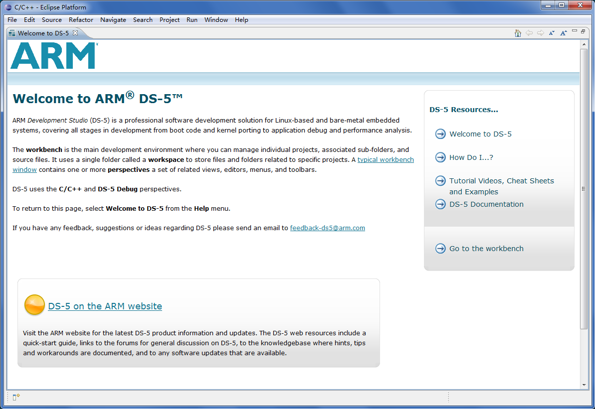

### 新建目标平台配置数据库<a name="ZH-CN_TOPIC_0000002457834681"></a>

新建目标平台配置数据库的步骤如下：

1.  选择【File】→【New】→【Other】，在弹出的对话框中选择DS-5 Configuration Database文件夹下的Platform Configuration,然后点击【Next \>】按钮，按照提示向下进行配置。

    **图 1**  平台配置界面<a name="fig414mcpsimp"></a>  
    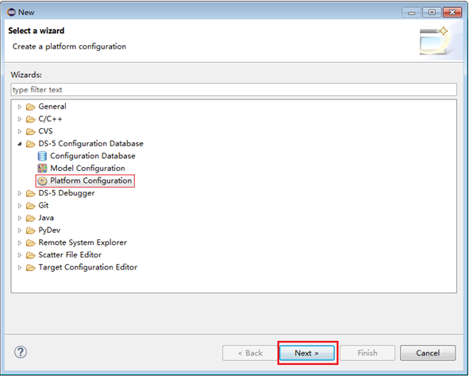

1.  连接仿真器，【菜单】—【ARM DS-5 v5.24.1】—【Debug Hardware】—【Debug Hardware Config IP\(5.24.1\)】，进入软件界面点击【scan】按钮进行扫描，扫描出仿真器后配置仿真器IP与当前PC机处于同一网段。

    > **说明：** 
    >ARM DS-5 v5.24.1 版本不支持 A55 核的调试，需要安装 ARM DS-5 v5.29 版本。

    **图 2**  Config IP界面<a name="fig418mcpsimp"></a>  
    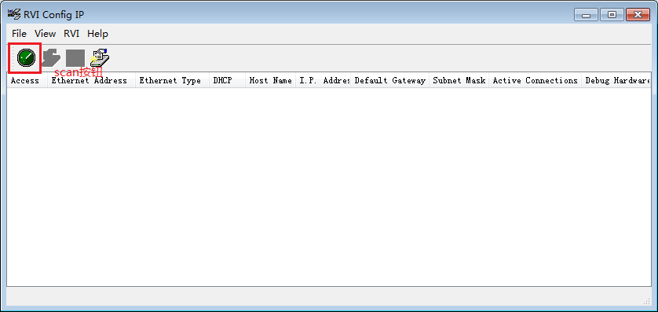

    **图 3**  Config IP扫描界面<a name="fig420mcpsimp"></a>  
    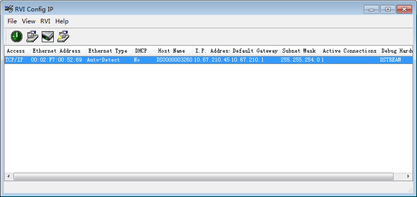

    **图 4**  配置仿真器IP界面<a name="fig422mcpsimp"></a>  
    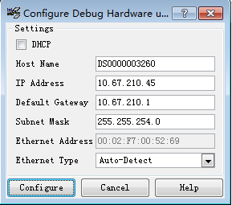

1.  返回DS-5 Eclipse界面，选择【Automatic/simple platform detection\(Recommended\)】点击下一步，系统会自动进行扫描，将仿真器IP地址输入【Connection Address】，点击【Next \>】，勾选上Debug target after saving configuration，点击【Next \>】，点击【Create New Database】，输入名字，点击【OK】，点击【Next \>】，修改【Platfrom Manufacturer】内容为“Vendor”，修改【Platfrom Name】内容为“Chip\_XX”，点击【Finish】完成平台数据库配置。

    **图 5**  配置平台数据库界面—Create Platform Configuration<a name="fig425mcpsimp"></a>  
    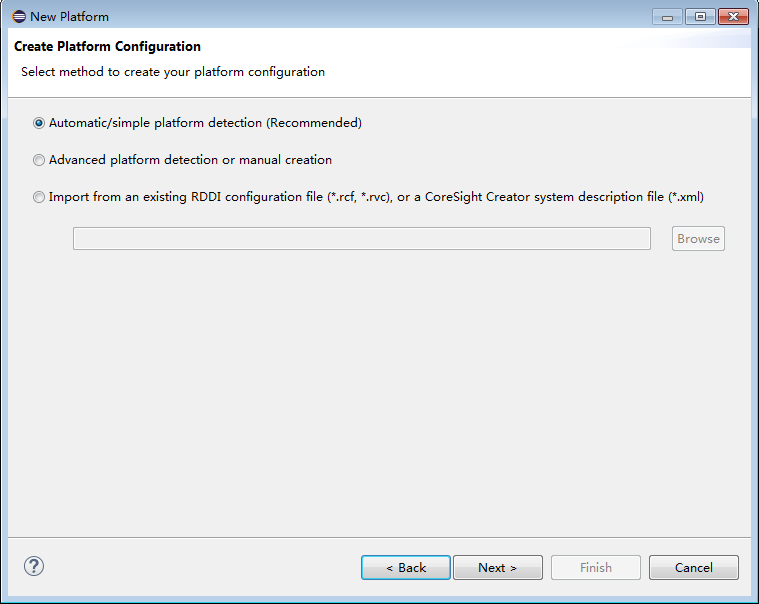

    **图 6**  配置平台数据库界面—Debug Adapter Connection<a name="fig427mcpsimp"></a>  
    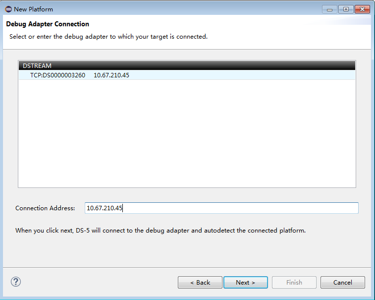

    **图 7**  配置平台数据库界面—Summary<a name="fig429mcpsimp"></a>  
    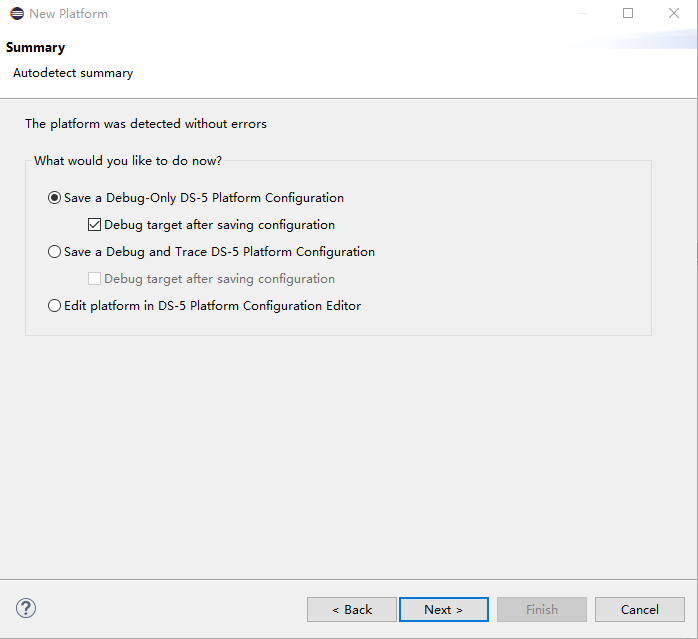

    **图 8**  配置平台数据库界面—DS-5 Configuration Database—Create New Database<a name="fig431mcpsimp"></a>  
    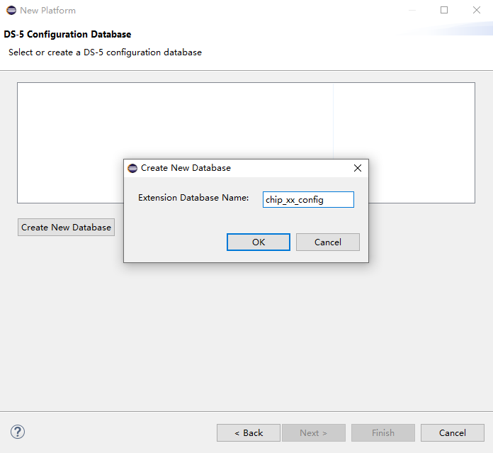

    **图 9**  配置平台数据库界面—DS-5 Configuration Database—完成“Create New Database”<a name="fig433mcpsimp"></a>  
    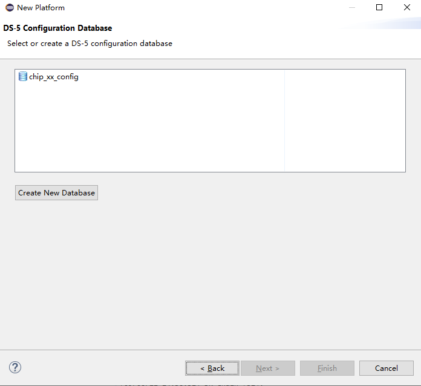

    **图 10**  配置平台数据库界面—Platform Information<a name="fig435mcpsimp"></a>  
    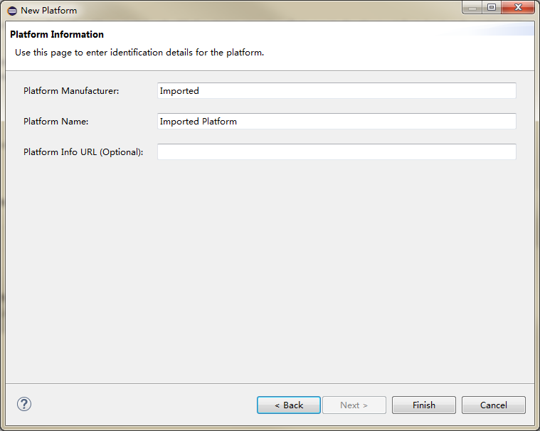

    **图 11**  配置平台数据库界面—完成“Platform Information”配置<a name="fig437mcpsimp"></a>  
    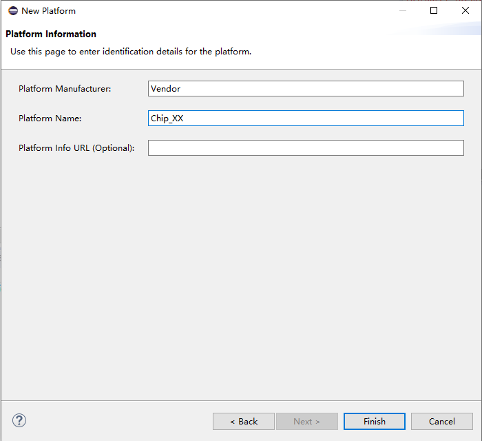

### 连接目标平台<a name="ZH-CN_TOPIC_0000002424196058"></a>

连接到目标平台上的具体步骤如下：

1.  上一步点击【Finish】后会出现一个会话窗口。在名字域内，找到DS-5调试器，右击—【New】，选择刚才创建的Vendor-Chip\_XX。
2.  在【Connection】标签页选择新添加的目标平台配置数据库：【Vendor】→【Chip\_XX】→【Bare Metal Debug】→【Cortex-A53】，在文本框输入DS-5设备的IP地址，如[图2](#_Toc452126564)。
3.  在【Debugger】标签页选中【Connect Only】选项，如[图3](#_Toc452126565)所示。
4.  单击【Debug】按钮连接目标平台。

    **图 1**  Debug Configurations窗口<a name="fig447mcpsimp"></a>  
    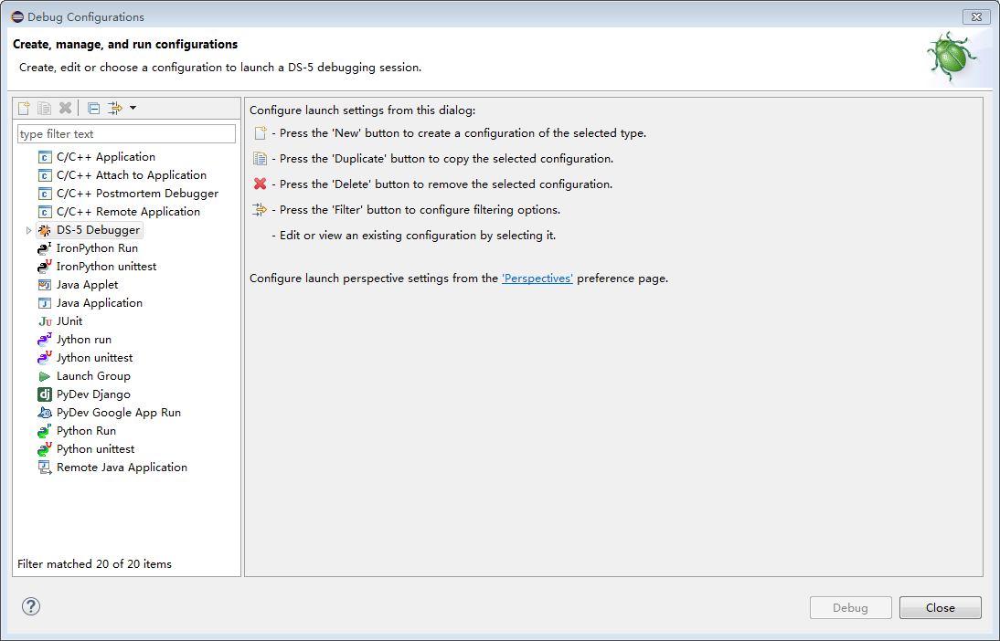

    **图 2**  Debug Configurations窗口—选择新添加的目标平台配置数据库并输入DS-5设备的IP地址<a name="_Toc452126564"></a>  
    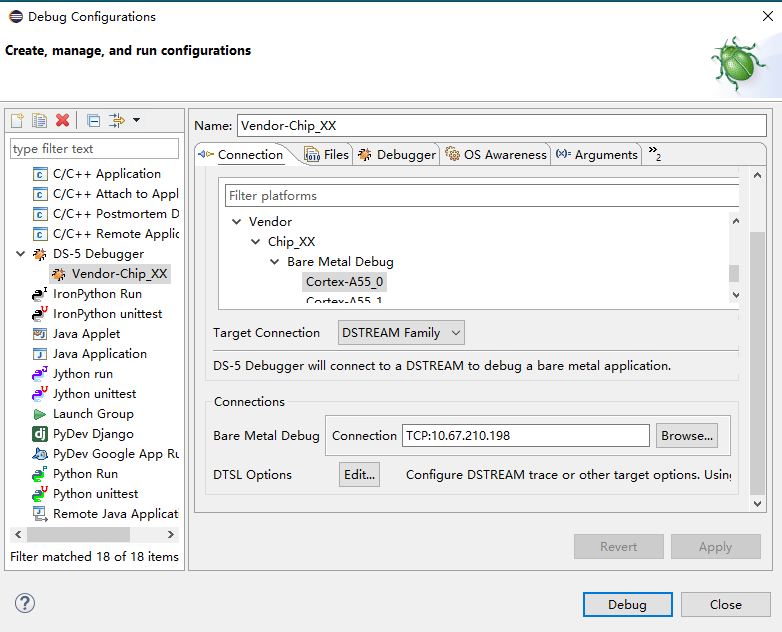

    **图 3**  Debug Configurations窗口—勾选“Connect only”<a name="_Toc452126565"></a>  
    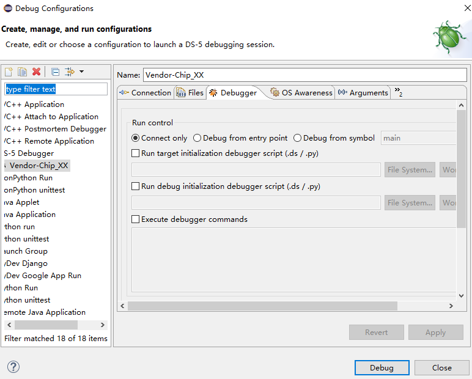

    **图 4**  DS-5 Debug – Eclipse Platform窗口<a name="fig451mcpsimp"></a>  
    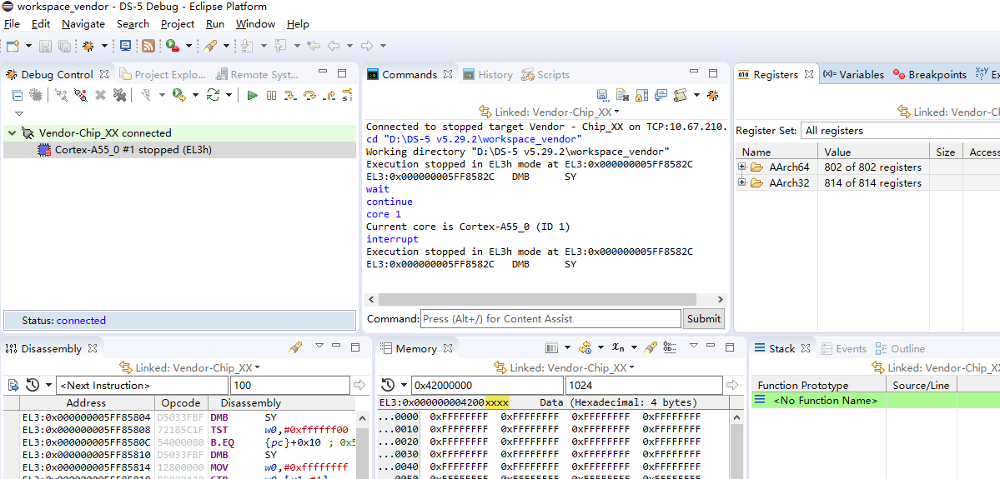

## 使用仿真器烧写Flash<a name="ZH-CN_TOPIC_0000002424196054"></a>


### 内存初始化<a name="ZH-CN_TOPIC_0000002457874809"></a>

在【Scripts】窗口单击图标导入内存初始化脚本，单击图标运行内存初始化脚本（如果此时仿真器处于运行状态，则需在【Debug Control】窗口单击按钮暂停仿真器）。如[图1](#_Toc452126566)所示。

> **须知：** 
>内存初始化脚本为目录osdrv/tools/pc/uboot\_tools下的.ds、.py或.txt格式文件。

**图 1**  脚本窗口<a name="_Toc452126566"></a>  
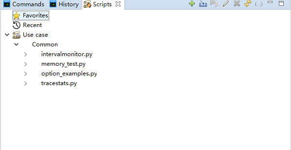

可通过以下方式验证内存初始化成功与否：

在【Memory】窗口输入内存地址（如0x42000000），回车后查看表格是否显示当前内存区域的值。如果表格中显示数值，且能够成功改写则代表内存初始化成功。改写内存值的方法为：双击某个表格框（如0x42000000位置），输入新值（如0x12345678）后回车，观察此框中值是否变成新值，如[图2](#_Toc452126567)所示。

**图 2**  Memory窗口<a name="_Toc452126567"></a>  
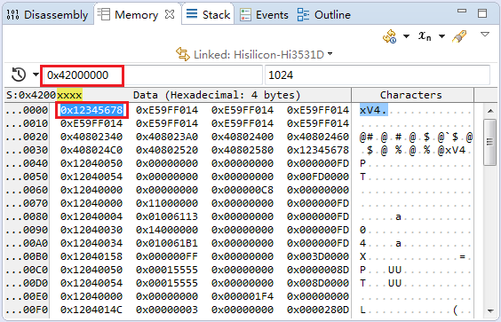

### 下载U-Boot映像<a name="ZH-CN_TOPIC_0000002424355898"></a>

步骤如下：

1.  在【Memory】窗口的单击按钮弹出如[图1](#_Toc452126568)所示菜单。
2.  选择【Import Memory】选项弹出映像下载窗口，下载u-boot映像到内存地址（如0x42000000），如[图2](#_Toc452126569)。
3.  在【Regiters】窗口修改PC指针值为0x42000000，如[图3](#_Toc452126570)所示。
4.  单击【Debug Control】窗口按钮启动U-Boot，此时可通过串口查看U-Boot启动信息。

    **图 1**  Memory下拉窗口<a name="_Toc452126568"></a>  
    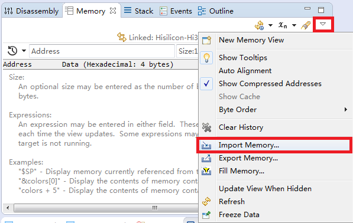

    **图 2**  Memory Importer窗口<a name="_Toc452126569"></a>  
    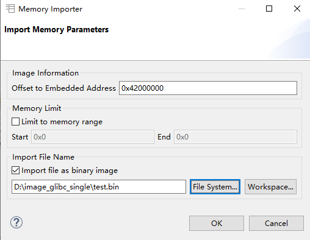

    **图 3**  Registers窗口<a name="_Toc452126570"></a>  
    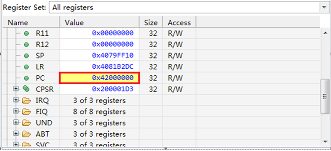

### 烧写映像<a name="ZH-CN_TOPIC_0000002457874797"></a>

U-Boot启动后，通过串口将内存中的U-Boot映像写入启动介质中。

以SPI-Nor Flash为例，其烧写步骤如下：

```
# sf probe 0					/*探测并初始化SPI-Nor flash*/
# sf erase 0 0x100000				/*擦除 1M大小*/
# sf write <ddr_addr> 0 0x100000		/*从内存写入SPI-Nor Flash*/
# reset						/*重启单板*/
```

> **说明：** 
>SS928V100平台的<ddr\_addr\>可用地址0x42000000。

# 附录<a name="ZH-CN_TOPIC_0000002424196050"></a>


## u-boot命令说明<a name="ZH-CN_TOPIC_0000002424355890"></a>


### 开启SPI-Nor块保护功能<a name="ZH-CN_TOPIC_0000002457874805"></a>

u-boot默认是不支持SPI-Nor块保护功能，若需要开启SPI-Nor块保护功能，需要进入menuconfig下进行配置，配置方法如下。

1.  menuconfig下先进入Device Drivers标签，然后再进入MTD Support 标签。
2.  再进入SPI Flash Support标签，把[图1](#_Ref29310076)红框所示选项选中并保存。

    **图 1**  SPI-Nor块保护选项图<a name="_Ref29310076"></a>  
    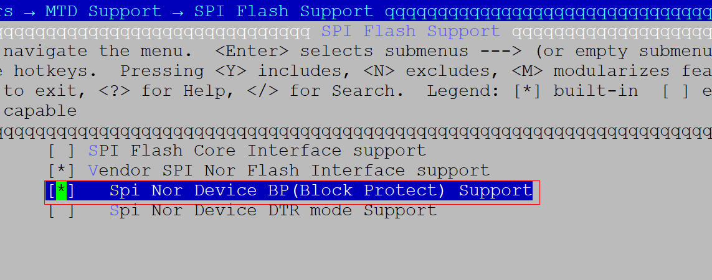

### SPI-Nor块保护命令<a name="ZH-CN_TOPIC_0000002424196066"></a>

常用的SPI Nor Flash上都提供了块保护位（Block Protect：以下简称BP）来保护数据安全。

通过设置状态寄存器（Status Register：以下简称SR）中的BP0、BP1、BP2、BP3（某些厂家的芯片没有BP3或者存在BP4）几个Bit为1\(使能状态\)，使器件中某些对应的块进入写保护状态，这些BP位为非易失性位（Non-volatile Bit），设置之后可以掉电保持之前状态。

有的厂商还提供了对块保护锁定方向的设置，可以设置保护的块从器件顶部Top开始还是从器件底部Bottom开始。通过设置配置寄存器（Config Register: 以下简称CR）中的TBPROT位（某些厂家的芯片TBPROT位位于SR）设置写保护锁定起始地址是从低地址（Bottom）还是从高地址（Top）开始。通常这个设置位属于OTP（One-Time Programmable）类型，默认状态为0：BP开始于Top部（高地址），一旦状态被设置为1： BP开始于Bottom（低地址），且将无法更改。

根据实际应用，我们控制器从初始化开始就将TBPROT位置为1，即从Bottom低地址开始保护。

SPI-Nor器件状态寄存器SR的默认初始值中，所有BP位都为0（去使能状态），此时器件上所有的块都处于未保护状态，可以任意进行擦写操作。

设置所有BP位都为1（使能状态），将使器件上所有的块都处于写保护状态，任何擦写操作都将无效。

块保护以块（Block）为基本单位，根据BP位的使能状态，转换为十进制level值来设置锁定的块保护的范围。对于3个BP位的器件，在BP\[0:0:0\]到BP\[1:1:1\]之间，level的取值范围为0\~7；对于4个BP位的器件，在BP\[0:0:0:0\]到BP\[1:1:1:1\]之间，level的取值范围0\~10（或者0\~9，这是因为最小的锁定区域不能小于1 Block）。

根据SPI-Nor Flash上的块保护机制，u-boot下新增SPI-Nor的块保护命令lock。命令格式如下：

```
sf probe 0
sf lock
```

可以查看当前设置的BP level值和level的取值范围以及当前锁定的区域范围，同时打印命令说明信息。如[图1](#_Toc498536356)所示。

**图 1**  查看当前块保护信息<a name="_Toc498536356"></a>  
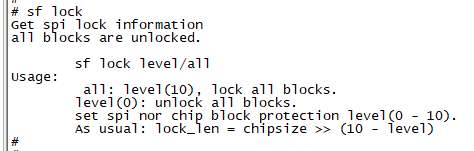

-   sf lock all

    锁定所有的块（整个器件），等同于设置等级 level为最大值，如[图2](#_Toc498536357)所示。

    **图 2**  锁定整个器件<a name="_Toc498536357"></a>  
    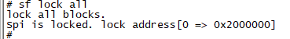

-   sf lock 0

    解除当前块保护锁定状态，此时器件上所有的块都处于未保护状态，可以任意进行擦写操作。如[图3](#_Toc498536358)所示。

    **图 3**  解除当前锁定状态<a name="_Toc498536358"></a>  
    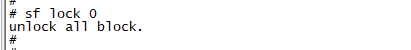

-   sf lock <level\>

    设置BP level值，根据level值对应的长度，这样处于块保护区域的块不可以进行正常擦写，如[图4](#_Toc498536359)所示。

    **图 4**  通过设置 level值锁定指定区域<a name="_Toc498536359"></a>  
    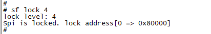

### tftp命令的使用限制<a name="ZH-CN_TOPIC_0000002457834685"></a>

uboot下include/configs/ss928v100.h文件中PHYS\_SDRAM\_1\_SIZE宏的大小定义限制了tftp命令的地址范围。默认发布包中，PHYS\_SDRAM\_1\_SIZE宏定义为0x20000000，即通过tftp命令只能把文件下载到ddr前512M的地址空间。

tftp命令使用示例如下所示:

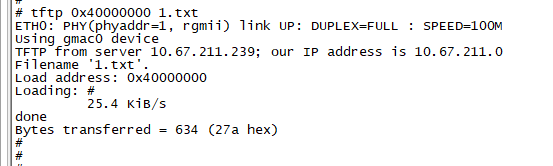

tftp命令中第一个参数只能是ddr前512M地址空间，即0x40000000至0x5fffffff。

备注：如果需要把文件下载到512M以上的地址空间，则可以先通过tftp命令把文件下载到512M以内的地址空间，再通过cp.b命令把文件从512M以内的地址空间拷贝到512M以上的地址空间。cp.b 命令使用示例如下：

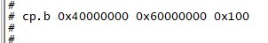

上述cp.b命令中，第一个参数为源地址，第二个参数为目的地址，第三个参数为长度。

