# 前言<a name="ZH-CN_TOPIC_0000002457836533"></a>

**概述<a name="section236mcpsimp"></a>**

本文档主要是指导使用本安全启动方案的相关人员了解整个安全方案的流程，再通过一定的操作步骤和方法来使用本安全启动方案。主要介绍本安全启动的规格和特性，包括安全启动基本流程和key的层级结构与验签逻辑，及其整个安全启动方案的使用。

> **说明：** 
>本文以SS928V100描述为例，未有特殊说明，SS927V100与SS928V100内容一致。

**产品版本<a name="section239mcpsimp"></a>**

与本文档相对应的产品版本如下。

<a name="table242mcpsimp"></a>
<table><thead align="left"><tr id="row247mcpsimp"><th class="cellrowborder" valign="top" width="32%" id="mcps1.1.3.1.1"><p id="p249mcpsimp"><a name="p249mcpsimp"></a><a name="p249mcpsimp"></a>产品名称</p>
</th>
<th class="cellrowborder" valign="top" width="68%" id="mcps1.1.3.1.2"><p id="p251mcpsimp"><a name="p251mcpsimp"></a><a name="p251mcpsimp"></a>产品版本</p>
</th>
</tr>
</thead>
<tbody><tr id="row253mcpsimp"><td class="cellrowborder" valign="top" width="32%" headers="mcps1.1.3.1.1 "><p id="p255mcpsimp"><a name="p255mcpsimp"></a><a name="p255mcpsimp"></a>SS928</p>
</td>
<td class="cellrowborder" valign="top" width="68%" headers="mcps1.1.3.1.2 "><p id="p257mcpsimp"><a name="p257mcpsimp"></a><a name="p257mcpsimp"></a>V100</p>
</td>
</tr>
<tr id="row1186319271312"><td class="cellrowborder" valign="top" width="32%" headers="mcps1.1.3.1.1 "><p id="p8648177191319"><a name="p8648177191319"></a><a name="p8648177191319"></a>SS927</p>
</td>
<td class="cellrowborder" valign="top" width="68%" headers="mcps1.1.3.1.2 "><p id="p136484751315"><a name="p136484751315"></a><a name="p136484751315"></a>V100</p>
</td>
</tr>
</tbody>
</table>

**读者对象<a name="section258mcpsimp"></a>**

本文档（本指南）主要适用于以下工程师：

-   技术支持工程师
-   软件开发工程师

**符号约定<a name="section133020216410"></a>**

在本文中可能出现下列标志，它们所代表的含义如下。

<a name="table2622507016410"></a>
<table><thead align="left"><tr id="row1530720816410"><th class="cellrowborder" valign="top" width="20.580000000000002%" id="mcps1.1.3.1.1"><p id="p6450074116410"><a name="p6450074116410"></a><a name="p6450074116410"></a><strong id="b2136615816410"><a name="b2136615816410"></a><a name="b2136615816410"></a>符号</strong></p>
</th>
<th class="cellrowborder" valign="top" width="79.42%" id="mcps1.1.3.1.2"><p id="p5435366816410"><a name="p5435366816410"></a><a name="p5435366816410"></a><strong id="b5941558116410"><a name="b5941558116410"></a><a name="b5941558116410"></a>说明</strong></p>
</th>
</tr>
</thead>
<tbody><tr id="row1372280416410"><td class="cellrowborder" valign="top" width="20.580000000000002%" headers="mcps1.1.3.1.1 "><p id="p3734547016410"><a name="p3734547016410"></a><a name="p3734547016410"></a><a name="image2670064316410"></a><a name="image2670064316410"></a><span></span></p>
</td>
<td class="cellrowborder" valign="top" width="79.42%" headers="mcps1.1.3.1.2 "><p id="p1757432116410"><a name="p1757432116410"></a><a name="p1757432116410"></a>表示如不避免则将会导致死亡或严重伤害的具有高等级风险的危害。</p>
</td>
</tr>
<tr id="row466863216410"><td class="cellrowborder" valign="top" width="20.580000000000002%" headers="mcps1.1.3.1.1 "><p id="p1432579516410"><a name="p1432579516410"></a><a name="p1432579516410"></a><a name="image4895582316410"></a><a name="image4895582316410"></a><span></span></p>
</td>
<td class="cellrowborder" valign="top" width="79.42%" headers="mcps1.1.3.1.2 "><p id="p959197916410"><a name="p959197916410"></a><a name="p959197916410"></a>表示如不避免则可能导致死亡或严重伤害的具有中等级风险的危害。</p>
</td>
</tr>
<tr id="row123863216410"><td class="cellrowborder" valign="top" width="20.580000000000002%" headers="mcps1.1.3.1.1 "><p id="p1232579516410"><a name="p1232579516410"></a><a name="p1232579516410"></a><a name="image1235582316410"></a><a name="image1235582316410"></a><span></span></p>
</td>
<td class="cellrowborder" valign="top" width="79.42%" headers="mcps1.1.3.1.2 "><p id="p123197916410"><a name="p123197916410"></a><a name="p123197916410"></a>表示如不避免则可能导致轻微或中度伤害的具有低等级风险的危害。</p>
</td>
</tr>
<tr id="row5786682116410"><td class="cellrowborder" valign="top" width="20.580000000000002%" headers="mcps1.1.3.1.1 "><p id="p2204984716410"><a name="p2204984716410"></a><a name="p2204984716410"></a><a name="image4504446716410"></a><a name="image4504446716410"></a><span></span></p>
</td>
<td class="cellrowborder" valign="top" width="79.42%" headers="mcps1.1.3.1.2 "><p id="p4388861916410"><a name="p4388861916410"></a><a name="p4388861916410"></a>用于传递设备或环境安全警示信息。如不避免则可能会导致设备损坏、数据丢失、设备性能降低或其它不可预知的结果。</p>
<p id="p1238861916410"><a name="p1238861916410"></a><a name="p1238861916410"></a>“须知”不涉及人身伤害。</p>
</td>
</tr>
<tr id="row2856923116410"><td class="cellrowborder" valign="top" width="20.580000000000002%" headers="mcps1.1.3.1.1 "><p id="p5555360116410"><a name="p5555360116410"></a><a name="p5555360116410"></a><a name="image799324016410"></a><a name="image799324016410"></a><span></span></p>
</td>
<td class="cellrowborder" valign="top" width="79.42%" headers="mcps1.1.3.1.2 "><p id="p4612588116410"><a name="p4612588116410"></a><a name="p4612588116410"></a>对正文中重点信息的补充说明。</p>
<p id="p1232588116410"><a name="p1232588116410"></a><a name="p1232588116410"></a>“说明”不是安全警示信息，不涉及人身、设备及环境伤害信息。</p>
</td>
</tr>
</tbody>
</table>

**修改记录<a name="section2467512116410"></a>**

<a name="table256mcpsimp"></a>
<table><thead align="left"><tr id="row262mcpsimp"><th class="cellrowborder" valign="top" width="20.97%" id="mcps1.1.4.1.1"><p id="p264mcpsimp"><a name="p264mcpsimp"></a><a name="p264mcpsimp"></a><strong id="b265mcpsimp"><a name="b265mcpsimp"></a><a name="b265mcpsimp"></a>文档版本</strong></p>
</th>
<th class="cellrowborder" valign="top" width="26.029999999999998%" id="mcps1.1.4.1.2"><p id="p267mcpsimp"><a name="p267mcpsimp"></a><a name="p267mcpsimp"></a><strong id="b268mcpsimp"><a name="b268mcpsimp"></a><a name="b268mcpsimp"></a>发布日期</strong></p>
</th>
<th class="cellrowborder" valign="top" width="53%" id="mcps1.1.4.1.3"><p id="p270mcpsimp"><a name="p270mcpsimp"></a><a name="p270mcpsimp"></a><strong id="b271mcpsimp"><a name="b271mcpsimp"></a><a name="b271mcpsimp"></a>修改说明</strong></p>
</th>
</tr>
</thead>
<tbody><tr id="row280mcpsimp"><td class="cellrowborder" valign="top" width="20.97%" headers="mcps1.1.4.1.1 "><p id="p282mcpsimp"><a name="p282mcpsimp"></a><a name="p282mcpsimp"></a>00B01</p>
</td>
<td class="cellrowborder" valign="top" width="26.029999999999998%" headers="mcps1.1.4.1.2 "><p id="p284mcpsimp"><a name="p284mcpsimp"></a><a name="p284mcpsimp"></a>2025-09-15</p>
</td>
<td class="cellrowborder" valign="top" width="53%" headers="mcps1.1.4.1.3 "><p id="p286mcpsimp"><a name="p286mcpsimp"></a><a name="p286mcpsimp"></a>第1次临时版本发布。</p>
</td>
</tr>
</tbody>
</table>

# 安全特性<a name="ZH-CN_TOPIC_0000002424357710"></a>

芯片提供了基于硬件可信根的各种丰富的安全特性，满足不同应用场景、不同安全级别的需求，便于客户产品安全启动方案的实施和落地。关键特性如下：


## 芯片内置OTP资源<a name="ZH-CN_TOPIC_0000002457836521"></a>

OTP是一种特殊的非易失性存储器，允许编程一次，数据永久有效。利用OTP一次性编程的物理特性保存一些不可逆控制开关、硬件根密钥等。其中，密钥区域提供多个对称根密钥Slot，用于存储多个对称根密钥。密钥区域只能一次烧写，自动锁定，且不可回读。状态控制区域和用户自定义区域，可多次烧写，对应Bit位只能由0编程为1，已经为1的比特不可更新；如果需要一次烧写后，其内容不可更改，则可在数据写入后，锁定该区域。版本控制区域可多次烧写，所有比特只能由0写为1，不可逆，也不可锁定。

## 内置密钥管理模块<a name="ZH-CN_TOPIC_0000002424197882"></a>

对于已经烧写进OTP的每一个对称根密钥，密钥管理模块会根据相应的外部输入（密钥派生材料），进行多级派生，生成对应的工作密钥，并将工作密钥直接送到加解密引擎（SPACC），实现对最终的数据进行加解密运算。整个密钥派生过程都在硬件逻辑内部完成，根密钥、密钥保护密钥、工作密钥都不会在内存中出现，也不能通过软件读取，提升了密钥的安全性。

## 内置硬件密码算法引擎<a name="ZH-CN_TOPIC_0000002457876613"></a>

芯片硬件加解密算法引擎，支持多种常见的非对称密码算法、对称密码算法和哈希算法。安全启动方案采用RSA4096和SHA256算法，对镜像的签名校验。安全启动还可根据客户需求，决定是否支持对镜像进行加密保护，加解密算法为AES256。

## 安全信任链条<a name="ZH-CN_TOPIC_0000002457876657"></a>

芯片支持基于硬件可信根的安全启动，实现从硬件可信根开始逐级校验，以保证启动过程可信。客户可以通过OTP保存公钥哈希值，并由芯片BOOTROM完成根公钥的完整性、真实性校验，以及下级公钥和镜像的逐级校验。

## 版本防回退<a name="ZH-CN_TOPIC_0000002457836505"></a>

芯片OTP中预留版本控制区域，以便安全启动、安全升级中，实现版本防回滚控制，防止攻击者利用某个有缺陷的历史版本，回退替换新版本对设备进行攻击。

## 镜像结构统一<a name="ZH-CN_TOPIC_0000002457876629"></a>

安全启动涉及较多的密钥和签名，需要附加在最终镜像中。为避免镜像制作和使用过程因多个版本而引入的各种问题，降低使用难度，本启动方案将安全启动、非安全启动的所使用的镜像统一为一种格式。在SoC不使能安全启动的情况下，非加密的安全启动镜像（带有对应的密钥和签名），仍可正常启动。

# 启动方案<a name="ZH-CN_TOPIC_0000002424357774"></a>

-   支持快速启动、非安全启动和安全启动3种启动方案。
-   快速启动只有U-Boot一级Bootloader，由U-Boot直接引导Linux启动。
-   非安全启动、安全启动包含两级Bootloader。
    -   GSL为一级Bootloader；
    -   U-Boot为二级Bootloader，客户根据产品需要，可在U-Boot中配置、开发对应的功能，如Flash驱动，Linux系统的引导等。

-   [表1](#table23618501607)比较各种启动方案特点，“√”表示启动方案具备该特点，反之不具备。

**表 1**  各启动方案特点比较

<a name="table23618501607"></a>
<table><thead align="left"><tr id="row1636135010010"><th class="cellrowborder" valign="top" width="25%" id="mcps1.2.5.1.1"><p id="p55641634115"><a name="p55641634115"></a><a name="p55641634115"></a>特点</p>
</th>
<th class="cellrowborder" valign="top" width="25%" id="mcps1.2.5.1.2"><p id="p17564173515"><a name="p17564173515"></a><a name="p17564173515"></a>快速启动</p>
</th>
<th class="cellrowborder" valign="top" width="25%" id="mcps1.2.5.1.3"><p id="p35642034110"><a name="p35642034110"></a><a name="p35642034110"></a>非安全启动</p>
</th>
<th class="cellrowborder" valign="top" width="25%" id="mcps1.2.5.1.4"><p id="p85651339111"><a name="p85651339111"></a><a name="p85651339111"></a>安全启动</p>
</th>
</tr>
</thead>
<tbody><tr id="row1136125012019"><td class="cellrowborder" valign="top" width="25%" headers="mcps1.2.5.1.1 "><p id="p105651931319"><a name="p105651931319"></a><a name="p105651931319"></a>使用U-Boot</p>
</td>
<td class="cellrowborder" valign="top" width="25%" headers="mcps1.2.5.1.2 "><p id="p195651431219"><a name="p195651431219"></a><a name="p195651431219"></a>√</p>
</td>
<td class="cellrowborder" valign="top" width="25%" headers="mcps1.2.5.1.3 "><p id="p135651031118"><a name="p135651031118"></a><a name="p135651031118"></a>√</p>
</td>
<td class="cellrowborder" valign="top" width="25%" headers="mcps1.2.5.1.4 "><p id="p18565831117"><a name="p18565831117"></a><a name="p18565831117"></a>√</p>
</td>
</tr>
<tr id="row1936110501408"><td class="cellrowborder" valign="top" width="25%" headers="mcps1.2.5.1.1 "><p id="p9565931017"><a name="p9565931017"></a><a name="p9565931017"></a>使用GSL</p>
</td>
<td class="cellrowborder" valign="top" width="25%" headers="mcps1.2.5.1.2 "><p id="p25651310114"><a name="p25651310114"></a><a name="p25651310114"></a>-</p>
</td>
<td class="cellrowborder" valign="top" width="25%" headers="mcps1.2.5.1.3 "><p id="p1656523016"><a name="p1656523016"></a><a name="p1656523016"></a>√</p>
</td>
<td class="cellrowborder" valign="top" width="25%" headers="mcps1.2.5.1.4 "><p id="p45654313116"><a name="p45654313116"></a><a name="p45654313116"></a>√</p>
</td>
</tr>
<tr id="row113620507016"><td class="cellrowborder" valign="top" width="25%" headers="mcps1.2.5.1.1 "><p id="p5565633117"><a name="p5565633117"></a><a name="p5565633117"></a>解密验签镜像</p>
</td>
<td class="cellrowborder" valign="top" width="25%" headers="mcps1.2.5.1.2 "><p id="p9565439117"><a name="p9565439117"></a><a name="p9565439117"></a>-</p>
</td>
<td class="cellrowborder" valign="top" width="25%" headers="mcps1.2.5.1.3 "><p id="p11565203912"><a name="p11565203912"></a><a name="p11565203912"></a>-</p>
</td>
<td class="cellrowborder" valign="top" width="25%" headers="mcps1.2.5.1.4 "><p id="p556563617"><a name="p556563617"></a><a name="p556563617"></a>√</p>
</td>
</tr>
</tbody>
</table>

> **须知：** 
>芯片使用何种启动方案由OTP控制。出厂时，OTP被默认配置为非安全启动，可通过配置OTP来更改启动方案，OTP的配置方法参考下文的“[OTP配置与烧写](#ZH-CN_TOPIC_0000002457876665)”章节。


## 快速启动<a name="ZH-CN_TOPIC_0000002457876673"></a>

为兼容传统的启动方案，芯片支持快速启动方案。快速启动的流程如[图1](#fig9466924175919)所示，直接从U-Boot启动，然后引导Linux启动。该方案不会校验启动镜像的合法性，是非安全的。快速启动的速度快于安全启动和非安全启动，在不需要安全启动且有速度要求的场景下，可以使用该启动方案。

**图 1**  快速启动流程<a name="fig9466924175919"></a>  
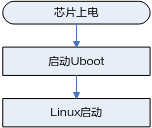

## 非安全启动<a name="ZH-CN_TOPIC_0000002457836541"></a>

在非安全启动模式下，芯片从GSL启动，流程如[图1](#fig1746041719160)所示。该方案不会校验启动镜像的合法性，是非安全的。

**图 1**  非安全启动流程<a name="fig1746041719160"></a>  
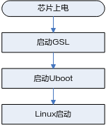

## 安全启动<a name="ZH-CN_TOPIC_0000002424357722"></a>

与非安全启动方案相比，安全启动方案会校验启动镜像的合法性，方案在 “[镜像解密和验签](#ZH-CN_TOPIC_0000002457836477)”有具体介绍，镜像的解密校验环节层层依赖，若中间某个环节校验失败，则启动失败，从而保证镜像的合法性、完整性，以及敏感数据的机密性。

安全启动在非安全启动的基础上，增加了镜像的合法性校验步骤，流程如[图1](#fig157715217257)所示。

**图 1**  安全启动流程<a name="fig157715217257"></a>  
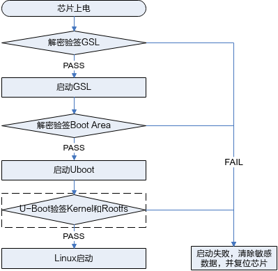

> **须知：** 
>其中U-Boot验签Kernel和Rootfs环节未实现，客户可参考“[内核及文件系统安全启动验签方案参考](#ZH-CN_TOPIC_0000002457836481)”，并结合应用场景调用Cipher API接口实现。

# 安全启动镜像布局和结构<a name="ZH-CN_TOPIC_0000002424197926"></a>


## 安全启动模式镜像布局<a name="ZH-CN_TOPIC_0000002457876641"></a>

安全启动镜像在启动介质上主要分为3大块：

-   第一块为Boot image，整合了GSL和U-Boot二进制文件以及DDR表格的内容，布局如[图1](#fig1050352493314)所示。
-   第二块为Linux内核。
-   第三块为文件系统。

**图 1**  安全启动镜像布局图<a name="fig1050352493314"></a>  
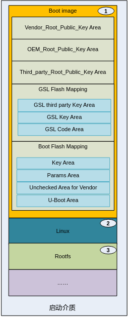

> **须知：** 
>布局图标号1：Boot image 区域需放在启动介质0x00地址的起始位置，其余区域放置无特殊要求，可根据使用场景自行分配。

## 镜像结构细分图<a name="ZH-CN_TOPIC_0000002457836501"></a>


### Vendor\_Root\_Public\_Key Area<a name="ZH-CN_TOPIC_0000002424197922"></a>

其镜像分布图，如[图1](#fig2809231153619)所示。

**图 1**  Vendor\_Root\_Public\_Key Area<a name="fig2809231153619"></a>  


### OEM\_Root\_Public\_Key Area<a name="ZH-CN_TOPIC_0000002424357734"></a>

其镜像分布图，如[图1](#fig71661085015)所示。

**图 1**  OEM\_Root\_Public\_Key Area<a name="fig71661085015"></a>  


### Third\_party\_Root\_Public\_Key Area<a name="ZH-CN_TOPIC_0000002457876617"></a>

其镜像分布图，如[图1](#fig129062192012)所示。

**图 1**  Third\_party\_Root\_Public\_Key Area<a name="fig129062192012"></a>  
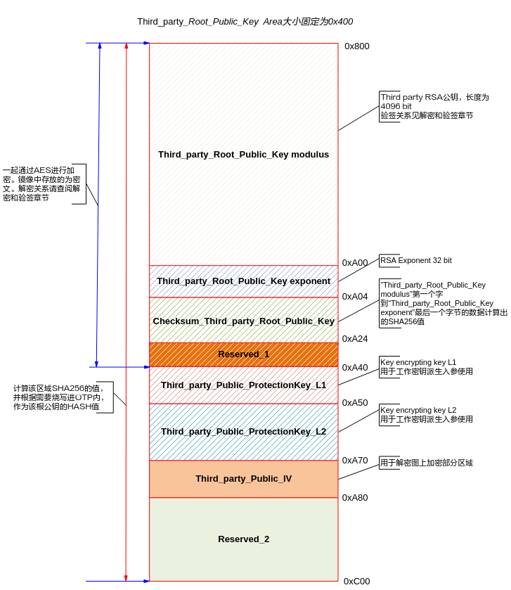

### GSL Flash Mapping<a name="ZH-CN_TOPIC_0000002457836517"></a>


#### GSL third party Key Area<a name="ZH-CN_TOPIC_0000002424197938"></a>

其镜像分布，如[图1](#fig065525410618)所示。

**图 1**  GSL third party Key Area<a name="fig065525410618"></a>  
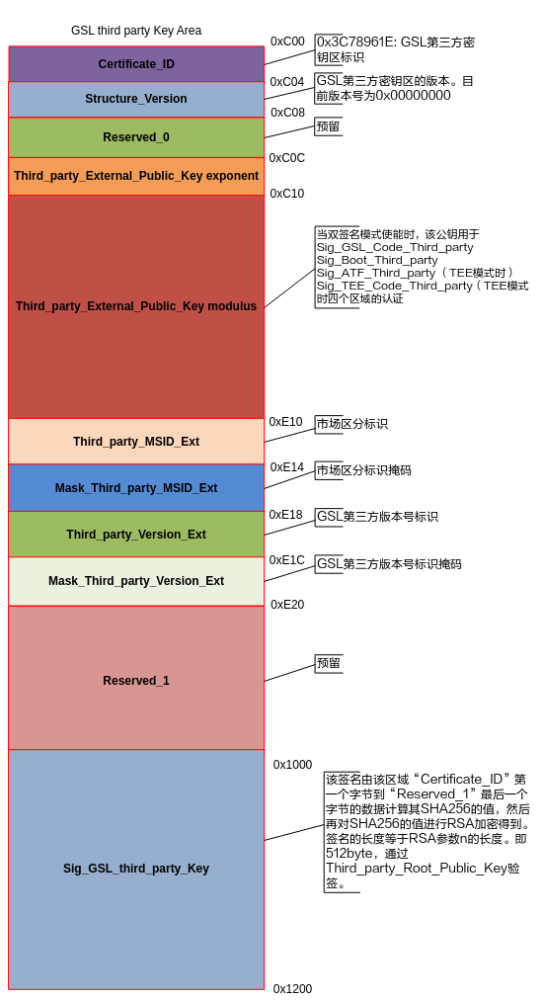

#### GSL Key Area<a name="ZH-CN_TOPIC_0000002424357754"></a>

其镜像分布图，如[图1](#fig2404758151111)所示。

**图 1**  GSL Key Area<a name="fig2404758151111"></a>  


#### GSL Code Area<a name="ZH-CN_TOPIC_0000002424197902"></a>

其镜像分布图，如[图1](#fig9794191161715)所示。

**图 1**  GSL Code Area<a name="fig9794191161715"></a>  
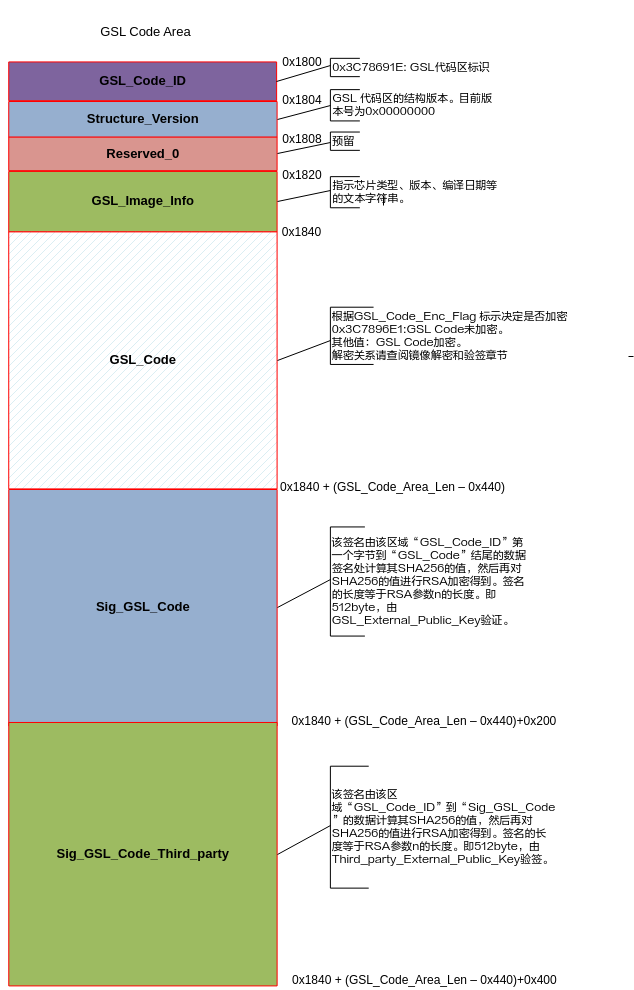

### Boot Flash Mapping<a name="ZH-CN_TOPIC_0000002457876645"></a>


#### Key Area<a name="ZH-CN_TOPIC_0000002457836529"></a>

其镜像分布图，如[图1](#fig984510341212)所示。

**图 1**  Key Area<a name="fig984510341212"></a>  
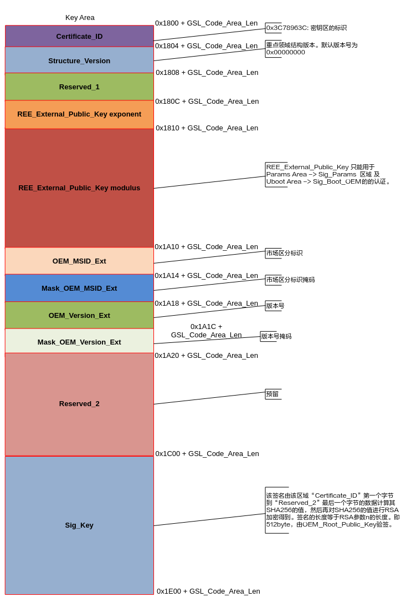

#### Params Area<a name="ZH-CN_TOPIC_0000002424197930"></a>

其镜像分布图，如[图1](#fig488863262618)所示。

**图 1**  Params Area<a name="fig488863262618"></a>  


#### Unchecked Area for Vendor<a name="ZH-CN_TOPIC_0000002424357726"></a>

其镜像分布图，如[图1](#fig148151331193817)所示。

**图 1**  Unchecked Area for Vendor<a name="fig148151331193817"></a>  


> **须知：** 
>该SCS\_simulate\_flag标志为在安全启动情况下，调试 “[Boot Flash Mapping](#ZH-CN_TOPIC_0000002457876645)”区域预留的一个开关，当OTP相应KEY等信息位烧写后，OTP相应的安全启动标志位（字段：secure\_boot\_en）在未使能的情况下，该标志位生效。其作用为当用户烧写OTP后，不使能安全启动标志位，可通过配置该标志位模式来模拟使能安全启动标志位的情况进行调试“[Boot Flash Mapping](#ZH-CN_TOPIC_0000002457876645)”区域。

#### U-Boot Area<a name="ZH-CN_TOPIC_0000002457876661"></a>

其镜像分布图，如[图1](#fig1359117512415)所示。

**图 1**  U-Boot Area<a name="fig1359117512415"></a>  
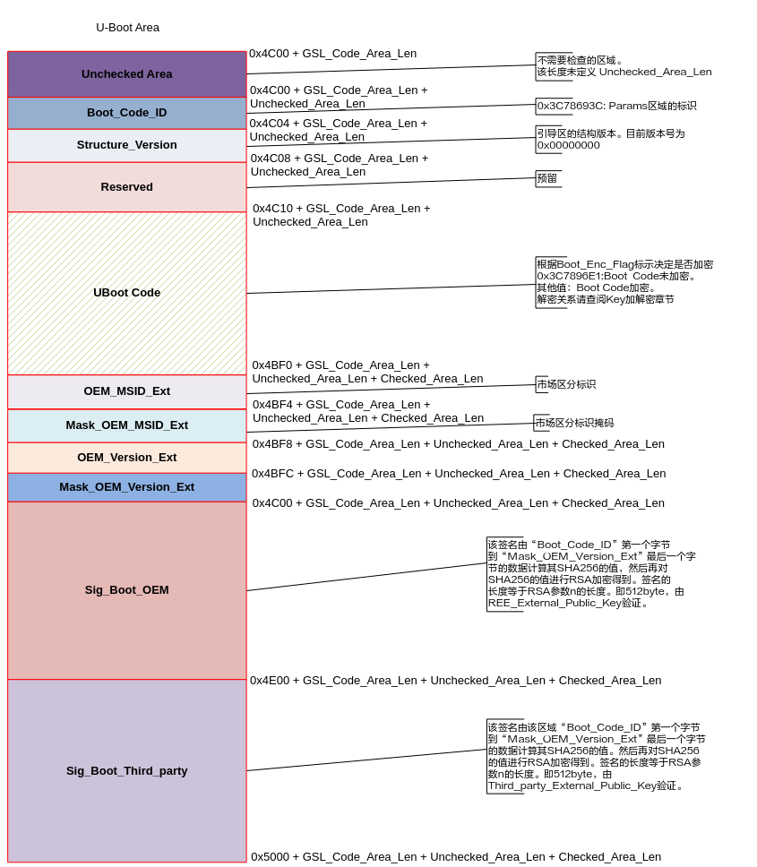

# 镜像解密和验签<a name="ZH-CN_TOPIC_0000002457836477"></a>

本安全启动方案支持对镜像完整性校验，支持使用加密镜像。每一级镜像是否加密，以及使用的加密密钥都可以独立控制。对于加密的镜像，启动流程遵循先解密后验签的原则。安全启动方案支持第三方进行再次签名，双重确认镜像完整性。

根据“[安全启动镜像布局和结构](#ZH-CN_TOPIC_0000002424197926)”所述，一个安全启动镜像被划分为了多个区域。每个区域中数据的内容，数据内容的加解密与完整性校验，都由此区域的Owner负责。如[表1](#table1690721754513)下各区域的归属情况。

**表 1**  区域Owner

<a name="table1690721754513"></a>
<table><thead align="left"><tr id="row4907181794511"><th class="cellrowborder" valign="top" width="41.85%" id="mcps1.2.3.1.1"><p id="p1233318245465"><a name="p1233318245465"></a><a name="p1233318245465"></a>区域名称</p>
</th>
<th class="cellrowborder" valign="top" width="58.15%" id="mcps1.2.3.1.2"><p id="p53332024164614"><a name="p53332024164614"></a><a name="p53332024164614"></a>E安全启动</p>
</th>
</tr>
</thead>
<tbody><tr id="row1290701754511"><td class="cellrowborder" valign="top" width="41.85%" headers="mcps1.2.3.1.1 "><p id="p6334182415468"><a name="p6334182415468"></a><a name="p6334182415468"></a>Vendor_Root_Public_Key Area</p>
</td>
<td class="cellrowborder" valign="top" width="58.15%" headers="mcps1.2.3.1.2 "><p id="p333416241469"><a name="p333416241469"></a><a name="p333416241469"></a>区域内数据无效</p>
</td>
</tr>
<tr id="row190711717459"><td class="cellrowborder" valign="top" width="41.85%" headers="mcps1.2.3.1.1 "><p id="p19334122414462"><a name="p19334122414462"></a><a name="p19334122414462"></a>OEM_Root_Public_Key Area</p>
</td>
<td class="cellrowborder" valign="top" width="58.15%" headers="mcps1.2.3.1.2 "><p id="p433492414460"><a name="p433492414460"></a><a name="p433492414460"></a>OEM</p>
</td>
</tr>
<tr id="row490810179457"><td class="cellrowborder" valign="top" width="41.85%" headers="mcps1.2.3.1.1 "><p id="p7334124134612"><a name="p7334124134612"></a><a name="p7334124134612"></a>Third_party_Root_Public_Key Area</p>
</td>
<td class="cellrowborder" rowspan="2" valign="top" width="58.15%" headers="mcps1.2.3.1.2 "><p id="p20334424114616"><a name="p20334424114616"></a><a name="p20334424114616"></a>Third party</p>
</td>
</tr>
<tr id="row10548268469"><td class="cellrowborder" valign="top" headers="mcps1.2.3.1.1 "><p id="p1333417242463"><a name="p1333417242463"></a><a name="p1333417242463"></a>GSL third party Key Area</p>
</td>
</tr>
<tr id="row191067812469"><td class="cellrowborder" valign="top" width="41.85%" headers="mcps1.2.3.1.1 "><p id="p123343243461"><a name="p123343243461"></a><a name="p123343243461"></a>GSL Key Area</p>
</td>
<td class="cellrowborder" rowspan="2" valign="top" width="58.15%" headers="mcps1.2.3.1.2 "><p id="p2334424154611"><a name="p2334424154611"></a><a name="p2334424154611"></a>OEM</p>
</td>
</tr>
<tr id="row51366954620"><td class="cellrowborder" valign="top" headers="mcps1.2.3.1.1 "><p id="p133492415460"><a name="p133492415460"></a><a name="p133492415460"></a>GSL Code Area</p>
</td>
</tr>
<tr id="row0203101094618"><td class="cellrowborder" valign="top" width="41.85%" headers="mcps1.2.3.1.1 "><p id="p533432474611"><a name="p533432474611"></a><a name="p533432474611"></a>Key Area</p>
</td>
<td class="cellrowborder" rowspan="4" valign="top" width="58.15%" headers="mcps1.2.3.1.2 "><p id="p183348249465"><a name="p183348249465"></a><a name="p183348249465"></a>OEM</p>
</td>
</tr>
<tr id="row127931811134612"><td class="cellrowborder" valign="top" headers="mcps1.2.3.1.1 "><p id="p15334192418465"><a name="p15334192418465"></a><a name="p15334192418465"></a>Params Area</p>
</td>
</tr>
<tr id="row917317143463"><td class="cellrowborder" valign="top" headers="mcps1.2.3.1.1 "><p id="p123340246467"><a name="p123340246467"></a><a name="p123340246467"></a>Uncheck Area for Vendor</p>
</td>
</tr>
<tr id="row19791715174613"><td class="cellrowborder" valign="top" headers="mcps1.2.3.1.1 "><p id="p1933452494612"><a name="p1933452494612"></a><a name="p1933452494612"></a>U-Boot Area</p>
</td>
</tr>
</tbody>
</table>


## SoC安全启动公钥框架<a name="ZH-CN_TOPIC_0000002424197942"></a>

SoC公钥层级架构设计支持芯片启动过程中，从OTP根公钥哈希值开始，对每一级镜像进行完整性校验，以及对下一级公钥进行完整性校验。以此实现启动流程中，各个阶段的信任传递。安全启动的验签使用的是RSA4096算法和HASH256。

安全启动方案提供了3个信任链，基于三个根公钥哈希值（存储在OTP中）。它们分别为Vendor、OEM和Third Party三方，对应的根公钥分别为Vendor\_Root\_Public\_Key、OEM\_Root\_Public\_Key和Third\_party\_Root\_Public\_Key。

在安全启动模式下，镜像的验签由OEM负责，其验签关系层次如[图1](#fig1816828175512)所示。

**图 1**  安全启动模式公钥验签关系图<a name="fig1816828175512"></a>  
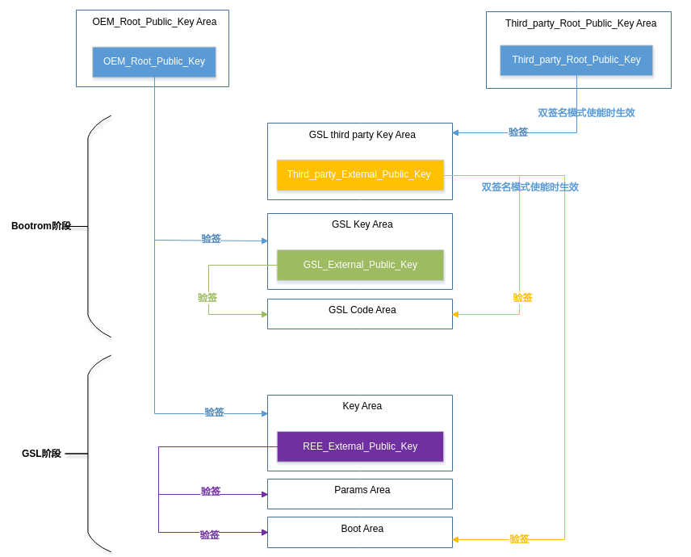

## 对称密钥管理<a name="ZH-CN_TOPIC_0000002457876625"></a>

对于需要使用镜像解密功能的安全启动，芯片OTP需内置对应的对称密码算法（AES）根密钥。芯片OTP中预留4个128比特的根密钥空间，用于派生对应的密钥保护密钥，以及最终的工作密钥。客户可根据实际需要烧录其中一个或者多个根密钥。另外，芯片已预置一个128比特的Vendor 根密钥，存放在独立的OTP空间中（见《安全子系统使用说明》2.2章节“SSxxxx OTP字段定义”）。


### 芯片密钥派生<a name="ZH-CN_TOPIC_0000002457836485"></a>

SoC提供三级密钥派生，其工作原理如[图1](#fig248010331147)所示。RKP从OTP中获得RKP保护的根密钥（OTP KEY），在RKP硬件内部生成实际的根密钥并通过安全通道送到KLAD。KLAD可以完成两级的密钥派生，每一级的密钥派生材料都可以从内存中输入。其中，一级密钥派生材料ProtectionKey\_L1为128比特，二级密钥派生材料ProtectionKey\_L2为256比特。KLAD基于OTP KEY和密钥派生材料，最终输出真正的工作密钥到硬件加解密引擎。

**图 1**  密钥派生<a name="fig248010331147"></a>  
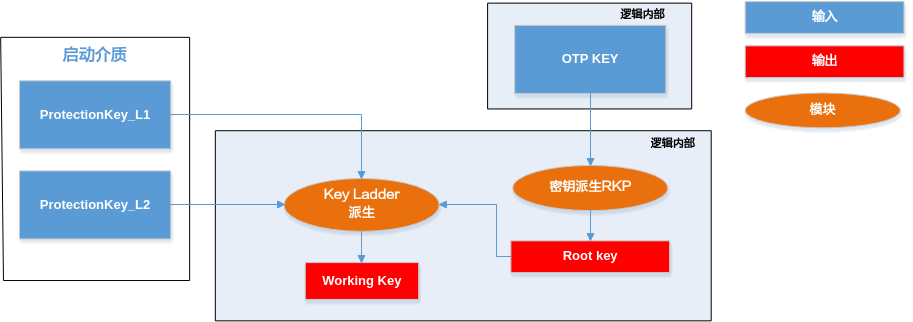

### 安全启动模式下密钥管理及镜像解密<a name="ZH-CN_TOPIC_0000002457876653"></a>

安全启动的对称密钥层次结构和镜像解密关系，如[图1](#fig1739414716164)所示。

其中根密钥源于OTP，由OEM负责生成和烧录。

**图 1**  安全启动模式解密关系图<a name="fig1739414716164"></a>  
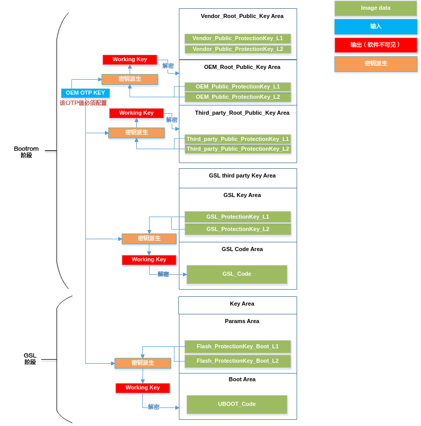

# 启动镜像制作及烧写<a name="ZH-CN_TOPIC_0000002424197898"></a>

SS928V100支持多种启动方案，启动镜像的制作和烧写步骤需要与启动方案相配套。此外，SS928V100的OTP控制着启动方案选择、镜像合法性校验、版本校验等启动流程，要根据启动方案来进行配置和烧写。

本章阐述了SS928V100镜像制作步骤、OTP烧写步骤、镜像烧写方法，以及给出了环境变量配置参考值。

开始操作前，需要明确的以下内容：

-   使用哪种启动方案？启动方案的介绍请参考“[启动方案](#ZH-CN_TOPIC_0000002424357774)”；
-   是否需要双签名（Third\_party对镜像签名）功能，相关介绍请参考“[SoC安全启动公钥框架](#ZH-CN_TOPIC_0000002424197942)”。


## 启动镜像制作步骤<a name="ZH-CN_TOPIC_0000002424197890"></a>

快速启动方案的镜像制作方法与传统的启动方案相同；若要制作非安全启动和安全启动的启动镜像，则需要借助“image\_map”镜像制作脚本。本节将阐述SS928V100各启动方案的镜像制作步骤。


### 快速启动<a name="ZH-CN_TOPIC_0000002424197934"></a>

使用快速启动方案，需要制作以下镜像：

-   U-Boot镜像
-   ATF+Kernel镜像
-   文件系统镜像

镜像的编译和制作方法可参考“osdrv/readme\_cn.txt”。

### 非安全启动<a name="ZH-CN_TOPIC_0000002457836493"></a>

使用非安全启动方案，需要制作以下镜像：

-   ATF+Kernel镜像
-   文件系统镜像
-   Boot image

镜像特点以及制作说明如下：

-   ATF+Kernel镜像、文件系统镜像的编译和制作方法可参考“osdrv/readme\_cn.txt”。
-   Boot image包含GSL和U-Boot的二进制代码，要用“image\_map”镜像制作脚本来制作。

以下是Boot image的具体制作步骤：

1.  进入osdrv/components/目录，解压boot.tar.gz，得到GSL代码和“image\_map”镜像制作脚本。

    ```
    tar xf boot.tar.gz
    ```

    GSL源码和“image\_map”镜像制作脚本分别存放在boot/gsl/目录和boot/image\_map/目录。

2.  编译GSL，得到GSL镜像gsl.bin。

    ```
    cd boot/gsl/
    make CHIP=ss928v100
    ```

    在pub/目录下会生成GSL的二进制镜像gsl.bin。

3.  进入open\_source/u-boot/目录，编译U-Boot得到U-Boot镜像u-boot-ss928v100.bin。

    编译方法请参考“osdrv/readme\_cn.txt”。

4.  将编译好的GSL、U-Boot镜像，以及U-Boot表格拷贝到image\_map/目录。

    ```
    cp osdrv/components/boot/gsl/pub/gsl.bin osdrv/components/boot/image_map/
    cp open_source/u-boot/u-boot-2020.01/u-boot-ss928v100.bin osdrv/components/boot/image_map/u-boot-original.bin
    cp open_source/u-boot/u-boot-2020.01/.reg osdrv/components/boot/image_map/.reg
    ```

5.  进入osdrv/components/boot/image\_map/目录，制作非安全启动的Boot image。

    ```
    cd osdrv/components/boot/image_map/
    python oem/oem_quick_build.py
    ```

    在image/oem/目录下生成的二进制文件boot\_image.bin即非安全启动的Boot image。

### 安全启动<a name="ZH-CN_TOPIC_0000002457876637"></a>

使用安全启动方案，需要制作以下镜像：

-   ATF+Kernel镜像
-   文件系统镜像
-   Boot image

镜像特点以及制作说明如下：

-   安全启动所使用的ATF+Kernel镜像、文件系统镜像与非安全启动相同，编译和制作方法可参考“osdrv/readme\_cn.txt”。
-   安全启动的Boot image不仅包含了GSL镜像和U-Boot镜像，还包含了用于保证Boot image完整性、合法性和机密性的数据，包括非对称秘钥、对称秘钥、MSID和版本号等，这些数据由每个区域的Owner来管理。
-   在制作Boot image时，各Owner通过Json配置文件将数据传递给镜像制作脚本。
-   不同的启动场景（例如GSL和U-Boot是否需要加密）依赖的配置项不同，所需配置文件会有差异。为方便使用，镜像制作脚本还提供了根据启动场景生成配置文件的功能。

以下是OEM制作Boot image的步骤：

1.  编译GSL，得到GSL镜像gsl.bin。

    操作与“[非安全启动](#ZH-CN_TOPIC_0000002457836493)”步骤1\~2相同。

2.  编译U-Boot，得到U-Boot镜像u-boot-ss928v100.bin。

    操作与“[非安全启动](#ZH-CN_TOPIC_0000002457836493)”步骤3相同。

3.  进入osdrv/components/boot/image\_map/目录，生成OEM的Json配置文件oem\_config.json。

    ```
    cd osdrv/components/boot/image_map/
    python oem/oem_main.py gencfg oem/oem_config.json
    ```

    选项填写方法如下：

    ```
    Security Mode: 
    0.Non-Secure 
    1.Secure 
    > 1 
    Inpnt:1 
    Start Flow: 
    0.Non-TEE 
    1.TEE 
    > 0 
    Inpnt:0 
    Encrypt GSL Code: 
    0.No 
    1.YES 
    >（填0表示GSL不加密，填1表示GSL加密） 
    Encrypt Boot Code: 
    0.No 
    1.YES
    >（填0表示U-Boot不加密，填1表示U-Boot加密）
    ```

    完成选项填写后，会生成配置文件oem/oem\_config.json。

4.  填写oem\_config.json内未配置的字段（被“/\* \*/”括住，填写时请删除“/\* \*/”）。配置方法请参考《SS928V100/SS927V100安全启动脚本配置说明》文档。其中GSL\_Code、Boot\_Code字段，应分别填入步骤1和 2生成的gsl.bin和u-boot-ss928v100.bin的路径，Cfg\_Param字段填U-Boot表格（步骤2中用于编译U-Boot的.reg文件）的路径。
5.  制作具有OEM签名的Boot image。

    ```
    python oem/oem_main.py build oem/oem_config.json
    ```

    在image/oem/目录下的boot\_image.bin为安全启动的Boot image。

如果Third\_party需要对Boot image签名，须完成以下操作：

1.  进入osdrv/components/boot/image\_map/目录，确认OEM生成的单签名Boot image在image/oem/目录中，命名为“boot\_image.bin”。
2.  生成Third party的Json配置文件third\_party\_config.json。

    ```
    python third_party/third_party_main.py gencfg third_party/third_party_config.json 
    Start Flow: 
    0.Non-TEE 
    1.TEE 
    > 0 
    Inpnt:0
    ```

    完成选项填写后，会生成配置文件third\_party/third\_party\_config.json。

3.  填写third\_party\_config.json中未配置的字段（被“/\* \*/”括住，填写时请删除“/\* \*/”）。配置方法请参考《SS928V100/SS927V100安全启动脚本配置说明》文档。
4.  对Boot image签名。

    ```
    python third_party/third_party_main.py build third_party/third_party_config.json
    ```

    在image/third\_party/目录下的boot\_image.bin即为双签名（OEM和Third\_party共同签名）的安全启动的Boot image。

## OTP配置与烧写<a name="ZH-CN_TOPIC_0000002457876665"></a>

SS928V100支持多种启动方案，芯片采用何种启动方案，需要通过OTP来配置。本节将介绍OTP的配置方法，以及如何利用U-Boot完成OTP烧写。

阅读前，请先了解以下事项：

-   OTP烧写操作无法撤销，不正确的OTP配置与烧写，可能会导致不可修复的启动失败问题，甚至带来安全风险，请谨慎操作。
-   “osdrv/components/boot.tar.gz”压缩包提供了OTP烧写代码示例，路径为“image\_map/sample/write\_otp\_fun.c”，本节将利用此示例来完成OTP的配置与烧写。
-   本节描述的操作将生成一个的Boot image，用于烧写OTP。请将本节生成Boot image与“[启动镜像制作步骤](#ZH-CN_TOPIC_0000002424197890)”生成的Boot image做出区分。

以下是OTP配置、烧写的具体操作步骤：

1.  进入osdrv/components/目录，创建用于制作Boot image的目录“boot-otp”

    ```
    cd osdrv/components/ 
    mkdir boot-otp/ 
    tar xf boot.tar.gz --strip-components=1 -C boot-otp/
    ```

2.  进入open\_source/u-boot/目录，创建用于编译U-Boot的目录“u-boot-otp”，并将osdrv/components/boot-otp/ image\_map/sample/write\_otp\_fun.c拷贝到open\_source/u-boot/u-boot-otp/cmd/目录。

    ```
    cd open_source/u-boot/ 
    mkdir u-boot-otp/ 
    tar xf u-boot-2020.01.tar.bz2 --strip-components=1 -C u-boot-otp/ 
    cd u-boot-otp/ 
    patch -p1 < ../u-boot-2020.01.patch
    cp ../../../osdrv/components/boot-otp/image_map/sample/write_otp_fun.c ./cmd/
    ```

3.  在./cmd/write\_otp\_fun.c文件中的g\_otp\_startup\_burn\_fields数组内配置要烧写的OTP字段。[表1](#_table192164754414)给定了不同启动方案下需配置的OTP字段，以及配置参考。其中“√”表示字段需配置，无“√”表示字段配置无效。请查阅《安全子系统使用说明》来确定各OTP字段值，然后在g\_otp\_startup\_burn\_fields数组内按需取消OTP字段的注释，填入字段的值（以“0x”开头的十六进字符串）。

    **表 1**  启动方案需配置的OTP

    <a name="_table192164754414"></a>
    <table><thead align="left"><tr id="row501mcpsimp"><th class="cellrowborder" valign="top" width="18.85%" id="mcps1.2.6.1.1"><p id="p503mcpsimp"><a name="p503mcpsimp"></a><a name="p503mcpsimp"></a>字段<strong id="b4441162975213"><a name="b4441162975213"></a><a name="b4441162975213"></a>名称</strong></p>
    </th>
    <th class="cellrowborder" valign="top" width="9.49%" id="mcps1.2.6.1.2"><p id="p505mcpsimp"><a name="p505mcpsimp"></a><a name="p505mcpsimp"></a>快速启动</p>
    </th>
    <th class="cellrowborder" valign="top" width="12.559999999999999%" id="mcps1.2.6.1.3"><p id="p507mcpsimp"><a name="p507mcpsimp"></a><a name="p507mcpsimp"></a>非安全启动</p>
    </th>
    <th class="cellrowborder" valign="top" width="17.69%" id="mcps1.2.6.1.4"><p id="p509mcpsimp"><a name="p509mcpsimp"></a><a name="p509mcpsimp"></a>安全启动</p>
    </th>
    <th class="cellrowborder" valign="top" width="41.410000000000004%" id="mcps1.2.6.1.5"><p id="p513mcpsimp"><a name="p513mcpsimp"></a><a name="p513mcpsimp"></a>配置参考值和注意事项</p>
    </th>
    </tr>
    </thead>
    <tbody><tr id="row515mcpsimp"><td class="cellrowborder" valign="top" width="18.85%" headers="mcps1.2.6.1.1 "><p id="p517mcpsimp"><a name="p517mcpsimp"></a><a name="p517mcpsimp"></a>quick_boot</p>
    </td>
    <td class="cellrowborder" valign="top" width="9.49%" headers="mcps1.2.6.1.2 "><p id="p519mcpsimp"><a name="p519mcpsimp"></a><a name="p519mcpsimp"></a>√</p>
    </td>
    <td class="cellrowborder" valign="top" width="12.559999999999999%" headers="mcps1.2.6.1.3 "><p id="p521mcpsimp"><a name="p521mcpsimp"></a><a name="p521mcpsimp"></a>√</p>
    </td>
    <td class="cellrowborder" valign="top" width="17.69%" headers="mcps1.2.6.1.4 "><p id="p523mcpsimp"><a name="p523mcpsimp"></a><a name="p523mcpsimp"></a>√</p>
    </td>
    <td class="cellrowborder" valign="top" width="41.410000000000004%" headers="mcps1.2.6.1.5 "><p id="p527mcpsimp"><a name="p527mcpsimp"></a><a name="p527mcpsimp"></a>0x5：快速启动；</p>
    <p id="p528mcpsimp"><a name="p528mcpsimp"></a><a name="p528mcpsimp"></a>0xF：非安全启动和安全启动。</p>
    </td>
    </tr>
    <tr id="row529mcpsimp"><td class="cellrowborder" valign="top" width="18.85%" headers="mcps1.2.6.1.1 "><p id="p531mcpsimp"><a name="p531mcpsimp"></a><a name="p531mcpsimp"></a>secure_boot_en</p>
    </td>
    <td class="cellrowborder" valign="top" width="9.49%" headers="mcps1.2.6.1.2 "><p id="entry532mcpsimpp0"><a name="entry532mcpsimpp0"></a><a name="entry532mcpsimpp0"></a>-</p>
    </td>
    <td class="cellrowborder" valign="top" width="12.559999999999999%" headers="mcps1.2.6.1.3 "><p id="p534mcpsimp"><a name="p534mcpsimp"></a><a name="p534mcpsimp"></a>√</p>
    </td>
    <td class="cellrowborder" valign="top" width="17.69%" headers="mcps1.2.6.1.4 "><p id="p536mcpsimp"><a name="p536mcpsimp"></a><a name="p536mcpsimp"></a>√</p>
    </td>
    <td class="cellrowborder" valign="top" width="41.410000000000004%" headers="mcps1.2.6.1.5 "><p id="p540mcpsimp"><a name="p540mcpsimp"></a><a name="p540mcpsimp"></a>0x42：非安全启动；</p>
    <p id="p541mcpsimp"><a name="p541mcpsimp"></a><a name="p541mcpsimp"></a>0xFF：安全启动。</p>
    <p id="p542mcpsimp"><a name="p542mcpsimp"></a><a name="p542mcpsimp"></a>安全启动使能前，可利用镜像中的SCS_simulate_flag标志位来模拟secure_boot_en使能情况下对<a href="#ZH-CN_TOPIC_0000002457876645">Boot Flash Mapping</a> 区域的调试，防止OTP烧写不正确，导致芯片出现不可修复的错误。请参考《SS928V100/SS927V100安全启动脚本配置说明》中SCS_simulate_flag标志位的介绍。</p>
    </td>
    </tr>
    <tr id="row556mcpsimp"><td class="cellrowborder" valign="top" width="18.85%" headers="mcps1.2.6.1.1 "><p id="p558mcpsimp"><a name="p558mcpsimp"></a><a name="p558mcpsimp"></a>gsl_dec_en</p>
    </td>
    <td class="cellrowborder" valign="top" width="9.49%" headers="mcps1.2.6.1.2 "><p id="entry559mcpsimpp0"><a name="entry559mcpsimpp0"></a><a name="entry559mcpsimpp0"></a>-</p>
    </td>
    <td class="cellrowborder" valign="top" width="12.559999999999999%" headers="mcps1.2.6.1.3 "><p id="p561mcpsimp"><a name="p561mcpsimp"></a><a name="p561mcpsimp"></a>√</p>
    </td>
    <td class="cellrowborder" valign="top" width="17.69%" headers="mcps1.2.6.1.4 "><p id="p563mcpsimp"><a name="p563mcpsimp"></a><a name="p563mcpsimp"></a>√</p>
    </td>
    <td class="cellrowborder" valign="top" width="41.410000000000004%" headers="mcps1.2.6.1.5 "><p id="p567mcpsimp"><a name="p567mcpsimp"></a><a name="p567mcpsimp"></a>0xF：GSL解密使能；</p>
    <p id="p568mcpsimp"><a name="p568mcpsimp"></a><a name="p568mcpsimp"></a>0xA：是否解密GSL取决于镜像中的GSL_Code_Enc_Flag标志。</p>
    <p id="p569mcpsimp"><a name="p569mcpsimp"></a><a name="p569mcpsimp"></a>《SS928V100/SS927V100安全启动脚本配置说明》介绍了GSL_Code_Enc_Flag的配置方法。仅当gsl_dec_en 配置为0xA，且GSL_Code_Enc_Flag配置为0x3C7896E1时，GSL不解密。</p>
    </td>
    </tr>
    <tr id="row570mcpsimp"><td class="cellrowborder" valign="top" width="18.85%" headers="mcps1.2.6.1.1 "><p id="p572mcpsimp"><a name="p572mcpsimp"></a><a name="p572mcpsimp"></a>bload_dec_en</p>
    </td>
    <td class="cellrowborder" valign="top" width="9.49%" headers="mcps1.2.6.1.2 "><p id="entry573mcpsimpp0"><a name="entry573mcpsimpp0"></a><a name="entry573mcpsimpp0"></a>-</p>
    </td>
    <td class="cellrowborder" valign="top" width="12.559999999999999%" headers="mcps1.2.6.1.3 "><p id="p575mcpsimp"><a name="p575mcpsimp"></a><a name="p575mcpsimp"></a>√</p>
    </td>
    <td class="cellrowborder" valign="top" width="17.69%" headers="mcps1.2.6.1.4 "><p id="p577mcpsimp"><a name="p577mcpsimp"></a><a name="p577mcpsimp"></a>√</p>
    </td>
    <td class="cellrowborder" valign="top" width="41.410000000000004%" headers="mcps1.2.6.1.5 "><p id="p581mcpsimp"><a name="p581mcpsimp"></a><a name="p581mcpsimp"></a>0x1：U-Boot解密使能；</p>
    <p id="p582mcpsimp"><a name="p582mcpsimp"></a><a name="p582mcpsimp"></a>0x0：是否解密U-Boot取决于镜像中的Boot_Enc_Flag标志。</p>
    <p id="p583mcpsimp"><a name="p583mcpsimp"></a><a name="p583mcpsimp"></a>《SS928V100/SS927V100安全启动脚本配置说明》介绍了Boot_Enc_Flag的配置方法。仅当bload_dec_en配置为0x0，且Boot_Enc_Flag配置为0x3C7896E1时，U-Boot不解密。</p>
    </td>
    </tr>
    <tr id="row597mcpsimp"><td class="cellrowborder" valign="top" width="18.85%" headers="mcps1.2.6.1.1 "><p id="p599mcpsimp"><a name="p599mcpsimp"></a><a name="p599mcpsimp"></a>uboot_redundance</p>
    </td>
    <td class="cellrowborder" valign="top" width="9.49%" headers="mcps1.2.6.1.2 "><p id="entry600mcpsimpp0"><a name="entry600mcpsimpp0"></a><a name="entry600mcpsimpp0"></a>-</p>
    </td>
    <td class="cellrowborder" valign="top" width="12.559999999999999%" headers="mcps1.2.6.1.3 "><p id="entry601mcpsimpp0"><a name="entry601mcpsimpp0"></a><a name="entry601mcpsimpp0"></a>-</p>
    </td>
    <td class="cellrowborder" valign="top" width="17.69%" headers="mcps1.2.6.1.4 "><p id="p603mcpsimp"><a name="p603mcpsimp"></a><a name="p603mcpsimp"></a>√</p>
    </td>
    <td class="cellrowborder" valign="top" width="41.410000000000004%" headers="mcps1.2.6.1.5 "><p id="p607mcpsimp"><a name="p607mcpsimp"></a><a name="p607mcpsimp"></a>0x0：不使能Boot Image备份。</p>
    <p id="p608mcpsimp"><a name="p608mcpsimp"></a><a name="p608mcpsimp"></a>0x1：使能Boot Image备份；</p>
    </td>
    </tr>
    <tr id="row611mcpsimp"><td class="cellrowborder" valign="top" width="18.85%" headers="mcps1.2.6.1.1 "><p id="p613mcpsimp"><a name="p613mcpsimp"></a><a name="p613mcpsimp"></a>oem_rk_deob_en</p>
    </td>
    <td class="cellrowborder" valign="top" width="9.49%" headers="mcps1.2.6.1.2 "><p id="entry614mcpsimpp0"><a name="entry614mcpsimpp0"></a><a name="entry614mcpsimpp0"></a>-</p>
    </td>
    <td class="cellrowborder" valign="top" width="12.559999999999999%" headers="mcps1.2.6.1.3 "><p id="entry615mcpsimpp0"><a name="entry615mcpsimpp0"></a><a name="entry615mcpsimpp0"></a>-</p>
    </td>
    <td class="cellrowborder" valign="top" width="17.69%" headers="mcps1.2.6.1.4 "><p id="p617mcpsimp"><a name="p617mcpsimp"></a><a name="p617mcpsimp"></a>√</p>
    </td>
    <td class="cellrowborder" valign="top" width="41.410000000000004%" headers="mcps1.2.6.1.5 "><p id="p621mcpsimp"><a name="p621mcpsimp"></a><a name="p621mcpsimp"></a>字段值与《SS928V100/SS927V100安全启动脚本配置说明》KDFTool工具所使用的oem_rk_deob_en值保持一致即可。若不一致，安全启动失败。</p>
    </td>
    </tr>
    <tr id="row622mcpsimp"><td class="cellrowborder" valign="top" width="18.85%" headers="mcps1.2.6.1.1 "><p id="p624mcpsimp"><a name="p624mcpsimp"></a><a name="p624mcpsimp"></a>oem_root_public_key_sha256</p>
    </td>
    <td class="cellrowborder" valign="top" width="9.49%" headers="mcps1.2.6.1.2 "><p id="entry625mcpsimpp0"><a name="entry625mcpsimpp0"></a><a name="entry625mcpsimpp0"></a>-</p>
    </td>
    <td class="cellrowborder" valign="top" width="12.559999999999999%" headers="mcps1.2.6.1.3 "><p id="entry626mcpsimpp0"><a name="entry626mcpsimpp0"></a><a name="entry626mcpsimpp0"></a>-</p>
    </td>
    <td class="cellrowborder" valign="top" width="17.69%" headers="mcps1.2.6.1.4 "><p id="p628mcpsimp"><a name="p628mcpsimp"></a><a name="p628mcpsimp"></a>√</p>
    </td>
    <td class="cellrowborder" valign="top" width="41.410000000000004%" headers="mcps1.2.6.1.5 "><p id="p632mcpsimp"><a name="p632mcpsimp"></a><a name="p632mcpsimp"></a>填写OEM_Root_Public_Key Area的SHA256校验值（相关原理请参考“OEM_Root_Public_Key Area”）。OEM在制作Boot image后，可从文件“osdrv/components/boot/image_map/oem/tmp/oem_root_public_key_area_checksum.txt”中获取该值。</p>
    </td>
    </tr>
    <tr id="row633mcpsimp"><td class="cellrowborder" valign="top" width="18.85%" headers="mcps1.2.6.1.1 "><p id="p635mcpsimp"><a name="p635mcpsimp"></a><a name="p635mcpsimp"></a>oem_root_symc_key0</p>
    </td>
    <td class="cellrowborder" valign="top" width="9.49%" headers="mcps1.2.6.1.2 "><p id="entry636mcpsimpp0"><a name="entry636mcpsimpp0"></a><a name="entry636mcpsimpp0"></a>-</p>
    </td>
    <td class="cellrowborder" valign="top" width="12.559999999999999%" headers="mcps1.2.6.1.3 "><p id="entry637mcpsimpp0"><a name="entry637mcpsimpp0"></a><a name="entry637mcpsimpp0"></a>-</p>
    </td>
    <td class="cellrowborder" valign="top" width="17.69%" headers="mcps1.2.6.1.4 "><p id="p639mcpsimp"><a name="p639mcpsimp"></a><a name="p639mcpsimp"></a>√</p>
    </td>
    <td class="cellrowborder" valign="top" width="41.410000000000004%" headers="mcps1.2.6.1.5 "><p id="p643mcpsimp"><a name="p643mcpsimp"></a><a name="p643mcpsimp"></a>该字段即“<a href="#ZH-CN_TOPIC_0000002457836485">芯片密钥派生</a>”中描述的OTP KEY，<strong id="b646mcpsimp"><a name="b646mcpsimp"></a><a name="b646mcpsimp"></a>属于敏感信息，不可外泄</strong>。字段值与《SS928V100/SS927V100安全启动脚本配置说明》KDFTool工具所使用的oem_root_symc_key字段保持一致，且不能为全零，否则安全启动失败。</p>
    </td>
    </tr>
    <tr id="row647mcpsimp"><td class="cellrowborder" valign="top" width="18.85%" headers="mcps1.2.6.1.1 "><p id="p649mcpsimp"><a name="p649mcpsimp"></a><a name="p649mcpsimp"></a>oem_root_symc_key0_flag</p>
    </td>
    <td class="cellrowborder" valign="top" width="9.49%" headers="mcps1.2.6.1.2 "><p id="entry650mcpsimpp0"><a name="entry650mcpsimpp0"></a><a name="entry650mcpsimpp0"></a>-</p>
    </td>
    <td class="cellrowborder" valign="top" width="12.559999999999999%" headers="mcps1.2.6.1.3 "><p id="entry651mcpsimpp0"><a name="entry651mcpsimpp0"></a><a name="entry651mcpsimpp0"></a>-</p>
    </td>
    <td class="cellrowborder" valign="top" width="17.69%" headers="mcps1.2.6.1.4 "><p id="p653mcpsimp"><a name="p653mcpsimp"></a><a name="p653mcpsimp"></a>√</p>
    </td>
    <td class="cellrowborder" valign="top" width="41.410000000000004%" headers="mcps1.2.6.1.5 "><p id="p657mcpsimp"><a name="p657mcpsimp"></a><a name="p657mcpsimp"></a>oem_root_symc_key0的控制标志，填入0x00000000。</p>
    </td>
    </tr>
    <tr id="row658mcpsimp"><td class="cellrowborder" valign="top" width="18.85%" headers="mcps1.2.6.1.1 "><p id="p660mcpsimp"><a name="p660mcpsimp"></a><a name="p660mcpsimp"></a>oem_msid</p>
    </td>
    <td class="cellrowborder" valign="top" width="9.49%" headers="mcps1.2.6.1.2 "><p id="entry661mcpsimpp0"><a name="entry661mcpsimpp0"></a><a name="entry661mcpsimpp0"></a>-</p>
    </td>
    <td class="cellrowborder" valign="top" width="12.559999999999999%" headers="mcps1.2.6.1.3 "><p id="entry662mcpsimpp0"><a name="entry662mcpsimpp0"></a><a name="entry662mcpsimpp0"></a>-</p>
    </td>
    <td class="cellrowborder" valign="top" width="17.69%" headers="mcps1.2.6.1.4 "><p id="p664mcpsimp"><a name="p664mcpsimp"></a><a name="p664mcpsimp"></a>√</p>
    </td>
    <td class="cellrowborder" valign="top" width="41.410000000000004%" headers="mcps1.2.6.1.5 "><p id="p668mcpsimp"><a name="p668mcpsimp"></a><a name="p668mcpsimp"></a>OEM客户细分市场标识（ID），若与《SS928V100/SS927V100安全启动脚本配置说明》中的OEM_MSID_Ext不匹配，安全启动失败。</p>
    </td>
    </tr>
    <tr id="row669mcpsimp"><td class="cellrowborder" valign="top" width="18.85%" headers="mcps1.2.6.1.1 "><p id="p671mcpsimp"><a name="p671mcpsimp"></a><a name="p671mcpsimp"></a>oem_version</p>
    </td>
    <td class="cellrowborder" valign="top" width="9.49%" headers="mcps1.2.6.1.2 "><p id="entry672mcpsimpp0"><a name="entry672mcpsimpp0"></a><a name="entry672mcpsimpp0"></a>-</p>
    </td>
    <td class="cellrowborder" valign="top" width="12.559999999999999%" headers="mcps1.2.6.1.3 "><p id="entry673mcpsimpp0"><a name="entry673mcpsimpp0"></a><a name="entry673mcpsimpp0"></a>-</p>
    </td>
    <td class="cellrowborder" valign="top" width="17.69%" headers="mcps1.2.6.1.4 "><p id="p675mcpsimp"><a name="p675mcpsimp"></a><a name="p675mcpsimp"></a>√</p>
    </td>
    <td class="cellrowborder" valign="top" width="41.410000000000004%" headers="mcps1.2.6.1.5 "><p id="p679mcpsimp"><a name="p679mcpsimp"></a><a name="p679mcpsimp"></a>OEM版本号，字段中Bit 1的数量表示版本号，用于Boot Image防回滚。若《SS928V100/SS927V100安全启动脚本配置说明》中OEM_Version_Ext表示的版本号小于此字段表示的版本号，安全启动失败。</p>
    </td>
    </tr>
    <tr id="row700mcpsimp"><td class="cellrowborder" valign="top" width="18.85%" headers="mcps1.2.6.1.1 "><p id="p702mcpsimp"><a name="p702mcpsimp"></a><a name="p702mcpsimp"></a>double_sign_en</p>
    </td>
    <td class="cellrowborder" valign="top" width="9.49%" headers="mcps1.2.6.1.2 "><p id="entry703mcpsimpp0"><a name="entry703mcpsimpp0"></a><a name="entry703mcpsimpp0"></a>-</p>
    </td>
    <td class="cellrowborder" valign="top" width="12.559999999999999%" headers="mcps1.2.6.1.3 "><p id="p705mcpsimp"><a name="p705mcpsimp"></a><a name="p705mcpsimp"></a>√</p>
    </td>
    <td class="cellrowborder" valign="top" width="17.69%" headers="mcps1.2.6.1.4 "><p id="p707mcpsimp"><a name="p707mcpsimp"></a><a name="p707mcpsimp"></a>√</p>
    </td>
    <td class="cellrowborder" valign="top" width="41.410000000000004%" headers="mcps1.2.6.1.5 "><p id="p711mcpsimp"><a name="p711mcpsimp"></a><a name="p711mcpsimp"></a>0xA：不使能双签名；</p>
    <p id="p712mcpsimp"><a name="p712mcpsimp"></a><a name="p712mcpsimp"></a>0xF：使能双签名。</p>
    <p id="p713mcpsimp"><a name="p713mcpsimp"></a><a name="p713mcpsimp"></a>使能双签名功能后，Third_party必须对启动镜像签名。Third_party的双签名操作在“<a href="#ZH-CN_TOPIC_0000002424357722">安全启动</a>”中有描述。</p>
    </td>
    </tr>
    <tr id="row718mcpsimp"><td class="cellrowborder" valign="top" width="18.85%" headers="mcps1.2.6.1.1 "><p id="p720mcpsimp"><a name="p720mcpsimp"></a><a name="p720mcpsimp"></a>tp_root_public_key_sha256</p>
    </td>
    <td class="cellrowborder" valign="top" width="9.49%" headers="mcps1.2.6.1.2 "><p id="entry721mcpsimpp0"><a name="entry721mcpsimpp0"></a><a name="entry721mcpsimpp0"></a>-</p>
    </td>
    <td class="cellrowborder" valign="top" width="12.559999999999999%" headers="mcps1.2.6.1.3 "><p id="entry722mcpsimpp0"><a name="entry722mcpsimpp0"></a><a name="entry722mcpsimpp0"></a>-</p>
    </td>
    <td class="cellrowborder" valign="top" width="17.69%" headers="mcps1.2.6.1.4 "><p id="p724mcpsimp"><a name="p724mcpsimp"></a><a name="p724mcpsimp"></a>√</p>
    </td>
    <td class="cellrowborder" valign="top" width="41.410000000000004%" headers="mcps1.2.6.1.5 "><p id="p728mcpsimp"><a name="p728mcpsimp"></a><a name="p728mcpsimp"></a>该字段与双签相关，仅double_sign_en使能时有效，填入Third_party_Root_Public_Key Area的SHA256校验值（相关原理请参考“<a href="#ZH-CN_TOPIC_0000002457876617">Third_party_Root_Public_Key Area</a>”）。Third_party在对Boot image双签名后，可从文件“osdrv/components/boot/image_map/third_party/ tmp/third_party_root_public_key_area_checksum.txt”中获取该值。</p>
    </td>
    </tr>
    <tr id="row731mcpsimp"><td class="cellrowborder" valign="top" width="18.85%" headers="mcps1.2.6.1.1 "><p id="p733mcpsimp"><a name="p733mcpsimp"></a><a name="p733mcpsimp"></a>third_party_msid</p>
    </td>
    <td class="cellrowborder" valign="top" width="9.49%" headers="mcps1.2.6.1.2 "><p id="entry734mcpsimpp0"><a name="entry734mcpsimpp0"></a><a name="entry734mcpsimpp0"></a>-</p>
    </td>
    <td class="cellrowborder" valign="top" width="12.559999999999999%" headers="mcps1.2.6.1.3 "><p id="entry735mcpsimpp0"><a name="entry735mcpsimpp0"></a><a name="entry735mcpsimpp0"></a>-</p>
    </td>
    <td class="cellrowborder" valign="top" width="17.69%" headers="mcps1.2.6.1.4 "><p id="p737mcpsimp"><a name="p737mcpsimp"></a><a name="p737mcpsimp"></a>√</p>
    </td>
    <td class="cellrowborder" valign="top" width="41.410000000000004%" headers="mcps1.2.6.1.5 "><p id="p741mcpsimp"><a name="p741mcpsimp"></a><a name="p741mcpsimp"></a>该字段与双签相关，仅double_sign_en使能时有效，表示为第三方细分市场标识（ID）。若与《SS928V100/SS927V100安全启动脚本配置说明》中的Third_party_MSID_Ext不匹配，安全启动失败。</p>
    </td>
    </tr>
    <tr id="row742mcpsimp"><td class="cellrowborder" valign="top" width="18.85%" headers="mcps1.2.6.1.1 "><p id="p744mcpsimp"><a name="p744mcpsimp"></a><a name="p744mcpsimp"></a>third_party_version</p>
    </td>
    <td class="cellrowborder" valign="top" width="9.49%" headers="mcps1.2.6.1.2 "><p id="entry745mcpsimpp0"><a name="entry745mcpsimpp0"></a><a name="entry745mcpsimpp0"></a>-</p>
    </td>
    <td class="cellrowborder" valign="top" width="12.559999999999999%" headers="mcps1.2.6.1.3 "><p id="entry746mcpsimpp0"><a name="entry746mcpsimpp0"></a><a name="entry746mcpsimpp0"></a>-</p>
    </td>
    <td class="cellrowborder" valign="top" width="17.69%" headers="mcps1.2.6.1.4 "><p id="p748mcpsimp"><a name="p748mcpsimp"></a><a name="p748mcpsimp"></a>√</p>
    </td>
    <td class="cellrowborder" valign="top" width="41.410000000000004%" headers="mcps1.2.6.1.5 "><p id="p752mcpsimp"><a name="p752mcpsimp"></a><a name="p752mcpsimp"></a>该字段与双签相关，仅double_sign_en使能时有效，字段中Bit 1的数量表示第三方版本号，用于Boot Image防回滚。若《SS928V100/SS927V100安全启动脚本配置说明》中Third_party_Version_Ext表示的版本号小于此字段所表示的版本号，安全启动失败。</p>
    </td>
    </tr>
    </tbody>
    </table>

4.  在./cmd/Makefile文件中添加以下内容，以增加OTP烧写命令编译项。

    ```
    obj-y += write_otp_fun.o
    ```

5.  在./include/configs/ss928v100.h文件添加以下宏定义，使能OTP驱动。

    ```
    #define CONFIG_OTP_ENABLE
    ```

6.  编译带有OTP烧写命令的U-Boot。

    编译U-Boot前，需要用Windows系统进入osdrv/tools/pc/uboot\_tools/目录，打开对应单板的Excel文件，选择main标签，点击“Generate reg bin file”按钮，生成对应平台的U-Boot表格文件reg\_info.bin。然后回到Linux系统执行操作：

    ```
    cp configs/ss928v100_defconfig .config 
    make ARCH=arm CROSS_COMPILE=aarch64-v01c01-linux-gnu- menuconfig 
    make ARCH=arm CROSS_COMPILE=aarch64-v01c01-linux-gnu- -j 20 
    cp ../../../osdrv/tools/pc/uboot_tools/reg_info.bin .reg 
    make ARCH=arm CROSS_COMPILE=aarch64-v01c01-linux-gnu- u-boot-z.bin
    ```

    以上操作以SPI NOR/ NAND启动介质为例，如果启动介质为eMMC，则上述操作中的配置文件“configs/ss928v100\_defconfig”改为“ss928v100\_emmc\_defconfig”。

7.  检验 OTP 配置值（可选步骤）。

    进入osdrv/components/boot-otp/image\_map/目录，打开 oem/otp\_check.json，填充“步骤3”设置的 OTP 值，然后执行命令：

    ```
    # 获取 KDF 工具
    cp ../../../tools/pc/kdf_customer/parameter.bin ./
    tar xf ../../../tools/pc/kdf_customer/KDFTools_V1.0.3.tar.gz --strip-components=1
    # 验证 OTP 配置值（以下命令根据启动场景二选一）
    # 安全启动
    python3 oem/oem_main.py check oem/otp_check.json <Boot Image路径> 
    ```

    命令中的 “<Boot Image路径\>”请用“[启动镜像制作步骤](#ZH-CN_TOPIC_0000002424197890)”生成实际镜像路径替换。

    打印“Boot Image is OK.”表示 Boot Image 的OTP 配置值校验通过；执行报错表示 OTP 配置值有误。

8.  进入osdrv/components/boot-otp/gsl/目录，编译GSL镜像，得到gsl.bin。

    ```
    make CHIP=ss928v100
    ```

9.  进入osdrv/components/boot-otp/image\_map制作Boot image。

    ```
    cp ../../../../open_source/u-boot/u-boot-otp/u-boot-ss928v100.bin ./u-boot-original.bin
    cp ../../../../open_source/u-boot/u-boot-otp/.reg ./
    cp ../gsl/pub/gsl.bin ./  
    python oem/oem_quick_build.py
    ```

    image/oem/目录下生成的boot\_image.bin具备OTP烧写功能。

10. 将新的image/oem/boot\_image.bin烧写到存储介质。
11. 烧写完成后，复位进入U-Boot，执行write\_otp命令完成OTP烧写。

至此OTP烧写完成，之后可以依照“[镜像烧写](#ZH-CN_TOPIC_0000002457836489)”中的描述，烧写“[启动镜像制作步骤](#ZH-CN_TOPIC_0000002424197890)”中制作的启动镜像，并在U-Boot中依照“[单板环境变量配置参考](#ZH-CN_TOPIC_0000002424357730)”配置环境变量。环境变量配置完成后请复位芯片，检验系统启动是否成功。

> **须知：** 
>-   烧入OTP的秘钥是敏感信息，必须保密。该示例代码只能用于烧写OTP，正式发布时，一定要把U-Boot中用于烧写OTP的write\_otp\_fun.c文件删除，否则会有密钥泄漏风险。
>-   另强烈建议客户在最终产品发布前，将所有的特性/功能开关位对应的值设置好，并且强制锁定！即使默认值满足要求，也要求锁定。
>-   烧写OTP后，OTP值在芯片断电后才生效，或者通过U-Boot中dog\_reset命令使其生效，其通过芯片软复位的形式不会生效。
>-   镜像结构内Unchecked Area for Vendor 区域 SCS\_simulate\_flag 标志可在安全启动未使能的情况下进行安全启动调试。

## 镜像烧写<a name="ZH-CN_TOPIC_0000002457836489"></a>

本节以SPI NOR存储介质为例，介绍如何使用ToolPlatform工具烧写启动镜像。

选用其它存储介质（SPI NAND、eMMC）时，文件系统的类型和烧写长度与SPI NOR不同，其余镜像的大小和烧写布局与SPI NOR相同。


### 快速启动<a name="ZH-CN_TOPIC_0000002424197910"></a>

快速启动的镜像烧写布局如[图1](#_fig1991144012019)所示。

**图 1**  快速启动ToolPlatform烧写分区参考图<a name="_fig1991144012019"></a>  


### 非安全启动和Non-TEE安全启动<a name="ZH-CN_TOPIC_0000002457836497"></a>

镜像烧写布局如[图1](#__Ref55287952)所示。

**图 1**  ToolPlatform烧写分区参考图<a name="__Ref55287952"></a>  


> **须知：** 
>[图1](#_fig1991144012019)和[图1](#__Ref55287952)中烧写的uImage\_ss928v100文件是ATF+Kernel镜像。

## 单板环境变量配置参考<a name="ZH-CN_TOPIC_0000002424357730"></a>

本节基于“[镜像烧写](#ZH-CN_TOPIC_0000002457836489)”的镜像布局，提供SPI NOR、SPI NAND和eMMC作为启动介质时的环境变量配置示例。

-   SPI NOR

    ```
    setenv bootargs 'mem=128M console=ttyAMA0,115200 root=/dev/mtdblock2 rw rootfstype=jffs2 mtdparts=sfc:1M(boot),12M(kernel),18M(rootfs)';sa  setenv bootcmd 'sf probe 0;sf read 0x42000000 0x100000 0xc00000;bootm 0x42000000';sa
    ```

-   SPI NAND和并口NAND

    ```
    setenv bootargs 'mem=128M console=ttyAMA0,115200 clk_ignore_unused ubi.mtd=2 root=ubi0:ubifs rootfstype=ubifs rw mtdparts=nand:1M(boot),12M(kernel),32M(rootfs.ubifs)';sa   setenv bootcmd 'nand read 0x42000000 0x100000 0xc00000;bootm 0x42000000';sa
    ```

-   eMMC

    ```
    setenv bootargs 'mem=128M console=ttyAMA0,115200 clk_ignore_unused rw rootwait root=/dev/mmcblk0p3 rootfstype=ext4 blkdevparts=mmcblk0:1M(boot),12M(kernel),96M(rootfs)';sa  setenv bootcmd 'mmc read 0 0x42000000 0x800 0x6000; bootm 0x42000000';sa
    ```

# 安全 Boot 镜像备份功能<a name="ZH-CN_TOPIC_0000002457836513"></a>

如需使用安全 Boot 镜像备份功能，请先烧写 OTP 的“uboot\_redundance”字段（详见“OTP配置与烧写”章节）。

烧写的备份 Boot Image 起始地址要求64K对齐且位于存储介质前1MB以内。当主 Boot Image 校验失败，引导程序会从启动介质搜寻可用的备份 Boot Image，并引导启动。

> **注意：** 
>当存储介质为NAND Flash时，请勿擦除介质的首个Block，否则有备份失败的风险。

# 内核及文件系统安全启动验签方案参考<a name="ZH-CN_TOPIC_0000002457836481"></a>

该参考方案是基于上述安全启动方案的特性，在U-Boot验签通过后，再通过在U-Boot上实现验签内核的功能。前一阶段系统引导下一阶段系统前，先对待启动系统进行验签，如果验签成功，再启动Linux系统，否则系统启动失败。验签机制可以保证系统镜像的完整性，如果镜像被篡改或损坏，系统将不会被启动。


## 安全启动流程<a name="ZH-CN_TOPIC_0000002457876633"></a>

本文中描述的只涉及BOOTROM验签后启动U-Boot，U-Boot验签后启动Kernel，如[图1](#fig135231753812)所示。其它文件系统等的验签流程，以及相关数据加解密保护可参照这种模式进行设计开发，本文不进行说明。

方案在制作非安全的U-Boot原始镜像先使其镜像大小16字节对齐，对齐之后再往Boot原始镜像上追加内核的安全验签公钥Key的信息等信息至镜像尾部，再通过“[启动镜像制作步骤](#ZH-CN_TOPIC_0000002424197890)”对追加信息后U-Boot生成新的安全启动镜像。

**图 1**  内核及文件系统启动验签流程框图<a name="fig135231753812"></a>  
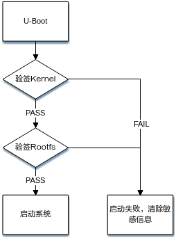

安全启动验签流程涉及的哈希值计算、非对称RSA加解密，请自行查询相关资料，本文不再进行说明。如果需要进一步开发加解密功能，可了解其它加密算法，例如对称AES加密算法。

## 附验证信息U-Boot镜像结构<a name="ZH-CN_TOPIC_0000002424357746"></a>

附验证信息的U-Boot镜像结构如[图1](#fig13141855185214)所示。在U-Boot镜像尾部追加Kernel相关安全信息，再将带Kernel验证信息的U-Boot镜像制作成安全启动镜像。

**图 1**  附验证信息U-Boot镜像结构<a name="fig13141855185214"></a>  
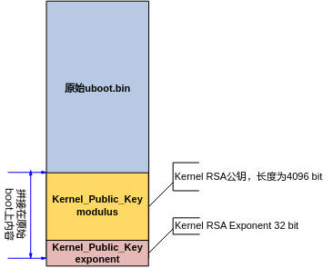

## 安全Kernel镜像结构<a name="ZH-CN_TOPIC_0000002457836509"></a>

安全Kernel镜像由头部信息、Kernel镜像和签名信息等组成，如[图1](#fig47919505579)所示。在原有Kernel镜像结构进行拼接，其中Kernel镜像为压缩镜像。Kernel验签使用的RSA公钥信息保存在U-Boot原始镜像中，随安全镜像一起整合成安全启动镜像。

**图 1**  安全Kernel镜像结构图<a name="fig47919505579"></a>  
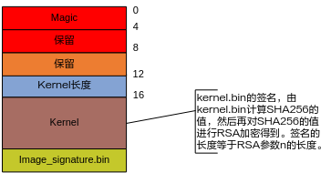

## 功能实现<a name="ZH-CN_TOPIC_0000002424197894"></a>

U-Boot验签Kernel部分功能实现请参考《CIPHER API 参考》文档内 RSA签名及验签使用流程章节调用相应API接口实现。

# U-Boot表格增大后代码方案参考<a name="ZH-CN_TOPIC_0000002457876649"></a>

> **注意：** 
>本方法只适用于非安全启动和安全启动，对快速启动无效。
>且修改须保证 gsl.bin大小（对应镜像GSL\_Code\_Area\_Len）+ U-Boot 表格大小（16字节对齐） < 70.76KB大小。


## 目的<a name="ZH-CN_TOPIC_0000002424357762"></a>

将U-Boot表格大小限制，从10.77KB（0x2B10字节）增至16.00KB（0x4000字节）。

## 方法<a name="ZH-CN_TOPIC_0000002457836525"></a>

1.  修改gsl/include/flash\_map.h

    ```
    #define CFG_PARAM_SIZE 0x2B10
    ```

    修改为：

    ```
    #define CFG_PARAM_SIZE 0x4000
    ```

2.  修改image\_map/common/area\_tool.py

    ```
    class AreaCfg:
    CFG_PARAM_SIZE = 0x2B10     # reg table size
    ```

    修改为

    ```
    class AreaCfg:
    CFG_PARAM_SIZE = 0x4000     # reg table size..
    ```

# 错误码列表<a name="ZH-CN_TOPIC_0000002424357770"></a>

**表 1**  错误码列表

<a name="zh-cn_topic_0000001755879218_table17854135394813"></a>
<table><thead align="left"><tr id="zh-cn_topic_0000001755879218_row17854165314482"><th class="cellrowborder" align="left" valign="top" width="12.45%" id="mcps1.2.3.1.1"><p id="zh-cn_topic_0000001755879218_p1485415318484"><a name="zh-cn_topic_0000001755879218_p1485415318484"></a><a name="zh-cn_topic_0000001755879218_p1485415318484"></a>错误码</p>
</th>
<th class="cellrowborder" align="left" valign="top" width="87.55%" id="mcps1.2.3.1.2"><p id="zh-cn_topic_0000001755879218_p285410537485"><a name="zh-cn_topic_0000001755879218_p285410537485"></a><a name="zh-cn_topic_0000001755879218_p285410537485"></a>含义</p>
</th>
</tr>
</thead>
<tbody><tr id="zh-cn_topic_0000001755879218_row17854145364815"><td class="cellrowborder" align="left" valign="top" width="12.45%" headers="mcps1.2.3.1.1 "><p id="zh-cn_topic_0000001755879218_p17854135319489"><a name="zh-cn_topic_0000001755879218_p17854135319489"></a><a name="zh-cn_topic_0000001755879218_p17854135319489"></a>E4D1</p>
</td>
<td class="cellrowborder" align="left" valign="top" width="87.55%" headers="mcps1.2.3.1.2 "><p id="zh-cn_topic_0000001755879218_p3854115364817"><a name="zh-cn_topic_0000001755879218_p3854115364817"></a><a name="zh-cn_topic_0000001755879218_p3854115364817"></a>PCIe 从启动获取数据失败</p>
</td>
</tr>
<tr id="zh-cn_topic_0000001755879218_row38543534487"><td class="cellrowborder" align="left" valign="top" width="12.45%" headers="mcps1.2.3.1.1 "><p id="zh-cn_topic_0000001755879218_p15854753104815"><a name="zh-cn_topic_0000001755879218_p15854753104815"></a><a name="zh-cn_topic_0000001755879218_p15854753104815"></a>E4D2</p>
</td>
<td class="cellrowborder" align="left" valign="top" width="87.55%" headers="mcps1.2.3.1.2 "><p id="zh-cn_topic_0000001755879218_p11855185304820"><a name="zh-cn_topic_0000001755879218_p11855185304820"></a><a name="zh-cn_topic_0000001755879218_p11855185304820"></a>从 UART 下载数据失败</p>
</td>
</tr>
<tr id="row144952937"><td class="cellrowborder" valign="top" width="12.45%" headers="mcps1.2.3.1.1 "><p id="p3449122435"><a name="p3449122435"></a><a name="p3449122435"></a>E4D3</p>
</td>
<td class="cellrowborder" valign="top" width="87.55%" headers="mcps1.2.3.1.2 "><p id="p94494213312"><a name="p94494213312"></a><a name="p94494213312"></a>从 SD 卡获取数据失败</p>
</td>
</tr>
<tr id="row1277314561218"><td class="cellrowborder" valign="top" width="12.45%" headers="mcps1.2.3.1.1 "><p id="p177741956629"><a name="p177741956629"></a><a name="p177741956629"></a>E4D4</p>
</td>
<td class="cellrowborder" valign="top" width="87.55%" headers="mcps1.2.3.1.2 "><p id="p777485613219"><a name="p777485613219"></a><a name="p777485613219"></a>从 USB 下载数据失败</p>
</td>
</tr>
<tr id="zh-cn_topic_0000001755879218_row1185511533481"><td class="cellrowborder" align="left" valign="top" width="12.45%" headers="mcps1.2.3.1.1 "><p id="zh-cn_topic_0000001755879218_p1685545318488"><a name="zh-cn_topic_0000001755879218_p1685545318488"></a><a name="zh-cn_topic_0000001755879218_p1685545318488"></a>E4D5</p>
</td>
<td class="cellrowborder" align="left" valign="top" width="87.55%" headers="mcps1.2.3.1.2 "><p id="zh-cn_topic_0000001755879218_p1885565334817"><a name="zh-cn_topic_0000001755879218_p1885565334817"></a><a name="zh-cn_topic_0000001755879218_p1885565334817"></a>从 Flash 获取备份失败</p>
</td>
</tr>
<tr id="zh-cn_topic_0000001755879218_row8855145344819"><td class="cellrowborder" align="left" valign="top" width="12.45%" headers="mcps1.2.3.1.1 "><p id="zh-cn_topic_0000001755879218_p1985565310489"><a name="zh-cn_topic_0000001755879218_p1985565310489"></a><a name="zh-cn_topic_0000001755879218_p1985565310489"></a>E4D6</p>
</td>
<td class="cellrowborder" align="left" valign="top" width="87.55%" headers="mcps1.2.3.1.2 "><p id="zh-cn_topic_0000001755879218_p18855195311489"><a name="zh-cn_topic_0000001755879218_p18855195311489"></a><a name="zh-cn_topic_0000001755879218_p18855195311489"></a>从 Flash 获取数据失败</p>
</td>
</tr>
<tr id="zh-cn_topic_0000001755879218_row4855453104810"><td class="cellrowborder" align="left" valign="top" width="12.45%" headers="mcps1.2.3.1.1 "><p id="zh-cn_topic_0000001755879218_p18551553104816"><a name="zh-cn_topic_0000001755879218_p18551553104816"></a><a name="zh-cn_topic_0000001755879218_p18551553104816"></a>E4D7</p>
</td>
<td class="cellrowborder" align="left" valign="top" width="87.55%" headers="mcps1.2.3.1.2 "><p id="zh-cn_topic_0000001755879218_p185545313480"><a name="zh-cn_topic_0000001755879218_p185545313480"></a><a name="zh-cn_topic_0000001755879218_p185545313480"></a>从 eMMC 获取备份失败</p>
</td>
</tr>
<tr id="zh-cn_topic_0000001755879218_row185515530482"><td class="cellrowborder" align="left" valign="top" width="12.45%" headers="mcps1.2.3.1.1 "><p id="zh-cn_topic_0000001755879218_p3855125394819"><a name="zh-cn_topic_0000001755879218_p3855125394819"></a><a name="zh-cn_topic_0000001755879218_p3855125394819"></a>E4D8</p>
</td>
<td class="cellrowborder" align="left" valign="top" width="87.55%" headers="mcps1.2.3.1.2 "><p id="zh-cn_topic_0000001755879218_p128552053174819"><a name="zh-cn_topic_0000001755879218_p128552053174819"></a><a name="zh-cn_topic_0000001755879218_p128552053174819"></a>从 eMMC 获取数据失败</p>
</td>
</tr>
<tr id="zh-cn_topic_0000001755879218_row11855153144818"><td class="cellrowborder" align="left" valign="top" width="12.45%" headers="mcps1.2.3.1.1 "><p id="zh-cn_topic_0000001755879218_p1985535354815"><a name="zh-cn_topic_0000001755879218_p1985535354815"></a><a name="zh-cn_topic_0000001755879218_p1985535354815"></a>E6Dx</p>
</td>
<td class="cellrowborder" align="left" valign="top" width="87.55%" headers="mcps1.2.3.1.2 "><p id="zh-cn_topic_0000001755879218_p188551753174820"><a name="zh-cn_topic_0000001755879218_p188551753174820"></a><a name="zh-cn_topic_0000001755879218_p188551753174820"></a>GSL_Third_party_Key Area 校验失败</p>
</td>
</tr>
<tr id="zh-cn_topic_0000001755879218_row2855253114812"><td class="cellrowborder" align="left" valign="top" width="12.45%" headers="mcps1.2.3.1.1 "><p id="zh-cn_topic_0000001755879218_p168551753164819"><a name="zh-cn_topic_0000001755879218_p168551753164819"></a><a name="zh-cn_topic_0000001755879218_p168551753164819"></a>E7Dx</p>
</td>
<td class="cellrowborder" align="left" valign="top" width="87.55%" headers="mcps1.2.3.1.2 "><p id="zh-cn_topic_0000001755879218_p3855155310481"><a name="zh-cn_topic_0000001755879218_p3855155310481"></a><a name="zh-cn_topic_0000001755879218_p3855155310481"></a>GSL_Key_Area 校验失败</p>
</td>
</tr>
<tr id="zh-cn_topic_0000001755879218_row785525304813"><td class="cellrowborder" align="left" valign="top" width="12.45%" headers="mcps1.2.3.1.1 "><p id="zh-cn_topic_0000001755879218_p185515319481"><a name="zh-cn_topic_0000001755879218_p185515319481"></a><a name="zh-cn_topic_0000001755879218_p185515319481"></a>E8D1</p>
</td>
<td class="cellrowborder" align="left" valign="top" width="87.55%" headers="mcps1.2.3.1.2 "><p id="zh-cn_topic_0000001755879218_p11855115374812"><a name="zh-cn_topic_0000001755879218_p11855115374812"></a><a name="zh-cn_topic_0000001755879218_p11855115374812"></a>从 Flash 获取 GSL Code Area 失败</p>
</td>
</tr>
<tr id="zh-cn_topic_0000001755879218_row885516539484"><td class="cellrowborder" align="left" valign="top" width="12.45%" headers="mcps1.2.3.1.1 "><p id="zh-cn_topic_0000001755879218_p2085518532481"><a name="zh-cn_topic_0000001755879218_p2085518532481"></a><a name="zh-cn_topic_0000001755879218_p2085518532481"></a>E8D2</p>
</td>
<td class="cellrowborder" rowspan="2" align="left" valign="top" width="87.55%" headers="mcps1.2.3.1.2 "><p id="zh-cn_topic_0000001755879218_p385595394811"><a name="zh-cn_topic_0000001755879218_p385595394811"></a><a name="zh-cn_topic_0000001755879218_p385595394811"></a>从 EMMC 获取 GSL Code Area 失败</p>
</td>
</tr>
<tr id="zh-cn_topic_0000001755879218_row128551653114812"><td class="cellrowborder" align="left" valign="top" headers="mcps1.2.3.1.1 "><p id="zh-cn_topic_0000001755879218_p1985515313481"><a name="zh-cn_topic_0000001755879218_p1985515313481"></a><a name="zh-cn_topic_0000001755879218_p1985515313481"></a>E8D3</p>
</td>
</tr>
<tr id="zh-cn_topic_0000001755879218_row585595318482"><td class="cellrowborder" align="left" valign="top" width="12.45%" headers="mcps1.2.3.1.1 "><p id="zh-cn_topic_0000001755879218_p17855753144814"><a name="zh-cn_topic_0000001755879218_p17855753144814"></a><a name="zh-cn_topic_0000001755879218_p17855753144814"></a>E9Dx</p>
</td>
<td class="cellrowborder" align="left" valign="top" width="87.55%" headers="mcps1.2.3.1.2 "><p id="zh-cn_topic_0000001755879218_p485595324812"><a name="zh-cn_topic_0000001755879218_p485595324812"></a><a name="zh-cn_topic_0000001755879218_p485595324812"></a>GSL_Code_Area 校验失败</p>
</td>
</tr>
<tr id="row18787107101918"><td class="cellrowborder" valign="top" width="12.45%" headers="mcps1.2.3.1.1 "><p id="p87875711195"><a name="p87875711195"></a><a name="p87875711195"></a>G4S1</p>
</td>
<td class="cellrowborder" valign="top" width="87.55%" headers="mcps1.2.3.1.2 "><p id="p1122357192010"><a name="p1122357192010"></a><a name="p1122357192010"></a>PCIe 从启动获取数据失败</p>
</td>
</tr>
<tr id="row14732102015191"><td class="cellrowborder" valign="top" width="12.45%" headers="mcps1.2.3.1.1 "><p id="p492335018193"><a name="p492335018193"></a><a name="p492335018193"></a>G4S2</p>
</td>
<td class="cellrowborder" valign="top" width="87.55%" headers="mcps1.2.3.1.2 "><p id="p148641414202"><a name="p148641414202"></a><a name="p148641414202"></a>从 UART 下载数据失败</p>
</td>
</tr>
<tr id="row47864132194"><td class="cellrowborder" valign="top" width="12.45%" headers="mcps1.2.3.1.1 "><p id="p1824925131917"><a name="p1824925131917"></a><a name="p1824925131917"></a>G4S3</p>
</td>
<td class="cellrowborder" valign="top" width="87.55%" headers="mcps1.2.3.1.2 "><p id="p87861134191"><a name="p87861134191"></a><a name="p87861134191"></a>从 SD 卡获取数据失败</p>
</td>
</tr>
<tr id="row7161181716198"><td class="cellrowborder" valign="top" width="12.45%" headers="mcps1.2.3.1.1 "><p id="p084435110197"><a name="p084435110197"></a><a name="p084435110197"></a>G4S4</p>
</td>
<td class="cellrowborder" valign="top" width="87.55%" headers="mcps1.2.3.1.2 "><p id="p1262485012018"><a name="p1262485012018"></a><a name="p1262485012018"></a>从 USB 下载数据失败</p>
</td>
</tr>
<tr id="row1464441021917"><td class="cellrowborder" valign="top" width="12.45%" headers="mcps1.2.3.1.1 "><p id="p13348125271911"><a name="p13348125271911"></a><a name="p13348125271911"></a>G4S5</p>
</td>
<td class="cellrowborder" rowspan="2" valign="top" width="87.55%" headers="mcps1.2.3.1.2 "><p id="p1964441091912"><a name="p1964441091912"></a><a name="p1964441091912"></a>从 Flash 获取数据失败</p>
</td>
</tr>
<tr id="row48610515192"><td class="cellrowborder" valign="top" headers="mcps1.2.3.1.1 "><p id="p169349529196"><a name="p169349529196"></a><a name="p169349529196"></a>G4S7</p>
</td>
</tr>
<tr id="row236852121910"><td class="cellrowborder" valign="top" width="12.45%" headers="mcps1.2.3.1.1 "><p id="p12416145371912"><a name="p12416145371912"></a><a name="p12416145371912"></a>G4S6</p>
</td>
<td class="cellrowborder" rowspan="5" valign="top" width="87.55%" headers="mcps1.2.3.1.2 "><p id="p133681126199"><a name="p133681126199"></a><a name="p133681126199"></a>从 eMMC 获取数据失败</p>
</td>
</tr>
<tr id="row1740911412198"><td class="cellrowborder" valign="top" headers="mcps1.2.3.1.1 "><p id="p35461541199"><a name="p35461541199"></a><a name="p35461541199"></a>G4S8</p>
</td>
</tr>
<tr id="row70828182210"><td class="cellrowborder" valign="top" headers="mcps1.2.3.1.1 "><p id="p4949194482219"><a name="p4949194482219"></a><a name="p4949194482219"></a>G4S9</p>
</td>
</tr>
<tr id="row11179135102216"><td class="cellrowborder" valign="top" headers="mcps1.2.3.1.1 "><p id="p1236311479225"><a name="p1236311479225"></a><a name="p1236311479225"></a>G4Sa</p>
</td>
</tr>
<tr id="row18433120229"><td class="cellrowborder" valign="top" headers="mcps1.2.3.1.1 "><p id="p45261251122217"><a name="p45261251122217"></a><a name="p45261251122217"></a>G4Sb</p>
</td>
</tr>
<tr id="zh-cn_topic_0000001755879218_row15855135384818"><td class="cellrowborder" align="left" valign="top" width="12.45%" headers="mcps1.2.3.1.1 "><p id="zh-cn_topic_0000001755879218_p18555533481"><a name="zh-cn_topic_0000001755879218_p18555533481"></a><a name="zh-cn_topic_0000001755879218_p18555533481"></a>G5Sx</p>
</td>
<td class="cellrowborder" align="left" valign="top" width="87.55%" headers="mcps1.2.3.1.2 "><p id="zh-cn_topic_0000001755879218_p128551153144816"><a name="zh-cn_topic_0000001755879218_p128551153144816"></a><a name="zh-cn_topic_0000001755879218_p128551153144816"></a>Boot Key Area 校验失败</p>
</td>
</tr>
<tr id="zh-cn_topic_0000001755879218_row885535320489"><td class="cellrowborder" align="left" valign="top" width="12.45%" headers="mcps1.2.3.1.1 "><p id="zh-cn_topic_0000001755879218_p785685311481"><a name="zh-cn_topic_0000001755879218_p785685311481"></a><a name="zh-cn_topic_0000001755879218_p785685311481"></a>G6Sx</p>
</td>
<td class="cellrowborder" align="left" valign="top" width="87.55%" headers="mcps1.2.3.1.2 "><p id="zh-cn_topic_0000001755879218_p19856105311483"><a name="zh-cn_topic_0000001755879218_p19856105311483"></a><a name="zh-cn_topic_0000001755879218_p19856105311483"></a>Boot Params Area 校验失败</p>
</td>
</tr>
<tr id="zh-cn_topic_0000001755879218_row198562053144819"><td class="cellrowborder" align="left" valign="top" width="12.45%" headers="mcps1.2.3.1.1 "><p id="zh-cn_topic_0000001755879218_p88561953134813"><a name="zh-cn_topic_0000001755879218_p88561953134813"></a><a name="zh-cn_topic_0000001755879218_p88561953134813"></a>G8s1</p>
</td>
<td class="cellrowborder" align="left" valign="top" width="87.55%" headers="mcps1.2.3.1.2 "><p id="zh-cn_topic_0000001755879218_p18856853114811"><a name="zh-cn_topic_0000001755879218_p18856853114811"></a><a name="zh-cn_topic_0000001755879218_p18856853114811"></a>PCIe 从启动获取数据失败</p>
</td>
</tr>
<tr id="zh-cn_topic_0000001755879218_row208561553174813"><td class="cellrowborder" align="left" valign="top" width="12.45%" headers="mcps1.2.3.1.1 "><p id="zh-cn_topic_0000001755879218_p98561953154810"><a name="zh-cn_topic_0000001755879218_p98561953154810"></a><a name="zh-cn_topic_0000001755879218_p98561953154810"></a>G8s2</p>
</td>
<td class="cellrowborder" align="left" valign="top" width="87.55%" headers="mcps1.2.3.1.2 "><p id="zh-cn_topic_0000001755879218_p185613530483"><a name="zh-cn_topic_0000001755879218_p185613530483"></a><a name="zh-cn_topic_0000001755879218_p185613530483"></a>从 UART 下载数据失败</p>
</td>
</tr>
<tr id="row128584301436"><td class="cellrowborder" valign="top" width="12.45%" headers="mcps1.2.3.1.1 "><p id="p985983015318"><a name="p985983015318"></a><a name="p985983015318"></a>G8s3</p>
</td>
<td class="cellrowborder" valign="top" width="87.55%" headers="mcps1.2.3.1.2 "><p id="p28596307315"><a name="p28596307315"></a><a name="p28596307315"></a>从 SD 卡获取数据失败</p>
</td>
</tr>
<tr id="row582251039"><td class="cellrowborder" valign="top" width="12.45%" headers="mcps1.2.3.1.1 "><p id="p88102512311"><a name="p88102512311"></a><a name="p88102512311"></a>G8s4</p>
</td>
<td class="cellrowborder" valign="top" width="87.55%" headers="mcps1.2.3.1.2 "><p id="p18152518312"><a name="p18152518312"></a><a name="p18152518312"></a>从 USB 下载数据失败</p>
</td>
</tr>
<tr id="zh-cn_topic_0000001755879218_row585613539487"><td class="cellrowborder" align="left" valign="top" width="12.45%" headers="mcps1.2.3.1.1 "><p id="zh-cn_topic_0000001755879218_p88561953194814"><a name="zh-cn_topic_0000001755879218_p88561953194814"></a><a name="zh-cn_topic_0000001755879218_p88561953194814"></a>G8s5</p>
</td>
<td class="cellrowborder" align="left" valign="top" width="87.55%" headers="mcps1.2.3.1.2 "><p id="zh-cn_topic_0000001755879218_p108561953114814"><a name="zh-cn_topic_0000001755879218_p108561953114814"></a><a name="zh-cn_topic_0000001755879218_p108561953114814"></a>从 Flash 获取数据失败</p>
</td>
</tr>
<tr id="zh-cn_topic_0000001755879218_row16856253184812"><td class="cellrowborder" align="left" valign="top" width="12.45%" headers="mcps1.2.3.1.1 "><p id="zh-cn_topic_0000001755879218_p1285605344819"><a name="zh-cn_topic_0000001755879218_p1285605344819"></a><a name="zh-cn_topic_0000001755879218_p1285605344819"></a>G8s6</p>
</td>
<td class="cellrowborder" rowspan="4" align="left" valign="top" width="87.55%" headers="mcps1.2.3.1.2 "><p id="zh-cn_topic_0000001755879218_p089241765415"><a name="zh-cn_topic_0000001755879218_p089241765415"></a><a name="zh-cn_topic_0000001755879218_p089241765415"></a>从 eMMC 获取数据失败</p>
</td>
</tr>
<tr id="zh-cn_topic_0000001755879218_row13856125314480"><td class="cellrowborder" align="left" valign="top" headers="mcps1.2.3.1.1 "><p id="zh-cn_topic_0000001755879218_p3856155316482"><a name="zh-cn_topic_0000001755879218_p3856155316482"></a><a name="zh-cn_topic_0000001755879218_p3856155316482"></a>G8s7</p>
</td>
</tr>
<tr id="zh-cn_topic_0000001755879218_row0856105313489"><td class="cellrowborder" align="left" valign="top" headers="mcps1.2.3.1.1 "><p id="zh-cn_topic_0000001755879218_p7856053184812"><a name="zh-cn_topic_0000001755879218_p7856053184812"></a><a name="zh-cn_topic_0000001755879218_p7856053184812"></a>G8s8</p>
</td>
</tr>
<tr id="zh-cn_topic_0000001755879218_row085617532482"><td class="cellrowborder" align="left" valign="top" headers="mcps1.2.3.1.1 "><p id="zh-cn_topic_0000001755879218_p108563536486"><a name="zh-cn_topic_0000001755879218_p108563536486"></a><a name="zh-cn_topic_0000001755879218_p108563536486"></a>G8s9</p>
</td>
</tr>
<tr id="zh-cn_topic_0000001755879218_row285685384818"><td class="cellrowborder" align="left" valign="top" width="12.45%" headers="mcps1.2.3.1.1 "><p id="zh-cn_topic_0000001755879218_p108569533488"><a name="zh-cn_topic_0000001755879218_p108569533488"></a><a name="zh-cn_topic_0000001755879218_p108569533488"></a>G9Sx</p>
</td>
<td class="cellrowborder" align="left" valign="top" width="87.55%" headers="mcps1.2.3.1.2 "><p id="zh-cn_topic_0000001755879218_p2085685314486"><a name="zh-cn_topic_0000001755879218_p2085685314486"></a><a name="zh-cn_topic_0000001755879218_p2085685314486"></a>Boot Area 校验失败</p>
</td>
</tr>
</tbody>
</table>

> **说明：** 
>错误码表中，“x”替代任意数字，例如“G5Sx”指代 “G5S1”、“G5S2”、“G5S3”…

# 缩略语<a name="ZH-CN_TOPIC_0000002424197946"></a>

<a name="table345mcpsimp"></a>
<table><tbody><tr id="row350mcpsimp"><td class="cellrowborder" colspan="2" valign="top"><p id="p352mcpsimp"><a name="p352mcpsimp"></a><a name="p352mcpsimp"></a><strong id="b353mcpsimp"><a name="b353mcpsimp"></a><a name="b353mcpsimp"></a>A</strong></p>
</td>
</tr>
<tr id="row354mcpsimp"><td class="cellrowborder" valign="top" width="16%"><p id="p356mcpsimp"><a name="p356mcpsimp"></a><a name="p356mcpsimp"></a>AES</p>
</td>
<td class="cellrowborder" valign="top" width="84%"><p id="p358mcpsimp"><a name="p358mcpsimp"></a><a name="p358mcpsimp"></a>Advanced Encryption Standard</p>
</td>
</tr>
<tr id="row359mcpsimp"><td class="cellrowborder" valign="top" width="16%"><p id="p361mcpsimp"><a name="p361mcpsimp"></a><a name="p361mcpsimp"></a>ATF</p>
</td>
<td class="cellrowborder" valign="top" width="84%"><p id="p363mcpsimp"><a name="p363mcpsimp"></a><a name="p363mcpsimp"></a>Arm Trust Firmware</p>
</td>
</tr>
<tr id="row364mcpsimp"><td class="cellrowborder" colspan="2" valign="top"><p id="p366mcpsimp"><a name="p366mcpsimp"></a><a name="p366mcpsimp"></a><strong id="b367mcpsimp"><a name="b367mcpsimp"></a><a name="b367mcpsimp"></a>C</strong></p>
</td>
</tr>
<tr id="row368mcpsimp"><td class="cellrowborder" valign="top" width="16%"><p id="p370mcpsimp"><a name="p370mcpsimp"></a><a name="p370mcpsimp"></a>CPU</p>
</td>
<td class="cellrowborder" valign="top" width="84%"><p id="p372mcpsimp"><a name="p372mcpsimp"></a><a name="p372mcpsimp"></a>Central Processing Unit</p>
</td>
</tr>
<tr id="row373mcpsimp"><td class="cellrowborder" colspan="2" valign="top"><p id="p375mcpsimp"><a name="p375mcpsimp"></a><a name="p375mcpsimp"></a><strong id="b376mcpsimp"><a name="b376mcpsimp"></a><a name="b376mcpsimp"></a>G</strong></p>
</td>
</tr>
<tr id="row377mcpsimp"><td class="cellrowborder" valign="top" width="16%"><p id="p379mcpsimp"><a name="p379mcpsimp"></a><a name="p379mcpsimp"></a>GSL</p>
</td>
<td class="cellrowborder" valign="top" width="84%"><p id="p381mcpsimp"><a name="p381mcpsimp"></a><a name="p381mcpsimp"></a>Secure Bootloader</p>
</td>
</tr>
<tr id="row382mcpsimp"><td class="cellrowborder" colspan="2" valign="top"><p id="p384mcpsimp"><a name="p384mcpsimp"></a><a name="p384mcpsimp"></a><strong id="b385mcpsimp"><a name="b385mcpsimp"></a><a name="b385mcpsimp"></a>J</strong></p>
</td>
</tr>
<tr id="row386mcpsimp"><td class="cellrowborder" valign="top" width="16%"><p id="p388mcpsimp"><a name="p388mcpsimp"></a><a name="p388mcpsimp"></a>JTAG</p>
</td>
<td class="cellrowborder" valign="top" width="84%"><p id="p390mcpsimp"><a name="p390mcpsimp"></a><a name="p390mcpsimp"></a>Joint Test Action Group</p>
</td>
</tr>
<tr id="row391mcpsimp"><td class="cellrowborder" colspan="2" valign="top"><p id="p393mcpsimp"><a name="p393mcpsimp"></a><a name="p393mcpsimp"></a><strong id="b394mcpsimp"><a name="b394mcpsimp"></a><a name="b394mcpsimp"></a>K</strong></p>
</td>
</tr>
<tr id="row395mcpsimp"><td class="cellrowborder" valign="top" width="16%"><p id="p397mcpsimp"><a name="p397mcpsimp"></a><a name="p397mcpsimp"></a>KeyLadder</p>
</td>
<td class="cellrowborder" valign="top" width="84%"><p id="p399mcpsimp"><a name="p399mcpsimp"></a><a name="p399mcpsimp"></a>A structured multi-level key mechanism that ensures secure transmission of control words.</p>
</td>
</tr>
<tr id="row400mcpsimp"><td class="cellrowborder" colspan="2" valign="top"><p id="p402mcpsimp"><a name="p402mcpsimp"></a><a name="p402mcpsimp"></a><strong id="b403mcpsimp"><a name="b403mcpsimp"></a><a name="b403mcpsimp"></a>M</strong></p>
</td>
</tr>
<tr id="row404mcpsimp"><td class="cellrowborder" valign="top" width="16%"><p id="p406mcpsimp"><a name="p406mcpsimp"></a><a name="p406mcpsimp"></a>MCipher</p>
</td>
<td class="cellrowborder" valign="top" width="84%"><p id="p408mcpsimp"><a name="p408mcpsimp"></a><a name="p408mcpsimp"></a>Multi-channel Cipher module</p>
</td>
</tr>
<tr id="row409mcpsimp"><td class="cellrowborder" valign="top" width="16%"><p id="p411mcpsimp"><a name="p411mcpsimp"></a><a name="p411mcpsimp"></a>MSID</p>
</td>
<td class="cellrowborder" valign="top" width="84%"><p id="p413mcpsimp"><a name="p413mcpsimp"></a><a name="p413mcpsimp"></a>MarketSegmentID.</p>
</td>
</tr>
<tr id="row414mcpsimp"><td class="cellrowborder" colspan="2" valign="top"><p id="p416mcpsimp"><a name="p416mcpsimp"></a><a name="p416mcpsimp"></a><strong id="b417mcpsimp"><a name="b417mcpsimp"></a><a name="b417mcpsimp"></a>O</strong></p>
</td>
</tr>
<tr id="row418mcpsimp"><td class="cellrowborder" valign="top" width="16%"><p id="p420mcpsimp"><a name="p420mcpsimp"></a><a name="p420mcpsimp"></a>OS</p>
</td>
<td class="cellrowborder" valign="top" width="84%"><p id="p422mcpsimp"><a name="p422mcpsimp"></a><a name="p422mcpsimp"></a>Operating System</p>
</td>
</tr>
<tr id="row423mcpsimp"><td class="cellrowborder" valign="top" width="16%"><p id="p425mcpsimp"><a name="p425mcpsimp"></a><a name="p425mcpsimp"></a>OEM</p>
</td>
<td class="cellrowborder" valign="top" width="84%"><p id="p427mcpsimp"><a name="p427mcpsimp"></a><a name="p427mcpsimp"></a>Original Equipment Manufacturer</p>
</td>
</tr>
<tr id="row428mcpsimp"><td class="cellrowborder" valign="top" width="16%"><p id="p430mcpsimp"><a name="p430mcpsimp"></a><a name="p430mcpsimp"></a>OTP</p>
</td>
<td class="cellrowborder" valign="top" width="84%"><p id="p432mcpsimp"><a name="p432mcpsimp"></a><a name="p432mcpsimp"></a>One Time Programmable</p>
</td>
</tr>
<tr id="row433mcpsimp"><td class="cellrowborder" colspan="2" valign="top"><p id="p435mcpsimp"><a name="p435mcpsimp"></a><a name="p435mcpsimp"></a><strong id="b436mcpsimp"><a name="b436mcpsimp"></a><a name="b436mcpsimp"></a>R</strong></p>
</td>
</tr>
<tr id="row437mcpsimp"><td class="cellrowborder" valign="top" width="16%"><p id="p439mcpsimp"><a name="p439mcpsimp"></a><a name="p439mcpsimp"></a>REE</p>
</td>
<td class="cellrowborder" valign="top" width="84%"><p id="p441mcpsimp"><a name="p441mcpsimp"></a><a name="p441mcpsimp"></a>Rich Execution Environment</p>
</td>
</tr>
<tr id="row442mcpsimp"><td class="cellrowborder" valign="top" width="16%"><p id="p444mcpsimp"><a name="p444mcpsimp"></a><a name="p444mcpsimp"></a>RKP</p>
</td>
<td class="cellrowborder" valign="top" width="84%"><p id="p446mcpsimp"><a name="p446mcpsimp"></a><a name="p446mcpsimp"></a>Root Key Process</p>
</td>
</tr>
<tr id="row447mcpsimp"><td class="cellrowborder" colspan="2" valign="top"><p id="p449mcpsimp"><a name="p449mcpsimp"></a><a name="p449mcpsimp"></a><strong id="b450mcpsimp"><a name="b450mcpsimp"></a><a name="b450mcpsimp"></a>S</strong></p>
</td>
</tr>
<tr id="row451mcpsimp"><td class="cellrowborder" valign="top" width="16%"><p id="p453mcpsimp"><a name="p453mcpsimp"></a><a name="p453mcpsimp"></a>SCS</p>
</td>
<td class="cellrowborder" valign="top" width="84%"><p id="p455mcpsimp"><a name="p455mcpsimp"></a><a name="p455mcpsimp"></a>Secure Chipset Startup</p>
</td>
</tr>
<tr id="row456mcpsimp"><td class="cellrowborder" valign="top" width="16%"><p id="p458mcpsimp"><a name="p458mcpsimp"></a><a name="p458mcpsimp"></a>SMC</p>
</td>
<td class="cellrowborder" valign="top" width="84%"><p id="p460mcpsimp"><a name="p460mcpsimp"></a><a name="p460mcpsimp"></a>Secure Monitor Call</p>
</td>
</tr>
</tbody>
</table>

