# 前言<a name="ZH-CN_TOPIC_0000002408294476"></a>

**概述<a name="section4561mcpsimp"></a>**

本文档为SVP2.0平台_识别_分析方案开发的程序员而写，目的是供您在开发过程中查阅SVP2.0支持的各种参考信息，包括API、头文件、错误码等。

> **说明：** 
>本文未有特殊说明，SS927V100与SS928V100内容完全一致。

**产品版本<a name="section4565mcpsimp"></a>**

与本文档相对应的产品版本如下。

<a name="table4568mcpsimp"></a>
<table><thead align="left"><tr id="row4573mcpsimp"><th class="cellrowborder" valign="top" width="32%" id="mcps1.1.3.1.1"><p id="p4575mcpsimp"><a name="p4575mcpsimp"></a><a name="p4575mcpsimp"></a>产品名称</p>
</th>
<th class="cellrowborder" valign="top" width="68%" id="mcps1.1.3.1.2"><p id="p4577mcpsimp"><a name="p4577mcpsimp"></a><a name="p4577mcpsimp"></a>产品版本</p>
</th>
</tr>
</thead>
<tbody><tr id="row4579mcpsimp"><td class="cellrowborder" valign="top" width="32%" headers="mcps1.1.3.1.1 "><p id="p4581mcpsimp"><a name="p4581mcpsimp"></a><a name="p4581mcpsimp"></a>SS928</p>
</td>
<td class="cellrowborder" valign="top" width="68%" headers="mcps1.1.3.1.2 "><p id="p4583mcpsimp"><a name="p4583mcpsimp"></a><a name="p4583mcpsimp"></a>V100</p>
</td>
</tr>
<tr id="row7182111314449"><td class="cellrowborder" valign="top" width="32%" headers="mcps1.1.3.1.1 "><p id="p8622349102117"><a name="p8622349102117"></a><a name="p8622349102117"></a>SS927</p>
</td>
<td class="cellrowborder" valign="top" width="68%" headers="mcps1.1.3.1.2 "><p id="p9185184311112"><a name="p9185184311112"></a><a name="p9185184311112"></a>V100</p>
</td>
</tr>
</tbody>
</table>

**读者对象<a name="section4589mcpsimp"></a>**

本文档（本指南）主要适用于以下工程师：

-   技术支持工程师
-   软件开发工程师

**符号约定<a name="section4595mcpsimp"></a>**

在本文中可能出现下列标志，它们所代表的含义如下。

<a name="table4598mcpsimp"></a>
<table><thead align="left"><tr id="row4603mcpsimp"><th class="cellrowborder" valign="top" width="23%" id="mcps1.1.3.1.1"><p id="p4605mcpsimp"><a name="p4605mcpsimp"></a><a name="p4605mcpsimp"></a>符号</p>
</th>
<th class="cellrowborder" valign="top" width="77%" id="mcps1.1.3.1.2"><p id="p4607mcpsimp"><a name="p4607mcpsimp"></a><a name="p4607mcpsimp"></a>说明</p>
</th>
</tr>
</thead>
<tbody><tr id="row4609mcpsimp"><td class="cellrowborder" valign="top" width="23%" headers="mcps1.1.3.1.1 "><p class="msonormal" id="p4611mcpsimp"><a name="p4611mcpsimp"></a><a name="p4611mcpsimp"></a><a name="image450"></a><a name="image450"></a><span></span></p>
</td>
<td class="cellrowborder" valign="top" width="77%" headers="mcps1.1.3.1.2 "><p id="p4613mcpsimp"><a name="p4613mcpsimp"></a><a name="p4613mcpsimp"></a>表示如不避免则将会导致死亡或严重伤害的具有高等级风险的危害。</p>
</td>
</tr>
<tr id="row4614mcpsimp"><td class="cellrowborder" valign="top" width="23%" headers="mcps1.1.3.1.1 "><p class="msonormal" id="p4616mcpsimp"><a name="p4616mcpsimp"></a><a name="p4616mcpsimp"></a><a name="image451"></a><a name="image451"></a><span></span></p>
</td>
<td class="cellrowborder" valign="top" width="77%" headers="mcps1.1.3.1.2 "><p id="p4618mcpsimp"><a name="p4618mcpsimp"></a><a name="p4618mcpsimp"></a>表示如不避免则可能导致死亡或严重伤害的具有中等级风险的危害。</p>
</td>
</tr>
<tr id="row4619mcpsimp"><td class="cellrowborder" valign="top" width="23%" headers="mcps1.1.3.1.1 "><p class="msonormal" id="p4621mcpsimp"><a name="p4621mcpsimp"></a><a name="p4621mcpsimp"></a><a name="image452"></a><a name="image452"></a><span></span></p>
</td>
<td class="cellrowborder" valign="top" width="77%" headers="mcps1.1.3.1.2 "><p id="p4623mcpsimp"><a name="p4623mcpsimp"></a><a name="p4623mcpsimp"></a>表示如不避免则可能导致轻微或中度伤害的具有低等级风险的危害。</p>
</td>
</tr>
<tr id="row4624mcpsimp"><td class="cellrowborder" valign="top" width="23%" headers="mcps1.1.3.1.1 "><p class="msonormal" id="p4626mcpsimp"><a name="p4626mcpsimp"></a><a name="p4626mcpsimp"></a><a name="image453"></a><a name="image453"></a><span></span></p>
</td>
<td class="cellrowborder" valign="top" width="77%" headers="mcps1.1.3.1.2 "><p id="p4628mcpsimp"><a name="p4628mcpsimp"></a><a name="p4628mcpsimp"></a>用于传递设备或环境安全警示信息。如不避免则可能会导致设备损坏、数据丢失、设备性能降低或其它不可预知的结果。</p>
<p id="p4629mcpsimp"><a name="p4629mcpsimp"></a><a name="p4629mcpsimp"></a>“须知”不涉及人身伤害。</p>
</td>
</tr>
<tr id="row4630mcpsimp"><td class="cellrowborder" valign="top" width="23%" headers="mcps1.1.3.1.1 "><p class="msonormal" id="p4632mcpsimp"><a name="p4632mcpsimp"></a><a name="p4632mcpsimp"></a><a name="image454"></a><a name="image454"></a><span></span></p>
</td>
<td class="cellrowborder" valign="top" width="77%" headers="mcps1.1.3.1.2 "><p id="p4634mcpsimp"><a name="p4634mcpsimp"></a><a name="p4634mcpsimp"></a>对正文中重点信息的补充说明。</p>
<p id="p4635mcpsimp"><a name="p4635mcpsimp"></a><a name="p4635mcpsimp"></a>“说明”不是安全警示信息，不涉及人身、设备及环境伤害信息。</p>
</td>
</tr>
</tbody>
</table>

**修订记录<a name="section4636mcpsimp"></a>**

修订记录累积了每次文档更新的说明。最新版本的文档包含以前所有文档版本的更新内容。

<a name="table4639mcpsimp"></a>
<table><thead align="left"><tr id="row4645mcpsimp"><th class="cellrowborder" valign="top" width="14.249999999999998%" id="mcps1.1.4.1.1"><p id="p4649mcpsimp"><a name="p4649mcpsimp"></a><a name="p4649mcpsimp"></a>版本</p>
</th>
<th class="cellrowborder" valign="top" width="22.96%" id="mcps1.1.4.1.2"><p id="p49861746124616"><a name="p49861746124616"></a><a name="p49861746124616"></a>日期</p>
</th>
<th class="cellrowborder" valign="top" width="62.79%" id="mcps1.1.4.1.3"><p id="p4651mcpsimp"><a name="p4651mcpsimp"></a><a name="p4651mcpsimp"></a>修改描述</p>
</th>
</tr>
</thead>
<tbody><tr id="row4653mcpsimp"><td class="cellrowborder" valign="top" width="14.249999999999998%" headers="mcps1.1.4.1.1 "><p id="p4657mcpsimp"><a name="p4657mcpsimp"></a><a name="p4657mcpsimp"></a>00B01</p>
</td>
<td class="cellrowborder" valign="top" width="22.96%" headers="mcps1.1.4.1.2 "><p id="p1098610464464"><a name="p1098610464464"></a><a name="p1098610464464"></a>2025-09-15</p>
</td>
<td class="cellrowborder" valign="top" width="62.79%" headers="mcps1.1.4.1.3 "><p id="p4659mcpsimp"><a name="p4659mcpsimp"></a><a name="p4659mcpsimp"></a>第1次临时版本发布</p>
</td>
</tr>
</tbody>
</table>

# MAU<a name="ZH-CN_TOPIC_0000002408134500"></a>


## 概述<a name="ZH-CN_TOPIC_0000002441853521"></a>

MAU（Matrix Arithmetic Unit）为_识别_分析系统中的矩阵算术单元。用户基于MAU进行矩阵运算，降低CPU占用。

## 功能描述<a name="ZH-CN_TOPIC_0000002408294284"></a>


### 重要概念<a name="ZH-CN_TOPIC_0000002441733669"></a>

-   句柄\(handle\)

    用户在调用MAU API创建任务时，系统会为每个任务分配一个handle，用于标识不同的任务。

-   及时返回结果标志is\_instant

    用户在创建某个任务后，希望及时得到该任务完成的信息，则需要在创建该任务时，将is\_instant设置为TD\_TRUE。否则，如果用户不关心该任务是否完成，建议将is\_instant设置为TD\_FALSE，这样可以与后续任务组链执行，减少中断次数，提升性能。

-   查询\(query\)

    用户根据系统返回的handle，调用[ss\_mpi\_svp\_mau\_query](#ZH-CN_TOPIC_0000002408294188)可以查询对应算子任务是否完成。

-   跨度（stride）

    一行的有效数据byte数目 + 为硬件快速跨越到下一行补齐的一些无效byte数目，如[图1](#fig4399128101817)所示。注意不同的数据结构行存储表示的有效元素数目的变量不一样，且其度量跟stride不一定是一样的。

    -   [ot\_svp\_blob](#ZH-CN_TOPIC_0000002441853637)行存储方向表示的有效元素数目变量是width。
    -   seq 行存储方向表示的有效元素数目变量是dim。

**图 1**  跨度（stride）示意图<a name="fig4399128101817"></a>  
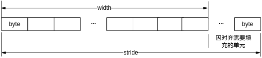

-   对齐

    硬件为了快速访问内存首地址或者跨行访问数据，要求内存地址或内存跨度必须为对齐系数的倍数。

    -   数据内存首地址对齐
    -   跨度对齐

-   输入、输出数据类型
    -   块数据

        [ot\_svp\_blob](#ZH-CN_TOPIC_0000002441853637)、[ot\_svp\_src\_blob](#ZH-CN_TOPIC_0000002441853749)、[ot\_svp\_dst\_blob](#ZH-CN_TOPIC_0000002441853545)，类型参考[ot\_svp\_blob\_type](#ZH-CN_TOPIC_0000002408134284)，具体的内存分配如[图2](#fig432114356336)～[图18](#fig135371724174113)所示。

    -   一维数据

        [ot\_svp\_mem\_info](#ZH-CN_TOPIC_0000002408134312)，表示一维数据，如[图19](#fig939145054114)。

-   BLOB内存排布类型

**表 1**  BLOB内存排布类型表

<a name="table8448mcpsimp"></a>
<table><thead align="left"><tr id="row8454mcpsimp"><th class="cellrowborder" valign="top" width="39%" id="mcps1.2.3.1.1"><p id="p8456mcpsimp"><a name="p8456mcpsimp"></a><a name="p8456mcpsimp"></a>类型</p>
</th>
<th class="cellrowborder" valign="top" width="61%" id="mcps1.2.3.1.2"><p id="p8458mcpsimp"><a name="p8458mcpsimp"></a><a name="p8458mcpsimp"></a>BLOB描述</p>
</th>
</tr>
</thead>
<tbody><tr id="row8460mcpsimp"><td class="cellrowborder" valign="top" width="39%" headers="mcps1.2.3.1.1 "><p id="p8462mcpsimp"><a name="p8462mcpsimp"></a><a name="p8462mcpsimp"></a>OT_SVP_BLOB_TYPE_S20Q12</p>
</td>
<td class="cellrowborder" valign="top" width="61%" headers="mcps1.2.3.1.2 "><p id="p8464mcpsimp"><a name="p8464mcpsimp"></a><a name="p8464mcpsimp"></a>多帧多通道S20Q12类型数据Planar格式存储顺序排布。此时<a href="#ZH-CN_TOPIC_0000002441853637">ot_svp_blob</a>结构体中，num表示帧数，width表示图像宽，height表示图像高，chn表示单帧图像通道数，如 OT_SVP_BLOB_TYPE_S20Q12类型ot_svp_blob（2通道2帧示意图）所示。</p>
</td>
</tr>
<tr id="row8474mcpsimp"><td class="cellrowborder" valign="top" width="39%" headers="mcps1.2.3.1.1 "><p id="p8476mcpsimp"><a name="p8476mcpsimp"></a><a name="p8476mcpsimp"></a>OT_SVP_BLOB_TYPE_U8</p>
</td>
<td class="cellrowborder" valign="top" width="61%" headers="mcps1.2.3.1.2 "><p id="p8478mcpsimp"><a name="p8478mcpsimp"></a><a name="p8478mcpsimp"></a>多帧无符号8bit多通道数据Planar格式存储顺序排布。此时<a href="#ZH-CN_TOPIC_0000002441853637">>ot_svp_blob</</a>结构体中，num表示帧数，width表示图像宽，height表示图像高，chn表示单帧图像通道数，如 OT_SVP_BLOB_TYPE_U8类型ot_svp_blob（3通道2帧示意图）所示。</p>
</td>
</tr>
<tr id="row8486mcpsimp"><td class="cellrowborder" valign="top" width="39%" headers="mcps1.2.3.1.1 "><p xml:lang="da-DK" id="p8488mcpsimp"><a name="p8488mcpsimp"></a><a name="p8488mcpsimp"></a>OT_SVP_BLOB_TYPE_YVU420SP</p>
</td>
<td class="cellrowborder" valign="top" width="61%" headers="mcps1.2.3.1.2 "><p id="p8490mcpsimp"><a name="p8490mcpsimp"></a><a name="p8490mcpsimp"></a>多帧YCbCr420 SemiPlannar数据格式图像顺序排布。此时<a href="#ZH-CN_TOPIC_0000002441853637">>ot_svp_blob</</a>结构体中，num表示帧数，width表示图像宽，height表示图像高，chn=3，如 OT_SVP_BLOB_TYPE_YVU420SP类型ot_svp_blob（2帧YVU420SP示意图）所示。色度部分V在前，U在后。</p>
<p xml:lang="da-DK" id="p8498mcpsimp"><a name="p8498mcpsimp"></a><a name="p8498mcpsimp"></a>注意此时高、宽必须为偶数。</p>
</td>
</tr>
<tr id="row8499mcpsimp"><td class="cellrowborder" valign="top" width="39%" headers="mcps1.2.3.1.1 "><p id="p8501mcpsimp"><a name="p8501mcpsimp"></a><a name="p8501mcpsimp"></a>OT_SVP_BLOB_TYPE_YVU422SP</p>
</td>
<td class="cellrowborder" valign="top" width="61%" headers="mcps1.2.3.1.2 "><p id="p8503mcpsimp"><a name="p8503mcpsimp"></a><a name="p8503mcpsimp"></a>多帧YCbCr422 SemiPlannar数据格式图像顺序排布。此时<a href="#ZH-CN_TOPIC_0000002441853637">>ot_svp_blob</</a>结构体中，num表示帧数，width表示图像宽，height表示图像高，chn=3，如 OT_SVP_BLOB_TYPE_YVU422SP类型ot_svp_blob（2帧YVU422SP示意图）所示。色度部分V在前，U在后。</p>
<p xml:lang="da-DK" id="p8513mcpsimp"><a name="p8513mcpsimp"></a><a name="p8513mcpsimp"></a>注意此时宽必须为偶数。</p>
</td>
</tr>
<tr id="row8514mcpsimp"><td class="cellrowborder" valign="top" width="39%" headers="mcps1.2.3.1.1 "><p id="p8516mcpsimp"><a name="p8516mcpsimp"></a><a name="p8516mcpsimp"></a>OT_SVP_BLOB_TYPE_VEC_S20Q12</p>
</td>
<td class="cellrowborder" valign="top" width="61%" headers="mcps1.2.3.1.2 "><p id="p8518mcpsimp"><a name="p8518mcpsimp"></a><a name="p8518mcpsimp"></a>多帧S20Q12类型向量数据顺序排布。此时<a href="#ZH-CN_TOPIC_0000002441853637">>ot_svp_blob</</a>结构体中，num表示帧数，width表示向量数据维度，height表示单帧有多少个向量（一般height=1），chn=1，如 OT_SVP_BLOB_TYPE_VEC_S20Q12类型ot_svp_blob（2帧示意图）所示。</p>
</td>
</tr>
<tr id="row8528mcpsimp"><td class="cellrowborder" valign="top" width="39%" headers="mcps1.2.3.1.1 "><p id="p8530mcpsimp"><a name="p8530mcpsimp"></a><a name="p8530mcpsimp"></a>OT_SVP_BLOB_TYPE_SEQ_S20Q12</p>
</td>
<td class="cellrowborder" valign="top" width="61%" headers="mcps1.2.3.1.2 "><p id="p8532mcpsimp"><a name="p8532mcpsimp"></a><a name="p8532mcpsimp"></a>多段S20Q12类型序列数据排布。此时<a href="#ZH-CN_TOPIC_0000002441853637">>ot_svp_blob</</a>结构体中，num表示段数，dim表示序列向量数据维度，virt_addr_step是一个num长度的数组地址，数组元素表示每段序列有多少个向量，如 OT_SVP_BLOB_TYPE_SEQ_S20Q12类型ot_svp_blob (num=N帧示意图)所示。</p>
</td>
</tr>
<tr id="row8540mcpsimp"><td class="cellrowborder" valign="top" width="39%" headers="mcps1.2.3.1.1 "><p id="p8542mcpsimp"><a name="p8542mcpsimp"></a><a name="p8542mcpsimp"></a>OT_SVP_BLOB_TYPE_BBOX_S20Q12</p>
</td>
<td class="cellrowborder" valign="top" width="61%" headers="mcps1.2.3.1.2 "><p id="p8544mcpsimp"><a name="p8544mcpsimp"></a><a name="p8544mcpsimp"></a>多帧多通道S20Q12类型数据Planar格式存储顺序排布。此时<a href="#ZH-CN_TOPIC_0000002441853637">>ot_svp_blob</</a>结构体中，num表示帧数，width=4，height表示bbox个数，chn=1，如 OT_SVP_BLOB_TYPE_BBOX_S20Q12类型ot_svp_blob(1通道1帧示意图）所示。</p>
</td>
</tr>
<tr id="row8554mcpsimp"><td class="cellrowborder" valign="top" width="39%" headers="mcps1.2.3.1.1 "><p id="p8556mcpsimp"><a name="p8556mcpsimp"></a><a name="p8556mcpsimp"></a>OT_SVP_BLOB_TYPE_BSI_SQ32</p>
</td>
<td class="cellrowborder" valign="top" width="61%" headers="mcps1.2.3.1.2 "><p id="p8558mcpsimp"><a name="p8558mcpsimp"></a><a name="p8558mcpsimp"></a>多帧多通道32bit量化数据Planar格式存储顺序排布。此时<a href="#ZH-CN_TOPIC_0000002441853637">>ot_svp_blob</</a>结构体中，num表示帧数，width表示坐标最大个数，height=6，chn表述类别个数，如 OT_SVP_BLOB_TYPE_BSI_SQ32类型ot_svp_blob（2通道2帧示意图）所示。</p>
</td>
</tr>
<tr id="row8568mcpsimp"><td class="cellrowborder" valign="top" width="39%" headers="mcps1.2.3.1.1 "><p id="p8570mcpsimp"><a name="p8570mcpsimp"></a><a name="p8570mcpsimp"></a>OT_SVP_BLOB_TYPE_S12Q20</p>
</td>
<td class="cellrowborder" valign="top" width="61%" headers="mcps1.2.3.1.2 "><p id="p8572mcpsimp"><a name="p8572mcpsimp"></a><a name="p8572mcpsimp"></a>多帧多通道S12Q20类型数据Planar格式存储顺序排布。此时<a href="#ZH-CN_TOPIC_0000002441853637">>ot_svp_blob</</a>结构体中，num表示帧数，width表示图像宽，height表示图像高，chn表示单帧图像通道数，如 OT_SVP_BLOB_TYPE_S12Q20类型ot_svp_blob（2通道2帧示意图）所示。</p>
</td>
</tr>
<tr id="row8582mcpsimp"><td class="cellrowborder" valign="top" width="39%" headers="mcps1.2.3.1.1 "><p id="p8584mcpsimp"><a name="p8584mcpsimp"></a><a name="p8584mcpsimp"></a>OT_SVP_BLOB_TYPE_VEC_S12Q20</p>
</td>
<td class="cellrowborder" valign="top" width="61%" headers="mcps1.2.3.1.2 "><p id="p8586mcpsimp"><a name="p8586mcpsimp"></a><a name="p8586mcpsimp"></a>多帧S12Q20类型向量数据顺序排布。此时<a href="#ZH-CN_TOPIC_0000002441853637">>ot_svp_blob</</a>结构体中，num表示帧数，width表示向量数据维度，height表示单帧有多少个向量（一般height=1），chn=1，如 OT_SVP_BLOB_TYPE_VEC_S12Q20类型ot_svp_blob（2帧示意图）所示。</p>
</td>
</tr>
<tr id="row8594mcpsimp"><td class="cellrowborder" valign="top" width="39%" headers="mcps1.2.3.1.1 "><p id="p8596mcpsimp"><a name="p8596mcpsimp"></a><a name="p8596mcpsimp"></a>OT_SVP_BLOB_TYPE_S32</p>
</td>
<td class="cellrowborder" valign="top" width="61%" headers="mcps1.2.3.1.2 "><p id="p8598mcpsimp"><a name="p8598mcpsimp"></a><a name="p8598mcpsimp"></a>多帧多通道有符号32bit数据Planar格式存储顺序排布。此时<a href="#ZH-CN_TOPIC_0000002441853637">>ot_svp_blob</</a>结构体中，num表示帧数，width表示图像宽，height表示图像高，chn表示单帧图像通道数，如 OT_SVP_BLOB_TYPE_S32类型ot_svp_blob（2通道2帧示意图）所示。</p>
</td>
</tr>
<tr id="row8608mcpsimp"><td class="cellrowborder" valign="top" width="39%" headers="mcps1.2.3.1.1 "><p id="p8610mcpsimp"><a name="p8610mcpsimp"></a><a name="p8610mcpsimp"></a>OT_SVP_BLOB_TYPE_U32</p>
</td>
<td class="cellrowborder" valign="top" width="61%" headers="mcps1.2.3.1.2 "><p id="p8612mcpsimp"><a name="p8612mcpsimp"></a><a name="p8612mcpsimp"></a>多帧多通道无符号32bit数据Planar格式存储顺序排布。此时<a href="#ZH-CN_TOPIC_0000002441853637">>ot_svp_blob</</a>结构体中，num表示帧数，width表示图像宽，height表示图像高，chn表示单帧图像通道数，如 OT_SVP_BLOB_TYPE_U32类型ot_svp_blob（2通道2帧示意图）所示。</p>
</td>
</tr>
<tr id="row8622mcpsimp"><td class="cellrowborder" valign="top" width="39%" headers="mcps1.2.3.1.1 "><p id="p8624mcpsimp"><a name="p8624mcpsimp"></a><a name="p8624mcpsimp"></a>OT_SVP_BLOB_TYPE_FP32</p>
</td>
<td class="cellrowborder" valign="top" width="61%" headers="mcps1.2.3.1.2 "><p id="p8626mcpsimp"><a name="p8626mcpsimp"></a><a name="p8626mcpsimp"></a>多帧多通道32bit浮点数据Planar格式存储顺序排布。此时<a href="#ZH-CN_TOPIC_0000002441853637">>ot_svp_blob</</a>结构体中，num表示帧数，width表示图像宽，height表示图像高，chn表示单帧图像通道数，如 OT_SVP_BLOB_TYPE_FP32类型ot_svp_blob（2通道2帧示意图）所示。</p>
</td>
</tr>
<tr id="row8636mcpsimp"><td class="cellrowborder" valign="top" width="39%" headers="mcps1.2.3.1.1 "><p id="p8638mcpsimp"><a name="p8638mcpsimp"></a><a name="p8638mcpsimp"></a>OT_SVP_BLOB_TYPE_FP16</p>
</td>
<td class="cellrowborder" valign="top" width="61%" headers="mcps1.2.3.1.2 "><p id="p8640mcpsimp"><a name="p8640mcpsimp"></a><a name="p8640mcpsimp"></a>多帧多通道16bit浮点数据Planar格式存储顺序排布。此时<a href="#ZH-CN_TOPIC_0000002441853637">>ot_svp_blob</</a>结构体中，num表示帧数，width表示图像宽，height表示图像高，chn表示单帧图像通道数，如 OT_SVP_BLOB_TYPE_FP16类型ot_svp_blob（2通道2帧示意图）所示。</p>
</td>
</tr>
<tr id="row8650mcpsimp"><td class="cellrowborder" valign="top" width="39%" headers="mcps1.2.3.1.1 "><p id="p8652mcpsimp"><a name="p8652mcpsimp"></a><a name="p8652mcpsimp"></a>OT_SVP_BLOB_TYPE_S8</p>
</td>
<td class="cellrowborder" valign="top" width="61%" headers="mcps1.2.3.1.2 "><p id="p8654mcpsimp"><a name="p8654mcpsimp"></a><a name="p8654mcpsimp"></a>多帧多通道有符号8bit数据Planar格式存储顺序排布。此时<a href="#ZH-CN_TOPIC_0000002441853637">>ot_svp_blob</</a>结构体中，num表示帧数，width表示图像宽，height表示图像高，chn表示单帧图像通道数，如 OT_SVP_BLOB_TYPE_S8类型ot_svp_blob（2通道2帧示意图）所示。</p>
</td>
</tr>
<tr id="row8664mcpsimp"><td class="cellrowborder" valign="top" width="39%" headers="mcps1.2.3.1.1 "><p id="p8666mcpsimp"><a name="p8666mcpsimp"></a><a name="p8666mcpsimp"></a>OT_SVP_BLOB_TYPE_S16</p>
</td>
<td class="cellrowborder" valign="top" width="61%" headers="mcps1.2.3.1.2 "><p id="p8668mcpsimp"><a name="p8668mcpsimp"></a><a name="p8668mcpsimp"></a>多帧多通道有符号16bit数据Planar格式存储顺序排布。此时<a href="#ZH-CN_TOPIC_0000002441853637">>ot_svp_blob</</a>结构体中，num表示帧数，width表示图像宽，height表示图像高，chn表示单帧图像通道数，如 OT_SVP_BLOB_TYPE_S16类型ot_svp_blob（2通道2帧示意图）所示。</p>
</td>
</tr>
<tr id="row8678mcpsimp"><td class="cellrowborder" valign="top" width="39%" headers="mcps1.2.3.1.1 "><p id="p8680mcpsimp"><a name="p8680mcpsimp"></a><a name="p8680mcpsimp"></a>OT_SVP_BLOB_TYPE_U16</p>
</td>
<td class="cellrowborder" valign="top" width="61%" headers="mcps1.2.3.1.2 "><p id="p8682mcpsimp"><a name="p8682mcpsimp"></a><a name="p8682mcpsimp"></a>多帧多通道无符号8bit数据Planar格式存储顺序排布。此时<a href="#ZH-CN_TOPIC_0000002441853637">>ot_svp_blob</</a>结构体中，num表示帧数，width表示图像宽，height表示图像高，chn表示单帧图像通道数，如 OT_SVP_BLOB_TYPE_U16类型ot_svp_blob（2通道2帧示意图）所示。</p>
</td>
</tr>
</tbody>
</table>

**图 2**  OT\_SVP\_BLOB\_TYPE\_S20Q12类型[ot\_svp\_blob](#ZH-CN_TOPIC_0000002441853637)（2通道2帧示意图）<a name="fig432114356336"></a>  
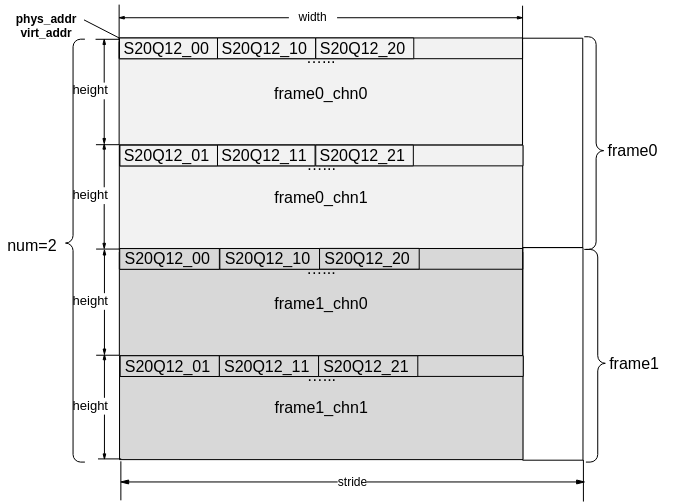

**图 3**  OT\_SVP\_BLOB\_TYPE\_U8类型[ot\_svp\_blob](#ZH-CN_TOPIC_0000002441853637)（3通道2帧示意图）<a name="fig430802356"></a>  
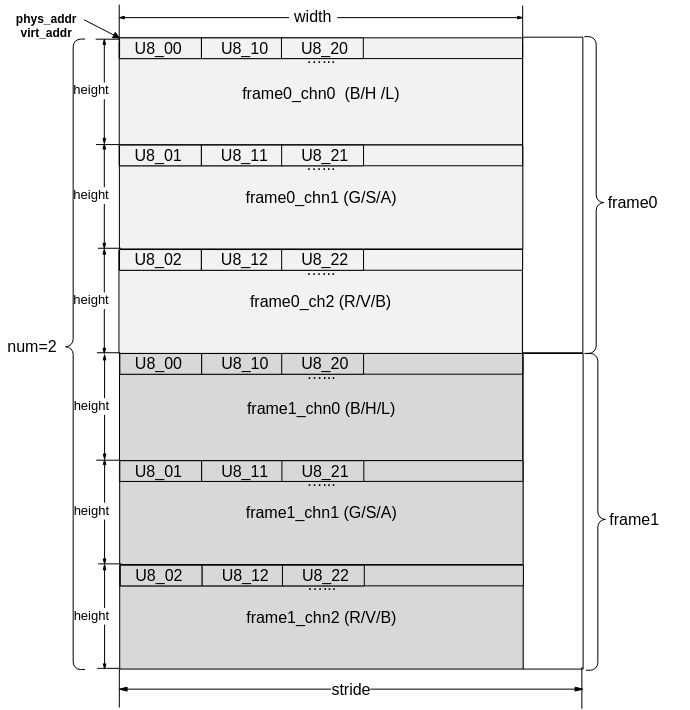

注：典型的RGB\\HSV\\LAB图像Planar格式存储。

**图 4**  OT\_SVP\_BLOB\_TYPE\_YVU420SP类型[ot\_svp\_blob](#ZH-CN_TOPIC_0000002441853637)（2帧YVU420SP示意图）<a name="fig1997712477353"></a>  
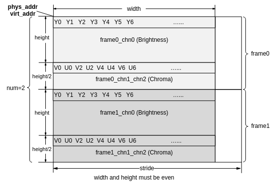

注：这里V在前，U在后。

**图 5**  OT\_SVP\_BLOB\_TYPE\_YVU422SP类型[ot\_svp\_blob](#ZH-CN_TOPIC_0000002441853637)（2帧YVU422SP示意图）<a name="fig157063127362"></a>  
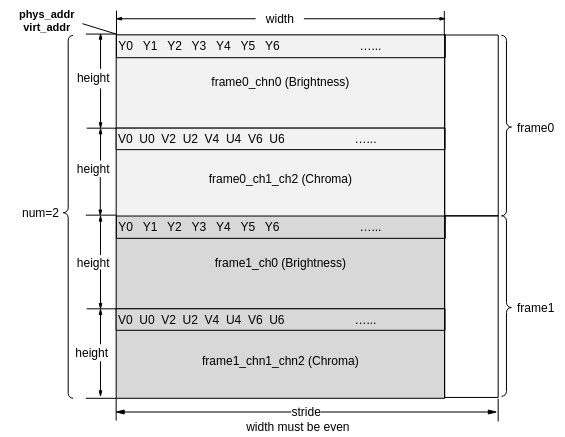

注：这里V在前，U在后。

**图 6**  OT\_SVP\_BLOB\_TYPE\_VEC\_S20Q12类型[ot\_svp\_blob](#ZH-CN_TOPIC_0000002441853637)（2帧示意图）<a name="fig3955234133616"></a>  
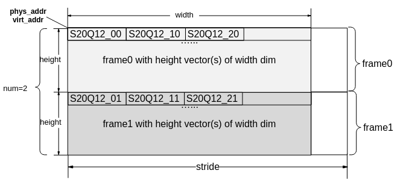

**图 7**  OT\_SVP\_BLOB\_TYPE\_SEQ\_S20Q12类型[ot\_svp\_blob](#ZH-CN_TOPIC_0000002441853637)  \(num=N帧示意图\)<a name="fig92214587365"></a>  
.png "OT_SVP_BLOB_TYPE_SEQ_S20Q12类型ot_svp_blob-(num-N帧示意图)")

**图 8**  OT\_SVP\_BLOB\_TYPE\_BBOX\_S20Q12类型[ot\_svp\_blob](#ZH-CN_TOPIC_0000002441853637)\(1通道1帧示意图\)<a name="fig4763322123710"></a>  
.png "OT_SVP_BLOB_TYPE_BBOX_S20Q12类型ot_svp_blob(1通道1帧示意图)")

**图 9**  OT\_SVP\_BLOB\_TYPE\_BSI\_SQ32类型[ot\_svp\_blob](#ZH-CN_TOPIC_0000002441853637)（2通道2帧示意图）<a name="fig16508844123710"></a>  
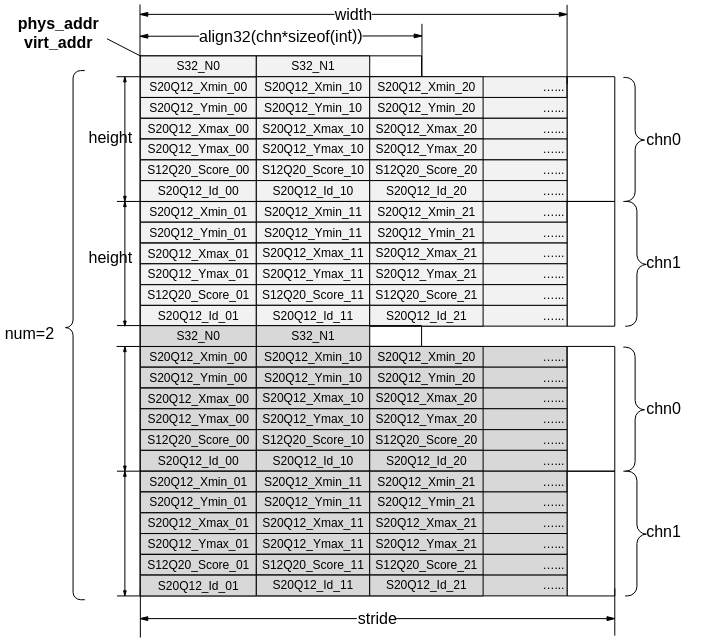

注：align32表示32字节对齐。

**图 10**  OT\_SVP\_BLOB\_TYPE\_S12Q20类型[ot\_svp\_blob](#ZH-CN_TOPIC_0000002441853637)（2通道2帧示意图）<a name="fig57340118385"></a>  
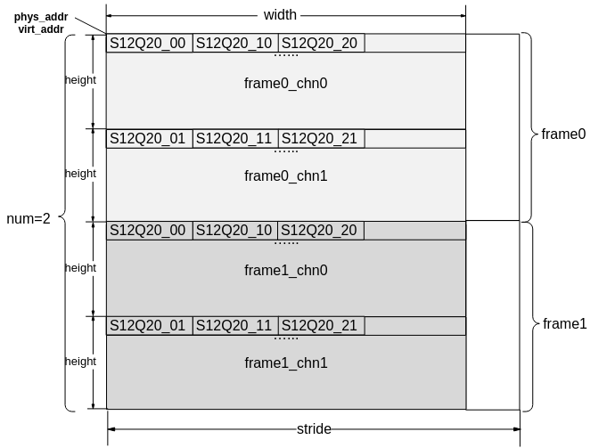

**图 11**  OT\_SVP\_BLOB\_TYPE\_VEC\_S12Q20类型[ot\_svp\_blob](#ZH-CN_TOPIC_0000002441853637)（2帧示意图）<a name="fig683243353810"></a>  
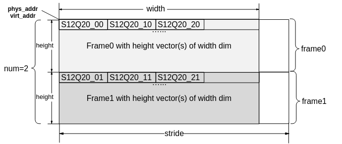

**图 12**  OT\_SVP\_BLOB\_TYPE\_S32类型[ot\_svp\_blob](#ZH-CN_TOPIC_0000002441853637)（2通道2帧示意图）<a name="fig6794458183818"></a>  
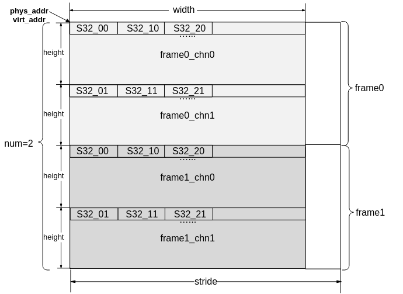

**图 13**  OT\_SVP\_BLOB\_TYPE\_U32类型[ot\_svp\_blob](#ZH-CN_TOPIC_0000002441853637)（2通道2帧示意图）<a name="fig16266122213918"></a>  
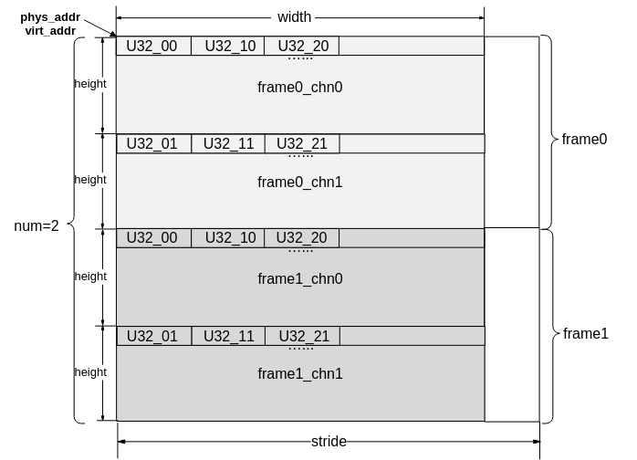

**图 14**  OT\_SVP\_BLOB\_TYPE\_FP32类型[ot\_svp\_blob](#ZH-CN_TOPIC_0000002441853637)（2通道2帧示意图）<a name="fig92855610398"></a>  


**图 15**  OT\_SVP\_BLOB\_TYPE\_FP16类型[ot\_svp\_blob](#ZH-CN_TOPIC_0000002441853637)（2通道2帧示意图）<a name="fig4744171674019"></a>  
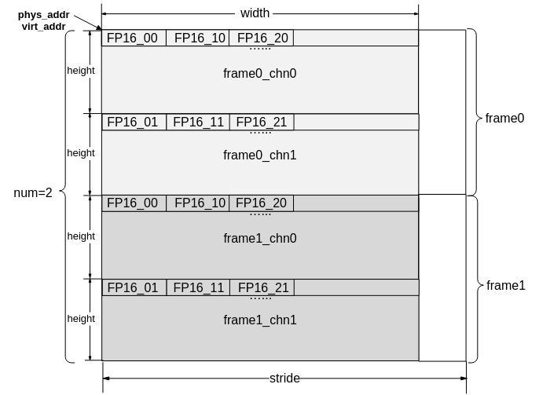

**图 16**  OT\_SVP\_BLOB\_TYPE\_S8类型[ot\_svp\_blob](#ZH-CN_TOPIC_0000002441853637)（2通道2帧示意图）<a name="fig209422420408"></a>  


**图 17**  OT\_SVP\_BLOB\_TYPE\_S16类型[ot\_svp\_blob](#ZH-CN_TOPIC_0000002441853637)（2通道2帧示意图）<a name="fig116601749418"></a>  


**图 18**  OT\_SVP\_BLOB\_TYPE\_U16类型[ot\_svp\_blob](#ZH-CN_TOPIC_0000002441853637)（2通道2帧示意图）<a name="fig135371724174113"></a>  


**图 19** [ot\_svp\_mem\_info](#ZH-CN_TOPIC_0000002408134312) 类型的数据内存示意<a name="fig939145054114"></a>  


### 使用示意<a name="ZH-CN_TOPIC_0000002408294128"></a>

-   用户根据需求调用相应的算子接口创建任务，指定is\_instant类型，并记录该任务返回的handle号。
-   根据返回的handle号，指定阻塞方式，可以查询到该任务的完成状态。

## API参考<a name="ZH-CN_TOPIC_0000002408294120"></a>

MAU模块提供了创建任务和查询任务的基本接口。

-   [ss\_mpi\_svp\_mau\_matrix\_mul](#ZH-CN_TOPIC_0000002441853557)：计算矩阵乘积。
-   [ss\_mpi\_svp\_mau\_cos\_dist](#ZH-CN_TOPIC_0000002408294444)：计算余弦距离。
-   [ss\_mpi\_svp\_mau\_euclid\_dist](#ZH-CN_TOPIC_0000002408294448)：计算欧式距离。
-   [ss\_mpi\_svp\_mau\_manhattan\_dist](#ZH-CN_TOPIC_0000002408294148)：计算曼哈顿距离。
-   [ss\_mpi\_svp\_mau\_transpose](#ZH-CN_TOPIC_0000002441853525)：计算矩阵转置运算。
-   [ss\_mpi\_svp\_mau\_vector\_op](#ZH-CN_TOPIC_0000002408294432)：计算向量加减及加减绝对值运算。
-   [ss\_mpi\_svp\_mau\_type\_convert](#ZH-CN_TOPIC_0000002408294172)：计算矩阵数据类型FP32和FP16相互转换。
-   [ss\_mpi\_svp\_mau\_get\_sort\_tmpbuf\_size](#ZH-CN_TOPIC_0000002408294160)：获取排序运算辅助内存字节数。
-   [ss\_mpi\_svp\_mau\_sort](#ZH-CN_TOPIC_0000002441853597)：计算矩阵每一行数据进行排序。
-   [ss\_mpi\_svp\_mau\_get\_fir\_tmpbuf\_size](#ZH-CN_TOPIC_0000002441853701)：获取快速图像检索辅助内存字节数。
-   [ss\_mpi\_svp\_mau\_fir](#ZH-CN_TOPIC_0000002441853513)：快速图像检索。
-   [ss\_mpi\_svp\_mau\_query](#ZH-CN_TOPIC_0000002408294188)：查询任务是否完成。
-   [ss\_mpi\_svp\_mau\_add\_mem\_info](#ZH-CN_TOPIC_0000002441853565)：记录内存地址信息。
-   [ss\_mpi\_svp\_mau\_rm\_mem\_info](#ZH-CN_TOPIC_0000002408294464)：移除内存地址信息。


### ss\_mpi\_svp\_mau\_matrix\_mul<a name="ZH-CN_TOPIC_0000002441853557"></a>

【描述】

计算矩阵乘积。

【语法】

```
td_s32 ss_mpi_svp_mau_matrix_mul(ot_svp_mau_handle *handle, const ot_svp_mau_src_double_matrix *src, const ot_svp_mau_src_double_matrix *src_idx, const ot_svp_mau_ctrl *ctrl, const ot_svp_dst_blob *dst);
```

【参数】

<a name="table877mcpsimp"></a>
<table><thead align="left"><tr id="row883mcpsimp"><th class="cellrowborder" valign="top" width="14.000000000000002%" id="mcps1.1.4.1.1"><p id="p885mcpsimp"><a name="p885mcpsimp"></a><a name="p885mcpsimp"></a>参数名称</p>
</th>
<th class="cellrowborder" valign="top" width="75%" id="mcps1.1.4.1.2"><p id="p887mcpsimp"><a name="p887mcpsimp"></a><a name="p887mcpsimp"></a>描述</p>
</th>
<th class="cellrowborder" valign="top" width="11%" id="mcps1.1.4.1.3"><p id="p889mcpsimp"><a name="p889mcpsimp"></a><a name="p889mcpsimp"></a>输入/输出</p>
</th>
</tr>
</thead>
<tbody><tr id="row891mcpsimp"><td class="cellrowborder" valign="top" width="14.000000000000002%" headers="mcps1.1.4.1.1 "><p id="p893mcpsimp"><a name="p893mcpsimp"></a><a name="p893mcpsimp"></a>handle</p>
</td>
<td class="cellrowborder" valign="top" width="75%" headers="mcps1.1.4.1.2 "><p id="p895mcpsimp"><a name="p895mcpsimp"></a><a name="p895mcpsimp"></a>handle指针。</p>
<p id="p896mcpsimp"><a name="p896mcpsimp"></a><a name="p896mcpsimp"></a>不能为空。</p>
</td>
<td class="cellrowborder" valign="top" width="11%" headers="mcps1.1.4.1.3 "><p id="p898mcpsimp"><a name="p898mcpsimp"></a><a name="p898mcpsimp"></a>输出</p>
</td>
</tr>
<tr id="row899mcpsimp"><td class="cellrowborder" valign="top" width="14.000000000000002%" headers="mcps1.1.4.1.1 "><p id="p901mcpsimp"><a name="p901mcpsimp"></a><a name="p901mcpsimp"></a>src</p>
</td>
<td class="cellrowborder" valign="top" width="75%" headers="mcps1.1.4.1.2 "><p id="p903mcpsimp"><a name="p903mcpsimp"></a><a name="p903mcpsimp"></a>输入左右矩阵。</p>
<p id="p904mcpsimp"><a name="p904mcpsimp"></a><a name="p904mcpsimp"></a>不能为空。</p>
<p id="p905mcpsimp"><a name="p905mcpsimp"></a><a name="p905mcpsimp"></a>数据类型仅支持OT_SVP_BLOB_TYPE_FP32和OT_SVP_BLOB_TYPE_FP16。</p>
<a name="ul18346192112229"></a><a name="ul18346192112229"></a><ul id="ul18346192112229"><li>如果数据类型为OT_SVP_BLOB_TYPE_FP32，宽的取值范围：[1, 8192]，高的取值范围：[1, 1000000]，chn取值为1，num取值为1，物理地址4字节对齐，虚拟地址不使用，不做参数异常检查，stride 16字节对齐。</li><li>如果数据类型为OT_SVP_BLOB_TYPE_FP16，宽的取值范围：[1, 16384]，高的取值范围：[1, 1000000]，chn取值为1，num取值为1，物理地址2字节对齐，虚拟地址不使用，不做参数异常检查，stride 16字节对齐。</li></ul>
<p id="p908mcpsimp"><a name="p908mcpsimp"></a><a name="p908mcpsimp"></a>左右矩阵的宽必须相等。</p>
</td>
<td class="cellrowborder" valign="top" width="11%" headers="mcps1.1.4.1.3 "><p id="p910mcpsimp"><a name="p910mcpsimp"></a><a name="p910mcpsimp"></a>输入</p>
</td>
</tr>
<tr id="row911mcpsimp"><td class="cellrowborder" valign="top" width="14.000000000000002%" headers="mcps1.1.4.1.1 "><p id="p913mcpsimp"><a name="p913mcpsimp"></a><a name="p913mcpsimp"></a>src_idx</p>
</td>
<td class="cellrowborder" valign="top" width="75%" headers="mcps1.1.4.1.2 "><p id="p915mcpsimp"><a name="p915mcpsimp"></a><a name="p915mcpsimp"></a>输入左右矩阵的行索引。</p>
<p id="p916mcpsimp"><a name="p916mcpsimp"></a><a name="p916mcpsimp"></a>如果ctrl信息中has_left_idx或者has_right_idx的值为TD_TRUE时，不能为空。</p>
</td>
<td class="cellrowborder" valign="top" width="11%" headers="mcps1.1.4.1.3 "><p id="p918mcpsimp"><a name="p918mcpsimp"></a><a name="p918mcpsimp"></a>输入</p>
</td>
</tr>
<tr id="row919mcpsimp"><td class="cellrowborder" valign="top" width="14.000000000000002%" headers="mcps1.1.4.1.1 "><p id="p921mcpsimp"><a name="p921mcpsimp"></a><a name="p921mcpsimp"></a>ctrl</p>
</td>
<td class="cellrowborder" valign="top" width="75%" headers="mcps1.1.4.1.2 "><p id="p923mcpsimp"><a name="p923mcpsimp"></a><a name="p923mcpsimp"></a>输入控制信息。</p>
<p id="p924mcpsimp"><a name="p924mcpsimp"></a><a name="p924mcpsimp"></a>不能为空。</p>
</td>
<td class="cellrowborder" valign="top" width="11%" headers="mcps1.1.4.1.3 "><p id="p926mcpsimp"><a name="p926mcpsimp"></a><a name="p926mcpsimp"></a>输入</p>
</td>
</tr>
<tr id="row927mcpsimp"><td class="cellrowborder" valign="top" width="14.000000000000002%" headers="mcps1.1.4.1.1 "><p id="p929mcpsimp"><a name="p929mcpsimp"></a><a name="p929mcpsimp"></a>dst</p>
</td>
<td class="cellrowborder" valign="top" width="75%" headers="mcps1.1.4.1.2 "><p id="p931mcpsimp"><a name="p931mcpsimp"></a><a name="p931mcpsimp"></a>输出结果。</p>
<p id="p932mcpsimp"><a name="p932mcpsimp"></a><a name="p932mcpsimp"></a>不能为空。</p>
</td>
<td class="cellrowborder" valign="top" width="11%" headers="mcps1.1.4.1.3 "><p id="p934mcpsimp"><a name="p934mcpsimp"></a><a name="p934mcpsimp"></a>输出</p>
</td>
</tr>
</tbody>
</table>

【返回值】

<a name="table936mcpsimp"></a>
<table><thead align="left"><tr id="row941mcpsimp"><th class="cellrowborder" valign="top" width="28.999999999999996%" id="mcps1.1.3.1.1"><p id="p943mcpsimp"><a name="p943mcpsimp"></a><a name="p943mcpsimp"></a>返回值</p>
</th>
<th class="cellrowborder" valign="top" width="71%" id="mcps1.1.3.1.2"><p id="p945mcpsimp"><a name="p945mcpsimp"></a><a name="p945mcpsimp"></a>描述</p>
</th>
</tr>
</thead>
<tbody><tr id="row947mcpsimp"><td class="cellrowborder" valign="top" width="28.999999999999996%" headers="mcps1.1.3.1.1 "><p id="p949mcpsimp"><a name="p949mcpsimp"></a><a name="p949mcpsimp"></a>0</p>
</td>
<td class="cellrowborder" valign="top" width="71%" headers="mcps1.1.3.1.2 "><p id="p951mcpsimp"><a name="p951mcpsimp"></a><a name="p951mcpsimp"></a>成功。</p>
</td>
</tr>
<tr id="row952mcpsimp"><td class="cellrowborder" valign="top" width="28.999999999999996%" headers="mcps1.1.3.1.1 "><p id="p954mcpsimp"><a name="p954mcpsimp"></a><a name="p954mcpsimp"></a>非0</p>
</td>
<td class="cellrowborder" valign="top" width="71%" headers="mcps1.1.3.1.2 "><p id="p956mcpsimp"><a name="p956mcpsimp"></a><a name="p956mcpsimp"></a>失败，参见<a href="#ZH-CN_TOPIC_0000002408294264">>错误码</</a><span xml:lang="fr-FR" id="ph959mcpsimp"><a name="ph959mcpsimp"></a><a name="ph959mcpsimp"></a>。</span></p>
</td>
</tr>
</tbody>
</table>

【解决方案差异】

<a name="table961mcpsimp"></a>
<table><thead align="left"><tr id="row966mcpsimp"><th class="cellrowborder" valign="top" width="28.999999999999996%" id="mcps1.1.3.1.1"><p id="p968mcpsimp"><a name="p968mcpsimp"></a><a name="p968mcpsimp"></a>解决方案名称</p>
</th>
<th class="cellrowborder" valign="top" width="71%" id="mcps1.1.3.1.2"><p id="p970mcpsimp"><a name="p970mcpsimp"></a><a name="p970mcpsimp"></a>差异</p>
</th>
</tr>
</thead>
<tbody><tr id="row972mcpsimp"><td class="cellrowborder" valign="top" width="28.999999999999996%" headers="mcps1.1.3.1.1 "><p id="p974mcpsimp"><a name="p974mcpsimp"></a><a name="p974mcpsimp"></a>SS928V100</p>
</td>
<td class="cellrowborder" valign="top" width="71%" headers="mcps1.1.3.1.2 "><p id="p976mcpsimp"><a name="p976mcpsimp"></a><a name="p976mcpsimp"></a>dst数据类型仅支持OT_SVP_BLOB_TYPE_FP32。</p>
</td>
</tr>
<tr id="row82156407404"><td class="cellrowborder" valign="top" width="28.999999999999996%" headers="mcps1.1.3.1.1 "><p id="p162151940164019"><a name="p162151940164019"></a><a name="p162151940164019"></a>SS927V100</p>
</td>
<td class="cellrowborder" valign="top" width="71%" headers="mcps1.1.3.1.2 "><p id="p11216104020409"><a name="p11216104020409"></a><a name="p11216104020409"></a>dst数据类型仅支持OT_SVP_BLOB_TYPE_FP32。</p>
</td>
</tr>
</tbody>
</table>

【需求】

-   头文件：ot\_common\_svp.h、ot\_common\_mau.h、ss\_mpi\_mau.h
-   库文件：libss\_mau.a

【注意】

-   输入右矩阵B的数据在内存中需要按照列优先排布，所以右矩阵B和左矩阵A的宽相等，计算公式如下：

    

    

    

其中：


-   支持通过索引指定要计算的行向量，分三种情况：
    -   左矩阵A通过索引指定，右矩阵不用索引，计算公式：

        

        其中：

        

        

        

        

        

        为左矩阵，为左矩阵索引\(\), 为左矩阵，为右矩阵，为计算结果。

    -   左矩阵A不用索引，右矩阵用索引指定要计算的行向量，计算公式：

        

        其中：

        

        

        

        

        

        为左矩阵，为右矩阵，为右矩阵索引\(\)，为计算结果。

    -   左矩阵A用索引指定要计算的行向量，右矩阵B用索引指定要计算的行向量，计算公式：

        

        其中：

        

        

        

        

        

        

        为左矩阵，为左矩阵索引\(\)，为右矩阵，为右矩阵索引\(\)，为计算结果。

-   输入右矩阵B的数据在内存中需要按照列优先排布，左矩阵A和右矩阵B在内存中的数据排布如下：

    **图 1**  左矩阵A内存排布<a name="fig39911431171818"></a>  
    

    **图 2**  右矩阵B内存排布<a name="fig815724551814"></a>  
    

-   用户需要确保输入左右矩阵的数据中不能含有INF、-INF或者NAN数据，并且输入数值和计算结果都在fp32数据表示有效范围内，否则会导致输出的结果数值中有INF、-INF或NAN，从而使结果数值失去意义。
-   ctrl-\>out\_type仅支持OT\_SVP\_MAU\_OUT\_OP\_RESULT。ctrl-\>has\_left\_idx，ctrl-\>has\_right\_idx和ctrl-\>is\_instant值必须为TD\_TRUE或TD\_FALSE。
-   如果ctrl-\>has\_left\_idx等于TD\_TRUE，src\_idx-\>left\_matrix的宽取值范围：\[1, 100000\]，高必须为1，chn必须为1，num必须为1，物理地址需要4字节对齐，虚拟地址不使用，不做参数异常检查，stride需要16字节对齐，src\_idx-\>left\_matrix的内存中存储的索引值必须小于src-\>left\_matrix的高，数据类型仅支持OT\_SVP\_BLOB\_TYPE\_U32。
-   如果ctrl-\>has\_right\_idx等于TD\_TRUE，src\_idx-\>right\_matrix的宽取值范围为\[1, 100000\]，高必须为1，chn必须为1，num必须为1，物理地址需要4字节对齐，虚拟地址不使用，不做参数异常检查，stride需要16字节对齐，src\_idx-\>right\_matrix的内存中存储的索引值必须小于src-\>right\_matrix的高，数据类型仅支持OT\_SVP\_BLOB\_TYPE\_U32。
-   dst的chn必须等于1，num必须为1，数据类型为OT\_SVP\_BLOB\_TYPE\_FP32或OT\_SVP\_BLOB\_TYPE\_FP16，数据类型为FP32时，物理地址需要4字节对齐，数据类型为FP16时，物理地址需要2字节对齐；虚拟地址不使用，不做参数异常检查，stride需要16字节对齐;dst的宽和高要求可分为以下4种情况：
    -   如果ctrl-\>has\_left\_idx等于TD\_FALSE，ctrl-\>has\_right\_idx等于TD\_FALSE，dst的高必须等于src-\>left\_matrix的高，dst的宽必须等于src-\>right\_matrix的高。
    -   如果ctrl-\>has\_left\_idx等于TD\_TRUE，ctrl-\>has\_right\_idx等于TD\_FALSE，dst的高必须等于src\_idx-\>left\_matrix的宽，dst的宽必须等于src-\>right\_matrix的高。
    -   如果ctrl-\>has\_left\_idx等于TD\_FALSE，ctrl-\>has\_right\_idx等于TD\_TRUE，dst的高必须等于src-\>left\_matrix的高，dst的宽必须等于src\_idx-\>right\_matrix的宽。
    -   如果ctrl-\>has\_left\_idx等于TD\_TRUE，ctrl-\>has\_right\_idx等于TD\_TRUE，dst的高必须等于src\_idx-\>left\_matrix的宽，dst的宽必须等于src\_idx-\>right\_matrix的宽。

【举例】

无。

【相关主题】

无。

### ss\_mpi\_svp\_mau\_cos\_dist<a name="ZH-CN_TOPIC_0000002408294444"></a>

【描述】

计算余弦距离。

【语法】

```
td_s32 ss_mpi_svp_mau_cos_dist(ot_svp_mau_handle *handle, const ot_svp_mau_src_double_matrix *src, const ot_svp_mau_src_double_matrix *src_idx, const ot_svp_mau_ctrl *ctrl, const ot_svp_mau_dist_result *dst);
```

【参数】

<a name="table1307mcpsimp"></a>
<table><thead align="left"><tr id="row1313mcpsimp"><th class="cellrowborder" valign="top" width="11%" id="mcps1.1.4.1.1"><p id="p1315mcpsimp"><a name="p1315mcpsimp"></a><a name="p1315mcpsimp"></a>参数名称</p>
</th>
<th class="cellrowborder" valign="top" width="78%" id="mcps1.1.4.1.2"><p id="p1317mcpsimp"><a name="p1317mcpsimp"></a><a name="p1317mcpsimp"></a>描述</p>
</th>
<th class="cellrowborder" valign="top" width="11%" id="mcps1.1.4.1.3"><p id="p1319mcpsimp"><a name="p1319mcpsimp"></a><a name="p1319mcpsimp"></a>输入/输出</p>
</th>
</tr>
</thead>
<tbody><tr id="row1321mcpsimp"><td class="cellrowborder" valign="top" width="11%" headers="mcps1.1.4.1.1 "><p id="p1323mcpsimp"><a name="p1323mcpsimp"></a><a name="p1323mcpsimp"></a>handle</p>
</td>
<td class="cellrowborder" valign="top" width="78%" headers="mcps1.1.4.1.2 "><p id="p1325mcpsimp"><a name="p1325mcpsimp"></a><a name="p1325mcpsimp"></a>handle指针。</p>
<p id="p1326mcpsimp"><a name="p1326mcpsimp"></a><a name="p1326mcpsimp"></a>不能为空。</p>
</td>
<td class="cellrowborder" valign="top" width="11%" headers="mcps1.1.4.1.3 "><p id="p1328mcpsimp"><a name="p1328mcpsimp"></a><a name="p1328mcpsimp"></a>输出</p>
</td>
</tr>
<tr id="row1329mcpsimp"><td class="cellrowborder" valign="top" width="11%" headers="mcps1.1.4.1.1 "><p id="p1331mcpsimp"><a name="p1331mcpsimp"></a><a name="p1331mcpsimp"></a>src</p>
</td>
<td class="cellrowborder" valign="top" width="78%" headers="mcps1.1.4.1.2 "><p id="p1333mcpsimp"><a name="p1333mcpsimp"></a><a name="p1333mcpsimp"></a>输入左右矩阵。</p>
<p id="p1334mcpsimp"><a name="p1334mcpsimp"></a><a name="p1334mcpsimp"></a>不能为空。</p>
<p id="p1335mcpsimp"><a name="p1335mcpsimp"></a><a name="p1335mcpsimp"></a>数据类型仅支持OT_SVP_BLOB_TYPE_FP32和OT_SVP_BLOB_TYPE_FP16。</p>
<a name="ul1336mcpsimp"></a><a name="ul1336mcpsimp"></a><ul id="ul1336mcpsimp"><li>如果数据类型为OT_SVP_BLOB_TYPE_FP32，宽的取值范围：[1, 8192]，高的取值范围：[1, 1000000]，chn为1，num取值为1，物理地址需要4字节对齐，虚拟地址不使用，不做参数异常检查，stride 需要16字节对齐。</li><li>如果数据类型为OT_SVP_BLOB_TYPE_FP16，宽的取值范围：[1, 16384]，高的取值范围：[1, 1000000]，chn为1，num取值为1，物理地址需要2字节对齐，虚拟地址不使用，不做参数异常检查，stride 需要16字节对齐。</li></ul>
<p id="p1339mcpsimp"><a name="p1339mcpsimp"></a><a name="p1339mcpsimp"></a>左右矩阵的宽必须相等。</p>
<p id="p1340mcpsimp"><a name="p1340mcpsimp"></a><a name="p1340mcpsimp"></a>左右矩阵的行向量必须做单位化，即行向量模为1。</p>
</td>
<td class="cellrowborder" valign="top" width="11%" headers="mcps1.1.4.1.3 "><p id="p1342mcpsimp"><a name="p1342mcpsimp"></a><a name="p1342mcpsimp"></a>输入</p>
</td>
</tr>
<tr id="row1343mcpsimp"><td class="cellrowborder" valign="top" width="11%" headers="mcps1.1.4.1.1 "><p id="p1345mcpsimp"><a name="p1345mcpsimp"></a><a name="p1345mcpsimp"></a>src_idx</p>
</td>
<td class="cellrowborder" valign="top" width="78%" headers="mcps1.1.4.1.2 "><p id="p1347mcpsimp"><a name="p1347mcpsimp"></a><a name="p1347mcpsimp"></a>输入左右矩阵的行索引。</p>
<p id="p1348mcpsimp"><a name="p1348mcpsimp"></a><a name="p1348mcpsimp"></a>当ctrl信息中has_left_idx或者has_right_idx为TD_TRUE时，不能为空。</p>
</td>
<td class="cellrowborder" valign="top" width="11%" headers="mcps1.1.4.1.3 "><p id="p1350mcpsimp"><a name="p1350mcpsimp"></a><a name="p1350mcpsimp"></a>输入</p>
</td>
</tr>
<tr id="row1351mcpsimp"><td class="cellrowborder" valign="top" width="11%" headers="mcps1.1.4.1.1 "><p id="p1353mcpsimp"><a name="p1353mcpsimp"></a><a name="p1353mcpsimp"></a>ctrl</p>
</td>
<td class="cellrowborder" valign="top" width="78%" headers="mcps1.1.4.1.2 "><p id="p1355mcpsimp"><a name="p1355mcpsimp"></a><a name="p1355mcpsimp"></a>输入控制信息。</p>
<p id="p1356mcpsimp"><a name="p1356mcpsimp"></a><a name="p1356mcpsimp"></a>不能为空。</p>
</td>
<td class="cellrowborder" valign="top" width="11%" headers="mcps1.1.4.1.3 "><p id="p1358mcpsimp"><a name="p1358mcpsimp"></a><a name="p1358mcpsimp"></a>输入</p>
</td>
</tr>
<tr id="row1359mcpsimp"><td class="cellrowborder" valign="top" width="11%" headers="mcps1.1.4.1.1 "><p id="p1361mcpsimp"><a name="p1361mcpsimp"></a><a name="p1361mcpsimp"></a>dst</p>
</td>
<td class="cellrowborder" valign="top" width="78%" headers="mcps1.1.4.1.2 "><p id="p1363mcpsimp"><a name="p1363mcpsimp"></a><a name="p1363mcpsimp"></a>输出结果。</p>
<p id="p1364mcpsimp"><a name="p1364mcpsimp"></a><a name="p1364mcpsimp"></a>不能为空。</p>
</td>
<td class="cellrowborder" valign="top" width="11%" headers="mcps1.1.4.1.3 "><p id="p1366mcpsimp"><a name="p1366mcpsimp"></a><a name="p1366mcpsimp"></a>输出</p>
</td>
</tr>
</tbody>
</table>

【返回值】

<a name="table1368mcpsimp"></a>
<table><thead align="left"><tr id="row1373mcpsimp"><th class="cellrowborder" valign="top" width="28.999999999999996%" id="mcps1.1.3.1.1"><p id="p1375mcpsimp"><a name="p1375mcpsimp"></a><a name="p1375mcpsimp"></a>返回值</p>
</th>
<th class="cellrowborder" valign="top" width="71%" id="mcps1.1.3.1.2"><p id="p1377mcpsimp"><a name="p1377mcpsimp"></a><a name="p1377mcpsimp"></a>描述</p>
</th>
</tr>
</thead>
<tbody><tr id="row1379mcpsimp"><td class="cellrowborder" valign="top" width="28.999999999999996%" headers="mcps1.1.3.1.1 "><p id="p1381mcpsimp"><a name="p1381mcpsimp"></a><a name="p1381mcpsimp"></a>0</p>
</td>
<td class="cellrowborder" valign="top" width="71%" headers="mcps1.1.3.1.2 "><p id="p1383mcpsimp"><a name="p1383mcpsimp"></a><a name="p1383mcpsimp"></a>成功。</p>
</td>
</tr>
<tr id="row1384mcpsimp"><td class="cellrowborder" valign="top" width="28.999999999999996%" headers="mcps1.1.3.1.1 "><p id="p1386mcpsimp"><a name="p1386mcpsimp"></a><a name="p1386mcpsimp"></a>非0</p>
</td>
<td class="cellrowborder" valign="top" width="71%" headers="mcps1.1.3.1.2 "><p id="p1388mcpsimp"><a name="p1388mcpsimp"></a><a name="p1388mcpsimp"></a>失败，参见<a href="#ZH-CN_TOPIC_0000002408294264">>错误码</</a><span xml:lang="fr-FR" id="ph1391mcpsimp"><a name="ph1391mcpsimp"></a><a name="ph1391mcpsimp"></a>。</span></p>
</td>
</tr>
</tbody>
</table>

【解决方案差异】

<a name="table1393mcpsimp"></a>
<table><thead align="left"><tr id="row1398mcpsimp"><th class="cellrowborder" valign="top" width="28.999999999999996%" id="mcps1.1.3.1.1"><p id="p1400mcpsimp"><a name="p1400mcpsimp"></a><a name="p1400mcpsimp"></a>解决方案名称</p>
</th>
<th class="cellrowborder" valign="top" width="71%" id="mcps1.1.3.1.2"><p id="p1402mcpsimp"><a name="p1402mcpsimp"></a><a name="p1402mcpsimp"></a>差异</p>
</th>
</tr>
</thead>
<tbody><tr id="row1404mcpsimp"><td class="cellrowborder" valign="top" width="28.999999999999996%" headers="mcps1.1.3.1.1 "><p id="p1406mcpsimp"><a name="p1406mcpsimp"></a><a name="p1406mcpsimp"></a>SS928V100</p>
</td>
<td class="cellrowborder" valign="top" width="71%" headers="mcps1.1.3.1.2 "><p id="p1408mcpsimp"><a name="p1408mcpsimp"></a><a name="p1408mcpsimp"></a>dst-&gt;op_result和dst-&gt;top_n数据类型仅支持OT_SVP_BLOB_TYPE_FP32。</p>
</td>
</tr>
<tr id="row3615740104110"><td class="cellrowborder" valign="top" width="28.999999999999996%" headers="mcps1.1.3.1.1 "><p id="p164134274112"><a name="p164134274112"></a><a name="p164134274112"></a>SS927V100</p>
</td>
<td class="cellrowborder" valign="top" width="71%" headers="mcps1.1.3.1.2 "><p id="p441842154120"><a name="p441842154120"></a><a name="p441842154120"></a>dst-&gt;op_result和dst-&gt;top_n数据类型仅支持OT_SVP_BLOB_TYPE_FP32。</p>
</td>
</tr>
</tbody>
</table>

【需求】

-   头文件：ot\_common\_svp.h、ot\_common\_mau.h、ss\_mpi\_mau.h
-   库文件：libss\_mau.a

【注意】

-   用户需要对输入的左右矩阵中的行向量做单位化处理，否则可能会计算结果不正确。
-   支持多向量求余弦距离，Height表示向量个数，依次获取左矩阵A的行向量与右矩阵B中每个行向量进行计算，计算公式：

    

    其中：

    

    

    

    

    

    

    为左矩阵，为右矩阵，为结果矩阵，为Top\_n矩阵，每一行中的数值为矩阵中对应行中从大到小排序后的前Top t个，为Top\_n索引矩阵，的值是中第i个行向量与中第个行向量的余弦距离。

-   支持通过索引指定要计算的行向量，分三种情况：
    -   左矩阵A通过索引指定要计算的行向量，右矩阵不用索引，计算公式：

        

        其中：

        

        

        

        

        

        

        

        为左矩阵，为左矩阵索引\(\)，为右矩阵，为结果矩阵，为Top\_n矩阵，每一行中的数值为矩阵中对应行中从大到小排序后的前Top t个值，为Top\_n索引矩阵，的值是中第个行向量与中第个行向量的余弦距离。

    -   左矩阵A不用索引，右矩阵用索引指定要计算的行向量，计算公式：

        

        其中：

        

        

        

        

        

        

        

        为左矩阵，为右矩阵，为右矩阵索引\(\)，为结果矩阵，为Top\_n矩阵，每一行中的数值为矩阵中对应行中从大到小排序后的前Top t个值，为Top\_n索引矩阵，的值是中第i个行向量与中第个行向量的余弦距离。

    -   左矩阵A用索引指定要计算的行向，右矩阵B用索引指定要计算的行向量，计算公式：

        

        其中：

        

        

        

        

        

        

        

        

        为左矩阵，为左矩阵索引\(\)，为右矩阵，为右矩阵索引\(\)，为结果矩阵，为Top\_n矩阵，每一行中的数值为矩阵中对应行中从大到小排序后的前Top t个值，为Top\_n索引矩阵，的值是中第个行向量与中第个行向量的余弦距离。

-   左矩阵A和右矩阵B在内存中的数据排布如下：

    **图 1**  左矩阵A内存排布<a name="fig18343359144217"></a>  
    

    **图 2**  右矩阵B内存排布<a name="fig138318974316"></a>  
    

-   用户需要确保输入左右矩阵的数据中不能含有INF、-INF或者NAN数据，并且输入数值和计算结果都在fp32数据表示有效范围内，否则会导致输出的结果数值中有INF、-INF或NAN，从而使结果数值失去意义。
-   ctrl-\>out\_type可支持OT\_SVP\_MAU\_OUT\_OP\_RESULT，OT\_SVP\_MAU\_OUT\_TOP\_N和OT\_SVP\_MAU\_OUT\_BOTH。ctrl-\>has\_left\_idx，ctrl-\>has\_right\_idx和ctrl-\>is\_instant值必须为TD\_TRUE或TD\_FALSE。
-   如果ctrl-\>has\_left\_idx等于TD\_TRUE，src\_idx-\>left\_matrix的宽取值范围：\[1, 100000\]，高必须为1，chn必须为1，num必须为1，物理地址需要4字节对齐，虚拟地址不使用，不做参数异常检查，stride 需要16字节对齐，内存中存储的索引必须小于src-\>left\_matrix的高，数据类型仅支持OT\_SVP\_BLOB\_TYPE\_U32。
-   如果ctrl-\>has\_right\_idx等于TD\_TRUE，src\_idx-\>right\_matrix的宽取值范围为\[1, 100000\]，高必须为1，chn必须为1，num必须为1，物理地址需要4字节对齐，虚拟地址不使用，不做参数异常检查，stride 需要16字节对齐，内存中存储的索引必须小于src-\>right\_matrix的高，数据类型仅支持OT\_SVP\_BLOB\_TYPE\_U32。
-   如果ctrl-\>out\_type为OT\_SVP\_MAU\_OUT\_OP\_RESULT或者OT\_SVP\_MAU\_OUT\_BOTH，dst-\> op\_result的chn必须等于1，num必须为1，数据类型为OT\_SVP\_BLOB\_TYPE\_FP32或OT\_SVP\_BLOB\_TYPE\_FP16，数据类型为FP32时，物理地址需要4字节对齐，数据类型为FP16时，物理地址需要2字节对齐；虚拟地址不使用，不做参数异常检查，stride需要16字节对齐;dst-\> op\_result的宽和高要求可分为以下4种情况：
    -   如果ctrl-\>has\_left\_idx等于TD\_FALSE，ctrl-\>has\_right\_idx等于TD\_FALSE，dst-\> op\_result的高必须等于src-\>left\_matrix的高，dst-\> op\_result的宽必须等于src-\>right\_matrix的高。
    -   如果ctrl-\>has\_left\_idx等于TD\_TRUE，ctrl-\>has\_right\_idx等于TD\_FALSE，dst-\> op\_result的高必须等于src\_idx-\>left\_matrix的宽，dst-\> op\_result的宽必须等于src-\>right\_matrix的高。
    -   如果ctrl-\>has\_left\_idx等于TD\_FALSE，ctrl-\>has\_right\_idx等于TD\_TRUE，dst-\> op\_result的高必须等于src-\>left\_matrix的高，dst-\> op\_result的宽必须等于src\_idx-\>right\_matrix的宽。
    -   如果ctrl-\>has\_left\_idx等于TD\_TRUE，ctrl-\>has\_right\_idx等于TD\_TRUE，dst-\> op\_result的高必须等于src\_idx-\>left\_matrix的宽，dst-\> op\_result的宽必须等于src\_idx-\>right\_matrix的宽。

-   如果ctrl-\>out\_type为OT\_SVP\_MAU\_OUT\_TOP\_N或者OT\_SVP\_MAU\_OUT\_BOTH，dst-\> top\_n的chn必须等于1，num必须为1，stride需要16字节对齐，数据类型为OT\_SVP\_BLOB\_TYPE\_FP32或OT\_SVP\_BLOB\_TYPE\_FP16，数据类型为FP32时，物理地址需要4字节对齐，数据类型为FP16时，物理地址需要2字节对齐；虚拟地址不使用，不做参数异常检查；dst-\> top\_n的宽表示输出从大到小排序后的前Top\_n个余弦距离，最大只能输出Top 32。具体宽和高要求可分为以下4种情况：
    -   如果ctrl-\>has\_left\_idx等于TD\_FALSE，ctrl-\>has\_right\_idx等于TD\_FALSE，dst-\> top\_n的高必须等于src-\>left\_matrix的高，dst-\> top\_n的宽取值范围为\[1，min\(src-\>right\_matrix.shape.whc.height，32\)\]。
    -   如果ctrl-\>has\_left\_idx等于TD\_TRUE，ctrl-\>has\_right\_idx等于TD\_FALSE，dst-\> top\_n的高必须等于src\_idx-\>left\_matrix的宽，dst-\> top\_n的宽取值范围为\[1，min\(src-\>right\_matrix.shape.whc.height，32\)\]。
    -   如果ctrl-\>has\_left\_idx等于TD\_FALSE，ctrl-\>has\_right\_idx等于TD\_TRUE，dst-\> top\_n的高必须等于src-\>left\_matrix的高，dst-\> top\_n的宽取值范围为\[1，min\(src\_idx-\>right\_matrix.shape.whc.width，32\)\]。
    -   如果ctrl-\>has\_left\_idx等于TD\_TRUE，ctrl-\>has\_right\_idx等于TD\_TRUE，dst-\> top\_n的高必须等于src\_idx-\>left\_matrix的宽，dst-\> top\_n的宽取值范围为\[1，min\(src\_idx-\>right\_matrix.shape.whc.width，32\)\]。

-   如果ctrl-\>out\_type为OT\_SVP\_MAU\_OUT\_TOP\_N或者OT\_SVP\_MAU\_OUT\_BOTH，dst-\> top\_n\_idx的chn必须等于1，num必须为1，stride需要16字节对齐，物理地址需要4字节对齐，虚拟地址不使用，不做参数异常检查，数据类型必须为OT\_SVP\_BLOB\_TYPE\_U32，宽高必须与dst-\> top\_n的宽高相等。

【举例】

无。

【相关主题】

无。

### ss\_mpi\_svp\_mau\_euclid\_dist<a name="ZH-CN_TOPIC_0000002408294448"></a>

【描述】

计算欧式距离。

【语法】

```
td_s32 ss_mpi_svp_mau_euclid_dist(ot_svp_mau_handle *handle, const ot_svp_mau_src_double_matrix *src,  const ot_svp_mau_src_double_matrix *src_idx, const ot_svp_mau_ctrl *ctrl, const ot_svp_mau_dist_result *dst);
```

【参数】

<a name="table4359mcpsimp"></a>
<table><thead align="left"><tr id="row4365mcpsimp"><th class="cellrowborder" valign="top" width="11%" id="mcps1.1.4.1.1"><p id="p4367mcpsimp"><a name="p4367mcpsimp"></a><a name="p4367mcpsimp"></a>参数名称</p>
</th>
<th class="cellrowborder" valign="top" width="78%" id="mcps1.1.4.1.2"><p id="p4369mcpsimp"><a name="p4369mcpsimp"></a><a name="p4369mcpsimp"></a>描述</p>
</th>
<th class="cellrowborder" valign="top" width="11%" id="mcps1.1.4.1.3"><p id="p4371mcpsimp"><a name="p4371mcpsimp"></a><a name="p4371mcpsimp"></a>输入/输出</p>
</th>
</tr>
</thead>
<tbody><tr id="row4373mcpsimp"><td class="cellrowborder" valign="top" width="11%" headers="mcps1.1.4.1.1 "><p id="p4375mcpsimp"><a name="p4375mcpsimp"></a><a name="p4375mcpsimp"></a>handle</p>
</td>
<td class="cellrowborder" valign="top" width="78%" headers="mcps1.1.4.1.2 "><p id="p4377mcpsimp"><a name="p4377mcpsimp"></a><a name="p4377mcpsimp"></a>handle指针。</p>
<p id="p4378mcpsimp"><a name="p4378mcpsimp"></a><a name="p4378mcpsimp"></a>不能为空。</p>
</td>
<td class="cellrowborder" valign="top" width="11%" headers="mcps1.1.4.1.3 "><p id="p4380mcpsimp"><a name="p4380mcpsimp"></a><a name="p4380mcpsimp"></a>输出</p>
</td>
</tr>
<tr id="row4381mcpsimp"><td class="cellrowborder" valign="top" width="11%" headers="mcps1.1.4.1.1 "><p id="p4383mcpsimp"><a name="p4383mcpsimp"></a><a name="p4383mcpsimp"></a>src</p>
</td>
<td class="cellrowborder" valign="top" width="78%" headers="mcps1.1.4.1.2 "><p id="p4385mcpsimp"><a name="p4385mcpsimp"></a><a name="p4385mcpsimp"></a>输入左右矩阵。</p>
<p id="p4386mcpsimp"><a name="p4386mcpsimp"></a><a name="p4386mcpsimp"></a>不能为空。</p>
<p id="p4387mcpsimp"><a name="p4387mcpsimp"></a><a name="p4387mcpsimp"></a>数据类型仅支持OT_SVP_BLOB_TYPE_FP32和OT_SVP_BLOB_TYPE_FP16。</p>
<a name="ul4388mcpsimp"></a><a name="ul4388mcpsimp"></a><ul id="ul4388mcpsimp"><li>如果数据类型为OT_SVP_BLOB_TYPE_FP32，宽的取值范围：[1, 8192]，高的取值范围：[1, 1000000]，chn为1，num取值为1，物理地址需要4字节对齐，虚拟地址不使用，不做参数异常检查，stride 需要16字节对齐。</li><li>如果数据类型为OT_SVP_BLOB_TYPE_FP16，宽的取值范围：[1, 16384]，高的取值范围：[1, 1000000]，chn为1，num取值为1，物理地址需要2字节对齐，虚拟地址不使用，不做参数异常检查，stride 需要16 字节对齐。</li></ul>
<p id="p4391mcpsimp"><a name="p4391mcpsimp"></a><a name="p4391mcpsimp"></a>左右矩阵的宽必须相等。</p>
</td>
<td class="cellrowborder" valign="top" width="11%" headers="mcps1.1.4.1.3 "><p id="p4393mcpsimp"><a name="p4393mcpsimp"></a><a name="p4393mcpsimp"></a>输入</p>
</td>
</tr>
<tr id="row4394mcpsimp"><td class="cellrowborder" valign="top" width="11%" headers="mcps1.1.4.1.1 "><p id="p4396mcpsimp"><a name="p4396mcpsimp"></a><a name="p4396mcpsimp"></a>src_idx</p>
</td>
<td class="cellrowborder" valign="top" width="78%" headers="mcps1.1.4.1.2 "><p id="p4398mcpsimp"><a name="p4398mcpsimp"></a><a name="p4398mcpsimp"></a>输入左右矩阵的行索引。</p>
<p id="p4399mcpsimp"><a name="p4399mcpsimp"></a><a name="p4399mcpsimp"></a>当ctrl信息中has_left_idx或者has_right_idx为TD_TRUE时，不能为空。</p>
</td>
<td class="cellrowborder" valign="top" width="11%" headers="mcps1.1.4.1.3 "><p id="p4401mcpsimp"><a name="p4401mcpsimp"></a><a name="p4401mcpsimp"></a>输入</p>
</td>
</tr>
<tr id="row4402mcpsimp"><td class="cellrowborder" valign="top" width="11%" headers="mcps1.1.4.1.1 "><p id="p4404mcpsimp"><a name="p4404mcpsimp"></a><a name="p4404mcpsimp"></a>ctrl</p>
</td>
<td class="cellrowborder" valign="top" width="78%" headers="mcps1.1.4.1.2 "><p id="p4406mcpsimp"><a name="p4406mcpsimp"></a><a name="p4406mcpsimp"></a>输入控制信息。</p>
<p id="p4407mcpsimp"><a name="p4407mcpsimp"></a><a name="p4407mcpsimp"></a>不能为空。</p>
</td>
<td class="cellrowborder" valign="top" width="11%" headers="mcps1.1.4.1.3 "><p id="p4409mcpsimp"><a name="p4409mcpsimp"></a><a name="p4409mcpsimp"></a>输入</p>
</td>
</tr>
<tr id="row4410mcpsimp"><td class="cellrowborder" valign="top" width="11%" headers="mcps1.1.4.1.1 "><p id="p4412mcpsimp"><a name="p4412mcpsimp"></a><a name="p4412mcpsimp"></a>dst</p>
</td>
<td class="cellrowborder" valign="top" width="78%" headers="mcps1.1.4.1.2 "><p id="p4414mcpsimp"><a name="p4414mcpsimp"></a><a name="p4414mcpsimp"></a>输出结果。</p>
<p id="p4415mcpsimp"><a name="p4415mcpsimp"></a><a name="p4415mcpsimp"></a>不能为空。</p>
</td>
<td class="cellrowborder" valign="top" width="11%" headers="mcps1.1.4.1.3 "><p id="p4417mcpsimp"><a name="p4417mcpsimp"></a><a name="p4417mcpsimp"></a>输出</p>
</td>
</tr>
</tbody>
</table>

【解决方案差异】

<a name="table4419mcpsimp"></a>
<table><thead align="left"><tr id="row4424mcpsimp"><th class="cellrowborder" valign="top" width="28.999999999999996%" id="mcps1.1.3.1.1"><p id="p4426mcpsimp"><a name="p4426mcpsimp"></a><a name="p4426mcpsimp"></a>解决方案名称</p>
</th>
<th class="cellrowborder" valign="top" width="71%" id="mcps1.1.3.1.2"><p id="p4428mcpsimp"><a name="p4428mcpsimp"></a><a name="p4428mcpsimp"></a>差异</p>
</th>
</tr>
</thead>
<tbody><tr id="row4430mcpsimp"><td class="cellrowborder" valign="top" width="28.999999999999996%" headers="mcps1.1.3.1.1 "><p id="p4432mcpsimp"><a name="p4432mcpsimp"></a><a name="p4432mcpsimp"></a>SS928V100</p>
</td>
<td class="cellrowborder" valign="top" width="71%" headers="mcps1.1.3.1.2 "><p id="p4434mcpsimp"><a name="p4434mcpsimp"></a><a name="p4434mcpsimp"></a>dst-&gt;op_result和dst-&gt;top_n数据类型仅支持OT_SVP_BLOB_TYPE_FP32。</p>
</td>
</tr>
<tr id="row1640516543416"><td class="cellrowborder" valign="top" width="28.999999999999996%" headers="mcps1.1.3.1.1 "><p id="p135105654111"><a name="p135105654111"></a><a name="p135105654111"></a>SS927V100</p>
</td>
<td class="cellrowborder" valign="top" width="71%" headers="mcps1.1.3.1.2 "><p id="p185185614111"><a name="p185185614111"></a><a name="p185185614111"></a>dst-&gt;op_result和dst-&gt;top_n数据类型仅支持OT_SVP_BLOB_TYPE_FP32。</p>
</td>
</tr>
</tbody>
</table>

【返回值】

<a name="table4441mcpsimp"></a>
<table><thead align="left"><tr id="row4446mcpsimp"><th class="cellrowborder" valign="top" width="28.999999999999996%" id="mcps1.1.3.1.1"><p id="p4448mcpsimp"><a name="p4448mcpsimp"></a><a name="p4448mcpsimp"></a>返回值</p>
</th>
<th class="cellrowborder" valign="top" width="71%" id="mcps1.1.3.1.2"><p id="p4450mcpsimp"><a name="p4450mcpsimp"></a><a name="p4450mcpsimp"></a>描述</p>
</th>
</tr>
</thead>
<tbody><tr id="row4452mcpsimp"><td class="cellrowborder" valign="top" width="28.999999999999996%" headers="mcps1.1.3.1.1 "><p id="p4454mcpsimp"><a name="p4454mcpsimp"></a><a name="p4454mcpsimp"></a>0</p>
</td>
<td class="cellrowborder" valign="top" width="71%" headers="mcps1.1.3.1.2 "><p id="p4456mcpsimp"><a name="p4456mcpsimp"></a><a name="p4456mcpsimp"></a>成功。</p>
</td>
</tr>
<tr id="row4457mcpsimp"><td class="cellrowborder" valign="top" width="28.999999999999996%" headers="mcps1.1.3.1.1 "><p id="p4459mcpsimp"><a name="p4459mcpsimp"></a><a name="p4459mcpsimp"></a>非0</p>
</td>
<td class="cellrowborder" valign="top" width="71%" headers="mcps1.1.3.1.2 "><p id="p4461mcpsimp"><a name="p4461mcpsimp"></a><a name="p4461mcpsimp"></a>失败，参见<a href="#ZH-CN_TOPIC_0000002408294264">>错误码</</a><span xml:lang="fr-FR" id="ph4464mcpsimp"><a name="ph4464mcpsimp"></a><a name="ph4464mcpsimp"></a>。</span></p>
</td>
</tr>
</tbody>
</table>

【需求】

-   头文件：ot\_common\_svp.h、ot\_common\_mau.h、ss\_mpi\_mau.h
-   库文件：libss\_mau.a

【注意】

-   支持多向量求欧氏距离，Height表示向量个数，依次获取左矩阵A的行向量与右矩阵中每个行向量进行计算，计算公式：

    

    其中：

    

    

    

    

    

    

    为左矩阵，为右矩阵，为结果矩阵，为Top\_n矩阵，每一行中的数值为矩阵中对应行中从小到大排序后的前Top t个，为Top\_n索引矩阵，的值是中第i个行向量与中第个行向量的欧式距离。

-   支持通过索引指定要计算的行向量，分三种情况：
    -   左矩阵A通过索引指定要计算的行向量，右矩阵不用索引，计算公式：

        

        其中：

        

        

        

        

        

        

        

        为左矩阵，为左矩阵索引\(\)，为右矩阵，为结果矩阵，为Top\_n矩阵，每一行中的数值为矩阵中对应行中从小到大排序后的前Top t个值，为Top\_n索引矩阵，的值是中第个行向量与中第个行向量的欧式距离。

    -   左矩阵A不用索引，右矩阵用索引指定要计算的行向量，计算公式：

        

        其中：

        

        

        

        

        

        

        

        为左矩阵，为右矩阵，为右矩阵索引\(\)，为结果矩阵，为Top\_n矩阵，每一行中的数值为矩阵中对应行中从小到大排序后的前Top t个值，为Top\_n索引矩阵，的值是中第i个行向量与中第个行向量的欧式距离。

    -   左矩阵A用索引指定要计算的行向，右矩阵B用索引指定要计算的行向量，计算公式：

        

        其中：

        

        

        

        

        

        

        

        

        为左矩阵，为左矩阵索引\(\)，为右矩阵，为右矩阵索引\(\)，为结果矩阵，为Top\_n矩阵，每一行中的数值为矩阵中对应行中从小到大排序后的前Top t个值，为Top\_n索引矩阵，的值是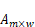中第个行向量与中第个行向量的欧式距离。

-   左矩阵A和右矩阵B在内存中的数据排布如下：

    **图 1**  左矩阵A内存排布<a name="fig2528125192410"></a>  
    

    **图 2**  右矩阵B内存排布<a name="fig161001854202415"></a>  
    

-   用户需要确保输入左右矩阵的数据中不能含有INF、-INF或者NAN数据，并且输入数值和计算结果都在fp32数据表示有效范围内，否则会导致输出的结果中数值为INF、-INF或NAN，从而使结果数值失去意义。
-   ctrl-\>out\_type可支持OT\_SVP\_MAU\_OUT\_OP\_RESULT，OT\_SVP\_MAU\_OUT\_TOP\_N和OT\_SVP\_MAU\_OUT\_BOTH。ctrl-\>has\_left\_idx，ctrl-\>has\_right\_idx和ctrl-\>is\_instant值必须为TD\_TRUE或TD\_FALSE。
-   如果ctrl-\>has\_left\_idx等于TD\_TRUE，src\_idx-\>left\_matrix的宽取值范围：\[1, 100000\]，高必须为1，chn必须为1，num必须为1，物理地址需要4字节对齐，虚拟地址不使用，不做参数异常检查，stride 需要16字节对齐，内存中存储的索引必须小于src-\>left\_matrix的高，数据类型仅支持OT\_SVP\_BLOB\_TYPE\_U32。
-   如果ctrl-\>has\_right\_idx等于TD\_TRUE，src\_idx-\>right\_matrix的宽取值范围为\[1, 100000\]，高必须为1，chn必须为1，num必须为1，物理地址需要4字节对齐，虚拟地址不使用，不做参数异常检查，stride 需要16字节对齐，内存中存储的索引必须小于src-\>right\_matrix的高，数据类型仅支持OT\_SVP\_BLOB\_TYPE\_U32。
-   如果ctrl-\>out\_type为OT\_SVP\_MAU\_OUT\_OP\_RESULT或者OT\_SVP\_MAU\_OUT\_BOTH，dst-\> op\_result的chn必须等于1，num必须为1，数据类型为OT\_SVP\_BLOB\_TYPE\_FP32或OT\_SVP\_BLOB\_TYPE\_FP16，数据类型为FP32时，物理地址需要4字节对齐，数据类型为FP16时，物理地址需要2字节对齐；虚拟地址不使用，不做参数异常检查，stride 需要16字节对齐;dst-\> op\_result的宽和高要求可分为以下4种情况：
    -   如果ctrl-\>has\_left\_idx等于TD\_FALSE，ctrl-\>has\_right\_idx等于TD\_FALSE，dst-\> op\_result的高必须等于src-\>left\_matrix的高，dst-\> op\_result的宽必须等于src-\>right\_matrix的高。
    -   如果ctrl-\>has\_left\_idx等于TD\_TRUE，ctrl-\>has\_right\_idx等于TD\_FALSE，dst-\> op\_result的高必须等于src\_idx-\>left\_matrix的宽，dst-\> op\_result的宽必须等于src-\>right\_matrix的高。
    -   如果ctrl-\>has\_left\_idx等于TD\_FALSE，ctrl-\>has\_right\_idx等于TD\_TRUE，dst-\> op\_result的高必须等于src-\>left\_matrix的高，dst-\> op\_result的宽必须等于src\_idx-\>right\_matrix的宽。
    -   如果ctrl-\>has\_left\_idx等于TD\_TRUE，ctrl-\>has\_right\_idx等于TD\_TRUE，dst-\> op\_result的高必须等于src\_idx-\>left\_matrix的宽，dst-\> op\_result的宽必须等于src\_idx-\>right\_matrix的宽。

-   如果ctrl-\>out\_type为OT\_SVP\_MAU\_OUT\_TOP\_N或者OT\_SVP\_MAU\_OUT\_BOTH，dst-\> top\_n的chn必须等于1，num必须为1，数据类型为OT\_SVP\_BLOB\_TYPE\_FP32或OT\_SVP\_BLOB\_TYPE\_FP16，数据类型为FP32时，物理地址需要4字节对齐，数据类型为FP16时，物理地址需要2字节对齐；虚拟地址不使用，不做参数异常检查，stride需要16字节对齐；dst-\> top\_n的宽表示输出从小到大排序后的前Top\_n个欧式距离，最大只能输出Top 32。具体宽和高要求可分为以下4种情况：
    -   如果ctrl-\>has\_left\_idx等于TD\_FALSE，ctrl-\>has\_right\_idx等于TD\_FALSE，dst-\> top\_n的高必须等于src-\>left\_matrix的高，dst-\> top\_n的宽取值范围为\[1，min\(src-\>right\_matrix.shape.whc.height，32\)\]。
    -   如果ctrl-\>has\_left\_idx等于TD\_TRUE，ctrl-\>has\_right\_idx等于TD\_FALSE，dst-\> top\_n的高必须等于src\_idx-\>left\_matrix的宽，dst-\> top\_n的宽取值范围为\[1，min\(src-\>right\_matrix.shape.whc.height，32\)\]。
    -   如果ctrl-\>has\_left\_idx等于TD\_FALSE，ctrl-\>has\_right\_idx等于TD\_TRUE，dst-\> top\_n的高必须等于src-\>left\_matrix的高，dst-\> top\_n的宽取值范围为\[1，min\(src\_idx-\>right\_matrix.shape.whc.width，32\)\]。
    -   如果ctrl-\>has\_left\_idx等于TD\_TRUE，ctrl-\>has\_right\_idx等于TD\_TRUE，dst-\> top\_n的高必须等于src\_idx-\>left\_matrix的宽，dst-\> top\_n的宽取值范围为\[1，min\(src\_idx-\>right\_matrix.shape.whc.width，32\)\]。

-   如果ctrl-\>out\_type为OT\_SVP\_MAU\_OUT\_TOP\_N或者OT\_SVP\_MAU\_OUT\_BOTH，dst-\> top\_n\_idx的chn必须等于1，num必须为1，stride需要16字节对齐，物理地址需要4字节对齐，虚拟地址不使用，不做参数异常检查，数据类型必须为OT\_SVP\_BLOB\_TYPE\_U32，宽高必须与dst-\> top\_n的宽高相等。

【举例】

无。

【相关主题】

无。

### ss\_mpi\_svp\_mau\_manhattan\_dist<a name="ZH-CN_TOPIC_0000002408294148"></a>

【描述】

计算曼哈顿距离。

【语法】

```
td_s32 ss_mpi_svp_mau_manhattan_dist(ot_svp_mau_handle *handle, const ot_svp_mau_src_double_matrix *src,  const ot_svp_mau_src_double_matrix *src_idx, const ot_svp_mau_ctrl *ctrl, const ot_svp_mau_dist_result *dst);
```

【参数】

<a name="table7758mcpsimp"></a>
<table><thead align="left"><tr id="row7764mcpsimp"><th class="cellrowborder" valign="top" width="11%" id="mcps1.1.4.1.1"><p id="p7766mcpsimp"><a name="p7766mcpsimp"></a><a name="p7766mcpsimp"></a>参数名称</p>
</th>
<th class="cellrowborder" valign="top" width="78%" id="mcps1.1.4.1.2"><p id="p7768mcpsimp"><a name="p7768mcpsimp"></a><a name="p7768mcpsimp"></a>描述</p>
</th>
<th class="cellrowborder" valign="top" width="11%" id="mcps1.1.4.1.3"><p id="p7770mcpsimp"><a name="p7770mcpsimp"></a><a name="p7770mcpsimp"></a>输入/输出</p>
</th>
</tr>
</thead>
<tbody><tr id="row7772mcpsimp"><td class="cellrowborder" valign="top" width="11%" headers="mcps1.1.4.1.1 "><p id="p7774mcpsimp"><a name="p7774mcpsimp"></a><a name="p7774mcpsimp"></a>handle</p>
</td>
<td class="cellrowborder" valign="top" width="78%" headers="mcps1.1.4.1.2 "><p id="p7776mcpsimp"><a name="p7776mcpsimp"></a><a name="p7776mcpsimp"></a>handle指针。</p>
<p id="p7777mcpsimp"><a name="p7777mcpsimp"></a><a name="p7777mcpsimp"></a>不能为空。</p>
</td>
<td class="cellrowborder" valign="top" width="11%" headers="mcps1.1.4.1.3 "><p id="p7779mcpsimp"><a name="p7779mcpsimp"></a><a name="p7779mcpsimp"></a>输出</p>
</td>
</tr>
<tr id="row7780mcpsimp"><td class="cellrowborder" valign="top" width="11%" headers="mcps1.1.4.1.1 "><p id="p7782mcpsimp"><a name="p7782mcpsimp"></a><a name="p7782mcpsimp"></a>src</p>
</td>
<td class="cellrowborder" valign="top" width="78%" headers="mcps1.1.4.1.2 "><p id="p7784mcpsimp"><a name="p7784mcpsimp"></a><a name="p7784mcpsimp"></a>输入左右矩阵。</p>
<p id="p7785mcpsimp"><a name="p7785mcpsimp"></a><a name="p7785mcpsimp"></a>不能为空。</p>
<p id="p7786mcpsimp"><a name="p7786mcpsimp"></a><a name="p7786mcpsimp"></a>数据类型仅支持OT_SVP_BLOB_TYPE_FP32和OT_SVP_BLOB_TYPE_FP16。</p>
<a name="ul7787mcpsimp"></a><a name="ul7787mcpsimp"></a><ul id="ul7787mcpsimp"><li>如果数据类型为OT_SVP_BLOB_TYPE_FP32，宽的取值范围：[1, 8192]，高的取值范围：[1, 1000000]，chn为1，num取值为1，物理地址需要4字节对齐，虚拟地址不使用，不做参数异常检查，stride 需要16字节对齐。</li><li>如果数据类型为OT_SVP_BLOB_TYPE_FP16，宽的取值范围：[1, 16384]，高的取值范围：[1, 1000000]，chn为1，num取值为1，物理地址需要2字节对齐，虚拟地址不使用，不做参数异常检查，stride 需要16字节对齐。</li></ul>
<p id="p7790mcpsimp"><a name="p7790mcpsimp"></a><a name="p7790mcpsimp"></a>左右矩阵的宽必须相等。</p>
</td>
<td class="cellrowborder" valign="top" width="11%" headers="mcps1.1.4.1.3 "><p id="p7792mcpsimp"><a name="p7792mcpsimp"></a><a name="p7792mcpsimp"></a>输入</p>
</td>
</tr>
<tr id="row7793mcpsimp"><td class="cellrowborder" valign="top" width="11%" headers="mcps1.1.4.1.1 "><p id="p7795mcpsimp"><a name="p7795mcpsimp"></a><a name="p7795mcpsimp"></a>src_idx</p>
</td>
<td class="cellrowborder" valign="top" width="78%" headers="mcps1.1.4.1.2 "><p id="p7797mcpsimp"><a name="p7797mcpsimp"></a><a name="p7797mcpsimp"></a>输入左右矩阵的行索引。</p>
<p id="p7798mcpsimp"><a name="p7798mcpsimp"></a><a name="p7798mcpsimp"></a>当ctrl信息中has_left_idx或者has_right_idx为TD_TRUE时，不能为空。</p>
</td>
<td class="cellrowborder" valign="top" width="11%" headers="mcps1.1.4.1.3 "><p id="p7800mcpsimp"><a name="p7800mcpsimp"></a><a name="p7800mcpsimp"></a>输入</p>
</td>
</tr>
<tr id="row7801mcpsimp"><td class="cellrowborder" valign="top" width="11%" headers="mcps1.1.4.1.1 "><p id="p7803mcpsimp"><a name="p7803mcpsimp"></a><a name="p7803mcpsimp"></a>ctrl</p>
</td>
<td class="cellrowborder" valign="top" width="78%" headers="mcps1.1.4.1.2 "><p id="p7805mcpsimp"><a name="p7805mcpsimp"></a><a name="p7805mcpsimp"></a>输入控制信息。</p>
<p id="p7806mcpsimp"><a name="p7806mcpsimp"></a><a name="p7806mcpsimp"></a>不能为空。</p>
</td>
<td class="cellrowborder" valign="top" width="11%" headers="mcps1.1.4.1.3 "><p id="p7808mcpsimp"><a name="p7808mcpsimp"></a><a name="p7808mcpsimp"></a>输入</p>
</td>
</tr>
<tr id="row7809mcpsimp"><td class="cellrowborder" valign="top" width="11%" headers="mcps1.1.4.1.1 "><p id="p7811mcpsimp"><a name="p7811mcpsimp"></a><a name="p7811mcpsimp"></a>dst</p>
</td>
<td class="cellrowborder" valign="top" width="78%" headers="mcps1.1.4.1.2 "><p id="p7813mcpsimp"><a name="p7813mcpsimp"></a><a name="p7813mcpsimp"></a>输出结果。</p>
<p id="p7814mcpsimp"><a name="p7814mcpsimp"></a><a name="p7814mcpsimp"></a>不能为空。</p>
</td>
<td class="cellrowborder" valign="top" width="11%" headers="mcps1.1.4.1.3 "><p id="p7816mcpsimp"><a name="p7816mcpsimp"></a><a name="p7816mcpsimp"></a>输出</p>
</td>
</tr>
</tbody>
</table>

【返回值】

<a name="table7818mcpsimp"></a>
<table><thead align="left"><tr id="row7823mcpsimp"><th class="cellrowborder" valign="top" width="28.999999999999996%" id="mcps1.1.3.1.1"><p id="p7825mcpsimp"><a name="p7825mcpsimp"></a><a name="p7825mcpsimp"></a>返回值</p>
</th>
<th class="cellrowborder" valign="top" width="71%" id="mcps1.1.3.1.2"><p id="p7827mcpsimp"><a name="p7827mcpsimp"></a><a name="p7827mcpsimp"></a>描述</p>
</th>
</tr>
</thead>
<tbody><tr id="row7829mcpsimp"><td class="cellrowborder" valign="top" width="28.999999999999996%" headers="mcps1.1.3.1.1 "><p id="p7831mcpsimp"><a name="p7831mcpsimp"></a><a name="p7831mcpsimp"></a>0</p>
</td>
<td class="cellrowborder" valign="top" width="71%" headers="mcps1.1.3.1.2 "><p id="p7833mcpsimp"><a name="p7833mcpsimp"></a><a name="p7833mcpsimp"></a>成功。</p>
</td>
</tr>
<tr id="row7834mcpsimp"><td class="cellrowborder" valign="top" width="28.999999999999996%" headers="mcps1.1.3.1.1 "><p id="p7836mcpsimp"><a name="p7836mcpsimp"></a><a name="p7836mcpsimp"></a>非0</p>
</td>
<td class="cellrowborder" valign="top" width="71%" headers="mcps1.1.3.1.2 "><p id="p7838mcpsimp"><a name="p7838mcpsimp"></a><a name="p7838mcpsimp"></a>失败，参见<a href="#ZH-CN_TOPIC_0000002408294264">>错误码</</a><span xml:lang="fr-FR" id="ph7841mcpsimp"><a name="ph7841mcpsimp"></a><a name="ph7841mcpsimp"></a>。</span></p>
</td>
</tr>
</tbody>
</table>

【解决方案差异】

<a name="table7843mcpsimp"></a>
<table><thead align="left"><tr id="row7848mcpsimp"><th class="cellrowborder" valign="top" width="28.999999999999996%" id="mcps1.1.3.1.1"><p id="p7850mcpsimp"><a name="p7850mcpsimp"></a><a name="p7850mcpsimp"></a>解决方案名称</p>
</th>
<th class="cellrowborder" valign="top" width="71%" id="mcps1.1.3.1.2"><p id="p7852mcpsimp"><a name="p7852mcpsimp"></a><a name="p7852mcpsimp"></a>差异</p>
</th>
</tr>
</thead>
<tbody><tr id="row7854mcpsimp"><td class="cellrowborder" valign="top" width="28.999999999999996%" headers="mcps1.1.3.1.1 "><p id="p7856mcpsimp"><a name="p7856mcpsimp"></a><a name="p7856mcpsimp"></a>SS928V100</p>
</td>
<td class="cellrowborder" valign="top" width="71%" headers="mcps1.1.3.1.2 "><p id="p7858mcpsimp"><a name="p7858mcpsimp"></a><a name="p7858mcpsimp"></a>不支持</p>
</td>
</tr>
<tr id="row1783979144212"><td class="cellrowborder" valign="top" width="28.999999999999996%" headers="mcps1.1.3.1.1 "><p id="p1148191184218"><a name="p1148191184218"></a><a name="p1148191184218"></a>SS927V100</p>
</td>
<td class="cellrowborder" valign="top" width="71%" headers="mcps1.1.3.1.2 "><p id="p1114811119421"><a name="p1114811119421"></a><a name="p1114811119421"></a>不支持</p>
</td>
</tr>
</tbody>
</table>

【需求】

-   头文件：ot\_common\_svp.h、ot\_common\_mau.h、ss\_mpi\_mau.h
-   库文件：libss\_mau.a

【注意】

-   支持多向量求曼哈顿距离，Height表示向量个数，依次获取左矩阵A的行向量与右矩阵中每个行向量进行计算，计算公式：

    

    其中：

    

    

    

    

    

    

    为左矩阵，为右矩阵，为结果矩阵，为Top\_n矩阵，每一行中的数值为矩阵中对应行中从小到大排序后的前Top t个，为Top\_n索引矩阵，的值是中第i个行向量与中第个行向量的曼哈顿距离。

-   支持通过索引指定要计算的行向量，分三种情况：
    -   左矩阵A通过索引指定要计算的行向量，右矩阵不用索引，计算公式：

        

        其中：

        

        

        

        

        

        

        

        为左矩阵，为左矩阵索引\(\)，为右矩阵，为结果矩阵，为Top\_n矩阵，每一行中的数值为矩阵中对应行中从小到大排序后的前Top t个值，为Top\_n索引矩阵，的值是中第个行向量与中第中第个行向量的曼哈顿距离。

    -   左矩阵A不用索引，右矩阵用索引指定要计算的行向量，计算公式：

        

        其中：

        

        

        

        

        

        

        

        为左矩阵，为右矩阵，为右矩阵索引\(\)，为结果矩阵，为Top\_n矩阵，每一行中的数值为矩阵中对应行中从小到大排序后的前Top t个值，为Top\_n索引矩阵，的值是中第i个行向量与中第个行向量的曼哈顿距离。

    -   左矩阵A用索引指定要计算的行向，右矩阵B用索引指定要计算的行向量，计算公式：

        

        其中：

        

        

        

        

        

        

        

        

        为左矩阵，为左矩阵索引\(\)，为右矩阵，为右矩阵索引\(\)，为结果矩阵，为Top\_n矩阵，每一行中的数值为矩阵中对应行中从小到大排序后的前Top t个值，为Top\_n索引矩阵，的值是中第个行向量与中第个行向量的曼哈顿距离。

-   左矩阵A和右矩阵B在内存中的数据排布如下：

    **图 1**  左矩阵A内存排布<a name="fig109841122144412"></a>  
    

    **图 2**  右矩阵B内存排布<a name="fig529720654513"></a>  
    

-   用户需要确保输入左右矩阵的数据中不能含有INF、-INF或者NAN数据，并且输入数值和计算结果都在fp32数据表示有效范围内，否则会导致输出的结果中数值为INF、-INF或NAN，从而使结果数值失去意义。
-   ctrl-\>out\_type可支持OT\_SVP\_MAU\_OUT\_OP\_RESULT，OT\_SVP\_MAU\_OUT\_TOP\_N和OT\_SVP\_MAU\_OUT\_BOTH。ctrl-\>has\_left\_idx，ctrl-\>has\_right\_idx和ctrl-\>is\_instant值必须为TD\_TRUE或TD\_FALSE。
-   如果ctrl-\>has\_left\_idx等于TD\_TRUE，src\_idx-\>left\_matrix的宽取值范围\[1, 100000\]，高必须为1，chn必须为1，num必须为1，物理地址需要4字节对齐，虚拟地址不使用，不做参数异常检查，stride需要16字节对齐，内存中存储的索引必须小于src-\>left\_matrix的高，数据类型仅支持OT\_SVP\_BLOB\_TYPE\_U32。
-   如果ctrl-\>has\_right\_idx等于TD\_TRUE，src\_idx-\>right\_matrix的宽取值范围为\[1, 100000\]，高必须为1，chn必须为1，num必须为1，物理地址需要4字节对齐，虚拟地址不使用，不做参数异常检查，stride 需要16字节对齐，内存中存储的索引必须小于src-\>right\_matrix的高，数据类型仅支持OT\_SVP\_BLOB\_TYPE\_U32。
-   如果ctrl-\>out\_type为OT\_SVP\_MAU\_OUT\_OP\_RESULT或者OT\_SVP\_MAU\_OUT\_BOTH，dst-\> op\_result的chn必须等于1，num必须为1，数据类型为OT\_SVP\_BLOB\_TYPE\_FP32或OT\_SVP\_BLOB\_TYPE\_FP16，当ctrl-\>out\_type为OT\_SVP\_MAU\_OUT\_BOTH时，dst-\>top\_n和dst-\> op\_result数据类型必须一致；数据类型为FP32时，物理地址需要4字节对齐，数据类型为FP16时，物理地址需要2字节对齐；虚拟地址不使用，不做参数异常检查，stride 需要16字节对齐，dst-\> op\_result的宽和高要求可分为以下4种情况：
    -   如果ctrl-\>has\_left\_idx等于TD\_FALSE，ctrl-\>has\_right\_idx等于TD\_FALSE，dst-\> op\_result的高必须等于src-\>left\_matrix的高，dst-\> op\_result的宽必须等于src-\>right\_matrix的高。
    -   如果ctrl-\>has\_left\_idx等于TD\_TRUE，ctrl-\>has\_right\_idx等于TD\_FALSE，dst-\> op\_result的高必须等于src\_idx-\>left\_matrix的宽，dst-\> op\_result的宽必须等于src-\>right\_matrix的高。
    -   如果ctrl-\>has\_left\_idx等于TD\_FALSE，ctrl-\>has\_right\_idx等于TD\_TRUE，dst-\> op\_result的高必须等于src-\>left\_matrix的高，dst-\> op\_result的宽必须等于src\_idx-\>right\_matrix的宽。
    -   如果ctrl-\>has\_left\_idx等于TD\_TRUE，ctrl-\>has\_right\_idx等于TD\_TRUE，dst-\> op\_result的高必须等于src\_idx-\>left\_matrix的宽，dst-\> op\_result的宽必须等于src\_idx-\>right\_matrix的宽。

-   如果ctrl-\>out\_type为OT\_SVP\_MAU\_OUT\_TOP\_N或者OT\_SVP\_MAU\_OUT\_BOTH，dst-\> top\_n的chn必须等于1，num必须为1；数据类型为OT\_SVP\_BLOB\_TYPE\_FP32或OT\_SVP\_BLOB\_TYPE\_FP32，当ctrl-\>out\_type为OT\_SVP\_MAU\_OUT\_BOTH时，dst-\>top\_n和dst-\> op\_result数据类型必须一致；数据类型为FP32时，物理地址需要4字节对齐，数据类型为FP16时，物理地址需要2字节对齐；虚拟地址不使用，不做参数异常检查，stride需要16字节对齐；dst-\> top\_n的宽表示输出从小到大排序后的前Top\_n个欧式距离，最大只能输出Top 32。具体宽和高要求可分为以下4种情况：
    -   如果ctrl-\>has\_left\_idx等于TD\_FALSE，ctrl-\>has\_right\_idx等于TD\_FALSE，dst-\> top\_n的高必须等于src-\>left\_matrix的高，dst-\> top\_n的宽取值范围为\[1，min\(src-\>right\_matrix.shape.whc.height，32\)\]。
    -   如果ctrl-\>has\_left\_idx等于TD\_TRUE，ctrl-\>has\_right\_idx等于TD\_FALSE，dst-\> top\_n的高必须等于src\_idx-\>left\_matrix的宽，dst-\> top\_n的宽取值范围为\[1，min\(src-\>right\_matrix.shape.whc.height，32\)\]。
    -   如果ctrl-\>has\_left\_idx等于TD\_FALSE，ctrl-\>has\_right\_idx等于TD\_TRUE，dst-\> top\_n的高必须等于src-\>left\_matrix的高，dst-\> top\_n的宽取值范围为\[1，min\(src\_idx-\>right\_matrix.shape.whc.width，32\)\]。
    -   如果ctrl-\>has\_left\_idx等于TD\_TRUE，ctrl-\>has\_right\_idx等于TD\_TRUE，dst-\> top\_n的高必须等于src\_idx-\>left\_matrix的宽，dst-\> top\_n的宽取值范围为\[1，min\(src\_idx-\>right\_matrix.shape.whc.width，32\)\]。

-   如果ctrl-\>out\_type为OT\_SVP\_MAU\_OUT\_TOP\_N或者OT\_SVP\_MAU\_OUT\_BOTH，dst-\> top\_n\_idx的chn必须等于1，num必须为1，stride需要16字节对齐，物理地址需要4字节对齐，虚拟地址不使用，不做参数异常检查，数据类型必须为OT\_SVP\_BLOB\_TYPE\_U32，宽高必须与dst-\> top\_n的宽高相等。

【举例】

无。

【相关主题】

无。

### ss\_mpi\_svp\_mau\_transpose<a name="ZH-CN_TOPIC_0000002441853525"></a>

【描述】

计算矩阵转置运算。

【语法】

```
td_s32 ss_mpi_svp_mau_transpose(ot_svp_mau_handle *handle, const ot_svp_blob *src, const ot_svp_blob *src_idx, const ot_svp_mau_transpose_ctrl *ctrl, const ot_svp_blob *dst);
```

【参数】

<a name="table3274mcpsimp"></a>
<table><thead align="left"><tr id="row3280mcpsimp"><th class="cellrowborder" valign="top" width="11%" id="mcps1.1.4.1.1"><p id="p3282mcpsimp"><a name="p3282mcpsimp"></a><a name="p3282mcpsimp"></a>参数名称</p>
</th>
<th class="cellrowborder" valign="top" width="78%" id="mcps1.1.4.1.2"><p id="p3284mcpsimp"><a name="p3284mcpsimp"></a><a name="p3284mcpsimp"></a>描述</p>
</th>
<th class="cellrowborder" valign="top" width="11%" id="mcps1.1.4.1.3"><p id="p3286mcpsimp"><a name="p3286mcpsimp"></a><a name="p3286mcpsimp"></a>输入/输出</p>
</th>
</tr>
</thead>
<tbody><tr id="row3288mcpsimp"><td class="cellrowborder" valign="top" width="11%" headers="mcps1.1.4.1.1 "><p id="p3290mcpsimp"><a name="p3290mcpsimp"></a><a name="p3290mcpsimp"></a>handle</p>
</td>
<td class="cellrowborder" valign="top" width="78%" headers="mcps1.1.4.1.2 "><p id="p3292mcpsimp"><a name="p3292mcpsimp"></a><a name="p3292mcpsimp"></a>handle指针。</p>
<p id="p3293mcpsimp"><a name="p3293mcpsimp"></a><a name="p3293mcpsimp"></a>不能为空。</p>
</td>
<td class="cellrowborder" valign="top" width="11%" headers="mcps1.1.4.1.3 "><p id="p3295mcpsimp"><a name="p3295mcpsimp"></a><a name="p3295mcpsimp"></a>输出</p>
</td>
</tr>
<tr id="row3296mcpsimp"><td class="cellrowborder" valign="top" width="11%" headers="mcps1.1.4.1.1 "><p id="p3298mcpsimp"><a name="p3298mcpsimp"></a><a name="p3298mcpsimp"></a>src</p>
</td>
<td class="cellrowborder" valign="top" width="78%" headers="mcps1.1.4.1.2 "><p id="p3300mcpsimp"><a name="p3300mcpsimp"></a><a name="p3300mcpsimp"></a>输入矩阵。</p>
<p id="p3301mcpsimp"><a name="p3301mcpsimp"></a><a name="p3301mcpsimp"></a>不能为空。</p>
<p id="p3302mcpsimp"><a name="p3302mcpsimp"></a><a name="p3302mcpsimp"></a>数据类型支持OT_SVP_BLOB_TYPE_FP32，OT_SVP_BLOB_TYPE_FP16, OT_SVP_BLOB_TYPE_U32, OT_SVP_BLOB_TYPE_S32, OT_SVP_BLOB_TYPE_U16, OT_SVP_BLOB_TYPE_S16, OT_SVP_BLOB_TYPE_U8, OT_SVP_BLOB_TYPE_S8。</p>
<p id="p3303mcpsimp"><a name="p3303mcpsimp"></a><a name="p3303mcpsimp"></a>宽的取值范围：[1, 100000]，高的取值范围：[1, 100000]，chn取值为1，num取值为1，虚拟地址不使用，不做参数异常检查，stride 16字节对齐,。</p>
<p id="p3304mcpsimp"><a name="p3304mcpsimp"></a><a name="p3304mcpsimp"></a>物理地址依据数据类对齐。FP32，U32，S32时，4字节对齐；FP16，U16，S16时，2字节对齐；U8，S8时，1字节对齐。</p>
</td>
<td class="cellrowborder" valign="top" width="11%" headers="mcps1.1.4.1.3 "><p id="p3306mcpsimp"><a name="p3306mcpsimp"></a><a name="p3306mcpsimp"></a>输入</p>
</td>
</tr>
<tr id="row3307mcpsimp"><td class="cellrowborder" valign="top" width="11%" headers="mcps1.1.4.1.1 "><p id="p3309mcpsimp"><a name="p3309mcpsimp"></a><a name="p3309mcpsimp"></a>src_idx</p>
</td>
<td class="cellrowborder" valign="top" width="78%" headers="mcps1.1.4.1.2 "><p id="p3311mcpsimp"><a name="p3311mcpsimp"></a><a name="p3311mcpsimp"></a>输入矩阵的行索引。</p>
<p id="p3312mcpsimp"><a name="p3312mcpsimp"></a><a name="p3312mcpsimp"></a>如果ctrl信息中has_ idx值为TD_TRUE时，不能为空。</p>
</td>
<td class="cellrowborder" valign="top" width="11%" headers="mcps1.1.4.1.3 "><p id="p3314mcpsimp"><a name="p3314mcpsimp"></a><a name="p3314mcpsimp"></a>输入</p>
</td>
</tr>
<tr id="row3315mcpsimp"><td class="cellrowborder" valign="top" width="11%" headers="mcps1.1.4.1.1 "><p id="p3317mcpsimp"><a name="p3317mcpsimp"></a><a name="p3317mcpsimp"></a>ctrl</p>
</td>
<td class="cellrowborder" valign="top" width="78%" headers="mcps1.1.4.1.2 "><p id="p3319mcpsimp"><a name="p3319mcpsimp"></a><a name="p3319mcpsimp"></a>输入控制信息。</p>
<p id="p3320mcpsimp"><a name="p3320mcpsimp"></a><a name="p3320mcpsimp"></a>不能为空。</p>
</td>
<td class="cellrowborder" valign="top" width="11%" headers="mcps1.1.4.1.3 "><p id="p3322mcpsimp"><a name="p3322mcpsimp"></a><a name="p3322mcpsimp"></a>输入</p>
</td>
</tr>
<tr id="row3323mcpsimp"><td class="cellrowborder" valign="top" width="11%" headers="mcps1.1.4.1.1 "><p id="p3325mcpsimp"><a name="p3325mcpsimp"></a><a name="p3325mcpsimp"></a>dst</p>
</td>
<td class="cellrowborder" valign="top" width="78%" headers="mcps1.1.4.1.2 "><p id="p3327mcpsimp"><a name="p3327mcpsimp"></a><a name="p3327mcpsimp"></a>输出结果。</p>
<p id="p3328mcpsimp"><a name="p3328mcpsimp"></a><a name="p3328mcpsimp"></a>数据类型与输入矩阵数据类型一致。</p>
<p id="p3329mcpsimp"><a name="p3329mcpsimp"></a><a name="p3329mcpsimp"></a>不能为空。</p>
</td>
<td class="cellrowborder" valign="top" width="11%" headers="mcps1.1.4.1.3 "><p id="p3331mcpsimp"><a name="p3331mcpsimp"></a><a name="p3331mcpsimp"></a>输出</p>
</td>
</tr>
</tbody>
</table>

注：FP32，U32，S32，FP16，U16，S16时，2字节对齐；U8，S8均为ot\_svp\_blob\_type成员的缩写，后续其他的成员在表述中也用相同的规则简写

【返回值】

<a name="table3335mcpsimp"></a>
<table><thead align="left"><tr id="row3340mcpsimp"><th class="cellrowborder" valign="top" width="28.999999999999996%" id="mcps1.1.3.1.1"><p id="p3342mcpsimp"><a name="p3342mcpsimp"></a><a name="p3342mcpsimp"></a>返回值</p>
</th>
<th class="cellrowborder" valign="top" width="71%" id="mcps1.1.3.1.2"><p id="p3344mcpsimp"><a name="p3344mcpsimp"></a><a name="p3344mcpsimp"></a>描述</p>
</th>
</tr>
</thead>
<tbody><tr id="row3346mcpsimp"><td class="cellrowborder" valign="top" width="28.999999999999996%" headers="mcps1.1.3.1.1 "><p id="p3348mcpsimp"><a name="p3348mcpsimp"></a><a name="p3348mcpsimp"></a>0</p>
</td>
<td class="cellrowborder" valign="top" width="71%" headers="mcps1.1.3.1.2 "><p id="p3350mcpsimp"><a name="p3350mcpsimp"></a><a name="p3350mcpsimp"></a>成功。</p>
</td>
</tr>
<tr id="row3351mcpsimp"><td class="cellrowborder" valign="top" width="28.999999999999996%" headers="mcps1.1.3.1.1 "><p id="p3353mcpsimp"><a name="p3353mcpsimp"></a><a name="p3353mcpsimp"></a>非0</p>
</td>
<td class="cellrowborder" valign="top" width="71%" headers="mcps1.1.3.1.2 "><p id="p3355mcpsimp"><a name="p3355mcpsimp"></a><a name="p3355mcpsimp"></a>失败，参见<a href="#ZH-CN_TOPIC_0000002408294264">>错误码</</a><span xml:lang="fr-FR" id="ph3358mcpsimp"><a name="ph3358mcpsimp"></a><a name="ph3358mcpsimp"></a>。</span></p>
</td>
</tr>
</tbody>
</table>

【解决方案差异】

<a name="table3360mcpsimp"></a>
<table><thead align="left"><tr id="row3365mcpsimp"><th class="cellrowborder" valign="top" width="28.999999999999996%" id="mcps1.1.3.1.1"><p id="p3367mcpsimp"><a name="p3367mcpsimp"></a><a name="p3367mcpsimp"></a>解决方案名称</p>
</th>
<th class="cellrowborder" valign="top" width="71%" id="mcps1.1.3.1.2"><p id="p3369mcpsimp"><a name="p3369mcpsimp"></a><a name="p3369mcpsimp"></a>差异</p>
</th>
</tr>
</thead>
<tbody><tr id="row3371mcpsimp"><td class="cellrowborder" valign="top" width="28.999999999999996%" headers="mcps1.1.3.1.1 "><p id="p3373mcpsimp"><a name="p3373mcpsimp"></a><a name="p3373mcpsimp"></a>SS928V100</p>
</td>
<td class="cellrowborder" valign="top" width="71%" headers="mcps1.1.3.1.2 "><p id="p3375mcpsimp"><a name="p3375mcpsimp"></a><a name="p3375mcpsimp"></a>不支持</p>
</td>
</tr>
<tr id="row1215792304213"><td class="cellrowborder" valign="top" width="28.999999999999996%" headers="mcps1.1.3.1.1 "><p id="p12315182494211"><a name="p12315182494211"></a><a name="p12315182494211"></a>SS927V100</p>
</td>
<td class="cellrowborder" valign="top" width="71%" headers="mcps1.1.3.1.2 "><p id="p8315124164216"><a name="p8315124164216"></a><a name="p8315124164216"></a>不支持</p>
</td>
</tr>
</tbody>
</table>

【需求】

-   头文件：ot\_common\_svp.h、ot\_common\_mau.h、ss\_mpi\_mau.h
-   库文件：libss\_mau.a

【注意】

-   计算公式如下：

    

    

    

其中：


-   支持通过索引指定要计算的行向量：
    -   矩阵A通过索引指定，计算公式：

        

        其中：

        

        

        

        

        为输入矩阵，为左矩阵索引\(\)，为计算结果。

-   输入矩阵A在内存中的数据排布如下：

**图 1**  矩阵A内存排布<a name="fig1019814712117"></a>  


-   用户需要确保输入左右矩阵的数据中不能含有INF、-INF或者NAN数据，并且输入数值和计算结果都在fp32数据表示有效范围内，否则会导致输出的结果数值中有INF、-INF或NAN，从而使结果数值失去意义。
-   ctrl-\>has\_idx和ctrl-\>is\_instant值必须为TD\_TRUE或TD\_FALSE。
-   如果ctrl-\>has\_idx等于TD\_TRUE，src\_idx的宽取值范围\[1, 100000\]，高必须为1，chn必须为1，num必须为1，物理地址需要4字节对齐，虚拟地址不使用，不做参数异常检查，stride需要16字节对齐，src\_idx的内存中存储的索引值必须小于src的高，数据类型仅支持OT\_SVP\_BLOB\_TYPE\_U32。
-   dst的chn必须等于1，num必须为1；物理地址按数据类型对齐，FP32，U32，S32时，4字节对齐；FP16，U16，S16时，2字节对齐；U8，S8时，1字节对齐，虚拟地址不使用，不做参数异常检查，stride需要16字节对齐，数据类型必须与输入矩阵类型一致，dst的宽和高要求可分为以下2种情况：
    -   如果ctrl-\>has\_idx等于TD\_FALSE，dst的高必须等于src的宽，dst的宽必须等于src的高。
    -   如果ctrl-\>has\_idx等于TD\_TRUE，dst的高必须等于src的宽，dst的宽必须等于src\_idx的宽。

【举例】

无。

【相关主题】

无。

### ss\_mpi\_svp\_mau\_vector\_op<a name="ZH-CN_TOPIC_0000002408294432"></a>

【描述】

计算向量加减及加减绝对值运算。

【语法】

```
td_s32 ss_mpi_svp_mau_vector_op(ot_svp_mau_handle *handle, const ot_svp_mau_src_double_matrix *src, const ot_svp_mau_src_double_matrix *src_idx, const ot_svp_mau_vector_op_ctrl *ctrl, const ot_svp_blob *dst);
```

【参数】

<a name="table2245mcpsimp"></a>
<table><thead align="left"><tr id="row2251mcpsimp"><th class="cellrowborder" valign="top" width="11%" id="mcps1.1.4.1.1"><p id="p2253mcpsimp"><a name="p2253mcpsimp"></a><a name="p2253mcpsimp"></a>参数名称</p>
</th>
<th class="cellrowborder" valign="top" width="78%" id="mcps1.1.4.1.2"><p id="p2255mcpsimp"><a name="p2255mcpsimp"></a><a name="p2255mcpsimp"></a>描述</p>
</th>
<th class="cellrowborder" valign="top" width="11%" id="mcps1.1.4.1.3"><p id="p2257mcpsimp"><a name="p2257mcpsimp"></a><a name="p2257mcpsimp"></a>输入/输出</p>
</th>
</tr>
</thead>
<tbody><tr id="row2259mcpsimp"><td class="cellrowborder" valign="top" width="11%" headers="mcps1.1.4.1.1 "><p id="p2261mcpsimp"><a name="p2261mcpsimp"></a><a name="p2261mcpsimp"></a>handle</p>
</td>
<td class="cellrowborder" valign="top" width="78%" headers="mcps1.1.4.1.2 "><p id="p2263mcpsimp"><a name="p2263mcpsimp"></a><a name="p2263mcpsimp"></a>handle指针。</p>
<p id="p2264mcpsimp"><a name="p2264mcpsimp"></a><a name="p2264mcpsimp"></a>不能为空。</p>
</td>
<td class="cellrowborder" valign="top" width="11%" headers="mcps1.1.4.1.3 "><p id="p2266mcpsimp"><a name="p2266mcpsimp"></a><a name="p2266mcpsimp"></a>输出</p>
</td>
</tr>
<tr id="row2267mcpsimp"><td class="cellrowborder" valign="top" width="11%" headers="mcps1.1.4.1.1 "><p id="p2269mcpsimp"><a name="p2269mcpsimp"></a><a name="p2269mcpsimp"></a>src</p>
</td>
<td class="cellrowborder" valign="top" width="78%" headers="mcps1.1.4.1.2 "><p id="p2271mcpsimp"><a name="p2271mcpsimp"></a><a name="p2271mcpsimp"></a>输入左右矩阵。</p>
<p id="p2272mcpsimp"><a name="p2272mcpsimp"></a><a name="p2272mcpsimp"></a>不能为空。</p>
<p id="p2273mcpsimp"><a name="p2273mcpsimp"></a><a name="p2273mcpsimp"></a>数据类型仅支持OT_SVP_BLOB_TYPE_FP32和OT_SVP_BLOB_TYPE_FP16。</p>
<a name="ul2274mcpsimp"></a><a name="ul2274mcpsimp"></a><ul id="ul2274mcpsimp"><li>如果数据类型为OT_SVP_BLOB_TYPE_FP32，宽的取值范围[1, 8192]，高的取值范围[1, 1000000]，chn为1，num取值为1，物理地址需要4字节对齐，虚拟地址不使用，不做参数异常检查，stride 需要16字节对齐。</li><li>如果数据类型为OT_SVP_BLOB_TYPE_FP16，宽的取值范围：[1, 16384]，高的取值范围：[1, 1000000]，chn为1，num取值为1，物理地址需要2字节对齐，虚拟地址不使用，不做参数异常检查，stride 需要16字节对齐。</li></ul>
<p id="p2277mcpsimp"><a name="p2277mcpsimp"></a><a name="p2277mcpsimp"></a>左右矩阵的宽必须相等。</p>
</td>
<td class="cellrowborder" valign="top" width="11%" headers="mcps1.1.4.1.3 "><p id="p2279mcpsimp"><a name="p2279mcpsimp"></a><a name="p2279mcpsimp"></a>输入</p>
</td>
</tr>
<tr id="row2280mcpsimp"><td class="cellrowborder" valign="top" width="11%" headers="mcps1.1.4.1.1 "><p id="p2282mcpsimp"><a name="p2282mcpsimp"></a><a name="p2282mcpsimp"></a>src_idx</p>
</td>
<td class="cellrowborder" valign="top" width="78%" headers="mcps1.1.4.1.2 "><p id="p2284mcpsimp"><a name="p2284mcpsimp"></a><a name="p2284mcpsimp"></a>输入左右矩阵的行索引。</p>
<p id="p2285mcpsimp"><a name="p2285mcpsimp"></a><a name="p2285mcpsimp"></a>当ctrl信息中has_left_idx或者has_right_idx为TD_TRUE时，不能为空。</p>
</td>
<td class="cellrowborder" valign="top" width="11%" headers="mcps1.1.4.1.3 "><p id="p2287mcpsimp"><a name="p2287mcpsimp"></a><a name="p2287mcpsimp"></a>输入</p>
</td>
</tr>
<tr id="row2288mcpsimp"><td class="cellrowborder" valign="top" width="11%" headers="mcps1.1.4.1.1 "><p id="p2290mcpsimp"><a name="p2290mcpsimp"></a><a name="p2290mcpsimp"></a>ctrl</p>
</td>
<td class="cellrowborder" valign="top" width="78%" headers="mcps1.1.4.1.2 "><p id="p2292mcpsimp"><a name="p2292mcpsimp"></a><a name="p2292mcpsimp"></a>输入控制信息。</p>
<p id="p2293mcpsimp"><a name="p2293mcpsimp"></a><a name="p2293mcpsimp"></a>不能为空。</p>
</td>
<td class="cellrowborder" valign="top" width="11%" headers="mcps1.1.4.1.3 "><p id="p2295mcpsimp"><a name="p2295mcpsimp"></a><a name="p2295mcpsimp"></a>输入</p>
</td>
</tr>
<tr id="row2296mcpsimp"><td class="cellrowborder" valign="top" width="11%" headers="mcps1.1.4.1.1 "><p id="p2298mcpsimp"><a name="p2298mcpsimp"></a><a name="p2298mcpsimp"></a>dst</p>
</td>
<td class="cellrowborder" valign="top" width="78%" headers="mcps1.1.4.1.2 "><p id="p2300mcpsimp"><a name="p2300mcpsimp"></a><a name="p2300mcpsimp"></a>输出结果。</p>
<p id="p2301mcpsimp"><a name="p2301mcpsimp"></a><a name="p2301mcpsimp"></a>不能为空。</p>
</td>
<td class="cellrowborder" valign="top" width="11%" headers="mcps1.1.4.1.3 "><p id="p2303mcpsimp"><a name="p2303mcpsimp"></a><a name="p2303mcpsimp"></a>输出</p>
</td>
</tr>
</tbody>
</table>

【返回值】

<a name="table2305mcpsimp"></a>
<table><thead align="left"><tr id="row2310mcpsimp"><th class="cellrowborder" valign="top" width="28.999999999999996%" id="mcps1.1.3.1.1"><p id="p2312mcpsimp"><a name="p2312mcpsimp"></a><a name="p2312mcpsimp"></a>返回值</p>
</th>
<th class="cellrowborder" valign="top" width="71%" id="mcps1.1.3.1.2"><p id="p2314mcpsimp"><a name="p2314mcpsimp"></a><a name="p2314mcpsimp"></a>描述</p>
</th>
</tr>
</thead>
<tbody><tr id="row2316mcpsimp"><td class="cellrowborder" valign="top" width="28.999999999999996%" headers="mcps1.1.3.1.1 "><p id="p2318mcpsimp"><a name="p2318mcpsimp"></a><a name="p2318mcpsimp"></a>0</p>
</td>
<td class="cellrowborder" valign="top" width="71%" headers="mcps1.1.3.1.2 "><p id="p2320mcpsimp"><a name="p2320mcpsimp"></a><a name="p2320mcpsimp"></a>成功。</p>
</td>
</tr>
<tr id="row2321mcpsimp"><td class="cellrowborder" valign="top" width="28.999999999999996%" headers="mcps1.1.3.1.1 "><p id="p2323mcpsimp"><a name="p2323mcpsimp"></a><a name="p2323mcpsimp"></a>非0</p>
</td>
<td class="cellrowborder" valign="top" width="71%" headers="mcps1.1.3.1.2 "><p id="p2325mcpsimp"><a name="p2325mcpsimp"></a><a name="p2325mcpsimp"></a>失败，参见<a href="#ZH-CN_TOPIC_0000002408294264">>错误码</</a><span xml:lang="fr-FR" id="ph2328mcpsimp"><a name="ph2328mcpsimp"></a><a name="ph2328mcpsimp"></a>。</span></p>
</td>
</tr>
</tbody>
</table>

【解决方案差异】

<a name="table2330mcpsimp"></a>
<table><thead align="left"><tr id="row2335mcpsimp"><th class="cellrowborder" valign="top" width="28.999999999999996%" id="mcps1.1.3.1.1"><p id="p2337mcpsimp"><a name="p2337mcpsimp"></a><a name="p2337mcpsimp"></a>解决方案名称</p>
</th>
<th class="cellrowborder" valign="top" width="71%" id="mcps1.1.3.1.2"><p id="p2339mcpsimp"><a name="p2339mcpsimp"></a><a name="p2339mcpsimp"></a>差异</p>
</th>
</tr>
</thead>
<tbody><tr id="row2341mcpsimp"><td class="cellrowborder" valign="top" width="28.999999999999996%" headers="mcps1.1.3.1.1 "><p id="p2343mcpsimp"><a name="p2343mcpsimp"></a><a name="p2343mcpsimp"></a>SS928V100</p>
</td>
<td class="cellrowborder" valign="top" width="71%" headers="mcps1.1.3.1.2 "><p id="p2345mcpsimp"><a name="p2345mcpsimp"></a><a name="p2345mcpsimp"></a>不支持</p>
</td>
</tr>
<tr id="row10949835174211"><td class="cellrowborder" valign="top" width="28.999999999999996%" headers="mcps1.1.3.1.1 "><p id="p2949736144219"><a name="p2949736144219"></a><a name="p2949736144219"></a>SS927V100</p>
</td>
<td class="cellrowborder" valign="top" width="71%" headers="mcps1.1.3.1.2 "><p id="p294913369427"><a name="p294913369427"></a><a name="p294913369427"></a>不支持</p>
</td>
</tr>
</tbody>
</table>

【需求】

-   头文件：ot\_common\_svp.h、ot\_common\_mau.h、ss\_mpi\_mau.h
-   库文件：libss\_mau.a

【注意】

-   支持多向量加减运算，Height表示向量个数，依次获取左矩阵A的行向量与右矩阵B中每个行向量进行计算，所以左矩阵A和右矩阵B的宽必须相等，计算公式：

    

    其中：

    

    

    

    向量相减运算：

    

    向量相减的绝对值运算：

    

    向量相加运算：

    

    向量相加的绝对值运算：

    

    为左矩阵，为右矩阵，为结果矩阵。

-   支持通过索引指定要计算的行向量，分三种情况：

    -   左矩阵A通过索引指定要计算的行向量，右矩阵不用索引，计算公式：

        

        其中：

        

        

        

        

    向量相减运算：

    

    向量相减的绝对值运算：

    

    向量相加运算：

    

    向量相加的绝对值运算：

    

    为左矩阵，为左矩阵索引\(\)，为右矩阵，为结果矩阵。

    -   左矩阵A不用索引，右矩阵用索引指定要计算的行向量，计算公式：

        

        其中：

        

        

        

        

    向量相减运算：

    

    向量相减的绝对值运算：

    

    向量相加运算：

    

    向量相加的绝对值运算：

    

    为左矩阵，为右矩阵，为右矩阵索引\(\)，为结果矩阵。

    -   左矩阵A用索引指定要计算的行向，右矩阵B用索引指定要计算的行向量，计算公式：

        

        其中：

        

        

        

        

        

        

    向量相减运算：

    

    向量相减的绝对值运算：

    

    向量相加运算：

    

    向量相加的绝对值运算：

    

    为左矩阵，为左矩阵索引\(\)，为右矩阵，为右矩阵索引\(\)，为结果矩阵。

-   左矩阵A和右矩阵B在内存中的数据排布如下：

    **图 1**  左矩阵A内存排布<a name="fig3140172724717"></a>  
    

    **图 2**  右矩阵B内存排布<a name="fig67805106483"></a>  
    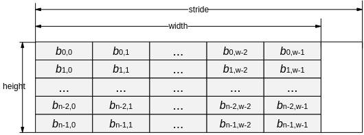

-   用户需要确保输入左右矩阵的数据中不能含有INF、-INF或者NAN数据，并且输入数值和计算结果都在fp32数据表示有效范围内，否则会导致输出的结果数值中有INF、-INF或NAN，从而使结果数值失去意义。
-   ctrl-\>has\_left\_idx，ctrl-\>has\_right\_idx和ctrl-\>is\_instant值必须为TD\_TRUE或TD\_FALSE。
-   如果ctrl-\>has\_left\_idx等于TD\_TRUE，src\_idx-\>left\_matrix的宽取值范围\[1, 100000\]，高必须为1，chn必须为1，num必须为1，物理地址需要4字节对齐，虚拟地址不使用，不做参数异常检查，stride 需要16字节对齐，内存中存储的索引必须小于src-\>left\_matrix的高，数据类型仅支持OT\_SVP\_BLOB\_TYPE\_U32。
-   如果ctrl-\>has\_right\_idx等于TD\_TRUE，src\_idx-\>right\_matrix的宽取值范围为\[1, 100000\]，高必须为1，chn必须为1，num必须为1，物理地址需要4字节对齐，虚拟地址不使用，不做参数异常检查，stride 需要16字节对齐，内存中存储的索引必须小于src-\>right\_matrix的高，数据类型仅支持OT\_SVP\_BLOB\_TYPE\_U32。
-   dst的chn必须等于1，宽等于左右矩阵的宽；数据类型为OT\_SVP\_BLOB\_TYPE\_FP32或OT\_SVP\_BLOB\_TYPE\_FP16；数据类型为FP32时，物理地址需要4字节对齐，数据类型为FP16时，物理地址需要2字节对齐；虚拟地址不使用，不做参数异常检查，stride需要16字节对齐，dst的高和num要求可分为以下4种情况：
    -   如果ctrl-\>has\_left\_idx等于TD\_FALSE，ctrl-\>has\_right\_idx等于TD\_FALSE，dst的高必须等于src-\>right\_matrix的高，dst的num必须等于src-\>left\_matrix的高。
    -   如果ctrl-\>has\_left\_idx等于TD\_TRUE，ctrl-\>has\_right\_idx等于TD\_FALSE，dst的高必须等于src\>right\_matrix的高，dst的num必须等于src\_idx-\>left\_matrix的宽。
    -   如果ctrl-\>has\_left\_idx等于TD\_FALSE，ctrl-\>has\_right\_idx等于TD\_TRUE，dst的高必须等于src\_idx-\>right\_matrix的宽，dst的num必须等于src -\>left\_matrix的高。
    -   如果ctrl-\>has\_left\_idx等于TD\_TRUE，ctrl-\>has\_right\_idx等于TD\_TRUE，dst的高必须等于src\_idx-\>right\_matrix的宽，dst的num必须等于src\_idx-\>left\_matrix的宽。

【举例】

无。

【相关主题】

无。

### ss\_mpi\_svp\_mau\_type\_convert<a name="ZH-CN_TOPIC_0000002408294172"></a>

【描述】

计算矩阵数据类型FP32和FP16相互转换。

【语法】

```
td_s32 ss_mpi_svp_mau_type_convert(ot_svp_mau_handle *handle, const ot_svp_blob *src, const ot_svp_blob *src_idx, const ot_svp_mau_type_convert_ctrl *ctrl, const ot_svp_blob *dst);
```

【参数】

<a name="table8922mcpsimp"></a>
<table><thead align="left"><tr id="row8928mcpsimp"><th class="cellrowborder" valign="top" width="11%" id="mcps1.1.4.1.1"><p id="p8930mcpsimp"><a name="p8930mcpsimp"></a><a name="p8930mcpsimp"></a>参数名称</p>
</th>
<th class="cellrowborder" valign="top" width="78%" id="mcps1.1.4.1.2"><p id="p8932mcpsimp"><a name="p8932mcpsimp"></a><a name="p8932mcpsimp"></a>描述</p>
</th>
<th class="cellrowborder" valign="top" width="11%" id="mcps1.1.4.1.3"><p id="p8934mcpsimp"><a name="p8934mcpsimp"></a><a name="p8934mcpsimp"></a>输入/输出</p>
</th>
</tr>
</thead>
<tbody><tr id="row8936mcpsimp"><td class="cellrowborder" valign="top" width="11%" headers="mcps1.1.4.1.1 "><p id="p8938mcpsimp"><a name="p8938mcpsimp"></a><a name="p8938mcpsimp"></a>handle</p>
</td>
<td class="cellrowborder" valign="top" width="78%" headers="mcps1.1.4.1.2 "><p id="p8940mcpsimp"><a name="p8940mcpsimp"></a><a name="p8940mcpsimp"></a>handle指针。</p>
<p id="p8941mcpsimp"><a name="p8941mcpsimp"></a><a name="p8941mcpsimp"></a>不能为空。</p>
</td>
<td class="cellrowborder" valign="top" width="11%" headers="mcps1.1.4.1.3 "><p id="p8943mcpsimp"><a name="p8943mcpsimp"></a><a name="p8943mcpsimp"></a>输出</p>
</td>
</tr>
<tr id="row8944mcpsimp"><td class="cellrowborder" valign="top" width="11%" headers="mcps1.1.4.1.1 "><p id="p8946mcpsimp"><a name="p8946mcpsimp"></a><a name="p8946mcpsimp"></a>src</p>
</td>
<td class="cellrowborder" valign="top" width="78%" headers="mcps1.1.4.1.2 "><p id="p8948mcpsimp"><a name="p8948mcpsimp"></a><a name="p8948mcpsimp"></a>输入矩阵。</p>
<p id="p8949mcpsimp"><a name="p8949mcpsimp"></a><a name="p8949mcpsimp"></a>不能为空。</p>
<p id="p8950mcpsimp"><a name="p8950mcpsimp"></a><a name="p8950mcpsimp"></a>数据类型仅支持OT_SVP_BLOB_TYPE_FP32和OT_SVP_BLOB_TYPE_FP16。</p>
<a name="ul176716395397"></a><a name="ul176716395397"></a><ul id="ul176716395397"><li>如果数据类型为OT_SVP_BLOB_TYPE_FP32，宽的取值范围：[1, 8192]，高的取值范围：[1, 1000000]，chn取值为1，num取值为1，物理地址4字节对齐，虚拟地址不使用，不做参数异常检查，stride 16字节对齐，ctrl-&gt;mode必须为OT_SVP_MAU_TYPE_CONVERT_MODE_FP32_TO_FP16。</li><li>如果数据类型为OT_SVP_BLOB_TYPE_FP16，宽的取值范围：[1, 16384]，高的取值范围：[1, 1000000]，chn取值为1，num取值为1，物理地址2字节对齐，虚拟地址不使用，不做参数异常检查，stride 16字节对齐，ctrl-&gt;mode必须为OT_SVP_MAU_TYPE_CONVERT_MODE_FP16_TO_FP32。</li></ul>
</td>
<td class="cellrowborder" valign="top" width="11%" headers="mcps1.1.4.1.3 "><p id="p8954mcpsimp"><a name="p8954mcpsimp"></a><a name="p8954mcpsimp"></a>输入</p>
</td>
</tr>
<tr id="row8955mcpsimp"><td class="cellrowborder" valign="top" width="11%" headers="mcps1.1.4.1.1 "><p id="p8957mcpsimp"><a name="p8957mcpsimp"></a><a name="p8957mcpsimp"></a>src_idx</p>
</td>
<td class="cellrowborder" valign="top" width="78%" headers="mcps1.1.4.1.2 "><p id="p8959mcpsimp"><a name="p8959mcpsimp"></a><a name="p8959mcpsimp"></a>输入矩阵的行索引。</p>
<p id="p8960mcpsimp"><a name="p8960mcpsimp"></a><a name="p8960mcpsimp"></a>如果ctrl信息中has_idx的值为TD_TRUE时，不能为空。</p>
</td>
<td class="cellrowborder" valign="top" width="11%" headers="mcps1.1.4.1.3 "><p id="p8962mcpsimp"><a name="p8962mcpsimp"></a><a name="p8962mcpsimp"></a>输入</p>
</td>
</tr>
<tr id="row8963mcpsimp"><td class="cellrowborder" valign="top" width="11%" headers="mcps1.1.4.1.1 "><p id="p8965mcpsimp"><a name="p8965mcpsimp"></a><a name="p8965mcpsimp"></a>ctrl</p>
</td>
<td class="cellrowborder" valign="top" width="78%" headers="mcps1.1.4.1.2 "><p id="p8967mcpsimp"><a name="p8967mcpsimp"></a><a name="p8967mcpsimp"></a>输入控制信息。</p>
<p id="p8968mcpsimp"><a name="p8968mcpsimp"></a><a name="p8968mcpsimp"></a>不能为空。</p>
</td>
<td class="cellrowborder" valign="top" width="11%" headers="mcps1.1.4.1.3 "><p id="p8970mcpsimp"><a name="p8970mcpsimp"></a><a name="p8970mcpsimp"></a>输入</p>
</td>
</tr>
<tr id="row8971mcpsimp"><td class="cellrowborder" valign="top" width="11%" headers="mcps1.1.4.1.1 "><p id="p8973mcpsimp"><a name="p8973mcpsimp"></a><a name="p8973mcpsimp"></a>dst</p>
</td>
<td class="cellrowborder" valign="top" width="78%" headers="mcps1.1.4.1.2 "><p id="p8975mcpsimp"><a name="p8975mcpsimp"></a><a name="p8975mcpsimp"></a>输出结果。</p>
<p id="p8976mcpsimp"><a name="p8976mcpsimp"></a><a name="p8976mcpsimp"></a>当输入矩阵数据类型为OT_SVP_BLOB_TYPE_FP32，其数据类型必须为OT_SVP_BLOB_TYPE_FP16；当输入矩阵数据类型为OT_SVP_BLOB_TYPE_FP16，其数据类型必须为OT_SVP_BLOB_TYPE_FP32</p>
<p id="p8977mcpsimp"><a name="p8977mcpsimp"></a><a name="p8977mcpsimp"></a>不能为空。</p>
</td>
<td class="cellrowborder" valign="top" width="11%" headers="mcps1.1.4.1.3 "><p id="p8979mcpsimp"><a name="p8979mcpsimp"></a><a name="p8979mcpsimp"></a>输出</p>
</td>
</tr>
</tbody>
</table>

【返回值】

<a name="table8981mcpsimp"></a>
<table><thead align="left"><tr id="row8986mcpsimp"><th class="cellrowborder" valign="top" width="28.999999999999996%" id="mcps1.1.3.1.1"><p id="p8988mcpsimp"><a name="p8988mcpsimp"></a><a name="p8988mcpsimp"></a>返回值</p>
</th>
<th class="cellrowborder" valign="top" width="71%" id="mcps1.1.3.1.2"><p id="p8990mcpsimp"><a name="p8990mcpsimp"></a><a name="p8990mcpsimp"></a>描述</p>
</th>
</tr>
</thead>
<tbody><tr id="row8992mcpsimp"><td class="cellrowborder" valign="top" width="28.999999999999996%" headers="mcps1.1.3.1.1 "><p id="p8994mcpsimp"><a name="p8994mcpsimp"></a><a name="p8994mcpsimp"></a>0</p>
</td>
<td class="cellrowborder" valign="top" width="71%" headers="mcps1.1.3.1.2 "><p id="p8996mcpsimp"><a name="p8996mcpsimp"></a><a name="p8996mcpsimp"></a>成功。</p>
</td>
</tr>
<tr id="row8997mcpsimp"><td class="cellrowborder" valign="top" width="28.999999999999996%" headers="mcps1.1.3.1.1 "><p id="p8999mcpsimp"><a name="p8999mcpsimp"></a><a name="p8999mcpsimp"></a>非0</p>
</td>
<td class="cellrowborder" valign="top" width="71%" headers="mcps1.1.3.1.2 "><p id="p9001mcpsimp"><a name="p9001mcpsimp"></a><a name="p9001mcpsimp"></a>失败，参见<a href="#ZH-CN_TOPIC_0000002408294264">>错误码</</a><span xml:lang="fr-FR" id="ph9004mcpsimp"><a name="ph9004mcpsimp"></a><a name="ph9004mcpsimp"></a>。</span></p>
</td>
</tr>
</tbody>
</table>

【解决方案差异】

<a name="table9006mcpsimp"></a>
<table><thead align="left"><tr id="row9011mcpsimp"><th class="cellrowborder" valign="top" width="28.999999999999996%" id="mcps1.1.3.1.1"><p id="p9013mcpsimp"><a name="p9013mcpsimp"></a><a name="p9013mcpsimp"></a>解决方案名称</p>
</th>
<th class="cellrowborder" valign="top" width="71%" id="mcps1.1.3.1.2"><p id="p9015mcpsimp"><a name="p9015mcpsimp"></a><a name="p9015mcpsimp"></a>差异</p>
</th>
</tr>
</thead>
<tbody><tr id="row9017mcpsimp"><td class="cellrowborder" valign="top" width="28.999999999999996%" headers="mcps1.1.3.1.1 "><p id="p9019mcpsimp"><a name="p9019mcpsimp"></a><a name="p9019mcpsimp"></a>SS928V100</p>
</td>
<td class="cellrowborder" valign="top" width="71%" headers="mcps1.1.3.1.2 "><p id="p9021mcpsimp"><a name="p9021mcpsimp"></a><a name="p9021mcpsimp"></a>不支持</p>
</td>
</tr>
<tr id="row577849144219"><td class="cellrowborder" valign="top" width="28.999999999999996%" headers="mcps1.1.3.1.1 "><p id="p124581150174214"><a name="p124581150174214"></a><a name="p124581150174214"></a>SS927V100</p>
</td>
<td class="cellrowborder" valign="top" width="71%" headers="mcps1.1.3.1.2 "><p id="p12458350194210"><a name="p12458350194210"></a><a name="p12458350194210"></a>不支持</p>
</td>
</tr>
</tbody>
</table>

【需求】

-   头文件：ot\_common\_svp.h、ot\_common\_mau.h、ss\_mpi\_mau.h
-   库文件：libss\_mau.a

【注意】

-   输入矩阵内存中的数据排布如下：

    **图 1**  矩阵内存排布<a name="fig73811434125414"></a>  
    

-   用户需要确保输入左右矩阵的数据中不能含有INF、-INF或者NAN数据，并且输入数值和计算结果都在fp32数据表示有效范围内，否则会导致输出的结果数值中有INF、-INF或NAN，从而使结果数值失去意义。
-   ctrl-\>has\_idx，和ctrl-\>is\_instant值必须为TD\_TRUE或TD\_FALSE。
-   如果ctrl-\>has\_ idx等于TD\_TRUE，src\_idx的宽取值范围\[1, 100000\]，高必须为1，chn必须为1，num必须为1，物理地址需要4字节对齐，虚拟地址不使用，不做参数异常检查，stride需要16字节对齐，src\_idx的内存中存储的索引值必须小于src的高，数据类型仅支持OT\_SVP\_BLOB\_TYPE\_U32。
-   dst的chn必须等于1，num必须为1，宽必须等于src的宽，数据类型为OT\_SVP\_BLOB\_TYPE\_FP32或OT\_SVP\_BLOB\_TYPE\_FP32；数据类型为FP32时，物理地址需要4字节对齐，数据类型为FP16时，物理地址需要2字节对齐；虚拟地址不使用，不做参数异常检查，stride需要16字节对齐；dst的宽和高要求可分为以下两种情况：
    -   如果ctrl-\>has\_idx等于TD\_FALSE，dst的高必须等于src的高。
    -   如果ctrl-\>has\_idx等于TD\_TRUE，dst的高必须等于src\_idx的宽。

【举例】

无。

【相关主题】

无。

### ss\_mpi\_svp\_mau\_get\_sort\_tmpbuf\_size<a name="ZH-CN_TOPIC_0000002408294160"></a>

【描述】

获取排序运算辅助内存字节数。

【语法】

```
td_s32 ss_mpi_svp_mau_get_sort_tmpbuf_size(ot_svp_blob_type type, td_u32 src_col, td_u32 *size);
```

【参数】

<a name="table5771mcpsimp"></a>
<table><thead align="left"><tr id="row5777mcpsimp"><th class="cellrowborder" valign="top" width="11%" id="mcps1.1.4.1.1"><p id="p5779mcpsimp"><a name="p5779mcpsimp"></a><a name="p5779mcpsimp"></a>参数名称</p>
</th>
<th class="cellrowborder" valign="top" width="78%" id="mcps1.1.4.1.2"><p id="p5781mcpsimp"><a name="p5781mcpsimp"></a><a name="p5781mcpsimp"></a>描述</p>
</th>
<th class="cellrowborder" valign="top" width="11%" id="mcps1.1.4.1.3"><p id="p5783mcpsimp"><a name="p5783mcpsimp"></a><a name="p5783mcpsimp"></a>输入/输出</p>
</th>
</tr>
</thead>
<tbody><tr id="row5785mcpsimp"><td class="cellrowborder" valign="top" width="11%" headers="mcps1.1.4.1.1 "><p id="p5787mcpsimp"><a name="p5787mcpsimp"></a><a name="p5787mcpsimp"></a>type</p>
</td>
<td class="cellrowborder" valign="top" width="78%" headers="mcps1.1.4.1.2 "><p id="p5789mcpsimp"><a name="p5789mcpsimp"></a><a name="p5789mcpsimp"></a>排序元素数据类型，数据类型支持OT_SVP_BLOB_TYPE_FP32，OT_SVP_BLOB_TYPE_FP16，OT_SVP_BLOB_TYPE_U32，OT_SVP_BLOB_TYPE_S32, OT_SVP_BLOB_TYPE_U16，OT_SVP_BLOB_TYPE_S16，OT_SVP_BLOB_TYPE_U8，OT_SVP_BLOB_TYPE_S8。</p>
</td>
<td class="cellrowborder" valign="top" width="11%" headers="mcps1.1.4.1.3 "><p id="p5791mcpsimp"><a name="p5791mcpsimp"></a><a name="p5791mcpsimp"></a>输入</p>
</td>
</tr>
<tr id="row5792mcpsimp"><td class="cellrowborder" valign="top" width="11%" headers="mcps1.1.4.1.1 "><p id="p5794mcpsimp"><a name="p5794mcpsimp"></a><a name="p5794mcpsimp"></a>src_col</p>
</td>
<td class="cellrowborder" valign="top" width="78%" headers="mcps1.1.4.1.2 "><p id="p5796mcpsimp"><a name="p5796mcpsimp"></a><a name="p5796mcpsimp"></a>矩阵中一行待排序元素数目，取值范围[1, 100000]。</p>
</td>
<td class="cellrowborder" valign="top" width="11%" headers="mcps1.1.4.1.3 "><p id="p5798mcpsimp"><a name="p5798mcpsimp"></a><a name="p5798mcpsimp"></a>输入</p>
</td>
</tr>
<tr id="row5799mcpsimp"><td class="cellrowborder" valign="top" width="11%" headers="mcps1.1.4.1.1 "><p id="p5801mcpsimp"><a name="p5801mcpsimp"></a><a name="p5801mcpsimp"></a>size</p>
</td>
<td class="cellrowborder" valign="top" width="78%" headers="mcps1.1.4.1.2 "><p id="p5803mcpsimp"><a name="p5803mcpsimp"></a><a name="p5803mcpsimp"></a>辅助内存字节数。</p>
<p id="p5804mcpsimp"><a name="p5804mcpsimp"></a><a name="p5804mcpsimp"></a>不能为空。</p>
</td>
<td class="cellrowborder" valign="top" width="11%" headers="mcps1.1.4.1.3 "><p id="p5806mcpsimp"><a name="p5806mcpsimp"></a><a name="p5806mcpsimp"></a>输出</p>
</td>
</tr>
</tbody>
</table>

【返回值】

<a name="table5808mcpsimp"></a>
<table><thead align="left"><tr id="row5813mcpsimp"><th class="cellrowborder" valign="top" width="28.999999999999996%" id="mcps1.1.3.1.1"><p id="p5815mcpsimp"><a name="p5815mcpsimp"></a><a name="p5815mcpsimp"></a>返回值</p>
</th>
<th class="cellrowborder" valign="top" width="71%" id="mcps1.1.3.1.2"><p id="p5817mcpsimp"><a name="p5817mcpsimp"></a><a name="p5817mcpsimp"></a>描述</p>
</th>
</tr>
</thead>
<tbody><tr id="row5819mcpsimp"><td class="cellrowborder" valign="top" width="28.999999999999996%" headers="mcps1.1.3.1.1 "><p id="p5821mcpsimp"><a name="p5821mcpsimp"></a><a name="p5821mcpsimp"></a>0</p>
</td>
<td class="cellrowborder" valign="top" width="71%" headers="mcps1.1.3.1.2 "><p id="p5823mcpsimp"><a name="p5823mcpsimp"></a><a name="p5823mcpsimp"></a>成功。</p>
</td>
</tr>
<tr id="row5824mcpsimp"><td class="cellrowborder" valign="top" width="28.999999999999996%" headers="mcps1.1.3.1.1 "><p id="p5826mcpsimp"><a name="p5826mcpsimp"></a><a name="p5826mcpsimp"></a>非0</p>
</td>
<td class="cellrowborder" valign="top" width="71%" headers="mcps1.1.3.1.2 "><p id="p5828mcpsimp"><a name="p5828mcpsimp"></a><a name="p5828mcpsimp"></a>失败，参见<a href="#ZH-CN_TOPIC_0000002408294264">>错误码</</a><span xml:lang="fr-FR" id="ph5831mcpsimp"><a name="ph5831mcpsimp"></a><a name="ph5831mcpsimp"></a>。</span></p>
</td>
</tr>
</tbody>
</table>

【解决方案差异】

<a name="table5833mcpsimp"></a>
<table><thead align="left"><tr id="row5838mcpsimp"><th class="cellrowborder" valign="top" width="28.999999999999996%" id="mcps1.1.3.1.1"><p id="p5840mcpsimp"><a name="p5840mcpsimp"></a><a name="p5840mcpsimp"></a>解决方案名称</p>
</th>
<th class="cellrowborder" valign="top" width="71%" id="mcps1.1.3.1.2"><p id="p5842mcpsimp"><a name="p5842mcpsimp"></a><a name="p5842mcpsimp"></a>差异</p>
</th>
</tr>
</thead>
<tbody><tr id="row5844mcpsimp"><td class="cellrowborder" valign="top" width="28.999999999999996%" headers="mcps1.1.3.1.1 "><p id="p5846mcpsimp"><a name="p5846mcpsimp"></a><a name="p5846mcpsimp"></a>SS928V100</p>
</td>
<td class="cellrowborder" valign="top" width="71%" headers="mcps1.1.3.1.2 "><p id="p5848mcpsimp"><a name="p5848mcpsimp"></a><a name="p5848mcpsimp"></a>不支持</p>
</td>
</tr>
<tr id="row447632144314"><td class="cellrowborder" valign="top" width="28.999999999999996%" headers="mcps1.1.3.1.1 "><p id="p14777143144313"><a name="p14777143144313"></a><a name="p14777143144313"></a>SS927V100</p>
</td>
<td class="cellrowborder" valign="top" width="71%" headers="mcps1.1.3.1.2 "><p id="p577717364318"><a name="p577717364318"></a><a name="p577717364318"></a>不支持</p>
</td>
</tr>
</tbody>
</table>

【需求】

-   头文件：ot\_common\_svp.h、ot\_common\_mau.h、ss\_mpi\_mau.h
-   库文件：libss\_mau.a

【注意】

该接口与ss\_mpi\_svp\_mau\_sort配套使用，type和src\_col与ss\_mpi\_svp\_mau\_sort参数中src-\>data\_matrix的type及width应一致。

【举例】

无。

【相关主题】

[ss\_mpi\_svp\_mau\_sort](#ZH-CN_TOPIC_0000002441853597)

### ss\_mpi\_svp\_mau\_sort<a name="ZH-CN_TOPIC_0000002441853597"></a>

【描述】

计算矩阵每一行数据进行排序。

【语法】

```
td_s32 ss_mpi_svp_mau_sort(ot_svp_mau_handle *handle, const ot_svp_mau_sort_matrix*src, const ot_svp_blob *src_idx, const ot_svp_mau_sort_ctrl *ctrl, const ot_svp_mau_sort_result *dst);
```

【参数】

<a name="table6372mcpsimp"></a>
<table><thead align="left"><tr id="row6378mcpsimp"><th class="cellrowborder" valign="top" width="11%" id="mcps1.1.4.1.1"><p id="p6380mcpsimp"><a name="p6380mcpsimp"></a><a name="p6380mcpsimp"></a>参数名称</p>
</th>
<th class="cellrowborder" valign="top" width="78%" id="mcps1.1.4.1.2"><p id="p6382mcpsimp"><a name="p6382mcpsimp"></a><a name="p6382mcpsimp"></a>描述</p>
</th>
<th class="cellrowborder" valign="top" width="11%" id="mcps1.1.4.1.3"><p id="p6384mcpsimp"><a name="p6384mcpsimp"></a><a name="p6384mcpsimp"></a>输入/输出</p>
</th>
</tr>
</thead>
<tbody><tr id="row6386mcpsimp"><td class="cellrowborder" valign="top" width="11%" headers="mcps1.1.4.1.1 "><p id="p6388mcpsimp"><a name="p6388mcpsimp"></a><a name="p6388mcpsimp"></a>handle</p>
</td>
<td class="cellrowborder" valign="top" width="78%" headers="mcps1.1.4.1.2 "><p id="p6390mcpsimp"><a name="p6390mcpsimp"></a><a name="p6390mcpsimp"></a>handle指针。</p>
<p id="p6391mcpsimp"><a name="p6391mcpsimp"></a><a name="p6391mcpsimp"></a>不能为空。</p>
</td>
<td class="cellrowborder" valign="top" width="11%" headers="mcps1.1.4.1.3 "><p id="p6393mcpsimp"><a name="p6393mcpsimp"></a><a name="p6393mcpsimp"></a>输出</p>
</td>
</tr>
<tr id="row6394mcpsimp"><td class="cellrowborder" valign="top" width="11%" headers="mcps1.1.4.1.1 "><p id="p6396mcpsimp"><a name="p6396mcpsimp"></a><a name="p6396mcpsimp"></a>src</p>
</td>
<td class="cellrowborder" valign="top" width="78%" headers="mcps1.1.4.1.2 "><p id="p6398mcpsimp"><a name="p6398mcpsimp"></a><a name="p6398mcpsimp"></a>输入矩阵。</p>
<p id="p6399mcpsimp"><a name="p6399mcpsimp"></a><a name="p6399mcpsimp"></a>不能为空。</p>
</td>
<td class="cellrowborder" valign="top" width="11%" headers="mcps1.1.4.1.3 "><p id="p6401mcpsimp"><a name="p6401mcpsimp"></a><a name="p6401mcpsimp"></a>输入</p>
</td>
</tr>
<tr id="row6402mcpsimp"><td class="cellrowborder" valign="top" width="11%" headers="mcps1.1.4.1.1 "><p id="p6404mcpsimp"><a name="p6404mcpsimp"></a><a name="p6404mcpsimp"></a>src_idx</p>
</td>
<td class="cellrowborder" valign="top" width="78%" headers="mcps1.1.4.1.2 "><p id="p6406mcpsimp"><a name="p6406mcpsimp"></a><a name="p6406mcpsimp"></a>输入矩阵的行索引。</p>
<p id="p6407mcpsimp"><a name="p6407mcpsimp"></a><a name="p6407mcpsimp"></a>如果ctrl信息中has_ idx为TD_TRUE时，不能为空。</p>
</td>
<td class="cellrowborder" valign="top" width="11%" headers="mcps1.1.4.1.3 "><p id="p6409mcpsimp"><a name="p6409mcpsimp"></a><a name="p6409mcpsimp"></a>输入</p>
</td>
</tr>
<tr id="row6410mcpsimp"><td class="cellrowborder" valign="top" width="11%" headers="mcps1.1.4.1.1 "><p id="p6412mcpsimp"><a name="p6412mcpsimp"></a><a name="p6412mcpsimp"></a>ctrl</p>
</td>
<td class="cellrowborder" valign="top" width="78%" headers="mcps1.1.4.1.2 "><p id="p6414mcpsimp"><a name="p6414mcpsimp"></a><a name="p6414mcpsimp"></a>输入控制信息。</p>
<p id="p6415mcpsimp"><a name="p6415mcpsimp"></a><a name="p6415mcpsimp"></a>不能为空。</p>
</td>
<td class="cellrowborder" valign="top" width="11%" headers="mcps1.1.4.1.3 "><p id="p6417mcpsimp"><a name="p6417mcpsimp"></a><a name="p6417mcpsimp"></a>输入</p>
</td>
</tr>
<tr id="row6418mcpsimp"><td class="cellrowborder" valign="top" width="11%" headers="mcps1.1.4.1.1 "><p id="p6420mcpsimp"><a name="p6420mcpsimp"></a><a name="p6420mcpsimp"></a>dst</p>
</td>
<td class="cellrowborder" valign="top" width="78%" headers="mcps1.1.4.1.2 "><p id="p6422mcpsimp"><a name="p6422mcpsimp"></a><a name="p6422mcpsimp"></a>输出结果。</p>
<p id="p6423mcpsimp"><a name="p6423mcpsimp"></a><a name="p6423mcpsimp"></a>不能为空。</p>
</td>
<td class="cellrowborder" valign="top" width="11%" headers="mcps1.1.4.1.3 "><p id="p6425mcpsimp"><a name="p6425mcpsimp"></a><a name="p6425mcpsimp"></a>输出</p>
</td>
</tr>
</tbody>
</table>

【返回值】

<a name="table6427mcpsimp"></a>
<table><thead align="left"><tr id="row6432mcpsimp"><th class="cellrowborder" valign="top" width="28.999999999999996%" id="mcps1.1.3.1.1"><p id="p6434mcpsimp"><a name="p6434mcpsimp"></a><a name="p6434mcpsimp"></a>返回值</p>
</th>
<th class="cellrowborder" valign="top" width="71%" id="mcps1.1.3.1.2"><p id="p6436mcpsimp"><a name="p6436mcpsimp"></a><a name="p6436mcpsimp"></a>描述</p>
</th>
</tr>
</thead>
<tbody><tr id="row6438mcpsimp"><td class="cellrowborder" valign="top" width="28.999999999999996%" headers="mcps1.1.3.1.1 "><p id="p6440mcpsimp"><a name="p6440mcpsimp"></a><a name="p6440mcpsimp"></a>0</p>
</td>
<td class="cellrowborder" valign="top" width="71%" headers="mcps1.1.3.1.2 "><p id="p6442mcpsimp"><a name="p6442mcpsimp"></a><a name="p6442mcpsimp"></a>成功。</p>
</td>
</tr>
<tr id="row6443mcpsimp"><td class="cellrowborder" valign="top" width="28.999999999999996%" headers="mcps1.1.3.1.1 "><p id="p6445mcpsimp"><a name="p6445mcpsimp"></a><a name="p6445mcpsimp"></a>非0</p>
</td>
<td class="cellrowborder" valign="top" width="71%" headers="mcps1.1.3.1.2 "><p id="p6447mcpsimp"><a name="p6447mcpsimp"></a><a name="p6447mcpsimp"></a>失败，参见<a href="#ZH-CN_TOPIC_0000002408294264">>错误码</</a><span xml:lang="fr-FR" id="ph6450mcpsimp"><a name="ph6450mcpsimp"></a><a name="ph6450mcpsimp"></a>。</span></p>
</td>
</tr>
</tbody>
</table>

【解决方案差异】

<a name="table6452mcpsimp"></a>
<table><thead align="left"><tr id="row6457mcpsimp"><th class="cellrowborder" valign="top" width="28.999999999999996%" id="mcps1.1.3.1.1"><p id="p6459mcpsimp"><a name="p6459mcpsimp"></a><a name="p6459mcpsimp"></a>解决方案名称</p>
</th>
<th class="cellrowborder" valign="top" width="71%" id="mcps1.1.3.1.2"><p id="p6461mcpsimp"><a name="p6461mcpsimp"></a><a name="p6461mcpsimp"></a>差异</p>
</th>
</tr>
</thead>
<tbody><tr id="row6463mcpsimp"><td class="cellrowborder" valign="top" width="28.999999999999996%" headers="mcps1.1.3.1.1 "><p id="p6465mcpsimp"><a name="p6465mcpsimp"></a><a name="p6465mcpsimp"></a>SS928V100</p>
</td>
<td class="cellrowborder" valign="top" width="71%" headers="mcps1.1.3.1.2 "><p id="p6467mcpsimp"><a name="p6467mcpsimp"></a><a name="p6467mcpsimp"></a>不支持</p>
</td>
</tr>
<tr id="row16601212104318"><td class="cellrowborder" valign="top" width="28.999999999999996%" headers="mcps1.1.3.1.1 "><p id="p5846mcpsimp"><a name="p5846mcpsimp"></a><a name="p5846mcpsimp"></a>SS927V100</p>
</td>
<td class="cellrowborder" valign="top" width="71%" headers="mcps1.1.3.1.2 "><p id="p5848mcpsimp"><a name="p5848mcpsimp"></a><a name="p5848mcpsimp"></a>不支持</p>
</td>
</tr>
</tbody>
</table>

【需求】

-   头文件：ot\_common\_svp.h、ot\_common\_mau.h、ss\_mpi\_mau.h
-   库文件：libss\_mau.a

【注意】

矩阵A在内存中的数据排布如下：

**图 1**  矩阵内存排布<a name="fig1634410360812"></a>  


### ss\_mpi\_svp\_mau\_get\_fir\_tmpbuf\_size<a name="ZH-CN_TOPIC_0000002441853701"></a>

【描述】

获取快速图像检索辅助内存字节数。

【语法】

```
td_s32 ss_mpi_svp_mau_get_fir_tmpbuf_size (const ot_svp_mau_fir_src *src, td_u32 bucket_num, td_u32 sub_vec_num, td_u32 *size);
```

【参数】

<a name="table158mcpsimp"></a>
<table><thead align="left"><tr id="row164mcpsimp"><th class="cellrowborder" valign="top" width="19%" id="mcps1.1.4.1.1"><p id="p166mcpsimp"><a name="p166mcpsimp"></a><a name="p166mcpsimp"></a>参数名称</p>
</th>
<th class="cellrowborder" valign="top" width="65%" id="mcps1.1.4.1.2"><p id="p168mcpsimp"><a name="p168mcpsimp"></a><a name="p168mcpsimp"></a>描述</p>
</th>
<th class="cellrowborder" valign="top" width="16%" id="mcps1.1.4.1.3"><p id="p170mcpsimp"><a name="p170mcpsimp"></a><a name="p170mcpsimp"></a>输入/输出</p>
</th>
</tr>
</thead>
<tbody><tr id="row172mcpsimp"><td class="cellrowborder" valign="top" width="19%" headers="mcps1.1.4.1.1 "><p id="p174mcpsimp"><a name="p174mcpsimp"></a><a name="p174mcpsimp"></a>src</p>
</td>
<td class="cellrowborder" valign="top" width="65%" headers="mcps1.1.4.1.2 "><p id="p176mcpsimp"><a name="p176mcpsimp"></a><a name="p176mcpsimp"></a>检索输入矩阵。</p>
</td>
<td class="cellrowborder" valign="top" width="16%" headers="mcps1.1.4.1.3 "><p id="p178mcpsimp"><a name="p178mcpsimp"></a><a name="p178mcpsimp"></a>输入</p>
</td>
</tr>
<tr id="row179mcpsimp"><td class="cellrowborder" valign="top" width="19%" headers="mcps1.1.4.1.1 "><p id="p181mcpsimp"><a name="p181mcpsimp"></a><a name="p181mcpsimp"></a>bucket_num</p>
</td>
<td class="cellrowborder" valign="top" width="65%" headers="mcps1.1.4.1.2 "><p id="p183mcpsimp"><a name="p183mcpsimp"></a><a name="p183mcpsimp"></a>检索使用分桶数目，取值范围：[1, 65535]</p>
</td>
<td class="cellrowborder" valign="top" width="16%" headers="mcps1.1.4.1.3 "><p id="p185mcpsimp"><a name="p185mcpsimp"></a><a name="p185mcpsimp"></a>输入</p>
</td>
</tr>
<tr id="row186mcpsimp"><td class="cellrowborder" valign="top" width="19%" headers="mcps1.1.4.1.1 "><p id="p188mcpsimp"><a name="p188mcpsimp"></a><a name="p188mcpsimp"></a>sub_vec_num</p>
</td>
<td class="cellrowborder" valign="top" width="65%" headers="mcps1.1.4.1.2 "><p id="p190mcpsimp"><a name="p190mcpsimp"></a><a name="p190mcpsimp"></a>子空间划分数目，取值范围：{1,2,4,8,16}</p>
</td>
<td class="cellrowborder" valign="top" width="16%" headers="mcps1.1.4.1.3 "><p id="p192mcpsimp"><a name="p192mcpsimp"></a><a name="p192mcpsimp"></a>输入</p>
</td>
</tr>
<tr id="row193mcpsimp"><td class="cellrowborder" valign="top" width="19%" headers="mcps1.1.4.1.1 "><p id="p195mcpsimp"><a name="p195mcpsimp"></a><a name="p195mcpsimp"></a>size</p>
</td>
<td class="cellrowborder" valign="top" width="65%" headers="mcps1.1.4.1.2 "><p id="p197mcpsimp"><a name="p197mcpsimp"></a><a name="p197mcpsimp"></a>辅助内存字节数。</p>
<p id="p198mcpsimp"><a name="p198mcpsimp"></a><a name="p198mcpsimp"></a>不能为空。</p>
</td>
<td class="cellrowborder" valign="top" width="16%" headers="mcps1.1.4.1.3 "><p id="p200mcpsimp"><a name="p200mcpsimp"></a><a name="p200mcpsimp"></a>输出</p>
</td>
</tr>
</tbody>
</table>

【返回值】

<a name="table202mcpsimp"></a>
<table><thead align="left"><tr id="row207mcpsimp"><th class="cellrowborder" valign="top" width="28.999999999999996%" id="mcps1.1.3.1.1"><p id="p209mcpsimp"><a name="p209mcpsimp"></a><a name="p209mcpsimp"></a>返回值</p>
</th>
<th class="cellrowborder" valign="top" width="71%" id="mcps1.1.3.1.2"><p id="p211mcpsimp"><a name="p211mcpsimp"></a><a name="p211mcpsimp"></a>描述</p>
</th>
</tr>
</thead>
<tbody><tr id="row213mcpsimp"><td class="cellrowborder" valign="top" width="28.999999999999996%" headers="mcps1.1.3.1.1 "><p id="p215mcpsimp"><a name="p215mcpsimp"></a><a name="p215mcpsimp"></a>0</p>
</td>
<td class="cellrowborder" valign="top" width="71%" headers="mcps1.1.3.1.2 "><p id="p217mcpsimp"><a name="p217mcpsimp"></a><a name="p217mcpsimp"></a>成功。</p>
</td>
</tr>
<tr id="row218mcpsimp"><td class="cellrowborder" valign="top" width="28.999999999999996%" headers="mcps1.1.3.1.1 "><p id="p220mcpsimp"><a name="p220mcpsimp"></a><a name="p220mcpsimp"></a>非0</p>
</td>
<td class="cellrowborder" valign="top" width="71%" headers="mcps1.1.3.1.2 "><p id="p222mcpsimp"><a name="p222mcpsimp"></a><a name="p222mcpsimp"></a>失败，参见<a href="#ZH-CN_TOPIC_0000002408294264">>错误码</</a><span xml:lang="fr-FR" id="ph225mcpsimp"><a name="ph225mcpsimp"></a><a name="ph225mcpsimp"></a>。</span></p>
</td>
</tr>
</tbody>
</table>

【解决方案差异】

<a name="table227mcpsimp"></a>
<table><thead align="left"><tr id="row232mcpsimp"><th class="cellrowborder" valign="top" width="28.999999999999996%" id="mcps1.1.3.1.1"><p id="p234mcpsimp"><a name="p234mcpsimp"></a><a name="p234mcpsimp"></a>解决方案名称</p>
</th>
<th class="cellrowborder" valign="top" width="71%" id="mcps1.1.3.1.2"><p id="p236mcpsimp"><a name="p236mcpsimp"></a><a name="p236mcpsimp"></a>差异</p>
</th>
</tr>
</thead>
<tbody><tr id="row238mcpsimp"><td class="cellrowborder" valign="top" width="28.999999999999996%" headers="mcps1.1.3.1.1 "><p id="p240mcpsimp"><a name="p240mcpsimp"></a><a name="p240mcpsimp"></a>SS928V100</p>
</td>
<td class="cellrowborder" valign="top" width="71%" headers="mcps1.1.3.1.2 "><p id="p242mcpsimp"><a name="p242mcpsimp"></a><a name="p242mcpsimp"></a>不支持</p>
</td>
</tr>
<tr id="row184610253430"><td class="cellrowborder" valign="top" width="28.999999999999996%" headers="mcps1.1.3.1.1 "><p id="p5846mcpsimp"><a name="p5846mcpsimp"></a><a name="p5846mcpsimp"></a>SS927V100</p>
</td>
<td class="cellrowborder" valign="top" width="71%" headers="mcps1.1.3.1.2 "><p id="p5848mcpsimp"><a name="p5848mcpsimp"></a><a name="p5848mcpsimp"></a>不支持</p>
</td>
</tr>
</tbody>
</table>

【需求】

-   头文件：ot\_common\_svp.h、ot\_common\_mau.h、ss\_mpi\_mau.h
-   库文件：libss\_mau.a

【注意】

-   用户需要确保输入左右矩阵的数据中不能含有INF、-INF或者NAN数据，并且输入数值和计算结果都在fp32数据表示有效范围内，否则会导致输出的结果数值中有INF、-INF或NAN，从而使结果数值失去意义。
-   src-\>query\_item的chn必须为1，num必须为1，height取值范围为\[1, 65535\]；数据类型仅支持OT\_SVP\_BLOB\_TYPE\_FP32和OT\_SVP\_BLOB\_TYPE\_FP16；数据类型为FP32时，width取值范围为\[1, 8192\]，数据类型为FP16时，width取值范围为\[1,16384\]；数据类型为FP32时，物理地址需要4字节对齐，数据类型为FP16时，物理地址需2字节对齐，虚拟地址不使用，不做参数异常检查；stride需要16字节对齐。
-   src-\>bucket\_center的chn必须为1，num必须为1，height取值范围为\[1, 65535\]；数据类型仅支持OT\_SVP\_BLOB\_TYPE\_FP32和OT\_SVP\_BLOB\_TYPE\_FP16；数据类型为FP32时，width取值范围为\[1, 8192\]，数据类型为FP16时，width取值范围为\[1,16384\]；数据类型为FP32时，物理地址需要4字节对齐，数据类型为FP16时，物理地址需2字节对齐，虚拟地址不使用，不做参数异常检查；stride需要16字节对齐。
-   src-\>dict\_info的chn必须为1，num必须为1，height取值范围为\[1, 256\]；数据类型仅支持OT\_SVP\_BLOB\_TYPE\_FP32和OT\_SVP\_BLOB\_TYPE\_FP16；数据类型为FP32时，width取值范围为\[1, 8192\]，数据类型为FP16时，width取值范围为\[1,16384\]；数据类型为FP32时，物理地址需要4字节对齐，数据类型为FP16时，物理地址需2字节对齐，虚拟地址不使用，不做参数异常检查；stride需要16字节对齐。
-   src-\> bucket\_info的chn必须为1，num必须为1，width必须为4，height取值范围为\[1, 65535\]；数据类型仅支持OT\_SVP\_BLOB\_TYPE\_U32；物理地址需要4字节对齐，虚拟地址不使用，不做参数异常检查；stride需要16字节对齐。
-   src-\>query\_item，src-\>bucket\_center和src-\>dict\_info的width必须一致，数据类型必须一致。
-   src-\>query\_item，src-\>bucket\_center和src-\>dict\_info的width必须是ctrl-\>sub\_vec\_num乘于8的倍数。
-   src-\>bucket\_center和src-\>bucket\_info的height必须一致。
-   bucket\_num取值范围为\[1, src-\>bucket\_center.shape.whc.height\]。

【举例】

无。

【相关主题】

[ss\_mpi\_svp\_mau\_fir](#ZH-CN_TOPIC_0000002441853513)

### ss\_mpi\_svp\_mau\_fir<a name="ZH-CN_TOPIC_0000002441853513"></a>

【描述】

快速图像检索。

【语法】

```
ss_mpi_svp_mau_fir(ot_svp_mau_handle *handle, const ot_svp_mau_fir_src *src, const ot_svp_mau_fir_ctrl *ctrl, const ot_svp_mau_fir_result *dst);
```

【参数】

<a name="table5301mcpsimp"></a>
<table><thead align="left"><tr id="row5307mcpsimp"><th class="cellrowborder" valign="top" width="14.140000000000002%" id="mcps1.1.4.1.1"><p id="p5309mcpsimp"><a name="p5309mcpsimp"></a><a name="p5309mcpsimp"></a>参数名称</p>
</th>
<th class="cellrowborder" valign="top" width="71.72%" id="mcps1.1.4.1.2"><p id="p5311mcpsimp"><a name="p5311mcpsimp"></a><a name="p5311mcpsimp"></a>描述</p>
</th>
<th class="cellrowborder" valign="top" width="14.140000000000002%" id="mcps1.1.4.1.3"><p id="p5313mcpsimp"><a name="p5313mcpsimp"></a><a name="p5313mcpsimp"></a>输入/输出</p>
</th>
</tr>
</thead>
<tbody><tr id="row5315mcpsimp"><td class="cellrowborder" valign="top" width="14.140000000000002%" headers="mcps1.1.4.1.1 "><p id="p5317mcpsimp"><a name="p5317mcpsimp"></a><a name="p5317mcpsimp"></a>handle</p>
</td>
<td class="cellrowborder" valign="top" width="71.72%" headers="mcps1.1.4.1.2 "><p id="p5319mcpsimp"><a name="p5319mcpsimp"></a><a name="p5319mcpsimp"></a>handle指针。</p>
<p id="p5320mcpsimp"><a name="p5320mcpsimp"></a><a name="p5320mcpsimp"></a>不能为空。</p>
</td>
<td class="cellrowborder" valign="top" width="14.140000000000002%" headers="mcps1.1.4.1.3 "><p id="p5322mcpsimp"><a name="p5322mcpsimp"></a><a name="p5322mcpsimp"></a>输出</p>
</td>
</tr>
<tr id="row5323mcpsimp"><td class="cellrowborder" valign="top" width="14.140000000000002%" headers="mcps1.1.4.1.1 "><p id="p5325mcpsimp"><a name="p5325mcpsimp"></a><a name="p5325mcpsimp"></a>src</p>
</td>
<td class="cellrowborder" valign="top" width="71.72%" headers="mcps1.1.4.1.2 "><p id="p5327mcpsimp"><a name="p5327mcpsimp"></a><a name="p5327mcpsimp"></a>输入矩阵。</p>
<p id="p5328mcpsimp"><a name="p5328mcpsimp"></a><a name="p5328mcpsimp"></a>不能为空。</p>
</td>
<td class="cellrowborder" valign="top" width="14.140000000000002%" headers="mcps1.1.4.1.3 "><p id="p5330mcpsimp"><a name="p5330mcpsimp"></a><a name="p5330mcpsimp"></a>输入</p>
</td>
</tr>
<tr id="row5331mcpsimp"><td class="cellrowborder" valign="top" width="14.140000000000002%" headers="mcps1.1.4.1.1 "><p id="p5333mcpsimp"><a name="p5333mcpsimp"></a><a name="p5333mcpsimp"></a>ctrl</p>
</td>
<td class="cellrowborder" valign="top" width="71.72%" headers="mcps1.1.4.1.2 "><p id="p5335mcpsimp"><a name="p5335mcpsimp"></a><a name="p5335mcpsimp"></a>输入控制信息。</p>
<p id="p5336mcpsimp"><a name="p5336mcpsimp"></a><a name="p5336mcpsimp"></a>不能为空。</p>
</td>
<td class="cellrowborder" valign="top" width="14.140000000000002%" headers="mcps1.1.4.1.3 "><p id="p5338mcpsimp"><a name="p5338mcpsimp"></a><a name="p5338mcpsimp"></a>输入</p>
</td>
</tr>
<tr id="row5339mcpsimp"><td class="cellrowborder" valign="top" width="14.140000000000002%" headers="mcps1.1.4.1.1 "><p id="p5341mcpsimp"><a name="p5341mcpsimp"></a><a name="p5341mcpsimp"></a>dst</p>
</td>
<td class="cellrowborder" valign="top" width="71.72%" headers="mcps1.1.4.1.2 "><p id="p5343mcpsimp"><a name="p5343mcpsimp"></a><a name="p5343mcpsimp"></a>输出结果。</p>
<p id="p5344mcpsimp"><a name="p5344mcpsimp"></a><a name="p5344mcpsimp"></a>不能为空。</p>
</td>
<td class="cellrowborder" valign="top" width="14.140000000000002%" headers="mcps1.1.4.1.3 "><p id="p5346mcpsimp"><a name="p5346mcpsimp"></a><a name="p5346mcpsimp"></a>输出</p>
</td>
</tr>
</tbody>
</table>

【返回值】

<a name="table5348mcpsimp"></a>
<table><thead align="left"><tr id="row5353mcpsimp"><th class="cellrowborder" valign="top" width="28.999999999999996%" id="mcps1.1.3.1.1"><p id="p5355mcpsimp"><a name="p5355mcpsimp"></a><a name="p5355mcpsimp"></a>返回值</p>
</th>
<th class="cellrowborder" valign="top" width="71%" id="mcps1.1.3.1.2"><p id="p5357mcpsimp"><a name="p5357mcpsimp"></a><a name="p5357mcpsimp"></a>描述</p>
</th>
</tr>
</thead>
<tbody><tr id="row5359mcpsimp"><td class="cellrowborder" valign="top" width="28.999999999999996%" headers="mcps1.1.3.1.1 "><p id="p5361mcpsimp"><a name="p5361mcpsimp"></a><a name="p5361mcpsimp"></a>0</p>
</td>
<td class="cellrowborder" valign="top" width="71%" headers="mcps1.1.3.1.2 "><p id="p5363mcpsimp"><a name="p5363mcpsimp"></a><a name="p5363mcpsimp"></a>成功。</p>
</td>
</tr>
<tr id="row5364mcpsimp"><td class="cellrowborder" valign="top" width="28.999999999999996%" headers="mcps1.1.3.1.1 "><p id="p5366mcpsimp"><a name="p5366mcpsimp"></a><a name="p5366mcpsimp"></a>非0</p>
</td>
<td class="cellrowborder" valign="top" width="71%" headers="mcps1.1.3.1.2 "><p id="p5368mcpsimp"><a name="p5368mcpsimp"></a><a name="p5368mcpsimp"></a>失败，参见<a href="#ZH-CN_TOPIC_0000002408294264">>错误码</</a><span xml:lang="fr-FR" id="ph5371mcpsimp"><a name="ph5371mcpsimp"></a><a name="ph5371mcpsimp"></a>。</span></p>
</td>
</tr>
</tbody>
</table>

【解决方案差异】

<a name="table5373mcpsimp"></a>
<table><thead align="left"><tr id="row5378mcpsimp"><th class="cellrowborder" valign="top" width="28.999999999999996%" id="mcps1.1.3.1.1"><p id="p5380mcpsimp"><a name="p5380mcpsimp"></a><a name="p5380mcpsimp"></a>解决方案名称</p>
</th>
<th class="cellrowborder" valign="top" width="71%" id="mcps1.1.3.1.2"><p id="p5382mcpsimp"><a name="p5382mcpsimp"></a><a name="p5382mcpsimp"></a>差异</p>
</th>
</tr>
</thead>
<tbody><tr id="row5384mcpsimp"><td class="cellrowborder" valign="top" width="28.999999999999996%" headers="mcps1.1.3.1.1 "><p id="p5386mcpsimp"><a name="p5386mcpsimp"></a><a name="p5386mcpsimp"></a>SS928V100</p>
</td>
<td class="cellrowborder" valign="top" width="71%" headers="mcps1.1.3.1.2 "><p id="p5388mcpsimp"><a name="p5388mcpsimp"></a><a name="p5388mcpsimp"></a>不支持</p>
</td>
</tr>
<tr id="row1213313356431"><td class="cellrowborder" valign="top" width="28.999999999999996%" headers="mcps1.1.3.1.1 "><p id="p5846mcpsimp"><a name="p5846mcpsimp"></a><a name="p5846mcpsimp"></a>SS927V100</p>
</td>
<td class="cellrowborder" valign="top" width="71%" headers="mcps1.1.3.1.2 "><p id="p5848mcpsimp"><a name="p5848mcpsimp"></a><a name="p5848mcpsimp"></a>不支持</p>
</td>
</tr>
</tbody>
</table>

【需求】

-   头文件：ot\_common\_svp.h、ot\_common\_mau.h、ss\_mpi\_mau.h
-   库文件：libss\_mau.a

【注意】

-   矩阵在内存中的数据排布如下：

    **图 1**  矩阵内存排布<a name="fig1964663514146"></a>  
    

-   用户需要确保输入左右矩阵的数据中不能含有INF、-INF或者NAN数据，并且输入数值和计算结果都在fp32数据表示有效范围内，否则会导致输出的结果数值中有INF、-INF或NAN，从而使结果数值失去意义。
-   src-\>query\_item的chn必须为1，num必须为1，height取值范围为\[1, 65535\]；数据类型仅支持OT\_SVP\_BLOB\_TYPE\_FP32和OT\_SVP\_BLOB\_TYPE\_FP16；数据类型为FP32时，width取值范围为\[1, 8192\]，数据类型为FP16时，width取值范围为\[1,16384\]；数据类型为FP32时，物理地址需要4字节对齐，数据类型为FP16时，物理地址需2字节对齐，虚拟地址不使用，不做参数异常检查；stride需要16字节对齐。
-   src-\>bucket\_center的chn必须为1，num必须为1，height取值范围为\[1, 65535\]；数据类型仅支持OT\_SVP\_BLOB\_TYPE\_FP32和OT\_SVP\_BLOB\_TYPE\_FP16；数据类型为FP32时，width取值范围为\[1, 8192\]，数据类型为FP16时，width取值范围为\[1,16384\]；数据类型为FP32时，物理地址需要4字节对齐，数据类型为FP16时，物理地址需2字节对齐，虚拟地址不使用，不做参数异常检查；stride需要16字节对齐。
-   src-\>dict\_info的chn必须为1，num必须为1，height取值范围为\[1, 256\]；数据类型仅支持OT\_SVP\_BLOB\_TYPE\_FP32和OT\_SVP\_BLOB\_TYPE\_FP16；数据类型为FP32时，width取值范围为\[1, 8192\]，数据类型为FP16时，width取值范围为\[1,16384\]；数据类型为FP32时，物理地址需要4字节对齐，数据类型为FP16时，物理地址需2字节对齐，虚拟地址不使用，不做参数异常检查；stride需要16字节对齐。
-   src-\>bucket\_info的chn必须为1，num必须为1，width必须为4，height取值范围为\[1, 65535\]；数据类型仅支持OT\_SVP\_BLOB\_TYPE\_U32；物理地址需要4字节对齐，虚拟地址不使用，不做参数异常检查；stride需要16字节对齐。
-   src-\>query\_item，src-\>bucket\_center和src-\>dict\_info的width必须一致，数据类型必须一致。
-   src-\>query\_item，src-\>bucket\_center和src-\>dict\_info的width必须是ctrl-\>sub\_vec\_num乘于8的倍数。
-   src-\>bucket\_center和src-\>bucket\_info的height必须一致。
-   ctrl-\>is\_instant值必须为TD\_TRUE或TD\_FALSE。
-   ctrl-\>bucket\_num取值范围为\[1, src-\>bucket\_center.shape.whc.height\]。
-   ctrl-\>feature\_db的物理地址必须16字节对齐，虚拟地址不使用，不做参数异常检查。
-   ctrl-\>id\_db的物理地址必须16字节对齐，虚拟地址不使用，不做参数异常检查。
-   ctrl-\>tmp\_buf的物理地址必须16字节对齐，虚拟地址不使用，不做参数异常检查，size大于或者等于ss\_mpi\_svp\_mau\_get\_fir\_tmpbuf\_size计算结果。
-   dst-\>top\_n的chn必须等于1，num必须为1，height等于src-\>query\_item.shape.whc.height，width的取值范围为\[1, 1024\]，物理地址4字节对齐，虚拟地址不使用，不做参数异常检查，stride需要16字节对齐，数据类型必须为OT\_SVP\_BLOB\_TYPE\_FP32。
-   dst-\>top\_n\_idx的chn必须等于1，num必须为1，物理地址4字节对齐，虚拟地址不使用，不做参数异常检查，stride需要16字节对齐，数据类型必须为OT\_SVP\_BLOB\_TYPE\_U32，dst-\>top\_n\_idx的宽和高必须与dst-\>top\_n一致。
-   dst-\>top\_n的值为U32的最大值（0xFFFFFFFF）时，表示检索结果不足dst-\>top\_n.shape.whc.with。

【举例】

无。

【相关主题】

[ss\_mpi\_svp\_mau\_get\_fir\_tmpbuf\_size](#ZH-CN_TOPIC_0000002441853701)

### ss\_mpi\_svp\_mau\_query<a name="ZH-CN_TOPIC_0000002408294188"></a>

【描述】

任务状态查询。

【语法】

```
td_s32 ss_mpi_svp_mau_query(ot_svp_mau_id mau_id, ot_svp_mau_handle handle, td_bool *is_finish, td_bool is_block);
```

【参数】

<a name="table1122mcpsimp"></a>
<table><thead align="left"><tr id="row1128mcpsimp"><th class="cellrowborder" valign="top" width="20%" id="mcps1.1.4.1.1"><p id="p1130mcpsimp"><a name="p1130mcpsimp"></a><a name="p1130mcpsimp"></a>参数名称</p>
</th>
<th class="cellrowborder" valign="top" width="59%" id="mcps1.1.4.1.2"><p id="p1132mcpsimp"><a name="p1132mcpsimp"></a><a name="p1132mcpsimp"></a>描述</p>
</th>
<th class="cellrowborder" valign="top" width="21%" id="mcps1.1.4.1.3"><p id="p1134mcpsimp"><a name="p1134mcpsimp"></a><a name="p1134mcpsimp"></a>输入/输出</p>
</th>
</tr>
</thead>
<tbody><tr id="row1136mcpsimp"><td class="cellrowborder" valign="top" width="20%" headers="mcps1.1.4.1.1 "><p id="p1138mcpsimp"><a name="p1138mcpsimp"></a><a name="p1138mcpsimp"></a>mau_id</p>
</td>
<td class="cellrowborder" valign="top" width="59%" headers="mcps1.1.4.1.2 "><p id="p1140mcpsimp"><a name="p1140mcpsimp"></a><a name="p1140mcpsimp"></a>任务所运行的MAU核ID。</p>
</td>
<td class="cellrowborder" valign="top" width="21%" headers="mcps1.1.4.1.3 "><p id="p1142mcpsimp"><a name="p1142mcpsimp"></a><a name="p1142mcpsimp"></a>输入</p>
</td>
</tr>
<tr id="row1143mcpsimp"><td class="cellrowborder" valign="top" width="20%" headers="mcps1.1.4.1.1 "><p id="p1145mcpsimp"><a name="p1145mcpsimp"></a><a name="p1145mcpsimp"></a>handle</p>
</td>
<td class="cellrowborder" valign="top" width="59%" headers="mcps1.1.4.1.2 "><p id="p1147mcpsimp"><a name="p1147mcpsimp"></a><a name="p1147mcpsimp"></a>任务的handle。</p>
<p id="p1148mcpsimp"><a name="p1148mcpsimp"></a><a name="p1148mcpsimp"></a>取值范围：(-1, 0x0FFFFFFF)。</p>
</td>
<td class="cellrowborder" valign="top" width="21%" headers="mcps1.1.4.1.3 "><p id="p1150mcpsimp"><a name="p1150mcpsimp"></a><a name="p1150mcpsimp"></a>输入</p>
</td>
</tr>
<tr id="row1151mcpsimp"><td class="cellrowborder" valign="top" width="20%" headers="mcps1.1.4.1.1 "><p id="p1153mcpsimp"><a name="p1153mcpsimp"></a><a name="p1153mcpsimp"></a>is_finish</p>
</td>
<td class="cellrowborder" valign="top" width="59%" headers="mcps1.1.4.1.2 "><p id="p1155mcpsimp"><a name="p1155mcpsimp"></a><a name="p1155mcpsimp"></a>任务是否完成。</p>
<p id="p1156mcpsimp"><a name="p1156mcpsimp"></a><a name="p1156mcpsimp"></a>不能为空。</p>
</td>
<td class="cellrowborder" valign="top" width="21%" headers="mcps1.1.4.1.3 "><p id="p1158mcpsimp"><a name="p1158mcpsimp"></a><a name="p1158mcpsimp"></a>输出</p>
</td>
</tr>
<tr id="row1159mcpsimp"><td class="cellrowborder" valign="top" width="20%" headers="mcps1.1.4.1.1 "><p id="p1161mcpsimp"><a name="p1161mcpsimp"></a><a name="p1161mcpsimp"></a>is_block</p>
</td>
<td class="cellrowborder" valign="top" width="59%" headers="mcps1.1.4.1.2 "><p id="p1163mcpsimp"><a name="p1163mcpsimp"></a><a name="p1163mcpsimp"></a>是否阻塞查询。</p>
</td>
<td class="cellrowborder" valign="top" width="21%" headers="mcps1.1.4.1.3 "><p id="p1165mcpsimp"><a name="p1165mcpsimp"></a><a name="p1165mcpsimp"></a>输入</p>
</td>
</tr>
</tbody>
</table>

【返回值】

<a name="table1167mcpsimp"></a>
<table><thead align="left"><tr id="row1172mcpsimp"><th class="cellrowborder" valign="top" width="28.999999999999996%" id="mcps1.1.3.1.1"><p id="p1174mcpsimp"><a name="p1174mcpsimp"></a><a name="p1174mcpsimp"></a>返回值</p>
</th>
<th class="cellrowborder" valign="top" width="71%" id="mcps1.1.3.1.2"><p id="p1176mcpsimp"><a name="p1176mcpsimp"></a><a name="p1176mcpsimp"></a>描述</p>
</th>
</tr>
</thead>
<tbody><tr id="row1178mcpsimp"><td class="cellrowborder" valign="top" width="28.999999999999996%" headers="mcps1.1.3.1.1 "><p id="p1180mcpsimp"><a name="p1180mcpsimp"></a><a name="p1180mcpsimp"></a>0</p>
</td>
<td class="cellrowborder" valign="top" width="71%" headers="mcps1.1.3.1.2 "><p id="p1182mcpsimp"><a name="p1182mcpsimp"></a><a name="p1182mcpsimp"></a>成功。</p>
</td>
</tr>
<tr id="row1183mcpsimp"><td class="cellrowborder" valign="top" width="28.999999999999996%" headers="mcps1.1.3.1.1 "><p id="p1185mcpsimp"><a name="p1185mcpsimp"></a><a name="p1185mcpsimp"></a>非0</p>
</td>
<td class="cellrowborder" valign="top" width="71%" headers="mcps1.1.3.1.2 "><p id="p1187mcpsimp"><a name="p1187mcpsimp"></a><a name="p1187mcpsimp"></a>失败，参见<a href="#ZH-CN_TOPIC_0000002408294264">>错误码</</a><span xml:lang="fr-FR" id="ph1190mcpsimp"><a name="ph1190mcpsimp"></a><a name="ph1190mcpsimp"></a>。</span></p>
</td>
</tr>
</tbody>
</table>

【需求】

-   头文件：ot\_common\_svp.h、ot\_common\_mau.h、ss\_mpi\_mau.h
-   库文件：libss\_mau.a

【注意】

输入的handle必须为调用[ss\_mpi\_svp\_mau\_matrix\_mul](#ZH-CN_TOPIC_0000002441853557)，[ss\_mpi\_svp\_mau\_cos\_dist](#ZH-CN_TOPIC_0000002408294444)或者[ss\_mpi\_svp\_mau\_euclid\_dist](#ZH-CN_TOPIC_0000002408294448)函数返回的handle。

【举例】

无。

【相关主题】

无。

### ss\_mpi\_svp\_mau\_add\_mem\_info<a name="ZH-CN_TOPIC_0000002441853565"></a>

【描述】

记录内存信息。

【语法】

```
td_s32 ss_mpi_svp_mau_add_mem_info(const ot_svp_mem_info * mem_info);
```

【参数】

<a name="table1824mcpsimp"></a>
<table><thead align="left"><tr id="row1830mcpsimp"><th class="cellrowborder" valign="top" width="28.999999999999996%" id="mcps1.1.4.1.1"><p id="p1832mcpsimp"><a name="p1832mcpsimp"></a><a name="p1832mcpsimp"></a>参数名称</p>
</th>
<th class="cellrowborder" valign="top" width="43%" id="mcps1.1.4.1.2"><p id="p1834mcpsimp"><a name="p1834mcpsimp"></a><a name="p1834mcpsimp"></a>描述</p>
</th>
<th class="cellrowborder" valign="top" width="28.000000000000004%" id="mcps1.1.4.1.3"><p id="p1836mcpsimp"><a name="p1836mcpsimp"></a><a name="p1836mcpsimp"></a>输入/输出</p>
</th>
</tr>
</thead>
<tbody><tr id="row1838mcpsimp"><td class="cellrowborder" valign="top" width="28.999999999999996%" headers="mcps1.1.4.1.1 "><p id="p1840mcpsimp"><a name="p1840mcpsimp"></a><a name="p1840mcpsimp"></a>mem_info</p>
</td>
<td class="cellrowborder" valign="top" width="43%" headers="mcps1.1.4.1.2 "><p id="p1842mcpsimp"><a name="p1842mcpsimp"></a><a name="p1842mcpsimp"></a>内存信息指针。</p>
<p id="p1843mcpsimp"><a name="p1843mcpsimp"></a><a name="p1843mcpsimp"></a>不能为空，申请使用的内存需要是带cache的。</p>
</td>
<td class="cellrowborder" valign="top" width="28.000000000000004%" headers="mcps1.1.4.1.3 "><p id="p1845mcpsimp"><a name="p1845mcpsimp"></a><a name="p1845mcpsimp"></a>输入</p>
</td>
</tr>
</tbody>
</table>

【返回值】

<a name="table1847mcpsimp"></a>
<table><thead align="left"><tr id="row1852mcpsimp"><th class="cellrowborder" valign="top" width="28.999999999999996%" id="mcps1.1.3.1.1"><p id="p1854mcpsimp"><a name="p1854mcpsimp"></a><a name="p1854mcpsimp"></a>返回值</p>
</th>
<th class="cellrowborder" valign="top" width="71%" id="mcps1.1.3.1.2"><p id="p1856mcpsimp"><a name="p1856mcpsimp"></a><a name="p1856mcpsimp"></a>描述</p>
</th>
</tr>
</thead>
<tbody><tr id="row1858mcpsimp"><td class="cellrowborder" valign="top" width="28.999999999999996%" headers="mcps1.1.3.1.1 "><p id="p1860mcpsimp"><a name="p1860mcpsimp"></a><a name="p1860mcpsimp"></a>0</p>
</td>
<td class="cellrowborder" valign="top" width="71%" headers="mcps1.1.3.1.2 "><p id="p1862mcpsimp"><a name="p1862mcpsimp"></a><a name="p1862mcpsimp"></a>成功。</p>
</td>
</tr>
<tr id="row1863mcpsimp"><td class="cellrowborder" valign="top" width="28.999999999999996%" headers="mcps1.1.3.1.1 "><p id="p1865mcpsimp"><a name="p1865mcpsimp"></a><a name="p1865mcpsimp"></a>非0</p>
</td>
<td class="cellrowborder" valign="top" width="71%" headers="mcps1.1.3.1.2 "><p id="p1867mcpsimp"><a name="p1867mcpsimp"></a><a name="p1867mcpsimp"></a>失败，参见<a href="#ZH-CN_TOPIC_0000002408294264">>错误码</</a><span xml:lang="fr-FR" id="ph1870mcpsimp"><a name="ph1870mcpsimp"></a><a name="ph1870mcpsimp"></a>。</span></p>
</td>
</tr>
</tbody>
</table>

【需求】

-   头文件：ot\_common\_svp.h、ot\_common\_mau.h、ss\_mpi\_mau.h
-   库文件：libss\_mau.a

【注意】

-   记录内存地址信息，用于减少内核态内存映射次数，提升效率。
-   内存地址信息的记录是通过链表进行管理，链表长度默认值为32，链表长度可通过模块参数mau\_max\_mem\_info\_num进行配置。
-   若没有调用ss\_mpi\_svp\_mau\_add\_mem\_info预先把索引矩阵地址信息记录到系统，那么在之后计算中每次都会Map/Unmap操作索引矩阵内核态的虚拟地址，效率会比较低。
-   必须与[ss\_mpi\_svp\_mau\_rm\_mem\_info](#ZH-CN_TOPIC_0000002408294464)成对匹配使用。
-   建议先把矩阵运算要用到的索引矩阵地址信息调用此接口记录到系统。当不再使用时调用[ss\_mpi\_svp\_mau\_rm\_mem\_info](#ZH-CN_TOPIC_0000002408294464)把索引矩阵地址信息移除。只需要在初始化时把索引矩阵地址信息记录，后续可以直接使用，直到不再使用时才移除。
-   物理地址4字节对齐。
-   mem\_info -\>virt\_addr不使用，不做参数异常检查。
-   mem\_info -\>size不能为0。
-   mem info内存由用户释放，记录的mem info内存要在移除后才能被释放。

【举例】

无。

【相关主题】

无。

### ss\_mpi\_svp\_mau\_rm\_mem\_info<a name="ZH-CN_TOPIC_0000002408294464"></a>

【描述】

移除内存信息。

【语法】

```
td_s32 ss_mpi_svp_mau_rm_mem_info (const ot_svp_mem_info* mem_info);
```

【参数】

<a name="table1590mcpsimp"></a>
<table><thead align="left"><tr id="row1596mcpsimp"><th class="cellrowborder" valign="top" width="28.999999999999996%" id="mcps1.1.4.1.1"><p id="p1598mcpsimp"><a name="p1598mcpsimp"></a><a name="p1598mcpsimp"></a>参数名称</p>
</th>
<th class="cellrowborder" valign="top" width="43%" id="mcps1.1.4.1.2"><p id="p1600mcpsimp"><a name="p1600mcpsimp"></a><a name="p1600mcpsimp"></a>描述</p>
</th>
<th class="cellrowborder" valign="top" width="28.000000000000004%" id="mcps1.1.4.1.3"><p id="p1602mcpsimp"><a name="p1602mcpsimp"></a><a name="p1602mcpsimp"></a>输入/输出</p>
</th>
</tr>
</thead>
<tbody><tr id="row1604mcpsimp"><td class="cellrowborder" valign="top" width="28.999999999999996%" headers="mcps1.1.4.1.1 "><p id="p1606mcpsimp"><a name="p1606mcpsimp"></a><a name="p1606mcpsimp"></a>mem_info</p>
</td>
<td class="cellrowborder" valign="top" width="43%" headers="mcps1.1.4.1.2 "><p id="p1608mcpsimp"><a name="p1608mcpsimp"></a><a name="p1608mcpsimp"></a>内存信息指针。</p>
<p id="p1609mcpsimp"><a name="p1609mcpsimp"></a><a name="p1609mcpsimp"></a>不能为空</p>
</td>
<td class="cellrowborder" valign="top" width="28.000000000000004%" headers="mcps1.1.4.1.3 "><p id="p1611mcpsimp"><a name="p1611mcpsimp"></a><a name="p1611mcpsimp"></a>输入</p>
</td>
</tr>
</tbody>
</table>

【返回值】

<a name="table1613mcpsimp"></a>
<table><thead align="left"><tr id="row1618mcpsimp"><th class="cellrowborder" valign="top" width="28.999999999999996%" id="mcps1.1.3.1.1"><p id="p1620mcpsimp"><a name="p1620mcpsimp"></a><a name="p1620mcpsimp"></a>返回值</p>
</th>
<th class="cellrowborder" valign="top" width="71%" id="mcps1.1.3.1.2"><p id="p1622mcpsimp"><a name="p1622mcpsimp"></a><a name="p1622mcpsimp"></a>描述</p>
</th>
</tr>
</thead>
<tbody><tr id="row1624mcpsimp"><td class="cellrowborder" valign="top" width="28.999999999999996%" headers="mcps1.1.3.1.1 "><p id="p1626mcpsimp"><a name="p1626mcpsimp"></a><a name="p1626mcpsimp"></a>0</p>
</td>
<td class="cellrowborder" valign="top" width="71%" headers="mcps1.1.3.1.2 "><p id="p1628mcpsimp"><a name="p1628mcpsimp"></a><a name="p1628mcpsimp"></a>成功。</p>
</td>
</tr>
<tr id="row1629mcpsimp"><td class="cellrowborder" valign="top" width="28.999999999999996%" headers="mcps1.1.3.1.1 "><p id="p1631mcpsimp"><a name="p1631mcpsimp"></a><a name="p1631mcpsimp"></a>非0</p>
</td>
<td class="cellrowborder" valign="top" width="71%" headers="mcps1.1.3.1.2 "><p id="p1633mcpsimp"><a name="p1633mcpsimp"></a><a name="p1633mcpsimp"></a>失败，参见<a href="#ZH-CN_TOPIC_0000002408294264">>错误码</</a><span xml:lang="fr-FR" id="ph1636mcpsimp"><a name="ph1636mcpsimp"></a><a name="ph1636mcpsimp"></a>。</span></p>
</td>
</tr>
</tbody>
</table>

【需求】

-   头文件：ot\_common\_svp.h、ot\_common\_mau.h、ss\_mpi\_mau.h
-   库文件：libss\_mau.a

【注意】

-   如果mem info不再使用，需要将记录的mem info地址信息从链表中移除。
-   必须与[ss\_mpi\_svp\_mau\_add\_mem\_info](#ZH-CN_TOPIC_0000002441853565)成对匹配使用。
-   物理地址4字节对齐。
-   mem\_info -\>virt\_addr不使用，不做参数异常检查。
-   mem\_info -\>size不能为0。
-   mem info内存由用户释放，记录的mem info内存要在移除后才能被释放。

【举例】

无。

【相关主题】

无。

## 数据类型和数据结构<a name="ZH-CN_TOPIC_0000002408134296"></a>

MAU相关数据类型、数据结构定义如下：


### ot\_svp\_blob\_type<a name="ZH-CN_TOPIC_0000002408134284"></a>

【说明】

定义blob的数据内存排布。

【定义】

```
typedef enum {
    OT_SVP_BLOB_TYPE_S20Q12       =  0x0,
    OT_SVP_BLOB_TYPE_U8            =  0x1,
    OT_SVP_BLOB_TYPE_YVU420SP     =  0x2,  /* channel = 3 */
    OT_SVP_BLOB_TYPE_YVU422SP     =  0x3,  /* channel = 3 */
    OT_SVP_BLOB_TYPE_VEC_S20Q12   =  0x4,
    OT_SVP_BLOB_TYPE_SEQ_S20Q12   =  0x5,
    OT_SVP_BLOB_TYPE_BBOX_S20Q12  =  0x6,
    OT_SVP_BLOB_TYPE_BSI_SQ32      =  0x7,
    OT_SVP_BLOB_TYPE_S12Q20        =  0x8,
    OT_SVP_BLOB_TYPE_VEC_S12Q20   =  0x9,
    OT_SVP_BLOB_TYPE_S32           =  0xa,
    OT_SVP_BLOB_TYPE_U32           =  0xb,
    OT_SVP_BLOB_TYPE_FP32          =  0xc,
    OT_SVP_BLOB_TYPE_FP16          =  0xd,
    OT_SVP_BLOB_TYPE_S8            =  0xe,
    OT_SVP_BLOB_TYPE_S16           =  0xf,
    OT_SVP_BLOB_TYPE_U16           =  0x10,
    OT_SVP_BLOB_TYPE_BUTT
}ot_svp_blob_type;
```

【成员】

<a name="table748mcpsimp"></a>
<table><thead align="left"><tr id="row753mcpsimp"><th class="cellrowborder" valign="top" width="39%" id="mcps1.1.3.1.1"><p id="p755mcpsimp"><a name="p755mcpsimp"></a><a name="p755mcpsimp"></a>成员名称</p>
</th>
<th class="cellrowborder" valign="top" width="61%" id="mcps1.1.3.1.2"><p id="p757mcpsimp"><a name="p757mcpsimp"></a><a name="p757mcpsimp"></a>描述</p>
</th>
</tr>
</thead>
<tbody><tr id="row759mcpsimp"><td class="cellrowborder" valign="top" width="39%" headers="mcps1.1.3.1.1 "><p id="p761mcpsimp"><a name="p761mcpsimp"></a><a name="p761mcpsimp"></a>OT_SVP_BLOB_TYPE_S20Q12</p>
</td>
<td class="cellrowborder" valign="top" width="61%" headers="mcps1.1.3.1.2 "><p id="p763mcpsimp"><a name="p763mcpsimp"></a><a name="p763mcpsimp"></a>Blob数据元素为S20Q12类型，参考<a href="#fig432114356336">图2</a></p>
</td>
</tr>
<tr id="row765mcpsimp"><td class="cellrowborder" valign="top" width="39%" headers="mcps1.1.3.1.1 "><p id="p767mcpsimp"><a name="p767mcpsimp"></a><a name="p767mcpsimp"></a>OT_SVP_BLOB_TYPE_U8</p>
</td>
<td class="cellrowborder" valign="top" width="61%" headers="mcps1.1.3.1.2 "><p id="p769mcpsimp"><a name="p769mcpsimp"></a><a name="p769mcpsimp"></a>Blob数据元素为U8类型，参考<a href="#fig430802356">图3</a></p>
</td>
</tr>
<tr id="row771mcpsimp"><td class="cellrowborder" valign="top" width="39%" headers="mcps1.1.3.1.1 "><p id="p773mcpsimp"><a name="p773mcpsimp"></a><a name="p773mcpsimp"></a>OT_SVP_BLOB_TYPE_YVU420SP</p>
</td>
<td class="cellrowborder" valign="top" width="61%" headers="mcps1.1.3.1.2 "><p id="p775mcpsimp"><a name="p775mcpsimp"></a><a name="p775mcpsimp"></a>Blob数据内存排布为YVU420SP，参考<a href="#fig1997712477353">图4</a>。</p>
</td>
</tr>
<tr id="row777mcpsimp"><td class="cellrowborder" valign="top" width="39%" headers="mcps1.1.3.1.1 "><p id="p779mcpsimp"><a name="p779mcpsimp"></a><a name="p779mcpsimp"></a>OT_SVP_BLOB_TYPE_YVU422SP</p>
</td>
<td class="cellrowborder" valign="top" width="61%" headers="mcps1.1.3.1.2 "><p id="p781mcpsimp"><a name="p781mcpsimp"></a><a name="p781mcpsimp"></a>Blob数据内存排布为YVU422SP，参考<a href="#fig157063127362">图5</a>。</p>
</td>
</tr>
<tr id="row783mcpsimp"><td class="cellrowborder" valign="top" width="39%" headers="mcps1.1.3.1.1 "><p id="p785mcpsimp"><a name="p785mcpsimp"></a><a name="p785mcpsimp"></a>OT_SVP_BLOB_TYPE_VEC_S20Q12</p>
</td>
<td class="cellrowborder" valign="top" width="61%" headers="mcps1.1.3.1.2 "><p id="p787mcpsimp"><a name="p787mcpsimp"></a><a name="p787mcpsimp"></a>Blob中存储向量，每个元素为S20Q12类型，参考<a href="#fig3955234133616">图6</a>。</p>
</td>
</tr>
<tr id="row789mcpsimp"><td class="cellrowborder" valign="top" width="39%" headers="mcps1.1.3.1.1 "><p id="p791mcpsimp"><a name="p791mcpsimp"></a><a name="p791mcpsimp"></a>OT_SVP_BLOB_TYPE_SEQ_S20Q12</p>
</td>
<td class="cellrowborder" valign="top" width="61%" headers="mcps1.1.3.1.2 "><p id="p793mcpsimp"><a name="p793mcpsimp"></a><a name="p793mcpsimp"></a>Blob中存储序列，数据元素为S20Q12类型，排布见<a href="#fig92214587365">图7</a>。</p>
</td>
</tr>
<tr id="row795mcpsimp"><td class="cellrowborder" valign="top" width="39%" headers="mcps1.1.3.1.1 "><p id="p797mcpsimp"><a name="p797mcpsimp"></a><a name="p797mcpsimp"></a>OT_SVP_BLOB_TYPE_BBOX_S20Q12</p>
</td>
<td class="cellrowborder" valign="top" width="61%" headers="mcps1.1.3.1.2 "><p id="p799mcpsimp"><a name="p799mcpsimp"></a><a name="p799mcpsimp"></a>Blob中存储坐标，数据元素为S20Q12类型，排布见<a href="#fig4763322123710">图8</a>。</p>
</td>
</tr>
<tr id="row801mcpsimp"><td class="cellrowborder" valign="top" width="39%" headers="mcps1.1.3.1.1 "><p id="p803mcpsimp"><a name="p803mcpsimp"></a><a name="p803mcpsimp"></a>OT_SVP_BLOB_TYPE_BSI_SQ32</p>
</td>
<td class="cellrowborder" valign="top" width="61%" headers="mcps1.1.3.1.2 "><p id="p805mcpsimp"><a name="p805mcpsimp"></a><a name="p805mcpsimp"></a>Blob中存储坐标、分值和类别，数据元素为32bit的量化数据，排布见<a href="#fig16508844123710">图9</a>。</p>
</td>
</tr>
<tr id="row807mcpsimp"><td class="cellrowborder" valign="top" width="39%" headers="mcps1.1.3.1.1 "><p id="p809mcpsimp"><a name="p809mcpsimp"></a><a name="p809mcpsimp"></a>OT_SVP_BLOB_TYPE_S12Q20</p>
</td>
<td class="cellrowborder" valign="top" width="61%" headers="mcps1.1.3.1.2 "><p id="p811mcpsimp"><a name="p811mcpsimp"></a><a name="p811mcpsimp"></a>Blob数据元素为S12Q20类型，参考<a href="#fig57340118385">图10</a></p>
</td>
</tr>
<tr id="row813mcpsimp"><td class="cellrowborder" valign="top" width="39%" headers="mcps1.1.3.1.1 "><p id="p815mcpsimp"><a name="p815mcpsimp"></a><a name="p815mcpsimp"></a>OT_SVP_BLOB_TYPE_VEC_S12Q20</p>
</td>
<td class="cellrowborder" valign="top" width="61%" headers="mcps1.1.3.1.2 "><p id="p817mcpsimp"><a name="p817mcpsimp"></a><a name="p817mcpsimp"></a>Blob中存储向量，每个元素为S12Q20类型，参考<a href="#fig683243353810">图11</a>。</p>
</td>
</tr>
<tr id="row819mcpsimp"><td class="cellrowborder" valign="top" width="39%" headers="mcps1.1.3.1.1 "><p id="p821mcpsimp"><a name="p821mcpsimp"></a><a name="p821mcpsimp"></a>OT_SVP_BLOB_TYPE_S32</p>
</td>
<td class="cellrowborder" valign="top" width="61%" headers="mcps1.1.3.1.2 "><p id="p823mcpsimp"><a name="p823mcpsimp"></a><a name="p823mcpsimp"></a>Blob数据元素为32bit有符号整型，参考<a href="#fig6794458183818">图12</a></p>
</td>
</tr>
<tr id="row825mcpsimp"><td class="cellrowborder" valign="top" width="39%" headers="mcps1.1.3.1.1 "><p id="p827mcpsimp"><a name="p827mcpsimp"></a><a name="p827mcpsimp"></a>OT_SVP_BLOB_TYPE_U32</p>
</td>
<td class="cellrowborder" valign="top" width="61%" headers="mcps1.1.3.1.2 "><p id="p829mcpsimp"><a name="p829mcpsimp"></a><a name="p829mcpsimp"></a>Blob数据元素为32bit无符号整型，参考<a href="#fig16266122213918">图13</a></p>
</td>
</tr>
<tr id="row831mcpsimp"><td class="cellrowborder" valign="top" width="39%" headers="mcps1.1.3.1.1 "><p id="p833mcpsimp"><a name="p833mcpsimp"></a><a name="p833mcpsimp"></a>OT_SVP_BLOB_TYPE_FP32</p>
</td>
<td class="cellrowborder" valign="top" width="61%" headers="mcps1.1.3.1.2 "><p id="p835mcpsimp"><a name="p835mcpsimp"></a><a name="p835mcpsimp"></a>Blob数据元素为32bit浮点型，参考<a href="#fig92855610398">图14</a></p>
</td>
</tr>
<tr id="row837mcpsimp"><td class="cellrowborder" valign="top" width="39%" headers="mcps1.1.3.1.1 "><p id="p839mcpsimp"><a name="p839mcpsimp"></a><a name="p839mcpsimp"></a>OT_SVP_BLOB_TYPE_FP16</p>
</td>
<td class="cellrowborder" valign="top" width="61%" headers="mcps1.1.3.1.2 "><p id="p841mcpsimp"><a name="p841mcpsimp"></a><a name="p841mcpsimp"></a>Blob数据元素为16bit浮点型，参考<a href="#fig4744171674019">图15</a></p>
</td>
</tr>
<tr id="row843mcpsimp"><td class="cellrowborder" valign="top" width="39%" headers="mcps1.1.3.1.1 "><p id="p845mcpsimp"><a name="p845mcpsimp"></a><a name="p845mcpsimp"></a>OT_SVP_BLOB_TYPE_S8</p>
</td>
<td class="cellrowborder" valign="top" width="61%" headers="mcps1.1.3.1.2 "><p id="p847mcpsimp"><a name="p847mcpsimp"></a><a name="p847mcpsimp"></a>Blob数据元素为8bit有符号整型，参考<a href="#fig209422420408">图16</a></p>
</td>
</tr>
<tr id="row849mcpsimp"><td class="cellrowborder" valign="top" width="39%" headers="mcps1.1.3.1.1 "><p id="p851mcpsimp"><a name="p851mcpsimp"></a><a name="p851mcpsimp"></a>OT_SVP_BLOB_TYPE_S16</p>
</td>
<td class="cellrowborder" valign="top" width="61%" headers="mcps1.1.3.1.2 "><p id="p853mcpsimp"><a name="p853mcpsimp"></a><a name="p853mcpsimp"></a>Blob数据元素为16bit有符号整型，参考<a href="#fig116601749418">图17</a></p>
</td>
</tr>
<tr id="row855mcpsimp"><td class="cellrowborder" valign="top" width="39%" headers="mcps1.1.3.1.1 "><p id="p857mcpsimp"><a name="p857mcpsimp"></a><a name="p857mcpsimp"></a>OT_SVP_BLOB_TYPE_U16</p>
</td>
<td class="cellrowborder" valign="top" width="61%" headers="mcps1.1.3.1.2 "><p id="p859mcpsimp"><a name="p859mcpsimp"></a><a name="p859mcpsimp"></a>Blob数据元素为16bit无符号整型，参考<a href="#fig135371724174113">图18</a></p>
</td>
</tr>
</tbody>
</table>

【注意事项】

无。

【相关数据类型及接口】

[ot\_svp\_blob](#ZH-CN_TOPIC_0000002441853637)

### ot\_svp\_blob<a name="ZH-CN_TOPIC_0000002441853637"></a>

【说明】

定义多个连续存放的blob信息。

【定义】

```
typedef struct {
     ot_svp_blob_type type;
     td_u32 stride;
     td_u64 virt_addr;
     td_u64 phys_addr;      
     td_u32 num;        
     union {
        struct {
            td_u32 width;    
            td_u32 height;   
            td_u32 chn;
        } whc;
        struct {
            td_u32 dim;
            td_u64 virt_addr_step;  
        } seq;
    } shape;
} ot_svp_blob;
```

【成员】

<a name="table9740mcpsimp"></a>
<table><thead align="left"><tr id="row9745mcpsimp"><th class="cellrowborder" valign="top" width="20%" id="mcps1.1.3.1.1"><p id="p9747mcpsimp"><a name="p9747mcpsimp"></a><a name="p9747mcpsimp"></a>成员名称</p>
</th>
<th class="cellrowborder" valign="top" width="80%" id="mcps1.1.3.1.2"><p id="p9749mcpsimp"><a name="p9749mcpsimp"></a><a name="p9749mcpsimp"></a>描述</p>
</th>
</tr>
</thead>
<tbody><tr id="row9751mcpsimp"><td class="cellrowborder" valign="top" width="20%" headers="mcps1.1.3.1.1 "><p id="p9753mcpsimp"><a name="p9753mcpsimp"></a><a name="p9753mcpsimp"></a>type</p>
</td>
<td class="cellrowborder" valign="top" width="80%" headers="mcps1.1.3.1.2 "><p id="p9755mcpsimp"><a name="p9755mcpsimp"></a><a name="p9755mcpsimp"></a>Blob类型。</p>
<p id="p9756mcpsimp"><a name="p9756mcpsimp"></a><a name="p9756mcpsimp"></a>type取值范围：[OT_SVP_BLOB_TYPE_S20Q12, OT_SVP_BLOB_TYPE_BUTT)。</p>
</td>
</tr>
<tr id="row9757mcpsimp"><td class="cellrowborder" valign="top" width="20%" headers="mcps1.1.3.1.1 "><p id="p9759mcpsimp"><a name="p9759mcpsimp"></a><a name="p9759mcpsimp"></a>stride</p>
</td>
<td class="cellrowborder" valign="top" width="80%" headers="mcps1.1.3.1.2 "><p id="p9761mcpsimp"><a name="p9761mcpsimp"></a><a name="p9761mcpsimp"></a>Blob中单行数据的对齐后的字节数，要求16字节对齐。</p>
</td>
</tr>
<tr id="row9762mcpsimp"><td class="cellrowborder" valign="top" width="20%" headers="mcps1.1.3.1.1 "><p id="p9764mcpsimp"><a name="p9764mcpsimp"></a><a name="p9764mcpsimp"></a>virt_addr</p>
</td>
<td class="cellrowborder" valign="top" width="80%" headers="mcps1.1.3.1.2 "><p id="p9766mcpsimp"><a name="p9766mcpsimp"></a><a name="p9766mcpsimp"></a>Blob首虚拟地址。</p>
</td>
</tr>
<tr id="row9767mcpsimp"><td class="cellrowborder" valign="top" width="20%" headers="mcps1.1.3.1.1 "><p id="p9769mcpsimp"><a name="p9769mcpsimp"></a><a name="p9769mcpsimp"></a>phys_addr</p>
</td>
<td class="cellrowborder" valign="top" width="80%" headers="mcps1.1.3.1.2 "><p id="p9771mcpsimp"><a name="p9771mcpsimp"></a><a name="p9771mcpsimp"></a>Blob首物理地址。</p>
</td>
</tr>
<tr id="row9772mcpsimp"><td class="cellrowborder" valign="top" width="20%" headers="mcps1.1.3.1.1 "><p id="p9774mcpsimp"><a name="p9774mcpsimp"></a><a name="p9774mcpsimp"></a>num</p>
</td>
<td class="cellrowborder" valign="top" width="80%" headers="mcps1.1.3.1.2 "><p id="p9776mcpsimp"><a name="p9776mcpsimp"></a><a name="p9776mcpsimp"></a>表示连续内存块的数目，若一帧数据对应一个块，则表示blob中有num帧。</p>
<a name="ul9777mcpsimp"></a><a name="ul9777mcpsimp"></a><ul id="ul9777mcpsimp"><li>type为YVU420SP\YVU422SP\U8\SEQ_S20Q12\ BSI_SQ32时，取值范围：[1, 256]。</li><li>type为S20Q12\S12Q20\VEC_S20Q12\VEC_S12Q20时，取值范围：[1, 5000]。</li><li>type为BBOX_S20Q12时，取值范围：[1, 1]。</li></ul>
</td>
</tr>
<tr id="row9781mcpsimp"><td class="cellrowborder" valign="top" width="20%" headers="mcps1.1.3.1.1 "><p id="p9783mcpsimp"><a name="p9783mcpsimp"></a><a name="p9783mcpsimp"></a>width</p>
</td>
<td class="cellrowborder" valign="top" width="80%" headers="mcps1.1.3.1.2 "><p id="p9785mcpsimp"><a name="p9785mcpsimp"></a><a name="p9785mcpsimp"></a>Blob 的宽度。</p>
<a name="ul9786mcpsimp"></a><a name="ul9786mcpsimp"></a><ul id="ul9786mcpsimp"><li>type为YVU420SP\YVU422SP\U8时，取值范围：[8, 4096]。</li><li>type为S20Q12\S12Q20时，取值范围：[1, 65535]。</li><li>type为VEC_S20Q12\VEC_S12Q20时，取值范围：[1, 0xFFFFFFFF]。</li><li>type为BBOX_S20Q12时，取值为4。</li><li>type为BSI_SQ32时，取值范围：[1, 10000]</li></ul>
</td>
</tr>
<tr id="row9792mcpsimp"><td class="cellrowborder" valign="top" width="20%" headers="mcps1.1.3.1.1 "><p id="p9794mcpsimp"><a name="p9794mcpsimp"></a><a name="p9794mcpsimp"></a>height</p>
</td>
<td class="cellrowborder" valign="top" width="80%" headers="mcps1.1.3.1.2 "><p id="p9796mcpsimp"><a name="p9796mcpsimp"></a><a name="p9796mcpsimp"></a>Blob的高度。</p>
<a name="ul9797mcpsimp"></a><a name="ul9797mcpsimp"></a><ul id="ul9797mcpsimp"><li>type为YVU420SP\YVU422SP\U8时，取值范围：[8, 4096]。</li><li>type为S20Q12\S12Q20时，取值范围：[1, 0xFFFFFFFF]。</li><li>type为VEC_S20Q12\VEC_S12Q20时，取值范围：[1, 1]。</li><li>type为BBOX_S20Q12时，取值范围：[1,5000]。</li><li>type为BSI_SQ32时，取值为6。</li></ul>
</td>
</tr>
<tr id="row9803mcpsimp"><td class="cellrowborder" valign="top" width="20%" headers="mcps1.1.3.1.1 "><p id="p9805mcpsimp"><a name="p9805mcpsimp"></a><a name="p9805mcpsimp"></a>chn</p>
</td>
<td class="cellrowborder" valign="top" width="80%" headers="mcps1.1.3.1.2 "><p id="p9807mcpsimp"><a name="p9807mcpsimp"></a><a name="p9807mcpsimp"></a>Blob中的通道数。</p>
<a name="ul9808mcpsimp"></a><a name="ul9808mcpsimp"></a><ul id="ul9808mcpsimp"><li>type为YVU420SP\YVU422SP时，取值为3</li><li>type为U8时，取值为1或3</li><li>type为S20Q12\S12Q20时，取值范围：[1, 0xFFFFFFFF]</li><li>type为VEC_S20Q12\S12Q20时，取值范围：[1, 1]</li><li>type为BBOX_S20Q12时，取值为1。</li><li>type为BSI_SQ32时，取值范围：[1, 256]。</li></ul>
</td>
</tr>
<tr id="row9815mcpsimp"><td class="cellrowborder" valign="top" width="20%" headers="mcps1.1.3.1.1 "><p id="p9817mcpsimp"><a name="p9817mcpsimp"></a><a name="p9817mcpsimp"></a>dim</p>
</td>
<td class="cellrowborder" valign="top" width="80%" headers="mcps1.1.3.1.2 "><p id="p9819mcpsimp"><a name="p9819mcpsimp"></a><a name="p9819mcpsimp"></a>向量的长度，仅用作RNN\LSTM数据的表示。</p>
<p id="p9820mcpsimp"><a name="p9820mcpsimp"></a><a name="p9820mcpsimp"></a>type为SEQ_S20Q12时，取值范围：[1, 0xFFFFFFFF]</p>
</td>
</tr>
<tr id="row9821mcpsimp"><td class="cellrowborder" valign="top" width="20%" headers="mcps1.1.3.1.1 "><p id="p9823mcpsimp"><a name="p9823mcpsimp"></a><a name="p9823mcpsimp"></a>virt_addr_step</p>
</td>
<td class="cellrowborder" valign="top" width="80%" headers="mcps1.1.3.1.2 "><p xml:lang="da-DK" id="p9825mcpsimp"><a name="p9825mcpsimp"></a><a name="p9825mcpsimp"></a>数组地址，数组元素表示每段序列有<span xml:lang="en-US" id="ph9826mcpsimp"><a name="ph9826mcpsimp"></a><a name="ph9826mcpsimp"></a>多少个向量。</span></p>
</td>
</tr>
</tbody>
</table>

【注意事项】

无。

【相关数据类型及接口】

[ot\_svp\_blob\_type](#ZH-CN_TOPIC_0000002408134284)

### ot\_svp\_src\_blob<a name="ZH-CN_TOPIC_0000002441853749"></a>

【说明】

定义源序列。

【定义】

```
typedef ot_svp_blob  ot_svp_src_blob;
```

【成员】

无。

【注意事项】

无。

【相关数据类型及接口】

-   [ot\_svp\_blob](#ZH-CN_TOPIC_0000002441853637)
-   [ot\_svp\_dst\_blob](#ZH-CN_TOPIC_0000002441853545)

### ot\_svp\_dst\_blob<a name="ZH-CN_TOPIC_0000002441853545"></a>

【说明】

定义输出序列。

【定义】

```
typedef ot_svp_blob  ot_svp_dst_blob;
```

【成员】

无。

【注意事项】

无。

【相关数据类型及接口】

-   [ot\_svp\_blob](#ZH-CN_TOPIC_0000002441853637)
-   [ot\_svp\_src\_blob](#ZH-CN_TOPIC_0000002441853749)

### ot\_svp\_mem\_info<a name="ZH-CN_TOPIC_0000002408134312"></a>

【说明】

定义一维内存信息。

【定义】

```
typedef struct {
    td_u64  phys_addr; 
    td_u64  virt_addr; 
    td_u32  size; 
} ot_svp_mem_info;
```

【成员】

<a name="table5721mcpsimp"></a>
<table><thead align="left"><tr id="row5726mcpsimp"><th class="cellrowborder" valign="top" width="30%" id="mcps1.1.3.1.1"><p id="p5728mcpsimp"><a name="p5728mcpsimp"></a><a name="p5728mcpsimp"></a>成员名称</p>
</th>
<th class="cellrowborder" valign="top" width="70%" id="mcps1.1.3.1.2"><p id="p5730mcpsimp"><a name="p5730mcpsimp"></a><a name="p5730mcpsimp"></a>描述</p>
</th>
</tr>
</thead>
<tbody><tr id="row5732mcpsimp"><td class="cellrowborder" valign="top" width="30%" headers="mcps1.1.3.1.1 "><p id="p5734mcpsimp"><a name="p5734mcpsimp"></a><a name="p5734mcpsimp"></a>phys_addr</p>
</td>
<td class="cellrowborder" valign="top" width="70%" headers="mcps1.1.3.1.2 "><p id="p5736mcpsimp"><a name="p5736mcpsimp"></a><a name="p5736mcpsimp"></a>内存块物理地址。</p>
</td>
</tr>
<tr id="row5737mcpsimp"><td class="cellrowborder" valign="top" width="30%" headers="mcps1.1.3.1.1 "><p id="p5739mcpsimp"><a name="p5739mcpsimp"></a><a name="p5739mcpsimp"></a>virt_addr</p>
</td>
<td class="cellrowborder" valign="top" width="70%" headers="mcps1.1.3.1.2 "><p id="p5741mcpsimp"><a name="p5741mcpsimp"></a><a name="p5741mcpsimp"></a>内存块虚拟地址。</p>
</td>
</tr>
<tr id="row5742mcpsimp"><td class="cellrowborder" valign="top" width="30%" headers="mcps1.1.3.1.1 "><p id="p5744mcpsimp"><a name="p5744mcpsimp"></a><a name="p5744mcpsimp"></a>size</p>
</td>
<td class="cellrowborder" valign="top" width="70%" headers="mcps1.1.3.1.2 "><p id="p5746mcpsimp"><a name="p5746mcpsimp"></a><a name="p5746mcpsimp"></a>内存块字节数。见<a href="#fig939145054114">图19</a>。</p>
</td>
</tr>
</tbody>
</table>

【注意事项】

无。

【相关数据类型及接口】

-   [ot\_svp\_src\_mem\_info](#ZH-CN_TOPIC_0000002408294196)
-   [ot\_svp\_dst\_mem\_info](#ZH-CN_TOPIC_0000002441733601)

### ot\_svp\_src\_mem\_info<a name="ZH-CN_TOPIC_0000002408294196"></a>

【说明】

定义一维输入内存信息。

【定义】

```
typedef ot_svp_mem_info ot_svp_src_mem_info;
```

【成员】

无。

【注意事项】

无。

【相关数据类型及接口】

-   [ot\_svp\_mem\_info](#ZH-CN_TOPIC_0000002408134312)
-   [ot\_svp\_dst\_mem\_info](#ZH-CN_TOPIC_0000002441733601)

### ot\_svp\_dst\_mem\_info<a name="ZH-CN_TOPIC_0000002441733601"></a>

【说明】

定义一维输出内存信息。

【定义】

```
typedef ot_svp_mem_info ot_svp_dst_mem_info;
```

【成员】

无。

【注意事项】

无。

【相关数据类型及接口】

-   [ot\_svp\_mem\_info](#ZH-CN_TOPIC_0000002408134312)
-   [ot\_svp\_src\_mem\_info](#ZH-CN_TOPIC_0000002408294196)

### ot\_svp\_mau\_handle<a name="ZH-CN_TOPIC_0000002408134340"></a>

【说明】

定义MAU的句柄。

【定义】

```
typedef td_s32 ot_svp_mau_handle;
```

【成员】

无。

【注意事项】

无。

【相关数据类型及接口】

无。

### ot\_svp\_mau\_double\_matrix<a name="ZH-CN_TOPIC_0000002408134336"></a>

【说明】

定义左右矩阵信息。

【定义】

```
typedef struct {
    ot_svp_blob  left_matrix; /* RW;left matrix */
    ot_svp_blob  right_matrix; /* RW;right matrix */
} ot_svp_mau_double_matrix;
```

【成员】

<a name="table10222mcpsimp"></a>
<table><thead align="left"><tr id="row10227mcpsimp"><th class="cellrowborder" valign="top" width="47%" id="mcps1.1.3.1.1"><p id="p10229mcpsimp"><a name="p10229mcpsimp"></a><a name="p10229mcpsimp"></a>成员名称</p>
</th>
<th class="cellrowborder" valign="top" width="53%" id="mcps1.1.3.1.2"><p id="p10231mcpsimp"><a name="p10231mcpsimp"></a><a name="p10231mcpsimp"></a>描述</p>
</th>
</tr>
</thead>
<tbody><tr id="row10233mcpsimp"><td class="cellrowborder" valign="top" width="47%" headers="mcps1.1.3.1.1 "><p id="p10235mcpsimp"><a name="p10235mcpsimp"></a><a name="p10235mcpsimp"></a>left_matrix</p>
</td>
<td class="cellrowborder" valign="top" width="53%" headers="mcps1.1.3.1.2 "><p id="p10237mcpsimp"><a name="p10237mcpsimp"></a><a name="p10237mcpsimp"></a>左矩阵信息。</p>
</td>
</tr>
<tr id="row10238mcpsimp"><td class="cellrowborder" valign="top" width="47%" headers="mcps1.1.3.1.1 "><p id="p10240mcpsimp"><a name="p10240mcpsimp"></a><a name="p10240mcpsimp"></a>right_matrix</p>
</td>
<td class="cellrowborder" valign="top" width="53%" headers="mcps1.1.3.1.2 "><p id="p10242mcpsimp"><a name="p10242mcpsimp"></a><a name="p10242mcpsimp"></a>右矩阵信息。</p>
</td>
</tr>
</tbody>
</table>

【注意事项】

无。

【相关数据类型及接口】

[ot\_svp\_blob](#ZH-CN_TOPIC_0000002441853637)

### ot\_svp\_mau\_src\_double\_matrix<a name="ZH-CN_TOPIC_0000002408294276"></a>

【说明】

定义输入左右矩阵信息。

【定义】

```
typedef ot_svp_mau_double_matrix ot_svp_mau_src_double_matrix;
```

【成员】

无。

【注意事项】

无。

【相关数据类型及接口】

[ot\_svp\_mau\_double\_matrix](#ZH-CN_TOPIC_0000002408134336)

### ot\_svp\_mau\_out\_type<a name="ZH-CN_TOPIC_0000002408294372"></a>

【说明】

定义输出结果类型。

【定义】

```
typedef enum {
    OT_SVP_MAU_OUT_OP_RESULT = 0x0,
    OT_SVP_MAU_OUT_TOP_N       = 0x1,
    OT_SVP_MAU_OUT_BOTH       = 0x2,
    OT_SVP_MAU_OUT_BUTT
} ot_svp_mau_out_type;
```

【成员】

<a name="table9934mcpsimp"></a>
<table><thead align="left"><tr id="row9939mcpsimp"><th class="cellrowborder" valign="top" width="48%" id="mcps1.1.3.1.1"><p id="p9941mcpsimp"><a name="p9941mcpsimp"></a><a name="p9941mcpsimp"></a>成员名称</p>
</th>
<th class="cellrowborder" valign="top" width="52%" id="mcps1.1.3.1.2"><p id="p9943mcpsimp"><a name="p9943mcpsimp"></a><a name="p9943mcpsimp"></a>描述</p>
</th>
</tr>
</thead>
<tbody><tr id="row9945mcpsimp"><td class="cellrowborder" valign="top" width="48%" headers="mcps1.1.3.1.1 "><p id="p9947mcpsimp"><a name="p9947mcpsimp"></a><a name="p9947mcpsimp"></a>OT_SVP_MAU_OUT_OP_RESULT</p>
</td>
<td class="cellrowborder" valign="top" width="52%" headers="mcps1.1.3.1.2 "><p id="p9949mcpsimp"><a name="p9949mcpsimp"></a><a name="p9949mcpsimp"></a>表示仅输出算子运算结果。</p>
</td>
</tr>
<tr id="row9950mcpsimp"><td class="cellrowborder" valign="top" width="48%" headers="mcps1.1.3.1.1 "><p id="p9952mcpsimp"><a name="p9952mcpsimp"></a><a name="p9952mcpsimp"></a>OT_SVP_MAU_OUT_TOP_N</p>
</td>
<td class="cellrowborder" valign="top" width="52%" headers="mcps1.1.3.1.2 "><p id="p9954mcpsimp"><a name="p9954mcpsimp"></a><a name="p9954mcpsimp"></a>表示仅输出Top_n结果。</p>
</td>
</tr>
<tr id="row9955mcpsimp"><td class="cellrowborder" valign="top" width="48%" headers="mcps1.1.3.1.1 "><p id="p9957mcpsimp"><a name="p9957mcpsimp"></a><a name="p9957mcpsimp"></a>OT_SVP_MAU_OUT_BOTH</p>
</td>
<td class="cellrowborder" valign="top" width="52%" headers="mcps1.1.3.1.2 "><p id="p9959mcpsimp"><a name="p9959mcpsimp"></a><a name="p9959mcpsimp"></a>表示输出算子运算结果和Top_n结果。</p>
</td>
</tr>
</tbody>
</table>

【注意事项】

无。

【相关数据类型及接口】

无。

### ot\_svp\_mau\_id<a name="ZH-CN_TOPIC_0000002441853585"></a>

【说明】

定义MAU核ID。

【定义】

```
typedef enum {
    SVP_MAU_ID_0 = 0x0;
    SVP_MAU_ID_BUTT
} ot_svp_mau_id;
```

【成员】

<a name="table3780mcpsimp"></a>
<table><thead align="left"><tr id="row3785mcpsimp"><th class="cellrowborder" valign="top" width="41%" id="mcps1.1.3.1.1"><p id="p3787mcpsimp"><a name="p3787mcpsimp"></a><a name="p3787mcpsimp"></a>成员名称</p>
</th>
<th class="cellrowborder" valign="top" width="59%" id="mcps1.1.3.1.2"><p id="p3789mcpsimp"><a name="p3789mcpsimp"></a><a name="p3789mcpsimp"></a>描述</p>
</th>
</tr>
</thead>
<tbody><tr id="row3791mcpsimp"><td class="cellrowborder" valign="top" width="41%" headers="mcps1.1.3.1.1 "><p id="p3793mcpsimp"><a name="p3793mcpsimp"></a><a name="p3793mcpsimp"></a>SVP_MAU_ID_0</p>
</td>
<td class="cellrowborder" valign="top" width="59%" headers="mcps1.1.3.1.2 "><p id="p3795mcpsimp"><a name="p3795mcpsimp"></a><a name="p3795mcpsimp"></a>表示ID为0的MAU核。</p>
</td>
</tr>
</tbody>
</table>

【注意事项】

无。

【相关数据类型及接口】

无。

### ot\_svp\_mau\_ctrl<a name="ZH-CN_TOPIC_0000002408134360"></a>

【说明】

定义MAU控制信息。

【定义】

```
typedef struct {
    ot_svp_mau_id mau_id;
    ot_svp_mau_out_type out_type;
    td_bool fp32_to_fp16_en;
    td_bool has_left_idx;
    td_bool has_right_idx;
    td_bool is_instant;
} ot_svp_mau_ctrl;
```

【成员】

<a name="table4675mcpsimp"></a>
<table><thead align="left"><tr id="row4680mcpsimp"><th class="cellrowborder" valign="top" width="26%" id="mcps1.1.3.1.1"><p id="p4682mcpsimp"><a name="p4682mcpsimp"></a><a name="p4682mcpsimp"></a>成员名称</p>
</th>
<th class="cellrowborder" valign="top" width="74%" id="mcps1.1.3.1.2"><p id="p4684mcpsimp"><a name="p4684mcpsimp"></a><a name="p4684mcpsimp"></a>描述</p>
</th>
</tr>
</thead>
<tbody><tr id="row4686mcpsimp"><td class="cellrowborder" valign="top" width="26%" headers="mcps1.1.3.1.1 "><p id="p4688mcpsimp"><a name="p4688mcpsimp"></a><a name="p4688mcpsimp"></a>mau_id</p>
</td>
<td class="cellrowborder" valign="top" width="74%" headers="mcps1.1.3.1.2 "><p id="p4690mcpsimp"><a name="p4690mcpsimp"></a><a name="p4690mcpsimp"></a>执行任务的MAU核ID。</p>
<p id="p4691mcpsimp"><a name="p4691mcpsimp"></a><a name="p4691mcpsimp"></a>取值范围：[SVP_MAU_ID_0, SVP_MAU_ID_BUTT)</p>
</td>
</tr>
<tr id="row4692mcpsimp"><td class="cellrowborder" valign="top" width="26%" headers="mcps1.1.3.1.1 "><p id="p4694mcpsimp"><a name="p4694mcpsimp"></a><a name="p4694mcpsimp"></a>out_type</p>
</td>
<td class="cellrowborder" valign="top" width="74%" headers="mcps1.1.3.1.2 "><p id="p4696mcpsimp"><a name="p4696mcpsimp"></a><a name="p4696mcpsimp"></a>输出结果类型。</p>
</td>
</tr>
<tr id="row4697mcpsimp"><td class="cellrowborder" valign="top" width="26%" headers="mcps1.1.3.1.1 "><p id="p4699mcpsimp"><a name="p4699mcpsimp"></a><a name="p4699mcpsimp"></a>has_left_idx</p>
</td>
<td class="cellrowborder" valign="top" width="74%" headers="mcps1.1.3.1.2 "><p id="p4701mcpsimp"><a name="p4701mcpsimp"></a><a name="p4701mcpsimp"></a>左矩阵是否使用索引获取行向量进行计算。</p>
</td>
</tr>
<tr id="row4702mcpsimp"><td class="cellrowborder" valign="top" width="26%" headers="mcps1.1.3.1.1 "><p id="p4704mcpsimp"><a name="p4704mcpsimp"></a><a name="p4704mcpsimp"></a>has_right_idx</p>
</td>
<td class="cellrowborder" valign="top" width="74%" headers="mcps1.1.3.1.2 "><p id="p4706mcpsimp"><a name="p4706mcpsimp"></a><a name="p4706mcpsimp"></a>右矩阵是否使用索引获取行向量进行计算。</p>
</td>
</tr>
<tr id="row4707mcpsimp"><td class="cellrowborder" valign="top" width="26%" headers="mcps1.1.3.1.1 "><p id="p4709mcpsimp"><a name="p4709mcpsimp"></a><a name="p4709mcpsimp"></a>fp32_to_fp16_en</p>
</td>
<td class="cellrowborder" valign="top" width="74%" headers="mcps1.1.3.1.2 "><p id="p4711mcpsimp"><a name="p4711mcpsimp"></a><a name="p4711mcpsimp"></a>输入fp32类型的数据是否转为fp16进行计算。</p>
</td>
</tr>
<tr id="row4712mcpsimp"><td class="cellrowborder" valign="top" width="26%" headers="mcps1.1.3.1.1 "><p id="p4714mcpsimp"><a name="p4714mcpsimp"></a><a name="p4714mcpsimp"></a>is_instant</p>
</td>
<td class="cellrowborder" valign="top" width="74%" headers="mcps1.1.3.1.2 "><p id="p4716mcpsimp"><a name="p4716mcpsimp"></a><a name="p4716mcpsimp"></a>是否及时返回结果。</p>
</td>
</tr>
</tbody>
</table>

【注意事项】

-   如果输入左矩阵数据类型为fp32，右矩阵数据类型为fp16，fp32\_to\_fp16\_en必须为TD\_TRUE。
-   如果输入左矩阵数据类型为fp16，右矩阵数据类型为fp32，fp32\_to\_fp16\_en必须为TD\_TRUE。
-   如果输入左矩阵数据类型为fp16，右矩阵数据类型为fp16，fp32\_to\_fp16\_en必须为TD\_FALSE。
-   如果输入左矩阵数据类型为fp32，右矩阵数据类型为fp32，fp32\_to\_fp16\_en可以为TD\_TRUE或TD\_FALSE。

【相关数据类型及接口】

-   [ot\_svp\_mau\_id](#ZH-CN_TOPIC_0000002441853585)
-   [ot\_svp\_mau\_out\_type](#ZH-CN_TOPIC_0000002408294372)

### ot\_svp\_mau\_dist\_result<a name="ZH-CN_TOPIC_0000002408294236"></a>

【说明】

定义矩阵距离结果。

【定义】

```
typedef struct {
    ot_svp_blob op_result;
    ot_svp_blob top_n;
    ot_svp_blob top_n_idx;
} ot_svp_mau_dist_result;
```

【成员】

<a name="table4958mcpsimp"></a>
<table><thead align="left"><tr id="row4963mcpsimp"><th class="cellrowborder" valign="top" width="25%" id="mcps1.1.3.1.1"><p id="p4965mcpsimp"><a name="p4965mcpsimp"></a><a name="p4965mcpsimp"></a>成员名称</p>
</th>
<th class="cellrowborder" valign="top" width="75%" id="mcps1.1.3.1.2"><p id="p4967mcpsimp"><a name="p4967mcpsimp"></a><a name="p4967mcpsimp"></a>描述</p>
</th>
</tr>
</thead>
<tbody><tr id="row4969mcpsimp"><td class="cellrowborder" valign="top" width="25%" headers="mcps1.1.3.1.1 "><p id="p4971mcpsimp"><a name="p4971mcpsimp"></a><a name="p4971mcpsimp"></a>op_result</p>
</td>
<td class="cellrowborder" valign="top" width="75%" headers="mcps1.1.3.1.2 "><p id="p4973mcpsimp"><a name="p4973mcpsimp"></a><a name="p4973mcpsimp"></a>算子运算结果。</p>
</td>
</tr>
<tr id="row4974mcpsimp"><td class="cellrowborder" valign="top" width="25%" headers="mcps1.1.3.1.1 "><p id="p4976mcpsimp"><a name="p4976mcpsimp"></a><a name="p4976mcpsimp"></a>top_n</p>
</td>
<td class="cellrowborder" valign="top" width="75%" headers="mcps1.1.3.1.2 "><p id="p4978mcpsimp"><a name="p4978mcpsimp"></a><a name="p4978mcpsimp"></a>Top_n结果。</p>
</td>
</tr>
<tr id="row4979mcpsimp"><td class="cellrowborder" valign="top" width="25%" headers="mcps1.1.3.1.1 "><p id="p4981mcpsimp"><a name="p4981mcpsimp"></a><a name="p4981mcpsimp"></a>top_n_idx</p>
</td>
<td class="cellrowborder" valign="top" width="75%" headers="mcps1.1.3.1.2 "><p id="p4983mcpsimp"><a name="p4983mcpsimp"></a><a name="p4983mcpsimp"></a>Top_n结果对应的行或者行索引。</p>
</td>
</tr>
</tbody>
</table>

【注意事项】

-   op\_result数据类型必须为OT\_SVP\_BLOB\_TYPE\_FP32。
-   top\_n数据类型必须为OT\_SVP\_BLOB\_TYPE\_FP32。
-   top\_n\_idx数据类型必须为OT\_SVP\_BLOB\_TYPE\_U32。

【相关数据类型及接口】

[ot\_svp\_blob](#ZH-CN_TOPIC_0000002441853637)

### ot\_svp\_mau\_mod\_param<a name="ZH-CN_TOPIC_0000002441853769"></a>

【说明】

模块参数。

【定义】

```
typedef struct {
    td_u16  mau_max_mem_info_num; 
    td_u16  mau_max_node_num; 
    td_u8   mau_power_save_en; 
    td_u8   reserved;
} ot_svp_mau_mod_param;
```

【成员】

<a name="table112mcpsimp"></a>
<table><thead align="left"><tr id="row117mcpsimp"><th class="cellrowborder" valign="top" width="42%" id="mcps1.1.3.1.1"><p id="p119mcpsimp"><a name="p119mcpsimp"></a><a name="p119mcpsimp"></a>成员名称</p>
</th>
<th class="cellrowborder" valign="top" width="57.99999999999999%" id="mcps1.1.3.1.2"><p id="p121mcpsimp"><a name="p121mcpsimp"></a><a name="p121mcpsimp"></a>描述</p>
</th>
</tr>
</thead>
<tbody><tr id="row123mcpsimp"><td class="cellrowborder" valign="top" width="42%" headers="mcps1.1.3.1.1 "><p id="p125mcpsimp"><a name="p125mcpsimp"></a><a name="p125mcpsimp"></a>mau_max_mem_info_num</p>
</td>
<td class="cellrowborder" valign="top" width="57.99999999999999%" headers="mcps1.1.3.1.2 "><p id="p127mcpsimp"><a name="p127mcpsimp"></a><a name="p127mcpsimp"></a>最大可记录mem_info个数。</p>
<p id="p128mcpsimp"><a name="p128mcpsimp"></a><a name="p128mcpsimp"></a>取值范围：[16, 512]。默认值：32。</p>
</td>
</tr>
<tr id="row129mcpsimp"><td class="cellrowborder" valign="top" width="42%" headers="mcps1.1.3.1.1 "><p id="p131mcpsimp"><a name="p131mcpsimp"></a><a name="p131mcpsimp"></a>mau_max_node_num</p>
</td>
<td class="cellrowborder" valign="top" width="57.99999999999999%" headers="mcps1.1.3.1.2 "><p id="p133mcpsimp"><a name="p133mcpsimp"></a><a name="p133mcpsimp"></a>任务队列最大节点数。</p>
<p id="p134mcpsimp"><a name="p134mcpsimp"></a><a name="p134mcpsimp"></a>取值范围：[16, 512]。默认值：512。</p>
</td>
</tr>
<tr id="row135mcpsimp"><td class="cellrowborder" valign="top" width="42%" headers="mcps1.1.3.1.1 "><p id="p137mcpsimp"><a name="p137mcpsimp"></a><a name="p137mcpsimp"></a>mau_power_save_en</p>
</td>
<td class="cellrowborder" valign="top" width="57.99999999999999%" headers="mcps1.1.3.1.2 "><p id="p139mcpsimp"><a name="p139mcpsimp"></a><a name="p139mcpsimp"></a>是否开启低功耗。</p>
<p id="p140mcpsimp"><a name="p140mcpsimp"></a><a name="p140mcpsimp"></a>取值范围：[0, 1]。默认值：1。</p>
</td>
</tr>
<tr id="row141mcpsimp"><td class="cellrowborder" valign="top" width="42%" headers="mcps1.1.3.1.1 "><p id="p143mcpsimp"><a name="p143mcpsimp"></a><a name="p143mcpsimp"></a>reserved</p>
</td>
<td class="cellrowborder" valign="top" width="57.99999999999999%" headers="mcps1.1.3.1.2 "><p id="p145mcpsimp"><a name="p145mcpsimp"></a><a name="p145mcpsimp"></a>保留字节，用于字节对齐。</p>
</td>
</tr>
</tbody>
</table>

【注意事项】

如果传入的模块参数数值超过取值范围，驱动会使用默认的模块参数值进行初始化。

【相关数据类型及接口】

无。

### ot\_svp\_mau\_transpose\_ctrl<a name="ZH-CN_TOPIC_0000002441853509"></a>

【说明】

定义矩阵转置控制信息。

【定义】

```
typedef struct {
    ot_svp_mau_id mau_id;
    td_bool has_idx;
    td_bool is_instant;
} ot_svp_mau_transpose_ctrl;
```

【成员】

<a name="table7042mcpsimp"></a>
<table><thead align="left"><tr id="row7047mcpsimp"><th class="cellrowborder" valign="top" width="18%" id="mcps1.1.3.1.1"><p id="p7049mcpsimp"><a name="p7049mcpsimp"></a><a name="p7049mcpsimp"></a>成员名称</p>
</th>
<th class="cellrowborder" valign="top" width="82%" id="mcps1.1.3.1.2"><p id="p7051mcpsimp"><a name="p7051mcpsimp"></a><a name="p7051mcpsimp"></a>描述</p>
</th>
</tr>
</thead>
<tbody><tr id="row7053mcpsimp"><td class="cellrowborder" valign="top" width="18%" headers="mcps1.1.3.1.1 "><p id="p7055mcpsimp"><a name="p7055mcpsimp"></a><a name="p7055mcpsimp"></a>mau_id</p>
</td>
<td class="cellrowborder" valign="top" width="82%" headers="mcps1.1.3.1.2 "><p id="p7057mcpsimp"><a name="p7057mcpsimp"></a><a name="p7057mcpsimp"></a>执行任务的MAU核ID。</p>
<p id="p7058mcpsimp"><a name="p7058mcpsimp"></a><a name="p7058mcpsimp"></a>取值范围：[SVP_MAU_ID_0, SVP_MAU_ID_BUTT)</p>
</td>
</tr>
<tr id="row7059mcpsimp"><td class="cellrowborder" valign="top" width="18%" headers="mcps1.1.3.1.1 "><p id="p7061mcpsimp"><a name="p7061mcpsimp"></a><a name="p7061mcpsimp"></a>has_idx</p>
</td>
<td class="cellrowborder" valign="top" width="82%" headers="mcps1.1.3.1.2 "><p id="p7063mcpsimp"><a name="p7063mcpsimp"></a><a name="p7063mcpsimp"></a>矩阵是否使用索引获取行向量进行计算。</p>
</td>
</tr>
<tr id="row7064mcpsimp"><td class="cellrowborder" valign="top" width="18%" headers="mcps1.1.3.1.1 "><p id="p7066mcpsimp"><a name="p7066mcpsimp"></a><a name="p7066mcpsimp"></a>is_instant</p>
</td>
<td class="cellrowborder" valign="top" width="82%" headers="mcps1.1.3.1.2 "><p id="p7068mcpsimp"><a name="p7068mcpsimp"></a><a name="p7068mcpsimp"></a>是否及时返回结果。</p>
</td>
</tr>
</tbody>
</table>

【注意事项】

无。

【相关数据类型及接口】

[ot\_svp\_mau\_id](#ZH-CN_TOPIC_0000002441853585)

### ot\_svp\_mau\_vector\_op\_mode<a name="ZH-CN_TOPIC_0000002408294292"></a>

【说明】

定义向量运算模式。

【定义】

```
typedef enum {
    OT_SVP_MAU_VECTOR_OP_MODE_SUB = 0x0,
    OT_SVP_MAU_VECTOR_OP_MODE_SUB_ABS = 0x1,
    OT_SVP_MAU_VECTOR_OP_MODE_ADD = 0x2,
    OT_SVP_MAU_VECTOR_OP_MODE_ADD_ABS = 0x3,
    OT_SVP_MAU_VECTOR_OP_MODE_BUTT
} ot_svp_mau_vector_op_mode;
```

【成员】

<a name="table1079mcpsimp"></a>
<table><thead align="left"><tr id="row1084mcpsimp"><th class="cellrowborder" valign="top" width="62%" id="mcps1.1.3.1.1"><p id="p1086mcpsimp"><a name="p1086mcpsimp"></a><a name="p1086mcpsimp"></a>成员名称</p>
</th>
<th class="cellrowborder" valign="top" width="38%" id="mcps1.1.3.1.2"><p id="p1088mcpsimp"><a name="p1088mcpsimp"></a><a name="p1088mcpsimp"></a>描述</p>
</th>
</tr>
</thead>
<tbody><tr id="row1090mcpsimp"><td class="cellrowborder" valign="top" width="62%" headers="mcps1.1.3.1.1 "><p id="p1092mcpsimp"><a name="p1092mcpsimp"></a><a name="p1092mcpsimp"></a>OT_SVP_MAU_VECTOR_OP_MODE_SUB</p>
</td>
<td class="cellrowborder" valign="top" width="38%" headers="mcps1.1.3.1.2 "><p id="p1094mcpsimp"><a name="p1094mcpsimp"></a><a name="p1094mcpsimp"></a>表示向量各元素依次相减。</p>
</td>
</tr>
<tr id="row1095mcpsimp"><td class="cellrowborder" valign="top" width="62%" headers="mcps1.1.3.1.1 "><p id="p1097mcpsimp"><a name="p1097mcpsimp"></a><a name="p1097mcpsimp"></a>OT_SVP_MAU_VECTOR_OP_MODE_SUB_ABS</p>
</td>
<td class="cellrowborder" valign="top" width="38%" headers="mcps1.1.3.1.2 "><p id="p1099mcpsimp"><a name="p1099mcpsimp"></a><a name="p1099mcpsimp"></a>表示向量各元素依次相减的绝对值</p>
</td>
</tr>
<tr id="row1100mcpsimp"><td class="cellrowborder" valign="top" width="62%" headers="mcps1.1.3.1.1 "><p id="p1102mcpsimp"><a name="p1102mcpsimp"></a><a name="p1102mcpsimp"></a>OT_SVP_MAU_VECTOR_OP_MODE_ADD</p>
</td>
<td class="cellrowborder" valign="top" width="38%" headers="mcps1.1.3.1.2 "><p id="p1104mcpsimp"><a name="p1104mcpsimp"></a><a name="p1104mcpsimp"></a>表示向量各元素依次相加</p>
</td>
</tr>
<tr id="row1105mcpsimp"><td class="cellrowborder" valign="top" width="62%" headers="mcps1.1.3.1.1 "><p id="p1107mcpsimp"><a name="p1107mcpsimp"></a><a name="p1107mcpsimp"></a>OT_SVP_MAU_VECTOR_OP_MODE_ADD_ABS</p>
</td>
<td class="cellrowborder" valign="top" width="38%" headers="mcps1.1.3.1.2 "><p id="p1109mcpsimp"><a name="p1109mcpsimp"></a><a name="p1109mcpsimp"></a>表示向量各元素依次相加的绝对值</p>
</td>
</tr>
</tbody>
</table>

【注意事项】

无。

【相关数据类型及接口】

无。

### ot\_svp\_mau\_vector\_op\_ctrl<a name="ZH-CN_TOPIC_0000002441853725"></a>

【说明】

定义向量运算控制信息。

【定义】

```
typedef struct {
    ot_svp_mau_id mau_id;
    ot_svp_mau_vector_op_mode mode;
    td_bool fp32_to_fp16_en;
    td_bool has_left_idx;
    td_bool has_right_idx;
    td_bool is_instant;
} ot_svp_mau_vector_op_ctrl;
```

【成员】

<a name="table7671mcpsimp"></a>
<table><thead align="left"><tr id="row7676mcpsimp"><th class="cellrowborder" valign="top" width="26%" id="mcps1.1.3.1.1"><p id="p7678mcpsimp"><a name="p7678mcpsimp"></a><a name="p7678mcpsimp"></a>成员名称</p>
</th>
<th class="cellrowborder" valign="top" width="74%" id="mcps1.1.3.1.2"><p id="p7680mcpsimp"><a name="p7680mcpsimp"></a><a name="p7680mcpsimp"></a>描述</p>
</th>
</tr>
</thead>
<tbody><tr id="row7682mcpsimp"><td class="cellrowborder" valign="top" width="26%" headers="mcps1.1.3.1.1 "><p id="p7684mcpsimp"><a name="p7684mcpsimp"></a><a name="p7684mcpsimp"></a>mau_id</p>
</td>
<td class="cellrowborder" valign="top" width="74%" headers="mcps1.1.3.1.2 "><p id="p7686mcpsimp"><a name="p7686mcpsimp"></a><a name="p7686mcpsimp"></a>执行任务的MAU核ID。</p>
<p id="p7687mcpsimp"><a name="p7687mcpsimp"></a><a name="p7687mcpsimp"></a>取值范围：[SVP_MAU_ID_0, SVP_MAU_ID_BUTT)</p>
</td>
</tr>
<tr id="row7688mcpsimp"><td class="cellrowborder" valign="top" width="26%" headers="mcps1.1.3.1.1 "><p id="p7690mcpsimp"><a name="p7690mcpsimp"></a><a name="p7690mcpsimp"></a>mode</p>
</td>
<td class="cellrowborder" valign="top" width="74%" headers="mcps1.1.3.1.2 "><p id="p7692mcpsimp"><a name="p7692mcpsimp"></a><a name="p7692mcpsimp"></a>向量运算模式。</p>
</td>
</tr>
<tr id="row7693mcpsimp"><td class="cellrowborder" valign="top" width="26%" headers="mcps1.1.3.1.1 "><p id="p7695mcpsimp"><a name="p7695mcpsimp"></a><a name="p7695mcpsimp"></a>has_left_idx</p>
</td>
<td class="cellrowborder" valign="top" width="74%" headers="mcps1.1.3.1.2 "><p id="p7697mcpsimp"><a name="p7697mcpsimp"></a><a name="p7697mcpsimp"></a>左矩阵是否使用索引获取行向量进行计算。</p>
</td>
</tr>
<tr id="row7698mcpsimp"><td class="cellrowborder" valign="top" width="26%" headers="mcps1.1.3.1.1 "><p id="p7700mcpsimp"><a name="p7700mcpsimp"></a><a name="p7700mcpsimp"></a>has_right_idx</p>
</td>
<td class="cellrowborder" valign="top" width="74%" headers="mcps1.1.3.1.2 "><p id="p7702mcpsimp"><a name="p7702mcpsimp"></a><a name="p7702mcpsimp"></a>右矩阵是否使用索引获取行向量进行计算。</p>
</td>
</tr>
<tr id="row7703mcpsimp"><td class="cellrowborder" valign="top" width="26%" headers="mcps1.1.3.1.1 "><p id="p7705mcpsimp"><a name="p7705mcpsimp"></a><a name="p7705mcpsimp"></a>fp32_to_fp16_en</p>
</td>
<td class="cellrowborder" valign="top" width="74%" headers="mcps1.1.3.1.2 "><p id="p7707mcpsimp"><a name="p7707mcpsimp"></a><a name="p7707mcpsimp"></a>输入fp32类型的数据是否转为fp16进行计算。</p>
</td>
</tr>
<tr id="row7708mcpsimp"><td class="cellrowborder" valign="top" width="26%" headers="mcps1.1.3.1.1 "><p id="p7710mcpsimp"><a name="p7710mcpsimp"></a><a name="p7710mcpsimp"></a>is_instant</p>
</td>
<td class="cellrowborder" valign="top" width="74%" headers="mcps1.1.3.1.2 "><p id="p7712mcpsimp"><a name="p7712mcpsimp"></a><a name="p7712mcpsimp"></a>是否及时返回结果。</p>
</td>
</tr>
</tbody>
</table>

【注意事项】

-   如果输入左矩阵数据类型为fp32，右矩阵数据类型为fp16，fp32\_to\_fp16\_en必须为TD\_TRUE。
-   如果输入左矩阵数据类型为fp16，右矩阵数据类型为fp32，fp32\_to\_fp16\_en必须为TD\_TRUE。
-   如果输入左矩阵数据类型为fp16，右矩阵数据类型为fp16，fp32\_to\_fp16\_en必须为TD\_FALSE。
-   如果输入左矩阵数据类型为fp32，右矩阵数据类型为fp32，fp32\_to\_fp16\_en可以为TD\_TRUE或TD\_FALSE。

【相关数据类型及接口】

-   [ot\_svp\_mau\_id](#ZH-CN_TOPIC_0000002441853585)
-   [ot\_svp\_mau\_vector\_op\_mode](#ZH-CN_TOPIC_0000002408294292)

### ot\_svp\_mau\_type\_convert\_mode<a name="ZH-CN_TOPIC_0000002408294408"></a>

【说明】

定义数据类型转换模式。

【定义】

```
typedef enum {
    OT_SVP_MAU_TYPE_CONVERT_MODE_FP32_TO_FP16   = 0x0,
    OT_SVP_MAU_TYPE_CONVERT_MODE_FP16_TO_FP32  = 0x1,
    OT_SVP_MAU_TYPE_CONVERT_MODE_BUTT
} ot_svp_mau_type_convert_mode;
```

【成员】

<a name="table1225mcpsimp"></a>
<table><thead align="left"><tr id="row1230mcpsimp"><th class="cellrowborder" valign="top" width="74%" id="mcps1.1.3.1.1"><p id="p1232mcpsimp"><a name="p1232mcpsimp"></a><a name="p1232mcpsimp"></a>成员名称</p>
</th>
<th class="cellrowborder" valign="top" width="26%" id="mcps1.1.3.1.2"><p id="p1234mcpsimp"><a name="p1234mcpsimp"></a><a name="p1234mcpsimp"></a>描述</p>
</th>
</tr>
</thead>
<tbody><tr id="row1236mcpsimp"><td class="cellrowborder" valign="top" width="74%" headers="mcps1.1.3.1.1 "><p id="p1238mcpsimp"><a name="p1238mcpsimp"></a><a name="p1238mcpsimp"></a>OT_SVP_MAU_TYPE_CONVERT_MODE_FP32_TO_FP16</p>
</td>
<td class="cellrowborder" valign="top" width="26%" headers="mcps1.1.3.1.2 "><p id="p1240mcpsimp"><a name="p1240mcpsimp"></a><a name="p1240mcpsimp"></a>表示数据类型由FP32转换为FP16。</p>
</td>
</tr>
<tr id="row1241mcpsimp"><td class="cellrowborder" valign="top" width="74%" headers="mcps1.1.3.1.1 "><p id="p1243mcpsimp"><a name="p1243mcpsimp"></a><a name="p1243mcpsimp"></a>OT_SVP_MAU_TYPE_CONVERT_MODE_FP16_TO_FP32</p>
</td>
<td class="cellrowborder" valign="top" width="26%" headers="mcps1.1.3.1.2 "><p id="p1245mcpsimp"><a name="p1245mcpsimp"></a><a name="p1245mcpsimp"></a>表示数据类型由FP16转换为FP32。</p>
</td>
</tr>
</tbody>
</table>

【注意事项】

无。

【相关数据类型及接口】

无。

### ot\_svp\_mau\_type\_convert\_ctrl<a name="ZH-CN_TOPIC_0000002408294216"></a>

【说明】

定义数据类型转换控制信息。

【定义】

```
typedef struct {
    ot_svp_mau_id mau_id;
    ot_svp_mau_type_convert_mode mode;
    td_bool has_idx;
    td_bool is_instant;
} ot_svp_mau_type_convert_ctrl;
```

【成员】

<a name="table4078mcpsimp"></a>
<table><thead align="left"><tr id="row4083mcpsimp"><th class="cellrowborder" valign="top" width="18%" id="mcps1.1.3.1.1"><p id="p4085mcpsimp"><a name="p4085mcpsimp"></a><a name="p4085mcpsimp"></a>成员名称</p>
</th>
<th class="cellrowborder" valign="top" width="82%" id="mcps1.1.3.1.2"><p id="p4087mcpsimp"><a name="p4087mcpsimp"></a><a name="p4087mcpsimp"></a>描述</p>
</th>
</tr>
</thead>
<tbody><tr id="row4089mcpsimp"><td class="cellrowborder" valign="top" width="18%" headers="mcps1.1.3.1.1 "><p id="p4091mcpsimp"><a name="p4091mcpsimp"></a><a name="p4091mcpsimp"></a>mau_id</p>
</td>
<td class="cellrowborder" valign="top" width="82%" headers="mcps1.1.3.1.2 "><p id="p4093mcpsimp"><a name="p4093mcpsimp"></a><a name="p4093mcpsimp"></a>执行任务的MAU核ID。</p>
<p id="p4094mcpsimp"><a name="p4094mcpsimp"></a><a name="p4094mcpsimp"></a>取值范围：[SVP_MAU_ID_0, SVP_MAU_ID_BUTT)</p>
</td>
</tr>
<tr id="row4095mcpsimp"><td class="cellrowborder" valign="top" width="18%" headers="mcps1.1.3.1.1 "><p id="p4097mcpsimp"><a name="p4097mcpsimp"></a><a name="p4097mcpsimp"></a>mode</p>
</td>
<td class="cellrowborder" valign="top" width="82%" headers="mcps1.1.3.1.2 "><p id="p4099mcpsimp"><a name="p4099mcpsimp"></a><a name="p4099mcpsimp"></a>数据类型转换模式。</p>
</td>
</tr>
<tr id="row4100mcpsimp"><td class="cellrowborder" valign="top" width="18%" headers="mcps1.1.3.1.1 "><p id="p4102mcpsimp"><a name="p4102mcpsimp"></a><a name="p4102mcpsimp"></a>has_idx</p>
</td>
<td class="cellrowborder" valign="top" width="82%" headers="mcps1.1.3.1.2 "><p id="p4104mcpsimp"><a name="p4104mcpsimp"></a><a name="p4104mcpsimp"></a>矩阵是否使用索引获取行向量进行计算。</p>
</td>
</tr>
<tr id="row4105mcpsimp"><td class="cellrowborder" valign="top" width="18%" headers="mcps1.1.3.1.1 "><p id="p4107mcpsimp"><a name="p4107mcpsimp"></a><a name="p4107mcpsimp"></a>is_instant</p>
</td>
<td class="cellrowborder" valign="top" width="82%" headers="mcps1.1.3.1.2 "><p id="p4109mcpsimp"><a name="p4109mcpsimp"></a><a name="p4109mcpsimp"></a>是否及时返回结果。</p>
</td>
</tr>
</tbody>
</table>

【注意事项】

-   如果输入矩阵数据类型为fp32，输出矩阵数据类型必须为fp16，mode必须为OT\_SVP\_MAU\_TYPE\_CONVERT\_MODE\_FP32\_TO\_FP16。
-   如果输入矩阵数据类型为fp16，输出矩阵数据类型必须为fp32，mode必须为OT\_SVP\_MAU\_TYPE\_CONVERT\_MODE\_FP16\_TO\_FP32。

【相关数据类型及接口】

-   [ot\_svp\_mau\_id](#ZH-CN_TOPIC_0000002441853585)

-   [ot\_svp\_mau\_type\_convert\_mode](#ZH-CN_TOPIC_0000002408294408)

### ot\_svp\_mau\_sort\_mode<a name="ZH-CN_TOPIC_0000002441853721"></a>

【说明】

定义排序模式。

【定义】

```
typedef enum {
    OT_SVP_MAU_SORT_MODE_DESC = 0x0,
    OT_SVP_MAU_SORT_MODE_ASC  = 0x1,
    OT_SVP_MAU_SORT_MODE_BUTT
} ot_svp_mau_sort_mode;
```

【成员】

<a name="table1260mcpsimp"></a>
<table><thead align="left"><tr id="row1265mcpsimp"><th class="cellrowborder" valign="top" width="69%" id="mcps1.1.3.1.1"><p id="p1267mcpsimp"><a name="p1267mcpsimp"></a><a name="p1267mcpsimp"></a>成员名称</p>
</th>
<th class="cellrowborder" valign="top" width="31%" id="mcps1.1.3.1.2"><p id="p1269mcpsimp"><a name="p1269mcpsimp"></a><a name="p1269mcpsimp"></a>描述</p>
</th>
</tr>
</thead>
<tbody><tr id="row1271mcpsimp"><td class="cellrowborder" valign="top" width="69%" headers="mcps1.1.3.1.1 "><p id="p1273mcpsimp"><a name="p1273mcpsimp"></a><a name="p1273mcpsimp"></a>OT_SVP_MAU_SORT_MODE_DESC</p>
</td>
<td class="cellrowborder" valign="top" width="31%" headers="mcps1.1.3.1.2 "><p id="p1275mcpsimp"><a name="p1275mcpsimp"></a><a name="p1275mcpsimp"></a>表示降序排序。</p>
</td>
</tr>
<tr id="row1276mcpsimp"><td class="cellrowborder" valign="top" width="69%" headers="mcps1.1.3.1.1 "><p id="p1278mcpsimp"><a name="p1278mcpsimp"></a><a name="p1278mcpsimp"></a>OT_SVP_MAU_SORT_MODE_ASC</p>
</td>
<td class="cellrowborder" valign="top" width="31%" headers="mcps1.1.3.1.2 "><p id="p1280mcpsimp"><a name="p1280mcpsimp"></a><a name="p1280mcpsimp"></a>表示升序排序</p>
</td>
</tr>
</tbody>
</table>

【注意事项】

无。

【相关数据类型及接口】

无。

### ot\_svp\_mau\_sort\_matrix<a name="ZH-CN_TOPIC_0000002441853685"></a>

【说明】

定义排序矩阵信息。

【定义】

```
typedef struct {
    ot_svp_blob data_matrix;
    ot_svp_blob id_matrix;
} ot_svp_mau_sort_matrix;
```

【成员】

<a name="table5529mcpsimp"></a>
<table><thead align="left"><tr id="row5534mcpsimp"><th class="cellrowborder" valign="top" width="17%" id="mcps1.1.3.1.1"><p id="p5536mcpsimp"><a name="p5536mcpsimp"></a><a name="p5536mcpsimp"></a>成员名称</p>
</th>
<th class="cellrowborder" valign="top" width="83%" id="mcps1.1.3.1.2"><p id="p5538mcpsimp"><a name="p5538mcpsimp"></a><a name="p5538mcpsimp"></a>描述</p>
</th>
</tr>
</thead>
<tbody><tr id="row5540mcpsimp"><td class="cellrowborder" valign="top" width="17%" headers="mcps1.1.3.1.1 "><p id="p5542mcpsimp"><a name="p5542mcpsimp"></a><a name="p5542mcpsimp"></a>data_matrix</p>
</td>
<td class="cellrowborder" valign="top" width="83%" headers="mcps1.1.3.1.2 "><p id="p5544mcpsimp"><a name="p5544mcpsimp"></a><a name="p5544mcpsimp"></a>待排序元素矩阵。</p>
<p id="p5545mcpsimp"><a name="p5545mcpsimp"></a><a name="p5545mcpsimp"></a>数据类型支持OT_SVP_BLOB_TYPE_FP32，OT_SVP_BLOB_TYPE_FP16, OT_SVP_BLOB_TYPE_U32, OT_SVP_BLOB_TYPE_S32, OT_SVP_BLOB_TYPE_U16, OT_SVP_BLOB_TYPE_S16, OT_SVP_BLOB_TYPE_U8, OT_SVP_BLOB_TYPE_S8。</p>
<p id="p5546mcpsimp"><a name="p5546mcpsimp"></a><a name="p5546mcpsimp"></a>宽的取值范围[1, 100000]，高的取值范围[1, 100000]，chn取值为1，num取值为1，虚拟地址不使用，不做参数异常检查，stride 16字节对齐。</p>
<p id="p5547mcpsimp"><a name="p5547mcpsimp"></a><a name="p5547mcpsimp"></a>物理地址依据数据类对齐。FP32，U32，S32时，4字节对齐；F P16，U16，S16时，2字节对齐；U8，S8时，4字节对齐。</p>
</td>
</tr>
<tr id="row5548mcpsimp"><td class="cellrowborder" valign="top" width="17%" headers="mcps1.1.3.1.1 "><p id="p5550mcpsimp"><a name="p5550mcpsimp"></a><a name="p5550mcpsimp"></a>id_matrix</p>
</td>
<td class="cellrowborder" valign="top" width="83%" headers="mcps1.1.3.1.2 "><p id="p5552mcpsimp"><a name="p5552mcpsimp"></a><a name="p5552mcpsimp"></a>data_matrix各元素对应的id。</p>
<p id="p5553mcpsimp"><a name="p5553mcpsimp"></a><a name="p5553mcpsimp"></a>数据类型仅支持OT_SVP_BLOB_TYPE_U32。</p>
</td>
</tr>
</tbody>
</table>

【注意事项】

-   data\_matrix数据类型为OT\_SVP\_BLOB\_TYPE\_FP32，OT\_SVP\_BLOB\_TYPE\_FP16, OT\_SVP\_BLOB\_TYPE\_U32, OT\_SVP\_BLOB\_TYPE\_S32, OT\_SVP\_BLOB\_TYPE\_U16, OT\_SVP\_BLOB\_TYPE\_S16, OT\_SVP\_BLOB\_TYPE\_U8, OT\_SVP\_BLOB\_TYPE\_S8之一。
-   id\_matrix数据类型必须为OT\_SVP\_BLOB\_TYPE\_U32。

【相关数据类型及接口】

[ot\_svp\_blob](#ZH-CN_TOPIC_0000002441853637)

### ot\_svp\_mau\_sort\_ctrl<a name="ZH-CN_TOPIC_0000002408134484"></a>

【说明】

定义排序控制信息。

【定义】

```
typedef struct {
    ot_svp_mau_id mau_id;
    ot_svp_mau_sort_mode mode;
    td_bool has_idx;
    td_bool has_id_matrix;
    td_bool is_instant;
    ot_svp_mem_info tmp_buf;
} ot_svp_mau_sort_ctrl;
```

【成员】

<a name="table7319mcpsimp"></a>
<table><thead align="left"><tr id="row7324mcpsimp"><th class="cellrowborder" valign="top" width="23%" id="mcps1.1.3.1.1"><p id="p7326mcpsimp"><a name="p7326mcpsimp"></a><a name="p7326mcpsimp"></a>成员名称</p>
</th>
<th class="cellrowborder" valign="top" width="77%" id="mcps1.1.3.1.2"><p id="p7328mcpsimp"><a name="p7328mcpsimp"></a><a name="p7328mcpsimp"></a>描述</p>
</th>
</tr>
</thead>
<tbody><tr id="row7330mcpsimp"><td class="cellrowborder" valign="top" width="23%" headers="mcps1.1.3.1.1 "><p id="p7332mcpsimp"><a name="p7332mcpsimp"></a><a name="p7332mcpsimp"></a>mau_id</p>
</td>
<td class="cellrowborder" valign="top" width="77%" headers="mcps1.1.3.1.2 "><p id="p7334mcpsimp"><a name="p7334mcpsimp"></a><a name="p7334mcpsimp"></a>执行任务的MAU核ID。</p>
<p id="p7335mcpsimp"><a name="p7335mcpsimp"></a><a name="p7335mcpsimp"></a>取值范围：[SVP_MAU_ID_0, SVP_MAU_ID_BUTT)</p>
</td>
</tr>
<tr id="row7336mcpsimp"><td class="cellrowborder" valign="top" width="23%" headers="mcps1.1.3.1.1 "><p id="p7338mcpsimp"><a name="p7338mcpsimp"></a><a name="p7338mcpsimp"></a>mode</p>
</td>
<td class="cellrowborder" valign="top" width="77%" headers="mcps1.1.3.1.2 "><p id="p7340mcpsimp"><a name="p7340mcpsimp"></a><a name="p7340mcpsimp"></a>排序规则。</p>
</td>
</tr>
<tr id="row7341mcpsimp"><td class="cellrowborder" valign="top" width="23%" headers="mcps1.1.3.1.1 "><p id="p7343mcpsimp"><a name="p7343mcpsimp"></a><a name="p7343mcpsimp"></a>has_idx</p>
</td>
<td class="cellrowborder" valign="top" width="77%" headers="mcps1.1.3.1.2 "><p id="p7345mcpsimp"><a name="p7345mcpsimp"></a><a name="p7345mcpsimp"></a>矩阵是否使用索引获取行向量进行计算。</p>
</td>
</tr>
<tr id="row7346mcpsimp"><td class="cellrowborder" valign="top" width="23%" headers="mcps1.1.3.1.1 "><p id="p7348mcpsimp"><a name="p7348mcpsimp"></a><a name="p7348mcpsimp"></a>has_id_matrix</p>
</td>
<td class="cellrowborder" valign="top" width="77%" headers="mcps1.1.3.1.2 "><p id="p7350mcpsimp"><a name="p7350mcpsimp"></a><a name="p7350mcpsimp"></a>矩阵是否使用id矩阵进行索引运算。</p>
</td>
</tr>
<tr id="row7351mcpsimp"><td class="cellrowborder" valign="top" width="23%" headers="mcps1.1.3.1.1 "><p id="p7353mcpsimp"><a name="p7353mcpsimp"></a><a name="p7353mcpsimp"></a>is_instant</p>
</td>
<td class="cellrowborder" valign="top" width="77%" headers="mcps1.1.3.1.2 "><p id="p7355mcpsimp"><a name="p7355mcpsimp"></a><a name="p7355mcpsimp"></a>是否及时返回结果。</p>
</td>
</tr>
<tr id="row7356mcpsimp"><td class="cellrowborder" valign="top" width="23%" headers="mcps1.1.3.1.1 "><p id="p7358mcpsimp"><a name="p7358mcpsimp"></a><a name="p7358mcpsimp"></a>tmp_buf</p>
</td>
<td class="cellrowborder" valign="top" width="77%" headers="mcps1.1.3.1.2 "><p id="p7360mcpsimp"><a name="p7360mcpsimp"></a><a name="p7360mcpsimp"></a>辅助内存</p>
</td>
</tr>
</tbody>
</table>

【注意事项】

-   has\_idx 和has\_id\_matrix不能同时为TD\_TRUE。
-   辅助内存大小必须大于或等于由[ss\_mpi\_svp\_mau\_get\_sort\_tmpbuf\_size](#ZH-CN_TOPIC_0000002408294160)计算大小。

【相关数据类型及接口】

[ot\_svp\_mau\_id](#ZH-CN_TOPIC_0000002441853585)

### ot\_svp\_mau\_sort\_result<a name="ZH-CN_TOPIC_0000002441853537"></a>

【说明】

定义排序结果。

【定义】

```
typedef struct {
    ot_svp_blob top_n;
    ot_svp_blob top_n_idx;
} ot_svp_mau_sort_result;
```

【成员】

<a name="table6614mcpsimp"></a>
<table><thead align="left"><tr id="row6619mcpsimp"><th class="cellrowborder" valign="top" width="33%" id="mcps1.1.3.1.1"><p id="p6621mcpsimp"><a name="p6621mcpsimp"></a><a name="p6621mcpsimp"></a>成员名称</p>
</th>
<th class="cellrowborder" valign="top" width="67%" id="mcps1.1.3.1.2"><p id="p6623mcpsimp"><a name="p6623mcpsimp"></a><a name="p6623mcpsimp"></a>描述</p>
</th>
</tr>
</thead>
<tbody><tr id="row6625mcpsimp"><td class="cellrowborder" valign="top" width="33%" headers="mcps1.1.3.1.1 "><p id="p6627mcpsimp"><a name="p6627mcpsimp"></a><a name="p6627mcpsimp"></a>top_n</p>
</td>
<td class="cellrowborder" valign="top" width="67%" headers="mcps1.1.3.1.2 "><p id="p6629mcpsimp"><a name="p6629mcpsimp"></a><a name="p6629mcpsimp"></a>top_n结果。</p>
</td>
</tr>
<tr id="row6630mcpsimp"><td class="cellrowborder" valign="top" width="33%" headers="mcps1.1.3.1.1 "><p id="p6632mcpsimp"><a name="p6632mcpsimp"></a><a name="p6632mcpsimp"></a>top_n_idx</p>
</td>
<td class="cellrowborder" valign="top" width="67%" headers="mcps1.1.3.1.2 "><p id="p6634mcpsimp"><a name="p6634mcpsimp"></a><a name="p6634mcpsimp"></a>top_n结果对应索引。</p>
</td>
</tr>
</tbody>
</table>

【注意事项】

-   top\_n数据类型必须与源数据类型一致。
-   top\_n\_idx数据类型必须为OT\_SVP\_BLOB\_TYPE\_U32。

【相关数据类型及接口】

[ot\_svp\_blob](#ZH-CN_TOPIC_0000002441853637)

### ot\_svp\_mau\_fir\_src<a name="ZH-CN_TOPIC_0000002408294332"></a>

【说明】

定义矩阵距离结果。

【定义】

```
typedef struct {
    ot_svp_blob query_item;
    ot_svp_blob bucket_center;
    ot_svp_blob dict_info;
    ot_svp_blob bucket_info;
} ot_svp_mau_fir_src;
```

【成员】

<a name="table4309mcpsimp"></a>
<table><thead align="left"><tr id="row4314mcpsimp"><th class="cellrowborder" valign="top" width="48%" id="mcps1.1.3.1.1"><p id="p4316mcpsimp"><a name="p4316mcpsimp"></a><a name="p4316mcpsimp"></a>成员名称</p>
</th>
<th class="cellrowborder" valign="top" width="52%" id="mcps1.1.3.1.2"><p id="p4318mcpsimp"><a name="p4318mcpsimp"></a><a name="p4318mcpsimp"></a>描述</p>
</th>
</tr>
</thead>
<tbody><tr id="row4320mcpsimp"><td class="cellrowborder" valign="top" width="48%" headers="mcps1.1.3.1.1 "><p id="p4322mcpsimp"><a name="p4322mcpsimp"></a><a name="p4322mcpsimp"></a>query_item</p>
</td>
<td class="cellrowborder" valign="top" width="52%" headers="mcps1.1.3.1.2 "><p id="p4324mcpsimp"><a name="p4324mcpsimp"></a><a name="p4324mcpsimp"></a>待查询向量。</p>
</td>
</tr>
<tr id="row4325mcpsimp"><td class="cellrowborder" valign="top" width="48%" headers="mcps1.1.3.1.1 "><p id="p4327mcpsimp"><a name="p4327mcpsimp"></a><a name="p4327mcpsimp"></a>bucket_center</p>
</td>
<td class="cellrowborder" valign="top" width="52%" headers="mcps1.1.3.1.2 "><p id="p4329mcpsimp"><a name="p4329mcpsimp"></a><a name="p4329mcpsimp"></a>分桶中心信息。</p>
</td>
</tr>
<tr id="row4330mcpsimp"><td class="cellrowborder" valign="top" width="48%" headers="mcps1.1.3.1.1 "><p id="p4332mcpsimp"><a name="p4332mcpsimp"></a><a name="p4332mcpsimp"></a>dict_info</p>
</td>
<td class="cellrowborder" valign="top" width="52%" headers="mcps1.1.3.1.2 "><p id="p4334mcpsimp"><a name="p4334mcpsimp"></a><a name="p4334mcpsimp"></a>字典信息。</p>
</td>
</tr>
<tr id="row4335mcpsimp"><td class="cellrowborder" valign="top" width="48%" headers="mcps1.1.3.1.1 "><p id="p4337mcpsimp"><a name="p4337mcpsimp"></a><a name="p4337mcpsimp"></a>bucket_info</p>
</td>
<td class="cellrowborder" valign="top" width="52%" headers="mcps1.1.3.1.2 "><p id="p4339mcpsimp"><a name="p4339mcpsimp"></a><a name="p4339mcpsimp"></a>分桶信息</p>
</td>
</tr>
</tbody>
</table>

【注意事项】

-   query\_item, bucket\_center 和dict\_info的width必须为一致。
-   bucket\_center 和bucket\_info 的height必须一致。
-   bucket\_info的width必须为4。

【相关数据类型及接口】

[ot\_svp\_blob](#ZH-CN_TOPIC_0000002441853637)

### ot\_svp\_mau\_fir\_result<a name="ZH-CN_TOPIC_0000002441733633"></a>

【说明】

定义快速图像检索结果。

【定义】

```
typedef ot_svp_mau_sort_result ot_svp_mau_fir_result;
```

【成员】

无。

【注意事项】

无。

【相关数据类型及接口】

[ot\_svp\_mau\_sort\_result](#ZH-CN_TOPIC_0000002441853537)

### ot\_svp\_mau\_fir\_ctrl<a name="ZH-CN_TOPIC_0000002441853849"></a>

【说明】

定义快速图像检索控制信息。

【定义】

```
typedef struct {
    ot_svp_mau_id mau_id;
    td_bool is_instant;
    td_u16 sub_vec_num;
    td_u16 bucket_num;
    ot_svp_mem_info feature_db; 
    ot_svp_mem_info id_db;
    ot_svp_mem_info tmp_buf;;
} ot_svp_mau_fir_ctrl;
```

【成员】

<a name="table5447mcpsimp"></a>
<table><thead align="left"><tr id="row5452mcpsimp"><th class="cellrowborder" valign="top" width="19%" id="mcps1.1.3.1.1"><p id="p5454mcpsimp"><a name="p5454mcpsimp"></a><a name="p5454mcpsimp"></a>成员名称</p>
</th>
<th class="cellrowborder" valign="top" width="81%" id="mcps1.1.3.1.2"><p id="p5456mcpsimp"><a name="p5456mcpsimp"></a><a name="p5456mcpsimp"></a>描述</p>
</th>
</tr>
</thead>
<tbody><tr id="row5458mcpsimp"><td class="cellrowborder" valign="top" width="19%" headers="mcps1.1.3.1.1 "><p id="p5460mcpsimp"><a name="p5460mcpsimp"></a><a name="p5460mcpsimp"></a>mau_id</p>
</td>
<td class="cellrowborder" valign="top" width="81%" headers="mcps1.1.3.1.2 "><p id="p5462mcpsimp"><a name="p5462mcpsimp"></a><a name="p5462mcpsimp"></a>执行任务的MAU核ID。</p>
<p id="p5463mcpsimp"><a name="p5463mcpsimp"></a><a name="p5463mcpsimp"></a>取值范围：[SVP_MAU_ID_0, SVP_MAU_ID_BUTT)</p>
</td>
</tr>
<tr id="row5464mcpsimp"><td class="cellrowborder" valign="top" width="19%" headers="mcps1.1.3.1.1 "><p id="p5466mcpsimp"><a name="p5466mcpsimp"></a><a name="p5466mcpsimp"></a>is_instant</p>
</td>
<td class="cellrowborder" valign="top" width="81%" headers="mcps1.1.3.1.2 "><p id="p5468mcpsimp"><a name="p5468mcpsimp"></a><a name="p5468mcpsimp"></a>是否及时返回结果。</p>
</td>
</tr>
<tr id="row5469mcpsimp"><td class="cellrowborder" valign="top" width="19%" headers="mcps1.1.3.1.1 "><p id="p5471mcpsimp"><a name="p5471mcpsimp"></a><a name="p5471mcpsimp"></a>sub_vec_num</p>
</td>
<td class="cellrowborder" valign="top" width="81%" headers="mcps1.1.3.1.2 "><p id="p5473mcpsimp"><a name="p5473mcpsimp"></a><a name="p5473mcpsimp"></a>子空间划分数目，取值范围为{1,2,4,8,16}。</p>
</td>
</tr>
<tr id="row5474mcpsimp"><td class="cellrowborder" valign="top" width="19%" headers="mcps1.1.3.1.1 "><p xml:lang="de-DE" id="p5476mcpsimp"><a name="p5476mcpsimp"></a><a name="p5476mcpsimp"></a>bucket_num</p>
</td>
<td class="cellrowborder" valign="top" width="81%" headers="mcps1.1.3.1.2 "><p id="p5478mcpsimp"><a name="p5478mcpsimp"></a><a name="p5478mcpsimp"></a>使用分桶数目，取值范围为[1,65535]。</p>
</td>
</tr>
<tr id="row5479mcpsimp"><td class="cellrowborder" valign="top" width="19%" headers="mcps1.1.3.1.1 "><p id="p5481mcpsimp"><a name="p5481mcpsimp"></a><a name="p5481mcpsimp"></a>feature_db</p>
</td>
<td class="cellrowborder" valign="top" width="81%" headers="mcps1.1.3.1.2 "><p id="p5483mcpsimp"><a name="p5483mcpsimp"></a><a name="p5483mcpsimp"></a>特征底库。</p>
<p id="p5484mcpsimp"><a name="p5484mcpsimp"></a><a name="p5484mcpsimp"></a>物理地址必须16字节对齐，虚拟地址不使用，不做参数异常检查。</p>
</td>
</tr>
<tr id="row5485mcpsimp"><td class="cellrowborder" valign="top" width="19%" headers="mcps1.1.3.1.1 "><p id="p5487mcpsimp"><a name="p5487mcpsimp"></a><a name="p5487mcpsimp"></a>id_db</p>
</td>
<td class="cellrowborder" valign="top" width="81%" headers="mcps1.1.3.1.2 "><p id="p5489mcpsimp"><a name="p5489mcpsimp"></a><a name="p5489mcpsimp"></a>索引底库。</p>
<p id="p5490mcpsimp"><a name="p5490mcpsimp"></a><a name="p5490mcpsimp"></a>物理地址必须16字节对齐，虚拟地址不使用，不做参数异常检查。</p>
</td>
</tr>
<tr id="row5491mcpsimp"><td class="cellrowborder" valign="top" width="19%" headers="mcps1.1.3.1.1 "><p id="p5493mcpsimp"><a name="p5493mcpsimp"></a><a name="p5493mcpsimp"></a>tmp_buf</p>
</td>
<td class="cellrowborder" valign="top" width="81%" headers="mcps1.1.3.1.2 "><p id="p5495mcpsimp"><a name="p5495mcpsimp"></a><a name="p5495mcpsimp"></a>辅助内存。</p>
<p id="p5496mcpsimp"><a name="p5496mcpsimp"></a><a name="p5496mcpsimp"></a>物理地址必须16字节对齐，虚拟地址不使用，不做参数异常检查。</p>
</td>
</tr>
</tbody>
</table>

【注意事项】

无。

【相关数据类型及接口】

[ot\_svp\_blob](#ZH-CN_TOPIC_0000002441853637)

## 错误码<a name="ZH-CN_TOPIC_0000002408294264"></a>

MAU模块API错误码如下所示。

**表 1**  MAU模块API错误码

<a name="_Ref13841766"></a>
<table><thead align="left"><tr id="row7389mcpsimp"><th class="cellrowborder" valign="top" width="17%" id="mcps1.2.4.1.1"><p id="p7391mcpsimp"><a name="p7391mcpsimp"></a><a name="p7391mcpsimp"></a>错误代码</p>
</th>
<th class="cellrowborder" valign="top" width="52%" id="mcps1.2.4.1.2"><p id="p7393mcpsimp"><a name="p7393mcpsimp"></a><a name="p7393mcpsimp"></a>宏定义</p>
</th>
<th class="cellrowborder" valign="top" width="31%" id="mcps1.2.4.1.3"><p id="p7395mcpsimp"><a name="p7395mcpsimp"></a><a name="p7395mcpsimp"></a>描述</p>
</th>
</tr>
</thead>
<tbody><tr id="row7397mcpsimp"><td class="cellrowborder" valign="top" width="17%" headers="mcps1.2.4.1.1 "><p id="p7399mcpsimp"><a name="p7399mcpsimp"></a><a name="p7399mcpsimp"></a>0xa03e8001</p>
</td>
<td class="cellrowborder" valign="top" width="52%" headers="mcps1.2.4.1.2 "><p id="p7401mcpsimp"><a name="p7401mcpsimp"></a><a name="p7401mcpsimp"></a>OT_ERR_SVP_MAU_INVALID_DEV_ID</p>
</td>
<td class="cellrowborder" valign="top" width="31%" headers="mcps1.2.4.1.3 "><p id="p7403mcpsimp"><a name="p7403mcpsimp"></a><a name="p7403mcpsimp"></a>设备<span xml:lang="fr-FR" id="ph7404mcpsimp"><a name="ph7404mcpsimp"></a><a name="ph7404mcpsimp"></a>ID</span>超出合法范围</p>
</td>
</tr>
<tr id="row7405mcpsimp"><td class="cellrowborder" valign="top" width="17%" headers="mcps1.2.4.1.1 "><p id="p7407mcpsimp"><a name="p7407mcpsimp"></a><a name="p7407mcpsimp"></a>0xa03e8003</p>
</td>
<td class="cellrowborder" valign="top" width="52%" headers="mcps1.2.4.1.2 "><p id="p7409mcpsimp"><a name="p7409mcpsimp"></a><a name="p7409mcpsimp"></a>OT_ERR_SVP_MAU_INVALID_CHN_ID</p>
</td>
<td class="cellrowborder" valign="top" width="31%" headers="mcps1.2.4.1.3 "><p xml:lang="fr-FR" id="p7411mcpsimp"><a name="p7411mcpsimp"></a><a name="p7411mcpsimp"></a><span xml:lang="en-US" id="ph7412mcpsimp"><a name="ph7412mcpsimp"></a><a name="ph7412mcpsimp"></a>通道</span>组号错误或无效区域句柄</p>
</td>
</tr>
<tr id="row7413mcpsimp"><td class="cellrowborder" valign="top" width="17%" headers="mcps1.2.4.1.1 "><p id="p7415mcpsimp"><a name="p7415mcpsimp"></a><a name="p7415mcpsimp"></a>0xa03e8007</p>
</td>
<td class="cellrowborder" valign="top" width="52%" headers="mcps1.2.4.1.2 "><p xml:lang="it-IT" id="p7417mcpsimp"><a name="p7417mcpsimp"></a><a name="p7417mcpsimp"></a>OT_ERR_SVP<span xml:lang="en-US" id="ph7418mcpsimp"><a name="ph7418mcpsimp"></a><a name="ph7418mcpsimp"></a>_MAU</span>_ILLEGAL_PARAM</p>
</td>
<td class="cellrowborder" valign="top" width="31%" headers="mcps1.2.4.1.3 "><p id="p7420mcpsimp"><a name="p7420mcpsimp"></a><a name="p7420mcpsimp"></a>参数超出合法范围</p>
</td>
</tr>
<tr id="row7421mcpsimp"><td class="cellrowborder" valign="top" width="17%" headers="mcps1.2.4.1.1 "><p id="p7423mcpsimp"><a name="p7423mcpsimp"></a><a name="p7423mcpsimp"></a>0xa03e8008</p>
</td>
<td class="cellrowborder" valign="top" width="52%" headers="mcps1.2.4.1.2 "><p xml:lang="it-IT" id="p7425mcpsimp"><a name="p7425mcpsimp"></a><a name="p7425mcpsimp"></a>OT_ERR_SVP<span xml:lang="en-US" id="ph7426mcpsimp"><a name="ph7426mcpsimp"></a><a name="ph7426mcpsimp"></a>_MAU</span>_EXIST</p>
</td>
<td class="cellrowborder" valign="top" width="31%" headers="mcps1.2.4.1.3 "><p id="p7428mcpsimp"><a name="p7428mcpsimp"></a><a name="p7428mcpsimp"></a>重复创建已存在的设备、通道或资源</p>
</td>
</tr>
<tr id="row7429mcpsimp"><td class="cellrowborder" valign="top" width="17%" headers="mcps1.2.4.1.1 "><p id="p7431mcpsimp"><a name="p7431mcpsimp"></a><a name="p7431mcpsimp"></a>0xa03e8009</p>
</td>
<td class="cellrowborder" valign="top" width="52%" headers="mcps1.2.4.1.2 "><p id="p7433mcpsimp"><a name="p7433mcpsimp"></a><a name="p7433mcpsimp"></a>OT_ERR_SVP_MAU_UNEXIST</p>
</td>
<td class="cellrowborder" valign="top" width="31%" headers="mcps1.2.4.1.3 "><p id="p7435mcpsimp"><a name="p7435mcpsimp"></a><a name="p7435mcpsimp"></a>试图使用或者销毁不存在的设备、通道或者资源</p>
</td>
</tr>
<tr id="row7436mcpsimp"><td class="cellrowborder" valign="top" width="17%" headers="mcps1.2.4.1.1 "><p id="p7438mcpsimp"><a name="p7438mcpsimp"></a><a name="p7438mcpsimp"></a>0xa03e800a</p>
</td>
<td class="cellrowborder" valign="top" width="52%" headers="mcps1.2.4.1.2 "><p xml:lang="de-DE" id="p7440mcpsimp"><a name="p7440mcpsimp"></a><a name="p7440mcpsimp"></a>OT_ERR_SVP_MAU_NULL_PTR</p>
</td>
<td class="cellrowborder" valign="top" width="31%" headers="mcps1.2.4.1.3 "><p id="p7442mcpsimp"><a name="p7442mcpsimp"></a><a name="p7442mcpsimp"></a>函数参数中有空指针</p>
</td>
</tr>
<tr id="row7443mcpsimp"><td class="cellrowborder" valign="top" width="17%" headers="mcps1.2.4.1.1 "><p id="p7445mcpsimp"><a name="p7445mcpsimp"></a><a name="p7445mcpsimp"></a>0xa03e800b</p>
</td>
<td class="cellrowborder" valign="top" width="52%" headers="mcps1.2.4.1.2 "><p id="p7447mcpsimp"><a name="p7447mcpsimp"></a><a name="p7447mcpsimp"></a>OT_ERR_SVP_MAU_NOT_CFG</p>
</td>
<td class="cellrowborder" valign="top" width="31%" headers="mcps1.2.4.1.3 "><p id="p7449mcpsimp"><a name="p7449mcpsimp"></a><a name="p7449mcpsimp"></a>模块没有配置</p>
</td>
</tr>
<tr id="row7450mcpsimp"><td class="cellrowborder" valign="top" width="17%" headers="mcps1.2.4.1.1 "><p id="p7452mcpsimp"><a name="p7452mcpsimp"></a><a name="p7452mcpsimp"></a>0xa03e800c</p>
</td>
<td class="cellrowborder" valign="top" width="52%" headers="mcps1.2.4.1.2 "><p id="p7454mcpsimp"><a name="p7454mcpsimp"></a><a name="p7454mcpsimp"></a>OT_ERR_SVP_MAU_NOT_SUPPORT</p>
</td>
<td class="cellrowborder" valign="top" width="31%" headers="mcps1.2.4.1.3 "><p id="p7456mcpsimp"><a name="p7456mcpsimp"></a><a name="p7456mcpsimp"></a>不支持的参数或者功能</p>
</td>
</tr>
<tr id="row7457mcpsimp"><td class="cellrowborder" valign="top" width="17%" headers="mcps1.2.4.1.1 "><p id="p7459mcpsimp"><a name="p7459mcpsimp"></a><a name="p7459mcpsimp"></a>0xa03e800d</p>
</td>
<td class="cellrowborder" valign="top" width="52%" headers="mcps1.2.4.1.2 "><p id="p7461mcpsimp"><a name="p7461mcpsimp"></a><a name="p7461mcpsimp"></a>OT_ERR_SVP_MAU_NOT_PERM</p>
</td>
<td class="cellrowborder" valign="top" width="31%" headers="mcps1.2.4.1.3 "><p id="p7463mcpsimp"><a name="p7463mcpsimp"></a><a name="p7463mcpsimp"></a>该操作不允许<span xml:lang="fr-FR" id="ph7464mcpsimp"><a name="ph7464mcpsimp"></a><a name="ph7464mcpsimp"></a>，</span>如试图修改静态配置参数</p>
</td>
</tr>
<tr id="row7465mcpsimp"><td class="cellrowborder" valign="top" width="17%" headers="mcps1.2.4.1.1 "><p id="p7467mcpsimp"><a name="p7467mcpsimp"></a><a name="p7467mcpsimp"></a>0xa03e8014</p>
</td>
<td class="cellrowborder" valign="top" width="52%" headers="mcps1.2.4.1.2 "><p id="p7469mcpsimp"><a name="p7469mcpsimp"></a><a name="p7469mcpsimp"></a>OT_ERR_SVP_MAU_NO_MEM</p>
</td>
<td class="cellrowborder" valign="top" width="31%" headers="mcps1.2.4.1.3 "><p id="p7471mcpsimp"><a name="p7471mcpsimp"></a><a name="p7471mcpsimp"></a>分配内存失败，如系统内存不足</p>
</td>
</tr>
<tr id="row7472mcpsimp"><td class="cellrowborder" valign="top" width="17%" headers="mcps1.2.4.1.1 "><p id="p7474mcpsimp"><a name="p7474mcpsimp"></a><a name="p7474mcpsimp"></a>0xa03e8015</p>
</td>
<td class="cellrowborder" valign="top" width="52%" headers="mcps1.2.4.1.2 "><p id="p7476mcpsimp"><a name="p7476mcpsimp"></a><a name="p7476mcpsimp"></a>OT_ERR_SVP_MAU_NO_BUF</p>
</td>
<td class="cellrowborder" valign="top" width="31%" headers="mcps1.2.4.1.3 "><p id="p7478mcpsimp"><a name="p7478mcpsimp"></a><a name="p7478mcpsimp"></a>分配缓存失败，如申请的图像缓冲区太大</p>
</td>
</tr>
<tr id="row7479mcpsimp"><td class="cellrowborder" valign="top" width="17%" headers="mcps1.2.4.1.1 "><p id="p7481mcpsimp"><a name="p7481mcpsimp"></a><a name="p7481mcpsimp"></a>0xa03e8016</p>
</td>
<td class="cellrowborder" valign="top" width="52%" headers="mcps1.2.4.1.2 "><p xml:lang="de-DE" id="p7483mcpsimp"><a name="p7483mcpsimp"></a><a name="p7483mcpsimp"></a>OT_ERR_SVP_MAU_BUF_EMPTY</p>
</td>
<td class="cellrowborder" valign="top" width="31%" headers="mcps1.2.4.1.3 "><p id="p7485mcpsimp"><a name="p7485mcpsimp"></a><a name="p7485mcpsimp"></a>缓冲区中无数据</p>
</td>
</tr>
<tr id="row7486mcpsimp"><td class="cellrowborder" valign="top" width="17%" headers="mcps1.2.4.1.1 "><p id="p7488mcpsimp"><a name="p7488mcpsimp"></a><a name="p7488mcpsimp"></a>0xa03e8017</p>
</td>
<td class="cellrowborder" valign="top" width="52%" headers="mcps1.2.4.1.2 "><p id="p7490mcpsimp"><a name="p7490mcpsimp"></a><a name="p7490mcpsimp"></a>OT_ERR_SVP_MAU_BUF_FULL</p>
</td>
<td class="cellrowborder" valign="top" width="31%" headers="mcps1.2.4.1.3 "><p id="p7492mcpsimp"><a name="p7492mcpsimp"></a><a name="p7492mcpsimp"></a>缓冲区中数据满</p>
</td>
</tr>
<tr id="row7493mcpsimp"><td class="cellrowborder" valign="top" width="17%" headers="mcps1.2.4.1.1 "><p id="p7495mcpsimp"><a name="p7495mcpsimp"></a><a name="p7495mcpsimp"></a>0xa03e8018</p>
</td>
<td class="cellrowborder" valign="top" width="52%" headers="mcps1.2.4.1.2 "><p id="p7497mcpsimp"><a name="p7497mcpsimp"></a><a name="p7497mcpsimp"></a>OT_ERR_SVP_MAU_NOT_READY</p>
</td>
<td class="cellrowborder" valign="top" width="31%" headers="mcps1.2.4.1.3 "><p id="p7499mcpsimp"><a name="p7499mcpsimp"></a><a name="p7499mcpsimp"></a>系统没有初始化或没有加载相应模块</p>
</td>
</tr>
<tr id="row7500mcpsimp"><td class="cellrowborder" valign="top" width="17%" headers="mcps1.2.4.1.1 "><p id="p7502mcpsimp"><a name="p7502mcpsimp"></a><a name="p7502mcpsimp"></a>0xa03e8021</p>
</td>
<td class="cellrowborder" valign="top" width="52%" headers="mcps1.2.4.1.2 "><p id="p7504mcpsimp"><a name="p7504mcpsimp"></a><a name="p7504mcpsimp"></a>OT_ERR_SVP_MAU_BAD_ADDR</p>
</td>
<td class="cellrowborder" valign="top" width="31%" headers="mcps1.2.4.1.3 "><p id="p7506mcpsimp"><a name="p7506mcpsimp"></a><a name="p7506mcpsimp"></a>地址非法</p>
</td>
</tr>
<tr id="row7507mcpsimp"><td class="cellrowborder" valign="top" width="17%" headers="mcps1.2.4.1.1 "><p id="p7509mcpsimp"><a name="p7509mcpsimp"></a><a name="p7509mcpsimp"></a>0xa03e8022</p>
</td>
<td class="cellrowborder" valign="top" width="52%" headers="mcps1.2.4.1.2 "><p id="p7511mcpsimp"><a name="p7511mcpsimp"></a><a name="p7511mcpsimp"></a>OT_ERR_SVP_MAU_BUSY</p>
</td>
<td class="cellrowborder" valign="top" width="31%" headers="mcps1.2.4.1.3 "><p id="p7513mcpsimp"><a name="p7513mcpsimp"></a><a name="p7513mcpsimp"></a>系统忙</p>
</td>
</tr>
<tr id="row7514mcpsimp"><td class="cellrowborder" valign="top" width="17%" headers="mcps1.2.4.1.1 "><p id="p7516mcpsimp"><a name="p7516mcpsimp"></a><a name="p7516mcpsimp"></a>0xa03e8040</p>
</td>
<td class="cellrowborder" valign="top" width="52%" headers="mcps1.2.4.1.2 "><p id="p7518mcpsimp"><a name="p7518mcpsimp"></a><a name="p7518mcpsimp"></a>OT_ERR_SVP_MAU_SYS_TIMEOUT</p>
</td>
<td class="cellrowborder" valign="top" width="31%" headers="mcps1.2.4.1.3 "><p id="p7520mcpsimp"><a name="p7520mcpsimp"></a><a name="p7520mcpsimp"></a>系统超时</p>
</td>
</tr>
<tr id="row7521mcpsimp"><td class="cellrowborder" valign="top" width="17%" headers="mcps1.2.4.1.1 "><p id="p7523mcpsimp"><a name="p7523mcpsimp"></a><a name="p7523mcpsimp"></a>0xa03e8041</p>
</td>
<td class="cellrowborder" valign="top" width="52%" headers="mcps1.2.4.1.2 "><p id="p7525mcpsimp"><a name="p7525mcpsimp"></a><a name="p7525mcpsimp"></a>OT_ERR_SVP_MAU_QUERY_TIMEOUT</p>
</td>
<td class="cellrowborder" valign="top" width="31%" headers="mcps1.2.4.1.3 "><p id="p7527mcpsimp"><a name="p7527mcpsimp"></a><a name="p7527mcpsimp"></a>Query查询超时</p>
</td>
</tr>
<tr id="row7528mcpsimp"><td class="cellrowborder" valign="top" width="17%" headers="mcps1.2.4.1.1 "><p id="p7530mcpsimp"><a name="p7530mcpsimp"></a><a name="p7530mcpsimp"></a>0xa03e8042</p>
</td>
<td class="cellrowborder" valign="top" width="52%" headers="mcps1.2.4.1.2 "><p id="p7532mcpsimp"><a name="p7532mcpsimp"></a><a name="p7532mcpsimp"></a>OT_ERR_SVP_MAU_CFG_ERR</p>
</td>
<td class="cellrowborder" valign="top" width="31%" headers="mcps1.2.4.1.3 "><p id="p7534mcpsimp"><a name="p7534mcpsimp"></a><a name="p7534mcpsimp"></a>配置错误</p>
</td>
</tr>
<tr id="row7535mcpsimp"><td class="cellrowborder" valign="top" width="17%" headers="mcps1.2.4.1.1 "><p id="p7537mcpsimp"><a name="p7537mcpsimp"></a><a name="p7537mcpsimp"></a>0xa03e8043</p>
</td>
<td class="cellrowborder" valign="top" width="52%" headers="mcps1.2.4.1.2 "><p id="p7539mcpsimp"><a name="p7539mcpsimp"></a><a name="p7539mcpsimp"></a>OT_ERR_SVP_MAU_BUS_ERR</p>
</td>
<td class="cellrowborder" valign="top" width="31%" headers="mcps1.2.4.1.3 "><p id="p7541mcpsimp"><a name="p7541mcpsimp"></a><a name="p7541mcpsimp"></a>总线错误</p>
</td>
</tr>
<tr id="row7542mcpsimp"><td class="cellrowborder" valign="top" width="17%" headers="mcps1.2.4.1.1 "><p id="p7544mcpsimp"><a name="p7544mcpsimp"></a><a name="p7544mcpsimp"></a>0xa03e8044</p>
</td>
<td class="cellrowborder" valign="top" width="52%" headers="mcps1.2.4.1.2 "><p id="p7546mcpsimp"><a name="p7546mcpsimp"></a><a name="p7546mcpsimp"></a>OT_ERR_SVP_MAU_OPEN_FILE</p>
</td>
<td class="cellrowborder" valign="top" width="31%" headers="mcps1.2.4.1.3 "><p id="p7548mcpsimp"><a name="p7548mcpsimp"></a><a name="p7548mcpsimp"></a>打开文件失败</p>
</td>
</tr>
<tr id="row7549mcpsimp"><td class="cellrowborder" valign="top" width="17%" headers="mcps1.2.4.1.1 "><p id="p7551mcpsimp"><a name="p7551mcpsimp"></a><a name="p7551mcpsimp"></a>0xa03e8045</p>
</td>
<td class="cellrowborder" valign="top" width="52%" headers="mcps1.2.4.1.2 "><p id="p7553mcpsimp"><a name="p7553mcpsimp"></a><a name="p7553mcpsimp"></a>OT_ERR_SVP_MAU_READ_FILE</p>
</td>
<td class="cellrowborder" valign="top" width="31%" headers="mcps1.2.4.1.3 "><p id="p7555mcpsimp"><a name="p7555mcpsimp"></a><a name="p7555mcpsimp"></a>读文件失败</p>
</td>
</tr>
</tbody>
</table>

## Proc调试信息<a name="ZH-CN_TOPIC_0000002441733621"></a>


### 概述<a name="ZH-CN_TOPIC_0000002441733389"></a>

调试信息采用了Linux下的proc文件系统，可实时反映当前系统的运行状态，所记录的信息可供问题定位及分析时使用。

【文件目录】

/proc/umap

【信息查看方法】

-   在控制台上可以使用cat命令查看信息，cat /proc/umap/mau；也可以使用其他常用的文件操作命令，例如 cp /proc/umap/mau ./，将文件拷贝到当前目录。
-   在应用程序中可以将上述文件当作普通只读文件进行读操作，例如fopen、fread等。

> **说明：** 
>参数在描述时有以下2种情况需要注意：
>-   取值为\{0, 1\}的参数，如未列出具体取值和含义的对应关系，则参数为1时表示肯定，为0时表示否定。
>-   取值为\{aaa, bbb, ccc\}的参数，未列出具体取值和含义的对应关系，但可直接根据取值aaa、bbb或ccc判断参数含义

### Proc信息说明<a name="ZH-CN_TOPIC_0000002441853841"></a>

【调试信息】

```
# cat /proc/umap/mau
 
[MAU] Version: [Vx.x.x.x B0xx Release], Build Time[mm  dd yyyy, hh:mm:ss]
------------------mau module param------------------------------------
 mau_save_power   mau_max_mem_info_num    mau_max_node_num
                1                         32                    512
 
---------------------------mau queue info--------------------------------
   core_id      wait      busy   wait_cur_id   wait_end_id   busy_cur_id   
         0         0        -1             0             0             0             
   busy_end_id
               0
 
---------------------------mau task info---------------------------------
   core_id    handle   task_finish   last_id   task_id   handle_wrap   
          0          0               0           0          0              0 
   finish_wrap   free_mem_info_num   busy_mem_info_num
               0                     32                      0
 
---------------------------mau runtime info-----------------------------
   core_id  last_instant   irq_cnt_per_sec   max_irq_cnt_per_sec  
          0               0                    0                         0  
   total_irq_cnt_last_sec  total_irq_cnt    query_timeout_cnt
                            0                0                        0
  sys_timeout_cnt   cfg_err_cnt   bus_err_cnt   cur_irq_time    
                   0                0             0              0        
   max_irq_time  irq_time_last_sec  max_irq_time_per_sec    total_irq_time   
                0                    24                         0                  0   
   last_task_hw_time  run_time
                      0_          8
--------------------------mau invoke info------------------------------
   core_id    matrix_mul    cos_dist    euclid_dist
          0               0            0                0    
manhattan_dist     transpose     vector_op  type_convert     sort        fir
            0             0            0             0       0         0
```

【调试信息分析】

记录当前MAU工作状态资源信息，主要包括MAU队列状态信息，任务状态信息，运行时状态信息和调用信息。

【参数说明】

<a name="table3507mcpsimp"></a>
<table><thead align="left"><tr id="row3513mcpsimp"><th class="cellrowborder" colspan="2" valign="top" id="mcps1.1.4.1.1"><p id="p3515mcpsimp"><a name="p3515mcpsimp"></a><a name="p3515mcpsimp"></a>参数</p>
</th>
<th class="cellrowborder" valign="top" id="mcps1.1.4.1.2"><p id="p3517mcpsimp"><a name="p3517mcpsimp"></a><a name="p3517mcpsimp"></a>描述</p>
</th>
</tr>
</thead>
<tbody><tr id="row3519mcpsimp"><td class="cellrowborder" rowspan="3" valign="top" width="20%" headers="mcps1.1.4.1.1 "><p id="p3521mcpsimp"><a name="p3521mcpsimp"></a><a name="p3521mcpsimp"></a>mau module param</p>
<p id="p3522mcpsimp"><a name="p3522mcpsimp"></a><a name="p3522mcpsimp"></a>MAU 模块参数</p>
</td>
<td class="cellrowborder" valign="top" width="24%" headers="mcps1.1.4.1.1 "><p id="p3524mcpsimp"><a name="p3524mcpsimp"></a><a name="p3524mcpsimp"></a>mau_save_power</p>
</td>
<td class="cellrowborder" valign="top" width="56.00000000000001%" headers="mcps1.1.4.1.2 "><p id="p3526mcpsimp"><a name="p3526mcpsimp"></a><a name="p3526mcpsimp"></a>低功耗标志。</p>
<p id="p3527mcpsimp"><a name="p3527mcpsimp"></a><a name="p3527mcpsimp"></a>0：关闭低功耗；</p>
<p id="p3528mcpsimp"><a name="p3528mcpsimp"></a><a name="p3528mcpsimp"></a>1：打开低功耗。</p>
</td>
</tr>
<tr id="row3529mcpsimp"><td class="cellrowborder" valign="top" headers="mcps1.1.4.1.1 "><p id="mau_max_mem_info_num"><a name="mau_max_mem_info_num"></a><a name="mau_max_mem_info_num"></a>mau_max_mem_info_num</p>
</td>
<td class="cellrowborder" valign="top" headers="mcps1.1.4.1.1 "><p id="p3532mcpsimp"><a name="p3532mcpsimp"></a><a name="p3532mcpsimp"></a>最大能记录的mem info个数, 取值范围：[16, 512]。</p>
</td>
</tr>
<tr id="row3533mcpsimp"><td class="cellrowborder" valign="top" headers="mcps1.1.4.1.1 "><p id="p3535mcpsimp"><a name="p3535mcpsimp"></a><a name="p3535mcpsimp"></a>mau_max_node_num</p>
</td>
<td class="cellrowborder" valign="top" headers="mcps1.1.4.1.1 "><p id="p3537mcpsimp"><a name="p3537mcpsimp"></a><a name="p3537mcpsimp"></a>最大任务队列节点个数，取值范围：[16, 512]。</p>
</td>
</tr>
<tr id="row3538mcpsimp"><td class="cellrowborder" rowspan="7" valign="top" width="20%" headers="mcps1.1.4.1.1 "><p id="p3540mcpsimp"><a name="p3540mcpsimp"></a><a name="p3540mcpsimp"></a>mau queue info</p>
<p id="p3541mcpsimp"><a name="p3541mcpsimp"></a><a name="p3541mcpsimp"></a>MAU队列信息</p>
</td>
<td class="cellrowborder" valign="top" width="24%" headers="mcps1.1.4.1.1 "><p id="p3543mcpsimp"><a name="p3543mcpsimp"></a><a name="p3543mcpsimp"></a>core_id</p>
</td>
<td class="cellrowborder" valign="top" width="56.00000000000001%" headers="mcps1.1.4.1.2 "><p id="p3545mcpsimp"><a name="p3545mcpsimp"></a><a name="p3545mcpsimp"></a>MAU 核ID。</p>
</td>
</tr>
<tr id="row3546mcpsimp"><td class="cellrowborder" valign="top" headers="mcps1.1.4.1.1 "><p id="p3548mcpsimp"><a name="p3548mcpsimp"></a><a name="p3548mcpsimp"></a>wait</p>
</td>
<td class="cellrowborder" valign="top" headers="mcps1.1.4.1.1 "><p id="p3550mcpsimp"><a name="p3550mcpsimp"></a><a name="p3550mcpsimp"></a>等待队列编号（0或1）。</p>
</td>
</tr>
<tr id="row3551mcpsimp"><td class="cellrowborder" valign="top" headers="mcps1.1.4.1.1 "><p id="p3553mcpsimp"><a name="p3553mcpsimp"></a><a name="p3553mcpsimp"></a>busy</p>
</td>
<td class="cellrowborder" valign="top" headers="mcps1.1.4.1.1 "><p id="p3555mcpsimp"><a name="p3555mcpsimp"></a><a name="p3555mcpsimp"></a>正在调度队列编号（0，1或-1），-1表示MAU硬件空闲。</p>
</td>
</tr>
<tr id="row3556mcpsimp"><td class="cellrowborder" valign="top" headers="mcps1.1.4.1.1 "><p id="p3558mcpsimp"><a name="p3558mcpsimp"></a><a name="p3558mcpsimp"></a>wait_cur_id</p>
</td>
<td class="cellrowborder" valign="top" headers="mcps1.1.4.1.1 "><p id="p3560mcpsimp"><a name="p3560mcpsimp"></a><a name="p3560mcpsimp"></a>等待队列的首个有效任务ID。</p>
</td>
</tr>
<tr id="row3561mcpsimp"><td class="cellrowborder" valign="top" headers="mcps1.1.4.1.1 "><p id="p3563mcpsimp"><a name="p3563mcpsimp"></a><a name="p3563mcpsimp"></a>wait_end_id</p>
</td>
<td class="cellrowborder" valign="top" headers="mcps1.1.4.1.1 "><p id="p3565mcpsimp"><a name="p3565mcpsimp"></a><a name="p3565mcpsimp"></a>等待队列的末尾有效任务ID + 1。</p>
</td>
</tr>
<tr id="row3566mcpsimp"><td class="cellrowborder" valign="top" headers="mcps1.1.4.1.1 "><p id="p3568mcpsimp"><a name="p3568mcpsimp"></a><a name="p3568mcpsimp"></a>busy_cur_id</p>
</td>
<td class="cellrowborder" valign="top" headers="mcps1.1.4.1.1 "><p id="p3570mcpsimp"><a name="p3570mcpsimp"></a><a name="p3570mcpsimp"></a>调度队列的首个有效任务ID。</p>
</td>
</tr>
<tr id="row3571mcpsimp"><td class="cellrowborder" valign="top" headers="mcps1.1.4.1.1 "><p id="p3573mcpsimp"><a name="p3573mcpsimp"></a><a name="p3573mcpsimp"></a>busy_end_id</p>
</td>
<td class="cellrowborder" valign="top" headers="mcps1.1.4.1.1 "><p id="p3575mcpsimp"><a name="p3575mcpsimp"></a><a name="p3575mcpsimp"></a>调度队列的末尾有效任务ID + 1。</p>
</td>
</tr>
<tr id="row3576mcpsimp"><td class="cellrowborder" rowspan="9" valign="top" width="20%" headers="mcps1.1.4.1.1 "><p id="p3578mcpsimp"><a name="p3578mcpsimp"></a><a name="p3578mcpsimp"></a>mau task info</p>
<p id="p3579mcpsimp"><a name="p3579mcpsimp"></a><a name="p3579mcpsimp"></a>MAU TASK相关信息</p>
</td>
<td class="cellrowborder" valign="top" width="24%" headers="mcps1.1.4.1.1 "><p id="p3581mcpsimp"><a name="p3581mcpsimp"></a><a name="p3581mcpsimp"></a>core_id</p>
</td>
<td class="cellrowborder" valign="top" width="56.00000000000001%" headers="mcps1.1.4.1.2 "><p id="p3583mcpsimp"><a name="p3583mcpsimp"></a><a name="p3583mcpsimp"></a>MAU 核ID。</p>
</td>
</tr>
<tr id="row3584mcpsimp"><td class="cellrowborder" valign="top" headers="mcps1.1.4.1.1 "><p id="p3586mcpsimp"><a name="p3586mcpsimp"></a><a name="p3586mcpsimp"></a>handle</p>
</td>
<td class="cellrowborder" valign="top" headers="mcps1.1.4.1.1 "><p id="p3588mcpsimp"><a name="p3588mcpsimp"></a><a name="p3588mcpsimp"></a>当前可分配的任务handle号。</p>
</td>
</tr>
<tr id="row3589mcpsimp"><td class="cellrowborder" valign="top" headers="mcps1.1.4.1.1 "><p id="p3591mcpsimp"><a name="p3591mcpsimp"></a><a name="p3591mcpsimp"></a>task_finish</p>
</td>
<td class="cellrowborder" valign="top" headers="mcps1.1.4.1.1 "><p id="p3593mcpsimp"><a name="p3593mcpsimp"></a><a name="p3593mcpsimp"></a>当前已完成任务的个数。</p>
</td>
</tr>
<tr id="row3594mcpsimp"><td class="cellrowborder" valign="top" headers="mcps1.1.4.1.1 "><p id="p3596mcpsimp"><a name="p3596mcpsimp"></a><a name="p3596mcpsimp"></a>last_id</p>
</td>
<td class="cellrowborder" valign="top" headers="mcps1.1.4.1.1 "><p id="p3598mcpsimp"><a name="p3598mcpsimp"></a><a name="p3598mcpsimp"></a>上一次中断完成的任务ID。</p>
</td>
</tr>
<tr id="row3599mcpsimp"><td class="cellrowborder" valign="top" headers="mcps1.1.4.1.1 "><p id="p3601mcpsimp"><a name="p3601mcpsimp"></a><a name="p3601mcpsimp"></a>task_id</p>
</td>
<td class="cellrowborder" valign="top" headers="mcps1.1.4.1.1 "><p id="p3603mcpsimp"><a name="p3603mcpsimp"></a><a name="p3603mcpsimp"></a>本次中断完成的任务ID。</p>
</td>
</tr>
<tr id="row3604mcpsimp"><td class="cellrowborder" valign="top" headers="mcps1.1.4.1.1 "><p id="p3606mcpsimp"><a name="p3606mcpsimp"></a><a name="p3606mcpsimp"></a>handle_wrap</p>
</td>
<td class="cellrowborder" valign="top" headers="mcps1.1.4.1.1 "><p id="p3608mcpsimp"><a name="p3608mcpsimp"></a><a name="p3608mcpsimp"></a>用户handle号分配发生回写的次数。</p>
</td>
</tr>
<tr id="row3609mcpsimp"><td class="cellrowborder" valign="top" headers="mcps1.1.4.1.1 "><p id="p3611mcpsimp"><a name="p3611mcpsimp"></a><a name="p3611mcpsimp"></a>finish_wrap</p>
</td>
<td class="cellrowborder" valign="top" headers="mcps1.1.4.1.1 "><p id="p3613mcpsimp"><a name="p3613mcpsimp"></a><a name="p3613mcpsimp"></a>完成任务数发生回写的次数。</p>
</td>
</tr>
<tr id="row3614mcpsimp"><td class="cellrowborder" valign="top" headers="mcps1.1.4.1.1 "><p id="p3616mcpsimp"><a name="p3616mcpsimp"></a><a name="p3616mcpsimp"></a>free_mem_info_num</p>
</td>
<td class="cellrowborder" valign="top" headers="mcps1.1.4.1.1 "><p id="p3618mcpsimp"><a name="p3618mcpsimp"></a><a name="p3618mcpsimp"></a>空闲mem info链表节点数。</p>
</td>
</tr>
<tr id="row3619mcpsimp"><td class="cellrowborder" valign="top" headers="mcps1.1.4.1.1 "><p id="p3621mcpsimp"><a name="p3621mcpsimp"></a><a name="p3621mcpsimp"></a>busy_mem_info_num</p>
</td>
<td class="cellrowborder" valign="top" headers="mcps1.1.4.1.1 "><p id="p3623mcpsimp"><a name="p3623mcpsimp"></a><a name="p3623mcpsimp"></a>已使用mem info链表节点数。</p>
</td>
</tr>
<tr id="row3624mcpsimp"><td class="cellrowborder" rowspan="17" valign="top" width="20%" headers="mcps1.1.4.1.1 "><p id="p3626mcpsimp"><a name="p3626mcpsimp"></a><a name="p3626mcpsimp"></a>mau runtime info</p>
<p id="p3627mcpsimp"><a name="p3627mcpsimp"></a><a name="p3627mcpsimp"></a>MAU运行时相关信息</p>
</td>
<td class="cellrowborder" valign="top" width="24%" headers="mcps1.1.4.1.1 "><p id="p3629mcpsimp"><a name="p3629mcpsimp"></a><a name="p3629mcpsimp"></a>core_id</p>
</td>
<td class="cellrowborder" valign="top" width="56.00000000000001%" headers="mcps1.1.4.1.2 "><p id="p3631mcpsimp"><a name="p3631mcpsimp"></a><a name="p3631mcpsimp"></a>MAU核ID。</p>
</td>
</tr>
<tr id="row3632mcpsimp"><td class="cellrowborder" valign="top" headers="mcps1.1.4.1.1 "><p id="p3634mcpsimp"><a name="p3634mcpsimp"></a><a name="p3634mcpsimp"></a>last_instant</p>
</td>
<td class="cellrowborder" valign="top" headers="mcps1.1.4.1.1 "><p id="p3636mcpsimp"><a name="p3636mcpsimp"></a><a name="p3636mcpsimp"></a>用户最后一次提交任务时传入的is_instant值。</p>
</td>
</tr>
<tr id="row3637mcpsimp"><td class="cellrowborder" valign="top" headers="mcps1.1.4.1.1 "><p id="p3639mcpsimp"><a name="p3639mcpsimp"></a><a name="p3639mcpsimp"></a>irq_cnt_per_sec</p>
</td>
<td class="cellrowborder" valign="top" headers="mcps1.1.4.1.1 "><p id="p3641mcpsimp"><a name="p3641mcpsimp"></a><a name="p3641mcpsimp"></a>最近一次的1秒内中断执行次数。</p>
</td>
</tr>
<tr id="row3642mcpsimp"><td class="cellrowborder" valign="top" headers="mcps1.1.4.1.1 "><p id="p3644mcpsimp"><a name="p3644mcpsimp"></a><a name="p3644mcpsimp"></a>max_irq_cnt_per_sec</p>
</td>
<td class="cellrowborder" valign="top" headers="mcps1.1.4.1.1 "><p id="p3646mcpsimp"><a name="p3646mcpsimp"></a><a name="p3646mcpsimp"></a>历史上的1秒内最大的中断执行次数。</p>
</td>
</tr>
<tr id="row3647mcpsimp"><td class="cellrowborder" valign="top" headers="mcps1.1.4.1.1 "><p id="p3649mcpsimp"><a name="p3649mcpsimp"></a><a name="p3649mcpsimp"></a>total_irq_cnt_last_sec</p>
</td>
<td class="cellrowborder" valign="top" headers="mcps1.1.4.1.1 "><p id="p3651mcpsimp"><a name="p3651mcpsimp"></a><a name="p3651mcpsimp"></a>上一秒上报中断总次数。</p>
</td>
</tr>
<tr id="row3652mcpsimp"><td class="cellrowborder" valign="top" headers="mcps1.1.4.1.1 "><p id="p3654mcpsimp"><a name="p3654mcpsimp"></a><a name="p3654mcpsimp"></a>total_irq_cnt</p>
</td>
<td class="cellrowborder" valign="top" headers="mcps1.1.4.1.1 "><p id="p3656mcpsimp"><a name="p3656mcpsimp"></a><a name="p3656mcpsimp"></a>MAU产生中断的总次数。</p>
</td>
</tr>
<tr id="row3657mcpsimp"><td class="cellrowborder" valign="top" headers="mcps1.1.4.1.1 "><p id="p3659mcpsimp"><a name="p3659mcpsimp"></a><a name="p3659mcpsimp"></a>query_timeout_cnt</p>
</td>
<td class="cellrowborder" valign="top" headers="mcps1.1.4.1.1 "><p id="p3661mcpsimp"><a name="p3661mcpsimp"></a><a name="p3661mcpsimp"></a>MAU查询超时中断次数。</p>
</td>
</tr>
<tr id="row3662mcpsimp"><td class="cellrowborder" valign="top" headers="mcps1.1.4.1.1 "><p id="p3664mcpsimp"><a name="p3664mcpsimp"></a><a name="p3664mcpsimp"></a>sys_timeout_cnt</p>
</td>
<td class="cellrowborder" valign="top" headers="mcps1.1.4.1.1 "><p id="p3666mcpsimp"><a name="p3666mcpsimp"></a><a name="p3666mcpsimp"></a>MAU系统超时次数。</p>
</td>
</tr>
<tr id="row3667mcpsimp"><td class="cellrowborder" valign="top" headers="mcps1.1.4.1.1 "><p id="p3669mcpsimp"><a name="p3669mcpsimp"></a><a name="p3669mcpsimp"></a>cfg_err_cnt</p>
</td>
<td class="cellrowborder" valign="top" headers="mcps1.1.4.1.1 "><p id="p3671mcpsimp"><a name="p3671mcpsimp"></a><a name="p3671mcpsimp"></a>MAU配置错误中断次数。</p>
</td>
</tr>
<tr id="row3672mcpsimp"><td class="cellrowborder" valign="top" headers="mcps1.1.4.1.1 "><p id="p3674mcpsimp"><a name="p3674mcpsimp"></a><a name="p3674mcpsimp"></a>bus_err_cnt</p>
</td>
<td class="cellrowborder" valign="top" headers="mcps1.1.4.1.1 "><p id="p3676mcpsimp"><a name="p3676mcpsimp"></a><a name="p3676mcpsimp"></a>MAU总线错误次数。</p>
</td>
</tr>
<tr id="row3677mcpsimp"><td class="cellrowborder" valign="top" headers="mcps1.1.4.1.1 "><p id="p3679mcpsimp"><a name="p3679mcpsimp"></a><a name="p3679mcpsimp"></a>cur_irq_time</p>
</td>
<td class="cellrowborder" valign="top" headers="mcps1.1.4.1.1 "><p id="p3681mcpsimp"><a name="p3681mcpsimp"></a><a name="p3681mcpsimp"></a>最近一次执行中断的执行耗时。</p>
<p id="p3682mcpsimp"><a name="p3682mcpsimp"></a><a name="p3682mcpsimp"></a>单位：us。</p>
</td>
</tr>
<tr id="row3683mcpsimp"><td class="cellrowborder" valign="top" headers="mcps1.1.4.1.1 "><p id="p3685mcpsimp"><a name="p3685mcpsimp"></a><a name="p3685mcpsimp"></a>max_irq_time</p>
</td>
<td class="cellrowborder" valign="top" headers="mcps1.1.4.1.1 "><p id="p3687mcpsimp"><a name="p3687mcpsimp"></a><a name="p3687mcpsimp"></a>执行一次中断的最大耗时。</p>
<p id="p3688mcpsimp"><a name="p3688mcpsimp"></a><a name="p3688mcpsimp"></a>单位：us。</p>
</td>
</tr>
<tr id="row3689mcpsimp"><td class="cellrowborder" valign="top" headers="mcps1.1.4.1.1 "><p id="p3691mcpsimp"><a name="p3691mcpsimp"></a><a name="p3691mcpsimp"></a>irq_time_last_sec</p>
</td>
<td class="cellrowborder" valign="top" headers="mcps1.1.4.1.1 "><p id="p3693mcpsimp"><a name="p3693mcpsimp"></a><a name="p3693mcpsimp"></a>最近一秒执行中断的执行耗时。</p>
<p id="p3694mcpsimp"><a name="p3694mcpsimp"></a><a name="p3694mcpsimp"></a>单位：us。</p>
</td>
</tr>
<tr id="row3695mcpsimp"><td class="cellrowborder" valign="top" headers="mcps1.1.4.1.1 "><p id="p3697mcpsimp"><a name="p3697mcpsimp"></a><a name="p3697mcpsimp"></a>max_irq_time_per_sec</p>
</td>
<td class="cellrowborder" valign="top" headers="mcps1.1.4.1.1 "><p id="p3699mcpsimp"><a name="p3699mcpsimp"></a><a name="p3699mcpsimp"></a>历史上一秒执行中断的最大执行耗时。</p>
<p id="p3700mcpsimp"><a name="p3700mcpsimp"></a><a name="p3700mcpsimp"></a>单位：us。</p>
</td>
</tr>
<tr id="row3701mcpsimp"><td class="cellrowborder" valign="top" headers="mcps1.1.4.1.1 "><p id="p3703mcpsimp"><a name="p3703mcpsimp"></a><a name="p3703mcpsimp"></a>total_irq_time</p>
</td>
<td class="cellrowborder" valign="top" headers="mcps1.1.4.1.1 "><p id="p3705mcpsimp"><a name="p3705mcpsimp"></a><a name="p3705mcpsimp"></a>中断处理总时间。</p>
<p id="p3706mcpsimp"><a name="p3706mcpsimp"></a><a name="p3706mcpsimp"></a>单位：us。</p>
</td>
</tr>
<tr id="row3707mcpsimp"><td class="cellrowborder" valign="top" headers="mcps1.1.4.1.1 "><p id="p3709mcpsimp"><a name="p3709mcpsimp"></a><a name="p3709mcpsimp"></a>last_task_hw_time</p>
</td>
<td class="cellrowborder" valign="top" headers="mcps1.1.4.1.1 "><p id="p3711mcpsimp"><a name="p3711mcpsimp"></a><a name="p3711mcpsimp"></a>最近一个任务硬件执行耗时。</p>
<p id="p3712mcpsimp"><a name="p3712mcpsimp"></a><a name="p3712mcpsimp"></a>单位：us。</p>
</td>
</tr>
<tr id="row3713mcpsimp"><td class="cellrowborder" valign="top" headers="mcps1.1.4.1.1 "><p id="p3715mcpsimp"><a name="p3715mcpsimp"></a><a name="p3715mcpsimp"></a>run_time</p>
</td>
<td class="cellrowborder" valign="top" headers="mcps1.1.4.1.1 "><p id="p3717mcpsimp"><a name="p3717mcpsimp"></a><a name="p3717mcpsimp"></a>MAU运行总时间。</p>
<p id="p3718mcpsimp"><a name="p3718mcpsimp"></a><a name="p3718mcpsimp"></a>单位：s。</p>
</td>
</tr>
<tr id="row3719mcpsimp"><td class="cellrowborder" rowspan="10" valign="top" width="20%" headers="mcps1.1.4.1.1 "><p id="p3721mcpsimp"><a name="p3721mcpsimp"></a><a name="p3721mcpsimp"></a>mau invoke infoMAU调用信息</p>
</td>
<td class="cellrowborder" valign="top" width="24%" headers="mcps1.1.4.1.1 "><p id="p3723mcpsimp"><a name="p3723mcpsimp"></a><a name="p3723mcpsimp"></a>core_id</p>
</td>
<td class="cellrowborder" valign="top" width="56.00000000000001%" headers="mcps1.1.4.1.2 "><p id="p3725mcpsimp"><a name="p3725mcpsimp"></a><a name="p3725mcpsimp"></a>MAU核ID。</p>
</td>
</tr>
<tr id="row3726mcpsimp"><td class="cellrowborder" valign="top" headers="mcps1.1.4.1.1 "><p id="p3728mcpsimp"><a name="p3728mcpsimp"></a><a name="p3728mcpsimp"></a>matrix_mul</p>
</td>
<td class="cellrowborder" valign="top" headers="mcps1.1.4.1.1 "><p id="p3730mcpsimp"><a name="p3730mcpsimp"></a><a name="p3730mcpsimp"></a>计算矩阵乘法的次数。</p>
</td>
</tr>
<tr id="row3731mcpsimp"><td class="cellrowborder" valign="top" headers="mcps1.1.4.1.1 "><p id="p3733mcpsimp"><a name="p3733mcpsimp"></a><a name="p3733mcpsimp"></a>cos_dist</p>
</td>
<td class="cellrowborder" valign="top" headers="mcps1.1.4.1.1 "><p id="p3735mcpsimp"><a name="p3735mcpsimp"></a><a name="p3735mcpsimp"></a>计算余弦距离的次数。</p>
</td>
</tr>
<tr id="row3736mcpsimp"><td class="cellrowborder" valign="top" headers="mcps1.1.4.1.1 "><p id="p3738mcpsimp"><a name="p3738mcpsimp"></a><a name="p3738mcpsimp"></a>euclid_dist</p>
</td>
<td class="cellrowborder" valign="top" headers="mcps1.1.4.1.1 "><p id="p3740mcpsimp"><a name="p3740mcpsimp"></a><a name="p3740mcpsimp"></a>计算欧式距离的次数。</p>
</td>
</tr>
<tr id="row3741mcpsimp"><td class="cellrowborder" valign="top" headers="mcps1.1.4.1.1 "><p id="p3743mcpsimp"><a name="p3743mcpsimp"></a><a name="p3743mcpsimp"></a>manhattan_dist</p>
</td>
<td class="cellrowborder" valign="top" headers="mcps1.1.4.1.1 "><p id="p3745mcpsimp"><a name="p3745mcpsimp"></a><a name="p3745mcpsimp"></a>计算曼哈顿距离的次数。</p>
</td>
</tr>
<tr id="row3746mcpsimp"><td class="cellrowborder" valign="top" headers="mcps1.1.4.1.1 "><p id="p3748mcpsimp"><a name="p3748mcpsimp"></a><a name="p3748mcpsimp"></a>transpose</p>
</td>
<td class="cellrowborder" valign="top" headers="mcps1.1.4.1.1 "><p id="p3750mcpsimp"><a name="p3750mcpsimp"></a><a name="p3750mcpsimp"></a>计算矩阵转置的次数。</p>
</td>
</tr>
<tr id="row3751mcpsimp"><td class="cellrowborder" valign="top" headers="mcps1.1.4.1.1 "><p id="p3753mcpsimp"><a name="p3753mcpsimp"></a><a name="p3753mcpsimp"></a>vector_op</p>
</td>
<td class="cellrowborder" valign="top" headers="mcps1.1.4.1.1 "><p id="p3755mcpsimp"><a name="p3755mcpsimp"></a><a name="p3755mcpsimp"></a>计算向量运算的次数。</p>
</td>
</tr>
<tr id="row3756mcpsimp"><td class="cellrowborder" valign="top" headers="mcps1.1.4.1.1 "><p id="p3758mcpsimp"><a name="p3758mcpsimp"></a><a name="p3758mcpsimp"></a>type_convert</p>
</td>
<td class="cellrowborder" valign="top" headers="mcps1.1.4.1.1 "><p id="p3760mcpsimp"><a name="p3760mcpsimp"></a><a name="p3760mcpsimp"></a>计算数据类型转换的次数。</p>
</td>
</tr>
<tr id="row3761mcpsimp"><td class="cellrowborder" valign="top" headers="mcps1.1.4.1.1 "><p id="p3763mcpsimp"><a name="p3763mcpsimp"></a><a name="p3763mcpsimp"></a>sort</p>
</td>
<td class="cellrowborder" valign="top" headers="mcps1.1.4.1.1 "><p id="p3765mcpsimp"><a name="p3765mcpsimp"></a><a name="p3765mcpsimp"></a>计算排序运算的次数。</p>
</td>
</tr>
<tr id="row3766mcpsimp"><td class="cellrowborder" valign="top" headers="mcps1.1.4.1.1 "><p id="p3768mcpsimp"><a name="p3768mcpsimp"></a><a name="p3768mcpsimp"></a>fir</p>
</td>
<td class="cellrowborder" valign="top" headers="mcps1.1.4.1.1 "><p id="p3770mcpsimp"><a name="p3770mcpsimp"></a><a name="p3770mcpsimp"></a>计算快速图像检索的次数。</p>
</td>
</tr>
</tbody>
</table>

# DPU\_RECT<a name="ZH-CN_TOPIC_0000002441853577"></a>


## 概述<a name="ZH-CN_TOPIC_0000002408294364"></a>

DPU\(Depth Process Unit\)为_识别_分析系统中的深度处理单元。用户基于DPU对输入的左图像和右图像经过校正和匹配计算得出深度图。DPU分为校正\(DPU\_RECT\)和匹配\(DPU\_MATCH\)两个模块，同时使用，也可单独使用。DPU\_RECT对输入的左图像和右图像进行校正。

## 功能描述<a name="ZH-CN_TOPIC_0000002408134476"></a>


### 重要概念<a name="ZH-CN_TOPIC_0000002441733577"></a>

-   组\(GROUP\)

    DPU\_RECT对用户提供组（GROUP）的概念。最大可用数为 16 个，各组分时复用 DPU\_RECT硬件。

-   通道\(CHANNEL \)

    DPU\_RECT组的通道。每组包含两个通道，分为左右两通道。

-   管道\(PIPE\)

    DPU\_RECT组的管道。每组包含两个管道，分为左右两管道。

-   ot\_dpu\_rect\_mem\_info内存排布

**图 1**  ot\_dpu\_rect\_mem\_info数据内存示意<a name="fig1846120121814"></a>  


### 调用流程<a name="ZH-CN_TOPIC_0000002441733381"></a>

典型场景调用流程按是否绑定目标场景分为如[图1](#fig0844103714187)和[图2](#fig35521120171910)两种。绑定场景:支持VI或者VPSS作为DPU\_RECT源，DPU\_MATCH作为DPU\_RECT的目标。

注意：DPU RECT绑定前端模块接收视频帧时，内部会做同步处理，不满足同步要求的帧会被丢弃。

**图 1**  DPU\_RECT无绑定目标场景调用流程<a name="fig0844103714187"></a>  
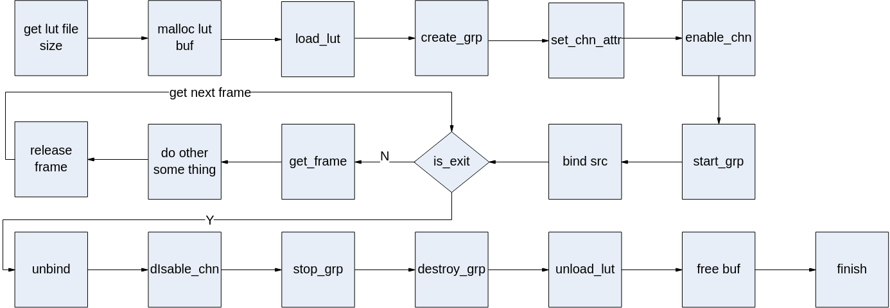

**图 2**  DPU\_RECT绑定目标场景调用流程<a name="fig35521120171910"></a>  
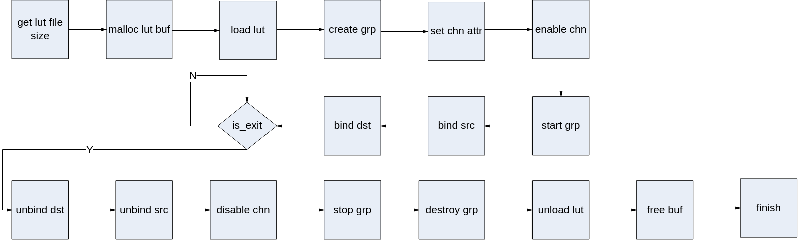

## API参考<a name="ZH-CN_TOPIC_0000002408294384"></a>

该功能模块为用户提供以下MPI:

-   [ss\_mpi\_dpu\_rect\_load\_lut](#ZH-CN_TOPIC_0000002441733429)：加载查找表。
-   [ss\_mpi\_dpu\_rect\_unload\_lut](#ZH-CN_TOPIC_0000002441853873)：卸载查找表。
-   [ss\_mpi\_dpu\_rect\_create\_grp](#ZH-CN_TOPIC_0000002408294208)：创建组。
-   [ss\_mpi\_dpu\_rect\_destroy\_grp](#ZH-CN_TOPIC_0000002441853797)：销毁组。
-   [ss\_mpi\_dpu\_rect\_set\_grp\_attr](#ZH-CN_TOPIC_0000002441853833)：设置组属性。
-   [ss\_mpi\_dpu\_rect\_get\_grp\_attr](#ZH-CN_TOPIC_0000002441733613)：获取组属性。
-   [ss\_mpi\_dpu\_rect\_start\_grp](#ZH-CN_TOPIC_0000002441853757)：启用组。
-   [ss\_mpi\_dpu\_rect\_stop\_grp](#ZH-CN_TOPIC_0000002441853825)：禁用组。
-   [ss\_mpi\_dpu\_rect\_set\_chn\_attr](#ZH-CN_TOPIC_0000002441853605)：设置通道属性。
-   [ss\_mpi\_dpu\_rect\_get\_chn\_attr](#ZH-CN_TOPIC_0000002408134420)：获取通道属性。
-   [ss\_mpi\_dpu\_rect\_enable\_chn](#ZH-CN_TOPIC_0000002408294252)：启用通道。
-   [ss\_mpi\_dpu\_rect\_disable\_chn](#ZH-CN_TOPIC_0000002408134524)：禁用通道。
-   [ss\_mpi\_dpu\_rect\_send\_frame](#ZH-CN_TOPIC_0000002441853677)：用户发送数据。
-   [ss\_mpi\_dpu\_rect\_get\_frame](#ZH-CN_TOPIC_0000002441853777)：用户从通道获取一帧处理完成的图像。
-   [ss\_mpi\_dpu\_rect\_release\_frame](#ZH-CN_TOPIC_0000002408134464)：用户释放一帧通道图像。


### ss\_mpi\_dpu\_rect\_load\_lut<a name="ZH-CN_TOPIC_0000002441733429"></a>

【描述】

加载查找表。

【语法】

```
td_s32 ss_mpi_dpu_rect_load_lut(const ot_dpu_rect_mem_info *lut_mem, ot_dpu_rect_lut_id *rect_lut_id);
```

【参数】

<a name="table5105mcpsimp"></a>
<table><thead align="left"><tr id="row5111mcpsimp"><th class="cellrowborder" valign="top" width="26%" id="mcps1.1.4.1.1"><p id="p5113mcpsimp"><a name="p5113mcpsimp"></a><a name="p5113mcpsimp"></a>参数名称</p>
</th>
<th class="cellrowborder" valign="top" width="50%" id="mcps1.1.4.1.2"><p id="p5115mcpsimp"><a name="p5115mcpsimp"></a><a name="p5115mcpsimp"></a>描述</p>
</th>
<th class="cellrowborder" valign="top" width="24%" id="mcps1.1.4.1.3"><p id="p5117mcpsimp"><a name="p5117mcpsimp"></a><a name="p5117mcpsimp"></a>输入/输出</p>
</th>
</tr>
</thead>
<tbody><tr id="row5119mcpsimp"><td class="cellrowborder" valign="top" width="26%" headers="mcps1.1.4.1.1 "><p id="p5121mcpsimp"><a name="p5121mcpsimp"></a><a name="p5121mcpsimp"></a>lut_mem</p>
</td>
<td class="cellrowborder" valign="top" width="50%" headers="mcps1.1.4.1.2 "><p id="p5123mcpsimp"><a name="p5123mcpsimp"></a><a name="p5123mcpsimp"></a>查找表所需内存字节。</p>
<p id="p5124mcpsimp"><a name="p5124mcpsimp"></a><a name="p5124mcpsimp"></a>不能为空。</p>
</td>
<td class="cellrowborder" valign="top" width="24%" headers="mcps1.1.4.1.3 "><p id="p5126mcpsimp"><a name="p5126mcpsimp"></a><a name="p5126mcpsimp"></a>输入</p>
</td>
</tr>
<tr id="row5127mcpsimp"><td class="cellrowborder" valign="top" width="26%" headers="mcps1.1.4.1.1 "><p id="p5129mcpsimp"><a name="p5129mcpsimp"></a><a name="p5129mcpsimp"></a>rect_lut_id</p>
</td>
<td class="cellrowborder" valign="top" width="50%" headers="mcps1.1.4.1.2 "><p id="p5131mcpsimp"><a name="p5131mcpsimp"></a><a name="p5131mcpsimp"></a>查找表ID。</p>
<p id="p5132mcpsimp"><a name="p5132mcpsimp"></a><a name="p5132mcpsimp"></a>不能为空。</p>
</td>
<td class="cellrowborder" valign="top" width="24%" headers="mcps1.1.4.1.3 "><p id="p5134mcpsimp"><a name="p5134mcpsimp"></a><a name="p5134mcpsimp"></a>输出</p>
</td>
</tr>
</tbody>
</table>

<a name="table5135mcpsimp"></a>
<table><thead align="left"><tr id="row5142mcpsimp"><th class="cellrowborder" valign="top" width="18%" id="mcps1.1.5.1.1"><p id="p5144mcpsimp"><a name="p5144mcpsimp"></a><a name="p5144mcpsimp"></a>参数名称</p>
</th>
<th class="cellrowborder" valign="top" width="23%" id="mcps1.1.5.1.2"><p id="p5146mcpsimp"><a name="p5146mcpsimp"></a><a name="p5146mcpsimp"></a>支持类型</p>
</th>
<th class="cellrowborder" valign="top" width="32%" id="mcps1.1.5.1.3"><p id="p5148mcpsimp"><a name="p5148mcpsimp"></a><a name="p5148mcpsimp"></a>地址对齐</p>
</th>
<th class="cellrowborder" valign="top" width="27%" id="mcps1.1.5.1.4"><p id="p5150mcpsimp"><a name="p5150mcpsimp"></a><a name="p5150mcpsimp"></a>分辨率</p>
</th>
</tr>
</thead>
<tbody><tr id="row5152mcpsimp"><td class="cellrowborder" valign="top" width="18%" headers="mcps1.1.5.1.1 "><p id="p5154mcpsimp"><a name="p5154mcpsimp"></a><a name="p5154mcpsimp"></a>lut_mem</p>
</td>
<td class="cellrowborder" valign="top" width="23%" headers="mcps1.1.5.1.2 "><p id="p5156mcpsimp"><a name="p5156mcpsimp"></a><a name="p5156mcpsimp"></a>-</p>
</td>
<td class="cellrowborder" valign="top" width="32%" headers="mcps1.1.5.1.3 "><p id="p5158mcpsimp"><a name="p5158mcpsimp"></a><a name="p5158mcpsimp"></a>lut_mem -&gt; phys_addr 16字节对齐。</p>
</td>
<td class="cellrowborder" valign="top" width="27%" headers="mcps1.1.5.1.4 "><p id="p5160mcpsimp"><a name="p5160mcpsimp"></a><a name="p5160mcpsimp"></a>-</p>
</td>
</tr>
</tbody>
</table>

【返回值】

<a name="table5162mcpsimp"></a>
<table><thead align="left"><tr id="row5167mcpsimp"><th class="cellrowborder" valign="top" width="28.999999999999996%" id="mcps1.1.3.1.1"><p id="p5169mcpsimp"><a name="p5169mcpsimp"></a><a name="p5169mcpsimp"></a>返回值</p>
</th>
<th class="cellrowborder" valign="top" width="71%" id="mcps1.1.3.1.2"><p id="p5171mcpsimp"><a name="p5171mcpsimp"></a><a name="p5171mcpsimp"></a>描述</p>
</th>
</tr>
</thead>
<tbody><tr id="row5173mcpsimp"><td class="cellrowborder" valign="top" width="28.999999999999996%" headers="mcps1.1.3.1.1 "><p id="p5175mcpsimp"><a name="p5175mcpsimp"></a><a name="p5175mcpsimp"></a>0</p>
</td>
<td class="cellrowborder" valign="top" width="71%" headers="mcps1.1.3.1.2 "><p id="p5177mcpsimp"><a name="p5177mcpsimp"></a><a name="p5177mcpsimp"></a>成功。</p>
</td>
</tr>
<tr id="row5178mcpsimp"><td class="cellrowborder" valign="top" width="28.999999999999996%" headers="mcps1.1.3.1.1 "><p id="p5180mcpsimp"><a name="p5180mcpsimp"></a><a name="p5180mcpsimp"></a>非0</p>
</td>
<td class="cellrowborder" valign="top" width="71%" headers="mcps1.1.3.1.2 "><p id="p5182mcpsimp"><a name="p5182mcpsimp"></a><a name="p5182mcpsimp"></a>失败，参见<span xml:lang="fr-FR" id="ph1536493892110"><a name="ph1536493892110"></a><a name="ph1536493892110"></a><a href="#ZH-CN_TOPIC_0000002441733461">>错误码</</a></span><span xml:lang="fr-FR" id="ph5185mcpsimp"><a name="ph5185mcpsimp"></a><a name="ph5185mcpsimp"></a>。</span></p>
</td>
</tr>
</tbody>
</table>

【需求】

-   头文件：ot\_common\_dpu\_rect.h、ss\_mpi\_dpu\_rect.h
-   库文件：libss\_dpu\_rect.a

【注意】

lut\_mem -\> phys\_addr / lut\_mem -\> virt\_addr必须是申请好的内存，lut\_mem -\> size值为查找表文件大小。

【举例】

无。

【相关主题】

[ss\_mpi\_dpu\_rect\_unload\_lut](#ZH-CN_TOPIC_0000002441853873)

### ss\_mpi\_dpu\_rect\_unload\_lut<a name="ZH-CN_TOPIC_0000002441853873"></a>

【描述】

卸载查找表。

【语法】

```
td_s32 ss_mpi_dpu_rect_unload_lut(ot_dpu_rect_lut_id rect_lut_id);
```

【参数】

<a name="table1661mcpsimp"></a>
<table><thead align="left"><tr id="row1667mcpsimp"><th class="cellrowborder" valign="top" width="33%" id="mcps1.1.4.1.1"><p id="p1669mcpsimp"><a name="p1669mcpsimp"></a><a name="p1669mcpsimp"></a>参数名称</p>
</th>
<th class="cellrowborder" valign="top" width="36%" id="mcps1.1.4.1.2"><p id="p1671mcpsimp"><a name="p1671mcpsimp"></a><a name="p1671mcpsimp"></a>描述</p>
</th>
<th class="cellrowborder" valign="top" width="31%" id="mcps1.1.4.1.3"><p id="p1673mcpsimp"><a name="p1673mcpsimp"></a><a name="p1673mcpsimp"></a>输入/输出</p>
</th>
</tr>
</thead>
<tbody><tr id="row1675mcpsimp"><td class="cellrowborder" valign="top" width="33%" headers="mcps1.1.4.1.1 "><p id="p1677mcpsimp"><a name="p1677mcpsimp"></a><a name="p1677mcpsimp"></a>rect_lut_id</p>
</td>
<td class="cellrowborder" valign="top" width="36%" headers="mcps1.1.4.1.2 "><p id="p1679mcpsimp"><a name="p1679mcpsimp"></a><a name="p1679mcpsimp"></a>查找表ID。</p>
</td>
<td class="cellrowborder" valign="top" width="31%" headers="mcps1.1.4.1.3 "><p id="p1681mcpsimp"><a name="p1681mcpsimp"></a><a name="p1681mcpsimp"></a>输入</p>
</td>
</tr>
</tbody>
</table>

【返回值】

<a name="table1683mcpsimp"></a>
<table><thead align="left"><tr id="row1688mcpsimp"><th class="cellrowborder" valign="top" width="28.999999999999996%" id="mcps1.1.3.1.1"><p id="p1690mcpsimp"><a name="p1690mcpsimp"></a><a name="p1690mcpsimp"></a>返回值</p>
</th>
<th class="cellrowborder" valign="top" width="71%" id="mcps1.1.3.1.2"><p id="p1692mcpsimp"><a name="p1692mcpsimp"></a><a name="p1692mcpsimp"></a>描述</p>
</th>
</tr>
</thead>
<tbody><tr id="row1694mcpsimp"><td class="cellrowborder" valign="top" width="28.999999999999996%" headers="mcps1.1.3.1.1 "><p id="p1696mcpsimp"><a name="p1696mcpsimp"></a><a name="p1696mcpsimp"></a>0</p>
</td>
<td class="cellrowborder" valign="top" width="71%" headers="mcps1.1.3.1.2 "><p id="p1698mcpsimp"><a name="p1698mcpsimp"></a><a name="p1698mcpsimp"></a>成功。</p>
</td>
</tr>
<tr id="row1699mcpsimp"><td class="cellrowborder" valign="top" width="28.999999999999996%" headers="mcps1.1.3.1.1 "><p id="p1701mcpsimp"><a name="p1701mcpsimp"></a><a name="p1701mcpsimp"></a>非0</p>
</td>
<td class="cellrowborder" valign="top" width="71%" headers="mcps1.1.3.1.2 "><p id="p1703mcpsimp"><a name="p1703mcpsimp"></a><a name="p1703mcpsimp"></a>失败，参见<span xml:lang="fr-FR" id="ph1536493892110"><a name="ph1536493892110"></a><a name="ph1536493892110"></a><a href="#ZH-CN_TOPIC_0000002441733461">>错误码</</a></span><span xml:lang="fr-FR" id="ph1706mcpsimp"><a name="ph1706mcpsimp"></a><a name="ph1706mcpsimp"></a>。</span></p>
</td>
</tr>
</tbody>
</table>

【需求】

-   头文件：ot\_common\_dpu\_rect.h、ss\_mpi\_dpu\_rect.h
-   库文件：libss\_dpu\_rect.a

【注意】

rect\_lut\_id 由[ss\_mpi\_dpu\_rect\_load\_lut](#ZH-CN_TOPIC_0000002441733429)  获取到。

【举例】

无。

【相关主题】

[ss\_mpi\_dpu\_rect\_load\_lut](#ZH-CN_TOPIC_0000002441733429)

### ss\_mpi\_dpu\_rect\_create\_grp<a name="ZH-CN_TOPIC_0000002408294208"></a>

【描述】

创建组。

【语法】

```
td_s32 ss_mpi_dpu_rect_create_grp(ot_dpu_rect_grp  rect_grp, const ot_dpu_rect_grp_attr *grp_attr);
```

【参数】

<a name="table6661mcpsimp"></a>
<table><thead align="left"><tr id="row6667mcpsimp"><th class="cellrowborder" valign="top" width="14.140000000000002%" id="mcps1.1.4.1.1"><p id="p6669mcpsimp"><a name="p6669mcpsimp"></a><a name="p6669mcpsimp"></a>参数名称</p>
</th>
<th class="cellrowborder" valign="top" width="70.71000000000001%" id="mcps1.1.4.1.2"><p id="p6671mcpsimp"><a name="p6671mcpsimp"></a><a name="p6671mcpsimp"></a>描述</p>
</th>
<th class="cellrowborder" valign="top" width="15.150000000000002%" id="mcps1.1.4.1.3"><p id="p6673mcpsimp"><a name="p6673mcpsimp"></a><a name="p6673mcpsimp"></a>输入/输出</p>
</th>
</tr>
</thead>
<tbody><tr id="row6675mcpsimp"><td class="cellrowborder" valign="top" width="14.140000000000002%" headers="mcps1.1.4.1.1 "><p id="p6677mcpsimp"><a name="p6677mcpsimp"></a><a name="p6677mcpsimp"></a>rect_grp</p>
</td>
<td class="cellrowborder" valign="top" width="70.71000000000001%" headers="mcps1.1.4.1.2 "><p id="p6679mcpsimp"><a name="p6679mcpsimp"></a><a name="p6679mcpsimp"></a>组号。</p>
<p id="p6680mcpsimp"><a name="p6680mcpsimp"></a><a name="p6680mcpsimp"></a>取值范围：[0, <a href="#ZH-CN_TOPIC_0000002408294400">>OT_DPU_RECT_MAX_GRP_NUM</</a>)。</p>
</td>
<td class="cellrowborder" valign="top" width="15.150000000000002%" headers="mcps1.1.4.1.3 "><p id="p6683mcpsimp"><a name="p6683mcpsimp"></a><a name="p6683mcpsimp"></a>输入</p>
</td>
</tr>
<tr id="row6684mcpsimp"><td class="cellrowborder" valign="top" width="14.140000000000002%" headers="mcps1.1.4.1.1 "><p id="p6686mcpsimp"><a name="p6686mcpsimp"></a><a name="p6686mcpsimp"></a>grp_attr</p>
</td>
<td class="cellrowborder" valign="top" width="70.71000000000001%" headers="mcps1.1.4.1.2 "><p id="p6688mcpsimp"><a name="p6688mcpsimp"></a><a name="p6688mcpsimp"></a>组属性。</p>
<p id="p6689mcpsimp"><a name="p6689mcpsimp"></a><a name="p6689mcpsimp"></a>不能为空。</p>
</td>
<td class="cellrowborder" valign="top" width="15.150000000000002%" headers="mcps1.1.4.1.3 "><p id="p6691mcpsimp"><a name="p6691mcpsimp"></a><a name="p6691mcpsimp"></a>输入</p>
</td>
</tr>
</tbody>
</table>

【返回值】

<a name="table6693mcpsimp"></a>
<table><thead align="left"><tr id="row6698mcpsimp"><th class="cellrowborder" valign="top" width="28.999999999999996%" id="mcps1.1.3.1.1"><p id="p6700mcpsimp"><a name="p6700mcpsimp"></a><a name="p6700mcpsimp"></a>返回值</p>
</th>
<th class="cellrowborder" valign="top" width="71%" id="mcps1.1.3.1.2"><p id="p6702mcpsimp"><a name="p6702mcpsimp"></a><a name="p6702mcpsimp"></a>描述</p>
</th>
</tr>
</thead>
<tbody><tr id="row6704mcpsimp"><td class="cellrowborder" valign="top" width="28.999999999999996%" headers="mcps1.1.3.1.1 "><p id="p6706mcpsimp"><a name="p6706mcpsimp"></a><a name="p6706mcpsimp"></a>0</p>
</td>
<td class="cellrowborder" valign="top" width="71%" headers="mcps1.1.3.1.2 "><p id="p6708mcpsimp"><a name="p6708mcpsimp"></a><a name="p6708mcpsimp"></a>成功。</p>
</td>
</tr>
<tr id="row6709mcpsimp"><td class="cellrowborder" valign="top" width="28.999999999999996%" headers="mcps1.1.3.1.1 "><p id="p6711mcpsimp"><a name="p6711mcpsimp"></a><a name="p6711mcpsimp"></a>非0</p>
</td>
<td class="cellrowborder" valign="top" width="71%" headers="mcps1.1.3.1.2 "><p id="p6713mcpsimp"><a name="p6713mcpsimp"></a><a name="p6713mcpsimp"></a>失败，参见<span xml:lang="fr-FR" id="ph1536493892110"><a name="ph1536493892110"></a><a name="ph1536493892110"></a><a href="#ZH-CN_TOPIC_0000002441733461">>错误码</</a></span><span xml:lang="fr-FR" id="ph6716mcpsimp"><a name="ph6716mcpsimp"></a><a name="ph6716mcpsimp"></a>。</span></p>
</td>
</tr>
</tbody>
</table>

【需求】

-   头文件：ot\_common\_dpu\_rect.h、ss\_mpi\_dpu\_rect.h
-   库文件：libss\_dpu\_rect.a

【注意】

不支持重复创建。

【举例】

无。

【相关主题】

-   [ss\_mpi\_dpu\_rect\_destroy\_grp](#ZH-CN_TOPIC_0000002441853797)
-   [ss\_mpi\_dpu\_rect\_set\_grp\_attr](#ZH-CN_TOPIC_0000002441853833)
-   [ss\_mpi\_dpu\_rect\_get\_grp\_attr](#ZH-CN_TOPIC_0000002441733613)
-   [ss\_mpi\_dpu\_rect\_start\_grp](#ZH-CN_TOPIC_0000002441853757)
-   [ss\_mpi\_dpu\_rect\_stop\_grp](#ZH-CN_TOPIC_0000002441853825)

### ss\_mpi\_dpu\_rect\_destroy\_grp<a name="ZH-CN_TOPIC_0000002441853797"></a>

【描述】

销毁组。

【语法】

```
td_s32 ss_mpi_dpu_rect_destroy_grp(ot_dpu_rect_grp rect_grp);
```

【参数】

<a name="table2527mcpsimp"></a>
<table><thead align="left"><tr id="row2533mcpsimp"><th class="cellrowborder" valign="top" width="14.140000000000002%" id="mcps1.1.4.1.1"><p id="p2535mcpsimp"><a name="p2535mcpsimp"></a><a name="p2535mcpsimp"></a>参数名称</p>
</th>
<th class="cellrowborder" valign="top" width="70.71000000000001%" id="mcps1.1.4.1.2"><p id="p2537mcpsimp"><a name="p2537mcpsimp"></a><a name="p2537mcpsimp"></a>描述</p>
</th>
<th class="cellrowborder" valign="top" width="15.150000000000002%" id="mcps1.1.4.1.3"><p id="p2539mcpsimp"><a name="p2539mcpsimp"></a><a name="p2539mcpsimp"></a>输入/输出</p>
</th>
</tr>
</thead>
<tbody><tr id="row2541mcpsimp"><td class="cellrowborder" valign="top" width="14.140000000000002%" headers="mcps1.1.4.1.1 "><p id="p2543mcpsimp"><a name="p2543mcpsimp"></a><a name="p2543mcpsimp"></a>rect_grp</p>
</td>
<td class="cellrowborder" valign="top" width="70.71000000000001%" headers="mcps1.1.4.1.2 "><p id="p2545mcpsimp"><a name="p2545mcpsimp"></a><a name="p2545mcpsimp"></a>组号。</p>
<p id="p2546mcpsimp"><a name="p2546mcpsimp"></a><a name="p2546mcpsimp"></a>取值范围：[0, <a href="#ZH-CN_TOPIC_0000002408294400">>OT_DPU_RECT_MAX_GRP_NUM</</a>)。</p>
</td>
<td class="cellrowborder" valign="top" width="15.150000000000002%" headers="mcps1.1.4.1.3 "><p id="p2549mcpsimp"><a name="p2549mcpsimp"></a><a name="p2549mcpsimp"></a>输入</p>
</td>
</tr>
</tbody>
</table>

【返回值】

<a name="table2551mcpsimp"></a>
<table><thead align="left"><tr id="row2556mcpsimp"><th class="cellrowborder" valign="top" width="28.999999999999996%" id="mcps1.1.3.1.1"><p id="p2558mcpsimp"><a name="p2558mcpsimp"></a><a name="p2558mcpsimp"></a>返回值</p>
</th>
<th class="cellrowborder" valign="top" width="71%" id="mcps1.1.3.1.2"><p id="p2560mcpsimp"><a name="p2560mcpsimp"></a><a name="p2560mcpsimp"></a>描述</p>
</th>
</tr>
</thead>
<tbody><tr id="row2562mcpsimp"><td class="cellrowborder" valign="top" width="28.999999999999996%" headers="mcps1.1.3.1.1 "><p id="p2564mcpsimp"><a name="p2564mcpsimp"></a><a name="p2564mcpsimp"></a>0</p>
</td>
<td class="cellrowborder" valign="top" width="71%" headers="mcps1.1.3.1.2 "><p id="p2566mcpsimp"><a name="p2566mcpsimp"></a><a name="p2566mcpsimp"></a>成功。</p>
</td>
</tr>
<tr id="row2567mcpsimp"><td class="cellrowborder" valign="top" width="28.999999999999996%" headers="mcps1.1.3.1.1 "><p id="p2569mcpsimp"><a name="p2569mcpsimp"></a><a name="p2569mcpsimp"></a>非0</p>
</td>
<td class="cellrowborder" valign="top" width="71%" headers="mcps1.1.3.1.2 "><p id="p2571mcpsimp"><a name="p2571mcpsimp"></a><a name="p2571mcpsimp"></a>失败，参见<span xml:lang="fr-FR" id="ph1536493892110"><a name="ph1536493892110"></a><a name="ph1536493892110"></a><a href="#ZH-CN_TOPIC_0000002441733461">>错误码</</a></span><span xml:lang="fr-FR" id="ph2574mcpsimp"><a name="ph2574mcpsimp"></a><a name="ph2574mcpsimp"></a>。</span></p>
</td>
</tr>
</tbody>
</table>

【需求】

-   头文件：ot\_common\_dpu\_rect.h、ss\_mpi\_dpu\_rect.h
-   库文件：libss\_dpu\_rect.a

【注意】

-   组必须已创建。
-   调用此接口之前，如果已经成功执行[ss\_mpi\_dpu\_rect\_start\_grp](#ZH-CN_TOPIC_0000002441853757)，必须先调用[ss\_mpi\_dpu\_rect\_stop\_grp](#ZH-CN_TOPIC_0000002441853825)禁用此组。
-   调用此接口时，会一直等待此组当前任务处理结束才会真正销毁。

【举例】

无。

【相关主题】

-   [ss\_mpi\_dpu\_rect\_create\_grp](#ZH-CN_TOPIC_0000002408294208)
-   [ss\_mpi\_dpu\_rect\_set\_grp\_attr](#ZH-CN_TOPIC_0000002441853833)
-   [ss\_mpi\_dpu\_rect\_get\_grp\_attr](#ZH-CN_TOPIC_0000002441733613)
-   [ss\_mpi\_dpu\_rect\_start\_grp](#ZH-CN_TOPIC_0000002441853757)
-   [ss\_mpi\_dpu\_rect\_stop\_grp](#ZH-CN_TOPIC_0000002441853825)

### ss\_mpi\_dpu\_rect\_set\_grp\_attr<a name="ZH-CN_TOPIC_0000002441853833"></a>

【描述】

设置组属性。

【语法】

```
td_s32 ss_mpi_dpu_rect_set_grp_attr(ot_dpu_rect_grp rect_grp, const ot_dpu_rect_grp_attr *grp_attr);
```

【参数】

<a name="table4737mcpsimp"></a>
<table><thead align="left"><tr id="row4743mcpsimp"><th class="cellrowborder" valign="top" width="14.140000000000002%" id="mcps1.1.4.1.1"><p id="p4745mcpsimp"><a name="p4745mcpsimp"></a><a name="p4745mcpsimp"></a>参数名称</p>
</th>
<th class="cellrowborder" valign="top" width="70.71000000000001%" id="mcps1.1.4.1.2"><p id="p4747mcpsimp"><a name="p4747mcpsimp"></a><a name="p4747mcpsimp"></a>描述</p>
</th>
<th class="cellrowborder" valign="top" width="15.150000000000002%" id="mcps1.1.4.1.3"><p id="p4749mcpsimp"><a name="p4749mcpsimp"></a><a name="p4749mcpsimp"></a>输入/输出</p>
</th>
</tr>
</thead>
<tbody><tr id="row4751mcpsimp"><td class="cellrowborder" valign="top" width="14.140000000000002%" headers="mcps1.1.4.1.1 "><p id="p4753mcpsimp"><a name="p4753mcpsimp"></a><a name="p4753mcpsimp"></a>rect_grp</p>
</td>
<td class="cellrowborder" valign="top" width="70.71000000000001%" headers="mcps1.1.4.1.2 "><p id="p4755mcpsimp"><a name="p4755mcpsimp"></a><a name="p4755mcpsimp"></a>组号。</p>
<p id="p4756mcpsimp"><a name="p4756mcpsimp"></a><a name="p4756mcpsimp"></a>取值范围：[0, <a href="#ZH-CN_TOPIC_0000002408294400">>OT_DPU_RECT_MAX_GRP_NUM</</a>)。</p>
</td>
<td class="cellrowborder" valign="top" width="15.150000000000002%" headers="mcps1.1.4.1.3 "><p id="p4759mcpsimp"><a name="p4759mcpsimp"></a><a name="p4759mcpsimp"></a>输入</p>
</td>
</tr>
<tr id="row4760mcpsimp"><td class="cellrowborder" valign="top" width="14.140000000000002%" headers="mcps1.1.4.1.1 "><p id="p4762mcpsimp"><a name="p4762mcpsimp"></a><a name="p4762mcpsimp"></a>grp_attr</p>
</td>
<td class="cellrowborder" valign="top" width="70.71000000000001%" headers="mcps1.1.4.1.2 "><p id="p4764mcpsimp"><a name="p4764mcpsimp"></a><a name="p4764mcpsimp"></a>组属性。</p>
<p id="p4765mcpsimp"><a name="p4765mcpsimp"></a><a name="p4765mcpsimp"></a>不能为空。</p>
</td>
<td class="cellrowborder" valign="top" width="15.150000000000002%" headers="mcps1.1.4.1.3 "><p id="p4767mcpsimp"><a name="p4767mcpsimp"></a><a name="p4767mcpsimp"></a>输入</p>
</td>
</tr>
</tbody>
</table>

【返回值】

<a name="table4769mcpsimp"></a>
<table><thead align="left"><tr id="row4774mcpsimp"><th class="cellrowborder" valign="top" width="28.999999999999996%" id="mcps1.1.3.1.1"><p id="p4776mcpsimp"><a name="p4776mcpsimp"></a><a name="p4776mcpsimp"></a>返回值</p>
</th>
<th class="cellrowborder" valign="top" width="71%" id="mcps1.1.3.1.2"><p id="p4778mcpsimp"><a name="p4778mcpsimp"></a><a name="p4778mcpsimp"></a>描述</p>
</th>
</tr>
</thead>
<tbody><tr id="row4780mcpsimp"><td class="cellrowborder" valign="top" width="28.999999999999996%" headers="mcps1.1.3.1.1 "><p id="p4782mcpsimp"><a name="p4782mcpsimp"></a><a name="p4782mcpsimp"></a>0</p>
</td>
<td class="cellrowborder" valign="top" width="71%" headers="mcps1.1.3.1.2 "><p id="p4784mcpsimp"><a name="p4784mcpsimp"></a><a name="p4784mcpsimp"></a>成功。</p>
</td>
</tr>
<tr id="row4785mcpsimp"><td class="cellrowborder" valign="top" width="28.999999999999996%" headers="mcps1.1.3.1.1 "><p id="p4787mcpsimp"><a name="p4787mcpsimp"></a><a name="p4787mcpsimp"></a>非0</p>
</td>
<td class="cellrowborder" valign="top" width="71%" headers="mcps1.1.3.1.2 "><p id="p4789mcpsimp"><a name="p4789mcpsimp"></a><a name="p4789mcpsimp"></a>失败，参见<span xml:lang="fr-FR" id="ph1536493892110"><a name="ph1536493892110"></a><a name="ph1536493892110"></a><a href="#ZH-CN_TOPIC_0000002441733461">>错误码</</a></span><span xml:lang="fr-FR" id="ph4792mcpsimp"><a name="ph4792mcpsimp"></a><a name="ph4792mcpsimp"></a>。</span></p>
</td>
</tr>
</tbody>
</table>

【需求】

-   头文件：ot\_common\_dpu\_rect.h、ss\_mpi\_dpu\_rect.h
-   库文件：libss\_dpu\_rect.a

【注意】

-   组必须已创建。
-   组属性必须合法，其中部分静态属性不可动态设置，具体请参见[ot\_dpu\_rect\_grp\_attr](#ZH-CN_TOPIC_0000002441853813)。

【举例】

无。

【相关主题】

-   [ss\_mpi\_dpu\_rect\_create\_grp](#ZH-CN_TOPIC_0000002408294208)
-   [ss\_mpi\_dpu\_rect\_destroy\_grp](#ZH-CN_TOPIC_0000002441853797)
-   [ss\_mpi\_dpu\_rect\_get\_grp\_attr](#ZH-CN_TOPIC_0000002441733613)
-   [ss\_mpi\_dpu\_rect\_start\_grp](#ZH-CN_TOPIC_0000002441853757)
-   [ss\_mpi\_dpu\_rect\_stop\_grp](#ZH-CN_TOPIC_0000002441853825)

### ss\_mpi\_dpu\_rect\_get\_grp\_attr<a name="ZH-CN_TOPIC_0000002441733613"></a>

【描述】

获取组属性。

【语法】

```
td_s32 ss_mpi_dpu_rect_get_grp_attr(ot_dpu_rect_grp rect_grp, ot_dpu_rect_grp_attr *grp_attr);
```

【参数】

<a name="table3989mcpsimp"></a>
<table><thead align="left"><tr id="row3995mcpsimp"><th class="cellrowborder" valign="top" width="14.140000000000002%" id="mcps1.1.4.1.1"><p id="p3997mcpsimp"><a name="p3997mcpsimp"></a><a name="p3997mcpsimp"></a>参数名称</p>
</th>
<th class="cellrowborder" valign="top" width="70.71000000000001%" id="mcps1.1.4.1.2"><p id="p3999mcpsimp"><a name="p3999mcpsimp"></a><a name="p3999mcpsimp"></a>描述</p>
</th>
<th class="cellrowborder" valign="top" width="15.150000000000002%" id="mcps1.1.4.1.3"><p id="p4001mcpsimp"><a name="p4001mcpsimp"></a><a name="p4001mcpsimp"></a>输入/输出</p>
</th>
</tr>
</thead>
<tbody><tr id="row4003mcpsimp"><td class="cellrowborder" valign="top" width="14.140000000000002%" headers="mcps1.1.4.1.1 "><p id="p4005mcpsimp"><a name="p4005mcpsimp"></a><a name="p4005mcpsimp"></a>rect_grp</p>
</td>
<td class="cellrowborder" valign="top" width="70.71000000000001%" headers="mcps1.1.4.1.2 "><p id="p4007mcpsimp"><a name="p4007mcpsimp"></a><a name="p4007mcpsimp"></a>组号。</p>
<p id="p4008mcpsimp"><a name="p4008mcpsimp"></a><a name="p4008mcpsimp"></a>取值范围：[0, <a href="#ZH-CN_TOPIC_0000002408294400">>OT_DPU_RECT_MAX_GRP_NUM</</a>)。</p>
</td>
<td class="cellrowborder" valign="top" width="15.150000000000002%" headers="mcps1.1.4.1.3 "><p id="p4011mcpsimp"><a name="p4011mcpsimp"></a><a name="p4011mcpsimp"></a>输入</p>
</td>
</tr>
<tr id="row4012mcpsimp"><td class="cellrowborder" valign="top" width="14.140000000000002%" headers="mcps1.1.4.1.1 "><p id="p4014mcpsimp"><a name="p4014mcpsimp"></a><a name="p4014mcpsimp"></a>grp_attr</p>
</td>
<td class="cellrowborder" valign="top" width="70.71000000000001%" headers="mcps1.1.4.1.2 "><p id="p4016mcpsimp"><a name="p4016mcpsimp"></a><a name="p4016mcpsimp"></a>组属性。</p>
<p id="p4017mcpsimp"><a name="p4017mcpsimp"></a><a name="p4017mcpsimp"></a>不能为空。</p>
</td>
<td class="cellrowborder" valign="top" width="15.150000000000002%" headers="mcps1.1.4.1.3 "><p id="p4019mcpsimp"><a name="p4019mcpsimp"></a><a name="p4019mcpsimp"></a>输出</p>
</td>
</tr>
</tbody>
</table>

【返回值】

<a name="table4021mcpsimp"></a>
<table><thead align="left"><tr id="row4026mcpsimp"><th class="cellrowborder" valign="top" width="28.999999999999996%" id="mcps1.1.3.1.1"><p id="p4028mcpsimp"><a name="p4028mcpsimp"></a><a name="p4028mcpsimp"></a>返回值</p>
</th>
<th class="cellrowborder" valign="top" width="71%" id="mcps1.1.3.1.2"><p id="p4030mcpsimp"><a name="p4030mcpsimp"></a><a name="p4030mcpsimp"></a>描述</p>
</th>
</tr>
</thead>
<tbody><tr id="row4032mcpsimp"><td class="cellrowborder" valign="top" width="28.999999999999996%" headers="mcps1.1.3.1.1 "><p id="p4034mcpsimp"><a name="p4034mcpsimp"></a><a name="p4034mcpsimp"></a>0</p>
</td>
<td class="cellrowborder" valign="top" width="71%" headers="mcps1.1.3.1.2 "><p id="p4036mcpsimp"><a name="p4036mcpsimp"></a><a name="p4036mcpsimp"></a>成功。</p>
</td>
</tr>
<tr id="row4037mcpsimp"><td class="cellrowborder" valign="top" width="28.999999999999996%" headers="mcps1.1.3.1.1 "><p id="p4039mcpsimp"><a name="p4039mcpsimp"></a><a name="p4039mcpsimp"></a>非0</p>
</td>
<td class="cellrowborder" valign="top" width="71%" headers="mcps1.1.3.1.2 "><p id="p4041mcpsimp"><a name="p4041mcpsimp"></a><a name="p4041mcpsimp"></a>失败，参见<span xml:lang="fr-FR" id="ph1536493892110"><a name="ph1536493892110"></a><a name="ph1536493892110"></a><a href="#ZH-CN_TOPIC_0000002441733461">>错误码</</a></span><span xml:lang="fr-FR" id="ph4044mcpsimp"><a name="ph4044mcpsimp"></a><a name="ph4044mcpsimp"></a>。</span></p>
</td>
</tr>
</tbody>
</table>

【需求】

-   头文件：ot\_common\_dpu\_rect.h、ss\_mpi\_dpu\_rect.h
-   库文件：libss\_dpu\_rect.a

【注意】

组必须已创建。

【举例】

无。

【相关主题】

-   [ss\_mpi\_dpu\_rect\_create\_grp](#ZH-CN_TOPIC_0000002408294208)
-   [ss\_mpi\_dpu\_rect\_destroy\_grp](#ZH-CN_TOPIC_0000002441853797)
-   [ss\_mpi\_dpu\_rect\_set\_grp\_attr](#ZH-CN_TOPIC_0000002441853833)
-   [ss\_mpi\_dpu\_rect\_start\_grp](#ZH-CN_TOPIC_0000002441853757)
-   [ss\_mpi\_dpu\_rect\_stop\_grp](#ZH-CN_TOPIC_0000002441853825)

### ss\_mpi\_dpu\_rect\_start\_grp<a name="ZH-CN_TOPIC_0000002441853757"></a>

【描述】

启用组。

【语法】

```
td_s32 ss_mpi_dpu_rect_start_grp(ot_dpu_rect_grp rect_grp);
```

【参数】

<a name="table9074mcpsimp"></a>
<table><thead align="left"><tr id="row9080mcpsimp"><th class="cellrowborder" valign="top" width="14.140000000000002%" id="mcps1.1.4.1.1"><p id="p9082mcpsimp"><a name="p9082mcpsimp"></a><a name="p9082mcpsimp"></a>参数名称</p>
</th>
<th class="cellrowborder" valign="top" width="70.71000000000001%" id="mcps1.1.4.1.2"><p id="p9084mcpsimp"><a name="p9084mcpsimp"></a><a name="p9084mcpsimp"></a>描述</p>
</th>
<th class="cellrowborder" valign="top" width="15.150000000000002%" id="mcps1.1.4.1.3"><p id="p9086mcpsimp"><a name="p9086mcpsimp"></a><a name="p9086mcpsimp"></a>输入/输出</p>
</th>
</tr>
</thead>
<tbody><tr id="row9088mcpsimp"><td class="cellrowborder" valign="top" width="14.140000000000002%" headers="mcps1.1.4.1.1 "><p id="p9090mcpsimp"><a name="p9090mcpsimp"></a><a name="p9090mcpsimp"></a>rect_grp</p>
</td>
<td class="cellrowborder" valign="top" width="70.71000000000001%" headers="mcps1.1.4.1.2 "><p id="p9092mcpsimp"><a name="p9092mcpsimp"></a><a name="p9092mcpsimp"></a>组号。</p>
<p id="p9093mcpsimp"><a name="p9093mcpsimp"></a><a name="p9093mcpsimp"></a>取值范围：[0, <a href="#ZH-CN_TOPIC_0000002408294400">>OT_DPU_RECT_MAX_GRP_NUM</</a>)。</p>
</td>
<td class="cellrowborder" valign="top" width="15.150000000000002%" headers="mcps1.1.4.1.3 "><p id="p9096mcpsimp"><a name="p9096mcpsimp"></a><a name="p9096mcpsimp"></a>输入</p>
</td>
</tr>
</tbody>
</table>

【返回值】

<a name="table9098mcpsimp"></a>
<table><thead align="left"><tr id="row9103mcpsimp"><th class="cellrowborder" valign="top" width="28.999999999999996%" id="mcps1.1.3.1.1"><p id="p9105mcpsimp"><a name="p9105mcpsimp"></a><a name="p9105mcpsimp"></a>返回值</p>
</th>
<th class="cellrowborder" valign="top" width="71%" id="mcps1.1.3.1.2"><p id="p9107mcpsimp"><a name="p9107mcpsimp"></a><a name="p9107mcpsimp"></a>描述</p>
</th>
</tr>
</thead>
<tbody><tr id="row9109mcpsimp"><td class="cellrowborder" valign="top" width="28.999999999999996%" headers="mcps1.1.3.1.1 "><p id="p9111mcpsimp"><a name="p9111mcpsimp"></a><a name="p9111mcpsimp"></a>0</p>
</td>
<td class="cellrowborder" valign="top" width="71%" headers="mcps1.1.3.1.2 "><p id="p9113mcpsimp"><a name="p9113mcpsimp"></a><a name="p9113mcpsimp"></a>成功。</p>
</td>
</tr>
<tr id="row9114mcpsimp"><td class="cellrowborder" valign="top" width="28.999999999999996%" headers="mcps1.1.3.1.1 "><p id="p9116mcpsimp"><a name="p9116mcpsimp"></a><a name="p9116mcpsimp"></a>非0</p>
</td>
<td class="cellrowborder" valign="top" width="71%" headers="mcps1.1.3.1.2 "><p id="p9118mcpsimp"><a name="p9118mcpsimp"></a><a name="p9118mcpsimp"></a>失败，参见<span xml:lang="fr-FR" id="ph1536493892110"><a name="ph1536493892110"></a><a name="ph1536493892110"></a><a href="#ZH-CN_TOPIC_0000002441733461">>错误码</</a></span><span xml:lang="fr-FR" id="ph9121mcpsimp"><a name="ph9121mcpsimp"></a><a name="ph9121mcpsimp"></a>。</span></p>
</td>
</tr>
</tbody>
</table>

【需求】

-   头文件：ot\_common\_dpu\_rect.h、ss\_mpi\_dpu\_rect.h
-   库文件：libss\_dpu\_rect.a

【注意】

-   组必须已创建。
-   组的通道必须先使能。
-   重复调用该函数设置同一个组返回成功。

【举例】

无。

【相关主题】

-   [ss\_mpi\_dpu\_rect\_create\_grp](#ZH-CN_TOPIC_0000002408294208)
-   [ss\_mpi\_dpu\_rect\_destroy\_grp](#ZH-CN_TOPIC_0000002441853797)
-   [ss\_mpi\_dpu\_rect\_set\_grp\_attr](#ZH-CN_TOPIC_0000002441853833)
-   [ss\_mpi\_dpu\_rect\_get\_grp\_attr](#ZH-CN_TOPIC_0000002441733613)
-   [ss\_mpi\_dpu\_rect\_stop\_grp](#ZH-CN_TOPIC_0000002441853825)

### ss\_mpi\_dpu\_rect\_stop\_grp<a name="ZH-CN_TOPIC_0000002441853825"></a>

【描述】

禁用组。

【语法】

```
td_s32 ss_mpi_dpu_rect_stop_grp(ot_dpu_rect_grp rect_grp);
```

【参数】

<a name="table276mcpsimp"></a>
<table><thead align="left"><tr id="row282mcpsimp"><th class="cellrowborder" valign="top" width="14.140000000000002%" id="mcps1.1.4.1.1"><p id="p284mcpsimp"><a name="p284mcpsimp"></a><a name="p284mcpsimp"></a>参数名称</p>
</th>
<th class="cellrowborder" valign="top" width="70.71000000000001%" id="mcps1.1.4.1.2"><p id="p286mcpsimp"><a name="p286mcpsimp"></a><a name="p286mcpsimp"></a>描述</p>
</th>
<th class="cellrowborder" valign="top" width="15.150000000000002%" id="mcps1.1.4.1.3"><p id="p288mcpsimp"><a name="p288mcpsimp"></a><a name="p288mcpsimp"></a>输入/输出</p>
</th>
</tr>
</thead>
<tbody><tr id="row290mcpsimp"><td class="cellrowborder" valign="top" width="14.140000000000002%" headers="mcps1.1.4.1.1 "><p id="p292mcpsimp"><a name="p292mcpsimp"></a><a name="p292mcpsimp"></a>rect_grp</p>
</td>
<td class="cellrowborder" valign="top" width="70.71000000000001%" headers="mcps1.1.4.1.2 "><p id="p294mcpsimp"><a name="p294mcpsimp"></a><a name="p294mcpsimp"></a>组号。</p>
<p id="p295mcpsimp"><a name="p295mcpsimp"></a><a name="p295mcpsimp"></a>取值范围：[0, <a href="#ZH-CN_TOPIC_0000002408294400">>OT_DPU_RECT_MAX_GRP_NUM</</a>)。</p>
</td>
<td class="cellrowborder" valign="top" width="15.150000000000002%" headers="mcps1.1.4.1.3 "><p id="p298mcpsimp"><a name="p298mcpsimp"></a><a name="p298mcpsimp"></a>输入</p>
</td>
</tr>
</tbody>
</table>

【返回值】

<a name="table300mcpsimp"></a>
<table><thead align="left"><tr id="row305mcpsimp"><th class="cellrowborder" valign="top" width="28.999999999999996%" id="mcps1.1.3.1.1"><p id="p307mcpsimp"><a name="p307mcpsimp"></a><a name="p307mcpsimp"></a>返回值</p>
</th>
<th class="cellrowborder" valign="top" width="71%" id="mcps1.1.3.1.2"><p id="p309mcpsimp"><a name="p309mcpsimp"></a><a name="p309mcpsimp"></a>描述</p>
</th>
</tr>
</thead>
<tbody><tr id="row311mcpsimp"><td class="cellrowborder" valign="top" width="28.999999999999996%" headers="mcps1.1.3.1.1 "><p id="p313mcpsimp"><a name="p313mcpsimp"></a><a name="p313mcpsimp"></a>0</p>
</td>
<td class="cellrowborder" valign="top" width="71%" headers="mcps1.1.3.1.2 "><p id="p315mcpsimp"><a name="p315mcpsimp"></a><a name="p315mcpsimp"></a>成功。</p>
</td>
</tr>
<tr id="row316mcpsimp"><td class="cellrowborder" valign="top" width="28.999999999999996%" headers="mcps1.1.3.1.1 "><p id="p318mcpsimp"><a name="p318mcpsimp"></a><a name="p318mcpsimp"></a>非0</p>
</td>
<td class="cellrowborder" valign="top" width="71%" headers="mcps1.1.3.1.2 "><p id="p320mcpsimp"><a name="p320mcpsimp"></a><a name="p320mcpsimp"></a>失败，参见<span xml:lang="fr-FR" id="ph1536493892110"><a name="ph1536493892110"></a><a name="ph1536493892110"></a><a href="#ZH-CN_TOPIC_0000002441733461">>错误码</</a></span><span xml:lang="fr-FR" id="ph323mcpsimp"><a name="ph323mcpsimp"></a><a name="ph323mcpsimp"></a>。</span></p>
</td>
</tr>
</tbody>
</table>

【需求】

-   头文件：ot\_common\_dpu\_rect.h、ss\_mpi\_dpu\_rect.h
-   库文件：libss\_dpu\_rect.a

【注意】

-   组必须已创建。
-   重复禁用同一组返回成功。

【举例】

无。

【相关主题】

-   [ss\_mpi\_dpu\_rect\_create\_grp](#ZH-CN_TOPIC_0000002408294208)
-   [ss\_mpi\_dpu\_rect\_destroy\_grp](#ZH-CN_TOPIC_0000002441853797)
-   [ss\_mpi\_dpu\_rect\_set\_grp\_attr](#ZH-CN_TOPIC_0000002441853833)
-   [ss\_mpi\_dpu\_rect\_get\_grp\_attr](#ZH-CN_TOPIC_0000002441733613)
-   [ss\_mpi\_dpu\_rect\_start\_grp](#ZH-CN_TOPIC_0000002441853757)

### ss\_mpi\_dpu\_rect\_set\_chn\_attr<a name="ZH-CN_TOPIC_0000002441853605"></a>

【描述】

设置通道属性。

【语法】

```
td_s32 ss_mpi_dpu_rect_set_chn_attr(ot_dpu_rect_grp rect_grp, ot_dpu_rect_chn rect_chn, const ot_dpu_rect_chn_attr *chn_attr);
```

【参数】

<a name="table10383mcpsimp"></a>
<table><thead align="left"><tr id="row10389mcpsimp"><th class="cellrowborder" valign="top" width="14.140000000000002%" id="mcps1.1.4.1.1"><p id="p10391mcpsimp"><a name="p10391mcpsimp"></a><a name="p10391mcpsimp"></a>参数名称</p>
</th>
<th class="cellrowborder" valign="top" width="70.71000000000001%" id="mcps1.1.4.1.2"><p id="p10393mcpsimp"><a name="p10393mcpsimp"></a><a name="p10393mcpsimp"></a>描述</p>
</th>
<th class="cellrowborder" valign="top" width="15.150000000000002%" id="mcps1.1.4.1.3"><p id="p10395mcpsimp"><a name="p10395mcpsimp"></a><a name="p10395mcpsimp"></a>输入/输出</p>
</th>
</tr>
</thead>
<tbody><tr id="row10397mcpsimp"><td class="cellrowborder" valign="top" width="14.140000000000002%" headers="mcps1.1.4.1.1 "><p id="p10399mcpsimp"><a name="p10399mcpsimp"></a><a name="p10399mcpsimp"></a>rect_grp</p>
</td>
<td class="cellrowborder" valign="top" width="70.71000000000001%" headers="mcps1.1.4.1.2 "><p id="p10401mcpsimp"><a name="p10401mcpsimp"></a><a name="p10401mcpsimp"></a>组号。</p>
<p id="p10402mcpsimp"><a name="p10402mcpsimp"></a><a name="p10402mcpsimp"></a>取值范围：[0, <a href="#ZH-CN_TOPIC_0000002408294400">>OT_DPU_RECT_MAX_GRP_NUM</</a>)。</p>
</td>
<td class="cellrowborder" valign="top" width="15.150000000000002%" headers="mcps1.1.4.1.3 "><p id="p10405mcpsimp"><a name="p10405mcpsimp"></a><a name="p10405mcpsimp"></a>输入</p>
</td>
</tr>
<tr id="row10406mcpsimp"><td class="cellrowborder" valign="top" width="14.140000000000002%" headers="mcps1.1.4.1.1 "><p id="p10408mcpsimp"><a name="p10408mcpsimp"></a><a name="p10408mcpsimp"></a>rect_chn</p>
</td>
<td class="cellrowborder" valign="top" width="70.71000000000001%" headers="mcps1.1.4.1.2 "><p id="p10410mcpsimp"><a name="p10410mcpsimp"></a><a name="p10410mcpsimp"></a>通道号。</p>
<p id="p10411mcpsimp"><a name="p10411mcpsimp"></a><a name="p10411mcpsimp"></a>取值范围：[0, <a href="#ZH-CN_TOPIC_0000002441853529">>OT_DPU_RECT_MAX_CHN_NUM</</a>)。</p>
</td>
<td class="cellrowborder" valign="top" width="15.150000000000002%" headers="mcps1.1.4.1.3 "><p id="p10414mcpsimp"><a name="p10414mcpsimp"></a><a name="p10414mcpsimp"></a>输入</p>
</td>
</tr>
<tr id="row10415mcpsimp"><td class="cellrowborder" valign="top" width="14.140000000000002%" headers="mcps1.1.4.1.1 "><p id="p10417mcpsimp"><a name="p10417mcpsimp"></a><a name="p10417mcpsimp"></a>chn_attr</p>
</td>
<td class="cellrowborder" valign="top" width="70.71000000000001%" headers="mcps1.1.4.1.2 "><p id="p10419mcpsimp"><a name="p10419mcpsimp"></a><a name="p10419mcpsimp"></a>通道属性。</p>
<p id="p10420mcpsimp"><a name="p10420mcpsimp"></a><a name="p10420mcpsimp"></a>不能为空。</p>
</td>
<td class="cellrowborder" valign="top" width="15.150000000000002%" headers="mcps1.1.4.1.3 "><p id="p10422mcpsimp"><a name="p10422mcpsimp"></a><a name="p10422mcpsimp"></a>输入</p>
</td>
</tr>
</tbody>
</table>

【返回值】

<a name="table10424mcpsimp"></a>
<table><thead align="left"><tr id="row10429mcpsimp"><th class="cellrowborder" valign="top" width="28.999999999999996%" id="mcps1.1.3.1.1"><p id="p10431mcpsimp"><a name="p10431mcpsimp"></a><a name="p10431mcpsimp"></a>返回值</p>
</th>
<th class="cellrowborder" valign="top" width="71%" id="mcps1.1.3.1.2"><p id="p10433mcpsimp"><a name="p10433mcpsimp"></a><a name="p10433mcpsimp"></a>描述</p>
</th>
</tr>
</thead>
<tbody><tr id="row10435mcpsimp"><td class="cellrowborder" valign="top" width="28.999999999999996%" headers="mcps1.1.3.1.1 "><p id="p10437mcpsimp"><a name="p10437mcpsimp"></a><a name="p10437mcpsimp"></a>0</p>
</td>
<td class="cellrowborder" valign="top" width="71%" headers="mcps1.1.3.1.2 "><p id="p10439mcpsimp"><a name="p10439mcpsimp"></a><a name="p10439mcpsimp"></a>成功。</p>
</td>
</tr>
<tr id="row10440mcpsimp"><td class="cellrowborder" valign="top" width="28.999999999999996%" headers="mcps1.1.3.1.1 "><p id="p10442mcpsimp"><a name="p10442mcpsimp"></a><a name="p10442mcpsimp"></a>非0</p>
</td>
<td class="cellrowborder" valign="top" width="71%" headers="mcps1.1.3.1.2 "><p id="p10444mcpsimp"><a name="p10444mcpsimp"></a><a name="p10444mcpsimp"></a>失败，参见<span xml:lang="fr-FR" id="ph1536493892110"><a name="ph1536493892110"></a><a name="ph1536493892110"></a><a href="#ZH-CN_TOPIC_0000002441733461">>错误码</</a></span><span xml:lang="fr-FR" id="ph10447mcpsimp"><a name="ph10447mcpsimp"></a><a name="ph10447mcpsimp"></a>。</span></p>
</td>
</tr>
</tbody>
</table>

【需求】

-   头文件：ot\_common\_dpu\_rect.h、ss\_mpi\_dpu\_rect.h
-   库文件：libss\_dpu\_rect.a

【注意】

组必须已创建。

【举例】

无。

【相关主题】

-   [ss\_mpi\_dpu\_rect\_get\_chn\_attr](#ZH-CN_TOPIC_0000002408134420)
-   [ss\_mpi\_dpu\_rect\_enable\_chn](#ZH-CN_TOPIC_0000002408294252)
-   [ss\_mpi\_dpu\_rect\_disable\_chn](#ZH-CN_TOPIC_0000002408134524)

### ss\_mpi\_dpu\_rect\_get\_chn\_attr<a name="ZH-CN_TOPIC_0000002408134420"></a>

【描述】

获取通道属性。

【语法】

```
td_s32 ss_mpi_dpu_rect_get_chn_attr(ot_dpu_rect_grp rect_grp, ot_dpu_rect_chn rect_chn, ot_dpu_rect_chn_attr *chn_attr);
```

【参数】

<a name="table8329mcpsimp"></a>
<table><thead align="left"><tr id="row8335mcpsimp"><th class="cellrowborder" valign="top" width="14.140000000000002%" id="mcps1.1.4.1.1"><p id="p8337mcpsimp"><a name="p8337mcpsimp"></a><a name="p8337mcpsimp"></a>参数名称</p>
</th>
<th class="cellrowborder" valign="top" width="70.71000000000001%" id="mcps1.1.4.1.2"><p id="p8339mcpsimp"><a name="p8339mcpsimp"></a><a name="p8339mcpsimp"></a>描述</p>
</th>
<th class="cellrowborder" valign="top" width="15.150000000000002%" id="mcps1.1.4.1.3"><p id="p8341mcpsimp"><a name="p8341mcpsimp"></a><a name="p8341mcpsimp"></a>输入/输出</p>
</th>
</tr>
</thead>
<tbody><tr id="row8343mcpsimp"><td class="cellrowborder" valign="top" width="14.140000000000002%" headers="mcps1.1.4.1.1 "><p id="p8345mcpsimp"><a name="p8345mcpsimp"></a><a name="p8345mcpsimp"></a>rect_grp</p>
</td>
<td class="cellrowborder" valign="top" width="70.71000000000001%" headers="mcps1.1.4.1.2 "><p id="p8347mcpsimp"><a name="p8347mcpsimp"></a><a name="p8347mcpsimp"></a>组号。</p>
<p id="p8348mcpsimp"><a name="p8348mcpsimp"></a><a name="p8348mcpsimp"></a>取值范围：[0, <a href="#ZH-CN_TOPIC_0000002408294400">>OT_DPU_RECT_MAX_GRP_NUM</</a>)。</p>
</td>
<td class="cellrowborder" valign="top" width="15.150000000000002%" headers="mcps1.1.4.1.3 "><p id="p8351mcpsimp"><a name="p8351mcpsimp"></a><a name="p8351mcpsimp"></a>输入</p>
</td>
</tr>
<tr id="row8352mcpsimp"><td class="cellrowborder" valign="top" width="14.140000000000002%" headers="mcps1.1.4.1.1 "><p id="p8354mcpsimp"><a name="p8354mcpsimp"></a><a name="p8354mcpsimp"></a>rect_chn</p>
</td>
<td class="cellrowborder" valign="top" width="70.71000000000001%" headers="mcps1.1.4.1.2 "><p id="p8356mcpsimp"><a name="p8356mcpsimp"></a><a name="p8356mcpsimp"></a>通道号。</p>
<p id="p8357mcpsimp"><a name="p8357mcpsimp"></a><a name="p8357mcpsimp"></a>取值范围：[0, <a href="#ZH-CN_TOPIC_0000002441853529">>OT_DPU_RECT_MAX_CHN_NUM</</a>)。</p>
</td>
<td class="cellrowborder" valign="top" width="15.150000000000002%" headers="mcps1.1.4.1.3 "><p id="p8360mcpsimp"><a name="p8360mcpsimp"></a><a name="p8360mcpsimp"></a>输入</p>
</td>
</tr>
<tr id="row8361mcpsimp"><td class="cellrowborder" valign="top" width="14.140000000000002%" headers="mcps1.1.4.1.1 "><p id="p8363mcpsimp"><a name="p8363mcpsimp"></a><a name="p8363mcpsimp"></a>chn_attr</p>
</td>
<td class="cellrowborder" valign="top" width="70.71000000000001%" headers="mcps1.1.4.1.2 "><p id="p8365mcpsimp"><a name="p8365mcpsimp"></a><a name="p8365mcpsimp"></a>通道属性。</p>
<p id="p8366mcpsimp"><a name="p8366mcpsimp"></a><a name="p8366mcpsimp"></a>不能为空。</p>
</td>
<td class="cellrowborder" valign="top" width="15.150000000000002%" headers="mcps1.1.4.1.3 "><p id="p8368mcpsimp"><a name="p8368mcpsimp"></a><a name="p8368mcpsimp"></a>输出</p>
</td>
</tr>
</tbody>
</table>

【返回值】

<a name="table8370mcpsimp"></a>
<table><thead align="left"><tr id="row8375mcpsimp"><th class="cellrowborder" valign="top" width="28.999999999999996%" id="mcps1.1.3.1.1"><p id="p8377mcpsimp"><a name="p8377mcpsimp"></a><a name="p8377mcpsimp"></a>返回值</p>
</th>
<th class="cellrowborder" valign="top" width="71%" id="mcps1.1.3.1.2"><p id="p8379mcpsimp"><a name="p8379mcpsimp"></a><a name="p8379mcpsimp"></a>描述</p>
</th>
</tr>
</thead>
<tbody><tr id="row8381mcpsimp"><td class="cellrowborder" valign="top" width="28.999999999999996%" headers="mcps1.1.3.1.1 "><p id="p8383mcpsimp"><a name="p8383mcpsimp"></a><a name="p8383mcpsimp"></a>0</p>
</td>
<td class="cellrowborder" valign="top" width="71%" headers="mcps1.1.3.1.2 "><p id="p8385mcpsimp"><a name="p8385mcpsimp"></a><a name="p8385mcpsimp"></a>成功。</p>
</td>
</tr>
<tr id="row8386mcpsimp"><td class="cellrowborder" valign="top" width="28.999999999999996%" headers="mcps1.1.3.1.1 "><p id="p8388mcpsimp"><a name="p8388mcpsimp"></a><a name="p8388mcpsimp"></a>非0</p>
</td>
<td class="cellrowborder" valign="top" width="71%" headers="mcps1.1.3.1.2 "><p id="p8390mcpsimp"><a name="p8390mcpsimp"></a><a name="p8390mcpsimp"></a>失败，参见<span xml:lang="fr-FR" id="ph1536493892110"><a name="ph1536493892110"></a><a name="ph1536493892110"></a><a href="#ZH-CN_TOPIC_0000002441733461">>错误码</</a></span><span xml:lang="fr-FR" id="ph8393mcpsimp"><a name="ph8393mcpsimp"></a><a name="ph8393mcpsimp"></a>。</span></p>
</td>
</tr>
</tbody>
</table>

【需求】

-   头文件：ot\_common\_dpu\_rect.h、ss\_mpi\_dpu\_rect.h
-   库文件：libss\_dpu\_rect.a

【注意】

组必须已创建。

【举例】

无。

【相关主题】

-   [ss\_mpi\_dpu\_rect\_set\_chn\_attr](#ZH-CN_TOPIC_0000002441853605)
-   [ss\_mpi\_dpu\_rect\_enable\_chn](#ZH-CN_TOPIC_0000002408294252)
-   [ss\_mpi\_dpu\_rect\_disable\_chn](#ZH-CN_TOPIC_0000002408134524)

### ss\_mpi\_dpu\_rect\_enable\_chn<a name="ZH-CN_TOPIC_0000002408294252"></a>

【描述】

启用通道。

【语法】

```
td_s32 ss_mpi_dpu_rect_enable_chn(ot_dpu_rect_grp rect_grp, ot_dpu_rect_chn rect_chn);
```

【参数】

<a name="table504mcpsimp"></a>
<table><thead align="left"><tr id="row510mcpsimp"><th class="cellrowborder" valign="top" width="14.140000000000002%" id="mcps1.1.4.1.1"><p id="p512mcpsimp"><a name="p512mcpsimp"></a><a name="p512mcpsimp"></a>参数名称</p>
</th>
<th class="cellrowborder" valign="top" width="70.71000000000001%" id="mcps1.1.4.1.2"><p id="p514mcpsimp"><a name="p514mcpsimp"></a><a name="p514mcpsimp"></a>描述</p>
</th>
<th class="cellrowborder" valign="top" width="15.150000000000002%" id="mcps1.1.4.1.3"><p id="p516mcpsimp"><a name="p516mcpsimp"></a><a name="p516mcpsimp"></a>输入/输出</p>
</th>
</tr>
</thead>
<tbody><tr id="row518mcpsimp"><td class="cellrowborder" valign="top" width="14.140000000000002%" headers="mcps1.1.4.1.1 "><p id="p520mcpsimp"><a name="p520mcpsimp"></a><a name="p520mcpsimp"></a>rect_grp</p>
</td>
<td class="cellrowborder" valign="top" width="70.71000000000001%" headers="mcps1.1.4.1.2 "><p id="p522mcpsimp"><a name="p522mcpsimp"></a><a name="p522mcpsimp"></a>组号。</p>
<p id="p523mcpsimp"><a name="p523mcpsimp"></a><a name="p523mcpsimp"></a>取值范围：[0, <a href="#ZH-CN_TOPIC_0000002408294400">>OT_DPU_RECT_MAX_GRP_NUM</</a>)。</p>
</td>
<td class="cellrowborder" valign="top" width="15.150000000000002%" headers="mcps1.1.4.1.3 "><p id="p526mcpsimp"><a name="p526mcpsimp"></a><a name="p526mcpsimp"></a>输入</p>
</td>
</tr>
<tr id="row527mcpsimp"><td class="cellrowborder" valign="top" width="14.140000000000002%" headers="mcps1.1.4.1.1 "><p id="p529mcpsimp"><a name="p529mcpsimp"></a><a name="p529mcpsimp"></a>rect_chn</p>
</td>
<td class="cellrowborder" valign="top" width="70.71000000000001%" headers="mcps1.1.4.1.2 "><p id="p531mcpsimp"><a name="p531mcpsimp"></a><a name="p531mcpsimp"></a>通道号。</p>
<p id="p532mcpsimp"><a name="p532mcpsimp"></a><a name="p532mcpsimp"></a>取值范围：[0, <a href="#ZH-CN_TOPIC_0000002441853529">>OT_DPU_RECT_MAX_CHN_NUM</</a>)。</p>
</td>
<td class="cellrowborder" valign="top" width="15.150000000000002%" headers="mcps1.1.4.1.3 "><p id="p535mcpsimp"><a name="p535mcpsimp"></a><a name="p535mcpsimp"></a>输入</p>
</td>
</tr>
</tbody>
</table>

【返回值】

<a name="table537mcpsimp"></a>
<table><thead align="left"><tr id="row542mcpsimp"><th class="cellrowborder" valign="top" width="28.999999999999996%" id="mcps1.1.3.1.1"><p id="p544mcpsimp"><a name="p544mcpsimp"></a><a name="p544mcpsimp"></a>返回值</p>
</th>
<th class="cellrowborder" valign="top" width="71%" id="mcps1.1.3.1.2"><p id="p546mcpsimp"><a name="p546mcpsimp"></a><a name="p546mcpsimp"></a>描述</p>
</th>
</tr>
</thead>
<tbody><tr id="row548mcpsimp"><td class="cellrowborder" valign="top" width="28.999999999999996%" headers="mcps1.1.3.1.1 "><p id="p550mcpsimp"><a name="p550mcpsimp"></a><a name="p550mcpsimp"></a>0</p>
</td>
<td class="cellrowborder" valign="top" width="71%" headers="mcps1.1.3.1.2 "><p id="p552mcpsimp"><a name="p552mcpsimp"></a><a name="p552mcpsimp"></a>成功。</p>
</td>
</tr>
<tr id="row553mcpsimp"><td class="cellrowborder" valign="top" width="28.999999999999996%" headers="mcps1.1.3.1.1 "><p id="p555mcpsimp"><a name="p555mcpsimp"></a><a name="p555mcpsimp"></a>非0</p>
</td>
<td class="cellrowborder" valign="top" width="71%" headers="mcps1.1.3.1.2 "><p id="p557mcpsimp"><a name="p557mcpsimp"></a><a name="p557mcpsimp"></a>失败，参见<span xml:lang="fr-FR" id="ph1536493892110"><a name="ph1536493892110"></a><a name="ph1536493892110"></a><a href="#ZH-CN_TOPIC_0000002441733461">>错误码</</a></span><span xml:lang="fr-FR" id="ph560mcpsimp"><a name="ph560mcpsimp"></a><a name="ph560mcpsimp"></a>。</span></p>
</td>
</tr>
</tbody>
</table>

【需求】

-   头文件：ot\_common\_dpu\_rect.h、ss\_mpi\_dpu\_rect.h
-   库文件：libss\_dpu\_rect.a

【注意】

-   组必须已创建。
-   通道属性必须先设置。
-   重复使能返回成功。

【举例】

无。

【相关主题】

-   [ss\_mpi\_dpu\_rect\_set\_chn\_attr](#ZH-CN_TOPIC_0000002441853605)
-   [ss\_mpi\_dpu\_rect\_get\_chn\_attr](#ZH-CN_TOPIC_0000002408134420)
-   [ss\_mpi\_dpu\_rect\_disable\_chn](#ZH-CN_TOPIC_0000002408134524)

### ss\_mpi\_dpu\_rect\_disable\_chn<a name="ZH-CN_TOPIC_0000002408134524"></a>

【描述】

禁用通道。

【语法】

```
td_s32 ss_mpi_dpu_rect_disable_chn(ot_dpu_rect_grp rect_grp, ot_dpu_rect_chn rect_chn);
```

【参数】

<a name="table9642mcpsimp"></a>
<table><thead align="left"><tr id="row9648mcpsimp"><th class="cellrowborder" valign="top" width="14.140000000000002%" id="mcps1.1.4.1.1"><p id="p9650mcpsimp"><a name="p9650mcpsimp"></a><a name="p9650mcpsimp"></a>参数名称</p>
</th>
<th class="cellrowborder" valign="top" width="70.71000000000001%" id="mcps1.1.4.1.2"><p id="p9652mcpsimp"><a name="p9652mcpsimp"></a><a name="p9652mcpsimp"></a>描述</p>
</th>
<th class="cellrowborder" valign="top" width="15.150000000000002%" id="mcps1.1.4.1.3"><p id="p9654mcpsimp"><a name="p9654mcpsimp"></a><a name="p9654mcpsimp"></a>输入/输出</p>
</th>
</tr>
</thead>
<tbody><tr id="row9656mcpsimp"><td class="cellrowborder" valign="top" width="14.140000000000002%" headers="mcps1.1.4.1.1 "><p id="p9658mcpsimp"><a name="p9658mcpsimp"></a><a name="p9658mcpsimp"></a>rect_grp</p>
</td>
<td class="cellrowborder" valign="top" width="70.71000000000001%" headers="mcps1.1.4.1.2 "><p id="p9660mcpsimp"><a name="p9660mcpsimp"></a><a name="p9660mcpsimp"></a>组号。</p>
<p id="p9661mcpsimp"><a name="p9661mcpsimp"></a><a name="p9661mcpsimp"></a>取值范围：[0, <a href="#ZH-CN_TOPIC_0000002408294400">>OT_DPU_RECT_MAX_GRP_NUM</</a>)。</p>
</td>
<td class="cellrowborder" valign="top" width="15.150000000000002%" headers="mcps1.1.4.1.3 "><p id="p9664mcpsimp"><a name="p9664mcpsimp"></a><a name="p9664mcpsimp"></a>输入</p>
</td>
</tr>
<tr id="row9665mcpsimp"><td class="cellrowborder" valign="top" width="14.140000000000002%" headers="mcps1.1.4.1.1 "><p id="p9667mcpsimp"><a name="p9667mcpsimp"></a><a name="p9667mcpsimp"></a>rect_chn</p>
</td>
<td class="cellrowborder" valign="top" width="70.71000000000001%" headers="mcps1.1.4.1.2 "><p id="p9669mcpsimp"><a name="p9669mcpsimp"></a><a name="p9669mcpsimp"></a>通道号。</p>
<p id="p9670mcpsimp"><a name="p9670mcpsimp"></a><a name="p9670mcpsimp"></a>取值范围：[0, <a href="#ZH-CN_TOPIC_0000002441853529">>OT_DPU_RECT_MAX_CHN_NUM</</a>)。</p>
</td>
<td class="cellrowborder" valign="top" width="15.150000000000002%" headers="mcps1.1.4.1.3 "><p id="p9673mcpsimp"><a name="p9673mcpsimp"></a><a name="p9673mcpsimp"></a>输入</p>
</td>
</tr>
</tbody>
</table>

【返回值】

<a name="table9675mcpsimp"></a>
<table><thead align="left"><tr id="row9680mcpsimp"><th class="cellrowborder" valign="top" width="28.999999999999996%" id="mcps1.1.3.1.1"><p id="p9682mcpsimp"><a name="p9682mcpsimp"></a><a name="p9682mcpsimp"></a>返回值</p>
</th>
<th class="cellrowborder" valign="top" width="71%" id="mcps1.1.3.1.2"><p id="p9684mcpsimp"><a name="p9684mcpsimp"></a><a name="p9684mcpsimp"></a>描述</p>
</th>
</tr>
</thead>
<tbody><tr id="row9686mcpsimp"><td class="cellrowborder" valign="top" width="28.999999999999996%" headers="mcps1.1.3.1.1 "><p id="p9688mcpsimp"><a name="p9688mcpsimp"></a><a name="p9688mcpsimp"></a>0</p>
</td>
<td class="cellrowborder" valign="top" width="71%" headers="mcps1.1.3.1.2 "><p id="p9690mcpsimp"><a name="p9690mcpsimp"></a><a name="p9690mcpsimp"></a>成功。</p>
</td>
</tr>
<tr id="row9691mcpsimp"><td class="cellrowborder" valign="top" width="28.999999999999996%" headers="mcps1.1.3.1.1 "><p id="p9693mcpsimp"><a name="p9693mcpsimp"></a><a name="p9693mcpsimp"></a>非0</p>
</td>
<td class="cellrowborder" valign="top" width="71%" headers="mcps1.1.3.1.2 "><p id="p9695mcpsimp"><a name="p9695mcpsimp"></a><a name="p9695mcpsimp"></a>失败，参见<span xml:lang="fr-FR" id="ph1536493892110"><a name="ph1536493892110"></a><a name="ph1536493892110"></a><a href="#ZH-CN_TOPIC_0000002441733461">>错误码</</a></span><span xml:lang="fr-FR" id="ph9698mcpsimp"><a name="ph9698mcpsimp"></a><a name="ph9698mcpsimp"></a>。</span></p>
</td>
</tr>
</tbody>
</table>

【需求】

-   头文件：ot\_common\_dpu\_rect.h、ss\_mpi\_dpu\_rect.h
-   库文件：libss\_dpu\_rect.a

【注意】

-   组必须已创建。
-   重复禁用返回成功。

【举例】

无。

【相关主题】

-   [ss\_mpi\_dpu\_rect\_set\_chn\_attr](#ZH-CN_TOPIC_0000002441853605)
-   [ss\_mpi\_dpu\_rect\_get\_chn\_attr](#ZH-CN_TOPIC_0000002408134420)
-   [ss\_mpi\_dpu\_rect\_enable\_chn](#ZH-CN_TOPIC_0000002408294252)

### ss\_mpi\_dpu\_rect\_send\_frame<a name="ZH-CN_TOPIC_0000002441853677"></a>

【描述】

用户发送数据。

【语法】

```
td_s32 ss_mpi_dpu_rect_send_frame(ot_dpu_rect_grp rect_grp, const ot_video_frame_info *left_frame, const ot_video_frame_info *right_frame, td_s32 milli_sec);
```

【参数】

<a name="table5908mcpsimp"></a>
<table><thead align="left"><tr id="row5914mcpsimp"><th class="cellrowborder" valign="top" width="17%" id="mcps1.1.4.1.1"><p id="p5916mcpsimp"><a name="p5916mcpsimp"></a><a name="p5916mcpsimp"></a>参数名称</p>
</th>
<th class="cellrowborder" valign="top" width="72%" id="mcps1.1.4.1.2"><p id="p5918mcpsimp"><a name="p5918mcpsimp"></a><a name="p5918mcpsimp"></a>描述</p>
</th>
<th class="cellrowborder" valign="top" width="11%" id="mcps1.1.4.1.3"><p id="p5920mcpsimp"><a name="p5920mcpsimp"></a><a name="p5920mcpsimp"></a>输入/输出</p>
</th>
</tr>
</thead>
<tbody><tr id="row5922mcpsimp"><td class="cellrowborder" valign="top" width="17%" headers="mcps1.1.4.1.1 "><p id="p5924mcpsimp"><a name="p5924mcpsimp"></a><a name="p5924mcpsimp"></a>rect_grp</p>
</td>
<td class="cellrowborder" valign="top" width="72%" headers="mcps1.1.4.1.2 "><p id="p5926mcpsimp"><a name="p5926mcpsimp"></a><a name="p5926mcpsimp"></a>组号。</p>
<p id="p5927mcpsimp"><a name="p5927mcpsimp"></a><a name="p5927mcpsimp"></a>取值范围：[0, <a href="#ZH-CN_TOPIC_0000002408294400">>OT_DPU_RECT_MAX_GRP_NUM</</a>)。</p>
</td>
<td class="cellrowborder" valign="top" width="11%" headers="mcps1.1.4.1.3 "><p id="p5930mcpsimp"><a name="p5930mcpsimp"></a><a name="p5930mcpsimp"></a>输入</p>
</td>
</tr>
<tr id="row5931mcpsimp"><td class="cellrowborder" valign="top" width="17%" headers="mcps1.1.4.1.1 "><p id="p5933mcpsimp"><a name="p5933mcpsimp"></a><a name="p5933mcpsimp"></a>left_frame</p>
</td>
<td class="cellrowborder" valign="top" width="72%" headers="mcps1.1.4.1.2 "><p id="p5935mcpsimp"><a name="p5935mcpsimp"></a><a name="p5935mcpsimp"></a>左图图像。</p>
<p id="p5936mcpsimp"><a name="p5936mcpsimp"></a><a name="p5936mcpsimp"></a>不能为空。</p>
<p id="p5937mcpsimp"><a name="p5937mcpsimp"></a><a name="p5937mcpsimp"></a>分辨率大小与组属性中的左图分辨率一致。</p>
<p id="p5938mcpsimp"><a name="p5938mcpsimp"></a><a name="p5938mcpsimp"></a>ot_video_frame_info请参见《MPP 媒体处理软件 V5.0 开发参考》“系统控制”章节。</p>
</td>
<td class="cellrowborder" valign="top" width="11%" headers="mcps1.1.4.1.3 "><p id="p5940mcpsimp"><a name="p5940mcpsimp"></a><a name="p5940mcpsimp"></a>输入</p>
</td>
</tr>
<tr id="row5941mcpsimp"><td class="cellrowborder" valign="top" width="17%" headers="mcps1.1.4.1.1 "><p id="p5943mcpsimp"><a name="p5943mcpsimp"></a><a name="p5943mcpsimp"></a>right_frame</p>
</td>
<td class="cellrowborder" valign="top" width="72%" headers="mcps1.1.4.1.2 "><p id="p5945mcpsimp"><a name="p5945mcpsimp"></a><a name="p5945mcpsimp"></a>右图图像。</p>
<p id="p5946mcpsimp"><a name="p5946mcpsimp"></a><a name="p5946mcpsimp"></a>当组属性设置OT_DPU_RECT_MODE_DOUBL时，不能为空。</p>
<p id="p5947mcpsimp"><a name="p5947mcpsimp"></a><a name="p5947mcpsimp"></a>分辨率大小与组属性中的右图分辨率一致。</p>
<p id="p5948mcpsimp"><a name="p5948mcpsimp"></a><a name="p5948mcpsimp"></a>ot_video_frame_info请参见《MPP 媒体处理软件 V5.0 开发参考》“系统控制”章节。</p>
</td>
<td class="cellrowborder" valign="top" width="11%" headers="mcps1.1.4.1.3 "><p id="p5950mcpsimp"><a name="p5950mcpsimp"></a><a name="p5950mcpsimp"></a>输入</p>
</td>
</tr>
<tr id="row5951mcpsimp"><td class="cellrowborder" valign="top" width="17%" headers="mcps1.1.4.1.1 "><p id="p5953mcpsimp"><a name="p5953mcpsimp"></a><a name="p5953mcpsimp"></a>milli_sec</p>
</td>
<td class="cellrowborder" valign="top" width="72%" headers="mcps1.1.4.1.2 "><p id="p5955mcpsimp"><a name="p5955mcpsimp"></a><a name="p5955mcpsimp"></a>超时参数 milli_sec 设为-1 时，为阻塞接口；0 时为非阻塞接口；大于 0 时为超时等待时间，超时时间的单位为毫秒（ms）。</p>
</td>
<td class="cellrowborder" valign="top" width="11%" headers="mcps1.1.4.1.3 "><p id="p5957mcpsimp"><a name="p5957mcpsimp"></a><a name="p5957mcpsimp"></a>输入</p>
</td>
</tr>
<tr id="row84961557163513"><td class="cellrowborder" valign="top" width="17%" headers="mcps1.1.4.1.1 "><p id="p5977mcpsimp"><a name="p5977mcpsimp"></a><a name="p5977mcpsimp"></a>left_frame</p>
</td>
<td class="cellrowborder" valign="top" width="72%" headers="mcps1.1.4.1.2 "><p id="p5979mcpsimp"><a name="p5979mcpsimp"></a><a name="p5979mcpsimp"></a>图像像素格式：OT_PIXEL_FORMAT_YVU_SEMIPLANAR_420/OT_PIXEL_FORMAT_YVU_SEMIPLANAR_422/OT_PIXEL_FORMAT_YUV_400</p>
<p id="p5980mcpsimp"><a name="p5980mcpsimp"></a><a name="p5980mcpsimp"></a>图像格式：OT_VIDEO_FORMAT_LINEAR</p>
<p id="p5981mcpsimp"><a name="p5981mcpsimp"></a><a name="p5981mcpsimp"></a>视频压缩模式：OT_COMPRESS_MODE_NONE</p>
<p id="p5982mcpsimp"><a name="p5982mcpsimp"></a><a name="p5982mcpsimp"></a>动态范围：OT_DYNAMIC_RANGE_SDR8</p>
<p id="p5983mcpsimp"><a name="p5983mcpsimp"></a><a name="p5983mcpsimp"></a>帧场模式：OT_VIDEO_FIELD_FRAME</p>
</td>
<td class="cellrowborder" valign="top" width="11%" headers="mcps1.1.4.1.3 "><p id="p5985mcpsimp"><a name="p5985mcpsimp"></a><a name="p5985mcpsimp"></a>16 byte</p>
<p id="p5987mcpsimp"><a name="p5987mcpsimp"></a><a name="p5987mcpsimp"></a>128x64～2048x2048</p>
</td>
</tr>
<tr id="row14588728368"><td class="cellrowborder" valign="top" width="17%" headers="mcps1.1.4.1.1 "><p id="p5990mcpsimp"><a name="p5990mcpsimp"></a><a name="p5990mcpsimp"></a>right_frame</p>
</td>
<td class="cellrowborder" valign="top" width="72%" headers="mcps1.1.4.1.2 "><p id="p5992mcpsimp"><a name="p5992mcpsimp"></a><a name="p5992mcpsimp"></a>图像像素格式：</p>
<p id="p5993mcpsimp"><a name="p5993mcpsimp"></a><a name="p5993mcpsimp"></a>OT_PIXEL_FORMAT_YVU_SEMIPLANAR_420/OT_PIXEL_FORMAT_YVU_SEMIPLANAR_422/OT_PIXEL_FORMAT_YUV_400</p>
<p id="p5994mcpsimp"><a name="p5994mcpsimp"></a><a name="p5994mcpsimp"></a>图像格式：OT_VIDEO_FORMAT_LINEAR</p>
<p id="p5995mcpsimp"><a name="p5995mcpsimp"></a><a name="p5995mcpsimp"></a>视频压缩模式：OT_COMPRESS_MODE_NONE</p>
<p id="p5996mcpsimp"><a name="p5996mcpsimp"></a><a name="p5996mcpsimp"></a>动态范围：OT_DYNAMIC_RANGE_SDR8</p>
<p id="p5997mcpsimp"><a name="p5997mcpsimp"></a><a name="p5997mcpsimp"></a>帧场模式：OT_VIDEO_FIELD_FRAME</p>
</td>
<td class="cellrowborder" valign="top" width="11%" headers="mcps1.1.4.1.3 "><p id="p5999mcpsimp"><a name="p5999mcpsimp"></a><a name="p5999mcpsimp"></a>16 byte</p>
<p id="p6001mcpsimp"><a name="p6001mcpsimp"></a><a name="p6001mcpsimp"></a>128x64～2048x2048</p>
</td>
</tr>
</tbody>
</table>

【返回值】

<a name="table6003mcpsimp"></a>
<table><thead align="left"><tr id="row6008mcpsimp"><th class="cellrowborder" valign="top" width="28.999999999999996%" id="mcps1.1.3.1.1"><p id="p6010mcpsimp"><a name="p6010mcpsimp"></a><a name="p6010mcpsimp"></a>返回值</p>
</th>
<th class="cellrowborder" valign="top" width="71%" id="mcps1.1.3.1.2"><p id="p6012mcpsimp"><a name="p6012mcpsimp"></a><a name="p6012mcpsimp"></a>描述</p>
</th>
</tr>
</thead>
<tbody><tr id="row6014mcpsimp"><td class="cellrowborder" valign="top" width="28.999999999999996%" headers="mcps1.1.3.1.1 "><p id="p6016mcpsimp"><a name="p6016mcpsimp"></a><a name="p6016mcpsimp"></a>0</p>
</td>
<td class="cellrowborder" valign="top" width="71%" headers="mcps1.1.3.1.2 "><p id="p6018mcpsimp"><a name="p6018mcpsimp"></a><a name="p6018mcpsimp"></a>成功。</p>
</td>
</tr>
<tr id="row6019mcpsimp"><td class="cellrowborder" valign="top" width="28.999999999999996%" headers="mcps1.1.3.1.1 "><p id="p6021mcpsimp"><a name="p6021mcpsimp"></a><a name="p6021mcpsimp"></a>非0</p>
</td>
<td class="cellrowborder" valign="top" width="71%" headers="mcps1.1.3.1.2 "><p id="p6023mcpsimp"><a name="p6023mcpsimp"></a><a name="p6023mcpsimp"></a>失败，参见<span xml:lang="fr-FR" id="ph1536493892110"><a name="ph1536493892110"></a><a name="ph1536493892110"></a><a href="#ZH-CN_TOPIC_0000002441733461">>错误码</</a></span><span xml:lang="fr-FR" id="ph6026mcpsimp"><a name="ph6026mcpsimp"></a><a name="ph6026mcpsimp"></a>。</span></p>
</td>
</tr>
</tbody>
</table>

【需求】

-   头文件：ot\_common\_dpu\_rect.h、ss\_mpi\_dpu\_rect.h
-   库文件：libss\_dpu\_rect.a

【注意】

-   组必须已创建。
-   用户使用此接口时，可以自行进行帧率控制。
-   left\_frame / right\_frame 图像地址必须是VB申请的，宽高要求2对齐，stride要求16字节对齐。

【举例】

无。

【相关主题】

-   [ss\_mpi\_dpu\_rect\_get\_frame](#ZH-CN_TOPIC_0000002441853777)
-   [ss\_mpi\_dpu\_rect\_release\_frame](#ZH-CN_TOPIC_0000002408134464)

### ss\_mpi\_dpu\_rect\_get\_frame<a name="ZH-CN_TOPIC_0000002441853777"></a>

【描述】

用户从通道获取一帧处理完成的图像。

【语法】

```
td_s32 ss_mpi_dpu_rect_get_frame(ot_dpu_rect_grp rect_grp, td_s32 milli_sec, ot_dpu_rect_frame_info *rect_frame_info);
```

【参数】

<a name="table4827mcpsimp"></a>
<table><thead align="left"><tr id="row4833mcpsimp"><th class="cellrowborder" valign="top" width="21.78%" id="mcps1.1.4.1.1"><p id="p4835mcpsimp"><a name="p4835mcpsimp"></a><a name="p4835mcpsimp"></a>参数名称</p>
</th>
<th class="cellrowborder" valign="top" width="67.33%" id="mcps1.1.4.1.2"><p id="p4837mcpsimp"><a name="p4837mcpsimp"></a><a name="p4837mcpsimp"></a>描述</p>
</th>
<th class="cellrowborder" valign="top" width="10.89%" id="mcps1.1.4.1.3"><p id="p4839mcpsimp"><a name="p4839mcpsimp"></a><a name="p4839mcpsimp"></a>输入/输出</p>
</th>
</tr>
</thead>
<tbody><tr id="row4841mcpsimp"><td class="cellrowborder" valign="top" width="21.78%" headers="mcps1.1.4.1.1 "><p id="p4843mcpsimp"><a name="p4843mcpsimp"></a><a name="p4843mcpsimp"></a>rect_grp</p>
</td>
<td class="cellrowborder" valign="top" width="67.33%" headers="mcps1.1.4.1.2 "><p id="p4845mcpsimp"><a name="p4845mcpsimp"></a><a name="p4845mcpsimp"></a>组号。</p>
<p id="p4846mcpsimp"><a name="p4846mcpsimp"></a><a name="p4846mcpsimp"></a>取值范围：[0, <a href="#ZH-CN_TOPIC_0000002408294400">>OT_DPU_RECT_MAX_GRP_NUM</</a>)。</p>
</td>
<td class="cellrowborder" valign="top" width="10.89%" headers="mcps1.1.4.1.3 "><p id="p4849mcpsimp"><a name="p4849mcpsimp"></a><a name="p4849mcpsimp"></a>输入</p>
</td>
</tr>
<tr id="row4850mcpsimp"><td class="cellrowborder" valign="top" width="21.78%" headers="mcps1.1.4.1.1 "><p id="p4852mcpsimp"><a name="p4852mcpsimp"></a><a name="p4852mcpsimp"></a>rect_frame_info</p>
</td>
<td class="cellrowborder" valign="top" width="67.33%" headers="mcps1.1.4.1.2 "><p id="p4854mcpsimp"><a name="p4854mcpsimp"></a><a name="p4854mcpsimp"></a>校正图像帧信息。</p>
<p id="p4855mcpsimp"><a name="p4855mcpsimp"></a><a name="p4855mcpsimp"></a>包含原始图像和校正之后的图像。</p>
</td>
<td class="cellrowborder" valign="top" width="10.89%" headers="mcps1.1.4.1.3 "><p id="p4857mcpsimp"><a name="p4857mcpsimp"></a><a name="p4857mcpsimp"></a>输出</p>
</td>
</tr>
<tr id="row4858mcpsimp"><td class="cellrowborder" valign="top" width="21.78%" headers="mcps1.1.4.1.1 "><p id="p4860mcpsimp"><a name="p4860mcpsimp"></a><a name="p4860mcpsimp"></a>milli_sec</p>
</td>
<td class="cellrowborder" valign="top" width="67.33%" headers="mcps1.1.4.1.2 "><p id="p4862mcpsimp"><a name="p4862mcpsimp"></a><a name="p4862mcpsimp"></a>超时参数 milli_sec 设为-1 时，为阻塞接口；0 时为非阻塞接口；大于 0 时为超时等待时间，超时时间的单位为毫秒（ms）。</p>
</td>
<td class="cellrowborder" valign="top" width="10.89%" headers="mcps1.1.4.1.3 "><p id="p4864mcpsimp"><a name="p4864mcpsimp"></a><a name="p4864mcpsimp"></a>输入</p>
</td>
</tr>
</tbody>
</table>

<a name="table4865mcpsimp"></a>
<table><thead align="left"><tr id="row4872mcpsimp"><th class="cellrowborder" valign="top" width="23%" id="mcps1.1.5.1.1"><p id="p4874mcpsimp"><a name="p4874mcpsimp"></a><a name="p4874mcpsimp"></a>参数名称</p>
</th>
<th class="cellrowborder" valign="top" width="37%" id="mcps1.1.5.1.2"><p id="p4876mcpsimp"><a name="p4876mcpsimp"></a><a name="p4876mcpsimp"></a>支持类型</p>
</th>
<th class="cellrowborder" valign="top" width="14.000000000000002%" id="mcps1.1.5.1.3"><p id="p4878mcpsimp"><a name="p4878mcpsimp"></a><a name="p4878mcpsimp"></a>地址对齐</p>
</th>
<th class="cellrowborder" valign="top" width="26%" id="mcps1.1.5.1.4"><p id="p4880mcpsimp"><a name="p4880mcpsimp"></a><a name="p4880mcpsimp"></a>分辨率</p>
</th>
</tr>
</thead>
<tbody><tr id="row4882mcpsimp"><td class="cellrowborder" rowspan="2" valign="top" width="23%" headers="mcps1.1.5.1.1 "><p id="p4884mcpsimp"><a name="p4884mcpsimp"></a><a name="p4884mcpsimp"></a>rect_frame_info</p>
</td>
<td class="cellrowborder" valign="top" width="37%" headers="mcps1.1.5.1.2 "><p id="p4886mcpsimp"><a name="p4886mcpsimp"></a><a name="p4886mcpsimp"></a>原始图像支持：OT_PIXEL_FORMAT_YVU_SEMIPLANAR_420/OT_PIXEL_FORMAT_YVU_SEMIPLANAR_422/OT_PIXEL_FORMAT_YUV_400</p>
</td>
<td class="cellrowborder" valign="top" width="14.000000000000002%" headers="mcps1.1.5.1.3 "><p id="p4888mcpsimp"><a name="p4888mcpsimp"></a><a name="p4888mcpsimp"></a>16 byte</p>
</td>
<td class="cellrowborder" valign="top" width="26%" headers="mcps1.1.5.1.4 "><p id="p4890mcpsimp"><a name="p4890mcpsimp"></a><a name="p4890mcpsimp"></a>128x64～2048x2048</p>
</td>
</tr>
<tr id="row4891mcpsimp"><td class="cellrowborder" valign="top" headers="mcps1.1.5.1.1 "><p id="p4893mcpsimp"><a name="p4893mcpsimp"></a><a name="p4893mcpsimp"></a>校正之后图像支持：</p>
<p id="p4894mcpsimp"><a name="p4894mcpsimp"></a><a name="p4894mcpsimp"></a>PIXEL_FORMAT_YUV_400</p>
</td>
<td class="cellrowborder" valign="top" headers="mcps1.1.5.1.2 "><p id="p4896mcpsimp"><a name="p4896mcpsimp"></a><a name="p4896mcpsimp"></a>16 byte</p>
</td>
<td class="cellrowborder" valign="top" headers="mcps1.1.5.1.3 "><p id="p4898mcpsimp"><a name="p4898mcpsimp"></a><a name="p4898mcpsimp"></a>128x64～1920x1080</p>
</td>
</tr>
</tbody>
</table>

【返回值】

<a name="table4900mcpsimp"></a>
<table><thead align="left"><tr id="row4905mcpsimp"><th class="cellrowborder" valign="top" width="28.999999999999996%" id="mcps1.1.3.1.1"><p id="p4907mcpsimp"><a name="p4907mcpsimp"></a><a name="p4907mcpsimp"></a>返回值</p>
</th>
<th class="cellrowborder" valign="top" width="71%" id="mcps1.1.3.1.2"><p id="p4909mcpsimp"><a name="p4909mcpsimp"></a><a name="p4909mcpsimp"></a>描述</p>
</th>
</tr>
</thead>
<tbody><tr id="row4911mcpsimp"><td class="cellrowborder" valign="top" width="28.999999999999996%" headers="mcps1.1.3.1.1 "><p id="p4913mcpsimp"><a name="p4913mcpsimp"></a><a name="p4913mcpsimp"></a>0</p>
</td>
<td class="cellrowborder" valign="top" width="71%" headers="mcps1.1.3.1.2 "><p id="p4915mcpsimp"><a name="p4915mcpsimp"></a><a name="p4915mcpsimp"></a>成功。</p>
</td>
</tr>
<tr id="row4916mcpsimp"><td class="cellrowborder" valign="top" width="28.999999999999996%" headers="mcps1.1.3.1.1 "><p id="p4918mcpsimp"><a name="p4918mcpsimp"></a><a name="p4918mcpsimp"></a>非0</p>
</td>
<td class="cellrowborder" valign="top" width="71%" headers="mcps1.1.3.1.2 "><p id="p4920mcpsimp"><a name="p4920mcpsimp"></a><a name="p4920mcpsimp"></a>失败，参见<span xml:lang="fr-FR" id="ph1536493892110"><a name="ph1536493892110"></a><a name="ph1536493892110"></a><a href="#ZH-CN_TOPIC_0000002441733461">>错误码</</a></span><span xml:lang="fr-FR" id="ph4923mcpsimp"><a name="ph4923mcpsimp"></a><a name="ph4923mcpsimp"></a>。</span></p>
</td>
</tr>
</tbody>
</table>

【需求】

-   头文件：ot\_common\_dpu\_rect.h、ss\_mpi\_dpu\_rect.h
-   库文件：libss\_dpu\_rect.a

【注意】

-   组必须已创建。
-   只有设置组属性的队列深度不为0，才能获取到图像。
-   若是用户发送数据模式，原始图像数据信息由用户保证，若是绑定模式，由系统保证。
-   校正之后的图像数据信息由系统保证。

【举例】

无。

【相关主题】

-   [ss\_mpi\_dpu\_rect\_send\_frame](#ZH-CN_TOPIC_0000002441853677)
-   [ss\_mpi\_dpu\_rect\_release\_frame](#ZH-CN_TOPIC_0000002408134464)

### ss\_mpi\_dpu\_rect\_release\_frame<a name="ZH-CN_TOPIC_0000002408134464"></a>

【描述】

用户释放帧通道图像。

【语法】

```
td_s32 ss_mpi_dpu_rect_release_frame(ot_dpu_rect_grp rect_grp, const ot_dpu_rect_frame_info *rect_frame_info);
```

【参数】

<a name="table7082mcpsimp"></a>
<table><thead align="left"><tr id="row7088mcpsimp"><th class="cellrowborder" valign="top" width="21%" id="mcps1.1.4.1.1"><p id="p7090mcpsimp"><a name="p7090mcpsimp"></a><a name="p7090mcpsimp"></a>参数名称</p>
</th>
<th class="cellrowborder" valign="top" width="65%" id="mcps1.1.4.1.2"><p id="p7092mcpsimp"><a name="p7092mcpsimp"></a><a name="p7092mcpsimp"></a>描述</p>
</th>
<th class="cellrowborder" valign="top" width="14.000000000000002%" id="mcps1.1.4.1.3"><p id="p7094mcpsimp"><a name="p7094mcpsimp"></a><a name="p7094mcpsimp"></a>输入/输出</p>
</th>
</tr>
</thead>
<tbody><tr id="row7096mcpsimp"><td class="cellrowborder" valign="top" width="21%" headers="mcps1.1.4.1.1 "><p id="p7098mcpsimp"><a name="p7098mcpsimp"></a><a name="p7098mcpsimp"></a>rect_grp</p>
</td>
<td class="cellrowborder" valign="top" width="65%" headers="mcps1.1.4.1.2 "><p id="p7100mcpsimp"><a name="p7100mcpsimp"></a><a name="p7100mcpsimp"></a>组号。</p>
<p id="p7101mcpsimp"><a name="p7101mcpsimp"></a><a name="p7101mcpsimp"></a>取值范围：[0, <a href="#ZH-CN_TOPIC_0000002408294400">>OT_DPU_RECT_MAX_GRP_NUM</</a>)。</p>
</td>
<td class="cellrowborder" valign="top" width="14.000000000000002%" headers="mcps1.1.4.1.3 "><p id="p7104mcpsimp"><a name="p7104mcpsimp"></a><a name="p7104mcpsimp"></a>输入</p>
</td>
</tr>
<tr id="row7105mcpsimp"><td class="cellrowborder" valign="top" width="21%" headers="mcps1.1.4.1.1 "><p id="p7107mcpsimp"><a name="p7107mcpsimp"></a><a name="p7107mcpsimp"></a>rect_frame_info</p>
</td>
<td class="cellrowborder" valign="top" width="65%" headers="mcps1.1.4.1.2 "><p id="p7109mcpsimp"><a name="p7109mcpsimp"></a><a name="p7109mcpsimp"></a>校正图像帧信息。</p>
<p id="p7110mcpsimp"><a name="p7110mcpsimp"></a><a name="p7110mcpsimp"></a>包含原始图像和校正之后的图像。</p>
</td>
<td class="cellrowborder" valign="top" width="14.000000000000002%" headers="mcps1.1.4.1.3 "><p id="p7112mcpsimp"><a name="p7112mcpsimp"></a><a name="p7112mcpsimp"></a>输入</p>
</td>
</tr>
</tbody>
</table>

【返回值】

<a name="table7114mcpsimp"></a>
<table><thead align="left"><tr id="row7119mcpsimp"><th class="cellrowborder" valign="top" width="28.999999999999996%" id="mcps1.1.3.1.1"><p id="p7121mcpsimp"><a name="p7121mcpsimp"></a><a name="p7121mcpsimp"></a>返回值</p>
</th>
<th class="cellrowborder" valign="top" width="71%" id="mcps1.1.3.1.2"><p id="p7123mcpsimp"><a name="p7123mcpsimp"></a><a name="p7123mcpsimp"></a>描述</p>
</th>
</tr>
</thead>
<tbody><tr id="row7125mcpsimp"><td class="cellrowborder" valign="top" width="28.999999999999996%" headers="mcps1.1.3.1.1 "><p id="p7127mcpsimp"><a name="p7127mcpsimp"></a><a name="p7127mcpsimp"></a>0</p>
</td>
<td class="cellrowborder" valign="top" width="71%" headers="mcps1.1.3.1.2 "><p id="p7129mcpsimp"><a name="p7129mcpsimp"></a><a name="p7129mcpsimp"></a>成功。</p>
</td>
</tr>
<tr id="row7130mcpsimp"><td class="cellrowborder" valign="top" width="28.999999999999996%" headers="mcps1.1.3.1.1 "><p id="p7132mcpsimp"><a name="p7132mcpsimp"></a><a name="p7132mcpsimp"></a>非0</p>
</td>
<td class="cellrowborder" valign="top" width="71%" headers="mcps1.1.3.1.2 "><p id="p7134mcpsimp"><a name="p7134mcpsimp"></a><a name="p7134mcpsimp"></a>失败，参见<span xml:lang="fr-FR" id="ph1536493892110"><a name="ph1536493892110"></a><a name="ph1536493892110"></a><a href="#ZH-CN_TOPIC_0000002441733461">>错误码</</a></span><span xml:lang="fr-FR" id="ph7137mcpsimp"><a name="ph7137mcpsimp"></a><a name="ph7137mcpsimp"></a>。</span></p>
</td>
</tr>
</tbody>
</table>

【需求】

-   头文件：ot\_common\_dpu\_rect.h、ss\_mpi\_dpu\_rect.h
-   库文件：libss\_dpu\_rect.a

【注意】

-   组必须已创建。
-   rect\_frame\_info由[ss\_mpi\_dpu\_rect\_get\_frame](#ZH-CN_TOPIC_0000002441853777)获取，与其配对使用。

【举例】

无。

【相关主题】

-   [ss\_mpi\_dpu\_rect\_send\_frame](#ZH-CN_TOPIC_0000002441853677)
-   [ss\_mpi\_dpu\_rect\_get\_frame](#ZH-CN_TOPIC_0000002441853777)

## 数据类型和数据结构<a name="ZH-CN_TOPIC_0000002441733725"></a>

DPU\_RECT相关数据类型、数据结构定义如下：

-   [ot\_dpu\_rect\_lut\_id](#ZH-CN_TOPIC_0000002441853645)：定义查找表ID。
-   [ot\_dpu\_rect\_grp](#ZH-CN_TOPIC_0000002441733641)：定义组号。
-   [ot\_dpu\_rect\_pipe](#ZH-CN_TOPIC_0000002441733373)：定义管道号。
-   [ot\_dpu\_rect\_chn](#ZH-CN_TOPIC_0000002408134556)：定义通道号。
-   [ot\_dpu\_rect\_mode](#ZH-CN_TOPIC_0000002441733385)：定义校正模式。
-   [ot\_dpu\_rect\_grp\_attr](#ZH-CN_TOPIC_0000002441853813)：定义组属性。
-   [ot\_dpu\_rect\_chn\_attr](#ZH-CN_TOPIC_0000002408294416)：定义通道属性。
-   [ot\_dpu\_rect\_mem\_info](#ZH-CN_TOPIC_0000002441733585)：定义一维内存信息。
-   [ot\_dpu\_rect\_frame\_info](#ZH-CN_TOPIC_0000002441733557)：定义校正图像帧信息。
-   [OT\_DPU\_RECT\_MAX\_GRP\_NUM](#ZH-CN_TOPIC_0000002408294400)：定义最大组数。
-   [OT\_DPU\_RECT\_MAX\_PIPE\_NUM](#ZH-CN_TOPIC_0000002441733405)：定义最大管道数。
-   [OT\_DPU\_RECT\_MAX\_CHN\_NUM](#ZH-CN_TOPIC_0000002441853529)：定义最大通道数。
-   [OT\_DPU\_RECT\_IN\_IMAGE\_MAX\_WIDTH](#ZH-CN_TOPIC_0000002441733425)：定义最大输入图像的宽度。
-   [OT\_DPU\_RECT\_IN\_IMAGE\_MAX\_HEIGHT](#ZH-CN_TOPIC_0000002441733717)：定义最大输入图像的高度。
-   [OT\_DPU\_RECT\_IN\_IMAGE\_MIN\_WIDTH](#ZH-CN_TOPIC_0000002441853857)：定义最小输入图像的宽度。
-   [OT\_DPU\_RECT\_IN\_IMAGE\_MIN\_HEIGHT](#ZH-CN_TOPIC_0000002408134444)：定义最小输入图像的高度。
-   [OT\_DPU\_RECT\_OUT\_IMAGE\_MAX\_WIDTH](#ZH-CN_TOPIC_0000002408134212)：定义最大输出图像的宽度。
-   [OT\_DPU\_RECT\_OUT\_IMAGE\_MAX\_HEIGHT](#ZH-CN_TOPIC_0000002441733709)：定义最大输出图像的高度。
-   [OT\_DPU\_RECT\_OUT\_IMAGE\_MIN\_WIDTH](#ZH-CN_TOPIC_0000002441733445)：定义最小输出图像的宽度。
-   [OT\_DPU\_RECT\_OUT\_IMAGE\_MIN\_HEIGHT](#ZH-CN_TOPIC_0000002441853569)：定义最小输出图像的高度。


### ot\_dpu\_rect\_lut\_id<a name="ZH-CN_TOPIC_0000002441853645"></a>

【说明】

定义查找表ID。

【定义】

```
typedef td_s32  ot_dpu_rect_lut_id;
```

【成员】

无。

【注意事项】

无。

【相关数据类型及接口】

无。

### ot\_dpu\_rect\_grp<a name="ZH-CN_TOPIC_0000002441733641"></a>

【说明】

定义组号。

【定义】

```
typedef td_s32 ot_dpu_rect_grp;
```

【成员】

无。

【注意事项】

无。

【相关数据类型及接口】

无。

### ot\_dpu\_rect\_pipe<a name="ZH-CN_TOPIC_0000002441733373"></a>

【说明】

定义管道号。

【定义】

```
typedef td_s32 ot_dpu_rect_pipe;
```

【成员】

无。

【注意事项】

无。

【相关数据类型及接口】

无。

### ot\_dpu\_rect\_chn<a name="ZH-CN_TOPIC_0000002408134556"></a>

【说明】

定义通道号。

【定义】

```
typedef td_s32 ot_dpu_rect_chn;
```

【成员】

无。

【注意事项】

无。

【相关数据类型及接口】

无。

### ot\_dpu\_rect\_mode<a name="ZH-CN_TOPIC_0000002441733385"></a>

【说明】

定义校正模式。

【定义】

```
typedef enum {
    OT_DPU_RECT_MODE_SINGLE = 0x0, /* only channel 0 work */
    OT_DPU_RECT_MODE_DOUBLE = 0x1, /* two channel work */
    OT_DPU_RECT_MODE_BUTT
} ot_dpu_rect_mode;
```

【成员】

<a name="table7630mcpsimp"></a>
<table><thead align="left"><tr id="row7635mcpsimp"><th class="cellrowborder" valign="top" width="70%" id="mcps1.1.3.1.1"><p id="p7637mcpsimp"><a name="p7637mcpsimp"></a><a name="p7637mcpsimp"></a>成员名称</p>
</th>
<th class="cellrowborder" valign="top" width="30%" id="mcps1.1.3.1.2"><p id="p7639mcpsimp"><a name="p7639mcpsimp"></a><a name="p7639mcpsimp"></a>描述</p>
</th>
</tr>
</thead>
<tbody><tr id="row7641mcpsimp"><td class="cellrowborder" valign="top" width="70%" headers="mcps1.1.3.1.1 "><p id="p7643mcpsimp"><a name="p7643mcpsimp"></a><a name="p7643mcpsimp"></a>OT_DPU_RECT_MODE_SINGLE</p>
</td>
<td class="cellrowborder" valign="top" width="30%" headers="mcps1.1.3.1.2 "><p id="p7645mcpsimp"><a name="p7645mcpsimp"></a><a name="p7645mcpsimp"></a>单通道校正。</p>
</td>
</tr>
<tr id="row7646mcpsimp"><td class="cellrowborder" valign="top" width="70%" headers="mcps1.1.3.1.1 "><p id="p7648mcpsimp"><a name="p7648mcpsimp"></a><a name="p7648mcpsimp"></a>OT_DPU_RECT_MODE_DOUBLE</p>
</td>
<td class="cellrowborder" valign="top" width="30%" headers="mcps1.1.3.1.2 "><p id="p7650mcpsimp"><a name="p7650mcpsimp"></a><a name="p7650mcpsimp"></a>双通道校正。</p>
</td>
</tr>
</tbody>
</table>

【注意事项】

无。

【相关数据类型及接口】

无。

### ot\_dpu\_rect\_grp\_attr<a name="ZH-CN_TOPIC_0000002441853813"></a>

【说明】

定义组属性。

【定义】

```
typedef struct {
    ot_dpu_rect_mode rect_mode; /* rectification mode, it can not be changed dynamic */
    ot_size left_image_size; /* left image size. */
    ot_size right_image_size; /* right image size. */
    ot_dpu_rect_lut_id left_lut_id; /* left image rectification lut */
    ot_dpu_rect_lut_id right_lut_id; /* right image rectification lut */
    td_u32 depth; /* the depth of user image queue for getting rectification output image,
                      * it can not be changed dynamic. range:[0,8]
                      */
    td_bool is_need_src_frame; /* the flag of getting source videoframe. */
    ot_frame_rate_ctrl frame_rate; /* grp frame rate contrl. */
} ot_dpu_rect_grp_attr;
```

【成员】

<a name="table10738mcpsimp"></a>
<table><thead align="left"><tr id="row10743mcpsimp"><th class="cellrowborder" valign="top" width="25%" id="mcps1.1.3.1.1"><p id="p10745mcpsimp"><a name="p10745mcpsimp"></a><a name="p10745mcpsimp"></a>成员名称</p>
</th>
<th class="cellrowborder" valign="top" width="75%" id="mcps1.1.3.1.2"><p id="p10747mcpsimp"><a name="p10747mcpsimp"></a><a name="p10747mcpsimp"></a>描述</p>
</th>
</tr>
</thead>
<tbody><tr id="row10749mcpsimp"><td class="cellrowborder" valign="top" width="25%" headers="mcps1.1.3.1.1 "><p id="p10751mcpsimp"><a name="p10751mcpsimp"></a><a name="p10751mcpsimp"></a>rect_mode</p>
</td>
<td class="cellrowborder" valign="top" width="75%" headers="mcps1.1.3.1.2 "><p id="p10753mcpsimp"><a name="p10753mcpsimp"></a><a name="p10753mcpsimp"></a>校正模式，静态属性，不可动态更改。</p>
</td>
</tr>
<tr id="row10754mcpsimp"><td class="cellrowborder" valign="top" width="25%" headers="mcps1.1.3.1.1 "><p id="p10756mcpsimp"><a name="p10756mcpsimp"></a><a name="p10756mcpsimp"></a>left_image_size</p>
</td>
<td class="cellrowborder" valign="top" width="75%" headers="mcps1.1.3.1.2 "><p id="p10758mcpsimp"><a name="p10758mcpsimp"></a><a name="p10758mcpsimp"></a>左图分辨率。取值范围：宽[128, 2048]; 高[64, 2048]。</p>
<p id="p10759mcpsimp"><a name="p10759mcpsimp"></a><a name="p10759mcpsimp"></a>ot_size请参见《MPP 媒体处理软件 V5.0 开发参考》“系统控制”章节。</p>
</td>
</tr>
<tr id="row10760mcpsimp"><td class="cellrowborder" valign="top" width="25%" headers="mcps1.1.3.1.1 "><p id="p10762mcpsimp"><a name="p10762mcpsimp"></a><a name="p10762mcpsimp"></a>right_image_size</p>
</td>
<td class="cellrowborder" valign="top" width="75%" headers="mcps1.1.3.1.2 "><p id="p10764mcpsimp"><a name="p10764mcpsimp"></a><a name="p10764mcpsimp"></a>右图分辨率。取值范围：宽[128, 2048]; 高[64, 2048]。</p>
<p id="p10765mcpsimp"><a name="p10765mcpsimp"></a><a name="p10765mcpsimp"></a>ot_size请参见《MPP 媒体处理软件 V5.0 开发参考》“系统控制”章节。</p>
</td>
</tr>
<tr id="row10766mcpsimp"><td class="cellrowborder" valign="top" width="25%" headers="mcps1.1.3.1.1 "><p id="p10768mcpsimp"><a name="p10768mcpsimp"></a><a name="p10768mcpsimp"></a>left_lut_id</p>
</td>
<td class="cellrowborder" valign="top" width="75%" headers="mcps1.1.3.1.2 "><p id="p10770mcpsimp"><a name="p10770mcpsimp"></a><a name="p10770mcpsimp"></a>左图查找表ID。有效范围: [0, 32)。</p>
</td>
</tr>
<tr id="row10771mcpsimp"><td class="cellrowborder" valign="top" width="25%" headers="mcps1.1.3.1.1 "><p id="p10773mcpsimp"><a name="p10773mcpsimp"></a><a name="p10773mcpsimp"></a>right_lut_id</p>
</td>
<td class="cellrowborder" valign="top" width="75%" headers="mcps1.1.3.1.2 "><p id="p10775mcpsimp"><a name="p10775mcpsimp"></a><a name="p10775mcpsimp"></a>右图查找表ID。有效范围: [0, 32)。</p>
</td>
</tr>
<tr id="row10776mcpsimp"><td class="cellrowborder" valign="top" width="25%" headers="mcps1.1.3.1.1 "><p id="p10778mcpsimp"><a name="p10778mcpsimp"></a><a name="p10778mcpsimp"></a>depth</p>
</td>
<td class="cellrowborder" valign="top" width="75%" headers="mcps1.1.3.1.2 "><p id="p10780mcpsimp"><a name="p10780mcpsimp"></a><a name="p10780mcpsimp"></a>通道图像的队列长度，静态属性，不可动态更改。取值范围: [0, 8]。</p>
</td>
</tr>
<tr id="row10781mcpsimp"><td class="cellrowborder" valign="top" width="25%" headers="mcps1.1.3.1.1 "><p id="p10783mcpsimp"><a name="p10783mcpsimp"></a><a name="p10783mcpsimp"></a>is_need_src_frame</p>
</td>
<td class="cellrowborder" valign="top" width="75%" headers="mcps1.1.3.1.2 "><p id="p10785mcpsimp"><a name="p10785mcpsimp"></a><a name="p10785mcpsimp"></a>是否需要获取原始图像帧标志。</p>
</td>
</tr>
<tr id="row10786mcpsimp"><td class="cellrowborder" valign="top" width="25%" headers="mcps1.1.3.1.1 "><p id="p10788mcpsimp"><a name="p10788mcpsimp"></a><a name="p10788mcpsimp"></a>frame_rate</p>
</td>
<td class="cellrowborder" valign="top" width="75%" headers="mcps1.1.3.1.2 "><p id="p10790mcpsimp"><a name="p10790mcpsimp"></a><a name="p10790mcpsimp"></a>组帧率。</p>
<a name="ul10791mcpsimp"></a><a name="ul10791mcpsimp"></a><ul id="ul10791mcpsimp"><li>源帧率(src_frame_rate) 取值范围：-1 或[1, 240]；</li><li>目的帧率(dst_frame_rate) 取值范围：[1, src_frame_rate] 或 -1（仅在src_frame_rate为-1时，目的帧率才能取值为-1）。</li><li>ot_frame_rate_ctrl请参见《MPP 媒体处理软件 V5.0 开发参考》“系统控制”章节。</li></ul>
</td>
</tr>
</tbody>
</table>

【注意事项】

分辨率宽、高要求偶数对齐。

【相关数据类型及接口】

无。

### ot\_dpu\_rect\_chn\_attr<a name="ZH-CN_TOPIC_0000002408294416"></a>

【说明】

定义通道属性。

【定义】

```
typedef struct {
    ot_size image_size; /* rectification output image size */
} ot_dpu_rect_chn_attr;
```

【成员】

<a name="table7163mcpsimp"></a>
<table><thead align="left"><tr id="row7168mcpsimp"><th class="cellrowborder" valign="top" width="16%" id="mcps1.1.3.1.1"><p id="p7170mcpsimp"><a name="p7170mcpsimp"></a><a name="p7170mcpsimp"></a>成员名称</p>
</th>
<th class="cellrowborder" valign="top" width="84%" id="mcps1.1.3.1.2"><p id="p7172mcpsimp"><a name="p7172mcpsimp"></a><a name="p7172mcpsimp"></a>描述</p>
</th>
</tr>
</thead>
<tbody><tr id="row7174mcpsimp"><td class="cellrowborder" valign="top" width="16%" headers="mcps1.1.3.1.1 "><p id="p7176mcpsimp"><a name="p7176mcpsimp"></a><a name="p7176mcpsimp"></a>image_size</p>
</td>
<td class="cellrowborder" valign="top" width="84%" headers="mcps1.1.3.1.2 "><p id="p7178mcpsimp"><a name="p7178mcpsimp"></a><a name="p7178mcpsimp"></a>目标分辨率。取值范围: 宽[128, 1920]; 高[64, 1080]。</p>
<p id="p7179mcpsimp"><a name="p7179mcpsimp"></a><a name="p7179mcpsimp"></a>ot_size请参见《MPP 媒体处理软件 V5.0 开发参考》“系统控制”章节。</p>
</td>
</tr>
</tbody>
</table>

【注意事项】

-   分辨率宽、高要求偶数对齐。
-   目标分辨率与查找表分辨率一致。
-   目标分辨率必须小于等于输入图像分辨率。

【相关数据类型及接口】

无。

### ot\_dpu\_rect\_mem\_info<a name="ZH-CN_TOPIC_0000002441733585"></a>

【说明】

定义一维内存信息。

【定义】

```
typedef struct {
    td_u64 phys_addr;
    td_u64 virt_addr;
    td_u32 size;
} ot_dpu_rect_mem_info;
```

【成员】

<a name="table6135mcpsimp"></a>
<table><thead align="left"><tr id="row6140mcpsimp"><th class="cellrowborder" valign="top" width="31%" id="mcps1.1.3.1.1"><p id="p6142mcpsimp"><a name="p6142mcpsimp"></a><a name="p6142mcpsimp"></a>成员名称</p>
</th>
<th class="cellrowborder" valign="top" width="69%" id="mcps1.1.3.1.2"><p id="p6144mcpsimp"><a name="p6144mcpsimp"></a><a name="p6144mcpsimp"></a>描述</p>
</th>
</tr>
</thead>
<tbody><tr id="row6146mcpsimp"><td class="cellrowborder" valign="top" width="31%" headers="mcps1.1.3.1.1 "><p id="p6148mcpsimp"><a name="p6148mcpsimp"></a><a name="p6148mcpsimp"></a>phys_addr</p>
</td>
<td class="cellrowborder" valign="top" width="69%" headers="mcps1.1.3.1.2 "><p id="p6150mcpsimp"><a name="p6150mcpsimp"></a><a name="p6150mcpsimp"></a>内存块物理地址。</p>
</td>
</tr>
<tr id="row6151mcpsimp"><td class="cellrowborder" valign="top" width="31%" headers="mcps1.1.3.1.1 "><p id="p6153mcpsimp"><a name="p6153mcpsimp"></a><a name="p6153mcpsimp"></a>virt_addr</p>
</td>
<td class="cellrowborder" valign="top" width="69%" headers="mcps1.1.3.1.2 "><p id="p6155mcpsimp"><a name="p6155mcpsimp"></a><a name="p6155mcpsimp"></a>内存块虚拟地址。</p>
</td>
</tr>
<tr id="row6156mcpsimp"><td class="cellrowborder" valign="top" width="31%" headers="mcps1.1.3.1.1 "><p id="p6158mcpsimp"><a name="p6158mcpsimp"></a><a name="p6158mcpsimp"></a>size</p>
</td>
<td class="cellrowborder" valign="top" width="69%" headers="mcps1.1.3.1.2 "><p id="p6160mcpsimp"><a name="p6160mcpsimp"></a><a name="p6160mcpsimp"></a>内存块字节数，见<a href="#fig1846120121814">图1</a>。</p>
</td>
</tr>
</tbody>
</table>

【注意事项】

无。

【相关数据类型及接口】

无。

### ot\_dpu\_rect\_frame\_info<a name="ZH-CN_TOPIC_0000002441733557"></a>

【说明】

定义校正图像帧信息。

【定义】

```
typedef struct {
    ot_video_frame_info src_frame[OT_DPU_RECT_MAX_PIPE_NUM]; /* src_frame[0]:left   frame,src_frame[1]:right frame */
   ot_video_frame_info rect_frame[OT_DPU_RECT_MAX_PIPE_NUM]; /* rect_frame[0]:left frame,rect_frame[1]:right frame */
} ot_dpu_rect_frame_info;
```

【成员】

<a name="table1554mcpsimp"></a>
<table><thead align="left"><tr id="row1559mcpsimp"><th class="cellrowborder" valign="top" width="39%" id="mcps1.1.3.1.1"><p id="p1561mcpsimp"><a name="p1561mcpsimp"></a><a name="p1561mcpsimp"></a>成员名称</p>
</th>
<th class="cellrowborder" valign="top" width="61%" id="mcps1.1.3.1.2"><p id="p1563mcpsimp"><a name="p1563mcpsimp"></a><a name="p1563mcpsimp"></a>描述</p>
</th>
</tr>
</thead>
<tbody><tr id="row1565mcpsimp"><td class="cellrowborder" valign="top" width="39%" headers="mcps1.1.3.1.1 "><p id="p1567mcpsimp"><a name="p1567mcpsimp"></a><a name="p1567mcpsimp"></a>src_frame[<a href="#ZH-CN_TOPIC_0000002441733405">>OT_DPU_RECT_MAX_PIPE_NUM</</a>]</p>
</td>
<td class="cellrowborder" valign="top" width="61%" headers="mcps1.1.3.1.2 "><p id="p1570mcpsimp"><a name="p1570mcpsimp"></a><a name="p1570mcpsimp"></a>左右原始图像帧。</p>
<p id="p1571mcpsimp"><a name="p1571mcpsimp"></a><a name="p1571mcpsimp"></a>ot_video_frame_info请参见《MPP 媒体处理软件 V5.0 开发参考》“系统控制”章节</p>
</td>
</tr>
<tr id="row1572mcpsimp"><td class="cellrowborder" valign="top" width="39%" headers="mcps1.1.3.1.1 "><p id="p1574mcpsimp"><a name="p1574mcpsimp"></a><a name="p1574mcpsimp"></a>rect_frame[<a href="#ZH-CN_TOPIC_0000002441733405">>OT_DPU_RECT_MAX_PIPE_NUM</</a>]</p>
</td>
<td class="cellrowborder" valign="top" width="61%" headers="mcps1.1.3.1.2 "><p id="p1577mcpsimp"><a name="p1577mcpsimp"></a><a name="p1577mcpsimp"></a>左右校正图像帧。</p>
<p id="p1578mcpsimp"><a name="p1578mcpsimp"></a><a name="p1578mcpsimp"></a>ot_video_frame_info请参见《MPP 媒体处理软件 V5.0 开发参考》“系统控制”章节</p>
</td>
</tr>
</tbody>
</table>

【注意事项】

无。

【相关数据类型及接口】

无。

### OT\_DPU\_RECT\_MAX\_GRP\_NUM<a name="ZH-CN_TOPIC_0000002408294400"></a>

【说明】

定义最大组数。

【定义】

```
#define OT_DPU_RECT_MAX_GRP_NUM           16
```

【成员】

无。

【注意事项】

无。

【相关数据类型及接口】

无。

### OT\_DPU\_RECT\_MAX\_PIPE\_NUM<a name="ZH-CN_TOPIC_0000002441733405"></a>

【说明】

定义最大管道数。

【定义】

```
#define OT_DPU_RECT_MAX_PIPE_NUM          2
```

【成员】

无。

【注意事项】

无。

【相关数据类型及接口】

无。

### OT\_DPU\_RECT\_MAX\_CHN\_NUM<a name="ZH-CN_TOPIC_0000002441853529"></a>

【说明】

定义最大管道数。

【定义】

```
#define OT_DPU_RECT_MAX_CHN_NUM          2
```

【成员】

无。

【注意事项】

无。

【相关数据类型及接口】

无。

### OT\_DPU\_RECT\_IN\_IMAGE\_MAX\_WIDTH<a name="ZH-CN_TOPIC_0000002441733425"></a>

【说明】

定义最大输入图像的宽度。

【定义】

```
#define OT_DPU_RECT_IN_IMAGE_MAX_WIDTH    2048
```

【成员】

无。

【注意事项】

无。

【相关数据类型及接口】

无。

### OT\_DPU\_RECT\_IN\_IMAGE\_MAX\_HEIGHT<a name="ZH-CN_TOPIC_0000002441733717"></a>

【说明】

定义最大输入图像的高度。

【定义】

```
#define OT_DPU_RECT_IN_IMAGE_MAX_HEIGHT   2048
```

【成员】

无。

【注意事项】

无。

【相关数据类型及接口】

无。

### OT\_DPU\_RECT\_IN\_IMAGE\_MIN\_WIDTH<a name="ZH-CN_TOPIC_0000002441853857"></a>

【说明】

定义最小输入图像的宽度。

【定义】

```
#define OT_DPU_RECT_IN_IMAGE_MIN_WIDTH    128
```

【成员】

无。

【注意事项】

无。

【相关数据类型及接口】

无。

### OT\_DPU\_RECT\_IN\_IMAGE\_MIN\_HEIGHT<a name="ZH-CN_TOPIC_0000002408134444"></a>

【说明】

定义最小输入图像的高度。

【定义】

```
#define OT_DPU_RECT_IN_IMAGE_MIN_HEIGHT   64
```

【成员】

无。

【注意事项】

无。

【相关数据类型及接口】

无。

### OT\_DPU\_RECT\_OUT\_IMAGE\_MAX\_WIDTH<a name="ZH-CN_TOPIC_0000002408134212"></a>

【说明】

定义最大输出图像的宽度。

【定义】

```
#define OT_DPU_RECT_OUT_IMAGE_MAX_WIDTH   1920
```

【成员】

无。

【注意事项】

无。

【相关数据类型及接口】

无。

### OT\_DPU\_RECT\_OUT\_IMAGE\_MAX\_HEIGHT<a name="ZH-CN_TOPIC_0000002441733709"></a>

【说明】

定义最大输出图像的高度。

【定义】

```
#define OT_DPU_RECT_OUT_IMAGE_MAX_HEIGHT  1080
```

【成员】

无。

【注意事项】

无。

【相关数据类型及接口】

无。

### OT\_DPU\_RECT\_OUT\_IMAGE\_MIN\_WIDTH<a name="ZH-CN_TOPIC_0000002441733445"></a>

【说明】

定义最小输出图像的宽度。

【定义】

```
#define OT_DPU_RECT_OUT_IMAGE_MIN_WIDTH   128
```

【成员】

无。

【注意事项】

无。

【相关数据类型及接口】

无。

### OT\_DPU\_RECT\_OUT\_IMAGE\_MIN\_HEIGHT<a name="ZH-CN_TOPIC_0000002441853569"></a>

【说明】

定义最小输出图像的高度。

【定义】

```
#define OT_DPU_RECT_OUT_IMAGE_MIN_HEIGHT  64
```

【成员】

无。

【注意事项】

无。

【相关数据类型及接口】

无。

## 错误码<a name="ZH-CN_TOPIC_0000002441733461"></a>

本模块API错误码如下所示。

**表 1**  DPU\_RECT模块API错误码

<a name="_Ref248310770"></a>
<table><thead align="left"><tr id="row3840mcpsimp"><th class="cellrowborder" valign="top" width="17.169999999999998%" id="mcps1.2.4.1.1"><p id="p3842mcpsimp"><a name="p3842mcpsimp"></a><a name="p3842mcpsimp"></a>错误代码</p>
</th>
<th class="cellrowborder" valign="top" width="52.53%" id="mcps1.2.4.1.2"><p id="p3844mcpsimp"><a name="p3844mcpsimp"></a><a name="p3844mcpsimp"></a>宏定义</p>
</th>
<th class="cellrowborder" valign="top" width="30.3%" id="mcps1.2.4.1.3"><p id="p3846mcpsimp"><a name="p3846mcpsimp"></a><a name="p3846mcpsimp"></a>描述</p>
</th>
</tr>
</thead>
<tbody><tr id="row3848mcpsimp"><td class="cellrowborder" valign="top" width="17.169999999999998%" headers="mcps1.2.4.1.1 "><p id="p3850mcpsimp"><a name="p3850mcpsimp"></a><a name="p3850mcpsimp"></a>0xa0358001</p>
</td>
<td class="cellrowborder" valign="top" width="52.53%" headers="mcps1.2.4.1.2 "><p id="p3852mcpsimp"><a name="p3852mcpsimp"></a><a name="p3852mcpsimp"></a>OT_ERR_DPU_RECT_INVALID_DEV_ID</p>
</td>
<td class="cellrowborder" valign="top" width="30.3%" headers="mcps1.2.4.1.3 "><p id="p3854mcpsimp"><a name="p3854mcpsimp"></a><a name="p3854mcpsimp"></a>设备<span xml:lang="fr-FR" id="ph3855mcpsimp"><a name="ph3855mcpsimp"></a><a name="ph3855mcpsimp"></a>ID</span>超出合法范围</p>
</td>
</tr>
<tr id="row3856mcpsimp"><td class="cellrowborder" valign="top" width="17.169999999999998%" headers="mcps1.2.4.1.1 "><p id="p3858mcpsimp"><a name="p3858mcpsimp"></a><a name="p3858mcpsimp"></a>0xa0358003</p>
</td>
<td class="cellrowborder" valign="top" width="52.53%" headers="mcps1.2.4.1.2 "><p id="p3860mcpsimp"><a name="p3860mcpsimp"></a><a name="p3860mcpsimp"></a>OT_ERR_DPU_RECT_INVALID_CHN_ID</p>
</td>
<td class="cellrowborder" valign="top" width="30.3%" headers="mcps1.2.4.1.3 "><p xml:lang="fr-FR" id="p3862mcpsimp"><a name="p3862mcpsimp"></a><a name="p3862mcpsimp"></a><span xml:lang="en-US" id="ph3863mcpsimp"><a name="ph3863mcpsimp"></a><a name="ph3863mcpsimp"></a>通道</span>号错误或无效区域句柄</p>
</td>
</tr>
<tr id="row3864mcpsimp"><td class="cellrowborder" valign="top" width="17.169999999999998%" headers="mcps1.2.4.1.1 "><p id="p3866mcpsimp"><a name="p3866mcpsimp"></a><a name="p3866mcpsimp"></a>0xa0358005</p>
</td>
<td class="cellrowborder" valign="top" width="52.53%" headers="mcps1.2.4.1.2 "><p id="p3868mcpsimp"><a name="p3868mcpsimp"></a><a name="p3868mcpsimp"></a>OT_ERR_DPU_RECT_INVALID_GRP_ID</p>
</td>
<td class="cellrowborder" valign="top" width="30.3%" headers="mcps1.2.4.1.3 "><p xml:lang="fr-FR" id="p3870mcpsimp"><a name="p3870mcpsimp"></a><a name="p3870mcpsimp"></a>组号错误或无效区域句柄</p>
</td>
</tr>
<tr id="row3871mcpsimp"><td class="cellrowborder" valign="top" width="17.169999999999998%" headers="mcps1.2.4.1.1 "><p id="p3873mcpsimp"><a name="p3873mcpsimp"></a><a name="p3873mcpsimp"></a>0xa0358007</p>
</td>
<td class="cellrowborder" valign="top" width="52.53%" headers="mcps1.2.4.1.2 "><p xml:lang="it-IT" id="p3875mcpsimp"><a name="p3875mcpsimp"></a><a name="p3875mcpsimp"></a>OT_ERR_DPU<span xml:lang="en-US" id="ph3876mcpsimp"><a name="ph3876mcpsimp"></a><a name="ph3876mcpsimp"></a>_RECT</span>_ILLEGAL_PARAM</p>
</td>
<td class="cellrowborder" valign="top" width="30.3%" headers="mcps1.2.4.1.3 "><p id="p3878mcpsimp"><a name="p3878mcpsimp"></a><a name="p3878mcpsimp"></a>参数超出合法范围</p>
</td>
</tr>
<tr id="row3879mcpsimp"><td class="cellrowborder" valign="top" width="17.169999999999998%" headers="mcps1.2.4.1.1 "><p id="p3881mcpsimp"><a name="p3881mcpsimp"></a><a name="p3881mcpsimp"></a>0xa0358008</p>
</td>
<td class="cellrowborder" valign="top" width="52.53%" headers="mcps1.2.4.1.2 "><p xml:lang="it-IT" id="p3883mcpsimp"><a name="p3883mcpsimp"></a><a name="p3883mcpsimp"></a>OT_ERR_DPU<span xml:lang="en-US" id="ph3884mcpsimp"><a name="ph3884mcpsimp"></a><a name="ph3884mcpsimp"></a>_RECT</span>_EXIST</p>
</td>
<td class="cellrowborder" valign="top" width="30.3%" headers="mcps1.2.4.1.3 "><p id="p3886mcpsimp"><a name="p3886mcpsimp"></a><a name="p3886mcpsimp"></a>重复创建已存在的设备、通道或资源</p>
</td>
</tr>
<tr id="row3887mcpsimp"><td class="cellrowborder" valign="top" width="17.169999999999998%" headers="mcps1.2.4.1.1 "><p id="p3889mcpsimp"><a name="p3889mcpsimp"></a><a name="p3889mcpsimp"></a>0xa0358009</p>
</td>
<td class="cellrowborder" valign="top" width="52.53%" headers="mcps1.2.4.1.2 "><p id="p3891mcpsimp"><a name="p3891mcpsimp"></a><a name="p3891mcpsimp"></a>OT_ERR_DPU_RECT_UNEXIST</p>
</td>
<td class="cellrowborder" valign="top" width="30.3%" headers="mcps1.2.4.1.3 "><p id="p3893mcpsimp"><a name="p3893mcpsimp"></a><a name="p3893mcpsimp"></a>试图使用或者销毁不存在的设备、通道或者资源</p>
</td>
</tr>
<tr id="row3894mcpsimp"><td class="cellrowborder" valign="top" width="17.169999999999998%" headers="mcps1.2.4.1.1 "><p id="p3896mcpsimp"><a name="p3896mcpsimp"></a><a name="p3896mcpsimp"></a>0xa035800a</p>
</td>
<td class="cellrowborder" valign="top" width="52.53%" headers="mcps1.2.4.1.2 "><p xml:lang="de-DE" id="p3898mcpsimp"><a name="p3898mcpsimp"></a><a name="p3898mcpsimp"></a>OT_ERR_DPU<span xml:lang="en-US" id="ph3899mcpsimp"><a name="ph3899mcpsimp"></a><a name="ph3899mcpsimp"></a>_RECT</span>_NULL_PTR</p>
</td>
<td class="cellrowborder" valign="top" width="30.3%" headers="mcps1.2.4.1.3 "><p id="p3901mcpsimp"><a name="p3901mcpsimp"></a><a name="p3901mcpsimp"></a>函数参数中有空指针</p>
</td>
</tr>
<tr id="row3902mcpsimp"><td class="cellrowborder" valign="top" width="17.169999999999998%" headers="mcps1.2.4.1.1 "><p id="p3904mcpsimp"><a name="p3904mcpsimp"></a><a name="p3904mcpsimp"></a>0xa035800c</p>
</td>
<td class="cellrowborder" valign="top" width="52.53%" headers="mcps1.2.4.1.2 "><p id="p3906mcpsimp"><a name="p3906mcpsimp"></a><a name="p3906mcpsimp"></a>OT_ERR_DPU_RECT_NOT_SUPPORT</p>
</td>
<td class="cellrowborder" valign="top" width="30.3%" headers="mcps1.2.4.1.3 "><p id="p3908mcpsimp"><a name="p3908mcpsimp"></a><a name="p3908mcpsimp"></a>不支持的参数或者功能</p>
</td>
</tr>
<tr id="row3909mcpsimp"><td class="cellrowborder" valign="top" width="17.169999999999998%" headers="mcps1.2.4.1.1 "><p id="p3911mcpsimp"><a name="p3911mcpsimp"></a><a name="p3911mcpsimp"></a>0xa035800d</p>
</td>
<td class="cellrowborder" valign="top" width="52.53%" headers="mcps1.2.4.1.2 "><p id="p3913mcpsimp"><a name="p3913mcpsimp"></a><a name="p3913mcpsimp"></a>OT_ERR_DPU_RECT_NOT_PERM</p>
</td>
<td class="cellrowborder" valign="top" width="30.3%" headers="mcps1.2.4.1.3 "><p id="p3915mcpsimp"><a name="p3915mcpsimp"></a><a name="p3915mcpsimp"></a>该操作不允许<span xml:lang="fr-FR" id="ph3916mcpsimp"><a name="ph3916mcpsimp"></a><a name="ph3916mcpsimp"></a>，</span>如试图修改静态配置参数</p>
</td>
</tr>
<tr id="row3917mcpsimp"><td class="cellrowborder" valign="top" width="17.169999999999998%" headers="mcps1.2.4.1.1 "><p id="p3919mcpsimp"><a name="p3919mcpsimp"></a><a name="p3919mcpsimp"></a>0xa0358014</p>
</td>
<td class="cellrowborder" valign="top" width="52.53%" headers="mcps1.2.4.1.2 "><p id="p3921mcpsimp"><a name="p3921mcpsimp"></a><a name="p3921mcpsimp"></a>OT_ERR_DPU_RECT_NO_MEM</p>
</td>
<td class="cellrowborder" valign="top" width="30.3%" headers="mcps1.2.4.1.3 "><p id="p3923mcpsimp"><a name="p3923mcpsimp"></a><a name="p3923mcpsimp"></a>分配内存失败，如系统内存不足</p>
</td>
</tr>
<tr id="row3924mcpsimp"><td class="cellrowborder" valign="top" width="17.169999999999998%" headers="mcps1.2.4.1.1 "><p id="p3926mcpsimp"><a name="p3926mcpsimp"></a><a name="p3926mcpsimp"></a>0xa0358015</p>
</td>
<td class="cellrowborder" valign="top" width="52.53%" headers="mcps1.2.4.1.2 "><p id="p3928mcpsimp"><a name="p3928mcpsimp"></a><a name="p3928mcpsimp"></a>OT_ERR_DPU_RECT_NO_BUF</p>
</td>
<td class="cellrowborder" valign="top" width="30.3%" headers="mcps1.2.4.1.3 "><p id="p3930mcpsimp"><a name="p3930mcpsimp"></a><a name="p3930mcpsimp"></a>分配缓存失败，如申请的图像缓冲区太大</p>
</td>
</tr>
<tr id="row3931mcpsimp"><td class="cellrowborder" valign="top" width="17.169999999999998%" headers="mcps1.2.4.1.1 "><p id="p3933mcpsimp"><a name="p3933mcpsimp"></a><a name="p3933mcpsimp"></a>0xa0358016</p>
</td>
<td class="cellrowborder" valign="top" width="52.53%" headers="mcps1.2.4.1.2 "><p xml:lang="de-DE" id="p3935mcpsimp"><a name="p3935mcpsimp"></a><a name="p3935mcpsimp"></a>OT_ERR_DPU<span xml:lang="en-US" id="ph3936mcpsimp"><a name="ph3936mcpsimp"></a><a name="ph3936mcpsimp"></a>_RECT</span>_BUF_EMPTY</p>
</td>
<td class="cellrowborder" valign="top" width="30.3%" headers="mcps1.2.4.1.3 "><p id="p3938mcpsimp"><a name="p3938mcpsimp"></a><a name="p3938mcpsimp"></a>缓冲区中无图像</p>
</td>
</tr>
<tr id="row3939mcpsimp"><td class="cellrowborder" valign="top" width="17.169999999999998%" headers="mcps1.2.4.1.1 "><p id="p3941mcpsimp"><a name="p3941mcpsimp"></a><a name="p3941mcpsimp"></a>0xa0358018</p>
</td>
<td class="cellrowborder" valign="top" width="52.53%" headers="mcps1.2.4.1.2 "><p id="p3943mcpsimp"><a name="p3943mcpsimp"></a><a name="p3943mcpsimp"></a>OT_ERR_DPU_RECT_NOT_READY</p>
</td>
<td class="cellrowborder" valign="top" width="30.3%" headers="mcps1.2.4.1.3 "><p id="p3945mcpsimp"><a name="p3945mcpsimp"></a><a name="p3945mcpsimp"></a>系统没有初始化或没有加载相应模块</p>
</td>
</tr>
<tr id="row3946mcpsimp"><td class="cellrowborder" valign="top" width="17.169999999999998%" headers="mcps1.2.4.1.1 "><p id="p3948mcpsimp"><a name="p3948mcpsimp"></a><a name="p3948mcpsimp"></a>0xa0358022</p>
</td>
<td class="cellrowborder" valign="top" width="52.53%" headers="mcps1.2.4.1.2 "><p id="p3950mcpsimp"><a name="p3950mcpsimp"></a><a name="p3950mcpsimp"></a>OT_ERR_DPU_RECT_BUSY</p>
</td>
<td class="cellrowborder" valign="top" width="30.3%" headers="mcps1.2.4.1.3 "><p id="p3952mcpsimp"><a name="p3952mcpsimp"></a><a name="p3952mcpsimp"></a>系统忙</p>
</td>
</tr>
<tr id="row3953mcpsimp"><td class="cellrowborder" valign="top" width="17.169999999999998%" headers="mcps1.2.4.1.1 "><p id="p3955mcpsimp"><a name="p3955mcpsimp"></a><a name="p3955mcpsimp"></a>0xa0358040</p>
</td>
<td class="cellrowborder" valign="top" width="52.53%" headers="mcps1.2.4.1.2 "><p id="p3957mcpsimp"><a name="p3957mcpsimp"></a><a name="p3957mcpsimp"></a>OT_ERR_DPU_RECT_SYS_TIMEOUT</p>
</td>
<td class="cellrowborder" valign="top" width="30.3%" headers="mcps1.2.4.1.3 "><p id="p3959mcpsimp"><a name="p3959mcpsimp"></a><a name="p3959mcpsimp"></a>系统超时</p>
</td>
</tr>
<tr id="row3960mcpsimp"><td class="cellrowborder" valign="top" width="17.169999999999998%" headers="mcps1.2.4.1.1 "><p id="p3962mcpsimp"><a name="p3962mcpsimp"></a><a name="p3962mcpsimp"></a>0xa0358041</p>
</td>
<td class="cellrowborder" valign="top" width="52.53%" headers="mcps1.2.4.1.2 "><p id="p3964mcpsimp"><a name="p3964mcpsimp"></a><a name="p3964mcpsimp"></a>OT_ERR_DPU_RECT_OPEN_FILE</p>
</td>
<td class="cellrowborder" valign="top" width="30.3%" headers="mcps1.2.4.1.3 "><p id="p3966mcpsimp"><a name="p3966mcpsimp"></a><a name="p3966mcpsimp"></a>打开文件失败</p>
</td>
</tr>
<tr id="row3967mcpsimp"><td class="cellrowborder" valign="top" width="17.169999999999998%" headers="mcps1.2.4.1.1 "><p id="p3969mcpsimp"><a name="p3969mcpsimp"></a><a name="p3969mcpsimp"></a>0xa0358042</p>
</td>
<td class="cellrowborder" valign="top" width="52.53%" headers="mcps1.2.4.1.2 "><p id="p3971mcpsimp"><a name="p3971mcpsimp"></a><a name="p3971mcpsimp"></a>OT_ERR_DPU_RECT_READ_FILE</p>
</td>
<td class="cellrowborder" valign="top" width="30.3%" headers="mcps1.2.4.1.3 "><p id="p3973mcpsimp"><a name="p3973mcpsimp"></a><a name="p3973mcpsimp"></a>读文件失败</p>
</td>
</tr>
<tr id="row3974mcpsimp"><td class="cellrowborder" valign="top" width="17.169999999999998%" headers="mcps1.2.4.1.1 "><p id="p3976mcpsimp"><a name="p3976mcpsimp"></a><a name="p3976mcpsimp"></a>0xa0358043</p>
</td>
<td class="cellrowborder" valign="top" width="52.53%" headers="mcps1.2.4.1.2 "><p id="p3978mcpsimp"><a name="p3978mcpsimp"></a><a name="p3978mcpsimp"></a>OT_ERR_DPU_RECT_WRITE_FILE</p>
</td>
<td class="cellrowborder" valign="top" width="30.3%" headers="mcps1.2.4.1.3 "><p id="p3980mcpsimp"><a name="p3980mcpsimp"></a><a name="p3980mcpsimp"></a>写文件失败</p>
</td>
</tr>
</tbody>
</table>

## Proc调试信息<a name="ZH-CN_TOPIC_0000002408134392"></a>


### 概述<a name="ZH-CN_TOPIC_0000002408134200"></a>

调试信息采用了Linux下的proc文件系统，可实时反映当前系统的运行状态，所记录的信息可供问题定位及分析时使用。

【文件目录】

/proc/umap

【信息查看方法】

-   在控制台上可以使用cat命令查看信息，cat /proc/umap/rect；也可以使用其他常用的文件操作命令，例如 cp /proc/umap/rect ./，将文件拷贝到当前目录。
-   在应用程序中可以将上述文件当作普通只读文件进行读操作，例如fopen、fread等。

> **说明：** 
>参数在描述时有以下2种情况需要注意：
>-   取值为\{0, 1\}的参数，如未列出具体取值和含义的对应关系，则参数为1时表示肯定，为0时表示否定。
>-   取值为\{aaa, bbb, ccc\}的参数，未列出具体取值和含义的对应关系，但可直接根据取值aaa、bbb或ccc判断参数含义

### Proc信息说明<a name="ZH-CN_TOPIC_0000002441853789"></a>

【调试信息】

```
# cat /proc/umap/rect
[DPU_RECT] Version: [Vx.x.x.x B0xx Release], Build Time[mm  dd yyyy, hh:mm:ss]
----------------------------------------dpu rect hardware status-------------------------------------------
  is_busy    timeout_cnt
         n                0
----------------------------------------dpu rect grp attr1---------------------------------------------------
grp_id    mode  is_start   grp_state  is_need_src_frame  depth  src_frame_rate  dst_frame_rate
       0  double         y      create                  y      0              -1              -1
----------------------------------------dpu rect grp attr2---------------------------------------------------
  left_width  left_height  right_width  right_height
        1280          720         1280           720
----------------------------------------dpu rect chn attr----------------------------------------------------
  grp_id  chn_id  enable  width  height
       0       0       y   1280     720
       0       1       y   1280     720
----------------------------------------dpu rect lut attr-----------------------------------------------------
  grp_id  chn_id  lut_id  phys_addr   width  height
       0       0       0   727a6010    1280     720
       0       1       1   72b2b010    1280     720
----------------------------------------dpu rect pipe queue------------------------------------------------
  grp_id  pipe_id  busy_num  free_num
       0        0         0         8
       0        1         0         8
----------------------------------------dpu rect out queue--------------------------------------------------
  grp_id  busy_num  free_num
       0         1         0
----------------------------------------dpu rect work queue------------------------------------------------
  busy_num  free_num
         0       128
----------------------------------------dpu rect grp status--------------------------------------------------
  grp_id  frame_rate  start_cnt  start_fail_cnt  send_pic_cnt  frame_lost
       0           1          1               0             1           0
  grp_id  pipe_id  in_frame_lost
       0        0              0
       0        1              0
----------------------------------------dpu rect run-time info1--------------------------------------------
  irq_num_per_sec  max_irq_num_per_sec  irq_num_last_sec  irq_num_cur  cur_irq_cost_time  max_irq_cost_time
     31               31              466          481            56           67
 
----------------------------------------dpu rect run-time info2--------------------------------------------
irq_cost_per_sec  max_irq_cost_per_sec  irq_time_total  proc_cost_per_frame  hw_proc_cost_per_frame     runtime
  1780                 1916           28123                 3908                    3889          17
```

【调试信息分析】

记录当前DPU\_RECT属性配置以及状态信息。

【参数说明】

<a name="table9274mcpsimp"></a>
<table><thead align="left"><tr id="row9280mcpsimp"><th class="cellrowborder" colspan="2" valign="top" id="mcps1.1.4.1.1"><p id="p9282mcpsimp"><a name="p9282mcpsimp"></a><a name="p9282mcpsimp"></a>参数</p>
</th>
<th class="cellrowborder" valign="top" id="mcps1.1.4.1.2"><p id="p9284mcpsimp"><a name="p9284mcpsimp"></a><a name="p9284mcpsimp"></a>描述</p>
</th>
</tr>
</thead>
<tbody><tr id="row9286mcpsimp"><td class="cellrowborder" rowspan="2" valign="top" width="26.732673267326728%" headers="mcps1.1.4.1.1 "><p id="p9288mcpsimp"><a name="p9288mcpsimp"></a><a name="p9288mcpsimp"></a>dpu rect hardware status</p>
<p id="p9289mcpsimp"><a name="p9289mcpsimp"></a><a name="p9289mcpsimp"></a>DPU RECT 硬件工作状态信息</p>
</td>
<td class="cellrowborder" valign="top" width="23.762376237623766%" headers="mcps1.1.4.1.1 "><p id="p9291mcpsimp"><a name="p9291mcpsimp"></a><a name="p9291mcpsimp"></a>is_usy</p>
</td>
<td class="cellrowborder" valign="top" width="49.504950495049506%" headers="mcps1.1.4.1.2 "><p id="p9293mcpsimp"><a name="p9293mcpsimp"></a><a name="p9293mcpsimp"></a>DPU RECT 硬件是否忙。</p>
<p id="p9294mcpsimp"><a name="p9294mcpsimp"></a><a name="p9294mcpsimp"></a>y: 硬件忙;</p>
<p id="p9295mcpsimp"><a name="p9295mcpsimp"></a><a name="p9295mcpsimp"></a>n: 硬件空闲。</p>
</td>
</tr>
<tr id="row9296mcpsimp"><td class="cellrowborder" valign="top" headers="mcps1.1.4.1.1 "><p id="p9298mcpsimp"><a name="p9298mcpsimp"></a><a name="p9298mcpsimp"></a>timeout_cnt</p>
</td>
<td class="cellrowborder" valign="top" headers="mcps1.1.4.1.1 "><p id="p9300mcpsimp"><a name="p9300mcpsimp"></a><a name="p9300mcpsimp"></a>DPU RECT 系统超时次数。</p>
</td>
</tr>
<tr id="row9301mcpsimp"><td class="cellrowborder" rowspan="12" valign="top" width="26.732673267326728%" headers="mcps1.1.4.1.1 "><p id="p9303mcpsimp"><a name="p9303mcpsimp"></a><a name="p9303mcpsimp"></a>dpu rect grp attr</p>
<p id="p9304mcpsimp"><a name="p9304mcpsimp"></a><a name="p9304mcpsimp"></a>DPU RECT 组属性信息。</p>
</td>
<td class="cellrowborder" valign="top" width="23.762376237623766%" headers="mcps1.1.4.1.1 "><p id="p9306mcpsimp"><a name="p9306mcpsimp"></a><a name="p9306mcpsimp"></a>grp_id</p>
</td>
<td class="cellrowborder" valign="top" width="49.504950495049506%" headers="mcps1.1.4.1.2 "><p id="p9308mcpsimp"><a name="p9308mcpsimp"></a><a name="p9308mcpsimp"></a>组ID号。</p>
<p id="p9309mcpsimp"><a name="p9309mcpsimp"></a><a name="p9309mcpsimp"></a>有效范围：[0, 16)。</p>
</td>
</tr>
<tr id="row9310mcpsimp"><td class="cellrowborder" valign="top" headers="mcps1.1.4.1.1 "><p id="p9312mcpsimp"><a name="p9312mcpsimp"></a><a name="p9312mcpsimp"></a>mode</p>
</td>
<td class="cellrowborder" valign="top" headers="mcps1.1.4.1.1 "><p id="p9314mcpsimp"><a name="p9314mcpsimp"></a><a name="p9314mcpsimp"></a>校正处理模式。</p>
<p id="p9315mcpsimp"><a name="p9315mcpsimp"></a><a name="p9315mcpsimp"></a>有效范围见枚举ot_dpu_rect_mode。</p>
</td>
</tr>
<tr id="row9316mcpsimp"><td class="cellrowborder" valign="top" headers="mcps1.1.4.1.1 "><p id="p9318mcpsimp"><a name="p9318mcpsimp"></a><a name="p9318mcpsimp"></a>is_start</p>
</td>
<td class="cellrowborder" valign="top" headers="mcps1.1.4.1.1 "><p id="p9320mcpsimp"><a name="p9320mcpsimp"></a><a name="p9320mcpsimp"></a>组启动状态。</p>
<p id="p9321mcpsimp"><a name="p9321mcpsimp"></a><a name="p9321mcpsimp"></a>y:启动;</p>
<p id="p9322mcpsimp"><a name="p9322mcpsimp"></a><a name="p9322mcpsimp"></a>n:未启动。</p>
</td>
</tr>
<tr id="row9323mcpsimp"><td class="cellrowborder" valign="top" headers="mcps1.1.4.1.1 "><p id="p9325mcpsimp"><a name="p9325mcpsimp"></a><a name="p9325mcpsimp"></a>grp_state</p>
</td>
<td class="cellrowborder" valign="top" headers="mcps1.1.4.1.1 "><p id="p9327mcpsimp"><a name="p9327mcpsimp"></a><a name="p9327mcpsimp"></a>组工作状态。</p>
<p id="p9328mcpsimp"><a name="p9328mcpsimp"></a><a name="p9328mcpsimp"></a>create:创建;</p>
<p id="p9329mcpsimp"><a name="p9329mcpsimp"></a><a name="p9329mcpsimp"></a>destroying:销毁。</p>
</td>
</tr>
<tr id="row9330mcpsimp"><td class="cellrowborder" valign="top" headers="mcps1.1.4.1.1 "><p id="p9332mcpsimp"><a name="p9332mcpsimp"></a><a name="p9332mcpsimp"></a>is_need_src_frame</p>
</td>
<td class="cellrowborder" valign="top" headers="mcps1.1.4.1.1 "><p id="p9334mcpsimp"><a name="p9334mcpsimp"></a><a name="p9334mcpsimp"></a>是否需要获取原始图像标志。</p>
<p id="p9335mcpsimp"><a name="p9335mcpsimp"></a><a name="p9335mcpsimp"></a>y: 需要获取原始图像；</p>
<p id="p9336mcpsimp"><a name="p9336mcpsimp"></a><a name="p9336mcpsimp"></a>n: 不需要获取原始图像。</p>
</td>
</tr>
<tr id="row9337mcpsimp"><td class="cellrowborder" valign="top" headers="mcps1.1.4.1.1 "><p id="p9339mcpsimp"><a name="p9339mcpsimp"></a><a name="p9339mcpsimp"></a>depth</p>
</td>
<td class="cellrowborder" valign="top" headers="mcps1.1.4.1.1 "><p id="p9341mcpsimp"><a name="p9341mcpsimp"></a><a name="p9341mcpsimp"></a>输出队列深度。</p>
<p id="p9342mcpsimp"><a name="p9342mcpsimp"></a><a name="p9342mcpsimp"></a>取值范围: [0, 8]。</p>
</td>
</tr>
<tr id="row9343mcpsimp"><td class="cellrowborder" valign="top" headers="mcps1.1.4.1.1 "><p id="p9345mcpsimp"><a name="p9345mcpsimp"></a><a name="p9345mcpsimp"></a>src_frame_rate</p>
</td>
<td class="cellrowborder" valign="top" headers="mcps1.1.4.1.1 "><p id="p9347mcpsimp"><a name="p9347mcpsimp"></a><a name="p9347mcpsimp"></a>组源帧率</p>
</td>
</tr>
<tr id="row9348mcpsimp"><td class="cellrowborder" valign="top" headers="mcps1.1.4.1.1 "><p id="p9350mcpsimp"><a name="p9350mcpsimp"></a><a name="p9350mcpsimp"></a>dst_frame_rate</p>
</td>
<td class="cellrowborder" valign="top" headers="mcps1.1.4.1.1 "><p id="p9352mcpsimp"><a name="p9352mcpsimp"></a><a name="p9352mcpsimp"></a>组目标帧率</p>
</td>
</tr>
<tr id="row9353mcpsimp"><td class="cellrowborder" valign="top" headers="mcps1.1.4.1.1 "><p id="p9355mcpsimp"><a name="p9355mcpsimp"></a><a name="p9355mcpsimp"></a>left_width</p>
</td>
<td class="cellrowborder" valign="top" headers="mcps1.1.4.1.1 "><p id="p9357mcpsimp"><a name="p9357mcpsimp"></a><a name="p9357mcpsimp"></a>输入左图分辨率的宽。</p>
<p id="p9358mcpsimp"><a name="p9358mcpsimp"></a><a name="p9358mcpsimp"></a>取值范围：[128, 2048]。</p>
</td>
</tr>
<tr id="row9359mcpsimp"><td class="cellrowborder" valign="top" headers="mcps1.1.4.1.1 "><p id="p9361mcpsimp"><a name="p9361mcpsimp"></a><a name="p9361mcpsimp"></a>left_height</p>
</td>
<td class="cellrowborder" valign="top" headers="mcps1.1.4.1.1 "><p id="p9363mcpsimp"><a name="p9363mcpsimp"></a><a name="p9363mcpsimp"></a>输入左图分辨率的高。</p>
<p id="p9364mcpsimp"><a name="p9364mcpsimp"></a><a name="p9364mcpsimp"></a>取值范围：[64, 2048]。</p>
</td>
</tr>
<tr id="row9365mcpsimp"><td class="cellrowborder" valign="top" headers="mcps1.1.4.1.1 "><p id="p9367mcpsimp"><a name="p9367mcpsimp"></a><a name="p9367mcpsimp"></a>right_width</p>
</td>
<td class="cellrowborder" valign="top" headers="mcps1.1.4.1.1 "><p id="p9369mcpsimp"><a name="p9369mcpsimp"></a><a name="p9369mcpsimp"></a>输入右图分辨率的宽。</p>
<p id="p9370mcpsimp"><a name="p9370mcpsimp"></a><a name="p9370mcpsimp"></a>取值范围：[128, 2048]。</p>
</td>
</tr>
<tr id="row9371mcpsimp"><td class="cellrowborder" valign="top" headers="mcps1.1.4.1.1 "><p id="p9373mcpsimp"><a name="p9373mcpsimp"></a><a name="p9373mcpsimp"></a>right_height</p>
</td>
<td class="cellrowborder" valign="top" headers="mcps1.1.4.1.1 "><p id="p9375mcpsimp"><a name="p9375mcpsimp"></a><a name="p9375mcpsimp"></a>输入右图分辨率的高。</p>
<p id="p9376mcpsimp"><a name="p9376mcpsimp"></a><a name="p9376mcpsimp"></a>取值范围：[64, 2048]。</p>
</td>
</tr>
<tr id="row9377mcpsimp"><td class="cellrowborder" rowspan="5" valign="top" width="26.732673267326728%" headers="mcps1.1.4.1.1 "><p id="p9379mcpsimp"><a name="p9379mcpsimp"></a><a name="p9379mcpsimp"></a>dpu rect chn attr DPU RECT通道属性信息</p>
</td>
<td class="cellrowborder" valign="top" width="23.762376237623766%" headers="mcps1.1.4.1.1 "><p id="p9381mcpsimp"><a name="p9381mcpsimp"></a><a name="p9381mcpsimp"></a>grp_id</p>
</td>
<td class="cellrowborder" valign="top" width="49.504950495049506%" headers="mcps1.1.4.1.2 "><p id="p9383mcpsimp"><a name="p9383mcpsimp"></a><a name="p9383mcpsimp"></a>组ID号。</p>
<p id="p9384mcpsimp"><a name="p9384mcpsimp"></a><a name="p9384mcpsimp"></a>有效范围：[0, 16)。</p>
</td>
</tr>
<tr id="row9385mcpsimp"><td class="cellrowborder" valign="top" headers="mcps1.1.4.1.1 "><p id="p9387mcpsimp"><a name="p9387mcpsimp"></a><a name="p9387mcpsimp"></a>chn_id</p>
</td>
<td class="cellrowborder" valign="top" headers="mcps1.1.4.1.1 "><p id="p9389mcpsimp"><a name="p9389mcpsimp"></a><a name="p9389mcpsimp"></a>通道ID号。</p>
<p id="p9390mcpsimp"><a name="p9390mcpsimp"></a><a name="p9390mcpsimp"></a>有效范围：[0, 2)。</p>
</td>
</tr>
<tr id="row9391mcpsimp"><td class="cellrowborder" valign="top" headers="mcps1.1.4.1.1 "><p id="p9393mcpsimp"><a name="p9393mcpsimp"></a><a name="p9393mcpsimp"></a>enable</p>
</td>
<td class="cellrowborder" valign="top" headers="mcps1.1.4.1.1 "><p id="p9395mcpsimp"><a name="p9395mcpsimp"></a><a name="p9395mcpsimp"></a>通道使能标志。</p>
<p id="p9396mcpsimp"><a name="p9396mcpsimp"></a><a name="p9396mcpsimp"></a>y:使能;</p>
<p id="p9397mcpsimp"><a name="p9397mcpsimp"></a><a name="p9397mcpsimp"></a>n:未使能。</p>
</td>
</tr>
<tr id="row9398mcpsimp"><td class="cellrowborder" valign="top" headers="mcps1.1.4.1.1 "><p id="p9400mcpsimp"><a name="p9400mcpsimp"></a><a name="p9400mcpsimp"></a>width</p>
</td>
<td class="cellrowborder" valign="top" headers="mcps1.1.4.1.1 "><p id="p9402mcpsimp"><a name="p9402mcpsimp"></a><a name="p9402mcpsimp"></a>通道输出的目标图像分辨率的宽。</p>
<p id="p9403mcpsimp"><a name="p9403mcpsimp"></a><a name="p9403mcpsimp"></a>取值范围: [128, 1920]。</p>
</td>
</tr>
<tr id="row9404mcpsimp"><td class="cellrowborder" valign="top" headers="mcps1.1.4.1.1 "><p id="p9406mcpsimp"><a name="p9406mcpsimp"></a><a name="p9406mcpsimp"></a>height</p>
</td>
<td class="cellrowborder" valign="top" headers="mcps1.1.4.1.1 "><p id="p9408mcpsimp"><a name="p9408mcpsimp"></a><a name="p9408mcpsimp"></a>通道输出的目标图像分辨率的高。</p>
<p id="p9409mcpsimp"><a name="p9409mcpsimp"></a><a name="p9409mcpsimp"></a>取值范围: [64, 1080]。</p>
</td>
</tr>
<tr id="row9410mcpsimp"><td class="cellrowborder" rowspan="6" valign="top" width="26.732673267326728%" headers="mcps1.1.4.1.1 "><p id="p9412mcpsimp"><a name="p9412mcpsimp"></a><a name="p9412mcpsimp"></a>dpu rect lut attr</p>
<p id="p9413mcpsimp"><a name="p9413mcpsimp"></a><a name="p9413mcpsimp"></a>DPU RECT 查找表属性</p>
</td>
<td class="cellrowborder" valign="top" width="23.762376237623766%" headers="mcps1.1.4.1.1 "><p id="p9415mcpsimp"><a name="p9415mcpsimp"></a><a name="p9415mcpsimp"></a>grp_id</p>
</td>
<td class="cellrowborder" valign="top" width="49.504950495049506%" headers="mcps1.1.4.1.2 "><p id="p9417mcpsimp"><a name="p9417mcpsimp"></a><a name="p9417mcpsimp"></a>组ID号。</p>
<p id="p9418mcpsimp"><a name="p9418mcpsimp"></a><a name="p9418mcpsimp"></a>有效范围: [0, 16)。</p>
</td>
</tr>
<tr id="row9419mcpsimp"><td class="cellrowborder" valign="top" headers="mcps1.1.4.1.1 "><p id="p9421mcpsimp"><a name="p9421mcpsimp"></a><a name="p9421mcpsimp"></a>chn_id</p>
</td>
<td class="cellrowborder" valign="top" headers="mcps1.1.4.1.1 "><p id="p9423mcpsimp"><a name="p9423mcpsimp"></a><a name="p9423mcpsimp"></a>通道ID号。</p>
<p id="p9424mcpsimp"><a name="p9424mcpsimp"></a><a name="p9424mcpsimp"></a>有效范围: [0, 2)。</p>
</td>
</tr>
<tr id="row9425mcpsimp"><td class="cellrowborder" valign="top" headers="mcps1.1.4.1.1 "><p id="p9427mcpsimp"><a name="p9427mcpsimp"></a><a name="p9427mcpsimp"></a>lut_id</p>
</td>
<td class="cellrowborder" valign="top" headers="mcps1.1.4.1.1 "><p id="p9429mcpsimp"><a name="p9429mcpsimp"></a><a name="p9429mcpsimp"></a>查找表ID号。</p>
<p id="p9430mcpsimp"><a name="p9430mcpsimp"></a><a name="p9430mcpsimp"></a>有效范围: [0, 32)。</p>
</td>
</tr>
<tr id="row9431mcpsimp"><td class="cellrowborder" valign="top" headers="mcps1.1.4.1.1 "><p id="p9433mcpsimp"><a name="p9433mcpsimp"></a><a name="p9433mcpsimp"></a>phys_addr</p>
</td>
<td class="cellrowborder" valign="top" headers="mcps1.1.4.1.1 "><p id="p9435mcpsimp"><a name="p9435mcpsimp"></a><a name="p9435mcpsimp"></a>查找表物理地址。</p>
</td>
</tr>
<tr id="row9436mcpsimp"><td class="cellrowborder" valign="top" headers="mcps1.1.4.1.1 "><p id="p9438mcpsimp"><a name="p9438mcpsimp"></a><a name="p9438mcpsimp"></a>width</p>
</td>
<td class="cellrowborder" valign="top" headers="mcps1.1.4.1.1 "><p id="p9440mcpsimp"><a name="p9440mcpsimp"></a><a name="p9440mcpsimp"></a>查找表分辨率的宽。与通道输出的目标图像分辨率的宽一致。取值范围: [128, 1920]。</p>
</td>
</tr>
<tr id="row9441mcpsimp"><td class="cellrowborder" valign="top" headers="mcps1.1.4.1.1 "><p id="p9443mcpsimp"><a name="p9443mcpsimp"></a><a name="p9443mcpsimp"></a>height</p>
</td>
<td class="cellrowborder" valign="top" headers="mcps1.1.4.1.1 "><p id="p9445mcpsimp"><a name="p9445mcpsimp"></a><a name="p9445mcpsimp"></a>查找表分辨率的高。与通道输出的目标图像分辨率的高一致。取值范围: [64, 1080]。</p>
</td>
</tr>
<tr id="row9446mcpsimp"><td class="cellrowborder" rowspan="4" valign="top" width="26.732673267326728%" headers="mcps1.1.4.1.1 "><p id="p9448mcpsimp"><a name="p9448mcpsimp"></a><a name="p9448mcpsimp"></a>dpu rect pipe queue DPU RECT 输入管道队列信息</p>
</td>
<td class="cellrowborder" valign="top" width="23.762376237623766%" headers="mcps1.1.4.1.1 "><p id="p9450mcpsimp"><a name="p9450mcpsimp"></a><a name="p9450mcpsimp"></a>grp_id</p>
</td>
<td class="cellrowborder" valign="top" width="49.504950495049506%" headers="mcps1.1.4.1.2 "><p id="p9452mcpsimp"><a name="p9452mcpsimp"></a><a name="p9452mcpsimp"></a>组ID号。</p>
<p id="p9453mcpsimp"><a name="p9453mcpsimp"></a><a name="p9453mcpsimp"></a>有效范围：[0, 16)。</p>
</td>
</tr>
<tr id="row9454mcpsimp"><td class="cellrowborder" valign="top" headers="mcps1.1.4.1.1 "><p id="p9456mcpsimp"><a name="p9456mcpsimp"></a><a name="p9456mcpsimp"></a>pipe_id</p>
</td>
<td class="cellrowborder" valign="top" headers="mcps1.1.4.1.1 "><p id="p9458mcpsimp"><a name="p9458mcpsimp"></a><a name="p9458mcpsimp"></a>管道ID号。</p>
<p id="p9459mcpsimp"><a name="p9459mcpsimp"></a><a name="p9459mcpsimp"></a>有效范围：[0, 2)。</p>
</td>
</tr>
<tr id="row9460mcpsimp"><td class="cellrowborder" valign="top" headers="mcps1.1.4.1.1 "><p id="p9462mcpsimp"><a name="p9462mcpsimp"></a><a name="p9462mcpsimp"></a>busy_num</p>
</td>
<td class="cellrowborder" valign="top" headers="mcps1.1.4.1.1 "><p id="p9464mcpsimp"><a name="p9464mcpsimp"></a><a name="p9464mcpsimp"></a>已用节点数。</p>
</td>
</tr>
<tr id="row9465mcpsimp"><td class="cellrowborder" valign="top" headers="mcps1.1.4.1.1 "><p id="p9467mcpsimp"><a name="p9467mcpsimp"></a><a name="p9467mcpsimp"></a>free_num</p>
</td>
<td class="cellrowborder" valign="top" headers="mcps1.1.4.1.1 "><p id="p9469mcpsimp"><a name="p9469mcpsimp"></a><a name="p9469mcpsimp"></a>可用节点数。</p>
</td>
</tr>
<tr id="row9470mcpsimp"><td class="cellrowborder" rowspan="3" valign="top" width="26.732673267326728%" headers="mcps1.1.4.1.1 "><p id="p9472mcpsimp"><a name="p9472mcpsimp"></a><a name="p9472mcpsimp"></a>dpu rect out queue</p>
<p id="p9473mcpsimp"><a name="p9473mcpsimp"></a><a name="p9473mcpsimp"></a>DPU RECT 输出通道队列信息</p>
</td>
<td class="cellrowborder" valign="top" width="23.762376237623766%" headers="mcps1.1.4.1.1 "><p id="p9475mcpsimp"><a name="p9475mcpsimp"></a><a name="p9475mcpsimp"></a>grp_id</p>
</td>
<td class="cellrowborder" valign="top" width="49.504950495049506%" headers="mcps1.1.4.1.2 "><p id="p9477mcpsimp"><a name="p9477mcpsimp"></a><a name="p9477mcpsimp"></a>GRP ID号。</p>
<p id="p9478mcpsimp"><a name="p9478mcpsimp"></a><a name="p9478mcpsimp"></a>有效范围：[0, 16)。</p>
</td>
</tr>
<tr id="row9479mcpsimp"><td class="cellrowborder" valign="top" headers="mcps1.1.4.1.1 "><p id="p9481mcpsimp"><a name="p9481mcpsimp"></a><a name="p9481mcpsimp"></a>busy_num</p>
</td>
<td class="cellrowborder" valign="top" headers="mcps1.1.4.1.1 "><p id="p9483mcpsimp"><a name="p9483mcpsimp"></a><a name="p9483mcpsimp"></a>已用节点数。</p>
</td>
</tr>
<tr id="row9484mcpsimp"><td class="cellrowborder" valign="top" headers="mcps1.1.4.1.1 "><p id="p9486mcpsimp"><a name="p9486mcpsimp"></a><a name="p9486mcpsimp"></a>free_num</p>
</td>
<td class="cellrowborder" valign="top" headers="mcps1.1.4.1.1 "><p id="p9488mcpsimp"><a name="p9488mcpsimp"></a><a name="p9488mcpsimp"></a>可用节点数。</p>
</td>
</tr>
<tr id="row9489mcpsimp"><td class="cellrowborder" rowspan="2" valign="top" width="26.732673267326728%" headers="mcps1.1.4.1.1 "><p id="p9491mcpsimp"><a name="p9491mcpsimp"></a><a name="p9491mcpsimp"></a>dpu rect work queue</p>
<p id="p9492mcpsimp"><a name="p9492mcpsimp"></a><a name="p9492mcpsimp"></a>DPU RECT 工作队列信息</p>
</td>
<td class="cellrowborder" valign="top" width="23.762376237623766%" headers="mcps1.1.4.1.1 "><p id="p9494mcpsimp"><a name="p9494mcpsimp"></a><a name="p9494mcpsimp"></a>busy_num</p>
</td>
<td class="cellrowborder" valign="top" width="49.504950495049506%" headers="mcps1.1.4.1.2 "><p id="p9496mcpsimp"><a name="p9496mcpsimp"></a><a name="p9496mcpsimp"></a>已用节点数。</p>
</td>
</tr>
<tr id="row9497mcpsimp"><td class="cellrowborder" valign="top" headers="mcps1.1.4.1.1 "><p id="p9499mcpsimp"><a name="p9499mcpsimp"></a><a name="p9499mcpsimp"></a>free_num</p>
</td>
<td class="cellrowborder" valign="top" headers="mcps1.1.4.1.1 "><p id="p9501mcpsimp"><a name="p9501mcpsimp"></a><a name="p9501mcpsimp"></a>可用节点数。</p>
</td>
</tr>
<tr id="row9502mcpsimp"><td class="cellrowborder" rowspan="11" valign="top" width="26.732673267326728%" headers="mcps1.1.4.1.1 "><p id="p9504mcpsimp"><a name="p9504mcpsimp"></a><a name="p9504mcpsimp"></a>dpu rect grp status</p>
<p id="p9505mcpsimp"><a name="p9505mcpsimp"></a><a name="p9505mcpsimp"></a>DPU RECT 组状态信息</p>
</td>
<td class="cellrowborder" valign="top" width="23.762376237623766%" headers="mcps1.1.4.1.1 "><p id="p9507mcpsimp"><a name="p9507mcpsimp"></a><a name="p9507mcpsimp"></a>grp_id</p>
</td>
<td class="cellrowborder" valign="top" width="49.504950495049506%" headers="mcps1.1.4.1.2 "><p id="p9509mcpsimp"><a name="p9509mcpsimp"></a><a name="p9509mcpsimp"></a>组ID号。</p>
<p id="p9510mcpsimp"><a name="p9510mcpsimp"></a><a name="p9510mcpsimp"></a>有效范围：[0, 16)。</p>
</td>
</tr>
<tr id="row9511mcpsimp"><td class="cellrowborder" valign="top" headers="mcps1.1.4.1.1 "><p id="p9513mcpsimp"><a name="p9513mcpsimp"></a><a name="p9513mcpsimp"></a>frame_rate</p>
</td>
<td class="cellrowborder" valign="top" headers="mcps1.1.4.1.1 "><p id="p9515mcpsimp"><a name="p9515mcpsimp"></a><a name="p9515mcpsimp"></a>输出帧率。</p>
</td>
</tr>
<tr id="row9516mcpsimp"><td class="cellrowborder" valign="top" headers="mcps1.1.4.1.1 "><p id="p9518mcpsimp"><a name="p9518mcpsimp"></a><a name="p9518mcpsimp"></a>start_cnt</p>
</td>
<td class="cellrowborder" valign="top" headers="mcps1.1.4.1.1 "><p id="p9520mcpsimp"><a name="p9520mcpsimp"></a><a name="p9520mcpsimp"></a>任务启动次数。</p>
</td>
</tr>
<tr id="row9521mcpsimp"><td class="cellrowborder" valign="top" headers="mcps1.1.4.1.1 "><p id="p9523mcpsimp"><a name="p9523mcpsimp"></a><a name="p9523mcpsimp"></a>start_fail_cnt</p>
</td>
<td class="cellrowborder" valign="top" headers="mcps1.1.4.1.1 "><p id="p9525mcpsimp"><a name="p9525mcpsimp"></a><a name="p9525mcpsimp"></a>任务启动失败次数。</p>
</td>
</tr>
<tr id="row9526mcpsimp"><td class="cellrowborder" valign="top" headers="mcps1.1.4.1.1 "><p id="p9528mcpsimp"><a name="p9528mcpsimp"></a><a name="p9528mcpsimp"></a>send_pic_cnt</p>
</td>
<td class="cellrowborder" valign="top" headers="mcps1.1.4.1.1 "><p id="p9530mcpsimp"><a name="p9530mcpsimp"></a><a name="p9530mcpsimp"></a>发图像成功次数。</p>
</td>
</tr>
<tr id="row9531mcpsimp"><td class="cellrowborder" valign="top" headers="mcps1.1.4.1.1 "><p id="p9533mcpsimp"><a name="p9533mcpsimp"></a><a name="p9533mcpsimp"></a>frame_lost</p>
</td>
<td class="cellrowborder" valign="top" headers="mcps1.1.4.1.1 "><p id="p9535mcpsimp"><a name="p9535mcpsimp"></a><a name="p9535mcpsimp"></a>因队列满丢失的输出图像数</p>
</td>
</tr>
<tr id="row9536mcpsimp"><td class="cellrowborder" valign="top" headers="mcps1.1.4.1.1 "><p id="p9538mcpsimp"><a name="p9538mcpsimp"></a><a name="p9538mcpsimp"></a>CurTaskCostTm</p>
</td>
<td class="cellrowborder" valign="top" headers="mcps1.1.4.1.1 "><p id="p9540mcpsimp"><a name="p9540mcpsimp"></a><a name="p9540mcpsimp"></a>当前完成任务的耗时。</p>
</td>
</tr>
<tr id="row9541mcpsimp"><td class="cellrowborder" valign="top" headers="mcps1.1.4.1.1 "><p id="p9543mcpsimp"><a name="p9543mcpsimp"></a><a name="p9543mcpsimp"></a>MaxTaskCostTm</p>
</td>
<td class="cellrowborder" valign="top" headers="mcps1.1.4.1.1 "><p id="p9545mcpsimp"><a name="p9545mcpsimp"></a><a name="p9545mcpsimp"></a>历史上耗时最长任务的执行时间。</p>
</td>
</tr>
<tr id="row9546mcpsimp"><td class="cellrowborder" valign="top" headers="mcps1.1.4.1.1 "><p id="p9548mcpsimp"><a name="p9548mcpsimp"></a><a name="p9548mcpsimp"></a>grp_id</p>
</td>
<td class="cellrowborder" valign="top" headers="mcps1.1.4.1.1 "><p id="p9550mcpsimp"><a name="p9550mcpsimp"></a><a name="p9550mcpsimp"></a>组ID号。</p>
<p id="p9551mcpsimp"><a name="p9551mcpsimp"></a><a name="p9551mcpsimp"></a>有效范围：[0, 16)。</p>
</td>
</tr>
<tr id="row9552mcpsimp"><td class="cellrowborder" valign="top" headers="mcps1.1.4.1.1 "><p id="p9554mcpsimp"><a name="p9554mcpsimp"></a><a name="p9554mcpsimp"></a>pipe_id</p>
</td>
<td class="cellrowborder" valign="top" headers="mcps1.1.4.1.1 "><p id="p9556mcpsimp"><a name="p9556mcpsimp"></a><a name="p9556mcpsimp"></a>PIPE ID号。</p>
<p id="p9557mcpsimp"><a name="p9557mcpsimp"></a><a name="p9557mcpsimp"></a>有效范围：[0, 2)。</p>
</td>
</tr>
<tr id="row9558mcpsimp"><td class="cellrowborder" valign="top" headers="mcps1.1.4.1.1 "><p id="p9560mcpsimp"><a name="p9560mcpsimp"></a><a name="p9560mcpsimp"></a>in_frame_lost</p>
</td>
<td class="cellrowborder" valign="top" headers="mcps1.1.4.1.1 "><p id="p9562mcpsimp"><a name="p9562mcpsimp"></a><a name="p9562mcpsimp"></a>因队列满丢失的输入图像数。</p>
</td>
</tr>
<tr id="row9563mcpsimp"><td class="cellrowborder" rowspan="12" valign="top" width="26.732673267326728%" headers="mcps1.1.4.1.1 "><p id="p9565mcpsimp"><a name="p9565mcpsimp"></a><a name="p9565mcpsimp"></a>dpu rect run-time info</p>
<p id="p9566mcpsimp"><a name="p9566mcpsimp"></a><a name="p9566mcpsimp"></a>DPU RECT运行时相关信息</p>
</td>
<td class="cellrowborder" valign="top" width="23.762376237623766%" headers="mcps1.1.4.1.1 "><p id="p9568mcpsimp"><a name="p9568mcpsimp"></a><a name="p9568mcpsimp"></a>irq_num_per_sec</p>
</td>
<td class="cellrowborder" valign="top" width="49.504950495049506%" headers="mcps1.1.4.1.2 "><p id="p9570mcpsimp"><a name="p9570mcpsimp"></a><a name="p9570mcpsimp"></a>最近一次的1秒内中断执行次数。</p>
</td>
</tr>
<tr id="row9571mcpsimp"><td class="cellrowborder" valign="top" headers="mcps1.1.4.1.1 "><p id="p9573mcpsimp"><a name="p9573mcpsimp"></a><a name="p9573mcpsimp"></a>max_irq_num_per_sec</p>
</td>
<td class="cellrowborder" valign="top" headers="mcps1.1.4.1.1 "><p id="p9575mcpsimp"><a name="p9575mcpsimp"></a><a name="p9575mcpsimp"></a>历史上的1秒内最大的中断执行次数。</p>
</td>
</tr>
<tr id="row9576mcpsimp"><td class="cellrowborder" valign="top" headers="mcps1.1.4.1.1 "><p id="p9578mcpsimp"><a name="p9578mcpsimp"></a><a name="p9578mcpsimp"></a>irq_num_last_sec</p>
</td>
<td class="cellrowborder" valign="top" headers="mcps1.1.4.1.1 "><p id="p9580mcpsimp"><a name="p9580mcpsimp"></a><a name="p9580mcpsimp"></a>上一秒上报中断总次数。</p>
</td>
</tr>
<tr id="row9581mcpsimp"><td class="cellrowborder" valign="top" headers="mcps1.1.4.1.1 "><p id="p9583mcpsimp"><a name="p9583mcpsimp"></a><a name="p9583mcpsimp"></a>irq_num_cur</p>
</td>
<td class="cellrowborder" valign="top" headers="mcps1.1.4.1.1 "><p id="p9585mcpsimp"><a name="p9585mcpsimp"></a><a name="p9585mcpsimp"></a>DPU RECT产生中断的总次数。</p>
</td>
</tr>
<tr id="row9586mcpsimp"><td class="cellrowborder" valign="top" headers="mcps1.1.4.1.1 "><p id="p9588mcpsimp"><a name="p9588mcpsimp"></a><a name="p9588mcpsimp"></a>cur_irq_cost_time</p>
</td>
<td class="cellrowborder" valign="top" headers="mcps1.1.4.1.1 "><p id="p9590mcpsimp"><a name="p9590mcpsimp"></a><a name="p9590mcpsimp"></a>最近一次执行中断的执行耗时。</p>
<p id="p9591mcpsimp"><a name="p9591mcpsimp"></a><a name="p9591mcpsimp"></a>单位：us</p>
</td>
</tr>
<tr id="row9592mcpsimp"><td class="cellrowborder" valign="top" headers="mcps1.1.4.1.1 "><p id="p9594mcpsimp"><a name="p9594mcpsimp"></a><a name="p9594mcpsimp"></a>max_irq_cost_time</p>
</td>
<td class="cellrowborder" valign="top" headers="mcps1.1.4.1.1 "><p id="p9596mcpsimp"><a name="p9596mcpsimp"></a><a name="p9596mcpsimp"></a>执行一次中断的最大耗时。</p>
<p id="p9597mcpsimp"><a name="p9597mcpsimp"></a><a name="p9597mcpsimp"></a>单位：us</p>
</td>
</tr>
<tr id="row9598mcpsimp"><td class="cellrowborder" valign="top" headers="mcps1.1.4.1.1 "><p id="p9600mcpsimp"><a name="p9600mcpsimp"></a><a name="p9600mcpsimp"></a>irq_cost_per_sec</p>
</td>
<td class="cellrowborder" valign="top" headers="mcps1.1.4.1.1 "><p id="p9602mcpsimp"><a name="p9602mcpsimp"></a><a name="p9602mcpsimp"></a>最近一秒执行中断的执行耗时。</p>
<p id="p9603mcpsimp"><a name="p9603mcpsimp"></a><a name="p9603mcpsimp"></a>单位：us</p>
</td>
</tr>
<tr id="row9604mcpsimp"><td class="cellrowborder" valign="top" headers="mcps1.1.4.1.1 "><p id="p9606mcpsimp"><a name="p9606mcpsimp"></a><a name="p9606mcpsimp"></a>max_irq_cost_per_sec</p>
</td>
<td class="cellrowborder" valign="top" headers="mcps1.1.4.1.1 "><p id="p9608mcpsimp"><a name="p9608mcpsimp"></a><a name="p9608mcpsimp"></a>历史上一秒执行中断的最大执行耗时。</p>
<p id="p9609mcpsimp"><a name="p9609mcpsimp"></a><a name="p9609mcpsimp"></a>单位：us</p>
</td>
</tr>
<tr id="row9610mcpsimp"><td class="cellrowborder" valign="top" headers="mcps1.1.4.1.1 "><p id="p9612mcpsimp"><a name="p9612mcpsimp"></a><a name="p9612mcpsimp"></a>irq_time_total</p>
</td>
<td class="cellrowborder" valign="top" headers="mcps1.1.4.1.1 "><p id="p9614mcpsimp"><a name="p9614mcpsimp"></a><a name="p9614mcpsimp"></a>中断处理总时间。</p>
<p id="p9615mcpsimp"><a name="p9615mcpsimp"></a><a name="p9615mcpsimp"></a>单位：us</p>
</td>
</tr>
<tr id="row9616mcpsimp"><td class="cellrowborder" valign="top" headers="mcps1.1.4.1.1 "><p id="p9618mcpsimp"><a name="p9618mcpsimp"></a><a name="p9618mcpsimp"></a>proc_cost_per_frame</p>
</td>
<td class="cellrowborder" valign="top" headers="mcps1.1.4.1.1 "><p id="p9620mcpsimp"><a name="p9620mcpsimp"></a><a name="p9620mcpsimp"></a>单帧图像处理的总时间。</p>
<p id="p9621mcpsimp"><a name="p9621mcpsimp"></a><a name="p9621mcpsimp"></a>单位：us</p>
</td>
</tr>
<tr id="row9622mcpsimp"><td class="cellrowborder" valign="top" headers="mcps1.1.4.1.1 "><p id="p9624mcpsimp"><a name="p9624mcpsimp"></a><a name="p9624mcpsimp"></a>hw_proc_cost_per_frame</p>
</td>
<td class="cellrowborder" valign="top" headers="mcps1.1.4.1.1 "><p id="p9626mcpsimp"><a name="p9626mcpsimp"></a><a name="p9626mcpsimp"></a>单帧图像处理的硬件时间。</p>
<p id="p9627mcpsimp"><a name="p9627mcpsimp"></a><a name="p9627mcpsimp"></a>单位：us</p>
</td>
</tr>
<tr id="row9628mcpsimp"><td class="cellrowborder" valign="top" headers="mcps1.1.4.1.1 "><p id="p9630mcpsimp"><a name="p9630mcpsimp"></a><a name="p9630mcpsimp"></a>runtime</p>
</td>
<td class="cellrowborder" valign="top" headers="mcps1.1.4.1.1 "><p id="p9632mcpsimp"><a name="p9632mcpsimp"></a><a name="p9632mcpsimp"></a>DPU RECT运行总时间。</p>
<p id="p9633mcpsimp"><a name="p9633mcpsimp"></a><a name="p9633mcpsimp"></a>单位：s</p>
</td>
</tr>
</tbody>
</table>

# DPU\_MATCH<a name="ZH-CN_TOPIC_0000002408134248"></a>


## 概述<a name="ZH-CN_TOPIC_0000002441733745"></a>

DPU\(Depth Process Unit\)为_识别_分析系统中的深度处理单元。用户基于DPU对输入的左图像和右图像经过校正和匹配计算得出深度图。DPU分为校正\(DPU\_RECT\)和匹配\(DPU\_MATCH\)两个模块，同时使用，也可单独使用。DPU\_MATCH对输入的左图像和右图像进行匹配处理输出深度图。

## 功能描述<a name="ZH-CN_TOPIC_0000002441853617"></a>


### 重要概念<a name="ZH-CN_TOPIC_0000002408294204"></a>

-   组\(GROUP\)

    DPU\_MATCH 对用户提供组（GROUP）的概念。最大可用数为 16 个，各组分时复用 DPU\_MATCH硬件。

-   通道\(CHANNEL \)

    DPU\_MATCH组的通道。每组包含单个通道。

-   管道\(PIPE\)

    DPU\_MATCH组的管道。每组包含两个管道，分为左右两管道

-   ot\_dpu\_match\_mem\_info内存排布

    **图 1**  ot\_dpu\_match\_mem\_info数据内存示意<a name="fig12816122325914"></a>  
    

### 调用流程<a name="ZH-CN_TOPIC_0000002441733501"></a>

支持DPU\_RECT作为DPU\_MATCH的源。目前无目标模块可以绑定DPU\_MATCH, 接收DPU\_MATCH进行处理，必须手动的调用[ss\_mpi\_dpu\_match\_get\_frame](#ZH-CN_TOPIC_0000002408134196)获取结果，再进行处理。如[图1](#fig452655285913)所示。

**图 1**  DPU\_MATCH调用流程<a name="fig452655285913"></a>  
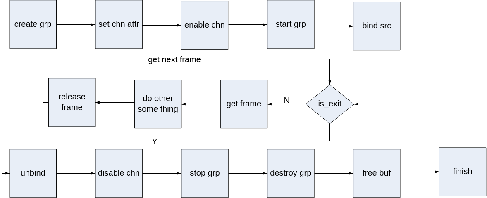

## API参考<a name="ZH-CN_TOPIC_0000002408134432"></a>

该功能模块为用户提供以下MPI：

-   [ss\_mpi\_dpu\_match\_get\_assist\_buf\_size](#ZH-CN_TOPIC_0000002441733413)：获取辅助内存字节数。
-   [ss\_mpi\_dpu\_match\_create\_grp](#ZH-CN_TOPIC_0000002441733697)：创建组。
-   [ss\_mpi\_dpu\_match\_destroy\_grp](#ZH-CN_TOPIC_0000002441733465)：销毁组。
-   [ss\_mpi\_dpu\_match\_set\_grp\_attr](#ZH-CN_TOPIC_0000002408294340)：设置组属性。
-   [ss\_mpi\_dpu\_match\_get\_grp\_attr](#ZH-CN_TOPIC_0000002441853661)：获取组属性。
-   [ss\_mpi\_dpu\_match\_start\_grp](#ZH-CN_TOPIC_0000002408294244)：启用组。
-   [ss\_mpi\_dpu\_match\_stop\_grp](#ZH-CN_TOPIC_0000002441733549)：禁用组。
-   [ss\_mpi\_dpu\_match\_set\_chn\_attr](#ZH-CN_TOPIC_0000002441733649)：设置通道属性。
-   [ss\_mpi\_dpu\_match\_get\_chn\_attr](#ZH-CN_TOPIC_0000002441733453)：获取通道属性。
-   [ss\_mpi\_dpu\_match\_enable\_chn](#ZH-CN_TOPIC_0000002408134548)：启用通道。
-   [ss\_mpi\_dpu\_match\_disable\_chn](#ZH-CN_TOPIC_0000002441733509)：禁用通道。
-   [ss\_mpi\_dpu\_match\_send\_frame](#ZH-CN_TOPIC_0000002408134456)：用户发送数据。
-   [ss\_mpi\_dpu\_match\_get\_frame](#ZH-CN_TOPIC_0000002408134196)：用户从通道获取一帧处理完成的图像。
-   [ss\_mpi\_dpu\_match\_release\_frame](#ZH-CN_TOPIC_0000002441853697)：用户释放一帧通道图像。
-   [ss\_mpi\_dpu\_match\_set\_grp\_cost\_param](#ZH-CN_TOPIC_0000002408134204)：设置组的代价参数。
-   [ss\_mpi\_dpu\_match\_get\_grp\_cost\_param](#ZH-CN_TOPIC_0000002441733689)：获取组的代价参数。
-   [ss\_mpi\_dpu\_match\_set\_grp\_param](#ZH-CN_TOPIC_0000002441733681)：设置组参数。
-   [ss\_mpi\_dpu\_match\_get\_grp\_param](#ZH-CN_TOPIC_0000002441853865)：获取组参数。


### ss\_mpi\_dpu\_match\_get\_assist\_buf\_size<a name="ZH-CN_TOPIC_0000002441733413"></a>

【描述】

获取辅助内存字节数。

【语法】

```
td_s32 ss_mpi_dpu_match_get_assist_buf_size(td_u16 disparity_num, td_u32 dst_height, td_u32 *size);
```

【参数】

<a name="table8836mcpsimp"></a>
<table><thead align="left"><tr id="row8842mcpsimp"><th class="cellrowborder" valign="top" width="22.770000000000003%" id="mcps1.1.4.1.1"><p id="p8844mcpsimp"><a name="p8844mcpsimp"></a><a name="p8844mcpsimp"></a>参数名称</p>
</th>
<th class="cellrowborder" valign="top" width="60.4%" id="mcps1.1.4.1.2"><p id="p8846mcpsimp"><a name="p8846mcpsimp"></a><a name="p8846mcpsimp"></a>描述</p>
</th>
<th class="cellrowborder" valign="top" width="16.830000000000002%" id="mcps1.1.4.1.3"><p id="p8848mcpsimp"><a name="p8848mcpsimp"></a><a name="p8848mcpsimp"></a>输入/输出</p>
</th>
</tr>
</thead>
<tbody><tr id="row8850mcpsimp"><td class="cellrowborder" valign="top" width="22.770000000000003%" headers="mcps1.1.4.1.1 "><p id="p8852mcpsimp"><a name="p8852mcpsimp"></a><a name="p8852mcpsimp"></a>disparity_num</p>
</td>
<td class="cellrowborder" valign="top" width="60.4%" headers="mcps1.1.4.1.2 "><p id="p8854mcpsimp"><a name="p8854mcpsimp"></a><a name="p8854mcpsimp"></a>视差值数目。</p>
<p id="p8855mcpsimp"><a name="p8855mcpsimp"></a><a name="p8855mcpsimp"></a>取值范围：[16, 224]，必须为16的倍数。</p>
</td>
<td class="cellrowborder" valign="top" width="16.830000000000002%" headers="mcps1.1.4.1.3 "><p id="p8857mcpsimp"><a name="p8857mcpsimp"></a><a name="p8857mcpsimp"></a>输入</p>
</td>
</tr>
<tr id="row8858mcpsimp"><td class="cellrowborder" valign="top" width="22.770000000000003%" headers="mcps1.1.4.1.1 "><p id="p8860mcpsimp"><a name="p8860mcpsimp"></a><a name="p8860mcpsimp"></a>dst_height</p>
</td>
<td class="cellrowborder" valign="top" width="60.4%" headers="mcps1.1.4.1.2 "><p id="p8862mcpsimp"><a name="p8862mcpsimp"></a><a name="p8862mcpsimp"></a>输出的图像高。</p>
</td>
<td class="cellrowborder" valign="top" width="16.830000000000002%" headers="mcps1.1.4.1.3 "><p id="p8864mcpsimp"><a name="p8864mcpsimp"></a><a name="p8864mcpsimp"></a>输入</p>
</td>
</tr>
<tr id="row8865mcpsimp"><td class="cellrowborder" valign="top" width="22.770000000000003%" headers="mcps1.1.4.1.1 "><p id="p8867mcpsimp"><a name="p8867mcpsimp"></a><a name="p8867mcpsimp"></a>size</p>
</td>
<td class="cellrowborder" valign="top" width="60.4%" headers="mcps1.1.4.1.2 "><p id="p8869mcpsimp"><a name="p8869mcpsimp"></a><a name="p8869mcpsimp"></a>辅助内存字节数。</p>
<p id="p8870mcpsimp"><a name="p8870mcpsimp"></a><a name="p8870mcpsimp"></a>不能为空。</p>
</td>
<td class="cellrowborder" valign="top" width="16.830000000000002%" headers="mcps1.1.4.1.3 "><p id="p8872mcpsimp"><a name="p8872mcpsimp"></a><a name="p8872mcpsimp"></a>输出</p>
</td>
</tr>
</tbody>
</table>

【返回值】

<a name="table8874mcpsimp"></a>
<table><thead align="left"><tr id="row8879mcpsimp"><th class="cellrowborder" valign="top" width="25%" id="mcps1.1.3.1.1"><p id="p8881mcpsimp"><a name="p8881mcpsimp"></a><a name="p8881mcpsimp"></a>返回值</p>
</th>
<th class="cellrowborder" valign="top" width="75%" id="mcps1.1.3.1.2"><p id="p8883mcpsimp"><a name="p8883mcpsimp"></a><a name="p8883mcpsimp"></a>描述</p>
</th>
</tr>
</thead>
<tbody><tr id="row8885mcpsimp"><td class="cellrowborder" valign="top" width="25%" headers="mcps1.1.3.1.1 "><p id="p8887mcpsimp"><a name="p8887mcpsimp"></a><a name="p8887mcpsimp"></a>0</p>
</td>
<td class="cellrowborder" valign="top" width="75%" headers="mcps1.1.3.1.2 "><p id="p8889mcpsimp"><a name="p8889mcpsimp"></a><a name="p8889mcpsimp"></a>成功。</p>
</td>
</tr>
<tr id="row8890mcpsimp"><td class="cellrowborder" valign="top" width="25%" headers="mcps1.1.3.1.1 "><p id="p8892mcpsimp"><a name="p8892mcpsimp"></a><a name="p8892mcpsimp"></a>非0</p>
</td>
<td class="cellrowborder" valign="top" width="75%" headers="mcps1.1.3.1.2 "><p id="p8894mcpsimp"><a name="p8894mcpsimp"></a><a name="p8894mcpsimp"></a>失败，参见<a href="#ZH-CN_TOPIC_0000002408134232">>错误码</</a><span xml:lang="fr-FR" id="ph8898mcpsimp"><a name="ph8898mcpsimp"></a><a name="ph8898mcpsimp"></a>。</span></p>
</td>
</tr>
</tbody>
</table>

【需求】

-   头文件：ot\_common\_dpu\_match.h、ss\_mpi\_dpu\_match.h
-   库文件：libss\_dpu\_match.a

【注意】

无。

【举例】

无。

【相关主题】

[ss\_mpi\_dpu\_match\_create\_grp](#ZH-CN_TOPIC_0000002441733697)

### ss\_mpi\_dpu\_match\_create\_grp<a name="ZH-CN_TOPIC_0000002441733697"></a>

【描述】

创建组。

【语法】

```
td_s32 ss_mpi_dpu_match_create_grp(ot_dpu_match_grp match_grp, const ot_dpu_match_grp_attr *grp_attr);
```

【参数】

<a name="table9972mcpsimp"></a>
<table><thead align="left"><tr id="row9978mcpsimp"><th class="cellrowborder" valign="top" width="16%" id="mcps1.1.4.1.1"><p id="p9980mcpsimp"><a name="p9980mcpsimp"></a><a name="p9980mcpsimp"></a>参数名称</p>
</th>
<th class="cellrowborder" valign="top" width="69%" id="mcps1.1.4.1.2"><p id="p9982mcpsimp"><a name="p9982mcpsimp"></a><a name="p9982mcpsimp"></a>描述</p>
</th>
<th class="cellrowborder" valign="top" width="15%" id="mcps1.1.4.1.3"><p id="p9984mcpsimp"><a name="p9984mcpsimp"></a><a name="p9984mcpsimp"></a>输入/输出</p>
</th>
</tr>
</thead>
<tbody><tr id="row9986mcpsimp"><td class="cellrowborder" valign="top" width="16%" headers="mcps1.1.4.1.1 "><p id="p9988mcpsimp"><a name="p9988mcpsimp"></a><a name="p9988mcpsimp"></a>match_grp</p>
</td>
<td class="cellrowborder" valign="top" width="69%" headers="mcps1.1.4.1.2 "><p id="p9990mcpsimp"><a name="p9990mcpsimp"></a><a name="p9990mcpsimp"></a>组号。</p>
<p id="p9991mcpsimp"><a name="p9991mcpsimp"></a><a name="p9991mcpsimp"></a>取值范围：[0, <a href="#ZH-CN_TOPIC_0000002441733437">>OT_DPU_MATCH_MAX_GRP_NUM</</a>)。</p>
</td>
<td class="cellrowborder" valign="top" width="15%" headers="mcps1.1.4.1.3 "><p id="p9994mcpsimp"><a name="p9994mcpsimp"></a><a name="p9994mcpsimp"></a>输入</p>
</td>
</tr>
<tr id="row9995mcpsimp"><td class="cellrowborder" valign="top" width="16%" headers="mcps1.1.4.1.1 "><p id="p9997mcpsimp"><a name="p9997mcpsimp"></a><a name="p9997mcpsimp"></a>grp_attr</p>
</td>
<td class="cellrowborder" valign="top" width="69%" headers="mcps1.1.4.1.2 "><p id="p9999mcpsimp"><a name="p9999mcpsimp"></a><a name="p9999mcpsimp"></a>组属性。</p>
<p id="p10000mcpsimp"><a name="p10000mcpsimp"></a><a name="p10000mcpsimp"></a>不能为空。</p>
</td>
<td class="cellrowborder" valign="top" width="15%" headers="mcps1.1.4.1.3 "><p id="p10002mcpsimp"><a name="p10002mcpsimp"></a><a name="p10002mcpsimp"></a>输入</p>
</td>
</tr>
</tbody>
</table>

【返回值】

<a name="table10004mcpsimp"></a>
<table><thead align="left"><tr id="row10009mcpsimp"><th class="cellrowborder" valign="top" width="28.999999999999996%" id="mcps1.1.3.1.1"><p id="p10011mcpsimp"><a name="p10011mcpsimp"></a><a name="p10011mcpsimp"></a>返回值</p>
</th>
<th class="cellrowborder" valign="top" width="71%" id="mcps1.1.3.1.2"><p id="p10013mcpsimp"><a name="p10013mcpsimp"></a><a name="p10013mcpsimp"></a>描述</p>
</th>
</tr>
</thead>
<tbody><tr id="row10015mcpsimp"><td class="cellrowborder" valign="top" width="28.999999999999996%" headers="mcps1.1.3.1.1 "><p id="p10017mcpsimp"><a name="p10017mcpsimp"></a><a name="p10017mcpsimp"></a>0</p>
</td>
<td class="cellrowborder" valign="top" width="71%" headers="mcps1.1.3.1.2 "><p id="p10019mcpsimp"><a name="p10019mcpsimp"></a><a name="p10019mcpsimp"></a>成功。</p>
</td>
</tr>
<tr id="row10020mcpsimp"><td class="cellrowborder" valign="top" width="28.999999999999996%" headers="mcps1.1.3.1.1 "><p id="p10022mcpsimp"><a name="p10022mcpsimp"></a><a name="p10022mcpsimp"></a>非0</p>
</td>
<td class="cellrowborder" valign="top" width="71%" headers="mcps1.1.3.1.2 "><p id="p10024mcpsimp"><a name="p10024mcpsimp"></a><a name="p10024mcpsimp"></a>失败，参见<a href="#ZH-CN_TOPIC_0000002408134232">>错误码</</a><span xml:lang="fr-FR" id="ph10027mcpsimp"><a name="ph10027mcpsimp"></a><a name="ph10027mcpsimp"></a>。</span></p>
</td>
</tr>
</tbody>
</table>

【需求】

-   头文件：ot\_common\_dpu\_match.h、ss\_mpi\_dpu\_match.h
-   库文件：libss\_dpu\_match.a

【注意】

不支持重复创建。

【举例】

无。

【相关主题】

-   [ss\_mpi\_dpu\_match\_destroy\_grp](#ZH-CN_TOPIC_0000002441733465)
-   [ss\_mpi\_dpu\_match\_set\_grp\_attr](#ZH-CN_TOPIC_0000002408294340)
-   [ss\_mpi\_dpu\_match\_get\_grp\_attr](#ZH-CN_TOPIC_0000002441853661)
-   [ss\_mpi\_dpu\_match\_start\_grp](#ZH-CN_TOPIC_0000002408294244)
-   [ss\_mpi\_dpu\_match\_stop\_grp](#ZH-CN_TOPIC_0000002441733549)

### ss\_mpi\_dpu\_match\_destroy\_grp<a name="ZH-CN_TOPIC_0000002441733465"></a>

【描述】

销毁组。

【语法】

```
td_s32 ss_mpi_dpu_match_destroy_grp(ot_dpu_match_grp match_grp);
```

【参数】

<a name="table10056mcpsimp"></a>
<table><thead align="left"><tr id="row10062mcpsimp"><th class="cellrowborder" valign="top" width="16%" id="mcps1.1.4.1.1"><p id="p10064mcpsimp"><a name="p10064mcpsimp"></a><a name="p10064mcpsimp"></a>参数名称</p>
</th>
<th class="cellrowborder" valign="top" width="69%" id="mcps1.1.4.1.2"><p id="p10066mcpsimp"><a name="p10066mcpsimp"></a><a name="p10066mcpsimp"></a>描述</p>
</th>
<th class="cellrowborder" valign="top" width="15%" id="mcps1.1.4.1.3"><p id="p10068mcpsimp"><a name="p10068mcpsimp"></a><a name="p10068mcpsimp"></a>输入/输出</p>
</th>
</tr>
</thead>
<tbody><tr id="row10070mcpsimp"><td class="cellrowborder" valign="top" width="16%" headers="mcps1.1.4.1.1 "><p id="p10072mcpsimp"><a name="p10072mcpsimp"></a><a name="p10072mcpsimp"></a>match_grp</p>
</td>
<td class="cellrowborder" valign="top" width="69%" headers="mcps1.1.4.1.2 "><p id="p10074mcpsimp"><a name="p10074mcpsimp"></a><a name="p10074mcpsimp"></a>组号。</p>
<p id="p10075mcpsimp"><a name="p10075mcpsimp"></a><a name="p10075mcpsimp"></a>取值范围：[0, <a href="#ZH-CN_TOPIC_0000002441733437">>OT_DPU_MATCH_MAX_GRP_NUM</</a>)。</p>
</td>
<td class="cellrowborder" valign="top" width="15%" headers="mcps1.1.4.1.3 "><p id="p10078mcpsimp"><a name="p10078mcpsimp"></a><a name="p10078mcpsimp"></a>输入</p>
</td>
</tr>
</tbody>
</table>

【返回值】

<a name="table10080mcpsimp"></a>
<table><thead align="left"><tr id="row10085mcpsimp"><th class="cellrowborder" valign="top" width="28.999999999999996%" id="mcps1.1.3.1.1"><p id="p10087mcpsimp"><a name="p10087mcpsimp"></a><a name="p10087mcpsimp"></a>返回值</p>
</th>
<th class="cellrowborder" valign="top" width="71%" id="mcps1.1.3.1.2"><p id="p10089mcpsimp"><a name="p10089mcpsimp"></a><a name="p10089mcpsimp"></a>描述</p>
</th>
</tr>
</thead>
<tbody><tr id="row10091mcpsimp"><td class="cellrowborder" valign="top" width="28.999999999999996%" headers="mcps1.1.3.1.1 "><p id="p10093mcpsimp"><a name="p10093mcpsimp"></a><a name="p10093mcpsimp"></a>0</p>
</td>
<td class="cellrowborder" valign="top" width="71%" headers="mcps1.1.3.1.2 "><p id="p10095mcpsimp"><a name="p10095mcpsimp"></a><a name="p10095mcpsimp"></a>成功。</p>
</td>
</tr>
<tr id="row10096mcpsimp"><td class="cellrowborder" valign="top" width="28.999999999999996%" headers="mcps1.1.3.1.1 "><p id="p10098mcpsimp"><a name="p10098mcpsimp"></a><a name="p10098mcpsimp"></a>非0</p>
</td>
<td class="cellrowborder" valign="top" width="71%" headers="mcps1.1.3.1.2 "><p id="p10100mcpsimp"><a name="p10100mcpsimp"></a><a name="p10100mcpsimp"></a>失败，参见<a href="#ZH-CN_TOPIC_0000002408134232">>错误码</</a><span xml:lang="fr-FR" id="ph10103mcpsimp"><a name="ph10103mcpsimp"></a><a name="ph10103mcpsimp"></a>。</span></p>
</td>
</tr>
</tbody>
</table>

【需求】

-   头文件：ot\_common\_dpu\_match.h、ss\_mpi\_dpu\_match.h
-   库文件：libss\_dpu\_match.a

【注意】

-   组必须已创建。
-   调用此接口之前，如果已经成功执行[ss\_mpi\_dpu\_match\_start\_grp](#ZH-CN_TOPIC_0000002408294244)，必须先调用[ss\_mpi\_dpu\_match\_stop\_grp](#ZH-CN_TOPIC_0000002441733549)禁用此组。
-   调用此接口时，会一直等待此组当前任务处理结束才会真正销毁。

【举例】

无。

【相关主题】

-   [ss\_mpi\_dpu\_match\_create\_grp](#ZH-CN_TOPIC_0000002441733697)
-   [ss\_mpi\_dpu\_match\_set\_grp\_attr](#ZH-CN_TOPIC_0000002408294340)
-   [ss\_mpi\_dpu\_match\_get\_grp\_attr](#ZH-CN_TOPIC_0000002441853661)
-   [ss\_mpi\_dpu\_match\_start\_grp](#ZH-CN_TOPIC_0000002408294244)
-   [ss\_mpi\_dpu\_match\_stop\_grp](#ZH-CN_TOPIC_0000002441733549)

### ss\_mpi\_dpu\_match\_set\_grp\_attr<a name="ZH-CN_TOPIC_0000002408294340"></a>

【描述】

设置组属性。

【语法】

```
td_s32 ss_mpi_dpu_match_set_grp_attr(ot_dpu_match_grp match_grp, const ot_dpu_match_grp_attr *grp_attr);
```

【参数】

<a name="table406mcpsimp"></a>
<table><thead align="left"><tr id="row412mcpsimp"><th class="cellrowborder" valign="top" width="16%" id="mcps1.1.4.1.1"><p id="p414mcpsimp"><a name="p414mcpsimp"></a><a name="p414mcpsimp"></a>参数名称</p>
</th>
<th class="cellrowborder" valign="top" width="69%" id="mcps1.1.4.1.2"><p id="p416mcpsimp"><a name="p416mcpsimp"></a><a name="p416mcpsimp"></a>描述</p>
</th>
<th class="cellrowborder" valign="top" width="15%" id="mcps1.1.4.1.3"><p id="p418mcpsimp"><a name="p418mcpsimp"></a><a name="p418mcpsimp"></a>输入/输出</p>
</th>
</tr>
</thead>
<tbody><tr id="row420mcpsimp"><td class="cellrowborder" valign="top" width="16%" headers="mcps1.1.4.1.1 "><p id="p422mcpsimp"><a name="p422mcpsimp"></a><a name="p422mcpsimp"></a>match_grp</p>
</td>
<td class="cellrowborder" valign="top" width="69%" headers="mcps1.1.4.1.2 "><p id="p424mcpsimp"><a name="p424mcpsimp"></a><a name="p424mcpsimp"></a>组号。</p>
<p id="p425mcpsimp"><a name="p425mcpsimp"></a><a name="p425mcpsimp"></a>取值范围：[0, <a href="#ZH-CN_TOPIC_0000002441733437">>OT_DPU_MATCH_MAX_GRP_NUM</</a>)。</p>
</td>
<td class="cellrowborder" valign="top" width="15%" headers="mcps1.1.4.1.3 "><p id="p428mcpsimp"><a name="p428mcpsimp"></a><a name="p428mcpsimp"></a>输入</p>
</td>
</tr>
<tr id="row429mcpsimp"><td class="cellrowborder" valign="top" width="16%" headers="mcps1.1.4.1.1 "><p id="p431mcpsimp"><a name="p431mcpsimp"></a><a name="p431mcpsimp"></a>grp_attr</p>
</td>
<td class="cellrowborder" valign="top" width="69%" headers="mcps1.1.4.1.2 "><p id="p433mcpsimp"><a name="p433mcpsimp"></a><a name="p433mcpsimp"></a>组属性。</p>
<p id="p434mcpsimp"><a name="p434mcpsimp"></a><a name="p434mcpsimp"></a>不能为空。</p>
</td>
<td class="cellrowborder" valign="top" width="15%" headers="mcps1.1.4.1.3 "><p id="p436mcpsimp"><a name="p436mcpsimp"></a><a name="p436mcpsimp"></a>输入</p>
</td>
</tr>
</tbody>
</table>

【返回值】

<a name="table438mcpsimp"></a>
<table><thead align="left"><tr id="row443mcpsimp"><th class="cellrowborder" valign="top" width="28.999999999999996%" id="mcps1.1.3.1.1"><p id="p445mcpsimp"><a name="p445mcpsimp"></a><a name="p445mcpsimp"></a>返回值</p>
</th>
<th class="cellrowborder" valign="top" width="71%" id="mcps1.1.3.1.2"><p id="p447mcpsimp"><a name="p447mcpsimp"></a><a name="p447mcpsimp"></a>描述</p>
</th>
</tr>
</thead>
<tbody><tr id="row449mcpsimp"><td class="cellrowborder" valign="top" width="28.999999999999996%" headers="mcps1.1.3.1.1 "><p id="p451mcpsimp"><a name="p451mcpsimp"></a><a name="p451mcpsimp"></a>0</p>
</td>
<td class="cellrowborder" valign="top" width="71%" headers="mcps1.1.3.1.2 "><p id="p453mcpsimp"><a name="p453mcpsimp"></a><a name="p453mcpsimp"></a>成功。</p>
</td>
</tr>
<tr id="row454mcpsimp"><td class="cellrowborder" valign="top" width="28.999999999999996%" headers="mcps1.1.3.1.1 "><p id="p456mcpsimp"><a name="p456mcpsimp"></a><a name="p456mcpsimp"></a>非0</p>
</td>
<td class="cellrowborder" valign="top" width="71%" headers="mcps1.1.3.1.2 "><p id="p458mcpsimp"><a name="p458mcpsimp"></a><a name="p458mcpsimp"></a>失败，参见<a href="#ZH-CN_TOPIC_0000002408134232">>错误码</</a><span xml:lang="fr-FR" id="ph461mcpsimp"><a name="ph461mcpsimp"></a><a name="ph461mcpsimp"></a>。</span></p>
</td>
</tr>
</tbody>
</table>

【需求】

-   头文件：ot\_common\_dpu\_match.h、ss\_mpi\_dpu\_match.h
-   库文件：libss\_dpu\_match.a

【注意】

-   组必须已创建。
-   组属性必须合法，其中部分静态属性不可动态设置，具体请参见[ot\_dpu\_match\_grp\_attr](#ZH-CN_TOPIC_0000002441853669)。

【举例】

无。

【相关主题】

-   [ss\_mpi\_dpu\_match\_create\_grp](#ZH-CN_TOPIC_0000002441733697)
-   [ss\_mpi\_dpu\_match\_destroy\_grp](#ZH-CN_TOPIC_0000002441733465)
-   [ss\_mpi\_dpu\_match\_get\_grp\_attr](#ZH-CN_TOPIC_0000002441853661)
-   [ss\_mpi\_dpu\_match\_start\_grp](#ZH-CN_TOPIC_0000002408294244)
-   [ss\_mpi\_dpu\_match\_stop\_grp](#ZH-CN_TOPIC_0000002441733549)

### ss\_mpi\_dpu\_match\_get\_grp\_attr<a name="ZH-CN_TOPIC_0000002441853661"></a>

【描述】

获取组属性。

【语法】

```
td_s32 ss_mpi_dpu_match_get_grp_attr(ot_dpu_match_grp match_grp, ot_dpu_match_grp_attr *grp_attr);
```

【参数】

<a name="table7951mcpsimp"></a>
<table><thead align="left"><tr id="row7957mcpsimp"><th class="cellrowborder" valign="top" width="16%" id="mcps1.1.4.1.1"><p id="p7959mcpsimp"><a name="p7959mcpsimp"></a><a name="p7959mcpsimp"></a>参数名称</p>
</th>
<th class="cellrowborder" valign="top" width="69%" id="mcps1.1.4.1.2"><p id="p7961mcpsimp"><a name="p7961mcpsimp"></a><a name="p7961mcpsimp"></a>描述</p>
</th>
<th class="cellrowborder" valign="top" width="15%" id="mcps1.1.4.1.3"><p id="p7963mcpsimp"><a name="p7963mcpsimp"></a><a name="p7963mcpsimp"></a>输入/输出</p>
</th>
</tr>
</thead>
<tbody><tr id="row7965mcpsimp"><td class="cellrowborder" valign="top" width="16%" headers="mcps1.1.4.1.1 "><p id="p7967mcpsimp"><a name="p7967mcpsimp"></a><a name="p7967mcpsimp"></a>match_grp</p>
</td>
<td class="cellrowborder" valign="top" width="69%" headers="mcps1.1.4.1.2 "><p id="p7969mcpsimp"><a name="p7969mcpsimp"></a><a name="p7969mcpsimp"></a>组号。</p>
<p id="p7970mcpsimp"><a name="p7970mcpsimp"></a><a name="p7970mcpsimp"></a>取值范围：[0, <a href="#ZH-CN_TOPIC_0000002441733437">>OT_DPU_MATCH_MAX_GRP_NUM</</a>)。</p>
</td>
<td class="cellrowborder" valign="top" width="15%" headers="mcps1.1.4.1.3 "><p id="p7973mcpsimp"><a name="p7973mcpsimp"></a><a name="p7973mcpsimp"></a>输入</p>
</td>
</tr>
<tr id="row7974mcpsimp"><td class="cellrowborder" valign="top" width="16%" headers="mcps1.1.4.1.1 "><p id="p7976mcpsimp"><a name="p7976mcpsimp"></a><a name="p7976mcpsimp"></a>grp_attr</p>
</td>
<td class="cellrowborder" valign="top" width="69%" headers="mcps1.1.4.1.2 "><p id="p7978mcpsimp"><a name="p7978mcpsimp"></a><a name="p7978mcpsimp"></a>组属性。</p>
<p id="p7979mcpsimp"><a name="p7979mcpsimp"></a><a name="p7979mcpsimp"></a>不能为空。</p>
</td>
<td class="cellrowborder" valign="top" width="15%" headers="mcps1.1.4.1.3 "><p id="p7981mcpsimp"><a name="p7981mcpsimp"></a><a name="p7981mcpsimp"></a>输出</p>
</td>
</tr>
</tbody>
</table>

【返回值】

<a name="table7983mcpsimp"></a>
<table><thead align="left"><tr id="row7988mcpsimp"><th class="cellrowborder" valign="top" width="28.999999999999996%" id="mcps1.1.3.1.1"><p id="p7990mcpsimp"><a name="p7990mcpsimp"></a><a name="p7990mcpsimp"></a>返回值</p>
</th>
<th class="cellrowborder" valign="top" width="71%" id="mcps1.1.3.1.2"><p id="p7992mcpsimp"><a name="p7992mcpsimp"></a><a name="p7992mcpsimp"></a>描述</p>
</th>
</tr>
</thead>
<tbody><tr id="row7994mcpsimp"><td class="cellrowborder" valign="top" width="28.999999999999996%" headers="mcps1.1.3.1.1 "><p id="p7996mcpsimp"><a name="p7996mcpsimp"></a><a name="p7996mcpsimp"></a>0</p>
</td>
<td class="cellrowborder" valign="top" width="71%" headers="mcps1.1.3.1.2 "><p id="p7998mcpsimp"><a name="p7998mcpsimp"></a><a name="p7998mcpsimp"></a>成功。</p>
</td>
</tr>
<tr id="row7999mcpsimp"><td class="cellrowborder" valign="top" width="28.999999999999996%" headers="mcps1.1.3.1.1 "><p id="p8001mcpsimp"><a name="p8001mcpsimp"></a><a name="p8001mcpsimp"></a>非0</p>
</td>
<td class="cellrowborder" valign="top" width="71%" headers="mcps1.1.3.1.2 "><p id="p8003mcpsimp"><a name="p8003mcpsimp"></a><a name="p8003mcpsimp"></a>失败，参见<a href="#ZH-CN_TOPIC_0000002408134232">>错误码</</a><span xml:lang="fr-FR" id="ph8006mcpsimp"><a name="ph8006mcpsimp"></a><a name="ph8006mcpsimp"></a>。</span></p>
</td>
</tr>
</tbody>
</table>

【需求】

-   头文件：ot\_common\_dpu\_match.h、ss\_mpi\_dpu\_match.h
-   库文件：libss\_dpu\_match.a

【注意】

组必须已创建。

【举例】

无。

【相关主题】

-   [ss\_mpi\_dpu\_match\_create\_grp](#ZH-CN_TOPIC_0000002441733697)
-   [ss\_mpi\_dpu\_match\_destroy\_grp](#ZH-CN_TOPIC_0000002441733465)
-   [ss\_mpi\_dpu\_match\_set\_grp\_attr](#ZH-CN_TOPIC_0000002408294340)
-   [ss\_mpi\_dpu\_match\_start\_grp](#ZH-CN_TOPIC_0000002408294244)
-   [ss\_mpi\_dpu\_match\_stop\_grp](#ZH-CN_TOPIC_0000002441733549)

### ss\_mpi\_dpu\_match\_start\_grp<a name="ZH-CN_TOPIC_0000002408294244"></a>

【描述】

启用组。

【语法】

```
td_s32 ss_mpi_dpu_match_start_grp(ot_dpu_match_grp match_grp);
```

【参数】

<a name="table5216mcpsimp"></a>
<table><thead align="left"><tr id="row5222mcpsimp"><th class="cellrowborder" valign="top" width="16%" id="mcps1.1.4.1.1"><p id="p5224mcpsimp"><a name="p5224mcpsimp"></a><a name="p5224mcpsimp"></a>参数名称</p>
</th>
<th class="cellrowborder" valign="top" width="69%" id="mcps1.1.4.1.2"><p id="p5226mcpsimp"><a name="p5226mcpsimp"></a><a name="p5226mcpsimp"></a>描述</p>
</th>
<th class="cellrowborder" valign="top" width="15%" id="mcps1.1.4.1.3"><p id="p5228mcpsimp"><a name="p5228mcpsimp"></a><a name="p5228mcpsimp"></a>输入/输出</p>
</th>
</tr>
</thead>
<tbody><tr id="row5230mcpsimp"><td class="cellrowborder" valign="top" width="16%" headers="mcps1.1.4.1.1 "><p id="p5232mcpsimp"><a name="p5232mcpsimp"></a><a name="p5232mcpsimp"></a>match_grp</p>
</td>
<td class="cellrowborder" valign="top" width="69%" headers="mcps1.1.4.1.2 "><p id="p5234mcpsimp"><a name="p5234mcpsimp"></a><a name="p5234mcpsimp"></a>组号。</p>
<p id="p5235mcpsimp"><a name="p5235mcpsimp"></a><a name="p5235mcpsimp"></a>取值范围：[0, <a href="#ZH-CN_TOPIC_0000002441733437">>OT_DPU_MATCH_MAX_GRP_NUM</</a>)。</p>
</td>
<td class="cellrowborder" valign="top" width="15%" headers="mcps1.1.4.1.3 "><p id="p5238mcpsimp"><a name="p5238mcpsimp"></a><a name="p5238mcpsimp"></a>输入</p>
</td>
</tr>
</tbody>
</table>

【返回值】

<a name="table5240mcpsimp"></a>
<table><thead align="left"><tr id="row5245mcpsimp"><th class="cellrowborder" valign="top" width="28.999999999999996%" id="mcps1.1.3.1.1"><p id="p5247mcpsimp"><a name="p5247mcpsimp"></a><a name="p5247mcpsimp"></a>返回值</p>
</th>
<th class="cellrowborder" valign="top" width="71%" id="mcps1.1.3.1.2"><p id="p5249mcpsimp"><a name="p5249mcpsimp"></a><a name="p5249mcpsimp"></a>描述</p>
</th>
</tr>
</thead>
<tbody><tr id="row5251mcpsimp"><td class="cellrowborder" valign="top" width="28.999999999999996%" headers="mcps1.1.3.1.1 "><p id="p5253mcpsimp"><a name="p5253mcpsimp"></a><a name="p5253mcpsimp"></a>0</p>
</td>
<td class="cellrowborder" valign="top" width="71%" headers="mcps1.1.3.1.2 "><p id="p5255mcpsimp"><a name="p5255mcpsimp"></a><a name="p5255mcpsimp"></a>成功。</p>
</td>
</tr>
<tr id="row5256mcpsimp"><td class="cellrowborder" valign="top" width="28.999999999999996%" headers="mcps1.1.3.1.1 "><p id="p5258mcpsimp"><a name="p5258mcpsimp"></a><a name="p5258mcpsimp"></a>非0</p>
</td>
<td class="cellrowborder" valign="top" width="71%" headers="mcps1.1.3.1.2 "><p id="p5260mcpsimp"><a name="p5260mcpsimp"></a><a name="p5260mcpsimp"></a>失败，参见<a href="#ZH-CN_TOPIC_0000002408134232">>错误码</</a><span xml:lang="fr-FR" id="ph5263mcpsimp"><a name="ph5263mcpsimp"></a><a name="ph5263mcpsimp"></a>。</span></p>
</td>
</tr>
</tbody>
</table>

【需求】

-   头文件：ot\_common\_dpu\_match.h、ss\_mpi\_dpu\_match.h
-   库文件：libss\_dpu\_match.a

【注意】

-   组必须已创建。
-   组的通道必须先使能。
-   重复调用该函数设置同一个组返回成功。

【举例】

无。

【相关主题】

-   [ss\_mpi\_dpu\_match\_create\_grp](#ZH-CN_TOPIC_0000002441733697)
-   [ss\_mpi\_dpu\_match\_destroy\_grp](#ZH-CN_TOPIC_0000002441733465)
-   [ss\_mpi\_dpu\_match\_set\_grp\_attr](#ZH-CN_TOPIC_0000002408294340)
-   [ss\_mpi\_dpu\_match\_get\_grp\_attr](#ZH-CN_TOPIC_0000002441853661)
-   [ss\_mpi\_dpu\_match\_stop\_grp](#ZH-CN_TOPIC_0000002441733549)

### ss\_mpi\_dpu\_match\_stop\_grp<a name="ZH-CN_TOPIC_0000002441733549"></a>

【描述】

禁用组。

【语法】

```
td_s32 ss_mpi_dpu_match_stop_grp(ot_dpu_match_grp match_grp);
```

【参数】

<a name="table2793mcpsimp"></a>
<table><thead align="left"><tr id="row2799mcpsimp"><th class="cellrowborder" valign="top" width="16%" id="mcps1.1.4.1.1"><p id="p2801mcpsimp"><a name="p2801mcpsimp"></a><a name="p2801mcpsimp"></a>参数名称</p>
</th>
<th class="cellrowborder" valign="top" width="69%" id="mcps1.1.4.1.2"><p id="p2803mcpsimp"><a name="p2803mcpsimp"></a><a name="p2803mcpsimp"></a>描述</p>
</th>
<th class="cellrowborder" valign="top" width="15%" id="mcps1.1.4.1.3"><p id="p2805mcpsimp"><a name="p2805mcpsimp"></a><a name="p2805mcpsimp"></a>输入/输出</p>
</th>
</tr>
</thead>
<tbody><tr id="row2807mcpsimp"><td class="cellrowborder" valign="top" width="16%" headers="mcps1.1.4.1.1 "><p id="p2809mcpsimp"><a name="p2809mcpsimp"></a><a name="p2809mcpsimp"></a>match_grp</p>
</td>
<td class="cellrowborder" valign="top" width="69%" headers="mcps1.1.4.1.2 "><p id="p2811mcpsimp"><a name="p2811mcpsimp"></a><a name="p2811mcpsimp"></a>组号。</p>
<p id="p2812mcpsimp"><a name="p2812mcpsimp"></a><a name="p2812mcpsimp"></a>取值范围：[0, <a href="#ZH-CN_TOPIC_0000002441733437">>OT_DPU_MATCH_MAX_GRP_NUM</</a>)。</p>
</td>
<td class="cellrowborder" valign="top" width="15%" headers="mcps1.1.4.1.3 "><p id="p2815mcpsimp"><a name="p2815mcpsimp"></a><a name="p2815mcpsimp"></a>输入</p>
</td>
</tr>
</tbody>
</table>

【返回值】

<a name="table2817mcpsimp"></a>
<table><thead align="left"><tr id="row2822mcpsimp"><th class="cellrowborder" valign="top" width="28.999999999999996%" id="mcps1.1.3.1.1"><p id="p2824mcpsimp"><a name="p2824mcpsimp"></a><a name="p2824mcpsimp"></a>返回值</p>
</th>
<th class="cellrowborder" valign="top" width="71%" id="mcps1.1.3.1.2"><p id="p2826mcpsimp"><a name="p2826mcpsimp"></a><a name="p2826mcpsimp"></a>描述</p>
</th>
</tr>
</thead>
<tbody><tr id="row2828mcpsimp"><td class="cellrowborder" valign="top" width="28.999999999999996%" headers="mcps1.1.3.1.1 "><p id="p2830mcpsimp"><a name="p2830mcpsimp"></a><a name="p2830mcpsimp"></a>0</p>
</td>
<td class="cellrowborder" valign="top" width="71%" headers="mcps1.1.3.1.2 "><p id="p2832mcpsimp"><a name="p2832mcpsimp"></a><a name="p2832mcpsimp"></a>成功。</p>
</td>
</tr>
<tr id="row2833mcpsimp"><td class="cellrowborder" valign="top" width="28.999999999999996%" headers="mcps1.1.3.1.1 "><p id="p2835mcpsimp"><a name="p2835mcpsimp"></a><a name="p2835mcpsimp"></a>非0</p>
</td>
<td class="cellrowborder" valign="top" width="71%" headers="mcps1.1.3.1.2 "><p id="p2837mcpsimp"><a name="p2837mcpsimp"></a><a name="p2837mcpsimp"></a>失败，参见<a href="#ZH-CN_TOPIC_0000002408134232">>错误码</</a><span xml:lang="fr-FR" id="ph2840mcpsimp"><a name="ph2840mcpsimp"></a><a name="ph2840mcpsimp"></a>。</span></p>
</td>
</tr>
</tbody>
</table>

【需求】

-   头文件：ot\_common\_dpu\_match.h、ss\_mpi\_dpu\_match.h
-   库文件：libss\_dpu\_match.a

【注意】

-   组必须已创建。
-   重复禁用同一组返回成功。

【举例】

无。

【相关主题】

-   [ss\_mpi\_dpu\_match\_create\_grp](#ZH-CN_TOPIC_0000002441733697)
-   [ss\_mpi\_dpu\_match\_destroy\_grp](#ZH-CN_TOPIC_0000002441733465)
-   [ss\_mpi\_dpu\_match\_set\_grp\_attr](#ZH-CN_TOPIC_0000002408294340)
-   [ss\_mpi\_dpu\_match\_get\_grp\_attr](#ZH-CN_TOPIC_0000002441853661)
-   [ss\_mpi\_dpu\_match\_start\_grp](#ZH-CN_TOPIC_0000002408294244)

### ss\_mpi\_dpu\_match\_set\_chn\_attr<a name="ZH-CN_TOPIC_0000002441733649"></a>

【描述】

设置通道属性。

【语法】

```
td_s32 ss_mpi_dpu_match_set_chn_attr(ot_dpu_match_grp match_grp, ot_dpu_match_chn match_chn, const ot_dpu_match_chn_attr *chn_attr);
```

【参数】

<a name="table10294mcpsimp"></a>
<table><thead align="left"><tr id="row10300mcpsimp"><th class="cellrowborder" valign="top" width="16%" id="mcps1.1.4.1.1"><p id="p10302mcpsimp"><a name="p10302mcpsimp"></a><a name="p10302mcpsimp"></a>参数名称</p>
</th>
<th class="cellrowborder" valign="top" width="69%" id="mcps1.1.4.1.2"><p id="p10304mcpsimp"><a name="p10304mcpsimp"></a><a name="p10304mcpsimp"></a>描述</p>
</th>
<th class="cellrowborder" valign="top" width="15%" id="mcps1.1.4.1.3"><p id="p10306mcpsimp"><a name="p10306mcpsimp"></a><a name="p10306mcpsimp"></a>输入/输出</p>
</th>
</tr>
</thead>
<tbody><tr id="row10308mcpsimp"><td class="cellrowborder" valign="top" width="16%" headers="mcps1.1.4.1.1 "><p id="p10310mcpsimp"><a name="p10310mcpsimp"></a><a name="p10310mcpsimp"></a>match_grp</p>
</td>
<td class="cellrowborder" valign="top" width="69%" headers="mcps1.1.4.1.2 "><p id="p10312mcpsimp"><a name="p10312mcpsimp"></a><a name="p10312mcpsimp"></a>组号。</p>
<p id="p10313mcpsimp"><a name="p10313mcpsimp"></a><a name="p10313mcpsimp"></a>取值范围：[0, <a href="#ZH-CN_TOPIC_0000002441733437">>OT_DPU_MATCH_MAX_GRP_NUM</</a>)。</p>
</td>
<td class="cellrowborder" valign="top" width="15%" headers="mcps1.1.4.1.3 "><p id="p10316mcpsimp"><a name="p10316mcpsimp"></a><a name="p10316mcpsimp"></a>输入</p>
</td>
</tr>
<tr id="row10317mcpsimp"><td class="cellrowborder" valign="top" width="16%" headers="mcps1.1.4.1.1 "><p id="p10319mcpsimp"><a name="p10319mcpsimp"></a><a name="p10319mcpsimp"></a>match_chn</p>
</td>
<td class="cellrowborder" valign="top" width="69%" headers="mcps1.1.4.1.2 "><p id="p10321mcpsimp"><a name="p10321mcpsimp"></a><a name="p10321mcpsimp"></a>通道号。</p>
<p id="p10322mcpsimp"><a name="p10322mcpsimp"></a><a name="p10322mcpsimp"></a>取值范围：[0,1)。</p>
</td>
<td class="cellrowborder" valign="top" width="15%" headers="mcps1.1.4.1.3 "><p id="p10324mcpsimp"><a name="p10324mcpsimp"></a><a name="p10324mcpsimp"></a>输入</p>
</td>
</tr>
<tr id="row10325mcpsimp"><td class="cellrowborder" valign="top" width="16%" headers="mcps1.1.4.1.1 "><p id="p10327mcpsimp"><a name="p10327mcpsimp"></a><a name="p10327mcpsimp"></a>chn_attr</p>
</td>
<td class="cellrowborder" valign="top" width="69%" headers="mcps1.1.4.1.2 "><p id="p10329mcpsimp"><a name="p10329mcpsimp"></a><a name="p10329mcpsimp"></a>通道属性。</p>
<p id="p10330mcpsimp"><a name="p10330mcpsimp"></a><a name="p10330mcpsimp"></a>不能为空。</p>
</td>
<td class="cellrowborder" valign="top" width="15%" headers="mcps1.1.4.1.3 "><p id="p10332mcpsimp"><a name="p10332mcpsimp"></a><a name="p10332mcpsimp"></a>输入</p>
</td>
</tr>
</tbody>
</table>

【返回值】

<a name="table10334mcpsimp"></a>
<table><thead align="left"><tr id="row10339mcpsimp"><th class="cellrowborder" valign="top" width="28.999999999999996%" id="mcps1.1.3.1.1"><p id="p10341mcpsimp"><a name="p10341mcpsimp"></a><a name="p10341mcpsimp"></a>返回值</p>
</th>
<th class="cellrowborder" valign="top" width="71%" id="mcps1.1.3.1.2"><p id="p10343mcpsimp"><a name="p10343mcpsimp"></a><a name="p10343mcpsimp"></a>描述</p>
</th>
</tr>
</thead>
<tbody><tr id="row10345mcpsimp"><td class="cellrowborder" valign="top" width="28.999999999999996%" headers="mcps1.1.3.1.1 "><p id="p10347mcpsimp"><a name="p10347mcpsimp"></a><a name="p10347mcpsimp"></a>0</p>
</td>
<td class="cellrowborder" valign="top" width="71%" headers="mcps1.1.3.1.2 "><p id="p10349mcpsimp"><a name="p10349mcpsimp"></a><a name="p10349mcpsimp"></a>成功。</p>
</td>
</tr>
<tr id="row10350mcpsimp"><td class="cellrowborder" valign="top" width="28.999999999999996%" headers="mcps1.1.3.1.1 "><p id="p10352mcpsimp"><a name="p10352mcpsimp"></a><a name="p10352mcpsimp"></a>非0</p>
</td>
<td class="cellrowborder" valign="top" width="71%" headers="mcps1.1.3.1.2 "><p id="p10354mcpsimp"><a name="p10354mcpsimp"></a><a name="p10354mcpsimp"></a>失败，参见<a href="#ZH-CN_TOPIC_0000002408134232">>错误码</</a><span xml:lang="fr-FR" id="ph10357mcpsimp"><a name="ph10357mcpsimp"></a><a name="ph10357mcpsimp"></a>。</span></p>
</td>
</tr>
</tbody>
</table>

【需求】

-   头文件：ot\_common\_dpu\_match.h、ss\_mpi\_dpu\_match.h
-   库文件：libss\_dpu\_match.a

【注意】

组必须已创建。

【举例】

无。

【相关主题】

-   [ss\_mpi\_dpu\_match\_get\_chn\_attr](#ZH-CN_TOPIC_0000002441733453)
-   [ss\_mpi\_dpu\_match\_enable\_chn](#ZH-CN_TOPIC_0000002408134548)
-   [ss\_mpi\_dpu\_match\_disable\_chn](#ZH-CN_TOPIC_0000002441733509)

### ss\_mpi\_dpu\_match\_get\_chn\_attr<a name="ZH-CN_TOPIC_0000002441733453"></a>

【描述】

获取通道属性。

【语法】

```
td_s32 ss_mpi_dpu_match_get_chn_attr(ot_dpu_match_grp match_grp, ot_dpu_match_chn match_chn, ot_dpu_match_chn_attr *chn_attr);
```

【参数】

<a name="table5002mcpsimp"></a>
<table><thead align="left"><tr id="row5008mcpsimp"><th class="cellrowborder" valign="top" width="16%" id="mcps1.1.4.1.1"><p id="p5010mcpsimp"><a name="p5010mcpsimp"></a><a name="p5010mcpsimp"></a>参数名称</p>
</th>
<th class="cellrowborder" valign="top" width="69%" id="mcps1.1.4.1.2"><p id="p5012mcpsimp"><a name="p5012mcpsimp"></a><a name="p5012mcpsimp"></a>描述</p>
</th>
<th class="cellrowborder" valign="top" width="15%" id="mcps1.1.4.1.3"><p id="p5014mcpsimp"><a name="p5014mcpsimp"></a><a name="p5014mcpsimp"></a>输入/输出</p>
</th>
</tr>
</thead>
<tbody><tr id="row5016mcpsimp"><td class="cellrowborder" valign="top" width="16%" headers="mcps1.1.4.1.1 "><p id="p5018mcpsimp"><a name="p5018mcpsimp"></a><a name="p5018mcpsimp"></a>match_grp</p>
</td>
<td class="cellrowborder" valign="top" width="69%" headers="mcps1.1.4.1.2 "><p id="p5020mcpsimp"><a name="p5020mcpsimp"></a><a name="p5020mcpsimp"></a>组号。</p>
<p id="p5021mcpsimp"><a name="p5021mcpsimp"></a><a name="p5021mcpsimp"></a>取值范围：[0, <a href="#ZH-CN_TOPIC_0000002441733437">>OT_DPU_MATCH_MAX_GRP_NUM</</a>)。</p>
</td>
<td class="cellrowborder" valign="top" width="15%" headers="mcps1.1.4.1.3 "><p id="p5024mcpsimp"><a name="p5024mcpsimp"></a><a name="p5024mcpsimp"></a>输入</p>
</td>
</tr>
<tr id="row5025mcpsimp"><td class="cellrowborder" valign="top" width="16%" headers="mcps1.1.4.1.1 "><p id="p5027mcpsimp"><a name="p5027mcpsimp"></a><a name="p5027mcpsimp"></a>match_chn</p>
</td>
<td class="cellrowborder" valign="top" width="69%" headers="mcps1.1.4.1.2 "><p id="p5029mcpsimp"><a name="p5029mcpsimp"></a><a name="p5029mcpsimp"></a>通道号。</p>
<p id="p5030mcpsimp"><a name="p5030mcpsimp"></a><a name="p5030mcpsimp"></a>取值范围：[0,1)。</p>
</td>
<td class="cellrowborder" valign="top" width="15%" headers="mcps1.1.4.1.3 "><p id="p5032mcpsimp"><a name="p5032mcpsimp"></a><a name="p5032mcpsimp"></a>输入</p>
</td>
</tr>
<tr id="row5033mcpsimp"><td class="cellrowborder" valign="top" width="16%" headers="mcps1.1.4.1.1 "><p id="p5035mcpsimp"><a name="p5035mcpsimp"></a><a name="p5035mcpsimp"></a>chn_attr</p>
</td>
<td class="cellrowborder" valign="top" width="69%" headers="mcps1.1.4.1.2 "><p id="p5037mcpsimp"><a name="p5037mcpsimp"></a><a name="p5037mcpsimp"></a>通道属性。</p>
<p id="p5038mcpsimp"><a name="p5038mcpsimp"></a><a name="p5038mcpsimp"></a>不能为空。</p>
</td>
<td class="cellrowborder" valign="top" width="15%" headers="mcps1.1.4.1.3 "><p id="p5040mcpsimp"><a name="p5040mcpsimp"></a><a name="p5040mcpsimp"></a>输出</p>
</td>
</tr>
</tbody>
</table>

【返回值】

<a name="table5042mcpsimp"></a>
<table><thead align="left"><tr id="row5047mcpsimp"><th class="cellrowborder" valign="top" width="28.999999999999996%" id="mcps1.1.3.1.1"><p id="p5049mcpsimp"><a name="p5049mcpsimp"></a><a name="p5049mcpsimp"></a>返回值</p>
</th>
<th class="cellrowborder" valign="top" width="71%" id="mcps1.1.3.1.2"><p id="p5051mcpsimp"><a name="p5051mcpsimp"></a><a name="p5051mcpsimp"></a>描述</p>
</th>
</tr>
</thead>
<tbody><tr id="row5053mcpsimp"><td class="cellrowborder" valign="top" width="28.999999999999996%" headers="mcps1.1.3.1.1 "><p id="p5055mcpsimp"><a name="p5055mcpsimp"></a><a name="p5055mcpsimp"></a>0</p>
</td>
<td class="cellrowborder" valign="top" width="71%" headers="mcps1.1.3.1.2 "><p id="p5057mcpsimp"><a name="p5057mcpsimp"></a><a name="p5057mcpsimp"></a>成功。</p>
</td>
</tr>
<tr id="row5058mcpsimp"><td class="cellrowborder" valign="top" width="28.999999999999996%" headers="mcps1.1.3.1.1 "><p id="p5060mcpsimp"><a name="p5060mcpsimp"></a><a name="p5060mcpsimp"></a>非0</p>
</td>
<td class="cellrowborder" valign="top" width="71%" headers="mcps1.1.3.1.2 "><p id="p5062mcpsimp"><a name="p5062mcpsimp"></a><a name="p5062mcpsimp"></a>失败，参见<a href="#ZH-CN_TOPIC_0000002408134232">>错误码</</a><span xml:lang="fr-FR" id="ph5065mcpsimp"><a name="ph5065mcpsimp"></a><a name="ph5065mcpsimp"></a>。</span></p>
</td>
</tr>
</tbody>
</table>

【需求】

-   头文件：ot\_common\_dpu\_match.h、ss\_mpi\_dpu\_match.h
-   库文件：libss\_dpu\_match.a

【注意】

组必须已创建。

【举例】

无。

【相关主题】

-   [ss\_mpi\_dpu\_match\_set\_chn\_attr](#ZH-CN_TOPIC_0000002441733649)
-   [ss\_mpi\_dpu\_match\_enable\_chn](#ZH-CN_TOPIC_0000002408134548)
-   [ss\_mpi\_dpu\_match\_disable\_chn](#ZH-CN_TOPIC_0000002441733509)

### ss\_mpi\_dpu\_match\_enable\_chn<a name="ZH-CN_TOPIC_0000002408134548"></a>

【描述】

启用通道。

【语法】

```
td_s32 ss_mpi_dpu_match_enable_chn(ot_dpu_match_grp match_grp, ot_dpu_match_chn match_chn);
```

【参数】

<a name="table7206mcpsimp"></a>
<table><thead align="left"><tr id="row7212mcpsimp"><th class="cellrowborder" valign="top" width="16%" id="mcps1.1.4.1.1"><p id="p7214mcpsimp"><a name="p7214mcpsimp"></a><a name="p7214mcpsimp"></a>参数名称</p>
</th>
<th class="cellrowborder" valign="top" width="69%" id="mcps1.1.4.1.2"><p id="p7216mcpsimp"><a name="p7216mcpsimp"></a><a name="p7216mcpsimp"></a>描述</p>
</th>
<th class="cellrowborder" valign="top" width="15%" id="mcps1.1.4.1.3"><p id="p7218mcpsimp"><a name="p7218mcpsimp"></a><a name="p7218mcpsimp"></a>输入/输出</p>
</th>
</tr>
</thead>
<tbody><tr id="row7220mcpsimp"><td class="cellrowborder" valign="top" width="16%" headers="mcps1.1.4.1.1 "><p id="p7222mcpsimp"><a name="p7222mcpsimp"></a><a name="p7222mcpsimp"></a>match_grp</p>
</td>
<td class="cellrowborder" valign="top" width="69%" headers="mcps1.1.4.1.2 "><p id="p7224mcpsimp"><a name="p7224mcpsimp"></a><a name="p7224mcpsimp"></a>组号。</p>
<p id="p7225mcpsimp"><a name="p7225mcpsimp"></a><a name="p7225mcpsimp"></a>取值范围：[0, <a href="#ZH-CN_TOPIC_0000002441733437">>OT_DPU_MATCH_MAX_GRP_NUM</</a>)。</p>
</td>
<td class="cellrowborder" valign="top" width="15%" headers="mcps1.1.4.1.3 "><p id="p7228mcpsimp"><a name="p7228mcpsimp"></a><a name="p7228mcpsimp"></a>输入</p>
</td>
</tr>
<tr id="row7229mcpsimp"><td class="cellrowborder" valign="top" width="16%" headers="mcps1.1.4.1.1 "><p id="p7231mcpsimp"><a name="p7231mcpsimp"></a><a name="p7231mcpsimp"></a>match_chn</p>
</td>
<td class="cellrowborder" valign="top" width="69%" headers="mcps1.1.4.1.2 "><p id="p7233mcpsimp"><a name="p7233mcpsimp"></a><a name="p7233mcpsimp"></a>通道号。</p>
<p id="p7234mcpsimp"><a name="p7234mcpsimp"></a><a name="p7234mcpsimp"></a>取值范围：[0,1)。</p>
</td>
<td class="cellrowborder" valign="top" width="15%" headers="mcps1.1.4.1.3 "><p id="p7236mcpsimp"><a name="p7236mcpsimp"></a><a name="p7236mcpsimp"></a>输入</p>
</td>
</tr>
</tbody>
</table>

【返回值】

<a name="table7238mcpsimp"></a>
<table><thead align="left"><tr id="row7243mcpsimp"><th class="cellrowborder" valign="top" width="28.999999999999996%" id="mcps1.1.3.1.1"><p id="p7245mcpsimp"><a name="p7245mcpsimp"></a><a name="p7245mcpsimp"></a>返回值</p>
</th>
<th class="cellrowborder" valign="top" width="71%" id="mcps1.1.3.1.2"><p id="p7247mcpsimp"><a name="p7247mcpsimp"></a><a name="p7247mcpsimp"></a>描述</p>
</th>
</tr>
</thead>
<tbody><tr id="row7249mcpsimp"><td class="cellrowborder" valign="top" width="28.999999999999996%" headers="mcps1.1.3.1.1 "><p id="p7251mcpsimp"><a name="p7251mcpsimp"></a><a name="p7251mcpsimp"></a>0</p>
</td>
<td class="cellrowborder" valign="top" width="71%" headers="mcps1.1.3.1.2 "><p id="p7253mcpsimp"><a name="p7253mcpsimp"></a><a name="p7253mcpsimp"></a>成功。</p>
</td>
</tr>
<tr id="row7254mcpsimp"><td class="cellrowborder" valign="top" width="28.999999999999996%" headers="mcps1.1.3.1.1 "><p id="p7256mcpsimp"><a name="p7256mcpsimp"></a><a name="p7256mcpsimp"></a>非0</p>
</td>
<td class="cellrowborder" valign="top" width="71%" headers="mcps1.1.3.1.2 "><p id="p7258mcpsimp"><a name="p7258mcpsimp"></a><a name="p7258mcpsimp"></a>失败，参见<a href="#ZH-CN_TOPIC_0000002408134232">>错误码</</a><span xml:lang="fr-FR" id="ph7261mcpsimp"><a name="ph7261mcpsimp"></a><a name="ph7261mcpsimp"></a>。</span></p>
</td>
</tr>
</tbody>
</table>

【需求】

-   头文件：ot\_common\_dpu\_match.h、ss\_mpi\_dpu\_match.h
-   库文件：libss\_dpu\_match.a

【注意】

-   组必须已创建。
-   通道属性必须先设置。
-   重复使能返回成功。

【举例】

无。

【相关主题】

-   [ss\_mpi\_dpu\_match\_set\_chn\_attr](#ZH-CN_TOPIC_0000002441733649)
-   [ss\_mpi\_dpu\_match\_get\_chn\_attr](#ZH-CN_TOPIC_0000002441733453)
-   [ss\_mpi\_dpu\_match\_disable\_chn](#ZH-CN_TOPIC_0000002441733509)

### ss\_mpi\_dpu\_match\_disable\_chn<a name="ZH-CN_TOPIC_0000002441733509"></a>

【描述】

禁用通道。

【语法】

```
td_s32 ss_mpi_dpu_match_disable_chn(ot_dpu_match_grp match_grp, ot_dpu_match_chn match_chn);
```

【参数】

<a name="table10137mcpsimp"></a>
<table><thead align="left"><tr id="row10143mcpsimp"><th class="cellrowborder" valign="top" width="16%" id="mcps1.1.4.1.1"><p id="p10145mcpsimp"><a name="p10145mcpsimp"></a><a name="p10145mcpsimp"></a>参数名称</p>
</th>
<th class="cellrowborder" valign="top" width="69%" id="mcps1.1.4.1.2"><p id="p10147mcpsimp"><a name="p10147mcpsimp"></a><a name="p10147mcpsimp"></a>描述</p>
</th>
<th class="cellrowborder" valign="top" width="15%" id="mcps1.1.4.1.3"><p id="p10149mcpsimp"><a name="p10149mcpsimp"></a><a name="p10149mcpsimp"></a>输入/输出</p>
</th>
</tr>
</thead>
<tbody><tr id="row10151mcpsimp"><td class="cellrowborder" valign="top" width="16%" headers="mcps1.1.4.1.1 "><p id="p10153mcpsimp"><a name="p10153mcpsimp"></a><a name="p10153mcpsimp"></a>match_grp</p>
</td>
<td class="cellrowborder" valign="top" width="69%" headers="mcps1.1.4.1.2 "><p id="p10155mcpsimp"><a name="p10155mcpsimp"></a><a name="p10155mcpsimp"></a>组号。</p>
<p id="p10156mcpsimp"><a name="p10156mcpsimp"></a><a name="p10156mcpsimp"></a>取值范围：[0, <a href="#ZH-CN_TOPIC_0000002441733437">>OT_DPU_MATCH_MAX_GRP_NUM</</a>)。</p>
</td>
<td class="cellrowborder" valign="top" width="15%" headers="mcps1.1.4.1.3 "><p id="p10159mcpsimp"><a name="p10159mcpsimp"></a><a name="p10159mcpsimp"></a>输入</p>
</td>
</tr>
<tr id="row10160mcpsimp"><td class="cellrowborder" valign="top" width="16%" headers="mcps1.1.4.1.1 "><p id="p10162mcpsimp"><a name="p10162mcpsimp"></a><a name="p10162mcpsimp"></a>match_chn</p>
</td>
<td class="cellrowborder" valign="top" width="69%" headers="mcps1.1.4.1.2 "><p id="p10164mcpsimp"><a name="p10164mcpsimp"></a><a name="p10164mcpsimp"></a>通道号。</p>
<p id="p10165mcpsimp"><a name="p10165mcpsimp"></a><a name="p10165mcpsimp"></a>取值范围：[0,1)。</p>
</td>
<td class="cellrowborder" valign="top" width="15%" headers="mcps1.1.4.1.3 "><p id="p10167mcpsimp"><a name="p10167mcpsimp"></a><a name="p10167mcpsimp"></a>输入</p>
</td>
</tr>
</tbody>
</table>

【返回值】

<a name="table10169mcpsimp"></a>
<table><thead align="left"><tr id="row10174mcpsimp"><th class="cellrowborder" valign="top" width="28.999999999999996%" id="mcps1.1.3.1.1"><p id="p10176mcpsimp"><a name="p10176mcpsimp"></a><a name="p10176mcpsimp"></a>返回值</p>
</th>
<th class="cellrowborder" valign="top" width="71%" id="mcps1.1.3.1.2"><p id="p10178mcpsimp"><a name="p10178mcpsimp"></a><a name="p10178mcpsimp"></a>描述</p>
</th>
</tr>
</thead>
<tbody><tr id="row10180mcpsimp"><td class="cellrowborder" valign="top" width="28.999999999999996%" headers="mcps1.1.3.1.1 "><p id="p10182mcpsimp"><a name="p10182mcpsimp"></a><a name="p10182mcpsimp"></a>0</p>
</td>
<td class="cellrowborder" valign="top" width="71%" headers="mcps1.1.3.1.2 "><p id="p10184mcpsimp"><a name="p10184mcpsimp"></a><a name="p10184mcpsimp"></a>成功。</p>
</td>
</tr>
<tr id="row10185mcpsimp"><td class="cellrowborder" valign="top" width="28.999999999999996%" headers="mcps1.1.3.1.1 "><p id="p10187mcpsimp"><a name="p10187mcpsimp"></a><a name="p10187mcpsimp"></a>非0</p>
</td>
<td class="cellrowborder" valign="top" width="71%" headers="mcps1.1.3.1.2 "><p id="p10189mcpsimp"><a name="p10189mcpsimp"></a><a name="p10189mcpsimp"></a>失败，参见<a href="#ZH-CN_TOPIC_0000002408134232">>错误码</</a><span xml:lang="fr-FR" id="ph10192mcpsimp"><a name="ph10192mcpsimp"></a><a name="ph10192mcpsimp"></a>。</span></p>
</td>
</tr>
</tbody>
</table>

【需求】

-   头文件：ot\_common\_dpu\_match.h、ss\_mpi\_dpu\_match.h
-   库文件：libss\_dpu\_match.a

【注意】

-   组必须已创建。
-   重复禁用返回成功。

【举例】

无。

【相关主题】

-   [ss\_mpi\_dpu\_match\_set\_chn\_attr](#ZH-CN_TOPIC_0000002441733649)
-   [ss\_mpi\_dpu\_match\_get\_chn\_attr](#ZH-CN_TOPIC_0000002441733453)
-   [ss\_mpi\_dpu\_match\_enable\_chn](#ZH-CN_TOPIC_0000002408134548)

### ss\_mpi\_dpu\_match\_send\_frame<a name="ZH-CN_TOPIC_0000002408134456"></a>

【描述】

用户发送数据。

【语法】

```
td_s32 ss_mpi_dpu_match_send_frame(ot_dpu_match_grp match_grp, const ot_dpu_match_frame_info *src_frame_info, td_s32 milli_sec);
```

【参数】

<a name="table6906mcpsimp"></a>
<table><thead align="left"><tr id="row6912mcpsimp"><th class="cellrowborder" valign="top" width="20%" id="mcps1.1.4.1.1"><p id="p6914mcpsimp"><a name="p6914mcpsimp"></a><a name="p6914mcpsimp"></a>参数名称</p>
</th>
<th class="cellrowborder" valign="top" width="64%" id="mcps1.1.4.1.2"><p id="p6916mcpsimp"><a name="p6916mcpsimp"></a><a name="p6916mcpsimp"></a>描述</p>
</th>
<th class="cellrowborder" valign="top" width="16%" id="mcps1.1.4.1.3"><p id="p6918mcpsimp"><a name="p6918mcpsimp"></a><a name="p6918mcpsimp"></a>输入/输出</p>
</th>
</tr>
</thead>
<tbody><tr id="row6920mcpsimp"><td class="cellrowborder" valign="top" width="20%" headers="mcps1.1.4.1.1 "><p id="p6922mcpsimp"><a name="p6922mcpsimp"></a><a name="p6922mcpsimp"></a>match_grp</p>
</td>
<td class="cellrowborder" valign="top" width="64%" headers="mcps1.1.4.1.2 "><p id="p6924mcpsimp"><a name="p6924mcpsimp"></a><a name="p6924mcpsimp"></a>组号。</p>
<p id="p6925mcpsimp"><a name="p6925mcpsimp"></a><a name="p6925mcpsimp"></a>取值范围：[0, <a href="#ZH-CN_TOPIC_0000002441733437">>OT_DPU_MATCH_MAX_GRP_NUM</</a>)。</p>
</td>
<td class="cellrowborder" valign="top" width="16%" headers="mcps1.1.4.1.3 "><p id="p6928mcpsimp"><a name="p6928mcpsimp"></a><a name="p6928mcpsimp"></a>输入</p>
</td>
</tr>
<tr id="row6929mcpsimp"><td class="cellrowborder" valign="top" width="20%" headers="mcps1.1.4.1.1 "><p id="p6931mcpsimp"><a name="p6931mcpsimp"></a><a name="p6931mcpsimp"></a>src_frame_info</p>
</td>
<td class="cellrowborder" valign="top" width="64%" headers="mcps1.1.4.1.2 "><p id="p6933mcpsimp"><a name="p6933mcpsimp"></a><a name="p6933mcpsimp"></a>匹配原始图像帧信息。</p>
<p id="p6934mcpsimp"><a name="p6934mcpsimp"></a><a name="p6934mcpsimp"></a>其中校正左右图像的分辨率大小分别与组属性中的左右图分辨率一致。</p>
<p id="p6935mcpsimp"><a name="p6935mcpsimp"></a><a name="p6935mcpsimp"></a>不能为空。</p>
</td>
<td class="cellrowborder" valign="top" width="16%" headers="mcps1.1.4.1.3 "><p id="p6937mcpsimp"><a name="p6937mcpsimp"></a><a name="p6937mcpsimp"></a>输入</p>
</td>
</tr>
<tr id="row6938mcpsimp"><td class="cellrowborder" valign="top" width="20%" headers="mcps1.1.4.1.1 "><p id="p6940mcpsimp"><a name="p6940mcpsimp"></a><a name="p6940mcpsimp"></a>milli_sec</p>
</td>
<td class="cellrowborder" valign="top" width="64%" headers="mcps1.1.4.1.2 "><p id="p6942mcpsimp"><a name="p6942mcpsimp"></a><a name="p6942mcpsimp"></a>超时参数 milli_sec 设为-1 时，为阻塞接口；0 时为非阻塞接口；大于 0 时为超时等待时间，超时时间的单位为毫秒（ms）。</p>
</td>
<td class="cellrowborder" valign="top" width="16%" headers="mcps1.1.4.1.3 "><p id="p6944mcpsimp"><a name="p6944mcpsimp"></a><a name="p6944mcpsimp"></a>输入</p>
</td>
</tr>
</tbody>
</table>

<a name="table6945mcpsimp"></a>
<table><thead align="left"><tr id="row6952mcpsimp"><th class="cellrowborder" valign="top" width="18%" id="mcps1.1.5.1.1"><p id="p6954mcpsimp"><a name="p6954mcpsimp"></a><a name="p6954mcpsimp"></a>参数名称</p>
</th>
<th class="cellrowborder" valign="top" width="34%" id="mcps1.1.5.1.2"><p id="p6956mcpsimp"><a name="p6956mcpsimp"></a><a name="p6956mcpsimp"></a>支持类型</p>
</th>
<th class="cellrowborder" valign="top" width="14.000000000000002%" id="mcps1.1.5.1.3"><p id="p6958mcpsimp"><a name="p6958mcpsimp"></a><a name="p6958mcpsimp"></a>地址对齐</p>
</th>
<th class="cellrowborder" valign="top" width="34%" id="mcps1.1.5.1.4"><p id="p6960mcpsimp"><a name="p6960mcpsimp"></a><a name="p6960mcpsimp"></a>分辨率</p>
</th>
</tr>
</thead>
<tbody><tr id="row6962mcpsimp"><td class="cellrowborder" rowspan="2" valign="top" width="18%" headers="mcps1.1.5.1.1 "><p id="p6964mcpsimp"><a name="p6964mcpsimp"></a><a name="p6964mcpsimp"></a>src_frame_info</p>
</td>
<td class="cellrowborder" valign="top" width="34%" headers="mcps1.1.5.1.2 "><p id="p6966mcpsimp"><a name="p6966mcpsimp"></a><a name="p6966mcpsimp"></a>原始图像支持图像像素格式：</p>
<p id="p6967mcpsimp"><a name="p6967mcpsimp"></a><a name="p6967mcpsimp"></a>OT_PIXEL_FORMAT_YVU_SEMIPLANAR_420/OT_PIXEL_FORMAT_YVU_SEMIPLANAR_422/OT_PIXEL_FORMAT_YUV_400</p>
<p id="p6968mcpsimp"><a name="p6968mcpsimp"></a><a name="p6968mcpsimp"></a>图像格式：OT_VIDEO_FORMAT_LINEAR</p>
<p id="p6969mcpsimp"><a name="p6969mcpsimp"></a><a name="p6969mcpsimp"></a>视频压缩模式：OT_COMPRESS_MODE_NONE</p>
<p id="p6970mcpsimp"><a name="p6970mcpsimp"></a><a name="p6970mcpsimp"></a>动态范围：OT_DYNAMIC_RANGE_SDR8</p>
<p id="p6971mcpsimp"><a name="p6971mcpsimp"></a><a name="p6971mcpsimp"></a>帧场模式：OT_VIDEO_FIELD_FRAME</p>
</td>
<td class="cellrowborder" valign="top" width="14.000000000000002%" headers="mcps1.1.5.1.3 "><p id="p6973mcpsimp"><a name="p6973mcpsimp"></a><a name="p6973mcpsimp"></a>16 byte</p>
</td>
<td class="cellrowborder" valign="top" width="34%" headers="mcps1.1.5.1.4 "><p id="p6975mcpsimp"><a name="p6975mcpsimp"></a><a name="p6975mcpsimp"></a>128x64～2048x2048</p>
</td>
</tr>
<tr id="row6976mcpsimp"><td class="cellrowborder" valign="top" headers="mcps1.1.5.1.1 "><p id="p6978mcpsimp"><a name="p6978mcpsimp"></a><a name="p6978mcpsimp"></a>校正图像支持：OT_PIXEL_FORMAT_YVU_SEMIPLANAR_420/OT_PIXEL_FORMAT_YVU_SEMIPLANAR_422/OT_PIXEL_FORMAT_YUV_400</p>
<p id="p6979mcpsimp"><a name="p6979mcpsimp"></a><a name="p6979mcpsimp"></a>图像格式：OT_VIDEO_FORMAT_LINEAR</p>
<p id="p6980mcpsimp"><a name="p6980mcpsimp"></a><a name="p6980mcpsimp"></a>视频压缩模式：OT_COMPRESS_MODE_NONE</p>
<p id="p6981mcpsimp"><a name="p6981mcpsimp"></a><a name="p6981mcpsimp"></a>动态范围：OT_DYNAMIC_RANGE_SDR8</p>
<p id="p6982mcpsimp"><a name="p6982mcpsimp"></a><a name="p6982mcpsimp"></a>帧场模式：OT_VIDEO_FIELD_FRAME</p>
</td>
<td class="cellrowborder" valign="top" headers="mcps1.1.5.1.2 "><p id="p6984mcpsimp"><a name="p6984mcpsimp"></a><a name="p6984mcpsimp"></a>16 byte</p>
</td>
<td class="cellrowborder" valign="top" headers="mcps1.1.5.1.3 "><p id="p6986mcpsimp"><a name="p6986mcpsimp"></a><a name="p6986mcpsimp"></a>128x64～1920x1080</p>
</td>
</tr>
</tbody>
</table>

【返回值】

<a name="table6988mcpsimp"></a>
<table><thead align="left"><tr id="row6993mcpsimp"><th class="cellrowborder" valign="top" width="28.999999999999996%" id="mcps1.1.3.1.1"><p id="p6995mcpsimp"><a name="p6995mcpsimp"></a><a name="p6995mcpsimp"></a>返回值</p>
</th>
<th class="cellrowborder" valign="top" width="71%" id="mcps1.1.3.1.2"><p id="p6997mcpsimp"><a name="p6997mcpsimp"></a><a name="p6997mcpsimp"></a>描述</p>
</th>
</tr>
</thead>
<tbody><tr id="row6999mcpsimp"><td class="cellrowborder" valign="top" width="28.999999999999996%" headers="mcps1.1.3.1.1 "><p id="p7001mcpsimp"><a name="p7001mcpsimp"></a><a name="p7001mcpsimp"></a>0</p>
</td>
<td class="cellrowborder" valign="top" width="71%" headers="mcps1.1.3.1.2 "><p id="p7003mcpsimp"><a name="p7003mcpsimp"></a><a name="p7003mcpsimp"></a>成功。</p>
</td>
</tr>
<tr id="row7004mcpsimp"><td class="cellrowborder" valign="top" width="28.999999999999996%" headers="mcps1.1.3.1.1 "><p id="p7006mcpsimp"><a name="p7006mcpsimp"></a><a name="p7006mcpsimp"></a>非0</p>
</td>
<td class="cellrowborder" valign="top" width="71%" headers="mcps1.1.3.1.2 "><p id="p7008mcpsimp"><a name="p7008mcpsimp"></a><a name="p7008mcpsimp"></a>失败，参见<a href="#ZH-CN_TOPIC_0000002408134232">>错误码</</a><span xml:lang="fr-FR" id="ph7011mcpsimp"><a name="ph7011mcpsimp"></a><a name="ph7011mcpsimp"></a>。</span></p>
</td>
</tr>
</tbody>
</table>

【需求】

-   头文件：ot\_common\_dpu\_match.h、ss\_mpi\_dpu\_match.h
-   库文件：libss\_dpu\_match.a

【注意】

-   组必须已创建。
-   用户使用此接口时，可以自行进行帧率控制。
-   src\_frame\_info 里面的src\_frame, rect\_frame图像地址必须是VB申请的，宽高要求2对齐，stride要求16字节对齐。
-   匹配模块对于src\_frame\_info 里面的src\_frame只是用于保证[ss\_mpi\_dpu\_match\_get\_frame](#ZH-CN_TOPIC_0000002408134196)获取到的原始图像，校正图像和匹配图像是一致的，不会对src\_frame做任何处理，因此只检查VB合法性，不检查图像参数。

【举例】

无。

【相关主题】

-   [ss\_mpi\_dpu\_match\_get\_frame](#ZH-CN_TOPIC_0000002408134196)
-   [ss\_mpi\_dpu\_match\_release\_frame](#ZH-CN_TOPIC_0000002441853697)

### ss\_mpi\_dpu\_match\_get\_frame<a name="ZH-CN_TOPIC_0000002408134196"></a>

【描述】

用户从通道获取处理完成的图像。

【语法】

```
td_s32 ss_mpi_dpu_match_get_frame(ot_dpu_match_grp match_grp, td_s32 milli_sec, ot_dpu_match_frame_info *src_frame_info, ot_video_frame_info *dst_frame);
```

【参数】

<a name="table6222mcpsimp"></a>
<table><thead align="left"><tr id="row6228mcpsimp"><th class="cellrowborder" valign="top" width="20.000000000000004%" id="mcps1.1.4.1.1"><p id="p6230mcpsimp"><a name="p6230mcpsimp"></a><a name="p6230mcpsimp"></a>参数名称</p>
</th>
<th class="cellrowborder" valign="top" width="69%" id="mcps1.1.4.1.2"><p id="p6232mcpsimp"><a name="p6232mcpsimp"></a><a name="p6232mcpsimp"></a>描述</p>
</th>
<th class="cellrowborder" valign="top" width="11.000000000000002%" id="mcps1.1.4.1.3"><p id="p6234mcpsimp"><a name="p6234mcpsimp"></a><a name="p6234mcpsimp"></a>输入/输出</p>
</th>
</tr>
</thead>
<tbody><tr id="row6236mcpsimp"><td class="cellrowborder" valign="top" width="20.000000000000004%" headers="mcps1.1.4.1.1 "><p id="p6238mcpsimp"><a name="p6238mcpsimp"></a><a name="p6238mcpsimp"></a>match_grp</p>
</td>
<td class="cellrowborder" valign="top" width="69%" headers="mcps1.1.4.1.2 "><p id="p6240mcpsimp"><a name="p6240mcpsimp"></a><a name="p6240mcpsimp"></a>组号。</p>
<p id="p6241mcpsimp"><a name="p6241mcpsimp"></a><a name="p6241mcpsimp"></a>取值范围：[0, <a href="#ZH-CN_TOPIC_0000002441733437">>OT_DPU_MATCH_MAX_GRP_NUM</</a>)。</p>
</td>
<td class="cellrowborder" valign="top" width="11.000000000000002%" headers="mcps1.1.4.1.3 "><p id="p6244mcpsimp"><a name="p6244mcpsimp"></a><a name="p6244mcpsimp"></a>输入</p>
</td>
</tr>
<tr id="row6245mcpsimp"><td class="cellrowborder" valign="top" width="20.000000000000004%" headers="mcps1.1.4.1.1 "><p id="p6247mcpsimp"><a name="p6247mcpsimp"></a><a name="p6247mcpsimp"></a>milli_sec</p>
</td>
<td class="cellrowborder" valign="top" width="69%" headers="mcps1.1.4.1.2 "><p id="p6249mcpsimp"><a name="p6249mcpsimp"></a><a name="p6249mcpsimp"></a>超时参数 milli_sec 设为-1 时，为阻塞接口；0 时为非阻塞接口；大于 0 时为超时等待时间，超时时间的单位为毫秒（ms）。</p>
</td>
<td class="cellrowborder" valign="top" width="11.000000000000002%" headers="mcps1.1.4.1.3 "><p id="p6251mcpsimp"><a name="p6251mcpsimp"></a><a name="p6251mcpsimp"></a>输入</p>
</td>
</tr>
<tr id="row6252mcpsimp"><td class="cellrowborder" valign="top" width="20.000000000000004%" headers="mcps1.1.4.1.1 "><p id="p6254mcpsimp"><a name="p6254mcpsimp"></a><a name="p6254mcpsimp"></a>src_frame_info</p>
</td>
<td class="cellrowborder" valign="top" width="69%" headers="mcps1.1.4.1.2 "><p id="p6256mcpsimp"><a name="p6256mcpsimp"></a><a name="p6256mcpsimp"></a>匹配原始图像帧信息。</p>
<p id="p6257mcpsimp"><a name="p6257mcpsimp"></a><a name="p6257mcpsimp"></a>不能为空。</p>
</td>
<td class="cellrowborder" valign="top" width="11.000000000000002%" headers="mcps1.1.4.1.3 "><p id="p6259mcpsimp"><a name="p6259mcpsimp"></a><a name="p6259mcpsimp"></a>输出</p>
</td>
</tr>
<tr id="row6260mcpsimp"><td class="cellrowborder" valign="top" width="20.000000000000004%" headers="mcps1.1.4.1.1 "><p id="p6262mcpsimp"><a name="p6262mcpsimp"></a><a name="p6262mcpsimp"></a>dst_frame</p>
</td>
<td class="cellrowborder" valign="top" width="69%" headers="mcps1.1.4.1.2 "><p id="p6264mcpsimp"><a name="p6264mcpsimp"></a><a name="p6264mcpsimp"></a>匹配后图像。</p>
<p id="p6265mcpsimp"><a name="p6265mcpsimp"></a><a name="p6265mcpsimp"></a>不能为空。</p>
<p id="p6266mcpsimp"><a name="p6266mcpsimp"></a><a name="p6266mcpsimp"></a>详情请见《MPP 媒体处理软件 V5.0 开发参考》“系统控制”章节。</p>
</td>
<td class="cellrowborder" valign="top" width="11.000000000000002%" headers="mcps1.1.4.1.3 "><p id="p6268mcpsimp"><a name="p6268mcpsimp"></a><a name="p6268mcpsimp"></a>输出</p>
</td>
</tr>
</tbody>
</table>

<a name="table6269mcpsimp"></a>
<table><thead align="left"><tr id="row6276mcpsimp"><th class="cellrowborder" valign="top" width="21.21212121212121%" id="mcps1.1.5.1.1"><p id="p6278mcpsimp"><a name="p6278mcpsimp"></a><a name="p6278mcpsimp"></a>参数名称</p>
</th>
<th class="cellrowborder" valign="top" width="32.32323232323232%" id="mcps1.1.5.1.2"><p id="p6280mcpsimp"><a name="p6280mcpsimp"></a><a name="p6280mcpsimp"></a>支持类型</p>
</th>
<th class="cellrowborder" valign="top" width="16.16161616161616%" id="mcps1.1.5.1.3"><p id="p6282mcpsimp"><a name="p6282mcpsimp"></a><a name="p6282mcpsimp"></a>地址对齐</p>
</th>
<th class="cellrowborder" valign="top" width="30.303030303030305%" id="mcps1.1.5.1.4"><p id="p6284mcpsimp"><a name="p6284mcpsimp"></a><a name="p6284mcpsimp"></a>分辨率</p>
</th>
</tr>
</thead>
<tbody><tr id="row6286mcpsimp"><td class="cellrowborder" rowspan="2" valign="top" width="21.21212121212121%" headers="mcps1.1.5.1.1 "><p id="p6288mcpsimp"><a name="p6288mcpsimp"></a><a name="p6288mcpsimp"></a>src_frame_info</p>
</td>
<td class="cellrowborder" valign="top" width="32.32323232323232%" headers="mcps1.1.5.1.2 "><p id="p6290mcpsimp"><a name="p6290mcpsimp"></a><a name="p6290mcpsimp"></a>原始图像支持：</p>
<p id="p6291mcpsimp"><a name="p6291mcpsimp"></a><a name="p6291mcpsimp"></a>OT_PIXEL_FORMAT_YVU_SEMIPLANAR_420/OT_PIXEL_FORMAT_YVU_SEMIPLANAR_422/OT_PIXEL_FORMAT_YUV_400</p>
</td>
<td class="cellrowborder" valign="top" width="16.16161616161616%" headers="mcps1.1.5.1.3 "><p id="p6293mcpsimp"><a name="p6293mcpsimp"></a><a name="p6293mcpsimp"></a>16 byte</p>
</td>
<td class="cellrowborder" valign="top" width="30.303030303030305%" headers="mcps1.1.5.1.4 "><p id="p6295mcpsimp"><a name="p6295mcpsimp"></a><a name="p6295mcpsimp"></a>128x64～2048x2048</p>
</td>
</tr>
<tr id="row6296mcpsimp"><td class="cellrowborder" valign="top" headers="mcps1.1.5.1.1 "><p id="p6298mcpsimp"><a name="p6298mcpsimp"></a><a name="p6298mcpsimp"></a>校正图像支持：OT_PIXEL_FORMAT_YVU_SEMIPLANAR_420/OT_PIXEL_FORMAT_YVU_SEMIPLANAR_422/OT_PIXEL_FORMAT_YUV_400</p>
</td>
<td class="cellrowborder" valign="top" headers="mcps1.1.5.1.2 "><p id="p6300mcpsimp"><a name="p6300mcpsimp"></a><a name="p6300mcpsimp"></a>16 byte</p>
</td>
<td class="cellrowborder" valign="top" headers="mcps1.1.5.1.3 "><p id="p6302mcpsimp"><a name="p6302mcpsimp"></a><a name="p6302mcpsimp"></a>128x64～1920x1080</p>
</td>
</tr>
<tr id="row6303mcpsimp"><td class="cellrowborder" valign="top" width="21.21212121212121%" headers="mcps1.1.5.1.1 "><p id="p6305mcpsimp"><a name="p6305mcpsimp"></a><a name="p6305mcpsimp"></a>dst_frame</p>
</td>
<td class="cellrowborder" valign="top" width="32.32323232323232%" headers="mcps1.1.5.1.2 "><p id="p6307mcpsimp"><a name="p6307mcpsimp"></a><a name="p6307mcpsimp"></a>OT_PIXEL_FORMAT_S16</p>
</td>
<td class="cellrowborder" valign="top" width="16.16161616161616%" headers="mcps1.1.5.1.3 "><p id="p6309mcpsimp"><a name="p6309mcpsimp"></a><a name="p6309mcpsimp"></a>16 byte</p>
</td>
<td class="cellrowborder" valign="top" width="30.303030303030305%" headers="mcps1.1.5.1.4 "><p id="p6311mcpsimp"><a name="p6311mcpsimp"></a><a name="p6311mcpsimp"></a>128x64～1920x1080</p>
</td>
</tr>
</tbody>
</table>

【返回值】

<a name="table6313mcpsimp"></a>
<table><thead align="left"><tr id="row6318mcpsimp"><th class="cellrowborder" valign="top" width="28.999999999999996%" id="mcps1.1.3.1.1"><p id="p6320mcpsimp"><a name="p6320mcpsimp"></a><a name="p6320mcpsimp"></a>返回值</p>
</th>
<th class="cellrowborder" valign="top" width="71%" id="mcps1.1.3.1.2"><p id="p6322mcpsimp"><a name="p6322mcpsimp"></a><a name="p6322mcpsimp"></a>描述</p>
</th>
</tr>
</thead>
<tbody><tr id="row6324mcpsimp"><td class="cellrowborder" valign="top" width="28.999999999999996%" headers="mcps1.1.3.1.1 "><p id="p6326mcpsimp"><a name="p6326mcpsimp"></a><a name="p6326mcpsimp"></a>0</p>
</td>
<td class="cellrowborder" valign="top" width="71%" headers="mcps1.1.3.1.2 "><p id="p6328mcpsimp"><a name="p6328mcpsimp"></a><a name="p6328mcpsimp"></a>成功。</p>
</td>
</tr>
<tr id="row6329mcpsimp"><td class="cellrowborder" valign="top" width="28.999999999999996%" headers="mcps1.1.3.1.1 "><p id="p6331mcpsimp"><a name="p6331mcpsimp"></a><a name="p6331mcpsimp"></a>非0</p>
</td>
<td class="cellrowborder" valign="top" width="71%" headers="mcps1.1.3.1.2 "><p id="p6333mcpsimp"><a name="p6333mcpsimp"></a><a name="p6333mcpsimp"></a>失败，参见<a href="#ZH-CN_TOPIC_0000002408134232">>错误码</</a><span xml:lang="fr-FR" id="ph6336mcpsimp"><a name="ph6336mcpsimp"></a><a name="ph6336mcpsimp"></a>。</span></p>
</td>
</tr>
</tbody>
</table>

【需求】

-   头文件：ot\_common\_dpu\_match.h、ss\_mpi\_dpu\_match.h
-   库文件：libss\_dpu\_match.a

【注意】

-   组必须已创建。
-   当组属性的队列深度不为0时，才能获取到图像。
-   当组属性的is\_need\_src\_frame为TD\_TRUE时，src\_frame\_info的src\_frame才能获取到。
-   输出视差图以右图为基准图像。
-   输出结果数据元素格式为S10Q6\(1bit符号位+9bit整数部分+6bit小数部分\)。
-   输出图像分辨率与输入右图相同。

【举例】

无。

【相关主题】

-   [ss\_mpi\_dpu\_match\_send\_frame](#ZH-CN_TOPIC_0000002408134456)
-   [ss\_mpi\_dpu\_match\_release\_frame](#ZH-CN_TOPIC_0000002441853697)

### ss\_mpi\_dpu\_match\_release\_frame<a name="ZH-CN_TOPIC_0000002441853697"></a>

【描述】

用户释放通道图像。

【语法】

```
td_s32 ss_mpi_dpu_match_release_frame(ot_dpu_match_grp match_grp, const ot_dpu_match_frame_info *src_frame_info, const ot_video_frame_info *dst_frame);
```

【参数】

<a name="table9840mcpsimp"></a>
<table><thead align="left"><tr id="row9846mcpsimp"><th class="cellrowborder" valign="top" width="20.200000000000003%" id="mcps1.1.4.1.1"><p id="p9848mcpsimp"><a name="p9848mcpsimp"></a><a name="p9848mcpsimp"></a>参数名称</p>
</th>
<th class="cellrowborder" valign="top" width="69.69999999999999%" id="mcps1.1.4.1.2"><p id="p9850mcpsimp"><a name="p9850mcpsimp"></a><a name="p9850mcpsimp"></a>描述</p>
</th>
<th class="cellrowborder" valign="top" width="10.100000000000001%" id="mcps1.1.4.1.3"><p id="p9852mcpsimp"><a name="p9852mcpsimp"></a><a name="p9852mcpsimp"></a>输入/输出</p>
</th>
</tr>
</thead>
<tbody><tr id="row9854mcpsimp"><td class="cellrowborder" valign="top" width="20.200000000000003%" headers="mcps1.1.4.1.1 "><p id="p9856mcpsimp"><a name="p9856mcpsimp"></a><a name="p9856mcpsimp"></a>match_grp</p>
</td>
<td class="cellrowborder" valign="top" width="69.69999999999999%" headers="mcps1.1.4.1.2 "><p id="p9858mcpsimp"><a name="p9858mcpsimp"></a><a name="p9858mcpsimp"></a>组号。</p>
<p id="p9859mcpsimp"><a name="p9859mcpsimp"></a><a name="p9859mcpsimp"></a>取值范围：[0, <a href="#ZH-CN_TOPIC_0000002441733437">>OT_DPU_MATCH_MAX_GRP_NUM</</a>)。</p>
</td>
<td class="cellrowborder" valign="top" width="10.100000000000001%" headers="mcps1.1.4.1.3 "><p id="p9862mcpsimp"><a name="p9862mcpsimp"></a><a name="p9862mcpsimp"></a>输入</p>
</td>
</tr>
<tr id="row9863mcpsimp"><td class="cellrowborder" valign="top" width="20.200000000000003%" headers="mcps1.1.4.1.1 "><p id="p9865mcpsimp"><a name="p9865mcpsimp"></a><a name="p9865mcpsimp"></a>src_frame_info</p>
</td>
<td class="cellrowborder" valign="top" width="69.69999999999999%" headers="mcps1.1.4.1.2 "><p id="p9867mcpsimp"><a name="p9867mcpsimp"></a><a name="p9867mcpsimp"></a>匹配原始图像帧信息。</p>
<p id="p9868mcpsimp"><a name="p9868mcpsimp"></a><a name="p9868mcpsimp"></a>不能为空。</p>
</td>
<td class="cellrowborder" valign="top" width="10.100000000000001%" headers="mcps1.1.4.1.3 "><p id="p9870mcpsimp"><a name="p9870mcpsimp"></a><a name="p9870mcpsimp"></a>输入</p>
</td>
</tr>
<tr id="row9871mcpsimp"><td class="cellrowborder" valign="top" width="20.200000000000003%" headers="mcps1.1.4.1.1 "><p id="p9873mcpsimp"><a name="p9873mcpsimp"></a><a name="p9873mcpsimp"></a>dst_frame</p>
</td>
<td class="cellrowborder" valign="top" width="69.69999999999999%" headers="mcps1.1.4.1.2 "><p id="p9875mcpsimp"><a name="p9875mcpsimp"></a><a name="p9875mcpsimp"></a>匹配后图像。</p>
<p id="p9876mcpsimp"><a name="p9876mcpsimp"></a><a name="p9876mcpsimp"></a>不能为空。</p>
<p id="p9877mcpsimp"><a name="p9877mcpsimp"></a><a name="p9877mcpsimp"></a>详情请见《MPP 媒体处理软件 V5.0 开发参考》“系统控制”章节。</p>
</td>
<td class="cellrowborder" valign="top" width="10.100000000000001%" headers="mcps1.1.4.1.3 "><p id="p9879mcpsimp"><a name="p9879mcpsimp"></a><a name="p9879mcpsimp"></a>输入</p>
</td>
</tr>
</tbody>
</table>

【返回值】

<a name="table9881mcpsimp"></a>
<table><thead align="left"><tr id="row9886mcpsimp"><th class="cellrowborder" valign="top" width="28.999999999999996%" id="mcps1.1.3.1.1"><p id="p9888mcpsimp"><a name="p9888mcpsimp"></a><a name="p9888mcpsimp"></a>返回值</p>
</th>
<th class="cellrowborder" valign="top" width="71%" id="mcps1.1.3.1.2"><p id="p9890mcpsimp"><a name="p9890mcpsimp"></a><a name="p9890mcpsimp"></a>描述</p>
</th>
</tr>
</thead>
<tbody><tr id="row9892mcpsimp"><td class="cellrowborder" valign="top" width="28.999999999999996%" headers="mcps1.1.3.1.1 "><p id="p9894mcpsimp"><a name="p9894mcpsimp"></a><a name="p9894mcpsimp"></a>0</p>
</td>
<td class="cellrowborder" valign="top" width="71%" headers="mcps1.1.3.1.2 "><p id="p9896mcpsimp"><a name="p9896mcpsimp"></a><a name="p9896mcpsimp"></a>成功。</p>
</td>
</tr>
<tr id="row9897mcpsimp"><td class="cellrowborder" valign="top" width="28.999999999999996%" headers="mcps1.1.3.1.1 "><p id="p9899mcpsimp"><a name="p9899mcpsimp"></a><a name="p9899mcpsimp"></a>非0</p>
</td>
<td class="cellrowborder" valign="top" width="71%" headers="mcps1.1.3.1.2 "><p id="p9901mcpsimp"><a name="p9901mcpsimp"></a><a name="p9901mcpsimp"></a>失败，参见<a href="#ZH-CN_TOPIC_0000002408134232">>错误码</</a><span xml:lang="fr-FR" id="ph9904mcpsimp"><a name="ph9904mcpsimp"></a><a name="ph9904mcpsimp"></a>。</span></p>
</td>
</tr>
</tbody>
</table>

【需求】

-   头文件：ot\_common\_dpu\_match.h、ss\_mpi\_dpu\_match.h
-   库文件：libss\_dpu\_match.a

【注意】

-   组必须已创建。
-   src\_frame\_info/ dst\_frame由[ss\_mpi\_dpu\_match\_get\_frame](#ZH-CN_TOPIC_0000002408134196)获取，与其配对使用。

【举例】

无。

【相关主题】

-   [ss\_mpi\_dpu\_match\_send\_frame](#ZH-CN_TOPIC_0000002408134456)
-   [ss\_mpi\_dpu\_match\_get\_frame](#ZH-CN_TOPIC_0000002408134196)

### ss\_mpi\_dpu\_match\_set\_grp\_cost\_param<a name="ZH-CN_TOPIC_0000002408134204"></a>

【描述】

设置组的代价参数。

【语法】

```
td_s32 ss_mpi_dpu_match_set_grp_cost_param(ot_dpu_match_grp match_grp, const ot_dpu_match_cost_param *cost_param);
```

【参数】

<a name="table10648mcpsimp"></a>
<table><thead align="left"><tr id="row10654mcpsimp"><th class="cellrowborder" valign="top" width="17%" id="mcps1.1.4.1.1"><p id="p10656mcpsimp"><a name="p10656mcpsimp"></a><a name="p10656mcpsimp"></a>参数名称</p>
</th>
<th class="cellrowborder" valign="top" width="69%" id="mcps1.1.4.1.2"><p id="p10658mcpsimp"><a name="p10658mcpsimp"></a><a name="p10658mcpsimp"></a>描述</p>
</th>
<th class="cellrowborder" valign="top" width="14.000000000000002%" id="mcps1.1.4.1.3"><p id="p10660mcpsimp"><a name="p10660mcpsimp"></a><a name="p10660mcpsimp"></a>输入/输出</p>
</th>
</tr>
</thead>
<tbody><tr id="row10662mcpsimp"><td class="cellrowborder" valign="top" width="17%" headers="mcps1.1.4.1.1 "><p id="p10664mcpsimp"><a name="p10664mcpsimp"></a><a name="p10664mcpsimp"></a>match_grp</p>
</td>
<td class="cellrowborder" valign="top" width="69%" headers="mcps1.1.4.1.2 "><p id="p10666mcpsimp"><a name="p10666mcpsimp"></a><a name="p10666mcpsimp"></a>组号。</p>
<p id="p10667mcpsimp"><a name="p10667mcpsimp"></a><a name="p10667mcpsimp"></a>取值范围：[0, <a href="#ZH-CN_TOPIC_0000002441733437">>OT_DPU_MATCH_MAX_GRP_NUM</</a>)。</p>
</td>
<td class="cellrowborder" valign="top" width="14.000000000000002%" headers="mcps1.1.4.1.3 "><p id="p10670mcpsimp"><a name="p10670mcpsimp"></a><a name="p10670mcpsimp"></a>输入</p>
</td>
</tr>
<tr id="row10671mcpsimp"><td class="cellrowborder" valign="top" width="17%" headers="mcps1.1.4.1.1 "><p id="p10673mcpsimp"><a name="p10673mcpsimp"></a><a name="p10673mcpsimp"></a>cost_param</p>
</td>
<td class="cellrowborder" valign="top" width="69%" headers="mcps1.1.4.1.2 "><p id="p10675mcpsimp"><a name="p10675mcpsimp"></a><a name="p10675mcpsimp"></a>代价参数。</p>
<p id="p10676mcpsimp"><a name="p10676mcpsimp"></a><a name="p10676mcpsimp"></a>不能为空。</p>
</td>
<td class="cellrowborder" valign="top" width="14.000000000000002%" headers="mcps1.1.4.1.3 "><p id="p10678mcpsimp"><a name="p10678mcpsimp"></a><a name="p10678mcpsimp"></a>输入</p>
</td>
</tr>
</tbody>
</table>

【返回值】

<a name="table10680mcpsimp"></a>
<table><thead align="left"><tr id="row10685mcpsimp"><th class="cellrowborder" valign="top" width="28.999999999999996%" id="mcps1.1.3.1.1"><p id="p10687mcpsimp"><a name="p10687mcpsimp"></a><a name="p10687mcpsimp"></a>返回值</p>
</th>
<th class="cellrowborder" valign="top" width="71%" id="mcps1.1.3.1.2"><p id="p10689mcpsimp"><a name="p10689mcpsimp"></a><a name="p10689mcpsimp"></a>描述</p>
</th>
</tr>
</thead>
<tbody><tr id="row10691mcpsimp"><td class="cellrowborder" valign="top" width="28.999999999999996%" headers="mcps1.1.3.1.1 "><p id="p10693mcpsimp"><a name="p10693mcpsimp"></a><a name="p10693mcpsimp"></a>0</p>
</td>
<td class="cellrowborder" valign="top" width="71%" headers="mcps1.1.3.1.2 "><p id="p10695mcpsimp"><a name="p10695mcpsimp"></a><a name="p10695mcpsimp"></a>成功。</p>
</td>
</tr>
<tr id="row10696mcpsimp"><td class="cellrowborder" valign="top" width="28.999999999999996%" headers="mcps1.1.3.1.1 "><p id="p10698mcpsimp"><a name="p10698mcpsimp"></a><a name="p10698mcpsimp"></a>非0</p>
</td>
<td class="cellrowborder" valign="top" width="71%" headers="mcps1.1.3.1.2 "><p id="p10700mcpsimp"><a name="p10700mcpsimp"></a><a name="p10700mcpsimp"></a>失败，参见<a href="#ZH-CN_TOPIC_0000002408134232">>错误码</</a><span xml:lang="fr-FR" id="ph10703mcpsimp"><a name="ph10703mcpsimp"></a><a name="ph10703mcpsimp"></a>。</span></p>
</td>
</tr>
</tbody>
</table>

【需求】

-   头文件：ot\_common\_dpu\_match.h、ss\_mpi\_dpu\_match.h
-   库文件：libss\_dpu\_match.a

【注意】

组必须已创建。

【举例】

无。

【相关主题】

[ss\_mpi\_dpu\_match\_get\_grp\_cost\_param](#ZH-CN_TOPIC_0000002441733689)

### ss\_mpi\_dpu\_match\_get\_grp\_cost\_param<a name="ZH-CN_TOPIC_0000002441733689"></a>

【描述】

获取组的代价参数。

【语法】

```
td_s32 ss_mpi_dpu_match_get_grp_cost_param(ot_dpu_match_grp match_grp, ot_dpu_match_cost_param *cost_param);
```

【参数】

<a name="table8057mcpsimp"></a>
<table><thead align="left"><tr id="row8063mcpsimp"><th class="cellrowborder" valign="top" width="17%" id="mcps1.1.4.1.1"><p id="p8065mcpsimp"><a name="p8065mcpsimp"></a><a name="p8065mcpsimp"></a>参数名称</p>
</th>
<th class="cellrowborder" valign="top" width="69%" id="mcps1.1.4.1.2"><p id="p8067mcpsimp"><a name="p8067mcpsimp"></a><a name="p8067mcpsimp"></a>描述</p>
</th>
<th class="cellrowborder" valign="top" width="14.000000000000002%" id="mcps1.1.4.1.3"><p id="p8069mcpsimp"><a name="p8069mcpsimp"></a><a name="p8069mcpsimp"></a>输入/输出</p>
</th>
</tr>
</thead>
<tbody><tr id="row8071mcpsimp"><td class="cellrowborder" valign="top" width="17%" headers="mcps1.1.4.1.1 "><p id="p8073mcpsimp"><a name="p8073mcpsimp"></a><a name="p8073mcpsimp"></a>match_grp</p>
</td>
<td class="cellrowborder" valign="top" width="69%" headers="mcps1.1.4.1.2 "><p id="p8075mcpsimp"><a name="p8075mcpsimp"></a><a name="p8075mcpsimp"></a>组号。</p>
<p id="p8076mcpsimp"><a name="p8076mcpsimp"></a><a name="p8076mcpsimp"></a>取值范围：[0, <a href="#ZH-CN_TOPIC_0000002441733437">>OT_DPU_MATCH_MAX_GRP_NUM</</a>)。</p>
</td>
<td class="cellrowborder" valign="top" width="14.000000000000002%" headers="mcps1.1.4.1.3 "><p id="p8079mcpsimp"><a name="p8079mcpsimp"></a><a name="p8079mcpsimp"></a>输入</p>
</td>
</tr>
<tr id="row8080mcpsimp"><td class="cellrowborder" valign="top" width="17%" headers="mcps1.1.4.1.1 "><p id="p8082mcpsimp"><a name="p8082mcpsimp"></a><a name="p8082mcpsimp"></a>cost_param</p>
</td>
<td class="cellrowborder" valign="top" width="69%" headers="mcps1.1.4.1.2 "><p id="p8084mcpsimp"><a name="p8084mcpsimp"></a><a name="p8084mcpsimp"></a>代价参数。</p>
<p id="p8085mcpsimp"><a name="p8085mcpsimp"></a><a name="p8085mcpsimp"></a>不能为空。</p>
</td>
<td class="cellrowborder" valign="top" width="14.000000000000002%" headers="mcps1.1.4.1.3 "><p id="p8087mcpsimp"><a name="p8087mcpsimp"></a><a name="p8087mcpsimp"></a>输入</p>
</td>
</tr>
</tbody>
</table>

【返回值】

<a name="table8089mcpsimp"></a>
<table><thead align="left"><tr id="row8094mcpsimp"><th class="cellrowborder" valign="top" width="28.999999999999996%" id="mcps1.1.3.1.1"><p id="p8096mcpsimp"><a name="p8096mcpsimp"></a><a name="p8096mcpsimp"></a>返回值</p>
</th>
<th class="cellrowborder" valign="top" width="71%" id="mcps1.1.3.1.2"><p id="p8098mcpsimp"><a name="p8098mcpsimp"></a><a name="p8098mcpsimp"></a>描述</p>
</th>
</tr>
</thead>
<tbody><tr id="row8100mcpsimp"><td class="cellrowborder" valign="top" width="28.999999999999996%" headers="mcps1.1.3.1.1 "><p id="p8102mcpsimp"><a name="p8102mcpsimp"></a><a name="p8102mcpsimp"></a>0</p>
</td>
<td class="cellrowborder" valign="top" width="71%" headers="mcps1.1.3.1.2 "><p id="p8104mcpsimp"><a name="p8104mcpsimp"></a><a name="p8104mcpsimp"></a>成功。</p>
</td>
</tr>
<tr id="row8105mcpsimp"><td class="cellrowborder" valign="top" width="28.999999999999996%" headers="mcps1.1.3.1.1 "><p id="p8107mcpsimp"><a name="p8107mcpsimp"></a><a name="p8107mcpsimp"></a>非0</p>
</td>
<td class="cellrowborder" valign="top" width="71%" headers="mcps1.1.3.1.2 "><p id="p8109mcpsimp"><a name="p8109mcpsimp"></a><a name="p8109mcpsimp"></a>失败，参见<a href="#ZH-CN_TOPIC_0000002408134232">>错误码</</a><span xml:lang="fr-FR" id="ph8112mcpsimp"><a name="ph8112mcpsimp"></a><a name="ph8112mcpsimp"></a>。</span></p>
</td>
</tr>
</tbody>
</table>

【需求】

-   头文件：ot\_common\_dpu\_match.h、ss\_mpi\_dpu\_match.h
-   库文件：libss\_dpu\_match.a

【注意】

组必须已创建。

【举例】

无。

【相关主题】

[ss\_mpi\_dpu\_match\_set\_grp\_cost\_param](#ZH-CN_TOPIC_0000002408134204)

### ss\_mpi\_dpu\_match\_set\_grp\_param<a name="ZH-CN_TOPIC_0000002441733681"></a>

【描述】

设置组参数。

【语法】

```
td_s32 ss_mpi_dpu_match_set_grp_param(ot_dpu_match_grp match_grp, const ot_dpu_match_param *param);
```

【参数】

<a name="table10648mcpsimp"></a>
<table><thead align="left"><tr id="row10654mcpsimp"><th class="cellrowborder" valign="top" width="17%" id="mcps1.1.4.1.1"><p id="p10656mcpsimp"><a name="p10656mcpsimp"></a><a name="p10656mcpsimp"></a>参数名称</p>
</th>
<th class="cellrowborder" valign="top" width="69%" id="mcps1.1.4.1.2"><p id="p10658mcpsimp"><a name="p10658mcpsimp"></a><a name="p10658mcpsimp"></a>描述</p>
</th>
<th class="cellrowborder" valign="top" width="14.000000000000002%" id="mcps1.1.4.1.3"><p id="p10660mcpsimp"><a name="p10660mcpsimp"></a><a name="p10660mcpsimp"></a>输入/输出</p>
</th>
</tr>
</thead>
<tbody><tr id="row10662mcpsimp"><td class="cellrowborder" valign="top" width="17%" headers="mcps1.1.4.1.1 "><p id="p10664mcpsimp"><a name="p10664mcpsimp"></a><a name="p10664mcpsimp"></a>match_grp</p>
</td>
<td class="cellrowborder" valign="top" width="69%" headers="mcps1.1.4.1.2 "><p id="p10666mcpsimp"><a name="p10666mcpsimp"></a><a name="p10666mcpsimp"></a>组号。</p>
<p id="p10667mcpsimp"><a name="p10667mcpsimp"></a><a name="p10667mcpsimp"></a>取值范围：[0, <a href="#ZH-CN_TOPIC_0000002441733437">>OT_DPU_MATCH_MAX_GRP_NUM</</a>)。</p>
</td>
<td class="cellrowborder" valign="top" width="14.000000000000002%" headers="mcps1.1.4.1.3 "><p id="p10670mcpsimp"><a name="p10670mcpsimp"></a><a name="p10670mcpsimp"></a>输入</p>
</td>
</tr>
<tr id="row10671mcpsimp"><td class="cellrowborder" valign="top" width="17%" headers="mcps1.1.4.1.1 "><p id="p10673mcpsimp"><a name="p10673mcpsimp"></a><a name="p10673mcpsimp"></a>param</p>
</td>
<td class="cellrowborder" valign="top" width="69%" headers="mcps1.1.4.1.2 "><p id="p10675mcpsimp"><a name="p10675mcpsimp"></a><a name="p10675mcpsimp"></a>匹配参数。</p>
<p id="p10676mcpsimp"><a name="p10676mcpsimp"></a><a name="p10676mcpsimp"></a>不能为空。</p>
</td>
<td class="cellrowborder" valign="top" width="14.000000000000002%" headers="mcps1.1.4.1.3 "><p id="p10678mcpsimp"><a name="p10678mcpsimp"></a><a name="p10678mcpsimp"></a>输入</p>
</td>
</tr>
</tbody>
</table>

【返回值】

<a name="table10680mcpsimp"></a>
<table><thead align="left"><tr id="row10685mcpsimp"><th class="cellrowborder" valign="top" width="28.999999999999996%" id="mcps1.1.3.1.1"><p id="p10687mcpsimp"><a name="p10687mcpsimp"></a><a name="p10687mcpsimp"></a>返回值</p>
</th>
<th class="cellrowborder" valign="top" width="71%" id="mcps1.1.3.1.2"><p id="p10689mcpsimp"><a name="p10689mcpsimp"></a><a name="p10689mcpsimp"></a>描述</p>
</th>
</tr>
</thead>
<tbody><tr id="row10691mcpsimp"><td class="cellrowborder" valign="top" width="28.999999999999996%" headers="mcps1.1.3.1.1 "><p id="p10693mcpsimp"><a name="p10693mcpsimp"></a><a name="p10693mcpsimp"></a>0</p>
</td>
<td class="cellrowborder" valign="top" width="71%" headers="mcps1.1.3.1.2 "><p id="p10695mcpsimp"><a name="p10695mcpsimp"></a><a name="p10695mcpsimp"></a>成功。</p>
</td>
</tr>
<tr id="row10696mcpsimp"><td class="cellrowborder" valign="top" width="28.999999999999996%" headers="mcps1.1.3.1.1 "><p id="p10698mcpsimp"><a name="p10698mcpsimp"></a><a name="p10698mcpsimp"></a>非0</p>
</td>
<td class="cellrowborder" valign="top" width="71%" headers="mcps1.1.3.1.2 "><p id="p10700mcpsimp"><a name="p10700mcpsimp"></a><a name="p10700mcpsimp"></a>失败，参见<a href="#ZH-CN_TOPIC_0000002408134232">>错误码</</a><span xml:lang="fr-FR" id="ph10703mcpsimp"><a name="ph10703mcpsimp"></a><a name="ph10703mcpsimp"></a>。</span></p>
</td>
</tr>
</tbody>
</table>

【需求】

-   头文件：ot\_common\_dpu\_match.h、ss\_mpi\_dpu\_match.h
-   库文件：libss\_dpu\_match.a

【注意】

-   组必须已创建。
-   此接口兼容[ss\_mpi\_dpu\_match\_set\_grp\_cost\_param](#ZH-CN_TOPIC_0000002408134204)。

【举例】

无。

【相关主题】

-   [ss\_mpi\_dpu\_match\_set\_grp\_cost\_param](#ZH-CN_TOPIC_0000002408134204)
-   [ss\_mpi\_dpu\_match\_get\_grp\_cost\_param](#ZH-CN_TOPIC_0000002441733689)
-   [ss\_mpi\_dpu\_match\_get\_grp\_param](#ZH-CN_TOPIC_0000002441853865)

### ss\_mpi\_dpu\_match\_get\_grp\_param<a name="ZH-CN_TOPIC_0000002441853865"></a>

【描述】

获取组参数。

【语法】

```
td_s32 ss_mpi_dpu_match_get_grp_param(ot_dpu_match_grp match_grp, ot_dpu_match_param *param);
```

【参数】

<a name="table158322039132613"></a>
<table><thead align="left"><tr id="row1483243992618"><th class="cellrowborder" valign="top" width="17%" id="mcps1.1.4.1.1"><p id="p14832183918269"><a name="p14832183918269"></a><a name="p14832183918269"></a>参数名称</p>
</th>
<th class="cellrowborder" valign="top" width="69%" id="mcps1.1.4.1.2"><p id="p68321639162617"><a name="p68321639162617"></a><a name="p68321639162617"></a>描述</p>
</th>
<th class="cellrowborder" valign="top" width="14.000000000000002%" id="mcps1.1.4.1.3"><p id="p1083293912610"><a name="p1083293912610"></a><a name="p1083293912610"></a>输入/输出</p>
</th>
</tr>
</thead>
<tbody><tr id="row9832183902610"><td class="cellrowborder" valign="top" width="17%" headers="mcps1.1.4.1.1 "><p id="p18832183922611"><a name="p18832183922611"></a><a name="p18832183922611"></a>match_grp</p>
</td>
<td class="cellrowborder" valign="top" width="69%" headers="mcps1.1.4.1.2 "><p id="p48326397261"><a name="p48326397261"></a><a name="p48326397261"></a>组号。</p>
<p id="p3832139202612"><a name="p3832139202612"></a><a name="p3832139202612"></a>取值范围：[0, <a href="#ZH-CN_TOPIC_0000002441733437">>OT_DPU_MATCH_MAX_GRP_NUM</</a>)。</p>
</td>
<td class="cellrowborder" valign="top" width="14.000000000000002%" headers="mcps1.1.4.1.3 "><p id="p1832113919263"><a name="p1832113919263"></a><a name="p1832113919263"></a>输入</p>
</td>
</tr>
<tr id="row13832113912265"><td class="cellrowborder" valign="top" width="17%" headers="mcps1.1.4.1.1 "><p id="p3832113919264"><a name="p3832113919264"></a><a name="p3832113919264"></a>param</p>
</td>
<td class="cellrowborder" valign="top" width="69%" headers="mcps1.1.4.1.2 "><p id="p683253919263"><a name="p683253919263"></a><a name="p683253919263"></a>组参数。</p>
<p id="p118321390263"><a name="p118321390263"></a><a name="p118321390263"></a>不能为空。</p>
</td>
<td class="cellrowborder" valign="top" width="14.000000000000002%" headers="mcps1.1.4.1.3 "><p id="p083218393261"><a name="p083218393261"></a><a name="p083218393261"></a>输入</p>
</td>
</tr>
</tbody>
</table>

【返回值】

<a name="table1383212395264"></a>
<table><thead align="left"><tr id="row1983263918263"><th class="cellrowborder" valign="top" width="28.999999999999996%" id="mcps1.1.3.1.1"><p id="p20832039162619"><a name="p20832039162619"></a><a name="p20832039162619"></a>返回值</p>
</th>
<th class="cellrowborder" valign="top" width="71%" id="mcps1.1.3.1.2"><p id="p148321339162611"><a name="p148321339162611"></a><a name="p148321339162611"></a>描述</p>
</th>
</tr>
</thead>
<tbody><tr id="row68321039112617"><td class="cellrowborder" valign="top" width="28.999999999999996%" headers="mcps1.1.3.1.1 "><p id="p14832153918267"><a name="p14832153918267"></a><a name="p14832153918267"></a>0</p>
</td>
<td class="cellrowborder" valign="top" width="71%" headers="mcps1.1.3.1.2 "><p id="p58321939182610"><a name="p58321939182610"></a><a name="p58321939182610"></a>成功。</p>
</td>
</tr>
<tr id="row283210394266"><td class="cellrowborder" valign="top" width="28.999999999999996%" headers="mcps1.1.3.1.1 "><p id="p11833103916267"><a name="p11833103916267"></a><a name="p11833103916267"></a>非0</p>
</td>
<td class="cellrowborder" valign="top" width="71%" headers="mcps1.1.3.1.2 "><p id="p14833133922614"><a name="p14833133922614"></a><a name="p14833133922614"></a>失败，参见<a href="#ZH-CN_TOPIC_0000002408134232">>错误码</</a><span xml:lang="fr-FR" id="ph13833153942618"><a name="ph13833153942618"></a><a name="ph13833153942618"></a>。</span></p>
</td>
</tr>
</tbody>
</table>

【需求】

-   头文件：ot\_common\_dpu\_match.h、ss\_mpi\_dpu\_match.h
-   库文件：libss\_dpu\_match.a

【注意】

-   组必须已创建。
-   此接口兼容ss\_mpi\_dpu\_match\_get\_grp\_cost\_param。
-   必须设置param-\>version才能获取对应版本的参数，否则获取失败。

【举例】

无。

【相关主题】

-   [ss\_mpi\_dpu\_match\_set\_grp\_cost\_param](#ZH-CN_TOPIC_0000002408134204)
-   [ss\_mpi\_dpu\_match\_get\_grp\_cost\_param](#ZH-CN_TOPIC_0000002441733689)
-   [ss\_mpi\_dpu\_match\_set\_grp\_param](#ZH-CN_TOPIC_0000002441733681)

## 数据类型和数据结构<a name="ZH-CN_TOPIC_0000002441853629"></a>

DPU\_MATCH相关数据类型、数据结构定义如下：

-   [ot\_dpu\_match\_grp](#ZH-CN_TOPIC_0000002408134404)：定义组号。
-   [ot\_dpu\_match\_pipe](#ZH-CN_TOPIC_0000002408134376)：定义管道号。
-   [ot\_dpu\_match\_chn](#ZH-CN_TOPIC_0000002441853801)：定义通道号。
-   [ot\_dpu\_match\_mask\_mode](#ZH-CN_TOPIC_0000002408134228)：定义聚合模板模式。
-   [ot\_dpu\_match\_density\_accuracy\_mode](#ZH-CN_TOPIC_0000002441733397)：定义稠密精度模式。
-   [ot\_dpu\_match\_speed\_accuracy\_mode](#ZH-CN_TOPIC_0000002408134240)：定义速度精度模式。
-   [ot\_dpu\_match\_disparity\_subpixel](#ZH-CN_TOPIC_0000002408134540)：定义是否计算亚像素枚举值。
-   [ot\_dpu\_match\_grp\_attr](#ZH-CN_TOPIC_0000002441853669)：定义组属性。
-   [ot\_dpu\_match\_chn\_attr](#ZH-CN_TOPIC_0000002408294352)：定义通道属性。
-   [ot\_dpu\_match\_frame\_info](#ZH-CN_TOPIC_0000002441733593)：定义匹配图像帧信息。
-   [ot\_dpu\_match\_mem\_info](#ZH-CN_TOPIC_0000002408134532)：定义一维内存信息。
-   [ot\_dpu\_match\_cost\_param](#ZH-CN_TOPIC_0000002408134264)：定义代价参数。
-   [ot\_dpu\_match\_version](#ZH-CN_TOPIC_0000002408294228)： 定义参数版本。
-   [ot\_dpu\_match\_param\_v1](#ZH-CN_TOPIC_0000002408294424)： 定义版本1参数。
-   [ot\_dpu\_match\_param\_v2](#ZH-CN_TOPIC_0000002408134492)： 定义版本2参数。
-   [ot\_dpu\_match\_param](#ZH-CN_TOPIC_0000002408134384)： 定义匹配参数。
-   [OT\_DPU\_MATCH\_MAX\_GRP\_NUM](#ZH-CN_TOPIC_0000002441733437)：定义最大组数。
-   [OT\_DPU\_MATCH\_MAX\_PIPE\_NUM](#ZH-CN_TOPIC_0000002408134276)：定义最大管道数。
-   [OT\_DPU\_MATCH\_MAX\_CHN\_NUM](#ZH-CN_TOPIC_0000002408294316)：定义最大通道数。
-   [OT\_DPU\_MATCH\_IN\_IMAGE\_MAX\_WIDTH](#ZH-CN_TOPIC_0000002408294112)：定义最大输入图像的宽度。
-   [OT\_DPU\_MATCH\_IN\_IMAGE\_MAX\_HEIGHT](#ZH-CN_TOPIC_0000002441733657)：定义最大输入图像的高度。
-   [OT\_DPU\_MATCH\_IN\_IMAGE\_MIN\_WIDTH](#ZH-CN_TOPIC_0000002408134452)：定义最小输入图像的宽度。
-   [OT\_DPU\_MATCH\_IN\_IMAGE\_MIN\_HEIGHT](#ZH-CN_TOPIC_0000002408134564)：定义最小输入图像的高度。
-   [OT\_DPU\_MATCH\_OUT\_IMAGE\_MAX\_WIDTH](#ZH-CN_TOPIC_0000002441733485)：定义最大输出图像的宽度。
-   [OT\_DPU\_MATCH\_OUT\_IMAGE\_MAX\_HEIGHT](#ZH-CN_TOPIC_0000002441853613)：定义最大输出图像的高度。
-   [OT\_DPU\_MATCH\_OUT\_IMAGE\_MIN\_WIDTH](#ZH-CN_TOPIC_0000002408134324)：定义最小输出图像的宽度。
-   [OT\_DPU\_MATCH\_OUT\_IMAGE\_MIN\_HEIGHT](#ZH-CN_TOPIC_0000002408294348)：定义最小输出图像的高度。


### ot\_dpu\_match\_grp<a name="ZH-CN_TOPIC_0000002408134404"></a>

【说明】

定义组号。

【定义】

```
typedef td_s32 ot_dpu_match_grp;
```

【成员】

无。

【注意事项】

无。

【相关数据类型及接口】

无。

### ot\_dpu\_match\_pipe<a name="ZH-CN_TOPIC_0000002408134376"></a>

【说明】

定义管道号。

【定义】

```
typedef td_s32 ot_dpu_match_pipe;
```

【成员】

无。

【注意事项】

无。

【相关数据类型及接口】

无。

### ot\_dpu\_match\_chn<a name="ZH-CN_TOPIC_0000002441853801"></a>

【说明】

定义通道号。

【定义】

```
typedef td_s32 ot_dpu_match_chn;
```

【成员】

无。

【注意事项】

无。

【相关数据类型及接口】

无。

### ot\_dpu\_match\_mask\_mode<a name="ZH-CN_TOPIC_0000002408134228"></a>

【说明】

定义聚合模板模式。

【定义】

```
typedef enum {
    OT_DPU_MATCH_MASK_DEFAULT_MODE = 0x0,
    OT_DPU_MATCH_MASK_1X1_MODE = 0x1,
    OT_DPU_MATCH_MASK_3X3_MODE = 0x2,
    OT_DPU_MATCH_MASK_5X5_MODE = 0x3,
    OT_DPU_MATCH_MASK_7X7_MODE = 0x4,
    OT_DPU_MATCH_MASK_9X9_MODE = 0x5,
    OT_DPU_MATCH_MASK_MODE_BUTT
} ot_dpu_match_mask_mode;
```

【成员】

<a name="table2700mcpsimp"></a>
<table><thead align="left"><tr id="row2705mcpsimp"><th class="cellrowborder" valign="top" width="78%" id="mcps1.1.3.1.1"><p id="p2707mcpsimp"><a name="p2707mcpsimp"></a><a name="p2707mcpsimp"></a>成员名称</p>
</th>
<th class="cellrowborder" valign="top" width="22%" id="mcps1.1.3.1.2"><p id="p2709mcpsimp"><a name="p2709mcpsimp"></a><a name="p2709mcpsimp"></a>描述</p>
</th>
</tr>
</thead>
<tbody><tr id="row2711mcpsimp"><td class="cellrowborder" valign="top" width="78%" headers="mcps1.1.3.1.1 "><p xml:lang="fr-FR" id="p2713mcpsimp"><a name="p2713mcpsimp"></a><a name="p2713mcpsimp"></a>OT_DPU_MATCH_MASK_DEFAULT_MODE</p>
</td>
<td class="cellrowborder" valign="top" width="22%" headers="mcps1.1.3.1.2 "><p id="p2715mcpsimp"><a name="p2715mcpsimp"></a><a name="p2715mcpsimp"></a>默认模板。</p>
</td>
</tr>
<tr id="row2716mcpsimp"><td class="cellrowborder" valign="top" width="78%" headers="mcps1.1.3.1.1 "><p xml:lang="fr-FR" id="p2718mcpsimp"><a name="p2718mcpsimp"></a><a name="p2718mcpsimp"></a>OT_DPU_MATCH_MASK_1X1_MODE</p>
</td>
<td class="cellrowborder" valign="top" width="22%" headers="mcps1.1.3.1.2 "><p id="p2720mcpsimp"><a name="p2720mcpsimp"></a><a name="p2720mcpsimp"></a>1x1模板。</p>
</td>
</tr>
<tr id="row2721mcpsimp"><td class="cellrowborder" valign="top" width="78%" headers="mcps1.1.3.1.1 "><p xml:lang="fr-FR" id="p2723mcpsimp"><a name="p2723mcpsimp"></a><a name="p2723mcpsimp"></a>OT_DPU_MATCH_MASK_3X3_MODE</p>
</td>
<td class="cellrowborder" valign="top" width="22%" headers="mcps1.1.3.1.2 "><p id="p2725mcpsimp"><a name="p2725mcpsimp"></a><a name="p2725mcpsimp"></a>3x3模板。</p>
</td>
</tr>
<tr id="row2726mcpsimp"><td class="cellrowborder" valign="top" width="78%" headers="mcps1.1.3.1.1 "><p xml:lang="fr-FR" id="p2728mcpsimp"><a name="p2728mcpsimp"></a><a name="p2728mcpsimp"></a>OT_DPU_MATCH_MASK_5X5_MODE</p>
</td>
<td class="cellrowborder" valign="top" width="22%" headers="mcps1.1.3.1.2 "><p id="p2730mcpsimp"><a name="p2730mcpsimp"></a><a name="p2730mcpsimp"></a>5x5模板。</p>
</td>
</tr>
<tr id="row2731mcpsimp"><td class="cellrowborder" valign="top" width="78%" headers="mcps1.1.3.1.1 "><p xml:lang="fr-FR" id="p2733mcpsimp"><a name="p2733mcpsimp"></a><a name="p2733mcpsimp"></a>OT_DPU_MATCH_MASK_7X7_MODE</p>
</td>
<td class="cellrowborder" valign="top" width="22%" headers="mcps1.1.3.1.2 "><p id="p2735mcpsimp"><a name="p2735mcpsimp"></a><a name="p2735mcpsimp"></a>7x7模板。</p>
</td>
</tr>
<tr id="row2736mcpsimp"><td class="cellrowborder" valign="top" width="78%" headers="mcps1.1.3.1.1 "><p xml:lang="fr-FR" id="p2738mcpsimp"><a name="p2738mcpsimp"></a><a name="p2738mcpsimp"></a>OT_DPU_MATCH_MASK_9X9_MODE</p>
</td>
<td class="cellrowborder" valign="top" width="22%" headers="mcps1.1.3.1.2 "><p id="p2740mcpsimp"><a name="p2740mcpsimp"></a><a name="p2740mcpsimp"></a>9x9模板。</p>
</td>
</tr>
</tbody>
</table>

【注意事项】

模板大小影响每一像素匹配时的关联区域大小,建议优先选择默认模板或9x9模板。

【相关数据类型及接口】

无。

### ot\_dpu\_match\_density\_accuracy\_mode<a name="ZH-CN_TOPIC_0000002441733397"></a>

【说明】

定义稠密精度模式。

【定义】

```
typedef enum {
    OT_DPU_MATCH_DENSITY_ACCURACY_MODE_D0_A9 = 0x0,
    OT_DPU_MATCH_DENSITY_ACCURACY_MODE_D1_A8 = 0x1,
    OT_DPU_MATCH_DENSITY_ACCURACY_MODE_D2_A7 = 0x2,
    OT_DPU_MATCH_DENSITY_ACCURACY_MODE_D3_A6 = 0x3,
    OT_DPU_MATCH_DENSITY_ACCURACY_MODE_D4_A5 = 0x4,
    OT_DPU_MATCH_DENSITY_ACCURACY_MODE_D5_A4 = 0x5,
    OT_DPU_MATCH_DENSITY_ACCURACY_MODE_D6_A3 = 0x6,
    OT_DPU_MATCH_DENSITY_ACCURACY_MODE_D7_A2 = 0x7,
    OT_DPU_MATCH_DENSITY_ACCURACY_MODE_D8_A1 = 0x8,
    OT_DPU_MATCH_DENSITY_ACCURACY_MODE_D9_A0 = 0x9,
    OT_DPU_MATCH_DENSITY_ACCURACY_MODE_BUTT
} ot_dpu_match_density_accuracy_mode;
```

【成员】

<a name="table2618mcpsimp"></a>
<table><thead align="left"><tr id="row2623mcpsimp"><th class="cellrowborder" valign="top" width="73%" id="mcps1.1.3.1.1"><p id="p2625mcpsimp"><a name="p2625mcpsimp"></a><a name="p2625mcpsimp"></a>成员名称</p>
</th>
<th class="cellrowborder" valign="top" width="27%" id="mcps1.1.3.1.2"><p id="p2627mcpsimp"><a name="p2627mcpsimp"></a><a name="p2627mcpsimp"></a>描述</p>
</th>
</tr>
</thead>
<tbody><tr id="row2629mcpsimp"><td class="cellrowborder" valign="top" width="73%" headers="mcps1.1.3.1.1 "><p id="p2631mcpsimp"><a name="p2631mcpsimp"></a><a name="p2631mcpsimp"></a>OT_DPU_MATCH_DENSITY_ACCURACY_MODE_D0_A9</p>
</td>
<td class="cellrowborder" valign="top" width="27%" headers="mcps1.1.3.1.2 "><p id="p2633mcpsimp"><a name="p2633mcpsimp"></a><a name="p2633mcpsimp"></a>稠密度为0，精度为9。</p>
</td>
</tr>
<tr id="row2634mcpsimp"><td class="cellrowborder" valign="top" width="73%" headers="mcps1.1.3.1.1 "><p id="p2636mcpsimp"><a name="p2636mcpsimp"></a><a name="p2636mcpsimp"></a>OT_DPU_MATCH_DENSITY_ACCURACY_MODE_D1_A8</p>
</td>
<td class="cellrowborder" valign="top" width="27%" headers="mcps1.1.3.1.2 "><p id="p2638mcpsimp"><a name="p2638mcpsimp"></a><a name="p2638mcpsimp"></a>稠密度为1，精度为8。</p>
</td>
</tr>
<tr id="row2639mcpsimp"><td class="cellrowborder" valign="top" width="73%" headers="mcps1.1.3.1.1 "><p id="p2641mcpsimp"><a name="p2641mcpsimp"></a><a name="p2641mcpsimp"></a>OT_DPU_MATCH_DENSITY_ACCURACY_MODE_D2_A7</p>
</td>
<td class="cellrowborder" valign="top" width="27%" headers="mcps1.1.3.1.2 "><p id="p2643mcpsimp"><a name="p2643mcpsimp"></a><a name="p2643mcpsimp"></a>稠密度为2，精度为7。</p>
</td>
</tr>
<tr id="row2644mcpsimp"><td class="cellrowborder" valign="top" width="73%" headers="mcps1.1.3.1.1 "><p id="p2646mcpsimp"><a name="p2646mcpsimp"></a><a name="p2646mcpsimp"></a>OT_DPU_MATCH_DENSITY_ACCURACY_MODE_D3_A6</p>
</td>
<td class="cellrowborder" valign="top" width="27%" headers="mcps1.1.3.1.2 "><p id="p2648mcpsimp"><a name="p2648mcpsimp"></a><a name="p2648mcpsimp"></a>稠密度为3，精度为6。</p>
</td>
</tr>
<tr id="row2649mcpsimp"><td class="cellrowborder" valign="top" width="73%" headers="mcps1.1.3.1.1 "><p id="p2651mcpsimp"><a name="p2651mcpsimp"></a><a name="p2651mcpsimp"></a>OT_DPU_MATCH_DENSITY_ACCURACY_MODE_D4_A5</p>
</td>
<td class="cellrowborder" valign="top" width="27%" headers="mcps1.1.3.1.2 "><p id="p2653mcpsimp"><a name="p2653mcpsimp"></a><a name="p2653mcpsimp"></a>稠密度为4，精度为5。</p>
</td>
</tr>
<tr id="row2654mcpsimp"><td class="cellrowborder" valign="top" width="73%" headers="mcps1.1.3.1.1 "><p id="p2656mcpsimp"><a name="p2656mcpsimp"></a><a name="p2656mcpsimp"></a>OT_DPU_MATCH_DENSITY_ACCURACY_MODE_D5_A4</p>
</td>
<td class="cellrowborder" valign="top" width="27%" headers="mcps1.1.3.1.2 "><p id="p2658mcpsimp"><a name="p2658mcpsimp"></a><a name="p2658mcpsimp"></a>稠密度为5，精度为4。</p>
</td>
</tr>
<tr id="row2659mcpsimp"><td class="cellrowborder" valign="top" width="73%" headers="mcps1.1.3.1.1 "><p id="p2661mcpsimp"><a name="p2661mcpsimp"></a><a name="p2661mcpsimp"></a>OT_DPU_MATCH_DENSITY_ACCURACY_MODE_D6_A3</p>
</td>
<td class="cellrowborder" valign="top" width="27%" headers="mcps1.1.3.1.2 "><p id="p2663mcpsimp"><a name="p2663mcpsimp"></a><a name="p2663mcpsimp"></a>稠密度为6，精度为3。</p>
</td>
</tr>
<tr id="row2664mcpsimp"><td class="cellrowborder" valign="top" width="73%" headers="mcps1.1.3.1.1 "><p id="p2666mcpsimp"><a name="p2666mcpsimp"></a><a name="p2666mcpsimp"></a>OT_DPU_MATCH_DENSITY_ACCURACY_MODE_D7_A2</p>
</td>
<td class="cellrowborder" valign="top" width="27%" headers="mcps1.1.3.1.2 "><p id="p2668mcpsimp"><a name="p2668mcpsimp"></a><a name="p2668mcpsimp"></a>稠密度为7，精度为2。</p>
</td>
</tr>
<tr id="row2669mcpsimp"><td class="cellrowborder" valign="top" width="73%" headers="mcps1.1.3.1.1 "><p id="p2671mcpsimp"><a name="p2671mcpsimp"></a><a name="p2671mcpsimp"></a>OT_DPU_MATCH_DENSITY_ACCURACY_MODE_D8_A1</p>
</td>
<td class="cellrowborder" valign="top" width="27%" headers="mcps1.1.3.1.2 "><p id="p2673mcpsimp"><a name="p2673mcpsimp"></a><a name="p2673mcpsimp"></a>稠密度为8，精度为1。</p>
</td>
</tr>
<tr id="row2674mcpsimp"><td class="cellrowborder" valign="top" width="73%" headers="mcps1.1.3.1.1 "><p id="p2676mcpsimp"><a name="p2676mcpsimp"></a><a name="p2676mcpsimp"></a>OT_DPU_MATCH_DENSITY_ACCURACY_MODE_D9_A0</p>
</td>
<td class="cellrowborder" valign="top" width="27%" headers="mcps1.1.3.1.2 "><p id="p2678mcpsimp"><a name="p2678mcpsimp"></a><a name="p2678mcpsimp"></a>稠密度为9，精度为0。</p>
</td>
</tr>
</tbody>
</table>

【注意事项】

-   稠密度：DPU输出包含无效点的稀疏视差图，无效点越多稠密度越低。

    例：OT\_DPU\_MATCH\_DENSITY\_ACCURACY\_MODE\_D0\_A9表示稠密度最低，精度最高。建议采用OT\_DPU\_MATCH\_DENSITY\_ACCURACY\_MODE\_D9\_A0。

-   不同场景下各模式表现会有所不同，可能出现相邻模式效果相似或颠倒的情况。

【相关数据类型及接口】

无。

### ot\_dpu\_match\_speed\_accuracy\_mode<a name="ZH-CN_TOPIC_0000002408134240"></a>

【说明】

定义速度精度模式。

【定义】

```
typedef enum {
    OT_DPU_MATCH_SPEED_ACCURACY_MODE_SPEED = 0x0,
    OT_DPU_MATCH_SPEED_ACCURACY_MODE_ACCURACY = 0x1,
    OT_DPU_MATCH_SPEED_ACCURACY_MODE_BUTT
} ot_dpu_match_speed_accuracy_mode;
```

【成员】

<a name="table6176mcpsimp"></a>
<table><thead align="left"><tr id="row6181mcpsimp"><th class="cellrowborder" valign="top" width="83%" id="mcps1.1.3.1.1"><p id="p6183mcpsimp"><a name="p6183mcpsimp"></a><a name="p6183mcpsimp"></a>成员名称</p>
</th>
<th class="cellrowborder" valign="top" width="17%" id="mcps1.1.3.1.2"><p id="p6185mcpsimp"><a name="p6185mcpsimp"></a><a name="p6185mcpsimp"></a>描述</p>
</th>
</tr>
</thead>
<tbody><tr id="row6187mcpsimp"><td class="cellrowborder" valign="top" width="83%" headers="mcps1.1.3.1.1 "><p id="p6189mcpsimp"><a name="p6189mcpsimp"></a><a name="p6189mcpsimp"></a>OT_DPU_MATCH_SPEED_ACCURACY_MODE_SPEED</p>
</td>
<td class="cellrowborder" valign="top" width="17%" headers="mcps1.1.3.1.2 "><p id="p6191mcpsimp"><a name="p6191mcpsimp"></a><a name="p6191mcpsimp"></a>速度模式。</p>
</td>
</tr>
<tr id="row6192mcpsimp"><td class="cellrowborder" valign="top" width="83%" headers="mcps1.1.3.1.1 "><p id="p6194mcpsimp"><a name="p6194mcpsimp"></a><a name="p6194mcpsimp"></a>OT_DPU_MATCH_SPEED_ACCURACY_MODE_ACCURACY</p>
</td>
<td class="cellrowborder" valign="top" width="17%" headers="mcps1.1.3.1.2 "><p id="p6196mcpsimp"><a name="p6196mcpsimp"></a><a name="p6196mcpsimp"></a>精度模式。</p>
</td>
</tr>
</tbody>
</table>

【注意事项】

速度模式下，DPU处理速度提升约一倍，精度有所下降。

【相关数据类型及接口】

无。

### ot\_dpu\_match\_disparity\_subpixel<a name="ZH-CN_TOPIC_0000002408134540"></a>

【说明】

定义是否计算亚像素枚举值。

【定义】

```
typedef enum {
    OT_DPU_MATCH_DISPARITY_SUBPIXEL_DISABLE = 0x0,
    OT_DPU_MATCH_DISPARITY_SUBPIXEL_ENABLE = 0x1,
    OT_DPU_MATCH_DISPARITY_SUBPIXEL_BUTT
} ot_dpu_match_disparity_subpixel;
```

【成员】

<a name="table6100mcpsimp"></a>
<table><thead align="left"><tr id="row6105mcpsimp"><th class="cellrowborder" valign="top" width="76%" id="mcps1.1.3.1.1"><p id="p6107mcpsimp"><a name="p6107mcpsimp"></a><a name="p6107mcpsimp"></a>成员名称</p>
</th>
<th class="cellrowborder" valign="top" width="24%" id="mcps1.1.3.1.2"><p id="p6109mcpsimp"><a name="p6109mcpsimp"></a><a name="p6109mcpsimp"></a>描述</p>
</th>
</tr>
</thead>
<tbody><tr id="row6111mcpsimp"><td class="cellrowborder" valign="top" width="76%" headers="mcps1.1.3.1.1 "><p id="p6113mcpsimp"><a name="p6113mcpsimp"></a><a name="p6113mcpsimp"></a>OT_DPU_MATCH_DISPARITY_SUBPIXEL_DISABLE</p>
</td>
<td class="cellrowborder" valign="top" width="24%" headers="mcps1.1.3.1.2 "><p id="p6115mcpsimp"><a name="p6115mcpsimp"></a><a name="p6115mcpsimp"></a>不计算亚像素。</p>
</td>
</tr>
<tr id="row6116mcpsimp"><td class="cellrowborder" valign="top" width="76%" headers="mcps1.1.3.1.1 "><p id="p6118mcpsimp"><a name="p6118mcpsimp"></a><a name="p6118mcpsimp"></a>OT_DPU_MATCH_DISPARITY_SUBPIXEL_ENABLE</p>
</td>
<td class="cellrowborder" valign="top" width="24%" headers="mcps1.1.3.1.2 "><p id="p6120mcpsimp"><a name="p6120mcpsimp"></a><a name="p6120mcpsimp"></a>计算亚像素。</p>
</td>
</tr>
</tbody>
</table>

【注意事项】

计算亚像素时，输出视差包含6bit小数位，不计算时，输出视差仅包含整数位。

【相关数据类型及接口】

无。

### ot\_dpu\_match\_grp\_attr<a name="ZH-CN_TOPIC_0000002441853669"></a>

【说明】

定义组属性。

【定义】

```
typedef struct {
    ot_size left_image_size; /* left image size. */
    ot_size right_image_size; /* right image size. */
    ot_dpu_match_mask_mode match_mask_mode; /* aggregation mask mode. */
    ot_dpu_match_density_accuracy_mode density_accuracy_mode; /* adjust density-accuracy trade-off. */
    ot_dpu_match_speed_accuracy_mode speed_accuracy_mode; /* adjust speed-accuracy trade-off. */
    ot_dpu_match_disparity_subpixel  disparity_subpixel_en; /* calculate subpixel disparity or not. */
    td_u16 disparity_num; /* the number of disparity, it must be the multiple of 16. range:[16,224] */
    td_u16 disparity_start_pos; /* minimum disparity, it must be the multiple of 2. range:[0,126] */
    td_u32 depth; /* the depth of user image queue for getting match output image,
                           it can not be changed dynamic. range:[0,8] */
    td_bool is_need_src_frame; /* the flag of getting source videoframe.it will effect when bind dpu rect. */
    ot_dpu_match_mem_info assist_buf; /* assistance buffer. */
    ot_frame_rate_ctrl frame_rate; /* grp frame rate contrl. */
} ot_dpu_match_grp_attr;
```

【成员】

<a name="table625mcpsimp"></a>
<table><thead align="left"><tr id="row630mcpsimp"><th class="cellrowborder" valign="top" width="31%" id="mcps1.1.3.1.1"><p id="p632mcpsimp"><a name="p632mcpsimp"></a><a name="p632mcpsimp"></a>成员名称</p>
</th>
<th class="cellrowborder" valign="top" width="69%" id="mcps1.1.3.1.2"><p id="p634mcpsimp"><a name="p634mcpsimp"></a><a name="p634mcpsimp"></a>描述</p>
</th>
</tr>
</thead>
<tbody><tr id="row636mcpsimp"><td class="cellrowborder" valign="top" width="31%" headers="mcps1.1.3.1.1 "><p id="p638mcpsimp"><a name="p638mcpsimp"></a><a name="p638mcpsimp"></a>left_image_size</p>
</td>
<td class="cellrowborder" valign="top" width="69%" headers="mcps1.1.3.1.2 "><p id="p640mcpsimp"><a name="p640mcpsimp"></a><a name="p640mcpsimp"></a>左图分辨率。取值范围: 宽[128, 1920]; 高[64, 1080]。</p>
<p id="p641mcpsimp"><a name="p641mcpsimp"></a><a name="p641mcpsimp"></a>ot_size请参见《MPP 媒体处理软件 V5.0 开发参考》“系统控制”章节。</p>
</td>
</tr>
<tr id="row642mcpsimp"><td class="cellrowborder" valign="top" width="31%" headers="mcps1.1.3.1.1 "><p id="p644mcpsimp"><a name="p644mcpsimp"></a><a name="p644mcpsimp"></a>right_image_size</p>
</td>
<td class="cellrowborder" valign="top" width="69%" headers="mcps1.1.3.1.2 "><p id="p646mcpsimp"><a name="p646mcpsimp"></a><a name="p646mcpsimp"></a>右图分辨率。取值范围: 宽[128, 1920]; 高[64, 1080]。</p>
<p id="p647mcpsimp"><a name="p647mcpsimp"></a><a name="p647mcpsimp"></a>ot_size请参见《MPP 媒体处理软件 V5.0 开发参考》“系统控制”章节。</p>
</td>
</tr>
<tr id="row648mcpsimp"><td class="cellrowborder" valign="top" width="31%" headers="mcps1.1.3.1.1 "><p id="p650mcpsimp"><a name="p650mcpsimp"></a><a name="p650mcpsimp"></a>match_mask_mode</p>
</td>
<td class="cellrowborder" valign="top" width="69%" headers="mcps1.1.3.1.2 "><p id="p652mcpsimp"><a name="p652mcpsimp"></a><a name="p652mcpsimp"></a>聚合模式。</p>
</td>
</tr>
<tr id="row653mcpsimp"><td class="cellrowborder" valign="top" width="31%" headers="mcps1.1.3.1.1 "><p id="p655mcpsimp"><a name="p655mcpsimp"></a><a name="p655mcpsimp"></a>density_accuracy_mode</p>
</td>
<td class="cellrowborder" valign="top" width="69%" headers="mcps1.1.3.1.2 "><p id="p657mcpsimp"><a name="p657mcpsimp"></a><a name="p657mcpsimp"></a>稠密精度模式。</p>
</td>
</tr>
<tr id="row658mcpsimp"><td class="cellrowborder" valign="top" width="31%" headers="mcps1.1.3.1.1 "><p id="p660mcpsimp"><a name="p660mcpsimp"></a><a name="p660mcpsimp"></a>speed_accuracy_mode</p>
</td>
<td class="cellrowborder" valign="top" width="69%" headers="mcps1.1.3.1.2 "><p id="p662mcpsimp"><a name="p662mcpsimp"></a><a name="p662mcpsimp"></a>速度精度模式。</p>
</td>
</tr>
<tr id="row663mcpsimp"><td class="cellrowborder" valign="top" width="31%" headers="mcps1.1.3.1.1 "><p id="p665mcpsimp"><a name="p665mcpsimp"></a><a name="p665mcpsimp"></a>disparity_subpixel_en</p>
</td>
<td class="cellrowborder" valign="top" width="69%" headers="mcps1.1.3.1.2 "><p id="p667mcpsimp"><a name="p667mcpsimp"></a><a name="p667mcpsimp"></a>是否计算亚像素。</p>
</td>
</tr>
<tr id="row668mcpsimp"><td class="cellrowborder" valign="top" width="31%" headers="mcps1.1.3.1.1 "><p id="p670mcpsimp"><a name="p670mcpsimp"></a><a name="p670mcpsimp"></a>disparity_num</p>
</td>
<td class="cellrowborder" valign="top" width="69%" headers="mcps1.1.3.1.2 "><p id="p672mcpsimp"><a name="p672mcpsimp"></a><a name="p672mcpsimp"></a>视差值数目，取值范围：[16, 224]，必须为16的倍数。</p>
</td>
</tr>
<tr id="row673mcpsimp"><td class="cellrowborder" valign="top" width="31%" headers="mcps1.1.3.1.1 "><p id="p675mcpsimp"><a name="p675mcpsimp"></a><a name="p675mcpsimp"></a>disparity_start_pos</p>
</td>
<td class="cellrowborder" valign="top" width="69%" headers="mcps1.1.3.1.2 "><p id="p677mcpsimp"><a name="p677mcpsimp"></a><a name="p677mcpsimp"></a>最小视差起始地址，取值范围: [0, 126]。</p>
</td>
</tr>
<tr id="row678mcpsimp"><td class="cellrowborder" valign="top" width="31%" headers="mcps1.1.3.1.1 "><p id="p680mcpsimp"><a name="p680mcpsimp"></a><a name="p680mcpsimp"></a>depth</p>
</td>
<td class="cellrowborder" valign="top" width="69%" headers="mcps1.1.3.1.2 "><p id="p682mcpsimp"><a name="p682mcpsimp"></a><a name="p682mcpsimp"></a>通道图像的队列长度，静态属性，不可动态更改。</p>
<p id="p683mcpsimp"><a name="p683mcpsimp"></a><a name="p683mcpsimp"></a>取值范围: [0, 8]。</p>
</td>
</tr>
<tr id="row684mcpsimp"><td class="cellrowborder" valign="top" width="31%" headers="mcps1.1.3.1.1 "><p id="p686mcpsimp"><a name="p686mcpsimp"></a><a name="p686mcpsimp"></a>is_need_src_frame</p>
</td>
<td class="cellrowborder" valign="top" width="69%" headers="mcps1.1.3.1.2 "><p id="p688mcpsimp"><a name="p688mcpsimp"></a><a name="p688mcpsimp"></a>是否需要获取原始图像帧标志。</p>
</td>
</tr>
<tr id="row689mcpsimp"><td class="cellrowborder" valign="top" width="31%" headers="mcps1.1.3.1.1 "><p id="p691mcpsimp"><a name="p691mcpsimp"></a><a name="p691mcpsimp"></a>assist_buf</p>
</td>
<td class="cellrowborder" valign="top" width="69%" headers="mcps1.1.3.1.2 "><p id="p693mcpsimp"><a name="p693mcpsimp"></a><a name="p693mcpsimp"></a>辅助内存。</p>
</td>
</tr>
<tr id="row694mcpsimp"><td class="cellrowborder" valign="top" width="31%" headers="mcps1.1.3.1.1 "><p id="p696mcpsimp"><a name="p696mcpsimp"></a><a name="p696mcpsimp"></a>frame_rate</p>
</td>
<td class="cellrowborder" valign="top" width="69%" headers="mcps1.1.3.1.2 "><p id="p698mcpsimp"><a name="p698mcpsimp"></a><a name="p698mcpsimp"></a>组帧率。</p>
<a name="ul699mcpsimp"></a><a name="ul699mcpsimp"></a><ul id="ul699mcpsimp"><li>源帧率(src_frame_rate) 取值范围：-1 或[1, 240]；</li><li>目的帧率(dst_frame_rate) 取值范围：[1, src_frame_rate]或-1（仅在src_frame_rate为-1时，目的帧率才能取值为-1）。</li><li>ot_frame_rate_ctrl请参见《MPP 媒体处理软件 V5.0 开发参考》“系统控制”章节。</li></ul>
</td>
</tr>
</tbody>
</table>

【注意事项】

-   右图宽度需大于等于视差起始位置+视差数组（即组属性disparity\_start\_pos 和disparity\_num）。
-   左图宽度需大于等于右图宽度。
-   左图右图高度相等。
-   分辨率宽、高要求偶数对齐。
-   disparity\_start\_pos必须为偶数。

【相关数据类型及接口】

无。

### ot\_dpu\_match\_chn\_attr<a name="ZH-CN_TOPIC_0000002408294352"></a>

【说明】

定义通道属性。

【定义】

```
typedef struct {
    ot_size image_size; /* output image size. */
} ot_dpu_match_chn_attr;
```

【成员】

<a name="table3449mcpsimp"></a>
<table><thead align="left"><tr id="row3454mcpsimp"><th class="cellrowborder" valign="top" width="16%" id="mcps1.1.3.1.1"><p id="p3456mcpsimp"><a name="p3456mcpsimp"></a><a name="p3456mcpsimp"></a>成员名称</p>
</th>
<th class="cellrowborder" valign="top" width="84%" id="mcps1.1.3.1.2"><p id="p3458mcpsimp"><a name="p3458mcpsimp"></a><a name="p3458mcpsimp"></a>描述</p>
</th>
</tr>
</thead>
<tbody><tr id="row3460mcpsimp"><td class="cellrowborder" valign="top" width="16%" headers="mcps1.1.3.1.1 "><p id="p3462mcpsimp"><a name="p3462mcpsimp"></a><a name="p3462mcpsimp"></a>image_size</p>
</td>
<td class="cellrowborder" valign="top" width="84%" headers="mcps1.1.3.1.2 "><p id="p3464mcpsimp"><a name="p3464mcpsimp"></a><a name="p3464mcpsimp"></a>目标分辨率。取值范围: 宽[128, 1920]; 高[64, 1080]。</p>
<p id="p3465mcpsimp"><a name="p3465mcpsimp"></a><a name="p3465mcpsimp"></a>分辨率大小需与组属性中右图分辨率一致。</p>
<p id="p3466mcpsimp"><a name="p3466mcpsimp"></a><a name="p3466mcpsimp"></a>ot_size请参见《MPP 媒体处理软件 V5.0 开发参考》“系统控制”章节。</p>
</td>
</tr>
</tbody>
</table>

【注意事项】

分辨率宽、高要求偶数对齐。

【相关数据类型及接口】

无。

### ot\_dpu\_match\_frame\_info<a name="ZH-CN_TOPIC_0000002441733593"></a>

【说明】

定义匹配图像帧信息。

【定义】

```
typedef struct {
    ot_video_frame_info src_frame[OT_DPU_MATCH_MAX_PIPE_NUM]; /* src_frame[0]:left frame,src_frame[1]:right frame */
    ot_video_frame_info rect_frame[OT_DPU_MATCH_MAX_PIPE_NUM]; /* rect_frame[0]:left frame,rect_frame[1]:right frame */
} ot_dpu_match_frame_info;
```

【成员】

<a name="table1746mcpsimp"></a>
<table><thead align="left"><tr id="row1751mcpsimp"><th class="cellrowborder" valign="top" width="57.99999999999999%" id="mcps1.1.3.1.1"><p id="p1753mcpsimp"><a name="p1753mcpsimp"></a><a name="p1753mcpsimp"></a>成员名称</p>
</th>
<th class="cellrowborder" valign="top" width="42%" id="mcps1.1.3.1.2"><p id="p1755mcpsimp"><a name="p1755mcpsimp"></a><a name="p1755mcpsimp"></a>描述</p>
</th>
</tr>
</thead>
<tbody><tr id="row1757mcpsimp"><td class="cellrowborder" valign="top" width="57.99999999999999%" headers="mcps1.1.3.1.1 "><p id="p1759mcpsimp"><a name="p1759mcpsimp"></a><a name="p1759mcpsimp"></a>src_frame[OT_DPU_RECT_MAX_PIPE_NUM]</p>
</td>
<td class="cellrowborder" valign="top" width="42%" headers="mcps1.1.3.1.2 "><p id="p1761mcpsimp"><a name="p1761mcpsimp"></a><a name="p1761mcpsimp"></a>左右原始图像帧。</p>
<p id="ot_video_frame_info"><a name="ot_video_frame_info"></a><a name="ot_video_frame_info"></a>ot_video_frame_info请参见《MPP 媒体处理软件 V5.0 开发参考》“系统控制”章节</p>
</td>
</tr>
<tr id="row1762mcpsimp"><td class="cellrowborder" valign="top" width="57.99999999999999%" headers="mcps1.1.3.1.1 "><p id="p1764mcpsimp"><a name="p1764mcpsimp"></a><a name="p1764mcpsimp"></a>rect_frame[OT_DPU_RECT_MAX_CHN_NUM]</p>
</td>
<td class="cellrowborder" valign="top" width="42%" headers="mcps1.1.3.1.2 "><p id="p1766mcpsimp"><a name="p1766mcpsimp"></a><a name="p1766mcpsimp"></a>左右校正图像帧。</p>
<p id="p1767mcpsimp"><a name="p1767mcpsimp"></a><a name="p1767mcpsimp"></a>ot_video_frame_info请参见《MPP 媒体处理软件 V5.0 开发参考》“系统控制”章节</p>
</td>
</tr>
</tbody>
</table>

【注意事项】

无。

【相关数据类型及接口】

无。

### ot\_dpu\_match\_mem\_info<a name="ZH-CN_TOPIC_0000002408134532"></a>

【说明】

定义一维内存信息。

【定义】

```
typedef struct {
    td_u64 phys_addr;
    td_u64 virt_addr;
    td_u32 size;
} ot_dpu_match_mem_info;
```

【成员】

<a name="table367mcpsimp"></a>
<table><thead align="left"><tr id="row372mcpsimp"><th class="cellrowborder" valign="top" width="32%" id="mcps1.1.3.1.1"><p id="p374mcpsimp"><a name="p374mcpsimp"></a><a name="p374mcpsimp"></a>成员名称</p>
</th>
<th class="cellrowborder" valign="top" width="68%" id="mcps1.1.3.1.2"><p id="p376mcpsimp"><a name="p376mcpsimp"></a><a name="p376mcpsimp"></a>描述</p>
</th>
</tr>
</thead>
<tbody><tr id="row378mcpsimp"><td class="cellrowborder" valign="top" width="32%" headers="mcps1.1.3.1.1 "><p id="p380mcpsimp"><a name="p380mcpsimp"></a><a name="p380mcpsimp"></a>phys_addr</p>
</td>
<td class="cellrowborder" valign="top" width="68%" headers="mcps1.1.3.1.2 "><p id="p382mcpsimp"><a name="p382mcpsimp"></a><a name="p382mcpsimp"></a>内存块物理地址。</p>
</td>
</tr>
<tr id="row383mcpsimp"><td class="cellrowborder" valign="top" width="32%" headers="mcps1.1.3.1.1 "><p id="p385mcpsimp"><a name="p385mcpsimp"></a><a name="p385mcpsimp"></a>virt_addr</p>
</td>
<td class="cellrowborder" valign="top" width="68%" headers="mcps1.1.3.1.2 "><p id="p387mcpsimp"><a name="p387mcpsimp"></a><a name="p387mcpsimp"></a>内存块虚拟地址。</p>
</td>
</tr>
<tr id="row388mcpsimp"><td class="cellrowborder" valign="top" width="32%" headers="mcps1.1.3.1.1 "><p xml:lang="fr-FR" id="p390mcpsimp"><a name="p390mcpsimp"></a><a name="p390mcpsimp"></a>size</p>
</td>
<td class="cellrowborder" valign="top" width="68%" headers="mcps1.1.3.1.2 "><p id="p392mcpsimp"><a name="p392mcpsimp"></a><a name="p392mcpsimp"></a>内存块字节数,见<a href="#fig12816122325914">图1</a>。</p>
</td>
</tr>
</tbody>
</table>

【注意事项】

无。

【相关数据类型及接口】

无。

### ot\_dpu\_match\_cost\_param<a name="ZH-CN_TOPIC_0000002408134264"></a>

【说明】

定义代价参数。

【定义】

```
typedef struct {
    td_u16 first_penalty_coef; /* First penalty coefficient. Range: [0, 138] */
    td_u16 second_penalty_coef; /* First penalty coefficient. Range: [0, 138]*/
} ot_dpu_match_cost_param;
```

【成员】

<a name="table10258mcpsimp"></a>
<table><thead align="left"><tr id="row10263mcpsimp"><th class="cellrowborder" valign="top" width="37%" id="mcps1.1.3.1.1"><p id="p10265mcpsimp"><a name="p10265mcpsimp"></a><a name="p10265mcpsimp"></a>成员名称</p>
</th>
<th class="cellrowborder" valign="top" width="63%" id="mcps1.1.3.1.2"><p id="p10267mcpsimp"><a name="p10267mcpsimp"></a><a name="p10267mcpsimp"></a>描述</p>
</th>
</tr>
</thead>
<tbody><tr id="row10269mcpsimp"><td class="cellrowborder" valign="top" width="37%" headers="mcps1.1.3.1.1 "><p xml:lang="fr-FR" id="p10271mcpsimp"><a name="p10271mcpsimp"></a><a name="p10271mcpsimp"></a>first_penalty_coef</p>
</td>
<td class="cellrowborder" valign="top" width="63%" headers="mcps1.1.3.1.2 "><p id="p10273mcpsimp"><a name="p10273mcpsimp"></a><a name="p10273mcpsimp"></a>视差变化量为1个像素的惩罚系数。</p>
<p id="p10274mcpsimp"><a name="p10274mcpsimp"></a><a name="p10274mcpsimp"></a>取值范围：[0, 138]</p>
</td>
</tr>
<tr id="row10275mcpsimp"><td class="cellrowborder" valign="top" width="37%" headers="mcps1.1.3.1.1 "><p xml:lang="fr-FR" id="p10277mcpsimp"><a name="p10277mcpsimp"></a><a name="p10277mcpsimp"></a>second_penalty_coef</p>
</td>
<td class="cellrowborder" valign="top" width="63%" headers="mcps1.1.3.1.2 "><p id="p10279mcpsimp"><a name="p10279mcpsimp"></a><a name="p10279mcpsimp"></a>视差变化量大于1个像素的惩罚系数。</p>
<p id="p10280mcpsimp"><a name="p10280mcpsimp"></a><a name="p10280mcpsimp"></a>取值范围：[0, 138]</p>
</td>
</tr>
</tbody>
</table>

【注意事项】

无。

【相关数据类型及接口】

无。

### ot\_dpu\_match\_version<a name="ZH-CN_TOPIC_0000002408294228"></a>

【说明】

定义参数版本。

【定义】

```
typedef enum {
    OT_DPU_MATCH_VERSION_V1 = 0,
    OT_DPU_MATCH_VERSION_V2 = 1,
    OT_DPU_MATCH_VERSION_BUTT
} ot_dpu_match_version;
```

【成员】

<a name="table023552393619"></a>
<table><thead align="left"><tr id="row15235122318364"><th class="cellrowborder" valign="top" width="37%" id="mcps1.1.3.1.1"><p id="p202353239368"><a name="p202353239368"></a><a name="p202353239368"></a>成员名称</p>
</th>
<th class="cellrowborder" valign="top" width="63%" id="mcps1.1.3.1.2"><p id="p3235162315360"><a name="p3235162315360"></a><a name="p3235162315360"></a>描述</p>
</th>
</tr>
</thead>
<tbody><tr id="row112361823113613"><td class="cellrowborder" valign="top" width="37%" headers="mcps1.1.3.1.1 "><p xml:lang="fr-FR" id="p15236122312368"><a name="p15236122312368"></a><a name="p15236122312368"></a>OT_DPU_MATCH_VERSION_V1</p>
</td>
<td class="cellrowborder" valign="top" width="63%" headers="mcps1.1.3.1.2 "><p id="p13236192333614"><a name="p13236192333614"></a><a name="p13236192333614"></a>参数版本1。</p>
</td>
</tr>
<tr id="row11236152315368"><td class="cellrowborder" valign="top" width="37%" headers="mcps1.1.3.1.1 "><p xml:lang="fr-FR" id="p0236123183610"><a name="p0236123183610"></a><a name="p0236123183610"></a>OT_DPU_MATCH_VERSION_V2</p>
</td>
<td class="cellrowborder" valign="top" width="63%" headers="mcps1.1.3.1.2 "><p id="p2236132353615"><a name="p2236132353615"></a><a name="p2236132353615"></a>参数版本2。</p>
</td>
</tr>
</tbody>
</table>

【注意事项】

无。

【相关数据类型及接口】

无。

### ot\_dpu\_match\_param\_v1<a name="ZH-CN_TOPIC_0000002408294424"></a>

【说明】

定义版本1参数。

【定义】

```
typedef ot_dpu_match_cost_param ot_dpu_match_param_v1;
```

【成员】

无。

【注意事项】

版本1参数为代价参数，与[ot\_dpu\_match\_cost\_param](#ZH-CN_TOPIC_0000002408134264)等同。

【相关数据类型及接口】

无。

### ot\_dpu\_match\_param\_v2<a name="ZH-CN_TOPIC_0000002408134492"></a>

【说明】

定义版本2参数。

【定义】

```
typedef struct {
    td_u16 first_penalty_coef; /* first penalty coefficient. Range: [0, 138] */
    td_u16 second_penalty_coef; /* second penalty coefficient. Range: [0, 138] */
    td_u8 aggregate_coef; /* aggregate coefficient. Range: [0, 8] */
    td_u8 unique_ratio; /* uniqueness ratio. Range: [0, 31] */
    td_u8 fg_init_cost_zero_thr; /* the foreground overexposure area filter threshold,[1, 16] */
    td_u8 rsv;
} ot_dpu_match_param_v2;
```

【成员】

<a name="table13652193119432"></a>
<table><thead align="left"><tr id="row1265223194315"><th class="cellrowborder" valign="top" width="37%" id="mcps1.1.3.1.1"><p id="p1652143110431"><a name="p1652143110431"></a><a name="p1652143110431"></a>成员名称</p>
</th>
<th class="cellrowborder" valign="top" width="63%" id="mcps1.1.3.1.2"><p id="p17653173194315"><a name="p17653173194315"></a><a name="p17653173194315"></a>描述</p>
</th>
</tr>
</thead>
<tbody><tr id="row1365373111435"><td class="cellrowborder" valign="top" width="37%" headers="mcps1.1.3.1.1 "><p xml:lang="fr-FR" id="p1743325619446"><a name="p1743325619446"></a><a name="p1743325619446"></a>first_penalty_coef</p>
</td>
<td class="cellrowborder" valign="top" width="63%" headers="mcps1.1.3.1.2 "><p id="p1243319563444"><a name="p1243319563444"></a><a name="p1243319563444"></a>视差变化量为1个像素的惩罚系数。</p>
<p id="p143375684418"><a name="p143375684418"></a><a name="p143375684418"></a>取值范围：[0, 138]</p>
</td>
</tr>
<tr id="row265303113431"><td class="cellrowborder" valign="top" width="37%" headers="mcps1.1.3.1.1 "><p xml:lang="fr-FR" id="p184331556104414"><a name="p184331556104414"></a><a name="p184331556104414"></a>second_penalty_coef</p>
</td>
<td class="cellrowborder" valign="top" width="63%" headers="mcps1.1.3.1.2 "><p id="p4434656134414"><a name="p4434656134414"></a><a name="p4434656134414"></a>视差变化量大于1个像素的惩罚系数。</p>
<p id="p343412563445"><a name="p343412563445"></a><a name="p343412563445"></a>取值范围：[0, 138]</p>
</td>
</tr>
<tr id="row41161018184519"><td class="cellrowborder" valign="top" width="37%" headers="mcps1.1.3.1.1 "><p id="p6222370288"><a name="p6222370288"></a><a name="p6222370288"></a>aggregate_coef</p>
</td>
<td class="cellrowborder" valign="top" width="63%" headers="mcps1.1.3.1.2 "><p id="p063811313217"><a name="p063811313217"></a><a name="p063811313217"></a>聚合参数，用来控制算法在BM和SGBM之间的切换，值越小越接近BM，越大越接近SGBM。</p>
<p id="p192363713287"><a name="p192363713287"></a><a name="p192363713287"></a>取值范围：[0, 8]</p>
</td>
</tr>
<tr id="row418572113458"><td class="cellrowborder" valign="top" width="37%" headers="mcps1.1.3.1.1 "><p id="p203877157307"><a name="p203877157307"></a><a name="p203877157307"></a>unique_ratio</p>
</td>
<td class="cellrowborder" valign="top" width="63%" headers="mcps1.1.3.1.2 "><p id="p1911166133310"><a name="p1911166133310"></a><a name="p1911166133310"></a>控制视差滤除程度参数，值越大视差图越稠密，但噪声可能更多，越大。</p>
<p id="p10387141573011"><a name="p10387141573011"></a><a name="p10387141573011"></a>取值范围：[0, 31]</p>
</td>
</tr>
<tr id="row9210325174516"><td class="cellrowborder" valign="top" width="37%" headers="mcps1.1.3.1.1 "><p id="p1072818112382"><a name="p1072818112382"></a><a name="p1072818112382"></a>fg_init_cost_zero_thr</p>
</td>
<td class="cellrowborder" valign="top" width="63%" headers="mcps1.1.3.1.2 "><p id="p1672811115388"><a name="p1672811115388"></a><a name="p1672811115388"></a>前景过度曝光区域过滤阈值。</p>
<p id="p14410143133911"><a name="p14410143133911"></a><a name="p14410143133911"></a>取值范围：[1, 16]</p>
</td>
</tr>
</tbody>
</table>

【注意事项】

无。

【相关数据类型及接口】

无。

### ot\_dpu\_match\_param<a name="ZH-CN_TOPIC_0000002408134384"></a>

【说明】

定义匹配参数。

【定义】

```
typedef struct {
    ot_dpu_match_version version;
    union {
        ot_dpu_match_param_v1 v1;
        ot_dpu_match_param_v2 v2;
    };
} ot_dpu_match_param;
```

【成员】

<a name="table181200217474"></a>
<table><thead align="left"><tr id="row1312011214473"><th class="cellrowborder" valign="top" width="37%" id="mcps1.1.3.1.1"><p id="p2012012244716"><a name="p2012012244716"></a><a name="p2012012244716"></a>成员名称</p>
</th>
<th class="cellrowborder" valign="top" width="63%" id="mcps1.1.3.1.2"><p id="p121201227479"><a name="p121201227479"></a><a name="p121201227479"></a>描述</p>
</th>
</tr>
</thead>
<tbody><tr id="row2012022184715"><td class="cellrowborder" valign="top" width="37%" headers="mcps1.1.3.1.1 "><p xml:lang="fr-FR" id="p18121102144716"><a name="p18121102144716"></a><a name="p18121102144716"></a>version</p>
</td>
<td class="cellrowborder" valign="top" width="63%" headers="mcps1.1.3.1.2 "><p id="p101216214712"><a name="p101216214712"></a><a name="p101216214712"></a>参数版本。</p>
</td>
</tr>
<tr id="row131218244711"><td class="cellrowborder" valign="top" width="37%" headers="mcps1.1.3.1.1 "><p xml:lang="fr-FR" id="p712110215477"><a name="p712110215477"></a><a name="p712110215477"></a>v1</p>
</td>
<td class="cellrowborder" valign="top" width="63%" headers="mcps1.1.3.1.2 "><p id="p712122164718"><a name="p712122164718"></a><a name="p712122164718"></a>版本1版本。</p>
</td>
</tr>
<tr id="row101212216477"><td class="cellrowborder" valign="top" width="37%" headers="mcps1.1.3.1.1 "><p xml:lang="fr-FR" id="p19727154015489"><a name="p19727154015489"></a><a name="p19727154015489"></a>v2</p>
</td>
<td class="cellrowborder" valign="top" width="63%" headers="mcps1.1.3.1.2 "><p id="p17727640154813"><a name="p17727640154813"></a><a name="p17727640154813"></a>版本2版本。</p>
</td>
</tr>
</tbody>
</table>

【注意事项】

-   version不同值取不同的联合体变量。如OT\_DPU\_MATCH\_VERSION\_V1时，v1有效。
-   高版本兼容低版本，如v2兼容v1版本。
-   如某些参数想使用默认参数，可以通过先调用  [ss\_mpi\_dpu\_match\_get\_grp\_param](#ZH-CN_TOPIC_0000002441853865)获取到默认值，更改完参数，再调用[ss\_mpi\_dpu\_match\_set\_grp\_param](#ZH-CN_TOPIC_0000002441733681)设置参数。

【相关数据类型及接口】

无。

### OT\_DPU\_MATCH\_MAX\_GRP\_NUM<a name="ZH-CN_TOPIC_0000002441733437"></a>

【说明】

定义最大组数。

【定义】

```
#define OT_DPU_MATCH_MAX_GRP_NUM           16
```

【成员】

无。

【注意事项】

无。

【相关数据类型及接口】

无。

### OT\_DPU\_MATCH\_MAX\_PIPE\_NUM<a name="ZH-CN_TOPIC_0000002408134276"></a>

【说明】

定义最大管道数。

【定义】

```
#define OT_DPU_MATCH_MAX_PIPE_NUM          2
```

【成员】

无。

【注意事项】

无。

【相关数据类型及接口】

无。

### OT\_DPU\_MATCH\_MAX\_CHN\_NUM<a name="ZH-CN_TOPIC_0000002408294316"></a>

【说明】

定义最大管道数。

【定义】

```
#define OT_DPU_MATCH_MAX_CHN_NUM          1
```

【成员】

无。

【注意事项】

无。

【相关数据类型及接口】

无。

### OT\_DPU\_MATCH\_IN\_IMAGE\_MAX\_WIDTH<a name="ZH-CN_TOPIC_0000002408294112"></a>

【说明】

定义最大输入图像的宽度。

【定义】

```
#define OT_DPU_MATCH_IN_IMAGE_MAX_WIDTH    1920
```

【成员】

无。

【注意事项】

无。

【相关数据类型及接口】

无。

### OT\_DPU\_MATCH\_IN\_IMAGE\_MAX\_HEIGHT<a name="ZH-CN_TOPIC_0000002441733657"></a>

【说明】

定义最大输入图像的高度。

【定义】

```
#define OT_DPU_MATCH_IN_IMAGE_MAX_HEIGHT   1080
```

【成员】

无。

【注意事项】

无。

【相关数据类型及接口】

无。

### OT\_DPU\_MATCH\_IN\_IMAGE\_MIN\_WIDTH<a name="ZH-CN_TOPIC_0000002408134452"></a>

【说明】

定义最小输入图像的宽度。

【定义】

```
#define OT_DPU_MATCH_IN_IMAGE_MIN_WIDTH    128
```

【成员】

无。

【注意事项】

无。

【相关数据类型及接口】

无。

### OT\_DPU\_MATCH\_IN\_IMAGE\_MIN\_HEIGHT<a name="ZH-CN_TOPIC_0000002408134564"></a>

【说明】

定义最小输入图像的高度。

【定义】

```
#define OT_DPU_MATCH_IN_IMAGE_MIN_HEIGHT   64
```

【成员】

无。

【注意事项】

无。

【相关数据类型及接口】

无。

### OT\_DPU\_MATCH\_OUT\_IMAGE\_MAX\_WIDTH<a name="ZH-CN_TOPIC_0000002441733485"></a>

【说明】

定义最大输出图像的宽度。

【定义】

```
#define OT_DPU_MATCH_OUT_IMAGE_MAX_WIDTH   1920
```

【成员】

无。

【注意事项】

无。

【相关数据类型及接口】

无。

### OT\_DPU\_MATCH\_OUT\_IMAGE\_MAX\_HEIGHT<a name="ZH-CN_TOPIC_0000002441853613"></a>

【说明】

定义最大输出图像的高度。

【定义】

```
#define OT_DPU_MATCH_OUT_IMAGE_MAX_HEIGHT  1080
```

【成员】

无。

【注意事项】

无。

【相关数据类型及接口】

无。

### OT\_DPU\_MATCH\_OUT\_IMAGE\_MIN\_WIDTH<a name="ZH-CN_TOPIC_0000002408134324"></a>

【说明】

定义最小输出图像的宽度。

【定义】

```
#define OT_DPU_MATCH_OUT_IMAGE_MIN_WIDTH   128
```

【成员】

无。

【注意事项】

无。

【相关数据类型及接口】

无。

### OT\_DPU\_MATCH\_OUT\_IMAGE\_MIN\_HEIGHT<a name="ZH-CN_TOPIC_0000002408294348"></a>

【说明】

定义最小输出图像的高度。

【定义】

```
#define OT_DPU_MATCH_OUT_IMAGE_MIN_HEIGHT  64
```

【成员】

无。

【注意事项】

无。

【相关数据类型及接口】

无。

## 错误码<a name="ZH-CN_TOPIC_0000002408134232"></a>

本模块API错误码如下所示。

**表 1**  DPU\_MATCH模块API错误码

<a name="_Ref501614072"></a>
<table><thead align="left"><tr id="row5570mcpsimp"><th class="cellrowborder" valign="top" width="18%" id="mcps1.2.4.1.1"><p id="p5572mcpsimp"><a name="p5572mcpsimp"></a><a name="p5572mcpsimp"></a>错误代码</p>
</th>
<th class="cellrowborder" valign="top" width="50%" id="mcps1.2.4.1.2"><p id="p5574mcpsimp"><a name="p5574mcpsimp"></a><a name="p5574mcpsimp"></a>宏定义</p>
</th>
<th class="cellrowborder" valign="top" width="32%" id="mcps1.2.4.1.3"><p id="p5576mcpsimp"><a name="p5576mcpsimp"></a><a name="p5576mcpsimp"></a>描述</p>
</th>
</tr>
</thead>
<tbody><tr id="row5578mcpsimp"><td class="cellrowborder" valign="top" width="18%" headers="mcps1.2.4.1.1 "><p id="p5580mcpsimp"><a name="p5580mcpsimp"></a><a name="p5580mcpsimp"></a>0xa0368001</p>
</td>
<td class="cellrowborder" valign="top" width="50%" headers="mcps1.2.4.1.2 "><p id="p5582mcpsimp"><a name="p5582mcpsimp"></a><a name="p5582mcpsimp"></a>OT_ERR_DPU_MATCH_INVALID_DEV_ID</p>
</td>
<td class="cellrowborder" valign="top" width="32%" headers="mcps1.2.4.1.3 "><p id="p5584mcpsimp"><a name="p5584mcpsimp"></a><a name="p5584mcpsimp"></a>设备<span xml:lang="fr-FR" id="ph5585mcpsimp"><a name="ph5585mcpsimp"></a><a name="ph5585mcpsimp"></a>ID</span>超出合法范围</p>
</td>
</tr>
<tr id="row5586mcpsimp"><td class="cellrowborder" valign="top" width="18%" headers="mcps1.2.4.1.1 "><p id="p5588mcpsimp"><a name="p5588mcpsimp"></a><a name="p5588mcpsimp"></a>0xa0368003</p>
</td>
<td class="cellrowborder" valign="top" width="50%" headers="mcps1.2.4.1.2 "><p id="p5590mcpsimp"><a name="p5590mcpsimp"></a><a name="p5590mcpsimp"></a>OT_ERR_DPU_MATCH_INVALID_CHN_ID</p>
</td>
<td class="cellrowborder" valign="top" width="32%" headers="mcps1.2.4.1.3 "><p xml:lang="fr-FR" id="p5592mcpsimp"><a name="p5592mcpsimp"></a><a name="p5592mcpsimp"></a><span xml:lang="en-US" id="ph5593mcpsimp"><a name="ph5593mcpsimp"></a><a name="ph5593mcpsimp"></a>通道</span>号错误或无效区域句柄</p>
</td>
</tr>
<tr id="row5594mcpsimp"><td class="cellrowborder" valign="top" width="18%" headers="mcps1.2.4.1.1 "><p id="p5596mcpsimp"><a name="p5596mcpsimp"></a><a name="p5596mcpsimp"></a>0xa0368005</p>
</td>
<td class="cellrowborder" valign="top" width="50%" headers="mcps1.2.4.1.2 "><p xml:lang="it-IT" id="p5598mcpsimp"><a name="p5598mcpsimp"></a><a name="p5598mcpsimp"></a>OT_ERR_DPU_MATCH_INVALID_GRP_ID</p>
</td>
<td class="cellrowborder" valign="top" width="32%" headers="mcps1.2.4.1.3 "><p xml:lang="fr-FR" id="p5600mcpsimp"><a name="p5600mcpsimp"></a><a name="p5600mcpsimp"></a>组号错误或无效区域句柄</p>
</td>
</tr>
<tr id="row5601mcpsimp"><td class="cellrowborder" valign="top" width="18%" headers="mcps1.2.4.1.1 "><p id="p5603mcpsimp"><a name="p5603mcpsimp"></a><a name="p5603mcpsimp"></a>0xa0368007</p>
</td>
<td class="cellrowborder" valign="top" width="50%" headers="mcps1.2.4.1.2 "><p xml:lang="it-IT" id="p5605mcpsimp"><a name="p5605mcpsimp"></a><a name="p5605mcpsimp"></a>OT_ERR_DPU<span xml:lang="en-US" id="ph5606mcpsimp"><a name="ph5606mcpsimp"></a><a name="ph5606mcpsimp"></a>_MATCH</span>_ILLEGAL_PARAM</p>
</td>
<td class="cellrowborder" valign="top" width="32%" headers="mcps1.2.4.1.3 "><p id="p5608mcpsimp"><a name="p5608mcpsimp"></a><a name="p5608mcpsimp"></a>参数超出合法范围</p>
</td>
</tr>
<tr id="row5609mcpsimp"><td class="cellrowborder" valign="top" width="18%" headers="mcps1.2.4.1.1 "><p id="p5611mcpsimp"><a name="p5611mcpsimp"></a><a name="p5611mcpsimp"></a>0xa0368008</p>
</td>
<td class="cellrowborder" valign="top" width="50%" headers="mcps1.2.4.1.2 "><p xml:lang="it-IT" id="p5613mcpsimp"><a name="p5613mcpsimp"></a><a name="p5613mcpsimp"></a>OT_ERR_DPU<span xml:lang="en-US" id="ph5614mcpsimp"><a name="ph5614mcpsimp"></a><a name="ph5614mcpsimp"></a>_MATCH</span>_EXIST</p>
</td>
<td class="cellrowborder" valign="top" width="32%" headers="mcps1.2.4.1.3 "><p id="p5616mcpsimp"><a name="p5616mcpsimp"></a><a name="p5616mcpsimp"></a>重复创建已存在的设备、通道或资源</p>
</td>
</tr>
<tr id="row5617mcpsimp"><td class="cellrowborder" valign="top" width="18%" headers="mcps1.2.4.1.1 "><p id="p5619mcpsimp"><a name="p5619mcpsimp"></a><a name="p5619mcpsimp"></a>0xa0368009</p>
</td>
<td class="cellrowborder" valign="top" width="50%" headers="mcps1.2.4.1.2 "><p id="p5621mcpsimp"><a name="p5621mcpsimp"></a><a name="p5621mcpsimp"></a>OT_ERR_DPU_MATCH_UNEXIST</p>
</td>
<td class="cellrowborder" valign="top" width="32%" headers="mcps1.2.4.1.3 "><p id="p5623mcpsimp"><a name="p5623mcpsimp"></a><a name="p5623mcpsimp"></a>试图使用或者销毁不存在的设备、通道或者资源</p>
</td>
</tr>
<tr id="row5624mcpsimp"><td class="cellrowborder" valign="top" width="18%" headers="mcps1.2.4.1.1 "><p id="p5626mcpsimp"><a name="p5626mcpsimp"></a><a name="p5626mcpsimp"></a>0xa036800a</p>
</td>
<td class="cellrowborder" valign="top" width="50%" headers="mcps1.2.4.1.2 "><p xml:lang="de-DE" id="p5628mcpsimp"><a name="p5628mcpsimp"></a><a name="p5628mcpsimp"></a>OT_ERR_DPU<span xml:lang="en-US" id="ph5629mcpsimp"><a name="ph5629mcpsimp"></a><a name="ph5629mcpsimp"></a>_MATCH</span>_NULL_PTR</p>
</td>
<td class="cellrowborder" valign="top" width="32%" headers="mcps1.2.4.1.3 "><p id="p5631mcpsimp"><a name="p5631mcpsimp"></a><a name="p5631mcpsimp"></a>函数参数中有空指针</p>
</td>
</tr>
<tr id="row5632mcpsimp"><td class="cellrowborder" valign="top" width="18%" headers="mcps1.2.4.1.1 "><p id="p5634mcpsimp"><a name="p5634mcpsimp"></a><a name="p5634mcpsimp"></a>0xa036800c</p>
</td>
<td class="cellrowborder" valign="top" width="50%" headers="mcps1.2.4.1.2 "><p id="p5636mcpsimp"><a name="p5636mcpsimp"></a><a name="p5636mcpsimp"></a>OT_ERR_DPU_MATCH_NOT_SUPPORT</p>
</td>
<td class="cellrowborder" valign="top" width="32%" headers="mcps1.2.4.1.3 "><p id="p5638mcpsimp"><a name="p5638mcpsimp"></a><a name="p5638mcpsimp"></a>不支持的参数或者功能</p>
</td>
</tr>
<tr id="row5639mcpsimp"><td class="cellrowborder" valign="top" width="18%" headers="mcps1.2.4.1.1 "><p id="p5641mcpsimp"><a name="p5641mcpsimp"></a><a name="p5641mcpsimp"></a>0xa036800d</p>
</td>
<td class="cellrowborder" valign="top" width="50%" headers="mcps1.2.4.1.2 "><p id="p5643mcpsimp"><a name="p5643mcpsimp"></a><a name="p5643mcpsimp"></a>OT_ERR_DPU_MATCH_NOT_PERM</p>
</td>
<td class="cellrowborder" valign="top" width="32%" headers="mcps1.2.4.1.3 "><p id="p5645mcpsimp"><a name="p5645mcpsimp"></a><a name="p5645mcpsimp"></a>该操作不允许<span xml:lang="fr-FR" id="ph5646mcpsimp"><a name="ph5646mcpsimp"></a><a name="ph5646mcpsimp"></a>，</span>如试图修改静态配置参数</p>
</td>
</tr>
<tr id="row5647mcpsimp"><td class="cellrowborder" valign="top" width="18%" headers="mcps1.2.4.1.1 "><p id="p5649mcpsimp"><a name="p5649mcpsimp"></a><a name="p5649mcpsimp"></a>0xa0368014</p>
</td>
<td class="cellrowborder" valign="top" width="50%" headers="mcps1.2.4.1.2 "><p id="p5651mcpsimp"><a name="p5651mcpsimp"></a><a name="p5651mcpsimp"></a>OT_ERR_DPU_MATCH_NO_MEM</p>
</td>
<td class="cellrowborder" valign="top" width="32%" headers="mcps1.2.4.1.3 "><p id="p5653mcpsimp"><a name="p5653mcpsimp"></a><a name="p5653mcpsimp"></a>分配内存失败，如系统内存不足</p>
</td>
</tr>
<tr id="row5654mcpsimp"><td class="cellrowborder" valign="top" width="18%" headers="mcps1.2.4.1.1 "><p id="p5656mcpsimp"><a name="p5656mcpsimp"></a><a name="p5656mcpsimp"></a>0xa0368015</p>
</td>
<td class="cellrowborder" valign="top" width="50%" headers="mcps1.2.4.1.2 "><p id="p5658mcpsimp"><a name="p5658mcpsimp"></a><a name="p5658mcpsimp"></a>OT_ERR_DPU_MATCH_NO_BUF</p>
</td>
<td class="cellrowborder" valign="top" width="32%" headers="mcps1.2.4.1.3 "><p id="p5660mcpsimp"><a name="p5660mcpsimp"></a><a name="p5660mcpsimp"></a>分配缓存失败，如申请的图像缓冲区太大</p>
</td>
</tr>
<tr id="row5661mcpsimp"><td class="cellrowborder" valign="top" width="18%" headers="mcps1.2.4.1.1 "><p id="p5663mcpsimp"><a name="p5663mcpsimp"></a><a name="p5663mcpsimp"></a>0xa0368016</p>
</td>
<td class="cellrowborder" valign="top" width="50%" headers="mcps1.2.4.1.2 "><p xml:lang="de-DE" id="p5665mcpsimp"><a name="p5665mcpsimp"></a><a name="p5665mcpsimp"></a>OT_ERR_DPU<span xml:lang="en-US" id="ph5666mcpsimp"><a name="ph5666mcpsimp"></a><a name="ph5666mcpsimp"></a>_MATCH</span>_BUF_EMPTY</p>
</td>
<td class="cellrowborder" valign="top" width="32%" headers="mcps1.2.4.1.3 "><p id="p5668mcpsimp"><a name="p5668mcpsimp"></a><a name="p5668mcpsimp"></a>缓冲区中无图像</p>
</td>
</tr>
<tr id="row5669mcpsimp"><td class="cellrowborder" valign="top" width="18%" headers="mcps1.2.4.1.1 "><p id="p5671mcpsimp"><a name="p5671mcpsimp"></a><a name="p5671mcpsimp"></a>0xa0368018</p>
</td>
<td class="cellrowborder" valign="top" width="50%" headers="mcps1.2.4.1.2 "><p id="p5673mcpsimp"><a name="p5673mcpsimp"></a><a name="p5673mcpsimp"></a>OT_ERR_DPU_MATCH_NOT_READY</p>
</td>
<td class="cellrowborder" valign="top" width="32%" headers="mcps1.2.4.1.3 "><p id="p5675mcpsimp"><a name="p5675mcpsimp"></a><a name="p5675mcpsimp"></a>系统没有初始化或没有加载相应模块</p>
</td>
</tr>
<tr id="row5676mcpsimp"><td class="cellrowborder" valign="top" width="18%" headers="mcps1.2.4.1.1 "><p id="p5678mcpsimp"><a name="p5678mcpsimp"></a><a name="p5678mcpsimp"></a>0xa0368022</p>
</td>
<td class="cellrowborder" valign="top" width="50%" headers="mcps1.2.4.1.2 "><p id="p5680mcpsimp"><a name="p5680mcpsimp"></a><a name="p5680mcpsimp"></a>OT_ERR_DPU_MATCH_BUSY</p>
</td>
<td class="cellrowborder" valign="top" width="32%" headers="mcps1.2.4.1.3 "><p id="p5682mcpsimp"><a name="p5682mcpsimp"></a><a name="p5682mcpsimp"></a>系统忙</p>
</td>
</tr>
<tr id="row5683mcpsimp"><td class="cellrowborder" valign="top" width="18%" headers="mcps1.2.4.1.1 "><p id="p5685mcpsimp"><a name="p5685mcpsimp"></a><a name="p5685mcpsimp"></a>0xa0368040</p>
</td>
<td class="cellrowborder" valign="top" width="50%" headers="mcps1.2.4.1.2 "><p id="p5687mcpsimp"><a name="p5687mcpsimp"></a><a name="p5687mcpsimp"></a>OT_ERR_DPU_MATCH_SYS_TIMEOUT</p>
</td>
<td class="cellrowborder" valign="top" width="32%" headers="mcps1.2.4.1.3 "><p id="p5689mcpsimp"><a name="p5689mcpsimp"></a><a name="p5689mcpsimp"></a>系统超时</p>
</td>
</tr>
<tr id="row5690mcpsimp"><td class="cellrowborder" valign="top" width="18%" headers="mcps1.2.4.1.1 "><p id="p5692mcpsimp"><a name="p5692mcpsimp"></a><a name="p5692mcpsimp"></a>0xa0368041</p>
</td>
<td class="cellrowborder" valign="top" width="50%" headers="mcps1.2.4.1.2 "><p id="p5694mcpsimp"><a name="p5694mcpsimp"></a><a name="p5694mcpsimp"></a>OT_ERR_DPU_MATCH_OPEN_FILE</p>
</td>
<td class="cellrowborder" valign="top" width="32%" headers="mcps1.2.4.1.3 "><p id="p5696mcpsimp"><a name="p5696mcpsimp"></a><a name="p5696mcpsimp"></a>打开文件失败</p>
</td>
</tr>
<tr id="row5697mcpsimp"><td class="cellrowborder" valign="top" width="18%" headers="mcps1.2.4.1.1 "><p id="p5699mcpsimp"><a name="p5699mcpsimp"></a><a name="p5699mcpsimp"></a>0xa0368042</p>
</td>
<td class="cellrowborder" valign="top" width="50%" headers="mcps1.2.4.1.2 "><p id="p5701mcpsimp"><a name="p5701mcpsimp"></a><a name="p5701mcpsimp"></a>OT_ERR_DPU_MATCH_READ_FILE</p>
</td>
<td class="cellrowborder" valign="top" width="32%" headers="mcps1.2.4.1.3 "><p id="p5703mcpsimp"><a name="p5703mcpsimp"></a><a name="p5703mcpsimp"></a>读文件失败</p>
</td>
</tr>
<tr id="row5704mcpsimp"><td class="cellrowborder" valign="top" width="18%" headers="mcps1.2.4.1.1 "><p id="p5706mcpsimp"><a name="p5706mcpsimp"></a><a name="p5706mcpsimp"></a>0xa0368043</p>
</td>
<td class="cellrowborder" valign="top" width="50%" headers="mcps1.2.4.1.2 "><p id="p5708mcpsimp"><a name="p5708mcpsimp"></a><a name="p5708mcpsimp"></a>OT_ERR_DPU_MATCH_WRITE_FILE</p>
</td>
<td class="cellrowborder" valign="top" width="32%" headers="mcps1.2.4.1.3 "><p id="p5710mcpsimp"><a name="p5710mcpsimp"></a><a name="p5710mcpsimp"></a>写文件失败</p>
</td>
</tr>
</tbody>
</table>

## Proc调试信息<a name="ZH-CN_TOPIC_0000002408134512"></a>


### 概述<a name="ZH-CN_TOPIC_0000002408294392"></a>

调试信息采用了Linux下的proc文件系统，可实时反映当前系统的运行状态，所记录的信息可供问题定位及分析时使用。

【文件目录】

/proc/umap

【信息查看方法】

-   在控制台上可以使用cat命令查看信息，cat /proc/umap/match；也可以使用其他常用的文件操作命令，例如 cp /proc/umap/match ./，将文件拷贝到当前目录。
-   在应用程序中可以将上述文件当作普通只读文件进行读操作，例如fopen、fread等。

> **说明：** 
>参数在描述时有以下两种情况需要注意：
>-   取值为\{0, 1\}的参数，如未列出具体取值和含义的对应关系，则参数为1时表示肯定，为0时表示否定。
>-   取值为\{aaa, bbb, ccc\}的参数，未列出具体取值和含义的对应关系，但可直接根据取值aaa、bbb或ccc判断参数含义。

### Proc信息说明<a name="ZH-CN_TOPIC_0000002408134220"></a>

【调试信息】

```
# cat /proc/umap/match
[DPU_MATCH] Version: [Vx.x.x.x B0xx Release], Build Time[mm  dd yyyy, hh:mm:ss]
----------------------------------------dpu match hardware status----------------------------------------
  is_busy      sys_timeout_cnt
    n                0
----------------------------------------dpu match grp attr1------------------------------------------------
  grp_id  is_start  grp_state  is_need_src_frame  depth  src_frame_rate  dst_frame_rate  left_width  left_height
       0         y     create                  y      1              -1              -1        1050          560
 
----------------------------------------dpu match grp attr2------------------------------------------------
  right_width  right_height  match_mask_mode  density_accuracy_mode  speed_accuracy_mode  disparity_subpixel_en
     1050           560              9X9                  d9_a0             accuracy                      1
 
----------------------------------------dpu match grp attr3------------------------------------------------  
disparity_num  disparity_start_pos  first_penalty_coef  second_penalty_coef  assist_buf_addr  assist_buf_size
        80                0                   8                  138         882a2000       372928
----------------------------------------dpu match chn attr-------------------------------------------------
  grp_id  chn_id  enable   width  height
     0       0       y    1280     720
----------------------------------------dpu match pipe queue----------------------------------------------
  grp_id  busy_num  free_num
       0         0         8
----------------------------------------dpu match out queue-----------------------------------------------
  grp_id  busy_num  free_num
       0         1         0
----------------------------------------dpu match work queue---------------------------------------------
  busy_num  free_num
         0       128
----------------------------------------dpu match grp status-----------------------------------------------
  grp_id  frame_rate       start_cnt  start_fail_cnt  out_frame_lost  in_frame_lost
       0           1               1               0               0              0
----------------------------------------dpu match run-time info1------------------------------------------
  irq_cnt_per_sec  max_irq_cnt_per_sec  irq_cnt_last_sec  irq_cnt_cur  cur_irq_cost_time  max_irq_cost_time
   0                   0                 0          694               35            35
 
----------------------------------------dpu match run-time info2------------------------------------------
  irq_cost_per_sec  max_irq_cost_per_sec  irq_time_total   proc_cost_per_frame  hw_proc_cost_per_frame     runtime
           0                     0           16340                 23137                   23108          24
```

【调试信息分析】

记录当前DPU\_MATCH属性配置以及状态信息。

【参数说明】

<a name="table2902mcpsimp"></a>
<table><thead align="left"><tr id="row2908mcpsimp"><th class="cellrowborder" colspan="2" valign="top" id="mcps1.1.4.1.1"><p id="p2910mcpsimp"><a name="p2910mcpsimp"></a><a name="p2910mcpsimp"></a>参数</p>
</th>
<th class="cellrowborder" valign="top" id="mcps1.1.4.1.2"><p id="p2912mcpsimp"><a name="p2912mcpsimp"></a><a name="p2912mcpsimp"></a>描述</p>
</th>
</tr>
</thead>
<tbody><tr id="row2914mcpsimp"><td class="cellrowborder" rowspan="2" valign="top" width="26.732673267326728%" headers="mcps1.1.4.1.1 "><p id="p2916mcpsimp"><a name="p2916mcpsimp"></a><a name="p2916mcpsimp"></a>dpu match hardware status</p>
<p id="p2917mcpsimp"><a name="p2917mcpsimp"></a><a name="p2917mcpsimp"></a>DPU MATCH 硬件工作状态信息</p>
</td>
<td class="cellrowborder" valign="top" width="28.712871287128717%" headers="mcps1.1.4.1.1 "><p id="p2919mcpsimp"><a name="p2919mcpsimp"></a><a name="p2919mcpsimp"></a>is_busy</p>
</td>
<td class="cellrowborder" valign="top" width="44.554455445544555%" headers="mcps1.1.4.1.2 "><p id="p2921mcpsimp"><a name="p2921mcpsimp"></a><a name="p2921mcpsimp"></a>DPU MATCH 硬件是否忙。</p>
<p id="p2922mcpsimp"><a name="p2922mcpsimp"></a><a name="p2922mcpsimp"></a>y: 硬件忙;</p>
<p id="p2923mcpsimp"><a name="p2923mcpsimp"></a><a name="p2923mcpsimp"></a>n: 硬件空闲。</p>
</td>
</tr>
<tr id="row2924mcpsimp"><td class="cellrowborder" valign="top" headers="mcps1.1.4.1.1 "><p id="p2926mcpsimp"><a name="p2926mcpsimp"></a><a name="p2926mcpsimp"></a>sys_timeout_cnt</p>
</td>
<td class="cellrowborder" valign="top" headers="mcps1.1.4.1.1 "><p id="p2928mcpsimp"><a name="p2928mcpsimp"></a><a name="p2928mcpsimp"></a>DPU MATCH 系统超时次数。</p>
</td>
</tr>
<tr id="row2929mcpsimp"><td class="cellrowborder" rowspan="11" valign="top" width="26.732673267326728%" headers="mcps1.1.4.1.1 "><p id="p2931mcpsimp"><a name="p2931mcpsimp"></a><a name="p2931mcpsimp"></a>dpu match grp attr1</p>
<p id="p2932mcpsimp"><a name="p2932mcpsimp"></a><a name="p2932mcpsimp"></a>DPU MATCH 组属性信息。</p>
</td>
<td class="cellrowborder" valign="top" width="28.712871287128717%" headers="mcps1.1.4.1.1 "><p id="p2934mcpsimp"><a name="p2934mcpsimp"></a><a name="p2934mcpsimp"></a>grp_id</p>
</td>
<td class="cellrowborder" valign="top" width="44.554455445544555%" headers="mcps1.1.4.1.2 "><p id="p2936mcpsimp"><a name="p2936mcpsimp"></a><a name="p2936mcpsimp"></a>组ID号。</p>
<p id="p2937mcpsimp"><a name="p2937mcpsimp"></a><a name="p2937mcpsimp"></a>有效范围：[0, 16)。</p>
</td>
</tr>
<tr id="row2938mcpsimp"><td class="cellrowborder" valign="top" headers="mcps1.1.4.1.1 "><p id="p2940mcpsimp"><a name="p2940mcpsimp"></a><a name="p2940mcpsimp"></a>is_start</p>
</td>
<td class="cellrowborder" valign="top" headers="mcps1.1.4.1.1 "><p id="p2942mcpsimp"><a name="p2942mcpsimp"></a><a name="p2942mcpsimp"></a>组启动状态。</p>
<p id="p2943mcpsimp"><a name="p2943mcpsimp"></a><a name="p2943mcpsimp"></a>y: 启动；</p>
<p id="p2944mcpsimp"><a name="p2944mcpsimp"></a><a name="p2944mcpsimp"></a>n: 未启动。</p>
</td>
</tr>
<tr id="row2945mcpsimp"><td class="cellrowborder" valign="top" headers="mcps1.1.4.1.1 "><p id="p2947mcpsimp"><a name="p2947mcpsimp"></a><a name="p2947mcpsimp"></a>grp_state</p>
</td>
<td class="cellrowborder" valign="top" headers="mcps1.1.4.1.1 "><p id="p2949mcpsimp"><a name="p2949mcpsimp"></a><a name="p2949mcpsimp"></a>组工作状态。</p>
<p id="p2950mcpsimp"><a name="p2950mcpsimp"></a><a name="p2950mcpsimp"></a>create:创建;</p>
<p id="p2951mcpsimp"><a name="p2951mcpsimp"></a><a name="p2951mcpsimp"></a>destroying:销毁。</p>
</td>
</tr>
<tr id="row2952mcpsimp"><td class="cellrowborder" valign="top" headers="mcps1.1.4.1.1 "><p id="p2954mcpsimp"><a name="p2954mcpsimp"></a><a name="p2954mcpsimp"></a>is_need_src_frame</p>
</td>
<td class="cellrowborder" valign="top" headers="mcps1.1.4.1.1 "><p id="p2956mcpsimp"><a name="p2956mcpsimp"></a><a name="p2956mcpsimp"></a>是否需要获取原始图像标志。</p>
<p id="p2957mcpsimp"><a name="p2957mcpsimp"></a><a name="p2957mcpsimp"></a>y: 需要获取原始图像；</p>
<p id="p2958mcpsimp"><a name="p2958mcpsimp"></a><a name="p2958mcpsimp"></a>n: 不需要获取原始图像。</p>
</td>
</tr>
<tr id="row2959mcpsimp"><td class="cellrowborder" valign="top" headers="mcps1.1.4.1.1 "><p id="p2961mcpsimp"><a name="p2961mcpsimp"></a><a name="p2961mcpsimp"></a>depth</p>
</td>
<td class="cellrowborder" valign="top" headers="mcps1.1.4.1.1 "><p id="p2963mcpsimp"><a name="p2963mcpsimp"></a><a name="p2963mcpsimp"></a>输出队列深度。</p>
<p id="p2964mcpsimp"><a name="p2964mcpsimp"></a><a name="p2964mcpsimp"></a>取值范围: [0, 8]。</p>
</td>
</tr>
<tr id="row2965mcpsimp"><td class="cellrowborder" valign="top" headers="mcps1.1.4.1.1 "><p id="p2967mcpsimp"><a name="p2967mcpsimp"></a><a name="p2967mcpsimp"></a>src_frame_rate</p>
</td>
<td class="cellrowborder" valign="top" headers="mcps1.1.4.1.1 "><p id="p2969mcpsimp"><a name="p2969mcpsimp"></a><a name="p2969mcpsimp"></a>组源帧率。</p>
</td>
</tr>
<tr id="row2970mcpsimp"><td class="cellrowborder" valign="top" headers="mcps1.1.4.1.1 "><p id="p2972mcpsimp"><a name="p2972mcpsimp"></a><a name="p2972mcpsimp"></a>dst_frame_rate</p>
</td>
<td class="cellrowborder" valign="top" headers="mcps1.1.4.1.1 "><p id="p2974mcpsimp"><a name="p2974mcpsimp"></a><a name="p2974mcpsimp"></a>组目标帧率。</p>
</td>
</tr>
<tr id="row2975mcpsimp"><td class="cellrowborder" valign="top" headers="mcps1.1.4.1.1 "><p id="p2977mcpsimp"><a name="p2977mcpsimp"></a><a name="p2977mcpsimp"></a>left_width</p>
</td>
<td class="cellrowborder" valign="top" headers="mcps1.1.4.1.1 "><p id="p2979mcpsimp"><a name="p2979mcpsimp"></a><a name="p2979mcpsimp"></a>输入左图分辨率的宽。</p>
<p id="p2980mcpsimp"><a name="p2980mcpsimp"></a><a name="p2980mcpsimp"></a>取值范围：[128, 1920]。</p>
</td>
</tr>
<tr id="row2981mcpsimp"><td class="cellrowborder" valign="top" headers="mcps1.1.4.1.1 "><p id="p2983mcpsimp"><a name="p2983mcpsimp"></a><a name="p2983mcpsimp"></a>left_height</p>
</td>
<td class="cellrowborder" valign="top" headers="mcps1.1.4.1.1 "><p id="p2985mcpsimp"><a name="p2985mcpsimp"></a><a name="p2985mcpsimp"></a>输入左图分辨率的高。</p>
<p id="p2986mcpsimp"><a name="p2986mcpsimp"></a><a name="p2986mcpsimp"></a>取值范围：[64, 1080]。</p>
</td>
</tr>
<tr id="row2987mcpsimp"><td class="cellrowborder" valign="top" headers="mcps1.1.4.1.1 "><p id="p2989mcpsimp"><a name="p2989mcpsimp"></a><a name="p2989mcpsimp"></a>right_width</p>
</td>
<td class="cellrowborder" valign="top" headers="mcps1.1.4.1.1 "><p id="p2991mcpsimp"><a name="p2991mcpsimp"></a><a name="p2991mcpsimp"></a>输入右图分辨率的宽。</p>
<p id="p2992mcpsimp"><a name="p2992mcpsimp"></a><a name="p2992mcpsimp"></a>取值范围：[128, 1920]。</p>
</td>
</tr>
<tr id="row2993mcpsimp"><td class="cellrowborder" valign="top" headers="mcps1.1.4.1.1 "><p id="p2995mcpsimp"><a name="p2995mcpsimp"></a><a name="p2995mcpsimp"></a>right_height</p>
</td>
<td class="cellrowborder" valign="top" headers="mcps1.1.4.1.1 "><p id="p2997mcpsimp"><a name="p2997mcpsimp"></a><a name="p2997mcpsimp"></a>输入右图分辨率的高。</p>
<p id="p2998mcpsimp"><a name="p2998mcpsimp"></a><a name="p2998mcpsimp"></a>取值范围：[64, 1080]。</p>
</td>
</tr>
<tr id="row2999mcpsimp"><td class="cellrowborder" rowspan="10" valign="top" width="26.732673267326728%" headers="mcps1.1.4.1.1 "><p id="p3001mcpsimp"><a name="p3001mcpsimp"></a><a name="p3001mcpsimp"></a>dpu match grp attr2</p>
<p id="p3002mcpsimp"><a name="p3002mcpsimp"></a><a name="p3002mcpsimp"></a>DPU MATCH 组属性信息。</p>
</td>
<td class="cellrowborder" valign="top" width="28.712871287128717%" headers="mcps1.1.4.1.1 "><p id="p3004mcpsimp"><a name="p3004mcpsimp"></a><a name="p3004mcpsimp"></a>match_mask_mode</p>
</td>
<td class="cellrowborder" valign="top" width="44.554455445544555%" headers="mcps1.1.4.1.2 "><p id="p3006mcpsimp"><a name="p3006mcpsimp"></a><a name="p3006mcpsimp"></a>聚合模板模式。取值参考对应的枚举定义。</p>
</td>
</tr>
<tr id="row3007mcpsimp"><td class="cellrowborder" valign="top" headers="mcps1.1.4.1.1 "><p id="p3009mcpsimp"><a name="p3009mcpsimp"></a><a name="p3009mcpsimp"></a>density_accuracy_mode</p>
</td>
<td class="cellrowborder" valign="top" headers="mcps1.1.4.1.1 "><p id="p3011mcpsimp"><a name="p3011mcpsimp"></a><a name="p3011mcpsimp"></a>稠密度精度模式。取值参考对应的枚举定义。</p>
</td>
</tr>
<tr id="row3012mcpsimp"><td class="cellrowborder" valign="top" headers="mcps1.1.4.1.1 "><p id="p3014mcpsimp"><a name="p3014mcpsimp"></a><a name="p3014mcpsimp"></a>speed_accuracy_mode</p>
</td>
<td class="cellrowborder" valign="top" headers="mcps1.1.4.1.1 "><p id="p3016mcpsimp"><a name="p3016mcpsimp"></a><a name="p3016mcpsimp"></a>速度精度模式。取值参考对应的枚举定义。</p>
</td>
</tr>
<tr id="row3017mcpsimp"><td class="cellrowborder" valign="top" headers="mcps1.1.4.1.1 "><p id="p3019mcpsimp"><a name="p3019mcpsimp"></a><a name="p3019mcpsimp"></a>disparity_subpixel_en</p>
</td>
<td class="cellrowborder" valign="top" headers="mcps1.1.4.1.1 "><p id="p3021mcpsimp"><a name="p3021mcpsimp"></a><a name="p3021mcpsimp"></a>亚像素使能。取值参考对应的枚举定义。</p>
</td>
</tr>
<tr id="row3022mcpsimp"><td class="cellrowborder" valign="top" headers="mcps1.1.4.1.1 "><p id="p3024mcpsimp"><a name="p3024mcpsimp"></a><a name="p3024mcpsimp"></a>disparity_num</p>
</td>
<td class="cellrowborder" valign="top" headers="mcps1.1.4.1.1 "><p id="p3026mcpsimp"><a name="p3026mcpsimp"></a><a name="p3026mcpsimp"></a>视差数目。取值参考组属性结构体描述。</p>
</td>
</tr>
<tr id="row3027mcpsimp"><td class="cellrowborder" valign="top" headers="mcps1.1.4.1.1 "><p id="p3029mcpsimp"><a name="p3029mcpsimp"></a><a name="p3029mcpsimp"></a>disparity_start_pos</p>
</td>
<td class="cellrowborder" valign="top" headers="mcps1.1.4.1.1 "><p id="p3031mcpsimp"><a name="p3031mcpsimp"></a><a name="p3031mcpsimp"></a>起始视差位置。取值参考组属性结构体描述。</p>
</td>
</tr>
<tr id="row3032mcpsimp"><td class="cellrowborder" valign="top" headers="mcps1.1.4.1.1 "><p id="p3034mcpsimp"><a name="p3034mcpsimp"></a><a name="p3034mcpsimp"></a>first_penalty_coef</p>
</td>
<td class="cellrowborder" valign="top" headers="mcps1.1.4.1.1 "><p id="p3036mcpsimp"><a name="p3036mcpsimp"></a><a name="p3036mcpsimp"></a>视差变化量为1个像素的惩罚系数。取值范围：[0, 138]</p>
</td>
</tr>
<tr id="row3037mcpsimp"><td class="cellrowborder" valign="top" headers="mcps1.1.4.1.1 "><p id="p3039mcpsimp"><a name="p3039mcpsimp"></a><a name="p3039mcpsimp"></a>second_penalty_coef</p>
</td>
<td class="cellrowborder" valign="top" headers="mcps1.1.4.1.1 "><p id="p3041mcpsimp"><a name="p3041mcpsimp"></a><a name="p3041mcpsimp"></a>视差变化量大于1个像素的惩罚系数。取值范围：[0, 138]</p>
</td>
</tr>
<tr id="row3042mcpsimp"><td class="cellrowborder" valign="top" headers="mcps1.1.4.1.1 "><p id="p3044mcpsimp"><a name="p3044mcpsimp"></a><a name="p3044mcpsimp"></a>assist_buf_addr</p>
</td>
<td class="cellrowborder" valign="top" headers="mcps1.1.4.1.1 "><p id="p3046mcpsimp"><a name="p3046mcpsimp"></a><a name="p3046mcpsimp"></a>辅助内存地址。</p>
</td>
</tr>
<tr id="row3047mcpsimp"><td class="cellrowborder" valign="top" headers="mcps1.1.4.1.1 "><p id="p3049mcpsimp"><a name="p3049mcpsimp"></a><a name="p3049mcpsimp"></a>assist_buf_size</p>
</td>
<td class="cellrowborder" valign="top" headers="mcps1.1.4.1.1 "><p id="p3051mcpsimp"><a name="p3051mcpsimp"></a><a name="p3051mcpsimp"></a>辅助内存大小。</p>
</td>
</tr>
<tr id="row3052mcpsimp"><td class="cellrowborder" rowspan="5" valign="top" width="26.732673267326728%" headers="mcps1.1.4.1.1 "><p id="p3054mcpsimp"><a name="p3054mcpsimp"></a><a name="p3054mcpsimp"></a>dpu match chn attr</p>
<p id="p3055mcpsimp"><a name="p3055mcpsimp"></a><a name="p3055mcpsimp"></a>DPU MATCH通道属性信息</p>
</td>
<td class="cellrowborder" valign="top" width="28.712871287128717%" headers="mcps1.1.4.1.1 "><p id="p3057mcpsimp"><a name="p3057mcpsimp"></a><a name="p3057mcpsimp"></a>grp_id</p>
</td>
<td class="cellrowborder" valign="top" width="44.554455445544555%" headers="mcps1.1.4.1.2 "><p id="p3059mcpsimp"><a name="p3059mcpsimp"></a><a name="p3059mcpsimp"></a>组ID号。</p>
<p id="p3060mcpsimp"><a name="p3060mcpsimp"></a><a name="p3060mcpsimp"></a>有效范围：[0, 16)。</p>
</td>
</tr>
<tr id="row3061mcpsimp"><td class="cellrowborder" valign="top" headers="mcps1.1.4.1.1 "><p id="p3063mcpsimp"><a name="p3063mcpsimp"></a><a name="p3063mcpsimp"></a>chn_id</p>
</td>
<td class="cellrowborder" valign="top" headers="mcps1.1.4.1.1 "><p id="p3065mcpsimp"><a name="p3065mcpsimp"></a><a name="p3065mcpsimp"></a>通道ID号。</p>
<p id="p3066mcpsimp"><a name="p3066mcpsimp"></a><a name="p3066mcpsimp"></a>有效范围：[0, 1)。</p>
</td>
</tr>
<tr id="row3067mcpsimp"><td class="cellrowborder" valign="top" headers="mcps1.1.4.1.1 "><p id="p3069mcpsimp"><a name="p3069mcpsimp"></a><a name="p3069mcpsimp"></a>enable</p>
</td>
<td class="cellrowborder" valign="top" headers="mcps1.1.4.1.1 "><p id="p3071mcpsimp"><a name="p3071mcpsimp"></a><a name="p3071mcpsimp"></a>通道使能标志。</p>
<p id="p3072mcpsimp"><a name="p3072mcpsimp"></a><a name="p3072mcpsimp"></a>y: 使能;</p>
<p id="p3073mcpsimp"><a name="p3073mcpsimp"></a><a name="p3073mcpsimp"></a>n: 未使能。</p>
</td>
</tr>
<tr id="row3074mcpsimp"><td class="cellrowborder" valign="top" headers="mcps1.1.4.1.1 "><p id="p3076mcpsimp"><a name="p3076mcpsimp"></a><a name="p3076mcpsimp"></a>width</p>
</td>
<td class="cellrowborder" valign="top" headers="mcps1.1.4.1.1 "><p id="p3078mcpsimp"><a name="p3078mcpsimp"></a><a name="p3078mcpsimp"></a>通道输出的目标图像分辨率的宽。</p>
<p id="p3079mcpsimp"><a name="p3079mcpsimp"></a><a name="p3079mcpsimp"></a>取值范围: [128, 1920]。</p>
</td>
</tr>
<tr id="row3080mcpsimp"><td class="cellrowborder" valign="top" headers="mcps1.1.4.1.1 "><p id="p3082mcpsimp"><a name="p3082mcpsimp"></a><a name="p3082mcpsimp"></a>height</p>
</td>
<td class="cellrowborder" valign="top" headers="mcps1.1.4.1.1 "><p id="p3084mcpsimp"><a name="p3084mcpsimp"></a><a name="p3084mcpsimp"></a>通道输出的目标图像分辨率的高。</p>
<p id="p3085mcpsimp"><a name="p3085mcpsimp"></a><a name="p3085mcpsimp"></a>取值范围: [64, 1080]。</p>
</td>
</tr>
<tr id="row3086mcpsimp"><td class="cellrowborder" rowspan="3" valign="top" width="26.732673267326728%" headers="mcps1.1.4.1.1 "><p id="p3088mcpsimp"><a name="p3088mcpsimp"></a><a name="p3088mcpsimp"></a>dpu match pipe queue</p>
<p id="p3089mcpsimp"><a name="p3089mcpsimp"></a><a name="p3089mcpsimp"></a>DPU MATCH 输入管道队列信息</p>
</td>
<td class="cellrowborder" valign="top" width="28.712871287128717%" headers="mcps1.1.4.1.1 "><p id="p3091mcpsimp"><a name="p3091mcpsimp"></a><a name="p3091mcpsimp"></a>grp_id</p>
</td>
<td class="cellrowborder" valign="top" width="44.554455445544555%" headers="mcps1.1.4.1.2 "><p id="p3093mcpsimp"><a name="p3093mcpsimp"></a><a name="p3093mcpsimp"></a>组ID号。</p>
<p id="p3094mcpsimp"><a name="p3094mcpsimp"></a><a name="p3094mcpsimp"></a>有效范围：[0, 16)。</p>
</td>
</tr>
<tr id="row3095mcpsimp"><td class="cellrowborder" valign="top" headers="mcps1.1.4.1.1 "><p id="p3097mcpsimp"><a name="p3097mcpsimp"></a><a name="p3097mcpsimp"></a>busy_num</p>
</td>
<td class="cellrowborder" valign="top" headers="mcps1.1.4.1.1 "><p id="p3099mcpsimp"><a name="p3099mcpsimp"></a><a name="p3099mcpsimp"></a>已用节点数。</p>
</td>
</tr>
<tr id="row3100mcpsimp"><td class="cellrowborder" valign="top" headers="mcps1.1.4.1.1 "><p id="p3102mcpsimp"><a name="p3102mcpsimp"></a><a name="p3102mcpsimp"></a>free_num</p>
</td>
<td class="cellrowborder" valign="top" headers="mcps1.1.4.1.1 "><p id="p3104mcpsimp"><a name="p3104mcpsimp"></a><a name="p3104mcpsimp"></a>可用节点数。</p>
</td>
</tr>
<tr id="row3105mcpsimp"><td class="cellrowborder" rowspan="3" valign="top" width="26.732673267326728%" headers="mcps1.1.4.1.1 "><p id="p3107mcpsimp"><a name="p3107mcpsimp"></a><a name="p3107mcpsimp"></a>dpu match out queue</p>
<p id="p3108mcpsimp"><a name="p3108mcpsimp"></a><a name="p3108mcpsimp"></a>DPU MATCH 输出通道队列信息</p>
</td>
<td class="cellrowborder" valign="top" width="28.712871287128717%" headers="mcps1.1.4.1.1 "><p id="p3110mcpsimp"><a name="p3110mcpsimp"></a><a name="p3110mcpsimp"></a>grp_id</p>
</td>
<td class="cellrowborder" valign="top" width="44.554455445544555%" headers="mcps1.1.4.1.2 "><p id="p3112mcpsimp"><a name="p3112mcpsimp"></a><a name="p3112mcpsimp"></a>组ID号。</p>
<p id="p3113mcpsimp"><a name="p3113mcpsimp"></a><a name="p3113mcpsimp"></a>有效范围：[0, 16)。</p>
</td>
</tr>
<tr id="row3114mcpsimp"><td class="cellrowborder" valign="top" headers="mcps1.1.4.1.1 "><p id="p3116mcpsimp"><a name="p3116mcpsimp"></a><a name="p3116mcpsimp"></a>busy_num</p>
</td>
<td class="cellrowborder" valign="top" headers="mcps1.1.4.1.1 "><p id="p3118mcpsimp"><a name="p3118mcpsimp"></a><a name="p3118mcpsimp"></a>已用节点数。</p>
</td>
</tr>
<tr id="row3119mcpsimp"><td class="cellrowborder" valign="top" headers="mcps1.1.4.1.1 "><p id="p3121mcpsimp"><a name="p3121mcpsimp"></a><a name="p3121mcpsimp"></a>free_num</p>
</td>
<td class="cellrowborder" valign="top" headers="mcps1.1.4.1.1 "><p id="p3123mcpsimp"><a name="p3123mcpsimp"></a><a name="p3123mcpsimp"></a>可用节点数。</p>
</td>
</tr>
<tr id="row3124mcpsimp"><td class="cellrowborder" rowspan="2" valign="top" width="26.732673267326728%" headers="mcps1.1.4.1.1 "><p id="p3126mcpsimp"><a name="p3126mcpsimp"></a><a name="p3126mcpsimp"></a>dpu match work queue</p>
<p id="p3127mcpsimp"><a name="p3127mcpsimp"></a><a name="p3127mcpsimp"></a>DPU MATCH 工作队列信息</p>
</td>
<td class="cellrowborder" valign="top" width="28.712871287128717%" headers="mcps1.1.4.1.1 "><p id="p3129mcpsimp"><a name="p3129mcpsimp"></a><a name="p3129mcpsimp"></a>busy_num</p>
</td>
<td class="cellrowborder" valign="top" width="44.554455445544555%" headers="mcps1.1.4.1.2 "><p id="p3131mcpsimp"><a name="p3131mcpsimp"></a><a name="p3131mcpsimp"></a>已用节点数。</p>
</td>
</tr>
<tr id="row3132mcpsimp"><td class="cellrowborder" valign="top" headers="mcps1.1.4.1.1 "><p id="p3134mcpsimp"><a name="p3134mcpsimp"></a><a name="p3134mcpsimp"></a>free_num</p>
</td>
<td class="cellrowborder" valign="top" headers="mcps1.1.4.1.1 "><p id="p3136mcpsimp"><a name="p3136mcpsimp"></a><a name="p3136mcpsimp"></a>可用节点数。</p>
</td>
</tr>
<tr id="row3137mcpsimp"><td class="cellrowborder" rowspan="6" valign="top" width="26.732673267326728%" headers="mcps1.1.4.1.1 "><p id="p3139mcpsimp"><a name="p3139mcpsimp"></a><a name="p3139mcpsimp"></a>dpu match grp status</p>
<p id="p3140mcpsimp"><a name="p3140mcpsimp"></a><a name="p3140mcpsimp"></a>DPU MATCH组状态信息</p>
</td>
<td class="cellrowborder" valign="top" width="28.712871287128717%" headers="mcps1.1.4.1.1 "><p id="p3142mcpsimp"><a name="p3142mcpsimp"></a><a name="p3142mcpsimp"></a>grp_id</p>
</td>
<td class="cellrowborder" valign="top" width="44.554455445544555%" headers="mcps1.1.4.1.2 "><p id="p3144mcpsimp"><a name="p3144mcpsimp"></a><a name="p3144mcpsimp"></a>组ID号。</p>
<p id="p3145mcpsimp"><a name="p3145mcpsimp"></a><a name="p3145mcpsimp"></a>有效范围：[0, 16)。</p>
</td>
</tr>
<tr id="row3146mcpsimp"><td class="cellrowborder" valign="top" headers="mcps1.1.4.1.1 "><p id="p3148mcpsimp"><a name="p3148mcpsimp"></a><a name="p3148mcpsimp"></a>frame_rate</p>
</td>
<td class="cellrowborder" valign="top" headers="mcps1.1.4.1.1 "><p id="p3150mcpsimp"><a name="p3150mcpsimp"></a><a name="p3150mcpsimp"></a>输出帧率。</p>
</td>
</tr>
<tr id="row3151mcpsimp"><td class="cellrowborder" valign="top" headers="mcps1.1.4.1.1 "><p id="p3153mcpsimp"><a name="p3153mcpsimp"></a><a name="p3153mcpsimp"></a>start_cnt</p>
</td>
<td class="cellrowborder" valign="top" headers="mcps1.1.4.1.1 "><p id="p3155mcpsimp"><a name="p3155mcpsimp"></a><a name="p3155mcpsimp"></a>任务启动次数。</p>
</td>
</tr>
<tr id="row3156mcpsimp"><td class="cellrowborder" valign="top" headers="mcps1.1.4.1.1 "><p id="p3158mcpsimp"><a name="p3158mcpsimp"></a><a name="p3158mcpsimp"></a>start_fail_cnt</p>
</td>
<td class="cellrowborder" valign="top" headers="mcps1.1.4.1.1 "><p id="p3160mcpsimp"><a name="p3160mcpsimp"></a><a name="p3160mcpsimp"></a>任务启动失败次数。</p>
</td>
</tr>
<tr id="row3161mcpsimp"><td class="cellrowborder" valign="top" headers="mcps1.1.4.1.1 "><p id="p3163mcpsimp"><a name="p3163mcpsimp"></a><a name="p3163mcpsimp"></a>out_frame_lost</p>
</td>
<td class="cellrowborder" valign="top" headers="mcps1.1.4.1.1 "><p id="p3165mcpsimp"><a name="p3165mcpsimp"></a><a name="p3165mcpsimp"></a>因队列满丢失的输出图像数</p>
</td>
</tr>
<tr id="row3166mcpsimp"><td class="cellrowborder" valign="top" headers="mcps1.1.4.1.1 "><p id="p3168mcpsimp"><a name="p3168mcpsimp"></a><a name="p3168mcpsimp"></a>in_frame_lost</p>
</td>
<td class="cellrowborder" valign="top" headers="mcps1.1.4.1.1 "><p id="p3170mcpsimp"><a name="p3170mcpsimp"></a><a name="p3170mcpsimp"></a>因队列满丢失的输入图像数。</p>
</td>
</tr>
<tr id="row3171mcpsimp"><td class="cellrowborder" rowspan="12" valign="top" width="26.732673267326728%" headers="mcps1.1.4.1.1 "><p id="p3173mcpsimp"><a name="p3173mcpsimp"></a><a name="p3173mcpsimp"></a>dpu match run-time info</p>
<p id="p3174mcpsimp"><a name="p3174mcpsimp"></a><a name="p3174mcpsimp"></a>DPU MATCH运行时相关信息</p>
</td>
<td class="cellrowborder" valign="top" width="28.712871287128717%" headers="mcps1.1.4.1.1 "><p id="p3176mcpsimp"><a name="p3176mcpsimp"></a><a name="p3176mcpsimp"></a>irq_cnt_per_sec</p>
</td>
<td class="cellrowborder" valign="top" width="44.554455445544555%" headers="mcps1.1.4.1.2 "><p id="p3178mcpsimp"><a name="p3178mcpsimp"></a><a name="p3178mcpsimp"></a>最近一次的1秒内中断执行次数。</p>
</td>
</tr>
<tr id="row3179mcpsimp"><td class="cellrowborder" valign="top" headers="mcps1.1.4.1.1 "><p id="p3181mcpsimp"><a name="p3181mcpsimp"></a><a name="p3181mcpsimp"></a>max_irq_cnt_per_sec</p>
</td>
<td class="cellrowborder" valign="top" headers="mcps1.1.4.1.1 "><p id="p3183mcpsimp"><a name="p3183mcpsimp"></a><a name="p3183mcpsimp"></a>历史上的1秒内最大的中断执行次数。</p>
</td>
</tr>
<tr id="row3184mcpsimp"><td class="cellrowborder" valign="top" headers="mcps1.1.4.1.1 "><p id="p3186mcpsimp"><a name="p3186mcpsimp"></a><a name="p3186mcpsimp"></a>irq_cnt_last_sec</p>
</td>
<td class="cellrowborder" valign="top" headers="mcps1.1.4.1.1 "><p id="p3188mcpsimp"><a name="p3188mcpsimp"></a><a name="p3188mcpsimp"></a>上一秒上报中断总次数。</p>
</td>
</tr>
<tr id="row3189mcpsimp"><td class="cellrowborder" valign="top" headers="mcps1.1.4.1.1 "><p id="p3191mcpsimp"><a name="p3191mcpsimp"></a><a name="p3191mcpsimp"></a>irq_cnt_cur</p>
</td>
<td class="cellrowborder" valign="top" headers="mcps1.1.4.1.1 "><p id="p3193mcpsimp"><a name="p3193mcpsimp"></a><a name="p3193mcpsimp"></a>DPU MATCH产生中断的总次数。</p>
</td>
</tr>
<tr id="row3194mcpsimp"><td class="cellrowborder" valign="top" headers="mcps1.1.4.1.1 "><p id="p3196mcpsimp"><a name="p3196mcpsimp"></a><a name="p3196mcpsimp"></a>cur_irq_cost_time</p>
</td>
<td class="cellrowborder" valign="top" headers="mcps1.1.4.1.1 "><p id="p3198mcpsimp"><a name="p3198mcpsimp"></a><a name="p3198mcpsimp"></a>最近一次执行中断的执行耗时。</p>
<p id="p3199mcpsimp"><a name="p3199mcpsimp"></a><a name="p3199mcpsimp"></a>单位：us</p>
</td>
</tr>
<tr id="row3200mcpsimp"><td class="cellrowborder" valign="top" headers="mcps1.1.4.1.1 "><p id="p3202mcpsimp"><a name="p3202mcpsimp"></a><a name="p3202mcpsimp"></a>max_irq_cost_time</p>
</td>
<td class="cellrowborder" valign="top" headers="mcps1.1.4.1.1 "><p id="p3204mcpsimp"><a name="p3204mcpsimp"></a><a name="p3204mcpsimp"></a>执行一次中断的最大耗时。</p>
<p id="p3205mcpsimp"><a name="p3205mcpsimp"></a><a name="p3205mcpsimp"></a>单位：us</p>
</td>
</tr>
<tr id="row3206mcpsimp"><td class="cellrowborder" valign="top" headers="mcps1.1.4.1.1 "><p id="p3208mcpsimp"><a name="p3208mcpsimp"></a><a name="p3208mcpsimp"></a>irq_cost_per_sec</p>
</td>
<td class="cellrowborder" valign="top" headers="mcps1.1.4.1.1 "><p id="p3210mcpsimp"><a name="p3210mcpsimp"></a><a name="p3210mcpsimp"></a>最近一秒执行中断的执行耗时。</p>
<p id="p3211mcpsimp"><a name="p3211mcpsimp"></a><a name="p3211mcpsimp"></a>单位：us</p>
</td>
</tr>
<tr id="row3212mcpsimp"><td class="cellrowborder" valign="top" headers="mcps1.1.4.1.1 "><p id="p3214mcpsimp"><a name="p3214mcpsimp"></a><a name="p3214mcpsimp"></a>max_irq_cost_per_sec</p>
</td>
<td class="cellrowborder" valign="top" headers="mcps1.1.4.1.1 "><p id="p3216mcpsimp"><a name="p3216mcpsimp"></a><a name="p3216mcpsimp"></a>历史上一秒执行中断的最大执行耗时。</p>
<p id="p3217mcpsimp"><a name="p3217mcpsimp"></a><a name="p3217mcpsimp"></a>单位：us</p>
</td>
</tr>
<tr id="row3218mcpsimp"><td class="cellrowborder" valign="top" headers="mcps1.1.4.1.1 "><p id="p3220mcpsimp"><a name="p3220mcpsimp"></a><a name="p3220mcpsimp"></a>irq_time_total</p>
</td>
<td class="cellrowborder" valign="top" headers="mcps1.1.4.1.1 "><p id="p3222mcpsimp"><a name="p3222mcpsimp"></a><a name="p3222mcpsimp"></a>中断处理总时间。</p>
<p id="p3223mcpsimp"><a name="p3223mcpsimp"></a><a name="p3223mcpsimp"></a>单位：us</p>
</td>
</tr>
<tr id="row3224mcpsimp"><td class="cellrowborder" valign="top" headers="mcps1.1.4.1.1 "><p id="p3226mcpsimp"><a name="p3226mcpsimp"></a><a name="p3226mcpsimp"></a>proc_cost_per_frame</p>
</td>
<td class="cellrowborder" valign="top" headers="mcps1.1.4.1.1 "><p id="p3228mcpsimp"><a name="p3228mcpsimp"></a><a name="p3228mcpsimp"></a>单帧图像处理的总时间。</p>
<p id="p3229mcpsimp"><a name="p3229mcpsimp"></a><a name="p3229mcpsimp"></a>单位：us</p>
</td>
</tr>
<tr id="row3230mcpsimp"><td class="cellrowborder" valign="top" headers="mcps1.1.4.1.1 "><p id="p3232mcpsimp"><a name="p3232mcpsimp"></a><a name="p3232mcpsimp"></a>hw_proc_cost_per_frame</p>
</td>
<td class="cellrowborder" valign="top" headers="mcps1.1.4.1.1 "><p id="p3234mcpsimp"><a name="p3234mcpsimp"></a><a name="p3234mcpsimp"></a>单帧图像处理的硬件时间。</p>
<p id="p3235mcpsimp"><a name="p3235mcpsimp"></a><a name="p3235mcpsimp"></a>单位：us</p>
</td>
</tr>
<tr id="row3236mcpsimp"><td class="cellrowborder" valign="top" headers="mcps1.1.4.1.1 "><p id="p3238mcpsimp"><a name="p3238mcpsimp"></a><a name="p3238mcpsimp"></a>runtime</p>
</td>
<td class="cellrowborder" valign="top" headers="mcps1.1.4.1.1 "><p id="p3240mcpsimp"><a name="p3240mcpsimp"></a><a name="p3240mcpsimp"></a>DPU MATCH运行总时间。</p>
<p id="p3241mcpsimp"><a name="p3241mcpsimp"></a><a name="p3241mcpsimp"></a>单位：s</p>
</td>
</tr>
</tbody>
</table>

# DSP<a name="ZH-CN_TOPIC_0000002441733533"></a>


## 概述<a name="ZH-CN_TOPIC_0000002441853653"></a>

DSP（Digital Signal Process）是SVP 平台下的可编程硬件加速模块。用户基于DSP开发_识别_分析方案可以加速_识别_分析，降低CPU占用。

> **须知：** 
>本章节对于生态开源版本SS928V100/SS927V100暂不支持。

## 功能描述<a name="ZH-CN_TOPIC_0000002408134368"></a>


### 重要概念<a name="ZH-CN_TOPIC_0000002408294180"></a>

-   句柄\(handle\)

    用户在调用DSP处理任务时，系统会为每个任务分配一个handle，用于标识不同的任务。

-   查询\(query\)

    用户根据系统返回的handle，调用ss\_mpi\_svp\_dsp\_query可以查询对应算子任务是否完成。

### 模块参数<a name="ZH-CN_TOPIC_0000002408134272"></a>

-   dsp\_max\_node\_num

    DSP模块各个优先级队列节点最大数目。用户可以依据实际使用场景配置合理的最大节点数，以减少队列节点对系统内存的占用。取值范围：\[20, 51\]。默认值为30。

    使用方法：

    Linux系统通过加载xxxx\_dsp.ko时设置dsp\_max\_node\_num。

-   dsp\_init\_mode

    DSP模块初始化模式。用户可以依据业务实际情况配置不同初始化模式，取值只有0或者1两个值，默认值为0。

    -   初始化模式取值为0时，只要整个媒体系统退出都需要调用DSP相关的下电，关闭DSP接口才能退出系统，重新使用DSP时，需要按照正常流程上电，加载DSP镜像，使能DSP。
    -   初始化模式取值为1时，整个媒体系统退出时，不需要执行DSP的关闭和下电接口，保持DSP镜像系统是运行状态。重新使用DSP时，不需要再次加载DSP镜像。

    使用方法：

    Linux系统通过加载xxxx\_dsp.ko时设置dsp\_init\_mode。

## API参考<a name="ZH-CN_TOPIC_0000002408294456"></a>

DSP ARM端模块API接口操作。

提供以下API：

-   [ss\_mpi\_svp\_dsp\_power\_on](#ZH-CN_TOPIC_0000002441733705)：DSP上电。
-   [ss\_mpi\_svp\_dsp\_power\_off](#ZH-CN_TOPIC_0000002408134256)：DSP下电。
-   [ss\_mpi\_svp\_dsp\_load\_bin](#ZH-CN_TOPIC_0000002408294108)：加载DSP Bin。
-   [ss\_mpi\_svp\_dsp\_enable\_core](#ZH-CN_TOPIC_0000002441733565)：使能DSP核，使其工作。
-   [ss\_mpi\_svp\_dsp\_disable\_core](#ZH-CN_TOPIC_0000002408294116)：去使能DSP核，使其停止工作。
-   [ss\_mpi\_svp\_dsp\_rpc](#ZH-CN_TOPIC_0000002408134308)：远程处理任务。
-   [ss\_mpi\_svp\_dsp\_query](#ZH-CN_TOPIC_0000002441733493)：查询任务完成情况。


### ss\_mpi\_svp\_dsp\_power\_on<a name="ZH-CN_TOPIC_0000002441733705"></a>

【描述】

DSP上电。

【语法】

```
td_s32 ss_mpi_svp_dsp_power_on(ot_svp_dsp_id dsp_id);
```

【参数】

<a name="table4139mcpsimp"></a>
<table><thead align="left"><tr id="row4145mcpsimp"><th class="cellrowborder" valign="top" width="30%" id="mcps1.1.4.1.1"><p id="p4147mcpsimp"><a name="p4147mcpsimp"></a><a name="p4147mcpsimp"></a>参数名称</p>
</th>
<th class="cellrowborder" valign="top" width="39%" id="mcps1.1.4.1.2"><p id="p4149mcpsimp"><a name="p4149mcpsimp"></a><a name="p4149mcpsimp"></a>描述</p>
</th>
<th class="cellrowborder" valign="top" width="31%" id="mcps1.1.4.1.3"><p id="p4151mcpsimp"><a name="p4151mcpsimp"></a><a name="p4151mcpsimp"></a>输入/输出</p>
</th>
</tr>
</thead>
<tbody><tr id="row4153mcpsimp"><td class="cellrowborder" valign="top" width="30%" headers="mcps1.1.4.1.1 "><p id="p4155mcpsimp"><a name="p4155mcpsimp"></a><a name="p4155mcpsimp"></a>dsp_id</p>
</td>
<td class="cellrowborder" valign="top" width="39%" headers="mcps1.1.4.1.2 "><p id="p4157mcpsimp"><a name="p4157mcpsimp"></a><a name="p4157mcpsimp"></a>DSP ID号。</p>
</td>
<td class="cellrowborder" valign="top" width="31%" headers="mcps1.1.4.1.3 "><p id="p4159mcpsimp"><a name="p4159mcpsimp"></a><a name="p4159mcpsimp"></a>输入</p>
</td>
</tr>
</tbody>
</table>

【返回值】

<a name="table4161mcpsimp"></a>
<table><thead align="left"><tr id="row4166mcpsimp"><th class="cellrowborder" valign="top" width="28.999999999999996%" id="mcps1.1.3.1.1"><p id="p4168mcpsimp"><a name="p4168mcpsimp"></a><a name="p4168mcpsimp"></a>返回值</p>
</th>
<th class="cellrowborder" valign="top" width="71%" id="mcps1.1.3.1.2"><p id="p4170mcpsimp"><a name="p4170mcpsimp"></a><a name="p4170mcpsimp"></a>描述</p>
</th>
</tr>
</thead>
<tbody><tr id="row4172mcpsimp"><td class="cellrowborder" valign="top" width="28.999999999999996%" headers="mcps1.1.3.1.1 "><p id="p4174mcpsimp"><a name="p4174mcpsimp"></a><a name="p4174mcpsimp"></a>0</p>
</td>
<td class="cellrowborder" valign="top" width="71%" headers="mcps1.1.3.1.2 "><p id="p4176mcpsimp"><a name="p4176mcpsimp"></a><a name="p4176mcpsimp"></a>成功。</p>
</td>
</tr>
<tr id="row4177mcpsimp"><td class="cellrowborder" valign="top" width="28.999999999999996%" headers="mcps1.1.3.1.1 "><p id="p4179mcpsimp"><a name="p4179mcpsimp"></a><a name="p4179mcpsimp"></a>非0</p>
</td>
<td class="cellrowborder" valign="top" width="71%" headers="mcps1.1.3.1.2 "><p id="p4181mcpsimp"><a name="p4181mcpsimp"></a><a name="p4181mcpsimp"></a>失败，参见<span xml:lang="fr-FR" id="ph1334510815261"><a name="ph1334510815261"></a><a name="ph1334510815261"></a><a href="#ZH-CN_TOPIC_0000002441733541">>错误码</</a></span><span xml:lang="fr-FR" id="ph4184mcpsimp"><a name="ph4184mcpsimp"></a><a name="ph4184mcpsimp"></a>。</span></p>
</td>
</tr>
</tbody>
</table>

【需求】

-   头文件：ot\_common\_svp.h、ot\_common\_dsp.h、ss\_mpi\_dsp.h
-   库文件：libss\_dsp.a

【注意】

在加载DSP镜像前，必须先调用ss\_mpi\_svp\_dsp\_power\_on接口使DSP上电，否则加载镜像时会挂死。

【举例】

无。

【相关主题】

无。

### ss\_mpi\_svp\_dsp\_power\_off<a name="ZH-CN_TOPIC_0000002408134256"></a>

【描述】

DSP下电。

【语法】

```
td_s32 ss_mpi_svp_dsp_power_off(ot_svp_dsp_id dsp_id);
```

【参数】

<a name="table6756mcpsimp"></a>
<table><thead align="left"><tr id="row6762mcpsimp"><th class="cellrowborder" valign="top" width="30%" id="mcps1.1.4.1.1"><p id="p6764mcpsimp"><a name="p6764mcpsimp"></a><a name="p6764mcpsimp"></a>参数名称</p>
</th>
<th class="cellrowborder" valign="top" width="39%" id="mcps1.1.4.1.2"><p id="p6766mcpsimp"><a name="p6766mcpsimp"></a><a name="p6766mcpsimp"></a>描述</p>
</th>
<th class="cellrowborder" valign="top" width="31%" id="mcps1.1.4.1.3"><p id="p6768mcpsimp"><a name="p6768mcpsimp"></a><a name="p6768mcpsimp"></a>输入/输出</p>
</th>
</tr>
</thead>
<tbody><tr id="row6770mcpsimp"><td class="cellrowborder" valign="top" width="30%" headers="mcps1.1.4.1.1 "><p id="p6772mcpsimp"><a name="p6772mcpsimp"></a><a name="p6772mcpsimp"></a>dsp_id</p>
</td>
<td class="cellrowborder" valign="top" width="39%" headers="mcps1.1.4.1.2 "><p id="p6774mcpsimp"><a name="p6774mcpsimp"></a><a name="p6774mcpsimp"></a>DSP ID号。</p>
</td>
<td class="cellrowborder" valign="top" width="31%" headers="mcps1.1.4.1.3 "><p id="p6776mcpsimp"><a name="p6776mcpsimp"></a><a name="p6776mcpsimp"></a>输入</p>
</td>
</tr>
</tbody>
</table>

【返回值】

<a name="table6778mcpsimp"></a>
<table><thead align="left"><tr id="row6783mcpsimp"><th class="cellrowborder" valign="top" width="28.999999999999996%" id="mcps1.1.3.1.1"><p id="p6785mcpsimp"><a name="p6785mcpsimp"></a><a name="p6785mcpsimp"></a>返回值</p>
</th>
<th class="cellrowborder" valign="top" width="71%" id="mcps1.1.3.1.2"><p id="p6787mcpsimp"><a name="p6787mcpsimp"></a><a name="p6787mcpsimp"></a>描述</p>
</th>
</tr>
</thead>
<tbody><tr id="row6789mcpsimp"><td class="cellrowborder" valign="top" width="28.999999999999996%" headers="mcps1.1.3.1.1 "><p id="p6791mcpsimp"><a name="p6791mcpsimp"></a><a name="p6791mcpsimp"></a>0</p>
</td>
<td class="cellrowborder" valign="top" width="71%" headers="mcps1.1.3.1.2 "><p id="p6793mcpsimp"><a name="p6793mcpsimp"></a><a name="p6793mcpsimp"></a>成功。</p>
</td>
</tr>
<tr id="row6794mcpsimp"><td class="cellrowborder" valign="top" width="28.999999999999996%" headers="mcps1.1.3.1.1 "><p id="p6796mcpsimp"><a name="p6796mcpsimp"></a><a name="p6796mcpsimp"></a>非0</p>
</td>
<td class="cellrowborder" valign="top" width="71%" headers="mcps1.1.3.1.2 "><p id="p6798mcpsimp"><a name="p6798mcpsimp"></a><a name="p6798mcpsimp"></a>失败，参见<span xml:lang="fr-FR" id="ph1334510815261"><a name="ph1334510815261"></a><a name="ph1334510815261"></a><a href="#ZH-CN_TOPIC_0000002441733541">>错误码</</a></span><span xml:lang="fr-FR" id="ph6801mcpsimp"><a name="ph6801mcpsimp"></a><a name="ph6801mcpsimp"></a>。</span></p>
</td>
</tr>
</tbody>
</table>

【需求】

-   头文件：ot\_common\_svp.h、ot\_common\_dsp.h、ss\_mpi\_dsp.h
-   库文件：libss\_dsp.a

【注意】

无。

【举例】

无。

【相关主题】

无。

### ss\_mpi\_svp\_dsp\_load\_bin<a name="ZH-CN_TOPIC_0000002408294108"></a>

【描述】

加载DSP 镜像二进制文件。

【语法】

```
td_s32 ss_mpi_svp_dsp_load_bin(const td_char *bin_file_name, ot_svp_dsp_mem_type mem_type);
```

【参数】

<a name="table6504mcpsimp"></a>
<table><thead align="left"><tr id="row6510mcpsimp"><th class="cellrowborder" valign="top" width="34%" id="mcps1.1.4.1.1"><p id="p6512mcpsimp"><a name="p6512mcpsimp"></a><a name="p6512mcpsimp"></a>参数名称</p>
</th>
<th class="cellrowborder" valign="top" width="41%" id="mcps1.1.4.1.2"><p id="p6514mcpsimp"><a name="p6514mcpsimp"></a><a name="p6514mcpsimp"></a>描述</p>
</th>
<th class="cellrowborder" valign="top" width="25%" id="mcps1.1.4.1.3"><p id="p6516mcpsimp"><a name="p6516mcpsimp"></a><a name="p6516mcpsimp"></a>输入/输出</p>
</th>
</tr>
</thead>
<tbody><tr id="row6518mcpsimp"><td class="cellrowborder" valign="top" width="34%" headers="mcps1.1.4.1.1 "><p id="p6520mcpsimp"><a name="p6520mcpsimp"></a><a name="p6520mcpsimp"></a>bin_file_name</p>
</td>
<td class="cellrowborder" valign="top" width="41%" headers="mcps1.1.4.1.2 "><p id="p6522mcpsimp"><a name="p6522mcpsimp"></a><a name="p6522mcpsimp"></a>Bin 文件名。</p>
<p id="p6523mcpsimp"><a name="p6523mcpsimp"></a><a name="p6523mcpsimp"></a>不能为空。</p>
</td>
<td class="cellrowborder" valign="top" width="25%" headers="mcps1.1.4.1.3 "><p id="p6525mcpsimp"><a name="p6525mcpsimp"></a><a name="p6525mcpsimp"></a>输入</p>
</td>
</tr>
<tr id="row6526mcpsimp"><td class="cellrowborder" valign="top" width="34%" headers="mcps1.1.4.1.1 "><p id="p6528mcpsimp"><a name="p6528mcpsimp"></a><a name="p6528mcpsimp"></a>mem_type</p>
</td>
<td class="cellrowborder" valign="top" width="41%" headers="mcps1.1.4.1.2 "><p id="p6530mcpsimp"><a name="p6530mcpsimp"></a><a name="p6530mcpsimp"></a>DSP 内存类型。</p>
</td>
<td class="cellrowborder" valign="top" width="25%" headers="mcps1.1.4.1.3 "><p id="p6532mcpsimp"><a name="p6532mcpsimp"></a><a name="p6532mcpsimp"></a>输入</p>
</td>
</tr>
</tbody>
</table>

【返回值】

<a name="table6534mcpsimp"></a>
<table><thead align="left"><tr id="row6539mcpsimp"><th class="cellrowborder" valign="top" width="28.999999999999996%" id="mcps1.1.3.1.1"><p id="p6541mcpsimp"><a name="p6541mcpsimp"></a><a name="p6541mcpsimp"></a>返回值</p>
</th>
<th class="cellrowborder" valign="top" width="71%" id="mcps1.1.3.1.2"><p id="p6543mcpsimp"><a name="p6543mcpsimp"></a><a name="p6543mcpsimp"></a>描述</p>
</th>
</tr>
</thead>
<tbody><tr id="row6545mcpsimp"><td class="cellrowborder" valign="top" width="28.999999999999996%" headers="mcps1.1.3.1.1 "><p id="p6547mcpsimp"><a name="p6547mcpsimp"></a><a name="p6547mcpsimp"></a>0</p>
</td>
<td class="cellrowborder" valign="top" width="71%" headers="mcps1.1.3.1.2 "><p id="p6549mcpsimp"><a name="p6549mcpsimp"></a><a name="p6549mcpsimp"></a>成功。</p>
</td>
</tr>
<tr id="row6550mcpsimp"><td class="cellrowborder" valign="top" width="28.999999999999996%" headers="mcps1.1.3.1.1 "><p id="p6552mcpsimp"><a name="p6552mcpsimp"></a><a name="p6552mcpsimp"></a>非0</p>
</td>
<td class="cellrowborder" valign="top" width="71%" headers="mcps1.1.3.1.2 "><p id="p6554mcpsimp"><a name="p6554mcpsimp"></a><a name="p6554mcpsimp"></a>失败，参见<span xml:lang="fr-FR" id="ph1334510815261"><a name="ph1334510815261"></a><a name="ph1334510815261"></a><a href="#ZH-CN_TOPIC_0000002441733541">>错误码</</a></span><span xml:lang="fr-FR" id="ph6557mcpsimp"><a name="ph6557mcpsimp"></a><a name="ph6557mcpsimp"></a>。</span></p>
</td>
</tr>
</tbody>
</table>

【需求】

-   头文件：ot\_common\_svp.h、ot\_common\_dsp.h、ss\_mpi\_dsp.h
-   库文件：libss\_dsp.a

【注意】

用户要保证加载文件的完整性，否则可能出现DSP启动失败、系统挂死等问题。

【举例】

无。

【相关主题】

无。

### ss\_mpi\_svp\_dsp\_enable\_core<a name="ZH-CN_TOPIC_0000002441733565"></a>

【描述】

使能DSP核，使其工作。

【语法】

```
td_s32 ss_mpi_svp_dsp_enable_core(ot_svp_dsp_id dsp_id);
```

【参数】

<a name="table7564mcpsimp"></a>
<table><thead align="left"><tr id="row7570mcpsimp"><th class="cellrowborder" valign="top" width="30%" id="mcps1.1.4.1.1"><p id="p7572mcpsimp"><a name="p7572mcpsimp"></a><a name="p7572mcpsimp"></a>参数名称</p>
</th>
<th class="cellrowborder" valign="top" width="39%" id="mcps1.1.4.1.2"><p id="p7574mcpsimp"><a name="p7574mcpsimp"></a><a name="p7574mcpsimp"></a>描述</p>
</th>
<th class="cellrowborder" valign="top" width="31%" id="mcps1.1.4.1.3"><p id="p7576mcpsimp"><a name="p7576mcpsimp"></a><a name="p7576mcpsimp"></a>输入/输出</p>
</th>
</tr>
</thead>
<tbody><tr id="row7578mcpsimp"><td class="cellrowborder" valign="top" width="30%" headers="mcps1.1.4.1.1 "><p id="p7580mcpsimp"><a name="p7580mcpsimp"></a><a name="p7580mcpsimp"></a>dsp_id</p>
</td>
<td class="cellrowborder" valign="top" width="39%" headers="mcps1.1.4.1.2 "><p id="p7582mcpsimp"><a name="p7582mcpsimp"></a><a name="p7582mcpsimp"></a>DSP ID号。</p>
</td>
<td class="cellrowborder" valign="top" width="31%" headers="mcps1.1.4.1.3 "><p id="p7584mcpsimp"><a name="p7584mcpsimp"></a><a name="p7584mcpsimp"></a>输入</p>
</td>
</tr>
</tbody>
</table>

【返回值】

<a name="table7586mcpsimp"></a>
<table><thead align="left"><tr id="row7591mcpsimp"><th class="cellrowborder" valign="top" width="28.999999999999996%" id="mcps1.1.3.1.1"><p id="p7593mcpsimp"><a name="p7593mcpsimp"></a><a name="p7593mcpsimp"></a>返回值</p>
</th>
<th class="cellrowborder" valign="top" width="71%" id="mcps1.1.3.1.2"><p id="p7595mcpsimp"><a name="p7595mcpsimp"></a><a name="p7595mcpsimp"></a>描述</p>
</th>
</tr>
</thead>
<tbody><tr id="row7597mcpsimp"><td class="cellrowborder" valign="top" width="28.999999999999996%" headers="mcps1.1.3.1.1 "><p id="p7599mcpsimp"><a name="p7599mcpsimp"></a><a name="p7599mcpsimp"></a>0</p>
</td>
<td class="cellrowborder" valign="top" width="71%" headers="mcps1.1.3.1.2 "><p id="p7601mcpsimp"><a name="p7601mcpsimp"></a><a name="p7601mcpsimp"></a>成功。</p>
</td>
</tr>
<tr id="row7602mcpsimp"><td class="cellrowborder" valign="top" width="28.999999999999996%" headers="mcps1.1.3.1.1 "><p id="p7604mcpsimp"><a name="p7604mcpsimp"></a><a name="p7604mcpsimp"></a>非0</p>
</td>
<td class="cellrowborder" valign="top" width="71%" headers="mcps1.1.3.1.2 "><p id="p7606mcpsimp"><a name="p7606mcpsimp"></a><a name="p7606mcpsimp"></a>失败，参见<span xml:lang="fr-FR" id="ph1334510815261"><a name="ph1334510815261"></a><a name="ph1334510815261"></a><a href="#ZH-CN_TOPIC_0000002441733541">>错误码</</a></span><span xml:lang="fr-FR" id="ph7609mcpsimp"><a name="ph7609mcpsimp"></a><a name="ph7609mcpsimp"></a>。</span></p>
</td>
</tr>
</tbody>
</table>

【需求】

-   头文件：ot\_common\_svp.h、ot\_common\_dsp.h、ss\_mpi\_dsp.h
-   库文件：libss\_dsp.a

【注意】

无。

【举例】

无。

【相关主题】

无。

### ss\_mpi\_svp\_dsp\_disable\_core<a name="ZH-CN_TOPIC_0000002408294116"></a>

【描述】

去使能DSP核，使其停止工作。

【语法】

```
td_s32 ss_mpi_svp_dsp_disable_core(ot_svp_dsp_id dsp_id);
```

【参数】

<a name="table2453mcpsimp"></a>
<table><thead align="left"><tr id="row2459mcpsimp"><th class="cellrowborder" valign="top" width="30%" id="mcps1.1.4.1.1"><p id="p2461mcpsimp"><a name="p2461mcpsimp"></a><a name="p2461mcpsimp"></a>参数名称</p>
</th>
<th class="cellrowborder" valign="top" width="39%" id="mcps1.1.4.1.2"><p id="p2463mcpsimp"><a name="p2463mcpsimp"></a><a name="p2463mcpsimp"></a>描述</p>
</th>
<th class="cellrowborder" valign="top" width="31%" id="mcps1.1.4.1.3"><p id="p2465mcpsimp"><a name="p2465mcpsimp"></a><a name="p2465mcpsimp"></a>输入/输出</p>
</th>
</tr>
</thead>
<tbody><tr id="row2467mcpsimp"><td class="cellrowborder" valign="top" width="30%" headers="mcps1.1.4.1.1 "><p id="p2469mcpsimp"><a name="p2469mcpsimp"></a><a name="p2469mcpsimp"></a>dsp_id</p>
</td>
<td class="cellrowborder" valign="top" width="39%" headers="mcps1.1.4.1.2 "><p id="p2471mcpsimp"><a name="p2471mcpsimp"></a><a name="p2471mcpsimp"></a>DSP ID号。</p>
</td>
<td class="cellrowborder" valign="top" width="31%" headers="mcps1.1.4.1.3 "><p id="p2473mcpsimp"><a name="p2473mcpsimp"></a><a name="p2473mcpsimp"></a>输入</p>
</td>
</tr>
</tbody>
</table>

【返回值】

<a name="table2475mcpsimp"></a>
<table><thead align="left"><tr id="row2480mcpsimp"><th class="cellrowborder" valign="top" width="28.999999999999996%" id="mcps1.1.3.1.1"><p id="p2482mcpsimp"><a name="p2482mcpsimp"></a><a name="p2482mcpsimp"></a>返回值</p>
</th>
<th class="cellrowborder" valign="top" width="71%" id="mcps1.1.3.1.2"><p id="p2484mcpsimp"><a name="p2484mcpsimp"></a><a name="p2484mcpsimp"></a>描述</p>
</th>
</tr>
</thead>
<tbody><tr id="row2486mcpsimp"><td class="cellrowborder" valign="top" width="28.999999999999996%" headers="mcps1.1.3.1.1 "><p id="p2488mcpsimp"><a name="p2488mcpsimp"></a><a name="p2488mcpsimp"></a>0</p>
</td>
<td class="cellrowborder" valign="top" width="71%" headers="mcps1.1.3.1.2 "><p id="p2490mcpsimp"><a name="p2490mcpsimp"></a><a name="p2490mcpsimp"></a>成功。</p>
</td>
</tr>
<tr id="row2491mcpsimp"><td class="cellrowborder" valign="top" width="28.999999999999996%" headers="mcps1.1.3.1.1 "><p id="p2493mcpsimp"><a name="p2493mcpsimp"></a><a name="p2493mcpsimp"></a>非0</p>
</td>
<td class="cellrowborder" valign="top" width="71%" headers="mcps1.1.3.1.2 "><p id="p2495mcpsimp"><a name="p2495mcpsimp"></a><a name="p2495mcpsimp"></a>失败，参见<span xml:lang="fr-FR" id="ph1334510815261"><a name="ph1334510815261"></a><a name="ph1334510815261"></a><a href="#ZH-CN_TOPIC_0000002441733541">>错误码</</a></span><span xml:lang="fr-FR" id="ph2498mcpsimp"><a name="ph2498mcpsimp"></a><a name="ph2498mcpsimp"></a>。</span></p>
</td>
</tr>
</tbody>
</table>

【需求】

-   头文件：ot\_common\_svp.h、ot\_common\_dsp.h、ss\_mpi\_dsp.h
-   库文件：libss\_dsp.a

【注意】

无。

【举例】

无。

【相关主题】

无。

### ss\_mpi\_svp\_dsp\_rpc<a name="ZH-CN_TOPIC_0000002408134308"></a>

【描述】

远程处理任务。

【语法】

```
td_s32 ss_mpi_svp_dsp_rpc(ot_svp_dsp_handle *handle, const ot_svp_dsp_msg *msg, ot_svp_dsp_id dsp_id, ot_svp_dsp_pri pri);
```

【参数】

<a name="table10561mcpsimp"></a>
<table><thead align="left"><tr id="row10567mcpsimp"><th class="cellrowborder" valign="top" width="28.999999999999996%" id="mcps1.1.4.1.1"><p id="p10569mcpsimp"><a name="p10569mcpsimp"></a><a name="p10569mcpsimp"></a>参数名称</p>
</th>
<th class="cellrowborder" valign="top" width="41%" id="mcps1.1.4.1.2"><p id="p10571mcpsimp"><a name="p10571mcpsimp"></a><a name="p10571mcpsimp"></a>描述</p>
</th>
<th class="cellrowborder" valign="top" width="30%" id="mcps1.1.4.1.3"><p id="p10573mcpsimp"><a name="p10573mcpsimp"></a><a name="p10573mcpsimp"></a>输入/输出</p>
</th>
</tr>
</thead>
<tbody><tr id="row10575mcpsimp"><td class="cellrowborder" valign="top" width="28.999999999999996%" headers="mcps1.1.4.1.1 "><p id="p10577mcpsimp"><a name="p10577mcpsimp"></a><a name="p10577mcpsimp"></a>handle</p>
</td>
<td class="cellrowborder" valign="top" width="41%" headers="mcps1.1.4.1.2 "><p id="p10579mcpsimp"><a name="p10579mcpsimp"></a><a name="p10579mcpsimp"></a>handle指针。</p>
<p id="p10580mcpsimp"><a name="p10580mcpsimp"></a><a name="p10580mcpsimp"></a>不能为空。</p>
</td>
<td class="cellrowborder" valign="top" width="30%" headers="mcps1.1.4.1.3 "><p id="p10582mcpsimp"><a name="p10582mcpsimp"></a><a name="p10582mcpsimp"></a>输出</p>
</td>
</tr>
<tr id="row10583mcpsimp"><td class="cellrowborder" valign="top" width="28.999999999999996%" headers="mcps1.1.4.1.1 "><p id="p10585mcpsimp"><a name="p10585mcpsimp"></a><a name="p10585mcpsimp"></a>msg</p>
</td>
<td class="cellrowborder" valign="top" width="41%" headers="mcps1.1.4.1.2 "><p id="p10587mcpsimp"><a name="p10587mcpsimp"></a><a name="p10587mcpsimp"></a>处理消息体。</p>
<p id="p10588mcpsimp"><a name="p10588mcpsimp"></a><a name="p10588mcpsimp"></a>不能为空。</p>
</td>
<td class="cellrowborder" valign="top" width="30%" headers="mcps1.1.4.1.3 "><p id="p10590mcpsimp"><a name="p10590mcpsimp"></a><a name="p10590mcpsimp"></a>输入</p>
</td>
</tr>
<tr id="row10591mcpsimp"><td class="cellrowborder" valign="top" width="28.999999999999996%" headers="mcps1.1.4.1.1 "><p id="p10593mcpsimp"><a name="p10593mcpsimp"></a><a name="p10593mcpsimp"></a>dsp_id</p>
</td>
<td class="cellrowborder" valign="top" width="41%" headers="mcps1.1.4.1.2 "><p id="p10595mcpsimp"><a name="p10595mcpsimp"></a><a name="p10595mcpsimp"></a>DSP Id号。</p>
</td>
<td class="cellrowborder" valign="top" width="30%" headers="mcps1.1.4.1.3 "><p id="p10597mcpsimp"><a name="p10597mcpsimp"></a><a name="p10597mcpsimp"></a>输入</p>
</td>
</tr>
<tr id="row10598mcpsimp"><td class="cellrowborder" valign="top" width="28.999999999999996%" headers="mcps1.1.4.1.1 "><p id="p10600mcpsimp"><a name="p10600mcpsimp"></a><a name="p10600mcpsimp"></a>pri</p>
</td>
<td class="cellrowborder" valign="top" width="41%" headers="mcps1.1.4.1.2 "><p id="p10602mcpsimp"><a name="p10602mcpsimp"></a><a name="p10602mcpsimp"></a>任务优先级。</p>
</td>
<td class="cellrowborder" valign="top" width="30%" headers="mcps1.1.4.1.3 "><p id="p10604mcpsimp"><a name="p10604mcpsimp"></a><a name="p10604mcpsimp"></a>输入</p>
</td>
</tr>
</tbody>
</table>

【返回值】

<a name="table10606mcpsimp"></a>
<table><thead align="left"><tr id="row10611mcpsimp"><th class="cellrowborder" valign="top" width="28.999999999999996%" id="mcps1.1.3.1.1"><p id="p10613mcpsimp"><a name="p10613mcpsimp"></a><a name="p10613mcpsimp"></a>返回值</p>
</th>
<th class="cellrowborder" valign="top" width="71%" id="mcps1.1.3.1.2"><p id="p10615mcpsimp"><a name="p10615mcpsimp"></a><a name="p10615mcpsimp"></a>描述</p>
</th>
</tr>
</thead>
<tbody><tr id="row10617mcpsimp"><td class="cellrowborder" valign="top" width="28.999999999999996%" headers="mcps1.1.3.1.1 "><p id="p10619mcpsimp"><a name="p10619mcpsimp"></a><a name="p10619mcpsimp"></a>0</p>
</td>
<td class="cellrowborder" valign="top" width="71%" headers="mcps1.1.3.1.2 "><p id="p10621mcpsimp"><a name="p10621mcpsimp"></a><a name="p10621mcpsimp"></a>成功。</p>
</td>
</tr>
<tr id="row10622mcpsimp"><td class="cellrowborder" valign="top" width="28.999999999999996%" headers="mcps1.1.3.1.1 "><p id="p10624mcpsimp"><a name="p10624mcpsimp"></a><a name="p10624mcpsimp"></a>非0</p>
</td>
<td class="cellrowborder" valign="top" width="71%" headers="mcps1.1.3.1.2 "><p id="p10626mcpsimp"><a name="p10626mcpsimp"></a><a name="p10626mcpsimp"></a>失败，参见<span xml:lang="fr-FR" id="ph1334510815261"><a name="ph1334510815261"></a><a name="ph1334510815261"></a><a href="#ZH-CN_TOPIC_0000002441733541">>错误码</</a></span><span xml:lang="fr-FR" id="ph10629mcpsimp"><a name="ph10629mcpsimp"></a><a name="ph10629mcpsimp"></a>。</span></p>
</td>
</tr>
</tbody>
</table>

【需求】

-   头文件：ot\_common\_svp.h、ot\_common\_dsp.h、ss\_mpi\_dsp.h
-   库文件：libss\_dsp.a

【注意】

无。

【举例】

无。

【相关主题】

无。

### ss\_mpi\_svp\_dsp\_query<a name="ZH-CN_TOPIC_0000002441733493"></a>

【描述】

查询任务完成情况。

【语法】

```
td_s32 ss_mpi_svp_dsp_query(ot_svp_dsp_id dsp_id, ot_svp_dsp_handle handle, td_bool *is_finish, td_bool is_block);
```

【参数】

<a name="table6820mcpsimp"></a>
<table><thead align="left"><tr id="row6826mcpsimp"><th class="cellrowborder" valign="top" width="25%" id="mcps1.1.4.1.1"><p id="p6828mcpsimp"><a name="p6828mcpsimp"></a><a name="p6828mcpsimp"></a>参数名称</p>
</th>
<th class="cellrowborder" valign="top" width="49%" id="mcps1.1.4.1.2"><p id="p6830mcpsimp"><a name="p6830mcpsimp"></a><a name="p6830mcpsimp"></a>描述</p>
</th>
<th class="cellrowborder" valign="top" width="26%" id="mcps1.1.4.1.3"><p id="p6832mcpsimp"><a name="p6832mcpsimp"></a><a name="p6832mcpsimp"></a>输入/输出</p>
</th>
</tr>
</thead>
<tbody><tr id="row6834mcpsimp"><td class="cellrowborder" valign="top" width="25%" headers="mcps1.1.4.1.1 "><p id="p6836mcpsimp"><a name="p6836mcpsimp"></a><a name="p6836mcpsimp"></a>dsp_id</p>
</td>
<td class="cellrowborder" valign="top" width="49%" headers="mcps1.1.4.1.2 "><p id="p6838mcpsimp"><a name="p6838mcpsimp"></a><a name="p6838mcpsimp"></a>DSP Id号。</p>
</td>
<td class="cellrowborder" valign="top" width="26%" headers="mcps1.1.4.1.3 "><p id="p6840mcpsimp"><a name="p6840mcpsimp"></a><a name="p6840mcpsimp"></a>输入</p>
</td>
</tr>
<tr id="row6841mcpsimp"><td class="cellrowborder" valign="top" width="25%" headers="mcps1.1.4.1.1 "><p id="p6843mcpsimp"><a name="p6843mcpsimp"></a><a name="p6843mcpsimp"></a>handle</p>
</td>
<td class="cellrowborder" valign="top" width="49%" headers="mcps1.1.4.1.2 "><p id="p6845mcpsimp"><a name="p6845mcpsimp"></a><a name="p6845mcpsimp"></a>任务的handle。</p>
</td>
<td class="cellrowborder" valign="top" width="26%" headers="mcps1.1.4.1.3 "><p id="p6847mcpsimp"><a name="p6847mcpsimp"></a><a name="p6847mcpsimp"></a>输入</p>
</td>
</tr>
<tr id="row6848mcpsimp"><td class="cellrowborder" valign="top" width="25%" headers="mcps1.1.4.1.1 "><p id="p6850mcpsimp"><a name="p6850mcpsimp"></a><a name="p6850mcpsimp"></a>is_finish</p>
</td>
<td class="cellrowborder" valign="top" width="49%" headers="mcps1.1.4.1.2 "><p id="p6852mcpsimp"><a name="p6852mcpsimp"></a><a name="p6852mcpsimp"></a>任务完成状态指针。</p>
<p id="p6853mcpsimp"><a name="p6853mcpsimp"></a><a name="p6853mcpsimp"></a>不能为空。</p>
</td>
<td class="cellrowborder" valign="top" width="26%" headers="mcps1.1.4.1.3 "><p id="p6855mcpsimp"><a name="p6855mcpsimp"></a><a name="p6855mcpsimp"></a>输出</p>
</td>
</tr>
<tr id="row6856mcpsimp"><td class="cellrowborder" valign="top" width="25%" headers="mcps1.1.4.1.1 "><p id="p6858mcpsimp"><a name="p6858mcpsimp"></a><a name="p6858mcpsimp"></a>is_block</p>
</td>
<td class="cellrowborder" valign="top" width="49%" headers="mcps1.1.4.1.2 "><p id="p6860mcpsimp"><a name="p6860mcpsimp"></a><a name="p6860mcpsimp"></a>是否阻塞查询标志。</p>
</td>
<td class="cellrowborder" valign="top" width="26%" headers="mcps1.1.4.1.3 "><p id="p6862mcpsimp"><a name="p6862mcpsimp"></a><a name="p6862mcpsimp"></a>输入</p>
</td>
</tr>
</tbody>
</table>

【返回值】

<a name="table6864mcpsimp"></a>
<table><thead align="left"><tr id="row6869mcpsimp"><th class="cellrowborder" valign="top" width="28.999999999999996%" id="mcps1.1.3.1.1"><p id="p6871mcpsimp"><a name="p6871mcpsimp"></a><a name="p6871mcpsimp"></a>返回值</p>
</th>
<th class="cellrowborder" valign="top" width="71%" id="mcps1.1.3.1.2"><p id="p6873mcpsimp"><a name="p6873mcpsimp"></a><a name="p6873mcpsimp"></a>描述</p>
</th>
</tr>
</thead>
<tbody><tr id="row6875mcpsimp"><td class="cellrowborder" valign="top" width="28.999999999999996%" headers="mcps1.1.3.1.1 "><p id="p6877mcpsimp"><a name="p6877mcpsimp"></a><a name="p6877mcpsimp"></a>0</p>
</td>
<td class="cellrowborder" valign="top" width="71%" headers="mcps1.1.3.1.2 "><p id="p6879mcpsimp"><a name="p6879mcpsimp"></a><a name="p6879mcpsimp"></a>成功。</p>
</td>
</tr>
<tr id="row6880mcpsimp"><td class="cellrowborder" valign="top" width="28.999999999999996%" headers="mcps1.1.3.1.1 "><p id="p6882mcpsimp"><a name="p6882mcpsimp"></a><a name="p6882mcpsimp"></a>非0</p>
</td>
<td class="cellrowborder" valign="top" width="71%" headers="mcps1.1.3.1.2 "><p id="p6884mcpsimp"><a name="p6884mcpsimp"></a><a name="p6884mcpsimp"></a>失败，参见<span xml:lang="fr-FR" id="ph1334510815261"><a name="ph1334510815261"></a><a name="ph1334510815261"></a><a href="#ZH-CN_TOPIC_0000002441733541">>错误码</</a></span><span xml:lang="fr-FR" id="ph6887mcpsimp"><a name="ph6887mcpsimp"></a><a name="ph6887mcpsimp"></a>。</span></p>
</td>
</tr>
</tbody>
</table>

【需求】

-   头文件：ot\_common\_svp.h、ot\_common\_dsp.h、ss\_mpi\_dsp.h
-   库文件：libss\_dsp.a

【注意】

无。

【举例】

无。

【相关主题】

无。

## 数据类型和数据结构<a name="ZH-CN_TOPIC_0000002408294324"></a>

DSP相关数据类型、数据结构定义如下：

-   [ot\_svp\_dsp\_handle](#ZH-CN_TOPIC_0000002441733737)：定义DSP句柄。
-   [ot\_svp\_dsp\_id](#ZH-CN_TOPIC_0000002441733473)：定义DSP ID。
-   [ot\_svp\_dsp\_pri](#ZH-CN_TOPIC_0000002408294140)：定义优先级。
-   [ot\_svp\_dsp\_mem\_type](#ZH-CN_TOPIC_0000002441853737)：定义内存类型。
-   [ot\_svp\_dsp\_cmd](#ZH-CN_TOPIC_0000002408294156)：定义命令。
-   [ot\_svp\_dsp\_msg](#ZH-CN_TOPIC_0000002408134356)：定义消息格式。


### ot\_svp\_dsp\_handle<a name="ZH-CN_TOPIC_0000002441733737"></a>

【说明】

定义DSP 句柄。

【定义】

```
typedef td_s32 ot_svp_dsp_handle;
```

【成员】

<a name="table8805mcpsimp"></a>
<table><thead align="left"><tr id="row8810mcpsimp"><th class="cellrowborder" valign="top" width="60%" id="mcps1.1.3.1.1"><p id="p8812mcpsimp"><a name="p8812mcpsimp"></a><a name="p8812mcpsimp"></a>成员名称</p>
</th>
<th class="cellrowborder" valign="top" width="40%" id="mcps1.1.3.1.2"><p id="p8814mcpsimp"><a name="p8814mcpsimp"></a><a name="p8814mcpsimp"></a>描述</p>
</th>
</tr>
</thead>
<tbody><tr id="row8816mcpsimp"><td class="cellrowborder" valign="top" width="60%" headers="mcps1.1.3.1.1 "><p id="p8818mcpsimp"><a name="p8818mcpsimp"></a><a name="p8818mcpsimp"></a>ot_svp_dsp_handle</p>
</td>
<td class="cellrowborder" valign="top" width="40%" headers="mcps1.1.3.1.2 "><p id="p8820mcpsimp"><a name="p8820mcpsimp"></a><a name="p8820mcpsimp"></a>DSP 句柄。</p>
</td>
</tr>
</tbody>
</table>

【注意事项】

无。

【相关数据类型及接口】

无。

### ot\_svp\_dsp\_id<a name="ZH-CN_TOPIC_0000002441733473"></a>

【说明】

定义DSP ID。

【定义】

```
typedef enum {
    OT_SVP_DSP_ID_0 = 0x0,
    OT_SVP_DSP_ID_1 = 0x1,
    OT_SVP_DSP_ID_BUTT
} ot_svp_dsp_id;
```

【成员】

<a name="table5876mcpsimp"></a>
<table><thead align="left"><tr id="row5881mcpsimp"><th class="cellrowborder" valign="top" width="62%" id="mcps1.1.3.1.1"><p id="p5883mcpsimp"><a name="p5883mcpsimp"></a><a name="p5883mcpsimp"></a>成员名称</p>
</th>
<th class="cellrowborder" valign="top" width="38%" id="mcps1.1.3.1.2"><p id="p5885mcpsimp"><a name="p5885mcpsimp"></a><a name="p5885mcpsimp"></a>描述</p>
</th>
</tr>
</thead>
<tbody><tr id="row5887mcpsimp"><td class="cellrowborder" valign="top" width="62%" headers="mcps1.1.3.1.1 "><p id="p5889mcpsimp"><a name="p5889mcpsimp"></a><a name="p5889mcpsimp"></a>OT_SVP_DSP_ID_0</p>
</td>
<td class="cellrowborder" valign="top" width="38%" headers="mcps1.1.3.1.2 "><p id="p5891mcpsimp"><a name="p5891mcpsimp"></a><a name="p5891mcpsimp"></a>DSP ID 0。</p>
</td>
</tr>
<tr id="row5892mcpsimp"><td class="cellrowborder" valign="top" width="62%" headers="mcps1.1.3.1.1 "><p id="p5894mcpsimp"><a name="p5894mcpsimp"></a><a name="p5894mcpsimp"></a>OT_SVP_DSP_ID_1</p>
</td>
<td class="cellrowborder" valign="top" width="38%" headers="mcps1.1.3.1.2 "><p id="p5896mcpsimp"><a name="p5896mcpsimp"></a><a name="p5896mcpsimp"></a>DSP ID 1。</p>
</td>
</tr>
</tbody>
</table>

【注意事项】

无。

【相关数据类型及接口】

无。

### ot\_svp\_dsp\_pri<a name="ZH-CN_TOPIC_0000002408294140"></a>

【说明】

定义优先级。

【定义】

```
typedef enum {
    OT_SVP_DSP_PRI_0 = 0x0,
    OT_SVP_DSP_PRI_1 = 0x1,
    OT_SVP_DSP_PRI_2 = 0x2,
    OT_SVP_DSP_PRI_BUTT
} ot_svp_dsp_pri;
```

【成员】

<a name="table2756mcpsimp"></a>
<table><thead align="left"><tr id="row2761mcpsimp"><th class="cellrowborder" valign="top" width="56.99999999999999%" id="mcps1.1.3.1.1"><p id="p2763mcpsimp"><a name="p2763mcpsimp"></a><a name="p2763mcpsimp"></a>成员名称</p>
</th>
<th class="cellrowborder" valign="top" width="43%" id="mcps1.1.3.1.2"><p id="p2765mcpsimp"><a name="p2765mcpsimp"></a><a name="p2765mcpsimp"></a>描述</p>
</th>
</tr>
</thead>
<tbody><tr id="row2767mcpsimp"><td class="cellrowborder" valign="top" width="56.99999999999999%" headers="mcps1.1.3.1.1 "><p id="p2769mcpsimp"><a name="p2769mcpsimp"></a><a name="p2769mcpsimp"></a>OT_SVP_DSP_PRI_0</p>
</td>
<td class="cellrowborder" valign="top" width="43%" headers="mcps1.1.3.1.2 "><p id="p2771mcpsimp"><a name="p2771mcpsimp"></a><a name="p2771mcpsimp"></a>优先级0 最高。</p>
</td>
</tr>
<tr id="row2772mcpsimp"><td class="cellrowborder" valign="top" width="56.99999999999999%" headers="mcps1.1.3.1.1 "><p id="p2774mcpsimp"><a name="p2774mcpsimp"></a><a name="p2774mcpsimp"></a>OT_SVP_DSP_PRI_1</p>
</td>
<td class="cellrowborder" valign="top" width="43%" headers="mcps1.1.3.1.2 "><p id="p2776mcpsimp"><a name="p2776mcpsimp"></a><a name="p2776mcpsimp"></a>优先级1。</p>
</td>
</tr>
<tr id="row2777mcpsimp"><td class="cellrowborder" valign="top" width="56.99999999999999%" headers="mcps1.1.3.1.1 "><p id="p2779mcpsimp"><a name="p2779mcpsimp"></a><a name="p2779mcpsimp"></a>OT_SVP_DSP_PRI_2</p>
</td>
<td class="cellrowborder" valign="top" width="43%" headers="mcps1.1.3.1.2 "><p id="p2781mcpsimp"><a name="p2781mcpsimp"></a><a name="p2781mcpsimp"></a>优先级2。</p>
</td>
</tr>
</tbody>
</table>

【注意事项】

无。

【相关数据类型及接口】

无。

### ot\_svp\_dsp\_mem\_type<a name="ZH-CN_TOPIC_0000002441853737"></a>

【说明】

定义内存类型。

【定义】

```
typedef enum {
    OT_SVP_DSP_MEM_TYPE_SYS_DDR_DSP_0 = 0x0,
    OT_SVP_DSP_MEM_TYPE_IRAM_DSP_0 = 0x1,
    OT_SVP_DSP_MEM_TYPE_DRAM_0_DSP_0 = 0x2,
    OT_SVP_DSP_MEM_TYPE_DRAM_1_DSP_0 = 0x3,
 
    OT_SVP_DSP_MEM_TYPE_SYS_DDR_DSP_1 = 0x4,
    OT_SVP_DSP_MEM_TYPE_IRAM_DSP_1 = 0x5,
    OT_SVP_DSP_MEM_TYPE_DRAM_0_DSP_1 = 0x6,
    OT_SVP_DSP_MEM_TYPE_DRAM_1_DSP_1 = 0x7,
 
    OT_SVP_DSP_MEM_TYPE_BUTT
} ot_svp_dsp_mem_type;
```

【成员】

<a name="table9173mcpsimp"></a>
<table><thead align="left"><tr id="row9178mcpsimp"><th class="cellrowborder" valign="top" width="60%" id="mcps1.1.3.1.1"><p id="p9180mcpsimp"><a name="p9180mcpsimp"></a><a name="p9180mcpsimp"></a>成员名称</p>
</th>
<th class="cellrowborder" valign="top" width="40%" id="mcps1.1.3.1.2"><p id="p9182mcpsimp"><a name="p9182mcpsimp"></a><a name="p9182mcpsimp"></a>描述</p>
</th>
</tr>
</thead>
<tbody><tr id="row9184mcpsimp"><td class="cellrowborder" valign="top" width="60%" headers="mcps1.1.3.1.1 "><p id="p9186mcpsimp"><a name="p9186mcpsimp"></a><a name="p9186mcpsimp"></a>OT_SVP_DSP_MEM_TYPE_SYS_DDR_DSP_0</p>
</td>
<td class="cellrowborder" valign="top" width="40%" headers="mcps1.1.3.1.2 "><p id="p9188mcpsimp"><a name="p9188mcpsimp"></a><a name="p9188mcpsimp"></a>DSP0使用的系统DDR内存地址空间。</p>
</td>
</tr>
<tr id="row9189mcpsimp"><td class="cellrowborder" valign="top" width="60%" headers="mcps1.1.3.1.1 "><p id="p9191mcpsimp"><a name="p9191mcpsimp"></a><a name="p9191mcpsimp"></a>OT_SVP_DSP_MEM_TYPE_IRAM_DSP_0</p>
</td>
<td class="cellrowborder" valign="top" width="40%" headers="mcps1.1.3.1.2 "><p id="p9193mcpsimp"><a name="p9193mcpsimp"></a><a name="p9193mcpsimp"></a>DSP0内部IRAM地址空间。</p>
</td>
</tr>
<tr id="row9194mcpsimp"><td class="cellrowborder" valign="top" width="60%" headers="mcps1.1.3.1.1 "><p id="p9196mcpsimp"><a name="p9196mcpsimp"></a><a name="p9196mcpsimp"></a>OT_SVP_DSP_MEM_TYPE_DRAM_0_DSP_0</p>
</td>
<td class="cellrowborder" valign="top" width="40%" headers="mcps1.1.3.1.2 "><p id="p9198mcpsimp"><a name="p9198mcpsimp"></a><a name="p9198mcpsimp"></a>DSP0内部DRAM0地址空间。</p>
</td>
</tr>
<tr id="row9199mcpsimp"><td class="cellrowborder" valign="top" width="60%" headers="mcps1.1.3.1.1 "><p id="p9201mcpsimp"><a name="p9201mcpsimp"></a><a name="p9201mcpsimp"></a>OT_SVP_DSP_MEM_TYPE_DRAM_1_DSP_0</p>
</td>
<td class="cellrowborder" valign="top" width="40%" headers="mcps1.1.3.1.2 "><p id="p9203mcpsimp"><a name="p9203mcpsimp"></a><a name="p9203mcpsimp"></a>DSP0内部DRAM1地址空间。</p>
</td>
</tr>
<tr id="row9204mcpsimp"><td class="cellrowborder" valign="top" width="60%" headers="mcps1.1.3.1.1 "><p id="p9206mcpsimp"><a name="p9206mcpsimp"></a><a name="p9206mcpsimp"></a>OT_SVP_DSP_MEM_TYPE_SYS_DDR_DSP_1</p>
</td>
<td class="cellrowborder" valign="top" width="40%" headers="mcps1.1.3.1.2 "><p id="p9208mcpsimp"><a name="p9208mcpsimp"></a><a name="p9208mcpsimp"></a>DSP1使用的系统DDR内存地址空间。</p>
</td>
</tr>
<tr id="row9209mcpsimp"><td class="cellrowborder" valign="top" width="60%" headers="mcps1.1.3.1.1 "><p id="p9211mcpsimp"><a name="p9211mcpsimp"></a><a name="p9211mcpsimp"></a>OT_SVP_DSP_MEM_TYPE_IRAM_DSP_1</p>
</td>
<td class="cellrowborder" valign="top" width="40%" headers="mcps1.1.3.1.2 "><p id="p9213mcpsimp"><a name="p9213mcpsimp"></a><a name="p9213mcpsimp"></a>DSP1内部IRAM地址空间。</p>
</td>
</tr>
<tr id="row9214mcpsimp"><td class="cellrowborder" valign="top" width="60%" headers="mcps1.1.3.1.1 "><p id="p9216mcpsimp"><a name="p9216mcpsimp"></a><a name="p9216mcpsimp"></a>OT_SVP_DSP_MEM_TYPE_DRAM_0_DSP_1</p>
</td>
<td class="cellrowborder" valign="top" width="40%" headers="mcps1.1.3.1.2 "><p id="p9218mcpsimp"><a name="p9218mcpsimp"></a><a name="p9218mcpsimp"></a>DSP1内部DRAM0地址空间。</p>
</td>
</tr>
<tr id="row9219mcpsimp"><td class="cellrowborder" valign="top" width="60%" headers="mcps1.1.3.1.1 "><p id="p9221mcpsimp"><a name="p9221mcpsimp"></a><a name="p9221mcpsimp"></a>OT_SVP_DSP_MEM_TYPE_DRAM_1_DSP_1</p>
</td>
<td class="cellrowborder" valign="top" width="40%" headers="mcps1.1.3.1.2 "><p id="p9223mcpsimp"><a name="p9223mcpsimp"></a><a name="p9223mcpsimp"></a>DSP1内部DRAM1地址空间。</p>
</td>
</tr>
</tbody>
</table>

【注意事项】

无。

【相关数据类型及接口】

无。

### ot\_svp\_dsp\_cmd<a name="ZH-CN_TOPIC_0000002408294156"></a>

【说明】

定义命令。

【定义】

```
typedef enum {
    OT_SVP_DSP_CMD_INIT = 0x0,
    OT_SVP_DSP_CMD_EXIT = 0x1,
    OT_SVP_DSP_CMD_DILATE_3X3 = 0x2,
    OT_SVP_DSP_CMD_ERODE_3X3 = 0x3,
    OT_SVP_DSP_CMD_BUTT
} ot_svp_dsp_cmd;
```

【成员】

<a name="table1506mcpsimp"></a>
<table><thead align="left"><tr id="row1511mcpsimp"><th class="cellrowborder" valign="top" width="48%" id="mcps1.1.3.1.1"><p id="p1513mcpsimp"><a name="p1513mcpsimp"></a><a name="p1513mcpsimp"></a>成员名称</p>
</th>
<th class="cellrowborder" valign="top" width="52%" id="mcps1.1.3.1.2"><p id="p1515mcpsimp"><a name="p1515mcpsimp"></a><a name="p1515mcpsimp"></a>描述</p>
</th>
</tr>
</thead>
<tbody><tr id="row1517mcpsimp"><td class="cellrowborder" valign="top" width="48%" headers="mcps1.1.3.1.1 "><p id="p1519mcpsimp"><a name="p1519mcpsimp"></a><a name="p1519mcpsimp"></a>OT_SVP_DSP_CMD_INIT</p>
</td>
<td class="cellrowborder" valign="top" width="52%" headers="mcps1.1.3.1.2 "><p id="p1521mcpsimp"><a name="p1521mcpsimp"></a><a name="p1521mcpsimp"></a>初始化，系统命令，用户无需关心。</p>
</td>
</tr>
<tr id="row1522mcpsimp"><td class="cellrowborder" valign="top" width="48%" headers="mcps1.1.3.1.1 "><p id="p1524mcpsimp"><a name="p1524mcpsimp"></a><a name="p1524mcpsimp"></a>OT_SVP_DSP_CMD_EXIT</p>
</td>
<td class="cellrowborder" valign="top" width="52%" headers="mcps1.1.3.1.2 "><p id="p1526mcpsimp"><a name="p1526mcpsimp"></a><a name="p1526mcpsimp"></a>去初始化，系统命令，用户无需关心。</p>
</td>
</tr>
<tr id="row1527mcpsimp"><td class="cellrowborder" valign="top" width="48%" headers="mcps1.1.3.1.1 "><p id="p1529mcpsimp"><a name="p1529mcpsimp"></a><a name="p1529mcpsimp"></a>OT_SVP_DSP_CMD_DILATE_3X3</p>
</td>
<td class="cellrowborder" valign="top" width="52%" headers="mcps1.1.3.1.2 "><p id="p1531mcpsimp"><a name="p1531mcpsimp"></a><a name="p1531mcpsimp"></a>Dilate 3x3命令。</p>
</td>
</tr>
<tr id="row1532mcpsimp"><td class="cellrowborder" valign="top" width="48%" headers="mcps1.1.3.1.1 "><p id="p1534mcpsimp"><a name="p1534mcpsimp"></a><a name="p1534mcpsimp"></a>OT_SVP_DSP_CMD_ERODE_3X3</p>
</td>
<td class="cellrowborder" valign="top" width="52%" headers="mcps1.1.3.1.2 "><p id="p1536mcpsimp"><a name="p1536mcpsimp"></a><a name="p1536mcpsimp"></a>Erode 3x3命令。</p>
</td>
</tr>
</tbody>
</table>

【注意事项】

用户增加的命令必须OT\_SVP\_DSP\_CMD\_BUTT + 1以后，不能与已有重合。

【相关数据类型及接口】

无。

### ot\_svp\_dsp\_msg<a name="ZH-CN_TOPIC_0000002408134356"></a>

【说明】

定义消息格式。

【定义】

```
typedef struct {
    td_u32 cmd;     /* CMD ID, user-defined SVP_DSP_CMD_BUTT + */
    td_u32 msg_id;   /* Message ID */
    td_u64 body;    /* Message body */
    td_u32 body_len; /* Length of pBody */
} ot_svp_dsp_msg;
```

【成员】

<a name="table6055mcpsimp"></a>
<table><thead align="left"><tr id="row6060mcpsimp"><th class="cellrowborder" valign="top" width="42%" id="mcps1.1.3.1.1"><p id="p6062mcpsimp"><a name="p6062mcpsimp"></a><a name="p6062mcpsimp"></a>成员名称</p>
</th>
<th class="cellrowborder" valign="top" width="57.99999999999999%" id="mcps1.1.3.1.2"><p id="p6064mcpsimp"><a name="p6064mcpsimp"></a><a name="p6064mcpsimp"></a>描述</p>
</th>
</tr>
</thead>
<tbody><tr id="row6066mcpsimp"><td class="cellrowborder" valign="top" width="42%" headers="mcps1.1.3.1.1 "><p id="p6068mcpsimp"><a name="p6068mcpsimp"></a><a name="p6068mcpsimp"></a>cmd</p>
</td>
<td class="cellrowborder" valign="top" width="57.99999999999999%" headers="mcps1.1.3.1.2 "><p id="p6070mcpsimp"><a name="p6070mcpsimp"></a><a name="p6070mcpsimp"></a>消息命令。</p>
</td>
</tr>
<tr id="row6071mcpsimp"><td class="cellrowborder" valign="top" width="42%" headers="mcps1.1.3.1.1 "><p id="p6073mcpsimp"><a name="p6073mcpsimp"></a><a name="p6073mcpsimp"></a>msg_id</p>
</td>
<td class="cellrowborder" valign="top" width="57.99999999999999%" headers="mcps1.1.3.1.2 "><p id="p6075mcpsimp"><a name="p6075mcpsimp"></a><a name="p6075mcpsimp"></a>消息ID。</p>
</td>
</tr>
<tr id="row6076mcpsimp"><td class="cellrowborder" valign="top" width="42%" headers="mcps1.1.3.1.1 "><p id="p6078mcpsimp"><a name="p6078mcpsimp"></a><a name="p6078mcpsimp"></a>body</p>
</td>
<td class="cellrowborder" valign="top" width="57.99999999999999%" headers="mcps1.1.3.1.2 "><p id="p6080mcpsimp"><a name="p6080mcpsimp"></a><a name="p6080mcpsimp"></a>消息体。</p>
</td>
</tr>
<tr id="row6081mcpsimp"><td class="cellrowborder" valign="top" width="42%" headers="mcps1.1.3.1.1 "><p id="p6083mcpsimp"><a name="p6083mcpsimp"></a><a name="p6083mcpsimp"></a>body_len</p>
</td>
<td class="cellrowborder" valign="top" width="57.99999999999999%" headers="mcps1.1.3.1.2 "><p id="p6085mcpsimp"><a name="p6085mcpsimp"></a><a name="p6085mcpsimp"></a>消息体大小。</p>
</td>
</tr>
</tbody>
</table>

【注意事项】

无。

【相关数据类型及接口】

无。

## 错误码<a name="ZH-CN_TOPIC_0000002441733541"></a>

DSP模块API错误码如下所示。

**表 1**  DSP模块API错误码

<a name="table8160mcpsimp"></a>
<table><thead align="left"><tr id="row8167mcpsimp"><th class="cellrowborder" valign="top" width="20%" id="mcps1.2.4.1.1"><p id="p8169mcpsimp"><a name="p8169mcpsimp"></a><a name="p8169mcpsimp"></a>错误代码</p>
</th>
<th class="cellrowborder" valign="top" width="47%" id="mcps1.2.4.1.2"><p id="p8171mcpsimp"><a name="p8171mcpsimp"></a><a name="p8171mcpsimp"></a>宏定义</p>
</th>
<th class="cellrowborder" valign="top" width="33%" id="mcps1.2.4.1.3"><p id="p8173mcpsimp"><a name="p8173mcpsimp"></a><a name="p8173mcpsimp"></a>描述</p>
</th>
</tr>
</thead>
<tbody><tr id="row8175mcpsimp"><td class="cellrowborder" valign="top" width="20%" headers="mcps1.2.4.1.1 "><p id="p8177mcpsimp"><a name="p8177mcpsimp"></a><a name="p8177mcpsimp"></a>0xa0348001</p>
</td>
<td class="cellrowborder" valign="top" width="47%" headers="mcps1.2.4.1.2 "><p id="p8179mcpsimp"><a name="p8179mcpsimp"></a><a name="p8179mcpsimp"></a>OT_ERR_SVP_DSP_INVALID_DEV_ID</p>
</td>
<td class="cellrowborder" valign="top" width="33%" headers="mcps1.2.4.1.3 "><p id="p8181mcpsimp"><a name="p8181mcpsimp"></a><a name="p8181mcpsimp"></a>设备<span xml:lang="fr-FR" id="ph8182mcpsimp"><a name="ph8182mcpsimp"></a><a name="ph8182mcpsimp"></a>ID</span>超出合法范围</p>
</td>
</tr>
<tr id="row8183mcpsimp"><td class="cellrowborder" valign="top" width="20%" headers="mcps1.2.4.1.1 "><p id="p8185mcpsimp"><a name="p8185mcpsimp"></a><a name="p8185mcpsimp"></a>0xa0348003</p>
</td>
<td class="cellrowborder" valign="top" width="47%" headers="mcps1.2.4.1.2 "><p id="p8187mcpsimp"><a name="p8187mcpsimp"></a><a name="p8187mcpsimp"></a>OT_ERR_SVP_DSP_INVALID_CHN_ID</p>
</td>
<td class="cellrowborder" valign="top" width="33%" headers="mcps1.2.4.1.3 "><p xml:lang="fr-FR" id="p8189mcpsimp"><a name="p8189mcpsimp"></a><a name="p8189mcpsimp"></a><span xml:lang="en-US" id="ph8190mcpsimp"><a name="ph8190mcpsimp"></a><a name="ph8190mcpsimp"></a>通道</span>组号错误或无效区域句柄</p>
</td>
</tr>
<tr id="row8191mcpsimp"><td class="cellrowborder" valign="top" width="20%" headers="mcps1.2.4.1.1 "><p id="p8193mcpsimp"><a name="p8193mcpsimp"></a><a name="p8193mcpsimp"></a>0xa0348007</p>
</td>
<td class="cellrowborder" valign="top" width="47%" headers="mcps1.2.4.1.2 "><p xml:lang="it-IT" id="p8195mcpsimp"><a name="p8195mcpsimp"></a><a name="p8195mcpsimp"></a>OT_ERR_SVP<span xml:lang="en-US" id="ph8196mcpsimp"><a name="ph8196mcpsimp"></a><a name="ph8196mcpsimp"></a>_DSP</span>_ILLEGAL_PARAM</p>
</td>
<td class="cellrowborder" valign="top" width="33%" headers="mcps1.2.4.1.3 "><p id="p8198mcpsimp"><a name="p8198mcpsimp"></a><a name="p8198mcpsimp"></a>参数超出合法范围</p>
</td>
</tr>
<tr id="row8199mcpsimp"><td class="cellrowborder" valign="top" width="20%" headers="mcps1.2.4.1.1 "><p id="p8201mcpsimp"><a name="p8201mcpsimp"></a><a name="p8201mcpsimp"></a>0xa0348008</p>
</td>
<td class="cellrowborder" valign="top" width="47%" headers="mcps1.2.4.1.2 "><p xml:lang="it-IT" id="p8203mcpsimp"><a name="p8203mcpsimp"></a><a name="p8203mcpsimp"></a>OT_ERR_SVP<span xml:lang="en-US" id="ph8204mcpsimp"><a name="ph8204mcpsimp"></a><a name="ph8204mcpsimp"></a>_DSP</span>_EXIST</p>
</td>
<td class="cellrowborder" valign="top" width="33%" headers="mcps1.2.4.1.3 "><p id="p8206mcpsimp"><a name="p8206mcpsimp"></a><a name="p8206mcpsimp"></a>重复创建已存在的设备、通道或资源</p>
</td>
</tr>
<tr id="row8207mcpsimp"><td class="cellrowborder" valign="top" width="20%" headers="mcps1.2.4.1.1 "><p id="p8209mcpsimp"><a name="p8209mcpsimp"></a><a name="p8209mcpsimp"></a>0xa0348009</p>
</td>
<td class="cellrowborder" valign="top" width="47%" headers="mcps1.2.4.1.2 "><p id="p8211mcpsimp"><a name="p8211mcpsimp"></a><a name="p8211mcpsimp"></a>OT_ERR_SVP_DSP_UNEXIST</p>
</td>
<td class="cellrowborder" valign="top" width="33%" headers="mcps1.2.4.1.3 "><p id="p8213mcpsimp"><a name="p8213mcpsimp"></a><a name="p8213mcpsimp"></a>试图使用或者销毁不存在的设备、通道或者资源</p>
</td>
</tr>
<tr id="row8214mcpsimp"><td class="cellrowborder" valign="top" width="20%" headers="mcps1.2.4.1.1 "><p id="p8216mcpsimp"><a name="p8216mcpsimp"></a><a name="p8216mcpsimp"></a>0xa034800a</p>
</td>
<td class="cellrowborder" valign="top" width="47%" headers="mcps1.2.4.1.2 "><p xml:lang="de-DE" id="p8218mcpsimp"><a name="p8218mcpsimp"></a><a name="p8218mcpsimp"></a>OT_ERR_SVP_DSP_NULL_PTR</p>
</td>
<td class="cellrowborder" valign="top" width="33%" headers="mcps1.2.4.1.3 "><p id="p8220mcpsimp"><a name="p8220mcpsimp"></a><a name="p8220mcpsimp"></a>函数参数中有空指针</p>
</td>
</tr>
<tr id="row8221mcpsimp"><td class="cellrowborder" valign="top" width="20%" headers="mcps1.2.4.1.1 "><p id="p8223mcpsimp"><a name="p8223mcpsimp"></a><a name="p8223mcpsimp"></a>0xa034800b</p>
</td>
<td class="cellrowborder" valign="top" width="47%" headers="mcps1.2.4.1.2 "><p id="p8225mcpsimp"><a name="p8225mcpsimp"></a><a name="p8225mcpsimp"></a>OT_ERR_SVP_DSP_NOT_CONFIG</p>
</td>
<td class="cellrowborder" valign="top" width="33%" headers="mcps1.2.4.1.3 "><p id="p8227mcpsimp"><a name="p8227mcpsimp"></a><a name="p8227mcpsimp"></a>模块没有配置</p>
</td>
</tr>
<tr id="row8228mcpsimp"><td class="cellrowborder" valign="top" width="20%" headers="mcps1.2.4.1.1 "><p id="p8230mcpsimp"><a name="p8230mcpsimp"></a><a name="p8230mcpsimp"></a>0xa034800c</p>
</td>
<td class="cellrowborder" valign="top" width="47%" headers="mcps1.2.4.1.2 "><p id="p8232mcpsimp"><a name="p8232mcpsimp"></a><a name="p8232mcpsimp"></a>OT_ERR_SVP_DSP_NOT_SUPPORT</p>
</td>
<td class="cellrowborder" valign="top" width="33%" headers="mcps1.2.4.1.3 "><p id="p8234mcpsimp"><a name="p8234mcpsimp"></a><a name="p8234mcpsimp"></a>不支持的参数或者功能</p>
</td>
</tr>
<tr id="row8235mcpsimp"><td class="cellrowborder" valign="top" width="20%" headers="mcps1.2.4.1.1 "><p id="p8237mcpsimp"><a name="p8237mcpsimp"></a><a name="p8237mcpsimp"></a>0xa034800d</p>
</td>
<td class="cellrowborder" valign="top" width="47%" headers="mcps1.2.4.1.2 "><p id="p8239mcpsimp"><a name="p8239mcpsimp"></a><a name="p8239mcpsimp"></a>OT_ERR_SVP_DSP_NOT_PERM</p>
</td>
<td class="cellrowborder" valign="top" width="33%" headers="mcps1.2.4.1.3 "><p id="p8241mcpsimp"><a name="p8241mcpsimp"></a><a name="p8241mcpsimp"></a>该操作不允许<span xml:lang="fr-FR" id="ph8242mcpsimp"><a name="ph8242mcpsimp"></a><a name="ph8242mcpsimp"></a>，</span>如试图修改静态配置参数</p>
</td>
</tr>
<tr id="row8243mcpsimp"><td class="cellrowborder" valign="top" width="20%" headers="mcps1.2.4.1.1 "><p id="p8245mcpsimp"><a name="p8245mcpsimp"></a><a name="p8245mcpsimp"></a>0xa0348014</p>
</td>
<td class="cellrowborder" valign="top" width="47%" headers="mcps1.2.4.1.2 "><p id="p8247mcpsimp"><a name="p8247mcpsimp"></a><a name="p8247mcpsimp"></a>OT_ERR_SVP_DSP_NO_MEM</p>
</td>
<td class="cellrowborder" valign="top" width="33%" headers="mcps1.2.4.1.3 "><p id="p8249mcpsimp"><a name="p8249mcpsimp"></a><a name="p8249mcpsimp"></a>分配内存失败，如系统内存不足</p>
</td>
</tr>
<tr id="row8250mcpsimp"><td class="cellrowborder" valign="top" width="20%" headers="mcps1.2.4.1.1 "><p id="p8252mcpsimp"><a name="p8252mcpsimp"></a><a name="p8252mcpsimp"></a>0xa0348015</p>
</td>
<td class="cellrowborder" valign="top" width="47%" headers="mcps1.2.4.1.2 "><p id="p8254mcpsimp"><a name="p8254mcpsimp"></a><a name="p8254mcpsimp"></a>OT_ERR_SVP_DSP_NO_BUF</p>
</td>
<td class="cellrowborder" valign="top" width="33%" headers="mcps1.2.4.1.3 "><p id="p8256mcpsimp"><a name="p8256mcpsimp"></a><a name="p8256mcpsimp"></a>分配缓存失败，如申请的图像缓冲区太大</p>
</td>
</tr>
<tr id="row8257mcpsimp"><td class="cellrowborder" valign="top" width="20%" headers="mcps1.2.4.1.1 "><p id="p8259mcpsimp"><a name="p8259mcpsimp"></a><a name="p8259mcpsimp"></a>0xa0348016</p>
</td>
<td class="cellrowborder" valign="top" width="47%" headers="mcps1.2.4.1.2 "><p xml:lang="de-DE" id="p8261mcpsimp"><a name="p8261mcpsimp"></a><a name="p8261mcpsimp"></a>OT_ERR_SVP_DSP_BUF_EMPTY</p>
</td>
<td class="cellrowborder" valign="top" width="33%" headers="mcps1.2.4.1.3 "><p id="p8263mcpsimp"><a name="p8263mcpsimp"></a><a name="p8263mcpsimp"></a>缓冲区中无图像</p>
</td>
</tr>
<tr id="row8264mcpsimp"><td class="cellrowborder" valign="top" width="20%" headers="mcps1.2.4.1.1 "><p id="p8266mcpsimp"><a name="p8266mcpsimp"></a><a name="p8266mcpsimp"></a>0xa0348017</p>
</td>
<td class="cellrowborder" valign="top" width="47%" headers="mcps1.2.4.1.2 "><p id="p8268mcpsimp"><a name="p8268mcpsimp"></a><a name="p8268mcpsimp"></a>OT_ERR_SVP_DSP_BUF_FULL</p>
</td>
<td class="cellrowborder" valign="top" width="33%" headers="mcps1.2.4.1.3 "><p id="p8270mcpsimp"><a name="p8270mcpsimp"></a><a name="p8270mcpsimp"></a>缓冲区中图像满</p>
</td>
</tr>
<tr id="row8271mcpsimp"><td class="cellrowborder" valign="top" width="20%" headers="mcps1.2.4.1.1 "><p id="p8273mcpsimp"><a name="p8273mcpsimp"></a><a name="p8273mcpsimp"></a>0xa0348018</p>
</td>
<td class="cellrowborder" valign="top" width="47%" headers="mcps1.2.4.1.2 "><p id="p8275mcpsimp"><a name="p8275mcpsimp"></a><a name="p8275mcpsimp"></a>OT_ERR_SVP_DSP_NOT_READY</p>
</td>
<td class="cellrowborder" valign="top" width="33%" headers="mcps1.2.4.1.3 "><p id="p8277mcpsimp"><a name="p8277mcpsimp"></a><a name="p8277mcpsimp"></a>系统没有初始化或没有加载相应模块</p>
</td>
</tr>
<tr id="row8278mcpsimp"><td class="cellrowborder" valign="top" width="20%" headers="mcps1.2.4.1.1 "><p id="p8280mcpsimp"><a name="p8280mcpsimp"></a><a name="p8280mcpsimp"></a>0xa0348021</p>
</td>
<td class="cellrowborder" valign="top" width="47%" headers="mcps1.2.4.1.2 "><p id="p8282mcpsimp"><a name="p8282mcpsimp"></a><a name="p8282mcpsimp"></a>OT_ERR_SVP_DSP_BAD_ADDR</p>
</td>
<td class="cellrowborder" valign="top" width="33%" headers="mcps1.2.4.1.3 "><p id="p8284mcpsimp"><a name="p8284mcpsimp"></a><a name="p8284mcpsimp"></a>地址非法</p>
</td>
</tr>
<tr id="row8285mcpsimp"><td class="cellrowborder" valign="top" width="20%" headers="mcps1.2.4.1.1 "><p id="p8287mcpsimp"><a name="p8287mcpsimp"></a><a name="p8287mcpsimp"></a>0xa0348022</p>
</td>
<td class="cellrowborder" valign="top" width="47%" headers="mcps1.2.4.1.2 "><p id="p8289mcpsimp"><a name="p8289mcpsimp"></a><a name="p8289mcpsimp"></a>OT_ERR_SVP_DSP_BUSY</p>
</td>
<td class="cellrowborder" valign="top" width="33%" headers="mcps1.2.4.1.3 "><p id="p8291mcpsimp"><a name="p8291mcpsimp"></a><a name="p8291mcpsimp"></a>系统忙</p>
</td>
</tr>
<tr id="row8292mcpsimp"><td class="cellrowborder" valign="top" width="20%" headers="mcps1.2.4.1.1 "><p id="p8294mcpsimp"><a name="p8294mcpsimp"></a><a name="p8294mcpsimp"></a>0xa0348040</p>
</td>
<td class="cellrowborder" valign="top" width="47%" headers="mcps1.2.4.1.2 "><p id="p8296mcpsimp"><a name="p8296mcpsimp"></a><a name="p8296mcpsimp"></a>OT_ERR_SVP_DSP_SYS_TIMEOUT</p>
</td>
<td class="cellrowborder" valign="top" width="33%" headers="mcps1.2.4.1.3 "><p id="p8298mcpsimp"><a name="p8298mcpsimp"></a><a name="p8298mcpsimp"></a>系统超时</p>
</td>
</tr>
<tr id="row8299mcpsimp"><td class="cellrowborder" valign="top" width="20%" headers="mcps1.2.4.1.1 "><p id="p8301mcpsimp"><a name="p8301mcpsimp"></a><a name="p8301mcpsimp"></a>0xa0348041</p>
</td>
<td class="cellrowborder" valign="top" width="47%" headers="mcps1.2.4.1.2 "><p id="p8303mcpsimp"><a name="p8303mcpsimp"></a><a name="p8303mcpsimp"></a>OT_ERR_SVP_DSP_QUERY_TIMEOUT</p>
</td>
<td class="cellrowborder" valign="top" width="33%" headers="mcps1.2.4.1.3 "><p id="p8305mcpsimp"><a name="p8305mcpsimp"></a><a name="p8305mcpsimp"></a>Query查询超时</p>
</td>
</tr>
<tr id="row8306mcpsimp"><td class="cellrowborder" valign="top" width="20%" headers="mcps1.2.4.1.1 "><p id="p8308mcpsimp"><a name="p8308mcpsimp"></a><a name="p8308mcpsimp"></a>0xa0348042</p>
</td>
<td class="cellrowborder" valign="top" width="47%" headers="mcps1.2.4.1.2 "><p id="p8310mcpsimp"><a name="p8310mcpsimp"></a><a name="p8310mcpsimp"></a>OT_ERR_SVP_DSP_OPEN_FILE</p>
</td>
<td class="cellrowborder" valign="top" width="33%" headers="mcps1.2.4.1.3 "><p id="p8312mcpsimp"><a name="p8312mcpsimp"></a><a name="p8312mcpsimp"></a>打开文件失败</p>
</td>
</tr>
<tr id="row8313mcpsimp"><td class="cellrowborder" valign="top" width="20%" headers="mcps1.2.4.1.1 "><p id="p8315mcpsimp"><a name="p8315mcpsimp"></a><a name="p8315mcpsimp"></a>0xa0348043</p>
</td>
<td class="cellrowborder" valign="top" width="47%" headers="mcps1.2.4.1.2 "><p id="p8317mcpsimp"><a name="p8317mcpsimp"></a><a name="p8317mcpsimp"></a>OT_ERR_SVP_DSP_READ_FILE</p>
</td>
<td class="cellrowborder" valign="top" width="33%" headers="mcps1.2.4.1.3 "><p id="p8319mcpsimp"><a name="p8319mcpsimp"></a><a name="p8319mcpsimp"></a>读文件失败</p>
</td>
</tr>
</tbody>
</table>

## Proc调试信息<a name="ZH-CN_TOPIC_0000002441853761"></a>


### 概述<a name="ZH-CN_TOPIC_0000002408134412"></a>

调试信息采用了Linux下的proc文件系统，可实时反映当前系统的运行状态，所记录的信息可供问题定位及分析时使用。

【文件目录】

/proc/umap

【信息查看方法】

-   在控制台上可以使用cat命令查看信息，cat /proc/umap/dsp；也可以使用其他常用的文件操作命令，例如 cp /proc/umap/dsp ./，将文件拷贝到当前目录。
-   在应用程序中可以将上述文件当作普通只读文件进行读操作，例如fopen、fread等。

> **说明：** 
>参数在描述时有以下2种情况需要注意：
>-   取值为\{0, 1\}的参数，如未列出具体取值和含义的对应关系，则参数为1时表示肯定，为0时表示否定。
>-   取值为\{aaa, bbb, ccc\}的参数，未列出具体取值和含义的对应关系，但可直接根据取值aaa、bbb或ccc判断参数含义

### Proc信息说明<a name="ZH-CN_TOPIC_0000002441733521"></a>

【调试信息】

```
~ # cat /proc/umap/dsp 
 
[DSP] Version: [Vx.x.x.x B0xx Release], Build Time[mm  dd yyyy, hh:mm:ss]
 
 ----------------------------------------module param-------------------------------------------------------------------
    max_node_num   dsp_init_mode
              30               0
 
----------------------------------------dsp config attr-----------------------------------------------------------------
   core_id        sram_addr
         0        40210000
         1        42000000
 
----------------------------------------dsp core status-----------------------------------------------------------------
   core_id    enable
         0       yes
         1        no
 
----------------------------------------dsp pri status------------------------------------------------------------------
   core_id    pri    create
         0    0       yes
         0    1        no
         0    2        no
         1    0        no
         1    1        no
         1    2        no
 
----------------------------------------dsp task info-------------------------------------------------------------------
   core_id  pri       hnd  task_fsh  hnd_wrap  free_num  work_num
         0    0       298       298         0        30         0
         0    1         0         0         0        30         0
         0    2         0         0         0        30         0
         1    0         0         0         0        30         0
         1    1         0         0         0        30         0
         1    2         0         0         0        30         0
 
----------------------------------------dsp runtime info----------------------------------------------------------------
core_id   pri cnt_per_sec  max_cnt_per_sec    total_int_cnt_last_sec     total_int_cnt   qt_cnt   cost_tm  m_cost_tm  cost_tm_per_sec  m_cost_tm_per_sec  total_int_cost_tm
         0    0         31               32                     281            298        0         5          7              159                166               1554
         0    1          0                0                       0              0        0         0          0                0                  0                  0
         0    2          0                0                       0              0        0         0          0                0                  0                  0
         1    0          0                0                       0              0        0         0          0                0                  0                  0
         1    1          0                0                       0              0        0         0          0                0                  0                  0
         1    2          0                0                       0              0        0         0          0                0                  0                  0
 
    run_tm
        35
        35
        35
        35
        35
        35
 
----------------------------------------dsp invoke info-----------------------------------------------------------------
   core_id         pri       rpc
         0         0       298
         0         1         0
         0         2         0
         1         0         0
         1         1         0
         1         2         0
```

【调试信息分析】

记录当前DSP工作状态资源信息，主要包括DSP 队列状态信息，任务状态信息，运行时状态信息和调用信息。

【参数说明】

<a name="table2040mcpsimp"></a>
<table><thead align="left"><tr id="row2046mcpsimp"><th class="cellrowborder" colspan="2" valign="top" id="mcps1.1.4.1.1"><p id="p2048mcpsimp"><a name="p2048mcpsimp"></a><a name="p2048mcpsimp"></a>参数</p>
</th>
<th class="cellrowborder" valign="top" id="mcps1.1.4.1.2"><p id="p2050mcpsimp"><a name="p2050mcpsimp"></a><a name="p2050mcpsimp"></a>描述</p>
</th>
</tr>
</thead>
<tbody><tr id="row2052mcpsimp"><td class="cellrowborder" rowspan="2" valign="top" width="20%" headers="mcps1.1.4.1.1 "><p id="p2054mcpsimp"><a name="p2054mcpsimp"></a><a name="p2054mcpsimp"></a>module param 模块参数</p>
</td>
<td class="cellrowborder" valign="top" width="24%" headers="mcps1.1.4.1.1 "><p id="p2056mcpsimp"><a name="p2056mcpsimp"></a><a name="p2056mcpsimp"></a>max_node_num</p>
</td>
<td class="cellrowborder" valign="top" width="56.00000000000001%" headers="mcps1.1.4.1.2 "><p id="p2058mcpsimp"><a name="p2058mcpsimp"></a><a name="p2058mcpsimp"></a>最大节点数，也即可保存处理结果最大数量。</p>
</td>
</tr>
<tr id="row2059mcpsimp"><td class="cellrowborder" valign="top" headers="mcps1.1.4.1.1 "><p id="p2061mcpsimp"><a name="p2061mcpsimp"></a><a name="p2061mcpsimp"></a>dsp_init_mode</p>
</td>
<td class="cellrowborder" valign="top" headers="mcps1.1.4.1.1 "><p id="p2063mcpsimp"><a name="p2063mcpsimp"></a><a name="p2063mcpsimp"></a>初始化模式，只有0或者1。</p>
</td>
</tr>
<tr id="row2064mcpsimp"><td class="cellrowborder" rowspan="2" valign="top" width="20%" headers="mcps1.1.4.1.1 "><p id="p2066mcpsimp"><a name="p2066mcpsimp"></a><a name="p2066mcpsimp"></a>dsp config attr 配置属性</p>
</td>
<td class="cellrowborder" valign="top" width="24%" headers="mcps1.1.4.1.1 "><p id="p2068mcpsimp"><a name="p2068mcpsimp"></a><a name="p2068mcpsimp"></a>core_id</p>
</td>
<td class="cellrowborder" valign="top" width="56.00000000000001%" headers="mcps1.1.4.1.2 "><p id="p2070mcpsimp"><a name="p2070mcpsimp"></a><a name="p2070mcpsimp"></a>DSP 核ID。</p>
</td>
</tr>
<tr id="row2071mcpsimp"><td class="cellrowborder" valign="top" headers="mcps1.1.4.1.1 "><p id="p2073mcpsimp"><a name="p2073mcpsimp"></a><a name="p2073mcpsimp"></a>sram_addr</p>
</td>
<td class="cellrowborder" valign="top" headers="mcps1.1.4.1.1 "><p id="p2075mcpsimp"><a name="p2075mcpsimp"></a><a name="p2075mcpsimp"></a>镜像在DDR的首地址。</p>
</td>
</tr>
<tr id="row2076mcpsimp"><td class="cellrowborder" rowspan="2" valign="top" width="20%" headers="mcps1.1.4.1.1 "><p id="p2078mcpsimp"><a name="p2078mcpsimp"></a><a name="p2078mcpsimp"></a>dsp core status核状态</p>
</td>
<td class="cellrowborder" valign="top" width="24%" headers="mcps1.1.4.1.1 "><p id="p2080mcpsimp"><a name="p2080mcpsimp"></a><a name="p2080mcpsimp"></a>core_id</p>
</td>
<td class="cellrowborder" valign="top" width="56.00000000000001%" headers="mcps1.1.4.1.2 "><p id="p2082mcpsimp"><a name="p2082mcpsimp"></a><a name="p2082mcpsimp"></a>DSP 核ID。</p>
</td>
</tr>
<tr id="row2083mcpsimp"><td class="cellrowborder" valign="top" headers="mcps1.1.4.1.1 "><p id="p2085mcpsimp"><a name="p2085mcpsimp"></a><a name="p2085mcpsimp"></a>enable</p>
</td>
<td class="cellrowborder" valign="top" headers="mcps1.1.4.1.1 "><p id="p2087mcpsimp"><a name="p2087mcpsimp"></a><a name="p2087mcpsimp"></a>便能状态：yes为使能，no为非使能。</p>
</td>
</tr>
<tr id="row2088mcpsimp"><td class="cellrowborder" rowspan="3" valign="top" width="20%" headers="mcps1.1.4.1.1 "><p id="p2090mcpsimp"><a name="p2090mcpsimp"></a><a name="p2090mcpsimp"></a>dsp pri status优先级通道状态</p>
</td>
<td class="cellrowborder" valign="top" width="24%" headers="mcps1.1.4.1.1 "><p id="p2092mcpsimp"><a name="p2092mcpsimp"></a><a name="p2092mcpsimp"></a>core_id</p>
</td>
<td class="cellrowborder" valign="top" width="56.00000000000001%" headers="mcps1.1.4.1.2 "><p id="p2094mcpsimp"><a name="p2094mcpsimp"></a><a name="p2094mcpsimp"></a>DSP 核ID。</p>
</td>
</tr>
<tr id="row2095mcpsimp"><td class="cellrowborder" valign="top" headers="mcps1.1.4.1.1 "><p id="p2097mcpsimp"><a name="p2097mcpsimp"></a><a name="p2097mcpsimp"></a>pri</p>
</td>
<td class="cellrowborder" valign="top" headers="mcps1.1.4.1.1 "><p id="p2099mcpsimp"><a name="p2099mcpsimp"></a><a name="p2099mcpsimp"></a>任务优先级。</p>
</td>
</tr>
<tr id="row2100mcpsimp"><td class="cellrowborder" valign="top" headers="mcps1.1.4.1.1 "><p id="p2102mcpsimp"><a name="p2102mcpsimp"></a><a name="p2102mcpsimp"></a>create</p>
</td>
<td class="cellrowborder" valign="top" headers="mcps1.1.4.1.1 "><p id="p2104mcpsimp"><a name="p2104mcpsimp"></a><a name="p2104mcpsimp"></a>创建状态：yes为创建，no为没有创建。</p>
</td>
</tr>
<tr id="row2105mcpsimp"><td class="cellrowborder" rowspan="7" valign="top" width="20%" headers="mcps1.1.4.1.1 "><p id="p2107mcpsimp"><a name="p2107mcpsimp"></a><a name="p2107mcpsimp"></a>dsp task info任务信息</p>
</td>
<td class="cellrowborder" valign="top" width="24%" headers="mcps1.1.4.1.1 "><p id="p2109mcpsimp"><a name="p2109mcpsimp"></a><a name="p2109mcpsimp"></a>core_id</p>
</td>
<td class="cellrowborder" valign="top" width="56.00000000000001%" headers="mcps1.1.4.1.2 "><p id="p2111mcpsimp"><a name="p2111mcpsimp"></a><a name="p2111mcpsimp"></a>DSP 核ID。</p>
</td>
</tr>
<tr id="row2112mcpsimp"><td class="cellrowborder" valign="top" headers="mcps1.1.4.1.1 "><p id="p2114mcpsimp"><a name="p2114mcpsimp"></a><a name="p2114mcpsimp"></a>pri</p>
</td>
<td class="cellrowborder" valign="top" headers="mcps1.1.4.1.1 "><p id="p2116mcpsimp"><a name="p2116mcpsimp"></a><a name="p2116mcpsimp"></a>任务优先级。</p>
</td>
</tr>
<tr id="row2117mcpsimp"><td class="cellrowborder" valign="top" headers="mcps1.1.4.1.1 "><p id="p2119mcpsimp"><a name="p2119mcpsimp"></a><a name="p2119mcpsimp"></a>hnd</p>
</td>
<td class="cellrowborder" valign="top" headers="mcps1.1.4.1.1 "><p id="p2121mcpsimp"><a name="p2121mcpsimp"></a><a name="p2121mcpsimp"></a>当前可分配的任务handle号。</p>
</td>
</tr>
<tr id="row2122mcpsimp"><td class="cellrowborder" valign="top" headers="mcps1.1.4.1.1 "><p id="p2124mcpsimp"><a name="p2124mcpsimp"></a><a name="p2124mcpsimp"></a>task_fsh</p>
</td>
<td class="cellrowborder" valign="top" headers="mcps1.1.4.1.1 "><p id="p2126mcpsimp"><a name="p2126mcpsimp"></a><a name="p2126mcpsimp"></a>当前已完成任务handle号。</p>
</td>
</tr>
<tr id="row2127mcpsimp"><td class="cellrowborder" valign="top" headers="mcps1.1.4.1.1 "><p id="p2129mcpsimp"><a name="p2129mcpsimp"></a><a name="p2129mcpsimp"></a>hnd_wrap</p>
</td>
<td class="cellrowborder" valign="top" headers="mcps1.1.4.1.1 "><p id="p2131mcpsimp"><a name="p2131mcpsimp"></a><a name="p2131mcpsimp"></a>用户handle号分配发生回写的次数。</p>
</td>
</tr>
<tr id="row2132mcpsimp"><td class="cellrowborder" valign="top" headers="mcps1.1.4.1.1 "><p id="p2134mcpsimp"><a name="p2134mcpsimp"></a><a name="p2134mcpsimp"></a>free_num</p>
</td>
<td class="cellrowborder" valign="top" headers="mcps1.1.4.1.1 "><p id="p2136mcpsimp"><a name="p2136mcpsimp"></a><a name="p2136mcpsimp"></a>空闲节点数。</p>
</td>
</tr>
<tr id="row2137mcpsimp"><td class="cellrowborder" valign="top" headers="mcps1.1.4.1.1 "><p id="p2139mcpsimp"><a name="p2139mcpsimp"></a><a name="p2139mcpsimp"></a>work_num</p>
</td>
<td class="cellrowborder" valign="top" headers="mcps1.1.4.1.1 "><p id="p2141mcpsimp"><a name="p2141mcpsimp"></a><a name="p2141mcpsimp"></a>已使用任务数。</p>
</td>
</tr>
<tr id="row2142mcpsimp"><td class="cellrowborder" rowspan="13" valign="top" width="20%" headers="mcps1.1.4.1.1 "><p id="p2144mcpsimp"><a name="p2144mcpsimp"></a><a name="p2144mcpsimp"></a>dsp runtime info运行时相关信息</p>
</td>
<td class="cellrowborder" valign="top" width="24%" headers="mcps1.1.4.1.1 "><p id="p2146mcpsimp"><a name="p2146mcpsimp"></a><a name="p2146mcpsimp"></a>core_id</p>
</td>
<td class="cellrowborder" valign="top" width="56.00000000000001%" headers="mcps1.1.4.1.2 "><p id="p2148mcpsimp"><a name="p2148mcpsimp"></a><a name="p2148mcpsimp"></a>DSP核ID。</p>
</td>
</tr>
<tr id="row2149mcpsimp"><td class="cellrowborder" valign="top" headers="mcps1.1.4.1.1 "><p id="p2151mcpsimp"><a name="p2151mcpsimp"></a><a name="p2151mcpsimp"></a>pri</p>
</td>
<td class="cellrowborder" valign="top" headers="mcps1.1.4.1.1 "><p id="p2153mcpsimp"><a name="p2153mcpsimp"></a><a name="p2153mcpsimp"></a>任务优先级。</p>
</td>
</tr>
<tr id="row2154mcpsimp"><td class="cellrowborder" valign="top" headers="mcps1.1.4.1.1 "><p id="p2156mcpsimp"><a name="p2156mcpsimp"></a><a name="p2156mcpsimp"></a>cnt_per_sec</p>
</td>
<td class="cellrowborder" valign="top" headers="mcps1.1.4.1.1 "><p id="p2158mcpsimp"><a name="p2158mcpsimp"></a><a name="p2158mcpsimp"></a>最近一次的1秒内中断执行次数。</p>
</td>
</tr>
<tr id="row2159mcpsimp"><td class="cellrowborder" valign="top" headers="mcps1.1.4.1.1 "><p id="p2161mcpsimp"><a name="p2161mcpsimp"></a><a name="p2161mcpsimp"></a>max_cnt_per_sec</p>
</td>
<td class="cellrowborder" valign="top" headers="mcps1.1.4.1.1 "><p id="p2163mcpsimp"><a name="p2163mcpsimp"></a><a name="p2163mcpsimp"></a>历史上的1秒内最大的中断执行次数。</p>
</td>
</tr>
<tr id="row2164mcpsimp"><td class="cellrowborder" valign="top" headers="mcps1.1.4.1.1 "><p id="p2166mcpsimp"><a name="p2166mcpsimp"></a><a name="p2166mcpsimp"></a>total_int_cnt_last_sec</p>
</td>
<td class="cellrowborder" valign="top" headers="mcps1.1.4.1.1 "><p id="p2168mcpsimp"><a name="p2168mcpsimp"></a><a name="p2168mcpsimp"></a>上一秒上报中断总次数。</p>
</td>
</tr>
<tr id="row2169mcpsimp"><td class="cellrowborder" valign="top" headers="mcps1.1.4.1.1 "><p id="p2171mcpsimp"><a name="p2171mcpsimp"></a><a name="p2171mcpsimp"></a>total_int_cnt</p>
</td>
<td class="cellrowborder" valign="top" headers="mcps1.1.4.1.1 "><p id="p2173mcpsimp"><a name="p2173mcpsimp"></a><a name="p2173mcpsimp"></a>DSP产生中断的总次数。</p>
</td>
</tr>
<tr id="row2174mcpsimp"><td class="cellrowborder" valign="top" headers="mcps1.1.4.1.1 "><p id="p2176mcpsimp"><a name="p2176mcpsimp"></a><a name="p2176mcpsimp"></a>qt_cnt</p>
</td>
<td class="cellrowborder" valign="top" headers="mcps1.1.4.1.1 "><p id="p2178mcpsimp"><a name="p2178mcpsimp"></a><a name="p2178mcpsimp"></a>DSP查询超时中断次数。</p>
</td>
</tr>
<tr id="row2179mcpsimp"><td class="cellrowborder" valign="top" headers="mcps1.1.4.1.1 "><p id="p2181mcpsimp"><a name="p2181mcpsimp"></a><a name="p2181mcpsimp"></a>cost_tm</p>
</td>
<td class="cellrowborder" valign="top" headers="mcps1.1.4.1.1 "><p id="p2183mcpsimp"><a name="p2183mcpsimp"></a><a name="p2183mcpsimp"></a>最近一次执行中断的执行耗时。</p>
<p id="p2184mcpsimp"><a name="p2184mcpsimp"></a><a name="p2184mcpsimp"></a>单位：us</p>
</td>
</tr>
<tr id="row2185mcpsimp"><td class="cellrowborder" valign="top" headers="mcps1.1.4.1.1 "><p id="p2187mcpsimp"><a name="p2187mcpsimp"></a><a name="p2187mcpsimp"></a>m_cost_tm</p>
</td>
<td class="cellrowborder" valign="top" headers="mcps1.1.4.1.1 "><p id="p2189mcpsimp"><a name="p2189mcpsimp"></a><a name="p2189mcpsimp"></a>执行一次中断的最大耗时。</p>
<p id="p2190mcpsimp"><a name="p2190mcpsimp"></a><a name="p2190mcpsimp"></a>单位：us</p>
</td>
</tr>
<tr id="row2191mcpsimp"><td class="cellrowborder" valign="top" headers="mcps1.1.4.1.1 "><p id="p2193mcpsimp"><a name="p2193mcpsimp"></a><a name="p2193mcpsimp"></a>cost_tm_per_sec</p>
</td>
<td class="cellrowborder" valign="top" headers="mcps1.1.4.1.1 "><p id="p2195mcpsimp"><a name="p2195mcpsimp"></a><a name="p2195mcpsimp"></a>最近一秒执行中断的执行耗时。</p>
<p id="p2196mcpsimp"><a name="p2196mcpsimp"></a><a name="p2196mcpsimp"></a>单位：us</p>
</td>
</tr>
<tr id="row2197mcpsimp"><td class="cellrowborder" valign="top" headers="mcps1.1.4.1.1 "><p id="p2199mcpsimp"><a name="p2199mcpsimp"></a><a name="p2199mcpsimp"></a>m_cost_tm_per_sec</p>
</td>
<td class="cellrowborder" valign="top" headers="mcps1.1.4.1.1 "><p id="p2201mcpsimp"><a name="p2201mcpsimp"></a><a name="p2201mcpsimp"></a>历史上一秒执行中断的最大执行耗时。</p>
<p id="p2202mcpsimp"><a name="p2202mcpsimp"></a><a name="p2202mcpsimp"></a>单位：us</p>
</td>
</tr>
<tr id="row2203mcpsimp"><td class="cellrowborder" valign="top" headers="mcps1.1.4.1.1 "><p id="p2205mcpsimp"><a name="p2205mcpsimp"></a><a name="p2205mcpsimp"></a>total_int_cost_tm</p>
</td>
<td class="cellrowborder" valign="top" headers="mcps1.1.4.1.1 "><p id="p2207mcpsimp"><a name="p2207mcpsimp"></a><a name="p2207mcpsimp"></a>中断处理总时间。</p>
<p id="p2208mcpsimp"><a name="p2208mcpsimp"></a><a name="p2208mcpsimp"></a>单位：us</p>
</td>
</tr>
<tr id="row2209mcpsimp"><td class="cellrowborder" valign="top" headers="mcps1.1.4.1.1 "><p id="p2211mcpsimp"><a name="p2211mcpsimp"></a><a name="p2211mcpsimp"></a>run_tm</p>
</td>
<td class="cellrowborder" valign="top" headers="mcps1.1.4.1.1 "><p id="p2213mcpsimp"><a name="p2213mcpsimp"></a><a name="p2213mcpsimp"></a>DSP运行总时间。</p>
<p id="p2214mcpsimp"><a name="p2214mcpsimp"></a><a name="p2214mcpsimp"></a>单位：s</p>
</td>
</tr>
<tr id="row2215mcpsimp"><td class="cellrowborder" rowspan="3" valign="top" width="20%" headers="mcps1.1.4.1.1 "><p id="p2217mcpsimp"><a name="p2217mcpsimp"></a><a name="p2217mcpsimp"></a>dsp invoke info调用信息</p>
</td>
<td class="cellrowborder" valign="top" width="24%" headers="mcps1.1.4.1.1 "><p id="p2219mcpsimp"><a name="p2219mcpsimp"></a><a name="p2219mcpsimp"></a>core_id</p>
</td>
<td class="cellrowborder" valign="top" width="56.00000000000001%" headers="mcps1.1.4.1.2 "><p id="p2221mcpsimp"><a name="p2221mcpsimp"></a><a name="p2221mcpsimp"></a>DSP核ID。</p>
</td>
</tr>
<tr id="row2222mcpsimp"><td class="cellrowborder" valign="top" headers="mcps1.1.4.1.1 "><p id="p2224mcpsimp"><a name="p2224mcpsimp"></a><a name="p2224mcpsimp"></a>pri</p>
</td>
<td class="cellrowborder" valign="top" headers="mcps1.1.4.1.1 "><p id="p2226mcpsimp"><a name="p2226mcpsimp"></a><a name="p2226mcpsimp"></a>任务优先级。</p>
</td>
</tr>
<tr id="row2227mcpsimp"><td class="cellrowborder" valign="top" headers="mcps1.1.4.1.1 "><p id="p2229mcpsimp"><a name="p2229mcpsimp"></a><a name="p2229mcpsimp"></a>rpc</p>
</td>
<td class="cellrowborder" valign="top" headers="mcps1.1.4.1.1 "><p id="p2231mcpsimp"><a name="p2231mcpsimp"></a><a name="p2231mcpsimp"></a>RPC调用次数。</p>
</td>
</tr>
</tbody>
</table>

【注意】

无

