# 前言<a name="ZH-CN_TOPIC_0000002441691661"></a>

**概述<a name="section182mcpsimp"></a>**

本文档旨在帮助用户了解SVP \(Smart Vision Platform\) 2.0平台的硬件特性、工具链及开发流程，以期达到快速上手和开发出充分利用SVP2.0特性的_识别_方案。

> **说明：** 
>本文以SS928V100描述为例，未有特殊说明，SS927V100与SS928V100内容一致。

**产品版本<a name="section186mcpsimp"></a>**

与本文档相对应的产品版本如下。

<a name="table189mcpsimp"></a>
<table><thead align="left"><tr id="row194mcpsimp"><th class="cellrowborder" valign="top" width="31%" id="mcps1.1.3.1.1"><p id="p196mcpsimp"><a name="p196mcpsimp"></a><a name="p196mcpsimp"></a>产品名称</p>
</th>
<th class="cellrowborder" valign="top" width="69%" id="mcps1.1.3.1.2"><p id="p198mcpsimp"><a name="p198mcpsimp"></a><a name="p198mcpsimp"></a>产品版本</p>
</th>
</tr>
</thead>
<tbody><tr id="row200mcpsimp"><td class="cellrowborder" valign="top" width="31%" headers="mcps1.1.3.1.1 "><p id="p202mcpsimp"><a name="p202mcpsimp"></a><a name="p202mcpsimp"></a>SS928</p>
</td>
<td class="cellrowborder" valign="top" width="69%" headers="mcps1.1.3.1.2 "><p id="p204mcpsimp"><a name="p204mcpsimp"></a><a name="p204mcpsimp"></a>V100</p>
</td>
</tr>
<tr id="row1795219203403"><td class="cellrowborder" valign="top" width="31%" headers="mcps1.1.3.1.1 "><p id="p3421112315406"><a name="p3421112315406"></a><a name="p3421112315406"></a>SS927</p>
</td>
<td class="cellrowborder" valign="top" width="69%" headers="mcps1.1.3.1.2 "><p id="p20421423114012"><a name="p20421423114012"></a><a name="p20421423114012"></a>V100</p>
</td>
</tr>
</tbody>
</table>

**读者对象<a name="section205mcpsimp"></a>**

本文档（本指南）主要适用于以下工程师：

-   技术支持工程师
-   软件开发工程师

**符号约定<a name="section211mcpsimp"></a>**

在本文中可能出现下列标志，它们所代表的含义如下。

<a name="table214mcpsimp"></a>
<table><thead align="left"><tr id="row219mcpsimp"><th class="cellrowborder" valign="top" width="21%" id="mcps1.1.3.1.1"><p id="p221mcpsimp"><a name="p221mcpsimp"></a><a name="p221mcpsimp"></a><strong id="b222mcpsimp"><a name="b222mcpsimp"></a><a name="b222mcpsimp"></a>符号</strong></p>
</th>
<th class="cellrowborder" valign="top" width="79%" id="mcps1.1.3.1.2"><p id="p224mcpsimp"><a name="p224mcpsimp"></a><a name="p224mcpsimp"></a><strong id="b225mcpsimp"><a name="b225mcpsimp"></a><a name="b225mcpsimp"></a>说明</strong></p>
</th>
</tr>
</thead>
<tbody><tr id="row227mcpsimp"><td class="cellrowborder" valign="top" width="21%" headers="mcps1.1.3.1.1 "><p class="msonormal" id="p229mcpsimp"><a name="p229mcpsimp"></a><a name="p229mcpsimp"></a><a name="image126"></a><a name="image126"></a><span></span></p>
</td>
<td class="cellrowborder" valign="top" width="79%" headers="mcps1.1.3.1.2 "><p id="p231mcpsimp"><a name="p231mcpsimp"></a><a name="p231mcpsimp"></a>表示如不避免则将会导致死亡或严重伤害的具有高等级风险的危害。</p>
</td>
</tr>
<tr id="row232mcpsimp"><td class="cellrowborder" valign="top" width="21%" headers="mcps1.1.3.1.1 "><p class="msonormal" id="p234mcpsimp"><a name="p234mcpsimp"></a><a name="p234mcpsimp"></a><a name="image127"></a><a name="image127"></a><span></span></p>
</td>
<td class="cellrowborder" valign="top" width="79%" headers="mcps1.1.3.1.2 "><p id="p236mcpsimp"><a name="p236mcpsimp"></a><a name="p236mcpsimp"></a>表示如不避免则可能导致死亡或严重伤害的具有中等级风险的危害。</p>
</td>
</tr>
<tr id="row237mcpsimp"><td class="cellrowborder" valign="top" width="21%" headers="mcps1.1.3.1.1 "><p class="msonormal" id="p239mcpsimp"><a name="p239mcpsimp"></a><a name="p239mcpsimp"></a><a name="image128"></a><a name="image128"></a><span></span></p>
</td>
<td class="cellrowborder" valign="top" width="79%" headers="mcps1.1.3.1.2 "><p id="p241mcpsimp"><a name="p241mcpsimp"></a><a name="p241mcpsimp"></a>表示如不避免则可能导致轻微或中度伤害的具有低等级风险的危害。</p>
</td>
</tr>
<tr id="row242mcpsimp"><td class="cellrowborder" valign="top" width="21%" headers="mcps1.1.3.1.1 "><p class="msonormal" id="p244mcpsimp"><a name="p244mcpsimp"></a><a name="p244mcpsimp"></a><a name="image129"></a><a name="image129"></a><span></span></p>
</td>
<td class="cellrowborder" valign="top" width="79%" headers="mcps1.1.3.1.2 "><p id="p246mcpsimp"><a name="p246mcpsimp"></a><a name="p246mcpsimp"></a>用于传递设备或环境安全警示信息。如不避免则可能会导致设备损坏、数据丢失、设备性能降低或其它不可预知的结果。</p>
<p id="p247mcpsimp"><a name="p247mcpsimp"></a><a name="p247mcpsimp"></a>“须知”不涉及人身伤害。</p>
</td>
</tr>
<tr id="row248mcpsimp"><td class="cellrowborder" valign="top" width="21%" headers="mcps1.1.3.1.1 "><p class="msonormal" id="p250mcpsimp"><a name="p250mcpsimp"></a><a name="p250mcpsimp"></a><a name="image130"></a><a name="image130"></a><span></span></p>
</td>
<td class="cellrowborder" valign="top" width="79%" headers="mcps1.1.3.1.2 "><p id="p252mcpsimp"><a name="p252mcpsimp"></a><a name="p252mcpsimp"></a>对正文中重点信息的补充说明。</p>
<p id="p253mcpsimp"><a name="p253mcpsimp"></a><a name="p253mcpsimp"></a>“说明”不是安全警示信息，不涉及人身、设备及环境伤害信息。</p>
</td>
</tr>
</tbody>
</table>

**修改记录<a name="section254mcpsimp"></a>**

<a name="table256mcpsimp"></a>
<table><thead align="left"><tr id="row262mcpsimp"><th class="cellrowborder" valign="top" width="20.97%" id="mcps1.1.4.1.1"><p id="p264mcpsimp"><a name="p264mcpsimp"></a><a name="p264mcpsimp"></a><strong id="b265mcpsimp"><a name="b265mcpsimp"></a><a name="b265mcpsimp"></a>文档版本</strong></p>
</th>
<th class="cellrowborder" valign="top" width="26.029999999999998%" id="mcps1.1.4.1.2"><p id="p267mcpsimp"><a name="p267mcpsimp"></a><a name="p267mcpsimp"></a><strong id="b268mcpsimp"><a name="b268mcpsimp"></a><a name="b268mcpsimp"></a>发布日期</strong></p>
</th>
<th class="cellrowborder" valign="top" width="53%" id="mcps1.1.4.1.3"><p id="p270mcpsimp"><a name="p270mcpsimp"></a><a name="p270mcpsimp"></a><strong id="b271mcpsimp"><a name="b271mcpsimp"></a><a name="b271mcpsimp"></a>修改说明</strong></p>
</th>
</tr>
</thead>
<tbody><tr id="row280mcpsimp"><td class="cellrowborder" valign="top" width="20.97%" headers="mcps1.1.4.1.1 "><p id="p282mcpsimp"><a name="p282mcpsimp"></a><a name="p282mcpsimp"></a>00B01</p>
</td>
<td class="cellrowborder" valign="top" width="26.029999999999998%" headers="mcps1.1.4.1.2 "><p id="p284mcpsimp"><a name="p284mcpsimp"></a><a name="p284mcpsimp"></a>2025-09-15</p>
</td>
<td class="cellrowborder" valign="top" width="53%" headers="mcps1.1.4.1.3 "><p id="p286mcpsimp"><a name="p286mcpsimp"></a><a name="p286mcpsimp"></a>第一次临时版本发布。</p>
</td>
</tr>
</tbody>
</table>

# 概述<a name="ZH-CN_TOPIC_0000002408292258"></a>


## SVP简介<a name="ZH-CN_TOPIC_0000002441731509"></a>

SVP\(Smart Vision Platform\)为_识别_视觉异构加速平台。该平台包含了CPU、DSP、NNIE\(Neural Network Inference Engine\)等多个硬件处理单元和运行在这些硬件上SDK开发环境，以及配套的工具链开发环境。

本文档主要介绍SVP的硬件特性、配套工具链及开发流程，旨在帮助用户快速入门以及开发出充分利用SVP硬件特性的_识别_应用。软件开发接口介绍请参考《SVP2.0 API参考》文档。

## 开发框架<a name="ZH-CN_TOPIC_0000002441731505"></a>

SVP开发框架如[图1](#__fig46510526497)所示。目前SVP中包含的硬件处理单元有CPU、vision DSP、NNIE，其中某些硬件可能有多核。

不同的硬件有不同的配套工具链，用户的应用程序需要结合这些工具的使用来开发。

**图 1**  SVP开发框架<a name="__fig46510526497"></a>  
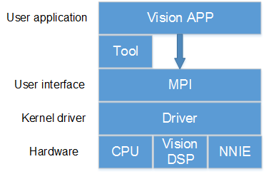

## 硬件资源<a name="ZH-CN_TOPIC_0000002408132350"></a>

不同的解决方案SVP会使用不同硬件资源，如[表1](#__toc3205560)所示。

**表 1**  不同解决方案下的SVP硬件资源

<a name="__toc3205560"></a>
<table><thead align="left"><tr id="row340mcpsimp"><th class="cellrowborder" valign="top" width="44%" id="mcps1.2.4.1.1"><p id="p342mcpsimp"><a name="p342mcpsimp"></a><a name="p342mcpsimp"></a>解决方案名称</p>
</th>
<th class="cellrowborder" valign="top" width="40%" id="mcps1.2.4.1.2"><p id="p344mcpsimp"><a name="p344mcpsimp"></a><a name="p344mcpsimp"></a>CPU</p>
</th>
<th class="cellrowborder" valign="top" width="16%" id="mcps1.2.4.1.3"><p id="p346mcpsimp"><a name="p346mcpsimp"></a><a name="p346mcpsimp"></a>DSP</p>
</th>
</tr>
</thead>
<tbody><tr id="row348mcpsimp"><td class="cellrowborder" valign="top" width="44%" headers="mcps1.2.4.1.1 "><p id="p350mcpsimp"><a name="p350mcpsimp"></a><a name="p350mcpsimp"></a>SS928V100</p>
</td>
<td class="cellrowborder" valign="top" width="40%" headers="mcps1.2.4.1.2 "><p id="p352mcpsimp"><a name="p352mcpsimp"></a><a name="p352mcpsimp"></a>四核A55</p>
</td>
<td class="cellrowborder" valign="top" width="16%" headers="mcps1.2.4.1.3 "><p id="p354mcpsimp"><a name="p354mcpsimp"></a><a name="p354mcpsimp"></a>2个</p>
</td>
</tr>
<tr id="row9294425145618"><td class="cellrowborder" valign="top" width="44%" headers="mcps1.2.4.1.1 "><p id="p1753616261569"><a name="p1753616261569"></a><a name="p1753616261569"></a>SS927V100</p>
</td>
<td class="cellrowborder" valign="top" width="40%" headers="mcps1.2.4.1.2 "><p id="p553702619566"><a name="p553702619566"></a><a name="p553702619566"></a>四核A55</p>
</td>
<td class="cellrowborder" valign="top" width="16%" headers="mcps1.2.4.1.3 "><p id="p2537132616567"><a name="p2537132616567"></a><a name="p2537132616567"></a>2个</p>
</td>
</tr>
</tbody>
</table>

针对CPU的具体规格，请参考ARM官方文档。

DSP硬件规格，可参考对应的芯片手册。

> **须知：** 
>不同的解决方案SVP可能会使用不同的硬件资源，即便是使用相同的硬件型号，硬件的配置也不一定相同。

## 软件开发<a name="ZH-CN_TOPIC_0000002441691653"></a>

SVP为_识别_加速平台，因此需要结合 MPP平台一起来进行软件开发，可参考相关文档《MPP 媒体处理软件 Vx.0 开发参考》。用户可以根据SVP的软硬件特性开发出能最大化利用SVP硬件资源的视觉处理应用。

## 开发环境<a name="ZH-CN_TOPIC_0000002408132354"></a>

不同的解决方案SVP会在不同的环境上运行，如[表1](#__toc3205561)所示。

**表 1**  不同解决方案下的SVP运行环境

<a name="__toc3205561"></a>
<table><thead align="left"><tr id="row578mcpsimp"><th class="cellrowborder" valign="top" width="44%" id="mcps1.2.3.1.1"><p id="p580mcpsimp"><a name="p580mcpsimp"></a><a name="p580mcpsimp"></a>解决方案名称</p>
</th>
<th class="cellrowborder" valign="top" width="56.00000000000001%" id="mcps1.2.3.1.2"><p id="p582mcpsimp"><a name="p582mcpsimp"></a><a name="p582mcpsimp"></a>系统架构</p>
</th>
</tr>
</thead>
<tbody><tr id="row584mcpsimp"><td class="cellrowborder" valign="top" width="44%" headers="mcps1.2.3.1.1 "><p id="p586mcpsimp"><a name="p586mcpsimp"></a><a name="p586mcpsimp"></a>SS928V100</p>
</td>
<td class="cellrowborder" valign="top" width="56.00000000000001%" headers="mcps1.2.3.1.2 "><p id="p588mcpsimp"><a name="p588mcpsimp"></a><a name="p588mcpsimp"></a>SMP(Linux)</p>
</td>
</tr>
<tr id="row15850154019567"><td class="cellrowborder" valign="top" width="44%" headers="mcps1.2.3.1.1 "><p id="p352014216560"><a name="p352014216560"></a><a name="p352014216560"></a>SS927V100</p>
</td>
<td class="cellrowborder" valign="top" width="56.00000000000001%" headers="mcps1.2.3.1.2 "><p id="p152054265616"><a name="p152054265616"></a><a name="p152054265616"></a>SMP(Linux)</p>
</td>
</tr>
</tbody>
</table>

## 相关文档<a name="ZH-CN_TOPIC_0000002441691665"></a>

《SVP2.0 API参考》

《MPP 媒体处理软件 Vx.0 开发参考》

# DSP开发指南<a name="ZH-CN_TOPIC_0000002441731513"></a>

> **须知：** 
>本章节对于生态开源版本SS928V100/SS927V100暂不支持。


## 开发工具介绍<a name="ZH-CN_TOPIC_0000002441691649"></a>

Xtensa Xplorer是Cadence为客户提供的针对其DSP进行软件开发的一个集成开发环境，其包含了软件开发\(software development\)、编译\(compile\)、调试\(debugging\)、仿真\(simulation\)、性能分析\(profiling\)、硬件跟踪\(hardware trace\)等功能。

Xtensa Xplorer的安装使用可参考Cadence提供的官方文档，以下均简称为Xplorer。

由于SVP在不同解决方案上可能使用不同的DSP；即便是相同型号的DSP，硬件配置也可能不一样。在有DSP的解决方案配套开发包中，为用户提供了与硬件相同配置的配置核供用户在Xplorer下仿真开发。

配置核在DSP\_PC\_Vx.x.x.x的tool目录下与解决方案中DSP的型号一致的目录中，如tools/vq6，其中“\*\_linux\_\*.tgz”和“\*\_win32\_\*.tgz”分别表示linux、windows版本上Xplorer的配置核。

## DSP工具链和配置核版本<a name="ZH-CN_TOPIC_0000002441691669"></a>

[表1](#__toc3205562)是不同解决方案上的DSP对应的工具链和配置核说明，注意linux、win32分别表示linux、windows环境下的对应的工具链和配置核。

**表 1**  不同解决方案的DSP工具链和配置核

<a name="__toc3205562"></a>
<table><thead align="left"><tr id="row311mcpsimp"><th class="cellrowborder" valign="top" width="19%" id="mcps1.2.4.1.1"><p id="p313mcpsimp"><a name="p313mcpsimp"></a><a name="p313mcpsimp"></a>解决方案名称</p>
</th>
<th class="cellrowborder" valign="top" width="42%" id="mcps1.2.4.1.2"><p id="p315mcpsimp"><a name="p315mcpsimp"></a><a name="p315mcpsimp"></a>工具链</p>
</th>
<th class="cellrowborder" valign="top" width="39%" id="mcps1.2.4.1.3"><p id="p317mcpsimp"><a name="p317mcpsimp"></a><a name="p317mcpsimp"></a>配置核</p>
</th>
</tr>
</thead>
<tbody><tr id="row319mcpsimp"><td class="cellrowborder" valign="top" width="19%" headers="mcps1.2.4.1.1 "><p id="p321mcpsimp"><a name="p321mcpsimp"></a><a name="p321mcpsimp"></a>SS928V100/SS927V100</p>
</td>
<td class="cellrowborder" valign="top" width="42%" headers="mcps1.2.4.1.2 "><p id="p323mcpsimp"><a name="p323mcpsimp"></a><a name="p323mcpsimp"></a>XtensaTools_RH_2018_7_linux.tgz</p>
<p id="p324mcpsimp"><a name="p324mcpsimp"></a><a name="p324mcpsimp"></a>XtensaTools_RH_2018_7_win32.tgz</p>
</td>
<td class="cellrowborder" valign="top" width="39%" headers="mcps1.2.4.1.3 "><p id="p326mcpsimp"><a name="p326mcpsimp"></a><a name="p326mcpsimp"></a>Otechn_VisionQ6_v3_linux_redist.tgz</p>
<p id="p327mcpsimp"><a name="p327mcpsimp"></a><a name="p327mcpsimp"></a>Otechn_VisionQ6_v3_win32_redist.tgz</p>
</td>
</tr>
</tbody>
</table>

> **须知：** 
>-   工具链可以在Xplorer中下载，所以不再发布包中提供；
>-   DSP\_PC\_Vx.x.x.x的tool中对相同配置的DSP只提供了1个DSP配置核，若多于1个表示解决方案中有不同配置的DSP。

## DSP规格差异<a name="ZH-CN_TOPIC_0000002408292254"></a>

[表1](#_table115661432114018)是不同解决方案上的DSP对应的规格差异说明。

**表 1**  不同解决方案的DSP规格差异

<a name="_table115661432114018"></a>
<table><thead align="left"><tr id="row522mcpsimp"><th class="cellrowborder" valign="top" width="17%" id="mcps1.2.8.1.1"><p id="p524mcpsimp"><a name="p524mcpsimp"></a><a name="p524mcpsimp"></a>解决方案名称</p>
</th>
<th class="cellrowborder" valign="top" width="10.999999999999996%" id="mcps1.2.8.1.2"><p id="p526mcpsimp"><a name="p526mcpsimp"></a><a name="p526mcpsimp"></a>DSP版本</p>
</th>
<th class="cellrowborder" valign="top" width="7.999999999999999%" id="mcps1.2.8.1.3"><p id="p528mcpsimp"><a name="p528mcpsimp"></a><a name="p528mcpsimp"></a>个数</p>
</th>
<th class="cellrowborder" valign="top" width="12.999999999999998%" id="mcps1.2.8.1.4"><p id="p530mcpsimp"><a name="p530mcpsimp"></a><a name="p530mcpsimp"></a>DRAM</p>
</th>
<th class="cellrowborder" valign="top" width="11.999999999999996%" id="mcps1.2.8.1.5"><p id="p532mcpsimp"><a name="p532mcpsimp"></a><a name="p532mcpsimp"></a>IDMA接口总线</p>
</th>
<th class="cellrowborder" valign="top" width="28.999999999999993%" id="mcps1.2.8.1.6"><p id="p534mcpsimp"><a name="p534mcpsimp"></a><a name="p534mcpsimp"></a>IDMA访问地址空间范围</p>
</th>
<th class="cellrowborder" valign="top" width="9.999999999999998%" id="mcps1.2.8.1.7"><p id="p536mcpsimp"><a name="p536mcpsimp"></a><a name="p536mcpsimp"></a>通道数</p>
</th>
</tr>
</thead>
<tbody><tr id="row538mcpsimp"><td class="cellrowborder" valign="top" width="17%" headers="mcps1.2.8.1.1 "><p id="p540mcpsimp"><a name="p540mcpsimp"></a><a name="p540mcpsimp"></a>SS919V100</p>
</td>
<td class="cellrowborder" valign="top" width="10.999999999999996%" headers="mcps1.2.8.1.2 "><p id="p542mcpsimp"><a name="p542mcpsimp"></a><a name="p542mcpsimp"></a>VP6</p>
</td>
<td class="cellrowborder" valign="top" width="7.999999999999999%" headers="mcps1.2.8.1.3 "><p id="p544mcpsimp"><a name="p544mcpsimp"></a><a name="p544mcpsimp"></a>4</p>
</td>
<td class="cellrowborder" valign="top" width="12.999999999999998%" headers="mcps1.2.8.1.4 "><p id="p546mcpsimp"><a name="p546mcpsimp"></a><a name="p546mcpsimp"></a>256K*2</p>
</td>
<td class="cellrowborder" valign="top" width="11.999999999999996%" headers="mcps1.2.8.1.5 "><p id="p548mcpsimp"><a name="p548mcpsimp"></a><a name="p548mcpsimp"></a>32bit</p>
</td>
<td class="cellrowborder" valign="top" width="28.999999999999993%" headers="mcps1.2.8.1.6 "><p id="p550mcpsimp"><a name="p550mcpsimp"></a><a name="p550mcpsimp"></a>理论上4GB，实际只能访问3GB-64MB的区间</p>
</td>
<td class="cellrowborder" valign="top" width="9.999999999999998%" headers="mcps1.2.8.1.7 "><p id="p552mcpsimp"><a name="p552mcpsimp"></a><a name="p552mcpsimp"></a>1</p>
</td>
</tr>
<tr id="row553mcpsimp"><td class="cellrowborder" valign="top" width="17%" headers="mcps1.2.8.1.1 "><p id="p555mcpsimp"><a name="p555mcpsimp"></a><a name="p555mcpsimp"></a>SS928V100</p>
</td>
<td class="cellrowborder" valign="top" width="10.999999999999996%" headers="mcps1.2.8.1.2 "><p id="p557mcpsimp"><a name="p557mcpsimp"></a><a name="p557mcpsimp"></a>VQ6</p>
</td>
<td class="cellrowborder" valign="top" width="7.999999999999999%" headers="mcps1.2.8.1.3 "><p id="p559mcpsimp"><a name="p559mcpsimp"></a><a name="p559mcpsimp"></a>2</p>
</td>
<td class="cellrowborder" valign="top" width="12.999999999999998%" headers="mcps1.2.8.1.4 "><p id="p561mcpsimp"><a name="p561mcpsimp"></a><a name="p561mcpsimp"></a>160K*2</p>
</td>
<td class="cellrowborder" valign="top" width="11.999999999999996%" headers="mcps1.2.8.1.5 "><p id="p563mcpsimp"><a name="p563mcpsimp"></a><a name="p563mcpsimp"></a>36bit</p>
</td>
<td class="cellrowborder" valign="top" width="28.999999999999993%" headers="mcps1.2.8.1.6 "><p id="p565mcpsimp"><a name="p565mcpsimp"></a><a name="p565mcpsimp"></a>整个DDR空间</p>
</td>
<td class="cellrowborder" valign="top" width="9.999999999999998%" headers="mcps1.2.8.1.7 "><p id="p567mcpsimp"><a name="p567mcpsimp"></a><a name="p567mcpsimp"></a>2</p>
</td>
</tr>
<tr id="row7370181914570"><td class="cellrowborder" valign="top" width="17%" headers="mcps1.2.8.1.1 "><p id="p231112165710"><a name="p231112165710"></a><a name="p231112165710"></a>SS927V100</p>
</td>
<td class="cellrowborder" valign="top" width="10.999999999999996%" headers="mcps1.2.8.1.2 "><p id="p6311172185713"><a name="p6311172185713"></a><a name="p6311172185713"></a>VQ6</p>
</td>
<td class="cellrowborder" valign="top" width="7.999999999999999%" headers="mcps1.2.8.1.3 "><p id="p63111521155720"><a name="p63111521155720"></a><a name="p63111521155720"></a>2</p>
</td>
<td class="cellrowborder" valign="top" width="12.999999999999998%" headers="mcps1.2.8.1.4 "><p id="p1031152117576"><a name="p1031152117576"></a><a name="p1031152117576"></a>160K*2</p>
</td>
<td class="cellrowborder" valign="top" width="11.999999999999996%" headers="mcps1.2.8.1.5 "><p id="p43119213572"><a name="p43119213572"></a><a name="p43119213572"></a>36bit</p>
</td>
<td class="cellrowborder" valign="top" width="28.999999999999993%" headers="mcps1.2.8.1.6 "><p id="p1831162114579"><a name="p1831162114579"></a><a name="p1831162114579"></a>整个DDR空间</p>
</td>
<td class="cellrowborder" valign="top" width="9.999999999999998%" headers="mcps1.2.8.1.7 "><p id="p16311102155716"><a name="p16311102155716"></a><a name="p16311102155716"></a>2</p>
</td>
</tr>
</tbody>
</table>

> **说明：** 
>其他差异请参考《visionq6\_ug.pdf》第203页“Vision Q6 DSP Enhancements and Differences vs Vision P6 DSP”章节。安装完成工具链，就能在安装目录下获取此文档。

## Windows环境下安装DSP工具链和配置核<a name="ZH-CN_TOPIC_0000002408292262"></a>

本文假定用户在windows环境中已经安装好了Xplorer8.0.7，并以SS928V100 VQ6配置核Otechn\_VisionQ6\_v3为例进行配置核安装，不同解决方案不同配置核的在不同Xplorer版本的安装类似。

> **须知：** 
>SS928V100 VQ6配置核Otechn\_VisionQ6\_v3需与RH-2018.7版本的工具包（见[表1](DSP工具链和配置核版本.md#__toc3205562)  XtensaTools\_RH\_2018\_7\_win32.tgz）配套使用，Xplorer8.0.7默认集成了RG2016.4工具包，如用户使用其他版本的Xplorer，需要另外安装RH-2018.7工具包。

1.  打开Xplorer 8.0.7，右键System Overview窗口下的Configurations，如[图1](#fig31925394563)所示，点击Find and Install a Configuration Build；

    **图 1**  System Overview<a name="fig31925394563"></a>  
    

2.  进入Find and Install a Configuration Build界面，点击“Browse”，选择待安装配置核（此处以Otechn\_VisionQ6\_v3\_win32\_redist为例），点击“OK”即开始安装；

    **图 2**  Find and Install a Configuration Build<a name="fig72876154572"></a>  
    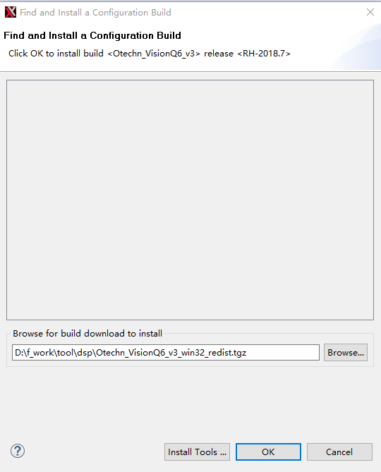

    安装好后，在SystemOverview界面的Configurations下会出现刚刚安装的配置核，如[图3](#fig1742717500572)所示，至此，Otechn\_VisionQ6\_v3配置核安装成功。

    **图 3**  查看安装好的配置核<a name="fig1742717500572"></a>  
    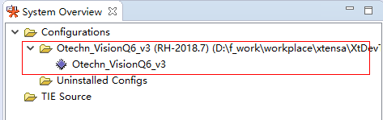

3.  运行工程时（以HelloWorld为例），按照[图4](#fig185297106715)选择C: Otechn\_VisionQ6\_v3，即表示使用的是Otechn\_VisionQ6\_v3配置核。

    **图 4**  创建的工程界面<a name="fig185297106715"></a>  
    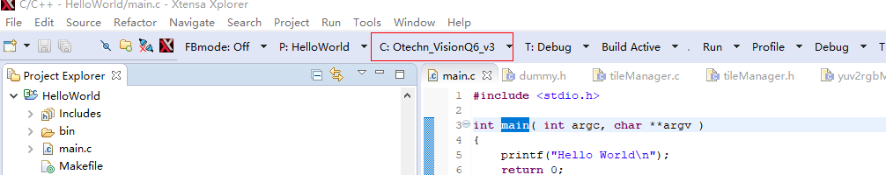

## memmap配置<a name="ZH-CN_TOPIC_0000002408292238"></a>

memmap.xmm文件在发布包 dsp\_liteos/dspxx/liteos/dspxx\_ldscripts目录下，xx代表数字。DSP的内存布局由memmap.xmm文件配置生成，用户可以通过这个文件了解和分析DSP的内存布局。用户可以根据自己的开发环境来修改memory map。可以参考Xtensa ® Linker Support Packages \(LSPs\) Reference Manual 了解memmap.xmm。

## 查看stack使用<a name="ZH-CN_TOPIC_0000002408292242"></a>

具体操作步骤如下：

1.  点击Xplorer的Tools-\>Stack Usage选项。

    **图 1**  查看栈信息操作界面<a name="fig19428194743813"></a>  
    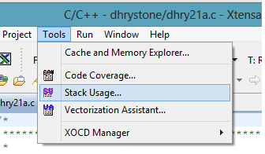

2.  此时会出现Stack Usage的窗口。选择一个工程，选择其编译好的可执行文件右键选择“Binary File Info”，选择“Stack Usage”查看该文件的Stack使用情况。

    **图 2**  显示栈信息窗口<a name="fig1931604853914"></a>  
    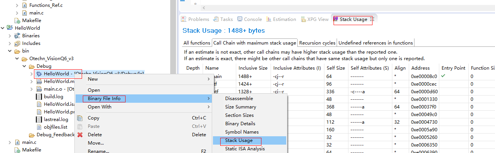

## Linux环境下安装DSP工具链和配置核<a name="ZH-CN_TOPIC_0000002441731497"></a>

在Linux环境下安装Cadence DSP的工具链和配置核可参考Cadence提供的官方文档dev\_tools\_install\_guide.pdf。用户在利用配套的SDK包进行板端DSP程序开发时，推荐按照以下方式安装DSP的工具链和配置核。


### 安装DSP工具链<a name="ZH-CN_TOPIC_0000002408132358"></a>

下面以Xplorer-8.0.7-linux-x64-installer.bin版本介绍工具链的安装。步骤如下：

1.  首先需要以root权限在服务器上创建目录/opt/xtensa。
2.  把Xplorer-8.0.7-linux-x64-installer.bin安装包拷贝到/opt/xtensa目录下，然后执行安装./Xplorer-8.0.7-linux-x64-installer.bin，如下面所示：

    ```
    root@XXX:/opt/xtensa# ./Xplorer-8.0.7-linux-x64-installer.bin 
     ---------------------------------------------------------------------------- 
     Welcome to the Xtensa Xplorer Setup Wizard. 
     ---------------------------------------------------------------------------- 
     Please read the following License Agreement. You must accept the terms of this 
     agreement before continuing with the installation. 
     Press [Enter] to continue: 
     Cadence Tools Software Use Agreement 
     Your use of the software you are about to install is subject to one or more 
     licensing agreements. 
     Portions of this software are subject to the terms of either (1) a technology 
     license agreement between Cadence and the user ("you") - a direct Cadence 
     licensee, (2) an end user license agreement between an existing Cadence licensee 
     and you, or (3) a limited use evaluation agreement between Cadence and you.  In 
     addition, each directory contains files that identify any open source licenses 
     or copyrights that apply to each component. 
     For a copy of the license agreement that applies to your use of this software, 
     please make an inquiry to the organization that provided this copy of the 
     software to you. 
     Press [Enter] to continue:
     Do you accept this license? [y/n]: y
     ---------------------------------------------------------------------------- 
     Xtensa Xplorer Installation Directory 
     Please enter the path to the Xtensa Xplorer root directory.  The Xtensa Xplorer 
     8.0.7 and XtDevTools directories will be installed in this directory. 
     It is recommended that you use the same Xplorer root directory as your previous 
     installations of Xplorer so that the XtDevTools directory can be shared, which 
     will allow this version of Xplorer to use all previous installations of Xtensa 
     configurations and tools. 
     Xtensa Xplorer Root Directory [/opt/xtensa]: 
     ---------------------------------------------------------------------------- 
     Select the components you want to install; clear the components you do not want 
     to install. Click Next when you are ready to continue. 
     Xplorer and Xtensa Development Tools  : Y (Cannot be edited)
     Is the selection above correct? [Y/n]: y
     ---------------------------------------------------------------------------- 
     Xplorer components selected 
     Selected the following components: 
     + Xtensa Xplorer and Development Tools 
     Press [Enter] to continue: 
     ---------------------------------------------------------------------------- 
     Disk Space Report 
     Installation space report 
     Required disk space is :  3850 MB 
     Current disk has free space : 8851 MB 
     Press [Enter] to continue: 
     ---------------------------------------------------------------------------- 
     Installation Summary 
     Xtensa products will be installed as follows 
     Xtensa Xplorer will be installed to: 
     /opt/xtensa/Xplorer-8.0.7 
     Xtensa Tools will be installed to: 
     /opt/xtensa/XtDevTools/install/tools/RH-2018.7 
     Xtensa Tools and samples bundles will be stored at: 
     /opt/xtensa/XtDevTools/downloads/RH-2018.7 
     Xtensa Xplorer workspace default location: 
     /opt/xtensa/Xplorer-8.0.7-workspaces 
     Press [Enter] to continue: 
     ---------------------------------------------------------------------------- 
     Pre-installation Message 
     The Xplorer installer runs in 2 phases.  The last phase (post-installation) is 
     installing tools and any configurations selected, and may run for several 
     minutes without appearing to make progress.  Please be patient. 
     Press [Enter] to continue: 
     ---------------------------------------------------------------------------- 
     Setup is now ready to begin installing Xtensa Xplorer on your computer. 
     Do you want to continue? [Y/n]: y
     ---------------------------------------------------------------------------- 
     Please wait while Setup installs Xtensa Xplorer on your computer. 
     Installing 
     0% ______________ 50% ______________ 100% 
     ######################################### 
     Post Installation Script Result 
     Congratulations !! You have finished installing Xplorer-8.0.7 
     Please review the following message log to make sure of the success of the 
     installation. 
     ================================================================================= 
     INSTALLING XtensaTools 
     ====== LOCATE utils plugin ====== 
     WHERE_UTILS_RESULT=/opt/xtensa/Xplorer-8.0.7/eclipse/plugins/other.xide.external. 
     utils_8.0.7.2000 
     INSTALL XTTOOLS COMMAND :: /opt/xtensa/Xplorer-8.0.7/eclipse/jre/bin/java -cp 
     /opt/xtensa/Xplorer-8.0.7/eclipse/plugins/other.xide.external.utils_8.0.7.2000/ut 
     ils.jar other.xide.external.utils.io.Unpack 
     /opt/xtensa/XtDevTools/downloads/RH-2018.7/tools/XtensaTools_RH_2018_7_linux.tgz 
     /opt/xtensa/XtDevTools/install/tools/ 
     /opt/xtensa/Xplorer-8.0.7/eclipse/plugins/other.xide.external.utils_8.0.7.2000 
     INSTALL XtensaTools RESULT :: 0 , SUCCESS 
     ====== LOCATE dynamic plugin files ====== 
     INSTALL XOS Document Plugin 
     WHERE_XOS_RESULT=/opt/xtensa/XtDevTools/install/tools/RH-2018.7-linux/XtensaTools 
     /doc/xos-2.02.zip 
     INSTALL XOS COMMAND :: /opt/xtensa/Xplorer-8.0.7/eclipse/jre/bin/java -cp 
     /opt/xtensa/Xplorer-8.0.7/eclipse/plugins/other.xide.external.utils_8.0.7.2000/ut 
     Press [Enter] to continue: 
     ils.jar other.xide.external.utils.io.Unpack 
     /opt/xtensa/XtDevTools/install/tools/RH-2018.7-linux/XtensaTools/doc/xos-2.02.zip 
     /opt/xtensa/Xplorer-8.0.7/eclipse/dropins/ 
     /opt/xtensa/Xplorer-8.0.7/eclipse/plugins/other.xide.external.utils_8.0.7.2000 
     INSTALL XOS HELP PLUGIN RESULT :: 0 , SUCCESS 
     Checking XtensaRegistry dir... 
     Check XtensaRegistry RH-2018.7 DIR 
     DONE:: /opt/xtensa/XtDevTools/XtensaRegistry/RH-2018.7-linux 
     INSTALLING User selected Xtensa config builds from 
     XtDevTools/downloads/RH-2018.7/builds IF EXISTS 
     Setting Xplorer configuration and then initializing configuration cache 
     INITIALIZE Xtensa Xplorer RESULT :: 0, SUCCESS 
     Press [Enter] to continue: 
     ---------------------------------------------------------------------------- 
     Setup has finished installing Xtensa Xplorer on your computer. 
     Run Xtensa Xplorer now (Recommended) 
     (This initializes workspace location defaults) [Y/n]: n
    ```

> **说明：** 
>有些Linux环境下安装，在安装过程中会显示安装图像界面（Gtk），请参考本小节安装方法安装。

### 安装DSP配置核<a name="ZH-CN_TOPIC_0000002441691673"></a>

下面以Otechn\_VisionQ6\_v3核为参考说明配置核的安装，其他配置核安装过程类似。

1.  在root权限下，把Otechn\_VisionQ6\_v3\_linux\_redist.tgz压缩包拷贝到之前创建的/opt/xtensa目录，然后解压压缩包，命令tar –zxf Otechn\_VisionQ6\_v3\_linux\_redist.tgz，解压出/opt/xtensa/RH-2018.7-linux/Otechn\_VisionQ6\_v3/目录。
2.  进入/opt/xtensa/RH-2018.7-linux/Otechn\_VisionQ6\_v3/目录安装配置核，执行./install。

    如下所示：

    ```
    root@XXX:/opt/xtensa/RH-2018.7-linux/Otechn_VisionQ6_v3# ./install 
     Xtensa Processor Configuration Installation Tool 
     Copyright (c) 2001-2018 Tensilica Inc. 
     For Xtensa Tools Version 13.0.7 
     Before you can use a new Xtensa processor configuration, you must run 
     this tool to complete the installation.  Two separate packages are 
     required: 
     1) The Xtensa Tools cross-development software toolkit package.  These 
     tools are configuration-independent and are shared by all your Xtensa 
     processor configurations.  You do not need a separate copy for each 
     configuration. 
     2) The configured Xtensa processor files, of which this script is a 
     part. 
     You must have already downloaded both packages and extracted the files 
     on your system before you can continue. 
     Are you ready to proceed? [y] y 
     Continuing... 
     Enter the path to the Xtensa Tools directory:
     /opt/xtensa/XtDevTools/install/tools/RH-2018.7-linux/XtensaTools 
     The files for this Xtensa processor configuration will now be set up 
     to work with the installation directories that you have chosen.  This 
     process will take a few minutes, and once it has begun the 
     installation directories cannot be changed.  If you abort this script 
     after this point, or if you need to change the installation 
     directories for some reason, you will need to start over with the 
     original files that you downloaded for this configuration.  (The 
     Xtensa Tools files are not modified in this process so you do not need 
     to reinstall the Xtensa Tools package.)  The directories to be used are: 
     Xtensa Tools:         /opt/xtensa/XtDevTools/install/tools/RH-2018.7-linux/XtensaTools 
     Configured Processor: /opt/xtensa/RH-2018.7-linux/Otechn_VisionQ6_v3/. 
     Do you want to continue? [y] y 
     The files for this processor configuration have now been set to use 
     the directory names you have chosen. 
     The next installation step is to add this processor configuration to 
     the list of available configurations in a registry of Xtensa cores. 
     The configuration will be registered with the default name, which is 
     the Core ID from the Xtensa Processor Generator. You must ensure that 
     each core in the registry has a unique name. Please refer to the 
     "Xtensa Software Development Toolkit User's Guide" to learn how to 
     register this configuration with a different name. 
     This script will update only one registry of Xtensa cores, and in most 
     cases, you should use the default Xtensa registry.  If you are sharing 
     the Xtensa Tools installation with others, and you do not want this 
     processor configuration to be shared, you can specify an alternate 
     registry.  Please refer to the "Xtensa Software Development Toolkit 
     User's Guide" for instructions on adding this configuration to 
     additional Xtensa core registries. 
     The default registry is: 
     /opt/xtensa/XtDevTools/install/tools/RH-2018.7-linux/XtensaTools/config 
     What registry would you like to use? [default] /opt/xtensa/XtDevTools/XtensaRegistry/RH-2018.7-linux 
     Do you want to make "Otechn_VisionQ6_v3" the default Xtensa core? [y] y 
     The installation process is now complete.
    ```

> **须知：** 
>-   使用SDK开发时配置核路径最好要安照上面的安装路径指定，否则在开发DSP程序时，需要针对实际安装路径去修改makefile，指定工具链和配置核路径才能编译（可参考Cadence提供的《xtensa\_xcc\_compiler\_ug.pdf》文档，文档路径/opt/xtensa/XtDevTools/downloads/RH-2018.7/docs）
>-   Cadence官方文档在/opt/xtensa/XtDevTools/downloads/RH-2018.7/docs路径下。
>-   **如果不同解决方案的DSP依赖不同Xtensatools，则需要把要依赖的Xtensatools压缩包放到这个路径（/opt/xtensa/XtDevTools/install/tools）进行解压，安装配置核的时候选择这个Xtensatools路径。**

### 配置环境变量<a name="ZH-CN_TOPIC_0000002408132334"></a>

在/etc目录下打开profile文件，添加以下环境变量配置：

-   设置Cadence license：

    export XTENSAD\_LICENSE\_FILE=port@serverip

    例如：port是28001, serverip是192.168.1.100

-   设置配置核参数路径：

    export XTENSA\_SYSTEM=/opt/xtensa/XtDevTools/XtensaRegistry/RH-2018.7-linux

-   设置默认的配置核：

    export XTENSA\_CORE=Otechn\_VisionQ6\_v3

-   设置交叉编译工具链路径：

    export PATH="/opt/xtensa/XtDevTools/install/tools/RH-2018.7-linux/XtensaTools/bin:$PATH"

## 开发流程<a name="ZH-CN_TOPIC_0000002441731501"></a>

DSP开发分为PC端和板端环境：

-   PC端环境：利用Xplorer集成工具进行DSP算法开发，利用Xplorer集成工具提供的仿真环境可以快速实现对算法的开发和验证，开发完算法代码可以直接移植到板端编译调试。Xplorer环境参考前面的介绍。
-   板端环境：基于配套的SDK开发包进行板端程序开发。


### 板端开发流程<a name="ZH-CN_TOPIC_0000002441731517"></a>

DSP应用程序开发框图如[图1](#__fig11884284184)所示。

**图 1**  DSP应用程序开发框图<a name="__fig11884284184"></a>  
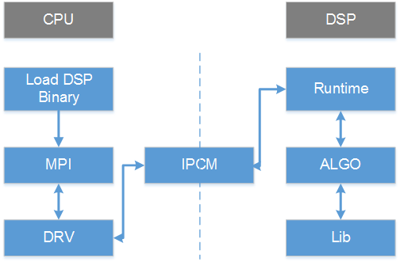

如[图1](#__fig11884284184)所示，DSP程序的开发和使用分为几部分：

-   在CPU端
    -   Load DSP Binary：调用ss\_mpi\_svp\_dsp\_load\_bin加载DSP可执行程序，并且调用ss\_mpi\_svp\_dsp\_enable\_core使能DSP。
    -   MPI：DSP MPI接口。
    -   DRV：驱动模块。
    -   IPCM：核间通信模块。

-   在DSP端
    -   Runtime：DSP上算子的调度管理。
    -   ALGO：解析参数，调用DSP算子。
    -   Lib：DSP算子库。
    -   IPCM：核间通信模块。

> **注意：** 
>为提高编译速度，在DSP端库/代码没有加编译优化选项（-O），用户可以在调试性能阶段添加上去。以下添加-O2为例，在发布包SS928V100\_SDK\_V2.0.0.3\_B020/smp/dsp\_liteos/dspXX/Makefile.param\(在这里以SS928V100某个版本的smp为例，XX表示DSP核编号\)文件添加即可。


#### 适配TileManager<a name="ZH-CN_TOPIC_0000002408292250"></a>

需要在Cadence提供的TileManager软件包适配宽地址操作，才能使用。适配完代码，把TileManager代码拷贝至发布包SS928V100\_SDK\_V2.0.0.3\_B020/smp/dsp\_liteos/dspXX/tm/vendor目录下\(在这里以SS928V100某个版本的smp为例，XX表示DSP核编号\)，至此TileManager才是适配完成。

以下章节适配代码图示中，左边为原生代码，右边为修改后的代码。


##### tileManager.h头文件适配<a name="ZH-CN_TOPIC_0000002408132338"></a>

适配位置1：打开宽地址宏

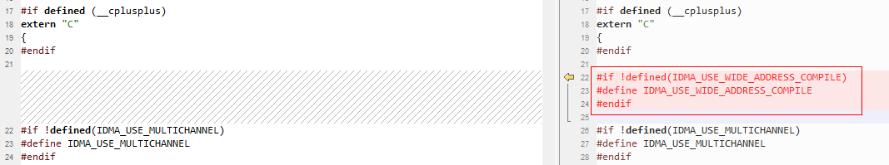

适配位置2：适配帧结构体字段pFrameBuffer/pFrameData类型为64比特操作

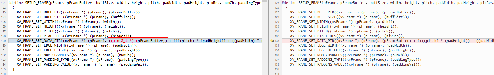

适配位置3：适配DRAM地址有效性校验

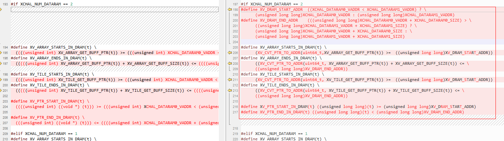

适配位置4：增加类型转换和高低32比特操作宏


##### tileManager\_api.h头文件适配<a name="ZH-CN_TOPIC_0000002441691657"></a>

适配位置1：修改Bank数

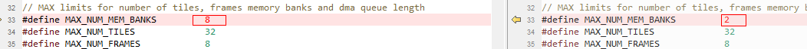

适配位置2：适配帧结构体字段pFrameBuffer/pFrameData类型为64比特操作

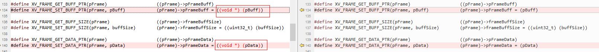

适配位置3：适配帧结构体字段pFrameBuffer/pFrameData类型为64比特

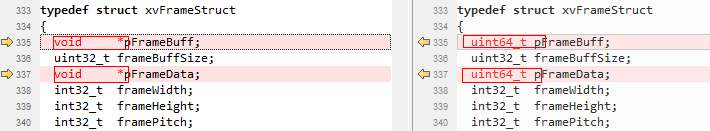

适配位置4：适配xvAddIdmaRequestMultiChannel目的和源参数指针类型为64比特


适配位置5：适配xvCreateFrame帧地址参数指针类型为64比特


##### tileManager.c源文件适配<a name="ZH-CN_TOPIC_0000002408132346"></a>

适配位置1：适配xvInitMemAllocator 函数DRAM校验


适配位置2：适配xvCreateFrame帧地址参数指针类型为64比特及校验

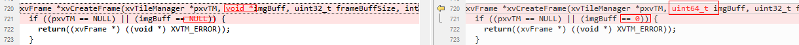

适配位置3：适配内联函数addIdmaRequestInlineMultiChannel增加宽地址操作，并挪到实现xvAddIdmaRequestMultiChannel函数前


适配位置4：适配xvAddIdmaRequestMultiChannel目的和源参数指针类型为64比特


适配位置5：适配xvAddIdmaRequestMultiChannel目的和源参数地址校验以及拷贝操作替换成内联函数addIdmaRequestInlineMultiChannel

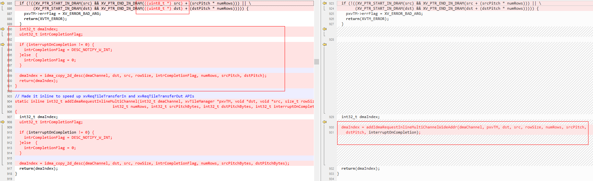

适配位置6：适配solveForX源64比特及宽地址操作

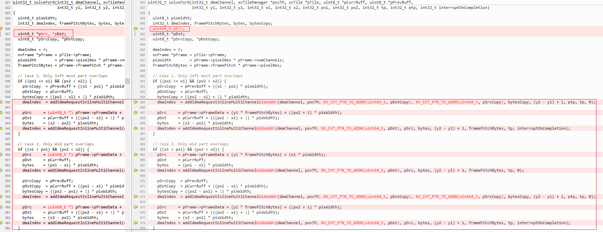

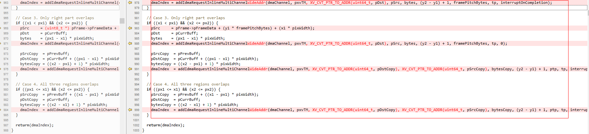

适配位置7：适配xvReqTileTransferInMultiChannel源64比特及宽地址操作

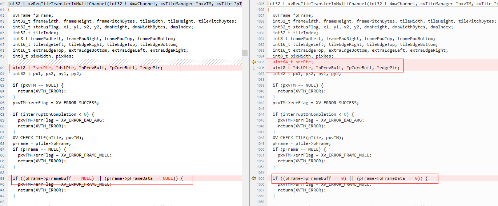


适配位置8：增加内联IDMA宽地址二维拷贝操作

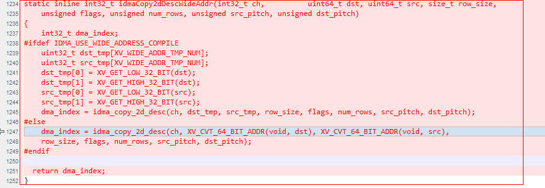

适配位置9：适配xvReqTileTransferInFastMultiChannel源64比特及宽地址操作

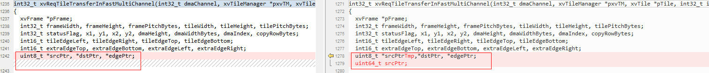


适配位置10：适配xvReqTileTransferInFast16MultiChannel源64比特及宽地址操作


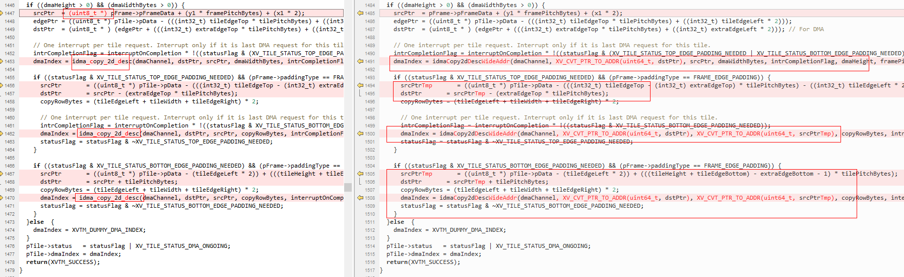

适配位置11：适配xvReqTileTransferOutMultiChannel目的64比特及宽地址操作

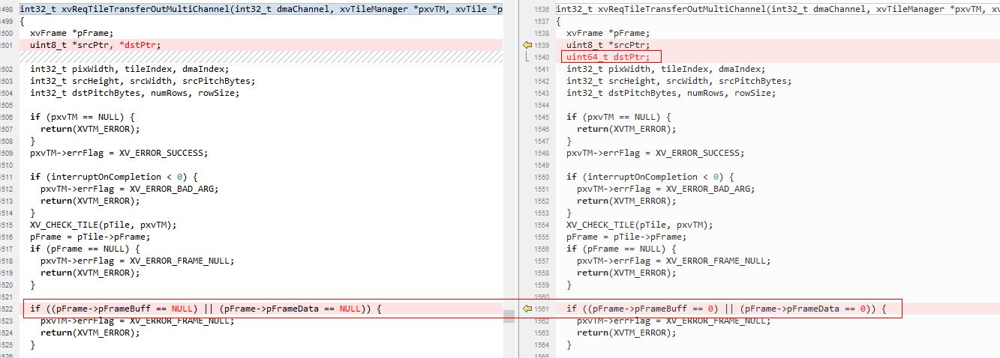


适配位置12：适配xvReqTileTransferOutFastMultiChannel目的64比特及宽地址操作

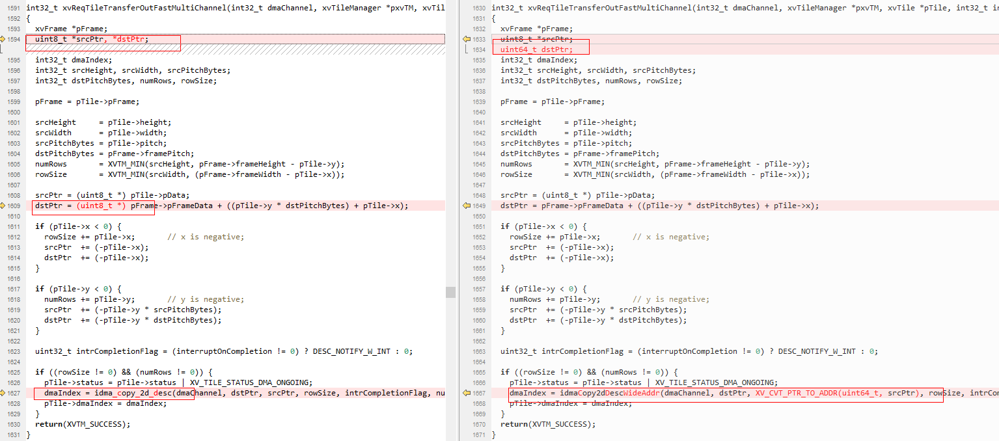

适配位置13：适配xvReqTileTransferOutFast16MultiChannel目的64比特及宽地址操作

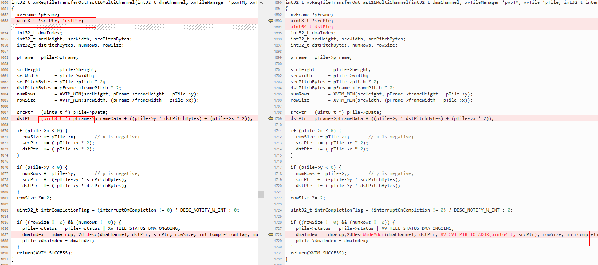

适配位置14：适配xvPadEdges 帧指针字段有效性判断


适配位置15：适配xvPadEdges16 帧指针字段有效性判断


适配位置16：去掉xvCheckForIdmaIndexMultiChannel函数参数index小于0校验

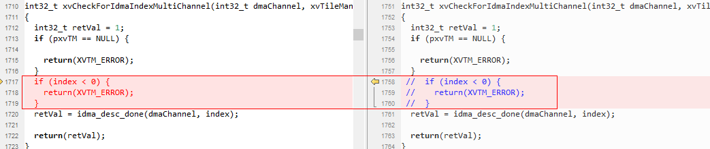

#### 开发自定义算子<a name="ZH-CN_TOPIC_0000002408132342"></a>

在CPU端：

1.  在程序初始化时调用ss\_mpi\_svp\_dsp\_power\_on上电。
2.  调用ss\_mpi\_svp\_dsp\_load\_bin把4个bin（ot\_iram.bin、ot\_sram.bin、ot\_dram0.bin、ot\_dram1.bin）分别加载至对应位置。
3.  调用ss\_mpi\_svp\_dsp\_enable\_core使能DSP。

    开发基于ss\_mpi\_svp\_dsp\_rpc/ ss\_mpi\_svp\_dsp\_query接口封装自定义算子

    > **说明：** 
    >请参考Sample\(sample\_svp\_dsp\_enca\_dilate\_3x3/sample\_svp\_dsp\_enca\_erode\_3x3封装\)和《SVP2.0 API参考.pdf》接口ss\_mpi\_svp\_dsp\_rpc/ss\_mpi\_svp\_dsp\_query说明。

在DSP端：

1.  在发布包algo/include/int目录下开发基于帧级或者Tile级的算子。

    > **说明：** 
    >用户可参考algo/include/int/svp\_dsp\_frm.h和algo/src/svp\_dsp\_frm.c开发帧级算子。

2.  在发布包algo/src/svp\_dsp\_algo.c源文件svp\_dsp\_algo\_process函数添加对自定义算子的调用。
3.  执行algo/Makefile重新对algo目录下的代码编译成库。
4.  执行runtime/obj/Makefile把.o、.a等编译成elf文件并转换为4个binary。

    > **说明：** 
    >4个bin分别为ot\_iram.bin、ot\_sram.bin、ot\_dram0.bin和ot\_dram1.bin，并且放在runtime/obj/bin.

> **须知：** 
>-   在不同的解决方案中DSP的个数会不同，而且IRAM/SRAM/DRAM的编址也会不一样。具体请参考对应芯片手册。
>-   由于逻辑增加了ReorderBuf，导致IDMA有一个使用约束，IDMA的编程接口idma\_init函数只能使用MAX\_BLOCK\_2/MAX\_BLOCK\_4/MAX\_BLOCK\_8，不能使用MAX\_BLOCK\_16。
>-   SS928V100/SS927V100 CPU访问的DDR地址区间\[0x40000000, 0x2FFFFFFFF\], 在DSP端IDMA会映射到\[0x440000000, 0x6FFFFFFFF\]地址区间来访问，即IDMA访问的DDR地址需要加上偏移0x400000000\(加上idma\_offset值\),此部分映射框架已搭建好了，用户参考框架Sample使用即可。

