# 前言<a name="ZH-CN_TOPIC_0000002441661589"></a>

**概述<a name="section142mcpsimp"></a>**

本文为使用MPP媒体处理芯片进行开发的工程师而写，目的是供您在开发过程中查阅媒体处理软件SYS\_CONFIG子模块的各种参考信息，包括系统控制、时钟配置、管脚复用等。本文档描述SYS\_CONFIG中的各个关键函数的使用方法，以及相关的配置原理。

> **说明：** 
>本文以SS928V100描述为例，未有特殊说明，SS927V100与SS928V100内容一致。

**产品版本<a name="section145mcpsimp"></a>**

与本文档相对应的产品版本如下。

<a name="table148mcpsimp"></a>
<table><thead align="left"><tr id="row153mcpsimp"><th class="cellrowborder" valign="top" width="32%" id="mcps1.1.3.1.1"><p id="p155mcpsimp"><a name="p155mcpsimp"></a><a name="p155mcpsimp"></a>产品名称</p>
</th>
<th class="cellrowborder" valign="top" width="68%" id="mcps1.1.3.1.2"><p id="p157mcpsimp"><a name="p157mcpsimp"></a><a name="p157mcpsimp"></a>产品版本</p>
</th>
</tr>
</thead>
<tbody><tr id="row159mcpsimp"><td class="cellrowborder" valign="top" width="32%" headers="mcps1.1.3.1.1 "><p id="p161mcpsimp"><a name="p161mcpsimp"></a><a name="p161mcpsimp"></a>SS928</p>
</td>
<td class="cellrowborder" valign="top" width="68%" headers="mcps1.1.3.1.2 "><p id="p163mcpsimp"><a name="p163mcpsimp"></a><a name="p163mcpsimp"></a>V100</p>
</td>
</tr>
<tr id="row15828177202310"><td class="cellrowborder" valign="top" width="32%" headers="mcps1.1.3.1.1 "><p id="p198461710152317"><a name="p198461710152317"></a><a name="p198461710152317"></a>SS927</p>
</td>
<td class="cellrowborder" valign="top" width="68%" headers="mcps1.1.3.1.2 "><p id="p6846171016231"><a name="p6846171016231"></a><a name="p6846171016231"></a>V100</p>
</td>
</tr>
</tbody>
</table>

**读者对象<a name="section164mcpsimp"></a>**

本文档（本指南）主要适用于以下工程师：

-   技术支持工程师
-   软件开发工程师

**符号约定<a name="section170mcpsimp"></a>**

在本文中可能出现下列标志，它们所代表的含义如下。

<a name="table173mcpsimp"></a>
<table><thead align="left"><tr id="row178mcpsimp"><th class="cellrowborder" valign="top" width="21%" id="mcps1.1.3.1.1"><p id="p180mcpsimp"><a name="p180mcpsimp"></a><a name="p180mcpsimp"></a><strong id="b181mcpsimp"><a name="b181mcpsimp"></a><a name="b181mcpsimp"></a>符号</strong></p>
</th>
<th class="cellrowborder" valign="top" width="79%" id="mcps1.1.3.1.2"><p id="p183mcpsimp"><a name="p183mcpsimp"></a><a name="p183mcpsimp"></a><strong id="b184mcpsimp"><a name="b184mcpsimp"></a><a name="b184mcpsimp"></a>说明</strong></p>
</th>
</tr>
</thead>
<tbody><tr id="row186mcpsimp"><td class="cellrowborder" valign="top" width="21%" headers="mcps1.1.3.1.1 "><p class="msonormal" id="p188mcpsimp"><a name="p188mcpsimp"></a><a name="p188mcpsimp"></a><a name="image103"></a><a name="image103"></a><span></span></p>
</td>
<td class="cellrowborder" valign="top" width="79%" headers="mcps1.1.3.1.2 "><p id="p190mcpsimp"><a name="p190mcpsimp"></a><a name="p190mcpsimp"></a>表示如不避免则将会导致死亡或严重伤害的具有高等级风险的危害。</p>
</td>
</tr>
<tr id="row191mcpsimp"><td class="cellrowborder" valign="top" width="21%" headers="mcps1.1.3.1.1 "><p class="msonormal" id="p193mcpsimp"><a name="p193mcpsimp"></a><a name="p193mcpsimp"></a><a name="image104"></a><a name="image104"></a><span></span></p>
</td>
<td class="cellrowborder" valign="top" width="79%" headers="mcps1.1.3.1.2 "><p id="p195mcpsimp"><a name="p195mcpsimp"></a><a name="p195mcpsimp"></a>表示如不避免则可能导致死亡或严重伤害的具有中等级风险的危害。</p>
</td>
</tr>
<tr id="row196mcpsimp"><td class="cellrowborder" valign="top" width="21%" headers="mcps1.1.3.1.1 "><p class="msonormal" id="p198mcpsimp"><a name="p198mcpsimp"></a><a name="p198mcpsimp"></a><a name="image105"></a><a name="image105"></a><span></span></p>
</td>
<td class="cellrowborder" valign="top" width="79%" headers="mcps1.1.3.1.2 "><p id="p200mcpsimp"><a name="p200mcpsimp"></a><a name="p200mcpsimp"></a>表示如不避免则可能导致轻微或中度伤害的具有低等级风险的危害。</p>
</td>
</tr>
<tr id="row201mcpsimp"><td class="cellrowborder" valign="top" width="21%" headers="mcps1.1.3.1.1 "><p class="msonormal" id="p203mcpsimp"><a name="p203mcpsimp"></a><a name="p203mcpsimp"></a><a name="image106"></a><a name="image106"></a><span></span></p>
</td>
<td class="cellrowborder" valign="top" width="79%" headers="mcps1.1.3.1.2 "><p id="p205mcpsimp"><a name="p205mcpsimp"></a><a name="p205mcpsimp"></a>用于传递设备或环境安全警示信息。如不避免则可能会导致设备损坏、数据丢失、设备性能降低或其它不可预知的结果。</p>
<p id="p206mcpsimp"><a name="p206mcpsimp"></a><a name="p206mcpsimp"></a>“须知”不涉及人身伤害。</p>
</td>
</tr>
<tr id="row207mcpsimp"><td class="cellrowborder" valign="top" width="21%" headers="mcps1.1.3.1.1 "><p class="msonormal" id="p209mcpsimp"><a name="p209mcpsimp"></a><a name="p209mcpsimp"></a><a name="image107"></a><a name="image107"></a><span></span></p>
</td>
<td class="cellrowborder" valign="top" width="79%" headers="mcps1.1.3.1.2 "><p id="p211mcpsimp"><a name="p211mcpsimp"></a><a name="p211mcpsimp"></a>对正文中重点信息的补充说明。</p>
<p id="p212mcpsimp"><a name="p212mcpsimp"></a><a name="p212mcpsimp"></a>“说明”不是安全警示信息，不涉及人身、设备及环境伤害信息。</p>
</td>
</tr>
</tbody>
</table>

**修改记录<a name="section213mcpsimp"></a>**

<a name="table215mcpsimp"></a>
<table><thead align="left"><tr id="row221mcpsimp"><th class="cellrowborder" valign="top" width="21%" id="mcps1.1.4.1.1"><p id="p223mcpsimp"><a name="p223mcpsimp"></a><a name="p223mcpsimp"></a><strong id="b224mcpsimp"><a name="b224mcpsimp"></a><a name="b224mcpsimp"></a>文档版本</strong></p>
</th>
<th class="cellrowborder" valign="top" width="26%" id="mcps1.1.4.1.2"><p id="p226mcpsimp"><a name="p226mcpsimp"></a><a name="p226mcpsimp"></a><strong id="b227mcpsimp"><a name="b227mcpsimp"></a><a name="b227mcpsimp"></a>发布日期</strong></p>
</th>
<th class="cellrowborder" valign="top" width="53%" id="mcps1.1.4.1.3"><p id="p229mcpsimp"><a name="p229mcpsimp"></a><a name="p229mcpsimp"></a><strong id="b230mcpsimp"><a name="b230mcpsimp"></a><a name="b230mcpsimp"></a>修改说明</strong></p>
</th>
</tr>
</thead>
<tbody><tr id="row232mcpsimp"><td class="cellrowborder" valign="top" width="21%" headers="mcps1.1.4.1.1 "><p id="p234mcpsimp"><a name="p234mcpsimp"></a><a name="p234mcpsimp"></a>00B01</p>
</td>
<td class="cellrowborder" valign="top" width="26%" headers="mcps1.1.4.1.2 "><p id="p236mcpsimp"><a name="p236mcpsimp"></a><a name="p236mcpsimp"></a>2025-09-15</p>
</td>
<td class="cellrowborder" valign="top" width="53%" headers="mcps1.1.4.1.3 "><p id="p238mcpsimp"><a name="p238mcpsimp"></a><a name="p238mcpsimp"></a>第1次临时版本发布。</p>
</td>
</tr>
</tbody>
</table>

# 概述<a name="ZH-CN_TOPIC_0000002408262186"></a>


## SYS\_CONFIG介绍<a name="ZH-CN_TOPIC_0000002441701425"></a>

SYS\_CONFIG是进行系统级和板级进行配置的模块，主要作用是在系统加载sys\_config.ko时候，对不需要动态修改的初始化环境做配置。包括以下几个部分：

-   初始化
-   系统控制
-   时钟复位配置
-   管脚复用

SYS\_CONFIG以二进制文件形式的ko和源码形式同时进行发布，源码位于interdrv/sysconfig目录。

如需修改SYS\_CONFIG代码，可以参照以下文档和步骤（以SS928V100为例）：

-   如需修改时钟配置和系统控制，请先参考芯片手册，再修改sysconfig代码。
-   如需修改管脚复用配置，请先参考芯片手册，再修改sysconfig代码。

根据连接的视频输入的sensor不同，系统控制和芯片管脚复用配置存在差异，可以通过模块参数g\_sensor\_list来进行区分。

比如：

insmod sys\_config.ko sensors="sns0=sensor0\_xxx,sns1=sensor1\_xxx,sns2=sensor2\_xxx,sns3=sensor3\_xxx" vo\_intf="bt1120"

或者

insmod sys\_config.ko sensors=sns0=sensor0\_xxx,sns1=sensor1\_xxx,sns2=sensor2\_xxx,sns3=sensor3\_xxx vo\_intf=bt1120

各模块参数意义如[表1](#_table34233312)所示。

**表 1**  各模块参数意义

<a name="_table34233312"></a>
<table><thead align="left"><tr id="row265mcpsimp"><th class="cellrowborder" valign="top" width="27%" id="mcps1.2.3.1.1"><p id="p267mcpsimp"><a name="p267mcpsimp"></a><a name="p267mcpsimp"></a>参数</p>
</th>
<th class="cellrowborder" valign="top" width="73%" id="mcps1.2.3.1.2"><p id="p269mcpsimp"><a name="p269mcpsimp"></a><a name="p269mcpsimp"></a>意义</p>
</th>
</tr>
</thead>
<tbody><tr id="row276mcpsimp"><td class="cellrowborder" valign="top" width="27%" headers="mcps1.2.3.1.1 "><p id="p278mcpsimp"><a name="p278mcpsimp"></a><a name="p278mcpsimp"></a>sensors</p>
</td>
<td class="cellrowborder" valign="top" width="73%" headers="mcps1.2.3.1.2 "><p id="p280mcpsimp"><a name="p280mcpsimp"></a><a name="p280mcpsimp"></a>sensors列表，字符串形式传入。</p>
<p id="p281mcpsimp"><a name="p281mcpsimp"></a><a name="p281mcpsimp"></a>如：</p>
<p id="p282mcpsimp"><a name="p282mcpsimp"></a><a name="p282mcpsimp"></a>sensors="sns0=sensor0_xxx,sns1=sensor1_xxx,sns2=sensor2_xxx,sns3=sensor3_xxx"</p>
<p id="p283mcpsimp"><a name="p283mcpsimp"></a><a name="p283mcpsimp"></a>或者</p>
<p id="p284mcpsimp"><a name="p284mcpsimp"></a><a name="p284mcpsimp"></a>sensors=sns0sensor0_xxx,sns1=sensor1_xxx,sns2=sensor2_xxx,sns3=sensor3_xxx</p>
<p id="p1987171575"><a name="p1987171575"></a><a name="p1987171575"></a>sensors=none表示不配置sensor管脚。</p>
</td>
</tr>
<tr id="row286mcpsimp"><td class="cellrowborder" valign="top" width="27%" headers="mcps1.2.3.1.1 "><p id="p288mcpsimp"><a name="p288mcpsimp"></a><a name="p288mcpsimp"></a>vo_intf</p>
</td>
<td class="cellrowborder" valign="top" width="73%" headers="mcps1.2.3.1.2 "><p id="p290mcpsimp"><a name="p290mcpsimp"></a><a name="p290mcpsimp"></a>VO接口类型选择，默认为"mipi_tx"。</p>
<p id="p291mcpsimp"><a name="p291mcpsimp"></a><a name="p291mcpsimp"></a>MIPI_TX: vo_intf="mipitx"或"mipi_tx"；</p>
<p id="p292mcpsimp"><a name="p292mcpsimp"></a><a name="p292mcpsimp"></a>BT.1120: vo_intf ="bt.1120"或"bt1120";</p>
<p id="p293mcpsimp"><a name="p293mcpsimp"></a><a name="p293mcpsimp"></a>BT.656: vo_intf ="bt.656"或"bt656";</p>
<p id="p294mcpsimp"><a name="p294mcpsimp"></a><a name="p294mcpsimp"></a>RGB_6BIT: vo_intf ="rgb_6bit"或"rgb6bit";</p>
<p id="p295mcpsimp"><a name="p295mcpsimp"></a><a name="p295mcpsimp"></a>RGB_8BIT: vo_intf ="rgb_8bit"或"rgb8bit";</p>
<p id="p296mcpsimp"><a name="p296mcpsimp"></a><a name="p296mcpsimp"></a>RGB_16BIT: vo_intf ="rgb_16bit"或"rgb16bit";</p>
<p id="p297mcpsimp"><a name="p297mcpsimp"></a><a name="p297mcpsimp"></a>RGB_18BIT: vo_intf ="rgb_18bit"或"rgb18bit";</p>
<p id="p298mcpsimp"><a name="p298mcpsimp"></a><a name="p298mcpsimp"></a>RGB_24BIT: vo_intf ="rgb_24bit"或"rgb24bit";</p>
<p id="p85581197318"><a name="p85581197318"></a><a name="p85581197318"></a>不配置VO管脚: vo_intf = "none"。</p>
<p id="p299mcpsimp"><a name="p299mcpsimp"></a><a name="p299mcpsimp"></a>以上述字符串为前缀的将被视为合法输入，字符串长度超过15将导致驱动加载失败。</p>
</td>
</tr>
<tr id="row45730111920"><td class="cellrowborder" valign="top" width="27%" headers="mcps1.2.3.1.1 "><p id="p1573131194"><a name="p1573131194"></a><a name="p1573131194"></a>g_hdmi_en</p>
</td>
<td class="cellrowborder" valign="top" width="73%" headers="mcps1.2.3.1.2 "><p id="p75738113915"><a name="p75738113915"></a><a name="p75738113915"></a>是否配置HDMI管脚，g_hdmi_en=1表示配置，g_hdmi_en=0表示不配置。默认为1。</p>
</td>
</tr>
<tr id="row48551616599"><td class="cellrowborder" valign="top" width="27%" headers="mcps1.2.3.1.1 "><p id="p8855616091"><a name="p8855616091"></a><a name="p8855616091"></a>g_i2c_en</p>
</td>
<td class="cellrowborder" valign="top" width="73%" headers="mcps1.2.3.1.2 "><p id="p1185515162919"><a name="p1185515162919"></a><a name="p1185515162919"></a>是否配置i2c管脚，g_i2c_en=1表示配置，g_i2c_en=0表示不配置。默认为1。</p>
</td>
</tr>
<tr id="row4231481918"><td class="cellrowborder" valign="top" width="27%" headers="mcps1.2.3.1.1 "><p id="p182311685914"><a name="p182311685914"></a><a name="p182311685914"></a>g_audio_en</p>
</td>
<td class="cellrowborder" valign="top" width="73%" headers="mcps1.2.3.1.2 "><p id="p5231108193"><a name="p5231108193"></a><a name="p5231108193"></a>是否配置audio管脚，g_audio_en=1表示配置，g_audio_en=0表示不配置。默认为1。</p>
</td>
</tr>
</tbody>
</table>

用户可以根据以下实际物理环境，修改SYS\_CONFIG模块源代码文件中的相关内容：

-   根据实际系统配置修改相应的系统配置;
-   根据实际系统运行时钟需要修改相应的时钟；
-   根据实际物理电路管脚使用布置情况修改管脚复用的相关内容。

修改完成后，编译和加载模块ko，即可以完成所需新的用户环境的配置。

SYS\_CONFIG配置流程如[图1](#_fig9145151194318)所示。

**图 1**  SYS\_CONFIG整体流程图<a name="_fig9145151194318"></a>  
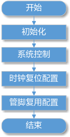

包括以下4个流程：

-   初始化（sysconfig\_init）

    对配置寄存器的地址进行映射，主要寄存器地址包括CRG、系统控制、MISC、IO管脚复用、GPIO控制、MIPI等。

-   系统控制（sys\_ctl）

    对系统控制部分进行配置，如对VI和VPSS的在线离线模式QoS设置。

-   时钟复位配置（clk\_cfg）

    配置VI、VO、SPI、I2C等模块的时钟。

-   管脚复用配置（pin\_mux）

    根据不同应用场景配置管脚复用为不同的功能。

# 初始化<a name="ZH-CN_TOPIC_0000002441661613"></a>

SYS\_CONFIG的初始化对需要配置的寄存器地址进行ioremap映射，得到软件可以操作配置的虚拟地址。

以下为SYS\_CONFIG的初始化进行映射的寄存器地址。

**表 1**  MSIC寄存器地址

<a name="_table44115416"></a>
<table><thead align="left"><tr id="row329mcpsimp"><th class="cellrowborder" valign="top" width="27%" id="mcps1.2.5.1.1"><p id="p331mcpsimp"><a name="p331mcpsimp"></a><a name="p331mcpsimp"></a>解决方案</p>
</th>
<th class="cellrowborder" valign="top" width="34%" id="mcps1.2.5.1.2"><p id="p333mcpsimp"><a name="p333mcpsimp"></a><a name="p333mcpsimp"></a>基址变量</p>
</th>
<th class="cellrowborder" valign="top" width="22%" id="mcps1.2.5.1.3"><p id="p335mcpsimp"><a name="p335mcpsimp"></a><a name="p335mcpsimp"></a>基地址</p>
</th>
<th class="cellrowborder" valign="top" width="17%" id="mcps1.2.5.1.4"><p id="p337mcpsimp"><a name="p337mcpsimp"></a><a name="p337mcpsimp"></a>长度</p>
</th>
</tr>
</thead>
<tbody><tr id="row339mcpsimp"><td class="cellrowborder" valign="top" width="27%" headers="mcps1.2.5.1.1 "><p id="p341mcpsimp"><a name="p341mcpsimp"></a><a name="p341mcpsimp"></a>SS928V100</p>
</td>
<td class="cellrowborder" valign="top" width="34%" headers="mcps1.2.5.1.2 "><p id="p343mcpsimp"><a name="p343mcpsimp"></a><a name="p343mcpsimp"></a>g_reg_misc_base</p>
</td>
<td class="cellrowborder" valign="top" width="22%" headers="mcps1.2.5.1.3 "><p id="p345mcpsimp"><a name="p345mcpsimp"></a><a name="p345mcpsimp"></a>0x11024000</p>
</td>
<td class="cellrowborder" valign="top" width="17%" headers="mcps1.2.5.1.4 "><p id="p347mcpsimp"><a name="p347mcpsimp"></a><a name="p347mcpsimp"></a>0x5000</p>
</td>
</tr>
</tbody>
</table>

**表 2**  时钟复位寄存器地址

<a name="_table61494432"></a>
<table><thead align="left"><tr id="row355mcpsimp"><th class="cellrowborder" valign="top" width="27%" id="mcps1.2.5.1.1"><p id="p357mcpsimp"><a name="p357mcpsimp"></a><a name="p357mcpsimp"></a>解决方案</p>
</th>
<th class="cellrowborder" valign="top" width="34%" id="mcps1.2.5.1.2"><p id="p359mcpsimp"><a name="p359mcpsimp"></a><a name="p359mcpsimp"></a>基址变量</p>
</th>
<th class="cellrowborder" valign="top" width="22%" id="mcps1.2.5.1.3"><p id="p361mcpsimp"><a name="p361mcpsimp"></a><a name="p361mcpsimp"></a>基地址</p>
</th>
<th class="cellrowborder" valign="top" width="17%" id="mcps1.2.5.1.4"><p id="p363mcpsimp"><a name="p363mcpsimp"></a><a name="p363mcpsimp"></a>长度</p>
</th>
</tr>
</thead>
<tbody><tr id="row365mcpsimp"><td class="cellrowborder" valign="top" width="27%" headers="mcps1.2.5.1.1 "><p id="p367mcpsimp"><a name="p367mcpsimp"></a><a name="p367mcpsimp"></a>SS928V100</p>
</td>
<td class="cellrowborder" valign="top" width="34%" headers="mcps1.2.5.1.2 "><p id="p369mcpsimp"><a name="p369mcpsimp"></a><a name="p369mcpsimp"></a>g_reg_crg_base</p>
</td>
<td class="cellrowborder" valign="top" width="22%" headers="mcps1.2.5.1.3 "><p id="p371mcpsimp"><a name="p371mcpsimp"></a><a name="p371mcpsimp"></a>0x11010000</p>
</td>
<td class="cellrowborder" valign="top" width="17%" headers="mcps1.2.5.1.4 "><p id="p373mcpsimp"><a name="p373mcpsimp"></a><a name="p373mcpsimp"></a>0x10000</p>
</td>
</tr>
</tbody>
</table>

**表 3**  管脚复用寄存器地址

<a name="_table16578980"></a>
<table><thead align="left"><tr id="row381mcpsimp"><th class="cellrowborder" valign="top" width="27%" id="mcps1.2.5.1.1"><p id="p383mcpsimp"><a name="p383mcpsimp"></a><a name="p383mcpsimp"></a>解决方案</p>
</th>
<th class="cellrowborder" valign="top" width="34%" id="mcps1.2.5.1.2"><p id="p385mcpsimp"><a name="p385mcpsimp"></a><a name="p385mcpsimp"></a>基址变量</p>
</th>
<th class="cellrowborder" valign="top" width="22%" id="mcps1.2.5.1.3"><p id="p387mcpsimp"><a name="p387mcpsimp"></a><a name="p387mcpsimp"></a>基地址</p>
</th>
<th class="cellrowborder" valign="top" width="17%" id="mcps1.2.5.1.4"><p id="p389mcpsimp"><a name="p389mcpsimp"></a><a name="p389mcpsimp"></a>长度</p>
</th>
</tr>
</thead>
<tbody><tr id="row391mcpsimp"><td class="cellrowborder" rowspan="2" valign="top" width="27%" headers="mcps1.2.5.1.1 "><p id="p393mcpsimp"><a name="p393mcpsimp"></a><a name="p393mcpsimp"></a>SS928V100</p>
</td>
<td class="cellrowborder" valign="top" width="34%" headers="mcps1.2.5.1.2 "><p id="p395mcpsimp"><a name="p395mcpsimp"></a><a name="p395mcpsimp"></a>g_reg_iocfg_base</p>
</td>
<td class="cellrowborder" valign="top" width="22%" headers="mcps1.2.5.1.3 "><p id="p397mcpsimp"><a name="p397mcpsimp"></a><a name="p397mcpsimp"></a>0x10230000</p>
</td>
<td class="cellrowborder" valign="top" width="17%" headers="mcps1.2.5.1.4 "><p id="p399mcpsimp"><a name="p399mcpsimp"></a><a name="p399mcpsimp"></a>0x10000</p>
</td>
</tr>
<tr id="row400mcpsimp"><td class="cellrowborder" valign="top" headers="mcps1.2.5.1.1 "><p id="p402mcpsimp"><a name="p402mcpsimp"></a><a name="p402mcpsimp"></a>g_reg_iocfg2_base</p>
</td>
<td class="cellrowborder" valign="top" headers="mcps1.2.5.1.2 "><p id="p404mcpsimp"><a name="p404mcpsimp"></a><a name="p404mcpsimp"></a>0x102f0000</p>
</td>
<td class="cellrowborder" valign="top" headers="mcps1.2.5.1.3 "><p id="p406mcpsimp"><a name="p406mcpsimp"></a><a name="p406mcpsimp"></a>0x10000</p>
</td>
</tr>
</tbody>
</table>

**表 4**  GPIO寄存器地址

<a name="table407mcpsimp"></a>
<table><thead align="left"><tr id="row415mcpsimp"><th class="cellrowborder" valign="top" width="25.742574257425744%" id="mcps1.2.5.1.1"><p id="p417mcpsimp"><a name="p417mcpsimp"></a><a name="p417mcpsimp"></a>解决方案</p>
</th>
<th class="cellrowborder" valign="top" width="32.67326732673268%" id="mcps1.2.5.1.2"><p id="p419mcpsimp"><a name="p419mcpsimp"></a><a name="p419mcpsimp"></a>基址变量</p>
</th>
<th class="cellrowborder" valign="top" width="21.782178217821784%" id="mcps1.2.5.1.3"><p id="p421mcpsimp"><a name="p421mcpsimp"></a><a name="p421mcpsimp"></a>基地址</p>
</th>
<th class="cellrowborder" valign="top" width="19.801980198019802%" id="mcps1.2.5.1.4"><p id="p423mcpsimp"><a name="p423mcpsimp"></a><a name="p423mcpsimp"></a>长度</p>
</th>
</tr>
</thead>
<tbody><tr id="row425mcpsimp"><td class="cellrowborder" valign="top" width="25.742574257425744%" headers="mcps1.2.5.1.1 "><p id="p427mcpsimp"><a name="p427mcpsimp"></a><a name="p427mcpsimp"></a>SS928V100</p>
</td>
<td class="cellrowborder" valign="top" width="32.67326732673268%" headers="mcps1.2.5.1.2 "><p id="p429mcpsimp"><a name="p429mcpsimp"></a><a name="p429mcpsimp"></a>g_reg_gpio_base</p>
</td>
<td class="cellrowborder" valign="top" width="21.782178217821784%" headers="mcps1.2.5.1.3 "><p id="p431mcpsimp"><a name="p431mcpsimp"></a><a name="p431mcpsimp"></a>0x11090000</p>
</td>
<td class="cellrowborder" valign="top" width="19.801980198019802%" headers="mcps1.2.5.1.4 "><p id="p433mcpsimp"><a name="p433mcpsimp"></a><a name="p433mcpsimp"></a>0x12000</p>
</td>
</tr>
</tbody>
</table>

**表 5**  SYS寄存器地址

<a name="table434mcpsimp"></a>
<table><thead align="left"><tr id="row442mcpsimp"><th class="cellrowborder" valign="top" width="24.242424242424242%" id="mcps1.2.5.1.1"><p id="p1278416222180"><a name="p1278416222180"></a><a name="p1278416222180"></a>解决方案</p>
</th>
<th class="cellrowborder" valign="top" width="30.303030303030305%" id="mcps1.2.5.1.2"><p id="p446mcpsimp"><a name="p446mcpsimp"></a><a name="p446mcpsimp"></a>基址变量</p>
</th>
<th class="cellrowborder" valign="top" width="28.28282828282828%" id="mcps1.2.5.1.3"><p id="p448mcpsimp"><a name="p448mcpsimp"></a><a name="p448mcpsimp"></a>基地址</p>
</th>
<th class="cellrowborder" valign="top" width="17.17171717171717%" id="mcps1.2.5.1.4"><p id="p450mcpsimp"><a name="p450mcpsimp"></a><a name="p450mcpsimp"></a>长度</p>
</th>
</tr>
</thead>
<tbody><tr id="row452mcpsimp"><td class="cellrowborder" valign="top" width="24.242424242424242%" headers="mcps1.2.5.1.1 "><p id="p454mcpsimp"><a name="p454mcpsimp"></a><a name="p454mcpsimp"></a>SS928V100</p>
</td>
<td class="cellrowborder" valign="top" width="30.303030303030305%" headers="mcps1.2.5.1.2 "><p id="p456mcpsimp"><a name="p456mcpsimp"></a><a name="p456mcpsimp"></a>g_reg_sys_base</p>
</td>
<td class="cellrowborder" valign="top" width="28.28282828282828%" headers="mcps1.2.5.1.3 "><p id="p458mcpsimp"><a name="p458mcpsimp"></a><a name="p458mcpsimp"></a>0x11020000</p>
</td>
<td class="cellrowborder" valign="top" width="17.17171717171717%" headers="mcps1.2.5.1.4 "><p id="p460mcpsimp"><a name="p460mcpsimp"></a><a name="p460mcpsimp"></a>0x4000</p>
</td>
</tr>
</tbody>
</table>

**表 6**  DDR寄存器地址

<a name="table461mcpsimp"></a>
<table><thead align="left"><tr id="row469mcpsimp"><th class="cellrowborder" valign="top" width="24.242424242424242%" id="mcps1.2.5.1.1"><p id="p471mcpsimp"><a name="p471mcpsimp"></a><a name="p471mcpsimp"></a>解决方案</p>
</th>
<th class="cellrowborder" valign="top" width="30.303030303030305%" id="mcps1.2.5.1.2"><p id="p473mcpsimp"><a name="p473mcpsimp"></a><a name="p473mcpsimp"></a>基址变量</p>
</th>
<th class="cellrowborder" valign="top" width="28.28282828282828%" id="mcps1.2.5.1.3"><p id="p475mcpsimp"><a name="p475mcpsimp"></a><a name="p475mcpsimp"></a>基地址</p>
</th>
<th class="cellrowborder" valign="top" width="17.17171717171717%" id="mcps1.2.5.1.4"><p id="p477mcpsimp"><a name="p477mcpsimp"></a><a name="p477mcpsimp"></a>长度</p>
</th>
</tr>
</thead>
<tbody><tr id="row479mcpsimp"><td class="cellrowborder" valign="top" width="24.242424242424242%" headers="mcps1.2.5.1.1 "><p id="p481mcpsimp"><a name="p481mcpsimp"></a><a name="p481mcpsimp"></a>SS928V100</p>
</td>
<td class="cellrowborder" valign="top" width="30.303030303030305%" headers="mcps1.2.5.1.2 "><p id="p483mcpsimp"><a name="p483mcpsimp"></a><a name="p483mcpsimp"></a>g_reg_ddr_base</p>
</td>
<td class="cellrowborder" valign="top" width="28.28282828282828%" headers="mcps1.2.5.1.3 "><p id="p485mcpsimp"><a name="p485mcpsimp"></a><a name="p485mcpsimp"></a>0x11140000</p>
</td>
<td class="cellrowborder" valign="top" width="17.17171717171717%" headers="mcps1.2.5.1.4 "><p id="p487mcpsimp"><a name="p487mcpsimp"></a><a name="p487mcpsimp"></a>0x10000</p>
</td>
</tr>
</tbody>
</table>

**表 7**  MIPI\_TX寄存器地址

<a name="_table071427174311"></a>
<table><thead align="left"><tr id="row495mcpsimp"><th class="cellrowborder" valign="top" width="24.242424242424242%" id="mcps1.2.5.1.1"><p id="p497mcpsimp"><a name="p497mcpsimp"></a><a name="p497mcpsimp"></a>解决方案</p>
</th>
<th class="cellrowborder" valign="top" width="30.303030303030305%" id="mcps1.2.5.1.2"><p id="p499mcpsimp"><a name="p499mcpsimp"></a><a name="p499mcpsimp"></a>基址变量</p>
</th>
<th class="cellrowborder" valign="top" width="28.28282828282828%" id="mcps1.2.5.1.3"><p id="p501mcpsimp"><a name="p501mcpsimp"></a><a name="p501mcpsimp"></a>基地址</p>
</th>
<th class="cellrowborder" valign="top" width="17.17171717171717%" id="mcps1.2.5.1.4"><p id="p503mcpsimp"><a name="p503mcpsimp"></a><a name="p503mcpsimp"></a>长度</p>
</th>
</tr>
</thead>
<tbody><tr id="row505mcpsimp"><td class="cellrowborder" valign="top" width="24.242424242424242%" headers="mcps1.2.5.1.1 "><p id="p507mcpsimp"><a name="p507mcpsimp"></a><a name="p507mcpsimp"></a>SS928V100</p>
</td>
<td class="cellrowborder" valign="top" width="30.303030303030305%" headers="mcps1.2.5.1.2 "><p id="p509mcpsimp"><a name="p509mcpsimp"></a><a name="p509mcpsimp"></a>g_reg_mipi_tx_base</p>
</td>
<td class="cellrowborder" valign="top" width="28.28282828282828%" headers="mcps1.2.5.1.3 "><p id="p511mcpsimp"><a name="p511mcpsimp"></a><a name="p511mcpsimp"></a>0x17A80000</p>
</td>
<td class="cellrowborder" valign="top" width="17.17171717171717%" headers="mcps1.2.5.1.4 "><p id="p513mcpsimp"><a name="p513mcpsimp"></a><a name="p513mcpsimp"></a>0x10000</p>
</td>
</tr>
</tbody>
</table>

本章节对寄存器地址的映射是其他章节的寄存器配置的基础，在完成本章节寄存器物理地址（即寄存器地址）映射后得到寄存器虚拟地址，通过寄存器虚拟地址可完成对相应寄存器的读写。

操作函数如下：

```
#define sys_writel(addr, value) ((*((volatile unsigned int *)(addr))) = (value))
#define sys_read(addr) (*((volatile int *)(addr)))
```

-   sys\_writel是写函数，addr表示寄存器虚拟地址，value表示写入寄存器的值。
-   sys\_read是读函数，addr表示寄存器虚拟地址。操作的结果即为读取到的寄存器的值。

# 系统控制<a name="ZH-CN_TOPIC_0000002408262198"></a>


## VI VPSS在线离线模式<a name="ZH-CN_TOPIC_0000002441701441"></a>

根据VI VPSS在线离线模式情况，需要选择VI VPSS在线离线模式。

以下以SS928V100为例说明。


### VI VPSS在线离线模式配置<a name="ZH-CN_TOPIC_0000002408102290"></a>

【配置】

g\_reg\_misc\_base 见[表1](#_table44115416).

```
static void set_vi_online_video_norm_vpss_online_qos(void) 
{ 
    void *misc_base = sys_config_get_reg_misc(); 
  
    sys_writel(misc_base + 0x1000, 0x44777755); 
    sys_writel(misc_base + 0x1004, 0x45455066); 
    sys_writel(misc_base + 0x1008, 0x60050055); 
    sys_writel(misc_base + 0x100c, 0x45433306); 
    sys_writel(misc_base + 0x1010, 0x33333366); 
    sys_writel(misc_base + 0x1014, 0x33503333); 
    sys_writel(misc_base + 0x1018, 0x00044466); 
  
    sys_writel(misc_base + 0x101c, 0x44777765); 
    sys_writel(misc_base + 0x1020, 0x55556066); 
    sys_writel(misc_base + 0x1024, 0x60050056); 
    sys_writel(misc_base + 0x1028, 0x46433306); 
    sys_writel(misc_base + 0x102c, 0x66555377); 
    sys_writel(misc_base + 0x1030, 0x33503663); 
    sys_writel(misc_base + 0x1034, 0x00055577); 
}
```

【描述说明】

MDDRC\_QOS\_CTRL0为QOS寄存器。

Offset Address: 0x5000   Total Reset Value: 0x0000\_0000

<a name="table535mcpsimp"></a>
<table><thead align="left"><tr id="row543mcpsimp"><th class="cellrowborder" valign="top" width="12.000000000000002%" id="mcps1.1.6.1.1"><p id="p545mcpsimp"><a name="p545mcpsimp"></a><a name="p545mcpsimp"></a>Bits</p>
</th>
<th class="cellrowborder" valign="top" width="12.000000000000002%" id="mcps1.1.6.1.2"><p id="p547mcpsimp"><a name="p547mcpsimp"></a><a name="p547mcpsimp"></a>Access</p>
</th>
<th class="cellrowborder" valign="top" width="23.000000000000004%" id="mcps1.1.6.1.3"><p id="p549mcpsimp"><a name="p549mcpsimp"></a><a name="p549mcpsimp"></a>Name</p>
</th>
<th class="cellrowborder" valign="top" width="42.00000000000001%" id="mcps1.1.6.1.4"><p id="p551mcpsimp"><a name="p551mcpsimp"></a><a name="p551mcpsimp"></a>Description</p>
</th>
<th class="cellrowborder" valign="top" width="11.000000000000002%" id="mcps1.1.6.1.5"><p id="p553mcpsimp"><a name="p553mcpsimp"></a><a name="p553mcpsimp"></a>Reset</p>
</th>
</tr>
</thead>
<tbody><tr id="row555mcpsimp"><td class="cellrowborder" valign="top" width="12.000000000000002%" headers="mcps1.1.6.1.1 "><p id="p557mcpsimp"><a name="p557mcpsimp"></a><a name="p557mcpsimp"></a>[30:28]</p>
</td>
<td class="cellrowborder" valign="top" width="12.000000000000002%" headers="mcps1.1.6.1.2 "><p id="p559mcpsimp"><a name="p559mcpsimp"></a><a name="p559mcpsimp"></a>RW</p>
</td>
<td class="cellrowborder" valign="top" width="23.000000000000004%" headers="mcps1.1.6.1.3 "><p id="p561mcpsimp"><a name="p561mcpsimp"></a><a name="p561mcpsimp"></a>dpu_w_qos</p>
</td>
<td class="cellrowborder" valign="top" width="42.00000000000001%" headers="mcps1.1.6.1.4 "><p id="p563mcpsimp"><a name="p563mcpsimp"></a><a name="p563mcpsimp"></a>dpu写通道QOS配置</p>
</td>
<td class="cellrowborder" valign="top" width="11.000000000000002%" headers="mcps1.1.6.1.5 "><p id="p565mcpsimp"><a name="p565mcpsimp"></a><a name="p565mcpsimp"></a>0x0</p>
</td>
</tr>
<tr id="row566mcpsimp"><td class="cellrowborder" valign="top" width="12.000000000000002%" headers="mcps1.1.6.1.1 "><p id="p568mcpsimp"><a name="p568mcpsimp"></a><a name="p568mcpsimp"></a>[26:24]</p>
</td>
<td class="cellrowborder" valign="top" width="12.000000000000002%" headers="mcps1.1.6.1.2 "><p id="p570mcpsimp"><a name="p570mcpsimp"></a><a name="p570mcpsimp"></a>RW</p>
</td>
<td class="cellrowborder" valign="top" width="23.000000000000004%" headers="mcps1.1.6.1.3 "><p id="p572mcpsimp"><a name="p572mcpsimp"></a><a name="p572mcpsimp"></a>ive_w_qos</p>
</td>
<td class="cellrowborder" valign="top" width="42.00000000000001%" headers="mcps1.1.6.1.4 "><p id="p574mcpsimp"><a name="p574mcpsimp"></a><a name="p574mcpsimp"></a>IVE写通道QOS配置。</p>
</td>
<td class="cellrowborder" valign="top" width="11.000000000000002%" headers="mcps1.1.6.1.5 "><p id="p576mcpsimp"><a name="p576mcpsimp"></a><a name="p576mcpsimp"></a>0x0</p>
</td>
</tr>
<tr id="row577mcpsimp"><td class="cellrowborder" valign="top" width="12.000000000000002%" headers="mcps1.1.6.1.1 "><p id="p579mcpsimp"><a name="p579mcpsimp"></a><a name="p579mcpsimp"></a>[22:20]</p>
</td>
<td class="cellrowborder" valign="top" width="12.000000000000002%" headers="mcps1.1.6.1.2 "><p id="p581mcpsimp"><a name="p581mcpsimp"></a><a name="p581mcpsimp"></a>RW</p>
</td>
<td class="cellrowborder" valign="top" width="23.000000000000004%" headers="mcps1.1.6.1.3 "><p id="p583mcpsimp"><a name="p583mcpsimp"></a><a name="p583mcpsimp"></a>vpss_w_qos</p>
</td>
<td class="cellrowborder" valign="top" width="42.00000000000001%" headers="mcps1.1.6.1.4 "><p id="p585mcpsimp"><a name="p585mcpsimp"></a><a name="p585mcpsimp"></a>VPSS写通道QOS配置。</p>
</td>
<td class="cellrowborder" valign="top" width="11.000000000000002%" headers="mcps1.1.6.1.5 "><p id="p587mcpsimp"><a name="p587mcpsimp"></a><a name="p587mcpsimp"></a>0x0</p>
</td>
</tr>
<tr id="row588mcpsimp"><td class="cellrowborder" valign="top" width="12.000000000000002%" headers="mcps1.1.6.1.1 "><p id="p590mcpsimp"><a name="p590mcpsimp"></a><a name="p590mcpsimp"></a>[18:16]</p>
</td>
<td class="cellrowborder" valign="top" width="12.000000000000002%" headers="mcps1.1.6.1.2 "><p id="p592mcpsimp"><a name="p592mcpsimp"></a><a name="p592mcpsimp"></a>RW</p>
</td>
<td class="cellrowborder" valign="top" width="23.000000000000004%" headers="mcps1.1.6.1.3 "><p id="p594mcpsimp"><a name="p594mcpsimp"></a><a name="p594mcpsimp"></a>viproc_2nd_w_qos</p>
</td>
<td class="cellrowborder" valign="top" width="42.00000000000001%" headers="mcps1.1.6.1.4 "><p id="p596mcpsimp"><a name="p596mcpsimp"></a><a name="p596mcpsimp"></a>VIPROC_2ND写通道QOS配置。</p>
</td>
<td class="cellrowborder" valign="top" width="11.000000000000002%" headers="mcps1.1.6.1.5 "><p id="p598mcpsimp"><a name="p598mcpsimp"></a><a name="p598mcpsimp"></a>0x0</p>
</td>
</tr>
<tr id="row599mcpsimp"><td class="cellrowborder" valign="top" width="12.000000000000002%" headers="mcps1.1.6.1.1 "><p id="p601mcpsimp"><a name="p601mcpsimp"></a><a name="p601mcpsimp"></a>[14:12]</p>
</td>
<td class="cellrowborder" valign="top" width="12.000000000000002%" headers="mcps1.1.6.1.2 "><p id="p603mcpsimp"><a name="p603mcpsimp"></a><a name="p603mcpsimp"></a>RW</p>
</td>
<td class="cellrowborder" valign="top" width="23.000000000000004%" headers="mcps1.1.6.1.3 "><p id="p605mcpsimp"><a name="p605mcpsimp"></a><a name="p605mcpsimp"></a>viproc_1st_w_qos</p>
</td>
<td class="cellrowborder" valign="top" width="42.00000000000001%" headers="mcps1.1.6.1.4 "><p id="p607mcpsimp"><a name="p607mcpsimp"></a><a name="p607mcpsimp"></a>VIPROC_1ST写通道QOS配置。</p>
</td>
<td class="cellrowborder" valign="top" width="11.000000000000002%" headers="mcps1.1.6.1.5 "><p id="p609mcpsimp"><a name="p609mcpsimp"></a><a name="p609mcpsimp"></a>0x0</p>
</td>
</tr>
<tr id="row610mcpsimp"><td class="cellrowborder" valign="top" width="12.000000000000002%" headers="mcps1.1.6.1.1 "><p id="p612mcpsimp"><a name="p612mcpsimp"></a><a name="p612mcpsimp"></a>[10:8]</p>
</td>
<td class="cellrowborder" valign="top" width="12.000000000000002%" headers="mcps1.1.6.1.2 "><p id="p614mcpsimp"><a name="p614mcpsimp"></a><a name="p614mcpsimp"></a>RW</p>
</td>
<td class="cellrowborder" valign="top" width="23.000000000000004%" headers="mcps1.1.6.1.3 "><p id="p616mcpsimp"><a name="p616mcpsimp"></a><a name="p616mcpsimp"></a>vicap_w_qos</p>
</td>
<td class="cellrowborder" valign="top" width="42.00000000000001%" headers="mcps1.1.6.1.4 "><p id="p618mcpsimp"><a name="p618mcpsimp"></a><a name="p618mcpsimp"></a>VICAP写通道QOS配置。</p>
</td>
<td class="cellrowborder" valign="top" width="11.000000000000002%" headers="mcps1.1.6.1.5 "><p id="p620mcpsimp"><a name="p620mcpsimp"></a><a name="p620mcpsimp"></a>0x0</p>
</td>
</tr>
<tr id="row621mcpsimp"><td class="cellrowborder" valign="top" width="12.000000000000002%" headers="mcps1.1.6.1.1 "><p id="p623mcpsimp"><a name="p623mcpsimp"></a><a name="p623mcpsimp"></a>[6:4]</p>
</td>
<td class="cellrowborder" valign="top" width="12.000000000000002%" headers="mcps1.1.6.1.2 "><p id="p625mcpsimp"><a name="p625mcpsimp"></a><a name="p625mcpsimp"></a>RW</p>
</td>
<td class="cellrowborder" valign="top" width="23.000000000000004%" headers="mcps1.1.6.1.3 "><p id="p627mcpsimp"><a name="p627mcpsimp"></a><a name="p627mcpsimp"></a>vdh_w_qos</p>
</td>
<td class="cellrowborder" valign="top" width="42.00000000000001%" headers="mcps1.1.6.1.4 "><p id="p629mcpsimp"><a name="p629mcpsimp"></a><a name="p629mcpsimp"></a>VDH写通道 QOS配置。</p>
</td>
<td class="cellrowborder" valign="top" width="11.000000000000002%" headers="mcps1.1.6.1.5 "><p id="p631mcpsimp"><a name="p631mcpsimp"></a><a name="p631mcpsimp"></a>0x0</p>
</td>
</tr>
<tr id="row632mcpsimp"><td class="cellrowborder" valign="top" width="12.000000000000002%" headers="mcps1.1.6.1.1 "><p id="p634mcpsimp"><a name="p634mcpsimp"></a><a name="p634mcpsimp"></a>[2:0]</p>
</td>
<td class="cellrowborder" valign="top" width="12.000000000000002%" headers="mcps1.1.6.1.2 "><p id="p636mcpsimp"><a name="p636mcpsimp"></a><a name="p636mcpsimp"></a>RW</p>
</td>
<td class="cellrowborder" valign="top" width="23.000000000000004%" headers="mcps1.1.6.1.3 "><p id="p638mcpsimp"><a name="p638mcpsimp"></a><a name="p638mcpsimp"></a>vedu_w_qos</p>
</td>
<td class="cellrowborder" valign="top" width="42.00000000000001%" headers="mcps1.1.6.1.4 "><p id="p640mcpsimp"><a name="p640mcpsimp"></a><a name="p640mcpsimp"></a>VEDU写通道QOS配置。</p>
</td>
<td class="cellrowborder" valign="top" width="11.000000000000002%" headers="mcps1.1.6.1.5 "><p id="p642mcpsimp"><a name="p642mcpsimp"></a><a name="p642mcpsimp"></a>0x0</p>
</td>
</tr>
</tbody>
</table>

配置值为0x44777755：

-   Bits\[30:28\]=0x4，表示DPU写通道QOS配置为4。
-   Bits\[26:24\]=0x4，表示IVE写通道QOS配置为4。
-   Bits\[22:20\]=0x7，表示VPSS写通道QOS配置为7。
-   Bits\[18:16\]=0x7，表示VIPROC\_2ND写通道QOS配置为7。
-   Bits\[14:12\]=0x7，表示VIPROC\_1ST写通道QOS配置为7。
-   Bits\[10:8\]=0x7，表示VICAP写通道QOS配置为7。
-   Bits\[6:4\]=0x5，表示VDH写通道QOS配置为5。
-   Bits\[2:0\]=0x5，表示VEDU写通道QOS配置为5。

【注意事项】

无。

# 时钟复位配置<a name="ZH-CN_TOPIC_0000002408102262"></a>

时钟是各模块正常运行的基础，以下以SS928V100为例说明时钟相关配置。

时钟复位配置函数如下（函数具体实现以实际应用场景为准）：

```
void clk_cfg(void)
{
    i2c_spi_clk_cfg();
    ……
}
```


## VI 时钟复位配置<a name="ZH-CN_TOPIC_0000002441701453"></a>


### VICAP时钟<a name="ZH-CN_TOPIC_0000002408262174"></a>

【配置】

g\_reg\_crg\_base 见[表2](#_table61494432)。

```
     /* vicap ppc&bus reset&cken, ppc 600M */
sys_writel(g_reg_crg_base + 0x9140, 0x6030);
```

【描述说明】

PERI\_CRG9296为VICAP时钟及复位控制寄存器，参考芯片手册。

Offset Address: 0x9140   Total Reset Value: 0x0000\_0003

<a name="table673mcpsimp"></a>
<table><thead align="left"><tr id="row681mcpsimp"><th class="cellrowborder" valign="top" width="18.18181818181818%" id="mcps1.1.6.1.1"><p id="p683mcpsimp"><a name="p683mcpsimp"></a><a name="p683mcpsimp"></a>Bits</p>
</th>
<th class="cellrowborder" valign="top" width="15.151515151515152%" id="mcps1.1.6.1.2"><p id="p685mcpsimp"><a name="p685mcpsimp"></a><a name="p685mcpsimp"></a>Access</p>
</th>
<th class="cellrowborder" valign="top" width="21.21212121212121%" id="mcps1.1.6.1.3"><p id="p687mcpsimp"><a name="p687mcpsimp"></a><a name="p687mcpsimp"></a>Name</p>
</th>
<th class="cellrowborder" valign="top" width="32.32323232323232%" id="mcps1.1.6.1.4"><p id="p689mcpsimp"><a name="p689mcpsimp"></a><a name="p689mcpsimp"></a>Description</p>
</th>
<th class="cellrowborder" valign="top" width="13.13131313131313%" id="mcps1.1.6.1.5"><p id="p691mcpsimp"><a name="p691mcpsimp"></a><a name="p691mcpsimp"></a>Reset</p>
</th>
</tr>
</thead>
<tbody><tr id="row693mcpsimp"><td class="cellrowborder" valign="top" width="18.18181818181818%" headers="mcps1.1.6.1.1 "><p id="p695mcpsimp"><a name="p695mcpsimp"></a><a name="p695mcpsimp"></a>[14:12]</p>
</td>
<td class="cellrowborder" valign="top" width="15.151515151515152%" headers="mcps1.1.6.1.2 "><p id="p697mcpsimp"><a name="p697mcpsimp"></a><a name="p697mcpsimp"></a>RW</p>
</td>
<td class="cellrowborder" valign="top" width="21.21212121212121%" headers="mcps1.1.6.1.3 "><p id="p699mcpsimp"><a name="p699mcpsimp"></a><a name="p699mcpsimp"></a>vi_ppc_cksel</p>
</td>
<td class="cellrowborder" valign="top" width="32.32323232323232%" headers="mcps1.1.6.1.4 "><p id="p701mcpsimp"><a name="p701mcpsimp"></a><a name="p701mcpsimp"></a>VICAP 工作时钟选择。</p>
<p id="p702mcpsimp"><a name="p702mcpsimp"></a><a name="p702mcpsimp"></a>000：150MHz；</p>
<p id="p703mcpsimp"><a name="p703mcpsimp"></a><a name="p703mcpsimp"></a>001：300MHz;</p>
<p id="p704mcpsimp"><a name="p704mcpsimp"></a><a name="p704mcpsimp"></a>010：396MHz;</p>
<p id="p705mcpsimp"><a name="p705mcpsimp"></a><a name="p705mcpsimp"></a>011：475MHz；</p>
<p id="p706mcpsimp"><a name="p706mcpsimp"></a><a name="p706mcpsimp"></a>其他：600MHz。</p>
</td>
<td class="cellrowborder" valign="top" width="13.13131313131313%" headers="mcps1.1.6.1.5 "><p id="p708mcpsimp"><a name="p708mcpsimp"></a><a name="p708mcpsimp"></a>0x0</p>
</td>
</tr>
<tr id="row709mcpsimp"><td class="cellrowborder" valign="top" width="18.18181818181818%" headers="mcps1.1.6.1.1 "><p id="p711mcpsimp"><a name="p711mcpsimp"></a><a name="p711mcpsimp"></a>[5]</p>
</td>
<td class="cellrowborder" valign="top" width="15.151515151515152%" headers="mcps1.1.6.1.2 "><p id="p713mcpsimp"><a name="p713mcpsimp"></a><a name="p713mcpsimp"></a>RW</p>
</td>
<td class="cellrowborder" valign="top" width="21.21212121212121%" headers="mcps1.1.6.1.3 "><p id="p715mcpsimp"><a name="p715mcpsimp"></a><a name="p715mcpsimp"></a>vi_bus_cken</p>
</td>
<td class="cellrowborder" valign="top" width="32.32323232323232%" headers="mcps1.1.6.1.4 "><p id="p717mcpsimp"><a name="p717mcpsimp"></a><a name="p717mcpsimp"></a>VICAP BUS 时钟门控。</p>
<p id="p718mcpsimp"><a name="p718mcpsimp"></a><a name="p718mcpsimp"></a>0：时钟关闭；</p>
<p id="p719mcpsimp"><a name="p719mcpsimp"></a><a name="p719mcpsimp"></a>1：时钟打开。</p>
</td>
<td class="cellrowborder" valign="top" width="13.13131313131313%" headers="mcps1.1.6.1.5 "><p id="p721mcpsimp"><a name="p721mcpsimp"></a><a name="p721mcpsimp"></a>0x0</p>
</td>
</tr>
<tr id="row722mcpsimp"><td class="cellrowborder" valign="top" width="18.18181818181818%" headers="mcps1.1.6.1.1 "><p id="p724mcpsimp"><a name="p724mcpsimp"></a><a name="p724mcpsimp"></a>[4]</p>
</td>
<td class="cellrowborder" valign="top" width="15.151515151515152%" headers="mcps1.1.6.1.2 "><p id="p726mcpsimp"><a name="p726mcpsimp"></a><a name="p726mcpsimp"></a>RW</p>
</td>
<td class="cellrowborder" valign="top" width="21.21212121212121%" headers="mcps1.1.6.1.3 "><p id="p728mcpsimp"><a name="p728mcpsimp"></a><a name="p728mcpsimp"></a>vi_ppc_cken</p>
</td>
<td class="cellrowborder" valign="top" width="32.32323232323232%" headers="mcps1.1.6.1.4 "><p id="p730mcpsimp"><a name="p730mcpsimp"></a><a name="p730mcpsimp"></a>VICAP PPC时钟门控。</p>
<p id="p731mcpsimp"><a name="p731mcpsimp"></a><a name="p731mcpsimp"></a>0：时钟关闭；</p>
<p id="p732mcpsimp"><a name="p732mcpsimp"></a><a name="p732mcpsimp"></a>1：时钟打开。</p>
</td>
<td class="cellrowborder" valign="top" width="13.13131313131313%" headers="mcps1.1.6.1.5 "><p id="p734mcpsimp"><a name="p734mcpsimp"></a><a name="p734mcpsimp"></a>0x0</p>
</td>
</tr>
<tr id="row735mcpsimp"><td class="cellrowborder" valign="top" width="18.18181818181818%" headers="mcps1.1.6.1.1 "><p id="p737mcpsimp"><a name="p737mcpsimp"></a><a name="p737mcpsimp"></a>[1]</p>
</td>
<td class="cellrowborder" valign="top" width="15.151515151515152%" headers="mcps1.1.6.1.2 "><p id="p739mcpsimp"><a name="p739mcpsimp"></a><a name="p739mcpsimp"></a>RW</p>
</td>
<td class="cellrowborder" valign="top" width="21.21212121212121%" headers="mcps1.1.6.1.3 "><p id="p741mcpsimp"><a name="p741mcpsimp"></a><a name="p741mcpsimp"></a>vi_bus_srst_req</p>
</td>
<td class="cellrowborder" valign="top" width="32.32323232323232%" headers="mcps1.1.6.1.4 "><p id="p743mcpsimp"><a name="p743mcpsimp"></a><a name="p743mcpsimp"></a>VICAP BUS 软复位请求。</p>
<p id="p744mcpsimp"><a name="p744mcpsimp"></a><a name="p744mcpsimp"></a>0：不复位；</p>
<p id="p745mcpsimp"><a name="p745mcpsimp"></a><a name="p745mcpsimp"></a>1：复位。</p>
</td>
<td class="cellrowborder" valign="top" width="13.13131313131313%" headers="mcps1.1.6.1.5 "><p id="p747mcpsimp"><a name="p747mcpsimp"></a><a name="p747mcpsimp"></a>0x1</p>
</td>
</tr>
<tr id="row748mcpsimp"><td class="cellrowborder" valign="top" width="18.18181818181818%" headers="mcps1.1.6.1.1 "><p id="p750mcpsimp"><a name="p750mcpsimp"></a><a name="p750mcpsimp"></a>[0]</p>
</td>
<td class="cellrowborder" valign="top" width="15.151515151515152%" headers="mcps1.1.6.1.2 "><p id="p752mcpsimp"><a name="p752mcpsimp"></a><a name="p752mcpsimp"></a>RW</p>
</td>
<td class="cellrowborder" valign="top" width="21.21212121212121%" headers="mcps1.1.6.1.3 "><p id="p754mcpsimp"><a name="p754mcpsimp"></a><a name="p754mcpsimp"></a>vi_ppc_srst_req</p>
</td>
<td class="cellrowborder" valign="top" width="32.32323232323232%" headers="mcps1.1.6.1.4 "><p id="p756mcpsimp"><a name="p756mcpsimp"></a><a name="p756mcpsimp"></a>VICAP PPC 软复位请求。</p>
<p id="p757mcpsimp"><a name="p757mcpsimp"></a><a name="p757mcpsimp"></a>0：不复位；</p>
<p id="p758mcpsimp"><a name="p758mcpsimp"></a><a name="p758mcpsimp"></a>1：复位。</p>
</td>
<td class="cellrowborder" valign="top" width="13.13131313131313%" headers="mcps1.1.6.1.5 "><p id="p760mcpsimp"><a name="p760mcpsimp"></a><a name="p760mcpsimp"></a>0x1</p>
</td>
</tr>
</tbody>
</table>

配置值为0x6030：

-   Bits\[14:12\]=0x6，表示时钟配置为600MHz；
-   Bits\[5:4\]=0x3，表示打开VICAP时钟门控。

【注意事项】

工作时钟必须大于SENSOR的时钟。

### PORT口时钟<a name="ZH-CN_TOPIC_0000002408102198"></a>

【配置】（以PORT0配置为例）

g\_reg\_crg\_base 见[表2](#_table61494432)。

```
/* vi port */
sys_writel(g_reg_crg_base + 0x9148, 0xff0);
sys_writel(g_reg_crg_base + 0x9164, 0x7010);
sys_writel(g_reg_crg_base + 0x9184, 0x7010);
sys_writel(g_reg_crg_base + 0x91a4, 0x7010);
sys_writel(g_reg_crg_base + 0x91c4, 0x7010);
```

【描述说明】

PERI\_CRG9305为VICAP PORT0时钟及复位控制寄存器。

Offset Address: 0x9164   Total Reset Value: 0x0000\_0000

<a name="table780mcpsimp"></a>
<table><thead align="left"><tr id="row788mcpsimp"><th class="cellrowborder" valign="top" width="14.14141414141414%" id="mcps1.1.6.1.1"><p id="p790mcpsimp"><a name="p790mcpsimp"></a><a name="p790mcpsimp"></a>Bits</p>
</th>
<th class="cellrowborder" valign="top" width="14.14141414141414%" id="mcps1.1.6.1.2"><p id="p792mcpsimp"><a name="p792mcpsimp"></a><a name="p792mcpsimp"></a>Access</p>
</th>
<th class="cellrowborder" valign="top" width="16.16161616161616%" id="mcps1.1.6.1.3"><p id="p794mcpsimp"><a name="p794mcpsimp"></a><a name="p794mcpsimp"></a>Name</p>
</th>
<th class="cellrowborder" valign="top" width="39.39393939393939%" id="mcps1.1.6.1.4"><p id="p796mcpsimp"><a name="p796mcpsimp"></a><a name="p796mcpsimp"></a>Description</p>
</th>
<th class="cellrowborder" valign="top" width="16.16161616161616%" id="mcps1.1.6.1.5"><p id="p798mcpsimp"><a name="p798mcpsimp"></a><a name="p798mcpsimp"></a>Reset</p>
</th>
</tr>
</thead>
<tbody><tr id="row800mcpsimp"><td class="cellrowborder" valign="top" width="14.14141414141414%" headers="mcps1.1.6.1.1 "><p id="p802mcpsimp"><a name="p802mcpsimp"></a><a name="p802mcpsimp"></a>[14:12]</p>
</td>
<td class="cellrowborder" valign="top" width="14.14141414141414%" headers="mcps1.1.6.1.2 "><p id="p804mcpsimp"><a name="p804mcpsimp"></a><a name="p804mcpsimp"></a>RW</p>
</td>
<td class="cellrowborder" valign="top" width="16.16161616161616%" headers="mcps1.1.6.1.3 "><p id="p806mcpsimp"><a name="p806mcpsimp"></a><a name="p806mcpsimp"></a>vi_p0_cksel</p>
</td>
<td class="cellrowborder" valign="top" width="39.39393939393939%" headers="mcps1.1.6.1.4 "><p id="p808mcpsimp"><a name="p808mcpsimp"></a><a name="p808mcpsimp"></a>VICAP PORT0时钟选择：</p>
<p id="p809mcpsimp"><a name="p809mcpsimp"></a><a name="p809mcpsimp"></a>000：100MHz；</p>
<p id="p810mcpsimp"><a name="p810mcpsimp"></a><a name="p810mcpsimp"></a>001：150MHz；</p>
<p id="p811mcpsimp"><a name="p811mcpsimp"></a><a name="p811mcpsimp"></a>010：200MHz；</p>
<p id="p812mcpsimp"><a name="p812mcpsimp"></a><a name="p812mcpsimp"></a>011：250MHz；</p>
<p id="p813mcpsimp"><a name="p813mcpsimp"></a><a name="p813mcpsimp"></a>100：300MHz；</p>
<p id="p814mcpsimp"><a name="p814mcpsimp"></a><a name="p814mcpsimp"></a>101：396MHz；</p>
<p id="p815mcpsimp"><a name="p815mcpsimp"></a><a name="p815mcpsimp"></a>110：475MHz；</p>
<p id="p816mcpsimp"><a name="p816mcpsimp"></a><a name="p816mcpsimp"></a>111：600MHz。</p>
</td>
<td class="cellrowborder" valign="top" width="16.16161616161616%" headers="mcps1.1.6.1.5 "><p id="p818mcpsimp"><a name="p818mcpsimp"></a><a name="p818mcpsimp"></a>0x0</p>
</td>
</tr>
<tr id="row819mcpsimp"><td class="cellrowborder" valign="top" width="14.14141414141414%" headers="mcps1.1.6.1.1 "><p id="p821mcpsimp"><a name="p821mcpsimp"></a><a name="p821mcpsimp"></a>[4]</p>
</td>
<td class="cellrowborder" valign="top" width="14.14141414141414%" headers="mcps1.1.6.1.2 "><p id="p823mcpsimp"><a name="p823mcpsimp"></a><a name="p823mcpsimp"></a>RW</p>
</td>
<td class="cellrowborder" valign="top" width="16.16161616161616%" headers="mcps1.1.6.1.3 "><p id="p825mcpsimp"><a name="p825mcpsimp"></a><a name="p825mcpsimp"></a>vi_p0_cken</p>
</td>
<td class="cellrowborder" valign="top" width="39.39393939393939%" headers="mcps1.1.6.1.4 "><p id="p827mcpsimp"><a name="p827mcpsimp"></a><a name="p827mcpsimp"></a>VICAP PORT0 时钟门控。</p>
<p id="p828mcpsimp"><a name="p828mcpsimp"></a><a name="p828mcpsimp"></a>0：时钟关闭；</p>
<p id="p829mcpsimp"><a name="p829mcpsimp"></a><a name="p829mcpsimp"></a>1：时钟打开。</p>
</td>
<td class="cellrowborder" valign="top" width="16.16161616161616%" headers="mcps1.1.6.1.5 "><p id="p831mcpsimp"><a name="p831mcpsimp"></a><a name="p831mcpsimp"></a>0x0</p>
</td>
</tr>
<tr id="row832mcpsimp"><td class="cellrowborder" valign="top" width="14.14141414141414%" headers="mcps1.1.6.1.1 "><p id="p834mcpsimp"><a name="p834mcpsimp"></a><a name="p834mcpsimp"></a>[0]</p>
</td>
<td class="cellrowborder" valign="top" width="14.14141414141414%" headers="mcps1.1.6.1.2 "><p id="p836mcpsimp"><a name="p836mcpsimp"></a><a name="p836mcpsimp"></a>RW</p>
</td>
<td class="cellrowborder" valign="top" width="16.16161616161616%" headers="mcps1.1.6.1.3 "><p id="p838mcpsimp"><a name="p838mcpsimp"></a><a name="p838mcpsimp"></a>vi_p0_srst_req</p>
</td>
<td class="cellrowborder" valign="top" width="39.39393939393939%" headers="mcps1.1.6.1.4 "><p id="p840mcpsimp"><a name="p840mcpsimp"></a><a name="p840mcpsimp"></a>VICAP PORT0软复位请求。</p>
<p id="p841mcpsimp"><a name="p841mcpsimp"></a><a name="p841mcpsimp"></a>0：不复位；</p>
<p id="p842mcpsimp"><a name="p842mcpsimp"></a><a name="p842mcpsimp"></a>1：复位。</p>
</td>
<td class="cellrowborder" valign="top" width="16.16161616161616%" headers="mcps1.1.6.1.5 "><p id="p844mcpsimp"><a name="p844mcpsimp"></a><a name="p844mcpsimp"></a>0x0</p>
</td>
</tr>
</tbody>
</table>

配置值为0x7010: Bits\[14:12\]=0x7，表示PORT口时钟配置为600Mhz。

【注意事项】

无。

### CMOS时钟<a name="ZH-CN_TOPIC_0000002408262118"></a>

【配置】

g\_reg\_crg\_base 见[表2](#_table61494432)。

```
/* vi cmos0 */
sys_writel(g_reg_crg_base + 0x9160, 0x0);
```

【描述说明】

PERI\_CRG9304为VI CMOS0时钟复位配置寄存器。

Offset Address: 0x9160   Total Reset Value: 0x0000\_0000

<a name="table857mcpsimp"></a>
<table><thead align="left"><tr id="row865mcpsimp"><th class="cellrowborder" valign="top" width="15.151515151515152%" id="mcps1.1.6.1.1"><p id="p867mcpsimp"><a name="p867mcpsimp"></a><a name="p867mcpsimp"></a>Bits</p>
</th>
<th class="cellrowborder" valign="top" width="15.151515151515152%" id="mcps1.1.6.1.2"><p id="p869mcpsimp"><a name="p869mcpsimp"></a><a name="p869mcpsimp"></a>Access</p>
</th>
<th class="cellrowborder" valign="top" width="22.222222222222225%" id="mcps1.1.6.1.3"><p id="p871mcpsimp"><a name="p871mcpsimp"></a><a name="p871mcpsimp"></a>Name</p>
</th>
<th class="cellrowborder" valign="top" width="32.32323232323232%" id="mcps1.1.6.1.4"><p id="p873mcpsimp"><a name="p873mcpsimp"></a><a name="p873mcpsimp"></a>Description</p>
</th>
<th class="cellrowborder" valign="top" width="15.151515151515152%" id="mcps1.1.6.1.5"><p id="p875mcpsimp"><a name="p875mcpsimp"></a><a name="p875mcpsimp"></a>Reset</p>
</th>
</tr>
</thead>
<tbody><tr id="row877mcpsimp"><td class="cellrowborder" valign="top" width="15.151515151515152%" headers="mcps1.1.6.1.1 "><p id="p879mcpsimp"><a name="p879mcpsimp"></a><a name="p879mcpsimp"></a>[31:21]</p>
</td>
<td class="cellrowborder" valign="top" width="15.151515151515152%" headers="mcps1.1.6.1.2 "><p id="p881mcpsimp"><a name="p881mcpsimp"></a><a name="p881mcpsimp"></a>-</p>
</td>
<td class="cellrowborder" valign="top" width="22.222222222222225%" headers="mcps1.1.6.1.3 "><p id="p883mcpsimp"><a name="p883mcpsimp"></a><a name="p883mcpsimp"></a>reserved</p>
</td>
<td class="cellrowborder" valign="top" width="32.32323232323232%" headers="mcps1.1.6.1.4 "><p id="p885mcpsimp"><a name="p885mcpsimp"></a><a name="p885mcpsimp"></a>保留。</p>
</td>
<td class="cellrowborder" valign="top" width="15.151515151515152%" headers="mcps1.1.6.1.5 "><p id="p887mcpsimp"><a name="p887mcpsimp"></a><a name="p887mcpsimp"></a>0x000</p>
</td>
</tr>
<tr id="row888mcpsimp"><td class="cellrowborder" valign="top" width="15.151515151515152%" headers="mcps1.1.6.1.1 "><p id="p890mcpsimp"><a name="p890mcpsimp"></a><a name="p890mcpsimp"></a>[20]</p>
</td>
<td class="cellrowborder" valign="top" width="15.151515151515152%" headers="mcps1.1.6.1.2 "><p id="p892mcpsimp"><a name="p892mcpsimp"></a><a name="p892mcpsimp"></a>RW</p>
</td>
<td class="cellrowborder" valign="top" width="22.222222222222225%" headers="mcps1.1.6.1.3 "><p id="p894mcpsimp"><a name="p894mcpsimp"></a><a name="p894mcpsimp"></a>vi_cmos0_pctrl</p>
</td>
<td class="cellrowborder" valign="top" width="32.32323232323232%" headers="mcps1.1.6.1.4 "><p id="p896mcpsimp"><a name="p896mcpsimp"></a><a name="p896mcpsimp"></a>VI CMOS时钟相位控制。</p>
<p id="p897mcpsimp"><a name="p897mcpsimp"></a><a name="p897mcpsimp"></a>0：时钟不取反；</p>
<p id="p898mcpsimp"><a name="p898mcpsimp"></a><a name="p898mcpsimp"></a>1：时钟取反。</p>
</td>
<td class="cellrowborder" valign="top" width="15.151515151515152%" headers="mcps1.1.6.1.5 "><p id="p900mcpsimp"><a name="p900mcpsimp"></a><a name="p900mcpsimp"></a>0x0</p>
</td>
</tr>
<tr id="row901mcpsimp"><td class="cellrowborder" valign="top" width="15.151515151515152%" headers="mcps1.1.6.1.1 "><p id="p903mcpsimp"><a name="p903mcpsimp"></a><a name="p903mcpsimp"></a>[19:0]</p>
</td>
<td class="cellrowborder" valign="top" width="15.151515151515152%" headers="mcps1.1.6.1.2 "><p id="p905mcpsimp"><a name="p905mcpsimp"></a><a name="p905mcpsimp"></a>-</p>
</td>
<td class="cellrowborder" valign="top" width="22.222222222222225%" headers="mcps1.1.6.1.3 "><p id="p907mcpsimp"><a name="p907mcpsimp"></a><a name="p907mcpsimp"></a>reserved</p>
</td>
<td class="cellrowborder" valign="top" width="32.32323232323232%" headers="mcps1.1.6.1.4 "><p id="p909mcpsimp"><a name="p909mcpsimp"></a><a name="p909mcpsimp"></a>保留。</p>
</td>
<td class="cellrowborder" valign="top" width="15.151515151515152%" headers="mcps1.1.6.1.5 "><p id="p911mcpsimp"><a name="p911mcpsimp"></a><a name="p911mcpsimp"></a>0x00000</p>
</td>
</tr>
</tbody>
</table>

配置值为0x0：Bits\[20\]=0x0，表示VI CMOS时钟相位不取反。

【注意事项】

无。

### SENSOR时钟<a name="ZH-CN_TOPIC_0000002408262078"></a>

【配置】（以SENSOR0配置为例）

g\_reg\_crg\_base 见[表2](#_table61494432)。

```
static void sensor_clock_config(int index, unsigned int clock)
{
    int offset = 0x8440;
    offset += index * (0x20); /* sensor0 - 3 */
    sys_writel(g_reg_crg_base + offset, clock); /* im327 clock: 0x8010 */
}
```

【描述说明】

sysconfig通过解析模块参数传入的sensor号和sensor名称解析对应的寄存器地址和配置的值，比如模块参数sensors=sns0=sensor0\_xxx时，解析出index=0，clock=0x8010，计算的sensor0的offset=0x8440。以SENSOR0时钟复位配置寄存器为例进行详细说明。

PERI\_CRG8464为SENSOR0时钟复位配置寄存器。

Offset Address: 0x8440   Total Reset Value: 0x0000\_0000

<a name="table929mcpsimp"></a>
<table><thead align="left"><tr id="row937mcpsimp"><th class="cellrowborder" valign="top" width="15.151515151515152%" id="mcps1.1.6.1.1"><p id="p939mcpsimp"><a name="p939mcpsimp"></a><a name="p939mcpsimp"></a>Bits</p>
</th>
<th class="cellrowborder" valign="top" width="15.151515151515152%" id="mcps1.1.6.1.2"><p id="p941mcpsimp"><a name="p941mcpsimp"></a><a name="p941mcpsimp"></a>Access</p>
</th>
<th class="cellrowborder" valign="top" width="20.202020202020204%" id="mcps1.1.6.1.3"><p id="p943mcpsimp"><a name="p943mcpsimp"></a><a name="p943mcpsimp"></a>Name</p>
</th>
<th class="cellrowborder" valign="top" width="34.34343434343434%" id="mcps1.1.6.1.4"><p id="p945mcpsimp"><a name="p945mcpsimp"></a><a name="p945mcpsimp"></a>Description</p>
</th>
<th class="cellrowborder" valign="top" width="15.151515151515152%" id="mcps1.1.6.1.5"><p id="p947mcpsimp"><a name="p947mcpsimp"></a><a name="p947mcpsimp"></a>Reset</p>
</th>
</tr>
</thead>
<tbody><tr id="row949mcpsimp"><td class="cellrowborder" valign="top" width="15.151515151515152%" headers="mcps1.1.6.1.1 "><p id="p951mcpsimp"><a name="p951mcpsimp"></a><a name="p951mcpsimp"></a>[15:12]</p>
</td>
<td class="cellrowborder" valign="top" width="15.151515151515152%" headers="mcps1.1.6.1.2 "><p id="p953mcpsimp"><a name="p953mcpsimp"></a><a name="p953mcpsimp"></a>RW</p>
</td>
<td class="cellrowborder" valign="top" width="20.202020202020204%" headers="mcps1.1.6.1.3 "><p id="p955mcpsimp"><a name="p955mcpsimp"></a><a name="p955mcpsimp"></a>sensor0_cksel</p>
</td>
<td class="cellrowborder" valign="top" width="34.34343434343434%" headers="mcps1.1.6.1.4 "><p id="p957mcpsimp"><a name="p957mcpsimp"></a><a name="p957mcpsimp"></a>SENSOR0时钟(芯片输出给sensor的参考时钟)选择。</p>
<p id="p958mcpsimp"><a name="p958mcpsimp"></a><a name="p958mcpsimp"></a>0x0：74.25MHz；</p>
<p id="p959mcpsimp"><a name="p959mcpsimp"></a><a name="p959mcpsimp"></a>0x1：72MHz；</p>
<p id="p960mcpsimp"><a name="p960mcpsimp"></a><a name="p960mcpsimp"></a>0x2：54MHz；</p>
<p id="p961mcpsimp"><a name="p961mcpsimp"></a><a name="p961mcpsimp"></a>0x3：50MHz；</p>
<p id="p962mcpsimp"><a name="p962mcpsimp"></a><a name="p962mcpsimp"></a>0x4：24MHz；</p>
<p id="p963mcpsimp"><a name="p963mcpsimp"></a><a name="p963mcpsimp"></a>0x8：37MHz；</p>
<p id="p964mcpsimp"><a name="p964mcpsimp"></a><a name="p964mcpsimp"></a>0x9：36MHz；</p>
<p id="p965mcpsimp"><a name="p965mcpsimp"></a><a name="p965mcpsimp"></a>0xA：27MHz；</p>
<p id="p966mcpsimp"><a name="p966mcpsimp"></a><a name="p966mcpsimp"></a>0xB：25MHz；</p>
<p id="p967mcpsimp"><a name="p967mcpsimp"></a><a name="p967mcpsimp"></a>0xC: 12MHz；</p>
<p id="p968mcpsimp"><a name="p968mcpsimp"></a><a name="p968mcpsimp"></a>其他：保留。</p>
</td>
<td class="cellrowborder" valign="top" width="15.151515151515152%" headers="mcps1.1.6.1.5 "><p id="p970mcpsimp"><a name="p970mcpsimp"></a><a name="p970mcpsimp"></a>0x0</p>
</td>
</tr>
<tr id="row971mcpsimp"><td class="cellrowborder" valign="top" width="15.151515151515152%" headers="mcps1.1.6.1.1 "><p id="p973mcpsimp"><a name="p973mcpsimp"></a><a name="p973mcpsimp"></a>[4]</p>
</td>
<td class="cellrowborder" valign="top" width="15.151515151515152%" headers="mcps1.1.6.1.2 "><p id="p975mcpsimp"><a name="p975mcpsimp"></a><a name="p975mcpsimp"></a>RW</p>
</td>
<td class="cellrowborder" valign="top" width="20.202020202020204%" headers="mcps1.1.6.1.3 "><p id="p977mcpsimp"><a name="p977mcpsimp"></a><a name="p977mcpsimp"></a>sensor0_cken</p>
</td>
<td class="cellrowborder" valign="top" width="34.34343434343434%" headers="mcps1.1.6.1.4 "><p id="p979mcpsimp"><a name="p979mcpsimp"></a><a name="p979mcpsimp"></a>SENSOR0时钟(芯片输出给sensor的参考时钟)门控。</p>
<p id="p980mcpsimp"><a name="p980mcpsimp"></a><a name="p980mcpsimp"></a>0：时钟关闭；</p>
<p id="p981mcpsimp"><a name="p981mcpsimp"></a><a name="p981mcpsimp"></a>1：时钟打开。</p>
</td>
<td class="cellrowborder" valign="top" width="15.151515151515152%" headers="mcps1.1.6.1.5 "><p id="p983mcpsimp"><a name="p983mcpsimp"></a><a name="p983mcpsimp"></a>0x0</p>
</td>
</tr>
<tr id="row984mcpsimp"><td class="cellrowborder" valign="top" width="15.151515151515152%" headers="mcps1.1.6.1.1 "><p id="p986mcpsimp"><a name="p986mcpsimp"></a><a name="p986mcpsimp"></a>[1]</p>
</td>
<td class="cellrowborder" valign="top" width="15.151515151515152%" headers="mcps1.1.6.1.2 "><p id="p988mcpsimp"><a name="p988mcpsimp"></a><a name="p988mcpsimp"></a>RW</p>
</td>
<td class="cellrowborder" valign="top" width="20.202020202020204%" headers="mcps1.1.6.1.3 "><p id="p990mcpsimp"><a name="p990mcpsimp"></a><a name="p990mcpsimp"></a>sensor0_ctrl_srst_req</p>
</td>
<td class="cellrowborder" valign="top" width="34.34343434343434%" headers="mcps1.1.6.1.4 "><p id="p992mcpsimp"><a name="p992mcpsimp"></a><a name="p992mcpsimp"></a>SENSOR0 从模式控制模块软复位请求。</p>
<p id="p993mcpsimp"><a name="p993mcpsimp"></a><a name="p993mcpsimp"></a>0：不复位；</p>
<p id="p994mcpsimp"><a name="p994mcpsimp"></a><a name="p994mcpsimp"></a>1：复位。</p>
</td>
<td class="cellrowborder" valign="top" width="15.151515151515152%" headers="mcps1.1.6.1.5 "><p id="p996mcpsimp"><a name="p996mcpsimp"></a><a name="p996mcpsimp"></a>0x0</p>
</td>
</tr>
<tr id="row997mcpsimp"><td class="cellrowborder" valign="top" width="15.151515151515152%" headers="mcps1.1.6.1.1 "><p id="p999mcpsimp"><a name="p999mcpsimp"></a><a name="p999mcpsimp"></a>[0]</p>
</td>
<td class="cellrowborder" valign="top" width="15.151515151515152%" headers="mcps1.1.6.1.2 "><p id="p1001mcpsimp"><a name="p1001mcpsimp"></a><a name="p1001mcpsimp"></a>RW</p>
</td>
<td class="cellrowborder" valign="top" width="20.202020202020204%" headers="mcps1.1.6.1.3 "><p id="p1003mcpsimp"><a name="p1003mcpsimp"></a><a name="p1003mcpsimp"></a>sensor0_srst_req</p>
</td>
<td class="cellrowborder" valign="top" width="34.34343434343434%" headers="mcps1.1.6.1.4 "><p id="p1005mcpsimp"><a name="p1005mcpsimp"></a><a name="p1005mcpsimp"></a>SENSOR0 软复位请求。</p>
<p id="p1006mcpsimp"><a name="p1006mcpsimp"></a><a name="p1006mcpsimp"></a>0：不复位；</p>
<p id="p1007mcpsimp"><a name="p1007mcpsimp"></a><a name="p1007mcpsimp"></a>1：复位。</p>
</td>
<td class="cellrowborder" valign="top" width="15.151515151515152%" headers="mcps1.1.6.1.5 "><p id="p1009mcpsimp"><a name="p1009mcpsimp"></a><a name="p1009mcpsimp"></a>0x0</p>
</td>
</tr>
</tbody>
</table>

配置值为0x8010：Bits\[15:12\]=0x8，表示SENSOR0时钟配置为为37MHZ。

【注意事项】

无。

### VIPROC时钟<a name="ZH-CN_TOPIC_0000002441701365"></a>

【配置】

g\_reg\_crg\_base 见[表2](#_table61494432)。

```
     /* viproc_pre ppc&bus reset&cken, ppc 600M */
sys_writel(g_reg_crg_base + 0x9740, 0x4010);
```

【描述说明】

PERI\_CRG9680为VIPROC时钟及复位控制寄存器。

Offset Address: 0x9740   Total Reset Value: 0x0000\_0000

<a name="table1022mcpsimp"></a>
<table><thead align="left"><tr id="row1030mcpsimp"><th class="cellrowborder" valign="top" width="18.18181818181818%" id="mcps1.1.6.1.1"><p id="p1032mcpsimp"><a name="p1032mcpsimp"></a><a name="p1032mcpsimp"></a>Bits</p>
</th>
<th class="cellrowborder" valign="top" width="15.151515151515152%" id="mcps1.1.6.1.2"><p id="p1034mcpsimp"><a name="p1034mcpsimp"></a><a name="p1034mcpsimp"></a>Access</p>
</th>
<th class="cellrowborder" valign="top" width="21.21212121212121%" id="mcps1.1.6.1.3"><p id="p1036mcpsimp"><a name="p1036mcpsimp"></a><a name="p1036mcpsimp"></a>Name</p>
</th>
<th class="cellrowborder" valign="top" width="32.32323232323232%" id="mcps1.1.6.1.4"><p id="p1038mcpsimp"><a name="p1038mcpsimp"></a><a name="p1038mcpsimp"></a>Description</p>
</th>
<th class="cellrowborder" valign="top" width="13.13131313131313%" id="mcps1.1.6.1.5"><p id="p1040mcpsimp"><a name="p1040mcpsimp"></a><a name="p1040mcpsimp"></a>Reset</p>
</th>
</tr>
</thead>
<tbody><tr id="row1042mcpsimp"><td class="cellrowborder" valign="top" width="18.18181818181818%" headers="mcps1.1.6.1.1 "><p id="p1044mcpsimp"><a name="p1044mcpsimp"></a><a name="p1044mcpsimp"></a>[14:12]</p>
</td>
<td class="cellrowborder" valign="top" width="15.151515151515152%" headers="mcps1.1.6.1.2 "><p id="p1046mcpsimp"><a name="p1046mcpsimp"></a><a name="p1046mcpsimp"></a>RW</p>
</td>
<td class="cellrowborder" valign="top" width="21.21212121212121%" headers="mcps1.1.6.1.3 "><p id="p1048mcpsimp"><a name="p1048mcpsimp"></a><a name="p1048mcpsimp"></a>viproc_cksel</p>
</td>
<td class="cellrowborder" valign="top" width="32.32323232323232%" headers="mcps1.1.6.1.4 "><p id="p1050mcpsimp"><a name="p1050mcpsimp"></a><a name="p1050mcpsimp"></a>VIPROC离线模式时钟选择。</p>
<p id="p1051mcpsimp"><a name="p1051mcpsimp"></a><a name="p1051mcpsimp"></a>000：150MHz；</p>
<p id="p1052mcpsimp"><a name="p1052mcpsimp"></a><a name="p1052mcpsimp"></a>001：300MHz；</p>
<p id="p1053mcpsimp"><a name="p1053mcpsimp"></a><a name="p1053mcpsimp"></a>010：396MHz；</p>
<p id="p1054mcpsimp"><a name="p1054mcpsimp"></a><a name="p1054mcpsimp"></a>011：475MHz；</p>
<p id="p1055mcpsimp"><a name="p1055mcpsimp"></a><a name="p1055mcpsimp"></a>100：600MHz；</p>
<p id="p1056mcpsimp"><a name="p1056mcpsimp"></a><a name="p1056mcpsimp"></a>其他：保留。</p>
</td>
<td class="cellrowborder" valign="top" width="13.13131313131313%" headers="mcps1.1.6.1.5 "><p id="p1058mcpsimp"><a name="p1058mcpsimp"></a><a name="p1058mcpsimp"></a>0x0</p>
</td>
</tr>
<tr id="row1059mcpsimp"><td class="cellrowborder" valign="top" width="18.18181818181818%" headers="mcps1.1.6.1.1 "><p id="p1061mcpsimp"><a name="p1061mcpsimp"></a><a name="p1061mcpsimp"></a>[4]</p>
</td>
<td class="cellrowborder" valign="top" width="15.151515151515152%" headers="mcps1.1.6.1.2 "><p id="p1063mcpsimp"><a name="p1063mcpsimp"></a><a name="p1063mcpsimp"></a>RW</p>
</td>
<td class="cellrowborder" valign="top" width="21.21212121212121%" headers="mcps1.1.6.1.3 "><p id="p1065mcpsimp"><a name="p1065mcpsimp"></a><a name="p1065mcpsimp"></a>viproc_cken</p>
</td>
<td class="cellrowborder" valign="top" width="32.32323232323232%" headers="mcps1.1.6.1.4 "><p id="p1067mcpsimp"><a name="p1067mcpsimp"></a><a name="p1067mcpsimp"></a>VIPROC 时钟门控。</p>
<p id="p1068mcpsimp"><a name="p1068mcpsimp"></a><a name="p1068mcpsimp"></a>0：时钟关闭；</p>
<p id="p1069mcpsimp"><a name="p1069mcpsimp"></a><a name="p1069mcpsimp"></a>1：时钟打开。</p>
</td>
<td class="cellrowborder" valign="top" width="13.13131313131313%" headers="mcps1.1.6.1.5 "><p id="p1071mcpsimp"><a name="p1071mcpsimp"></a><a name="p1071mcpsimp"></a>0x0</p>
</td>
</tr>
<tr id="row1072mcpsimp"><td class="cellrowborder" valign="top" width="18.18181818181818%" headers="mcps1.1.6.1.1 "><p id="p1074mcpsimp"><a name="p1074mcpsimp"></a><a name="p1074mcpsimp"></a>[0]</p>
</td>
<td class="cellrowborder" valign="top" width="15.151515151515152%" headers="mcps1.1.6.1.2 "><p id="p1076mcpsimp"><a name="p1076mcpsimp"></a><a name="p1076mcpsimp"></a>RW</p>
</td>
<td class="cellrowborder" valign="top" width="21.21212121212121%" headers="mcps1.1.6.1.3 "><p id="p1078mcpsimp"><a name="p1078mcpsimp"></a><a name="p1078mcpsimp"></a>viproc_srst_req</p>
</td>
<td class="cellrowborder" valign="top" width="32.32323232323232%" headers="mcps1.1.6.1.4 "><p id="p1080mcpsimp"><a name="p1080mcpsimp"></a><a name="p1080mcpsimp"></a>VIPROC 软复位请求。</p>
<p id="p1081mcpsimp"><a name="p1081mcpsimp"></a><a name="p1081mcpsimp"></a>0：不复位；</p>
<p id="p1082mcpsimp"><a name="p1082mcpsimp"></a><a name="p1082mcpsimp"></a>1：复位。</p>
</td>
<td class="cellrowborder" valign="top" width="13.13131313131313%" headers="mcps1.1.6.1.5 "><p id="p1084mcpsimp"><a name="p1084mcpsimp"></a><a name="p1084mcpsimp"></a>0x0</p>
</td>
</tr>
</tbody>
</table>

配置值为0x4010：

-   Bits\[14:12\]=0x4, 表示时钟配置为600MHz；
-   Bits\[4\]=0x1，表示打开VIPROC时钟门控。

【注意事项】

无。

## SPI时钟<a name="ZH-CN_TOPIC_0000002408102226"></a>

VO的RGB接口输出，外设LCD显示屏幕使用到了SPI总线，需要使能SPI时钟。

【配置】

g\_reg\_crg\_base参考[表2](#_table61494432)。

```
static void i2c_spi_clk_cfg(void)
{
void *g_reg_crg_base = sys_config_get_reg_crg();
    /* SPI */
    sys_writel(g_reg_crg_base + 0x4480, 0x10); /* ssp0 reset&cken       */
    sys_writel(g_reg_crg_base + 0x4488, 0x10); /* ssp1 reset&cken       */
    sys_writel(g_reg_crg_base + 0x4490, 0x10); /* ssp2 reset&cken       */
    sys_writel(g_reg_crg_base + 0x4498, 0x10); /* ssp3 reset&cken       */
    sys_writel(g_reg_crg_base + 0x44a0, 0x10); /* 3wire spi reset&cken  */
}
```

【描述说明】

PERI\_CRG4384是SPI0的时钟门控和复位寄存器。

Offset Address: 0x4480   Total Reset Value: 0x0000\_0000

<a name="table1110mcpsimp"></a>
<table><thead align="left"><tr id="row1118mcpsimp"><th class="cellrowborder" valign="top" width="15.841584158415845%" id="mcps1.1.6.1.1"><p id="p1120mcpsimp"><a name="p1120mcpsimp"></a><a name="p1120mcpsimp"></a>Bits</p>
</th>
<th class="cellrowborder" valign="top" width="15.841584158415845%" id="mcps1.1.6.1.2"><p id="p1122mcpsimp"><a name="p1122mcpsimp"></a><a name="p1122mcpsimp"></a>Access</p>
</th>
<th class="cellrowborder" valign="top" width="21.782178217821784%" id="mcps1.1.6.1.3"><p id="p1124mcpsimp"><a name="p1124mcpsimp"></a><a name="p1124mcpsimp"></a>Name</p>
</th>
<th class="cellrowborder" valign="top" width="30.6930693069307%" id="mcps1.1.6.1.4"><p id="p1126mcpsimp"><a name="p1126mcpsimp"></a><a name="p1126mcpsimp"></a>Description</p>
</th>
<th class="cellrowborder" valign="top" width="15.841584158415845%" id="mcps1.1.6.1.5"><p id="p1128mcpsimp"><a name="p1128mcpsimp"></a><a name="p1128mcpsimp"></a>Reset</p>
</th>
</tr>
</thead>
<tbody><tr id="row1130mcpsimp"><td class="cellrowborder" valign="top" width="15.841584158415845%" headers="mcps1.1.6.1.1 "><p id="p1132mcpsimp"><a name="p1132mcpsimp"></a><a name="p1132mcpsimp"></a>[31:5]</p>
</td>
<td class="cellrowborder" valign="top" width="15.841584158415845%" headers="mcps1.1.6.1.2 "><p id="p1134mcpsimp"><a name="p1134mcpsimp"></a><a name="p1134mcpsimp"></a>-</p>
</td>
<td class="cellrowborder" valign="top" width="21.782178217821784%" headers="mcps1.1.6.1.3 "><p id="p1136mcpsimp"><a name="p1136mcpsimp"></a><a name="p1136mcpsimp"></a>reserved</p>
</td>
<td class="cellrowborder" valign="top" width="30.6930693069307%" headers="mcps1.1.6.1.4 "><p id="p1138mcpsimp"><a name="p1138mcpsimp"></a><a name="p1138mcpsimp"></a>保留。</p>
</td>
<td class="cellrowborder" valign="top" width="15.841584158415845%" headers="mcps1.1.6.1.5 "><p id="p1140mcpsimp"><a name="p1140mcpsimp"></a><a name="p1140mcpsimp"></a>0x00000</p>
</td>
</tr>
<tr id="row1141mcpsimp"><td class="cellrowborder" valign="top" width="15.841584158415845%" headers="mcps1.1.6.1.1 "><p id="p1143mcpsimp"><a name="p1143mcpsimp"></a><a name="p1143mcpsimp"></a>[4]</p>
</td>
<td class="cellrowborder" valign="top" width="15.841584158415845%" headers="mcps1.1.6.1.2 "><p id="p1145mcpsimp"><a name="p1145mcpsimp"></a><a name="p1145mcpsimp"></a>RW</p>
</td>
<td class="cellrowborder" valign="top" width="21.782178217821784%" headers="mcps1.1.6.1.3 "><p id="p1147mcpsimp"><a name="p1147mcpsimp"></a><a name="p1147mcpsimp"></a>spi0_cken</p>
</td>
<td class="cellrowborder" valign="top" width="30.6930693069307%" headers="mcps1.1.6.1.4 "><p id="p1149mcpsimp"><a name="p1149mcpsimp"></a><a name="p1149mcpsimp"></a>SPI0时钟门控配置寄存器。</p>
<p id="p1150mcpsimp"><a name="p1150mcpsimp"></a><a name="p1150mcpsimp"></a>0：关闭时钟。</p>
<p id="p1151mcpsimp"><a name="p1151mcpsimp"></a><a name="p1151mcpsimp"></a>1：打开时钟</p>
</td>
<td class="cellrowborder" valign="top" width="15.841584158415845%" headers="mcps1.1.6.1.5 "><p id="p1153mcpsimp"><a name="p1153mcpsimp"></a><a name="p1153mcpsimp"></a>0x0</p>
</td>
</tr>
<tr id="row1154mcpsimp"><td class="cellrowborder" valign="top" width="15.841584158415845%" headers="mcps1.1.6.1.1 "><p id="p1156mcpsimp"><a name="p1156mcpsimp"></a><a name="p1156mcpsimp"></a>[3:1]</p>
</td>
<td class="cellrowborder" valign="top" width="15.841584158415845%" headers="mcps1.1.6.1.2 "><p id="p1158mcpsimp"><a name="p1158mcpsimp"></a><a name="p1158mcpsimp"></a>-</p>
</td>
<td class="cellrowborder" valign="top" width="21.782178217821784%" headers="mcps1.1.6.1.3 "><p id="p1160mcpsimp"><a name="p1160mcpsimp"></a><a name="p1160mcpsimp"></a>reserved</p>
</td>
<td class="cellrowborder" valign="top" width="30.6930693069307%" headers="mcps1.1.6.1.4 "><p id="p1162mcpsimp"><a name="p1162mcpsimp"></a><a name="p1162mcpsimp"></a>保留。</p>
</td>
<td class="cellrowborder" valign="top" width="15.841584158415845%" headers="mcps1.1.6.1.5 "><p id="p1164mcpsimp"><a name="p1164mcpsimp"></a><a name="p1164mcpsimp"></a>0x00</p>
</td>
</tr>
<tr id="row1165mcpsimp"><td class="cellrowborder" valign="top" width="15.841584158415845%" headers="mcps1.1.6.1.1 "><p id="p1167mcpsimp"><a name="p1167mcpsimp"></a><a name="p1167mcpsimp"></a>[0]</p>
</td>
<td class="cellrowborder" valign="top" width="15.841584158415845%" headers="mcps1.1.6.1.2 "><p id="p1169mcpsimp"><a name="p1169mcpsimp"></a><a name="p1169mcpsimp"></a>RW</p>
</td>
<td class="cellrowborder" valign="top" width="21.782178217821784%" headers="mcps1.1.6.1.3 "><p id="p1171mcpsimp"><a name="p1171mcpsimp"></a><a name="p1171mcpsimp"></a>spi0_srst_req</p>
</td>
<td class="cellrowborder" valign="top" width="30.6930693069307%" headers="mcps1.1.6.1.4 "><p id="p1173mcpsimp"><a name="p1173mcpsimp"></a><a name="p1173mcpsimp"></a>SPI0的软复位请求。</p>
<p id="p1174mcpsimp"><a name="p1174mcpsimp"></a><a name="p1174mcpsimp"></a>0：撤销复位；</p>
<p id="p1175mcpsimp"><a name="p1175mcpsimp"></a><a name="p1175mcpsimp"></a>1：复位。</p>
</td>
<td class="cellrowborder" valign="top" width="15.841584158415845%" headers="mcps1.1.6.1.5 "><p id="p1177mcpsimp"><a name="p1177mcpsimp"></a><a name="p1177mcpsimp"></a>0x0</p>
</td>
</tr>
</tbody>
</table>

配置值为0x10：

-   Bits\[0\]=0，表示对SPI0撤销复位，
-   Bits\[4\]=1，表示打开SPI0的时钟。

【注意事项】

无。

# 管脚复用<a name="ZH-CN_TOPIC_0000002408262094"></a>

管脚复用是芯片在有限的输出管脚中，为满足不同场景需要，灵活使用管脚资源，在不同场景中输出管脚呈现不同用途。


## I2C总线管脚复用<a name="ZH-CN_TOPIC_0000002441701329"></a>

I2C总线一般用于配置外设芯片，在外设驱动中通常使用I2C接口对外设芯片进行配置。因此需要在SYS\_CONFIG 中配置相应的管脚复用为I2C管脚。


### I2C管脚复用<a name="ZH-CN_TOPIC_0000002441701345"></a>

【配置】

g\_reg\_iocfg2\_base 见[表3](#_table16578980)。

I2C0:

```
static void i2c0_pin_mux(void) 
{ 
    void *iocfg2_base = sys_config_get_reg_iocfg2(); 
    sys_writel(iocfg2_base + 0x013C, 0x2031); 
    sys_writel(iocfg2_base + 0x0140, 0x2031); 
}
```

I2C1:

```
static void i2c1_pin_mux(void) 
{ 
    void *iocfg2_base = sys_config_get_reg_iocfg2(); 
    sys_writel(iocfg2_base + 0x00E8, 0x0072); 
    sys_writel(iocfg2_base + 0x00EC, 0x0072); 
}
```

【描述说明】

以I2C0为例，I2C原理图如[图1](#fig13182150165411)所示，参考硬件原理图。

**图 1**  I2C原理图<a name="fig13182150165411"></a>  
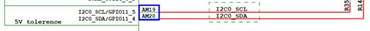

I2C0需要I2C0\_SCL\(时钟\)/ I2C0\_SDA\(数据\)2根管脚。以下对2根管脚的管脚复用进行描述。


#### 时钟管脚配置（AM19）<a name="ZH-CN_TOPIC_0000002441701373"></a>

AM19 \(寄存器：0x0102F0140\)。

**表 1**  AM19 AM20管脚控制寄存器

<a name="_table796515471314"></a>
<table><thead align="left"><tr id="row1213mcpsimp"><th class="cellrowborder" valign="top" width="14.85148514851485%" id="mcps1.2.8.1.1"><p id="p1215mcpsimp"><a name="p1215mcpsimp"></a><a name="p1215mcpsimp"></a>Register Name</p>
</th>
<th class="cellrowborder" valign="top" width="10.891089108910892%" id="mcps1.2.8.1.2"><p id="p1217mcpsimp"><a name="p1217mcpsimp"></a><a name="p1217mcpsimp"></a>Pin Number</p>
</th>
<th class="cellrowborder" valign="top" width="14.85148514851485%" id="mcps1.2.8.1.3"><p id="p1219mcpsimp"><a name="p1219mcpsimp"></a><a name="p1219mcpsimp"></a>Function</p>
</th>
<th class="cellrowborder" valign="top" width="15.841584158415841%" id="mcps1.2.8.1.4"><p id="p1221mcpsimp"><a name="p1221mcpsimp"></a><a name="p1221mcpsimp"></a>Address</p>
</th>
<th class="cellrowborder" valign="top" width="11.881188118811883%" id="mcps1.2.8.1.5"><p id="p1223mcpsimp"><a name="p1223mcpsimp"></a><a name="p1223mcpsimp"></a>Default Value</p>
</th>
<th class="cellrowborder" valign="top" width="11.881188118811883%" id="mcps1.2.8.1.6"><p id="p1225mcpsimp"><a name="p1225mcpsimp"></a><a name="p1225mcpsimp"></a>Field Bits</p>
</th>
<th class="cellrowborder" valign="top" width="19.801980198019802%" id="mcps1.2.8.1.7"><p id="p1227mcpsimp"><a name="p1227mcpsimp"></a><a name="p1227mcpsimp"></a>Field Description</p>
</th>
</tr>
</thead>
<tbody><tr id="row1229mcpsimp"><td class="cellrowborder" rowspan="10" valign="top" width="14.85148514851485%" headers="mcps1.2.8.1.1 "><p id="p1231mcpsimp"><a name="p1231mcpsimp"></a><a name="p1231mcpsimp"></a>iocfg_reg101</p>
</td>
<td class="cellrowborder" rowspan="10" valign="top" width="10.891089108910892%" headers="mcps1.2.8.1.2 "><p id="p1233mcpsimp"><a name="p1233mcpsimp"></a><a name="p1233mcpsimp"></a>AM20</p>
</td>
<td class="cellrowborder" rowspan="10" valign="top" width="14.85148514851485%" headers="mcps1.2.8.1.3 "><p id="p1235mcpsimp"><a name="p1235mcpsimp"></a><a name="p1235mcpsimp"></a>Pin I2C0_SDA IO Config Register.</p>
</td>
<td class="cellrowborder" rowspan="10" valign="top" width="15.841584158415841%" headers="mcps1.2.8.1.4 "><p id="p1237mcpsimp"><a name="p1237mcpsimp"></a><a name="p1237mcpsimp"></a>0x0102F013C</p>
</td>
<td class="cellrowborder" rowspan="10" valign="top" width="11.881188118811883%" headers="mcps1.2.8.1.5 "><p id="p1239mcpsimp"><a name="p1239mcpsimp"></a><a name="p1239mcpsimp"></a>0x1100</p>
</td>
<td class="cellrowborder" valign="top" width="11.881188118811883%" headers="mcps1.2.8.1.6 "><p id="p1241mcpsimp"><a name="p1241mcpsimp"></a><a name="p1241mcpsimp"></a>31:15</p>
</td>
<td class="cellrowborder" valign="top" width="19.801980198019802%" headers="mcps1.2.8.1.7 "><p id="p1243mcpsimp"><a name="p1243mcpsimp"></a><a name="p1243mcpsimp"></a>保留。</p>
</td>
</tr>
<tr id="row1244mcpsimp"><td class="cellrowborder" valign="top" headers="mcps1.2.8.1.1 "><p id="p1246mcpsimp"><a name="p1246mcpsimp"></a><a name="p1246mcpsimp"></a>14</p>
</td>
<td class="cellrowborder" valign="top" headers="mcps1.2.8.1.2 "><p id="p1248mcpsimp"><a name="p1248mcpsimp"></a><a name="p1248mcpsimp"></a>输入电平域值选择2：</p>
<p id="p1249mcpsimp"><a name="p1249mcpsimp"></a><a name="p1249mcpsimp"></a>0x0：Vil/ViH=1.1V/1.7V for 3.3V/5V PAD tolerant input；</p>
<p id="p1250mcpsimp"><a name="p1250mcpsimp"></a><a name="p1250mcpsimp"></a>0x1：Vil/ViH=1.5V/2.5V for 3.3V/5V PAD tolerant input。</p>
</td>
</tr>
<tr id="row1251mcpsimp"><td class="cellrowborder" valign="top" headers="mcps1.2.8.1.1 "><p id="p1253mcpsimp"><a name="p1253mcpsimp"></a><a name="p1253mcpsimp"></a>13</p>
</td>
<td class="cellrowborder" valign="top" headers="mcps1.2.8.1.2 "><p id="p1255mcpsimp"><a name="p1255mcpsimp"></a><a name="p1255mcpsimp"></a>输入电平域值选择1：</p>
<p id="p1256mcpsimp"><a name="p1256mcpsimp"></a><a name="p1256mcpsimp"></a>0x0：1.8V PAD input；</p>
<p id="p1257mcpsimp"><a name="p1257mcpsimp"></a><a name="p1257mcpsimp"></a>0x1：3.3V /5V PAD  tolerant input。</p>
</td>
</tr>
<tr id="row1258mcpsimp"><td class="cellrowborder" valign="top" headers="mcps1.2.8.1.1 "><p id="p1260mcpsimp"><a name="p1260mcpsimp"></a><a name="p1260mcpsimp"></a>12</p>
</td>
<td class="cellrowborder" valign="top" headers="mcps1.2.8.1.2 "><p id="p1262mcpsimp"><a name="p1262mcpsimp"></a><a name="p1262mcpsimp"></a>保留。</p>
</td>
</tr>
<tr id="row1263mcpsimp"><td class="cellrowborder" valign="top" headers="mcps1.2.8.1.1 "><p id="p1265mcpsimp"><a name="p1265mcpsimp"></a><a name="p1265mcpsimp"></a>11</p>
</td>
<td class="cellrowborder" valign="top" headers="mcps1.2.8.1.2 "><p id="p1267mcpsimp"><a name="p1267mcpsimp"></a><a name="p1267mcpsimp"></a>管脚施密特输入控制：</p>
<p id="p1268mcpsimp"><a name="p1268mcpsimp"></a><a name="p1268mcpsimp"></a>0x0：关闭；</p>
<p id="p1269mcpsimp"><a name="p1269mcpsimp"></a><a name="p1269mcpsimp"></a>0x1：打开。</p>
</td>
</tr>
<tr id="row1270mcpsimp"><td class="cellrowborder" valign="top" headers="mcps1.2.8.1.1 "><p id="p1272mcpsimp"><a name="p1272mcpsimp"></a><a name="p1272mcpsimp"></a>10</p>
</td>
<td class="cellrowborder" valign="top" headers="mcps1.2.8.1.2 "><p id="p1274mcpsimp"><a name="p1274mcpsimp"></a><a name="p1274mcpsimp"></a>保留。</p>
</td>
</tr>
<tr id="row1275mcpsimp"><td class="cellrowborder" valign="top" headers="mcps1.2.8.1.1 "><p id="p1277mcpsimp"><a name="p1277mcpsimp"></a><a name="p1277mcpsimp"></a>9</p>
</td>
<td class="cellrowborder" valign="top" headers="mcps1.2.8.1.2 "><p id="p1279mcpsimp"><a name="p1279mcpsimp"></a><a name="p1279mcpsimp"></a>保留。</p>
</td>
</tr>
<tr id="row1280mcpsimp"><td class="cellrowborder" valign="top" headers="mcps1.2.8.1.1 "><p id="p1282mcpsimp"><a name="p1282mcpsimp"></a><a name="p1282mcpsimp"></a>8</p>
</td>
<td class="cellrowborder" valign="top" headers="mcps1.2.8.1.2 "><p id="p1284mcpsimp"><a name="p1284mcpsimp"></a><a name="p1284mcpsimp"></a>保留</p>
</td>
</tr>
<tr id="row1285mcpsimp"><td class="cellrowborder" valign="top" headers="mcps1.2.8.1.1 "><p id="p1287mcpsimp"><a name="p1287mcpsimp"></a><a name="p1287mcpsimp"></a>7:4</p>
</td>
<td class="cellrowborder" valign="top" headers="mcps1.2.8.1.2 "><p id="p1289mcpsimp"><a name="p1289mcpsimp"></a><a name="p1289mcpsimp"></a>管脚驱动能力选择：0x0：IO6_2档位1；</p>
<p id="p1290mcpsimp"><a name="p1290mcpsimp"></a><a name="p1290mcpsimp"></a>0x1：IO6_2档位2；</p>
<p id="p1291mcpsimp"><a name="p1291mcpsimp"></a><a name="p1291mcpsimp"></a>0x2：IO6_2档位3；</p>
<p id="p1292mcpsimp"><a name="p1292mcpsimp"></a><a name="p1292mcpsimp"></a>0x3：IO6_2档位4；</p>
<p id="p1293mcpsimp"><a name="p1293mcpsimp"></a><a name="p1293mcpsimp"></a>其它：保留。</p>
</td>
</tr>
<tr id="row1294mcpsimp"><td class="cellrowborder" valign="top" headers="mcps1.2.8.1.1 "><p id="p1296mcpsimp"><a name="p1296mcpsimp"></a><a name="p1296mcpsimp"></a>3:0</p>
</td>
<td class="cellrowborder" valign="top" headers="mcps1.2.8.1.2 "><p id="p1298mcpsimp"><a name="p1298mcpsimp"></a><a name="p1298mcpsimp"></a>功能选择：</p>
<p id="p1299mcpsimp"><a name="p1299mcpsimp"></a><a name="p1299mcpsimp"></a>0x0：GPIO11_4；</p>
<p id="p1300mcpsimp"><a name="p1300mcpsimp"></a><a name="p1300mcpsimp"></a>0x1：I2C0_SDA；</p>
<p id="p1301mcpsimp"><a name="p1301mcpsimp"></a><a name="p1301mcpsimp"></a>其它：保留。</p>
</td>
</tr>
<tr id="row1302mcpsimp"><td class="cellrowborder" rowspan="10" valign="top" width="14.85148514851485%" headers="mcps1.2.8.1.1 "><p id="p1304mcpsimp"><a name="p1304mcpsimp"></a><a name="p1304mcpsimp"></a>iocfg_reg102</p>
</td>
<td class="cellrowborder" rowspan="10" valign="top" width="10.891089108910892%" headers="mcps1.2.8.1.2 "><p id="p1306mcpsimp"><a name="p1306mcpsimp"></a><a name="p1306mcpsimp"></a>AM19</p>
</td>
<td class="cellrowborder" rowspan="10" valign="top" width="14.85148514851485%" headers="mcps1.2.8.1.3 "><p id="p1308mcpsimp"><a name="p1308mcpsimp"></a><a name="p1308mcpsimp"></a>Pin I2C0_SCL IO Config Register.</p>
</td>
<td class="cellrowborder" rowspan="10" valign="top" width="15.841584158415841%" headers="mcps1.2.8.1.4 "><p id="p1310mcpsimp"><a name="p1310mcpsimp"></a><a name="p1310mcpsimp"></a>0x0102F0140</p>
</td>
<td class="cellrowborder" rowspan="10" valign="top" width="11.881188118811883%" headers="mcps1.2.8.1.5 "><p id="p1312mcpsimp"><a name="p1312mcpsimp"></a><a name="p1312mcpsimp"></a>0x1100</p>
</td>
<td class="cellrowborder" valign="top" width="11.881188118811883%" headers="mcps1.2.8.1.6 "><p id="p1314mcpsimp"><a name="p1314mcpsimp"></a><a name="p1314mcpsimp"></a>31:15</p>
</td>
<td class="cellrowborder" valign="top" width="19.801980198019802%" headers="mcps1.2.8.1.7 "><p id="p1316mcpsimp"><a name="p1316mcpsimp"></a><a name="p1316mcpsimp"></a>保留。</p>
</td>
</tr>
<tr id="row1317mcpsimp"><td class="cellrowborder" valign="top" headers="mcps1.2.8.1.1 "><p id="p1319mcpsimp"><a name="p1319mcpsimp"></a><a name="p1319mcpsimp"></a>14</p>
</td>
<td class="cellrowborder" valign="top" headers="mcps1.2.8.1.2 "><p id="p1321mcpsimp"><a name="p1321mcpsimp"></a><a name="p1321mcpsimp"></a>输入电平域值选择2：</p>
<p id="p1322mcpsimp"><a name="p1322mcpsimp"></a><a name="p1322mcpsimp"></a>0x0：Vil/ViH=1.1V/1.7V for 3.3V/5V PAD tolerant input；</p>
<p id="p1323mcpsimp"><a name="p1323mcpsimp"></a><a name="p1323mcpsimp"></a>0x1：Vil/ViH=1.5V/2.5V for 3.3V/5V PAD tolerant input。</p>
</td>
</tr>
<tr id="row1324mcpsimp"><td class="cellrowborder" valign="top" headers="mcps1.2.8.1.1 "><p id="p1326mcpsimp"><a name="p1326mcpsimp"></a><a name="p1326mcpsimp"></a>13</p>
</td>
<td class="cellrowborder" valign="top" headers="mcps1.2.8.1.2 "><p id="p1328mcpsimp"><a name="p1328mcpsimp"></a><a name="p1328mcpsimp"></a>输入电平域值选择1：</p>
<p id="p1329mcpsimp"><a name="p1329mcpsimp"></a><a name="p1329mcpsimp"></a>0x0：1.8V PAD input；</p>
<p id="p1330mcpsimp"><a name="p1330mcpsimp"></a><a name="p1330mcpsimp"></a>0x1：3.3V /5V PAD  tolerant input。</p>
</td>
</tr>
<tr id="row1331mcpsimp"><td class="cellrowborder" valign="top" headers="mcps1.2.8.1.1 "><p id="p1333mcpsimp"><a name="p1333mcpsimp"></a><a name="p1333mcpsimp"></a>12</p>
</td>
<td class="cellrowborder" valign="top" headers="mcps1.2.8.1.2 "><p id="p1335mcpsimp"><a name="p1335mcpsimp"></a><a name="p1335mcpsimp"></a>保留。</p>
</td>
</tr>
<tr id="row1336mcpsimp"><td class="cellrowborder" valign="top" headers="mcps1.2.8.1.1 "><p id="p1338mcpsimp"><a name="p1338mcpsimp"></a><a name="p1338mcpsimp"></a>11</p>
</td>
<td class="cellrowborder" valign="top" headers="mcps1.2.8.1.2 "><p id="p1340mcpsimp"><a name="p1340mcpsimp"></a><a name="p1340mcpsimp"></a>管脚施密特输入控制：</p>
<p id="p1341mcpsimp"><a name="p1341mcpsimp"></a><a name="p1341mcpsimp"></a>0x0：关闭；</p>
<p id="p1342mcpsimp"><a name="p1342mcpsimp"></a><a name="p1342mcpsimp"></a>0x1：打开。</p>
</td>
</tr>
<tr id="row1343mcpsimp"><td class="cellrowborder" valign="top" headers="mcps1.2.8.1.1 "><p id="p1345mcpsimp"><a name="p1345mcpsimp"></a><a name="p1345mcpsimp"></a>10</p>
</td>
<td class="cellrowborder" valign="top" headers="mcps1.2.8.1.2 "><p id="p1347mcpsimp"><a name="p1347mcpsimp"></a><a name="p1347mcpsimp"></a>保留。</p>
</td>
</tr>
<tr id="row1348mcpsimp"><td class="cellrowborder" valign="top" headers="mcps1.2.8.1.1 "><p id="p1350mcpsimp"><a name="p1350mcpsimp"></a><a name="p1350mcpsimp"></a>9</p>
</td>
<td class="cellrowborder" valign="top" headers="mcps1.2.8.1.2 "><p id="p1352mcpsimp"><a name="p1352mcpsimp"></a><a name="p1352mcpsimp"></a>保留。</p>
</td>
</tr>
<tr id="row1353mcpsimp"><td class="cellrowborder" valign="top" headers="mcps1.2.8.1.1 "><p id="p1355mcpsimp"><a name="p1355mcpsimp"></a><a name="p1355mcpsimp"></a>8</p>
</td>
<td class="cellrowborder" valign="top" headers="mcps1.2.8.1.2 "><p id="p1357mcpsimp"><a name="p1357mcpsimp"></a><a name="p1357mcpsimp"></a>保留</p>
</td>
</tr>
<tr id="row1358mcpsimp"><td class="cellrowborder" valign="top" headers="mcps1.2.8.1.1 "><p id="p1360mcpsimp"><a name="p1360mcpsimp"></a><a name="p1360mcpsimp"></a>7:4</p>
</td>
<td class="cellrowborder" valign="top" headers="mcps1.2.8.1.2 "><p id="p1362mcpsimp"><a name="p1362mcpsimp"></a><a name="p1362mcpsimp"></a>管脚驱动能力选择：</p>
<p id="p1363mcpsimp"><a name="p1363mcpsimp"></a><a name="p1363mcpsimp"></a>0x0：IO6_2档位1；</p>
<p id="p1364mcpsimp"><a name="p1364mcpsimp"></a><a name="p1364mcpsimp"></a>0x1：IO6_2档位2；</p>
<p id="p1365mcpsimp"><a name="p1365mcpsimp"></a><a name="p1365mcpsimp"></a>0x2：IO6_2档位3；</p>
<p id="p1366mcpsimp"><a name="p1366mcpsimp"></a><a name="p1366mcpsimp"></a>0x3：IO6_2档位4；</p>
<p id="p1367mcpsimp"><a name="p1367mcpsimp"></a><a name="p1367mcpsimp"></a>其它：保留。</p>
</td>
</tr>
<tr id="row1368mcpsimp"><td class="cellrowborder" valign="top" headers="mcps1.2.8.1.1 "><p id="p1370mcpsimp"><a name="p1370mcpsimp"></a><a name="p1370mcpsimp"></a>3:0</p>
</td>
<td class="cellrowborder" valign="top" headers="mcps1.2.8.1.2 "><p id="p1372mcpsimp"><a name="p1372mcpsimp"></a><a name="p1372mcpsimp"></a>功能选择：</p>
<p id="p1373mcpsimp"><a name="p1373mcpsimp"></a><a name="p1373mcpsimp"></a>0x1：I2C0_SCL；</p>
<p id="p1374mcpsimp"><a name="p1374mcpsimp"></a><a name="p1374mcpsimp"></a>其它：保留。</p>
</td>
</tr>
</tbody>
</table>

管脚存在1种复用情形：I2C0\_SCL。

AM19配置值为0x2001：

-   Bits\[3:0\]=0x1，管脚复用为1，管脚复用配置为I2C0\_SCL;
-   Bits\[7:4\]=0x0，管脚管脚驱动能力配置为档位4（最大值），档位值越大，对应的驱动能力越大;
-   Bits\[13\]=0x1，输入电平域选择3.3V /5V PAD。

#### DATA管脚配置（AM20）<a name="ZH-CN_TOPIC_0000002441701409"></a>

AM20 \(寄存器：0x0102F013C\)。

AM20管脚控制寄存器见[表1](#_table796515471314)。

管脚存在2种复用情形：GPIO11\_4/I2C0\_SDA。

AM20配置值为0x2001：

-   Bits\[3:0\]=0x1，管脚复用为1，管脚复用配置为I2C0\_SDA;
-   Bits\[7:4\]=0x0，管脚管脚驱动能力配置为档位4（最大值），档位值越大，对应的驱动能力越大;
-   Bits\[13\]=0x1，输入电平域选择3.3V /5V PAD。

【注意事项】

无。

## SPI总线管脚复用<a name="ZH-CN_TOPIC_0000002441661509"></a>

LCD显示屏幕IC芯片通过SPI总线连接到主芯片，在LCD屏幕驱动中通常使用SPI接口对LCD IC芯片进行配置。因此需要配置相应的管脚复用为SPI管脚。


### SPI管脚复用<a name="ZH-CN_TOPIC_0000002441661537"></a>

【配置】（以SS928V100为例）

g\_reg\_iocfg2\_base1见[表3](#_table16578980)

```
static void spi0_pin_mux(void) 
{ 
    void *iocfg2_base = sys_config_get_reg_iocfg2(); 
  
    sys_writel(iocfg2_base + 0x01D8, 0x02b1); 
    sys_writel(iocfg2_base + 0x01DC, 0x0251); 
    sys_writel(iocfg2_base + 0x01E0, 0x0201); 
    sys_writel(iocfg2_base + 0x01E4, 0x0201); 
}
```

【描述说明】

SPI0\_SDI（AL33），SPI0\_SDO（AL34），SPI0\_CSN（AM34），SPI0\_SCLK（AK33）管脚如[图1](#_fig1987716341641)所示。

**图 1**  SPI0原理图<a name="_fig1987716341641"></a>  
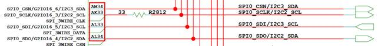

以AK33管脚的复用关系配置为例进行描述，SPI0\_SCLK（AK33）管脚控制寄存器如[表1](#_table3777103411415)所示。

**表 1**  AK33管脚控制寄存器

<a name="_table3777103411415"></a>
<table><thead align="left"><tr id="row1416mcpsimp"><th class="cellrowborder" valign="top" width="14.85148514851485%" id="mcps1.2.8.1.1"><p id="p1418mcpsimp"><a name="p1418mcpsimp"></a><a name="p1418mcpsimp"></a>Register Name</p>
</th>
<th class="cellrowborder" valign="top" width="9.900990099009901%" id="mcps1.2.8.1.2"><p id="p1420mcpsimp"><a name="p1420mcpsimp"></a><a name="p1420mcpsimp"></a>Pin Number</p>
</th>
<th class="cellrowborder" valign="top" width="14.85148514851485%" id="mcps1.2.8.1.3"><p id="p1422mcpsimp"><a name="p1422mcpsimp"></a><a name="p1422mcpsimp"></a>Function</p>
</th>
<th class="cellrowborder" valign="top" width="15.841584158415841%" id="mcps1.2.8.1.4"><p id="p1424mcpsimp"><a name="p1424mcpsimp"></a><a name="p1424mcpsimp"></a>Address</p>
</th>
<th class="cellrowborder" valign="top" width="11.881188118811883%" id="mcps1.2.8.1.5"><p id="p1426mcpsimp"><a name="p1426mcpsimp"></a><a name="p1426mcpsimp"></a>Default Value</p>
</th>
<th class="cellrowborder" valign="top" width="11.881188118811883%" id="mcps1.2.8.1.6"><p id="p1428mcpsimp"><a name="p1428mcpsimp"></a><a name="p1428mcpsimp"></a>Field Bits</p>
</th>
<th class="cellrowborder" valign="top" width="20.792079207920793%" id="mcps1.2.8.1.7"><p id="p1430mcpsimp"><a name="p1430mcpsimp"></a><a name="p1430mcpsimp"></a>Field Description</p>
</th>
</tr>
</thead>
<tbody><tr id="row1432mcpsimp"><td class="cellrowborder" rowspan="10" valign="top" width="14.85148514851485%" headers="mcps1.2.8.1.1 "><p id="p1434mcpsimp"><a name="p1434mcpsimp"></a><a name="p1434mcpsimp"></a>iocfg_reg140</p>
</td>
<td class="cellrowborder" rowspan="10" valign="top" width="9.900990099009901%" headers="mcps1.2.8.1.2 "><p id="p1436mcpsimp"><a name="p1436mcpsimp"></a><a name="p1436mcpsimp"></a>AK33</p>
</td>
<td class="cellrowborder" rowspan="10" valign="top" width="14.85148514851485%" headers="mcps1.2.8.1.3 "><p id="p1438mcpsimp"><a name="p1438mcpsimp"></a><a name="p1438mcpsimp"></a>Pin SPI0_SCLK IO Config Register.</p>
</td>
<td class="cellrowborder" rowspan="10" valign="top" width="15.841584158415841%" headers="mcps1.2.8.1.4 "><p id="p1440mcpsimp"><a name="p1440mcpsimp"></a><a name="p1440mcpsimp"></a>0x0102F01D8</p>
</td>
<td class="cellrowborder" rowspan="10" valign="top" width="11.881188118811883%" headers="mcps1.2.8.1.5 "><p id="p1442mcpsimp"><a name="p1442mcpsimp"></a><a name="p1442mcpsimp"></a>0x1200</p>
</td>
<td class="cellrowborder" valign="top" width="11.881188118811883%" headers="mcps1.2.8.1.6 "><p id="p1444mcpsimp"><a name="p1444mcpsimp"></a><a name="p1444mcpsimp"></a>31:15</p>
</td>
<td class="cellrowborder" valign="top" width="20.792079207920793%" headers="mcps1.2.8.1.7 "><p id="p1446mcpsimp"><a name="p1446mcpsimp"></a><a name="p1446mcpsimp"></a>保留。</p>
</td>
</tr>
<tr id="row1447mcpsimp"><td class="cellrowborder" valign="top" headers="mcps1.2.8.1.1 "><p id="p1449mcpsimp"><a name="p1449mcpsimp"></a><a name="p1449mcpsimp"></a>14</p>
</td>
<td class="cellrowborder" valign="top" headers="mcps1.2.8.1.2 "><p id="p1451mcpsimp"><a name="p1451mcpsimp"></a><a name="p1451mcpsimp"></a>保留。</p>
</td>
</tr>
<tr id="row1452mcpsimp"><td class="cellrowborder" valign="top" headers="mcps1.2.8.1.1 "><p id="p1454mcpsimp"><a name="p1454mcpsimp"></a><a name="p1454mcpsimp"></a>13</p>
</td>
<td class="cellrowborder" valign="top" headers="mcps1.2.8.1.2 "><p id="p1456mcpsimp"><a name="p1456mcpsimp"></a><a name="p1456mcpsimp"></a>保留。</p>
</td>
</tr>
<tr id="row1457mcpsimp"><td class="cellrowborder" valign="top" headers="mcps1.2.8.1.1 "><p id="p1459mcpsimp"><a name="p1459mcpsimp"></a><a name="p1459mcpsimp"></a>12</p>
</td>
<td class="cellrowborder" valign="top" headers="mcps1.2.8.1.2 "><p id="p1461mcpsimp"><a name="p1461mcpsimp"></a><a name="p1461mcpsimp"></a>保留。</p>
</td>
</tr>
<tr id="row1462mcpsimp"><td class="cellrowborder" valign="top" headers="mcps1.2.8.1.1 "><p id="p1464mcpsimp"><a name="p1464mcpsimp"></a><a name="p1464mcpsimp"></a>11</p>
</td>
<td class="cellrowborder" valign="top" headers="mcps1.2.8.1.2 "><p id="p1466mcpsimp"><a name="p1466mcpsimp"></a><a name="p1466mcpsimp"></a>保留。</p>
</td>
</tr>
<tr id="row1467mcpsimp"><td class="cellrowborder" valign="top" headers="mcps1.2.8.1.1 "><p id="p1469mcpsimp"><a name="p1469mcpsimp"></a><a name="p1469mcpsimp"></a>10</p>
</td>
<td class="cellrowborder" valign="top" headers="mcps1.2.8.1.2 "><p id="p1471mcpsimp"><a name="p1471mcpsimp"></a><a name="p1471mcpsimp"></a>管脚电平转换速率控制：</p>
<p id="p1472mcpsimp"><a name="p1472mcpsimp"></a><a name="p1472mcpsimp"></a>0x0：快沿输出；</p>
<p id="p1473mcpsimp"><a name="p1473mcpsimp"></a><a name="p1473mcpsimp"></a>0x1：慢沿输出。</p>
</td>
</tr>
<tr id="row1474mcpsimp"><td class="cellrowborder" valign="top" headers="mcps1.2.8.1.1 "><p id="p1476mcpsimp"><a name="p1476mcpsimp"></a><a name="p1476mcpsimp"></a>9</p>
</td>
<td class="cellrowborder" valign="top" headers="mcps1.2.8.1.2 "><p id="p1478mcpsimp"><a name="p1478mcpsimp"></a><a name="p1478mcpsimp"></a>管脚下拉控制：</p>
<p id="p1479mcpsimp"><a name="p1479mcpsimp"></a><a name="p1479mcpsimp"></a>0x0：关闭；</p>
<p id="p1480mcpsimp"><a name="p1480mcpsimp"></a><a name="p1480mcpsimp"></a>0x1：打开。</p>
</td>
</tr>
<tr id="row1481mcpsimp"><td class="cellrowborder" valign="top" headers="mcps1.2.8.1.1 "><p id="p1483mcpsimp"><a name="p1483mcpsimp"></a><a name="p1483mcpsimp"></a>8</p>
</td>
<td class="cellrowborder" valign="top" headers="mcps1.2.8.1.2 "><p id="p1485mcpsimp"><a name="p1485mcpsimp"></a><a name="p1485mcpsimp"></a>管脚上拉控制：</p>
<p id="p1486mcpsimp"><a name="p1486mcpsimp"></a><a name="p1486mcpsimp"></a>0x0：关闭；</p>
<p id="p1487mcpsimp"><a name="p1487mcpsimp"></a><a name="p1487mcpsimp"></a>0x1：打开。</p>
</td>
</tr>
<tr id="row1488mcpsimp"><td class="cellrowborder" valign="top" headers="mcps1.2.8.1.1 "><p id="p1490mcpsimp"><a name="p1490mcpsimp"></a><a name="p1490mcpsimp"></a>7:4</p>
</td>
<td class="cellrowborder" valign="top" headers="mcps1.2.8.1.2 "><p id="p1492mcpsimp"><a name="p1492mcpsimp"></a><a name="p1492mcpsimp"></a>管脚驱动能力选择：</p>
<p id="p1493mcpsimp"><a name="p1493mcpsimp"></a><a name="p1493mcpsimp"></a>0x0：IO2档位1；</p>
<p id="p1494mcpsimp"><a name="p1494mcpsimp"></a><a name="p1494mcpsimp"></a>0x1：IO2档位2；</p>
<p id="p1495mcpsimp"><a name="p1495mcpsimp"></a><a name="p1495mcpsimp"></a>0x2：IO2档位3；</p>
<p id="p1496mcpsimp"><a name="p1496mcpsimp"></a><a name="p1496mcpsimp"></a>0x3：IO2档位4；</p>
<p id="p1497mcpsimp"><a name="p1497mcpsimp"></a><a name="p1497mcpsimp"></a>0x4：IO2档位5；</p>
<p id="p1498mcpsimp"><a name="p1498mcpsimp"></a><a name="p1498mcpsimp"></a>0x5：IO2档位6；</p>
<p id="p1499mcpsimp"><a name="p1499mcpsimp"></a><a name="p1499mcpsimp"></a>0x6：IO2档位7；</p>
<p id="p1500mcpsimp"><a name="p1500mcpsimp"></a><a name="p1500mcpsimp"></a>0x7：IO2档位8；</p>
<p id="p1501mcpsimp"><a name="p1501mcpsimp"></a><a name="p1501mcpsimp"></a>0x8：IO2档位9；</p>
<p id="p1502mcpsimp"><a name="p1502mcpsimp"></a><a name="p1502mcpsimp"></a>0x9：IO2档位10；</p>
<p id="p1503mcpsimp"><a name="p1503mcpsimp"></a><a name="p1503mcpsimp"></a>0xA：IO2档位11；</p>
<p id="p1504mcpsimp"><a name="p1504mcpsimp"></a><a name="p1504mcpsimp"></a>0xB：IO2档位12；</p>
<p id="p1505mcpsimp"><a name="p1505mcpsimp"></a><a name="p1505mcpsimp"></a>0xC：IO2档位13；</p>
<p id="p1506mcpsimp"><a name="p1506mcpsimp"></a><a name="p1506mcpsimp"></a>0xD：IO2档位14；</p>
<p id="p1507mcpsimp"><a name="p1507mcpsimp"></a><a name="p1507mcpsimp"></a>0xE：IO2档位15；</p>
<p id="p1508mcpsimp"><a name="p1508mcpsimp"></a><a name="p1508mcpsimp"></a>0xF：IO2档位16；</p>
<p id="p1509mcpsimp"><a name="p1509mcpsimp"></a><a name="p1509mcpsimp"></a>其它：保留。</p>
</td>
</tr>
<tr id="row1510mcpsimp"><td class="cellrowborder" valign="top" headers="mcps1.2.8.1.1 "><p id="p1512mcpsimp"><a name="p1512mcpsimp"></a><a name="p1512mcpsimp"></a>3:0</p>
</td>
<td class="cellrowborder" valign="top" headers="mcps1.2.8.1.2 "><p id="p1514mcpsimp"><a name="p1514mcpsimp"></a><a name="p1514mcpsimp"></a>功能选择：</p>
<p id="p1515mcpsimp"><a name="p1515mcpsimp"></a><a name="p1515mcpsimp"></a>0x0：GPIO16_3；</p>
<p id="p1516mcpsimp"><a name="p1516mcpsimp"></a><a name="p1516mcpsimp"></a>0x1：SPI0_SCLK；</p>
<p id="p1517mcpsimp"><a name="p1517mcpsimp"></a><a name="p1517mcpsimp"></a>0x2：I2C2_SCL；</p>
<p id="p1518mcpsimp"><a name="p1518mcpsimp"></a><a name="p1518mcpsimp"></a>0x3：SPI_3WIRE_CLK；</p>
<p id="p1519mcpsimp"><a name="p1519mcpsimp"></a><a name="p1519mcpsimp"></a>其它：保留。</p>
</td>
</tr>
</tbody>
</table>

AK33管脚存在4种功能复用：GPIO16\_3/SPI0\_SCLK/I2C2\_SCL/SPI\_3WIRE\_CLK

当前AK33管脚配置值：0x02b1

-   Bits \[3:0\]=1，表示AK33复用为SPI0\_SCLK
-   Bits\[7:4\]=0xb，表示驱动能力选择档位12
-   Bits\[9\]=0x1，表示管脚下拉：打开

【注意事项】

无。

## VI管脚复用<a name="ZH-CN_TOPIC_0000002441661573"></a>

视频输入是通过BT.656/BT.1120/MIPI接口接收视频数据，按照一定的视频接收协议进行视频数据的采集，并将数据存入指定的内存区域。

以下对VICAP中的存在的管脚复用进行说明。


### PORT口管脚复用<a name="ZH-CN_TOPIC_0000002441661521"></a>


#### MIPI\_RX管脚复用<a name="ZH-CN_TOPIC_0000002408102178"></a>

【配置】

g\_reg\_iocfg2\_base 见[表3](#_table16578980)。

以SS928V100的MIPI\_RX的PHY0接口为例：

```
static void mipi0_rx_pin_mux(void)
{
    void *iocfg2_base = sys_config_get_reg_iocfg2();
    sys_writel(iocfg2_base + 0x01B0, 0x0000);
    sys_writel(iocfg2_base + 0x01B4, 0x0000);
    sys_writel(iocfg2_base + 0x01C0, 0x0000);
    sys_writel(iocfg2_base + 0x01C4, 0x0000);
    sys_writel(iocfg2_base + 0x01B8, 0x0000);
    sys_writel(iocfg2_base + 0x01BC, 0x0000);
    sys_writel(iocfg2_base + 0x01A8, 0x0000);
    sys_writel(iocfg2_base + 0x01AC, 0x0000);
    sys_writel(iocfg2_base + 0x0198, 0x0000);
    sys_writel(iocfg2_base + 0x019C, 0x0000);
    sys_writel(iocfg2_base + 0x01A0, 0x0000);
    sys_writel(iocfg2_base + 0x01A4, 0x0000);
}
```

【描述说明】

原理图如[图1](#_toc51764061)所示。

**图 1**  MIPI\_RX0原理图<a name="_toc51764061"></a>  
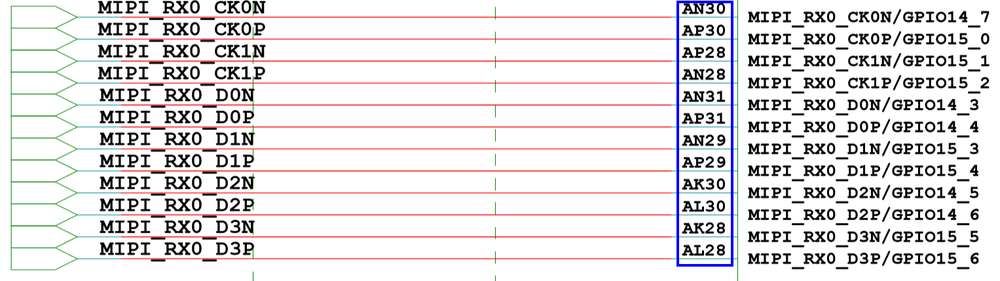

当VI视频采集接口为MIPI\_RX接口采集时，需要配置[图1](#_toc51764061)中对应的10根管脚为对应的MIPI\_RX的相关功能，MIPI接口的10根管脚分为1对时钟线和4对DATA数据线，1对管脚为1对差分信号。

-   时钟管脚配置（以AP30复用为MIPI\_RX0\_CK0P为例说明）。

**表 1**  AP30管脚控制寄存器

<a name="table1561mcpsimp"></a>
<table><thead align="left"><tr id="row1572mcpsimp"><th class="cellrowborder" valign="top" width="13.591359135913592%" id="mcps1.2.8.1.1"><p id="p1574mcpsimp"><a name="p1574mcpsimp"></a><a name="p1574mcpsimp"></a>Register Name</p>
</th>
<th class="cellrowborder" valign="top" width="12.62126212621262%" id="mcps1.2.8.1.2"><p id="p1576mcpsimp"><a name="p1576mcpsimp"></a><a name="p1576mcpsimp"></a>Pin Number</p>
</th>
<th class="cellrowborder" valign="top" width="14.561456145614562%" id="mcps1.2.8.1.3"><p id="p1578mcpsimp"><a name="p1578mcpsimp"></a><a name="p1578mcpsimp"></a>Function</p>
</th>
<th class="cellrowborder" valign="top" width="12.62126212621262%" id="mcps1.2.8.1.4"><p id="p1580mcpsimp"><a name="p1580mcpsimp"></a><a name="p1580mcpsimp"></a>Address</p>
</th>
<th class="cellrowborder" valign="top" width="12.62126212621262%" id="mcps1.2.8.1.5"><p id="p1582mcpsimp"><a name="p1582mcpsimp"></a><a name="p1582mcpsimp"></a>Default Value</p>
</th>
<th class="cellrowborder" valign="top" width="12.62126212621262%" id="mcps1.2.8.1.6"><p id="p1584mcpsimp"><a name="p1584mcpsimp"></a><a name="p1584mcpsimp"></a>Field Bits</p>
</th>
<th class="cellrowborder" valign="top" width="21.362136213621362%" id="mcps1.2.8.1.7"><p id="p1586mcpsimp"><a name="p1586mcpsimp"></a><a name="p1586mcpsimp"></a>Field Description</p>
</th>
</tr>
</thead>
<tbody><tr id="row1588mcpsimp"><td class="cellrowborder" rowspan="10" valign="top" width="13.591359135913592%" headers="mcps1.2.8.1.1 "><p id="p1590mcpsimp"><a name="p1590mcpsimp"></a><a name="p1590mcpsimp"></a>iocfg_reg129</p>
</td>
<td class="cellrowborder" rowspan="10" valign="top" width="12.62126212621262%" headers="mcps1.2.8.1.2 "><p id="p1592mcpsimp"><a name="p1592mcpsimp"></a><a name="p1592mcpsimp"></a>AP30</p>
</td>
<td class="cellrowborder" rowspan="10" valign="top" width="14.561456145614562%" headers="mcps1.2.8.1.3 "><p id="p1594mcpsimp"><a name="p1594mcpsimp"></a><a name="p1594mcpsimp"></a>Pin MIPI_RX0_CK0P IO Config Register.</p>
</td>
<td class="cellrowborder" rowspan="10" valign="top" width="12.62126212621262%" headers="mcps1.2.8.1.4 "><p id="p1596mcpsimp"><a name="p1596mcpsimp"></a><a name="p1596mcpsimp"></a>0x0102F01AC</p>
</td>
<td class="cellrowborder" rowspan="10" valign="top" width="12.62126212621262%" headers="mcps1.2.8.1.5 "><p id="p1598mcpsimp"><a name="p1598mcpsimp"></a><a name="p1598mcpsimp"></a>0x1200</p>
</td>
<td class="cellrowborder" valign="top" width="12.62126212621262%" headers="mcps1.2.8.1.6 "><p id="p1600mcpsimp"><a name="p1600mcpsimp"></a><a name="p1600mcpsimp"></a>31:15</p>
</td>
<td class="cellrowborder" valign="top" width="21.362136213621362%" headers="mcps1.2.8.1.7 "><p id="p1602mcpsimp"><a name="p1602mcpsimp"></a><a name="p1602mcpsimp"></a>保留。</p>
</td>
</tr>
<tr id="row1603mcpsimp"><td class="cellrowborder" valign="top" headers="mcps1.2.8.1.1 "><p id="p1605mcpsimp"><a name="p1605mcpsimp"></a><a name="p1605mcpsimp"></a>14</p>
</td>
<td class="cellrowborder" valign="top" headers="mcps1.2.8.1.2 "><p id="p1607mcpsimp"><a name="p1607mcpsimp"></a><a name="p1607mcpsimp"></a>保留。</p>
</td>
</tr>
<tr id="row1608mcpsimp"><td class="cellrowborder" valign="top" headers="mcps1.2.8.1.1 "><p id="p1610mcpsimp"><a name="p1610mcpsimp"></a><a name="p1610mcpsimp"></a>13</p>
</td>
<td class="cellrowborder" valign="top" headers="mcps1.2.8.1.2 "><p id="p1612mcpsimp"><a name="p1612mcpsimp"></a><a name="p1612mcpsimp"></a>保留。</p>
</td>
</tr>
<tr id="row1613mcpsimp"><td class="cellrowborder" valign="top" headers="mcps1.2.8.1.1 "><p id="p1615mcpsimp"><a name="p1615mcpsimp"></a><a name="p1615mcpsimp"></a>12</p>
</td>
<td class="cellrowborder" valign="top" headers="mcps1.2.8.1.2 "><p id="p1617mcpsimp"><a name="p1617mcpsimp"></a><a name="p1617mcpsimp"></a>保留。</p>
</td>
</tr>
<tr id="row1618mcpsimp"><td class="cellrowborder" valign="top" headers="mcps1.2.8.1.1 "><p id="p1620mcpsimp"><a name="p1620mcpsimp"></a><a name="p1620mcpsimp"></a>11</p>
</td>
<td class="cellrowborder" valign="top" headers="mcps1.2.8.1.2 "><p id="p1622mcpsimp"><a name="p1622mcpsimp"></a><a name="p1622mcpsimp"></a>保留。</p>
</td>
</tr>
<tr id="row1623mcpsimp"><td class="cellrowborder" valign="top" headers="mcps1.2.8.1.1 "><p id="p1625mcpsimp"><a name="p1625mcpsimp"></a><a name="p1625mcpsimp"></a>10</p>
</td>
<td class="cellrowborder" valign="top" headers="mcps1.2.8.1.2 "><p id="p1627mcpsimp"><a name="p1627mcpsimp"></a><a name="p1627mcpsimp"></a>保留。</p>
</td>
</tr>
<tr id="row1628mcpsimp"><td class="cellrowborder" valign="top" headers="mcps1.2.8.1.1 "><p id="p1630mcpsimp"><a name="p1630mcpsimp"></a><a name="p1630mcpsimp"></a>9</p>
</td>
<td class="cellrowborder" valign="top" headers="mcps1.2.8.1.2 "><p id="p1632mcpsimp"><a name="p1632mcpsimp"></a><a name="p1632mcpsimp"></a>保留。</p>
</td>
</tr>
<tr id="row1633mcpsimp"><td class="cellrowborder" valign="top" headers="mcps1.2.8.1.1 "><p id="p1635mcpsimp"><a name="p1635mcpsimp"></a><a name="p1635mcpsimp"></a>8</p>
</td>
<td class="cellrowborder" valign="top" headers="mcps1.2.8.1.2 "><p id="p1637mcpsimp"><a name="p1637mcpsimp"></a><a name="p1637mcpsimp"></a>保留</p>
</td>
</tr>
<tr id="row1638mcpsimp"><td class="cellrowborder" valign="top" headers="mcps1.2.8.1.1 "><p id="p1640mcpsimp"><a name="p1640mcpsimp"></a><a name="p1640mcpsimp"></a>7:4</p>
</td>
<td class="cellrowborder" valign="top" headers="mcps1.2.8.1.2 "><p id="p1642mcpsimp"><a name="p1642mcpsimp"></a><a name="p1642mcpsimp"></a>保留。</p>
</td>
</tr>
<tr id="row1643mcpsimp"><td class="cellrowborder" valign="top" headers="mcps1.2.8.1.1 "><p id="p1645mcpsimp"><a name="p1645mcpsimp"></a><a name="p1645mcpsimp"></a>3:0</p>
</td>
<td class="cellrowborder" valign="top" headers="mcps1.2.8.1.2 "><p id="p1647mcpsimp"><a name="p1647mcpsimp"></a><a name="p1647mcpsimp"></a>功能选择：</p>
<p id="p1648mcpsimp"><a name="p1648mcpsimp"></a><a name="p1648mcpsimp"></a>0x0：MIPI_RX0_CK0P；</p>
<p id="p1649mcpsimp"><a name="p1649mcpsimp"></a><a name="p1649mcpsimp"></a>0x1：GPIO15_0；</p>
<p id="p1650mcpsimp"><a name="p1650mcpsimp"></a><a name="p1650mcpsimp"></a>其它：保留。</p>
</td>
</tr>
</tbody>
</table>

管脚存在2种复用情形：MIPI\_RX0\_CK0P/GPIO15\_0。

配置值为0x0000:Bits\[3:0\]=0，管脚复用为0，配置复用为MIPI\_RX0\_CK0P。

-   DATA管脚配置（以AN31复用为MIPI\_RX0\_D0N为例说明）。

**表 2**  AN31管脚控制寄存器

<a name="table1655mcpsimp"></a>
<table><thead align="left"><tr id="row1666mcpsimp"><th class="cellrowborder" valign="top" width="13.591359135913592%" id="mcps1.2.8.1.1"><p id="p1668mcpsimp"><a name="p1668mcpsimp"></a><a name="p1668mcpsimp"></a>Register Name</p>
</th>
<th class="cellrowborder" valign="top" width="12.62126212621262%" id="mcps1.2.8.1.2"><p id="p1670mcpsimp"><a name="p1670mcpsimp"></a><a name="p1670mcpsimp"></a>Pin Number</p>
</th>
<th class="cellrowborder" valign="top" width="14.561456145614562%" id="mcps1.2.8.1.3"><p id="p1672mcpsimp"><a name="p1672mcpsimp"></a><a name="p1672mcpsimp"></a>Function</p>
</th>
<th class="cellrowborder" valign="top" width="12.62126212621262%" id="mcps1.2.8.1.4"><p id="p1674mcpsimp"><a name="p1674mcpsimp"></a><a name="p1674mcpsimp"></a>Address</p>
</th>
<th class="cellrowborder" valign="top" width="12.62126212621262%" id="mcps1.2.8.1.5"><p id="p1676mcpsimp"><a name="p1676mcpsimp"></a><a name="p1676mcpsimp"></a>Default Value</p>
</th>
<th class="cellrowborder" valign="top" width="12.62126212621262%" id="mcps1.2.8.1.6"><p id="p1678mcpsimp"><a name="p1678mcpsimp"></a><a name="p1678mcpsimp"></a>Field Bits</p>
</th>
<th class="cellrowborder" valign="top" width="21.362136213621362%" id="mcps1.2.8.1.7"><p id="p1680mcpsimp"><a name="p1680mcpsimp"></a><a name="p1680mcpsimp"></a>Field Description</p>
</th>
</tr>
</thead>
<tbody><tr id="row1682mcpsimp"><td class="cellrowborder" rowspan="10" valign="top" width="13.591359135913592%" headers="mcps1.2.8.1.1 "><p id="p1684mcpsimp"><a name="p1684mcpsimp"></a><a name="p1684mcpsimp"></a>iocfg_reg124</p>
</td>
<td class="cellrowborder" rowspan="10" valign="top" width="12.62126212621262%" headers="mcps1.2.8.1.2 "><p id="p1686mcpsimp"><a name="p1686mcpsimp"></a><a name="p1686mcpsimp"></a>AN31</p>
</td>
<td class="cellrowborder" rowspan="10" valign="top" width="14.561456145614562%" headers="mcps1.2.8.1.3 "><p id="p1688mcpsimp"><a name="p1688mcpsimp"></a><a name="p1688mcpsimp"></a>Pin MIPI_RX0_D0N IO Config Register.</p>
</td>
<td class="cellrowborder" rowspan="10" valign="top" width="12.62126212621262%" headers="mcps1.2.8.1.4 "><p id="p1690mcpsimp"><a name="p1690mcpsimp"></a><a name="p1690mcpsimp"></a>0x0102F0198</p>
</td>
<td class="cellrowborder" rowspan="10" valign="top" width="12.62126212621262%" headers="mcps1.2.8.1.5 "><p id="p1692mcpsimp"><a name="p1692mcpsimp"></a><a name="p1692mcpsimp"></a>0x1200</p>
</td>
<td class="cellrowborder" valign="top" width="12.62126212621262%" headers="mcps1.2.8.1.6 "><p id="p1694mcpsimp"><a name="p1694mcpsimp"></a><a name="p1694mcpsimp"></a>31:15</p>
</td>
<td class="cellrowborder" valign="top" width="21.362136213621362%" headers="mcps1.2.8.1.7 "><p id="p1696mcpsimp"><a name="p1696mcpsimp"></a><a name="p1696mcpsimp"></a>保留。</p>
</td>
</tr>
<tr id="row1697mcpsimp"><td class="cellrowborder" valign="top" headers="mcps1.2.8.1.1 "><p id="p1699mcpsimp"><a name="p1699mcpsimp"></a><a name="p1699mcpsimp"></a>14</p>
</td>
<td class="cellrowborder" valign="top" headers="mcps1.2.8.1.2 "><p id="p1701mcpsimp"><a name="p1701mcpsimp"></a><a name="p1701mcpsimp"></a>保留。</p>
</td>
</tr>
<tr id="row1702mcpsimp"><td class="cellrowborder" valign="top" headers="mcps1.2.8.1.1 "><p id="p1704mcpsimp"><a name="p1704mcpsimp"></a><a name="p1704mcpsimp"></a>13</p>
</td>
<td class="cellrowborder" valign="top" headers="mcps1.2.8.1.2 "><p id="p1706mcpsimp"><a name="p1706mcpsimp"></a><a name="p1706mcpsimp"></a>保留。</p>
</td>
</tr>
<tr id="row1707mcpsimp"><td class="cellrowborder" valign="top" headers="mcps1.2.8.1.1 "><p id="p1709mcpsimp"><a name="p1709mcpsimp"></a><a name="p1709mcpsimp"></a>12</p>
</td>
<td class="cellrowborder" valign="top" headers="mcps1.2.8.1.2 "><p id="p1711mcpsimp"><a name="p1711mcpsimp"></a><a name="p1711mcpsimp"></a>保留。</p>
</td>
</tr>
<tr id="row1712mcpsimp"><td class="cellrowborder" valign="top" headers="mcps1.2.8.1.1 "><p id="p1714mcpsimp"><a name="p1714mcpsimp"></a><a name="p1714mcpsimp"></a>11</p>
</td>
<td class="cellrowborder" valign="top" headers="mcps1.2.8.1.2 "><p id="p1716mcpsimp"><a name="p1716mcpsimp"></a><a name="p1716mcpsimp"></a>保留。</p>
</td>
</tr>
<tr id="row1717mcpsimp"><td class="cellrowborder" valign="top" headers="mcps1.2.8.1.1 "><p id="p1719mcpsimp"><a name="p1719mcpsimp"></a><a name="p1719mcpsimp"></a>10</p>
</td>
<td class="cellrowborder" valign="top" headers="mcps1.2.8.1.2 "><p id="p1721mcpsimp"><a name="p1721mcpsimp"></a><a name="p1721mcpsimp"></a>保留。</p>
</td>
</tr>
<tr id="row1722mcpsimp"><td class="cellrowborder" valign="top" headers="mcps1.2.8.1.1 "><p id="p1724mcpsimp"><a name="p1724mcpsimp"></a><a name="p1724mcpsimp"></a>9</p>
</td>
<td class="cellrowborder" valign="top" headers="mcps1.2.8.1.2 "><p id="p1726mcpsimp"><a name="p1726mcpsimp"></a><a name="p1726mcpsimp"></a>保留。</p>
</td>
</tr>
<tr id="row1727mcpsimp"><td class="cellrowborder" valign="top" headers="mcps1.2.8.1.1 "><p id="p1729mcpsimp"><a name="p1729mcpsimp"></a><a name="p1729mcpsimp"></a>8</p>
</td>
<td class="cellrowborder" valign="top" headers="mcps1.2.8.1.2 "><p id="p1731mcpsimp"><a name="p1731mcpsimp"></a><a name="p1731mcpsimp"></a>保留</p>
</td>
</tr>
<tr id="row1732mcpsimp"><td class="cellrowborder" valign="top" headers="mcps1.2.8.1.1 "><p id="p1734mcpsimp"><a name="p1734mcpsimp"></a><a name="p1734mcpsimp"></a>7:4</p>
</td>
<td class="cellrowborder" valign="top" headers="mcps1.2.8.1.2 "><p id="p1736mcpsimp"><a name="p1736mcpsimp"></a><a name="p1736mcpsimp"></a>保留。</p>
</td>
</tr>
<tr id="row1737mcpsimp"><td class="cellrowborder" valign="top" headers="mcps1.2.8.1.1 "><p id="p1739mcpsimp"><a name="p1739mcpsimp"></a><a name="p1739mcpsimp"></a>3:0</p>
</td>
<td class="cellrowborder" valign="top" headers="mcps1.2.8.1.2 "><p id="p1741mcpsimp"><a name="p1741mcpsimp"></a><a name="p1741mcpsimp"></a>功能选择：</p>
<p id="p1742mcpsimp"><a name="p1742mcpsimp"></a><a name="p1742mcpsimp"></a>0x0：MIPI_RX0_D0N；</p>
<p id="p1743mcpsimp"><a name="p1743mcpsimp"></a><a name="p1743mcpsimp"></a>0x1：GPIO14_3；</p>
<p id="p1744mcpsimp"><a name="p1744mcpsimp"></a><a name="p1744mcpsimp"></a>其它：保留。</p>
</td>
</tr>
</tbody>
</table>

管脚存在2种复用情形：MIPI\_RX0\_D0N /GPIO14\_3。

配置值为0x0000:

Bits\[3:0\]=0，管脚复用为0，配置复用为MIPI\_RX0\_D0P。

其他管脚复用关系配置和以上示例管脚配置情况类似，在此不做详细描述详细描述。

【注意事项】

无。

#### BT.656管脚复用<a name="ZH-CN_TOPIC_0000002408262106"></a>

【配置】

以设备1的BT.656接口为例。

g\_reg\_iocfg\_base 见[表3](#_table16578980)。

```
static void vi_bt656_mode_mux(void)
{
    void *iocfg2_base = sys_config_get_reg_iocfg2();
    sys_writel(iocfg2_base + 0x0158, 0x0206);
    sys_writel(iocfg2_base + 0x016C, 0x0006);
    sys_writel(iocfg2_base + 0x0178, 0x0006);
    sys_writel(iocfg2_base + 0x017C, 0x0006);
    sys_writel(iocfg2_base + 0x0174, 0x0006);
    sys_writel(iocfg2_base + 0x0160, 0x0206);
    sys_writel(iocfg2_base + 0x015C, 0x0206);
    sys_writel(iocfg2_base + 0x0164, 0x0206);
    sys_writel(iocfg2_base + 0x0154, 0x0206);
}
```

【描述说明】

原理图如[图1](#_toc51764062)所示。

**图 1**  VI BT.656原理图<a name="_toc51764062"></a>  
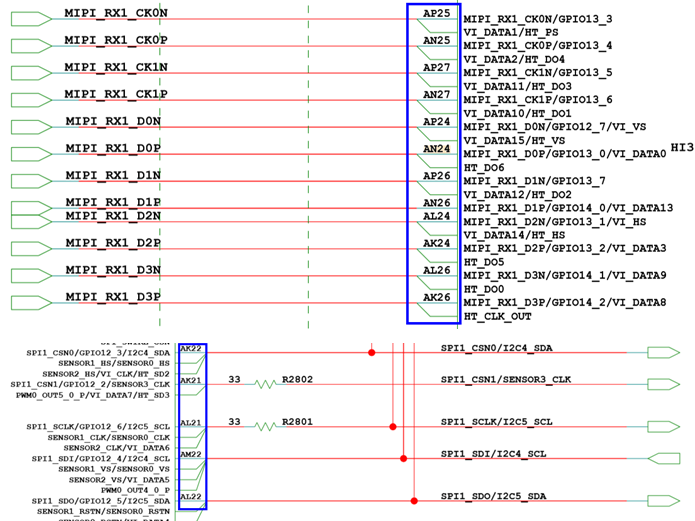

当VI视频采集接口为BT.656接口采集时，需要配置上图中对应的10根管脚为对应的BT.656的相关功能，BT.656接口的10根管脚包含有时钟管脚和8根DATA（VI\_DATA0\~ VI\_DATA7）数据管脚。

-   时钟管脚配置（以AK22复用为VI\_CLK为例说明）：

**表 1**  AK22管脚控制寄存器

<a name="table1776mcpsimp"></a>
<table><thead align="left"><tr id="row1787mcpsimp"><th class="cellrowborder" valign="top" width="14.14141414141414%" id="mcps1.2.8.1.1"><p id="p1789mcpsimp"><a name="p1789mcpsimp"></a><a name="p1789mcpsimp"></a>Register Name</p>
</th>
<th class="cellrowborder" valign="top" width="12.121212121212121%" id="mcps1.2.8.1.2"><p id="p1791mcpsimp"><a name="p1791mcpsimp"></a><a name="p1791mcpsimp"></a>Pin Number</p>
</th>
<th class="cellrowborder" valign="top" width="15.151515151515152%" id="mcps1.2.8.1.3"><p id="p1793mcpsimp"><a name="p1793mcpsimp"></a><a name="p1793mcpsimp"></a>Function</p>
</th>
<th class="cellrowborder" valign="top" width="12.121212121212121%" id="mcps1.2.8.1.4"><p id="p1795mcpsimp"><a name="p1795mcpsimp"></a><a name="p1795mcpsimp"></a>Address</p>
</th>
<th class="cellrowborder" valign="top" width="12.121212121212121%" id="mcps1.2.8.1.5"><p id="p1797mcpsimp"><a name="p1797mcpsimp"></a><a name="p1797mcpsimp"></a>Default Value</p>
</th>
<th class="cellrowborder" valign="top" width="7.07070707070707%" id="mcps1.2.8.1.6"><p id="p1799mcpsimp"><a name="p1799mcpsimp"></a><a name="p1799mcpsimp"></a>Field Bits</p>
</th>
<th class="cellrowborder" valign="top" width="27.27272727272727%" id="mcps1.2.8.1.7"><p id="p1801mcpsimp"><a name="p1801mcpsimp"></a><a name="p1801mcpsimp"></a>Field Description</p>
</th>
</tr>
</thead>
<tbody><tr id="row1803mcpsimp"><td class="cellrowborder" rowspan="10" valign="top" width="14.14141414141414%" headers="mcps1.2.8.1.1 "><p id="p1805mcpsimp"><a name="p1805mcpsimp"></a><a name="p1805mcpsimp"></a>iocfg_reg108</p>
</td>
<td class="cellrowborder" rowspan="10" valign="top" width="12.121212121212121%" headers="mcps1.2.8.1.2 "><p id="p1807mcpsimp"><a name="p1807mcpsimp"></a><a name="p1807mcpsimp"></a>AK22</p>
</td>
<td class="cellrowborder" rowspan="10" valign="top" width="15.151515151515152%" headers="mcps1.2.8.1.3 "><p id="p1809mcpsimp"><a name="p1809mcpsimp"></a><a name="p1809mcpsimp"></a>Pin SPI1_CSN0 IO Config Register.</p>
</td>
<td class="cellrowborder" rowspan="10" valign="top" width="12.121212121212121%" headers="mcps1.2.8.1.4 "><p id="p1811mcpsimp"><a name="p1811mcpsimp"></a><a name="p1811mcpsimp"></a>0x0102F0158</p>
</td>
<td class="cellrowborder" rowspan="10" valign="top" width="12.121212121212121%" headers="mcps1.2.8.1.5 "><p id="p1813mcpsimp"><a name="p1813mcpsimp"></a><a name="p1813mcpsimp"></a>0x1200</p>
</td>
<td class="cellrowborder" valign="top" width="7.07070707070707%" headers="mcps1.2.8.1.6 "><p id="p1815mcpsimp"><a name="p1815mcpsimp"></a><a name="p1815mcpsimp"></a>31:15</p>
</td>
<td class="cellrowborder" valign="top" width="27.27272727272727%" headers="mcps1.2.8.1.7 "><p id="p1817mcpsimp"><a name="p1817mcpsimp"></a><a name="p1817mcpsimp"></a>保留。</p>
</td>
</tr>
<tr id="row1818mcpsimp"><td class="cellrowborder" valign="top" headers="mcps1.2.8.1.1 "><p id="p1820mcpsimp"><a name="p1820mcpsimp"></a><a name="p1820mcpsimp"></a>14</p>
</td>
<td class="cellrowborder" valign="top" headers="mcps1.2.8.1.2 "><p id="p1822mcpsimp"><a name="p1822mcpsimp"></a><a name="p1822mcpsimp"></a>保留。</p>
</td>
</tr>
<tr id="row1823mcpsimp"><td class="cellrowborder" valign="top" headers="mcps1.2.8.1.1 "><p id="p1825mcpsimp"><a name="p1825mcpsimp"></a><a name="p1825mcpsimp"></a>13</p>
</td>
<td class="cellrowborder" valign="top" headers="mcps1.2.8.1.2 "><p id="p1827mcpsimp"><a name="p1827mcpsimp"></a><a name="p1827mcpsimp"></a>保留。</p>
</td>
</tr>
<tr id="row1828mcpsimp"><td class="cellrowborder" valign="top" headers="mcps1.2.8.1.1 "><p id="p1830mcpsimp"><a name="p1830mcpsimp"></a><a name="p1830mcpsimp"></a>12</p>
</td>
<td class="cellrowborder" valign="top" headers="mcps1.2.8.1.2 "><p id="p1832mcpsimp"><a name="p1832mcpsimp"></a><a name="p1832mcpsimp"></a>保留。</p>
</td>
</tr>
<tr id="row1833mcpsimp"><td class="cellrowborder" valign="top" headers="mcps1.2.8.1.1 "><p id="p1835mcpsimp"><a name="p1835mcpsimp"></a><a name="p1835mcpsimp"></a>11</p>
</td>
<td class="cellrowborder" valign="top" headers="mcps1.2.8.1.2 "><p id="p1837mcpsimp"><a name="p1837mcpsimp"></a><a name="p1837mcpsimp"></a>保留。</p>
</td>
</tr>
<tr id="row1838mcpsimp"><td class="cellrowborder" valign="top" headers="mcps1.2.8.1.1 "><p id="p1840mcpsimp"><a name="p1840mcpsimp"></a><a name="p1840mcpsimp"></a>10</p>
</td>
<td class="cellrowborder" valign="top" headers="mcps1.2.8.1.2 "><p id="p1842mcpsimp"><a name="p1842mcpsimp"></a><a name="p1842mcpsimp"></a>管脚电平转换速率控制：</p>
<p id="p1843mcpsimp"><a name="p1843mcpsimp"></a><a name="p1843mcpsimp"></a>0x0：快沿输出；</p>
<p id="p1844mcpsimp"><a name="p1844mcpsimp"></a><a name="p1844mcpsimp"></a>0x1：慢沿输出。</p>
</td>
</tr>
<tr id="row1845mcpsimp"><td class="cellrowborder" valign="top" headers="mcps1.2.8.1.1 "><p id="p1847mcpsimp"><a name="p1847mcpsimp"></a><a name="p1847mcpsimp"></a>9</p>
</td>
<td class="cellrowborder" valign="top" headers="mcps1.2.8.1.2 "><p id="p1849mcpsimp"><a name="p1849mcpsimp"></a><a name="p1849mcpsimp"></a>管脚下拉控制：</p>
<p id="p1850mcpsimp"><a name="p1850mcpsimp"></a><a name="p1850mcpsimp"></a>0x0：关闭；</p>
<p id="p1851mcpsimp"><a name="p1851mcpsimp"></a><a name="p1851mcpsimp"></a>0x1：打开。</p>
</td>
</tr>
<tr id="row1852mcpsimp"><td class="cellrowborder" valign="top" headers="mcps1.2.8.1.1 "><p id="p1854mcpsimp"><a name="p1854mcpsimp"></a><a name="p1854mcpsimp"></a>8</p>
</td>
<td class="cellrowborder" valign="top" headers="mcps1.2.8.1.2 "><p id="p1856mcpsimp"><a name="p1856mcpsimp"></a><a name="p1856mcpsimp"></a>管脚上拉控制：</p>
<p id="p1857mcpsimp"><a name="p1857mcpsimp"></a><a name="p1857mcpsimp"></a>0x0：关闭；</p>
<p id="p1858mcpsimp"><a name="p1858mcpsimp"></a><a name="p1858mcpsimp"></a>0x1：打开。</p>
</td>
</tr>
<tr id="row1859mcpsimp"><td class="cellrowborder" valign="top" headers="mcps1.2.8.1.1 "><p id="p1861mcpsimp"><a name="p1861mcpsimp"></a><a name="p1861mcpsimp"></a>7:4</p>
</td>
<td class="cellrowborder" valign="top" headers="mcps1.2.8.1.2 "><p id="p1863mcpsimp"><a name="p1863mcpsimp"></a><a name="p1863mcpsimp"></a>管脚驱动能力选择：</p>
<p id="p1864mcpsimp"><a name="p1864mcpsimp"></a><a name="p1864mcpsimp"></a>0x0：IO2档位1；</p>
<p id="p1865mcpsimp"><a name="p1865mcpsimp"></a><a name="p1865mcpsimp"></a>0x1：IO2档位2；</p>
<p id="p1866mcpsimp"><a name="p1866mcpsimp"></a><a name="p1866mcpsimp"></a>0x2：IO2档位3；</p>
<p id="p1867mcpsimp"><a name="p1867mcpsimp"></a><a name="p1867mcpsimp"></a>0x3：IO2档位4；</p>
<p id="p1868mcpsimp"><a name="p1868mcpsimp"></a><a name="p1868mcpsimp"></a>0x4：IO2档位5；</p>
<p id="p1869mcpsimp"><a name="p1869mcpsimp"></a><a name="p1869mcpsimp"></a>0x5：IO2档位6；</p>
<p id="p1870mcpsimp"><a name="p1870mcpsimp"></a><a name="p1870mcpsimp"></a>0x6：IO2档位7；</p>
<p id="p1871mcpsimp"><a name="p1871mcpsimp"></a><a name="p1871mcpsimp"></a>0x7：IO2档位8；</p>
<p id="p1872mcpsimp"><a name="p1872mcpsimp"></a><a name="p1872mcpsimp"></a>0x8：IO2档位9；</p>
<p id="p1873mcpsimp"><a name="p1873mcpsimp"></a><a name="p1873mcpsimp"></a>0x9：IO2档位10；</p>
<p id="p1874mcpsimp"><a name="p1874mcpsimp"></a><a name="p1874mcpsimp"></a>0xA：IO2档位11；</p>
<p id="p1875mcpsimp"><a name="p1875mcpsimp"></a><a name="p1875mcpsimp"></a>0xB：IO2档位12；</p>
<p id="p1876mcpsimp"><a name="p1876mcpsimp"></a><a name="p1876mcpsimp"></a>0xC：IO2档位13；</p>
<p id="p1877mcpsimp"><a name="p1877mcpsimp"></a><a name="p1877mcpsimp"></a>0xD：IO2档位14；</p>
<p id="p1878mcpsimp"><a name="p1878mcpsimp"></a><a name="p1878mcpsimp"></a>0xE：IO2档位15；</p>
<p id="p1879mcpsimp"><a name="p1879mcpsimp"></a><a name="p1879mcpsimp"></a>0xF：IO2档位16；</p>
<p id="p1880mcpsimp"><a name="p1880mcpsimp"></a><a name="p1880mcpsimp"></a>其它：保留。</p>
</td>
</tr>
<tr id="row1881mcpsimp"><td class="cellrowborder" valign="top" headers="mcps1.2.8.1.1 "><p id="p1883mcpsimp"><a name="p1883mcpsimp"></a><a name="p1883mcpsimp"></a>3:0</p>
</td>
<td class="cellrowborder" valign="top" headers="mcps1.2.8.1.2 "><p id="p1885mcpsimp"><a name="p1885mcpsimp"></a><a name="p1885mcpsimp"></a>功能选择：</p>
<p id="p1886mcpsimp"><a name="p1886mcpsimp"></a><a name="p1886mcpsimp"></a>0x0：GPIO12_3；</p>
<p id="p1887mcpsimp"><a name="p1887mcpsimp"></a><a name="p1887mcpsimp"></a>0x1：SPI1_CSN0；</p>
<p id="p1888mcpsimp"><a name="p1888mcpsimp"></a><a name="p1888mcpsimp"></a>0x2：I2C4_SDA；</p>
<p id="p1889mcpsimp"><a name="p1889mcpsimp"></a><a name="p1889mcpsimp"></a>0x3：SENSOR1_HS；</p>
<p id="p1890mcpsimp"><a name="p1890mcpsimp"></a><a name="p1890mcpsimp"></a>0x4：SENSOR0_HS；</p>
<p id="p1891mcpsimp"><a name="p1891mcpsimp"></a><a name="p1891mcpsimp"></a>0x5：SENSOR2_HS；</p>
<p id="p1892mcpsimp"><a name="p1892mcpsimp"></a><a name="p1892mcpsimp"></a>0x6：VI_CLK；</p>
<p id="p1893mcpsimp"><a name="p1893mcpsimp"></a><a name="p1893mcpsimp"></a>0x7：HT_SD2；</p>
<p id="p1894mcpsimp"><a name="p1894mcpsimp"></a><a name="p1894mcpsimp"></a>其它：保留。</p>
</td>
</tr>
</tbody>
</table>

管脚存在8种复用情形：HT\_SD2/VI\_CLK/SENSOR2\_HS/SENSOR1\_HS/SENSOR0\_HS/I2C4\_SDA/SPI1\_CSN0/GPIO12\_3。

配置值为0x0206:Bits\[3:0\]=0x6，管脚复用为6，配置复用为VI\_CLK。

-   DATA管脚配置：

    VI\_DATA0\~VI\_DATA7为对应的BT.656接口的相关功能。

    以AN24复用为VI\_DATA0为例进行说明。

**表 2**  AK26管脚控制寄存器

<a name="table1901mcpsimp"></a>
<table><thead align="left"><tr id="row1912mcpsimp"><th class="cellrowborder" valign="top" width="13.271327132713273%" id="mcps1.2.8.1.1"><p id="p1914mcpsimp"><a name="p1914mcpsimp"></a><a name="p1914mcpsimp"></a>Register Name</p>
</th>
<th class="cellrowborder" valign="top" width="12.241224122412241%" id="mcps1.2.8.1.2"><p id="p1916mcpsimp"><a name="p1916mcpsimp"></a><a name="p1916mcpsimp"></a>Pin Number</p>
</th>
<th class="cellrowborder" valign="top" width="14.291429142914291%" id="mcps1.2.8.1.3"><p id="p1918mcpsimp"><a name="p1918mcpsimp"></a><a name="p1918mcpsimp"></a>Function</p>
</th>
<th class="cellrowborder" valign="top" width="12.241224122412241%" id="mcps1.2.8.1.4"><p id="p1920mcpsimp"><a name="p1920mcpsimp"></a><a name="p1920mcpsimp"></a>Address</p>
</th>
<th class="cellrowborder" valign="top" width="12.241224122412241%" id="mcps1.2.8.1.5"><p id="p1922mcpsimp"><a name="p1922mcpsimp"></a><a name="p1922mcpsimp"></a>Default Value</p>
</th>
<th class="cellrowborder" valign="top" width="9.180918091809183%" id="mcps1.2.8.1.6"><p id="p1924mcpsimp"><a name="p1924mcpsimp"></a><a name="p1924mcpsimp"></a>Field Bits</p>
</th>
<th class="cellrowborder" valign="top" width="26.532653265326534%" id="mcps1.2.8.1.7"><p id="p1926mcpsimp"><a name="p1926mcpsimp"></a><a name="p1926mcpsimp"></a>Field Description</p>
</th>
</tr>
</thead>
<tbody><tr id="row1928mcpsimp"><td class="cellrowborder" rowspan="10" valign="top" width="13.271327132713273%" headers="mcps1.2.8.1.1 "><p id="p1930mcpsimp"><a name="p1930mcpsimp"></a><a name="p1930mcpsimp"></a>iocfg_reg113</p>
</td>
<td class="cellrowborder" rowspan="10" valign="top" width="12.241224122412241%" headers="mcps1.2.8.1.2 "><p id="p1932mcpsimp"><a name="p1932mcpsimp"></a><a name="p1932mcpsimp"></a>AN24</p>
</td>
<td class="cellrowborder" rowspan="10" valign="top" width="14.291429142914291%" headers="mcps1.2.8.1.3 "><p id="p1934mcpsimp"><a name="p1934mcpsimp"></a><a name="p1934mcpsimp"></a>Pin MIPI_RX1_D0P IO Config Register.</p>
</td>
<td class="cellrowborder" rowspan="10" valign="top" width="12.241224122412241%" headers="mcps1.2.8.1.4 "><p id="p1936mcpsimp"><a name="p1936mcpsimp"></a><a name="p1936mcpsimp"></a>0x0102F016C</p>
</td>
<td class="cellrowborder" rowspan="10" valign="top" width="12.241224122412241%" headers="mcps1.2.8.1.5 "><p id="p1938mcpsimp"><a name="p1938mcpsimp"></a><a name="p1938mcpsimp"></a>0x1200</p>
</td>
<td class="cellrowborder" valign="top" width="9.180918091809183%" headers="mcps1.2.8.1.6 "><p id="p1940mcpsimp"><a name="p1940mcpsimp"></a><a name="p1940mcpsimp"></a>31:15</p>
</td>
<td class="cellrowborder" valign="top" width="26.532653265326534%" headers="mcps1.2.8.1.7 "><p id="p1942mcpsimp"><a name="p1942mcpsimp"></a><a name="p1942mcpsimp"></a>保留。</p>
</td>
</tr>
<tr id="row1943mcpsimp"><td class="cellrowborder" valign="top" headers="mcps1.2.8.1.1 "><p id="p1945mcpsimp"><a name="p1945mcpsimp"></a><a name="p1945mcpsimp"></a>14</p>
</td>
<td class="cellrowborder" valign="top" headers="mcps1.2.8.1.2 "><p id="p1947mcpsimp"><a name="p1947mcpsimp"></a><a name="p1947mcpsimp"></a>保留。</p>
</td>
</tr>
<tr id="row1948mcpsimp"><td class="cellrowborder" valign="top" headers="mcps1.2.8.1.1 "><p id="p1950mcpsimp"><a name="p1950mcpsimp"></a><a name="p1950mcpsimp"></a>13</p>
</td>
<td class="cellrowborder" valign="top" headers="mcps1.2.8.1.2 "><p id="p1952mcpsimp"><a name="p1952mcpsimp"></a><a name="p1952mcpsimp"></a>保留。</p>
</td>
</tr>
<tr id="row1953mcpsimp"><td class="cellrowborder" valign="top" headers="mcps1.2.8.1.1 "><p id="p1955mcpsimp"><a name="p1955mcpsimp"></a><a name="p1955mcpsimp"></a>12</p>
</td>
<td class="cellrowborder" valign="top" headers="mcps1.2.8.1.2 "><p id="p1957mcpsimp"><a name="p1957mcpsimp"></a><a name="p1957mcpsimp"></a>保留。</p>
</td>
</tr>
<tr id="row1958mcpsimp"><td class="cellrowborder" valign="top" headers="mcps1.2.8.1.1 "><p id="p1960mcpsimp"><a name="p1960mcpsimp"></a><a name="p1960mcpsimp"></a>11</p>
</td>
<td class="cellrowborder" valign="top" headers="mcps1.2.8.1.2 "><p id="p1962mcpsimp"><a name="p1962mcpsimp"></a><a name="p1962mcpsimp"></a>保留。</p>
</td>
</tr>
<tr id="row1963mcpsimp"><td class="cellrowborder" valign="top" headers="mcps1.2.8.1.1 "><p id="p1965mcpsimp"><a name="p1965mcpsimp"></a><a name="p1965mcpsimp"></a>10</p>
</td>
<td class="cellrowborder" valign="top" headers="mcps1.2.8.1.2 "><p id="p1967mcpsimp"><a name="p1967mcpsimp"></a><a name="p1967mcpsimp"></a>保留。</p>
</td>
</tr>
<tr id="row1968mcpsimp"><td class="cellrowborder" valign="top" headers="mcps1.2.8.1.1 "><p id="p1970mcpsimp"><a name="p1970mcpsimp"></a><a name="p1970mcpsimp"></a>9</p>
</td>
<td class="cellrowborder" valign="top" headers="mcps1.2.8.1.2 "><p id="p1972mcpsimp"><a name="p1972mcpsimp"></a><a name="p1972mcpsimp"></a>保留。</p>
</td>
</tr>
<tr id="row1973mcpsimp"><td class="cellrowborder" valign="top" headers="mcps1.2.8.1.1 "><p id="p1975mcpsimp"><a name="p1975mcpsimp"></a><a name="p1975mcpsimp"></a>8</p>
</td>
<td class="cellrowborder" valign="top" headers="mcps1.2.8.1.2 "><p id="p1977mcpsimp"><a name="p1977mcpsimp"></a><a name="p1977mcpsimp"></a>保留</p>
</td>
</tr>
<tr id="row1978mcpsimp"><td class="cellrowborder" valign="top" headers="mcps1.2.8.1.1 "><p id="p1980mcpsimp"><a name="p1980mcpsimp"></a><a name="p1980mcpsimp"></a>7:4</p>
</td>
<td class="cellrowborder" valign="top" headers="mcps1.2.8.1.2 "><p id="p1982mcpsimp"><a name="p1982mcpsimp"></a><a name="p1982mcpsimp"></a>保留。</p>
</td>
</tr>
<tr id="row1983mcpsimp"><td class="cellrowborder" valign="top" headers="mcps1.2.8.1.1 "><p id="p1985mcpsimp"><a name="p1985mcpsimp"></a><a name="p1985mcpsimp"></a>3:0</p>
</td>
<td class="cellrowborder" valign="top" headers="mcps1.2.8.1.2 "><p id="p1987mcpsimp"><a name="p1987mcpsimp"></a><a name="p1987mcpsimp"></a>功能选择：</p>
<p id="p1988mcpsimp"><a name="p1988mcpsimp"></a><a name="p1988mcpsimp"></a>0x0：MIPI_RX1_D0P；</p>
<p id="p1989mcpsimp"><a name="p1989mcpsimp"></a><a name="p1989mcpsimp"></a>0x1：GPIO13_0；</p>
<p id="p1990mcpsimp"><a name="p1990mcpsimp"></a><a name="p1990mcpsimp"></a>0x6：VI_DATA0；</p>
<p id="p1991mcpsimp"><a name="p1991mcpsimp"></a><a name="p1991mcpsimp"></a>0x7：HT_DO6；</p>
<p id="p1992mcpsimp"><a name="p1992mcpsimp"></a><a name="p1992mcpsimp"></a>其它：保留。</p>
</td>
</tr>
</tbody>
</table>

管脚存在4种复用情形：HT\_DO6/VI\_DATA0/GPIO13\_0/MIPI\_RX1\_D0P。配置值为0x0006: Bits\[3:0\]=0x6，管脚复用为6，配置复用为VI\_DATA0。

其他管脚复用关系配置和以上示例管脚配置情况类似，在此不做详细描述。

【注意事项】

无。

#### BT.1120管脚复用<a name="ZH-CN_TOPIC_0000002408102242"></a>

BT.1120接口由时钟管脚（VI\_CLK）和16根数据管脚（VI\_DATA0\~VI\_DATA15）组成。

【配置】

g\_reg\_iocfg\_base 见[表3](#_table16578980)。

```
static void vi_bt1120_mode_mux(void)
{
    void *iocfg2_base = sys_config_get_reg_iocfg2();
    sys_writel(iocfg2_base + 0x0158, 0x0206);
    sys_writel(iocfg2_base + 0x016C, 0x0006);
    sys_writel(iocfg2_base + 0x0178, 0x0006);
    sys_writel(iocfg2_base + 0x017C, 0x0006);
    sys_writel(iocfg2_base + 0x0174, 0x0006);
    sys_writel(iocfg2_base + 0x0160, 0x0206);
    sys_writel(iocfg2_base + 0x015C, 0x0206);
    sys_writel(iocfg2_base + 0x0164, 0x0206);
    sys_writel(iocfg2_base + 0x0154, 0x0206);
    sys_writel(iocfg2_base + 0x0194, 0x0006);
    sys_writel(iocfg2_base + 0x0190, 0x0006);
    sys_writel(iocfg2_base + 0x0184, 0x0006);
    sys_writel(iocfg2_base + 0x0180, 0x0006);
    sys_writel(iocfg2_base + 0x0188, 0x0006);
    sys_writel(iocfg2_base + 0x018C, 0x0006);
    sys_writel(iocfg2_base + 0x0170, 0x0006);
    sys_writel(iocfg2_base + 0x0168, 0x0006);
}
```

【描述说明】

原理图如[图1](#_toc51764063)所示。

**图 1**  VI BT.1120原理图<a name="_toc51764063"></a>  


当VI视频采集接口为BT.1120接口采集时,需要配置上图中对应的管脚为对应的BT.1120的相关功能，BT.1120接口的管脚分为时钟管脚和16根DATA（VI\_DATA0\~ VI\_DATA15）管脚。

-   时钟管脚配置（以AK22复用为VI\_CLK为例说明）：

**表 1**  AK22管脚控制寄存器

<a name="table2030mcpsimp"></a>
<table><thead align="left"><tr id="row2041mcpsimp"><th class="cellrowborder" valign="top" width="13.727254549090182%" id="mcps1.2.8.1.1"><p id="p2043mcpsimp"><a name="p2043mcpsimp"></a><a name="p2043mcpsimp"></a>Register Name</p>
</th>
<th class="cellrowborder" valign="top" width="12.74745050989802%" id="mcps1.2.8.1.2"><p id="p2045mcpsimp"><a name="p2045mcpsimp"></a><a name="p2045mcpsimp"></a>Pin Number</p>
</th>
<th class="cellrowborder" valign="top" width="14.707058588282345%" id="mcps1.2.8.1.3"><p id="p2047mcpsimp"><a name="p2047mcpsimp"></a><a name="p2047mcpsimp"></a>Function</p>
</th>
<th class="cellrowborder" valign="top" width="12.74745050989802%" id="mcps1.2.8.1.4"><p id="p2049mcpsimp"><a name="p2049mcpsimp"></a><a name="p2049mcpsimp"></a>Address</p>
</th>
<th class="cellrowborder" valign="top" width="12.74745050989802%" id="mcps1.2.8.1.5"><p id="p2051mcpsimp"><a name="p2051mcpsimp"></a><a name="p2051mcpsimp"></a>Default Value</p>
</th>
<th class="cellrowborder" valign="top" width="6.85862827434513%" id="mcps1.2.8.1.6"><p id="p2053mcpsimp"><a name="p2053mcpsimp"></a><a name="p2053mcpsimp"></a>Field Bits</p>
</th>
<th class="cellrowborder" valign="top" width="26.46470705858828%" id="mcps1.2.8.1.7"><p id="p2055mcpsimp"><a name="p2055mcpsimp"></a><a name="p2055mcpsimp"></a>Field Description</p>
</th>
</tr>
</thead>
<tbody><tr id="row2057mcpsimp"><td class="cellrowborder" rowspan="10" valign="top" width="13.727254549090182%" headers="mcps1.2.8.1.1 "><p id="p2059mcpsimp"><a name="p2059mcpsimp"></a><a name="p2059mcpsimp"></a>iocfg_reg108</p>
</td>
<td class="cellrowborder" rowspan="10" valign="top" width="12.74745050989802%" headers="mcps1.2.8.1.2 "><p id="p2061mcpsimp"><a name="p2061mcpsimp"></a><a name="p2061mcpsimp"></a>AK22</p>
</td>
<td class="cellrowborder" rowspan="10" valign="top" width="14.707058588282345%" headers="mcps1.2.8.1.3 "><p id="p2063mcpsimp"><a name="p2063mcpsimp"></a><a name="p2063mcpsimp"></a>Pin SPI1_CSN0 IO Config Register.</p>
</td>
<td class="cellrowborder" rowspan="10" valign="top" width="12.74745050989802%" headers="mcps1.2.8.1.4 "><p id="p2065mcpsimp"><a name="p2065mcpsimp"></a><a name="p2065mcpsimp"></a>0x0102F0158</p>
</td>
<td class="cellrowborder" rowspan="10" valign="top" width="12.74745050989802%" headers="mcps1.2.8.1.5 "><p id="p2067mcpsimp"><a name="p2067mcpsimp"></a><a name="p2067mcpsimp"></a>0x1200</p>
</td>
<td class="cellrowborder" valign="top" width="6.85862827434513%" headers="mcps1.2.8.1.6 "><p id="p2069mcpsimp"><a name="p2069mcpsimp"></a><a name="p2069mcpsimp"></a>31:15</p>
</td>
<td class="cellrowborder" valign="top" width="26.46470705858828%" headers="mcps1.2.8.1.7 "><p id="p2071mcpsimp"><a name="p2071mcpsimp"></a><a name="p2071mcpsimp"></a>保留。</p>
</td>
</tr>
<tr id="row2072mcpsimp"><td class="cellrowborder" valign="top" headers="mcps1.2.8.1.1 "><p id="p2074mcpsimp"><a name="p2074mcpsimp"></a><a name="p2074mcpsimp"></a>14</p>
</td>
<td class="cellrowborder" valign="top" headers="mcps1.2.8.1.2 "><p id="p2076mcpsimp"><a name="p2076mcpsimp"></a><a name="p2076mcpsimp"></a>保留。</p>
</td>
</tr>
<tr id="row2077mcpsimp"><td class="cellrowborder" valign="top" headers="mcps1.2.8.1.1 "><p id="p2079mcpsimp"><a name="p2079mcpsimp"></a><a name="p2079mcpsimp"></a>13</p>
</td>
<td class="cellrowborder" valign="top" headers="mcps1.2.8.1.2 "><p id="p2081mcpsimp"><a name="p2081mcpsimp"></a><a name="p2081mcpsimp"></a>保留。</p>
</td>
</tr>
<tr id="row2082mcpsimp"><td class="cellrowborder" valign="top" headers="mcps1.2.8.1.1 "><p id="p2084mcpsimp"><a name="p2084mcpsimp"></a><a name="p2084mcpsimp"></a>12</p>
</td>
<td class="cellrowborder" valign="top" headers="mcps1.2.8.1.2 "><p id="p2086mcpsimp"><a name="p2086mcpsimp"></a><a name="p2086mcpsimp"></a>保留。</p>
</td>
</tr>
<tr id="row2087mcpsimp"><td class="cellrowborder" valign="top" headers="mcps1.2.8.1.1 "><p id="p2089mcpsimp"><a name="p2089mcpsimp"></a><a name="p2089mcpsimp"></a>11</p>
</td>
<td class="cellrowborder" valign="top" headers="mcps1.2.8.1.2 "><p id="p2091mcpsimp"><a name="p2091mcpsimp"></a><a name="p2091mcpsimp"></a>保留。</p>
</td>
</tr>
<tr id="row2092mcpsimp"><td class="cellrowborder" valign="top" headers="mcps1.2.8.1.1 "><p id="p2094mcpsimp"><a name="p2094mcpsimp"></a><a name="p2094mcpsimp"></a>10</p>
</td>
<td class="cellrowborder" valign="top" headers="mcps1.2.8.1.2 "><p id="p2096mcpsimp"><a name="p2096mcpsimp"></a><a name="p2096mcpsimp"></a>管脚电平转换速率控制：</p>
<p id="p2097mcpsimp"><a name="p2097mcpsimp"></a><a name="p2097mcpsimp"></a>0x0：快沿输出；</p>
<p id="p2098mcpsimp"><a name="p2098mcpsimp"></a><a name="p2098mcpsimp"></a>0x1：慢沿输出。</p>
</td>
</tr>
<tr id="row2099mcpsimp"><td class="cellrowborder" valign="top" headers="mcps1.2.8.1.1 "><p id="p2101mcpsimp"><a name="p2101mcpsimp"></a><a name="p2101mcpsimp"></a>9</p>
</td>
<td class="cellrowborder" valign="top" headers="mcps1.2.8.1.2 "><p id="p2103mcpsimp"><a name="p2103mcpsimp"></a><a name="p2103mcpsimp"></a>管脚下拉控制：</p>
<p id="p2104mcpsimp"><a name="p2104mcpsimp"></a><a name="p2104mcpsimp"></a>0x0：关闭；</p>
<p id="p2105mcpsimp"><a name="p2105mcpsimp"></a><a name="p2105mcpsimp"></a>0x1：打开。</p>
</td>
</tr>
<tr id="row2106mcpsimp"><td class="cellrowborder" valign="top" headers="mcps1.2.8.1.1 "><p id="p2108mcpsimp"><a name="p2108mcpsimp"></a><a name="p2108mcpsimp"></a>8</p>
</td>
<td class="cellrowborder" valign="top" headers="mcps1.2.8.1.2 "><p id="p2110mcpsimp"><a name="p2110mcpsimp"></a><a name="p2110mcpsimp"></a>管脚上拉控制：</p>
<p id="p2111mcpsimp"><a name="p2111mcpsimp"></a><a name="p2111mcpsimp"></a>0x0：关闭；</p>
<p id="p2112mcpsimp"><a name="p2112mcpsimp"></a><a name="p2112mcpsimp"></a>0x1：打开。</p>
</td>
</tr>
<tr id="row2113mcpsimp"><td class="cellrowborder" valign="top" headers="mcps1.2.8.1.1 "><p id="p2115mcpsimp"><a name="p2115mcpsimp"></a><a name="p2115mcpsimp"></a>7:4</p>
</td>
<td class="cellrowborder" valign="top" headers="mcps1.2.8.1.2 "><p id="p2117mcpsimp"><a name="p2117mcpsimp"></a><a name="p2117mcpsimp"></a>管脚驱动能力选择：</p>
<p id="p2118mcpsimp"><a name="p2118mcpsimp"></a><a name="p2118mcpsimp"></a>0x0：IO2档位1；</p>
<p id="p2119mcpsimp"><a name="p2119mcpsimp"></a><a name="p2119mcpsimp"></a>0x1：IO2档位2；</p>
<p id="p2120mcpsimp"><a name="p2120mcpsimp"></a><a name="p2120mcpsimp"></a>0x2：IO2档位3；</p>
<p id="p2121mcpsimp"><a name="p2121mcpsimp"></a><a name="p2121mcpsimp"></a>0x3：IO2档位4；</p>
<p id="p2122mcpsimp"><a name="p2122mcpsimp"></a><a name="p2122mcpsimp"></a>0x4：IO2档位5；</p>
<p id="p2123mcpsimp"><a name="p2123mcpsimp"></a><a name="p2123mcpsimp"></a>0x5：IO2档位6；</p>
<p id="p2124mcpsimp"><a name="p2124mcpsimp"></a><a name="p2124mcpsimp"></a>0x6：IO2档位7；</p>
<p id="p2125mcpsimp"><a name="p2125mcpsimp"></a><a name="p2125mcpsimp"></a>0x7：IO2档位8；</p>
<p id="p2126mcpsimp"><a name="p2126mcpsimp"></a><a name="p2126mcpsimp"></a>0x8：IO2档位9；</p>
<p id="p2127mcpsimp"><a name="p2127mcpsimp"></a><a name="p2127mcpsimp"></a>0x9：IO2档位10；</p>
<p id="p2128mcpsimp"><a name="p2128mcpsimp"></a><a name="p2128mcpsimp"></a>0xA：IO2档位11；</p>
<p id="p2129mcpsimp"><a name="p2129mcpsimp"></a><a name="p2129mcpsimp"></a>0xB：IO2档位12；</p>
<p id="p2130mcpsimp"><a name="p2130mcpsimp"></a><a name="p2130mcpsimp"></a>0xC：IO2档位13；</p>
<p id="p2131mcpsimp"><a name="p2131mcpsimp"></a><a name="p2131mcpsimp"></a>0xD：IO2档位14；</p>
<p id="p2132mcpsimp"><a name="p2132mcpsimp"></a><a name="p2132mcpsimp"></a>0xE：IO2档位15；</p>
<p id="p2133mcpsimp"><a name="p2133mcpsimp"></a><a name="p2133mcpsimp"></a>0xF：IO2档位16；</p>
<p id="p2134mcpsimp"><a name="p2134mcpsimp"></a><a name="p2134mcpsimp"></a>其它：保留。</p>
</td>
</tr>
<tr id="row2135mcpsimp"><td class="cellrowborder" valign="top" headers="mcps1.2.8.1.1 "><p id="p2137mcpsimp"><a name="p2137mcpsimp"></a><a name="p2137mcpsimp"></a>3:0</p>
</td>
<td class="cellrowborder" valign="top" headers="mcps1.2.8.1.2 "><p id="p2139mcpsimp"><a name="p2139mcpsimp"></a><a name="p2139mcpsimp"></a>功能选择：</p>
<p id="p2140mcpsimp"><a name="p2140mcpsimp"></a><a name="p2140mcpsimp"></a>0x0：GPIO12_3；</p>
<p id="p2141mcpsimp"><a name="p2141mcpsimp"></a><a name="p2141mcpsimp"></a>0x1：SPI1_CSN0；</p>
<p id="p2142mcpsimp"><a name="p2142mcpsimp"></a><a name="p2142mcpsimp"></a>0x2：I2C4_SDA；</p>
<p id="p2143mcpsimp"><a name="p2143mcpsimp"></a><a name="p2143mcpsimp"></a>0x3：SENSOR1_HS；</p>
<p id="p2144mcpsimp"><a name="p2144mcpsimp"></a><a name="p2144mcpsimp"></a>0x4：SENSOR0_HS；</p>
<p id="p2145mcpsimp"><a name="p2145mcpsimp"></a><a name="p2145mcpsimp"></a>0x5：SENSOR2_HS；</p>
<p id="p2146mcpsimp"><a name="p2146mcpsimp"></a><a name="p2146mcpsimp"></a>0x6：VI_CLK；</p>
<p id="p2147mcpsimp"><a name="p2147mcpsimp"></a><a name="p2147mcpsimp"></a>0x7：HT_SD2；</p>
<p id="p2148mcpsimp"><a name="p2148mcpsimp"></a><a name="p2148mcpsimp"></a>其它：保留。</p>
</td>
</tr>
</tbody>
</table>

管脚存在8种复用情形：HT\_SD2/VI\_CLK/SENSOR2\_HS/SENSOR1\_HS/SENSOR0\_HS/I2C4\_SDA/SPI1\_CSN0/GPIO12\_3。

配置值为0x0206:Bits\[3:0\]=0x6，管脚复用为6，配置复用为VI\_CLK。

-   DATA管脚配置：

    VI\_DATA0\~VI\_DATA7为对应的BT.656接口的相关功能，可参考“[BT.656管脚复用](#ZH-CN_TOPIC_0000002408102278)”章节的相关描述进行配置。

    AK26复用为VI\_DATA8为例进行说明。

**表 2**  AK26管脚控制寄存器

<a name="table2156mcpsimp"></a>
<table><thead align="left"><tr id="row2167mcpsimp"><th class="cellrowborder" valign="top" width="13.271327132713273%" id="mcps1.2.8.1.1"><p id="p2169mcpsimp"><a name="p2169mcpsimp"></a><a name="p2169mcpsimp"></a>Register Name</p>
</th>
<th class="cellrowborder" valign="top" width="12.241224122412241%" id="mcps1.2.8.1.2"><p id="p2171mcpsimp"><a name="p2171mcpsimp"></a><a name="p2171mcpsimp"></a>Pin Number</p>
</th>
<th class="cellrowborder" valign="top" width="14.291429142914291%" id="mcps1.2.8.1.3"><p id="p2173mcpsimp"><a name="p2173mcpsimp"></a><a name="p2173mcpsimp"></a>Function</p>
</th>
<th class="cellrowborder" valign="top" width="12.241224122412241%" id="mcps1.2.8.1.4"><p id="p2175mcpsimp"><a name="p2175mcpsimp"></a><a name="p2175mcpsimp"></a>Address</p>
</th>
<th class="cellrowborder" valign="top" width="12.241224122412241%" id="mcps1.2.8.1.5"><p id="p2177mcpsimp"><a name="p2177mcpsimp"></a><a name="p2177mcpsimp"></a>Default Value</p>
</th>
<th class="cellrowborder" valign="top" width="9.180918091809183%" id="mcps1.2.8.1.6"><p id="p2179mcpsimp"><a name="p2179mcpsimp"></a><a name="p2179mcpsimp"></a>Field Bits</p>
</th>
<th class="cellrowborder" valign="top" width="26.532653265326534%" id="mcps1.2.8.1.7"><p id="p2181mcpsimp"><a name="p2181mcpsimp"></a><a name="p2181mcpsimp"></a>Field Description</p>
</th>
</tr>
</thead>
<tbody><tr id="row2183mcpsimp"><td class="cellrowborder" rowspan="10" valign="top" width="13.271327132713273%" headers="mcps1.2.8.1.1 "><p id="p2185mcpsimp"><a name="p2185mcpsimp"></a><a name="p2185mcpsimp"></a>iocfg_reg123</p>
</td>
<td class="cellrowborder" rowspan="10" valign="top" width="12.241224122412241%" headers="mcps1.2.8.1.2 "><p id="p2187mcpsimp"><a name="p2187mcpsimp"></a><a name="p2187mcpsimp"></a>AK26</p>
</td>
<td class="cellrowborder" rowspan="10" valign="top" width="14.291429142914291%" headers="mcps1.2.8.1.3 "><p id="p2189mcpsimp"><a name="p2189mcpsimp"></a><a name="p2189mcpsimp"></a>Pin MIPI_RX1_D3P IO Config Register.</p>
</td>
<td class="cellrowborder" rowspan="10" valign="top" width="12.241224122412241%" headers="mcps1.2.8.1.4 "><p id="p2191mcpsimp"><a name="p2191mcpsimp"></a><a name="p2191mcpsimp"></a>0x0102F0194</p>
</td>
<td class="cellrowborder" rowspan="10" valign="top" width="12.241224122412241%" headers="mcps1.2.8.1.5 "><p id="p2193mcpsimp"><a name="p2193mcpsimp"></a><a name="p2193mcpsimp"></a>0x1200</p>
</td>
<td class="cellrowborder" valign="top" width="9.180918091809183%" headers="mcps1.2.8.1.6 "><p id="p2195mcpsimp"><a name="p2195mcpsimp"></a><a name="p2195mcpsimp"></a>31:15</p>
</td>
<td class="cellrowborder" valign="top" width="26.532653265326534%" headers="mcps1.2.8.1.7 "><p id="p2197mcpsimp"><a name="p2197mcpsimp"></a><a name="p2197mcpsimp"></a>保留。</p>
</td>
</tr>
<tr id="row2198mcpsimp"><td class="cellrowborder" valign="top" headers="mcps1.2.8.1.1 "><p id="p2200mcpsimp"><a name="p2200mcpsimp"></a><a name="p2200mcpsimp"></a>14</p>
</td>
<td class="cellrowborder" valign="top" headers="mcps1.2.8.1.2 "><p id="p2202mcpsimp"><a name="p2202mcpsimp"></a><a name="p2202mcpsimp"></a>保留。</p>
</td>
</tr>
<tr id="row2203mcpsimp"><td class="cellrowborder" valign="top" headers="mcps1.2.8.1.1 "><p id="p2205mcpsimp"><a name="p2205mcpsimp"></a><a name="p2205mcpsimp"></a>13</p>
</td>
<td class="cellrowborder" valign="top" headers="mcps1.2.8.1.2 "><p id="p2207mcpsimp"><a name="p2207mcpsimp"></a><a name="p2207mcpsimp"></a>保留。</p>
</td>
</tr>
<tr id="row2208mcpsimp"><td class="cellrowborder" valign="top" headers="mcps1.2.8.1.1 "><p id="p2210mcpsimp"><a name="p2210mcpsimp"></a><a name="p2210mcpsimp"></a>12</p>
</td>
<td class="cellrowborder" valign="top" headers="mcps1.2.8.1.2 "><p id="p2212mcpsimp"><a name="p2212mcpsimp"></a><a name="p2212mcpsimp"></a>保留。</p>
</td>
</tr>
<tr id="row2213mcpsimp"><td class="cellrowborder" valign="top" headers="mcps1.2.8.1.1 "><p id="p2215mcpsimp"><a name="p2215mcpsimp"></a><a name="p2215mcpsimp"></a>11</p>
</td>
<td class="cellrowborder" valign="top" headers="mcps1.2.8.1.2 "><p id="p2217mcpsimp"><a name="p2217mcpsimp"></a><a name="p2217mcpsimp"></a>保留。</p>
</td>
</tr>
<tr id="row2218mcpsimp"><td class="cellrowborder" valign="top" headers="mcps1.2.8.1.1 "><p id="p2220mcpsimp"><a name="p2220mcpsimp"></a><a name="p2220mcpsimp"></a>10</p>
</td>
<td class="cellrowborder" valign="top" headers="mcps1.2.8.1.2 "><p id="p2222mcpsimp"><a name="p2222mcpsimp"></a><a name="p2222mcpsimp"></a>保留。</p>
</td>
</tr>
<tr id="row2223mcpsimp"><td class="cellrowborder" valign="top" headers="mcps1.2.8.1.1 "><p id="p2225mcpsimp"><a name="p2225mcpsimp"></a><a name="p2225mcpsimp"></a>9</p>
</td>
<td class="cellrowborder" valign="top" headers="mcps1.2.8.1.2 "><p id="p2227mcpsimp"><a name="p2227mcpsimp"></a><a name="p2227mcpsimp"></a>保留。</p>
</td>
</tr>
<tr id="row2228mcpsimp"><td class="cellrowborder" valign="top" headers="mcps1.2.8.1.1 "><p id="p2230mcpsimp"><a name="p2230mcpsimp"></a><a name="p2230mcpsimp"></a>8</p>
</td>
<td class="cellrowborder" valign="top" headers="mcps1.2.8.1.2 "><p id="p2232mcpsimp"><a name="p2232mcpsimp"></a><a name="p2232mcpsimp"></a>保留</p>
</td>
</tr>
<tr id="row2233mcpsimp"><td class="cellrowborder" valign="top" headers="mcps1.2.8.1.1 "><p id="p2235mcpsimp"><a name="p2235mcpsimp"></a><a name="p2235mcpsimp"></a>7:4</p>
</td>
<td class="cellrowborder" valign="top" headers="mcps1.2.8.1.2 "><p id="p2237mcpsimp"><a name="p2237mcpsimp"></a><a name="p2237mcpsimp"></a>保留。</p>
</td>
</tr>
<tr id="row2238mcpsimp"><td class="cellrowborder" valign="top" headers="mcps1.2.8.1.1 "><p id="p2240mcpsimp"><a name="p2240mcpsimp"></a><a name="p2240mcpsimp"></a>3:0</p>
</td>
<td class="cellrowborder" valign="top" headers="mcps1.2.8.1.2 "><p id="p2242mcpsimp"><a name="p2242mcpsimp"></a><a name="p2242mcpsimp"></a>功能选择：</p>
<p id="p2243mcpsimp"><a name="p2243mcpsimp"></a><a name="p2243mcpsimp"></a>0x0：MIPI_RX1_D3P；</p>
<p id="p2244mcpsimp"><a name="p2244mcpsimp"></a><a name="p2244mcpsimp"></a>0x1：GPIO14_2；</p>
<p id="p2245mcpsimp"><a name="p2245mcpsimp"></a><a name="p2245mcpsimp"></a>0x6：VI_DATA8；</p>
<p id="p2246mcpsimp"><a name="p2246mcpsimp"></a><a name="p2246mcpsimp"></a>0x7：HT_CLK_OUT；</p>
<p id="p2247mcpsimp"><a name="p2247mcpsimp"></a><a name="p2247mcpsimp"></a>其它：保留。</p>
</td>
</tr>
</tbody>
</table>

管脚存在4种复用情形：HT\_CLK\_OUT/VI\_DATA8/GPIO14\_2/MIPI\_RX1\_D3P。配置值为0x0006: Bits\[3:0\]=0x6，管脚复用为6，配置复用为VI\_DATA8。

其他管脚复用关系配置和以上示例管脚配置情况类似，在此不做详细描述。

【注意事项】

SS928V100只有1个BT.656接口，在配置BT.1120接口时，除了配置BT.656为相关功能外\(VI\_DATA0\~DATA7\)，需要另外配置8根管脚为VI\_DATA8\~DATA15为相关功能。

#### SENSOR参考时钟管脚<a name="ZH-CN_TOPIC_0000002441661473"></a>

SENSOR管脚用于连接外接SENSOR，主芯片提供参考时钟给SENSOR使用。

【配置】

g\_reg\_iocfg\_base 见[表3](#_table16578980)。

SENSOR0-3:

```
static void sensor0_pin_mux(void)
{
    void *iocfg2_base = sys_config_get_reg_iocfg2();
    sys_writel(iocfg2_base + 0x01C8, 0x02d1);
    sys_writel(iocfg2_base + 0x01CC, 0x0101);
}
static void sensor1_pin_mux(void)
{
    void *iocfg2_base = sys_config_get_reg_iocfg2();
    sys_writel(iocfg2_base + 0x0150, 0x02d1);
    sys_writel(iocfg2_base + 0x014C, 0x0201);
}
static void sensor2_pin_mux(void)
{
    void *iocfg2_base = sys_config_get_reg_iocfg2();
    sys_writel(iocfg2_base + 0x01E8, 0x02d4);
    sys_writel(iocfg2_base + 0x0160, 0x0205);
}
static void sensor3_pin_mux(void)
{
    void *iocfg2_base = sys_config_get_reg_iocfg2();
    sys_writel(iocfg2_base + 0x0154, 0x02d2);
}
```

【描述说明】

SENSOR0\_CLK（AL32），SENSOR0\_RSTN（AM32）原理图如[图1](#_toc51764064)所示。

**图 1**  SENSOR0原理图<a name="_toc51764064"></a>  
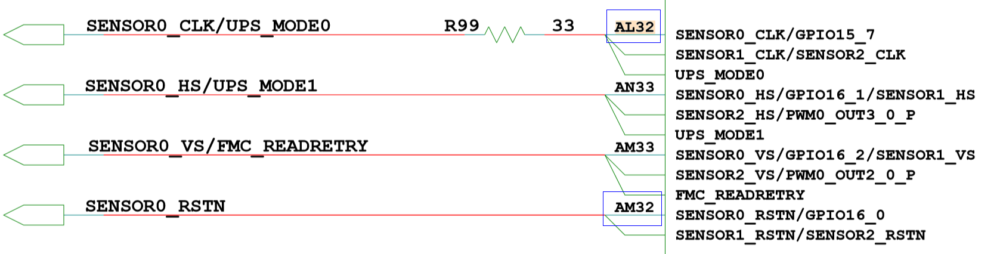

以AL32管脚的复用关系配置为例进行描述，SENSOR0\_CLK（AL32）管脚控制寄存器如[表1](#_table20274582)所示。

**表 1**  AL32管脚控制寄存器

<a name="_table20274582"></a>
<table><thead align="left"><tr id="row2297mcpsimp"><th class="cellrowborder" valign="top" width="14.29%" id="mcps1.2.8.1.1"><p id="p2299mcpsimp"><a name="p2299mcpsimp"></a><a name="p2299mcpsimp"></a>Register Name</p>
</th>
<th class="cellrowborder" valign="top" width="9.120000000000001%" id="mcps1.2.8.1.2"><p id="p2301mcpsimp"><a name="p2301mcpsimp"></a><a name="p2301mcpsimp"></a>Pin Number</p>
</th>
<th class="cellrowborder" valign="top" width="12.31%" id="mcps1.2.8.1.3"><p id="p2303mcpsimp"><a name="p2303mcpsimp"></a><a name="p2303mcpsimp"></a>Function</p>
</th>
<th class="cellrowborder" valign="top" width="16.33%" id="mcps1.2.8.1.4"><p id="p2305mcpsimp"><a name="p2305mcpsimp"></a><a name="p2305mcpsimp"></a>Address</p>
</th>
<th class="cellrowborder" valign="top" width="10.2%" id="mcps1.2.8.1.5"><p id="p2307mcpsimp"><a name="p2307mcpsimp"></a><a name="p2307mcpsimp"></a>Default Value</p>
</th>
<th class="cellrowborder" valign="top" width="10.2%" id="mcps1.2.8.1.6"><p id="p2309mcpsimp"><a name="p2309mcpsimp"></a><a name="p2309mcpsimp"></a>Field Bits</p>
</th>
<th class="cellrowborder" valign="top" width="27.55%" id="mcps1.2.8.1.7"><p id="p2311mcpsimp"><a name="p2311mcpsimp"></a><a name="p2311mcpsimp"></a>Field Description</p>
</th>
</tr>
</thead>
<tbody><tr id="row2313mcpsimp"><td class="cellrowborder" rowspan="10" valign="top" width="14.29%" headers="mcps1.2.8.1.1 "><p id="p2315mcpsimp"><a name="p2315mcpsimp"></a><a name="p2315mcpsimp"></a>iocfg_reg136</p>
</td>
<td class="cellrowborder" rowspan="10" valign="top" width="9.120000000000001%" headers="mcps1.2.8.1.2 "><p id="p2317mcpsimp"><a name="p2317mcpsimp"></a><a name="p2317mcpsimp"></a>AL32</p>
</td>
<td class="cellrowborder" rowspan="10" valign="top" width="12.31%" headers="mcps1.2.8.1.3 "><p id="p2319mcpsimp"><a name="p2319mcpsimp"></a><a name="p2319mcpsimp"></a>Pin SENSOR0_CLK IO Config Register.</p>
</td>
<td class="cellrowborder" rowspan="10" valign="top" width="16.33%" headers="mcps1.2.8.1.4 "><p id="p2321mcpsimp"><a name="p2321mcpsimp"></a><a name="p2321mcpsimp"></a>0x0102F01C8</p>
</td>
<td class="cellrowborder" rowspan="10" valign="top" width="10.2%" headers="mcps1.2.8.1.5 "><p id="p2323mcpsimp"><a name="p2323mcpsimp"></a><a name="p2323mcpsimp"></a>0x1200</p>
</td>
<td class="cellrowborder" valign="top" width="10.2%" headers="mcps1.2.8.1.6 "><p id="p2325mcpsimp"><a name="p2325mcpsimp"></a><a name="p2325mcpsimp"></a>31:15</p>
</td>
<td class="cellrowborder" valign="top" width="27.55%" headers="mcps1.2.8.1.7 "><p id="p2327mcpsimp"><a name="p2327mcpsimp"></a><a name="p2327mcpsimp"></a>保留。</p>
</td>
</tr>
<tr id="row2328mcpsimp"><td class="cellrowborder" valign="top" headers="mcps1.2.8.1.1 "><p id="p2330mcpsimp"><a name="p2330mcpsimp"></a><a name="p2330mcpsimp"></a>14</p>
</td>
<td class="cellrowborder" valign="top" headers="mcps1.2.8.1.2 "><p id="p2332mcpsimp"><a name="p2332mcpsimp"></a><a name="p2332mcpsimp"></a>保留。</p>
</td>
</tr>
<tr id="row2333mcpsimp"><td class="cellrowborder" valign="top" headers="mcps1.2.8.1.1 "><p id="p2335mcpsimp"><a name="p2335mcpsimp"></a><a name="p2335mcpsimp"></a>13</p>
</td>
<td class="cellrowborder" valign="top" headers="mcps1.2.8.1.2 "><p id="p2337mcpsimp"><a name="p2337mcpsimp"></a><a name="p2337mcpsimp"></a>保留。</p>
</td>
</tr>
<tr id="row2338mcpsimp"><td class="cellrowborder" valign="top" headers="mcps1.2.8.1.1 "><p id="p2340mcpsimp"><a name="p2340mcpsimp"></a><a name="p2340mcpsimp"></a>12</p>
</td>
<td class="cellrowborder" valign="top" headers="mcps1.2.8.1.2 "><p id="p2342mcpsimp"><a name="p2342mcpsimp"></a><a name="p2342mcpsimp"></a>保留。</p>
</td>
</tr>
<tr id="row2343mcpsimp"><td class="cellrowborder" valign="top" headers="mcps1.2.8.1.1 "><p id="p2345mcpsimp"><a name="p2345mcpsimp"></a><a name="p2345mcpsimp"></a>11</p>
</td>
<td class="cellrowborder" valign="top" headers="mcps1.2.8.1.2 "><p id="p2347mcpsimp"><a name="p2347mcpsimp"></a><a name="p2347mcpsimp"></a>保留。</p>
</td>
</tr>
<tr id="row2348mcpsimp"><td class="cellrowborder" valign="top" headers="mcps1.2.8.1.1 "><p id="p2350mcpsimp"><a name="p2350mcpsimp"></a><a name="p2350mcpsimp"></a>10</p>
</td>
<td class="cellrowborder" valign="top" headers="mcps1.2.8.1.2 "><p id="p2352mcpsimp"><a name="p2352mcpsimp"></a><a name="p2352mcpsimp"></a>管脚电平转换速率控制：</p>
<p id="p2353mcpsimp"><a name="p2353mcpsimp"></a><a name="p2353mcpsimp"></a>0x0：快沿输出；</p>
<p id="p2354mcpsimp"><a name="p2354mcpsimp"></a><a name="p2354mcpsimp"></a>0x1：慢沿输出。</p>
</td>
</tr>
<tr id="row2355mcpsimp"><td class="cellrowborder" valign="top" headers="mcps1.2.8.1.1 "><p id="p2357mcpsimp"><a name="p2357mcpsimp"></a><a name="p2357mcpsimp"></a>9</p>
</td>
<td class="cellrowborder" valign="top" headers="mcps1.2.8.1.2 "><p id="p2359mcpsimp"><a name="p2359mcpsimp"></a><a name="p2359mcpsimp"></a>管脚下拉控制：</p>
<p id="p2360mcpsimp"><a name="p2360mcpsimp"></a><a name="p2360mcpsimp"></a>0x0：关闭；</p>
<p id="p2361mcpsimp"><a name="p2361mcpsimp"></a><a name="p2361mcpsimp"></a>0x1：打开。</p>
</td>
</tr>
<tr id="row2362mcpsimp"><td class="cellrowborder" valign="top" headers="mcps1.2.8.1.1 "><p id="p2364mcpsimp"><a name="p2364mcpsimp"></a><a name="p2364mcpsimp"></a>8</p>
</td>
<td class="cellrowborder" valign="top" headers="mcps1.2.8.1.2 "><p id="p2366mcpsimp"><a name="p2366mcpsimp"></a><a name="p2366mcpsimp"></a>管脚上拉控制：</p>
<p id="p2367mcpsimp"><a name="p2367mcpsimp"></a><a name="p2367mcpsimp"></a>0x0：关闭；</p>
<p id="p2368mcpsimp"><a name="p2368mcpsimp"></a><a name="p2368mcpsimp"></a>0x1：打开。</p>
</td>
</tr>
<tr id="row2369mcpsimp"><td class="cellrowborder" valign="top" headers="mcps1.2.8.1.1 "><p id="p2371mcpsimp"><a name="p2371mcpsimp"></a><a name="p2371mcpsimp"></a>7:4</p>
</td>
<td class="cellrowborder" valign="top" headers="mcps1.2.8.1.2 "><p id="p2373mcpsimp"><a name="p2373mcpsimp"></a><a name="p2373mcpsimp"></a>'管脚驱动能力选择：</p>
<p id="p2374mcpsimp"><a name="p2374mcpsimp"></a><a name="p2374mcpsimp"></a>0x0：IO2档位1；</p>
<p id="p2375mcpsimp"><a name="p2375mcpsimp"></a><a name="p2375mcpsimp"></a>0x1：IO2档位2；</p>
<p id="p2376mcpsimp"><a name="p2376mcpsimp"></a><a name="p2376mcpsimp"></a>0x2：IO2档位3；</p>
<p id="p2377mcpsimp"><a name="p2377mcpsimp"></a><a name="p2377mcpsimp"></a>0x3：IO2档位4；</p>
<p id="p2378mcpsimp"><a name="p2378mcpsimp"></a><a name="p2378mcpsimp"></a>0x4：IO2档位5；</p>
<p id="p2379mcpsimp"><a name="p2379mcpsimp"></a><a name="p2379mcpsimp"></a>0x5：IO2档位6；</p>
<p id="p2380mcpsimp"><a name="p2380mcpsimp"></a><a name="p2380mcpsimp"></a>0x6：IO2档位7；</p>
<p id="p2381mcpsimp"><a name="p2381mcpsimp"></a><a name="p2381mcpsimp"></a>0x7：IO2档位8；</p>
<p id="p2382mcpsimp"><a name="p2382mcpsimp"></a><a name="p2382mcpsimp"></a>0x8：IO2档位9；</p>
<p id="p2383mcpsimp"><a name="p2383mcpsimp"></a><a name="p2383mcpsimp"></a>0x9：IO2档位10；</p>
<p id="p2384mcpsimp"><a name="p2384mcpsimp"></a><a name="p2384mcpsimp"></a>0xA：IO2档位11；</p>
<p id="p2385mcpsimp"><a name="p2385mcpsimp"></a><a name="p2385mcpsimp"></a>0xB：IO2档位12；</p>
<p id="p2386mcpsimp"><a name="p2386mcpsimp"></a><a name="p2386mcpsimp"></a>0xC：IO2档位13；</p>
<p id="p2387mcpsimp"><a name="p2387mcpsimp"></a><a name="p2387mcpsimp"></a>0xD：IO2档位14；</p>
<p id="p2388mcpsimp"><a name="p2388mcpsimp"></a><a name="p2388mcpsimp"></a>0xE：IO2档位15；</p>
<p id="p2389mcpsimp"><a name="p2389mcpsimp"></a><a name="p2389mcpsimp"></a>0xF：IO2档位16；</p>
<p id="p2390mcpsimp"><a name="p2390mcpsimp"></a><a name="p2390mcpsimp"></a>其它：保留。</p>
</td>
</tr>
<tr id="row2391mcpsimp"><td class="cellrowborder" valign="top" headers="mcps1.2.8.1.1 "><p id="p2393mcpsimp"><a name="p2393mcpsimp"></a><a name="p2393mcpsimp"></a>3:0</p>
</td>
<td class="cellrowborder" valign="top" headers="mcps1.2.8.1.2 "><p id="p2395mcpsimp"><a name="p2395mcpsimp"></a><a name="p2395mcpsimp"></a>功能选择：</p>
<p id="p2396mcpsimp"><a name="p2396mcpsimp"></a><a name="p2396mcpsimp"></a>0x0：GPIO15_7；</p>
<p id="p2397mcpsimp"><a name="p2397mcpsimp"></a><a name="p2397mcpsimp"></a>0x1：SENSOR0_CLK；</p>
<p id="p2398mcpsimp"><a name="p2398mcpsimp"></a><a name="p2398mcpsimp"></a>0x2：SENSOR1_CLK；</p>
<p id="p2399mcpsimp"><a name="p2399mcpsimp"></a><a name="p2399mcpsimp"></a>0x3：SENSOR2_CLK；</p>
<p id="p2400mcpsimp"><a name="p2400mcpsimp"></a><a name="p2400mcpsimp"></a>0x5：UPS_MODE0；</p>
<p id="p2401mcpsimp"><a name="p2401mcpsimp"></a><a name="p2401mcpsimp"></a>其它：保留。</p>
</td>
</tr>
</tbody>
</table>

AL32存在4种功能复用：GPIO15\_7/ SENSOR0\_CLK/ SENSOR1\_CLK/ SENSOR2\_CLK

AL32管脚配置：0x02d1

-   Bits\[3:0\]=1，表示AL32复用为SENSOR0\_CLK
-   Bits\[7:4\]=d，表示选择驱动能力档位14
-   Bits\[9\]=1，表示管脚下拉控制：打开

【注意事项】

无。

## VO管脚复用<a name="ZH-CN_TOPIC_0000002408102214"></a>


### HDMI管脚复用<a name="ZH-CN_TOPIC_0000002408262158"></a>

【配置】（以SS928V100为例）

g\_reg\_iocfg2\_base 见[表3](#_table16578980)。

```
static void hdmi_pin_mux(void) 
{ 
    void *iocfg2_base = sys_config_get_reg_iocfg2(); 
  
    sys_writel(iocfg2_base + 0x00E4, 0x2801); 
    sys_writel(iocfg2_base + 0x00E8, 0x6801); 
    sys_writel(iocfg2_base + 0x00EC, 0x6801); 
}
```

【描述说明】

HDMI\_HOTPLUG（AK11），HDMI\_SDA （AL11），HDMI\_SCL（AL12）原理如[图1](#_fig1554832315140)所示。

**图 1**  HDMI原理图<a name="_fig1554832315140"></a>  
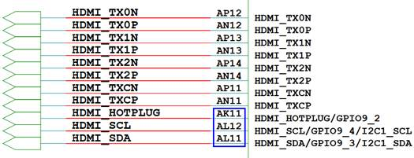

以AK11管脚的复用关系配置为例进行描述，HDMI\_HOTPLUG（AK11）管脚控制寄存器如[表1](#_table161131023191416)所示。

**表 1**  AK11管脚控制寄存器

<a name="_table161131023191416"></a>
<table><thead align="left"><tr id="row2432mcpsimp"><th class="cellrowborder" valign="top" width="14.000000000000002%" id="mcps1.2.8.1.1"><p id="p2434mcpsimp"><a name="p2434mcpsimp"></a><a name="p2434mcpsimp"></a>Register Name</p>
</th>
<th class="cellrowborder" valign="top" width="10%" id="mcps1.2.8.1.2"><p id="p2436mcpsimp"><a name="p2436mcpsimp"></a><a name="p2436mcpsimp"></a>Pin Number</p>
</th>
<th class="cellrowborder" valign="top" width="19%" id="mcps1.2.8.1.3"><p id="p2438mcpsimp"><a name="p2438mcpsimp"></a><a name="p2438mcpsimp"></a>Function</p>
</th>
<th class="cellrowborder" valign="top" width="16%" id="mcps1.2.8.1.4"><p id="p2440mcpsimp"><a name="p2440mcpsimp"></a><a name="p2440mcpsimp"></a>Address</p>
</th>
<th class="cellrowborder" valign="top" width="10%" id="mcps1.2.8.1.5"><p id="p2442mcpsimp"><a name="p2442mcpsimp"></a><a name="p2442mcpsimp"></a>Default Value</p>
</th>
<th class="cellrowborder" valign="top" width="10%" id="mcps1.2.8.1.6"><p id="p2444mcpsimp"><a name="p2444mcpsimp"></a><a name="p2444mcpsimp"></a>Field Bits</p>
</th>
<th class="cellrowborder" valign="top" width="21%" id="mcps1.2.8.1.7"><p id="p2446mcpsimp"><a name="p2446mcpsimp"></a><a name="p2446mcpsimp"></a>Field Description</p>
</th>
</tr>
</thead>
<tbody><tr id="row2448mcpsimp"><td class="cellrowborder" rowspan="10" valign="top" width="14.000000000000002%" headers="mcps1.2.8.1.1 "><p id="p2450mcpsimp"><a name="p2450mcpsimp"></a><a name="p2450mcpsimp"></a>iocfg_reg79</p>
</td>
<td class="cellrowborder" rowspan="10" valign="top" width="10%" headers="mcps1.2.8.1.2 "><p id="p2452mcpsimp"><a name="p2452mcpsimp"></a><a name="p2452mcpsimp"></a>AK11</p>
</td>
<td class="cellrowborder" rowspan="10" valign="top" width="19%" headers="mcps1.2.8.1.3 "><p id="p2454mcpsimp"><a name="p2454mcpsimp"></a><a name="p2454mcpsimp"></a>Pin HDMI_HOTPLUG IO Config Register.</p>
</td>
<td class="cellrowborder" rowspan="10" valign="top" width="16%" headers="mcps1.2.8.1.4 "><p id="p2456mcpsimp"><a name="p2456mcpsimp"></a><a name="p2456mcpsimp"></a>0x0102F00E4</p>
</td>
<td class="cellrowborder" rowspan="10" valign="top" width="10%" headers="mcps1.2.8.1.5 "><p id="p2458mcpsimp"><a name="p2458mcpsimp"></a><a name="p2458mcpsimp"></a>0x1100</p>
</td>
<td class="cellrowborder" valign="top" width="10%" headers="mcps1.2.8.1.6 "><p id="p2460mcpsimp"><a name="p2460mcpsimp"></a><a name="p2460mcpsimp"></a>31:15</p>
</td>
<td class="cellrowborder" valign="top" width="21%" headers="mcps1.2.8.1.7 "><p id="p2462mcpsimp"><a name="p2462mcpsimp"></a><a name="p2462mcpsimp"></a>保留。</p>
</td>
</tr>
<tr id="row2463mcpsimp"><td class="cellrowborder" valign="top" headers="mcps1.2.8.1.1 "><p id="p2465mcpsimp"><a name="p2465mcpsimp"></a><a name="p2465mcpsimp"></a>14</p>
</td>
<td class="cellrowborder" valign="top" headers="mcps1.2.8.1.2 "><p id="p2467mcpsimp"><a name="p2467mcpsimp"></a><a name="p2467mcpsimp"></a>输入电平域值选择2：</p>
<p id="p2468mcpsimp"><a name="p2468mcpsimp"></a><a name="p2468mcpsimp"></a>0x0：Vil/ViH=1.1V/1.7V for 3.3V/5V PAD tolerant input；</p>
<p id="p2469mcpsimp"><a name="p2469mcpsimp"></a><a name="p2469mcpsimp"></a>0x1：Vil/ViH=1.5V/2.5V for 3.3V/5V PAD tolerant input。</p>
</td>
</tr>
<tr id="row2470mcpsimp"><td class="cellrowborder" valign="top" headers="mcps1.2.8.1.1 "><p id="p2472mcpsimp"><a name="p2472mcpsimp"></a><a name="p2472mcpsimp"></a>13</p>
</td>
<td class="cellrowborder" valign="top" headers="mcps1.2.8.1.2 "><p id="p2474mcpsimp"><a name="p2474mcpsimp"></a><a name="p2474mcpsimp"></a>输入电平域值选择1：</p>
<p id="p2475mcpsimp"><a name="p2475mcpsimp"></a><a name="p2475mcpsimp"></a>0x0：1.8V PAD input；</p>
<p id="p2476mcpsimp"><a name="p2476mcpsimp"></a><a name="p2476mcpsimp"></a>0x1：3.3V /5V PAD  tolerant input。</p>
</td>
</tr>
<tr id="row2477mcpsimp"><td class="cellrowborder" valign="top" headers="mcps1.2.8.1.1 "><p id="p2479mcpsimp"><a name="p2479mcpsimp"></a><a name="p2479mcpsimp"></a>12</p>
</td>
<td class="cellrowborder" valign="top" headers="mcps1.2.8.1.2 "><p id="p2481mcpsimp"><a name="p2481mcpsimp"></a><a name="p2481mcpsimp"></a>保留。</p>
</td>
</tr>
<tr id="row2482mcpsimp"><td class="cellrowborder" valign="top" headers="mcps1.2.8.1.1 "><p id="p2484mcpsimp"><a name="p2484mcpsimp"></a><a name="p2484mcpsimp"></a>11</p>
</td>
<td class="cellrowborder" valign="top" headers="mcps1.2.8.1.2 "><p id="p2486mcpsimp"><a name="p2486mcpsimp"></a><a name="p2486mcpsimp"></a>管脚施密特输入控制：</p>
<p id="p2487mcpsimp"><a name="p2487mcpsimp"></a><a name="p2487mcpsimp"></a>0x0：关闭；</p>
<p id="p2488mcpsimp"><a name="p2488mcpsimp"></a><a name="p2488mcpsimp"></a>0x1：打开。</p>
</td>
</tr>
<tr id="row2489mcpsimp"><td class="cellrowborder" valign="top" headers="mcps1.2.8.1.1 "><p id="p2491mcpsimp"><a name="p2491mcpsimp"></a><a name="p2491mcpsimp"></a>10</p>
</td>
<td class="cellrowborder" valign="top" headers="mcps1.2.8.1.2 "><p id="p2493mcpsimp"><a name="p2493mcpsimp"></a><a name="p2493mcpsimp"></a>保留。</p>
</td>
</tr>
<tr id="row2494mcpsimp"><td class="cellrowborder" valign="top" headers="mcps1.2.8.1.1 "><p id="p2496mcpsimp"><a name="p2496mcpsimp"></a><a name="p2496mcpsimp"></a>9</p>
</td>
<td class="cellrowborder" valign="top" headers="mcps1.2.8.1.2 "><p id="p2498mcpsimp"><a name="p2498mcpsimp"></a><a name="p2498mcpsimp"></a>保留。</p>
</td>
</tr>
<tr id="row2499mcpsimp"><td class="cellrowborder" valign="top" headers="mcps1.2.8.1.1 "><p id="p2501mcpsimp"><a name="p2501mcpsimp"></a><a name="p2501mcpsimp"></a>8</p>
</td>
<td class="cellrowborder" valign="top" headers="mcps1.2.8.1.2 "><p id="p2503mcpsimp"><a name="p2503mcpsimp"></a><a name="p2503mcpsimp"></a>保留</p>
</td>
</tr>
<tr id="row2504mcpsimp"><td class="cellrowborder" valign="top" headers="mcps1.2.8.1.1 "><p id="p2506mcpsimp"><a name="p2506mcpsimp"></a><a name="p2506mcpsimp"></a>7:4</p>
</td>
<td class="cellrowborder" valign="top" headers="mcps1.2.8.1.2 "><p id="p2508mcpsimp"><a name="p2508mcpsimp"></a><a name="p2508mcpsimp"></a>管脚驱动能力选择：</p>
<p id="p2509mcpsimp"><a name="p2509mcpsimp"></a><a name="p2509mcpsimp"></a>0x0：IO6_2档位1；</p>
<p id="p2510mcpsimp"><a name="p2510mcpsimp"></a><a name="p2510mcpsimp"></a>0x1：IO6_2档位2；</p>
<p id="p2511mcpsimp"><a name="p2511mcpsimp"></a><a name="p2511mcpsimp"></a>0x2：IO6_2档位3；</p>
<p id="p2512mcpsimp"><a name="p2512mcpsimp"></a><a name="p2512mcpsimp"></a>0x3：IO6_2档位4；</p>
<p id="p2513mcpsimp"><a name="p2513mcpsimp"></a><a name="p2513mcpsimp"></a>其它：保留。</p>
</td>
</tr>
<tr id="row2514mcpsimp"><td class="cellrowborder" valign="top" headers="mcps1.2.8.1.1 "><p id="p2516mcpsimp"><a name="p2516mcpsimp"></a><a name="p2516mcpsimp"></a>3:0</p>
</td>
<td class="cellrowborder" valign="top" headers="mcps1.2.8.1.2 "><p id="p2518mcpsimp"><a name="p2518mcpsimp"></a><a name="p2518mcpsimp"></a>功能选择：</p>
<p id="p2519mcpsimp"><a name="p2519mcpsimp"></a><a name="p2519mcpsimp"></a>0x0：GPIO9_2；</p>
<p id="p2520mcpsimp"><a name="p2520mcpsimp"></a><a name="p2520mcpsimp"></a>0x1：HDMI_HOTPLUG；</p>
<p id="p2521mcpsimp"><a name="p2521mcpsimp"></a><a name="p2521mcpsimp"></a>其它：保留。</p>
</td>
</tr>
</tbody>
</table>

AK11存在两种功能复用：GPIO9\_2/ HDMI\_HOTPLUG

AK11管脚配置：0x2801

-   Bits\[3:0\]=1，表示AK11复用为HDMI\_HOTPLUG
-   Bits\[7:4\]=0，表示选择驱动能力档位1
-   Bits\[11\]=1，表示管脚施密特输入控制：打开
-   Bits\[13\]=1，表示输入电平域值选择3.3V /5V PAD。

【注意事项】

无。

### MIPI\_TX管脚复用<a name="ZH-CN_TOPIC_0000002408102166"></a>

【配置】（以SS928V100为例）

g\_reg\_iocfg2\_base 见[表3](#_table16578980)。

```
static void vo_mipi_tx_pin_mux(void) 
{ 
    void *iocfg2_base = sys_config_get_reg_iocfg2(); 
  
    sys_writel(iocfg2_base + 0x00D8, 0x0201); 
    sys_writel(iocfg2_base + 0x00A0, 0x0000); 
    sys_writel(iocfg2_base + 0x00A4, 0x0000); 
    sys_writel(iocfg2_base + 0x00A8, 0x0000); 
    sys_writel(iocfg2_base + 0x00AC, 0x0000); 
    sys_writel(iocfg2_base + 0x00B0, 0x0000); 
    sys_writel(iocfg2_base + 0x00B4, 0x0000); 
    sys_writel(iocfg2_base + 0x00B8, 0x0000); 
    sys_writel(iocfg2_base + 0x00BC, 0x0000); 
    sys_writel(iocfg2_base + 0x00C0, 0x0000); 
    sys_writel(iocfg2_base + 0x00C4, 0x0000); 
}
```

【描述说明】

参考硬件设计原理图，VSYNC\_TE\_MIPITX（AL4）、DSI\_D3N（AH1）、DSI\_D3P（AH2）、DSI\_D1N（AL1）、DSI\_D1P（AL2）、DSI\_CKN（AK1）、DSI\_CKP（AK2）、DSI\_D0N（AM1）、DSI\_D0P（AM2）、DSI\_D2N（AJ1）、DSI\_D2P（AJ2）管脚如[图1](#_fig1954917234140)所示。

**图 1**  MIPI\_TX原理图<a name="_fig1954917234140"></a>  
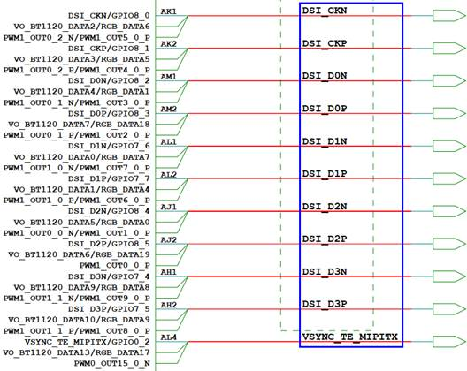

以AL4管脚的复用关系配置为例进行描述，VSYNC\_TE\_MIPITX（AL4）管脚控制寄存器如[表1](#_table101432023181417)所示。

**表 1**  AL4管脚控制寄存器

<a name="_table101432023181417"></a>
<table><thead align="left"><tr id="row2552mcpsimp"><th class="cellrowborder" valign="top" width="14.000000000000004%" id="mcps1.2.8.1.1"><p id="p2554mcpsimp"><a name="p2554mcpsimp"></a><a name="p2554mcpsimp"></a>Register Name</p>
</th>
<th class="cellrowborder" valign="top" width="11.000000000000002%" id="mcps1.2.8.1.2"><p id="p2556mcpsimp"><a name="p2556mcpsimp"></a><a name="p2556mcpsimp"></a>Pin Number</p>
</th>
<th class="cellrowborder" valign="top" width="19.000000000000004%" id="mcps1.2.8.1.3"><p id="p2558mcpsimp"><a name="p2558mcpsimp"></a><a name="p2558mcpsimp"></a>Function</p>
</th>
<th class="cellrowborder" valign="top" width="15.000000000000002%" id="mcps1.2.8.1.4"><p id="p2560mcpsimp"><a name="p2560mcpsimp"></a><a name="p2560mcpsimp"></a>Address</p>
</th>
<th class="cellrowborder" valign="top" width="10.000000000000002%" id="mcps1.2.8.1.5"><p id="p2562mcpsimp"><a name="p2562mcpsimp"></a><a name="p2562mcpsimp"></a>Default Value</p>
</th>
<th class="cellrowborder" valign="top" width="8.000000000000002%" id="mcps1.2.8.1.6"><p id="p2564mcpsimp"><a name="p2564mcpsimp"></a><a name="p2564mcpsimp"></a>Field Bits</p>
</th>
<th class="cellrowborder" valign="top" width="23.000000000000004%" id="mcps1.2.8.1.7"><p id="p2566mcpsimp"><a name="p2566mcpsimp"></a><a name="p2566mcpsimp"></a>Field Description</p>
</th>
</tr>
</thead>
<tbody><tr id="row2568mcpsimp"><td class="cellrowborder" rowspan="10" valign="top" width="14.000000000000004%" headers="mcps1.2.8.1.1 "><p id="p2570mcpsimp"><a name="p2570mcpsimp"></a><a name="p2570mcpsimp"></a>iocfg_reg76</p>
</td>
<td class="cellrowborder" rowspan="10" valign="top" width="11.000000000000002%" headers="mcps1.2.8.1.2 "><p id="p2572mcpsimp"><a name="p2572mcpsimp"></a><a name="p2572mcpsimp"></a>AL4</p>
</td>
<td class="cellrowborder" rowspan="10" valign="top" width="19.000000000000004%" headers="mcps1.2.8.1.3 "><p id="p2574mcpsimp"><a name="p2574mcpsimp"></a><a name="p2574mcpsimp"></a>Pin VSYNC_TE_MIPITX IO Config Register.</p>
</td>
<td class="cellrowborder" rowspan="10" valign="top" width="15.000000000000002%" headers="mcps1.2.8.1.4 "><p id="p2576mcpsimp"><a name="p2576mcpsimp"></a><a name="p2576mcpsimp"></a>0x0102F00D8</p>
</td>
<td class="cellrowborder" rowspan="10" valign="top" width="10.000000000000002%" headers="mcps1.2.8.1.5 "><p id="p2578mcpsimp"><a name="p2578mcpsimp"></a><a name="p2578mcpsimp"></a>0x1200</p>
</td>
<td class="cellrowborder" valign="top" width="8.000000000000002%" headers="mcps1.2.8.1.6 "><p id="p2580mcpsimp"><a name="p2580mcpsimp"></a><a name="p2580mcpsimp"></a>31:15</p>
</td>
<td class="cellrowborder" valign="top" width="23.000000000000004%" headers="mcps1.2.8.1.7 "><p id="p2582mcpsimp"><a name="p2582mcpsimp"></a><a name="p2582mcpsimp"></a>保留。</p>
</td>
</tr>
<tr id="row2583mcpsimp"><td class="cellrowborder" valign="top" headers="mcps1.2.8.1.1 "><p id="p2585mcpsimp"><a name="p2585mcpsimp"></a><a name="p2585mcpsimp"></a>14</p>
</td>
<td class="cellrowborder" valign="top" headers="mcps1.2.8.1.2 "><p id="p2587mcpsimp"><a name="p2587mcpsimp"></a><a name="p2587mcpsimp"></a>保留。</p>
</td>
</tr>
<tr id="row2588mcpsimp"><td class="cellrowborder" valign="top" headers="mcps1.2.8.1.1 "><p id="p2590mcpsimp"><a name="p2590mcpsimp"></a><a name="p2590mcpsimp"></a>13</p>
</td>
<td class="cellrowborder" valign="top" headers="mcps1.2.8.1.2 "><p id="p2592mcpsimp"><a name="p2592mcpsimp"></a><a name="p2592mcpsimp"></a>保留。</p>
</td>
</tr>
<tr id="row2593mcpsimp"><td class="cellrowborder" valign="top" headers="mcps1.2.8.1.1 "><p id="p2595mcpsimp"><a name="p2595mcpsimp"></a><a name="p2595mcpsimp"></a>12</p>
</td>
<td class="cellrowborder" valign="top" headers="mcps1.2.8.1.2 "><p id="p2597mcpsimp"><a name="p2597mcpsimp"></a><a name="p2597mcpsimp"></a>保留。</p>
</td>
</tr>
<tr id="row2598mcpsimp"><td class="cellrowborder" valign="top" headers="mcps1.2.8.1.1 "><p id="p2600mcpsimp"><a name="p2600mcpsimp"></a><a name="p2600mcpsimp"></a>11</p>
</td>
<td class="cellrowborder" valign="top" headers="mcps1.2.8.1.2 "><p id="p2602mcpsimp"><a name="p2602mcpsimp"></a><a name="p2602mcpsimp"></a>保留。</p>
</td>
</tr>
<tr id="row2603mcpsimp"><td class="cellrowborder" valign="top" headers="mcps1.2.8.1.1 "><p id="p2605mcpsimp"><a name="p2605mcpsimp"></a><a name="p2605mcpsimp"></a>10</p>
</td>
<td class="cellrowborder" valign="top" headers="mcps1.2.8.1.2 "><p id="p2607mcpsimp"><a name="p2607mcpsimp"></a><a name="p2607mcpsimp"></a>管脚电平转换速率控制：</p>
<p id="p2608mcpsimp"><a name="p2608mcpsimp"></a><a name="p2608mcpsimp"></a>0x0：快沿输出；</p>
<p id="p2609mcpsimp"><a name="p2609mcpsimp"></a><a name="p2609mcpsimp"></a>0x1：慢沿输出。</p>
</td>
</tr>
<tr id="row2610mcpsimp"><td class="cellrowborder" valign="top" headers="mcps1.2.8.1.1 "><p id="p2612mcpsimp"><a name="p2612mcpsimp"></a><a name="p2612mcpsimp"></a>9</p>
</td>
<td class="cellrowborder" valign="top" headers="mcps1.2.8.1.2 "><p id="p2614mcpsimp"><a name="p2614mcpsimp"></a><a name="p2614mcpsimp"></a>管脚下拉控制：</p>
<p id="p2615mcpsimp"><a name="p2615mcpsimp"></a><a name="p2615mcpsimp"></a>0x0：关闭；</p>
<p id="p2616mcpsimp"><a name="p2616mcpsimp"></a><a name="p2616mcpsimp"></a>0x1：打开。</p>
</td>
</tr>
<tr id="row2617mcpsimp"><td class="cellrowborder" valign="top" headers="mcps1.2.8.1.1 "><p id="p2619mcpsimp"><a name="p2619mcpsimp"></a><a name="p2619mcpsimp"></a>8</p>
</td>
<td class="cellrowborder" valign="top" headers="mcps1.2.8.1.2 "><p id="p2621mcpsimp"><a name="p2621mcpsimp"></a><a name="p2621mcpsimp"></a>管脚上拉控制：</p>
<p id="p2622mcpsimp"><a name="p2622mcpsimp"></a><a name="p2622mcpsimp"></a>0x0：关闭；</p>
<p id="p2623mcpsimp"><a name="p2623mcpsimp"></a><a name="p2623mcpsimp"></a>0x1：打开。</p>
</td>
</tr>
<tr id="row2624mcpsimp"><td class="cellrowborder" valign="top" headers="mcps1.2.8.1.1 "><p id="p2626mcpsimp"><a name="p2626mcpsimp"></a><a name="p2626mcpsimp"></a>7:4</p>
</td>
<td class="cellrowborder" valign="top" headers="mcps1.2.8.1.2 "><p id="p2628mcpsimp"><a name="p2628mcpsimp"></a><a name="p2628mcpsimp"></a>管脚驱动能力选择：</p>
<p id="p2629mcpsimp"><a name="p2629mcpsimp"></a><a name="p2629mcpsimp"></a>0x0：IO2档位1；</p>
<p id="p2630mcpsimp"><a name="p2630mcpsimp"></a><a name="p2630mcpsimp"></a>0x1：IO2档位2；</p>
<p id="p2631mcpsimp"><a name="p2631mcpsimp"></a><a name="p2631mcpsimp"></a>0x2：IO2档位3；</p>
<p id="p2632mcpsimp"><a name="p2632mcpsimp"></a><a name="p2632mcpsimp"></a>0x3：IO2档位4；</p>
<p id="p2633mcpsimp"><a name="p2633mcpsimp"></a><a name="p2633mcpsimp"></a>0x4：IO2档位5；</p>
<p id="p2634mcpsimp"><a name="p2634mcpsimp"></a><a name="p2634mcpsimp"></a>0x5：IO2档位6；</p>
<p id="p2635mcpsimp"><a name="p2635mcpsimp"></a><a name="p2635mcpsimp"></a>0x6：IO2档位7；</p>
<p id="p2636mcpsimp"><a name="p2636mcpsimp"></a><a name="p2636mcpsimp"></a>0x7：IO2档位8；</p>
<p id="p2637mcpsimp"><a name="p2637mcpsimp"></a><a name="p2637mcpsimp"></a>0x8：IO2档位9；</p>
<p id="p2638mcpsimp"><a name="p2638mcpsimp"></a><a name="p2638mcpsimp"></a>0x9：IO2档位10；</p>
<p id="p2639mcpsimp"><a name="p2639mcpsimp"></a><a name="p2639mcpsimp"></a>0xA：IO2档位11；</p>
<p id="p2640mcpsimp"><a name="p2640mcpsimp"></a><a name="p2640mcpsimp"></a>0xB：IO2档位12；</p>
<p id="p2641mcpsimp"><a name="p2641mcpsimp"></a><a name="p2641mcpsimp"></a>0xC：IO2档位13；</p>
<p id="p2642mcpsimp"><a name="p2642mcpsimp"></a><a name="p2642mcpsimp"></a>0xD：IO2档位14；</p>
<p id="p2643mcpsimp"><a name="p2643mcpsimp"></a><a name="p2643mcpsimp"></a>0xE：IO2档位15；</p>
<p id="p2644mcpsimp"><a name="p2644mcpsimp"></a><a name="p2644mcpsimp"></a>0xF：IO2档位16；</p>
<p id="p2645mcpsimp"><a name="p2645mcpsimp"></a><a name="p2645mcpsimp"></a>其它：保留。</p>
</td>
</tr>
<tr id="row2646mcpsimp"><td class="cellrowborder" valign="top" headers="mcps1.2.8.1.1 "><p id="p2648mcpsimp"><a name="p2648mcpsimp"></a><a name="p2648mcpsimp"></a>3:0</p>
</td>
<td class="cellrowborder" valign="top" headers="mcps1.2.8.1.2 "><p id="p2650mcpsimp"><a name="p2650mcpsimp"></a><a name="p2650mcpsimp"></a>功能选择：</p>
<p id="p2651mcpsimp"><a name="p2651mcpsimp"></a><a name="p2651mcpsimp"></a>0x0：GPIO0_2；</p>
<p id="p2652mcpsimp"><a name="p2652mcpsimp"></a><a name="p2652mcpsimp"></a>0x1：VSYNC_TE_MIPITX；</p>
<p id="p2653mcpsimp"><a name="p2653mcpsimp"></a><a name="p2653mcpsimp"></a>0x2：VO_BT1120_DATA13；</p>
<p id="p2654mcpsimp"><a name="p2654mcpsimp"></a><a name="p2654mcpsimp"></a>0x3：RGB_DATA17；</p>
<p id="p2655mcpsimp"><a name="p2655mcpsimp"></a><a name="p2655mcpsimp"></a>0x6：PWM0_OUT15_0_N；</p>
<p id="p2656mcpsimp"><a name="p2656mcpsimp"></a><a name="p2656mcpsimp"></a>其它：保留。</p>
</td>
</tr>
</tbody>
</table>

AL4存在两种功能复用：GPIO0\_2/ VSYNC\_TE\_MIPITX/ VO\_BT1120\_DATA13/ RGB\_DATA17/ PWM0\_OUT15\_0\_N

AL4管脚配置：0x0201

-   Bits \[3:0\]=1，表示AL4复用为VSYNC\_TE\_MIPITX
-   Bits\[7:4\]=0，表示选择档位1
-   Bits\[9\]=0，表示管脚下拉控制：打开

【注意事项】

除VSYNC\_TE\_MIPITX 管脚外，其他MIPI\_TX管脚的驱动能力由MIPI\_TX控制PHY寄存器0x68来配置，当前采用寄存器默认值0x05。

### BT.1120管脚复用<a name="ZH-CN_TOPIC_0000002408262142"></a>

【配置】（以SS928V100为例）

g\_reg\_iocfg2\_base 见[表3](#_table16578980)，g\_reg\_mipi\_tx\_base见[表7](#_table071427174311)。

```
static void vo_bt_pin_mux(int vo_bt_mode) 
{ 
    void *iocfg2_base = sys_config_get_reg_iocfg2(); 
  
    vo_cmos_set_pin_drive_cap(MIPI_TX_DRIVE_CAP_LEVEL3); 
  
    sys_writel(iocfg2_base + 0x00C8, 0x0682); 
    sys_writel(iocfg2_base + 0x00A8,    0x2); 
    sys_writel(iocfg2_base + 0x00AC,    0x2); 
    sys_writel(iocfg2_base + 0x00B0,    0x2); 
    sys_writel(iocfg2_base + 0x00B4,    0x2); 
    sys_writel(iocfg2_base + 0x00B8,    0x2); 
    sys_writel(iocfg2_base + 0x00C0,    0x2); 
    sys_writel(iocfg2_base + 0x00C4,    0x2); 
    sys_writel(iocfg2_base + 0x00BC,    0x2); 
  
    if (vo_bt_mode == VO_BT656_MODE) { 
        return; 
    } 
     sys_writel(iocfg2_base + 0x00D4, 0x0242);  
     sys_writel(iocfg2_base + 0x00A0,    0x2);  
     sys_writel(iocfg2_base + 0x00A4,    0x2);  
     sys_writel(iocfg2_base + 0x00D0, 0x0242);  
     sys_writel(iocfg2_base + 0x00CC, 0x0242);  
     sys_writel(iocfg2_base + 0x00D8, 0x0242);  
     sys_writel(iocfg2_base + 0x00E0, 0x0242);  
     sys_writel(iocfg2_base + 0x00DC, 0x0242); 
}
```

【描述说明】

参考实际硬件设计原理图，VO\_BT1120\_CLK、VO\_BT1120\_DATA0、VO\_BT1120\_DATA1、……、VO\_BT1120\_DATA15通过AH4、AL1、AL2、……、AL6进行输出，BT.1120相关管脚如[图1](#_fig1455072321410)所示（以实际原理图为准）。

**图 1**  VO BT.1120原理图<a name="_fig1455072321410"></a>  
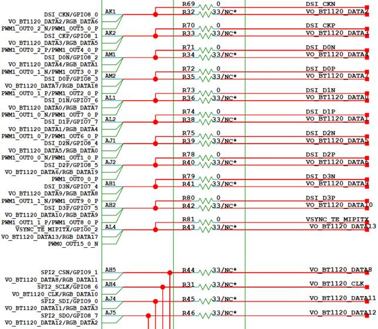

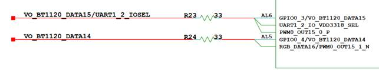

以AH4、AL1管脚的复用关系配置为例进行描述，VO\_BT1120\_CLK（AH4），VO\_BT1120\_DATA0（AL1）管脚控制寄存器如[表1](#_table1318817235141)所示。

**表 1**  AH4, AL1管脚控制寄存器

<a name="_table1318817235141"></a>
<table><thead align="left"><tr id="row2688mcpsimp"><th class="cellrowborder" valign="top" width="13.861386138613863%" id="mcps1.2.8.1.1"><p id="p2690mcpsimp"><a name="p2690mcpsimp"></a><a name="p2690mcpsimp"></a>Register Name</p>
</th>
<th class="cellrowborder" valign="top" width="12.871287128712872%" id="mcps1.2.8.1.2"><p id="p2692mcpsimp"><a name="p2692mcpsimp"></a><a name="p2692mcpsimp"></a>Pin Number</p>
</th>
<th class="cellrowborder" valign="top" width="13.861386138613863%" id="mcps1.2.8.1.3"><p id="p2694mcpsimp"><a name="p2694mcpsimp"></a><a name="p2694mcpsimp"></a>Function</p>
</th>
<th class="cellrowborder" valign="top" width="15.841584158415841%" id="mcps1.2.8.1.4"><p id="p2696mcpsimp"><a name="p2696mcpsimp"></a><a name="p2696mcpsimp"></a>Address</p>
</th>
<th class="cellrowborder" valign="top" width="9.900990099009901%" id="mcps1.2.8.1.5"><p id="p2698mcpsimp"><a name="p2698mcpsimp"></a><a name="p2698mcpsimp"></a>Default Value</p>
</th>
<th class="cellrowborder" valign="top" width="7.920792079207921%" id="mcps1.2.8.1.6"><p id="p2700mcpsimp"><a name="p2700mcpsimp"></a><a name="p2700mcpsimp"></a>Field Bits</p>
</th>
<th class="cellrowborder" valign="top" width="25.742574257425744%" id="mcps1.2.8.1.7"><p id="p2702mcpsimp"><a name="p2702mcpsimp"></a><a name="p2702mcpsimp"></a>Field Description</p>
</th>
</tr>
</thead>
<tbody><tr id="row2704mcpsimp"><td class="cellrowborder" rowspan="10" valign="top" width="13.861386138613863%" headers="mcps1.2.8.1.1 "><p id="p2706mcpsimp"><a name="p2706mcpsimp"></a><a name="p2706mcpsimp"></a>iocfg_reg72</p>
</td>
<td class="cellrowborder" rowspan="10" valign="top" width="12.871287128712872%" headers="mcps1.2.8.1.2 "><p id="p2708mcpsimp"><a name="p2708mcpsimp"></a><a name="p2708mcpsimp"></a>AH4</p>
</td>
<td class="cellrowborder" rowspan="10" valign="top" width="13.861386138613863%" headers="mcps1.2.8.1.3 "><p id="p2710mcpsimp"><a name="p2710mcpsimp"></a><a name="p2710mcpsimp"></a>Pin SPI2_SCLK IO Config Register.</p>
</td>
<td class="cellrowborder" rowspan="10" valign="top" width="15.841584158415841%" headers="mcps1.2.8.1.4 "><p id="p2712mcpsimp"><a name="p2712mcpsimp"></a><a name="p2712mcpsimp"></a>0x0102F00C8</p>
</td>
<td class="cellrowborder" rowspan="10" valign="top" width="9.900990099009901%" headers="mcps1.2.8.1.5 "><p id="p2714mcpsimp"><a name="p2714mcpsimp"></a><a name="p2714mcpsimp"></a>0x1200</p>
</td>
<td class="cellrowborder" valign="top" width="7.920792079207921%" headers="mcps1.2.8.1.6 "><p id="p2716mcpsimp"><a name="p2716mcpsimp"></a><a name="p2716mcpsimp"></a>31:15</p>
</td>
<td class="cellrowborder" valign="top" width="25.742574257425744%" headers="mcps1.2.8.1.7 "><p id="p2718mcpsimp"><a name="p2718mcpsimp"></a><a name="p2718mcpsimp"></a>保留。</p>
</td>
</tr>
<tr id="row2719mcpsimp"><td class="cellrowborder" valign="top" headers="mcps1.2.8.1.1 "><p id="p2721mcpsimp"><a name="p2721mcpsimp"></a><a name="p2721mcpsimp"></a>14</p>
</td>
<td class="cellrowborder" valign="top" headers="mcps1.2.8.1.2 "><p id="p2723mcpsimp"><a name="p2723mcpsimp"></a><a name="p2723mcpsimp"></a>保留。</p>
</td>
</tr>
<tr id="row2724mcpsimp"><td class="cellrowborder" valign="top" headers="mcps1.2.8.1.1 "><p id="p2726mcpsimp"><a name="p2726mcpsimp"></a><a name="p2726mcpsimp"></a>13</p>
</td>
<td class="cellrowborder" valign="top" headers="mcps1.2.8.1.2 "><p id="p2728mcpsimp"><a name="p2728mcpsimp"></a><a name="p2728mcpsimp"></a>保留。</p>
</td>
</tr>
<tr id="row2729mcpsimp"><td class="cellrowborder" valign="top" headers="mcps1.2.8.1.1 "><p id="p2731mcpsimp"><a name="p2731mcpsimp"></a><a name="p2731mcpsimp"></a>12</p>
</td>
<td class="cellrowborder" valign="top" headers="mcps1.2.8.1.2 "><p id="p2733mcpsimp"><a name="p2733mcpsimp"></a><a name="p2733mcpsimp"></a>保留。</p>
</td>
</tr>
<tr id="row2734mcpsimp"><td class="cellrowborder" valign="top" headers="mcps1.2.8.1.1 "><p id="p2736mcpsimp"><a name="p2736mcpsimp"></a><a name="p2736mcpsimp"></a>11</p>
</td>
<td class="cellrowborder" valign="top" headers="mcps1.2.8.1.2 "><p id="p2738mcpsimp"><a name="p2738mcpsimp"></a><a name="p2738mcpsimp"></a>保留。</p>
</td>
</tr>
<tr id="row2739mcpsimp"><td class="cellrowborder" valign="top" headers="mcps1.2.8.1.1 "><p id="p2741mcpsimp"><a name="p2741mcpsimp"></a><a name="p2741mcpsimp"></a>10</p>
</td>
<td class="cellrowborder" valign="top" headers="mcps1.2.8.1.2 "><p id="p2743mcpsimp"><a name="p2743mcpsimp"></a><a name="p2743mcpsimp"></a>管脚电平转换速率控制：</p>
<p id="p2744mcpsimp"><a name="p2744mcpsimp"></a><a name="p2744mcpsimp"></a>0x0：快沿输出；</p>
<p id="p2745mcpsimp"><a name="p2745mcpsimp"></a><a name="p2745mcpsimp"></a>0x1：慢沿输出。</p>
</td>
</tr>
<tr id="row2746mcpsimp"><td class="cellrowborder" valign="top" headers="mcps1.2.8.1.1 "><p id="p2748mcpsimp"><a name="p2748mcpsimp"></a><a name="p2748mcpsimp"></a>9</p>
</td>
<td class="cellrowborder" valign="top" headers="mcps1.2.8.1.2 "><p id="p2750mcpsimp"><a name="p2750mcpsimp"></a><a name="p2750mcpsimp"></a>管脚下拉控制：</p>
<p id="p2751mcpsimp"><a name="p2751mcpsimp"></a><a name="p2751mcpsimp"></a>0x0：关闭；</p>
<p id="p2752mcpsimp"><a name="p2752mcpsimp"></a><a name="p2752mcpsimp"></a>0x1：打开。</p>
</td>
</tr>
<tr id="row2753mcpsimp"><td class="cellrowborder" valign="top" headers="mcps1.2.8.1.1 "><p id="p2755mcpsimp"><a name="p2755mcpsimp"></a><a name="p2755mcpsimp"></a>8</p>
</td>
<td class="cellrowborder" valign="top" headers="mcps1.2.8.1.2 "><p id="p2757mcpsimp"><a name="p2757mcpsimp"></a><a name="p2757mcpsimp"></a>管脚上拉控制：</p>
<p id="p2758mcpsimp"><a name="p2758mcpsimp"></a><a name="p2758mcpsimp"></a>0x0：关闭；</p>
<p id="p2759mcpsimp"><a name="p2759mcpsimp"></a><a name="p2759mcpsimp"></a>0x1：打开。</p>
</td>
</tr>
<tr id="row2760mcpsimp"><td class="cellrowborder" valign="top" headers="mcps1.2.8.1.1 "><p id="p2762mcpsimp"><a name="p2762mcpsimp"></a><a name="p2762mcpsimp"></a>7:4</p>
</td>
<td class="cellrowborder" valign="top" headers="mcps1.2.8.1.2 "><p id="p2764mcpsimp"><a name="p2764mcpsimp"></a><a name="p2764mcpsimp"></a>管脚驱动能力选择：</p>
<p id="p2765mcpsimp"><a name="p2765mcpsimp"></a><a name="p2765mcpsimp"></a>0x0：IO2档位1；</p>
<p id="p2766mcpsimp"><a name="p2766mcpsimp"></a><a name="p2766mcpsimp"></a>0x1：IO2档位2；</p>
<p id="p2767mcpsimp"><a name="p2767mcpsimp"></a><a name="p2767mcpsimp"></a>0x2：IO2档位3；</p>
<p id="p2768mcpsimp"><a name="p2768mcpsimp"></a><a name="p2768mcpsimp"></a>0x3：IO2档位4；</p>
<p id="p2769mcpsimp"><a name="p2769mcpsimp"></a><a name="p2769mcpsimp"></a>0x4：IO2档位5；</p>
<p id="p2770mcpsimp"><a name="p2770mcpsimp"></a><a name="p2770mcpsimp"></a>0x5：IO2档位6；</p>
<p id="p2771mcpsimp"><a name="p2771mcpsimp"></a><a name="p2771mcpsimp"></a>0x6：IO2档位7；</p>
<p id="p2772mcpsimp"><a name="p2772mcpsimp"></a><a name="p2772mcpsimp"></a>0x7：IO2档位8；</p>
<p id="p2773mcpsimp"><a name="p2773mcpsimp"></a><a name="p2773mcpsimp"></a>0x8：IO2档位9；</p>
<p id="p2774mcpsimp"><a name="p2774mcpsimp"></a><a name="p2774mcpsimp"></a>0x9：IO2档位10；</p>
<p id="p2775mcpsimp"><a name="p2775mcpsimp"></a><a name="p2775mcpsimp"></a>0xA：IO2档位11；</p>
<p id="p2776mcpsimp"><a name="p2776mcpsimp"></a><a name="p2776mcpsimp"></a>0xB：IO2档位12；</p>
<p id="p2777mcpsimp"><a name="p2777mcpsimp"></a><a name="p2777mcpsimp"></a>0xC：IO2档位13；</p>
<p id="p2778mcpsimp"><a name="p2778mcpsimp"></a><a name="p2778mcpsimp"></a>0xD：IO2档位14；</p>
<p id="p2779mcpsimp"><a name="p2779mcpsimp"></a><a name="p2779mcpsimp"></a>0xE：IO2档位15；</p>
<p id="p2780mcpsimp"><a name="p2780mcpsimp"></a><a name="p2780mcpsimp"></a>0xF：IO2档位16；</p>
<p id="p2781mcpsimp"><a name="p2781mcpsimp"></a><a name="p2781mcpsimp"></a>其它：保留。</p>
</td>
</tr>
<tr id="row2782mcpsimp"><td class="cellrowborder" valign="top" headers="mcps1.2.8.1.1 "><p id="p2784mcpsimp"><a name="p2784mcpsimp"></a><a name="p2784mcpsimp"></a>3:0</p>
</td>
<td class="cellrowborder" valign="top" headers="mcps1.2.8.1.2 "><p id="p2786mcpsimp"><a name="p2786mcpsimp"></a><a name="p2786mcpsimp"></a>功能选择：</p>
<p id="p2787mcpsimp"><a name="p2787mcpsimp"></a><a name="p2787mcpsimp"></a>0x0：GPIO8_6；</p>
<p id="p2788mcpsimp"><a name="p2788mcpsimp"></a><a name="p2788mcpsimp"></a>0x1：SPI2_SCLK；</p>
<p id="p2789mcpsimp"><a name="p2789mcpsimp"></a><a name="p2789mcpsimp"></a>0x2：VO_BT1120_CLK；</p>
<p id="p2790mcpsimp"><a name="p2790mcpsimp"></a><a name="p2790mcpsimp"></a>0x3：RGB_DATA10；</p>
<p id="p2791mcpsimp"><a name="p2791mcpsimp"></a><a name="p2791mcpsimp"></a>其它：保留。</p>
</td>
</tr>
<tr id="row2792mcpsimp"><td class="cellrowborder" rowspan="10" valign="top" width="13.861386138613863%" headers="mcps1.2.8.1.1 "><p id="p2794mcpsimp"><a name="p2794mcpsimp"></a><a name="p2794mcpsimp"></a>iocfg_reg64</p>
</td>
<td class="cellrowborder" rowspan="10" valign="top" width="12.871287128712872%" headers="mcps1.2.8.1.2 "><p id="p2796mcpsimp"><a name="p2796mcpsimp"></a><a name="p2796mcpsimp"></a>AL1</p>
</td>
<td class="cellrowborder" rowspan="10" valign="top" width="13.861386138613863%" headers="mcps1.2.8.1.3 "><p id="p2798mcpsimp"><a name="p2798mcpsimp"></a><a name="p2798mcpsimp"></a>Pin DSI_D1N IO Config Register.</p>
</td>
<td class="cellrowborder" rowspan="10" valign="top" width="15.841584158415841%" headers="mcps1.2.8.1.4 "><p id="p2800mcpsimp"><a name="p2800mcpsimp"></a><a name="p2800mcpsimp"></a>0x0102F00A8</p>
</td>
<td class="cellrowborder" rowspan="10" valign="top" width="9.900990099009901%" headers="mcps1.2.8.1.5 "><p id="p2802mcpsimp"><a name="p2802mcpsimp"></a><a name="p2802mcpsimp"></a>0x1200</p>
</td>
<td class="cellrowborder" valign="top" width="7.920792079207921%" headers="mcps1.2.8.1.6 "><p id="p2804mcpsimp"><a name="p2804mcpsimp"></a><a name="p2804mcpsimp"></a>31:15</p>
</td>
<td class="cellrowborder" valign="top" width="25.742574257425744%" headers="mcps1.2.8.1.7 "><p id="p2806mcpsimp"><a name="p2806mcpsimp"></a><a name="p2806mcpsimp"></a>保留。</p>
</td>
</tr>
<tr id="row2807mcpsimp"><td class="cellrowborder" valign="top" headers="mcps1.2.8.1.1 "><p id="p2809mcpsimp"><a name="p2809mcpsimp"></a><a name="p2809mcpsimp"></a>14</p>
</td>
<td class="cellrowborder" valign="top" headers="mcps1.2.8.1.2 "><p id="p2811mcpsimp"><a name="p2811mcpsimp"></a><a name="p2811mcpsimp"></a>保留。</p>
</td>
</tr>
<tr id="row2812mcpsimp"><td class="cellrowborder" valign="top" headers="mcps1.2.8.1.1 "><p id="p2814mcpsimp"><a name="p2814mcpsimp"></a><a name="p2814mcpsimp"></a>13</p>
</td>
<td class="cellrowborder" valign="top" headers="mcps1.2.8.1.2 "><p id="p2816mcpsimp"><a name="p2816mcpsimp"></a><a name="p2816mcpsimp"></a>保留。</p>
</td>
</tr>
<tr id="row2817mcpsimp"><td class="cellrowborder" valign="top" headers="mcps1.2.8.1.1 "><p id="p2819mcpsimp"><a name="p2819mcpsimp"></a><a name="p2819mcpsimp"></a>12</p>
</td>
<td class="cellrowborder" valign="top" headers="mcps1.2.8.1.2 "><p id="p2821mcpsimp"><a name="p2821mcpsimp"></a><a name="p2821mcpsimp"></a>保留。</p>
</td>
</tr>
<tr id="row2822mcpsimp"><td class="cellrowborder" valign="top" headers="mcps1.2.8.1.1 "><p id="p2824mcpsimp"><a name="p2824mcpsimp"></a><a name="p2824mcpsimp"></a>11</p>
</td>
<td class="cellrowborder" valign="top" headers="mcps1.2.8.1.2 "><p id="p2826mcpsimp"><a name="p2826mcpsimp"></a><a name="p2826mcpsimp"></a>保留。</p>
</td>
</tr>
<tr id="row2827mcpsimp"><td class="cellrowborder" valign="top" headers="mcps1.2.8.1.1 "><p id="p2829mcpsimp"><a name="p2829mcpsimp"></a><a name="p2829mcpsimp"></a>10</p>
</td>
<td class="cellrowborder" valign="top" headers="mcps1.2.8.1.2 "><p id="p2831mcpsimp"><a name="p2831mcpsimp"></a><a name="p2831mcpsimp"></a>保留。</p>
</td>
</tr>
<tr id="row2832mcpsimp"><td class="cellrowborder" valign="top" headers="mcps1.2.8.1.1 "><p id="p2834mcpsimp"><a name="p2834mcpsimp"></a><a name="p2834mcpsimp"></a>9</p>
</td>
<td class="cellrowborder" valign="top" headers="mcps1.2.8.1.2 "><p id="p2836mcpsimp"><a name="p2836mcpsimp"></a><a name="p2836mcpsimp"></a>保留。</p>
</td>
</tr>
<tr id="row2837mcpsimp"><td class="cellrowborder" valign="top" headers="mcps1.2.8.1.1 "><p id="p2839mcpsimp"><a name="p2839mcpsimp"></a><a name="p2839mcpsimp"></a>8</p>
</td>
<td class="cellrowborder" valign="top" headers="mcps1.2.8.1.2 "><p id="p2841mcpsimp"><a name="p2841mcpsimp"></a><a name="p2841mcpsimp"></a>保留</p>
</td>
</tr>
<tr id="row2842mcpsimp"><td class="cellrowborder" valign="top" headers="mcps1.2.8.1.1 "><p id="p2844mcpsimp"><a name="p2844mcpsimp"></a><a name="p2844mcpsimp"></a>7:4</p>
</td>
<td class="cellrowborder" valign="top" headers="mcps1.2.8.1.2 "><p id="p2846mcpsimp"><a name="p2846mcpsimp"></a><a name="p2846mcpsimp"></a>管脚驱动能力选择：</p>
<p id="p2847mcpsimp"><a name="p2847mcpsimp"></a><a name="p2847mcpsimp"></a>0x0：IO7_1档位1；</p>
<p id="p2848mcpsimp"><a name="p2848mcpsimp"></a><a name="p2848mcpsimp"></a>0x4：IO7_1档位2；</p>
<p id="p2849mcpsimp"><a name="p2849mcpsimp"></a><a name="p2849mcpsimp"></a>0x6：IO7_1档位3；</p>
<p id="p2850mcpsimp"><a name="p2850mcpsimp"></a><a name="p2850mcpsimp"></a>0x7：IO7_1档位4(默认档位)；</p>
<p id="p2851mcpsimp"><a name="p2851mcpsimp"></a><a name="p2851mcpsimp"></a>其它：保留。</p>
<p id="p2852mcpsimp"><a name="p2852mcpsimp"></a><a name="p2852mcpsimp"></a>注意：此功能由MIPI_TX控制器寄存器控制，仅在非MIPI模式时生效。</p>
</td>
</tr>
<tr id="row2853mcpsimp"><td class="cellrowborder" valign="top" headers="mcps1.2.8.1.1 "><p id="p2855mcpsimp"><a name="p2855mcpsimp"></a><a name="p2855mcpsimp"></a>3:0</p>
</td>
<td class="cellrowborder" valign="top" headers="mcps1.2.8.1.2 "><p id="p2857mcpsimp"><a name="p2857mcpsimp"></a><a name="p2857mcpsimp"></a>功能选择：</p>
<p id="p2858mcpsimp"><a name="p2858mcpsimp"></a><a name="p2858mcpsimp"></a>0x0：DSI_D1N；</p>
<p id="p2859mcpsimp"><a name="p2859mcpsimp"></a><a name="p2859mcpsimp"></a>0x1：GPIO7_6；</p>
<p id="p2860mcpsimp"><a name="p2860mcpsimp"></a><a name="p2860mcpsimp"></a>0x2：VO_BT1120_DATA0；</p>
<p id="p2861mcpsimp"><a name="p2861mcpsimp"></a><a name="p2861mcpsimp"></a>0x3：RGB_DATA7；</p>
<p id="p2862mcpsimp"><a name="p2862mcpsimp"></a><a name="p2862mcpsimp"></a>0x5：PWM1_OUT1_0_N；</p>
<p id="p2863mcpsimp"><a name="p2863mcpsimp"></a><a name="p2863mcpsimp"></a>0x6：PWM1_OUT7_0_P；</p>
<p id="p2864mcpsimp"><a name="p2864mcpsimp"></a><a name="p2864mcpsimp"></a>其它：保留。</p>
</td>
</tr>
</tbody>
</table>

-   AH4存在4种功能复用：GPIO8\_6/SPI2\_SCLK/VO\_BT1120\_CLK/RGB\_DATA10

    AH4管脚配置：0x06f2

    -   Bits \[3:0\]=2，表示AH4复用为VO\_BT1120\_CLK
    -   Bits\[7:4\]=0xf，表示选择档位16
    -   Bits\[9\]=0x1，表示管脚下拉打开
    -   Bits\[10\]=0x1，表示管脚电平转换速率：慢沿输出。

-   AL1存在6种功能复用：DSI\_D1N/GPIO7\_6/VO\_BT1120\_DATA0/RGB\_DATA7/PWM1\_OUT1\_0\_N/PWM1\_OUT7\_0\_P

    AL1管脚配置：0x0002

    Bits \[3:0\]=2，表示AL1复用为VO\_BT1120\_DATA0

【注意事项】

DATA0\~DATA7，DATA9，DATA10引脚的管脚驱动能力由MIPI\_TX控制器来配置，可使用的档位0\~3，驱动能力大小关系：档位0<档位1<档位2<档位3，默认档位3，PHY的写入和读取方法如下：

写入配置方法：

```
PHY_REG_CFG1 = 0x100XX（XX为PHY的寄存器地址） 
PHY_REG_CFG0 = 0x2 
PHY_REG_CFG0 = 0x0 
PHY_REG_CFG1 = 0xYY（YY为PHY的寄存器XX的配置值） 
PHY_REG_CFG0 = 0x2 
PHY_REG_CFG0 = 0x0
```

写入示例：

```
  
static void vo_mipi_tx_enable(void) 
{ 
    void *crg_base = sys_config_get_reg_crg(); 
    unsigned long addr = (unsigned long)(crg_base + 0x8140); 
  
    /* mipi_tx gate clk enable */ 
    write_reg32(addr, 1, 0x1); /* bit 0 */ 
  
    /* unreset */ 
    write_reg32(addr, 0 << 1, 0x1 << 1);  /* 1: bit 1 */ 
  
    /* select ref clk 27MHz */ 
    write_reg32(addr, 1 << 2, 0x3 << 2); /* 2: bit 2 */ 
} 
  
static inline void set_phy_reg_isb(void) 
{ 
    isb(); 
#ifdef CONFIG_64BIT 
    dsb(sy); 
#else 
    dsb(); 
#endif 
#ifdef CONFIG_64BIT 
    dmb(sy); 
#else 
    dmb(); 
#endif 
} 
  
static void set_phy_reg(unsigned int addr, unsigned char value) 
{ 
    void *mipi_tx_base = sys_config_get_reg_mipi_tx(); 
  
    set_phy_reg_isb(); 
    sys_writel(mipi_tx_base + 0xb8, 0x10000 + addr); 
    set_phy_reg_isb(); 
    sys_writel(mipi_tx_base + 0xb4, 0x2); 
    set_phy_reg_isb(); 
    sys_writel(mipi_tx_base + 0xb4, 0x0); 
    set_phy_reg_isb(); 
    sys_writel(mipi_tx_base + 0xb8, value); 
    set_phy_reg_isb(); 
    sys_writel(mipi_tx_base + 0xb4, 0x2); 
    set_phy_reg_isb(); 
    sys_writel(mipi_tx_base + 0xb4, 0x0); 
    set_phy_reg_isb(); 
} 
  
static void vo_cmos_set_pin_drive_cap(mipi_tx_drive_cap cap) 
{ 
    vo_mipi_tx_enable(); 
    switch (cap) { 
        case MIPI_TX_DRIVE_CAP_LEVEL0: 
            set_phy_reg(MIPI_TX_DRIVE_CAP_PHY_REG, MIPI_TX_DRIVE_CAP_LEVEL0_VALUE); 
            break; 
  
        case MIPI_TX_DRIVE_CAP_LEVEL1: 
            set_phy_reg(MIPI_TX_DRIVE_CAP_PHY_REG, MIPI_TX_DRIVE_CAP_LEVEL1_VALUE); 
            break; 
  
        case MIPI_TX_DRIVE_CAP_LEVEL2: 
            set_phy_reg(MIPI_TX_DRIVE_CAP_PHY_REG, MIPI_TX_DRIVE_CAP_LEVEL2_VALUE); 
            break; 
  
        case MIPI_TX_DRIVE_CAP_LEVEL3: 
            set_phy_reg(MIPI_TX_DRIVE_CAP_PHY_REG, MIPI_TX_DRIVE_CAP_LEVEL3_VALUE); 
            break; 
        default: 
            break; 
    } 
} 
  
static void vo_bt_pin_mux(int vo_bt_mode) 
{ 
    …… 
    /* some bt pins' drv cap set by mipi_tx controller */ 
vo_cmos_set_pin_drive_cap(MIPI_TX_DRIVE_CAP_LEVEL3); 
…… 
}
```

读取配置方法：读配置即读MIPI\_TX PHY的寄存器时，对PHY\_REG\_CFG1\(g\_reg\_mipi\_tx\_base+0x00b8\)和PHY\_REG\_CFG0\(g\_reg\_mipi\_tx\_base+0x00b4\)寄存器执行下面的配置后，读 PHY\_REG\_CFG1寄存器的值，该寄存器的 bit15\~bit8 即是 PHY XX 寄存器的值。

```
PHY_REG_CFG1 = 0x100XX（XX为PHY的寄存器地址） 
PHY_REG_CFG0 = 0x2 
PHY_REG_CFG0 = 0x0
```

读取示例：

```
bspmm g_reg_mipi_tx_base+0x00b8 0x10066 
bspmm g_reg_mipi_tx_base+0x00b4 0x2 
bspmm g_reg_mipi_tx_base+0x00b4 0x0
bspmd.l g_reg_mipi_tx_base+0x00b8
```

### BT.656管脚复用<a name="ZH-CN_TOPIC_0000002408102278"></a>

【配置示例】（以SS928V100为例）

g\_reg\_iocfg\_base2 见[表3](#_table16578980)。

```
static void vo_bt_pin_mux(int vo_bt_mode) 
{ 
    void *iocfg2_base = sys_config_get_reg_iocfg2(); 
  
    vo_cmos_set_pin_drive_cap(MIPI_TX_DRIVE_CAP_LEVEL3); 
  
    sys_writel(iocfg2_base + 0x00C8, 0x0682); 
    sys_writel(iocfg2_base + 0x00A8,    0x2); 
    sys_writel(iocfg2_base + 0x00AC,    0x2); 
    sys_writel(iocfg2_base + 0x00B0,    0x2); 
    sys_writel(iocfg2_base + 0x00B4,    0x2); 
    sys_writel(iocfg2_base + 0x00B8,    0x2); 
    sys_writel(iocfg2_base + 0x00C0,    0x2); 
    sys_writel(iocfg2_base + 0x00C4,    0x2); 
    sys_writel(iocfg2_base + 0x00BC,    0x2); 
  
    if (vo_bt_mode == VO_BT656_MODE) { 
        return; 
    } 
}
```

【描述说明】

参考实际硬件设计原理图，VO\_BT656\_CLK、VO\_BT656\_DATA0、VO\_BT656\_DATA1、……、VO\_BT656\_DATA7通过AH4、AL1、AL2、……、AM2进行输出，BT.656相关管脚[图1](#_fig355162313143)所示。

**图 1**  VO BT.656原理图<a name="_fig355162313143"></a>  


【注意事项】

VO BT.656接口功能管脚采用VO BT.1120接口的DATA0\~DATA7，这些管脚的驱动能力由MIPI\_TX控制寄存器来配置，方法可参考“[BT.1120管脚复用](#_table16578980)。

```
static void vo_rgb_pin_mux(int vo_rgb_mode) 
{ 
    void *iocfg2_base = sys_config_get_reg_iocfg2(); 
  
    vo_cmos_set_pin_drive_cap(MIPI_TX_DRIVE_CAP_LEVEL2); 
  
    sys_writel(iocfg2_base + 0x0098, 0x0223); 
    sys_writel(iocfg2_base + 0x0080, 0x0213); 
    sys_writel(iocfg2_base + 0x008C, 0x0213); 
    sys_writel(iocfg2_base + 0x0090, 0x0213); 
    sys_writel(iocfg2_base + 0x00C0,    0x3); 
    sys_writel(iocfg2_base + 0x00B8,    0x3); 
    sys_writel(iocfg2_base + 0x00CC, 0x0233); 
    sys_writel(iocfg2_base + 0x00D0, 0x0233); 
    sys_writel(iocfg2_base + 0x00AC,    0x3); 
    sys_writel(iocfg2_base + 0x00B4,    0x3); 
  
    if (vo_rgb_mode == VO_RGB_6BIT_MODE) { 
        return; 
    } 
  
    sys_writel(iocfg2_base + 0x00B0,    0x3); 
    sys_writel(iocfg2_base + 0x00A8,    0x3); 
  
    if (vo_rgb_mode == VO_RGB_8BIT_MODE) { 
        return; 
    } 
  
    sys_writel(iocfg2_base + 0x00A0,    0x3); 
    sys_writel(iocfg2_base + 0x00A4,    0x3); 
    sys_writel(iocfg2_base + 0x00C8, 0x0233); 
    sys_writel(iocfg2_base + 0x00D4, 0x0233); 
    sys_writel(iocfg2_base + 0x0084, 0x0213); 
    sys_writel(iocfg2_base + 0x0094, 0x0213); 
    sys_writel(iocfg2_base + 0x0088, 0x0213); 
    sys_writel(iocfg2_base + 0x009C, 0x0213); 
  
    if (vo_rgb_mode == VO_RGB_16BIT_MODE) { 
        return; 
    } 
  
    sys_writel(iocfg2_base + 0x00E0, 0x0233); 
    sys_writel(iocfg2_base + 0x00D8, 0x0233); 
  
    if (vo_rgb_mode == VO_RGB_18BIT_MODE) { 
        return; 
    } 
  
    sys_writel(iocfg2_base + 0x00BC,    0x3); 
    sys_writel(iocfg2_base + 0x00C4,    0x3); 
    sys_writel(iocfg2_base + 0x0068, 0x0203); 
    sys_writel(iocfg2_base + 0x006C, 0x0203); 
    sys_writel(iocfg2_base + 0x0064, 0x0203); 
    sys_writel(iocfg2_base + 0x0060, 0x0213); 
}
```

【描述说明】

参考实际硬件设计原理图，RGB\_CLK、RGB\_DE、RGB\_HS、RGB\_VS、RGB \_DATA0、RGB \_DATA1、……、RGB \_DATA23通过AF2、AD2、AD3、AD1、AJ1、AM1、……、AD4进行输出，RGB接口管脚如[图1](#_fig15552162361413)至[图4](#_fig12552112391412)所示。

**图 1**  RGB\_CLK、RGB\_DE、RGB\_HS、RGB\_VS、RGB\_DATA12、RGB\_DATA13、RGB\_DATA14、RGB\_DATA15<a name="_fig15552162361413"></a>  
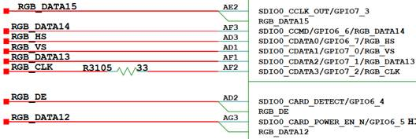

**图 2**  RGB\_DATA0、RGB\_DATA1、RGB\_DATA2、RGB\_DATA3、RGB\_DATA4、RGB\_DATA5、RGB\_DATA6、RGB\_DATA7、RGB\_DATA8、RGB\_DATA9、RGB\_DATA10、RGB\_DATA11、RGB\_DATA17、RGB\_DATA18、RGB\_DATA19<a name="fig2909mcpsimp"></a>  
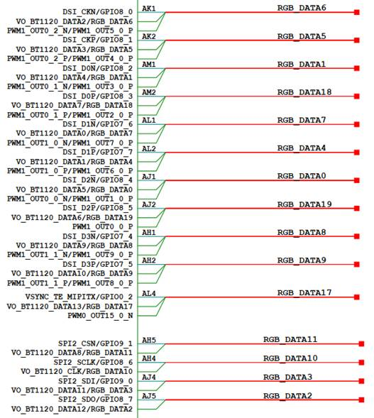

**图 3**  RGB\_DATA16<a name="fig2911mcpsimp"></a>  
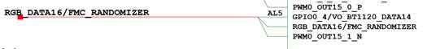

**图 4**  RGB\_DATA20、RGB\_DATA21、RGB\_DATA22、RGB\_DATA23<a name="_fig12552112391412"></a>  
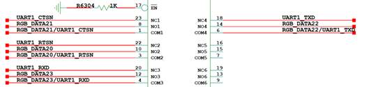

以AF2、AJ1管脚的复用关系配置为例进行描述，RGB\_CLK（AF2），RGB\_DATA0（AJ1）管脚控制寄存器如[表1](#_table162701523171418)所示。

**表 1**  AF2, AJ1管脚控制寄存器

<a name="_table162701523171418"></a>
<table><thead align="left"><tr id="row2926mcpsimp"><th class="cellrowborder" valign="top" width="13.861386138613863%" id="mcps1.2.8.1.1"><p id="p2928mcpsimp"><a name="p2928mcpsimp"></a><a name="p2928mcpsimp"></a>Register Name</p>
</th>
<th class="cellrowborder" valign="top" width="9.900990099009901%" id="mcps1.2.8.1.2"><p id="p2930mcpsimp"><a name="p2930mcpsimp"></a><a name="p2930mcpsimp"></a>Pin Number</p>
</th>
<th class="cellrowborder" valign="top" width="16.831683168316832%" id="mcps1.2.8.1.3"><p id="p2932mcpsimp"><a name="p2932mcpsimp"></a><a name="p2932mcpsimp"></a>Function</p>
</th>
<th class="cellrowborder" valign="top" width="14.85148514851485%" id="mcps1.2.8.1.4"><p id="p2934mcpsimp"><a name="p2934mcpsimp"></a><a name="p2934mcpsimp"></a>Address</p>
</th>
<th class="cellrowborder" valign="top" width="12.871287128712872%" id="mcps1.2.8.1.5"><p id="p2936mcpsimp"><a name="p2936mcpsimp"></a><a name="p2936mcpsimp"></a>Default Value</p>
</th>
<th class="cellrowborder" valign="top" width="8.91089108910891%" id="mcps1.2.8.1.6"><p id="p2938mcpsimp"><a name="p2938mcpsimp"></a><a name="p2938mcpsimp"></a>Field Bits</p>
</th>
<th class="cellrowborder" valign="top" width="22.772277227722775%" id="mcps1.2.8.1.7"><p id="p2940mcpsimp"><a name="p2940mcpsimp"></a><a name="p2940mcpsimp"></a>Field Description</p>
</th>
</tr>
</thead>
<tbody><tr id="row2942mcpsimp"><td class="cellrowborder" rowspan="10" valign="top" width="13.861386138613863%" headers="mcps1.2.8.1.1 "><p id="p2944mcpsimp"><a name="p2944mcpsimp"></a><a name="p2944mcpsimp"></a>iocfg_reg60</p>
</td>
<td class="cellrowborder" rowspan="10" valign="top" width="9.900990099009901%" headers="mcps1.2.8.1.2 "><p id="p2946mcpsimp"><a name="p2946mcpsimp"></a><a name="p2946mcpsimp"></a>AF2</p>
</td>
<td class="cellrowborder" rowspan="10" valign="top" width="16.831683168316832%" headers="mcps1.2.8.1.3 "><p id="p2948mcpsimp"><a name="p2948mcpsimp"></a><a name="p2948mcpsimp"></a>Pin SDIO0_CDATA3 IO Config Register.</p>
</td>
<td class="cellrowborder" rowspan="10" valign="top" width="14.85148514851485%" headers="mcps1.2.8.1.4 "><p id="p2950mcpsimp"><a name="p2950mcpsimp"></a><a name="p2950mcpsimp"></a>0x0102F0098</p>
</td>
<td class="cellrowborder" rowspan="10" valign="top" width="12.871287128712872%" headers="mcps1.2.8.1.5 "><p id="p2952mcpsimp"><a name="p2952mcpsimp"></a><a name="p2952mcpsimp"></a>0x1200</p>
</td>
<td class="cellrowborder" valign="top" width="8.91089108910891%" headers="mcps1.2.8.1.6 "><p id="p2954mcpsimp"><a name="p2954mcpsimp"></a><a name="p2954mcpsimp"></a>31:15</p>
</td>
<td class="cellrowborder" valign="top" width="22.772277227722775%" headers="mcps1.2.8.1.7 "><p id="p2956mcpsimp"><a name="p2956mcpsimp"></a><a name="p2956mcpsimp"></a>保留。</p>
</td>
</tr>
<tr id="row2957mcpsimp"><td class="cellrowborder" valign="top" headers="mcps1.2.8.1.1 "><p id="p2959mcpsimp"><a name="p2959mcpsimp"></a><a name="p2959mcpsimp"></a>14</p>
</td>
<td class="cellrowborder" valign="top" headers="mcps1.2.8.1.2 "><p id="p2961mcpsimp"><a name="p2961mcpsimp"></a><a name="p2961mcpsimp"></a>保留。</p>
</td>
</tr>
<tr id="row2962mcpsimp"><td class="cellrowborder" valign="top" headers="mcps1.2.8.1.1 "><p id="p2964mcpsimp"><a name="p2964mcpsimp"></a><a name="p2964mcpsimp"></a>13</p>
</td>
<td class="cellrowborder" valign="top" headers="mcps1.2.8.1.2 "><p id="p2966mcpsimp"><a name="p2966mcpsimp"></a><a name="p2966mcpsimp"></a>保留。</p>
</td>
</tr>
<tr id="row2967mcpsimp"><td class="cellrowborder" valign="top" headers="mcps1.2.8.1.1 "><p id="p2969mcpsimp"><a name="p2969mcpsimp"></a><a name="p2969mcpsimp"></a>12</p>
</td>
<td class="cellrowborder" valign="top" headers="mcps1.2.8.1.2 "><p id="p2971mcpsimp"><a name="p2971mcpsimp"></a><a name="p2971mcpsimp"></a>保留。</p>
</td>
</tr>
<tr id="row2972mcpsimp"><td class="cellrowborder" valign="top" headers="mcps1.2.8.1.1 "><p id="p2974mcpsimp"><a name="p2974mcpsimp"></a><a name="p2974mcpsimp"></a>11</p>
</td>
<td class="cellrowborder" valign="top" headers="mcps1.2.8.1.2 "><p id="p2976mcpsimp"><a name="p2976mcpsimp"></a><a name="p2976mcpsimp"></a>管脚施密特输入控制：</p>
<p id="p2977mcpsimp"><a name="p2977mcpsimp"></a><a name="p2977mcpsimp"></a>0x0：关闭；</p>
<p id="p2978mcpsimp"><a name="p2978mcpsimp"></a><a name="p2978mcpsimp"></a>0x1：打开。</p>
</td>
</tr>
<tr id="row2979mcpsimp"><td class="cellrowborder" valign="top" headers="mcps1.2.8.1.1 "><p id="p2981mcpsimp"><a name="p2981mcpsimp"></a><a name="p2981mcpsimp"></a>10</p>
</td>
<td class="cellrowborder" valign="top" headers="mcps1.2.8.1.2 "><p id="p2983mcpsimp"><a name="p2983mcpsimp"></a><a name="p2983mcpsimp"></a>管脚电平转换速率控制：</p>
<p id="p2984mcpsimp"><a name="p2984mcpsimp"></a><a name="p2984mcpsimp"></a>0x0：快沿输出；</p>
<p id="p2985mcpsimp"><a name="p2985mcpsimp"></a><a name="p2985mcpsimp"></a>0x1：慢沿输出。</p>
</td>
</tr>
<tr id="row2986mcpsimp"><td class="cellrowborder" valign="top" headers="mcps1.2.8.1.1 "><p id="p2988mcpsimp"><a name="p2988mcpsimp"></a><a name="p2988mcpsimp"></a>9</p>
</td>
<td class="cellrowborder" valign="top" headers="mcps1.2.8.1.2 "><p id="p2990mcpsimp"><a name="p2990mcpsimp"></a><a name="p2990mcpsimp"></a>管脚下拉控制：</p>
<p id="p2991mcpsimp"><a name="p2991mcpsimp"></a><a name="p2991mcpsimp"></a>0x0：关闭；</p>
<p id="p2992mcpsimp"><a name="p2992mcpsimp"></a><a name="p2992mcpsimp"></a>0x1：打开。</p>
</td>
</tr>
<tr id="row2993mcpsimp"><td class="cellrowborder" valign="top" headers="mcps1.2.8.1.1 "><p id="p2995mcpsimp"><a name="p2995mcpsimp"></a><a name="p2995mcpsimp"></a>8</p>
</td>
<td class="cellrowborder" valign="top" headers="mcps1.2.8.1.2 "><p id="p2997mcpsimp"><a name="p2997mcpsimp"></a><a name="p2997mcpsimp"></a>管脚上拉控制：</p>
<p id="p2998mcpsimp"><a name="p2998mcpsimp"></a><a name="p2998mcpsimp"></a>0x0：关闭；</p>
<p id="p2999mcpsimp"><a name="p2999mcpsimp"></a><a name="p2999mcpsimp"></a>0x1：打开。</p>
</td>
</tr>
<tr id="row3000mcpsimp"><td class="cellrowborder" valign="top" headers="mcps1.2.8.1.1 "><p id="p3002mcpsimp"><a name="p3002mcpsimp"></a><a name="p3002mcpsimp"></a>7:4</p>
</td>
<td class="cellrowborder" valign="top" headers="mcps1.2.8.1.2 "><p id="p3004mcpsimp"><a name="p3004mcpsimp"></a><a name="p3004mcpsimp"></a>管脚驱动能力选择：</p>
<p id="p3005mcpsimp"><a name="p3005mcpsimp"></a><a name="p3005mcpsimp"></a>0x0：IO5_2档位1；</p>
<p id="p3006mcpsimp"><a name="p3006mcpsimp"></a><a name="p3006mcpsimp"></a>0x1：IO5_2档位2；</p>
<p id="p3007mcpsimp"><a name="p3007mcpsimp"></a><a name="p3007mcpsimp"></a>0x2：IO5_2档位3；</p>
<p id="p3008mcpsimp"><a name="p3008mcpsimp"></a><a name="p3008mcpsimp"></a>0x3：IO5_2档位4；</p>
<p id="p3009mcpsimp"><a name="p3009mcpsimp"></a><a name="p3009mcpsimp"></a>0x4：IO5_2档位5；</p>
<p id="p3010mcpsimp"><a name="p3010mcpsimp"></a><a name="p3010mcpsimp"></a>0x5：IO5_2档位6；</p>
<p id="p3011mcpsimp"><a name="p3011mcpsimp"></a><a name="p3011mcpsimp"></a>0x6：IO5_2档位7；</p>
<p id="p3012mcpsimp"><a name="p3012mcpsimp"></a><a name="p3012mcpsimp"></a>0x7：IO5_2档位8；</p>
<p id="p3013mcpsimp"><a name="p3013mcpsimp"></a><a name="p3013mcpsimp"></a>0x8：IO5_2档位9；</p>
<p id="p3014mcpsimp"><a name="p3014mcpsimp"></a><a name="p3014mcpsimp"></a>0x9：IO5_2档位10；</p>
<p id="p3015mcpsimp"><a name="p3015mcpsimp"></a><a name="p3015mcpsimp"></a>0xA：IO5_2档位11；</p>
<p id="p3016mcpsimp"><a name="p3016mcpsimp"></a><a name="p3016mcpsimp"></a>0xB：IO5_2档位12；</p>
<p id="p3017mcpsimp"><a name="p3017mcpsimp"></a><a name="p3017mcpsimp"></a>0xC：IO5_2档位13；</p>
<p id="p3018mcpsimp"><a name="p3018mcpsimp"></a><a name="p3018mcpsimp"></a>0xD：IO5_2档位14；</p>
<p id="p3019mcpsimp"><a name="p3019mcpsimp"></a><a name="p3019mcpsimp"></a>0xE：IO5_2档位15；</p>
<p id="p3020mcpsimp"><a name="p3020mcpsimp"></a><a name="p3020mcpsimp"></a>0xF：IO5_2档位16；</p>
<p id="p3021mcpsimp"><a name="p3021mcpsimp"></a><a name="p3021mcpsimp"></a>其它：保留。</p>
</td>
</tr>
<tr id="row3022mcpsimp"><td class="cellrowborder" valign="top" headers="mcps1.2.8.1.1 "><p id="p3024mcpsimp"><a name="p3024mcpsimp"></a><a name="p3024mcpsimp"></a>3:0</p>
</td>
<td class="cellrowborder" valign="top" headers="mcps1.2.8.1.2 "><p id="p3026mcpsimp"><a name="p3026mcpsimp"></a><a name="p3026mcpsimp"></a>功能选择：</p>
<p id="p3027mcpsimp"><a name="p3027mcpsimp"></a><a name="p3027mcpsimp"></a>0x0：GPIO7_2；</p>
<p id="p3028mcpsimp"><a name="p3028mcpsimp"></a><a name="p3028mcpsimp"></a>0x1：SDIO0_CDATA3；</p>
<p id="p3029mcpsimp"><a name="p3029mcpsimp"></a><a name="p3029mcpsimp"></a>0x3：RGB_CLK；</p>
<p id="p3030mcpsimp"><a name="p3030mcpsimp"></a><a name="p3030mcpsimp"></a>其它：保留。</p>
</td>
</tr>
<tr id="row3031mcpsimp"><td class="cellrowborder" rowspan="10" valign="top" width="13.861386138613863%" headers="mcps1.2.8.1.1 "><p id="p3033mcpsimp"><a name="p3033mcpsimp"></a><a name="p3033mcpsimp"></a>iocfg_reg70</p>
</td>
<td class="cellrowborder" rowspan="10" valign="top" width="9.900990099009901%" headers="mcps1.2.8.1.2 "><p id="p3035mcpsimp"><a name="p3035mcpsimp"></a><a name="p3035mcpsimp"></a>AJ1</p>
</td>
<td class="cellrowborder" rowspan="10" valign="top" width="16.831683168316832%" headers="mcps1.2.8.1.3 "><p id="p3037mcpsimp"><a name="p3037mcpsimp"></a><a name="p3037mcpsimp"></a>Pin DSI_D2N IO Config Register.</p>
</td>
<td class="cellrowborder" rowspan="10" valign="top" width="14.85148514851485%" headers="mcps1.2.8.1.4 "><p id="p3039mcpsimp"><a name="p3039mcpsimp"></a><a name="p3039mcpsimp"></a>0x0102F00C0</p>
</td>
<td class="cellrowborder" rowspan="10" valign="top" width="12.871287128712872%" headers="mcps1.2.8.1.5 "><p id="p3041mcpsimp"><a name="p3041mcpsimp"></a><a name="p3041mcpsimp"></a>0x1200</p>
</td>
<td class="cellrowborder" valign="top" width="8.91089108910891%" headers="mcps1.2.8.1.6 "><p id="p3043mcpsimp"><a name="p3043mcpsimp"></a><a name="p3043mcpsimp"></a>31:15</p>
</td>
<td class="cellrowborder" valign="top" width="22.772277227722775%" headers="mcps1.2.8.1.7 "><p id="p3045mcpsimp"><a name="p3045mcpsimp"></a><a name="p3045mcpsimp"></a>保留。</p>
</td>
</tr>
<tr id="row3046mcpsimp"><td class="cellrowborder" valign="top" headers="mcps1.2.8.1.1 "><p id="p3048mcpsimp"><a name="p3048mcpsimp"></a><a name="p3048mcpsimp"></a>14</p>
</td>
<td class="cellrowborder" valign="top" headers="mcps1.2.8.1.2 "><p id="p3050mcpsimp"><a name="p3050mcpsimp"></a><a name="p3050mcpsimp"></a>保留。</p>
</td>
</tr>
<tr id="row3051mcpsimp"><td class="cellrowborder" valign="top" headers="mcps1.2.8.1.1 "><p id="p3053mcpsimp"><a name="p3053mcpsimp"></a><a name="p3053mcpsimp"></a>13</p>
</td>
<td class="cellrowborder" valign="top" headers="mcps1.2.8.1.2 "><p id="p3055mcpsimp"><a name="p3055mcpsimp"></a><a name="p3055mcpsimp"></a>保留。</p>
</td>
</tr>
<tr id="row3056mcpsimp"><td class="cellrowborder" valign="top" headers="mcps1.2.8.1.1 "><p id="p3058mcpsimp"><a name="p3058mcpsimp"></a><a name="p3058mcpsimp"></a>12</p>
</td>
<td class="cellrowborder" valign="top" headers="mcps1.2.8.1.2 "><p id="p3060mcpsimp"><a name="p3060mcpsimp"></a><a name="p3060mcpsimp"></a>保留。</p>
</td>
</tr>
<tr id="row3061mcpsimp"><td class="cellrowborder" valign="top" headers="mcps1.2.8.1.1 "><p id="p3063mcpsimp"><a name="p3063mcpsimp"></a><a name="p3063mcpsimp"></a>11</p>
</td>
<td class="cellrowborder" valign="top" headers="mcps1.2.8.1.2 "><p id="p3065mcpsimp"><a name="p3065mcpsimp"></a><a name="p3065mcpsimp"></a>保留。</p>
</td>
</tr>
<tr id="row3066mcpsimp"><td class="cellrowborder" valign="top" headers="mcps1.2.8.1.1 "><p id="p3068mcpsimp"><a name="p3068mcpsimp"></a><a name="p3068mcpsimp"></a>10</p>
</td>
<td class="cellrowborder" valign="top" headers="mcps1.2.8.1.2 "><p id="p3070mcpsimp"><a name="p3070mcpsimp"></a><a name="p3070mcpsimp"></a>保留。</p>
</td>
</tr>
<tr id="row3071mcpsimp"><td class="cellrowborder" valign="top" headers="mcps1.2.8.1.1 "><p id="p3073mcpsimp"><a name="p3073mcpsimp"></a><a name="p3073mcpsimp"></a>9</p>
</td>
<td class="cellrowborder" valign="top" headers="mcps1.2.8.1.2 "><p id="p3075mcpsimp"><a name="p3075mcpsimp"></a><a name="p3075mcpsimp"></a>保留。</p>
</td>
</tr>
<tr id="row3076mcpsimp"><td class="cellrowborder" valign="top" headers="mcps1.2.8.1.1 "><p id="p3078mcpsimp"><a name="p3078mcpsimp"></a><a name="p3078mcpsimp"></a>8</p>
</td>
<td class="cellrowborder" valign="top" headers="mcps1.2.8.1.2 "><p id="p3080mcpsimp"><a name="p3080mcpsimp"></a><a name="p3080mcpsimp"></a>保留</p>
</td>
</tr>
<tr id="row3081mcpsimp"><td class="cellrowborder" valign="top" headers="mcps1.2.8.1.1 "><p id="p3083mcpsimp"><a name="p3083mcpsimp"></a><a name="p3083mcpsimp"></a>7:4</p>
</td>
<td class="cellrowborder" valign="top" headers="mcps1.2.8.1.2 "><p id="p3085mcpsimp"><a name="p3085mcpsimp"></a><a name="p3085mcpsimp"></a>管脚驱动能力选择：</p>
<p id="p3086mcpsimp"><a name="p3086mcpsimp"></a><a name="p3086mcpsimp"></a>0x0：IO7_1档位1；</p>
<p id="p3087mcpsimp"><a name="p3087mcpsimp"></a><a name="p3087mcpsimp"></a>0x4：IO7_1档位2；</p>
<p id="p3088mcpsimp"><a name="p3088mcpsimp"></a><a name="p3088mcpsimp"></a>0x6：IO7_1档位3；</p>
<p id="p3089mcpsimp"><a name="p3089mcpsimp"></a><a name="p3089mcpsimp"></a>0x7：IO7_1档位4(默认档位)；</p>
<p id="p3090mcpsimp"><a name="p3090mcpsimp"></a><a name="p3090mcpsimp"></a>其它：保留。</p>
<p id="p3091mcpsimp"><a name="p3091mcpsimp"></a><a name="p3091mcpsimp"></a>注意：此功能由MIPI_TX控制器寄存器控制，仅在非MIPI模式时生效。</p>
</td>
</tr>
<tr id="row3092mcpsimp"><td class="cellrowborder" valign="top" headers="mcps1.2.8.1.1 "><p id="p3094mcpsimp"><a name="p3094mcpsimp"></a><a name="p3094mcpsimp"></a>3:0</p>
</td>
<td class="cellrowborder" valign="top" headers="mcps1.2.8.1.2 "><p id="p3096mcpsimp"><a name="p3096mcpsimp"></a><a name="p3096mcpsimp"></a>功能选择：</p>
<p id="p3097mcpsimp"><a name="p3097mcpsimp"></a><a name="p3097mcpsimp"></a>0x0：DSI_D2N；</p>
<p id="p3098mcpsimp"><a name="p3098mcpsimp"></a><a name="p3098mcpsimp"></a>0x1：GPIO8_4；</p>
<p id="p3099mcpsimp"><a name="p3099mcpsimp"></a><a name="p3099mcpsimp"></a>0x2：VO_BT1120_DATA5；</p>
<p id="p3100mcpsimp"><a name="p3100mcpsimp"></a><a name="p3100mcpsimp"></a>0x3：RGB_DATA0；</p>
<p id="p3101mcpsimp"><a name="p3101mcpsimp"></a><a name="p3101mcpsimp"></a>0x5：PWM1_OUT0_0_N；</p>
<p id="p3102mcpsimp"><a name="p3102mcpsimp"></a><a name="p3102mcpsimp"></a>0x6：PWM1_OUT1_0_P；</p>
<p id="p3103mcpsimp"><a name="p3103mcpsimp"></a><a name="p3103mcpsimp"></a>其它：保留。</p>
</td>
</tr>
</tbody>
</table>

-   AF2存在4种功能复用：GPIO7\_2/SDIO0\_CDATA3/RGB\_CLK

    AF2管脚配置：0x02d3

    -   Bits \[3:0\]=3，表示AF2复用为RGB\_CLK
    -   Bits\[7:4\]=0xd，表示驱动能力选择档位14
    -   Bits\[9\]=0x1，表示管脚下拉：打开。

-   AJ1存在6种功能复用：DSI\_D2N/GPIO8\_4/VO\_BT1120\_DATA5/RGB\_DATA0/PWM1\_OUT0\_0\_N/PWM1\_OUT1\_0\_P

    AJ1管脚配置：0x0003

    -   Bits \[3:0\]=3，表示AJ1复用为RGB\_DATA0
    -   Bits\[7:4\]=0，表示驱动能力选择档位1

【注意事项】

RGB\_DATA0、RGB\_DATA1、RGB\_DATA4、RGB\_DATA5、RGB\_DATA6、RGB\_DATA7 RGB\_DATA8、RGB\_DATA9、RGB\_DATA18、RGB\_DATA19这些管脚的驱动能力由MIPI\_TX控制寄存器来配置，方法可参考“[BT.1120管脚复用](#ZH-CN_TOPIC_0000002408262142)”小节，默认配置为档位2。

## Audio管脚复用<a name="ZH-CN_TOPIC_0000002408262062"></a>

AIAO模块对接外置CODEC时，需要使能I2S相关的管脚复用。AIAO模块对接内置CODEC时，需要使能功放芯片的GPIO管脚复用，用于解除静音。

I2S管脚复用

【配置】（以SS928V100的I2S为例）

```
static void i2s_pin_mux(void) 
{ 
void * iocfg2_base = get_reg_iocfg2(); 
 
sys_writel(iocfg2_base + 0x010C, 0x0232); /* I2S_BCLK */  
sys_writel(iocfg2_base + 0x0108, 0x0152); /* I2S_WS */  
sys_writel(iocfg2_base + 0x0100, 0x0202); /* I2S_SD_RX */  
sys_writel(iocfg2_base + 0x0104, 0x0252); /* I2S_SD_TX */  
sys_writel(iocfg2_base + 0x0110, 0x0142); /* I2S_MCLK */ 
}
```

【描述说明】

I2S原理图如[图1](#_toc51764073)所示。

**图 1**  I2S原理图<a name="_toc51764073"></a>  
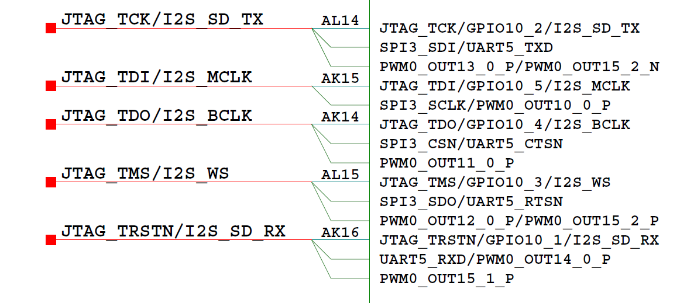

以I2S\_MCLK为例，对应芯片管脚编号为AK15 \(寄存器：0x0102F0110\)。

**表 1**  AK15管脚控制寄存器

<a name="table3129mcpsimp"></a>
<table><thead align="left"><tr id="row3140mcpsimp"><th class="cellrowborder" valign="top" width="13.861386138613863%" id="mcps1.2.8.1.1"><p id="p3142mcpsimp"><a name="p3142mcpsimp"></a><a name="p3142mcpsimp"></a>Register Name</p>
</th>
<th class="cellrowborder" valign="top" width="10.891089108910892%" id="mcps1.2.8.1.2"><p id="p3144mcpsimp"><a name="p3144mcpsimp"></a><a name="p3144mcpsimp"></a>Pin Number</p>
</th>
<th class="cellrowborder" valign="top" width="13.861386138613863%" id="mcps1.2.8.1.3"><p id="p3146mcpsimp"><a name="p3146mcpsimp"></a><a name="p3146mcpsimp"></a>Function</p>
</th>
<th class="cellrowborder" valign="top" width="11.881188118811883%" id="mcps1.2.8.1.4"><p id="p3148mcpsimp"><a name="p3148mcpsimp"></a><a name="p3148mcpsimp"></a>Address</p>
</th>
<th class="cellrowborder" valign="top" width="13.861386138613863%" id="mcps1.2.8.1.5"><p id="p3150mcpsimp"><a name="p3150mcpsimp"></a><a name="p3150mcpsimp"></a>Default Value</p>
</th>
<th class="cellrowborder" valign="top" width="7.920792079207921%" id="mcps1.2.8.1.6"><p id="p3152mcpsimp"><a name="p3152mcpsimp"></a><a name="p3152mcpsimp"></a>Field Bits</p>
</th>
<th class="cellrowborder" valign="top" width="27.722772277227726%" id="mcps1.2.8.1.7"><p id="p3154mcpsimp"><a name="p3154mcpsimp"></a><a name="p3154mcpsimp"></a>Field Description</p>
</th>
</tr>
</thead>
<tbody><tr id="row3156mcpsimp"><td class="cellrowborder" rowspan="6" valign="top" width="13.861386138613863%" headers="mcps1.2.8.1.1 "><p id="p3158mcpsimp"><a name="p3158mcpsimp"></a><a name="p3158mcpsimp"></a>iocfg_reg90</p>
</td>
<td class="cellrowborder" rowspan="6" valign="top" width="10.891089108910892%" headers="mcps1.2.8.1.2 "><p id="p3160mcpsimp"><a name="p3160mcpsimp"></a><a name="p3160mcpsimp"></a>AK15</p>
</td>
<td class="cellrowborder" rowspan="6" valign="top" width="13.861386138613863%" headers="mcps1.2.8.1.3 "><p id="p3162mcpsimp"><a name="p3162mcpsimp"></a><a name="p3162mcpsimp"></a>Pin JTAG_TDI IO Config Register.</p>
</td>
<td class="cellrowborder" rowspan="6" valign="top" width="11.881188118811883%" headers="mcps1.2.8.1.4 "><p id="p3164mcpsimp"><a name="p3164mcpsimp"></a><a name="p3164mcpsimp"></a>0x0102F0110</p>
</td>
<td class="cellrowborder" rowspan="6" valign="top" width="13.861386138613863%" headers="mcps1.2.8.1.5 "><p id="p3166mcpsimp"><a name="p3166mcpsimp"></a><a name="p3166mcpsimp"></a>0x1100</p>
</td>
<td class="cellrowborder" valign="top" width="7.920792079207921%" headers="mcps1.2.8.1.6 "><p id="p3168mcpsimp"><a name="p3168mcpsimp"></a><a name="p3168mcpsimp"></a>31:11</p>
</td>
<td class="cellrowborder" valign="top" width="27.722772277227726%" headers="mcps1.2.8.1.7 "><p id="p3170mcpsimp"><a name="p3170mcpsimp"></a><a name="p3170mcpsimp"></a>保留。</p>
</td>
</tr>
<tr id="row3171mcpsimp"><td class="cellrowborder" valign="top" headers="mcps1.2.8.1.1 "><p id="p3173mcpsimp"><a name="p3173mcpsimp"></a><a name="p3173mcpsimp"></a>10</p>
</td>
<td class="cellrowborder" valign="top" headers="mcps1.2.8.1.2 "><p id="p3175mcpsimp"><a name="p3175mcpsimp"></a><a name="p3175mcpsimp"></a>管脚电平转换速率控制：</p>
<p id="p3176mcpsimp"><a name="p3176mcpsimp"></a><a name="p3176mcpsimp"></a>0x0：快沿输出；</p>
<p id="p3177mcpsimp"><a name="p3177mcpsimp"></a><a name="p3177mcpsimp"></a>0x1：慢沿输出。</p>
</td>
</tr>
<tr id="row3178mcpsimp"><td class="cellrowborder" valign="top" headers="mcps1.2.8.1.1 "><p id="p3180mcpsimp"><a name="p3180mcpsimp"></a><a name="p3180mcpsimp"></a>9</p>
</td>
<td class="cellrowborder" valign="top" headers="mcps1.2.8.1.2 "><p id="p3182mcpsimp"><a name="p3182mcpsimp"></a><a name="p3182mcpsimp"></a>管脚下拉控制：</p>
<p id="p3183mcpsimp"><a name="p3183mcpsimp"></a><a name="p3183mcpsimp"></a>0x0：关闭；</p>
<p id="p3184mcpsimp"><a name="p3184mcpsimp"></a><a name="p3184mcpsimp"></a>0x1：打开。</p>
</td>
</tr>
<tr id="row3185mcpsimp"><td class="cellrowborder" valign="top" headers="mcps1.2.8.1.1 "><p id="p3187mcpsimp"><a name="p3187mcpsimp"></a><a name="p3187mcpsimp"></a>8</p>
</td>
<td class="cellrowborder" valign="top" headers="mcps1.2.8.1.2 "><p id="p3189mcpsimp"><a name="p3189mcpsimp"></a><a name="p3189mcpsimp"></a>管脚上拉控制：</p>
<p id="p3190mcpsimp"><a name="p3190mcpsimp"></a><a name="p3190mcpsimp"></a>0x0：关闭；</p>
<p id="p3191mcpsimp"><a name="p3191mcpsimp"></a><a name="p3191mcpsimp"></a>0x1：打开。</p>
</td>
</tr>
<tr id="row3192mcpsimp"><td class="cellrowborder" valign="top" headers="mcps1.2.8.1.1 "><p id="p3194mcpsimp"><a name="p3194mcpsimp"></a><a name="p3194mcpsimp"></a>7:4</p>
</td>
<td class="cellrowborder" valign="top" headers="mcps1.2.8.1.2 "><p id="p3196mcpsimp"><a name="p3196mcpsimp"></a><a name="p3196mcpsimp"></a>管脚驱动能力选择：</p>
<p id="p3197mcpsimp"><a name="p3197mcpsimp"></a><a name="p3197mcpsimp"></a>0x0：IO2档位1；</p>
<p id="p3198mcpsimp"><a name="p3198mcpsimp"></a><a name="p3198mcpsimp"></a>0x1：IO2档位2；</p>
<p id="p3199mcpsimp"><a name="p3199mcpsimp"></a><a name="p3199mcpsimp"></a>0x2：IO2档位3；</p>
<p id="p3200mcpsimp"><a name="p3200mcpsimp"></a><a name="p3200mcpsimp"></a>0x3：IO2档位4；</p>
<p id="p3201mcpsimp"><a name="p3201mcpsimp"></a><a name="p3201mcpsimp"></a>0x4：IO2档位5；</p>
<p id="p3202mcpsimp"><a name="p3202mcpsimp"></a><a name="p3202mcpsimp"></a>0x5：IO2档位6；</p>
<p id="p3203mcpsimp"><a name="p3203mcpsimp"></a><a name="p3203mcpsimp"></a>0x6：IO2档位7；</p>
<p id="p3204mcpsimp"><a name="p3204mcpsimp"></a><a name="p3204mcpsimp"></a>0x7：IO2档位8；</p>
<p id="p3205mcpsimp"><a name="p3205mcpsimp"></a><a name="p3205mcpsimp"></a>0x8：IO2档位9；</p>
<p id="p3206mcpsimp"><a name="p3206mcpsimp"></a><a name="p3206mcpsimp"></a>0x9：IO2档位10；</p>
<p id="p3207mcpsimp"><a name="p3207mcpsimp"></a><a name="p3207mcpsimp"></a>0xA：IO2档位11；</p>
<p id="p3208mcpsimp"><a name="p3208mcpsimp"></a><a name="p3208mcpsimp"></a>0xB：IO2档位12；</p>
<p id="p3209mcpsimp"><a name="p3209mcpsimp"></a><a name="p3209mcpsimp"></a>0xC：IO2档位13；</p>
<p id="p3210mcpsimp"><a name="p3210mcpsimp"></a><a name="p3210mcpsimp"></a>0xD：IO2档位14；</p>
<p id="p3211mcpsimp"><a name="p3211mcpsimp"></a><a name="p3211mcpsimp"></a>0xE：IO2档位15；</p>
<p id="p3212mcpsimp"><a name="p3212mcpsimp"></a><a name="p3212mcpsimp"></a>0xF：IO2档位16；</p>
<p id="p3213mcpsimp"><a name="p3213mcpsimp"></a><a name="p3213mcpsimp"></a>其它：保留。</p>
</td>
</tr>
<tr id="row3214mcpsimp"><td class="cellrowborder" valign="top" headers="mcps1.2.8.1.1 "><p id="p3216mcpsimp"><a name="p3216mcpsimp"></a><a name="p3216mcpsimp"></a>3:0</p>
</td>
<td class="cellrowborder" valign="top" headers="mcps1.2.8.1.2 "><p id="p3218mcpsimp"><a name="p3218mcpsimp"></a><a name="p3218mcpsimp"></a>功能选择：</p>
<p id="p3219mcpsimp"><a name="p3219mcpsimp"></a><a name="p3219mcpsimp"></a>0x0：JTAG_TDI；</p>
<p id="p3220mcpsimp"><a name="p3220mcpsimp"></a><a name="p3220mcpsimp"></a>0x1：GPIO10_5；</p>
<p id="p3221mcpsimp"><a name="p3221mcpsimp"></a><a name="p3221mcpsimp"></a>0x2：I2S_MCLK；</p>
<p id="p3222mcpsimp"><a name="p3222mcpsimp"></a><a name="p3222mcpsimp"></a>0x3：SPI3_SCLK；</p>
<p id="p3223mcpsimp"><a name="p3223mcpsimp"></a><a name="p3223mcpsimp"></a>0x5：PWM0_OUT10_0_P；</p>
<p id="p3224mcpsimp"><a name="p3224mcpsimp"></a><a name="p3224mcpsimp"></a>其它：保留。</p>
</td>
</tr>
</tbody>
</table>

管脚存在5种复用情形：JTAG\_TDI / GPIO10\_5 / I2S\_MCLK / SPI3\_SCLK / PWM0\_OUT10\_0\_P。

AK15配置值为0x000001C2：

-   Bits\[3:0\]=0x2表示管脚功能选择为I2S\_MCLK；
-   Bits\[7:4\]=0xC表示管脚驱动能力配置为档位13，档位值越大，对应的驱动能力越大；
-   Bits\[9:8\]=0x1表示管脚上拉控制打开, 下拉控制关闭，结合实际电路配置；
-   Bits\[10\]=0x0表示电平转换速率为快沿输出。

【注意事项】

无。


### 功放GPIO管脚复用<a name="ZH-CN_TOPIC_0000002441661489"></a>

【配置】（以SS928V100为例）

```
static void amp_unmute_pin_mux(void) 
{ 
void * iocfg2_base = get_reg_iocfg2(); 
void * gpio_base = get_reg_gpio(); 
 
/* GPIO10_0 */ 
sys_writel(iocfg2_base + 0x00FC, 0x0201); 
 
/* output high */ 
sys_writel(gpio_base + 0xA400, 0x01); 
sys_writel(gpio_base + 0xA004, 0x01); 
}
```

【描述说明】

功放芯片的使能通过GPIO10\_0管脚进行控制，原理图如[图1](#_toc51764074)所示。

**图 1**  GPIO10\_0原理图<a name="_toc51764074"></a>  
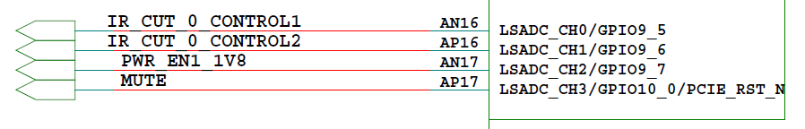

功放芯片使能控制的具体配置为：

-   GPIO10\_0管脚对应芯片管脚编号为AP17 \(寄存器：0x0102F00FC\)。

**表 1**  AP17管脚控制寄存器

<a name="table3244mcpsimp"></a>
<table><thead align="left"><tr id="row3255mcpsimp"><th class="cellrowborder" valign="top" width="13.861386138613863%" id="mcps1.2.8.1.1"><p id="p3257mcpsimp"><a name="p3257mcpsimp"></a><a name="p3257mcpsimp"></a>Register Name</p>
</th>
<th class="cellrowborder" valign="top" width="12.871287128712872%" id="mcps1.2.8.1.2"><p id="p3259mcpsimp"><a name="p3259mcpsimp"></a><a name="p3259mcpsimp"></a>Pin Number</p>
</th>
<th class="cellrowborder" valign="top" width="11.881188118811883%" id="mcps1.2.8.1.3"><p id="p3261mcpsimp"><a name="p3261mcpsimp"></a><a name="p3261mcpsimp"></a>Function</p>
</th>
<th class="cellrowborder" valign="top" width="11.881188118811883%" id="mcps1.2.8.1.4"><p id="p3263mcpsimp"><a name="p3263mcpsimp"></a><a name="p3263mcpsimp"></a>Address</p>
</th>
<th class="cellrowborder" valign="top" width="13.861386138613863%" id="mcps1.2.8.1.5"><p id="p3265mcpsimp"><a name="p3265mcpsimp"></a><a name="p3265mcpsimp"></a>Default Value</p>
</th>
<th class="cellrowborder" valign="top" width="7.920792079207921%" id="mcps1.2.8.1.6"><p id="p3267mcpsimp"><a name="p3267mcpsimp"></a><a name="p3267mcpsimp"></a>Field Bits</p>
</th>
<th class="cellrowborder" valign="top" width="27.722772277227726%" id="mcps1.2.8.1.7"><p id="p3269mcpsimp"><a name="p3269mcpsimp"></a><a name="p3269mcpsimp"></a>Field Description</p>
</th>
</tr>
</thead>
<tbody><tr id="row3271mcpsimp"><td class="cellrowborder" rowspan="6" valign="top" width="13.861386138613863%" headers="mcps1.2.8.1.1 "><p id="p3273mcpsimp"><a name="p3273mcpsimp"></a><a name="p3273mcpsimp"></a>iocfg_reg85</p>
</td>
<td class="cellrowborder" rowspan="6" valign="top" width="12.871287128712872%" headers="mcps1.2.8.1.2 "><p id="p3275mcpsimp"><a name="p3275mcpsimp"></a><a name="p3275mcpsimp"></a>AP17</p>
</td>
<td class="cellrowborder" rowspan="6" valign="top" width="11.881188118811883%" headers="mcps1.2.8.1.3 "><p id="p3277mcpsimp"><a name="p3277mcpsimp"></a><a name="p3277mcpsimp"></a>Pin LSADC_CH3 IO Config Registe.</p>
</td>
<td class="cellrowborder" rowspan="6" valign="top" width="11.881188118811883%" headers="mcps1.2.8.1.4 "><p id="p3279mcpsimp"><a name="p3279mcpsimp"></a><a name="p3279mcpsimp"></a>0x0102F00FC</p>
</td>
<td class="cellrowborder" rowspan="6" valign="top" width="13.861386138613863%" headers="mcps1.2.8.1.5 "><p id="p3281mcpsimp"><a name="p3281mcpsimp"></a><a name="p3281mcpsimp"></a>0x1200</p>
</td>
<td class="cellrowborder" valign="top" width="7.920792079207921%" headers="mcps1.2.8.1.6 "><p id="p3283mcpsimp"><a name="p3283mcpsimp"></a><a name="p3283mcpsimp"></a>31:11</p>
</td>
<td class="cellrowborder" valign="top" width="27.722772277227726%" headers="mcps1.2.8.1.7 "><p id="p3285mcpsimp"><a name="p3285mcpsimp"></a><a name="p3285mcpsimp"></a>保留。</p>
</td>
</tr>
<tr id="row3286mcpsimp"><td class="cellrowborder" valign="top" headers="mcps1.2.8.1.1 "><p id="p3288mcpsimp"><a name="p3288mcpsimp"></a><a name="p3288mcpsimp"></a>10</p>
</td>
<td class="cellrowborder" valign="top" headers="mcps1.2.8.1.2 "><p id="p3290mcpsimp"><a name="p3290mcpsimp"></a><a name="p3290mcpsimp"></a>管脚电平转换速率控制：</p>
<p id="p3291mcpsimp"><a name="p3291mcpsimp"></a><a name="p3291mcpsimp"></a>0x0：快沿输出；</p>
<p id="p3292mcpsimp"><a name="p3292mcpsimp"></a><a name="p3292mcpsimp"></a>0x1：慢沿输出。</p>
</td>
</tr>
<tr id="row3293mcpsimp"><td class="cellrowborder" valign="top" headers="mcps1.2.8.1.1 "><p id="p3295mcpsimp"><a name="p3295mcpsimp"></a><a name="p3295mcpsimp"></a>9</p>
</td>
<td class="cellrowborder" valign="top" headers="mcps1.2.8.1.2 "><p id="p3297mcpsimp"><a name="p3297mcpsimp"></a><a name="p3297mcpsimp"></a>管脚下拉控制：</p>
<p id="p3298mcpsimp"><a name="p3298mcpsimp"></a><a name="p3298mcpsimp"></a>0x0：关闭；</p>
<p id="p3299mcpsimp"><a name="p3299mcpsimp"></a><a name="p3299mcpsimp"></a>0x1：打开。</p>
</td>
</tr>
<tr id="row3300mcpsimp"><td class="cellrowborder" valign="top" headers="mcps1.2.8.1.1 "><p id="p3302mcpsimp"><a name="p3302mcpsimp"></a><a name="p3302mcpsimp"></a>8</p>
</td>
<td class="cellrowborder" valign="top" headers="mcps1.2.8.1.2 "><p id="p3304mcpsimp"><a name="p3304mcpsimp"></a><a name="p3304mcpsimp"></a>管脚上拉控制：</p>
<p id="p3305mcpsimp"><a name="p3305mcpsimp"></a><a name="p3305mcpsimp"></a>0x0：关闭；</p>
<p id="p3306mcpsimp"><a name="p3306mcpsimp"></a><a name="p3306mcpsimp"></a>0x1：打开。</p>
</td>
</tr>
<tr id="row3307mcpsimp"><td class="cellrowborder" valign="top" headers="mcps1.2.8.1.1 "><p id="p3309mcpsimp"><a name="p3309mcpsimp"></a><a name="p3309mcpsimp"></a>7:4</p>
</td>
<td class="cellrowborder" valign="top" headers="mcps1.2.8.1.2 "><p id="p3311mcpsimp"><a name="p3311mcpsimp"></a><a name="p3311mcpsimp"></a>管脚驱动能力选择：</p>
<p id="p3312mcpsimp"><a name="p3312mcpsimp"></a><a name="p3312mcpsimp"></a>0x0：IO2档位1；</p>
<p id="p3313mcpsimp"><a name="p3313mcpsimp"></a><a name="p3313mcpsimp"></a>0x1：IO2档位2；</p>
<p id="p3314mcpsimp"><a name="p3314mcpsimp"></a><a name="p3314mcpsimp"></a>0x2：IO2档位3；</p>
<p id="p3315mcpsimp"><a name="p3315mcpsimp"></a><a name="p3315mcpsimp"></a>0x3：IO2档位4；</p>
<p id="p3316mcpsimp"><a name="p3316mcpsimp"></a><a name="p3316mcpsimp"></a>0x4：IO2档位5；</p>
<p id="p3317mcpsimp"><a name="p3317mcpsimp"></a><a name="p3317mcpsimp"></a>0x5：IO2档位6；</p>
<p id="p3318mcpsimp"><a name="p3318mcpsimp"></a><a name="p3318mcpsimp"></a>0x6：IO2档位7；</p>
<p id="p3319mcpsimp"><a name="p3319mcpsimp"></a><a name="p3319mcpsimp"></a>0x7：IO2档位8；</p>
<p id="p3320mcpsimp"><a name="p3320mcpsimp"></a><a name="p3320mcpsimp"></a>0x8：IO2档位9；</p>
<p id="p3321mcpsimp"><a name="p3321mcpsimp"></a><a name="p3321mcpsimp"></a>0x9：IO2档位10；</p>
<p id="p3322mcpsimp"><a name="p3322mcpsimp"></a><a name="p3322mcpsimp"></a>0xA：IO2档位11；</p>
<p id="p3323mcpsimp"><a name="p3323mcpsimp"></a><a name="p3323mcpsimp"></a>0xB：IO2档位12；</p>
<p id="p3324mcpsimp"><a name="p3324mcpsimp"></a><a name="p3324mcpsimp"></a>0xC：IO2档位13；</p>
<p id="p3325mcpsimp"><a name="p3325mcpsimp"></a><a name="p3325mcpsimp"></a>0xD：IO2档位14；</p>
<p id="p3326mcpsimp"><a name="p3326mcpsimp"></a><a name="p3326mcpsimp"></a>0xE：IO2档位15；</p>
<p id="p3327mcpsimp"><a name="p3327mcpsimp"></a><a name="p3327mcpsimp"></a>0xF：IO2档位16；</p>
<p id="p3328mcpsimp"><a name="p3328mcpsimp"></a><a name="p3328mcpsimp"></a>其它：保留。</p>
</td>
</tr>
<tr id="row3329mcpsimp"><td class="cellrowborder" valign="top" headers="mcps1.2.8.1.1 "><p id="p3331mcpsimp"><a name="p3331mcpsimp"></a><a name="p3331mcpsimp"></a>3:0</p>
</td>
<td class="cellrowborder" valign="top" headers="mcps1.2.8.1.2 "><p id="p3333mcpsimp"><a name="p3333mcpsimp"></a><a name="p3333mcpsimp"></a>功能选择：</p>
<p id="p3334mcpsimp"><a name="p3334mcpsimp"></a><a name="p3334mcpsimp"></a>0x0：LSADC_CH3；</p>
<p id="p3335mcpsimp"><a name="p3335mcpsimp"></a><a name="p3335mcpsimp"></a>0x1：GPIO10_0；</p>
<p id="p3336mcpsimp"><a name="p3336mcpsimp"></a><a name="p3336mcpsimp"></a>0x2：PCIE_RST_N；</p>
<p id="p3337mcpsimp"><a name="p3337mcpsimp"></a><a name="p3337mcpsimp"></a>其它：保留。</p>
</td>
</tr>
</tbody>
</table>

管脚存在3种复用情形：LSADC\_CH3 / GPIO10\_0 / PCIE\_RST\_N。

AP17配置值为0x00000201：

-   Bits\[3:0\]=0x1表示管脚功能选择为GPIO10\_0；
-   Bits\[7:4\]=0x0表示管脚驱动能力配置为档位1，档位值越大，对应的驱动能力越大；
-   Bits\[9:8\]=0x2表示管脚上拉控制关闭, 下拉控制打开，结合实际电路配置；
-   Bits\[10\]=0x0表示电平转换速率为快沿输出。

GPIO\_DIR为GPIO方向控制寄存器，配置寄存器0x1109A400的Bits \[7:0\]为0x01，表示配置GPIO10\_0为输出方向。

Offset Address: 400   Total Reset Value: 0x00

<a name="table3348mcpsimp"></a>
<table><thead align="left"><tr id="row3356mcpsimp"><th class="cellrowborder" valign="top" width="10.101010101010102%" id="mcps1.1.6.1.1"><p id="p3358mcpsimp"><a name="p3358mcpsimp"></a><a name="p3358mcpsimp"></a>Bits</p>
</th>
<th class="cellrowborder" valign="top" width="13.13131313131313%" id="mcps1.1.6.1.2"><p id="p3360mcpsimp"><a name="p3360mcpsimp"></a><a name="p3360mcpsimp"></a>Access</p>
</th>
<th class="cellrowborder" valign="top" width="18.18181818181818%" id="mcps1.1.6.1.3"><p id="p3362mcpsimp"><a name="p3362mcpsimp"></a><a name="p3362mcpsimp"></a>Name</p>
</th>
<th class="cellrowborder" valign="top" width="44.44444444444445%" id="mcps1.1.6.1.4"><p id="p3364mcpsimp"><a name="p3364mcpsimp"></a><a name="p3364mcpsimp"></a>Description</p>
</th>
<th class="cellrowborder" valign="top" width="14.14141414141414%" id="mcps1.1.6.1.5"><p id="p3366mcpsimp"><a name="p3366mcpsimp"></a><a name="p3366mcpsimp"></a>Reset</p>
</th>
</tr>
</thead>
<tbody><tr id="row3368mcpsimp"><td class="cellrowborder" valign="top" width="10.101010101010102%" headers="mcps1.1.6.1.1 "><p id="p3370mcpsimp"><a name="p3370mcpsimp"></a><a name="p3370mcpsimp"></a>[7:0]</p>
</td>
<td class="cellrowborder" valign="top" width="13.13131313131313%" headers="mcps1.1.6.1.2 "><p id="p3372mcpsimp"><a name="p3372mcpsimp"></a><a name="p3372mcpsimp"></a>RW</p>
</td>
<td class="cellrowborder" valign="top" width="18.18181818181818%" headers="mcps1.1.6.1.3 "><p id="p3374mcpsimp"><a name="p3374mcpsimp"></a><a name="p3374mcpsimp"></a>gpio_dir</p>
</td>
<td class="cellrowborder" valign="top" width="44.44444444444445%" headers="mcps1.1.6.1.4 "><p id="p3376mcpsimp"><a name="p3376mcpsimp"></a><a name="p3376mcpsimp"></a>GPIO方向控制寄存器。Bits [7:0]分别对应GPIO_DATA[7:0]，各Bit可独立控制。</p>
<p id="p3377mcpsimp"><a name="p3377mcpsimp"></a><a name="p3377mcpsimp"></a>0：输入；</p>
<p id="p3378mcpsimp"><a name="p3378mcpsimp"></a><a name="p3378mcpsimp"></a>1：输出。</p>
</td>
<td class="cellrowborder" valign="top" width="14.14141414141414%" headers="mcps1.1.6.1.5 "><p id="p3380mcpsimp"><a name="p3380mcpsimp"></a><a name="p3380mcpsimp"></a>0x00</p>
</td>
</tr>
</tbody>
</table>

GPIO\_DATA为GPIO数据寄存器，配置寄存器0x1109A004的Bits \[7:0\]为0x01，表示配置GPIO10\_0为输出高电平。

Offset Address: 0x000～0x3FC   Total Reset Value: 0x00

<a name="table3384mcpsimp"></a>
<table><thead align="left"><tr id="row3392mcpsimp"><th class="cellrowborder" valign="top" width="10.101010101010102%" id="mcps1.1.6.1.1"><p id="p3394mcpsimp"><a name="p3394mcpsimp"></a><a name="p3394mcpsimp"></a>Bits</p>
</th>
<th class="cellrowborder" valign="top" width="13.13131313131313%" id="mcps1.1.6.1.2"><p id="p3396mcpsimp"><a name="p3396mcpsimp"></a><a name="p3396mcpsimp"></a>Access</p>
</th>
<th class="cellrowborder" valign="top" width="18.18181818181818%" id="mcps1.1.6.1.3"><p id="p3398mcpsimp"><a name="p3398mcpsimp"></a><a name="p3398mcpsimp"></a>Name</p>
</th>
<th class="cellrowborder" valign="top" width="44.44444444444445%" id="mcps1.1.6.1.4"><p id="p3400mcpsimp"><a name="p3400mcpsimp"></a><a name="p3400mcpsimp"></a>Description</p>
</th>
<th class="cellrowborder" valign="top" width="14.14141414141414%" id="mcps1.1.6.1.5"><p id="p3402mcpsimp"><a name="p3402mcpsimp"></a><a name="p3402mcpsimp"></a>Reset</p>
</th>
</tr>
</thead>
<tbody><tr id="row3404mcpsimp"><td class="cellrowborder" valign="top" width="10.101010101010102%" headers="mcps1.1.6.1.1 "><p id="p3406mcpsimp"><a name="p3406mcpsimp"></a><a name="p3406mcpsimp"></a>[7:0]</p>
</td>
<td class="cellrowborder" valign="top" width="13.13131313131313%" headers="mcps1.1.6.1.2 "><p id="p3408mcpsimp"><a name="p3408mcpsimp"></a><a name="p3408mcpsimp"></a>RW</p>
</td>
<td class="cellrowborder" valign="top" width="18.18181818181818%" headers="mcps1.1.6.1.3 "><p id="p3410mcpsimp"><a name="p3410mcpsimp"></a><a name="p3410mcpsimp"></a>gpio_data</p>
</td>
<td class="cellrowborder" valign="top" width="44.44444444444445%" headers="mcps1.1.6.1.4 "><p id="p3412mcpsimp"><a name="p3412mcpsimp"></a><a name="p3412mcpsimp"></a>当GPIO配置为输入模式时，为GPIO输入数据；当GPIO配置为输出模式时，为输出数据。各比特均可独立控制。与GPIO_DIR配合使用。</p>
</td>
<td class="cellrowborder" valign="top" width="14.14141414141414%" headers="mcps1.1.6.1.5 "><p id="p3414mcpsimp"><a name="p3414mcpsimp"></a><a name="p3414mcpsimp"></a>0x00</p>
</td>
</tr>
</tbody>
</table>

【注意事项】

无。

# 其他<a name="ZH-CN_TOPIC_0000002441661557"></a>

无。

