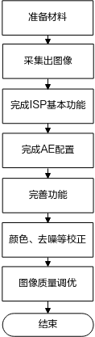

# 前言<a name="ZH-CN_TOPIC_0000002424361958"></a>

**概述<a name="section97845552224"></a>**

本文为对接不同Sensor的程序员而写，目的是供您在进行Sensor对接的过程中提供对接步骤及注意事项的参考。该指南主要包括一款新Sensor对接的驱动开发流程、新Sensor在SDK中的适配等。

> **说明：** 
>本文以SS928V100描述为例，未有特殊说明，SS927V100与SS928V100内容一致。

**产品版本<a name="section1178605582218"></a>**

与本文档相对应的产品版本如下。

<a name="table379505512223"></a>
<table><thead align="left"><tr id="row8883195522214"><th class="cellrowborder" valign="top" width="31.759999999999998%" id="mcps1.1.3.1.1"><p id="p7883955162211"><a name="p7883955162211"></a><a name="p7883955162211"></a>产品名称</p>
</th>
<th class="cellrowborder" valign="top" width="68.24%" id="mcps1.1.3.1.2"><p id="p088365511225"><a name="p088365511225"></a><a name="p088365511225"></a>产品版本</p>
</th>
</tr>
</thead>
<tbody><tr id="row158831255122216"><td class="cellrowborder" valign="top" width="31.759999999999998%" headers="mcps1.1.3.1.1 "><p id="p10883145542218"><a name="p10883145542218"></a><a name="p10883145542218"></a>SS928</p>
</td>
<td class="cellrowborder" valign="top" width="68.24%" headers="mcps1.1.3.1.2 "><p id="p138831555152211"><a name="p138831555152211"></a><a name="p138831555152211"></a>V100</p>
</td>
</tr>
<tr id="row144953172313"><td class="cellrowborder" valign="top" width="31.759999999999998%" headers="mcps1.1.3.1.1 "><p id="p259913572312"><a name="p259913572312"></a><a name="p259913572312"></a>SS927</p>
</td>
<td class="cellrowborder" valign="top" width="68.24%" headers="mcps1.1.3.1.2 "><p id="p185997502317"><a name="p185997502317"></a><a name="p185997502317"></a>V100</p>
</td>
</tr>
</tbody>
</table>

**读者对象<a name="section07941655172219"></a>**

本文档（本指南）主要适用于以下工程师：

-   技术支持工程师
-   软件开发工程师

**符号约定<a name="section133020216410"></a>**

在本文中可能出现下列标志，它们所代表的含义如下。

<a name="table2622507016410"></a>
<table><thead align="left"><tr id="row1530720816410"><th class="cellrowborder" valign="top" width="20.580000000000002%" id="mcps1.1.3.1.1"><p id="p6450074116410"><a name="p6450074116410"></a><a name="p6450074116410"></a><strong id="b2136615816410"><a name="b2136615816410"></a><a name="b2136615816410"></a>符号</strong></p>
</th>
<th class="cellrowborder" valign="top" width="79.42%" id="mcps1.1.3.1.2"><p id="p5435366816410"><a name="p5435366816410"></a><a name="p5435366816410"></a><strong id="b5941558116410"><a name="b5941558116410"></a><a name="b5941558116410"></a>说明</strong></p>
</th>
</tr>
</thead>
<tbody><tr id="row1372280416410"><td class="cellrowborder" valign="top" width="20.580000000000002%" headers="mcps1.1.3.1.1 "><p id="p3734547016410"><a name="p3734547016410"></a><a name="p3734547016410"></a><a name="image2670064316410"></a><a name="image2670064316410"></a><span></span></p>
</td>
<td class="cellrowborder" valign="top" width="79.42%" headers="mcps1.1.3.1.2 "><p id="p1757432116410"><a name="p1757432116410"></a><a name="p1757432116410"></a>表示如不避免则将会导致死亡或严重伤害的具有高等级风险的危害。</p>
</td>
</tr>
<tr id="row466863216410"><td class="cellrowborder" valign="top" width="20.580000000000002%" headers="mcps1.1.3.1.1 "><p id="p1432579516410"><a name="p1432579516410"></a><a name="p1432579516410"></a><a name="image4895582316410"></a><a name="image4895582316410"></a><span></span></p>
</td>
<td class="cellrowborder" valign="top" width="79.42%" headers="mcps1.1.3.1.2 "><p id="p959197916410"><a name="p959197916410"></a><a name="p959197916410"></a>表示如不避免则可能导致死亡或严重伤害的具有中等级风险的危害。</p>
</td>
</tr>
<tr id="row123863216410"><td class="cellrowborder" valign="top" width="20.580000000000002%" headers="mcps1.1.3.1.1 "><p id="p1232579516410"><a name="p1232579516410"></a><a name="p1232579516410"></a><a name="image1235582316410"></a><a name="image1235582316410"></a><span></span></p>
</td>
<td class="cellrowborder" valign="top" width="79.42%" headers="mcps1.1.3.1.2 "><p id="p123197916410"><a name="p123197916410"></a><a name="p123197916410"></a>表示如不避免则可能导致轻微或中度伤害的具有低等级风险的危害。</p>
</td>
</tr>
<tr id="row5786682116410"><td class="cellrowborder" valign="top" width="20.580000000000002%" headers="mcps1.1.3.1.1 "><p id="p2204984716410"><a name="p2204984716410"></a><a name="p2204984716410"></a><a name="image4504446716410"></a><a name="image4504446716410"></a><span></span></p>
</td>
<td class="cellrowborder" valign="top" width="79.42%" headers="mcps1.1.3.1.2 "><p id="p4388861916410"><a name="p4388861916410"></a><a name="p4388861916410"></a>用于传递设备或环境安全警示信息。如不避免则可能会导致设备损坏、数据丢失、设备性能降低或其它不可预知的结果。</p>
<p id="p1238861916410"><a name="p1238861916410"></a><a name="p1238861916410"></a>“须知”不涉及人身伤害。</p>
</td>
</tr>
<tr id="row2856923116410"><td class="cellrowborder" valign="top" width="20.580000000000002%" headers="mcps1.1.3.1.1 "><p id="p5555360116410"><a name="p5555360116410"></a><a name="p5555360116410"></a><a name="image799324016410"></a><a name="image799324016410"></a><span></span></p>
</td>
<td class="cellrowborder" valign="top" width="79.42%" headers="mcps1.1.3.1.2 "><p id="p4612588116410"><a name="p4612588116410"></a><a name="p4612588116410"></a>对正文中重点信息的补充说明。</p>
<p id="p1232588116410"><a name="p1232588116410"></a><a name="p1232588116410"></a>“说明”不是安全警示信息，不涉及人身、设备及环境伤害信息。</p>
</td>
</tr>
</tbody>
</table>

**修改记录<a name="section2467512116410"></a>**

修订记录累积了每次文档更新的说明。最新版本的文档包含以前所有文档版本的更新内容。

<a name="table126443203200"></a>
<table><thead align="left"><tr id="row264516207203"><th class="cellrowborder" valign="top" width="20.72%" id="mcps1.1.4.1.1"><p id="p146456203200"><a name="p146456203200"></a><a name="p146456203200"></a><strong id="b8645172022010"><a name="b8645172022010"></a><a name="b8645172022010"></a>文档版本</strong></p>
</th>
<th class="cellrowborder" valign="top" width="26.119999999999997%" id="mcps1.1.4.1.2"><p id="p364512062019"><a name="p364512062019"></a><a name="p364512062019"></a><strong id="b1464512200200"><a name="b1464512200200"></a><a name="b1464512200200"></a>发布日期</strong></p>
</th>
<th class="cellrowborder" valign="top" width="53.16%" id="mcps1.1.4.1.3"><p id="p664522018206"><a name="p664522018206"></a><a name="p664522018206"></a><strong id="b156451420152010"><a name="b156451420152010"></a><a name="b156451420152010"></a>修改说明</strong></p>
</th>
</tr>
</thead>
<tbody><tr id="row56451520182017"><td class="cellrowborder" valign="top" width="20.72%" headers="mcps1.1.4.1.1 "><p id="p1564572014209"><a name="p1564572014209"></a><a name="p1564572014209"></a>00B01</p>
</td>
<td class="cellrowborder" valign="top" width="26.119999999999997%" headers="mcps1.1.4.1.2 "><p id="p126451920132014"><a name="p126451920132014"></a><a name="p126451920132014"></a>2025-09-15</p>
</td>
<td class="cellrowborder" valign="top" width="53.16%" headers="mcps1.1.4.1.3 "><p id="p1664582017209"><a name="p1664582017209"></a><a name="p1664582017209"></a>第1次临时版本发布。</p>
</td>
</tr>
</tbody>
</table>

# Sensor调试指南<a name="ZH-CN_TOPIC_0000002457840661"></a>


## 调试流程<a name="ZH-CN_TOPIC_0000002424361902"></a>

请按照如[图1](#fig148028410245)所示流程进行调试。

**图 1**  Sensor调试流程图<a name="fig148028410245"></a>  


## 准备材料<a name="ZH-CN_TOPIC_0000002424202058"></a>


### 确认主芯片规格<a name="ZH-CN_TOPIC_0000002424361862"></a>

支持Master模式，支持的线性、WDR接口模式，支持输入频率上限。

### Sensor datasheet<a name="ZH-CN_TOPIC_0000002457880841"></a>

-   确认图像传输接口模式，输出频率。
-   确认曝光时间、增益如何设置，帧率如何修改。
-   确认在WDR模式下的以上两项。
-   LVDS接口，需要确认同步码。

### Initialize Settings<a name="ZH-CN_TOPIC_0000002457880797"></a>

获取Sensor Initialize Settings，一般至少要准备最大规格和标准分辨率两种序列。

## 采集图像<a name="ZH-CN_TOPIC_0000002424202094"></a>


### 硬件准备就绪<a name="ZH-CN_TOPIC_0000002424202010"></a>

首先验证是否可以读写Sensor寄存器。

利用i2c\_read/ i2c\_write命令，或ssp\_read/ssp\_write命令，测试Sensor寄存器读写。

该命令集成在默认的文件系统中，可直接调用。

### 完成初始化序列配置<a name="ZH-CN_TOPIC_0000002457840681"></a>

配置初始化序列，建议参考版本发布包里面的sensor驱动，以便于快速开发。为了方便调试，此时要排除AE配置及帧率配置的干扰。

1.  准备Sensor驱动
    -   可以基于一款规格相近Sensor（master/slave, i2c/spi, wdr/linear）驱动修改，尝试编译出Sensor库。具体可参看isp/../sensor/ssxxxx/xxxx目录下的xxx\_cmos.c、xxx\_cmos.h和xxx\_sensor\_ctl.c文件进行修改。
    -   修改cmos\_set\_image\_mode函数，及cmos\_get\_isp\_default中的相应sensor图像宽高、帧率和模式等参数。使该sensor分辨率、帧率可以被正确设置。
    -   在sys\_config.c中修改Sensor时钟配置、I2C/SPI接口pin mux、vi时钟、isp时钟等寄存器。适配时，可基于相似规格的Sensor修改。对于从模式sensor要增加判断分支实现该函数的调用来正确配置从模式pin mux。

2.  Sensor初始化序列
    -   实现void sensor\_init\(\)函数。参考sensor手册或者sensor厂家提供的sensor序列实现这个函数。对于从模式sensor，在 sensor\_init\(\)函数中需要调用ss\_mpi\_isp\_get\_sns\_slave\_attr接口来实现从模式寄存器的适配。以某sensor从模式的sensor\_init为例：

        ```
        void xxx_set_slave_registers(ot_vi_pipe vi_pipe)
        {
            td_s32  ret;
            td_s32  slave_dev;
            td_u32  data;
            td_u8   img_mode;
            ot_mpi_sns_state *pastxxxslave = TD_NULL;
         
            pastxxxslave = xxx_slave_get_ctx(vi_pipe);
            img_mode    = pastxxxslave->img_mode;
            slave_dev  = g_xxx_slave_bind_dev[vi_pipe];
            data       = g_xxx_slave_sensor_mode_time[vi_pipe];
         
            check_ret(ss_mpi_isp_get_sns_slave_attr(slave_dev, &g_xxx_slave_sync[vi_pipe]));
            g_xxx_slave_sync[vi_pipe].cfg.bits.bit_h_enable = 0;
            g_xxx_slave_sync[vi_pipe].cfg.bits.bit_v_enable = 0;
            g_xxx_slave_sync[vi_pipe].slave_mode_time = data;
            check_ret(ss_mpi_isp_set_sns_slave_attr(slave_dev, &g_xxx_slave_sync[vi_pipe]));
            ret = xxx_slave_i2c_init(vi_pipe);
            if (ret != TD_SUCCESS) {
                isp_err_trace("i2c init failed!\n");
                return;
            }
            check_ret(ss_mpi_isp_get_sns_slave_attr(slave_dev, &g_xxx_slave_sync[vi_pipe]));
            g_xxx_slave_sync[vi_pipe].hs_time = g_xxx_slave_mode_tbl[img_mode].inck_per_hs;
         
            if (xxx_slave_sns_state[vi_pipe]->regs_info[0].slv_sync.slave_vs_time == 0) {
                xxx_slave_sync[vi_pipe].vs_time = xxx_slave_mode_tbl[img_mode].inck_per_vs;
            } else {
                xxx_slave_sync[vi_pipe].vs_time = xxx_slave_sns_state[vi_pipe]->regs_info[0].slv_sync.slave_vs_time;
            }
            g_xxx_slave_sync[vi_pipe].cfg.bytes = 0xc0030000;
            g_xxx_slave_sync[vi_pipe].hs_cyc = 0x3;
            g_xxx_slave_sync[vi_pipe].vs_cyc = 0x3;
         
            check_ret(ss_mpi_isp_set_sns_slave_attr(slave_dev, &g_xxx_slave_sync[vi_pipe]));
            return;
        }
         
        void xxx_slave_init(ot_vi_pipe vi_pipe)
        {
            ot_wdr_mode      wdr_mode;
            td_bool          init;
            td_u8            img_mode;
            ot_mpi_sns_state *pastxxxslave = TD_NULL;
         
            pastxxxslave = xxx_slave_get_ctx(vi_pipe);
            init        = pastxxxslave->init;
            wdr_mode    = pastxxxslave->wdr_mode;
            img_mode    = pastxxxslave->img_mode;
         
            xxx_set_slave_registers(vi_pipe);
            /* When sensor first init, config all registers */
            if (init == TD_FALSE) {
                if (OT_WDR_MODE_2To1_LINE == wdr_mode) {
                    if (xxx_SLAVE_8M_30FPS_10BIT_2t1_VC_MODE == img_mode) { /* xxx_SLAVE_VMAX_8M_30FPS_10BIT_2TO1_WDR */
                        xxx_slave_vc_wdr_2t1_8m30_10bit_init(vi_pipe);
                    }
                } else {
                    xxx_slave_linear_8m30_12bit_init(vi_pipe);
                }
            } else {
                /* When sensor switch mode(linear<->WDR or resolution), config different registers(if possible) */
                if (OT_WDR_MODE_2To1_LINE == wdr_mode) {
                    if (xxx_SLAVE_8M_30FPS_10BIT_2t1_VC_MODE == img_mode) { /* xxx_SLAVE_VMAX_8M_30FPS_10BIT_2TO1_WDR */
                        xxx_slave_vc_wdr_2t1_8m30_10bit_init(vi_pipe);
                    }
                } else {
                    xxx_slave_linear_8m30_12bit_init(vi_pipe);
                }
            }
            pastxxxslave->init = TD_TRUE;
            return;
        }
        ```

    -   在xxx\_sensor\_ctl.c或xxx\_coms.h填写sensor寄存器的基地址sensor\_i2c\_addr，地址的比特位宽sensor\_addr\_byte，寄存器的比特位宽信息sensor\_data\_byte。
    -   在xxx\_cmos.c文件中，注释掉全部sensor\_write\_register，并在cmos\_get\_sns\_regs\_info/ cmos\_comm\_sns\_reg\_info\_init函数里，把reg\_num配置为0。以使AE不配置sensor，排除干扰。

### Sensor输出<a name="ZH-CN_TOPIC_0000002457840717"></a>

本部分是基于mpp目录下的sample做整个通路的输出说明。主要在已完成了sensor序列的前提下做的。其步骤主要包括：MIPI、VI、ISP以及VPSS的配置。这些配置可以参考已有sensor的配置进行简单修改即可。如果已经有集成的环境直接配置参数就可以运行，比如PQTool的启动脚本，对应sensor的目录有启动的配置文件，只需要配置正确即可。

1.  在完成初始化的配置之后，可在ISP目录下编译即可生成新的Sensor的库，新库的路径为mpp/lib/ libsns\_xxx.a和mpp/lib/libsns\_xxx.so。
2.  基于mpp的sample对新Sensor进行验证。在sample/Makefile.param文件中新增一款Sensor的编译配置SENSOR\_TYPE，然后添加对应的libsns\_xxx.a文件。
3.  在sample\_comm.h中的sample\_sns\_type 中添加该sensor类型，注意和sample/Makefile.param文件中新增的SENSOR\_TYPE一致。然后再sample\_comm\_isp.c中sample\_comm\_isp\_get\_pub\_attr\_by\_sns 函数中添加这个sensor类型的属性，如：Bayer pattern，帧率，宽高信息。
4.  配置MIPI属性，在sample\_comm\_vi.c中sample\_comm\_vi\_get\_mipi\_attr 添加MIPI属性，调试MIPI/LVDS部分参考《MIPI使用指南》。
5.  配置VI属性。在sample\_comm\_vi.c中sample\_comm\_vi\_get\_default\_dev\_info 添加VI属性。
6.  编译并运行相应的应用程序sample\_vio，如果一切顺利，此时整个系统已经运行。可以通过cat /proc/umap/isp或者cat /proc/umap/mipi\_rx等查看信息。
7.  如果ISP没有中断，请先检查Sensor输入时钟、输出信号及Sensor寄存器配置是否正常。具体操作请查阅芯片手册。
8.  若发现MIPI、VI、ISP等都正常，并想进行图像质量调节，可以把上述的配置移植到PQTool的对应sensor 配置文件中（在config目录下新建一个sensor目录，参考类似sensor的配置做相应的修改即可），点播看图。


#### 注意事项<a name="ZH-CN_TOPIC_0000002457880825"></a>

当使用多路从模式sensor时，需要注意部分sensor由于自身对于Vsync信号和Hsync信号的时序匹配的精度要求比较高。

-   在VI端开启同步模式时，需要对sensor的启动流程进行特别的处理。比如对于某sensor，工作在从模式时，因为其Vsync信号由VI端产生，Hsync信号由sensor自己产生，Vsync和Hsync信号在时序上需要严格匹配。
-   当VI端开启同步模式时，会改变Vsync信号时序来进行多路Vsync信号的同步，此时造成Vsync和Hsync信号时序上有差异从而导致sensor数据输出异常。所以对于这类对Vsync和Hsync信号时序匹配精度要求比较高的sensor，需要更改sensor的启动流程，在VI端开启同步模式前控制sensor先进入standby模式，等VI端的Vsync信号同步结束后再控制sensor切换到数据输出模式。具体改动可参考从模式的Sample用例。

## ISP基本功能<a name="ZH-CN_TOPIC_0000002424361882"></a>

本章节涉及Sensor部分，请仔细阅读Sensor的Datasheet，或联系Sensor原厂FAE。

结构体说明请参考《ISP 开发参考》。

驱动文件一般分为xxx\_cmos.c文件，xxx\_cmos.h、xxx\_cmos\_ex.h和xxx\_sensor\_ctl.c文件，分别用于ISP功能和初始化序列，xxx\_cmos\_ex.h文件用于存放定义的驱动文件中的全局变量。

驱动文件共有3个callback函数，是sensor驱动向Firmware注册函数的接口。ss\_mpi\_isp\_sensor\_reg\_callback \(\),ss\_mpi\_ae\_sensor\_reg\_callback \(\),ss\_mpi\_awb\_sensor\_reg\_callback \(\)，分别对应ISP、SDK提供的AE及 AWB。


### 开发流程<a name="ZH-CN_TOPIC_0000002424361974"></a>

ISP基本功能，请按如下顺序实现：

1.  cmos\_set\_image\_mode\(\), cmos\_set\_wdr\_mode\(\)
2.  sensor\_global\_init\(\)
3.  sensor\_init\(\), sensor\_exit\(\)
4.  cmos\_get\_isp\_default\(\),cmos\_get\_isp\_black\_level\(\)

### 注意事项<a name="ZH-CN_TOPIC_0000002424202074"></a>

-   cmos\_set\_image\_mode \(\)

    该函数用于区分不同分辨率，用ot\_mpi\_sns\_state中的img\_mode传递分辨率模式。

    请注意返回值，返回“0”表示重新配置Sensor，会调用sensor\_init\(\)，返回“-2”表示不用重新配置Sensor，无动作。

    请注意ot\_mpi\_sns\_state中fl\_std和fl的区别。fl\_std是当前分辨率及WDR模式下，标准帧率（一般为30fps）时的总行数。fl是实际总行数，该参数会在其它函数中，由于降帧的原因，基于标准行数fl\_std及帧率修改。

-   cmos\_set\_wdr\_mode\(\)

    该函数用于区分不同WDR模式，用ot\_mpi\_sns\_state中的wdr\_mode传递。

    不同WDR模式，一般会修改AE相关函数，ISP default内各个参数以及初始化序列。

-   sensor\_init\(\)

    请根据不同的分辨率及WDR模式配置不同序列。

-   sensor\_exit\(\)

    实现参考类似sensor的驱动即可。

-   cmos\_get\_isp\_default\(\)

    该函数配置基本是调试或校正参数，可以在调试及校正时修改参数。

    请注意不同WDR模式参数可能不一样，比如Gamma，DRC等。具体请参考《ISP 开发参考》。

-   cmos\_get\_isp\_black\_level\(\)

    在这个函数里面配置RAW数据四个通道的黑电平。

    > **须知：** 
    >有些类型的sensor的黑电平会随着gain值的变化而漂移，这时需要在不同的ISO值下分别校正出对应的黑电平值，在cmos\_get\_isp\_black\_level\(\)函数内进行相应的实现。

-   sensor\_global\_init\(\)

    该函数配置了sensor初始化的相关配置，包括分辨率、WDR模式、fl\_std的默认值，初始化状态值及其他相关的状态值。

## 完成AE配置<a name="ZH-CN_TOPIC_0000002424202122"></a>

完成AE配置后，图像就基本正常了。


### 开发流程<a name="ZH-CN_TOPIC_0000002424202030"></a>

AE配置，请按如下顺序实现：

1.  cmos\_get\_sns\_regs\_info\(\)
2.  cmos\_get\_ae\_default\(\), cmos\_again\_calc\_table\(\), cmos\_dgain\_calc\_table\(\)
3.  cmos\_get\_inttime\_max\(\)
4.  cmos\_gains\_update\(\), cmos\_inttime\_update\(\)
5.  cmos\_fps\_set\(\), cmos\_slow\_framerate\_set\(\)

### 注意事项<a name="ZH-CN_TOPIC_0000002424361918"></a>

-   cmos\_get\_sns\_regs\_info\(\)
    -   该函数用于配置需要确保同步性的sensor、ISP寄存器，如曝光时间、增益及总行数等。虽然这些寄存器可以通过直接调用sensor\_write\_register\(\)来配置，但无法保证同步性，可能出现闪烁。所以这些寄存器请一定要用该函数配置。
    -   delay\_frame\_num是寄存器配置延时。举个例子，很多Sensor的增益是下一帧生效，但曝光时间是下下帧生效，所以需要增益晚一帧配置，以使增益和曝光时间同时生效，这时就需要用Delay的功能。配置cfg2\_valid\_delay\_max是控制ISP与sensor同步，ISP包括ISP Dgain和WDR曝光比等参数，可通过检查ISP Dgain是否与sensor gain同步来检查参数正确性。该参数的意义是生效时间，一般会比最大的sensor寄存器延迟多1。
    -   update用于控制该寄存器是否更新，如果不用修改，可以置为false。

-   cmos\_get\_ae\_default\(\)

    -   请根据sensor修改参数。accuracy是计算精度的类型，常用OT\_ISP\_AE\_ACCURACY\_TABLE及OT\_ISP\_AE\_ACCURACY\_LINEAR。而OT\_ISP\_AE\_ACCURACY\_DB因为CPU计算精度问题，除非精度很低的，均由TABLE的方式代替。
    -   LINEAR方式是指曝光时间或增益以固定步长线性递增。比如每一步增长0.325倍，或曝光时间每一步增长1。步长由accuracy决定。
    -   TABLE方式一般用于增益，指每一步可以达到的增益通过查表的方式，在cmos\_again\_calc\_table\(\)或cmos\_dgain\_calc\_table\(\)函数中计算得到。此时accuracy失去意义，不生效。

    SDK提供的AE默认计算顺序是先分配曝光时间，其次again，然后dgain，最后isp dgain。可以通过设置AE Route或AE RouteEx来调整分配顺序。

-   cmos\_again\_calc\_table\(\), cmos\_dgain\_calc\_table\(\)

    这两个函数输入、输出完全一致，分别对应Again和Dgain的TABLE方式。下面以Again为例说明。

    -   again\_lin同时做输入和输出。做输入是AE计算出来的期望增益，1024表示1倍。在该函数中，要查询到一个sensor可以实现的，小于该增益的最大增益。并重新赋给该参数作为向AE的输出。
    -   again\_db是输出，AE内部不用于运算，只是作为函数cmos\_gains\_update\(\)的输入。一般用于传递当前增益的sensor寄存器值。

    例如：某sensor增益按0.3dB递增。sensor寄存器值从0开始，每增加1，对应增益分别为0dB, 0.3dB, 0.6dB, 0.9dB…

    离线算出一个将dB转化为线性倍数的查找表，为1024, 1060, 1097, 1136…

    在函数中将输入的增益与查找表比对，假如输入为1082，那查出来可用的最大增益是1060，返回1060为实际生效的增益。

-   cmos\_get\_inttime\_max\(\)

    该函数只在xto1 WDR模式下生效，用于计算不同曝光比的时候，曝光时间的最大值。

    一般是行合成模式才需要。因为行合成模式，曝光时间的限制为长曝光时间加短曝光时间的和要小于一帧长度。所以不同曝光比下，最大曝光时间有差异，需要重新运算。

-   cmos\_gains\_update\(\), cmos\_inttime\_update\(\)

    这两个函数，是根据输入的Again、Dgain或曝光时间配置sensor寄存器。精度模式采用TABLE时，输入参数值为对应cmos\_again\_calc\_table\(\)/cmos\_dgain\_calc\_table\(\) 函数中返回的again\_db、dgain\_db。

    精度模式采用Linear时，输入参数为生效的增益、曝光时间除以accuracy。比如accuracy为0.0078125，实际生效增益为1.5倍时，输入值为1.5 / 0.0078125 = 192。

    Xto1 WDR模式，需要分别配置长短每一帧的曝光时间。cmos\_inttime\_update\(\)会被调用X次，分别传入不同帧曝光时间，第一次传入短帧。

-   cmos\_fps\_set\(\), cmos\_slow\_framerate\_set\(\)

    cmos\_fps\_set\(\)函数为手动帧率配置函数，需要根据传入的帧率配置sensor对应的寄存器，实现改变sensor帧率的功能，并返回实际生效的帧率及最大曝光行数。

    cmos\_slow\_framerate\_set\(\)函数为自动降帧配置函数，需要根据当前曝光实际需要的最大曝光行数配置sensor对应的寄存器，实现sensor的降帧功能，并返回实际生效的最大曝光行数。

## 完善功能<a name="ZH-CN_TOPIC_0000002457840753"></a>

完善所有其它的函数，确保所有功能工作正常。

由于AE中的同步性最容易出错，请重点验证同步。

## 颜色、去噪等校正<a name="ZH-CN_TOPIC_0000002457880861"></a>

请根据《图像质量调试工具使用指南》校正sensor参数。

## 图像质量调优<a name="ZH-CN_TOPIC_0000002457840701"></a>

图像质量调优请参阅对应的《ISP图像调优指南》。

# WDR Sensor注意事项<a name="ZH-CN_TOPIC_0000002457880773"></a>


## 帧合成WDR模式<a name="ZH-CN_TOPIC_0000002457840733"></a>


### Sensor驱动部分<a name="ZH-CN_TOPIC_0000002457840641"></a>

-   sensor\_init函数使用线性模式的初始化序列。
-   帧WDR sensor驱动优先参考发布包里面已有的驱动，根据参考把cmos\_set\_wdr\_mode函数，cmos\_get\_inttime\_max函数，cmos\_inttime\_update函数适配完成。
-   重点关注cmos\_get\_sns\_regs\_info函数，一般情况下，Sensor的曝光时间寄存器会被轮流配置为长帧曝光时间值和短帧曝光时间值，因此cmos\_get\_sns\_regs\_info函数需要保证以下配置：

    多一组sensor寄存器的配置，用于设置短帧的曝光时间，这组配置曝光时间寄存器的地址和线性模式下曝光时间寄存器的地址完全一致，所以就有reg\_num= 线性模式下的reg\_num+1\(组\)，新的sensor寄存器配置的reg\_addr和线性模式下的reg\_addr一样。

    长帧曝光时间的delay\_frame\_num = 短帧曝光时间的delay\_frame\_num + 1；

    长帧和短帧曝光时间的update一直设置为TD\_TRUE。

> **须知：** 
>一般来说，帧WDR推荐是先配置短帧的曝光时间，再配置长帧的曝光时间，这样可以减少运动的拖影。

### Sensor 输出<a name="ZH-CN_TOPIC_0000002457880813"></a>

请参考 "[Sensor输出](#ZH-CN_TOPIC_0000002457840717)" 的内容配置mipi，vi，isp等的配置。大部分的配置和线性一致，只是vi的WDR模式选择OT\_WDR\_MODE\_2To1\_FRAME，isp的WDR模式也是选择OT\_WDR\_MODE\_2To1\_FRAME即可。

## Built-in WDR模式<a name="ZH-CN_TOPIC_0000002424202110"></a>

Sensor输出的raw数据是压缩格式，因此需要使用SPLIT或EXPANDER模块实现解压缩功能。具体方法是在cmos\_get\_isp\_default函数中配置ot\_isp\_expander\_attr结构体，其详细描述见《ISP 开发参考》。参考配置如下：

```
static const  ot_isp_expander_attrg_cmos_expander = {
    1, /* en*/
    12, /* bit_depth_in */
    16, /* bit_depth_out */
    4, /* knee_point_num */
    /* knee_point_coord */
    {
        {32,  16384},
        {48,  32768},
        {160, 262144},
        {256, 1048576},
    },
};
```

